# Load required packages


```r
library(tidyverse)
# library(phyloseq)
library(speedyseq)
library(ggrepel)
library(here)
# library(microViz)
# library(RColorBrewer)
# library(vegan)
library(randomcoloR)
options(getClass.msg=FALSE) # https://github.com/epurdom/clusterExperiment/issues/66
#this fixes an error message that pops up because the class 'Annotated' is defined in two different packages
```

# Source function


```r
rm(list = ls())

source("https://raw.githubusercontent.com/fconstancias/DivComAnalyses/master/R/phyloseq_taxa_tests.R")
source("https://raw.githubusercontent.com/fconstancias/DivComAnalyses/master/R/phyloseq_normalisation.R")
source("https://raw.githubusercontent.com/fconstancias/DivComAnalyses/master/R/phyloseq_alpha.R")
source("https://raw.githubusercontent.com/fconstancias/DivComAnalyses/master/R/phyloseq_beta.R")
source("https://raw.githubusercontent.com/fconstancias/DivComAnalyses/master/R/phyloseq_heatmap.R")
source("https://raw.githubusercontent.com/fconstancias/DivComAnalyses/master/R/phyloseq_varia.R")
```


```r
export_ppt = TRUE
export_ppt_width = NULL
export_ppt_height = NULL
out_pptx = here::here("output/plots.pptx")
```

# Import data + cleaning/ colors/ factors:

## Data
### Resistome:

```r
"data/processed/resistome/ps_combined_tax_clean.rds" %>% 
  here::here() %>% 
  readRDS() %>% 
  filter_taxa(function(x) sum(x > 0) > 0, TRUE) -> ps_CARD

ps_CARD %>% 
  sample_data() %>% 
  data.frame() %>% 
  select(-input:-index2) %>% 
  mutate(
    Period = case_when(
      Day_of_Treatment == -2 | Day_of_Treatment == -3 | Day_of_Treatment == -6 | Day_of_Treatment == -7 ~ "pret",
      Day_of_Treatment < 10 & Day_of_Treatment >= 0 ~ "t1",
      Day_of_Treatment < 20 & Day_of_Treatment >= 10 ~ "t2",
      Day_of_Treatment < 30 & Day_of_Treatment >= 20 ~ "t3",
      Day_of_Treatment < 40 & Day_of_Treatment >= 30 ~ "t4",
      Day_of_Treatment < 50 & Day_of_Treatment >= 40 ~ "t5",
    )
  ) %>% mutate(Period = base::replace(Period, Treatment == "DONOR", "pret")) -> sample_data(ps_CARD)
```


### 16S:

```r
"data/processed/ps_silva_dada2_human_chicken_meta.RDS" %>% 
  here::here() %>% 
  readRDS() %>% 
  subset_samples(Enrichment == "NotEnriched" ) %>% 
  subset_samples(Sample_description %!in% c("TR5-15", "TR4-1")) %>% 
  subset_samples(Day_from_Inoculum >= 30 | Experiment == "Cecum") %>% 
  subset_samples(Experiment != "Batch") %>% 
  subset_samples(is.na(Paul)) %>% 
  subset_samples(Day_of_Treatment >= -4 | Experiment == "Cecum") %>% 
  # %    subset_samples(Model == "Human" & Day_of_Treatment <= 4) %>% 
  filter_taxa(function(x) sum(x > 0) > 0, TRUE) -> ps_16S

# add Day_of_Treatment groups.

ps_16S %>% 
  sample_data() %>% 
  data.frame() %>% 
  mutate(Treatment = base::replace(Treatment, Experiment == "Cecum", "DONOR")) %>%
  # mutate( Treatment  = case_when(Experiment == "Cecum" ~ "DONOR",
  #                               TRUE ~ Treatment)) %>% 
  # mutate(Treatment = ifelse(Experiment == "Cecum", "Donor", Treatment)) %>% 
  mutate(
    Period = case_when(
      Day_of_Treatment == -2 | Day_of_Treatment == -3 | Day_of_Treatment == -6 | Day_of_Treatment == -7 ~ "pret",
      Day_of_Treatment < 10 & Day_of_Treatment >= 0 ~ "t1",
      Day_of_Treatment < 20 & Day_of_Treatment >= 10 ~ "t2",
      Day_of_Treatment < 30 & Day_of_Treatment >= 20 ~ "t3",
      Day_of_Treatment < 40 & Day_of_Treatment >= 30 ~ "t4",
      Day_of_Treatment < 50 & Day_of_Treatment >= 40 ~ "t5",
    )
  ) %>% mutate(Period = base::replace(Period, Treatment == "DONOR", "pret")) -> sample_data(ps_16S)
```

Then:mOTUS, metaphlan, and SQM ORF/genes...


## Metadata_cleaning / uniformisation:

<https://r-graphics.org/recipe-scatter-shapes>


```r
# Treatment:
ps_16S %>%
  sample_data() %>%
  data.frame() %>%
  mutate(Treatment = factor(Treatment, levels = sample_data(ps_CARD)$Treatment %>%  levels() )) -> sample_data(ps_16S)

# Antibiotic_mg.mL:
ps_CARD %>%
  sample_data() %>%
  data.frame() %>%
  mutate(Antibiotic_mg.mL = replace_na(Antibiotic_mg.mL, 0)) %>% 
  mutate(Antibiotic_mg.mL = factor(Antibiotic_mg.mL)) -> sample_data(ps_CARD)


ps_16S %>%
  sample_data() %>%
  data.frame() %>%
  mutate(Antibiotic_mg.mL = factor(Antibiotic_mg.mL, levels = sample_data(ps_CARD)$Antibiotic_mg.mL %>%  levels() )) -> sample_data(ps_16S)

# VAN CTX:
ps_CARD %>%
  sample_data() %>%
  data.frame() %>%
  mutate(Antibiotic = factor(Antibiotic, levels = c("CTX", "VAN"))) -> sample_data(ps_CARD)

ps_16S %>%
  sample_data() %>%
  data.frame() %>%
  mutate(Antibiotic = factor(Antibiotic, levels = sample_data(ps_CARD)$Antibiotic %>%  levels() )) -> sample_data(ps_16S)

# VAN Fermentation:
ps_CARD %>%
  sample_data() %>%
  data.frame() %>%
  mutate(Fermentation = replace_na(Fermentation, 1))  %>% 
  mutate(Fermentation = factor(Fermentation, levels = c(1, 2))) -> sample_data(ps_CARD)

ps_16S %>%
  sample_data() %>%
  data.frame() %>%
  mutate(Fermentation = replace_na(Fermentation, 1))  %>% 
  mutate(Fermentation = factor(Fermentation, levels = sample_data(ps_CARD)$Fermentation %>%  levels() )) -> sample_data(ps_16S)


# replace(is.na(.), 0)  %>% 
# mutate(Treatment = replace_na(Antibiotic_mg.mL, 0)) -> sample_data(physeq_AMRgn)
```


## Define astetics:

### Treatment colors:

<https://colorbrewer2.org/#type=diverging&scheme=RdYlBu&n=6>

```r
treat_col <- c("#3CB371", "#7C8181",'#d73027','#fc8d59','#fee090','#4575b4','#91bfdb', '#e0f3f8')

names(treat_col) <- get_variable(ps_CARD, "Treatment") %>%  
  levels()

treat_col %>% 
  scales::show_col(cex_label = 0.5)
```

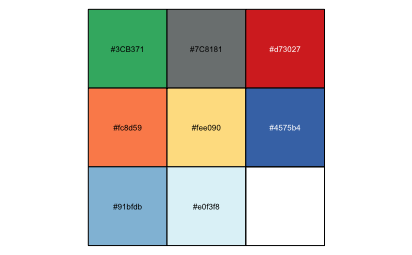

### Drug classes colors:


```r
ps_CARD %>% 
  generate_color_palette(var = "Drug_Class_multi", seed = 280386) -> drug_classe_multi
```

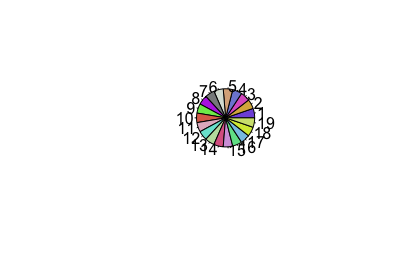


```r
ps_CARD %>% 
  generate_color_palette(var = "Model_type", pal = "jco") -> model_type
```

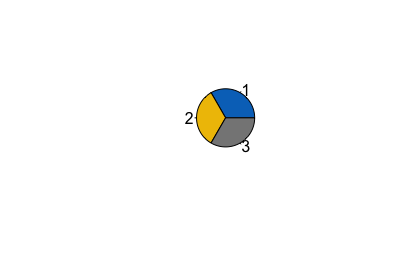


```r
ps_CARD %>% 
  generate_color_palette(var = "Resistance_Mechanism_multi",  pal = "npg") -> resistance_type
```

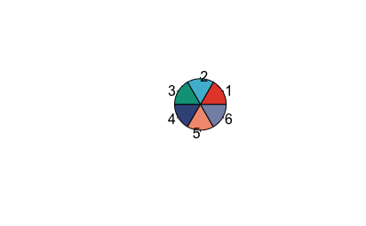


```r
ps_CARD %>% 
  generate_color_palette(var = "AMR_Gene.Family", seed = 72) -> AMR_gene_fam
```

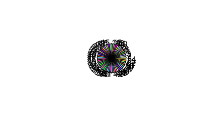

### Others:

<https://r-graphics.org/recipe-scatter-shapes>

```r
fermentaion_shape <- c(22, 21)
names(fermentaion_shape) <- sample_data(ps_CARD)$Fermentation %>%  levels()

model_shape <- c(22, 21)
names(model_shape) <- sample_data(ps_CARD)$Model %>%  levels()

antibio_shape <- c(22, 21)
names(antibio_shape) <- sample_data(ps_CARD)$Antibiotic %>%  levels()


conc_stroke <- c(1, 2, 3, 4, 5)
names(conc_stroke) <- sample_data(ps_CARD)$Antibiotic_mg.mL %>%  levels()
# scale_discrete_manual(
#   aesthetics = "stroke",
#   values = c(`A` = 2, `B` = 1, `C` = 2)
# )

theme_set(theme_classic() + theme(legend.position = 'bottom'))
```

<https://r4ds.had.co.nz/graphics-for-communication.html#figure-sizing>

<https://www.tidyverse.org/blog/2020/08/taking-control-of-plot-scaling/>


# Alpha-diversity:


```r
plot_alpha_div_NRP72 <- function(df, x = "Day_of_Treatment", y = "value",  point_size = 2.5, color = "Treatment", fill  = "Treatment", shape = "Antibiotic", alpha = "Antibiotic_mg.mL", facet_formula = paste0("alphadiversiy ~  Model "), ylab = "Resistome alpha-diversity", xlab = "Days (Treatment)", measures = c("Observed"), path_group = "interaction(Model, Fermentation, Reactor_Treatment)"){
  
  df %>% 
    pivot_longer(cols = all_of(measures), values_to = "value", names_to = 'alphadiversiy', values_drop_na  = TRUE) %>%
    mutate(alphadiversiy = fct_relevel(alphadiversiy, measures)) -> df_ready
  
  df_ready %>% 
    ggplot(aes_string(x = x, y = y, color = color, fill = fill, shape = shape, alpha = alpha)) + #shape = Fermentation
    geom_point(size = point_size) + 
    geom_line(linetype = 2,  size = 0.5,  aes_string(group = path_group)) +
    labs(y = ylab, x = xlab) +
    scale_color_manual(name = "", values = treat_col,
                       na.value = "black") +
    scale_fill_manual(name = "", values = treat_col,
                      na.value = "black") +
    facet_grid(as.formula(facet_formula), scales = "free", space = "fixed", drop = TRUE) +
    scale_shape_manual(name = "" ,values = antibio_shape, na.value =  17) +
    scale_alpha_discrete(name = "", range=c(0.6, 1), na.value =  0.6) + 
    geom_vline(xintercept = 0, size = 0.5, linetype = 1, color = "grey60") -> p_alpha_both
  
  return(p_alpha_both)
}
```


## AMR genes:

```r
ps_CARD %>% 
  physeq_simplify_tax(round_otu = TRUE, tax_sel = c("Best_Hit_ARO")) -> ps_AMRgn


ps_AMRgn %>% 
  subset_samples(Model == "Chicken") %>% 
  filter_taxa(function(x) sum(x > 0) > 0, TRUE) 
```

```
## phyloseq-class experiment-level object
## otu_table()   OTU Table:          [ 97 taxa and 43 samples ]:
## sample_data() Sample Data:        [ 43 samples by 38 sample variables ]:
## tax_table()   Taxonomy Table:     [ 97 taxa by 28 taxonomic ranks ]:
## taxa are rows
```

```r
ps_AMRgn %>% 
  phyloseq_alphas(phylo = FALSE) -> alpha_AMRgn

alpha_AMRgn %>% 
  group_by(Model, Fermentation, Antibiotic, Antibiotic_mg.mL, Treatment, Phase, Period) %>% 
  rstatix::get_summary_stats(Observed, type = "common") %>% 
  DT::datatable()
```

```{=html}
<div id="htmlwidget-061e20d09de3314812d7" style="width:100%;height:auto;" class="datatables html-widget"></div>
<script type="application/json" data-for="htmlwidget-061e20d09de3314812d7">{"x":{"filter":"none","vertical":false,"data":[["1","2","3","4","5","6","7","8","9","10","11","12","13","14","15","16","17","18","19","20","21","22","23","24","25","26","27","28","29","30","31","32","33","34","35","36","37","38","39","40","41","42","43","44","45","46","47","48","49","50","51","52","53","54"],["CTX+HV292.1","CTX+HV292.1","CTX+HV292.1","CTX+HV292.1","CTX","CTX","CTX","CTX","VAN+CCUG59168","VAN+CCUG59168","VAN+CCUG59168","VAN+CCUG59168","VAN","VAN","VAN","VAN","DONOR","UNTREATED","UNTREATED","UNTREATED","UNTREATED","HV292.1","HV292.1","HV292.1","HV292.1","CCUG59168","CCUG59168","CCUG59168","CCUG59168","UNTREATED","UNTREATED","CCUG59168","CCUG59168","VAN+CCUG59168","VAN+CCUG59168","VAN","VAN","VAN+CCUG59168","VAN+CCUG59168","VAN","VAN","DONOR","UNTREATED","UNTREATED","HV292.1","HV292.1","CTX+HV292.1","CTX+HV292.1","CTX","CTX","CTX+HV292.1","CTX+HV292.1","CTX","CTX"],["Stab","Treat","Treat","Treat","Stab","Treat","Treat","Treat","Stab","Treat","Treat","Treat","Stab","Treat","Treat","Treat","DONOR","Stab","Treat","Treat","Treat","Stab","Treat","Treat","Treat","Stab","Treat","Treat","Treat","Stab","Treat","Stab","Treat","Stab","Treat","Stab","Treat","Stab","Treat","Stab","Treat","DONOR","Stab","Treat","Stab","Treat","Stab","Treat","Stab","Treat","Stab","Treat","Stab","Treat"],["Chicken","Chicken","Chicken","Chicken","Chicken","Chicken","Chicken","Chicken","Chicken","Chicken","Chicken","Chicken","Chicken","Chicken","Chicken","Chicken","Chicken","Chicken","Chicken","Chicken","Chicken","Chicken","Chicken","Chicken","Chicken","Chicken","Chicken","Chicken","Chicken","Human","Human","Human","Human","Human","Human","Human","Human","Human","Human","Human","Human","Human","Human","Human","Human","Human","Human","Human","Human","Human","Human","Human","Human","Human"],["20","20","20","20","20","20","20","20","90","90","90","90","90","90","90","90","0","0","0","0","0","0","0","0","0","0","0","0","0","0","0","0","0","90","90","90","90","600","600","600","600","0","0","0","0","0","20","20","20","20","200","200","200","200"],["1","1","1","1","1","1","1","1","1","1","1","1","1","1","1","1","1","1","1","1","1","1","1","1","1","1","1","1","1","1","1","1","1","1","1","1","1","1","1","1","1","1","2","2","2","2","2","2","2","2","2","2","2","2"],["CTX","CTX","CTX","CTX","CTX","CTX","CTX","CTX","VAN","VAN","VAN","VAN","VAN","VAN","VAN","VAN",null,null,null,null,null,null,null,null,null,null,null,null,null,"VAN","VAN","VAN","VAN","VAN","VAN","VAN","VAN","VAN","VAN","VAN","VAN",null,"CTX","CTX","CTX","CTX","CTX","CTX","CTX","CTX","CTX","CTX","CTX","CTX"],[null,"t1","t4","t5",null,"t1","t4","t5",null,"t1","t4","t5",null,"t1","t4","t5","pret",null,"t1","t4","t5",null,"t1","t4","t5",null,"t1","t4","t5",null,"t1",null,"t1",null,"t1",null,"t1",null,"t1",null,"t1","pret",null,"t1",null,"t1",null,"t1",null,"t1",null,"t1",null,"t1"],["Observed","Observed","Observed","Observed","Observed","Observed","Observed","Observed","Observed","Observed","Observed","Observed","Observed","Observed","Observed","Observed","Observed","Observed","Observed","Observed","Observed","Observed","Observed","Observed","Observed","Observed","Observed","Observed","Observed","Observed","Observed","Observed","Observed","Observed","Observed","Observed","Observed","Observed","Observed","Observed","Observed","Observed","Observed","Observed","Observed","Observed","Observed","Observed","Observed","Observed","Observed","Observed","Observed","Observed"],[1,3,1,1,1,3,1,1,1,3,1,1,1,3,1,1,1,1,3,1,1,1,3,1,1,1,3,1,1,1,3,1,3,1,3,1,3,1,3,1,3,1,1,3,1,3,1,3,1,3,1,3,1,3],[64,20,62,71,57,13,15,52,68,68,70,69,60,53,61,69,16,61,68,67,68,64,63,62,63,61,67,70,71,18,17,18,18,62,60,63,11,49,58,19,25,19,47,42,18,19,62,19,32,21,66,19,62,20],[64,71,62,71,57,57,15,52,68,77,70,69,60,63,61,69,16,61,73,67,68,64,71,62,63,61,70,70,71,18,56,18,25,62,65,63,66,49,69,19,57,19,47,65,18,69,62,34,32,26,66,21,62,38],[64,21,62,71,57,14,15,52,68,71,70,69,60,61,61,69,16,61,70,67,68,64,64,62,63,61,68,70,71,18,18,18,18,62,63,63,58,49,58,19,49,19,47,64,18,28,62,20,32,24,66,21,62,24],[0,25.5,0,0,0,22,0,0,0,4.5,0,0,0,5,0,0,0,0,2.5,0,0,0,4,0,0,0,1.5,0,0,0,19.5,0,3.5,0,2.5,0,27.5,0,5.5,0,16,0,0,11.5,0,25,0,7.5,0,2.5,0,1,0,9],[64,37.333,62,71,57,28,15,52,68,72,70,69,60,59,61,69,16,61,70.333,67,68,64,66,62,63,61,68.333,70,71,18,30.333,18,20.333,62,62.667,63,45,49,61.667,19,43.667,19,47,57,18,38.667,62,24.333,32,23.667,66,20.333,62,27.333],[null,29.16,null,null,null,25.12,null,null,null,4.583,null,null,null,5.292,null,null,null,null,2.517,null,null,null,4.359,null,null,null,1.528,null,null,null,22.234,null,4.041,null,2.517,null,29.715,null,6.351,null,16.653,null,null,13,null,26.652,null,8.386,null,2.517,null,1.155,null,9.452],[null,16.836,null,null,null,14.503,null,null,null,2.646,null,null,null,3.055,null,null,null,null,1.453,null,null,null,2.517,null,null,null,0.882,null,null,null,12.837,null,2.333,null,1.453,null,17.156,null,3.667,null,9.615,null,null,7.506,null,15.388,null,4.842,null,1.453,null,0.667,null,5.457],[null,72.439,null,null,null,62.401,null,null,null,11.384,null,null,null,13.145,null,null,null,null,6.252,null,null,null,10.828,null,null,null,3.795,null,null,null,55.231,null,10.04,null,6.252,null,73.817,null,15.776,null,41.369,null,null,32.294,null,66.207,null,20.833,null,6.252,null,2.868,null,23.479]],"container":"<table class=\"display\">\n  <thead>\n    <tr>\n      <th> <\/th>\n      <th>Treatment<\/th>\n      <th>Phase<\/th>\n      <th>Model<\/th>\n      <th>Antibiotic_mg.mL<\/th>\n      <th>Fermentation<\/th>\n      <th>Antibiotic<\/th>\n      <th>Period<\/th>\n      <th>variable<\/th>\n      <th>n<\/th>\n      <th>min<\/th>\n      <th>max<\/th>\n      <th>median<\/th>\n      <th>iqr<\/th>\n      <th>mean<\/th>\n      <th>sd<\/th>\n      <th>se<\/th>\n      <th>ci<\/th>\n    <\/tr>\n  <\/thead>\n<\/table>","options":{"columnDefs":[{"className":"dt-right","targets":[9,10,11,12,13,14,15,16,17]},{"orderable":false,"targets":0}],"order":[],"autoWidth":false,"orderClasses":false}},"evals":[],"jsHooks":[]}</script>
```


```r
alpha_AMRgn %>% 
  plot_alpha_div_NRP72(measures ="Observed") -> p_a_AMRgn
```

```
## Warning: Using alpha for a discrete variable is not advised.
```

```r
p_a_AMRgn # + geom_smooth(alpha = 0.05, linetype=0)
```

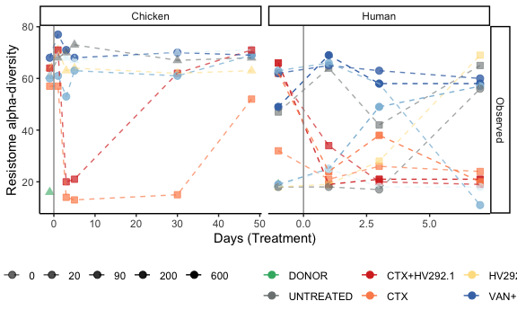

```r
if(export_ppt == TRUE)
{
  p_a_AMRgn %>% 
    export::graph2ppt(append = TRUE, width = export_ppt_width, height = export_ppt_height,
                      file = out_pptx)
}
```


```r
alpha_AMRgn %>% 
  filter(Model == "Chicken") %>% 
  plot_alpha_div_NRP72(measures ="Observed") -> p_a_AMRgn
```

```
## Warning: Using alpha for a discrete variable is not advised.
```

```r
p_a_AMRgn # + geom_smooth(alpha = 0.05, linetype=0)
```

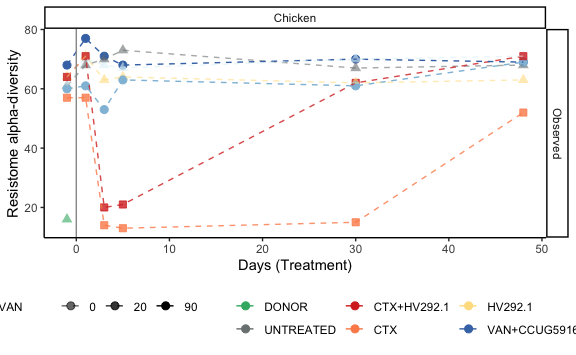

```r
if(export_ppt == TRUE)
{
  p_a_AMRgn %>% 
    export::graph2ppt(append = TRUE, width = export_ppt_width, height = export_ppt_height,
                      file = out_pptx)
}
```


```r
alpha_AMRgn %>% 
  filter(Model == "Human") %>% 
  plot_alpha_div_NRP72(measures ="Observed") -> p_a_AMRgn
```

```
## Warning: Using alpha for a discrete variable is not advised.
```

```r
p_a_AMRgn # + geom_smooth(alpha = 0.05, linetype=0)
```

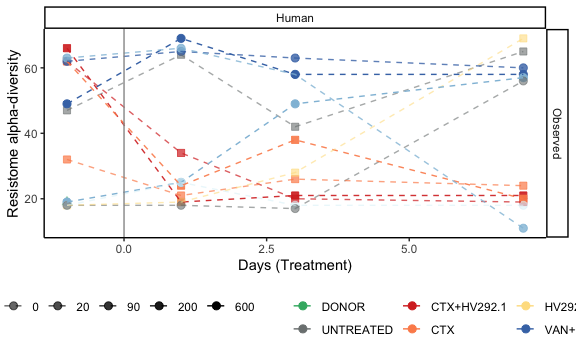

```r
if(export_ppt == TRUE)
{
  p_a_AMRgn %>% 
    export::graph2ppt(append = TRUE, width = export_ppt_width, height = export_ppt_height,
                      file = out_pptx)
}
```


## 16S:


```r
ps_CARD %>% 
  physeq_simplify_tax(round_otu = TRUE, tax_sel = c("Best_Hit_ARO")) -> ps_AMRgn

ps_AMRgn %>% 
  phyloseq_alphas(phylo = FALSE) -> alpha_AMRgn

alpha_AMRgn %>% 
  group_by(Model, Fermentation, Antibiotic, Antibiotic_mg.mL, Treatment, Phase, Period) %>% 
  rstatix::get_summary_stats(Observed, type = "common") %>% 
  DT::datatable()
```

```{=html}
<div id="htmlwidget-7c69c00d0e0be7f0a4ab" style="width:100%;height:auto;" class="datatables html-widget"></div>
<script type="application/json" data-for="htmlwidget-7c69c00d0e0be7f0a4ab">{"x":{"filter":"none","vertical":false,"data":[["1","2","3","4","5","6","7","8","9","10","11","12","13","14","15","16","17","18","19","20","21","22","23","24","25","26","27","28","29","30","31","32","33","34","35","36","37","38","39","40","41","42","43","44","45","46","47","48","49","50","51","52","53","54"],["CTX+HV292.1","CTX+HV292.1","CTX+HV292.1","CTX+HV292.1","CTX","CTX","CTX","CTX","VAN+CCUG59168","VAN+CCUG59168","VAN+CCUG59168","VAN+CCUG59168","VAN","VAN","VAN","VAN","DONOR","UNTREATED","UNTREATED","UNTREATED","UNTREATED","HV292.1","HV292.1","HV292.1","HV292.1","CCUG59168","CCUG59168","CCUG59168","CCUG59168","UNTREATED","UNTREATED","CCUG59168","CCUG59168","VAN+CCUG59168","VAN+CCUG59168","VAN","VAN","VAN+CCUG59168","VAN+CCUG59168","VAN","VAN","DONOR","UNTREATED","UNTREATED","HV292.1","HV292.1","CTX+HV292.1","CTX+HV292.1","CTX","CTX","CTX+HV292.1","CTX+HV292.1","CTX","CTX"],["Stab","Treat","Treat","Treat","Stab","Treat","Treat","Treat","Stab","Treat","Treat","Treat","Stab","Treat","Treat","Treat","DONOR","Stab","Treat","Treat","Treat","Stab","Treat","Treat","Treat","Stab","Treat","Treat","Treat","Stab","Treat","Stab","Treat","Stab","Treat","Stab","Treat","Stab","Treat","Stab","Treat","DONOR","Stab","Treat","Stab","Treat","Stab","Treat","Stab","Treat","Stab","Treat","Stab","Treat"],["Chicken","Chicken","Chicken","Chicken","Chicken","Chicken","Chicken","Chicken","Chicken","Chicken","Chicken","Chicken","Chicken","Chicken","Chicken","Chicken","Chicken","Chicken","Chicken","Chicken","Chicken","Chicken","Chicken","Chicken","Chicken","Chicken","Chicken","Chicken","Chicken","Human","Human","Human","Human","Human","Human","Human","Human","Human","Human","Human","Human","Human","Human","Human","Human","Human","Human","Human","Human","Human","Human","Human","Human","Human"],["20","20","20","20","20","20","20","20","90","90","90","90","90","90","90","90","0","0","0","0","0","0","0","0","0","0","0","0","0","0","0","0","0","90","90","90","90","600","600","600","600","0","0","0","0","0","20","20","20","20","200","200","200","200"],["1","1","1","1","1","1","1","1","1","1","1","1","1","1","1","1","1","1","1","1","1","1","1","1","1","1","1","1","1","1","1","1","1","1","1","1","1","1","1","1","1","1","2","2","2","2","2","2","2","2","2","2","2","2"],["CTX","CTX","CTX","CTX","CTX","CTX","CTX","CTX","VAN","VAN","VAN","VAN","VAN","VAN","VAN","VAN",null,null,null,null,null,null,null,null,null,null,null,null,null,"VAN","VAN","VAN","VAN","VAN","VAN","VAN","VAN","VAN","VAN","VAN","VAN",null,"CTX","CTX","CTX","CTX","CTX","CTX","CTX","CTX","CTX","CTX","CTX","CTX"],[null,"t1","t4","t5",null,"t1","t4","t5",null,"t1","t4","t5",null,"t1","t4","t5","pret",null,"t1","t4","t5",null,"t1","t4","t5",null,"t1","t4","t5",null,"t1",null,"t1",null,"t1",null,"t1",null,"t1",null,"t1","pret",null,"t1",null,"t1",null,"t1",null,"t1",null,"t1",null,"t1"],["Observed","Observed","Observed","Observed","Observed","Observed","Observed","Observed","Observed","Observed","Observed","Observed","Observed","Observed","Observed","Observed","Observed","Observed","Observed","Observed","Observed","Observed","Observed","Observed","Observed","Observed","Observed","Observed","Observed","Observed","Observed","Observed","Observed","Observed","Observed","Observed","Observed","Observed","Observed","Observed","Observed","Observed","Observed","Observed","Observed","Observed","Observed","Observed","Observed","Observed","Observed","Observed","Observed","Observed"],[1,3,1,1,1,3,1,1,1,3,1,1,1,3,1,1,1,1,3,1,1,1,3,1,1,1,3,1,1,1,3,1,3,1,3,1,3,1,3,1,3,1,1,3,1,3,1,3,1,3,1,3,1,3],[64,20,62,71,57,13,15,52,68,68,70,69,60,53,61,69,16,61,68,67,68,64,63,62,63,61,67,70,71,18,17,18,18,62,60,63,11,49,58,19,25,19,47,42,18,19,62,19,32,21,66,19,62,20],[64,71,62,71,57,57,15,52,68,77,70,69,60,63,61,69,16,61,73,67,68,64,71,62,63,61,70,70,71,18,56,18,25,62,65,63,66,49,69,19,57,19,47,65,18,69,62,34,32,26,66,21,62,38],[64,21,62,71,57,14,15,52,68,71,70,69,60,61,61,69,16,61,70,67,68,64,64,62,63,61,68,70,71,18,18,18,18,62,63,63,58,49,58,19,49,19,47,64,18,28,62,20,32,24,66,21,62,24],[0,25.5,0,0,0,22,0,0,0,4.5,0,0,0,5,0,0,0,0,2.5,0,0,0,4,0,0,0,1.5,0,0,0,19.5,0,3.5,0,2.5,0,27.5,0,5.5,0,16,0,0,11.5,0,25,0,7.5,0,2.5,0,1,0,9],[64,37.333,62,71,57,28,15,52,68,72,70,69,60,59,61,69,16,61,70.333,67,68,64,66,62,63,61,68.333,70,71,18,30.333,18,20.333,62,62.667,63,45,49,61.667,19,43.667,19,47,57,18,38.667,62,24.333,32,23.667,66,20.333,62,27.333],[null,29.16,null,null,null,25.12,null,null,null,4.583,null,null,null,5.292,null,null,null,null,2.517,null,null,null,4.359,null,null,null,1.528,null,null,null,22.234,null,4.041,null,2.517,null,29.715,null,6.351,null,16.653,null,null,13,null,26.652,null,8.386,null,2.517,null,1.155,null,9.452],[null,16.836,null,null,null,14.503,null,null,null,2.646,null,null,null,3.055,null,null,null,null,1.453,null,null,null,2.517,null,null,null,0.882,null,null,null,12.837,null,2.333,null,1.453,null,17.156,null,3.667,null,9.615,null,null,7.506,null,15.388,null,4.842,null,1.453,null,0.667,null,5.457],[null,72.439,null,null,null,62.401,null,null,null,11.384,null,null,null,13.145,null,null,null,null,6.252,null,null,null,10.828,null,null,null,3.795,null,null,null,55.231,null,10.04,null,6.252,null,73.817,null,15.776,null,41.369,null,null,32.294,null,66.207,null,20.833,null,6.252,null,2.868,null,23.479]],"container":"<table class=\"display\">\n  <thead>\n    <tr>\n      <th> <\/th>\n      <th>Treatment<\/th>\n      <th>Phase<\/th>\n      <th>Model<\/th>\n      <th>Antibiotic_mg.mL<\/th>\n      <th>Fermentation<\/th>\n      <th>Antibiotic<\/th>\n      <th>Period<\/th>\n      <th>variable<\/th>\n      <th>n<\/th>\n      <th>min<\/th>\n      <th>max<\/th>\n      <th>median<\/th>\n      <th>iqr<\/th>\n      <th>mean<\/th>\n      <th>sd<\/th>\n      <th>se<\/th>\n      <th>ci<\/th>\n    <\/tr>\n  <\/thead>\n<\/table>","options":{"columnDefs":[{"className":"dt-right","targets":[9,10,11,12,13,14,15,16,17]},{"orderable":false,"targets":0}],"order":[],"autoWidth":false,"orderClasses":false}},"evals":[],"jsHooks":[]}</script>
```


```r
ps_16S %>% 
  rarefy_even_depth(sample.size = 4576, rngseed = 123) -> ps_16S_rare

ps_16S_rare
```

```
## phyloseq-class experiment-level object
## otu_table()   OTU Table:          [ 732 taxa and 263 samples ]:
## sample_data() Sample Data:        [ 263 samples by 64 sample variables ]:
## tax_table()   Taxonomy Table:     [ 732 taxa by 7 taxonomic ranks ]:
## phy_tree()    Phylogenetic Tree:  [ 732 tips and 731 internal nodes ]:
## refseq()      DNAStringSet:       [ 732 reference sequences ]
## taxa are rows
```

```r
ps_16S_rare %>% 
  phyloseq_alphas(phylo = FALSE) -> alpha_16S

alpha_16S %>% 
  group_by(Model, Fermentation, Antibiotic, Antibiotic_mg.mL, Treatment, Phase, Period) %>% 
  rstatix::get_summary_stats(Observed, type = "common") %>% 
  DT::datatable()
```

```
## Warning in stats::qt(alpha/2, .data$n - 1): NaNs produced

## Warning in stats::qt(alpha/2, .data$n - 1): NaNs produced

## Warning in stats::qt(alpha/2, .data$n - 1): NaNs produced

## Warning in stats::qt(alpha/2, .data$n - 1): NaNs produced

## Warning in stats::qt(alpha/2, .data$n - 1): NaNs produced

## Warning in stats::qt(alpha/2, .data$n - 1): NaNs produced

## Warning in stats::qt(alpha/2, .data$n - 1): NaNs produced

## Warning in stats::qt(alpha/2, .data$n - 1): NaNs produced

## Warning in stats::qt(alpha/2, .data$n - 1): NaNs produced

## Warning in stats::qt(alpha/2, .data$n - 1): NaNs produced

## Warning in stats::qt(alpha/2, .data$n - 1): NaNs produced

## Warning in stats::qt(alpha/2, .data$n - 1): NaNs produced

## Warning in stats::qt(alpha/2, .data$n - 1): NaNs produced

## Warning in stats::qt(alpha/2, .data$n - 1): NaNs produced

## Warning in stats::qt(alpha/2, .data$n - 1): NaNs produced

## Warning in stats::qt(alpha/2, .data$n - 1): NaNs produced

## Warning in stats::qt(alpha/2, .data$n - 1): NaNs produced

## Warning in stats::qt(alpha/2, .data$n - 1): NaNs produced

## Warning in stats::qt(alpha/2, .data$n - 1): NaNs produced

## Warning in stats::qt(alpha/2, .data$n - 1): NaNs produced

## Warning in stats::qt(alpha/2, .data$n - 1): NaNs produced

## Warning in stats::qt(alpha/2, .data$n - 1): NaNs produced

## Warning in stats::qt(alpha/2, .data$n - 1): NaNs produced

## Warning in stats::qt(alpha/2, .data$n - 1): NaNs produced

## Warning in stats::qt(alpha/2, .data$n - 1): NaNs produced

## Warning in stats::qt(alpha/2, .data$n - 1): NaNs produced

## Warning in stats::qt(alpha/2, .data$n - 1): NaNs produced

## Warning in stats::qt(alpha/2, .data$n - 1): NaNs produced

## Warning in stats::qt(alpha/2, .data$n - 1): NaNs produced

## Warning in stats::qt(alpha/2, .data$n - 1): NaNs produced

## Warning in stats::qt(alpha/2, .data$n - 1): NaNs produced

## Warning in stats::qt(alpha/2, .data$n - 1): NaNs produced

## Warning in stats::qt(alpha/2, .data$n - 1): NaNs produced
```

```{=html}
<div id="htmlwidget-cee62044742116279914" style="width:100%;height:auto;" class="datatables html-widget"></div>
<script type="application/json" data-for="htmlwidget-cee62044742116279914">{"x":{"filter":"none","vertical":false,"data":[["1","2","3","4","5","6","7","8","9","10","11","12","13","14","15","16","17","18","19","20","21","22","23","24","25","26","27","28","29","30","31","32","33","34","35","36","37","38","39","40","41","42","43","44","45","46","47","48","49","50","51","52","53","54","55","56","57","58","59","60","61","62","63","64","65","66","67","68","69","70","71","72","73","74","75","76","77","78","79","80","81","82","83","84","85","86","87","88","89","90","91","92","93","94"],["CTX+HV292.1","CTX+HV292.1","CTX+HV292.1","CTX+HV292.1","CTX+HV292.1","CTX+HV292.1","CTX","CTX","CTX","CTX","CTX","CTX","CTX","VAN+CCUG59168","VAN+CCUG59168","VAN+CCUG59168","VAN+CCUG59168","VAN+CCUG59168","VAN+CCUG59168","VAN","VAN","VAN","VAN","VAN","VAN","VAN","DONOR","UNTREATED","UNTREATED","UNTREATED","UNTREATED","UNTREATED","UNTREATED","UNTREATED","HV292.1","HV292.1","HV292.1","HV292.1","HV292.1","HV292.1","HV292.1","CCUG59168","CCUG59168","CCUG59168","CCUG59168","CCUG59168","CCUG59168","CCUG59168","UNTREATED","UNTREATED","VAN+CCUG59168","VAN+CCUG59168","VAN+CCUG59168","VAN","VAN","VAN","VAN+CCUG59168","VAN+CCUG59168","VAN+CCUG59168","VAN","VAN","UNTREATED","UNTREATED","UNTREATED","CCUG59168","CCUG59168","CCUG59168","DONOR","UNTREATED","UNTREATED","CTX+HV292.1","CTX+HV292.1","CTX+HV292.1","CTX+HV292.1","CTX","CTX","CTX","CTX+HV292.1","CTX+HV292.1","CTX+HV292.1","CTX","CTX","CTX","UNTREATED","UNTREATED","UNTREATED","UNTREATED","HV292.1","HV292.1","HV292.1","UNTREATED","UNTREATED","UNTREATED","UNTREATED"],["Stab","Treat","Treat","Treat","Treat","Treat","Stab","Stab","Treat","Treat","Treat","Treat","Treat","Stab","Treat","Treat","Treat","Treat","Treat","Stab","Stab","Treat","Treat","Treat","Treat","Treat","DONOR","Stab","Stab","Treat","Treat","Treat","Treat","Treat","Stab","Stab","Treat","Treat","Treat","Treat","Treat","Stab","Stab","Treat","Treat","Treat","Treat","Treat","Stab","Treat","Stab","Stab","Treat","Stab","Stab","Treat","Stab","Stab","Treat","Stab","Treat","Stab","Stab","Treat","Stab","Stab","Treat","DONOR","Stab","Stab","Stab","Stab","Stab","Treat","Stab","Stab","Treat","Stab","Stab","Treat","Stab","Stab","Treat","Stab","Stab","Stab","Treat","Stab","Stab","Treat","Stab","Stab","Stab","Treat"],["Chicken","Chicken","Chicken","Chicken","Chicken","Chicken","Chicken","Chicken","Chicken","Chicken","Chicken","Chicken","Chicken","Chicken","Chicken","Chicken","Chicken","Chicken","Chicken","Chicken","Chicken","Chicken","Chicken","Chicken","Chicken","Chicken","Chicken","Chicken","Chicken","Chicken","Chicken","Chicken","Chicken","Chicken","Chicken","Chicken","Chicken","Chicken","Chicken","Chicken","Chicken","Chicken","Chicken","Chicken","Chicken","Chicken","Chicken","Chicken","Human","Human","Human","Human","Human","Human","Human","Human","Human","Human","Human","Human","Human","Human","Human","Human","Human","Human","Human","Human","Human","Human","Human","Human","Human","Human","Human","Human","Human","Human","Human","Human","Human","Human","Human","Human","Human","Human","Human","Human","Human","Human","Human","Human","Human","Human"],["20","20","20","20","20","20","20","20","20","20","20","20","20","90","90","90","90","90","90","90","90","90","90","90","90","90",null,null,null,null,null,null,null,null,null,null,null,null,null,null,null,null,null,null,null,null,null,null,null,null,"90","90","90","90","90","90","600","600","600","600","600",null,null,null,null,null,null,null,null,null,"20","20","20","20","20","20","20","200","200","200","200","200","200",null,null,null,null,null,null,null,null,null,null,null],["1","1","1","1","1","1","1","1","1","1","1","1","1","1","1","1","1","1","1","1","1","1","1","1","1","1","1","1","1","1","1","1","1","1","1","1","1","1","1","1","1","1","1","1","1","1","1","1","1","1","1","1","1","1","1","1","1","1","1","1","1","1","1","1","1","1","1","1","1","1","2","2","2","2","2","2","2","2","2","2","2","2","2","2","2","2","2","2","2","2","2","2","2","2"],["CTX","CTX","CTX","CTX","CTX","CTX","CTX","CTX","CTX","CTX","CTX","CTX","CTX","VAN","VAN","VAN","VAN","VAN","VAN","VAN","VAN","VAN","VAN","VAN","VAN","VAN",null,null,null,null,null,null,null,null,null,null,null,null,null,null,null,null,null,null,null,null,null,null,"CTX","CTX","VAN","VAN","VAN","VAN","VAN","VAN","VAN","VAN","VAN","VAN","VAN","VAN","VAN","VAN","VAN","VAN","VAN",null,null,null,"CTX","CTX","CTX","CTX","CTX","CTX","CTX","CTX","CTX","CTX","CTX","CTX","CTX","CTX","CTX","CTX","CTX","CTX","CTX","CTX",null,null,null,null],["pret","t1","t2","t3","t4","t5","pret",null,"t1","t2","t3","t4","t5","pret","t1","t2","t3","t4","t5","pret",null,"t1","t2","t3","t4","t5","pret","pret",null,"t1","t2","t3","t4","t5","pret",null,"t1","t2","t3","t4","t5","pret",null,"t1","t2","t3","t4","t5","t1","t1","pret",null,"t1","pret",null,"t1","pret",null,"t1","pret","t1","pret",null,"t1","pret",null,"t1","pret","pret",null,"pret","t1",null,"t1","pret",null,"t1","pret",null,"t1","t1",null,"t1","pret","t1",null,"t1","pret","t1","t1","pret","t1",null,"t1"],["Observed","Observed","Observed","Observed","Observed","Observed","Observed","Observed","Observed","Observed","Observed","Observed","Observed","Observed","Observed","Observed","Observed","Observed","Observed","Observed","Observed","Observed","Observed","Observed","Observed","Observed","Observed","Observed","Observed","Observed","Observed","Observed","Observed","Observed","Observed","Observed","Observed","Observed","Observed","Observed","Observed","Observed","Observed","Observed","Observed","Observed","Observed","Observed","Observed","Observed","Observed","Observed","Observed","Observed","Observed","Observed","Observed","Observed","Observed","Observed","Observed","Observed","Observed","Observed","Observed","Observed","Observed","Observed","Observed","Observed","Observed","Observed","Observed","Observed","Observed","Observed","Observed","Observed","Observed","Observed","Observed","Observed","Observed","Observed","Observed","Observed","Observed","Observed","Observed","Observed","Observed","Observed","Observed","Observed"],[2,7,5,2,2,2,2,1,8,2,2,2,2,2,8,3,2,3,4,2,1,7,3,2,2,2,1,4,2,13,5,2,2,2,1,1,8,2,2,2,2,1,1,8,3,2,2,2,1,5,2,1,6,1,1,6,2,1,6,1,7,1,1,7,1,1,7,1,2,1,1,1,1,3,2,1,7,2,1,6,1,1,5,1,1,1,5,2,1,2,1,1,1,5],[118,83,100,107,107,111,109,113,68,94,71,69,85,127,20,18,16,15,20,115,118,18,20,19,19,17,169,93,75,26,97,104,94,99,111,113,107,117,104,116,112,124,121,92,105,101,102,115,107,101,110,106,37,115,106,37,103,111,29,113,24,102,99,100,105,101,104,145,103,105,115,120,117,109,112,122,55,109,113,91,102,116,73,118,114,113,108,103,112,110,104,105,100,101],[118,124,133,116,122,120,110,113,121,97,76,71,97,131,127,22,19,25,29,117,118,117,28,20,19,18,169,119,89,115,112,110,125,127,111,113,129,129,114,127,114,124,121,135,113,106,120,120,107,112,113,106,110,115,106,83,109,111,108,113,103,102,99,108,105,101,111,145,108,105,115,120,117,112,117,122,108,112,113,99,102,116,94,118,114,113,117,105,112,116,104,105,100,105],[118,99,113,111.5,114.5,115.5,109.5,113,76,95.5,73.5,70,91,129,38,19,17.5,21,21,116,118,24,22,19.5,19,17.5,169,100.5,82,94,105,107,109.5,113,111,113,120.5,123,109,121.5,113,124,121,119,108,103.5,111,117.5,107,104,111.5,106,45.5,115,106,47.5,106,111,40.5,113,47,102,99,104,105,101,106,145,105.5,105,115,120,117,110,114.5,122,102,110.5,113,96,102,116,93,118,114,113,115,104,112,113,104,105,100,103],[0,13.5,6,4.5,7.5,4.5,0.5,0,34,1.5,2.5,1,6,2,79.75,2,1.5,5,2.25,1,0,46.5,4,0.5,0,0.5,0,14.75,7,36,9,3,15.5,14,0,0,11.75,6,5,5.5,1,0,0,7.5,4,2.5,9,2.5,0,2,1.5,0,29.75,0,0,13.75,3,0,31,0,26,0,0,3,0,0,0.5,0,2.5,0,0,0,0,1.5,2.5,0,17,1.5,0,4.25,0,0,5,0,0,0,7,1,0,3,0,0,0,1],[118,98.714,114.8,111.5,114.5,115.5,109.5,113,88.625,95.5,73.5,70,91,129,60.25,19.667,17.5,20.333,22.75,116,118,47.714,23.333,19.5,19,17.5,169,103.25,82,82.154,103.4,107,109.5,113,111,113,119.75,123,109,121.5,113,124,121,118.875,108.667,103.5,111,117.5,107,104.6,111.5,106,59.667,115,106,53.5,106,111,53.167,113,56,102,99,103.429,105,101,106.571,145,105.5,105,115,120,117,110.333,114.5,122,92.143,110.5,113,95.167,102,116,88.2,118,114,113,113,104,112,113,104,105,100,103.2],[0,13.512,11.967,6.364,10.607,6.364,0.707,null,22.386,2.121,3.536,1.414,8.485,2.828,47.409,2.082,2.121,5.033,4.193,1.414,null,42.941,4.163,0.707,0,0.707,null,11.955,9.899,26.448,6.427,4.243,21.92,19.799,null,null,8.207,8.485,7.071,7.778,1.414,null,null,13.131,4.041,3.536,12.728,3.536,null,4.336,2.121,null,28.925,null,null,16.598,4.243,null,30.643,null,28.284,null,null,2.699,null,null,2.149,null,3.536,null,null,null,null,1.528,3.536,null,19.282,2.121,null,3.125,null,null,8.815,null,null,null,4.183,1.414,null,4.243,null,null,null,1.483],[0,5.107,5.352,4.5,7.5,4.5,0.5,null,7.915,1.5,2.5,1,6,2,16.762,1.202,1.5,2.906,2.097,1,null,16.23,2.404,0.5,0,0.5,null,5.977,7,7.335,2.874,3,15.5,14,null,null,2.902,6,5,5.5,1,null,null,4.642,2.333,2.5,9,2.5,null,1.939,1.5,null,11.809,null,null,6.776,3,null,12.51,null,10.69,null,null,1.02,null,null,0.812,null,2.5,null,null,null,null,0.882,2.5,null,7.288,1.5,null,1.276,null,null,3.942,null,null,null,1.871,1,null,3,null,null,null,0.663],[0,12.496,14.859,57.178,95.297,57.178,6.353,null,18.715,19.059,31.766,12.706,76.237,25.412,39.635,5.171,19.059,12.503,6.672,12.706,null,39.714,10.342,6.353,0,6.353,null,19.023,88.943,15.982,7.98,38.119,196.946,177.887,null,null,6.861,76.237,63.531,69.884,12.706,null,null,10.977,10.04,31.766,114.356,31.766,null,5.384,19.059,null,30.355,null,null,17.419,38.119,null,32.157,null,26.159,null,null,2.496,null,null,1.988,null,31.766,null,null,null,null,3.795,31.766,null,17.833,19.059,null,3.28,null,null,10.945,null,null,null,5.194,12.706,null,38.119,null,null,null,1.842]],"container":"<table class=\"display\">\n  <thead>\n    <tr>\n      <th> <\/th>\n      <th>Treatment<\/th>\n      <th>Phase<\/th>\n      <th>Model<\/th>\n      <th>Antibiotic_mg.mL<\/th>\n      <th>Fermentation<\/th>\n      <th>Antibiotic<\/th>\n      <th>Period<\/th>\n      <th>variable<\/th>\n      <th>n<\/th>\n      <th>min<\/th>\n      <th>max<\/th>\n      <th>median<\/th>\n      <th>iqr<\/th>\n      <th>mean<\/th>\n      <th>sd<\/th>\n      <th>se<\/th>\n      <th>ci<\/th>\n    <\/tr>\n  <\/thead>\n<\/table>","options":{"columnDefs":[{"className":"dt-right","targets":[9,10,11,12,13,14,15,16,17]},{"orderable":false,"targets":0}],"order":[],"autoWidth":false,"orderClasses":false}},"evals":[],"jsHooks":[]}</script>
```


```r
alpha_16S %>% 
  plot_alpha_div_NRP72(path_group = "interaction(Fermentation, Reactor_Treatment)", ylab = "Bacterial community alpha-diversity", measures ="Observed") -> p_a_16S
```

```
## Warning: Using alpha for a discrete variable is not advised.
```

```r
p_a_16S
```

```
## Warning: Removed 2 rows containing missing values (geom_point).
```

```
## Warning: Removed 2 row(s) containing missing values (geom_path).
```

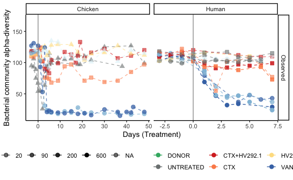

```r
if(export_ppt == TRUE)
{
  p_a_16S %>% 
    export::graph2ppt(append = TRUE, width = export_ppt_width, height = export_ppt_height,
                      file = out_pptx)
}
```

```
## Warning: Removed 2 rows containing missing values (geom_point).

## Warning: Removed 2 row(s) containing missing values (geom_path).
```


```r
p_a_16S + facet_null() + facet_grid(Model ~ alphadiversiy, scales = "free", space = "fixed", drop = TRUE) +
  geom_smooth(alpha = 0.05, linetype=0, level = 0.90) -> p_tmp


p_tmp
```

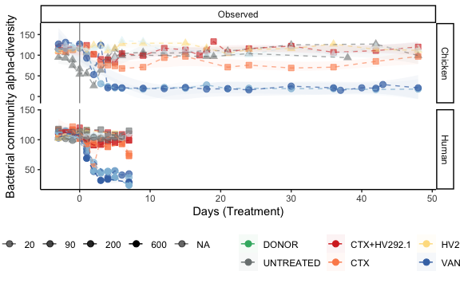

```r
if(export_ppt == TRUE)
{
  p_tmp %>% 
    export::graph2ppt(append = TRUE, width = export_ppt_width, height = export_ppt_height,
                      file = out_pptx)
}
```


```r
alpha_16S %>% 
  filter(Model == "Chicken") %>% 
  plot_alpha_div_NRP72(path_group = "interaction(Fermentation, Reactor_Treatment)", ylab = "Bacterial community alpha-diversity", measures ="Observed") + geom_smooth(alpha = 0.05, linetype=0, level = 0.90) -> p_tmp
```

```
## Warning: Using alpha for a discrete variable is not advised.
```

```r
p_tmp
```

```
## Warning: Removed 1 rows containing non-finite values (stat_smooth).
```

```
## Warning: Removed 1 rows containing missing values (geom_point).
```

```
## Warning: Removed 1 row(s) containing missing values (geom_path).
```

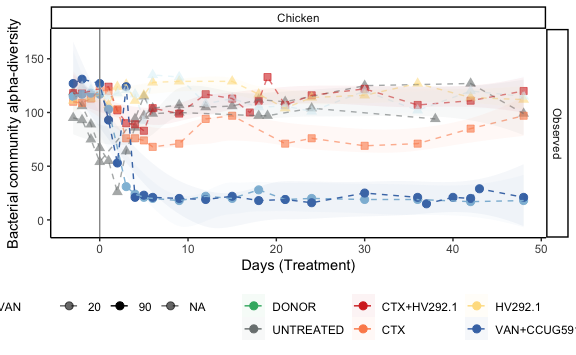

```r
if(export_ppt == TRUE)
{
  p_tmp %>% 
    export::graph2ppt(append = TRUE, width = export_ppt_width, height = export_ppt_height,
                      file = out_pptx)
}
```

```
## Warning: Removed 1 rows containing non-finite values (stat_smooth).
```

```
## Warning: Removed 1 rows containing missing values (geom_point).
```

```
## Warning: Removed 1 row(s) containing missing values (geom_path).
```


```r
alpha_16S %>% 
  filter(Model == "Human") %>% 
  plot_alpha_div_NRP72(path_group = "interaction(Fermentation, Reactor_Treatment)", ylab = "Bacterial community alpha-diversity", measures ="Observed") + geom_smooth(alpha = 0.05, linetype=0, level = 0.90) -> p_tmp
```

```
## Warning: Using alpha for a discrete variable is not advised.
```

```r
p_tmp
```

```
## Warning: Removed 1 rows containing non-finite values (stat_smooth).
```

```
## Warning in simpleLoess(y, x, w, span, degree = degree, parametric =
## parametric, : span too small. fewer data values than degrees of freedom.
```

```
## Warning in simpleLoess(y, x, w, span, degree = degree, parametric =
## parametric, : pseudoinverse used at -3.04
```

```
## Warning in simpleLoess(y, x, w, span, degree = degree, parametric =
## parametric, : neighborhood radius 3.04
```

```
## Warning in simpleLoess(y, x, w, span, degree = degree, parametric =
## parametric, : reciprocal condition number 0
```

```
## Warning in simpleLoess(y, x, w, span, degree = degree, parametric =
## parametric, : There are other near singularities as well. 25.402
```

```
## Warning in simpleLoess(y, x, w, span, degree = degree, parametric =
## parametric, : Chernobyl! trL>n 5

## Warning in simpleLoess(y, x, w, span, degree = degree, parametric =
## parametric, : Chernobyl! trL>n 5
```

```
## Warning in sqrt(sum.squares/one.delta): NaNs produced
```

```
## Warning in predLoess(object$y, object$x, newx = if
## (is.null(newdata)) object$x else if (is.data.frame(newdata))
## as.matrix(model.frame(delete.response(terms(object)), : span too small. fewer
## data values than degrees of freedom.
```

```
## Warning in predLoess(object$y, object$x, newx = if
## (is.null(newdata)) object$x else if (is.data.frame(newdata))
## as.matrix(model.frame(delete.response(terms(object)), : pseudoinverse used at
## -3.04
```

```
## Warning in predLoess(object$y, object$x, newx = if
## (is.null(newdata)) object$x else if (is.data.frame(newdata))
## as.matrix(model.frame(delete.response(terms(object)), : neighborhood radius 3.04
```

```
## Warning in predLoess(object$y, object$x, newx = if
## (is.null(newdata)) object$x else if (is.data.frame(newdata))
## as.matrix(model.frame(delete.response(terms(object)), : reciprocal condition
## number 0
```

```
## Warning in predLoess(object$y, object$x, newx = if
## (is.null(newdata)) object$x else if (is.data.frame(newdata))
## as.matrix(model.frame(delete.response(terms(object)), : There are other near
## singularities as well. 25.402
```

```
## Warning in stats::qt(level/2 + 0.5, pred$df): NaNs produced
```

```
## Warning: Removed 1 rows containing missing values (geom_point).
```

```
## Warning: Removed 1 row(s) containing missing values (geom_path).
```

```
## Warning in max(ids, na.rm = TRUE): no non-missing arguments to max; returning
## -Inf
```

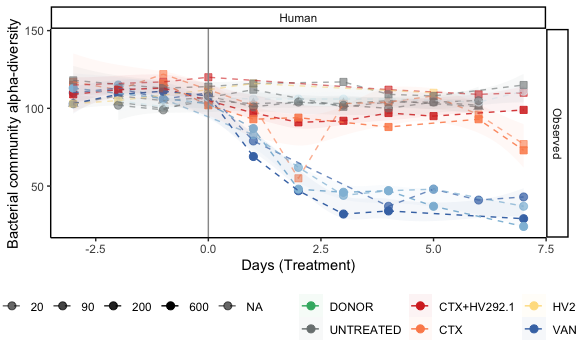

```r
if(export_ppt == TRUE)
{
  p_tmp %>% 
    export::graph2ppt(append = TRUE, width = export_ppt_width, height = export_ppt_height,
                      file = out_pptx)
}
```

```
## Warning: Removed 1 rows containing non-finite values (stat_smooth).
```

```
## Warning in simpleLoess(y, x, w, span, degree = degree, parametric =
## parametric, : span too small. fewer data values than degrees of freedom.
```

```
## Warning in simpleLoess(y, x, w, span, degree = degree, parametric =
## parametric, : pseudoinverse used at -3.04
```

```
## Warning in simpleLoess(y, x, w, span, degree = degree, parametric =
## parametric, : neighborhood radius 3.04
```

```
## Warning in simpleLoess(y, x, w, span, degree = degree, parametric =
## parametric, : reciprocal condition number 0
```

```
## Warning in simpleLoess(y, x, w, span, degree = degree, parametric =
## parametric, : There are other near singularities as well. 25.402
```

```
## Warning in simpleLoess(y, x, w, span, degree = degree, parametric =
## parametric, : Chernobyl! trL>n 5

## Warning in simpleLoess(y, x, w, span, degree = degree, parametric =
## parametric, : Chernobyl! trL>n 5
```

```
## Warning in sqrt(sum.squares/one.delta): NaNs produced
```

```
## Warning in predLoess(object$y, object$x, newx = if
## (is.null(newdata)) object$x else if (is.data.frame(newdata))
## as.matrix(model.frame(delete.response(terms(object)), : span too small. fewer
## data values than degrees of freedom.
```

```
## Warning in predLoess(object$y, object$x, newx = if
## (is.null(newdata)) object$x else if (is.data.frame(newdata))
## as.matrix(model.frame(delete.response(terms(object)), : pseudoinverse used at
## -3.04
```

```
## Warning in predLoess(object$y, object$x, newx = if
## (is.null(newdata)) object$x else if (is.data.frame(newdata))
## as.matrix(model.frame(delete.response(terms(object)), : neighborhood radius 3.04
```

```
## Warning in predLoess(object$y, object$x, newx = if
## (is.null(newdata)) object$x else if (is.data.frame(newdata))
## as.matrix(model.frame(delete.response(terms(object)), : reciprocal condition
## number 0
```

```
## Warning in predLoess(object$y, object$x, newx = if
## (is.null(newdata)) object$x else if (is.data.frame(newdata))
## as.matrix(model.frame(delete.response(terms(object)), : There are other near
## singularities as well. 25.402
```

```
## Warning in stats::qt(level/2 + 0.5, pred$df): NaNs produced
```

```
## Warning: Removed 1 rows containing missing values (geom_point).
```

```
## Warning: Removed 1 row(s) containing missing values (geom_path).
```

```
## Warning in max(ids, na.rm = TRUE): no non-missing arguments to max; returning
## -Inf
```


```r
# p_a_16S$chick + facet_null() + facet_wrap(Model ~ .,scales = "free", ncol = 1, nrow = 2) + geom_point() +
#   # geom_smooth(alpha = 0.05, linetype=0, level = 0.90) + 
#   geom_boxplot(aes(group = interaction(Period, Treatment),
#                    color = Treatment,
#                    fill = Treatment,
#                    outlier.shape = NA, outlier.colour = NA),
#                # position = position_dodge2(width = .75),
#                position = position_dodge2(preserve = "total"),
#                alpha = 0.8) -> p_combine
# 
# p_combine + scale_color_manual(name = "", values = treat_col,
#                                na.value = "transparent") +
#   scale_fill_manual(name = "", values = treat_col,
#                     na.value = "transparent")
# 
# p_combine$layers[[1]] <- NULL
# p_combine$layers[[3]] <- NULL
# 
# 
# p_combine
```


```r
p_a_16S$data %>% 
  filter(Model == "Chicken") %>% 
ggpubr::ggboxplot(., x = "Period", y = "value", color = "Treatment", fill = "Treatment",  add = "jitter", alpha = 0.6)  + 
  scale_color_manual(name = "", values = treat_col,
                     na.value = "transparent") +
  scale_fill_manual(name = "", values = treat_col,
                    na.value = "transparent") +
  ylab("Bacterial community alpha-diversity") -> p_tmp

p_tmp
```

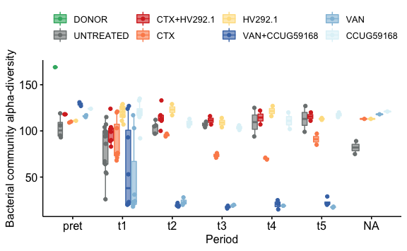

```r
if(export_ppt == TRUE)
{
  p_tmp %>% 
    export::graph2ppt(append = TRUE, width = export_ppt_width, height = export_ppt_height,
                      file = out_pptx)
}
```

```
## Exported graph as /Users/fconstan/Documents/GitHub/NRP72-FBT/output/plots.pptx
```


```r
sessionInfo()
```

```
## R version 4.1.2 (2021-11-01)
## Platform: x86_64-apple-darwin17.0 (64-bit)
## Running under: macOS Mojave 10.14.6
## 
## Matrix products: default
## BLAS:   /Library/Frameworks/R.framework/Versions/4.1/Resources/lib/libRblas.0.dylib
## LAPACK: /Library/Frameworks/R.framework/Versions/4.1/Resources/lib/libRlapack.dylib
## 
## locale:
## [1] en_US.UTF-8/en_US.UTF-8/en_US.UTF-8/C/en_US.UTF-8/en_US.UTF-8
## 
## attached base packages:
## [1] stats     graphics  grDevices utils     datasets  methods   base     
## 
## other attached packages:
##  [1] gdtools_0.2.3        microbiome_1.14.0    metagMisc_0.0.4     
##  [4] reshape2_1.4.4       scales_1.1.1         randomcoloR_1.1.0.1 
##  [7] here_1.0.1           ggrepel_0.9.1        speedyseq_0.5.3.9018
## [10] phyloseq_1.36.0      forcats_0.5.1        stringr_1.4.0       
## [13] dplyr_1.0.7          purrr_0.3.4          readr_2.1.0         
## [16] tidyr_1.1.4          tibble_3.1.6         ggplot2_3.3.5       
## [19] tidyverse_1.3.1.9000
## 
## loaded via a namespace (and not attached):
##   [1] readxl_1.3.1           uuid_1.0-3             backports_1.4.1       
##   [4] systemfonts_1.0.2      plyr_1.8.6             igraph_1.2.10         
##   [7] splines_4.1.2          crosstalk_1.2.0        GenomeInfoDb_1.28.4   
##  [10] digest_0.6.29          foreach_1.5.1          htmltools_0.5.2       
##  [13] fansi_0.5.0            magrittr_2.0.1         cluster_2.1.2         
##  [16] tzdb_0.2.0             openxlsx_4.2.4         Biostrings_2.60.2     
##  [19] modelr_0.1.8           officer_0.4.0          colorspace_2.0-2      
##  [22] rvest_1.0.2            haven_2.4.3            xfun_0.28             
##  [25] crayon_1.4.2           RCurl_1.98-1.5         jsonlite_1.7.2        
##  [28] survival_3.2-13        iterators_1.0.13       ape_5.6               
##  [31] glue_1.6.0             rvg_0.2.5              gtable_0.3.0          
##  [34] zlibbioc_1.38.0        XVector_0.32.0         V8_3.6.0              
##  [37] car_3.0-11             Rhdf5lib_1.14.2        BiocGenerics_0.38.0   
##  [40] abind_1.4-5            DBI_1.1.1              rstatix_0.7.0         
##  [43] Rcpp_1.0.7             xtable_1.8-4           foreign_0.8-81        
##  [46] stats4_4.1.2           DT_0.20                htmlwidgets_1.5.4     
##  [49] httr_1.4.2             ellipsis_0.3.2         pkgconfig_2.0.3       
##  [52] farver_2.1.0           sass_0.4.0             dbplyr_2.1.1          
##  [55] utf8_1.2.2             tidyselect_1.1.1       labeling_0.4.2        
##  [58] rlang_0.4.12           munsell_0.5.0          cellranger_1.1.0      
##  [61] tools_4.1.2            cli_3.1.0              generics_0.1.1        
##  [64] devEMF_4.0-2           ade4_1.7-18            export_0.3.0          
##  [67] broom_0.7.11           evaluate_0.14          biomformat_1.20.0     
##  [70] fastmap_1.1.0          yaml_2.2.1             knitr_1.36            
##  [73] fs_1.5.2               zip_2.2.0              rgl_0.107.14          
##  [76] nlme_3.1-153           xml2_1.3.2             compiler_4.1.2        
##  [79] rstudioapi_0.13        curl_4.3.2             ggsignif_0.6.3        
##  [82] reprex_2.0.1           bslib_0.3.1            stringi_1.7.6         
##  [85] highr_0.9              stargazer_5.2.2        lattice_0.20-45       
##  [88] Matrix_1.3-4           vegan_2.5-7            ggsci_2.9             
##  [91] permute_0.9-5          multtest_2.48.0        vctrs_0.3.8           
##  [94] pillar_1.6.4           lifecycle_1.0.1        rhdf5filters_1.4.0    
##  [97] jquerylib_0.1.4        data.table_1.14.2      bitops_1.0-7          
## [100] flextable_0.6.9        R6_2.5.1               rio_0.5.27            
## [103] IRanges_2.26.0         codetools_0.2-18       MASS_7.3-54           
## [106] assertthat_0.2.1       rhdf5_2.36.0           rprojroot_2.0.2       
## [109] withr_2.4.3            S4Vectors_0.30.2       GenomeInfoDbData_1.2.6
## [112] mgcv_1.8-38            parallel_4.1.2         hms_1.1.1             
## [115] grid_4.1.2             rmarkdown_2.11         carData_3.0-4         
## [118] Rtsne_0.15             ggpubr_0.4.0           Biobase_2.52.0        
## [121] lubridate_1.8.0        base64enc_0.1-3
```

