# Load required packages


```r
library(tidyverse)
# library(phyloseq)
library(speedyseq)
library(ggrepel)
library(here)
# library(microViz)
# library(RColorBrewer)
# library(vegan)
library(randomcoloR)
options(getClass.msg=FALSE) # https://github.com/epurdom/clusterExperiment/issues/66
#this fixes an error message that pops up because the class 'Annotated' is defined in two different packages
```

# Source function

# Source function


```r
rm(list = ls())

source("https://raw.githubusercontent.com/fconstancias/DivComAnalyses/master/R/phyloseq_taxa_tests.R")
source("https://raw.githubusercontent.com/fconstancias/DivComAnalyses/master/R/phyloseq_normalisation.R")
source("https://raw.githubusercontent.com/fconstancias/DivComAnalyses/master/R/phyloseq_alpha.R")
source("https://raw.githubusercontent.com/fconstancias/DivComAnalyses/master/R/phyloseq_beta.R")
source("https://raw.githubusercontent.com/fconstancias/DivComAnalyses/master/R/phyloseq_heatmap.R")
source("https://raw.githubusercontent.com/fconstancias/DivComAnalyses/master/R/phyloseq_varia.R")
```


```r
export_ppt = TRUE
export_ppt_width = NULL
export_ppt_height = NULL
out_pptx = here::here("output/plots.pptx")
```

# Import data + cleaning/ colors/ factors:

## Data
### Resistome:

```r
"data/processed/resistome/ps_combined_tax_clean.rds" %>% 
  here::here() %>% 
  readRDS() %>% 
  filter_taxa(function(x) sum(x > 0) > 0, TRUE) -> ps_CARD

ps_CARD %>% 
  sample_data() %>% 
  data.frame() %>% 
  select(-input:-index2) %>% 
  mutate(
    Period = case_when(
      Day_of_Treatment == -2 | Day_of_Treatment == -3 | Day_of_Treatment == -6 | Day_of_Treatment == -7 ~ "pret",
      Day_of_Treatment < 10 & Day_of_Treatment >= 0 ~ "t1",
      Day_of_Treatment < 20 & Day_of_Treatment >= 10 ~ "t2",
      Day_of_Treatment < 30 & Day_of_Treatment >= 20 ~ "t3",
      Day_of_Treatment < 40 & Day_of_Treatment >= 30 ~ "t4",
      Day_of_Treatment < 50 & Day_of_Treatment >= 40 ~ "t5",
    )
  ) %>% mutate(Period = base::replace(Period, Treatment == "DONOR", "pret")) -> sample_data(ps_CARD)
```


### 16S:

```r
"data/processed/ps_silva_dada2_human_chicken_meta.RDS" %>% 
  here::here() %>% 
  readRDS() %>% 
  subset_samples(Enrichment == "NotEnriched" ) %>% 
  subset_samples(Sample_description %!in% c("TR5-15", "TR4-1")) %>% 
  subset_samples(Day_from_Inoculum >= 30 | Experiment == "Cecum") %>% 
  subset_samples(Experiment != "Batch") %>% 
  subset_samples(is.na(Paul)) %>% 
  subset_samples(Day_of_Treatment >= -4 | Experiment == "Cecum") %>% 
  # %    subset_samples(Model == "Human" & Day_of_Treatment <= 4) %>% 
  filter_taxa(function(x) sum(x > 0) > 0, TRUE) -> ps_16S

# add Day_of_Treatment groups.

ps_16S %>% 
  sample_data() %>% 
  data.frame() %>% 
  mutate(Treatment = base::replace(Treatment, Experiment == "Cecum", "DONOR")) %>%
  # mutate( Treatment  = case_when(Experiment == "Cecum" ~ "DONOR",
  #                               TRUE ~ Treatment)) %>% 
  # mutate(Treatment = ifelse(Experiment == "Cecum", "Donor", Treatment)) %>% 
  mutate(
    Period = case_when(
      Day_of_Treatment == -2 | Day_of_Treatment == -3 | Day_of_Treatment == -6 | Day_of_Treatment == -7 ~ "pret",
      Day_of_Treatment < 10 & Day_of_Treatment >= 0 ~ "t1",
      Day_of_Treatment < 20 & Day_of_Treatment >= 10 ~ "t2",
      Day_of_Treatment < 30 & Day_of_Treatment >= 20 ~ "t3",
      Day_of_Treatment < 40 & Day_of_Treatment >= 30 ~ "t4",
      Day_of_Treatment < 50 & Day_of_Treatment >= 40 ~ "t5",
    )
  ) %>% mutate(Period = base::replace(Period, Treatment == "DONOR", "pret")) -> sample_data(ps_16S)
```

Then:mOTUS, metaphlan, and SQM ORF/genes...


## Metadata_cleaning / uniformisation:

<https://r-graphics.org/recipe-scatter-shapes>


```r
# Treatment:
ps_16S %>%
  sample_data() %>%
  data.frame() %>%
  mutate(Treatment = factor(Treatment, levels = sample_data(ps_CARD)$Treatment %>%  levels() )) -> sample_data(ps_16S)

# Antibiotic_mg.mL:
ps_CARD %>%
  sample_data() %>%
  data.frame() %>%
  mutate(Antibiotic_mg.mL = replace_na(Antibiotic_mg.mL, 0)) %>% 
  mutate(Antibiotic_mg.mL = factor(Antibiotic_mg.mL)) -> sample_data(ps_CARD)


ps_16S %>%
  sample_data() %>%
  data.frame() %>%
  mutate(Antibiotic_mg.mL = factor(Antibiotic_mg.mL, levels = sample_data(ps_CARD)$Antibiotic_mg.mL %>%  levels() )) -> sample_data(ps_16S)

# VAN CTX:
ps_CARD %>%
  sample_data() %>%
  data.frame() %>%
  mutate(Antibiotic = factor(Antibiotic, levels = c("CTX", "VAN"))) -> sample_data(ps_CARD)

ps_16S %>%
  sample_data() %>%
  data.frame() %>%
  mutate(Antibiotic = factor(Antibiotic, levels = sample_data(ps_CARD)$Antibiotic %>%  levels() )) -> sample_data(ps_16S)

# VAN Fermentation:
ps_CARD %>%
  sample_data() %>%
  data.frame() %>%
  mutate(Fermentation = replace_na(Fermentation, 1))  %>% 
  mutate(Fermentation = factor(Fermentation, levels = c(1, 2))) -> sample_data(ps_CARD)

ps_16S %>%
  sample_data() %>%
  data.frame() %>%
  mutate(Fermentation = replace_na(Fermentation, 1))  %>% 
  mutate(Fermentation = factor(Fermentation, levels = sample_data(ps_CARD)$Fermentation %>%  levels() )) -> sample_data(ps_16S)


# replace(is.na(.), 0)  %>% 
# mutate(Treatment = replace_na(Antibiotic_mg.mL, 0)) -> sample_data(physeq_AMRgn)
```


## Define astetics:

### Treatment colors:

<https://colorbrewer2.org/#type=diverging&scheme=RdYlBu&n=6>

```r
treat_col <- c("#3CB371", "#7C8181",'#d73027','#fc8d59','#fee090','#4575b4','#91bfdb', '#e0f3f8')

names(treat_col) <- get_variable(ps_CARD, "Treatment") %>%  
  levels()

treat_col %>% 
  scales::show_col(cex_label = 0.5)
```


### Drug classes colors:


```r
ps_CARD %>% 
  generate_color_palette(var = "Drug_Class_multi", seed = 280386) -> drug_classe_multi
```

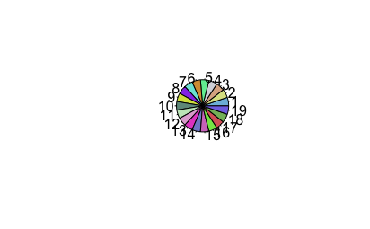


```r
ps_CARD %>% 
  generate_color_palette(var = "Model_type", pal = "jco") -> model_type
```

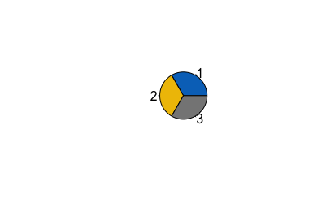


```r
ps_CARD %>% 
  generate_color_palette(var = "Resistance_Mechanism_multi",  pal = "npg") -> resistance_type
```

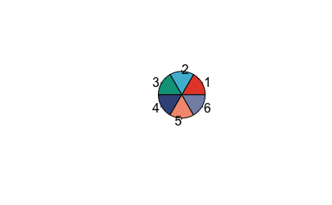


```r
ps_CARD %>% 
  generate_color_palette(var = "AMR_Gene.Family", seed = 72) -> AMR_gene_fam
```

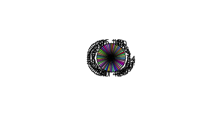

### Others:

<https://r-graphics.org/recipe-scatter-shapes>

```r
fermentaion_shape <- c(22, 21)
names(fermentaion_shape) <- sample_data(ps_CARD)$Fermentation %>%  levels()

model_shape <- c(22, 21)
names(model_shape) <- sample_data(ps_CARD)$Model %>%  levels()

antibio_shape <- c(22, 21)
names(antibio_shape) <- sample_data(ps_CARD)$Antibiotic %>%  levels()


conc_stroke <- c(1, 2, 3, 4, 5)
names(conc_stroke) <- sample_data(ps_CARD)$Antibiotic_mg.mL %>%  levels()
# scale_discrete_manual(
#   aesthetics = "stroke",
#   values = c(`A` = 2, `B` = 1, `C` = 2)
# )

theme_set(theme_classic() + theme(legend.position = 'bottom'))
```

<https://r4ds.had.co.nz/graphics-for-communication.html#figure-sizing>

<https://www.tidyverse.org/blog/2020/08/taking-control-of-plot-scaling/>


# Beta-diversity:


```r
plot_beta_NRP72 <- function(ps,
                            color = "Treatment", 
                            fill = "Treatment",
                            shape = "Fermentation",
                            alpha = "Antibiotic_mg.mL",
                            label = NA,
                            path_group = "interaction(Model, Fermentation, Reactor_Treatment)",
                            point_size = 2.5,
                            tax_rank_plot = "ASV",
                            taxrank_glom = FALSE,
                            top_r = 10, 
                            fact = 0.4,
                            join_cbind = "cbind"){
  
  #### ----------------------------------------------
  ps %>%
    phyloseq_compute_bdiv(norm = "pc",
                          phylo = FALSE,
                          seed = 123) -> bdiv_list
  
  #### ----------------------------------------------
  
  ps  %>%
    phyloseq_plot_bdiv(dlist = bdiv_list,
                       seed = 123,
                       axis1 = 1,
                       axis2 = 2)  -> pcoa
  

   
  pcoa$wjaccard$layers = NULL
  
  #### ----------------------------------------------
  
  pcoa$wjaccard + geom_point(size= point_size,
                             aes_string(color = color, 
                                        fill = fill,
                                        shape = shape,
                                        alpha = alpha)) + 
    geom_path(arrow = arrow(type = "open", angle = 30, length = unit(0.15, "inches")),
              size = 0.25, linetype = "dashed", inherit.aes = TRUE, aes_string(group = path_group, color = color), show.legend = FALSE) +
    scale_color_manual(name = "", values = treat_col,
                       na.value = "black") +
    scale_fill_manual(name = "", values = treat_col,
                      na.value = "black") +
    scale_shape_manual(name = "" ,values = fermentaion_shape, na.value =  17) +
    scale_alpha_discrete(name = "", range=c(0.6, 1), na.value =  0.6) +
    theme(legend.position = "bottom") + 
    ggrepel::geom_text_repel(cex=2,aes_string(label=label)) -> p_pcoa
  
  #### ----------------------------------------------
  
  # ps %>% 
  #   tax_table() %>% 
  #   data.frame() %>% 
  #   rownames_to_column("id") %>% 
  #   mutate(gene = id) %>% 
  #   column_to_rownames("id") %>% 
  #   as.matrix() %>% 
  #   tax_table() -> tax_table(ps)
  
  #### ----------------------------------------------
  
  
  ps  %>%
    # subset_samples(Treatment != "DONOR") %>% 
    phyloseq_add_taxa_vector(dist = bdiv_list$wjaccard,
                             phyloseq = .,
                             figure_ord = p_pcoa,
                             tax_rank_plot = tax_rank_plot, taxrank_glom = taxrank_glom,
                             top_r = top_r, fact = fact, join_cbind = join_cbind) -> pco_env
  
  # pco_env$plot %>% 
  #   export::graph2ppt(append = TRUE, width = 8, height = 6,
  #                     file = out_pptx)
  
  # p1 + facet_grid(Model ~.)
  #### ----------------------------------------------
  
  return(out = list("pcoa" = p_pcoa,
                    "envfit" = pco_env$plot,
                    "bdiv_list" = bdiv_list))
}
```

## CARD:

### AMRgenes:

```r
ps_CARD %>% 
  physeq_simplify_tax(round_otu = FALSE, tax_sel = c("Best_Hit_ARO")) %>% 
  plot_beta_NRP72(path_group = "interaction(Model, Fermentation, Reactor_Treatment)") -> p_b_AMRgn
```

```
## [1] "bray"
## [1] "sorensen"
## [1] "bjaccard"
## [1] "wjaccard"
```

```r
p_b_AMRgn$pcoa + facet_grid(Model ~.) -> ps_tmp

if(export_ppt == TRUE)
{
  ps_tmp %>% 
    export::graph2ppt(append = TRUE, width = export_ppt_width, height = export_ppt_height,
                      file = out_pptx)
}


p_b_AMRgn$pcoa + facet_grid(Model ~.) -> ps_tmp

ps_tmp
```

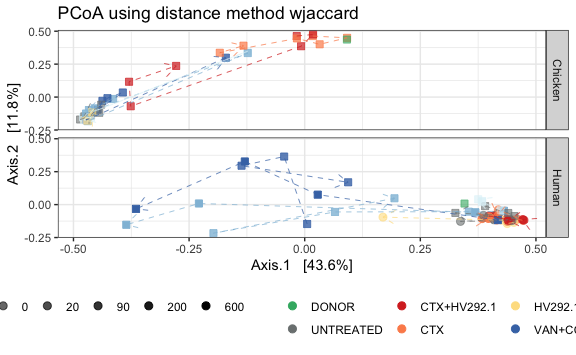

```r
if(export_ppt == TRUE)
{
  ps_tmp %>% 
    export::graph2ppt(append = TRUE, width = export_ppt_width, height = export_ppt_height,
                      file = out_pptx)
}
```


```r
ps_CARD %>% 
  subset_samples(Model == "Chicken") %>% 
  physeq_simplify_tax(round_otu = FALSE, tax_sel = c("Best_Hit_ARO")) %>% 
  plot_beta_NRP72(path_group = "interaction(Model, Fermentation, Reactor_Treatment)", label = "Day_of_Treatment") -> p_b_chick_AMRgn
```

```
## [1] "bray"
## [1] "sorensen"
## [1] "bjaccard"
## [1] "wjaccard"
```

```r
p_b_chick_AMRgn$pcoa + facet_grid(Model ~.) -> ps_tmp

if(export_ppt == TRUE)
{
  ps_tmp %>% 
    export::graph2ppt(append = TRUE, width = export_ppt_width, height = export_ppt_height,
                      file = out_pptx)
}


p_b_chick_AMRgn$envfit + facet_grid(Model ~.) -> ps_tmp

ps_tmp
```

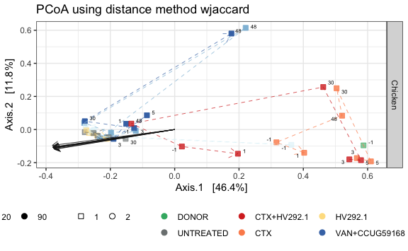

```r
if(export_ppt == TRUE)
{
  ps_tmp %>% 
    export::graph2ppt(append = TRUE, width = export_ppt_width, height = export_ppt_height,
                      file = out_pptx)
}
```


```r
ps_CARD %>% 
  subset_samples(Model == "Human") %>% 
  physeq_simplify_tax(round_otu = FALSE, tax_sel = c("Best_Hit_ARO")) %>% 
  plot_beta_NRP72(path_group = "interaction(Model, Fermentation, Reactor_Treatment)", label = "Day_of_Treatment") -> p_b_chick_AMRgn
```

```
## [1] "bray"
## [1] "sorensen"
## [1] "bjaccard"
## [1] "wjaccard"
```

```r
p_b_chick_AMRgn$pcoa + facet_grid(Model ~.) -> ps_tmp

if(export_ppt == TRUE)
{
  ps_tmp %>% 
    export::graph2ppt(append = TRUE, width = export_ppt_width, height = export_ppt_height,
                      file = out_pptx)
}


p_b_chick_AMRgn$envfit + facet_grid(Model ~.) -> ps_tmp

ps_tmp
```

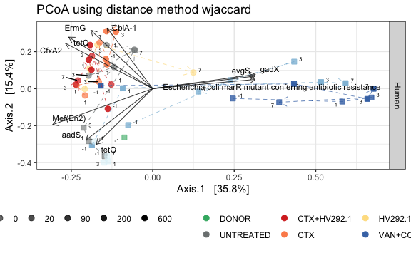

```r
if(export_ppt == TRUE)
{
  ps_tmp %>% 
    export::graph2ppt(append = TRUE, width = export_ppt_width, height = export_ppt_height,
                      file = out_pptx)
}
```


```r
ps_CARD %>% 
  subset_samples(Model == "Chicken") %>% 
  physeq_simplify_tax(round_otu = FALSE, tax_sel = c("Best_Hit_ARO")) -> ps_tmp


ps_tmp %>%
  tax_table() %>%
  data.frame() %>%
  rownames_to_column("id") %>%
  mutate(gene = id) %>%
  column_to_rownames("id") %>%
  as.matrix %>%
  tax_table() -> tax_table(ps_tmp)
```


```r
# ps_tmp  %>%
#   # subset_samples(Treatment != "DONOR") %>% 
#   phyloseq_add_taxa_vector(dist = p_b_chick_AMRgn$bdiv_list$wjaccard,
#                            phyloseq = .,
#                            figure_ord = p_b_chick_AMRgn$pcoa,
#                            tax_rank_plot = "Drug_Class_multi", taxrank_glom = "Drug_Class_multi",
#                            top_r = 10, fact = 0.6) -> pco_env
# 
# pco_env$signenvfit + facet_grid(Model ~.) -> ps_tmp
# 
# ps_tmp
# 
# if(export_ppt == TRUE)
# {
#   ps_tmp %>% 
#     export::graph2ppt(append = TRUE, width = export_ppt_width, height = export_ppt_height,
#                       file = out_pptx)
# }
# 
# 
# 
# pco_env$plot + facet_grid(Model ~.)
```


### AMR_Gene.Family:

```r
# ps_CARD %>% 
#   physeq_simplify_tax(round_otu = FALSE, tax_sel = c("AMR_Gene.Family")) %>% 
#   plot_beta_NRP72(path_group = "interaction(Model, Fermentation, Reactor_Treatment)") -> p_b_AMRgn
# 
# p_b_AMRgn$pcoa + facet_grid(Model ~.) -> ps_tmp
# 
# ps_tmp
# 
# if(export_ppt == TRUE)
# {
#   ps_tmp %>% 
#     export::graph2ppt(append = TRUE, width = export_ppt_width, height = export_ppt_height,
#                       file = out_pptx)
# }
# 
```


## 16S:


```r
ps_16S %>% 
  rarefy_even_depth(sample.size = 4576, rngseed = 123) -> ps_16S_rare
```


```r
ps_16S_rare %>% 
  plot_beta_NRP72(path_group = "interaction(Model, Fermentation, Reactor_Treatment)", tax_rank_plot = "Family", taxrank_glom = "Family", join_cbind = "join") -> p_b_16S
```

```
## [1] "bray"
## [1] "sorensen"
## [1] "bjaccard"
## [1] "wjaccard"
```

```r
p_b_16S$pcoa + facet_grid(Model ~.) -> ps_tmp

ps_tmp
```

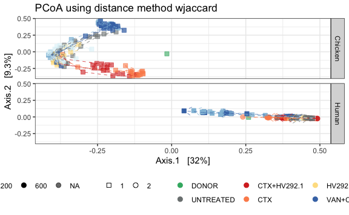

```r
if(export_ppt == TRUE)
{
  ps_tmp %>% 
    export::graph2ppt(append = TRUE, width = export_ppt_width, height = export_ppt_height,
                      file = out_pptx)
}

p_b_16S$envfit + facet_grid(Model ~.) -> ps_tmp

ps_tmp
```

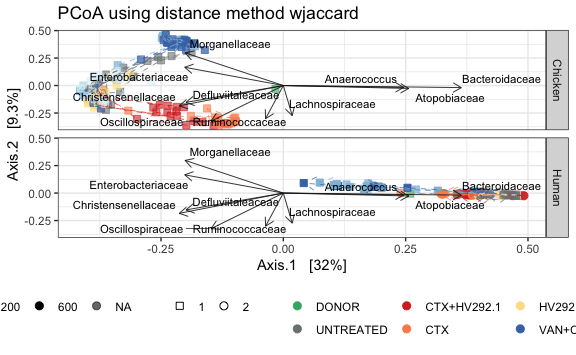

```r
if(export_ppt == TRUE)
{
  ps_tmp %>% 
    export::graph2ppt(append = TRUE, width = export_ppt_width, height = export_ppt_height,
                      file = out_pptx)
}
```

```r
ps_16S_rare %>% 
  subset_samples(Model == "Chicken") %>% 
  plot_beta_NRP72(path_group = "interaction(Model, Fermentation, Reactor_Treatment)", tax_rank_plot = "Family", taxrank_glom = "Family", join_cbind = "join") -> p_b_16S
```

```
## [1] "bray"
## [1] "sorensen"
## [1] "bjaccard"
## [1] "wjaccard"
```

```r
p_b_16S$pcoa + facet_grid(Model ~.) -> ps_tmp

ps_tmp
```

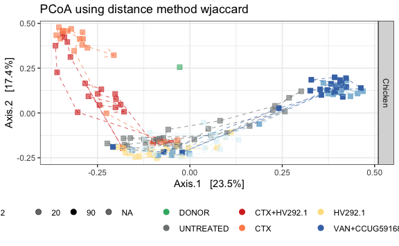

```r
if(export_ppt == TRUE)
{
  ps_tmp %>% 
    export::graph2ppt(append = TRUE, width = export_ppt_width, height = export_ppt_height,
                      file = out_pptx)
}


p_b_16S$envfit + facet_grid(Model ~.) -> ps_tmp

ps_tmp
```

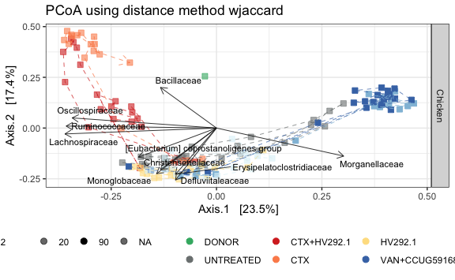

```r
if(export_ppt == TRUE)
{
  ps_tmp %>% 
    export::graph2ppt(append = TRUE, width = export_ppt_width, height = export_ppt_height,
                      file = out_pptx)
}
```


```r
ps_16S_rare %>% 
  subset_samples(Model == "Human") %>% 
  plot_beta_NRP72(path_group = "interaction(Model, Fermentation, Reactor_Treatment)", tax_rank_plot = "Family", taxrank_glom = "Family", join_cbind = "join") -> p_b_16S
```

```
## [1] "bray"
## [1] "sorensen"
## [1] "bjaccard"
## [1] "wjaccard"
```

```r
p_b_16S$pcoa + facet_grid(Model ~.) -> ps_tmp

ps_tmp
```

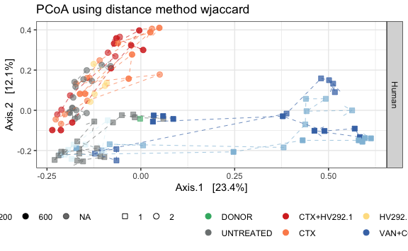

```r
if(export_ppt == TRUE)
{
  ps_tmp %>% 
    export::graph2ppt(append = TRUE, width = export_ppt_width, height = export_ppt_height,
                      file = out_pptx)
}


p_b_16S$envfit + facet_grid(Model ~.) -> ps_tmp

ps_tmp
```

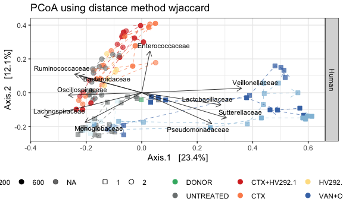

```r
if(export_ppt == TRUE)
{
  ps_tmp %>% 
    export::graph2ppt(append = TRUE, width = export_ppt_width, height = export_ppt_height,
                      file = out_pptx)
}
```


```r
ps_16S_rare %>% 
  subset_samples(Model == "Chicken") %>% 
  plot_beta_NRP72(path_group = "interaction(Model, Fermentation, Reactor_Treatment)", tax_rank_plot = "Genus", taxrank_glom = "Genus", top_r = 30, join_cbind = "join") -> p_b_16S
```

```
## [1] "bray"
## [1] "sorensen"
## [1] "bjaccard"
## [1] "wjaccard"
```

```r
p_b_16S$pcoa + facet_grid(Model ~.) -> ps_tmp

ps_tmp
```


```r
if(export_ppt == TRUE)
{
  ps_tmp %>% 
    export::graph2ppt(append = TRUE, width = export_ppt_width, height = export_ppt_height,
                      file = out_pptx)
}


p_b_16S$envfit + facet_grid(Model ~.) -> ps_tmp

ps_tmp
```

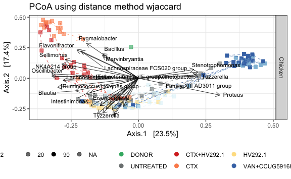

```r
if(export_ppt == TRUE)
{
  ps_tmp %>% 
    export::graph2ppt(append = TRUE, width = export_ppt_width, height = export_ppt_height,
                      file = out_pptx)
}
```


```r
ps_16S_rare %>% 
  subset_samples(Model == "Human") %>% 
  plot_beta_NRP72(path_group = "interaction(Model, Fermentation, Reactor_Treatment)", tax_rank_plot = "Genus", taxrank_glom = "Genus", top_r = 30, join_cbind = "join") -> p_b_16S
```

```
## [1] "bray"
## [1] "sorensen"
## [1] "bjaccard"
## [1] "wjaccard"
```

```r
p_b_16S$pcoa + facet_grid(Model ~.) -> ps_tmp

ps_tmp
```


```r
if(export_ppt == TRUE)
{
  ps_tmp %>% 
    export::graph2ppt(append = TRUE, width = export_ppt_width, height = export_ppt_height,
                      file = out_pptx)
}


p_b_16S$envfit + facet_grid(Model ~.) -> ps_tmp

ps_tmp
```

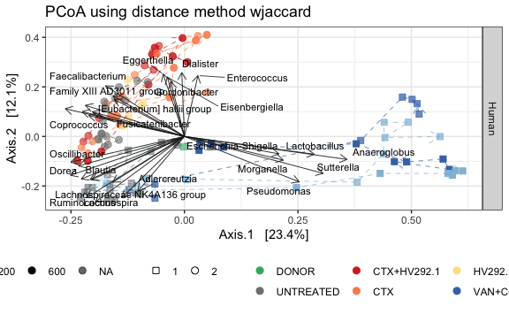

```r
if(export_ppt == TRUE)
{
  ps_tmp %>% 
    export::graph2ppt(append = TRUE, width = export_ppt_width, height = export_ppt_height,
                      file = out_pptx)
}
```


```r
sessionInfo()
```

```
## R version 4.1.2 (2021-11-01)
## Platform: x86_64-apple-darwin17.0 (64-bit)
## Running under: macOS Mojave 10.14.6
## 
## Matrix products: default
## BLAS:   /Library/Frameworks/R.framework/Versions/4.1/Resources/lib/libRblas.0.dylib
## LAPACK: /Library/Frameworks/R.framework/Versions/4.1/Resources/lib/libRlapack.dylib
## 
## locale:
## [1] en_US.UTF-8/en_US.UTF-8/en_US.UTF-8/C/en_US.UTF-8/en_US.UTF-8
## 
## attached base packages:
## [1] stats     graphics  grDevices utils     datasets  methods   base     
## 
## other attached packages:
##  [1] gdtools_0.2.3        vegan_2.5-7          lattice_0.20-45     
##  [4] permute_0.9-5        GUniFrac_1.4         ape_5.6             
##  [7] reshape2_1.4.4       scales_1.1.1         randomcoloR_1.1.0.1 
## [10] here_1.0.1           ggrepel_0.9.1        speedyseq_0.5.3.9018
## [13] phyloseq_1.36.0      forcats_0.5.1        stringr_1.4.0       
## [16] dplyr_1.0.7          purrr_0.3.4          readr_2.1.0         
## [19] tidyr_1.1.4          tibble_3.1.6         ggplot2_3.3.5       
## [22] tidyverse_1.3.1.9000
## 
## loaded via a namespace (and not attached):
##   [1] uuid_1.0-3             readxl_1.3.1           backports_1.4.1       
##   [4] systemfonts_1.0.2      plyr_1.8.6             igraph_1.2.10         
##   [7] splines_4.1.2          GenomeInfoDb_1.28.4    digest_0.6.29         
##  [10] foreach_1.5.1          htmltools_0.5.2        lmerTest_3.1-3        
##  [13] fansi_0.5.0            magrittr_2.0.1         cluster_2.1.2         
##  [16] tzdb_0.2.0             openxlsx_4.2.4         Biostrings_2.60.2     
##  [19] modelr_0.1.8           matrixStats_0.61.0     officer_0.4.0         
##  [22] stabledist_0.7-1       colorspace_2.0-2       rvest_1.0.2           
##  [25] haven_2.4.3            xfun_0.28              crayon_1.4.2          
##  [28] RCurl_1.98-1.5         jsonlite_1.7.2         lme4_1.1-27.1         
##  [31] survival_3.2-13        iterators_1.0.13       glue_1.6.0            
##  [34] rvg_0.2.5              gtable_0.3.0           zlibbioc_1.38.0       
##  [37] XVector_0.32.0         V8_3.6.0               car_3.0-11            
##  [40] Rhdf5lib_1.14.2        BiocGenerics_0.38.0    abind_1.4-5           
##  [43] DBI_1.1.1              rstatix_0.7.0          Rcpp_1.0.7            
##  [46] xtable_1.8-4           clue_0.3-60            foreign_0.8-81        
##  [49] stats4_4.1.2           htmlwidgets_1.5.4      timeSeries_3062.100   
##  [52] httr_1.4.2             ellipsis_0.3.2         spatial_7.3-14        
##  [55] pkgconfig_2.0.3        farver_2.1.0           sass_0.4.0            
##  [58] dbplyr_2.1.1           utf8_1.2.2             labeling_0.4.2        
##  [61] tidyselect_1.1.1       rlang_0.4.12           munsell_0.5.0         
##  [64] cellranger_1.1.0       tools_4.1.2            cli_3.1.0             
##  [67] generics_0.1.1         devEMF_4.0-2           ade4_1.7-18           
##  [70] export_0.3.0           broom_0.7.11           evaluate_0.14         
##  [73] biomformat_1.20.0      fastmap_1.1.0          yaml_2.2.1            
##  [76] knitr_1.36             fs_1.5.2               zip_2.2.0             
##  [79] rgl_0.107.14           nlme_3.1-153           xml2_1.3.2            
##  [82] compiler_4.1.2         rstudioapi_0.13        curl_4.3.2            
##  [85] ggsignif_0.6.3         reprex_2.0.1           statmod_1.4.36        
##  [88] statip_0.2.3           bslib_0.3.1            stringi_1.7.6         
##  [91] highr_0.9              stargazer_5.2.2        modeest_2.4.0         
##  [94] fBasics_3042.89.1      Matrix_1.3-4           nloptr_1.2.2.2        
##  [97] ggsci_2.9              multtest_2.48.0        vctrs_0.3.8           
## [100] pillar_1.6.4           lifecycle_1.0.1        rhdf5filters_1.4.0    
## [103] jquerylib_0.1.4        flextable_0.6.9        data.table_1.14.2     
## [106] bitops_1.0-7           stable_1.1.4           R6_2.5.1              
## [109] rio_0.5.27             IRanges_2.26.0         codetools_0.2-18      
## [112] boot_1.3-28            MASS_7.3-54            assertthat_0.2.1      
## [115] rhdf5_2.36.0           rprojroot_2.0.2        withr_2.4.3           
## [118] S4Vectors_0.30.2       GenomeInfoDbData_1.2.6 mgcv_1.8-38           
## [121] parallel_4.1.2         hms_1.1.1              rpart_4.1-15          
## [124] grid_4.1.2             timeDate_3043.102      minqa_1.2.4           
## [127] rmarkdown_2.11         carData_3.0-4          rmutil_1.1.5          
## [130] Rtsne_0.15             ggpubr_0.4.0           base64enc_0.1-3       
## [133] numDeriv_2016.8-1.1    Biobase_2.52.0         lubridate_1.8.0
```

