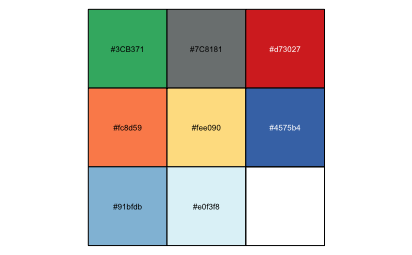
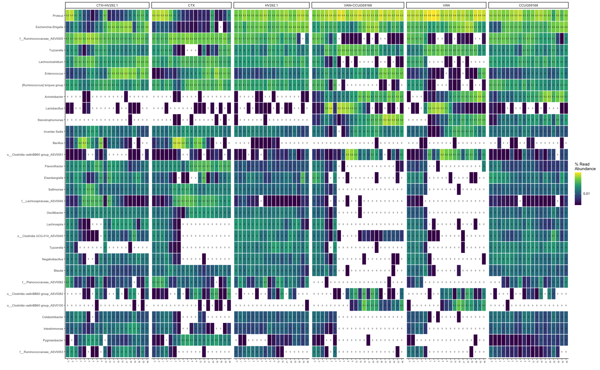
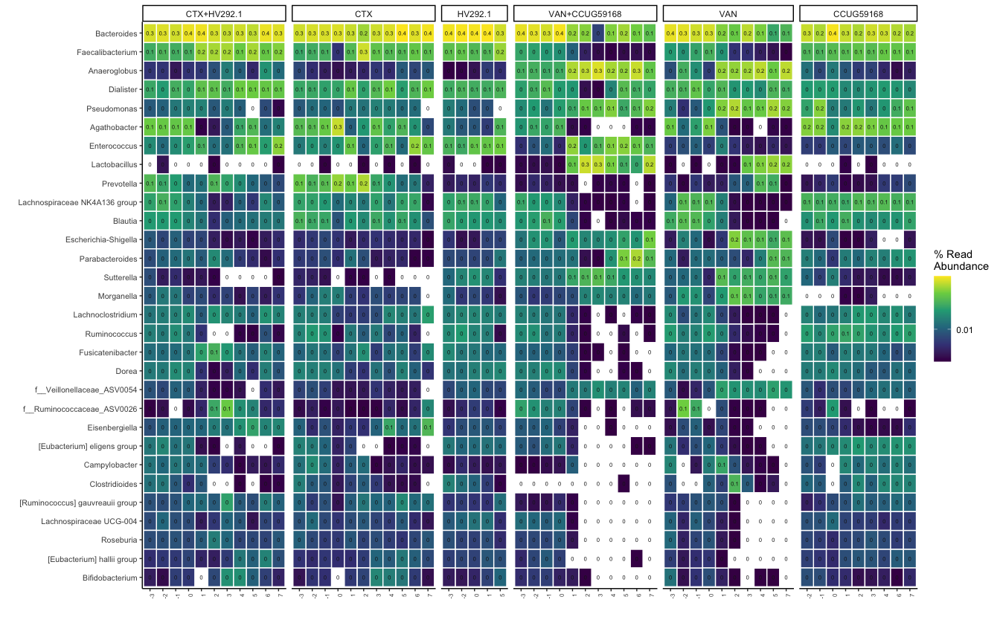

# Load required packages


```r
library(tidyverse)
# library(phyloseq)
library(speedyseq)
library(ggrepel)
library(here)
# library(microViz)
# library(RColorBrewer)
# library(vegan)
library(randomcoloR)
options(getClass.msg=FALSE) # https://github.com/epurdom/clusterExperiment/issues/66
#this fixes an error message that pops up because the class 'Annotated' is defined in two different packages
```


```r
export_ppt = TRUE
export_ppt_width = NULL
export_ppt_height = NULL
out_pptx = here::here("output/plots_heat.pptx")
```
# Source function


```r
rm(list = ls())

source("https://raw.githubusercontent.com/fconstancias/DivComAnalyses/master/R/phyloseq_taxa_tests.R")
source("https://raw.githubusercontent.com/fconstancias/DivComAnalyses/master/R/phyloseq_normalisation.R")
source("https://raw.githubusercontent.com/fconstancias/DivComAnalyses/master/R/phyloseq_alpha.R")
source("https://raw.githubusercontent.com/fconstancias/DivComAnalyses/master/R/phyloseq_beta.R")
source("https://raw.githubusercontent.com/fconstancias/DivComAnalyses/master/R/phyloseq_heatmap.R")
source("https://raw.githubusercontent.com/fconstancias/DivComAnalyses/master/R/phyloseq_varia.R")
```


```r
export_ppt = TRUE
export_ppt_width = NULL
export_ppt_height = NULL
out_pptx = here::here("output/plots_heat.pptx")
```

# Import data + cleaning/ colors/ factors:

## Data
### Resistome:

```r
"data/processed/resistome/ps_combined_tax_clean.rds" %>% 
  here::here() %>% 
  readRDS() %>% 
  filter_taxa(function(x) sum(x > 0) > 0, TRUE) -> ps_CARD

ps_CARD %>% 
  sample_data() %>% 
  data.frame() %>% 
  select(-input:-index2) %>% 
  mutate(
    Period = case_when(
      Day_of_Treatment == -2 | Day_of_Treatment == -3 | Day_of_Treatment == -6 | Day_of_Treatment == -7 ~ "pret",
      Day_of_Treatment < 10 & Day_of_Treatment >= 0 ~ "t1",
      Day_of_Treatment < 20 & Day_of_Treatment >= 10 ~ "t2",
      Day_of_Treatment < 30 & Day_of_Treatment >= 20 ~ "t3",
      Day_of_Treatment < 40 & Day_of_Treatment >= 30 ~ "t4",
      Day_of_Treatment < 50 & Day_of_Treatment >= 40 ~ "t5",
    )
  ) %>% mutate(Period = base::replace(Period, Treatment == "DONOR", "pret")) -> sample_data(ps_CARD)
```


### 16S:

```r
"data/processed/ps_silva_dada2_human_chicken_meta.RDS" %>% 
  here::here() %>% 
  readRDS() %>% 
  phyloseq_get_strains_fast() %>% 
  subset_samples(Enrichment == "NotEnriched" ) %>% 
  subset_samples(Sample_description %!in% c("TR5-15", "TR4-1")) %>% 
  subset_samples(Day_from_Inoculum >= 30 | Experiment == "Cecum") %>% 
  subset_samples(Experiment != "Batch") %>% 
  subset_samples(is.na(Paul)) %>% 
  subset_samples(Day_of_Treatment >= -4 | Experiment == "Cecum") %>% 
  # %    subset_samples(Model == "Human" & Day_of_Treatment <= 4) %>% 
  filter_taxa(function(x) sum(x > 0) > 0, TRUE) -> ps_16S
```

```
## Joining, by = "ASV"
```

```r
# add Day_of_Treatment groups.

ps_16S %>% 
  sample_data() %>% 
  data.frame() %>% 
  mutate(Treatment = base::replace(Treatment, Experiment == "Cecum", "DONOR")) %>%
  # mutate( Treatment  = case_when(Experiment == "Cecum" ~ "DONOR",
  #                               TRUE ~ Treatment)) %>% 
  # mutate(Treatment = ifelse(Experiment == "Cecum", "Donor", Treatment)) %>% 
  mutate(
    Period = case_when(
      Day_of_Treatment == -2 | Day_of_Treatment == -3 | Day_of_Treatment == -6 | Day_of_Treatment == -7 ~ "pret",
      Day_of_Treatment < 10 & Day_of_Treatment >= 0 ~ "t1",
      Day_of_Treatment < 20 & Day_of_Treatment >= 10 ~ "t2",
      Day_of_Treatment < 30 & Day_of_Treatment >= 20 ~ "t3",
      Day_of_Treatment < 40 & Day_of_Treatment >= 30 ~ "t4",
      Day_of_Treatment < 50 & Day_of_Treatment >= 40 ~ "t5",
    )
  ) %>% mutate(Period = base::replace(Period, Treatment == "DONOR", "pret")) -> sample_data(ps_16S)
```

Then:mOTUS, metaphlan, and SQM ORF/genes...


## Metadata_cleaning / uniformisation:

<https://r-graphics.org/recipe-scatter-shapes>


```r
# Treatment:
ps_16S %>%
  sample_data() %>%
  data.frame() %>%
  mutate(Treatment = factor(Treatment, levels = sample_data(ps_CARD)$Treatment %>%  levels() )) -> sample_data(ps_16S)

# Antibiotic_mg.mL:
ps_CARD %>%
  sample_data() %>%
  data.frame() %>%
  mutate(Antibiotic_mg.mL = replace_na(Antibiotic_mg.mL, 0)) %>% 
  mutate(Antibiotic_mg.mL = factor(Antibiotic_mg.mL)) -> sample_data(ps_CARD)


ps_16S %>%
  sample_data() %>%
  data.frame() %>%
  mutate(Antibiotic_mg.mL = factor(Antibiotic_mg.mL, levels = sample_data(ps_CARD)$Antibiotic_mg.mL %>%  levels() )) -> sample_data(ps_16S)

# VAN CTX:
ps_CARD %>%
  sample_data() %>%
  data.frame() %>%
  mutate(Antibiotic = factor(Antibiotic, levels = c("CTX", "VAN"))) -> sample_data(ps_CARD)

ps_16S %>%
  sample_data() %>%
  data.frame() %>%
  mutate(Antibiotic = factor(Antibiotic, levels = sample_data(ps_CARD)$Antibiotic %>%  levels() )) -> sample_data(ps_16S)

# VAN Fermentation:
ps_CARD %>%
  sample_data() %>%
  data.frame() %>%
  mutate(Fermentation = replace_na(Fermentation, 1))  %>% 
  mutate(Fermentation = factor(Fermentation, levels = c(1, 2))) -> sample_data(ps_CARD)

ps_16S %>%
  sample_data() %>%
  data.frame() %>%
  mutate(Fermentation = replace_na(Fermentation, 1))  %>% 
  mutate(Fermentation = factor(Fermentation, levels = sample_data(ps_CARD)$Fermentation %>%  levels() )) -> sample_data(ps_16S)


# replace(is.na(.), 0)  %>% 
# mutate(Treatment = replace_na(Antibiotic_mg.mL, 0)) -> sample_data(physeq_AMRgn)
```


## Define astetics:

### Treatment colors:

<https://colorbrewer2.org/#type=diverging&scheme=RdYlBu&n=6>

```r
treat_col <- c("#3CB371", "#7C8181",'#d73027','#fc8d59','#fee090','#4575b4','#91bfdb', '#e0f3f8')

names(treat_col) <- get_variable(ps_CARD, "Treatment") %>%  
  levels()

treat_col %>% 
  scales::show_col(cex_label = 0.5)
```



```r
ps_16S %>% 
  rarefy_even_depth(sample.size = 4576,
                    rngseed = 123) -> physeq_rare
```

```
## `set.seed(123)` was used to initialize repeatable random subsampling.
```

```
## Please record this for your records so others can reproduce.
```

```
## Try `set.seed(123); .Random.seed` for the full vector
```

```
## ...
```

```
## 51 samples removedbecause they contained fewer reads than `sample.size`.
```

```
## Up to first five removed samples are:
```

```
## CR-40-S166CR-52-S196IR1-69-S198TR1-15-S168TR1-16-S199
```

```
## ...
```

```
## 285OTUs were removed because they are no longer 
## present in any sample after random subsampling
```

```
## ...
```

```r
physeq_rare
```

```
## phyloseq-class experiment-level object
## otu_table()   OTU Table:          [ 732 taxa and 263 samples ]:
## sample_data() Sample Data:        [ 263 samples by 64 sample variables ]:
## tax_table()   Taxonomy Table:     [ 732 taxa by 8 taxonomic ranks ]:
## phy_tree()    Phylogenetic Tree:  [ 732 tips and 731 internal nodes ]:
## refseq()      DNAStringSet:       [ 732 reference sequences ]
## taxa are rows
```
heatmap:

```r
physeq_rare %>%
  subset_samples(Model == "Chicken")  %>% 
  subset_samples(Reactor_Treatment != "CR_UNTREATED")  %>% 
      subset_samples(!Treatment %in% c("DONOR", "UNTREATED"))  %>% 
  # subset_samples(Experiment == "CCUG59168" |  Experiment ==  "HV292.1" | Experiment ==  "Cecum" |  Experiment ==  "Continuous" & Reactor %in% c("IR1", "CR")) %>%
  # rarefy_even_depth(sample.size = 2574,rngseed = 123) %>%
  phyloseq_ampvis_heatmap(transform = "compositional",
                          group_by = "Day_of_Treatment",
                          facet_by = c("Treatment"),
                          tax_aggregate = "Genus",
                          tax_add = NULL,
                          ntax  = 30) -> p
```

```
## Loading required package: ampvis2
```

```
## Warning in all(lapply(refseq, is.null)): coercing argument of type 'list' to
## logical
```

```r
p$data %>% 
  mutate(Abundance = na_if(Abundance, 0)) -> p$data 


p + facet_grid( ~ Treatment , scales = "free", space = "free") + 
  scale_fill_viridis_c(breaks = c(0,  0.01, 1, 10, 50, 75, 100), 
                       labels = c(0,  0.01, 1, 10, 50, 75, 100), 
                       trans = scales::pseudo_log_trans(sigma = 0.001),
                       na.value = 'transparent') -> p2
```

```
## Scale for 'fill' is already present. Adding another scale for 'fill', which
## will replace the existing scale.
```

```r
p2
```



```r
if(export_ppt == TRUE)
{
  p2 %>% 
    export::graph2ppt(append = TRUE, width = export_ppt_width, height = export_ppt_height,
                      file = out_pptx)
}
```

```
## Exported graph as /Users/fconstan/Documents/GitHub/NRP72-FBT/output/plots_heat.pptx
```


```r
physeq_rare %>%
  subset_samples(Model == "Human")  %>% 
  subset_samples(Reactor_Treatment != "CR_UNTREATED")  %>% 
    subset_samples(!Treatment %in% c("DONOR", "UNTREATED"))  %>% 
  # subset_samples(Experiment == "CCUG59168" |  Experiment ==  "HV292.1" | Experiment ==  "Cecum" |  Experiment ==  "Continuous" & Reactor %in% c("IR1", "CR")) %>%
  # rarefy_even_depth(sample.size = 2574,rngseed = 123) %>%
  phyloseq_ampvis_heatmap(transform = "compositional",
                          group_by = "Day_of_Treatment",
                          facet_by = c("Treatment"),
                          tax_aggregate = "Genus",
                          tax_add = NULL,
                          ntax  = 30) -> p
```

```
## Warning in all(lapply(refseq, is.null)): coercing argument of type 'list' to
## logical
```

```r
p$data %>% 
  mutate(Abundance = na_if(Abundance, 0)) -> p$data 


p + facet_grid( ~ Treatment , scales = "free", space = "free") + 
  scale_fill_viridis_c(breaks = c(0,  0.01, 1, 10, 50, 75, 100), 
                       labels = c(0,  0.01, 1, 10, 50, 75, 100), 
                       trans = scales::pseudo_log_trans(sigma = 0.001),
                       na.value = 'transparent') -> p2
```

```
## Scale for 'fill' is already present. Adding another scale for 'fill', which
## will replace the existing scale.
```

```r
p2
```



```r
if(export_ppt == TRUE)
{
  p2 %>% 
    export::graph2ppt(append = TRUE, width = export_ppt_width, height = export_ppt_height,
                      file = out_pptx)
}
```

```
## Exported graph as /Users/fconstan/Documents/GitHub/NRP72-FBT/output/plots_heat.pptx
```


```r
sessionInfo()
```

```
## R version 4.1.2 (2021-11-01)
## Platform: x86_64-apple-darwin17.0 (64-bit)
## Running under: macOS Mojave 10.14.6
## 
## Matrix products: default
## BLAS:   /Library/Frameworks/R.framework/Versions/4.1/Resources/lib/libRblas.0.dylib
## LAPACK: /Library/Frameworks/R.framework/Versions/4.1/Resources/lib/libRlapack.dylib
## 
## locale:
## [1] en_US.UTF-8/en_US.UTF-8/en_US.UTF-8/C/en_US.UTF-8/en_US.UTF-8
## 
## attached base packages:
## [1] stats     graphics  grDevices utils     datasets  methods   base     
## 
## other attached packages:
##  [1] gdtools_0.2.3        ampvis2_2.7.11       reshape2_1.4.4      
##  [4] scales_1.1.1         randomcoloR_1.1.0.1  here_1.0.1          
##  [7] ggrepel_0.9.1        speedyseq_0.5.3.9018 phyloseq_1.36.0     
## [10] forcats_0.5.1        stringr_1.4.0        dplyr_1.0.7         
## [13] purrr_0.3.4          readr_2.1.0          tidyr_1.1.4         
## [16] tibble_3.1.6         ggplot2_3.3.5        tidyverse_1.3.1.9000
## 
## loaded via a namespace (and not attached):
##   [1] Rtsne_0.15             colorspace_2.0-2       ellipsis_0.3.2        
##   [4] rprojroot_2.0.2        flextable_0.6.9        XVector_0.32.0        
##   [7] base64enc_0.1-3        fs_1.5.2               rstudioapi_0.13       
##  [10] farver_2.1.0           fansi_0.5.0            lubridate_1.8.0       
##  [13] xml2_1.3.2             codetools_0.2-18       splines_4.1.2         
##  [16] knitr_1.36             ade4_1.7-18            jsonlite_1.7.2        
##  [19] broom_0.7.11           cluster_2.1.2          dbplyr_2.1.1          
##  [22] compiler_4.1.2         httr_1.4.2             backports_1.4.1       
##  [25] lazyeval_0.2.2         assertthat_0.2.1       Matrix_1.3-4          
##  [28] fastmap_1.1.0          cli_3.1.0              htmltools_0.5.2       
##  [31] tools_4.1.2            igraph_1.2.10          gtable_0.3.0          
##  [34] glue_1.6.0             GenomeInfoDbData_1.2.6 V8_3.6.0              
##  [37] Rcpp_1.0.7             Biobase_2.52.0         cellranger_1.1.0      
##  [40] jquerylib_0.1.4        vctrs_0.3.8            Biostrings_2.60.2     
##  [43] rhdf5filters_1.4.0     multtest_2.48.0        ape_5.6               
##  [46] nlme_3.1-153           stargazer_5.2.2        iterators_1.0.13      
##  [49] xfun_0.28              openxlsx_4.2.4         rvest_1.0.2           
##  [52] lifecycle_1.0.1        devEMF_4.0-2           zlibbioc_1.38.0       
##  [55] MASS_7.3-54            hms_1.1.1              parallel_4.1.2        
##  [58] biomformat_1.20.0      rhdf5_2.36.0           RColorBrewer_1.1-2    
##  [61] export_0.3.0           yaml_2.2.1             curl_4.3.2            
##  [64] sass_0.4.0             stringi_1.7.6          highr_0.9             
##  [67] S4Vectors_0.30.2       foreach_1.5.1          permute_0.9-5         
##  [70] BiocGenerics_0.38.0    zip_2.2.0              GenomeInfoDb_1.28.4   
##  [73] systemfonts_1.0.2      rlang_0.4.12           pkgconfig_2.0.3       
##  [76] bitops_1.0-7           rgl_0.107.14           evaluate_0.14         
##  [79] lattice_0.20-45        Rhdf5lib_1.14.2        rvg_0.2.5             
##  [82] htmlwidgets_1.5.4      tidyselect_1.1.1       plyr_1.8.6            
##  [85] magrittr_2.0.1         R6_2.5.1               IRanges_2.26.0        
##  [88] generics_0.1.1         DBI_1.1.1              pillar_1.6.4          
##  [91] haven_2.4.3            withr_2.4.3            mgcv_1.8-38           
##  [94] survival_3.2-13        RCurl_1.98-1.5         modelr_0.1.8          
##  [97] crayon_1.4.2           uuid_1.0-3             utf8_1.2.2            
## [100] microbiome_1.14.0      plotly_4.10.0          officer_0.4.0         
## [103] tzdb_0.2.0             rmarkdown_2.11         grid_4.1.2            
## [106] readxl_1.3.1           data.table_1.14.2      vegan_2.5-7           
## [109] reprex_2.0.1           digest_0.6.29          xtable_1.8-4          
## [112] stats4_4.1.2           munsell_0.5.0          viridisLite_0.4.0     
## [115] bslib_0.3.1
```

