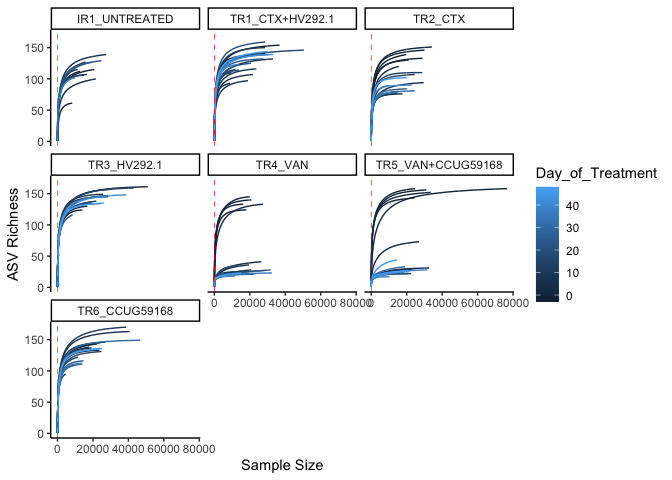
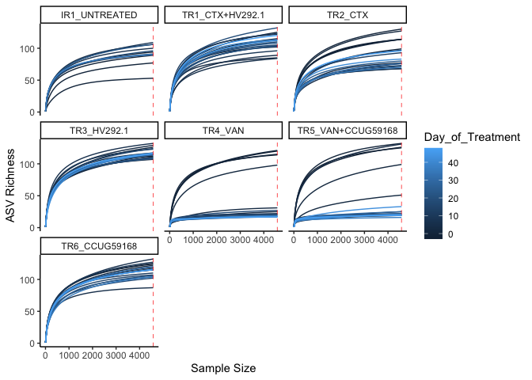
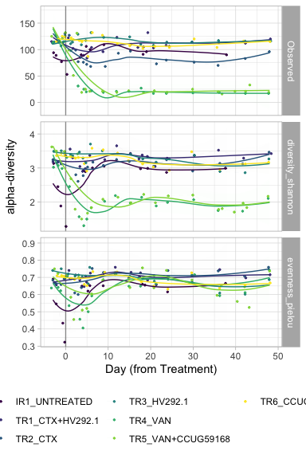
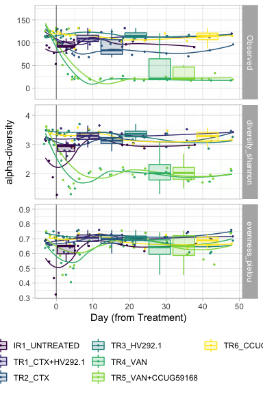

#### Load required packages


```r
library(tidyverse)
library(phyloseq)
library(speedyseq)
library(ggrepel)
library(ampvis2)
library(plotly)
library(microbiome)
library(here)
options(getClass.msg=FALSE) # https://github.com/epurdom/clusterExperiment/issues/66
#this fixes an error message that pops up because the class 'Annotated' is defined in two different packages
```

#### Source required functions


```r
'%!in%' <- function(x,y)!('%in%'(x,y))

source("https://raw.githubusercontent.com/fconstancias/DivComAnalyses/master/R/phyloseq_taxa_tests.R")
source("https://raw.githubusercontent.com/fconstancias/DivComAnalyses/master/R/phyloseq_normalisation.R")
source("https://raw.githubusercontent.com/fconstancias/DivComAnalyses/master/R/phyloseq_alpha.R")
source("https://raw.githubusercontent.com/fconstancias/DivComAnalyses/master/R/phyloseq_beta.R")
source("https://raw.githubusercontent.com/fconstancias/DivComAnalyses/master/R/phyloseq_heatmap.R")
```


```r
plot_time <- function(df, 
                      measure,
                      x = "Day_from_Inoculum", 
                      y = "value", 
                      shape = "neg",
                      fill = "Reactor_Treatment",
                      group = "Reactor_Treatment", 
                      facet)
{
  df %>%
    dplyr::filter(alphadiversiy %in% measure) %>%
    dplyr::mutate(alphadiversiy = fct_reorder(alphadiversiy, value, .desc = TRUE)) %>%
    dplyr::mutate(neg = ifelse(value == 0, "neg", "pos")) %>%
    arrange(Day_from_Inoculum) %>%
    ggplot(aes_string(x = x,
                      y = y)) +
    geom_jitter(size=0.5, alpha=0.9, aes_string(color = fill, fill = fill, shape = shape),  show.legend = TRUE) + 
    geom_path(inherit.aes = TRUE, aes_string(fill = fill, color = fill, show.legend = FALSE),
              size = 0.01,
              linetype = "dashed") +
    facet_grid(as.formula(facet), scales = "free") +
    geom_vline(xintercept = c(0),
               color="black", alpha=0.4) +
    geom_smooth(show.legend = FALSE, level = 0.95, alpha=0.005, size = 0.5 ,aes_string(color = fill, fill = fill)) +
    scale_x_continuous(breaks=seq(0,90,10)) +
    # scale_y_continuous(labels = scientific,
    #                    limits=c(1e+10, 1e+11), breaks = seq(1e+10, 1e+11, by = 1e+10),
    #                    trans = "log10") +
    theme_light() +
    scale_color_viridis_d(na.value = "black") +
    scale_fill_viridis_d(na.value = "black") -> plot
  
  return(plot + theme(legend.position = "bottom"))
}
```

# Import phyloseq object


```r
ps = "data/processed/physeq_update_16S_chicken_08-06-21.RDS"

ps %>% 
  here::here() %>%
  readRDS() %>%
  phyloseq_get_strains_fast() %>% 
  filter_taxa(function(x) sum(x > 0) > 0, TRUE) %>% 
  subset_samples(Sample_description %!in% c("TR5-15", "TR4-1")) %>% 
  subset_samples(Experiment == "Continuous") %>% 
  subset_samples(Enrichment == "NotEnriched") %>%
  subset_samples(Paul %!in% c("Paul")) %>% 
  subset_samples(Reactor_Treatment != "CR_UNTREATED") %>% 
  subset_samples(Reactor_Treatment != "IR2_UNTREATED") %>% 
  subset_samples(Day_from_Inoculum >= 30)  -> physeq
```

```
## Joining, by = "ASV"
```

# Rarefaction:

## Curves

```r
require(parallel)
```

```
## Loading required package: parallel
```

```r
physeq %>%
  ggrare(step = 100, parallel = TRUE,  se = FALSE, 
         color = "Day_of_Treatment" , plot = FALSE) -> rare_curves
```


```r
rare_curves +
  theme_classic() + 
  geom_vline(xintercept = sample_sums(physeq) %>% min(),
             color="red", 
             linetype="dashed", size=0.25) + 
  facet_wrap(~ Reactor_Treatment) + ylab("ASV Richness") -> rare_plot

rare_plot
```

<!-- -->

```r
rare_plot %>% 
  export::graph2ppt(append = TRUE,
                  file = file.path(here::here("data/processed/figures_NRP72")))
```

```
## Exported graph as /Users/fconstan/Documents/GitHub/amchick/data/processed/figures_NRP72.pptx
```

## Rarefaction:


```r
physeq %>% 
  rarefy_even_depth(sample.size = 4576,
                    rngseed = 123) -> physeq_rare
```

```
## `set.seed(123)` was used to initialize repeatable random subsampling.
```

```
## Please record this for your records so others can reproduce.
```

```
## Try `set.seed(123); .Random.seed` for the full vector
```

```
## ...
```

```
## 8 samples removedbecause they contained fewer reads than `sample.size`.
```

```
## Up to first five removed samples are:
```

```
## IR1-69-S198TR1-15-S168TR1-16-S199TR2-34-S302TR3-14-S136
```

```
## ...
```

```
## 113OTUs were removed because they are no longer 
## present in any sample after random subsampling
```

```
## ...
```

```r
physeq_rare
```

```
## phyloseq-class experiment-level object
## otu_table()   OTU Table:          [ 289 taxa and 129 samples ]:
## sample_data() Sample Data:        [ 129 samples by 63 sample variables ]:
## tax_table()   Taxonomy Table:     [ 289 taxa by 8 taxonomic ranks ]:
## phy_tree()    Phylogenetic Tree:  [ 289 tips and 287 internal nodes ]:
## refseq()      DNAStringSet:       [ 289 reference sequences ]
## taxa are rows
```


```r
require(parallel)

physeq_rare %>%
  ggrare(step = 50, parallel = TRUE,  se = FALSE, 
         color = "Day_of_Treatment" , plot = FALSE) -> rare_rare_curves
```


```r
rare_rare_curves +
  theme_classic() + 
  geom_vline(xintercept = sample_sums(physeq_rare) %>% min(),
             color="red", 
             linetype="dashed", size=0.25) + 
  facet_wrap(~ Reactor_Treatment) + ylab("ASV Richness") -> rare_rare_plot

rare_rare_plot
```

<!-- -->

```r
rare_rare_plot %>% 
  export::graph2ppt(append = TRUE,
                  file = file.path(here::here("data/processed/figures_NRP72")))
```

```
## Exported graph as /Users/fconstan/Documents/GitHub/amchick/data/processed/figures_NRP72.pptx
```

# alpha_div:

#### Alpha diversity measures over time


```r
physeq_rare %>%
  phyloseq_alphas(phylo = FALSE) -> alpha_df
```


```r
measures_alpha = c("Observed", "diversity_shannon", "evenness_pielou")#, "PD","MNTD", "SES.MPD" ,"bNTI")

alpha_df %>%
  plot_alphas(measure = measures_alpha,
              x_group = "Reactor_Treatment",
              colour_group = "Enrichment",
              fill_group = "Enrichment",
              shape_group = "Enrichment",
              facet_group = "Reactor_Treatment",
              test_group = "Reactor_Treatment",
              test_group_2 = "Enrichment") -> alpha_out 
```


```r
alpha_out$plot$data %>%
  dplyr::filter(Enrichment == "NotEnriched") %>%
  plot_time(measure = measures_alpha,
            x = "Day_of_Treatment",
            facet = c("alphadiversiy ~ ."),
            shape = NULL) + 
  labs(x="Day (from Treatment)", y= "alpha-diversity",  
       col=NULL, fill = NULL, shape = NULL) + guides(col = guide_legend(ncol = 3)) -> alpha_div_plot

alpha_div_plot
```

<!-- -->

```r
alpha_div_plot %>% 
  export::graph2ppt(append = TRUE,
                  file = file.path(here::here("data/processed/figures_NRP72")))
```


```r
alpha_div_plot  + geom_boxplot(aes(group = Reactor_Treatment,
                      color =Reactor_Treatment,
                      fill = Reactor_Treatment),
                      outlier.shape = NA,
                      outlier.colour = NA,
                      # outlier.shape = NA,
                  alpha = 0.2) + guides(col = guide_legend(ncol = 3)) -> alpha_div_plot

alpha_div_plot 
```

<!-- -->

```r
alpha_div_plot %>% 
  export::graph2ppt(append = TRUE,
                  file = file.path(here::here("data/processed/figures_NRP72")))
```


```r
alpha_out$stat %>% 
  filter(signif == "SIGN") %>% 
  arrange(alphadiversiy) %>% 
  DT::datatable()
```

```{=html}
<div id="htmlwidget-452a4cd8fa238b3d7e9e" style="width:100%;height:auto;" class="datatables html-widget"></div>
<script type="application/json" data-for="htmlwidget-452a4cd8fa238b3d7e9e">{"x":{"filter":"none","data":[["1","2","3","4","5","6","7","8","9","10","11","12","13","14","15","16","17","18","19","20","21","22","23","24","25","26","27","28","29","30","31","32","33","34","35","36","37","38","39"],["Observed","Observed","Observed","Observed","Observed","Observed","Observed","Observed","Observed","Observed","Observed","Observed","Observed","Observed","Observed","Observed","Observed","diversity_shannon","diversity_shannon","diversity_shannon","diversity_shannon","diversity_shannon","diversity_shannon","diversity_shannon","diversity_shannon","diversity_shannon","diversity_shannon","diversity_shannon","diversity_shannon","diversity_shannon","diversity_shannon","evenness_pielou","evenness_pielou","evenness_pielou","evenness_pielou","evenness_pielou","evenness_pielou","evenness_pielou","evenness_pielou"],["NotEnriched","NotEnriched","NotEnriched","NotEnriched","NotEnriched","NotEnriched","NotEnriched","NotEnriched","NotEnriched","NotEnriched","NotEnriched","NotEnriched","NotEnriched","NotEnriched","NotEnriched","NotEnriched","NotEnriched","NotEnriched","NotEnriched","NotEnriched","NotEnriched","NotEnriched","NotEnriched","NotEnriched","NotEnriched","NotEnriched","NotEnriched","NotEnriched","NotEnriched","NotEnriched","NotEnriched","NotEnriched","NotEnriched","NotEnriched","NotEnriched","NotEnriched","NotEnriched","NotEnriched","NotEnriched"],["IR1_UNTREATED","TR4_VAN","TR3_HV292.1","IR1_UNTREATED","TR3_HV292.1","TR5_VAN+CCUG59168","TR1_CTX+HV292.1","TR1_CTX+HV292.1","TR2_CTX","TR2_CTX","TR2_CTX","TR2_CTX","IR1_UNTREATED","TR1_CTX+HV292.1","IR1_UNTREATED","IR1_UNTREATED","TR1_CTX+HV292.1","TR3_HV292.1","TR1_CTX+HV292.1","TR4_VAN","TR2_CTX","IR1_UNTREATED","IR1_UNTREATED","TR1_CTX+HV292.1","TR3_HV292.1","IR1_UNTREATED","TR5_VAN+CCUG59168","TR2_CTX","TR2_CTX","IR1_UNTREATED","TR1_CTX+HV292.1","IR1_UNTREATED","IR1_UNTREATED","IR1_UNTREATED","IR1_UNTREATED","TR1_CTX+HV292.1","TR3_HV292.1","TR2_CTX","TR4_VAN"],["TR3_HV292.1","TR6_CCUG59168","TR4_VAN","TR6_CCUG59168","TR5_VAN+CCUG59168","TR6_CCUG59168","TR4_VAN","TR5_VAN+CCUG59168","TR3_HV292.1","TR6_CCUG59168","TR5_VAN+CCUG59168","TR4_VAN","TR5_VAN+CCUG59168","TR2_CTX","TR1_CTX+HV292.1","TR4_VAN","TR3_HV292.1","TR4_VAN","TR4_VAN","TR6_CCUG59168","TR4_VAN","TR1_CTX+HV292.1","TR3_HV292.1","TR5_VAN+CCUG59168","TR5_VAN+CCUG59168","TR6_CCUG59168","TR6_CCUG59168","TR5_VAN+CCUG59168","TR3_HV292.1","TR2_CTX","TR2_CTX","TR1_CTX+HV292.1","TR3_HV292.1","TR2_CTX","TR6_CCUG59168","TR4_VAN","TR4_VAN","TR4_VAN","TR6_CCUG59168"],[8.6086024609732e-06,7.01697787281332e-05,9.81735425733742e-05,0.000203556430265859,0.000307414641906614,0.000317032331966347,0.000395356021920872,0.00043447865480968,0.00046075087446286,0.000481099159684667,0.00127641124719172,0.00330409176637693,0.0063733926057699,0.00666089242373878,0.00679916113543482,0.0195313593109408,0.0292444557846558,5.7490022185094e-08,6.05601031194686e-08,1.98046336267548e-07,1.5720918172918e-06,7.98076679490811e-06,2.08340017382864e-05,5.86153132224707e-05,6.16323854704664e-05,9.48692615762307e-05,0.000102446744243863,0.000311723108137647,0.00101668897432306,0.00270279606740409,0.00902653229393085,1.05052046823097e-05,0.000122876676178972,0.00049216086745709,0.000711576150953237,0.000879009903529902,0.00325215725225398,0.00824687295161735,0.0118649493287981],[9e-05,0.0004,0.00046,0.0008,0.0011,0.0011,0.0012,0.0013,0.0013,0.0013,0.0029,0.0067,0.013,0.013,0.013,0.032,0.047,1.9e-06,1.9e-06,4.2e-06,2.5e-05,9e-05,0.00016,0.00039,0.00039,0.00046,0.00046,0.0011,0.0024,0.0059,0.016,9.5e-05,0.00052,0.0013,0.0018,0.0021,0.0067,0.015,0.02],["Wilcoxon","Wilcoxon","Wilcoxon","Wilcoxon","Wilcoxon","Wilcoxon","Wilcoxon","Wilcoxon","Wilcoxon","Wilcoxon","Wilcoxon","Wilcoxon","Wilcoxon","Wilcoxon","Wilcoxon","Wilcoxon","Wilcoxon","Wilcoxon","Wilcoxon","Wilcoxon","Wilcoxon","Wilcoxon","Wilcoxon","Wilcoxon","Wilcoxon","Wilcoxon","Wilcoxon","Wilcoxon","Wilcoxon","Wilcoxon","Wilcoxon","Wilcoxon","Wilcoxon","Wilcoxon","Wilcoxon","Wilcoxon","Wilcoxon","Wilcoxon","Wilcoxon"],["SIGN","SIGN","SIGN","SIGN","SIGN","SIGN","SIGN","SIGN","SIGN","SIGN","SIGN","SIGN","SIGN","SIGN","SIGN","SIGN","SIGN","SIGN","SIGN","SIGN","SIGN","SIGN","SIGN","SIGN","SIGN","SIGN","SIGN","SIGN","SIGN","SIGN","SIGN","SIGN","SIGN","SIGN","SIGN","SIGN","SIGN","SIGN","SIGN"]],"container":"<table class=\"display\">\n  <thead>\n    <tr>\n      <th> <\/th>\n      <th>alphadiversiy<\/th>\n      <th>Enrichment<\/th>\n      <th>group1<\/th>\n      <th>group2<\/th>\n      <th>p<\/th>\n      <th>p.adj<\/th>\n      <th>method<\/th>\n      <th>signif<\/th>\n    <\/tr>\n  <\/thead>\n<\/table>","options":{"columnDefs":[{"className":"dt-right","targets":[5,6]},{"orderable":false,"targets":0}],"order":[],"autoWidth":false,"orderClasses":false}},"evals":[],"jsHooks":[]}</script>
```


```r
sessionInfo()
```

```
## R version 4.0.5 (2021-03-31)
## Platform: x86_64-apple-darwin17.0 (64-bit)
## Running under: macOS Mojave 10.14.6
## 
## Matrix products: default
## BLAS:   /Library/Frameworks/R.framework/Versions/4.0/Resources/lib/libRblas.dylib
## LAPACK: /Library/Frameworks/R.framework/Versions/4.0/Resources/lib/libRlapack.dylib
## 
## locale:
## [1] en_US.UTF-8/en_US.UTF-8/en_US.UTF-8/C/en_US.UTF-8/en_US.UTF-8
## 
## attached base packages:
## [1] parallel  stats     graphics  grDevices utils     datasets  methods  
## [8] base     
## 
## other attached packages:
##  [1] metagMisc_0.0.4      gdtools_0.2.3        reshape2_1.4.4      
##  [4] scales_1.1.1         here_1.0.1           microbiome_1.12.0   
##  [7] plotly_4.9.3         ampvis2_2.6.4        ggrepel_0.9.1       
## [10] speedyseq_0.5.3.9001 phyloseq_1.34.0      forcats_0.5.1       
## [13] stringr_1.4.0        dplyr_1.0.6          purrr_0.3.4         
## [16] readr_1.4.0          tidyr_1.1.3          tibble_3.1.2        
## [19] ggplot2_3.3.3        tidyverse_1.3.1     
## 
## loaded via a namespace (and not attached):
##   [1] readxl_1.3.1            uuid_0.1-4              backports_1.2.1        
##   [4] systemfonts_1.0.2       plyr_1.8.6              igraph_1.2.6           
##   [7] lazyeval_0.2.2          splines_4.0.5           crosstalk_1.1.1        
##  [10] digest_0.6.27           foreach_1.5.1           htmltools_0.5.1.1      
##  [13] fansi_0.5.0             magrittr_2.0.1          cluster_2.1.2          
##  [16] doParallel_1.0.16       openxlsx_4.2.3          Biostrings_2.58.0      
##  [19] modelr_0.1.8            officer_0.3.18          prettyunits_1.1.1      
##  [22] colorspace_2.0-1        rvest_1.0.0             haven_2.4.1            
##  [25] xfun_0.23               crayon_1.4.1            jsonlite_1.7.2         
##  [28] survival_3.2-11         iterators_1.0.13        ape_5.5                
##  [31] glue_1.4.2              rvg_0.2.5               gtable_0.3.0           
##  [34] zlibbioc_1.36.0         XVector_0.30.0          car_3.0-10             
##  [37] Rhdf5lib_1.12.1         BiocGenerics_0.36.1     abind_1.4-5            
##  [40] DBI_1.1.1               rstatix_0.7.0           miniUI_0.1.1.1         
##  [43] Rcpp_1.0.6              viridisLite_0.4.0       xtable_1.8-4           
##  [46] progress_1.2.2          foreign_0.8-81          DT_0.18                
##  [49] stats4_4.0.5            htmlwidgets_1.5.3       httr_1.4.2             
##  [52] RColorBrewer_1.1-2      ellipsis_0.3.2          pkgconfig_2.0.3        
##  [55] farver_2.1.0            sass_0.4.0              dbplyr_2.1.1           
##  [58] utf8_1.2.1              manipulateWidget_0.11.0 tidyselect_1.1.1       
##  [61] labeling_0.4.2          rlang_0.4.11            later_1.2.0            
##  [64] munsell_0.5.0           cellranger_1.1.0        tools_4.0.5            
##  [67] cli_2.5.0               generics_0.1.0          statnet.common_4.5.0   
##  [70] ade4_1.7-16             export_0.2.2.9001       broom_0.7.6            
##  [73] fastmap_1.1.0           evaluate_0.14           biomformat_1.18.0      
##  [76] yaml_2.2.1              knitr_1.33              fs_1.5.0               
##  [79] zip_2.2.0               rgl_0.106.8             nlme_3.1-152           
##  [82] mime_0.10               xml2_1.3.2              compiler_4.0.5         
##  [85] rstudioapi_0.13         curl_4.3.1              ggsignif_0.6.1         
##  [88] reprex_2.0.0            bslib_0.2.5.1           stringi_1.6.2          
##  [91] highr_0.9               stargazer_5.2.2         lattice_0.20-44        
##  [94] Matrix_1.3-4            vegan_2.5-7             permute_0.9-5          
##  [97] multtest_2.46.0         vctrs_0.3.8             pillar_1.6.1           
## [100] lifecycle_1.0.0         rhdf5filters_1.2.0      jquerylib_0.1.4        
## [103] data.table_1.14.0       flextable_0.6.6         httpuv_1.6.1           
## [106] patchwork_1.1.1         R6_2.5.0                promises_1.2.0.1       
## [109] network_1.17.0          rio_0.5.26              IRanges_2.24.1         
## [112] codetools_0.2-18        ggnet_0.1.0             MASS_7.3-54            
## [115] assertthat_0.2.1        rhdf5_2.34.0            rprojroot_2.0.2        
## [118] withr_2.4.2             S4Vectors_0.28.1        mgcv_1.8-36            
## [121] hms_1.1.0               grid_4.0.5              coda_0.19-4            
## [124] rmarkdown_2.8           carData_3.0-4           Rtsne_0.15             
## [127] ggpubr_0.4.0            Biobase_2.50.0          shiny_1.6.0            
## [130] lubridate_1.7.10        base64enc_0.1-3
```
