#### Load required packages


```r
library(tidyverse)
library(phyloseq)
library(speedyseq)
library(ggrepel)
library(ampvis2)
library(plotly)
library(microbiome)
library(here)
options(getClass.msg=FALSE) # https://github.com/epurdom/clusterExperiment/issues/66
#this fixes an error message that pops up because the class 'Annotated' is defined in two different packages
```

#### Source required functions


```r
rm(list = ls())

'%!in%' <- function(x,y)!('%in%'(x,y))

source("https://raw.githubusercontent.com/fconstancias/DivComAnalyses/master/R/phyloseq_taxa_tests.R")
source("https://raw.githubusercontent.com/fconstancias/DivComAnalyses/master/R/phyloseq_normalisation.R")
source("https://raw.githubusercontent.com/fconstancias/DivComAnalyses/master/R/phyloseq_alpha.R")
source("https://raw.githubusercontent.com/fconstancias/DivComAnalyses/master/R/phyloseq_beta.R")
source("https://raw.githubusercontent.com/fconstancias/DivComAnalyses/master/R/phyloseq_heatmap.R")
```

# Import phyloseq object


```r
ps = "data/processed/physeq_update_16S_chicken_08-06-21.RDS"


ps %>% 
  here::here() %>%
  readRDS() %>%
  phyloseq_get_strains_fast() %>% 
  filter_taxa(function(x) sum(x > 0) > 0, TRUE) %>% 
  subset_samples(Sample_description %!in% c("TR5-15", "TR4-1")) %>% 
  subset_samples(Experiment == "Continuous") %>% 
  subset_samples(Enrichment == "NotEnriched") %>%
  subset_samples(Paul %!in% c("Paul")) %>% 
  subset_samples(Reactor_Treatment != "IR1_UNTREATED") %>% 
  subset_samples(Reactor_Treatment != "IR2_UNTREATED") %>% 
  subset_samples(Day_from_Inoculum >= 30)  -> physeq
```

```
## Joining, by = "ASV"
```

# Rarefaction:


```r
physeq %>% 
  rarefy_even_depth(sample.size = 4576,
                    rngseed = 123) -> physeq_rare
```

```
## `set.seed(123)` was used to initialize repeatable random subsampling.
```

```
## Please record this for your records so others can reproduce.
```

```
## Try `set.seed(123); .Random.seed` for the full vector
```

```
## ...
```

```
## 9 samples removedbecause they contained fewer reads than `sample.size`.
```

```
## Up to first five removed samples are:
```

```
## CR-40-S166CR-52-S196TR1-15-S168TR1-16-S199TR2-34-S302
```

```
## ...
```

```
## 115OTUs were removed because they are no longer 
## present in any sample after random subsampling
```

```
## ...
```

```r
physeq_rare
```

```
## phyloseq-class experiment-level object
## otu_table()   OTU Table:          [ 287 taxa and 135 samples ]:
## sample_data() Sample Data:        [ 135 samples by 63 sample variables ]:
## tax_table()   Taxonomy Table:     [ 287 taxa by 8 taxonomic ranks ]:
## phy_tree()    Phylogenetic Tree:  [ 287 tips and 285 internal nodes ]:
## refseq()      DNAStringSet:       [ 287 reference sequences ]
## taxa are rows
```


```r
physeq_rare %>% 
  phyloseq_compute_bdiv(phylo = FALSE, norm = "pc") -> bdiv_list
```

```
## Loading required package: ape
```

```
## Loading required package: GUniFrac
```

```
## Loading required package: matrixStats
```

```
## 
## Attaching package: 'matrixStats'
```

```
## The following object is masked from 'package:dplyr':
## 
##     count
```

```
## Loading required package: Matrix
```

```
## 
## Attaching package: 'Matrix'
```

```
## The following objects are masked from 'package:tidyr':
## 
##     expand, pack, unpack
```

```
## Loading required package: vegan
```

```
## Loading required package: permute
```

```
## Loading required package: lattice
```

```
## This is vegan 2.5-7
```

```
## 
## Attaching package: 'vegan'
```

```
## The following object is masked from 'package:microbiome':
## 
##     diversity
```

```
## Loading required package: parallel
```


```r
physeq_rare  %>%
  phyloseq_plot_bdiv(bdiv_list,
                     m = "CoDa",
                     seed = 123) -> coda

bdiv_list$coda <- coda$physeq_clr %>% phyloseq::distance(method = "euclidean")
```


```r
coda$PCA$layers[[1]] = NULL

coda$PCA + geom_point(size=2,
                      aes(color = Reactor_Treatment, 
                          fill = Reactor_Treatment,
                          shape = NULL,
                          alpha = Day_of_Treatment)) + 
  theme_light() +
  geom_path(arrow = arrow(type = "open", angle = 30, length = unit(0.15, "inches")),
            size = 0.05, linetype = "dashed", inherit.aes = TRUE, aes(group=Reactor_Treatment, color = Reactor_Treatment), show.legend = FALSE) +
  scale_alpha_continuous(range=c( 0.9, 0.3)) + scale_color_viridis_d(na.value = "black") + 
  scale_fill_viridis_d(na.value = "black") + 
  # scale_shape_manual(values = c(8, 21, 22, 23, 24, 16, 15, 18, 17)) + 
  theme_classic() +
  labs(col=NULL, fill = NULL, shape = NULL) + guides(shape=FALSE) -> pca_atchi

pca_atchi
```

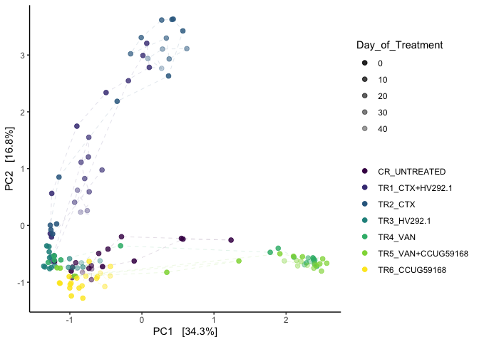

```r
pca_atchi %>% 
  export::graph2ppt(append = TRUE,
                    file = file.path(here::here("data/processed/figures_NRP72")))
```


```r
phyloseq_add_taxa_vector(dist =  bdiv_list$coda,
                         phyloseq = physeq_rare,
                         figure_ord = pca_atchi,
                         top_r = 16,
                         taxrank_glom = "Strain",
                         tax_rank_plot = "Strain",
) -> out
```

<!-- -->

```r
out$plot  %>% 
  export::graph2ppt(append = TRUE,
                    file = file.path(here::here("data/processed/figures_NRP72")))
```


```r
out$signenvfit %>%  
  DT::datatable()
```

```{=html}
<div id="htmlwidget-f7b94bcec7742359f17e" style="width:100%;height:auto;" class="datatables html-widget"></div>
<script type="application/json" data-for="htmlwidget-f7b94bcec7742359f17e">{"x":{"filter":"none","data":[["1","2","3","4","5","6","7","8","9","10","11","12","13","14","15","16"],[-0.546620560722049,-0.783430321971317,-0.0129789224577961,-0.622458062982885,-0.715060077833556,-0.131382977508227,-0.492521472111458,-0.0052178629656167,-0.059943972761691,-0.49241053334056,-0.703558554752391,-0.669734230418661,-0.0685120512999414,-0.275398653736984,-0.104285583206788,0.00135402545263019],[0.583189278331981,0.257966404000434,-0.781877959181189,0.564826444766316,0.308279617889538,-0.78290506120238,-0.628727657312241,-0.872269553281056,-0.807080564608216,-0.665276120690023,0.457069259614312,0.481477134917223,-0.790225484165859,-0.722102702545083,-0.900179158915276,-0.90368462887388],["ASV142","ASV157","ASV166","ASV170","ASV171","ASV176","ASV207","ASV217","ASV222","ASV230","ASV245","ASV276","ASV280","ASV368","ASV382","ASV389"],[0.001,0.001,0.001,0.001,0.001,0.001,0.001,0.001,0.001,0.001,0.001,0.001,0.001,0.001,0.001,0.001],[0.638903771765464,0.680309734976996,0.611501595481507,0.706482952879761,0.60634723771745,0.63020182163523,0.637875867560177,0.760881399675061,0.65497231763877,0.6850604501051,0.703906948049649,0.680364170842574,0.629150216998492,0.597276731503056,0.821198001010194,0.816647741847848],["Bacteria","Bacteria","Bacteria","Bacteria","Bacteria","Bacteria","Bacteria","Bacteria","Bacteria","Bacteria","Bacteria","Bacteria","Bacteria","Bacteria","Bacteria","Bacteria"],["Firmicutes","Firmicutes","Firmicutes","Firmicutes","Firmicutes","Firmicutes","Firmicutes","Firmicutes","Firmicutes","Firmicutes","Firmicutes","Firmicutes","Firmicutes","Firmicutes","Firmicutes","Firmicutes"],["Clostridia","Clostridia","Clostridia","Clostridia","Clostridia","Clostridia","Clostridia","Clostridia","Clostridia","Clostridia","Clostridia","Clostridia","Clostridia","Clostridia","Clostridia","Clostridia"],["Lachnospirales","Oscillospirales","Oscillospirales","Oscillospirales","Oscillospirales","Oscillospirales","Oscillospirales","Oscillospirales","Oscillospirales","Oscillospirales","Oscillospirales","Lachnospirales","Lachnospirales","Lachnospirales","Lachnospirales","Lachnospirales"],["Lachnospiraceae","Oscillospiraceae","Oscillospiraceae","Oscillospiraceae","Oscillospiraceae","Oscillospiraceae","Ruminococcaceae","Ruminococcaceae","Ruminococcaceae","Ruminococcaceae","Ruminococcaceae","Lachnospiraceae","Lachnospiraceae","Lachnospiraceae","Lachnospiraceae","Lachnospiraceae"],["Tyzzerella","Intestinimonas","Flavonifractor","Intestinimonas","Colidextribacter","Oscillibacter","Incertae Sedis","Pygmaiobacter","Pygmaiobacter",null,"Negativibacillus","GCA-900066575","Lachnospiraceae FCS020 group","[Ruminococcus] torques group","Lachnoclostridium",null],[null,null,null,null,null,null,null,null,null,null,null,null,null,null,null,null],["unknown Tyzzerella (Genus) ASV142","unknown Intestinimonas (Genus) ASV157","unknown Flavonifractor (Genus) ASV166","unknown Intestinimonas (Genus) ASV170","unknown Colidextribacter (Genus) ASV171","unknown Oscillibacter (Genus) ASV176","unknown Incertae Sedis (Genus) ASV207","unknown Pygmaiobacter (Genus) ASV217","unknown Pygmaiobacter (Genus) ASV222","unknown Ruminococcaceae (Family) ASV230","unknown Negativibacillus (Genus) ASV245","unknown GCA-900066575 (Genus) ASV276","unknown Lachnospiraceae FCS020 group (Genus) ASV280","unknown [Ruminococcus] torques group (Genus) ASV368","unknown Lachnoclostridium (Genus) ASV382","unknown Lachnospiraceae (Family) ASV389"]],"container":"<table class=\"display\">\n  <thead>\n    <tr>\n      <th> <\/th>\n      <th>Axis.1<\/th>\n      <th>Axis.2<\/th>\n      <th>id<\/th>\n      <th>pval<\/th>\n      <th>r<\/th>\n      <th>Kingdom<\/th>\n      <th>Phylum<\/th>\n      <th>Class<\/th>\n      <th>Order<\/th>\n      <th>Family<\/th>\n      <th>Genus<\/th>\n      <th>Species<\/th>\n      <th>tax_rank_plot<\/th>\n    <\/tr>\n  <\/thead>\n<\/table>","options":{"columnDefs":[{"className":"dt-right","targets":[1,2,4,5]},{"orderable":false,"targets":0}],"order":[],"autoWidth":false,"orderClasses":false}},"evals":[],"jsHooks":[]}</script>
```


```r
phyloseq_add_taxa_vector(dist =  bdiv_list$coda,
                         phyloseq = physeq_rare,
                         figure_ord = pca_atchi,
                         top_r = 16,
                         taxrank_glom = "Genus",
                         tax_rank_plot = "Genus"
) -> out
```

<!-- -->

```r
out$plot  %>% 
  export::graph2ppt(append = TRUE,
                    file = file.path(here::here("data/processed/figures_NRP72")))
```


```r
out$signenvfit %>%  
  DT::datatable()
```

```{=html}
<div id="htmlwidget-4ffb7898f01832d90c44" style="width:100%;height:auto;" class="datatables html-widget"></div>
<script type="application/json" data-for="htmlwidget-4ffb7898f01832d90c44">{"x":{"filter":"none","data":[["1","2","3","4","5","6","7","8","9","10","11","12","13","14","15","16"],[0.280081241324616,-0.506855687794374,-0.546620560722049,-0.134319082671518,-0.764171853049211,-0.704536346262109,-0.481612874511963,-0.662181574549646,-0.320941443732157,-0.0114709605663068,-0.703558554752391,-0.669734230418661,-0.0685120512999414,-0.252896230197048,-0.595778863167805,-0.505680219955537],[0.692884300628186,0.549469273349149,0.583189278331981,-0.844538812129036,0.333128240688276,0.294506152738703,-0.644174250108803,0.408616003778409,-0.694981759035188,-0.882301190038069,0.457069259614312,0.481477134917223,-0.790225484165859,-0.744706970495541,-0.468318161982387,-0.639881320331938],["ASV022","ASV136","ASV142","ASV166","ASV170","ASV171","ASV176","ASV188","ASV190","ASV217","ASV245","ASV276","ASV280","ASV351","ASV356","ASV397"],[0.001,0.001,0.001,0.001,0.001,0.001,0.001,0.001,0.001,0.001,0.001,0.001,0.001,0.001,0.001,0.001],[0.558534155798948,0.558819170604349,0.638903771765464,0.731287421162041,0.69493304573673,0.583105337205315,0.646911425398915,0.605451476216886,0.586003055696525,0.778586972878907,0.703906948049649,0.680364170842574,0.629150216998492,0.618544975152524,0.574274354640084,0.665160588964024],["Bacteria","Bacteria","Bacteria","Bacteria","Bacteria","Bacteria","Bacteria","Bacteria","Bacteria","Bacteria","Bacteria","Bacteria","Bacteria","Bacteria","Bacteria","Bacteria"],["Proteobacteria","Firmicutes","Firmicutes","Firmicutes","Firmicutes","Firmicutes","Firmicutes","Firmicutes","Firmicutes","Firmicutes","Firmicutes","Firmicutes","Firmicutes","Firmicutes","Firmicutes","Firmicutes"],["Gammaproteobacteria","Clostridia","Clostridia","Clostridia","Clostridia","Clostridia","Clostridia","Clostridia","Clostridia","Clostridia","Clostridia","Clostridia","Clostridia","Clostridia","Clostridia","Clostridia"],["Enterobacterales","Lachnospirales","Lachnospirales","Oscillospirales","Oscillospirales","Oscillospirales","Oscillospirales","Monoglobales","Oscillospirales","Oscillospirales","Oscillospirales","Lachnospirales","Lachnospirales","Lachnospirales","Lachnospirales","Lachnospirales"],["Morganellaceae","Lachnospiraceae","Lachnospiraceae","Oscillospiraceae","Oscillospiraceae","Oscillospiraceae","Oscillospiraceae","Monoglobaceae","Oscillospiraceae","Ruminococcaceae","Ruminococcaceae","Lachnospiraceae","Lachnospiraceae","Lachnospiraceae","Lachnospiraceae","Lachnospiraceae"],["Proteus","Lachnospiraceae UCG-010","Tyzzerella","Flavonifractor","Intestinimonas","Colidextribacter","Oscillibacter","Monoglobus","NK4A214 group","Pygmaiobacter","Negativibacillus","GCA-900066575","Lachnospiraceae FCS020 group","Sellimonas","[Ruminococcus] torques group","Lachnoclostridium"],[null,null,null,null,null,null,null,null,null,null,null,null,null,null,null,null],["unknown Proteus (Genus) ASV022","unknown Lachnospiraceae UCG-010 (Genus) ASV136","unknown Tyzzerella (Genus) ASV142","unknown Flavonifractor (Genus) ASV166","unknown Intestinimonas (Genus) ASV170","unknown Colidextribacter (Genus) ASV171","unknown Oscillibacter (Genus) ASV176","unknown Monoglobus (Genus) ASV188","unknown NK4A214 group (Genus) ASV190","unknown Pygmaiobacter (Genus) ASV217","unknown Negativibacillus (Genus) ASV245","unknown GCA-900066575 (Genus) ASV276","unknown Lachnospiraceae FCS020 group (Genus) ASV280","unknown Sellimonas (Genus) ASV351","unknown [Ruminococcus] torques group (Genus) ASV356","unknown Lachnoclostridium (Genus) ASV397"]],"container":"<table class=\"display\">\n  <thead>\n    <tr>\n      <th> <\/th>\n      <th>Axis.1<\/th>\n      <th>Axis.2<\/th>\n      <th>id<\/th>\n      <th>pval<\/th>\n      <th>r<\/th>\n      <th>Kingdom<\/th>\n      <th>Phylum<\/th>\n      <th>Class<\/th>\n      <th>Order<\/th>\n      <th>Family<\/th>\n      <th>tax_rank_plot<\/th>\n      <th>Species<\/th>\n      <th>Strain<\/th>\n    <\/tr>\n  <\/thead>\n<\/table>","options":{"columnDefs":[{"className":"dt-right","targets":[1,2,4,5]},{"orderable":false,"targets":0}],"order":[],"autoWidth":false,"orderClasses":false}},"evals":[],"jsHooks":[]}</script>
```

```r
vegan::adonis(bdiv_list$coda  ~ get_variable(physeq_rare, "Reactor_Treatment") * 
                get_variable(physeq_rare, "Day_of_Treatment"))$aov.tab %>% 
  data.frame() %>%
  rownames_to_column('Term') %>%
  mutate_if(is.numeric, round, 4) %>%
  DT::datatable()
```

```{=html}
<div id="htmlwidget-b58fa9e3f5f2147e83fd" style="width:100%;height:auto;" class="datatables html-widget"></div>
<script type="application/json" data-for="htmlwidget-b58fa9e3f5f2147e83fd">{"x":{"filter":"none","data":[["1","2","3","4","5"],["get_variable(physeq_rare, \"Reactor_Treatment\")","get_variable(physeq_rare, \"Day_of_Treatment\")","get_variable(physeq_rare, \"Reactor_Treatment\"):get_variable(physeq_rare, \"Day_of_Treatment\")","Residuals","Total"],[6,1,6,121,134],[23898.8233,3377.9824,6032.1503,24487.3579,57796.3139],[3983.1372,3377.9824,1005.3584,202.3749,null],[19.682,16.6917,4.9678,null,null],[0.4135,0.0584,0.1044,0.4237,1],[0.001,0.001,0.001,null,null]],"container":"<table class=\"display\">\n  <thead>\n    <tr>\n      <th> <\/th>\n      <th>Term<\/th>\n      <th>Df<\/th>\n      <th>SumsOfSqs<\/th>\n      <th>MeanSqs<\/th>\n      <th>F.Model<\/th>\n      <th>R2<\/th>\n      <th>Pr..F.<\/th>\n    <\/tr>\n  <\/thead>\n<\/table>","options":{"columnDefs":[{"className":"dt-right","targets":[2,3,4,5,6,7]},{"orderable":false,"targets":0}],"order":[],"autoWidth":false,"orderClasses":false}},"evals":[],"jsHooks":[]}</script>
```


```r
lapply(
  bdiv_list,
  FUN = phyloseq_adonis_strata_perm,
  physeq = physeq_rare,
  formula = paste0(c("Reactor_Treatment", "Day_of_Treatment"), collapse=" * "),
  nrep = 999,
  strata = "none"
) %>%
  bind_rows(.id = "Distance") %>%
  mutate_if(is.numeric, round, 3) %>%
  DT::datatable()
```

```{=html}
<div id="htmlwidget-c2f80e5cf2788b149f15" style="width:100%;height:auto;" class="datatables html-widget"></div>
<script type="application/json" data-for="htmlwidget-c2f80e5cf2788b149f15">{"x":{"filter":"none","data":[["1","2","3","4","5","6","7","8","9","10","11","12","13","14","15","16","17","18","19","20","21","22","23","24","25"],["bray","bray","bray","bray","bray","sorensen","sorensen","sorensen","sorensen","sorensen","bjaccard","bjaccard","bjaccard","bjaccard","bjaccard","wjaccard","wjaccard","wjaccard","wjaccard","wjaccard","coda","coda","coda","coda","coda"],["Reactor_Treatment","Day_of_Treatment","Reactor_Treatment:Day_of_Treatment","Residuals","Total","Reactor_Treatment","Day_of_Treatment","Reactor_Treatment:Day_of_Treatment","Residuals","Total","Reactor_Treatment","Day_of_Treatment","Reactor_Treatment:Day_of_Treatment","Residuals","Total","Reactor_Treatment","Day_of_Treatment","Reactor_Treatment:Day_of_Treatment","Residuals","Total","Reactor_Treatment","Day_of_Treatment","Reactor_Treatment:Day_of_Treatment","Residuals","Total"],[6,1,6,121,134,6,1,6,121,134,6,1,6,121,134,6,1,6,121,134,6,1,6,121,134],[11.272,1.397,2.36,9.762,24.791,10.64,0.982,2.049,6.888,20.56,12.497,1.317,2.918,12.845,29.576,12.294,1.806,3.714,17.744,35.558,23898.823,3377.982,6032.15,24487.358,57796.314],[1.879,1.397,0.393,0.081,null,1.773,0.982,0.342,0.057,null,2.083,1.317,0.486,0.106,null,2.049,1.806,0.619,0.147,null,3983.137,3377.982,1005.358,202.375,null],[23.288,17.317,4.875,null,null,31.15,17.256,5.999,null,null,19.62,12.406,4.582,null,null,13.972,12.318,4.221,null,null,19.682,16.692,4.968,null,null],[0.455,0.056,0.095,0.394,1,0.518,0.048,0.1,0.335,1,0.423,0.045,0.099,0.434,1,0.346,0.051,0.104,0.499,1,0.414,0.058,0.104,0.424,1],[0.001,0.001,0.001,null,null,0.001,0.001,0.001,null,null,0.001,0.001,0.001,null,null,0.001,0.001,0.001,null,null,0.001,0.001,0.001,null,null]],"container":"<table class=\"display\">\n  <thead>\n    <tr>\n      <th> <\/th>\n      <th>Distance<\/th>\n      <th>terms<\/th>\n      <th>Df<\/th>\n      <th>SumsOfSqs<\/th>\n      <th>MeanSqs<\/th>\n      <th>F.Model<\/th>\n      <th>R2<\/th>\n      <th>Pr..F.<\/th>\n    <\/tr>\n  <\/thead>\n<\/table>","options":{"columnDefs":[{"className":"dt-right","targets":[3,4,5,6,7,8]},{"orderable":false,"targets":0}],"order":[],"autoWidth":false,"orderClasses":false}},"evals":[],"jsHooks":[]}</script>
```


```r
phyloseq_plot_bdiv(physeq_rare,
                   bdiv_list,
                   m = "NMDS",
                   axis1 = 1,
                   axis2 = 2) -> plots
```


```r
# plot_list %>%
#   phyloseq_ordinations_expl_var()
```


```r
physeq_rare %>%
  phyloseq_distance_boxplot(bdiv_list$coda ,
                            d = "Reactor_Treatment") -> dist_box


dist_box_plot <- dist_box$plot

dist_box_plot
```

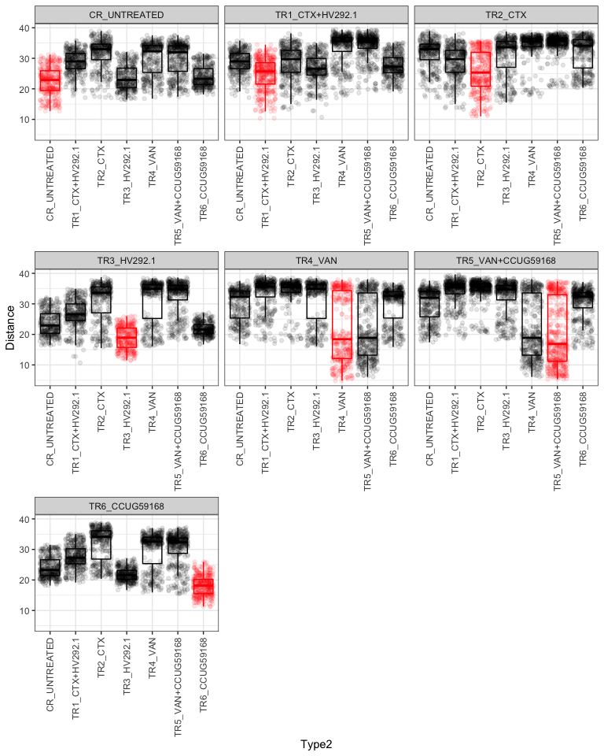<!-- -->

```r
dist_box_plot %>% 
  export::graph2ppt(append = TRUE,
                    file = file.path(here::here("data/processed/figures_NRP72")))
```


```r
plots %>%
  phyloseq_plot_ordinations_facet(color_group =  "Day_of_Treatment",
                                  shape_group = "Reactor_Treatment")  -> plot_list

plot_list
```

```
## Warning: The shape palette can deal with a maximum of 6 discrete values because
## more than 6 becomes difficult to discriminate; you have 7. Consider
## specifying shapes manually if you must have them.
```

```
## Warning: Removed 95 rows containing missing values (geom_point).
```

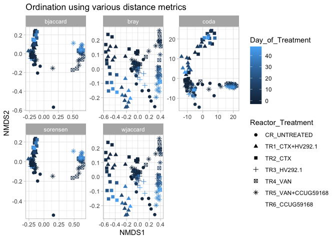<!-- -->


```r
lapply(
  bdiv_list,
  FUN = physeq_pairwise_permanovas,
  physeq = physeq_rare,
  compare_header = "Reactor_Treatment",
  n_perm = 999,
  strat = FALSE
) %>%
  bind_rows(.id = "Distance") %>%
  mutate_if(is.numeric, round, 3) %>%
  # filter(! terms %in% (c("Residuals", "Total"))) %>%
  DT::datatable()
```

```{=html}
<div id="htmlwidget-298d4248b114fced17d8" style="width:100%;height:auto;" class="datatables html-widget"></div>
<script type="application/json" data-for="htmlwidget-298d4248b114fced17d8">{"x":{"filter":"none","data":[["1","2","3","4","5","6","7","8","9","10","11","12","13","14","15","16","17","18","19","20","21","22","23","24","25","26","27","28","29","30","31","32","33","34","35","36","37","38","39","40","41","42","43","44","45","46","47","48","49","50","51","52","53","54","55","56","57","58","59","60","61","62","63","64","65","66","67","68","69","70","71","72","73","74","75","76","77","78","79","80","81","82","83","84","85","86","87","88","89","90","91","92","93","94","95","96","97","98","99","100","101","102","103","104","105"],["bray","bray","bray","bray","bray","bray","bray","bray","bray","bray","bray","bray","bray","bray","bray","bray","bray","bray","bray","bray","bray","sorensen","sorensen","sorensen","sorensen","sorensen","sorensen","sorensen","sorensen","sorensen","sorensen","sorensen","sorensen","sorensen","sorensen","sorensen","sorensen","sorensen","sorensen","sorensen","sorensen","sorensen","bjaccard","bjaccard","bjaccard","bjaccard","bjaccard","bjaccard","bjaccard","bjaccard","bjaccard","bjaccard","bjaccard","bjaccard","bjaccard","bjaccard","bjaccard","bjaccard","bjaccard","bjaccard","bjaccard","bjaccard","bjaccard","wjaccard","wjaccard","wjaccard","wjaccard","wjaccard","wjaccard","wjaccard","wjaccard","wjaccard","wjaccard","wjaccard","wjaccard","wjaccard","wjaccard","wjaccard","wjaccard","wjaccard","wjaccard","wjaccard","wjaccard","wjaccard","coda","coda","coda","coda","coda","coda","coda","coda","coda","coda","coda","coda","coda","coda","coda","coda","coda","coda","coda","coda","coda"],["CR_UNTREATED","CR_UNTREATED","CR_UNTREATED","CR_UNTREATED","CR_UNTREATED","CR_UNTREATED","TR1_CTX+HV292.1","TR1_CTX+HV292.1","TR1_CTX+HV292.1","TR1_CTX+HV292.1","TR1_CTX+HV292.1","TR2_CTX","TR2_CTX","TR2_CTX","TR2_CTX","TR3_HV292.1","TR3_HV292.1","TR3_HV292.1","TR4_VAN","TR4_VAN","TR5_VAN+CCUG59168","CR_UNTREATED","CR_UNTREATED","CR_UNTREATED","CR_UNTREATED","CR_UNTREATED","CR_UNTREATED","TR1_CTX+HV292.1","TR1_CTX+HV292.1","TR1_CTX+HV292.1","TR1_CTX+HV292.1","TR1_CTX+HV292.1","TR2_CTX","TR2_CTX","TR2_CTX","TR2_CTX","TR3_HV292.1","TR3_HV292.1","TR3_HV292.1","TR4_VAN","TR4_VAN","TR5_VAN+CCUG59168","CR_UNTREATED","CR_UNTREATED","CR_UNTREATED","CR_UNTREATED","CR_UNTREATED","CR_UNTREATED","TR1_CTX+HV292.1","TR1_CTX+HV292.1","TR1_CTX+HV292.1","TR1_CTX+HV292.1","TR1_CTX+HV292.1","TR2_CTX","TR2_CTX","TR2_CTX","TR2_CTX","TR3_HV292.1","TR3_HV292.1","TR3_HV292.1","TR4_VAN","TR4_VAN","TR5_VAN+CCUG59168","CR_UNTREATED","CR_UNTREATED","CR_UNTREATED","CR_UNTREATED","CR_UNTREATED","CR_UNTREATED","TR1_CTX+HV292.1","TR1_CTX+HV292.1","TR1_CTX+HV292.1","TR1_CTX+HV292.1","TR1_CTX+HV292.1","TR2_CTX","TR2_CTX","TR2_CTX","TR2_CTX","TR3_HV292.1","TR3_HV292.1","TR3_HV292.1","TR4_VAN","TR4_VAN","TR5_VAN+CCUG59168","CR_UNTREATED","CR_UNTREATED","CR_UNTREATED","CR_UNTREATED","CR_UNTREATED","CR_UNTREATED","TR1_CTX+HV292.1","TR1_CTX+HV292.1","TR1_CTX+HV292.1","TR1_CTX+HV292.1","TR1_CTX+HV292.1","TR2_CTX","TR2_CTX","TR2_CTX","TR2_CTX","TR3_HV292.1","TR3_HV292.1","TR3_HV292.1","TR4_VAN","TR4_VAN","TR5_VAN+CCUG59168"],["TR1_CTX+HV292.1","TR2_CTX","TR3_HV292.1","TR4_VAN","TR5_VAN+CCUG59168","TR6_CCUG59168","TR2_CTX","TR3_HV292.1","TR4_VAN","TR5_VAN+CCUG59168","TR6_CCUG59168","TR3_HV292.1","TR4_VAN","TR5_VAN+CCUG59168","TR6_CCUG59168","TR4_VAN","TR5_VAN+CCUG59168","TR6_CCUG59168","TR5_VAN+CCUG59168","TR6_CCUG59168","TR6_CCUG59168","TR1_CTX+HV292.1","TR2_CTX","TR3_HV292.1","TR4_VAN","TR5_VAN+CCUG59168","TR6_CCUG59168","TR2_CTX","TR3_HV292.1","TR4_VAN","TR5_VAN+CCUG59168","TR6_CCUG59168","TR3_HV292.1","TR4_VAN","TR5_VAN+CCUG59168","TR6_CCUG59168","TR4_VAN","TR5_VAN+CCUG59168","TR6_CCUG59168","TR5_VAN+CCUG59168","TR6_CCUG59168","TR6_CCUG59168","TR1_CTX+HV292.1","TR2_CTX","TR3_HV292.1","TR4_VAN","TR5_VAN+CCUG59168","TR6_CCUG59168","TR2_CTX","TR3_HV292.1","TR4_VAN","TR5_VAN+CCUG59168","TR6_CCUG59168","TR3_HV292.1","TR4_VAN","TR5_VAN+CCUG59168","TR6_CCUG59168","TR4_VAN","TR5_VAN+CCUG59168","TR6_CCUG59168","TR5_VAN+CCUG59168","TR6_CCUG59168","TR6_CCUG59168","TR1_CTX+HV292.1","TR2_CTX","TR3_HV292.1","TR4_VAN","TR5_VAN+CCUG59168","TR6_CCUG59168","TR2_CTX","TR3_HV292.1","TR4_VAN","TR5_VAN+CCUG59168","TR6_CCUG59168","TR3_HV292.1","TR4_VAN","TR5_VAN+CCUG59168","TR6_CCUG59168","TR4_VAN","TR5_VAN+CCUG59168","TR6_CCUG59168","TR5_VAN+CCUG59168","TR6_CCUG59168","TR6_CCUG59168","TR1_CTX+HV292.1","TR2_CTX","TR3_HV292.1","TR4_VAN","TR5_VAN+CCUG59168","TR6_CCUG59168","TR2_CTX","TR3_HV292.1","TR4_VAN","TR5_VAN+CCUG59168","TR6_CCUG59168","TR3_HV292.1","TR4_VAN","TR5_VAN+CCUG59168","TR6_CCUG59168","TR4_VAN","TR5_VAN+CCUG59168","TR6_CCUG59168","TR5_VAN+CCUG59168","TR6_CCUG59168","TR6_CCUG59168"],[0.236,0.338,0.145,0.251,0.232,0.164,0.116,0.282,0.436,0.412,0.298,0.419,0.464,0.437,0.416,0.398,0.381,0.147,0.041,0.329,0.294,0.224,0.306,0.164,0.383,0.406,0.197,0.202,0.221,0.448,0.478,0.225,0.385,0.406,0.438,0.401,0.476,0.502,0.127,0.027,0.454,0.485,0.18,0.24,0.135,0.306,0.319,0.168,0.163,0.184,0.353,0.373,0.191,0.311,0.325,0.345,0.326,0.392,0.409,0.112,0.033,0.383,0.404,0.178,0.251,0.126,0.192,0.183,0.133,0.097,0.229,0.3,0.285,0.229,0.323,0.32,0.303,0.309,0.305,0.3,0.128,0.038,0.245,0.228,0.207,0.273,0.153,0.268,0.296,0.182,0.144,0.211,0.324,0.363,0.249,0.323,0.318,0.356,0.359,0.389,0.433,0.177,0.042,0.356,0.392],[0.001,0.001,0.002,0.001,0.001,0.001,0.002,0.001,0.001,0.001,0.001,0.001,0.001,0.001,0.001,0.001,0.001,0.001,0.138,0.001,0.001,0.001,0.001,0.001,0.001,0.001,0.001,0.001,0.001,0.001,0.001,0.001,0.001,0.001,0.001,0.001,0.001,0.001,0.001,0.292,0.001,0.001,0.001,0.001,0.001,0.001,0.001,0.001,0.001,0.001,0.001,0.001,0.001,0.001,0.001,0.001,0.001,0.001,0.001,0.001,0.232,0.001,0.001,0.001,0.001,0.001,0.001,0.001,0.001,0.003,0.001,0.001,0.001,0.001,0.001,0.001,0.001,0.001,0.001,0.001,0.001,0.169,0.001,0.001,0.001,0.001,0.001,0.001,0.001,0.001,0.001,0.001,0.001,0.001,0.001,0.001,0.001,0.001,0.001,0.001,0.001,0.001,0.159,0.001,0.001],[0.021,0.021,0.042,0.021,0.021,0.021,0.042,0.021,0.021,0.021,0.021,0.021,0.021,0.021,0.021,0.021,0.021,0.021,2.898,0.021,0.021,0.021,0.021,0.021,0.021,0.021,0.021,0.021,0.021,0.021,0.021,0.021,0.021,0.021,0.021,0.021,0.021,0.021,0.021,6.132,0.021,0.021,0.021,0.021,0.021,0.021,0.021,0.021,0.021,0.021,0.021,0.021,0.021,0.021,0.021,0.021,0.021,0.021,0.021,0.021,4.872,0.021,0.021,0.021,0.021,0.021,0.021,0.021,0.021,0.063,0.021,0.021,0.021,0.021,0.021,0.021,0.021,0.021,0.021,0.021,0.021,3.549,0.021,0.021,0.021,0.021,0.021,0.021,0.021,0.021,0.021,0.021,0.021,0.021,0.021,0.021,0.021,0.021,0.021,0.021,0.021,0.021,3.339,0.021,0.021],[0.002,0.002,0.002,0.002,0.002,0.002,0.002,0.002,0.002,0.002,0.002,0.002,0.002,0.002,0.002,0.002,0.002,0.002,0.138,0.002,0.002,0.002,0.002,0.002,0.002,0.002,0.002,0.002,0.002,0.002,0.002,0.002,0.002,0.002,0.002,0.002,0.002,0.002,0.002,0.292,0.002,0.002,0.002,0.002,0.002,0.002,0.002,0.002,0.002,0.002,0.002,0.002,0.002,0.002,0.002,0.002,0.002,0.002,0.002,0.002,0.232,0.002,0.002,0.002,0.002,0.002,0.002,0.002,0.002,0.003,0.002,0.002,0.002,0.002,0.002,0.002,0.002,0.002,0.002,0.002,0.002,0.169,0.002,0.002,0.002,0.002,0.002,0.002,0.002,0.002,0.002,0.002,0.002,0.002,0.002,0.002,0.002,0.002,0.002,0.002,0.002,0.002,0.159,0.002,0.002]],"container":"<table class=\"display\">\n  <thead>\n    <tr>\n      <th> <\/th>\n      <th>Distance<\/th>\n      <th>X1<\/th>\n      <th>X2<\/th>\n      <th>R2<\/th>\n      <th>pval<\/th>\n      <th>pvalBon<\/th>\n      <th>pvalFDR<\/th>\n    <\/tr>\n  <\/thead>\n<\/table>","options":{"columnDefs":[{"className":"dt-right","targets":[4,5,6,7]},{"orderable":false,"targets":0}],"order":[],"autoWidth":false,"orderClasses":false}},"evals":[],"jsHooks":[]}</script>
```


```r
correct_plot_x_continious <- function(original_plot = tmp_plot$data){
  
  
  ggplot(data=original_plot,mapping=aes(x=as.numeric(as.character(varGroup2)),y=Distance,color=Label)) +
    # geom_boxplot(data=tmp_plot$data,mapping=aes(x=as.factor(varGroup2),y=Distance,color=Label),outlier.size = 0.5) +
    geom_point(position=position_jitterdodge(jitter.width = 0.1,seed=123),aes(group=Label),size=2, alpha=0.4) +
    theme_bw() + 
    geom_path(arrow = arrow(type = "open", angle = 30, length = unit(0.1, "inches")),
                           size = 0.4, linetype = "dashed", inherit.aes = TRUE, aes(group=Label, color = Label),
                           position=position_jitterdodge(dodge.width=0.9)) +
    theme(legend.position="bottom")  + geom_smooth(show.legend = FALSE, level = 0.95, alpha=0.005, size = 0.001) + 
    # ylim(c(0,1)) +
    xlab("Day Treatment") + guides(col = guide_legend(ncol = 3)) + scale_x_continuous(breaks=seq(0,90,10)) + scale_fill_viridis_d() + scale_color_viridis_d() -> plot
  
  return(plot)
}
```


```r
phyloseq_plot_beta_div_wrt_timepoint(distances = c("coda", "bjaccard", "wjaccard"),
                                     bdiv_list = bdiv_list,
                                     physeq = physeq_rare,
                                     timepoint = "fixed",
                                     group_var = "Reactor_Treatment",
                                     time_var = "Day_of_Treatment",
                                     fixed_time = -1) -> t
tmp_plot <- t$bjaccard + facet_null() 

tmp_plot$data %>% 
  correct_plot_x_continious(.) -> tmp_plot_corrected

tmp_plot_corrected 
```

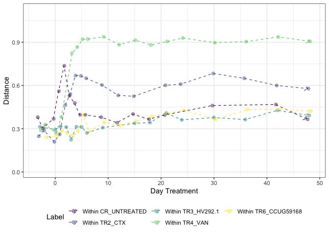<!-- -->

```r
tmp_plot_corrected %>% 
  export::graph2ppt(append = TRUE,
                    file = file.path(here::here("data/processed/figures_NRP72")))
```


```r
tmp_plot <- t$wjaccard + facet_null()

tmp_plot$data %>% 
  correct_plot_x_continious(.) -> tmp_plot_corrected

tmp_plot_corrected
```

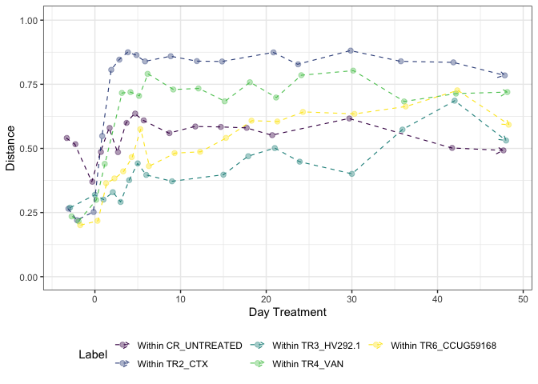<!-- -->

```r
tmp_plot_corrected %>% 
  export::graph2ppt(append = TRUE,
                    file = file.path(here::here("data/processed/figures_NRP72")))
```

```r
tmp_plot <- t$coda + facet_null()

tmp_plot$data %>% 
  correct_plot_x_continious(.) -> tmp_plot_corrected

tmp_plot_corrected
```

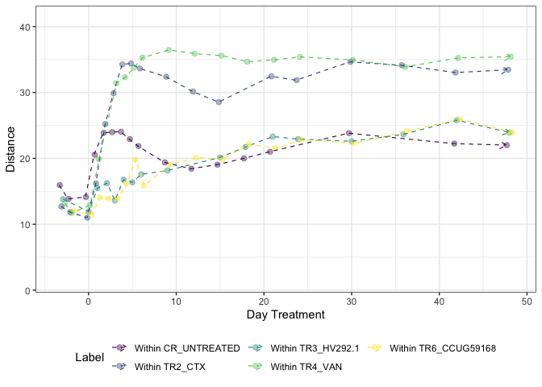<!-- -->

```r
tmp_plot_corrected %>% 
  export::graph2ppt(append = TRUE,
                    file = file.path(here::here("data/processed/figures_NRP72")))
```

```r
phyloseq_plot_beta_div_wrt_timepoint(distances = c("coda","bjaccard", "wjaccard"),
                                     bdiv_list = bdiv_list,
                                     physeq = physeq_rare,
                                     timepoint = "previous",
                                     group_var = "Reactor_Treatment",
                                     time_var = "Day_of_Treatment") -> t


tmp_plot <- t$bjaccard + facet_null()

tmp_plot$data %>% 
  correct_plot_x_continious(.) -> tmp_plot_corrected

tmp_plot_corrected
```

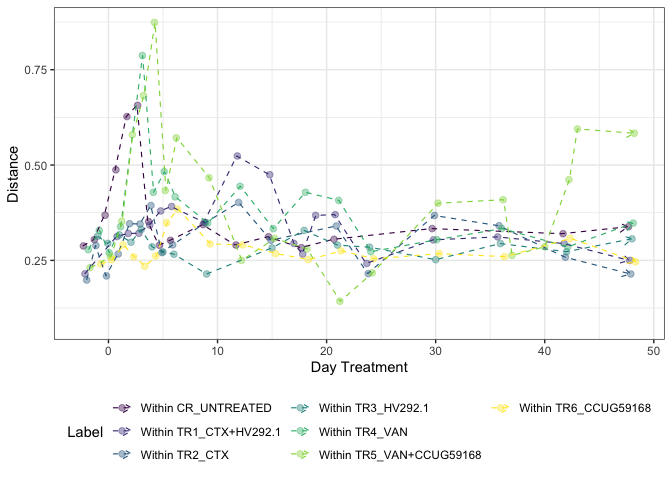<!-- -->

```r
tmp_plot_corrected %>% 
  export::graph2ppt(append = TRUE,
                    file = file.path(here::here("data/processed/figures_NRP72")))
```

```r
tmp_plot <- t$wjaccard + facet_null()

tmp_plot$data %>% 
  correct_plot_x_continious(.) -> tmp_plot_corrected

tmp_plot_corrected
```

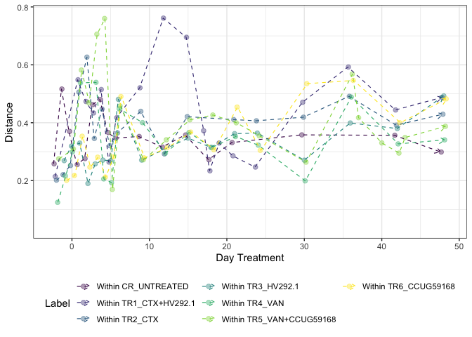<!-- -->

```r
tmp_plot_corrected %>% 
  export::graph2ppt(append = TRUE,
                    file = file.path(here::here("data/processed/figures_NRP72")))
```

```r
tmp_plot <- t$coda + facet_null()

tmp_plot$data %>% 
  correct_plot_x_continious(.) -> tmp_plot_corrected

tmp_plot_corrected
```

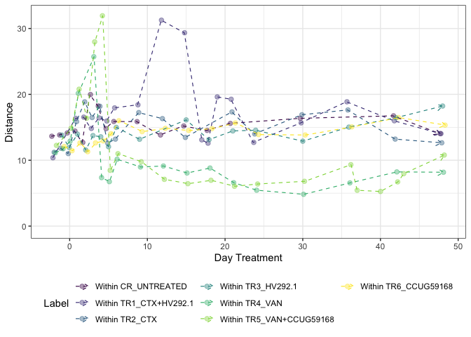<!-- -->

```r
tmp_plot_corrected %>% 
  export::graph2ppt(append = TRUE,
                    file = file.path(here::here("data/processed/figures_NRP72")))
```


```r
phyloseq_plot_beta_div_wrt_timepoint(distances = c("coda","bjaccard", "wjaccard"),
                                     bdiv_list = bdiv_list,
                                     physeq = physeq_rare,
                                     timepoint = "between.ref.group",
                                     group_var = "Reactor_Treatment",
                                     time_var = "Day_of_Treatment",
                                     group_to_compare = "CR_UNTREATED") -> t
tmp_plot<- t$bjaccard + facet_null()

tmp_plot$data %>% 
  correct_plot_x_continious(.) + guides(col = guide_legend(ncol = 2)) -> tmp_plot_corrected

tmp_plot_corrected
```

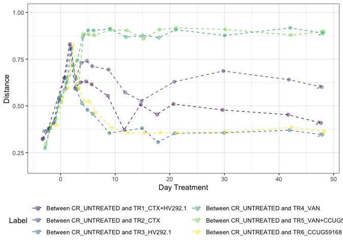<!-- -->

```r
tmp_plot_corrected %>% 
  export::graph2ppt(append = TRUE,
                    file = file.path(here::here("data/processed/figures_NRP72")))
```

```r
tmp_plot <- t$wjaccard + facet_null()

tmp_plot$data %>% 
  correct_plot_x_continious(.) + guides(col = guide_legend(ncol = 2)) -> tmp_plot_corrected

tmp_plot_corrected
```

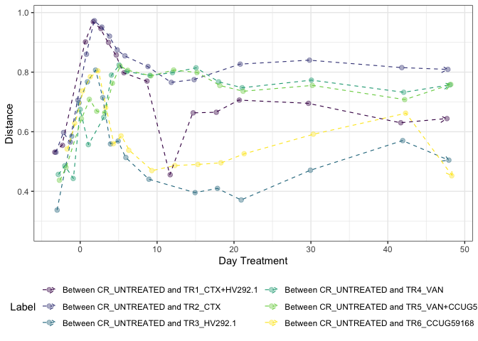<!-- -->

```r
tmp_plot_corrected %>% 
  export::graph2ppt(append = TRUE,
                    file = file.path(here::here("data/processed/figures_NRP72")))
```


```r
tmp_plot <- t$coda + facet_null()

tmp_plot$data %>% 
  correct_plot_x_continious(.) + guides(col = guide_legend(ncol = 2)) -> tmp_plot_corrected

tmp_plot_corrected
```

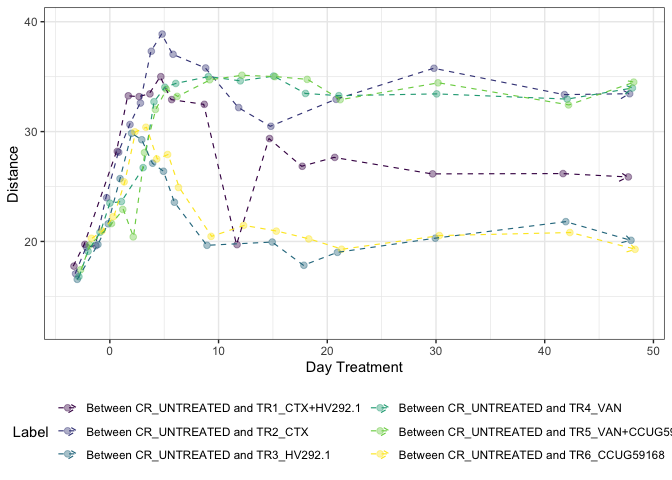<!-- -->

```r
tmp_plot_corrected %>% 
  export::graph2ppt(append = TRUE,
                    file = file.path(here::here("data/processed/figures_NRP72")))
```


```r
sessionInfo()
```

```
## R version 4.0.5 (2021-03-31)
## Platform: x86_64-apple-darwin17.0 (64-bit)
## Running under: macOS Mojave 10.14.6
## 
## Matrix products: default
## BLAS:   /Library/Frameworks/R.framework/Versions/4.0/Resources/lib/libRblas.dylib
## LAPACK: /Library/Frameworks/R.framework/Versions/4.0/Resources/lib/libRlapack.dylib
## 
## locale:
## [1] en_US.UTF-8/en_US.UTF-8/en_US.UTF-8/C/en_US.UTF-8/en_US.UTF-8
## 
## attached base packages:
## [1] parallel  stats     graphics  grDevices utils     datasets  methods  
## [8] base     
## 
## other attached packages:
##  [1] usedist_0.4.0        gdtools_0.2.3        GUniFrac_1.2        
##  [4] vegan_2.5-7          lattice_0.20-44      permute_0.9-5       
##  [7] Matrix_1.3-4         matrixStats_0.59.0   ape_5.5             
## [10] reshape2_1.4.4       scales_1.1.1         here_1.0.1          
## [13] microbiome_1.12.0    plotly_4.9.3         ampvis2_2.6.4       
## [16] ggrepel_0.9.1        speedyseq_0.5.3.9001 phyloseq_1.34.0     
## [19] forcats_0.5.1        stringr_1.4.0        dplyr_1.0.6         
## [22] purrr_0.3.4          readr_1.4.0          tidyr_1.1.3         
## [25] tibble_3.1.2         ggplot2_3.3.3        tidyverse_1.3.1     
## 
## loaded via a namespace (and not attached):
##   [1] readxl_1.3.1            uuid_0.1-4              backports_1.2.1        
##   [4] systemfonts_1.0.2       plyr_1.8.6              igraph_1.2.6           
##   [7] lazyeval_0.2.2          splines_4.0.5           crosstalk_1.1.1        
##  [10] digest_0.6.27           foreach_1.5.1           htmltools_0.5.1.1      
##  [13] fansi_0.5.0             magrittr_2.0.1          cluster_2.1.2          
##  [16] doParallel_1.0.16       openxlsx_4.2.3          Biostrings_2.58.0      
##  [19] modelr_0.1.8            officer_0.3.18          prettyunits_1.1.1      
##  [22] colorspace_2.0-1        rvest_1.0.0             haven_2.4.1            
##  [25] xfun_0.23               crayon_1.4.1            jsonlite_1.7.2         
##  [28] survival_3.2-11         iterators_1.0.13        glue_1.4.2             
##  [31] rvg_0.2.5               gtable_0.3.0            zlibbioc_1.36.0        
##  [34] XVector_0.30.0          Rhdf5lib_1.12.1         BiocGenerics_0.36.1    
##  [37] DBI_1.1.1               miniUI_0.1.1.1          Rcpp_1.0.6             
##  [40] xtable_1.8-4            viridisLite_0.4.0       progress_1.2.2         
##  [43] DT_0.18                 stats4_4.0.5            truncnorm_1.0-8        
##  [46] htmlwidgets_1.5.3       httr_1.4.2              RColorBrewer_1.1-2     
##  [49] ellipsis_0.3.2          pkgconfig_2.0.3         NADA_1.6-1.1           
##  [52] farver_2.1.0            sass_0.4.0              dbplyr_2.1.1           
##  [55] utf8_1.2.1              manipulateWidget_0.11.0 later_1.2.0            
##  [58] tidyselect_1.1.1        labeling_0.4.2          rlang_0.4.11           
##  [61] munsell_0.5.0           cellranger_1.1.0        tools_4.0.5            
##  [64] cli_2.5.0               generics_0.1.0          statnet.common_4.5.0   
##  [67] ade4_1.7-16             export_0.2.2.9001       broom_0.7.6            
##  [70] fastmap_1.1.0           evaluate_0.14           biomformat_1.18.0      
##  [73] yaml_2.2.1              knitr_1.33              fs_1.5.0               
##  [76] zip_2.2.0               rgl_0.106.8             nlme_3.1-152           
##  [79] mime_0.10               xml2_1.3.2              compiler_4.0.5         
##  [82] rstudioapi_0.13         zCompositions_1.3.4     reprex_2.0.0           
##  [85] bslib_0.2.5.1           stringi_1.6.2           highr_0.9              
##  [88] stargazer_5.2.2         multtest_2.46.0         vctrs_0.3.8            
##  [91] pillar_1.6.1            lifecycle_1.0.0         rhdf5filters_1.2.0     
##  [94] jquerylib_0.1.4         data.table_1.14.0       flextable_0.6.6        
##  [97] httpuv_1.6.1            patchwork_1.1.1         R6_2.5.0               
## [100] promises_1.2.0.1        network_1.17.0          IRanges_2.24.1         
## [103] codetools_0.2-18        ggnet_0.1.0             MASS_7.3-54            
## [106] assertthat_0.2.1        rhdf5_2.34.0            rprojroot_2.0.2        
## [109] withr_2.4.2             S4Vectors_0.28.1        mgcv_1.8-36            
## [112] hms_1.1.0               grid_4.0.5              coda_0.19-4            
## [115] rmarkdown_2.8           Rtsne_0.15              Biobase_2.50.0         
## [118] shiny_1.6.0             lubridate_1.7.10        base64enc_0.1-3
```

