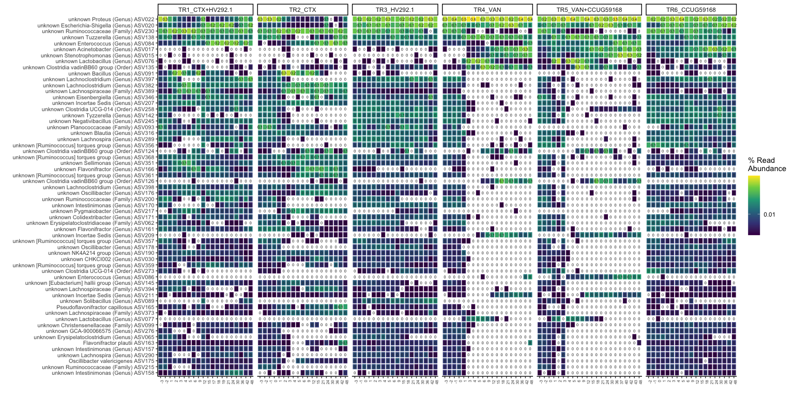
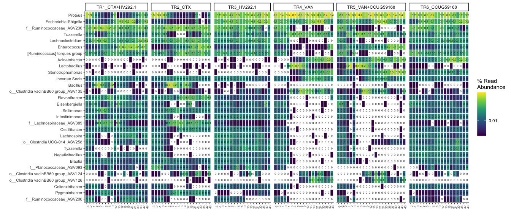

#### Load required packages


```r
library(tidyverse)
library(phyloseq)
library(speedyseq)
library(ggrepel)
library(ampvis2)
library(plotly)
library(microbiome)
library(here)
options(getClass.msg=FALSE) # https://github.com/epurdom/clusterExperiment/issues/66
#this fixes an error message that pops up because the class 'Annotated' is defined in two different packages
```

#### Source required functions


```r
'%!in%' <- function(x,y)!('%in%'(x,y))

source("https://raw.githubusercontent.com/fconstancias/DivComAnalyses/master/R/phyloseq_taxa_tests.R")
source("https://raw.githubusercontent.com/fconstancias/DivComAnalyses/master/R/phyloseq_normalisation.R")
source("https://raw.githubusercontent.com/fconstancias/DivComAnalyses/master/R/phyloseq_alpha.R")
source("https://raw.githubusercontent.com/fconstancias/DivComAnalyses/master/R/phyloseq_beta.R")
source("https://raw.githubusercontent.com/fconstancias/DivComAnalyses/master/R/phyloseq_heatmap.R")
```


```r
plot_time <- function(df, 
                      measure,
                      x = "Day_from_Inoculum", 
                      y = "value", 
                      shape = "neg",
                      fill = "Reactor_Treatment",
                      group = "Reactor_Treatment", 
                      facet)
{
  df %>%
    dplyr::filter(alphadiversiy %in% measure) %>%
    dplyr::mutate(alphadiversiy = fct_reorder(alphadiversiy, value, .desc = TRUE)) %>%
    dplyr::mutate(neg = ifelse(value == 0, "neg", "pos")) %>%
    arrange(Day_from_Inoculum) %>%
    ggplot(aes_string(x = x,
                      y = y)) +
    geom_jitter(size=0.5, alpha=0.9, aes_string(color = fill, fill = fill, shape = shape),  show.legend = TRUE) + 
    geom_path(inherit.aes = TRUE, aes_string(fill = fill, color = fill, show.legend = FALSE),
              size = 0.01,
              linetype = "dashed") +
    facet_grid(as.formula(facet), scales = "free") +
    geom_vline(xintercept = c(0),
               color="black", alpha=0.4) +
    geom_smooth(show.legend = FALSE, level = 0.95, alpha=0.005, size = 0.5 ,aes_string(color = fill, fill = fill)) +
    scale_x_continuous(breaks=seq(0,90,10)) +
    # scale_y_continuous(labels = scientific,
    #                    limits=c(1e+10, 1e+11), breaks = seq(1e+10, 1e+11, by = 1e+10),
    #                    trans = "log10") +
    theme_light() +
    scale_color_viridis_d(na.value = "black") +
    scale_fill_viridis_d(na.value = "black") -> plot
  
  return(plot + theme(legend.position = "bottom"))
}
```

# Import phyloseq object


```r
ps = "data/processed/physeq_update_16S_chicken_08-06-21.RDS"

ps %>% 
  here::here() %>%
  readRDS() %>%
  phyloseq_get_strains_fast() %>% 
  filter_taxa(function(x) sum(x > 0) > 0, TRUE) %>% 
  subset_samples(Sample_description %!in% c("TR5-15", "TR4-1")) %>% 
  subset_samples(Experiment == "Continuous") %>% 
  subset_samples(Enrichment == "NotEnriched") %>%
  subset_samples(Paul %!in% c("Paul")) %>% 
  subset_samples(Reactor_Treatment != "IR1_UNTREATED") %>% 
  subset_samples(Reactor_Treatment != "IR2_UNTREATED") %>% 
  subset_samples(Day_from_Inoculum >= 30)  -> physeq
```

```
## Joining, by = "ASV"
```

# Rarefaction:


```r
physeq %>% 
  rarefy_even_depth(sample.size = 4576,
                    rngseed = 123) -> physeq_rare
```

```
## `set.seed(123)` was used to initialize repeatable random subsampling.
```

```
## Please record this for your records so others can reproduce.
```

```
## Try `set.seed(123); .Random.seed` for the full vector
```

```
## ...
```

```
## 9 samples removedbecause they contained fewer reads than `sample.size`.
```

```
## Up to first five removed samples are:
```

```
## CR-40-S166CR-52-S196TR1-15-S168TR1-16-S199TR2-34-S302
```

```
## ...
```

```
## 115OTUs were removed because they are no longer 
## present in any sample after random subsampling
```

```
## ...
```

```r
physeq_rare
```

```
## phyloseq-class experiment-level object
## otu_table()   OTU Table:          [ 287 taxa and 135 samples ]:
## sample_data() Sample Data:        [ 135 samples by 63 sample variables ]:
## tax_table()   Taxonomy Table:     [ 287 taxa by 8 taxonomic ranks ]:
## phy_tree()    Phylogenetic Tree:  [ 287 tips and 285 internal nodes ]:
## refseq()      DNAStringSet:       [ 287 reference sequences ]
## taxa are rows
```
heatmap:

```r
physeq_rare %>%
  subset_samples(Reactor_Treatment != "CR_UNTREATED")  %>% 
  # subset_samples(Experiment == "CCUG59168" |  Experiment ==  "HV292.1" | Experiment ==  "Cecum" |  Experiment ==  "Continuous" & Reactor %in% c("IR1", "CR")) %>%
  # rarefy_even_depth(sample.size = 2574,rngseed = 123) %>%
  phyloseq_ampvis_heatmap(transform = "compositional",
                          group_by = "Day_of_Treatment",
                          facet_by = c("Enrichment",  "Reactor_Treatment"),
                          tax_aggregate = "Species",
                          tax_add = NULL,
                          ntax  = 60) -> p

p$data %>% 
  mutate(Abundance = na_if(Abundance, 0)) -> p$data 


p + facet_grid( ~ Reactor_Treatment , scales = "free", space = "free") + 
  scale_fill_viridis_c(breaks = c(0,  0.01, 1, 10, 50, 75, 100), 
                       labels = c(0,  0.01, 1, 10, 50, 75, 100), 
                       trans = scales::pseudo_log_trans(sigma = 0.001),
                       na.value = 'transparent') -> p2
```

```
## Scale for 'fill' is already present. Adding another scale for 'fill', which
## will replace the existing scale.
```

```r
p2
```

<!-- -->

```r
p2 %>% 
  export::graph2ppt(append = TRUE,
                    file = file.path(here::here("data/processed/figures_NRP72")))
```

```
## Exported graph as /Users/fconstan/Documents/GitHub/amchick/data/processed/figures_NRP72.pptx
```


```r
physeq_rare %>%
  subset_samples(Reactor_Treatment != "CR_UNTREATED") %>% 
  # subset_samples(Experiment == "CCUG59168" |  Experiment ==  "HV292.1" | Experiment ==  "Cecum" |  Experiment ==  "Continuous" & Reactor %in% c("IR1", "CR")) %>%
  # rarefy_even_depth(sample.size = 2574,rngseed = 123) %>%
  phyloseq_ampvis_heatmap(transform = "compositional",
                          group_by = "Day_of_Treatment",
                          facet_by = c("Enrichment",  "Reactor_Treatment"),
                          tax_aggregate = "Genus",
                          tax_add = NULL,
                          ntax  = 30) -> p

p$data %>% 
  mutate(Abundance = na_if(Abundance, 0)) -> p$data 


p + facet_grid( ~ Reactor_Treatment , scales = "free", space = "free") + 
  scale_fill_viridis_c(breaks = c(0,  0.01, 1, 10, 50, 75, 100), 
                       labels = c(0,  0.01, 1, 10, 50, 75, 100), 
                       trans = scales::pseudo_log_trans(sigma = 0.001),
                       na.value = 'transparent') -> p2
```

```
## Scale for 'fill' is already present. Adding another scale for 'fill', which
## will replace the existing scale.
```

```r
p2
```

<!-- -->

```r
p2 %>% 
  export::graph2ppt(append = TRUE,
                    file = file.path(here::here("data/processed/figures_NRP72")))
```

```
## Exported graph as /Users/fconstan/Documents/GitHub/amchick/data/processed/figures_NRP72.pptx
```

<!-- plot_taxa_abundances_over_time<-function(physeq=physeq, -->
<!--                                          taxa_level,  -->
<!--                                          taxa_to_plot, -->
<!--                                          time_column, -->
<!--                                          other_columns_to_plot = NULL, -->
<!--                                          axis_transform=TRUE, -->
<!--                                          transformation = NULL, -->
<!--                                          plot_total = FALSE, -->
<!--                                          data_facet1=NULL, -->
<!--                                          data_facet2=NULL, -->
<!--                                          n_facet_row=NULL, -->
<!--                                          n_facet_col=NULL){ -->


```r
sessionInfo()
```

```
## R version 4.0.5 (2021-03-31)
## Platform: x86_64-apple-darwin17.0 (64-bit)
## Running under: macOS Mojave 10.14.6
## 
## Matrix products: default
## BLAS:   /Library/Frameworks/R.framework/Versions/4.0/Resources/lib/libRblas.dylib
## LAPACK: /Library/Frameworks/R.framework/Versions/4.0/Resources/lib/libRlapack.dylib
## 
## locale:
## [1] en_US.UTF-8/en_US.UTF-8/en_US.UTF-8/C/en_US.UTF-8/en_US.UTF-8
## 
## attached base packages:
## [1] stats     graphics  grDevices utils     datasets  methods   base     
## 
## other attached packages:
##  [1] gdtools_0.2.3        reshape2_1.4.4       scales_1.1.1        
##  [4] here_1.0.1           microbiome_1.12.0    plotly_4.9.3        
##  [7] ampvis2_2.6.4        ggrepel_0.9.1        speedyseq_0.5.3.9001
## [10] phyloseq_1.34.0      forcats_0.5.1        stringr_1.4.0       
## [13] dplyr_1.0.6          purrr_0.3.4          readr_1.4.0         
## [16] tidyr_1.1.3          tibble_3.1.2         ggplot2_3.3.3       
## [19] tidyverse_1.3.1     
## 
## loaded via a namespace (and not attached):
##   [1] readxl_1.3.1            uuid_0.1-4              backports_1.2.1        
##   [4] systemfonts_1.0.2       plyr_1.8.6              igraph_1.2.6           
##   [7] lazyeval_0.2.2          splines_4.0.5           crosstalk_1.1.1        
##  [10] digest_0.6.27           foreach_1.5.1           htmltools_0.5.1.1      
##  [13] fansi_0.5.0             magrittr_2.0.1          cluster_2.1.2          
##  [16] doParallel_1.0.16       openxlsx_4.2.3          Biostrings_2.58.0      
##  [19] modelr_0.1.8            officer_0.3.18          prettyunits_1.1.1      
##  [22] colorspace_2.0-1        rvest_1.0.0             haven_2.4.1            
##  [25] xfun_0.23               crayon_1.4.1            jsonlite_1.7.2         
##  [28] survival_3.2-11         iterators_1.0.13        ape_5.5                
##  [31] glue_1.4.2              rvg_0.2.5               gtable_0.3.0           
##  [34] zlibbioc_1.36.0         XVector_0.30.0          Rhdf5lib_1.12.1        
##  [37] BiocGenerics_0.36.1     DBI_1.1.1               miniUI_0.1.1.1         
##  [40] Rcpp_1.0.6              viridisLite_0.4.0       xtable_1.8-4           
##  [43] progress_1.2.2          stats4_4.0.5            htmlwidgets_1.5.3      
##  [46] httr_1.4.2              RColorBrewer_1.1-2      ellipsis_0.3.2         
##  [49] pkgconfig_2.0.3         farver_2.1.0            sass_0.4.0             
##  [52] dbplyr_2.1.1            utf8_1.2.1              manipulateWidget_0.11.0
##  [55] tidyselect_1.1.1        rlang_0.4.11            later_1.2.0            
##  [58] munsell_0.5.0           cellranger_1.1.0        tools_4.0.5            
##  [61] cli_2.5.0               generics_0.1.0          statnet.common_4.5.0   
##  [64] ade4_1.7-16             export_0.2.2.9001       broom_0.7.6            
##  [67] evaluate_0.14           biomformat_1.18.0       fastmap_1.1.0          
##  [70] yaml_2.2.1              knitr_1.33              fs_1.5.0               
##  [73] zip_2.2.0               rgl_0.106.8             nlme_3.1-152           
##  [76] mime_0.10               xml2_1.3.2              compiler_4.0.5         
##  [79] rstudioapi_0.13         reprex_2.0.0            bslib_0.2.5.1          
##  [82] stringi_1.6.2           highr_0.9               stargazer_5.2.2        
##  [85] lattice_0.20-44         Matrix_1.3-4            vegan_2.5-7            
##  [88] permute_0.9-5           multtest_2.46.0         vctrs_0.3.8            
##  [91] pillar_1.6.1            lifecycle_1.0.0         rhdf5filters_1.2.0     
##  [94] jquerylib_0.1.4         data.table_1.14.0       flextable_0.6.6        
##  [97] httpuv_1.6.1            patchwork_1.1.1         R6_2.5.0               
## [100] promises_1.2.0.1        network_1.17.0          IRanges_2.24.1         
## [103] codetools_0.2-18        ggnet_0.1.0             MASS_7.3-54            
## [106] assertthat_0.2.1        rhdf5_2.34.0            rprojroot_2.0.2        
## [109] withr_2.4.2             S4Vectors_0.28.1        mgcv_1.8-36            
## [112] parallel_4.0.5          hms_1.1.0               grid_4.0.5             
## [115] coda_0.19-4             rmarkdown_2.8           Rtsne_0.15             
## [118] Biobase_2.50.0          shiny_1.6.0             lubridate_1.7.10       
## [121] base64enc_0.1-3
```
