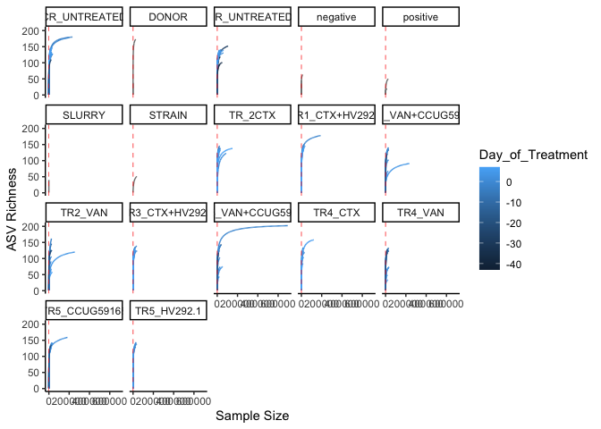
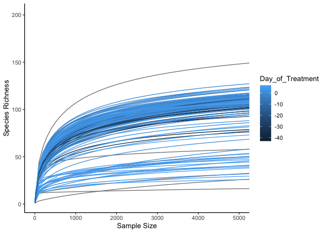
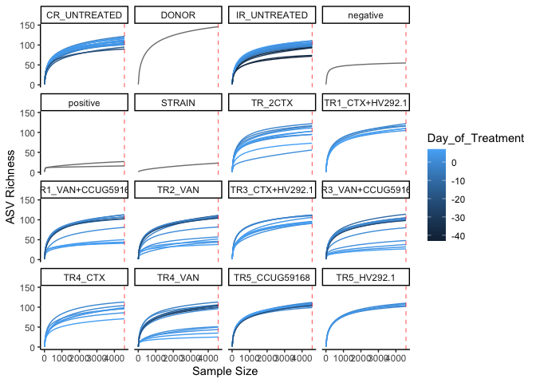
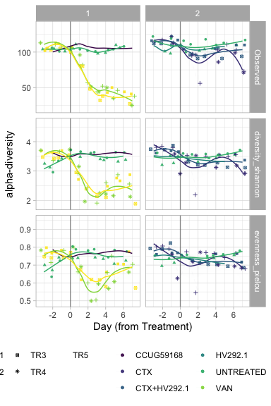
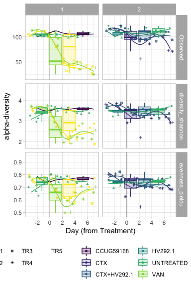
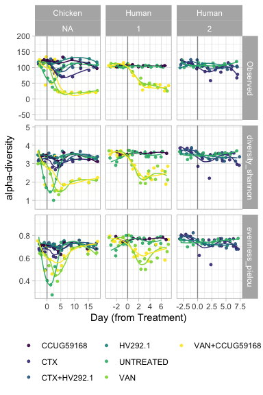

#### Load required packages


```r
library(tidyverse)
library(phyloseq)
library(speedyseq)
library(ggrepel)
library(ampvis2)
library(plotly)
library(microbiome)
library(here)
options(getClass.msg=FALSE) # https://github.com/epurdom/clusterExperiment/issues/66
#this fixes an error message that pops up because the class 'Annotated' is defined in two different packages
```

#### Source required functions


```r
'%!in%' <- function(x,y)!('%in%'(x,y))

source("https://raw.githubusercontent.com/fconstancias/DivComAnalyses/master/R/phyloseq_taxa_tests.R")
source("https://raw.githubusercontent.com/fconstancias/DivComAnalyses/master/R/phyloseq_normalisation.R")
source("https://raw.githubusercontent.com/fconstancias/DivComAnalyses/master/R/phyloseq_alpha.R")
source("https://raw.githubusercontent.com/fconstancias/DivComAnalyses/master/R/phyloseq_beta.R")
source("https://raw.githubusercontent.com/fconstancias/DivComAnalyses/master/R/phyloseq_heatmap.R")
```


```r
plot_time <- function(df, 
                      measure,
                      x = "Day_from_Inoculum", 
                      y = "value", 
                      shape = "neg",
                      fill = "Reactor_Treatment",
                      group = "Reactor_Treatment", 
                      point_size=0.5,
                      facet,
                      smooth = FALSE)
{
  df %>%
    dplyr::filter(alphadiversiy %in% measure) %>%
    dplyr::mutate(alphadiversiy = fct_reorder(alphadiversiy, value, .desc = TRUE)) %>%
    dplyr::mutate(neg = ifelse(value == 0, "neg", "pos")) %>%
    arrange(Day_from_Inoculum) %>%
    ggplot(aes_string(x = x,
                      y = y)) +
    geom_jitter(alpha=0.9, size = point_size, aes_string(color = fill, fill = fill, shape = shape),  show.legend = TRUE) + 
    geom_path(inherit.aes = TRUE, aes_string(fill = fill, color = fill, show.legend = FALSE),
              size = 0.01,
              linetype = "dashed") +
    facet_grid(as.formula(facet), scales = "free") +
    geom_vline(xintercept = c(0),
               color="black", alpha=0.4) + theme_light() -> plot
  
  if(smooth == TRUE) 
  {
    plot +
      geom_smooth(show.legend = FALSE, level = 0.95, alpha=0.005, size = 0.5 ,aes_string(color = fill, fill = fill))  -> plot
  }
  # scale_y_continuous(labels = scientific,
  #                    limits=c(1e+10, 1e+11), breaks = seq(1e+10, 1e+11, by = 1e+10),
  #                    trans = "log10") +
  
  
  return(plot + theme(legend.position = "bottom"))
}
```

# Import phyloseq object


```r
ps = "data/raw/metabarcoding/ps_silva_dada2_human_chicken_meta.RDS"

ps %>% 
  here::here() %>%
  readRDS() %>%
  phyloseq_get_strains_fast() %>% 
  filter_taxa(function(x) sum(x > 0) > 0, TRUE) %>% 
  subset_samples(Enrichment == "NotEnriched") %>% 
  subset_samples(Model == "Human")  -> physeq
```

```
## Joining, by = "ASV"
```

```r
physeq %>% 
  sample_data() %>% 
  data.frame() %>% 
  DT::datatable()
```

<!--html_preserve--><div id="htmlwidget-31671134b24a88eeafc2" style="width:100%;height:auto;" class="datatables html-widget"></div>
<script type="application/json" data-for="htmlwidget-31671134b24a88eeafc2">{"x":{"filter":"none","data":[["CCUG59168-S78","D-1-S49","D-2-S164","IR-01-S201","IR-13-S103","IR-16-S113","IR-22-S41","IR-28-S184","IR-34-S4","IR-41-S106","IR-42-S9","IR-43-S162","IR-44-S89","IR-45-S216","IR-46-S126","IR-47-S63","IR-48-S98","IR-49-S125","IR-5-S70","IR-50-S81","IR-51-S157","IR-74-S188","IR-75-S44","IR-76-S2","IR-77-S163","IR-78-S29","IR-79-S167","IR-80-S67","IR-81-S182","IR-82-S143","IR-83-S170","IR-84-S178","IR-9-S165","negative-1-S58","Negative-2-S104","negative-4-S189","negative-5-S191","negative-6-S213","Negative-7-S223","Negative-8-S224","positive-1-S25","positive-2-S181","positive-3-S212","SLURRY-S110","TR1-01-S102","TR1-13-S22","TR1-19-S116","TR1-26-S27","TR1-27-S54","TR1-28-S35","TR1-29-S18","TR1-30-S76","TR1-31-S109","TR1-32-S111","TR1-33-S177","TR1-34-S34","TR1-35-S161","TR1-36-S198","TR1-59-S42","TR1-60-S114","TR1-61-S47","TR1-62-S7","TR1-63-S100","TR1-64-S120","TR1-65-S128","TR1-66-S151","TR1-67-S133","TR1-68-S13","TR1-69-S145","TR1-7-S153","TR2-01-S14","TR2-13-S156","TR2-19-S40","TR2-26-S87","TR2-27-S59","TR2-28-S64","TR2-29-S117","TR2-30-S73","TR2-31-S32","TR2-32-S90","TR2-33-S30","TR2-34-S71","TR2-35-S131","TR2-36-S183","TR2-59-S60","TR2-60-S79","TR2-61-S196","TR2-62-S97","TR2-63-S160","TR2-64-S51","TR2-65-S158","TR2-66-S93","TR2-67-S193","TR2-68-S147","TR2-69-S57","TR2-7-S215","TR3-01-S121","TR3-13-S129","TR3-19-S214","TR3-26-S175","TR3-27-S203","TR3-28-S38","TR3-29-S210","TR3-30-S190","TR3-31-S23","TR3-32-S211","TR3-33-S86","TR3-34-S149","TR3-35-S20","TR3-36-S8","TR3-59-S61","TR3-60-S46","TR3-61-S45","TR3-62-S37","TR3-63-S206","TR3-64-S146","TR3-65-S92","TR3-66-S69","TR3-67-S199","TR3-68-S194","TR3-69-S139","TR3-7-S204","TR4-01-S15","TR4-13-S168","TR4-19-S154","TR4-26-S26","TR4-27-S130","TR4-28-S138","TR4-29-S159","TR4-30-S48","TR4-31-S19","TR4-32-S17","TR4-33-S84","TR4-34-S16","TR4-35-S202","TR4-36-S12","TR4-59-S180","TR4-60-S36","TR4-61-S11","TR4-62-S1","TR4-63-S74","TR4-64-S10","TR4-65-S155","TR4-66-S55","TR4-67-S192","TR4-68-S52","TR4-69-S197","TR4-7-S65","TR5-01-S123","TR5-13-S137","TR5-19-S173","TR5-26-S24","TR5-27-S148","TR5-28-S5","TR5-29-S136","TR5-30-S62","TR5-31-S88","TR5-32-S56","TR5-33-S134","TR5-34-S28","TR5-35-S77","TR5-36-S85","TR5-59-S31","TR5-60-S75","TR5-61-S142","TR5-62-S176","TR5-63-S82","TR5-64-S108","TR5-65-S187","TR5-66-S101","TR5-67-S96","TR5-68-S99","TR5-69-S107","TR5-7-S66","TR6-01-S3","TR6-13-S21","TR6-19-S33","TR6-26-S122","TR6-27-S6","TR6-28-S80","TR6-29-S207","TR6-30-S144","TR6-31-S179","TR6-32-S39","TR6-33-S135","TR6-34-S141","TR6-35-S208","TR6-36-S124","TR6-59-S185","TR6-60-S119","TR6-61-S186","TR6-62-S50","TR6-63-S195","TR6-64-S105","TR6-65-S94","TR6-66-S132","TR6-67-S140","TR6-68-S127","TR6-69-S174","TR6-7-S91"],["CCUG59168-S78","D-1-S49","D-2-S164","IR-01-S201","IR-13-S103","IR-16-S113","IR-22-S41","IR-28-S184","IR-34-S4","IR-41-S106","IR-42-S9","IR-43-S162","IR-44-S89","IR-45-S216","IR-46-S126","IR-47-S63","IR-48-S98","IR-49-S125","IR-5-S70","IR-50-S81","IR-51-S157","IR-74-S188","IR-75-S44","IR-76-S2","IR-77-S163","IR-78-S29","IR-79-S167","IR-80-S67","IR-81-S182","IR-82-S143","IR-83-S170","IR-84-S178","IR-9-S165","negative-1-S58","Negative-2-S104","negative-4-S189","negative-5-S191","negative-6-S213","Negative-7-S223","Negative-8-S224","positive-1-S25","positive-2-S181","positive-3-S212","SLURRY-S110","TR1-01-S102","TR1-13-S22","TR1-19-S116","TR1-26-S27","TR1-27-S54","TR1-28-S35","TR1-29-S18","TR1-30-S76","TR1-31-S109","TR1-32-S111","TR1-33-S177","TR1-34-S34","TR1-35-S161","TR1-36-S198","TR1-59-S42","TR1-60-S114","TR1-61-S47","TR1-62-S7","TR1-63-S100","TR1-64-S120","TR1-65-S128","TR1-66-S151","TR1-67-S133","TR1-68-S13","TR1-69-S145","TR1-7-S153","TR2-01-S14","TR2-13-S156","TR2-19-S40","TR2-26-S87","TR2-27-S59","TR2-28-S64","TR2-29-S117","TR2-30-S73","TR2-31-S32","TR2-32-S90","TR2-33-S30","TR2-34-S71","TR2-35-S131","TR2-36-S183","TR2-59-S60","TR2-60-S79","TR2-61-S196","TR2-62-S97","TR2-63-S160","TR2-64-S51","TR2-65-S158","TR2-66-S93","TR2-67-S193","TR2-68-S147","TR2-69-S57","TR2-7-S215","TR3-01-S121","TR3-13-S129","TR3-19-S214","TR3-26-S175","TR3-27-S203","TR3-28-S38","TR3-29-S210","TR3-30-S190","TR3-31-S23","TR3-32-S211","TR3-33-S86","TR3-34-S149","TR3-35-S20","TR3-36-S8","TR3-59-S61","TR3-60-S46","TR3-61-S45","TR3-62-S37","TR3-63-S206","TR3-64-S146","TR3-65-S92","TR3-66-S69","TR3-67-S199","TR3-68-S194","TR3-69-S139","TR3-7-S204","TR4-01-S15","TR4-13-S168","TR4-19-S154","TR4-26-S26","TR4-27-S130","TR4-28-S138","TR4-29-S159","TR4-30-S48","TR4-31-S19","TR4-32-S17","TR4-33-S84","TR4-34-S16","TR4-35-S202","TR4-36-S12","TR4-59-S180","TR4-60-S36","TR4-61-S11","TR4-62-S1","TR4-63-S74","TR4-64-S10","TR4-65-S155","TR4-66-S55","TR4-67-S192","TR4-68-S52","TR4-69-S197","TR4-7-S65","TR5-01-S123","TR5-13-S137","TR5-19-S173","TR5-26-S24","TR5-27-S148","TR5-28-S5","TR5-29-S136","TR5-30-S62","TR5-31-S88","TR5-32-S56","TR5-33-S134","TR5-34-S28","TR5-35-S77","TR5-36-S85","TR5-59-S31","TR5-60-S75","TR5-61-S142","TR5-62-S176","TR5-63-S82","TR5-64-S108","TR5-65-S187","TR5-66-S101","TR5-67-S96","TR5-68-S99","TR5-69-S107","TR5-7-S66","TR6-01-S3","TR6-13-S21","TR6-19-S33","TR6-26-S122","TR6-27-S6","TR6-28-S80","TR6-29-S207","TR6-30-S144","TR6-31-S179","TR6-32-S39","TR6-33-S135","TR6-34-S141","TR6-35-S208","TR6-36-S124","TR6-59-S185","TR6-60-S119","TR6-61-S186","TR6-62-S50","TR6-63-S195","TR6-64-S105","TR6-65-S94","TR6-66-S132","TR6-67-S140","TR6-68-S127","TR6-69-S174","TR6-7-S91"],[37913,248,29089,31415,45,212258,28104,54621,36330,31716,31462,42361,33948,31607,490,35259,38070,83416,39405,43548,75,31,28681,36537,38613,79353,44606,31946,55035,154,48719,202,61517,179,36,81,462,14377,51,50,34789,95,21547,197,201,41559,21,29917,40017,34188,48601,36509,46,32,298876,38875,34460,34485,37915,106,238630,34160,32,46,60,48508,96,30852,40431,29198,32425,37192,36818,391,140771,25719,52,38226,31911,33510,341981,36077,42,46398,34839,40581,24392,128,36811,181260,43440,27556,34791,40112,178654,25681,606,59343,30269,49371,29899,833850,41335,35109,37593,24657,79933,96,770,19943,32613,22084,49196,288,26658,51983,32513,36607,31725,64,30574,25811,25731,41730,41366,36275,246,119,41176,26568,42070,44815,35489,26904,4066,31375,42,226,28442,24176,41734,33664,27,30540,60,144932,25982,39486,41,151,53990,200,35121,31023,42864,33028,235088,23120,48732,174,39972,33570,35337,36052,245,48508,43222,21,35,50,31097,29,23,37517,37542,41033,274,240,27579,28872,20504,31410,53659,30398,39943,44414,24496,37,279563,38,252856,32359,34779,140,33692,38344,32451,68,44451,34424],[37815,242,29028,31345,44,211906,28054,54508,36264,31681,31400,42289,33888,31558,489,35207,38015,83280,39294,43481,72,31,28639,36475,38557,79110,44543,31900,54925,154,48627,198,61389,177,36,79,461,14358,50,48,34699,95,21489,196,200,41473,21,29846,39899,34109,48521,36431,46,32,298004,38743,34346,34334,37868,104,238248,34103,31,46,59,48410,96,30800,40343,29132,32350,37140,36755,389,140514,25668,52,38119,31782,33387,340637,35918,40,46202,34774,40514,24363,125,36755,180879,43349,27493,34741,40046,178284,25629,604,59246,30207,49307,29855,832269,41257,35014,37485,24582,79598,95,768,19861,32549,22056,49111,287,26606,51895,32447,36539,31676,63,30520,25771,25674,41641,41280,36212,242,119,41122,26495,41904,44659,35335,26802,4054,31261,41,224,28406,24123,41656,33613,26,30481,60,144643,25946,39399,41,150,53896,198,35060,30972,42803,32966,234702,23079,48670,173,39913,33504,35275,35995,244,48427,43149,21,35,50,31050,29,23,37428,37466,40961,270,240,27513,28808,20469,31362,53585,30364,39883,44342,24443,37,279071,37,252414,32285,34728,140,33627,38300,32391,68,44372,34357],[37792,228,28917,31217,37,211154,27958,54412,36174,31619,31314,42225,33801,31519,485,35169,37924,83185,39199,43397,65,23,28569,36363,38488,79015,44463,31824,54814,148,48539,192,61233,170,31,72,447,14335,48,47,34519,91,21416,191,199,41410,16,29808,39819,34047,48428,36343,36,30,297757,38707,34270,34287,37785,98,237846,34030,31,42,53,48299,90,30723,40200,29040,32249,37094,36682,380,139113,25602,48,37993,31710,33329,339997,35822,34,46139,34696,40456,24296,125,36712,179849,43294,27440,34642,39972,177932,25587,596,59141,30171,49230,29798,830661,41188,34904,37437,24552,79377,92,762,19755,32475,22024,49012,270,26549,51807,32308,36468,31610,61,30460,25646,25613,41567,41237,36116,236,112,41052,26335,41801,44563,35288,26749,4040,31220,38,214,28348,23967,41517,33524,25,30414,56,144364,25869,39299,34,143,53837,191,35023,30868,42733,32872,234135,23027,48575,168,39781,33364,35191,35935,240,48362,43078,18,32,48,30882,27,22,37356,37291,40886,261,234,27367,28729,20422,31309,53521,30310,39817,44269,24390,34,278666,32,252020,32222,34672,130,33496,38248,32317,64,44282,34266],[37774,228,28759,31160,39,210500,27932,54319,36125,31529,31242,42182,33750,31461,483,35081,37857,83022,39106,43272,64,23,28550,36264,38432,78085,44385,31757,54702,148,48445,191,61094,163,31,69,451,14315,49,44,34279,83,21254,188,194,41288,12,29678,39713,34001,48321,36255,41,27,293282,37895,33143,33498,37703,98,237395,33944,30,40,51,48190,88,30667,40139,29007,32124,37027,36594,368,139023,25529,49,37920,31651,33287,337146,34839,35,45199,34615,40321,24257,121,36601,179671,43167,27366,34562,39892,177646,25568,587,58937,30100,49129,29735,829156,41136,34824,37352,24494,79170,83,763,19696,32364,21950,48940,265,26501,51690,32211,36379,31484,59,30405,25635,25545,41520,41138,36069,229,111,40997,26274,41714,44486,35225,26737,4042,31194,39,209,28277,23936,41407,33444,24,30330,54,144222,25853,39250,39,141,53734,186,34938,30821,42695,32818,233566,22987,48438,165,39749,33301,35157,35898,237,48292,42988,15,32,45,30807,25,22,37269,37288,40793,253,227,27289,28664,20396,31213,53351,30240,39713,44162,24283,32,278208,33,251515,32169,34605,135,33425,38133,32248,57,44188,34204],[37721,187,27917,29883,29,199879,26009,52516,34263,30001,29598,40987,32047,30413,459,33827,35998,80743,37738,41158,51,15,27203,34519,37241,75110,43275,30210,52725,122,46843,168,59438,141,19,48,417,14271,39,35,33058,65,20603,174,179,39854,9,28150,38256,32656,46333,35484,29,23,266770,32672,27499,28774,36197,79,231166,32331,26,31,36,46414,68,29509,38039,26828,29934,35978,35025,334,115588,23955,41,36739,30923,32683,319217,30231,27,39386,32953,38473,22096,107,35561,165773,41820,26209,32681,38581,174558,24751,530,56735,29162,47786,28923,814071,39924,33704,36617,24072,77318,74,724,18108,30691,20850,47064,214,25740,50234,29961,35042,30258,50,29510,23351,24382,40284,39809,34298,200,94,39697,24097,41231,43879,34596,26247,4019,30717,32,184,27014,20547,39936,31912,15,29029,42,141559,24646,36882,27,122,52076,169,33807,29212,41250,31102,226909,21785,46439,143,37833,31257,33651,34530,219,46736,41415,13,25,41,27686,19,19,35482,34634,39735,225,209,24312,27021,19611,29786,51381,28866,38232,42496,23016,27,272354,25,245450,30902,33178,115,30776,37027,30870,55,42841,32651],[37721,187,27917,29883,29,199879,26009,52516,34263,30001,29598,40987,32047,30413,459,33827,35998,80743,37738,41158,51,15,27203,34519,37241,75110,43275,30210,52725,122,46843,168,59438,141,19,48,417,14271,39,35,33058,65,20603,174,179,39854,9,28150,38256,32656,46333,35484,29,23,266770,32672,27499,28774,36197,79,231166,32331,26,31,36,46414,68,29509,38039,26828,29934,35978,35025,334,115588,23955,41,36739,30923,32683,319217,30231,27,39386,32953,38473,22096,107,35561,165773,41820,26209,32681,38581,174558,24751,530,56735,29162,47786,28923,814071,39924,33704,36617,24072,77318,74,724,18108,30691,20850,47064,214,25740,50234,29961,35042,30258,50,29510,23351,24382,40284,39809,34298,200,94,39697,24097,41231,43879,34596,26247,4019,30717,32,184,27014,20547,39936,31912,15,29029,42,141559,24646,36882,27,122,52076,169,33807,29212,41250,31102,226909,21785,46439,143,37833,31257,33651,34530,219,46736,41415,13,25,41,27686,19,19,35482,34634,39735,225,209,24312,27021,19611,29786,51381,28866,38232,42496,23016,27,272354,25,245450,30902,33178,115,30776,37027,30870,55,42841,32651],[0.997,0.976,0.998,0.998,0.978,0.998,0.998,0.998,0.998,0.999,0.998,0.998,0.998,0.998,0.998,0.999,0.999,0.998,0.997,0.998,0.96,1,0.999,0.998,0.999,0.997,0.999,0.999,0.998,1,0.998,0.98,0.998,0.989,1,0.975,0.998,0.999,0.98,0.96,0.997,1,0.997,0.995,0.995,0.998,1,0.998,0.997,0.998,0.998,0.998,1,1,0.997,0.997,0.997,0.996,0.999,0.981,0.998,0.998,0.969,1,0.983,0.998,1,0.998,0.998,0.998,0.998,0.999,0.998,0.995,0.998,0.998,1,0.997,0.996,0.996,0.996,0.996,0.952,0.996,0.998,0.998,0.999,0.977,0.998,0.998,0.998,0.998,0.999,0.998,0.998,0.998,0.997,0.998,0.998,0.999,0.999,0.998,0.998,0.997,0.997,0.997,0.996,0.99,0.997,0.996,0.998,0.999,0.998,0.997,0.998,0.998,0.998,0.998,0.998,0.984,0.998,0.998,0.998,0.998,0.998,0.998,0.984,1,0.999,0.997,0.996,0.997,0.996,0.996,0.997,0.996,0.976,0.991,0.999,0.998,0.998,0.998,0.963,0.998,1,0.998,0.999,0.998,1,0.993,0.998,0.99,0.998,0.998,0.999,0.998,0.998,0.998,0.999,0.994,0.999,0.998,0.998,0.998,0.996,0.998,0.998,1,1,1,0.998,1,1,0.998,0.998,0.998,0.985,1,0.998,0.998,0.998,0.998,0.999,0.999,0.998,0.998,0.998,1,0.998,0.974,0.998,0.998,0.999,1,0.998,0.999,0.998,1,0.998,0.998],[0.999,0.942,0.996,0.996,0.841,0.996,0.997,0.998,0.998,0.998,0.997,0.998,0.997,0.999,0.992,0.999,0.998,0.999,0.998,0.998,0.903,0.742,0.998,0.997,0.998,0.999,0.998,0.998,0.998,0.961,0.998,0.97,0.997,0.96,0.861,0.911,0.97,0.998,0.96,0.979,0.995,0.958,0.997,0.974,0.995,0.998,0.762,0.999,0.998,0.998,0.998,0.998,0.783,0.938,0.999,0.999,0.998,0.999,0.998,0.942,0.998,0.998,1,0.913,0.898,0.998,0.938,0.998,0.996,0.997,0.997,0.999,0.998,0.977,0.99,0.997,0.923,0.997,0.998,0.998,0.998,0.997,0.85,0.999,0.998,0.999,0.997,1,0.999,0.994,0.999,0.998,0.997,0.998,0.998,0.998,0.987,0.998,0.999,0.998,0.998,0.998,0.998,0.997,0.999,0.999,0.997,0.968,0.992,0.995,0.998,0.999,0.998,0.941,0.998,0.998,0.996,0.998,0.998,0.968,0.998,0.995,0.998,0.998,0.999,0.997,0.975,0.941,0.998,0.994,0.998,0.998,0.999,0.998,0.997,0.999,0.927,0.955,0.998,0.994,0.997,0.997,0.962,0.998,0.933,0.998,0.997,0.997,0.829,0.953,0.999,0.965,0.999,0.997,0.998,0.997,0.998,0.998,0.998,0.971,0.997,0.996,0.998,0.998,0.984,0.999,0.998,0.857,0.914,0.96,0.995,0.931,0.957,0.998,0.995,0.998,0.967,0.975,0.995,0.997,0.998,0.998,0.999,0.998,0.998,0.998,0.998,0.919,0.999,0.865,0.998,0.998,0.998,0.929,0.996,0.999,0.998,0.941,0.998,0.997],[0.999,0.942,0.991,0.994,0.886,0.993,0.996,0.997,0.996,0.995,0.995,0.997,0.996,0.997,0.988,0.996,0.996,0.997,0.995,0.995,0.889,0.742,0.997,0.994,0.997,0.987,0.996,0.996,0.996,0.961,0.996,0.965,0.995,0.921,0.861,0.873,0.978,0.997,0.98,0.917,0.988,0.874,0.989,0.959,0.97,0.996,0.571,0.994,0.995,0.997,0.996,0.995,0.891,0.844,0.984,0.978,0.965,0.976,0.996,0.942,0.996,0.995,0.968,0.87,0.864,0.995,0.917,0.996,0.995,0.996,0.993,0.997,0.996,0.946,0.989,0.995,0.942,0.995,0.996,0.997,0.99,0.97,0.875,0.978,0.995,0.995,0.996,0.968,0.996,0.993,0.996,0.995,0.995,0.996,0.996,0.998,0.972,0.995,0.996,0.996,0.996,0.996,0.997,0.995,0.996,0.996,0.995,0.874,0.993,0.992,0.994,0.995,0.997,0.923,0.996,0.996,0.993,0.996,0.994,0.937,0.996,0.995,0.995,0.997,0.997,0.996,0.946,0.933,0.997,0.992,0.995,0.996,0.997,0.998,0.997,0.998,0.951,0.933,0.995,0.992,0.994,0.995,0.923,0.995,0.9,0.997,0.996,0.996,0.951,0.94,0.997,0.939,0.997,0.995,0.997,0.996,0.995,0.996,0.995,0.954,0.996,0.994,0.997,0.997,0.971,0.997,0.996,0.714,0.914,0.9,0.992,0.862,0.957,0.996,0.995,0.996,0.937,0.946,0.992,0.995,0.996,0.995,0.996,0.996,0.996,0.996,0.993,0.865,0.997,0.892,0.996,0.996,0.996,0.964,0.994,0.996,0.996,0.838,0.996,0.996],[0.998,0.82,0.965,0.957,0.784,0.947,0.93,0.965,0.947,0.949,0.945,0.971,0.948,0.965,0.946,0.962,0.949,0.971,0.963,0.948,0.785,0.652,0.952,0.949,0.968,0.951,0.973,0.949,0.962,0.824,0.965,0.875,0.971,0.829,0.613,0.667,0.933,0.996,0.812,0.745,0.958,0.714,0.962,0.911,0.899,0.962,0.562,0.944,0.961,0.959,0.957,0.976,0.806,0.767,0.896,0.844,0.802,0.839,0.958,0.806,0.972,0.95,0.839,0.738,0.679,0.961,0.756,0.96,0.946,0.924,0.928,0.97,0.955,0.879,0.831,0.936,0.854,0.967,0.975,0.981,0.939,0.844,0.794,0.854,0.95,0.951,0.909,0.856,0.969,0.922,0.966,0.955,0.943,0.965,0.981,0.967,0.889,0.959,0.967,0.971,0.971,0.98,0.969,0.966,0.978,0.98,0.974,0.804,0.95,0.917,0.945,0.947,0.96,0.793,0.97,0.97,0.927,0.961,0.957,0.82,0.969,0.911,0.952,0.969,0.965,0.95,0.847,0.839,0.967,0.915,0.986,0.985,0.98,0.981,0.995,0.984,0.842,0.86,0.953,0.857,0.962,0.952,0.6,0.954,0.75,0.981,0.953,0.938,0.794,0.853,0.967,0.885,0.965,0.946,0.965,0.946,0.969,0.946,0.956,0.851,0.951,0.937,0.956,0.961,0.912,0.966,0.961,0.722,0.781,0.854,0.897,0.704,0.864,0.95,0.929,0.972,0.862,0.893,0.888,0.941,0.96,0.951,0.96,0.952,0.96,0.96,0.944,0.794,0.977,0.781,0.974,0.959,0.957,0.885,0.919,0.968,0.955,0.859,0.967,0.953],[0.998,0.773,0.962,0.953,0.659,0.943,0.927,0.963,0.945,0.947,0.943,0.969,0.946,0.964,0.939,0.961,0.947,0.97,0.96,0.947,0.708,0.484,0.95,0.946,0.966,0.949,0.972,0.947,0.96,0.792,0.963,0.848,0.968,0.797,0.528,0.608,0.905,0.994,0.78,0.729,0.953,0.684,0.959,0.888,0.895,0.961,0.429,0.943,0.959,0.957,0.955,0.974,0.63,0.719,0.895,0.843,0.801,0.838,0.956,0.76,0.97,0.948,0.839,0.674,0.61,0.959,0.708,0.958,0.943,0.921,0.925,0.969,0.953,0.859,0.823,0.933,0.788,0.964,0.973,0.979,0.937,0.842,0.675,0.852,0.948,0.95,0.907,0.856,0.968,0.916,0.965,0.953,0.941,0.963,0.979,0.966,0.877,0.958,0.965,0.969,0.969,0.978,0.968,0.963,0.977,0.979,0.971,0.779,0.943,0.912,0.943,0.945,0.958,0.746,0.967,0.968,0.923,0.959,0.955,0.794,0.967,0.906,0.95,0.967,0.964,0.947,0.826,0.79,0.965,0.909,0.984,0.983,0.979,0.979,0.991,0.983,0.78,0.821,0.951,0.852,0.959,0.949,0.577,0.952,0.7,0.979,0.95,0.936,0.659,0.813,0.966,0.854,0.964,0.943,0.964,0.943,0.967,0.944,0.954,0.827,0.948,0.933,0.954,0.959,0.898,0.965,0.96,0.619,0.714,0.82,0.892,0.655,0.826,0.948,0.924,0.97,0.833,0.871,0.884,0.938,0.958,0.95,0.959,0.951,0.959,0.958,0.942,0.73,0.976,0.676,0.972,0.957,0.955,0.821,0.915,0.967,0.953,0.809,0.965,0.95],[0.995,0.754,0.96,0.951,0.644,0.942,0.925,0.961,0.943,0.946,0.941,0.968,0.944,0.962,0.937,0.959,0.946,0.968,0.958,0.945,0.68,0.484,0.948,0.945,0.964,0.947,0.97,0.946,0.958,0.792,0.961,0.832,0.966,0.788,0.528,0.593,0.903,0.993,0.765,0.7,0.95,0.684,0.956,0.883,0.891,0.959,0.429,0.941,0.956,0.955,0.953,0.972,0.63,0.719,0.893,0.84,0.798,0.834,0.955,0.745,0.969,0.946,0.812,0.674,0.6,0.957,0.708,0.956,0.941,0.919,0.923,0.967,0.951,0.854,0.821,0.931,0.788,0.961,0.969,0.975,0.933,0.838,0.643,0.849,0.946,0.948,0.906,0.836,0.966,0.915,0.963,0.951,0.939,0.962,0.977,0.964,0.875,0.956,0.963,0.968,0.967,0.976,0.966,0.96,0.974,0.976,0.967,0.771,0.94,0.908,0.941,0.944,0.957,0.743,0.966,0.966,0.922,0.957,0.954,0.781,0.965,0.905,0.948,0.965,0.962,0.945,0.813,0.79,0.964,0.907,0.98,0.979,0.975,0.976,0.988,0.979,0.762,0.814,0.95,0.85,0.957,0.948,0.556,0.951,0.7,0.977,0.949,0.934,0.659,0.808,0.965,0.845,0.963,0.942,0.962,0.942,0.965,0.942,0.953,0.822,0.946,0.931,0.952,0.958,0.894,0.963,0.958,0.619,0.714,0.82,0.89,0.655,0.826,0.946,0.923,0.968,0.821,0.871,0.882,0.936,0.956,0.948,0.958,0.95,0.957,0.957,0.94,0.73,0.974,0.658,0.971,0.955,0.954,0.821,0.913,0.966,0.951,0.809,0.964,0.948],[37721,187,27917,29883,29,199879,26009,52516,34263,30001,29598,40987,32047,30413,459,33827,35998,80743,37738,41158,51,15,27203,34519,37241,75110,43275,30210,52725,122,46843,168,59438,141,19,48,417,14271,39,35,33058,65,20603,174,179,39854,9,28150,38256,32656,46333,35484,29,23,266770,32672,27499,28774,36197,79,231166,32331,26,31,36,46414,68,29509,38039,26828,29934,35978,35025,334,115588,23955,41,36739,30923,32683,319217,30231,27,39386,32953,38473,22096,107,35561,165773,41820,26209,32681,38581,174558,24751,530,56735,29162,47786,28923,814071,39924,33704,36617,24072,77318,74,724,18108,30691,20850,47064,214,25740,50234,29961,35042,30258,50,29510,23351,24382,40284,39809,34298,200,94,39697,24097,41231,43879,34596,26247,4019,30717,32,184,27014,20547,39936,31912,15,29029,42,141559,24646,36882,27,122,52076,169,33807,29212,41250,31102,226909,21785,46439,143,37833,31257,33651,34530,219,46736,41415,13,25,41,27686,19,19,35482,34634,39735,225,209,24312,27021,19611,29786,51381,28866,38232,42496,23016,27,272354,25,245450,30902,33178,115,30776,37027,30870,55,42841,32651],[37549,161,26104,23155,28,107359,14040,40996,22940,20137,18181,31707,21227,23258,401,25488,24251,62635,29611,26451,47,15,17713,23186,29579,60632,36210,20619,38243,84,35597,145,49262,126,16,40,413,13852,33,31,26291,57,15746,151,136,30436,7,19861,28817,24739,32886,28461,28,18,234739,26013,17305,22660,27508,68,188953,22354,24,24,29,36591,57,22448,24528,13724,18030,29771,26390,285,25610,14713,38,25840,22842,25240,255508,23736,22,33722,23827,27926,10235,93,28863,87793,32880,19156,19842,30271,149775,20020,379,41765,23018,39081,22990,695560,31892,26093,30160,19576,54164,61,559,8748,21965,15029,36864,186,20454,40379,17134,26378,21142,44,23544,12043,17671,32555,31797,24757,171,83,31591,11843,33451,34419,25181,18942,4014,23394,26,154,19750,7987,32773,22236,14,20689,30,122962,15361,20919,20,107,41767,162,26523,18666,31448,21287,183302,15674,34690,120,26883,19614,25116,26855,183,36980,31488,11,23,34,11181,14,17,25250,20148,32487,205,195,10458,17152,15172,21835,39822,21084,29304,32476,16044,20,232869,17,201757,23664,23813,109,15573,30059,22765,47,35074,24272],[37549,160,26104,23155,28,107301,14038,40996,22940,20137,18179,31707,21225,23257,401,25486,24251,62635,29611,26451,47,15,17713,23183,29579,60630,36208,20617,38243,84,35595,145,49262,126,16,40,413,13852,33,31,26291,57,15746,151,136,30433,7,19861,28817,24739,32886,28461,28,18,234739,26013,17305,22660,27508,68,188948,22348,24,24,29,36587,57,22448,24524,13721,18029,29769,26390,285,25587,14713,38,25840,22842,25240,255490,23732,22,33722,23827,27921,10235,93,28862,87725,32880,19156,19837,30269,149775,20016,379,41765,23016,39081,22990,695530,31892,26093,30160,19576,54164,61,559,8748,21965,15029,36862,186,20454,40374,17133,26378,21137,44,23544,12042,17671,32555,31797,24755,171,83,31591,11843,33451,34419,25181,18942,4014,23394,26,154,19745,7979,32768,22236,14,20686,30,122962,15359,20915,20,107,41761,162,26522,18666,31443,21287,183302,15673,34690,120,26883,19614,25116,26853,183,36975,31486,11,23,34,11177,14,17,25246,20147,32483,205,195,10456,17151,15172,21832,39822,21084,29304,32475,16044,20,232863,17,201745,23663,23807,109,15573,30057,22765,47,35074,24272],[1,1,1,1,1,1,1,1,1,1,1,1,1,1,1,1,1,1,1,1,1,1,1,1,1,1,1,1,1,1,1,1,1,1,1,1,1,1,1,1,1,1,1,1,1,1,1,1,1,1,1,1,1,1,1,1,1,1,1,1,1,1,1,1,1,1,1,1,1,1,1,1,1,1,1,1,1,1,1,1,1,1,1,1,1,1,1,1,1,1,1,1,1,1,1,1,1,1,1,1,1,1,1,1,1,1,1,1,1,1,1,1,1,1,1,1,1,1,1,1,1,1,1,1,1,1,1,1,1,1,1,1,1,1,1,1,1,1,1,1,1,1,1,1,1,1,1,1,1,1,1,1,1,1,1,1,1,1,1,1,1,1,1,1,1,1,1,1,1,1,1,1,1,1,1,1,1,1,1,1,1,1,1,1,1,1,1,1,1,1,1,1,1,1,1,1,1,1,1,1],[1,0.86,0.94,0.77,0.97,0.54,0.54,0.78,0.67,0.67,0.61,0.77,0.66,0.76,0.87,0.75,0.67,0.78,0.78,0.64,0.92,1,0.65,0.67,0.79,0.81,0.84,0.68,0.73,0.69,0.76,0.86,0.83,0.89,0.84,0.83,0.99,0.97,0.85,0.89,0.8,0.88,0.76,0.87,0.76,0.76,0.78,0.71,0.75,0.76,0.71,0.8,0.97,0.78,0.88,0.8,0.63,0.79,0.76,0.86,0.82,0.69,0.92,0.77,0.81,0.79,0.84,0.76,0.64,0.51,0.6,0.83,0.75,0.85,0.22,0.61,0.93,0.7,0.74,0.77,0.8,0.79,0.81,0.86,0.72,0.73,0.46,0.87,0.81,0.53,0.79,0.73,0.61,0.78,0.86,0.81,0.72,0.74,0.79,0.82,0.79,0.85,0.8,0.77,0.82,0.81,0.7,0.82,0.77,0.48,0.72,0.72,0.78,0.87,0.79,0.8,0.57,0.75,0.7,0.88,0.8,0.52,0.72,0.81,0.8,0.72,0.86,0.88,0.8,0.49,0.81,0.78,0.73,0.72,1,0.76,0.81,0.84,0.73,0.39,0.82,0.7,0.93,0.71,0.71,0.87,0.62,0.57,0.74,0.88,0.8,0.96,0.78,0.64,0.76,0.68,0.81,0.72,0.75,0.84,0.71,0.63,0.75,0.78,0.84,0.79,0.76,0.85,0.92,0.83,0.4,0.74,0.89,0.71,0.58,0.82,0.91,0.93,0.43,0.63,0.77,0.73,0.78,0.73,0.77,0.76,0.7,0.74,0.86,0.68,0.82,0.77,0.72,0.95,0.51,0.81,0.74,0.85,0.82,0.74],[1,0.99,1,1,1,1,1,1,1,1,1,1,1,1,1,1,1,1,1,1,1,1,1,1,1,1,1,1,1,1,1,1,1,1,1,1,1,1,1,1,1,1,1,1,1,1,1,1,1,1,1,1,1,1,1,1,1,1,1,1,1,1,1,1,1,1,1,1,1,1,1,1,1,1,1,1,1,1,1,1,1,1,1,1,1,1,1,1,1,1,1,1,1,1,1,1,1,1,1,1,1,1,1,1,1,1,1,1,1,1,1,1,1,1,1,1,1,1,1,1,1,1,1,1,1,1,1,1,1,1,1,1,1,1,1,1,1,1,1,1,1,1,1,1,1,1,1,1,1,1,1,1,1,1,1,1,1,1,1,1,1,1,1,1,1,1,1,1,1,1,1,1,1,1,1,1,1,1,1,1,1,1,1,1,1,1,1,1,1,1,1,1,1,1,1,1,1,1,1,1],["CCUG59168","D-1","D-2","IR-1","IR-13","IR-16","IR-22","IR-28","IR-34","IR-41","IR-42","IR-43","IR-44","IR-45","IR-46","IR-47","IR-48","IR-49","IR-5","IR-50","IR-51","IR-74","IR-75","IR-76","IR-77","IR-78","IR-79","IR-80","IR-81","IR-82","IR-83","IR-84","IR-9","negative-1","Negative-2","negative-4","negative-5","negative-6","Negative-7","Negative-8","positive-1","positive-2","positive-3","SLURRY","TR1-1","TR1-13","TR1-19","TR1-26","TR1-27","TR1-28","TR1-29","TR1-30","TR1-31","TR1-32","TR1-33","TR1-34","TR1-35","TR1-36","TR1-59","TR1-60","TR1-61","TR1-62","TR1-63","TR1-64","TR1-65","TR1-66","TR1-67","TR1-68","TR1-69","TR1-7","TR2-1","TR2-13","TR2-19","TR2-26","TR2-27","TR2-28","TR2-29","TR2-30","TR2-31","TR2-32","TR2-33","TR2-34","TR2-35","TR2-36","TR2-59","TR2-60","TR2-61","TR2-62","TR2-63","TR2-64","TR2-65","TR2-66","TR2-67","TR2-68","TR2-69","TR2-7","TR3-1","TR3-13","TR3-19","TR3-26","TR3-27","TR3-28","TR3-29","TR3-30","TR3-31","TR3-32","TR3-33","TR3-34","TR3-35","TR3-36","TR3-59","TR3-60","TR3-61","TR3-62","TR3-63","TR3-64","TR3-65","TR3-66","TR3-67","TR3-68","TR3-69","TR3-7","TR4-1","TR4-13","TR4-19","TR4-26","TR4-27","TR4-28","TR4-29","TR4-30","TR4-31","TR4-32","TR4-33","TR4-34","TR4-35","TR4-36","TR4-59","TR4-60","TR4-61","TR4-62","TR4-63","TR4-64","TR4-65","TR4-66","TR4-67","TR4-68","TR4-69","TR4-7","TR5-1","TR5-13","TR5-19","TR5-26","TR5-27","TR5-28","TR5-29","TR5-30","TR5-31","TR5-32","TR5-33","TR5-34","TR5-35","TR5-36","TR5-59","TR5-60","TR5-61","TR5-62","TR5-63","TR5-64","TR5-65","TR5-66","TR5-67","TR5-68","TR5-69","TR5-7","TR6-1","TR6-13","TR6-19","TR6-26","TR6-27","TR6-28","TR6-29","TR6-30","TR6-31","TR6-32","TR6-33","TR6-34","TR6-35","TR6-36","TR6-59","TR6-60","TR6-61","TR6-62","TR6-63","TR6-64","TR6-65","TR6-66","TR6-67","TR6-68","TR6-69","TR6-7"],["A-N712","A-N707","A-N711","D-N718","A-N701","A-N703","A-N706","A-N714","A-N701","A-N702","A-N702","A-N711","A-N715","D-N719","A-N704","A-N710","A-N701","A-N704","A-N711","A-N714","A-N710","A-N715","A-N706","A-N701","A-N711","A-N704","A-N711","A-N711","A-N714","A-N706","A-N712","A-N714","A-N711","A-N710","A-N701","A-N715","A-N715","D-N719","N720-D","N720-D","A-N704","A-N714","D-N719","A-N702","A-N701","A-N703","A-N703","A-N704","A-N707","A-N705","A-N703","A-N712","A-N702","A-N702","A-N714","A-N705","A-N711","D-N716","A-N706","A-N703","A-N706","A-N701","A-N701","A-N703","A-N704","A-N707","A-N705","A-N702","A-N707","A-N710","A-N702","A-N710","A-N705","A-N714","A-N710","A-N710","A-N703","A-N712","A-N704","A-N715","A-N704","A-N711","A-N705","A-N714","A-N710","A-N712","D-N716","A-N701","A-N710","A-N707","A-N710","A-N715","D-N716","A-N707","A-N710","D-N719","A-N704","A-N705","D-N719","A-N712","D-N718","A-N705","D-N719","A-N715","A-N703","D-N719","A-N714","A-N707","A-N703","A-N701","A-N710","A-N706","A-N706","A-N705","D-N718","A-N707","A-N715","A-N711","D-N716","D-N716","A-N706","D-N718","A-N702","A-N711","A-N710","A-N704","A-N705","A-N706","A-N710","A-N706","A-N703","A-N703","A-N714","A-N702","D-N718","A-N702","A-N714","A-N705","A-N702","A-N701","A-N712","A-N702","A-N710","A-N707","A-N715","A-N707","D-N716","A-N711","A-N704","A-N706","A-N712","A-N703","A-N707","A-N701","A-N705","A-N710","A-N714","A-N707","A-N705","A-N704","A-N712","A-N714","A-N704","A-N712","A-N706","A-N712","A-N714","A-N702","A-N715","A-N701","A-N715","A-N701","A-N702","A-N711","A-N701","A-N703","A-N705","A-N704","A-N701","A-N712","D-N718","A-N706","A-N714","A-N705","A-N705","A-N706","D-N718","A-N704","A-N715","A-N703","A-N715","A-N707","D-N716","A-N702","A-N715","A-N705","A-N706","A-N704","A-N712","A-N715"],[null,null,null,null,null,null,null,null,null,null,null,null,null,null,null,null,null,null,null,null,null,null,null,null,null,null,null,null,null,null,null,null,null,null,null,null,null,null,null,null,null,null,null,null,null,null,null,null,null,null,null,null,null,null,null,null,null,null,null,null,null,null,null,null,null,null,null,null,null,null,null,null,null,null,null,null,null,null,null,null,null,null,null,null,null,null,null,null,null,null,null,null,null,null,null,null,null,null,null,null,null,null,null,null,null,null,null,null,null,null,null,null,null,null,null,null,null,null,null,null,null,null,null,null,null,null,null,null,null,null,null,null,null,null,null,null,null,null,null,null,null,null,null,null,null,null,null,null,null,null,null,null,null,null,null,null,null,null,null,null,null,null,null,null,null,null,null,null,null,null,null,null,null,null,null,null,null,null,null,null,null,null,null,null,null,null,null,null,null,null,null,null,null,null,null,null,null,null,null,null],["A-S508","A-S502","D-S517","A-S502","D-S521","D-S513","A-S502","D-S522","A-S506","D-S515","A-S502","D-S515","A-S502","A-S511","D-S520","A-S510","D-S515","D-S518","A-S508","A-S502","D-S518","D-S517","A-S506","A-S503","D-S516","A-S507","D-S521","A-S505","D-S520","D-S521","D-S515","D-S515","D-S518","A-S503","D-S522","D-S518","D-S521","A-S507","A-S510","A-S511","A-S502","D-S518","A-S506","D-S520","D-S520","A-S508","D-S517","A-S505","A-S508","A-S505","A-S503","A-S506","D-S518","D-S521","D-S513","A-S503","D-S513","A-S508","A-S503","D-S515","A-S510","A-S510","D-S517","D-S522","D-S522","D-S521","D-S518","A-S507","D-S513","D-S513","A-S508","D-S517","A-S511","A-S510","A-S505","A-S511","D-S518","A-S502","A-S511","A-S503","A-S508","A-S510","D-S516","D-S521","A-S506","A-S510","A-S506","D-S513","D-S522","A-S505","D-S520","A-S507","A-S502","D-S516","A-S502","A-S510","D-S513","D-S513","A-S508","D-S521","A-S505","A-S508","A-S503","D-S520","A-S510","A-S505","A-S508","D-S518","A-S506","A-S511","A-S507","A-S508","A-S507","A-S507","A-S508","D-S515","A-S506","A-S507","A-S510","A-S503","D-S516","A-S506","A-S510","D-S522","D-S515","A-S503","D-S515","D-S515","D-S521","A-S511","A-S505","A-S502","A-S506","A-S511","A-S503","A-S506","D-S517","A-S506","A-S505","A-S502","A-S503","A-S503","D-S516","A-S510","D-S522","A-S506","A-S507","A-S502","D-S516","D-S513","D-S518","A-S511","D-S517","A-S507","D-S522","A-S508","A-S511","A-S511","D-S520","A-S506","A-S507","A-S507","A-S510","A-S505","D-S520","D-S522","A-S503","D-S517","D-S516","D-S518","A-S511","D-S516","D-S516","A-S503","A-S505","A-S507","A-S502","D-S515","A-S508","A-S511","A-S510","D-S522","D-S516","A-S510","D-S521","D-S518","A-S511","D-S517","D-S513","D-S521","D-S515","A-S503","A-S505","D-S513","A-S508","D-S517","D-S517","D-S521","D-S520","A-S505"],[null,null,null,null,null,null,null,null,null,null,null,null,null,null,null,null,null,null,null,null,null,null,null,null,null,null,null,null,null,null,null,null,null,null,null,null,null,null,null,null,null,null,null,null,null,null,null,null,null,null,null,null,null,null,null,null,null,null,null,null,null,null,null,null,null,null,null,null,null,null,null,null,null,null,null,null,null,null,null,null,null,null,null,null,null,null,null,null,null,null,null,null,null,null,null,null,null,null,null,null,null,null,null,null,null,null,null,null,null,null,null,null,null,null,null,null,null,null,null,null,null,null,null,null,null,null,null,null,null,null,null,null,null,null,null,null,null,null,null,null,null,null,null,null,null,null,null,null,null,null,null,null,null,null,null,null,null,null,null,null,null,null,null,null,null,null,null,null,null,null,null,null,null,null,null,null,null,null,null,null,null,null,null,null,null,null,null,null,null,null,null,null,null,null,null,null,null,null,null,null],["CCUG59168",null,null,null,null,null,null,null,null,null,null,null,null,null,null,null,null,null,null,null,null,null,null,null,null,null,null,null,null,null,null,null,null,"negative","negative","negative","negative","negative","negative","negative","mock","mock","mock","SLURRY",null,null,null,null,null,null,null,null,null,null,null,null,null,null,null,null,null,null,null,null,null,null,null,null,null,null,null,null,null,null,null,null,null,null,null,null,null,null,null,null,null,null,null,null,null,null,null,null,null,null,null,null,null,null,null,null,null,null,null,null,null,null,null,null,null,null,null,null,null,null,null,null,null,null,null,null,null,null,null,null,null,null,null,null,null,null,null,null,null,null,null,null,null,null,null,null,null,null,null,null,null,null,null,null,null,null,null,null,null,null,null,null,null,null,null,null,null,null,null,null,null,null,null,null,null,null,null,null,null,null,null,null,null,null,null,null,null,null,null,null,null,null,null,null,null,null,null,null,null,null,null,null,null,null,null,null],["CCUG59168","Cecum","Cecum","Continuous","Continuous","Continuous","Continuous","Continuous","Continuous","Continuous","Continuous","Continuous","Continuous","Continuous","Continuous","Continuous","Continuous","Continuous","Continuous","Continuous","Continuous","Continuous","Continuous","Continuous","Continuous","Continuous","Continuous","Continuous","Continuous","Continuous","Continuous","Continuous","Continuous","NTC","NTC","NTC","NTC","NTC","NTC","NTC","Mock","Mock","Mock","SLURRY","Continuous","Continuous","Continuous","Continuous","Continuous","Continuous","Continuous","Continuous","Continuous","Continuous","Continuous","Continuous","Continuous","Continuous","Continuous","Continuous","Continuous","Continuous","Continuous","Continuous","Continuous","Continuous","Continuous","Continuous","Continuous","Continuous","Continuous","Continuous","Continuous","Continuous","Continuous","Continuous","Continuous","Continuous","Continuous","Continuous","Continuous","Continuous","Continuous","Continuous","Continuous","Continuous","Continuous","Continuous","Continuous","Continuous","Continuous","Continuous","Continuous","Continuous","Continuous","Continuous","Continuous","Continuous","Continuous","Continuous","Continuous","Continuous","Continuous","Continuous","Continuous","Continuous","Continuous","Continuous","Continuous","Continuous","Continuous","Continuous","Continuous","Continuous","Continuous","Continuous","Continuous","Continuous","Continuous","Continuous","Continuous","Continuous","Continuous","Continuous","Continuous","Continuous","Continuous","Continuous","Continuous","Continuous","Continuous","Continuous","Continuous","Continuous","Continuous","Continuous","Continuous","Continuous","Continuous","Continuous","Continuous","Continuous","Continuous","Continuous","Continuous","Continuous","Continuous","Continuous","Continuous","Continuous","Continuous","Continuous","Continuous","Continuous","Continuous","Continuous","Continuous","Continuous","Continuous","Continuous","Continuous","Continuous","Continuous","Continuous","Continuous","Continuous","Continuous","Continuous","Continuous","Continuous","Continuous","Continuous","Continuous","Continuous","Continuous","Continuous","Continuous","Continuous","Continuous","Continuous","Continuous","Continuous","Continuous","Continuous","Continuous","Continuous","Continuous","Continuous","Continuous","Continuous","Continuous","Continuous","Continuous","Continuous","Continuous","Continuous","Continuous","Continuous","Continuous","Continuous"],["STRAIN","DONOR","DONOR","IR","IR","IR","IR","IR","IR","IR","IR","IR","IR","IR","IR","IR","IR","IR","IR","IR","IR","IR","IR","IR","IR","IR","IR","IR","IR","IR","IR","IR","IR","negative","negative","negative","negative","negative","negative","negative","positive","positive","positive","SLURRY","TR1","TR1","TR1","TR1","TR1","TR1","TR1","TR1","TR1","TR1","TR1","TR1","TR1","TR1","TR1","TR1","TR1","TR1","TR1","TR1","TR1","TR1","TR1","TR1","TR1","TR1","TR2","TR2","TR2","TR2","TR2","TR2","TR2","TR2","TR2","TR2","TR2","TR2","TR2","TR2","TR2","TR2","TR2","TR2","TR2","TR2","TR2","TR2","TR2","TR2","TR2","TR2","TR3","TR3","TR3","TR3","TR3","TR3","TR3","TR3","TR3","TR3","TR3","TR3","TR3","TR3","TR3","TR3","TR3","TR3","TR3","TR3","TR3","TR3","TR3","TR3","TR3","TR3","TR4","TR4","TR4","TR4","TR4","TR4","TR4","TR4","TR4","TR4","TR4","TR4","TR4","TR4","TR4","TR4","TR4","TR4","TR4","TR4","TR4","TR4","TR4","TR4","TR4","TR4","TR5","TR5","TR5","TR5","TR5","TR5","TR5","TR5","TR5","TR5","TR5","TR5","TR5","TR5","TR5","TR5","TR5","TR5","TR5","TR5","TR5","TR5","TR5","TR5","TR5","TR5","CR","CR","CR","CR","CR","CR","CR","CR","CR","CR","CR","CR","CR","CR","CR","CR","CR","CR","CR","CR","CR","CR","CR","CR","CR","CR"],["STRAIN","DONOR","DONOR","UNTREATED","UNTREATED","UNTREATED","UNTREATED","UNTREATED","UNTREATED","UNTREATED","UNTREATED","UNTREATED","UNTREATED","UNTREATED","UNTREATED","UNTREATED","UNTREATED","UNTREATED","UNTREATED","UNTREATED","UNTREATED","UNTREATED","UNTREATED","UNTREATED","UNTREATED","UNTREATED","UNTREATED","UNTREATED","UNTREATED","UNTREATED","UNTREATED","UNTREATED","UNTREATED","negative","negative","negative","negative","negative","negative","negative","positive","positive","positive","SLURRY","VAN+CCUG59168","VAN+CCUG59168","VAN+CCUG59168","VAN+CCUG59168","VAN+CCUG59168","VAN+CCUG59168","VAN+CCUG59168","VAN+CCUG59168","VAN+CCUG59168","VAN+CCUG59168","VAN+CCUG59168","VAN+CCUG59168","VAN+CCUG59168","VAN+CCUG59168","CTX+HV292.1","CTX+HV292.1","CTX+HV292.1","CTX+HV292.1","CTX+HV292.1","CTX+HV292.1","CTX+HV292.1","CTX+HV292.1","CTX+HV292.1","CTX+HV292.1","CTX+HV292.1","VAN+CCUG59168","VAN","VAN","VAN","VAN","VAN","VAN","VAN","VAN","VAN","VAN","VAN","VAN","VAN","VAN","CTX","CTX","CTX","CTX","CTX","CTX","CTX","CTX","CTX","CTX","CTX","VAN","VAN+CCUG59168","VAN+CCUG59168","VAN+CCUG59168","VAN+CCUG59168","VAN+CCUG59168","VAN+CCUG59168","VAN+CCUG59168","VAN+CCUG59168","VAN+CCUG59168","VAN+CCUG59168","VAN+CCUG59168","VAN+CCUG59168","VAN+CCUG59168","VAN+CCUG59168","CTX+HV292.1","CTX+HV292.1","CTX+HV292.1","CTX+HV292.1","CTX+HV292.1","CTX+HV292.1","CTX+HV292.1","CTX+HV292.1","CTX+HV292.1","CTX+HV292.1","CTX+HV292.1","VAN+CCUG59168","VAN","VAN","VAN","VAN","VAN","VAN","VAN","VAN","VAN","VAN","VAN","VAN","VAN","VAN","CTX","CTX","CTX","CTX","CTX","CTX","CTX","CTX","CTX","CTX","CTX","VAN","CCUG59168","CCUG59168","CCUG59168","CCUG59168","CCUG59168","CCUG59168","CCUG59168","CCUG59168","CCUG59168","CCUG59168","CCUG59168","CCUG59168","CCUG59168","CCUG59168","HV292.1","HV292.1","HV292.1","HV292.1","HV292.1","HV292.1","HV292.1","HV292.1","HV292.1","HV292.1","HV292.1","CCUG59168","UNTREATED","UNTREATED","UNTREATED","UNTREATED","UNTREATED","UNTREATED","UNTREATED","UNTREATED","UNTREATED","UNTREATED","UNTREATED","UNTREATED","UNTREATED","UNTREATED","UNTREATED","UNTREATED","UNTREATED","UNTREATED","UNTREATED","UNTREATED","UNTREATED","UNTREATED","UNTREATED","UNTREATED","UNTREATED","UNTREATED"],[null,null,null,-14,-2,1,7,13,19,26,27,28,29,30,31,32,33,34,-10,35,36,6,7,8,9,10,11,12,13,14,15,16,-6,null,null,null,null,null,null,null,null,null,null,null,1,13,19,26,27,28,29,30,31,32,33,34,35,36,6,7,8,9,10,11,12,13,14,15,16,7,1,13,19,26,27,28,29,30,31,32,33,34,35,36,6,7,8,9,10,11,12,13,14,15,16,7,1,13,19,26,27,28,29,30,31,32,33,34,35,36,6,7,8,9,10,11,12,13,14,15,16,7,1,13,19,26,27,28,29,30,31,32,33,34,35,36,6,7,8,9,10,11,12,13,14,15,16,7,1,13,19,26,27,28,29,30,31,32,33,34,35,36,6,7,8,9,10,11,12,13,14,15,16,7,1,13,19,26,27,28,29,30,31,32,33,34,35,36,6,7,8,9,10,11,12,13,14,15,16,7],[null,null,null,-43,-31,-28,-22,-16,-10,-3,-2,-1,0,1,2,3,4,5,-39,6,7,-3,-2,-1,0,1,2,3,4,5,6,7,-35,null,null,null,null,null,null,null,null,null,null,null,-28,-16,-10,-3,-2,-1,0,1,2,3,4,5,6,7,-3,-2,-1,0,1,2,3,4,5,6,7,-22,-28,-16,-10,-3,-2,-1,0,1,2,3,4,5,6,7,-3,-2,-1,0,1,2,3,4,5,6,7,-22,-28,-16,-10,-3,-2,-1,0,1,2,3,4,5,6,7,-3,-2,-1,0,1,2,3,4,5,6,7,-22,-28,-16,-10,-3,-2,-1,0,1,2,3,4,5,6,7,-3,-2,-1,0,1,2,3,4,5,6,7,-22,-28,-16,-10,-3,-2,-1,0,1,2,3,4,5,6,7,-3,-2,-1,0,1,2,3,4,5,6,7,-22,-28,-16,-10,-3,-2,-1,0,1,2,3,4,5,6,7,-3,-2,-1,0,1,2,3,4,5,6,7,-22],[null,null,null,1,13,16,22,28,34,41,42,43,44,45,46,47,48,49,5,50,51,74,75,76,77,78,79,80,81,82,83,84,9,null,null,null,null,null,null,null,null,null,null,null,16,28,34,41,42,43,44,45,46,47,48,49,50,51,74,75,76,77,78,79,80,81,82,83,84,22,16,28,34,41,42,43,44,45,46,47,48,49,50,51,74,75,76,77,78,79,80,81,82,83,84,22,16,28,34,41,42,43,44,45,46,47,48,49,50,51,74,75,76,77,78,79,80,81,82,83,84,22,16,28,34,41,42,43,44,45,46,47,48,49,50,51,74,75,76,77,78,79,80,81,82,83,84,22,16,28,34,41,42,43,44,45,46,47,48,49,50,51,74,75,76,77,78,79,80,81,82,83,84,22,16,28,34,41,42,43,44,45,46,47,48,49,50,51,74,75,76,77,78,79,80,81,82,83,84,22],["NotEnriched","NotEnriched","NotEnriched","NotEnriched","NotEnriched","NotEnriched","NotEnriched","NotEnriched","NotEnriched","NotEnriched","NotEnriched","NotEnriched","NotEnriched","NotEnriched","NotEnriched","NotEnriched","NotEnriched","NotEnriched","NotEnriched","NotEnriched","NotEnriched","NotEnriched","NotEnriched","NotEnriched","NotEnriched","NotEnriched","NotEnriched","NotEnriched","NotEnriched","NotEnriched","NotEnriched","NotEnriched","NotEnriched","NotEnriched","NotEnriched","NotEnriched","NotEnriched","NotEnriched","NotEnriched","NotEnriched","NotEnriched","NotEnriched","NotEnriched","NotEnriched","NotEnriched","NotEnriched","NotEnriched","NotEnriched","NotEnriched","NotEnriched","NotEnriched","NotEnriched","NotEnriched","NotEnriched","NotEnriched","NotEnriched","NotEnriched","NotEnriched","NotEnriched","NotEnriched","NotEnriched","NotEnriched","NotEnriched","NotEnriched","NotEnriched","NotEnriched","NotEnriched","NotEnriched","NotEnriched","NotEnriched","NotEnriched","NotEnriched","NotEnriched","NotEnriched","NotEnriched","NotEnriched","NotEnriched","NotEnriched","NotEnriched","NotEnriched","NotEnriched","NotEnriched","NotEnriched","NotEnriched","NotEnriched","NotEnriched","NotEnriched","NotEnriched","NotEnriched","NotEnriched","NotEnriched","NotEnriched","NotEnriched","NotEnriched","NotEnriched","NotEnriched","NotEnriched","NotEnriched","NotEnriched","NotEnriched","NotEnriched","NotEnriched","NotEnriched","NotEnriched","NotEnriched","NotEnriched","NotEnriched","NotEnriched","NotEnriched","NotEnriched","NotEnriched","NotEnriched","NotEnriched","NotEnriched","NotEnriched","NotEnriched","NotEnriched","NotEnriched","NotEnriched","NotEnriched","NotEnriched","NotEnriched","NotEnriched","NotEnriched","NotEnriched","NotEnriched","NotEnriched","NotEnriched","NotEnriched","NotEnriched","NotEnriched","NotEnriched","NotEnriched","NotEnriched","NotEnriched","NotEnriched","NotEnriched","NotEnriched","NotEnriched","NotEnriched","NotEnriched","NotEnriched","NotEnriched","NotEnriched","NotEnriched","NotEnriched","NotEnriched","NotEnriched","NotEnriched","NotEnriched","NotEnriched","NotEnriched","NotEnriched","NotEnriched","NotEnriched","NotEnriched","NotEnriched","NotEnriched","NotEnriched","NotEnriched","NotEnriched","NotEnriched","NotEnriched","NotEnriched","NotEnriched","NotEnriched","NotEnriched","NotEnriched","NotEnriched","NotEnriched","NotEnriched","NotEnriched","NotEnriched","NotEnriched","NotEnriched","NotEnriched","NotEnriched","NotEnriched","NotEnriched","NotEnriched","NotEnriched","NotEnriched","NotEnriched","NotEnriched","NotEnriched","NotEnriched","NotEnriched","NotEnriched","NotEnriched","NotEnriched","NotEnriched","NotEnriched","NotEnriched","NotEnriched","NotEnriched","NotEnriched","NotEnriched","NotEnriched","NotEnriched","NotEnriched"],[null,null,null,null,null,"Stab","Stab","Stab","Stab","Stab","Stab","Stab","Stab","Treat","Treat","Treat","Treat","Treat","Treat","Treat","Treat","Stab","Stab","Stab","Stab","Treat","Treat","Treat","Treat","Treat","Treat","Treat","Stab",null,null,null,null,null,null,null,null,null,null,null,"Stab","Stab","Stab","Stab","Stab","Stab","Treat","Treat","Treat","Treat","Treat","Treat","Treat","Treat","Stab","Stab","Stab","Stab","Treat","Treat","Treat","Treat","Treat","Treat","Treat","Stab","Stab","Stab","Stab","Stab","Stab","Stab","Treat","Treat","Treat","Treat","Treat","Treat","Treat","Treat","Stab","Stab","Stab","Stab","Treat","Treat","Treat","Treat","Treat","Treat","Treat","Stab","Stab","Stab","Stab","Stab","Stab","Stab","Treat","Treat","Treat","Treat","Treat","Treat","Treat","Treat","Stab","Stab","Stab","Stab","Treat","Treat","Treat","Treat","Treat","Treat","Treat","Stab","Stab","Stab","Stab","Stab","Stab","Stab","Treat","Treat","Treat","Treat","Treat","Treat","Treat","Treat","Stab","Stab","Stab","Stab","Treat","Treat","Treat","Treat","Treat","Treat","Treat","Stab","Stab","Stab","Stab","Stab","Stab","Stab","Treat","Treat","Treat","Treat","Treat","Treat","Treat","Treat","Stab","Stab","Stab","Stab","Treat","Treat","Treat","Treat","Treat","Treat","Treat","Stab","Stab","Stab","Stab","Stab","Stab","Stab","Treat","Treat","Treat","Treat","Treat","Treat","Treat","Treat","Stab","Stab","Stab","Stab","Treat","Treat","Treat","Treat","Treat","Treat","Treat","Stab"],["STRAIN","DONOR","DONOR","UNTREATED","UNTREATED","UNTREATED","UNTREATED","UNTREATED","UNTREATED","UNTREATED","UNTREATED","UNTREATED","UNTREATED","UNTREATED","UNTREATED","UNTREATED","UNTREATED","UNTREATED","UNTREATED","UNTREATED","UNTREATED","UNTREATED","UNTREATED","UNTREATED","UNTREATED","UNTREATED","UNTREATED","UNTREATED","UNTREATED","UNTREATED","UNTREATED","UNTREATED","UNTREATED","negative","negative","negative","negative","negative","negative","negative","positive","positive","positive","SLURRY","AB+E. faecium","AB+E. faecium","AB+E. faecium","AB+E. faecium","AB+E. faecium","AB+E. faecium","AB+E. faecium","AB+E. faecium","AB+E. faecium","AB+E. faecium","AB+E. faecium","AB+E. faecium","AB+E. faecium","AB+E. faecium","AB+E. coli","AB+E. coli","AB+E. coli","AB+E. coli","AB+E. coli","AB+E. coli","AB+E. coli","AB+E. coli","AB+E. coli","AB+E. coli","AB+E. coli","AB+E. faecium","AB","AB","AB","AB","AB","AB","AB","AB","AB","AB","AB","AB","AB","AB","AB","AB","AB","AB","AB","AB","AB","AB","AB","AB","AB","AB","AB+E. faecium","AB+E. faecium","AB+E. faecium","AB+E. faecium","AB+E. faecium","AB+E. faecium","AB+E. faecium","AB+E. faecium","AB+E. faecium","AB+E. faecium","AB+E. faecium","AB+E. faecium","AB+E. faecium","AB+E. faecium","AB+E. coli","AB+E. coli","AB+E. coli","AB+E. coli","AB+E. coli","AB+E. coli","AB+E. coli","AB+E. coli","AB+E. coli","AB+E. coli","AB+E. coli","AB+E. faecium","AB","AB","AB","AB","AB","AB","AB","AB","AB","AB","AB","AB","AB","AB","AB","AB","AB","AB","AB","AB","AB","AB","AB","AB","AB","AB","E. faecium","E. faecium","E. faecium","E. faecium","E. faecium","E. faecium","E. faecium","E. faecium","E. faecium","E. faecium","E. faecium","E. faecium","E. faecium","E. faecium","E. coli","E. coli","E. coli","E. coli","E. coli","E. coli","E. coli","E. coli","E. coli","E. coli","E. coli","E. faecium","UNTREATED","UNTREATED","UNTREATED","UNTREATED","UNTREATED","UNTREATED","UNTREATED","UNTREATED","UNTREATED","UNTREATED","UNTREATED","UNTREATED","UNTREATED","UNTREATED","UNTREATED","UNTREATED","UNTREATED","UNTREATED","UNTREATED","UNTREATED","UNTREATED","UNTREATED","UNTREATED","UNTREATED","UNTREATED","UNTREATED"],[null,null,null,null,null,null,null,null,null,null,null,null,null,null,null,null,null,null,null,null,null,null,null,null,null,null,null,null,null,null,null,null,null,null,null,null,null,null,null,null,null,null,null,null,null,null,null,null,null,null,null,null,null,null,null,null,null,null,null,null,null,null,null,null,null,null,null,null,null,null,null,null,null,null,null,null,null,null,null,null,null,null,null,null,null,null,null,null,null,null,null,null,null,null,null,null,null,null,null,null,null,null,null,null,null,null,null,null,null,null,null,null,null,null,null,null,null,null,null,null,null,null,null,null,null,null,null,null,null,null,null,null,null,null,null,null,null,null,null,null,null,null,null,null,null,null,null,null,null,null,null,null,null,null,null,null,null,null,null,null,null,null,null,null,null,null,null,null,null,null,null,null,null,null,null,null,null,null,null,null,null,null,null,null,null,null,null,null,null,null,null,null,null,null,null,null,null,null,null,null],[null,null,null,null,null,null,null,null,null,null,null,null,null,null,null,null,null,null,null,null,null,null,null,null,null,null,null,null,null,null,null,null,null,null,null,null,null,null,null,null,null,null,null,null,null,null,null,null,null,null,null,null,null,null,null,null,null,null,null,null,null,null,null,null,null,null,null,null,null,null,null,null,null,null,null,null,null,null,null,null,null,null,null,null,null,null,null,null,null,null,null,null,null,null,null,null,null,null,null,null,null,null,null,null,null,null,null,null,null,null,null,null,null,null,null,null,null,null,null,null,null,null,null,null,null,null,null,null,null,null,null,null,null,null,null,null,null,null,null,null,null,null,null,null,null,null,null,null,null,null,null,null,null,null,null,null,null,null,null,null,null,null,null,null,null,null,null,null,null,null,null,null,null,null,null,null,null,null,null,null,null,null,null,null,null,null,null,null,null,null,null,null,null,null,null,null,null,null,null,null],["STRAIN","DONOR","DONOR","IR_UNTREATED","IR_UNTREATED","IR_UNTREATED","IR_UNTREATED","IR_UNTREATED","IR_UNTREATED","IR_UNTREATED","IR_UNTREATED","IR_UNTREATED","IR_UNTREATED","IR_UNTREATED","IR_UNTREATED","IR_UNTREATED","IR_UNTREATED","IR_UNTREATED","IR_UNTREATED","IR_UNTREATED","IR_UNTREATED","IR_UNTREATED","IR_UNTREATED","IR_UNTREATED","IR_UNTREATED","IR_UNTREATED","IR_UNTREATED","IR_UNTREATED","IR_UNTREATED","IR_UNTREATED","IR_UNTREATED","IR_UNTREATED","IR_UNTREATED","negative","negative","negative","negative","negative","negative","negative","positive","positive","positive","SLURRY","TR1_VAN+CCUG59168","TR1_VAN+CCUG59168","TR1_VAN+CCUG59168","TR1_VAN+CCUG59168","TR1_VAN+CCUG59168","TR1_VAN+CCUG59168","TR1_VAN+CCUG59168","TR1_VAN+CCUG59168","TR1_VAN+CCUG59168","TR1_VAN+CCUG59168","TR1_VAN+CCUG59168","TR1_VAN+CCUG59168","TR1_VAN+CCUG59168","TR1_VAN+CCUG59168","TR1_CTX+HV292.1","TR1_CTX+HV292.1","TR1_CTX+HV292.1","TR1_CTX+HV292.1","TR1_CTX+HV292.1","TR1_CTX+HV292.1","TR1_CTX+HV292.1","TR1_CTX+HV292.1","TR1_CTX+HV292.1","TR1_CTX+HV292.1","TR1_CTX+HV292.1","TR1_VAN+CCUG59168","TR2_VAN","TR2_VAN","TR2_VAN","TR2_VAN","TR2_VAN","TR2_VAN","TR2_VAN","TR2_VAN","TR2_VAN","TR2_VAN","TR2_VAN","TR2_VAN","TR2_VAN","TR2_VAN","TR_2CTX","TR_2CTX","TR_2CTX","TR_2CTX","TR_2CTX","TR_2CTX","TR_2CTX","TR_2CTX","TR_2CTX","TR_2CTX","TR_2CTX","TR2_VAN","TR3_VAN+CCUG59168","TR3_VAN+CCUG59168","TR3_VAN+CCUG59168","TR3_VAN+CCUG59168","TR3_VAN+CCUG59168","TR3_VAN+CCUG59168","TR3_VAN+CCUG59168","TR3_VAN+CCUG59168","TR3_VAN+CCUG59168","TR3_VAN+CCUG59168","TR3_VAN+CCUG59168","TR3_VAN+CCUG59168","TR3_VAN+CCUG59168","TR3_VAN+CCUG59168","TR3_CTX+HV292.1","TR3_CTX+HV292.1","TR3_CTX+HV292.1","TR3_CTX+HV292.1","TR3_CTX+HV292.1","TR3_CTX+HV292.1","TR3_CTX+HV292.1","TR3_CTX+HV292.1","TR3_CTX+HV292.1","TR3_CTX+HV292.1","TR3_CTX+HV292.1","TR3_VAN+CCUG59168","TR4_VAN","TR4_VAN","TR4_VAN","TR4_VAN","TR4_VAN","TR4_VAN","TR4_VAN","TR4_VAN","TR4_VAN","TR4_VAN","TR4_VAN","TR4_VAN","TR4_VAN","TR4_VAN","TR4_CTX","TR4_CTX","TR4_CTX","TR4_CTX","TR4_CTX","TR4_CTX","TR4_CTX","TR4_CTX","TR4_CTX","TR4_CTX","TR4_CTX","TR4_VAN","TR5_CCUG59168","TR5_CCUG59168","TR5_CCUG59168","TR5_CCUG59168","TR5_CCUG59168","TR5_CCUG59168","TR5_CCUG59168","TR5_CCUG59168","TR5_CCUG59168","TR5_CCUG59168","TR5_CCUG59168","TR5_CCUG59168","TR5_CCUG59168","TR5_CCUG59168","TR5_HV292.1","TR5_HV292.1","TR5_HV292.1","TR5_HV292.1","TR5_HV292.1","TR5_HV292.1","TR5_HV292.1","TR5_HV292.1","TR5_HV292.1","TR5_HV292.1","TR5_HV292.1","TR5_CCUG59168","CR_UNTREATED","CR_UNTREATED","CR_UNTREATED","CR_UNTREATED","CR_UNTREATED","CR_UNTREATED","CR_UNTREATED","CR_UNTREATED","CR_UNTREATED","CR_UNTREATED","CR_UNTREATED","CR_UNTREATED","CR_UNTREATED","CR_UNTREATED","CR_UNTREATED","CR_UNTREATED","CR_UNTREATED","CR_UNTREATED","CR_UNTREATED","CR_UNTREATED","CR_UNTREATED","CR_UNTREATED","CR_UNTREATED","CR_UNTREATED","CR_UNTREATED","CR_UNTREATED"],[null,32400000000,19000000000,113000000000,299000000000,252000000000,282000000000,196000000000,270000000000,439000000000,173000000000,128000000000,205000000000,210000000000,505000000000,241000000000,326000000000,191000000000,201000000000,297000000000,192000000000,198000000000,269000000000,300000000000,312000000000,105000000000,207000000000,261000000000,218000000000,237000000000,264000000000,174000000000,228000000000,null,null,null,null,null,null,null,null,null,null,221000000000,342000000000,172000000000,179000000000,331000000000,180000000000,111000000000,297000000000,303000000000,183000000000,194000000000,432000000000,358000000000,49200000000,49200000000,286000000000,222000000000,214000000000,498000000000,559000000000,58100000000,136000000000,281000000000,136000000000,281000000000,210000000000,302000000000,230000000000,184000000000,196000000000,114000000000,81300000000,250000000000,270000000000,74500000000,288000000000,243000000000,256000000000,230000000000,298000000000,321000000000,217000000000,216000000000,207000000000,279000000000,266000000000,235000000000,285000000000,107000000000,113000000000,194000000000,102000000000,364000000000,364000000000,236000000000,289000000000,71800000000,234000000000,313000000000,177000000000,121000000000,137000000000,200000000000,102000000000,48300000000,43500000000,291000000000,311000000000,219000000000,198000000000,592000000000,383000000000,592000000000,204000000000,179000000000,181000000000,239000000000,241000000000,245000000000,211000000000,138000000000,25000000000,152000000000,34700000000,29900000000,408000000000,132000000000,65000000000,96300000000,142000000000,147000000000,37900000000,117000000000,134000000000,143000000000,205000000000,189000000000,322000000000,229000000000,239000000000,137000000000,314000000000,202000000000,242000000000,239000000000,319000000000,197000000000,118000000000,289000000000,262000000000,192000000000,285000000000,277000000000,484000000000,200000000000,226000000000,144000000000,299000000000,168000000000,277000000000,278000000000,243000000000,217000000000,452000000000,80600000000,254000000000,275000000000,208000000000,317000000000,393000000000,262000000000,303000000000,321000000000,183000000000,194000000000,452000000000,258000000000,194000000000,49200000000,136000000000,302000000000,106000000000,167000000000,252000000000,439000000000,241000000000,192000000000,237000000000,179000000000,239000000000,137000000000,126000000000,235000000000,365000000000,201000000000,260000000000,326000000000],[null,null,null,null,null,null,null,null,null,null,null,null,null,null,null,null,null,null,null,null,null,null,null,null,null,null,null,null,null,null,null,null,null,null,null,null,null,null,null,null,null,null,null,null,null,null,null,null,null,null,null,null,null,null,null,null,null,null,null,null,null,0,5520000,74700,0,0,0,0,0,null,null,null,null,null,null,null,null,null,null,null,null,null,null,null,null,null,null,0,0,0,0,0,0,0,0,null,null,null,null,null,null,null,null,null,null,null,null,null,null,null,null,null,null,0,30487500,4357500,0,0,0,0,0,null,null,null,null,null,null,null,null,null,null,null,null,null,null,null,null,null,null,0,0,0,0,0,0,0,0,null,null,null,null,null,null,null,null,null,null,null,null,null,null,null,null,null,null,0,20600000,434000,0,0,0,0,0,null,null,null,null,null,null,null,null,null,null,null,null,null,null,null,null,null,null,0,0,0,0,0,0,0,0,null],[null,null,null,null,null,null,null,null,null,null,null,null,null,null,null,null,null,null,null,null,null,null,null,null,null,null,null,null,null,null,null,null,null,null,null,null,null,null,null,null,null,null,null,null,null,null,null,null,null,null,0,13800000000,9775000000,8450000000,10175000000,5300000000,4757500000,5165000000,null,null,null,null,null,null,null,null,null,null,null,null,null,null,null,null,null,null,0,0,0,0,0,0,0,0,null,null,null,null,null,null,null,null,null,null,null,null,null,null,null,null,null,null,0,2080000000,1560000000,2690000000,2190000000,2140000000,1770000000,1670000000,null,null,null,null,null,null,null,null,null,null,null,null,null,null,null,null,null,null,0,0,0,0,0,0,0,0,null,null,null,null,null,null,null,null,null,null,null,null,null,null,null,null,null,null,0,15700000,3760000,883000,501000,146000,118000,129000,null,null,null,null,null,null,null,null,null,null,null,null,null,null,null,null,null,null,0,0,0,0,0,0,0,0,null,null,null,null,null,null,null,null,null,null,null,null],[null,null,null,null,null,null,null,null,null,null,null,null,null,null,null,null,null,null,null,null,null,null,null,null,null,null,null,null,null,null,null,null,null,null,null,null,null,null,null,null,null,null,null,null,null,null,null,null,null,null,null,null,null,null,null,null,null,null,null,null,null,0,11025000,23400,2160000,8625,2475,0,0,null,null,null,null,null,null,null,null,null,null,null,null,null,null,null,null,null,null,0,0,0,0,0,0,0,0,null,null,null,null,null,null,null,null,null,null,null,null,null,null,null,null,null,null,0,53737500,4353750,3550000,3675000,4350567.525,1983750,1117500,null,null,null,null,null,null,null,null,null,null,null,null,null,null,null,null,null,null,0,0,0,0,0,0,0,0,null,null,null,null,null,null,null,null,null,null,null,null,null,null,null,null,null,null,0,41600000,2130,210000,321000,4350000,0,null,null,null,null,null,null,null,null,null,null,null,null,null,null,null,null,null,null,null,0,0,0,0,0,0,0,0,null],[null,null,null,null,null,null,null,null,null,null,null,null,null,null,null,null,null,null,null,null,null,null,null,null,null,null,null,null,null,null,null,null,null,null,null,null,null,null,null,null,null,null,null,null,null,null,null,null,null,null,0,9600000000000,9000000000000,8400000000000,3790000000000,1400000000000,1100000000000,1300000000000,null,null,null,null,null,null,null,null,null,null,null,null,null,null,null,null,null,null,0,0,0,0,0,0,0,0,null,null,null,null,null,null,null,null,null,null,null,null,null,null,null,null,null,null,0,850000000000,800000000000,1190000000000,1200000000000,550000000000,420000000000,480000000000,null,null,null,null,null,null,null,null,null,null,null,null,null,null,null,null,null,null,0,0,0,0,0,0,0,0,null,null,null,null,null,null,null,null,null,null,null,null,null,null,null,null,null,null,0,6125000000,1667500000,347000000,217500000,0,0,0,null,null,null,null,null,null,null,null,null,null,null,null,null,null,null,null,null,null,0,0,0,0,0,0,0,0,null,null,null,null,null,null,null,null,null,null,null,null],["Human","Human","Human","Human","Human","Human","Human","Human","Human","Human","Human","Human","Human","Human","Human","Human","Human","Human","Human","Human","Human","Human","Human","Human","Human","Human","Human","Human","Human","Human","Human","Human","Human","Human","Human","Human","Human","Human","Human","Human","Human","Human","Human","Human","Human","Human","Human","Human","Human","Human","Human","Human","Human","Human","Human","Human","Human","Human","Human","Human","Human","Human","Human","Human","Human","Human","Human","Human","Human","Human","Human","Human","Human","Human","Human","Human","Human","Human","Human","Human","Human","Human","Human","Human","Human","Human","Human","Human","Human","Human","Human","Human","Human","Human","Human","Human","Human","Human","Human","Human","Human","Human","Human","Human","Human","Human","Human","Human","Human","Human","Human","Human","Human","Human","Human","Human","Human","Human","Human","Human","Human","Human","Human","Human","Human","Human","Human","Human","Human","Human","Human","Human","Human","Human","Human","Human","Human","Human","Human","Human","Human","Human","Human","Human","Human","Human","Human","Human","Human","Human","Human","Human","Human","Human","Human","Human","Human","Human","Human","Human","Human","Human","Human","Human","Human","Human","Human","Human","Human","Human","Human","Human","Human","Human","Human","Human","Human","Human","Human","Human","Human","Human","Human","Human","Human","Human","Human","Human","Human","Human","Human","Human","Human","Human","Human","Human","Human","Human","Human","Human"],[null,null,null,null,null,null,null,null,null,null,null,null,null,null,null,null,null,null,null,null,null,null,null,null,null,null,null,null,null,null,null,null,null,"negative","negative","negative","negative","negative","negative","negative","positive","positive","positive","SLURRY","90","90","90","90","90","90","90","90","90","90","90","90","90","90","20","20","20","20","20","20","20","20","20","20","20","90","90","90","90","90","90","90","90","90","90","90","90","90","90","90","20","20","20","20","20","20","20","20","20","20","20","90","600","600","600","600","600","600","600","600","600","600","600","600","600","600","200","200","200","200","200","200","200","200","200","200","200","600","600","600","600","600","600","600","600","600","600","600","600","600","600","600","200","200","200","200","200","200","200","200","200","200","200","600",null,null,null,null,null,null,null,null,null,null,null,null,null,null,null,null,null,null,null,null,null,null,null,null,null,null,null,null,null,null,null,null,null,null,null,null,null,null,null,null,null,null,null,null,null,null,null,null,null,null,null,null],[null,null,null,null,null,1,1,1,1,1,1,1,1,1,1,1,1,1,1,1,1,2,2,2,2,2,2,2,2,2,2,2,1,null,null,null,null,null,null,null,null,null,null,null,1,1,1,1,1,1,1,1,1,1,1,1,1,1,2,2,2,2,2,2,2,2,2,2,2,1,1,1,1,1,1,1,1,1,1,1,1,1,1,1,2,2,2,2,2,2,2,2,2,2,2,1,1,1,1,1,1,1,1,1,1,1,1,1,1,1,2,2,2,2,2,2,2,2,2,2,2,1,1,1,1,1,1,1,1,1,1,1,1,1,1,1,2,2,2,2,2,2,2,2,2,2,2,1,1,1,1,1,1,1,1,1,1,1,1,1,1,1,2,2,2,2,2,2,2,2,2,2,2,1,1,1,1,1,1,1,1,1,1,1,1,1,1,1,2,2,2,2,2,2,2,2,2,2,2,1],[null,null,null,null,null,null,null,null,null,null,null,null,"CTX","CTX","CTX","CTX","CTX","CTX",null,"CTX","CTX",null,null,null,null,null,null,null,null,null,null,null,null,null,null,null,null,null,null,null,null,null,null,null,"VAN","VAN","VAN","VAN","VAN","VAN","VAN","VAN","VAN","VAN","VAN","VAN","VAN","VAN","CTX","CTX","CTX","CTX","CTX","CTX","CTX","CTX","CTX","CTX","CTX","VAN","VAN","VAN","VAN","VAN","VAN","VAN","VAN","VAN","VAN","VAN","VAN","VAN","VAN","VAN","CTX","CTX","CTX","CTX","CTX","CTX","CTX","CTX","CTX","CTX","CTX","VAN","VAN","VAN","VAN","VAN","VAN","VAN","VAN","VAN","VAN","VAN","VAN","VAN","VAN","VAN","CTX","CTX","CTX","CTX","CTX","CTX","CTX","CTX","CTX","CTX","CTX","VAN","VAN","VAN","VAN","VAN","VAN","VAN","VAN","VAN","VAN","VAN","VAN","VAN","VAN","VAN","CTX","CTX","CTX","CTX","CTX","CTX","CTX","CTX","CTX","CTX","CTX","VAN","VAN","VAN","VAN","VAN","VAN","VAN","VAN","VAN","VAN","VAN","VAN","VAN","VAN","VAN","CTX","CTX","CTX","CTX","CTX","CTX","CTX","CTX","CTX","CTX","CTX","VAN","VAN","VAN","VAN","VAN","VAN","VAN","VAN","VAN","VAN","VAN","VAN","VAN","VAN","VAN","CTX","CTX","CTX","CTX","CTX","CTX","CTX","CTX","CTX","CTX","CTX","VAN"],[null,null,null,0.059,0,0,0,0,0,0.042,0.041,0.041,0,0,0,0,0,0,0,0,0,0,0,0,0,0,0,0,0,0,0,0,0,null,null,null,null,null,null,null,null,null,null,null,0.102,0,0,0.07,0.044,0.053,0,0,1.395,1.58,1.196,0.929,0.79,0.777,0,0,0,0,0,0,0,0,0,0,0,0,0,0,0,0,0.137,0,0.066,0,1.186,1.238,1.135,0.899,0.784,0.731,0,0,0,0,0,0,0,0,0,0,0,0,0,0,0,0,0.051,0.069,0,0,0,0.904,1.042,1.173,1.226,1.22,0,0,0,0,0,0,0,0,0,0,0,0,0,0,0,0.048,0.045,0,0,0,1.496,1.663,1.63,1.61,1.591,1.579,0,0,0,0,0,0,0,0,0,0,0,0,0,0,0,0,0,0.037,0,0,0,0,0,0,0,0,0,0,0,0,0,0,0,0,0,0,0,0,0,0,0,0,0.107,0.046,0,0,0,0,0,0,0,0,0,0,0,0,0,0,0,0,0,0,0,0],[null,null,null,0,0,0,0,0,0,0,0,0.116,0,0,0,0,0,0,0,0,0,0,0,0,0,0,0,0,0,0,0,0,0,null,null,null,null,null,null,null,null,null,null,null,0.273,0,0,0,0,0.173,0,3.207,2.313,0.767,0.634,0.195,0.219,0.244,0,0,0,0,0,0,0,0,0,0,0,0,0.248,0,0,0,0.115,0.228,0,9.781,1.376,1.616,1.055,0,0,0,0,0,0,0,0,0,0,0,0,0,0,0,0.194,0.36,0,0.088,0,0,0,0,0,0,0,0,0,0,0,0,0,0,0.305,0.412,0,0,0,0,0,0,0.191,0,0,0,0.161,0,0,6.682,0,0,0,0,0,0,0,0,0,0,0.309,0.725,0,0,0,0,0,0,0.259,0,0,0.134,0,0.284,0,0,0,0,0,0,0,0,0,0,0,0,0,0,0,0,0,0,0,0.552,0,0,0,0,0,0,0,0,0,0,0,0,0,0,0,0,0,0,0,0,0,0,0,0,0,0],[null,null,null,0.326,0,0,0,0,0,0,0,0,0,0,0,0,0.34,0,0.241,0,0,0.724,0.55,0,0,0.18,0,0,0,0.249,0,0,0,null,null,null,null,null,null,null,null,null,null,null,0.294,0,0,0.149,0.077,0,0,4.096,3.32,2.044,1.163,1.142,1.353,1.325,0.768,0.714,0.536,0.371,0.314,0.68,0.367,0.764,0,0,0.229,0,0.198,0,0,0,0,0,0,4.362,2.93,1.323,1.164,1.115,1.154,1.144,0.761,0.475,0.588,0.65,0.703,0.975,0,0,0.825,0.285,0.759,0,0.164,0,0,0.311,0,0,0,2.502,2.826,2.563,2.36,1.746,0.851,0.784,0.663,0.776,0.655,0.704,0.989,0.752,0.391,0.31,0,0,0,0,0.239,0,0,0.211,0.13,0,0.236,4.27,3.382,2.668,1.477,0.847,0.792,0.75,0.82,0.634,0.622,0.313,0.958,0.767,0.397,0.217,0.329,0,0,0.169,0.266,0,0,0.423,0.149,0,0.17,0,0.262,0,0,0,0,0.266,0.77,0.77,0.602,0.66,0.68,0,0,0,0,0,0,0,0.305,0,0,0.452,0,0,0,0,0,0,0.383,0,0,0,0.695,0.301,0.703,0.36,0.464,0.224,0,0,0.197,0,0,0],[null,null,null,2.323,0.973,0.969,1.086,1.142,1.176,1.071,1.15,1.026,1.12,1.143,1.175,1.225,1.442,1.157,0.338,1.118,1.115,1.268,1.455,1.547,1.172,1.186,1.154,1.072,1.199,1.173,1.182,1.11,0.847,null,null,null,null,null,null,null,null,null,null,null,10.96,1.144,1.355,1.208,0.839,0.901,1.167,1.351,1.483,1.473,1.391,1.361,1.305,1.417,1.354,1.377,1.519,1.483,1.558,1.224,1.37,1.309,1.069,1.144,1.194,1.241,9.832,1.247,1.249,0.849,0.858,0.886,1.149,1.558,1.67,1.637,1.404,1.367,1.435,1.378,1.422,1.602,2.608,1.552,1.497,1.175,1.085,1.114,1.282,1.355,1.121,1.313,11.076,1.185,1.285,1.054,1.096,0.844,1.078,1.962,5.622,1.559,1.459,1.438,1.525,1.435,1.375,1.424,1.531,1.464,1.2,1.09,1.1,1.597,1.548,1.737,1.739,1.205,8.324,1.207,1.297,0.968,1.059,0.932,0.96,1.587,1.625,1.479,1.413,1.555,1.384,1.401,1.442,1.397,1.513,1.484,1.3,1.191,1.051,1.115,1.656,1.79,1.796,1.288,9.937,1.207,1.892,0.916,1.106,1.135,1.314,1.239,1.265,1.233,1.305,1.317,1.214,1.208,1.415,1.415,1.448,1.441,1.435,1.273,1.11,1.196,1.252,1.685,1.73,1.327,9.558,1.27,1.355,1.174,0.925,0.819,1.22,1.246,1.213,1.251,1.287,1.344,1.282,1.187,1.356,1.074,1.356,1.413,1.39,1.315,1.258,1.231,1.276,1.833,1.784,1.405],[null,null,null,1.037,0.77,2.459,0.943,0.886,0.69,0.588,0.473,0.845,0.617,1.156,1.181,1.185,1.961,1.117,0.579,1.091,1.157,1.252,1.35,1.244,1.211,1.137,1.245,0.966,1.044,1.083,0.997,1.119,0.796,null,null,null,null,null,null,null,null,null,null,null,1.725,0.934,1.09,0.454,0.899,0.534,0.977,29.016,14.144,9.844,16.749,5.896,5.243,5.496,1.15,1.243,1.338,1.241,1.613,2.099,1.552,1.357,0.995,1.137,1.038,1.078,1.662,0.907,0.893,0,0.327,0.734,1.001,5.44,6.278,5.033,7.355,4.034,3.991,4.138,1.153,1.29,1.287,1.283,1.75,2.166,1.505,1.14,1.19,1.322,2.45,1.143,1.434,1.092,1.071,0.707,0.485,0.679,0.398,31.934,21.833,15.308,14.938,13.878,13.177,13.537,1.092,1.162,1.31,1.548,3.095,3.214,2.16,1.605,1.476,1.716,1.127,1.183,1.509,0.924,0.997,0.826,0.834,0.449,0.554,5.702,4.427,7.13,5.085,4.147,3.783,4.294,1.153,1.18,1.238,1.276,3.283,3.424,2.611,1.519,1.279,1.543,1.322,1.077,1.692,0.924,0.821,1.004,1.106,0.364,0.684,1.215,1.164,1.269,1.235,1.047,1.013,1.372,1.22,1.22,1.321,1.277,1.293,1.172,1.029,1.04,1.168,1.434,1.331,1.075,1.641,1.019,0.969,0.587,0.522,0,1.156,0.994,0.873,1.113,1.185,1.251,1.189,1.171,1.376,1.483,1.423,1.448,1.453,1.176,0.905,1.041,0.952,1.125,0.853,1.155],[null,null,null,3.014,3.103,2.434,4.353,4.301,4.953,3.146,2.657,2.408,3.094,5.434,6.111,5.686,5.073,5.486,1.361,4.542,5.356,3.953,4.55,3.862,3.64,3.651,2.93,3.106,3.82,4.002,3.268,3.192,3.242,null,null,null,null,null,null,null,null,null,null,null,7.448,6.212,7.379,8.645,6.207,5.278,0.751,10.029,13.81,13.503,9.248,7.647,8.171,8.836,5.673,5.771,5.898,4.677,6.574,0,3.816,4.396,3.927,4.513,3.661,5.259,6.039,5.906,4.949,8.629,6.708,6.244,7.855,2.891,16.35,12.418,11.792,9.416,8.096,8.562,6.574,8.127,8.273,7.926,9.178,6.972,5.782,6.004,5.614,4.977,0,5.281,6.234,4.412,3.862,5.398,8.114,7.344,8.873,10.365,6.699,8.918,8.516,9.729,10.626,10.322,6.448,7.872,7.826,8.981,6.354,7.447,5.931,4.336,3.614,3.672,5.85,5.8,6.232,4.717,5.316,1.368,4.329,7.921,11.27,2.731,13.763,14.424,12.502,11.279,11.213,12.778,5.284,4.835,4.607,5.402,0,5.862,0,0,0,0,0,5.529,7.485,4.717,5.096,9.598,6.14,3.277,3,5.294,5.824,6.174,6.48,6.38,5.781,6.666,7.333,7.333,7.221,7.432,6.33,6.636,5.727,5.564,8.455,10.46,10.916,8.757,9.296,8.737,6.004,5.393,8.88,8.203,8.716,9.137,11.843,10.938,8.467,10.814,10.961,9.06,7.425,6.48,6.459,6.211,5.867,6.357,5.953,5.377,6.343,5.704,4.163,13.021],[null,null,null,68.259,91.056,92.35,87.491,80.396,74.767,74.416,70.666,68.459,70.935,68.571,69.58,66.965,62.39,61.16,94.204,62.4,63.85,59.795,54.499,56.595,56.37,63.862,68.104,65.181,64.826,64.714,61.857,64.146,98,null,null,null,null,null,null,null,null,null,null,null,85.488,70.527,68.292,76.942,77.036,77.645,80.957,23.392,16.108,11.513,16.454,18.297,18.046,18.665,68.227,66.778,68.571,70.567,75.484,71.649,70.605,70.132,73.436,72.469,69.252,78.661,88.593,76.08,73.07,78.467,79.072,78.499,81.835,21.269,16.18,20.83,18.36,19.141,18.881,19.052,74.115,72.865,71.535,70.925,71.548,68.758,68.421,70.044,70.972,72.539,59.247,79.17,87.859,66.564,64.674,59.687,58.355,57.376,60.957,19.888,13.675,11.689,10.631,10.448,10.684,10.928,77.547,75.945,76.633,79.635,69.382,63.329,65.98,65.929,60.576,61.592,66.606,76.127,84.698,71.543,77.255,74.989,72.423,69.627,70.011,29.523,17.087,12.683,13.136,14,14.25,15.865,70.862,69.519,70.801,70.924,64.353,66.812,64.822,62.532,62.391,59.2,58.881,74.659,81.661,71.543,68.688,72.024,75.338,76.749,81.724,78.115,74.883,73.792,72.412,71.829,73.378,72.238,73.764,73.764,73.189,70.885,70.102,68.919,67.573,68.595,68.908,68.666,67.988,72.401,80.75,79.473,70.272,66.857,65.577,64.866,72.206,71.28,72.848,74.408,70.473,67.686,63.766,64.405,53.669,49.748,52.167,54.016,52.98,55.019,54.688,55.265,60.219,59.891,61.137,57.775],[null,null,null,17.269,22.066,20.737,26.673,32.208,30.66,37.034,35.278,33.931,35.298,32.232,32.371,30.54,25.581,25.832,24.18,25.853,25.357,20.164,18.234,19.855,19.507,19.223,18.316,17.737,18.568,18.544,17.921,17.998,22.239,null,null,null,null,null,null,null,null,null,null,null,5.209,33.076,31.684,21.901,22.329,23.407,25.124,19.437,10.391,7.533,27.652,40.738,41.724,41.793,23.384,25.447,27.257,28.253,32.194,31.339,26.932,26.335,26.91,27.702,25.772,34.314,5.779,34.471,34.916,28.786,27.372,27.767,27.881,19.543,7.888,25.674,29.158,42.98,45.397,45.481,25.893,27.125,26.884,27.67,29.822,25.577,23.025,24.061,24.449,25.858,25.199,34.752,6.123,36.308,36.666,36.823,37.211,36.797,36.658,17.952,14.513,13.911,10.858,10.297,10.593,11.06,26.594,27.037,27.355,28.991,34.611,31.859,27.327,25.744,25.273,26.363,24.514,35.335,5.073,34.552,27.997,23.27,23.626,22.762,22.042,14.073,7.44,6.561,7.296,9.409,9.736,10.169,24.603,24.376,25.104,26.408,34.868,36.643,36.192,34.13,32.664,34.36,33.442,29.297,5.895,34.552,33.449,18.746,19.295,19.707,20.038,17.219,17.748,17.652,17.139,15.774,14.91,14.474,36.312,36.312,36.735,36.912,38.008,38.594,39.064,38.977,39.166,37.722,35.881,31.365,4.312,30.862,28.033,20.057,19.165,17.193,18.174,19.527,22.871,23.448,20.797,21.245,19.566,19.489,20.768,22.353,24.281,25.613,25.113,24.666,26.113,26.42,28.649,28.935,27.614,20.24],[null,null,null,1.076,3.302,3.864,4.741,4.591,5.369,4.581,4.143,4.364,4.668,4.455,4.869,4.79,4.511,4.759,10.617,4.897,5.065,4.939,4.14,4.199,3.892,3.763,2.806,2.747,2.99,3.368,3.548,3.842,4.221,null,null,null,null,null,null,null,null,null,null,null,0,4.17,5.046,3.56,3.64,3.886,3.709,2.571,3.004,3.121,3.747,3.936,4.076,4.202,5.831,5.683,4.937,4.598,4.251,3.507,4.857,5.289,4.69,5.068,5.347,1.561,0.79,4.583,5.606,4.067,4.515,4.418,4.39,3.698,2.866,3.302,3.85,4.37,4.571,4.842,5.521,4.977,4.776,4.453,4,3.546,4.64,4.598,4.547,4.871,5.255,1.682,0.729,4.899,5.594,4.813,4.87,4.541,4.716,3.586,3.167,3.508,2.749,2.91,2.684,2.549,5.3,5.018,4.521,4.313,3.285,2.658,3.912,4.448,4.396,4.926,5.216,1.972,0.582,3.292,4.564,3.342,3.319,3.449,2.946,2.032,1.877,2.26,2.228,2.252,2.169,2.208,5.181,4.818,4.911,4.618,3.117,2.968,3.756,4.026,4.507,5.27,5.939,2.293,0.681,3.292,5.15,3.996,4.469,4.269,4.659,4.725,4.939,5.184,5.094,5.28,4.263,4.565,3.812,3.812,3.001,3.269,3.627,3.237,3.187,3.423,3.723,3.996,0,1.576,0,2.575,5.122,2.956,2.742,2.603,2.851,2.548,2.525,2.422,2.35,2.368,2.36,2.321,3.035,5.21,3.506,3.767,3.912,3.559,3.488,3.682,3.912,4.18,4.315,0],[null,null,null,49.595,21.454,21.787,29.866,27.8,27.796,29.976,29.831,30.174,31.932,32.915,37.588,41.593,43.466,47.498,21.484,46.769,47.459,52.628,49.821,50.999,50.088,49.303,45.29,44.5,45.314,47.369,46.103,47.517,22.611,null,null,null,null,null,null,null,null,null,null,null,29.013,32.697,34.244,40.536,41.611,40.871,40.363,14.661,9.971,9.105,12.162,13.78,13.336,13.49,52.059,50.996,48.394,45.31,41.199,39.737,39.501,41.49,38.781,43.458,47.85,27.705,28.891,30.775,33.664,34.986,36.738,37.598,38.689,16.553,10.988,12.666,14.99,15.435,13.495,12.833,47.332,45.635,45.421,44.641,43.675,42.488,42.896,43.127,43.332,46.047,49.825,26.878,29.066,31.197,32.83,31.684,32.452,33.022,34.663,18.726,9.675,7.647,5.187,5.175,5.144,5.173,46.967,46.058,44.309,41.346,36.085,37.098,40,43.344,46.709,49.082,48.333,26.208,28.197,27.617,33.416,39.496,42.029,43.182,43.117,12.535,4.548,5.816,6.066,4.939,4.449,4.905,51.295,50.881,50.198,48.266,39.773,36.167,38.253,41.848,44.419,47.44,48.455,31.142,29.763,27.617,34.151,45.574,44.569,42.214,44.813,46.529,47.354,48.061,48.613,48.984,49.026,48.449,35.115,35.115,33.9,34.7,35.459,34.622,35.241,35.246,36.391,38.212,38.423,31.5,28.758,24.966,35.996,47.233,46.121,44.874,45.963,44.81,43.446,42.201,38.015,39.164,42.468,42.328,52.361,54.557,53.009,51.319,52.049,51.423,51.621,51.157,50.425,50.217,48.676,41.451],[null,null,null,0,4.662,5.292,6.494,6.031,6.451,5.757,5.166,5.278,5.226,5.986,6.282,6.307,5.992,6.25,3.733,6.519,6.5,3.738,3.347,3.443,3.106,3.088,2.732,3.139,3.57,4.045,4.347,4.534,5.619,null,null,null,null,null,null,null,null,null,null,null,0,4.703,5.933,4.652,4.691,4.754,5.016,4.272,5.741,5.593,6.452,6.765,6.926,6.903,3.863,3.983,3.842,3.869,3.894,3.382,4.427,4.732,5.15,5.162,5.29,0.673,0.397,5.111,6.567,5.157,5.264,5.287,5.215,6.617,5.201,5.969,6.571,6.717,7.595,7.904,3.714,3.596,3.394,3.29,2.98,2.864,3.259,3.635,4.082,4.363,6.343,1.056,0.539,6.294,7.008,6.014,5.849,5.7,5.856,5.648,5.042,5.601,4.484,4.402,4.015,3.751,3.981,3.902,3.614,3.631,3.394,4.044,5.518,6.218,6.181,6.257,4.836,1.882,0.321,3.735,4.28,3.132,1.664,2.876,3.226,2.75,3.086,4.042,4.138,4.009,3.844,4.026,4.049,4.112,4.062,4.019,3.61,4.61,5.307,6.166,6.851,7.295,7.871,1.746,0.443,3.735,5.958,3.735,3.743,4.334,3.804,4.203,4.305,4.14,3.961,3.947,3.729,3.707,2.962,2.962,2.809,3.168,3.258,3.362,3.844,4.081,4.485,4.682,4.747,0.59,0,2.106,6.138,3.832,4.159,3.593,3.587,3.415,3.186,2.336,2.918,2.885,2.195,2.3,3.449,3.728,3.828,3.872,3.952,3.702,4.236,4.49,4.648,5.025,5.126,0.452],[null,null,null,0,1.114,1.21,1.165,1.421,1.215,1.063,0.28,0.179,0.196,0.991,1.176,1.233,1.233,1.241,0.178,1.256,1.226,1.333,1.279,1.281,1.664,1.753,1.505,1.162,1.106,1.138,1.154,0,1.186,null,null,null,null,null,null,null,null,null,null,null,1.133,1.41,1.249,0.283,0.181,1.239,1.17,1.059,1.021,1.046,0,1.253,1.261,1.239,2.941,3.398,3.761,3.867,4.031,4.146,5.098,5.188,5.903,6.506,6.032,1.424,1.104,1.391,1.205,1.289,0,1.303,0.257,1.054,0.97,1.079,1.167,1.251,1.276,1.243,2.965,3.254,3.482,3.42,3.486,3.118,4.63,5.558,6.759,7.201,4.494,1.379,1.143,1.591,1.221,0.287,0.852,0,1.182,1.069,1.025,1.023,0,1.006,0.983,0.973,1.802,1.916,1.935,2.058,1.704,1.229,1.598,2.129,2.747,3.681,6.599,1.28,1.147,1.403,1.327,0.387,1.075,0.475,0.456,1.147,1.014,0.958,0,0.969,0.947,0.971,1.465,1.586,1.715,1.42,1.147,1.009,1.038,1.361,1.252,1.609,1.967,1.32,1.151,1.403,1.195,1.092,0.333,0.284,0.912,1.259,1.317,1.393,1.476,1.575,1.407,1.426,1.365,1.365,1.264,1.229,1.282,1.15,1.038,1.089,1.006,1.1,1.182,1.455,1.104,1.28,1.187,0.69,0.325,0.39,1.345,1.293,1.289,1.288,1.142,1.183,1.219,1.239,1.247,1.557,1.687,1.895,1.797,1.806,1.783,1.663,1.373,1.585,1.616,1.434],[null,null,null,142.958,148.5,151.102,162.812,158.776,153.077,157.674,149.685,146.821,153.086,152.883,160.333,159.524,151.989,154.5,156.915,154.445,157.085,149.794,139.225,143.025,140.65,147.146,144.082,139.61,142.437,145.685,140.377,143.458,158.761,null,null,null,null,null,null,null,null,null,null,null,141.645,154.873,156.272,158.4,157.554,158.741,159.234,113.091,82.701,67.122,96.848,101.939,102.45,104.387,165.25,165.39,166.053,164.236,171.112,157.763,158.525,160.992,160.861,167.159,165.665,151.916,143.533,160.471,162.119,162.23,161.106,162.964,168.338,92.766,73.883,92.785,98.001,106.725,106.675,107.308,169.45,168.946,168.248,165.81,168.639,157.639,155.243,159.281,163.052,168.818,154.693,152.654,144.561,153.902,154.211,146.866,149.335,146.372,154.381,113.632,84.077,72.631,62.224,62.202,61.508,61.732,171.769,171.11,169.689,172.671,160.404,153.132,153.917,155.66,152.52,159.026,164.82,150.992,136.513,148.99,156.449,148.037,150.694,151.673,154.818,83.032,59.745,59.684,54.971,55.016,54.158,58.946,166.154,163.338,164.771,164.13,152.718,160.178,153.427,152.914,155.348,158.507,159.673,148.52,139.233,148.99,156.4,157.242,156.248,152.654,161.118,159.798,159.061,158.898,157.715,156.133,154.721,154.371,164.068,164.068,161.49,160.973,161.474,158.965,157.813,159.211,164.554,167.957,162.198,150.598,135.724,152.288,155.076,149.231,148.523,142.587,155.218,154.25,160.094,159.405,147.017,147.94,145.006,143.5,145.381,146.491,148.419,149.914,148.977,149.247,150.045,150.326,157.994,158.495,155.284,136.933]],"container":"<table class=\"display\">\n  <thead>\n    <tr>\n      <th> <\/th>\n      <th>sample<\/th>\n      <th>input<\/th>\n      <th>filtered<\/th>\n      <th>denoisedF<\/th>\n      <th>denoisedR<\/th>\n      <th>merged<\/th>\n      <th>tabled<\/th>\n      <th>filtered_pc<\/th>\n      <th>denoisedF_pc<\/th>\n      <th>denoisedR_pc<\/th>\n      <th>merged_pc<\/th>\n      <th>filtered_merged_pc<\/th>\n      <th>input_merged_pc<\/th>\n      <th>tabled_joined<\/th>\n      <th>chimera_out<\/th>\n      <th>length_filtered<\/th>\n      <th>tabled_pc<\/th>\n      <th>chimera_out_pc<\/th>\n      <th>length_filtered_pc<\/th>\n      <th>Sample_description<\/th>\n      <th>I7_Index_ID<\/th>\n      <th>index<\/th>\n      <th>I5_Index_ID<\/th>\n      <th>index2<\/th>\n      <th>Description2<\/th>\n      <th>Experiment<\/th>\n      <th>Reactor<\/th>\n      <th>Treatment<\/th>\n      <th>Day_of_Connection<\/th>\n      <th>Day_of_Treatment<\/th>\n      <th>Day_from_Inoculum<\/th>\n      <th>Enrichment<\/th>\n      <th>Phase<\/th>\n      <th>Treatment2<\/th>\n      <th>Date<\/th>\n      <th>Paul<\/th>\n      <th>Reactor_Treatment<\/th>\n      <th>GeneCopyNumberperML<\/th>\n      <th>HV292.1_Copy_Number_permL<\/th>\n      <th>CCUG59168_Copy_Number_permL<\/th>\n      <th>CTX_Copy_Number_permL<\/th>\n      <th>VAN_Copy_Number_permL<\/th>\n      <th>Model<\/th>\n      <th>Antibiotic_mg.mL<\/th>\n      <th>Fermentation<\/th>\n      <th>Antibiotic<\/th>\n      <th>Lactose_mM<\/th>\n      <th>Glucose_mM<\/th>\n      <th>Galactose_mM<\/th>\n      <th>Succinat_mM<\/th>\n      <th>Lactat_mM<\/th>\n      <th>Formiat_mM<\/th>\n      <th>Acetat_mM<\/th>\n      <th>Propionat_mM<\/th>\n      <th>Isobutyrat_mM<\/th>\n      <th>Butyrat_mM<\/th>\n      <th>Isovalerat_mM<\/th>\n      <th>Valerat_mM<\/th>\n      <th>Total_SCFA_mM<\/th>\n    <\/tr>\n  <\/thead>\n<\/table>","options":{"columnDefs":[{"className":"dt-right","targets":[2,3,4,5,6,7,8,9,10,11,12,13,14,15,16,17,18,19,29,30,31,38,39,40,41,42,45,47,48,49,50,51,52,53,54,55,56,57,58,59]},{"orderable":false,"targets":0}],"order":[],"autoWidth":false,"orderClasses":false}},"evals":[],"jsHooks":[]}</script><!--/html_preserve-->


# Rarefaction:

## Curves

```r
require(parallel)
```

```
## Loading required package: parallel
```

```r
physeq %>%
  ggrare(step = 100, parallel = TRUE,  se = FALSE, 
         color = "Day_of_Treatment" , plot = FALSE) -> rare_curves
```


```r
rare_curves +
  theme_classic() + 
  geom_vline(xintercept = sample_sums(physeq) %>% min(),
             color="red", 
             linetype="dashed", size=0.25) + 
  facet_wrap(~ Reactor_Treatment) + ylab("ASV Richness") -> rare_plot

rare_plot
```

<!-- -->

```r
# rare_plot %>% 
#   export::graph2ppt(append = TRUE,
#                   file = file.path(here::here("data/processed/figures_NRP72")))
```
chicken rarefaction was 4576, let see how it looks here.


```r
rare_curves +
  theme_classic() + facet_null() + coord_cartesian(xlim = c(0,5000))
```

<!-- -->

## Rarefaction:


```r
physeq %>% 
  rarefy_even_depth(sample.size = 4576,
                    rngseed = 123) -> physeq_rare
```

```
## `set.seed(123)` was used to initialize repeatable random subsampling.
```

```
## Please record this for your records so others can reproduce.
```

```
## Try `set.seed(123); .Random.seed` for the full vector
```

```
## ...
```

```
## 56 samples removedbecause they contained fewer reads than `sample.size`.
```

```
## Up to first five removed samples are:
```

```
## D-1-S49IR-13-S103IR-46-S126IR-51-S157IR-74-S188
```

```
## ...
```

```
## 657OTUs were removed because they are no longer 
## present in any sample after random subsampling
```

```
## ...
```

```r
physeq_rare
```

```
## phyloseq-class experiment-level object
## otu_table()   OTU Table:          [ 453 taxa and 144 samples ]:
## sample_data() Sample Data:        [ 144 samples by 59 sample variables ]:
## tax_table()   Taxonomy Table:     [ 453 taxa by 8 taxonomic ranks ]:
## phy_tree()    Phylogenetic Tree:  [ 453 tips and 452 internal nodes ]:
## refseq()      DNAStringSet     :      [ 453 reference sequences ]
## taxa are rows
```


```r
require(parallel)

physeq_rare %>%
  ggrare(step = 50, parallel = TRUE,  se = FALSE, 
         color = "Day_of_Treatment" , plot = FALSE) -> rare_rare_curves
```


```r
rare_rare_curves +
  theme_classic() + 
  geom_vline(xintercept = sample_sums(physeq_rare) %>% min(),
             color="red", 
             linetype="dashed", size=0.25) + 
  facet_wrap(~ Reactor_Treatment) + ylab("ASV Richness") -> rare_rare_plot

rare_rare_plot
```

<!-- -->

```r
# rare_rare_plot %>% 
#   export::graph2ppt(append = TRUE,
#                   file = file.path(here::here("data/processed/figures_NRP72")))
```

# alpha_div:

#### Alpha diversity measures over time


```r
physeq_rare %>%
  phyloseq_alphas(phylo = FALSE) -> alpha_df
```


```r
measures_alpha = c("Observed", "diversity_shannon", "evenness_pielou")#, "PD","MNTD", "SES.MPD" ,"bNTI")

alpha_df %>%
  plot_alphas(measure = measures_alpha,
              x_group = "Reactor_Treatment",
              colour_group = "Enrichment",
              fill_group = "Enrichment",
              shape_group = "Enrichment",
              facet_group = "Reactor_Treatment",
              test_group = "Reactor_Treatment",
              test_group_2 = "Enrichment") -> alpha_out 
```


```r
alpha_out$plot$data %>%
  filter(Treatment %!in% c("DONOR", "positive", "negative", "STRAIN")) %>% 
  filter(!is.na(Fermentation)) %>% 
  filter(Day_of_Treatment > -5) %>% 
  plot_time(measure = measures_alpha,
            x = "Day_of_Treatment",
            facet = c("alphadiversiy ~ Fermentation"),
            fill = "Treatment",
            group = "Treatment",
            shape = "Reactor",
            smooth = TRUE,
            point_size = 1) + 
  labs(x="Day (from Treatment)", y= "alpha-diversity",  
       col=NULL, fill = NULL, shape = NULL) + 
  guides(col = guide_legend(ncol = 3))  +
  scale_color_viridis_d(na.value = "black") +
  scale_fill_viridis_d(na.value = "black")  -> alpha_div_plot

alpha_div_plot
```

<!-- -->

```r
# alpha_div_plot %>% 
# export::graph2ppt(append = TRUE,
#                 file = file.path(here::here("data/processed/figures_NRP72")))
plotly::ggplotly(alpha_div_plot)
```

<!--html_preserve--><div id="htmlwidget-5ad090850c325a2e9816" style="width:384px;height:576px;" class="plotly html-widget"></div>
<script type="application/json" data-for="htmlwidget-5ad090850c325a2e9816">{"x":{"data":[{"x":[-2.30087347365916,-0.702166767790914,0.223212949000299,1.14699876196682,2.34890167433768,3.22350474111736,3.62971989419311,6.10357179157436,6.84374228361994],"y":[102.000001071788,99.0000004609731,111.999999214443,109.999999204052,108.999999990141,103.999999058894,106.999999545033,104.000000527896,105.999999977887],"text":["Treatment: CCUG59168<br />Treatment: CCUG59168<br />Reactor: TR5<br />Day_of_Treatment: -2<br />value: 102.0000000","Treatment: CCUG59168<br />Treatment: CCUG59168<br />Reactor: TR5<br />Day_of_Treatment: -1<br />value:  99.0000000","Treatment: CCUG59168<br />Treatment: CCUG59168<br />Reactor: TR5<br />Day_of_Treatment:  0<br />value: 112.0000000","Treatment: CCUG59168<br />Treatment: CCUG59168<br />Reactor: TR5<br />Day_of_Treatment:  1<br />value: 110.0000000","Treatment: CCUG59168<br />Treatment: CCUG59168<br />Reactor: TR5<br />Day_of_Treatment:  2<br />value: 109.0000000","Treatment: CCUG59168<br />Treatment: CCUG59168<br />Reactor: TR5<br />Day_of_Treatment:  3<br />value: 104.0000000","Treatment: CCUG59168<br />Treatment: CCUG59168<br />Reactor: TR5<br />Day_of_Treatment:  4<br />value: 107.0000000","Treatment: CCUG59168<br />Treatment: CCUG59168<br />Reactor: TR5<br />Day_of_Treatment:  6<br />value: 104.0000000","Treatment: CCUG59168<br />Treatment: CCUG59168<br />Reactor: TR5<br />Day_of_Treatment:  7<br />value: 106.0000000"],"type":"scatter","mode":"markers","marker":{"autocolorscale":false,"color":"rgba(68,1,84,1)","opacity":0.9,"size":3.77952755905512,"symbol":[null,null,null,null,null,null,null,null,null],"line":{"width":1.88976377952756,"color":"rgba(68,1,84,1)"}},"hoveron":"points","name":"(CCUG59168,TR5)","legendgroup":"(CCUG59168,TR5)","showlegend":true,"xaxis":"x","yaxis":"y","hoverinfo":"text","frame":null},{"x":[-2.14139960017055,-0.780908263847232,0.295589325763285,0.774970806762576,2.11129692997783,2.92531588189304,3.92516772802919,6.37247529793531,7.12649331390858],"y":[3.65095642744142,3.44296929399264,3.48680202457664,3.61031591974386,3.57294284524878,3.54673527876976,3.61906205696474,3.63972652385234,3.55731111810285],"text":["Treatment: CCUG59168<br />Treatment: CCUG59168<br />Reactor: TR5<br />Day_of_Treatment: -2<br />value:   3.6509561","Treatment: CCUG59168<br />Treatment: CCUG59168<br />Reactor: TR5<br />Day_of_Treatment: -1<br />value:   3.4429685","Treatment: CCUG59168<br />Treatment: CCUG59168<br />Reactor: TR5<br />Day_of_Treatment:  0<br />value:   3.4868012","Treatment: CCUG59168<br />Treatment: CCUG59168<br />Reactor: TR5<br />Day_of_Treatment:  1<br />value:   3.6103160","Treatment: CCUG59168<br />Treatment: CCUG59168<br />Reactor: TR5<br />Day_of_Treatment:  2<br />value:   3.5729434","Treatment: CCUG59168<br />Treatment: CCUG59168<br />Reactor: TR5<br />Day_of_Treatment:  3<br />value:   3.5467343","Treatment: CCUG59168<br />Treatment: CCUG59168<br />Reactor: TR5<br />Day_of_Treatment:  4<br />value:   3.6190623","Treatment: CCUG59168<br />Treatment: CCUG59168<br />Reactor: TR5<br />Day_of_Treatment:  6<br />value:   3.6397264","Treatment: CCUG59168<br />Treatment: CCUG59168<br />Reactor: TR5<br />Day_of_Treatment:  7<br />value:   3.5573115"],"type":"scatter","mode":"markers","marker":{"autocolorscale":false,"color":"rgba(68,1,84,1)","opacity":0.9,"size":3.77952755905512,"symbol":[null,null,null,null,null,null,null,null,null],"line":{"width":1.88976377952756,"color":"rgba(68,1,84,1)"}},"hoveron":"points","name":"(CCUG59168,TR5)","legendgroup":"(CCUG59168,TR5)","showlegend":false,"xaxis":"x","yaxis":"y2","hoverinfo":"text","frame":null},{"x":[-2.17628202978522,-1.1938553372398,-0.171199452504516,1.17139068245888,1.97054485194385,3.02052159104496,3.76293225642294,6.22420724201947,6.93549676109105],"y":[0.78939937272371,0.749265936784188,0.738965102130203,0.768072909558756,0.761601927706997,0.763658826935242,0.774491510406771,0.783681955966307,0.762807522306566],"text":["Treatment: CCUG59168<br />Treatment: CCUG59168<br />Reactor: TR5<br />Day_of_Treatment: -2<br />value:   0.7894005","Treatment: CCUG59168<br />Treatment: CCUG59168<br />Reactor: TR5<br />Day_of_Treatment: -1<br />value:   0.7492663","Treatment: CCUG59168<br />Treatment: CCUG59168<br />Reactor: TR5<br />Day_of_Treatment:  0<br />value:   0.7389641","Treatment: CCUG59168<br />Treatment: CCUG59168<br />Reactor: TR5<br />Day_of_Treatment:  1<br />value:   0.7680738","Treatment: CCUG59168<br />Treatment: CCUG59168<br />Reactor: TR5<br />Day_of_Treatment:  2<br />value:   0.7616027","Treatment: CCUG59168<br />Treatment: CCUG59168<br />Reactor: TR5<br />Day_of_Treatment:  3<br />value:   0.7636597","Treatment: CCUG59168<br />Treatment: CCUG59168<br />Reactor: TR5<br />Day_of_Treatment:  4<br />value:   0.7744907","Treatment: CCUG59168<br />Treatment: CCUG59168<br />Reactor: TR5<br />Day_of_Treatment:  6<br />value:   0.7836822","Treatment: CCUG59168<br />Treatment: CCUG59168<br />Reactor: TR5<br />Day_of_Treatment:  7<br />value:   0.7628086"],"type":"scatter","mode":"markers","marker":{"autocolorscale":false,"color":"rgba(68,1,84,1)","opacity":0.9,"size":3.77952755905512,"symbol":[null,null,null,null,null,null,null,null,null],"line":{"width":1.88976377952756,"color":"rgba(68,1,84,1)"}},"hoveron":"points","name":"(CCUG59168,TR5)","legendgroup":"(CCUG59168,TR5)","showlegend":false,"xaxis":"x","yaxis":"y3","hoverinfo":"text","frame":null},{"x":[-3.39162114430219,-2.12208374775946,-1.14788076728582,1.26629021670669,2.21078110821545,3.16434291545302,3.76043039988726,4.91557900495827,5.86975188385695,7.31871199365705],"y":[115.000001008753,116.999999300751,122.000000048116,95.0000004609515,55.9999994491326,94.9999992517674,102.999999046593,110.999999479007,103.000000209488,72.9999992566544],"text":["Treatment: CTX<br />Treatment: CTX<br />Reactor: TR2<br />Day_of_Treatment: -3<br />value: 115.0000000","Treatment: CTX<br />Treatment: CTX<br />Reactor: TR2<br />Day_of_Treatment: -2<br />value: 117.0000000","Treatment: CTX<br />Treatment: CTX<br />Reactor: TR2<br />Day_of_Treatment: -1<br />value: 122.0000000","Treatment: CTX<br />Treatment: CTX<br />Reactor: TR2<br />Day_of_Treatment:  1<br />value:  95.0000000","Treatment: CTX<br />Treatment: CTX<br />Reactor: TR2<br />Day_of_Treatment:  2<br />value:  56.0000000","Treatment: CTX<br />Treatment: CTX<br />Reactor: TR2<br />Day_of_Treatment:  3<br />value:  95.0000000","Treatment: CTX<br />Treatment: CTX<br />Reactor: TR2<br />Day_of_Treatment:  4<br />value: 103.0000000","Treatment: CTX<br />Treatment: CTX<br />Reactor: TR2<br />Day_of_Treatment:  5<br />value: 111.0000000","Treatment: CTX<br />Treatment: CTX<br />Reactor: TR2<br />Day_of_Treatment:  6<br />value: 103.0000000","Treatment: CTX<br />Treatment: CTX<br />Reactor: TR2<br />Day_of_Treatment:  7<br />value:  73.0000000"],"type":"scatter","mode":"markers","marker":{"autocolorscale":false,"color":"rgba(68,58,131,1)","opacity":0.9,"size":3.77952755905512,"symbol":"cross-thin-open","line":{"width":1.88976377952756,"color":"rgba(68,58,131,1)"}},"hoveron":"points","name":"(CTX,TR2)","legendgroup":"(CTX,TR2)","showlegend":true,"xaxis":"x2","yaxis":"y","hoverinfo":"text","frame":null},{"x":[-2.68893664870411,-2.32168112024665,-0.873311841487885,0.608056175895035,2.28169311024249,3.20804212503135,4.33737289104611,5.07165220845491,6.03277102261782,7.10674178414047],"y":[3.80566713706282,3.84264798896102,3.80147096584756,3.52853096517367,2.19422713805413,3.50563228651174,3.54733573340674,3.49455210557021,3.55489745701206,2.92013182615621],"text":["Treatment: CTX<br />Treatment: CTX<br />Reactor: TR2<br />Day_of_Treatment: -3<br />value:   3.8056660","Treatment: CTX<br />Treatment: CTX<br />Reactor: TR2<br />Day_of_Treatment: -2<br />value:   3.8426491","Treatment: CTX<br />Treatment: CTX<br />Reactor: TR2<br />Day_of_Treatment: -1<br />value:   3.8014714","Treatment: CTX<br />Treatment: CTX<br />Reactor: TR2<br />Day_of_Treatment:  1<br />value:   3.5285308","Treatment: CTX<br />Treatment: CTX<br />Reactor: TR2<br />Day_of_Treatment:  2<br />value:   2.1942274","Treatment: CTX<br />Treatment: CTX<br />Reactor: TR2<br />Day_of_Treatment:  3<br />value:   3.5056322","Treatment: CTX<br />Treatment: CTX<br />Reactor: TR2<br />Day_of_Treatment:  4<br />value:   3.5473361","Treatment: CTX<br />Treatment: CTX<br />Reactor: TR2<br />Day_of_Treatment:  5<br />value:   3.4945510","Treatment: CTX<br />Treatment: CTX<br />Reactor: TR2<br />Day_of_Treatment:  6<br />value:   3.5548967","Treatment: CTX<br />Treatment: CTX<br />Reactor: TR2<br />Day_of_Treatment:  7<br />value:   2.9201329"],"type":"scatter","mode":"markers","marker":{"autocolorscale":false,"color":"rgba(68,58,131,1)","opacity":0.9,"size":3.77952755905512,"symbol":"cross-thin-open","line":{"width":1.88976377952756,"color":"rgba(68,58,131,1)"}},"hoveron":"points","name":"(CTX,TR2)","legendgroup":"(CTX,TR2)","showlegend":false,"xaxis":"x2","yaxis":"y2","hoverinfo":"text","frame":null},{"x":[-3.00096419006586,-1.63143825102597,-1.13507466949522,0.779884200356901,2.3745811264962,3.14231201838702,3.78490963820368,4.95111655145884,5.95965388920158,6.92015966996551],"y":[0.802049284764114,0.806911033988411,0.791310847982525,0.774840944676363,0.545101840016574,0.769811729165731,0.765382303033669,0.74201778376256,0.767012565075048,0.680611587179903],"text":["Treatment: CTX<br />Treatment: CTX<br />Reactor: TR2<br />Day_of_Treatment: -3<br />value:   0.8020486","Treatment: CTX<br />Treatment: CTX<br />Reactor: TR2<br />Day_of_Treatment: -2<br />value:   0.8069107","Treatment: CTX<br />Treatment: CTX<br />Reactor: TR2<br />Day_of_Treatment: -1<br />value:   0.7913103","Treatment: CTX<br />Treatment: CTX<br />Reactor: TR2<br />Day_of_Treatment:  1<br />value:   0.7748411","Treatment: CTX<br />Treatment: CTX<br />Reactor: TR2<br />Day_of_Treatment:  2<br />value:   0.5451020","Treatment: CTX<br />Treatment: CTX<br />Reactor: TR2<br />Day_of_Treatment:  3<br />value:   0.7698127","Treatment: CTX<br />Treatment: CTX<br />Reactor: TR2<br />Day_of_Treatment:  4<br />value:   0.7653816","Treatment: CTX<br />Treatment: CTX<br />Reactor: TR2<br />Day_of_Treatment:  5<br />value:   0.7420169","Treatment: CTX<br />Treatment: CTX<br />Reactor: TR2<br />Day_of_Treatment:  6<br />value:   0.7670129","Treatment: CTX<br />Treatment: CTX<br />Reactor: TR2<br />Day_of_Treatment:  7<br />value:   0.6806108"],"type":"scatter","mode":"markers","marker":{"autocolorscale":false,"color":"rgba(68,58,131,1)","opacity":0.9,"size":3.77952755905512,"symbol":"cross-thin-open","line":{"width":1.88976377952756,"color":"rgba(68,58,131,1)"}},"hoveron":"points","name":"(CTX,TR2)","legendgroup":"(CTX,TR2)","showlegend":false,"xaxis":"x2","yaxis":"y3","hoverinfo":"text","frame":null},{"x":[-0.974621673114598,0.247545063309372,1.31018547154963,2.37620956916362,3.71166543439031,5.995267204009,7.08582943771034],"y":[113.000000019174,103.999999943468,96.9999992816904,96.0000001715748,86.000000948822,99.0000010253724,71.0000000302176],"text":["Treatment: CTX<br />Treatment: CTX<br />Reactor: TR4<br />Day_of_Treatment: -1<br />value: 113.0000000","Treatment: CTX<br />Treatment: CTX<br />Reactor: TR4<br />Day_of_Treatment:  0<br />value: 104.0000000","Treatment: CTX<br />Treatment: CTX<br />Reactor: TR4<br />Day_of_Treatment:  1<br />value:  97.0000000","Treatment: CTX<br />Treatment: CTX<br />Reactor: TR4<br />Day_of_Treatment:  2<br />value:  96.0000000","Treatment: CTX<br />Treatment: CTX<br />Reactor: TR4<br />Day_of_Treatment:  4<br />value:  86.0000000","Treatment: CTX<br />Treatment: CTX<br />Reactor: TR4<br />Day_of_Treatment:  6<br />value:  99.0000000","Treatment: CTX<br />Treatment: CTX<br />Reactor: TR4<br />Day_of_Treatment:  7<br />value:  71.0000000"],"type":"scatter","mode":"markers","marker":{"autocolorscale":false,"color":"rgba(68,58,131,1)","opacity":0.9,"size":3.77952755905512,"symbol":"asterisk-open","line":{"width":1.88976377952756,"color":"rgba(68,58,131,1)"}},"hoveron":"points","name":"(CTX,TR4)","legendgroup":"(CTX,TR4)","showlegend":true,"xaxis":"x2","yaxis":"y","hoverinfo":"text","frame":null},{"x":[-0.668514279834926,-0.390230601653457,1.02525120638311,1.73063286412507,3.68526358567178,6.29546372722834,7.30448228623718],"y":[3.58364824951546,2.90722227936327,3.28369806060126,3.52364090721887,3.12319817357591,3.18699554417373,2.91354583676356],"text":["Treatment: CTX<br />Treatment: CTX<br />Reactor: TR4<br />Day_of_Treatment: -1<br />value:   3.5836476","Treatment: CTX<br />Treatment: CTX<br />Reactor: TR4<br />Day_of_Treatment:  0<br />value:   2.9072234","Treatment: CTX<br />Treatment: CTX<br />Reactor: TR4<br />Day_of_Treatment:  1<br />value:   3.2836987","Treatment: CTX<br />Treatment: CTX<br />Reactor: TR4<br />Day_of_Treatment:  2<br />value:   3.5236420","Treatment: CTX<br />Treatment: CTX<br />Reactor: TR4<br />Day_of_Treatment:  4<br />value:   3.1231980","Treatment: CTX<br />Treatment: CTX<br />Reactor: TR4<br />Day_of_Treatment:  6<br />value:   3.1869958","Treatment: CTX<br />Treatment: CTX<br />Reactor: TR4<br />Day_of_Treatment:  7<br />value:   2.9135464"],"type":"scatter","mode":"markers","marker":{"autocolorscale":false,"color":"rgba(68,58,131,1)","opacity":0.9,"size":3.77952755905512,"symbol":"asterisk-open","line":{"width":1.88976377952756,"color":"rgba(68,58,131,1)"}},"hoveron":"points","name":"(CTX,TR4)","legendgroup":"(CTX,TR4)","showlegend":false,"xaxis":"x2","yaxis":"y2","hoverinfo":"text","frame":null},{"x":[-0.650372419692576,0.320847407728434,1.31677890773863,1.9713952422142,4.30147661846131,6.39582619741559,7.24839435722679],"y":[0.758061385900828,0.625964796802983,0.717793076773525,0.771993219398824,0.701158060976665,0.693561605625178,0.683500687219115],"text":["Treatment: CTX<br />Treatment: CTX<br />Reactor: TR4<br />Day_of_Treatment: -1<br />value:   0.7580608","Treatment: CTX<br />Treatment: CTX<br />Reactor: TR4<br />Day_of_Treatment:  0<br />value:   0.6259644","Treatment: CTX<br />Treatment: CTX<br />Reactor: TR4<br />Day_of_Treatment:  1<br />value:   0.7177937","Treatment: CTX<br />Treatment: CTX<br />Reactor: TR4<br />Day_of_Treatment:  2<br />value:   0.7719924","Treatment: CTX<br />Treatment: CTX<br />Reactor: TR4<br />Day_of_Treatment:  4<br />value:   0.7011573","Treatment: CTX<br />Treatment: CTX<br />Reactor: TR4<br />Day_of_Treatment:  6<br />value:   0.6935610","Treatment: CTX<br />Treatment: CTX<br />Reactor: TR4<br />Day_of_Treatment:  7<br />value:   0.6835011"],"type":"scatter","mode":"markers","marker":{"autocolorscale":false,"color":"rgba(68,58,131,1)","opacity":0.9,"size":3.77952755905512,"symbol":"asterisk-open","line":{"width":1.88976377952756,"color":"rgba(68,58,131,1)"}},"hoveron":"points","name":"(CTX,TR4)","legendgroup":"(CTX,TR4)","showlegend":false,"xaxis":"x2","yaxis":"y3","hoverinfo":"text","frame":null},{"x":[-3.0826178399846,-1.21635172013193,0.0960458075627685,4.07812112811953,5.79388818647712,6.65898590516299],"y":[115.999999125202,122.000000424583,116.999998923187,105.000001013281,109.999999843613,109.999999011935],"text":["Treatment: CTX+HV292.1<br />Treatment: CTX+HV292.1<br />Reactor: TR1<br />Day_of_Treatment: -3<br />value: 116.0000000","Treatment: CTX+HV292.1<br />Treatment: CTX+HV292.1<br />Reactor: TR1<br />Day_of_Treatment: -1<br />value: 122.0000000","Treatment: CTX+HV292.1<br />Treatment: CTX+HV292.1<br />Reactor: TR1<br />Day_of_Treatment:  0<br />value: 117.0000000","Treatment: CTX+HV292.1<br />Treatment: CTX+HV292.1<br />Reactor: TR1<br />Day_of_Treatment:  4<br />value: 105.0000000","Treatment: CTX+HV292.1<br />Treatment: CTX+HV292.1<br />Reactor: TR1<br />Day_of_Treatment:  6<br />value: 110.0000000","Treatment: CTX+HV292.1<br />Treatment: CTX+HV292.1<br />Reactor: TR1<br />Day_of_Treatment:  7<br />value: 110.0000000"],"type":"scatter","mode":"markers","marker":{"autocolorscale":false,"color":"rgba(49,104,142,1)","opacity":0.9,"size":3.77952755905512,"symbol":"square","line":{"width":1.88976377952756,"color":"rgba(49,104,142,1)"}},"hoveron":"points","name":"(CTX+HV292.1,TR1)","legendgroup":"(CTX+HV292.1,TR1)","showlegend":true,"xaxis":"x2","yaxis":"y","hoverinfo":"text","frame":null},{"x":[-3.13765802718699,-1.29719980526716,-0.0726757748052478,4.03033857103437,5.67550384718925,6.7593801971525],"y":[3.61342229961189,3.69091220644238,3.65959911515785,3.54972201216559,3.59450549025742,3.37116044306913],"text":["Treatment: CTX+HV292.1<br />Treatment: CTX+HV292.1<br />Reactor: TR1<br />Day_of_Treatment: -3<br />value:   3.6134233","Treatment: CTX+HV292.1<br />Treatment: CTX+HV292.1<br />Reactor: TR1<br />Day_of_Treatment: -1<br />value:   3.6909119","Treatment: CTX+HV292.1<br />Treatment: CTX+HV292.1<br />Reactor: TR1<br />Day_of_Treatment:  0<br />value:   3.6595991","Treatment: CTX+HV292.1<br />Treatment: CTX+HV292.1<br />Reactor: TR1<br />Day_of_Treatment:  4<br />value:   3.5497232","Treatment: CTX+HV292.1<br />Treatment: CTX+HV292.1<br />Reactor: TR1<br />Day_of_Treatment:  6<br />value:   3.5945064","Treatment: CTX+HV292.1<br />Treatment: CTX+HV292.1<br />Reactor: TR1<br />Day_of_Treatment:  7<br />value:   3.3711614"],"type":"scatter","mode":"markers","marker":{"autocolorscale":false,"color":"rgba(49,104,142,1)","opacity":0.9,"size":3.77952755905512,"symbol":"square","line":{"width":1.88976377952756,"color":"rgba(49,104,142,1)"}},"hoveron":"points","name":"(CTX+HV292.1,TR1)","legendgroup":"(CTX+HV292.1,TR1)","showlegend":false,"xaxis":"x2","yaxis":"y2","hoverinfo":"text","frame":null},{"x":[-2.89618010278791,-0.718234880641103,0.274916159920394,3.86900505814701,5.82603959441185,7.0802287010476],"y":[0.760146341680379,0.768297566500298,0.768472043108257,0.762732198375155,0.764709772252223,0.717193909338121],"text":["Treatment: CTX+HV292.1<br />Treatment: CTX+HV292.1<br />Reactor: TR1<br />Day_of_Treatment: -3<br />value:   0.7601462","Treatment: CTX+HV292.1<br />Treatment: CTX+HV292.1<br />Reactor: TR1<br />Day_of_Treatment: -1<br />value:   0.7682964","Treatment: CTX+HV292.1<br />Treatment: CTX+HV292.1<br />Reactor: TR1<br />Day_of_Treatment:  0<br />value:   0.7684724","Treatment: CTX+HV292.1<br />Treatment: CTX+HV292.1<br />Reactor: TR1<br />Day_of_Treatment:  4<br />value:   0.7627317","Treatment: CTX+HV292.1<br />Treatment: CTX+HV292.1<br />Reactor: TR1<br />Day_of_Treatment:  6<br />value:   0.7647104","Treatment: CTX+HV292.1<br />Treatment: CTX+HV292.1<br />Reactor: TR1<br />Day_of_Treatment:  7<br />value:   0.7171951"],"type":"scatter","mode":"markers","marker":{"autocolorscale":false,"color":"rgba(49,104,142,1)","opacity":0.9,"size":3.77952755905512,"symbol":"square","line":{"width":1.88976377952756,"color":"rgba(49,104,142,1)"}},"hoveron":"points","name":"(CTX+HV292.1,TR1)","legendgroup":"(CTX+HV292.1,TR1)","showlegend":false,"xaxis":"x2","yaxis":"y3","hoverinfo":"text","frame":null},{"x":[-3.02649897132069,-2.20030736662447,-1.18760297931731,1.13753352724016,1.76763479113579,2.61539531424642,4.06263365540653,4.89051612969488,6.64454638455063],"y":[112.000000092785,111.999999210156,109.999999457334,95.9999995633765,90.9999990552599,94.000001037448,105.9999993,90.9999996234597,93.9999995525342],"text":["Treatment: CTX+HV292.1<br />Treatment: CTX+HV292.1<br />Reactor: TR3<br />Day_of_Treatment: -3<br />value: 112.0000000","Treatment: CTX+HV292.1<br />Treatment: CTX+HV292.1<br />Reactor: TR3<br />Day_of_Treatment: -2<br />value: 112.0000000","Treatment: CTX+HV292.1<br />Treatment: CTX+HV292.1<br />Reactor: TR3<br />Day_of_Treatment: -1<br />value: 110.0000000","Treatment: CTX+HV292.1<br />Treatment: CTX+HV292.1<br />Reactor: TR3<br />Day_of_Treatment:  1<br />value:  96.0000000","Treatment: CTX+HV292.1<br />Treatment: CTX+HV292.1<br />Reactor: TR3<br />Day_of_Treatment:  2<br />value:  91.0000000","Treatment: CTX+HV292.1<br />Treatment: CTX+HV292.1<br />Reactor: TR3<br />Day_of_Treatment:  3<br />value:  94.0000000","Treatment: CTX+HV292.1<br />Treatment: CTX+HV292.1<br />Reactor: TR3<br />Day_of_Treatment:  4<br />value: 106.0000000","Treatment: CTX+HV292.1<br />Treatment: CTX+HV292.1<br />Reactor: TR3<br />Day_of_Treatment:  5<br />value:  91.0000000","Treatment: CTX+HV292.1<br />Treatment: CTX+HV292.1<br />Reactor: TR3<br />Day_of_Treatment:  7<br />value:  94.0000000"],"type":"scatter","mode":"markers","marker":{"autocolorscale":false,"color":"rgba(49,104,142,1)","opacity":0.9,"size":3.77952755905512,"symbol":"square-x-open","line":{"width":1.88976377952756,"color":"rgba(49,104,142,1)"}},"hoveron":"points","name":"(CTX+HV292.1,TR3)","legendgroup":"(CTX+HV292.1,TR3)","showlegend":true,"xaxis":"x2","yaxis":"y","hoverinfo":"text","frame":null},{"x":[-3.12098467741162,-1.87174307908863,-0.851073630526662,0.744190265797079,1.83903013654053,3.38073118627071,4.06569099295884,5.09930397607386,6.64328706208616],"y":[3.7442588685101,3.72880280246939,3.87051503990114,3.31968006571013,3.21166916652622,3.20006890160108,3.28297181660948,3.12915108784947,3.11473753073757],"text":["Treatment: CTX+HV292.1<br />Treatment: CTX+HV292.1<br />Reactor: TR3<br />Day_of_Treatment: -3<br />value:   3.7442583","Treatment: CTX+HV292.1<br />Treatment: CTX+HV292.1<br />Reactor: TR3<br />Day_of_Treatment: -2<br />value:   3.7288026","Treatment: CTX+HV292.1<br />Treatment: CTX+HV292.1<br />Reactor: TR3<br />Day_of_Treatment: -1<br />value:   3.8705162","Treatment: CTX+HV292.1<br />Treatment: CTX+HV292.1<br />Reactor: TR3<br />Day_of_Treatment:  1<br />value:   3.3196802","Treatment: CTX+HV292.1<br />Treatment: CTX+HV292.1<br />Reactor: TR3<br />Day_of_Treatment:  2<br />value:   3.2116690","Treatment: CTX+HV292.1<br />Treatment: CTX+HV292.1<br />Reactor: TR3<br />Day_of_Treatment:  3<br />value:   3.2000684","Treatment: CTX+HV292.1<br />Treatment: CTX+HV292.1<br />Reactor: TR3<br />Day_of_Treatment:  4<br />value:   3.2829729","Treatment: CTX+HV292.1<br />Treatment: CTX+HV292.1<br />Reactor: TR3<br />Day_of_Treatment:  5<br />value:   3.1291518","Treatment: CTX+HV292.1<br />Treatment: CTX+HV292.1<br />Reactor: TR3<br />Day_of_Treatment:  7<br />value:   3.1147377"],"type":"scatter","mode":"markers","marker":{"autocolorscale":false,"color":"rgba(49,104,142,1)","opacity":0.9,"size":3.77952755905512,"symbol":"square-x-open","line":{"width":1.88976377952756,"color":"rgba(49,104,142,1)"}},"hoveron":"points","name":"(CTX+HV292.1,TR3)","legendgroup":"(CTX+HV292.1,TR3)","showlegend":false,"xaxis":"x2","yaxis":"y2","hoverinfo":"text","frame":null},{"x":[-2.86345458216965,-1.60398233700544,-0.736750694736838,0.841648434102535,2.16573375333101,3.16433740463108,4.22456312775612,5.07893144413829,6.90350772216916],"y":[0.793527643738071,0.790251206407277,0.823430931960898,0.727305894323026,0.711985340530566,0.704350481171298,0.703981305672469,0.693692724155418,0.685567678994831],"text":["Treatment: CTX+HV292.1<br />Treatment: CTX+HV292.1<br />Reactor: TR3<br />Day_of_Treatment: -3<br />value:   0.7935274","Treatment: CTX+HV292.1<br />Treatment: CTX+HV292.1<br />Reactor: TR3<br />Day_of_Treatment: -2<br />value:   0.7902519","Treatment: CTX+HV292.1<br />Treatment: CTX+HV292.1<br />Reactor: TR3<br />Day_of_Treatment: -1<br />value:   0.8234299","Treatment: CTX+HV292.1<br />Treatment: CTX+HV292.1<br />Reactor: TR3<br />Day_of_Treatment:  1<br />value:   0.7273065","Treatment: CTX+HV292.1<br />Treatment: CTX+HV292.1<br />Reactor: TR3<br />Day_of_Treatment:  2<br />value:   0.7119860","Treatment: CTX+HV292.1<br />Treatment: CTX+HV292.1<br />Reactor: TR3<br />Day_of_Treatment:  3<br />value:   0.7043497","Treatment: CTX+HV292.1<br />Treatment: CTX+HV292.1<br />Reactor: TR3<br />Day_of_Treatment:  4<br />value:   0.7039811","Treatment: CTX+HV292.1<br />Treatment: CTX+HV292.1<br />Reactor: TR3<br />Day_of_Treatment:  5<br />value:   0.6936930","Treatment: CTX+HV292.1<br />Treatment: CTX+HV292.1<br />Reactor: TR3<br />Day_of_Treatment:  7<br />value:   0.6855680"],"type":"scatter","mode":"markers","marker":{"autocolorscale":false,"color":"rgba(49,104,142,1)","opacity":0.9,"size":3.77952755905512,"symbol":"square-x-open","line":{"width":1.88976377952756,"color":"rgba(49,104,142,1)"}},"hoveron":"points","name":"(CTX+HV292.1,TR3)","legendgroup":"(CTX+HV292.1,TR3)","showlegend":false,"xaxis":"x2","yaxis":"y3","hoverinfo":"text","frame":null},{"x":[-2.68481479473412,-1.64387607388198,-0.0521365402266383,1.0252667946741,5.02995295636356],"y":[109.000000744964,102.000000689355,110.000000163302,104.000000148195,108.000000870556],"text":["Treatment: HV292.1<br />Treatment: HV292.1<br />Reactor: TR5<br />Day_of_Treatment: -3<br />value: 109.0000000","Treatment: HV292.1<br />Treatment: HV292.1<br />Reactor: TR5<br />Day_of_Treatment: -2<br />value: 102.0000000","Treatment: HV292.1<br />Treatment: HV292.1<br />Reactor: TR5<br />Day_of_Treatment:  0<br />value: 110.0000000","Treatment: HV292.1<br />Treatment: HV292.1<br />Reactor: TR5<br />Day_of_Treatment:  1<br />value: 104.0000000","Treatment: HV292.1<br />Treatment: HV292.1<br />Reactor: TR5<br />Day_of_Treatment:  5<br />value: 108.0000000"],"type":"scatter","mode":"markers","marker":{"autocolorscale":false,"color":"rgba(33,144,140,1)","opacity":0.9,"size":3.77952755905512,"symbol":[null,null,null,null,null],"line":{"width":1.88976377952756,"color":"rgba(33,144,140,1)"}},"hoveron":"points","name":"(HV292.1,TR5)","legendgroup":"(HV292.1,TR5)","showlegend":true,"xaxis":"x2","yaxis":"y","hoverinfo":"text","frame":null},{"x":[-2.86859554480761,-2.12311080470681,-0.0853613035753369,1.28649606592953,4.64717703666538],"y":[3.52068599014381,3.49609419464365,3.49162679351335,3.4216378529179,3.31867440072758],"text":["Treatment: HV292.1<br />Treatment: HV292.1<br />Reactor: TR5<br />Day_of_Treatment: -3<br />value:   3.5206859","Treatment: HV292.1<br />Treatment: HV292.1<br />Reactor: TR5<br />Day_of_Treatment: -2<br />value:   3.4960935","Treatment: HV292.1<br />Treatment: HV292.1<br />Reactor: TR5<br />Day_of_Treatment:  0<br />value:   3.4916269","Treatment: HV292.1<br />Treatment: HV292.1<br />Reactor: TR5<br />Day_of_Treatment:  1<br />value:   3.4216385","Treatment: HV292.1<br />Treatment: HV292.1<br />Reactor: TR5<br />Day_of_Treatment:  5<br />value:   3.3186750"],"type":"scatter","mode":"markers","marker":{"autocolorscale":false,"color":"rgba(33,144,140,1)","opacity":0.9,"size":3.77952755905512,"symbol":[null,null,null,null,null],"line":{"width":1.88976377952756,"color":"rgba(33,144,140,1)"}},"hoveron":"points","name":"(HV292.1,TR5)","legendgroup":"(HV292.1,TR5)","showlegend":false,"xaxis":"x2","yaxis":"y2","hoverinfo":"text","frame":null},{"x":[-3.13310658223927,-2.36379884500057,-0.261309733055532,0.815931250341237,4.79427734911442],"y":[0.750462798845936,0.755915942056471,0.742822357876502,0.736725616429768,0.708794921508768],"text":["Treatment: HV292.1<br />Treatment: HV292.1<br />Reactor: TR5<br />Day_of_Treatment: -3<br />value:   0.7504636","Treatment: HV292.1<br />Treatment: HV292.1<br />Reactor: TR5<br />Day_of_Treatment: -2<br />value:   0.7559166","Treatment: HV292.1<br />Treatment: HV292.1<br />Reactor: TR5<br />Day_of_Treatment:  0<br />value:   0.7428234","Treatment: HV292.1<br />Treatment: HV292.1<br />Reactor: TR5<br />Day_of_Treatment:  1<br />value:   0.7367249","Treatment: HV292.1<br />Treatment: HV292.1<br />Reactor: TR5<br />Day_of_Treatment:  5<br />value:   0.7087958"],"type":"scatter","mode":"markers","marker":{"autocolorscale":false,"color":"rgba(33,144,140,1)","opacity":0.9,"size":3.77952755905512,"symbol":[null,null,null,null,null],"line":{"width":1.88976377952756,"color":"rgba(33,144,140,1)"}},"hoveron":"points","name":"(HV292.1,TR5)","legendgroup":"(HV292.1,TR5)","showlegend":false,"xaxis":"x2","yaxis":"y3","hoverinfo":"text","frame":null},{"x":[-1.74987147971988,-0.620560992136598,-0.262520977854729,0.840017115883529,2.14362928718328,2.80075780265033,3.87648620605469,5.031852119416,6.2311203064397],"y":[106.000000110338,101.000001198482,101.999999852887,103.999999197513,101.999998892331,100.999999900335,102.999999472792,104.000000754291,108.000000105646],"text":["Treatment: UNTREATED<br />Treatment: UNTREATED<br />Reactor: CR<br />Day_of_Treatment: -2<br />value: 106.0000000","Treatment: UNTREATED<br />Treatment: UNTREATED<br />Reactor: CR<br />Day_of_Treatment: -1<br />value: 101.0000000","Treatment: UNTREATED<br />Treatment: UNTREATED<br />Reactor: CR<br />Day_of_Treatment:  0<br />value: 102.0000000","Treatment: UNTREATED<br />Treatment: UNTREATED<br />Reactor: CR<br />Day_of_Treatment:  1<br />value: 104.0000000","Treatment: UNTREATED<br />Treatment: UNTREATED<br />Reactor: CR<br />Day_of_Treatment:  2<br />value: 102.0000000","Treatment: UNTREATED<br />Treatment: UNTREATED<br />Reactor: CR<br />Day_of_Treatment:  3<br />value: 101.0000000","Treatment: UNTREATED<br />Treatment: UNTREATED<br />Reactor: CR<br />Day_of_Treatment:  4<br />value: 103.0000000","Treatment: UNTREATED<br />Treatment: UNTREATED<br />Reactor: CR<br />Day_of_Treatment:  5<br />value: 104.0000000","Treatment: UNTREATED<br />Treatment: UNTREATED<br />Reactor: CR<br />Day_of_Treatment:  6<br />value: 108.0000000"],"type":"scatter","mode":"markers","marker":{"autocolorscale":false,"color":"rgba(53,183,121,1)","opacity":0.9,"size":3.77952755905512,"symbol":"circle","line":{"width":1.88976377952756,"color":"rgba(53,183,121,1)"}},"hoveron":"points","name":"(UNTREATED,CR)","legendgroup":"(UNTREATED,CR)","showlegend":true,"xaxis":"x","yaxis":"y","hoverinfo":"text","frame":null},{"x":[-3.23960598371923,-1.38614353202283,-0.0755195656791329,0.943736604228616,3.34259767383337,4.07632711343467,4.85138135831803,6.69858281165361],"y":[122.000000396232,119.000000066594,116.000001008552,111.00000050492,117.999999458443,110.000000267058,113.000000174656,116.999999203649],"text":["Treatment: UNTREATED<br />Treatment: UNTREATED<br />Reactor: CR<br />Day_of_Treatment: -3<br />value: 122.0000000","Treatment: UNTREATED<br />Treatment: UNTREATED<br />Reactor: CR<br />Day_of_Treatment: -1<br />value: 119.0000000","Treatment: UNTREATED<br />Treatment: UNTREATED<br />Reactor: CR<br />Day_of_Treatment:  0<br />value: 116.0000000","Treatment: UNTREATED<br />Treatment: UNTREATED<br />Reactor: CR<br />Day_of_Treatment:  1<br />value: 111.0000000","Treatment: UNTREATED<br />Treatment: UNTREATED<br />Reactor: CR<br />Day_of_Treatment:  3<br />value: 118.0000000","Treatment: UNTREATED<br />Treatment: UNTREATED<br />Reactor: CR<br />Day_of_Treatment:  4<br />value: 110.0000000","Treatment: UNTREATED<br />Treatment: UNTREATED<br />Reactor: CR<br />Day_of_Treatment:  5<br />value: 113.0000000","Treatment: UNTREATED<br />Treatment: UNTREATED<br />Reactor: CR<br />Day_of_Treatment:  7<br />value: 117.0000000"],"type":"scatter","mode":"markers","marker":{"autocolorscale":false,"color":"rgba(53,183,121,1)","opacity":0.9,"size":3.77952755905512,"symbol":"circle","line":{"width":1.88976377952756,"color":"rgba(53,183,121,1)"}},"hoveron":"points","name":"(UNTREATED,CR)","legendgroup":"(UNTREATED,CR)","showlegend":false,"xaxis":"x2","yaxis":"y","hoverinfo":"text","frame":null},{"x":[-2.35449118763208,-0.839830626174808,0.0856971867382527,1.10772912371904,2.33191476333886,2.91637924462557,4.16243119761348,5.34830303769559,6.24371382854879],"y":[2.96010228444432,3.34340347021874,3.71896162954206,3.6613320545522,3.61552327770624,3.6399842245198,3.44815847256804,3.64299915274435,3.63367477378129],"text":["Treatment: UNTREATED<br />Treatment: UNTREATED<br />Reactor: CR<br />Day_of_Treatment: -2<br />value:   2.9601023","Treatment: UNTREATED<br />Treatment: UNTREATED<br />Reactor: CR<br />Day_of_Treatment: -1<br />value:   3.3434044","Treatment: UNTREATED<br />Treatment: UNTREATED<br />Reactor: CR<br />Day_of_Treatment:  0<br />value:   3.7189604","Treatment: UNTREATED<br />Treatment: UNTREATED<br />Reactor: CR<br />Day_of_Treatment:  1<br />value:   3.6613319","Treatment: UNTREATED<br />Treatment: UNTREATED<br />Reactor: CR<br />Day_of_Treatment:  2<br />value:   3.6155231","Treatment: UNTREATED<br />Treatment: UNTREATED<br />Reactor: CR<br />Day_of_Treatment:  3<br />value:   3.6399851","Treatment: UNTREATED<br />Treatment: UNTREATED<br />Reactor: CR<br />Day_of_Treatment:  4<br />value:   3.4481597","Treatment: UNTREATED<br />Treatment: UNTREATED<br />Reactor: CR<br />Day_of_Treatment:  5<br />value:   3.6429981","Treatment: UNTREATED<br />Treatment: UNTREATED<br />Reactor: CR<br />Day_of_Treatment:  6<br />value:   3.6336745"],"type":"scatter","mode":"markers","marker":{"autocolorscale":false,"color":"rgba(53,183,121,1)","opacity":0.9,"size":3.77952755905512,"symbol":"circle","line":{"width":1.88976377952756,"color":"rgba(53,183,121,1)"}},"hoveron":"points","name":"(UNTREATED,CR)","legendgroup":"(UNTREATED,CR)","showlegend":false,"xaxis":"x","yaxis":"y2","hoverinfo":"text","frame":null},{"x":[-3.00120267290622,-0.657027516327798,0.181770219653845,1.14194694403559,2.7902686804533,4.05545158740133,5.20940151046962,7.24137464128435],"y":[3.61900398133224,3.52075396889548,3.59888106629809,3.56792542547759,3.58198856105084,3.54980071480045,3.5931907696141,3.71753235199333],"text":["Treatment: UNTREATED<br />Treatment: UNTREATED<br />Reactor: CR<br />Day_of_Treatment: -3<br />value:   3.6190032","Treatment: UNTREATED<br />Treatment: UNTREATED<br />Reactor: CR<br />Day_of_Treatment: -1<br />value:   3.5207529","Treatment: UNTREATED<br />Treatment: UNTREATED<br />Reactor: CR<br />Day_of_Treatment:  0<br />value:   3.5988803","Treatment: UNTREATED<br />Treatment: UNTREATED<br />Reactor: CR<br />Day_of_Treatment:  1<br />value:   3.5679252","Treatment: UNTREATED<br />Treatment: UNTREATED<br />Reactor: CR<br />Day_of_Treatment:  3<br />value:   3.5819883","Treatment: UNTREATED<br />Treatment: UNTREATED<br />Reactor: CR<br />Day_of_Treatment:  4<br />value:   3.5497996","Treatment: UNTREATED<br />Treatment: UNTREATED<br />Reactor: CR<br />Day_of_Treatment:  5<br />value:   3.5931902","Treatment: UNTREATED<br />Treatment: UNTREATED<br />Reactor: CR<br />Day_of_Treatment:  7<br />value:   3.7175327"],"type":"scatter","mode":"markers","marker":{"autocolorscale":false,"color":"rgba(53,183,121,1)","opacity":0.9,"size":3.77952755905512,"symbol":"circle","line":{"width":1.88976377952756,"color":"rgba(53,183,121,1)"}},"hoveron":"points","name":"(UNTREATED,CR)","legendgroup":"(UNTREATED,CR)","showlegend":false,"xaxis":"x2","yaxis":"y2","hoverinfo":"text","frame":null},{"x":[-1.60019275806844,-1.12472782619297,0.151583683118224,1.25500418879092,2.28194390814751,3.09659613091499,3.71452777013183,4.61195663679391,6.09547951873392],"y":[0.634746717382251,0.724444644968726,0.804104609039011,0.788334420200002,0.781740284396259,0.788707988461533,0.74398377300931,0.78438570559141,0.776072840172758],"text":["Treatment: UNTREATED<br />Treatment: UNTREATED<br />Reactor: CR<br />Day_of_Treatment: -2<br />value:   0.6347467","Treatment: UNTREATED<br />Treatment: UNTREATED<br />Reactor: CR<br />Day_of_Treatment: -1<br />value:   0.7244457","Treatment: UNTREATED<br />Treatment: UNTREATED<br />Reactor: CR<br />Day_of_Treatment:  0<br />value:   0.8041043","Treatment: UNTREATED<br />Treatment: UNTREATED<br />Reactor: CR<br />Day_of_Treatment:  1<br />value:   0.7883341","Treatment: UNTREATED<br />Treatment: UNTREATED<br />Reactor: CR<br />Day_of_Treatment:  2<br />value:   0.7817393","Treatment: UNTREATED<br />Treatment: UNTREATED<br />Reactor: CR<br />Day_of_Treatment:  3<br />value:   0.7887086","Treatment: UNTREATED<br />Treatment: UNTREATED<br />Reactor: CR<br />Day_of_Treatment:  4<br />value:   0.7439830","Treatment: UNTREATED<br />Treatment: UNTREATED<br />Reactor: CR<br />Day_of_Treatment:  5<br />value:   0.7843866","Treatment: UNTREATED<br />Treatment: UNTREATED<br />Reactor: CR<br />Day_of_Treatment:  6<br />value:   0.7760728"],"type":"scatter","mode":"markers","marker":{"autocolorscale":false,"color":"rgba(53,183,121,1)","opacity":0.9,"size":3.77952755905512,"symbol":"circle","line":{"width":1.88976377952756,"color":"rgba(53,183,121,1)"}},"hoveron":"points","name":"(UNTREATED,CR)","legendgroup":"(UNTREATED,CR)","showlegend":false,"xaxis":"x","yaxis":"y3","hoverinfo":"text","frame":null},{"x":[-2.63198381215334,-1.20807611551136,-0.121171110682189,0.660755260102451,3.15369337853044,3.74169119000435,5.09279540833086,7.05608850941062],"y":[0.753329099510296,0.736694637552829,0.757086718143496,0.757596173330498,0.750833494337304,0.75519874631995,0.760080142228566,0.780637747573821],"text":["Treatment: UNTREATED<br />Treatment: UNTREATED<br />Reactor: CR<br />Day_of_Treatment: -3<br />value:   0.7533279","Treatment: UNTREATED<br />Treatment: UNTREATED<br />Reactor: CR<br />Day_of_Treatment: -1<br />value:   0.7366943","Treatment: UNTREATED<br />Treatment: UNTREATED<br />Reactor: CR<br />Day_of_Treatment:  0<br />value:   0.7570868","Treatment: UNTREATED<br />Treatment: UNTREATED<br />Reactor: CR<br />Day_of_Treatment:  1<br />value:   0.7575968","Treatment: UNTREATED<br />Treatment: UNTREATED<br />Reactor: CR<br />Day_of_Treatment:  3<br />value:   0.7508332","Treatment: UNTREATED<br />Treatment: UNTREATED<br />Reactor: CR<br />Day_of_Treatment:  4<br />value:   0.7551993","Treatment: UNTREATED<br />Treatment: UNTREATED<br />Reactor: CR<br />Day_of_Treatment:  5<br />value:   0.7600794","Treatment: UNTREATED<br />Treatment: UNTREATED<br />Reactor: CR<br />Day_of_Treatment:  7<br />value:   0.7806377"],"type":"scatter","mode":"markers","marker":{"autocolorscale":false,"color":"rgba(53,183,121,1)","opacity":0.9,"size":3.77952755905512,"symbol":"circle","line":{"width":1.88976377952756,"color":"rgba(53,183,121,1)"}},"hoveron":"points","name":"(UNTREATED,CR)","legendgroup":"(UNTREATED,CR)","showlegend":false,"xaxis":"x2","yaxis":"y3","hoverinfo":"text","frame":null},{"x":[-3.346519722417,-2.25188259668648,-0.846530397236347,-0.24675204269588,1.03671628646553,2.67084752768278,3.61586433388293,5.16910233348608,5.62455884478986],"y":[104.000000704784,104.999999268425,101.000000871619,105.000000505638,110.999999428469,97.9999994575433,98.9999996916693,110.000000632816,105.999999626518],"text":["Treatment: UNTREATED<br />Treatment: UNTREATED<br />Reactor: IR<br />Day_of_Treatment: -3<br />value: 104.0000000","Treatment: UNTREATED<br />Treatment: UNTREATED<br />Reactor: IR<br />Day_of_Treatment: -2<br />value: 105.0000000","Treatment: UNTREATED<br />Treatment: UNTREATED<br />Reactor: IR<br />Day_of_Treatment: -1<br />value: 101.0000000","Treatment: UNTREATED<br />Treatment: UNTREATED<br />Reactor: IR<br />Day_of_Treatment:  0<br />value: 105.0000000","Treatment: UNTREATED<br />Treatment: UNTREATED<br />Reactor: IR<br />Day_of_Treatment:  1<br />value: 111.0000000","Treatment: UNTREATED<br />Treatment: UNTREATED<br />Reactor: IR<br />Day_of_Treatment:  3<br />value:  98.0000000","Treatment: UNTREATED<br />Treatment: UNTREATED<br />Reactor: IR<br />Day_of_Treatment:  4<br />value:  99.0000000","Treatment: UNTREATED<br />Treatment: UNTREATED<br />Reactor: IR<br />Day_of_Treatment:  5<br />value: 110.0000000","Treatment: UNTREATED<br />Treatment: UNTREATED<br />Reactor: IR<br />Day_of_Treatment:  6<br />value: 106.0000000"],"type":"scatter","mode":"markers","marker":{"autocolorscale":false,"color":"rgba(53,183,121,1)","opacity":0.9,"size":3.77952755905512,"symbol":"triangle-up","line":{"width":1.88976377952756,"color":"rgba(53,183,121,1)"}},"hoveron":"points","name":"(UNTREATED,IR)","legendgroup":"(UNTREATED,IR)","showlegend":true,"xaxis":"x","yaxis":"y","hoverinfo":"text","frame":null},{"x":[-2.33306823279709,-1.22253876384348,0.182355785742402,1.38373212572187,2.10037292763591,3.26863615438342,4.08180892635137,5.81990782897919],"y":[100.999998797916,98.0000010785527,110.000001173135,99.9999990316481,102.000001189787,104.000000343903,104.999999340042,109.999999035885],"text":["Treatment: UNTREATED<br />Treatment: UNTREATED<br />Reactor: IR<br />Day_of_Treatment: -2<br />value: 101.0000000","Treatment: UNTREATED<br />Treatment: UNTREATED<br />Reactor: IR<br />Day_of_Treatment: -1<br />value:  98.0000000","Treatment: UNTREATED<br />Treatment: UNTREATED<br />Reactor: IR<br />Day_of_Treatment:  0<br />value: 110.0000000","Treatment: UNTREATED<br />Treatment: UNTREATED<br />Reactor: IR<br />Day_of_Treatment:  1<br />value: 100.0000000","Treatment: UNTREATED<br />Treatment: UNTREATED<br />Reactor: IR<br />Day_of_Treatment:  2<br />value: 102.0000000","Treatment: UNTREATED<br />Treatment: UNTREATED<br />Reactor: IR<br />Day_of_Treatment:  3<br />value: 104.0000000","Treatment: UNTREATED<br />Treatment: UNTREATED<br />Reactor: IR<br />Day_of_Treatment:  4<br />value: 105.0000000","Treatment: UNTREATED<br />Treatment: UNTREATED<br />Reactor: IR<br />Day_of_Treatment:  6<br />value: 110.0000000"],"type":"scatter","mode":"markers","marker":{"autocolorscale":false,"color":"rgba(53,183,121,1)","opacity":0.9,"size":3.77952755905512,"symbol":"triangle-up","line":{"width":1.88976377952756,"color":"rgba(53,183,121,1)"}},"hoveron":"points","name":"(UNTREATED,IR)","legendgroup":"(UNTREATED,IR)","showlegend":false,"xaxis":"x2","yaxis":"y","hoverinfo":"text","frame":null},{"x":[-2.6082600556314,-1.90944614298642,-0.886520392820239,0.0881105836480856,1.028576756455,2.92340616453439,4.01293589565903,4.92142580915242,5.64971315357834],"y":[3.25340896837908,3.12424787052051,3.42846533617591,3.43568311485392,3.48499562473412,3.40651295579163,3.37531278609151,3.32396387341813,3.38358132573838],"text":["Treatment: UNTREATED<br />Treatment: UNTREATED<br />Reactor: IR<br />Day_of_Treatment: -3<br />value:   3.2534098","Treatment: UNTREATED<br />Treatment: UNTREATED<br />Reactor: IR<br />Day_of_Treatment: -2<br />value:   3.1242491","Treatment: UNTREATED<br />Treatment: UNTREATED<br />Reactor: IR<br />Day_of_Treatment: -1<br />value:   3.4284648","Treatment: UNTREATED<br />Treatment: UNTREATED<br />Reactor: IR<br />Day_of_Treatment:  0<br />value:   3.4356840","Treatment: UNTREATED<br />Treatment: UNTREATED<br />Reactor: IR<br />Day_of_Treatment:  1<br />value:   3.4849949","Treatment: UNTREATED<br />Treatment: UNTREATED<br />Reactor: IR<br />Day_of_Treatment:  3<br />value:   3.4065137","Treatment: UNTREATED<br />Treatment: UNTREATED<br />Reactor: IR<br />Day_of_Treatment:  4<br />value:   3.3753127","Treatment: UNTREATED<br />Treatment: UNTREATED<br />Reactor: IR<br />Day_of_Treatment:  5<br />value:   3.3239628","Treatment: UNTREATED<br />Treatment: UNTREATED<br />Reactor: IR<br />Day_of_Treatment:  6<br />value:   3.3835806"],"type":"scatter","mode":"markers","marker":{"autocolorscale":false,"color":"rgba(53,183,121,1)","opacity":0.9,"size":3.77952755905512,"symbol":"triangle-up","line":{"width":1.88976377952756,"color":"rgba(53,183,121,1)"}},"hoveron":"points","name":"(UNTREATED,IR)","legendgroup":"(UNTREATED,IR)","showlegend":false,"xaxis":"x","yaxis":"y2","hoverinfo":"text","frame":null},{"x":[-2.16900081820786,-1.02935785017908,-0.196464141272008,0.781986110843718,1.72875007931143,3.16116561125964,3.78176661878824,5.8333512570709],"y":[3.20965135517654,3.27072492272652,3.50115619008808,3.38166433283348,3.31344087756047,3.43677813777423,3.43928444854637,3.55360143619289],"text":["Treatment: UNTREATED<br />Treatment: UNTREATED<br />Reactor: IR<br />Day_of_Treatment: -2<br />value:   3.2096502","Treatment: UNTREATED<br />Treatment: UNTREATED<br />Reactor: IR<br />Day_of_Treatment: -1<br />value:   3.2707244","Treatment: UNTREATED<br />Treatment: UNTREATED<br />Reactor: IR<br />Day_of_Treatment:  0<br />value:   3.5011555","Treatment: UNTREATED<br />Treatment: UNTREATED<br />Reactor: IR<br />Day_of_Treatment:  1<br />value:   3.3816639","Treatment: UNTREATED<br />Treatment: UNTREATED<br />Reactor: IR<br />Day_of_Treatment:  2<br />value:   3.3134409","Treatment: UNTREATED<br />Treatment: UNTREATED<br />Reactor: IR<br />Day_of_Treatment:  3<br />value:   3.4367785","Treatment: UNTREATED<br />Treatment: UNTREATED<br />Reactor: IR<br />Day_of_Treatment:  4<br />value:   3.4392846","Treatment: UNTREATED<br />Treatment: UNTREATED<br />Reactor: IR<br />Day_of_Treatment:  6<br />value:   3.5536022"],"type":"scatter","mode":"markers","marker":{"autocolorscale":false,"color":"rgba(53,183,121,1)","opacity":0.9,"size":3.77952755905512,"symbol":"triangle-up","line":{"width":1.88976377952756,"color":"rgba(53,183,121,1)"}},"hoveron":"points","name":"(UNTREATED,IR)","legendgroup":"(UNTREATED,IR)","showlegend":false,"xaxis":"x2","yaxis":"y2","hoverinfo":"text","frame":null},{"x":[-2.82037192713469,-1.96772426906973,-1.19716236274689,0.0321660697460174,1.06081448718905,3.1818794792518,4.36498497556895,4.86717801373452,5.82891117706895],"y":[0.70050301131717,0.671308749692944,0.742875822389308,0.73822884625005,0.73998871665655,0.742975263350474,0.734542231615722,0.707152892798121,0.725555813408982],"text":["Treatment: UNTREATED<br />Treatment: UNTREATED<br />Reactor: IR<br />Day_of_Treatment: -3<br />value:   0.7005030","Treatment: UNTREATED<br />Treatment: UNTREATED<br />Reactor: IR<br />Day_of_Treatment: -2<br />value:   0.6713098","Treatment: UNTREATED<br />Treatment: UNTREATED<br />Reactor: IR<br />Day_of_Treatment: -1<br />value:   0.7428765","Treatment: UNTREATED<br />Treatment: UNTREATED<br />Reactor: IR<br />Day_of_Treatment:  0<br />value:   0.7382280","Treatment: UNTREATED<br />Treatment: UNTREATED<br />Reactor: IR<br />Day_of_Treatment:  1<br />value:   0.7399878","Treatment: UNTREATED<br />Treatment: UNTREATED<br />Reactor: IR<br />Day_of_Treatment:  3<br />value:   0.7429744","Treatment: UNTREATED<br />Treatment: UNTREATED<br />Reactor: IR<br />Day_of_Treatment:  4<br />value:   0.7345429","Treatment: UNTREATED<br />Treatment: UNTREATED<br />Reactor: IR<br />Day_of_Treatment:  5<br />value:   0.7071538","Treatment: UNTREATED<br />Treatment: UNTREATED<br />Reactor: IR<br />Day_of_Treatment:  6<br />value:   0.7255548"],"type":"scatter","mode":"markers","marker":{"autocolorscale":false,"color":"rgba(53,183,121,1)","opacity":0.9,"size":3.77952755905512,"symbol":"triangle-up","line":{"width":1.88976377952756,"color":"rgba(53,183,121,1)"}},"hoveron":"points","name":"(UNTREATED,IR)","legendgroup":"(UNTREATED,IR)","showlegend":false,"xaxis":"x","yaxis":"y3","hoverinfo":"text","frame":null},{"x":[-2.13906291648746,-0.953300178050995,0.399769970215857,1.25906442794949,2.03438957855105,2.92804951258004,4.31339201387018,5.62749502398074],"y":[0.69546385493704,0.713357350470558,0.74485108398179,0.734319809876227,0.716423857072045,0.739984368817743,0.739002076464946,0.756008565389172],"text":["Treatment: UNTREATED<br />Treatment: UNTREATED<br />Reactor: IR<br />Day_of_Treatment: -2<br />value:   0.6954640","Treatment: UNTREATED<br />Treatment: UNTREATED<br />Reactor: IR<br />Day_of_Treatment: -1<br />value:   0.7133583","Treatment: UNTREATED<br />Treatment: UNTREATED<br />Reactor: IR<br />Day_of_Treatment:  0<br />value:   0.7448506","Treatment: UNTREATED<br />Treatment: UNTREATED<br />Reactor: IR<br />Day_of_Treatment:  1<br />value:   0.7343190","Treatment: UNTREATED<br />Treatment: UNTREATED<br />Reactor: IR<br />Day_of_Treatment:  2<br />value:   0.7164239","Treatment: UNTREATED<br />Treatment: UNTREATED<br />Reactor: IR<br />Day_of_Treatment:  3<br />value:   0.7399848","Treatment: UNTREATED<br />Treatment: UNTREATED<br />Reactor: IR<br />Day_of_Treatment:  4<br />value:   0.7390017","Treatment: UNTREATED<br />Treatment: UNTREATED<br />Reactor: IR<br />Day_of_Treatment:  6<br />value:   0.7560083"],"type":"scatter","mode":"markers","marker":{"autocolorscale":false,"color":"rgba(53,183,121,1)","opacity":0.9,"size":3.77952755905512,"symbol":"triangle-up","line":{"width":1.88976377952756,"color":"rgba(53,183,121,1)"}},"hoveron":"points","name":"(UNTREATED,IR)","legendgroup":"(UNTREATED,IR)","showlegend":false,"xaxis":"x2","yaxis":"y3","hoverinfo":"text","frame":null},{"x":[-2.21823475267738,-1.21737635321915,0.633437660336494,1.60230116639286,3.10699937008321,4.07571680061519,4.68127599433064,6.75526124183089],"y":[110.999999076774,107.000000996213,81.9999991545559,56.9999990476089,43.999999030772,51.9999993771374,46.0000006466408,37.9999991493982],"text":["Treatment: VAN<br />Treatment: VAN<br />Reactor: TR2<br />Day_of_Treatment: -2<br />value: 111.0000000","Treatment: VAN<br />Treatment: VAN<br />Reactor: TR2<br />Day_of_Treatment: -1<br />value: 107.0000000","Treatment: VAN<br />Treatment: VAN<br />Reactor: TR2<br />Day_of_Treatment:  1<br />value:  82.0000000","Treatment: VAN<br />Treatment: VAN<br />Reactor: TR2<br />Day_of_Treatment:  2<br />value:  57.0000000","Treatment: VAN<br />Treatment: VAN<br />Reactor: TR2<br />Day_of_Treatment:  3<br />value:  44.0000000","Treatment: VAN<br />Treatment: VAN<br />Reactor: TR2<br />Day_of_Treatment:  4<br />value:  52.0000000","Treatment: VAN<br />Treatment: VAN<br />Reactor: TR2<br />Day_of_Treatment:  5<br />value:  46.0000000","Treatment: VAN<br />Treatment: VAN<br />Reactor: TR2<br />Day_of_Treatment:  7<br />value:  38.0000000"],"type":"scatter","mode":"markers","marker":{"autocolorscale":false,"color":"rgba(143,215,68,1)","opacity":0.9,"size":3.77952755905512,"symbol":"cross-thin-open","line":{"width":1.88976377952756,"color":"rgba(143,215,68,1)"}},"hoveron":"points","name":"(VAN,TR2)","legendgroup":"(VAN,TR2)","showlegend":true,"xaxis":"x","yaxis":"y","hoverinfo":"text","frame":null},{"x":[-2.33757869005203,-1.00626686885953,1.30184475332499,2.18716395907104,2.68748340420425,4.32224177215248,4.66519183795899,7.13423061985523],"y":[3.36334810945424,3.65518666692172,2.91659375427229,2.42750456489334,1.90839307602071,2.60154215782108,2.87531701118121,2.56022805390616],"text":["Treatment: VAN<br />Treatment: VAN<br />Reactor: TR2<br />Day_of_Treatment: -2<br />value:   3.3633477","Treatment: VAN<br />Treatment: VAN<br />Reactor: TR2<br />Day_of_Treatment: -1<br />value:   3.6551877","Treatment: VAN<br />Treatment: VAN<br />Reactor: TR2<br />Day_of_Treatment:  1<br />value:   2.9165934","Treatment: VAN<br />Treatment: VAN<br />Reactor: TR2<br />Day_of_Treatment:  2<br />value:   2.4275048","Treatment: VAN<br />Treatment: VAN<br />Reactor: TR2<br />Day_of_Treatment:  3<br />value:   1.9083937","Treatment: VAN<br />Treatment: VAN<br />Reactor: TR2<br />Day_of_Treatment:  4<br />value:   2.6015422","Treatment: VAN<br />Treatment: VAN<br />Reactor: TR2<br />Day_of_Treatment:  5<br />value:   2.8753166","Treatment: VAN<br />Treatment: VAN<br />Reactor: TR2<br />Day_of_Treatment:  7<br />value:   2.5602278"],"type":"scatter","mode":"markers","marker":{"autocolorscale":false,"color":"rgba(143,215,68,1)","opacity":0.9,"size":3.77952755905512,"symbol":"cross-thin-open","line":{"width":1.88976377952756,"color":"rgba(143,215,68,1)"}},"hoveron":"points","name":"(VAN,TR2)","legendgroup":"(VAN,TR2)","showlegend":false,"xaxis":"x","yaxis":"y2","hoverinfo":"text","frame":null},{"x":[-2.31434095799923,-1.28528687357903,0.86288790255785,2.36329854503274,2.78960204068571,4.3494391174987,5.03093823771924,6.80264502465725],"y":[0.714158960233511,0.782222540880618,0.66185255314285,0.600413814707466,0.504307583038018,0.658411345314284,0.751000986711994,0.703826206302816],"text":["Treatment: VAN<br />Treatment: VAN<br />Reactor: TR2<br />Day_of_Treatment: -2<br />value:   0.7141578","Treatment: VAN<br />Treatment: VAN<br />Reactor: TR2<br />Day_of_Treatment: -1<br />value:   0.7822216","Treatment: VAN<br />Treatment: VAN<br />Reactor: TR2<br />Day_of_Treatment:  1<br />value:   0.6618514","Treatment: VAN<br />Treatment: VAN<br />Reactor: TR2<br />Day_of_Treatment:  2<br />value:   0.6004141","Treatment: VAN<br />Treatment: VAN<br />Reactor: TR2<br />Day_of_Treatment:  3<br />value:   0.5043071","Treatment: VAN<br />Treatment: VAN<br />Reactor: TR2<br />Day_of_Treatment:  4<br />value:   0.6584110","Treatment: VAN<br />Treatment: VAN<br />Reactor: TR2<br />Day_of_Treatment:  5<br />value:   0.7510018","Treatment: VAN<br />Treatment: VAN<br />Reactor: TR2<br />Day_of_Treatment:  7<br />value:   0.7038260"],"type":"scatter","mode":"markers","marker":{"autocolorscale":false,"color":"rgba(143,215,68,1)","opacity":0.9,"size":3.77952755905512,"symbol":"cross-thin-open","line":{"width":1.88976377952756,"color":"rgba(143,215,68,1)"}},"hoveron":"points","name":"(VAN,TR2)","legendgroup":"(VAN,TR2)","showlegend":false,"xaxis":"x","yaxis":"y3","hoverinfo":"text","frame":null},{"x":[-2.96029467768967,-0.0158789221197367,1.29540599770844,1.60182502865791,2.94545615222305,4.04335689134896,5.22289306167513,6.87457068134099],"y":[113.000001191662,105.999999237079,96.0000007118095,50.9999992770949,43.9999999646135,49.9999999585835,34.9999995304621,25.0000001411168],"text":["Treatment: VAN<br />Treatment: VAN<br />Reactor: TR4<br />Day_of_Treatment: -3<br />value: 113.0000000","Treatment: VAN<br />Treatment: VAN<br />Reactor: TR4<br />Day_of_Treatment:  0<br />value: 106.0000000","Treatment: VAN<br />Treatment: VAN<br />Reactor: TR4<br />Day_of_Treatment:  1<br />value:  96.0000000","Treatment: VAN<br />Treatment: VAN<br />Reactor: TR4<br />Day_of_Treatment:  2<br />value:  51.0000000","Treatment: VAN<br />Treatment: VAN<br />Reactor: TR4<br />Day_of_Treatment:  3<br />value:  44.0000000","Treatment: VAN<br />Treatment: VAN<br />Reactor: TR4<br />Day_of_Treatment:  4<br />value:  50.0000000","Treatment: VAN<br />Treatment: VAN<br />Reactor: TR4<br />Day_of_Treatment:  5<br />value:  35.0000000","Treatment: VAN<br />Treatment: VAN<br />Reactor: TR4<br />Day_of_Treatment:  7<br />value:  25.0000000"],"type":"scatter","mode":"markers","marker":{"autocolorscale":false,"color":"rgba(143,215,68,1)","opacity":0.9,"size":3.77952755905512,"symbol":"asterisk-open","line":{"width":1.88976377952756,"color":"rgba(143,215,68,1)"}},"hoveron":"points","name":"(VAN,TR4)","legendgroup":"(VAN,TR4)","showlegend":true,"xaxis":"x","yaxis":"y","hoverinfo":"text","frame":null},{"x":[-3.22080074548721,0.278266802430153,1.28167563118041,1.69679700396955,3.38890295084566,4.31315773073584,5.19477237462997,6.87510440163314],"y":[3.70319999491036,3.7331049354697,3.15253399558612,1.9639908766621,2.25055752547448,2.22216490838091,2.1585751046994,2.12659250732569],"text":["Treatment: VAN<br />Treatment: VAN<br />Reactor: TR4<br />Day_of_Treatment: -3<br />value:   3.7031993","Treatment: VAN<br />Treatment: VAN<br />Reactor: TR4<br />Day_of_Treatment:  0<br />value:   3.7331047","Treatment: VAN<br />Treatment: VAN<br />Reactor: TR4<br />Day_of_Treatment:  1<br />value:   3.1525331","Treatment: VAN<br />Treatment: VAN<br />Reactor: TR4<br />Day_of_Treatment:  2<br />value:   1.9639911","Treatment: VAN<br />Treatment: VAN<br />Reactor: TR4<br />Day_of_Treatment:  3<br />value:   2.2505570","Treatment: VAN<br />Treatment: VAN<br />Reactor: TR4<br />Day_of_Treatment:  4<br />value:   2.2221651","Treatment: VAN<br />Treatment: VAN<br />Reactor: TR4<br />Day_of_Treatment:  5<br />value:   2.1585760","Treatment: VAN<br />Treatment: VAN<br />Reactor: TR4<br />Day_of_Treatment:  7<br />value:   2.1265929"],"type":"scatter","mode":"markers","marker":{"autocolorscale":false,"color":"rgba(143,215,68,1)","opacity":0.9,"size":3.77952755905512,"symbol":"asterisk-open","line":{"width":1.88976377952756,"color":"rgba(143,215,68,1)"}},"hoveron":"points","name":"(VAN,TR4)","legendgroup":"(VAN,TR4)","showlegend":false,"xaxis":"x","yaxis":"y2","hoverinfo":"text","frame":null},{"x":[-2.60286769121885,0.231242197565734,1.31080634184182,1.78673321921378,2.62731672897935,3.9707471376285,5.14031557328999,7.20095432139933],"y":[0.783349234618115,0.800504662943153,0.690686310627727,0.499511414432656,0.594726138239198,0.568034561457485,0.607133786705281,0.66066368571067],"text":["Treatment: VAN<br />Treatment: VAN<br />Reactor: TR4<br />Day_of_Treatment: -3<br />value:   0.7833500","Treatment: VAN<br />Treatment: VAN<br />Reactor: TR4<br />Day_of_Treatment:  0<br />value:   0.8005047","Treatment: VAN<br />Treatment: VAN<br />Reactor: TR4<br />Day_of_Treatment:  1<br />value:   0.6906864","Treatment: VAN<br />Treatment: VAN<br />Reactor: TR4<br />Day_of_Treatment:  2<br />value:   0.4995112","Treatment: VAN<br />Treatment: VAN<br />Reactor: TR4<br />Day_of_Treatment:  3<br />value:   0.5947263","Treatment: VAN<br />Treatment: VAN<br />Reactor: TR4<br />Day_of_Treatment:  4<br />value:   0.5680348","Treatment: VAN<br />Treatment: VAN<br />Reactor: TR4<br />Day_of_Treatment:  5<br />value:   0.6071349","Treatment: VAN<br />Treatment: VAN<br />Reactor: TR4<br />Day_of_Treatment:  7<br />value:   0.6606632"],"type":"scatter","mode":"markers","marker":{"autocolorscale":false,"color":"rgba(143,215,68,1)","opacity":0.9,"size":3.77952755905512,"symbol":"asterisk-open","line":{"width":1.88976377952756,"color":"rgba(143,215,68,1)"}},"hoveron":"points","name":"(VAN,TR4)","legendgroup":"(VAN,TR4)","showlegend":false,"xaxis":"x","yaxis":"y3","hoverinfo":"text","frame":null},{"x":[-2.93411884959787,-2.15567610040307,-0.80264618229121,0.0963804436847567,1.367429199256,3.74002144187689,5.2611143341288,6.22497983407229,6.91070609521121],"y":[101.999999142673,113.000000826973,111.99999895007,106.999999180238,81.000000108158,42.9999998783347,49.9999990695953,44.0000004781654,40.9999989877822],"text":["Treatment: VAN+CCUG59168<br />Treatment: VAN+CCUG59168<br />Reactor: TR1<br />Day_of_Treatment: -3<br />value: 102.0000000","Treatment: VAN+CCUG59168<br />Treatment: VAN+CCUG59168<br />Reactor: TR1<br />Day_of_Treatment: -2<br />value: 113.0000000","Treatment: VAN+CCUG59168<br />Treatment: VAN+CCUG59168<br />Reactor: TR1<br />Day_of_Treatment: -1<br />value: 112.0000000","Treatment: VAN+CCUG59168<br />Treatment: VAN+CCUG59168<br />Reactor: TR1<br />Day_of_Treatment:  0<br />value: 107.0000000","Treatment: VAN+CCUG59168<br />Treatment: VAN+CCUG59168<br />Reactor: TR1<br />Day_of_Treatment:  1<br />value:  81.0000000","Treatment: VAN+CCUG59168<br />Treatment: VAN+CCUG59168<br />Reactor: TR1<br />Day_of_Treatment:  4<br />value:  43.0000000","Treatment: VAN+CCUG59168<br />Treatment: VAN+CCUG59168<br />Reactor: TR1<br />Day_of_Treatment:  5<br />value:  50.0000000","Treatment: VAN+CCUG59168<br />Treatment: VAN+CCUG59168<br />Reactor: TR1<br />Day_of_Treatment:  6<br />value:  44.0000000","Treatment: VAN+CCUG59168<br />Treatment: VAN+CCUG59168<br />Reactor: TR1<br />Day_of_Treatment:  7<br />value:  41.0000000"],"type":"scatter","mode":"markers","marker":{"autocolorscale":false,"color":"rgba(253,231,37,1)","opacity":0.9,"size":3.77952755905512,"symbol":"square","line":{"width":1.88976377952756,"color":"rgba(253,231,37,1)"}},"hoveron":"points","name":"(VAN+CCUG59168,TR1)","legendgroup":"(VAN+CCUG59168,TR1)","showlegend":true,"xaxis":"x","yaxis":"y","hoverinfo":"text","frame":null},{"x":[-3.03829550333321,-1.92927345894277,-0.857028353586793,0.0974532159045339,0.742122412286699,4.24278769064695,4.80887427441776,6.29846698548645,7.06643477007747],"y":[3.68886543202306,3.62291309504809,3.69396556459522,3.50683590968895,2.71482635326825,2.48490425129926,2.76385940342987,2.66668472251543,2.87560873641456],"text":["Treatment: VAN+CCUG59168<br />Treatment: VAN+CCUG59168<br />Reactor: TR1<br />Day_of_Treatment: -3<br />value:   3.6888643","Treatment: VAN+CCUG59168<br />Treatment: VAN+CCUG59168<br />Reactor: TR1<br />Day_of_Treatment: -2<br />value:   3.6229125","Treatment: VAN+CCUG59168<br />Treatment: VAN+CCUG59168<br />Reactor: TR1<br />Day_of_Treatment: -1<br />value:   3.6939663","Treatment: VAN+CCUG59168<br />Treatment: VAN+CCUG59168<br />Reactor: TR1<br />Day_of_Treatment:  0<br />value:   3.5068355","Treatment: VAN+CCUG59168<br />Treatment: VAN+CCUG59168<br />Reactor: TR1<br />Day_of_Treatment:  1<br />value:   2.7148253","Treatment: VAN+CCUG59168<br />Treatment: VAN+CCUG59168<br />Reactor: TR1<br />Day_of_Treatment:  4<br />value:   2.4849037","Treatment: VAN+CCUG59168<br />Treatment: VAN+CCUG59168<br />Reactor: TR1<br />Day_of_Treatment:  5<br />value:   2.7638593","Treatment: VAN+CCUG59168<br />Treatment: VAN+CCUG59168<br />Reactor: TR1<br />Day_of_Treatment:  6<br />value:   2.6666850","Treatment: VAN+CCUG59168<br />Treatment: VAN+CCUG59168<br />Reactor: TR1<br />Day_of_Treatment:  7<br />value:   2.8756098"],"type":"scatter","mode":"markers","marker":{"autocolorscale":false,"color":"rgba(253,231,37,1)","opacity":0.9,"size":3.77952755905512,"symbol":"square","line":{"width":1.88976377952756,"color":"rgba(253,231,37,1)"}},"hoveron":"points","name":"(VAN+CCUG59168,TR1)","legendgroup":"(VAN+CCUG59168,TR1)","showlegend":false,"xaxis":"x","yaxis":"y2","hoverinfo":"text","frame":null},{"x":[-3.17821795903146,-1.75139659494162,-1.05837506819516,-0.395556108653545,1.34648062493652,3.89461120329797,4.80356424078345,5.62666103001684,7.03458629194647],"y":[0.797597588307653,0.766366775599589,0.782869232964162,0.750473394433919,0.617785509650996,0.660668530386973,0.706504048794902,0.70469024567857,0.77435125477008],"text":["Treatment: VAN+CCUG59168<br />Treatment: VAN+CCUG59168<br />Reactor: TR1<br />Day_of_Treatment: -3<br />value:   0.7975970","Treatment: VAN+CCUG59168<br />Treatment: VAN+CCUG59168<br />Reactor: TR1<br />Day_of_Treatment: -2<br />value:   0.7663667","Treatment: VAN+CCUG59168<br />Treatment: VAN+CCUG59168<br />Reactor: TR1<br />Day_of_Treatment: -1<br />value:   0.7828690","Treatment: VAN+CCUG59168<br />Treatment: VAN+CCUG59168<br />Reactor: TR1<br />Day_of_Treatment:  0<br />value:   0.7504738","Treatment: VAN+CCUG59168<br />Treatment: VAN+CCUG59168<br />Reactor: TR1<br />Day_of_Treatment:  1<br />value:   0.6177851","Treatment: VAN+CCUG59168<br />Treatment: VAN+CCUG59168<br />Reactor: TR1<br />Day_of_Treatment:  4<br />value:   0.6606678","Treatment: VAN+CCUG59168<br />Treatment: VAN+CCUG59168<br />Reactor: TR1<br />Day_of_Treatment:  5<br />value:   0.7065038","Treatment: VAN+CCUG59168<br />Treatment: VAN+CCUG59168<br />Reactor: TR1<br />Day_of_Treatment:  6<br />value:   0.7046912","Treatment: VAN+CCUG59168<br />Treatment: VAN+CCUG59168<br />Reactor: TR1<br />Day_of_Treatment:  7<br />value:   0.7743514"],"type":"scatter","mode":"markers","marker":{"autocolorscale":false,"color":"rgba(253,231,37,1)","opacity":0.9,"size":3.77952755905512,"symbol":"square","line":{"width":1.88976377952756,"color":"rgba(253,231,37,1)"}},"hoveron":"points","name":"(VAN+CCUG59168,TR1)","legendgroup":"(VAN+CCUG59168,TR1)","showlegend":false,"xaxis":"x","yaxis":"y3","hoverinfo":"text","frame":null},{"x":[-3.20694101639092,-1.80576999522746,-0.907558644749224,-0.178199700638652,0.741513003408909,2.07351419236511,3.28046948108822,4.09099997840822,7.07445486392826],"y":[104.999999851142,103.000000511638,104.999998962636,100.000000553013,80.0000000286474,48.0000008173024,31.9999991988531,38.0000001479685,26.9999989462178],"text":["Treatment: VAN+CCUG59168<br />Treatment: VAN+CCUG59168<br />Reactor: TR3<br />Day_of_Treatment: -3<br />value: 105.0000000","Treatment: VAN+CCUG59168<br />Treatment: VAN+CCUG59168<br />Reactor: TR3<br />Day_of_Treatment: -2<br />value: 103.0000000","Treatment: VAN+CCUG59168<br />Treatment: VAN+CCUG59168<br />Reactor: TR3<br />Day_of_Treatment: -1<br />value: 105.0000000","Treatment: VAN+CCUG59168<br />Treatment: VAN+CCUG59168<br />Reactor: TR3<br />Day_of_Treatment:  0<br />value: 100.0000000","Treatment: VAN+CCUG59168<br />Treatment: VAN+CCUG59168<br />Reactor: TR3<br />Day_of_Treatment:  1<br />value:  80.0000000","Treatment: VAN+CCUG59168<br />Treatment: VAN+CCUG59168<br />Reactor: TR3<br />Day_of_Treatment:  2<br />value:  48.0000000","Treatment: VAN+CCUG59168<br />Treatment: VAN+CCUG59168<br />Reactor: TR3<br />Day_of_Treatment:  3<br />value:  32.0000000","Treatment: VAN+CCUG59168<br />Treatment: VAN+CCUG59168<br />Reactor: TR3<br />Day_of_Treatment:  4<br />value:  38.0000000","Treatment: VAN+CCUG59168<br />Treatment: VAN+CCUG59168<br />Reactor: TR3<br />Day_of_Treatment:  7<br />value:  27.0000000"],"type":"scatter","mode":"markers","marker":{"autocolorscale":false,"color":"rgba(253,231,37,1)","opacity":0.9,"size":3.77952755905512,"symbol":"square-x-open","line":{"width":1.88976377952756,"color":"rgba(253,231,37,1)"}},"hoveron":"points","name":"(VAN+CCUG59168,TR3)","legendgroup":"(VAN+CCUG59168,TR3)","showlegend":true,"xaxis":"x","yaxis":"y","hoverinfo":"text","frame":null},{"x":[-3.3141319880262,-1.69390500374138,-1.34053254649043,0.211556128412485,0.608292432501912,1.95520917195827,3.34812308568507,4.01138814091682,7.3735872188583],"y":[3.47718440572113,3.43030412853699,3.44637324574717,3.54501796707187,2.95407455410257,2.39620224001395,2.13865015504136,2.10786856414075,1.88549648044144],"text":["Treatment: VAN+CCUG59168<br />Treatment: VAN+CCUG59168<br />Reactor: TR3<br />Day_of_Treatment: -3<br />value:   3.4771832","Treatment: VAN+CCUG59168<br />Treatment: VAN+CCUG59168<br />Reactor: TR3<br />Day_of_Treatment: -2<br />value:   3.4303033","Treatment: VAN+CCUG59168<br />Treatment: VAN+CCUG59168<br />Reactor: TR3<br />Day_of_Treatment: -1<br />value:   3.4463726","Treatment: VAN+CCUG59168<br />Treatment: VAN+CCUG59168<br />Reactor: TR3<br />Day_of_Treatment:  0<br />value:   3.5450171","Treatment: VAN+CCUG59168<br />Treatment: VAN+CCUG59168<br />Reactor: TR3<br />Day_of_Treatment:  1<br />value:   2.9540735","Treatment: VAN+CCUG59168<br />Treatment: VAN+CCUG59168<br />Reactor: TR3<br />Day_of_Treatment:  2<br />value:   2.3962012","Treatment: VAN+CCUG59168<br />Treatment: VAN+CCUG59168<br />Reactor: TR3<br />Day_of_Treatment:  3<br />value:   2.1386490","Treatment: VAN+CCUG59168<br />Treatment: VAN+CCUG59168<br />Reactor: TR3<br />Day_of_Treatment:  4<br />value:   2.1078680","Treatment: VAN+CCUG59168<br />Treatment: VAN+CCUG59168<br />Reactor: TR3<br />Day_of_Treatment:  7<br />value:   1.8854968"],"type":"scatter","mode":"markers","marker":{"autocolorscale":false,"color":"rgba(253,231,37,1)","opacity":0.9,"size":3.77952755905512,"symbol":"square-x-open","line":{"width":1.88976377952756,"color":"rgba(253,231,37,1)"}},"hoveron":"points","name":"(VAN+CCUG59168,TR3)","legendgroup":"(VAN+CCUG59168,TR3)","showlegend":false,"xaxis":"x","yaxis":"y2","hoverinfo":"text","frame":null},{"x":[-2.71412780731916,-1.63968532308936,-0.807702028006315,0.247992911562324,1.23601238187402,1.95994686484337,3.2594200918451,3.9022135572508,7.03790124673396],"y":[0.747145805710975,0.740130044216955,0.740525111088481,0.769790437177275,0.674134466026678,0.618980901754071,0.617084364693046,0.579469852375754,0.572083643116726],"text":["Treatment: VAN+CCUG59168<br />Treatment: VAN+CCUG59168<br />Reactor: TR3<br />Day_of_Treatment: -3<br />value:   0.7471450","Treatment: VAN+CCUG59168<br />Treatment: VAN+CCUG59168<br />Reactor: TR3<br />Day_of_Treatment: -2<br />value:   0.7401303","Treatment: VAN+CCUG59168<br />Treatment: VAN+CCUG59168<br />Reactor: TR3<br />Day_of_Treatment: -1<br />value:   0.7405247","Treatment: VAN+CCUG59168<br />Treatment: VAN+CCUG59168<br />Reactor: TR3<br />Day_of_Treatment:  0<br />value:   0.7697907","Treatment: VAN+CCUG59168<br />Treatment: VAN+CCUG59168<br />Reactor: TR3<br />Day_of_Treatment:  1<br />value:   0.6741341","Treatment: VAN+CCUG59168<br />Treatment: VAN+CCUG59168<br />Reactor: TR3<br />Day_of_Treatment:  2<br />value:   0.6189814","Treatment: VAN+CCUG59168<br />Treatment: VAN+CCUG59168<br />Reactor: TR3<br />Day_of_Treatment:  3<br />value:   0.6170837","Treatment: VAN+CCUG59168<br />Treatment: VAN+CCUG59168<br />Reactor: TR3<br />Day_of_Treatment:  4<br />value:   0.5794689","Treatment: VAN+CCUG59168<br />Treatment: VAN+CCUG59168<br />Reactor: TR3<br />Day_of_Treatment:  7<br />value:   0.5720844"],"type":"scatter","mode":"markers","marker":{"autocolorscale":false,"color":"rgba(253,231,37,1)","opacity":0.9,"size":3.77952755905512,"symbol":"square-x-open","line":{"width":1.88976377952756,"color":"rgba(253,231,37,1)"}},"hoveron":"points","name":"(VAN+CCUG59168,TR3)","legendgroup":"(VAN+CCUG59168,TR3)","showlegend":false,"xaxis":"x","yaxis":"y3","hoverinfo":"text","frame":null},{"x":[-2,-1,0,1,2,3,4,6,7],"y":[102,99,112,110,109,104,107,104,106],"text":["Treatment: CCUG59168<br />Treatment: CCUG59168<br />show.legend: FALSE<br />Day_of_Treatment: -2<br />value: 102.0000000","Treatment: CCUG59168<br />Treatment: CCUG59168<br />show.legend: FALSE<br />Day_of_Treatment: -1<br />value:  99.0000000","Treatment: CCUG59168<br />Treatment: CCUG59168<br />show.legend: FALSE<br />Day_of_Treatment:  0<br />value: 112.0000000","Treatment: CCUG59168<br />Treatment: CCUG59168<br />show.legend: FALSE<br />Day_of_Treatment:  1<br />value: 110.0000000","Treatment: CCUG59168<br />Treatment: CCUG59168<br />show.legend: FALSE<br />Day_of_Treatment:  2<br />value: 109.0000000","Treatment: CCUG59168<br />Treatment: CCUG59168<br />show.legend: FALSE<br />Day_of_Treatment:  3<br />value: 104.0000000","Treatment: CCUG59168<br />Treatment: CCUG59168<br />show.legend: FALSE<br />Day_of_Treatment:  4<br />value: 107.0000000","Treatment: CCUG59168<br />Treatment: CCUG59168<br />show.legend: FALSE<br />Day_of_Treatment:  6<br />value: 104.0000000","Treatment: CCUG59168<br />Treatment: CCUG59168<br />show.legend: FALSE<br />Day_of_Treatment:  7<br />value: 106.0000000"],"type":"scatter","mode":"lines","line":{"width":0.0377952755905512,"color":"rgba(68,1,84,1)","dash":"dash"},"hoveron":"points","name":"(CCUG59168,1)","legendgroup":"(CCUG59168,1)","showlegend":true,"xaxis":"x","yaxis":"y","hoverinfo":"text","frame":null},{"x":[-2,-1,0,1,2,3,4,6,7],"y":[3.65095606782076,3.44296850709611,3.48680122655752,3.61031601553278,3.57294340719019,3.54673431642669,3.61906230956572,3.63972642004536,3.55731150523417],"text":["Treatment: CCUG59168<br />Treatment: CCUG59168<br />show.legend: FALSE<br />Day_of_Treatment: -2<br />value:   3.6509561","Treatment: CCUG59168<br />Treatment: CCUG59168<br />show.legend: FALSE<br />Day_of_Treatment: -1<br />value:   3.4429685","Treatment: CCUG59168<br />Treatment: CCUG59168<br />show.legend: FALSE<br />Day_of_Treatment:  0<br />value:   3.4868012","Treatment: CCUG59168<br />Treatment: CCUG59168<br />show.legend: FALSE<br />Day_of_Treatment:  1<br />value:   3.6103160","Treatment: CCUG59168<br />Treatment: CCUG59168<br />show.legend: FALSE<br />Day_of_Treatment:  2<br />value:   3.5729434","Treatment: CCUG59168<br />Treatment: CCUG59168<br />show.legend: FALSE<br />Day_of_Treatment:  3<br />value:   3.5467343","Treatment: CCUG59168<br />Treatment: CCUG59168<br />show.legend: FALSE<br />Day_of_Treatment:  4<br />value:   3.6190623","Treatment: CCUG59168<br />Treatment: CCUG59168<br />show.legend: FALSE<br />Day_of_Treatment:  6<br />value:   3.6397264","Treatment: CCUG59168<br />Treatment: CCUG59168<br />show.legend: FALSE<br />Day_of_Treatment:  7<br />value:   3.5573115"],"type":"scatter","mode":"lines","line":{"width":0.0377952755905512,"color":"rgba(68,1,84,1)","dash":"dash"},"hoveron":"points","name":"(CCUG59168,3)","legendgroup":"(CCUG59168,3)","showlegend":true,"xaxis":"x","yaxis":"y2","hoverinfo":"text","frame":null},{"x":[-2,-1,0,1,2,3,4,6,7],"y":[0.789400546817087,0.749266312824303,0.738964090416428,0.768073842368693,0.761602741234459,0.763659733525529,0.774490664600274,0.783682187629438,0.762808612580689],"text":["Treatment: CCUG59168<br />Treatment: CCUG59168<br />show.legend: FALSE<br />Day_of_Treatment: -2<br />value:   0.7894005","Treatment: CCUG59168<br />Treatment: CCUG59168<br />show.legend: FALSE<br />Day_of_Treatment: -1<br />value:   0.7492663","Treatment: CCUG59168<br />Treatment: CCUG59168<br />show.legend: FALSE<br />Day_of_Treatment:  0<br />value:   0.7389641","Treatment: CCUG59168<br />Treatment: CCUG59168<br />show.legend: FALSE<br />Day_of_Treatment:  1<br />value:   0.7680738","Treatment: CCUG59168<br />Treatment: CCUG59168<br />show.legend: FALSE<br />Day_of_Treatment:  2<br />value:   0.7616027","Treatment: CCUG59168<br />Treatment: CCUG59168<br />show.legend: FALSE<br />Day_of_Treatment:  3<br />value:   0.7636597","Treatment: CCUG59168<br />Treatment: CCUG59168<br />show.legend: FALSE<br />Day_of_Treatment:  4<br />value:   0.7744907","Treatment: CCUG59168<br />Treatment: CCUG59168<br />show.legend: FALSE<br />Day_of_Treatment:  6<br />value:   0.7836822","Treatment: CCUG59168<br />Treatment: CCUG59168<br />show.legend: FALSE<br />Day_of_Treatment:  7<br />value:   0.7628086"],"type":"scatter","mode":"lines","line":{"width":0.0377952755905512,"color":"rgba(68,1,84,1)","dash":"dash"},"hoveron":"points","name":"(CCUG59168,5)","legendgroup":"(CCUG59168,5)","showlegend":true,"xaxis":"x","yaxis":"y3","hoverinfo":"text","frame":null},{"x":[-3,-2,-1,-1,0,1,1,2,2,3,4,4,5,6,6,7,7],"y":[115,117,122,113,104,95,97,56,96,95,103,86,111,103,99,73,71],"text":["Treatment: CTX<br />Treatment: CTX<br />show.legend: FALSE<br />Day_of_Treatment: -3<br />value: 115.0000000","Treatment: CTX<br />Treatment: CTX<br />show.legend: FALSE<br />Day_of_Treatment: -2<br />value: 117.0000000","Treatment: CTX<br />Treatment: CTX<br />show.legend: FALSE<br />Day_of_Treatment: -1<br />value: 122.0000000","Treatment: CTX<br />Treatment: CTX<br />show.legend: FALSE<br />Day_of_Treatment: -1<br />value: 113.0000000","Treatment: CTX<br />Treatment: CTX<br />show.legend: FALSE<br />Day_of_Treatment:  0<br />value: 104.0000000","Treatment: CTX<br />Treatment: CTX<br />show.legend: FALSE<br />Day_of_Treatment:  1<br />value:  95.0000000","Treatment: CTX<br />Treatment: CTX<br />show.legend: FALSE<br />Day_of_Treatment:  1<br />value:  97.0000000","Treatment: CTX<br />Treatment: CTX<br />show.legend: FALSE<br />Day_of_Treatment:  2<br />value:  56.0000000","Treatment: CTX<br />Treatment: CTX<br />show.legend: FALSE<br />Day_of_Treatment:  2<br />value:  96.0000000","Treatment: CTX<br />Treatment: CTX<br />show.legend: FALSE<br />Day_of_Treatment:  3<br />value:  95.0000000","Treatment: CTX<br />Treatment: CTX<br />show.legend: FALSE<br />Day_of_Treatment:  4<br />value: 103.0000000","Treatment: CTX<br />Treatment: CTX<br />show.legend: FALSE<br />Day_of_Treatment:  4<br />value:  86.0000000","Treatment: CTX<br />Treatment: CTX<br />show.legend: FALSE<br />Day_of_Treatment:  5<br />value: 111.0000000","Treatment: CTX<br />Treatment: CTX<br />show.legend: FALSE<br />Day_of_Treatment:  6<br />value: 103.0000000","Treatment: CTX<br />Treatment: CTX<br />show.legend: FALSE<br />Day_of_Treatment:  6<br />value:  99.0000000","Treatment: CTX<br />Treatment: CTX<br />show.legend: FALSE<br />Day_of_Treatment:  7<br />value:  73.0000000","Treatment: CTX<br />Treatment: CTX<br />show.legend: FALSE<br />Day_of_Treatment:  7<br />value:  71.0000000"],"type":"scatter","mode":"lines","line":{"width":0.0377952755905512,"color":"rgba(68,58,131,1)","dash":"dash"},"hoveron":"points","name":"(CTX,2)","legendgroup":"(CTX,2)","showlegend":true,"xaxis":"x2","yaxis":"y","hoverinfo":"text","frame":null},{"x":[-3,-2,-1,-1,0,1,1,2,2,3,4,4,5,6,6,7,7],"y":[3.8056660077529,3.84264909344087,3.8014714051248,3.58364762335413,2.90722342838876,3.52853083106236,3.28369870848995,2.19422744981201,3.52364196850299,3.50563217387419,3.54733614798242,3.12319799294812,3.49455099320887,3.5548967210449,3.18699578331907,2.92013294993853,2.91354637762028],"text":["Treatment: CTX<br />Treatment: CTX<br />show.legend: FALSE<br />Day_of_Treatment: -3<br />value:   3.8056660","Treatment: CTX<br />Treatment: CTX<br />show.legend: FALSE<br />Day_of_Treatment: -2<br />value:   3.8426491","Treatment: CTX<br />Treatment: CTX<br />show.legend: FALSE<br />Day_of_Treatment: -1<br />value:   3.8014714","Treatment: CTX<br />Treatment: CTX<br />show.legend: FALSE<br />Day_of_Treatment: -1<br />value:   3.5836476","Treatment: CTX<br />Treatment: CTX<br />show.legend: FALSE<br />Day_of_Treatment:  0<br />value:   2.9072234","Treatment: CTX<br />Treatment: CTX<br />show.legend: FALSE<br />Day_of_Treatment:  1<br />value:   3.5285308","Treatment: CTX<br />Treatment: CTX<br />show.legend: FALSE<br />Day_of_Treatment:  1<br />value:   3.2836987","Treatment: CTX<br />Treatment: CTX<br />show.legend: FALSE<br />Day_of_Treatment:  2<br />value:   2.1942274","Treatment: CTX<br />Treatment: CTX<br />show.legend: FALSE<br />Day_of_Treatment:  2<br />value:   3.5236420","Treatment: CTX<br />Treatment: CTX<br />show.legend: FALSE<br />Day_of_Treatment:  3<br />value:   3.5056322","Treatment: CTX<br />Treatment: CTX<br />show.legend: FALSE<br />Day_of_Treatment:  4<br />value:   3.5473361","Treatment: CTX<br />Treatment: CTX<br />show.legend: FALSE<br />Day_of_Treatment:  4<br />value:   3.1231980","Treatment: CTX<br />Treatment: CTX<br />show.legend: FALSE<br />Day_of_Treatment:  5<br />value:   3.4945510","Treatment: CTX<br />Treatment: CTX<br />show.legend: FALSE<br />Day_of_Treatment:  6<br />value:   3.5548967","Treatment: CTX<br />Treatment: CTX<br />show.legend: FALSE<br />Day_of_Treatment:  6<br />value:   3.1869958","Treatment: CTX<br />Treatment: CTX<br />show.legend: FALSE<br />Day_of_Treatment:  7<br />value:   2.9201329","Treatment: CTX<br />Treatment: CTX<br />show.legend: FALSE<br />Day_of_Treatment:  7<br />value:   2.9135464"],"type":"scatter","mode":"lines","line":{"width":0.0377952755905512,"color":"rgba(68,58,131,1)","dash":"dash"},"hoveron":"points","name":"(CTX,4)","legendgroup":"(CTX,4)","showlegend":true,"xaxis":"x2","yaxis":"y2","hoverinfo":"text","frame":null},{"x":[-3,-2,-1,-1,0,1,1,2,2,3,4,4,5,6,6,7,7],"y":[0.802048565669505,0.806910697940322,0.791310314781494,0.758060848989169,0.625964414176728,0.774841067304785,0.717793697551624,0.54510204781915,0.771992367955135,0.769812679903622,0.765381569664858,0.701157270690366,0.742016898465817,0.767012856646616,0.69356097060792,0.680610780731894,0.683501098290906],"text":["Treatment: CTX<br />Treatment: CTX<br />show.legend: FALSE<br />Day_of_Treatment: -3<br />value:   0.8020486","Treatment: CTX<br />Treatment: CTX<br />show.legend: FALSE<br />Day_of_Treatment: -2<br />value:   0.8069107","Treatment: CTX<br />Treatment: CTX<br />show.legend: FALSE<br />Day_of_Treatment: -1<br />value:   0.7913103","Treatment: CTX<br />Treatment: CTX<br />show.legend: FALSE<br />Day_of_Treatment: -1<br />value:   0.7580608","Treatment: CTX<br />Treatment: CTX<br />show.legend: FALSE<br />Day_of_Treatment:  0<br />value:   0.6259644","Treatment: CTX<br />Treatment: CTX<br />show.legend: FALSE<br />Day_of_Treatment:  1<br />value:   0.7748411","Treatment: CTX<br />Treatment: CTX<br />show.legend: FALSE<br />Day_of_Treatment:  1<br />value:   0.7177937","Treatment: CTX<br />Treatment: CTX<br />show.legend: FALSE<br />Day_of_Treatment:  2<br />value:   0.5451020","Treatment: CTX<br />Treatment: CTX<br />show.legend: FALSE<br />Day_of_Treatment:  2<br />value:   0.7719924","Treatment: CTX<br />Treatment: CTX<br />show.legend: FALSE<br />Day_of_Treatment:  3<br />value:   0.7698127","Treatment: CTX<br />Treatment: CTX<br />show.legend: FALSE<br />Day_of_Treatment:  4<br />value:   0.7653816","Treatment: CTX<br />Treatment: CTX<br />show.legend: FALSE<br />Day_of_Treatment:  4<br />value:   0.7011573","Treatment: CTX<br />Treatment: CTX<br />show.legend: FALSE<br />Day_of_Treatment:  5<br />value:   0.7420169","Treatment: CTX<br />Treatment: CTX<br />show.legend: FALSE<br />Day_of_Treatment:  6<br />value:   0.7670129","Treatment: CTX<br />Treatment: CTX<br />show.legend: FALSE<br />Day_of_Treatment:  6<br />value:   0.6935610","Treatment: CTX<br />Treatment: CTX<br />show.legend: FALSE<br />Day_of_Treatment:  7<br />value:   0.6806108","Treatment: CTX<br />Treatment: CTX<br />show.legend: FALSE<br />Day_of_Treatment:  7<br />value:   0.6835011"],"type":"scatter","mode":"lines","line":{"width":0.0377952755905512,"color":"rgba(68,58,131,1)","dash":"dash"},"hoveron":"points","name":"(CTX,6)","legendgroup":"(CTX,6)","showlegend":true,"xaxis":"x2","yaxis":"y3","hoverinfo":"text","frame":null},{"x":[-3,-3,-2,-1,-1,0,1,2,3,4,4,5,6,7,7],"y":[116,112,112,122,110,117,96,91,94,105,106,91,110,110,94],"text":["Treatment: CTX+HV292.1<br />Treatment: CTX+HV292.1<br />show.legend: FALSE<br />Day_of_Treatment: -3<br />value: 116.0000000","Treatment: CTX+HV292.1<br />Treatment: CTX+HV292.1<br />show.legend: FALSE<br />Day_of_Treatment: -3<br />value: 112.0000000","Treatment: CTX+HV292.1<br />Treatment: CTX+HV292.1<br />show.legend: FALSE<br />Day_of_Treatment: -2<br />value: 112.0000000","Treatment: CTX+HV292.1<br />Treatment: CTX+HV292.1<br />show.legend: FALSE<br />Day_of_Treatment: -1<br />value: 122.0000000","Treatment: CTX+HV292.1<br />Treatment: CTX+HV292.1<br />show.legend: FALSE<br />Day_of_Treatment: -1<br />value: 110.0000000","Treatment: CTX+HV292.1<br />Treatment: CTX+HV292.1<br />show.legend: FALSE<br />Day_of_Treatment:  0<br />value: 117.0000000","Treatment: CTX+HV292.1<br />Treatment: CTX+HV292.1<br />show.legend: FALSE<br />Day_of_Treatment:  1<br />value:  96.0000000","Treatment: CTX+HV292.1<br />Treatment: CTX+HV292.1<br />show.legend: FALSE<br />Day_of_Treatment:  2<br />value:  91.0000000","Treatment: CTX+HV292.1<br />Treatment: CTX+HV292.1<br />show.legend: FALSE<br />Day_of_Treatment:  3<br />value:  94.0000000","Treatment: CTX+HV292.1<br />Treatment: CTX+HV292.1<br />show.legend: FALSE<br />Day_of_Treatment:  4<br />value: 105.0000000","Treatment: CTX+HV292.1<br />Treatment: CTX+HV292.1<br />show.legend: FALSE<br />Day_of_Treatment:  4<br />value: 106.0000000","Treatment: CTX+HV292.1<br />Treatment: CTX+HV292.1<br />show.legend: FALSE<br />Day_of_Treatment:  5<br />value:  91.0000000","Treatment: CTX+HV292.1<br />Treatment: CTX+HV292.1<br />show.legend: FALSE<br />Day_of_Treatment:  6<br />value: 110.0000000","Treatment: CTX+HV292.1<br />Treatment: CTX+HV292.1<br />show.legend: FALSE<br />Day_of_Treatment:  7<br />value: 110.0000000","Treatment: CTX+HV292.1<br />Treatment: CTX+HV292.1<br />show.legend: FALSE<br />Day_of_Treatment:  7<br />value:  94.0000000"],"type":"scatter","mode":"lines","line":{"width":0.0377952755905512,"color":"rgba(49,104,142,1)","dash":"dash"},"hoveron":"points","name":"(CTX+HV292.1,2)","legendgroup":"(CTX+HV292.1,2)","showlegend":true,"xaxis":"x2","yaxis":"y","hoverinfo":"text","frame":null},{"x":[-3,-3,-2,-1,-1,0,1,2,3,4,4,5,6,7,7],"y":[3.61342332594283,3.7442582631091,3.7288025774371,3.69091191284064,3.87051622842063,3.65959908852685,3.31968022443294,3.21166896897648,3.20006841241581,3.54972315301139,3.28297291350593,3.12915175435256,3.5945063768833,3.37116138913651,3.11473766253154],"text":["Treatment: CTX+HV292.1<br />Treatment: CTX+HV292.1<br />show.legend: FALSE<br />Day_of_Treatment: -3<br />value:   3.6134233","Treatment: CTX+HV292.1<br />Treatment: CTX+HV292.1<br />show.legend: FALSE<br />Day_of_Treatment: -3<br />value:   3.7442583","Treatment: CTX+HV292.1<br />Treatment: CTX+HV292.1<br />show.legend: FALSE<br />Day_of_Treatment: -2<br />value:   3.7288026","Treatment: CTX+HV292.1<br />Treatment: CTX+HV292.1<br />show.legend: FALSE<br />Day_of_Treatment: -1<br />value:   3.6909119","Treatment: CTX+HV292.1<br />Treatment: CTX+HV292.1<br />show.legend: FALSE<br />Day_of_Treatment: -1<br />value:   3.8705162","Treatment: CTX+HV292.1<br />Treatment: CTX+HV292.1<br />show.legend: FALSE<br />Day_of_Treatment:  0<br />value:   3.6595991","Treatment: CTX+HV292.1<br />Treatment: CTX+HV292.1<br />show.legend: FALSE<br />Day_of_Treatment:  1<br />value:   3.3196802","Treatment: CTX+HV292.1<br />Treatment: CTX+HV292.1<br />show.legend: FALSE<br />Day_of_Treatment:  2<br />value:   3.2116690","Treatment: CTX+HV292.1<br />Treatment: CTX+HV292.1<br />show.legend: FALSE<br />Day_of_Treatment:  3<br />value:   3.2000684","Treatment: CTX+HV292.1<br />Treatment: CTX+HV292.1<br />show.legend: FALSE<br />Day_of_Treatment:  4<br />value:   3.5497232","Treatment: CTX+HV292.1<br />Treatment: CTX+HV292.1<br />show.legend: FALSE<br />Day_of_Treatment:  4<br />value:   3.2829729","Treatment: CTX+HV292.1<br />Treatment: CTX+HV292.1<br />show.legend: FALSE<br />Day_of_Treatment:  5<br />value:   3.1291518","Treatment: CTX+HV292.1<br />Treatment: CTX+HV292.1<br />show.legend: FALSE<br />Day_of_Treatment:  6<br />value:   3.5945064","Treatment: CTX+HV292.1<br />Treatment: CTX+HV292.1<br />show.legend: FALSE<br />Day_of_Treatment:  7<br />value:   3.3711614","Treatment: CTX+HV292.1<br />Treatment: CTX+HV292.1<br />show.legend: FALSE<br />Day_of_Treatment:  7<br />value:   3.1147377"],"type":"scatter","mode":"lines","line":{"width":0.0377952755905512,"color":"rgba(49,104,142,1)","dash":"dash"},"hoveron":"points","name":"(CTX+HV292.1,4)","legendgroup":"(CTX+HV292.1,4)","showlegend":true,"xaxis":"x2","yaxis":"y2","hoverinfo":"text","frame":null},{"x":[-3,-3,-2,-1,-1,0,1,2,3,4,4,5,6,7,7],"y":[0.760146159150045,0.793527425827573,0.790251874408873,0.768296366413103,0.823429932095489,0.768472369685143,0.727306525527223,0.71198603377839,0.704349721022711,0.762731713623483,0.703981085043209,0.69369302010667,0.76471043322342,0.717195079394443,0.685568031968046],"text":["Treatment: CTX+HV292.1<br />Treatment: CTX+HV292.1<br />show.legend: FALSE<br />Day_of_Treatment: -3<br />value:   0.7601462","Treatment: CTX+HV292.1<br />Treatment: CTX+HV292.1<br />show.legend: FALSE<br />Day_of_Treatment: -3<br />value:   0.7935274","Treatment: CTX+HV292.1<br />Treatment: CTX+HV292.1<br />show.legend: FALSE<br />Day_of_Treatment: -2<br />value:   0.7902519","Treatment: CTX+HV292.1<br />Treatment: CTX+HV292.1<br />show.legend: FALSE<br />Day_of_Treatment: -1<br />value:   0.7682964","Treatment: CTX+HV292.1<br />Treatment: CTX+HV292.1<br />show.legend: FALSE<br />Day_of_Treatment: -1<br />value:   0.8234299","Treatment: CTX+HV292.1<br />Treatment: CTX+HV292.1<br />show.legend: FALSE<br />Day_of_Treatment:  0<br />value:   0.7684724","Treatment: CTX+HV292.1<br />Treatment: CTX+HV292.1<br />show.legend: FALSE<br />Day_of_Treatment:  1<br />value:   0.7273065","Treatment: CTX+HV292.1<br />Treatment: CTX+HV292.1<br />show.legend: FALSE<br />Day_of_Treatment:  2<br />value:   0.7119860","Treatment: CTX+HV292.1<br />Treatment: CTX+HV292.1<br />show.legend: FALSE<br />Day_of_Treatment:  3<br />value:   0.7043497","Treatment: CTX+HV292.1<br />Treatment: CTX+HV292.1<br />show.legend: FALSE<br />Day_of_Treatment:  4<br />value:   0.7627317","Treatment: CTX+HV292.1<br />Treatment: CTX+HV292.1<br />show.legend: FALSE<br />Day_of_Treatment:  4<br />value:   0.7039811","Treatment: CTX+HV292.1<br />Treatment: CTX+HV292.1<br />show.legend: FALSE<br />Day_of_Treatment:  5<br />value:   0.6936930","Treatment: CTX+HV292.1<br />Treatment: CTX+HV292.1<br />show.legend: FALSE<br />Day_of_Treatment:  6<br />value:   0.7647104","Treatment: CTX+HV292.1<br />Treatment: CTX+HV292.1<br />show.legend: FALSE<br />Day_of_Treatment:  7<br />value:   0.7171951","Treatment: CTX+HV292.1<br />Treatment: CTX+HV292.1<br />show.legend: FALSE<br />Day_of_Treatment:  7<br />value:   0.6855680"],"type":"scatter","mode":"lines","line":{"width":0.0377952755905512,"color":"rgba(49,104,142,1)","dash":"dash"},"hoveron":"points","name":"(CTX+HV292.1,6)","legendgroup":"(CTX+HV292.1,6)","showlegend":true,"xaxis":"x2","yaxis":"y3","hoverinfo":"text","frame":null},{"x":[-3,-2,0,1,5],"y":[109,102,110,104,108],"text":["Treatment: HV292.1<br />Treatment: HV292.1<br />show.legend: FALSE<br />Day_of_Treatment: -3<br />value: 109.0000000","Treatment: HV292.1<br />Treatment: HV292.1<br />show.legend: FALSE<br />Day_of_Treatment: -2<br />value: 102.0000000","Treatment: HV292.1<br />Treatment: HV292.1<br />show.legend: FALSE<br />Day_of_Treatment:  0<br />value: 110.0000000","Treatment: HV292.1<br />Treatment: HV292.1<br />show.legend: FALSE<br />Day_of_Treatment:  1<br />value: 104.0000000","Treatment: HV292.1<br />Treatment: HV292.1<br />show.legend: FALSE<br />Day_of_Treatment:  5<br />value: 108.0000000"],"type":"scatter","mode":"lines","line":{"width":0.0377952755905512,"color":"rgba(33,144,140,1)","dash":"dash"},"hoveron":"points","name":"(HV292.1,2)","legendgroup":"(HV292.1,2)","showlegend":true,"xaxis":"x2","yaxis":"y","hoverinfo":"text","frame":null},{"x":[-3,-2,0,1,5],"y":[3.52068587438022,3.49609350953793,3.49162685316619,3.42163849021335,3.31867504238783],"text":["Treatment: HV292.1<br />Treatment: HV292.1<br />show.legend: FALSE<br />Day_of_Treatment: -3<br />value:   3.5206859","Treatment: HV292.1<br />Treatment: HV292.1<br />show.legend: FALSE<br />Day_of_Treatment: -2<br />value:   3.4960935","Treatment: HV292.1<br />Treatment: HV292.1<br />show.legend: FALSE<br />Day_of_Treatment:  0<br />value:   3.4916269","Treatment: HV292.1<br />Treatment: HV292.1<br />show.legend: FALSE<br />Day_of_Treatment:  1<br />value:   3.4216385","Treatment: HV292.1<br />Treatment: HV292.1<br />show.legend: FALSE<br />Day_of_Treatment:  5<br />value:   3.3186750"],"type":"scatter","mode":"lines","line":{"width":0.0377952755905512,"color":"rgba(33,144,140,1)","dash":"dash"},"hoveron":"points","name":"(HV292.1,4)","legendgroup":"(HV292.1,4)","showlegend":true,"xaxis":"x2","yaxis":"y2","hoverinfo":"text","frame":null},{"x":[-3,-2,0,1,5],"y":[0.750463611474349,0.755916553605706,0.742823409831979,0.736724914960521,0.708795819980931],"text":["Treatment: HV292.1<br />Treatment: HV292.1<br />show.legend: FALSE<br />Day_of_Treatment: -3<br />value:   0.7504636","Treatment: HV292.1<br />Treatment: HV292.1<br />show.legend: FALSE<br />Day_of_Treatment: -2<br />value:   0.7559166","Treatment: HV292.1<br />Treatment: HV292.1<br />show.legend: FALSE<br />Day_of_Treatment:  0<br />value:   0.7428234","Treatment: HV292.1<br />Treatment: HV292.1<br />show.legend: FALSE<br />Day_of_Treatment:  1<br />value:   0.7367249","Treatment: HV292.1<br />Treatment: HV292.1<br />show.legend: FALSE<br />Day_of_Treatment:  5<br />value:   0.7087958"],"type":"scatter","mode":"lines","line":{"width":0.0377952755905512,"color":"rgba(33,144,140,1)","dash":"dash"},"hoveron":"points","name":"(HV292.1,6)","legendgroup":"(HV292.1,6)","showlegend":true,"xaxis":"x2","yaxis":"y3","hoverinfo":"text","frame":null},{"x":[-3,-2,-2,-1,-1,0,0,1,1,2,3,3,4,4,5,5,6,6],"y":[104,105,106,101,101,105,102,111,104,102,98,101,99,103,110,104,106,108],"text":["Treatment: UNTREATED<br />Treatment: UNTREATED<br />show.legend: FALSE<br />Day_of_Treatment: -3<br />value: 104.0000000","Treatment: UNTREATED<br />Treatment: UNTREATED<br />show.legend: FALSE<br />Day_of_Treatment: -2<br />value: 105.0000000","Treatment: UNTREATED<br />Treatment: UNTREATED<br />show.legend: FALSE<br />Day_of_Treatment: -2<br />value: 106.0000000","Treatment: UNTREATED<br />Treatment: UNTREATED<br />show.legend: FALSE<br />Day_of_Treatment: -1<br />value: 101.0000000","Treatment: UNTREATED<br />Treatment: UNTREATED<br />show.legend: FALSE<br />Day_of_Treatment: -1<br />value: 101.0000000","Treatment: UNTREATED<br />Treatment: UNTREATED<br />show.legend: FALSE<br />Day_of_Treatment:  0<br />value: 105.0000000","Treatment: UNTREATED<br />Treatment: UNTREATED<br />show.legend: FALSE<br />Day_of_Treatment:  0<br />value: 102.0000000","Treatment: UNTREATED<br />Treatment: UNTREATED<br />show.legend: FALSE<br />Day_of_Treatment:  1<br />value: 111.0000000","Treatment: UNTREATED<br />Treatment: UNTREATED<br />show.legend: FALSE<br />Day_of_Treatment:  1<br />value: 104.0000000","Treatment: UNTREATED<br />Treatment: UNTREATED<br />show.legend: FALSE<br />Day_of_Treatment:  2<br />value: 102.0000000","Treatment: UNTREATED<br />Treatment: UNTREATED<br />show.legend: FALSE<br />Day_of_Treatment:  3<br />value:  98.0000000","Treatment: UNTREATED<br />Treatment: UNTREATED<br />show.legend: FALSE<br />Day_of_Treatment:  3<br />value: 101.0000000","Treatment: UNTREATED<br />Treatment: UNTREATED<br />show.legend: FALSE<br />Day_of_Treatment:  4<br />value:  99.0000000","Treatment: UNTREATED<br />Treatment: UNTREATED<br />show.legend: FALSE<br />Day_of_Treatment:  4<br />value: 103.0000000","Treatment: UNTREATED<br />Treatment: UNTREATED<br />show.legend: FALSE<br />Day_of_Treatment:  5<br />value: 110.0000000","Treatment: UNTREATED<br />Treatment: UNTREATED<br />show.legend: FALSE<br />Day_of_Treatment:  5<br />value: 104.0000000","Treatment: UNTREATED<br />Treatment: UNTREATED<br />show.legend: FALSE<br />Day_of_Treatment:  6<br />value: 106.0000000","Treatment: UNTREATED<br />Treatment: UNTREATED<br />show.legend: FALSE<br />Day_of_Treatment:  6<br />value: 108.0000000"],"type":"scatter","mode":"lines","line":{"width":0.0377952755905512,"color":"rgba(53,183,121,1)","dash":"dash"},"hoveron":"points","name":"(UNTREATED,1)","legendgroup":"(UNTREATED,1)","showlegend":true,"xaxis":"x","yaxis":"y","hoverinfo":"text","frame":null},{"x":[-3,-2,-1,-1,0,0,1,1,2,3,3,4,4,5,6,7],"y":[122,101,98,119,110,116,100,111,102,104,118,105,110,113,110,117],"text":["Treatment: UNTREATED<br />Treatment: UNTREATED<br />show.legend: FALSE<br />Day_of_Treatment: -3<br />value: 122.0000000","Treatment: UNTREATED<br />Treatment: UNTREATED<br />show.legend: FALSE<br />Day_of_Treatment: -2<br />value: 101.0000000","Treatment: UNTREATED<br />Treatment: UNTREATED<br />show.legend: FALSE<br />Day_of_Treatment: -1<br />value:  98.0000000","Treatment: UNTREATED<br />Treatment: UNTREATED<br />show.legend: FALSE<br />Day_of_Treatment: -1<br />value: 119.0000000","Treatment: UNTREATED<br />Treatment: UNTREATED<br />show.legend: FALSE<br />Day_of_Treatment:  0<br />value: 110.0000000","Treatment: UNTREATED<br />Treatment: UNTREATED<br />show.legend: FALSE<br />Day_of_Treatment:  0<br />value: 116.0000000","Treatment: UNTREATED<br />Treatment: UNTREATED<br />show.legend: FALSE<br />Day_of_Treatment:  1<br />value: 100.0000000","Treatment: UNTREATED<br />Treatment: UNTREATED<br />show.legend: FALSE<br />Day_of_Treatment:  1<br />value: 111.0000000","Treatment: UNTREATED<br />Treatment: UNTREATED<br />show.legend: FALSE<br />Day_of_Treatment:  2<br />value: 102.0000000","Treatment: UNTREATED<br />Treatment: UNTREATED<br />show.legend: FALSE<br />Day_of_Treatment:  3<br />value: 104.0000000","Treatment: UNTREATED<br />Treatment: UNTREATED<br />show.legend: FALSE<br />Day_of_Treatment:  3<br />value: 118.0000000","Treatment: UNTREATED<br />Treatment: UNTREATED<br />show.legend: FALSE<br />Day_of_Treatment:  4<br />value: 105.0000000","Treatment: UNTREATED<br />Treatment: UNTREATED<br />show.legend: FALSE<br />Day_of_Treatment:  4<br />value: 110.0000000","Treatment: UNTREATED<br />Treatment: UNTREATED<br />show.legend: FALSE<br />Day_of_Treatment:  5<br />value: 113.0000000","Treatment: UNTREATED<br />Treatment: UNTREATED<br />show.legend: FALSE<br />Day_of_Treatment:  6<br />value: 110.0000000","Treatment: UNTREATED<br />Treatment: UNTREATED<br />show.legend: FALSE<br />Day_of_Treatment:  7<br />value: 117.0000000"],"type":"scatter","mode":"lines","line":{"width":0.0377952755905512,"color":"rgba(53,183,121,1)","dash":"dash"},"hoveron":"points","name":"(UNTREATED,2)","legendgroup":"(UNTREATED,2)","showlegend":true,"xaxis":"x2","yaxis":"y","hoverinfo":"text","frame":null},{"x":[-3,-2,-2,-1,-1,0,0,1,1,2,3,3,4,4,5,5,6,6],"y":[3.25340979794124,3.12424908185069,2.96010234544315,3.42846475370197,3.34340444093991,3.43568402501426,3.71896044361796,3.48499487707656,3.66133191020622,3.61552308103425,3.40651367945167,3.63998506196792,3.37531269608973,3.44815968456286,3.32396277847869,3.6429980948094,3.38358060278851,3.63367453228251],"text":["Treatment: UNTREATED<br />Treatment: UNTREATED<br />show.legend: FALSE<br />Day_of_Treatment: -3<br />value:   3.2534098","Treatment: UNTREATED<br />Treatment: UNTREATED<br />show.legend: FALSE<br />Day_of_Treatment: -2<br />value:   3.1242491","Treatment: UNTREATED<br />Treatment: UNTREATED<br />show.legend: FALSE<br />Day_of_Treatment: -2<br />value:   2.9601023","Treatment: UNTREATED<br />Treatment: UNTREATED<br />show.legend: FALSE<br />Day_of_Treatment: -1<br />value:   3.4284648","Treatment: UNTREATED<br />Treatment: UNTREATED<br />show.legend: FALSE<br />Day_of_Treatment: -1<br />value:   3.3434044","Treatment: UNTREATED<br />Treatment: UNTREATED<br />show.legend: FALSE<br />Day_of_Treatment:  0<br />value:   3.4356840","Treatment: UNTREATED<br />Treatment: UNTREATED<br />show.legend: FALSE<br />Day_of_Treatment:  0<br />value:   3.7189604","Treatment: UNTREATED<br />Treatment: UNTREATED<br />show.legend: FALSE<br />Day_of_Treatment:  1<br />value:   3.4849949","Treatment: UNTREATED<br />Treatment: UNTREATED<br />show.legend: FALSE<br />Day_of_Treatment:  1<br />value:   3.6613319","Treatment: UNTREATED<br />Treatment: UNTREATED<br />show.legend: FALSE<br />Day_of_Treatment:  2<br />value:   3.6155231","Treatment: UNTREATED<br />Treatment: UNTREATED<br />show.legend: FALSE<br />Day_of_Treatment:  3<br />value:   3.4065137","Treatment: UNTREATED<br />Treatment: UNTREATED<br />show.legend: FALSE<br />Day_of_Treatment:  3<br />value:   3.6399851","Treatment: UNTREATED<br />Treatment: UNTREATED<br />show.legend: FALSE<br />Day_of_Treatment:  4<br />value:   3.3753127","Treatment: UNTREATED<br />Treatment: UNTREATED<br />show.legend: FALSE<br />Day_of_Treatment:  4<br />value:   3.4481597","Treatment: UNTREATED<br />Treatment: UNTREATED<br />show.legend: FALSE<br />Day_of_Treatment:  5<br />value:   3.3239628","Treatment: UNTREATED<br />Treatment: UNTREATED<br />show.legend: FALSE<br />Day_of_Treatment:  5<br />value:   3.6429981","Treatment: UNTREATED<br />Treatment: UNTREATED<br />show.legend: FALSE<br />Day_of_Treatment:  6<br />value:   3.3835806","Treatment: UNTREATED<br />Treatment: UNTREATED<br />show.legend: FALSE<br />Day_of_Treatment:  6<br />value:   3.6336745"],"type":"scatter","mode":"lines","line":{"width":0.0377952755905512,"color":"rgba(53,183,121,1)","dash":"dash"},"hoveron":"points","name":"(UNTREATED,3)","legendgroup":"(UNTREATED,3)","showlegend":true,"xaxis":"x","yaxis":"y2","hoverinfo":"text","frame":null},{"x":[-3,-2,-1,-1,0,0,1,1,2,3,3,4,4,5,6,7],"y":[3.61900321545243,3.20965019238889,3.27072443488551,3.52075290730625,3.50115553044778,3.59888027818746,3.38166392365026,3.56792519472963,3.31344087533764,3.43677847187916,3.58198834952736,3.43928459494671,3.54979962737879,3.59319020977268,3.55360216960493,3.71753271140652],"text":["Treatment: UNTREATED<br />Treatment: UNTREATED<br />show.legend: FALSE<br />Day_of_Treatment: -3<br />value:   3.6190032","Treatment: UNTREATED<br />Treatment: UNTREATED<br />show.legend: FALSE<br />Day_of_Treatment: -2<br />value:   3.2096502","Treatment: UNTREATED<br />Treatment: UNTREATED<br />show.legend: FALSE<br />Day_of_Treatment: -1<br />value:   3.2707244","Treatment: UNTREATED<br />Treatment: UNTREATED<br />show.legend: FALSE<br />Day_of_Treatment: -1<br />value:   3.5207529","Treatment: UNTREATED<br />Treatment: UNTREATED<br />show.legend: FALSE<br />Day_of_Treatment:  0<br />value:   3.5011555","Treatment: UNTREATED<br />Treatment: UNTREATED<br />show.legend: FALSE<br />Day_of_Treatment:  0<br />value:   3.5988803","Treatment: UNTREATED<br />Treatment: UNTREATED<br />show.legend: FALSE<br />Day_of_Treatment:  1<br />value:   3.3816639","Treatment: UNTREATED<br />Treatment: UNTREATED<br />show.legend: FALSE<br />Day_of_Treatment:  1<br />value:   3.5679252","Treatment: UNTREATED<br />Treatment: UNTREATED<br />show.legend: FALSE<br />Day_of_Treatment:  2<br />value:   3.3134409","Treatment: UNTREATED<br />Treatment: UNTREATED<br />show.legend: FALSE<br />Day_of_Treatment:  3<br />value:   3.4367785","Treatment: UNTREATED<br />Treatment: UNTREATED<br />show.legend: FALSE<br />Day_of_Treatment:  3<br />value:   3.5819883","Treatment: UNTREATED<br />Treatment: UNTREATED<br />show.legend: FALSE<br />Day_of_Treatment:  4<br />value:   3.4392846","Treatment: UNTREATED<br />Treatment: UNTREATED<br />show.legend: FALSE<br />Day_of_Treatment:  4<br />value:   3.5497996","Treatment: UNTREATED<br />Treatment: UNTREATED<br />show.legend: FALSE<br />Day_of_Treatment:  5<br />value:   3.5931902","Treatment: UNTREATED<br />Treatment: UNTREATED<br />show.legend: FALSE<br />Day_of_Treatment:  6<br />value:   3.5536022","Treatment: UNTREATED<br />Treatment: UNTREATED<br />show.legend: FALSE<br />Day_of_Treatment:  7<br />value:   3.7175327"],"type":"scatter","mode":"lines","line":{"width":0.0377952755905512,"color":"rgba(53,183,121,1)","dash":"dash"},"hoveron":"points","name":"(UNTREATED,4)","legendgroup":"(UNTREATED,4)","showlegend":true,"xaxis":"x2","yaxis":"y2","hoverinfo":"text","frame":null},{"x":[-3,-2,-2,-1,-1,0,0,1,1,2,3,3,4,4,5,5,6,6],"y":[0.700503008595317,0.6713097763596,0.634746650638258,0.742876538367957,0.724445749301525,0.738228039458474,0.804104282069728,0.739987796682023,0.788334141056712,0.781739315450549,0.742974447539462,0.788708561062507,0.734542907730876,0.74398302324037,0.707153848076616,0.784386623331575,0.725554796472099,0.776072766015642],"text":["Treatment: UNTREATED<br />Treatment: UNTREATED<br />show.legend: FALSE<br />Day_of_Treatment: -3<br />value:   0.7005030","Treatment: UNTREATED<br />Treatment: UNTREATED<br />show.legend: FALSE<br />Day_of_Treatment: -2<br />value:   0.6713098","Treatment: UNTREATED<br />Treatment: UNTREATED<br />show.legend: FALSE<br />Day_of_Treatment: -2<br />value:   0.6347467","Treatment: UNTREATED<br />Treatment: UNTREATED<br />show.legend: FALSE<br />Day_of_Treatment: -1<br />value:   0.7428765","Treatment: UNTREATED<br />Treatment: UNTREATED<br />show.legend: FALSE<br />Day_of_Treatment: -1<br />value:   0.7244457","Treatment: UNTREATED<br />Treatment: UNTREATED<br />show.legend: FALSE<br />Day_of_Treatment:  0<br />value:   0.7382280","Treatment: UNTREATED<br />Treatment: UNTREATED<br />show.legend: FALSE<br />Day_of_Treatment:  0<br />value:   0.8041043","Treatment: UNTREATED<br />Treatment: UNTREATED<br />show.legend: FALSE<br />Day_of_Treatment:  1<br />value:   0.7399878","Treatment: UNTREATED<br />Treatment: UNTREATED<br />show.legend: FALSE<br />Day_of_Treatment:  1<br />value:   0.7883341","Treatment: UNTREATED<br />Treatment: UNTREATED<br />show.legend: FALSE<br />Day_of_Treatment:  2<br />value:   0.7817393","Treatment: UNTREATED<br />Treatment: UNTREATED<br />show.legend: FALSE<br />Day_of_Treatment:  3<br />value:   0.7429744","Treatment: UNTREATED<br />Treatment: UNTREATED<br />show.legend: FALSE<br />Day_of_Treatment:  3<br />value:   0.7887086","Treatment: UNTREATED<br />Treatment: UNTREATED<br />show.legend: FALSE<br />Day_of_Treatment:  4<br />value:   0.7345429","Treatment: UNTREATED<br />Treatment: UNTREATED<br />show.legend: FALSE<br />Day_of_Treatment:  4<br />value:   0.7439830","Treatment: UNTREATED<br />Treatment: UNTREATED<br />show.legend: FALSE<br />Day_of_Treatment:  5<br />value:   0.7071538","Treatment: UNTREATED<br />Treatment: UNTREATED<br />show.legend: FALSE<br />Day_of_Treatment:  5<br />value:   0.7843866","Treatment: UNTREATED<br />Treatment: UNTREATED<br />show.legend: FALSE<br />Day_of_Treatment:  6<br />value:   0.7255548","Treatment: UNTREATED<br />Treatment: UNTREATED<br />show.legend: FALSE<br />Day_of_Treatment:  6<br />value:   0.7760728"],"type":"scatter","mode":"lines","line":{"width":0.0377952755905512,"color":"rgba(53,183,121,1)","dash":"dash"},"hoveron":"points","name":"(UNTREATED,5)","legendgroup":"(UNTREATED,5)","showlegend":true,"xaxis":"x","yaxis":"y3","hoverinfo":"text","frame":null},{"x":[-3,-2,-1,-1,0,0,1,1,2,3,3,4,4,5,6,7],"y":[0.753327927116393,0.695464003740835,0.713358262648761,0.73669427299398,0.744850580789001,0.757086777257474,0.734318990846303,0.757596839220907,0.716423860010694,0.739984757207782,0.750833188837872,0.739001696658266,0.755199330947606,0.760079423894484,0.756008299804026,0.780637742826249],"text":["Treatment: UNTREATED<br />Treatment: UNTREATED<br />show.legend: FALSE<br />Day_of_Treatment: -3<br />value:   0.7533279","Treatment: UNTREATED<br />Treatment: UNTREATED<br />show.legend: FALSE<br />Day_of_Treatment: -2<br />value:   0.6954640","Treatment: UNTREATED<br />Treatment: UNTREATED<br />show.legend: FALSE<br />Day_of_Treatment: -1<br />value:   0.7133583","Treatment: UNTREATED<br />Treatment: UNTREATED<br />show.legend: FALSE<br />Day_of_Treatment: -1<br />value:   0.7366943","Treatment: UNTREATED<br />Treatment: UNTREATED<br />show.legend: FALSE<br />Day_of_Treatment:  0<br />value:   0.7448506","Treatment: UNTREATED<br />Treatment: UNTREATED<br />show.legend: FALSE<br />Day_of_Treatment:  0<br />value:   0.7570868","Treatment: UNTREATED<br />Treatment: UNTREATED<br />show.legend: FALSE<br />Day_of_Treatment:  1<br />value:   0.7343190","Treatment: UNTREATED<br />Treatment: UNTREATED<br />show.legend: FALSE<br />Day_of_Treatment:  1<br />value:   0.7575968","Treatment: UNTREATED<br />Treatment: UNTREATED<br />show.legend: FALSE<br />Day_of_Treatment:  2<br />value:   0.7164239","Treatment: UNTREATED<br />Treatment: UNTREATED<br />show.legend: FALSE<br />Day_of_Treatment:  3<br />value:   0.7399848","Treatment: UNTREATED<br />Treatment: UNTREATED<br />show.legend: FALSE<br />Day_of_Treatment:  3<br />value:   0.7508332","Treatment: UNTREATED<br />Treatment: UNTREATED<br />show.legend: FALSE<br />Day_of_Treatment:  4<br />value:   0.7390017","Treatment: UNTREATED<br />Treatment: UNTREATED<br />show.legend: FALSE<br />Day_of_Treatment:  4<br />value:   0.7551993","Treatment: UNTREATED<br />Treatment: UNTREATED<br />show.legend: FALSE<br />Day_of_Treatment:  5<br />value:   0.7600794","Treatment: UNTREATED<br />Treatment: UNTREATED<br />show.legend: FALSE<br />Day_of_Treatment:  6<br />value:   0.7560083","Treatment: UNTREATED<br />Treatment: UNTREATED<br />show.legend: FALSE<br />Day_of_Treatment:  7<br />value:   0.7806377"],"type":"scatter","mode":"lines","line":{"width":0.0377952755905512,"color":"rgba(53,183,121,1)","dash":"dash"},"hoveron":"points","name":"(UNTREATED,6)","legendgroup":"(UNTREATED,6)","showlegend":true,"xaxis":"x2","yaxis":"y3","hoverinfo":"text","frame":null},{"x":[-3,-2,-1,0,1,1,2,2,3,3,4,4,5,5,7,7],"y":[113,111,107,106,82,96,57,51,44,44,52,50,46,35,38,25],"text":["Treatment: VAN<br />Treatment: VAN<br />show.legend: FALSE<br />Day_of_Treatment: -3<br />value: 113.0000000","Treatment: VAN<br />Treatment: VAN<br />show.legend: FALSE<br />Day_of_Treatment: -2<br />value: 111.0000000","Treatment: VAN<br />Treatment: VAN<br />show.legend: FALSE<br />Day_of_Treatment: -1<br />value: 107.0000000","Treatment: VAN<br />Treatment: VAN<br />show.legend: FALSE<br />Day_of_Treatment:  0<br />value: 106.0000000","Treatment: VAN<br />Treatment: VAN<br />show.legend: FALSE<br />Day_of_Treatment:  1<br />value:  82.0000000","Treatment: VAN<br />Treatment: VAN<br />show.legend: FALSE<br />Day_of_Treatment:  1<br />value:  96.0000000","Treatment: VAN<br />Treatment: VAN<br />show.legend: FALSE<br />Day_of_Treatment:  2<br />value:  57.0000000","Treatment: VAN<br />Treatment: VAN<br />show.legend: FALSE<br />Day_of_Treatment:  2<br />value:  51.0000000","Treatment: VAN<br />Treatment: VAN<br />show.legend: FALSE<br />Day_of_Treatment:  3<br />value:  44.0000000","Treatment: VAN<br />Treatment: VAN<br />show.legend: FALSE<br />Day_of_Treatment:  3<br />value:  44.0000000","Treatment: VAN<br />Treatment: VAN<br />show.legend: FALSE<br />Day_of_Treatment:  4<br />value:  52.0000000","Treatment: VAN<br />Treatment: VAN<br />show.legend: FALSE<br />Day_of_Treatment:  4<br />value:  50.0000000","Treatment: VAN<br />Treatment: VAN<br />show.legend: FALSE<br />Day_of_Treatment:  5<br />value:  46.0000000","Treatment: VAN<br />Treatment: VAN<br />show.legend: FALSE<br />Day_of_Treatment:  5<br />value:  35.0000000","Treatment: VAN<br />Treatment: VAN<br />show.legend: FALSE<br />Day_of_Treatment:  7<br />value:  38.0000000","Treatment: VAN<br />Treatment: VAN<br />show.legend: FALSE<br />Day_of_Treatment:  7<br />value:  25.0000000"],"type":"scatter","mode":"lines","line":{"width":0.0377952755905512,"color":"rgba(143,215,68,1)","dash":"dash"},"hoveron":"points","name":"(VAN,1)","legendgroup":"(VAN,1)","showlegend":true,"xaxis":"x","yaxis":"y","hoverinfo":"text","frame":null},{"x":[-3,-2,-1,0,1,1,2,2,3,3,4,4,5,5,7,7],"y":[3.7031993290646,3.36334773705022,3.65518767531799,3.73310472346178,2.91659341684791,3.15253313864586,2.42750483180267,1.96399113626859,1.90839371618805,2.25055697979622,2.60154223596791,2.222165106334,2.87531662034919,2.1585760114522,2.56022775551022,2.12659291633222],"text":["Treatment: VAN<br />Treatment: VAN<br />show.legend: FALSE<br />Day_of_Treatment: -3<br />value:   3.7031993","Treatment: VAN<br />Treatment: VAN<br />show.legend: FALSE<br />Day_of_Treatment: -2<br />value:   3.3633477","Treatment: VAN<br />Treatment: VAN<br />show.legend: FALSE<br />Day_of_Treatment: -1<br />value:   3.6551877","Treatment: VAN<br />Treatment: VAN<br />show.legend: FALSE<br />Day_of_Treatment:  0<br />value:   3.7331047","Treatment: VAN<br />Treatment: VAN<br />show.legend: FALSE<br />Day_of_Treatment:  1<br />value:   2.9165934","Treatment: VAN<br />Treatment: VAN<br />show.legend: FALSE<br />Day_of_Treatment:  1<br />value:   3.1525331","Treatment: VAN<br />Treatment: VAN<br />show.legend: FALSE<br />Day_of_Treatment:  2<br />value:   2.4275048","Treatment: VAN<br />Treatment: VAN<br />show.legend: FALSE<br />Day_of_Treatment:  2<br />value:   1.9639911","Treatment: VAN<br />Treatment: VAN<br />show.legend: FALSE<br />Day_of_Treatment:  3<br />value:   1.9083937","Treatment: VAN<br />Treatment: VAN<br />show.legend: FALSE<br />Day_of_Treatment:  3<br />value:   2.2505570","Treatment: VAN<br />Treatment: VAN<br />show.legend: FALSE<br />Day_of_Treatment:  4<br />value:   2.6015422","Treatment: VAN<br />Treatment: VAN<br />show.legend: FALSE<br />Day_of_Treatment:  4<br />value:   2.2221651","Treatment: VAN<br />Treatment: VAN<br />show.legend: FALSE<br />Day_of_Treatment:  5<br />value:   2.8753166","Treatment: VAN<br />Treatment: VAN<br />show.legend: FALSE<br />Day_of_Treatment:  5<br />value:   2.1585760","Treatment: VAN<br />Treatment: VAN<br />show.legend: FALSE<br />Day_of_Treatment:  7<br />value:   2.5602278","Treatment: VAN<br />Treatment: VAN<br />show.legend: FALSE<br />Day_of_Treatment:  7<br />value:   2.1265929"],"type":"scatter","mode":"lines","line":{"width":0.0377952755905512,"color":"rgba(143,215,68,1)","dash":"dash"},"hoveron":"points","name":"(VAN,3)","legendgroup":"(VAN,3)","showlegend":true,"xaxis":"x","yaxis":"y2","hoverinfo":"text","frame":null},{"x":[-3,-2,-1,0,1,1,2,2,3,3,4,4,5,5,7,7],"y":[0.783350017192642,0.714157802006027,0.782221605970486,0.800504659356461,0.661851425787692,0.69068638202031,0.600414061309402,0.499511249919737,0.504307104243093,0.59472626837306,0.658410976709356,0.568034774655114,0.751001810455764,0.607134934222988,0.703826010736417,0.660663235252108],"text":["Treatment: VAN<br />Treatment: VAN<br />show.legend: FALSE<br />Day_of_Treatment: -3<br />value:   0.7833500","Treatment: VAN<br />Treatment: VAN<br />show.legend: FALSE<br />Day_of_Treatment: -2<br />value:   0.7141578","Treatment: VAN<br />Treatment: VAN<br />show.legend: FALSE<br />Day_of_Treatment: -1<br />value:   0.7822216","Treatment: VAN<br />Treatment: VAN<br />show.legend: FALSE<br />Day_of_Treatment:  0<br />value:   0.8005047","Treatment: VAN<br />Treatment: VAN<br />show.legend: FALSE<br />Day_of_Treatment:  1<br />value:   0.6618514","Treatment: VAN<br />Treatment: VAN<br />show.legend: FALSE<br />Day_of_Treatment:  1<br />value:   0.6906864","Treatment: VAN<br />Treatment: VAN<br />show.legend: FALSE<br />Day_of_Treatment:  2<br />value:   0.6004141","Treatment: VAN<br />Treatment: VAN<br />show.legend: FALSE<br />Day_of_Treatment:  2<br />value:   0.4995112","Treatment: VAN<br />Treatment: VAN<br />show.legend: FALSE<br />Day_of_Treatment:  3<br />value:   0.5043071","Treatment: VAN<br />Treatment: VAN<br />show.legend: FALSE<br />Day_of_Treatment:  3<br />value:   0.5947263","Treatment: VAN<br />Treatment: VAN<br />show.legend: FALSE<br />Day_of_Treatment:  4<br />value:   0.6584110","Treatment: VAN<br />Treatment: VAN<br />show.legend: FALSE<br />Day_of_Treatment:  4<br />value:   0.5680348","Treatment: VAN<br />Treatment: VAN<br />show.legend: FALSE<br />Day_of_Treatment:  5<br />value:   0.7510018","Treatment: VAN<br />Treatment: VAN<br />show.legend: FALSE<br />Day_of_Treatment:  5<br />value:   0.6071349","Treatment: VAN<br />Treatment: VAN<br />show.legend: FALSE<br />Day_of_Treatment:  7<br />value:   0.7038260","Treatment: VAN<br />Treatment: VAN<br />show.legend: FALSE<br />Day_of_Treatment:  7<br />value:   0.6606632"],"type":"scatter","mode":"lines","line":{"width":0.0377952755905512,"color":"rgba(143,215,68,1)","dash":"dash"},"hoveron":"points","name":"(VAN,5)","legendgroup":"(VAN,5)","showlegend":true,"xaxis":"x","yaxis":"y3","hoverinfo":"text","frame":null},{"x":[-3,-3,-2,-2,-1,-1,0,0,1,1,2,3,4,4,5,6,7,7],"y":[102,105,113,103,112,105,107,100,81,80,48,32,43,38,50,44,41,27],"text":["Treatment: VAN+CCUG59168<br />Treatment: VAN+CCUG59168<br />show.legend: FALSE<br />Day_of_Treatment: -3<br />value: 102.0000000","Treatment: VAN+CCUG59168<br />Treatment: VAN+CCUG59168<br />show.legend: FALSE<br />Day_of_Treatment: -3<br />value: 105.0000000","Treatment: VAN+CCUG59168<br />Treatment: VAN+CCUG59168<br />show.legend: FALSE<br />Day_of_Treatment: -2<br />value: 113.0000000","Treatment: VAN+CCUG59168<br />Treatment: VAN+CCUG59168<br />show.legend: FALSE<br />Day_of_Treatment: -2<br />value: 103.0000000","Treatment: VAN+CCUG59168<br />Treatment: VAN+CCUG59168<br />show.legend: FALSE<br />Day_of_Treatment: -1<br />value: 112.0000000","Treatment: VAN+CCUG59168<br />Treatment: VAN+CCUG59168<br />show.legend: FALSE<br />Day_of_Treatment: -1<br />value: 105.0000000","Treatment: VAN+CCUG59168<br />Treatment: VAN+CCUG59168<br />show.legend: FALSE<br />Day_of_Treatment:  0<br />value: 107.0000000","Treatment: VAN+CCUG59168<br />Treatment: VAN+CCUG59168<br />show.legend: FALSE<br />Day_of_Treatment:  0<br />value: 100.0000000","Treatment: VAN+CCUG59168<br />Treatment: VAN+CCUG59168<br />show.legend: FALSE<br />Day_of_Treatment:  1<br />value:  81.0000000","Treatment: VAN+CCUG59168<br />Treatment: VAN+CCUG59168<br />show.legend: FALSE<br />Day_of_Treatment:  1<br />value:  80.0000000","Treatment: VAN+CCUG59168<br />Treatment: VAN+CCUG59168<br />show.legend: FALSE<br />Day_of_Treatment:  2<br />value:  48.0000000","Treatment: VAN+CCUG59168<br />Treatment: VAN+CCUG59168<br />show.legend: FALSE<br />Day_of_Treatment:  3<br />value:  32.0000000","Treatment: VAN+CCUG59168<br />Treatment: VAN+CCUG59168<br />show.legend: FALSE<br />Day_of_Treatment:  4<br />value:  43.0000000","Treatment: VAN+CCUG59168<br />Treatment: VAN+CCUG59168<br />show.legend: FALSE<br />Day_of_Treatment:  4<br />value:  38.0000000","Treatment: VAN+CCUG59168<br />Treatment: VAN+CCUG59168<br />show.legend: FALSE<br />Day_of_Treatment:  5<br />value:  50.0000000","Treatment: VAN+CCUG59168<br />Treatment: VAN+CCUG59168<br />show.legend: FALSE<br />Day_of_Treatment:  6<br />value:  44.0000000","Treatment: VAN+CCUG59168<br />Treatment: VAN+CCUG59168<br />show.legend: FALSE<br />Day_of_Treatment:  7<br />value:  41.0000000","Treatment: VAN+CCUG59168<br />Treatment: VAN+CCUG59168<br />show.legend: FALSE<br />Day_of_Treatment:  7<br />value:  27.0000000"],"type":"scatter","mode":"lines","line":{"width":0.0377952755905512,"color":"rgba(253,231,37,1)","dash":"dash"},"hoveron":"points","name":"(VAN+CCUG59168,1)","legendgroup":"(VAN+CCUG59168,1)","showlegend":true,"xaxis":"x","yaxis":"y","hoverinfo":"text","frame":null},{"x":[-3,-3,-2,-2,-1,-1,0,0,1,1,2,3,4,4,5,6,7,7],"y":[3.68886426194246,3.47718324176956,3.62291250495869,3.43030329307118,3.69396630154786,3.44637256603865,3.5068354965141,3.54501705982321,2.71482531845208,2.9540735419289,2.39620122821205,2.13864902656558,2.48490369438393,2.10786797609552,2.76385929832918,2.66668497547618,2.87560983504005,1.88549678651828],"text":["Treatment: VAN+CCUG59168<br />Treatment: VAN+CCUG59168<br />show.legend: FALSE<br />Day_of_Treatment: -3<br />value:   3.6888643","Treatment: VAN+CCUG59168<br />Treatment: VAN+CCUG59168<br />show.legend: FALSE<br />Day_of_Treatment: -3<br />value:   3.4771832","Treatment: VAN+CCUG59168<br />Treatment: VAN+CCUG59168<br />show.legend: FALSE<br />Day_of_Treatment: -2<br />value:   3.6229125","Treatment: VAN+CCUG59168<br />Treatment: VAN+CCUG59168<br />show.legend: FALSE<br />Day_of_Treatment: -2<br />value:   3.4303033","Treatment: VAN+CCUG59168<br />Treatment: VAN+CCUG59168<br />show.legend: FALSE<br />Day_of_Treatment: -1<br />value:   3.6939663","Treatment: VAN+CCUG59168<br />Treatment: VAN+CCUG59168<br />show.legend: FALSE<br />Day_of_Treatment: -1<br />value:   3.4463726","Treatment: VAN+CCUG59168<br />Treatment: VAN+CCUG59168<br />show.legend: FALSE<br />Day_of_Treatment:  0<br />value:   3.5068355","Treatment: VAN+CCUG59168<br />Treatment: VAN+CCUG59168<br />show.legend: FALSE<br />Day_of_Treatment:  0<br />value:   3.5450171","Treatment: VAN+CCUG59168<br />Treatment: VAN+CCUG59168<br />show.legend: FALSE<br />Day_of_Treatment:  1<br />value:   2.7148253","Treatment: VAN+CCUG59168<br />Treatment: VAN+CCUG59168<br />show.legend: FALSE<br />Day_of_Treatment:  1<br />value:   2.9540735","Treatment: VAN+CCUG59168<br />Treatment: VAN+CCUG59168<br />show.legend: FALSE<br />Day_of_Treatment:  2<br />value:   2.3962012","Treatment: VAN+CCUG59168<br />Treatment: VAN+CCUG59168<br />show.legend: FALSE<br />Day_of_Treatment:  3<br />value:   2.1386490","Treatment: VAN+CCUG59168<br />Treatment: VAN+CCUG59168<br />show.legend: FALSE<br />Day_of_Treatment:  4<br />value:   2.4849037","Treatment: VAN+CCUG59168<br />Treatment: VAN+CCUG59168<br />show.legend: FALSE<br />Day_of_Treatment:  4<br />value:   2.1078680","Treatment: VAN+CCUG59168<br />Treatment: VAN+CCUG59168<br />show.legend: FALSE<br />Day_of_Treatment:  5<br />value:   2.7638593","Treatment: VAN+CCUG59168<br />Treatment: VAN+CCUG59168<br />show.legend: FALSE<br />Day_of_Treatment:  6<br />value:   2.6666850","Treatment: VAN+CCUG59168<br />Treatment: VAN+CCUG59168<br />show.legend: FALSE<br />Day_of_Treatment:  7<br />value:   2.8756098","Treatment: VAN+CCUG59168<br />Treatment: VAN+CCUG59168<br />show.legend: FALSE<br />Day_of_Treatment:  7<br />value:   1.8854968"],"type":"scatter","mode":"lines","line":{"width":0.0377952755905512,"color":"rgba(253,231,37,1)","dash":"dash"},"hoveron":"points","name":"(VAN+CCUG59168,3)","legendgroup":"(VAN+CCUG59168,3)","showlegend":true,"xaxis":"x","yaxis":"y2","hoverinfo":"text","frame":null},{"x":[-3,-3,-2,-2,-1,-1,0,0,1,1,2,3,4,4,5,6,7,7],"y":[0.797596961293907,0.747145007724843,0.766366679420329,0.740130286319391,0.782868959452347,0.740524694397535,0.750473775253942,0.769790673667054,0.617785124573694,0.674134090960118,0.618981350092715,0.617083668965635,0.660667770378847,0.579468879509393,0.706503845834796,0.704691158068371,0.774351428594214,0.572084378922594],"text":["Treatment: VAN+CCUG59168<br />Treatment: VAN+CCUG59168<br />show.legend: FALSE<br />Day_of_Treatment: -3<br />value:   0.7975970","Treatment: VAN+CCUG59168<br />Treatment: VAN+CCUG59168<br />show.legend: FALSE<br />Day_of_Treatment: -3<br />value:   0.7471450","Treatment: VAN+CCUG59168<br />Treatment: VAN+CCUG59168<br />show.legend: FALSE<br />Day_of_Treatment: -2<br />value:   0.7663667","Treatment: VAN+CCUG59168<br />Treatment: VAN+CCUG59168<br />show.legend: FALSE<br />Day_of_Treatment: -2<br />value:   0.7401303","Treatment: VAN+CCUG59168<br />Treatment: VAN+CCUG59168<br />show.legend: FALSE<br />Day_of_Treatment: -1<br />value:   0.7828690","Treatment: VAN+CCUG59168<br />Treatment: VAN+CCUG59168<br />show.legend: FALSE<br />Day_of_Treatment: -1<br />value:   0.7405247","Treatment: VAN+CCUG59168<br />Treatment: VAN+CCUG59168<br />show.legend: FALSE<br />Day_of_Treatment:  0<br />value:   0.7504738","Treatment: VAN+CCUG59168<br />Treatment: VAN+CCUG59168<br />show.legend: FALSE<br />Day_of_Treatment:  0<br />value:   0.7697907","Treatment: VAN+CCUG59168<br />Treatment: VAN+CCUG59168<br />show.legend: FALSE<br />Day_of_Treatment:  1<br />value:   0.6177851","Treatment: VAN+CCUG59168<br />Treatment: VAN+CCUG59168<br />show.legend: FALSE<br />Day_of_Treatment:  1<br />value:   0.6741341","Treatment: VAN+CCUG59168<br />Treatment: VAN+CCUG59168<br />show.legend: FALSE<br />Day_of_Treatment:  2<br />value:   0.6189814","Treatment: VAN+CCUG59168<br />Treatment: VAN+CCUG59168<br />show.legend: FALSE<br />Day_of_Treatment:  3<br />value:   0.6170837","Treatment: VAN+CCUG59168<br />Treatment: VAN+CCUG59168<br />show.legend: FALSE<br />Day_of_Treatment:  4<br />value:   0.6606678","Treatment: VAN+CCUG59168<br />Treatment: VAN+CCUG59168<br />show.legend: FALSE<br />Day_of_Treatment:  4<br />value:   0.5794689","Treatment: VAN+CCUG59168<br />Treatment: VAN+CCUG59168<br />show.legend: FALSE<br />Day_of_Treatment:  5<br />value:   0.7065038","Treatment: VAN+CCUG59168<br />Treatment: VAN+CCUG59168<br />show.legend: FALSE<br />Day_of_Treatment:  6<br />value:   0.7046912","Treatment: VAN+CCUG59168<br />Treatment: VAN+CCUG59168<br />show.legend: FALSE<br />Day_of_Treatment:  7<br />value:   0.7743514","Treatment: VAN+CCUG59168<br />Treatment: VAN+CCUG59168<br />show.legend: FALSE<br />Day_of_Treatment:  7<br />value:   0.5720844"],"type":"scatter","mode":"lines","line":{"width":0.0377952755905512,"color":"rgba(253,231,37,1)","dash":"dash"},"hoveron":"points","name":"(VAN+CCUG59168,5)","legendgroup":"(VAN+CCUG59168,5)","showlegend":true,"xaxis":"x","yaxis":"y3","hoverinfo":"text","frame":null},{"x":[0,0],"y":[14.2160411786746,143.725989916139],"text":"xintercept: 0","type":"scatter","mode":"lines","line":{"width":1.88976377952756,"color":"rgba(0,0,0,0.4)","dash":"solid"},"hoveron":"points","showlegend":false,"xaxis":"x","yaxis":"y","hoverinfo":"text","frame":null},{"x":[0,0],"y":[14.2160411786746,143.725989916139],"text":"xintercept: 0","type":"scatter","mode":"lines","line":{"width":1.88976377952756,"color":"rgba(0,0,0,0.4)","dash":"solid"},"hoveron":"points","showlegend":false,"xaxis":"x2","yaxis":"y","hoverinfo":"text","frame":null},{"x":[0,0],"y":[4.80212176629163,1.67332596843662],"text":"xintercept: 0","type":"scatter","mode":"lines","line":{"width":1.88976377952756,"color":"rgba(0,0,0,0.4)","dash":"solid"},"hoveron":"points","showlegend":false,"xaxis":"x","yaxis":"y2","hoverinfo":"text","frame":null},{"x":[0,0],"y":[4.80212176629163,1.67332596843662],"text":"xintercept: 0","type":"scatter","mode":"lines","line":{"width":1.88976377952756,"color":"rgba(0,0,0,0.4)","dash":"solid"},"hoveron":"points","showlegend":false,"xaxis":"x2","yaxis":"y2","hoverinfo":"text","frame":null},{"x":[0,0],"y":[0.464815442434453,0.979591097250805],"text":"xintercept: 0","type":"scatter","mode":"lines","line":{"width":1.88976377952756,"color":"rgba(0,0,0,0.4)","dash":"solid"},"hoveron":"points","showlegend":false,"xaxis":"x","yaxis":"y3","hoverinfo":"text","frame":null},{"x":[0,0],"y":[0.464815442434453,0.979591097250805],"text":"xintercept: 0","type":"scatter","mode":"lines","line":{"width":1.88976377952756,"color":"rgba(0,0,0,0.4)","dash":"solid"},"hoveron":"points","showlegend":false,"xaxis":"x2","yaxis":"y3","hoverinfo":"text","frame":null},{"x":[-2,-1.88607594936709,-1.77215189873418,-1.65822784810127,-1.54430379746835,-1.43037974683544,-1.31645569620253,-1.20253164556962,-1.08860759493671,-0.974683544303798,-0.860759493670886,-0.746835443037975,-0.632911392405063,-0.518987341772152,-0.40506329113924,-0.291139240506329,-0.177215189873418,-0.0632911392405064,0.0506329113924049,0.164556962025316,0.278481012658228,0.392405063291139,0.506329113924051,0.620253164556962,0.734177215189873,0.848101265822785,0.962025316455696,1.07594936708861,1.18987341772152,1.30379746835443,1.41772151898734,1.53164556962025,1.64556962025316,1.75949367088608,1.87341772151899,1.9873417721519,2.10126582278481,2.21518987341772,2.32911392405063,2.44303797468354,2.55696202531646,2.67088607594937,2.78481012658228,2.89873417721519,3.0126582278481,3.12658227848101,3.24050632911392,3.35443037974684,3.46835443037975,3.58227848101266,3.69620253164557,3.81012658227848,3.92405063291139,4.0379746835443,4.15189873417722,4.26582278481013,4.37974683544304,4.49367088607595,4.60759493670886,4.72151898734177,4.83544303797468,4.94936708860759,5.06329113924051,5.17721518987342,5.29113924050633,5.40506329113924,5.51898734177215,5.63291139240506,5.74683544303797,5.86075949367089,5.9746835443038,6.08860759493671,6.20253164556962,6.31645569620253,6.43037974683544,6.54430379746835,6.65822784810127,6.77215189873418,6.88607594936709,7],"y":[100.224118656436,100.669422481669,101.125479757239,101.58920429556,102.057509909047,102.527310410111,102.995519611166,103.459051324625,103.914819362902,104.360913514965,104.824595920597,105.311057148369,105.8103948255,106.312706579208,106.808090036712,107.286642825231,107.738462571983,108.153646904187,108.535307636901,108.965754914522,109.438488752735,109.925756262281,110.399804553902,110.832880738339,111.197231926332,111.465105228625,111.608747755957,111.581242620731,111.330542614647,110.904639841054,110.357836949907,109.744436591162,109.118741414775,108.535054070702,108.047677208898,107.710913479319,107.469913808627,107.191271478722,106.890199562883,106.583539549486,106.288132926907,106.020821183524,105.798445807713,105.637848287849,105.555503404664,105.527486214951,105.52524268456,105.540362763238,105.564436400731,105.589053546785,105.605804151148,105.606278163566,105.582065533786,105.527016957175,105.464749522396,105.404138179936,105.345674259253,105.289849089808,105.237154001061,105.188080322473,105.143119383502,105.102762513611,105.067501042257,105.037826298903,105.014229613007,104.997202314031,104.987235731433,104.984821194675,104.990450033216,105.004613576516,105.027803154036,105.059087405045,105.095777784449,105.138221025516,105.186879763319,105.242216632932,105.304694269428,105.374775307881,105.452922383365,105.539598130953],"text":["Treatment: CCUG59168<br />Treatment: CCUG59168<br />Day_of_Treatment: -2.00000000<br />value: 100.2241187","Treatment: CCUG59168<br />Treatment: CCUG59168<br />Day_of_Treatment: -1.88607595<br />value: 100.6694225","Treatment: CCUG59168<br />Treatment: CCUG59168<br />Day_of_Treatment: -1.77215190<br />value: 101.1254798","Treatment: CCUG59168<br />Treatment: CCUG59168<br />Day_of_Treatment: -1.65822785<br />value: 101.5892043","Treatment: CCUG59168<br />Treatment: CCUG59168<br />Day_of_Treatment: -1.54430380<br />value: 102.0575099","Treatment: CCUG59168<br />Treatment: CCUG59168<br />Day_of_Treatment: -1.43037975<br />value: 102.5273104","Treatment: CCUG59168<br />Treatment: CCUG59168<br />Day_of_Treatment: -1.31645570<br />value: 102.9955196","Treatment: CCUG59168<br />Treatment: CCUG59168<br />Day_of_Treatment: -1.20253165<br />value: 103.4590513","Treatment: CCUG59168<br />Treatment: CCUG59168<br />Day_of_Treatment: -1.08860759<br />value: 103.9148194","Treatment: CCUG59168<br />Treatment: CCUG59168<br />Day_of_Treatment: -0.97468354<br />value: 104.3609135","Treatment: CCUG59168<br />Treatment: CCUG59168<br />Day_of_Treatment: -0.86075949<br />value: 104.8245959","Treatment: CCUG59168<br />Treatment: CCUG59168<br />Day_of_Treatment: -0.74683544<br />value: 105.3110571","Treatment: CCUG59168<br />Treatment: CCUG59168<br />Day_of_Treatment: -0.63291139<br />value: 105.8103948","Treatment: CCUG59168<br />Treatment: CCUG59168<br />Day_of_Treatment: -0.51898734<br />value: 106.3127066","Treatment: CCUG59168<br />Treatment: CCUG59168<br />Day_of_Treatment: -0.40506329<br />value: 106.8080900","Treatment: CCUG59168<br />Treatment: CCUG59168<br />Day_of_Treatment: -0.29113924<br />value: 107.2866428","Treatment: CCUG59168<br />Treatment: CCUG59168<br />Day_of_Treatment: -0.17721519<br />value: 107.7384626","Treatment: CCUG59168<br />Treatment: CCUG59168<br />Day_of_Treatment: -0.06329114<br />value: 108.1536469","Treatment: CCUG59168<br />Treatment: CCUG59168<br />Day_of_Treatment:  0.05063291<br />value: 108.5353076","Treatment: CCUG59168<br />Treatment: CCUG59168<br />Day_of_Treatment:  0.16455696<br />value: 108.9657549","Treatment: CCUG59168<br />Treatment: CCUG59168<br />Day_of_Treatment:  0.27848101<br />value: 109.4384888","Treatment: CCUG59168<br />Treatment: CCUG59168<br />Day_of_Treatment:  0.39240506<br />value: 109.9257563","Treatment: CCUG59168<br />Treatment: CCUG59168<br />Day_of_Treatment:  0.50632911<br />value: 110.3998046","Treatment: CCUG59168<br />Treatment: CCUG59168<br />Day_of_Treatment:  0.62025316<br />value: 110.8328807","Treatment: CCUG59168<br />Treatment: CCUG59168<br />Day_of_Treatment:  0.73417722<br />value: 111.1972319","Treatment: CCUG59168<br />Treatment: CCUG59168<br />Day_of_Treatment:  0.84810127<br />value: 111.4651052","Treatment: CCUG59168<br />Treatment: CCUG59168<br />Day_of_Treatment:  0.96202532<br />value: 111.6087478","Treatment: CCUG59168<br />Treatment: CCUG59168<br />Day_of_Treatment:  1.07594937<br />value: 111.5812426","Treatment: CCUG59168<br />Treatment: CCUG59168<br />Day_of_Treatment:  1.18987342<br />value: 111.3305426","Treatment: CCUG59168<br />Treatment: CCUG59168<br />Day_of_Treatment:  1.30379747<br />value: 110.9046398","Treatment: CCUG59168<br />Treatment: CCUG59168<br />Day_of_Treatment:  1.41772152<br />value: 110.3578369","Treatment: CCUG59168<br />Treatment: CCUG59168<br />Day_of_Treatment:  1.53164557<br />value: 109.7444366","Treatment: CCUG59168<br />Treatment: CCUG59168<br />Day_of_Treatment:  1.64556962<br />value: 109.1187414","Treatment: CCUG59168<br />Treatment: CCUG59168<br />Day_of_Treatment:  1.75949367<br />value: 108.5350541","Treatment: CCUG59168<br />Treatment: CCUG59168<br />Day_of_Treatment:  1.87341772<br />value: 108.0476772","Treatment: CCUG59168<br />Treatment: CCUG59168<br />Day_of_Treatment:  1.98734177<br />value: 107.7109135","Treatment: CCUG59168<br />Treatment: CCUG59168<br />Day_of_Treatment:  2.10126582<br />value: 107.4699138","Treatment: CCUG59168<br />Treatment: CCUG59168<br />Day_of_Treatment:  2.21518987<br />value: 107.1912715","Treatment: CCUG59168<br />Treatment: CCUG59168<br />Day_of_Treatment:  2.32911392<br />value: 106.8901996","Treatment: CCUG59168<br />Treatment: CCUG59168<br />Day_of_Treatment:  2.44303797<br />value: 106.5835395","Treatment: CCUG59168<br />Treatment: CCUG59168<br />Day_of_Treatment:  2.55696203<br />value: 106.2881329","Treatment: CCUG59168<br />Treatment: CCUG59168<br />Day_of_Treatment:  2.67088608<br />value: 106.0208212","Treatment: CCUG59168<br />Treatment: CCUG59168<br />Day_of_Treatment:  2.78481013<br />value: 105.7984458","Treatment: CCUG59168<br />Treatment: CCUG59168<br />Day_of_Treatment:  2.89873418<br />value: 105.6378483","Treatment: CCUG59168<br />Treatment: CCUG59168<br />Day_of_Treatment:  3.01265823<br />value: 105.5555034","Treatment: CCUG59168<br />Treatment: CCUG59168<br />Day_of_Treatment:  3.12658228<br />value: 105.5274862","Treatment: CCUG59168<br />Treatment: CCUG59168<br />Day_of_Treatment:  3.24050633<br />value: 105.5252427","Treatment: CCUG59168<br />Treatment: CCUG59168<br />Day_of_Treatment:  3.35443038<br />value: 105.5403628","Treatment: CCUG59168<br />Treatment: CCUG59168<br />Day_of_Treatment:  3.46835443<br />value: 105.5644364","Treatment: CCUG59168<br />Treatment: CCUG59168<br />Day_of_Treatment:  3.58227848<br />value: 105.5890535","Treatment: CCUG59168<br />Treatment: CCUG59168<br />Day_of_Treatment:  3.69620253<br />value: 105.6058042","Treatment: CCUG59168<br />Treatment: CCUG59168<br />Day_of_Treatment:  3.81012658<br />value: 105.6062782","Treatment: CCUG59168<br />Treatment: CCUG59168<br />Day_of_Treatment:  3.92405063<br />value: 105.5820655","Treatment: CCUG59168<br />Treatment: CCUG59168<br />Day_of_Treatment:  4.03797468<br />value: 105.5270170","Treatment: CCUG59168<br />Treatment: CCUG59168<br />Day_of_Treatment:  4.15189873<br />value: 105.4647495","Treatment: CCUG59168<br />Treatment: CCUG59168<br />Day_of_Treatment:  4.26582278<br />value: 105.4041382","Treatment: CCUG59168<br />Treatment: CCUG59168<br />Day_of_Treatment:  4.37974684<br />value: 105.3456743","Treatment: CCUG59168<br />Treatment: CCUG59168<br />Day_of_Treatment:  4.49367089<br />value: 105.2898491","Treatment: CCUG59168<br />Treatment: CCUG59168<br />Day_of_Treatment:  4.60759494<br />value: 105.2371540","Treatment: CCUG59168<br />Treatment: CCUG59168<br />Day_of_Treatment:  4.72151899<br />value: 105.1880803","Treatment: CCUG59168<br />Treatment: CCUG59168<br />Day_of_Treatment:  4.83544304<br />value: 105.1431194","Treatment: CCUG59168<br />Treatment: CCUG59168<br />Day_of_Treatment:  4.94936709<br />value: 105.1027625","Treatment: CCUG59168<br />Treatment: CCUG59168<br />Day_of_Treatment:  5.06329114<br />value: 105.0675010","Treatment: CCUG59168<br />Treatment: CCUG59168<br />Day_of_Treatment:  5.17721519<br />value: 105.0378263","Treatment: CCUG59168<br />Treatment: CCUG59168<br />Day_of_Treatment:  5.29113924<br />value: 105.0142296","Treatment: CCUG59168<br />Treatment: CCUG59168<br />Day_of_Treatment:  5.40506329<br />value: 104.9972023","Treatment: CCUG59168<br />Treatment: CCUG59168<br />Day_of_Treatment:  5.51898734<br />value: 104.9872357","Treatment: CCUG59168<br />Treatment: CCUG59168<br />Day_of_Treatment:  5.63291139<br />value: 104.9848212","Treatment: CCUG59168<br />Treatment: CCUG59168<br />Day_of_Treatment:  5.74683544<br />value: 104.9904500","Treatment: CCUG59168<br />Treatment: CCUG59168<br />Day_of_Treatment:  5.86075949<br />value: 105.0046136","Treatment: CCUG59168<br />Treatment: CCUG59168<br />Day_of_Treatment:  5.97468354<br />value: 105.0278032","Treatment: CCUG59168<br />Treatment: CCUG59168<br />Day_of_Treatment:  6.08860759<br />value: 105.0590874","Treatment: CCUG59168<br />Treatment: CCUG59168<br />Day_of_Treatment:  6.20253165<br />value: 105.0957778","Treatment: CCUG59168<br />Treatment: CCUG59168<br />Day_of_Treatment:  6.31645570<br />value: 105.1382210","Treatment: CCUG59168<br />Treatment: CCUG59168<br />Day_of_Treatment:  6.43037975<br />value: 105.1868798","Treatment: CCUG59168<br />Treatment: CCUG59168<br />Day_of_Treatment:  6.54430380<br />value: 105.2422166","Treatment: CCUG59168<br />Treatment: CCUG59168<br />Day_of_Treatment:  6.65822785<br />value: 105.3046943","Treatment: CCUG59168<br />Treatment: CCUG59168<br />Day_of_Treatment:  6.77215190<br />value: 105.3747753","Treatment: CCUG59168<br />Treatment: CCUG59168<br />Day_of_Treatment:  6.88607595<br />value: 105.4529224","Treatment: CCUG59168<br />Treatment: CCUG59168<br />Day_of_Treatment:  7.00000000<br />value: 105.5395981"],"type":"scatter","mode":"lines","name":"(CCUG59168,1)","line":{"width":1.88976377952756,"color":"rgba(68,1,84,1)","dash":"solid"},"hoveron":"points","legendgroup":"(CCUG59168,1)","showlegend":false,"xaxis":"x","yaxis":"y","hoverinfo":"text","frame":null},{"x":[-2,-1.88607594936709,-1.77215189873418,-1.65822784810127,-1.54430379746835,-1.43037974683544,-1.31645569620253,-1.20253164556962,-1.08860759493671,-0.974683544303798,-0.860759493670886,-0.746835443037975,-0.632911392405063,-0.518987341772152,-0.40506329113924,-0.291139240506329,-0.177215189873418,-0.0632911392405064,0.0506329113924049,0.164556962025316,0.278481012658228,0.392405063291139,0.506329113924051,0.620253164556962,0.734177215189873,0.848101265822785,0.962025316455696,1.07594936708861,1.18987341772152,1.30379746835443,1.41772151898734,1.53164556962025,1.64556962025316,1.75949367088608,1.87341772151899,1.9873417721519,2.10126582278481,2.21518987341772,2.32911392405063,2.44303797468354,2.55696202531646,2.67088607594937,2.78481012658228,2.89873417721519,3.0126582278481,3.12658227848101,3.24050632911392,3.35443037974684,3.46835443037975,3.58227848101266,3.69620253164557,3.81012658227848,3.92405063291139,4.0379746835443,4.15189873417722,4.26582278481013,4.37974683544304,4.49367088607595,4.60759493670886,4.72151898734177,4.83544303797468,4.94936708860759,5.06329113924051,5.17721518987342,5.29113924050633,5.40506329113924,5.51898734177215,5.63291139240506,5.74683544303797,5.86075949367089,5.9746835443038,6.08860759493671,6.20253164556962,6.31645569620253,6.43037974683544,6.54430379746835,6.65822784810127,6.77215189873418,6.88607594936709,7],"y":[3.62781832001956,3.60762531640055,3.58909267377376,3.57215916151545,3.55676354900192,3.54284460560944,3.53034110071427,3.5191918036927,3.50933548392101,3.50074118918439,3.49411926364387,3.489586125349,3.48686561174848,3.48568156029103,3.48575780842536,3.48681819360019,3.48858655326423,3.49078672486621,3.49360447253451,3.49998525466455,3.50963352416548,3.52149178126563,3.53450252619332,3.54760825917685,3.55975148044455,3.56987469022474,3.57692038874573,3.58049503192213,3.58234541227341,3.58295046392808,3.58264898954551,3.58177979178505,3.58068167330607,3.57969343676792,3.57915388482998,3.5794018201516,3.57926044126237,3.57698059813214,3.57322838230487,3.56869429028896,3.56406881859281,3.5600424637248,3.55730572219334,3.55654909050681,3.5584501602194,3.5622468277017,3.56695621376409,3.57229283175432,3.57797119502014,3.58370581690933,3.58921121076962,3.59420188994879,3.59839236779458,3.60157935979225,3.60461128689458,3.60773547042956,3.61088674312965,3.61399993772732,3.61700988695504,3.61985142354526,3.62245938023045,3.62476858974308,3.62671388481561,3.62823009818051,3.62925206257024,3.62971461071726,3.62955257535404,3.62870078921304,3.62709408502674,3.62466729552758,3.62135525344804,3.61725452268677,3.61268478921289,3.60764131659824,3.6021065578065,3.59606296580136,3.58949299354654,3.58237909400572,3.57470372014261,3.56644932492089],"text":["Treatment: CCUG59168<br />Treatment: CCUG59168<br />Day_of_Treatment: -2.00000000<br />value:   3.6278183","Treatment: CCUG59168<br />Treatment: CCUG59168<br />Day_of_Treatment: -1.88607595<br />value:   3.6076253","Treatment: CCUG59168<br />Treatment: CCUG59168<br />Day_of_Treatment: -1.77215190<br />value:   3.5890927","Treatment: CCUG59168<br />Treatment: CCUG59168<br />Day_of_Treatment: -1.65822785<br />value:   3.5721592","Treatment: CCUG59168<br />Treatment: CCUG59168<br />Day_of_Treatment: -1.54430380<br />value:   3.5567635","Treatment: CCUG59168<br />Treatment: CCUG59168<br />Day_of_Treatment: -1.43037975<br />value:   3.5428446","Treatment: CCUG59168<br />Treatment: CCUG59168<br />Day_of_Treatment: -1.31645570<br />value:   3.5303411","Treatment: CCUG59168<br />Treatment: CCUG59168<br />Day_of_Treatment: -1.20253165<br />value:   3.5191918","Treatment: CCUG59168<br />Treatment: CCUG59168<br />Day_of_Treatment: -1.08860759<br />value:   3.5093355","Treatment: CCUG59168<br />Treatment: CCUG59168<br />Day_of_Treatment: -0.97468354<br />value:   3.5007412","Treatment: CCUG59168<br />Treatment: CCUG59168<br />Day_of_Treatment: -0.86075949<br />value:   3.4941193","Treatment: CCUG59168<br />Treatment: CCUG59168<br />Day_of_Treatment: -0.74683544<br />value:   3.4895861","Treatment: CCUG59168<br />Treatment: CCUG59168<br />Day_of_Treatment: -0.63291139<br />value:   3.4868656","Treatment: CCUG59168<br />Treatment: CCUG59168<br />Day_of_Treatment: -0.51898734<br />value:   3.4856816","Treatment: CCUG59168<br />Treatment: CCUG59168<br />Day_of_Treatment: -0.40506329<br />value:   3.4857578","Treatment: CCUG59168<br />Treatment: CCUG59168<br />Day_of_Treatment: -0.29113924<br />value:   3.4868182","Treatment: CCUG59168<br />Treatment: CCUG59168<br />Day_of_Treatment: -0.17721519<br />value:   3.4885866","Treatment: CCUG59168<br />Treatment: CCUG59168<br />Day_of_Treatment: -0.06329114<br />value:   3.4907867","Treatment: CCUG59168<br />Treatment: CCUG59168<br />Day_of_Treatment:  0.05063291<br />value:   3.4936045","Treatment: CCUG59168<br />Treatment: CCUG59168<br />Day_of_Treatment:  0.16455696<br />value:   3.4999853","Treatment: CCUG59168<br />Treatment: CCUG59168<br />Day_of_Treatment:  0.27848101<br />value:   3.5096335","Treatment: CCUG59168<br />Treatment: CCUG59168<br />Day_of_Treatment:  0.39240506<br />value:   3.5214918","Treatment: CCUG59168<br />Treatment: CCUG59168<br />Day_of_Treatment:  0.50632911<br />value:   3.5345025","Treatment: CCUG59168<br />Treatment: CCUG59168<br />Day_of_Treatment:  0.62025316<br />value:   3.5476083","Treatment: CCUG59168<br />Treatment: CCUG59168<br />Day_of_Treatment:  0.73417722<br />value:   3.5597515","Treatment: CCUG59168<br />Treatment: CCUG59168<br />Day_of_Treatment:  0.84810127<br />value:   3.5698747","Treatment: CCUG59168<br />Treatment: CCUG59168<br />Day_of_Treatment:  0.96202532<br />value:   3.5769204","Treatment: CCUG59168<br />Treatment: CCUG59168<br />Day_of_Treatment:  1.07594937<br />value:   3.5804950","Treatment: CCUG59168<br />Treatment: CCUG59168<br />Day_of_Treatment:  1.18987342<br />value:   3.5823454","Treatment: CCUG59168<br />Treatment: CCUG59168<br />Day_of_Treatment:  1.30379747<br />value:   3.5829505","Treatment: CCUG59168<br />Treatment: CCUG59168<br />Day_of_Treatment:  1.41772152<br />value:   3.5826490","Treatment: CCUG59168<br />Treatment: CCUG59168<br />Day_of_Treatment:  1.53164557<br />value:   3.5817798","Treatment: CCUG59168<br />Treatment: CCUG59168<br />Day_of_Treatment:  1.64556962<br />value:   3.5806817","Treatment: CCUG59168<br />Treatment: CCUG59168<br />Day_of_Treatment:  1.75949367<br />value:   3.5796934","Treatment: CCUG59168<br />Treatment: CCUG59168<br />Day_of_Treatment:  1.87341772<br />value:   3.5791539","Treatment: CCUG59168<br />Treatment: CCUG59168<br />Day_of_Treatment:  1.98734177<br />value:   3.5794018","Treatment: CCUG59168<br />Treatment: CCUG59168<br />Day_of_Treatment:  2.10126582<br />value:   3.5792604","Treatment: CCUG59168<br />Treatment: CCUG59168<br />Day_of_Treatment:  2.21518987<br />value:   3.5769806","Treatment: CCUG59168<br />Treatment: CCUG59168<br />Day_of_Treatment:  2.32911392<br />value:   3.5732284","Treatment: CCUG59168<br />Treatment: CCUG59168<br />Day_of_Treatment:  2.44303797<br />value:   3.5686943","Treatment: CCUG59168<br />Treatment: CCUG59168<br />Day_of_Treatment:  2.55696203<br />value:   3.5640688","Treatment: CCUG59168<br />Treatment: CCUG59168<br />Day_of_Treatment:  2.67088608<br />value:   3.5600425","Treatment: CCUG59168<br />Treatment: CCUG59168<br />Day_of_Treatment:  2.78481013<br />value:   3.5573057","Treatment: CCUG59168<br />Treatment: CCUG59168<br />Day_of_Treatment:  2.89873418<br />value:   3.5565491","Treatment: CCUG59168<br />Treatment: CCUG59168<br />Day_of_Treatment:  3.01265823<br />value:   3.5584502","Treatment: CCUG59168<br />Treatment: CCUG59168<br />Day_of_Treatment:  3.12658228<br />value:   3.5622468","Treatment: CCUG59168<br />Treatment: CCUG59168<br />Day_of_Treatment:  3.24050633<br />value:   3.5669562","Treatment: CCUG59168<br />Treatment: CCUG59168<br />Day_of_Treatment:  3.35443038<br />value:   3.5722928","Treatment: CCUG59168<br />Treatment: CCUG59168<br />Day_of_Treatment:  3.46835443<br />value:   3.5779712","Treatment: CCUG59168<br />Treatment: CCUG59168<br />Day_of_Treatment:  3.58227848<br />value:   3.5837058","Treatment: CCUG59168<br />Treatment: CCUG59168<br />Day_of_Treatment:  3.69620253<br />value:   3.5892112","Treatment: CCUG59168<br />Treatment: CCUG59168<br />Day_of_Treatment:  3.81012658<br />value:   3.5942019","Treatment: CCUG59168<br />Treatment: CCUG59168<br />Day_of_Treatment:  3.92405063<br />value:   3.5983924","Treatment: CCUG59168<br />Treatment: CCUG59168<br />Day_of_Treatment:  4.03797468<br />value:   3.6015794","Treatment: CCUG59168<br />Treatment: CCUG59168<br />Day_of_Treatment:  4.15189873<br />value:   3.6046113","Treatment: CCUG59168<br />Treatment: CCUG59168<br />Day_of_Treatment:  4.26582278<br />value:   3.6077355","Treatment: CCUG59168<br />Treatment: CCUG59168<br />Day_of_Treatment:  4.37974684<br />value:   3.6108867","Treatment: CCUG59168<br />Treatment: CCUG59168<br />Day_of_Treatment:  4.49367089<br />value:   3.6139999","Treatment: CCUG59168<br />Treatment: CCUG59168<br />Day_of_Treatment:  4.60759494<br />value:   3.6170099","Treatment: CCUG59168<br />Treatment: CCUG59168<br />Day_of_Treatment:  4.72151899<br />value:   3.6198514","Treatment: CCUG59168<br />Treatment: CCUG59168<br />Day_of_Treatment:  4.83544304<br />value:   3.6224594","Treatment: CCUG59168<br />Treatment: CCUG59168<br />Day_of_Treatment:  4.94936709<br />value:   3.6247686","Treatment: CCUG59168<br />Treatment: CCUG59168<br />Day_of_Treatment:  5.06329114<br />value:   3.6267139","Treatment: CCUG59168<br />Treatment: CCUG59168<br />Day_of_Treatment:  5.17721519<br />value:   3.6282301","Treatment: CCUG59168<br />Treatment: CCUG59168<br />Day_of_Treatment:  5.29113924<br />value:   3.6292521","Treatment: CCUG59168<br />Treatment: CCUG59168<br />Day_of_Treatment:  5.40506329<br />value:   3.6297146","Treatment: CCUG59168<br />Treatment: CCUG59168<br />Day_of_Treatment:  5.51898734<br />value:   3.6295526","Treatment: CCUG59168<br />Treatment: CCUG59168<br />Day_of_Treatment:  5.63291139<br />value:   3.6287008","Treatment: CCUG59168<br />Treatment: CCUG59168<br />Day_of_Treatment:  5.74683544<br />value:   3.6270941","Treatment: CCUG59168<br />Treatment: CCUG59168<br />Day_of_Treatment:  5.86075949<br />value:   3.6246673","Treatment: CCUG59168<br />Treatment: CCUG59168<br />Day_of_Treatment:  5.97468354<br />value:   3.6213553","Treatment: CCUG59168<br />Treatment: CCUG59168<br />Day_of_Treatment:  6.08860759<br />value:   3.6172545","Treatment: CCUG59168<br />Treatment: CCUG59168<br />Day_of_Treatment:  6.20253165<br />value:   3.6126848","Treatment: CCUG59168<br />Treatment: CCUG59168<br />Day_of_Treatment:  6.31645570<br />value:   3.6076413","Treatment: CCUG59168<br />Treatment: CCUG59168<br />Day_of_Treatment:  6.43037975<br />value:   3.6021066","Treatment: CCUG59168<br />Treatment: CCUG59168<br />Day_of_Treatment:  6.54430380<br />value:   3.5960630","Treatment: CCUG59168<br />Treatment: CCUG59168<br />Day_of_Treatment:  6.65822785<br />value:   3.5894930","Treatment: CCUG59168<br />Treatment: CCUG59168<br />Day_of_Treatment:  6.77215190<br />value:   3.5823791","Treatment: CCUG59168<br />Treatment: CCUG59168<br />Day_of_Treatment:  6.88607595<br />value:   3.5747037","Treatment: CCUG59168<br />Treatment: CCUG59168<br />Day_of_Treatment:  7.00000000<br />value:   3.5664493"],"type":"scatter","mode":"lines","name":"(CCUG59168,3)","line":{"width":1.88976377952756,"color":"rgba(68,1,84,1)","dash":"solid"},"hoveron":"points","legendgroup":"(CCUG59168,3)","showlegend":false,"xaxis":"x","yaxis":"y2","hoverinfo":"text","frame":null},{"x":[-2,-1.88607594936709,-1.77215189873418,-1.65822784810127,-1.54430379746835,-1.43037974683544,-1.31645569620253,-1.20253164556962,-1.08860759493671,-0.974683544303798,-0.860759493670886,-0.746835443037975,-0.632911392405063,-0.518987341772152,-0.40506329113924,-0.291139240506329,-0.177215189873418,-0.0632911392405064,0.0506329113924049,0.164556962025316,0.278481012658228,0.392405063291139,0.506329113924051,0.620253164556962,0.734177215189873,0.848101265822785,0.962025316455696,1.07594936708861,1.18987341772152,1.30379746835443,1.41772151898734,1.53164556962025,1.64556962025316,1.75949367088608,1.87341772151899,1.9873417721519,2.10126582278481,2.21518987341772,2.32911392405063,2.44303797468354,2.55696202531646,2.67088607594937,2.78481012658228,2.89873417721519,3.0126582278481,3.12658227848101,3.24050632911392,3.35443037974684,3.46835443037975,3.58227848101266,3.69620253164557,3.81012658227848,3.92405063291139,4.0379746835443,4.15189873417722,4.26582278481013,4.37974683544304,4.49367088607595,4.60759493670886,4.72151898734177,4.83544303797468,4.94936708860759,5.06329113924051,5.17721518987342,5.29113924050633,5.40506329113924,5.51898734177215,5.63291139240506,5.74683544303797,5.86075949367089,5.9746835443038,6.08860759493671,6.20253164556962,6.31645569620253,6.43037974683544,6.54430379746835,6.65822784810127,6.77215189873418,6.88607594936709,7],"y":[0.787126161559245,0.782119848249685,0.777452149008572,0.773114641317435,0.769098902657802,0.765396510511203,0.761999042359166,0.75889807568322,0.756085187964893,0.753556643240696,0.751422876870284,0.749700911546075,0.748346775475954,0.747316496867802,0.746566103929504,0.746051624868943,0.745729087894003,0.745554521212567,0.745562720401293,0.746256934393134,0.74758408252156,0.749360841836911,0.751403889389527,0.753529902229748,0.755555557407915,0.757297531974366,0.758572502979442,0.759367399963348,0.760132568107832,0.760897584369115,0.76165267648253,0.762388072183406,0.763093999207074,0.763760685288865,0.76437835816411,0.764937245568139,0.76527070819341,0.765208857722222,0.764869758890903,0.76437419611848,0.763842953823979,0.763396816426424,0.763156568344842,0.763242993998259,0.763774700845708,0.764626612313166,0.765633770792464,0.766748338755608,0.767922478674608,0.769108353021471,0.770258124268205,0.771323954886818,0.772258007349318,0.773026504206636,0.773774159774467,0.774539910645843,0.77530889580254,0.776066254226332,0.776797124898991,0.777486646802293,0.778119958918011,0.778682200227919,0.779158509713792,0.779534026357403,0.779793889140526,0.779923237044935,0.779907209052405,0.779730944144708,0.77937958130362,0.778838259510914,0.778092117748365,0.777163496729613,0.776125736787573,0.774977268477344,0.773713570579179,0.772330121873328,0.770822401140042,0.769185887159573,0.767416058712173,0.765508394578091],"text":["Treatment: CCUG59168<br />Treatment: CCUG59168<br />Day_of_Treatment: -2.00000000<br />value:   0.7871262","Treatment: CCUG59168<br />Treatment: CCUG59168<br />Day_of_Treatment: -1.88607595<br />value:   0.7821198","Treatment: CCUG59168<br />Treatment: CCUG59168<br />Day_of_Treatment: -1.77215190<br />value:   0.7774521","Treatment: CCUG59168<br />Treatment: CCUG59168<br />Day_of_Treatment: -1.65822785<br />value:   0.7731146","Treatment: CCUG59168<br />Treatment: CCUG59168<br />Day_of_Treatment: -1.54430380<br />value:   0.7690989","Treatment: CCUG59168<br />Treatment: CCUG59168<br />Day_of_Treatment: -1.43037975<br />value:   0.7653965","Treatment: CCUG59168<br />Treatment: CCUG59168<br />Day_of_Treatment: -1.31645570<br />value:   0.7619990","Treatment: CCUG59168<br />Treatment: CCUG59168<br />Day_of_Treatment: -1.20253165<br />value:   0.7588981","Treatment: CCUG59168<br />Treatment: CCUG59168<br />Day_of_Treatment: -1.08860759<br />value:   0.7560852","Treatment: CCUG59168<br />Treatment: CCUG59168<br />Day_of_Treatment: -0.97468354<br />value:   0.7535566","Treatment: CCUG59168<br />Treatment: CCUG59168<br />Day_of_Treatment: -0.86075949<br />value:   0.7514229","Treatment: CCUG59168<br />Treatment: CCUG59168<br />Day_of_Treatment: -0.74683544<br />value:   0.7497009","Treatment: CCUG59168<br />Treatment: CCUG59168<br />Day_of_Treatment: -0.63291139<br />value:   0.7483468","Treatment: CCUG59168<br />Treatment: CCUG59168<br />Day_of_Treatment: -0.51898734<br />value:   0.7473165","Treatment: CCUG59168<br />Treatment: CCUG59168<br />Day_of_Treatment: -0.40506329<br />value:   0.7465661","Treatment: CCUG59168<br />Treatment: CCUG59168<br />Day_of_Treatment: -0.29113924<br />value:   0.7460516","Treatment: CCUG59168<br />Treatment: CCUG59168<br />Day_of_Treatment: -0.17721519<br />value:   0.7457291","Treatment: CCUG59168<br />Treatment: CCUG59168<br />Day_of_Treatment: -0.06329114<br />value:   0.7455545","Treatment: CCUG59168<br />Treatment: CCUG59168<br />Day_of_Treatment:  0.05063291<br />value:   0.7455627","Treatment: CCUG59168<br />Treatment: CCUG59168<br />Day_of_Treatment:  0.16455696<br />value:   0.7462569","Treatment: CCUG59168<br />Treatment: CCUG59168<br />Day_of_Treatment:  0.27848101<br />value:   0.7475841","Treatment: CCUG59168<br />Treatment: CCUG59168<br />Day_of_Treatment:  0.39240506<br />value:   0.7493608","Treatment: CCUG59168<br />Treatment: CCUG59168<br />Day_of_Treatment:  0.50632911<br />value:   0.7514039","Treatment: CCUG59168<br />Treatment: CCUG59168<br />Day_of_Treatment:  0.62025316<br />value:   0.7535299","Treatment: CCUG59168<br />Treatment: CCUG59168<br />Day_of_Treatment:  0.73417722<br />value:   0.7555556","Treatment: CCUG59168<br />Treatment: CCUG59168<br />Day_of_Treatment:  0.84810127<br />value:   0.7572975","Treatment: CCUG59168<br />Treatment: CCUG59168<br />Day_of_Treatment:  0.96202532<br />value:   0.7585725","Treatment: CCUG59168<br />Treatment: CCUG59168<br />Day_of_Treatment:  1.07594937<br />value:   0.7593674","Treatment: CCUG59168<br />Treatment: CCUG59168<br />Day_of_Treatment:  1.18987342<br />value:   0.7601326","Treatment: CCUG59168<br />Treatment: CCUG59168<br />Day_of_Treatment:  1.30379747<br />value:   0.7608976","Treatment: CCUG59168<br />Treatment: CCUG59168<br />Day_of_Treatment:  1.41772152<br />value:   0.7616527","Treatment: CCUG59168<br />Treatment: CCUG59168<br />Day_of_Treatment:  1.53164557<br />value:   0.7623881","Treatment: CCUG59168<br />Treatment: CCUG59168<br />Day_of_Treatment:  1.64556962<br />value:   0.7630940","Treatment: CCUG59168<br />Treatment: CCUG59168<br />Day_of_Treatment:  1.75949367<br />value:   0.7637607","Treatment: CCUG59168<br />Treatment: CCUG59168<br />Day_of_Treatment:  1.87341772<br />value:   0.7643784","Treatment: CCUG59168<br />Treatment: CCUG59168<br />Day_of_Treatment:  1.98734177<br />value:   0.7649372","Treatment: CCUG59168<br />Treatment: CCUG59168<br />Day_of_Treatment:  2.10126582<br />value:   0.7652707","Treatment: CCUG59168<br />Treatment: CCUG59168<br />Day_of_Treatment:  2.21518987<br />value:   0.7652089","Treatment: CCUG59168<br />Treatment: CCUG59168<br />Day_of_Treatment:  2.32911392<br />value:   0.7648698","Treatment: CCUG59168<br />Treatment: CCUG59168<br />Day_of_Treatment:  2.44303797<br />value:   0.7643742","Treatment: CCUG59168<br />Treatment: CCUG59168<br />Day_of_Treatment:  2.55696203<br />value:   0.7638430","Treatment: CCUG59168<br />Treatment: CCUG59168<br />Day_of_Treatment:  2.67088608<br />value:   0.7633968","Treatment: CCUG59168<br />Treatment: CCUG59168<br />Day_of_Treatment:  2.78481013<br />value:   0.7631566","Treatment: CCUG59168<br />Treatment: CCUG59168<br />Day_of_Treatment:  2.89873418<br />value:   0.7632430","Treatment: CCUG59168<br />Treatment: CCUG59168<br />Day_of_Treatment:  3.01265823<br />value:   0.7637747","Treatment: CCUG59168<br />Treatment: CCUG59168<br />Day_of_Treatment:  3.12658228<br />value:   0.7646266","Treatment: CCUG59168<br />Treatment: CCUG59168<br />Day_of_Treatment:  3.24050633<br />value:   0.7656338","Treatment: CCUG59168<br />Treatment: CCUG59168<br />Day_of_Treatment:  3.35443038<br />value:   0.7667483","Treatment: CCUG59168<br />Treatment: CCUG59168<br />Day_of_Treatment:  3.46835443<br />value:   0.7679225","Treatment: CCUG59168<br />Treatment: CCUG59168<br />Day_of_Treatment:  3.58227848<br />value:   0.7691084","Treatment: CCUG59168<br />Treatment: CCUG59168<br />Day_of_Treatment:  3.69620253<br />value:   0.7702581","Treatment: CCUG59168<br />Treatment: CCUG59168<br />Day_of_Treatment:  3.81012658<br />value:   0.7713240","Treatment: CCUG59168<br />Treatment: CCUG59168<br />Day_of_Treatment:  3.92405063<br />value:   0.7722580","Treatment: CCUG59168<br />Treatment: CCUG59168<br />Day_of_Treatment:  4.03797468<br />value:   0.7730265","Treatment: CCUG59168<br />Treatment: CCUG59168<br />Day_of_Treatment:  4.15189873<br />value:   0.7737742","Treatment: CCUG59168<br />Treatment: CCUG59168<br />Day_of_Treatment:  4.26582278<br />value:   0.7745399","Treatment: CCUG59168<br />Treatment: CCUG59168<br />Day_of_Treatment:  4.37974684<br />value:   0.7753089","Treatment: CCUG59168<br />Treatment: CCUG59168<br />Day_of_Treatment:  4.49367089<br />value:   0.7760663","Treatment: CCUG59168<br />Treatment: CCUG59168<br />Day_of_Treatment:  4.60759494<br />value:   0.7767971","Treatment: CCUG59168<br />Treatment: CCUG59168<br />Day_of_Treatment:  4.72151899<br />value:   0.7774866","Treatment: CCUG59168<br />Treatment: CCUG59168<br />Day_of_Treatment:  4.83544304<br />value:   0.7781200","Treatment: CCUG59168<br />Treatment: CCUG59168<br />Day_of_Treatment:  4.94936709<br />value:   0.7786822","Treatment: CCUG59168<br />Treatment: CCUG59168<br />Day_of_Treatment:  5.06329114<br />value:   0.7791585","Treatment: CCUG59168<br />Treatment: CCUG59168<br />Day_of_Treatment:  5.17721519<br />value:   0.7795340","Treatment: CCUG59168<br />Treatment: CCUG59168<br />Day_of_Treatment:  5.29113924<br />value:   0.7797939","Treatment: CCUG59168<br />Treatment: CCUG59168<br />Day_of_Treatment:  5.40506329<br />value:   0.7799232","Treatment: CCUG59168<br />Treatment: CCUG59168<br />Day_of_Treatment:  5.51898734<br />value:   0.7799072","Treatment: CCUG59168<br />Treatment: CCUG59168<br />Day_of_Treatment:  5.63291139<br />value:   0.7797309","Treatment: CCUG59168<br />Treatment: CCUG59168<br />Day_of_Treatment:  5.74683544<br />value:   0.7793796","Treatment: CCUG59168<br />Treatment: CCUG59168<br />Day_of_Treatment:  5.86075949<br />value:   0.7788383","Treatment: CCUG59168<br />Treatment: CCUG59168<br />Day_of_Treatment:  5.97468354<br />value:   0.7780921","Treatment: CCUG59168<br />Treatment: CCUG59168<br />Day_of_Treatment:  6.08860759<br />value:   0.7771635","Treatment: CCUG59168<br />Treatment: CCUG59168<br />Day_of_Treatment:  6.20253165<br />value:   0.7761257","Treatment: CCUG59168<br />Treatment: CCUG59168<br />Day_of_Treatment:  6.31645570<br />value:   0.7749773","Treatment: CCUG59168<br />Treatment: CCUG59168<br />Day_of_Treatment:  6.43037975<br />value:   0.7737136","Treatment: CCUG59168<br />Treatment: CCUG59168<br />Day_of_Treatment:  6.54430380<br />value:   0.7723301","Treatment: CCUG59168<br />Treatment: CCUG59168<br />Day_of_Treatment:  6.65822785<br />value:   0.7708224","Treatment: CCUG59168<br />Treatment: CCUG59168<br />Day_of_Treatment:  6.77215190<br />value:   0.7691859","Treatment: CCUG59168<br />Treatment: CCUG59168<br />Day_of_Treatment:  6.88607595<br />value:   0.7674161","Treatment: CCUG59168<br />Treatment: CCUG59168<br />Day_of_Treatment:  7.00000000<br />value:   0.7655084"],"type":"scatter","mode":"lines","name":"(CCUG59168,5)","line":{"width":1.88976377952756,"color":"rgba(68,1,84,1)","dash":"solid"},"hoveron":"points","legendgroup":"(CCUG59168,5)","showlegend":false,"xaxis":"x","yaxis":"y3","hoverinfo":"text","frame":null},{"x":[-3,-2.87341772151899,-2.74683544303797,-2.62025316455696,-2.49367088607595,-2.36708860759494,-2.24050632911392,-2.11392405063291,-1.9873417721519,-1.86075949367089,-1.73417721518987,-1.60759493670886,-1.48101265822785,-1.35443037974684,-1.22784810126582,-1.10126582278481,-0.974683544303797,-0.848101265822785,-0.721518987341772,-0.594936708860759,-0.468354430379747,-0.341772151898734,-0.215189873417721,-0.0886075949367084,0.037974683544304,0.164556962025316,0.291139240506329,0.417721518987342,0.544303797468355,0.670886075949367,0.79746835443038,0.924050632911393,1.05063291139241,1.17721518987342,1.30379746835443,1.43037974683544,1.55696202531646,1.68354430379747,1.81012658227848,1.93670886075949,2.06329113924051,2.18987341772152,2.31645569620253,2.44303797468354,2.56962025316456,2.69620253164557,2.82278481012658,2.9493670886076,3.07594936708861,3.20253164556962,3.32911392405063,3.45569620253165,3.58227848101266,3.70886075949367,3.83544303797468,3.9620253164557,4.08860759493671,4.21518987341772,4.34177215189873,4.46835443037975,4.59493670886076,4.72151898734177,4.84810126582279,4.9746835443038,5.10126582278481,5.22784810126582,5.35443037974684,5.48101265822785,5.60759493670886,5.73417721518987,5.86075949367089,5.9873417721519,6.11392405063291,6.24050632911393,6.36708860759494,6.49367088607595,6.62025316455696,6.74683544303798,6.87341772151899,7],"y":[116.055430717733,116.492241963728,116.860270686678,117.157278760203,117.381028057922,117.529280453454,117.599797820417,117.59034203243,117.498599567621,117.315443601088,117.041141667009,116.683412512235,116.249974883616,115.748547528002,115.186849192245,114.572598623192,113.910917474728,113.128488326822,112.208851403868,111.179175040428,110.066627571067,108.898377330349,107.701592652836,106.503441873094,105.303865059089,103.735652046399,101.792568002563,99.6268334775167,97.3906690211945,95.2362951835316,93.3159325144633,91.7818015639246,90.7276762577048,89.7298374274184,88.7073988668173,87.7044940493947,86.7652564486441,85.9338195380588,85.2543167911322,84.7708816813578,84.5301462449705,84.5639867445777,84.8493999376673,85.3578563981704,86.0608267000179,86.929781417141,87.9361911234708,89.0515263929384,90.2472577994747,91.494855917011,92.7657913194783,94.0315345808076,95.2635562749301,96.4333269757769,97.5123172572789,98.4719976933673,99.3678778419727,100.384186357487,101.444877892243,102.4575127122,103.329651083314,103.968853271546,104.282679542852,104.178690163192,103.70889079985,103.117042401913,102.390153127136,101.506675913503,100.445063699,99.1837694216096,97.701246019318,95.9759464301093,94.0215293730593,91.8781629275317,89.5420371544712,87.0089363611652,84.2746448549011,81.3349469429664,78.1856269326483,74.8224691312344],"text":["Treatment: CTX<br />Treatment: CTX<br />Day_of_Treatment: -3.00000000<br />value: 116.0554307","Treatment: CTX<br />Treatment: CTX<br />Day_of_Treatment: -2.87341772<br />value: 116.4922420","Treatment: CTX<br />Treatment: CTX<br />Day_of_Treatment: -2.74683544<br />value: 116.8602707","Treatment: CTX<br />Treatment: CTX<br />Day_of_Treatment: -2.62025316<br />value: 117.1572788","Treatment: CTX<br />Treatment: CTX<br />Day_of_Treatment: -2.49367089<br />value: 117.3810281","Treatment: CTX<br />Treatment: CTX<br />Day_of_Treatment: -2.36708861<br />value: 117.5292805","Treatment: CTX<br />Treatment: CTX<br />Day_of_Treatment: -2.24050633<br />value: 117.5997978","Treatment: CTX<br />Treatment: CTX<br />Day_of_Treatment: -2.11392405<br />value: 117.5903420","Treatment: CTX<br />Treatment: CTX<br />Day_of_Treatment: -1.98734177<br />value: 117.4985996","Treatment: CTX<br />Treatment: CTX<br />Day_of_Treatment: -1.86075949<br />value: 117.3154436","Treatment: CTX<br />Treatment: CTX<br />Day_of_Treatment: -1.73417722<br />value: 117.0411417","Treatment: CTX<br />Treatment: CTX<br />Day_of_Treatment: -1.60759494<br />value: 116.6834125","Treatment: CTX<br />Treatment: CTX<br />Day_of_Treatment: -1.48101266<br />value: 116.2499749","Treatment: CTX<br />Treatment: CTX<br />Day_of_Treatment: -1.35443038<br />value: 115.7485475","Treatment: CTX<br />Treatment: CTX<br />Day_of_Treatment: -1.22784810<br />value: 115.1868492","Treatment: CTX<br />Treatment: CTX<br />Day_of_Treatment: -1.10126582<br />value: 114.5725986","Treatment: CTX<br />Treatment: CTX<br />Day_of_Treatment: -0.97468354<br />value: 113.9109175","Treatment: CTX<br />Treatment: CTX<br />Day_of_Treatment: -0.84810127<br />value: 113.1284883","Treatment: CTX<br />Treatment: CTX<br />Day_of_Treatment: -0.72151899<br />value: 112.2088514","Treatment: CTX<br />Treatment: CTX<br />Day_of_Treatment: -0.59493671<br />value: 111.1791750","Treatment: CTX<br />Treatment: CTX<br />Day_of_Treatment: -0.46835443<br />value: 110.0666276","Treatment: CTX<br />Treatment: CTX<br />Day_of_Treatment: -0.34177215<br />value: 108.8983773","Treatment: CTX<br />Treatment: CTX<br />Day_of_Treatment: -0.21518987<br />value: 107.7015927","Treatment: CTX<br />Treatment: CTX<br />Day_of_Treatment: -0.08860759<br />value: 106.5034419","Treatment: CTX<br />Treatment: CTX<br />Day_of_Treatment:  0.03797468<br />value: 105.3038651","Treatment: CTX<br />Treatment: CTX<br />Day_of_Treatment:  0.16455696<br />value: 103.7356520","Treatment: CTX<br />Treatment: CTX<br />Day_of_Treatment:  0.29113924<br />value: 101.7925680","Treatment: CTX<br />Treatment: CTX<br />Day_of_Treatment:  0.41772152<br />value:  99.6268335","Treatment: CTX<br />Treatment: CTX<br />Day_of_Treatment:  0.54430380<br />value:  97.3906690","Treatment: CTX<br />Treatment: CTX<br />Day_of_Treatment:  0.67088608<br />value:  95.2362952","Treatment: CTX<br />Treatment: CTX<br />Day_of_Treatment:  0.79746835<br />value:  93.3159325","Treatment: CTX<br />Treatment: CTX<br />Day_of_Treatment:  0.92405063<br />value:  91.7818016","Treatment: CTX<br />Treatment: CTX<br />Day_of_Treatment:  1.05063291<br />value:  90.7276763","Treatment: CTX<br />Treatment: CTX<br />Day_of_Treatment:  1.17721519<br />value:  89.7298374","Treatment: CTX<br />Treatment: CTX<br />Day_of_Treatment:  1.30379747<br />value:  88.7073989","Treatment: CTX<br />Treatment: CTX<br />Day_of_Treatment:  1.43037975<br />value:  87.7044940","Treatment: CTX<br />Treatment: CTX<br />Day_of_Treatment:  1.55696203<br />value:  86.7652564","Treatment: CTX<br />Treatment: CTX<br />Day_of_Treatment:  1.68354430<br />value:  85.9338195","Treatment: CTX<br />Treatment: CTX<br />Day_of_Treatment:  1.81012658<br />value:  85.2543168","Treatment: CTX<br />Treatment: CTX<br />Day_of_Treatment:  1.93670886<br />value:  84.7708817","Treatment: CTX<br />Treatment: CTX<br />Day_of_Treatment:  2.06329114<br />value:  84.5301462","Treatment: CTX<br />Treatment: CTX<br />Day_of_Treatment:  2.18987342<br />value:  84.5639867","Treatment: CTX<br />Treatment: CTX<br />Day_of_Treatment:  2.31645570<br />value:  84.8493999","Treatment: CTX<br />Treatment: CTX<br />Day_of_Treatment:  2.44303797<br />value:  85.3578564","Treatment: CTX<br />Treatment: CTX<br />Day_of_Treatment:  2.56962025<br />value:  86.0608267","Treatment: CTX<br />Treatment: CTX<br />Day_of_Treatment:  2.69620253<br />value:  86.9297814","Treatment: CTX<br />Treatment: CTX<br />Day_of_Treatment:  2.82278481<br />value:  87.9361911","Treatment: CTX<br />Treatment: CTX<br />Day_of_Treatment:  2.94936709<br />value:  89.0515264","Treatment: CTX<br />Treatment: CTX<br />Day_of_Treatment:  3.07594937<br />value:  90.2472578","Treatment: CTX<br />Treatment: CTX<br />Day_of_Treatment:  3.20253165<br />value:  91.4948559","Treatment: CTX<br />Treatment: CTX<br />Day_of_Treatment:  3.32911392<br />value:  92.7657913","Treatment: CTX<br />Treatment: CTX<br />Day_of_Treatment:  3.45569620<br />value:  94.0315346","Treatment: CTX<br />Treatment: CTX<br />Day_of_Treatment:  3.58227848<br />value:  95.2635563","Treatment: CTX<br />Treatment: CTX<br />Day_of_Treatment:  3.70886076<br />value:  96.4333270","Treatment: CTX<br />Treatment: CTX<br />Day_of_Treatment:  3.83544304<br />value:  97.5123173","Treatment: CTX<br />Treatment: CTX<br />Day_of_Treatment:  3.96202532<br />value:  98.4719977","Treatment: CTX<br />Treatment: CTX<br />Day_of_Treatment:  4.08860759<br />value:  99.3678778","Treatment: CTX<br />Treatment: CTX<br />Day_of_Treatment:  4.21518987<br />value: 100.3841864","Treatment: CTX<br />Treatment: CTX<br />Day_of_Treatment:  4.34177215<br />value: 101.4448779","Treatment: CTX<br />Treatment: CTX<br />Day_of_Treatment:  4.46835443<br />value: 102.4575127","Treatment: CTX<br />Treatment: CTX<br />Day_of_Treatment:  4.59493671<br />value: 103.3296511","Treatment: CTX<br />Treatment: CTX<br />Day_of_Treatment:  4.72151899<br />value: 103.9688533","Treatment: CTX<br />Treatment: CTX<br />Day_of_Treatment:  4.84810127<br />value: 104.2826795","Treatment: CTX<br />Treatment: CTX<br />Day_of_Treatment:  4.97468354<br />value: 104.1786902","Treatment: CTX<br />Treatment: CTX<br />Day_of_Treatment:  5.10126582<br />value: 103.7088908","Treatment: CTX<br />Treatment: CTX<br />Day_of_Treatment:  5.22784810<br />value: 103.1170424","Treatment: CTX<br />Treatment: CTX<br />Day_of_Treatment:  5.35443038<br />value: 102.3901531","Treatment: CTX<br />Treatment: CTX<br />Day_of_Treatment:  5.48101266<br />value: 101.5066759","Treatment: CTX<br />Treatment: CTX<br />Day_of_Treatment:  5.60759494<br />value: 100.4450637","Treatment: CTX<br />Treatment: CTX<br />Day_of_Treatment:  5.73417722<br />value:  99.1837694","Treatment: CTX<br />Treatment: CTX<br />Day_of_Treatment:  5.86075949<br />value:  97.7012460","Treatment: CTX<br />Treatment: CTX<br />Day_of_Treatment:  5.98734177<br />value:  95.9759464","Treatment: CTX<br />Treatment: CTX<br />Day_of_Treatment:  6.11392405<br />value:  94.0215294","Treatment: CTX<br />Treatment: CTX<br />Day_of_Treatment:  6.24050633<br />value:  91.8781629","Treatment: CTX<br />Treatment: CTX<br />Day_of_Treatment:  6.36708861<br />value:  89.5420372","Treatment: CTX<br />Treatment: CTX<br />Day_of_Treatment:  6.49367089<br />value:  87.0089364","Treatment: CTX<br />Treatment: CTX<br />Day_of_Treatment:  6.62025316<br />value:  84.2746449","Treatment: CTX<br />Treatment: CTX<br />Day_of_Treatment:  6.74683544<br />value:  81.3349469","Treatment: CTX<br />Treatment: CTX<br />Day_of_Treatment:  6.87341772<br />value:  78.1856269","Treatment: CTX<br />Treatment: CTX<br />Day_of_Treatment:  7.00000000<br />value:  74.8224691"],"type":"scatter","mode":"lines","name":"(CTX,2)","line":{"width":1.88976377952756,"color":"rgba(68,58,131,1)","dash":"solid"},"hoveron":"points","legendgroup":"(CTX,2)","showlegend":false,"xaxis":"x2","yaxis":"y","hoverinfo":"text","frame":null},{"x":[-3,-2.87341772151899,-2.74683544303797,-2.62025316455696,-2.49367088607595,-2.36708860759494,-2.24050632911392,-2.11392405063291,-1.9873417721519,-1.86075949367089,-1.73417721518987,-1.60759493670886,-1.48101265822785,-1.35443037974684,-1.22784810126582,-1.10126582278481,-0.974683544303797,-0.848101265822785,-0.721518987341772,-0.594936708860759,-0.468354430379747,-0.341772151898734,-0.215189873417721,-0.0886075949367084,0.037974683544304,0.164556962025316,0.291139240506329,0.417721518987342,0.544303797468355,0.670886075949367,0.79746835443038,0.924050632911393,1.05063291139241,1.17721518987342,1.30379746835443,1.43037974683544,1.55696202531646,1.68354430379747,1.81012658227848,1.93670886075949,2.06329113924051,2.18987341772152,2.31645569620253,2.44303797468354,2.56962025316456,2.69620253164557,2.82278481012658,2.9493670886076,3.07594936708861,3.20253164556962,3.32911392405063,3.45569620253165,3.58227848101266,3.70886075949367,3.83544303797468,3.9620253164557,4.08860759493671,4.21518987341772,4.34177215189873,4.46835443037975,4.59493670886076,4.72151898734177,4.84810126582279,4.9746835443038,5.10126582278481,5.22784810126582,5.35443037974684,5.48101265822785,5.60759493670886,5.73417721518987,5.86075949367089,5.9873417721519,6.11392405063291,6.24050632911393,6.36708860759494,6.49367088607595,6.62025316455696,6.74683544303798,6.87341772151899,7],"y":[3.89559397700967,3.87665271208996,3.85750563795694,3.8381193321743,3.81846037230573,3.79849533591493,3.77819080056557,3.75751334382136,3.7364286931573,3.7148328762211,3.69275126400714,3.67029800704254,3.64758725585441,3.62473316096984,3.60184987291594,3.57905154221982,3.55639414211931,3.53220025244239,3.50613067318554,3.47883405423917,3.45095904549369,3.42315429683953,3.39606845816708,3.37035017936676,3.34626017176681,3.31869233103623,3.28737666378036,3.2542614206132,3.22129485214875,3.19042520900099,3.16360074178393,3.14276970111157,3.12949200077356,3.12125526828055,3.11663482181133,3.1149202156177,3.11540100395147,3.11736674106443,3.12010698120838,3.12291127863514,3.12585034010656,3.13294875806009,3.14440022057753,3.15962261024454,3.17803380964678,3.19905170136991,3.22209416799958,3.24657909212146,3.27192435632119,3.29754784318445,3.32286743529688,3.34730101524414,3.37026646561189,3.39118166898579,3.40946450795149,3.42453286509466,3.43666108780962,3.44775005974005,3.45737702036264,3.46496193046428,3.46992475083186,3.47168544225225,3.46966396551234,3.46328028139903,3.45282223687267,3.43976028398731,3.42404777368874,3.40558702979046,3.38428037610595,3.36003013644868,3.33273863463213,3.30230819446978,3.2688088328965,3.23242204825208,3.19311011171345,3.15083332079494,3.10555197301087,3.05722636587554,3.00581679690328,2.95128356360839],"text":["Treatment: CTX<br />Treatment: CTX<br />Day_of_Treatment: -3.00000000<br />value:   3.8955940","Treatment: CTX<br />Treatment: CTX<br />Day_of_Treatment: -2.87341772<br />value:   3.8766527","Treatment: CTX<br />Treatment: CTX<br />Day_of_Treatment: -2.74683544<br />value:   3.8575056","Treatment: CTX<br />Treatment: CTX<br />Day_of_Treatment: -2.62025316<br />value:   3.8381193","Treatment: CTX<br />Treatment: CTX<br />Day_of_Treatment: -2.49367089<br />value:   3.8184604","Treatment: CTX<br />Treatment: CTX<br />Day_of_Treatment: -2.36708861<br />value:   3.7984953","Treatment: CTX<br />Treatment: CTX<br />Day_of_Treatment: -2.24050633<br />value:   3.7781908","Treatment: CTX<br />Treatment: CTX<br />Day_of_Treatment: -2.11392405<br />value:   3.7575133","Treatment: CTX<br />Treatment: CTX<br />Day_of_Treatment: -1.98734177<br />value:   3.7364287","Treatment: CTX<br />Treatment: CTX<br />Day_of_Treatment: -1.86075949<br />value:   3.7148329","Treatment: CTX<br />Treatment: CTX<br />Day_of_Treatment: -1.73417722<br />value:   3.6927513","Treatment: CTX<br />Treatment: CTX<br />Day_of_Treatment: -1.60759494<br />value:   3.6702980","Treatment: CTX<br />Treatment: CTX<br />Day_of_Treatment: -1.48101266<br />value:   3.6475873","Treatment: CTX<br />Treatment: CTX<br />Day_of_Treatment: -1.35443038<br />value:   3.6247332","Treatment: CTX<br />Treatment: CTX<br />Day_of_Treatment: -1.22784810<br />value:   3.6018499","Treatment: CTX<br />Treatment: CTX<br />Day_of_Treatment: -1.10126582<br />value:   3.5790515","Treatment: CTX<br />Treatment: CTX<br />Day_of_Treatment: -0.97468354<br />value:   3.5563941","Treatment: CTX<br />Treatment: CTX<br />Day_of_Treatment: -0.84810127<br />value:   3.5322003","Treatment: CTX<br />Treatment: CTX<br />Day_of_Treatment: -0.72151899<br />value:   3.5061307","Treatment: CTX<br />Treatment: CTX<br />Day_of_Treatment: -0.59493671<br />value:   3.4788341","Treatment: CTX<br />Treatment: CTX<br />Day_of_Treatment: -0.46835443<br />value:   3.4509590","Treatment: CTX<br />Treatment: CTX<br />Day_of_Treatment: -0.34177215<br />value:   3.4231543","Treatment: CTX<br />Treatment: CTX<br />Day_of_Treatment: -0.21518987<br />value:   3.3960685","Treatment: CTX<br />Treatment: CTX<br />Day_of_Treatment: -0.08860759<br />value:   3.3703502","Treatment: CTX<br />Treatment: CTX<br />Day_of_Treatment:  0.03797468<br />value:   3.3462602","Treatment: CTX<br />Treatment: CTX<br />Day_of_Treatment:  0.16455696<br />value:   3.3186923","Treatment: CTX<br />Treatment: CTX<br />Day_of_Treatment:  0.29113924<br />value:   3.2873767","Treatment: CTX<br />Treatment: CTX<br />Day_of_Treatment:  0.41772152<br />value:   3.2542614","Treatment: CTX<br />Treatment: CTX<br />Day_of_Treatment:  0.54430380<br />value:   3.2212949","Treatment: CTX<br />Treatment: CTX<br />Day_of_Treatment:  0.67088608<br />value:   3.1904252","Treatment: CTX<br />Treatment: CTX<br />Day_of_Treatment:  0.79746835<br />value:   3.1636007","Treatment: CTX<br />Treatment: CTX<br />Day_of_Treatment:  0.92405063<br />value:   3.1427697","Treatment: CTX<br />Treatment: CTX<br />Day_of_Treatment:  1.05063291<br />value:   3.1294920","Treatment: CTX<br />Treatment: CTX<br />Day_of_Treatment:  1.17721519<br />value:   3.1212553","Treatment: CTX<br />Treatment: CTX<br />Day_of_Treatment:  1.30379747<br />value:   3.1166348","Treatment: CTX<br />Treatment: CTX<br />Day_of_Treatment:  1.43037975<br />value:   3.1149202","Treatment: CTX<br />Treatment: CTX<br />Day_of_Treatment:  1.55696203<br />value:   3.1154010","Treatment: CTX<br />Treatment: CTX<br />Day_of_Treatment:  1.68354430<br />value:   3.1173667","Treatment: CTX<br />Treatment: CTX<br />Day_of_Treatment:  1.81012658<br />value:   3.1201070","Treatment: CTX<br />Treatment: CTX<br />Day_of_Treatment:  1.93670886<br />value:   3.1229113","Treatment: CTX<br />Treatment: CTX<br />Day_of_Treatment:  2.06329114<br />value:   3.1258503","Treatment: CTX<br />Treatment: CTX<br />Day_of_Treatment:  2.18987342<br />value:   3.1329488","Treatment: CTX<br />Treatment: CTX<br />Day_of_Treatment:  2.31645570<br />value:   3.1444002","Treatment: CTX<br />Treatment: CTX<br />Day_of_Treatment:  2.44303797<br />value:   3.1596226","Treatment: CTX<br />Treatment: CTX<br />Day_of_Treatment:  2.56962025<br />value:   3.1780338","Treatment: CTX<br />Treatment: CTX<br />Day_of_Treatment:  2.69620253<br />value:   3.1990517","Treatment: CTX<br />Treatment: CTX<br />Day_of_Treatment:  2.82278481<br />value:   3.2220942","Treatment: CTX<br />Treatment: CTX<br />Day_of_Treatment:  2.94936709<br />value:   3.2465791","Treatment: CTX<br />Treatment: CTX<br />Day_of_Treatment:  3.07594937<br />value:   3.2719244","Treatment: CTX<br />Treatment: CTX<br />Day_of_Treatment:  3.20253165<br />value:   3.2975478","Treatment: CTX<br />Treatment: CTX<br />Day_of_Treatment:  3.32911392<br />value:   3.3228674","Treatment: CTX<br />Treatment: CTX<br />Day_of_Treatment:  3.45569620<br />value:   3.3473010","Treatment: CTX<br />Treatment: CTX<br />Day_of_Treatment:  3.58227848<br />value:   3.3702665","Treatment: CTX<br />Treatment: CTX<br />Day_of_Treatment:  3.70886076<br />value:   3.3911817","Treatment: CTX<br />Treatment: CTX<br />Day_of_Treatment:  3.83544304<br />value:   3.4094645","Treatment: CTX<br />Treatment: CTX<br />Day_of_Treatment:  3.96202532<br />value:   3.4245329","Treatment: CTX<br />Treatment: CTX<br />Day_of_Treatment:  4.08860759<br />value:   3.4366611","Treatment: CTX<br />Treatment: CTX<br />Day_of_Treatment:  4.21518987<br />value:   3.4477501","Treatment: CTX<br />Treatment: CTX<br />Day_of_Treatment:  4.34177215<br />value:   3.4573770","Treatment: CTX<br />Treatment: CTX<br />Day_of_Treatment:  4.46835443<br />value:   3.4649619","Treatment: CTX<br />Treatment: CTX<br />Day_of_Treatment:  4.59493671<br />value:   3.4699248","Treatment: CTX<br />Treatment: CTX<br />Day_of_Treatment:  4.72151899<br />value:   3.4716854","Treatment: CTX<br />Treatment: CTX<br />Day_of_Treatment:  4.84810127<br />value:   3.4696640","Treatment: CTX<br />Treatment: CTX<br />Day_of_Treatment:  4.97468354<br />value:   3.4632803","Treatment: CTX<br />Treatment: CTX<br />Day_of_Treatment:  5.10126582<br />value:   3.4528222","Treatment: CTX<br />Treatment: CTX<br />Day_of_Treatment:  5.22784810<br />value:   3.4397603","Treatment: CTX<br />Treatment: CTX<br />Day_of_Treatment:  5.35443038<br />value:   3.4240478","Treatment: CTX<br />Treatment: CTX<br />Day_of_Treatment:  5.48101266<br />value:   3.4055870","Treatment: CTX<br />Treatment: CTX<br />Day_of_Treatment:  5.60759494<br />value:   3.3842804","Treatment: CTX<br />Treatment: CTX<br />Day_of_Treatment:  5.73417722<br />value:   3.3600301","Treatment: CTX<br />Treatment: CTX<br />Day_of_Treatment:  5.86075949<br />value:   3.3327386","Treatment: CTX<br />Treatment: CTX<br />Day_of_Treatment:  5.98734177<br />value:   3.3023082","Treatment: CTX<br />Treatment: CTX<br />Day_of_Treatment:  6.11392405<br />value:   3.2688088","Treatment: CTX<br />Treatment: CTX<br />Day_of_Treatment:  6.24050633<br />value:   3.2324220","Treatment: CTX<br />Treatment: CTX<br />Day_of_Treatment:  6.36708861<br />value:   3.1931101","Treatment: CTX<br />Treatment: CTX<br />Day_of_Treatment:  6.49367089<br />value:   3.1508333","Treatment: CTX<br />Treatment: CTX<br />Day_of_Treatment:  6.62025316<br />value:   3.1055520","Treatment: CTX<br />Treatment: CTX<br />Day_of_Treatment:  6.74683544<br />value:   3.0572264","Treatment: CTX<br />Treatment: CTX<br />Day_of_Treatment:  6.87341772<br />value:   3.0058168","Treatment: CTX<br />Treatment: CTX<br />Day_of_Treatment:  7.00000000<br />value:   2.9512836"],"type":"scatter","mode":"lines","name":"(CTX,4)","line":{"width":1.88976377952756,"color":"rgba(68,58,131,1)","dash":"solid"},"hoveron":"points","legendgroup":"(CTX,4)","showlegend":false,"xaxis":"x2","yaxis":"y2","hoverinfo":"text","frame":null},{"x":[-3,-2.87341772151899,-2.74683544303797,-2.62025316455696,-2.49367088607595,-2.36708860759494,-2.24050632911392,-2.11392405063291,-1.9873417721519,-1.86075949367089,-1.73417721518987,-1.60759493670886,-1.48101265822785,-1.35443037974684,-1.22784810126582,-1.10126582278481,-0.974683544303797,-0.848101265822785,-0.721518987341772,-0.594936708860759,-0.468354430379747,-0.341772151898734,-0.215189873417721,-0.0886075949367084,0.037974683544304,0.164556962025316,0.291139240506329,0.417721518987342,0.544303797468355,0.670886075949367,0.79746835443038,0.924050632911393,1.05063291139241,1.17721518987342,1.30379746835443,1.43037974683544,1.55696202531646,1.68354430379747,1.81012658227848,1.93670886075949,2.06329113924051,2.18987341772152,2.31645569620253,2.44303797468354,2.56962025316456,2.69620253164557,2.82278481012658,2.9493670886076,3.07594936708861,3.20253164556962,3.32911392405063,3.45569620253165,3.58227848101266,3.70886075949367,3.83544303797468,3.9620253164557,4.08860759493671,4.21518987341772,4.34177215189873,4.46835443037975,4.59493670886076,4.72151898734177,4.84810126582279,4.9746835443038,5.10126582278481,5.22784810126582,5.35443037974684,5.48101265822785,5.60759493670886,5.73417721518987,5.86075949367089,5.9873417721519,6.11392405063291,6.24050632911393,6.36708860759494,6.49367088607595,6.62025316455696,6.74683544303798,6.87341772151899,7],"y":[0.819675422153498,0.814987901869197,0.810359787410539,0.805787296076213,0.801266645164906,0.796794051975306,0.792365733806103,0.787977907955983,0.78362672321598,0.779303661756855,0.775013755512878,0.770769827280619,0.766584699856649,0.762471196037538,0.758442138619856,0.754510350400173,0.75068011586502,0.746702900551119,0.742530873576971,0.738261886786782,0.733993792024757,0.729824441135099,0.725851685962014,0.722173378349707,0.718845221483127,0.715325628347257,0.711566352855461,0.707756039704443,0.704083333590908,0.700736879211558,0.697905321263098,0.695777304442231,0.694546802860691,0.694317911302918,0.694906114074283,0.696090320153247,0.697649438518269,0.699362378147809,0.701008048020327,0.702365357114282,0.703378509743224,0.704870161144039,0.706917338708234,0.709437549408657,0.712348300218159,0.715567098109589,0.719011450055796,0.72259886302963,0.726246844003941,0.729872899951577,0.733394537845389,0.736729264658226,0.739794587362938,0.742508012932374,0.744787048339383,0.746549200556816,0.747753028976489,0.748493716727586,0.748816367707495,0.748760373847768,0.748365127079957,0.747670019335612,0.746714442546285,0.745537788643528,0.744110588574229,0.742317897259012,0.740172156234197,0.737689958857151,0.734887898485241,0.731782568475835,0.728390562186298,0.724728472973997,0.720787436572847,0.71653625409684,0.711973440646191,0.707097795956727,0.701908119764276,0.696403211804665,0.69058187181372,0.684442899527268],"text":["Treatment: CTX<br />Treatment: CTX<br />Day_of_Treatment: -3.00000000<br />value:   0.8196754","Treatment: CTX<br />Treatment: CTX<br />Day_of_Treatment: -2.87341772<br />value:   0.8149879","Treatment: CTX<br />Treatment: CTX<br />Day_of_Treatment: -2.74683544<br />value:   0.8103598","Treatment: CTX<br />Treatment: CTX<br />Day_of_Treatment: -2.62025316<br />value:   0.8057873","Treatment: CTX<br />Treatment: CTX<br />Day_of_Treatment: -2.49367089<br />value:   0.8012666","Treatment: CTX<br />Treatment: CTX<br />Day_of_Treatment: -2.36708861<br />value:   0.7967941","Treatment: CTX<br />Treatment: CTX<br />Day_of_Treatment: -2.24050633<br />value:   0.7923657","Treatment: CTX<br />Treatment: CTX<br />Day_of_Treatment: -2.11392405<br />value:   0.7879779","Treatment: CTX<br />Treatment: CTX<br />Day_of_Treatment: -1.98734177<br />value:   0.7836267","Treatment: CTX<br />Treatment: CTX<br />Day_of_Treatment: -1.86075949<br />value:   0.7793037","Treatment: CTX<br />Treatment: CTX<br />Day_of_Treatment: -1.73417722<br />value:   0.7750138","Treatment: CTX<br />Treatment: CTX<br />Day_of_Treatment: -1.60759494<br />value:   0.7707698","Treatment: CTX<br />Treatment: CTX<br />Day_of_Treatment: -1.48101266<br />value:   0.7665847","Treatment: CTX<br />Treatment: CTX<br />Day_of_Treatment: -1.35443038<br />value:   0.7624712","Treatment: CTX<br />Treatment: CTX<br />Day_of_Treatment: -1.22784810<br />value:   0.7584421","Treatment: CTX<br />Treatment: CTX<br />Day_of_Treatment: -1.10126582<br />value:   0.7545104","Treatment: CTX<br />Treatment: CTX<br />Day_of_Treatment: -0.97468354<br />value:   0.7506801","Treatment: CTX<br />Treatment: CTX<br />Day_of_Treatment: -0.84810127<br />value:   0.7467029","Treatment: CTX<br />Treatment: CTX<br />Day_of_Treatment: -0.72151899<br />value:   0.7425309","Treatment: CTX<br />Treatment: CTX<br />Day_of_Treatment: -0.59493671<br />value:   0.7382619","Treatment: CTX<br />Treatment: CTX<br />Day_of_Treatment: -0.46835443<br />value:   0.7339938","Treatment: CTX<br />Treatment: CTX<br />Day_of_Treatment: -0.34177215<br />value:   0.7298244","Treatment: CTX<br />Treatment: CTX<br />Day_of_Treatment: -0.21518987<br />value:   0.7258517","Treatment: CTX<br />Treatment: CTX<br />Day_of_Treatment: -0.08860759<br />value:   0.7221734","Treatment: CTX<br />Treatment: CTX<br />Day_of_Treatment:  0.03797468<br />value:   0.7188452","Treatment: CTX<br />Treatment: CTX<br />Day_of_Treatment:  0.16455696<br />value:   0.7153256","Treatment: CTX<br />Treatment: CTX<br />Day_of_Treatment:  0.29113924<br />value:   0.7115664","Treatment: CTX<br />Treatment: CTX<br />Day_of_Treatment:  0.41772152<br />value:   0.7077560","Treatment: CTX<br />Treatment: CTX<br />Day_of_Treatment:  0.54430380<br />value:   0.7040833","Treatment: CTX<br />Treatment: CTX<br />Day_of_Treatment:  0.67088608<br />value:   0.7007369","Treatment: CTX<br />Treatment: CTX<br />Day_of_Treatment:  0.79746835<br />value:   0.6979053","Treatment: CTX<br />Treatment: CTX<br />Day_of_Treatment:  0.92405063<br />value:   0.6957773","Treatment: CTX<br />Treatment: CTX<br />Day_of_Treatment:  1.05063291<br />value:   0.6945468","Treatment: CTX<br />Treatment: CTX<br />Day_of_Treatment:  1.17721519<br />value:   0.6943179","Treatment: CTX<br />Treatment: CTX<br />Day_of_Treatment:  1.30379747<br />value:   0.6949061","Treatment: CTX<br />Treatment: CTX<br />Day_of_Treatment:  1.43037975<br />value:   0.6960903","Treatment: CTX<br />Treatment: CTX<br />Day_of_Treatment:  1.55696203<br />value:   0.6976494","Treatment: CTX<br />Treatment: CTX<br />Day_of_Treatment:  1.68354430<br />value:   0.6993624","Treatment: CTX<br />Treatment: CTX<br />Day_of_Treatment:  1.81012658<br />value:   0.7010080","Treatment: CTX<br />Treatment: CTX<br />Day_of_Treatment:  1.93670886<br />value:   0.7023654","Treatment: CTX<br />Treatment: CTX<br />Day_of_Treatment:  2.06329114<br />value:   0.7033785","Treatment: CTX<br />Treatment: CTX<br />Day_of_Treatment:  2.18987342<br />value:   0.7048702","Treatment: CTX<br />Treatment: CTX<br />Day_of_Treatment:  2.31645570<br />value:   0.7069173","Treatment: CTX<br />Treatment: CTX<br />Day_of_Treatment:  2.44303797<br />value:   0.7094375","Treatment: CTX<br />Treatment: CTX<br />Day_of_Treatment:  2.56962025<br />value:   0.7123483","Treatment: CTX<br />Treatment: CTX<br />Day_of_Treatment:  2.69620253<br />value:   0.7155671","Treatment: CTX<br />Treatment: CTX<br />Day_of_Treatment:  2.82278481<br />value:   0.7190115","Treatment: CTX<br />Treatment: CTX<br />Day_of_Treatment:  2.94936709<br />value:   0.7225989","Treatment: CTX<br />Treatment: CTX<br />Day_of_Treatment:  3.07594937<br />value:   0.7262468","Treatment: CTX<br />Treatment: CTX<br />Day_of_Treatment:  3.20253165<br />value:   0.7298729","Treatment: CTX<br />Treatment: CTX<br />Day_of_Treatment:  3.32911392<br />value:   0.7333945","Treatment: CTX<br />Treatment: CTX<br />Day_of_Treatment:  3.45569620<br />value:   0.7367293","Treatment: CTX<br />Treatment: CTX<br />Day_of_Treatment:  3.58227848<br />value:   0.7397946","Treatment: CTX<br />Treatment: CTX<br />Day_of_Treatment:  3.70886076<br />value:   0.7425080","Treatment: CTX<br />Treatment: CTX<br />Day_of_Treatment:  3.83544304<br />value:   0.7447870","Treatment: CTX<br />Treatment: CTX<br />Day_of_Treatment:  3.96202532<br />value:   0.7465492","Treatment: CTX<br />Treatment: CTX<br />Day_of_Treatment:  4.08860759<br />value:   0.7477530","Treatment: CTX<br />Treatment: CTX<br />Day_of_Treatment:  4.21518987<br />value:   0.7484937","Treatment: CTX<br />Treatment: CTX<br />Day_of_Treatment:  4.34177215<br />value:   0.7488164","Treatment: CTX<br />Treatment: CTX<br />Day_of_Treatment:  4.46835443<br />value:   0.7487604","Treatment: CTX<br />Treatment: CTX<br />Day_of_Treatment:  4.59493671<br />value:   0.7483651","Treatment: CTX<br />Treatment: CTX<br />Day_of_Treatment:  4.72151899<br />value:   0.7476700","Treatment: CTX<br />Treatment: CTX<br />Day_of_Treatment:  4.84810127<br />value:   0.7467144","Treatment: CTX<br />Treatment: CTX<br />Day_of_Treatment:  4.97468354<br />value:   0.7455378","Treatment: CTX<br />Treatment: CTX<br />Day_of_Treatment:  5.10126582<br />value:   0.7441106","Treatment: CTX<br />Treatment: CTX<br />Day_of_Treatment:  5.22784810<br />value:   0.7423179","Treatment: CTX<br />Treatment: CTX<br />Day_of_Treatment:  5.35443038<br />value:   0.7401722","Treatment: CTX<br />Treatment: CTX<br />Day_of_Treatment:  5.48101266<br />value:   0.7376900","Treatment: CTX<br />Treatment: CTX<br />Day_of_Treatment:  5.60759494<br />value:   0.7348879","Treatment: CTX<br />Treatment: CTX<br />Day_of_Treatment:  5.73417722<br />value:   0.7317826","Treatment: CTX<br />Treatment: CTX<br />Day_of_Treatment:  5.86075949<br />value:   0.7283906","Treatment: CTX<br />Treatment: CTX<br />Day_of_Treatment:  5.98734177<br />value:   0.7247285","Treatment: CTX<br />Treatment: CTX<br />Day_of_Treatment:  6.11392405<br />value:   0.7207874","Treatment: CTX<br />Treatment: CTX<br />Day_of_Treatment:  6.24050633<br />value:   0.7165363","Treatment: CTX<br />Treatment: CTX<br />Day_of_Treatment:  6.36708861<br />value:   0.7119734","Treatment: CTX<br />Treatment: CTX<br />Day_of_Treatment:  6.49367089<br />value:   0.7070978","Treatment: CTX<br />Treatment: CTX<br />Day_of_Treatment:  6.62025316<br />value:   0.7019081","Treatment: CTX<br />Treatment: CTX<br />Day_of_Treatment:  6.74683544<br />value:   0.6964032","Treatment: CTX<br />Treatment: CTX<br />Day_of_Treatment:  6.87341772<br />value:   0.6905819","Treatment: CTX<br />Treatment: CTX<br />Day_of_Treatment:  7.00000000<br />value:   0.6844429"],"type":"scatter","mode":"lines","name":"(CTX,6)","line":{"width":1.88976377952756,"color":"rgba(68,58,131,1)","dash":"solid"},"hoveron":"points","legendgroup":"(CTX,6)","showlegend":false,"xaxis":"x2","yaxis":"y3","hoverinfo":"text","frame":null},{"x":[-3,-2.87341772151899,-2.74683544303797,-2.62025316455696,-2.49367088607595,-2.36708860759494,-2.24050632911392,-2.11392405063291,-1.9873417721519,-1.86075949367089,-1.73417721518987,-1.60759493670886,-1.48101265822785,-1.35443037974684,-1.22784810126582,-1.10126582278481,-0.974683544303797,-0.848101265822785,-0.721518987341772,-0.594936708860759,-0.468354430379747,-0.341772151898734,-0.215189873417721,-0.0886075949367084,0.037974683544304,0.164556962025316,0.291139240506329,0.417721518987342,0.544303797468355,0.670886075949367,0.79746835443038,0.924050632911393,1.05063291139241,1.17721518987342,1.30379746835443,1.43037974683544,1.55696202531646,1.68354430379747,1.81012658227848,1.93670886075949,2.06329113924051,2.18987341772152,2.31645569620253,2.44303797468354,2.56962025316456,2.69620253164557,2.82278481012658,2.9493670886076,3.07594936708861,3.20253164556962,3.32911392405063,3.45569620253165,3.58227848101266,3.70886075949367,3.83544303797468,3.9620253164557,4.08860759493671,4.21518987341772,4.34177215189873,4.46835443037975,4.59493670886076,4.72151898734177,4.84810126582279,4.9746835443038,5.10126582278481,5.22784810126582,5.35443037974684,5.48101265822785,5.60759493670886,5.73417721518987,5.86075949367089,5.9873417721519,6.11392405063291,6.24050632911393,6.36708860759494,6.49367088607595,6.62025316455696,6.74683544303798,6.87341772151899,7],"y":[113.308807827402,113.835314482254,114.305930223865,114.720501351661,115.078874165063,115.380894963497,115.626410046386,115.815265713153,115.947219662905,116.01275423837,116.009218180336,115.941867114333,115.815956665889,115.636742460531,115.409480123789,115.139425281191,114.828555949538,114.378121269143,113.756399480551,112.985957054023,112.089360459825,111.089176168217,110.007970649464,108.868310373829,107.692761811575,106.503891432964,105.32426570826,104.176451107727,103.083014101626,102.066521160222,101.149538753777,100.354633352554,99.6837336705571,98.9735776557308,98.2148880911238,97.4457540686686,96.7042646802977,96.0285090179436,95.4565761735388,95.0265552390157,94.7683084255209,94.6508109417364,94.6534461358845,94.7616295038024,94.9607765413273,95.2363027442967,95.5736236085478,95.9581546299179,96.3753113042443,96.8105091273643,97.2491635951152,97.6766902033344,98.0785044478591,98.4400218245267,98.7466578291744,98.9838279576395,99.1723727863829,99.4006090943217,99.6609515493369,99.9393156722229,100.221616983774,100.493771004784,100.741693256047,100.951299258357,101.127653573128,101.303343578691,101.478683675418,101.652880053101,101.825138901533,101.994666410509,102.16066876982,102.32235216926,102.478922798622,102.629586847699,102.773550506284,102.91001996417,103.03820141115,103.157301037017,103.266525031564,103.365079584585],"text":["Treatment: CTX+HV292.1<br />Treatment: CTX+HV292.1<br />Day_of_Treatment: -3.00000000<br />value: 113.3088078","Treatment: CTX+HV292.1<br />Treatment: CTX+HV292.1<br />Day_of_Treatment: -2.87341772<br />value: 113.8353145","Treatment: CTX+HV292.1<br />Treatment: CTX+HV292.1<br />Day_of_Treatment: -2.74683544<br />value: 114.3059302","Treatment: CTX+HV292.1<br />Treatment: CTX+HV292.1<br />Day_of_Treatment: -2.62025316<br />value: 114.7205014","Treatment: CTX+HV292.1<br />Treatment: CTX+HV292.1<br />Day_of_Treatment: -2.49367089<br />value: 115.0788742","Treatment: CTX+HV292.1<br />Treatment: CTX+HV292.1<br />Day_of_Treatment: -2.36708861<br />value: 115.3808950","Treatment: CTX+HV292.1<br />Treatment: CTX+HV292.1<br />Day_of_Treatment: -2.24050633<br />value: 115.6264100","Treatment: CTX+HV292.1<br />Treatment: CTX+HV292.1<br />Day_of_Treatment: -2.11392405<br />value: 115.8152657","Treatment: CTX+HV292.1<br />Treatment: CTX+HV292.1<br />Day_of_Treatment: -1.98734177<br />value: 115.9472197","Treatment: CTX+HV292.1<br />Treatment: CTX+HV292.1<br />Day_of_Treatment: -1.86075949<br />value: 116.0127542","Treatment: CTX+HV292.1<br />Treatment: CTX+HV292.1<br />Day_of_Treatment: -1.73417722<br />value: 116.0092182","Treatment: CTX+HV292.1<br />Treatment: CTX+HV292.1<br />Day_of_Treatment: -1.60759494<br />value: 115.9418671","Treatment: CTX+HV292.1<br />Treatment: CTX+HV292.1<br />Day_of_Treatment: -1.48101266<br />value: 115.8159567","Treatment: CTX+HV292.1<br />Treatment: CTX+HV292.1<br />Day_of_Treatment: -1.35443038<br />value: 115.6367425","Treatment: CTX+HV292.1<br />Treatment: CTX+HV292.1<br />Day_of_Treatment: -1.22784810<br />value: 115.4094801","Treatment: CTX+HV292.1<br />Treatment: CTX+HV292.1<br />Day_of_Treatment: -1.10126582<br />value: 115.1394253","Treatment: CTX+HV292.1<br />Treatment: CTX+HV292.1<br />Day_of_Treatment: -0.97468354<br />value: 114.8285559","Treatment: CTX+HV292.1<br />Treatment: CTX+HV292.1<br />Day_of_Treatment: -0.84810127<br />value: 114.3781213","Treatment: CTX+HV292.1<br />Treatment: CTX+HV292.1<br />Day_of_Treatment: -0.72151899<br />value: 113.7563995","Treatment: CTX+HV292.1<br />Treatment: CTX+HV292.1<br />Day_of_Treatment: -0.59493671<br />value: 112.9859571","Treatment: CTX+HV292.1<br />Treatment: CTX+HV292.1<br />Day_of_Treatment: -0.46835443<br />value: 112.0893605","Treatment: CTX+HV292.1<br />Treatment: CTX+HV292.1<br />Day_of_Treatment: -0.34177215<br />value: 111.0891762","Treatment: CTX+HV292.1<br />Treatment: CTX+HV292.1<br />Day_of_Treatment: -0.21518987<br />value: 110.0079706","Treatment: CTX+HV292.1<br />Treatment: CTX+HV292.1<br />Day_of_Treatment: -0.08860759<br />value: 108.8683104","Treatment: CTX+HV292.1<br />Treatment: CTX+HV292.1<br />Day_of_Treatment:  0.03797468<br />value: 107.6927618","Treatment: CTX+HV292.1<br />Treatment: CTX+HV292.1<br />Day_of_Treatment:  0.16455696<br />value: 106.5038914","Treatment: CTX+HV292.1<br />Treatment: CTX+HV292.1<br />Day_of_Treatment:  0.29113924<br />value: 105.3242657","Treatment: CTX+HV292.1<br />Treatment: CTX+HV292.1<br />Day_of_Treatment:  0.41772152<br />value: 104.1764511","Treatment: CTX+HV292.1<br />Treatment: CTX+HV292.1<br />Day_of_Treatment:  0.54430380<br />value: 103.0830141","Treatment: CTX+HV292.1<br />Treatment: CTX+HV292.1<br />Day_of_Treatment:  0.67088608<br />value: 102.0665212","Treatment: CTX+HV292.1<br />Treatment: CTX+HV292.1<br />Day_of_Treatment:  0.79746835<br />value: 101.1495388","Treatment: CTX+HV292.1<br />Treatment: CTX+HV292.1<br />Day_of_Treatment:  0.92405063<br />value: 100.3546334","Treatment: CTX+HV292.1<br />Treatment: CTX+HV292.1<br />Day_of_Treatment:  1.05063291<br />value:  99.6837337","Treatment: CTX+HV292.1<br />Treatment: CTX+HV292.1<br />Day_of_Treatment:  1.17721519<br />value:  98.9735777","Treatment: CTX+HV292.1<br />Treatment: CTX+HV292.1<br />Day_of_Treatment:  1.30379747<br />value:  98.2148881","Treatment: CTX+HV292.1<br />Treatment: CTX+HV292.1<br />Day_of_Treatment:  1.43037975<br />value:  97.4457541","Treatment: CTX+HV292.1<br />Treatment: CTX+HV292.1<br />Day_of_Treatment:  1.55696203<br />value:  96.7042647","Treatment: CTX+HV292.1<br />Treatment: CTX+HV292.1<br />Day_of_Treatment:  1.68354430<br />value:  96.0285090","Treatment: CTX+HV292.1<br />Treatment: CTX+HV292.1<br />Day_of_Treatment:  1.81012658<br />value:  95.4565762","Treatment: CTX+HV292.1<br />Treatment: CTX+HV292.1<br />Day_of_Treatment:  1.93670886<br />value:  95.0265552","Treatment: CTX+HV292.1<br />Treatment: CTX+HV292.1<br />Day_of_Treatment:  2.06329114<br />value:  94.7683084","Treatment: CTX+HV292.1<br />Treatment: CTX+HV292.1<br />Day_of_Treatment:  2.18987342<br />value:  94.6508109","Treatment: CTX+HV292.1<br />Treatment: CTX+HV292.1<br />Day_of_Treatment:  2.31645570<br />value:  94.6534461","Treatment: CTX+HV292.1<br />Treatment: CTX+HV292.1<br />Day_of_Treatment:  2.44303797<br />value:  94.7616295","Treatment: CTX+HV292.1<br />Treatment: CTX+HV292.1<br />Day_of_Treatment:  2.56962025<br />value:  94.9607765","Treatment: CTX+HV292.1<br />Treatment: CTX+HV292.1<br />Day_of_Treatment:  2.69620253<br />value:  95.2363027","Treatment: CTX+HV292.1<br />Treatment: CTX+HV292.1<br />Day_of_Treatment:  2.82278481<br />value:  95.5736236","Treatment: CTX+HV292.1<br />Treatment: CTX+HV292.1<br />Day_of_Treatment:  2.94936709<br />value:  95.9581546","Treatment: CTX+HV292.1<br />Treatment: CTX+HV292.1<br />Day_of_Treatment:  3.07594937<br />value:  96.3753113","Treatment: CTX+HV292.1<br />Treatment: CTX+HV292.1<br />Day_of_Treatment:  3.20253165<br />value:  96.8105091","Treatment: CTX+HV292.1<br />Treatment: CTX+HV292.1<br />Day_of_Treatment:  3.32911392<br />value:  97.2491636","Treatment: CTX+HV292.1<br />Treatment: CTX+HV292.1<br />Day_of_Treatment:  3.45569620<br />value:  97.6766902","Treatment: CTX+HV292.1<br />Treatment: CTX+HV292.1<br />Day_of_Treatment:  3.58227848<br />value:  98.0785044","Treatment: CTX+HV292.1<br />Treatment: CTX+HV292.1<br />Day_of_Treatment:  3.70886076<br />value:  98.4400218","Treatment: CTX+HV292.1<br />Treatment: CTX+HV292.1<br />Day_of_Treatment:  3.83544304<br />value:  98.7466578","Treatment: CTX+HV292.1<br />Treatment: CTX+HV292.1<br />Day_of_Treatment:  3.96202532<br />value:  98.9838280","Treatment: CTX+HV292.1<br />Treatment: CTX+HV292.1<br />Day_of_Treatment:  4.08860759<br />value:  99.1723728","Treatment: CTX+HV292.1<br />Treatment: CTX+HV292.1<br />Day_of_Treatment:  4.21518987<br />value:  99.4006091","Treatment: CTX+HV292.1<br />Treatment: CTX+HV292.1<br />Day_of_Treatment:  4.34177215<br />value:  99.6609515","Treatment: CTX+HV292.1<br />Treatment: CTX+HV292.1<br />Day_of_Treatment:  4.46835443<br />value:  99.9393157","Treatment: CTX+HV292.1<br />Treatment: CTX+HV292.1<br />Day_of_Treatment:  4.59493671<br />value: 100.2216170","Treatment: CTX+HV292.1<br />Treatment: CTX+HV292.1<br />Day_of_Treatment:  4.72151899<br />value: 100.4937710","Treatment: CTX+HV292.1<br />Treatment: CTX+HV292.1<br />Day_of_Treatment:  4.84810127<br />value: 100.7416933","Treatment: CTX+HV292.1<br />Treatment: CTX+HV292.1<br />Day_of_Treatment:  4.97468354<br />value: 100.9512993","Treatment: CTX+HV292.1<br />Treatment: CTX+HV292.1<br />Day_of_Treatment:  5.10126582<br />value: 101.1276536","Treatment: CTX+HV292.1<br />Treatment: CTX+HV292.1<br />Day_of_Treatment:  5.22784810<br />value: 101.3033436","Treatment: CTX+HV292.1<br />Treatment: CTX+HV292.1<br />Day_of_Treatment:  5.35443038<br />value: 101.4786837","Treatment: CTX+HV292.1<br />Treatment: CTX+HV292.1<br />Day_of_Treatment:  5.48101266<br />value: 101.6528801","Treatment: CTX+HV292.1<br />Treatment: CTX+HV292.1<br />Day_of_Treatment:  5.60759494<br />value: 101.8251389","Treatment: CTX+HV292.1<br />Treatment: CTX+HV292.1<br />Day_of_Treatment:  5.73417722<br />value: 101.9946664","Treatment: CTX+HV292.1<br />Treatment: CTX+HV292.1<br />Day_of_Treatment:  5.86075949<br />value: 102.1606688","Treatment: CTX+HV292.1<br />Treatment: CTX+HV292.1<br />Day_of_Treatment:  5.98734177<br />value: 102.3223522","Treatment: CTX+HV292.1<br />Treatment: CTX+HV292.1<br />Day_of_Treatment:  6.11392405<br />value: 102.4789228","Treatment: CTX+HV292.1<br />Treatment: CTX+HV292.1<br />Day_of_Treatment:  6.24050633<br />value: 102.6295868","Treatment: CTX+HV292.1<br />Treatment: CTX+HV292.1<br />Day_of_Treatment:  6.36708861<br />value: 102.7735505","Treatment: CTX+HV292.1<br />Treatment: CTX+HV292.1<br />Day_of_Treatment:  6.49367089<br />value: 102.9100200","Treatment: CTX+HV292.1<br />Treatment: CTX+HV292.1<br />Day_of_Treatment:  6.62025316<br />value: 103.0382014","Treatment: CTX+HV292.1<br />Treatment: CTX+HV292.1<br />Day_of_Treatment:  6.74683544<br />value: 103.1573010","Treatment: CTX+HV292.1<br />Treatment: CTX+HV292.1<br />Day_of_Treatment:  6.87341772<br />value: 103.2665250","Treatment: CTX+HV292.1<br />Treatment: CTX+HV292.1<br />Day_of_Treatment:  7.00000000<br />value: 103.3650796"],"type":"scatter","mode":"lines","name":"(CTX+HV292.1,2)","line":{"width":1.88976377952756,"color":"rgba(49,104,142,1)","dash":"solid"},"hoveron":"points","legendgroup":"(CTX+HV292.1,2)","showlegend":false,"xaxis":"x2","yaxis":"y","hoverinfo":"text","frame":null},{"x":[-3,-2.87341772151899,-2.74683544303797,-2.62025316455696,-2.49367088607595,-2.36708860759494,-2.24050632911392,-2.11392405063291,-1.9873417721519,-1.86075949367089,-1.73417721518987,-1.60759493670886,-1.48101265822785,-1.35443037974684,-1.22784810126582,-1.10126582278481,-0.974683544303797,-0.848101265822785,-0.721518987341772,-0.594936708860759,-0.468354430379747,-0.341772151898734,-0.215189873417721,-0.0886075949367084,0.037974683544304,0.164556962025316,0.291139240506329,0.417721518987342,0.544303797468355,0.670886075949367,0.79746835443038,0.924050632911393,1.05063291139241,1.17721518987342,1.30379746835443,1.43037974683544,1.55696202531646,1.68354430379747,1.81012658227848,1.93670886075949,2.06329113924051,2.18987341772152,2.31645569620253,2.44303797468354,2.56962025316456,2.69620253164557,2.82278481012658,2.9493670886076,3.07594936708861,3.20253164556962,3.32911392405063,3.45569620253165,3.58227848101266,3.70886075949367,3.83544303797468,3.9620253164557,4.08860759493671,4.21518987341772,4.34177215189873,4.46835443037975,4.59493670886076,4.72151898734177,4.84810126582279,4.9746835443038,5.10126582278481,5.22784810126582,5.35443037974684,5.48101265822785,5.60759493670886,5.73417721518987,5.86075949367089,5.9873417721519,6.11392405063291,6.24050632911393,6.36708860759494,6.49367088607595,6.62025316455696,6.74683544303798,6.87341772151899,7],"y":[3.68347740713949,3.69722315940066,3.70950243161632,3.72032658100942,3.72970696480289,3.7376549402197,3.74418186448278,3.74929909481509,3.75301513638763,3.75503495089891,3.75526818587911,3.75387568585194,3.75101829534113,3.74685685887038,3.74155222096343,3.73526522614399,3.72807720913457,3.71761270683122,3.70308616023905,3.68502306309891,3.6639489091517,3.64038919213828,3.61486940579953,3.58791504387634,3.56005160010957,3.53180456824009,3.5036994420088,3.47626171515656,3.45001688142425,3.42549043455275,3.40320786828293,3.38369467635567,3.36709873771447,3.35045927987475,3.33347135841971,3.3166808874481,3.30063378105869,3.28587595335023,3.27295331842148,3.26241179037121,3.25476299431539,3.25002246721976,3.24787219037379,3.24799236257905,3.25006318263709,3.25376484934945,3.2587775615177,3.26478151794337,3.27145691742802,3.27848395877321,3.28554284078047,3.29231376225137,3.29847692198746,3.30371251879028,3.30770075146139,3.31012181880234,3.31145510904348,3.31367849653578,3.3165814592768,3.31980611414008,3.32299457799918,3.32578896772766,3.32783140019906,3.32876399228694,3.32872239808556,3.32854742383292,3.32824455788833,3.32779067424896,3.32716264691197,3.32633734987451,3.32529165713377,3.32400244268691,3.32244658053108,3.32060094466346,3.3184424090812,3.31594784778148,3.31309413476147,3.30985814401832,3.3062167495492,3.30214682535127],"text":["Treatment: CTX+HV292.1<br />Treatment: CTX+HV292.1<br />Day_of_Treatment: -3.00000000<br />value:   3.6834774","Treatment: CTX+HV292.1<br />Treatment: CTX+HV292.1<br />Day_of_Treatment: -2.87341772<br />value:   3.6972232","Treatment: CTX+HV292.1<br />Treatment: CTX+HV292.1<br />Day_of_Treatment: -2.74683544<br />value:   3.7095024","Treatment: CTX+HV292.1<br />Treatment: CTX+HV292.1<br />Day_of_Treatment: -2.62025316<br />value:   3.7203266","Treatment: CTX+HV292.1<br />Treatment: CTX+HV292.1<br />Day_of_Treatment: -2.49367089<br />value:   3.7297070","Treatment: CTX+HV292.1<br />Treatment: CTX+HV292.1<br />Day_of_Treatment: -2.36708861<br />value:   3.7376549","Treatment: CTX+HV292.1<br />Treatment: CTX+HV292.1<br />Day_of_Treatment: -2.24050633<br />value:   3.7441819","Treatment: CTX+HV292.1<br />Treatment: CTX+HV292.1<br />Day_of_Treatment: -2.11392405<br />value:   3.7492991","Treatment: CTX+HV292.1<br />Treatment: CTX+HV292.1<br />Day_of_Treatment: -1.98734177<br />value:   3.7530151","Treatment: CTX+HV292.1<br />Treatment: CTX+HV292.1<br />Day_of_Treatment: -1.86075949<br />value:   3.7550350","Treatment: CTX+HV292.1<br />Treatment: CTX+HV292.1<br />Day_of_Treatment: -1.73417722<br />value:   3.7552682","Treatment: CTX+HV292.1<br />Treatment: CTX+HV292.1<br />Day_of_Treatment: -1.60759494<br />value:   3.7538757","Treatment: CTX+HV292.1<br />Treatment: CTX+HV292.1<br />Day_of_Treatment: -1.48101266<br />value:   3.7510183","Treatment: CTX+HV292.1<br />Treatment: CTX+HV292.1<br />Day_of_Treatment: -1.35443038<br />value:   3.7468569","Treatment: CTX+HV292.1<br />Treatment: CTX+HV292.1<br />Day_of_Treatment: -1.22784810<br />value:   3.7415522","Treatment: CTX+HV292.1<br />Treatment: CTX+HV292.1<br />Day_of_Treatment: -1.10126582<br />value:   3.7352652","Treatment: CTX+HV292.1<br />Treatment: CTX+HV292.1<br />Day_of_Treatment: -0.97468354<br />value:   3.7280772","Treatment: CTX+HV292.1<br />Treatment: CTX+HV292.1<br />Day_of_Treatment: -0.84810127<br />value:   3.7176127","Treatment: CTX+HV292.1<br />Treatment: CTX+HV292.1<br />Day_of_Treatment: -0.72151899<br />value:   3.7030862","Treatment: CTX+HV292.1<br />Treatment: CTX+HV292.1<br />Day_of_Treatment: -0.59493671<br />value:   3.6850231","Treatment: CTX+HV292.1<br />Treatment: CTX+HV292.1<br />Day_of_Treatment: -0.46835443<br />value:   3.6639489","Treatment: CTX+HV292.1<br />Treatment: CTX+HV292.1<br />Day_of_Treatment: -0.34177215<br />value:   3.6403892","Treatment: CTX+HV292.1<br />Treatment: CTX+HV292.1<br />Day_of_Treatment: -0.21518987<br />value:   3.6148694","Treatment: CTX+HV292.1<br />Treatment: CTX+HV292.1<br />Day_of_Treatment: -0.08860759<br />value:   3.5879150","Treatment: CTX+HV292.1<br />Treatment: CTX+HV292.1<br />Day_of_Treatment:  0.03797468<br />value:   3.5600516","Treatment: CTX+HV292.1<br />Treatment: CTX+HV292.1<br />Day_of_Treatment:  0.16455696<br />value:   3.5318046","Treatment: CTX+HV292.1<br />Treatment: CTX+HV292.1<br />Day_of_Treatment:  0.29113924<br />value:   3.5036994","Treatment: CTX+HV292.1<br />Treatment: CTX+HV292.1<br />Day_of_Treatment:  0.41772152<br />value:   3.4762617","Treatment: CTX+HV292.1<br />Treatment: CTX+HV292.1<br />Day_of_Treatment:  0.54430380<br />value:   3.4500169","Treatment: CTX+HV292.1<br />Treatment: CTX+HV292.1<br />Day_of_Treatment:  0.67088608<br />value:   3.4254904","Treatment: CTX+HV292.1<br />Treatment: CTX+HV292.1<br />Day_of_Treatment:  0.79746835<br />value:   3.4032079","Treatment: CTX+HV292.1<br />Treatment: CTX+HV292.1<br />Day_of_Treatment:  0.92405063<br />value:   3.3836947","Treatment: CTX+HV292.1<br />Treatment: CTX+HV292.1<br />Day_of_Treatment:  1.05063291<br />value:   3.3670987","Treatment: CTX+HV292.1<br />Treatment: CTX+HV292.1<br />Day_of_Treatment:  1.17721519<br />value:   3.3504593","Treatment: CTX+HV292.1<br />Treatment: CTX+HV292.1<br />Day_of_Treatment:  1.30379747<br />value:   3.3334714","Treatment: CTX+HV292.1<br />Treatment: CTX+HV292.1<br />Day_of_Treatment:  1.43037975<br />value:   3.3166809","Treatment: CTX+HV292.1<br />Treatment: CTX+HV292.1<br />Day_of_Treatment:  1.55696203<br />value:   3.3006338","Treatment: CTX+HV292.1<br />Treatment: CTX+HV292.1<br />Day_of_Treatment:  1.68354430<br />value:   3.2858760","Treatment: CTX+HV292.1<br />Treatment: CTX+HV292.1<br />Day_of_Treatment:  1.81012658<br />value:   3.2729533","Treatment: CTX+HV292.1<br />Treatment: CTX+HV292.1<br />Day_of_Treatment:  1.93670886<br />value:   3.2624118","Treatment: CTX+HV292.1<br />Treatment: CTX+HV292.1<br />Day_of_Treatment:  2.06329114<br />value:   3.2547630","Treatment: CTX+HV292.1<br />Treatment: CTX+HV292.1<br />Day_of_Treatment:  2.18987342<br />value:   3.2500225","Treatment: CTX+HV292.1<br />Treatment: CTX+HV292.1<br />Day_of_Treatment:  2.31645570<br />value:   3.2478722","Treatment: CTX+HV292.1<br />Treatment: CTX+HV292.1<br />Day_of_Treatment:  2.44303797<br />value:   3.2479924","Treatment: CTX+HV292.1<br />Treatment: CTX+HV292.1<br />Day_of_Treatment:  2.56962025<br />value:   3.2500632","Treatment: CTX+HV292.1<br />Treatment: CTX+HV292.1<br />Day_of_Treatment:  2.69620253<br />value:   3.2537648","Treatment: CTX+HV292.1<br />Treatment: CTX+HV292.1<br />Day_of_Treatment:  2.82278481<br />value:   3.2587776","Treatment: CTX+HV292.1<br />Treatment: CTX+HV292.1<br />Day_of_Treatment:  2.94936709<br />value:   3.2647815","Treatment: CTX+HV292.1<br />Treatment: CTX+HV292.1<br />Day_of_Treatment:  3.07594937<br />value:   3.2714569","Treatment: CTX+HV292.1<br />Treatment: CTX+HV292.1<br />Day_of_Treatment:  3.20253165<br />value:   3.2784840","Treatment: CTX+HV292.1<br />Treatment: CTX+HV292.1<br />Day_of_Treatment:  3.32911392<br />value:   3.2855428","Treatment: CTX+HV292.1<br />Treatment: CTX+HV292.1<br />Day_of_Treatment:  3.45569620<br />value:   3.2923138","Treatment: CTX+HV292.1<br />Treatment: CTX+HV292.1<br />Day_of_Treatment:  3.58227848<br />value:   3.2984769","Treatment: CTX+HV292.1<br />Treatment: CTX+HV292.1<br />Day_of_Treatment:  3.70886076<br />value:   3.3037125","Treatment: CTX+HV292.1<br />Treatment: CTX+HV292.1<br />Day_of_Treatment:  3.83544304<br />value:   3.3077008","Treatment: CTX+HV292.1<br />Treatment: CTX+HV292.1<br />Day_of_Treatment:  3.96202532<br />value:   3.3101218","Treatment: CTX+HV292.1<br />Treatment: CTX+HV292.1<br />Day_of_Treatment:  4.08860759<br />value:   3.3114551","Treatment: CTX+HV292.1<br />Treatment: CTX+HV292.1<br />Day_of_Treatment:  4.21518987<br />value:   3.3136785","Treatment: CTX+HV292.1<br />Treatment: CTX+HV292.1<br />Day_of_Treatment:  4.34177215<br />value:   3.3165815","Treatment: CTX+HV292.1<br />Treatment: CTX+HV292.1<br />Day_of_Treatment:  4.46835443<br />value:   3.3198061","Treatment: CTX+HV292.1<br />Treatment: CTX+HV292.1<br />Day_of_Treatment:  4.59493671<br />value:   3.3229946","Treatment: CTX+HV292.1<br />Treatment: CTX+HV292.1<br />Day_of_Treatment:  4.72151899<br />value:   3.3257890","Treatment: CTX+HV292.1<br />Treatment: CTX+HV292.1<br />Day_of_Treatment:  4.84810127<br />value:   3.3278314","Treatment: CTX+HV292.1<br />Treatment: CTX+HV292.1<br />Day_of_Treatment:  4.97468354<br />value:   3.3287640","Treatment: CTX+HV292.1<br />Treatment: CTX+HV292.1<br />Day_of_Treatment:  5.10126582<br />value:   3.3287224","Treatment: CTX+HV292.1<br />Treatment: CTX+HV292.1<br />Day_of_Treatment:  5.22784810<br />value:   3.3285474","Treatment: CTX+HV292.1<br />Treatment: CTX+HV292.1<br />Day_of_Treatment:  5.35443038<br />value:   3.3282446","Treatment: CTX+HV292.1<br />Treatment: CTX+HV292.1<br />Day_of_Treatment:  5.48101266<br />value:   3.3277907","Treatment: CTX+HV292.1<br />Treatment: CTX+HV292.1<br />Day_of_Treatment:  5.60759494<br />value:   3.3271626","Treatment: CTX+HV292.1<br />Treatment: CTX+HV292.1<br />Day_of_Treatment:  5.73417722<br />value:   3.3263373","Treatment: CTX+HV292.1<br />Treatment: CTX+HV292.1<br />Day_of_Treatment:  5.86075949<br />value:   3.3252917","Treatment: CTX+HV292.1<br />Treatment: CTX+HV292.1<br />Day_of_Treatment:  5.98734177<br />value:   3.3240024","Treatment: CTX+HV292.1<br />Treatment: CTX+HV292.1<br />Day_of_Treatment:  6.11392405<br />value:   3.3224466","Treatment: CTX+HV292.1<br />Treatment: CTX+HV292.1<br />Day_of_Treatment:  6.24050633<br />value:   3.3206009","Treatment: CTX+HV292.1<br />Treatment: CTX+HV292.1<br />Day_of_Treatment:  6.36708861<br />value:   3.3184424","Treatment: CTX+HV292.1<br />Treatment: CTX+HV292.1<br />Day_of_Treatment:  6.49367089<br />value:   3.3159478","Treatment: CTX+HV292.1<br />Treatment: CTX+HV292.1<br />Day_of_Treatment:  6.62025316<br />value:   3.3130941","Treatment: CTX+HV292.1<br />Treatment: CTX+HV292.1<br />Day_of_Treatment:  6.74683544<br />value:   3.3098581","Treatment: CTX+HV292.1<br />Treatment: CTX+HV292.1<br />Day_of_Treatment:  6.87341772<br />value:   3.3062167","Treatment: CTX+HV292.1<br />Treatment: CTX+HV292.1<br />Day_of_Treatment:  7.00000000<br />value:   3.3021468"],"type":"scatter","mode":"lines","name":"(CTX+HV292.1,4)","line":{"width":1.88976377952756,"color":"rgba(49,104,142,1)","dash":"solid"},"hoveron":"points","legendgroup":"(CTX+HV292.1,4)","showlegend":false,"xaxis":"x2","yaxis":"y2","hoverinfo":"text","frame":null},{"x":[-3,-2.87341772151899,-2.74683544303797,-2.62025316455696,-2.49367088607595,-2.36708860759494,-2.24050632911392,-2.11392405063291,-1.9873417721519,-1.86075949367089,-1.73417721518987,-1.60759493670886,-1.48101265822785,-1.35443037974684,-1.22784810126582,-1.10126582278481,-0.974683544303797,-0.848101265822785,-0.721518987341772,-0.594936708860759,-0.468354430379747,-0.341772151898734,-0.215189873417721,-0.0886075949367084,0.037974683544304,0.164556962025316,0.291139240506329,0.417721518987342,0.544303797468355,0.670886075949367,0.79746835443038,0.924050632911393,1.05063291139241,1.17721518987342,1.30379746835443,1.43037974683544,1.55696202531646,1.68354430379747,1.81012658227848,1.93670886075949,2.06329113924051,2.18987341772152,2.31645569620253,2.44303797468354,2.56962025316456,2.69620253164557,2.82278481012658,2.9493670886076,3.07594936708861,3.20253164556962,3.32911392405063,3.45569620253165,3.58227848101266,3.70886075949367,3.83544303797468,3.9620253164557,4.08860759493671,4.21518987341772,4.34177215189873,4.46835443037975,4.59493670886076,4.72151898734177,4.84810126582279,4.9746835443038,5.10126582278481,5.22784810126582,5.35443037974684,5.48101265822785,5.60759493670886,5.73417721518987,5.86075949367089,5.9873417721519,6.11392405063291,6.24050632911393,6.36708860759494,6.49367088607595,6.62025316455696,6.74683544303798,6.87341772151899,7],"y":[0.778799104024769,0.780962988427528,0.782897174863295,0.784604290108564,0.786086960939827,0.787347814133577,0.78838947646631,0.789214574714517,0.789825261617582,0.79017301459574,0.790242596186389,0.790060370468686,0.789652701521784,0.78904595342484,0.788266490257008,0.787340676097443,0.786282849754625,0.784734961603941,0.782577202244529,0.779887686707945,0.776744530025749,0.773225847229499,0.769409753350751,0.765374363421066,0.761197792472,0.756958155535113,0.752733567641961,0.748602143824105,0.7446419991131,0.740931248540507,0.737548007137882,0.734570389936784,0.732026514173906,0.729526426275426,0.727019663593548,0.724567231967377,0.722230137236017,0.720069385238575,0.718145981814154,0.71652093280186,0.715259364837423,0.714406822185167,0.713925733019245,0.713769939566677,0.713893284054484,0.71424960870969,0.714792755759315,0.71547656743038,0.716254885949909,0.717081553544922,0.717910412442441,0.718695304869488,0.719390073053084,0.719948559220252,0.720324605598013,0.720472054413388,0.720461808022978,0.720582547618489,0.720800625474307,0.721060756109065,0.721307654041397,0.721486033789937,0.721540609873319,0.721416096810176,0.721133870579516,0.720824589387916,0.720488951496062,0.720123207396526,0.719723607581879,0.719286402544694,0.718807842777541,0.718284178772993,0.717711661023621,0.717086540021998,0.716405066260694,0.715663490232281,0.714858062429332,0.713985033344417,0.713040653470109,0.712021173298979],"text":["Treatment: CTX+HV292.1<br />Treatment: CTX+HV292.1<br />Day_of_Treatment: -3.00000000<br />value:   0.7787991","Treatment: CTX+HV292.1<br />Treatment: CTX+HV292.1<br />Day_of_Treatment: -2.87341772<br />value:   0.7809630","Treatment: CTX+HV292.1<br />Treatment: CTX+HV292.1<br />Day_of_Treatment: -2.74683544<br />value:   0.7828972","Treatment: CTX+HV292.1<br />Treatment: CTX+HV292.1<br />Day_of_Treatment: -2.62025316<br />value:   0.7846043","Treatment: CTX+HV292.1<br />Treatment: CTX+HV292.1<br />Day_of_Treatment: -2.49367089<br />value:   0.7860870","Treatment: CTX+HV292.1<br />Treatment: CTX+HV292.1<br />Day_of_Treatment: -2.36708861<br />value:   0.7873478","Treatment: CTX+HV292.1<br />Treatment: CTX+HV292.1<br />Day_of_Treatment: -2.24050633<br />value:   0.7883895","Treatment: CTX+HV292.1<br />Treatment: CTX+HV292.1<br />Day_of_Treatment: -2.11392405<br />value:   0.7892146","Treatment: CTX+HV292.1<br />Treatment: CTX+HV292.1<br />Day_of_Treatment: -1.98734177<br />value:   0.7898253","Treatment: CTX+HV292.1<br />Treatment: CTX+HV292.1<br />Day_of_Treatment: -1.86075949<br />value:   0.7901730","Treatment: CTX+HV292.1<br />Treatment: CTX+HV292.1<br />Day_of_Treatment: -1.73417722<br />value:   0.7902426","Treatment: CTX+HV292.1<br />Treatment: CTX+HV292.1<br />Day_of_Treatment: -1.60759494<br />value:   0.7900604","Treatment: CTX+HV292.1<br />Treatment: CTX+HV292.1<br />Day_of_Treatment: -1.48101266<br />value:   0.7896527","Treatment: CTX+HV292.1<br />Treatment: CTX+HV292.1<br />Day_of_Treatment: -1.35443038<br />value:   0.7890460","Treatment: CTX+HV292.1<br />Treatment: CTX+HV292.1<br />Day_of_Treatment: -1.22784810<br />value:   0.7882665","Treatment: CTX+HV292.1<br />Treatment: CTX+HV292.1<br />Day_of_Treatment: -1.10126582<br />value:   0.7873407","Treatment: CTX+HV292.1<br />Treatment: CTX+HV292.1<br />Day_of_Treatment: -0.97468354<br />value:   0.7862828","Treatment: CTX+HV292.1<br />Treatment: CTX+HV292.1<br />Day_of_Treatment: -0.84810127<br />value:   0.7847350","Treatment: CTX+HV292.1<br />Treatment: CTX+HV292.1<br />Day_of_Treatment: -0.72151899<br />value:   0.7825772","Treatment: CTX+HV292.1<br />Treatment: CTX+HV292.1<br />Day_of_Treatment: -0.59493671<br />value:   0.7798877","Treatment: CTX+HV292.1<br />Treatment: CTX+HV292.1<br />Day_of_Treatment: -0.46835443<br />value:   0.7767445","Treatment: CTX+HV292.1<br />Treatment: CTX+HV292.1<br />Day_of_Treatment: -0.34177215<br />value:   0.7732258","Treatment: CTX+HV292.1<br />Treatment: CTX+HV292.1<br />Day_of_Treatment: -0.21518987<br />value:   0.7694098","Treatment: CTX+HV292.1<br />Treatment: CTX+HV292.1<br />Day_of_Treatment: -0.08860759<br />value:   0.7653744","Treatment: CTX+HV292.1<br />Treatment: CTX+HV292.1<br />Day_of_Treatment:  0.03797468<br />value:   0.7611978","Treatment: CTX+HV292.1<br />Treatment: CTX+HV292.1<br />Day_of_Treatment:  0.16455696<br />value:   0.7569582","Treatment: CTX+HV292.1<br />Treatment: CTX+HV292.1<br />Day_of_Treatment:  0.29113924<br />value:   0.7527336","Treatment: CTX+HV292.1<br />Treatment: CTX+HV292.1<br />Day_of_Treatment:  0.41772152<br />value:   0.7486021","Treatment: CTX+HV292.1<br />Treatment: CTX+HV292.1<br />Day_of_Treatment:  0.54430380<br />value:   0.7446420","Treatment: CTX+HV292.1<br />Treatment: CTX+HV292.1<br />Day_of_Treatment:  0.67088608<br />value:   0.7409312","Treatment: CTX+HV292.1<br />Treatment: CTX+HV292.1<br />Day_of_Treatment:  0.79746835<br />value:   0.7375480","Treatment: CTX+HV292.1<br />Treatment: CTX+HV292.1<br />Day_of_Treatment:  0.92405063<br />value:   0.7345704","Treatment: CTX+HV292.1<br />Treatment: CTX+HV292.1<br />Day_of_Treatment:  1.05063291<br />value:   0.7320265","Treatment: CTX+HV292.1<br />Treatment: CTX+HV292.1<br />Day_of_Treatment:  1.17721519<br />value:   0.7295264","Treatment: CTX+HV292.1<br />Treatment: CTX+HV292.1<br />Day_of_Treatment:  1.30379747<br />value:   0.7270197","Treatment: CTX+HV292.1<br />Treatment: CTX+HV292.1<br />Day_of_Treatment:  1.43037975<br />value:   0.7245672","Treatment: CTX+HV292.1<br />Treatment: CTX+HV292.1<br />Day_of_Treatment:  1.55696203<br />value:   0.7222301","Treatment: CTX+HV292.1<br />Treatment: CTX+HV292.1<br />Day_of_Treatment:  1.68354430<br />value:   0.7200694","Treatment: CTX+HV292.1<br />Treatment: CTX+HV292.1<br />Day_of_Treatment:  1.81012658<br />value:   0.7181460","Treatment: CTX+HV292.1<br />Treatment: CTX+HV292.1<br />Day_of_Treatment:  1.93670886<br />value:   0.7165209","Treatment: CTX+HV292.1<br />Treatment: CTX+HV292.1<br />Day_of_Treatment:  2.06329114<br />value:   0.7152594","Treatment: CTX+HV292.1<br />Treatment: CTX+HV292.1<br />Day_of_Treatment:  2.18987342<br />value:   0.7144068","Treatment: CTX+HV292.1<br />Treatment: CTX+HV292.1<br />Day_of_Treatment:  2.31645570<br />value:   0.7139257","Treatment: CTX+HV292.1<br />Treatment: CTX+HV292.1<br />Day_of_Treatment:  2.44303797<br />value:   0.7137699","Treatment: CTX+HV292.1<br />Treatment: CTX+HV292.1<br />Day_of_Treatment:  2.56962025<br />value:   0.7138933","Treatment: CTX+HV292.1<br />Treatment: CTX+HV292.1<br />Day_of_Treatment:  2.69620253<br />value:   0.7142496","Treatment: CTX+HV292.1<br />Treatment: CTX+HV292.1<br />Day_of_Treatment:  2.82278481<br />value:   0.7147928","Treatment: CTX+HV292.1<br />Treatment: CTX+HV292.1<br />Day_of_Treatment:  2.94936709<br />value:   0.7154766","Treatment: CTX+HV292.1<br />Treatment: CTX+HV292.1<br />Day_of_Treatment:  3.07594937<br />value:   0.7162549","Treatment: CTX+HV292.1<br />Treatment: CTX+HV292.1<br />Day_of_Treatment:  3.20253165<br />value:   0.7170816","Treatment: CTX+HV292.1<br />Treatment: CTX+HV292.1<br />Day_of_Treatment:  3.32911392<br />value:   0.7179104","Treatment: CTX+HV292.1<br />Treatment: CTX+HV292.1<br />Day_of_Treatment:  3.45569620<br />value:   0.7186953","Treatment: CTX+HV292.1<br />Treatment: CTX+HV292.1<br />Day_of_Treatment:  3.58227848<br />value:   0.7193901","Treatment: CTX+HV292.1<br />Treatment: CTX+HV292.1<br />Day_of_Treatment:  3.70886076<br />value:   0.7199486","Treatment: CTX+HV292.1<br />Treatment: CTX+HV292.1<br />Day_of_Treatment:  3.83544304<br />value:   0.7203246","Treatment: CTX+HV292.1<br />Treatment: CTX+HV292.1<br />Day_of_Treatment:  3.96202532<br />value:   0.7204721","Treatment: CTX+HV292.1<br />Treatment: CTX+HV292.1<br />Day_of_Treatment:  4.08860759<br />value:   0.7204618","Treatment: CTX+HV292.1<br />Treatment: CTX+HV292.1<br />Day_of_Treatment:  4.21518987<br />value:   0.7205825","Treatment: CTX+HV292.1<br />Treatment: CTX+HV292.1<br />Day_of_Treatment:  4.34177215<br />value:   0.7208006","Treatment: CTX+HV292.1<br />Treatment: CTX+HV292.1<br />Day_of_Treatment:  4.46835443<br />value:   0.7210608","Treatment: CTX+HV292.1<br />Treatment: CTX+HV292.1<br />Day_of_Treatment:  4.59493671<br />value:   0.7213077","Treatment: CTX+HV292.1<br />Treatment: CTX+HV292.1<br />Day_of_Treatment:  4.72151899<br />value:   0.7214860","Treatment: CTX+HV292.1<br />Treatment: CTX+HV292.1<br />Day_of_Treatment:  4.84810127<br />value:   0.7215406","Treatment: CTX+HV292.1<br />Treatment: CTX+HV292.1<br />Day_of_Treatment:  4.97468354<br />value:   0.7214161","Treatment: CTX+HV292.1<br />Treatment: CTX+HV292.1<br />Day_of_Treatment:  5.10126582<br />value:   0.7211339","Treatment: CTX+HV292.1<br />Treatment: CTX+HV292.1<br />Day_of_Treatment:  5.22784810<br />value:   0.7208246","Treatment: CTX+HV292.1<br />Treatment: CTX+HV292.1<br />Day_of_Treatment:  5.35443038<br />value:   0.7204890","Treatment: CTX+HV292.1<br />Treatment: CTX+HV292.1<br />Day_of_Treatment:  5.48101266<br />value:   0.7201232","Treatment: CTX+HV292.1<br />Treatment: CTX+HV292.1<br />Day_of_Treatment:  5.60759494<br />value:   0.7197236","Treatment: CTX+HV292.1<br />Treatment: CTX+HV292.1<br />Day_of_Treatment:  5.73417722<br />value:   0.7192864","Treatment: CTX+HV292.1<br />Treatment: CTX+HV292.1<br />Day_of_Treatment:  5.86075949<br />value:   0.7188078","Treatment: CTX+HV292.1<br />Treatment: CTX+HV292.1<br />Day_of_Treatment:  5.98734177<br />value:   0.7182842","Treatment: CTX+HV292.1<br />Treatment: CTX+HV292.1<br />Day_of_Treatment:  6.11392405<br />value:   0.7177117","Treatment: CTX+HV292.1<br />Treatment: CTX+HV292.1<br />Day_of_Treatment:  6.24050633<br />value:   0.7170865","Treatment: CTX+HV292.1<br />Treatment: CTX+HV292.1<br />Day_of_Treatment:  6.36708861<br />value:   0.7164051","Treatment: CTX+HV292.1<br />Treatment: CTX+HV292.1<br />Day_of_Treatment:  6.49367089<br />value:   0.7156635","Treatment: CTX+HV292.1<br />Treatment: CTX+HV292.1<br />Day_of_Treatment:  6.62025316<br />value:   0.7148581","Treatment: CTX+HV292.1<br />Treatment: CTX+HV292.1<br />Day_of_Treatment:  6.74683544<br />value:   0.7139850","Treatment: CTX+HV292.1<br />Treatment: CTX+HV292.1<br />Day_of_Treatment:  6.87341772<br />value:   0.7130407","Treatment: CTX+HV292.1<br />Treatment: CTX+HV292.1<br />Day_of_Treatment:  7.00000000<br />value:   0.7120212"],"type":"scatter","mode":"lines","name":"(CTX+HV292.1,6)","line":{"width":1.88976377952756,"color":"rgba(49,104,142,1)","dash":"solid"},"hoveron":"points","legendgroup":"(CTX+HV292.1,6)","showlegend":false,"xaxis":"x2","yaxis":"y3","hoverinfo":"text","frame":null},{"x":[-3,-2.89873417721519,-2.79746835443038,-2.69620253164557,-2.59493670886076,-2.49367088607595,-2.39240506329114,-2.29113924050633,-2.18987341772152,-2.08860759493671,-1.9873417721519,-1.88607594936709,-1.78481012658228,-1.68354430379747,-1.58227848101266,-1.48101265822785,-1.37974683544304,-1.27848101265823,-1.17721518987342,-1.07594936708861,-0.974683544303797,-0.873417721518988,-0.772151898734177,-0.670886075949367,-0.569620253164557,-0.468354430379747,-0.367088607594937,-0.265822784810127,-0.164556962025316,-0.0632911392405062,0.0379746835443036,0.139240506329114,0.240506329113924,0.341772151898734,0.443037974683544,0.544303797468354,0.645569620253164,0.746835443037975,0.848101265822785,0.949367088607595,1.05063291139241,1.15189873417722,1.25316455696202,1.35443037974684,1.45569620253165,1.55696202531646,1.65822784810127,1.75949367088608,1.86075949367089,1.9620253164557,2.06329113924051,2.16455696202532,2.26582278481013,2.36708860759494,2.46835443037975,2.56962025316456,2.67088607594937,2.77215189873418,2.87341772151899,2.9746835443038,3.07594936708861,3.17721518987342,3.27848101265823,3.37974683544304,3.48101265822785,3.58227848101266,3.68354430379747,3.78481012658228,3.88607594936709,3.9873417721519,4.08860759493671,4.18987341772152,4.29113924050633,4.39240506329114,4.49367088607595,4.59493670886076,4.69620253164557,4.79746835443038,4.89873417721519,5],"y":[109,108.545163770006,107.918592646829,107.163901841437,106.324706564795,105.444622027872,104.567263441634,103.736246017049,102.995184965084,102.387695496705,101.957451388227,101.738671535112,101.720086798407,101.879110729577,102.193156880085,102.639638801393,103.195970044966,103.839564162267,104.54783470476,105.298195223907,106.068059271173,106.834840398021,107.575952155915,108.268808096317,108.890821770692,109.419406730502,109.831976527212,110.105944712284,110.218724837183,110.147730453372,109.873425834467,109.423984715205,108.841361433883,108.162940457043,107.42610625123,106.668243282986,105.926736018855,105.238968925379,104.642326469103,104.174193116569,103.853512602451,103.592348678299,103.372138918017,103.191130924734,103.047572301583,102.939710651693,102.865793578196,102.824068684222,102.812783572902,102.830185847367,102.874523110748,102.944042966175,103.03699301678,103.151620865692,103.286174116044,103.438900370965,103.608047233586,103.791862307039,103.988593194453,104.196487498961,104.413792823691,104.638756771777,104.869626946347,105.104650950533,105.342076387466,105.580150860277,105.817121972096,106.051237326053,106.280744525281,106.503891172909,106.718924872069,106.924093225891,107.117643837506,107.297824310044,107.462882246638,107.611065250416,107.740620924511,107.849796872053,107.936840696172,108],"text":["Treatment: HV292.1<br />Treatment: HV292.1<br />Day_of_Treatment: -3.00000000<br />value: 109.0000000","Treatment: HV292.1<br />Treatment: HV292.1<br />Day_of_Treatment: -2.89873418<br />value: 108.5451638","Treatment: HV292.1<br />Treatment: HV292.1<br />Day_of_Treatment: -2.79746835<br />value: 107.9185926","Treatment: HV292.1<br />Treatment: HV292.1<br />Day_of_Treatment: -2.69620253<br />value: 107.1639018","Treatment: HV292.1<br />Treatment: HV292.1<br />Day_of_Treatment: -2.59493671<br />value: 106.3247066","Treatment: HV292.1<br />Treatment: HV292.1<br />Day_of_Treatment: -2.49367089<br />value: 105.4446220","Treatment: HV292.1<br />Treatment: HV292.1<br />Day_of_Treatment: -2.39240506<br />value: 104.5672634","Treatment: HV292.1<br />Treatment: HV292.1<br />Day_of_Treatment: -2.29113924<br />value: 103.7362460","Treatment: HV292.1<br />Treatment: HV292.1<br />Day_of_Treatment: -2.18987342<br />value: 102.9951850","Treatment: HV292.1<br />Treatment: HV292.1<br />Day_of_Treatment: -2.08860759<br />value: 102.3876955","Treatment: HV292.1<br />Treatment: HV292.1<br />Day_of_Treatment: -1.98734177<br />value: 101.9574514","Treatment: HV292.1<br />Treatment: HV292.1<br />Day_of_Treatment: -1.88607595<br />value: 101.7386715","Treatment: HV292.1<br />Treatment: HV292.1<br />Day_of_Treatment: -1.78481013<br />value: 101.7200868","Treatment: HV292.1<br />Treatment: HV292.1<br />Day_of_Treatment: -1.68354430<br />value: 101.8791107","Treatment: HV292.1<br />Treatment: HV292.1<br />Day_of_Treatment: -1.58227848<br />value: 102.1931569","Treatment: HV292.1<br />Treatment: HV292.1<br />Day_of_Treatment: -1.48101266<br />value: 102.6396388","Treatment: HV292.1<br />Treatment: HV292.1<br />Day_of_Treatment: -1.37974684<br />value: 103.1959700","Treatment: HV292.1<br />Treatment: HV292.1<br />Day_of_Treatment: -1.27848101<br />value: 103.8395642","Treatment: HV292.1<br />Treatment: HV292.1<br />Day_of_Treatment: -1.17721519<br />value: 104.5478347","Treatment: HV292.1<br />Treatment: HV292.1<br />Day_of_Treatment: -1.07594937<br />value: 105.2981952","Treatment: HV292.1<br />Treatment: HV292.1<br />Day_of_Treatment: -0.97468354<br />value: 106.0680593","Treatment: HV292.1<br />Treatment: HV292.1<br />Day_of_Treatment: -0.87341772<br />value: 106.8348404","Treatment: HV292.1<br />Treatment: HV292.1<br />Day_of_Treatment: -0.77215190<br />value: 107.5759522","Treatment: HV292.1<br />Treatment: HV292.1<br />Day_of_Treatment: -0.67088608<br />value: 108.2688081","Treatment: HV292.1<br />Treatment: HV292.1<br />Day_of_Treatment: -0.56962025<br />value: 108.8908218","Treatment: HV292.1<br />Treatment: HV292.1<br />Day_of_Treatment: -0.46835443<br />value: 109.4194067","Treatment: HV292.1<br />Treatment: HV292.1<br />Day_of_Treatment: -0.36708861<br />value: 109.8319765","Treatment: HV292.1<br />Treatment: HV292.1<br />Day_of_Treatment: -0.26582278<br />value: 110.1059447","Treatment: HV292.1<br />Treatment: HV292.1<br />Day_of_Treatment: -0.16455696<br />value: 110.2187248","Treatment: HV292.1<br />Treatment: HV292.1<br />Day_of_Treatment: -0.06329114<br />value: 110.1477305","Treatment: HV292.1<br />Treatment: HV292.1<br />Day_of_Treatment:  0.03797468<br />value: 109.8734258","Treatment: HV292.1<br />Treatment: HV292.1<br />Day_of_Treatment:  0.13924051<br />value: 109.4239847","Treatment: HV292.1<br />Treatment: HV292.1<br />Day_of_Treatment:  0.24050633<br />value: 108.8413614","Treatment: HV292.1<br />Treatment: HV292.1<br />Day_of_Treatment:  0.34177215<br />value: 108.1629405","Treatment: HV292.1<br />Treatment: HV292.1<br />Day_of_Treatment:  0.44303797<br />value: 107.4261063","Treatment: HV292.1<br />Treatment: HV292.1<br />Day_of_Treatment:  0.54430380<br />value: 106.6682433","Treatment: HV292.1<br />Treatment: HV292.1<br />Day_of_Treatment:  0.64556962<br />value: 105.9267360","Treatment: HV292.1<br />Treatment: HV292.1<br />Day_of_Treatment:  0.74683544<br />value: 105.2389689","Treatment: HV292.1<br />Treatment: HV292.1<br />Day_of_Treatment:  0.84810127<br />value: 104.6423265","Treatment: HV292.1<br />Treatment: HV292.1<br />Day_of_Treatment:  0.94936709<br />value: 104.1741931","Treatment: HV292.1<br />Treatment: HV292.1<br />Day_of_Treatment:  1.05063291<br />value: 103.8535126","Treatment: HV292.1<br />Treatment: HV292.1<br />Day_of_Treatment:  1.15189873<br />value: 103.5923487","Treatment: HV292.1<br />Treatment: HV292.1<br />Day_of_Treatment:  1.25316456<br />value: 103.3721389","Treatment: HV292.1<br />Treatment: HV292.1<br />Day_of_Treatment:  1.35443038<br />value: 103.1911309","Treatment: HV292.1<br />Treatment: HV292.1<br />Day_of_Treatment:  1.45569620<br />value: 103.0475723","Treatment: HV292.1<br />Treatment: HV292.1<br />Day_of_Treatment:  1.55696203<br />value: 102.9397107","Treatment: HV292.1<br />Treatment: HV292.1<br />Day_of_Treatment:  1.65822785<br />value: 102.8657936","Treatment: HV292.1<br />Treatment: HV292.1<br />Day_of_Treatment:  1.75949367<br />value: 102.8240687","Treatment: HV292.1<br />Treatment: HV292.1<br />Day_of_Treatment:  1.86075949<br />value: 102.8127836","Treatment: HV292.1<br />Treatment: HV292.1<br />Day_of_Treatment:  1.96202532<br />value: 102.8301858","Treatment: HV292.1<br />Treatment: HV292.1<br />Day_of_Treatment:  2.06329114<br />value: 102.8745231","Treatment: HV292.1<br />Treatment: HV292.1<br />Day_of_Treatment:  2.16455696<br />value: 102.9440430","Treatment: HV292.1<br />Treatment: HV292.1<br />Day_of_Treatment:  2.26582278<br />value: 103.0369930","Treatment: HV292.1<br />Treatment: HV292.1<br />Day_of_Treatment:  2.36708861<br />value: 103.1516209","Treatment: HV292.1<br />Treatment: HV292.1<br />Day_of_Treatment:  2.46835443<br />value: 103.2861741","Treatment: HV292.1<br />Treatment: HV292.1<br />Day_of_Treatment:  2.56962025<br />value: 103.4389004","Treatment: HV292.1<br />Treatment: HV292.1<br />Day_of_Treatment:  2.67088608<br />value: 103.6080472","Treatment: HV292.1<br />Treatment: HV292.1<br />Day_of_Treatment:  2.77215190<br />value: 103.7918623","Treatment: HV292.1<br />Treatment: HV292.1<br />Day_of_Treatment:  2.87341772<br />value: 103.9885932","Treatment: HV292.1<br />Treatment: HV292.1<br />Day_of_Treatment:  2.97468354<br />value: 104.1964875","Treatment: HV292.1<br />Treatment: HV292.1<br />Day_of_Treatment:  3.07594937<br />value: 104.4137928","Treatment: HV292.1<br />Treatment: HV292.1<br />Day_of_Treatment:  3.17721519<br />value: 104.6387568","Treatment: HV292.1<br />Treatment: HV292.1<br />Day_of_Treatment:  3.27848101<br />value: 104.8696269","Treatment: HV292.1<br />Treatment: HV292.1<br />Day_of_Treatment:  3.37974684<br />value: 105.1046510","Treatment: HV292.1<br />Treatment: HV292.1<br />Day_of_Treatment:  3.48101266<br />value: 105.3420764","Treatment: HV292.1<br />Treatment: HV292.1<br />Day_of_Treatment:  3.58227848<br />value: 105.5801509","Treatment: HV292.1<br />Treatment: HV292.1<br />Day_of_Treatment:  3.68354430<br />value: 105.8171220","Treatment: HV292.1<br />Treatment: HV292.1<br />Day_of_Treatment:  3.78481013<br />value: 106.0512373","Treatment: HV292.1<br />Treatment: HV292.1<br />Day_of_Treatment:  3.88607595<br />value: 106.2807445","Treatment: HV292.1<br />Treatment: HV292.1<br />Day_of_Treatment:  3.98734177<br />value: 106.5038912","Treatment: HV292.1<br />Treatment: HV292.1<br />Day_of_Treatment:  4.08860759<br />value: 106.7189249","Treatment: HV292.1<br />Treatment: HV292.1<br />Day_of_Treatment:  4.18987342<br />value: 106.9240932","Treatment: HV292.1<br />Treatment: HV292.1<br />Day_of_Treatment:  4.29113924<br />value: 107.1176438","Treatment: HV292.1<br />Treatment: HV292.1<br />Day_of_Treatment:  4.39240506<br />value: 107.2978243","Treatment: HV292.1<br />Treatment: HV292.1<br />Day_of_Treatment:  4.49367089<br />value: 107.4628822","Treatment: HV292.1<br />Treatment: HV292.1<br />Day_of_Treatment:  4.59493671<br />value: 107.6110653","Treatment: HV292.1<br />Treatment: HV292.1<br />Day_of_Treatment:  4.69620253<br />value: 107.7406209","Treatment: HV292.1<br />Treatment: HV292.1<br />Day_of_Treatment:  4.79746835<br />value: 107.8497969","Treatment: HV292.1<br />Treatment: HV292.1<br />Day_of_Treatment:  4.89873418<br />value: 107.9368407","Treatment: HV292.1<br />Treatment: HV292.1<br />Day_of_Treatment:  5.00000000<br />value: 108.0000000"],"type":"scatter","mode":"lines","name":"(HV292.1,2)","line":{"width":1.88976377952756,"color":"rgba(33,144,140,1)","dash":"solid"},"hoveron":"points","legendgroup":"(HV292.1,2)","showlegend":false,"xaxis":"x2","yaxis":"y","hoverinfo":"text","frame":null},{"x":[-3,-2.89873417721519,-2.79746835443038,-2.69620253164557,-2.59493670886076,-2.49367088607595,-2.39240506329114,-2.29113924050633,-2.18987341772152,-2.08860759493671,-1.9873417721519,-1.88607594936709,-1.78481012658228,-1.68354430379747,-1.58227848101266,-1.48101265822785,-1.37974683544304,-1.27848101265823,-1.17721518987342,-1.07594936708861,-0.974683544303797,-0.873417721518988,-0.772151898734177,-0.670886075949367,-0.569620253164557,-0.468354430379747,-0.367088607594937,-0.265822784810127,-0.164556962025316,-0.0632911392405062,0.0379746835443036,0.139240506329114,0.240506329113924,0.341772151898734,0.443037974683544,0.544303797468354,0.645569620253164,0.746835443037975,0.848101265822785,0.949367088607595,1.05063291139241,1.15189873417722,1.25316455696202,1.35443037974684,1.45569620253165,1.55696202531646,1.65822784810127,1.75949367088608,1.86075949367089,1.9620253164557,2.06329113924051,2.16455696202532,2.26582278481013,2.36708860759494,2.46835443037975,2.56962025316456,2.67088607594937,2.77215189873418,2.87341772151899,2.9746835443038,3.07594936708861,3.17721518987342,3.27848101265823,3.37974683544304,3.48101265822785,3.58227848101266,3.68354430379747,3.78481012658228,3.88607594936709,3.9873417721519,4.08860759493671,4.18987341772152,4.29113924050633,4.39240506329114,4.49367088607595,4.59493670886076,4.69620253164557,4.79746835443038,4.89873417721519,5],"y":[3.52068587438022,3.51908794602144,3.51688667949847,3.51423530355142,3.5112870469204,3.50819513834553,3.50511280656692,3.50219328032468,3.49958978835892,3.49745555940974,3.49594207697128,3.49502004813476,3.49456531452836,3.49451117025786,3.49479090942904,3.49533782614768,3.49608521451956,3.49696636865046,3.49791458264617,3.49886315061246,3.49974536665511,3.50049452487991,3.50104391939264,3.50132684429908,3.50127659370501,3.5008264617162,3.49990974243845,3.49845972997754,3.49640971843923,3.49369300192932,3.4901504000599,3.48490779202975,3.47811165041676,3.47019805482311,3.46160308485102,3.4527628201027,3.44411334018033,3.43609072468613,3.42913105322231,3.42367040539107,3.41987027464382,3.41635622204518,3.41287318131797,3.40942256104326,3.40600576980212,3.40262421617561,3.39927930874479,3.39597245609074,3.39270506679452,3.38947854943719,3.38629431259982,3.38315376486347,3.38005831480922,3.37700937101812,3.37400834207124,3.37105663654965,3.36815566303441,3.36530683010659,3.36251154634725,3.35977122033746,3.35708726065829,3.35446107589079,3.35189407461604,3.3493876654151,3.34694325686904,3.34456225755892,3.34224607606581,3.33999612097077,3.33781380085487,3.33570052429917,3.33365769988474,3.33168673619265,3.32978904180396,3.32796602529973,3.32621909526104,3.32454966026894,3.3229591289045,3.3214489097488,3.32002041138289,3.31867504238783],"text":["Treatment: HV292.1<br />Treatment: HV292.1<br />Day_of_Treatment: -3.00000000<br />value:   3.5206859","Treatment: HV292.1<br />Treatment: HV292.1<br />Day_of_Treatment: -2.89873418<br />value:   3.5190879","Treatment: HV292.1<br />Treatment: HV292.1<br />Day_of_Treatment: -2.79746835<br />value:   3.5168867","Treatment: HV292.1<br />Treatment: HV292.1<br />Day_of_Treatment: -2.69620253<br />value:   3.5142353","Treatment: HV292.1<br />Treatment: HV292.1<br />Day_of_Treatment: -2.59493671<br />value:   3.5112870","Treatment: HV292.1<br />Treatment: HV292.1<br />Day_of_Treatment: -2.49367089<br />value:   3.5081951","Treatment: HV292.1<br />Treatment: HV292.1<br />Day_of_Treatment: -2.39240506<br />value:   3.5051128","Treatment: HV292.1<br />Treatment: HV292.1<br />Day_of_Treatment: -2.29113924<br />value:   3.5021933","Treatment: HV292.1<br />Treatment: HV292.1<br />Day_of_Treatment: -2.18987342<br />value:   3.4995898","Treatment: HV292.1<br />Treatment: HV292.1<br />Day_of_Treatment: -2.08860759<br />value:   3.4974556","Treatment: HV292.1<br />Treatment: HV292.1<br />Day_of_Treatment: -1.98734177<br />value:   3.4959421","Treatment: HV292.1<br />Treatment: HV292.1<br />Day_of_Treatment: -1.88607595<br />value:   3.4950200","Treatment: HV292.1<br />Treatment: HV292.1<br />Day_of_Treatment: -1.78481013<br />value:   3.4945653","Treatment: HV292.1<br />Treatment: HV292.1<br />Day_of_Treatment: -1.68354430<br />value:   3.4945112","Treatment: HV292.1<br />Treatment: HV292.1<br />Day_of_Treatment: -1.58227848<br />value:   3.4947909","Treatment: HV292.1<br />Treatment: HV292.1<br />Day_of_Treatment: -1.48101266<br />value:   3.4953378","Treatment: HV292.1<br />Treatment: HV292.1<br />Day_of_Treatment: -1.37974684<br />value:   3.4960852","Treatment: HV292.1<br />Treatment: HV292.1<br />Day_of_Treatment: -1.27848101<br />value:   3.4969664","Treatment: HV292.1<br />Treatment: HV292.1<br />Day_of_Treatment: -1.17721519<br />value:   3.4979146","Treatment: HV292.1<br />Treatment: HV292.1<br />Day_of_Treatment: -1.07594937<br />value:   3.4988632","Treatment: HV292.1<br />Treatment: HV292.1<br />Day_of_Treatment: -0.97468354<br />value:   3.4997454","Treatment: HV292.1<br />Treatment: HV292.1<br />Day_of_Treatment: -0.87341772<br />value:   3.5004945","Treatment: HV292.1<br />Treatment: HV292.1<br />Day_of_Treatment: -0.77215190<br />value:   3.5010439","Treatment: HV292.1<br />Treatment: HV292.1<br />Day_of_Treatment: -0.67088608<br />value:   3.5013268","Treatment: HV292.1<br />Treatment: HV292.1<br />Day_of_Treatment: -0.56962025<br />value:   3.5012766","Treatment: HV292.1<br />Treatment: HV292.1<br />Day_of_Treatment: -0.46835443<br />value:   3.5008265","Treatment: HV292.1<br />Treatment: HV292.1<br />Day_of_Treatment: -0.36708861<br />value:   3.4999097","Treatment: HV292.1<br />Treatment: HV292.1<br />Day_of_Treatment: -0.26582278<br />value:   3.4984597","Treatment: HV292.1<br />Treatment: HV292.1<br />Day_of_Treatment: -0.16455696<br />value:   3.4964097","Treatment: HV292.1<br />Treatment: HV292.1<br />Day_of_Treatment: -0.06329114<br />value:   3.4936930","Treatment: HV292.1<br />Treatment: HV292.1<br />Day_of_Treatment:  0.03797468<br />value:   3.4901504","Treatment: HV292.1<br />Treatment: HV292.1<br />Day_of_Treatment:  0.13924051<br />value:   3.4849078","Treatment: HV292.1<br />Treatment: HV292.1<br />Day_of_Treatment:  0.24050633<br />value:   3.4781117","Treatment: HV292.1<br />Treatment: HV292.1<br />Day_of_Treatment:  0.34177215<br />value:   3.4701981","Treatment: HV292.1<br />Treatment: HV292.1<br />Day_of_Treatment:  0.44303797<br />value:   3.4616031","Treatment: HV292.1<br />Treatment: HV292.1<br />Day_of_Treatment:  0.54430380<br />value:   3.4527628","Treatment: HV292.1<br />Treatment: HV292.1<br />Day_of_Treatment:  0.64556962<br />value:   3.4441133","Treatment: HV292.1<br />Treatment: HV292.1<br />Day_of_Treatment:  0.74683544<br />value:   3.4360907","Treatment: HV292.1<br />Treatment: HV292.1<br />Day_of_Treatment:  0.84810127<br />value:   3.4291311","Treatment: HV292.1<br />Treatment: HV292.1<br />Day_of_Treatment:  0.94936709<br />value:   3.4236704","Treatment: HV292.1<br />Treatment: HV292.1<br />Day_of_Treatment:  1.05063291<br />value:   3.4198703","Treatment: HV292.1<br />Treatment: HV292.1<br />Day_of_Treatment:  1.15189873<br />value:   3.4163562","Treatment: HV292.1<br />Treatment: HV292.1<br />Day_of_Treatment:  1.25316456<br />value:   3.4128732","Treatment: HV292.1<br />Treatment: HV292.1<br />Day_of_Treatment:  1.35443038<br />value:   3.4094226","Treatment: HV292.1<br />Treatment: HV292.1<br />Day_of_Treatment:  1.45569620<br />value:   3.4060058","Treatment: HV292.1<br />Treatment: HV292.1<br />Day_of_Treatment:  1.55696203<br />value:   3.4026242","Treatment: HV292.1<br />Treatment: HV292.1<br />Day_of_Treatment:  1.65822785<br />value:   3.3992793","Treatment: HV292.1<br />Treatment: HV292.1<br />Day_of_Treatment:  1.75949367<br />value:   3.3959725","Treatment: HV292.1<br />Treatment: HV292.1<br />Day_of_Treatment:  1.86075949<br />value:   3.3927051","Treatment: HV292.1<br />Treatment: HV292.1<br />Day_of_Treatment:  1.96202532<br />value:   3.3894785","Treatment: HV292.1<br />Treatment: HV292.1<br />Day_of_Treatment:  2.06329114<br />value:   3.3862943","Treatment: HV292.1<br />Treatment: HV292.1<br />Day_of_Treatment:  2.16455696<br />value:   3.3831538","Treatment: HV292.1<br />Treatment: HV292.1<br />Day_of_Treatment:  2.26582278<br />value:   3.3800583","Treatment: HV292.1<br />Treatment: HV292.1<br />Day_of_Treatment:  2.36708861<br />value:   3.3770094","Treatment: HV292.1<br />Treatment: HV292.1<br />Day_of_Treatment:  2.46835443<br />value:   3.3740083","Treatment: HV292.1<br />Treatment: HV292.1<br />Day_of_Treatment:  2.56962025<br />value:   3.3710566","Treatment: HV292.1<br />Treatment: HV292.1<br />Day_of_Treatment:  2.67088608<br />value:   3.3681557","Treatment: HV292.1<br />Treatment: HV292.1<br />Day_of_Treatment:  2.77215190<br />value:   3.3653068","Treatment: HV292.1<br />Treatment: HV292.1<br />Day_of_Treatment:  2.87341772<br />value:   3.3625115","Treatment: HV292.1<br />Treatment: HV292.1<br />Day_of_Treatment:  2.97468354<br />value:   3.3597712","Treatment: HV292.1<br />Treatment: HV292.1<br />Day_of_Treatment:  3.07594937<br />value:   3.3570873","Treatment: HV292.1<br />Treatment: HV292.1<br />Day_of_Treatment:  3.17721519<br />value:   3.3544611","Treatment: HV292.1<br />Treatment: HV292.1<br />Day_of_Treatment:  3.27848101<br />value:   3.3518941","Treatment: HV292.1<br />Treatment: HV292.1<br />Day_of_Treatment:  3.37974684<br />value:   3.3493877","Treatment: HV292.1<br />Treatment: HV292.1<br />Day_of_Treatment:  3.48101266<br />value:   3.3469433","Treatment: HV292.1<br />Treatment: HV292.1<br />Day_of_Treatment:  3.58227848<br />value:   3.3445623","Treatment: HV292.1<br />Treatment: HV292.1<br />Day_of_Treatment:  3.68354430<br />value:   3.3422461","Treatment: HV292.1<br />Treatment: HV292.1<br />Day_of_Treatment:  3.78481013<br />value:   3.3399961","Treatment: HV292.1<br />Treatment: HV292.1<br />Day_of_Treatment:  3.88607595<br />value:   3.3378138","Treatment: HV292.1<br />Treatment: HV292.1<br />Day_of_Treatment:  3.98734177<br />value:   3.3357005","Treatment: HV292.1<br />Treatment: HV292.1<br />Day_of_Treatment:  4.08860759<br />value:   3.3336577","Treatment: HV292.1<br />Treatment: HV292.1<br />Day_of_Treatment:  4.18987342<br />value:   3.3316867","Treatment: HV292.1<br />Treatment: HV292.1<br />Day_of_Treatment:  4.29113924<br />value:   3.3297890","Treatment: HV292.1<br />Treatment: HV292.1<br />Day_of_Treatment:  4.39240506<br />value:   3.3279660","Treatment: HV292.1<br />Treatment: HV292.1<br />Day_of_Treatment:  4.49367089<br />value:   3.3262191","Treatment: HV292.1<br />Treatment: HV292.1<br />Day_of_Treatment:  4.59493671<br />value:   3.3245497","Treatment: HV292.1<br />Treatment: HV292.1<br />Day_of_Treatment:  4.69620253<br />value:   3.3229591","Treatment: HV292.1<br />Treatment: HV292.1<br />Day_of_Treatment:  4.79746835<br />value:   3.3214489","Treatment: HV292.1<br />Treatment: HV292.1<br />Day_of_Treatment:  4.89873418<br />value:   3.3200204","Treatment: HV292.1<br />Treatment: HV292.1<br />Day_of_Treatment:  5.00000000<br />value:   3.3186750"],"type":"scatter","mode":"lines","name":"(HV292.1,4)","line":{"width":1.88976377952756,"color":"rgba(33,144,140,1)","dash":"solid"},"hoveron":"points","legendgroup":"(HV292.1,4)","showlegend":false,"xaxis":"x2","yaxis":"y2","hoverinfo":"text","frame":null},{"x":[-3,-2.89873417721519,-2.79746835443038,-2.69620253164557,-2.59493670886076,-2.49367088607595,-2.39240506329114,-2.29113924050633,-2.18987341772152,-2.08860759493671,-1.9873417721519,-1.88607594936709,-1.78481012658228,-1.68354430379747,-1.58227848101266,-1.48101265822785,-1.37974683544304,-1.27848101265823,-1.17721518987342,-1.07594936708861,-0.974683544303797,-0.873417721518988,-0.772151898734177,-0.670886075949367,-0.569620253164557,-0.468354430379747,-0.367088607594937,-0.265822784810127,-0.164556962025316,-0.0632911392405062,0.0379746835443036,0.139240506329114,0.240506329113924,0.341772151898734,0.443037974683544,0.544303797468354,0.645569620253164,0.746835443037975,0.848101265822785,0.949367088607595,1.05063291139241,1.15189873417722,1.25316455696202,1.35443037974684,1.45569620253165,1.55696202531646,1.65822784810127,1.75949367088608,1.86075949367089,1.9620253164557,2.06329113924051,2.16455696202532,2.26582278481013,2.36708860759494,2.46835443037975,2.56962025316456,2.67088607594937,2.77215189873418,2.87341772151899,2.9746835443038,3.07594936708861,3.17721518987342,3.27848101265823,3.37974683544304,3.48101265822785,3.58227848101266,3.68354430379747,3.78481012658228,3.88607594936709,3.9873417721519,4.08860759493671,4.18987341772152,4.29113924050633,4.39240506329114,4.49367088607595,4.59493670886076,4.69620253164557,4.79746835443038,4.89873417721519,5],"y":[0.750463611474349,0.750817925137407,0.75130601886253,0.75189391676094,0.752547642943859,0.753233221522508,0.753916676608109,0.754564032311881,0.755141312745049,0.755614542018831,0.755949306357118,0.756088837464209,0.75602469728906,0.755776778055544,0.755364971987534,0.754809171308902,0.754129268243522,0.753345155015265,0.752476723848006,0.751543866965617,0.75056647659197,0.749564444950938,0.748557664266395,0.747566026762212,0.746609424662264,0.745707750190422,0.744880895570559,0.744148753026549,0.743531214782263,0.743048173061576,0.742694757848752,0.742237938788612,0.741645751273089,0.740956193465098,0.740207263527553,0.73943695962337,0.738683279915461,0.737984222566741,0.737377785740126,0.736901967598528,0.736563303833994,0.736197852646496,0.735778505487206,0.735308153485083,0.734789687769085,0.734225999468174,0.733619979711306,0.732974519627442,0.732292510345541,0.731576842994561,0.730830408703462,0.730056098601203,0.729256803816743,0.72843541547904,0.727594824717056,0.726737922659747,0.725867600436074,0.724986749174996,0.724098260005471,0.723205024056459,0.722309932456919,0.72141587633581,0.720525746822091,0.719642435044721,0.718768832132659,0.717907829214865,0.717062317420298,0.716235187877916,0.715429331716679,0.714647640065545,0.713893004053475,0.713168314809427,0.71247646346236,0.711820341141234,0.711202838975006,0.710626848092638,0.710095259623087,0.709610964695313,0.709176854438274,0.708795819980931],"text":["Treatment: HV292.1<br />Treatment: HV292.1<br />Day_of_Treatment: -3.00000000<br />value:   0.7504636","Treatment: HV292.1<br />Treatment: HV292.1<br />Day_of_Treatment: -2.89873418<br />value:   0.7508179","Treatment: HV292.1<br />Treatment: HV292.1<br />Day_of_Treatment: -2.79746835<br />value:   0.7513060","Treatment: HV292.1<br />Treatment: HV292.1<br />Day_of_Treatment: -2.69620253<br />value:   0.7518939","Treatment: HV292.1<br />Treatment: HV292.1<br />Day_of_Treatment: -2.59493671<br />value:   0.7525476","Treatment: HV292.1<br />Treatment: HV292.1<br />Day_of_Treatment: -2.49367089<br />value:   0.7532332","Treatment: HV292.1<br />Treatment: HV292.1<br />Day_of_Treatment: -2.39240506<br />value:   0.7539167","Treatment: HV292.1<br />Treatment: HV292.1<br />Day_of_Treatment: -2.29113924<br />value:   0.7545640","Treatment: HV292.1<br />Treatment: HV292.1<br />Day_of_Treatment: -2.18987342<br />value:   0.7551413","Treatment: HV292.1<br />Treatment: HV292.1<br />Day_of_Treatment: -2.08860759<br />value:   0.7556145","Treatment: HV292.1<br />Treatment: HV292.1<br />Day_of_Treatment: -1.98734177<br />value:   0.7559493","Treatment: HV292.1<br />Treatment: HV292.1<br />Day_of_Treatment: -1.88607595<br />value:   0.7560888","Treatment: HV292.1<br />Treatment: HV292.1<br />Day_of_Treatment: -1.78481013<br />value:   0.7560247","Treatment: HV292.1<br />Treatment: HV292.1<br />Day_of_Treatment: -1.68354430<br />value:   0.7557768","Treatment: HV292.1<br />Treatment: HV292.1<br />Day_of_Treatment: -1.58227848<br />value:   0.7553650","Treatment: HV292.1<br />Treatment: HV292.1<br />Day_of_Treatment: -1.48101266<br />value:   0.7548092","Treatment: HV292.1<br />Treatment: HV292.1<br />Day_of_Treatment: -1.37974684<br />value:   0.7541293","Treatment: HV292.1<br />Treatment: HV292.1<br />Day_of_Treatment: -1.27848101<br />value:   0.7533452","Treatment: HV292.1<br />Treatment: HV292.1<br />Day_of_Treatment: -1.17721519<br />value:   0.7524767","Treatment: HV292.1<br />Treatment: HV292.1<br />Day_of_Treatment: -1.07594937<br />value:   0.7515439","Treatment: HV292.1<br />Treatment: HV292.1<br />Day_of_Treatment: -0.97468354<br />value:   0.7505665","Treatment: HV292.1<br />Treatment: HV292.1<br />Day_of_Treatment: -0.87341772<br />value:   0.7495644","Treatment: HV292.1<br />Treatment: HV292.1<br />Day_of_Treatment: -0.77215190<br />value:   0.7485577","Treatment: HV292.1<br />Treatment: HV292.1<br />Day_of_Treatment: -0.67088608<br />value:   0.7475660","Treatment: HV292.1<br />Treatment: HV292.1<br />Day_of_Treatment: -0.56962025<br />value:   0.7466094","Treatment: HV292.1<br />Treatment: HV292.1<br />Day_of_Treatment: -0.46835443<br />value:   0.7457078","Treatment: HV292.1<br />Treatment: HV292.1<br />Day_of_Treatment: -0.36708861<br />value:   0.7448809","Treatment: HV292.1<br />Treatment: HV292.1<br />Day_of_Treatment: -0.26582278<br />value:   0.7441488","Treatment: HV292.1<br />Treatment: HV292.1<br />Day_of_Treatment: -0.16455696<br />value:   0.7435312","Treatment: HV292.1<br />Treatment: HV292.1<br />Day_of_Treatment: -0.06329114<br />value:   0.7430482","Treatment: HV292.1<br />Treatment: HV292.1<br />Day_of_Treatment:  0.03797468<br />value:   0.7426948","Treatment: HV292.1<br />Treatment: HV292.1<br />Day_of_Treatment:  0.13924051<br />value:   0.7422379","Treatment: HV292.1<br />Treatment: HV292.1<br />Day_of_Treatment:  0.24050633<br />value:   0.7416458","Treatment: HV292.1<br />Treatment: HV292.1<br />Day_of_Treatment:  0.34177215<br />value:   0.7409562","Treatment: HV292.1<br />Treatment: HV292.1<br />Day_of_Treatment:  0.44303797<br />value:   0.7402073","Treatment: HV292.1<br />Treatment: HV292.1<br />Day_of_Treatment:  0.54430380<br />value:   0.7394370","Treatment: HV292.1<br />Treatment: HV292.1<br />Day_of_Treatment:  0.64556962<br />value:   0.7386833","Treatment: HV292.1<br />Treatment: HV292.1<br />Day_of_Treatment:  0.74683544<br />value:   0.7379842","Treatment: HV292.1<br />Treatment: HV292.1<br />Day_of_Treatment:  0.84810127<br />value:   0.7373778","Treatment: HV292.1<br />Treatment: HV292.1<br />Day_of_Treatment:  0.94936709<br />value:   0.7369020","Treatment: HV292.1<br />Treatment: HV292.1<br />Day_of_Treatment:  1.05063291<br />value:   0.7365633","Treatment: HV292.1<br />Treatment: HV292.1<br />Day_of_Treatment:  1.15189873<br />value:   0.7361979","Treatment: HV292.1<br />Treatment: HV292.1<br />Day_of_Treatment:  1.25316456<br />value:   0.7357785","Treatment: HV292.1<br />Treatment: HV292.1<br />Day_of_Treatment:  1.35443038<br />value:   0.7353082","Treatment: HV292.1<br />Treatment: HV292.1<br />Day_of_Treatment:  1.45569620<br />value:   0.7347897","Treatment: HV292.1<br />Treatment: HV292.1<br />Day_of_Treatment:  1.55696203<br />value:   0.7342260","Treatment: HV292.1<br />Treatment: HV292.1<br />Day_of_Treatment:  1.65822785<br />value:   0.7336200","Treatment: HV292.1<br />Treatment: HV292.1<br />Day_of_Treatment:  1.75949367<br />value:   0.7329745","Treatment: HV292.1<br />Treatment: HV292.1<br />Day_of_Treatment:  1.86075949<br />value:   0.7322925","Treatment: HV292.1<br />Treatment: HV292.1<br />Day_of_Treatment:  1.96202532<br />value:   0.7315768","Treatment: HV292.1<br />Treatment: HV292.1<br />Day_of_Treatment:  2.06329114<br />value:   0.7308304","Treatment: HV292.1<br />Treatment: HV292.1<br />Day_of_Treatment:  2.16455696<br />value:   0.7300561","Treatment: HV292.1<br />Treatment: HV292.1<br />Day_of_Treatment:  2.26582278<br />value:   0.7292568","Treatment: HV292.1<br />Treatment: HV292.1<br />Day_of_Treatment:  2.36708861<br />value:   0.7284354","Treatment: HV292.1<br />Treatment: HV292.1<br />Day_of_Treatment:  2.46835443<br />value:   0.7275948","Treatment: HV292.1<br />Treatment: HV292.1<br />Day_of_Treatment:  2.56962025<br />value:   0.7267379","Treatment: HV292.1<br />Treatment: HV292.1<br />Day_of_Treatment:  2.67088608<br />value:   0.7258676","Treatment: HV292.1<br />Treatment: HV292.1<br />Day_of_Treatment:  2.77215190<br />value:   0.7249867","Treatment: HV292.1<br />Treatment: HV292.1<br />Day_of_Treatment:  2.87341772<br />value:   0.7240983","Treatment: HV292.1<br />Treatment: HV292.1<br />Day_of_Treatment:  2.97468354<br />value:   0.7232050","Treatment: HV292.1<br />Treatment: HV292.1<br />Day_of_Treatment:  3.07594937<br />value:   0.7223099","Treatment: HV292.1<br />Treatment: HV292.1<br />Day_of_Treatment:  3.17721519<br />value:   0.7214159","Treatment: HV292.1<br />Treatment: HV292.1<br />Day_of_Treatment:  3.27848101<br />value:   0.7205257","Treatment: HV292.1<br />Treatment: HV292.1<br />Day_of_Treatment:  3.37974684<br />value:   0.7196424","Treatment: HV292.1<br />Treatment: HV292.1<br />Day_of_Treatment:  3.48101266<br />value:   0.7187688","Treatment: HV292.1<br />Treatment: HV292.1<br />Day_of_Treatment:  3.58227848<br />value:   0.7179078","Treatment: HV292.1<br />Treatment: HV292.1<br />Day_of_Treatment:  3.68354430<br />value:   0.7170623","Treatment: HV292.1<br />Treatment: HV292.1<br />Day_of_Treatment:  3.78481013<br />value:   0.7162352","Treatment: HV292.1<br />Treatment: HV292.1<br />Day_of_Treatment:  3.88607595<br />value:   0.7154293","Treatment: HV292.1<br />Treatment: HV292.1<br />Day_of_Treatment:  3.98734177<br />value:   0.7146476","Treatment: HV292.1<br />Treatment: HV292.1<br />Day_of_Treatment:  4.08860759<br />value:   0.7138930","Treatment: HV292.1<br />Treatment: HV292.1<br />Day_of_Treatment:  4.18987342<br />value:   0.7131683","Treatment: HV292.1<br />Treatment: HV292.1<br />Day_of_Treatment:  4.29113924<br />value:   0.7124765","Treatment: HV292.1<br />Treatment: HV292.1<br />Day_of_Treatment:  4.39240506<br />value:   0.7118203","Treatment: HV292.1<br />Treatment: HV292.1<br />Day_of_Treatment:  4.49367089<br />value:   0.7112028","Treatment: HV292.1<br />Treatment: HV292.1<br />Day_of_Treatment:  4.59493671<br />value:   0.7106268","Treatment: HV292.1<br />Treatment: HV292.1<br />Day_of_Treatment:  4.69620253<br />value:   0.7100953","Treatment: HV292.1<br />Treatment: HV292.1<br />Day_of_Treatment:  4.79746835<br />value:   0.7096110","Treatment: HV292.1<br />Treatment: HV292.1<br />Day_of_Treatment:  4.89873418<br />value:   0.7091769","Treatment: HV292.1<br />Treatment: HV292.1<br />Day_of_Treatment:  5.00000000<br />value:   0.7087958"],"type":"scatter","mode":"lines","name":"(HV292.1,6)","line":{"width":1.88976377952756,"color":"rgba(33,144,140,1)","dash":"solid"},"hoveron":"points","legendgroup":"(HV292.1,6)","showlegend":false,"xaxis":"x2","yaxis":"y3","hoverinfo":"text","frame":null},{"x":[-3,-2.88607594936709,-2.77215189873418,-2.65822784810127,-2.54430379746835,-2.43037974683544,-2.31645569620253,-2.20253164556962,-2.08860759493671,-1.9746835443038,-1.86075949367089,-1.74683544303797,-1.63291139240506,-1.51898734177215,-1.40506329113924,-1.29113924050633,-1.17721518987342,-1.06329113924051,-0.949367088607595,-0.835443037974684,-0.721518987341772,-0.607594936708861,-0.493670886075949,-0.379746835443038,-0.265822784810127,-0.151898734177215,-0.037974683544304,0.0759493670886076,0.189873417721519,0.30379746835443,0.417721518987342,0.531645569620253,0.645569620253164,0.759493670886076,0.873417721518987,0.987341772151899,1.10126582278481,1.21518987341772,1.32911392405063,1.44303797468354,1.55696202531646,1.67088607594937,1.78481012658228,1.89873417721519,2.0126582278481,2.12658227848101,2.24050632911392,2.35443037974684,2.46835443037975,2.58227848101266,2.69620253164557,2.81012658227848,2.92405063291139,3.0379746835443,3.15189873417722,3.26582278481013,3.37974683544304,3.49367088607595,3.60759493670886,3.72151898734177,3.83544303797468,3.94936708860759,4.06329113924051,4.17721518987342,4.29113924050633,4.40506329113924,4.51898734177215,4.63291139240506,4.74683544303797,4.86075949367089,4.9746835443038,5.08860759493671,5.20253164556962,5.31645569620253,5.43037974683544,5.54430379746835,5.65822784810127,5.77215189873418,5.88607594936709,6],"y":[104.381473516503,104.305575600221,104.232136409569,104.162281475279,104.097136328088,104.037826498727,103.985477517933,103.941214916437,103.906164224975,103.881540283177,103.869936427229,103.870083943457,103.879228950011,103.894617565041,103.913495906698,103.933110093132,103.950706242493,103.963530472932,103.971801795184,103.994510146995,104.031531810411,104.077988650537,104.129002532479,104.179695321343,104.225188882235,104.260605080261,104.281065780525,104.31619784926,104.460257256101,104.689416960271,104.970703384749,105.271142952513,105.557762086539,105.797587209806,105.957644745291,106.004961115973,105.925379056964,105.741906953451,105.467954479741,105.116732334641,104.701451216958,104.235321825496,103.731554859062,103.203361016463,102.663950996504,102.126535497991,101.60432521973,101.110530860528,100.65836311919,100.261032694522,99.9317502853311,99.6837265904225,99.5301723086024,99.4845971562608,99.553407714195,99.7176002934288,99.9543022980017,100.240641131953,100.553744199322,100.870738904148,101.168752650471,101.42491284233,101.633946264427,101.866004644807,102.128286956182,102.417368838791,102.729825932872,103.062233878664,103.411168316406,103.773204886335,104.14491922869,104.527337396087,104.928387000218,105.347740964363,105.7847316015,106.238691224605,106.708952146656,107.194846680628,107.6957071395,108.210865836247],"text":["Treatment: UNTREATED<br />Treatment: UNTREATED<br />Day_of_Treatment: -3.00000000<br />value: 104.3814735","Treatment: UNTREATED<br />Treatment: UNTREATED<br />Day_of_Treatment: -2.88607595<br />value: 104.3055756","Treatment: UNTREATED<br />Treatment: UNTREATED<br />Day_of_Treatment: -2.77215190<br />value: 104.2321364","Treatment: UNTREATED<br />Treatment: UNTREATED<br />Day_of_Treatment: -2.65822785<br />value: 104.1622815","Treatment: UNTREATED<br />Treatment: UNTREATED<br />Day_of_Treatment: -2.54430380<br />value: 104.0971363","Treatment: UNTREATED<br />Treatment: UNTREATED<br />Day_of_Treatment: -2.43037975<br />value: 104.0378265","Treatment: UNTREATED<br />Treatment: UNTREATED<br />Day_of_Treatment: -2.31645570<br />value: 103.9854775","Treatment: UNTREATED<br />Treatment: UNTREATED<br />Day_of_Treatment: -2.20253165<br />value: 103.9412149","Treatment: UNTREATED<br />Treatment: UNTREATED<br />Day_of_Treatment: -2.08860759<br />value: 103.9061642","Treatment: UNTREATED<br />Treatment: UNTREATED<br />Day_of_Treatment: -1.97468354<br />value: 103.8815403","Treatment: UNTREATED<br />Treatment: UNTREATED<br />Day_of_Treatment: -1.86075949<br />value: 103.8699364","Treatment: UNTREATED<br />Treatment: UNTREATED<br />Day_of_Treatment: -1.74683544<br />value: 103.8700839","Treatment: UNTREATED<br />Treatment: UNTREATED<br />Day_of_Treatment: -1.63291139<br />value: 103.8792290","Treatment: UNTREATED<br />Treatment: UNTREATED<br />Day_of_Treatment: -1.51898734<br />value: 103.8946176","Treatment: UNTREATED<br />Treatment: UNTREATED<br />Day_of_Treatment: -1.40506329<br />value: 103.9134959","Treatment: UNTREATED<br />Treatment: UNTREATED<br />Day_of_Treatment: -1.29113924<br />value: 103.9331101","Treatment: UNTREATED<br />Treatment: UNTREATED<br />Day_of_Treatment: -1.17721519<br />value: 103.9507062","Treatment: UNTREATED<br />Treatment: UNTREATED<br />Day_of_Treatment: -1.06329114<br />value: 103.9635305","Treatment: UNTREATED<br />Treatment: UNTREATED<br />Day_of_Treatment: -0.94936709<br />value: 103.9718018","Treatment: UNTREATED<br />Treatment: UNTREATED<br />Day_of_Treatment: -0.83544304<br />value: 103.9945101","Treatment: UNTREATED<br />Treatment: UNTREATED<br />Day_of_Treatment: -0.72151899<br />value: 104.0315318","Treatment: UNTREATED<br />Treatment: UNTREATED<br />Day_of_Treatment: -0.60759494<br />value: 104.0779887","Treatment: UNTREATED<br />Treatment: UNTREATED<br />Day_of_Treatment: -0.49367089<br />value: 104.1290025","Treatment: UNTREATED<br />Treatment: UNTREATED<br />Day_of_Treatment: -0.37974684<br />value: 104.1796953","Treatment: UNTREATED<br />Treatment: UNTREATED<br />Day_of_Treatment: -0.26582278<br />value: 104.2251889","Treatment: UNTREATED<br />Treatment: UNTREATED<br />Day_of_Treatment: -0.15189873<br />value: 104.2606051","Treatment: UNTREATED<br />Treatment: UNTREATED<br />Day_of_Treatment: -0.03797468<br />value: 104.2810658","Treatment: UNTREATED<br />Treatment: UNTREATED<br />Day_of_Treatment:  0.07594937<br />value: 104.3161978","Treatment: UNTREATED<br />Treatment: UNTREATED<br />Day_of_Treatment:  0.18987342<br />value: 104.4602573","Treatment: UNTREATED<br />Treatment: UNTREATED<br />Day_of_Treatment:  0.30379747<br />value: 104.6894170","Treatment: UNTREATED<br />Treatment: UNTREATED<br />Day_of_Treatment:  0.41772152<br />value: 104.9707034","Treatment: UNTREATED<br />Treatment: UNTREATED<br />Day_of_Treatment:  0.53164557<br />value: 105.2711430","Treatment: UNTREATED<br />Treatment: UNTREATED<br />Day_of_Treatment:  0.64556962<br />value: 105.5577621","Treatment: UNTREATED<br />Treatment: UNTREATED<br />Day_of_Treatment:  0.75949367<br />value: 105.7975872","Treatment: UNTREATED<br />Treatment: UNTREATED<br />Day_of_Treatment:  0.87341772<br />value: 105.9576447","Treatment: UNTREATED<br />Treatment: UNTREATED<br />Day_of_Treatment:  0.98734177<br />value: 106.0049611","Treatment: UNTREATED<br />Treatment: UNTREATED<br />Day_of_Treatment:  1.10126582<br />value: 105.9253791","Treatment: UNTREATED<br />Treatment: UNTREATED<br />Day_of_Treatment:  1.21518987<br />value: 105.7419070","Treatment: UNTREATED<br />Treatment: UNTREATED<br />Day_of_Treatment:  1.32911392<br />value: 105.4679545","Treatment: UNTREATED<br />Treatment: UNTREATED<br />Day_of_Treatment:  1.44303797<br />value: 105.1167323","Treatment: UNTREATED<br />Treatment: UNTREATED<br />Day_of_Treatment:  1.55696203<br />value: 104.7014512","Treatment: UNTREATED<br />Treatment: UNTREATED<br />Day_of_Treatment:  1.67088608<br />value: 104.2353218","Treatment: UNTREATED<br />Treatment: UNTREATED<br />Day_of_Treatment:  1.78481013<br />value: 103.7315549","Treatment: UNTREATED<br />Treatment: UNTREATED<br />Day_of_Treatment:  1.89873418<br />value: 103.2033610","Treatment: UNTREATED<br />Treatment: UNTREATED<br />Day_of_Treatment:  2.01265823<br />value: 102.6639510","Treatment: UNTREATED<br />Treatment: UNTREATED<br />Day_of_Treatment:  2.12658228<br />value: 102.1265355","Treatment: UNTREATED<br />Treatment: UNTREATED<br />Day_of_Treatment:  2.24050633<br />value: 101.6043252","Treatment: UNTREATED<br />Treatment: UNTREATED<br />Day_of_Treatment:  2.35443038<br />value: 101.1105309","Treatment: UNTREATED<br />Treatment: UNTREATED<br />Day_of_Treatment:  2.46835443<br />value: 100.6583631","Treatment: UNTREATED<br />Treatment: UNTREATED<br />Day_of_Treatment:  2.58227848<br />value: 100.2610327","Treatment: UNTREATED<br />Treatment: UNTREATED<br />Day_of_Treatment:  2.69620253<br />value:  99.9317503","Treatment: UNTREATED<br />Treatment: UNTREATED<br />Day_of_Treatment:  2.81012658<br />value:  99.6837266","Treatment: UNTREATED<br />Treatment: UNTREATED<br />Day_of_Treatment:  2.92405063<br />value:  99.5301723","Treatment: UNTREATED<br />Treatment: UNTREATED<br />Day_of_Treatment:  3.03797468<br />value:  99.4845972","Treatment: UNTREATED<br />Treatment: UNTREATED<br />Day_of_Treatment:  3.15189873<br />value:  99.5534077","Treatment: UNTREATED<br />Treatment: UNTREATED<br />Day_of_Treatment:  3.26582278<br />value:  99.7176003","Treatment: UNTREATED<br />Treatment: UNTREATED<br />Day_of_Treatment:  3.37974684<br />value:  99.9543023","Treatment: UNTREATED<br />Treatment: UNTREATED<br />Day_of_Treatment:  3.49367089<br />value: 100.2406411","Treatment: UNTREATED<br />Treatment: UNTREATED<br />Day_of_Treatment:  3.60759494<br />value: 100.5537442","Treatment: UNTREATED<br />Treatment: UNTREATED<br />Day_of_Treatment:  3.72151899<br />value: 100.8707389","Treatment: UNTREATED<br />Treatment: UNTREATED<br />Day_of_Treatment:  3.83544304<br />value: 101.1687527","Treatment: UNTREATED<br />Treatment: UNTREATED<br />Day_of_Treatment:  3.94936709<br />value: 101.4249128","Treatment: UNTREATED<br />Treatment: UNTREATED<br />Day_of_Treatment:  4.06329114<br />value: 101.6339463","Treatment: UNTREATED<br />Treatment: UNTREATED<br />Day_of_Treatment:  4.17721519<br />value: 101.8660046","Treatment: UNTREATED<br />Treatment: UNTREATED<br />Day_of_Treatment:  4.29113924<br />value: 102.1282870","Treatment: UNTREATED<br />Treatment: UNTREATED<br />Day_of_Treatment:  4.40506329<br />value: 102.4173688","Treatment: UNTREATED<br />Treatment: UNTREATED<br />Day_of_Treatment:  4.51898734<br />value: 102.7298259","Treatment: UNTREATED<br />Treatment: UNTREATED<br />Day_of_Treatment:  4.63291139<br />value: 103.0622339","Treatment: UNTREATED<br />Treatment: UNTREATED<br />Day_of_Treatment:  4.74683544<br />value: 103.4111683","Treatment: UNTREATED<br />Treatment: UNTREATED<br />Day_of_Treatment:  4.86075949<br />value: 103.7732049","Treatment: UNTREATED<br />Treatment: UNTREATED<br />Day_of_Treatment:  4.97468354<br />value: 104.1449192","Treatment: UNTREATED<br />Treatment: UNTREATED<br />Day_of_Treatment:  5.08860759<br />value: 104.5273374","Treatment: UNTREATED<br />Treatment: UNTREATED<br />Day_of_Treatment:  5.20253165<br />value: 104.9283870","Treatment: UNTREATED<br />Treatment: UNTREATED<br />Day_of_Treatment:  5.31645570<br />value: 105.3477410","Treatment: UNTREATED<br />Treatment: UNTREATED<br />Day_of_Treatment:  5.43037975<br />value: 105.7847316","Treatment: UNTREATED<br />Treatment: UNTREATED<br />Day_of_Treatment:  5.54430380<br />value: 106.2386912","Treatment: UNTREATED<br />Treatment: UNTREATED<br />Day_of_Treatment:  5.65822785<br />value: 106.7089521","Treatment: UNTREATED<br />Treatment: UNTREATED<br />Day_of_Treatment:  5.77215190<br />value: 107.1948467","Treatment: UNTREATED<br />Treatment: UNTREATED<br />Day_of_Treatment:  5.88607595<br />value: 107.6957071","Treatment: UNTREATED<br />Treatment: UNTREATED<br />Day_of_Treatment:  6.00000000<br />value: 108.2108658"],"type":"scatter","mode":"lines","name":"(UNTREATED,1)","line":{"width":1.88976377952756,"color":"rgba(53,183,121,1)","dash":"solid"},"hoveron":"points","legendgroup":"(UNTREATED,1)","showlegend":false,"xaxis":"x","yaxis":"y","hoverinfo":"text","frame":null},{"x":[-3,-2.87341772151899,-2.74683544303797,-2.62025316455696,-2.49367088607595,-2.36708860759494,-2.24050632911392,-2.11392405063291,-1.9873417721519,-1.86075949367089,-1.73417721518987,-1.60759493670886,-1.48101265822785,-1.35443037974684,-1.22784810126582,-1.10126582278481,-0.974683544303797,-0.848101265822785,-0.721518987341772,-0.594936708860759,-0.468354430379747,-0.341772151898734,-0.215189873417721,-0.0886075949367084,0.037974683544304,0.164556962025316,0.291139240506329,0.417721518987342,0.544303797468355,0.670886075949367,0.79746835443038,0.924050632911393,1.05063291139241,1.17721518987342,1.30379746835443,1.43037974683544,1.55696202531646,1.68354430379747,1.81012658227848,1.93670886075949,2.06329113924051,2.18987341772152,2.31645569620253,2.44303797468354,2.56962025316456,2.69620253164557,2.82278481012658,2.9493670886076,3.07594936708861,3.20253164556962,3.32911392405063,3.45569620253165,3.58227848101266,3.70886075949367,3.83544303797468,3.9620253164557,4.08860759493671,4.21518987341772,4.34177215189873,4.46835443037975,4.59493670886076,4.72151898734177,4.84810126582279,4.9746835443038,5.10126582278481,5.22784810126582,5.35443037974684,5.48101265822785,5.60759493670886,5.73417721518987,5.86075949367089,5.9873417721519,6.11392405063291,6.24050632911393,6.36708860759494,6.49367088607595,6.62025316455696,6.74683544303798,6.87341772151899,7],"y":[116.260025934453,115.624557494407,115.014223083774,114.429469191702,113.870742307338,113.338488919833,112.833155518334,112.35518859199,111.905011709459,111.48021798798,111.078759312172,110.700344547001,110.344682557431,110.011482208427,109.700452364953,109.411301891975,109.144756737104,108.931135291512,108.775423549203,108.665021203498,108.587327947719,108.529743475186,108.479667479221,108.424499653145,108.349609805557,108.218389147887,108.033329223097,107.810298084837,107.565163786756,107.313794382504,107.072057925732,106.855822470089,106.680258775632,106.548544409033,106.457021095082,106.402453250967,106.381605293877,106.391241640998,106.428126709518,106.489024916624,106.570700679504,106.669918415347,106.783442541338,106.908037474666,107.040467632519,107.177497432083,107.315891290546,107.452413625097,107.600300014875,107.816589621805,108.088394806097,108.395042409526,108.715859273866,109.030172240894,109.317308152384,109.556593850112,109.746309333763,109.93120964666,110.115580710722,110.300554330034,110.487262308682,110.67683645075,110.870408560326,111.069110441493,111.274073898337,111.486430734943,111.707312755397,111.937851763784,112.179179564189,112.432427960698,112.698728757396,112.979213758368,113.272833289897,113.576690632724,113.890479328775,114.21391749566,114.546723250987,114.888614712367,115.239309997406,115.598527223715],"text":["Treatment: UNTREATED<br />Treatment: UNTREATED<br />Day_of_Treatment: -3.00000000<br />value: 116.2600259","Treatment: UNTREATED<br />Treatment: UNTREATED<br />Day_of_Treatment: -2.87341772<br />value: 115.6245575","Treatment: UNTREATED<br />Treatment: UNTREATED<br />Day_of_Treatment: -2.74683544<br />value: 115.0142231","Treatment: UNTREATED<br />Treatment: UNTREATED<br />Day_of_Treatment: -2.62025316<br />value: 114.4294692","Treatment: UNTREATED<br />Treatment: UNTREATED<br />Day_of_Treatment: -2.49367089<br />value: 113.8707423","Treatment: UNTREATED<br />Treatment: UNTREATED<br />Day_of_Treatment: -2.36708861<br />value: 113.3384889","Treatment: UNTREATED<br />Treatment: UNTREATED<br />Day_of_Treatment: -2.24050633<br />value: 112.8331555","Treatment: UNTREATED<br />Treatment: UNTREATED<br />Day_of_Treatment: -2.11392405<br />value: 112.3551886","Treatment: UNTREATED<br />Treatment: UNTREATED<br />Day_of_Treatment: -1.98734177<br />value: 111.9050117","Treatment: UNTREATED<br />Treatment: UNTREATED<br />Day_of_Treatment: -1.86075949<br />value: 111.4802180","Treatment: UNTREATED<br />Treatment: UNTREATED<br />Day_of_Treatment: -1.73417722<br />value: 111.0787593","Treatment: UNTREATED<br />Treatment: UNTREATED<br />Day_of_Treatment: -1.60759494<br />value: 110.7003445","Treatment: UNTREATED<br />Treatment: UNTREATED<br />Day_of_Treatment: -1.48101266<br />value: 110.3446826","Treatment: UNTREATED<br />Treatment: UNTREATED<br />Day_of_Treatment: -1.35443038<br />value: 110.0114822","Treatment: UNTREATED<br />Treatment: UNTREATED<br />Day_of_Treatment: -1.22784810<br />value: 109.7004524","Treatment: UNTREATED<br />Treatment: UNTREATED<br />Day_of_Treatment: -1.10126582<br />value: 109.4113019","Treatment: UNTREATED<br />Treatment: UNTREATED<br />Day_of_Treatment: -0.97468354<br />value: 109.1447567","Treatment: UNTREATED<br />Treatment: UNTREATED<br />Day_of_Treatment: -0.84810127<br />value: 108.9311353","Treatment: UNTREATED<br />Treatment: UNTREATED<br />Day_of_Treatment: -0.72151899<br />value: 108.7754235","Treatment: UNTREATED<br />Treatment: UNTREATED<br />Day_of_Treatment: -0.59493671<br />value: 108.6650212","Treatment: UNTREATED<br />Treatment: UNTREATED<br />Day_of_Treatment: -0.46835443<br />value: 108.5873279","Treatment: UNTREATED<br />Treatment: UNTREATED<br />Day_of_Treatment: -0.34177215<br />value: 108.5297435","Treatment: UNTREATED<br />Treatment: UNTREATED<br />Day_of_Treatment: -0.21518987<br />value: 108.4796675","Treatment: UNTREATED<br />Treatment: UNTREATED<br />Day_of_Treatment: -0.08860759<br />value: 108.4244997","Treatment: UNTREATED<br />Treatment: UNTREATED<br />Day_of_Treatment:  0.03797468<br />value: 108.3496098","Treatment: UNTREATED<br />Treatment: UNTREATED<br />Day_of_Treatment:  0.16455696<br />value: 108.2183891","Treatment: UNTREATED<br />Treatment: UNTREATED<br />Day_of_Treatment:  0.29113924<br />value: 108.0333292","Treatment: UNTREATED<br />Treatment: UNTREATED<br />Day_of_Treatment:  0.41772152<br />value: 107.8102981","Treatment: UNTREATED<br />Treatment: UNTREATED<br />Day_of_Treatment:  0.54430380<br />value: 107.5651638","Treatment: UNTREATED<br />Treatment: UNTREATED<br />Day_of_Treatment:  0.67088608<br />value: 107.3137944","Treatment: UNTREATED<br />Treatment: UNTREATED<br />Day_of_Treatment:  0.79746835<br />value: 107.0720579","Treatment: UNTREATED<br />Treatment: UNTREATED<br />Day_of_Treatment:  0.92405063<br />value: 106.8558225","Treatment: UNTREATED<br />Treatment: UNTREATED<br />Day_of_Treatment:  1.05063291<br />value: 106.6802588","Treatment: UNTREATED<br />Treatment: UNTREATED<br />Day_of_Treatment:  1.17721519<br />value: 106.5485444","Treatment: UNTREATED<br />Treatment: UNTREATED<br />Day_of_Treatment:  1.30379747<br />value: 106.4570211","Treatment: UNTREATED<br />Treatment: UNTREATED<br />Day_of_Treatment:  1.43037975<br />value: 106.4024533","Treatment: UNTREATED<br />Treatment: UNTREATED<br />Day_of_Treatment:  1.55696203<br />value: 106.3816053","Treatment: UNTREATED<br />Treatment: UNTREATED<br />Day_of_Treatment:  1.68354430<br />value: 106.3912416","Treatment: UNTREATED<br />Treatment: UNTREATED<br />Day_of_Treatment:  1.81012658<br />value: 106.4281267","Treatment: UNTREATED<br />Treatment: UNTREATED<br />Day_of_Treatment:  1.93670886<br />value: 106.4890249","Treatment: UNTREATED<br />Treatment: UNTREATED<br />Day_of_Treatment:  2.06329114<br />value: 106.5707007","Treatment: UNTREATED<br />Treatment: UNTREATED<br />Day_of_Treatment:  2.18987342<br />value: 106.6699184","Treatment: UNTREATED<br />Treatment: UNTREATED<br />Day_of_Treatment:  2.31645570<br />value: 106.7834425","Treatment: UNTREATED<br />Treatment: UNTREATED<br />Day_of_Treatment:  2.44303797<br />value: 106.9080375","Treatment: UNTREATED<br />Treatment: UNTREATED<br />Day_of_Treatment:  2.56962025<br />value: 107.0404676","Treatment: UNTREATED<br />Treatment: UNTREATED<br />Day_of_Treatment:  2.69620253<br />value: 107.1774974","Treatment: UNTREATED<br />Treatment: UNTREATED<br />Day_of_Treatment:  2.82278481<br />value: 107.3158913","Treatment: UNTREATED<br />Treatment: UNTREATED<br />Day_of_Treatment:  2.94936709<br />value: 107.4524136","Treatment: UNTREATED<br />Treatment: UNTREATED<br />Day_of_Treatment:  3.07594937<br />value: 107.6003000","Treatment: UNTREATED<br />Treatment: UNTREATED<br />Day_of_Treatment:  3.20253165<br />value: 107.8165896","Treatment: UNTREATED<br />Treatment: UNTREATED<br />Day_of_Treatment:  3.32911392<br />value: 108.0883948","Treatment: UNTREATED<br />Treatment: UNTREATED<br />Day_of_Treatment:  3.45569620<br />value: 108.3950424","Treatment: UNTREATED<br />Treatment: UNTREATED<br />Day_of_Treatment:  3.58227848<br />value: 108.7158593","Treatment: UNTREATED<br />Treatment: UNTREATED<br />Day_of_Treatment:  3.70886076<br />value: 109.0301722","Treatment: UNTREATED<br />Treatment: UNTREATED<br />Day_of_Treatment:  3.83544304<br />value: 109.3173082","Treatment: UNTREATED<br />Treatment: UNTREATED<br />Day_of_Treatment:  3.96202532<br />value: 109.5565939","Treatment: UNTREATED<br />Treatment: UNTREATED<br />Day_of_Treatment:  4.08860759<br />value: 109.7463093","Treatment: UNTREATED<br />Treatment: UNTREATED<br />Day_of_Treatment:  4.21518987<br />value: 109.9312096","Treatment: UNTREATED<br />Treatment: UNTREATED<br />Day_of_Treatment:  4.34177215<br />value: 110.1155807","Treatment: UNTREATED<br />Treatment: UNTREATED<br />Day_of_Treatment:  4.46835443<br />value: 110.3005543","Treatment: UNTREATED<br />Treatment: UNTREATED<br />Day_of_Treatment:  4.59493671<br />value: 110.4872623","Treatment: UNTREATED<br />Treatment: UNTREATED<br />Day_of_Treatment:  4.72151899<br />value: 110.6768365","Treatment: UNTREATED<br />Treatment: UNTREATED<br />Day_of_Treatment:  4.84810127<br />value: 110.8704086","Treatment: UNTREATED<br />Treatment: UNTREATED<br />Day_of_Treatment:  4.97468354<br />value: 111.0691104","Treatment: UNTREATED<br />Treatment: UNTREATED<br />Day_of_Treatment:  5.10126582<br />value: 111.2740739","Treatment: UNTREATED<br />Treatment: UNTREATED<br />Day_of_Treatment:  5.22784810<br />value: 111.4864307","Treatment: UNTREATED<br />Treatment: UNTREATED<br />Day_of_Treatment:  5.35443038<br />value: 111.7073128","Treatment: UNTREATED<br />Treatment: UNTREATED<br />Day_of_Treatment:  5.48101266<br />value: 111.9378518","Treatment: UNTREATED<br />Treatment: UNTREATED<br />Day_of_Treatment:  5.60759494<br />value: 112.1791796","Treatment: UNTREATED<br />Treatment: UNTREATED<br />Day_of_Treatment:  5.73417722<br />value: 112.4324280","Treatment: UNTREATED<br />Treatment: UNTREATED<br />Day_of_Treatment:  5.86075949<br />value: 112.6987288","Treatment: UNTREATED<br />Treatment: UNTREATED<br />Day_of_Treatment:  5.98734177<br />value: 112.9792138","Treatment: UNTREATED<br />Treatment: UNTREATED<br />Day_of_Treatment:  6.11392405<br />value: 113.2728333","Treatment: UNTREATED<br />Treatment: UNTREATED<br />Day_of_Treatment:  6.24050633<br />value: 113.5766906","Treatment: UNTREATED<br />Treatment: UNTREATED<br />Day_of_Treatment:  6.36708861<br />value: 113.8904793","Treatment: UNTREATED<br />Treatment: UNTREATED<br />Day_of_Treatment:  6.49367089<br />value: 114.2139175","Treatment: UNTREATED<br />Treatment: UNTREATED<br />Day_of_Treatment:  6.62025316<br />value: 114.5467233","Treatment: UNTREATED<br />Treatment: UNTREATED<br />Day_of_Treatment:  6.74683544<br />value: 114.8886147","Treatment: UNTREATED<br />Treatment: UNTREATED<br />Day_of_Treatment:  6.87341772<br />value: 115.2393100","Treatment: UNTREATED<br />Treatment: UNTREATED<br />Day_of_Treatment:  7.00000000<br />value: 115.5985272"],"type":"scatter","mode":"lines","name":"(UNTREATED,2)","line":{"width":1.88976377952756,"color":"rgba(53,183,121,1)","dash":"solid"},"hoveron":"points","legendgroup":"(UNTREATED,2)","showlegend":false,"xaxis":"x2","yaxis":"y","hoverinfo":"text","frame":null},{"x":[-3,-2.88607594936709,-2.77215189873418,-2.65822784810127,-2.54430379746835,-2.43037974683544,-2.31645569620253,-2.20253164556962,-2.08860759493671,-1.9746835443038,-1.86075949367089,-1.74683544303797,-1.63291139240506,-1.51898734177215,-1.40506329113924,-1.29113924050633,-1.17721518987342,-1.06329113924051,-0.949367088607595,-0.835443037974684,-0.721518987341772,-0.607594936708861,-0.493670886075949,-0.379746835443038,-0.265822784810127,-0.151898734177215,-0.037974683544304,0.0759493670886076,0.189873417721519,0.30379746835443,0.417721518987342,0.531645569620253,0.645569620253164,0.759493670886076,0.873417721518987,0.987341772151899,1.10126582278481,1.21518987341772,1.32911392405063,1.44303797468354,1.55696202531646,1.67088607594937,1.78481012658228,1.89873417721519,2.0126582278481,2.12658227848101,2.24050632911392,2.35443037974684,2.46835443037975,2.58227848101266,2.69620253164557,2.81012658227848,2.92405063291139,3.0379746835443,3.15189873417722,3.26582278481013,3.37974683544304,3.49367088607595,3.60759493670886,3.72151898734177,3.83544303797468,3.94936708860759,4.06329113924051,4.17721518987342,4.29113924050633,4.40506329113924,4.51898734177215,4.63291139240506,4.74683544303797,4.86075949367089,4.9746835443038,5.08860759493671,5.20253164556962,5.31645569620253,5.43037974683544,5.54430379746835,5.65822784810127,5.77215189873418,5.88607594936709,6],"y":[3.07270239518397,3.09021127549816,3.10754160940714,3.12473079080343,3.14181621357954,3.15883527162801,3.17582535884133,3.19282386911205,3.20986819633266,3.22699517693055,3.24420157492004,3.26142608068038,3.27860391181421,3.29567028592416,3.31256042061288,3.32920953348301,3.34555284213718,3.36152556417804,3.37729257496316,3.39437201605181,3.41263823666285,3.43158398500159,3.45070200927335,3.46948505768342,3.48742587843711,3.50401721973973,3.51875182979659,3.53162941859647,3.54394155480152,3.55562825974322,3.5665088620936,3.5764026905247,3.58512907370854,3.59250734031716,3.59835681902259,3.60249683849686,3.60478487287298,3.60530256671288,3.60421303956487,3.60167952257272,3.5978652468802,3.59293344363105,3.58704734396904,3.58037017903793,3.57306517998148,3.56529557794344,3.55722460406759,3.54901548949767,3.54083146537745,3.53283576285068,3.52519161306113,3.51806224715256,3.51161089626872,3.50591541034283,3.5000513370918,3.49390998378702,3.48772975061966,3.48174903778089,3.47620624546189,3.47133977385384,3.46738802314791,3.46458939353527,3.46297245022327,3.46169291077439,3.4606940227541,3.46004785209247,3.45982646471955,3.46010192656542,3.46094630356015,3.46243166163379,3.46463006671642,3.46752685559414,3.47096523858816,3.47494255692763,3.47946267040441,3.48452943881037,3.49014672193739,3.49631837957734,3.50304827152209,3.5103402575635],"text":["Treatment: UNTREATED<br />Treatment: UNTREATED<br />Day_of_Treatment: -3.00000000<br />value:   3.0727024","Treatment: UNTREATED<br />Treatment: UNTREATED<br />Day_of_Treatment: -2.88607595<br />value:   3.0902113","Treatment: UNTREATED<br />Treatment: UNTREATED<br />Day_of_Treatment: -2.77215190<br />value:   3.1075416","Treatment: UNTREATED<br />Treatment: UNTREATED<br />Day_of_Treatment: -2.65822785<br />value:   3.1247308","Treatment: UNTREATED<br />Treatment: UNTREATED<br />Day_of_Treatment: -2.54430380<br />value:   3.1418162","Treatment: UNTREATED<br />Treatment: UNTREATED<br />Day_of_Treatment: -2.43037975<br />value:   3.1588353","Treatment: UNTREATED<br />Treatment: UNTREATED<br />Day_of_Treatment: -2.31645570<br />value:   3.1758254","Treatment: UNTREATED<br />Treatment: UNTREATED<br />Day_of_Treatment: -2.20253165<br />value:   3.1928239","Treatment: UNTREATED<br />Treatment: UNTREATED<br />Day_of_Treatment: -2.08860759<br />value:   3.2098682","Treatment: UNTREATED<br />Treatment: UNTREATED<br />Day_of_Treatment: -1.97468354<br />value:   3.2269952","Treatment: UNTREATED<br />Treatment: UNTREATED<br />Day_of_Treatment: -1.86075949<br />value:   3.2442016","Treatment: UNTREATED<br />Treatment: UNTREATED<br />Day_of_Treatment: -1.74683544<br />value:   3.2614261","Treatment: UNTREATED<br />Treatment: UNTREATED<br />Day_of_Treatment: -1.63291139<br />value:   3.2786039","Treatment: UNTREATED<br />Treatment: UNTREATED<br />Day_of_Treatment: -1.51898734<br />value:   3.2956703","Treatment: UNTREATED<br />Treatment: UNTREATED<br />Day_of_Treatment: -1.40506329<br />value:   3.3125604","Treatment: UNTREATED<br />Treatment: UNTREATED<br />Day_of_Treatment: -1.29113924<br />value:   3.3292095","Treatment: UNTREATED<br />Treatment: UNTREATED<br />Day_of_Treatment: -1.17721519<br />value:   3.3455528","Treatment: UNTREATED<br />Treatment: UNTREATED<br />Day_of_Treatment: -1.06329114<br />value:   3.3615256","Treatment: UNTREATED<br />Treatment: UNTREATED<br />Day_of_Treatment: -0.94936709<br />value:   3.3772926","Treatment: UNTREATED<br />Treatment: UNTREATED<br />Day_of_Treatment: -0.83544304<br />value:   3.3943720","Treatment: UNTREATED<br />Treatment: UNTREATED<br />Day_of_Treatment: -0.72151899<br />value:   3.4126382","Treatment: UNTREATED<br />Treatment: UNTREATED<br />Day_of_Treatment: -0.60759494<br />value:   3.4315840","Treatment: UNTREATED<br />Treatment: UNTREATED<br />Day_of_Treatment: -0.49367089<br />value:   3.4507020","Treatment: UNTREATED<br />Treatment: UNTREATED<br />Day_of_Treatment: -0.37974684<br />value:   3.4694851","Treatment: UNTREATED<br />Treatment: UNTREATED<br />Day_of_Treatment: -0.26582278<br />value:   3.4874259","Treatment: UNTREATED<br />Treatment: UNTREATED<br />Day_of_Treatment: -0.15189873<br />value:   3.5040172","Treatment: UNTREATED<br />Treatment: UNTREATED<br />Day_of_Treatment: -0.03797468<br />value:   3.5187518","Treatment: UNTREATED<br />Treatment: UNTREATED<br />Day_of_Treatment:  0.07594937<br />value:   3.5316294","Treatment: UNTREATED<br />Treatment: UNTREATED<br />Day_of_Treatment:  0.18987342<br />value:   3.5439416","Treatment: UNTREATED<br />Treatment: UNTREATED<br />Day_of_Treatment:  0.30379747<br />value:   3.5556283","Treatment: UNTREATED<br />Treatment: UNTREATED<br />Day_of_Treatment:  0.41772152<br />value:   3.5665089","Treatment: UNTREATED<br />Treatment: UNTREATED<br />Day_of_Treatment:  0.53164557<br />value:   3.5764027","Treatment: UNTREATED<br />Treatment: UNTREATED<br />Day_of_Treatment:  0.64556962<br />value:   3.5851291","Treatment: UNTREATED<br />Treatment: UNTREATED<br />Day_of_Treatment:  0.75949367<br />value:   3.5925073","Treatment: UNTREATED<br />Treatment: UNTREATED<br />Day_of_Treatment:  0.87341772<br />value:   3.5983568","Treatment: UNTREATED<br />Treatment: UNTREATED<br />Day_of_Treatment:  0.98734177<br />value:   3.6024968","Treatment: UNTREATED<br />Treatment: UNTREATED<br />Day_of_Treatment:  1.10126582<br />value:   3.6047849","Treatment: UNTREATED<br />Treatment: UNTREATED<br />Day_of_Treatment:  1.21518987<br />value:   3.6053026","Treatment: UNTREATED<br />Treatment: UNTREATED<br />Day_of_Treatment:  1.32911392<br />value:   3.6042130","Treatment: UNTREATED<br />Treatment: UNTREATED<br />Day_of_Treatment:  1.44303797<br />value:   3.6016795","Treatment: UNTREATED<br />Treatment: UNTREATED<br />Day_of_Treatment:  1.55696203<br />value:   3.5978652","Treatment: UNTREATED<br />Treatment: UNTREATED<br />Day_of_Treatment:  1.67088608<br />value:   3.5929334","Treatment: UNTREATED<br />Treatment: UNTREATED<br />Day_of_Treatment:  1.78481013<br />value:   3.5870473","Treatment: UNTREATED<br />Treatment: UNTREATED<br />Day_of_Treatment:  1.89873418<br />value:   3.5803702","Treatment: UNTREATED<br />Treatment: UNTREATED<br />Day_of_Treatment:  2.01265823<br />value:   3.5730652","Treatment: UNTREATED<br />Treatment: UNTREATED<br />Day_of_Treatment:  2.12658228<br />value:   3.5652956","Treatment: UNTREATED<br />Treatment: UNTREATED<br />Day_of_Treatment:  2.24050633<br />value:   3.5572246","Treatment: UNTREATED<br />Treatment: UNTREATED<br />Day_of_Treatment:  2.35443038<br />value:   3.5490155","Treatment: UNTREATED<br />Treatment: UNTREATED<br />Day_of_Treatment:  2.46835443<br />value:   3.5408315","Treatment: UNTREATED<br />Treatment: UNTREATED<br />Day_of_Treatment:  2.58227848<br />value:   3.5328358","Treatment: UNTREATED<br />Treatment: UNTREATED<br />Day_of_Treatment:  2.69620253<br />value:   3.5251916","Treatment: UNTREATED<br />Treatment: UNTREATED<br />Day_of_Treatment:  2.81012658<br />value:   3.5180622","Treatment: UNTREATED<br />Treatment: UNTREATED<br />Day_of_Treatment:  2.92405063<br />value:   3.5116109","Treatment: UNTREATED<br />Treatment: UNTREATED<br />Day_of_Treatment:  3.03797468<br />value:   3.5059154","Treatment: UNTREATED<br />Treatment: UNTREATED<br />Day_of_Treatment:  3.15189873<br />value:   3.5000513","Treatment: UNTREATED<br />Treatment: UNTREATED<br />Day_of_Treatment:  3.26582278<br />value:   3.4939100","Treatment: UNTREATED<br />Treatment: UNTREATED<br />Day_of_Treatment:  3.37974684<br />value:   3.4877298","Treatment: UNTREATED<br />Treatment: UNTREATED<br />Day_of_Treatment:  3.49367089<br />value:   3.4817490","Treatment: UNTREATED<br />Treatment: UNTREATED<br />Day_of_Treatment:  3.60759494<br />value:   3.4762062","Treatment: UNTREATED<br />Treatment: UNTREATED<br />Day_of_Treatment:  3.72151899<br />value:   3.4713398","Treatment: UNTREATED<br />Treatment: UNTREATED<br />Day_of_Treatment:  3.83544304<br />value:   3.4673880","Treatment: UNTREATED<br />Treatment: UNTREATED<br />Day_of_Treatment:  3.94936709<br />value:   3.4645894","Treatment: UNTREATED<br />Treatment: UNTREATED<br />Day_of_Treatment:  4.06329114<br />value:   3.4629725","Treatment: UNTREATED<br />Treatment: UNTREATED<br />Day_of_Treatment:  4.17721519<br />value:   3.4616929","Treatment: UNTREATED<br />Treatment: UNTREATED<br />Day_of_Treatment:  4.29113924<br />value:   3.4606940","Treatment: UNTREATED<br />Treatment: UNTREATED<br />Day_of_Treatment:  4.40506329<br />value:   3.4600479","Treatment: UNTREATED<br />Treatment: UNTREATED<br />Day_of_Treatment:  4.51898734<br />value:   3.4598265","Treatment: UNTREATED<br />Treatment: UNTREATED<br />Day_of_Treatment:  4.63291139<br />value:   3.4601019","Treatment: UNTREATED<br />Treatment: UNTREATED<br />Day_of_Treatment:  4.74683544<br />value:   3.4609463","Treatment: UNTREATED<br />Treatment: UNTREATED<br />Day_of_Treatment:  4.86075949<br />value:   3.4624317","Treatment: UNTREATED<br />Treatment: UNTREATED<br />Day_of_Treatment:  4.97468354<br />value:   3.4646301","Treatment: UNTREATED<br />Treatment: UNTREATED<br />Day_of_Treatment:  5.08860759<br />value:   3.4675269","Treatment: UNTREATED<br />Treatment: UNTREATED<br />Day_of_Treatment:  5.20253165<br />value:   3.4709652","Treatment: UNTREATED<br />Treatment: UNTREATED<br />Day_of_Treatment:  5.31645570<br />value:   3.4749426","Treatment: UNTREATED<br />Treatment: UNTREATED<br />Day_of_Treatment:  5.43037975<br />value:   3.4794627","Treatment: UNTREATED<br />Treatment: UNTREATED<br />Day_of_Treatment:  5.54430380<br />value:   3.4845294","Treatment: UNTREATED<br />Treatment: UNTREATED<br />Day_of_Treatment:  5.65822785<br />value:   3.4901467","Treatment: UNTREATED<br />Treatment: UNTREATED<br />Day_of_Treatment:  5.77215190<br />value:   3.4963184","Treatment: UNTREATED<br />Treatment: UNTREATED<br />Day_of_Treatment:  5.88607595<br />value:   3.5030483","Treatment: UNTREATED<br />Treatment: UNTREATED<br />Day_of_Treatment:  6.00000000<br />value:   3.5103403"],"type":"scatter","mode":"lines","name":"(UNTREATED,3)","line":{"width":1.88976377952756,"color":"rgba(53,183,121,1)","dash":"solid"},"hoveron":"points","legendgroup":"(UNTREATED,3)","showlegend":false,"xaxis":"x","yaxis":"y2","hoverinfo":"text","frame":null},{"x":[-3,-2.87341772151899,-2.74683544303797,-2.62025316455696,-2.49367088607595,-2.36708860759494,-2.24050632911392,-2.11392405063291,-1.9873417721519,-1.86075949367089,-1.73417721518987,-1.60759493670886,-1.48101265822785,-1.35443037974684,-1.22784810126582,-1.10126582278481,-0.974683544303797,-0.848101265822785,-0.721518987341772,-0.594936708860759,-0.468354430379747,-0.341772151898734,-0.215189873417721,-0.0886075949367084,0.037974683544304,0.164556962025316,0.291139240506329,0.417721518987342,0.544303797468355,0.670886075949367,0.79746835443038,0.924050632911393,1.05063291139241,1.17721518987342,1.30379746835443,1.43037974683544,1.55696202531646,1.68354430379747,1.81012658227848,1.93670886075949,2.06329113924051,2.18987341772152,2.31645569620253,2.44303797468354,2.56962025316456,2.69620253164557,2.82278481012658,2.9493670886076,3.07594936708861,3.20253164556962,3.32911392405063,3.45569620253165,3.58227848101266,3.70886075949367,3.83544303797468,3.9620253164557,4.08860759493671,4.21518987341772,4.34177215189873,4.46835443037975,4.59493670886076,4.72151898734177,4.84810126582279,4.9746835443038,5.10126582278481,5.22784810126582,5.35443037974684,5.48101265822785,5.60759493670886,5.73417721518987,5.86075949367089,5.9873417721519,6.11392405063291,6.24050632911393,6.36708860759494,6.49367088607595,6.62025316455696,6.74683544303798,6.87341772151899,7],"y":[3.48307724872976,3.47660555341452,3.47055186214782,3.46494453438478,3.45981192958054,3.45518240719023,3.45108432666898,3.44754604747194,3.44459573139065,3.44222153615692,3.44036341888987,3.43896604934897,3.43797409729369,3.43733223248351,3.43698512467788,3.43687744363629,3.43698799727783,3.43830820449662,3.4410318745547,3.44477113498967,3.44913811333911,3.45374493714061,3.45820373393176,3.46212663125013,3.46517716251827,3.46785076818675,3.47027498777105,3.47231843028956,3.47384970476064,3.47473742020264,3.47485018563394,3.47405661007291,3.4722962044952,3.47016076299638,3.46787220395965,3.46550528529798,3.46313476492433,3.46083540075169,3.45868195069303,3.4567491726613,3.45511182456949,3.45384466433056,3.45302244985749,3.45271993906325,3.4530118898608,3.45397306016312,3.45567820788318,3.45820209093394,3.46177865573483,3.46692850212116,3.47332127035287,3.48054281276037,3.48817898167406,3.49581562942437,3.5030386083417,3.50943377075647,3.51497644465635,3.52058397661308,3.52632849759646,3.53221691810357,3.53825614863149,3.5444530996773,3.55081468173809,3.55734780531093,3.56405938089291,3.5709563189811,3.5780455300726,3.58533392466447,3.59282841325381,3.60053590633769,3.6084633144132,3.61661754797741,3.62498937358016,3.63355871353263,3.64232652158358,3.65129394117802,3.66046211576097,3.66983218877741,3.67940530367236,3.68918260389082],"text":["Treatment: UNTREATED<br />Treatment: UNTREATED<br />Day_of_Treatment: -3.00000000<br />value:   3.4830772","Treatment: UNTREATED<br />Treatment: UNTREATED<br />Day_of_Treatment: -2.87341772<br />value:   3.4766056","Treatment: UNTREATED<br />Treatment: UNTREATED<br />Day_of_Treatment: -2.74683544<br />value:   3.4705519","Treatment: UNTREATED<br />Treatment: UNTREATED<br />Day_of_Treatment: -2.62025316<br />value:   3.4649445","Treatment: UNTREATED<br />Treatment: UNTREATED<br />Day_of_Treatment: -2.49367089<br />value:   3.4598119","Treatment: UNTREATED<br />Treatment: UNTREATED<br />Day_of_Treatment: -2.36708861<br />value:   3.4551824","Treatment: UNTREATED<br />Treatment: UNTREATED<br />Day_of_Treatment: -2.24050633<br />value:   3.4510843","Treatment: UNTREATED<br />Treatment: UNTREATED<br />Day_of_Treatment: -2.11392405<br />value:   3.4475460","Treatment: UNTREATED<br />Treatment: UNTREATED<br />Day_of_Treatment: -1.98734177<br />value:   3.4445957","Treatment: UNTREATED<br />Treatment: UNTREATED<br />Day_of_Treatment: -1.86075949<br />value:   3.4422215","Treatment: UNTREATED<br />Treatment: UNTREATED<br />Day_of_Treatment: -1.73417722<br />value:   3.4403634","Treatment: UNTREATED<br />Treatment: UNTREATED<br />Day_of_Treatment: -1.60759494<br />value:   3.4389660","Treatment: UNTREATED<br />Treatment: UNTREATED<br />Day_of_Treatment: -1.48101266<br />value:   3.4379741","Treatment: UNTREATED<br />Treatment: UNTREATED<br />Day_of_Treatment: -1.35443038<br />value:   3.4373322","Treatment: UNTREATED<br />Treatment: UNTREATED<br />Day_of_Treatment: -1.22784810<br />value:   3.4369851","Treatment: UNTREATED<br />Treatment: UNTREATED<br />Day_of_Treatment: -1.10126582<br />value:   3.4368774","Treatment: UNTREATED<br />Treatment: UNTREATED<br />Day_of_Treatment: -0.97468354<br />value:   3.4369880","Treatment: UNTREATED<br />Treatment: UNTREATED<br />Day_of_Treatment: -0.84810127<br />value:   3.4383082","Treatment: UNTREATED<br />Treatment: UNTREATED<br />Day_of_Treatment: -0.72151899<br />value:   3.4410319","Treatment: UNTREATED<br />Treatment: UNTREATED<br />Day_of_Treatment: -0.59493671<br />value:   3.4447711","Treatment: UNTREATED<br />Treatment: UNTREATED<br />Day_of_Treatment: -0.46835443<br />value:   3.4491381","Treatment: UNTREATED<br />Treatment: UNTREATED<br />Day_of_Treatment: -0.34177215<br />value:   3.4537449","Treatment: UNTREATED<br />Treatment: UNTREATED<br />Day_of_Treatment: -0.21518987<br />value:   3.4582037","Treatment: UNTREATED<br />Treatment: UNTREATED<br />Day_of_Treatment: -0.08860759<br />value:   3.4621266","Treatment: UNTREATED<br />Treatment: UNTREATED<br />Day_of_Treatment:  0.03797468<br />value:   3.4651772","Treatment: UNTREATED<br />Treatment: UNTREATED<br />Day_of_Treatment:  0.16455696<br />value:   3.4678508","Treatment: UNTREATED<br />Treatment: UNTREATED<br />Day_of_Treatment:  0.29113924<br />value:   3.4702750","Treatment: UNTREATED<br />Treatment: UNTREATED<br />Day_of_Treatment:  0.41772152<br />value:   3.4723184","Treatment: UNTREATED<br />Treatment: UNTREATED<br />Day_of_Treatment:  0.54430380<br />value:   3.4738497","Treatment: UNTREATED<br />Treatment: UNTREATED<br />Day_of_Treatment:  0.67088608<br />value:   3.4747374","Treatment: UNTREATED<br />Treatment: UNTREATED<br />Day_of_Treatment:  0.79746835<br />value:   3.4748502","Treatment: UNTREATED<br />Treatment: UNTREATED<br />Day_of_Treatment:  0.92405063<br />value:   3.4740566","Treatment: UNTREATED<br />Treatment: UNTREATED<br />Day_of_Treatment:  1.05063291<br />value:   3.4722962","Treatment: UNTREATED<br />Treatment: UNTREATED<br />Day_of_Treatment:  1.17721519<br />value:   3.4701608","Treatment: UNTREATED<br />Treatment: UNTREATED<br />Day_of_Treatment:  1.30379747<br />value:   3.4678722","Treatment: UNTREATED<br />Treatment: UNTREATED<br />Day_of_Treatment:  1.43037975<br />value:   3.4655053","Treatment: UNTREATED<br />Treatment: UNTREATED<br />Day_of_Treatment:  1.55696203<br />value:   3.4631348","Treatment: UNTREATED<br />Treatment: UNTREATED<br />Day_of_Treatment:  1.68354430<br />value:   3.4608354","Treatment: UNTREATED<br />Treatment: UNTREATED<br />Day_of_Treatment:  1.81012658<br />value:   3.4586820","Treatment: UNTREATED<br />Treatment: UNTREATED<br />Day_of_Treatment:  1.93670886<br />value:   3.4567492","Treatment: UNTREATED<br />Treatment: UNTREATED<br />Day_of_Treatment:  2.06329114<br />value:   3.4551118","Treatment: UNTREATED<br />Treatment: UNTREATED<br />Day_of_Treatment:  2.18987342<br />value:   3.4538447","Treatment: UNTREATED<br />Treatment: UNTREATED<br />Day_of_Treatment:  2.31645570<br />value:   3.4530224","Treatment: UNTREATED<br />Treatment: UNTREATED<br />Day_of_Treatment:  2.44303797<br />value:   3.4527199","Treatment: UNTREATED<br />Treatment: UNTREATED<br />Day_of_Treatment:  2.56962025<br />value:   3.4530119","Treatment: UNTREATED<br />Treatment: UNTREATED<br />Day_of_Treatment:  2.69620253<br />value:   3.4539731","Treatment: UNTREATED<br />Treatment: UNTREATED<br />Day_of_Treatment:  2.82278481<br />value:   3.4556782","Treatment: UNTREATED<br />Treatment: UNTREATED<br />Day_of_Treatment:  2.94936709<br />value:   3.4582021","Treatment: UNTREATED<br />Treatment: UNTREATED<br />Day_of_Treatment:  3.07594937<br />value:   3.4617787","Treatment: UNTREATED<br />Treatment: UNTREATED<br />Day_of_Treatment:  3.20253165<br />value:   3.4669285","Treatment: UNTREATED<br />Treatment: UNTREATED<br />Day_of_Treatment:  3.32911392<br />value:   3.4733213","Treatment: UNTREATED<br />Treatment: UNTREATED<br />Day_of_Treatment:  3.45569620<br />value:   3.4805428","Treatment: UNTREATED<br />Treatment: UNTREATED<br />Day_of_Treatment:  3.58227848<br />value:   3.4881790","Treatment: UNTREATED<br />Treatment: UNTREATED<br />Day_of_Treatment:  3.70886076<br />value:   3.4958156","Treatment: UNTREATED<br />Treatment: UNTREATED<br />Day_of_Treatment:  3.83544304<br />value:   3.5030386","Treatment: UNTREATED<br />Treatment: UNTREATED<br />Day_of_Treatment:  3.96202532<br />value:   3.5094338","Treatment: UNTREATED<br />Treatment: UNTREATED<br />Day_of_Treatment:  4.08860759<br />value:   3.5149764","Treatment: UNTREATED<br />Treatment: UNTREATED<br />Day_of_Treatment:  4.21518987<br />value:   3.5205840","Treatment: UNTREATED<br />Treatment: UNTREATED<br />Day_of_Treatment:  4.34177215<br />value:   3.5263285","Treatment: UNTREATED<br />Treatment: UNTREATED<br />Day_of_Treatment:  4.46835443<br />value:   3.5322169","Treatment: UNTREATED<br />Treatment: UNTREATED<br />Day_of_Treatment:  4.59493671<br />value:   3.5382561","Treatment: UNTREATED<br />Treatment: UNTREATED<br />Day_of_Treatment:  4.72151899<br />value:   3.5444531","Treatment: UNTREATED<br />Treatment: UNTREATED<br />Day_of_Treatment:  4.84810127<br />value:   3.5508147","Treatment: UNTREATED<br />Treatment: UNTREATED<br />Day_of_Treatment:  4.97468354<br />value:   3.5573478","Treatment: UNTREATED<br />Treatment: UNTREATED<br />Day_of_Treatment:  5.10126582<br />value:   3.5640594","Treatment: UNTREATED<br />Treatment: UNTREATED<br />Day_of_Treatment:  5.22784810<br />value:   3.5709563","Treatment: UNTREATED<br />Treatment: UNTREATED<br />Day_of_Treatment:  5.35443038<br />value:   3.5780455","Treatment: UNTREATED<br />Treatment: UNTREATED<br />Day_of_Treatment:  5.48101266<br />value:   3.5853339","Treatment: UNTREATED<br />Treatment: UNTREATED<br />Day_of_Treatment:  5.60759494<br />value:   3.5928284","Treatment: UNTREATED<br />Treatment: UNTREATED<br />Day_of_Treatment:  5.73417722<br />value:   3.6005359","Treatment: UNTREATED<br />Treatment: UNTREATED<br />Day_of_Treatment:  5.86075949<br />value:   3.6084633","Treatment: UNTREATED<br />Treatment: UNTREATED<br />Day_of_Treatment:  5.98734177<br />value:   3.6166175","Treatment: UNTREATED<br />Treatment: UNTREATED<br />Day_of_Treatment:  6.11392405<br />value:   3.6249894","Treatment: UNTREATED<br />Treatment: UNTREATED<br />Day_of_Treatment:  6.24050633<br />value:   3.6335587","Treatment: UNTREATED<br />Treatment: UNTREATED<br />Day_of_Treatment:  6.36708861<br />value:   3.6423265","Treatment: UNTREATED<br />Treatment: UNTREATED<br />Day_of_Treatment:  6.49367089<br />value:   3.6512939","Treatment: UNTREATED<br />Treatment: UNTREATED<br />Day_of_Treatment:  6.62025316<br />value:   3.6604621","Treatment: UNTREATED<br />Treatment: UNTREATED<br />Day_of_Treatment:  6.74683544<br />value:   3.6698322","Treatment: UNTREATED<br />Treatment: UNTREATED<br />Day_of_Treatment:  6.87341772<br />value:   3.6794053","Treatment: UNTREATED<br />Treatment: UNTREATED<br />Day_of_Treatment:  7.00000000<br />value:   3.6891826"],"type":"scatter","mode":"lines","name":"(UNTREATED,4)","line":{"width":1.88976377952756,"color":"rgba(53,183,121,1)","dash":"solid"},"hoveron":"points","legendgroup":"(UNTREATED,4)","showlegend":false,"xaxis":"x2","yaxis":"y2","hoverinfo":"text","frame":null},{"x":[-3,-2.88607594936709,-2.77215189873418,-2.65822784810127,-2.54430379746835,-2.43037974683544,-2.31645569620253,-2.20253164556962,-2.08860759493671,-1.9746835443038,-1.86075949367089,-1.74683544303797,-1.63291139240506,-1.51898734177215,-1.40506329113924,-1.29113924050633,-1.17721518987342,-1.06329113924051,-0.949367088607595,-0.835443037974684,-0.721518987341772,-0.607594936708861,-0.493670886075949,-0.379746835443038,-0.265822784810127,-0.151898734177215,-0.037974683544304,0.0759493670886076,0.189873417721519,0.30379746835443,0.417721518987342,0.531645569620253,0.645569620253164,0.759493670886076,0.873417721518987,0.987341772151899,1.10126582278481,1.21518987341772,1.32911392405063,1.44303797468354,1.55696202531646,1.67088607594937,1.78481012658228,1.89873417721519,2.0126582278481,2.12658227848101,2.24050632911392,2.35443037974684,2.46835443037975,2.58227848101266,2.69620253164557,2.81012658227848,2.92405063291139,3.0379746835443,3.15189873417722,3.26582278481013,3.37974683544304,3.49367088607595,3.60759493670886,3.72151898734177,3.83544303797468,3.94936708860759,4.06329113924051,4.17721518987342,4.29113924050633,4.40506329113924,4.51898734177215,4.63291139240506,4.74683544303797,4.86075949367089,4.9746835443038,5.08860759493671,5.20253164556962,5.31645569620253,5.43037974683544,5.54430379746835,5.65822784810127,5.77215189873418,5.88607594936709,6],"y":[0.66114726881811,0.665033039654774,0.668876667865343,0.672684467190591,0.676462751371286,0.6802178341482,0.683956029262103,0.687683650453767,0.691407011463961,0.695132170370131,0.69885448308871,0.702562717712409,0.706247158020095,0.709898087790631,0.713505790802882,0.717060550835714,0.720552651667991,0.723972377078577,0.727354760806565,0.73099662644789,0.734871212197561,0.738877118201467,0.7429129446055,0.746877291555549,0.750668759197506,0.754185947677259,0.757327457140699,0.760048261200372,0.762482333860274,0.764652948026889,0.766571369643699,0.768248864654184,0.769696699001824,0.770926138630099,0.77194844948249,0.772774897502477,0.773396345332312,0.77379530306514,0.773986356019327,0.773984415816216,0.773804394077147,0.773461202423463,0.772969752476506,0.772344955857619,0.771601724188142,0.770754969089419,0.769819602182791,0.7688105350896,0.767742679431189,0.766630946828899,0.765490248904072,0.764335497278051,0.763181603572177,0.762024770855877,0.76065769073339,0.759086037986488,0.757395569394054,0.755672041734968,0.754001211788112,0.752468836332366,0.751160672146613,0.750162476009733,0.749488274398292,0.748850432604682,0.748225933142125,0.747635525768487,0.747099960241631,0.746639986319422,0.746276353759725,0.746029812320404,0.745921111759324,0.745945542320397,0.746057256183981,0.746256166039723,0.746544107230743,0.746922915100162,0.747394424991101,0.747960472246679,0.748622892210018,0.749383520224239],"text":["Treatment: UNTREATED<br />Treatment: UNTREATED<br />Day_of_Treatment: -3.00000000<br />value:   0.6611473","Treatment: UNTREATED<br />Treatment: UNTREATED<br />Day_of_Treatment: -2.88607595<br />value:   0.6650330","Treatment: UNTREATED<br />Treatment: UNTREATED<br />Day_of_Treatment: -2.77215190<br />value:   0.6688767","Treatment: UNTREATED<br />Treatment: UNTREATED<br />Day_of_Treatment: -2.65822785<br />value:   0.6726845","Treatment: UNTREATED<br />Treatment: UNTREATED<br />Day_of_Treatment: -2.54430380<br />value:   0.6764628","Treatment: UNTREATED<br />Treatment: UNTREATED<br />Day_of_Treatment: -2.43037975<br />value:   0.6802178","Treatment: UNTREATED<br />Treatment: UNTREATED<br />Day_of_Treatment: -2.31645570<br />value:   0.6839560","Treatment: UNTREATED<br />Treatment: UNTREATED<br />Day_of_Treatment: -2.20253165<br />value:   0.6876837","Treatment: UNTREATED<br />Treatment: UNTREATED<br />Day_of_Treatment: -2.08860759<br />value:   0.6914070","Treatment: UNTREATED<br />Treatment: UNTREATED<br />Day_of_Treatment: -1.97468354<br />value:   0.6951322","Treatment: UNTREATED<br />Treatment: UNTREATED<br />Day_of_Treatment: -1.86075949<br />value:   0.6988545","Treatment: UNTREATED<br />Treatment: UNTREATED<br />Day_of_Treatment: -1.74683544<br />value:   0.7025627","Treatment: UNTREATED<br />Treatment: UNTREATED<br />Day_of_Treatment: -1.63291139<br />value:   0.7062472","Treatment: UNTREATED<br />Treatment: UNTREATED<br />Day_of_Treatment: -1.51898734<br />value:   0.7098981","Treatment: UNTREATED<br />Treatment: UNTREATED<br />Day_of_Treatment: -1.40506329<br />value:   0.7135058","Treatment: UNTREATED<br />Treatment: UNTREATED<br />Day_of_Treatment: -1.29113924<br />value:   0.7170606","Treatment: UNTREATED<br />Treatment: UNTREATED<br />Day_of_Treatment: -1.17721519<br />value:   0.7205527","Treatment: UNTREATED<br />Treatment: UNTREATED<br />Day_of_Treatment: -1.06329114<br />value:   0.7239724","Treatment: UNTREATED<br />Treatment: UNTREATED<br />Day_of_Treatment: -0.94936709<br />value:   0.7273548","Treatment: UNTREATED<br />Treatment: UNTREATED<br />Day_of_Treatment: -0.83544304<br />value:   0.7309966","Treatment: UNTREATED<br />Treatment: UNTREATED<br />Day_of_Treatment: -0.72151899<br />value:   0.7348712","Treatment: UNTREATED<br />Treatment: UNTREATED<br />Day_of_Treatment: -0.60759494<br />value:   0.7388771","Treatment: UNTREATED<br />Treatment: UNTREATED<br />Day_of_Treatment: -0.49367089<br />value:   0.7429129","Treatment: UNTREATED<br />Treatment: UNTREATED<br />Day_of_Treatment: -0.37974684<br />value:   0.7468773","Treatment: UNTREATED<br />Treatment: UNTREATED<br />Day_of_Treatment: -0.26582278<br />value:   0.7506688","Treatment: UNTREATED<br />Treatment: UNTREATED<br />Day_of_Treatment: -0.15189873<br />value:   0.7541859","Treatment: UNTREATED<br />Treatment: UNTREATED<br />Day_of_Treatment: -0.03797468<br />value:   0.7573275","Treatment: UNTREATED<br />Treatment: UNTREATED<br />Day_of_Treatment:  0.07594937<br />value:   0.7600483","Treatment: UNTREATED<br />Treatment: UNTREATED<br />Day_of_Treatment:  0.18987342<br />value:   0.7624823","Treatment: UNTREATED<br />Treatment: UNTREATED<br />Day_of_Treatment:  0.30379747<br />value:   0.7646529","Treatment: UNTREATED<br />Treatment: UNTREATED<br />Day_of_Treatment:  0.41772152<br />value:   0.7665714","Treatment: UNTREATED<br />Treatment: UNTREATED<br />Day_of_Treatment:  0.53164557<br />value:   0.7682489","Treatment: UNTREATED<br />Treatment: UNTREATED<br />Day_of_Treatment:  0.64556962<br />value:   0.7696967","Treatment: UNTREATED<br />Treatment: UNTREATED<br />Day_of_Treatment:  0.75949367<br />value:   0.7709261","Treatment: UNTREATED<br />Treatment: UNTREATED<br />Day_of_Treatment:  0.87341772<br />value:   0.7719484","Treatment: UNTREATED<br />Treatment: UNTREATED<br />Day_of_Treatment:  0.98734177<br />value:   0.7727749","Treatment: UNTREATED<br />Treatment: UNTREATED<br />Day_of_Treatment:  1.10126582<br />value:   0.7733963","Treatment: UNTREATED<br />Treatment: UNTREATED<br />Day_of_Treatment:  1.21518987<br />value:   0.7737953","Treatment: UNTREATED<br />Treatment: UNTREATED<br />Day_of_Treatment:  1.32911392<br />value:   0.7739864","Treatment: UNTREATED<br />Treatment: UNTREATED<br />Day_of_Treatment:  1.44303797<br />value:   0.7739844","Treatment: UNTREATED<br />Treatment: UNTREATED<br />Day_of_Treatment:  1.55696203<br />value:   0.7738044","Treatment: UNTREATED<br />Treatment: UNTREATED<br />Day_of_Treatment:  1.67088608<br />value:   0.7734612","Treatment: UNTREATED<br />Treatment: UNTREATED<br />Day_of_Treatment:  1.78481013<br />value:   0.7729698","Treatment: UNTREATED<br />Treatment: UNTREATED<br />Day_of_Treatment:  1.89873418<br />value:   0.7723450","Treatment: UNTREATED<br />Treatment: UNTREATED<br />Day_of_Treatment:  2.01265823<br />value:   0.7716017","Treatment: UNTREATED<br />Treatment: UNTREATED<br />Day_of_Treatment:  2.12658228<br />value:   0.7707550","Treatment: UNTREATED<br />Treatment: UNTREATED<br />Day_of_Treatment:  2.24050633<br />value:   0.7698196","Treatment: UNTREATED<br />Treatment: UNTREATED<br />Day_of_Treatment:  2.35443038<br />value:   0.7688105","Treatment: UNTREATED<br />Treatment: UNTREATED<br />Day_of_Treatment:  2.46835443<br />value:   0.7677427","Treatment: UNTREATED<br />Treatment: UNTREATED<br />Day_of_Treatment:  2.58227848<br />value:   0.7666309","Treatment: UNTREATED<br />Treatment: UNTREATED<br />Day_of_Treatment:  2.69620253<br />value:   0.7654902","Treatment: UNTREATED<br />Treatment: UNTREATED<br />Day_of_Treatment:  2.81012658<br />value:   0.7643355","Treatment: UNTREATED<br />Treatment: UNTREATED<br />Day_of_Treatment:  2.92405063<br />value:   0.7631816","Treatment: UNTREATED<br />Treatment: UNTREATED<br />Day_of_Treatment:  3.03797468<br />value:   0.7620248","Treatment: UNTREATED<br />Treatment: UNTREATED<br />Day_of_Treatment:  3.15189873<br />value:   0.7606577","Treatment: UNTREATED<br />Treatment: UNTREATED<br />Day_of_Treatment:  3.26582278<br />value:   0.7590860","Treatment: UNTREATED<br />Treatment: UNTREATED<br />Day_of_Treatment:  3.37974684<br />value:   0.7573956","Treatment: UNTREATED<br />Treatment: UNTREATED<br />Day_of_Treatment:  3.49367089<br />value:   0.7556720","Treatment: UNTREATED<br />Treatment: UNTREATED<br />Day_of_Treatment:  3.60759494<br />value:   0.7540012","Treatment: UNTREATED<br />Treatment: UNTREATED<br />Day_of_Treatment:  3.72151899<br />value:   0.7524688","Treatment: UNTREATED<br />Treatment: UNTREATED<br />Day_of_Treatment:  3.83544304<br />value:   0.7511607","Treatment: UNTREATED<br />Treatment: UNTREATED<br />Day_of_Treatment:  3.94936709<br />value:   0.7501625","Treatment: UNTREATED<br />Treatment: UNTREATED<br />Day_of_Treatment:  4.06329114<br />value:   0.7494883","Treatment: UNTREATED<br />Treatment: UNTREATED<br />Day_of_Treatment:  4.17721519<br />value:   0.7488504","Treatment: UNTREATED<br />Treatment: UNTREATED<br />Day_of_Treatment:  4.29113924<br />value:   0.7482259","Treatment: UNTREATED<br />Treatment: UNTREATED<br />Day_of_Treatment:  4.40506329<br />value:   0.7476355","Treatment: UNTREATED<br />Treatment: UNTREATED<br />Day_of_Treatment:  4.51898734<br />value:   0.7471000","Treatment: UNTREATED<br />Treatment: UNTREATED<br />Day_of_Treatment:  4.63291139<br />value:   0.7466400","Treatment: UNTREATED<br />Treatment: UNTREATED<br />Day_of_Treatment:  4.74683544<br />value:   0.7462764","Treatment: UNTREATED<br />Treatment: UNTREATED<br />Day_of_Treatment:  4.86075949<br />value:   0.7460298","Treatment: UNTREATED<br />Treatment: UNTREATED<br />Day_of_Treatment:  4.97468354<br />value:   0.7459211","Treatment: UNTREATED<br />Treatment: UNTREATED<br />Day_of_Treatment:  5.08860759<br />value:   0.7459455","Treatment: UNTREATED<br />Treatment: UNTREATED<br />Day_of_Treatment:  5.20253165<br />value:   0.7460573","Treatment: UNTREATED<br />Treatment: UNTREATED<br />Day_of_Treatment:  5.31645570<br />value:   0.7462562","Treatment: UNTREATED<br />Treatment: UNTREATED<br />Day_of_Treatment:  5.43037975<br />value:   0.7465441","Treatment: UNTREATED<br />Treatment: UNTREATED<br />Day_of_Treatment:  5.54430380<br />value:   0.7469229","Treatment: UNTREATED<br />Treatment: UNTREATED<br />Day_of_Treatment:  5.65822785<br />value:   0.7473944","Treatment: UNTREATED<br />Treatment: UNTREATED<br />Day_of_Treatment:  5.77215190<br />value:   0.7479605","Treatment: UNTREATED<br />Treatment: UNTREATED<br />Day_of_Treatment:  5.88607595<br />value:   0.7486229","Treatment: UNTREATED<br />Treatment: UNTREATED<br />Day_of_Treatment:  6.00000000<br />value:   0.7493835"],"type":"scatter","mode":"lines","name":"(UNTREATED,5)","line":{"width":1.88976377952756,"color":"rgba(53,183,121,1)","dash":"solid"},"hoveron":"points","legendgroup":"(UNTREATED,5)","showlegend":false,"xaxis":"x","yaxis":"y3","hoverinfo":"text","frame":null},{"x":[-3,-2.87341772151899,-2.74683544303797,-2.62025316455696,-2.49367088607595,-2.36708860759494,-2.24050632911392,-2.11392405063291,-1.9873417721519,-1.86075949367089,-1.73417721518987,-1.60759493670886,-1.48101265822785,-1.35443037974684,-1.22784810126582,-1.10126582278481,-0.974683544303797,-0.848101265822785,-0.721518987341772,-0.594936708860759,-0.468354430379747,-0.341772151898734,-0.215189873417721,-0.0886075949367084,0.037974683544304,0.164556962025316,0.291139240506329,0.417721518987342,0.544303797468355,0.670886075949367,0.79746835443038,0.924050632911393,1.05063291139241,1.17721518987342,1.30379746835443,1.43037974683544,1.55696202531646,1.68354430379747,1.81012658227848,1.93670886075949,2.06329113924051,2.18987341772152,2.31645569620253,2.44303797468354,2.56962025316456,2.69620253164557,2.82278481012658,2.9493670886076,3.07594936708861,3.20253164556962,3.32911392405063,3.45569620253165,3.58227848101266,3.70886075949367,3.83544303797468,3.9620253164557,4.08860759493671,4.21518987341772,4.34177215189873,4.46835443037975,4.59493670886076,4.72151898734177,4.84810126582279,4.9746835443038,5.10126582278481,5.22784810126582,5.35443037974684,5.48101265822785,5.60759493670886,5.73417721518987,5.86075949367089,5.9873417721519,6.11392405063291,6.24050632911393,6.36708860759494,6.49367088607595,6.62025316455696,6.74683544303798,6.87341772151899,7],"y":[0.732436978871887,0.731952186039438,0.731521079630368,0.731149059762758,0.730841526554686,0.73060388012423,0.730441520589472,0.730359848068488,0.730364252588746,0.730455571100795,0.73062392097281,0.730857979305214,0.731146423198429,0.731477929752878,0.731841176068984,0.732224839247168,0.732623443883491,0.733205739767046,0.734005967111086,0.73495907523541,0.736000013459814,0.737063731104093,0.738085177488044,0.738999301931464,0.739754733503682,0.740506681156002,0.741278995296759,0.742022330275367,0.742687340441236,0.743224680143781,0.743585003732413,0.743718965556547,0.743593066296288,0.743327259296385,0.742973232365295,0.742551192208797,0.742081345532668,0.741583899042685,0.741079059444628,0.740587033444272,0.740128027747397,0.73972224905978,0.739389904087198,0.73915119953543,0.739026342110253,0.739035538517444,0.739198995462782,0.739536919652045,0.740079986441736,0.740858030109894,0.741819693045131,0.742906876764024,0.744061482783152,0.74522541261909,0.746340567788417,0.74734884980771,0.748247465924186,0.749166504067587,0.750115104863129,0.751093119993091,0.752100401139751,0.753136799985387,0.754202168212276,0.755296357502698,0.75641921953893,0.75757060600325,0.758750368577936,0.759958358945267,0.761194428787521,0.762458429786975,0.763750213625908,0.765069631986599,0.766416249345688,0.767789972253965,0.769191434130064,0.770621273249355,0.77208012788721,0.773568636318999,0.775087436820093,0.776637167665863],"text":["Treatment: UNTREATED<br />Treatment: UNTREATED<br />Day_of_Treatment: -3.00000000<br />value:   0.7324370","Treatment: UNTREATED<br />Treatment: UNTREATED<br />Day_of_Treatment: -2.87341772<br />value:   0.7319522","Treatment: UNTREATED<br />Treatment: UNTREATED<br />Day_of_Treatment: -2.74683544<br />value:   0.7315211","Treatment: UNTREATED<br />Treatment: UNTREATED<br />Day_of_Treatment: -2.62025316<br />value:   0.7311491","Treatment: UNTREATED<br />Treatment: UNTREATED<br />Day_of_Treatment: -2.49367089<br />value:   0.7308415","Treatment: UNTREATED<br />Treatment: UNTREATED<br />Day_of_Treatment: -2.36708861<br />value:   0.7306039","Treatment: UNTREATED<br />Treatment: UNTREATED<br />Day_of_Treatment: -2.24050633<br />value:   0.7304415","Treatment: UNTREATED<br />Treatment: UNTREATED<br />Day_of_Treatment: -2.11392405<br />value:   0.7303598","Treatment: UNTREATED<br />Treatment: UNTREATED<br />Day_of_Treatment: -1.98734177<br />value:   0.7303643","Treatment: UNTREATED<br />Treatment: UNTREATED<br />Day_of_Treatment: -1.86075949<br />value:   0.7304556","Treatment: UNTREATED<br />Treatment: UNTREATED<br />Day_of_Treatment: -1.73417722<br />value:   0.7306239","Treatment: UNTREATED<br />Treatment: UNTREATED<br />Day_of_Treatment: -1.60759494<br />value:   0.7308580","Treatment: UNTREATED<br />Treatment: UNTREATED<br />Day_of_Treatment: -1.48101266<br />value:   0.7311464","Treatment: UNTREATED<br />Treatment: UNTREATED<br />Day_of_Treatment: -1.35443038<br />value:   0.7314779","Treatment: UNTREATED<br />Treatment: UNTREATED<br />Day_of_Treatment: -1.22784810<br />value:   0.7318412","Treatment: UNTREATED<br />Treatment: UNTREATED<br />Day_of_Treatment: -1.10126582<br />value:   0.7322248","Treatment: UNTREATED<br />Treatment: UNTREATED<br />Day_of_Treatment: -0.97468354<br />value:   0.7326234","Treatment: UNTREATED<br />Treatment: UNTREATED<br />Day_of_Treatment: -0.84810127<br />value:   0.7332057","Treatment: UNTREATED<br />Treatment: UNTREATED<br />Day_of_Treatment: -0.72151899<br />value:   0.7340060","Treatment: UNTREATED<br />Treatment: UNTREATED<br />Day_of_Treatment: -0.59493671<br />value:   0.7349591","Treatment: UNTREATED<br />Treatment: UNTREATED<br />Day_of_Treatment: -0.46835443<br />value:   0.7360000","Treatment: UNTREATED<br />Treatment: UNTREATED<br />Day_of_Treatment: -0.34177215<br />value:   0.7370637","Treatment: UNTREATED<br />Treatment: UNTREATED<br />Day_of_Treatment: -0.21518987<br />value:   0.7380852","Treatment: UNTREATED<br />Treatment: UNTREATED<br />Day_of_Treatment: -0.08860759<br />value:   0.7389993","Treatment: UNTREATED<br />Treatment: UNTREATED<br />Day_of_Treatment:  0.03797468<br />value:   0.7397547","Treatment: UNTREATED<br />Treatment: UNTREATED<br />Day_of_Treatment:  0.16455696<br />value:   0.7405067","Treatment: UNTREATED<br />Treatment: UNTREATED<br />Day_of_Treatment:  0.29113924<br />value:   0.7412790","Treatment: UNTREATED<br />Treatment: UNTREATED<br />Day_of_Treatment:  0.41772152<br />value:   0.7420223","Treatment: UNTREATED<br />Treatment: UNTREATED<br />Day_of_Treatment:  0.54430380<br />value:   0.7426873","Treatment: UNTREATED<br />Treatment: UNTREATED<br />Day_of_Treatment:  0.67088608<br />value:   0.7432247","Treatment: UNTREATED<br />Treatment: UNTREATED<br />Day_of_Treatment:  0.79746835<br />value:   0.7435850","Treatment: UNTREATED<br />Treatment: UNTREATED<br />Day_of_Treatment:  0.92405063<br />value:   0.7437190","Treatment: UNTREATED<br />Treatment: UNTREATED<br />Day_of_Treatment:  1.05063291<br />value:   0.7435931","Treatment: UNTREATED<br />Treatment: UNTREATED<br />Day_of_Treatment:  1.17721519<br />value:   0.7433273","Treatment: UNTREATED<br />Treatment: UNTREATED<br />Day_of_Treatment:  1.30379747<br />value:   0.7429732","Treatment: UNTREATED<br />Treatment: UNTREATED<br />Day_of_Treatment:  1.43037975<br />value:   0.7425512","Treatment: UNTREATED<br />Treatment: UNTREATED<br />Day_of_Treatment:  1.55696203<br />value:   0.7420813","Treatment: UNTREATED<br />Treatment: UNTREATED<br />Day_of_Treatment:  1.68354430<br />value:   0.7415839","Treatment: UNTREATED<br />Treatment: UNTREATED<br />Day_of_Treatment:  1.81012658<br />value:   0.7410791","Treatment: UNTREATED<br />Treatment: UNTREATED<br />Day_of_Treatment:  1.93670886<br />value:   0.7405870","Treatment: UNTREATED<br />Treatment: UNTREATED<br />Day_of_Treatment:  2.06329114<br />value:   0.7401280","Treatment: UNTREATED<br />Treatment: UNTREATED<br />Day_of_Treatment:  2.18987342<br />value:   0.7397222","Treatment: UNTREATED<br />Treatment: UNTREATED<br />Day_of_Treatment:  2.31645570<br />value:   0.7393899","Treatment: UNTREATED<br />Treatment: UNTREATED<br />Day_of_Treatment:  2.44303797<br />value:   0.7391512","Treatment: UNTREATED<br />Treatment: UNTREATED<br />Day_of_Treatment:  2.56962025<br />value:   0.7390263","Treatment: UNTREATED<br />Treatment: UNTREATED<br />Day_of_Treatment:  2.69620253<br />value:   0.7390355","Treatment: UNTREATED<br />Treatment: UNTREATED<br />Day_of_Treatment:  2.82278481<br />value:   0.7391990","Treatment: UNTREATED<br />Treatment: UNTREATED<br />Day_of_Treatment:  2.94936709<br />value:   0.7395369","Treatment: UNTREATED<br />Treatment: UNTREATED<br />Day_of_Treatment:  3.07594937<br />value:   0.7400800","Treatment: UNTREATED<br />Treatment: UNTREATED<br />Day_of_Treatment:  3.20253165<br />value:   0.7408580","Treatment: UNTREATED<br />Treatment: UNTREATED<br />Day_of_Treatment:  3.32911392<br />value:   0.7418197","Treatment: UNTREATED<br />Treatment: UNTREATED<br />Day_of_Treatment:  3.45569620<br />value:   0.7429069","Treatment: UNTREATED<br />Treatment: UNTREATED<br />Day_of_Treatment:  3.58227848<br />value:   0.7440615","Treatment: UNTREATED<br />Treatment: UNTREATED<br />Day_of_Treatment:  3.70886076<br />value:   0.7452254","Treatment: UNTREATED<br />Treatment: UNTREATED<br />Day_of_Treatment:  3.83544304<br />value:   0.7463406","Treatment: UNTREATED<br />Treatment: UNTREATED<br />Day_of_Treatment:  3.96202532<br />value:   0.7473488","Treatment: UNTREATED<br />Treatment: UNTREATED<br />Day_of_Treatment:  4.08860759<br />value:   0.7482475","Treatment: UNTREATED<br />Treatment: UNTREATED<br />Day_of_Treatment:  4.21518987<br />value:   0.7491665","Treatment: UNTREATED<br />Treatment: UNTREATED<br />Day_of_Treatment:  4.34177215<br />value:   0.7501151","Treatment: UNTREATED<br />Treatment: UNTREATED<br />Day_of_Treatment:  4.46835443<br />value:   0.7510931","Treatment: UNTREATED<br />Treatment: UNTREATED<br />Day_of_Treatment:  4.59493671<br />value:   0.7521004","Treatment: UNTREATED<br />Treatment: UNTREATED<br />Day_of_Treatment:  4.72151899<br />value:   0.7531368","Treatment: UNTREATED<br />Treatment: UNTREATED<br />Day_of_Treatment:  4.84810127<br />value:   0.7542022","Treatment: UNTREATED<br />Treatment: UNTREATED<br />Day_of_Treatment:  4.97468354<br />value:   0.7552964","Treatment: UNTREATED<br />Treatment: UNTREATED<br />Day_of_Treatment:  5.10126582<br />value:   0.7564192","Treatment: UNTREATED<br />Treatment: UNTREATED<br />Day_of_Treatment:  5.22784810<br />value:   0.7575706","Treatment: UNTREATED<br />Treatment: UNTREATED<br />Day_of_Treatment:  5.35443038<br />value:   0.7587504","Treatment: UNTREATED<br />Treatment: UNTREATED<br />Day_of_Treatment:  5.48101266<br />value:   0.7599584","Treatment: UNTREATED<br />Treatment: UNTREATED<br />Day_of_Treatment:  5.60759494<br />value:   0.7611944","Treatment: UNTREATED<br />Treatment: UNTREATED<br />Day_of_Treatment:  5.73417722<br />value:   0.7624584","Treatment: UNTREATED<br />Treatment: UNTREATED<br />Day_of_Treatment:  5.86075949<br />value:   0.7637502","Treatment: UNTREATED<br />Treatment: UNTREATED<br />Day_of_Treatment:  5.98734177<br />value:   0.7650696","Treatment: UNTREATED<br />Treatment: UNTREATED<br />Day_of_Treatment:  6.11392405<br />value:   0.7664162","Treatment: UNTREATED<br />Treatment: UNTREATED<br />Day_of_Treatment:  6.24050633<br />value:   0.7677900","Treatment: UNTREATED<br />Treatment: UNTREATED<br />Day_of_Treatment:  6.36708861<br />value:   0.7691914","Treatment: UNTREATED<br />Treatment: UNTREATED<br />Day_of_Treatment:  6.49367089<br />value:   0.7706213","Treatment: UNTREATED<br />Treatment: UNTREATED<br />Day_of_Treatment:  6.62025316<br />value:   0.7720801","Treatment: UNTREATED<br />Treatment: UNTREATED<br />Day_of_Treatment:  6.74683544<br />value:   0.7735686","Treatment: UNTREATED<br />Treatment: UNTREATED<br />Day_of_Treatment:  6.87341772<br />value:   0.7750874","Treatment: UNTREATED<br />Treatment: UNTREATED<br />Day_of_Treatment:  7.00000000<br />value:   0.7766372"],"type":"scatter","mode":"lines","name":"(UNTREATED,6)","line":{"width":1.88976377952756,"color":"rgba(53,183,121,1)","dash":"solid"},"hoveron":"points","legendgroup":"(UNTREATED,6)","showlegend":false,"xaxis":"x2","yaxis":"y3","hoverinfo":"text","frame":null},{"x":[-3,-2.87341772151899,-2.74683544303797,-2.62025316455696,-2.49367088607595,-2.36708860759494,-2.24050632911392,-2.11392405063291,-1.9873417721519,-1.86075949367089,-1.73417721518987,-1.60759493670886,-1.48101265822785,-1.35443037974684,-1.22784810126582,-1.10126582278481,-0.974683544303797,-0.848101265822785,-0.721518987341772,-0.594936708860759,-0.468354430379747,-0.341772151898734,-0.215189873417721,-0.0886075949367084,0.037974683544304,0.164556962025316,0.291139240506329,0.417721518987342,0.544303797468355,0.670886075949367,0.79746835443038,0.924050632911393,1.05063291139241,1.17721518987342,1.30379746835443,1.43037974683544,1.55696202531646,1.68354430379747,1.81012658227848,1.93670886075949,2.06329113924051,2.18987341772152,2.31645569620253,2.44303797468354,2.56962025316456,2.69620253164557,2.82278481012658,2.9493670886076,3.07594936708861,3.20253164556962,3.32911392405063,3.45569620253165,3.58227848101266,3.70886075949367,3.83544303797468,3.9620253164557,4.08860759493671,4.21518987341772,4.34177215189873,4.46835443037975,4.59493670886076,4.72151898734177,4.84810126582279,4.9746835443038,5.10126582278481,5.22784810126582,5.35443037974684,5.48101265822785,5.60759493670886,5.73417721518987,5.86075949367089,5.9873417721519,6.11392405063291,6.24050632911393,6.36708860759494,6.49367088607595,6.62025316455696,6.74683544303798,6.87341772151899,7],"y":[110.701392898706,111.461836621034,112.123228275223,112.685384744083,113.148122910423,113.511259657053,113.774611866782,113.937996422422,114.001220830672,113.96303147123,113.822639650543,113.580040157076,113.235227779297,112.788197305669,112.23894352466,111.587461224736,110.83374519436,109.977790222001,109.019591096123,107.959142605193,106.796439537676,105.531476682037,104.164248826744,102.694750760261,101.099592850206,99.0512741464895,96.5576435464039,93.7658856268037,90.8231849645436,87.8767261364784,85.0736937194628,82.5612722903514,80.3902014315045,77.8209037642239,74.7989697366576,71.4879744670496,68.0514930736439,64.6531006746844,61.4563723884151,58.62488333308,56.2960350973868,54.3871394827604,52.8075859433702,51.4830238918547,50.3391027408525,49.3014719030022,48.2957807909423,47.2476788173114,46.2259541394721,45.7145930486176,45.6341454401477,45.8396613392532,46.1861907711248,46.5287837609532,46.722490333929,46.6223605152429,46.20885892333,45.7688139584362,45.3200487427076,44.859479051084,44.3840206585047,43.8905893399092,43.3761008702372,42.8374710244282,42.2735037992169,41.6868032216674,41.077702776953,40.4464400819978,39.793252753726,39.1183784090616,38.4220546649291,37.7045191382524,36.9660094459557,36.2067632049634,35.4270180321994,34.627011544588,33.8069813590534,32.9671650925197,32.1078003619112,31.2291247841519],"text":["Treatment: VAN<br />Treatment: VAN<br />Day_of_Treatment: -3.00000000<br />value: 110.7013929","Treatment: VAN<br />Treatment: VAN<br />Day_of_Treatment: -2.87341772<br />value: 111.4618366","Treatment: VAN<br />Treatment: VAN<br />Day_of_Treatment: -2.74683544<br />value: 112.1232283","Treatment: VAN<br />Treatment: VAN<br />Day_of_Treatment: -2.62025316<br />value: 112.6853847","Treatment: VAN<br />Treatment: VAN<br />Day_of_Treatment: -2.49367089<br />value: 113.1481229","Treatment: VAN<br />Treatment: VAN<br />Day_of_Treatment: -2.36708861<br />value: 113.5112597","Treatment: VAN<br />Treatment: VAN<br />Day_of_Treatment: -2.24050633<br />value: 113.7746119","Treatment: VAN<br />Treatment: VAN<br />Day_of_Treatment: -2.11392405<br />value: 113.9379964","Treatment: VAN<br />Treatment: VAN<br />Day_of_Treatment: -1.98734177<br />value: 114.0012208","Treatment: VAN<br />Treatment: VAN<br />Day_of_Treatment: -1.86075949<br />value: 113.9630315","Treatment: VAN<br />Treatment: VAN<br />Day_of_Treatment: -1.73417722<br />value: 113.8226397","Treatment: VAN<br />Treatment: VAN<br />Day_of_Treatment: -1.60759494<br />value: 113.5800402","Treatment: VAN<br />Treatment: VAN<br />Day_of_Treatment: -1.48101266<br />value: 113.2352278","Treatment: VAN<br />Treatment: VAN<br />Day_of_Treatment: -1.35443038<br />value: 112.7881973","Treatment: VAN<br />Treatment: VAN<br />Day_of_Treatment: -1.22784810<br />value: 112.2389435","Treatment: VAN<br />Treatment: VAN<br />Day_of_Treatment: -1.10126582<br />value: 111.5874612","Treatment: VAN<br />Treatment: VAN<br />Day_of_Treatment: -0.97468354<br />value: 110.8337452","Treatment: VAN<br />Treatment: VAN<br />Day_of_Treatment: -0.84810127<br />value: 109.9777902","Treatment: VAN<br />Treatment: VAN<br />Day_of_Treatment: -0.72151899<br />value: 109.0195911","Treatment: VAN<br />Treatment: VAN<br />Day_of_Treatment: -0.59493671<br />value: 107.9591426","Treatment: VAN<br />Treatment: VAN<br />Day_of_Treatment: -0.46835443<br />value: 106.7964395","Treatment: VAN<br />Treatment: VAN<br />Day_of_Treatment: -0.34177215<br />value: 105.5314767","Treatment: VAN<br />Treatment: VAN<br />Day_of_Treatment: -0.21518987<br />value: 104.1642488","Treatment: VAN<br />Treatment: VAN<br />Day_of_Treatment: -0.08860759<br />value: 102.6947508","Treatment: VAN<br />Treatment: VAN<br />Day_of_Treatment:  0.03797468<br />value: 101.0995929","Treatment: VAN<br />Treatment: VAN<br />Day_of_Treatment:  0.16455696<br />value:  99.0512741","Treatment: VAN<br />Treatment: VAN<br />Day_of_Treatment:  0.29113924<br />value:  96.5576435","Treatment: VAN<br />Treatment: VAN<br />Day_of_Treatment:  0.41772152<br />value:  93.7658856","Treatment: VAN<br />Treatment: VAN<br />Day_of_Treatment:  0.54430380<br />value:  90.8231850","Treatment: VAN<br />Treatment: VAN<br />Day_of_Treatment:  0.67088608<br />value:  87.8767261","Treatment: VAN<br />Treatment: VAN<br />Day_of_Treatment:  0.79746835<br />value:  85.0736937","Treatment: VAN<br />Treatment: VAN<br />Day_of_Treatment:  0.92405063<br />value:  82.5612723","Treatment: VAN<br />Treatment: VAN<br />Day_of_Treatment:  1.05063291<br />value:  80.3902014","Treatment: VAN<br />Treatment: VAN<br />Day_of_Treatment:  1.17721519<br />value:  77.8209038","Treatment: VAN<br />Treatment: VAN<br />Day_of_Treatment:  1.30379747<br />value:  74.7989697","Treatment: VAN<br />Treatment: VAN<br />Day_of_Treatment:  1.43037975<br />value:  71.4879745","Treatment: VAN<br />Treatment: VAN<br />Day_of_Treatment:  1.55696203<br />value:  68.0514931","Treatment: VAN<br />Treatment: VAN<br />Day_of_Treatment:  1.68354430<br />value:  64.6531007","Treatment: VAN<br />Treatment: VAN<br />Day_of_Treatment:  1.81012658<br />value:  61.4563724","Treatment: VAN<br />Treatment: VAN<br />Day_of_Treatment:  1.93670886<br />value:  58.6248833","Treatment: VAN<br />Treatment: VAN<br />Day_of_Treatment:  2.06329114<br />value:  56.2960351","Treatment: VAN<br />Treatment: VAN<br />Day_of_Treatment:  2.18987342<br />value:  54.3871395","Treatment: VAN<br />Treatment: VAN<br />Day_of_Treatment:  2.31645570<br />value:  52.8075859","Treatment: VAN<br />Treatment: VAN<br />Day_of_Treatment:  2.44303797<br />value:  51.4830239","Treatment: VAN<br />Treatment: VAN<br />Day_of_Treatment:  2.56962025<br />value:  50.3391027","Treatment: VAN<br />Treatment: VAN<br />Day_of_Treatment:  2.69620253<br />value:  49.3014719","Treatment: VAN<br />Treatment: VAN<br />Day_of_Treatment:  2.82278481<br />value:  48.2957808","Treatment: VAN<br />Treatment: VAN<br />Day_of_Treatment:  2.94936709<br />value:  47.2476788","Treatment: VAN<br />Treatment: VAN<br />Day_of_Treatment:  3.07594937<br />value:  46.2259541","Treatment: VAN<br />Treatment: VAN<br />Day_of_Treatment:  3.20253165<br />value:  45.7145930","Treatment: VAN<br />Treatment: VAN<br />Day_of_Treatment:  3.32911392<br />value:  45.6341454","Treatment: VAN<br />Treatment: VAN<br />Day_of_Treatment:  3.45569620<br />value:  45.8396613","Treatment: VAN<br />Treatment: VAN<br />Day_of_Treatment:  3.58227848<br />value:  46.1861908","Treatment: VAN<br />Treatment: VAN<br />Day_of_Treatment:  3.70886076<br />value:  46.5287838","Treatment: VAN<br />Treatment: VAN<br />Day_of_Treatment:  3.83544304<br />value:  46.7224903","Treatment: VAN<br />Treatment: VAN<br />Day_of_Treatment:  3.96202532<br />value:  46.6223605","Treatment: VAN<br />Treatment: VAN<br />Day_of_Treatment:  4.08860759<br />value:  46.2088589","Treatment: VAN<br />Treatment: VAN<br />Day_of_Treatment:  4.21518987<br />value:  45.7688140","Treatment: VAN<br />Treatment: VAN<br />Day_of_Treatment:  4.34177215<br />value:  45.3200487","Treatment: VAN<br />Treatment: VAN<br />Day_of_Treatment:  4.46835443<br />value:  44.8594791","Treatment: VAN<br />Treatment: VAN<br />Day_of_Treatment:  4.59493671<br />value:  44.3840207","Treatment: VAN<br />Treatment: VAN<br />Day_of_Treatment:  4.72151899<br />value:  43.8905893","Treatment: VAN<br />Treatment: VAN<br />Day_of_Treatment:  4.84810127<br />value:  43.3761009","Treatment: VAN<br />Treatment: VAN<br />Day_of_Treatment:  4.97468354<br />value:  42.8374710","Treatment: VAN<br />Treatment: VAN<br />Day_of_Treatment:  5.10126582<br />value:  42.2735038","Treatment: VAN<br />Treatment: VAN<br />Day_of_Treatment:  5.22784810<br />value:  41.6868032","Treatment: VAN<br />Treatment: VAN<br />Day_of_Treatment:  5.35443038<br />value:  41.0777028","Treatment: VAN<br />Treatment: VAN<br />Day_of_Treatment:  5.48101266<br />value:  40.4464401","Treatment: VAN<br />Treatment: VAN<br />Day_of_Treatment:  5.60759494<br />value:  39.7932528","Treatment: VAN<br />Treatment: VAN<br />Day_of_Treatment:  5.73417722<br />value:  39.1183784","Treatment: VAN<br />Treatment: VAN<br />Day_of_Treatment:  5.86075949<br />value:  38.4220547","Treatment: VAN<br />Treatment: VAN<br />Day_of_Treatment:  5.98734177<br />value:  37.7045191","Treatment: VAN<br />Treatment: VAN<br />Day_of_Treatment:  6.11392405<br />value:  36.9660094","Treatment: VAN<br />Treatment: VAN<br />Day_of_Treatment:  6.24050633<br />value:  36.2067632","Treatment: VAN<br />Treatment: VAN<br />Day_of_Treatment:  6.36708861<br />value:  35.4270180","Treatment: VAN<br />Treatment: VAN<br />Day_of_Treatment:  6.49367089<br />value:  34.6270115","Treatment: VAN<br />Treatment: VAN<br />Day_of_Treatment:  6.62025316<br />value:  33.8069814","Treatment: VAN<br />Treatment: VAN<br />Day_of_Treatment:  6.74683544<br />value:  32.9671651","Treatment: VAN<br />Treatment: VAN<br />Day_of_Treatment:  6.87341772<br />value:  32.1078004","Treatment: VAN<br />Treatment: VAN<br />Day_of_Treatment:  7.00000000<br />value:  31.2291248"],"type":"scatter","mode":"lines","name":"(VAN,1)","line":{"width":1.88976377952756,"color":"rgba(143,215,68,1)","dash":"solid"},"hoveron":"points","legendgroup":"(VAN,1)","showlegend":false,"xaxis":"x","yaxis":"y","hoverinfo":"text","frame":null},{"x":[-3,-2.87341772151899,-2.74683544303797,-2.62025316455696,-2.49367088607595,-2.36708860759494,-2.24050632911392,-2.11392405063291,-1.9873417721519,-1.86075949367089,-1.73417721518987,-1.60759493670886,-1.48101265822785,-1.35443037974684,-1.22784810126582,-1.10126582278481,-0.974683544303797,-0.848101265822785,-0.721518987341772,-0.594936708860759,-0.468354430379747,-0.341772151898734,-0.215189873417721,-0.0886075949367084,0.037974683544304,0.164556962025316,0.291139240506329,0.417721518987342,0.544303797468355,0.670886075949367,0.79746835443038,0.924050632911393,1.05063291139241,1.17721518987342,1.30379746835443,1.43037974683544,1.55696202531646,1.68354430379747,1.81012658227848,1.93670886075949,2.06329113924051,2.18987341772152,2.31645569620253,2.44303797468354,2.56962025316456,2.69620253164557,2.82278481012658,2.9493670886076,3.07594936708861,3.20253164556962,3.32911392405063,3.45569620253165,3.58227848101266,3.70886075949367,3.83544303797468,3.9620253164557,4.08860759493671,4.21518987341772,4.34177215189873,4.46835443037975,4.59493670886076,4.72151898734177,4.84810126582279,4.9746835443038,5.10126582278481,5.22784810126582,5.35443037974684,5.48101265822785,5.60759493670886,5.73417721518987,5.86075949367089,5.9873417721519,6.11392405063291,6.24050632911393,6.36708860759494,6.49367088607595,6.62025316455696,6.74683544303798,6.87341772151899,7],"y":[3.54321922708116,3.57105335467776,3.59616477195987,3.61852485830767,3.63810499310133,3.65487655572106,3.66881092554702,3.67987948195942,3.6880538922572,3.69334646811386,3.69578175445185,3.69536563252611,3.69210398359157,3.68600268890315,3.6770676297158,3.66530468728443,3.65071974286398,3.63331867770939,3.61310737307558,3.59009171021748,3.56427757039002,3.53567083484814,3.50427738484677,3.47010310164083,3.43237509207721,3.38016955685137,3.31367880093136,3.23772876115745,3.1571453743699,3.07675457740896,3.0013823071149,2.93585450032798,2.88180108513394,2.81474515734192,2.73307048782301,2.64239966632017,2.54835528257633,2.45655992633443,2.3726361873374,2.3022066553282,2.24964124842576,2.21020880110263,2.18102726624372,2.16015196552166,2.14563822060908,2.13554135317861,2.1279166849029,2.12081953745456,2.11588719929222,2.12521753058124,2.14689900316583,2.17738539584197,2.21313048740561,2.25058805665272,2.28621188237926,2.3164557433812,2.34068806098335,2.36506722355571,2.38915513386605,2.41201753159008,2.43272015640347,2.45032874798192,2.46390904600111,2.47252679013672,2.47685470477812,2.47974942559656,2.48125363515209,2.48131546205306,2.47988303490779,2.47690448232463,2.47232793291192,2.46610151527797,2.45817335803115,2.44849158977977,2.43700433913217,2.4236597346967,2.40840590508168,2.39119097889546,2.37196308474636,2.35067035124273],"text":["Treatment: VAN<br />Treatment: VAN<br />Day_of_Treatment: -3.00000000<br />value:   3.5432192","Treatment: VAN<br />Treatment: VAN<br />Day_of_Treatment: -2.87341772<br />value:   3.5710534","Treatment: VAN<br />Treatment: VAN<br />Day_of_Treatment: -2.74683544<br />value:   3.5961648","Treatment: VAN<br />Treatment: VAN<br />Day_of_Treatment: -2.62025316<br />value:   3.6185249","Treatment: VAN<br />Treatment: VAN<br />Day_of_Treatment: -2.49367089<br />value:   3.6381050","Treatment: VAN<br />Treatment: VAN<br />Day_of_Treatment: -2.36708861<br />value:   3.6548766","Treatment: VAN<br />Treatment: VAN<br />Day_of_Treatment: -2.24050633<br />value:   3.6688109","Treatment: VAN<br />Treatment: VAN<br />Day_of_Treatment: -2.11392405<br />value:   3.6798795","Treatment: VAN<br />Treatment: VAN<br />Day_of_Treatment: -1.98734177<br />value:   3.6880539","Treatment: VAN<br />Treatment: VAN<br />Day_of_Treatment: -1.86075949<br />value:   3.6933465","Treatment: VAN<br />Treatment: VAN<br />Day_of_Treatment: -1.73417722<br />value:   3.6957818","Treatment: VAN<br />Treatment: VAN<br />Day_of_Treatment: -1.60759494<br />value:   3.6953656","Treatment: VAN<br />Treatment: VAN<br />Day_of_Treatment: -1.48101266<br />value:   3.6921040","Treatment: VAN<br />Treatment: VAN<br />Day_of_Treatment: -1.35443038<br />value:   3.6860027","Treatment: VAN<br />Treatment: VAN<br />Day_of_Treatment: -1.22784810<br />value:   3.6770676","Treatment: VAN<br />Treatment: VAN<br />Day_of_Treatment: -1.10126582<br />value:   3.6653047","Treatment: VAN<br />Treatment: VAN<br />Day_of_Treatment: -0.97468354<br />value:   3.6507197","Treatment: VAN<br />Treatment: VAN<br />Day_of_Treatment: -0.84810127<br />value:   3.6333187","Treatment: VAN<br />Treatment: VAN<br />Day_of_Treatment: -0.72151899<br />value:   3.6131074","Treatment: VAN<br />Treatment: VAN<br />Day_of_Treatment: -0.59493671<br />value:   3.5900917","Treatment: VAN<br />Treatment: VAN<br />Day_of_Treatment: -0.46835443<br />value:   3.5642776","Treatment: VAN<br />Treatment: VAN<br />Day_of_Treatment: -0.34177215<br />value:   3.5356708","Treatment: VAN<br />Treatment: VAN<br />Day_of_Treatment: -0.21518987<br />value:   3.5042774","Treatment: VAN<br />Treatment: VAN<br />Day_of_Treatment: -0.08860759<br />value:   3.4701031","Treatment: VAN<br />Treatment: VAN<br />Day_of_Treatment:  0.03797468<br />value:   3.4323751","Treatment: VAN<br />Treatment: VAN<br />Day_of_Treatment:  0.16455696<br />value:   3.3801696","Treatment: VAN<br />Treatment: VAN<br />Day_of_Treatment:  0.29113924<br />value:   3.3136788","Treatment: VAN<br />Treatment: VAN<br />Day_of_Treatment:  0.41772152<br />value:   3.2377288","Treatment: VAN<br />Treatment: VAN<br />Day_of_Treatment:  0.54430380<br />value:   3.1571454","Treatment: VAN<br />Treatment: VAN<br />Day_of_Treatment:  0.67088608<br />value:   3.0767546","Treatment: VAN<br />Treatment: VAN<br />Day_of_Treatment:  0.79746835<br />value:   3.0013823","Treatment: VAN<br />Treatment: VAN<br />Day_of_Treatment:  0.92405063<br />value:   2.9358545","Treatment: VAN<br />Treatment: VAN<br />Day_of_Treatment:  1.05063291<br />value:   2.8818011","Treatment: VAN<br />Treatment: VAN<br />Day_of_Treatment:  1.17721519<br />value:   2.8147452","Treatment: VAN<br />Treatment: VAN<br />Day_of_Treatment:  1.30379747<br />value:   2.7330705","Treatment: VAN<br />Treatment: VAN<br />Day_of_Treatment:  1.43037975<br />value:   2.6423997","Treatment: VAN<br />Treatment: VAN<br />Day_of_Treatment:  1.55696203<br />value:   2.5483553","Treatment: VAN<br />Treatment: VAN<br />Day_of_Treatment:  1.68354430<br />value:   2.4565599","Treatment: VAN<br />Treatment: VAN<br />Day_of_Treatment:  1.81012658<br />value:   2.3726362","Treatment: VAN<br />Treatment: VAN<br />Day_of_Treatment:  1.93670886<br />value:   2.3022067","Treatment: VAN<br />Treatment: VAN<br />Day_of_Treatment:  2.06329114<br />value:   2.2496412","Treatment: VAN<br />Treatment: VAN<br />Day_of_Treatment:  2.18987342<br />value:   2.2102088","Treatment: VAN<br />Treatment: VAN<br />Day_of_Treatment:  2.31645570<br />value:   2.1810273","Treatment: VAN<br />Treatment: VAN<br />Day_of_Treatment:  2.44303797<br />value:   2.1601520","Treatment: VAN<br />Treatment: VAN<br />Day_of_Treatment:  2.56962025<br />value:   2.1456382","Treatment: VAN<br />Treatment: VAN<br />Day_of_Treatment:  2.69620253<br />value:   2.1355414","Treatment: VAN<br />Treatment: VAN<br />Day_of_Treatment:  2.82278481<br />value:   2.1279167","Treatment: VAN<br />Treatment: VAN<br />Day_of_Treatment:  2.94936709<br />value:   2.1208195","Treatment: VAN<br />Treatment: VAN<br />Day_of_Treatment:  3.07594937<br />value:   2.1158872","Treatment: VAN<br />Treatment: VAN<br />Day_of_Treatment:  3.20253165<br />value:   2.1252175","Treatment: VAN<br />Treatment: VAN<br />Day_of_Treatment:  3.32911392<br />value:   2.1468990","Treatment: VAN<br />Treatment: VAN<br />Day_of_Treatment:  3.45569620<br />value:   2.1773854","Treatment: VAN<br />Treatment: VAN<br />Day_of_Treatment:  3.58227848<br />value:   2.2131305","Treatment: VAN<br />Treatment: VAN<br />Day_of_Treatment:  3.70886076<br />value:   2.2505881","Treatment: VAN<br />Treatment: VAN<br />Day_of_Treatment:  3.83544304<br />value:   2.2862119","Treatment: VAN<br />Treatment: VAN<br />Day_of_Treatment:  3.96202532<br />value:   2.3164557","Treatment: VAN<br />Treatment: VAN<br />Day_of_Treatment:  4.08860759<br />value:   2.3406881","Treatment: VAN<br />Treatment: VAN<br />Day_of_Treatment:  4.21518987<br />value:   2.3650672","Treatment: VAN<br />Treatment: VAN<br />Day_of_Treatment:  4.34177215<br />value:   2.3891551","Treatment: VAN<br />Treatment: VAN<br />Day_of_Treatment:  4.46835443<br />value:   2.4120175","Treatment: VAN<br />Treatment: VAN<br />Day_of_Treatment:  4.59493671<br />value:   2.4327202","Treatment: VAN<br />Treatment: VAN<br />Day_of_Treatment:  4.72151899<br />value:   2.4503287","Treatment: VAN<br />Treatment: VAN<br />Day_of_Treatment:  4.84810127<br />value:   2.4639090","Treatment: VAN<br />Treatment: VAN<br />Day_of_Treatment:  4.97468354<br />value:   2.4725268","Treatment: VAN<br />Treatment: VAN<br />Day_of_Treatment:  5.10126582<br />value:   2.4768547","Treatment: VAN<br />Treatment: VAN<br />Day_of_Treatment:  5.22784810<br />value:   2.4797494","Treatment: VAN<br />Treatment: VAN<br />Day_of_Treatment:  5.35443038<br />value:   2.4812536","Treatment: VAN<br />Treatment: VAN<br />Day_of_Treatment:  5.48101266<br />value:   2.4813155","Treatment: VAN<br />Treatment: VAN<br />Day_of_Treatment:  5.60759494<br />value:   2.4798830","Treatment: VAN<br />Treatment: VAN<br />Day_of_Treatment:  5.73417722<br />value:   2.4769045","Treatment: VAN<br />Treatment: VAN<br />Day_of_Treatment:  5.86075949<br />value:   2.4723279","Treatment: VAN<br />Treatment: VAN<br />Day_of_Treatment:  5.98734177<br />value:   2.4661015","Treatment: VAN<br />Treatment: VAN<br />Day_of_Treatment:  6.11392405<br />value:   2.4581734","Treatment: VAN<br />Treatment: VAN<br />Day_of_Treatment:  6.24050633<br />value:   2.4484916","Treatment: VAN<br />Treatment: VAN<br />Day_of_Treatment:  6.36708861<br />value:   2.4370043","Treatment: VAN<br />Treatment: VAN<br />Day_of_Treatment:  6.49367089<br />value:   2.4236597","Treatment: VAN<br />Treatment: VAN<br />Day_of_Treatment:  6.62025316<br />value:   2.4084059","Treatment: VAN<br />Treatment: VAN<br />Day_of_Treatment:  6.74683544<br />value:   2.3911910","Treatment: VAN<br />Treatment: VAN<br />Day_of_Treatment:  6.87341772<br />value:   2.3719631","Treatment: VAN<br />Treatment: VAN<br />Day_of_Treatment:  7.00000000<br />value:   2.3506704"],"type":"scatter","mode":"lines","name":"(VAN,3)","line":{"width":1.88976377952756,"color":"rgba(143,215,68,1)","dash":"solid"},"hoveron":"points","legendgroup":"(VAN,3)","showlegend":false,"xaxis":"x","yaxis":"y2","hoverinfo":"text","frame":null},{"x":[-3,-2.87341772151899,-2.74683544303797,-2.62025316455696,-2.49367088607595,-2.36708860759494,-2.24050632911392,-2.11392405063291,-1.9873417721519,-1.86075949367089,-1.73417721518987,-1.60759493670886,-1.48101265822785,-1.35443037974684,-1.22784810126582,-1.10126582278481,-0.974683544303797,-0.848101265822785,-0.721518987341772,-0.594936708860759,-0.468354430379747,-0.341772151898734,-0.215189873417721,-0.0886075949367084,0.037974683544304,0.164556962025316,0.291139240506329,0.417721518987342,0.544303797468355,0.670886075949367,0.79746835443038,0.924050632911393,1.05063291139241,1.17721518987342,1.30379746835443,1.43037974683544,1.55696202531646,1.68354430379747,1.81012658227848,1.93670886075949,2.06329113924051,2.18987341772152,2.31645569620253,2.44303797468354,2.56962025316456,2.69620253164557,2.82278481012658,2.9493670886076,3.07594936708861,3.20253164556962,3.32911392405063,3.45569620253165,3.58227848101266,3.70886075949367,3.83544303797468,3.9620253164557,4.08860759493671,4.21518987341772,4.34177215189873,4.46835443037975,4.59493670886076,4.72151898734177,4.84810126582279,4.9746835443038,5.10126582278481,5.22784810126582,5.35443037974684,5.48101265822785,5.60759493670886,5.73417721518987,5.86075949367089,5.9873417721519,6.11392405063291,6.24050632911393,6.36708860759494,6.49367088607595,6.62025316455696,6.74683544303798,6.87341772151899,7],"y":[0.75317249029842,0.757868878694769,0.762138392586959,0.765974716534135,0.769371535095438,0.772322532830013,0.774821394297003,0.77686180405555,0.778437479808878,0.779547894743665,0.780197471708946,0.78038920580654,0.780126092138269,0.779411125805954,0.778247301911417,0.776637615556479,0.774585061842961,0.772092635872684,0.76916333274747,0.765800147569139,0.762006075439514,0.757784111460414,0.753137250733663,0.74806848836108,0.742446436003477,0.734386268840101,0.723917215319548,0.711867544437223,0.699065525188533,0.686339426568882,0.674517517573675,0.664428067198319,0.656353580624653,0.64611839646919,0.633450534951274,0.619314137198711,0.604673344339309,0.590492297500874,0.577735137811215,0.567366006398138,0.560095641736275,0.554914156881653,0.551373059251949,0.54922685756771,0.548230060549486,0.548137176917824,0.548702715393274,0.549681184696383,0.55129736766578,0.555140347041607,0.560948311492534,0.568244265522301,0.576551213634649,0.585392160333319,0.594290110122051,0.602768067504585,0.61071719229752,0.618845115612842,0.626983213096971,0.634898906288257,0.642359616725051,0.649132765945706,0.654985775488571,0.659686066891999,0.663412362152645,0.666898282297563,0.670153818745271,0.673164712096057,0.675916702950208,0.678395531908011,0.680586939569754,0.682476666535725,0.684050453406212,0.685294040781502,0.686193169261882,0.68673357944764,0.686901011939063,0.68668120733644,0.686059906240057,0.685022849250202],"text":["Treatment: VAN<br />Treatment: VAN<br />Day_of_Treatment: -3.00000000<br />value:   0.7531725","Treatment: VAN<br />Treatment: VAN<br />Day_of_Treatment: -2.87341772<br />value:   0.7578689","Treatment: VAN<br />Treatment: VAN<br />Day_of_Treatment: -2.74683544<br />value:   0.7621384","Treatment: VAN<br />Treatment: VAN<br />Day_of_Treatment: -2.62025316<br />value:   0.7659747","Treatment: VAN<br />Treatment: VAN<br />Day_of_Treatment: -2.49367089<br />value:   0.7693715","Treatment: VAN<br />Treatment: VAN<br />Day_of_Treatment: -2.36708861<br />value:   0.7723225","Treatment: VAN<br />Treatment: VAN<br />Day_of_Treatment: -2.24050633<br />value:   0.7748214","Treatment: VAN<br />Treatment: VAN<br />Day_of_Treatment: -2.11392405<br />value:   0.7768618","Treatment: VAN<br />Treatment: VAN<br />Day_of_Treatment: -1.98734177<br />value:   0.7784375","Treatment: VAN<br />Treatment: VAN<br />Day_of_Treatment: -1.86075949<br />value:   0.7795479","Treatment: VAN<br />Treatment: VAN<br />Day_of_Treatment: -1.73417722<br />value:   0.7801975","Treatment: VAN<br />Treatment: VAN<br />Day_of_Treatment: -1.60759494<br />value:   0.7803892","Treatment: VAN<br />Treatment: VAN<br />Day_of_Treatment: -1.48101266<br />value:   0.7801261","Treatment: VAN<br />Treatment: VAN<br />Day_of_Treatment: -1.35443038<br />value:   0.7794111","Treatment: VAN<br />Treatment: VAN<br />Day_of_Treatment: -1.22784810<br />value:   0.7782473","Treatment: VAN<br />Treatment: VAN<br />Day_of_Treatment: -1.10126582<br />value:   0.7766376","Treatment: VAN<br />Treatment: VAN<br />Day_of_Treatment: -0.97468354<br />value:   0.7745851","Treatment: VAN<br />Treatment: VAN<br />Day_of_Treatment: -0.84810127<br />value:   0.7720926","Treatment: VAN<br />Treatment: VAN<br />Day_of_Treatment: -0.72151899<br />value:   0.7691633","Treatment: VAN<br />Treatment: VAN<br />Day_of_Treatment: -0.59493671<br />value:   0.7658001","Treatment: VAN<br />Treatment: VAN<br />Day_of_Treatment: -0.46835443<br />value:   0.7620061","Treatment: VAN<br />Treatment: VAN<br />Day_of_Treatment: -0.34177215<br />value:   0.7577841","Treatment: VAN<br />Treatment: VAN<br />Day_of_Treatment: -0.21518987<br />value:   0.7531373","Treatment: VAN<br />Treatment: VAN<br />Day_of_Treatment: -0.08860759<br />value:   0.7480685","Treatment: VAN<br />Treatment: VAN<br />Day_of_Treatment:  0.03797468<br />value:   0.7424464","Treatment: VAN<br />Treatment: VAN<br />Day_of_Treatment:  0.16455696<br />value:   0.7343863","Treatment: VAN<br />Treatment: VAN<br />Day_of_Treatment:  0.29113924<br />value:   0.7239172","Treatment: VAN<br />Treatment: VAN<br />Day_of_Treatment:  0.41772152<br />value:   0.7118675","Treatment: VAN<br />Treatment: VAN<br />Day_of_Treatment:  0.54430380<br />value:   0.6990655","Treatment: VAN<br />Treatment: VAN<br />Day_of_Treatment:  0.67088608<br />value:   0.6863394","Treatment: VAN<br />Treatment: VAN<br />Day_of_Treatment:  0.79746835<br />value:   0.6745175","Treatment: VAN<br />Treatment: VAN<br />Day_of_Treatment:  0.92405063<br />value:   0.6644281","Treatment: VAN<br />Treatment: VAN<br />Day_of_Treatment:  1.05063291<br />value:   0.6563536","Treatment: VAN<br />Treatment: VAN<br />Day_of_Treatment:  1.17721519<br />value:   0.6461184","Treatment: VAN<br />Treatment: VAN<br />Day_of_Treatment:  1.30379747<br />value:   0.6334505","Treatment: VAN<br />Treatment: VAN<br />Day_of_Treatment:  1.43037975<br />value:   0.6193141","Treatment: VAN<br />Treatment: VAN<br />Day_of_Treatment:  1.55696203<br />value:   0.6046733","Treatment: VAN<br />Treatment: VAN<br />Day_of_Treatment:  1.68354430<br />value:   0.5904923","Treatment: VAN<br />Treatment: VAN<br />Day_of_Treatment:  1.81012658<br />value:   0.5777351","Treatment: VAN<br />Treatment: VAN<br />Day_of_Treatment:  1.93670886<br />value:   0.5673660","Treatment: VAN<br />Treatment: VAN<br />Day_of_Treatment:  2.06329114<br />value:   0.5600956","Treatment: VAN<br />Treatment: VAN<br />Day_of_Treatment:  2.18987342<br />value:   0.5549142","Treatment: VAN<br />Treatment: VAN<br />Day_of_Treatment:  2.31645570<br />value:   0.5513731","Treatment: VAN<br />Treatment: VAN<br />Day_of_Treatment:  2.44303797<br />value:   0.5492269","Treatment: VAN<br />Treatment: VAN<br />Day_of_Treatment:  2.56962025<br />value:   0.5482301","Treatment: VAN<br />Treatment: VAN<br />Day_of_Treatment:  2.69620253<br />value:   0.5481372","Treatment: VAN<br />Treatment: VAN<br />Day_of_Treatment:  2.82278481<br />value:   0.5487027","Treatment: VAN<br />Treatment: VAN<br />Day_of_Treatment:  2.94936709<br />value:   0.5496812","Treatment: VAN<br />Treatment: VAN<br />Day_of_Treatment:  3.07594937<br />value:   0.5512974","Treatment: VAN<br />Treatment: VAN<br />Day_of_Treatment:  3.20253165<br />value:   0.5551403","Treatment: VAN<br />Treatment: VAN<br />Day_of_Treatment:  3.32911392<br />value:   0.5609483","Treatment: VAN<br />Treatment: VAN<br />Day_of_Treatment:  3.45569620<br />value:   0.5682443","Treatment: VAN<br />Treatment: VAN<br />Day_of_Treatment:  3.58227848<br />value:   0.5765512","Treatment: VAN<br />Treatment: VAN<br />Day_of_Treatment:  3.70886076<br />value:   0.5853922","Treatment: VAN<br />Treatment: VAN<br />Day_of_Treatment:  3.83544304<br />value:   0.5942901","Treatment: VAN<br />Treatment: VAN<br />Day_of_Treatment:  3.96202532<br />value:   0.6027681","Treatment: VAN<br />Treatment: VAN<br />Day_of_Treatment:  4.08860759<br />value:   0.6107172","Treatment: VAN<br />Treatment: VAN<br />Day_of_Treatment:  4.21518987<br />value:   0.6188451","Treatment: VAN<br />Treatment: VAN<br />Day_of_Treatment:  4.34177215<br />value:   0.6269832","Treatment: VAN<br />Treatment: VAN<br />Day_of_Treatment:  4.46835443<br />value:   0.6348989","Treatment: VAN<br />Treatment: VAN<br />Day_of_Treatment:  4.59493671<br />value:   0.6423596","Treatment: VAN<br />Treatment: VAN<br />Day_of_Treatment:  4.72151899<br />value:   0.6491328","Treatment: VAN<br />Treatment: VAN<br />Day_of_Treatment:  4.84810127<br />value:   0.6549858","Treatment: VAN<br />Treatment: VAN<br />Day_of_Treatment:  4.97468354<br />value:   0.6596861","Treatment: VAN<br />Treatment: VAN<br />Day_of_Treatment:  5.10126582<br />value:   0.6634124","Treatment: VAN<br />Treatment: VAN<br />Day_of_Treatment:  5.22784810<br />value:   0.6668983","Treatment: VAN<br />Treatment: VAN<br />Day_of_Treatment:  5.35443038<br />value:   0.6701538","Treatment: VAN<br />Treatment: VAN<br />Day_of_Treatment:  5.48101266<br />value:   0.6731647","Treatment: VAN<br />Treatment: VAN<br />Day_of_Treatment:  5.60759494<br />value:   0.6759167","Treatment: VAN<br />Treatment: VAN<br />Day_of_Treatment:  5.73417722<br />value:   0.6783955","Treatment: VAN<br />Treatment: VAN<br />Day_of_Treatment:  5.86075949<br />value:   0.6805869","Treatment: VAN<br />Treatment: VAN<br />Day_of_Treatment:  5.98734177<br />value:   0.6824767","Treatment: VAN<br />Treatment: VAN<br />Day_of_Treatment:  6.11392405<br />value:   0.6840505","Treatment: VAN<br />Treatment: VAN<br />Day_of_Treatment:  6.24050633<br />value:   0.6852940","Treatment: VAN<br />Treatment: VAN<br />Day_of_Treatment:  6.36708861<br />value:   0.6861932","Treatment: VAN<br />Treatment: VAN<br />Day_of_Treatment:  6.49367089<br />value:   0.6867336","Treatment: VAN<br />Treatment: VAN<br />Day_of_Treatment:  6.62025316<br />value:   0.6869010","Treatment: VAN<br />Treatment: VAN<br />Day_of_Treatment:  6.74683544<br />value:   0.6866812","Treatment: VAN<br />Treatment: VAN<br />Day_of_Treatment:  6.87341772<br />value:   0.6860599","Treatment: VAN<br />Treatment: VAN<br />Day_of_Treatment:  7.00000000<br />value:   0.6850228"],"type":"scatter","mode":"lines","name":"(VAN,5)","line":{"width":1.88976377952756,"color":"rgba(143,215,68,1)","dash":"solid"},"hoveron":"points","legendgroup":"(VAN,5)","showlegend":false,"xaxis":"x","yaxis":"y3","hoverinfo":"text","frame":null},{"x":[-3,-2.87341772151899,-2.74683544303797,-2.62025316455696,-2.49367088607595,-2.36708860759494,-2.24050632911392,-2.11392405063291,-1.9873417721519,-1.86075949367089,-1.73417721518987,-1.60759493670886,-1.48101265822785,-1.35443037974684,-1.22784810126582,-1.10126582278481,-0.974683544303797,-0.848101265822785,-0.721518987341772,-0.594936708860759,-0.468354430379747,-0.341772151898734,-0.215189873417721,-0.0886075949367084,0.037974683544304,0.164556962025316,0.291139240506329,0.417721518987342,0.544303797468355,0.670886075949367,0.79746835443038,0.924050632911393,1.05063291139241,1.17721518987342,1.30379746835443,1.43037974683544,1.55696202531646,1.68354430379747,1.81012658227848,1.93670886075949,2.06329113924051,2.18987341772152,2.31645569620253,2.44303797468354,2.56962025316456,2.69620253164557,2.82278481012658,2.9493670886076,3.07594936708861,3.20253164556962,3.32911392405063,3.45569620253165,3.58227848101266,3.70886075949367,3.83544303797468,3.9620253164557,4.08860759493671,4.21518987341772,4.34177215189873,4.46835443037975,4.59493670886076,4.72151898734177,4.84810126582279,4.9746835443038,5.10126582278481,5.22784810126582,5.35443037974684,5.48101265822785,5.60759493670886,5.73417721518987,5.86075949367089,5.9873417721519,6.11392405063291,6.24050632911393,6.36708860759494,6.49367088607595,6.62025316455696,6.74683544303798,6.87341772151899,7],"y":[102.330939180157,103.797476936995,105.127664347286,106.321021959073,107.377070320399,108.295329979308,109.075321483843,109.716565382048,110.218576841273,110.580426049237,110.801989349316,110.883702470462,110.826001141625,110.629321091757,110.294098049811,109.820767744738,109.209849891609,108.464139727371,107.58388307699,106.567798861331,105.414606001254,104.123023417624,102.691770031302,101.119564763151,99.3879305650325,97.2593973093015,94.7535818101698,91.9939075887686,89.1037981662292,86.2066770636831,83.4259678022615,80.8850939030959,78.6487590236493,76.2717697845898,73.6721728550973,70.8954586087516,67.9871174191329,64.9926396598211,61.9575157043961,58.9272359264381,55.947290699527,53.0631703972428,50.3203653931654,47.764366060875,45.4406627739514,43.3947459059747,41.6721058305249,40.3182329211819,39.3959726333313,38.9464294430064,38.8500376120729,38.9747846222559,39.1886579552806,39.359645092872,39.3557335167552,39.0449107086553,38.4416575856816,37.8995051850999,37.4381155289944,37.0521436958814,36.7362447642771,36.485073812698,36.2932859196603,36.1555361636803,36.0664796232745,36.0207713769591,36.0130665032504,36.0380200806647,36.0902871877185,36.164522902928,36.2553823048096,36.3575204718795,36.4779477833671,36.632528816143,36.8213981654706,37.0445467851622,37.30196562903,37.5936456508864,37.9195778045435,38.2797530438138],"text":["Treatment: VAN+CCUG59168<br />Treatment: VAN+CCUG59168<br />Day_of_Treatment: -3.00000000<br />value: 102.3309392","Treatment: VAN+CCUG59168<br />Treatment: VAN+CCUG59168<br />Day_of_Treatment: -2.87341772<br />value: 103.7974769","Treatment: VAN+CCUG59168<br />Treatment: VAN+CCUG59168<br />Day_of_Treatment: -2.74683544<br />value: 105.1276643","Treatment: VAN+CCUG59168<br />Treatment: VAN+CCUG59168<br />Day_of_Treatment: -2.62025316<br />value: 106.3210220","Treatment: VAN+CCUG59168<br />Treatment: VAN+CCUG59168<br />Day_of_Treatment: -2.49367089<br />value: 107.3770703","Treatment: VAN+CCUG59168<br />Treatment: VAN+CCUG59168<br />Day_of_Treatment: -2.36708861<br />value: 108.2953300","Treatment: VAN+CCUG59168<br />Treatment: VAN+CCUG59168<br />Day_of_Treatment: -2.24050633<br />value: 109.0753215","Treatment: VAN+CCUG59168<br />Treatment: VAN+CCUG59168<br />Day_of_Treatment: -2.11392405<br />value: 109.7165654","Treatment: VAN+CCUG59168<br />Treatment: VAN+CCUG59168<br />Day_of_Treatment: -1.98734177<br />value: 110.2185768","Treatment: VAN+CCUG59168<br />Treatment: VAN+CCUG59168<br />Day_of_Treatment: -1.86075949<br />value: 110.5804260","Treatment: VAN+CCUG59168<br />Treatment: VAN+CCUG59168<br />Day_of_Treatment: -1.73417722<br />value: 110.8019893","Treatment: VAN+CCUG59168<br />Treatment: VAN+CCUG59168<br />Day_of_Treatment: -1.60759494<br />value: 110.8837025","Treatment: VAN+CCUG59168<br />Treatment: VAN+CCUG59168<br />Day_of_Treatment: -1.48101266<br />value: 110.8260011","Treatment: VAN+CCUG59168<br />Treatment: VAN+CCUG59168<br />Day_of_Treatment: -1.35443038<br />value: 110.6293211","Treatment: VAN+CCUG59168<br />Treatment: VAN+CCUG59168<br />Day_of_Treatment: -1.22784810<br />value: 110.2940980","Treatment: VAN+CCUG59168<br />Treatment: VAN+CCUG59168<br />Day_of_Treatment: -1.10126582<br />value: 109.8207677","Treatment: VAN+CCUG59168<br />Treatment: VAN+CCUG59168<br />Day_of_Treatment: -0.97468354<br />value: 109.2098499","Treatment: VAN+CCUG59168<br />Treatment: VAN+CCUG59168<br />Day_of_Treatment: -0.84810127<br />value: 108.4641397","Treatment: VAN+CCUG59168<br />Treatment: VAN+CCUG59168<br />Day_of_Treatment: -0.72151899<br />value: 107.5838831","Treatment: VAN+CCUG59168<br />Treatment: VAN+CCUG59168<br />Day_of_Treatment: -0.59493671<br />value: 106.5677989","Treatment: VAN+CCUG59168<br />Treatment: VAN+CCUG59168<br />Day_of_Treatment: -0.46835443<br />value: 105.4146060","Treatment: VAN+CCUG59168<br />Treatment: VAN+CCUG59168<br />Day_of_Treatment: -0.34177215<br />value: 104.1230234","Treatment: VAN+CCUG59168<br />Treatment: VAN+CCUG59168<br />Day_of_Treatment: -0.21518987<br />value: 102.6917700","Treatment: VAN+CCUG59168<br />Treatment: VAN+CCUG59168<br />Day_of_Treatment: -0.08860759<br />value: 101.1195648","Treatment: VAN+CCUG59168<br />Treatment: VAN+CCUG59168<br />Day_of_Treatment:  0.03797468<br />value:  99.3879306","Treatment: VAN+CCUG59168<br />Treatment: VAN+CCUG59168<br />Day_of_Treatment:  0.16455696<br />value:  97.2593973","Treatment: VAN+CCUG59168<br />Treatment: VAN+CCUG59168<br />Day_of_Treatment:  0.29113924<br />value:  94.7535818","Treatment: VAN+CCUG59168<br />Treatment: VAN+CCUG59168<br />Day_of_Treatment:  0.41772152<br />value:  91.9939076","Treatment: VAN+CCUG59168<br />Treatment: VAN+CCUG59168<br />Day_of_Treatment:  0.54430380<br />value:  89.1037982","Treatment: VAN+CCUG59168<br />Treatment: VAN+CCUG59168<br />Day_of_Treatment:  0.67088608<br />value:  86.2066771","Treatment: VAN+CCUG59168<br />Treatment: VAN+CCUG59168<br />Day_of_Treatment:  0.79746835<br />value:  83.4259678","Treatment: VAN+CCUG59168<br />Treatment: VAN+CCUG59168<br />Day_of_Treatment:  0.92405063<br />value:  80.8850939","Treatment: VAN+CCUG59168<br />Treatment: VAN+CCUG59168<br />Day_of_Treatment:  1.05063291<br />value:  78.6487590","Treatment: VAN+CCUG59168<br />Treatment: VAN+CCUG59168<br />Day_of_Treatment:  1.17721519<br />value:  76.2717698","Treatment: VAN+CCUG59168<br />Treatment: VAN+CCUG59168<br />Day_of_Treatment:  1.30379747<br />value:  73.6721729","Treatment: VAN+CCUG59168<br />Treatment: VAN+CCUG59168<br />Day_of_Treatment:  1.43037975<br />value:  70.8954586","Treatment: VAN+CCUG59168<br />Treatment: VAN+CCUG59168<br />Day_of_Treatment:  1.55696203<br />value:  67.9871174","Treatment: VAN+CCUG59168<br />Treatment: VAN+CCUG59168<br />Day_of_Treatment:  1.68354430<br />value:  64.9926397","Treatment: VAN+CCUG59168<br />Treatment: VAN+CCUG59168<br />Day_of_Treatment:  1.81012658<br />value:  61.9575157","Treatment: VAN+CCUG59168<br />Treatment: VAN+CCUG59168<br />Day_of_Treatment:  1.93670886<br />value:  58.9272359","Treatment: VAN+CCUG59168<br />Treatment: VAN+CCUG59168<br />Day_of_Treatment:  2.06329114<br />value:  55.9472907","Treatment: VAN+CCUG59168<br />Treatment: VAN+CCUG59168<br />Day_of_Treatment:  2.18987342<br />value:  53.0631704","Treatment: VAN+CCUG59168<br />Treatment: VAN+CCUG59168<br />Day_of_Treatment:  2.31645570<br />value:  50.3203654","Treatment: VAN+CCUG59168<br />Treatment: VAN+CCUG59168<br />Day_of_Treatment:  2.44303797<br />value:  47.7643661","Treatment: VAN+CCUG59168<br />Treatment: VAN+CCUG59168<br />Day_of_Treatment:  2.56962025<br />value:  45.4406628","Treatment: VAN+CCUG59168<br />Treatment: VAN+CCUG59168<br />Day_of_Treatment:  2.69620253<br />value:  43.3947459","Treatment: VAN+CCUG59168<br />Treatment: VAN+CCUG59168<br />Day_of_Treatment:  2.82278481<br />value:  41.6721058","Treatment: VAN+CCUG59168<br />Treatment: VAN+CCUG59168<br />Day_of_Treatment:  2.94936709<br />value:  40.3182329","Treatment: VAN+CCUG59168<br />Treatment: VAN+CCUG59168<br />Day_of_Treatment:  3.07594937<br />value:  39.3959726","Treatment: VAN+CCUG59168<br />Treatment: VAN+CCUG59168<br />Day_of_Treatment:  3.20253165<br />value:  38.9464294","Treatment: VAN+CCUG59168<br />Treatment: VAN+CCUG59168<br />Day_of_Treatment:  3.32911392<br />value:  38.8500376","Treatment: VAN+CCUG59168<br />Treatment: VAN+CCUG59168<br />Day_of_Treatment:  3.45569620<br />value:  38.9747846","Treatment: VAN+CCUG59168<br />Treatment: VAN+CCUG59168<br />Day_of_Treatment:  3.58227848<br />value:  39.1886580","Treatment: VAN+CCUG59168<br />Treatment: VAN+CCUG59168<br />Day_of_Treatment:  3.70886076<br />value:  39.3596451","Treatment: VAN+CCUG59168<br />Treatment: VAN+CCUG59168<br />Day_of_Treatment:  3.83544304<br />value:  39.3557335","Treatment: VAN+CCUG59168<br />Treatment: VAN+CCUG59168<br />Day_of_Treatment:  3.96202532<br />value:  39.0449107","Treatment: VAN+CCUG59168<br />Treatment: VAN+CCUG59168<br />Day_of_Treatment:  4.08860759<br />value:  38.4416576","Treatment: VAN+CCUG59168<br />Treatment: VAN+CCUG59168<br />Day_of_Treatment:  4.21518987<br />value:  37.8995052","Treatment: VAN+CCUG59168<br />Treatment: VAN+CCUG59168<br />Day_of_Treatment:  4.34177215<br />value:  37.4381155","Treatment: VAN+CCUG59168<br />Treatment: VAN+CCUG59168<br />Day_of_Treatment:  4.46835443<br />value:  37.0521437","Treatment: VAN+CCUG59168<br />Treatment: VAN+CCUG59168<br />Day_of_Treatment:  4.59493671<br />value:  36.7362448","Treatment: VAN+CCUG59168<br />Treatment: VAN+CCUG59168<br />Day_of_Treatment:  4.72151899<br />value:  36.4850738","Treatment: VAN+CCUG59168<br />Treatment: VAN+CCUG59168<br />Day_of_Treatment:  4.84810127<br />value:  36.2932859","Treatment: VAN+CCUG59168<br />Treatment: VAN+CCUG59168<br />Day_of_Treatment:  4.97468354<br />value:  36.1555362","Treatment: VAN+CCUG59168<br />Treatment: VAN+CCUG59168<br />Day_of_Treatment:  5.10126582<br />value:  36.0664796","Treatment: VAN+CCUG59168<br />Treatment: VAN+CCUG59168<br />Day_of_Treatment:  5.22784810<br />value:  36.0207714","Treatment: VAN+CCUG59168<br />Treatment: VAN+CCUG59168<br />Day_of_Treatment:  5.35443038<br />value:  36.0130665","Treatment: VAN+CCUG59168<br />Treatment: VAN+CCUG59168<br />Day_of_Treatment:  5.48101266<br />value:  36.0380201","Treatment: VAN+CCUG59168<br />Treatment: VAN+CCUG59168<br />Day_of_Treatment:  5.60759494<br />value:  36.0902872","Treatment: VAN+CCUG59168<br />Treatment: VAN+CCUG59168<br />Day_of_Treatment:  5.73417722<br />value:  36.1645229","Treatment: VAN+CCUG59168<br />Treatment: VAN+CCUG59168<br />Day_of_Treatment:  5.86075949<br />value:  36.2553823","Treatment: VAN+CCUG59168<br />Treatment: VAN+CCUG59168<br />Day_of_Treatment:  5.98734177<br />value:  36.3575205","Treatment: VAN+CCUG59168<br />Treatment: VAN+CCUG59168<br />Day_of_Treatment:  6.11392405<br />value:  36.4779478","Treatment: VAN+CCUG59168<br />Treatment: VAN+CCUG59168<br />Day_of_Treatment:  6.24050633<br />value:  36.6325288","Treatment: VAN+CCUG59168<br />Treatment: VAN+CCUG59168<br />Day_of_Treatment:  6.36708861<br />value:  36.8213982","Treatment: VAN+CCUG59168<br />Treatment: VAN+CCUG59168<br />Day_of_Treatment:  6.49367089<br />value:  37.0445468","Treatment: VAN+CCUG59168<br />Treatment: VAN+CCUG59168<br />Day_of_Treatment:  6.62025316<br />value:  37.3019656","Treatment: VAN+CCUG59168<br />Treatment: VAN+CCUG59168<br />Day_of_Treatment:  6.74683544<br />value:  37.5936457","Treatment: VAN+CCUG59168<br />Treatment: VAN+CCUG59168<br />Day_of_Treatment:  6.87341772<br />value:  37.9195778","Treatment: VAN+CCUG59168<br />Treatment: VAN+CCUG59168<br />Day_of_Treatment:  7.00000000<br />value:  38.2797530"],"type":"scatter","mode":"lines","name":"(VAN+CCUG59168,1)","line":{"width":1.88976377952756,"color":"rgba(253,231,37,1)","dash":"solid"},"hoveron":"points","legendgroup":"(VAN+CCUG59168,1)","showlegend":false,"xaxis":"x","yaxis":"y","hoverinfo":"text","frame":null},{"x":[-3,-2.87341772151899,-2.74683544303797,-2.62025316455696,-2.49367088607595,-2.36708860759494,-2.24050632911392,-2.11392405063291,-1.9873417721519,-1.86075949367089,-1.73417721518987,-1.60759493670886,-1.48101265822785,-1.35443037974684,-1.22784810126582,-1.10126582278481,-0.974683544303797,-0.848101265822785,-0.721518987341772,-0.594936708860759,-0.468354430379747,-0.341772151898734,-0.215189873417721,-0.0886075949367084,0.037974683544304,0.164556962025316,0.291139240506329,0.417721518987342,0.544303797468355,0.670886075949367,0.79746835443038,0.924050632911393,1.05063291139241,1.17721518987342,1.30379746835443,1.43037974683544,1.55696202531646,1.68354430379747,1.81012658227848,1.93670886075949,2.06329113924051,2.18987341772152,2.31645569620253,2.44303797468354,2.56962025316456,2.69620253164557,2.82278481012658,2.9493670886076,3.07594936708861,3.20253164556962,3.32911392405063,3.45569620253165,3.58227848101266,3.70886075949367,3.83544303797468,3.9620253164557,4.08860759493671,4.21518987341772,4.34177215189873,4.46835443037975,4.59493670886076,4.72151898734177,4.84810126582279,4.9746835443038,5.10126582278481,5.22784810126582,5.35443037974684,5.48101265822785,5.60759493670886,5.73417721518987,5.86075949367089,5.9873417721519,6.11392405063291,6.24050632911393,6.36708860759494,6.49367088607595,6.62025316455696,6.74683544303798,6.87341772151899,7],"y":[3.53424157453527,3.55531496650084,3.57392970795073,3.59006635385409,3.6037054591801,3.61482757889793,3.62341326797674,3.62944308138569,3.63289658572995,3.63365546091641,3.63169634683815,3.62708782437046,3.61989847438866,3.61019687776806,3.59805161538396,3.58353126811166,3.56670171318576,3.54752214222364,3.52594280392539,3.50194824119219,3.47552299692526,3.44665161402579,3.41531863539499,3.38150860393405,3.3448422183554,3.30029909571064,3.24828158034881,3.1913862633599,3.1322097358339,3.07334858886078,3.01739941353054,2.96695880093315,2.92339002839486,2.87734904198052,2.82712520186937,2.77368501942554,2.71799500601315,2.66102167299634,2.60373153173922,2.54709109360592,2.49206686996057,2.43962537216729,2.3907331115902,2.34635659959344,2.30746234754112,2.27501686679738,2.24998666872633,2.23333826469211,2.22685536188185,2.23287987451613,2.24821510154261,2.26917713251717,2.2920820569957,2.31324596453407,2.32898494468817,2.33561508701388,2.33350987172951,2.33245137184416,2.33299339662022,2.33499770534645,2.33832605731158,2.34284021180438,2.34840192811358,2.35487296552795,2.36211508333622,2.36999004082715,2.37835959728948,2.38708551201197,2.39602954428337,2.40505345339241,2.41401899862786,2.42278793927846,2.43155021756475,2.44072662225103,2.45031725943965,2.46031840779081,2.47072634596471,2.48153735262153,2.49274770642148,2.50435368602473],"text":["Treatment: VAN+CCUG59168<br />Treatment: VAN+CCUG59168<br />Day_of_Treatment: -3.00000000<br />value:   3.5342416","Treatment: VAN+CCUG59168<br />Treatment: VAN+CCUG59168<br />Day_of_Treatment: -2.87341772<br />value:   3.5553150","Treatment: VAN+CCUG59168<br />Treatment: VAN+CCUG59168<br />Day_of_Treatment: -2.74683544<br />value:   3.5739297","Treatment: VAN+CCUG59168<br />Treatment: VAN+CCUG59168<br />Day_of_Treatment: -2.62025316<br />value:   3.5900664","Treatment: VAN+CCUG59168<br />Treatment: VAN+CCUG59168<br />Day_of_Treatment: -2.49367089<br />value:   3.6037055","Treatment: VAN+CCUG59168<br />Treatment: VAN+CCUG59168<br />Day_of_Treatment: -2.36708861<br />value:   3.6148276","Treatment: VAN+CCUG59168<br />Treatment: VAN+CCUG59168<br />Day_of_Treatment: -2.24050633<br />value:   3.6234133","Treatment: VAN+CCUG59168<br />Treatment: VAN+CCUG59168<br />Day_of_Treatment: -2.11392405<br />value:   3.6294431","Treatment: VAN+CCUG59168<br />Treatment: VAN+CCUG59168<br />Day_of_Treatment: -1.98734177<br />value:   3.6328966","Treatment: VAN+CCUG59168<br />Treatment: VAN+CCUG59168<br />Day_of_Treatment: -1.86075949<br />value:   3.6336555","Treatment: VAN+CCUG59168<br />Treatment: VAN+CCUG59168<br />Day_of_Treatment: -1.73417722<br />value:   3.6316963","Treatment: VAN+CCUG59168<br />Treatment: VAN+CCUG59168<br />Day_of_Treatment: -1.60759494<br />value:   3.6270878","Treatment: VAN+CCUG59168<br />Treatment: VAN+CCUG59168<br />Day_of_Treatment: -1.48101266<br />value:   3.6198985","Treatment: VAN+CCUG59168<br />Treatment: VAN+CCUG59168<br />Day_of_Treatment: -1.35443038<br />value:   3.6101969","Treatment: VAN+CCUG59168<br />Treatment: VAN+CCUG59168<br />Day_of_Treatment: -1.22784810<br />value:   3.5980516","Treatment: VAN+CCUG59168<br />Treatment: VAN+CCUG59168<br />Day_of_Treatment: -1.10126582<br />value:   3.5835313","Treatment: VAN+CCUG59168<br />Treatment: VAN+CCUG59168<br />Day_of_Treatment: -0.97468354<br />value:   3.5667017","Treatment: VAN+CCUG59168<br />Treatment: VAN+CCUG59168<br />Day_of_Treatment: -0.84810127<br />value:   3.5475221","Treatment: VAN+CCUG59168<br />Treatment: VAN+CCUG59168<br />Day_of_Treatment: -0.72151899<br />value:   3.5259428","Treatment: VAN+CCUG59168<br />Treatment: VAN+CCUG59168<br />Day_of_Treatment: -0.59493671<br />value:   3.5019482","Treatment: VAN+CCUG59168<br />Treatment: VAN+CCUG59168<br />Day_of_Treatment: -0.46835443<br />value:   3.4755230","Treatment: VAN+CCUG59168<br />Treatment: VAN+CCUG59168<br />Day_of_Treatment: -0.34177215<br />value:   3.4466516","Treatment: VAN+CCUG59168<br />Treatment: VAN+CCUG59168<br />Day_of_Treatment: -0.21518987<br />value:   3.4153186","Treatment: VAN+CCUG59168<br />Treatment: VAN+CCUG59168<br />Day_of_Treatment: -0.08860759<br />value:   3.3815086","Treatment: VAN+CCUG59168<br />Treatment: VAN+CCUG59168<br />Day_of_Treatment:  0.03797468<br />value:   3.3448422","Treatment: VAN+CCUG59168<br />Treatment: VAN+CCUG59168<br />Day_of_Treatment:  0.16455696<br />value:   3.3002991","Treatment: VAN+CCUG59168<br />Treatment: VAN+CCUG59168<br />Day_of_Treatment:  0.29113924<br />value:   3.2482816","Treatment: VAN+CCUG59168<br />Treatment: VAN+CCUG59168<br />Day_of_Treatment:  0.41772152<br />value:   3.1913863","Treatment: VAN+CCUG59168<br />Treatment: VAN+CCUG59168<br />Day_of_Treatment:  0.54430380<br />value:   3.1322097","Treatment: VAN+CCUG59168<br />Treatment: VAN+CCUG59168<br />Day_of_Treatment:  0.67088608<br />value:   3.0733486","Treatment: VAN+CCUG59168<br />Treatment: VAN+CCUG59168<br />Day_of_Treatment:  0.79746835<br />value:   3.0173994","Treatment: VAN+CCUG59168<br />Treatment: VAN+CCUG59168<br />Day_of_Treatment:  0.92405063<br />value:   2.9669588","Treatment: VAN+CCUG59168<br />Treatment: VAN+CCUG59168<br />Day_of_Treatment:  1.05063291<br />value:   2.9233900","Treatment: VAN+CCUG59168<br />Treatment: VAN+CCUG59168<br />Day_of_Treatment:  1.17721519<br />value:   2.8773490","Treatment: VAN+CCUG59168<br />Treatment: VAN+CCUG59168<br />Day_of_Treatment:  1.30379747<br />value:   2.8271252","Treatment: VAN+CCUG59168<br />Treatment: VAN+CCUG59168<br />Day_of_Treatment:  1.43037975<br />value:   2.7736850","Treatment: VAN+CCUG59168<br />Treatment: VAN+CCUG59168<br />Day_of_Treatment:  1.55696203<br />value:   2.7179950","Treatment: VAN+CCUG59168<br />Treatment: VAN+CCUG59168<br />Day_of_Treatment:  1.68354430<br />value:   2.6610217","Treatment: VAN+CCUG59168<br />Treatment: VAN+CCUG59168<br />Day_of_Treatment:  1.81012658<br />value:   2.6037315","Treatment: VAN+CCUG59168<br />Treatment: VAN+CCUG59168<br />Day_of_Treatment:  1.93670886<br />value:   2.5470911","Treatment: VAN+CCUG59168<br />Treatment: VAN+CCUG59168<br />Day_of_Treatment:  2.06329114<br />value:   2.4920669","Treatment: VAN+CCUG59168<br />Treatment: VAN+CCUG59168<br />Day_of_Treatment:  2.18987342<br />value:   2.4396254","Treatment: VAN+CCUG59168<br />Treatment: VAN+CCUG59168<br />Day_of_Treatment:  2.31645570<br />value:   2.3907331","Treatment: VAN+CCUG59168<br />Treatment: VAN+CCUG59168<br />Day_of_Treatment:  2.44303797<br />value:   2.3463566","Treatment: VAN+CCUG59168<br />Treatment: VAN+CCUG59168<br />Day_of_Treatment:  2.56962025<br />value:   2.3074623","Treatment: VAN+CCUG59168<br />Treatment: VAN+CCUG59168<br />Day_of_Treatment:  2.69620253<br />value:   2.2750169","Treatment: VAN+CCUG59168<br />Treatment: VAN+CCUG59168<br />Day_of_Treatment:  2.82278481<br />value:   2.2499867","Treatment: VAN+CCUG59168<br />Treatment: VAN+CCUG59168<br />Day_of_Treatment:  2.94936709<br />value:   2.2333383","Treatment: VAN+CCUG59168<br />Treatment: VAN+CCUG59168<br />Day_of_Treatment:  3.07594937<br />value:   2.2268554","Treatment: VAN+CCUG59168<br />Treatment: VAN+CCUG59168<br />Day_of_Treatment:  3.20253165<br />value:   2.2328799","Treatment: VAN+CCUG59168<br />Treatment: VAN+CCUG59168<br />Day_of_Treatment:  3.32911392<br />value:   2.2482151","Treatment: VAN+CCUG59168<br />Treatment: VAN+CCUG59168<br />Day_of_Treatment:  3.45569620<br />value:   2.2691771","Treatment: VAN+CCUG59168<br />Treatment: VAN+CCUG59168<br />Day_of_Treatment:  3.58227848<br />value:   2.2920821","Treatment: VAN+CCUG59168<br />Treatment: VAN+CCUG59168<br />Day_of_Treatment:  3.70886076<br />value:   2.3132460","Treatment: VAN+CCUG59168<br />Treatment: VAN+CCUG59168<br />Day_of_Treatment:  3.83544304<br />value:   2.3289849","Treatment: VAN+CCUG59168<br />Treatment: VAN+CCUG59168<br />Day_of_Treatment:  3.96202532<br />value:   2.3356151","Treatment: VAN+CCUG59168<br />Treatment: VAN+CCUG59168<br />Day_of_Treatment:  4.08860759<br />value:   2.3335099","Treatment: VAN+CCUG59168<br />Treatment: VAN+CCUG59168<br />Day_of_Treatment:  4.21518987<br />value:   2.3324514","Treatment: VAN+CCUG59168<br />Treatment: VAN+CCUG59168<br />Day_of_Treatment:  4.34177215<br />value:   2.3329934","Treatment: VAN+CCUG59168<br />Treatment: VAN+CCUG59168<br />Day_of_Treatment:  4.46835443<br />value:   2.3349977","Treatment: VAN+CCUG59168<br />Treatment: VAN+CCUG59168<br />Day_of_Treatment:  4.59493671<br />value:   2.3383261","Treatment: VAN+CCUG59168<br />Treatment: VAN+CCUG59168<br />Day_of_Treatment:  4.72151899<br />value:   2.3428402","Treatment: VAN+CCUG59168<br />Treatment: VAN+CCUG59168<br />Day_of_Treatment:  4.84810127<br />value:   2.3484019","Treatment: VAN+CCUG59168<br />Treatment: VAN+CCUG59168<br />Day_of_Treatment:  4.97468354<br />value:   2.3548730","Treatment: VAN+CCUG59168<br />Treatment: VAN+CCUG59168<br />Day_of_Treatment:  5.10126582<br />value:   2.3621151","Treatment: VAN+CCUG59168<br />Treatment: VAN+CCUG59168<br />Day_of_Treatment:  5.22784810<br />value:   2.3699900","Treatment: VAN+CCUG59168<br />Treatment: VAN+CCUG59168<br />Day_of_Treatment:  5.35443038<br />value:   2.3783596","Treatment: VAN+CCUG59168<br />Treatment: VAN+CCUG59168<br />Day_of_Treatment:  5.48101266<br />value:   2.3870855","Treatment: VAN+CCUG59168<br />Treatment: VAN+CCUG59168<br />Day_of_Treatment:  5.60759494<br />value:   2.3960295","Treatment: VAN+CCUG59168<br />Treatment: VAN+CCUG59168<br />Day_of_Treatment:  5.73417722<br />value:   2.4050535","Treatment: VAN+CCUG59168<br />Treatment: VAN+CCUG59168<br />Day_of_Treatment:  5.86075949<br />value:   2.4140190","Treatment: VAN+CCUG59168<br />Treatment: VAN+CCUG59168<br />Day_of_Treatment:  5.98734177<br />value:   2.4227879","Treatment: VAN+CCUG59168<br />Treatment: VAN+CCUG59168<br />Day_of_Treatment:  6.11392405<br />value:   2.4315502","Treatment: VAN+CCUG59168<br />Treatment: VAN+CCUG59168<br />Day_of_Treatment:  6.24050633<br />value:   2.4407266","Treatment: VAN+CCUG59168<br />Treatment: VAN+CCUG59168<br />Day_of_Treatment:  6.36708861<br />value:   2.4503173","Treatment: VAN+CCUG59168<br />Treatment: VAN+CCUG59168<br />Day_of_Treatment:  6.49367089<br />value:   2.4603184","Treatment: VAN+CCUG59168<br />Treatment: VAN+CCUG59168<br />Day_of_Treatment:  6.62025316<br />value:   2.4707263","Treatment: VAN+CCUG59168<br />Treatment: VAN+CCUG59168<br />Day_of_Treatment:  6.74683544<br />value:   2.4815374","Treatment: VAN+CCUG59168<br />Treatment: VAN+CCUG59168<br />Day_of_Treatment:  6.87341772<br />value:   2.4927477","Treatment: VAN+CCUG59168<br />Treatment: VAN+CCUG59168<br />Day_of_Treatment:  7.00000000<br />value:   2.5043537"],"type":"scatter","mode":"lines","name":"(VAN+CCUG59168,3)","line":{"width":1.88976377952756,"color":"rgba(253,231,37,1)","dash":"solid"},"hoveron":"points","legendgroup":"(VAN+CCUG59168,3)","showlegend":false,"xaxis":"x","yaxis":"y2","hoverinfo":"text","frame":null},{"x":[-3,-2.87341772151899,-2.74683544303797,-2.62025316455696,-2.49367088607595,-2.36708860759494,-2.24050632911392,-2.11392405063291,-1.9873417721519,-1.86075949367089,-1.73417721518987,-1.60759493670886,-1.48101265822785,-1.35443037974684,-1.22784810126582,-1.10126582278481,-0.974683544303797,-0.848101265822785,-0.721518987341772,-0.594936708860759,-0.468354430379747,-0.341772151898734,-0.215189873417721,-0.0886075949367084,0.037974683544304,0.164556962025316,0.291139240506329,0.417721518987342,0.544303797468355,0.670886075949367,0.79746835443038,0.924050632911393,1.05063291139241,1.17721518987342,1.30379746835443,1.43037974683544,1.55696202531646,1.68354430379747,1.81012658227848,1.93670886075949,2.06329113924051,2.18987341772152,2.31645569620253,2.44303797468354,2.56962025316456,2.69620253164557,2.82278481012658,2.9493670886076,3.07594936708861,3.20253164556962,3.32911392405063,3.45569620253165,3.58227848101266,3.70886075949367,3.83544303797468,3.9620253164557,4.08860759493671,4.21518987341772,4.34177215189873,4.46835443037975,4.59493670886076,4.72151898734177,4.84810126582279,4.9746835443038,5.10126582278481,5.22784810126582,5.35443037974684,5.48101265822785,5.60759493670886,5.73417721518987,5.86075949367089,5.9873417721519,6.11392405063291,6.24050632911393,6.36708860759494,6.49367088607595,6.62025316455696,6.74683544303798,6.87341772151899,7],"y":[0.765076756954173,0.766846288762357,0.768330290602709,0.769525508596156,0.770428688863625,0.771036577526043,0.771345920704338,0.771353464519437,0.771055583860356,0.770410823577343,0.769409897404913,0.768077340363835,0.766437687474882,0.764515473758824,0.762335234236434,0.759921503928481,0.757295280891668,0.754365041248633,0.751101188671891,0.747531011999593,0.743681800069892,0.739580841720942,0.735255425790894,0.730732841117902,0.725986380768331,0.720282619906387,0.713652278718573,0.706446502661634,0.699016437192316,0.691713227767363,0.684888019843522,0.678891958877538,0.673919934814346,0.66879862885611,0.663299995055607,0.657533033654273,0.651606744893541,0.645630129014846,0.639712186259622,0.633961916869302,0.628488321085321,0.623400399149114,0.618807151302114,0.614817577785755,0.611540678841472,0.609085454710698,0.607560905634868,0.607076031855417,0.60787923368881,0.6103885339572,0.614172486521708,0.618721185491012,0.623524724973792,0.628073199078725,0.631856701914491,0.634365327589768,0.635647850870029,0.637050240390921,0.638649540387203,0.640427555943766,0.642366092145496,0.644446954077283,0.646651946824016,0.648962875470583,0.651361545101873,0.653829760802775,0.656349327658178,0.658902050752971,0.661469735172041,0.664034186000278,0.666577208322571,0.669080607223809,0.671570425201261,0.67410346047774,0.676679567212475,0.679298082644058,0.681958344011081,0.684659688552136,0.687401453505815,0.690182976110709],"text":["Treatment: VAN+CCUG59168<br />Treatment: VAN+CCUG59168<br />Day_of_Treatment: -3.00000000<br />value:   0.7650768","Treatment: VAN+CCUG59168<br />Treatment: VAN+CCUG59168<br />Day_of_Treatment: -2.87341772<br />value:   0.7668463","Treatment: VAN+CCUG59168<br />Treatment: VAN+CCUG59168<br />Day_of_Treatment: -2.74683544<br />value:   0.7683303","Treatment: VAN+CCUG59168<br />Treatment: VAN+CCUG59168<br />Day_of_Treatment: -2.62025316<br />value:   0.7695255","Treatment: VAN+CCUG59168<br />Treatment: VAN+CCUG59168<br />Day_of_Treatment: -2.49367089<br />value:   0.7704287","Treatment: VAN+CCUG59168<br />Treatment: VAN+CCUG59168<br />Day_of_Treatment: -2.36708861<br />value:   0.7710366","Treatment: VAN+CCUG59168<br />Treatment: VAN+CCUG59168<br />Day_of_Treatment: -2.24050633<br />value:   0.7713459","Treatment: VAN+CCUG59168<br />Treatment: VAN+CCUG59168<br />Day_of_Treatment: -2.11392405<br />value:   0.7713535","Treatment: VAN+CCUG59168<br />Treatment: VAN+CCUG59168<br />Day_of_Treatment: -1.98734177<br />value:   0.7710556","Treatment: VAN+CCUG59168<br />Treatment: VAN+CCUG59168<br />Day_of_Treatment: -1.86075949<br />value:   0.7704108","Treatment: VAN+CCUG59168<br />Treatment: VAN+CCUG59168<br />Day_of_Treatment: -1.73417722<br />value:   0.7694099","Treatment: VAN+CCUG59168<br />Treatment: VAN+CCUG59168<br />Day_of_Treatment: -1.60759494<br />value:   0.7680773","Treatment: VAN+CCUG59168<br />Treatment: VAN+CCUG59168<br />Day_of_Treatment: -1.48101266<br />value:   0.7664377","Treatment: VAN+CCUG59168<br />Treatment: VAN+CCUG59168<br />Day_of_Treatment: -1.35443038<br />value:   0.7645155","Treatment: VAN+CCUG59168<br />Treatment: VAN+CCUG59168<br />Day_of_Treatment: -1.22784810<br />value:   0.7623352","Treatment: VAN+CCUG59168<br />Treatment: VAN+CCUG59168<br />Day_of_Treatment: -1.10126582<br />value:   0.7599215","Treatment: VAN+CCUG59168<br />Treatment: VAN+CCUG59168<br />Day_of_Treatment: -0.97468354<br />value:   0.7572953","Treatment: VAN+CCUG59168<br />Treatment: VAN+CCUG59168<br />Day_of_Treatment: -0.84810127<br />value:   0.7543650","Treatment: VAN+CCUG59168<br />Treatment: VAN+CCUG59168<br />Day_of_Treatment: -0.72151899<br />value:   0.7511012","Treatment: VAN+CCUG59168<br />Treatment: VAN+CCUG59168<br />Day_of_Treatment: -0.59493671<br />value:   0.7475310","Treatment: VAN+CCUG59168<br />Treatment: VAN+CCUG59168<br />Day_of_Treatment: -0.46835443<br />value:   0.7436818","Treatment: VAN+CCUG59168<br />Treatment: VAN+CCUG59168<br />Day_of_Treatment: -0.34177215<br />value:   0.7395808","Treatment: VAN+CCUG59168<br />Treatment: VAN+CCUG59168<br />Day_of_Treatment: -0.21518987<br />value:   0.7352554","Treatment: VAN+CCUG59168<br />Treatment: VAN+CCUG59168<br />Day_of_Treatment: -0.08860759<br />value:   0.7307328","Treatment: VAN+CCUG59168<br />Treatment: VAN+CCUG59168<br />Day_of_Treatment:  0.03797468<br />value:   0.7259864","Treatment: VAN+CCUG59168<br />Treatment: VAN+CCUG59168<br />Day_of_Treatment:  0.16455696<br />value:   0.7202826","Treatment: VAN+CCUG59168<br />Treatment: VAN+CCUG59168<br />Day_of_Treatment:  0.29113924<br />value:   0.7136523","Treatment: VAN+CCUG59168<br />Treatment: VAN+CCUG59168<br />Day_of_Treatment:  0.41772152<br />value:   0.7064465","Treatment: VAN+CCUG59168<br />Treatment: VAN+CCUG59168<br />Day_of_Treatment:  0.54430380<br />value:   0.6990164","Treatment: VAN+CCUG59168<br />Treatment: VAN+CCUG59168<br />Day_of_Treatment:  0.67088608<br />value:   0.6917132","Treatment: VAN+CCUG59168<br />Treatment: VAN+CCUG59168<br />Day_of_Treatment:  0.79746835<br />value:   0.6848880","Treatment: VAN+CCUG59168<br />Treatment: VAN+CCUG59168<br />Day_of_Treatment:  0.92405063<br />value:   0.6788920","Treatment: VAN+CCUG59168<br />Treatment: VAN+CCUG59168<br />Day_of_Treatment:  1.05063291<br />value:   0.6739199","Treatment: VAN+CCUG59168<br />Treatment: VAN+CCUG59168<br />Day_of_Treatment:  1.17721519<br />value:   0.6687986","Treatment: VAN+CCUG59168<br />Treatment: VAN+CCUG59168<br />Day_of_Treatment:  1.30379747<br />value:   0.6633000","Treatment: VAN+CCUG59168<br />Treatment: VAN+CCUG59168<br />Day_of_Treatment:  1.43037975<br />value:   0.6575330","Treatment: VAN+CCUG59168<br />Treatment: VAN+CCUG59168<br />Day_of_Treatment:  1.55696203<br />value:   0.6516067","Treatment: VAN+CCUG59168<br />Treatment: VAN+CCUG59168<br />Day_of_Treatment:  1.68354430<br />value:   0.6456301","Treatment: VAN+CCUG59168<br />Treatment: VAN+CCUG59168<br />Day_of_Treatment:  1.81012658<br />value:   0.6397122","Treatment: VAN+CCUG59168<br />Treatment: VAN+CCUG59168<br />Day_of_Treatment:  1.93670886<br />value:   0.6339619","Treatment: VAN+CCUG59168<br />Treatment: VAN+CCUG59168<br />Day_of_Treatment:  2.06329114<br />value:   0.6284883","Treatment: VAN+CCUG59168<br />Treatment: VAN+CCUG59168<br />Day_of_Treatment:  2.18987342<br />value:   0.6234004","Treatment: VAN+CCUG59168<br />Treatment: VAN+CCUG59168<br />Day_of_Treatment:  2.31645570<br />value:   0.6188072","Treatment: VAN+CCUG59168<br />Treatment: VAN+CCUG59168<br />Day_of_Treatment:  2.44303797<br />value:   0.6148176","Treatment: VAN+CCUG59168<br />Treatment: VAN+CCUG59168<br />Day_of_Treatment:  2.56962025<br />value:   0.6115407","Treatment: VAN+CCUG59168<br />Treatment: VAN+CCUG59168<br />Day_of_Treatment:  2.69620253<br />value:   0.6090855","Treatment: VAN+CCUG59168<br />Treatment: VAN+CCUG59168<br />Day_of_Treatment:  2.82278481<br />value:   0.6075609","Treatment: VAN+CCUG59168<br />Treatment: VAN+CCUG59168<br />Day_of_Treatment:  2.94936709<br />value:   0.6070760","Treatment: VAN+CCUG59168<br />Treatment: VAN+CCUG59168<br />Day_of_Treatment:  3.07594937<br />value:   0.6078792","Treatment: VAN+CCUG59168<br />Treatment: VAN+CCUG59168<br />Day_of_Treatment:  3.20253165<br />value:   0.6103885","Treatment: VAN+CCUG59168<br />Treatment: VAN+CCUG59168<br />Day_of_Treatment:  3.32911392<br />value:   0.6141725","Treatment: VAN+CCUG59168<br />Treatment: VAN+CCUG59168<br />Day_of_Treatment:  3.45569620<br />value:   0.6187212","Treatment: VAN+CCUG59168<br />Treatment: VAN+CCUG59168<br />Day_of_Treatment:  3.58227848<br />value:   0.6235247","Treatment: VAN+CCUG59168<br />Treatment: VAN+CCUG59168<br />Day_of_Treatment:  3.70886076<br />value:   0.6280732","Treatment: VAN+CCUG59168<br />Treatment: VAN+CCUG59168<br />Day_of_Treatment:  3.83544304<br />value:   0.6318567","Treatment: VAN+CCUG59168<br />Treatment: VAN+CCUG59168<br />Day_of_Treatment:  3.96202532<br />value:   0.6343653","Treatment: VAN+CCUG59168<br />Treatment: VAN+CCUG59168<br />Day_of_Treatment:  4.08860759<br />value:   0.6356479","Treatment: VAN+CCUG59168<br />Treatment: VAN+CCUG59168<br />Day_of_Treatment:  4.21518987<br />value:   0.6370502","Treatment: VAN+CCUG59168<br />Treatment: VAN+CCUG59168<br />Day_of_Treatment:  4.34177215<br />value:   0.6386495","Treatment: VAN+CCUG59168<br />Treatment: VAN+CCUG59168<br />Day_of_Treatment:  4.46835443<br />value:   0.6404276","Treatment: VAN+CCUG59168<br />Treatment: VAN+CCUG59168<br />Day_of_Treatment:  4.59493671<br />value:   0.6423661","Treatment: VAN+CCUG59168<br />Treatment: VAN+CCUG59168<br />Day_of_Treatment:  4.72151899<br />value:   0.6444470","Treatment: VAN+CCUG59168<br />Treatment: VAN+CCUG59168<br />Day_of_Treatment:  4.84810127<br />value:   0.6466519","Treatment: VAN+CCUG59168<br />Treatment: VAN+CCUG59168<br />Day_of_Treatment:  4.97468354<br />value:   0.6489629","Treatment: VAN+CCUG59168<br />Treatment: VAN+CCUG59168<br />Day_of_Treatment:  5.10126582<br />value:   0.6513615","Treatment: VAN+CCUG59168<br />Treatment: VAN+CCUG59168<br />Day_of_Treatment:  5.22784810<br />value:   0.6538298","Treatment: VAN+CCUG59168<br />Treatment: VAN+CCUG59168<br />Day_of_Treatment:  5.35443038<br />value:   0.6563493","Treatment: VAN+CCUG59168<br />Treatment: VAN+CCUG59168<br />Day_of_Treatment:  5.48101266<br />value:   0.6589021","Treatment: VAN+CCUG59168<br />Treatment: VAN+CCUG59168<br />Day_of_Treatment:  5.60759494<br />value:   0.6614697","Treatment: VAN+CCUG59168<br />Treatment: VAN+CCUG59168<br />Day_of_Treatment:  5.73417722<br />value:   0.6640342","Treatment: VAN+CCUG59168<br />Treatment: VAN+CCUG59168<br />Day_of_Treatment:  5.86075949<br />value:   0.6665772","Treatment: VAN+CCUG59168<br />Treatment: VAN+CCUG59168<br />Day_of_Treatment:  5.98734177<br />value:   0.6690806","Treatment: VAN+CCUG59168<br />Treatment: VAN+CCUG59168<br />Day_of_Treatment:  6.11392405<br />value:   0.6715704","Treatment: VAN+CCUG59168<br />Treatment: VAN+CCUG59168<br />Day_of_Treatment:  6.24050633<br />value:   0.6741035","Treatment: VAN+CCUG59168<br />Treatment: VAN+CCUG59168<br />Day_of_Treatment:  6.36708861<br />value:   0.6766796","Treatment: VAN+CCUG59168<br />Treatment: VAN+CCUG59168<br />Day_of_Treatment:  6.49367089<br />value:   0.6792981","Treatment: VAN+CCUG59168<br />Treatment: VAN+CCUG59168<br />Day_of_Treatment:  6.62025316<br />value:   0.6819583","Treatment: VAN+CCUG59168<br />Treatment: VAN+CCUG59168<br />Day_of_Treatment:  6.74683544<br />value:   0.6846597","Treatment: VAN+CCUG59168<br />Treatment: VAN+CCUG59168<br />Day_of_Treatment:  6.87341772<br />value:   0.6874015","Treatment: VAN+CCUG59168<br />Treatment: VAN+CCUG59168<br />Day_of_Treatment:  7.00000000<br />value:   0.6901830"],"type":"scatter","mode":"lines","name":"(VAN+CCUG59168,5)","line":{"width":1.88976377952756,"color":"rgba(253,231,37,1)","dash":"solid"},"hoveron":"points","legendgroup":"(VAN+CCUG59168,5)","showlegend":false,"xaxis":"x","yaxis":"y3","hoverinfo":"text","frame":null},{"x":[-2,-1.88607594936709,-1.77215189873418,-1.65822784810127,-1.54430379746835,-1.43037974683544,-1.31645569620253,-1.20253164556962,-1.08860759493671,-0.974683544303798,-0.860759493670886,-0.746835443037975,-0.632911392405063,-0.518987341772152,-0.40506329113924,-0.291139240506329,-0.177215189873418,-0.0632911392405064,0.0506329113924049,0.164556962025316,0.278481012658228,0.392405063291139,0.506329113924051,0.620253164556962,0.734177215189873,0.848101265822785,0.962025316455696,1.07594936708861,1.18987341772152,1.30379746835443,1.41772151898734,1.53164556962025,1.64556962025316,1.75949367088608,1.87341772151899,1.9873417721519,2.10126582278481,2.21518987341772,2.32911392405063,2.44303797468354,2.55696202531646,2.67088607594937,2.78481012658228,2.89873417721519,3.0126582278481,3.12658227848101,3.24050632911392,3.35443037974684,3.46835443037975,3.58227848101266,3.69620253164557,3.81012658227848,3.92405063291139,4.0379746835443,4.15189873417722,4.26582278481013,4.37974683544304,4.49367088607595,4.60759493670886,4.72151898734177,4.83544303797468,4.94936708860759,5.06329113924051,5.17721518987342,5.29113924050633,5.40506329113924,5.51898734177215,5.63291139240506,5.74683544303797,5.86075949367089,5.9746835443038,6.08860759493671,6.20253164556962,6.31645569620253,6.43037974683544,6.54430379746835,6.65822784810127,6.77215189873418,6.88607594936709,7,7,6.88607594936709,6.77215189873418,6.65822784810127,6.54430379746835,6.43037974683544,6.31645569620253,6.20253164556962,6.08860759493671,5.9746835443038,5.86075949367089,5.74683544303797,5.63291139240506,5.51898734177215,5.40506329113924,5.29113924050633,5.17721518987342,5.06329113924051,4.94936708860759,4.83544303797468,4.72151898734177,4.60759493670886,4.49367088607595,4.37974683544304,4.26582278481013,4.15189873417722,4.0379746835443,3.92405063291139,3.81012658227848,3.69620253164557,3.58227848101266,3.46835443037975,3.35443037974684,3.24050632911392,3.12658227848101,3.0126582278481,2.89873417721519,2.78481012658228,2.67088607594937,2.55696202531646,2.44303797468354,2.32911392405063,2.21518987341772,2.10126582278481,1.9873417721519,1.87341772151899,1.75949367088608,1.64556962025316,1.53164556962025,1.41772151898734,1.30379746835443,1.18987341772152,1.07594936708861,0.962025316455696,0.848101265822785,0.734177215189873,0.620253164556962,0.506329113924051,0.392405063291139,0.278481012658228,0.164556962025316,0.0506329113924049,-0.0632911392405064,-0.177215189873418,-0.291139240506329,-0.40506329113924,-0.518987341772152,-0.632911392405063,-0.746835443037975,-0.860759493670886,-0.974683544303798,-1.08860759493671,-1.20253164556962,-1.31645569620253,-1.43037974683544,-1.54430379746835,-1.65822784810127,-1.77215189873418,-1.88607594936709,-2,-2],"y":[86.6667712097408,88.4399305071915,90.0052171871151,91.353079064849,92.4799615628163,93.3919521599514,94.1067104631761,94.6521935558667,95.0624299041601,95.3742321193541,95.6691783560089,95.9844642549168,96.3222716302452,96.6787988987574,97.0478184756425,97.4229655916053,97.7989403446689,98.1717738846751,98.5660960436052,99.1478280489514,99.8365163182771,100.501747673,101.038950380962,101.393723050204,101.571384857777,101.625214355812,101.631292874273,101.634621514232,101.558794638924,101.348799947149,100.959641267853,100.378160987182,99.6452088183746,98.8605132596995,98.1668521755816,97.7237128816052,97.4924001651263,97.2204645585304,96.867353111935,96.4180427116392,95.9007584280228,95.3886064626837,94.9854590611994,94.8042381011697,94.9403518449549,95.2758708893367,95.5945457340266,95.7596236410173,95.6866988003744,95.3731114953542,94.8941822272355,94.370523421744,93.9323438078324,93.684336191056,93.5477576139931,93.4747115267886,93.4534500742924,93.4723893639041,93.5208789813641,93.589863206885,93.672428211469,93.7641988204418,93.863533080578,93.971462864291,94.0913404150546,94.2281651726365,94.3875700499279,94.574430037104,94.7910129940342,95.0345298258933,95.2938944495456,95.5325749755984,95.690434530181,95.7353290323341,95.6366005461715,95.367866313452,94.9105591155837,94.2555784923234,93.4024681405674,92.3568454519178,118.722350809988,117.503376626162,116.493972123438,115.698829423272,115.116566952411,114.737158980466,114.541113018698,114.501121038717,114.585599834491,114.761711858527,114.974697327139,115.189887072397,115.395212352245,115.586901412938,115.766239455425,115.93711881096,116.104189733515,116.271469003937,116.441326206779,116.613810555536,116.786297438061,116.953429020759,117.107308815712,117.237898444214,117.333564833083,117.3817414308,117.369697723293,117.231787259739,116.842032905388,116.317426075061,115.804995598216,115.442174001087,115.321101885458,115.455939635094,115.779101540565,116.170654964373,116.471458474529,116.611432554226,116.653035904364,116.675507425792,116.749036387332,116.913046013831,117.162078398914,117.447427452128,117.698114077032,117.928502242214,118.209594881705,118.592274011176,119.110712195142,119.756032631961,120.460479734958,121.102290590369,121.527863727229,121.58620263764,121.304996101438,120.823078994888,120.272038426473,119.760658726843,119.349764851563,119.040461187194,118.783681780093,118.504519230197,118.135519923698,117.677984799296,117.150320058856,116.568361597782,115.946614259659,115.298518020755,114.637650041822,113.980013485185,113.347594910575,112.767208821643,112.265909093383,111.884328759155,111.66266866027,111.635058255277,111.825329526272,112.245742327363,112.898914456146,113.781466103132,86.6667712097408],"text":["Treatment: CCUG59168<br />Treatment: CCUG59168<br />Day_of_Treatment: -2.00000000<br />value: 100.2241187","Treatment: CCUG59168<br />Treatment: CCUG59168<br />Day_of_Treatment: -1.88607595<br />value: 100.6694225","Treatment: CCUG59168<br />Treatment: CCUG59168<br />Day_of_Treatment: -1.77215190<br />value: 101.1254798","Treatment: CCUG59168<br />Treatment: CCUG59168<br />Day_of_Treatment: -1.65822785<br />value: 101.5892043","Treatment: CCUG59168<br />Treatment: CCUG59168<br />Day_of_Treatment: -1.54430380<br />value: 102.0575099","Treatment: CCUG59168<br />Treatment: CCUG59168<br />Day_of_Treatment: -1.43037975<br />value: 102.5273104","Treatment: CCUG59168<br />Treatment: CCUG59168<br />Day_of_Treatment: -1.31645570<br />value: 102.9955196","Treatment: CCUG59168<br />Treatment: CCUG59168<br />Day_of_Treatment: -1.20253165<br />value: 103.4590513","Treatment: CCUG59168<br />Treatment: CCUG59168<br />Day_of_Treatment: -1.08860759<br />value: 103.9148194","Treatment: CCUG59168<br />Treatment: CCUG59168<br />Day_of_Treatment: -0.97468354<br />value: 104.3609135","Treatment: CCUG59168<br />Treatment: CCUG59168<br />Day_of_Treatment: -0.86075949<br />value: 104.8245959","Treatment: CCUG59168<br />Treatment: CCUG59168<br />Day_of_Treatment: -0.74683544<br />value: 105.3110571","Treatment: CCUG59168<br />Treatment: CCUG59168<br />Day_of_Treatment: -0.63291139<br />value: 105.8103948","Treatment: CCUG59168<br />Treatment: CCUG59168<br />Day_of_Treatment: -0.51898734<br />value: 106.3127066","Treatment: CCUG59168<br />Treatment: CCUG59168<br />Day_of_Treatment: -0.40506329<br />value: 106.8080900","Treatment: CCUG59168<br />Treatment: CCUG59168<br />Day_of_Treatment: -0.29113924<br />value: 107.2866428","Treatment: CCUG59168<br />Treatment: CCUG59168<br />Day_of_Treatment: -0.17721519<br />value: 107.7384626","Treatment: CCUG59168<br />Treatment: CCUG59168<br />Day_of_Treatment: -0.06329114<br />value: 108.1536469","Treatment: CCUG59168<br />Treatment: CCUG59168<br />Day_of_Treatment:  0.05063291<br />value: 108.5353076","Treatment: CCUG59168<br />Treatment: CCUG59168<br />Day_of_Treatment:  0.16455696<br />value: 108.9657549","Treatment: CCUG59168<br />Treatment: CCUG59168<br />Day_of_Treatment:  0.27848101<br />value: 109.4384888","Treatment: CCUG59168<br />Treatment: CCUG59168<br />Day_of_Treatment:  0.39240506<br />value: 109.9257563","Treatment: CCUG59168<br />Treatment: CCUG59168<br />Day_of_Treatment:  0.50632911<br />value: 110.3998046","Treatment: CCUG59168<br />Treatment: CCUG59168<br />Day_of_Treatment:  0.62025316<br />value: 110.8328807","Treatment: CCUG59168<br />Treatment: CCUG59168<br />Day_of_Treatment:  0.73417722<br />value: 111.1972319","Treatment: CCUG59168<br />Treatment: CCUG59168<br />Day_of_Treatment:  0.84810127<br />value: 111.4651052","Treatment: CCUG59168<br />Treatment: CCUG59168<br />Day_of_Treatment:  0.96202532<br />value: 111.6087478","Treatment: CCUG59168<br />Treatment: CCUG59168<br />Day_of_Treatment:  1.07594937<br />value: 111.5812426","Treatment: CCUG59168<br />Treatment: CCUG59168<br />Day_of_Treatment:  1.18987342<br />value: 111.3305426","Treatment: CCUG59168<br />Treatment: CCUG59168<br />Day_of_Treatment:  1.30379747<br />value: 110.9046398","Treatment: CCUG59168<br />Treatment: CCUG59168<br />Day_of_Treatment:  1.41772152<br />value: 110.3578369","Treatment: CCUG59168<br />Treatment: CCUG59168<br />Day_of_Treatment:  1.53164557<br />value: 109.7444366","Treatment: CCUG59168<br />Treatment: CCUG59168<br />Day_of_Treatment:  1.64556962<br />value: 109.1187414","Treatment: CCUG59168<br />Treatment: CCUG59168<br />Day_of_Treatment:  1.75949367<br />value: 108.5350541","Treatment: CCUG59168<br />Treatment: CCUG59168<br />Day_of_Treatment:  1.87341772<br />value: 108.0476772","Treatment: CCUG59168<br />Treatment: CCUG59168<br />Day_of_Treatment:  1.98734177<br />value: 107.7109135","Treatment: CCUG59168<br />Treatment: CCUG59168<br />Day_of_Treatment:  2.10126582<br />value: 107.4699138","Treatment: CCUG59168<br />Treatment: CCUG59168<br />Day_of_Treatment:  2.21518987<br />value: 107.1912715","Treatment: CCUG59168<br />Treatment: CCUG59168<br />Day_of_Treatment:  2.32911392<br />value: 106.8901996","Treatment: CCUG59168<br />Treatment: CCUG59168<br />Day_of_Treatment:  2.44303797<br />value: 106.5835395","Treatment: CCUG59168<br />Treatment: CCUG59168<br />Day_of_Treatment:  2.55696203<br />value: 106.2881329","Treatment: CCUG59168<br />Treatment: CCUG59168<br />Day_of_Treatment:  2.67088608<br />value: 106.0208212","Treatment: CCUG59168<br />Treatment: CCUG59168<br />Day_of_Treatment:  2.78481013<br />value: 105.7984458","Treatment: CCUG59168<br />Treatment: CCUG59168<br />Day_of_Treatment:  2.89873418<br />value: 105.6378483","Treatment: CCUG59168<br />Treatment: CCUG59168<br />Day_of_Treatment:  3.01265823<br />value: 105.5555034","Treatment: CCUG59168<br />Treatment: CCUG59168<br />Day_of_Treatment:  3.12658228<br />value: 105.5274862","Treatment: CCUG59168<br />Treatment: CCUG59168<br />Day_of_Treatment:  3.24050633<br />value: 105.5252427","Treatment: CCUG59168<br />Treatment: CCUG59168<br />Day_of_Treatment:  3.35443038<br />value: 105.5403628","Treatment: CCUG59168<br />Treatment: CCUG59168<br />Day_of_Treatment:  3.46835443<br />value: 105.5644364","Treatment: CCUG59168<br />Treatment: CCUG59168<br />Day_of_Treatment:  3.58227848<br />value: 105.5890535","Treatment: CCUG59168<br />Treatment: CCUG59168<br />Day_of_Treatment:  3.69620253<br />value: 105.6058042","Treatment: CCUG59168<br />Treatment: CCUG59168<br />Day_of_Treatment:  3.81012658<br />value: 105.6062782","Treatment: CCUG59168<br />Treatment: CCUG59168<br />Day_of_Treatment:  3.92405063<br />value: 105.5820655","Treatment: CCUG59168<br />Treatment: CCUG59168<br />Day_of_Treatment:  4.03797468<br />value: 105.5270170","Treatment: CCUG59168<br />Treatment: CCUG59168<br />Day_of_Treatment:  4.15189873<br />value: 105.4647495","Treatment: CCUG59168<br />Treatment: CCUG59168<br />Day_of_Treatment:  4.26582278<br />value: 105.4041382","Treatment: CCUG59168<br />Treatment: CCUG59168<br />Day_of_Treatment:  4.37974684<br />value: 105.3456743","Treatment: CCUG59168<br />Treatment: CCUG59168<br />Day_of_Treatment:  4.49367089<br />value: 105.2898491","Treatment: CCUG59168<br />Treatment: CCUG59168<br />Day_of_Treatment:  4.60759494<br />value: 105.2371540","Treatment: CCUG59168<br />Treatment: CCUG59168<br />Day_of_Treatment:  4.72151899<br />value: 105.1880803","Treatment: CCUG59168<br />Treatment: CCUG59168<br />Day_of_Treatment:  4.83544304<br />value: 105.1431194","Treatment: CCUG59168<br />Treatment: CCUG59168<br />Day_of_Treatment:  4.94936709<br />value: 105.1027625","Treatment: CCUG59168<br />Treatment: CCUG59168<br />Day_of_Treatment:  5.06329114<br />value: 105.0675010","Treatment: CCUG59168<br />Treatment: CCUG59168<br />Day_of_Treatment:  5.17721519<br />value: 105.0378263","Treatment: CCUG59168<br />Treatment: CCUG59168<br />Day_of_Treatment:  5.29113924<br />value: 105.0142296","Treatment: CCUG59168<br />Treatment: CCUG59168<br />Day_of_Treatment:  5.40506329<br />value: 104.9972023","Treatment: CCUG59168<br />Treatment: CCUG59168<br />Day_of_Treatment:  5.51898734<br />value: 104.9872357","Treatment: CCUG59168<br />Treatment: CCUG59168<br />Day_of_Treatment:  5.63291139<br />value: 104.9848212","Treatment: CCUG59168<br />Treatment: CCUG59168<br />Day_of_Treatment:  5.74683544<br />value: 104.9904500","Treatment: CCUG59168<br />Treatment: CCUG59168<br />Day_of_Treatment:  5.86075949<br />value: 105.0046136","Treatment: CCUG59168<br />Treatment: CCUG59168<br />Day_of_Treatment:  5.97468354<br />value: 105.0278032","Treatment: CCUG59168<br />Treatment: CCUG59168<br />Day_of_Treatment:  6.08860759<br />value: 105.0590874","Treatment: CCUG59168<br />Treatment: CCUG59168<br />Day_of_Treatment:  6.20253165<br />value: 105.0957778","Treatment: CCUG59168<br />Treatment: CCUG59168<br />Day_of_Treatment:  6.31645570<br />value: 105.1382210","Treatment: CCUG59168<br />Treatment: CCUG59168<br />Day_of_Treatment:  6.43037975<br />value: 105.1868798","Treatment: CCUG59168<br />Treatment: CCUG59168<br />Day_of_Treatment:  6.54430380<br />value: 105.2422166","Treatment: CCUG59168<br />Treatment: CCUG59168<br />Day_of_Treatment:  6.65822785<br />value: 105.3046943","Treatment: CCUG59168<br />Treatment: CCUG59168<br />Day_of_Treatment:  6.77215190<br />value: 105.3747753","Treatment: CCUG59168<br />Treatment: CCUG59168<br />Day_of_Treatment:  6.88607595<br />value: 105.4529224","Treatment: CCUG59168<br />Treatment: CCUG59168<br />Day_of_Treatment:  7.00000000<br />value: 105.5395981","Treatment: CCUG59168<br />Treatment: CCUG59168<br />Day_of_Treatment:  7.00000000<br />value: 105.5395981","Treatment: CCUG59168<br />Treatment: CCUG59168<br />Day_of_Treatment:  6.88607595<br />value: 105.4529224","Treatment: CCUG59168<br />Treatment: CCUG59168<br />Day_of_Treatment:  6.77215190<br />value: 105.3747753","Treatment: CCUG59168<br />Treatment: CCUG59168<br />Day_of_Treatment:  6.65822785<br />value: 105.3046943","Treatment: CCUG59168<br />Treatment: CCUG59168<br />Day_of_Treatment:  6.54430380<br />value: 105.2422166","Treatment: CCUG59168<br />Treatment: CCUG59168<br />Day_of_Treatment:  6.43037975<br />value: 105.1868798","Treatment: CCUG59168<br />Treatment: CCUG59168<br />Day_of_Treatment:  6.31645570<br />value: 105.1382210","Treatment: CCUG59168<br />Treatment: CCUG59168<br />Day_of_Treatment:  6.20253165<br />value: 105.0957778","Treatment: CCUG59168<br />Treatment: CCUG59168<br />Day_of_Treatment:  6.08860759<br />value: 105.0590874","Treatment: CCUG59168<br />Treatment: CCUG59168<br />Day_of_Treatment:  5.97468354<br />value: 105.0278032","Treatment: CCUG59168<br />Treatment: CCUG59168<br />Day_of_Treatment:  5.86075949<br />value: 105.0046136","Treatment: CCUG59168<br />Treatment: CCUG59168<br />Day_of_Treatment:  5.74683544<br />value: 104.9904500","Treatment: CCUG59168<br />Treatment: CCUG59168<br />Day_of_Treatment:  5.63291139<br />value: 104.9848212","Treatment: CCUG59168<br />Treatment: CCUG59168<br />Day_of_Treatment:  5.51898734<br />value: 104.9872357","Treatment: CCUG59168<br />Treatment: CCUG59168<br />Day_of_Treatment:  5.40506329<br />value: 104.9972023","Treatment: CCUG59168<br />Treatment: CCUG59168<br />Day_of_Treatment:  5.29113924<br />value: 105.0142296","Treatment: CCUG59168<br />Treatment: CCUG59168<br />Day_of_Treatment:  5.17721519<br />value: 105.0378263","Treatment: CCUG59168<br />Treatment: CCUG59168<br />Day_of_Treatment:  5.06329114<br />value: 105.0675010","Treatment: CCUG59168<br />Treatment: CCUG59168<br />Day_of_Treatment:  4.94936709<br />value: 105.1027625","Treatment: CCUG59168<br />Treatment: CCUG59168<br />Day_of_Treatment:  4.83544304<br />value: 105.1431194","Treatment: CCUG59168<br />Treatment: CCUG59168<br />Day_of_Treatment:  4.72151899<br />value: 105.1880803","Treatment: CCUG59168<br />Treatment: CCUG59168<br />Day_of_Treatment:  4.60759494<br />value: 105.2371540","Treatment: CCUG59168<br />Treatment: CCUG59168<br />Day_of_Treatment:  4.49367089<br />value: 105.2898491","Treatment: CCUG59168<br />Treatment: CCUG59168<br />Day_of_Treatment:  4.37974684<br />value: 105.3456743","Treatment: CCUG59168<br />Treatment: CCUG59168<br />Day_of_Treatment:  4.26582278<br />value: 105.4041382","Treatment: CCUG59168<br />Treatment: CCUG59168<br />Day_of_Treatment:  4.15189873<br />value: 105.4647495","Treatment: CCUG59168<br />Treatment: CCUG59168<br />Day_of_Treatment:  4.03797468<br />value: 105.5270170","Treatment: CCUG59168<br />Treatment: CCUG59168<br />Day_of_Treatment:  3.92405063<br />value: 105.5820655","Treatment: CCUG59168<br />Treatment: CCUG59168<br />Day_of_Treatment:  3.81012658<br />value: 105.6062782","Treatment: CCUG59168<br />Treatment: CCUG59168<br />Day_of_Treatment:  3.69620253<br />value: 105.6058042","Treatment: CCUG59168<br />Treatment: CCUG59168<br />Day_of_Treatment:  3.58227848<br />value: 105.5890535","Treatment: CCUG59168<br />Treatment: CCUG59168<br />Day_of_Treatment:  3.46835443<br />value: 105.5644364","Treatment: CCUG59168<br />Treatment: CCUG59168<br />Day_of_Treatment:  3.35443038<br />value: 105.5403628","Treatment: CCUG59168<br />Treatment: CCUG59168<br />Day_of_Treatment:  3.24050633<br />value: 105.5252427","Treatment: CCUG59168<br />Treatment: CCUG59168<br />Day_of_Treatment:  3.12658228<br />value: 105.5274862","Treatment: CCUG59168<br />Treatment: CCUG59168<br />Day_of_Treatment:  3.01265823<br />value: 105.5555034","Treatment: CCUG59168<br />Treatment: CCUG59168<br />Day_of_Treatment:  2.89873418<br />value: 105.6378483","Treatment: CCUG59168<br />Treatment: CCUG59168<br />Day_of_Treatment:  2.78481013<br />value: 105.7984458","Treatment: CCUG59168<br />Treatment: CCUG59168<br />Day_of_Treatment:  2.67088608<br />value: 106.0208212","Treatment: CCUG59168<br />Treatment: CCUG59168<br />Day_of_Treatment:  2.55696203<br />value: 106.2881329","Treatment: CCUG59168<br />Treatment: CCUG59168<br />Day_of_Treatment:  2.44303797<br />value: 106.5835395","Treatment: CCUG59168<br />Treatment: CCUG59168<br />Day_of_Treatment:  2.32911392<br />value: 106.8901996","Treatment: CCUG59168<br />Treatment: CCUG59168<br />Day_of_Treatment:  2.21518987<br />value: 107.1912715","Treatment: CCUG59168<br />Treatment: CCUG59168<br />Day_of_Treatment:  2.10126582<br />value: 107.4699138","Treatment: CCUG59168<br />Treatment: CCUG59168<br />Day_of_Treatment:  1.98734177<br />value: 107.7109135","Treatment: CCUG59168<br />Treatment: CCUG59168<br />Day_of_Treatment:  1.87341772<br />value: 108.0476772","Treatment: CCUG59168<br />Treatment: CCUG59168<br />Day_of_Treatment:  1.75949367<br />value: 108.5350541","Treatment: CCUG59168<br />Treatment: CCUG59168<br />Day_of_Treatment:  1.64556962<br />value: 109.1187414","Treatment: CCUG59168<br />Treatment: CCUG59168<br />Day_of_Treatment:  1.53164557<br />value: 109.7444366","Treatment: CCUG59168<br />Treatment: CCUG59168<br />Day_of_Treatment:  1.41772152<br />value: 110.3578369","Treatment: CCUG59168<br />Treatment: CCUG59168<br />Day_of_Treatment:  1.30379747<br />value: 110.9046398","Treatment: CCUG59168<br />Treatment: CCUG59168<br />Day_of_Treatment:  1.18987342<br />value: 111.3305426","Treatment: CCUG59168<br />Treatment: CCUG59168<br />Day_of_Treatment:  1.07594937<br />value: 111.5812426","Treatment: CCUG59168<br />Treatment: CCUG59168<br />Day_of_Treatment:  0.96202532<br />value: 111.6087478","Treatment: CCUG59168<br />Treatment: CCUG59168<br />Day_of_Treatment:  0.84810127<br />value: 111.4651052","Treatment: CCUG59168<br />Treatment: CCUG59168<br />Day_of_Treatment:  0.73417722<br />value: 111.1972319","Treatment: CCUG59168<br />Treatment: CCUG59168<br />Day_of_Treatment:  0.62025316<br />value: 110.8328807","Treatment: CCUG59168<br />Treatment: CCUG59168<br />Day_of_Treatment:  0.50632911<br />value: 110.3998046","Treatment: CCUG59168<br />Treatment: CCUG59168<br />Day_of_Treatment:  0.39240506<br />value: 109.9257563","Treatment: CCUG59168<br />Treatment: CCUG59168<br />Day_of_Treatment:  0.27848101<br />value: 109.4384888","Treatment: CCUG59168<br />Treatment: CCUG59168<br />Day_of_Treatment:  0.16455696<br />value: 108.9657549","Treatment: CCUG59168<br />Treatment: CCUG59168<br />Day_of_Treatment:  0.05063291<br />value: 108.5353076","Treatment: CCUG59168<br />Treatment: CCUG59168<br />Day_of_Treatment: -0.06329114<br />value: 108.1536469","Treatment: CCUG59168<br />Treatment: CCUG59168<br />Day_of_Treatment: -0.17721519<br />value: 107.7384626","Treatment: CCUG59168<br />Treatment: CCUG59168<br />Day_of_Treatment: -0.29113924<br />value: 107.2866428","Treatment: CCUG59168<br />Treatment: CCUG59168<br />Day_of_Treatment: -0.40506329<br />value: 106.8080900","Treatment: CCUG59168<br />Treatment: CCUG59168<br />Day_of_Treatment: -0.51898734<br />value: 106.3127066","Treatment: CCUG59168<br />Treatment: CCUG59168<br />Day_of_Treatment: -0.63291139<br />value: 105.8103948","Treatment: CCUG59168<br />Treatment: CCUG59168<br />Day_of_Treatment: -0.74683544<br />value: 105.3110571","Treatment: CCUG59168<br />Treatment: CCUG59168<br />Day_of_Treatment: -0.86075949<br />value: 104.8245959","Treatment: CCUG59168<br />Treatment: CCUG59168<br />Day_of_Treatment: -0.97468354<br />value: 104.3609135","Treatment: CCUG59168<br />Treatment: CCUG59168<br />Day_of_Treatment: -1.08860759<br />value: 103.9148194","Treatment: CCUG59168<br />Treatment: CCUG59168<br />Day_of_Treatment: -1.20253165<br />value: 103.4590513","Treatment: CCUG59168<br />Treatment: CCUG59168<br />Day_of_Treatment: -1.31645570<br />value: 102.9955196","Treatment: CCUG59168<br />Treatment: CCUG59168<br />Day_of_Treatment: -1.43037975<br />value: 102.5273104","Treatment: CCUG59168<br />Treatment: CCUG59168<br />Day_of_Treatment: -1.54430380<br />value: 102.0575099","Treatment: CCUG59168<br />Treatment: CCUG59168<br />Day_of_Treatment: -1.65822785<br />value: 101.5892043","Treatment: CCUG59168<br />Treatment: CCUG59168<br />Day_of_Treatment: -1.77215190<br />value: 101.1254798","Treatment: CCUG59168<br />Treatment: CCUG59168<br />Day_of_Treatment: -1.88607595<br />value: 100.6694225","Treatment: CCUG59168<br />Treatment: CCUG59168<br />Day_of_Treatment: -2.00000000<br />value: 100.2241187","Treatment: CCUG59168<br />Treatment: CCUG59168<br />Day_of_Treatment: -2.00000000<br />value: 100.2241187"],"type":"scatter","mode":"lines","line":{"width":1.88976377952756,"color":"transparent","dash":"solid"},"fill":"toself","fillcolor":"rgba(68,1,84,0.005)","hoveron":"points","hoverinfo":"x+y","name":"(CCUG59168,1)","legendgroup":"(CCUG59168,1)","showlegend":false,"xaxis":"x","yaxis":"y","frame":null},{"x":[-2,-1.88607594936709,-1.77215189873418,-1.65822784810127,-1.54430379746835,-1.43037974683544,-1.31645569620253,-1.20253164556962,-1.08860759493671,-0.974683544303798,-0.860759493670886,-0.746835443037975,-0.632911392405063,-0.518987341772152,-0.40506329113924,-0.291139240506329,-0.177215189873418,-0.0632911392405064,0.0506329113924049,0.164556962025316,0.278481012658228,0.392405063291139,0.506329113924051,0.620253164556962,0.734177215189873,0.848101265822785,0.962025316455696,1.07594936708861,1.18987341772152,1.30379746835443,1.41772151898734,1.53164556962025,1.64556962025316,1.75949367088608,1.87341772151899,1.9873417721519,2.10126582278481,2.21518987341772,2.32911392405063,2.44303797468354,2.55696202531646,2.67088607594937,2.78481012658228,2.89873417721519,3.0126582278481,3.12658227848101,3.24050632911392,3.35443037974684,3.46835443037975,3.58227848101266,3.69620253164557,3.81012658227848,3.92405063291139,4.0379746835443,4.15189873417722,4.26582278481013,4.37974683544304,4.49367088607595,4.60759493670886,4.72151898734177,4.83544303797468,4.94936708860759,5.06329113924051,5.17721518987342,5.29113924050633,5.40506329113924,5.51898734177215,5.63291139240506,5.74683544303797,5.86075949367089,5.9746835443038,6.08860759493671,6.20253164556962,6.31645569620253,6.43037974683544,6.54430379746835,6.65822784810127,6.77215189873418,6.88607594936709,7,7,6.88607594936709,6.77215189873418,6.65822784810127,6.54430379746835,6.43037974683544,6.31645569620253,6.20253164556962,6.08860759493671,5.9746835443038,5.86075949367089,5.74683544303797,5.63291139240506,5.51898734177215,5.40506329113924,5.29113924050633,5.17721518987342,5.06329113924051,4.94936708860759,4.83544303797468,4.72151898734177,4.60759493670886,4.49367088607595,4.37974683544304,4.26582278481013,4.15189873417722,4.0379746835443,3.92405063291139,3.81012658227848,3.69620253164557,3.58227848101266,3.46835443037975,3.35443037974684,3.24050632911392,3.12658227848101,3.0126582278481,2.89873417721519,2.78481012658228,2.67088607594937,2.55696202531646,2.44303797468354,2.32911392405063,2.21518987341772,2.10126582278481,1.9873417721519,1.87341772151899,1.75949367088608,1.64556962025316,1.53164556962025,1.41772151898734,1.30379746835443,1.18987341772152,1.07594936708861,0.962025316455696,0.848101265822785,0.734177215189873,0.620253164556962,0.506329113924051,0.392405063291139,0.278481012658228,0.164556962025316,0.0506329113924049,-0.0632911392405064,-0.177215189873418,-0.291139240506329,-0.40506329113924,-0.518987341772152,-0.632911392405063,-0.746835443037975,-0.860759493670886,-0.974683544303798,-1.08860759493671,-1.20253164556962,-1.31645569620253,-1.43037974683544,-1.54430379746835,-1.65822784810127,-1.77215189873418,-1.88607594936709,-2,-2],"y":[3.48411450259779,3.47799636879328,3.47122122522217,3.46365930363071,3.45524440860176,3.44601254762575,3.43612238927961,3.4258417523027,3.41550281027101,3.40548506127441,3.39707458294254,3.39072703749295,3.38629435113226,3.3835650278489,3.38230185674207,3.38226617279662,3.3832305982716,3.38498186417624,3.38793381916557,3.39591817404295,3.40785549575428,3.42160011624635,3.43528027904881,3.44755601825257,3.45772038807134,3.46557479771284,3.47116235899184,3.47506383093892,3.4787678140363,3.48166142661275,3.48303093360218,3.48250007909727,3.48026506866235,3.47714620532682,3.47442010249189,3.4735404887303,3.47350178865084,3.4712930347765,3.46698921552859,3.46094307218888,3.45396576382135,3.44734417602214,3.4426913052276,3.44171607125976,3.44593273690791,3.45358277945609,3.46169380405885,3.46861993006055,3.47327013854558,3.47541989467252,3.47567123052665,3.47510625901044,3.47490881096291,3.47605049499847,3.47829474627665,3.48128712524622,3.48483273295299,3.48873840839664,3.49282088516736,3.4969138001385,3.50087349358349,3.50458321475032,3.50795518421471,3.51092996430233,3.51347271257627,3.51556604638638,3.51719929770768,3.51835376476164,3.51898311097033,3.51898739755252,3.51817874013892,3.5162763477001,3.51299097114748,3.50797348116527,3.50087646199727,3.49139781348833,3.47931827785986,3.46451894213294,3.44697251880215,3.42671609970461,3.70618255013716,3.70243492148306,3.7002392458785,3.69966770923322,3.7007281181144,3.70333665361572,3.70730915203121,3.7123786072783,3.71823269767343,3.72453176675716,3.73034719350264,3.73520505908314,3.73904781366445,3.7419058530004,3.74386317504813,3.74503141256421,3.74553023205869,3.74547258541652,3.74495396473584,3.74404526687741,3.74278904695202,3.74119888874271,3.739261467058,3.73694075330631,3.7341838156129,3.73092782751251,3.72710822458604,3.72187592462626,3.71329752088714,3.7027511910126,3.69199173914613,3.68267225149471,3.67596573344809,3.67221862346933,3.67091087594732,3.67096758353089,3.67138210975385,3.67192013915907,3.67274075142747,3.67417187336427,3.67644550838904,3.67946754908114,3.68266816148777,3.6850190938739,3.68526315157291,3.68388766716808,3.68224066820903,3.68109827794978,3.68105950447283,3.68226704548883,3.68423950124341,3.68592301051052,3.68592623290534,3.68267841849961,3.67417458273664,3.66178257281777,3.64766050010113,3.63372477333783,3.62138344628491,3.61141155257668,3.60405233528614,3.59927512590345,3.59659158555618,3.59394250825686,3.59137021440376,3.58921376010864,3.58779809273315,3.58743687236469,3.58844521320505,3.59116394434521,3.59599731709436,3.60316815757101,3.6125418550827,3.62455981214893,3.63967666359312,3.65828268940209,3.6806590194002,3.70696412232535,3.73725426400782,3.77152213744133,3.48411450259779],"text":["Treatment: CCUG59168<br />Treatment: CCUG59168<br />Day_of_Treatment: -2.00000000<br />value:   3.6278183","Treatment: CCUG59168<br />Treatment: CCUG59168<br />Day_of_Treatment: -1.88607595<br />value:   3.6076253","Treatment: CCUG59168<br />Treatment: CCUG59168<br />Day_of_Treatment: -1.77215190<br />value:   3.5890927","Treatment: CCUG59168<br />Treatment: CCUG59168<br />Day_of_Treatment: -1.65822785<br />value:   3.5721592","Treatment: CCUG59168<br />Treatment: CCUG59168<br />Day_of_Treatment: -1.54430380<br />value:   3.5567635","Treatment: CCUG59168<br />Treatment: CCUG59168<br />Day_of_Treatment: -1.43037975<br />value:   3.5428446","Treatment: CCUG59168<br />Treatment: CCUG59168<br />Day_of_Treatment: -1.31645570<br />value:   3.5303411","Treatment: CCUG59168<br />Treatment: CCUG59168<br />Day_of_Treatment: -1.20253165<br />value:   3.5191918","Treatment: CCUG59168<br />Treatment: CCUG59168<br />Day_of_Treatment: -1.08860759<br />value:   3.5093355","Treatment: CCUG59168<br />Treatment: CCUG59168<br />Day_of_Treatment: -0.97468354<br />value:   3.5007412","Treatment: CCUG59168<br />Treatment: CCUG59168<br />Day_of_Treatment: -0.86075949<br />value:   3.4941193","Treatment: CCUG59168<br />Treatment: CCUG59168<br />Day_of_Treatment: -0.74683544<br />value:   3.4895861","Treatment: CCUG59168<br />Treatment: CCUG59168<br />Day_of_Treatment: -0.63291139<br />value:   3.4868656","Treatment: CCUG59168<br />Treatment: CCUG59168<br />Day_of_Treatment: -0.51898734<br />value:   3.4856816","Treatment: CCUG59168<br />Treatment: CCUG59168<br />Day_of_Treatment: -0.40506329<br />value:   3.4857578","Treatment: CCUG59168<br />Treatment: CCUG59168<br />Day_of_Treatment: -0.29113924<br />value:   3.4868182","Treatment: CCUG59168<br />Treatment: CCUG59168<br />Day_of_Treatment: -0.17721519<br />value:   3.4885866","Treatment: CCUG59168<br />Treatment: CCUG59168<br />Day_of_Treatment: -0.06329114<br />value:   3.4907867","Treatment: CCUG59168<br />Treatment: CCUG59168<br />Day_of_Treatment:  0.05063291<br />value:   3.4936045","Treatment: CCUG59168<br />Treatment: CCUG59168<br />Day_of_Treatment:  0.16455696<br />value:   3.4999853","Treatment: CCUG59168<br />Treatment: CCUG59168<br />Day_of_Treatment:  0.27848101<br />value:   3.5096335","Treatment: CCUG59168<br />Treatment: CCUG59168<br />Day_of_Treatment:  0.39240506<br />value:   3.5214918","Treatment: CCUG59168<br />Treatment: CCUG59168<br />Day_of_Treatment:  0.50632911<br />value:   3.5345025","Treatment: CCUG59168<br />Treatment: CCUG59168<br />Day_of_Treatment:  0.62025316<br />value:   3.5476083","Treatment: CCUG59168<br />Treatment: CCUG59168<br />Day_of_Treatment:  0.73417722<br />value:   3.5597515","Treatment: CCUG59168<br />Treatment: CCUG59168<br />Day_of_Treatment:  0.84810127<br />value:   3.5698747","Treatment: CCUG59168<br />Treatment: CCUG59168<br />Day_of_Treatment:  0.96202532<br />value:   3.5769204","Treatment: CCUG59168<br />Treatment: CCUG59168<br />Day_of_Treatment:  1.07594937<br />value:   3.5804950","Treatment: CCUG59168<br />Treatment: CCUG59168<br />Day_of_Treatment:  1.18987342<br />value:   3.5823454","Treatment: CCUG59168<br />Treatment: CCUG59168<br />Day_of_Treatment:  1.30379747<br />value:   3.5829505","Treatment: CCUG59168<br />Treatment: CCUG59168<br />Day_of_Treatment:  1.41772152<br />value:   3.5826490","Treatment: CCUG59168<br />Treatment: CCUG59168<br />Day_of_Treatment:  1.53164557<br />value:   3.5817798","Treatment: CCUG59168<br />Treatment: CCUG59168<br />Day_of_Treatment:  1.64556962<br />value:   3.5806817","Treatment: CCUG59168<br />Treatment: CCUG59168<br />Day_of_Treatment:  1.75949367<br />value:   3.5796934","Treatment: CCUG59168<br />Treatment: CCUG59168<br />Day_of_Treatment:  1.87341772<br />value:   3.5791539","Treatment: CCUG59168<br />Treatment: CCUG59168<br />Day_of_Treatment:  1.98734177<br />value:   3.5794018","Treatment: CCUG59168<br />Treatment: CCUG59168<br />Day_of_Treatment:  2.10126582<br />value:   3.5792604","Treatment: CCUG59168<br />Treatment: CCUG59168<br />Day_of_Treatment:  2.21518987<br />value:   3.5769806","Treatment: CCUG59168<br />Treatment: CCUG59168<br />Day_of_Treatment:  2.32911392<br />value:   3.5732284","Treatment: CCUG59168<br />Treatment: CCUG59168<br />Day_of_Treatment:  2.44303797<br />value:   3.5686943","Treatment: CCUG59168<br />Treatment: CCUG59168<br />Day_of_Treatment:  2.55696203<br />value:   3.5640688","Treatment: CCUG59168<br />Treatment: CCUG59168<br />Day_of_Treatment:  2.67088608<br />value:   3.5600425","Treatment: CCUG59168<br />Treatment: CCUG59168<br />Day_of_Treatment:  2.78481013<br />value:   3.5573057","Treatment: CCUG59168<br />Treatment: CCUG59168<br />Day_of_Treatment:  2.89873418<br />value:   3.5565491","Treatment: CCUG59168<br />Treatment: CCUG59168<br />Day_of_Treatment:  3.01265823<br />value:   3.5584502","Treatment: CCUG59168<br />Treatment: CCUG59168<br />Day_of_Treatment:  3.12658228<br />value:   3.5622468","Treatment: CCUG59168<br />Treatment: CCUG59168<br />Day_of_Treatment:  3.24050633<br />value:   3.5669562","Treatment: CCUG59168<br />Treatment: CCUG59168<br />Day_of_Treatment:  3.35443038<br />value:   3.5722928","Treatment: CCUG59168<br />Treatment: CCUG59168<br />Day_of_Treatment:  3.46835443<br />value:   3.5779712","Treatment: CCUG59168<br />Treatment: CCUG59168<br />Day_of_Treatment:  3.58227848<br />value:   3.5837058","Treatment: CCUG59168<br />Treatment: CCUG59168<br />Day_of_Treatment:  3.69620253<br />value:   3.5892112","Treatment: CCUG59168<br />Treatment: CCUG59168<br />Day_of_Treatment:  3.81012658<br />value:   3.5942019","Treatment: CCUG59168<br />Treatment: CCUG59168<br />Day_of_Treatment:  3.92405063<br />value:   3.5983924","Treatment: CCUG59168<br />Treatment: CCUG59168<br />Day_of_Treatment:  4.03797468<br />value:   3.6015794","Treatment: CCUG59168<br />Treatment: CCUG59168<br />Day_of_Treatment:  4.15189873<br />value:   3.6046113","Treatment: CCUG59168<br />Treatment: CCUG59168<br />Day_of_Treatment:  4.26582278<br />value:   3.6077355","Treatment: CCUG59168<br />Treatment: CCUG59168<br />Day_of_Treatment:  4.37974684<br />value:   3.6108867","Treatment: CCUG59168<br />Treatment: CCUG59168<br />Day_of_Treatment:  4.49367089<br />value:   3.6139999","Treatment: CCUG59168<br />Treatment: CCUG59168<br />Day_of_Treatment:  4.60759494<br />value:   3.6170099","Treatment: CCUG59168<br />Treatment: CCUG59168<br />Day_of_Treatment:  4.72151899<br />value:   3.6198514","Treatment: CCUG59168<br />Treatment: CCUG59168<br />Day_of_Treatment:  4.83544304<br />value:   3.6224594","Treatment: CCUG59168<br />Treatment: CCUG59168<br />Day_of_Treatment:  4.94936709<br />value:   3.6247686","Treatment: CCUG59168<br />Treatment: CCUG59168<br />Day_of_Treatment:  5.06329114<br />value:   3.6267139","Treatment: CCUG59168<br />Treatment: CCUG59168<br />Day_of_Treatment:  5.17721519<br />value:   3.6282301","Treatment: CCUG59168<br />Treatment: CCUG59168<br />Day_of_Treatment:  5.29113924<br />value:   3.6292521","Treatment: CCUG59168<br />Treatment: CCUG59168<br />Day_of_Treatment:  5.40506329<br />value:   3.6297146","Treatment: CCUG59168<br />Treatment: CCUG59168<br />Day_of_Treatment:  5.51898734<br />value:   3.6295526","Treatment: CCUG59168<br />Treatment: CCUG59168<br />Day_of_Treatment:  5.63291139<br />value:   3.6287008","Treatment: CCUG59168<br />Treatment: CCUG59168<br />Day_of_Treatment:  5.74683544<br />value:   3.6270941","Treatment: CCUG59168<br />Treatment: CCUG59168<br />Day_of_Treatment:  5.86075949<br />value:   3.6246673","Treatment: CCUG59168<br />Treatment: CCUG59168<br />Day_of_Treatment:  5.97468354<br />value:   3.6213553","Treatment: CCUG59168<br />Treatment: CCUG59168<br />Day_of_Treatment:  6.08860759<br />value:   3.6172545","Treatment: CCUG59168<br />Treatment: CCUG59168<br />Day_of_Treatment:  6.20253165<br />value:   3.6126848","Treatment: CCUG59168<br />Treatment: CCUG59168<br />Day_of_Treatment:  6.31645570<br />value:   3.6076413","Treatment: CCUG59168<br />Treatment: CCUG59168<br />Day_of_Treatment:  6.43037975<br />value:   3.6021066","Treatment: CCUG59168<br />Treatment: CCUG59168<br />Day_of_Treatment:  6.54430380<br />value:   3.5960630","Treatment: CCUG59168<br />Treatment: CCUG59168<br />Day_of_Treatment:  6.65822785<br />value:   3.5894930","Treatment: CCUG59168<br />Treatment: CCUG59168<br />Day_of_Treatment:  6.77215190<br />value:   3.5823791","Treatment: CCUG59168<br />Treatment: CCUG59168<br />Day_of_Treatment:  6.88607595<br />value:   3.5747037","Treatment: CCUG59168<br />Treatment: CCUG59168<br />Day_of_Treatment:  7.00000000<br />value:   3.5664493","Treatment: CCUG59168<br />Treatment: CCUG59168<br />Day_of_Treatment:  7.00000000<br />value:   3.5664493","Treatment: CCUG59168<br />Treatment: CCUG59168<br />Day_of_Treatment:  6.88607595<br />value:   3.5747037","Treatment: CCUG59168<br />Treatment: CCUG59168<br />Day_of_Treatment:  6.77215190<br />value:   3.5823791","Treatment: CCUG59168<br />Treatment: CCUG59168<br />Day_of_Treatment:  6.65822785<br />value:   3.5894930","Treatment: CCUG59168<br />Treatment: CCUG59168<br />Day_of_Treatment:  6.54430380<br />value:   3.5960630","Treatment: CCUG59168<br />Treatment: CCUG59168<br />Day_of_Treatment:  6.43037975<br />value:   3.6021066","Treatment: CCUG59168<br />Treatment: CCUG59168<br />Day_of_Treatment:  6.31645570<br />value:   3.6076413","Treatment: CCUG59168<br />Treatment: CCUG59168<br />Day_of_Treatment:  6.20253165<br />value:   3.6126848","Treatment: CCUG59168<br />Treatment: CCUG59168<br />Day_of_Treatment:  6.08860759<br />value:   3.6172545","Treatment: CCUG59168<br />Treatment: CCUG59168<br />Day_of_Treatment:  5.97468354<br />value:   3.6213553","Treatment: CCUG59168<br />Treatment: CCUG59168<br />Day_of_Treatment:  5.86075949<br />value:   3.6246673","Treatment: CCUG59168<br />Treatment: CCUG59168<br />Day_of_Treatment:  5.74683544<br />value:   3.6270941","Treatment: CCUG59168<br />Treatment: CCUG59168<br />Day_of_Treatment:  5.63291139<br />value:   3.6287008","Treatment: CCUG59168<br />Treatment: CCUG59168<br />Day_of_Treatment:  5.51898734<br />value:   3.6295526","Treatment: CCUG59168<br />Treatment: CCUG59168<br />Day_of_Treatment:  5.40506329<br />value:   3.6297146","Treatment: CCUG59168<br />Treatment: CCUG59168<br />Day_of_Treatment:  5.29113924<br />value:   3.6292521","Treatment: CCUG59168<br />Treatment: CCUG59168<br />Day_of_Treatment:  5.17721519<br />value:   3.6282301","Treatment: CCUG59168<br />Treatment: CCUG59168<br />Day_of_Treatment:  5.06329114<br />value:   3.6267139","Treatment: CCUG59168<br />Treatment: CCUG59168<br />Day_of_Treatment:  4.94936709<br />value:   3.6247686","Treatment: CCUG59168<br />Treatment: CCUG59168<br />Day_of_Treatment:  4.83544304<br />value:   3.6224594","Treatment: CCUG59168<br />Treatment: CCUG59168<br />Day_of_Treatment:  4.72151899<br />value:   3.6198514","Treatment: CCUG59168<br />Treatment: CCUG59168<br />Day_of_Treatment:  4.60759494<br />value:   3.6170099","Treatment: CCUG59168<br />Treatment: CCUG59168<br />Day_of_Treatment:  4.49367089<br />value:   3.6139999","Treatment: CCUG59168<br />Treatment: CCUG59168<br />Day_of_Treatment:  4.37974684<br />value:   3.6108867","Treatment: CCUG59168<br />Treatment: CCUG59168<br />Day_of_Treatment:  4.26582278<br />value:   3.6077355","Treatment: CCUG59168<br />Treatment: CCUG59168<br />Day_of_Treatment:  4.15189873<br />value:   3.6046113","Treatment: CCUG59168<br />Treatment: CCUG59168<br />Day_of_Treatment:  4.03797468<br />value:   3.6015794","Treatment: CCUG59168<br />Treatment: CCUG59168<br />Day_of_Treatment:  3.92405063<br />value:   3.5983924","Treatment: CCUG59168<br />Treatment: CCUG59168<br />Day_of_Treatment:  3.81012658<br />value:   3.5942019","Treatment: CCUG59168<br />Treatment: CCUG59168<br />Day_of_Treatment:  3.69620253<br />value:   3.5892112","Treatment: CCUG59168<br />Treatment: CCUG59168<br />Day_of_Treatment:  3.58227848<br />value:   3.5837058","Treatment: CCUG59168<br />Treatment: CCUG59168<br />Day_of_Treatment:  3.46835443<br />value:   3.5779712","Treatment: CCUG59168<br />Treatment: CCUG59168<br />Day_of_Treatment:  3.35443038<br />value:   3.5722928","Treatment: CCUG59168<br />Treatment: CCUG59168<br />Day_of_Treatment:  3.24050633<br />value:   3.5669562","Treatment: CCUG59168<br />Treatment: CCUG59168<br />Day_of_Treatment:  3.12658228<br />value:   3.5622468","Treatment: CCUG59168<br />Treatment: CCUG59168<br />Day_of_Treatment:  3.01265823<br />value:   3.5584502","Treatment: CCUG59168<br />Treatment: CCUG59168<br />Day_of_Treatment:  2.89873418<br />value:   3.5565491","Treatment: CCUG59168<br />Treatment: CCUG59168<br />Day_of_Treatment:  2.78481013<br />value:   3.5573057","Treatment: CCUG59168<br />Treatment: CCUG59168<br />Day_of_Treatment:  2.67088608<br />value:   3.5600425","Treatment: CCUG59168<br />Treatment: CCUG59168<br />Day_of_Treatment:  2.55696203<br />value:   3.5640688","Treatment: CCUG59168<br />Treatment: CCUG59168<br />Day_of_Treatment:  2.44303797<br />value:   3.5686943","Treatment: CCUG59168<br />Treatment: CCUG59168<br />Day_of_Treatment:  2.32911392<br />value:   3.5732284","Treatment: CCUG59168<br />Treatment: CCUG59168<br />Day_of_Treatment:  2.21518987<br />value:   3.5769806","Treatment: CCUG59168<br />Treatment: CCUG59168<br />Day_of_Treatment:  2.10126582<br />value:   3.5792604","Treatment: CCUG59168<br />Treatment: CCUG59168<br />Day_of_Treatment:  1.98734177<br />value:   3.5794018","Treatment: CCUG59168<br />Treatment: CCUG59168<br />Day_of_Treatment:  1.87341772<br />value:   3.5791539","Treatment: CCUG59168<br />Treatment: CCUG59168<br />Day_of_Treatment:  1.75949367<br />value:   3.5796934","Treatment: CCUG59168<br />Treatment: CCUG59168<br />Day_of_Treatment:  1.64556962<br />value:   3.5806817","Treatment: CCUG59168<br />Treatment: CCUG59168<br />Day_of_Treatment:  1.53164557<br />value:   3.5817798","Treatment: CCUG59168<br />Treatment: CCUG59168<br />Day_of_Treatment:  1.41772152<br />value:   3.5826490","Treatment: CCUG59168<br />Treatment: CCUG59168<br />Day_of_Treatment:  1.30379747<br />value:   3.5829505","Treatment: CCUG59168<br />Treatment: CCUG59168<br />Day_of_Treatment:  1.18987342<br />value:   3.5823454","Treatment: CCUG59168<br />Treatment: CCUG59168<br />Day_of_Treatment:  1.07594937<br />value:   3.5804950","Treatment: CCUG59168<br />Treatment: CCUG59168<br />Day_of_Treatment:  0.96202532<br />value:   3.5769204","Treatment: CCUG59168<br />Treatment: CCUG59168<br />Day_of_Treatment:  0.84810127<br />value:   3.5698747","Treatment: CCUG59168<br />Treatment: CCUG59168<br />Day_of_Treatment:  0.73417722<br />value:   3.5597515","Treatment: CCUG59168<br />Treatment: CCUG59168<br />Day_of_Treatment:  0.62025316<br />value:   3.5476083","Treatment: CCUG59168<br />Treatment: CCUG59168<br />Day_of_Treatment:  0.50632911<br />value:   3.5345025","Treatment: CCUG59168<br />Treatment: CCUG59168<br />Day_of_Treatment:  0.39240506<br />value:   3.5214918","Treatment: CCUG59168<br />Treatment: CCUG59168<br />Day_of_Treatment:  0.27848101<br />value:   3.5096335","Treatment: CCUG59168<br />Treatment: CCUG59168<br />Day_of_Treatment:  0.16455696<br />value:   3.4999853","Treatment: CCUG59168<br />Treatment: CCUG59168<br />Day_of_Treatment:  0.05063291<br />value:   3.4936045","Treatment: CCUG59168<br />Treatment: CCUG59168<br />Day_of_Treatment: -0.06329114<br />value:   3.4907867","Treatment: CCUG59168<br />Treatment: CCUG59168<br />Day_of_Treatment: -0.17721519<br />value:   3.4885866","Treatment: CCUG59168<br />Treatment: CCUG59168<br />Day_of_Treatment: -0.29113924<br />value:   3.4868182","Treatment: CCUG59168<br />Treatment: CCUG59168<br />Day_of_Treatment: -0.40506329<br />value:   3.4857578","Treatment: CCUG59168<br />Treatment: CCUG59168<br />Day_of_Treatment: -0.51898734<br />value:   3.4856816","Treatment: CCUG59168<br />Treatment: CCUG59168<br />Day_of_Treatment: -0.63291139<br />value:   3.4868656","Treatment: CCUG59168<br />Treatment: CCUG59168<br />Day_of_Treatment: -0.74683544<br />value:   3.4895861","Treatment: CCUG59168<br />Treatment: CCUG59168<br />Day_of_Treatment: -0.86075949<br />value:   3.4941193","Treatment: CCUG59168<br />Treatment: CCUG59168<br />Day_of_Treatment: -0.97468354<br />value:   3.5007412","Treatment: CCUG59168<br />Treatment: CCUG59168<br />Day_of_Treatment: -1.08860759<br />value:   3.5093355","Treatment: CCUG59168<br />Treatment: CCUG59168<br />Day_of_Treatment: -1.20253165<br />value:   3.5191918","Treatment: CCUG59168<br />Treatment: CCUG59168<br />Day_of_Treatment: -1.31645570<br />value:   3.5303411","Treatment: CCUG59168<br />Treatment: CCUG59168<br />Day_of_Treatment: -1.43037975<br />value:   3.5428446","Treatment: CCUG59168<br />Treatment: CCUG59168<br />Day_of_Treatment: -1.54430380<br />value:   3.5567635","Treatment: CCUG59168<br />Treatment: CCUG59168<br />Day_of_Treatment: -1.65822785<br />value:   3.5721592","Treatment: CCUG59168<br />Treatment: CCUG59168<br />Day_of_Treatment: -1.77215190<br />value:   3.5890927","Treatment: CCUG59168<br />Treatment: CCUG59168<br />Day_of_Treatment: -1.88607595<br />value:   3.6076253","Treatment: CCUG59168<br />Treatment: CCUG59168<br />Day_of_Treatment: -2.00000000<br />value:   3.6278183","Treatment: CCUG59168<br />Treatment: CCUG59168<br />Day_of_Treatment: -2.00000000<br />value:   3.6278183"],"type":"scatter","mode":"lines","line":{"width":1.88976377952756,"color":"transparent","dash":"solid"},"fill":"toself","fillcolor":"rgba(68,1,84,0.005)","hoveron":"points","hoverinfo":"x+y","name":"(CCUG59168,3)","legendgroup":"(CCUG59168,3)","showlegend":false,"xaxis":"x","yaxis":"y2","frame":null},{"x":[-2,-1.88607594936709,-1.77215189873418,-1.65822784810127,-1.54430379746835,-1.43037974683544,-1.31645569620253,-1.20253164556962,-1.08860759493671,-0.974683544303798,-0.860759493670886,-0.746835443037975,-0.632911392405063,-0.518987341772152,-0.40506329113924,-0.291139240506329,-0.177215189873418,-0.0632911392405064,0.0506329113924049,0.164556962025316,0.278481012658228,0.392405063291139,0.506329113924051,0.620253164556962,0.734177215189873,0.848101265822785,0.962025316455696,1.07594936708861,1.18987341772152,1.30379746835443,1.41772151898734,1.53164556962025,1.64556962025316,1.75949367088608,1.87341772151899,1.9873417721519,2.10126582278481,2.21518987341772,2.32911392405063,2.44303797468354,2.55696202531646,2.67088607594937,2.78481012658228,2.89873417721519,3.0126582278481,3.12658227848101,3.24050632911392,3.35443037974684,3.46835443037975,3.58227848101266,3.69620253164557,3.81012658227848,3.92405063291139,4.0379746835443,4.15189873417722,4.26582278481013,4.37974683544304,4.49367088607595,4.60759493670886,4.72151898734177,4.83544303797468,4.94936708860759,5.06329113924051,5.17721518987342,5.29113924050633,5.40506329113924,5.51898734177215,5.63291139240506,5.74683544303797,5.86075949367089,5.9746835443038,6.08860759493671,6.20253164556962,6.31645569620253,6.43037974683544,6.54430379746835,6.65822784810127,6.77215189873418,6.88607594936709,7,7,6.88607594936709,6.77215189873418,6.65822784810127,6.54430379746835,6.43037974683544,6.31645569620253,6.20253164556962,6.08860759493671,5.9746835443038,5.86075949367089,5.74683544303797,5.63291139240506,5.51898734177215,5.40506329113924,5.29113924050633,5.17721518987342,5.06329113924051,4.94936708860759,4.83544303797468,4.72151898734177,4.60759493670886,4.49367088607595,4.37974683544304,4.26582278481013,4.15189873417722,4.0379746835443,3.92405063291139,3.81012658227848,3.69620253164557,3.58227848101266,3.46835443037975,3.35443037974684,3.24050632911392,3.12658227848101,3.0126582278481,2.89873417721519,2.78481012658228,2.67088607594937,2.55696202531646,2.44303797468354,2.32911392405063,2.21518987341772,2.10126582278481,1.9873417721519,1.87341772151899,1.75949367088608,1.64556962025316,1.53164556962025,1.41772151898734,1.30379746835443,1.18987341772152,1.07594936708861,0.962025316455696,0.848101265822785,0.734177215189873,0.620253164556962,0.506329113924051,0.392405063291139,0.278481012658228,0.164556962025316,0.0506329113924049,-0.0632911392405064,-0.177215189873418,-0.291139240506329,-0.40506329113924,-0.518987341772152,-0.632911392405063,-0.746835443037975,-0.860759493670886,-0.974683544303798,-1.08860759493671,-1.20253164556962,-1.31645569620253,-1.43037974683544,-1.54430379746835,-1.65822784810127,-1.77215189873418,-1.88607594936709,-2,-2],"y":[0.760371008803963,0.757985191585975,0.755506534284725,0.752913853866447,0.750197803454436,0.747368064576758,0.744457156123523,0.741517918847702,0.738615175254139,0.735821608091087,0.733354844281899,0.731295067885893,0.729622155011066,0.728304173650876,0.72730440413342,0.726585856055976,0.726113640510074,0.725855495391262,0.725888681650196,0.726881453012182,0.72863478287087,0.730762750258549,0.732930431782745,0.734901914209216,0.736559141646589,0.737878705066482,0.738882196264359,0.739737943083998,0.740848219838045,0.74203932636019,0.743105526157878,0.743903915491409,0.744398172995832,0.744668173405306,0.744878748513033,0.745227705878308,0.745580285513061,0.745531670625554,0.745089872826007,0.744312792381556,0.74334367898156,0.742414354325965,0.741817356284277,0.741863081992947,0.742825912550862,0.744395255471157,0.746035739914919,0.747446246638883,0.748428962010436,0.748947396669219,0.749118953648146,0.749150418682904,0.749267515620763,0.749655211689767,0.750256215711559,0.750997426864056,0.751839830344147,0.752744734925517,0.7536752915826,0.754597798387324,0.755482780390052,0.756305772624438,0.757047704081745,0.757694780494402,0.758237786800501,0.758670758646918,0.758988981827011,0.759186246388885,0.759251197261379,0.759162499574859,0.758882444519986,0.758363115882469,0.757564480872785,0.756420850077053,0.754866286454093,0.7528432899399,0.750309784280914,0.747242375680947,0.743634729414223,0.739492497069419,0.791524292086763,0.791197388010122,0.7911293986382,0.791335017999171,0.791816953806756,0.792560854704265,0.793533686877636,0.79468699270236,0.795963877576757,0.797301790976744,0.79851401944697,0.799507965345861,0.800275641900531,0.800825436277798,0.801175715442952,0.801349991480551,0.801373272220404,0.801269315345839,0.801058627831401,0.800757137445971,0.800375495217262,0.799918958215383,0.799387773527146,0.798777961260934,0.798082394427631,0.797292103837374,0.796397796723505,0.795248499077874,0.793497491090732,0.791397294888264,0.789269309373723,0.78741599533878,0.786050430872334,0.785231801670008,0.784857969155176,0.784723489140553,0.784622906003571,0.784495780405407,0.784379278526883,0.784342228666397,0.784435599855405,0.784649644955799,0.784886044818889,0.784961130873759,0.78464678525797,0.783877967815188,0.782853197172425,0.781789825418316,0.780872228875403,0.780199826807181,0.77975584237804,0.779416916377618,0.778996856842698,0.778262809694525,0.77671635888225,0.774551973169241,0.77215789025028,0.769877346996309,0.767958933415272,0.766533382172249,0.765632415774085,0.765236759152389,0.765253547033872,0.765344535277932,0.76551739368191,0.765827803725587,0.766328820084728,0.767071395940841,0.768106755206258,0.769490909458669,0.771291678390305,0.773555200675648,0.776278232518737,0.779540928594808,0.783424956445648,0.788000001861168,0.793315428768422,0.799397763732419,0.806254504913396,0.813881314314528,0.760371008803963],"text":["Treatment: CCUG59168<br />Treatment: CCUG59168<br />Day_of_Treatment: -2.00000000<br />value:   0.7871262","Treatment: CCUG59168<br />Treatment: CCUG59168<br />Day_of_Treatment: -1.88607595<br />value:   0.7821198","Treatment: CCUG59168<br />Treatment: CCUG59168<br />Day_of_Treatment: -1.77215190<br />value:   0.7774521","Treatment: CCUG59168<br />Treatment: CCUG59168<br />Day_of_Treatment: -1.65822785<br />value:   0.7731146","Treatment: CCUG59168<br />Treatment: CCUG59168<br />Day_of_Treatment: -1.54430380<br />value:   0.7690989","Treatment: CCUG59168<br />Treatment: CCUG59168<br />Day_of_Treatment: -1.43037975<br />value:   0.7653965","Treatment: CCUG59168<br />Treatment: CCUG59168<br />Day_of_Treatment: -1.31645570<br />value:   0.7619990","Treatment: CCUG59168<br />Treatment: CCUG59168<br />Day_of_Treatment: -1.20253165<br />value:   0.7588981","Treatment: CCUG59168<br />Treatment: CCUG59168<br />Day_of_Treatment: -1.08860759<br />value:   0.7560852","Treatment: CCUG59168<br />Treatment: CCUG59168<br />Day_of_Treatment: -0.97468354<br />value:   0.7535566","Treatment: CCUG59168<br />Treatment: CCUG59168<br />Day_of_Treatment: -0.86075949<br />value:   0.7514229","Treatment: CCUG59168<br />Treatment: CCUG59168<br />Day_of_Treatment: -0.74683544<br />value:   0.7497009","Treatment: CCUG59168<br />Treatment: CCUG59168<br />Day_of_Treatment: -0.63291139<br />value:   0.7483468","Treatment: CCUG59168<br />Treatment: CCUG59168<br />Day_of_Treatment: -0.51898734<br />value:   0.7473165","Treatment: CCUG59168<br />Treatment: CCUG59168<br />Day_of_Treatment: -0.40506329<br />value:   0.7465661","Treatment: CCUG59168<br />Treatment: CCUG59168<br />Day_of_Treatment: -0.29113924<br />value:   0.7460516","Treatment: CCUG59168<br />Treatment: CCUG59168<br />Day_of_Treatment: -0.17721519<br />value:   0.7457291","Treatment: CCUG59168<br />Treatment: CCUG59168<br />Day_of_Treatment: -0.06329114<br />value:   0.7455545","Treatment: CCUG59168<br />Treatment: CCUG59168<br />Day_of_Treatment:  0.05063291<br />value:   0.7455627","Treatment: CCUG59168<br />Treatment: CCUG59168<br />Day_of_Treatment:  0.16455696<br />value:   0.7462569","Treatment: CCUG59168<br />Treatment: CCUG59168<br />Day_of_Treatment:  0.27848101<br />value:   0.7475841","Treatment: CCUG59168<br />Treatment: CCUG59168<br />Day_of_Treatment:  0.39240506<br />value:   0.7493608","Treatment: CCUG59168<br />Treatment: CCUG59168<br />Day_of_Treatment:  0.50632911<br />value:   0.7514039","Treatment: CCUG59168<br />Treatment: CCUG59168<br />Day_of_Treatment:  0.62025316<br />value:   0.7535299","Treatment: CCUG59168<br />Treatment: CCUG59168<br />Day_of_Treatment:  0.73417722<br />value:   0.7555556","Treatment: CCUG59168<br />Treatment: CCUG59168<br />Day_of_Treatment:  0.84810127<br />value:   0.7572975","Treatment: CCUG59168<br />Treatment: CCUG59168<br />Day_of_Treatment:  0.96202532<br />value:   0.7585725","Treatment: CCUG59168<br />Treatment: CCUG59168<br />Day_of_Treatment:  1.07594937<br />value:   0.7593674","Treatment: CCUG59168<br />Treatment: CCUG59168<br />Day_of_Treatment:  1.18987342<br />value:   0.7601326","Treatment: CCUG59168<br />Treatment: CCUG59168<br />Day_of_Treatment:  1.30379747<br />value:   0.7608976","Treatment: CCUG59168<br />Treatment: CCUG59168<br />Day_of_Treatment:  1.41772152<br />value:   0.7616527","Treatment: CCUG59168<br />Treatment: CCUG59168<br />Day_of_Treatment:  1.53164557<br />value:   0.7623881","Treatment: CCUG59168<br />Treatment: CCUG59168<br />Day_of_Treatment:  1.64556962<br />value:   0.7630940","Treatment: CCUG59168<br />Treatment: CCUG59168<br />Day_of_Treatment:  1.75949367<br />value:   0.7637607","Treatment: CCUG59168<br />Treatment: CCUG59168<br />Day_of_Treatment:  1.87341772<br />value:   0.7643784","Treatment: CCUG59168<br />Treatment: CCUG59168<br />Day_of_Treatment:  1.98734177<br />value:   0.7649372","Treatment: CCUG59168<br />Treatment: CCUG59168<br />Day_of_Treatment:  2.10126582<br />value:   0.7652707","Treatment: CCUG59168<br />Treatment: CCUG59168<br />Day_of_Treatment:  2.21518987<br />value:   0.7652089","Treatment: CCUG59168<br />Treatment: CCUG59168<br />Day_of_Treatment:  2.32911392<br />value:   0.7648698","Treatment: CCUG59168<br />Treatment: CCUG59168<br />Day_of_Treatment:  2.44303797<br />value:   0.7643742","Treatment: CCUG59168<br />Treatment: CCUG59168<br />Day_of_Treatment:  2.55696203<br />value:   0.7638430","Treatment: CCUG59168<br />Treatment: CCUG59168<br />Day_of_Treatment:  2.67088608<br />value:   0.7633968","Treatment: CCUG59168<br />Treatment: CCUG59168<br />Day_of_Treatment:  2.78481013<br />value:   0.7631566","Treatment: CCUG59168<br />Treatment: CCUG59168<br />Day_of_Treatment:  2.89873418<br />value:   0.7632430","Treatment: CCUG59168<br />Treatment: CCUG59168<br />Day_of_Treatment:  3.01265823<br />value:   0.7637747","Treatment: CCUG59168<br />Treatment: CCUG59168<br />Day_of_Treatment:  3.12658228<br />value:   0.7646266","Treatment: CCUG59168<br />Treatment: CCUG59168<br />Day_of_Treatment:  3.24050633<br />value:   0.7656338","Treatment: CCUG59168<br />Treatment: CCUG59168<br />Day_of_Treatment:  3.35443038<br />value:   0.7667483","Treatment: CCUG59168<br />Treatment: CCUG59168<br />Day_of_Treatment:  3.46835443<br />value:   0.7679225","Treatment: CCUG59168<br />Treatment: CCUG59168<br />Day_of_Treatment:  3.58227848<br />value:   0.7691084","Treatment: CCUG59168<br />Treatment: CCUG59168<br />Day_of_Treatment:  3.69620253<br />value:   0.7702581","Treatment: CCUG59168<br />Treatment: CCUG59168<br />Day_of_Treatment:  3.81012658<br />value:   0.7713240","Treatment: CCUG59168<br />Treatment: CCUG59168<br />Day_of_Treatment:  3.92405063<br />value:   0.7722580","Treatment: CCUG59168<br />Treatment: CCUG59168<br />Day_of_Treatment:  4.03797468<br />value:   0.7730265","Treatment: CCUG59168<br />Treatment: CCUG59168<br />Day_of_Treatment:  4.15189873<br />value:   0.7737742","Treatment: CCUG59168<br />Treatment: CCUG59168<br />Day_of_Treatment:  4.26582278<br />value:   0.7745399","Treatment: CCUG59168<br />Treatment: CCUG59168<br />Day_of_Treatment:  4.37974684<br />value:   0.7753089","Treatment: CCUG59168<br />Treatment: CCUG59168<br />Day_of_Treatment:  4.49367089<br />value:   0.7760663","Treatment: CCUG59168<br />Treatment: CCUG59168<br />Day_of_Treatment:  4.60759494<br />value:   0.7767971","Treatment: CCUG59168<br />Treatment: CCUG59168<br />Day_of_Treatment:  4.72151899<br />value:   0.7774866","Treatment: CCUG59168<br />Treatment: CCUG59168<br />Day_of_Treatment:  4.83544304<br />value:   0.7781200","Treatment: CCUG59168<br />Treatment: CCUG59168<br />Day_of_Treatment:  4.94936709<br />value:   0.7786822","Treatment: CCUG59168<br />Treatment: CCUG59168<br />Day_of_Treatment:  5.06329114<br />value:   0.7791585","Treatment: CCUG59168<br />Treatment: CCUG59168<br />Day_of_Treatment:  5.17721519<br />value:   0.7795340","Treatment: CCUG59168<br />Treatment: CCUG59168<br />Day_of_Treatment:  5.29113924<br />value:   0.7797939","Treatment: CCUG59168<br />Treatment: CCUG59168<br />Day_of_Treatment:  5.40506329<br />value:   0.7799232","Treatment: CCUG59168<br />Treatment: CCUG59168<br />Day_of_Treatment:  5.51898734<br />value:   0.7799072","Treatment: CCUG59168<br />Treatment: CCUG59168<br />Day_of_Treatment:  5.63291139<br />value:   0.7797309","Treatment: CCUG59168<br />Treatment: CCUG59168<br />Day_of_Treatment:  5.74683544<br />value:   0.7793796","Treatment: CCUG59168<br />Treatment: CCUG59168<br />Day_of_Treatment:  5.86075949<br />value:   0.7788383","Treatment: CCUG59168<br />Treatment: CCUG59168<br />Day_of_Treatment:  5.97468354<br />value:   0.7780921","Treatment: CCUG59168<br />Treatment: CCUG59168<br />Day_of_Treatment:  6.08860759<br />value:   0.7771635","Treatment: CCUG59168<br />Treatment: CCUG59168<br />Day_of_Treatment:  6.20253165<br />value:   0.7761257","Treatment: CCUG59168<br />Treatment: CCUG59168<br />Day_of_Treatment:  6.31645570<br />value:   0.7749773","Treatment: CCUG59168<br />Treatment: CCUG59168<br />Day_of_Treatment:  6.43037975<br />value:   0.7737136","Treatment: CCUG59168<br />Treatment: CCUG59168<br />Day_of_Treatment:  6.54430380<br />value:   0.7723301","Treatment: CCUG59168<br />Treatment: CCUG59168<br />Day_of_Treatment:  6.65822785<br />value:   0.7708224","Treatment: CCUG59168<br />Treatment: CCUG59168<br />Day_of_Treatment:  6.77215190<br />value:   0.7691859","Treatment: CCUG59168<br />Treatment: CCUG59168<br />Day_of_Treatment:  6.88607595<br />value:   0.7674161","Treatment: CCUG59168<br />Treatment: CCUG59168<br />Day_of_Treatment:  7.00000000<br />value:   0.7655084","Treatment: CCUG59168<br />Treatment: CCUG59168<br />Day_of_Treatment:  7.00000000<br />value:   0.7655084","Treatment: CCUG59168<br />Treatment: CCUG59168<br />Day_of_Treatment:  6.88607595<br />value:   0.7674161","Treatment: CCUG59168<br />Treatment: CCUG59168<br />Day_of_Treatment:  6.77215190<br />value:   0.7691859","Treatment: CCUG59168<br />Treatment: CCUG59168<br />Day_of_Treatment:  6.65822785<br />value:   0.7708224","Treatment: CCUG59168<br />Treatment: CCUG59168<br />Day_of_Treatment:  6.54430380<br />value:   0.7723301","Treatment: CCUG59168<br />Treatment: CCUG59168<br />Day_of_Treatment:  6.43037975<br />value:   0.7737136","Treatment: CCUG59168<br />Treatment: CCUG59168<br />Day_of_Treatment:  6.31645570<br />value:   0.7749773","Treatment: CCUG59168<br />Treatment: CCUG59168<br />Day_of_Treatment:  6.20253165<br />value:   0.7761257","Treatment: CCUG59168<br />Treatment: CCUG59168<br />Day_of_Treatment:  6.08860759<br />value:   0.7771635","Treatment: CCUG59168<br />Treatment: CCUG59168<br />Day_of_Treatment:  5.97468354<br />value:   0.7780921","Treatment: CCUG59168<br />Treatment: CCUG59168<br />Day_of_Treatment:  5.86075949<br />value:   0.7788383","Treatment: CCUG59168<br />Treatment: CCUG59168<br />Day_of_Treatment:  5.74683544<br />value:   0.7793796","Treatment: CCUG59168<br />Treatment: CCUG59168<br />Day_of_Treatment:  5.63291139<br />value:   0.7797309","Treatment: CCUG59168<br />Treatment: CCUG59168<br />Day_of_Treatment:  5.51898734<br />value:   0.7799072","Treatment: CCUG59168<br />Treatment: CCUG59168<br />Day_of_Treatment:  5.40506329<br />value:   0.7799232","Treatment: CCUG59168<br />Treatment: CCUG59168<br />Day_of_Treatment:  5.29113924<br />value:   0.7797939","Treatment: CCUG59168<br />Treatment: CCUG59168<br />Day_of_Treatment:  5.17721519<br />value:   0.7795340","Treatment: CCUG59168<br />Treatment: CCUG59168<br />Day_of_Treatment:  5.06329114<br />value:   0.7791585","Treatment: CCUG59168<br />Treatment: CCUG59168<br />Day_of_Treatment:  4.94936709<br />value:   0.7786822","Treatment: CCUG59168<br />Treatment: CCUG59168<br />Day_of_Treatment:  4.83544304<br />value:   0.7781200","Treatment: CCUG59168<br />Treatment: CCUG59168<br />Day_of_Treatment:  4.72151899<br />value:   0.7774866","Treatment: CCUG59168<br />Treatment: CCUG59168<br />Day_of_Treatment:  4.60759494<br />value:   0.7767971","Treatment: CCUG59168<br />Treatment: CCUG59168<br />Day_of_Treatment:  4.49367089<br />value:   0.7760663","Treatment: CCUG59168<br />Treatment: CCUG59168<br />Day_of_Treatment:  4.37974684<br />value:   0.7753089","Treatment: CCUG59168<br />Treatment: CCUG59168<br />Day_of_Treatment:  4.26582278<br />value:   0.7745399","Treatment: CCUG59168<br />Treatment: CCUG59168<br />Day_of_Treatment:  4.15189873<br />value:   0.7737742","Treatment: CCUG59168<br />Treatment: CCUG59168<br />Day_of_Treatment:  4.03797468<br />value:   0.7730265","Treatment: CCUG59168<br />Treatment: CCUG59168<br />Day_of_Treatment:  3.92405063<br />value:   0.7722580","Treatment: CCUG59168<br />Treatment: CCUG59168<br />Day_of_Treatment:  3.81012658<br />value:   0.7713240","Treatment: CCUG59168<br />Treatment: CCUG59168<br />Day_of_Treatment:  3.69620253<br />value:   0.7702581","Treatment: CCUG59168<br />Treatment: CCUG59168<br />Day_of_Treatment:  3.58227848<br />value:   0.7691084","Treatment: CCUG59168<br />Treatment: CCUG59168<br />Day_of_Treatment:  3.46835443<br />value:   0.7679225","Treatment: CCUG59168<br />Treatment: CCUG59168<br />Day_of_Treatment:  3.35443038<br />value:   0.7667483","Treatment: CCUG59168<br />Treatment: CCUG59168<br />Day_of_Treatment:  3.24050633<br />value:   0.7656338","Treatment: CCUG59168<br />Treatment: CCUG59168<br />Day_of_Treatment:  3.12658228<br />value:   0.7646266","Treatment: CCUG59168<br />Treatment: CCUG59168<br />Day_of_Treatment:  3.01265823<br />value:   0.7637747","Treatment: CCUG59168<br />Treatment: CCUG59168<br />Day_of_Treatment:  2.89873418<br />value:   0.7632430","Treatment: CCUG59168<br />Treatment: CCUG59168<br />Day_of_Treatment:  2.78481013<br />value:   0.7631566","Treatment: CCUG59168<br />Treatment: CCUG59168<br />Day_of_Treatment:  2.67088608<br />value:   0.7633968","Treatment: CCUG59168<br />Treatment: CCUG59168<br />Day_of_Treatment:  2.55696203<br />value:   0.7638430","Treatment: CCUG59168<br />Treatment: CCUG59168<br />Day_of_Treatment:  2.44303797<br />value:   0.7643742","Treatment: CCUG59168<br />Treatment: CCUG59168<br />Day_of_Treatment:  2.32911392<br />value:   0.7648698","Treatment: CCUG59168<br />Treatment: CCUG59168<br />Day_of_Treatment:  2.21518987<br />value:   0.7652089","Treatment: CCUG59168<br />Treatment: CCUG59168<br />Day_of_Treatment:  2.10126582<br />value:   0.7652707","Treatment: CCUG59168<br />Treatment: CCUG59168<br />Day_of_Treatment:  1.98734177<br />value:   0.7649372","Treatment: CCUG59168<br />Treatment: CCUG59168<br />Day_of_Treatment:  1.87341772<br />value:   0.7643784","Treatment: CCUG59168<br />Treatment: CCUG59168<br />Day_of_Treatment:  1.75949367<br />value:   0.7637607","Treatment: CCUG59168<br />Treatment: CCUG59168<br />Day_of_Treatment:  1.64556962<br />value:   0.7630940","Treatment: CCUG59168<br />Treatment: CCUG59168<br />Day_of_Treatment:  1.53164557<br />value:   0.7623881","Treatment: CCUG59168<br />Treatment: CCUG59168<br />Day_of_Treatment:  1.41772152<br />value:   0.7616527","Treatment: CCUG59168<br />Treatment: CCUG59168<br />Day_of_Treatment:  1.30379747<br />value:   0.7608976","Treatment: CCUG59168<br />Treatment: CCUG59168<br />Day_of_Treatment:  1.18987342<br />value:   0.7601326","Treatment: CCUG59168<br />Treatment: CCUG59168<br />Day_of_Treatment:  1.07594937<br />value:   0.7593674","Treatment: CCUG59168<br />Treatment: CCUG59168<br />Day_of_Treatment:  0.96202532<br />value:   0.7585725","Treatment: CCUG59168<br />Treatment: CCUG59168<br />Day_of_Treatment:  0.84810127<br />value:   0.7572975","Treatment: CCUG59168<br />Treatment: CCUG59168<br />Day_of_Treatment:  0.73417722<br />value:   0.7555556","Treatment: CCUG59168<br />Treatment: CCUG59168<br />Day_of_Treatment:  0.62025316<br />value:   0.7535299","Treatment: CCUG59168<br />Treatment: CCUG59168<br />Day_of_Treatment:  0.50632911<br />value:   0.7514039","Treatment: CCUG59168<br />Treatment: CCUG59168<br />Day_of_Treatment:  0.39240506<br />value:   0.7493608","Treatment: CCUG59168<br />Treatment: CCUG59168<br />Day_of_Treatment:  0.27848101<br />value:   0.7475841","Treatment: CCUG59168<br />Treatment: CCUG59168<br />Day_of_Treatment:  0.16455696<br />value:   0.7462569","Treatment: CCUG59168<br />Treatment: CCUG59168<br />Day_of_Treatment:  0.05063291<br />value:   0.7455627","Treatment: CCUG59168<br />Treatment: CCUG59168<br />Day_of_Treatment: -0.06329114<br />value:   0.7455545","Treatment: CCUG59168<br />Treatment: CCUG59168<br />Day_of_Treatment: -0.17721519<br />value:   0.7457291","Treatment: CCUG59168<br />Treatment: CCUG59168<br />Day_of_Treatment: -0.29113924<br />value:   0.7460516","Treatment: CCUG59168<br />Treatment: CCUG59168<br />Day_of_Treatment: -0.40506329<br />value:   0.7465661","Treatment: CCUG59168<br />Treatment: CCUG59168<br />Day_of_Treatment: -0.51898734<br />value:   0.7473165","Treatment: CCUG59168<br />Treatment: CCUG59168<br />Day_of_Treatment: -0.63291139<br />value:   0.7483468","Treatment: CCUG59168<br />Treatment: CCUG59168<br />Day_of_Treatment: -0.74683544<br />value:   0.7497009","Treatment: CCUG59168<br />Treatment: CCUG59168<br />Day_of_Treatment: -0.86075949<br />value:   0.7514229","Treatment: CCUG59168<br />Treatment: CCUG59168<br />Day_of_Treatment: -0.97468354<br />value:   0.7535566","Treatment: CCUG59168<br />Treatment: CCUG59168<br />Day_of_Treatment: -1.08860759<br />value:   0.7560852","Treatment: CCUG59168<br />Treatment: CCUG59168<br />Day_of_Treatment: -1.20253165<br />value:   0.7588981","Treatment: CCUG59168<br />Treatment: CCUG59168<br />Day_of_Treatment: -1.31645570<br />value:   0.7619990","Treatment: CCUG59168<br />Treatment: CCUG59168<br />Day_of_Treatment: -1.43037975<br />value:   0.7653965","Treatment: CCUG59168<br />Treatment: CCUG59168<br />Day_of_Treatment: -1.54430380<br />value:   0.7690989","Treatment: CCUG59168<br />Treatment: CCUG59168<br />Day_of_Treatment: -1.65822785<br />value:   0.7731146","Treatment: CCUG59168<br />Treatment: CCUG59168<br />Day_of_Treatment: -1.77215190<br />value:   0.7774521","Treatment: CCUG59168<br />Treatment: CCUG59168<br />Day_of_Treatment: -1.88607595<br />value:   0.7821198","Treatment: CCUG59168<br />Treatment: CCUG59168<br />Day_of_Treatment: -2.00000000<br />value:   0.7871262","Treatment: CCUG59168<br />Treatment: CCUG59168<br />Day_of_Treatment: -2.00000000<br />value:   0.7871262"],"type":"scatter","mode":"lines","line":{"width":1.88976377952756,"color":"transparent","dash":"solid"},"fill":"toself","fillcolor":"rgba(68,1,84,0.005)","hoveron":"points","hoverinfo":"x+y","name":"(CCUG59168,5)","legendgroup":"(CCUG59168,5)","showlegend":false,"xaxis":"x","yaxis":"y3","frame":null},{"x":[-3,-2.87341772151899,-2.74683544303797,-2.62025316455696,-2.49367088607595,-2.36708860759494,-2.24050632911392,-2.11392405063291,-1.9873417721519,-1.86075949367089,-1.73417721518987,-1.60759493670886,-1.48101265822785,-1.35443037974684,-1.22784810126582,-1.10126582278481,-0.974683544303797,-0.848101265822785,-0.721518987341772,-0.594936708860759,-0.468354430379747,-0.341772151898734,-0.215189873417721,-0.0886075949367084,0.037974683544304,0.164556962025316,0.291139240506329,0.417721518987342,0.544303797468355,0.670886075949367,0.79746835443038,0.924050632911393,1.05063291139241,1.17721518987342,1.30379746835443,1.43037974683544,1.55696202531646,1.68354430379747,1.81012658227848,1.93670886075949,2.06329113924051,2.18987341772152,2.31645569620253,2.44303797468354,2.56962025316456,2.69620253164557,2.82278481012658,2.9493670886076,3.07594936708861,3.20253164556962,3.32911392405063,3.45569620253165,3.58227848101266,3.70886075949367,3.83544303797468,3.9620253164557,4.08860759493671,4.21518987341772,4.34177215189873,4.46835443037975,4.59493670886076,4.72151898734177,4.84810126582279,4.9746835443038,5.10126582278481,5.22784810126582,5.35443037974684,5.48101265822785,5.60759493670886,5.73417721518987,5.86075949367089,5.9873417721519,6.11392405063291,6.24050632911393,6.36708860759494,6.49367088607595,6.62025316455696,6.74683544303798,6.87341772151899,7,7,6.87341772151899,6.74683544303798,6.62025316455696,6.49367088607595,6.36708860759494,6.24050632911393,6.11392405063291,5.9873417721519,5.86075949367089,5.73417721518987,5.60759493670886,5.48101265822785,5.35443037974684,5.22784810126582,5.10126582278481,4.9746835443038,4.84810126582279,4.72151898734177,4.59493670886076,4.46835443037975,4.34177215189873,4.21518987341772,4.08860759493671,3.9620253164557,3.83544303797468,3.70886075949367,3.58227848101266,3.45569620253165,3.32911392405063,3.20253164556962,3.07594936708861,2.9493670886076,2.82278481012658,2.69620253164557,2.56962025316456,2.44303797468354,2.31645569620253,2.18987341772152,2.06329113924051,1.93670886075949,1.81012658227848,1.68354430379747,1.55696202531646,1.43037974683544,1.30379746835443,1.17721518987342,1.05063291139241,0.924050632911393,0.79746835443038,0.670886075949367,0.544303797468355,0.417721518987342,0.291139240506329,0.164556962025316,0.037974683544304,-0.0886075949367084,-0.215189873417721,-0.341772151898734,-0.468354430379747,-0.594936708860759,-0.721518987341772,-0.848101265822785,-0.974683544303797,-1.10126582278481,-1.22784810126582,-1.35443037974684,-1.48101265822785,-1.60759493670886,-1.73417721518987,-1.86075949367089,-1.9873417721519,-2.11392405063291,-2.24050632911392,-2.36708860759494,-2.49367088607595,-2.62025316455696,-2.74683544303797,-2.87341772151899,-3,-3],"y":[94.2716873710301,96.5017680007416,98.5043233008087,100.268167988459,101.782872169256,103.039918304506,104.034212575765,104.765718262931,105.240696109074,105.467267231128,105.467112116866,105.269381718998,104.903199616889,104.396711346628,103.776359333696,103.066426448864,102.28737299359,101.412527831179,100.435870906362,99.3687615786238,98.2245152512867,97.024036544491,95.7984418106335,94.588647694369,93.4231936250734,92.0502882271131,90.3986024246807,88.4985433876261,86.4111584363915,84.2564469947252,82.2236921383062,80.5553880142398,79.4489342687332,78.4842503966845,77.5249516969483,76.5687194382383,75.6319615921796,74.7574199418489,74.0145555826931,73.4925910507847,73.2909452916381,73.4600584541959,73.9373268490696,74.6444523848466,75.5015439940168,76.4335492169261,77.377810688551,78.2906631369512,79.1502916954682,79.9545681927024,80.71524026802,81.451243365275,82.1832281287215,82.9299029396389,83.7057494707092,84.5192956035565,85.473604367646,86.7599035657042,88.182350316304,89.5367784303722,90.6598918425505,91.4479854078927,91.8561659895733,91.8736738814169,91.5946160756297,91.2185544395623,90.723604828869,90.0803417013745,89.2584265319672,88.2253311040515,86.9439755945943,85.3692984516408,83.468501358321,81.2240309106643,78.5936944451858,75.5427210346584,72.047859135304,68.0980406436293,63.6919689199195,58.8342453993109,90.8106928631578,92.679284945377,94.5718532423034,96.5014305744982,98.4751516876721,100.490379863757,102.532294944399,104.574557387798,106.582594408578,108.458516444042,110.142207739168,111.631700866032,112.933010125632,114.056701425403,115.015530364263,115.82316552407,116.483706444967,116.709193096131,116.489721135199,115.999410324078,115.378246994027,114.707405468182,114.00846914927,113.262151316299,112.424699783178,111.318885043849,109.936751011915,108.343884421139,106.61182579634,104.816342370937,103.03514364132,101.344223903481,99.8123896489256,98.4945715583906,97.426013617356,96.620109406019,96.0712604114942,95.7614730262651,95.6679150349595,95.7693471983029,96.0491723119308,96.4940779995713,97.1102191342686,97.8985513051086,98.8402686605511,99.8898460366864,100.975424458152,102.006418246676,103.008215113609,104.40817289062,106.216143372338,108.370179605997,110.755123567407,113.186533580446,115.421015865685,117.184536493104,118.41823605182,119.604743495039,120.772718116206,121.908739890847,122.989588502232,123.981831901374,124.844448822465,125.534461955866,126.07877079752,126.597339050793,127.100383709377,127.596750150343,128.097443305471,128.615171217151,129.163619971047,129.756503026169,130.41496580193,131.165383065069,132.018642602402,132.979183946589,134.046389531948,135.216218072547,136.482715926714,137.839174064436,94.2716873710301],"text":["Treatment: CTX<br />Treatment: CTX<br />Day_of_Treatment: -3.00000000<br />value: 116.0554307","Treatment: CTX<br />Treatment: CTX<br />Day_of_Treatment: -2.87341772<br />value: 116.4922420","Treatment: CTX<br />Treatment: CTX<br />Day_of_Treatment: -2.74683544<br />value: 116.8602707","Treatment: CTX<br />Treatment: CTX<br />Day_of_Treatment: -2.62025316<br />value: 117.1572788","Treatment: CTX<br />Treatment: CTX<br />Day_of_Treatment: -2.49367089<br />value: 117.3810281","Treatment: CTX<br />Treatment: CTX<br />Day_of_Treatment: -2.36708861<br />value: 117.5292805","Treatment: CTX<br />Treatment: CTX<br />Day_of_Treatment: -2.24050633<br />value: 117.5997978","Treatment: CTX<br />Treatment: CTX<br />Day_of_Treatment: -2.11392405<br />value: 117.5903420","Treatment: CTX<br />Treatment: CTX<br />Day_of_Treatment: -1.98734177<br />value: 117.4985996","Treatment: CTX<br />Treatment: CTX<br />Day_of_Treatment: -1.86075949<br />value: 117.3154436","Treatment: CTX<br />Treatment: CTX<br />Day_of_Treatment: -1.73417722<br />value: 117.0411417","Treatment: CTX<br />Treatment: CTX<br />Day_of_Treatment: -1.60759494<br />value: 116.6834125","Treatment: CTX<br />Treatment: CTX<br />Day_of_Treatment: -1.48101266<br />value: 116.2499749","Treatment: CTX<br />Treatment: CTX<br />Day_of_Treatment: -1.35443038<br />value: 115.7485475","Treatment: CTX<br />Treatment: CTX<br />Day_of_Treatment: -1.22784810<br />value: 115.1868492","Treatment: CTX<br />Treatment: CTX<br />Day_of_Treatment: -1.10126582<br />value: 114.5725986","Treatment: CTX<br />Treatment: CTX<br />Day_of_Treatment: -0.97468354<br />value: 113.9109175","Treatment: CTX<br />Treatment: CTX<br />Day_of_Treatment: -0.84810127<br />value: 113.1284883","Treatment: CTX<br />Treatment: CTX<br />Day_of_Treatment: -0.72151899<br />value: 112.2088514","Treatment: CTX<br />Treatment: CTX<br />Day_of_Treatment: -0.59493671<br />value: 111.1791750","Treatment: CTX<br />Treatment: CTX<br />Day_of_Treatment: -0.46835443<br />value: 110.0666276","Treatment: CTX<br />Treatment: CTX<br />Day_of_Treatment: -0.34177215<br />value: 108.8983773","Treatment: CTX<br />Treatment: CTX<br />Day_of_Treatment: -0.21518987<br />value: 107.7015927","Treatment: CTX<br />Treatment: CTX<br />Day_of_Treatment: -0.08860759<br />value: 106.5034419","Treatment: CTX<br />Treatment: CTX<br />Day_of_Treatment:  0.03797468<br />value: 105.3038651","Treatment: CTX<br />Treatment: CTX<br />Day_of_Treatment:  0.16455696<br />value: 103.7356520","Treatment: CTX<br />Treatment: CTX<br />Day_of_Treatment:  0.29113924<br />value: 101.7925680","Treatment: CTX<br />Treatment: CTX<br />Day_of_Treatment:  0.41772152<br />value:  99.6268335","Treatment: CTX<br />Treatment: CTX<br />Day_of_Treatment:  0.54430380<br />value:  97.3906690","Treatment: CTX<br />Treatment: CTX<br />Day_of_Treatment:  0.67088608<br />value:  95.2362952","Treatment: CTX<br />Treatment: CTX<br />Day_of_Treatment:  0.79746835<br />value:  93.3159325","Treatment: CTX<br />Treatment: CTX<br />Day_of_Treatment:  0.92405063<br />value:  91.7818016","Treatment: CTX<br />Treatment: CTX<br />Day_of_Treatment:  1.05063291<br />value:  90.7276763","Treatment: CTX<br />Treatment: CTX<br />Day_of_Treatment:  1.17721519<br />value:  89.7298374","Treatment: CTX<br />Treatment: CTX<br />Day_of_Treatment:  1.30379747<br />value:  88.7073989","Treatment: CTX<br />Treatment: CTX<br />Day_of_Treatment:  1.43037975<br />value:  87.7044940","Treatment: CTX<br />Treatment: CTX<br />Day_of_Treatment:  1.55696203<br />value:  86.7652564","Treatment: CTX<br />Treatment: CTX<br />Day_of_Treatment:  1.68354430<br />value:  85.9338195","Treatment: CTX<br />Treatment: CTX<br />Day_of_Treatment:  1.81012658<br />value:  85.2543168","Treatment: CTX<br />Treatment: CTX<br />Day_of_Treatment:  1.93670886<br />value:  84.7708817","Treatment: CTX<br />Treatment: CTX<br />Day_of_Treatment:  2.06329114<br />value:  84.5301462","Treatment: CTX<br />Treatment: CTX<br />Day_of_Treatment:  2.18987342<br />value:  84.5639867","Treatment: CTX<br />Treatment: CTX<br />Day_of_Treatment:  2.31645570<br />value:  84.8493999","Treatment: CTX<br />Treatment: CTX<br />Day_of_Treatment:  2.44303797<br />value:  85.3578564","Treatment: CTX<br />Treatment: CTX<br />Day_of_Treatment:  2.56962025<br />value:  86.0608267","Treatment: CTX<br />Treatment: CTX<br />Day_of_Treatment:  2.69620253<br />value:  86.9297814","Treatment: CTX<br />Treatment: CTX<br />Day_of_Treatment:  2.82278481<br />value:  87.9361911","Treatment: CTX<br />Treatment: CTX<br />Day_of_Treatment:  2.94936709<br />value:  89.0515264","Treatment: CTX<br />Treatment: CTX<br />Day_of_Treatment:  3.07594937<br />value:  90.2472578","Treatment: CTX<br />Treatment: CTX<br />Day_of_Treatment:  3.20253165<br />value:  91.4948559","Treatment: CTX<br />Treatment: CTX<br />Day_of_Treatment:  3.32911392<br />value:  92.7657913","Treatment: CTX<br />Treatment: CTX<br />Day_of_Treatment:  3.45569620<br />value:  94.0315346","Treatment: CTX<br />Treatment: CTX<br />Day_of_Treatment:  3.58227848<br />value:  95.2635563","Treatment: CTX<br />Treatment: CTX<br />Day_of_Treatment:  3.70886076<br />value:  96.4333270","Treatment: CTX<br />Treatment: CTX<br />Day_of_Treatment:  3.83544304<br />value:  97.5123173","Treatment: CTX<br />Treatment: CTX<br />Day_of_Treatment:  3.96202532<br />value:  98.4719977","Treatment: CTX<br />Treatment: CTX<br />Day_of_Treatment:  4.08860759<br />value:  99.3678778","Treatment: CTX<br />Treatment: CTX<br />Day_of_Treatment:  4.21518987<br />value: 100.3841864","Treatment: CTX<br />Treatment: CTX<br />Day_of_Treatment:  4.34177215<br />value: 101.4448779","Treatment: CTX<br />Treatment: CTX<br />Day_of_Treatment:  4.46835443<br />value: 102.4575127","Treatment: CTX<br />Treatment: CTX<br />Day_of_Treatment:  4.59493671<br />value: 103.3296511","Treatment: CTX<br />Treatment: CTX<br />Day_of_Treatment:  4.72151899<br />value: 103.9688533","Treatment: CTX<br />Treatment: CTX<br />Day_of_Treatment:  4.84810127<br />value: 104.2826795","Treatment: CTX<br />Treatment: CTX<br />Day_of_Treatment:  4.97468354<br />value: 104.1786902","Treatment: CTX<br />Treatment: CTX<br />Day_of_Treatment:  5.10126582<br />value: 103.7088908","Treatment: CTX<br />Treatment: CTX<br />Day_of_Treatment:  5.22784810<br />value: 103.1170424","Treatment: CTX<br />Treatment: CTX<br />Day_of_Treatment:  5.35443038<br />value: 102.3901531","Treatment: CTX<br />Treatment: CTX<br />Day_of_Treatment:  5.48101266<br />value: 101.5066759","Treatment: CTX<br />Treatment: CTX<br />Day_of_Treatment:  5.60759494<br />value: 100.4450637","Treatment: CTX<br />Treatment: CTX<br />Day_of_Treatment:  5.73417722<br />value:  99.1837694","Treatment: CTX<br />Treatment: CTX<br />Day_of_Treatment:  5.86075949<br />value:  97.7012460","Treatment: CTX<br />Treatment: CTX<br />Day_of_Treatment:  5.98734177<br />value:  95.9759464","Treatment: CTX<br />Treatment: CTX<br />Day_of_Treatment:  6.11392405<br />value:  94.0215294","Treatment: CTX<br />Treatment: CTX<br />Day_of_Treatment:  6.24050633<br />value:  91.8781629","Treatment: CTX<br />Treatment: CTX<br />Day_of_Treatment:  6.36708861<br />value:  89.5420372","Treatment: CTX<br />Treatment: CTX<br />Day_of_Treatment:  6.49367089<br />value:  87.0089364","Treatment: CTX<br />Treatment: CTX<br />Day_of_Treatment:  6.62025316<br />value:  84.2746449","Treatment: CTX<br />Treatment: CTX<br />Day_of_Treatment:  6.74683544<br />value:  81.3349469","Treatment: CTX<br />Treatment: CTX<br />Day_of_Treatment:  6.87341772<br />value:  78.1856269","Treatment: CTX<br />Treatment: CTX<br />Day_of_Treatment:  7.00000000<br />value:  74.8224691","Treatment: CTX<br />Treatment: CTX<br />Day_of_Treatment:  7.00000000<br />value:  74.8224691","Treatment: CTX<br />Treatment: CTX<br />Day_of_Treatment:  6.87341772<br />value:  78.1856269","Treatment: CTX<br />Treatment: CTX<br />Day_of_Treatment:  6.74683544<br />value:  81.3349469","Treatment: CTX<br />Treatment: CTX<br />Day_of_Treatment:  6.62025316<br />value:  84.2746449","Treatment: CTX<br />Treatment: CTX<br />Day_of_Treatment:  6.49367089<br />value:  87.0089364","Treatment: CTX<br />Treatment: CTX<br />Day_of_Treatment:  6.36708861<br />value:  89.5420372","Treatment: CTX<br />Treatment: CTX<br />Day_of_Treatment:  6.24050633<br />value:  91.8781629","Treatment: CTX<br />Treatment: CTX<br />Day_of_Treatment:  6.11392405<br />value:  94.0215294","Treatment: CTX<br />Treatment: CTX<br />Day_of_Treatment:  5.98734177<br />value:  95.9759464","Treatment: CTX<br />Treatment: CTX<br />Day_of_Treatment:  5.86075949<br />value:  97.7012460","Treatment: CTX<br />Treatment: CTX<br />Day_of_Treatment:  5.73417722<br />value:  99.1837694","Treatment: CTX<br />Treatment: CTX<br />Day_of_Treatment:  5.60759494<br />value: 100.4450637","Treatment: CTX<br />Treatment: CTX<br />Day_of_Treatment:  5.48101266<br />value: 101.5066759","Treatment: CTX<br />Treatment: CTX<br />Day_of_Treatment:  5.35443038<br />value: 102.3901531","Treatment: CTX<br />Treatment: CTX<br />Day_of_Treatment:  5.22784810<br />value: 103.1170424","Treatment: CTX<br />Treatment: CTX<br />Day_of_Treatment:  5.10126582<br />value: 103.7088908","Treatment: CTX<br />Treatment: CTX<br />Day_of_Treatment:  4.97468354<br />value: 104.1786902","Treatment: CTX<br />Treatment: CTX<br />Day_of_Treatment:  4.84810127<br />value: 104.2826795","Treatment: CTX<br />Treatment: CTX<br />Day_of_Treatment:  4.72151899<br />value: 103.9688533","Treatment: CTX<br />Treatment: CTX<br />Day_of_Treatment:  4.59493671<br />value: 103.3296511","Treatment: CTX<br />Treatment: CTX<br />Day_of_Treatment:  4.46835443<br />value: 102.4575127","Treatment: CTX<br />Treatment: CTX<br />Day_of_Treatment:  4.34177215<br />value: 101.4448779","Treatment: CTX<br />Treatment: CTX<br />Day_of_Treatment:  4.21518987<br />value: 100.3841864","Treatment: CTX<br />Treatment: CTX<br />Day_of_Treatment:  4.08860759<br />value:  99.3678778","Treatment: CTX<br />Treatment: CTX<br />Day_of_Treatment:  3.96202532<br />value:  98.4719977","Treatment: CTX<br />Treatment: CTX<br />Day_of_Treatment:  3.83544304<br />value:  97.5123173","Treatment: CTX<br />Treatment: CTX<br />Day_of_Treatment:  3.70886076<br />value:  96.4333270","Treatment: CTX<br />Treatment: CTX<br />Day_of_Treatment:  3.58227848<br />value:  95.2635563","Treatment: CTX<br />Treatment: CTX<br />Day_of_Treatment:  3.45569620<br />value:  94.0315346","Treatment: CTX<br />Treatment: CTX<br />Day_of_Treatment:  3.32911392<br />value:  92.7657913","Treatment: CTX<br />Treatment: CTX<br />Day_of_Treatment:  3.20253165<br />value:  91.4948559","Treatment: CTX<br />Treatment: CTX<br />Day_of_Treatment:  3.07594937<br />value:  90.2472578","Treatment: CTX<br />Treatment: CTX<br />Day_of_Treatment:  2.94936709<br />value:  89.0515264","Treatment: CTX<br />Treatment: CTX<br />Day_of_Treatment:  2.82278481<br />value:  87.9361911","Treatment: CTX<br />Treatment: CTX<br />Day_of_Treatment:  2.69620253<br />value:  86.9297814","Treatment: CTX<br />Treatment: CTX<br />Day_of_Treatment:  2.56962025<br />value:  86.0608267","Treatment: CTX<br />Treatment: CTX<br />Day_of_Treatment:  2.44303797<br />value:  85.3578564","Treatment: CTX<br />Treatment: CTX<br />Day_of_Treatment:  2.31645570<br />value:  84.8493999","Treatment: CTX<br />Treatment: CTX<br />Day_of_Treatment:  2.18987342<br />value:  84.5639867","Treatment: CTX<br />Treatment: CTX<br />Day_of_Treatment:  2.06329114<br />value:  84.5301462","Treatment: CTX<br />Treatment: CTX<br />Day_of_Treatment:  1.93670886<br />value:  84.7708817","Treatment: CTX<br />Treatment: CTX<br />Day_of_Treatment:  1.81012658<br />value:  85.2543168","Treatment: CTX<br />Treatment: CTX<br />Day_of_Treatment:  1.68354430<br />value:  85.9338195","Treatment: CTX<br />Treatment: CTX<br />Day_of_Treatment:  1.55696203<br />value:  86.7652564","Treatment: CTX<br />Treatment: CTX<br />Day_of_Treatment:  1.43037975<br />value:  87.7044940","Treatment: CTX<br />Treatment: CTX<br />Day_of_Treatment:  1.30379747<br />value:  88.7073989","Treatment: CTX<br />Treatment: CTX<br />Day_of_Treatment:  1.17721519<br />value:  89.7298374","Treatment: CTX<br />Treatment: CTX<br />Day_of_Treatment:  1.05063291<br />value:  90.7276763","Treatment: CTX<br />Treatment: CTX<br />Day_of_Treatment:  0.92405063<br />value:  91.7818016","Treatment: CTX<br />Treatment: CTX<br />Day_of_Treatment:  0.79746835<br />value:  93.3159325","Treatment: CTX<br />Treatment: CTX<br />Day_of_Treatment:  0.67088608<br />value:  95.2362952","Treatment: CTX<br />Treatment: CTX<br />Day_of_Treatment:  0.54430380<br />value:  97.3906690","Treatment: CTX<br />Treatment: CTX<br />Day_of_Treatment:  0.41772152<br />value:  99.6268335","Treatment: CTX<br />Treatment: CTX<br />Day_of_Treatment:  0.29113924<br />value: 101.7925680","Treatment: CTX<br />Treatment: CTX<br />Day_of_Treatment:  0.16455696<br />value: 103.7356520","Treatment: CTX<br />Treatment: CTX<br />Day_of_Treatment:  0.03797468<br />value: 105.3038651","Treatment: CTX<br />Treatment: CTX<br />Day_of_Treatment: -0.08860759<br />value: 106.5034419","Treatment: CTX<br />Treatment: CTX<br />Day_of_Treatment: -0.21518987<br />value: 107.7015927","Treatment: CTX<br />Treatment: CTX<br />Day_of_Treatment: -0.34177215<br />value: 108.8983773","Treatment: CTX<br />Treatment: CTX<br />Day_of_Treatment: -0.46835443<br />value: 110.0666276","Treatment: CTX<br />Treatment: CTX<br />Day_of_Treatment: -0.59493671<br />value: 111.1791750","Treatment: CTX<br />Treatment: CTX<br />Day_of_Treatment: -0.72151899<br />value: 112.2088514","Treatment: CTX<br />Treatment: CTX<br />Day_of_Treatment: -0.84810127<br />value: 113.1284883","Treatment: CTX<br />Treatment: CTX<br />Day_of_Treatment: -0.97468354<br />value: 113.9109175","Treatment: CTX<br />Treatment: CTX<br />Day_of_Treatment: -1.10126582<br />value: 114.5725986","Treatment: CTX<br />Treatment: CTX<br />Day_of_Treatment: -1.22784810<br />value: 115.1868492","Treatment: CTX<br />Treatment: CTX<br />Day_of_Treatment: -1.35443038<br />value: 115.7485475","Treatment: CTX<br />Treatment: CTX<br />Day_of_Treatment: -1.48101266<br />value: 116.2499749","Treatment: CTX<br />Treatment: CTX<br />Day_of_Treatment: -1.60759494<br />value: 116.6834125","Treatment: CTX<br />Treatment: CTX<br />Day_of_Treatment: -1.73417722<br />value: 117.0411417","Treatment: CTX<br />Treatment: CTX<br />Day_of_Treatment: -1.86075949<br />value: 117.3154436","Treatment: CTX<br />Treatment: CTX<br />Day_of_Treatment: -1.98734177<br />value: 117.4985996","Treatment: CTX<br />Treatment: CTX<br />Day_of_Treatment: -2.11392405<br />value: 117.5903420","Treatment: CTX<br />Treatment: CTX<br />Day_of_Treatment: -2.24050633<br />value: 117.5997978","Treatment: CTX<br />Treatment: CTX<br />Day_of_Treatment: -2.36708861<br />value: 117.5292805","Treatment: CTX<br />Treatment: CTX<br />Day_of_Treatment: -2.49367089<br />value: 117.3810281","Treatment: CTX<br />Treatment: CTX<br />Day_of_Treatment: -2.62025316<br />value: 117.1572788","Treatment: CTX<br />Treatment: CTX<br />Day_of_Treatment: -2.74683544<br />value: 116.8602707","Treatment: CTX<br />Treatment: CTX<br />Day_of_Treatment: -2.87341772<br />value: 116.4922420","Treatment: CTX<br />Treatment: CTX<br />Day_of_Treatment: -3.00000000<br />value: 116.0554307","Treatment: CTX<br />Treatment: CTX<br />Day_of_Treatment: -3.00000000<br />value: 116.0554307"],"type":"scatter","mode":"lines","line":{"width":1.88976377952756,"color":"transparent","dash":"solid"},"fill":"toself","fillcolor":"rgba(68,58,131,0.005)","hoveron":"points","hoverinfo":"x+y","name":"(CTX,2)","legendgroup":"(CTX,2)","showlegend":false,"xaxis":"x2","yaxis":"y","frame":null},{"x":[-3,-2.87341772151899,-2.74683544303797,-2.62025316455696,-2.49367088607595,-2.36708860759494,-2.24050632911392,-2.11392405063291,-1.9873417721519,-1.86075949367089,-1.73417721518987,-1.60759493670886,-1.48101265822785,-1.35443037974684,-1.22784810126582,-1.10126582278481,-0.974683544303797,-0.848101265822785,-0.721518987341772,-0.594936708860759,-0.468354430379747,-0.341772151898734,-0.215189873417721,-0.0886075949367084,0.037974683544304,0.164556962025316,0.291139240506329,0.417721518987342,0.544303797468355,0.670886075949367,0.79746835443038,0.924050632911393,1.05063291139241,1.17721518987342,1.30379746835443,1.43037974683544,1.55696202531646,1.68354430379747,1.81012658227848,1.93670886075949,2.06329113924051,2.18987341772152,2.31645569620253,2.44303797468354,2.56962025316456,2.69620253164557,2.82278481012658,2.9493670886076,3.07594936708861,3.20253164556962,3.32911392405063,3.45569620253165,3.58227848101266,3.70886075949367,3.83544303797468,3.9620253164557,4.08860759493671,4.21518987341772,4.34177215189873,4.46835443037975,4.59493670886076,4.72151898734177,4.84810126582279,4.9746835443038,5.10126582278481,5.22784810126582,5.35443037974684,5.48101265822785,5.60759493670886,5.73417721518987,5.86075949367089,5.9873417721519,6.11392405063291,6.24050632911393,6.36708860759494,6.49367088607595,6.62025316455696,6.74683544303798,6.87341772151899,7,7,6.87341772151899,6.74683544303798,6.62025316455696,6.49367088607595,6.36708860759494,6.24050632911393,6.11392405063291,5.9873417721519,5.86075949367089,5.73417721518987,5.60759493670886,5.48101265822785,5.35443037974684,5.22784810126582,5.10126582278481,4.9746835443038,4.84810126582279,4.72151898734177,4.59493670886076,4.46835443037975,4.34177215189873,4.21518987341772,4.08860759493671,3.9620253164557,3.83544303797468,3.70886075949367,3.58227848101266,3.45569620253165,3.32911392405063,3.20253164556962,3.07594936708861,2.9493670886076,2.82278481012658,2.69620253164557,2.56962025316456,2.44303797468354,2.31645569620253,2.18987341772152,2.06329113924051,1.93670886075949,1.81012658227848,1.68354430379747,1.55696202531646,1.43037974683544,1.30379746835443,1.17721518987342,1.05063291139241,0.924050632911393,0.79746835443038,0.670886075949367,0.544303797468355,0.417721518987342,0.291139240506329,0.164556962025316,0.037974683544304,-0.0886075949367084,-0.215189873417721,-0.341772151898734,-0.468354430379747,-0.594936708860759,-0.721518987341772,-0.848101265822785,-0.974683544303797,-1.10126582278481,-1.22784810126582,-1.35443037974684,-1.48101265822785,-1.60759493670886,-1.73417721518987,-1.86075949367089,-1.9873417721519,-2.11392405063291,-2.24050632911392,-2.36708860759494,-2.49367088607595,-2.62025316455696,-2.74683544303797,-2.87341772151899,-3,-3],"y":[3.13128417853931,3.17526200605736,3.21346433504883,3.24554382093877,3.27117962289403,3.29011799746714,3.3022253267049,3.30754542725535,3.30634486537066,3.29912483424511,3.28666200505073,3.26982250398197,3.24947149680544,3.22643983341977,3.20149860796425,3.17534314390834,3.14856759006647,3.12113116928286,3.09306097215978,3.06445097098413,3.0354637682798,3.00652824370616,2.97843156828225,2.95230476850142,2.92941199994884,2.9086967704191,2.88760517382073,2.86381148643275,2.8360650324243,2.80518354401911,2.77441565676187,2.74887698298958,2.73376327410847,2.72668982466766,2.72428471894888,2.72420767767585,2.7247754712951,2.72522882486481,2.72574594383519,2.72719838844227,2.7315089599824,2.74335358799325,2.76153652949836,2.78372947140096,2.80754820905157,2.83077830639078,2.85164022471034,2.86902078656992,2.8825734632448,2.89264245826164,2.90005882527022,2.90590581100356,2.9113268421395,2.91739719863751,2.92504386111544,2.93498491400781,2.94916317755435,2.96972510924563,2.99204470270531,3.01162185672864,3.02539044936425,3.03237518041008,3.03366424230438,3.03154344146231,3.0277778023272,3.02228699705645,3.0147123790885,3.00467984593637,2.99178326196833,2.97553966349649,2.95530638804554,2.93016072422811,2.8985426859435,2.85860854131315,2.8089738557662,2.7485268583133,2.67655994989745,2.59279300265615,2.49728873271803,2.39031679752248,3.51225032969431,3.51434486108852,3.52165972909493,3.53454399612429,3.55313978327659,3.57724636766071,3.606235555191,3.63907497984949,3.67445566471145,3.71017088121872,3.74452060940086,3.77677749024357,3.80649421364456,3.83338316828899,3.85723357091816,3.87786667141815,3.89501712133575,3.90566368872031,3.91099570409442,3.91445905229946,3.91830200419992,3.92270933801997,3.92577501023446,3.92415899806488,3.91408081618151,3.89388515478755,3.86496613933406,3.82920608908427,3.78869621948471,3.74567604532353,3.70245322810725,3.66127524939759,3.62413739767299,3.59254811128883,3.56732509634904,3.548519410242,3.53551574908812,3.5272639116567,3.52254392812693,3.52019172023073,3.518624168828,3.51446801858157,3.50950465726404,3.50602653660784,3.50563275355956,3.50898492467378,3.51582071189345,3.52522072743866,3.53666241923355,3.552785826806,3.57566687398287,3.60652467187319,3.64471135479366,3.68714815374,3.72868789165337,3.76310834358478,3.78839559023209,3.81370534805191,3.8397803499729,3.86645432270759,3.89321713749421,3.91920037421129,3.94326933560191,3.96422069417215,3.98275994053131,4.00220113786763,4.0230264885199,4.04570301490338,4.07077351010312,4.09884052296355,4.13054091819709,4.16651252094395,4.20748126038737,4.25415627442625,4.30687267436271,4.36574112171743,4.43069484340982,4.50154694086504,4.57804341812255,4.65990377548004,3.13128417853931],"text":["Treatment: CTX<br />Treatment: CTX<br />Day_of_Treatment: -3.00000000<br />value:   3.8955940","Treatment: CTX<br />Treatment: CTX<br />Day_of_Treatment: -2.87341772<br />value:   3.8766527","Treatment: CTX<br />Treatment: CTX<br />Day_of_Treatment: -2.74683544<br />value:   3.8575056","Treatment: CTX<br />Treatment: CTX<br />Day_of_Treatment: -2.62025316<br />value:   3.8381193","Treatment: CTX<br />Treatment: CTX<br />Day_of_Treatment: -2.49367089<br />value:   3.8184604","Treatment: CTX<br />Treatment: CTX<br />Day_of_Treatment: -2.36708861<br />value:   3.7984953","Treatment: CTX<br />Treatment: CTX<br />Day_of_Treatment: -2.24050633<br />value:   3.7781908","Treatment: CTX<br />Treatment: CTX<br />Day_of_Treatment: -2.11392405<br />value:   3.7575133","Treatment: CTX<br />Treatment: CTX<br />Day_of_Treatment: -1.98734177<br />value:   3.7364287","Treatment: CTX<br />Treatment: CTX<br />Day_of_Treatment: -1.86075949<br />value:   3.7148329","Treatment: CTX<br />Treatment: CTX<br />Day_of_Treatment: -1.73417722<br />value:   3.6927513","Treatment: CTX<br />Treatment: CTX<br />Day_of_Treatment: -1.60759494<br />value:   3.6702980","Treatment: CTX<br />Treatment: CTX<br />Day_of_Treatment: -1.48101266<br />value:   3.6475873","Treatment: CTX<br />Treatment: CTX<br />Day_of_Treatment: -1.35443038<br />value:   3.6247332","Treatment: CTX<br />Treatment: CTX<br />Day_of_Treatment: -1.22784810<br />value:   3.6018499","Treatment: CTX<br />Treatment: CTX<br />Day_of_Treatment: -1.10126582<br />value:   3.5790515","Treatment: CTX<br />Treatment: CTX<br />Day_of_Treatment: -0.97468354<br />value:   3.5563941","Treatment: CTX<br />Treatment: CTX<br />Day_of_Treatment: -0.84810127<br />value:   3.5322003","Treatment: CTX<br />Treatment: CTX<br />Day_of_Treatment: -0.72151899<br />value:   3.5061307","Treatment: CTX<br />Treatment: CTX<br />Day_of_Treatment: -0.59493671<br />value:   3.4788341","Treatment: CTX<br />Treatment: CTX<br />Day_of_Treatment: -0.46835443<br />value:   3.4509590","Treatment: CTX<br />Treatment: CTX<br />Day_of_Treatment: -0.34177215<br />value:   3.4231543","Treatment: CTX<br />Treatment: CTX<br />Day_of_Treatment: -0.21518987<br />value:   3.3960685","Treatment: CTX<br />Treatment: CTX<br />Day_of_Treatment: -0.08860759<br />value:   3.3703502","Treatment: CTX<br />Treatment: CTX<br />Day_of_Treatment:  0.03797468<br />value:   3.3462602","Treatment: CTX<br />Treatment: CTX<br />Day_of_Treatment:  0.16455696<br />value:   3.3186923","Treatment: CTX<br />Treatment: CTX<br />Day_of_Treatment:  0.29113924<br />value:   3.2873767","Treatment: CTX<br />Treatment: CTX<br />Day_of_Treatment:  0.41772152<br />value:   3.2542614","Treatment: CTX<br />Treatment: CTX<br />Day_of_Treatment:  0.54430380<br />value:   3.2212949","Treatment: CTX<br />Treatment: CTX<br />Day_of_Treatment:  0.67088608<br />value:   3.1904252","Treatment: CTX<br />Treatment: CTX<br />Day_of_Treatment:  0.79746835<br />value:   3.1636007","Treatment: CTX<br />Treatment: CTX<br />Day_of_Treatment:  0.92405063<br />value:   3.1427697","Treatment: CTX<br />Treatment: CTX<br />Day_of_Treatment:  1.05063291<br />value:   3.1294920","Treatment: CTX<br />Treatment: CTX<br />Day_of_Treatment:  1.17721519<br />value:   3.1212553","Treatment: CTX<br />Treatment: CTX<br />Day_of_Treatment:  1.30379747<br />value:   3.1166348","Treatment: CTX<br />Treatment: CTX<br />Day_of_Treatment:  1.43037975<br />value:   3.1149202","Treatment: CTX<br />Treatment: CTX<br />Day_of_Treatment:  1.55696203<br />value:   3.1154010","Treatment: CTX<br />Treatment: CTX<br />Day_of_Treatment:  1.68354430<br />value:   3.1173667","Treatment: CTX<br />Treatment: CTX<br />Day_of_Treatment:  1.81012658<br />value:   3.1201070","Treatment: CTX<br />Treatment: CTX<br />Day_of_Treatment:  1.93670886<br />value:   3.1229113","Treatment: CTX<br />Treatment: CTX<br />Day_of_Treatment:  2.06329114<br />value:   3.1258503","Treatment: CTX<br />Treatment: CTX<br />Day_of_Treatment:  2.18987342<br />value:   3.1329488","Treatment: CTX<br />Treatment: CTX<br />Day_of_Treatment:  2.31645570<br />value:   3.1444002","Treatment: CTX<br />Treatment: CTX<br />Day_of_Treatment:  2.44303797<br />value:   3.1596226","Treatment: CTX<br />Treatment: CTX<br />Day_of_Treatment:  2.56962025<br />value:   3.1780338","Treatment: CTX<br />Treatment: CTX<br />Day_of_Treatment:  2.69620253<br />value:   3.1990517","Treatment: CTX<br />Treatment: CTX<br />Day_of_Treatment:  2.82278481<br />value:   3.2220942","Treatment: CTX<br />Treatment: CTX<br />Day_of_Treatment:  2.94936709<br />value:   3.2465791","Treatment: CTX<br />Treatment: CTX<br />Day_of_Treatment:  3.07594937<br />value:   3.2719244","Treatment: CTX<br />Treatment: CTX<br />Day_of_Treatment:  3.20253165<br />value:   3.2975478","Treatment: CTX<br />Treatment: CTX<br />Day_of_Treatment:  3.32911392<br />value:   3.3228674","Treatment: CTX<br />Treatment: CTX<br />Day_of_Treatment:  3.45569620<br />value:   3.3473010","Treatment: CTX<br />Treatment: CTX<br />Day_of_Treatment:  3.58227848<br />value:   3.3702665","Treatment: CTX<br />Treatment: CTX<br />Day_of_Treatment:  3.70886076<br />value:   3.3911817","Treatment: CTX<br />Treatment: CTX<br />Day_of_Treatment:  3.83544304<br />value:   3.4094645","Treatment: CTX<br />Treatment: CTX<br />Day_of_Treatment:  3.96202532<br />value:   3.4245329","Treatment: CTX<br />Treatment: CTX<br />Day_of_Treatment:  4.08860759<br />value:   3.4366611","Treatment: CTX<br />Treatment: CTX<br />Day_of_Treatment:  4.21518987<br />value:   3.4477501","Treatment: CTX<br />Treatment: CTX<br />Day_of_Treatment:  4.34177215<br />value:   3.4573770","Treatment: CTX<br />Treatment: CTX<br />Day_of_Treatment:  4.46835443<br />value:   3.4649619","Treatment: CTX<br />Treatment: CTX<br />Day_of_Treatment:  4.59493671<br />value:   3.4699248","Treatment: CTX<br />Treatment: CTX<br />Day_of_Treatment:  4.72151899<br />value:   3.4716854","Treatment: CTX<br />Treatment: CTX<br />Day_of_Treatment:  4.84810127<br />value:   3.4696640","Treatment: CTX<br />Treatment: CTX<br />Day_of_Treatment:  4.97468354<br />value:   3.4632803","Treatment: CTX<br />Treatment: CTX<br />Day_of_Treatment:  5.10126582<br />value:   3.4528222","Treatment: CTX<br />Treatment: CTX<br />Day_of_Treatment:  5.22784810<br />value:   3.4397603","Treatment: CTX<br />Treatment: CTX<br />Day_of_Treatment:  5.35443038<br />value:   3.4240478","Treatment: CTX<br />Treatment: CTX<br />Day_of_Treatment:  5.48101266<br />value:   3.4055870","Treatment: CTX<br />Treatment: CTX<br />Day_of_Treatment:  5.60759494<br />value:   3.3842804","Treatment: CTX<br />Treatment: CTX<br />Day_of_Treatment:  5.73417722<br />value:   3.3600301","Treatment: CTX<br />Treatment: CTX<br />Day_of_Treatment:  5.86075949<br />value:   3.3327386","Treatment: CTX<br />Treatment: CTX<br />Day_of_Treatment:  5.98734177<br />value:   3.3023082","Treatment: CTX<br />Treatment: CTX<br />Day_of_Treatment:  6.11392405<br />value:   3.2688088","Treatment: CTX<br />Treatment: CTX<br />Day_of_Treatment:  6.24050633<br />value:   3.2324220","Treatment: CTX<br />Treatment: CTX<br />Day_of_Treatment:  6.36708861<br />value:   3.1931101","Treatment: CTX<br />Treatment: CTX<br />Day_of_Treatment:  6.49367089<br />value:   3.1508333","Treatment: CTX<br />Treatment: CTX<br />Day_of_Treatment:  6.62025316<br />value:   3.1055520","Treatment: CTX<br />Treatment: CTX<br />Day_of_Treatment:  6.74683544<br />value:   3.0572264","Treatment: CTX<br />Treatment: CTX<br />Day_of_Treatment:  6.87341772<br />value:   3.0058168","Treatment: CTX<br />Treatment: CTX<br />Day_of_Treatment:  7.00000000<br />value:   2.9512836","Treatment: CTX<br />Treatment: CTX<br />Day_of_Treatment:  7.00000000<br />value:   2.9512836","Treatment: CTX<br />Treatment: CTX<br />Day_of_Treatment:  6.87341772<br />value:   3.0058168","Treatment: CTX<br />Treatment: CTX<br />Day_of_Treatment:  6.74683544<br />value:   3.0572264","Treatment: CTX<br />Treatment: CTX<br />Day_of_Treatment:  6.62025316<br />value:   3.1055520","Treatment: CTX<br />Treatment: CTX<br />Day_of_Treatment:  6.49367089<br />value:   3.1508333","Treatment: CTX<br />Treatment: CTX<br />Day_of_Treatment:  6.36708861<br />value:   3.1931101","Treatment: CTX<br />Treatment: CTX<br />Day_of_Treatment:  6.24050633<br />value:   3.2324220","Treatment: CTX<br />Treatment: CTX<br />Day_of_Treatment:  6.11392405<br />value:   3.2688088","Treatment: CTX<br />Treatment: CTX<br />Day_of_Treatment:  5.98734177<br />value:   3.3023082","Treatment: CTX<br />Treatment: CTX<br />Day_of_Treatment:  5.86075949<br />value:   3.3327386","Treatment: CTX<br />Treatment: CTX<br />Day_of_Treatment:  5.73417722<br />value:   3.3600301","Treatment: CTX<br />Treatment: CTX<br />Day_of_Treatment:  5.60759494<br />value:   3.3842804","Treatment: CTX<br />Treatment: CTX<br />Day_of_Treatment:  5.48101266<br />value:   3.4055870","Treatment: CTX<br />Treatment: CTX<br />Day_of_Treatment:  5.35443038<br />value:   3.4240478","Treatment: CTX<br />Treatment: CTX<br />Day_of_Treatment:  5.22784810<br />value:   3.4397603","Treatment: CTX<br />Treatment: CTX<br />Day_of_Treatment:  5.10126582<br />value:   3.4528222","Treatment: CTX<br />Treatment: CTX<br />Day_of_Treatment:  4.97468354<br />value:   3.4632803","Treatment: CTX<br />Treatment: CTX<br />Day_of_Treatment:  4.84810127<br />value:   3.4696640","Treatment: CTX<br />Treatment: CTX<br />Day_of_Treatment:  4.72151899<br />value:   3.4716854","Treatment: CTX<br />Treatment: CTX<br />Day_of_Treatment:  4.59493671<br />value:   3.4699248","Treatment: CTX<br />Treatment: CTX<br />Day_of_Treatment:  4.46835443<br />value:   3.4649619","Treatment: CTX<br />Treatment: CTX<br />Day_of_Treatment:  4.34177215<br />value:   3.4573770","Treatment: CTX<br />Treatment: CTX<br />Day_of_Treatment:  4.21518987<br />value:   3.4477501","Treatment: CTX<br />Treatment: CTX<br />Day_of_Treatment:  4.08860759<br />value:   3.4366611","Treatment: CTX<br />Treatment: CTX<br />Day_of_Treatment:  3.96202532<br />value:   3.4245329","Treatment: CTX<br />Treatment: CTX<br />Day_of_Treatment:  3.83544304<br />value:   3.4094645","Treatment: CTX<br />Treatment: CTX<br />Day_of_Treatment:  3.70886076<br />value:   3.3911817","Treatment: CTX<br />Treatment: CTX<br />Day_of_Treatment:  3.58227848<br />value:   3.3702665","Treatment: CTX<br />Treatment: CTX<br />Day_of_Treatment:  3.45569620<br />value:   3.3473010","Treatment: CTX<br />Treatment: CTX<br />Day_of_Treatment:  3.32911392<br />value:   3.3228674","Treatment: CTX<br />Treatment: CTX<br />Day_of_Treatment:  3.20253165<br />value:   3.2975478","Treatment: CTX<br />Treatment: CTX<br />Day_of_Treatment:  3.07594937<br />value:   3.2719244","Treatment: CTX<br />Treatment: CTX<br />Day_of_Treatment:  2.94936709<br />value:   3.2465791","Treatment: CTX<br />Treatment: CTX<br />Day_of_Treatment:  2.82278481<br />value:   3.2220942","Treatment: CTX<br />Treatment: CTX<br />Day_of_Treatment:  2.69620253<br />value:   3.1990517","Treatment: CTX<br />Treatment: CTX<br />Day_of_Treatment:  2.56962025<br />value:   3.1780338","Treatment: CTX<br />Treatment: CTX<br />Day_of_Treatment:  2.44303797<br />value:   3.1596226","Treatment: CTX<br />Treatment: CTX<br />Day_of_Treatment:  2.31645570<br />value:   3.1444002","Treatment: CTX<br />Treatment: CTX<br />Day_of_Treatment:  2.18987342<br />value:   3.1329488","Treatment: CTX<br />Treatment: CTX<br />Day_of_Treatment:  2.06329114<br />value:   3.1258503","Treatment: CTX<br />Treatment: CTX<br />Day_of_Treatment:  1.93670886<br />value:   3.1229113","Treatment: CTX<br />Treatment: CTX<br />Day_of_Treatment:  1.81012658<br />value:   3.1201070","Treatment: CTX<br />Treatment: CTX<br />Day_of_Treatment:  1.68354430<br />value:   3.1173667","Treatment: CTX<br />Treatment: CTX<br />Day_of_Treatment:  1.55696203<br />value:   3.1154010","Treatment: CTX<br />Treatment: CTX<br />Day_of_Treatment:  1.43037975<br />value:   3.1149202","Treatment: CTX<br />Treatment: CTX<br />Day_of_Treatment:  1.30379747<br />value:   3.1166348","Treatment: CTX<br />Treatment: CTX<br />Day_of_Treatment:  1.17721519<br />value:   3.1212553","Treatment: CTX<br />Treatment: CTX<br />Day_of_Treatment:  1.05063291<br />value:   3.1294920","Treatment: CTX<br />Treatment: CTX<br />Day_of_Treatment:  0.92405063<br />value:   3.1427697","Treatment: CTX<br />Treatment: CTX<br />Day_of_Treatment:  0.79746835<br />value:   3.1636007","Treatment: CTX<br />Treatment: CTX<br />Day_of_Treatment:  0.67088608<br />value:   3.1904252","Treatment: CTX<br />Treatment: CTX<br />Day_of_Treatment:  0.54430380<br />value:   3.2212949","Treatment: CTX<br />Treatment: CTX<br />Day_of_Treatment:  0.41772152<br />value:   3.2542614","Treatment: CTX<br />Treatment: CTX<br />Day_of_Treatment:  0.29113924<br />value:   3.2873767","Treatment: CTX<br />Treatment: CTX<br />Day_of_Treatment:  0.16455696<br />value:   3.3186923","Treatment: CTX<br />Treatment: CTX<br />Day_of_Treatment:  0.03797468<br />value:   3.3462602","Treatment: CTX<br />Treatment: CTX<br />Day_of_Treatment: -0.08860759<br />value:   3.3703502","Treatment: CTX<br />Treatment: CTX<br />Day_of_Treatment: -0.21518987<br />value:   3.3960685","Treatment: CTX<br />Treatment: CTX<br />Day_of_Treatment: -0.34177215<br />value:   3.4231543","Treatment: CTX<br />Treatment: CTX<br />Day_of_Treatment: -0.46835443<br />value:   3.4509590","Treatment: CTX<br />Treatment: CTX<br />Day_of_Treatment: -0.59493671<br />value:   3.4788341","Treatment: CTX<br />Treatment: CTX<br />Day_of_Treatment: -0.72151899<br />value:   3.5061307","Treatment: CTX<br />Treatment: CTX<br />Day_of_Treatment: -0.84810127<br />value:   3.5322003","Treatment: CTX<br />Treatment: CTX<br />Day_of_Treatment: -0.97468354<br />value:   3.5563941","Treatment: CTX<br />Treatment: CTX<br />Day_of_Treatment: -1.10126582<br />value:   3.5790515","Treatment: CTX<br />Treatment: CTX<br />Day_of_Treatment: -1.22784810<br />value:   3.6018499","Treatment: CTX<br />Treatment: CTX<br />Day_of_Treatment: -1.35443038<br />value:   3.6247332","Treatment: CTX<br />Treatment: CTX<br />Day_of_Treatment: -1.48101266<br />value:   3.6475873","Treatment: CTX<br />Treatment: CTX<br />Day_of_Treatment: -1.60759494<br />value:   3.6702980","Treatment: CTX<br />Treatment: CTX<br />Day_of_Treatment: -1.73417722<br />value:   3.6927513","Treatment: CTX<br />Treatment: CTX<br />Day_of_Treatment: -1.86075949<br />value:   3.7148329","Treatment: CTX<br />Treatment: CTX<br />Day_of_Treatment: -1.98734177<br />value:   3.7364287","Treatment: CTX<br />Treatment: CTX<br />Day_of_Treatment: -2.11392405<br />value:   3.7575133","Treatment: CTX<br />Treatment: CTX<br />Day_of_Treatment: -2.24050633<br />value:   3.7781908","Treatment: CTX<br />Treatment: CTX<br />Day_of_Treatment: -2.36708861<br />value:   3.7984953","Treatment: CTX<br />Treatment: CTX<br />Day_of_Treatment: -2.49367089<br />value:   3.8184604","Treatment: CTX<br />Treatment: CTX<br />Day_of_Treatment: -2.62025316<br />value:   3.8381193","Treatment: CTX<br />Treatment: CTX<br />Day_of_Treatment: -2.74683544<br />value:   3.8575056","Treatment: CTX<br />Treatment: CTX<br />Day_of_Treatment: -2.87341772<br />value:   3.8766527","Treatment: CTX<br />Treatment: CTX<br />Day_of_Treatment: -3.00000000<br />value:   3.8955940","Treatment: CTX<br />Treatment: CTX<br />Day_of_Treatment: -3.00000000<br />value:   3.8955940"],"type":"scatter","mode":"lines","line":{"width":1.88976377952756,"color":"transparent","dash":"solid"},"fill":"toself","fillcolor":"rgba(68,58,131,0.005)","hoveron":"points","hoverinfo":"x+y","name":"(CTX,4)","legendgroup":"(CTX,4)","showlegend":false,"xaxis":"x2","yaxis":"y2","frame":null},{"x":[-3,-2.87341772151899,-2.74683544303797,-2.62025316455696,-2.49367088607595,-2.36708860759494,-2.24050632911392,-2.11392405063291,-1.9873417721519,-1.86075949367089,-1.73417721518987,-1.60759493670886,-1.48101265822785,-1.35443037974684,-1.22784810126582,-1.10126582278481,-0.974683544303797,-0.848101265822785,-0.721518987341772,-0.594936708860759,-0.468354430379747,-0.341772151898734,-0.215189873417721,-0.0886075949367084,0.037974683544304,0.164556962025316,0.291139240506329,0.417721518987342,0.544303797468355,0.670886075949367,0.79746835443038,0.924050632911393,1.05063291139241,1.17721518987342,1.30379746835443,1.43037974683544,1.55696202531646,1.68354430379747,1.81012658227848,1.93670886075949,2.06329113924051,2.18987341772152,2.31645569620253,2.44303797468354,2.56962025316456,2.69620253164557,2.82278481012658,2.9493670886076,3.07594936708861,3.20253164556962,3.32911392405063,3.45569620253165,3.58227848101266,3.70886075949367,3.83544303797468,3.9620253164557,4.08860759493671,4.21518987341772,4.34177215189873,4.46835443037975,4.59493670886076,4.72151898734177,4.84810126582279,4.9746835443038,5.10126582278481,5.22784810126582,5.35443037974684,5.48101265822785,5.60759493670886,5.73417721518987,5.86075949367089,5.9873417721519,6.11392405063291,6.24050632911393,6.36708860759494,6.49367088607595,6.62025316455696,6.74683544303798,6.87341772151899,7,7,6.87341772151899,6.74683544303798,6.62025316455696,6.49367088607595,6.36708860759494,6.24050632911393,6.11392405063291,5.9873417721519,5.86075949367089,5.73417721518987,5.60759493670886,5.48101265822785,5.35443037974684,5.22784810126582,5.10126582278481,4.9746835443038,4.84810126582279,4.72151898734177,4.59493670886076,4.46835443037975,4.34177215189873,4.21518987341772,4.08860759493671,3.9620253164557,3.83544303797468,3.70886075949367,3.58227848101266,3.45569620253165,3.32911392405063,3.20253164556962,3.07594936708861,2.9493670886076,2.82278481012658,2.69620253164557,2.56962025316456,2.44303797468354,2.31645569620253,2.18987341772152,2.06329113924051,1.93670886075949,1.81012658227848,1.68354430379747,1.55696202531646,1.43037974683544,1.30379746835443,1.17721518987342,1.05063291139241,0.924050632911393,0.79746835443038,0.670886075949367,0.544303797468355,0.417721518987342,0.291139240506329,0.164556962025316,0.037974683544304,-0.0886075949367084,-0.215189873417721,-0.341772151898734,-0.468354430379747,-0.594936708860759,-0.721518987341772,-0.848101265822785,-0.974683544303797,-1.10126582278481,-1.22784810126582,-1.35443037974684,-1.48101265822785,-1.60759493670886,-1.73417721518987,-1.86075949367089,-1.9873417721519,-2.11392405063291,-2.24050632911392,-2.36708860759494,-2.49367088607595,-2.62025316455696,-2.74683544303797,-2.87341772151899,-3,-3],"y":[0.683158640456934,0.689709379873166,0.695324698067659,0.699944741305921,0.703514389804979,0.705990508345154,0.70735141785702,0.707607131656585,0.706807532690519,0.705052194446714,0.702480341934743,0.699239111678703,0.695475468656394,0.691330248535399,0.686933613740631,0.68240219295975,0.677836396619127,0.673280018363548,0.668750652110159,0.664247076262708,0.659780327577641,0.655409003758085,0.651255698524794,0.647504423158278,0.644390110497274,0.642094492808569,0.640161384173189,0.638016035671226,0.635275717480818,0.631927147367212,0.628391237578907,0.625422369415436,0.623863930159965,0.623842817776038,0.624826712438593,0.626303411291071,0.627878070058151,0.629320876118256,0.630569464403511,0.631685313036487,0.632943437195322,0.635282830341146,0.638532347387699,0.642297599509487,0.646174214841523,0.649788144643813,0.652843019131761,0.655161490278609,0.656703144603712,0.657550943394306,0.657874806409321,0.657889698738992,0.657821334481878,0.65788325574726,0.65826251623764,0.659108857776603,0.660678853131772,0.663111548472304,0.665701287208569,0.667787281517496,0.668964873005573,0.669202854276373,0.668838587556507,0.668423346246005,0.66819150654975,0.667751131675022,0.667058935891929,0.666082138823537,0.664782238510067,0.663107010390003,0.660975705389191,0.658257553648369,0.654652548789944,0.649767756526691,0.64336115083931,0.635240044527084,0.62528394134062,0.613448697566965,0.599751406387409,0.584246123693643,0.784639675360893,0.781412337240031,0.779357726042364,0.778532298187933,0.778955547386371,0.780585730453071,0.783304751666988,0.78692232435575,0.791199392299626,0.795805418983405,0.800458126561666,0.804993558460416,0.809297778890766,0.813285376576465,0.816884662843002,0.820029670598708,0.822652231041052,0.824590297536063,0.826137184394851,0.82776538115434,0.82973346617804,0.83193144820642,0.833875884982867,0.834827204821207,0.833989543337029,0.831311580441127,0.827132770117487,0.821767840243998,0.81556883057746,0.808914269281456,0.802194856508848,0.795790543404169,0.790036235780651,0.785179880979831,0.781346051575365,0.778522385594796,0.776577499307828,0.775302330028769,0.774457491946933,0.773813582291125,0.773045401192077,0.771446631637142,0.769403880177361,0.767420806978386,0.765877229015422,0.764985515709972,0.764793004829797,0.765229675561418,0.766132239469026,0.767419404947289,0.769546611055905,0.772890949700997,0.777496043737661,0.782971321537732,0.788556763885944,0.79330033246898,0.796842333541135,0.800447673399235,0.804239878512113,0.808207256471873,0.812276697310857,0.816311095043784,0.820125782738689,0.823523835110913,0.826618507840596,0.829950663499081,0.833612143539677,0.837693931056905,0.842300542882536,0.847547169091012,0.853555129066995,0.860445913741442,0.868348684255381,0.877380049755186,0.887597595605459,0.899018900524833,0.911629850846504,0.925394876753419,0.940266423865227,0.956192203850062,0.683158640456934],"text":["Treatment: CTX<br />Treatment: CTX<br />Day_of_Treatment: -3.00000000<br />value:   0.8196754","Treatment: CTX<br />Treatment: CTX<br />Day_of_Treatment: -2.87341772<br />value:   0.8149879","Treatment: CTX<br />Treatment: CTX<br />Day_of_Treatment: -2.74683544<br />value:   0.8103598","Treatment: CTX<br />Treatment: CTX<br />Day_of_Treatment: -2.62025316<br />value:   0.8057873","Treatment: CTX<br />Treatment: CTX<br />Day_of_Treatment: -2.49367089<br />value:   0.8012666","Treatment: CTX<br />Treatment: CTX<br />Day_of_Treatment: -2.36708861<br />value:   0.7967941","Treatment: CTX<br />Treatment: CTX<br />Day_of_Treatment: -2.24050633<br />value:   0.7923657","Treatment: CTX<br />Treatment: CTX<br />Day_of_Treatment: -2.11392405<br />value:   0.7879779","Treatment: CTX<br />Treatment: CTX<br />Day_of_Treatment: -1.98734177<br />value:   0.7836267","Treatment: CTX<br />Treatment: CTX<br />Day_of_Treatment: -1.86075949<br />value:   0.7793037","Treatment: CTX<br />Treatment: CTX<br />Day_of_Treatment: -1.73417722<br />value:   0.7750138","Treatment: CTX<br />Treatment: CTX<br />Day_of_Treatment: -1.60759494<br />value:   0.7707698","Treatment: CTX<br />Treatment: CTX<br />Day_of_Treatment: -1.48101266<br />value:   0.7665847","Treatment: CTX<br />Treatment: CTX<br />Day_of_Treatment: -1.35443038<br />value:   0.7624712","Treatment: CTX<br />Treatment: CTX<br />Day_of_Treatment: -1.22784810<br />value:   0.7584421","Treatment: CTX<br />Treatment: CTX<br />Day_of_Treatment: -1.10126582<br />value:   0.7545104","Treatment: CTX<br />Treatment: CTX<br />Day_of_Treatment: -0.97468354<br />value:   0.7506801","Treatment: CTX<br />Treatment: CTX<br />Day_of_Treatment: -0.84810127<br />value:   0.7467029","Treatment: CTX<br />Treatment: CTX<br />Day_of_Treatment: -0.72151899<br />value:   0.7425309","Treatment: CTX<br />Treatment: CTX<br />Day_of_Treatment: -0.59493671<br />value:   0.7382619","Treatment: CTX<br />Treatment: CTX<br />Day_of_Treatment: -0.46835443<br />value:   0.7339938","Treatment: CTX<br />Treatment: CTX<br />Day_of_Treatment: -0.34177215<br />value:   0.7298244","Treatment: CTX<br />Treatment: CTX<br />Day_of_Treatment: -0.21518987<br />value:   0.7258517","Treatment: CTX<br />Treatment: CTX<br />Day_of_Treatment: -0.08860759<br />value:   0.7221734","Treatment: CTX<br />Treatment: CTX<br />Day_of_Treatment:  0.03797468<br />value:   0.7188452","Treatment: CTX<br />Treatment: CTX<br />Day_of_Treatment:  0.16455696<br />value:   0.7153256","Treatment: CTX<br />Treatment: CTX<br />Day_of_Treatment:  0.29113924<br />value:   0.7115664","Treatment: CTX<br />Treatment: CTX<br />Day_of_Treatment:  0.41772152<br />value:   0.7077560","Treatment: CTX<br />Treatment: CTX<br />Day_of_Treatment:  0.54430380<br />value:   0.7040833","Treatment: CTX<br />Treatment: CTX<br />Day_of_Treatment:  0.67088608<br />value:   0.7007369","Treatment: CTX<br />Treatment: CTX<br />Day_of_Treatment:  0.79746835<br />value:   0.6979053","Treatment: CTX<br />Treatment: CTX<br />Day_of_Treatment:  0.92405063<br />value:   0.6957773","Treatment: CTX<br />Treatment: CTX<br />Day_of_Treatment:  1.05063291<br />value:   0.6945468","Treatment: CTX<br />Treatment: CTX<br />Day_of_Treatment:  1.17721519<br />value:   0.6943179","Treatment: CTX<br />Treatment: CTX<br />Day_of_Treatment:  1.30379747<br />value:   0.6949061","Treatment: CTX<br />Treatment: CTX<br />Day_of_Treatment:  1.43037975<br />value:   0.6960903","Treatment: CTX<br />Treatment: CTX<br />Day_of_Treatment:  1.55696203<br />value:   0.6976494","Treatment: CTX<br />Treatment: CTX<br />Day_of_Treatment:  1.68354430<br />value:   0.6993624","Treatment: CTX<br />Treatment: CTX<br />Day_of_Treatment:  1.81012658<br />value:   0.7010080","Treatment: CTX<br />Treatment: CTX<br />Day_of_Treatment:  1.93670886<br />value:   0.7023654","Treatment: CTX<br />Treatment: CTX<br />Day_of_Treatment:  2.06329114<br />value:   0.7033785","Treatment: CTX<br />Treatment: CTX<br />Day_of_Treatment:  2.18987342<br />value:   0.7048702","Treatment: CTX<br />Treatment: CTX<br />Day_of_Treatment:  2.31645570<br />value:   0.7069173","Treatment: CTX<br />Treatment: CTX<br />Day_of_Treatment:  2.44303797<br />value:   0.7094375","Treatment: CTX<br />Treatment: CTX<br />Day_of_Treatment:  2.56962025<br />value:   0.7123483","Treatment: CTX<br />Treatment: CTX<br />Day_of_Treatment:  2.69620253<br />value:   0.7155671","Treatment: CTX<br />Treatment: CTX<br />Day_of_Treatment:  2.82278481<br />value:   0.7190115","Treatment: CTX<br />Treatment: CTX<br />Day_of_Treatment:  2.94936709<br />value:   0.7225989","Treatment: CTX<br />Treatment: CTX<br />Day_of_Treatment:  3.07594937<br />value:   0.7262468","Treatment: CTX<br />Treatment: CTX<br />Day_of_Treatment:  3.20253165<br />value:   0.7298729","Treatment: CTX<br />Treatment: CTX<br />Day_of_Treatment:  3.32911392<br />value:   0.7333945","Treatment: CTX<br />Treatment: CTX<br />Day_of_Treatment:  3.45569620<br />value:   0.7367293","Treatment: CTX<br />Treatment: CTX<br />Day_of_Treatment:  3.58227848<br />value:   0.7397946","Treatment: CTX<br />Treatment: CTX<br />Day_of_Treatment:  3.70886076<br />value:   0.7425080","Treatment: CTX<br />Treatment: CTX<br />Day_of_Treatment:  3.83544304<br />value:   0.7447870","Treatment: CTX<br />Treatment: CTX<br />Day_of_Treatment:  3.96202532<br />value:   0.7465492","Treatment: CTX<br />Treatment: CTX<br />Day_of_Treatment:  4.08860759<br />value:   0.7477530","Treatment: CTX<br />Treatment: CTX<br />Day_of_Treatment:  4.21518987<br />value:   0.7484937","Treatment: CTX<br />Treatment: CTX<br />Day_of_Treatment:  4.34177215<br />value:   0.7488164","Treatment: CTX<br />Treatment: CTX<br />Day_of_Treatment:  4.46835443<br />value:   0.7487604","Treatment: CTX<br />Treatment: CTX<br />Day_of_Treatment:  4.59493671<br />value:   0.7483651","Treatment: CTX<br />Treatment: CTX<br />Day_of_Treatment:  4.72151899<br />value:   0.7476700","Treatment: CTX<br />Treatment: CTX<br />Day_of_Treatment:  4.84810127<br />value:   0.7467144","Treatment: CTX<br />Treatment: CTX<br />Day_of_Treatment:  4.97468354<br />value:   0.7455378","Treatment: CTX<br />Treatment: CTX<br />Day_of_Treatment:  5.10126582<br />value:   0.7441106","Treatment: CTX<br />Treatment: CTX<br />Day_of_Treatment:  5.22784810<br />value:   0.7423179","Treatment: CTX<br />Treatment: CTX<br />Day_of_Treatment:  5.35443038<br />value:   0.7401722","Treatment: CTX<br />Treatment: CTX<br />Day_of_Treatment:  5.48101266<br />value:   0.7376900","Treatment: CTX<br />Treatment: CTX<br />Day_of_Treatment:  5.60759494<br />value:   0.7348879","Treatment: CTX<br />Treatment: CTX<br />Day_of_Treatment:  5.73417722<br />value:   0.7317826","Treatment: CTX<br />Treatment: CTX<br />Day_of_Treatment:  5.86075949<br />value:   0.7283906","Treatment: CTX<br />Treatment: CTX<br />Day_of_Treatment:  5.98734177<br />value:   0.7247285","Treatment: CTX<br />Treatment: CTX<br />Day_of_Treatment:  6.11392405<br />value:   0.7207874","Treatment: CTX<br />Treatment: CTX<br />Day_of_Treatment:  6.24050633<br />value:   0.7165363","Treatment: CTX<br />Treatment: CTX<br />Day_of_Treatment:  6.36708861<br />value:   0.7119734","Treatment: CTX<br />Treatment: CTX<br />Day_of_Treatment:  6.49367089<br />value:   0.7070978","Treatment: CTX<br />Treatment: CTX<br />Day_of_Treatment:  6.62025316<br />value:   0.7019081","Treatment: CTX<br />Treatment: CTX<br />Day_of_Treatment:  6.74683544<br />value:   0.6964032","Treatment: CTX<br />Treatment: CTX<br />Day_of_Treatment:  6.87341772<br />value:   0.6905819","Treatment: CTX<br />Treatment: CTX<br />Day_of_Treatment:  7.00000000<br />value:   0.6844429","Treatment: CTX<br />Treatment: CTX<br />Day_of_Treatment:  7.00000000<br />value:   0.6844429","Treatment: CTX<br />Treatment: CTX<br />Day_of_Treatment:  6.87341772<br />value:   0.6905819","Treatment: CTX<br />Treatment: CTX<br />Day_of_Treatment:  6.74683544<br />value:   0.6964032","Treatment: CTX<br />Treatment: CTX<br />Day_of_Treatment:  6.62025316<br />value:   0.7019081","Treatment: CTX<br />Treatment: CTX<br />Day_of_Treatment:  6.49367089<br />value:   0.7070978","Treatment: CTX<br />Treatment: CTX<br />Day_of_Treatment:  6.36708861<br />value:   0.7119734","Treatment: CTX<br />Treatment: CTX<br />Day_of_Treatment:  6.24050633<br />value:   0.7165363","Treatment: CTX<br />Treatment: CTX<br />Day_of_Treatment:  6.11392405<br />value:   0.7207874","Treatment: CTX<br />Treatment: CTX<br />Day_of_Treatment:  5.98734177<br />value:   0.7247285","Treatment: CTX<br />Treatment: CTX<br />Day_of_Treatment:  5.86075949<br />value:   0.7283906","Treatment: CTX<br />Treatment: CTX<br />Day_of_Treatment:  5.73417722<br />value:   0.7317826","Treatment: CTX<br />Treatment: CTX<br />Day_of_Treatment:  5.60759494<br />value:   0.7348879","Treatment: CTX<br />Treatment: CTX<br />Day_of_Treatment:  5.48101266<br />value:   0.7376900","Treatment: CTX<br />Treatment: CTX<br />Day_of_Treatment:  5.35443038<br />value:   0.7401722","Treatment: CTX<br />Treatment: CTX<br />Day_of_Treatment:  5.22784810<br />value:   0.7423179","Treatment: CTX<br />Treatment: CTX<br />Day_of_Treatment:  5.10126582<br />value:   0.7441106","Treatment: CTX<br />Treatment: CTX<br />Day_of_Treatment:  4.97468354<br />value:   0.7455378","Treatment: CTX<br />Treatment: CTX<br />Day_of_Treatment:  4.84810127<br />value:   0.7467144","Treatment: CTX<br />Treatment: CTX<br />Day_of_Treatment:  4.72151899<br />value:   0.7476700","Treatment: CTX<br />Treatment: CTX<br />Day_of_Treatment:  4.59493671<br />value:   0.7483651","Treatment: CTX<br />Treatment: CTX<br />Day_of_Treatment:  4.46835443<br />value:   0.7487604","Treatment: CTX<br />Treatment: CTX<br />Day_of_Treatment:  4.34177215<br />value:   0.7488164","Treatment: CTX<br />Treatment: CTX<br />Day_of_Treatment:  4.21518987<br />value:   0.7484937","Treatment: CTX<br />Treatment: CTX<br />Day_of_Treatment:  4.08860759<br />value:   0.7477530","Treatment: CTX<br />Treatment: CTX<br />Day_of_Treatment:  3.96202532<br />value:   0.7465492","Treatment: CTX<br />Treatment: CTX<br />Day_of_Treatment:  3.83544304<br />value:   0.7447870","Treatment: CTX<br />Treatment: CTX<br />Day_of_Treatment:  3.70886076<br />value:   0.7425080","Treatment: CTX<br />Treatment: CTX<br />Day_of_Treatment:  3.58227848<br />value:   0.7397946","Treatment: CTX<br />Treatment: CTX<br />Day_of_Treatment:  3.45569620<br />value:   0.7367293","Treatment: CTX<br />Treatment: CTX<br />Day_of_Treatment:  3.32911392<br />value:   0.7333945","Treatment: CTX<br />Treatment: CTX<br />Day_of_Treatment:  3.20253165<br />value:   0.7298729","Treatment: CTX<br />Treatment: CTX<br />Day_of_Treatment:  3.07594937<br />value:   0.7262468","Treatment: CTX<br />Treatment: CTX<br />Day_of_Treatment:  2.94936709<br />value:   0.7225989","Treatment: CTX<br />Treatment: CTX<br />Day_of_Treatment:  2.82278481<br />value:   0.7190115","Treatment: CTX<br />Treatment: CTX<br />Day_of_Treatment:  2.69620253<br />value:   0.7155671","Treatment: CTX<br />Treatment: CTX<br />Day_of_Treatment:  2.56962025<br />value:   0.7123483","Treatment: CTX<br />Treatment: CTX<br />Day_of_Treatment:  2.44303797<br />value:   0.7094375","Treatment: CTX<br />Treatment: CTX<br />Day_of_Treatment:  2.31645570<br />value:   0.7069173","Treatment: CTX<br />Treatment: CTX<br />Day_of_Treatment:  2.18987342<br />value:   0.7048702","Treatment: CTX<br />Treatment: CTX<br />Day_of_Treatment:  2.06329114<br />value:   0.7033785","Treatment: CTX<br />Treatment: CTX<br />Day_of_Treatment:  1.93670886<br />value:   0.7023654","Treatment: CTX<br />Treatment: CTX<br />Day_of_Treatment:  1.81012658<br />value:   0.7010080","Treatment: CTX<br />Treatment: CTX<br />Day_of_Treatment:  1.68354430<br />value:   0.6993624","Treatment: CTX<br />Treatment: CTX<br />Day_of_Treatment:  1.55696203<br />value:   0.6976494","Treatment: CTX<br />Treatment: CTX<br />Day_of_Treatment:  1.43037975<br />value:   0.6960903","Treatment: CTX<br />Treatment: CTX<br />Day_of_Treatment:  1.30379747<br />value:   0.6949061","Treatment: CTX<br />Treatment: CTX<br />Day_of_Treatment:  1.17721519<br />value:   0.6943179","Treatment: CTX<br />Treatment: CTX<br />Day_of_Treatment:  1.05063291<br />value:   0.6945468","Treatment: CTX<br />Treatment: CTX<br />Day_of_Treatment:  0.92405063<br />value:   0.6957773","Treatment: CTX<br />Treatment: CTX<br />Day_of_Treatment:  0.79746835<br />value:   0.6979053","Treatment: CTX<br />Treatment: CTX<br />Day_of_Treatment:  0.67088608<br />value:   0.7007369","Treatment: CTX<br />Treatment: CTX<br />Day_of_Treatment:  0.54430380<br />value:   0.7040833","Treatment: CTX<br />Treatment: CTX<br />Day_of_Treatment:  0.41772152<br />value:   0.7077560","Treatment: CTX<br />Treatment: CTX<br />Day_of_Treatment:  0.29113924<br />value:   0.7115664","Treatment: CTX<br />Treatment: CTX<br />Day_of_Treatment:  0.16455696<br />value:   0.7153256","Treatment: CTX<br />Treatment: CTX<br />Day_of_Treatment:  0.03797468<br />value:   0.7188452","Treatment: CTX<br />Treatment: CTX<br />Day_of_Treatment: -0.08860759<br />value:   0.7221734","Treatment: CTX<br />Treatment: CTX<br />Day_of_Treatment: -0.21518987<br />value:   0.7258517","Treatment: CTX<br />Treatment: CTX<br />Day_of_Treatment: -0.34177215<br />value:   0.7298244","Treatment: CTX<br />Treatment: CTX<br />Day_of_Treatment: -0.46835443<br />value:   0.7339938","Treatment: CTX<br />Treatment: CTX<br />Day_of_Treatment: -0.59493671<br />value:   0.7382619","Treatment: CTX<br />Treatment: CTX<br />Day_of_Treatment: -0.72151899<br />value:   0.7425309","Treatment: CTX<br />Treatment: CTX<br />Day_of_Treatment: -0.84810127<br />value:   0.7467029","Treatment: CTX<br />Treatment: CTX<br />Day_of_Treatment: -0.97468354<br />value:   0.7506801","Treatment: CTX<br />Treatment: CTX<br />Day_of_Treatment: -1.10126582<br />value:   0.7545104","Treatment: CTX<br />Treatment: CTX<br />Day_of_Treatment: -1.22784810<br />value:   0.7584421","Treatment: CTX<br />Treatment: CTX<br />Day_of_Treatment: -1.35443038<br />value:   0.7624712","Treatment: CTX<br />Treatment: CTX<br />Day_of_Treatment: -1.48101266<br />value:   0.7665847","Treatment: CTX<br />Treatment: CTX<br />Day_of_Treatment: -1.60759494<br />value:   0.7707698","Treatment: CTX<br />Treatment: CTX<br />Day_of_Treatment: -1.73417722<br />value:   0.7750138","Treatment: CTX<br />Treatment: CTX<br />Day_of_Treatment: -1.86075949<br />value:   0.7793037","Treatment: CTX<br />Treatment: CTX<br />Day_of_Treatment: -1.98734177<br />value:   0.7836267","Treatment: CTX<br />Treatment: CTX<br />Day_of_Treatment: -2.11392405<br />value:   0.7879779","Treatment: CTX<br />Treatment: CTX<br />Day_of_Treatment: -2.24050633<br />value:   0.7923657","Treatment: CTX<br />Treatment: CTX<br />Day_of_Treatment: -2.36708861<br />value:   0.7967941","Treatment: CTX<br />Treatment: CTX<br />Day_of_Treatment: -2.49367089<br />value:   0.8012666","Treatment: CTX<br />Treatment: CTX<br />Day_of_Treatment: -2.62025316<br />value:   0.8057873","Treatment: CTX<br />Treatment: CTX<br />Day_of_Treatment: -2.74683544<br />value:   0.8103598","Treatment: CTX<br />Treatment: CTX<br />Day_of_Treatment: -2.87341772<br />value:   0.8149879","Treatment: CTX<br />Treatment: CTX<br />Day_of_Treatment: -3.00000000<br />value:   0.8196754","Treatment: CTX<br />Treatment: CTX<br />Day_of_Treatment: -3.00000000<br />value:   0.8196754"],"type":"scatter","mode":"lines","line":{"width":1.88976377952756,"color":"transparent","dash":"solid"},"fill":"toself","fillcolor":"rgba(68,58,131,0.005)","hoveron":"points","hoverinfo":"x+y","name":"(CTX,6)","legendgroup":"(CTX,6)","showlegend":false,"xaxis":"x2","yaxis":"y3","frame":null},{"x":[-3,-2.87341772151899,-2.74683544303797,-2.62025316455696,-2.49367088607595,-2.36708860759494,-2.24050632911392,-2.11392405063291,-1.9873417721519,-1.86075949367089,-1.73417721518987,-1.60759493670886,-1.48101265822785,-1.35443037974684,-1.22784810126582,-1.10126582278481,-0.974683544303797,-0.848101265822785,-0.721518987341772,-0.594936708860759,-0.468354430379747,-0.341772151898734,-0.215189873417721,-0.0886075949367084,0.037974683544304,0.164556962025316,0.291139240506329,0.417721518987342,0.544303797468355,0.670886075949367,0.79746835443038,0.924050632911393,1.05063291139241,1.17721518987342,1.30379746835443,1.43037974683544,1.55696202531646,1.68354430379747,1.81012658227848,1.93670886075949,2.06329113924051,2.18987341772152,2.31645569620253,2.44303797468354,2.56962025316456,2.69620253164557,2.82278481012658,2.9493670886076,3.07594936708861,3.20253164556962,3.32911392405063,3.45569620253165,3.58227848101266,3.70886075949367,3.83544303797468,3.9620253164557,4.08860759493671,4.21518987341772,4.34177215189873,4.46835443037975,4.59493670886076,4.72151898734177,4.84810126582279,4.9746835443038,5.10126582278481,5.22784810126582,5.35443037974684,5.48101265822785,5.60759493670886,5.73417721518987,5.86075949367089,5.9873417721519,6.11392405063291,6.24050632911393,6.36708860759494,6.49367088607595,6.62025316455696,6.74683544303798,6.87341772151899,7,7,6.87341772151899,6.74683544303798,6.62025316455696,6.49367088607595,6.36708860759494,6.24050632911393,6.11392405063291,5.9873417721519,5.86075949367089,5.73417721518987,5.60759493670886,5.48101265822785,5.35443037974684,5.22784810126582,5.10126582278481,4.9746835443038,4.84810126582279,4.72151898734177,4.59493670886076,4.46835443037975,4.34177215189873,4.21518987341772,4.08860759493671,3.9620253164557,3.83544303797468,3.70886075949367,3.58227848101266,3.45569620253165,3.32911392405063,3.20253164556962,3.07594936708861,2.9493670886076,2.82278481012658,2.69620253164557,2.56962025316456,2.44303797468354,2.31645569620253,2.18987341772152,2.06329113924051,1.93670886075949,1.81012658227848,1.68354430379747,1.55696202531646,1.43037974683544,1.30379746835443,1.17721518987342,1.05063291139241,0.924050632911393,0.79746835443038,0.670886075949367,0.544303797468355,0.417721518987342,0.291139240506329,0.164556962025316,0.037974683544304,-0.0886075949367084,-0.215189873417721,-0.341772151898734,-0.468354430379747,-0.594936708860759,-0.721518987341772,-0.848101265822785,-0.974683544303797,-1.10126582278481,-1.22784810126582,-1.35443037974684,-1.48101265822785,-1.60759493670886,-1.73417721518987,-1.86075949367089,-1.9873417721519,-2.11392405063291,-2.24050632911392,-2.36708860759494,-2.49367088607595,-2.62025316455696,-2.74683544303797,-2.87341772151899,-3,-3],"y":[101.803551247577,103.2739017906,104.561778241934,105.661894083916,106.571026100893,107.28949097108,107.82241251474,108.180232861811,108.378076028702,108.430950774554,108.359424954055,108.184898336533,107.925537281881,107.596811471123,107.212070811275,106.783020359431,106.318340506845,105.772343330295,105.125894607786,104.380894771845,103.535483692896,102.586656705,101.53295849819,100.377321845225,99.1297055372835,97.8089159281982,96.4430741972598,95.0686310525977,93.7283448196031,92.4688810972532,91.3385735821068,90.3855801955554,89.6369721315279,88.9384159531157,88.2322606142292,87.5059285744194,86.7667644227779,86.0513056840325,85.4257548437914,84.977493446597,84.7892249971863,84.8376044179388,85.079063033168,85.473505291286,85.9793706576196,86.5548908379301,87.1598945142364,87.7582338099353,88.3205560202368,88.8267164564194,89.2669343230734,89.6411302326429,89.9566278857143,90.2250071146243,90.4589450810925,90.6694711296728,90.882643123202,91.1480202468574,91.4540951076669,91.7865306409417,92.1322230447162,92.4792157467563,92.8162124193151,93.1316583878344,93.4252473093074,93.7130163332682,93.9880303935686,94.2414388246412,94.4632808872967,94.6426946317245,94.7683093844559,94.8288209688563,94.8136871962006,94.7138164813793,94.5220920535767,94.2336074820138,93.8455783284968,93.3569936521122,92.7681300126527,92.0800518309861,114.650107338184,113.764920050476,112.957608421922,112.230824493803,111.586432446326,111.025008958991,110.545357214018,110.144158401043,109.815883369664,109.553028155184,109.346638189293,109.18699691577,109.06432128156,108.969336957267,108.893670824114,108.830059836949,108.77094012888,108.667174092778,108.508326262811,108.311010922831,108.092100703504,107.867807991007,107.653197941786,107.462102449564,107.298184785606,107.034370577256,106.655036534429,106.200381010004,105.712250174026,105.231392867157,104.794301798309,104.430066588252,104.1580754499,103.987352702859,103.917714650663,103.942182425035,104.049753716319,104.227829238601,104.464017465534,104.747391853855,105.075617031434,105.487397503286,106.005712351855,106.641764937818,107.385579562918,108.197515568018,109.008739358346,109.730495209586,110.323686509552,110.960503925446,111.66416122319,112.437683383649,113.284271162856,114.205457219261,115.19886693773,116.255818085866,117.359298902433,118.482982800739,119.591695631435,120.643237226753,121.591019336202,122.386904353315,122.983899207991,123.338771392231,123.49583020295,123.606889436304,123.676673449939,123.706376049897,123.698835892133,123.659011406617,123.594557702185,123.516363297108,123.450298564495,123.430407578031,123.472298955915,123.586722229234,123.779108619405,124.050082205797,124.396727173907,124.814064407226,101.803551247577],"text":["Treatment: CTX+HV292.1<br />Treatment: CTX+HV292.1<br />Day_of_Treatment: -3.00000000<br />value: 113.3088078","Treatment: CTX+HV292.1<br />Treatment: CTX+HV292.1<br />Day_of_Treatment: -2.87341772<br />value: 113.8353145","Treatment: CTX+HV292.1<br />Treatment: CTX+HV292.1<br />Day_of_Treatment: -2.74683544<br />value: 114.3059302","Treatment: CTX+HV292.1<br />Treatment: CTX+HV292.1<br />Day_of_Treatment: -2.62025316<br />value: 114.7205014","Treatment: CTX+HV292.1<br />Treatment: CTX+HV292.1<br />Day_of_Treatment: -2.49367089<br />value: 115.0788742","Treatment: CTX+HV292.1<br />Treatment: CTX+HV292.1<br />Day_of_Treatment: -2.36708861<br />value: 115.3808950","Treatment: CTX+HV292.1<br />Treatment: CTX+HV292.1<br />Day_of_Treatment: -2.24050633<br />value: 115.6264100","Treatment: CTX+HV292.1<br />Treatment: CTX+HV292.1<br />Day_of_Treatment: -2.11392405<br />value: 115.8152657","Treatment: CTX+HV292.1<br />Treatment: CTX+HV292.1<br />Day_of_Treatment: -1.98734177<br />value: 115.9472197","Treatment: CTX+HV292.1<br />Treatment: CTX+HV292.1<br />Day_of_Treatment: -1.86075949<br />value: 116.0127542","Treatment: CTX+HV292.1<br />Treatment: CTX+HV292.1<br />Day_of_Treatment: -1.73417722<br />value: 116.0092182","Treatment: CTX+HV292.1<br />Treatment: CTX+HV292.1<br />Day_of_Treatment: -1.60759494<br />value: 115.9418671","Treatment: CTX+HV292.1<br />Treatment: CTX+HV292.1<br />Day_of_Treatment: -1.48101266<br />value: 115.8159567","Treatment: CTX+HV292.1<br />Treatment: CTX+HV292.1<br />Day_of_Treatment: -1.35443038<br />value: 115.6367425","Treatment: CTX+HV292.1<br />Treatment: CTX+HV292.1<br />Day_of_Treatment: -1.22784810<br />value: 115.4094801","Treatment: CTX+HV292.1<br />Treatment: CTX+HV292.1<br />Day_of_Treatment: -1.10126582<br />value: 115.1394253","Treatment: CTX+HV292.1<br />Treatment: CTX+HV292.1<br />Day_of_Treatment: -0.97468354<br />value: 114.8285559","Treatment: CTX+HV292.1<br />Treatment: CTX+HV292.1<br />Day_of_Treatment: -0.84810127<br />value: 114.3781213","Treatment: CTX+HV292.1<br />Treatment: CTX+HV292.1<br />Day_of_Treatment: -0.72151899<br />value: 113.7563995","Treatment: CTX+HV292.1<br />Treatment: CTX+HV292.1<br />Day_of_Treatment: -0.59493671<br />value: 112.9859571","Treatment: CTX+HV292.1<br />Treatment: CTX+HV292.1<br />Day_of_Treatment: -0.46835443<br />value: 112.0893605","Treatment: CTX+HV292.1<br />Treatment: CTX+HV292.1<br />Day_of_Treatment: -0.34177215<br />value: 111.0891762","Treatment: CTX+HV292.1<br />Treatment: CTX+HV292.1<br />Day_of_Treatment: -0.21518987<br />value: 110.0079706","Treatment: CTX+HV292.1<br />Treatment: CTX+HV292.1<br />Day_of_Treatment: -0.08860759<br />value: 108.8683104","Treatment: CTX+HV292.1<br />Treatment: CTX+HV292.1<br />Day_of_Treatment:  0.03797468<br />value: 107.6927618","Treatment: CTX+HV292.1<br />Treatment: CTX+HV292.1<br />Day_of_Treatment:  0.16455696<br />value: 106.5038914","Treatment: CTX+HV292.1<br />Treatment: CTX+HV292.1<br />Day_of_Treatment:  0.29113924<br />value: 105.3242657","Treatment: CTX+HV292.1<br />Treatment: CTX+HV292.1<br />Day_of_Treatment:  0.41772152<br />value: 104.1764511","Treatment: CTX+HV292.1<br />Treatment: CTX+HV292.1<br />Day_of_Treatment:  0.54430380<br />value: 103.0830141","Treatment: CTX+HV292.1<br />Treatment: CTX+HV292.1<br />Day_of_Treatment:  0.67088608<br />value: 102.0665212","Treatment: CTX+HV292.1<br />Treatment: CTX+HV292.1<br />Day_of_Treatment:  0.79746835<br />value: 101.1495388","Treatment: CTX+HV292.1<br />Treatment: CTX+HV292.1<br />Day_of_Treatment:  0.92405063<br />value: 100.3546334","Treatment: CTX+HV292.1<br />Treatment: CTX+HV292.1<br />Day_of_Treatment:  1.05063291<br />value:  99.6837337","Treatment: CTX+HV292.1<br />Treatment: CTX+HV292.1<br />Day_of_Treatment:  1.17721519<br />value:  98.9735777","Treatment: CTX+HV292.1<br />Treatment: CTX+HV292.1<br />Day_of_Treatment:  1.30379747<br />value:  98.2148881","Treatment: CTX+HV292.1<br />Treatment: CTX+HV292.1<br />Day_of_Treatment:  1.43037975<br />value:  97.4457541","Treatment: CTX+HV292.1<br />Treatment: CTX+HV292.1<br />Day_of_Treatment:  1.55696203<br />value:  96.7042647","Treatment: CTX+HV292.1<br />Treatment: CTX+HV292.1<br />Day_of_Treatment:  1.68354430<br />value:  96.0285090","Treatment: CTX+HV292.1<br />Treatment: CTX+HV292.1<br />Day_of_Treatment:  1.81012658<br />value:  95.4565762","Treatment: CTX+HV292.1<br />Treatment: CTX+HV292.1<br />Day_of_Treatment:  1.93670886<br />value:  95.0265552","Treatment: CTX+HV292.1<br />Treatment: CTX+HV292.1<br />Day_of_Treatment:  2.06329114<br />value:  94.7683084","Treatment: CTX+HV292.1<br />Treatment: CTX+HV292.1<br />Day_of_Treatment:  2.18987342<br />value:  94.6508109","Treatment: CTX+HV292.1<br />Treatment: CTX+HV292.1<br />Day_of_Treatment:  2.31645570<br />value:  94.6534461","Treatment: CTX+HV292.1<br />Treatment: CTX+HV292.1<br />Day_of_Treatment:  2.44303797<br />value:  94.7616295","Treatment: CTX+HV292.1<br />Treatment: CTX+HV292.1<br />Day_of_Treatment:  2.56962025<br />value:  94.9607765","Treatment: CTX+HV292.1<br />Treatment: CTX+HV292.1<br />Day_of_Treatment:  2.69620253<br />value:  95.2363027","Treatment: CTX+HV292.1<br />Treatment: CTX+HV292.1<br />Day_of_Treatment:  2.82278481<br />value:  95.5736236","Treatment: CTX+HV292.1<br />Treatment: CTX+HV292.1<br />Day_of_Treatment:  2.94936709<br />value:  95.9581546","Treatment: CTX+HV292.1<br />Treatment: CTX+HV292.1<br />Day_of_Treatment:  3.07594937<br />value:  96.3753113","Treatment: CTX+HV292.1<br />Treatment: CTX+HV292.1<br />Day_of_Treatment:  3.20253165<br />value:  96.8105091","Treatment: CTX+HV292.1<br />Treatment: CTX+HV292.1<br />Day_of_Treatment:  3.32911392<br />value:  97.2491636","Treatment: CTX+HV292.1<br />Treatment: CTX+HV292.1<br />Day_of_Treatment:  3.45569620<br />value:  97.6766902","Treatment: CTX+HV292.1<br />Treatment: CTX+HV292.1<br />Day_of_Treatment:  3.58227848<br />value:  98.0785044","Treatment: CTX+HV292.1<br />Treatment: CTX+HV292.1<br />Day_of_Treatment:  3.70886076<br />value:  98.4400218","Treatment: CTX+HV292.1<br />Treatment: CTX+HV292.1<br />Day_of_Treatment:  3.83544304<br />value:  98.7466578","Treatment: CTX+HV292.1<br />Treatment: CTX+HV292.1<br />Day_of_Treatment:  3.96202532<br />value:  98.9838280","Treatment: CTX+HV292.1<br />Treatment: CTX+HV292.1<br />Day_of_Treatment:  4.08860759<br />value:  99.1723728","Treatment: CTX+HV292.1<br />Treatment: CTX+HV292.1<br />Day_of_Treatment:  4.21518987<br />value:  99.4006091","Treatment: CTX+HV292.1<br />Treatment: CTX+HV292.1<br />Day_of_Treatment:  4.34177215<br />value:  99.6609515","Treatment: CTX+HV292.1<br />Treatment: CTX+HV292.1<br />Day_of_Treatment:  4.46835443<br />value:  99.9393157","Treatment: CTX+HV292.1<br />Treatment: CTX+HV292.1<br />Day_of_Treatment:  4.59493671<br />value: 100.2216170","Treatment: CTX+HV292.1<br />Treatment: CTX+HV292.1<br />Day_of_Treatment:  4.72151899<br />value: 100.4937710","Treatment: CTX+HV292.1<br />Treatment: CTX+HV292.1<br />Day_of_Treatment:  4.84810127<br />value: 100.7416933","Treatment: CTX+HV292.1<br />Treatment: CTX+HV292.1<br />Day_of_Treatment:  4.97468354<br />value: 100.9512993","Treatment: CTX+HV292.1<br />Treatment: CTX+HV292.1<br />Day_of_Treatment:  5.10126582<br />value: 101.1276536","Treatment: CTX+HV292.1<br />Treatment: CTX+HV292.1<br />Day_of_Treatment:  5.22784810<br />value: 101.3033436","Treatment: CTX+HV292.1<br />Treatment: CTX+HV292.1<br />Day_of_Treatment:  5.35443038<br />value: 101.4786837","Treatment: CTX+HV292.1<br />Treatment: CTX+HV292.1<br />Day_of_Treatment:  5.48101266<br />value: 101.6528801","Treatment: CTX+HV292.1<br />Treatment: CTX+HV292.1<br />Day_of_Treatment:  5.60759494<br />value: 101.8251389","Treatment: CTX+HV292.1<br />Treatment: CTX+HV292.1<br />Day_of_Treatment:  5.73417722<br />value: 101.9946664","Treatment: CTX+HV292.1<br />Treatment: CTX+HV292.1<br />Day_of_Treatment:  5.86075949<br />value: 102.1606688","Treatment: CTX+HV292.1<br />Treatment: CTX+HV292.1<br />Day_of_Treatment:  5.98734177<br />value: 102.3223522","Treatment: CTX+HV292.1<br />Treatment: CTX+HV292.1<br />Day_of_Treatment:  6.11392405<br />value: 102.4789228","Treatment: CTX+HV292.1<br />Treatment: CTX+HV292.1<br />Day_of_Treatment:  6.24050633<br />value: 102.6295868","Treatment: CTX+HV292.1<br />Treatment: CTX+HV292.1<br />Day_of_Treatment:  6.36708861<br />value: 102.7735505","Treatment: CTX+HV292.1<br />Treatment: CTX+HV292.1<br />Day_of_Treatment:  6.49367089<br />value: 102.9100200","Treatment: CTX+HV292.1<br />Treatment: CTX+HV292.1<br />Day_of_Treatment:  6.62025316<br />value: 103.0382014","Treatment: CTX+HV292.1<br />Treatment: CTX+HV292.1<br />Day_of_Treatment:  6.74683544<br />value: 103.1573010","Treatment: CTX+HV292.1<br />Treatment: CTX+HV292.1<br />Day_of_Treatment:  6.87341772<br />value: 103.2665250","Treatment: CTX+HV292.1<br />Treatment: CTX+HV292.1<br />Day_of_Treatment:  7.00000000<br />value: 103.3650796","Treatment: CTX+HV292.1<br />Treatment: CTX+HV292.1<br />Day_of_Treatment:  7.00000000<br />value: 103.3650796","Treatment: CTX+HV292.1<br />Treatment: CTX+HV292.1<br />Day_of_Treatment:  6.87341772<br />value: 103.2665250","Treatment: CTX+HV292.1<br />Treatment: CTX+HV292.1<br />Day_of_Treatment:  6.74683544<br />value: 103.1573010","Treatment: CTX+HV292.1<br />Treatment: CTX+HV292.1<br />Day_of_Treatment:  6.62025316<br />value: 103.0382014","Treatment: CTX+HV292.1<br />Treatment: CTX+HV292.1<br />Day_of_Treatment:  6.49367089<br />value: 102.9100200","Treatment: CTX+HV292.1<br />Treatment: CTX+HV292.1<br />Day_of_Treatment:  6.36708861<br />value: 102.7735505","Treatment: CTX+HV292.1<br />Treatment: CTX+HV292.1<br />Day_of_Treatment:  6.24050633<br />value: 102.6295868","Treatment: CTX+HV292.1<br />Treatment: CTX+HV292.1<br />Day_of_Treatment:  6.11392405<br />value: 102.4789228","Treatment: CTX+HV292.1<br />Treatment: CTX+HV292.1<br />Day_of_Treatment:  5.98734177<br />value: 102.3223522","Treatment: CTX+HV292.1<br />Treatment: CTX+HV292.1<br />Day_of_Treatment:  5.86075949<br />value: 102.1606688","Treatment: CTX+HV292.1<br />Treatment: CTX+HV292.1<br />Day_of_Treatment:  5.73417722<br />value: 101.9946664","Treatment: CTX+HV292.1<br />Treatment: CTX+HV292.1<br />Day_of_Treatment:  5.60759494<br />value: 101.8251389","Treatment: CTX+HV292.1<br />Treatment: CTX+HV292.1<br />Day_of_Treatment:  5.48101266<br />value: 101.6528801","Treatment: CTX+HV292.1<br />Treatment: CTX+HV292.1<br />Day_of_Treatment:  5.35443038<br />value: 101.4786837","Treatment: CTX+HV292.1<br />Treatment: CTX+HV292.1<br />Day_of_Treatment:  5.22784810<br />value: 101.3033436","Treatment: CTX+HV292.1<br />Treatment: CTX+HV292.1<br />Day_of_Treatment:  5.10126582<br />value: 101.1276536","Treatment: CTX+HV292.1<br />Treatment: CTX+HV292.1<br />Day_of_Treatment:  4.97468354<br />value: 100.9512993","Treatment: CTX+HV292.1<br />Treatment: CTX+HV292.1<br />Day_of_Treatment:  4.84810127<br />value: 100.7416933","Treatment: CTX+HV292.1<br />Treatment: CTX+HV292.1<br />Day_of_Treatment:  4.72151899<br />value: 100.4937710","Treatment: CTX+HV292.1<br />Treatment: CTX+HV292.1<br />Day_of_Treatment:  4.59493671<br />value: 100.2216170","Treatment: CTX+HV292.1<br />Treatment: CTX+HV292.1<br />Day_of_Treatment:  4.46835443<br />value:  99.9393157","Treatment: CTX+HV292.1<br />Treatment: CTX+HV292.1<br />Day_of_Treatment:  4.34177215<br />value:  99.6609515","Treatment: CTX+HV292.1<br />Treatment: CTX+HV292.1<br />Day_of_Treatment:  4.21518987<br />value:  99.4006091","Treatment: CTX+HV292.1<br />Treatment: CTX+HV292.1<br />Day_of_Treatment:  4.08860759<br />value:  99.1723728","Treatment: CTX+HV292.1<br />Treatment: CTX+HV292.1<br />Day_of_Treatment:  3.96202532<br />value:  98.9838280","Treatment: CTX+HV292.1<br />Treatment: CTX+HV292.1<br />Day_of_Treatment:  3.83544304<br />value:  98.7466578","Treatment: CTX+HV292.1<br />Treatment: CTX+HV292.1<br />Day_of_Treatment:  3.70886076<br />value:  98.4400218","Treatment: CTX+HV292.1<br />Treatment: CTX+HV292.1<br />Day_of_Treatment:  3.58227848<br />value:  98.0785044","Treatment: CTX+HV292.1<br />Treatment: CTX+HV292.1<br />Day_of_Treatment:  3.45569620<br />value:  97.6766902","Treatment: CTX+HV292.1<br />Treatment: CTX+HV292.1<br />Day_of_Treatment:  3.32911392<br />value:  97.2491636","Treatment: CTX+HV292.1<br />Treatment: CTX+HV292.1<br />Day_of_Treatment:  3.20253165<br />value:  96.8105091","Treatment: CTX+HV292.1<br />Treatment: CTX+HV292.1<br />Day_of_Treatment:  3.07594937<br />value:  96.3753113","Treatment: CTX+HV292.1<br />Treatment: CTX+HV292.1<br />Day_of_Treatment:  2.94936709<br />value:  95.9581546","Treatment: CTX+HV292.1<br />Treatment: CTX+HV292.1<br />Day_of_Treatment:  2.82278481<br />value:  95.5736236","Treatment: CTX+HV292.1<br />Treatment: CTX+HV292.1<br />Day_of_Treatment:  2.69620253<br />value:  95.2363027","Treatment: CTX+HV292.1<br />Treatment: CTX+HV292.1<br />Day_of_Treatment:  2.56962025<br />value:  94.9607765","Treatment: CTX+HV292.1<br />Treatment: CTX+HV292.1<br />Day_of_Treatment:  2.44303797<br />value:  94.7616295","Treatment: CTX+HV292.1<br />Treatment: CTX+HV292.1<br />Day_of_Treatment:  2.31645570<br />value:  94.6534461","Treatment: CTX+HV292.1<br />Treatment: CTX+HV292.1<br />Day_of_Treatment:  2.18987342<br />value:  94.6508109","Treatment: CTX+HV292.1<br />Treatment: CTX+HV292.1<br />Day_of_Treatment:  2.06329114<br />value:  94.7683084","Treatment: CTX+HV292.1<br />Treatment: CTX+HV292.1<br />Day_of_Treatment:  1.93670886<br />value:  95.0265552","Treatment: CTX+HV292.1<br />Treatment: CTX+HV292.1<br />Day_of_Treatment:  1.81012658<br />value:  95.4565762","Treatment: CTX+HV292.1<br />Treatment: CTX+HV292.1<br />Day_of_Treatment:  1.68354430<br />value:  96.0285090","Treatment: CTX+HV292.1<br />Treatment: CTX+HV292.1<br />Day_of_Treatment:  1.55696203<br />value:  96.7042647","Treatment: CTX+HV292.1<br />Treatment: CTX+HV292.1<br />Day_of_Treatment:  1.43037975<br />value:  97.4457541","Treatment: CTX+HV292.1<br />Treatment: CTX+HV292.1<br />Day_of_Treatment:  1.30379747<br />value:  98.2148881","Treatment: CTX+HV292.1<br />Treatment: CTX+HV292.1<br />Day_of_Treatment:  1.17721519<br />value:  98.9735777","Treatment: CTX+HV292.1<br />Treatment: CTX+HV292.1<br />Day_of_Treatment:  1.05063291<br />value:  99.6837337","Treatment: CTX+HV292.1<br />Treatment: CTX+HV292.1<br />Day_of_Treatment:  0.92405063<br />value: 100.3546334","Treatment: CTX+HV292.1<br />Treatment: CTX+HV292.1<br />Day_of_Treatment:  0.79746835<br />value: 101.1495388","Treatment: CTX+HV292.1<br />Treatment: CTX+HV292.1<br />Day_of_Treatment:  0.67088608<br />value: 102.0665212","Treatment: CTX+HV292.1<br />Treatment: CTX+HV292.1<br />Day_of_Treatment:  0.54430380<br />value: 103.0830141","Treatment: CTX+HV292.1<br />Treatment: CTX+HV292.1<br />Day_of_Treatment:  0.41772152<br />value: 104.1764511","Treatment: CTX+HV292.1<br />Treatment: CTX+HV292.1<br />Day_of_Treatment:  0.29113924<br />value: 105.3242657","Treatment: CTX+HV292.1<br />Treatment: CTX+HV292.1<br />Day_of_Treatment:  0.16455696<br />value: 106.5038914","Treatment: CTX+HV292.1<br />Treatment: CTX+HV292.1<br />Day_of_Treatment:  0.03797468<br />value: 107.6927618","Treatment: CTX+HV292.1<br />Treatment: CTX+HV292.1<br />Day_of_Treatment: -0.08860759<br />value: 108.8683104","Treatment: CTX+HV292.1<br />Treatment: CTX+HV292.1<br />Day_of_Treatment: -0.21518987<br />value: 110.0079706","Treatment: CTX+HV292.1<br />Treatment: CTX+HV292.1<br />Day_of_Treatment: -0.34177215<br />value: 111.0891762","Treatment: CTX+HV292.1<br />Treatment: CTX+HV292.1<br />Day_of_Treatment: -0.46835443<br />value: 112.0893605","Treatment: CTX+HV292.1<br />Treatment: CTX+HV292.1<br />Day_of_Treatment: -0.59493671<br />value: 112.9859571","Treatment: CTX+HV292.1<br />Treatment: CTX+HV292.1<br />Day_of_Treatment: -0.72151899<br />value: 113.7563995","Treatment: CTX+HV292.1<br />Treatment: CTX+HV292.1<br />Day_of_Treatment: -0.84810127<br />value: 114.3781213","Treatment: CTX+HV292.1<br />Treatment: CTX+HV292.1<br />Day_of_Treatment: -0.97468354<br />value: 114.8285559","Treatment: CTX+HV292.1<br />Treatment: CTX+HV292.1<br />Day_of_Treatment: -1.10126582<br />value: 115.1394253","Treatment: CTX+HV292.1<br />Treatment: CTX+HV292.1<br />Day_of_Treatment: -1.22784810<br />value: 115.4094801","Treatment: CTX+HV292.1<br />Treatment: CTX+HV292.1<br />Day_of_Treatment: -1.35443038<br />value: 115.6367425","Treatment: CTX+HV292.1<br />Treatment: CTX+HV292.1<br />Day_of_Treatment: -1.48101266<br />value: 115.8159567","Treatment: CTX+HV292.1<br />Treatment: CTX+HV292.1<br />Day_of_Treatment: -1.60759494<br />value: 115.9418671","Treatment: CTX+HV292.1<br />Treatment: CTX+HV292.1<br />Day_of_Treatment: -1.73417722<br />value: 116.0092182","Treatment: CTX+HV292.1<br />Treatment: CTX+HV292.1<br />Day_of_Treatment: -1.86075949<br />value: 116.0127542","Treatment: CTX+HV292.1<br />Treatment: CTX+HV292.1<br />Day_of_Treatment: -1.98734177<br />value: 115.9472197","Treatment: CTX+HV292.1<br />Treatment: CTX+HV292.1<br />Day_of_Treatment: -2.11392405<br />value: 115.8152657","Treatment: CTX+HV292.1<br />Treatment: CTX+HV292.1<br />Day_of_Treatment: -2.24050633<br />value: 115.6264100","Treatment: CTX+HV292.1<br />Treatment: CTX+HV292.1<br />Day_of_Treatment: -2.36708861<br />value: 115.3808950","Treatment: CTX+HV292.1<br />Treatment: CTX+HV292.1<br />Day_of_Treatment: -2.49367089<br />value: 115.0788742","Treatment: CTX+HV292.1<br />Treatment: CTX+HV292.1<br />Day_of_Treatment: -2.62025316<br />value: 114.7205014","Treatment: CTX+HV292.1<br />Treatment: CTX+HV292.1<br />Day_of_Treatment: -2.74683544<br />value: 114.3059302","Treatment: CTX+HV292.1<br />Treatment: CTX+HV292.1<br />Day_of_Treatment: -2.87341772<br />value: 113.8353145","Treatment: CTX+HV292.1<br />Treatment: CTX+HV292.1<br />Day_of_Treatment: -3.00000000<br />value: 113.3088078","Treatment: CTX+HV292.1<br />Treatment: CTX+HV292.1<br />Day_of_Treatment: -3.00000000<br />value: 113.3088078"],"type":"scatter","mode":"lines","line":{"width":1.88976377952756,"color":"transparent","dash":"solid"},"fill":"toself","fillcolor":"rgba(49,104,142,0.005)","hoveron":"points","hoverinfo":"x+y","name":"(CTX+HV292.1,2)","legendgroup":"(CTX+HV292.1,2)","showlegend":false,"xaxis":"x2","yaxis":"y","frame":null},{"x":[-3,-2.87341772151899,-2.74683544303797,-2.62025316455696,-2.49367088607595,-2.36708860759494,-2.24050632911392,-2.11392405063291,-1.9873417721519,-1.86075949367089,-1.73417721518987,-1.60759493670886,-1.48101265822785,-1.35443037974684,-1.22784810126582,-1.10126582278481,-0.974683544303797,-0.848101265822785,-0.721518987341772,-0.594936708860759,-0.468354430379747,-0.341772151898734,-0.215189873417721,-0.0886075949367084,0.037974683544304,0.164556962025316,0.291139240506329,0.417721518987342,0.544303797468355,0.670886075949367,0.79746835443038,0.924050632911393,1.05063291139241,1.17721518987342,1.30379746835443,1.43037974683544,1.55696202531646,1.68354430379747,1.81012658227848,1.93670886075949,2.06329113924051,2.18987341772152,2.31645569620253,2.44303797468354,2.56962025316456,2.69620253164557,2.82278481012658,2.9493670886076,3.07594936708861,3.20253164556962,3.32911392405063,3.45569620253165,3.58227848101266,3.70886075949367,3.83544303797468,3.9620253164557,4.08860759493671,4.21518987341772,4.34177215189873,4.46835443037975,4.59493670886076,4.72151898734177,4.84810126582279,4.9746835443038,5.10126582278481,5.22784810126582,5.35443037974684,5.48101265822785,5.60759493670886,5.73417721518987,5.86075949367089,5.9873417721519,6.11392405063291,6.24050632911393,6.36708860759494,6.49367088607595,6.62025316455696,6.74683544303798,6.87341772151899,7,7,6.87341772151899,6.74683544303798,6.62025316455696,6.49367088607595,6.36708860759494,6.24050632911393,6.11392405063291,5.9873417721519,5.86075949367089,5.73417721518987,5.60759493670886,5.48101265822785,5.35443037974684,5.22784810126582,5.10126582278481,4.9746835443038,4.84810126582279,4.72151898734177,4.59493670886076,4.46835443037975,4.34177215189873,4.21518987341772,4.08860759493671,3.9620253164557,3.83544303797468,3.70886075949367,3.58227848101266,3.45569620253165,3.32911392405063,3.20253164556962,3.07594936708861,2.9493670886076,2.82278481012658,2.69620253164557,2.56962025316456,2.44303797468354,2.31645569620253,2.18987341772152,2.06329113924051,1.93670886075949,1.81012658227848,1.68354430379747,1.55696202531646,1.43037974683544,1.30379746835443,1.17721518987342,1.05063291139241,0.924050632911393,0.79746835443038,0.670886075949367,0.544303797468355,0.417721518987342,0.291139240506329,0.164556962025316,0.037974683544304,-0.0886075949367084,-0.215189873417721,-0.341772151898734,-0.468354430379747,-0.594936708860759,-0.721518987341772,-0.848101265822785,-0.974683544303797,-1.10126582278481,-1.22784810126582,-1.35443037974684,-1.48101265822785,-1.60759493670886,-1.73417721518987,-1.86075949367089,-1.9873417721519,-2.11392405063291,-2.24050632911392,-2.36708860759494,-2.49367088607595,-2.62025316455696,-2.74683544303797,-2.87341772151899,-3,-3],"y":[3.44188456928919,3.47544960344545,3.50489010390104,3.53010964654979,3.55105513348029,3.5677477991526,3.5803098206769,3.5889750515538,3.59407466617766,3.59582864357862,3.59463419725985,3.5909911741383,3.58533152446508,3.57803057234864,3.56941912987672,3.55979346979791,3.54937566647422,3.53690449752438,3.52185872303887,3.50432988149045,3.48433054528419,3.46184925330734,3.43690707855925,3.40961723708279,3.38024048059002,3.34922334611255,3.31720796780759,3.28501138723192,3.25358309628311,3.22395463364376,3.19719256550119,3.1743597670323,3.15613207090622,3.1397361919366,3.12385140908503,3.10795971445806,3.091961434493,3.07636990274411,3.06232137169266,3.05139682175062,3.04521746459432,3.04396009946233,3.04682475015351,3.0529559223885,3.06146735947784,3.07146844209814,3.08210208499135,3.09259568903093,3.10231934333293,3.11083649130478,3.11792820230418,3.12357926045504,3.1279299034395,3.13120974121402,3.13367142597826,3.13553300828498,3.13738343141991,3.14038671938699,3.14424999288865,3.14861006488859,3.15312964498647,3.15749553285631,3.16140839229919,3.16456346222726,3.16698361593483,3.1691621301012,3.1709522653472,3.17216171399751,3.17257485852406,3.17195715735047,3.17006338647954,3.16664971824615,3.16148832556895,3.15438184182971,3.14517436849798,3.13375642081239,3.1200630726189,3.10406663850106,3.08576646859327,3.06517845691068,3.53911519379187,3.52666703050512,3.51564964953557,3.50612519690404,3.49813927475058,3.49171044966442,3.4868200474972,3.48340483549321,3.48135516712766,3.48051992778801,3.48071754239856,3.48175043529987,3.48341963450041,3.48553685042947,3.48793271756464,3.49046118023628,3.49296452234661,3.49425440809893,3.49408240259901,3.49285951101189,3.49100216339157,3.48891292566495,3.48697027368458,3.48552678666706,3.48471062931969,3.48173007694452,3.47621529636654,3.46902394053542,3.46104826404771,3.45315747925677,3.44613142624163,3.44059449152311,3.43696734685581,3.43545303804404,3.43606125660076,3.43865900579634,3.44302880276961,3.44891963059407,3.45608483497718,3.46430852403647,3.47342675899179,3.4835852651503,3.49538200395635,3.50930612762438,3.52540206043815,3.54309130775439,3.56118236781291,3.57806540452273,3.59302958567904,3.60922317106467,3.62702623546174,3.6464506665654,3.6675120430812,3.69019091621001,3.71438579036763,3.73986271962911,3.76621285066988,3.79283173303982,3.81892913096922,3.84356727301921,3.86571624470737,3.88431359743922,3.89832091613806,3.90677875179491,3.91073698249007,3.91368531205014,3.91568314539213,3.91670506621717,3.91676019756558,3.91590217449837,3.91424125821921,3.91195560659761,3.90962313807639,3.90805390828867,3.9075620812868,3.90835879612549,3.91054351546905,3.9141147593316,3.91899671535588,3.92507024498978,3.44188456928919],"text":["Treatment: CTX+HV292.1<br />Treatment: CTX+HV292.1<br />Day_of_Treatment: -3.00000000<br />value:   3.6834774","Treatment: CTX+HV292.1<br />Treatment: CTX+HV292.1<br />Day_of_Treatment: -2.87341772<br />value:   3.6972232","Treatment: CTX+HV292.1<br />Treatment: CTX+HV292.1<br />Day_of_Treatment: -2.74683544<br />value:   3.7095024","Treatment: CTX+HV292.1<br />Treatment: CTX+HV292.1<br />Day_of_Treatment: -2.62025316<br />value:   3.7203266","Treatment: CTX+HV292.1<br />Treatment: CTX+HV292.1<br />Day_of_Treatment: -2.49367089<br />value:   3.7297070","Treatment: CTX+HV292.1<br />Treatment: CTX+HV292.1<br />Day_of_Treatment: -2.36708861<br />value:   3.7376549","Treatment: CTX+HV292.1<br />Treatment: CTX+HV292.1<br />Day_of_Treatment: -2.24050633<br />value:   3.7441819","Treatment: CTX+HV292.1<br />Treatment: CTX+HV292.1<br />Day_of_Treatment: -2.11392405<br />value:   3.7492991","Treatment: CTX+HV292.1<br />Treatment: CTX+HV292.1<br />Day_of_Treatment: -1.98734177<br />value:   3.7530151","Treatment: CTX+HV292.1<br />Treatment: CTX+HV292.1<br />Day_of_Treatment: -1.86075949<br />value:   3.7550350","Treatment: CTX+HV292.1<br />Treatment: CTX+HV292.1<br />Day_of_Treatment: -1.73417722<br />value:   3.7552682","Treatment: CTX+HV292.1<br />Treatment: CTX+HV292.1<br />Day_of_Treatment: -1.60759494<br />value:   3.7538757","Treatment: CTX+HV292.1<br />Treatment: CTX+HV292.1<br />Day_of_Treatment: -1.48101266<br />value:   3.7510183","Treatment: CTX+HV292.1<br />Treatment: CTX+HV292.1<br />Day_of_Treatment: -1.35443038<br />value:   3.7468569","Treatment: CTX+HV292.1<br />Treatment: CTX+HV292.1<br />Day_of_Treatment: -1.22784810<br />value:   3.7415522","Treatment: CTX+HV292.1<br />Treatment: CTX+HV292.1<br />Day_of_Treatment: -1.10126582<br />value:   3.7352652","Treatment: CTX+HV292.1<br />Treatment: CTX+HV292.1<br />Day_of_Treatment: -0.97468354<br />value:   3.7280772","Treatment: CTX+HV292.1<br />Treatment: CTX+HV292.1<br />Day_of_Treatment: -0.84810127<br />value:   3.7176127","Treatment: CTX+HV292.1<br />Treatment: CTX+HV292.1<br />Day_of_Treatment: -0.72151899<br />value:   3.7030862","Treatment: CTX+HV292.1<br />Treatment: CTX+HV292.1<br />Day_of_Treatment: -0.59493671<br />value:   3.6850231","Treatment: CTX+HV292.1<br />Treatment: CTX+HV292.1<br />Day_of_Treatment: -0.46835443<br />value:   3.6639489","Treatment: CTX+HV292.1<br />Treatment: CTX+HV292.1<br />Day_of_Treatment: -0.34177215<br />value:   3.6403892","Treatment: CTX+HV292.1<br />Treatment: CTX+HV292.1<br />Day_of_Treatment: -0.21518987<br />value:   3.6148694","Treatment: CTX+HV292.1<br />Treatment: CTX+HV292.1<br />Day_of_Treatment: -0.08860759<br />value:   3.5879150","Treatment: CTX+HV292.1<br />Treatment: CTX+HV292.1<br />Day_of_Treatment:  0.03797468<br />value:   3.5600516","Treatment: CTX+HV292.1<br />Treatment: CTX+HV292.1<br />Day_of_Treatment:  0.16455696<br />value:   3.5318046","Treatment: CTX+HV292.1<br />Treatment: CTX+HV292.1<br />Day_of_Treatment:  0.29113924<br />value:   3.5036994","Treatment: CTX+HV292.1<br />Treatment: CTX+HV292.1<br />Day_of_Treatment:  0.41772152<br />value:   3.4762617","Treatment: CTX+HV292.1<br />Treatment: CTX+HV292.1<br />Day_of_Treatment:  0.54430380<br />value:   3.4500169","Treatment: CTX+HV292.1<br />Treatment: CTX+HV292.1<br />Day_of_Treatment:  0.67088608<br />value:   3.4254904","Treatment: CTX+HV292.1<br />Treatment: CTX+HV292.1<br />Day_of_Treatment:  0.79746835<br />value:   3.4032079","Treatment: CTX+HV292.1<br />Treatment: CTX+HV292.1<br />Day_of_Treatment:  0.92405063<br />value:   3.3836947","Treatment: CTX+HV292.1<br />Treatment: CTX+HV292.1<br />Day_of_Treatment:  1.05063291<br />value:   3.3670987","Treatment: CTX+HV292.1<br />Treatment: CTX+HV292.1<br />Day_of_Treatment:  1.17721519<br />value:   3.3504593","Treatment: CTX+HV292.1<br />Treatment: CTX+HV292.1<br />Day_of_Treatment:  1.30379747<br />value:   3.3334714","Treatment: CTX+HV292.1<br />Treatment: CTX+HV292.1<br />Day_of_Treatment:  1.43037975<br />value:   3.3166809","Treatment: CTX+HV292.1<br />Treatment: CTX+HV292.1<br />Day_of_Treatment:  1.55696203<br />value:   3.3006338","Treatment: CTX+HV292.1<br />Treatment: CTX+HV292.1<br />Day_of_Treatment:  1.68354430<br />value:   3.2858760","Treatment: CTX+HV292.1<br />Treatment: CTX+HV292.1<br />Day_of_Treatment:  1.81012658<br />value:   3.2729533","Treatment: CTX+HV292.1<br />Treatment: CTX+HV292.1<br />Day_of_Treatment:  1.93670886<br />value:   3.2624118","Treatment: CTX+HV292.1<br />Treatment: CTX+HV292.1<br />Day_of_Treatment:  2.06329114<br />value:   3.2547630","Treatment: CTX+HV292.1<br />Treatment: CTX+HV292.1<br />Day_of_Treatment:  2.18987342<br />value:   3.2500225","Treatment: CTX+HV292.1<br />Treatment: CTX+HV292.1<br />Day_of_Treatment:  2.31645570<br />value:   3.2478722","Treatment: CTX+HV292.1<br />Treatment: CTX+HV292.1<br />Day_of_Treatment:  2.44303797<br />value:   3.2479924","Treatment: CTX+HV292.1<br />Treatment: CTX+HV292.1<br />Day_of_Treatment:  2.56962025<br />value:   3.2500632","Treatment: CTX+HV292.1<br />Treatment: CTX+HV292.1<br />Day_of_Treatment:  2.69620253<br />value:   3.2537648","Treatment: CTX+HV292.1<br />Treatment: CTX+HV292.1<br />Day_of_Treatment:  2.82278481<br />value:   3.2587776","Treatment: CTX+HV292.1<br />Treatment: CTX+HV292.1<br />Day_of_Treatment:  2.94936709<br />value:   3.2647815","Treatment: CTX+HV292.1<br />Treatment: CTX+HV292.1<br />Day_of_Treatment:  3.07594937<br />value:   3.2714569","Treatment: CTX+HV292.1<br />Treatment: CTX+HV292.1<br />Day_of_Treatment:  3.20253165<br />value:   3.2784840","Treatment: CTX+HV292.1<br />Treatment: CTX+HV292.1<br />Day_of_Treatment:  3.32911392<br />value:   3.2855428","Treatment: CTX+HV292.1<br />Treatment: CTX+HV292.1<br />Day_of_Treatment:  3.45569620<br />value:   3.2923138","Treatment: CTX+HV292.1<br />Treatment: CTX+HV292.1<br />Day_of_Treatment:  3.58227848<br />value:   3.2984769","Treatment: CTX+HV292.1<br />Treatment: CTX+HV292.1<br />Day_of_Treatment:  3.70886076<br />value:   3.3037125","Treatment: CTX+HV292.1<br />Treatment: CTX+HV292.1<br />Day_of_Treatment:  3.83544304<br />value:   3.3077008","Treatment: CTX+HV292.1<br />Treatment: CTX+HV292.1<br />Day_of_Treatment:  3.96202532<br />value:   3.3101218","Treatment: CTX+HV292.1<br />Treatment: CTX+HV292.1<br />Day_of_Treatment:  4.08860759<br />value:   3.3114551","Treatment: CTX+HV292.1<br />Treatment: CTX+HV292.1<br />Day_of_Treatment:  4.21518987<br />value:   3.3136785","Treatment: CTX+HV292.1<br />Treatment: CTX+HV292.1<br />Day_of_Treatment:  4.34177215<br />value:   3.3165815","Treatment: CTX+HV292.1<br />Treatment: CTX+HV292.1<br />Day_of_Treatment:  4.46835443<br />value:   3.3198061","Treatment: CTX+HV292.1<br />Treatment: CTX+HV292.1<br />Day_of_Treatment:  4.59493671<br />value:   3.3229946","Treatment: CTX+HV292.1<br />Treatment: CTX+HV292.1<br />Day_of_Treatment:  4.72151899<br />value:   3.3257890","Treatment: CTX+HV292.1<br />Treatment: CTX+HV292.1<br />Day_of_Treatment:  4.84810127<br />value:   3.3278314","Treatment: CTX+HV292.1<br />Treatment: CTX+HV292.1<br />Day_of_Treatment:  4.97468354<br />value:   3.3287640","Treatment: CTX+HV292.1<br />Treatment: CTX+HV292.1<br />Day_of_Treatment:  5.10126582<br />value:   3.3287224","Treatment: CTX+HV292.1<br />Treatment: CTX+HV292.1<br />Day_of_Treatment:  5.22784810<br />value:   3.3285474","Treatment: CTX+HV292.1<br />Treatment: CTX+HV292.1<br />Day_of_Treatment:  5.35443038<br />value:   3.3282446","Treatment: CTX+HV292.1<br />Treatment: CTX+HV292.1<br />Day_of_Treatment:  5.48101266<br />value:   3.3277907","Treatment: CTX+HV292.1<br />Treatment: CTX+HV292.1<br />Day_of_Treatment:  5.60759494<br />value:   3.3271626","Treatment: CTX+HV292.1<br />Treatment: CTX+HV292.1<br />Day_of_Treatment:  5.73417722<br />value:   3.3263373","Treatment: CTX+HV292.1<br />Treatment: CTX+HV292.1<br />Day_of_Treatment:  5.86075949<br />value:   3.3252917","Treatment: CTX+HV292.1<br />Treatment: CTX+HV292.1<br />Day_of_Treatment:  5.98734177<br />value:   3.3240024","Treatment: CTX+HV292.1<br />Treatment: CTX+HV292.1<br />Day_of_Treatment:  6.11392405<br />value:   3.3224466","Treatment: CTX+HV292.1<br />Treatment: CTX+HV292.1<br />Day_of_Treatment:  6.24050633<br />value:   3.3206009","Treatment: CTX+HV292.1<br />Treatment: CTX+HV292.1<br />Day_of_Treatment:  6.36708861<br />value:   3.3184424","Treatment: CTX+HV292.1<br />Treatment: CTX+HV292.1<br />Day_of_Treatment:  6.49367089<br />value:   3.3159478","Treatment: CTX+HV292.1<br />Treatment: CTX+HV292.1<br />Day_of_Treatment:  6.62025316<br />value:   3.3130941","Treatment: CTX+HV292.1<br />Treatment: CTX+HV292.1<br />Day_of_Treatment:  6.74683544<br />value:   3.3098581","Treatment: CTX+HV292.1<br />Treatment: CTX+HV292.1<br />Day_of_Treatment:  6.87341772<br />value:   3.3062167","Treatment: CTX+HV292.1<br />Treatment: CTX+HV292.1<br />Day_of_Treatment:  7.00000000<br />value:   3.3021468","Treatment: CTX+HV292.1<br />Treatment: CTX+HV292.1<br />Day_of_Treatment:  7.00000000<br />value:   3.3021468","Treatment: CTX+HV292.1<br />Treatment: CTX+HV292.1<br />Day_of_Treatment:  6.87341772<br />value:   3.3062167","Treatment: CTX+HV292.1<br />Treatment: CTX+HV292.1<br />Day_of_Treatment:  6.74683544<br />value:   3.3098581","Treatment: CTX+HV292.1<br />Treatment: CTX+HV292.1<br />Day_of_Treatment:  6.62025316<br />value:   3.3130941","Treatment: CTX+HV292.1<br />Treatment: CTX+HV292.1<br />Day_of_Treatment:  6.49367089<br />value:   3.3159478","Treatment: CTX+HV292.1<br />Treatment: CTX+HV292.1<br />Day_of_Treatment:  6.36708861<br />value:   3.3184424","Treatment: CTX+HV292.1<br />Treatment: CTX+HV292.1<br />Day_of_Treatment:  6.24050633<br />value:   3.3206009","Treatment: CTX+HV292.1<br />Treatment: CTX+HV292.1<br />Day_of_Treatment:  6.11392405<br />value:   3.3224466","Treatment: CTX+HV292.1<br />Treatment: CTX+HV292.1<br />Day_of_Treatment:  5.98734177<br />value:   3.3240024","Treatment: CTX+HV292.1<br />Treatment: CTX+HV292.1<br />Day_of_Treatment:  5.86075949<br />value:   3.3252917","Treatment: CTX+HV292.1<br />Treatment: CTX+HV292.1<br />Day_of_Treatment:  5.73417722<br />value:   3.3263373","Treatment: CTX+HV292.1<br />Treatment: CTX+HV292.1<br />Day_of_Treatment:  5.60759494<br />value:   3.3271626","Treatment: CTX+HV292.1<br />Treatment: CTX+HV292.1<br />Day_of_Treatment:  5.48101266<br />value:   3.3277907","Treatment: CTX+HV292.1<br />Treatment: CTX+HV292.1<br />Day_of_Treatment:  5.35443038<br />value:   3.3282446","Treatment: CTX+HV292.1<br />Treatment: CTX+HV292.1<br />Day_of_Treatment:  5.22784810<br />value:   3.3285474","Treatment: CTX+HV292.1<br />Treatment: CTX+HV292.1<br />Day_of_Treatment:  5.10126582<br />value:   3.3287224","Treatment: CTX+HV292.1<br />Treatment: CTX+HV292.1<br />Day_of_Treatment:  4.97468354<br />value:   3.3287640","Treatment: CTX+HV292.1<br />Treatment: CTX+HV292.1<br />Day_of_Treatment:  4.84810127<br />value:   3.3278314","Treatment: CTX+HV292.1<br />Treatment: CTX+HV292.1<br />Day_of_Treatment:  4.72151899<br />value:   3.3257890","Treatment: CTX+HV292.1<br />Treatment: CTX+HV292.1<br />Day_of_Treatment:  4.59493671<br />value:   3.3229946","Treatment: CTX+HV292.1<br />Treatment: CTX+HV292.1<br />Day_of_Treatment:  4.46835443<br />value:   3.3198061","Treatment: CTX+HV292.1<br />Treatment: CTX+HV292.1<br />Day_of_Treatment:  4.34177215<br />value:   3.3165815","Treatment: CTX+HV292.1<br />Treatment: CTX+HV292.1<br />Day_of_Treatment:  4.21518987<br />value:   3.3136785","Treatment: CTX+HV292.1<br />Treatment: CTX+HV292.1<br />Day_of_Treatment:  4.08860759<br />value:   3.3114551","Treatment: CTX+HV292.1<br />Treatment: CTX+HV292.1<br />Day_of_Treatment:  3.96202532<br />value:   3.3101218","Treatment: CTX+HV292.1<br />Treatment: CTX+HV292.1<br />Day_of_Treatment:  3.83544304<br />value:   3.3077008","Treatment: CTX+HV292.1<br />Treatment: CTX+HV292.1<br />Day_of_Treatment:  3.70886076<br />value:   3.3037125","Treatment: CTX+HV292.1<br />Treatment: CTX+HV292.1<br />Day_of_Treatment:  3.58227848<br />value:   3.2984769","Treatment: CTX+HV292.1<br />Treatment: CTX+HV292.1<br />Day_of_Treatment:  3.45569620<br />value:   3.2923138","Treatment: CTX+HV292.1<br />Treatment: CTX+HV292.1<br />Day_of_Treatment:  3.32911392<br />value:   3.2855428","Treatment: CTX+HV292.1<br />Treatment: CTX+HV292.1<br />Day_of_Treatment:  3.20253165<br />value:   3.2784840","Treatment: CTX+HV292.1<br />Treatment: CTX+HV292.1<br />Day_of_Treatment:  3.07594937<br />value:   3.2714569","Treatment: CTX+HV292.1<br />Treatment: CTX+HV292.1<br />Day_of_Treatment:  2.94936709<br />value:   3.2647815","Treatment: CTX+HV292.1<br />Treatment: CTX+HV292.1<br />Day_of_Treatment:  2.82278481<br />value:   3.2587776","Treatment: CTX+HV292.1<br />Treatment: CTX+HV292.1<br />Day_of_Treatment:  2.69620253<br />value:   3.2537648","Treatment: CTX+HV292.1<br />Treatment: CTX+HV292.1<br />Day_of_Treatment:  2.56962025<br />value:   3.2500632","Treatment: CTX+HV292.1<br />Treatment: CTX+HV292.1<br />Day_of_Treatment:  2.44303797<br />value:   3.2479924","Treatment: CTX+HV292.1<br />Treatment: CTX+HV292.1<br />Day_of_Treatment:  2.31645570<br />value:   3.2478722","Treatment: CTX+HV292.1<br />Treatment: CTX+HV292.1<br />Day_of_Treatment:  2.18987342<br />value:   3.2500225","Treatment: CTX+HV292.1<br />Treatment: CTX+HV292.1<br />Day_of_Treatment:  2.06329114<br />value:   3.2547630","Treatment: CTX+HV292.1<br />Treatment: CTX+HV292.1<br />Day_of_Treatment:  1.93670886<br />value:   3.2624118","Treatment: CTX+HV292.1<br />Treatment: CTX+HV292.1<br />Day_of_Treatment:  1.81012658<br />value:   3.2729533","Treatment: CTX+HV292.1<br />Treatment: CTX+HV292.1<br />Day_of_Treatment:  1.68354430<br />value:   3.2858760","Treatment: CTX+HV292.1<br />Treatment: CTX+HV292.1<br />Day_of_Treatment:  1.55696203<br />value:   3.3006338","Treatment: CTX+HV292.1<br />Treatment: CTX+HV292.1<br />Day_of_Treatment:  1.43037975<br />value:   3.3166809","Treatment: CTX+HV292.1<br />Treatment: CTX+HV292.1<br />Day_of_Treatment:  1.30379747<br />value:   3.3334714","Treatment: CTX+HV292.1<br />Treatment: CTX+HV292.1<br />Day_of_Treatment:  1.17721519<br />value:   3.3504593","Treatment: CTX+HV292.1<br />Treatment: CTX+HV292.1<br />Day_of_Treatment:  1.05063291<br />value:   3.3670987","Treatment: CTX+HV292.1<br />Treatment: CTX+HV292.1<br />Day_of_Treatment:  0.92405063<br />value:   3.3836947","Treatment: CTX+HV292.1<br />Treatment: CTX+HV292.1<br />Day_of_Treatment:  0.79746835<br />value:   3.4032079","Treatment: CTX+HV292.1<br />Treatment: CTX+HV292.1<br />Day_of_Treatment:  0.67088608<br />value:   3.4254904","Treatment: CTX+HV292.1<br />Treatment: CTX+HV292.1<br />Day_of_Treatment:  0.54430380<br />value:   3.4500169","Treatment: CTX+HV292.1<br />Treatment: CTX+HV292.1<br />Day_of_Treatment:  0.41772152<br />value:   3.4762617","Treatment: CTX+HV292.1<br />Treatment: CTX+HV292.1<br />Day_of_Treatment:  0.29113924<br />value:   3.5036994","Treatment: CTX+HV292.1<br />Treatment: CTX+HV292.1<br />Day_of_Treatment:  0.16455696<br />value:   3.5318046","Treatment: CTX+HV292.1<br />Treatment: CTX+HV292.1<br />Day_of_Treatment:  0.03797468<br />value:   3.5600516","Treatment: CTX+HV292.1<br />Treatment: CTX+HV292.1<br />Day_of_Treatment: -0.08860759<br />value:   3.5879150","Treatment: CTX+HV292.1<br />Treatment: CTX+HV292.1<br />Day_of_Treatment: -0.21518987<br />value:   3.6148694","Treatment: CTX+HV292.1<br />Treatment: CTX+HV292.1<br />Day_of_Treatment: -0.34177215<br />value:   3.6403892","Treatment: CTX+HV292.1<br />Treatment: CTX+HV292.1<br />Day_of_Treatment: -0.46835443<br />value:   3.6639489","Treatment: CTX+HV292.1<br />Treatment: CTX+HV292.1<br />Day_of_Treatment: -0.59493671<br />value:   3.6850231","Treatment: CTX+HV292.1<br />Treatment: CTX+HV292.1<br />Day_of_Treatment: -0.72151899<br />value:   3.7030862","Treatment: CTX+HV292.1<br />Treatment: CTX+HV292.1<br />Day_of_Treatment: -0.84810127<br />value:   3.7176127","Treatment: CTX+HV292.1<br />Treatment: CTX+HV292.1<br />Day_of_Treatment: -0.97468354<br />value:   3.7280772","Treatment: CTX+HV292.1<br />Treatment: CTX+HV292.1<br />Day_of_Treatment: -1.10126582<br />value:   3.7352652","Treatment: CTX+HV292.1<br />Treatment: CTX+HV292.1<br />Day_of_Treatment: -1.22784810<br />value:   3.7415522","Treatment: CTX+HV292.1<br />Treatment: CTX+HV292.1<br />Day_of_Treatment: -1.35443038<br />value:   3.7468569","Treatment: CTX+HV292.1<br />Treatment: CTX+HV292.1<br />Day_of_Treatment: -1.48101266<br />value:   3.7510183","Treatment: CTX+HV292.1<br />Treatment: CTX+HV292.1<br />Day_of_Treatment: -1.60759494<br />value:   3.7538757","Treatment: CTX+HV292.1<br />Treatment: CTX+HV292.1<br />Day_of_Treatment: -1.73417722<br />value:   3.7552682","Treatment: CTX+HV292.1<br />Treatment: CTX+HV292.1<br />Day_of_Treatment: -1.86075949<br />value:   3.7550350","Treatment: CTX+HV292.1<br />Treatment: CTX+HV292.1<br />Day_of_Treatment: -1.98734177<br />value:   3.7530151","Treatment: CTX+HV292.1<br />Treatment: CTX+HV292.1<br />Day_of_Treatment: -2.11392405<br />value:   3.7492991","Treatment: CTX+HV292.1<br />Treatment: CTX+HV292.1<br />Day_of_Treatment: -2.24050633<br />value:   3.7441819","Treatment: CTX+HV292.1<br />Treatment: CTX+HV292.1<br />Day_of_Treatment: -2.36708861<br />value:   3.7376549","Treatment: CTX+HV292.1<br />Treatment: CTX+HV292.1<br />Day_of_Treatment: -2.49367089<br />value:   3.7297070","Treatment: CTX+HV292.1<br />Treatment: CTX+HV292.1<br />Day_of_Treatment: -2.62025316<br />value:   3.7203266","Treatment: CTX+HV292.1<br />Treatment: CTX+HV292.1<br />Day_of_Treatment: -2.74683544<br />value:   3.7095024","Treatment: CTX+HV292.1<br />Treatment: CTX+HV292.1<br />Day_of_Treatment: -2.87341772<br />value:   3.6972232","Treatment: CTX+HV292.1<br />Treatment: CTX+HV292.1<br />Day_of_Treatment: -3.00000000<br />value:   3.6834774","Treatment: CTX+HV292.1<br />Treatment: CTX+HV292.1<br />Day_of_Treatment: -3.00000000<br />value:   3.6834774"],"type":"scatter","mode":"lines","line":{"width":1.88976377952756,"color":"transparent","dash":"solid"},"fill":"toself","fillcolor":"rgba(49,104,142,0.005)","hoveron":"points","hoverinfo":"x+y","name":"(CTX+HV292.1,4)","legendgroup":"(CTX+HV292.1,4)","showlegend":false,"xaxis":"x2","yaxis":"y2","frame":null},{"x":[-3,-2.87341772151899,-2.74683544303797,-2.62025316455696,-2.49367088607595,-2.36708860759494,-2.24050632911392,-2.11392405063291,-1.9873417721519,-1.86075949367089,-1.73417721518987,-1.60759493670886,-1.48101265822785,-1.35443037974684,-1.22784810126582,-1.10126582278481,-0.974683544303797,-0.848101265822785,-0.721518987341772,-0.594936708860759,-0.468354430379747,-0.341772151898734,-0.215189873417721,-0.0886075949367084,0.037974683544304,0.164556962025316,0.291139240506329,0.417721518987342,0.544303797468355,0.670886075949367,0.79746835443038,0.924050632911393,1.05063291139241,1.17721518987342,1.30379746835443,1.43037974683544,1.55696202531646,1.68354430379747,1.81012658227848,1.93670886075949,2.06329113924051,2.18987341772152,2.31645569620253,2.44303797468354,2.56962025316456,2.69620253164557,2.82278481012658,2.9493670886076,3.07594936708861,3.20253164556962,3.32911392405063,3.45569620253165,3.58227848101266,3.70886075949367,3.83544303797468,3.9620253164557,4.08860759493671,4.21518987341772,4.34177215189873,4.46835443037975,4.59493670886076,4.72151898734177,4.84810126582279,4.9746835443038,5.10126582278481,5.22784810126582,5.35443037974684,5.48101265822785,5.60759493670886,5.73417721518987,5.86075949367089,5.9873417721519,6.11392405063291,6.24050632911393,6.36708860759494,6.49367088607595,6.62025316455696,6.74683544303798,6.87341772151899,7,7,6.87341772151899,6.74683544303798,6.62025316455696,6.49367088607595,6.36708860759494,6.24050632911393,6.11392405063291,5.9873417721519,5.86075949367089,5.73417721518987,5.60759493670886,5.48101265822785,5.35443037974684,5.22784810126582,5.10126582278481,4.9746835443038,4.84810126582279,4.72151898734177,4.59493670886076,4.46835443037975,4.34177215189873,4.21518987341772,4.08860759493671,3.9620253164557,3.83544303797468,3.70886075949367,3.58227848101266,3.45569620253165,3.32911392405063,3.20253164556962,3.07594936708861,2.9493670886076,2.82278481012658,2.69620253164557,2.56962025316456,2.44303797468354,2.31645569620253,2.18987341772152,2.06329113924051,1.93670886075949,1.81012658227848,1.68354430379747,1.55696202531646,1.43037974683544,1.30379746835443,1.17721518987342,1.05063291139241,0.924050632911393,0.79746835443038,0.670886075949367,0.544303797468355,0.417721518987342,0.291139240506329,0.164556962025316,0.037974683544304,-0.0886075949367084,-0.215189873417721,-0.341772151898734,-0.468354430379747,-0.594936708860759,-0.721518987341772,-0.848101265822785,-0.974683544303797,-1.10126582278481,-1.22784810126582,-1.35443037974684,-1.48101265822785,-1.60759493670886,-1.73417721518987,-1.86075949367089,-1.9873417721519,-2.11392405063291,-2.24050632911392,-2.36708860759494,-2.49367088607595,-2.62025316455696,-2.74683544303797,-2.87341772151899,-3,-3],"y":[0.735884156424416,0.741568606467995,0.746551199542087,0.750815416863517,0.75435243582668,0.757166637734885,0.759280334673579,0.760735676180701,0.761592131814027,0.761892663252999,0.761708641017143,0.761126647319858,0.760221203661639,0.759056772850983,0.757689910876578,0.756171038388232,0.754539494249511,0.752635155159504,0.750385163604662,0.747790549684069,0.744838316488857,0.741511197955632,0.737797707164654,0.733702724874627,0.729257339100929,0.724525639529539,0.719606460421106,0.714629705425405,0.709748805791306,0.705131767013808,0.700952816641267,0.697385526575462,0.694551796247427,0.692094976082128,0.68978416761721,0.687491388653252,0.685162967123721,0.682854121476121,0.680730721340129,0.67903763486215,0.678037088267118,0.677803271378771,0.678213000642696,0.679124961323888,0.680392374257068,0.68186768532763,0.683409297189679,0.684890620052754,0.686210410318394,0.687301770560637,0.688136460982341,0.688722428324827,0.689095233067316,0.689306311186443,0.689411191729919,0.689459257338654,0.689540871001864,0.689800146939373,0.69018880802249,0.690650626618522,0.691133975201235,0.691591505445256,0.69197833175669,0.692248604900388,0.69240366722289,0.692512444087473,0.692548593030116,0.692478312234414,0.69226365927649,0.691863330190176,0.691234123455001,0.690333085585652,0.689120105334274,0.687560482247437,0.685626881987482,0.683300214850511,0.680569306227784,0.677429596707908,0.673881329295237,0.669927685739257,0.754114660858701,0.75219997764498,0.750540469980927,0.74914681863088,0.748026765614051,0.747183250533906,0.746612597796559,0.746303216712969,0.746235271960335,0.746381562100081,0.746709474899211,0.747183555887268,0.747768102558637,0.748429309962007,0.749136734688358,0.749864073936141,0.750583588719965,0.751102887989948,0.751380562134618,0.751481332881558,0.751470885599608,0.751412442926123,0.751364948297606,0.751382745044092,0.751484851488121,0.751238019466106,0.750590807254062,0.749684913038853,0.748668181414149,0.747684363902541,0.746861336529207,0.746299361581424,0.746062514808007,0.74617621432895,0.746631532091749,0.747394193851901,0.748414917809465,0.749638465395794,0.751010372991564,0.752481641407727,0.75400423074157,0.755561242288179,0.757284649001029,0.759297307348314,0.761643075281501,0.764255159569885,0.766957876468723,0.769501232100385,0.771755253298106,0.774143197634497,0.776730730067205,0.779535192434895,0.782574582222804,0.785860674862817,0.789390671540687,0.793138245843071,0.797046001967505,0.801021799536849,0.804940496503365,0.808650743562641,0.811984823731822,0.814769240884395,0.816834768048378,0.818026205259738,0.818510313806654,0.818843069637437,0.819035133998696,0.819084199381929,0.818994093617514,0.818776551355636,0.81845336593848,0.818058391421137,0.817693473248332,0.81749861825904,0.81752899053227,0.817821486052974,0.818393163353611,0.819243150184504,0.820357370387062,0.821714051625122,0.735884156424416],"text":["Treatment: CTX+HV292.1<br />Treatment: CTX+HV292.1<br />Day_of_Treatment: -3.00000000<br />value:   0.7787991","Treatment: CTX+HV292.1<br />Treatment: CTX+HV292.1<br />Day_of_Treatment: -2.87341772<br />value:   0.7809630","Treatment: CTX+HV292.1<br />Treatment: CTX+HV292.1<br />Day_of_Treatment: -2.74683544<br />value:   0.7828972","Treatment: CTX+HV292.1<br />Treatment: CTX+HV292.1<br />Day_of_Treatment: -2.62025316<br />value:   0.7846043","Treatment: CTX+HV292.1<br />Treatment: CTX+HV292.1<br />Day_of_Treatment: -2.49367089<br />value:   0.7860870","Treatment: CTX+HV292.1<br />Treatment: CTX+HV292.1<br />Day_of_Treatment: -2.36708861<br />value:   0.7873478","Treatment: CTX+HV292.1<br />Treatment: CTX+HV292.1<br />Day_of_Treatment: -2.24050633<br />value:   0.7883895","Treatment: CTX+HV292.1<br />Treatment: CTX+HV292.1<br />Day_of_Treatment: -2.11392405<br />value:   0.7892146","Treatment: CTX+HV292.1<br />Treatment: CTX+HV292.1<br />Day_of_Treatment: -1.98734177<br />value:   0.7898253","Treatment: CTX+HV292.1<br />Treatment: CTX+HV292.1<br />Day_of_Treatment: -1.86075949<br />value:   0.7901730","Treatment: CTX+HV292.1<br />Treatment: CTX+HV292.1<br />Day_of_Treatment: -1.73417722<br />value:   0.7902426","Treatment: CTX+HV292.1<br />Treatment: CTX+HV292.1<br />Day_of_Treatment: -1.60759494<br />value:   0.7900604","Treatment: CTX+HV292.1<br />Treatment: CTX+HV292.1<br />Day_of_Treatment: -1.48101266<br />value:   0.7896527","Treatment: CTX+HV292.1<br />Treatment: CTX+HV292.1<br />Day_of_Treatment: -1.35443038<br />value:   0.7890460","Treatment: CTX+HV292.1<br />Treatment: CTX+HV292.1<br />Day_of_Treatment: -1.22784810<br />value:   0.7882665","Treatment: CTX+HV292.1<br />Treatment: CTX+HV292.1<br />Day_of_Treatment: -1.10126582<br />value:   0.7873407","Treatment: CTX+HV292.1<br />Treatment: CTX+HV292.1<br />Day_of_Treatment: -0.97468354<br />value:   0.7862828","Treatment: CTX+HV292.1<br />Treatment: CTX+HV292.1<br />Day_of_Treatment: -0.84810127<br />value:   0.7847350","Treatment: CTX+HV292.1<br />Treatment: CTX+HV292.1<br />Day_of_Treatment: -0.72151899<br />value:   0.7825772","Treatment: CTX+HV292.1<br />Treatment: CTX+HV292.1<br />Day_of_Treatment: -0.59493671<br />value:   0.7798877","Treatment: CTX+HV292.1<br />Treatment: CTX+HV292.1<br />Day_of_Treatment: -0.46835443<br />value:   0.7767445","Treatment: CTX+HV292.1<br />Treatment: CTX+HV292.1<br />Day_of_Treatment: -0.34177215<br />value:   0.7732258","Treatment: CTX+HV292.1<br />Treatment: CTX+HV292.1<br />Day_of_Treatment: -0.21518987<br />value:   0.7694098","Treatment: CTX+HV292.1<br />Treatment: CTX+HV292.1<br />Day_of_Treatment: -0.08860759<br />value:   0.7653744","Treatment: CTX+HV292.1<br />Treatment: CTX+HV292.1<br />Day_of_Treatment:  0.03797468<br />value:   0.7611978","Treatment: CTX+HV292.1<br />Treatment: CTX+HV292.1<br />Day_of_Treatment:  0.16455696<br />value:   0.7569582","Treatment: CTX+HV292.1<br />Treatment: CTX+HV292.1<br />Day_of_Treatment:  0.29113924<br />value:   0.7527336","Treatment: CTX+HV292.1<br />Treatment: CTX+HV292.1<br />Day_of_Treatment:  0.41772152<br />value:   0.7486021","Treatment: CTX+HV292.1<br />Treatment: CTX+HV292.1<br />Day_of_Treatment:  0.54430380<br />value:   0.7446420","Treatment: CTX+HV292.1<br />Treatment: CTX+HV292.1<br />Day_of_Treatment:  0.67088608<br />value:   0.7409312","Treatment: CTX+HV292.1<br />Treatment: CTX+HV292.1<br />Day_of_Treatment:  0.79746835<br />value:   0.7375480","Treatment: CTX+HV292.1<br />Treatment: CTX+HV292.1<br />Day_of_Treatment:  0.92405063<br />value:   0.7345704","Treatment: CTX+HV292.1<br />Treatment: CTX+HV292.1<br />Day_of_Treatment:  1.05063291<br />value:   0.7320265","Treatment: CTX+HV292.1<br />Treatment: CTX+HV292.1<br />Day_of_Treatment:  1.17721519<br />value:   0.7295264","Treatment: CTX+HV292.1<br />Treatment: CTX+HV292.1<br />Day_of_Treatment:  1.30379747<br />value:   0.7270197","Treatment: CTX+HV292.1<br />Treatment: CTX+HV292.1<br />Day_of_Treatment:  1.43037975<br />value:   0.7245672","Treatment: CTX+HV292.1<br />Treatment: CTX+HV292.1<br />Day_of_Treatment:  1.55696203<br />value:   0.7222301","Treatment: CTX+HV292.1<br />Treatment: CTX+HV292.1<br />Day_of_Treatment:  1.68354430<br />value:   0.7200694","Treatment: CTX+HV292.1<br />Treatment: CTX+HV292.1<br />Day_of_Treatment:  1.81012658<br />value:   0.7181460","Treatment: CTX+HV292.1<br />Treatment: CTX+HV292.1<br />Day_of_Treatment:  1.93670886<br />value:   0.7165209","Treatment: CTX+HV292.1<br />Treatment: CTX+HV292.1<br />Day_of_Treatment:  2.06329114<br />value:   0.7152594","Treatment: CTX+HV292.1<br />Treatment: CTX+HV292.1<br />Day_of_Treatment:  2.18987342<br />value:   0.7144068","Treatment: CTX+HV292.1<br />Treatment: CTX+HV292.1<br />Day_of_Treatment:  2.31645570<br />value:   0.7139257","Treatment: CTX+HV292.1<br />Treatment: CTX+HV292.1<br />Day_of_Treatment:  2.44303797<br />value:   0.7137699","Treatment: CTX+HV292.1<br />Treatment: CTX+HV292.1<br />Day_of_Treatment:  2.56962025<br />value:   0.7138933","Treatment: CTX+HV292.1<br />Treatment: CTX+HV292.1<br />Day_of_Treatment:  2.69620253<br />value:   0.7142496","Treatment: CTX+HV292.1<br />Treatment: CTX+HV292.1<br />Day_of_Treatment:  2.82278481<br />value:   0.7147928","Treatment: CTX+HV292.1<br />Treatment: CTX+HV292.1<br />Day_of_Treatment:  2.94936709<br />value:   0.7154766","Treatment: CTX+HV292.1<br />Treatment: CTX+HV292.1<br />Day_of_Treatment:  3.07594937<br />value:   0.7162549","Treatment: CTX+HV292.1<br />Treatment: CTX+HV292.1<br />Day_of_Treatment:  3.20253165<br />value:   0.7170816","Treatment: CTX+HV292.1<br />Treatment: CTX+HV292.1<br />Day_of_Treatment:  3.32911392<br />value:   0.7179104","Treatment: CTX+HV292.1<br />Treatment: CTX+HV292.1<br />Day_of_Treatment:  3.45569620<br />value:   0.7186953","Treatment: CTX+HV292.1<br />Treatment: CTX+HV292.1<br />Day_of_Treatment:  3.58227848<br />value:   0.7193901","Treatment: CTX+HV292.1<br />Treatment: CTX+HV292.1<br />Day_of_Treatment:  3.70886076<br />value:   0.7199486","Treatment: CTX+HV292.1<br />Treatment: CTX+HV292.1<br />Day_of_Treatment:  3.83544304<br />value:   0.7203246","Treatment: CTX+HV292.1<br />Treatment: CTX+HV292.1<br />Day_of_Treatment:  3.96202532<br />value:   0.7204721","Treatment: CTX+HV292.1<br />Treatment: CTX+HV292.1<br />Day_of_Treatment:  4.08860759<br />value:   0.7204618","Treatment: CTX+HV292.1<br />Treatment: CTX+HV292.1<br />Day_of_Treatment:  4.21518987<br />value:   0.7205825","Treatment: CTX+HV292.1<br />Treatment: CTX+HV292.1<br />Day_of_Treatment:  4.34177215<br />value:   0.7208006","Treatment: CTX+HV292.1<br />Treatment: CTX+HV292.1<br />Day_of_Treatment:  4.46835443<br />value:   0.7210608","Treatment: CTX+HV292.1<br />Treatment: CTX+HV292.1<br />Day_of_Treatment:  4.59493671<br />value:   0.7213077","Treatment: CTX+HV292.1<br />Treatment: CTX+HV292.1<br />Day_of_Treatment:  4.72151899<br />value:   0.7214860","Treatment: CTX+HV292.1<br />Treatment: CTX+HV292.1<br />Day_of_Treatment:  4.84810127<br />value:   0.7215406","Treatment: CTX+HV292.1<br />Treatment: CTX+HV292.1<br />Day_of_Treatment:  4.97468354<br />value:   0.7214161","Treatment: CTX+HV292.1<br />Treatment: CTX+HV292.1<br />Day_of_Treatment:  5.10126582<br />value:   0.7211339","Treatment: CTX+HV292.1<br />Treatment: CTX+HV292.1<br />Day_of_Treatment:  5.22784810<br />value:   0.7208246","Treatment: CTX+HV292.1<br />Treatment: CTX+HV292.1<br />Day_of_Treatment:  5.35443038<br />value:   0.7204890","Treatment: CTX+HV292.1<br />Treatment: CTX+HV292.1<br />Day_of_Treatment:  5.48101266<br />value:   0.7201232","Treatment: CTX+HV292.1<br />Treatment: CTX+HV292.1<br />Day_of_Treatment:  5.60759494<br />value:   0.7197236","Treatment: CTX+HV292.1<br />Treatment: CTX+HV292.1<br />Day_of_Treatment:  5.73417722<br />value:   0.7192864","Treatment: CTX+HV292.1<br />Treatment: CTX+HV292.1<br />Day_of_Treatment:  5.86075949<br />value:   0.7188078","Treatment: CTX+HV292.1<br />Treatment: CTX+HV292.1<br />Day_of_Treatment:  5.98734177<br />value:   0.7182842","Treatment: CTX+HV292.1<br />Treatment: CTX+HV292.1<br />Day_of_Treatment:  6.11392405<br />value:   0.7177117","Treatment: CTX+HV292.1<br />Treatment: CTX+HV292.1<br />Day_of_Treatment:  6.24050633<br />value:   0.7170865","Treatment: CTX+HV292.1<br />Treatment: CTX+HV292.1<br />Day_of_Treatment:  6.36708861<br />value:   0.7164051","Treatment: CTX+HV292.1<br />Treatment: CTX+HV292.1<br />Day_of_Treatment:  6.49367089<br />value:   0.7156635","Treatment: CTX+HV292.1<br />Treatment: CTX+HV292.1<br />Day_of_Treatment:  6.62025316<br />value:   0.7148581","Treatment: CTX+HV292.1<br />Treatment: CTX+HV292.1<br />Day_of_Treatment:  6.74683544<br />value:   0.7139850","Treatment: CTX+HV292.1<br />Treatment: CTX+HV292.1<br />Day_of_Treatment:  6.87341772<br />value:   0.7130407","Treatment: CTX+HV292.1<br />Treatment: CTX+HV292.1<br />Day_of_Treatment:  7.00000000<br />value:   0.7120212","Treatment: CTX+HV292.1<br />Treatment: CTX+HV292.1<br />Day_of_Treatment:  7.00000000<br />value:   0.7120212","Treatment: CTX+HV292.1<br />Treatment: CTX+HV292.1<br />Day_of_Treatment:  6.87341772<br />value:   0.7130407","Treatment: CTX+HV292.1<br />Treatment: CTX+HV292.1<br />Day_of_Treatment:  6.74683544<br />value:   0.7139850","Treatment: CTX+HV292.1<br />Treatment: CTX+HV292.1<br />Day_of_Treatment:  6.62025316<br />value:   0.7148581","Treatment: CTX+HV292.1<br />Treatment: CTX+HV292.1<br />Day_of_Treatment:  6.49367089<br />value:   0.7156635","Treatment: CTX+HV292.1<br />Treatment: CTX+HV292.1<br />Day_of_Treatment:  6.36708861<br />value:   0.7164051","Treatment: CTX+HV292.1<br />Treatment: CTX+HV292.1<br />Day_of_Treatment:  6.24050633<br />value:   0.7170865","Treatment: CTX+HV292.1<br />Treatment: CTX+HV292.1<br />Day_of_Treatment:  6.11392405<br />value:   0.7177117","Treatment: CTX+HV292.1<br />Treatment: CTX+HV292.1<br />Day_of_Treatment:  5.98734177<br />value:   0.7182842","Treatment: CTX+HV292.1<br />Treatment: CTX+HV292.1<br />Day_of_Treatment:  5.86075949<br />value:   0.7188078","Treatment: CTX+HV292.1<br />Treatment: CTX+HV292.1<br />Day_of_Treatment:  5.73417722<br />value:   0.7192864","Treatment: CTX+HV292.1<br />Treatment: CTX+HV292.1<br />Day_of_Treatment:  5.60759494<br />value:   0.7197236","Treatment: CTX+HV292.1<br />Treatment: CTX+HV292.1<br />Day_of_Treatment:  5.48101266<br />value:   0.7201232","Treatment: CTX+HV292.1<br />Treatment: CTX+HV292.1<br />Day_of_Treatment:  5.35443038<br />value:   0.7204890","Treatment: CTX+HV292.1<br />Treatment: CTX+HV292.1<br />Day_of_Treatment:  5.22784810<br />value:   0.7208246","Treatment: CTX+HV292.1<br />Treatment: CTX+HV292.1<br />Day_of_Treatment:  5.10126582<br />value:   0.7211339","Treatment: CTX+HV292.1<br />Treatment: CTX+HV292.1<br />Day_of_Treatment:  4.97468354<br />value:   0.7214161","Treatment: CTX+HV292.1<br />Treatment: CTX+HV292.1<br />Day_of_Treatment:  4.84810127<br />value:   0.7215406","Treatment: CTX+HV292.1<br />Treatment: CTX+HV292.1<br />Day_of_Treatment:  4.72151899<br />value:   0.7214860","Treatment: CTX+HV292.1<br />Treatment: CTX+HV292.1<br />Day_of_Treatment:  4.59493671<br />value:   0.7213077","Treatment: CTX+HV292.1<br />Treatment: CTX+HV292.1<br />Day_of_Treatment:  4.46835443<br />value:   0.7210608","Treatment: CTX+HV292.1<br />Treatment: CTX+HV292.1<br />Day_of_Treatment:  4.34177215<br />value:   0.7208006","Treatment: CTX+HV292.1<br />Treatment: CTX+HV292.1<br />Day_of_Treatment:  4.21518987<br />value:   0.7205825","Treatment: CTX+HV292.1<br />Treatment: CTX+HV292.1<br />Day_of_Treatment:  4.08860759<br />value:   0.7204618","Treatment: CTX+HV292.1<br />Treatment: CTX+HV292.1<br />Day_of_Treatment:  3.96202532<br />value:   0.7204721","Treatment: CTX+HV292.1<br />Treatment: CTX+HV292.1<br />Day_of_Treatment:  3.83544304<br />value:   0.7203246","Treatment: CTX+HV292.1<br />Treatment: CTX+HV292.1<br />Day_of_Treatment:  3.70886076<br />value:   0.7199486","Treatment: CTX+HV292.1<br />Treatment: CTX+HV292.1<br />Day_of_Treatment:  3.58227848<br />value:   0.7193901","Treatment: CTX+HV292.1<br />Treatment: CTX+HV292.1<br />Day_of_Treatment:  3.45569620<br />value:   0.7186953","Treatment: CTX+HV292.1<br />Treatment: CTX+HV292.1<br />Day_of_Treatment:  3.32911392<br />value:   0.7179104","Treatment: CTX+HV292.1<br />Treatment: CTX+HV292.1<br />Day_of_Treatment:  3.20253165<br />value:   0.7170816","Treatment: CTX+HV292.1<br />Treatment: CTX+HV292.1<br />Day_of_Treatment:  3.07594937<br />value:   0.7162549","Treatment: CTX+HV292.1<br />Treatment: CTX+HV292.1<br />Day_of_Treatment:  2.94936709<br />value:   0.7154766","Treatment: CTX+HV292.1<br />Treatment: CTX+HV292.1<br />Day_of_Treatment:  2.82278481<br />value:   0.7147928","Treatment: CTX+HV292.1<br />Treatment: CTX+HV292.1<br />Day_of_Treatment:  2.69620253<br />value:   0.7142496","Treatment: CTX+HV292.1<br />Treatment: CTX+HV292.1<br />Day_of_Treatment:  2.56962025<br />value:   0.7138933","Treatment: CTX+HV292.1<br />Treatment: CTX+HV292.1<br />Day_of_Treatment:  2.44303797<br />value:   0.7137699","Treatment: CTX+HV292.1<br />Treatment: CTX+HV292.1<br />Day_of_Treatment:  2.31645570<br />value:   0.7139257","Treatment: CTX+HV292.1<br />Treatment: CTX+HV292.1<br />Day_of_Treatment:  2.18987342<br />value:   0.7144068","Treatment: CTX+HV292.1<br />Treatment: CTX+HV292.1<br />Day_of_Treatment:  2.06329114<br />value:   0.7152594","Treatment: CTX+HV292.1<br />Treatment: CTX+HV292.1<br />Day_of_Treatment:  1.93670886<br />value:   0.7165209","Treatment: CTX+HV292.1<br />Treatment: CTX+HV292.1<br />Day_of_Treatment:  1.81012658<br />value:   0.7181460","Treatment: CTX+HV292.1<br />Treatment: CTX+HV292.1<br />Day_of_Treatment:  1.68354430<br />value:   0.7200694","Treatment: CTX+HV292.1<br />Treatment: CTX+HV292.1<br />Day_of_Treatment:  1.55696203<br />value:   0.7222301","Treatment: CTX+HV292.1<br />Treatment: CTX+HV292.1<br />Day_of_Treatment:  1.43037975<br />value:   0.7245672","Treatment: CTX+HV292.1<br />Treatment: CTX+HV292.1<br />Day_of_Treatment:  1.30379747<br />value:   0.7270197","Treatment: CTX+HV292.1<br />Treatment: CTX+HV292.1<br />Day_of_Treatment:  1.17721519<br />value:   0.7295264","Treatment: CTX+HV292.1<br />Treatment: CTX+HV292.1<br />Day_of_Treatment:  1.05063291<br />value:   0.7320265","Treatment: CTX+HV292.1<br />Treatment: CTX+HV292.1<br />Day_of_Treatment:  0.92405063<br />value:   0.7345704","Treatment: CTX+HV292.1<br />Treatment: CTX+HV292.1<br />Day_of_Treatment:  0.79746835<br />value:   0.7375480","Treatment: CTX+HV292.1<br />Treatment: CTX+HV292.1<br />Day_of_Treatment:  0.67088608<br />value:   0.7409312","Treatment: CTX+HV292.1<br />Treatment: CTX+HV292.1<br />Day_of_Treatment:  0.54430380<br />value:   0.7446420","Treatment: CTX+HV292.1<br />Treatment: CTX+HV292.1<br />Day_of_Treatment:  0.41772152<br />value:   0.7486021","Treatment: CTX+HV292.1<br />Treatment: CTX+HV292.1<br />Day_of_Treatment:  0.29113924<br />value:   0.7527336","Treatment: CTX+HV292.1<br />Treatment: CTX+HV292.1<br />Day_of_Treatment:  0.16455696<br />value:   0.7569582","Treatment: CTX+HV292.1<br />Treatment: CTX+HV292.1<br />Day_of_Treatment:  0.03797468<br />value:   0.7611978","Treatment: CTX+HV292.1<br />Treatment: CTX+HV292.1<br />Day_of_Treatment: -0.08860759<br />value:   0.7653744","Treatment: CTX+HV292.1<br />Treatment: CTX+HV292.1<br />Day_of_Treatment: -0.21518987<br />value:   0.7694098","Treatment: CTX+HV292.1<br />Treatment: CTX+HV292.1<br />Day_of_Treatment: -0.34177215<br />value:   0.7732258","Treatment: CTX+HV292.1<br />Treatment: CTX+HV292.1<br />Day_of_Treatment: -0.46835443<br />value:   0.7767445","Treatment: CTX+HV292.1<br />Treatment: CTX+HV292.1<br />Day_of_Treatment: -0.59493671<br />value:   0.7798877","Treatment: CTX+HV292.1<br />Treatment: CTX+HV292.1<br />Day_of_Treatment: -0.72151899<br />value:   0.7825772","Treatment: CTX+HV292.1<br />Treatment: CTX+HV292.1<br />Day_of_Treatment: -0.84810127<br />value:   0.7847350","Treatment: CTX+HV292.1<br />Treatment: CTX+HV292.1<br />Day_of_Treatment: -0.97468354<br />value:   0.7862828","Treatment: CTX+HV292.1<br />Treatment: CTX+HV292.1<br />Day_of_Treatment: -1.10126582<br />value:   0.7873407","Treatment: CTX+HV292.1<br />Treatment: CTX+HV292.1<br />Day_of_Treatment: -1.22784810<br />value:   0.7882665","Treatment: CTX+HV292.1<br />Treatment: CTX+HV292.1<br />Day_of_Treatment: -1.35443038<br />value:   0.7890460","Treatment: CTX+HV292.1<br />Treatment: CTX+HV292.1<br />Day_of_Treatment: -1.48101266<br />value:   0.7896527","Treatment: CTX+HV292.1<br />Treatment: CTX+HV292.1<br />Day_of_Treatment: -1.60759494<br />value:   0.7900604","Treatment: CTX+HV292.1<br />Treatment: CTX+HV292.1<br />Day_of_Treatment: -1.73417722<br />value:   0.7902426","Treatment: CTX+HV292.1<br />Treatment: CTX+HV292.1<br />Day_of_Treatment: -1.86075949<br />value:   0.7901730","Treatment: CTX+HV292.1<br />Treatment: CTX+HV292.1<br />Day_of_Treatment: -1.98734177<br />value:   0.7898253","Treatment: CTX+HV292.1<br />Treatment: CTX+HV292.1<br />Day_of_Treatment: -2.11392405<br />value:   0.7892146","Treatment: CTX+HV292.1<br />Treatment: CTX+HV292.1<br />Day_of_Treatment: -2.24050633<br />value:   0.7883895","Treatment: CTX+HV292.1<br />Treatment: CTX+HV292.1<br />Day_of_Treatment: -2.36708861<br />value:   0.7873478","Treatment: CTX+HV292.1<br />Treatment: CTX+HV292.1<br />Day_of_Treatment: -2.49367089<br />value:   0.7860870","Treatment: CTX+HV292.1<br />Treatment: CTX+HV292.1<br />Day_of_Treatment: -2.62025316<br />value:   0.7846043","Treatment: CTX+HV292.1<br />Treatment: CTX+HV292.1<br />Day_of_Treatment: -2.74683544<br />value:   0.7828972","Treatment: CTX+HV292.1<br />Treatment: CTX+HV292.1<br />Day_of_Treatment: -2.87341772<br />value:   0.7809630","Treatment: CTX+HV292.1<br />Treatment: CTX+HV292.1<br />Day_of_Treatment: -3.00000000<br />value:   0.7787991","Treatment: CTX+HV292.1<br />Treatment: CTX+HV292.1<br />Day_of_Treatment: -3.00000000<br />value:   0.7787991"],"type":"scatter","mode":"lines","line":{"width":1.88976377952756,"color":"transparent","dash":"solid"},"fill":"toself","fillcolor":"rgba(49,104,142,0.005)","hoveron":"points","hoverinfo":"x+y","name":"(CTX+HV292.1,6)","legendgroup":"(CTX+HV292.1,6)","showlegend":false,"xaxis":"x2","yaxis":"y3","frame":null},{"x":[-3,-2.89873417721519,-2.79746835443038,-2.69620253164557,-2.59493670886076,-2.49367088607595,-2.39240506329114,-2.29113924050633,-2.18987341772152,-2.08860759493671,-1.9873417721519,-1.88607594936709,-1.78481012658228,-1.68354430379747,-1.58227848101266,-1.48101265822785,-1.37974683544304,-1.27848101265823,-1.17721518987342,-1.07594936708861,-0.974683544303797,-0.873417721518988,-0.772151898734177,-0.670886075949367,-0.569620253164557,-0.468354430379747,-0.367088607594937,-0.265822784810127,-0.164556962025316,-0.0632911392405062,0.0379746835443036,0.139240506329114,0.240506329113924,0.341772151898734,0.443037974683544,0.544303797468354,0.645569620253164,0.746835443037975,0.848101265822785,0.949367088607595,1.05063291139241,1.15189873417722,1.25316455696202,1.35443037974684,1.45569620253165,1.55696202531646,1.65822784810127,1.75949367088608,1.86075949367089,1.9620253164557,2.06329113924051,2.16455696202532,2.26582278481013,2.36708860759494,2.46835443037975,2.56962025316456,2.67088607594937,2.77215189873418,2.87341772151899,2.9746835443038,3.07594936708861,3.17721518987342,3.27848101265823,3.37974683544304,3.48101265822785,3.58227848101266,3.68354430379747,3.78481012658228,3.88607594936709,3.9873417721519,4.08860759493671,4.18987341772152,4.29113924050633,4.39240506329114,4.49367088607595,4.59493670886076,4.69620253164557,4.79746835443038,4.89873417721519,5,5,4.89873417721519,4.79746835443038,4.69620253164557,4.59493670886076,4.49367088607595,4.39240506329114,4.29113924050633,4.18987341772152,4.08860759493671,3.9873417721519,3.88607594936709,3.78481012658228,3.68354430379747,3.58227848101266,3.48101265822785,3.37974683544304,3.27848101265823,3.17721518987342,3.07594936708861,2.9746835443038,2.87341772151899,2.77215189873418,2.67088607594937,2.56962025316456,2.46835443037975,2.36708860759494,2.26582278481013,2.16455696202532,2.06329113924051,1.9620253164557,1.86075949367089,1.75949367088608,1.65822784810127,1.55696202531646,1.45569620253165,1.35443037974684,1.25316455696202,1.15189873417722,1.05063291139241,0.949367088607595,0.848101265822785,0.746835443037975,0.645569620253164,0.544303797468354,0.443037974683544,0.341772151898734,0.240506329113924,0.139240506329114,0.0379746835443036,-0.0632911392405062,-0.164556962025316,-0.265822784810127,-0.367088607594937,-0.468354430379747,-0.569620253164557,-0.670886075949367,-0.772151898734177,-0.873417721518988,-0.974683544303797,-1.07594936708861,-1.17721518987342,-1.27848101265823,-1.37974683544304,-1.48101265822785,-1.58227848101266,-1.68354430379747,-1.78481012658228,-1.88607594936709,-1.9873417721519,-2.08860759493671,-2.18987341772152,-2.29113924050633,-2.39240506329114,-2.49367088607595,-2.59493670886076,-2.69620253164557,-2.79746835443038,-2.89873417721519,-3,-3],"y":[null,null,null,null,null,null,null,null,null,null,null,null,null,null,null,null,null,null,null,null,null,null,null,null,null,null,null,null,null,null,null,null,null,null,null,null,null,null,null,null,null,null,null,null,null,null,null,null,null,null,null,null,null,null,null,null,null,null,null,null,null,null,null,null,null,null,null,null,null,null,null,null,null,null,null,null,null,null,null,null,null,null,null,null,null,null,null,null,null,null,null,null,null,null,null,null,null,null,null,null,null,null,null,null,null,null,null,null,null,null,null,null,null,null,null,null,null,null,null,null,null,null,null,null,null,null,null,null,null,null,null,null,null,null,null,null,null,null,null,null,null,null,null,null,null,null,null,null,null,null,null,null,null,null,null,null,null,null,null,null,null],"text":["Treatment: HV292.1<br />Treatment: HV292.1<br />Day_of_Treatment: -3.00000000<br />value: 109.0000000","Treatment: HV292.1<br />Treatment: HV292.1<br />Day_of_Treatment: -2.89873418<br />value: 108.5451638","Treatment: HV292.1<br />Treatment: HV292.1<br />Day_of_Treatment: -2.79746835<br />value: 107.9185926","Treatment: HV292.1<br />Treatment: HV292.1<br />Day_of_Treatment: -2.69620253<br />value: 107.1639018","Treatment: HV292.1<br />Treatment: HV292.1<br />Day_of_Treatment: -2.59493671<br />value: 106.3247066","Treatment: HV292.1<br />Treatment: HV292.1<br />Day_of_Treatment: -2.49367089<br />value: 105.4446220","Treatment: HV292.1<br />Treatment: HV292.1<br />Day_of_Treatment: -2.39240506<br />value: 104.5672634","Treatment: HV292.1<br />Treatment: HV292.1<br />Day_of_Treatment: -2.29113924<br />value: 103.7362460","Treatment: HV292.1<br />Treatment: HV292.1<br />Day_of_Treatment: -2.18987342<br />value: 102.9951850","Treatment: HV292.1<br />Treatment: HV292.1<br />Day_of_Treatment: -2.08860759<br />value: 102.3876955","Treatment: HV292.1<br />Treatment: HV292.1<br />Day_of_Treatment: -1.98734177<br />value: 101.9574514","Treatment: HV292.1<br />Treatment: HV292.1<br />Day_of_Treatment: -1.88607595<br />value: 101.7386715","Treatment: HV292.1<br />Treatment: HV292.1<br />Day_of_Treatment: -1.78481013<br />value: 101.7200868","Treatment: HV292.1<br />Treatment: HV292.1<br />Day_of_Treatment: -1.68354430<br />value: 101.8791107","Treatment: HV292.1<br />Treatment: HV292.1<br />Day_of_Treatment: -1.58227848<br />value: 102.1931569","Treatment: HV292.1<br />Treatment: HV292.1<br />Day_of_Treatment: -1.48101266<br />value: 102.6396388","Treatment: HV292.1<br />Treatment: HV292.1<br />Day_of_Treatment: -1.37974684<br />value: 103.1959700","Treatment: HV292.1<br />Treatment: HV292.1<br />Day_of_Treatment: -1.27848101<br />value: 103.8395642","Treatment: HV292.1<br />Treatment: HV292.1<br />Day_of_Treatment: -1.17721519<br />value: 104.5478347","Treatment: HV292.1<br />Treatment: HV292.1<br />Day_of_Treatment: -1.07594937<br />value: 105.2981952","Treatment: HV292.1<br />Treatment: HV292.1<br />Day_of_Treatment: -0.97468354<br />value: 106.0680593","Treatment: HV292.1<br />Treatment: HV292.1<br />Day_of_Treatment: -0.87341772<br />value: 106.8348404","Treatment: HV292.1<br />Treatment: HV292.1<br />Day_of_Treatment: -0.77215190<br />value: 107.5759522","Treatment: HV292.1<br />Treatment: HV292.1<br />Day_of_Treatment: -0.67088608<br />value: 108.2688081","Treatment: HV292.1<br />Treatment: HV292.1<br />Day_of_Treatment: -0.56962025<br />value: 108.8908218","Treatment: HV292.1<br />Treatment: HV292.1<br />Day_of_Treatment: -0.46835443<br />value: 109.4194067","Treatment: HV292.1<br />Treatment: HV292.1<br />Day_of_Treatment: -0.36708861<br />value: 109.8319765","Treatment: HV292.1<br />Treatment: HV292.1<br />Day_of_Treatment: -0.26582278<br />value: 110.1059447","Treatment: HV292.1<br />Treatment: HV292.1<br />Day_of_Treatment: -0.16455696<br />value: 110.2187248","Treatment: HV292.1<br />Treatment: HV292.1<br />Day_of_Treatment: -0.06329114<br />value: 110.1477305","Treatment: HV292.1<br />Treatment: HV292.1<br />Day_of_Treatment:  0.03797468<br />value: 109.8734258","Treatment: HV292.1<br />Treatment: HV292.1<br />Day_of_Treatment:  0.13924051<br />value: 109.4239847","Treatment: HV292.1<br />Treatment: HV292.1<br />Day_of_Treatment:  0.24050633<br />value: 108.8413614","Treatment: HV292.1<br />Treatment: HV292.1<br />Day_of_Treatment:  0.34177215<br />value: 108.1629405","Treatment: HV292.1<br />Treatment: HV292.1<br />Day_of_Treatment:  0.44303797<br />value: 107.4261063","Treatment: HV292.1<br />Treatment: HV292.1<br />Day_of_Treatment:  0.54430380<br />value: 106.6682433","Treatment: HV292.1<br />Treatment: HV292.1<br />Day_of_Treatment:  0.64556962<br />value: 105.9267360","Treatment: HV292.1<br />Treatment: HV292.1<br />Day_of_Treatment:  0.74683544<br />value: 105.2389689","Treatment: HV292.1<br />Treatment: HV292.1<br />Day_of_Treatment:  0.84810127<br />value: 104.6423265","Treatment: HV292.1<br />Treatment: HV292.1<br />Day_of_Treatment:  0.94936709<br />value: 104.1741931","Treatment: HV292.1<br />Treatment: HV292.1<br />Day_of_Treatment:  1.05063291<br />value: 103.8535126","Treatment: HV292.1<br />Treatment: HV292.1<br />Day_of_Treatment:  1.15189873<br />value: 103.5923487","Treatment: HV292.1<br />Treatment: HV292.1<br />Day_of_Treatment:  1.25316456<br />value: 103.3721389","Treatment: HV292.1<br />Treatment: HV292.1<br />Day_of_Treatment:  1.35443038<br />value: 103.1911309","Treatment: HV292.1<br />Treatment: HV292.1<br />Day_of_Treatment:  1.45569620<br />value: 103.0475723","Treatment: HV292.1<br />Treatment: HV292.1<br />Day_of_Treatment:  1.55696203<br />value: 102.9397107","Treatment: HV292.1<br />Treatment: HV292.1<br />Day_of_Treatment:  1.65822785<br />value: 102.8657936","Treatment: HV292.1<br />Treatment: HV292.1<br />Day_of_Treatment:  1.75949367<br />value: 102.8240687","Treatment: HV292.1<br />Treatment: HV292.1<br />Day_of_Treatment:  1.86075949<br />value: 102.8127836","Treatment: HV292.1<br />Treatment: HV292.1<br />Day_of_Treatment:  1.96202532<br />value: 102.8301858","Treatment: HV292.1<br />Treatment: HV292.1<br />Day_of_Treatment:  2.06329114<br />value: 102.8745231","Treatment: HV292.1<br />Treatment: HV292.1<br />Day_of_Treatment:  2.16455696<br />value: 102.9440430","Treatment: HV292.1<br />Treatment: HV292.1<br />Day_of_Treatment:  2.26582278<br />value: 103.0369930","Treatment: HV292.1<br />Treatment: HV292.1<br />Day_of_Treatment:  2.36708861<br />value: 103.1516209","Treatment: HV292.1<br />Treatment: HV292.1<br />Day_of_Treatment:  2.46835443<br />value: 103.2861741","Treatment: HV292.1<br />Treatment: HV292.1<br />Day_of_Treatment:  2.56962025<br />value: 103.4389004","Treatment: HV292.1<br />Treatment: HV292.1<br />Day_of_Treatment:  2.67088608<br />value: 103.6080472","Treatment: HV292.1<br />Treatment: HV292.1<br />Day_of_Treatment:  2.77215190<br />value: 103.7918623","Treatment: HV292.1<br />Treatment: HV292.1<br />Day_of_Treatment:  2.87341772<br />value: 103.9885932","Treatment: HV292.1<br />Treatment: HV292.1<br />Day_of_Treatment:  2.97468354<br />value: 104.1964875","Treatment: HV292.1<br />Treatment: HV292.1<br />Day_of_Treatment:  3.07594937<br />value: 104.4137928","Treatment: HV292.1<br />Treatment: HV292.1<br />Day_of_Treatment:  3.17721519<br />value: 104.6387568","Treatment: HV292.1<br />Treatment: HV292.1<br />Day_of_Treatment:  3.27848101<br />value: 104.8696269","Treatment: HV292.1<br />Treatment: HV292.1<br />Day_of_Treatment:  3.37974684<br />value: 105.1046510","Treatment: HV292.1<br />Treatment: HV292.1<br />Day_of_Treatment:  3.48101266<br />value: 105.3420764","Treatment: HV292.1<br />Treatment: HV292.1<br />Day_of_Treatment:  3.58227848<br />value: 105.5801509","Treatment: HV292.1<br />Treatment: HV292.1<br />Day_of_Treatment:  3.68354430<br />value: 105.8171220","Treatment: HV292.1<br />Treatment: HV292.1<br />Day_of_Treatment:  3.78481013<br />value: 106.0512373","Treatment: HV292.1<br />Treatment: HV292.1<br />Day_of_Treatment:  3.88607595<br />value: 106.2807445","Treatment: HV292.1<br />Treatment: HV292.1<br />Day_of_Treatment:  3.98734177<br />value: 106.5038912","Treatment: HV292.1<br />Treatment: HV292.1<br />Day_of_Treatment:  4.08860759<br />value: 106.7189249","Treatment: HV292.1<br />Treatment: HV292.1<br />Day_of_Treatment:  4.18987342<br />value: 106.9240932","Treatment: HV292.1<br />Treatment: HV292.1<br />Day_of_Treatment:  4.29113924<br />value: 107.1176438","Treatment: HV292.1<br />Treatment: HV292.1<br />Day_of_Treatment:  4.39240506<br />value: 107.2978243","Treatment: HV292.1<br />Treatment: HV292.1<br />Day_of_Treatment:  4.49367089<br />value: 107.4628822","Treatment: HV292.1<br />Treatment: HV292.1<br />Day_of_Treatment:  4.59493671<br />value: 107.6110653","Treatment: HV292.1<br />Treatment: HV292.1<br />Day_of_Treatment:  4.69620253<br />value: 107.7406209","Treatment: HV292.1<br />Treatment: HV292.1<br />Day_of_Treatment:  4.79746835<br />value: 107.8497969","Treatment: HV292.1<br />Treatment: HV292.1<br />Day_of_Treatment:  4.89873418<br />value: 107.9368407","Treatment: HV292.1<br />Treatment: HV292.1<br />Day_of_Treatment:  5.00000000<br />value: 108.0000000","Treatment: HV292.1<br />Treatment: HV292.1<br />Day_of_Treatment:  5.00000000<br />value: 108.0000000","Treatment: HV292.1<br />Treatment: HV292.1<br />Day_of_Treatment:  4.89873418<br />value: 107.9368407","Treatment: HV292.1<br />Treatment: HV292.1<br />Day_of_Treatment:  4.79746835<br />value: 107.8497969","Treatment: HV292.1<br />Treatment: HV292.1<br />Day_of_Treatment:  4.69620253<br />value: 107.7406209","Treatment: HV292.1<br />Treatment: HV292.1<br />Day_of_Treatment:  4.59493671<br />value: 107.6110653","Treatment: HV292.1<br />Treatment: HV292.1<br />Day_of_Treatment:  4.49367089<br />value: 107.4628822","Treatment: HV292.1<br />Treatment: HV292.1<br />Day_of_Treatment:  4.39240506<br />value: 107.2978243","Treatment: HV292.1<br />Treatment: HV292.1<br />Day_of_Treatment:  4.29113924<br />value: 107.1176438","Treatment: HV292.1<br />Treatment: HV292.1<br />Day_of_Treatment:  4.18987342<br />value: 106.9240932","Treatment: HV292.1<br />Treatment: HV292.1<br />Day_of_Treatment:  4.08860759<br />value: 106.7189249","Treatment: HV292.1<br />Treatment: HV292.1<br />Day_of_Treatment:  3.98734177<br />value: 106.5038912","Treatment: HV292.1<br />Treatment: HV292.1<br />Day_of_Treatment:  3.88607595<br />value: 106.2807445","Treatment: HV292.1<br />Treatment: HV292.1<br />Day_of_Treatment:  3.78481013<br />value: 106.0512373","Treatment: HV292.1<br />Treatment: HV292.1<br />Day_of_Treatment:  3.68354430<br />value: 105.8171220","Treatment: HV292.1<br />Treatment: HV292.1<br />Day_of_Treatment:  3.58227848<br />value: 105.5801509","Treatment: HV292.1<br />Treatment: HV292.1<br />Day_of_Treatment:  3.48101266<br />value: 105.3420764","Treatment: HV292.1<br />Treatment: HV292.1<br />Day_of_Treatment:  3.37974684<br />value: 105.1046510","Treatment: HV292.1<br />Treatment: HV292.1<br />Day_of_Treatment:  3.27848101<br />value: 104.8696269","Treatment: HV292.1<br />Treatment: HV292.1<br />Day_of_Treatment:  3.17721519<br />value: 104.6387568","Treatment: HV292.1<br />Treatment: HV292.1<br />Day_of_Treatment:  3.07594937<br />value: 104.4137928","Treatment: HV292.1<br />Treatment: HV292.1<br />Day_of_Treatment:  2.97468354<br />value: 104.1964875","Treatment: HV292.1<br />Treatment: HV292.1<br />Day_of_Treatment:  2.87341772<br />value: 103.9885932","Treatment: HV292.1<br />Treatment: HV292.1<br />Day_of_Treatment:  2.77215190<br />value: 103.7918623","Treatment: HV292.1<br />Treatment: HV292.1<br />Day_of_Treatment:  2.67088608<br />value: 103.6080472","Treatment: HV292.1<br />Treatment: HV292.1<br />Day_of_Treatment:  2.56962025<br />value: 103.4389004","Treatment: HV292.1<br />Treatment: HV292.1<br />Day_of_Treatment:  2.46835443<br />value: 103.2861741","Treatment: HV292.1<br />Treatment: HV292.1<br />Day_of_Treatment:  2.36708861<br />value: 103.1516209","Treatment: HV292.1<br />Treatment: HV292.1<br />Day_of_Treatment:  2.26582278<br />value: 103.0369930","Treatment: HV292.1<br />Treatment: HV292.1<br />Day_of_Treatment:  2.16455696<br />value: 102.9440430","Treatment: HV292.1<br />Treatment: HV292.1<br />Day_of_Treatment:  2.06329114<br />value: 102.8745231","Treatment: HV292.1<br />Treatment: HV292.1<br />Day_of_Treatment:  1.96202532<br />value: 102.8301858","Treatment: HV292.1<br />Treatment: HV292.1<br />Day_of_Treatment:  1.86075949<br />value: 102.8127836","Treatment: HV292.1<br />Treatment: HV292.1<br />Day_of_Treatment:  1.75949367<br />value: 102.8240687","Treatment: HV292.1<br />Treatment: HV292.1<br />Day_of_Treatment:  1.65822785<br />value: 102.8657936","Treatment: HV292.1<br />Treatment: HV292.1<br />Day_of_Treatment:  1.55696203<br />value: 102.9397107","Treatment: HV292.1<br />Treatment: HV292.1<br />Day_of_Treatment:  1.45569620<br />value: 103.0475723","Treatment: HV292.1<br />Treatment: HV292.1<br />Day_of_Treatment:  1.35443038<br />value: 103.1911309","Treatment: HV292.1<br />Treatment: HV292.1<br />Day_of_Treatment:  1.25316456<br />value: 103.3721389","Treatment: HV292.1<br />Treatment: HV292.1<br />Day_of_Treatment:  1.15189873<br />value: 103.5923487","Treatment: HV292.1<br />Treatment: HV292.1<br />Day_of_Treatment:  1.05063291<br />value: 103.8535126","Treatment: HV292.1<br />Treatment: HV292.1<br />Day_of_Treatment:  0.94936709<br />value: 104.1741931","Treatment: HV292.1<br />Treatment: HV292.1<br />Day_of_Treatment:  0.84810127<br />value: 104.6423265","Treatment: HV292.1<br />Treatment: HV292.1<br />Day_of_Treatment:  0.74683544<br />value: 105.2389689","Treatment: HV292.1<br />Treatment: HV292.1<br />Day_of_Treatment:  0.64556962<br />value: 105.9267360","Treatment: HV292.1<br />Treatment: HV292.1<br />Day_of_Treatment:  0.54430380<br />value: 106.6682433","Treatment: HV292.1<br />Treatment: HV292.1<br />Day_of_Treatment:  0.44303797<br />value: 107.4261063","Treatment: HV292.1<br />Treatment: HV292.1<br />Day_of_Treatment:  0.34177215<br />value: 108.1629405","Treatment: HV292.1<br />Treatment: HV292.1<br />Day_of_Treatment:  0.24050633<br />value: 108.8413614","Treatment: HV292.1<br />Treatment: HV292.1<br />Day_of_Treatment:  0.13924051<br />value: 109.4239847","Treatment: HV292.1<br />Treatment: HV292.1<br />Day_of_Treatment:  0.03797468<br />value: 109.8734258","Treatment: HV292.1<br />Treatment: HV292.1<br />Day_of_Treatment: -0.06329114<br />value: 110.1477305","Treatment: HV292.1<br />Treatment: HV292.1<br />Day_of_Treatment: -0.16455696<br />value: 110.2187248","Treatment: HV292.1<br />Treatment: HV292.1<br />Day_of_Treatment: -0.26582278<br />value: 110.1059447","Treatment: HV292.1<br />Treatment: HV292.1<br />Day_of_Treatment: -0.36708861<br />value: 109.8319765","Treatment: HV292.1<br />Treatment: HV292.1<br />Day_of_Treatment: -0.46835443<br />value: 109.4194067","Treatment: HV292.1<br />Treatment: HV292.1<br />Day_of_Treatment: -0.56962025<br />value: 108.8908218","Treatment: HV292.1<br />Treatment: HV292.1<br />Day_of_Treatment: -0.67088608<br />value: 108.2688081","Treatment: HV292.1<br />Treatment: HV292.1<br />Day_of_Treatment: -0.77215190<br />value: 107.5759522","Treatment: HV292.1<br />Treatment: HV292.1<br />Day_of_Treatment: -0.87341772<br />value: 106.8348404","Treatment: HV292.1<br />Treatment: HV292.1<br />Day_of_Treatment: -0.97468354<br />value: 106.0680593","Treatment: HV292.1<br />Treatment: HV292.1<br />Day_of_Treatment: -1.07594937<br />value: 105.2981952","Treatment: HV292.1<br />Treatment: HV292.1<br />Day_of_Treatment: -1.17721519<br />value: 104.5478347","Treatment: HV292.1<br />Treatment: HV292.1<br />Day_of_Treatment: -1.27848101<br />value: 103.8395642","Treatment: HV292.1<br />Treatment: HV292.1<br />Day_of_Treatment: -1.37974684<br />value: 103.1959700","Treatment: HV292.1<br />Treatment: HV292.1<br />Day_of_Treatment: -1.48101266<br />value: 102.6396388","Treatment: HV292.1<br />Treatment: HV292.1<br />Day_of_Treatment: -1.58227848<br />value: 102.1931569","Treatment: HV292.1<br />Treatment: HV292.1<br />Day_of_Treatment: -1.68354430<br />value: 101.8791107","Treatment: HV292.1<br />Treatment: HV292.1<br />Day_of_Treatment: -1.78481013<br />value: 101.7200868","Treatment: HV292.1<br />Treatment: HV292.1<br />Day_of_Treatment: -1.88607595<br />value: 101.7386715","Treatment: HV292.1<br />Treatment: HV292.1<br />Day_of_Treatment: -1.98734177<br />value: 101.9574514","Treatment: HV292.1<br />Treatment: HV292.1<br />Day_of_Treatment: -2.08860759<br />value: 102.3876955","Treatment: HV292.1<br />Treatment: HV292.1<br />Day_of_Treatment: -2.18987342<br />value: 102.9951850","Treatment: HV292.1<br />Treatment: HV292.1<br />Day_of_Treatment: -2.29113924<br />value: 103.7362460","Treatment: HV292.1<br />Treatment: HV292.1<br />Day_of_Treatment: -2.39240506<br />value: 104.5672634","Treatment: HV292.1<br />Treatment: HV292.1<br />Day_of_Treatment: -2.49367089<br />value: 105.4446220","Treatment: HV292.1<br />Treatment: HV292.1<br />Day_of_Treatment: -2.59493671<br />value: 106.3247066","Treatment: HV292.1<br />Treatment: HV292.1<br />Day_of_Treatment: -2.69620253<br />value: 107.1639018","Treatment: HV292.1<br />Treatment: HV292.1<br />Day_of_Treatment: -2.79746835<br />value: 107.9185926","Treatment: HV292.1<br />Treatment: HV292.1<br />Day_of_Treatment: -2.89873418<br />value: 108.5451638","Treatment: HV292.1<br />Treatment: HV292.1<br />Day_of_Treatment: -3.00000000<br />value: 109.0000000","Treatment: HV292.1<br />Treatment: HV292.1<br />Day_of_Treatment: -3.00000000<br />value: 109.0000000"],"type":"scatter","mode":"lines","line":{"width":1.88976377952756,"color":"transparent","dash":"solid"},"fill":"toself","fillcolor":"rgba(33,144,140,0.005)","hoveron":"points","hoverinfo":"x+y","name":"(HV292.1,2)","legendgroup":"(HV292.1,2)","showlegend":false,"xaxis":"x2","yaxis":"y","frame":null},{"x":[-3,-2.89873417721519,-2.79746835443038,-2.69620253164557,-2.59493670886076,-2.49367088607595,-2.39240506329114,-2.29113924050633,-2.18987341772152,-2.08860759493671,-1.9873417721519,-1.88607594936709,-1.78481012658228,-1.68354430379747,-1.58227848101266,-1.48101265822785,-1.37974683544304,-1.27848101265823,-1.17721518987342,-1.07594936708861,-0.974683544303797,-0.873417721518988,-0.772151898734177,-0.670886075949367,-0.569620253164557,-0.468354430379747,-0.367088607594937,-0.265822784810127,-0.164556962025316,-0.0632911392405062,0.0379746835443036,0.139240506329114,0.240506329113924,0.341772151898734,0.443037974683544,0.544303797468354,0.645569620253164,0.746835443037975,0.848101265822785,0.949367088607595,1.05063291139241,1.15189873417722,1.25316455696202,1.35443037974684,1.45569620253165,1.55696202531646,1.65822784810127,1.75949367088608,1.86075949367089,1.9620253164557,2.06329113924051,2.16455696202532,2.26582278481013,2.36708860759494,2.46835443037975,2.56962025316456,2.67088607594937,2.77215189873418,2.87341772151899,2.9746835443038,3.07594936708861,3.17721518987342,3.27848101265823,3.37974683544304,3.48101265822785,3.58227848101266,3.68354430379747,3.78481012658228,3.88607594936709,3.9873417721519,4.08860759493671,4.18987341772152,4.29113924050633,4.39240506329114,4.49367088607595,4.59493670886076,4.69620253164557,4.79746835443038,4.89873417721519,5,5,4.89873417721519,4.79746835443038,4.69620253164557,4.59493670886076,4.49367088607595,4.39240506329114,4.29113924050633,4.18987341772152,4.08860759493671,3.9873417721519,3.88607594936709,3.78481012658228,3.68354430379747,3.58227848101266,3.48101265822785,3.37974683544304,3.27848101265823,3.17721518987342,3.07594936708861,2.9746835443038,2.87341772151899,2.77215189873418,2.67088607594937,2.56962025316456,2.46835443037975,2.36708860759494,2.26582278481013,2.16455696202532,2.06329113924051,1.9620253164557,1.86075949367089,1.75949367088608,1.65822784810127,1.55696202531646,1.45569620253165,1.35443037974684,1.25316455696202,1.15189873417722,1.05063291139241,0.949367088607595,0.848101265822785,0.746835443037975,0.645569620253164,0.544303797468354,0.443037974683544,0.341772151898734,0.240506329113924,0.139240506329114,0.0379746835443036,-0.0632911392405062,-0.164556962025316,-0.265822784810127,-0.367088607594937,-0.468354430379747,-0.569620253164557,-0.670886075949367,-0.772151898734177,-0.873417721518988,-0.974683544303797,-1.07594936708861,-1.17721518987342,-1.27848101265823,-1.37974683544304,-1.48101265822785,-1.58227848101266,-1.68354430379747,-1.78481012658228,-1.88607594936709,-1.9873417721519,-2.08860759493671,-2.18987341772152,-2.29113924050633,-2.39240506329114,-2.49367088607595,-2.59493670886076,-2.69620253164557,-2.79746835443038,-2.89873417721519,-3,-3],"y":[null,null,null,null,null,null,null,null,null,null,null,null,null,null,null,null,null,null,null,null,null,null,null,null,null,null,null,null,null,null,null,null,null,null,null,null,null,null,null,null,null,null,null,null,null,null,null,null,null,null,null,null,null,null,null,null,null,null,null,null,null,null,null,null,null,null,null,null,null,null,null,null,null,null,null,null,null,null,null,null,null,null,null,null,null,null,null,null,null,null,null,null,null,null,null,null,null,null,null,null,null,null,null,null,null,null,null,null,null,null,null,null,null,null,null,null,null,null,null,null,null,null,null,null,null,null,null,null,null,null,null,null,null,null,null,null,null,null,null,null,null,null,null,null,null,null,null,null,null,null,null,null,null,null,null,null,null,null,null,null,null],"text":["Treatment: HV292.1<br />Treatment: HV292.1<br />Day_of_Treatment: -3.00000000<br />value:   3.5206859","Treatment: HV292.1<br />Treatment: HV292.1<br />Day_of_Treatment: -2.89873418<br />value:   3.5190879","Treatment: HV292.1<br />Treatment: HV292.1<br />Day_of_Treatment: -2.79746835<br />value:   3.5168867","Treatment: HV292.1<br />Treatment: HV292.1<br />Day_of_Treatment: -2.69620253<br />value:   3.5142353","Treatment: HV292.1<br />Treatment: HV292.1<br />Day_of_Treatment: -2.59493671<br />value:   3.5112870","Treatment: HV292.1<br />Treatment: HV292.1<br />Day_of_Treatment: -2.49367089<br />value:   3.5081951","Treatment: HV292.1<br />Treatment: HV292.1<br />Day_of_Treatment: -2.39240506<br />value:   3.5051128","Treatment: HV292.1<br />Treatment: HV292.1<br />Day_of_Treatment: -2.29113924<br />value:   3.5021933","Treatment: HV292.1<br />Treatment: HV292.1<br />Day_of_Treatment: -2.18987342<br />value:   3.4995898","Treatment: HV292.1<br />Treatment: HV292.1<br />Day_of_Treatment: -2.08860759<br />value:   3.4974556","Treatment: HV292.1<br />Treatment: HV292.1<br />Day_of_Treatment: -1.98734177<br />value:   3.4959421","Treatment: HV292.1<br />Treatment: HV292.1<br />Day_of_Treatment: -1.88607595<br />value:   3.4950200","Treatment: HV292.1<br />Treatment: HV292.1<br />Day_of_Treatment: -1.78481013<br />value:   3.4945653","Treatment: HV292.1<br />Treatment: HV292.1<br />Day_of_Treatment: -1.68354430<br />value:   3.4945112","Treatment: HV292.1<br />Treatment: HV292.1<br />Day_of_Treatment: -1.58227848<br />value:   3.4947909","Treatment: HV292.1<br />Treatment: HV292.1<br />Day_of_Treatment: -1.48101266<br />value:   3.4953378","Treatment: HV292.1<br />Treatment: HV292.1<br />Day_of_Treatment: -1.37974684<br />value:   3.4960852","Treatment: HV292.1<br />Treatment: HV292.1<br />Day_of_Treatment: -1.27848101<br />value:   3.4969664","Treatment: HV292.1<br />Treatment: HV292.1<br />Day_of_Treatment: -1.17721519<br />value:   3.4979146","Treatment: HV292.1<br />Treatment: HV292.1<br />Day_of_Treatment: -1.07594937<br />value:   3.4988632","Treatment: HV292.1<br />Treatment: HV292.1<br />Day_of_Treatment: -0.97468354<br />value:   3.4997454","Treatment: HV292.1<br />Treatment: HV292.1<br />Day_of_Treatment: -0.87341772<br />value:   3.5004945","Treatment: HV292.1<br />Treatment: HV292.1<br />Day_of_Treatment: -0.77215190<br />value:   3.5010439","Treatment: HV292.1<br />Treatment: HV292.1<br />Day_of_Treatment: -0.67088608<br />value:   3.5013268","Treatment: HV292.1<br />Treatment: HV292.1<br />Day_of_Treatment: -0.56962025<br />value:   3.5012766","Treatment: HV292.1<br />Treatment: HV292.1<br />Day_of_Treatment: -0.46835443<br />value:   3.5008265","Treatment: HV292.1<br />Treatment: HV292.1<br />Day_of_Treatment: -0.36708861<br />value:   3.4999097","Treatment: HV292.1<br />Treatment: HV292.1<br />Day_of_Treatment: -0.26582278<br />value:   3.4984597","Treatment: HV292.1<br />Treatment: HV292.1<br />Day_of_Treatment: -0.16455696<br />value:   3.4964097","Treatment: HV292.1<br />Treatment: HV292.1<br />Day_of_Treatment: -0.06329114<br />value:   3.4936930","Treatment: HV292.1<br />Treatment: HV292.1<br />Day_of_Treatment:  0.03797468<br />value:   3.4901504","Treatment: HV292.1<br />Treatment: HV292.1<br />Day_of_Treatment:  0.13924051<br />value:   3.4849078","Treatment: HV292.1<br />Treatment: HV292.1<br />Day_of_Treatment:  0.24050633<br />value:   3.4781117","Treatment: HV292.1<br />Treatment: HV292.1<br />Day_of_Treatment:  0.34177215<br />value:   3.4701981","Treatment: HV292.1<br />Treatment: HV292.1<br />Day_of_Treatment:  0.44303797<br />value:   3.4616031","Treatment: HV292.1<br />Treatment: HV292.1<br />Day_of_Treatment:  0.54430380<br />value:   3.4527628","Treatment: HV292.1<br />Treatment: HV292.1<br />Day_of_Treatment:  0.64556962<br />value:   3.4441133","Treatment: HV292.1<br />Treatment: HV292.1<br />Day_of_Treatment:  0.74683544<br />value:   3.4360907","Treatment: HV292.1<br />Treatment: HV292.1<br />Day_of_Treatment:  0.84810127<br />value:   3.4291311","Treatment: HV292.1<br />Treatment: HV292.1<br />Day_of_Treatment:  0.94936709<br />value:   3.4236704","Treatment: HV292.1<br />Treatment: HV292.1<br />Day_of_Treatment:  1.05063291<br />value:   3.4198703","Treatment: HV292.1<br />Treatment: HV292.1<br />Day_of_Treatment:  1.15189873<br />value:   3.4163562","Treatment: HV292.1<br />Treatment: HV292.1<br />Day_of_Treatment:  1.25316456<br />value:   3.4128732","Treatment: HV292.1<br />Treatment: HV292.1<br />Day_of_Treatment:  1.35443038<br />value:   3.4094226","Treatment: HV292.1<br />Treatment: HV292.1<br />Day_of_Treatment:  1.45569620<br />value:   3.4060058","Treatment: HV292.1<br />Treatment: HV292.1<br />Day_of_Treatment:  1.55696203<br />value:   3.4026242","Treatment: HV292.1<br />Treatment: HV292.1<br />Day_of_Treatment:  1.65822785<br />value:   3.3992793","Treatment: HV292.1<br />Treatment: HV292.1<br />Day_of_Treatment:  1.75949367<br />value:   3.3959725","Treatment: HV292.1<br />Treatment: HV292.1<br />Day_of_Treatment:  1.86075949<br />value:   3.3927051","Treatment: HV292.1<br />Treatment: HV292.1<br />Day_of_Treatment:  1.96202532<br />value:   3.3894785","Treatment: HV292.1<br />Treatment: HV292.1<br />Day_of_Treatment:  2.06329114<br />value:   3.3862943","Treatment: HV292.1<br />Treatment: HV292.1<br />Day_of_Treatment:  2.16455696<br />value:   3.3831538","Treatment: HV292.1<br />Treatment: HV292.1<br />Day_of_Treatment:  2.26582278<br />value:   3.3800583","Treatment: HV292.1<br />Treatment: HV292.1<br />Day_of_Treatment:  2.36708861<br />value:   3.3770094","Treatment: HV292.1<br />Treatment: HV292.1<br />Day_of_Treatment:  2.46835443<br />value:   3.3740083","Treatment: HV292.1<br />Treatment: HV292.1<br />Day_of_Treatment:  2.56962025<br />value:   3.3710566","Treatment: HV292.1<br />Treatment: HV292.1<br />Day_of_Treatment:  2.67088608<br />value:   3.3681557","Treatment: HV292.1<br />Treatment: HV292.1<br />Day_of_Treatment:  2.77215190<br />value:   3.3653068","Treatment: HV292.1<br />Treatment: HV292.1<br />Day_of_Treatment:  2.87341772<br />value:   3.3625115","Treatment: HV292.1<br />Treatment: HV292.1<br />Day_of_Treatment:  2.97468354<br />value:   3.3597712","Treatment: HV292.1<br />Treatment: HV292.1<br />Day_of_Treatment:  3.07594937<br />value:   3.3570873","Treatment: HV292.1<br />Treatment: HV292.1<br />Day_of_Treatment:  3.17721519<br />value:   3.3544611","Treatment: HV292.1<br />Treatment: HV292.1<br />Day_of_Treatment:  3.27848101<br />value:   3.3518941","Treatment: HV292.1<br />Treatment: HV292.1<br />Day_of_Treatment:  3.37974684<br />value:   3.3493877","Treatment: HV292.1<br />Treatment: HV292.1<br />Day_of_Treatment:  3.48101266<br />value:   3.3469433","Treatment: HV292.1<br />Treatment: HV292.1<br />Day_of_Treatment:  3.58227848<br />value:   3.3445623","Treatment: HV292.1<br />Treatment: HV292.1<br />Day_of_Treatment:  3.68354430<br />value:   3.3422461","Treatment: HV292.1<br />Treatment: HV292.1<br />Day_of_Treatment:  3.78481013<br />value:   3.3399961","Treatment: HV292.1<br />Treatment: HV292.1<br />Day_of_Treatment:  3.88607595<br />value:   3.3378138","Treatment: HV292.1<br />Treatment: HV292.1<br />Day_of_Treatment:  3.98734177<br />value:   3.3357005","Treatment: HV292.1<br />Treatment: HV292.1<br />Day_of_Treatment:  4.08860759<br />value:   3.3336577","Treatment: HV292.1<br />Treatment: HV292.1<br />Day_of_Treatment:  4.18987342<br />value:   3.3316867","Treatment: HV292.1<br />Treatment: HV292.1<br />Day_of_Treatment:  4.29113924<br />value:   3.3297890","Treatment: HV292.1<br />Treatment: HV292.1<br />Day_of_Treatment:  4.39240506<br />value:   3.3279660","Treatment: HV292.1<br />Treatment: HV292.1<br />Day_of_Treatment:  4.49367089<br />value:   3.3262191","Treatment: HV292.1<br />Treatment: HV292.1<br />Day_of_Treatment:  4.59493671<br />value:   3.3245497","Treatment: HV292.1<br />Treatment: HV292.1<br />Day_of_Treatment:  4.69620253<br />value:   3.3229591","Treatment: HV292.1<br />Treatment: HV292.1<br />Day_of_Treatment:  4.79746835<br />value:   3.3214489","Treatment: HV292.1<br />Treatment: HV292.1<br />Day_of_Treatment:  4.89873418<br />value:   3.3200204","Treatment: HV292.1<br />Treatment: HV292.1<br />Day_of_Treatment:  5.00000000<br />value:   3.3186750","Treatment: HV292.1<br />Treatment: HV292.1<br />Day_of_Treatment:  5.00000000<br />value:   3.3186750","Treatment: HV292.1<br />Treatment: HV292.1<br />Day_of_Treatment:  4.89873418<br />value:   3.3200204","Treatment: HV292.1<br />Treatment: HV292.1<br />Day_of_Treatment:  4.79746835<br />value:   3.3214489","Treatment: HV292.1<br />Treatment: HV292.1<br />Day_of_Treatment:  4.69620253<br />value:   3.3229591","Treatment: HV292.1<br />Treatment: HV292.1<br />Day_of_Treatment:  4.59493671<br />value:   3.3245497","Treatment: HV292.1<br />Treatment: HV292.1<br />Day_of_Treatment:  4.49367089<br />value:   3.3262191","Treatment: HV292.1<br />Treatment: HV292.1<br />Day_of_Treatment:  4.39240506<br />value:   3.3279660","Treatment: HV292.1<br />Treatment: HV292.1<br />Day_of_Treatment:  4.29113924<br />value:   3.3297890","Treatment: HV292.1<br />Treatment: HV292.1<br />Day_of_Treatment:  4.18987342<br />value:   3.3316867","Treatment: HV292.1<br />Treatment: HV292.1<br />Day_of_Treatment:  4.08860759<br />value:   3.3336577","Treatment: HV292.1<br />Treatment: HV292.1<br />Day_of_Treatment:  3.98734177<br />value:   3.3357005","Treatment: HV292.1<br />Treatment: HV292.1<br />Day_of_Treatment:  3.88607595<br />value:   3.3378138","Treatment: HV292.1<br />Treatment: HV292.1<br />Day_of_Treatment:  3.78481013<br />value:   3.3399961","Treatment: HV292.1<br />Treatment: HV292.1<br />Day_of_Treatment:  3.68354430<br />value:   3.3422461","Treatment: HV292.1<br />Treatment: HV292.1<br />Day_of_Treatment:  3.58227848<br />value:   3.3445623","Treatment: HV292.1<br />Treatment: HV292.1<br />Day_of_Treatment:  3.48101266<br />value:   3.3469433","Treatment: HV292.1<br />Treatment: HV292.1<br />Day_of_Treatment:  3.37974684<br />value:   3.3493877","Treatment: HV292.1<br />Treatment: HV292.1<br />Day_of_Treatment:  3.27848101<br />value:   3.3518941","Treatment: HV292.1<br />Treatment: HV292.1<br />Day_of_Treatment:  3.17721519<br />value:   3.3544611","Treatment: HV292.1<br />Treatment: HV292.1<br />Day_of_Treatment:  3.07594937<br />value:   3.3570873","Treatment: HV292.1<br />Treatment: HV292.1<br />Day_of_Treatment:  2.97468354<br />value:   3.3597712","Treatment: HV292.1<br />Treatment: HV292.1<br />Day_of_Treatment:  2.87341772<br />value:   3.3625115","Treatment: HV292.1<br />Treatment: HV292.1<br />Day_of_Treatment:  2.77215190<br />value:   3.3653068","Treatment: HV292.1<br />Treatment: HV292.1<br />Day_of_Treatment:  2.67088608<br />value:   3.3681557","Treatment: HV292.1<br />Treatment: HV292.1<br />Day_of_Treatment:  2.56962025<br />value:   3.3710566","Treatment: HV292.1<br />Treatment: HV292.1<br />Day_of_Treatment:  2.46835443<br />value:   3.3740083","Treatment: HV292.1<br />Treatment: HV292.1<br />Day_of_Treatment:  2.36708861<br />value:   3.3770094","Treatment: HV292.1<br />Treatment: HV292.1<br />Day_of_Treatment:  2.26582278<br />value:   3.3800583","Treatment: HV292.1<br />Treatment: HV292.1<br />Day_of_Treatment:  2.16455696<br />value:   3.3831538","Treatment: HV292.1<br />Treatment: HV292.1<br />Day_of_Treatment:  2.06329114<br />value:   3.3862943","Treatment: HV292.1<br />Treatment: HV292.1<br />Day_of_Treatment:  1.96202532<br />value:   3.3894785","Treatment: HV292.1<br />Treatment: HV292.1<br />Day_of_Treatment:  1.86075949<br />value:   3.3927051","Treatment: HV292.1<br />Treatment: HV292.1<br />Day_of_Treatment:  1.75949367<br />value:   3.3959725","Treatment: HV292.1<br />Treatment: HV292.1<br />Day_of_Treatment:  1.65822785<br />value:   3.3992793","Treatment: HV292.1<br />Treatment: HV292.1<br />Day_of_Treatment:  1.55696203<br />value:   3.4026242","Treatment: HV292.1<br />Treatment: HV292.1<br />Day_of_Treatment:  1.45569620<br />value:   3.4060058","Treatment: HV292.1<br />Treatment: HV292.1<br />Day_of_Treatment:  1.35443038<br />value:   3.4094226","Treatment: HV292.1<br />Treatment: HV292.1<br />Day_of_Treatment:  1.25316456<br />value:   3.4128732","Treatment: HV292.1<br />Treatment: HV292.1<br />Day_of_Treatment:  1.15189873<br />value:   3.4163562","Treatment: HV292.1<br />Treatment: HV292.1<br />Day_of_Treatment:  1.05063291<br />value:   3.4198703","Treatment: HV292.1<br />Treatment: HV292.1<br />Day_of_Treatment:  0.94936709<br />value:   3.4236704","Treatment: HV292.1<br />Treatment: HV292.1<br />Day_of_Treatment:  0.84810127<br />value:   3.4291311","Treatment: HV292.1<br />Treatment: HV292.1<br />Day_of_Treatment:  0.74683544<br />value:   3.4360907","Treatment: HV292.1<br />Treatment: HV292.1<br />Day_of_Treatment:  0.64556962<br />value:   3.4441133","Treatment: HV292.1<br />Treatment: HV292.1<br />Day_of_Treatment:  0.54430380<br />value:   3.4527628","Treatment: HV292.1<br />Treatment: HV292.1<br />Day_of_Treatment:  0.44303797<br />value:   3.4616031","Treatment: HV292.1<br />Treatment: HV292.1<br />Day_of_Treatment:  0.34177215<br />value:   3.4701981","Treatment: HV292.1<br />Treatment: HV292.1<br />Day_of_Treatment:  0.24050633<br />value:   3.4781117","Treatment: HV292.1<br />Treatment: HV292.1<br />Day_of_Treatment:  0.13924051<br />value:   3.4849078","Treatment: HV292.1<br />Treatment: HV292.1<br />Day_of_Treatment:  0.03797468<br />value:   3.4901504","Treatment: HV292.1<br />Treatment: HV292.1<br />Day_of_Treatment: -0.06329114<br />value:   3.4936930","Treatment: HV292.1<br />Treatment: HV292.1<br />Day_of_Treatment: -0.16455696<br />value:   3.4964097","Treatment: HV292.1<br />Treatment: HV292.1<br />Day_of_Treatment: -0.26582278<br />value:   3.4984597","Treatment: HV292.1<br />Treatment: HV292.1<br />Day_of_Treatment: -0.36708861<br />value:   3.4999097","Treatment: HV292.1<br />Treatment: HV292.1<br />Day_of_Treatment: -0.46835443<br />value:   3.5008265","Treatment: HV292.1<br />Treatment: HV292.1<br />Day_of_Treatment: -0.56962025<br />value:   3.5012766","Treatment: HV292.1<br />Treatment: HV292.1<br />Day_of_Treatment: -0.67088608<br />value:   3.5013268","Treatment: HV292.1<br />Treatment: HV292.1<br />Day_of_Treatment: -0.77215190<br />value:   3.5010439","Treatment: HV292.1<br />Treatment: HV292.1<br />Day_of_Treatment: -0.87341772<br />value:   3.5004945","Treatment: HV292.1<br />Treatment: HV292.1<br />Day_of_Treatment: -0.97468354<br />value:   3.4997454","Treatment: HV292.1<br />Treatment: HV292.1<br />Day_of_Treatment: -1.07594937<br />value:   3.4988632","Treatment: HV292.1<br />Treatment: HV292.1<br />Day_of_Treatment: -1.17721519<br />value:   3.4979146","Treatment: HV292.1<br />Treatment: HV292.1<br />Day_of_Treatment: -1.27848101<br />value:   3.4969664","Treatment: HV292.1<br />Treatment: HV292.1<br />Day_of_Treatment: -1.37974684<br />value:   3.4960852","Treatment: HV292.1<br />Treatment: HV292.1<br />Day_of_Treatment: -1.48101266<br />value:   3.4953378","Treatment: HV292.1<br />Treatment: HV292.1<br />Day_of_Treatment: -1.58227848<br />value:   3.4947909","Treatment: HV292.1<br />Treatment: HV292.1<br />Day_of_Treatment: -1.68354430<br />value:   3.4945112","Treatment: HV292.1<br />Treatment: HV292.1<br />Day_of_Treatment: -1.78481013<br />value:   3.4945653","Treatment: HV292.1<br />Treatment: HV292.1<br />Day_of_Treatment: -1.88607595<br />value:   3.4950200","Treatment: HV292.1<br />Treatment: HV292.1<br />Day_of_Treatment: -1.98734177<br />value:   3.4959421","Treatment: HV292.1<br />Treatment: HV292.1<br />Day_of_Treatment: -2.08860759<br />value:   3.4974556","Treatment: HV292.1<br />Treatment: HV292.1<br />Day_of_Treatment: -2.18987342<br />value:   3.4995898","Treatment: HV292.1<br />Treatment: HV292.1<br />Day_of_Treatment: -2.29113924<br />value:   3.5021933","Treatment: HV292.1<br />Treatment: HV292.1<br />Day_of_Treatment: -2.39240506<br />value:   3.5051128","Treatment: HV292.1<br />Treatment: HV292.1<br />Day_of_Treatment: -2.49367089<br />value:   3.5081951","Treatment: HV292.1<br />Treatment: HV292.1<br />Day_of_Treatment: -2.59493671<br />value:   3.5112870","Treatment: HV292.1<br />Treatment: HV292.1<br />Day_of_Treatment: -2.69620253<br />value:   3.5142353","Treatment: HV292.1<br />Treatment: HV292.1<br />Day_of_Treatment: -2.79746835<br />value:   3.5168867","Treatment: HV292.1<br />Treatment: HV292.1<br />Day_of_Treatment: -2.89873418<br />value:   3.5190879","Treatment: HV292.1<br />Treatment: HV292.1<br />Day_of_Treatment: -3.00000000<br />value:   3.5206859","Treatment: HV292.1<br />Treatment: HV292.1<br />Day_of_Treatment: -3.00000000<br />value:   3.5206859"],"type":"scatter","mode":"lines","line":{"width":1.88976377952756,"color":"transparent","dash":"solid"},"fill":"toself","fillcolor":"rgba(33,144,140,0.005)","hoveron":"points","hoverinfo":"x+y","name":"(HV292.1,4)","legendgroup":"(HV292.1,4)","showlegend":false,"xaxis":"x2","yaxis":"y2","frame":null},{"x":[-3,-2.89873417721519,-2.79746835443038,-2.69620253164557,-2.59493670886076,-2.49367088607595,-2.39240506329114,-2.29113924050633,-2.18987341772152,-2.08860759493671,-1.9873417721519,-1.88607594936709,-1.78481012658228,-1.68354430379747,-1.58227848101266,-1.48101265822785,-1.37974683544304,-1.27848101265823,-1.17721518987342,-1.07594936708861,-0.974683544303797,-0.873417721518988,-0.772151898734177,-0.670886075949367,-0.569620253164557,-0.468354430379747,-0.367088607594937,-0.265822784810127,-0.164556962025316,-0.0632911392405062,0.0379746835443036,0.139240506329114,0.240506329113924,0.341772151898734,0.443037974683544,0.544303797468354,0.645569620253164,0.746835443037975,0.848101265822785,0.949367088607595,1.05063291139241,1.15189873417722,1.25316455696202,1.35443037974684,1.45569620253165,1.55696202531646,1.65822784810127,1.75949367088608,1.86075949367089,1.9620253164557,2.06329113924051,2.16455696202532,2.26582278481013,2.36708860759494,2.46835443037975,2.56962025316456,2.67088607594937,2.77215189873418,2.87341772151899,2.9746835443038,3.07594936708861,3.17721518987342,3.27848101265823,3.37974683544304,3.48101265822785,3.58227848101266,3.68354430379747,3.78481012658228,3.88607594936709,3.9873417721519,4.08860759493671,4.18987341772152,4.29113924050633,4.39240506329114,4.49367088607595,4.59493670886076,4.69620253164557,4.79746835443038,4.89873417721519,5,5,4.89873417721519,4.79746835443038,4.69620253164557,4.59493670886076,4.49367088607595,4.39240506329114,4.29113924050633,4.18987341772152,4.08860759493671,3.9873417721519,3.88607594936709,3.78481012658228,3.68354430379747,3.58227848101266,3.48101265822785,3.37974683544304,3.27848101265823,3.17721518987342,3.07594936708861,2.9746835443038,2.87341772151899,2.77215189873418,2.67088607594937,2.56962025316456,2.46835443037975,2.36708860759494,2.26582278481013,2.16455696202532,2.06329113924051,1.9620253164557,1.86075949367089,1.75949367088608,1.65822784810127,1.55696202531646,1.45569620253165,1.35443037974684,1.25316455696202,1.15189873417722,1.05063291139241,0.949367088607595,0.848101265822785,0.746835443037975,0.645569620253164,0.544303797468354,0.443037974683544,0.341772151898734,0.240506329113924,0.139240506329114,0.0379746835443036,-0.0632911392405062,-0.164556962025316,-0.265822784810127,-0.367088607594937,-0.468354430379747,-0.569620253164557,-0.670886075949367,-0.772151898734177,-0.873417721518988,-0.974683544303797,-1.07594936708861,-1.17721518987342,-1.27848101265823,-1.37974683544304,-1.48101265822785,-1.58227848101266,-1.68354430379747,-1.78481012658228,-1.88607594936709,-1.9873417721519,-2.08860759493671,-2.18987341772152,-2.29113924050633,-2.39240506329114,-2.49367088607595,-2.59493670886076,-2.69620253164557,-2.79746835443038,-2.89873417721519,-3,-3],"y":[null,null,null,null,null,null,null,null,null,null,null,null,null,null,null,null,null,null,null,null,null,null,null,null,null,null,null,null,null,null,null,null,null,null,null,null,null,null,null,null,null,null,null,null,null,null,null,null,null,null,null,null,null,null,null,null,null,null,null,null,null,null,null,null,null,null,null,null,null,null,null,null,null,null,null,null,null,null,null,null,null,null,null,null,null,null,null,null,null,null,null,null,null,null,null,null,null,null,null,null,null,null,null,null,null,null,null,null,null,null,null,null,null,null,null,null,null,null,null,null,null,null,null,null,null,null,null,null,null,null,null,null,null,null,null,null,null,null,null,null,null,null,null,null,null,null,null,null,null,null,null,null,null,null,null,null,null,null,null,null,null],"text":["Treatment: HV292.1<br />Treatment: HV292.1<br />Day_of_Treatment: -3.00000000<br />value:   0.7504636","Treatment: HV292.1<br />Treatment: HV292.1<br />Day_of_Treatment: -2.89873418<br />value:   0.7508179","Treatment: HV292.1<br />Treatment: HV292.1<br />Day_of_Treatment: -2.79746835<br />value:   0.7513060","Treatment: HV292.1<br />Treatment: HV292.1<br />Day_of_Treatment: -2.69620253<br />value:   0.7518939","Treatment: HV292.1<br />Treatment: HV292.1<br />Day_of_Treatment: -2.59493671<br />value:   0.7525476","Treatment: HV292.1<br />Treatment: HV292.1<br />Day_of_Treatment: -2.49367089<br />value:   0.7532332","Treatment: HV292.1<br />Treatment: HV292.1<br />Day_of_Treatment: -2.39240506<br />value:   0.7539167","Treatment: HV292.1<br />Treatment: HV292.1<br />Day_of_Treatment: -2.29113924<br />value:   0.7545640","Treatment: HV292.1<br />Treatment: HV292.1<br />Day_of_Treatment: -2.18987342<br />value:   0.7551413","Treatment: HV292.1<br />Treatment: HV292.1<br />Day_of_Treatment: -2.08860759<br />value:   0.7556145","Treatment: HV292.1<br />Treatment: HV292.1<br />Day_of_Treatment: -1.98734177<br />value:   0.7559493","Treatment: HV292.1<br />Treatment: HV292.1<br />Day_of_Treatment: -1.88607595<br />value:   0.7560888","Treatment: HV292.1<br />Treatment: HV292.1<br />Day_of_Treatment: -1.78481013<br />value:   0.7560247","Treatment: HV292.1<br />Treatment: HV292.1<br />Day_of_Treatment: -1.68354430<br />value:   0.7557768","Treatment: HV292.1<br />Treatment: HV292.1<br />Day_of_Treatment: -1.58227848<br />value:   0.7553650","Treatment: HV292.1<br />Treatment: HV292.1<br />Day_of_Treatment: -1.48101266<br />value:   0.7548092","Treatment: HV292.1<br />Treatment: HV292.1<br />Day_of_Treatment: -1.37974684<br />value:   0.7541293","Treatment: HV292.1<br />Treatment: HV292.1<br />Day_of_Treatment: -1.27848101<br />value:   0.7533452","Treatment: HV292.1<br />Treatment: HV292.1<br />Day_of_Treatment: -1.17721519<br />value:   0.7524767","Treatment: HV292.1<br />Treatment: HV292.1<br />Day_of_Treatment: -1.07594937<br />value:   0.7515439","Treatment: HV292.1<br />Treatment: HV292.1<br />Day_of_Treatment: -0.97468354<br />value:   0.7505665","Treatment: HV292.1<br />Treatment: HV292.1<br />Day_of_Treatment: -0.87341772<br />value:   0.7495644","Treatment: HV292.1<br />Treatment: HV292.1<br />Day_of_Treatment: -0.77215190<br />value:   0.7485577","Treatment: HV292.1<br />Treatment: HV292.1<br />Day_of_Treatment: -0.67088608<br />value:   0.7475660","Treatment: HV292.1<br />Treatment: HV292.1<br />Day_of_Treatment: -0.56962025<br />value:   0.7466094","Treatment: HV292.1<br />Treatment: HV292.1<br />Day_of_Treatment: -0.46835443<br />value:   0.7457078","Treatment: HV292.1<br />Treatment: HV292.1<br />Day_of_Treatment: -0.36708861<br />value:   0.7448809","Treatment: HV292.1<br />Treatment: HV292.1<br />Day_of_Treatment: -0.26582278<br />value:   0.7441488","Treatment: HV292.1<br />Treatment: HV292.1<br />Day_of_Treatment: -0.16455696<br />value:   0.7435312","Treatment: HV292.1<br />Treatment: HV292.1<br />Day_of_Treatment: -0.06329114<br />value:   0.7430482","Treatment: HV292.1<br />Treatment: HV292.1<br />Day_of_Treatment:  0.03797468<br />value:   0.7426948","Treatment: HV292.1<br />Treatment: HV292.1<br />Day_of_Treatment:  0.13924051<br />value:   0.7422379","Treatment: HV292.1<br />Treatment: HV292.1<br />Day_of_Treatment:  0.24050633<br />value:   0.7416458","Treatment: HV292.1<br />Treatment: HV292.1<br />Day_of_Treatment:  0.34177215<br />value:   0.7409562","Treatment: HV292.1<br />Treatment: HV292.1<br />Day_of_Treatment:  0.44303797<br />value:   0.7402073","Treatment: HV292.1<br />Treatment: HV292.1<br />Day_of_Treatment:  0.54430380<br />value:   0.7394370","Treatment: HV292.1<br />Treatment: HV292.1<br />Day_of_Treatment:  0.64556962<br />value:   0.7386833","Treatment: HV292.1<br />Treatment: HV292.1<br />Day_of_Treatment:  0.74683544<br />value:   0.7379842","Treatment: HV292.1<br />Treatment: HV292.1<br />Day_of_Treatment:  0.84810127<br />value:   0.7373778","Treatment: HV292.1<br />Treatment: HV292.1<br />Day_of_Treatment:  0.94936709<br />value:   0.7369020","Treatment: HV292.1<br />Treatment: HV292.1<br />Day_of_Treatment:  1.05063291<br />value:   0.7365633","Treatment: HV292.1<br />Treatment: HV292.1<br />Day_of_Treatment:  1.15189873<br />value:   0.7361979","Treatment: HV292.1<br />Treatment: HV292.1<br />Day_of_Treatment:  1.25316456<br />value:   0.7357785","Treatment: HV292.1<br />Treatment: HV292.1<br />Day_of_Treatment:  1.35443038<br />value:   0.7353082","Treatment: HV292.1<br />Treatment: HV292.1<br />Day_of_Treatment:  1.45569620<br />value:   0.7347897","Treatment: HV292.1<br />Treatment: HV292.1<br />Day_of_Treatment:  1.55696203<br />value:   0.7342260","Treatment: HV292.1<br />Treatment: HV292.1<br />Day_of_Treatment:  1.65822785<br />value:   0.7336200","Treatment: HV292.1<br />Treatment: HV292.1<br />Day_of_Treatment:  1.75949367<br />value:   0.7329745","Treatment: HV292.1<br />Treatment: HV292.1<br />Day_of_Treatment:  1.86075949<br />value:   0.7322925","Treatment: HV292.1<br />Treatment: HV292.1<br />Day_of_Treatment:  1.96202532<br />value:   0.7315768","Treatment: HV292.1<br />Treatment: HV292.1<br />Day_of_Treatment:  2.06329114<br />value:   0.7308304","Treatment: HV292.1<br />Treatment: HV292.1<br />Day_of_Treatment:  2.16455696<br />value:   0.7300561","Treatment: HV292.1<br />Treatment: HV292.1<br />Day_of_Treatment:  2.26582278<br />value:   0.7292568","Treatment: HV292.1<br />Treatment: HV292.1<br />Day_of_Treatment:  2.36708861<br />value:   0.7284354","Treatment: HV292.1<br />Treatment: HV292.1<br />Day_of_Treatment:  2.46835443<br />value:   0.7275948","Treatment: HV292.1<br />Treatment: HV292.1<br />Day_of_Treatment:  2.56962025<br />value:   0.7267379","Treatment: HV292.1<br />Treatment: HV292.1<br />Day_of_Treatment:  2.67088608<br />value:   0.7258676","Treatment: HV292.1<br />Treatment: HV292.1<br />Day_of_Treatment:  2.77215190<br />value:   0.7249867","Treatment: HV292.1<br />Treatment: HV292.1<br />Day_of_Treatment:  2.87341772<br />value:   0.7240983","Treatment: HV292.1<br />Treatment: HV292.1<br />Day_of_Treatment:  2.97468354<br />value:   0.7232050","Treatment: HV292.1<br />Treatment: HV292.1<br />Day_of_Treatment:  3.07594937<br />value:   0.7223099","Treatment: HV292.1<br />Treatment: HV292.1<br />Day_of_Treatment:  3.17721519<br />value:   0.7214159","Treatment: HV292.1<br />Treatment: HV292.1<br />Day_of_Treatment:  3.27848101<br />value:   0.7205257","Treatment: HV292.1<br />Treatment: HV292.1<br />Day_of_Treatment:  3.37974684<br />value:   0.7196424","Treatment: HV292.1<br />Treatment: HV292.1<br />Day_of_Treatment:  3.48101266<br />value:   0.7187688","Treatment: HV292.1<br />Treatment: HV292.1<br />Day_of_Treatment:  3.58227848<br />value:   0.7179078","Treatment: HV292.1<br />Treatment: HV292.1<br />Day_of_Treatment:  3.68354430<br />value:   0.7170623","Treatment: HV292.1<br />Treatment: HV292.1<br />Day_of_Treatment:  3.78481013<br />value:   0.7162352","Treatment: HV292.1<br />Treatment: HV292.1<br />Day_of_Treatment:  3.88607595<br />value:   0.7154293","Treatment: HV292.1<br />Treatment: HV292.1<br />Day_of_Treatment:  3.98734177<br />value:   0.7146476","Treatment: HV292.1<br />Treatment: HV292.1<br />Day_of_Treatment:  4.08860759<br />value:   0.7138930","Treatment: HV292.1<br />Treatment: HV292.1<br />Day_of_Treatment:  4.18987342<br />value:   0.7131683","Treatment: HV292.1<br />Treatment: HV292.1<br />Day_of_Treatment:  4.29113924<br />value:   0.7124765","Treatment: HV292.1<br />Treatment: HV292.1<br />Day_of_Treatment:  4.39240506<br />value:   0.7118203","Treatment: HV292.1<br />Treatment: HV292.1<br />Day_of_Treatment:  4.49367089<br />value:   0.7112028","Treatment: HV292.1<br />Treatment: HV292.1<br />Day_of_Treatment:  4.59493671<br />value:   0.7106268","Treatment: HV292.1<br />Treatment: HV292.1<br />Day_of_Treatment:  4.69620253<br />value:   0.7100953","Treatment: HV292.1<br />Treatment: HV292.1<br />Day_of_Treatment:  4.79746835<br />value:   0.7096110","Treatment: HV292.1<br />Treatment: HV292.1<br />Day_of_Treatment:  4.89873418<br />value:   0.7091769","Treatment: HV292.1<br />Treatment: HV292.1<br />Day_of_Treatment:  5.00000000<br />value:   0.7087958","Treatment: HV292.1<br />Treatment: HV292.1<br />Day_of_Treatment:  5.00000000<br />value:   0.7087958","Treatment: HV292.1<br />Treatment: HV292.1<br />Day_of_Treatment:  4.89873418<br />value:   0.7091769","Treatment: HV292.1<br />Treatment: HV292.1<br />Day_of_Treatment:  4.79746835<br />value:   0.7096110","Treatment: HV292.1<br />Treatment: HV292.1<br />Day_of_Treatment:  4.69620253<br />value:   0.7100953","Treatment: HV292.1<br />Treatment: HV292.1<br />Day_of_Treatment:  4.59493671<br />value:   0.7106268","Treatment: HV292.1<br />Treatment: HV292.1<br />Day_of_Treatment:  4.49367089<br />value:   0.7112028","Treatment: HV292.1<br />Treatment: HV292.1<br />Day_of_Treatment:  4.39240506<br />value:   0.7118203","Treatment: HV292.1<br />Treatment: HV292.1<br />Day_of_Treatment:  4.29113924<br />value:   0.7124765","Treatment: HV292.1<br />Treatment: HV292.1<br />Day_of_Treatment:  4.18987342<br />value:   0.7131683","Treatment: HV292.1<br />Treatment: HV292.1<br />Day_of_Treatment:  4.08860759<br />value:   0.7138930","Treatment: HV292.1<br />Treatment: HV292.1<br />Day_of_Treatment:  3.98734177<br />value:   0.7146476","Treatment: HV292.1<br />Treatment: HV292.1<br />Day_of_Treatment:  3.88607595<br />value:   0.7154293","Treatment: HV292.1<br />Treatment: HV292.1<br />Day_of_Treatment:  3.78481013<br />value:   0.7162352","Treatment: HV292.1<br />Treatment: HV292.1<br />Day_of_Treatment:  3.68354430<br />value:   0.7170623","Treatment: HV292.1<br />Treatment: HV292.1<br />Day_of_Treatment:  3.58227848<br />value:   0.7179078","Treatment: HV292.1<br />Treatment: HV292.1<br />Day_of_Treatment:  3.48101266<br />value:   0.7187688","Treatment: HV292.1<br />Treatment: HV292.1<br />Day_of_Treatment:  3.37974684<br />value:   0.7196424","Treatment: HV292.1<br />Treatment: HV292.1<br />Day_of_Treatment:  3.27848101<br />value:   0.7205257","Treatment: HV292.1<br />Treatment: HV292.1<br />Day_of_Treatment:  3.17721519<br />value:   0.7214159","Treatment: HV292.1<br />Treatment: HV292.1<br />Day_of_Treatment:  3.07594937<br />value:   0.7223099","Treatment: HV292.1<br />Treatment: HV292.1<br />Day_of_Treatment:  2.97468354<br />value:   0.7232050","Treatment: HV292.1<br />Treatment: HV292.1<br />Day_of_Treatment:  2.87341772<br />value:   0.7240983","Treatment: HV292.1<br />Treatment: HV292.1<br />Day_of_Treatment:  2.77215190<br />value:   0.7249867","Treatment: HV292.1<br />Treatment: HV292.1<br />Day_of_Treatment:  2.67088608<br />value:   0.7258676","Treatment: HV292.1<br />Treatment: HV292.1<br />Day_of_Treatment:  2.56962025<br />value:   0.7267379","Treatment: HV292.1<br />Treatment: HV292.1<br />Day_of_Treatment:  2.46835443<br />value:   0.7275948","Treatment: HV292.1<br />Treatment: HV292.1<br />Day_of_Treatment:  2.36708861<br />value:   0.7284354","Treatment: HV292.1<br />Treatment: HV292.1<br />Day_of_Treatment:  2.26582278<br />value:   0.7292568","Treatment: HV292.1<br />Treatment: HV292.1<br />Day_of_Treatment:  2.16455696<br />value:   0.7300561","Treatment: HV292.1<br />Treatment: HV292.1<br />Day_of_Treatment:  2.06329114<br />value:   0.7308304","Treatment: HV292.1<br />Treatment: HV292.1<br />Day_of_Treatment:  1.96202532<br />value:   0.7315768","Treatment: HV292.1<br />Treatment: HV292.1<br />Day_of_Treatment:  1.86075949<br />value:   0.7322925","Treatment: HV292.1<br />Treatment: HV292.1<br />Day_of_Treatment:  1.75949367<br />value:   0.7329745","Treatment: HV292.1<br />Treatment: HV292.1<br />Day_of_Treatment:  1.65822785<br />value:   0.7336200","Treatment: HV292.1<br />Treatment: HV292.1<br />Day_of_Treatment:  1.55696203<br />value:   0.7342260","Treatment: HV292.1<br />Treatment: HV292.1<br />Day_of_Treatment:  1.45569620<br />value:   0.7347897","Treatment: HV292.1<br />Treatment: HV292.1<br />Day_of_Treatment:  1.35443038<br />value:   0.7353082","Treatment: HV292.1<br />Treatment: HV292.1<br />Day_of_Treatment:  1.25316456<br />value:   0.7357785","Treatment: HV292.1<br />Treatment: HV292.1<br />Day_of_Treatment:  1.15189873<br />value:   0.7361979","Treatment: HV292.1<br />Treatment: HV292.1<br />Day_of_Treatment:  1.05063291<br />value:   0.7365633","Treatment: HV292.1<br />Treatment: HV292.1<br />Day_of_Treatment:  0.94936709<br />value:   0.7369020","Treatment: HV292.1<br />Treatment: HV292.1<br />Day_of_Treatment:  0.84810127<br />value:   0.7373778","Treatment: HV292.1<br />Treatment: HV292.1<br />Day_of_Treatment:  0.74683544<br />value:   0.7379842","Treatment: HV292.1<br />Treatment: HV292.1<br />Day_of_Treatment:  0.64556962<br />value:   0.7386833","Treatment: HV292.1<br />Treatment: HV292.1<br />Day_of_Treatment:  0.54430380<br />value:   0.7394370","Treatment: HV292.1<br />Treatment: HV292.1<br />Day_of_Treatment:  0.44303797<br />value:   0.7402073","Treatment: HV292.1<br />Treatment: HV292.1<br />Day_of_Treatment:  0.34177215<br />value:   0.7409562","Treatment: HV292.1<br />Treatment: HV292.1<br />Day_of_Treatment:  0.24050633<br />value:   0.7416458","Treatment: HV292.1<br />Treatment: HV292.1<br />Day_of_Treatment:  0.13924051<br />value:   0.7422379","Treatment: HV292.1<br />Treatment: HV292.1<br />Day_of_Treatment:  0.03797468<br />value:   0.7426948","Treatment: HV292.1<br />Treatment: HV292.1<br />Day_of_Treatment: -0.06329114<br />value:   0.7430482","Treatment: HV292.1<br />Treatment: HV292.1<br />Day_of_Treatment: -0.16455696<br />value:   0.7435312","Treatment: HV292.1<br />Treatment: HV292.1<br />Day_of_Treatment: -0.26582278<br />value:   0.7441488","Treatment: HV292.1<br />Treatment: HV292.1<br />Day_of_Treatment: -0.36708861<br />value:   0.7448809","Treatment: HV292.1<br />Treatment: HV292.1<br />Day_of_Treatment: -0.46835443<br />value:   0.7457078","Treatment: HV292.1<br />Treatment: HV292.1<br />Day_of_Treatment: -0.56962025<br />value:   0.7466094","Treatment: HV292.1<br />Treatment: HV292.1<br />Day_of_Treatment: -0.67088608<br />value:   0.7475660","Treatment: HV292.1<br />Treatment: HV292.1<br />Day_of_Treatment: -0.77215190<br />value:   0.7485577","Treatment: HV292.1<br />Treatment: HV292.1<br />Day_of_Treatment: -0.87341772<br />value:   0.7495644","Treatment: HV292.1<br />Treatment: HV292.1<br />Day_of_Treatment: -0.97468354<br />value:   0.7505665","Treatment: HV292.1<br />Treatment: HV292.1<br />Day_of_Treatment: -1.07594937<br />value:   0.7515439","Treatment: HV292.1<br />Treatment: HV292.1<br />Day_of_Treatment: -1.17721519<br />value:   0.7524767","Treatment: HV292.1<br />Treatment: HV292.1<br />Day_of_Treatment: -1.27848101<br />value:   0.7533452","Treatment: HV292.1<br />Treatment: HV292.1<br />Day_of_Treatment: -1.37974684<br />value:   0.7541293","Treatment: HV292.1<br />Treatment: HV292.1<br />Day_of_Treatment: -1.48101266<br />value:   0.7548092","Treatment: HV292.1<br />Treatment: HV292.1<br />Day_of_Treatment: -1.58227848<br />value:   0.7553650","Treatment: HV292.1<br />Treatment: HV292.1<br />Day_of_Treatment: -1.68354430<br />value:   0.7557768","Treatment: HV292.1<br />Treatment: HV292.1<br />Day_of_Treatment: -1.78481013<br />value:   0.7560247","Treatment: HV292.1<br />Treatment: HV292.1<br />Day_of_Treatment: -1.88607595<br />value:   0.7560888","Treatment: HV292.1<br />Treatment: HV292.1<br />Day_of_Treatment: -1.98734177<br />value:   0.7559493","Treatment: HV292.1<br />Treatment: HV292.1<br />Day_of_Treatment: -2.08860759<br />value:   0.7556145","Treatment: HV292.1<br />Treatment: HV292.1<br />Day_of_Treatment: -2.18987342<br />value:   0.7551413","Treatment: HV292.1<br />Treatment: HV292.1<br />Day_of_Treatment: -2.29113924<br />value:   0.7545640","Treatment: HV292.1<br />Treatment: HV292.1<br />Day_of_Treatment: -2.39240506<br />value:   0.7539167","Treatment: HV292.1<br />Treatment: HV292.1<br />Day_of_Treatment: -2.49367089<br />value:   0.7532332","Treatment: HV292.1<br />Treatment: HV292.1<br />Day_of_Treatment: -2.59493671<br />value:   0.7525476","Treatment: HV292.1<br />Treatment: HV292.1<br />Day_of_Treatment: -2.69620253<br />value:   0.7518939","Treatment: HV292.1<br />Treatment: HV292.1<br />Day_of_Treatment: -2.79746835<br />value:   0.7513060","Treatment: HV292.1<br />Treatment: HV292.1<br />Day_of_Treatment: -2.89873418<br />value:   0.7508179","Treatment: HV292.1<br />Treatment: HV292.1<br />Day_of_Treatment: -3.00000000<br />value:   0.7504636","Treatment: HV292.1<br />Treatment: HV292.1<br />Day_of_Treatment: -3.00000000<br />value:   0.7504636"],"type":"scatter","mode":"lines","line":{"width":1.88976377952756,"color":"transparent","dash":"solid"},"fill":"toself","fillcolor":"rgba(33,144,140,0.005)","hoveron":"points","hoverinfo":"x+y","name":"(HV292.1,6)","legendgroup":"(HV292.1,6)","showlegend":false,"xaxis":"x2","yaxis":"y3","frame":null},{"x":[-3,-2.88607594936709,-2.77215189873418,-2.65822784810127,-2.54430379746835,-2.43037974683544,-2.31645569620253,-2.20253164556962,-2.08860759493671,-1.9746835443038,-1.86075949367089,-1.74683544303797,-1.63291139240506,-1.51898734177215,-1.40506329113924,-1.29113924050633,-1.17721518987342,-1.06329113924051,-0.949367088607595,-0.835443037974684,-0.721518987341772,-0.607594936708861,-0.493670886075949,-0.379746835443038,-0.265822784810127,-0.151898734177215,-0.037974683544304,0.0759493670886076,0.189873417721519,0.30379746835443,0.417721518987342,0.531645569620253,0.645569620253164,0.759493670886076,0.873417721518987,0.987341772151899,1.10126582278481,1.21518987341772,1.32911392405063,1.44303797468354,1.55696202531646,1.67088607594937,1.78481012658228,1.89873417721519,2.0126582278481,2.12658227848101,2.24050632911392,2.35443037974684,2.46835443037975,2.58227848101266,2.69620253164557,2.81012658227848,2.92405063291139,3.0379746835443,3.15189873417722,3.26582278481013,3.37974683544304,3.49367088607595,3.60759493670886,3.72151898734177,3.83544303797468,3.94936708860759,4.06329113924051,4.17721518987342,4.29113924050633,4.40506329113924,4.51898734177215,4.63291139240506,4.74683544303797,4.86075949367089,4.9746835443038,5.08860759493671,5.20253164556962,5.31645569620253,5.43037974683544,5.54430379746835,5.65822784810127,5.77215189873418,5.88607594936709,6,6,5.88607594936709,5.77215189873418,5.65822784810127,5.54430379746835,5.43037974683544,5.31645569620253,5.20253164556962,5.08860759493671,4.9746835443038,4.86075949367089,4.74683544303797,4.63291139240506,4.51898734177215,4.40506329113924,4.29113924050633,4.17721518987342,4.06329113924051,3.94936708860759,3.83544303797468,3.72151898734177,3.60759493670886,3.49367088607595,3.37974683544304,3.26582278481013,3.15189873417722,3.0379746835443,2.92405063291139,2.81012658227848,2.69620253164557,2.58227848101266,2.46835443037975,2.35443037974684,2.24050632911392,2.12658227848101,2.0126582278481,1.89873417721519,1.78481012658228,1.67088607594937,1.55696202531646,1.44303797468354,1.32911392405063,1.21518987341772,1.10126582278481,0.987341772151899,0.873417721518987,0.759493670886076,0.645569620253164,0.531645569620253,0.417721518987342,0.30379746835443,0.189873417721519,0.0759493670886076,-0.037974683544304,-0.151898734177215,-0.265822784810127,-0.379746835443038,-0.493670886075949,-0.607594936708861,-0.721518987341772,-0.835443037974684,-0.949367088607595,-1.06329113924051,-1.17721518987342,-1.29113924050633,-1.40506329113924,-1.51898734177215,-1.63291139240506,-1.74683544303797,-1.86075949367089,-1.9746835443038,-2.08860759493671,-2.20253164556962,-2.31645569620253,-2.43037974683544,-2.54430379746835,-2.65822784810127,-2.77215189873418,-2.88607594936709,-3,-3],"y":[99.1238436120082,99.4444654943887,99.7392985804315,100.007842847847,100.249660506421,100.46449626802,100.65244361243,100.814148805768,100.951024055464,101.065514159388,101.162558927808,101.243689629435,101.309124425236,101.359243331937,101.394486228703,101.415243351175,101.421755792081,101.41403621014,101.395812043315,101.394940891785,101.411152971414,101.43692074032,101.465173103205,101.490125958651,101.507685514429,101.51543183923,101.512225038983,101.531433806078,101.660785255338,101.859391017721,102.07982102829,102.284727676334,102.449716409332,102.561508324199,102.613430584131,102.600628022244,102.518364970289,102.369857106727,102.15956492654,101.890421258588,101.56434503768,101.182877443236,100.748103939053,100.263905356201,99.7373557530027,99.1798392173841,98.6074146510536,98.0402535582981,97.5014163676264,97.0154574673423,96.6072409041974,96.3010914459993,96.120202300302,96.0872586868054,96.2177981432845,96.475062935464,96.8127580777533,97.1883987682443,97.5673924121774,97.9257154402906,98.2495554766068,98.531336267715,98.7778891429108,99.0524000668006,99.3591479339052,99.6929420291145,100.048355724736,100.419616160556,100.800411896658,101.183629631154,101.561053669942,101.92640325304,102.278384149092,102.610832040494,102.91867611115,103.198526859447,103.448668466806,103.668747284903,103.85931390856,104.021377394692,112.400354277803,111.53210037044,110.720946076354,109.969235826506,109.278855589763,108.65078709185,108.084649888233,107.578389851344,107.128271539135,106.728784787437,106.362780141516,106.021924736153,105.704851596773,105.411296141009,105.141795648467,104.897425978459,104.679609222813,104.490003385942,104.318489416944,104.087949824335,103.815762368006,103.540095986467,103.292883495662,103.09584651825,102.960137651394,102.889017285105,102.881935625716,102.940142316903,103.066361734846,103.256259666465,103.506607921702,103.815309870753,104.180808162757,104.601235788407,105.073231778598,105.590546240005,106.142816676725,106.715005779072,107.287766207757,107.838557396236,108.343043410694,108.776344032942,109.113956800174,109.332393143639,109.409294209701,109.301858906452,109.033666095414,108.665807763746,108.257558228692,107.861585741208,107.519442902822,107.259729256863,107.100961892442,107.049906522067,107.005778321291,106.942692250042,106.869264684036,106.792831961753,106.719056560754,106.651910649407,106.594079402205,106.547791547054,106.513024735724,106.479656692905,106.450976835089,106.432505584694,106.429991798146,106.449333474786,106.49647825748,106.57731392665,106.697566406965,106.861304394485,107.068281027106,107.318511423435,107.611156729435,107.944612149755,108.316720102712,108.724974238706,109.166685706054,109.639103420999,99.1238436120082],"text":["Treatment: UNTREATED<br />Treatment: UNTREATED<br />Day_of_Treatment: -3.00000000<br />value: 104.3814735","Treatment: UNTREATED<br />Treatment: UNTREATED<br />Day_of_Treatment: -2.88607595<br />value: 104.3055756","Treatment: UNTREATED<br />Treatment: UNTREATED<br />Day_of_Treatment: -2.77215190<br />value: 104.2321364","Treatment: UNTREATED<br />Treatment: UNTREATED<br />Day_of_Treatment: -2.65822785<br />value: 104.1622815","Treatment: UNTREATED<br />Treatment: UNTREATED<br />Day_of_Treatment: -2.54430380<br />value: 104.0971363","Treatment: UNTREATED<br />Treatment: UNTREATED<br />Day_of_Treatment: -2.43037975<br />value: 104.0378265","Treatment: UNTREATED<br />Treatment: UNTREATED<br />Day_of_Treatment: -2.31645570<br />value: 103.9854775","Treatment: UNTREATED<br />Treatment: UNTREATED<br />Day_of_Treatment: -2.20253165<br />value: 103.9412149","Treatment: UNTREATED<br />Treatment: UNTREATED<br />Day_of_Treatment: -2.08860759<br />value: 103.9061642","Treatment: UNTREATED<br />Treatment: UNTREATED<br />Day_of_Treatment: -1.97468354<br />value: 103.8815403","Treatment: UNTREATED<br />Treatment: UNTREATED<br />Day_of_Treatment: -1.86075949<br />value: 103.8699364","Treatment: UNTREATED<br />Treatment: UNTREATED<br />Day_of_Treatment: -1.74683544<br />value: 103.8700839","Treatment: UNTREATED<br />Treatment: UNTREATED<br />Day_of_Treatment: -1.63291139<br />value: 103.8792290","Treatment: UNTREATED<br />Treatment: UNTREATED<br />Day_of_Treatment: -1.51898734<br />value: 103.8946176","Treatment: UNTREATED<br />Treatment: UNTREATED<br />Day_of_Treatment: -1.40506329<br />value: 103.9134959","Treatment: UNTREATED<br />Treatment: UNTREATED<br />Day_of_Treatment: -1.29113924<br />value: 103.9331101","Treatment: UNTREATED<br />Treatment: UNTREATED<br />Day_of_Treatment: -1.17721519<br />value: 103.9507062","Treatment: UNTREATED<br />Treatment: UNTREATED<br />Day_of_Treatment: -1.06329114<br />value: 103.9635305","Treatment: UNTREATED<br />Treatment: UNTREATED<br />Day_of_Treatment: -0.94936709<br />value: 103.9718018","Treatment: UNTREATED<br />Treatment: UNTREATED<br />Day_of_Treatment: -0.83544304<br />value: 103.9945101","Treatment: UNTREATED<br />Treatment: UNTREATED<br />Day_of_Treatment: -0.72151899<br />value: 104.0315318","Treatment: UNTREATED<br />Treatment: UNTREATED<br />Day_of_Treatment: -0.60759494<br />value: 104.0779887","Treatment: UNTREATED<br />Treatment: UNTREATED<br />Day_of_Treatment: -0.49367089<br />value: 104.1290025","Treatment: UNTREATED<br />Treatment: UNTREATED<br />Day_of_Treatment: -0.37974684<br />value: 104.1796953","Treatment: UNTREATED<br />Treatment: UNTREATED<br />Day_of_Treatment: -0.26582278<br />value: 104.2251889","Treatment: UNTREATED<br />Treatment: UNTREATED<br />Day_of_Treatment: -0.15189873<br />value: 104.2606051","Treatment: UNTREATED<br />Treatment: UNTREATED<br />Day_of_Treatment: -0.03797468<br />value: 104.2810658","Treatment: UNTREATED<br />Treatment: UNTREATED<br />Day_of_Treatment:  0.07594937<br />value: 104.3161978","Treatment: UNTREATED<br />Treatment: UNTREATED<br />Day_of_Treatment:  0.18987342<br />value: 104.4602573","Treatment: UNTREATED<br />Treatment: UNTREATED<br />Day_of_Treatment:  0.30379747<br />value: 104.6894170","Treatment: UNTREATED<br />Treatment: UNTREATED<br />Day_of_Treatment:  0.41772152<br />value: 104.9707034","Treatment: UNTREATED<br />Treatment: UNTREATED<br />Day_of_Treatment:  0.53164557<br />value: 105.2711430","Treatment: UNTREATED<br />Treatment: UNTREATED<br />Day_of_Treatment:  0.64556962<br />value: 105.5577621","Treatment: UNTREATED<br />Treatment: UNTREATED<br />Day_of_Treatment:  0.75949367<br />value: 105.7975872","Treatment: UNTREATED<br />Treatment: UNTREATED<br />Day_of_Treatment:  0.87341772<br />value: 105.9576447","Treatment: UNTREATED<br />Treatment: UNTREATED<br />Day_of_Treatment:  0.98734177<br />value: 106.0049611","Treatment: UNTREATED<br />Treatment: UNTREATED<br />Day_of_Treatment:  1.10126582<br />value: 105.9253791","Treatment: UNTREATED<br />Treatment: UNTREATED<br />Day_of_Treatment:  1.21518987<br />value: 105.7419070","Treatment: UNTREATED<br />Treatment: UNTREATED<br />Day_of_Treatment:  1.32911392<br />value: 105.4679545","Treatment: UNTREATED<br />Treatment: UNTREATED<br />Day_of_Treatment:  1.44303797<br />value: 105.1167323","Treatment: UNTREATED<br />Treatment: UNTREATED<br />Day_of_Treatment:  1.55696203<br />value: 104.7014512","Treatment: UNTREATED<br />Treatment: UNTREATED<br />Day_of_Treatment:  1.67088608<br />value: 104.2353218","Treatment: UNTREATED<br />Treatment: UNTREATED<br />Day_of_Treatment:  1.78481013<br />value: 103.7315549","Treatment: UNTREATED<br />Treatment: UNTREATED<br />Day_of_Treatment:  1.89873418<br />value: 103.2033610","Treatment: UNTREATED<br />Treatment: UNTREATED<br />Day_of_Treatment:  2.01265823<br />value: 102.6639510","Treatment: UNTREATED<br />Treatment: UNTREATED<br />Day_of_Treatment:  2.12658228<br />value: 102.1265355","Treatment: UNTREATED<br />Treatment: UNTREATED<br />Day_of_Treatment:  2.24050633<br />value: 101.6043252","Treatment: UNTREATED<br />Treatment: UNTREATED<br />Day_of_Treatment:  2.35443038<br />value: 101.1105309","Treatment: UNTREATED<br />Treatment: UNTREATED<br />Day_of_Treatment:  2.46835443<br />value: 100.6583631","Treatment: UNTREATED<br />Treatment: UNTREATED<br />Day_of_Treatment:  2.58227848<br />value: 100.2610327","Treatment: UNTREATED<br />Treatment: UNTREATED<br />Day_of_Treatment:  2.69620253<br />value:  99.9317503","Treatment: UNTREATED<br />Treatment: UNTREATED<br />Day_of_Treatment:  2.81012658<br />value:  99.6837266","Treatment: UNTREATED<br />Treatment: UNTREATED<br />Day_of_Treatment:  2.92405063<br />value:  99.5301723","Treatment: UNTREATED<br />Treatment: UNTREATED<br />Day_of_Treatment:  3.03797468<br />value:  99.4845972","Treatment: UNTREATED<br />Treatment: UNTREATED<br />Day_of_Treatment:  3.15189873<br />value:  99.5534077","Treatment: UNTREATED<br />Treatment: UNTREATED<br />Day_of_Treatment:  3.26582278<br />value:  99.7176003","Treatment: UNTREATED<br />Treatment: UNTREATED<br />Day_of_Treatment:  3.37974684<br />value:  99.9543023","Treatment: UNTREATED<br />Treatment: UNTREATED<br />Day_of_Treatment:  3.49367089<br />value: 100.2406411","Treatment: UNTREATED<br />Treatment: UNTREATED<br />Day_of_Treatment:  3.60759494<br />value: 100.5537442","Treatment: UNTREATED<br />Treatment: UNTREATED<br />Day_of_Treatment:  3.72151899<br />value: 100.8707389","Treatment: UNTREATED<br />Treatment: UNTREATED<br />Day_of_Treatment:  3.83544304<br />value: 101.1687527","Treatment: UNTREATED<br />Treatment: UNTREATED<br />Day_of_Treatment:  3.94936709<br />value: 101.4249128","Treatment: UNTREATED<br />Treatment: UNTREATED<br />Day_of_Treatment:  4.06329114<br />value: 101.6339463","Treatment: UNTREATED<br />Treatment: UNTREATED<br />Day_of_Treatment:  4.17721519<br />value: 101.8660046","Treatment: UNTREATED<br />Treatment: UNTREATED<br />Day_of_Treatment:  4.29113924<br />value: 102.1282870","Treatment: UNTREATED<br />Treatment: UNTREATED<br />Day_of_Treatment:  4.40506329<br />value: 102.4173688","Treatment: UNTREATED<br />Treatment: UNTREATED<br />Day_of_Treatment:  4.51898734<br />value: 102.7298259","Treatment: UNTREATED<br />Treatment: UNTREATED<br />Day_of_Treatment:  4.63291139<br />value: 103.0622339","Treatment: UNTREATED<br />Treatment: UNTREATED<br />Day_of_Treatment:  4.74683544<br />value: 103.4111683","Treatment: UNTREATED<br />Treatment: UNTREATED<br />Day_of_Treatment:  4.86075949<br />value: 103.7732049","Treatment: UNTREATED<br />Treatment: UNTREATED<br />Day_of_Treatment:  4.97468354<br />value: 104.1449192","Treatment: UNTREATED<br />Treatment: UNTREATED<br />Day_of_Treatment:  5.08860759<br />value: 104.5273374","Treatment: UNTREATED<br />Treatment: UNTREATED<br />Day_of_Treatment:  5.20253165<br />value: 104.9283870","Treatment: UNTREATED<br />Treatment: UNTREATED<br />Day_of_Treatment:  5.31645570<br />value: 105.3477410","Treatment: UNTREATED<br />Treatment: UNTREATED<br />Day_of_Treatment:  5.43037975<br />value: 105.7847316","Treatment: UNTREATED<br />Treatment: UNTREATED<br />Day_of_Treatment:  5.54430380<br />value: 106.2386912","Treatment: UNTREATED<br />Treatment: UNTREATED<br />Day_of_Treatment:  5.65822785<br />value: 106.7089521","Treatment: UNTREATED<br />Treatment: UNTREATED<br />Day_of_Treatment:  5.77215190<br />value: 107.1948467","Treatment: UNTREATED<br />Treatment: UNTREATED<br />Day_of_Treatment:  5.88607595<br />value: 107.6957071","Treatment: UNTREATED<br />Treatment: UNTREATED<br />Day_of_Treatment:  6.00000000<br />value: 108.2108658","Treatment: UNTREATED<br />Treatment: UNTREATED<br />Day_of_Treatment:  6.00000000<br />value: 108.2108658","Treatment: UNTREATED<br />Treatment: UNTREATED<br />Day_of_Treatment:  5.88607595<br />value: 107.6957071","Treatment: UNTREATED<br />Treatment: UNTREATED<br />Day_of_Treatment:  5.77215190<br />value: 107.1948467","Treatment: UNTREATED<br />Treatment: UNTREATED<br />Day_of_Treatment:  5.65822785<br />value: 106.7089521","Treatment: UNTREATED<br />Treatment: UNTREATED<br />Day_of_Treatment:  5.54430380<br />value: 106.2386912","Treatment: UNTREATED<br />Treatment: UNTREATED<br />Day_of_Treatment:  5.43037975<br />value: 105.7847316","Treatment: UNTREATED<br />Treatment: UNTREATED<br />Day_of_Treatment:  5.31645570<br />value: 105.3477410","Treatment: UNTREATED<br />Treatment: UNTREATED<br />Day_of_Treatment:  5.20253165<br />value: 104.9283870","Treatment: UNTREATED<br />Treatment: UNTREATED<br />Day_of_Treatment:  5.08860759<br />value: 104.5273374","Treatment: UNTREATED<br />Treatment: UNTREATED<br />Day_of_Treatment:  4.97468354<br />value: 104.1449192","Treatment: UNTREATED<br />Treatment: UNTREATED<br />Day_of_Treatment:  4.86075949<br />value: 103.7732049","Treatment: UNTREATED<br />Treatment: UNTREATED<br />Day_of_Treatment:  4.74683544<br />value: 103.4111683","Treatment: UNTREATED<br />Treatment: UNTREATED<br />Day_of_Treatment:  4.63291139<br />value: 103.0622339","Treatment: UNTREATED<br />Treatment: UNTREATED<br />Day_of_Treatment:  4.51898734<br />value: 102.7298259","Treatment: UNTREATED<br />Treatment: UNTREATED<br />Day_of_Treatment:  4.40506329<br />value: 102.4173688","Treatment: UNTREATED<br />Treatment: UNTREATED<br />Day_of_Treatment:  4.29113924<br />value: 102.1282870","Treatment: UNTREATED<br />Treatment: UNTREATED<br />Day_of_Treatment:  4.17721519<br />value: 101.8660046","Treatment: UNTREATED<br />Treatment: UNTREATED<br />Day_of_Treatment:  4.06329114<br />value: 101.6339463","Treatment: UNTREATED<br />Treatment: UNTREATED<br />Day_of_Treatment:  3.94936709<br />value: 101.4249128","Treatment: UNTREATED<br />Treatment: UNTREATED<br />Day_of_Treatment:  3.83544304<br />value: 101.1687527","Treatment: UNTREATED<br />Treatment: UNTREATED<br />Day_of_Treatment:  3.72151899<br />value: 100.8707389","Treatment: UNTREATED<br />Treatment: UNTREATED<br />Day_of_Treatment:  3.60759494<br />value: 100.5537442","Treatment: UNTREATED<br />Treatment: UNTREATED<br />Day_of_Treatment:  3.49367089<br />value: 100.2406411","Treatment: UNTREATED<br />Treatment: UNTREATED<br />Day_of_Treatment:  3.37974684<br />value:  99.9543023","Treatment: UNTREATED<br />Treatment: UNTREATED<br />Day_of_Treatment:  3.26582278<br />value:  99.7176003","Treatment: UNTREATED<br />Treatment: UNTREATED<br />Day_of_Treatment:  3.15189873<br />value:  99.5534077","Treatment: UNTREATED<br />Treatment: UNTREATED<br />Day_of_Treatment:  3.03797468<br />value:  99.4845972","Treatment: UNTREATED<br />Treatment: UNTREATED<br />Day_of_Treatment:  2.92405063<br />value:  99.5301723","Treatment: UNTREATED<br />Treatment: UNTREATED<br />Day_of_Treatment:  2.81012658<br />value:  99.6837266","Treatment: UNTREATED<br />Treatment: UNTREATED<br />Day_of_Treatment:  2.69620253<br />value:  99.9317503","Treatment: UNTREATED<br />Treatment: UNTREATED<br />Day_of_Treatment:  2.58227848<br />value: 100.2610327","Treatment: UNTREATED<br />Treatment: UNTREATED<br />Day_of_Treatment:  2.46835443<br />value: 100.6583631","Treatment: UNTREATED<br />Treatment: UNTREATED<br />Day_of_Treatment:  2.35443038<br />value: 101.1105309","Treatment: UNTREATED<br />Treatment: UNTREATED<br />Day_of_Treatment:  2.24050633<br />value: 101.6043252","Treatment: UNTREATED<br />Treatment: UNTREATED<br />Day_of_Treatment:  2.12658228<br />value: 102.1265355","Treatment: UNTREATED<br />Treatment: UNTREATED<br />Day_of_Treatment:  2.01265823<br />value: 102.6639510","Treatment: UNTREATED<br />Treatment: UNTREATED<br />Day_of_Treatment:  1.89873418<br />value: 103.2033610","Treatment: UNTREATED<br />Treatment: UNTREATED<br />Day_of_Treatment:  1.78481013<br />value: 103.7315549","Treatment: UNTREATED<br />Treatment: UNTREATED<br />Day_of_Treatment:  1.67088608<br />value: 104.2353218","Treatment: UNTREATED<br />Treatment: UNTREATED<br />Day_of_Treatment:  1.55696203<br />value: 104.7014512","Treatment: UNTREATED<br />Treatment: UNTREATED<br />Day_of_Treatment:  1.44303797<br />value: 105.1167323","Treatment: UNTREATED<br />Treatment: UNTREATED<br />Day_of_Treatment:  1.32911392<br />value: 105.4679545","Treatment: UNTREATED<br />Treatment: UNTREATED<br />Day_of_Treatment:  1.21518987<br />value: 105.7419070","Treatment: UNTREATED<br />Treatment: UNTREATED<br />Day_of_Treatment:  1.10126582<br />value: 105.9253791","Treatment: UNTREATED<br />Treatment: UNTREATED<br />Day_of_Treatment:  0.98734177<br />value: 106.0049611","Treatment: UNTREATED<br />Treatment: UNTREATED<br />Day_of_Treatment:  0.87341772<br />value: 105.9576447","Treatment: UNTREATED<br />Treatment: UNTREATED<br />Day_of_Treatment:  0.75949367<br />value: 105.7975872","Treatment: UNTREATED<br />Treatment: UNTREATED<br />Day_of_Treatment:  0.64556962<br />value: 105.5577621","Treatment: UNTREATED<br />Treatment: UNTREATED<br />Day_of_Treatment:  0.53164557<br />value: 105.2711430","Treatment: UNTREATED<br />Treatment: UNTREATED<br />Day_of_Treatment:  0.41772152<br />value: 104.9707034","Treatment: UNTREATED<br />Treatment: UNTREATED<br />Day_of_Treatment:  0.30379747<br />value: 104.6894170","Treatment: UNTREATED<br />Treatment: UNTREATED<br />Day_of_Treatment:  0.18987342<br />value: 104.4602573","Treatment: UNTREATED<br />Treatment: UNTREATED<br />Day_of_Treatment:  0.07594937<br />value: 104.3161978","Treatment: UNTREATED<br />Treatment: UNTREATED<br />Day_of_Treatment: -0.03797468<br />value: 104.2810658","Treatment: UNTREATED<br />Treatment: UNTREATED<br />Day_of_Treatment: -0.15189873<br />value: 104.2606051","Treatment: UNTREATED<br />Treatment: UNTREATED<br />Day_of_Treatment: -0.26582278<br />value: 104.2251889","Treatment: UNTREATED<br />Treatment: UNTREATED<br />Day_of_Treatment: -0.37974684<br />value: 104.1796953","Treatment: UNTREATED<br />Treatment: UNTREATED<br />Day_of_Treatment: -0.49367089<br />value: 104.1290025","Treatment: UNTREATED<br />Treatment: UNTREATED<br />Day_of_Treatment: -0.60759494<br />value: 104.0779887","Treatment: UNTREATED<br />Treatment: UNTREATED<br />Day_of_Treatment: -0.72151899<br />value: 104.0315318","Treatment: UNTREATED<br />Treatment: UNTREATED<br />Day_of_Treatment: -0.83544304<br />value: 103.9945101","Treatment: UNTREATED<br />Treatment: UNTREATED<br />Day_of_Treatment: -0.94936709<br />value: 103.9718018","Treatment: UNTREATED<br />Treatment: UNTREATED<br />Day_of_Treatment: -1.06329114<br />value: 103.9635305","Treatment: UNTREATED<br />Treatment: UNTREATED<br />Day_of_Treatment: -1.17721519<br />value: 103.9507062","Treatment: UNTREATED<br />Treatment: UNTREATED<br />Day_of_Treatment: -1.29113924<br />value: 103.9331101","Treatment: UNTREATED<br />Treatment: UNTREATED<br />Day_of_Treatment: -1.40506329<br />value: 103.9134959","Treatment: UNTREATED<br />Treatment: UNTREATED<br />Day_of_Treatment: -1.51898734<br />value: 103.8946176","Treatment: UNTREATED<br />Treatment: UNTREATED<br />Day_of_Treatment: -1.63291139<br />value: 103.8792290","Treatment: UNTREATED<br />Treatment: UNTREATED<br />Day_of_Treatment: -1.74683544<br />value: 103.8700839","Treatment: UNTREATED<br />Treatment: UNTREATED<br />Day_of_Treatment: -1.86075949<br />value: 103.8699364","Treatment: UNTREATED<br />Treatment: UNTREATED<br />Day_of_Treatment: -1.97468354<br />value: 103.8815403","Treatment: UNTREATED<br />Treatment: UNTREATED<br />Day_of_Treatment: -2.08860759<br />value: 103.9061642","Treatment: UNTREATED<br />Treatment: UNTREATED<br />Day_of_Treatment: -2.20253165<br />value: 103.9412149","Treatment: UNTREATED<br />Treatment: UNTREATED<br />Day_of_Treatment: -2.31645570<br />value: 103.9854775","Treatment: UNTREATED<br />Treatment: UNTREATED<br />Day_of_Treatment: -2.43037975<br />value: 104.0378265","Treatment: UNTREATED<br />Treatment: UNTREATED<br />Day_of_Treatment: -2.54430380<br />value: 104.0971363","Treatment: UNTREATED<br />Treatment: UNTREATED<br />Day_of_Treatment: -2.65822785<br />value: 104.1622815","Treatment: UNTREATED<br />Treatment: UNTREATED<br />Day_of_Treatment: -2.77215190<br />value: 104.2321364","Treatment: UNTREATED<br />Treatment: UNTREATED<br />Day_of_Treatment: -2.88607595<br />value: 104.3055756","Treatment: UNTREATED<br />Treatment: UNTREATED<br />Day_of_Treatment: -3.00000000<br />value: 104.3814735","Treatment: UNTREATED<br />Treatment: UNTREATED<br />Day_of_Treatment: -3.00000000<br />value: 104.3814735"],"type":"scatter","mode":"lines","line":{"width":1.88976377952756,"color":"transparent","dash":"solid"},"fill":"toself","fillcolor":"rgba(53,183,121,0.005)","hoveron":"points","hoverinfo":"x+y","name":"(UNTREATED,1)","legendgroup":"(UNTREATED,1)","showlegend":false,"xaxis":"x","yaxis":"y","frame":null},{"x":[-3,-2.87341772151899,-2.74683544303797,-2.62025316455696,-2.49367088607595,-2.36708860759494,-2.24050632911392,-2.11392405063291,-1.9873417721519,-1.86075949367089,-1.73417721518987,-1.60759493670886,-1.48101265822785,-1.35443037974684,-1.22784810126582,-1.10126582278481,-0.974683544303797,-0.848101265822785,-0.721518987341772,-0.594936708860759,-0.468354430379747,-0.341772151898734,-0.215189873417721,-0.0886075949367084,0.037974683544304,0.164556962025316,0.291139240506329,0.417721518987342,0.544303797468355,0.670886075949367,0.79746835443038,0.924050632911393,1.05063291139241,1.17721518987342,1.30379746835443,1.43037974683544,1.55696202531646,1.68354430379747,1.81012658227848,1.93670886075949,2.06329113924051,2.18987341772152,2.31645569620253,2.44303797468354,2.56962025316456,2.69620253164557,2.82278481012658,2.9493670886076,3.07594936708861,3.20253164556962,3.32911392405063,3.45569620253165,3.58227848101266,3.70886075949367,3.83544303797468,3.9620253164557,4.08860759493671,4.21518987341772,4.34177215189873,4.46835443037975,4.59493670886076,4.72151898734177,4.84810126582279,4.9746835443038,5.10126582278481,5.22784810126582,5.35443037974684,5.48101265822785,5.60759493670886,5.73417721518987,5.86075949367089,5.9873417721519,6.11392405063291,6.24050632911393,6.36708860759494,6.49367088607595,6.62025316455696,6.74683544303798,6.87341772151899,7,7,6.87341772151899,6.74683544303798,6.62025316455696,6.49367088607595,6.36708860759494,6.24050632911393,6.11392405063291,5.9873417721519,5.86075949367089,5.73417721518987,5.60759493670886,5.48101265822785,5.35443037974684,5.22784810126582,5.10126582278481,4.9746835443038,4.84810126582279,4.72151898734177,4.59493670886076,4.46835443037975,4.34177215189873,4.21518987341772,4.08860759493671,3.9620253164557,3.83544303797468,3.70886075949367,3.58227848101266,3.45569620253165,3.32911392405063,3.20253164556962,3.07594936708861,2.9493670886076,2.82278481012658,2.69620253164557,2.56962025316456,2.44303797468354,2.31645569620253,2.18987341772152,2.06329113924051,1.93670886075949,1.81012658227848,1.68354430379747,1.55696202531646,1.43037974683544,1.30379746835443,1.17721518987342,1.05063291139241,0.924050632911393,0.79746835443038,0.670886075949367,0.544303797468355,0.417721518987342,0.291139240506329,0.164556962025316,0.037974683544304,-0.0886075949367084,-0.215189873417721,-0.341772151898734,-0.468354430379747,-0.594936708860759,-0.721518987341772,-0.848101265822785,-0.974683544303797,-1.10126582278481,-1.22784810126582,-1.35443037974684,-1.48101265822785,-1.60759493670886,-1.73417721518987,-1.86075949367089,-1.9873417721519,-2.11392405063291,-2.24050632911392,-2.36708860759494,-2.49367088607595,-2.62025316455696,-2.74683544303797,-2.87341772151899,-3,-3],"y":[100.774413602129,101.34152027777,101.839216960115,102.263477712102,102.61082470608,102.878808150771,103.066603334694,103.175650428889,103.21017685688,103.175184424461,103.077516395645,102.925864754192,102.729296562826,102.497070167484,102.238389941392,101.962135794306,101.678277443262,101.444899381116,101.275379216824,101.150736041217,101.052228636055,100.964144418947,100.875335311104,100.779462752671,100.672207283893,100.513775768503,100.251625406382,99.8473522938172,99.3022921772301,98.6700420128975,98.0464751983036,97.5487476074644,97.282800646934,97.2039777998322,97.2674720050874,97.4427458288393,97.6957312093599,97.9905585254721,98.2917932695139,98.5675320807096,98.7932264131179,98.955374482451,99.0536920441707,99.1006831493933,99.1186941371621,99.1356212068666,99.1805900444111,99.2802465175307,99.4673551923566,99.7688107309896,100.12054322092,100.461433941731,100.752680415823,100.983530287753,101.168532337079,101.337685191684,101.517524453031,101.705810982105,101.900977155121,102.101869778332,102.307051680147,102.514711487419,102.722540384653,102.927580856949,103.126056740042,103.313200322569,103.483100526358,103.628604962608,103.741314746066,103.811709214822,103.82942250191,103.78366281614,103.660562799297,103.44634360536,103.134778868165,102.722621730788,102.209169279347,101.595674806467,100.884727111898,100.079705545381,131.117348902049,129.593892882914,128.181554618266,126.884277222628,125.705213260532,124.646179789385,123.707037660087,122.885103780498,122.174764700595,121.568035012881,121.053146706574,120.617044382312,120.247098564959,119.931524984435,119.659661147317,119.422091056631,119.210640026036,119.018276735998,118.838961414082,118.667472937216,118.499238881736,118.330184266322,118.156608311215,117.975094214495,117.775502508539,117.46608396769,117.076814194036,116.67903813191,116.32865087732,116.056246391274,115.86436851262,115.733244837392,115.624580732664,115.451192536682,115.219373657299,114.962241127875,114.715391799939,114.513193038505,114.384462348242,114.348174945891,114.410517752538,114.564460149521,114.791924756523,115.067479378394,115.362160673096,115.646570185076,115.893111018233,116.07771690433,116.162897332714,116.097640653161,115.957546752111,115.828035396282,115.773243875857,115.815033039813,115.923002527271,116.027012327221,116.069536553618,116.083999647339,116.095342531425,116.122427259383,116.17930636578,116.275467881582,116.417371201908,116.611236030947,116.860467989643,117.162514788514,117.52589424937,117.960068552036,118.47482433981,119.0800022287,119.785251551499,120.599846562039,121.53472675509,122.599707701974,123.798169688895,125.130659908597,126.595460671301,128.189229207433,129.907594711045,131.745638266777,100.774413602129],"text":["Treatment: UNTREATED<br />Treatment: UNTREATED<br />Day_of_Treatment: -3.00000000<br />value: 116.2600259","Treatment: UNTREATED<br />Treatment: UNTREATED<br />Day_of_Treatment: -2.87341772<br />value: 115.6245575","Treatment: UNTREATED<br />Treatment: UNTREATED<br />Day_of_Treatment: -2.74683544<br />value: 115.0142231","Treatment: UNTREATED<br />Treatment: UNTREATED<br />Day_of_Treatment: -2.62025316<br />value: 114.4294692","Treatment: UNTREATED<br />Treatment: UNTREATED<br />Day_of_Treatment: -2.49367089<br />value: 113.8707423","Treatment: UNTREATED<br />Treatment: UNTREATED<br />Day_of_Treatment: -2.36708861<br />value: 113.3384889","Treatment: UNTREATED<br />Treatment: UNTREATED<br />Day_of_Treatment: -2.24050633<br />value: 112.8331555","Treatment: UNTREATED<br />Treatment: UNTREATED<br />Day_of_Treatment: -2.11392405<br />value: 112.3551886","Treatment: UNTREATED<br />Treatment: UNTREATED<br />Day_of_Treatment: -1.98734177<br />value: 111.9050117","Treatment: UNTREATED<br />Treatment: UNTREATED<br />Day_of_Treatment: -1.86075949<br />value: 111.4802180","Treatment: UNTREATED<br />Treatment: UNTREATED<br />Day_of_Treatment: -1.73417722<br />value: 111.0787593","Treatment: UNTREATED<br />Treatment: UNTREATED<br />Day_of_Treatment: -1.60759494<br />value: 110.7003445","Treatment: UNTREATED<br />Treatment: UNTREATED<br />Day_of_Treatment: -1.48101266<br />value: 110.3446826","Treatment: UNTREATED<br />Treatment: UNTREATED<br />Day_of_Treatment: -1.35443038<br />value: 110.0114822","Treatment: UNTREATED<br />Treatment: UNTREATED<br />Day_of_Treatment: -1.22784810<br />value: 109.7004524","Treatment: UNTREATED<br />Treatment: UNTREATED<br />Day_of_Treatment: -1.10126582<br />value: 109.4113019","Treatment: UNTREATED<br />Treatment: UNTREATED<br />Day_of_Treatment: -0.97468354<br />value: 109.1447567","Treatment: UNTREATED<br />Treatment: UNTREATED<br />Day_of_Treatment: -0.84810127<br />value: 108.9311353","Treatment: UNTREATED<br />Treatment: UNTREATED<br />Day_of_Treatment: -0.72151899<br />value: 108.7754235","Treatment: UNTREATED<br />Treatment: UNTREATED<br />Day_of_Treatment: -0.59493671<br />value: 108.6650212","Treatment: UNTREATED<br />Treatment: UNTREATED<br />Day_of_Treatment: -0.46835443<br />value: 108.5873279","Treatment: UNTREATED<br />Treatment: UNTREATED<br />Day_of_Treatment: -0.34177215<br />value: 108.5297435","Treatment: UNTREATED<br />Treatment: UNTREATED<br />Day_of_Treatment: -0.21518987<br />value: 108.4796675","Treatment: UNTREATED<br />Treatment: UNTREATED<br />Day_of_Treatment: -0.08860759<br />value: 108.4244997","Treatment: UNTREATED<br />Treatment: UNTREATED<br />Day_of_Treatment:  0.03797468<br />value: 108.3496098","Treatment: UNTREATED<br />Treatment: UNTREATED<br />Day_of_Treatment:  0.16455696<br />value: 108.2183891","Treatment: UNTREATED<br />Treatment: UNTREATED<br />Day_of_Treatment:  0.29113924<br />value: 108.0333292","Treatment: UNTREATED<br />Treatment: UNTREATED<br />Day_of_Treatment:  0.41772152<br />value: 107.8102981","Treatment: UNTREATED<br />Treatment: UNTREATED<br />Day_of_Treatment:  0.54430380<br />value: 107.5651638","Treatment: UNTREATED<br />Treatment: UNTREATED<br />Day_of_Treatment:  0.67088608<br />value: 107.3137944","Treatment: UNTREATED<br />Treatment: UNTREATED<br />Day_of_Treatment:  0.79746835<br />value: 107.0720579","Treatment: UNTREATED<br />Treatment: UNTREATED<br />Day_of_Treatment:  0.92405063<br />value: 106.8558225","Treatment: UNTREATED<br />Treatment: UNTREATED<br />Day_of_Treatment:  1.05063291<br />value: 106.6802588","Treatment: UNTREATED<br />Treatment: UNTREATED<br />Day_of_Treatment:  1.17721519<br />value: 106.5485444","Treatment: UNTREATED<br />Treatment: UNTREATED<br />Day_of_Treatment:  1.30379747<br />value: 106.4570211","Treatment: UNTREATED<br />Treatment: UNTREATED<br />Day_of_Treatment:  1.43037975<br />value: 106.4024533","Treatment: UNTREATED<br />Treatment: UNTREATED<br />Day_of_Treatment:  1.55696203<br />value: 106.3816053","Treatment: UNTREATED<br />Treatment: UNTREATED<br />Day_of_Treatment:  1.68354430<br />value: 106.3912416","Treatment: UNTREATED<br />Treatment: UNTREATED<br />Day_of_Treatment:  1.81012658<br />value: 106.4281267","Treatment: UNTREATED<br />Treatment: UNTREATED<br />Day_of_Treatment:  1.93670886<br />value: 106.4890249","Treatment: UNTREATED<br />Treatment: UNTREATED<br />Day_of_Treatment:  2.06329114<br />value: 106.5707007","Treatment: UNTREATED<br />Treatment: UNTREATED<br />Day_of_Treatment:  2.18987342<br />value: 106.6699184","Treatment: UNTREATED<br />Treatment: UNTREATED<br />Day_of_Treatment:  2.31645570<br />value: 106.7834425","Treatment: UNTREATED<br />Treatment: UNTREATED<br />Day_of_Treatment:  2.44303797<br />value: 106.9080375","Treatment: UNTREATED<br />Treatment: UNTREATED<br />Day_of_Treatment:  2.56962025<br />value: 107.0404676","Treatment: UNTREATED<br />Treatment: UNTREATED<br />Day_of_Treatment:  2.69620253<br />value: 107.1774974","Treatment: UNTREATED<br />Treatment: UNTREATED<br />Day_of_Treatment:  2.82278481<br />value: 107.3158913","Treatment: UNTREATED<br />Treatment: UNTREATED<br />Day_of_Treatment:  2.94936709<br />value: 107.4524136","Treatment: UNTREATED<br />Treatment: UNTREATED<br />Day_of_Treatment:  3.07594937<br />value: 107.6003000","Treatment: UNTREATED<br />Treatment: UNTREATED<br />Day_of_Treatment:  3.20253165<br />value: 107.8165896","Treatment: UNTREATED<br />Treatment: UNTREATED<br />Day_of_Treatment:  3.32911392<br />value: 108.0883948","Treatment: UNTREATED<br />Treatment: UNTREATED<br />Day_of_Treatment:  3.45569620<br />value: 108.3950424","Treatment: UNTREATED<br />Treatment: UNTREATED<br />Day_of_Treatment:  3.58227848<br />value: 108.7158593","Treatment: UNTREATED<br />Treatment: UNTREATED<br />Day_of_Treatment:  3.70886076<br />value: 109.0301722","Treatment: UNTREATED<br />Treatment: UNTREATED<br />Day_of_Treatment:  3.83544304<br />value: 109.3173082","Treatment: UNTREATED<br />Treatment: UNTREATED<br />Day_of_Treatment:  3.96202532<br />value: 109.5565939","Treatment: UNTREATED<br />Treatment: UNTREATED<br />Day_of_Treatment:  4.08860759<br />value: 109.7463093","Treatment: UNTREATED<br />Treatment: UNTREATED<br />Day_of_Treatment:  4.21518987<br />value: 109.9312096","Treatment: UNTREATED<br />Treatment: UNTREATED<br />Day_of_Treatment:  4.34177215<br />value: 110.1155807","Treatment: UNTREATED<br />Treatment: UNTREATED<br />Day_of_Treatment:  4.46835443<br />value: 110.3005543","Treatment: UNTREATED<br />Treatment: UNTREATED<br />Day_of_Treatment:  4.59493671<br />value: 110.4872623","Treatment: UNTREATED<br />Treatment: UNTREATED<br />Day_of_Treatment:  4.72151899<br />value: 110.6768365","Treatment: UNTREATED<br />Treatment: UNTREATED<br />Day_of_Treatment:  4.84810127<br />value: 110.8704086","Treatment: UNTREATED<br />Treatment: UNTREATED<br />Day_of_Treatment:  4.97468354<br />value: 111.0691104","Treatment: UNTREATED<br />Treatment: UNTREATED<br />Day_of_Treatment:  5.10126582<br />value: 111.2740739","Treatment: UNTREATED<br />Treatment: UNTREATED<br />Day_of_Treatment:  5.22784810<br />value: 111.4864307","Treatment: UNTREATED<br />Treatment: UNTREATED<br />Day_of_Treatment:  5.35443038<br />value: 111.7073128","Treatment: UNTREATED<br />Treatment: UNTREATED<br />Day_of_Treatment:  5.48101266<br />value: 111.9378518","Treatment: UNTREATED<br />Treatment: UNTREATED<br />Day_of_Treatment:  5.60759494<br />value: 112.1791796","Treatment: UNTREATED<br />Treatment: UNTREATED<br />Day_of_Treatment:  5.73417722<br />value: 112.4324280","Treatment: UNTREATED<br />Treatment: UNTREATED<br />Day_of_Treatment:  5.86075949<br />value: 112.6987288","Treatment: UNTREATED<br />Treatment: UNTREATED<br />Day_of_Treatment:  5.98734177<br />value: 112.9792138","Treatment: UNTREATED<br />Treatment: UNTREATED<br />Day_of_Treatment:  6.11392405<br />value: 113.2728333","Treatment: UNTREATED<br />Treatment: UNTREATED<br />Day_of_Treatment:  6.24050633<br />value: 113.5766906","Treatment: UNTREATED<br />Treatment: UNTREATED<br />Day_of_Treatment:  6.36708861<br />value: 113.8904793","Treatment: UNTREATED<br />Treatment: UNTREATED<br />Day_of_Treatment:  6.49367089<br />value: 114.2139175","Treatment: UNTREATED<br />Treatment: UNTREATED<br />Day_of_Treatment:  6.62025316<br />value: 114.5467233","Treatment: UNTREATED<br />Treatment: UNTREATED<br />Day_of_Treatment:  6.74683544<br />value: 114.8886147","Treatment: UNTREATED<br />Treatment: UNTREATED<br />Day_of_Treatment:  6.87341772<br />value: 115.2393100","Treatment: UNTREATED<br />Treatment: UNTREATED<br />Day_of_Treatment:  7.00000000<br />value: 115.5985272","Treatment: UNTREATED<br />Treatment: UNTREATED<br />Day_of_Treatment:  7.00000000<br />value: 115.5985272","Treatment: UNTREATED<br />Treatment: UNTREATED<br />Day_of_Treatment:  6.87341772<br />value: 115.2393100","Treatment: UNTREATED<br />Treatment: UNTREATED<br />Day_of_Treatment:  6.74683544<br />value: 114.8886147","Treatment: UNTREATED<br />Treatment: UNTREATED<br />Day_of_Treatment:  6.62025316<br />value: 114.5467233","Treatment: UNTREATED<br />Treatment: UNTREATED<br />Day_of_Treatment:  6.49367089<br />value: 114.2139175","Treatment: UNTREATED<br />Treatment: UNTREATED<br />Day_of_Treatment:  6.36708861<br />value: 113.8904793","Treatment: UNTREATED<br />Treatment: UNTREATED<br />Day_of_Treatment:  6.24050633<br />value: 113.5766906","Treatment: UNTREATED<br />Treatment: UNTREATED<br />Day_of_Treatment:  6.11392405<br />value: 113.2728333","Treatment: UNTREATED<br />Treatment: UNTREATED<br />Day_of_Treatment:  5.98734177<br />value: 112.9792138","Treatment: UNTREATED<br />Treatment: UNTREATED<br />Day_of_Treatment:  5.86075949<br />value: 112.6987288","Treatment: UNTREATED<br />Treatment: UNTREATED<br />Day_of_Treatment:  5.73417722<br />value: 112.4324280","Treatment: UNTREATED<br />Treatment: UNTREATED<br />Day_of_Treatment:  5.60759494<br />value: 112.1791796","Treatment: UNTREATED<br />Treatment: UNTREATED<br />Day_of_Treatment:  5.48101266<br />value: 111.9378518","Treatment: UNTREATED<br />Treatment: UNTREATED<br />Day_of_Treatment:  5.35443038<br />value: 111.7073128","Treatment: UNTREATED<br />Treatment: UNTREATED<br />Day_of_Treatment:  5.22784810<br />value: 111.4864307","Treatment: UNTREATED<br />Treatment: UNTREATED<br />Day_of_Treatment:  5.10126582<br />value: 111.2740739","Treatment: UNTREATED<br />Treatment: UNTREATED<br />Day_of_Treatment:  4.97468354<br />value: 111.0691104","Treatment: UNTREATED<br />Treatment: UNTREATED<br />Day_of_Treatment:  4.84810127<br />value: 110.8704086","Treatment: UNTREATED<br />Treatment: UNTREATED<br />Day_of_Treatment:  4.72151899<br />value: 110.6768365","Treatment: UNTREATED<br />Treatment: UNTREATED<br />Day_of_Treatment:  4.59493671<br />value: 110.4872623","Treatment: UNTREATED<br />Treatment: UNTREATED<br />Day_of_Treatment:  4.46835443<br />value: 110.3005543","Treatment: UNTREATED<br />Treatment: UNTREATED<br />Day_of_Treatment:  4.34177215<br />value: 110.1155807","Treatment: UNTREATED<br />Treatment: UNTREATED<br />Day_of_Treatment:  4.21518987<br />value: 109.9312096","Treatment: UNTREATED<br />Treatment: UNTREATED<br />Day_of_Treatment:  4.08860759<br />value: 109.7463093","Treatment: UNTREATED<br />Treatment: UNTREATED<br />Day_of_Treatment:  3.96202532<br />value: 109.5565939","Treatment: UNTREATED<br />Treatment: UNTREATED<br />Day_of_Treatment:  3.83544304<br />value: 109.3173082","Treatment: UNTREATED<br />Treatment: UNTREATED<br />Day_of_Treatment:  3.70886076<br />value: 109.0301722","Treatment: UNTREATED<br />Treatment: UNTREATED<br />Day_of_Treatment:  3.58227848<br />value: 108.7158593","Treatment: UNTREATED<br />Treatment: UNTREATED<br />Day_of_Treatment:  3.45569620<br />value: 108.3950424","Treatment: UNTREATED<br />Treatment: UNTREATED<br />Day_of_Treatment:  3.32911392<br />value: 108.0883948","Treatment: UNTREATED<br />Treatment: UNTREATED<br />Day_of_Treatment:  3.20253165<br />value: 107.8165896","Treatment: UNTREATED<br />Treatment: UNTREATED<br />Day_of_Treatment:  3.07594937<br />value: 107.6003000","Treatment: UNTREATED<br />Treatment: UNTREATED<br />Day_of_Treatment:  2.94936709<br />value: 107.4524136","Treatment: UNTREATED<br />Treatment: UNTREATED<br />Day_of_Treatment:  2.82278481<br />value: 107.3158913","Treatment: UNTREATED<br />Treatment: UNTREATED<br />Day_of_Treatment:  2.69620253<br />value: 107.1774974","Treatment: UNTREATED<br />Treatment: UNTREATED<br />Day_of_Treatment:  2.56962025<br />value: 107.0404676","Treatment: UNTREATED<br />Treatment: UNTREATED<br />Day_of_Treatment:  2.44303797<br />value: 106.9080375","Treatment: UNTREATED<br />Treatment: UNTREATED<br />Day_of_Treatment:  2.31645570<br />value: 106.7834425","Treatment: UNTREATED<br />Treatment: UNTREATED<br />Day_of_Treatment:  2.18987342<br />value: 106.6699184","Treatment: UNTREATED<br />Treatment: UNTREATED<br />Day_of_Treatment:  2.06329114<br />value: 106.5707007","Treatment: UNTREATED<br />Treatment: UNTREATED<br />Day_of_Treatment:  1.93670886<br />value: 106.4890249","Treatment: UNTREATED<br />Treatment: UNTREATED<br />Day_of_Treatment:  1.81012658<br />value: 106.4281267","Treatment: UNTREATED<br />Treatment: UNTREATED<br />Day_of_Treatment:  1.68354430<br />value: 106.3912416","Treatment: UNTREATED<br />Treatment: UNTREATED<br />Day_of_Treatment:  1.55696203<br />value: 106.3816053","Treatment: UNTREATED<br />Treatment: UNTREATED<br />Day_of_Treatment:  1.43037975<br />value: 106.4024533","Treatment: UNTREATED<br />Treatment: UNTREATED<br />Day_of_Treatment:  1.30379747<br />value: 106.4570211","Treatment: UNTREATED<br />Treatment: UNTREATED<br />Day_of_Treatment:  1.17721519<br />value: 106.5485444","Treatment: UNTREATED<br />Treatment: UNTREATED<br />Day_of_Treatment:  1.05063291<br />value: 106.6802588","Treatment: UNTREATED<br />Treatment: UNTREATED<br />Day_of_Treatment:  0.92405063<br />value: 106.8558225","Treatment: UNTREATED<br />Treatment: UNTREATED<br />Day_of_Treatment:  0.79746835<br />value: 107.0720579","Treatment: UNTREATED<br />Treatment: UNTREATED<br />Day_of_Treatment:  0.67088608<br />value: 107.3137944","Treatment: UNTREATED<br />Treatment: UNTREATED<br />Day_of_Treatment:  0.54430380<br />value: 107.5651638","Treatment: UNTREATED<br />Treatment: UNTREATED<br />Day_of_Treatment:  0.41772152<br />value: 107.8102981","Treatment: UNTREATED<br />Treatment: UNTREATED<br />Day_of_Treatment:  0.29113924<br />value: 108.0333292","Treatment: UNTREATED<br />Treatment: UNTREATED<br />Day_of_Treatment:  0.16455696<br />value: 108.2183891","Treatment: UNTREATED<br />Treatment: UNTREATED<br />Day_of_Treatment:  0.03797468<br />value: 108.3496098","Treatment: UNTREATED<br />Treatment: UNTREATED<br />Day_of_Treatment: -0.08860759<br />value: 108.4244997","Treatment: UNTREATED<br />Treatment: UNTREATED<br />Day_of_Treatment: -0.21518987<br />value: 108.4796675","Treatment: UNTREATED<br />Treatment: UNTREATED<br />Day_of_Treatment: -0.34177215<br />value: 108.5297435","Treatment: UNTREATED<br />Treatment: UNTREATED<br />Day_of_Treatment: -0.46835443<br />value: 108.5873279","Treatment: UNTREATED<br />Treatment: UNTREATED<br />Day_of_Treatment: -0.59493671<br />value: 108.6650212","Treatment: UNTREATED<br />Treatment: UNTREATED<br />Day_of_Treatment: -0.72151899<br />value: 108.7754235","Treatment: UNTREATED<br />Treatment: UNTREATED<br />Day_of_Treatment: -0.84810127<br />value: 108.9311353","Treatment: UNTREATED<br />Treatment: UNTREATED<br />Day_of_Treatment: -0.97468354<br />value: 109.1447567","Treatment: UNTREATED<br />Treatment: UNTREATED<br />Day_of_Treatment: -1.10126582<br />value: 109.4113019","Treatment: UNTREATED<br />Treatment: UNTREATED<br />Day_of_Treatment: -1.22784810<br />value: 109.7004524","Treatment: UNTREATED<br />Treatment: UNTREATED<br />Day_of_Treatment: -1.35443038<br />value: 110.0114822","Treatment: UNTREATED<br />Treatment: UNTREATED<br />Day_of_Treatment: -1.48101266<br />value: 110.3446826","Treatment: UNTREATED<br />Treatment: UNTREATED<br />Day_of_Treatment: -1.60759494<br />value: 110.7003445","Treatment: UNTREATED<br />Treatment: UNTREATED<br />Day_of_Treatment: -1.73417722<br />value: 111.0787593","Treatment: UNTREATED<br />Treatment: UNTREATED<br />Day_of_Treatment: -1.86075949<br />value: 111.4802180","Treatment: UNTREATED<br />Treatment: UNTREATED<br />Day_of_Treatment: -1.98734177<br />value: 111.9050117","Treatment: UNTREATED<br />Treatment: UNTREATED<br />Day_of_Treatment: -2.11392405<br />value: 112.3551886","Treatment: UNTREATED<br />Treatment: UNTREATED<br />Day_of_Treatment: -2.24050633<br />value: 112.8331555","Treatment: UNTREATED<br />Treatment: UNTREATED<br />Day_of_Treatment: -2.36708861<br />value: 113.3384889","Treatment: UNTREATED<br />Treatment: UNTREATED<br />Day_of_Treatment: -2.49367089<br />value: 113.8707423","Treatment: UNTREATED<br />Treatment: UNTREATED<br />Day_of_Treatment: -2.62025316<br />value: 114.4294692","Treatment: UNTREATED<br />Treatment: UNTREATED<br />Day_of_Treatment: -2.74683544<br />value: 115.0142231","Treatment: UNTREATED<br />Treatment: UNTREATED<br />Day_of_Treatment: -2.87341772<br />value: 115.6245575","Treatment: UNTREATED<br />Treatment: UNTREATED<br />Day_of_Treatment: -3.00000000<br />value: 116.2600259","Treatment: UNTREATED<br />Treatment: UNTREATED<br />Day_of_Treatment: -3.00000000<br />value: 116.2600259"],"type":"scatter","mode":"lines","line":{"width":1.88976377952756,"color":"transparent","dash":"solid"},"fill":"toself","fillcolor":"rgba(53,183,121,0.005)","hoveron":"points","hoverinfo":"x+y","name":"(UNTREATED,2)","legendgroup":"(UNTREATED,2)","showlegend":false,"xaxis":"x2","yaxis":"y","frame":null},{"x":[-3,-2.88607594936709,-2.77215189873418,-2.65822784810127,-2.54430379746835,-2.43037974683544,-2.31645569620253,-2.20253164556962,-2.08860759493671,-1.9746835443038,-1.86075949367089,-1.74683544303797,-1.63291139240506,-1.51898734177215,-1.40506329113924,-1.29113924050633,-1.17721518987342,-1.06329113924051,-0.949367088607595,-0.835443037974684,-0.721518987341772,-0.607594936708861,-0.493670886075949,-0.379746835443038,-0.265822784810127,-0.151898734177215,-0.037974683544304,0.0759493670886076,0.189873417721519,0.30379746835443,0.417721518987342,0.531645569620253,0.645569620253164,0.759493670886076,0.873417721518987,0.987341772151899,1.10126582278481,1.21518987341772,1.32911392405063,1.44303797468354,1.55696202531646,1.67088607594937,1.78481012658228,1.89873417721519,2.0126582278481,2.12658227848101,2.24050632911392,2.35443037974684,2.46835443037975,2.58227848101266,2.69620253164557,2.81012658227848,2.92405063291139,3.0379746835443,3.15189873417722,3.26582278481013,3.37974683544304,3.49367088607595,3.60759493670886,3.72151898734177,3.83544303797468,3.94936708860759,4.06329113924051,4.17721518987342,4.29113924050633,4.40506329113924,4.51898734177215,4.63291139240506,4.74683544303797,4.86075949367089,4.9746835443038,5.08860759493671,5.20253164556962,5.31645569620253,5.43037974683544,5.54430379746835,5.65822784810127,5.77215189873418,5.88607594936709,6,6,5.88607594936709,5.77215189873418,5.65822784810127,5.54430379746835,5.43037974683544,5.31645569620253,5.20253164556962,5.08860759493671,4.9746835443038,4.86075949367089,4.74683544303797,4.63291139240506,4.51898734177215,4.40506329113924,4.29113924050633,4.17721518987342,4.06329113924051,3.94936708860759,3.83544303797468,3.72151898734177,3.60759493670886,3.49367088607595,3.37974683544304,3.26582278481013,3.15189873417722,3.0379746835443,2.92405063291139,2.81012658227848,2.69620253164557,2.58227848101266,2.46835443037975,2.35443037974684,2.24050632911392,2.12658227848101,2.0126582278481,1.89873417721519,1.78481012658228,1.67088607594937,1.55696202531646,1.44303797468354,1.32911392405063,1.21518987341772,1.10126582278481,0.987341772151899,0.873417721518987,0.759493670886076,0.645569620253164,0.531645569620253,0.417721518987342,0.30379746835443,0.189873417721519,0.0759493670886076,-0.037974683544304,-0.151898734177215,-0.265822784810127,-0.379746835443038,-0.493670886075949,-0.607594936708861,-0.721518987341772,-0.835443037974684,-0.949367088607595,-1.06329113924051,-1.17721518987342,-1.29113924050633,-1.40506329113924,-1.51898734177215,-1.63291139240506,-1.74683544303797,-1.86075949367089,-1.9746835443038,-2.08860759493671,-2.20253164556962,-2.31645569620253,-2.43037974683544,-2.54430379746835,-2.65822784810127,-2.77215189873418,-2.88607594936709,-3,-3],"y":[2.79844555467129,2.83663833042074,2.87317906766537,2.90802036561941,2.94111806974535,2.97243754546922,3.00196235120301,3.02970488067714,3.05571748186925,3.08010115024162,3.10297505031594,3.12442392959926,3.1445380381114,3.16341606884925,3.18115983744951,3.1978685699643,3.21363371261645,3.22853479569114,3.24291970669855,3.25876915628825,3.27594987434296,3.29381640649321,3.31174710826126,3.32918746938777,3.34567115220581,3.36081913363988,3.37431916194965,3.38636613420222,3.39791105056681,3.40800395227547,3.41571006571988,3.4206205542805,3.42300225932948,3.42370185439703,3.42391060913368,3.42491460937486,3.42706279353932,3.42940434758889,3.43163556976804,3.43338356064644,3.43422253244227,3.43370699229721,3.43141983917894,3.42703762485392,3.42040347127965,3.41158532702245,3.40089499570897,3.38885880907264,3.37615379549995,3.36353491368069,3.35177327520039,3.34161186091988,3.33373462545706,3.32869804592005,3.32605397350414,3.32476760077534,3.32385553204076,3.32253312445956,3.32042742103352,3.31771678305665,3.31511222430307,3.31365005707555,3.31399026305925,3.31492520060213,3.31624579551379,3.31793197429151,3.31995135738579,3.32225350451661,3.32475988115413,3.32735012477085,3.3298463681062,3.33185279838372,3.33273158150284,3.33217556726377,3.32995893244723,3.32594355723005,3.32007862710131,3.31238438323831,3.3029282353852,3.29180150831394,3.72887900681305,3.70316830765897,3.68025237591638,3.66021481677348,3.6431153203907,3.62896640836158,3.61770954659148,3.60919889567348,3.60320091280455,3.59941376532663,3.59751319849673,3.59713272596616,3.59795034861423,3.59970157205331,3.60216372989342,3.60514224999441,3.60846062094665,3.6119546373873,3.615528729995,3.61966382199276,3.62496276465104,3.63198506989027,3.64096495110222,3.65160396919856,3.66305236679869,3.67404870067946,3.6831327747656,3.68948716708039,3.69451263338524,3.69860995092188,3.70213661202068,3.70550913525495,3.7091721699227,3.71355421242621,3.71900582886444,3.72572688868331,3.73370273322195,3.74267484875914,3.75215989496489,3.76150796131812,3.76997548449901,3.77679050936171,3.78120078583686,3.78250695220665,3.78007906761886,3.77280302891149,3.76131282623729,3.7472558880876,3.7321848267689,3.71730765846732,3.70325256721097,3.68997205903623,3.67689270299072,3.66318449764352,3.64721530583957,3.62918060466841,3.60978264597906,3.58965691028544,3.56935156350998,3.54932659898274,3.52997487581536,3.51166544322777,3.49451633266494,3.47747197165791,3.46055049700172,3.44396100377626,3.42792450299907,3.41266978551702,3.3984282317615,3.38542809952414,3.37388920361948,3.36401891079607,3.35594285754696,3.34968836647966,3.34523299778679,3.34251435741374,3.34144121598745,3.34190415114891,3.34378422057558,3.34695923569666,2.79844555467129],"text":["Treatment: UNTREATED<br />Treatment: UNTREATED<br />Day_of_Treatment: -3.00000000<br />value:   3.0727024","Treatment: UNTREATED<br />Treatment: UNTREATED<br />Day_of_Treatment: -2.88607595<br />value:   3.0902113","Treatment: UNTREATED<br />Treatment: UNTREATED<br />Day_of_Treatment: -2.77215190<br />value:   3.1075416","Treatment: UNTREATED<br />Treatment: UNTREATED<br />Day_of_Treatment: -2.65822785<br />value:   3.1247308","Treatment: UNTREATED<br />Treatment: UNTREATED<br />Day_of_Treatment: -2.54430380<br />value:   3.1418162","Treatment: UNTREATED<br />Treatment: UNTREATED<br />Day_of_Treatment: -2.43037975<br />value:   3.1588353","Treatment: UNTREATED<br />Treatment: UNTREATED<br />Day_of_Treatment: -2.31645570<br />value:   3.1758254","Treatment: UNTREATED<br />Treatment: UNTREATED<br />Day_of_Treatment: -2.20253165<br />value:   3.1928239","Treatment: UNTREATED<br />Treatment: UNTREATED<br />Day_of_Treatment: -2.08860759<br />value:   3.2098682","Treatment: UNTREATED<br />Treatment: UNTREATED<br />Day_of_Treatment: -1.97468354<br />value:   3.2269952","Treatment: UNTREATED<br />Treatment: UNTREATED<br />Day_of_Treatment: -1.86075949<br />value:   3.2442016","Treatment: UNTREATED<br />Treatment: UNTREATED<br />Day_of_Treatment: -1.74683544<br />value:   3.2614261","Treatment: UNTREATED<br />Treatment: UNTREATED<br />Day_of_Treatment: -1.63291139<br />value:   3.2786039","Treatment: UNTREATED<br />Treatment: UNTREATED<br />Day_of_Treatment: -1.51898734<br />value:   3.2956703","Treatment: UNTREATED<br />Treatment: UNTREATED<br />Day_of_Treatment: -1.40506329<br />value:   3.3125604","Treatment: UNTREATED<br />Treatment: UNTREATED<br />Day_of_Treatment: -1.29113924<br />value:   3.3292095","Treatment: UNTREATED<br />Treatment: UNTREATED<br />Day_of_Treatment: -1.17721519<br />value:   3.3455528","Treatment: UNTREATED<br />Treatment: UNTREATED<br />Day_of_Treatment: -1.06329114<br />value:   3.3615256","Treatment: UNTREATED<br />Treatment: UNTREATED<br />Day_of_Treatment: -0.94936709<br />value:   3.3772926","Treatment: UNTREATED<br />Treatment: UNTREATED<br />Day_of_Treatment: -0.83544304<br />value:   3.3943720","Treatment: UNTREATED<br />Treatment: UNTREATED<br />Day_of_Treatment: -0.72151899<br />value:   3.4126382","Treatment: UNTREATED<br />Treatment: UNTREATED<br />Day_of_Treatment: -0.60759494<br />value:   3.4315840","Treatment: UNTREATED<br />Treatment: UNTREATED<br />Day_of_Treatment: -0.49367089<br />value:   3.4507020","Treatment: UNTREATED<br />Treatment: UNTREATED<br />Day_of_Treatment: -0.37974684<br />value:   3.4694851","Treatment: UNTREATED<br />Treatment: UNTREATED<br />Day_of_Treatment: -0.26582278<br />value:   3.4874259","Treatment: UNTREATED<br />Treatment: UNTREATED<br />Day_of_Treatment: -0.15189873<br />value:   3.5040172","Treatment: UNTREATED<br />Treatment: UNTREATED<br />Day_of_Treatment: -0.03797468<br />value:   3.5187518","Treatment: UNTREATED<br />Treatment: UNTREATED<br />Day_of_Treatment:  0.07594937<br />value:   3.5316294","Treatment: UNTREATED<br />Treatment: UNTREATED<br />Day_of_Treatment:  0.18987342<br />value:   3.5439416","Treatment: UNTREATED<br />Treatment: UNTREATED<br />Day_of_Treatment:  0.30379747<br />value:   3.5556283","Treatment: UNTREATED<br />Treatment: UNTREATED<br />Day_of_Treatment:  0.41772152<br />value:   3.5665089","Treatment: UNTREATED<br />Treatment: UNTREATED<br />Day_of_Treatment:  0.53164557<br />value:   3.5764027","Treatment: UNTREATED<br />Treatment: UNTREATED<br />Day_of_Treatment:  0.64556962<br />value:   3.5851291","Treatment: UNTREATED<br />Treatment: UNTREATED<br />Day_of_Treatment:  0.75949367<br />value:   3.5925073","Treatment: UNTREATED<br />Treatment: UNTREATED<br />Day_of_Treatment:  0.87341772<br />value:   3.5983568","Treatment: UNTREATED<br />Treatment: UNTREATED<br />Day_of_Treatment:  0.98734177<br />value:   3.6024968","Treatment: UNTREATED<br />Treatment: UNTREATED<br />Day_of_Treatment:  1.10126582<br />value:   3.6047849","Treatment: UNTREATED<br />Treatment: UNTREATED<br />Day_of_Treatment:  1.21518987<br />value:   3.6053026","Treatment: UNTREATED<br />Treatment: UNTREATED<br />Day_of_Treatment:  1.32911392<br />value:   3.6042130","Treatment: UNTREATED<br />Treatment: UNTREATED<br />Day_of_Treatment:  1.44303797<br />value:   3.6016795","Treatment: UNTREATED<br />Treatment: UNTREATED<br />Day_of_Treatment:  1.55696203<br />value:   3.5978652","Treatment: UNTREATED<br />Treatment: UNTREATED<br />Day_of_Treatment:  1.67088608<br />value:   3.5929334","Treatment: UNTREATED<br />Treatment: UNTREATED<br />Day_of_Treatment:  1.78481013<br />value:   3.5870473","Treatment: UNTREATED<br />Treatment: UNTREATED<br />Day_of_Treatment:  1.89873418<br />value:   3.5803702","Treatment: UNTREATED<br />Treatment: UNTREATED<br />Day_of_Treatment:  2.01265823<br />value:   3.5730652","Treatment: UNTREATED<br />Treatment: UNTREATED<br />Day_of_Treatment:  2.12658228<br />value:   3.5652956","Treatment: UNTREATED<br />Treatment: UNTREATED<br />Day_of_Treatment:  2.24050633<br />value:   3.5572246","Treatment: UNTREATED<br />Treatment: UNTREATED<br />Day_of_Treatment:  2.35443038<br />value:   3.5490155","Treatment: UNTREATED<br />Treatment: UNTREATED<br />Day_of_Treatment:  2.46835443<br />value:   3.5408315","Treatment: UNTREATED<br />Treatment: UNTREATED<br />Day_of_Treatment:  2.58227848<br />value:   3.5328358","Treatment: UNTREATED<br />Treatment: UNTREATED<br />Day_of_Treatment:  2.69620253<br />value:   3.5251916","Treatment: UNTREATED<br />Treatment: UNTREATED<br />Day_of_Treatment:  2.81012658<br />value:   3.5180622","Treatment: UNTREATED<br />Treatment: UNTREATED<br />Day_of_Treatment:  2.92405063<br />value:   3.5116109","Treatment: UNTREATED<br />Treatment: UNTREATED<br />Day_of_Treatment:  3.03797468<br />value:   3.5059154","Treatment: UNTREATED<br />Treatment: UNTREATED<br />Day_of_Treatment:  3.15189873<br />value:   3.5000513","Treatment: UNTREATED<br />Treatment: UNTREATED<br />Day_of_Treatment:  3.26582278<br />value:   3.4939100","Treatment: UNTREATED<br />Treatment: UNTREATED<br />Day_of_Treatment:  3.37974684<br />value:   3.4877298","Treatment: UNTREATED<br />Treatment: UNTREATED<br />Day_of_Treatment:  3.49367089<br />value:   3.4817490","Treatment: UNTREATED<br />Treatment: UNTREATED<br />Day_of_Treatment:  3.60759494<br />value:   3.4762062","Treatment: UNTREATED<br />Treatment: UNTREATED<br />Day_of_Treatment:  3.72151899<br />value:   3.4713398","Treatment: UNTREATED<br />Treatment: UNTREATED<br />Day_of_Treatment:  3.83544304<br />value:   3.4673880","Treatment: UNTREATED<br />Treatment: UNTREATED<br />Day_of_Treatment:  3.94936709<br />value:   3.4645894","Treatment: UNTREATED<br />Treatment: UNTREATED<br />Day_of_Treatment:  4.06329114<br />value:   3.4629725","Treatment: UNTREATED<br />Treatment: UNTREATED<br />Day_of_Treatment:  4.17721519<br />value:   3.4616929","Treatment: UNTREATED<br />Treatment: UNTREATED<br />Day_of_Treatment:  4.29113924<br />value:   3.4606940","Treatment: UNTREATED<br />Treatment: UNTREATED<br />Day_of_Treatment:  4.40506329<br />value:   3.4600479","Treatment: UNTREATED<br />Treatment: UNTREATED<br />Day_of_Treatment:  4.51898734<br />value:   3.4598265","Treatment: UNTREATED<br />Treatment: UNTREATED<br />Day_of_Treatment:  4.63291139<br />value:   3.4601019","Treatment: UNTREATED<br />Treatment: UNTREATED<br />Day_of_Treatment:  4.74683544<br />value:   3.4609463","Treatment: UNTREATED<br />Treatment: UNTREATED<br />Day_of_Treatment:  4.86075949<br />value:   3.4624317","Treatment: UNTREATED<br />Treatment: UNTREATED<br />Day_of_Treatment:  4.97468354<br />value:   3.4646301","Treatment: UNTREATED<br />Treatment: UNTREATED<br />Day_of_Treatment:  5.08860759<br />value:   3.4675269","Treatment: UNTREATED<br />Treatment: UNTREATED<br />Day_of_Treatment:  5.20253165<br />value:   3.4709652","Treatment: UNTREATED<br />Treatment: UNTREATED<br />Day_of_Treatment:  5.31645570<br />value:   3.4749426","Treatment: UNTREATED<br />Treatment: UNTREATED<br />Day_of_Treatment:  5.43037975<br />value:   3.4794627","Treatment: UNTREATED<br />Treatment: UNTREATED<br />Day_of_Treatment:  5.54430380<br />value:   3.4845294","Treatment: UNTREATED<br />Treatment: UNTREATED<br />Day_of_Treatment:  5.65822785<br />value:   3.4901467","Treatment: UNTREATED<br />Treatment: UNTREATED<br />Day_of_Treatment:  5.77215190<br />value:   3.4963184","Treatment: UNTREATED<br />Treatment: UNTREATED<br />Day_of_Treatment:  5.88607595<br />value:   3.5030483","Treatment: UNTREATED<br />Treatment: UNTREATED<br />Day_of_Treatment:  6.00000000<br />value:   3.5103403","Treatment: UNTREATED<br />Treatment: UNTREATED<br />Day_of_Treatment:  6.00000000<br />value:   3.5103403","Treatment: UNTREATED<br />Treatment: UNTREATED<br />Day_of_Treatment:  5.88607595<br />value:   3.5030483","Treatment: UNTREATED<br />Treatment: UNTREATED<br />Day_of_Treatment:  5.77215190<br />value:   3.4963184","Treatment: UNTREATED<br />Treatment: UNTREATED<br />Day_of_Treatment:  5.65822785<br />value:   3.4901467","Treatment: UNTREATED<br />Treatment: UNTREATED<br />Day_of_Treatment:  5.54430380<br />value:   3.4845294","Treatment: UNTREATED<br />Treatment: UNTREATED<br />Day_of_Treatment:  5.43037975<br />value:   3.4794627","Treatment: UNTREATED<br />Treatment: UNTREATED<br />Day_of_Treatment:  5.31645570<br />value:   3.4749426","Treatment: UNTREATED<br />Treatment: UNTREATED<br />Day_of_Treatment:  5.20253165<br />value:   3.4709652","Treatment: UNTREATED<br />Treatment: UNTREATED<br />Day_of_Treatment:  5.08860759<br />value:   3.4675269","Treatment: UNTREATED<br />Treatment: UNTREATED<br />Day_of_Treatment:  4.97468354<br />value:   3.4646301","Treatment: UNTREATED<br />Treatment: UNTREATED<br />Day_of_Treatment:  4.86075949<br />value:   3.4624317","Treatment: UNTREATED<br />Treatment: UNTREATED<br />Day_of_Treatment:  4.74683544<br />value:   3.4609463","Treatment: UNTREATED<br />Treatment: UNTREATED<br />Day_of_Treatment:  4.63291139<br />value:   3.4601019","Treatment: UNTREATED<br />Treatment: UNTREATED<br />Day_of_Treatment:  4.51898734<br />value:   3.4598265","Treatment: UNTREATED<br />Treatment: UNTREATED<br />Day_of_Treatment:  4.40506329<br />value:   3.4600479","Treatment: UNTREATED<br />Treatment: UNTREATED<br />Day_of_Treatment:  4.29113924<br />value:   3.4606940","Treatment: UNTREATED<br />Treatment: UNTREATED<br />Day_of_Treatment:  4.17721519<br />value:   3.4616929","Treatment: UNTREATED<br />Treatment: UNTREATED<br />Day_of_Treatment:  4.06329114<br />value:   3.4629725","Treatment: UNTREATED<br />Treatment: UNTREATED<br />Day_of_Treatment:  3.94936709<br />value:   3.4645894","Treatment: UNTREATED<br />Treatment: UNTREATED<br />Day_of_Treatment:  3.83544304<br />value:   3.4673880","Treatment: UNTREATED<br />Treatment: UNTREATED<br />Day_of_Treatment:  3.72151899<br />value:   3.4713398","Treatment: UNTREATED<br />Treatment: UNTREATED<br />Day_of_Treatment:  3.60759494<br />value:   3.4762062","Treatment: UNTREATED<br />Treatment: UNTREATED<br />Day_of_Treatment:  3.49367089<br />value:   3.4817490","Treatment: UNTREATED<br />Treatment: UNTREATED<br />Day_of_Treatment:  3.37974684<br />value:   3.4877298","Treatment: UNTREATED<br />Treatment: UNTREATED<br />Day_of_Treatment:  3.26582278<br />value:   3.4939100","Treatment: UNTREATED<br />Treatment: UNTREATED<br />Day_of_Treatment:  3.15189873<br />value:   3.5000513","Treatment: UNTREATED<br />Treatment: UNTREATED<br />Day_of_Treatment:  3.03797468<br />value:   3.5059154","Treatment: UNTREATED<br />Treatment: UNTREATED<br />Day_of_Treatment:  2.92405063<br />value:   3.5116109","Treatment: UNTREATED<br />Treatment: UNTREATED<br />Day_of_Treatment:  2.81012658<br />value:   3.5180622","Treatment: UNTREATED<br />Treatment: UNTREATED<br />Day_of_Treatment:  2.69620253<br />value:   3.5251916","Treatment: UNTREATED<br />Treatment: UNTREATED<br />Day_of_Treatment:  2.58227848<br />value:   3.5328358","Treatment: UNTREATED<br />Treatment: UNTREATED<br />Day_of_Treatment:  2.46835443<br />value:   3.5408315","Treatment: UNTREATED<br />Treatment: UNTREATED<br />Day_of_Treatment:  2.35443038<br />value:   3.5490155","Treatment: UNTREATED<br />Treatment: UNTREATED<br />Day_of_Treatment:  2.24050633<br />value:   3.5572246","Treatment: UNTREATED<br />Treatment: UNTREATED<br />Day_of_Treatment:  2.12658228<br />value:   3.5652956","Treatment: UNTREATED<br />Treatment: UNTREATED<br />Day_of_Treatment:  2.01265823<br />value:   3.5730652","Treatment: UNTREATED<br />Treatment: UNTREATED<br />Day_of_Treatment:  1.89873418<br />value:   3.5803702","Treatment: UNTREATED<br />Treatment: UNTREATED<br />Day_of_Treatment:  1.78481013<br />value:   3.5870473","Treatment: UNTREATED<br />Treatment: UNTREATED<br />Day_of_Treatment:  1.67088608<br />value:   3.5929334","Treatment: UNTREATED<br />Treatment: UNTREATED<br />Day_of_Treatment:  1.55696203<br />value:   3.5978652","Treatment: UNTREATED<br />Treatment: UNTREATED<br />Day_of_Treatment:  1.44303797<br />value:   3.6016795","Treatment: UNTREATED<br />Treatment: UNTREATED<br />Day_of_Treatment:  1.32911392<br />value:   3.6042130","Treatment: UNTREATED<br />Treatment: UNTREATED<br />Day_of_Treatment:  1.21518987<br />value:   3.6053026","Treatment: UNTREATED<br />Treatment: UNTREATED<br />Day_of_Treatment:  1.10126582<br />value:   3.6047849","Treatment: UNTREATED<br />Treatment: UNTREATED<br />Day_of_Treatment:  0.98734177<br />value:   3.6024968","Treatment: UNTREATED<br />Treatment: UNTREATED<br />Day_of_Treatment:  0.87341772<br />value:   3.5983568","Treatment: UNTREATED<br />Treatment: UNTREATED<br />Day_of_Treatment:  0.75949367<br />value:   3.5925073","Treatment: UNTREATED<br />Treatment: UNTREATED<br />Day_of_Treatment:  0.64556962<br />value:   3.5851291","Treatment: UNTREATED<br />Treatment: UNTREATED<br />Day_of_Treatment:  0.53164557<br />value:   3.5764027","Treatment: UNTREATED<br />Treatment: UNTREATED<br />Day_of_Treatment:  0.41772152<br />value:   3.5665089","Treatment: UNTREATED<br />Treatment: UNTREATED<br />Day_of_Treatment:  0.30379747<br />value:   3.5556283","Treatment: UNTREATED<br />Treatment: UNTREATED<br />Day_of_Treatment:  0.18987342<br />value:   3.5439416","Treatment: UNTREATED<br />Treatment: UNTREATED<br />Day_of_Treatment:  0.07594937<br />value:   3.5316294","Treatment: UNTREATED<br />Treatment: UNTREATED<br />Day_of_Treatment: -0.03797468<br />value:   3.5187518","Treatment: UNTREATED<br />Treatment: UNTREATED<br />Day_of_Treatment: -0.15189873<br />value:   3.5040172","Treatment: UNTREATED<br />Treatment: UNTREATED<br />Day_of_Treatment: -0.26582278<br />value:   3.4874259","Treatment: UNTREATED<br />Treatment: UNTREATED<br />Day_of_Treatment: -0.37974684<br />value:   3.4694851","Treatment: UNTREATED<br />Treatment: UNTREATED<br />Day_of_Treatment: -0.49367089<br />value:   3.4507020","Treatment: UNTREATED<br />Treatment: UNTREATED<br />Day_of_Treatment: -0.60759494<br />value:   3.4315840","Treatment: UNTREATED<br />Treatment: UNTREATED<br />Day_of_Treatment: -0.72151899<br />value:   3.4126382","Treatment: UNTREATED<br />Treatment: UNTREATED<br />Day_of_Treatment: -0.83544304<br />value:   3.3943720","Treatment: UNTREATED<br />Treatment: UNTREATED<br />Day_of_Treatment: -0.94936709<br />value:   3.3772926","Treatment: UNTREATED<br />Treatment: UNTREATED<br />Day_of_Treatment: -1.06329114<br />value:   3.3615256","Treatment: UNTREATED<br />Treatment: UNTREATED<br />Day_of_Treatment: -1.17721519<br />value:   3.3455528","Treatment: UNTREATED<br />Treatment: UNTREATED<br />Day_of_Treatment: -1.29113924<br />value:   3.3292095","Treatment: UNTREATED<br />Treatment: UNTREATED<br />Day_of_Treatment: -1.40506329<br />value:   3.3125604","Treatment: UNTREATED<br />Treatment: UNTREATED<br />Day_of_Treatment: -1.51898734<br />value:   3.2956703","Treatment: UNTREATED<br />Treatment: UNTREATED<br />Day_of_Treatment: -1.63291139<br />value:   3.2786039","Treatment: UNTREATED<br />Treatment: UNTREATED<br />Day_of_Treatment: -1.74683544<br />value:   3.2614261","Treatment: UNTREATED<br />Treatment: UNTREATED<br />Day_of_Treatment: -1.86075949<br />value:   3.2442016","Treatment: UNTREATED<br />Treatment: UNTREATED<br />Day_of_Treatment: -1.97468354<br />value:   3.2269952","Treatment: UNTREATED<br />Treatment: UNTREATED<br />Day_of_Treatment: -2.08860759<br />value:   3.2098682","Treatment: UNTREATED<br />Treatment: UNTREATED<br />Day_of_Treatment: -2.20253165<br />value:   3.1928239","Treatment: UNTREATED<br />Treatment: UNTREATED<br />Day_of_Treatment: -2.31645570<br />value:   3.1758254","Treatment: UNTREATED<br />Treatment: UNTREATED<br />Day_of_Treatment: -2.43037975<br />value:   3.1588353","Treatment: UNTREATED<br />Treatment: UNTREATED<br />Day_of_Treatment: -2.54430380<br />value:   3.1418162","Treatment: UNTREATED<br />Treatment: UNTREATED<br />Day_of_Treatment: -2.65822785<br />value:   3.1247308","Treatment: UNTREATED<br />Treatment: UNTREATED<br />Day_of_Treatment: -2.77215190<br />value:   3.1075416","Treatment: UNTREATED<br />Treatment: UNTREATED<br />Day_of_Treatment: -2.88607595<br />value:   3.0902113","Treatment: UNTREATED<br />Treatment: UNTREATED<br />Day_of_Treatment: -3.00000000<br />value:   3.0727024","Treatment: UNTREATED<br />Treatment: UNTREATED<br />Day_of_Treatment: -3.00000000<br />value:   3.0727024"],"type":"scatter","mode":"lines","line":{"width":1.88976377952756,"color":"transparent","dash":"solid"},"fill":"toself","fillcolor":"rgba(53,183,121,0.005)","hoveron":"points","hoverinfo":"x+y","name":"(UNTREATED,3)","legendgroup":"(UNTREATED,3)","showlegend":false,"xaxis":"x","yaxis":"y2","frame":null},{"x":[-3,-2.87341772151899,-2.74683544303797,-2.62025316455696,-2.49367088607595,-2.36708860759494,-2.24050632911392,-2.11392405063291,-1.9873417721519,-1.86075949367089,-1.73417721518987,-1.60759493670886,-1.48101265822785,-1.35443037974684,-1.22784810126582,-1.10126582278481,-0.974683544303797,-0.848101265822785,-0.721518987341772,-0.594936708860759,-0.468354430379747,-0.341772151898734,-0.215189873417721,-0.0886075949367084,0.037974683544304,0.164556962025316,0.291139240506329,0.417721518987342,0.544303797468355,0.670886075949367,0.79746835443038,0.924050632911393,1.05063291139241,1.17721518987342,1.30379746835443,1.43037974683544,1.55696202531646,1.68354430379747,1.81012658227848,1.93670886075949,2.06329113924051,2.18987341772152,2.31645569620253,2.44303797468354,2.56962025316456,2.69620253164557,2.82278481012658,2.9493670886076,3.07594936708861,3.20253164556962,3.32911392405063,3.45569620253165,3.58227848101266,3.70886075949367,3.83544303797468,3.9620253164557,4.08860759493671,4.21518987341772,4.34177215189873,4.46835443037975,4.59493670886076,4.72151898734177,4.84810126582279,4.9746835443038,5.10126582278481,5.22784810126582,5.35443037974684,5.48101265822785,5.60759493670886,5.73417721518987,5.86075949367089,5.9873417721519,6.11392405063291,6.24050632911393,6.36708860759494,6.49367088607595,6.62025316455696,6.74683544303798,6.87341772151899,7,7,6.87341772151899,6.74683544303798,6.62025316455696,6.49367088607595,6.36708860759494,6.24050632911393,6.11392405063291,5.9873417721519,5.86075949367089,5.73417721518987,5.60759493670886,5.48101265822785,5.35443037974684,5.22784810126582,5.10126582278481,4.9746835443038,4.84810126582279,4.72151898734177,4.59493670886076,4.46835443037975,4.34177215189873,4.21518987341772,4.08860759493671,3.9620253164557,3.83544303797468,3.70886075949367,3.58227848101266,3.45569620253165,3.32911392405063,3.20253164556962,3.07594936708861,2.9493670886076,2.82278481012658,2.69620253164557,2.56962025316456,2.44303797468354,2.31645569620253,2.18987341772152,2.06329113924051,1.93670886075949,1.81012658227848,1.68354430379747,1.55696202531646,1.43037974683544,1.30379746835443,1.17721518987342,1.05063291139241,0.924050632911393,0.79746835443038,0.670886075949367,0.544303797468355,0.417721518987342,0.291139240506329,0.164556962025316,0.037974683544304,-0.0886075949367084,-0.215189873417721,-0.341772151898734,-0.468354430379747,-0.594936708860759,-0.721518987341772,-0.848101265822785,-0.974683544303797,-1.10126582278481,-1.22784810126582,-1.35443037974684,-1.48101265822785,-1.60759493670886,-1.73417721518987,-1.86075949367089,-1.9873417721519,-2.11392405063291,-2.24050632911392,-2.36708860759494,-2.49367088607595,-2.62025316455696,-2.74683544303797,-2.87341772151899,-3,-3],"y":[3.22118547330971,3.23505165843242,3.24773692458848,3.25919399382096,3.26938485776746,3.27828889415693,3.28591296397336,3.29230223176229,3.29754918988754,3.30176729139109,3.30504686388336,3.30748449910662,3.30918313211675,3.31024893294019,3.31078715882009,3.3108975796922,3.31071533356664,3.31170141803494,3.31419156086327,3.31768998121091,3.32170495187614,3.32579596577067,3.32959971042569,3.33283421167706,3.3353373774414,3.33755079466616,3.33867126525641,3.33764955404302,3.33410850050941,3.32855478268159,3.3222100553013,3.31665590111598,3.31336693899738,3.31212599580116,3.31245908403641,3.31397923429854,3.31623976740972,3.31876353632346,3.32108075260774,3.3227813463814,3.3235796319641,3.32337674586636,3.32229735886245,3.32068241663922,3.31903931708473,3.31796931700251,3.31809446620058,3.31999487594623,3.32423476575145,3.33082493342314,3.33856942760076,3.34637008761852,3.35350616381156,3.35973128855017,3.36522698552872,3.37043606537819,3.37581171318066,3.38147651262849,3.38740359986689,3.39356124164238,3.39991290208482,3.40641571684903,3.41301840887381,3.4196587303313,3.42626058844319,3.4327311214443,3.43895813101649,3.44480842586835,3.45012773403302,3.45474281212199,3.45846612268803,3.46110292507816,3.46242721390719,3.46223487359125,3.46042674073762,3.4569538153144,3.45181012030651,3.44502276194956,3.43664143249804,3.42672919394187,3.95163601383977,3.92216917484668,3.89464161560525,3.86911411121542,3.84563406704165,3.82422630242954,3.80488255347401,3.78755153325314,3.77213217087666,3.75846050613836,3.7463290005534,3.7355290924746,3.72585942346059,3.7171329291287,3.7091815165179,3.70185817334262,3.69503688029056,3.68861095460236,3.68249048250557,3.67659939517815,3.67087259456476,3.66525339532603,3.65969144059767,3.65414117613204,3.64843147613476,3.64085023115468,3.63189997029857,3.62285179953656,3.61471553790222,3.60807311310498,3.60303207081919,3.59932254571821,3.59640930592165,3.59326194956577,3.58997680332372,3.58698446263687,3.58475746148727,3.58374754085254,3.58431258279477,3.58664401717488,3.59071699894121,3.59628314877831,3.60290726517993,3.61002976243895,3.61703133629741,3.62328532388289,3.62819553019161,3.63122546999302,3.63145731902984,3.62749031596659,3.62092005772369,3.61359090901186,3.60698730653611,3.6018787102857,3.59815074170733,3.59501694759515,3.5914190508232,3.58680775743782,3.58169390851056,3.57657127480209,3.57185228876843,3.56787218824613,3.56491499095829,3.56326066098902,3.56285730758038,3.56318309053567,3.56441553202682,3.56676506247064,3.57044759959132,3.57567997389638,3.58267578092275,3.59164227289376,3.60278986318158,3.6162556893646,3.63207592022352,3.65023900139361,3.67069507494859,3.69336679970716,3.71815944839663,3.7449690241498,3.22118547330971],"text":["Treatment: UNTREATED<br />Treatment: UNTREATED<br />Day_of_Treatment: -3.00000000<br />value:   3.4830772","Treatment: UNTREATED<br />Treatment: UNTREATED<br />Day_of_Treatment: -2.87341772<br />value:   3.4766056","Treatment: UNTREATED<br />Treatment: UNTREATED<br />Day_of_Treatment: -2.74683544<br />value:   3.4705519","Treatment: UNTREATED<br />Treatment: UNTREATED<br />Day_of_Treatment: -2.62025316<br />value:   3.4649445","Treatment: UNTREATED<br />Treatment: UNTREATED<br />Day_of_Treatment: -2.49367089<br />value:   3.4598119","Treatment: UNTREATED<br />Treatment: UNTREATED<br />Day_of_Treatment: -2.36708861<br />value:   3.4551824","Treatment: UNTREATED<br />Treatment: UNTREATED<br />Day_of_Treatment: -2.24050633<br />value:   3.4510843","Treatment: UNTREATED<br />Treatment: UNTREATED<br />Day_of_Treatment: -2.11392405<br />value:   3.4475460","Treatment: UNTREATED<br />Treatment: UNTREATED<br />Day_of_Treatment: -1.98734177<br />value:   3.4445957","Treatment: UNTREATED<br />Treatment: UNTREATED<br />Day_of_Treatment: -1.86075949<br />value:   3.4422215","Treatment: UNTREATED<br />Treatment: UNTREATED<br />Day_of_Treatment: -1.73417722<br />value:   3.4403634","Treatment: UNTREATED<br />Treatment: UNTREATED<br />Day_of_Treatment: -1.60759494<br />value:   3.4389660","Treatment: UNTREATED<br />Treatment: UNTREATED<br />Day_of_Treatment: -1.48101266<br />value:   3.4379741","Treatment: UNTREATED<br />Treatment: UNTREATED<br />Day_of_Treatment: -1.35443038<br />value:   3.4373322","Treatment: UNTREATED<br />Treatment: UNTREATED<br />Day_of_Treatment: -1.22784810<br />value:   3.4369851","Treatment: UNTREATED<br />Treatment: UNTREATED<br />Day_of_Treatment: -1.10126582<br />value:   3.4368774","Treatment: UNTREATED<br />Treatment: UNTREATED<br />Day_of_Treatment: -0.97468354<br />value:   3.4369880","Treatment: UNTREATED<br />Treatment: UNTREATED<br />Day_of_Treatment: -0.84810127<br />value:   3.4383082","Treatment: UNTREATED<br />Treatment: UNTREATED<br />Day_of_Treatment: -0.72151899<br />value:   3.4410319","Treatment: UNTREATED<br />Treatment: UNTREATED<br />Day_of_Treatment: -0.59493671<br />value:   3.4447711","Treatment: UNTREATED<br />Treatment: UNTREATED<br />Day_of_Treatment: -0.46835443<br />value:   3.4491381","Treatment: UNTREATED<br />Treatment: UNTREATED<br />Day_of_Treatment: -0.34177215<br />value:   3.4537449","Treatment: UNTREATED<br />Treatment: UNTREATED<br />Day_of_Treatment: -0.21518987<br />value:   3.4582037","Treatment: UNTREATED<br />Treatment: UNTREATED<br />Day_of_Treatment: -0.08860759<br />value:   3.4621266","Treatment: UNTREATED<br />Treatment: UNTREATED<br />Day_of_Treatment:  0.03797468<br />value:   3.4651772","Treatment: UNTREATED<br />Treatment: UNTREATED<br />Day_of_Treatment:  0.16455696<br />value:   3.4678508","Treatment: UNTREATED<br />Treatment: UNTREATED<br />Day_of_Treatment:  0.29113924<br />value:   3.4702750","Treatment: UNTREATED<br />Treatment: UNTREATED<br />Day_of_Treatment:  0.41772152<br />value:   3.4723184","Treatment: UNTREATED<br />Treatment: UNTREATED<br />Day_of_Treatment:  0.54430380<br />value:   3.4738497","Treatment: UNTREATED<br />Treatment: UNTREATED<br />Day_of_Treatment:  0.67088608<br />value:   3.4747374","Treatment: UNTREATED<br />Treatment: UNTREATED<br />Day_of_Treatment:  0.79746835<br />value:   3.4748502","Treatment: UNTREATED<br />Treatment: UNTREATED<br />Day_of_Treatment:  0.92405063<br />value:   3.4740566","Treatment: UNTREATED<br />Treatment: UNTREATED<br />Day_of_Treatment:  1.05063291<br />value:   3.4722962","Treatment: UNTREATED<br />Treatment: UNTREATED<br />Day_of_Treatment:  1.17721519<br />value:   3.4701608","Treatment: UNTREATED<br />Treatment: UNTREATED<br />Day_of_Treatment:  1.30379747<br />value:   3.4678722","Treatment: UNTREATED<br />Treatment: UNTREATED<br />Day_of_Treatment:  1.43037975<br />value:   3.4655053","Treatment: UNTREATED<br />Treatment: UNTREATED<br />Day_of_Treatment:  1.55696203<br />value:   3.4631348","Treatment: UNTREATED<br />Treatment: UNTREATED<br />Day_of_Treatment:  1.68354430<br />value:   3.4608354","Treatment: UNTREATED<br />Treatment: UNTREATED<br />Day_of_Treatment:  1.81012658<br />value:   3.4586820","Treatment: UNTREATED<br />Treatment: UNTREATED<br />Day_of_Treatment:  1.93670886<br />value:   3.4567492","Treatment: UNTREATED<br />Treatment: UNTREATED<br />Day_of_Treatment:  2.06329114<br />value:   3.4551118","Treatment: UNTREATED<br />Treatment: UNTREATED<br />Day_of_Treatment:  2.18987342<br />value:   3.4538447","Treatment: UNTREATED<br />Treatment: UNTREATED<br />Day_of_Treatment:  2.31645570<br />value:   3.4530224","Treatment: UNTREATED<br />Treatment: UNTREATED<br />Day_of_Treatment:  2.44303797<br />value:   3.4527199","Treatment: UNTREATED<br />Treatment: UNTREATED<br />Day_of_Treatment:  2.56962025<br />value:   3.4530119","Treatment: UNTREATED<br />Treatment: UNTREATED<br />Day_of_Treatment:  2.69620253<br />value:   3.4539731","Treatment: UNTREATED<br />Treatment: UNTREATED<br />Day_of_Treatment:  2.82278481<br />value:   3.4556782","Treatment: UNTREATED<br />Treatment: UNTREATED<br />Day_of_Treatment:  2.94936709<br />value:   3.4582021","Treatment: UNTREATED<br />Treatment: UNTREATED<br />Day_of_Treatment:  3.07594937<br />value:   3.4617787","Treatment: UNTREATED<br />Treatment: UNTREATED<br />Day_of_Treatment:  3.20253165<br />value:   3.4669285","Treatment: UNTREATED<br />Treatment: UNTREATED<br />Day_of_Treatment:  3.32911392<br />value:   3.4733213","Treatment: UNTREATED<br />Treatment: UNTREATED<br />Day_of_Treatment:  3.45569620<br />value:   3.4805428","Treatment: UNTREATED<br />Treatment: UNTREATED<br />Day_of_Treatment:  3.58227848<br />value:   3.4881790","Treatment: UNTREATED<br />Treatment: UNTREATED<br />Day_of_Treatment:  3.70886076<br />value:   3.4958156","Treatment: UNTREATED<br />Treatment: UNTREATED<br />Day_of_Treatment:  3.83544304<br />value:   3.5030386","Treatment: UNTREATED<br />Treatment: UNTREATED<br />Day_of_Treatment:  3.96202532<br />value:   3.5094338","Treatment: UNTREATED<br />Treatment: UNTREATED<br />Day_of_Treatment:  4.08860759<br />value:   3.5149764","Treatment: UNTREATED<br />Treatment: UNTREATED<br />Day_of_Treatment:  4.21518987<br />value:   3.5205840","Treatment: UNTREATED<br />Treatment: UNTREATED<br />Day_of_Treatment:  4.34177215<br />value:   3.5263285","Treatment: UNTREATED<br />Treatment: UNTREATED<br />Day_of_Treatment:  4.46835443<br />value:   3.5322169","Treatment: UNTREATED<br />Treatment: UNTREATED<br />Day_of_Treatment:  4.59493671<br />value:   3.5382561","Treatment: UNTREATED<br />Treatment: UNTREATED<br />Day_of_Treatment:  4.72151899<br />value:   3.5444531","Treatment: UNTREATED<br />Treatment: UNTREATED<br />Day_of_Treatment:  4.84810127<br />value:   3.5508147","Treatment: UNTREATED<br />Treatment: UNTREATED<br />Day_of_Treatment:  4.97468354<br />value:   3.5573478","Treatment: UNTREATED<br />Treatment: UNTREATED<br />Day_of_Treatment:  5.10126582<br />value:   3.5640594","Treatment: UNTREATED<br />Treatment: UNTREATED<br />Day_of_Treatment:  5.22784810<br />value:   3.5709563","Treatment: UNTREATED<br />Treatment: UNTREATED<br />Day_of_Treatment:  5.35443038<br />value:   3.5780455","Treatment: UNTREATED<br />Treatment: UNTREATED<br />Day_of_Treatment:  5.48101266<br />value:   3.5853339","Treatment: UNTREATED<br />Treatment: UNTREATED<br />Day_of_Treatment:  5.60759494<br />value:   3.5928284","Treatment: UNTREATED<br />Treatment: UNTREATED<br />Day_of_Treatment:  5.73417722<br />value:   3.6005359","Treatment: UNTREATED<br />Treatment: UNTREATED<br />Day_of_Treatment:  5.86075949<br />value:   3.6084633","Treatment: UNTREATED<br />Treatment: UNTREATED<br />Day_of_Treatment:  5.98734177<br />value:   3.6166175","Treatment: UNTREATED<br />Treatment: UNTREATED<br />Day_of_Treatment:  6.11392405<br />value:   3.6249894","Treatment: UNTREATED<br />Treatment: UNTREATED<br />Day_of_Treatment:  6.24050633<br />value:   3.6335587","Treatment: UNTREATED<br />Treatment: UNTREATED<br />Day_of_Treatment:  6.36708861<br />value:   3.6423265","Treatment: UNTREATED<br />Treatment: UNTREATED<br />Day_of_Treatment:  6.49367089<br />value:   3.6512939","Treatment: UNTREATED<br />Treatment: UNTREATED<br />Day_of_Treatment:  6.62025316<br />value:   3.6604621","Treatment: UNTREATED<br />Treatment: UNTREATED<br />Day_of_Treatment:  6.74683544<br />value:   3.6698322","Treatment: UNTREATED<br />Treatment: UNTREATED<br />Day_of_Treatment:  6.87341772<br />value:   3.6794053","Treatment: UNTREATED<br />Treatment: UNTREATED<br />Day_of_Treatment:  7.00000000<br />value:   3.6891826","Treatment: UNTREATED<br />Treatment: UNTREATED<br />Day_of_Treatment:  7.00000000<br />value:   3.6891826","Treatment: UNTREATED<br />Treatment: UNTREATED<br />Day_of_Treatment:  6.87341772<br />value:   3.6794053","Treatment: UNTREATED<br />Treatment: UNTREATED<br />Day_of_Treatment:  6.74683544<br />value:   3.6698322","Treatment: UNTREATED<br />Treatment: UNTREATED<br />Day_of_Treatment:  6.62025316<br />value:   3.6604621","Treatment: UNTREATED<br />Treatment: UNTREATED<br />Day_of_Treatment:  6.49367089<br />value:   3.6512939","Treatment: UNTREATED<br />Treatment: UNTREATED<br />Day_of_Treatment:  6.36708861<br />value:   3.6423265","Treatment: UNTREATED<br />Treatment: UNTREATED<br />Day_of_Treatment:  6.24050633<br />value:   3.6335587","Treatment: UNTREATED<br />Treatment: UNTREATED<br />Day_of_Treatment:  6.11392405<br />value:   3.6249894","Treatment: UNTREATED<br />Treatment: UNTREATED<br />Day_of_Treatment:  5.98734177<br />value:   3.6166175","Treatment: UNTREATED<br />Treatment: UNTREATED<br />Day_of_Treatment:  5.86075949<br />value:   3.6084633","Treatment: UNTREATED<br />Treatment: UNTREATED<br />Day_of_Treatment:  5.73417722<br />value:   3.6005359","Treatment: UNTREATED<br />Treatment: UNTREATED<br />Day_of_Treatment:  5.60759494<br />value:   3.5928284","Treatment: UNTREATED<br />Treatment: UNTREATED<br />Day_of_Treatment:  5.48101266<br />value:   3.5853339","Treatment: UNTREATED<br />Treatment: UNTREATED<br />Day_of_Treatment:  5.35443038<br />value:   3.5780455","Treatment: UNTREATED<br />Treatment: UNTREATED<br />Day_of_Treatment:  5.22784810<br />value:   3.5709563","Treatment: UNTREATED<br />Treatment: UNTREATED<br />Day_of_Treatment:  5.10126582<br />value:   3.5640594","Treatment: UNTREATED<br />Treatment: UNTREATED<br />Day_of_Treatment:  4.97468354<br />value:   3.5573478","Treatment: UNTREATED<br />Treatment: UNTREATED<br />Day_of_Treatment:  4.84810127<br />value:   3.5508147","Treatment: UNTREATED<br />Treatment: UNTREATED<br />Day_of_Treatment:  4.72151899<br />value:   3.5444531","Treatment: UNTREATED<br />Treatment: UNTREATED<br />Day_of_Treatment:  4.59493671<br />value:   3.5382561","Treatment: UNTREATED<br />Treatment: UNTREATED<br />Day_of_Treatment:  4.46835443<br />value:   3.5322169","Treatment: UNTREATED<br />Treatment: UNTREATED<br />Day_of_Treatment:  4.34177215<br />value:   3.5263285","Treatment: UNTREATED<br />Treatment: UNTREATED<br />Day_of_Treatment:  4.21518987<br />value:   3.5205840","Treatment: UNTREATED<br />Treatment: UNTREATED<br />Day_of_Treatment:  4.08860759<br />value:   3.5149764","Treatment: UNTREATED<br />Treatment: UNTREATED<br />Day_of_Treatment:  3.96202532<br />value:   3.5094338","Treatment: UNTREATED<br />Treatment: UNTREATED<br />Day_of_Treatment:  3.83544304<br />value:   3.5030386","Treatment: UNTREATED<br />Treatment: UNTREATED<br />Day_of_Treatment:  3.70886076<br />value:   3.4958156","Treatment: UNTREATED<br />Treatment: UNTREATED<br />Day_of_Treatment:  3.58227848<br />value:   3.4881790","Treatment: UNTREATED<br />Treatment: UNTREATED<br />Day_of_Treatment:  3.45569620<br />value:   3.4805428","Treatment: UNTREATED<br />Treatment: UNTREATED<br />Day_of_Treatment:  3.32911392<br />value:   3.4733213","Treatment: UNTREATED<br />Treatment: UNTREATED<br />Day_of_Treatment:  3.20253165<br />value:   3.4669285","Treatment: UNTREATED<br />Treatment: UNTREATED<br />Day_of_Treatment:  3.07594937<br />value:   3.4617787","Treatment: UNTREATED<br />Treatment: UNTREATED<br />Day_of_Treatment:  2.94936709<br />value:   3.4582021","Treatment: UNTREATED<br />Treatment: UNTREATED<br />Day_of_Treatment:  2.82278481<br />value:   3.4556782","Treatment: UNTREATED<br />Treatment: UNTREATED<br />Day_of_Treatment:  2.69620253<br />value:   3.4539731","Treatment: UNTREATED<br />Treatment: UNTREATED<br />Day_of_Treatment:  2.56962025<br />value:   3.4530119","Treatment: UNTREATED<br />Treatment: UNTREATED<br />Day_of_Treatment:  2.44303797<br />value:   3.4527199","Treatment: UNTREATED<br />Treatment: UNTREATED<br />Day_of_Treatment:  2.31645570<br />value:   3.4530224","Treatment: UNTREATED<br />Treatment: UNTREATED<br />Day_of_Treatment:  2.18987342<br />value:   3.4538447","Treatment: UNTREATED<br />Treatment: UNTREATED<br />Day_of_Treatment:  2.06329114<br />value:   3.4551118","Treatment: UNTREATED<br />Treatment: UNTREATED<br />Day_of_Treatment:  1.93670886<br />value:   3.4567492","Treatment: UNTREATED<br />Treatment: UNTREATED<br />Day_of_Treatment:  1.81012658<br />value:   3.4586820","Treatment: UNTREATED<br />Treatment: UNTREATED<br />Day_of_Treatment:  1.68354430<br />value:   3.4608354","Treatment: UNTREATED<br />Treatment: UNTREATED<br />Day_of_Treatment:  1.55696203<br />value:   3.4631348","Treatment: UNTREATED<br />Treatment: UNTREATED<br />Day_of_Treatment:  1.43037975<br />value:   3.4655053","Treatment: UNTREATED<br />Treatment: UNTREATED<br />Day_of_Treatment:  1.30379747<br />value:   3.4678722","Treatment: UNTREATED<br />Treatment: UNTREATED<br />Day_of_Treatment:  1.17721519<br />value:   3.4701608","Treatment: UNTREATED<br />Treatment: UNTREATED<br />Day_of_Treatment:  1.05063291<br />value:   3.4722962","Treatment: UNTREATED<br />Treatment: UNTREATED<br />Day_of_Treatment:  0.92405063<br />value:   3.4740566","Treatment: UNTREATED<br />Treatment: UNTREATED<br />Day_of_Treatment:  0.79746835<br />value:   3.4748502","Treatment: UNTREATED<br />Treatment: UNTREATED<br />Day_of_Treatment:  0.67088608<br />value:   3.4747374","Treatment: UNTREATED<br />Treatment: UNTREATED<br />Day_of_Treatment:  0.54430380<br />value:   3.4738497","Treatment: UNTREATED<br />Treatment: UNTREATED<br />Day_of_Treatment:  0.41772152<br />value:   3.4723184","Treatment: UNTREATED<br />Treatment: UNTREATED<br />Day_of_Treatment:  0.29113924<br />value:   3.4702750","Treatment: UNTREATED<br />Treatment: UNTREATED<br />Day_of_Treatment:  0.16455696<br />value:   3.4678508","Treatment: UNTREATED<br />Treatment: UNTREATED<br />Day_of_Treatment:  0.03797468<br />value:   3.4651772","Treatment: UNTREATED<br />Treatment: UNTREATED<br />Day_of_Treatment: -0.08860759<br />value:   3.4621266","Treatment: UNTREATED<br />Treatment: UNTREATED<br />Day_of_Treatment: -0.21518987<br />value:   3.4582037","Treatment: UNTREATED<br />Treatment: UNTREATED<br />Day_of_Treatment: -0.34177215<br />value:   3.4537449","Treatment: UNTREATED<br />Treatment: UNTREATED<br />Day_of_Treatment: -0.46835443<br />value:   3.4491381","Treatment: UNTREATED<br />Treatment: UNTREATED<br />Day_of_Treatment: -0.59493671<br />value:   3.4447711","Treatment: UNTREATED<br />Treatment: UNTREATED<br />Day_of_Treatment: -0.72151899<br />value:   3.4410319","Treatment: UNTREATED<br />Treatment: UNTREATED<br />Day_of_Treatment: -0.84810127<br />value:   3.4383082","Treatment: UNTREATED<br />Treatment: UNTREATED<br />Day_of_Treatment: -0.97468354<br />value:   3.4369880","Treatment: UNTREATED<br />Treatment: UNTREATED<br />Day_of_Treatment: -1.10126582<br />value:   3.4368774","Treatment: UNTREATED<br />Treatment: UNTREATED<br />Day_of_Treatment: -1.22784810<br />value:   3.4369851","Treatment: UNTREATED<br />Treatment: UNTREATED<br />Day_of_Treatment: -1.35443038<br />value:   3.4373322","Treatment: UNTREATED<br />Treatment: UNTREATED<br />Day_of_Treatment: -1.48101266<br />value:   3.4379741","Treatment: UNTREATED<br />Treatment: UNTREATED<br />Day_of_Treatment: -1.60759494<br />value:   3.4389660","Treatment: UNTREATED<br />Treatment: UNTREATED<br />Day_of_Treatment: -1.73417722<br />value:   3.4403634","Treatment: UNTREATED<br />Treatment: UNTREATED<br />Day_of_Treatment: -1.86075949<br />value:   3.4422215","Treatment: UNTREATED<br />Treatment: UNTREATED<br />Day_of_Treatment: -1.98734177<br />value:   3.4445957","Treatment: UNTREATED<br />Treatment: UNTREATED<br />Day_of_Treatment: -2.11392405<br />value:   3.4475460","Treatment: UNTREATED<br />Treatment: UNTREATED<br />Day_of_Treatment: -2.24050633<br />value:   3.4510843","Treatment: UNTREATED<br />Treatment: UNTREATED<br />Day_of_Treatment: -2.36708861<br />value:   3.4551824","Treatment: UNTREATED<br />Treatment: UNTREATED<br />Day_of_Treatment: -2.49367089<br />value:   3.4598119","Treatment: UNTREATED<br />Treatment: UNTREATED<br />Day_of_Treatment: -2.62025316<br />value:   3.4649445","Treatment: UNTREATED<br />Treatment: UNTREATED<br />Day_of_Treatment: -2.74683544<br />value:   3.4705519","Treatment: UNTREATED<br />Treatment: UNTREATED<br />Day_of_Treatment: -2.87341772<br />value:   3.4766056","Treatment: UNTREATED<br />Treatment: UNTREATED<br />Day_of_Treatment: -3.00000000<br />value:   3.4830772","Treatment: UNTREATED<br />Treatment: UNTREATED<br />Day_of_Treatment: -3.00000000<br />value:   3.4830772"],"type":"scatter","mode":"lines","line":{"width":1.88976377952756,"color":"transparent","dash":"solid"},"fill":"toself","fillcolor":"rgba(53,183,121,0.005)","hoveron":"points","hoverinfo":"x+y","name":"(UNTREATED,4)","legendgroup":"(UNTREATED,4)","showlegend":false,"xaxis":"x2","yaxis":"y2","frame":null},{"x":[-3,-2.88607594936709,-2.77215189873418,-2.65822784810127,-2.54430379746835,-2.43037974683544,-2.31645569620253,-2.20253164556962,-2.08860759493671,-1.9746835443038,-1.86075949367089,-1.74683544303797,-1.63291139240506,-1.51898734177215,-1.40506329113924,-1.29113924050633,-1.17721518987342,-1.06329113924051,-0.949367088607595,-0.835443037974684,-0.721518987341772,-0.607594936708861,-0.493670886075949,-0.379746835443038,-0.265822784810127,-0.151898734177215,-0.037974683544304,0.0759493670886076,0.189873417721519,0.30379746835443,0.417721518987342,0.531645569620253,0.645569620253164,0.759493670886076,0.873417721518987,0.987341772151899,1.10126582278481,1.21518987341772,1.32911392405063,1.44303797468354,1.55696202531646,1.67088607594937,1.78481012658228,1.89873417721519,2.0126582278481,2.12658227848101,2.24050632911392,2.35443037974684,2.46835443037975,2.58227848101266,2.69620253164557,2.81012658227848,2.92405063291139,3.0379746835443,3.15189873417722,3.26582278481013,3.37974683544304,3.49367088607595,3.60759493670886,3.72151898734177,3.83544303797468,3.94936708860759,4.06329113924051,4.17721518987342,4.29113924050633,4.40506329113924,4.51898734177215,4.63291139240506,4.74683544303797,4.86075949367089,4.9746835443038,5.08860759493671,5.20253164556962,5.31645569620253,5.43037974683544,5.54430379746835,5.65822784810127,5.77215189873418,5.88607594936709,6,6,5.88607594936709,5.77215189873418,5.65822784810127,5.54430379746835,5.43037974683544,5.31645569620253,5.20253164556962,5.08860759493671,4.9746835443038,4.86075949367089,4.74683544303797,4.63291139240506,4.51898734177215,4.40506329113924,4.29113924050633,4.17721518987342,4.06329113924051,3.94936708860759,3.83544303797468,3.72151898734177,3.60759493670886,3.49367088607595,3.37974683544304,3.26582278481013,3.15189873417722,3.0379746835443,2.92405063291139,2.81012658227848,2.69620253164557,2.58227848101266,2.46835443037975,2.35443037974684,2.24050632911392,2.12658227848101,2.0126582278481,1.89873417721519,1.78481012658228,1.67088607594937,1.55696202531646,1.44303797468354,1.32911392405063,1.21518987341772,1.10126582278481,0.987341772151899,0.873417721518987,0.759493670886076,0.645569620253164,0.531645569620253,0.417721518987342,0.30379746835443,0.189873417721519,0.0759493670886076,-0.037974683544304,-0.151898734177215,-0.265822784810127,-0.379746835443038,-0.493670886075949,-0.607594936708861,-0.721518987341772,-0.835443037974684,-0.949367088607595,-1.06329113924051,-1.17721518987342,-1.29113924050633,-1.40506329113924,-1.51898734177215,-1.63291139240506,-1.74683544303797,-1.86075949367089,-1.9746835443038,-2.08860759493671,-2.20253164556962,-2.31645569620253,-2.43037974683544,-2.54430379746835,-2.65822784810127,-2.77215189873418,-2.88607594936709,-3,-3],"y":[0.598869614061862,0.607452239483899,0.615658124856147,0.623474328925814,0.630888647591192,0.637891038523464,0.644475590618014,0.650642940632464,0.656402798049137,0.661775790041433,0.66678506697031,0.671452563267606,0.675803767140763,0.679866084010335,0.683667628379219,0.687235926713011,0.690596738850361,0.693773118784372,0.696841658260986,0.700204220072437,0.703832312231231,0.707593152139178,0.711359363897204,0.715018816300467,0.718479400187184,0.721668833605608,0.724529996895476,0.727062186332186,0.729322040357259,0.731130737106205,0.732328302595073,0.732874191482601,0.732881289935802,0.732594151163744,0.732335578522961,0.732449906025763,0.733039596969666,0.733852712964692,0.73479783454937,0.735768129964885,0.736644757679056,0.737304401573229,0.737630192683664,0.737526528523173,0.736935631006078,0.73585077519052,0.734320610218406,0.73244249981372,0.730348027573016,0.728186473338872,0.726110784918764,0.724267522255574,0.722789841739621,0.72178263207202,0.721146742828671,0.720677548651605,0.720183363532466,0.719517633834,0.71862729065656,0.71758445727511,0.716582210546664,0.715887495419992,0.715657719070348,0.715522735959499,0.715424939703247,0.715364157234801,0.715337421056679,0.715337662479473,0.715351433231816,0.715355786830402,0.715314718740555,0.715136968581508,0.714667453998701,0.713836944421572,0.712595119267998,0.710911573454819,0.708775727001817,0.706193135101958,0.703180063885143,0.699758210054458,0.79900883039402,0.794065720534893,0.789727809391401,0.786013122980384,0.782934256745505,0.780493095193487,0.778675387657874,0.777447058369261,0.776754116059286,0.776527504778094,0.776703837810407,0.777201274287634,0.77794231015937,0.778862499426583,0.779906894302173,0.781026926581004,0.782178129249865,0.783318829726237,0.784437456599473,0.785739133746561,0.787353215389623,0.789375132919663,0.791826449635936,0.794607775255642,0.797494527321372,0.800168638638108,0.802266909639735,0.803573365404732,0.804403472300527,0.80486971288938,0.805075420318926,0.805137331289362,0.80517857036548,0.805318594147176,0.805659162988317,0.806267817370206,0.807163383192064,0.808309312269349,0.809618003273697,0.810964030475237,0.812200701667547,0.813174877489285,0.813737893165589,0.813753093694957,0.813099888979191,0.811561320442019,0.809258126096453,0.806512108067845,0.803623537825766,0.800814436692326,0.798175158947574,0.795642627363288,0.793034336068558,0.790124917385923,0.78670306174891,0.782858118207828,0.778735766810632,0.774466525313796,0.770161084263757,0.76591011216389,0.761789032823343,0.757867863352145,0.754171635372783,0.750508564485621,0.746885174958417,0.743343953226546,0.739930091570926,0.736690548899426,0.733672872157212,0.730923899207109,0.72848855069883,0.726411224878784,0.724724360275069,0.723436467906192,0.722544629772936,0.72203685515138,0.721894605455367,0.72209521087454,0.722613839825648,0.723424923574359,0.598869614061862],"text":["Treatment: UNTREATED<br />Treatment: UNTREATED<br />Day_of_Treatment: -3.00000000<br />value:   0.6611473","Treatment: UNTREATED<br />Treatment: UNTREATED<br />Day_of_Treatment: -2.88607595<br />value:   0.6650330","Treatment: UNTREATED<br />Treatment: UNTREATED<br />Day_of_Treatment: -2.77215190<br />value:   0.6688767","Treatment: UNTREATED<br />Treatment: UNTREATED<br />Day_of_Treatment: -2.65822785<br />value:   0.6726845","Treatment: UNTREATED<br />Treatment: UNTREATED<br />Day_of_Treatment: -2.54430380<br />value:   0.6764628","Treatment: UNTREATED<br />Treatment: UNTREATED<br />Day_of_Treatment: -2.43037975<br />value:   0.6802178","Treatment: UNTREATED<br />Treatment: UNTREATED<br />Day_of_Treatment: -2.31645570<br />value:   0.6839560","Treatment: UNTREATED<br />Treatment: UNTREATED<br />Day_of_Treatment: -2.20253165<br />value:   0.6876837","Treatment: UNTREATED<br />Treatment: UNTREATED<br />Day_of_Treatment: -2.08860759<br />value:   0.6914070","Treatment: UNTREATED<br />Treatment: UNTREATED<br />Day_of_Treatment: -1.97468354<br />value:   0.6951322","Treatment: UNTREATED<br />Treatment: UNTREATED<br />Day_of_Treatment: -1.86075949<br />value:   0.6988545","Treatment: UNTREATED<br />Treatment: UNTREATED<br />Day_of_Treatment: -1.74683544<br />value:   0.7025627","Treatment: UNTREATED<br />Treatment: UNTREATED<br />Day_of_Treatment: -1.63291139<br />value:   0.7062472","Treatment: UNTREATED<br />Treatment: UNTREATED<br />Day_of_Treatment: -1.51898734<br />value:   0.7098981","Treatment: UNTREATED<br />Treatment: UNTREATED<br />Day_of_Treatment: -1.40506329<br />value:   0.7135058","Treatment: UNTREATED<br />Treatment: UNTREATED<br />Day_of_Treatment: -1.29113924<br />value:   0.7170606","Treatment: UNTREATED<br />Treatment: UNTREATED<br />Day_of_Treatment: -1.17721519<br />value:   0.7205527","Treatment: UNTREATED<br />Treatment: UNTREATED<br />Day_of_Treatment: -1.06329114<br />value:   0.7239724","Treatment: UNTREATED<br />Treatment: UNTREATED<br />Day_of_Treatment: -0.94936709<br />value:   0.7273548","Treatment: UNTREATED<br />Treatment: UNTREATED<br />Day_of_Treatment: -0.83544304<br />value:   0.7309966","Treatment: UNTREATED<br />Treatment: UNTREATED<br />Day_of_Treatment: -0.72151899<br />value:   0.7348712","Treatment: UNTREATED<br />Treatment: UNTREATED<br />Day_of_Treatment: -0.60759494<br />value:   0.7388771","Treatment: UNTREATED<br />Treatment: UNTREATED<br />Day_of_Treatment: -0.49367089<br />value:   0.7429129","Treatment: UNTREATED<br />Treatment: UNTREATED<br />Day_of_Treatment: -0.37974684<br />value:   0.7468773","Treatment: UNTREATED<br />Treatment: UNTREATED<br />Day_of_Treatment: -0.26582278<br />value:   0.7506688","Treatment: UNTREATED<br />Treatment: UNTREATED<br />Day_of_Treatment: -0.15189873<br />value:   0.7541859","Treatment: UNTREATED<br />Treatment: UNTREATED<br />Day_of_Treatment: -0.03797468<br />value:   0.7573275","Treatment: UNTREATED<br />Treatment: UNTREATED<br />Day_of_Treatment:  0.07594937<br />value:   0.7600483","Treatment: UNTREATED<br />Treatment: UNTREATED<br />Day_of_Treatment:  0.18987342<br />value:   0.7624823","Treatment: UNTREATED<br />Treatment: UNTREATED<br />Day_of_Treatment:  0.30379747<br />value:   0.7646529","Treatment: UNTREATED<br />Treatment: UNTREATED<br />Day_of_Treatment:  0.41772152<br />value:   0.7665714","Treatment: UNTREATED<br />Treatment: UNTREATED<br />Day_of_Treatment:  0.53164557<br />value:   0.7682489","Treatment: UNTREATED<br />Treatment: UNTREATED<br />Day_of_Treatment:  0.64556962<br />value:   0.7696967","Treatment: UNTREATED<br />Treatment: UNTREATED<br />Day_of_Treatment:  0.75949367<br />value:   0.7709261","Treatment: UNTREATED<br />Treatment: UNTREATED<br />Day_of_Treatment:  0.87341772<br />value:   0.7719484","Treatment: UNTREATED<br />Treatment: UNTREATED<br />Day_of_Treatment:  0.98734177<br />value:   0.7727749","Treatment: UNTREATED<br />Treatment: UNTREATED<br />Day_of_Treatment:  1.10126582<br />value:   0.7733963","Treatment: UNTREATED<br />Treatment: UNTREATED<br />Day_of_Treatment:  1.21518987<br />value:   0.7737953","Treatment: UNTREATED<br />Treatment: UNTREATED<br />Day_of_Treatment:  1.32911392<br />value:   0.7739864","Treatment: UNTREATED<br />Treatment: UNTREATED<br />Day_of_Treatment:  1.44303797<br />value:   0.7739844","Treatment: UNTREATED<br />Treatment: UNTREATED<br />Day_of_Treatment:  1.55696203<br />value:   0.7738044","Treatment: UNTREATED<br />Treatment: UNTREATED<br />Day_of_Treatment:  1.67088608<br />value:   0.7734612","Treatment: UNTREATED<br />Treatment: UNTREATED<br />Day_of_Treatment:  1.78481013<br />value:   0.7729698","Treatment: UNTREATED<br />Treatment: UNTREATED<br />Day_of_Treatment:  1.89873418<br />value:   0.7723450","Treatment: UNTREATED<br />Treatment: UNTREATED<br />Day_of_Treatment:  2.01265823<br />value:   0.7716017","Treatment: UNTREATED<br />Treatment: UNTREATED<br />Day_of_Treatment:  2.12658228<br />value:   0.7707550","Treatment: UNTREATED<br />Treatment: UNTREATED<br />Day_of_Treatment:  2.24050633<br />value:   0.7698196","Treatment: UNTREATED<br />Treatment: UNTREATED<br />Day_of_Treatment:  2.35443038<br />value:   0.7688105","Treatment: UNTREATED<br />Treatment: UNTREATED<br />Day_of_Treatment:  2.46835443<br />value:   0.7677427","Treatment: UNTREATED<br />Treatment: UNTREATED<br />Day_of_Treatment:  2.58227848<br />value:   0.7666309","Treatment: UNTREATED<br />Treatment: UNTREATED<br />Day_of_Treatment:  2.69620253<br />value:   0.7654902","Treatment: UNTREATED<br />Treatment: UNTREATED<br />Day_of_Treatment:  2.81012658<br />value:   0.7643355","Treatment: UNTREATED<br />Treatment: UNTREATED<br />Day_of_Treatment:  2.92405063<br />value:   0.7631816","Treatment: UNTREATED<br />Treatment: UNTREATED<br />Day_of_Treatment:  3.03797468<br />value:   0.7620248","Treatment: UNTREATED<br />Treatment: UNTREATED<br />Day_of_Treatment:  3.15189873<br />value:   0.7606577","Treatment: UNTREATED<br />Treatment: UNTREATED<br />Day_of_Treatment:  3.26582278<br />value:   0.7590860","Treatment: UNTREATED<br />Treatment: UNTREATED<br />Day_of_Treatment:  3.37974684<br />value:   0.7573956","Treatment: UNTREATED<br />Treatment: UNTREATED<br />Day_of_Treatment:  3.49367089<br />value:   0.7556720","Treatment: UNTREATED<br />Treatment: UNTREATED<br />Day_of_Treatment:  3.60759494<br />value:   0.7540012","Treatment: UNTREATED<br />Treatment: UNTREATED<br />Day_of_Treatment:  3.72151899<br />value:   0.7524688","Treatment: UNTREATED<br />Treatment: UNTREATED<br />Day_of_Treatment:  3.83544304<br />value:   0.7511607","Treatment: UNTREATED<br />Treatment: UNTREATED<br />Day_of_Treatment:  3.94936709<br />value:   0.7501625","Treatment: UNTREATED<br />Treatment: UNTREATED<br />Day_of_Treatment:  4.06329114<br />value:   0.7494883","Treatment: UNTREATED<br />Treatment: UNTREATED<br />Day_of_Treatment:  4.17721519<br />value:   0.7488504","Treatment: UNTREATED<br />Treatment: UNTREATED<br />Day_of_Treatment:  4.29113924<br />value:   0.7482259","Treatment: UNTREATED<br />Treatment: UNTREATED<br />Day_of_Treatment:  4.40506329<br />value:   0.7476355","Treatment: UNTREATED<br />Treatment: UNTREATED<br />Day_of_Treatment:  4.51898734<br />value:   0.7471000","Treatment: UNTREATED<br />Treatment: UNTREATED<br />Day_of_Treatment:  4.63291139<br />value:   0.7466400","Treatment: UNTREATED<br />Treatment: UNTREATED<br />Day_of_Treatment:  4.74683544<br />value:   0.7462764","Treatment: UNTREATED<br />Treatment: UNTREATED<br />Day_of_Treatment:  4.86075949<br />value:   0.7460298","Treatment: UNTREATED<br />Treatment: UNTREATED<br />Day_of_Treatment:  4.97468354<br />value:   0.7459211","Treatment: UNTREATED<br />Treatment: UNTREATED<br />Day_of_Treatment:  5.08860759<br />value:   0.7459455","Treatment: UNTREATED<br />Treatment: UNTREATED<br />Day_of_Treatment:  5.20253165<br />value:   0.7460573","Treatment: UNTREATED<br />Treatment: UNTREATED<br />Day_of_Treatment:  5.31645570<br />value:   0.7462562","Treatment: UNTREATED<br />Treatment: UNTREATED<br />Day_of_Treatment:  5.43037975<br />value:   0.7465441","Treatment: UNTREATED<br />Treatment: UNTREATED<br />Day_of_Treatment:  5.54430380<br />value:   0.7469229","Treatment: UNTREATED<br />Treatment: UNTREATED<br />Day_of_Treatment:  5.65822785<br />value:   0.7473944","Treatment: UNTREATED<br />Treatment: UNTREATED<br />Day_of_Treatment:  5.77215190<br />value:   0.7479605","Treatment: UNTREATED<br />Treatment: UNTREATED<br />Day_of_Treatment:  5.88607595<br />value:   0.7486229","Treatment: UNTREATED<br />Treatment: UNTREATED<br />Day_of_Treatment:  6.00000000<br />value:   0.7493835","Treatment: UNTREATED<br />Treatment: UNTREATED<br />Day_of_Treatment:  6.00000000<br />value:   0.7493835","Treatment: UNTREATED<br />Treatment: UNTREATED<br />Day_of_Treatment:  5.88607595<br />value:   0.7486229","Treatment: UNTREATED<br />Treatment: UNTREATED<br />Day_of_Treatment:  5.77215190<br />value:   0.7479605","Treatment: UNTREATED<br />Treatment: UNTREATED<br />Day_of_Treatment:  5.65822785<br />value:   0.7473944","Treatment: UNTREATED<br />Treatment: UNTREATED<br />Day_of_Treatment:  5.54430380<br />value:   0.7469229","Treatment: UNTREATED<br />Treatment: UNTREATED<br />Day_of_Treatment:  5.43037975<br />value:   0.7465441","Treatment: UNTREATED<br />Treatment: UNTREATED<br />Day_of_Treatment:  5.31645570<br />value:   0.7462562","Treatment: UNTREATED<br />Treatment: UNTREATED<br />Day_of_Treatment:  5.20253165<br />value:   0.7460573","Treatment: UNTREATED<br />Treatment: UNTREATED<br />Day_of_Treatment:  5.08860759<br />value:   0.7459455","Treatment: UNTREATED<br />Treatment: UNTREATED<br />Day_of_Treatment:  4.97468354<br />value:   0.7459211","Treatment: UNTREATED<br />Treatment: UNTREATED<br />Day_of_Treatment:  4.86075949<br />value:   0.7460298","Treatment: UNTREATED<br />Treatment: UNTREATED<br />Day_of_Treatment:  4.74683544<br />value:   0.7462764","Treatment: UNTREATED<br />Treatment: UNTREATED<br />Day_of_Treatment:  4.63291139<br />value:   0.7466400","Treatment: UNTREATED<br />Treatment: UNTREATED<br />Day_of_Treatment:  4.51898734<br />value:   0.7471000","Treatment: UNTREATED<br />Treatment: UNTREATED<br />Day_of_Treatment:  4.40506329<br />value:   0.7476355","Treatment: UNTREATED<br />Treatment: UNTREATED<br />Day_of_Treatment:  4.29113924<br />value:   0.7482259","Treatment: UNTREATED<br />Treatment: UNTREATED<br />Day_of_Treatment:  4.17721519<br />value:   0.7488504","Treatment: UNTREATED<br />Treatment: UNTREATED<br />Day_of_Treatment:  4.06329114<br />value:   0.7494883","Treatment: UNTREATED<br />Treatment: UNTREATED<br />Day_of_Treatment:  3.94936709<br />value:   0.7501625","Treatment: UNTREATED<br />Treatment: UNTREATED<br />Day_of_Treatment:  3.83544304<br />value:   0.7511607","Treatment: UNTREATED<br />Treatment: UNTREATED<br />Day_of_Treatment:  3.72151899<br />value:   0.7524688","Treatment: UNTREATED<br />Treatment: UNTREATED<br />Day_of_Treatment:  3.60759494<br />value:   0.7540012","Treatment: UNTREATED<br />Treatment: UNTREATED<br />Day_of_Treatment:  3.49367089<br />value:   0.7556720","Treatment: UNTREATED<br />Treatment: UNTREATED<br />Day_of_Treatment:  3.37974684<br />value:   0.7573956","Treatment: UNTREATED<br />Treatment: UNTREATED<br />Day_of_Treatment:  3.26582278<br />value:   0.7590860","Treatment: UNTREATED<br />Treatment: UNTREATED<br />Day_of_Treatment:  3.15189873<br />value:   0.7606577","Treatment: UNTREATED<br />Treatment: UNTREATED<br />Day_of_Treatment:  3.03797468<br />value:   0.7620248","Treatment: UNTREATED<br />Treatment: UNTREATED<br />Day_of_Treatment:  2.92405063<br />value:   0.7631816","Treatment: UNTREATED<br />Treatment: UNTREATED<br />Day_of_Treatment:  2.81012658<br />value:   0.7643355","Treatment: UNTREATED<br />Treatment: UNTREATED<br />Day_of_Treatment:  2.69620253<br />value:   0.7654902","Treatment: UNTREATED<br />Treatment: UNTREATED<br />Day_of_Treatment:  2.58227848<br />value:   0.7666309","Treatment: UNTREATED<br />Treatment: UNTREATED<br />Day_of_Treatment:  2.46835443<br />value:   0.7677427","Treatment: UNTREATED<br />Treatment: UNTREATED<br />Day_of_Treatment:  2.35443038<br />value:   0.7688105","Treatment: UNTREATED<br />Treatment: UNTREATED<br />Day_of_Treatment:  2.24050633<br />value:   0.7698196","Treatment: UNTREATED<br />Treatment: UNTREATED<br />Day_of_Treatment:  2.12658228<br />value:   0.7707550","Treatment: UNTREATED<br />Treatment: UNTREATED<br />Day_of_Treatment:  2.01265823<br />value:   0.7716017","Treatment: UNTREATED<br />Treatment: UNTREATED<br />Day_of_Treatment:  1.89873418<br />value:   0.7723450","Treatment: UNTREATED<br />Treatment: UNTREATED<br />Day_of_Treatment:  1.78481013<br />value:   0.7729698","Treatment: UNTREATED<br />Treatment: UNTREATED<br />Day_of_Treatment:  1.67088608<br />value:   0.7734612","Treatment: UNTREATED<br />Treatment: UNTREATED<br />Day_of_Treatment:  1.55696203<br />value:   0.7738044","Treatment: UNTREATED<br />Treatment: UNTREATED<br />Day_of_Treatment:  1.44303797<br />value:   0.7739844","Treatment: UNTREATED<br />Treatment: UNTREATED<br />Day_of_Treatment:  1.32911392<br />value:   0.7739864","Treatment: UNTREATED<br />Treatment: UNTREATED<br />Day_of_Treatment:  1.21518987<br />value:   0.7737953","Treatment: UNTREATED<br />Treatment: UNTREATED<br />Day_of_Treatment:  1.10126582<br />value:   0.7733963","Treatment: UNTREATED<br />Treatment: UNTREATED<br />Day_of_Treatment:  0.98734177<br />value:   0.7727749","Treatment: UNTREATED<br />Treatment: UNTREATED<br />Day_of_Treatment:  0.87341772<br />value:   0.7719484","Treatment: UNTREATED<br />Treatment: UNTREATED<br />Day_of_Treatment:  0.75949367<br />value:   0.7709261","Treatment: UNTREATED<br />Treatment: UNTREATED<br />Day_of_Treatment:  0.64556962<br />value:   0.7696967","Treatment: UNTREATED<br />Treatment: UNTREATED<br />Day_of_Treatment:  0.53164557<br />value:   0.7682489","Treatment: UNTREATED<br />Treatment: UNTREATED<br />Day_of_Treatment:  0.41772152<br />value:   0.7665714","Treatment: UNTREATED<br />Treatment: UNTREATED<br />Day_of_Treatment:  0.30379747<br />value:   0.7646529","Treatment: UNTREATED<br />Treatment: UNTREATED<br />Day_of_Treatment:  0.18987342<br />value:   0.7624823","Treatment: UNTREATED<br />Treatment: UNTREATED<br />Day_of_Treatment:  0.07594937<br />value:   0.7600483","Treatment: UNTREATED<br />Treatment: UNTREATED<br />Day_of_Treatment: -0.03797468<br />value:   0.7573275","Treatment: UNTREATED<br />Treatment: UNTREATED<br />Day_of_Treatment: -0.15189873<br />value:   0.7541859","Treatment: UNTREATED<br />Treatment: UNTREATED<br />Day_of_Treatment: -0.26582278<br />value:   0.7506688","Treatment: UNTREATED<br />Treatment: UNTREATED<br />Day_of_Treatment: -0.37974684<br />value:   0.7468773","Treatment: UNTREATED<br />Treatment: UNTREATED<br />Day_of_Treatment: -0.49367089<br />value:   0.7429129","Treatment: UNTREATED<br />Treatment: UNTREATED<br />Day_of_Treatment: -0.60759494<br />value:   0.7388771","Treatment: UNTREATED<br />Treatment: UNTREATED<br />Day_of_Treatment: -0.72151899<br />value:   0.7348712","Treatment: UNTREATED<br />Treatment: UNTREATED<br />Day_of_Treatment: -0.83544304<br />value:   0.7309966","Treatment: UNTREATED<br />Treatment: UNTREATED<br />Day_of_Treatment: -0.94936709<br />value:   0.7273548","Treatment: UNTREATED<br />Treatment: UNTREATED<br />Day_of_Treatment: -1.06329114<br />value:   0.7239724","Treatment: UNTREATED<br />Treatment: UNTREATED<br />Day_of_Treatment: -1.17721519<br />value:   0.7205527","Treatment: UNTREATED<br />Treatment: UNTREATED<br />Day_of_Treatment: -1.29113924<br />value:   0.7170606","Treatment: UNTREATED<br />Treatment: UNTREATED<br />Day_of_Treatment: -1.40506329<br />value:   0.7135058","Treatment: UNTREATED<br />Treatment: UNTREATED<br />Day_of_Treatment: -1.51898734<br />value:   0.7098981","Treatment: UNTREATED<br />Treatment: UNTREATED<br />Day_of_Treatment: -1.63291139<br />value:   0.7062472","Treatment: UNTREATED<br />Treatment: UNTREATED<br />Day_of_Treatment: -1.74683544<br />value:   0.7025627","Treatment: UNTREATED<br />Treatment: UNTREATED<br />Day_of_Treatment: -1.86075949<br />value:   0.6988545","Treatment: UNTREATED<br />Treatment: UNTREATED<br />Day_of_Treatment: -1.97468354<br />value:   0.6951322","Treatment: UNTREATED<br />Treatment: UNTREATED<br />Day_of_Treatment: -2.08860759<br />value:   0.6914070","Treatment: UNTREATED<br />Treatment: UNTREATED<br />Day_of_Treatment: -2.20253165<br />value:   0.6876837","Treatment: UNTREATED<br />Treatment: UNTREATED<br />Day_of_Treatment: -2.31645570<br />value:   0.6839560","Treatment: UNTREATED<br />Treatment: UNTREATED<br />Day_of_Treatment: -2.43037975<br />value:   0.6802178","Treatment: UNTREATED<br />Treatment: UNTREATED<br />Day_of_Treatment: -2.54430380<br />value:   0.6764628","Treatment: UNTREATED<br />Treatment: UNTREATED<br />Day_of_Treatment: -2.65822785<br />value:   0.6726845","Treatment: UNTREATED<br />Treatment: UNTREATED<br />Day_of_Treatment: -2.77215190<br />value:   0.6688767","Treatment: UNTREATED<br />Treatment: UNTREATED<br />Day_of_Treatment: -2.88607595<br />value:   0.6650330","Treatment: UNTREATED<br />Treatment: UNTREATED<br />Day_of_Treatment: -3.00000000<br />value:   0.6611473","Treatment: UNTREATED<br />Treatment: UNTREATED<br />Day_of_Treatment: -3.00000000<br />value:   0.6611473"],"type":"scatter","mode":"lines","line":{"width":1.88976377952756,"color":"transparent","dash":"solid"},"fill":"toself","fillcolor":"rgba(53,183,121,0.005)","hoveron":"points","hoverinfo":"x+y","name":"(UNTREATED,5)","legendgroup":"(UNTREATED,5)","showlegend":false,"xaxis":"x","yaxis":"y3","frame":null},{"x":[-3,-2.87341772151899,-2.74683544303797,-2.62025316455696,-2.49367088607595,-2.36708860759494,-2.24050632911392,-2.11392405063291,-1.9873417721519,-1.86075949367089,-1.73417721518987,-1.60759493670886,-1.48101265822785,-1.35443037974684,-1.22784810126582,-1.10126582278481,-0.974683544303797,-0.848101265822785,-0.721518987341772,-0.594936708860759,-0.468354430379747,-0.341772151898734,-0.215189873417721,-0.0886075949367084,0.037974683544304,0.164556962025316,0.291139240506329,0.417721518987342,0.544303797468355,0.670886075949367,0.79746835443038,0.924050632911393,1.05063291139241,1.17721518987342,1.30379746835443,1.43037974683544,1.55696202531646,1.68354430379747,1.81012658227848,1.93670886075949,2.06329113924051,2.18987341772152,2.31645569620253,2.44303797468354,2.56962025316456,2.69620253164557,2.82278481012658,2.9493670886076,3.07594936708861,3.20253164556962,3.32911392405063,3.45569620253165,3.58227848101266,3.70886075949367,3.83544303797468,3.9620253164557,4.08860759493671,4.21518987341772,4.34177215189873,4.46835443037975,4.59493670886076,4.72151898734177,4.84810126582279,4.9746835443038,5.10126582278481,5.22784810126582,5.35443037974684,5.48101265822785,5.60759493670886,5.73417721518987,5.86075949367089,5.9873417721519,6.11392405063291,6.24050632911393,6.36708860759494,6.49367088607595,6.62025316455696,6.74683544303798,6.87341772151899,7,7,7,6.87341772151899,6.74683544303798,6.62025316455696,6.49367088607595,6.36708860759494,6.24050632911393,6.11392405063291,5.9873417721519,5.86075949367089,5.73417721518987,5.60759493670886,5.48101265822785,5.35443037974684,5.22784810126582,5.10126582278481,4.9746835443038,4.84810126582279,4.72151898734177,4.59493670886076,4.46835443037975,4.34177215189873,4.21518987341772,4.08860759493671,3.9620253164557,3.83544303797468,3.70886075949367,3.58227848101266,3.45569620253165,3.32911392405063,3.20253164556962,3.07594936708861,2.9493670886076,2.82278481012658,2.69620253164557,2.56962025316456,2.44303797468354,2.31645569620253,2.18987341772152,2.06329113924051,1.93670886075949,1.81012658227848,1.68354430379747,1.55696202531646,1.43037974683544,1.30379746835443,1.17721518987342,1.05063291139241,0.924050632911393,0.79746835443038,0.670886075949367,0.544303797468355,0.417721518987342,0.291139240506329,0.164556962025316,0.037974683544304,-0.0886075949367084,-0.215189873417721,-0.341772151898734,-0.468354430379747,-0.594936708860759,-0.721518987341772,-0.848101265822785,-0.974683544303797,-1.10126582278481,-1.22784810126582,-1.35443037974684,-1.48101265822785,-1.60759493670886,-1.73417721518987,-1.86075949367089,-1.9873417721519,-2.11392405063291,-2.24050632911392,-2.36708860759494,-2.49367088607595,-2.62025316455696,-2.74683544303797,-2.87341772151899,-3,-3],"y":[0.696714365211407,0.699003703962098,0.701128632523352,0.703084233904032,0.704866855506065,0.706475216232444,0.707911783762543,0.7091842504657,0.710306781200802,0.711297303474035,0.712166445519021,0.712923606928474,0.713579052537027,0.714143488436408,0.714627496212693,0.715040908971172,0.715399575075852,0.715936295882023,0.716704669598762,0.71762492660594,0.718617850208698,0.719611210248203,0.720543306081345,0.721363531788512,0.722044301503204,0.722733478440563,0.723327958353611,0.723653199627676,0.723626333107537,0.723285047157373,0.722764554536508,0.722249162975171,0.721914765243814,0.721770969777997,0.721774541295736,0.721882705882071,0.722044545077764,0.722204984539341,0.722309953654513,0.722313527552551,0.722186747641055,0.721926138284981,0.721558714414069,0.72114099133139,0.720752188786024,0.720484329089377,0.720432270764353,0.720685151824749,0.721318697602652,0.722293204259161,0.723439245583767,0.72460542221728,0.725691814490384,0.72666320948578,0.727542759603047,0.728389257354079,0.729265090743838,0.730191940298868,0.731165443532774,0.732180181035343,0.733230078308892,0.734308197637836,0.73540645379364,0.736515265111089,0.737623161443304,0.738716385316743,0.739778541709554,0.7407903721122,0.741729742564685,0.742571931363417,0.74329026706378,0.743857095688064,0.744242413544632,0.744421024010974,0.744379904307624,0.744112853029512,0.743619537205608,0.742904136492974,0.741973911331277,0.740837945821478,0.740837945821478,0.812436389510248,0.80820096230891,0.804233136145024,0.800540718568813,0.797129693469199,0.794002963952505,0.791158920496956,0.788590085146744,0.786282168285133,0.784210160188037,0.782344928210534,0.780659115010357,0.779126345778335,0.777722195446319,0.776424826689757,0.775215277634556,0.774077449894307,0.772997882630912,0.771965402332938,0.770970723970611,0.77000605895084,0.769064766193485,0.768141067836306,0.767229841104534,0.766308442261341,0.765138375973787,0.763787615752401,0.76243115107592,0.761208331310769,0.760200140506495,0.759422855960626,0.75884127528082,0.758388687479341,0.757965720161211,0.757586747945511,0.757300495434481,0.757161407739469,0.757221093760327,0.757518359834579,0.75806930785374,0.758860539335994,0.759848165234743,0.76096281354603,0.762118145987572,0.763219678535523,0.764171923434854,0.764883548814772,0.765271367348762,0.765188768137922,0.764405452928318,0.763164313130188,0.761748347774935,0.760391460923057,0.759230032239908,0.758279883871442,0.75746516550416,0.756635072074417,0.755627048894744,0.754516251959983,0.753382176710929,0.75229322386488,0.751307264623411,0.750475183652068,0.74984731269113,0.749408769523164,0.749054855925275,0.748812371069348,0.748713793859831,0.748792351681954,0.749081396426599,0.749613838727554,0.75042172397669,0.751535445671276,0.7529712574164,0.754732544016017,0.756816197603307,0.759213885621485,0.761913526737385,0.764900668116778,0.768159592532368,0.696714365211407],"text":["Treatment: UNTREATED<br />Treatment: UNTREATED<br />Day_of_Treatment: -3.00000000<br />value:   0.7324370","Treatment: UNTREATED<br />Treatment: UNTREATED<br />Day_of_Treatment: -2.87341772<br />value:   0.7319522","Treatment: UNTREATED<br />Treatment: UNTREATED<br />Day_of_Treatment: -2.74683544<br />value:   0.7315211","Treatment: UNTREATED<br />Treatment: UNTREATED<br />Day_of_Treatment: -2.62025316<br />value:   0.7311491","Treatment: UNTREATED<br />Treatment: UNTREATED<br />Day_of_Treatment: -2.49367089<br />value:   0.7308415","Treatment: UNTREATED<br />Treatment: UNTREATED<br />Day_of_Treatment: -2.36708861<br />value:   0.7306039","Treatment: UNTREATED<br />Treatment: UNTREATED<br />Day_of_Treatment: -2.24050633<br />value:   0.7304415","Treatment: UNTREATED<br />Treatment: UNTREATED<br />Day_of_Treatment: -2.11392405<br />value:   0.7303598","Treatment: UNTREATED<br />Treatment: UNTREATED<br />Day_of_Treatment: -1.98734177<br />value:   0.7303643","Treatment: UNTREATED<br />Treatment: UNTREATED<br />Day_of_Treatment: -1.86075949<br />value:   0.7304556","Treatment: UNTREATED<br />Treatment: UNTREATED<br />Day_of_Treatment: -1.73417722<br />value:   0.7306239","Treatment: UNTREATED<br />Treatment: UNTREATED<br />Day_of_Treatment: -1.60759494<br />value:   0.7308580","Treatment: UNTREATED<br />Treatment: UNTREATED<br />Day_of_Treatment: -1.48101266<br />value:   0.7311464","Treatment: UNTREATED<br />Treatment: UNTREATED<br />Day_of_Treatment: -1.35443038<br />value:   0.7314779","Treatment: UNTREATED<br />Treatment: UNTREATED<br />Day_of_Treatment: -1.22784810<br />value:   0.7318412","Treatment: UNTREATED<br />Treatment: UNTREATED<br />Day_of_Treatment: -1.10126582<br />value:   0.7322248","Treatment: UNTREATED<br />Treatment: UNTREATED<br />Day_of_Treatment: -0.97468354<br />value:   0.7326234","Treatment: UNTREATED<br />Treatment: UNTREATED<br />Day_of_Treatment: -0.84810127<br />value:   0.7332057","Treatment: UNTREATED<br />Treatment: UNTREATED<br />Day_of_Treatment: -0.72151899<br />value:   0.7340060","Treatment: UNTREATED<br />Treatment: UNTREATED<br />Day_of_Treatment: -0.59493671<br />value:   0.7349591","Treatment: UNTREATED<br />Treatment: UNTREATED<br />Day_of_Treatment: -0.46835443<br />value:   0.7360000","Treatment: UNTREATED<br />Treatment: UNTREATED<br />Day_of_Treatment: -0.34177215<br />value:   0.7370637","Treatment: UNTREATED<br />Treatment: UNTREATED<br />Day_of_Treatment: -0.21518987<br />value:   0.7380852","Treatment: UNTREATED<br />Treatment: UNTREATED<br />Day_of_Treatment: -0.08860759<br />value:   0.7389993","Treatment: UNTREATED<br />Treatment: UNTREATED<br />Day_of_Treatment:  0.03797468<br />value:   0.7397547","Treatment: UNTREATED<br />Treatment: UNTREATED<br />Day_of_Treatment:  0.16455696<br />value:   0.7405067","Treatment: UNTREATED<br />Treatment: UNTREATED<br />Day_of_Treatment:  0.29113924<br />value:   0.7412790","Treatment: UNTREATED<br />Treatment: UNTREATED<br />Day_of_Treatment:  0.41772152<br />value:   0.7420223","Treatment: UNTREATED<br />Treatment: UNTREATED<br />Day_of_Treatment:  0.54430380<br />value:   0.7426873","Treatment: UNTREATED<br />Treatment: UNTREATED<br />Day_of_Treatment:  0.67088608<br />value:   0.7432247","Treatment: UNTREATED<br />Treatment: UNTREATED<br />Day_of_Treatment:  0.79746835<br />value:   0.7435850","Treatment: UNTREATED<br />Treatment: UNTREATED<br />Day_of_Treatment:  0.92405063<br />value:   0.7437190","Treatment: UNTREATED<br />Treatment: UNTREATED<br />Day_of_Treatment:  1.05063291<br />value:   0.7435931","Treatment: UNTREATED<br />Treatment: UNTREATED<br />Day_of_Treatment:  1.17721519<br />value:   0.7433273","Treatment: UNTREATED<br />Treatment: UNTREATED<br />Day_of_Treatment:  1.30379747<br />value:   0.7429732","Treatment: UNTREATED<br />Treatment: UNTREATED<br />Day_of_Treatment:  1.43037975<br />value:   0.7425512","Treatment: UNTREATED<br />Treatment: UNTREATED<br />Day_of_Treatment:  1.55696203<br />value:   0.7420813","Treatment: UNTREATED<br />Treatment: UNTREATED<br />Day_of_Treatment:  1.68354430<br />value:   0.7415839","Treatment: UNTREATED<br />Treatment: UNTREATED<br />Day_of_Treatment:  1.81012658<br />value:   0.7410791","Treatment: UNTREATED<br />Treatment: UNTREATED<br />Day_of_Treatment:  1.93670886<br />value:   0.7405870","Treatment: UNTREATED<br />Treatment: UNTREATED<br />Day_of_Treatment:  2.06329114<br />value:   0.7401280","Treatment: UNTREATED<br />Treatment: UNTREATED<br />Day_of_Treatment:  2.18987342<br />value:   0.7397222","Treatment: UNTREATED<br />Treatment: UNTREATED<br />Day_of_Treatment:  2.31645570<br />value:   0.7393899","Treatment: UNTREATED<br />Treatment: UNTREATED<br />Day_of_Treatment:  2.44303797<br />value:   0.7391512","Treatment: UNTREATED<br />Treatment: UNTREATED<br />Day_of_Treatment:  2.56962025<br />value:   0.7390263","Treatment: UNTREATED<br />Treatment: UNTREATED<br />Day_of_Treatment:  2.69620253<br />value:   0.7390355","Treatment: UNTREATED<br />Treatment: UNTREATED<br />Day_of_Treatment:  2.82278481<br />value:   0.7391990","Treatment: UNTREATED<br />Treatment: UNTREATED<br />Day_of_Treatment:  2.94936709<br />value:   0.7395369","Treatment: UNTREATED<br />Treatment: UNTREATED<br />Day_of_Treatment:  3.07594937<br />value:   0.7400800","Treatment: UNTREATED<br />Treatment: UNTREATED<br />Day_of_Treatment:  3.20253165<br />value:   0.7408580","Treatment: UNTREATED<br />Treatment: UNTREATED<br />Day_of_Treatment:  3.32911392<br />value:   0.7418197","Treatment: UNTREATED<br />Treatment: UNTREATED<br />Day_of_Treatment:  3.45569620<br />value:   0.7429069","Treatment: UNTREATED<br />Treatment: UNTREATED<br />Day_of_Treatment:  3.58227848<br />value:   0.7440615","Treatment: UNTREATED<br />Treatment: UNTREATED<br />Day_of_Treatment:  3.70886076<br />value:   0.7452254","Treatment: UNTREATED<br />Treatment: UNTREATED<br />Day_of_Treatment:  3.83544304<br />value:   0.7463406","Treatment: UNTREATED<br />Treatment: UNTREATED<br />Day_of_Treatment:  3.96202532<br />value:   0.7473488","Treatment: UNTREATED<br />Treatment: UNTREATED<br />Day_of_Treatment:  4.08860759<br />value:   0.7482475","Treatment: UNTREATED<br />Treatment: UNTREATED<br />Day_of_Treatment:  4.21518987<br />value:   0.7491665","Treatment: UNTREATED<br />Treatment: UNTREATED<br />Day_of_Treatment:  4.34177215<br />value:   0.7501151","Treatment: UNTREATED<br />Treatment: UNTREATED<br />Day_of_Treatment:  4.46835443<br />value:   0.7510931","Treatment: UNTREATED<br />Treatment: UNTREATED<br />Day_of_Treatment:  4.59493671<br />value:   0.7521004","Treatment: UNTREATED<br />Treatment: UNTREATED<br />Day_of_Treatment:  4.72151899<br />value:   0.7531368","Treatment: UNTREATED<br />Treatment: UNTREATED<br />Day_of_Treatment:  4.84810127<br />value:   0.7542022","Treatment: UNTREATED<br />Treatment: UNTREATED<br />Day_of_Treatment:  4.97468354<br />value:   0.7552964","Treatment: UNTREATED<br />Treatment: UNTREATED<br />Day_of_Treatment:  5.10126582<br />value:   0.7564192","Treatment: UNTREATED<br />Treatment: UNTREATED<br />Day_of_Treatment:  5.22784810<br />value:   0.7575706","Treatment: UNTREATED<br />Treatment: UNTREATED<br />Day_of_Treatment:  5.35443038<br />value:   0.7587504","Treatment: UNTREATED<br />Treatment: UNTREATED<br />Day_of_Treatment:  5.48101266<br />value:   0.7599584","Treatment: UNTREATED<br />Treatment: UNTREATED<br />Day_of_Treatment:  5.60759494<br />value:   0.7611944","Treatment: UNTREATED<br />Treatment: UNTREATED<br />Day_of_Treatment:  5.73417722<br />value:   0.7624584","Treatment: UNTREATED<br />Treatment: UNTREATED<br />Day_of_Treatment:  5.86075949<br />value:   0.7637502","Treatment: UNTREATED<br />Treatment: UNTREATED<br />Day_of_Treatment:  5.98734177<br />value:   0.7650696","Treatment: UNTREATED<br />Treatment: UNTREATED<br />Day_of_Treatment:  6.11392405<br />value:   0.7664162","Treatment: UNTREATED<br />Treatment: UNTREATED<br />Day_of_Treatment:  6.24050633<br />value:   0.7677900","Treatment: UNTREATED<br />Treatment: UNTREATED<br />Day_of_Treatment:  6.36708861<br />value:   0.7691914","Treatment: UNTREATED<br />Treatment: UNTREATED<br />Day_of_Treatment:  6.49367089<br />value:   0.7706213","Treatment: UNTREATED<br />Treatment: UNTREATED<br />Day_of_Treatment:  6.62025316<br />value:   0.7720801","Treatment: UNTREATED<br />Treatment: UNTREATED<br />Day_of_Treatment:  6.74683544<br />value:   0.7735686","Treatment: UNTREATED<br />Treatment: UNTREATED<br />Day_of_Treatment:  6.87341772<br />value:   0.7750874","Treatment: UNTREATED<br />Treatment: UNTREATED<br />Day_of_Treatment:  7.00000000<br />value:   0.7766372","Treatment: UNTREATED<br />Treatment: UNTREATED<br />Day_of_Treatment:  7.00000000<br />value:   0.7766372","Treatment: UNTREATED<br />Treatment: UNTREATED<br />Day_of_Treatment:  7.00000000<br />value:   0.7766372","Treatment: UNTREATED<br />Treatment: UNTREATED<br />Day_of_Treatment:  6.87341772<br />value:   0.7750874","Treatment: UNTREATED<br />Treatment: UNTREATED<br />Day_of_Treatment:  6.74683544<br />value:   0.7735686","Treatment: UNTREATED<br />Treatment: UNTREATED<br />Day_of_Treatment:  6.62025316<br />value:   0.7720801","Treatment: UNTREATED<br />Treatment: UNTREATED<br />Day_of_Treatment:  6.49367089<br />value:   0.7706213","Treatment: UNTREATED<br />Treatment: UNTREATED<br />Day_of_Treatment:  6.36708861<br />value:   0.7691914","Treatment: UNTREATED<br />Treatment: UNTREATED<br />Day_of_Treatment:  6.24050633<br />value:   0.7677900","Treatment: UNTREATED<br />Treatment: UNTREATED<br />Day_of_Treatment:  6.11392405<br />value:   0.7664162","Treatment: UNTREATED<br />Treatment: UNTREATED<br />Day_of_Treatment:  5.98734177<br />value:   0.7650696","Treatment: UNTREATED<br />Treatment: UNTREATED<br />Day_of_Treatment:  5.86075949<br />value:   0.7637502","Treatment: UNTREATED<br />Treatment: UNTREATED<br />Day_of_Treatment:  5.73417722<br />value:   0.7624584","Treatment: UNTREATED<br />Treatment: UNTREATED<br />Day_of_Treatment:  5.60759494<br />value:   0.7611944","Treatment: UNTREATED<br />Treatment: UNTREATED<br />Day_of_Treatment:  5.48101266<br />value:   0.7599584","Treatment: UNTREATED<br />Treatment: UNTREATED<br />Day_of_Treatment:  5.35443038<br />value:   0.7587504","Treatment: UNTREATED<br />Treatment: UNTREATED<br />Day_of_Treatment:  5.22784810<br />value:   0.7575706","Treatment: UNTREATED<br />Treatment: UNTREATED<br />Day_of_Treatment:  5.10126582<br />value:   0.7564192","Treatment: UNTREATED<br />Treatment: UNTREATED<br />Day_of_Treatment:  4.97468354<br />value:   0.7552964","Treatment: UNTREATED<br />Treatment: UNTREATED<br />Day_of_Treatment:  4.84810127<br />value:   0.7542022","Treatment: UNTREATED<br />Treatment: UNTREATED<br />Day_of_Treatment:  4.72151899<br />value:   0.7531368","Treatment: UNTREATED<br />Treatment: UNTREATED<br />Day_of_Treatment:  4.59493671<br />value:   0.7521004","Treatment: UNTREATED<br />Treatment: UNTREATED<br />Day_of_Treatment:  4.46835443<br />value:   0.7510931","Treatment: UNTREATED<br />Treatment: UNTREATED<br />Day_of_Treatment:  4.34177215<br />value:   0.7501151","Treatment: UNTREATED<br />Treatment: UNTREATED<br />Day_of_Treatment:  4.21518987<br />value:   0.7491665","Treatment: UNTREATED<br />Treatment: UNTREATED<br />Day_of_Treatment:  4.08860759<br />value:   0.7482475","Treatment: UNTREATED<br />Treatment: UNTREATED<br />Day_of_Treatment:  3.96202532<br />value:   0.7473488","Treatment: UNTREATED<br />Treatment: UNTREATED<br />Day_of_Treatment:  3.83544304<br />value:   0.7463406","Treatment: UNTREATED<br />Treatment: UNTREATED<br />Day_of_Treatment:  3.70886076<br />value:   0.7452254","Treatment: UNTREATED<br />Treatment: UNTREATED<br />Day_of_Treatment:  3.58227848<br />value:   0.7440615","Treatment: UNTREATED<br />Treatment: UNTREATED<br />Day_of_Treatment:  3.45569620<br />value:   0.7429069","Treatment: UNTREATED<br />Treatment: UNTREATED<br />Day_of_Treatment:  3.32911392<br />value:   0.7418197","Treatment: UNTREATED<br />Treatment: UNTREATED<br />Day_of_Treatment:  3.20253165<br />value:   0.7408580","Treatment: UNTREATED<br />Treatment: UNTREATED<br />Day_of_Treatment:  3.07594937<br />value:   0.7400800","Treatment: UNTREATED<br />Treatment: UNTREATED<br />Day_of_Treatment:  2.94936709<br />value:   0.7395369","Treatment: UNTREATED<br />Treatment: UNTREATED<br />Day_of_Treatment:  2.82278481<br />value:   0.7391990","Treatment: UNTREATED<br />Treatment: UNTREATED<br />Day_of_Treatment:  2.69620253<br />value:   0.7390355","Treatment: UNTREATED<br />Treatment: UNTREATED<br />Day_of_Treatment:  2.56962025<br />value:   0.7390263","Treatment: UNTREATED<br />Treatment: UNTREATED<br />Day_of_Treatment:  2.44303797<br />value:   0.7391512","Treatment: UNTREATED<br />Treatment: UNTREATED<br />Day_of_Treatment:  2.31645570<br />value:   0.7393899","Treatment: UNTREATED<br />Treatment: UNTREATED<br />Day_of_Treatment:  2.18987342<br />value:   0.7397222","Treatment: UNTREATED<br />Treatment: UNTREATED<br />Day_of_Treatment:  2.06329114<br />value:   0.7401280","Treatment: UNTREATED<br />Treatment: UNTREATED<br />Day_of_Treatment:  1.93670886<br />value:   0.7405870","Treatment: UNTREATED<br />Treatment: UNTREATED<br />Day_of_Treatment:  1.81012658<br />value:   0.7410791","Treatment: UNTREATED<br />Treatment: UNTREATED<br />Day_of_Treatment:  1.68354430<br />value:   0.7415839","Treatment: UNTREATED<br />Treatment: UNTREATED<br />Day_of_Treatment:  1.55696203<br />value:   0.7420813","Treatment: UNTREATED<br />Treatment: UNTREATED<br />Day_of_Treatment:  1.43037975<br />value:   0.7425512","Treatment: UNTREATED<br />Treatment: UNTREATED<br />Day_of_Treatment:  1.30379747<br />value:   0.7429732","Treatment: UNTREATED<br />Treatment: UNTREATED<br />Day_of_Treatment:  1.17721519<br />value:   0.7433273","Treatment: UNTREATED<br />Treatment: UNTREATED<br />Day_of_Treatment:  1.05063291<br />value:   0.7435931","Treatment: UNTREATED<br />Treatment: UNTREATED<br />Day_of_Treatment:  0.92405063<br />value:   0.7437190","Treatment: UNTREATED<br />Treatment: UNTREATED<br />Day_of_Treatment:  0.79746835<br />value:   0.7435850","Treatment: UNTREATED<br />Treatment: UNTREATED<br />Day_of_Treatment:  0.67088608<br />value:   0.7432247","Treatment: UNTREATED<br />Treatment: UNTREATED<br />Day_of_Treatment:  0.54430380<br />value:   0.7426873","Treatment: UNTREATED<br />Treatment: UNTREATED<br />Day_of_Treatment:  0.41772152<br />value:   0.7420223","Treatment: UNTREATED<br />Treatment: UNTREATED<br />Day_of_Treatment:  0.29113924<br />value:   0.7412790","Treatment: UNTREATED<br />Treatment: UNTREATED<br />Day_of_Treatment:  0.16455696<br />value:   0.7405067","Treatment: UNTREATED<br />Treatment: UNTREATED<br />Day_of_Treatment:  0.03797468<br />value:   0.7397547","Treatment: UNTREATED<br />Treatment: UNTREATED<br />Day_of_Treatment: -0.08860759<br />value:   0.7389993","Treatment: UNTREATED<br />Treatment: UNTREATED<br />Day_of_Treatment: -0.21518987<br />value:   0.7380852","Treatment: UNTREATED<br />Treatment: UNTREATED<br />Day_of_Treatment: -0.34177215<br />value:   0.7370637","Treatment: UNTREATED<br />Treatment: UNTREATED<br />Day_of_Treatment: -0.46835443<br />value:   0.7360000","Treatment: UNTREATED<br />Treatment: UNTREATED<br />Day_of_Treatment: -0.59493671<br />value:   0.7349591","Treatment: UNTREATED<br />Treatment: UNTREATED<br />Day_of_Treatment: -0.72151899<br />value:   0.7340060","Treatment: UNTREATED<br />Treatment: UNTREATED<br />Day_of_Treatment: -0.84810127<br />value:   0.7332057","Treatment: UNTREATED<br />Treatment: UNTREATED<br />Day_of_Treatment: -0.97468354<br />value:   0.7326234","Treatment: UNTREATED<br />Treatment: UNTREATED<br />Day_of_Treatment: -1.10126582<br />value:   0.7322248","Treatment: UNTREATED<br />Treatment: UNTREATED<br />Day_of_Treatment: -1.22784810<br />value:   0.7318412","Treatment: UNTREATED<br />Treatment: UNTREATED<br />Day_of_Treatment: -1.35443038<br />value:   0.7314779","Treatment: UNTREATED<br />Treatment: UNTREATED<br />Day_of_Treatment: -1.48101266<br />value:   0.7311464","Treatment: UNTREATED<br />Treatment: UNTREATED<br />Day_of_Treatment: -1.60759494<br />value:   0.7308580","Treatment: UNTREATED<br />Treatment: UNTREATED<br />Day_of_Treatment: -1.73417722<br />value:   0.7306239","Treatment: UNTREATED<br />Treatment: UNTREATED<br />Day_of_Treatment: -1.86075949<br />value:   0.7304556","Treatment: UNTREATED<br />Treatment: UNTREATED<br />Day_of_Treatment: -1.98734177<br />value:   0.7303643","Treatment: UNTREATED<br />Treatment: UNTREATED<br />Day_of_Treatment: -2.11392405<br />value:   0.7303598","Treatment: UNTREATED<br />Treatment: UNTREATED<br />Day_of_Treatment: -2.24050633<br />value:   0.7304415","Treatment: UNTREATED<br />Treatment: UNTREATED<br />Day_of_Treatment: -2.36708861<br />value:   0.7306039","Treatment: UNTREATED<br />Treatment: UNTREATED<br />Day_of_Treatment: -2.49367089<br />value:   0.7308415","Treatment: UNTREATED<br />Treatment: UNTREATED<br />Day_of_Treatment: -2.62025316<br />value:   0.7311491","Treatment: UNTREATED<br />Treatment: UNTREATED<br />Day_of_Treatment: -2.74683544<br />value:   0.7315211","Treatment: UNTREATED<br />Treatment: UNTREATED<br />Day_of_Treatment: -2.87341772<br />value:   0.7319522","Treatment: UNTREATED<br />Treatment: UNTREATED<br />Day_of_Treatment: -3.00000000<br />value:   0.7324370","Treatment: UNTREATED<br />Treatment: UNTREATED<br />Day_of_Treatment: -3.00000000<br />value:   0.7324370"],"type":"scatter","mode":"lines","line":{"width":1.88976377952756,"color":"transparent","dash":"solid"},"fill":"toself","fillcolor":"rgba(53,183,121,0.005)","hoveron":"points","hoverinfo":"x+y","name":"(UNTREATED,6)","legendgroup":"(UNTREATED,6)","showlegend":false,"xaxis":"x2","yaxis":"y3","frame":null},{"x":[-3,-2.87341772151899,-2.74683544303797,-2.62025316455696,-2.49367088607595,-2.36708860759494,-2.24050632911392,-2.11392405063291,-1.9873417721519,-1.86075949367089,-1.73417721518987,-1.60759493670886,-1.48101265822785,-1.35443037974684,-1.22784810126582,-1.10126582278481,-0.974683544303797,-0.848101265822785,-0.721518987341772,-0.594936708860759,-0.468354430379747,-0.341772151898734,-0.215189873417721,-0.0886075949367084,0.037974683544304,0.164556962025316,0.291139240506329,0.417721518987342,0.544303797468355,0.670886075949367,0.79746835443038,0.924050632911393,1.05063291139241,1.17721518987342,1.30379746835443,1.43037974683544,1.55696202531646,1.68354430379747,1.81012658227848,1.93670886075949,2.06329113924051,2.18987341772152,2.31645569620253,2.44303797468354,2.56962025316456,2.69620253164557,2.82278481012658,2.9493670886076,3.07594936708861,3.20253164556962,3.32911392405063,3.45569620253165,3.58227848101266,3.70886075949367,3.83544303797468,3.9620253164557,4.08860759493671,4.21518987341772,4.34177215189873,4.46835443037975,4.59493670886076,4.72151898734177,4.84810126582279,4.9746835443038,5.10126582278481,5.22784810126582,5.35443037974684,5.48101265822785,5.60759493670886,5.73417721518987,5.86075949367089,5.9873417721519,6.11392405063291,6.24050632911393,6.36708860759494,6.49367088607595,6.62025316455696,6.74683544303798,6.87341772151899,7,7,6.87341772151899,6.74683544303798,6.62025316455696,6.49367088607595,6.36708860759494,6.24050632911393,6.11392405063291,5.9873417721519,5.86075949367089,5.73417721518987,5.60759493670886,5.48101265822785,5.35443037974684,5.22784810126582,5.10126582278481,4.9746835443038,4.84810126582279,4.72151898734177,4.59493670886076,4.46835443037975,4.34177215189873,4.21518987341772,4.08860759493671,3.9620253164557,3.83544303797468,3.70886075949367,3.58227848101266,3.45569620253165,3.32911392405063,3.20253164556962,3.07594936708861,2.9493670886076,2.82278481012658,2.69620253164557,2.56962025316456,2.44303797468354,2.31645569620253,2.18987341772152,2.06329113924051,1.93670886075949,1.81012658227848,1.68354430379747,1.55696202531646,1.43037974683544,1.30379746835443,1.17721518987342,1.05063291139241,0.924050632911393,0.79746835443038,0.670886075949367,0.544303797468355,0.417721518987342,0.291139240506329,0.164556962025316,0.037974683544304,-0.0886075949367084,-0.215189873417721,-0.341772151898734,-0.468354430379747,-0.594936708860759,-0.721518987341772,-0.848101265822785,-0.974683544303797,-1.10126582278481,-1.22784810126582,-1.35443037974684,-1.48101265822785,-1.60759493670886,-1.73417721518987,-1.86075949367089,-1.9873417721519,-2.11392405063291,-2.24050632911392,-2.36708860759494,-2.49367088607595,-2.62025316455696,-2.74683544303797,-2.87341772151899,-3,-3],"y":[96.6892147615323,98.5336398124666,100.172216539275,101.599952624016,102.812849520614,103.808708058728,104.588026408725,105.154783797972,105.516854980383,105.688014930463,105.684755466888,105.522007232179,105.213247781786,104.770141596608,104.202454140548,103.518169159672,102.723726737134,101.824312235233,100.824147123958,99.7267521175932,98.535167373345,97.2521235864473,95.8801627815538,94.4217096992266,92.8614594465646,90.9477239907434,88.6619108001022,86.0873311521855,83.3194276423041,80.4785043712417,77.7167114760158,75.2145909727827,73.0706598204146,70.5622512694777,67.5873825134745,64.258866799318,60.7148480142818,57.1321323221166,53.7244018084153,50.7287919537028,48.3631109768025,46.566472381202,45.1736215544947,44.0308183001073,43.0077832728476,42.0147415496995,41.0056107210394,39.9628567273779,38.9930772338182,38.5033411988911,38.339450587784,38.3142274574059,38.313360669322,38.2935286846608,38.2475201949934,38.163234947402,38.01580541465,37.8208046521876,37.5342815606629,37.1325218645656,36.6228346475906,36.0396471553412,35.432702573278,34.8520745747297,34.309375473803,33.7634292237197,33.2079326980662,32.636375731302,32.0404550566773,31.4098765430154,30.7322624440163,29.9932671175345,29.1770127849256,28.2669144205481,27.2468480831755,26.1024534257221,24.8222374714732,23.3981681143041,21.8256304386571,20.1028570303776,42.3553925379263,42.3899702851653,42.5361620707354,42.7917252466336,43.1515696634539,43.6071879812232,44.1466119893786,44.7550061069859,45.4157711589702,46.1118468858419,46.8268802751079,47.5460504507747,48.2565044326936,48.9474728558398,49.6101772196151,50.2376321246307,50.8228674741267,51.3194991671965,51.7415315244773,52.1452066694187,52.5864362376023,53.1058159247524,53.7168232646847,54.40191243201,55.0814860830837,55.1974604728645,54.7640388372455,54.0590208729277,53.3650952211005,52.9288402925114,52.9258448983441,53.4588310451261,54.5325009072449,55.5859508608452,56.5882022563049,57.6704222088575,58.9352294836021,60.4415503322457,62.2078065843188,64.228959217971,66.5209747124571,69.188342968415,72.1740690272523,75.388138133006,78.7170821347812,82.0105569598407,85.0795562589701,87.7097430425945,89.9079536079201,92.4306759629098,95.2749479017152,98.3269422867832,101.444440101422,104.453376292706,107.154824302236,109.337726253847,110.967791821296,112.448334871934,113.810829777628,115.057711702006,116.191533092793,117.215035068289,118.131268208769,118.943763651587,119.656753289799,120.275432908773,120.806253014731,121.257207776808,121.638073081974,121.960523834197,122.238048011997,122.485586680961,122.721209046871,122.96119732484,123.213811255377,123.483396300231,123.77081686415,124.074240011171,124.390033429602,124.71357103588,96.6892147615323],"text":["Treatment: VAN<br />Treatment: VAN<br />Day_of_Treatment: -3.00000000<br />value: 110.7013929","Treatment: VAN<br />Treatment: VAN<br />Day_of_Treatment: -2.87341772<br />value: 111.4618366","Treatment: VAN<br />Treatment: VAN<br />Day_of_Treatment: -2.74683544<br />value: 112.1232283","Treatment: VAN<br />Treatment: VAN<br />Day_of_Treatment: -2.62025316<br />value: 112.6853847","Treatment: VAN<br />Treatment: VAN<br />Day_of_Treatment: -2.49367089<br />value: 113.1481229","Treatment: VAN<br />Treatment: VAN<br />Day_of_Treatment: -2.36708861<br />value: 113.5112597","Treatment: VAN<br />Treatment: VAN<br />Day_of_Treatment: -2.24050633<br />value: 113.7746119","Treatment: VAN<br />Treatment: VAN<br />Day_of_Treatment: -2.11392405<br />value: 113.9379964","Treatment: VAN<br />Treatment: VAN<br />Day_of_Treatment: -1.98734177<br />value: 114.0012208","Treatment: VAN<br />Treatment: VAN<br />Day_of_Treatment: -1.86075949<br />value: 113.9630315","Treatment: VAN<br />Treatment: VAN<br />Day_of_Treatment: -1.73417722<br />value: 113.8226397","Treatment: VAN<br />Treatment: VAN<br />Day_of_Treatment: -1.60759494<br />value: 113.5800402","Treatment: VAN<br />Treatment: VAN<br />Day_of_Treatment: -1.48101266<br />value: 113.2352278","Treatment: VAN<br />Treatment: VAN<br />Day_of_Treatment: -1.35443038<br />value: 112.7881973","Treatment: VAN<br />Treatment: VAN<br />Day_of_Treatment: -1.22784810<br />value: 112.2389435","Treatment: VAN<br />Treatment: VAN<br />Day_of_Treatment: -1.10126582<br />value: 111.5874612","Treatment: VAN<br />Treatment: VAN<br />Day_of_Treatment: -0.97468354<br />value: 110.8337452","Treatment: VAN<br />Treatment: VAN<br />Day_of_Treatment: -0.84810127<br />value: 109.9777902","Treatment: VAN<br />Treatment: VAN<br />Day_of_Treatment: -0.72151899<br />value: 109.0195911","Treatment: VAN<br />Treatment: VAN<br />Day_of_Treatment: -0.59493671<br />value: 107.9591426","Treatment: VAN<br />Treatment: VAN<br />Day_of_Treatment: -0.46835443<br />value: 106.7964395","Treatment: VAN<br />Treatment: VAN<br />Day_of_Treatment: -0.34177215<br />value: 105.5314767","Treatment: VAN<br />Treatment: VAN<br />Day_of_Treatment: -0.21518987<br />value: 104.1642488","Treatment: VAN<br />Treatment: VAN<br />Day_of_Treatment: -0.08860759<br />value: 102.6947508","Treatment: VAN<br />Treatment: VAN<br />Day_of_Treatment:  0.03797468<br />value: 101.0995929","Treatment: VAN<br />Treatment: VAN<br />Day_of_Treatment:  0.16455696<br />value:  99.0512741","Treatment: VAN<br />Treatment: VAN<br />Day_of_Treatment:  0.29113924<br />value:  96.5576435","Treatment: VAN<br />Treatment: VAN<br />Day_of_Treatment:  0.41772152<br />value:  93.7658856","Treatment: VAN<br />Treatment: VAN<br />Day_of_Treatment:  0.54430380<br />value:  90.8231850","Treatment: VAN<br />Treatment: VAN<br />Day_of_Treatment:  0.67088608<br />value:  87.8767261","Treatment: VAN<br />Treatment: VAN<br />Day_of_Treatment:  0.79746835<br />value:  85.0736937","Treatment: VAN<br />Treatment: VAN<br />Day_of_Treatment:  0.92405063<br />value:  82.5612723","Treatment: VAN<br />Treatment: VAN<br />Day_of_Treatment:  1.05063291<br />value:  80.3902014","Treatment: VAN<br />Treatment: VAN<br />Day_of_Treatment:  1.17721519<br />value:  77.8209038","Treatment: VAN<br />Treatment: VAN<br />Day_of_Treatment:  1.30379747<br />value:  74.7989697","Treatment: VAN<br />Treatment: VAN<br />Day_of_Treatment:  1.43037975<br />value:  71.4879745","Treatment: VAN<br />Treatment: VAN<br />Day_of_Treatment:  1.55696203<br />value:  68.0514931","Treatment: VAN<br />Treatment: VAN<br />Day_of_Treatment:  1.68354430<br />value:  64.6531007","Treatment: VAN<br />Treatment: VAN<br />Day_of_Treatment:  1.81012658<br />value:  61.4563724","Treatment: VAN<br />Treatment: VAN<br />Day_of_Treatment:  1.93670886<br />value:  58.6248833","Treatment: VAN<br />Treatment: VAN<br />Day_of_Treatment:  2.06329114<br />value:  56.2960351","Treatment: VAN<br />Treatment: VAN<br />Day_of_Treatment:  2.18987342<br />value:  54.3871395","Treatment: VAN<br />Treatment: VAN<br />Day_of_Treatment:  2.31645570<br />value:  52.8075859","Treatment: VAN<br />Treatment: VAN<br />Day_of_Treatment:  2.44303797<br />value:  51.4830239","Treatment: VAN<br />Treatment: VAN<br />Day_of_Treatment:  2.56962025<br />value:  50.3391027","Treatment: VAN<br />Treatment: VAN<br />Day_of_Treatment:  2.69620253<br />value:  49.3014719","Treatment: VAN<br />Treatment: VAN<br />Day_of_Treatment:  2.82278481<br />value:  48.2957808","Treatment: VAN<br />Treatment: VAN<br />Day_of_Treatment:  2.94936709<br />value:  47.2476788","Treatment: VAN<br />Treatment: VAN<br />Day_of_Treatment:  3.07594937<br />value:  46.2259541","Treatment: VAN<br />Treatment: VAN<br />Day_of_Treatment:  3.20253165<br />value:  45.7145930","Treatment: VAN<br />Treatment: VAN<br />Day_of_Treatment:  3.32911392<br />value:  45.6341454","Treatment: VAN<br />Treatment: VAN<br />Day_of_Treatment:  3.45569620<br />value:  45.8396613","Treatment: VAN<br />Treatment: VAN<br />Day_of_Treatment:  3.58227848<br />value:  46.1861908","Treatment: VAN<br />Treatment: VAN<br />Day_of_Treatment:  3.70886076<br />value:  46.5287838","Treatment: VAN<br />Treatment: VAN<br />Day_of_Treatment:  3.83544304<br />value:  46.7224903","Treatment: VAN<br />Treatment: VAN<br />Day_of_Treatment:  3.96202532<br />value:  46.6223605","Treatment: VAN<br />Treatment: VAN<br />Day_of_Treatment:  4.08860759<br />value:  46.2088589","Treatment: VAN<br />Treatment: VAN<br />Day_of_Treatment:  4.21518987<br />value:  45.7688140","Treatment: VAN<br />Treatment: VAN<br />Day_of_Treatment:  4.34177215<br />value:  45.3200487","Treatment: VAN<br />Treatment: VAN<br />Day_of_Treatment:  4.46835443<br />value:  44.8594791","Treatment: VAN<br />Treatment: VAN<br />Day_of_Treatment:  4.59493671<br />value:  44.3840207","Treatment: VAN<br />Treatment: VAN<br />Day_of_Treatment:  4.72151899<br />value:  43.8905893","Treatment: VAN<br />Treatment: VAN<br />Day_of_Treatment:  4.84810127<br />value:  43.3761009","Treatment: VAN<br />Treatment: VAN<br />Day_of_Treatment:  4.97468354<br />value:  42.8374710","Treatment: VAN<br />Treatment: VAN<br />Day_of_Treatment:  5.10126582<br />value:  42.2735038","Treatment: VAN<br />Treatment: VAN<br />Day_of_Treatment:  5.22784810<br />value:  41.6868032","Treatment: VAN<br />Treatment: VAN<br />Day_of_Treatment:  5.35443038<br />value:  41.0777028","Treatment: VAN<br />Treatment: VAN<br />Day_of_Treatment:  5.48101266<br />value:  40.4464401","Treatment: VAN<br />Treatment: VAN<br />Day_of_Treatment:  5.60759494<br />value:  39.7932528","Treatment: VAN<br />Treatment: VAN<br />Day_of_Treatment:  5.73417722<br />value:  39.1183784","Treatment: VAN<br />Treatment: VAN<br />Day_of_Treatment:  5.86075949<br />value:  38.4220547","Treatment: VAN<br />Treatment: VAN<br />Day_of_Treatment:  5.98734177<br />value:  37.7045191","Treatment: VAN<br />Treatment: VAN<br />Day_of_Treatment:  6.11392405<br />value:  36.9660094","Treatment: VAN<br />Treatment: VAN<br />Day_of_Treatment:  6.24050633<br />value:  36.2067632","Treatment: VAN<br />Treatment: VAN<br />Day_of_Treatment:  6.36708861<br />value:  35.4270180","Treatment: VAN<br />Treatment: VAN<br />Day_of_Treatment:  6.49367089<br />value:  34.6270115","Treatment: VAN<br />Treatment: VAN<br />Day_of_Treatment:  6.62025316<br />value:  33.8069814","Treatment: VAN<br />Treatment: VAN<br />Day_of_Treatment:  6.74683544<br />value:  32.9671651","Treatment: VAN<br />Treatment: VAN<br />Day_of_Treatment:  6.87341772<br />value:  32.1078004","Treatment: VAN<br />Treatment: VAN<br />Day_of_Treatment:  7.00000000<br />value:  31.2291248","Treatment: VAN<br />Treatment: VAN<br />Day_of_Treatment:  7.00000000<br />value:  31.2291248","Treatment: VAN<br />Treatment: VAN<br />Day_of_Treatment:  6.87341772<br />value:  32.1078004","Treatment: VAN<br />Treatment: VAN<br />Day_of_Treatment:  6.74683544<br />value:  32.9671651","Treatment: VAN<br />Treatment: VAN<br />Day_of_Treatment:  6.62025316<br />value:  33.8069814","Treatment: VAN<br />Treatment: VAN<br />Day_of_Treatment:  6.49367089<br />value:  34.6270115","Treatment: VAN<br />Treatment: VAN<br />Day_of_Treatment:  6.36708861<br />value:  35.4270180","Treatment: VAN<br />Treatment: VAN<br />Day_of_Treatment:  6.24050633<br />value:  36.2067632","Treatment: VAN<br />Treatment: VAN<br />Day_of_Treatment:  6.11392405<br />value:  36.9660094","Treatment: VAN<br />Treatment: VAN<br />Day_of_Treatment:  5.98734177<br />value:  37.7045191","Treatment: VAN<br />Treatment: VAN<br />Day_of_Treatment:  5.86075949<br />value:  38.4220547","Treatment: VAN<br />Treatment: VAN<br />Day_of_Treatment:  5.73417722<br />value:  39.1183784","Treatment: VAN<br />Treatment: VAN<br />Day_of_Treatment:  5.60759494<br />value:  39.7932528","Treatment: VAN<br />Treatment: VAN<br />Day_of_Treatment:  5.48101266<br />value:  40.4464401","Treatment: VAN<br />Treatment: VAN<br />Day_of_Treatment:  5.35443038<br />value:  41.0777028","Treatment: VAN<br />Treatment: VAN<br />Day_of_Treatment:  5.22784810<br />value:  41.6868032","Treatment: VAN<br />Treatment: VAN<br />Day_of_Treatment:  5.10126582<br />value:  42.2735038","Treatment: VAN<br />Treatment: VAN<br />Day_of_Treatment:  4.97468354<br />value:  42.8374710","Treatment: VAN<br />Treatment: VAN<br />Day_of_Treatment:  4.84810127<br />value:  43.3761009","Treatment: VAN<br />Treatment: VAN<br />Day_of_Treatment:  4.72151899<br />value:  43.8905893","Treatment: VAN<br />Treatment: VAN<br />Day_of_Treatment:  4.59493671<br />value:  44.3840207","Treatment: VAN<br />Treatment: VAN<br />Day_of_Treatment:  4.46835443<br />value:  44.8594791","Treatment: VAN<br />Treatment: VAN<br />Day_of_Treatment:  4.34177215<br />value:  45.3200487","Treatment: VAN<br />Treatment: VAN<br />Day_of_Treatment:  4.21518987<br />value:  45.7688140","Treatment: VAN<br />Treatment: VAN<br />Day_of_Treatment:  4.08860759<br />value:  46.2088589","Treatment: VAN<br />Treatment: VAN<br />Day_of_Treatment:  3.96202532<br />value:  46.6223605","Treatment: VAN<br />Treatment: VAN<br />Day_of_Treatment:  3.83544304<br />value:  46.7224903","Treatment: VAN<br />Treatment: VAN<br />Day_of_Treatment:  3.70886076<br />value:  46.5287838","Treatment: VAN<br />Treatment: VAN<br />Day_of_Treatment:  3.58227848<br />value:  46.1861908","Treatment: VAN<br />Treatment: VAN<br />Day_of_Treatment:  3.45569620<br />value:  45.8396613","Treatment: VAN<br />Treatment: VAN<br />Day_of_Treatment:  3.32911392<br />value:  45.6341454","Treatment: VAN<br />Treatment: VAN<br />Day_of_Treatment:  3.20253165<br />value:  45.7145930","Treatment: VAN<br />Treatment: VAN<br />Day_of_Treatment:  3.07594937<br />value:  46.2259541","Treatment: VAN<br />Treatment: VAN<br />Day_of_Treatment:  2.94936709<br />value:  47.2476788","Treatment: VAN<br />Treatment: VAN<br />Day_of_Treatment:  2.82278481<br />value:  48.2957808","Treatment: VAN<br />Treatment: VAN<br />Day_of_Treatment:  2.69620253<br />value:  49.3014719","Treatment: VAN<br />Treatment: VAN<br />Day_of_Treatment:  2.56962025<br />value:  50.3391027","Treatment: VAN<br />Treatment: VAN<br />Day_of_Treatment:  2.44303797<br />value:  51.4830239","Treatment: VAN<br />Treatment: VAN<br />Day_of_Treatment:  2.31645570<br />value:  52.8075859","Treatment: VAN<br />Treatment: VAN<br />Day_of_Treatment:  2.18987342<br />value:  54.3871395","Treatment: VAN<br />Treatment: VAN<br />Day_of_Treatment:  2.06329114<br />value:  56.2960351","Treatment: VAN<br />Treatment: VAN<br />Day_of_Treatment:  1.93670886<br />value:  58.6248833","Treatment: VAN<br />Treatment: VAN<br />Day_of_Treatment:  1.81012658<br />value:  61.4563724","Treatment: VAN<br />Treatment: VAN<br />Day_of_Treatment:  1.68354430<br />value:  64.6531007","Treatment: VAN<br />Treatment: VAN<br />Day_of_Treatment:  1.55696203<br />value:  68.0514931","Treatment: VAN<br />Treatment: VAN<br />Day_of_Treatment:  1.43037975<br />value:  71.4879745","Treatment: VAN<br />Treatment: VAN<br />Day_of_Treatment:  1.30379747<br />value:  74.7989697","Treatment: VAN<br />Treatment: VAN<br />Day_of_Treatment:  1.17721519<br />value:  77.8209038","Treatment: VAN<br />Treatment: VAN<br />Day_of_Treatment:  1.05063291<br />value:  80.3902014","Treatment: VAN<br />Treatment: VAN<br />Day_of_Treatment:  0.92405063<br />value:  82.5612723","Treatment: VAN<br />Treatment: VAN<br />Day_of_Treatment:  0.79746835<br />value:  85.0736937","Treatment: VAN<br />Treatment: VAN<br />Day_of_Treatment:  0.67088608<br />value:  87.8767261","Treatment: VAN<br />Treatment: VAN<br />Day_of_Treatment:  0.54430380<br />value:  90.8231850","Treatment: VAN<br />Treatment: VAN<br />Day_of_Treatment:  0.41772152<br />value:  93.7658856","Treatment: VAN<br />Treatment: VAN<br />Day_of_Treatment:  0.29113924<br />value:  96.5576435","Treatment: VAN<br />Treatment: VAN<br />Day_of_Treatment:  0.16455696<br />value:  99.0512741","Treatment: VAN<br />Treatment: VAN<br />Day_of_Treatment:  0.03797468<br />value: 101.0995929","Treatment: VAN<br />Treatment: VAN<br />Day_of_Treatment: -0.08860759<br />value: 102.6947508","Treatment: VAN<br />Treatment: VAN<br />Day_of_Treatment: -0.21518987<br />value: 104.1642488","Treatment: VAN<br />Treatment: VAN<br />Day_of_Treatment: -0.34177215<br />value: 105.5314767","Treatment: VAN<br />Treatment: VAN<br />Day_of_Treatment: -0.46835443<br />value: 106.7964395","Treatment: VAN<br />Treatment: VAN<br />Day_of_Treatment: -0.59493671<br />value: 107.9591426","Treatment: VAN<br />Treatment: VAN<br />Day_of_Treatment: -0.72151899<br />value: 109.0195911","Treatment: VAN<br />Treatment: VAN<br />Day_of_Treatment: -0.84810127<br />value: 109.9777902","Treatment: VAN<br />Treatment: VAN<br />Day_of_Treatment: -0.97468354<br />value: 110.8337452","Treatment: VAN<br />Treatment: VAN<br />Day_of_Treatment: -1.10126582<br />value: 111.5874612","Treatment: VAN<br />Treatment: VAN<br />Day_of_Treatment: -1.22784810<br />value: 112.2389435","Treatment: VAN<br />Treatment: VAN<br />Day_of_Treatment: -1.35443038<br />value: 112.7881973","Treatment: VAN<br />Treatment: VAN<br />Day_of_Treatment: -1.48101266<br />value: 113.2352278","Treatment: VAN<br />Treatment: VAN<br />Day_of_Treatment: -1.60759494<br />value: 113.5800402","Treatment: VAN<br />Treatment: VAN<br />Day_of_Treatment: -1.73417722<br />value: 113.8226397","Treatment: VAN<br />Treatment: VAN<br />Day_of_Treatment: -1.86075949<br />value: 113.9630315","Treatment: VAN<br />Treatment: VAN<br />Day_of_Treatment: -1.98734177<br />value: 114.0012208","Treatment: VAN<br />Treatment: VAN<br />Day_of_Treatment: -2.11392405<br />value: 113.9379964","Treatment: VAN<br />Treatment: VAN<br />Day_of_Treatment: -2.24050633<br />value: 113.7746119","Treatment: VAN<br />Treatment: VAN<br />Day_of_Treatment: -2.36708861<br />value: 113.5112597","Treatment: VAN<br />Treatment: VAN<br />Day_of_Treatment: -2.49367089<br />value: 113.1481229","Treatment: VAN<br />Treatment: VAN<br />Day_of_Treatment: -2.62025316<br />value: 112.6853847","Treatment: VAN<br />Treatment: VAN<br />Day_of_Treatment: -2.74683544<br />value: 112.1232283","Treatment: VAN<br />Treatment: VAN<br />Day_of_Treatment: -2.87341772<br />value: 111.4618366","Treatment: VAN<br />Treatment: VAN<br />Day_of_Treatment: -3.00000000<br />value: 110.7013929","Treatment: VAN<br />Treatment: VAN<br />Day_of_Treatment: -3.00000000<br />value: 110.7013929"],"type":"scatter","mode":"lines","line":{"width":1.88976377952756,"color":"transparent","dash":"solid"},"fill":"toself","fillcolor":"rgba(143,215,68,0.005)","hoveron":"points","hoverinfo":"x+y","name":"(VAN,1)","legendgroup":"(VAN,1)","showlegend":false,"xaxis":"x","yaxis":"y","frame":null},{"x":[-3,-2.87341772151899,-2.74683544303797,-2.62025316455696,-2.49367088607595,-2.36708860759494,-2.24050632911392,-2.11392405063291,-1.9873417721519,-1.86075949367089,-1.73417721518987,-1.60759493670886,-1.48101265822785,-1.35443037974684,-1.22784810126582,-1.10126582278481,-0.974683544303797,-0.848101265822785,-0.721518987341772,-0.594936708860759,-0.468354430379747,-0.341772151898734,-0.215189873417721,-0.0886075949367084,0.037974683544304,0.164556962025316,0.291139240506329,0.417721518987342,0.544303797468355,0.670886075949367,0.79746835443038,0.924050632911393,1.05063291139241,1.17721518987342,1.30379746835443,1.43037974683544,1.55696202531646,1.68354430379747,1.81012658227848,1.93670886075949,2.06329113924051,2.18987341772152,2.31645569620253,2.44303797468354,2.56962025316456,2.69620253164557,2.82278481012658,2.9493670886076,3.07594936708861,3.20253164556962,3.32911392405063,3.45569620253165,3.58227848101266,3.70886075949367,3.83544303797468,3.9620253164557,4.08860759493671,4.21518987341772,4.34177215189873,4.46835443037975,4.59493670886076,4.72151898734177,4.84810126582279,4.9746835443038,5.10126582278481,5.22784810126582,5.35443037974684,5.48101265822785,5.60759493670886,5.73417721518987,5.86075949367089,5.9873417721519,6.11392405063291,6.24050632911393,6.36708860759494,6.49367088607595,6.62025316455696,6.74683544303798,6.87341772151899,7,7,6.87341772151899,6.74683544303798,6.62025316455696,6.49367088607595,6.36708860759494,6.24050632911393,6.11392405063291,5.9873417721519,5.86075949367089,5.73417721518987,5.60759493670886,5.48101265822785,5.35443037974684,5.22784810126582,5.10126582278481,4.9746835443038,4.84810126582279,4.72151898734177,4.59493670886076,4.46835443037975,4.34177215189873,4.21518987341772,4.08860759493671,3.9620253164557,3.83544303797468,3.70886075949367,3.58227848101266,3.45569620253165,3.32911392405063,3.20253164556962,3.07594936708861,2.9493670886076,2.82278481012658,2.69620253164557,2.56962025316456,2.44303797468354,2.31645569620253,2.18987341772152,2.06329113924051,1.93670886075949,1.81012658227848,1.68354430379747,1.55696202531646,1.43037974683544,1.30379746835443,1.17721518987342,1.05063291139241,0.924050632911393,0.79746835443038,0.670886075949367,0.544303797468355,0.417721518987342,0.291139240506329,0.164556962025316,0.037974683544304,-0.0886075949367084,-0.215189873417721,-0.341772151898734,-0.468354430379747,-0.594936708860759,-0.721518987341772,-0.848101265822785,-0.974683544303797,-1.10126582278481,-1.22784810126582,-1.35443037974684,-1.48101265822785,-1.60759493670886,-1.73417721518987,-1.86075949367089,-1.9873417721519,-2.11392405063291,-2.24050632911392,-2.36708860759494,-2.49367088607595,-2.62025316455696,-2.74683544303797,-2.87341772151899,-3,-3],"y":[2.96136735310514,3.03421350961189,3.09990227041324,3.15820531414036,3.20893558553003,3.25198074790536,3.28734047092648,3.31515897419568,3.33574291525129,3.34972866406567,3.3578583341167,3.36075801392372,3.358993452962,3.35305511328073,3.34335460076643,3.33022953595866,3.31395343921571,3.29474772895465,3.27279379822747,3.24824394139669,3.22123049782324,3.19187295654413,3.16028297210198,3.12656732884952,3.09028885023473,3.0436718476572,2.98581065296218,2.91887888166365,2.84555389893587,2.7695454371845,2.69588562678071,2.63078556313032,2.57785911684284,2.51333159299362,2.43361129603479,2.34221294285247,2.24370309826234,2.14425376756199,2.05156821864201,1.97432361521841,1.92022873878702,1.88545773355004,1.86402897789415,1.85070116163063,1.84120718002313,1.8329618634147,1.82519436184567,1.81831928780639,1.81554395924821,1.8257722650843,1.8439887897515,1.8648938071846,1.88621336550034,1.90862133656807,1.93429105972371,1.96519286221722,2.00047374947926,2.03502830569819,2.06585327594895,2.09115774269112,2.11043902491069,2.12432051586779,2.13406159904624,2.14093538134839,2.14614644904778,2.15073348219459,2.1544635798635,2.15700467083711,2.15795022585955,2.15681104557282,2.15301140906941,2.14589387910379,2.13473739688032,2.11879153536481,2.09732501392757,2.06967978470443,2.0353168666035,1.9938409902399,1.94499878413464,1.88865511852758,2.81268558395789,2.79892738535808,2.78854096755101,2.78149494355986,2.77763968468897,2.77668366433677,2.77819164419472,2.78160931918197,2.78630915145216,2.79164445675442,2.79699791907645,2.80181584395604,2.805626253269,2.80804369044069,2.80876536899853,2.80756296050846,2.80411819892505,2.79375649295598,2.77633698009605,2.75500128789626,2.73287732048904,2.71245699178316,2.69510614141322,2.68090237248744,2.66771862454518,2.63813270503482,2.59255477673737,2.54004760931088,2.48987698449934,2.44980921658017,2.42466279607817,2.41623043933623,2.42331978710273,2.43063900796012,2.43812084294253,2.45006926119503,2.46960276941269,2.49802555459329,2.53495986865523,2.5790537580645,2.63008969543799,2.69370415603279,2.76886608510686,2.85300746689032,2.94258638978787,3.03252967961123,3.11615872169021,3.18574305342504,3.24092343752564,3.30687898744909,3.38396371763342,3.46873684980392,3.55657864065125,3.64154694890054,3.71666726604553,3.77446133391968,3.81363887443214,3.84827179759156,3.87946871315216,3.9073246429568,3.93193947903826,3.95342094792369,3.97188962646413,3.98748604651226,4.0003798386102,4.01078065866516,4.01895026452558,4.02521451422113,4.0299732511285,4.033705174787,4.03696427216205,4.04036486926312,4.04459998972316,4.05028138016756,4.05777236353676,4.06727440067264,4.07884440247498,4.0924272735065,4.10789319974364,4.12507110105718,2.96136735310514],"text":["Treatment: VAN<br />Treatment: VAN<br />Day_of_Treatment: -3.00000000<br />value:   3.5432192","Treatment: VAN<br />Treatment: VAN<br />Day_of_Treatment: -2.87341772<br />value:   3.5710534","Treatment: VAN<br />Treatment: VAN<br />Day_of_Treatment: -2.74683544<br />value:   3.5961648","Treatment: VAN<br />Treatment: VAN<br />Day_of_Treatment: -2.62025316<br />value:   3.6185249","Treatment: VAN<br />Treatment: VAN<br />Day_of_Treatment: -2.49367089<br />value:   3.6381050","Treatment: VAN<br />Treatment: VAN<br />Day_of_Treatment: -2.36708861<br />value:   3.6548766","Treatment: VAN<br />Treatment: VAN<br />Day_of_Treatment: -2.24050633<br />value:   3.6688109","Treatment: VAN<br />Treatment: VAN<br />Day_of_Treatment: -2.11392405<br />value:   3.6798795","Treatment: VAN<br />Treatment: VAN<br />Day_of_Treatment: -1.98734177<br />value:   3.6880539","Treatment: VAN<br />Treatment: VAN<br />Day_of_Treatment: -1.86075949<br />value:   3.6933465","Treatment: VAN<br />Treatment: VAN<br />Day_of_Treatment: -1.73417722<br />value:   3.6957818","Treatment: VAN<br />Treatment: VAN<br />Day_of_Treatment: -1.60759494<br />value:   3.6953656","Treatment: VAN<br />Treatment: VAN<br />Day_of_Treatment: -1.48101266<br />value:   3.6921040","Treatment: VAN<br />Treatment: VAN<br />Day_of_Treatment: -1.35443038<br />value:   3.6860027","Treatment: VAN<br />Treatment: VAN<br />Day_of_Treatment: -1.22784810<br />value:   3.6770676","Treatment: VAN<br />Treatment: VAN<br />Day_of_Treatment: -1.10126582<br />value:   3.6653047","Treatment: VAN<br />Treatment: VAN<br />Day_of_Treatment: -0.97468354<br />value:   3.6507197","Treatment: VAN<br />Treatment: VAN<br />Day_of_Treatment: -0.84810127<br />value:   3.6333187","Treatment: VAN<br />Treatment: VAN<br />Day_of_Treatment: -0.72151899<br />value:   3.6131074","Treatment: VAN<br />Treatment: VAN<br />Day_of_Treatment: -0.59493671<br />value:   3.5900917","Treatment: VAN<br />Treatment: VAN<br />Day_of_Treatment: -0.46835443<br />value:   3.5642776","Treatment: VAN<br />Treatment: VAN<br />Day_of_Treatment: -0.34177215<br />value:   3.5356708","Treatment: VAN<br />Treatment: VAN<br />Day_of_Treatment: -0.21518987<br />value:   3.5042774","Treatment: VAN<br />Treatment: VAN<br />Day_of_Treatment: -0.08860759<br />value:   3.4701031","Treatment: VAN<br />Treatment: VAN<br />Day_of_Treatment:  0.03797468<br />value:   3.4323751","Treatment: VAN<br />Treatment: VAN<br />Day_of_Treatment:  0.16455696<br />value:   3.3801696","Treatment: VAN<br />Treatment: VAN<br />Day_of_Treatment:  0.29113924<br />value:   3.3136788","Treatment: VAN<br />Treatment: VAN<br />Day_of_Treatment:  0.41772152<br />value:   3.2377288","Treatment: VAN<br />Treatment: VAN<br />Day_of_Treatment:  0.54430380<br />value:   3.1571454","Treatment: VAN<br />Treatment: VAN<br />Day_of_Treatment:  0.67088608<br />value:   3.0767546","Treatment: VAN<br />Treatment: VAN<br />Day_of_Treatment:  0.79746835<br />value:   3.0013823","Treatment: VAN<br />Treatment: VAN<br />Day_of_Treatment:  0.92405063<br />value:   2.9358545","Treatment: VAN<br />Treatment: VAN<br />Day_of_Treatment:  1.05063291<br />value:   2.8818011","Treatment: VAN<br />Treatment: VAN<br />Day_of_Treatment:  1.17721519<br />value:   2.8147452","Treatment: VAN<br />Treatment: VAN<br />Day_of_Treatment:  1.30379747<br />value:   2.7330705","Treatment: VAN<br />Treatment: VAN<br />Day_of_Treatment:  1.43037975<br />value:   2.6423997","Treatment: VAN<br />Treatment: VAN<br />Day_of_Treatment:  1.55696203<br />value:   2.5483553","Treatment: VAN<br />Treatment: VAN<br />Day_of_Treatment:  1.68354430<br />value:   2.4565599","Treatment: VAN<br />Treatment: VAN<br />Day_of_Treatment:  1.81012658<br />value:   2.3726362","Treatment: VAN<br />Treatment: VAN<br />Day_of_Treatment:  1.93670886<br />value:   2.3022067","Treatment: VAN<br />Treatment: VAN<br />Day_of_Treatment:  2.06329114<br />value:   2.2496412","Treatment: VAN<br />Treatment: VAN<br />Day_of_Treatment:  2.18987342<br />value:   2.2102088","Treatment: VAN<br />Treatment: VAN<br />Day_of_Treatment:  2.31645570<br />value:   2.1810273","Treatment: VAN<br />Treatment: VAN<br />Day_of_Treatment:  2.44303797<br />value:   2.1601520","Treatment: VAN<br />Treatment: VAN<br />Day_of_Treatment:  2.56962025<br />value:   2.1456382","Treatment: VAN<br />Treatment: VAN<br />Day_of_Treatment:  2.69620253<br />value:   2.1355414","Treatment: VAN<br />Treatment: VAN<br />Day_of_Treatment:  2.82278481<br />value:   2.1279167","Treatment: VAN<br />Treatment: VAN<br />Day_of_Treatment:  2.94936709<br />value:   2.1208195","Treatment: VAN<br />Treatment: VAN<br />Day_of_Treatment:  3.07594937<br />value:   2.1158872","Treatment: VAN<br />Treatment: VAN<br />Day_of_Treatment:  3.20253165<br />value:   2.1252175","Treatment: VAN<br />Treatment: VAN<br />Day_of_Treatment:  3.32911392<br />value:   2.1468990","Treatment: VAN<br />Treatment: VAN<br />Day_of_Treatment:  3.45569620<br />value:   2.1773854","Treatment: VAN<br />Treatment: VAN<br />Day_of_Treatment:  3.58227848<br />value:   2.2131305","Treatment: VAN<br />Treatment: VAN<br />Day_of_Treatment:  3.70886076<br />value:   2.2505881","Treatment: VAN<br />Treatment: VAN<br />Day_of_Treatment:  3.83544304<br />value:   2.2862119","Treatment: VAN<br />Treatment: VAN<br />Day_of_Treatment:  3.96202532<br />value:   2.3164557","Treatment: VAN<br />Treatment: VAN<br />Day_of_Treatment:  4.08860759<br />value:   2.3406881","Treatment: VAN<br />Treatment: VAN<br />Day_of_Treatment:  4.21518987<br />value:   2.3650672","Treatment: VAN<br />Treatment: VAN<br />Day_of_Treatment:  4.34177215<br />value:   2.3891551","Treatment: VAN<br />Treatment: VAN<br />Day_of_Treatment:  4.46835443<br />value:   2.4120175","Treatment: VAN<br />Treatment: VAN<br />Day_of_Treatment:  4.59493671<br />value:   2.4327202","Treatment: VAN<br />Treatment: VAN<br />Day_of_Treatment:  4.72151899<br />value:   2.4503287","Treatment: VAN<br />Treatment: VAN<br />Day_of_Treatment:  4.84810127<br />value:   2.4639090","Treatment: VAN<br />Treatment: VAN<br />Day_of_Treatment:  4.97468354<br />value:   2.4725268","Treatment: VAN<br />Treatment: VAN<br />Day_of_Treatment:  5.10126582<br />value:   2.4768547","Treatment: VAN<br />Treatment: VAN<br />Day_of_Treatment:  5.22784810<br />value:   2.4797494","Treatment: VAN<br />Treatment: VAN<br />Day_of_Treatment:  5.35443038<br />value:   2.4812536","Treatment: VAN<br />Treatment: VAN<br />Day_of_Treatment:  5.48101266<br />value:   2.4813155","Treatment: VAN<br />Treatment: VAN<br />Day_of_Treatment:  5.60759494<br />value:   2.4798830","Treatment: VAN<br />Treatment: VAN<br />Day_of_Treatment:  5.73417722<br />value:   2.4769045","Treatment: VAN<br />Treatment: VAN<br />Day_of_Treatment:  5.86075949<br />value:   2.4723279","Treatment: VAN<br />Treatment: VAN<br />Day_of_Treatment:  5.98734177<br />value:   2.4661015","Treatment: VAN<br />Treatment: VAN<br />Day_of_Treatment:  6.11392405<br />value:   2.4581734","Treatment: VAN<br />Treatment: VAN<br />Day_of_Treatment:  6.24050633<br />value:   2.4484916","Treatment: VAN<br />Treatment: VAN<br />Day_of_Treatment:  6.36708861<br />value:   2.4370043","Treatment: VAN<br />Treatment: VAN<br />Day_of_Treatment:  6.49367089<br />value:   2.4236597","Treatment: VAN<br />Treatment: VAN<br />Day_of_Treatment:  6.62025316<br />value:   2.4084059","Treatment: VAN<br />Treatment: VAN<br />Day_of_Treatment:  6.74683544<br />value:   2.3911910","Treatment: VAN<br />Treatment: VAN<br />Day_of_Treatment:  6.87341772<br />value:   2.3719631","Treatment: VAN<br />Treatment: VAN<br />Day_of_Treatment:  7.00000000<br />value:   2.3506704","Treatment: VAN<br />Treatment: VAN<br />Day_of_Treatment:  7.00000000<br />value:   2.3506704","Treatment: VAN<br />Treatment: VAN<br />Day_of_Treatment:  6.87341772<br />value:   2.3719631","Treatment: VAN<br />Treatment: VAN<br />Day_of_Treatment:  6.74683544<br />value:   2.3911910","Treatment: VAN<br />Treatment: VAN<br />Day_of_Treatment:  6.62025316<br />value:   2.4084059","Treatment: VAN<br />Treatment: VAN<br />Day_of_Treatment:  6.49367089<br />value:   2.4236597","Treatment: VAN<br />Treatment: VAN<br />Day_of_Treatment:  6.36708861<br />value:   2.4370043","Treatment: VAN<br />Treatment: VAN<br />Day_of_Treatment:  6.24050633<br />value:   2.4484916","Treatment: VAN<br />Treatment: VAN<br />Day_of_Treatment:  6.11392405<br />value:   2.4581734","Treatment: VAN<br />Treatment: VAN<br />Day_of_Treatment:  5.98734177<br />value:   2.4661015","Treatment: VAN<br />Treatment: VAN<br />Day_of_Treatment:  5.86075949<br />value:   2.4723279","Treatment: VAN<br />Treatment: VAN<br />Day_of_Treatment:  5.73417722<br />value:   2.4769045","Treatment: VAN<br />Treatment: VAN<br />Day_of_Treatment:  5.60759494<br />value:   2.4798830","Treatment: VAN<br />Treatment: VAN<br />Day_of_Treatment:  5.48101266<br />value:   2.4813155","Treatment: VAN<br />Treatment: VAN<br />Day_of_Treatment:  5.35443038<br />value:   2.4812536","Treatment: VAN<br />Treatment: VAN<br />Day_of_Treatment:  5.22784810<br />value:   2.4797494","Treatment: VAN<br />Treatment: VAN<br />Day_of_Treatment:  5.10126582<br />value:   2.4768547","Treatment: VAN<br />Treatment: VAN<br />Day_of_Treatment:  4.97468354<br />value:   2.4725268","Treatment: VAN<br />Treatment: VAN<br />Day_of_Treatment:  4.84810127<br />value:   2.4639090","Treatment: VAN<br />Treatment: VAN<br />Day_of_Treatment:  4.72151899<br />value:   2.4503287","Treatment: VAN<br />Treatment: VAN<br />Day_of_Treatment:  4.59493671<br />value:   2.4327202","Treatment: VAN<br />Treatment: VAN<br />Day_of_Treatment:  4.46835443<br />value:   2.4120175","Treatment: VAN<br />Treatment: VAN<br />Day_of_Treatment:  4.34177215<br />value:   2.3891551","Treatment: VAN<br />Treatment: VAN<br />Day_of_Treatment:  4.21518987<br />value:   2.3650672","Treatment: VAN<br />Treatment: VAN<br />Day_of_Treatment:  4.08860759<br />value:   2.3406881","Treatment: VAN<br />Treatment: VAN<br />Day_of_Treatment:  3.96202532<br />value:   2.3164557","Treatment: VAN<br />Treatment: VAN<br />Day_of_Treatment:  3.83544304<br />value:   2.2862119","Treatment: VAN<br />Treatment: VAN<br />Day_of_Treatment:  3.70886076<br />value:   2.2505881","Treatment: VAN<br />Treatment: VAN<br />Day_of_Treatment:  3.58227848<br />value:   2.2131305","Treatment: VAN<br />Treatment: VAN<br />Day_of_Treatment:  3.45569620<br />value:   2.1773854","Treatment: VAN<br />Treatment: VAN<br />Day_of_Treatment:  3.32911392<br />value:   2.1468990","Treatment: VAN<br />Treatment: VAN<br />Day_of_Treatment:  3.20253165<br />value:   2.1252175","Treatment: VAN<br />Treatment: VAN<br />Day_of_Treatment:  3.07594937<br />value:   2.1158872","Treatment: VAN<br />Treatment: VAN<br />Day_of_Treatment:  2.94936709<br />value:   2.1208195","Treatment: VAN<br />Treatment: VAN<br />Day_of_Treatment:  2.82278481<br />value:   2.1279167","Treatment: VAN<br />Treatment: VAN<br />Day_of_Treatment:  2.69620253<br />value:   2.1355414","Treatment: VAN<br />Treatment: VAN<br />Day_of_Treatment:  2.56962025<br />value:   2.1456382","Treatment: VAN<br />Treatment: VAN<br />Day_of_Treatment:  2.44303797<br />value:   2.1601520","Treatment: VAN<br />Treatment: VAN<br />Day_of_Treatment:  2.31645570<br />value:   2.1810273","Treatment: VAN<br />Treatment: VAN<br />Day_of_Treatment:  2.18987342<br />value:   2.2102088","Treatment: VAN<br />Treatment: VAN<br />Day_of_Treatment:  2.06329114<br />value:   2.2496412","Treatment: VAN<br />Treatment: VAN<br />Day_of_Treatment:  1.93670886<br />value:   2.3022067","Treatment: VAN<br />Treatment: VAN<br />Day_of_Treatment:  1.81012658<br />value:   2.3726362","Treatment: VAN<br />Treatment: VAN<br />Day_of_Treatment:  1.68354430<br />value:   2.4565599","Treatment: VAN<br />Treatment: VAN<br />Day_of_Treatment:  1.55696203<br />value:   2.5483553","Treatment: VAN<br />Treatment: VAN<br />Day_of_Treatment:  1.43037975<br />value:   2.6423997","Treatment: VAN<br />Treatment: VAN<br />Day_of_Treatment:  1.30379747<br />value:   2.7330705","Treatment: VAN<br />Treatment: VAN<br />Day_of_Treatment:  1.17721519<br />value:   2.8147452","Treatment: VAN<br />Treatment: VAN<br />Day_of_Treatment:  1.05063291<br />value:   2.8818011","Treatment: VAN<br />Treatment: VAN<br />Day_of_Treatment:  0.92405063<br />value:   2.9358545","Treatment: VAN<br />Treatment: VAN<br />Day_of_Treatment:  0.79746835<br />value:   3.0013823","Treatment: VAN<br />Treatment: VAN<br />Day_of_Treatment:  0.67088608<br />value:   3.0767546","Treatment: VAN<br />Treatment: VAN<br />Day_of_Treatment:  0.54430380<br />value:   3.1571454","Treatment: VAN<br />Treatment: VAN<br />Day_of_Treatment:  0.41772152<br />value:   3.2377288","Treatment: VAN<br />Treatment: VAN<br />Day_of_Treatment:  0.29113924<br />value:   3.3136788","Treatment: VAN<br />Treatment: VAN<br />Day_of_Treatment:  0.16455696<br />value:   3.3801696","Treatment: VAN<br />Treatment: VAN<br />Day_of_Treatment:  0.03797468<br />value:   3.4323751","Treatment: VAN<br />Treatment: VAN<br />Day_of_Treatment: -0.08860759<br />value:   3.4701031","Treatment: VAN<br />Treatment: VAN<br />Day_of_Treatment: -0.21518987<br />value:   3.5042774","Treatment: VAN<br />Treatment: VAN<br />Day_of_Treatment: -0.34177215<br />value:   3.5356708","Treatment: VAN<br />Treatment: VAN<br />Day_of_Treatment: -0.46835443<br />value:   3.5642776","Treatment: VAN<br />Treatment: VAN<br />Day_of_Treatment: -0.59493671<br />value:   3.5900917","Treatment: VAN<br />Treatment: VAN<br />Day_of_Treatment: -0.72151899<br />value:   3.6131074","Treatment: VAN<br />Treatment: VAN<br />Day_of_Treatment: -0.84810127<br />value:   3.6333187","Treatment: VAN<br />Treatment: VAN<br />Day_of_Treatment: -0.97468354<br />value:   3.6507197","Treatment: VAN<br />Treatment: VAN<br />Day_of_Treatment: -1.10126582<br />value:   3.6653047","Treatment: VAN<br />Treatment: VAN<br />Day_of_Treatment: -1.22784810<br />value:   3.6770676","Treatment: VAN<br />Treatment: VAN<br />Day_of_Treatment: -1.35443038<br />value:   3.6860027","Treatment: VAN<br />Treatment: VAN<br />Day_of_Treatment: -1.48101266<br />value:   3.6921040","Treatment: VAN<br />Treatment: VAN<br />Day_of_Treatment: -1.60759494<br />value:   3.6953656","Treatment: VAN<br />Treatment: VAN<br />Day_of_Treatment: -1.73417722<br />value:   3.6957818","Treatment: VAN<br />Treatment: VAN<br />Day_of_Treatment: -1.86075949<br />value:   3.6933465","Treatment: VAN<br />Treatment: VAN<br />Day_of_Treatment: -1.98734177<br />value:   3.6880539","Treatment: VAN<br />Treatment: VAN<br />Day_of_Treatment: -2.11392405<br />value:   3.6798795","Treatment: VAN<br />Treatment: VAN<br />Day_of_Treatment: -2.24050633<br />value:   3.6688109","Treatment: VAN<br />Treatment: VAN<br />Day_of_Treatment: -2.36708861<br />value:   3.6548766","Treatment: VAN<br />Treatment: VAN<br />Day_of_Treatment: -2.49367089<br />value:   3.6381050","Treatment: VAN<br />Treatment: VAN<br />Day_of_Treatment: -2.62025316<br />value:   3.6185249","Treatment: VAN<br />Treatment: VAN<br />Day_of_Treatment: -2.74683544<br />value:   3.5961648","Treatment: VAN<br />Treatment: VAN<br />Day_of_Treatment: -2.87341772<br />value:   3.5710534","Treatment: VAN<br />Treatment: VAN<br />Day_of_Treatment: -3.00000000<br />value:   3.5432192","Treatment: VAN<br />Treatment: VAN<br />Day_of_Treatment: -3.00000000<br />value:   3.5432192"],"type":"scatter","mode":"lines","line":{"width":1.88976377952756,"color":"transparent","dash":"solid"},"fill":"toself","fillcolor":"rgba(143,215,68,0.005)","hoveron":"points","hoverinfo":"x+y","name":"(VAN,3)","legendgroup":"(VAN,3)","showlegend":false,"xaxis":"x","yaxis":"y2","frame":null},{"x":[-3,-2.87341772151899,-2.74683544303797,-2.62025316455696,-2.49367088607595,-2.36708860759494,-2.24050632911392,-2.11392405063291,-1.9873417721519,-1.86075949367089,-1.73417721518987,-1.60759493670886,-1.48101265822785,-1.35443037974684,-1.22784810126582,-1.10126582278481,-0.974683544303797,-0.848101265822785,-0.721518987341772,-0.594936708860759,-0.468354430379747,-0.341772151898734,-0.215189873417721,-0.0886075949367084,0.037974683544304,0.164556962025316,0.291139240506329,0.417721518987342,0.544303797468355,0.670886075949367,0.79746835443038,0.924050632911393,1.05063291139241,1.17721518987342,1.30379746835443,1.43037974683544,1.55696202531646,1.68354430379747,1.81012658227848,1.93670886075949,2.06329113924051,2.18987341772152,2.31645569620253,2.44303797468354,2.56962025316456,2.69620253164557,2.82278481012658,2.9493670886076,3.07594936708861,3.20253164556962,3.32911392405063,3.45569620253165,3.58227848101266,3.70886075949367,3.83544303797468,3.9620253164557,4.08860759493671,4.21518987341772,4.34177215189873,4.46835443037975,4.59493670886076,4.72151898734177,4.84810126582279,4.9746835443038,5.10126582278481,5.22784810126582,5.35443037974684,5.48101265822785,5.60759493670886,5.73417721518987,5.86075949367089,5.9873417721519,6.11392405063291,6.24050632911393,6.36708860759494,6.49367088607595,6.62025316455696,6.74683544303798,6.87341772151899,7,7,6.87341772151899,6.74683544303798,6.62025316455696,6.49367088607595,6.36708860759494,6.24050632911393,6.11392405063291,5.9873417721519,5.86075949367089,5.73417721518987,5.60759493670886,5.48101265822785,5.35443037974684,5.22784810126582,5.10126582278481,4.9746835443038,4.84810126582279,4.72151898734177,4.59493670886076,4.46835443037975,4.34177215189873,4.21518987341772,4.08860759493671,3.9620253164557,3.83544303797468,3.70886075949367,3.58227848101266,3.45569620253165,3.32911392405063,3.20253164556962,3.07594936708861,2.9493670886076,2.82278481012658,2.69620253164557,2.56962025316456,2.44303797468354,2.31645569620253,2.18987341772152,2.06329113924051,1.93670886075949,1.81012658227848,1.68354430379747,1.55696202531646,1.43037974683544,1.30379746835443,1.17721518987342,1.05063291139241,0.924050632911393,0.79746835443038,0.670886075949367,0.544303797468355,0.417721518987342,0.291139240506329,0.164556962025316,0.037974683544304,-0.0886075949367084,-0.215189873417721,-0.341772151898734,-0.468354430379747,-0.594936708860759,-0.721518987341772,-0.848101265822785,-0.974683544303797,-1.10126582278481,-1.22784810126582,-1.35443037974684,-1.48101265822785,-1.60759493670886,-1.73417721518987,-1.86075949367089,-1.9873417721519,-2.11392405063291,-2.24050632911392,-2.36708860759494,-2.49367088607595,-2.62025316455696,-2.74683544303797,-2.87341772151899,-3,-3],"y":[0.6384658499183,0.652035937694,0.664304894328957,0.675227035252427,0.684764811119398,0.692895402653445,0.699618071577099,0.704960576278402,0.708982674644752,0.711806867104066,0.713579038416761,0.714424451730567,0.714456474916531,0.713773633635691,0.712458907796126,0.710580691788586,0.708194743254218,0.705346548425063,0.70207370290779,0.698408065775331,0.694377562159186,0.690007583870005,0.685321978221344,0.68034363241449,0.67500734148983,0.668048901129123,0.659281084676533,0.649009280851314,0.637638187894103,0.625776025563722,0.61429171197653,0.604286587149189,0.5964342719268,0.586697538897432,0.574414963601738,0.560135139801316,0.54461402321291,0.528924067088535,0.514439598740328,0.50272693990926,0.495155054673044,0.490892529410963,0.488879819496007,0.488221533592883,0.488214335835196,0.488486468084359,0.489023848315516,0.490046097308628,0.49208751449317,0.496107521129798,0.501232403592896,0.5066394793471,0.512102568861466,0.517976628413358,0.524912220229252,0.533519884606712,0.543647131295228,0.553781038043702,0.563247283715311,0.571644407911939,0.578824913985632,0.584863300271328,0.589959444612283,0.59431593029502,0.59821633089889,0.602035874548935,0.605730223963942,0.609229880976251,0.612450668714181,0.615292112670694,0.617636681426662,0.619350733953245,0.620288086829638,0.620296766962219,0.619228575791463,0.616949751910788,0.613350006811176,0.608347383398913,0.60188789842173,0.593940878873359,0.776104819627045,0.770231914058384,0.765015031273966,0.76045201706695,0.756517406984491,0.753157762732301,0.750291314600784,0.747812819982786,0.745602599118206,0.743537197712846,0.741498951145328,0.739382737186234,0.737099543215863,0.734577413526601,0.731760690046191,0.728608393406401,0.725056203488977,0.720012106364859,0.713402231620083,0.705894319464471,0.698153404664575,0.69071914247863,0.683909193181983,0.677787253299811,0.672016250402459,0.663668000014849,0.65280769225328,0.640999858407833,0.629849051697503,0.620664219392172,0.614173172953417,0.610507220838389,0.609316272084138,0.608381582471032,0.607787885751289,0.608245785263775,0.610232181542538,0.613866299007891,0.618935784352343,0.625036228799505,0.632005072887015,0.641030676882101,0.652060527913213,0.664732665465707,0.678493134596106,0.69248610630081,0.705539254040949,0.716272889322505,0.724569547247449,0.734743323170821,0.746902827574041,0.760492862482963,0.774725808023132,0.788553345962562,0.800723636551079,0.809885530517125,0.81579334430767,0.820952523245982,0.825560639050824,0.829634588719841,0.833192229362947,0.836252962587149,0.838838723320305,0.840975380431704,0.842694539324372,0.844035696026709,0.845048617976218,0.845795709360007,0.846353959882513,0.846815905001131,0.847288922383265,0.847892284973004,0.848763031832698,0.850024717016906,0.851749663006581,0.853978259071479,0.856722397815842,0.859971890844961,0.863701819695537,0.86787913067854,0.6384658499183],"text":["Treatment: VAN<br />Treatment: VAN<br />Day_of_Treatment: -3.00000000<br />value:   0.7531725","Treatment: VAN<br />Treatment: VAN<br />Day_of_Treatment: -2.87341772<br />value:   0.7578689","Treatment: VAN<br />Treatment: VAN<br />Day_of_Treatment: -2.74683544<br />value:   0.7621384","Treatment: VAN<br />Treatment: VAN<br />Day_of_Treatment: -2.62025316<br />value:   0.7659747","Treatment: VAN<br />Treatment: VAN<br />Day_of_Treatment: -2.49367089<br />value:   0.7693715","Treatment: VAN<br />Treatment: VAN<br />Day_of_Treatment: -2.36708861<br />value:   0.7723225","Treatment: VAN<br />Treatment: VAN<br />Day_of_Treatment: -2.24050633<br />value:   0.7748214","Treatment: VAN<br />Treatment: VAN<br />Day_of_Treatment: -2.11392405<br />value:   0.7768618","Treatment: VAN<br />Treatment: VAN<br />Day_of_Treatment: -1.98734177<br />value:   0.7784375","Treatment: VAN<br />Treatment: VAN<br />Day_of_Treatment: -1.86075949<br />value:   0.7795479","Treatment: VAN<br />Treatment: VAN<br />Day_of_Treatment: -1.73417722<br />value:   0.7801975","Treatment: VAN<br />Treatment: VAN<br />Day_of_Treatment: -1.60759494<br />value:   0.7803892","Treatment: VAN<br />Treatment: VAN<br />Day_of_Treatment: -1.48101266<br />value:   0.7801261","Treatment: VAN<br />Treatment: VAN<br />Day_of_Treatment: -1.35443038<br />value:   0.7794111","Treatment: VAN<br />Treatment: VAN<br />Day_of_Treatment: -1.22784810<br />value:   0.7782473","Treatment: VAN<br />Treatment: VAN<br />Day_of_Treatment: -1.10126582<br />value:   0.7766376","Treatment: VAN<br />Treatment: VAN<br />Day_of_Treatment: -0.97468354<br />value:   0.7745851","Treatment: VAN<br />Treatment: VAN<br />Day_of_Treatment: -0.84810127<br />value:   0.7720926","Treatment: VAN<br />Treatment: VAN<br />Day_of_Treatment: -0.72151899<br />value:   0.7691633","Treatment: VAN<br />Treatment: VAN<br />Day_of_Treatment: -0.59493671<br />value:   0.7658001","Treatment: VAN<br />Treatment: VAN<br />Day_of_Treatment: -0.46835443<br />value:   0.7620061","Treatment: VAN<br />Treatment: VAN<br />Day_of_Treatment: -0.34177215<br />value:   0.7577841","Treatment: VAN<br />Treatment: VAN<br />Day_of_Treatment: -0.21518987<br />value:   0.7531373","Treatment: VAN<br />Treatment: VAN<br />Day_of_Treatment: -0.08860759<br />value:   0.7480685","Treatment: VAN<br />Treatment: VAN<br />Day_of_Treatment:  0.03797468<br />value:   0.7424464","Treatment: VAN<br />Treatment: VAN<br />Day_of_Treatment:  0.16455696<br />value:   0.7343863","Treatment: VAN<br />Treatment: VAN<br />Day_of_Treatment:  0.29113924<br />value:   0.7239172","Treatment: VAN<br />Treatment: VAN<br />Day_of_Treatment:  0.41772152<br />value:   0.7118675","Treatment: VAN<br />Treatment: VAN<br />Day_of_Treatment:  0.54430380<br />value:   0.6990655","Treatment: VAN<br />Treatment: VAN<br />Day_of_Treatment:  0.67088608<br />value:   0.6863394","Treatment: VAN<br />Treatment: VAN<br />Day_of_Treatment:  0.79746835<br />value:   0.6745175","Treatment: VAN<br />Treatment: VAN<br />Day_of_Treatment:  0.92405063<br />value:   0.6644281","Treatment: VAN<br />Treatment: VAN<br />Day_of_Treatment:  1.05063291<br />value:   0.6563536","Treatment: VAN<br />Treatment: VAN<br />Day_of_Treatment:  1.17721519<br />value:   0.6461184","Treatment: VAN<br />Treatment: VAN<br />Day_of_Treatment:  1.30379747<br />value:   0.6334505","Treatment: VAN<br />Treatment: VAN<br />Day_of_Treatment:  1.43037975<br />value:   0.6193141","Treatment: VAN<br />Treatment: VAN<br />Day_of_Treatment:  1.55696203<br />value:   0.6046733","Treatment: VAN<br />Treatment: VAN<br />Day_of_Treatment:  1.68354430<br />value:   0.5904923","Treatment: VAN<br />Treatment: VAN<br />Day_of_Treatment:  1.81012658<br />value:   0.5777351","Treatment: VAN<br />Treatment: VAN<br />Day_of_Treatment:  1.93670886<br />value:   0.5673660","Treatment: VAN<br />Treatment: VAN<br />Day_of_Treatment:  2.06329114<br />value:   0.5600956","Treatment: VAN<br />Treatment: VAN<br />Day_of_Treatment:  2.18987342<br />value:   0.5549142","Treatment: VAN<br />Treatment: VAN<br />Day_of_Treatment:  2.31645570<br />value:   0.5513731","Treatment: VAN<br />Treatment: VAN<br />Day_of_Treatment:  2.44303797<br />value:   0.5492269","Treatment: VAN<br />Treatment: VAN<br />Day_of_Treatment:  2.56962025<br />value:   0.5482301","Treatment: VAN<br />Treatment: VAN<br />Day_of_Treatment:  2.69620253<br />value:   0.5481372","Treatment: VAN<br />Treatment: VAN<br />Day_of_Treatment:  2.82278481<br />value:   0.5487027","Treatment: VAN<br />Treatment: VAN<br />Day_of_Treatment:  2.94936709<br />value:   0.5496812","Treatment: VAN<br />Treatment: VAN<br />Day_of_Treatment:  3.07594937<br />value:   0.5512974","Treatment: VAN<br />Treatment: VAN<br />Day_of_Treatment:  3.20253165<br />value:   0.5551403","Treatment: VAN<br />Treatment: VAN<br />Day_of_Treatment:  3.32911392<br />value:   0.5609483","Treatment: VAN<br />Treatment: VAN<br />Day_of_Treatment:  3.45569620<br />value:   0.5682443","Treatment: VAN<br />Treatment: VAN<br />Day_of_Treatment:  3.58227848<br />value:   0.5765512","Treatment: VAN<br />Treatment: VAN<br />Day_of_Treatment:  3.70886076<br />value:   0.5853922","Treatment: VAN<br />Treatment: VAN<br />Day_of_Treatment:  3.83544304<br />value:   0.5942901","Treatment: VAN<br />Treatment: VAN<br />Day_of_Treatment:  3.96202532<br />value:   0.6027681","Treatment: VAN<br />Treatment: VAN<br />Day_of_Treatment:  4.08860759<br />value:   0.6107172","Treatment: VAN<br />Treatment: VAN<br />Day_of_Treatment:  4.21518987<br />value:   0.6188451","Treatment: VAN<br />Treatment: VAN<br />Day_of_Treatment:  4.34177215<br />value:   0.6269832","Treatment: VAN<br />Treatment: VAN<br />Day_of_Treatment:  4.46835443<br />value:   0.6348989","Treatment: VAN<br />Treatment: VAN<br />Day_of_Treatment:  4.59493671<br />value:   0.6423596","Treatment: VAN<br />Treatment: VAN<br />Day_of_Treatment:  4.72151899<br />value:   0.6491328","Treatment: VAN<br />Treatment: VAN<br />Day_of_Treatment:  4.84810127<br />value:   0.6549858","Treatment: VAN<br />Treatment: VAN<br />Day_of_Treatment:  4.97468354<br />value:   0.6596861","Treatment: VAN<br />Treatment: VAN<br />Day_of_Treatment:  5.10126582<br />value:   0.6634124","Treatment: VAN<br />Treatment: VAN<br />Day_of_Treatment:  5.22784810<br />value:   0.6668983","Treatment: VAN<br />Treatment: VAN<br />Day_of_Treatment:  5.35443038<br />value:   0.6701538","Treatment: VAN<br />Treatment: VAN<br />Day_of_Treatment:  5.48101266<br />value:   0.6731647","Treatment: VAN<br />Treatment: VAN<br />Day_of_Treatment:  5.60759494<br />value:   0.6759167","Treatment: VAN<br />Treatment: VAN<br />Day_of_Treatment:  5.73417722<br />value:   0.6783955","Treatment: VAN<br />Treatment: VAN<br />Day_of_Treatment:  5.86075949<br />value:   0.6805869","Treatment: VAN<br />Treatment: VAN<br />Day_of_Treatment:  5.98734177<br />value:   0.6824767","Treatment: VAN<br />Treatment: VAN<br />Day_of_Treatment:  6.11392405<br />value:   0.6840505","Treatment: VAN<br />Treatment: VAN<br />Day_of_Treatment:  6.24050633<br />value:   0.6852940","Treatment: VAN<br />Treatment: VAN<br />Day_of_Treatment:  6.36708861<br />value:   0.6861932","Treatment: VAN<br />Treatment: VAN<br />Day_of_Treatment:  6.49367089<br />value:   0.6867336","Treatment: VAN<br />Treatment: VAN<br />Day_of_Treatment:  6.62025316<br />value:   0.6869010","Treatment: VAN<br />Treatment: VAN<br />Day_of_Treatment:  6.74683544<br />value:   0.6866812","Treatment: VAN<br />Treatment: VAN<br />Day_of_Treatment:  6.87341772<br />value:   0.6860599","Treatment: VAN<br />Treatment: VAN<br />Day_of_Treatment:  7.00000000<br />value:   0.6850228","Treatment: VAN<br />Treatment: VAN<br />Day_of_Treatment:  7.00000000<br />value:   0.6850228","Treatment: VAN<br />Treatment: VAN<br />Day_of_Treatment:  6.87341772<br />value:   0.6860599","Treatment: VAN<br />Treatment: VAN<br />Day_of_Treatment:  6.74683544<br />value:   0.6866812","Treatment: VAN<br />Treatment: VAN<br />Day_of_Treatment:  6.62025316<br />value:   0.6869010","Treatment: VAN<br />Treatment: VAN<br />Day_of_Treatment:  6.49367089<br />value:   0.6867336","Treatment: VAN<br />Treatment: VAN<br />Day_of_Treatment:  6.36708861<br />value:   0.6861932","Treatment: VAN<br />Treatment: VAN<br />Day_of_Treatment:  6.24050633<br />value:   0.6852940","Treatment: VAN<br />Treatment: VAN<br />Day_of_Treatment:  6.11392405<br />value:   0.6840505","Treatment: VAN<br />Treatment: VAN<br />Day_of_Treatment:  5.98734177<br />value:   0.6824767","Treatment: VAN<br />Treatment: VAN<br />Day_of_Treatment:  5.86075949<br />value:   0.6805869","Treatment: VAN<br />Treatment: VAN<br />Day_of_Treatment:  5.73417722<br />value:   0.6783955","Treatment: VAN<br />Treatment: VAN<br />Day_of_Treatment:  5.60759494<br />value:   0.6759167","Treatment: VAN<br />Treatment: VAN<br />Day_of_Treatment:  5.48101266<br />value:   0.6731647","Treatment: VAN<br />Treatment: VAN<br />Day_of_Treatment:  5.35443038<br />value:   0.6701538","Treatment: VAN<br />Treatment: VAN<br />Day_of_Treatment:  5.22784810<br />value:   0.6668983","Treatment: VAN<br />Treatment: VAN<br />Day_of_Treatment:  5.10126582<br />value:   0.6634124","Treatment: VAN<br />Treatment: VAN<br />Day_of_Treatment:  4.97468354<br />value:   0.6596861","Treatment: VAN<br />Treatment: VAN<br />Day_of_Treatment:  4.84810127<br />value:   0.6549858","Treatment: VAN<br />Treatment: VAN<br />Day_of_Treatment:  4.72151899<br />value:   0.6491328","Treatment: VAN<br />Treatment: VAN<br />Day_of_Treatment:  4.59493671<br />value:   0.6423596","Treatment: VAN<br />Treatment: VAN<br />Day_of_Treatment:  4.46835443<br />value:   0.6348989","Treatment: VAN<br />Treatment: VAN<br />Day_of_Treatment:  4.34177215<br />value:   0.6269832","Treatment: VAN<br />Treatment: VAN<br />Day_of_Treatment:  4.21518987<br />value:   0.6188451","Treatment: VAN<br />Treatment: VAN<br />Day_of_Treatment:  4.08860759<br />value:   0.6107172","Treatment: VAN<br />Treatment: VAN<br />Day_of_Treatment:  3.96202532<br />value:   0.6027681","Treatment: VAN<br />Treatment: VAN<br />Day_of_Treatment:  3.83544304<br />value:   0.5942901","Treatment: VAN<br />Treatment: VAN<br />Day_of_Treatment:  3.70886076<br />value:   0.5853922","Treatment: VAN<br />Treatment: VAN<br />Day_of_Treatment:  3.58227848<br />value:   0.5765512","Treatment: VAN<br />Treatment: VAN<br />Day_of_Treatment:  3.45569620<br />value:   0.5682443","Treatment: VAN<br />Treatment: VAN<br />Day_of_Treatment:  3.32911392<br />value:   0.5609483","Treatment: VAN<br />Treatment: VAN<br />Day_of_Treatment:  3.20253165<br />value:   0.5551403","Treatment: VAN<br />Treatment: VAN<br />Day_of_Treatment:  3.07594937<br />value:   0.5512974","Treatment: VAN<br />Treatment: VAN<br />Day_of_Treatment:  2.94936709<br />value:   0.5496812","Treatment: VAN<br />Treatment: VAN<br />Day_of_Treatment:  2.82278481<br />value:   0.5487027","Treatment: VAN<br />Treatment: VAN<br />Day_of_Treatment:  2.69620253<br />value:   0.5481372","Treatment: VAN<br />Treatment: VAN<br />Day_of_Treatment:  2.56962025<br />value:   0.5482301","Treatment: VAN<br />Treatment: VAN<br />Day_of_Treatment:  2.44303797<br />value:   0.5492269","Treatment: VAN<br />Treatment: VAN<br />Day_of_Treatment:  2.31645570<br />value:   0.5513731","Treatment: VAN<br />Treatment: VAN<br />Day_of_Treatment:  2.18987342<br />value:   0.5549142","Treatment: VAN<br />Treatment: VAN<br />Day_of_Treatment:  2.06329114<br />value:   0.5600956","Treatment: VAN<br />Treatment: VAN<br />Day_of_Treatment:  1.93670886<br />value:   0.5673660","Treatment: VAN<br />Treatment: VAN<br />Day_of_Treatment:  1.81012658<br />value:   0.5777351","Treatment: VAN<br />Treatment: VAN<br />Day_of_Treatment:  1.68354430<br />value:   0.5904923","Treatment: VAN<br />Treatment: VAN<br />Day_of_Treatment:  1.55696203<br />value:   0.6046733","Treatment: VAN<br />Treatment: VAN<br />Day_of_Treatment:  1.43037975<br />value:   0.6193141","Treatment: VAN<br />Treatment: VAN<br />Day_of_Treatment:  1.30379747<br />value:   0.6334505","Treatment: VAN<br />Treatment: VAN<br />Day_of_Treatment:  1.17721519<br />value:   0.6461184","Treatment: VAN<br />Treatment: VAN<br />Day_of_Treatment:  1.05063291<br />value:   0.6563536","Treatment: VAN<br />Treatment: VAN<br />Day_of_Treatment:  0.92405063<br />value:   0.6644281","Treatment: VAN<br />Treatment: VAN<br />Day_of_Treatment:  0.79746835<br />value:   0.6745175","Treatment: VAN<br />Treatment: VAN<br />Day_of_Treatment:  0.67088608<br />value:   0.6863394","Treatment: VAN<br />Treatment: VAN<br />Day_of_Treatment:  0.54430380<br />value:   0.6990655","Treatment: VAN<br />Treatment: VAN<br />Day_of_Treatment:  0.41772152<br />value:   0.7118675","Treatment: VAN<br />Treatment: VAN<br />Day_of_Treatment:  0.29113924<br />value:   0.7239172","Treatment: VAN<br />Treatment: VAN<br />Day_of_Treatment:  0.16455696<br />value:   0.7343863","Treatment: VAN<br />Treatment: VAN<br />Day_of_Treatment:  0.03797468<br />value:   0.7424464","Treatment: VAN<br />Treatment: VAN<br />Day_of_Treatment: -0.08860759<br />value:   0.7480685","Treatment: VAN<br />Treatment: VAN<br />Day_of_Treatment: -0.21518987<br />value:   0.7531373","Treatment: VAN<br />Treatment: VAN<br />Day_of_Treatment: -0.34177215<br />value:   0.7577841","Treatment: VAN<br />Treatment: VAN<br />Day_of_Treatment: -0.46835443<br />value:   0.7620061","Treatment: VAN<br />Treatment: VAN<br />Day_of_Treatment: -0.59493671<br />value:   0.7658001","Treatment: VAN<br />Treatment: VAN<br />Day_of_Treatment: -0.72151899<br />value:   0.7691633","Treatment: VAN<br />Treatment: VAN<br />Day_of_Treatment: -0.84810127<br />value:   0.7720926","Treatment: VAN<br />Treatment: VAN<br />Day_of_Treatment: -0.97468354<br />value:   0.7745851","Treatment: VAN<br />Treatment: VAN<br />Day_of_Treatment: -1.10126582<br />value:   0.7766376","Treatment: VAN<br />Treatment: VAN<br />Day_of_Treatment: -1.22784810<br />value:   0.7782473","Treatment: VAN<br />Treatment: VAN<br />Day_of_Treatment: -1.35443038<br />value:   0.7794111","Treatment: VAN<br />Treatment: VAN<br />Day_of_Treatment: -1.48101266<br />value:   0.7801261","Treatment: VAN<br />Treatment: VAN<br />Day_of_Treatment: -1.60759494<br />value:   0.7803892","Treatment: VAN<br />Treatment: VAN<br />Day_of_Treatment: -1.73417722<br />value:   0.7801975","Treatment: VAN<br />Treatment: VAN<br />Day_of_Treatment: -1.86075949<br />value:   0.7795479","Treatment: VAN<br />Treatment: VAN<br />Day_of_Treatment: -1.98734177<br />value:   0.7784375","Treatment: VAN<br />Treatment: VAN<br />Day_of_Treatment: -2.11392405<br />value:   0.7768618","Treatment: VAN<br />Treatment: VAN<br />Day_of_Treatment: -2.24050633<br />value:   0.7748214","Treatment: VAN<br />Treatment: VAN<br />Day_of_Treatment: -2.36708861<br />value:   0.7723225","Treatment: VAN<br />Treatment: VAN<br />Day_of_Treatment: -2.49367089<br />value:   0.7693715","Treatment: VAN<br />Treatment: VAN<br />Day_of_Treatment: -2.62025316<br />value:   0.7659747","Treatment: VAN<br />Treatment: VAN<br />Day_of_Treatment: -2.74683544<br />value:   0.7621384","Treatment: VAN<br />Treatment: VAN<br />Day_of_Treatment: -2.87341772<br />value:   0.7578689","Treatment: VAN<br />Treatment: VAN<br />Day_of_Treatment: -3.00000000<br />value:   0.7531725","Treatment: VAN<br />Treatment: VAN<br />Day_of_Treatment: -3.00000000<br />value:   0.7531725"],"type":"scatter","mode":"lines","line":{"width":1.88976377952756,"color":"transparent","dash":"solid"},"fill":"toself","fillcolor":"rgba(143,215,68,0.005)","hoveron":"points","hoverinfo":"x+y","name":"(VAN,5)","legendgroup":"(VAN,5)","showlegend":false,"xaxis":"x","yaxis":"y3","frame":null},{"x":[-3,-2.87341772151899,-2.74683544303797,-2.62025316455696,-2.49367088607595,-2.36708860759494,-2.24050632911392,-2.11392405063291,-1.9873417721519,-1.86075949367089,-1.73417721518987,-1.60759493670886,-1.48101265822785,-1.35443037974684,-1.22784810126582,-1.10126582278481,-0.974683544303797,-0.848101265822785,-0.721518987341772,-0.594936708860759,-0.468354430379747,-0.341772151898734,-0.215189873417721,-0.0886075949367084,0.037974683544304,0.164556962025316,0.291139240506329,0.417721518987342,0.544303797468355,0.670886075949367,0.79746835443038,0.924050632911393,1.05063291139241,1.17721518987342,1.30379746835443,1.43037974683544,1.55696202531646,1.68354430379747,1.81012658227848,1.93670886075949,2.06329113924051,2.18987341772152,2.31645569620253,2.44303797468354,2.56962025316456,2.69620253164557,2.82278481012658,2.9493670886076,3.07594936708861,3.20253164556962,3.32911392405063,3.45569620253165,3.58227848101266,3.70886075949367,3.83544303797468,3.9620253164557,4.08860759493671,4.21518987341772,4.34177215189873,4.46835443037975,4.59493670886076,4.72151898734177,4.84810126582279,4.9746835443038,5.10126582278481,5.22784810126582,5.35443037974684,5.48101265822785,5.60759493670886,5.73417721518987,5.86075949367089,5.9873417721519,6.11392405063291,6.24050632911393,6.36708860759494,6.49367088607595,6.62025316455696,6.74683544303798,6.87341772151899,7,7,6.87341772151899,6.74683544303798,6.62025316455696,6.49367088607595,6.36708860759494,6.24050632911393,6.11392405063291,5.9873417721519,5.86075949367089,5.73417721518987,5.60759493670886,5.48101265822785,5.35443037974684,5.22784810126582,5.10126582278481,4.9746835443038,4.84810126582279,4.72151898734177,4.59493670886076,4.46835443037975,4.34177215189873,4.21518987341772,4.08860759493671,3.9620253164557,3.83544303797468,3.70886075949367,3.58227848101266,3.45569620253165,3.32911392405063,3.20253164556962,3.07594936708861,2.9493670886076,2.82278481012658,2.69620253164557,2.56962025316456,2.44303797468354,2.31645569620253,2.18987341772152,2.06329113924051,1.93670886075949,1.81012658227848,1.68354430379747,1.55696202531646,1.43037974683544,1.30379746835443,1.17721518987342,1.05063291139241,0.924050632911393,0.79746835443038,0.670886075949367,0.544303797468355,0.417721518987342,0.291139240506329,0.164556962025316,0.037974683544304,-0.0886075949367084,-0.215189873417721,-0.341772151898734,-0.468354430379747,-0.594936708860759,-0.721518987341772,-0.848101265822785,-0.974683544303797,-1.10126582278481,-1.22784810126582,-1.35443037974684,-1.48101265822785,-1.60759493670886,-1.73417721518987,-1.86075949367089,-1.9873417721519,-2.11392405063291,-2.24050632911392,-2.36708860759494,-2.49367088607595,-2.62025316455696,-2.74683544303797,-2.87341772151899,-3,-3],"y":[92.140414979729,94.479200941035,96.5777053724494,98.430986094133,100.03535187216,101.38949814702,102.4956694243,103.360435915807,103.994707726896,104.416936702062,104.646284361416,104.697167095455,104.581347827657,104.308282882221,103.885563135331,103.319307704892,102.615257309279,101.801276361852,100.879196393201,99.8339754280756,98.6533116286469,97.3310242119327,95.8683841554525,94.2733337724433,92.542039306399,90.4554520320865,87.992460185449,85.2298370510812,82.2666741974978,79.2327369863267,76.2866131338421,73.6053174931582,71.3076305911612,68.9407998387438,66.3972219639133,63.6990259042208,60.8675730618478,57.9258202397477,54.9009674736527,51.8270056457424,48.7464787346057,45.7108577550549,42.7794246883574,40.0171426548749,37.4922316243549,35.2739976831649,33.4311091502165,32.0302079902204,31.1567136413436,30.8527726169452,30.938788049702,31.226631271089,31.5489772776543,31.7676291296827,31.772759479756,31.4714877281645,30.9058061945289,30.4157219895548,30.0182320961987,29.7064218021348,29.4730763332648,29.3106212799521,29.2110447158245,29.1658024499779,29.1657103406989,29.2008317861521,29.2603747151674,29.332620366452,29.404914287928,29.4637546075154,29.4950078142915,29.4842619635188,29.4288130501392,29.3362944926611,29.2023484353862,29.024637986797,28.8027834809348,28.5379663302254,28.2324527342993,27.8891415347129,48.6703645529146,47.6067028747878,46.6493249715473,45.8011477771252,45.0644555835273,44.4404478955549,43.9287631396249,43.5270825165951,43.2307789802401,43.0157567953276,42.8652911983406,42.775660087509,42.7434197948775,42.7657582913333,42.840710967766,42.9672489058501,43.1452698773827,43.375527123496,43.6595263454439,43.9994131952895,44.397865589628,44.8579989617901,45.383288380645,45.9775089768342,46.6183336891461,46.9387075537545,46.9516610560613,46.8283386329069,46.7229379734228,46.7612871744437,47.0400862690675,47.635231625319,48.6062578521435,49.9131025108333,51.5154941287845,53.3890939235479,55.511589466875,57.8613060979735,60.4154830394307,63.1481026644483,66.0274662071338,69.0140639351395,72.0594590798945,75.106661776418,78.0918913132825,80.9471237462812,83.6027397304359,85.9898874561375,88.1648703130335,90.565322470681,93.1806171410395,95.9409221349607,98.7579781264559,101.514703434891,104.063342586517,106.233821823666,107.96579575386,109.515155907152,110.915022623316,112.175900373862,113.301622294586,114.28856976078,115.12700309289,115.80444247394,116.322227784584,116.702632964292,116.950359301294,117.070654455593,117.070237845468,116.957694337217,116.743915396413,116.442445955649,116.072694848289,115.654973543387,115.201161811597,114.718788768638,114.211057824013,113.677623322123,113.115752932956,112.521463380586,92.140414979729],"text":["Treatment: VAN+CCUG59168<br />Treatment: VAN+CCUG59168<br />Day_of_Treatment: -3.00000000<br />value: 102.3309392","Treatment: VAN+CCUG59168<br />Treatment: VAN+CCUG59168<br />Day_of_Treatment: -2.87341772<br />value: 103.7974769","Treatment: VAN+CCUG59168<br />Treatment: VAN+CCUG59168<br />Day_of_Treatment: -2.74683544<br />value: 105.1276643","Treatment: VAN+CCUG59168<br />Treatment: VAN+CCUG59168<br />Day_of_Treatment: -2.62025316<br />value: 106.3210220","Treatment: VAN+CCUG59168<br />Treatment: VAN+CCUG59168<br />Day_of_Treatment: -2.49367089<br />value: 107.3770703","Treatment: VAN+CCUG59168<br />Treatment: VAN+CCUG59168<br />Day_of_Treatment: -2.36708861<br />value: 108.2953300","Treatment: VAN+CCUG59168<br />Treatment: VAN+CCUG59168<br />Day_of_Treatment: -2.24050633<br />value: 109.0753215","Treatment: VAN+CCUG59168<br />Treatment: VAN+CCUG59168<br />Day_of_Treatment: -2.11392405<br />value: 109.7165654","Treatment: VAN+CCUG59168<br />Treatment: VAN+CCUG59168<br />Day_of_Treatment: -1.98734177<br />value: 110.2185768","Treatment: VAN+CCUG59168<br />Treatment: VAN+CCUG59168<br />Day_of_Treatment: -1.86075949<br />value: 110.5804260","Treatment: VAN+CCUG59168<br />Treatment: VAN+CCUG59168<br />Day_of_Treatment: -1.73417722<br />value: 110.8019893","Treatment: VAN+CCUG59168<br />Treatment: VAN+CCUG59168<br />Day_of_Treatment: -1.60759494<br />value: 110.8837025","Treatment: VAN+CCUG59168<br />Treatment: VAN+CCUG59168<br />Day_of_Treatment: -1.48101266<br />value: 110.8260011","Treatment: VAN+CCUG59168<br />Treatment: VAN+CCUG59168<br />Day_of_Treatment: -1.35443038<br />value: 110.6293211","Treatment: VAN+CCUG59168<br />Treatment: VAN+CCUG59168<br />Day_of_Treatment: -1.22784810<br />value: 110.2940980","Treatment: VAN+CCUG59168<br />Treatment: VAN+CCUG59168<br />Day_of_Treatment: -1.10126582<br />value: 109.8207677","Treatment: VAN+CCUG59168<br />Treatment: VAN+CCUG59168<br />Day_of_Treatment: -0.97468354<br />value: 109.2098499","Treatment: VAN+CCUG59168<br />Treatment: VAN+CCUG59168<br />Day_of_Treatment: -0.84810127<br />value: 108.4641397","Treatment: VAN+CCUG59168<br />Treatment: VAN+CCUG59168<br />Day_of_Treatment: -0.72151899<br />value: 107.5838831","Treatment: VAN+CCUG59168<br />Treatment: VAN+CCUG59168<br />Day_of_Treatment: -0.59493671<br />value: 106.5677989","Treatment: VAN+CCUG59168<br />Treatment: VAN+CCUG59168<br />Day_of_Treatment: -0.46835443<br />value: 105.4146060","Treatment: VAN+CCUG59168<br />Treatment: VAN+CCUG59168<br />Day_of_Treatment: -0.34177215<br />value: 104.1230234","Treatment: VAN+CCUG59168<br />Treatment: VAN+CCUG59168<br />Day_of_Treatment: -0.21518987<br />value: 102.6917700","Treatment: VAN+CCUG59168<br />Treatment: VAN+CCUG59168<br />Day_of_Treatment: -0.08860759<br />value: 101.1195648","Treatment: VAN+CCUG59168<br />Treatment: VAN+CCUG59168<br />Day_of_Treatment:  0.03797468<br />value:  99.3879306","Treatment: VAN+CCUG59168<br />Treatment: VAN+CCUG59168<br />Day_of_Treatment:  0.16455696<br />value:  97.2593973","Treatment: VAN+CCUG59168<br />Treatment: VAN+CCUG59168<br />Day_of_Treatment:  0.29113924<br />value:  94.7535818","Treatment: VAN+CCUG59168<br />Treatment: VAN+CCUG59168<br />Day_of_Treatment:  0.41772152<br />value:  91.9939076","Treatment: VAN+CCUG59168<br />Treatment: VAN+CCUG59168<br />Day_of_Treatment:  0.54430380<br />value:  89.1037982","Treatment: VAN+CCUG59168<br />Treatment: VAN+CCUG59168<br />Day_of_Treatment:  0.67088608<br />value:  86.2066771","Treatment: VAN+CCUG59168<br />Treatment: VAN+CCUG59168<br />Day_of_Treatment:  0.79746835<br />value:  83.4259678","Treatment: VAN+CCUG59168<br />Treatment: VAN+CCUG59168<br />Day_of_Treatment:  0.92405063<br />value:  80.8850939","Treatment: VAN+CCUG59168<br />Treatment: VAN+CCUG59168<br />Day_of_Treatment:  1.05063291<br />value:  78.6487590","Treatment: VAN+CCUG59168<br />Treatment: VAN+CCUG59168<br />Day_of_Treatment:  1.17721519<br />value:  76.2717698","Treatment: VAN+CCUG59168<br />Treatment: VAN+CCUG59168<br />Day_of_Treatment:  1.30379747<br />value:  73.6721729","Treatment: VAN+CCUG59168<br />Treatment: VAN+CCUG59168<br />Day_of_Treatment:  1.43037975<br />value:  70.8954586","Treatment: VAN+CCUG59168<br />Treatment: VAN+CCUG59168<br />Day_of_Treatment:  1.55696203<br />value:  67.9871174","Treatment: VAN+CCUG59168<br />Treatment: VAN+CCUG59168<br />Day_of_Treatment:  1.68354430<br />value:  64.9926397","Treatment: VAN+CCUG59168<br />Treatment: VAN+CCUG59168<br />Day_of_Treatment:  1.81012658<br />value:  61.9575157","Treatment: VAN+CCUG59168<br />Treatment: VAN+CCUG59168<br />Day_of_Treatment:  1.93670886<br />value:  58.9272359","Treatment: VAN+CCUG59168<br />Treatment: VAN+CCUG59168<br />Day_of_Treatment:  2.06329114<br />value:  55.9472907","Treatment: VAN+CCUG59168<br />Treatment: VAN+CCUG59168<br />Day_of_Treatment:  2.18987342<br />value:  53.0631704","Treatment: VAN+CCUG59168<br />Treatment: VAN+CCUG59168<br />Day_of_Treatment:  2.31645570<br />value:  50.3203654","Treatment: VAN+CCUG59168<br />Treatment: VAN+CCUG59168<br />Day_of_Treatment:  2.44303797<br />value:  47.7643661","Treatment: VAN+CCUG59168<br />Treatment: VAN+CCUG59168<br />Day_of_Treatment:  2.56962025<br />value:  45.4406628","Treatment: VAN+CCUG59168<br />Treatment: VAN+CCUG59168<br />Day_of_Treatment:  2.69620253<br />value:  43.3947459","Treatment: VAN+CCUG59168<br />Treatment: VAN+CCUG59168<br />Day_of_Treatment:  2.82278481<br />value:  41.6721058","Treatment: VAN+CCUG59168<br />Treatment: VAN+CCUG59168<br />Day_of_Treatment:  2.94936709<br />value:  40.3182329","Treatment: VAN+CCUG59168<br />Treatment: VAN+CCUG59168<br />Day_of_Treatment:  3.07594937<br />value:  39.3959726","Treatment: VAN+CCUG59168<br />Treatment: VAN+CCUG59168<br />Day_of_Treatment:  3.20253165<br />value:  38.9464294","Treatment: VAN+CCUG59168<br />Treatment: VAN+CCUG59168<br />Day_of_Treatment:  3.32911392<br />value:  38.8500376","Treatment: VAN+CCUG59168<br />Treatment: VAN+CCUG59168<br />Day_of_Treatment:  3.45569620<br />value:  38.9747846","Treatment: VAN+CCUG59168<br />Treatment: VAN+CCUG59168<br />Day_of_Treatment:  3.58227848<br />value:  39.1886580","Treatment: VAN+CCUG59168<br />Treatment: VAN+CCUG59168<br />Day_of_Treatment:  3.70886076<br />value:  39.3596451","Treatment: VAN+CCUG59168<br />Treatment: VAN+CCUG59168<br />Day_of_Treatment:  3.83544304<br />value:  39.3557335","Treatment: VAN+CCUG59168<br />Treatment: VAN+CCUG59168<br />Day_of_Treatment:  3.96202532<br />value:  39.0449107","Treatment: VAN+CCUG59168<br />Treatment: VAN+CCUG59168<br />Day_of_Treatment:  4.08860759<br />value:  38.4416576","Treatment: VAN+CCUG59168<br />Treatment: VAN+CCUG59168<br />Day_of_Treatment:  4.21518987<br />value:  37.8995052","Treatment: VAN+CCUG59168<br />Treatment: VAN+CCUG59168<br />Day_of_Treatment:  4.34177215<br />value:  37.4381155","Treatment: VAN+CCUG59168<br />Treatment: VAN+CCUG59168<br />Day_of_Treatment:  4.46835443<br />value:  37.0521437","Treatment: VAN+CCUG59168<br />Treatment: VAN+CCUG59168<br />Day_of_Treatment:  4.59493671<br />value:  36.7362448","Treatment: VAN+CCUG59168<br />Treatment: VAN+CCUG59168<br />Day_of_Treatment:  4.72151899<br />value:  36.4850738","Treatment: VAN+CCUG59168<br />Treatment: VAN+CCUG59168<br />Day_of_Treatment:  4.84810127<br />value:  36.2932859","Treatment: VAN+CCUG59168<br />Treatment: VAN+CCUG59168<br />Day_of_Treatment:  4.97468354<br />value:  36.1555362","Treatment: VAN+CCUG59168<br />Treatment: VAN+CCUG59168<br />Day_of_Treatment:  5.10126582<br />value:  36.0664796","Treatment: VAN+CCUG59168<br />Treatment: VAN+CCUG59168<br />Day_of_Treatment:  5.22784810<br />value:  36.0207714","Treatment: VAN+CCUG59168<br />Treatment: VAN+CCUG59168<br />Day_of_Treatment:  5.35443038<br />value:  36.0130665","Treatment: VAN+CCUG59168<br />Treatment: VAN+CCUG59168<br />Day_of_Treatment:  5.48101266<br />value:  36.0380201","Treatment: VAN+CCUG59168<br />Treatment: VAN+CCUG59168<br />Day_of_Treatment:  5.60759494<br />value:  36.0902872","Treatment: VAN+CCUG59168<br />Treatment: VAN+CCUG59168<br />Day_of_Treatment:  5.73417722<br />value:  36.1645229","Treatment: VAN+CCUG59168<br />Treatment: VAN+CCUG59168<br />Day_of_Treatment:  5.86075949<br />value:  36.2553823","Treatment: VAN+CCUG59168<br />Treatment: VAN+CCUG59168<br />Day_of_Treatment:  5.98734177<br />value:  36.3575205","Treatment: VAN+CCUG59168<br />Treatment: VAN+CCUG59168<br />Day_of_Treatment:  6.11392405<br />value:  36.4779478","Treatment: VAN+CCUG59168<br />Treatment: VAN+CCUG59168<br />Day_of_Treatment:  6.24050633<br />value:  36.6325288","Treatment: VAN+CCUG59168<br />Treatment: VAN+CCUG59168<br />Day_of_Treatment:  6.36708861<br />value:  36.8213982","Treatment: VAN+CCUG59168<br />Treatment: VAN+CCUG59168<br />Day_of_Treatment:  6.49367089<br />value:  37.0445468","Treatment: VAN+CCUG59168<br />Treatment: VAN+CCUG59168<br />Day_of_Treatment:  6.62025316<br />value:  37.3019656","Treatment: VAN+CCUG59168<br />Treatment: VAN+CCUG59168<br />Day_of_Treatment:  6.74683544<br />value:  37.5936457","Treatment: VAN+CCUG59168<br />Treatment: VAN+CCUG59168<br />Day_of_Treatment:  6.87341772<br />value:  37.9195778","Treatment: VAN+CCUG59168<br />Treatment: VAN+CCUG59168<br />Day_of_Treatment:  7.00000000<br />value:  38.2797530","Treatment: VAN+CCUG59168<br />Treatment: VAN+CCUG59168<br />Day_of_Treatment:  7.00000000<br />value:  38.2797530","Treatment: VAN+CCUG59168<br />Treatment: VAN+CCUG59168<br />Day_of_Treatment:  6.87341772<br />value:  37.9195778","Treatment: VAN+CCUG59168<br />Treatment: VAN+CCUG59168<br />Day_of_Treatment:  6.74683544<br />value:  37.5936457","Treatment: VAN+CCUG59168<br />Treatment: VAN+CCUG59168<br />Day_of_Treatment:  6.62025316<br />value:  37.3019656","Treatment: VAN+CCUG59168<br />Treatment: VAN+CCUG59168<br />Day_of_Treatment:  6.49367089<br />value:  37.0445468","Treatment: VAN+CCUG59168<br />Treatment: VAN+CCUG59168<br />Day_of_Treatment:  6.36708861<br />value:  36.8213982","Treatment: VAN+CCUG59168<br />Treatment: VAN+CCUG59168<br />Day_of_Treatment:  6.24050633<br />value:  36.6325288","Treatment: VAN+CCUG59168<br />Treatment: VAN+CCUG59168<br />Day_of_Treatment:  6.11392405<br />value:  36.4779478","Treatment: VAN+CCUG59168<br />Treatment: VAN+CCUG59168<br />Day_of_Treatment:  5.98734177<br />value:  36.3575205","Treatment: VAN+CCUG59168<br />Treatment: VAN+CCUG59168<br />Day_of_Treatment:  5.86075949<br />value:  36.2553823","Treatment: VAN+CCUG59168<br />Treatment: VAN+CCUG59168<br />Day_of_Treatment:  5.73417722<br />value:  36.1645229","Treatment: VAN+CCUG59168<br />Treatment: VAN+CCUG59168<br />Day_of_Treatment:  5.60759494<br />value:  36.0902872","Treatment: VAN+CCUG59168<br />Treatment: VAN+CCUG59168<br />Day_of_Treatment:  5.48101266<br />value:  36.0380201","Treatment: VAN+CCUG59168<br />Treatment: VAN+CCUG59168<br />Day_of_Treatment:  5.35443038<br />value:  36.0130665","Treatment: VAN+CCUG59168<br />Treatment: VAN+CCUG59168<br />Day_of_Treatment:  5.22784810<br />value:  36.0207714","Treatment: VAN+CCUG59168<br />Treatment: VAN+CCUG59168<br />Day_of_Treatment:  5.10126582<br />value:  36.0664796","Treatment: VAN+CCUG59168<br />Treatment: VAN+CCUG59168<br />Day_of_Treatment:  4.97468354<br />value:  36.1555362","Treatment: VAN+CCUG59168<br />Treatment: VAN+CCUG59168<br />Day_of_Treatment:  4.84810127<br />value:  36.2932859","Treatment: VAN+CCUG59168<br />Treatment: VAN+CCUG59168<br />Day_of_Treatment:  4.72151899<br />value:  36.4850738","Treatment: VAN+CCUG59168<br />Treatment: VAN+CCUG59168<br />Day_of_Treatment:  4.59493671<br />value:  36.7362448","Treatment: VAN+CCUG59168<br />Treatment: VAN+CCUG59168<br />Day_of_Treatment:  4.46835443<br />value:  37.0521437","Treatment: VAN+CCUG59168<br />Treatment: VAN+CCUG59168<br />Day_of_Treatment:  4.34177215<br />value:  37.4381155","Treatment: VAN+CCUG59168<br />Treatment: VAN+CCUG59168<br />Day_of_Treatment:  4.21518987<br />value:  37.8995052","Treatment: VAN+CCUG59168<br />Treatment: VAN+CCUG59168<br />Day_of_Treatment:  4.08860759<br />value:  38.4416576","Treatment: VAN+CCUG59168<br />Treatment: VAN+CCUG59168<br />Day_of_Treatment:  3.96202532<br />value:  39.0449107","Treatment: VAN+CCUG59168<br />Treatment: VAN+CCUG59168<br />Day_of_Treatment:  3.83544304<br />value:  39.3557335","Treatment: VAN+CCUG59168<br />Treatment: VAN+CCUG59168<br />Day_of_Treatment:  3.70886076<br />value:  39.3596451","Treatment: VAN+CCUG59168<br />Treatment: VAN+CCUG59168<br />Day_of_Treatment:  3.58227848<br />value:  39.1886580","Treatment: VAN+CCUG59168<br />Treatment: VAN+CCUG59168<br />Day_of_Treatment:  3.45569620<br />value:  38.9747846","Treatment: VAN+CCUG59168<br />Treatment: VAN+CCUG59168<br />Day_of_Treatment:  3.32911392<br />value:  38.8500376","Treatment: VAN+CCUG59168<br />Treatment: VAN+CCUG59168<br />Day_of_Treatment:  3.20253165<br />value:  38.9464294","Treatment: VAN+CCUG59168<br />Treatment: VAN+CCUG59168<br />Day_of_Treatment:  3.07594937<br />value:  39.3959726","Treatment: VAN+CCUG59168<br />Treatment: VAN+CCUG59168<br />Day_of_Treatment:  2.94936709<br />value:  40.3182329","Treatment: VAN+CCUG59168<br />Treatment: VAN+CCUG59168<br />Day_of_Treatment:  2.82278481<br />value:  41.6721058","Treatment: VAN+CCUG59168<br />Treatment: VAN+CCUG59168<br />Day_of_Treatment:  2.69620253<br />value:  43.3947459","Treatment: VAN+CCUG59168<br />Treatment: VAN+CCUG59168<br />Day_of_Treatment:  2.56962025<br />value:  45.4406628","Treatment: VAN+CCUG59168<br />Treatment: VAN+CCUG59168<br />Day_of_Treatment:  2.44303797<br />value:  47.7643661","Treatment: VAN+CCUG59168<br />Treatment: VAN+CCUG59168<br />Day_of_Treatment:  2.31645570<br />value:  50.3203654","Treatment: VAN+CCUG59168<br />Treatment: VAN+CCUG59168<br />Day_of_Treatment:  2.18987342<br />value:  53.0631704","Treatment: VAN+CCUG59168<br />Treatment: VAN+CCUG59168<br />Day_of_Treatment:  2.06329114<br />value:  55.9472907","Treatment: VAN+CCUG59168<br />Treatment: VAN+CCUG59168<br />Day_of_Treatment:  1.93670886<br />value:  58.9272359","Treatment: VAN+CCUG59168<br />Treatment: VAN+CCUG59168<br />Day_of_Treatment:  1.81012658<br />value:  61.9575157","Treatment: VAN+CCUG59168<br />Treatment: VAN+CCUG59168<br />Day_of_Treatment:  1.68354430<br />value:  64.9926397","Treatment: VAN+CCUG59168<br />Treatment: VAN+CCUG59168<br />Day_of_Treatment:  1.55696203<br />value:  67.9871174","Treatment: VAN+CCUG59168<br />Treatment: VAN+CCUG59168<br />Day_of_Treatment:  1.43037975<br />value:  70.8954586","Treatment: VAN+CCUG59168<br />Treatment: VAN+CCUG59168<br />Day_of_Treatment:  1.30379747<br />value:  73.6721729","Treatment: VAN+CCUG59168<br />Treatment: VAN+CCUG59168<br />Day_of_Treatment:  1.17721519<br />value:  76.2717698","Treatment: VAN+CCUG59168<br />Treatment: VAN+CCUG59168<br />Day_of_Treatment:  1.05063291<br />value:  78.6487590","Treatment: VAN+CCUG59168<br />Treatment: VAN+CCUG59168<br />Day_of_Treatment:  0.92405063<br />value:  80.8850939","Treatment: VAN+CCUG59168<br />Treatment: VAN+CCUG59168<br />Day_of_Treatment:  0.79746835<br />value:  83.4259678","Treatment: VAN+CCUG59168<br />Treatment: VAN+CCUG59168<br />Day_of_Treatment:  0.67088608<br />value:  86.2066771","Treatment: VAN+CCUG59168<br />Treatment: VAN+CCUG59168<br />Day_of_Treatment:  0.54430380<br />value:  89.1037982","Treatment: VAN+CCUG59168<br />Treatment: VAN+CCUG59168<br />Day_of_Treatment:  0.41772152<br />value:  91.9939076","Treatment: VAN+CCUG59168<br />Treatment: VAN+CCUG59168<br />Day_of_Treatment:  0.29113924<br />value:  94.7535818","Treatment: VAN+CCUG59168<br />Treatment: VAN+CCUG59168<br />Day_of_Treatment:  0.16455696<br />value:  97.2593973","Treatment: VAN+CCUG59168<br />Treatment: VAN+CCUG59168<br />Day_of_Treatment:  0.03797468<br />value:  99.3879306","Treatment: VAN+CCUG59168<br />Treatment: VAN+CCUG59168<br />Day_of_Treatment: -0.08860759<br />value: 101.1195648","Treatment: VAN+CCUG59168<br />Treatment: VAN+CCUG59168<br />Day_of_Treatment: -0.21518987<br />value: 102.6917700","Treatment: VAN+CCUG59168<br />Treatment: VAN+CCUG59168<br />Day_of_Treatment: -0.34177215<br />value: 104.1230234","Treatment: VAN+CCUG59168<br />Treatment: VAN+CCUG59168<br />Day_of_Treatment: -0.46835443<br />value: 105.4146060","Treatment: VAN+CCUG59168<br />Treatment: VAN+CCUG59168<br />Day_of_Treatment: -0.59493671<br />value: 106.5677989","Treatment: VAN+CCUG59168<br />Treatment: VAN+CCUG59168<br />Day_of_Treatment: -0.72151899<br />value: 107.5838831","Treatment: VAN+CCUG59168<br />Treatment: VAN+CCUG59168<br />Day_of_Treatment: -0.84810127<br />value: 108.4641397","Treatment: VAN+CCUG59168<br />Treatment: VAN+CCUG59168<br />Day_of_Treatment: -0.97468354<br />value: 109.2098499","Treatment: VAN+CCUG59168<br />Treatment: VAN+CCUG59168<br />Day_of_Treatment: -1.10126582<br />value: 109.8207677","Treatment: VAN+CCUG59168<br />Treatment: VAN+CCUG59168<br />Day_of_Treatment: -1.22784810<br />value: 110.2940980","Treatment: VAN+CCUG59168<br />Treatment: VAN+CCUG59168<br />Day_of_Treatment: -1.35443038<br />value: 110.6293211","Treatment: VAN+CCUG59168<br />Treatment: VAN+CCUG59168<br />Day_of_Treatment: -1.48101266<br />value: 110.8260011","Treatment: VAN+CCUG59168<br />Treatment: VAN+CCUG59168<br />Day_of_Treatment: -1.60759494<br />value: 110.8837025","Treatment: VAN+CCUG59168<br />Treatment: VAN+CCUG59168<br />Day_of_Treatment: -1.73417722<br />value: 110.8019893","Treatment: VAN+CCUG59168<br />Treatment: VAN+CCUG59168<br />Day_of_Treatment: -1.86075949<br />value: 110.5804260","Treatment: VAN+CCUG59168<br />Treatment: VAN+CCUG59168<br />Day_of_Treatment: -1.98734177<br />value: 110.2185768","Treatment: VAN+CCUG59168<br />Treatment: VAN+CCUG59168<br />Day_of_Treatment: -2.11392405<br />value: 109.7165654","Treatment: VAN+CCUG59168<br />Treatment: VAN+CCUG59168<br />Day_of_Treatment: -2.24050633<br />value: 109.0753215","Treatment: VAN+CCUG59168<br />Treatment: VAN+CCUG59168<br />Day_of_Treatment: -2.36708861<br />value: 108.2953300","Treatment: VAN+CCUG59168<br />Treatment: VAN+CCUG59168<br />Day_of_Treatment: -2.49367089<br />value: 107.3770703","Treatment: VAN+CCUG59168<br />Treatment: VAN+CCUG59168<br />Day_of_Treatment: -2.62025316<br />value: 106.3210220","Treatment: VAN+CCUG59168<br />Treatment: VAN+CCUG59168<br />Day_of_Treatment: -2.74683544<br />value: 105.1276643","Treatment: VAN+CCUG59168<br />Treatment: VAN+CCUG59168<br />Day_of_Treatment: -2.87341772<br />value: 103.7974769","Treatment: VAN+CCUG59168<br />Treatment: VAN+CCUG59168<br />Day_of_Treatment: -3.00000000<br />value: 102.3309392","Treatment: VAN+CCUG59168<br />Treatment: VAN+CCUG59168<br />Day_of_Treatment: -3.00000000<br />value: 102.3309392"],"type":"scatter","mode":"lines","line":{"width":1.88976377952756,"color":"transparent","dash":"solid"},"fill":"toself","fillcolor":"rgba(253,231,37,0.005)","hoveron":"points","hoverinfo":"x+y","name":"(VAN+CCUG59168,1)","legendgroup":"(VAN+CCUG59168,1)","showlegend":false,"xaxis":"x","yaxis":"y","frame":null},{"x":[-3,-2.87341772151899,-2.74683544303797,-2.62025316455696,-2.49367088607595,-2.36708860759494,-2.24050632911392,-2.11392405063291,-1.9873417721519,-1.86075949367089,-1.73417721518987,-1.60759493670886,-1.48101265822785,-1.35443037974684,-1.22784810126582,-1.10126582278481,-0.974683544303797,-0.848101265822785,-0.721518987341772,-0.594936708860759,-0.468354430379747,-0.341772151898734,-0.215189873417721,-0.0886075949367084,0.037974683544304,0.164556962025316,0.291139240506329,0.417721518987342,0.544303797468355,0.670886075949367,0.79746835443038,0.924050632911393,1.05063291139241,1.17721518987342,1.30379746835443,1.43037974683544,1.55696202531646,1.68354430379747,1.81012658227848,1.93670886075949,2.06329113924051,2.18987341772152,2.31645569620253,2.44303797468354,2.56962025316456,2.69620253164557,2.82278481012658,2.9493670886076,3.07594936708861,3.20253164556962,3.32911392405063,3.45569620253165,3.58227848101266,3.70886075949367,3.83544303797468,3.9620253164557,4.08860759493671,4.21518987341772,4.34177215189873,4.46835443037975,4.59493670886076,4.72151898734177,4.84810126582279,4.9746835443038,5.10126582278481,5.22784810126582,5.35443037974684,5.48101265822785,5.60759493670886,5.73417721518987,5.86075949367089,5.9873417721519,6.11392405063291,6.24050632911393,6.36708860759494,6.49367088607595,6.62025316455696,6.74683544303798,6.87341772151899,7,7,6.87341772151899,6.74683544303798,6.62025316455696,6.49367088607595,6.36708860759494,6.24050632911393,6.11392405063291,5.9873417721519,5.86075949367089,5.73417721518987,5.60759493670886,5.48101265822785,5.35443037974684,5.22784810126582,5.10126582278481,4.9746835443038,4.84810126582279,4.72151898734177,4.59493670886076,4.46835443037975,4.34177215189873,4.21518987341772,4.08860759493671,3.9620253164557,3.83544303797468,3.70886075949367,3.58227848101266,3.45569620253165,3.32911392405063,3.20253164556962,3.07594936708861,2.9493670886076,2.82278481012658,2.69620253164557,2.56962025316456,2.44303797468354,2.31645569620253,2.18987341772152,2.06329113924051,1.93670886075949,1.81012658227848,1.68354430379747,1.55696202531646,1.43037974683544,1.30379746835443,1.17721518987342,1.05063291139241,0.924050632911393,0.79746835443038,0.670886075949367,0.544303797468355,0.417721518987342,0.291139240506329,0.164556962025316,0.037974683544304,-0.0886075949367084,-0.215189873417721,-0.341772151898734,-0.468354430379747,-0.594936708860759,-0.721518987341772,-0.848101265822785,-0.974683544303797,-1.10126582278481,-1.22784810126582,-1.35443037974684,-1.48101265822785,-1.60759493670886,-1.73417721518987,-1.86075949367089,-1.9873417721519,-2.11392405063291,-2.24050632911392,-2.36708860759494,-2.49367088607595,-2.62025316455696,-2.74683544303797,-2.87341772151899,-3,-3],"y":[3.13897584037047,3.19388162605123,3.2422975225205,3.28403098634955,3.3189379952696,3.34696710032771,3.36820451220388,3.38290422523788,3.39148778806119,3.39458864807024,3.3929314704207,3.38712711196319,3.37768350799406,3.3650191264144,3.34948007891811,3.33135539126277,3.31091345074652,3.28908582157775,3.26588425813423,3.24075955151028,3.21326877608933,3.18320642713624,3.15065603564432,3.11595989754951,3.07930668935461,3.03639054966131,2.9860340599847,2.92902436180934,2.86701426875844,2.80284635654366,2.74048115015435,2.68459391855462,2.63864544976528,2.59299848642587,2.5449474896673,2.49455283737308,2.44184513659006,2.38691687609414,2.33002512937605,2.2716903704007,2.21276482701192,2.1544469851515,2.09823829921795,2.04586058122546,1.99916196848196,1.96003272612663,1.9303383818448,1.91186586595379,1.90727447571851,1.91894654346173,1.94135690613201,1.96864504383015,1.99575736040162,2.01877006668431,2.0348597612397,2.04186036589773,2.04121246149858,2.0421735607191,2.04519410241336,2.05007495748819,2.0566053581815,2.0645605873404,2.07369895759823,2.08375813633723,2.09445096879887,2.10546111412026,2.1164390498565,2.12699930949893,2.1367201333612,2.14514689238909,2.15180045778859,2.15619090099289,2.15813136680153,2.15772337729644,2.15479278729588,2.14924558398188,2.14106367057202,2.1302895007307,2.11700760438871,2.10132705012377,2.90738032192569,2.86848780845424,2.83278520451237,2.8003890213574,2.77139123159974,2.74584173158341,2.72372986720561,2.70496906832798,2.68938497756403,2.67623753946713,2.66496001439573,2.65533895520553,2.64717171452502,2.64028014472246,2.63451896753404,2.62977919787357,2.62598779471867,2.62310489862894,2.62111983626836,2.62004675644166,2.61992045320471,2.62079269082708,2.62272918296922,2.62580728196043,2.62936980813003,2.62311012813664,2.60772186238383,2.58840675358978,2.5697092212042,2.55507329695321,2.54681320557053,2.5464362480452,2.55481066343043,2.56963495560787,2.59000100746813,2.61576272660028,2.64685261796142,2.68322792396245,2.72480375918307,2.77136891290921,2.82249181681114,2.87743793410239,2.93512646989854,2.99414487543624,3.05281720147799,3.10930291407143,3.16169959753516,3.20813460702444,3.24932368331169,3.29431767690673,3.34385082117791,3.39740520290936,3.45374816491047,3.51052910071291,3.56420764175996,3.61037774735619,3.64705731031858,3.67998123514566,3.71009680091535,3.7377772177612,3.76313693087411,3.78600134971654,3.80595846286953,3.822489975625,3.83570714496055,3.8466231518498,3.85537462912171,3.86211344078327,3.86704853677773,3.8704612232556,3.87272227376259,3.87430538339871,3.8759819375335,3.8786220237496,3.88268805746815,3.8884729230906,3.89610172135863,3.90556189338095,3.91674830695045,3.92950730870007,3.13897584037047],"text":["Treatment: VAN+CCUG59168<br />Treatment: VAN+CCUG59168<br />Day_of_Treatment: -3.00000000<br />value:   3.5342416","Treatment: VAN+CCUG59168<br />Treatment: VAN+CCUG59168<br />Day_of_Treatment: -2.87341772<br />value:   3.5553150","Treatment: VAN+CCUG59168<br />Treatment: VAN+CCUG59168<br />Day_of_Treatment: -2.74683544<br />value:   3.5739297","Treatment: VAN+CCUG59168<br />Treatment: VAN+CCUG59168<br />Day_of_Treatment: -2.62025316<br />value:   3.5900664","Treatment: VAN+CCUG59168<br />Treatment: VAN+CCUG59168<br />Day_of_Treatment: -2.49367089<br />value:   3.6037055","Treatment: VAN+CCUG59168<br />Treatment: VAN+CCUG59168<br />Day_of_Treatment: -2.36708861<br />value:   3.6148276","Treatment: VAN+CCUG59168<br />Treatment: VAN+CCUG59168<br />Day_of_Treatment: -2.24050633<br />value:   3.6234133","Treatment: VAN+CCUG59168<br />Treatment: VAN+CCUG59168<br />Day_of_Treatment: -2.11392405<br />value:   3.6294431","Treatment: VAN+CCUG59168<br />Treatment: VAN+CCUG59168<br />Day_of_Treatment: -1.98734177<br />value:   3.6328966","Treatment: VAN+CCUG59168<br />Treatment: VAN+CCUG59168<br />Day_of_Treatment: -1.86075949<br />value:   3.6336555","Treatment: VAN+CCUG59168<br />Treatment: VAN+CCUG59168<br />Day_of_Treatment: -1.73417722<br />value:   3.6316963","Treatment: VAN+CCUG59168<br />Treatment: VAN+CCUG59168<br />Day_of_Treatment: -1.60759494<br />value:   3.6270878","Treatment: VAN+CCUG59168<br />Treatment: VAN+CCUG59168<br />Day_of_Treatment: -1.48101266<br />value:   3.6198985","Treatment: VAN+CCUG59168<br />Treatment: VAN+CCUG59168<br />Day_of_Treatment: -1.35443038<br />value:   3.6101969","Treatment: VAN+CCUG59168<br />Treatment: VAN+CCUG59168<br />Day_of_Treatment: -1.22784810<br />value:   3.5980516","Treatment: VAN+CCUG59168<br />Treatment: VAN+CCUG59168<br />Day_of_Treatment: -1.10126582<br />value:   3.5835313","Treatment: VAN+CCUG59168<br />Treatment: VAN+CCUG59168<br />Day_of_Treatment: -0.97468354<br />value:   3.5667017","Treatment: VAN+CCUG59168<br />Treatment: VAN+CCUG59168<br />Day_of_Treatment: -0.84810127<br />value:   3.5475221","Treatment: VAN+CCUG59168<br />Treatment: VAN+CCUG59168<br />Day_of_Treatment: -0.72151899<br />value:   3.5259428","Treatment: VAN+CCUG59168<br />Treatment: VAN+CCUG59168<br />Day_of_Treatment: -0.59493671<br />value:   3.5019482","Treatment: VAN+CCUG59168<br />Treatment: VAN+CCUG59168<br />Day_of_Treatment: -0.46835443<br />value:   3.4755230","Treatment: VAN+CCUG59168<br />Treatment: VAN+CCUG59168<br />Day_of_Treatment: -0.34177215<br />value:   3.4466516","Treatment: VAN+CCUG59168<br />Treatment: VAN+CCUG59168<br />Day_of_Treatment: -0.21518987<br />value:   3.4153186","Treatment: VAN+CCUG59168<br />Treatment: VAN+CCUG59168<br />Day_of_Treatment: -0.08860759<br />value:   3.3815086","Treatment: VAN+CCUG59168<br />Treatment: VAN+CCUG59168<br />Day_of_Treatment:  0.03797468<br />value:   3.3448422","Treatment: VAN+CCUG59168<br />Treatment: VAN+CCUG59168<br />Day_of_Treatment:  0.16455696<br />value:   3.3002991","Treatment: VAN+CCUG59168<br />Treatment: VAN+CCUG59168<br />Day_of_Treatment:  0.29113924<br />value:   3.2482816","Treatment: VAN+CCUG59168<br />Treatment: VAN+CCUG59168<br />Day_of_Treatment:  0.41772152<br />value:   3.1913863","Treatment: VAN+CCUG59168<br />Treatment: VAN+CCUG59168<br />Day_of_Treatment:  0.54430380<br />value:   3.1322097","Treatment: VAN+CCUG59168<br />Treatment: VAN+CCUG59168<br />Day_of_Treatment:  0.67088608<br />value:   3.0733486","Treatment: VAN+CCUG59168<br />Treatment: VAN+CCUG59168<br />Day_of_Treatment:  0.79746835<br />value:   3.0173994","Treatment: VAN+CCUG59168<br />Treatment: VAN+CCUG59168<br />Day_of_Treatment:  0.92405063<br />value:   2.9669588","Treatment: VAN+CCUG59168<br />Treatment: VAN+CCUG59168<br />Day_of_Treatment:  1.05063291<br />value:   2.9233900","Treatment: VAN+CCUG59168<br />Treatment: VAN+CCUG59168<br />Day_of_Treatment:  1.17721519<br />value:   2.8773490","Treatment: VAN+CCUG59168<br />Treatment: VAN+CCUG59168<br />Day_of_Treatment:  1.30379747<br />value:   2.8271252","Treatment: VAN+CCUG59168<br />Treatment: VAN+CCUG59168<br />Day_of_Treatment:  1.43037975<br />value:   2.7736850","Treatment: VAN+CCUG59168<br />Treatment: VAN+CCUG59168<br />Day_of_Treatment:  1.55696203<br />value:   2.7179950","Treatment: VAN+CCUG59168<br />Treatment: VAN+CCUG59168<br />Day_of_Treatment:  1.68354430<br />value:   2.6610217","Treatment: VAN+CCUG59168<br />Treatment: VAN+CCUG59168<br />Day_of_Treatment:  1.81012658<br />value:   2.6037315","Treatment: VAN+CCUG59168<br />Treatment: VAN+CCUG59168<br />Day_of_Treatment:  1.93670886<br />value:   2.5470911","Treatment: VAN+CCUG59168<br />Treatment: VAN+CCUG59168<br />Day_of_Treatment:  2.06329114<br />value:   2.4920669","Treatment: VAN+CCUG59168<br />Treatment: VAN+CCUG59168<br />Day_of_Treatment:  2.18987342<br />value:   2.4396254","Treatment: VAN+CCUG59168<br />Treatment: VAN+CCUG59168<br />Day_of_Treatment:  2.31645570<br />value:   2.3907331","Treatment: VAN+CCUG59168<br />Treatment: VAN+CCUG59168<br />Day_of_Treatment:  2.44303797<br />value:   2.3463566","Treatment: VAN+CCUG59168<br />Treatment: VAN+CCUG59168<br />Day_of_Treatment:  2.56962025<br />value:   2.3074623","Treatment: VAN+CCUG59168<br />Treatment: VAN+CCUG59168<br />Day_of_Treatment:  2.69620253<br />value:   2.2750169","Treatment: VAN+CCUG59168<br />Treatment: VAN+CCUG59168<br />Day_of_Treatment:  2.82278481<br />value:   2.2499867","Treatment: VAN+CCUG59168<br />Treatment: VAN+CCUG59168<br />Day_of_Treatment:  2.94936709<br />value:   2.2333383","Treatment: VAN+CCUG59168<br />Treatment: VAN+CCUG59168<br />Day_of_Treatment:  3.07594937<br />value:   2.2268554","Treatment: VAN+CCUG59168<br />Treatment: VAN+CCUG59168<br />Day_of_Treatment:  3.20253165<br />value:   2.2328799","Treatment: VAN+CCUG59168<br />Treatment: VAN+CCUG59168<br />Day_of_Treatment:  3.32911392<br />value:   2.2482151","Treatment: VAN+CCUG59168<br />Treatment: VAN+CCUG59168<br />Day_of_Treatment:  3.45569620<br />value:   2.2691771","Treatment: VAN+CCUG59168<br />Treatment: VAN+CCUG59168<br />Day_of_Treatment:  3.58227848<br />value:   2.2920821","Treatment: VAN+CCUG59168<br />Treatment: VAN+CCUG59168<br />Day_of_Treatment:  3.70886076<br />value:   2.3132460","Treatment: VAN+CCUG59168<br />Treatment: VAN+CCUG59168<br />Day_of_Treatment:  3.83544304<br />value:   2.3289849","Treatment: VAN+CCUG59168<br />Treatment: VAN+CCUG59168<br />Day_of_Treatment:  3.96202532<br />value:   2.3356151","Treatment: VAN+CCUG59168<br />Treatment: VAN+CCUG59168<br />Day_of_Treatment:  4.08860759<br />value:   2.3335099","Treatment: VAN+CCUG59168<br />Treatment: VAN+CCUG59168<br />Day_of_Treatment:  4.21518987<br />value:   2.3324514","Treatment: VAN+CCUG59168<br />Treatment: VAN+CCUG59168<br />Day_of_Treatment:  4.34177215<br />value:   2.3329934","Treatment: VAN+CCUG59168<br />Treatment: VAN+CCUG59168<br />Day_of_Treatment:  4.46835443<br />value:   2.3349977","Treatment: VAN+CCUG59168<br />Treatment: VAN+CCUG59168<br />Day_of_Treatment:  4.59493671<br />value:   2.3383261","Treatment: VAN+CCUG59168<br />Treatment: VAN+CCUG59168<br />Day_of_Treatment:  4.72151899<br />value:   2.3428402","Treatment: VAN+CCUG59168<br />Treatment: VAN+CCUG59168<br />Day_of_Treatment:  4.84810127<br />value:   2.3484019","Treatment: VAN+CCUG59168<br />Treatment: VAN+CCUG59168<br />Day_of_Treatment:  4.97468354<br />value:   2.3548730","Treatment: VAN+CCUG59168<br />Treatment: VAN+CCUG59168<br />Day_of_Treatment:  5.10126582<br />value:   2.3621151","Treatment: VAN+CCUG59168<br />Treatment: VAN+CCUG59168<br />Day_of_Treatment:  5.22784810<br />value:   2.3699900","Treatment: VAN+CCUG59168<br />Treatment: VAN+CCUG59168<br />Day_of_Treatment:  5.35443038<br />value:   2.3783596","Treatment: VAN+CCUG59168<br />Treatment: VAN+CCUG59168<br />Day_of_Treatment:  5.48101266<br />value:   2.3870855","Treatment: VAN+CCUG59168<br />Treatment: VAN+CCUG59168<br />Day_of_Treatment:  5.60759494<br />value:   2.3960295","Treatment: VAN+CCUG59168<br />Treatment: VAN+CCUG59168<br />Day_of_Treatment:  5.73417722<br />value:   2.4050535","Treatment: VAN+CCUG59168<br />Treatment: VAN+CCUG59168<br />Day_of_Treatment:  5.86075949<br />value:   2.4140190","Treatment: VAN+CCUG59168<br />Treatment: VAN+CCUG59168<br />Day_of_Treatment:  5.98734177<br />value:   2.4227879","Treatment: VAN+CCUG59168<br />Treatment: VAN+CCUG59168<br />Day_of_Treatment:  6.11392405<br />value:   2.4315502","Treatment: VAN+CCUG59168<br />Treatment: VAN+CCUG59168<br />Day_of_Treatment:  6.24050633<br />value:   2.4407266","Treatment: VAN+CCUG59168<br />Treatment: VAN+CCUG59168<br />Day_of_Treatment:  6.36708861<br />value:   2.4503173","Treatment: VAN+CCUG59168<br />Treatment: VAN+CCUG59168<br />Day_of_Treatment:  6.49367089<br />value:   2.4603184","Treatment: VAN+CCUG59168<br />Treatment: VAN+CCUG59168<br />Day_of_Treatment:  6.62025316<br />value:   2.4707263","Treatment: VAN+CCUG59168<br />Treatment: VAN+CCUG59168<br />Day_of_Treatment:  6.74683544<br />value:   2.4815374","Treatment: VAN+CCUG59168<br />Treatment: VAN+CCUG59168<br />Day_of_Treatment:  6.87341772<br />value:   2.4927477","Treatment: VAN+CCUG59168<br />Treatment: VAN+CCUG59168<br />Day_of_Treatment:  7.00000000<br />value:   2.5043537","Treatment: VAN+CCUG59168<br />Treatment: VAN+CCUG59168<br />Day_of_Treatment:  7.00000000<br />value:   2.5043537","Treatment: VAN+CCUG59168<br />Treatment: VAN+CCUG59168<br />Day_of_Treatment:  6.87341772<br />value:   2.4927477","Treatment: VAN+CCUG59168<br />Treatment: VAN+CCUG59168<br />Day_of_Treatment:  6.74683544<br />value:   2.4815374","Treatment: VAN+CCUG59168<br />Treatment: VAN+CCUG59168<br />Day_of_Treatment:  6.62025316<br />value:   2.4707263","Treatment: VAN+CCUG59168<br />Treatment: VAN+CCUG59168<br />Day_of_Treatment:  6.49367089<br />value:   2.4603184","Treatment: VAN+CCUG59168<br />Treatment: VAN+CCUG59168<br />Day_of_Treatment:  6.36708861<br />value:   2.4503173","Treatment: VAN+CCUG59168<br />Treatment: VAN+CCUG59168<br />Day_of_Treatment:  6.24050633<br />value:   2.4407266","Treatment: VAN+CCUG59168<br />Treatment: VAN+CCUG59168<br />Day_of_Treatment:  6.11392405<br />value:   2.4315502","Treatment: VAN+CCUG59168<br />Treatment: VAN+CCUG59168<br />Day_of_Treatment:  5.98734177<br />value:   2.4227879","Treatment: VAN+CCUG59168<br />Treatment: VAN+CCUG59168<br />Day_of_Treatment:  5.86075949<br />value:   2.4140190","Treatment: VAN+CCUG59168<br />Treatment: VAN+CCUG59168<br />Day_of_Treatment:  5.73417722<br />value:   2.4050535","Treatment: VAN+CCUG59168<br />Treatment: VAN+CCUG59168<br />Day_of_Treatment:  5.60759494<br />value:   2.3960295","Treatment: VAN+CCUG59168<br />Treatment: VAN+CCUG59168<br />Day_of_Treatment:  5.48101266<br />value:   2.3870855","Treatment: VAN+CCUG59168<br />Treatment: VAN+CCUG59168<br />Day_of_Treatment:  5.35443038<br />value:   2.3783596","Treatment: VAN+CCUG59168<br />Treatment: VAN+CCUG59168<br />Day_of_Treatment:  5.22784810<br />value:   2.3699900","Treatment: VAN+CCUG59168<br />Treatment: VAN+CCUG59168<br />Day_of_Treatment:  5.10126582<br />value:   2.3621151","Treatment: VAN+CCUG59168<br />Treatment: VAN+CCUG59168<br />Day_of_Treatment:  4.97468354<br />value:   2.3548730","Treatment: VAN+CCUG59168<br />Treatment: VAN+CCUG59168<br />Day_of_Treatment:  4.84810127<br />value:   2.3484019","Treatment: VAN+CCUG59168<br />Treatment: VAN+CCUG59168<br />Day_of_Treatment:  4.72151899<br />value:   2.3428402","Treatment: VAN+CCUG59168<br />Treatment: VAN+CCUG59168<br />Day_of_Treatment:  4.59493671<br />value:   2.3383261","Treatment: VAN+CCUG59168<br />Treatment: VAN+CCUG59168<br />Day_of_Treatment:  4.46835443<br />value:   2.3349977","Treatment: VAN+CCUG59168<br />Treatment: VAN+CCUG59168<br />Day_of_Treatment:  4.34177215<br />value:   2.3329934","Treatment: VAN+CCUG59168<br />Treatment: VAN+CCUG59168<br />Day_of_Treatment:  4.21518987<br />value:   2.3324514","Treatment: VAN+CCUG59168<br />Treatment: VAN+CCUG59168<br />Day_of_Treatment:  4.08860759<br />value:   2.3335099","Treatment: VAN+CCUG59168<br />Treatment: VAN+CCUG59168<br />Day_of_Treatment:  3.96202532<br />value:   2.3356151","Treatment: VAN+CCUG59168<br />Treatment: VAN+CCUG59168<br />Day_of_Treatment:  3.83544304<br />value:   2.3289849","Treatment: VAN+CCUG59168<br />Treatment: VAN+CCUG59168<br />Day_of_Treatment:  3.70886076<br />value:   2.3132460","Treatment: VAN+CCUG59168<br />Treatment: VAN+CCUG59168<br />Day_of_Treatment:  3.58227848<br />value:   2.2920821","Treatment: VAN+CCUG59168<br />Treatment: VAN+CCUG59168<br />Day_of_Treatment:  3.45569620<br />value:   2.2691771","Treatment: VAN+CCUG59168<br />Treatment: VAN+CCUG59168<br />Day_of_Treatment:  3.32911392<br />value:   2.2482151","Treatment: VAN+CCUG59168<br />Treatment: VAN+CCUG59168<br />Day_of_Treatment:  3.20253165<br />value:   2.2328799","Treatment: VAN+CCUG59168<br />Treatment: VAN+CCUG59168<br />Day_of_Treatment:  3.07594937<br />value:   2.2268554","Treatment: VAN+CCUG59168<br />Treatment: VAN+CCUG59168<br />Day_of_Treatment:  2.94936709<br />value:   2.2333383","Treatment: VAN+CCUG59168<br />Treatment: VAN+CCUG59168<br />Day_of_Treatment:  2.82278481<br />value:   2.2499867","Treatment: VAN+CCUG59168<br />Treatment: VAN+CCUG59168<br />Day_of_Treatment:  2.69620253<br />value:   2.2750169","Treatment: VAN+CCUG59168<br />Treatment: VAN+CCUG59168<br />Day_of_Treatment:  2.56962025<br />value:   2.3074623","Treatment: VAN+CCUG59168<br />Treatment: VAN+CCUG59168<br />Day_of_Treatment:  2.44303797<br />value:   2.3463566","Treatment: VAN+CCUG59168<br />Treatment: VAN+CCUG59168<br />Day_of_Treatment:  2.31645570<br />value:   2.3907331","Treatment: VAN+CCUG59168<br />Treatment: VAN+CCUG59168<br />Day_of_Treatment:  2.18987342<br />value:   2.4396254","Treatment: VAN+CCUG59168<br />Treatment: VAN+CCUG59168<br />Day_of_Treatment:  2.06329114<br />value:   2.4920669","Treatment: VAN+CCUG59168<br />Treatment: VAN+CCUG59168<br />Day_of_Treatment:  1.93670886<br />value:   2.5470911","Treatment: VAN+CCUG59168<br />Treatment: VAN+CCUG59168<br />Day_of_Treatment:  1.81012658<br />value:   2.6037315","Treatment: VAN+CCUG59168<br />Treatment: VAN+CCUG59168<br />Day_of_Treatment:  1.68354430<br />value:   2.6610217","Treatment: VAN+CCUG59168<br />Treatment: VAN+CCUG59168<br />Day_of_Treatment:  1.55696203<br />value:   2.7179950","Treatment: VAN+CCUG59168<br />Treatment: VAN+CCUG59168<br />Day_of_Treatment:  1.43037975<br />value:   2.7736850","Treatment: VAN+CCUG59168<br />Treatment: VAN+CCUG59168<br />Day_of_Treatment:  1.30379747<br />value:   2.8271252","Treatment: VAN+CCUG59168<br />Treatment: VAN+CCUG59168<br />Day_of_Treatment:  1.17721519<br />value:   2.8773490","Treatment: VAN+CCUG59168<br />Treatment: VAN+CCUG59168<br />Day_of_Treatment:  1.05063291<br />value:   2.9233900","Treatment: VAN+CCUG59168<br />Treatment: VAN+CCUG59168<br />Day_of_Treatment:  0.92405063<br />value:   2.9669588","Treatment: VAN+CCUG59168<br />Treatment: VAN+CCUG59168<br />Day_of_Treatment:  0.79746835<br />value:   3.0173994","Treatment: VAN+CCUG59168<br />Treatment: VAN+CCUG59168<br />Day_of_Treatment:  0.67088608<br />value:   3.0733486","Treatment: VAN+CCUG59168<br />Treatment: VAN+CCUG59168<br />Day_of_Treatment:  0.54430380<br />value:   3.1322097","Treatment: VAN+CCUG59168<br />Treatment: VAN+CCUG59168<br />Day_of_Treatment:  0.41772152<br />value:   3.1913863","Treatment: VAN+CCUG59168<br />Treatment: VAN+CCUG59168<br />Day_of_Treatment:  0.29113924<br />value:   3.2482816","Treatment: VAN+CCUG59168<br />Treatment: VAN+CCUG59168<br />Day_of_Treatment:  0.16455696<br />value:   3.3002991","Treatment: VAN+CCUG59168<br />Treatment: VAN+CCUG59168<br />Day_of_Treatment:  0.03797468<br />value:   3.3448422","Treatment: VAN+CCUG59168<br />Treatment: VAN+CCUG59168<br />Day_of_Treatment: -0.08860759<br />value:   3.3815086","Treatment: VAN+CCUG59168<br />Treatment: VAN+CCUG59168<br />Day_of_Treatment: -0.21518987<br />value:   3.4153186","Treatment: VAN+CCUG59168<br />Treatment: VAN+CCUG59168<br />Day_of_Treatment: -0.34177215<br />value:   3.4466516","Treatment: VAN+CCUG59168<br />Treatment: VAN+CCUG59168<br />Day_of_Treatment: -0.46835443<br />value:   3.4755230","Treatment: VAN+CCUG59168<br />Treatment: VAN+CCUG59168<br />Day_of_Treatment: -0.59493671<br />value:   3.5019482","Treatment: VAN+CCUG59168<br />Treatment: VAN+CCUG59168<br />Day_of_Treatment: -0.72151899<br />value:   3.5259428","Treatment: VAN+CCUG59168<br />Treatment: VAN+CCUG59168<br />Day_of_Treatment: -0.84810127<br />value:   3.5475221","Treatment: VAN+CCUG59168<br />Treatment: VAN+CCUG59168<br />Day_of_Treatment: -0.97468354<br />value:   3.5667017","Treatment: VAN+CCUG59168<br />Treatment: VAN+CCUG59168<br />Day_of_Treatment: -1.10126582<br />value:   3.5835313","Treatment: VAN+CCUG59168<br />Treatment: VAN+CCUG59168<br />Day_of_Treatment: -1.22784810<br />value:   3.5980516","Treatment: VAN+CCUG59168<br />Treatment: VAN+CCUG59168<br />Day_of_Treatment: -1.35443038<br />value:   3.6101969","Treatment: VAN+CCUG59168<br />Treatment: VAN+CCUG59168<br />Day_of_Treatment: -1.48101266<br />value:   3.6198985","Treatment: VAN+CCUG59168<br />Treatment: VAN+CCUG59168<br />Day_of_Treatment: -1.60759494<br />value:   3.6270878","Treatment: VAN+CCUG59168<br />Treatment: VAN+CCUG59168<br />Day_of_Treatment: -1.73417722<br />value:   3.6316963","Treatment: VAN+CCUG59168<br />Treatment: VAN+CCUG59168<br />Day_of_Treatment: -1.86075949<br />value:   3.6336555","Treatment: VAN+CCUG59168<br />Treatment: VAN+CCUG59168<br />Day_of_Treatment: -1.98734177<br />value:   3.6328966","Treatment: VAN+CCUG59168<br />Treatment: VAN+CCUG59168<br />Day_of_Treatment: -2.11392405<br />value:   3.6294431","Treatment: VAN+CCUG59168<br />Treatment: VAN+CCUG59168<br />Day_of_Treatment: -2.24050633<br />value:   3.6234133","Treatment: VAN+CCUG59168<br />Treatment: VAN+CCUG59168<br />Day_of_Treatment: -2.36708861<br />value:   3.6148276","Treatment: VAN+CCUG59168<br />Treatment: VAN+CCUG59168<br />Day_of_Treatment: -2.49367089<br />value:   3.6037055","Treatment: VAN+CCUG59168<br />Treatment: VAN+CCUG59168<br />Day_of_Treatment: -2.62025316<br />value:   3.5900664","Treatment: VAN+CCUG59168<br />Treatment: VAN+CCUG59168<br />Day_of_Treatment: -2.74683544<br />value:   3.5739297","Treatment: VAN+CCUG59168<br />Treatment: VAN+CCUG59168<br />Day_of_Treatment: -2.87341772<br />value:   3.5553150","Treatment: VAN+CCUG59168<br />Treatment: VAN+CCUG59168<br />Day_of_Treatment: -3.00000000<br />value:   3.5342416","Treatment: VAN+CCUG59168<br />Treatment: VAN+CCUG59168<br />Day_of_Treatment: -3.00000000<br />value:   3.5342416"],"type":"scatter","mode":"lines","line":{"width":1.88976377952756,"color":"transparent","dash":"solid"},"fill":"toself","fillcolor":"rgba(253,231,37,0.005)","hoveron":"points","hoverinfo":"x+y","name":"(VAN+CCUG59168,3)","legendgroup":"(VAN+CCUG59168,3)","showlegend":false,"xaxis":"x","yaxis":"y2","frame":null},{"x":[-3,-2.87341772151899,-2.74683544303797,-2.62025316455696,-2.49367088607595,-2.36708860759494,-2.24050632911392,-2.11392405063291,-1.9873417721519,-1.86075949367089,-1.73417721518987,-1.60759493670886,-1.48101265822785,-1.35443037974684,-1.22784810126582,-1.10126582278481,-0.974683544303797,-0.848101265822785,-0.721518987341772,-0.594936708860759,-0.468354430379747,-0.341772151898734,-0.215189873417721,-0.0886075949367084,0.037974683544304,0.164556962025316,0.291139240506329,0.417721518987342,0.544303797468355,0.670886075949367,0.79746835443038,0.924050632911393,1.05063291139241,1.17721518987342,1.30379746835443,1.43037974683544,1.55696202531646,1.68354430379747,1.81012658227848,1.93670886075949,2.06329113924051,2.18987341772152,2.31645569620253,2.44303797468354,2.56962025316456,2.69620253164557,2.82278481012658,2.9493670886076,3.07594936708861,3.20253164556962,3.32911392405063,3.45569620253165,3.58227848101266,3.70886075949367,3.83544303797468,3.9620253164557,4.08860759493671,4.21518987341772,4.34177215189873,4.46835443037975,4.59493670886076,4.72151898734177,4.84810126582279,4.9746835443038,5.10126582278481,5.22784810126582,5.35443037974684,5.48101265822785,5.60759493670886,5.73417721518987,5.86075949367089,5.9873417721519,6.11392405063291,6.24050632911393,6.36708860759494,6.49367088607595,6.62025316455696,6.74683544303798,6.87341772151899,7,7,6.87341772151899,6.74683544303798,6.62025316455696,6.49367088607595,6.36708860759494,6.24050632911393,6.11392405063291,5.9873417721519,5.86075949367089,5.73417721518987,5.60759493670886,5.48101265822785,5.35443037974684,5.22784810126582,5.10126582278481,4.9746835443038,4.84810126582279,4.72151898734177,4.59493670886076,4.46835443037975,4.34177215189873,4.21518987341772,4.08860759493671,3.9620253164557,3.83544303797468,3.70886075949367,3.58227848101266,3.45569620253165,3.32911392405063,3.20253164556962,3.07594936708861,2.9493670886076,2.82278481012658,2.69620253164557,2.56962025316456,2.44303797468354,2.31645569620253,2.18987341772152,2.06329113924051,1.93670886075949,1.81012658227848,1.68354430379747,1.55696202531646,1.43037974683544,1.30379746835443,1.17721518987342,1.05063291139241,0.924050632911393,0.79746835443038,0.670886075949367,0.544303797468355,0.417721518987342,0.291139240506329,0.164556962025316,0.037974683544304,-0.0886075949367084,-0.215189873417721,-0.341772151898734,-0.468354430379747,-0.594936708860759,-0.721518987341772,-0.848101265822785,-0.974683544303797,-1.10126582278481,-1.22784810126582,-1.35443037974684,-1.48101265822785,-1.60759493670886,-1.73417721518987,-1.86075949367089,-1.9873417721519,-2.11392405063291,-2.24050632911392,-2.36708860759494,-2.49367088607595,-2.62025316455696,-2.74683544303797,-2.87341772151899,-3,-3],"y":[0.689452077316285,0.697694631486249,0.704880374222361,0.710972933391788,0.715945220229466,0.719787857668433,0.722517806532266,0.724184129049806,0.724867762839028,0.724671085545802,0.723727927714312,0.722166575951575,0.720095625277665,0.717606553258452,0.714776993823696,0.711673658869518,0.708356291927768,0.704919409446179,0.701345182743102,0.697558779966955,0.693505704040955,0.689176882716594,0.68461854384471,0.67992642378193,0.675182484610741,0.669790008167977,0.663477464665258,0.656249804493824,0.648277603780969,0.639959071279345,0.631906308696829,0.624868166969577,0.61944084473337,0.614394925701538,0.609312013700927,0.604127741923266,0.59877204762009,0.593186707637231,0.5873449881839,0.581270550873599,0.575050530519361,0.568838310170446,0.562845238671021,0.557324825044216,0.552554747647984,0.548820744996931,0.546403822683334,0.545569948565958,0.546735046258643,0.550324871624291,0.555462482804281,0.561221531553427,0.566830055257296,0.57173225294783,0.57558285662728,0.578162361442281,0.579723706434879,0.581512498120635,0.583586003269843,0.585914377426389,0.588465549352198,0.591204778925652,0.59409407917911,0.597091513168076,0.60015039482289,0.603218454008289,0.606237072083956,0.609140753369466,0.611857058349664,0.61430725873907,0.616407938810795,0.618073616558764,0.619258243272263,0.619957533102083,0.620138001376388,0.619781710210936,0.618885246445921,0.617456781806708,0.61551253830962,0.613073432856353,0.767292519365065,0.75929036870201,0.751862595297565,0.745031441576242,0.73881445507718,0.733221133048562,0.728249387853398,0.723882607130259,0.720087597888853,0.716746477834348,0.713761113261487,0.711082411994418,0.708663348136475,0.706461583232401,0.704441067597262,0.702572695380856,0.70083423777309,0.699209814468921,0.697689129228913,0.696266634938794,0.694940734461142,0.693713077504563,0.692587982661207,0.691571995305178,0.690568293737256,0.688130547201702,0.68441414520962,0.680219394690287,0.676220839428597,0.672882490239134,0.670452196290109,0.669023421118978,0.668582115144875,0.668717988586402,0.669350164424465,0.67052661003496,0.672310330527294,0.674769063933207,0.677962488127782,0.681926111651281,0.686653282865004,0.692079384335344,0.698073550392461,0.704441442166993,0.71093832538528,0.717287976410288,0.723202332010682,0.728399024895322,0.732915750785499,0.737869730990214,0.743467384255381,0.749755270603663,0.756643200829445,0.763827092771889,0.770775231644798,0.77679027692592,0.781539258453873,0.785892307737078,0.789984800725289,0.793857896098829,0.797503244032231,0.80085719460068,0.803810673051088,0.806234269855569,0.808169348987444,0.809893474649171,0.811424394259196,0.812779749672099,0.813988104776095,0.815091867095514,0.816150561608885,0.817243404881683,0.818522799989068,0.820174034876409,0.822285297383653,0.824912157497783,0.828078083800524,0.831780206983057,0.835997946038466,0.840701436592061,0.689452077316285],"text":["Treatment: VAN+CCUG59168<br />Treatment: VAN+CCUG59168<br />Day_of_Treatment: -3.00000000<br />value:   0.7650768","Treatment: VAN+CCUG59168<br />Treatment: VAN+CCUG59168<br />Day_of_Treatment: -2.87341772<br />value:   0.7668463","Treatment: VAN+CCUG59168<br />Treatment: VAN+CCUG59168<br />Day_of_Treatment: -2.74683544<br />value:   0.7683303","Treatment: VAN+CCUG59168<br />Treatment: VAN+CCUG59168<br />Day_of_Treatment: -2.62025316<br />value:   0.7695255","Treatment: VAN+CCUG59168<br />Treatment: VAN+CCUG59168<br />Day_of_Treatment: -2.49367089<br />value:   0.7704287","Treatment: VAN+CCUG59168<br />Treatment: VAN+CCUG59168<br />Day_of_Treatment: -2.36708861<br />value:   0.7710366","Treatment: VAN+CCUG59168<br />Treatment: VAN+CCUG59168<br />Day_of_Treatment: -2.24050633<br />value:   0.7713459","Treatment: VAN+CCUG59168<br />Treatment: VAN+CCUG59168<br />Day_of_Treatment: -2.11392405<br />value:   0.7713535","Treatment: VAN+CCUG59168<br />Treatment: VAN+CCUG59168<br />Day_of_Treatment: -1.98734177<br />value:   0.7710556","Treatment: VAN+CCUG59168<br />Treatment: VAN+CCUG59168<br />Day_of_Treatment: -1.86075949<br />value:   0.7704108","Treatment: VAN+CCUG59168<br />Treatment: VAN+CCUG59168<br />Day_of_Treatment: -1.73417722<br />value:   0.7694099","Treatment: VAN+CCUG59168<br />Treatment: VAN+CCUG59168<br />Day_of_Treatment: -1.60759494<br />value:   0.7680773","Treatment: VAN+CCUG59168<br />Treatment: VAN+CCUG59168<br />Day_of_Treatment: -1.48101266<br />value:   0.7664377","Treatment: VAN+CCUG59168<br />Treatment: VAN+CCUG59168<br />Day_of_Treatment: -1.35443038<br />value:   0.7645155","Treatment: VAN+CCUG59168<br />Treatment: VAN+CCUG59168<br />Day_of_Treatment: -1.22784810<br />value:   0.7623352","Treatment: VAN+CCUG59168<br />Treatment: VAN+CCUG59168<br />Day_of_Treatment: -1.10126582<br />value:   0.7599215","Treatment: VAN+CCUG59168<br />Treatment: VAN+CCUG59168<br />Day_of_Treatment: -0.97468354<br />value:   0.7572953","Treatment: VAN+CCUG59168<br />Treatment: VAN+CCUG59168<br />Day_of_Treatment: -0.84810127<br />value:   0.7543650","Treatment: VAN+CCUG59168<br />Treatment: VAN+CCUG59168<br />Day_of_Treatment: -0.72151899<br />value:   0.7511012","Treatment: VAN+CCUG59168<br />Treatment: VAN+CCUG59168<br />Day_of_Treatment: -0.59493671<br />value:   0.7475310","Treatment: VAN+CCUG59168<br />Treatment: VAN+CCUG59168<br />Day_of_Treatment: -0.46835443<br />value:   0.7436818","Treatment: VAN+CCUG59168<br />Treatment: VAN+CCUG59168<br />Day_of_Treatment: -0.34177215<br />value:   0.7395808","Treatment: VAN+CCUG59168<br />Treatment: VAN+CCUG59168<br />Day_of_Treatment: -0.21518987<br />value:   0.7352554","Treatment: VAN+CCUG59168<br />Treatment: VAN+CCUG59168<br />Day_of_Treatment: -0.08860759<br />value:   0.7307328","Treatment: VAN+CCUG59168<br />Treatment: VAN+CCUG59168<br />Day_of_Treatment:  0.03797468<br />value:   0.7259864","Treatment: VAN+CCUG59168<br />Treatment: VAN+CCUG59168<br />Day_of_Treatment:  0.16455696<br />value:   0.7202826","Treatment: VAN+CCUG59168<br />Treatment: VAN+CCUG59168<br />Day_of_Treatment:  0.29113924<br />value:   0.7136523","Treatment: VAN+CCUG59168<br />Treatment: VAN+CCUG59168<br />Day_of_Treatment:  0.41772152<br />value:   0.7064465","Treatment: VAN+CCUG59168<br />Treatment: VAN+CCUG59168<br />Day_of_Treatment:  0.54430380<br />value:   0.6990164","Treatment: VAN+CCUG59168<br />Treatment: VAN+CCUG59168<br />Day_of_Treatment:  0.67088608<br />value:   0.6917132","Treatment: VAN+CCUG59168<br />Treatment: VAN+CCUG59168<br />Day_of_Treatment:  0.79746835<br />value:   0.6848880","Treatment: VAN+CCUG59168<br />Treatment: VAN+CCUG59168<br />Day_of_Treatment:  0.92405063<br />value:   0.6788920","Treatment: VAN+CCUG59168<br />Treatment: VAN+CCUG59168<br />Day_of_Treatment:  1.05063291<br />value:   0.6739199","Treatment: VAN+CCUG59168<br />Treatment: VAN+CCUG59168<br />Day_of_Treatment:  1.17721519<br />value:   0.6687986","Treatment: VAN+CCUG59168<br />Treatment: VAN+CCUG59168<br />Day_of_Treatment:  1.30379747<br />value:   0.6633000","Treatment: VAN+CCUG59168<br />Treatment: VAN+CCUG59168<br />Day_of_Treatment:  1.43037975<br />value:   0.6575330","Treatment: VAN+CCUG59168<br />Treatment: VAN+CCUG59168<br />Day_of_Treatment:  1.55696203<br />value:   0.6516067","Treatment: VAN+CCUG59168<br />Treatment: VAN+CCUG59168<br />Day_of_Treatment:  1.68354430<br />value:   0.6456301","Treatment: VAN+CCUG59168<br />Treatment: VAN+CCUG59168<br />Day_of_Treatment:  1.81012658<br />value:   0.6397122","Treatment: VAN+CCUG59168<br />Treatment: VAN+CCUG59168<br />Day_of_Treatment:  1.93670886<br />value:   0.6339619","Treatment: VAN+CCUG59168<br />Treatment: VAN+CCUG59168<br />Day_of_Treatment:  2.06329114<br />value:   0.6284883","Treatment: VAN+CCUG59168<br />Treatment: VAN+CCUG59168<br />Day_of_Treatment:  2.18987342<br />value:   0.6234004","Treatment: VAN+CCUG59168<br />Treatment: VAN+CCUG59168<br />Day_of_Treatment:  2.31645570<br />value:   0.6188072","Treatment: VAN+CCUG59168<br />Treatment: VAN+CCUG59168<br />Day_of_Treatment:  2.44303797<br />value:   0.6148176","Treatment: VAN+CCUG59168<br />Treatment: VAN+CCUG59168<br />Day_of_Treatment:  2.56962025<br />value:   0.6115407","Treatment: VAN+CCUG59168<br />Treatment: VAN+CCUG59168<br />Day_of_Treatment:  2.69620253<br />value:   0.6090855","Treatment: VAN+CCUG59168<br />Treatment: VAN+CCUG59168<br />Day_of_Treatment:  2.82278481<br />value:   0.6075609","Treatment: VAN+CCUG59168<br />Treatment: VAN+CCUG59168<br />Day_of_Treatment:  2.94936709<br />value:   0.6070760","Treatment: VAN+CCUG59168<br />Treatment: VAN+CCUG59168<br />Day_of_Treatment:  3.07594937<br />value:   0.6078792","Treatment: VAN+CCUG59168<br />Treatment: VAN+CCUG59168<br />Day_of_Treatment:  3.20253165<br />value:   0.6103885","Treatment: VAN+CCUG59168<br />Treatment: VAN+CCUG59168<br />Day_of_Treatment:  3.32911392<br />value:   0.6141725","Treatment: VAN+CCUG59168<br />Treatment: VAN+CCUG59168<br />Day_of_Treatment:  3.45569620<br />value:   0.6187212","Treatment: VAN+CCUG59168<br />Treatment: VAN+CCUG59168<br />Day_of_Treatment:  3.58227848<br />value:   0.6235247","Treatment: VAN+CCUG59168<br />Treatment: VAN+CCUG59168<br />Day_of_Treatment:  3.70886076<br />value:   0.6280732","Treatment: VAN+CCUG59168<br />Treatment: VAN+CCUG59168<br />Day_of_Treatment:  3.83544304<br />value:   0.6318567","Treatment: VAN+CCUG59168<br />Treatment: VAN+CCUG59168<br />Day_of_Treatment:  3.96202532<br />value:   0.6343653","Treatment: VAN+CCUG59168<br />Treatment: VAN+CCUG59168<br />Day_of_Treatment:  4.08860759<br />value:   0.6356479","Treatment: VAN+CCUG59168<br />Treatment: VAN+CCUG59168<br />Day_of_Treatment:  4.21518987<br />value:   0.6370502","Treatment: VAN+CCUG59168<br />Treatment: VAN+CCUG59168<br />Day_of_Treatment:  4.34177215<br />value:   0.6386495","Treatment: VAN+CCUG59168<br />Treatment: VAN+CCUG59168<br />Day_of_Treatment:  4.46835443<br />value:   0.6404276","Treatment: VAN+CCUG59168<br />Treatment: VAN+CCUG59168<br />Day_of_Treatment:  4.59493671<br />value:   0.6423661","Treatment: VAN+CCUG59168<br />Treatment: VAN+CCUG59168<br />Day_of_Treatment:  4.72151899<br />value:   0.6444470","Treatment: VAN+CCUG59168<br />Treatment: VAN+CCUG59168<br />Day_of_Treatment:  4.84810127<br />value:   0.6466519","Treatment: VAN+CCUG59168<br />Treatment: VAN+CCUG59168<br />Day_of_Treatment:  4.97468354<br />value:   0.6489629","Treatment: VAN+CCUG59168<br />Treatment: VAN+CCUG59168<br />Day_of_Treatment:  5.10126582<br />value:   0.6513615","Treatment: VAN+CCUG59168<br />Treatment: VAN+CCUG59168<br />Day_of_Treatment:  5.22784810<br />value:   0.6538298","Treatment: VAN+CCUG59168<br />Treatment: VAN+CCUG59168<br />Day_of_Treatment:  5.35443038<br />value:   0.6563493","Treatment: VAN+CCUG59168<br />Treatment: VAN+CCUG59168<br />Day_of_Treatment:  5.48101266<br />value:   0.6589021","Treatment: VAN+CCUG59168<br />Treatment: VAN+CCUG59168<br />Day_of_Treatment:  5.60759494<br />value:   0.6614697","Treatment: VAN+CCUG59168<br />Treatment: VAN+CCUG59168<br />Day_of_Treatment:  5.73417722<br />value:   0.6640342","Treatment: VAN+CCUG59168<br />Treatment: VAN+CCUG59168<br />Day_of_Treatment:  5.86075949<br />value:   0.6665772","Treatment: VAN+CCUG59168<br />Treatment: VAN+CCUG59168<br />Day_of_Treatment:  5.98734177<br />value:   0.6690806","Treatment: VAN+CCUG59168<br />Treatment: VAN+CCUG59168<br />Day_of_Treatment:  6.11392405<br />value:   0.6715704","Treatment: VAN+CCUG59168<br />Treatment: VAN+CCUG59168<br />Day_of_Treatment:  6.24050633<br />value:   0.6741035","Treatment: VAN+CCUG59168<br />Treatment: VAN+CCUG59168<br />Day_of_Treatment:  6.36708861<br />value:   0.6766796","Treatment: VAN+CCUG59168<br />Treatment: VAN+CCUG59168<br />Day_of_Treatment:  6.49367089<br />value:   0.6792981","Treatment: VAN+CCUG59168<br />Treatment: VAN+CCUG59168<br />Day_of_Treatment:  6.62025316<br />value:   0.6819583","Treatment: VAN+CCUG59168<br />Treatment: VAN+CCUG59168<br />Day_of_Treatment:  6.74683544<br />value:   0.6846597","Treatment: VAN+CCUG59168<br />Treatment: VAN+CCUG59168<br />Day_of_Treatment:  6.87341772<br />value:   0.6874015","Treatment: VAN+CCUG59168<br />Treatment: VAN+CCUG59168<br />Day_of_Treatment:  7.00000000<br />value:   0.6901830","Treatment: VAN+CCUG59168<br />Treatment: VAN+CCUG59168<br />Day_of_Treatment:  7.00000000<br />value:   0.6901830","Treatment: VAN+CCUG59168<br />Treatment: VAN+CCUG59168<br />Day_of_Treatment:  6.87341772<br />value:   0.6874015","Treatment: VAN+CCUG59168<br />Treatment: VAN+CCUG59168<br />Day_of_Treatment:  6.74683544<br />value:   0.6846597","Treatment: VAN+CCUG59168<br />Treatment: VAN+CCUG59168<br />Day_of_Treatment:  6.62025316<br />value:   0.6819583","Treatment: VAN+CCUG59168<br />Treatment: VAN+CCUG59168<br />Day_of_Treatment:  6.49367089<br />value:   0.6792981","Treatment: VAN+CCUG59168<br />Treatment: VAN+CCUG59168<br />Day_of_Treatment:  6.36708861<br />value:   0.6766796","Treatment: VAN+CCUG59168<br />Treatment: VAN+CCUG59168<br />Day_of_Treatment:  6.24050633<br />value:   0.6741035","Treatment: VAN+CCUG59168<br />Treatment: VAN+CCUG59168<br />Day_of_Treatment:  6.11392405<br />value:   0.6715704","Treatment: VAN+CCUG59168<br />Treatment: VAN+CCUG59168<br />Day_of_Treatment:  5.98734177<br />value:   0.6690806","Treatment: VAN+CCUG59168<br />Treatment: VAN+CCUG59168<br />Day_of_Treatment:  5.86075949<br />value:   0.6665772","Treatment: VAN+CCUG59168<br />Treatment: VAN+CCUG59168<br />Day_of_Treatment:  5.73417722<br />value:   0.6640342","Treatment: VAN+CCUG59168<br />Treatment: VAN+CCUG59168<br />Day_of_Treatment:  5.60759494<br />value:   0.6614697","Treatment: VAN+CCUG59168<br />Treatment: VAN+CCUG59168<br />Day_of_Treatment:  5.48101266<br />value:   0.6589021","Treatment: VAN+CCUG59168<br />Treatment: VAN+CCUG59168<br />Day_of_Treatment:  5.35443038<br />value:   0.6563493","Treatment: VAN+CCUG59168<br />Treatment: VAN+CCUG59168<br />Day_of_Treatment:  5.22784810<br />value:   0.6538298","Treatment: VAN+CCUG59168<br />Treatment: VAN+CCUG59168<br />Day_of_Treatment:  5.10126582<br />value:   0.6513615","Treatment: VAN+CCUG59168<br />Treatment: VAN+CCUG59168<br />Day_of_Treatment:  4.97468354<br />value:   0.6489629","Treatment: VAN+CCUG59168<br />Treatment: VAN+CCUG59168<br />Day_of_Treatment:  4.84810127<br />value:   0.6466519","Treatment: VAN+CCUG59168<br />Treatment: VAN+CCUG59168<br />Day_of_Treatment:  4.72151899<br />value:   0.6444470","Treatment: VAN+CCUG59168<br />Treatment: VAN+CCUG59168<br />Day_of_Treatment:  4.59493671<br />value:   0.6423661","Treatment: VAN+CCUG59168<br />Treatment: VAN+CCUG59168<br />Day_of_Treatment:  4.46835443<br />value:   0.6404276","Treatment: VAN+CCUG59168<br />Treatment: VAN+CCUG59168<br />Day_of_Treatment:  4.34177215<br />value:   0.6386495","Treatment: VAN+CCUG59168<br />Treatment: VAN+CCUG59168<br />Day_of_Treatment:  4.21518987<br />value:   0.6370502","Treatment: VAN+CCUG59168<br />Treatment: VAN+CCUG59168<br />Day_of_Treatment:  4.08860759<br />value:   0.6356479","Treatment: VAN+CCUG59168<br />Treatment: VAN+CCUG59168<br />Day_of_Treatment:  3.96202532<br />value:   0.6343653","Treatment: VAN+CCUG59168<br />Treatment: VAN+CCUG59168<br />Day_of_Treatment:  3.83544304<br />value:   0.6318567","Treatment: VAN+CCUG59168<br />Treatment: VAN+CCUG59168<br />Day_of_Treatment:  3.70886076<br />value:   0.6280732","Treatment: VAN+CCUG59168<br />Treatment: VAN+CCUG59168<br />Day_of_Treatment:  3.58227848<br />value:   0.6235247","Treatment: VAN+CCUG59168<br />Treatment: VAN+CCUG59168<br />Day_of_Treatment:  3.45569620<br />value:   0.6187212","Treatment: VAN+CCUG59168<br />Treatment: VAN+CCUG59168<br />Day_of_Treatment:  3.32911392<br />value:   0.6141725","Treatment: VAN+CCUG59168<br />Treatment: VAN+CCUG59168<br />Day_of_Treatment:  3.20253165<br />value:   0.6103885","Treatment: VAN+CCUG59168<br />Treatment: VAN+CCUG59168<br />Day_of_Treatment:  3.07594937<br />value:   0.6078792","Treatment: VAN+CCUG59168<br />Treatment: VAN+CCUG59168<br />Day_of_Treatment:  2.94936709<br />value:   0.6070760","Treatment: VAN+CCUG59168<br />Treatment: VAN+CCUG59168<br />Day_of_Treatment:  2.82278481<br />value:   0.6075609","Treatment: VAN+CCUG59168<br />Treatment: VAN+CCUG59168<br />Day_of_Treatment:  2.69620253<br />value:   0.6090855","Treatment: VAN+CCUG59168<br />Treatment: VAN+CCUG59168<br />Day_of_Treatment:  2.56962025<br />value:   0.6115407","Treatment: VAN+CCUG59168<br />Treatment: VAN+CCUG59168<br />Day_of_Treatment:  2.44303797<br />value:   0.6148176","Treatment: VAN+CCUG59168<br />Treatment: VAN+CCUG59168<br />Day_of_Treatment:  2.31645570<br />value:   0.6188072","Treatment: VAN+CCUG59168<br />Treatment: VAN+CCUG59168<br />Day_of_Treatment:  2.18987342<br />value:   0.6234004","Treatment: VAN+CCUG59168<br />Treatment: VAN+CCUG59168<br />Day_of_Treatment:  2.06329114<br />value:   0.6284883","Treatment: VAN+CCUG59168<br />Treatment: VAN+CCUG59168<br />Day_of_Treatment:  1.93670886<br />value:   0.6339619","Treatment: VAN+CCUG59168<br />Treatment: VAN+CCUG59168<br />Day_of_Treatment:  1.81012658<br />value:   0.6397122","Treatment: VAN+CCUG59168<br />Treatment: VAN+CCUG59168<br />Day_of_Treatment:  1.68354430<br />value:   0.6456301","Treatment: VAN+CCUG59168<br />Treatment: VAN+CCUG59168<br />Day_of_Treatment:  1.55696203<br />value:   0.6516067","Treatment: VAN+CCUG59168<br />Treatment: VAN+CCUG59168<br />Day_of_Treatment:  1.43037975<br />value:   0.6575330","Treatment: VAN+CCUG59168<br />Treatment: VAN+CCUG59168<br />Day_of_Treatment:  1.30379747<br />value:   0.6633000","Treatment: VAN+CCUG59168<br />Treatment: VAN+CCUG59168<br />Day_of_Treatment:  1.17721519<br />value:   0.6687986","Treatment: VAN+CCUG59168<br />Treatment: VAN+CCUG59168<br />Day_of_Treatment:  1.05063291<br />value:   0.6739199","Treatment: VAN+CCUG59168<br />Treatment: VAN+CCUG59168<br />Day_of_Treatment:  0.92405063<br />value:   0.6788920","Treatment: VAN+CCUG59168<br />Treatment: VAN+CCUG59168<br />Day_of_Treatment:  0.79746835<br />value:   0.6848880","Treatment: VAN+CCUG59168<br />Treatment: VAN+CCUG59168<br />Day_of_Treatment:  0.67088608<br />value:   0.6917132","Treatment: VAN+CCUG59168<br />Treatment: VAN+CCUG59168<br />Day_of_Treatment:  0.54430380<br />value:   0.6990164","Treatment: VAN+CCUG59168<br />Treatment: VAN+CCUG59168<br />Day_of_Treatment:  0.41772152<br />value:   0.7064465","Treatment: VAN+CCUG59168<br />Treatment: VAN+CCUG59168<br />Day_of_Treatment:  0.29113924<br />value:   0.7136523","Treatment: VAN+CCUG59168<br />Treatment: VAN+CCUG59168<br />Day_of_Treatment:  0.16455696<br />value:   0.7202826","Treatment: VAN+CCUG59168<br />Treatment: VAN+CCUG59168<br />Day_of_Treatment:  0.03797468<br />value:   0.7259864","Treatment: VAN+CCUG59168<br />Treatment: VAN+CCUG59168<br />Day_of_Treatment: -0.08860759<br />value:   0.7307328","Treatment: VAN+CCUG59168<br />Treatment: VAN+CCUG59168<br />Day_of_Treatment: -0.21518987<br />value:   0.7352554","Treatment: VAN+CCUG59168<br />Treatment: VAN+CCUG59168<br />Day_of_Treatment: -0.34177215<br />value:   0.7395808","Treatment: VAN+CCUG59168<br />Treatment: VAN+CCUG59168<br />Day_of_Treatment: -0.46835443<br />value:   0.7436818","Treatment: VAN+CCUG59168<br />Treatment: VAN+CCUG59168<br />Day_of_Treatment: -0.59493671<br />value:   0.7475310","Treatment: VAN+CCUG59168<br />Treatment: VAN+CCUG59168<br />Day_of_Treatment: -0.72151899<br />value:   0.7511012","Treatment: VAN+CCUG59168<br />Treatment: VAN+CCUG59168<br />Day_of_Treatment: -0.84810127<br />value:   0.7543650","Treatment: VAN+CCUG59168<br />Treatment: VAN+CCUG59168<br />Day_of_Treatment: -0.97468354<br />value:   0.7572953","Treatment: VAN+CCUG59168<br />Treatment: VAN+CCUG59168<br />Day_of_Treatment: -1.10126582<br />value:   0.7599215","Treatment: VAN+CCUG59168<br />Treatment: VAN+CCUG59168<br />Day_of_Treatment: -1.22784810<br />value:   0.7623352","Treatment: VAN+CCUG59168<br />Treatment: VAN+CCUG59168<br />Day_of_Treatment: -1.35443038<br />value:   0.7645155","Treatment: VAN+CCUG59168<br />Treatment: VAN+CCUG59168<br />Day_of_Treatment: -1.48101266<br />value:   0.7664377","Treatment: VAN+CCUG59168<br />Treatment: VAN+CCUG59168<br />Day_of_Treatment: -1.60759494<br />value:   0.7680773","Treatment: VAN+CCUG59168<br />Treatment: VAN+CCUG59168<br />Day_of_Treatment: -1.73417722<br />value:   0.7694099","Treatment: VAN+CCUG59168<br />Treatment: VAN+CCUG59168<br />Day_of_Treatment: -1.86075949<br />value:   0.7704108","Treatment: VAN+CCUG59168<br />Treatment: VAN+CCUG59168<br />Day_of_Treatment: -1.98734177<br />value:   0.7710556","Treatment: VAN+CCUG59168<br />Treatment: VAN+CCUG59168<br />Day_of_Treatment: -2.11392405<br />value:   0.7713535","Treatment: VAN+CCUG59168<br />Treatment: VAN+CCUG59168<br />Day_of_Treatment: -2.24050633<br />value:   0.7713459","Treatment: VAN+CCUG59168<br />Treatment: VAN+CCUG59168<br />Day_of_Treatment: -2.36708861<br />value:   0.7710366","Treatment: VAN+CCUG59168<br />Treatment: VAN+CCUG59168<br />Day_of_Treatment: -2.49367089<br />value:   0.7704287","Treatment: VAN+CCUG59168<br />Treatment: VAN+CCUG59168<br />Day_of_Treatment: -2.62025316<br />value:   0.7695255","Treatment: VAN+CCUG59168<br />Treatment: VAN+CCUG59168<br />Day_of_Treatment: -2.74683544<br />value:   0.7683303","Treatment: VAN+CCUG59168<br />Treatment: VAN+CCUG59168<br />Day_of_Treatment: -2.87341772<br />value:   0.7668463","Treatment: VAN+CCUG59168<br />Treatment: VAN+CCUG59168<br />Day_of_Treatment: -3.00000000<br />value:   0.7650768","Treatment: VAN+CCUG59168<br />Treatment: VAN+CCUG59168<br />Day_of_Treatment: -3.00000000<br />value:   0.7650768"],"type":"scatter","mode":"lines","line":{"width":1.88976377952756,"color":"transparent","dash":"solid"},"fill":"toself","fillcolor":"rgba(253,231,37,0.005)","hoveron":"points","hoverinfo":"x+y","name":"(VAN+CCUG59168,5)","legendgroup":"(VAN+CCUG59168,5)","showlegend":false,"xaxis":"x","yaxis":"y3","frame":null}],"layout":{"margin":{"t":32.5601217656012,"r":18.9954337899543,"b":34.8249619482496,"l":43.1050228310502},"plot_bgcolor":"rgba(255,255,255,1)","paper_bgcolor":"rgba(255,255,255,1)","font":{"color":"rgba(0,0,0,1)","family":"","size":14.6118721461187},"xaxis":{"domain":[0,0.480974124809741],"automargin":true,"type":"linear","autorange":false,"range":[-3.88252506948076,7.90959256592207],"tickmode":"array","ticktext":["-2","0","2","4","6"],"tickvals":[-2,0,2,4,6],"categoryorder":"array","categoryarray":["-2","0","2","4","6"],"nticks":null,"ticks":"outside","tickcolor":"rgba(179,179,179,1)","ticklen":3.65296803652968,"tickwidth":0.33208800332088,"showticklabels":true,"tickfont":{"color":"rgba(77,77,77,1)","family":"","size":11.689497716895},"tickangle":-0,"showline":false,"linecolor":null,"linewidth":0,"showgrid":true,"gridcolor":"rgba(222,222,222,1)","gridwidth":0.33208800332088,"zeroline":false,"anchor":"y3","title":"","hoverformat":".2f"},"annotations":[{"text":"Day (from Treatment)","x":0.5,"y":-0.0393201420598681,"showarrow":false,"ax":0,"ay":0,"font":{"color":"rgba(0,0,0,1)","family":"","size":14.6118721461187},"xref":"paper","yref":"paper","textangle":-0,"xanchor":"center","yanchor":"top","annotationType":"axis"},{"text":"alpha-diversity","x":-0.0742009132420091,"y":0.5,"showarrow":false,"ax":0,"ay":0,"font":{"color":"rgba(0,0,0,1)","family":"","size":14.6118721461187},"xref":"paper","yref":"paper","textangle":-90,"xanchor":"right","yanchor":"center","annotationType":"axis"},{"text":"1","x":0.240487062404871,"y":1,"showarrow":false,"ax":0,"ay":0,"font":{"color":"rgba(255,255,255,1)","family":"","size":11.689497716895},"xref":"paper","yref":"paper","textangle":-0,"xanchor":"center","yanchor":"bottom"},{"text":"2","x":0.759512937595129,"y":1,"showarrow":false,"ax":0,"ay":0,"font":{"color":"rgba(255,255,255,1)","family":"","size":11.689497716895},"xref":"paper","yref":"paper","textangle":-0,"xanchor":"center","yanchor":"bottom"},{"text":"Observed","x":1,"y":0.839675291730086,"showarrow":false,"ax":0,"ay":0,"font":{"color":"rgba(255,255,255,1)","family":"","size":11.689497716895},"xref":"paper","yref":"paper","textangle":90,"xanchor":"left","yanchor":"middle"},{"text":"diversity_shannon","x":1,"y":0.5,"showarrow":false,"ax":0,"ay":0,"font":{"color":"rgba(255,255,255,1)","family":"","size":11.689497716895},"xref":"paper","yref":"paper","textangle":90,"xanchor":"left","yanchor":"middle"},{"text":"evenness_pielou","x":1,"y":0.160324708269914,"showarrow":false,"ax":0,"ay":0,"font":{"color":"rgba(255,255,255,1)","family":"","size":11.689497716895},"xref":"paper","yref":"paper","textangle":90,"xanchor":"left","yanchor":"middle"}],"yaxis":{"domain":[0.679350583460173,1],"automargin":true,"type":"linear","autorange":false,"range":[14.2160411786746,143.725989916139],"tickmode":"array","ticktext":["50","100"],"tickvals":[50,100],"categoryorder":"array","categoryarray":["50","100"],"nticks":null,"ticks":"outside","tickcolor":"rgba(179,179,179,1)","ticklen":3.65296803652968,"tickwidth":0.33208800332088,"showticklabels":true,"tickfont":{"color":"rgba(77,77,77,1)","family":"","size":11.689497716895},"tickangle":-0,"showline":false,"linecolor":null,"linewidth":0,"showgrid":true,"gridcolor":"rgba(222,222,222,1)","gridwidth":0.33208800332088,"zeroline":false,"anchor":"x","title":"","hoverformat":".2f"},"shapes":[{"type":"rect","fillcolor":"transparent","line":{"color":"rgba(179,179,179,1)","width":0.66417600664176,"linetype":"solid"},"yref":"paper","xref":"paper","x0":0,"x1":0.480974124809741,"y0":0.679350583460173,"y1":1},{"type":"rect","fillcolor":"rgba(179,179,179,1)","line":{"color":"transparent","width":0.66417600664176,"linetype":"solid"},"yref":"paper","xref":"paper","x0":0,"x1":0.480974124809741,"y0":0,"y1":23.37899543379,"yanchor":1,"ysizemode":"pixel"},{"type":"rect","fillcolor":"transparent","line":{"color":"rgba(179,179,179,1)","width":0.66417600664176,"linetype":"solid"},"yref":"paper","xref":"paper","x0":0.519025875190259,"x1":1,"y0":0.679350583460173,"y1":1},{"type":"rect","fillcolor":"rgba(179,179,179,1)","line":{"color":"transparent","width":0.66417600664176,"linetype":"solid"},"yref":"paper","xref":"paper","x0":0.519025875190259,"x1":1,"y0":0,"y1":23.37899543379,"yanchor":1,"ysizemode":"pixel"},{"type":"rect","fillcolor":"rgba(179,179,179,1)","line":{"color":"transparent","width":0.66417600664176,"linetype":"solid"},"yref":"paper","xref":"paper","y0":0.679350583460173,"y1":1,"x0":0,"x1":23.37899543379,"xanchor":1,"xsizemode":"pixel"},{"type":"rect","fillcolor":"transparent","line":{"color":"rgba(179,179,179,1)","width":0.66417600664176,"linetype":"solid"},"yref":"paper","xref":"paper","x0":0,"x1":0.480974124809741,"y0":0.346017250126839,"y1":0.653982749873161},{"type":"rect","fillcolor":"transparent","line":{"color":"rgba(179,179,179,1)","width":0.66417600664176,"linetype":"solid"},"yref":"paper","xref":"paper","x0":0.519025875190259,"x1":1,"y0":0.346017250126839,"y1":0.653982749873161},{"type":"rect","fillcolor":"rgba(179,179,179,1)","line":{"color":"transparent","width":0.66417600664176,"linetype":"solid"},"yref":"paper","xref":"paper","y0":0.346017250126839,"y1":0.653982749873161,"x0":0,"x1":23.37899543379,"xanchor":1,"xsizemode":"pixel"},{"type":"rect","fillcolor":"transparent","line":{"color":"rgba(179,179,179,1)","width":0.66417600664176,"linetype":"solid"},"yref":"paper","xref":"paper","x0":0,"x1":0.480974124809741,"y0":0,"y1":0.320649416539828},{"type":"rect","fillcolor":"transparent","line":{"color":"rgba(179,179,179,1)","width":0.66417600664176,"linetype":"solid"},"yref":"paper","xref":"paper","x0":0.519025875190259,"x1":1,"y0":0,"y1":0.320649416539828},{"type":"rect","fillcolor":"rgba(179,179,179,1)","line":{"color":"transparent","width":0.66417600664176,"linetype":"solid"},"yref":"paper","xref":"paper","y0":0,"y1":0.320649416539828,"x0":0,"x1":23.37899543379,"xanchor":1,"xsizemode":"pixel"}],"xaxis2":{"type":"linear","autorange":false,"range":[-3.92713780120015,7.85422865055501],"tickmode":"array","ticktext":["-2","0","2","4","6"],"tickvals":[-2,0,2,4,6],"categoryorder":"array","categoryarray":["-2","0","2","4","6"],"nticks":null,"ticks":"outside","tickcolor":"rgba(179,179,179,1)","ticklen":3.65296803652968,"tickwidth":0.33208800332088,"showticklabels":true,"tickfont":{"color":"rgba(77,77,77,1)","family":"","size":11.689497716895},"tickangle":-0,"showline":false,"linecolor":null,"linewidth":0,"showgrid":true,"domain":[0.519025875190259,1],"gridcolor":"rgba(222,222,222,1)","gridwidth":0.33208800332088,"zeroline":false,"anchor":"y3","title":"","hoverformat":".2f"},"yaxis2":{"type":"linear","autorange":false,"range":[1.67332596843662,4.80212176629163],"tickmode":"array","ticktext":["2","3","4"],"tickvals":[2,3,4],"categoryorder":"array","categoryarray":["2","3","4"],"nticks":null,"ticks":"outside","tickcolor":"rgba(179,179,179,1)","ticklen":3.65296803652968,"tickwidth":0.33208800332088,"showticklabels":true,"tickfont":{"color":"rgba(77,77,77,1)","family":"","size":11.689497716895},"tickangle":-0,"showline":false,"linecolor":null,"linewidth":0,"showgrid":true,"domain":[0.346017250126839,0.653982749873161],"gridcolor":"rgba(222,222,222,1)","gridwidth":0.33208800332088,"zeroline":false,"anchor":"x","title":"","hoverformat":".2f"},"yaxis3":{"type":"linear","autorange":false,"range":[0.464815442434453,0.979591097250805],"tickmode":"array","ticktext":["0.5","0.6","0.7","0.8","0.9"],"tickvals":[0.5,0.6,0.7,0.8,0.9],"categoryorder":"array","categoryarray":["0.5","0.6","0.7","0.8","0.9"],"nticks":null,"ticks":"outside","tickcolor":"rgba(179,179,179,1)","ticklen":3.65296803652968,"tickwidth":0.33208800332088,"showticklabels":true,"tickfont":{"color":"rgba(77,77,77,1)","family":"","size":11.689497716895},"tickangle":-0,"showline":false,"linecolor":null,"linewidth":0,"showgrid":true,"domain":[0,0.320649416539828],"gridcolor":"rgba(222,222,222,1)","gridwidth":0.33208800332088,"zeroline":false,"anchor":"x","title":"","hoverformat":".2f"},"showlegend":true,"legend":{"bgcolor":"rgba(255,255,255,1)","bordercolor":"transparent","borderwidth":1.88976377952756,"font":{"color":"rgba(0,0,0,1)","family":"","size":11.689497716895},"y":1},"hovermode":"closest","barmode":"relative"},"config":{"doubleClick":"reset","showSendToCloud":false},"source":"A","attrs":{"3d426fe11157":{"colour":{},"fill":{},"shape":{},"x":{},"y":{},"type":"scatter"},"3d422139a023":{"fill":{},"colour":{},"show.legend":{},"x":{},"y":{}},"3d424e406adf":{"xintercept":{}},"3d4267287e9b":{"colour":{},"fill":{},"x":{},"y":{}}},"cur_data":"3d426fe11157","visdat":{"3d426fe11157":["function (y) ","x"],"3d422139a023":["function (y) ","x"],"3d424e406adf":["function (y) ","x"],"3d4267287e9b":["function (y) ","x"]},"highlight":{"on":"plotly_click","persistent":false,"dynamic":false,"selectize":false,"opacityDim":0.2,"selected":{"opacity":1},"debounce":0},"shinyEvents":["plotly_hover","plotly_click","plotly_selected","plotly_relayout","plotly_brushed","plotly_brushing","plotly_clickannotation","plotly_doubleclick","plotly_deselect","plotly_afterplot","plotly_sunburstclick"],"base_url":"https://plot.ly"},"evals":[],"jsHooks":[]}</script><!--/html_preserve-->


```r
alpha_div_plot  + geom_boxplot(aes(group = Treatment,
                                   color =Treatment,
                                   fill = Treatment),
                               outlier.shape = NA,
                               outlier.colour = NA,
                               # outlier.shape = NA,
                               alpha = 0.2) + guides(col = guide_legend(ncol = 3)) -> alpha_div_plot

alpha_div_plot 
```

<!-- -->

```r
# alpha_div_plot %>% 
#   export::graph2ppt(append = TRUE,
#                     file = file.path(here::here("data/processed/figures_NRP72")))
```


```r
alpha_out$stat %>% 
  filter(signif == "SIGN") %>% 
  arrange(alphadiversiy) %>% 
  DT::datatable()
```

<!--html_preserve--><div id="htmlwidget-c64a77f3d59fe33b7950" style="width:100%;height:auto;" class="datatables html-widget"></div>
<script type="application/json" data-for="htmlwidget-c64a77f3d59fe33b7950">{"x":{"filter":"none","data":[["1","2","3","4","5","6","7","8","9","10"],["diversity_shannon","diversity_shannon","diversity_shannon","diversity_shannon","diversity_shannon","diversity_shannon","evenness_pielou","evenness_pielou","evenness_pielou","evenness_pielou"],["NotEnriched","NotEnriched","NotEnriched","NotEnriched","NotEnriched","NotEnriched","NotEnriched","NotEnriched","NotEnriched","NotEnriched"],["IR_UNTREATED","IR_UNTREATED","TR3_VAN+CCUG59168","TR2_VAN","TR3_VAN+CCUG59168","IR_UNTREATED","IR_UNTREATED","IR_UNTREATED","TR3_VAN+CCUG59168","IR_UNTREATED"],["CR_UNTREATED","TR5_CCUG59168","CR_UNTREATED","CR_UNTREATED","TR5_CCUG59168","TR1_CTX+HV292.1","CR_UNTREATED","TR5_CCUG59168","CR_UNTREATED","TR1_CTX+HV292.1"],[2.680957583266e-05,3.0908915290254e-05,0.000172512113315905,0.000903412171971441,0.00129430402683869,0.0013068923413751,5.66992600114421e-05,0.000189758114249379,0.000641402092289552,0.0013068923413751],[0.0056,0.0056,0.014,0.046,0.047,0.047,0.0068,0.014,0.038,0.047],["Wilcoxon","Wilcoxon","Wilcoxon","Wilcoxon","Wilcoxon","Wilcoxon","Wilcoxon","Wilcoxon","Wilcoxon","Wilcoxon"],["SIGN","SIGN","SIGN","SIGN","SIGN","SIGN","SIGN","SIGN","SIGN","SIGN"]],"container":"<table class=\"display\">\n  <thead>\n    <tr>\n      <th> <\/th>\n      <th>alphadiversiy<\/th>\n      <th>Enrichment<\/th>\n      <th>group1<\/th>\n      <th>group2<\/th>\n      <th>p<\/th>\n      <th>p.adj<\/th>\n      <th>method<\/th>\n      <th>signif<\/th>\n    <\/tr>\n  <\/thead>\n<\/table>","options":{"columnDefs":[{"className":"dt-right","targets":[5,6]},{"orderable":false,"targets":0}],"order":[],"autoWidth":false,"orderClasses":false}},"evals":[],"jsHooks":[]}</script><!--/html_preserve-->


```r
ps = "data/raw/metabarcoding/ps_silva_dada2_human_chicken_meta.RDS"

ps %>% 
  here::here() %>%
  readRDS() %>%
  phyloseq_get_strains_fast() %>% 
  filter_taxa(function(x) sum(x > 0) > 0, TRUE) %>% 
  subset_samples(Enrichment == "NotEnriched") %>% 
    rarefy_even_depth(sample.size = 4576,
                    rngseed = 123)  %>% 
    subset_samples(Experiment == "Continuous")  -> tmp_rare
```

```
## `set.seed(123)` was used to initialize repeatable random subsampling.
```

```
## Please record this for your records so others can reproduce.
```

```
## Try `set.seed(123); .Random.seed` for the full vector
```

```
## ...
```

```
## Joining, by = "ASV"
```

```
## 73 samples removedbecause they contained fewer reads than `sample.size`.
```

```
## Up to first five removed samples are:
```

```
## CR-40-S166CR-52-S196EMPTY-S384negativ-S80negative2-S181
```

```
## ...
```

```
## 351OTUs were removed because they are no longer 
## present in any sample after random subsampling
```

```
## ...
```


```r
tmp_rare %>%
  phyloseq_alphas(phylo = FALSE) -> alpha_df
```


```r
measures_alpha = c("Observed", "diversity_shannon", "evenness_pielou")#, "PD","MNTD", "SES.MPD" ,"bNTI")

alpha_df %>%
  plot_alphas(measure = measures_alpha,
              x_group = "Reactor_Treatment",
              colour_group = "Enrichment",
              fill_group = "Enrichment",
              shape_group = "Enrichment",
              facet_group = "Reactor_Treatment",
              test_group = "Reactor_Treatment",
              test_group_2 = "Enrichment") -> alpha_out 
```


```r
alpha_out$plot$data %>%
  # filter(Treatment %!in% c("DONOR", "positive", "negative", "STRAIN")) %>% 
  # filter(!is.na(Fermentation)) %>% 
  filter(Day_of_Treatment > -5, Day_of_Treatment < 20) %>%
  plot_time(measure = measures_alpha,
            x = "Day_of_Treatment",
            facet = c("alphadiversiy ~ Model + Fermentation"),
            fill = "Treatment",
            group = "Treatment",
            shape = NULL,
            smooth = TRUE,
            point_size = 1) + 
  labs(x="Day (from Treatment)", y= "alpha-diversity",  
       col=NULL, fill = NULL, shape = NULL) + 
  guides(col = guide_legend(ncol = 3))  +
  scale_color_viridis_d(na.value = "black") +
  scale_fill_viridis_d(na.value = "black")  -> alpha_div_plot

alpha_div_plot
```

<!-- -->


```r
# alpha_div_plot %>% 
# export::graph2ppt(append = TRUE,
#                 file = file.path(here::here("data/processed/figures_NRP72")))
plotly::ggplotly(alpha_div_plot)
```

<!--html_preserve--><div id="htmlwidget-6f6973fec4634c380fe6" style="width:384px;height:576px;" class="plotly html-widget"></div>
<script type="application/json" data-for="htmlwidget-6f6973fec4634c380fe6">{"x":{"data":[{"x":[-2.18626392353326,-1.25975588224828,0.137678801454604,1.37643229141831,1.83931120242924,3.1725742680952,3.95954195652157,4.9656296942383,6.31534167006612,9.06531653348356,12.2431913005188,15.1293129671365,17.7757820010185],"y":[120.000000481089,125.000000601776,122.999999873305,113.000000756459,121.999999152969,116.000000474791,119.00000094703,91.9999998839799,133.000000554656,126.000000033822,110.999999721162,113.999999212422,96.9999991884208],"text":["Treatment: CCUG59168<br />Treatment: CCUG59168<br />shape: 19<br />Day_of_Treatment: -2<br />value: 120.0000000","Treatment: CCUG59168<br />Treatment: CCUG59168<br />shape: 19<br />Day_of_Treatment: -1<br />value: 125.0000000","Treatment: CCUG59168<br />Treatment: CCUG59168<br />shape: 19<br />Day_of_Treatment:  0<br />value: 123.0000000","Treatment: CCUG59168<br />Treatment: CCUG59168<br />shape: 19<br />Day_of_Treatment:  1<br />value: 113.0000000","Treatment: CCUG59168<br />Treatment: CCUG59168<br />shape: 19<br />Day_of_Treatment:  2<br />value: 122.0000000","Treatment: CCUG59168<br />Treatment: CCUG59168<br />shape: 19<br />Day_of_Treatment:  3<br />value: 116.0000000","Treatment: CCUG59168<br />Treatment: CCUG59168<br />shape: 19<br />Day_of_Treatment:  4<br />value: 119.0000000","Treatment: CCUG59168<br />Treatment: CCUG59168<br />shape: 19<br />Day_of_Treatment:  5<br />value:  92.0000000","Treatment: CCUG59168<br />Treatment: CCUG59168<br />shape: 19<br />Day_of_Treatment:  6<br />value: 133.0000000","Treatment: CCUG59168<br />Treatment: CCUG59168<br />shape: 19<br />Day_of_Treatment:  9<br />value: 126.0000000","Treatment: CCUG59168<br />Treatment: CCUG59168<br />shape: 19<br />Day_of_Treatment: 12<br />value: 111.0000000","Treatment: CCUG59168<br />Treatment: CCUG59168<br />shape: 19<br />Day_of_Treatment: 15<br />value: 114.0000000","Treatment: CCUG59168<br />Treatment: CCUG59168<br />shape: 19<br />Day_of_Treatment: 18<br />value:  97.0000000"],"type":"scatter","mode":"markers","marker":{"autocolorscale":false,"color":"rgba(68,1,84,1)","opacity":0.9,"size":3.77952755905512,"symbol":"circle","line":{"width":1.88976377952756,"color":"rgba(68,1,84,1)"}},"hoveron":"points","name":"CCUG59168","legendgroup":"CCUG59168","showlegend":true,"xaxis":"x","yaxis":"y","hoverinfo":"text","frame":null},{"x":[-1.77667307052761,-0.981609527766705,0.0708036245778203,1.04370402935892,2.12552716713399,2.62108673285693,3.7924278460443,5.63347027152777,6.70372582804412],"y":[102.000000616289,105.999999309914,106.000000171881,108.99999908164,101.999999133968,105.999999219542,104.000000219442,104.000000398797,105.999999649572],"text":["Treatment: CCUG59168<br />Treatment: CCUG59168<br />shape: 19<br />Day_of_Treatment: -2<br />value: 102.0000000","Treatment: CCUG59168<br />Treatment: CCUG59168<br />shape: 19<br />Day_of_Treatment: -1<br />value: 106.0000000","Treatment: CCUG59168<br />Treatment: CCUG59168<br />shape: 19<br />Day_of_Treatment:  0<br />value: 106.0000000","Treatment: CCUG59168<br />Treatment: CCUG59168<br />shape: 19<br />Day_of_Treatment:  1<br />value: 109.0000000","Treatment: CCUG59168<br />Treatment: CCUG59168<br />shape: 19<br />Day_of_Treatment:  2<br />value: 102.0000000","Treatment: CCUG59168<br />Treatment: CCUG59168<br />shape: 19<br />Day_of_Treatment:  3<br />value: 106.0000000","Treatment: CCUG59168<br />Treatment: CCUG59168<br />shape: 19<br />Day_of_Treatment:  4<br />value: 104.0000000","Treatment: CCUG59168<br />Treatment: CCUG59168<br />shape: 19<br />Day_of_Treatment:  6<br />value: 104.0000000","Treatment: CCUG59168<br />Treatment: CCUG59168<br />shape: 19<br />Day_of_Treatment:  7<br />value: 106.0000000"],"type":"scatter","mode":"markers","marker":{"autocolorscale":false,"color":"rgba(68,1,84,1)","opacity":0.9,"size":3.77952755905512,"symbol":"circle","line":{"width":1.88976377952756,"color":"rgba(68,1,84,1)"}},"hoveron":"points","name":"CCUG59168","legendgroup":"CCUG59168","showlegend":false,"xaxis":"x2","yaxis":"y","hoverinfo":"text","frame":null},{"x":[-2.20068520307541,-1.24560988917947,0.239234897866845,1.27995201852173,2.03541650176048,3.15617788359523,4.05738576725125,5.31379851438105,6.12609372250736,9.37091733291745,12.3515283411369,15.0699852181599,17.8074276212603],"y":[3.41385796417889,3.44316229125166,3.44935612724085,3.33672966665855,3.32434360394063,3.31308263641873,3.13548649578486,2.86230080978843,3.59962440023791,3.54724503375815,3.4220795235038,3.22700548269171,3.11648434841489],"text":["Treatment: CCUG59168<br />Treatment: CCUG59168<br />shape: 19<br />Day_of_Treatment: -2<br />value:   3.4138587","Treatment: CCUG59168<br />Treatment: CCUG59168<br />shape: 19<br />Day_of_Treatment: -1<br />value:   3.4431615","Treatment: CCUG59168<br />Treatment: CCUG59168<br />shape: 19<br />Day_of_Treatment:  0<br />value:   3.4493563","Treatment: CCUG59168<br />Treatment: CCUG59168<br />shape: 19<br />Day_of_Treatment:  1<br />value:   3.3367301","Treatment: CCUG59168<br />Treatment: CCUG59168<br />shape: 19<br />Day_of_Treatment:  2<br />value:   3.3243444","Treatment: CCUG59168<br />Treatment: CCUG59168<br />shape: 19<br />Day_of_Treatment:  3<br />value:   3.3130830","Treatment: CCUG59168<br />Treatment: CCUG59168<br />shape: 19<br />Day_of_Treatment:  4<br />value:   3.1354868","Treatment: CCUG59168<br />Treatment: CCUG59168<br />shape: 19<br />Day_of_Treatment:  5<br />value:   2.8623016","Treatment: CCUG59168<br />Treatment: CCUG59168<br />shape: 19<br />Day_of_Treatment:  6<br />value:   3.5996245","Treatment: CCUG59168<br />Treatment: CCUG59168<br />shape: 19<br />Day_of_Treatment:  9<br />value:   3.5472447","Treatment: CCUG59168<br />Treatment: CCUG59168<br />shape: 19<br />Day_of_Treatment: 12<br />value:   3.4220786","Treatment: CCUG59168<br />Treatment: CCUG59168<br />shape: 19<br />Day_of_Treatment: 15<br />value:   3.2270048","Treatment: CCUG59168<br />Treatment: CCUG59168<br />shape: 19<br />Day_of_Treatment: 18<br />value:   3.1164846"],"type":"scatter","mode":"markers","marker":{"autocolorscale":false,"color":"rgba(68,1,84,1)","opacity":0.9,"size":3.77952755905512,"symbol":"circle","line":{"width":1.88976377952756,"color":"rgba(68,1,84,1)"}},"hoveron":"points","name":"CCUG59168","legendgroup":"CCUG59168","showlegend":false,"xaxis":"x","yaxis":"y2","hoverinfo":"text","frame":null},{"x":[-1.77373851519078,-1.06729525085539,-0.137688939645886,1.08237111754715,1.89197735283524,2.8249692145735,3.77640411835164,5.88494400251657,7.32131848447025],"y":[3.65350793244276,3.4527485859139,3.5040986667467,3.63273869870301,3.5627951874233,3.55556658810054,3.58183520727248,3.64456541980843,3.55998889557033],"text":["Treatment: CCUG59168<br />Treatment: CCUG59168<br />shape: 19<br />Day_of_Treatment: -2<br />value:   3.6535073","Treatment: CCUG59168<br />Treatment: CCUG59168<br />shape: 19<br />Day_of_Treatment: -1<br />value:   3.4527489","Treatment: CCUG59168<br />Treatment: CCUG59168<br />shape: 19<br />Day_of_Treatment:  0<br />value:   3.5040980","Treatment: CCUG59168<br />Treatment: CCUG59168<br />shape: 19<br />Day_of_Treatment:  1<br />value:   3.6327391","Treatment: CCUG59168<br />Treatment: CCUG59168<br />shape: 19<br />Day_of_Treatment:  2<br />value:   3.5627952","Treatment: CCUG59168<br />Treatment: CCUG59168<br />shape: 19<br />Day_of_Treatment:  3<br />value:   3.5555675","Treatment: CCUG59168<br />Treatment: CCUG59168<br />shape: 19<br />Day_of_Treatment:  4<br />value:   3.5818359","Treatment: CCUG59168<br />Treatment: CCUG59168<br />shape: 19<br />Day_of_Treatment:  6<br />value:   3.6445657","Treatment: CCUG59168<br />Treatment: CCUG59168<br />shape: 19<br />Day_of_Treatment:  7<br />value:   3.5599879"],"type":"scatter","mode":"markers","marker":{"autocolorscale":false,"color":"rgba(68,1,84,1)","opacity":0.9,"size":3.77952755905512,"symbol":"circle","line":{"width":1.88976377952756,"color":"rgba(68,1,84,1)"}},"hoveron":"points","name":"CCUG59168","legendgroup":"CCUG59168","showlegend":false,"xaxis":"x2","yaxis":"y2","hoverinfo":"text","frame":null},{"x":[-2.08318175431341,-0.617583528347313,-0.144352561049163,1.23873563054949,1.68267467580736,3.25998941659927,3.69666410852224,4.76107983700931,6.12343562059104,8.88686779737472,12.1693264270201,14.788426376693,17.8269156167284],"y":[0.713077833657719,0.71311796485808,0.716797037011593,0.705828944623749,0.691992088171895,0.696963557071671,0.656079061397021,0.633002833434137,0.736066861933503,0.733465083980883,0.726629018241144,0.681349623756372,0.681242291349898],"text":["Treatment: CCUG59168<br />Treatment: CCUG59168<br />shape: 19<br />Day_of_Treatment: -2<br />value:   0.7130788","Treatment: CCUG59168<br />Treatment: CCUG59168<br />shape: 19<br />Day_of_Treatment: -1<br />value:   0.7131188","Treatment: CCUG59168<br />Treatment: CCUG59168<br />shape: 19<br />Day_of_Treatment:  0<br />value:   0.7167964","Treatment: CCUG59168<br />Treatment: CCUG59168<br />shape: 19<br />Day_of_Treatment:  1<br />value:   0.7058296","Treatment: CCUG59168<br />Treatment: CCUG59168<br />shape: 19<br />Day_of_Treatment:  2<br />value:   0.6919921","Treatment: CCUG59168<br />Treatment: CCUG59168<br />shape: 19<br />Day_of_Treatment:  3<br />value:   0.6969644","Treatment: CCUG59168<br />Treatment: CCUG59168<br />shape: 19<br />Day_of_Treatment:  4<br />value:   0.6560799","Treatment: CCUG59168<br />Treatment: CCUG59168<br />shape: 19<br />Day_of_Treatment:  5<br />value:   0.6330021","Treatment: CCUG59168<br />Treatment: CCUG59168<br />shape: 19<br />Day_of_Treatment:  6<br />value:   0.7360670","Treatment: CCUG59168<br />Treatment: CCUG59168<br />shape: 19<br />Day_of_Treatment:  9<br />value:   0.7334652","Treatment: CCUG59168<br />Treatment: CCUG59168<br />shape: 19<br />Day_of_Treatment: 12<br />value:   0.7266284","Treatment: CCUG59168<br />Treatment: CCUG59168<br />shape: 19<br />Day_of_Treatment: 15<br />value:   0.6813492","Treatment: CCUG59168<br />Treatment: CCUG59168<br />shape: 19<br />Day_of_Treatment: 18<br />value:   0.6812419"],"type":"scatter","mode":"markers","marker":{"autocolorscale":false,"color":"rgba(68,1,84,1)","opacity":0.9,"size":3.77952755905512,"symbol":"circle","line":{"width":1.88976377952756,"color":"rgba(68,1,84,1)"}},"hoveron":"points","name":"CCUG59168","legendgroup":"CCUG59168","showlegend":false,"xaxis":"x","yaxis":"y3","hoverinfo":"text","frame":null},{"x":[-2.14465649686754,-0.781733940914273,-0.119615761563182,1.23042256087065,1.82331607080996,3.09175864085555,3.74366707932204,5.9667611964047,6.60658856723458],"y":[0.789951831001886,0.740387257641201,0.751397210185039,0.774347768713953,0.770339576332674,0.762435489089915,0.771218461017263,0.784723663701708,0.76338272761588],"text":["Treatment: CCUG59168<br />Treatment: CCUG59168<br />shape: 19<br />Day_of_Treatment: -2<br />value:   0.7899522","Treatment: CCUG59168<br />Treatment: CCUG59168<br />shape: 19<br />Day_of_Treatment: -1<br />value:   0.7403868","Treatment: CCUG59168<br />Treatment: CCUG59168<br />shape: 19<br />Day_of_Treatment:  0<br />value:   0.7513978","Treatment: CCUG59168<br />Treatment: CCUG59168<br />shape: 19<br />Day_of_Treatment:  1<br />value:   0.7743487","Treatment: CCUG59168<br />Treatment: CCUG59168<br />shape: 19<br />Day_of_Treatment:  2<br />value:   0.7703386","Treatment: CCUG59168<br />Treatment: CCUG59168<br />shape: 19<br />Day_of_Treatment:  3<br />value:   0.7624346","Treatment: CCUG59168<br />Treatment: CCUG59168<br />shape: 19<br />Day_of_Treatment:  4<br />value:   0.7712176","Treatment: CCUG59168<br />Treatment: CCUG59168<br />shape: 19<br />Day_of_Treatment:  6<br />value:   0.7847242","Treatment: CCUG59168<br />Treatment: CCUG59168<br />shape: 19<br />Day_of_Treatment:  7<br />value:   0.7633825"],"type":"scatter","mode":"markers","marker":{"autocolorscale":false,"color":"rgba(68,1,84,1)","opacity":0.9,"size":3.77952755905512,"symbol":"circle","line":{"width":1.88976377952756,"color":"rgba(68,1,84,1)"}},"hoveron":"points","name":"CCUG59168","legendgroup":"CCUG59168","showlegend":false,"xaxis":"x2","yaxis":"y3","hoverinfo":"text","frame":null},{"x":[-3.08071361705661,-1.86830024644732,-1.18041769545525,-0.091329369135201,0.709406377002597,2.14480227772146,2.83079974260181,4.11267658732831,5.26468417607248,6.10435920078307,9.3085560426116,11.8528189694509,15.1393621787429],"y":[110.99999961145,120.000000499893,112.000000514825,118.99999988498,118.999999467693,94.0000009423154,82.0000002461121,77.0000002318669,69.999999916114,71.000000805631,69.9999993076417,97.0000004156133,91.0000009284106],"text":["Treatment: CTX<br />Treatment: CTX<br />shape: 19<br />Day_of_Treatment: -3<br />value: 111.0000000","Treatment: CTX<br />Treatment: CTX<br />shape: 19<br />Day_of_Treatment: -2<br />value: 120.0000000","Treatment: CTX<br />Treatment: CTX<br />shape: 19<br />Day_of_Treatment: -1<br />value: 112.0000000","Treatment: CTX<br />Treatment: CTX<br />shape: 19<br />Day_of_Treatment:  0<br />value: 119.0000000","Treatment: CTX<br />Treatment: CTX<br />shape: 19<br />Day_of_Treatment:  1<br />value: 119.0000000","Treatment: CTX<br />Treatment: CTX<br />shape: 19<br />Day_of_Treatment:  2<br />value:  94.0000000","Treatment: CTX<br />Treatment: CTX<br />shape: 19<br />Day_of_Treatment:  3<br />value:  82.0000000","Treatment: CTX<br />Treatment: CTX<br />shape: 19<br />Day_of_Treatment:  4<br />value:  77.0000000","Treatment: CTX<br />Treatment: CTX<br />shape: 19<br />Day_of_Treatment:  5<br />value:  70.0000000","Treatment: CTX<br />Treatment: CTX<br />shape: 19<br />Day_of_Treatment:  6<br />value:  71.0000000","Treatment: CTX<br />Treatment: CTX<br />shape: 19<br />Day_of_Treatment:  9<br />value:  70.0000000","Treatment: CTX<br />Treatment: CTX<br />shape: 19<br />Day_of_Treatment: 12<br />value:  97.0000000","Treatment: CTX<br />Treatment: CTX<br />shape: 19<br />Day_of_Treatment: 15<br />value:  91.0000000"],"type":"scatter","mode":"markers","marker":{"autocolorscale":false,"color":"rgba(68,58,131,1)","opacity":0.9,"size":3.77952755905512,"symbol":"circle","line":{"width":1.88976377952756,"color":"rgba(68,58,131,1)"}},"hoveron":"points","name":"CTX","legendgroup":"CTX","showlegend":true,"xaxis":"x","yaxis":"y","hoverinfo":"text","frame":null},{"x":[-3.37362445406616,-1.63128855656832,-0.669535995461047,-0.927582060173154,-0.226231297105551,1.05739866178483,1.18038073908538,2.06322908215225,2.15919525083154,2.7523880276829,4.36522785611451,3.81127726826817,5.30833700336516,5.89807163830847,6.31787492521107,6.70749917123467,7.33975383415818],"y":[123.999999979367,115.000000019427,117.000000970492,109.999999458656,96.0000004013471,104.999999266383,86.9999990994886,57.9999993745852,97.9999996022864,99.9999995078416,100.999999602672,85.000000294971,114.999999779749,104.000000926396,93.9999990289167,77.9999999904627,66.9999992736773],"text":["Treatment: CTX<br />Treatment: CTX<br />shape: 19<br />Day_of_Treatment: -3<br />value: 124.0000000","Treatment: CTX<br />Treatment: CTX<br />shape: 19<br />Day_of_Treatment: -2<br />value: 115.0000000","Treatment: CTX<br />Treatment: CTX<br />shape: 19<br />Day_of_Treatment: -1<br />value: 117.0000000","Treatment: CTX<br />Treatment: CTX<br />shape: 19<br />Day_of_Treatment: -1<br />value: 110.0000000","Treatment: CTX<br />Treatment: CTX<br />shape: 19<br />Day_of_Treatment:  0<br />value:  96.0000000","Treatment: CTX<br />Treatment: CTX<br />shape: 19<br />Day_of_Treatment:  1<br />value: 105.0000000","Treatment: CTX<br />Treatment: CTX<br />shape: 19<br />Day_of_Treatment:  1<br />value:  87.0000000","Treatment: CTX<br />Treatment: CTX<br />shape: 19<br />Day_of_Treatment:  2<br />value:  58.0000000","Treatment: CTX<br />Treatment: CTX<br />shape: 19<br />Day_of_Treatment:  2<br />value:  98.0000000","Treatment: CTX<br />Treatment: CTX<br />shape: 19<br />Day_of_Treatment:  3<br />value: 100.0000000","Treatment: CTX<br />Treatment: CTX<br />shape: 19<br />Day_of_Treatment:  4<br />value: 101.0000000","Treatment: CTX<br />Treatment: CTX<br />shape: 19<br />Day_of_Treatment:  4<br />value:  85.0000000","Treatment: CTX<br />Treatment: CTX<br />shape: 19<br />Day_of_Treatment:  5<br />value: 115.0000000","Treatment: CTX<br />Treatment: CTX<br />shape: 19<br />Day_of_Treatment:  6<br />value: 104.0000000","Treatment: CTX<br />Treatment: CTX<br />shape: 19<br />Day_of_Treatment:  6<br />value:  94.0000000","Treatment: CTX<br />Treatment: CTX<br />shape: 19<br />Day_of_Treatment:  7<br />value:  78.0000000","Treatment: CTX<br />Treatment: CTX<br />shape: 19<br />Day_of_Treatment:  7<br />value:  67.0000000"],"type":"scatter","mode":"markers","marker":{"autocolorscale":false,"color":"rgba(68,58,131,1)","opacity":0.9,"size":3.77952755905512,"symbol":"circle","line":{"width":1.88976377952756,"color":"rgba(68,58,131,1)"}},"hoveron":"points","name":"CTX","legendgroup":"CTX","showlegend":false,"xaxis":"x3","yaxis":"y","hoverinfo":"text","frame":null},{"x":[-2.73221346959472,-1.62101569008082,-0.727120562829077,-0.204455450363457,1.32615423370153,2.22923537287861,3.15305241700262,4.28015673756599,4.64646033849567,6.36491826828569,8.96286091580987,11.6824112186208,14.6059887550771],"y":[3.22128236528994,3.20806620559695,3.0846048121323,3.30185220101626,3.36189344044771,2.79882211707402,2.67543612934396,2.81057190185056,3.00311824018281,3.1836256080042,3.10545903776999,3.27064844435616,3.20534068091951],"text":["Treatment: CTX<br />Treatment: CTX<br />shape: 19<br />Day_of_Treatment: -3<br />value:   3.2212824","Treatment: CTX<br />Treatment: CTX<br />shape: 19<br />Day_of_Treatment: -2<br />value:   3.2080667","Treatment: CTX<br />Treatment: CTX<br />shape: 19<br />Day_of_Treatment: -1<br />value:   3.0846051","Treatment: CTX<br />Treatment: CTX<br />shape: 19<br />Day_of_Treatment:  0<br />value:   3.3018531","Treatment: CTX<br />Treatment: CTX<br />shape: 19<br />Day_of_Treatment:  1<br />value:   3.3618944","Treatment: CTX<br />Treatment: CTX<br />shape: 19<br />Day_of_Treatment:  2<br />value:   2.7988215","Treatment: CTX<br />Treatment: CTX<br />shape: 19<br />Day_of_Treatment:  3<br />value:   2.6754364","Treatment: CTX<br />Treatment: CTX<br />shape: 19<br />Day_of_Treatment:  4<br />value:   2.8105714","Treatment: CTX<br />Treatment: CTX<br />shape: 19<br />Day_of_Treatment:  5<br />value:   3.0031184","Treatment: CTX<br />Treatment: CTX<br />shape: 19<br />Day_of_Treatment:  6<br />value:   3.1836259","Treatment: CTX<br />Treatment: CTX<br />shape: 19<br />Day_of_Treatment:  9<br />value:   3.1054597","Treatment: CTX<br />Treatment: CTX<br />shape: 19<br />Day_of_Treatment: 12<br />value:   3.2706478","Treatment: CTX<br />Treatment: CTX<br />shape: 19<br />Day_of_Treatment: 15<br />value:   3.2053414"],"type":"scatter","mode":"markers","marker":{"autocolorscale":false,"color":"rgba(68,58,131,1)","opacity":0.9,"size":3.77952755905512,"symbol":"circle","line":{"width":1.88976377952756,"color":"rgba(68,58,131,1)"}},"hoveron":"points","name":"CTX","legendgroup":"CTX","showlegend":false,"xaxis":"x","yaxis":"y2","hoverinfo":"text","frame":null},{"x":[-2.99011136889458,-1.89958914481103,-0.879202584922314,-0.612839428521693,0.0372333375737071,1.04912766069174,0.644426161423326,2.23822481129318,2.1636227183044,3.26215755809098,3.62873669918627,4.04820910710841,4.8193716738373,6.14328188318759,5.76175186559558,7.34859887249768,6.62695421427488],"y":[3.85114833334148,3.83771841163167,3.76351125133593,3.59168082880492,2.84823453972653,3.54070156009818,3.27242788637442,2.205710460543,3.48636308345291,3.49904106350357,3.55036446561323,3.14745238480887,3.51831573647534,3.57584446655134,3.2026950158321,2.95882658519789,2.90892763566277],"text":["Treatment: CTX<br />Treatment: CTX<br />shape: 19<br />Day_of_Treatment: -3<br />value:   3.8511488","Treatment: CTX<br />Treatment: CTX<br />shape: 19<br />Day_of_Treatment: -2<br />value:   3.8377184","Treatment: CTX<br />Treatment: CTX<br />shape: 19<br />Day_of_Treatment: -1<br />value:   3.7635107","Treatment: CTX<br />Treatment: CTX<br />shape: 19<br />Day_of_Treatment: -1<br />value:   3.5916816","Treatment: CTX<br />Treatment: CTX<br />shape: 19<br />Day_of_Treatment:  0<br />value:   2.8482342","Treatment: CTX<br />Treatment: CTX<br />shape: 19<br />Day_of_Treatment:  1<br />value:   3.5407019","Treatment: CTX<br />Treatment: CTX<br />shape: 19<br />Day_of_Treatment:  1<br />value:   3.2724273","Treatment: CTX<br />Treatment: CTX<br />shape: 19<br />Day_of_Treatment:  2<br />value:   2.2057100","Treatment: CTX<br />Treatment: CTX<br />shape: 19<br />Day_of_Treatment:  2<br />value:   3.4863632","Treatment: CTX<br />Treatment: CTX<br />shape: 19<br />Day_of_Treatment:  3<br />value:   3.4990406","Treatment: CTX<br />Treatment: CTX<br />shape: 19<br />Day_of_Treatment:  4<br />value:   3.5503648","Treatment: CTX<br />Treatment: CTX<br />shape: 19<br />Day_of_Treatment:  4<br />value:   3.1474524","Treatment: CTX<br />Treatment: CTX<br />shape: 19<br />Day_of_Treatment:  5<br />value:   3.5183166","Treatment: CTX<br />Treatment: CTX<br />shape: 19<br />Day_of_Treatment:  6<br />value:   3.5758440","Treatment: CTX<br />Treatment: CTX<br />shape: 19<br />Day_of_Treatment:  6<br />value:   3.2026951","Treatment: CTX<br />Treatment: CTX<br />shape: 19<br />Day_of_Treatment:  7<br />value:   2.9588269","Treatment: CTX<br />Treatment: CTX<br />shape: 19<br />Day_of_Treatment:  7<br />value:   2.9089276"],"type":"scatter","mode":"markers","marker":{"autocolorscale":false,"color":"rgba(68,58,131,1)","opacity":0.9,"size":3.77952755905512,"symbol":"circle","line":{"width":1.88976377952756,"color":"rgba(68,58,131,1)"}},"hoveron":"points","name":"CTX","legendgroup":"CTX","showlegend":false,"xaxis":"x3","yaxis":"y2","hoverinfo":"text","frame":null},{"x":[-2.73183683305979,-2.12802692409605,-0.806691697984934,0.21969139687717,0.678352091088891,1.66837308704853,2.66845001615584,4.03203841075301,5.29877797737718,5.67332411948591,8.80686485953629,12.0370706906542,14.89837907888],"y":[0.683991777449251,0.670093570691207,0.653725215815975,0.690890932830791,0.703454910001108,0.616033112342857,0.607126719345669,0.647029020870457,0.706865379517429,0.746859794693023,0.730954707417279,0.714941718305133,0.710583534466712],"text":["Treatment: CTX<br />Treatment: CTX<br />shape: 19<br />Day_of_Treatment: -3<br />value:   0.6839923","Treatment: CTX<br />Treatment: CTX<br />shape: 19<br />Day_of_Treatment: -2<br />value:   0.6700934","Treatment: CTX<br />Treatment: CTX<br />shape: 19<br />Day_of_Treatment: -1<br />value:   0.6537259","Treatment: CTX<br />Treatment: CTX<br />shape: 19<br />Day_of_Treatment:  0<br />value:   0.6908909","Treatment: CTX<br />Treatment: CTX<br />shape: 19<br />Day_of_Treatment:  1<br />value:   0.7034542","Treatment: CTX<br />Treatment: CTX<br />shape: 19<br />Day_of_Treatment:  2<br />value:   0.6160334","Treatment: CTX<br />Treatment: CTX<br />shape: 19<br />Day_of_Treatment:  3<br />value:   0.6071266","Treatment: CTX<br />Treatment: CTX<br />shape: 19<br />Day_of_Treatment:  4<br />value:   0.6470298","Treatment: CTX<br />Treatment: CTX<br />shape: 19<br />Day_of_Treatment:  5<br />value:   0.7068664","Treatment: CTX<br />Treatment: CTX<br />shape: 19<br />Day_of_Treatment:  6<br />value:   0.7468602","Treatment: CTX<br />Treatment: CTX<br />shape: 19<br />Day_of_Treatment:  9<br />value:   0.7309552","Treatment: CTX<br />Treatment: CTX<br />shape: 19<br />Day_of_Treatment: 12<br />value:   0.7149409","Treatment: CTX<br />Treatment: CTX<br />shape: 19<br />Day_of_Treatment: 15<br />value:   0.7105833"],"type":"scatter","mode":"markers","marker":{"autocolorscale":false,"color":"rgba(68,58,131,1)","opacity":0.9,"size":3.77952755905512,"symbol":"circle","line":{"width":1.88976377952756,"color":"rgba(68,58,131,1)"}},"hoveron":"points","name":"CTX","legendgroup":"CTX","showlegend":false,"xaxis":"x","yaxis":"y3","hoverinfo":"text","frame":null},{"x":[-3.08990506287664,-2.38216242305934,-0.603324982151389,-1.04484065044671,-0.302841157466173,1.00780881531537,1.12599674798548,1.7602962302044,1.93118551410735,2.60962041225284,4.22949282657355,3.7639220552519,4.91086817253381,6.2609962888062,5.72454536464065,6.778794282116,7.12909460738301],"y":[0.7989466554253,0.808804053085937,0.790292545569928,0.764108954813113,0.624017342330908,0.760793712688904,0.732757373157131,0.543218909724896,0.760390500859181,0.759807382530888,0.769290303918963,0.708462702541397,0.741490178854156,0.769927072089215,0.704928695679469,0.679141834863394,0.691828461492452],"text":["Treatment: CTX<br />Treatment: CTX<br />shape: 19<br />Day_of_Treatment: -3<br />value:   0.7989469","Treatment: CTX<br />Treatment: CTX<br />shape: 19<br />Day_of_Treatment: -2<br />value:   0.8088037","Treatment: CTX<br />Treatment: CTX<br />shape: 19<br />Day_of_Treatment: -1<br />value:   0.7902926","Treatment: CTX<br />Treatment: CTX<br />shape: 19<br />Day_of_Treatment: -1<br />value:   0.7641095","Treatment: CTX<br />Treatment: CTX<br />shape: 19<br />Day_of_Treatment:  0<br />value:   0.6240177","Treatment: CTX<br />Treatment: CTX<br />shape: 19<br />Day_of_Treatment:  1<br />value:   0.7607933","Treatment: CTX<br />Treatment: CTX<br />shape: 19<br />Day_of_Treatment:  1<br />value:   0.7327574","Treatment: CTX<br />Treatment: CTX<br />shape: 19<br />Day_of_Treatment:  2<br />value:   0.5432191","Treatment: CTX<br />Treatment: CTX<br />shape: 19<br />Day_of_Treatment:  2<br />value:   0.7603900","Treatment: CTX<br />Treatment: CTX<br />shape: 19<br />Day_of_Treatment:  3<br />value:   0.7598070","Treatment: CTX<br />Treatment: CTX<br />shape: 19<br />Day_of_Treatment:  4<br />value:   0.7692897","Treatment: CTX<br />Treatment: CTX<br />shape: 19<br />Day_of_Treatment:  4<br />value:   0.7084626","Treatment: CTX<br />Treatment: CTX<br />shape: 19<br />Day_of_Treatment:  5<br />value:   0.7414893","Treatment: CTX<br />Treatment: CTX<br />shape: 19<br />Day_of_Treatment:  6<br />value:   0.7699274","Treatment: CTX<br />Treatment: CTX<br />shape: 19<br />Day_of_Treatment:  6<br />value:   0.7049279","Treatment: CTX<br />Treatment: CTX<br />shape: 19<br />Day_of_Treatment:  7<br />value:   0.6791427","Treatment: CTX<br />Treatment: CTX<br />shape: 19<br />Day_of_Treatment:  7<br />value:   0.6918288"],"type":"scatter","mode":"markers","marker":{"autocolorscale":false,"color":"rgba(68,58,131,1)","opacity":0.9,"size":3.77952755905512,"symbol":"circle","line":{"width":1.88976377952756,"color":"rgba(68,58,131,1)"}},"hoveron":"points","name":"CTX","legendgroup":"CTX","showlegend":false,"xaxis":"x3","yaxis":"y3","hoverinfo":"text","frame":null},{"x":[-2.83984075561166,-1.91823447868228,1.30945381820202,2.36534779760987,2.94209678657353,4.25467708352953,4.9749811783433,5.82267411760986,9.21027541272342,12.2112789178267,14.9523757591844,17.2147036222741,17.8227101691067],"y":[111.000000428196,120.999999399997,126.999999966152,99.9999998277162,88.0000004754724,92.9999997812245,73.9999998666998,102.999999763122,99.9999999653739,125.000000681107,113.00000086371,100.999999620236,101.999999218557],"text":["Treatment: CTX+HV292.1<br />Treatment: CTX+HV292.1<br />shape: 19<br />Day_of_Treatment: -3<br />value: 111.0000000","Treatment: CTX+HV292.1<br />Treatment: CTX+HV292.1<br />shape: 19<br />Day_of_Treatment: -2<br />value: 121.0000000","Treatment: CTX+HV292.1<br />Treatment: CTX+HV292.1<br />shape: 19<br />Day_of_Treatment:  1<br />value: 127.0000000","Treatment: CTX+HV292.1<br />Treatment: CTX+HV292.1<br />shape: 19<br />Day_of_Treatment:  2<br />value: 100.0000000","Treatment: CTX+HV292.1<br />Treatment: CTX+HV292.1<br />shape: 19<br />Day_of_Treatment:  3<br />value:  88.0000000","Treatment: CTX+HV292.1<br />Treatment: CTX+HV292.1<br />shape: 19<br />Day_of_Treatment:  4<br />value:  93.0000000","Treatment: CTX+HV292.1<br />Treatment: CTX+HV292.1<br />shape: 19<br />Day_of_Treatment:  5<br />value:  74.0000000","Treatment: CTX+HV292.1<br />Treatment: CTX+HV292.1<br />shape: 19<br />Day_of_Treatment:  6<br />value: 103.0000000","Treatment: CTX+HV292.1<br />Treatment: CTX+HV292.1<br />shape: 19<br />Day_of_Treatment:  9<br />value: 100.0000000","Treatment: CTX+HV292.1<br />Treatment: CTX+HV292.1<br />shape: 19<br />Day_of_Treatment: 12<br />value: 125.0000000","Treatment: CTX+HV292.1<br />Treatment: CTX+HV292.1<br />shape: 19<br />Day_of_Treatment: 15<br />value: 113.0000000","Treatment: CTX+HV292.1<br />Treatment: CTX+HV292.1<br />shape: 19<br />Day_of_Treatment: 17<br />value: 101.0000000","Treatment: CTX+HV292.1<br />Treatment: CTX+HV292.1<br />shape: 19<br />Day_of_Treatment: 18<br />value: 102.0000000"],"type":"scatter","mode":"markers","marker":{"autocolorscale":false,"color":"rgba(49,104,142,1)","opacity":0.9,"size":3.77952755905512,"symbol":"circle","line":{"width":1.88976377952756,"color":"rgba(49,104,142,1)"}},"hoveron":"points","name":"CTX+HV292.1","legendgroup":"CTX+HV292.1","showlegend":true,"xaxis":"x","yaxis":"y","hoverinfo":"text","frame":null},{"x":[-3.14926336221397,-3.23541115224361,-2.31267086863518,-1.07979351971298,-1.34528096374124,0.139054512232542,1.38847504165024,2.22679616101086,2.99646108429879,4.24693037252873,3.94886968862265,4.8669035833329,6.0874753030017,6.75118747837841,6.92961968313903],"y":[116.000000306547,109.000000751754,113.000000500455,125.000000780435,108.999999310831,124.000000211011,105.000000961387,89.9999997585233,92.0000004008879,105.999999359068,98.9999995906147,94.0000000244424,110.000000207855,104.000000166371,101.999999167083],"text":["Treatment: CTX+HV292.1<br />Treatment: CTX+HV292.1<br />shape: 19<br />Day_of_Treatment: -3<br />value: 116.0000000","Treatment: CTX+HV292.1<br />Treatment: CTX+HV292.1<br />shape: 19<br />Day_of_Treatment: -3<br />value: 109.0000000","Treatment: CTX+HV292.1<br />Treatment: CTX+HV292.1<br />shape: 19<br />Day_of_Treatment: -2<br />value: 113.0000000","Treatment: CTX+HV292.1<br />Treatment: CTX+HV292.1<br />shape: 19<br />Day_of_Treatment: -1<br />value: 125.0000000","Treatment: CTX+HV292.1<br />Treatment: CTX+HV292.1<br />shape: 19<br />Day_of_Treatment: -1<br />value: 109.0000000","Treatment: CTX+HV292.1<br />Treatment: CTX+HV292.1<br />shape: 19<br />Day_of_Treatment:  0<br />value: 124.0000000","Treatment: CTX+HV292.1<br />Treatment: CTX+HV292.1<br />shape: 19<br />Day_of_Treatment:  1<br />value: 105.0000000","Treatment: CTX+HV292.1<br />Treatment: CTX+HV292.1<br />shape: 19<br />Day_of_Treatment:  2<br />value:  90.0000000","Treatment: CTX+HV292.1<br />Treatment: CTX+HV292.1<br />shape: 19<br />Day_of_Treatment:  3<br />value:  92.0000000","Treatment: CTX+HV292.1<br />Treatment: CTX+HV292.1<br />shape: 19<br />Day_of_Treatment:  4<br />value: 106.0000000","Treatment: CTX+HV292.1<br />Treatment: CTX+HV292.1<br />shape: 19<br />Day_of_Treatment:  4<br />value:  99.0000000","Treatment: CTX+HV292.1<br />Treatment: CTX+HV292.1<br />shape: 19<br />Day_of_Treatment:  5<br />value:  94.0000000","Treatment: CTX+HV292.1<br />Treatment: CTX+HV292.1<br />shape: 19<br />Day_of_Treatment:  6<br />value: 110.0000000","Treatment: CTX+HV292.1<br />Treatment: CTX+HV292.1<br />shape: 19<br />Day_of_Treatment:  7<br />value: 104.0000000","Treatment: CTX+HV292.1<br />Treatment: CTX+HV292.1<br />shape: 19<br />Day_of_Treatment:  7<br />value: 102.0000000"],"type":"scatter","mode":"markers","marker":{"autocolorscale":false,"color":"rgba(49,104,142,1)","opacity":0.9,"size":3.77952755905512,"symbol":"circle","line":{"width":1.88976377952756,"color":"rgba(49,104,142,1)"}},"hoveron":"points","name":"CTX+HV292.1","legendgroup":"CTX+HV292.1","showlegend":false,"xaxis":"x3","yaxis":"y","hoverinfo":"text","frame":null},{"x":[-2.76154721472412,-1.936969226785,0.629785267822444,1.75824999529868,3.18701644297689,4.35167618524283,4.84941206779331,6.28549785334617,9.12403784226626,11.6028707239777,14.6733401196077,16.9484264323488,18.2722818877548],"y":[3.1533437461294,3.17186643591765,3.56784642152192,3.33826083087972,3.04381855815003,2.93274014063639,2.94253881406876,3.35670650440231,3.25473622799851,3.65727592382746,3.43847262132949,3.26925219265401,3.37859587364179],"text":["Treatment: CTX+HV292.1<br />Treatment: CTX+HV292.1<br />shape: 19<br />Day_of_Treatment: -3<br />value:   3.1533440","Treatment: CTX+HV292.1<br />Treatment: CTX+HV292.1<br />shape: 19<br />Day_of_Treatment: -2<br />value:   3.1718662","Treatment: CTX+HV292.1<br />Treatment: CTX+HV292.1<br />shape: 19<br />Day_of_Treatment:  1<br />value:   3.5678456","Treatment: CTX+HV292.1<br />Treatment: CTX+HV292.1<br />shape: 19<br />Day_of_Treatment:  2<br />value:   3.3382602","Treatment: CTX+HV292.1<br />Treatment: CTX+HV292.1<br />shape: 19<br />Day_of_Treatment:  3<br />value:   3.0438182","Treatment: CTX+HV292.1<br />Treatment: CTX+HV292.1<br />shape: 19<br />Day_of_Treatment:  4<br />value:   2.9327400","Treatment: CTX+HV292.1<br />Treatment: CTX+HV292.1<br />shape: 19<br />Day_of_Treatment:  5<br />value:   2.9425383","Treatment: CTX+HV292.1<br />Treatment: CTX+HV292.1<br />shape: 19<br />Day_of_Treatment:  6<br />value:   3.3567072","Treatment: CTX+HV292.1<br />Treatment: CTX+HV292.1<br />shape: 19<br />Day_of_Treatment:  9<br />value:   3.2547369","Treatment: CTX+HV292.1<br />Treatment: CTX+HV292.1<br />shape: 19<br />Day_of_Treatment: 12<br />value:   3.6572765","Treatment: CTX+HV292.1<br />Treatment: CTX+HV292.1<br />shape: 19<br />Day_of_Treatment: 15<br />value:   3.4384718","Treatment: CTX+HV292.1<br />Treatment: CTX+HV292.1<br />shape: 19<br />Day_of_Treatment: 17<br />value:   3.2692517","Treatment: CTX+HV292.1<br />Treatment: CTX+HV292.1<br />shape: 19<br />Day_of_Treatment: 18<br />value:   3.3785967"],"type":"scatter","mode":"markers","marker":{"autocolorscale":false,"color":"rgba(49,104,142,1)","opacity":0.9,"size":3.77952755905512,"symbol":"circle","line":{"width":1.88976377952756,"color":"rgba(49,104,142,1)"}},"hoveron":"points","name":"CTX+HV292.1","legendgroup":"CTX+HV292.1","showlegend":false,"xaxis":"x","yaxis":"y2","hoverinfo":"text","frame":null},{"x":[-3.09906691182405,-3.10858700666577,-1.70148772615939,-0.734494844451547,-0.845884743146598,0.285399722866714,1.05490448921919,2.16836061645299,3.32701919712126,3.70457192976028,3.74634258057922,4.81993690505624,5.62853521965444,6.62491596285254,6.87317505236715],"y":[3.65719491225655,3.70946224857377,3.74781038606959,3.68900862210413,3.86196268093997,3.67421566771316,3.35369744833148,3.22829099969737,3.21092572634343,3.59784580305771,3.26023926949575,3.13608886569336,3.59941476734036,3.37153804484797,3.1374951597374],"text":["Treatment: CTX+HV292.1<br />Treatment: CTX+HV292.1<br />shape: 19<br />Day_of_Treatment: -3<br />value:   3.6571944","Treatment: CTX+HV292.1<br />Treatment: CTX+HV292.1<br />shape: 19<br />Day_of_Treatment: -3<br />value:   3.7094623","Treatment: CTX+HV292.1<br />Treatment: CTX+HV292.1<br />shape: 19<br />Day_of_Treatment: -2<br />value:   3.7478100","Treatment: CTX+HV292.1<br />Treatment: CTX+HV292.1<br />shape: 19<br />Day_of_Treatment: -1<br />value:   3.6890084","Treatment: CTX+HV292.1<br />Treatment: CTX+HV292.1<br />shape: 19<br />Day_of_Treatment: -1<br />value:   3.8619626","Treatment: CTX+HV292.1<br />Treatment: CTX+HV292.1<br />shape: 19<br />Day_of_Treatment:  0<br />value:   3.6742156","Treatment: CTX+HV292.1<br />Treatment: CTX+HV292.1<br />shape: 19<br />Day_of_Treatment:  1<br />value:   3.3536984","Treatment: CTX+HV292.1<br />Treatment: CTX+HV292.1<br />shape: 19<br />Day_of_Treatment:  2<br />value:   3.2282907","Treatment: CTX+HV292.1<br />Treatment: CTX+HV292.1<br />shape: 19<br />Day_of_Treatment:  3<br />value:   3.2109251","Treatment: CTX+HV292.1<br />Treatment: CTX+HV292.1<br />shape: 19<br />Day_of_Treatment:  4<br />value:   3.5978464","Treatment: CTX+HV292.1<br />Treatment: CTX+HV292.1<br />shape: 19<br />Day_of_Treatment:  4<br />value:   3.2602396","Treatment: CTX+HV292.1<br />Treatment: CTX+HV292.1<br />shape: 19<br />Day_of_Treatment:  5<br />value:   3.1360893","Treatment: CTX+HV292.1<br />Treatment: CTX+HV292.1<br />shape: 19<br />Day_of_Treatment:  6<br />value:   3.5994157","Treatment: CTX+HV292.1<br />Treatment: CTX+HV292.1<br />shape: 19<br />Day_of_Treatment:  7<br />value:   3.3715371","Treatment: CTX+HV292.1<br />Treatment: CTX+HV292.1<br />shape: 19<br />Day_of_Treatment:  7<br />value:   3.1374946"],"type":"scatter","mode":"markers","marker":{"autocolorscale":false,"color":"rgba(49,104,142,1)","opacity":0.9,"size":3.77952755905512,"symbol":"circle","line":{"width":1.88976377952756,"color":"rgba(49,104,142,1)"}},"hoveron":"points","name":"CTX+HV292.1","legendgroup":"CTX+HV292.1","showlegend":false,"xaxis":"x3","yaxis":"y2","hoverinfo":"text","frame":null},{"x":[-2.71829488687217,-2.33819100353867,0.82665946111083,2.3526653110981,3.22468209043145,3.60474413223565,4.85029623676091,5.62067757900804,9.32831676267087,11.6187016099691,14.686570665054,17.2378879228607,18.3537279317155],"y":[0.669565835135011,0.661385858171331,0.73652116631394,0.724894622686178,0.679828542851448,0.647032609002079,0.68366451808257,0.724251023547269,0.706758038623086,0.757464227788768,0.727352223512634,0.708379114542776,0.730511616406047],"text":["Treatment: CTX+HV292.1<br />Treatment: CTX+HV292.1<br />shape: 19<br />Day_of_Treatment: -3<br />value:   0.6695666","Treatment: CTX+HV292.1<br />Treatment: CTX+HV292.1<br />shape: 19<br />Day_of_Treatment: -2<br />value:   0.6613855","Treatment: CTX+HV292.1<br />Treatment: CTX+HV292.1<br />shape: 19<br />Day_of_Treatment:  1<br />value:   0.7365210","Treatment: CTX+HV292.1<br />Treatment: CTX+HV292.1<br />shape: 19<br />Day_of_Treatment:  2<br />value:   0.7248940","Treatment: CTX+HV292.1<br />Treatment: CTX+HV292.1<br />shape: 19<br />Day_of_Treatment:  3<br />value:   0.6798278","Treatment: CTX+HV292.1<br />Treatment: CTX+HV292.1<br />shape: 19<br />Day_of_Treatment:  4<br />value:   0.6470327","Treatment: CTX+HV292.1<br />Treatment: CTX+HV292.1<br />shape: 19<br />Day_of_Treatment:  5<br />value:   0.6836649","Treatment: CTX+HV292.1<br />Treatment: CTX+HV292.1<br />shape: 19<br />Day_of_Treatment:  6<br />value:   0.7242510","Treatment: CTX+HV292.1<br />Treatment: CTX+HV292.1<br />shape: 19<br />Day_of_Treatment:  9<br />value:   0.7067571","Treatment: CTX+HV292.1<br />Treatment: CTX+HV292.1<br />shape: 19<br />Day_of_Treatment: 12<br />value:   0.7574645","Treatment: CTX+HV292.1<br />Treatment: CTX+HV292.1<br />shape: 19<br />Day_of_Treatment: 15<br />value:   0.7273513","Treatment: CTX+HV292.1<br />Treatment: CTX+HV292.1<br />shape: 19<br />Day_of_Treatment: 17<br />value:   0.7083784","Treatment: CTX+HV292.1<br />Treatment: CTX+HV292.1<br />shape: 19<br />Day_of_Treatment: 18<br />value:   0.7305117"],"type":"scatter","mode":"markers","marker":{"autocolorscale":false,"color":"rgba(49,104,142,1)","opacity":0.9,"size":3.77952755905512,"symbol":"circle","line":{"width":1.88976377952756,"color":"rgba(49,104,142,1)"}},"hoveron":"points","name":"CTX+HV292.1","legendgroup":"CTX+HV292.1","showlegend":false,"xaxis":"x","yaxis":"y3","hoverinfo":"text","frame":null},{"x":[-3.23232499845326,-3.38709854763001,-2.32059038281441,-1.37620993014425,-0.861144517734647,0.319526581652463,1.08443940375,1.91120428238064,3.20844780448824,4.13181667532772,3.61433986853808,4.94290171079338,6.12231352534145,6.70502103157341,6.96118358746171],"y":[0.769354942124804,0.790703207667578,0.792785804186128,0.764036209417575,0.82321056695724,0.762241184125216,0.720612325847795,0.717427617768821,0.710100765205647,0.771500245046422,0.709500442290113,0.690266880407164,0.76575407129148,0.725937415899973,0.678381392002067],"text":["Treatment: CTX+HV292.1<br />Treatment: CTX+HV292.1<br />shape: 19<br />Day_of_Treatment: -3<br />value:   0.7693542","Treatment: CTX+HV292.1<br />Treatment: CTX+HV292.1<br />shape: 19<br />Day_of_Treatment: -3<br />value:   0.7907029","Treatment: CTX+HV292.1<br />Treatment: CTX+HV292.1<br />shape: 19<br />Day_of_Treatment: -2<br />value:   0.7927867","Treatment: CTX+HV292.1<br />Treatment: CTX+HV292.1<br />shape: 19<br />Day_of_Treatment: -1<br />value:   0.7640366","Treatment: CTX+HV292.1<br />Treatment: CTX+HV292.1<br />shape: 19<br />Day_of_Treatment: -1<br />value:   0.8232096","Treatment: CTX+HV292.1<br />Treatment: CTX+HV292.1<br />shape: 19<br />Day_of_Treatment:  0<br />value:   0.7622409","Treatment: CTX+HV292.1<br />Treatment: CTX+HV292.1<br />shape: 19<br />Day_of_Treatment:  1<br />value:   0.7206117","Treatment: CTX+HV292.1<br />Treatment: CTX+HV292.1<br />shape: 19<br />Day_of_Treatment:  2<br />value:   0.7174283","Treatment: CTX+HV292.1<br />Treatment: CTX+HV292.1<br />shape: 19<br />Day_of_Treatment:  3<br />value:   0.7101007","Treatment: CTX+HV292.1<br />Treatment: CTX+HV292.1<br />shape: 19<br />Day_of_Treatment:  4<br />value:   0.7715007","Treatment: CTX+HV292.1<br />Treatment: CTX+HV292.1<br />shape: 19<br />Day_of_Treatment:  4<br />value:   0.7095005","Treatment: CTX+HV292.1<br />Treatment: CTX+HV292.1<br />shape: 19<br />Day_of_Treatment:  5<br />value:   0.6902676","Treatment: CTX+HV292.1<br />Treatment: CTX+HV292.1<br />shape: 19<br />Day_of_Treatment:  6<br />value:   0.7657549","Treatment: CTX+HV292.1<br />Treatment: CTX+HV292.1<br />shape: 19<br />Day_of_Treatment:  7<br />value:   0.7259374","Treatment: CTX+HV292.1<br />Treatment: CTX+HV292.1<br />shape: 19<br />Day_of_Treatment:  7<br />value:   0.6783812"],"type":"scatter","mode":"markers","marker":{"autocolorscale":false,"color":"rgba(49,104,142,1)","opacity":0.9,"size":3.77952755905512,"symbol":"circle","line":{"width":1.88976377952756,"color":"rgba(49,104,142,1)"}},"hoveron":"points","name":"CTX+HV292.1","legendgroup":"CTX+HV292.1","showlegend":false,"xaxis":"x3","yaxis":"y3","hoverinfo":"text","frame":null},{"x":[-3.21183165535331,-1.02262175381184,0.148381824046373,1.26331772580743,2.16337094940245,3.08157456759363,3.9139069294557,5.26743615306914,6.32018173933029,9.2056747013703,15.0097133958712,17.7125046852976],"y":[117.000000521929,114.000000084298,122.00000003293,111.000000805281,111.000000764267,118.999999872338,112.999999274795,118.000000343332,129.999999362392,130.000000788216,128.000000742908,117.000000393373],"text":["Treatment: HV292.1<br />Treatment: HV292.1<br />shape: 19<br />Day_of_Treatment: -3<br />value: 117.0000000","Treatment: HV292.1<br />Treatment: HV292.1<br />shape: 19<br />Day_of_Treatment: -1<br />value: 114.0000000","Treatment: HV292.1<br />Treatment: HV292.1<br />shape: 19<br />Day_of_Treatment:  0<br />value: 122.0000000","Treatment: HV292.1<br />Treatment: HV292.1<br />shape: 19<br />Day_of_Treatment:  1<br />value: 111.0000000","Treatment: HV292.1<br />Treatment: HV292.1<br />shape: 19<br />Day_of_Treatment:  2<br />value: 111.0000000","Treatment: HV292.1<br />Treatment: HV292.1<br />shape: 19<br />Day_of_Treatment:  3<br />value: 119.0000000","Treatment: HV292.1<br />Treatment: HV292.1<br />shape: 19<br />Day_of_Treatment:  4<br />value: 113.0000000","Treatment: HV292.1<br />Treatment: HV292.1<br />shape: 19<br />Day_of_Treatment:  5<br />value: 118.0000000","Treatment: HV292.1<br />Treatment: HV292.1<br />shape: 19<br />Day_of_Treatment:  6<br />value: 130.0000000","Treatment: HV292.1<br />Treatment: HV292.1<br />shape: 19<br />Day_of_Treatment:  9<br />value: 130.0000000","Treatment: HV292.1<br />Treatment: HV292.1<br />shape: 19<br />Day_of_Treatment: 15<br />value: 128.0000000","Treatment: HV292.1<br />Treatment: HV292.1<br />shape: 19<br />Day_of_Treatment: 18<br />value: 117.0000000"],"type":"scatter","mode":"markers","marker":{"autocolorscale":false,"color":"rgba(33,144,140,1)","opacity":0.9,"size":3.77952755905512,"symbol":"circle","line":{"width":1.88976377952756,"color":"rgba(33,144,140,1)"}},"hoveron":"points","name":"HV292.1","legendgroup":"HV292.1","showlegend":true,"xaxis":"x","yaxis":"y","hoverinfo":"text","frame":null},{"x":[-2.79261376149952,-2.07630060818046,-0.211905821785331,0.889389405958354,4.65404089391232],"y":[98.9999997304807,106.000000036094,105.000000775723,111.999999325545,107.000000559836],"text":["Treatment: HV292.1<br />Treatment: HV292.1<br />shape: 19<br />Day_of_Treatment: -3<br />value:  99.0000000","Treatment: HV292.1<br />Treatment: HV292.1<br />shape: 19<br />Day_of_Treatment: -2<br />value: 106.0000000","Treatment: HV292.1<br />Treatment: HV292.1<br />shape: 19<br />Day_of_Treatment:  0<br />value: 105.0000000","Treatment: HV292.1<br />Treatment: HV292.1<br />shape: 19<br />Day_of_Treatment:  1<br />value: 112.0000000","Treatment: HV292.1<br />Treatment: HV292.1<br />shape: 19<br />Day_of_Treatment:  5<br />value: 107.0000000"],"type":"scatter","mode":"markers","marker":{"autocolorscale":false,"color":"rgba(33,144,140,1)","opacity":0.9,"size":3.77952755905512,"symbol":"circle","line":{"width":1.88976377952756,"color":"rgba(33,144,140,1)"}},"hoveron":"points","name":"HV292.1","legendgroup":"HV292.1","showlegend":false,"xaxis":"x3","yaxis":"y","hoverinfo":"text","frame":null},{"x":[-3.04098008312285,-0.659682788141072,0.0651763837784529,0.760665985010564,1.69890340007842,2.76228289548308,3.79389766044915,5.3369466856122,5.62170148584992,9.23478500843048,15.1685011018068,17.7424689793959],"y":[3.47265694156963,3.4912506242013,3.43055110628386,3.39052655169947,3.3334980968467,3.45559919623841,3.31192780056457,3.19273791143398,3.66837590116366,3.5666004062312,3.35769860199755,3.24730432200046],"text":["Treatment: HV292.1<br />Treatment: HV292.1<br />shape: 19<br />Day_of_Treatment: -3<br />value:   3.4726572","Treatment: HV292.1<br />Treatment: HV292.1<br />shape: 19<br />Day_of_Treatment: -1<br />value:   3.4912513","Treatment: HV292.1<br />Treatment: HV292.1<br />shape: 19<br />Day_of_Treatment:  0<br />value:   3.4305501","Treatment: HV292.1<br />Treatment: HV292.1<br />shape: 19<br />Day_of_Treatment:  1<br />value:   3.3905258","Treatment: HV292.1<br />Treatment: HV292.1<br />shape: 19<br />Day_of_Treatment:  2<br />value:   3.3334985","Treatment: HV292.1<br />Treatment: HV292.1<br />shape: 19<br />Day_of_Treatment:  3<br />value:   3.4556001","Treatment: HV292.1<br />Treatment: HV292.1<br />shape: 19<br />Day_of_Treatment:  4<br />value:   3.3119270","Treatment: HV292.1<br />Treatment: HV292.1<br />shape: 19<br />Day_of_Treatment:  5<br />value:   3.1927373","Treatment: HV292.1<br />Treatment: HV292.1<br />shape: 19<br />Day_of_Treatment:  6<br />value:   3.6683758","Treatment: HV292.1<br />Treatment: HV292.1<br />shape: 19<br />Day_of_Treatment:  9<br />value:   3.5665997","Treatment: HV292.1<br />Treatment: HV292.1<br />shape: 19<br />Day_of_Treatment: 15<br />value:   3.3576994","Treatment: HV292.1<br />Treatment: HV292.1<br />shape: 19<br />Day_of_Treatment: 18<br />value:   3.2473048"],"type":"scatter","mode":"markers","marker":{"autocolorscale":false,"color":"rgba(33,144,140,1)","opacity":0.9,"size":3.77952755905512,"symbol":"circle","line":{"width":1.88976377952756,"color":"rgba(33,144,140,1)"}},"hoveron":"points","name":"HV292.1","legendgroup":"HV292.1","showlegend":false,"xaxis":"x","yaxis":"y2","hoverinfo":"text","frame":null},{"x":[-2.74626414533705,-1.75166490748525,0.147855227999389,0.621444887854159,4.76898671444505],"y":[3.54348789829139,3.53503862841401,3.50281069738542,3.44598354917209,3.3307312953536],"text":["Treatment: HV292.1<br />Treatment: HV292.1<br />shape: 19<br />Day_of_Treatment: -3<br />value:   3.5434882","Treatment: HV292.1<br />Treatment: HV292.1<br />shape: 19<br />Day_of_Treatment: -2<br />value:   3.5350381","Treatment: HV292.1<br />Treatment: HV292.1<br />shape: 19<br />Day_of_Treatment:  0<br />value:   3.5028100","Treatment: HV292.1<br />Treatment: HV292.1<br />shape: 19<br />Day_of_Treatment:  1<br />value:   3.4459838","Treatment: HV292.1<br />Treatment: HV292.1<br />shape: 19<br />Day_of_Treatment:  5<br />value:   3.3307303"],"type":"scatter","mode":"markers","marker":{"autocolorscale":false,"color":"rgba(33,144,140,1)","opacity":0.9,"size":3.77952755905512,"symbol":"circle","line":{"width":1.88976377952756,"color":"rgba(33,144,140,1)"}},"hoveron":"points","name":"HV292.1","legendgroup":"HV292.1","showlegend":false,"xaxis":"x3","yaxis":"y2","hoverinfo":"text","frame":null},{"x":[-3.06909244004637,-1.05129845179617,0.311411849595606,1.04457769058645,2.06280930470675,2.78530908487737,4.12521286457777,4.93874314427376,6.28765006996691,8.981014954485,15.1538642324507,18.2686630526558],"y":[0.729217568807327,0.737142497527338,0.714099537211277,0.719928231698176,0.707819001111303,0.723062122557352,0.700582420879424,0.669240363518064,0.753641189558168,0.732733092282701,0.692019569756907,0.681894875090562],"text":["Treatment: HV292.1<br />Treatment: HV292.1<br />shape: 19<br />Day_of_Treatment: -3<br />value:   0.7292168","Treatment: HV292.1<br />Treatment: HV292.1<br />shape: 19<br />Day_of_Treatment: -1<br />value:   0.7371421","Treatment: HV292.1<br />Treatment: HV292.1<br />shape: 19<br />Day_of_Treatment:  0<br />value:   0.7140997","Treatment: HV292.1<br />Treatment: HV292.1<br />shape: 19<br />Day_of_Treatment:  1<br />value:   0.7199287","Treatment: HV292.1<br />Treatment: HV292.1<br />shape: 19<br />Day_of_Treatment:  2<br />value:   0.7078198","Treatment: HV292.1<br />Treatment: HV292.1<br />shape: 19<br />Day_of_Treatment:  3<br />value:   0.7230615","Treatment: HV292.1<br />Treatment: HV292.1<br />shape: 19<br />Day_of_Treatment:  4<br />value:   0.7005829","Treatment: HV292.1<br />Treatment: HV292.1<br />shape: 19<br />Day_of_Treatment:  5<br />value:   0.6692409","Treatment: HV292.1<br />Treatment: HV292.1<br />shape: 19<br />Day_of_Treatment:  6<br />value:   0.7536415","Treatment: HV292.1<br />Treatment: HV292.1<br />shape: 19<br />Day_of_Treatment:  9<br />value:   0.7327323","Treatment: HV292.1<br />Treatment: HV292.1<br />shape: 19<br />Day_of_Treatment: 15<br />value:   0.6920195","Treatment: HV292.1<br />Treatment: HV292.1<br />shape: 19<br />Day_of_Treatment: 18<br />value:   0.6818955"],"type":"scatter","mode":"markers","marker":{"autocolorscale":false,"color":"rgba(33,144,140,1)","opacity":0.9,"size":3.77952755905512,"symbol":"circle","line":{"width":1.88976377952756,"color":"rgba(33,144,140,1)"}},"hoveron":"points","name":"HV292.1","legendgroup":"HV292.1","showlegend":false,"xaxis":"x","yaxis":"y3","hoverinfo":"text","frame":null},{"x":[-3.32556719444692,-1.85991332884878,-0.0299336874857545,1.30271516572684,4.82718012165278],"y":[0.771142300037984,0.758032222159174,0.752651176218044,0.730313359899707,0.712787089122135],"text":["Treatment: HV292.1<br />Treatment: HV292.1<br />shape: 19<br />Day_of_Treatment: -3<br />value:   0.7711416","Treatment: HV292.1<br />Treatment: HV292.1<br />shape: 19<br />Day_of_Treatment: -2<br />value:   0.7580324","Treatment: HV292.1<br />Treatment: HV292.1<br />shape: 19<br />Day_of_Treatment:  0<br />value:   0.7526514","Treatment: HV292.1<br />Treatment: HV292.1<br />shape: 19<br />Day_of_Treatment:  1<br />value:   0.7303136","Treatment: HV292.1<br />Treatment: HV292.1<br />shape: 19<br />Day_of_Treatment:  5<br />value:   0.7127867"],"type":"scatter","mode":"markers","marker":{"autocolorscale":false,"color":"rgba(33,144,140,1)","opacity":0.9,"size":3.77952755905512,"symbol":"circle","line":{"width":1.88976377952756,"color":"rgba(33,144,140,1)"}},"hoveron":"points","name":"HV292.1","legendgroup":"HV292.1","showlegend":false,"xaxis":"x3","yaxis":"y3","hoverinfo":"text","frame":null},{"x":[-2.65943961367011,-2.01783156692982,-0.874105613864958,0.12705421987921,0.814096553437412,1.9531323492527,3.04611105062067,4.06797724962234,5.28373997677118,5.78363032545894,9.12971085943282,12.0501584641635,15.1063184248284,18.2691503413022],"y":[117.00000072871,100.999999239534,89.9999990286142,65.9999999698694,53.9999997049663,36.9999999724849,62.000000311991,87.9999998755873,96.9999992316513,108.000000709784,110.999999204805,99.9999990418093,109.000000829336,108.999999886615],"text":["Treatment: UNTREATED<br />Treatment: UNTREATED<br />shape: 19<br />Day_of_Treatment: -3<br />value: 117.0000000","Treatment: UNTREATED<br />Treatment: UNTREATED<br />shape: 19<br />Day_of_Treatment: -2<br />value: 101.0000000","Treatment: UNTREATED<br />Treatment: UNTREATED<br />shape: 19<br />Day_of_Treatment: -1<br />value:  90.0000000","Treatment: UNTREATED<br />Treatment: UNTREATED<br />shape: 19<br />Day_of_Treatment:  0<br />value:  66.0000000","Treatment: UNTREATED<br />Treatment: UNTREATED<br />shape: 19<br />Day_of_Treatment:  1<br />value:  54.0000000","Treatment: UNTREATED<br />Treatment: UNTREATED<br />shape: 19<br />Day_of_Treatment:  2<br />value:  37.0000000","Treatment: UNTREATED<br />Treatment: UNTREATED<br />shape: 19<br />Day_of_Treatment:  3<br />value:  62.0000000","Treatment: UNTREATED<br />Treatment: UNTREATED<br />shape: 19<br />Day_of_Treatment:  4<br />value:  88.0000000","Treatment: UNTREATED<br />Treatment: UNTREATED<br />shape: 19<br />Day_of_Treatment:  5<br />value:  97.0000000","Treatment: UNTREATED<br />Treatment: UNTREATED<br />shape: 19<br />Day_of_Treatment:  6<br />value: 108.0000000","Treatment: UNTREATED<br />Treatment: UNTREATED<br />shape: 19<br />Day_of_Treatment:  9<br />value: 111.0000000","Treatment: UNTREATED<br />Treatment: UNTREATED<br />shape: 19<br />Day_of_Treatment: 12<br />value: 100.0000000","Treatment: UNTREATED<br />Treatment: UNTREATED<br />shape: 19<br />Day_of_Treatment: 15<br />value: 109.0000000","Treatment: UNTREATED<br />Treatment: UNTREATED<br />shape: 19<br />Day_of_Treatment: 18<br />value: 109.0000000"],"type":"scatter","mode":"markers","marker":{"autocolorscale":false,"color":"rgba(53,183,121,1)","opacity":0.9,"size":3.77952755905512,"symbol":"circle","line":{"width":1.88976377952756,"color":"rgba(53,183,121,1)"}},"hoveron":"points","name":"UNTREATED","legendgroup":"UNTREATED","showlegend":true,"xaxis":"x","yaxis":"y","hoverinfo":"text","frame":null},{"x":[-2.83349058758467,-1.92867276649922,-1.77204273026437,-0.651488284021616,-0.997863587737083,0.374895537644625,0.265620441175997,1.31515300050378,0.852360838651657,2.03270643781871,2.79955815672874,3.28279628586024,4.31506525762379,4.35148508995771,4.62264397274703,4.95332764964551,6.37323111835867,6.20516199003905],"y":[101.999999527566,100.999999888275,108.999999712145,98.9999992217108,102.00000025902,112.000000010655,102.999999150214,104.999999346912,102.000000179049,104.999999173834,100.999999135484,107.000000792164,100.999999610663,105.999999962224,106.999999807212,104.000000496201,100.999999457544,102.999999326675],"text":["Treatment: UNTREATED<br />Treatment: UNTREATED<br />shape: 19<br />Day_of_Treatment: -3<br />value: 102.0000000","Treatment: UNTREATED<br />Treatment: UNTREATED<br />shape: 19<br />Day_of_Treatment: -2<br />value: 101.0000000","Treatment: UNTREATED<br />Treatment: UNTREATED<br />shape: 19<br />Day_of_Treatment: -2<br />value: 109.0000000","Treatment: UNTREATED<br />Treatment: UNTREATED<br />shape: 19<br />Day_of_Treatment: -1<br />value:  99.0000000","Treatment: UNTREATED<br />Treatment: UNTREATED<br />shape: 19<br />Day_of_Treatment: -1<br />value: 102.0000000","Treatment: UNTREATED<br />Treatment: UNTREATED<br />shape: 19<br />Day_of_Treatment:  0<br />value: 112.0000000","Treatment: UNTREATED<br />Treatment: UNTREATED<br />shape: 19<br />Day_of_Treatment:  0<br />value: 103.0000000","Treatment: UNTREATED<br />Treatment: UNTREATED<br />shape: 19<br />Day_of_Treatment:  1<br />value: 105.0000000","Treatment: UNTREATED<br />Treatment: UNTREATED<br />shape: 19<br />Day_of_Treatment:  1<br />value: 102.0000000","Treatment: UNTREATED<br />Treatment: UNTREATED<br />shape: 19<br />Day_of_Treatment:  2<br />value: 105.0000000","Treatment: UNTREATED<br />Treatment: UNTREATED<br />shape: 19<br />Day_of_Treatment:  3<br />value: 101.0000000","Treatment: UNTREATED<br />Treatment: UNTREATED<br />shape: 19<br />Day_of_Treatment:  3<br />value: 107.0000000","Treatment: UNTREATED<br />Treatment: UNTREATED<br />shape: 19<br />Day_of_Treatment:  4<br />value: 101.0000000","Treatment: UNTREATED<br />Treatment: UNTREATED<br />shape: 19<br />Day_of_Treatment:  4<br />value: 106.0000000","Treatment: UNTREATED<br />Treatment: UNTREATED<br />shape: 19<br />Day_of_Treatment:  5<br />value: 107.0000000","Treatment: UNTREATED<br />Treatment: UNTREATED<br />shape: 19<br />Day_of_Treatment:  5<br />value: 104.0000000","Treatment: UNTREATED<br />Treatment: UNTREATED<br />shape: 19<br />Day_of_Treatment:  6<br />value: 101.0000000","Treatment: UNTREATED<br />Treatment: UNTREATED<br />shape: 19<br />Day_of_Treatment:  6<br />value: 103.0000000"],"type":"scatter","mode":"markers","marker":{"autocolorscale":false,"color":"rgba(53,183,121,1)","opacity":0.9,"size":3.77952755905512,"symbol":"circle","line":{"width":1.88976377952756,"color":"rgba(53,183,121,1)"}},"hoveron":"points","name":"UNTREATED","legendgroup":"UNTREATED","showlegend":false,"xaxis":"x2","yaxis":"y","hoverinfo":"text","frame":null},{"x":[-3.21506885364652,-1.79122976642102,-1.31536962781101,-0.733268184773624,-0.244978352636099,-0.0340249627828598,0.9697305906564,1.21093009728938,2.3304906828329,3.05097643472254,2.96618226785213,4.29260761998594,4.31497498899698,4.681053423509,6.28780928887427,6.88839564416558],"y":[123.000000330075,100.000000189872,101.000000148578,107.000000514318,102.999999548437,114.999999197928,103.000000451093,111.000000232278,99.9999994146982,104.000000607971,114.000000780448,103.00000044932,101.999999045793,112.000000029135,110.000000682222,118.999999028611],"text":["Treatment: UNTREATED<br />Treatment: UNTREATED<br />shape: 19<br />Day_of_Treatment: -3<br />value: 123.0000000","Treatment: UNTREATED<br />Treatment: UNTREATED<br />shape: 19<br />Day_of_Treatment: -2<br />value: 100.0000000","Treatment: UNTREATED<br />Treatment: UNTREATED<br />shape: 19<br />Day_of_Treatment: -1<br />value: 101.0000000","Treatment: UNTREATED<br />Treatment: UNTREATED<br />shape: 19<br />Day_of_Treatment: -1<br />value: 107.0000000","Treatment: UNTREATED<br />Treatment: UNTREATED<br />shape: 19<br />Day_of_Treatment:  0<br />value: 103.0000000","Treatment: UNTREATED<br />Treatment: UNTREATED<br />shape: 19<br />Day_of_Treatment:  0<br />value: 115.0000000","Treatment: UNTREATED<br />Treatment: UNTREATED<br />shape: 19<br />Day_of_Treatment:  1<br />value: 103.0000000","Treatment: UNTREATED<br />Treatment: UNTREATED<br />shape: 19<br />Day_of_Treatment:  1<br />value: 111.0000000","Treatment: UNTREATED<br />Treatment: UNTREATED<br />shape: 19<br />Day_of_Treatment:  2<br />value: 100.0000000","Treatment: UNTREATED<br />Treatment: UNTREATED<br />shape: 19<br />Day_of_Treatment:  3<br />value: 104.0000000","Treatment: UNTREATED<br />Treatment: UNTREATED<br />shape: 19<br />Day_of_Treatment:  3<br />value: 114.0000000","Treatment: UNTREATED<br />Treatment: UNTREATED<br />shape: 19<br />Day_of_Treatment:  4<br />value: 103.0000000","Treatment: UNTREATED<br />Treatment: UNTREATED<br />shape: 19<br />Day_of_Treatment:  4<br />value: 102.0000000","Treatment: UNTREATED<br />Treatment: UNTREATED<br />shape: 19<br />Day_of_Treatment:  5<br />value: 112.0000000","Treatment: UNTREATED<br />Treatment: UNTREATED<br />shape: 19<br />Day_of_Treatment:  6<br />value: 110.0000000","Treatment: UNTREATED<br />Treatment: UNTREATED<br />shape: 19<br />Day_of_Treatment:  7<br />value: 119.0000000"],"type":"scatter","mode":"markers","marker":{"autocolorscale":false,"color":"rgba(53,183,121,1)","opacity":0.9,"size":3.77952755905512,"symbol":"circle","line":{"width":1.88976377952756,"color":"rgba(53,183,121,1)"}},"hoveron":"points","name":"UNTREATED","legendgroup":"UNTREATED","showlegend":false,"xaxis":"x3","yaxis":"y","hoverinfo":"text","frame":null},{"x":[-2.73916104529053,-2.25878127515316,-1.12022824864835,0.316017593815923,0.66782734785229,1.81536784172058,3.2536881711334,3.72135405875742,5.13795738555491,6.09851468186825,9.08968379516154,12.3861694326624,14.8341903235763,17.7485491000116],"y":[3.43480298073536,3.25609060760494,2.2377534612665,1.69072512200765,1.46051236537951,1.00152979640027,2.16973822126077,3.07213952170145,3.37723089099083,3.42155890849986,3.22508250228083,3.23248973683711,3.35308566446694,3.36032892749654],"text":["Treatment: UNTREATED<br />Treatment: UNTREATED<br />shape: 19<br />Day_of_Treatment: -3<br />value:   3.4348038","Treatment: UNTREATED<br />Treatment: UNTREATED<br />shape: 19<br />Day_of_Treatment: -2<br />value:   3.2560904","Treatment: UNTREATED<br />Treatment: UNTREATED<br />shape: 19<br />Day_of_Treatment: -1<br />value:   2.2377533","Treatment: UNTREATED<br />Treatment: UNTREATED<br />shape: 19<br />Day_of_Treatment:  0<br />value:   1.6907241","Treatment: UNTREATED<br />Treatment: UNTREATED<br />shape: 19<br />Day_of_Treatment:  1<br />value:   1.4605114","Treatment: UNTREATED<br />Treatment: UNTREATED<br />shape: 19<br />Day_of_Treatment:  2<br />value:   1.0015304","Treatment: UNTREATED<br />Treatment: UNTREATED<br />shape: 19<br />Day_of_Treatment:  3<br />value:   2.1697378","Treatment: UNTREATED<br />Treatment: UNTREATED<br />shape: 19<br />Day_of_Treatment:  4<br />value:   3.0721395","Treatment: UNTREATED<br />Treatment: UNTREATED<br />shape: 19<br />Day_of_Treatment:  5<br />value:   3.3772311","Treatment: UNTREATED<br />Treatment: UNTREATED<br />shape: 19<br />Day_of_Treatment:  6<br />value:   3.4215594","Treatment: UNTREATED<br />Treatment: UNTREATED<br />shape: 19<br />Day_of_Treatment:  9<br />value:   3.2250818","Treatment: UNTREATED<br />Treatment: UNTREATED<br />shape: 19<br />Day_of_Treatment: 12<br />value:   3.2324889","Treatment: UNTREATED<br />Treatment: UNTREATED<br />shape: 19<br />Day_of_Treatment: 15<br />value:   3.3530857","Treatment: UNTREATED<br />Treatment: UNTREATED<br />shape: 19<br />Day_of_Treatment: 18<br />value:   3.3603288"],"type":"scatter","mode":"markers","marker":{"autocolorscale":false,"color":"rgba(53,183,121,1)","opacity":0.9,"size":3.77952755905512,"symbol":"circle","line":{"width":1.88976377952756,"color":"rgba(53,183,121,1)"}},"hoveron":"points","name":"UNTREATED","legendgroup":"UNTREATED","showlegend":false,"xaxis":"x","yaxis":"y2","hoverinfo":"text","frame":null},{"x":[-3.2994279038161,-1.61376057416201,-2.17044922094792,-1.20191327109933,-1.25050308201462,0.0608474371954799,0.0429372830316425,1.31060865242034,1.01467529591173,2.04112138133496,3.00715989936143,2.87477485854179,4.09286992996931,3.82556519042701,5.15774300526828,5.11381141617894,6.26896242164075,5.98364481013268],"y":[3.30657111769695,3.0918917534061,2.90818500057483,3.39543608562146,3.338284305752,3.40869630134091,3.70783964812542,3.47421544520459,3.66822983339782,3.62495594550824,3.37627119951149,3.63212768408514,3.36747499486375,3.45115460339555,3.34860268622036,3.62539751340115,3.36579619442119,3.65627531254159],"text":["Treatment: UNTREATED<br />Treatment: UNTREATED<br />shape: 19<br />Day_of_Treatment: -3<br />value:   3.3065706","Treatment: UNTREATED<br />Treatment: UNTREATED<br />shape: 19<br />Day_of_Treatment: -2<br />value:   3.0918921","Treatment: UNTREATED<br />Treatment: UNTREATED<br />shape: 19<br />Day_of_Treatment: -2<br />value:   2.9081854","Treatment: UNTREATED<br />Treatment: UNTREATED<br />shape: 19<br />Day_of_Treatment: -1<br />value:   3.3954358","Treatment: UNTREATED<br />Treatment: UNTREATED<br />shape: 19<br />Day_of_Treatment: -1<br />value:   3.3382834","Treatment: UNTREATED<br />Treatment: UNTREATED<br />shape: 19<br />Day_of_Treatment:  0<br />value:   3.4086955","Treatment: UNTREATED<br />Treatment: UNTREATED<br />shape: 19<br />Day_of_Treatment:  0<br />value:   3.7078405","Treatment: UNTREATED<br />Treatment: UNTREATED<br />shape: 19<br />Day_of_Treatment:  1<br />value:   3.4742161","Treatment: UNTREATED<br />Treatment: UNTREATED<br />shape: 19<br />Day_of_Treatment:  1<br />value:   3.6682298","Treatment: UNTREATED<br />Treatment: UNTREATED<br />shape: 19<br />Day_of_Treatment:  2<br />value:   3.6249551","Treatment: UNTREATED<br />Treatment: UNTREATED<br />shape: 19<br />Day_of_Treatment:  3<br />value:   3.3762703","Treatment: UNTREATED<br />Treatment: UNTREATED<br />shape: 19<br />Day_of_Treatment:  3<br />value:   3.6321282","Treatment: UNTREATED<br />Treatment: UNTREATED<br />shape: 19<br />Day_of_Treatment:  4<br />value:   3.3674741","Treatment: UNTREATED<br />Treatment: UNTREATED<br />shape: 19<br />Day_of_Treatment:  4<br />value:   3.4511544","Treatment: UNTREATED<br />Treatment: UNTREATED<br />shape: 19<br />Day_of_Treatment:  5<br />value:   3.3486024","Treatment: UNTREATED<br />Treatment: UNTREATED<br />shape: 19<br />Day_of_Treatment:  5<br />value:   3.6253973","Treatment: UNTREATED<br />Treatment: UNTREATED<br />shape: 19<br />Day_of_Treatment:  6<br />value:   3.3657955","Treatment: UNTREATED<br />Treatment: UNTREATED<br />shape: 19<br />Day_of_Treatment:  6<br />value:   3.6562749"],"type":"scatter","mode":"markers","marker":{"autocolorscale":false,"color":"rgba(53,183,121,1)","opacity":0.9,"size":3.77952755905512,"symbol":"circle","line":{"width":1.88976377952756,"color":"rgba(53,183,121,1)"}},"hoveron":"points","name":"UNTREATED","legendgroup":"UNTREATED","showlegend":false,"xaxis":"x2","yaxis":"y2","hoverinfo":"text","frame":null},{"x":[-2.74722035694867,-2.0262104311958,-0.922942919842899,-1.01768736001104,0.190891558676958,-0.204845749586821,0.733641722053289,0.860606799088419,2.14697015620768,2.84122356530279,3.07883809059858,3.82183688543737,4.08803572580218,5.2227709973231,6.12685821745545,7.34170255884528],"y":[3.64863106033015,3.21973082945913,3.30788360853848,3.47701046553891,3.44022912963807,3.59110541732572,3.36807908614246,3.58632613539664,3.29130637323919,3.4307134619493,3.55735913247538,3.46162713805771,3.55012268582326,3.59701618218283,3.50995044870033,3.69552783311411],"text":["Treatment: UNTREATED<br />Treatment: UNTREATED<br />shape: 19<br />Day_of_Treatment: -3<br />value:   3.6486313","Treatment: UNTREATED<br />Treatment: UNTREATED<br />shape: 19<br />Day_of_Treatment: -2<br />value:   3.2197309","Treatment: UNTREATED<br />Treatment: UNTREATED<br />shape: 19<br />Day_of_Treatment: -1<br />value:   3.3078838","Treatment: UNTREATED<br />Treatment: UNTREATED<br />shape: 19<br />Day_of_Treatment: -1<br />value:   3.4770105","Treatment: UNTREATED<br />Treatment: UNTREATED<br />shape: 19<br />Day_of_Treatment:  0<br />value:   3.4402288","Treatment: UNTREATED<br />Treatment: UNTREATED<br />shape: 19<br />Day_of_Treatment:  0<br />value:   3.5911053","Treatment: UNTREATED<br />Treatment: UNTREATED<br />shape: 19<br />Day_of_Treatment:  1<br />value:   3.3680785","Treatment: UNTREATED<br />Treatment: UNTREATED<br />shape: 19<br />Day_of_Treatment:  1<br />value:   3.5863264","Treatment: UNTREATED<br />Treatment: UNTREATED<br />shape: 19<br />Day_of_Treatment:  2<br />value:   3.2913068","Treatment: UNTREATED<br />Treatment: UNTREATED<br />shape: 19<br />Day_of_Treatment:  3<br />value:   3.4307133","Treatment: UNTREATED<br />Treatment: UNTREATED<br />shape: 19<br />Day_of_Treatment:  3<br />value:   3.5573594","Treatment: UNTREATED<br />Treatment: UNTREATED<br />shape: 19<br />Day_of_Treatment:  4<br />value:   3.4616267","Treatment: UNTREATED<br />Treatment: UNTREATED<br />shape: 19<br />Day_of_Treatment:  4<br />value:   3.5501219","Treatment: UNTREATED<br />Treatment: UNTREATED<br />shape: 19<br />Day_of_Treatment:  5<br />value:   3.5970162","Treatment: UNTREATED<br />Treatment: UNTREATED<br />shape: 19<br />Day_of_Treatment:  6<br />value:   3.5099499","Treatment: UNTREATED<br />Treatment: UNTREATED<br />shape: 19<br />Day_of_Treatment:  7<br />value:   3.6955276"],"type":"scatter","mode":"markers","marker":{"autocolorscale":false,"color":"rgba(53,183,121,1)","opacity":0.9,"size":3.77952755905512,"symbol":"circle","line":{"width":1.88976377952756,"color":"rgba(53,183,121,1)"}},"hoveron":"points","name":"UNTREATED","legendgroup":"UNTREATED","showlegend":false,"xaxis":"x3","yaxis":"y2","hoverinfo":"text","frame":null},{"x":[-3.10345146153122,-1.85164062157273,-0.982978307083249,0.0939271098002791,0.777021585591137,2.3084656637162,2.78321571107954,4.17105666492134,5.15029120463878,6.35872575156391,9.17373914923519,12.0590398613364,15.2008852606639,17.8112952971831],"y":[0.721268425348434,0.705526706418295,0.49729896533599,0.403546657869886,0.36613705611567,0.277362651470406,0.525724767674909,0.686152524723966,0.738238557246623,0.730769441030994,0.684798932775391,0.70192645521894,0.714737695997111,0.716281543048175],"text":["Treatment: UNTREATED<br />Treatment: UNTREATED<br />shape: 19<br />Day_of_Treatment: -3<br />value:   0.7212680","Treatment: UNTREATED<br />Treatment: UNTREATED<br />shape: 19<br />Day_of_Treatment: -2<br />value:   0.7055266","Treatment: UNTREATED<br />Treatment: UNTREATED<br />shape: 19<br />Day_of_Treatment: -1<br />value:   0.4972995","Treatment: UNTREATED<br />Treatment: UNTREATED<br />shape: 19<br />Day_of_Treatment:  0<br />value:   0.4035474","Treatment: UNTREATED<br />Treatment: UNTREATED<br />shape: 19<br />Day_of_Treatment:  1<br />value:   0.3661362","Treatment: UNTREATED<br />Treatment: UNTREATED<br />shape: 19<br />Day_of_Treatment:  2<br />value:   0.2773617","Treatment: UNTREATED<br />Treatment: UNTREATED<br />shape: 19<br />Day_of_Treatment:  3<br />value:   0.5257250","Treatment: UNTREATED<br />Treatment: UNTREATED<br />shape: 19<br />Day_of_Treatment:  4<br />value:   0.6861533","Treatment: UNTREATED<br />Treatment: UNTREATED<br />shape: 19<br />Day_of_Treatment:  5<br />value:   0.7382392","Treatment: UNTREATED<br />Treatment: UNTREATED<br />shape: 19<br />Day_of_Treatment:  6<br />value:   0.7307697","Treatment: UNTREATED<br />Treatment: UNTREATED<br />shape: 19<br />Day_of_Treatment:  9<br />value:   0.6847990","Treatment: UNTREATED<br />Treatment: UNTREATED<br />shape: 19<br />Day_of_Treatment: 12<br />value:   0.7019260","Treatment: UNTREATED<br />Treatment: UNTREATED<br />shape: 19<br />Day_of_Treatment: 15<br />value:   0.7147382","Treatment: UNTREATED<br />Treatment: UNTREATED<br />shape: 19<br />Day_of_Treatment: 18<br />value:   0.7162822"],"type":"scatter","mode":"markers","marker":{"autocolorscale":false,"color":"rgba(53,183,121,1)","opacity":0.9,"size":3.77952755905512,"symbol":"circle","line":{"width":1.88976377952756,"color":"rgba(53,183,121,1)"}},"hoveron":"points","name":"UNTREATED","legendgroup":"UNTREATED","showlegend":false,"xaxis":"x","yaxis":"y3","hoverinfo":"text","frame":null},{"x":[-2.93417074289173,-2.22626802735031,-1.77948890849948,-0.931586284004152,-0.770630247704685,0.397636709176004,0.103197283484042,0.815645902231336,0.719997631013393,1.82455774042755,2.89006118401885,2.60470048189163,3.85026247687638,4.13686659745872,4.6406219528988,4.72684861272573,6.30811201240867,6.37527393568307],"y":[0.714938076932883,0.669947758610107,0.619904590484731,0.738921346478641,0.721795587028711,0.72241031585265,0.800012179882249,0.746507220659812,0.793135481907694,0.778896237034114,0.731567981148705,0.777286662145858,0.729660388752082,0.740044089800468,0.716611075678494,0.780596576493818,0.729296736082026,0.7888866292177],"text":["Treatment: UNTREATED<br />Treatment: UNTREATED<br />shape: 19<br />Day_of_Treatment: -3<br />value:   0.7149384","Treatment: UNTREATED<br />Treatment: UNTREATED<br />shape: 19<br />Day_of_Treatment: -2<br />value:   0.6699483","Treatment: UNTREATED<br />Treatment: UNTREATED<br />shape: 19<br />Day_of_Treatment: -2<br />value:   0.6199040","Treatment: UNTREATED<br />Treatment: UNTREATED<br />shape: 19<br />Day_of_Treatment: -1<br />value:   0.7389221","Treatment: UNTREATED<br />Treatment: UNTREATED<br />shape: 19<br />Day_of_Treatment: -1<br />value:   0.7217952","Treatment: UNTREATED<br />Treatment: UNTREATED<br />shape: 19<br />Day_of_Treatment:  0<br />value:   0.7224110","Treatment: UNTREATED<br />Treatment: UNTREATED<br />shape: 19<br />Day_of_Treatment:  0<br />value:   0.8000124","Treatment: UNTREATED<br />Treatment: UNTREATED<br />shape: 19<br />Day_of_Treatment:  1<br />value:   0.7465075","Treatment: UNTREATED<br />Treatment: UNTREATED<br />shape: 19<br />Day_of_Treatment:  1<br />value:   0.7931354","Treatment: UNTREATED<br />Treatment: UNTREATED<br />shape: 19<br />Day_of_Treatment:  2<br />value:   0.7788969","Treatment: UNTREATED<br />Treatment: UNTREATED<br />shape: 19<br />Day_of_Treatment:  3<br />value:   0.7315671","Treatment: UNTREATED<br />Treatment: UNTREATED<br />shape: 19<br />Day_of_Treatment:  3<br />value:   0.7772868","Treatment: UNTREATED<br />Treatment: UNTREATED<br />shape: 19<br />Day_of_Treatment:  4<br />value:   0.7296612","Treatment: UNTREATED<br />Treatment: UNTREATED<br />shape: 19<br />Day_of_Treatment:  4<br />value:   0.7400449","Treatment: UNTREATED<br />Treatment: UNTREATED<br />shape: 19<br />Day_of_Treatment:  5<br />value:   0.7166114","Treatment: UNTREATED<br />Treatment: UNTREATED<br />shape: 19<br />Day_of_Treatment:  5<br />value:   0.7805969","Treatment: UNTREATED<br />Treatment: UNTREATED<br />shape: 19<br />Day_of_Treatment:  6<br />value:   0.7292974","Treatment: UNTREATED<br />Treatment: UNTREATED<br />shape: 19<br />Day_of_Treatment:  6<br />value:   0.7888865"],"type":"scatter","mode":"markers","marker":{"autocolorscale":false,"color":"rgba(53,183,121,1)","opacity":0.9,"size":3.77952755905512,"symbol":"circle","line":{"width":1.88976377952756,"color":"rgba(53,183,121,1)"}},"hoveron":"points","name":"UNTREATED","legendgroup":"UNTREATED","showlegend":false,"xaxis":"x2","yaxis":"y3","hoverinfo":"text","frame":null},{"x":[-3.15886684544384,-2.08147859703749,-1.22202100437135,-0.702002976462245,-0.353348200954497,0.189496593549848,1.33918614704162,1.11209463626146,1.61467774584889,3.27305129431188,2.84869237281382,4.07794226631522,3.83550142999738,4.72939520869404,5.60944977514446,7.2734566045925],"y":[0.758207514698473,0.699154824376272,0.71674858451815,0.744090865453516,0.742271222576438,0.756829375651603,0.726704674106115,0.76150496996938,0.714698185205271,0.738679645880962,0.751100986935996,0.746887792566219,0.767597672637761,0.762322376580593,0.7467217157302,0.773263886469849],"text":["Treatment: UNTREATED<br />Treatment: UNTREATED<br />shape: 19<br />Day_of_Treatment: -3<br />value:   0.7582069","Treatment: UNTREATED<br />Treatment: UNTREATED<br />shape: 19<br />Day_of_Treatment: -2<br />value:   0.6991557","Treatment: UNTREATED<br />Treatment: UNTREATED<br />shape: 19<br />Day_of_Treatment: -1<br />value:   0.7167492","Treatment: UNTREATED<br />Treatment: UNTREATED<br />shape: 19<br />Day_of_Treatment: -1<br />value:   0.7440911","Treatment: UNTREATED<br />Treatment: UNTREATED<br />shape: 19<br />Day_of_Treatment:  0<br />value:   0.7422718","Treatment: UNTREATED<br />Treatment: UNTREATED<br />shape: 19<br />Day_of_Treatment:  0<br />value:   0.7568296","Treatment: UNTREATED<br />Treatment: UNTREATED<br />shape: 19<br />Day_of_Treatment:  1<br />value:   0.7267045","Treatment: UNTREATED<br />Treatment: UNTREATED<br />shape: 19<br />Day_of_Treatment:  1<br />value:   0.7615041","Treatment: UNTREATED<br />Treatment: UNTREATED<br />shape: 19<br />Day_of_Treatment:  2<br />value:   0.7146982","Treatment: UNTREATED<br />Treatment: UNTREATED<br />shape: 19<br />Day_of_Treatment:  3<br />value:   0.7386788","Treatment: UNTREATED<br />Treatment: UNTREATED<br />shape: 19<br />Day_of_Treatment:  3<br />value:   0.7511002","Treatment: UNTREATED<br />Treatment: UNTREATED<br />shape: 19<br />Day_of_Treatment:  4<br />value:   0.7468887","Treatment: UNTREATED<br />Treatment: UNTREATED<br />shape: 19<br />Day_of_Treatment:  4<br />value:   0.7675984","Treatment: UNTREATED<br />Treatment: UNTREATED<br />shape: 19<br />Day_of_Treatment:  5<br />value:   0.7623222","Treatment: UNTREATED<br />Treatment: UNTREATED<br />shape: 19<br />Day_of_Treatment:  6<br />value:   0.7467215","Treatment: UNTREATED<br />Treatment: UNTREATED<br />shape: 19<br />Day_of_Treatment:  7<br />value:   0.7732647"],"type":"scatter","mode":"markers","marker":{"autocolorscale":false,"color":"rgba(53,183,121,1)","opacity":0.9,"size":3.77952755905512,"symbol":"circle","line":{"width":1.88976377952756,"color":"rgba(53,183,121,1)"}},"hoveron":"points","name":"UNTREATED","legendgroup":"UNTREATED","showlegend":false,"xaxis":"x3","yaxis":"y3","hoverinfo":"text","frame":null},{"x":[-2.86525055132806,-1.88749473132193,-1.19153431504965,0.372595770470798,1.074675706774,2.83063660841435,4.30367723107338,5.31298149265349,6.24555703774095,8.62674846835434,12.1225958902389,14.8233256699517,17.8349167896435],"y":[105.999999330584,122.000000641479,113.999999296825,119.000000655101,96.9999992903572,28.9999991600925,26.9999990544101,22.0000007886823,21.9999992983659,19.0000008572675,20.9999997774888,21.9999991683736,25.99999944613],"text":["Treatment: VAN<br />Treatment: VAN<br />shape: 19<br />Day_of_Treatment: -3<br />value: 106.0000000","Treatment: VAN<br />Treatment: VAN<br />shape: 19<br />Day_of_Treatment: -2<br />value: 122.0000000","Treatment: VAN<br />Treatment: VAN<br />shape: 19<br />Day_of_Treatment: -1<br />value: 114.0000000","Treatment: VAN<br />Treatment: VAN<br />shape: 19<br />Day_of_Treatment:  0<br />value: 119.0000000","Treatment: VAN<br />Treatment: VAN<br />shape: 19<br />Day_of_Treatment:  1<br />value:  97.0000000","Treatment: VAN<br />Treatment: VAN<br />shape: 19<br />Day_of_Treatment:  3<br />value:  29.0000000","Treatment: VAN<br />Treatment: VAN<br />shape: 19<br />Day_of_Treatment:  4<br />value:  27.0000000","Treatment: VAN<br />Treatment: VAN<br />shape: 19<br />Day_of_Treatment:  5<br />value:  22.0000000","Treatment: VAN<br />Treatment: VAN<br />shape: 19<br />Day_of_Treatment:  6<br />value:  22.0000000","Treatment: VAN<br />Treatment: VAN<br />shape: 19<br />Day_of_Treatment:  9<br />value:  19.0000000","Treatment: VAN<br />Treatment: VAN<br />shape: 19<br />Day_of_Treatment: 12<br />value:  21.0000000","Treatment: VAN<br />Treatment: VAN<br />shape: 19<br />Day_of_Treatment: 15<br />value:  22.0000000","Treatment: VAN<br />Treatment: VAN<br />shape: 19<br />Day_of_Treatment: 18<br />value:  26.0000000"],"type":"scatter","mode":"markers","marker":{"autocolorscale":false,"color":"rgba(143,215,68,1)","opacity":0.9,"size":3.77952755905512,"symbol":"circle","line":{"width":1.88976377952756,"color":"rgba(143,215,68,1)"}},"hoveron":"points","name":"VAN","legendgroup":"VAN","showlegend":true,"xaxis":"x","yaxis":"y","hoverinfo":"text","frame":null},{"x":[-3.35869424119592,-2.02624049354345,-0.991715809330344,0.393935531191528,1.30331482887268,0.961552828550339,2.11128522586077,1.84089247528464,2.94806711822748,2.77762042284012,3.82123072296381,4.36982936561108,4.69237507991493,5.32764831837267,7.39186397790909,6.84482152163982],"y":[113.000000928339,110.999999650757,104.999999739287,103.999999767811,87.0000008048929,85.0000003437818,66.0000007899891,47.9999994457858,46.0000006400225,44.9999992339182,46.0000009530125,50.0000003312991,44.9999999441541,35.0000008943482,34.9999991878592,24.9999990452262],"text":["Treatment: VAN<br />Treatment: VAN<br />shape: 19<br />Day_of_Treatment: -3<br />value: 113.0000000","Treatment: VAN<br />Treatment: VAN<br />shape: 19<br />Day_of_Treatment: -2<br />value: 111.0000000","Treatment: VAN<br />Treatment: VAN<br />shape: 19<br />Day_of_Treatment: -1<br />value: 105.0000000","Treatment: VAN<br />Treatment: VAN<br />shape: 19<br />Day_of_Treatment:  0<br />value: 104.0000000","Treatment: VAN<br />Treatment: VAN<br />shape: 19<br />Day_of_Treatment:  1<br />value:  87.0000000","Treatment: VAN<br />Treatment: VAN<br />shape: 19<br />Day_of_Treatment:  1<br />value:  85.0000000","Treatment: VAN<br />Treatment: VAN<br />shape: 19<br />Day_of_Treatment:  2<br />value:  66.0000000","Treatment: VAN<br />Treatment: VAN<br />shape: 19<br />Day_of_Treatment:  2<br />value:  48.0000000","Treatment: VAN<br />Treatment: VAN<br />shape: 19<br />Day_of_Treatment:  3<br />value:  46.0000000","Treatment: VAN<br />Treatment: VAN<br />shape: 19<br />Day_of_Treatment:  3<br />value:  45.0000000","Treatment: VAN<br />Treatment: VAN<br />shape: 19<br />Day_of_Treatment:  4<br />value:  46.0000000","Treatment: VAN<br />Treatment: VAN<br />shape: 19<br />Day_of_Treatment:  4<br />value:  50.0000000","Treatment: VAN<br />Treatment: VAN<br />shape: 19<br />Day_of_Treatment:  5<br />value:  45.0000000","Treatment: VAN<br />Treatment: VAN<br />shape: 19<br />Day_of_Treatment:  5<br />value:  35.0000000","Treatment: VAN<br />Treatment: VAN<br />shape: 19<br />Day_of_Treatment:  7<br />value:  35.0000000","Treatment: VAN<br />Treatment: VAN<br />shape: 19<br />Day_of_Treatment:  7<br />value:  25.0000000"],"type":"scatter","mode":"markers","marker":{"autocolorscale":false,"color":"rgba(143,215,68,1)","opacity":0.9,"size":3.77952755905512,"symbol":"circle","line":{"width":1.88976377952756,"color":"rgba(143,215,68,1)"}},"hoveron":"points","name":"VAN","legendgroup":"VAN","showlegend":false,"xaxis":"x2","yaxis":"y","hoverinfo":"text","frame":null},{"x":[-3.30763239376247,-1.95693508666009,-1.10678897984326,-0.203718612529337,1.09743042886257,2.70582514964044,4.1314648155123,4.68408124949783,6.0313138185069,9.08629436474294,12.1891820633784,14.6626404870301,18.351951245591],"y":[2.99561670388847,3.01996739799211,2.97407177618227,3.34727176727294,2.44510587393448,1.51146234841732,1.30934440157883,1.5209106895423,1.85035353590533,2.02636930974004,2.1603761081155,1.96429698328089,2.10981411921061],"text":["Treatment: VAN<br />Treatment: VAN<br />shape: 19<br />Day_of_Treatment: -3<br />value:   2.9956163","Treatment: VAN<br />Treatment: VAN<br />shape: 19<br />Day_of_Treatment: -2<br />value:   3.0199680","Treatment: VAN<br />Treatment: VAN<br />shape: 19<br />Day_of_Treatment: -1<br />value:   2.9740715","Treatment: VAN<br />Treatment: VAN<br />shape: 19<br />Day_of_Treatment:  0<br />value:   3.3472717","Treatment: VAN<br />Treatment: VAN<br />shape: 19<br />Day_of_Treatment:  1<br />value:   2.4451062","Treatment: VAN<br />Treatment: VAN<br />shape: 19<br />Day_of_Treatment:  3<br />value:   1.5114630","Treatment: VAN<br />Treatment: VAN<br />shape: 19<br />Day_of_Treatment:  4<br />value:   1.3093451","Treatment: VAN<br />Treatment: VAN<br />shape: 19<br />Day_of_Treatment:  5<br />value:   1.5209106","Treatment: VAN<br />Treatment: VAN<br />shape: 19<br />Day_of_Treatment:  6<br />value:   1.8503526","Treatment: VAN<br />Treatment: VAN<br />shape: 19<br />Day_of_Treatment:  9<br />value:   2.0263686","Treatment: VAN<br />Treatment: VAN<br />shape: 19<br />Day_of_Treatment: 12<br />value:   2.1603764","Treatment: VAN<br />Treatment: VAN<br />shape: 19<br />Day_of_Treatment: 15<br />value:   1.9642974","Treatment: VAN<br />Treatment: VAN<br />shape: 19<br />Day_of_Treatment: 18<br />value:   2.1098145"],"type":"scatter","mode":"markers","marker":{"autocolorscale":false,"color":"rgba(143,215,68,1)","opacity":0.9,"size":3.77952755905512,"symbol":"circle","line":{"width":1.88976377952756,"color":"rgba(143,215,68,1)"}},"hoveron":"points","name":"VAN","legendgroup":"VAN","showlegend":false,"xaxis":"x","yaxis":"y2","hoverinfo":"text","frame":null},{"x":[-3.04048305787146,-2.30899504180998,-1.1362414540723,-0.394292857311666,1.04773940425366,0.690230842679739,1.63552634194493,1.73009204734117,2.64306515920907,3.36142941769212,3.76985939834267,4.23747878726572,5.14752213042229,5.32732314523309,7.02426272276789,7.33849239628762],"y":[3.69588962356261,3.34020426415497,3.6559658332024,3.7232623579766,2.92371283903145,3.16047377579432,2.39810305912423,1.94652887251373,1.91763124846636,2.2662865035485,2.59292054543962,2.22116883306165,2.8653713180595,2.13771830622509,2.5654660195618,2.11591805008025],"text":["Treatment: VAN<br />Treatment: VAN<br />shape: 19<br />Day_of_Treatment: -3<br />value:   3.6958890","Treatment: VAN<br />Treatment: VAN<br />shape: 19<br />Day_of_Treatment: -2<br />value:   3.3402045","Treatment: VAN<br />Treatment: VAN<br />shape: 19<br />Day_of_Treatment: -1<br />value:   3.6559659","Treatment: VAN<br />Treatment: VAN<br />shape: 19<br />Day_of_Treatment:  0<br />value:   3.7232615","Treatment: VAN<br />Treatment: VAN<br />shape: 19<br />Day_of_Treatment:  1<br />value:   2.9237120","Treatment: VAN<br />Treatment: VAN<br />shape: 19<br />Day_of_Treatment:  1<br />value:   3.1604739","Treatment: VAN<br />Treatment: VAN<br />shape: 19<br />Day_of_Treatment:  2<br />value:   2.3981024","Treatment: VAN<br />Treatment: VAN<br />shape: 19<br />Day_of_Treatment:  2<br />value:   1.9465290","Treatment: VAN<br />Treatment: VAN<br />shape: 19<br />Day_of_Treatment:  3<br />value:   1.9176304","Treatment: VAN<br />Treatment: VAN<br />shape: 19<br />Day_of_Treatment:  3<br />value:   2.2662856","Treatment: VAN<br />Treatment: VAN<br />shape: 19<br />Day_of_Treatment:  4<br />value:   2.5929202","Treatment: VAN<br />Treatment: VAN<br />shape: 19<br />Day_of_Treatment:  4<br />value:   2.2211681","Treatment: VAN<br />Treatment: VAN<br />shape: 19<br />Day_of_Treatment:  5<br />value:   2.8653706","Treatment: VAN<br />Treatment: VAN<br />shape: 19<br />Day_of_Treatment:  5<br />value:   2.1377174","Treatment: VAN<br />Treatment: VAN<br />shape: 19<br />Day_of_Treatment:  7<br />value:   2.5654666","Treatment: VAN<br />Treatment: VAN<br />shape: 19<br />Day_of_Treatment:  7<br />value:   2.1159179"],"type":"scatter","mode":"markers","marker":{"autocolorscale":false,"color":"rgba(143,215,68,1)","opacity":0.9,"size":3.77952755905512,"symbol":"circle","line":{"width":1.88976377952756,"color":"rgba(143,215,68,1)"}},"hoveron":"points","name":"VAN","legendgroup":"VAN","showlegend":false,"xaxis":"x2","yaxis":"y2","hoverinfo":"text","frame":null},{"x":[-3.0515141768381,-2.04473918303847,-1.34154004380107,0.379376338049769,1.29391921423376,2.8416853422299,4.35209768041968,4.9051368644461,6.19561148378998,9.33685138970614,11.9161026660353,14.7704739646986,18.1975722247735],"y":[0.642362715956265,0.628632765415745,0.627945001406733,0.700394735232136,0.53448296190703,0.448864554067303,0.397272318235311,0.492037226935141,0.598618390712788,0.688202644328353,0.709593996435943,0.635479843827662,0.647560128882383],"text":["Treatment: VAN<br />Treatment: VAN<br />shape: 19<br />Day_of_Treatment: -3<br />value:   0.6423620","Treatment: VAN<br />Treatment: VAN<br />shape: 19<br />Day_of_Treatment: -2<br />value:   0.6286334","Treatment: VAN<br />Treatment: VAN<br />shape: 19<br />Day_of_Treatment: -1<br />value:   0.6279449","Treatment: VAN<br />Treatment: VAN<br />shape: 19<br />Day_of_Treatment:  0<br />value:   0.7003945","Treatment: VAN<br />Treatment: VAN<br />shape: 19<br />Day_of_Treatment:  1<br />value:   0.5344832","Treatment: VAN<br />Treatment: VAN<br />shape: 19<br />Day_of_Treatment:  3<br />value:   0.4488655","Treatment: VAN<br />Treatment: VAN<br />shape: 19<br />Day_of_Treatment:  4<br />value:   0.3972724","Treatment: VAN<br />Treatment: VAN<br />shape: 19<br />Day_of_Treatment:  5<br />value:   0.4920381","Treatment: VAN<br />Treatment: VAN<br />shape: 19<br />Day_of_Treatment:  6<br />value:   0.5986176","Treatment: VAN<br />Treatment: VAN<br />shape: 19<br />Day_of_Treatment:  9<br />value:   0.6882019","Treatment: VAN<br />Treatment: VAN<br />shape: 19<br />Day_of_Treatment: 12<br />value:   0.7095945","Treatment: VAN<br />Treatment: VAN<br />shape: 19<br />Day_of_Treatment: 15<br />value:   0.6354806","Treatment: VAN<br />Treatment: VAN<br />shape: 19<br />Day_of_Treatment: 18<br />value:   0.6475605"],"type":"scatter","mode":"markers","marker":{"autocolorscale":false,"color":"rgba(143,215,68,1)","opacity":0.9,"size":3.77952755905512,"symbol":"circle","line":{"width":1.88976377952756,"color":"rgba(143,215,68,1)"}},"hoveron":"points","name":"VAN","legendgroup":"VAN","showlegend":false,"xaxis":"x","yaxis":"y3","hoverinfo":"text","frame":null},{"x":[-2.62162344548851,-1.9916571509093,-0.635742011852562,-0.28624477442354,1.12155699338764,1.08638521358371,2.2287017390132,2.07787103280425,2.69755704905838,2.9512818461284,4.30176808703691,3.73766179569066,5.08329099174589,4.62216962948442,7.2195999044925,7.02311766333878],"y":[0.781803856620091,0.709242874234217,0.785560485676923,0.801667596074786,0.654673251045108,0.711394121241964,0.572386907437491,0.502823069720812,0.500863665401345,0.595346209881097,0.67724285726139,0.567779181515886,0.752724491855107,0.601267692180452,0.721579427427923,0.657347379701408],"text":["Treatment: VAN<br />Treatment: VAN<br />shape: 19<br />Day_of_Treatment: -3<br />value:   0.7818036","Treatment: VAN<br />Treatment: VAN<br />shape: 19<br />Day_of_Treatment: -2<br />value:   0.7092437","Treatment: VAN<br />Treatment: VAN<br />shape: 19<br />Day_of_Treatment: -1<br />value:   0.7855602","Treatment: VAN<br />Treatment: VAN<br />shape: 19<br />Day_of_Treatment:  0<br />value:   0.8016684","Treatment: VAN<br />Treatment: VAN<br />shape: 19<br />Day_of_Treatment:  1<br />value:   0.6546736","Treatment: VAN<br />Treatment: VAN<br />shape: 19<br />Day_of_Treatment:  1<br />value:   0.7113937","Treatment: VAN<br />Treatment: VAN<br />shape: 19<br />Day_of_Treatment:  2<br />value:   0.5723866","Treatment: VAN<br />Treatment: VAN<br />shape: 19<br />Day_of_Treatment:  2<br />value:   0.5028230","Treatment: VAN<br />Treatment: VAN<br />shape: 19<br />Day_of_Treatment:  3<br />value:   0.5008644","Treatment: VAN<br />Treatment: VAN<br />shape: 19<br />Day_of_Treatment:  3<br />value:   0.5953471","Treatment: VAN<br />Treatment: VAN<br />shape: 19<br />Day_of_Treatment:  4<br />value:   0.6772429","Treatment: VAN<br />Treatment: VAN<br />shape: 19<br />Day_of_Treatment:  4<br />value:   0.5677799","Treatment: VAN<br />Treatment: VAN<br />shape: 19<br />Day_of_Treatment:  5<br />value:   0.7527252","Treatment: VAN<br />Treatment: VAN<br />shape: 19<br />Day_of_Treatment:  5<br />value:   0.6012681","Treatment: VAN<br />Treatment: VAN<br />shape: 19<br />Day_of_Treatment:  7<br />value:   0.7215796","Treatment: VAN<br />Treatment: VAN<br />shape: 19<br />Day_of_Treatment:  7<br />value:   0.6573469"],"type":"scatter","mode":"markers","marker":{"autocolorscale":false,"color":"rgba(143,215,68,1)","opacity":0.9,"size":3.77952755905512,"symbol":"circle","line":{"width":1.88976377952756,"color":"rgba(143,215,68,1)"}},"hoveron":"points","name":"VAN","legendgroup":"VAN","showlegend":false,"xaxis":"x2","yaxis":"y3","hoverinfo":"text","frame":null},{"x":[-3.19982726518065,-1.751690303348,-1.38913431521505,0.0230350386351347,0.967330485209823,1.88864465821534,3.36965232100338,3.95135613176972,5.26881454717368,6.09626912418753,9.209891368635,12.3802445499226,15.13137004897,17.82844239939],"y":[125.000000080645,121.000000540594,44.0000008109711,133.99999948553,102.999999785941,50.0000002237079,126.000000115736,22.0000001130978,22.0000006767842,20.0000002503238,20.99999976377,20.0000001383694,20.0000006724569,19.9999992002044],"text":["Treatment: VAN+CCUG59168<br />Treatment: VAN+CCUG59168<br />shape: 19<br />Day_of_Treatment: -3<br />value: 125.0000000","Treatment: VAN+CCUG59168<br />Treatment: VAN+CCUG59168<br />shape: 19<br />Day_of_Treatment: -2<br />value: 121.0000000","Treatment: VAN+CCUG59168<br />Treatment: VAN+CCUG59168<br />shape: 19<br />Day_of_Treatment: -1<br />value:  44.0000000","Treatment: VAN+CCUG59168<br />Treatment: VAN+CCUG59168<br />shape: 19<br />Day_of_Treatment:  0<br />value: 134.0000000","Treatment: VAN+CCUG59168<br />Treatment: VAN+CCUG59168<br />shape: 19<br />Day_of_Treatment:  1<br />value: 103.0000000","Treatment: VAN+CCUG59168<br />Treatment: VAN+CCUG59168<br />shape: 19<br />Day_of_Treatment:  2<br />value:  50.0000000","Treatment: VAN+CCUG59168<br />Treatment: VAN+CCUG59168<br />shape: 19<br />Day_of_Treatment:  3<br />value: 126.0000000","Treatment: VAN+CCUG59168<br />Treatment: VAN+CCUG59168<br />shape: 19<br />Day_of_Treatment:  4<br />value:  22.0000000","Treatment: VAN+CCUG59168<br />Treatment: VAN+CCUG59168<br />shape: 19<br />Day_of_Treatment:  5<br />value:  22.0000000","Treatment: VAN+CCUG59168<br />Treatment: VAN+CCUG59168<br />shape: 19<br />Day_of_Treatment:  6<br />value:  20.0000000","Treatment: VAN+CCUG59168<br />Treatment: VAN+CCUG59168<br />shape: 19<br />Day_of_Treatment:  9<br />value:  21.0000000","Treatment: VAN+CCUG59168<br />Treatment: VAN+CCUG59168<br />shape: 19<br />Day_of_Treatment: 12<br />value:  20.0000000","Treatment: VAN+CCUG59168<br />Treatment: VAN+CCUG59168<br />shape: 19<br />Day_of_Treatment: 15<br />value:  20.0000000","Treatment: VAN+CCUG59168<br />Treatment: VAN+CCUG59168<br />shape: 19<br />Day_of_Treatment: 18<br />value:  20.0000000"],"type":"scatter","mode":"markers","marker":{"autocolorscale":false,"color":"rgba(253,231,37,1)","opacity":0.9,"size":3.77952755905512,"symbol":"circle","line":{"width":1.88976377952756,"color":"rgba(253,231,37,1)"}},"hoveron":"points","name":"VAN+CCUG59168","legendgroup":"VAN+CCUG59168","showlegend":true,"xaxis":"x","yaxis":"y","hoverinfo":"text","frame":null},{"x":[-3.12091825883836,-2.75015110839158,-2.04677743203938,-1.81246081404388,-1.04153709411621,-1.21779157500714,-0.143340587429702,-0.127709079347551,0.967756655067205,1.33899890203029,1.97830506954342,2.90682037062943,4.24817285425961,4.13096504695713,5.23408281505108,6.06105342060328,7.08388394955546,7.04096120856702],"y":[103.00000018229,106.000000360153,109.000000327899,102.000000680807,114.999999967686,106.000000680204,108.000000560067,106.000000482621,83.9999995703385,73.9999995569032,48.0000009535461,27.9999997765654,38.000000112031,40.0000004142112,46.0000008467204,44.9999994567636,42.000000076128,25.0000006216993],"text":["Treatment: VAN+CCUG59168<br />Treatment: VAN+CCUG59168<br />shape: 19<br />Day_of_Treatment: -3<br />value: 103.0000000","Treatment: VAN+CCUG59168<br />Treatment: VAN+CCUG59168<br />shape: 19<br />Day_of_Treatment: -3<br />value: 106.0000000","Treatment: VAN+CCUG59168<br />Treatment: VAN+CCUG59168<br />shape: 19<br />Day_of_Treatment: -2<br />value: 109.0000000","Treatment: VAN+CCUG59168<br />Treatment: VAN+CCUG59168<br />shape: 19<br />Day_of_Treatment: -2<br />value: 102.0000000","Treatment: VAN+CCUG59168<br />Treatment: VAN+CCUG59168<br />shape: 19<br />Day_of_Treatment: -1<br />value: 115.0000000","Treatment: VAN+CCUG59168<br />Treatment: VAN+CCUG59168<br />shape: 19<br />Day_of_Treatment: -1<br />value: 106.0000000","Treatment: VAN+CCUG59168<br />Treatment: VAN+CCUG59168<br />shape: 19<br />Day_of_Treatment:  0<br />value: 108.0000000","Treatment: VAN+CCUG59168<br />Treatment: VAN+CCUG59168<br />shape: 19<br />Day_of_Treatment:  0<br />value: 106.0000000","Treatment: VAN+CCUG59168<br />Treatment: VAN+CCUG59168<br />shape: 19<br />Day_of_Treatment:  1<br />value:  84.0000000","Treatment: VAN+CCUG59168<br />Treatment: VAN+CCUG59168<br />shape: 19<br />Day_of_Treatment:  1<br />value:  74.0000000","Treatment: VAN+CCUG59168<br />Treatment: VAN+CCUG59168<br />shape: 19<br />Day_of_Treatment:  2<br />value:  48.0000000","Treatment: VAN+CCUG59168<br />Treatment: VAN+CCUG59168<br />shape: 19<br />Day_of_Treatment:  3<br />value:  28.0000000","Treatment: VAN+CCUG59168<br />Treatment: VAN+CCUG59168<br />shape: 19<br />Day_of_Treatment:  4<br />value:  38.0000000","Treatment: VAN+CCUG59168<br />Treatment: VAN+CCUG59168<br />shape: 19<br />Day_of_Treatment:  4<br />value:  40.0000000","Treatment: VAN+CCUG59168<br />Treatment: VAN+CCUG59168<br />shape: 19<br />Day_of_Treatment:  5<br />value:  46.0000000","Treatment: VAN+CCUG59168<br />Treatment: VAN+CCUG59168<br />shape: 19<br />Day_of_Treatment:  6<br />value:  45.0000000","Treatment: VAN+CCUG59168<br />Treatment: VAN+CCUG59168<br />shape: 19<br />Day_of_Treatment:  7<br />value:  42.0000000","Treatment: VAN+CCUG59168<br />Treatment: VAN+CCUG59168<br />shape: 19<br />Day_of_Treatment:  7<br />value:  25.0000000"],"type":"scatter","mode":"markers","marker":{"autocolorscale":false,"color":"rgba(253,231,37,1)","opacity":0.9,"size":3.77952755905512,"symbol":"circle","line":{"width":1.88976377952756,"color":"rgba(253,231,37,1)"}},"hoveron":"points","name":"VAN+CCUG59168","legendgroup":"VAN+CCUG59168","showlegend":false,"xaxis":"x2","yaxis":"y","hoverinfo":"text","frame":null},{"x":[-3.09860133398324,-1.82916909866035,-1.04829022120684,0.00924306400120256,1.36689297407866,2.24147412013262,3.20531971789896,4.08984748180956,4.61973047312349,6.1002389235422,8.74711756091565,11.7267760708928,15.0722867207602,18.2378384888172],"y":[3.6305745363074,3.4506383817267,1.85213871264666,3.45941642405591,2.72726594454773,1.80490889987892,3.38471788189497,1.52719041131599,1.65255170611055,1.86109633173893,2.07005476012636,2.16132471123836,1.98451891016645,2.23802160784179],"text":["Treatment: VAN+CCUG59168<br />Treatment: VAN+CCUG59168<br />shape: 19<br />Day_of_Treatment: -3<br />value:   3.6305753","Treatment: VAN+CCUG59168<br />Treatment: VAN+CCUG59168<br />shape: 19<br />Day_of_Treatment: -2<br />value:   3.4506383","Treatment: VAN+CCUG59168<br />Treatment: VAN+CCUG59168<br />shape: 19<br />Day_of_Treatment: -1<br />value:   1.8521380","Treatment: VAN+CCUG59168<br />Treatment: VAN+CCUG59168<br />shape: 19<br />Day_of_Treatment:  0<br />value:   3.4594159","Treatment: VAN+CCUG59168<br />Treatment: VAN+CCUG59168<br />shape: 19<br />Day_of_Treatment:  1<br />value:   2.7272664","Treatment: VAN+CCUG59168<br />Treatment: VAN+CCUG59168<br />shape: 19<br />Day_of_Treatment:  2<br />value:   1.8049092","Treatment: VAN+CCUG59168<br />Treatment: VAN+CCUG59168<br />shape: 19<br />Day_of_Treatment:  3<br />value:   3.3847176","Treatment: VAN+CCUG59168<br />Treatment: VAN+CCUG59168<br />shape: 19<br />Day_of_Treatment:  4<br />value:   1.5271900","Treatment: VAN+CCUG59168<br />Treatment: VAN+CCUG59168<br />shape: 19<br />Day_of_Treatment:  5<br />value:   1.6525513","Treatment: VAN+CCUG59168<br />Treatment: VAN+CCUG59168<br />shape: 19<br />Day_of_Treatment:  6<br />value:   1.8610956","Treatment: VAN+CCUG59168<br />Treatment: VAN+CCUG59168<br />shape: 19<br />Day_of_Treatment:  9<br />value:   2.0700540","Treatment: VAN+CCUG59168<br />Treatment: VAN+CCUG59168<br />shape: 19<br />Day_of_Treatment: 12<br />value:   2.1613254","Treatment: VAN+CCUG59168<br />Treatment: VAN+CCUG59168<br />shape: 19<br />Day_of_Treatment: 15<br />value:   1.9845193","Treatment: VAN+CCUG59168<br />Treatment: VAN+CCUG59168<br />shape: 19<br />Day_of_Treatment: 18<br />value:   2.2380223"],"type":"scatter","mode":"markers","marker":{"autocolorscale":false,"color":"rgba(253,231,37,1)","opacity":0.9,"size":3.77952755905512,"symbol":"circle","line":{"width":1.88976377952756,"color":"rgba(253,231,37,1)"}},"hoveron":"points","name":"VAN+CCUG59168","legendgroup":"VAN+CCUG59168","showlegend":false,"xaxis":"x","yaxis":"y2","hoverinfo":"text","frame":null},{"x":[-2.82630293350667,-3.04827851671726,-1.81134452410042,-2.19037028178573,-1.31414770130068,-1.12228592447937,0.263297756575048,0.282151736691594,1.06026738565415,1.32250439226627,1.91369629092515,3.08749945592135,3.87966628391296,3.9040340974927,4.67636230178177,5.98385928198695,6.84219688940793,7.16194658186287],"y":[3.68314456795347,3.49963801686046,3.63204908301457,3.45203091231709,3.70215719152688,3.43462798891359,3.50402615310543,3.50633667146697,2.70519089291272,2.91579406239066,2.40086277134317,2.14803457075139,2.45216625698259,2.12205988104716,2.76351123500201,2.62411990118147,2.85475122266336,1.87673973971473],"text":["Treatment: VAN+CCUG59168<br />Treatment: VAN+CCUG59168<br />shape: 19<br />Day_of_Treatment: -3<br />value:   3.6831436","Treatment: VAN+CCUG59168<br />Treatment: VAN+CCUG59168<br />shape: 19<br />Day_of_Treatment: -3<br />value:   3.4996374","Treatment: VAN+CCUG59168<br />Treatment: VAN+CCUG59168<br />shape: 19<br />Day_of_Treatment: -2<br />value:   3.6320491","Treatment: VAN+CCUG59168<br />Treatment: VAN+CCUG59168<br />shape: 19<br />Day_of_Treatment: -2<br />value:   3.4520306","Treatment: VAN+CCUG59168<br />Treatment: VAN+CCUG59168<br />shape: 19<br />Day_of_Treatment: -1<br />value:   3.7021572","Treatment: VAN+CCUG59168<br />Treatment: VAN+CCUG59168<br />shape: 19<br />Day_of_Treatment: -1<br />value:   3.4346273","Treatment: VAN+CCUG59168<br />Treatment: VAN+CCUG59168<br />shape: 19<br />Day_of_Treatment:  0<br />value:   3.5040271","Treatment: VAN+CCUG59168<br />Treatment: VAN+CCUG59168<br />shape: 19<br />Day_of_Treatment:  0<br />value:   3.5063369","Treatment: VAN+CCUG59168<br />Treatment: VAN+CCUG59168<br />shape: 19<br />Day_of_Treatment:  1<br />value:   2.7051919","Treatment: VAN+CCUG59168<br />Treatment: VAN+CCUG59168<br />shape: 19<br />Day_of_Treatment:  1<br />value:   2.9157941","Treatment: VAN+CCUG59168<br />Treatment: VAN+CCUG59168<br />shape: 19<br />Day_of_Treatment:  2<br />value:   2.4008634","Treatment: VAN+CCUG59168<br />Treatment: VAN+CCUG59168<br />shape: 19<br />Day_of_Treatment:  3<br />value:   2.1480353","Treatment: VAN+CCUG59168<br />Treatment: VAN+CCUG59168<br />shape: 19<br />Day_of_Treatment:  4<br />value:   2.4521657","Treatment: VAN+CCUG59168<br />Treatment: VAN+CCUG59168<br />shape: 19<br />Day_of_Treatment:  4<br />value:   2.1220601","Treatment: VAN+CCUG59168<br />Treatment: VAN+CCUG59168<br />shape: 19<br />Day_of_Treatment:  5<br />value:   2.7635121","Treatment: VAN+CCUG59168<br />Treatment: VAN+CCUG59168<br />shape: 19<br />Day_of_Treatment:  6<br />value:   2.6241191","Treatment: VAN+CCUG59168<br />Treatment: VAN+CCUG59168<br />shape: 19<br />Day_of_Treatment:  7<br />value:   2.8547519","Treatment: VAN+CCUG59168<br />Treatment: VAN+CCUG59168<br />shape: 19<br />Day_of_Treatment:  7<br />value:   1.8767393"],"type":"scatter","mode":"markers","marker":{"autocolorscale":false,"color":"rgba(253,231,37,1)","opacity":0.9,"size":3.77952755905512,"symbol":"circle","line":{"width":1.88976377952756,"color":"rgba(253,231,37,1)"}},"hoveron":"points","name":"VAN+CCUG59168","legendgroup":"VAN+CCUG59168","showlegend":false,"xaxis":"x2","yaxis":"y2","hoverinfo":"text","frame":null},{"x":[-3.17667934820056,-1.7247072821483,-0.603648211993277,0.0375268066301942,0.754257464036346,1.93951812721789,3.08223585151136,3.700743352063,4.85831857714802,5.96288885641843,9.13541260343045,12.137307334505,14.9359857736155,18.1413621939719],"y":[0.751933718423249,0.719514021640074,0.489441945183946,0.706313791120197,0.58844053311956,0.461374924773389,0.699858558527468,0.49406914314311,0.534625146744024,0.621249821324611,0.679927953188266,0.721468586384186,0.662449433031098,0.747069994506886],"text":["Treatment: VAN+CCUG59168<br />Treatment: VAN+CCUG59168<br />shape: 19<br />Day_of_Treatment: -3<br />value:   0.7519344","Treatment: VAN+CCUG59168<br />Treatment: VAN+CCUG59168<br />shape: 19<br />Day_of_Treatment: -2<br />value:   0.7195140","Treatment: VAN+CCUG59168<br />Treatment: VAN+CCUG59168<br />shape: 19<br />Day_of_Treatment: -1<br />value:   0.4894411","Treatment: VAN+CCUG59168<br />Treatment: VAN+CCUG59168<br />shape: 19<br />Day_of_Treatment:  0<br />value:   0.7063146","Treatment: VAN+CCUG59168<br />Treatment: VAN+CCUG59168<br />shape: 19<br />Day_of_Treatment:  1<br />value:   0.5884414","Treatment: VAN+CCUG59168<br />Treatment: VAN+CCUG59168<br />shape: 19<br />Day_of_Treatment:  2<br />value:   0.4613749","Treatment: VAN+CCUG59168<br />Treatment: VAN+CCUG59168<br />shape: 19<br />Day_of_Treatment:  3<br />value:   0.6998595","Treatment: VAN+CCUG59168<br />Treatment: VAN+CCUG59168<br />shape: 19<br />Day_of_Treatment:  4<br />value:   0.4940696","Treatment: VAN+CCUG59168<br />Treatment: VAN+CCUG59168<br />shape: 19<br />Day_of_Treatment:  5<br />value:   0.5346259","Treatment: VAN+CCUG59168<br />Treatment: VAN+CCUG59168<br />shape: 19<br />Day_of_Treatment:  6<br />value:   0.6212490","Treatment: VAN+CCUG59168<br />Treatment: VAN+CCUG59168<br />shape: 19<br />Day_of_Treatment:  9<br />value:   0.6799273","Treatment: VAN+CCUG59168<br />Treatment: VAN+CCUG59168<br />shape: 19<br />Day_of_Treatment: 12<br />value:   0.7214682","Treatment: VAN+CCUG59168<br />Treatment: VAN+CCUG59168<br />shape: 19<br />Day_of_Treatment: 15<br />value:   0.6624488","Treatment: VAN+CCUG59168<br />Treatment: VAN+CCUG59168<br />shape: 19<br />Day_of_Treatment: 18<br />value:   0.7470702"],"type":"scatter","mode":"markers","marker":{"autocolorscale":false,"color":"rgba(253,231,37,1)","opacity":0.9,"size":3.77952755905512,"symbol":"circle","line":{"width":1.88976377952756,"color":"rgba(253,231,37,1)"}},"hoveron":"points","name":"VAN+CCUG59168","legendgroup":"VAN+CCUG59168","showlegend":false,"xaxis":"x","yaxis":"y3","hoverinfo":"text","frame":null},{"x":[-3.39601200930774,-2.67771161347628,-2.21132633760571,-1.81629438139498,-0.667964812740684,-0.69171704147011,0.33904313724488,-0.375855427607894,0.620651477761567,1.37207593414932,2.09358708634973,2.88914121985435,4.3345382861793,3.97683512251824,5.08810861576349,5.63489384613931,7.13694695867598,7.25130173005164],"y":[0.794683820792182,0.750441672529388,0.774202448738688,0.746388777256739,0.780233157885878,0.736501450003691,0.748382332461402,0.751877319197048,0.610539633042932,0.67745183021224,0.620185019166719,0.644628433225795,0.674118427105389,0.575259472871577,0.721799372056507,0.689349442955847,0.76377766298344,0.583041168056965],"text":["Treatment: VAN+CCUG59168<br />Treatment: VAN+CCUG59168<br />shape: 19<br />Day_of_Treatment: -3<br />value:   0.7946837","Treatment: VAN+CCUG59168<br />Treatment: VAN+CCUG59168<br />shape: 19<br />Day_of_Treatment: -3<br />value:   0.7504413","Treatment: VAN+CCUG59168<br />Treatment: VAN+CCUG59168<br />shape: 19<br />Day_of_Treatment: -2<br />value:   0.7742016","Treatment: VAN+CCUG59168<br />Treatment: VAN+CCUG59168<br />shape: 19<br />Day_of_Treatment: -2<br />value:   0.7463894","Treatment: VAN+CCUG59168<br />Treatment: VAN+CCUG59168<br />shape: 19<br />Day_of_Treatment: -1<br />value:   0.7802340","Treatment: VAN+CCUG59168<br />Treatment: VAN+CCUG59168<br />shape: 19<br />Day_of_Treatment: -1<br />value:   0.7365010","Treatment: VAN+CCUG59168<br />Treatment: VAN+CCUG59168<br />shape: 19<br />Day_of_Treatment:  0<br />value:   0.7483829","Treatment: VAN+CCUG59168<br />Treatment: VAN+CCUG59168<br />shape: 19<br />Day_of_Treatment:  0<br />value:   0.7518779","Treatment: VAN+CCUG59168<br />Treatment: VAN+CCUG59168<br />shape: 19<br />Day_of_Treatment:  1<br />value:   0.6105402","Treatment: VAN+CCUG59168<br />Treatment: VAN+CCUG59168<br />shape: 19<br />Day_of_Treatment:  1<br />value:   0.6774512","Treatment: VAN+CCUG59168<br />Treatment: VAN+CCUG59168<br />shape: 19<br />Day_of_Treatment:  2<br />value:   0.6201857","Treatment: VAN+CCUG59168<br />Treatment: VAN+CCUG59168<br />shape: 19<br />Day_of_Treatment:  3<br />value:   0.6446289","Treatment: VAN+CCUG59168<br />Treatment: VAN+CCUG59168<br />shape: 19<br />Day_of_Treatment:  4<br />value:   0.6741189","Treatment: VAN+CCUG59168<br />Treatment: VAN+CCUG59168<br />shape: 19<br />Day_of_Treatment:  4<br />value:   0.5752587","Treatment: VAN+CCUG59168<br />Treatment: VAN+CCUG59168<br />shape: 19<br />Day_of_Treatment:  5<br />value:   0.7217997","Treatment: VAN+CCUG59168<br />Treatment: VAN+CCUG59168<br />shape: 19<br />Day_of_Treatment:  6<br />value:   0.6893490","Treatment: VAN+CCUG59168<br />Treatment: VAN+CCUG59168<br />shape: 19<br />Day_of_Treatment:  7<br />value:   0.7637786","Treatment: VAN+CCUG59168<br />Treatment: VAN+CCUG59168<br />shape: 19<br />Day_of_Treatment:  7<br />value:   0.5830419"],"type":"scatter","mode":"markers","marker":{"autocolorscale":false,"color":"rgba(253,231,37,1)","opacity":0.9,"size":3.77952755905512,"symbol":"circle","line":{"width":1.88976377952756,"color":"rgba(253,231,37,1)"}},"hoveron":"points","name":"VAN+CCUG59168","legendgroup":"VAN+CCUG59168","showlegend":false,"xaxis":"x2","yaxis":"y3","hoverinfo":"text","frame":null},{"x":[-2,-1,0,1,2,3,4,5,6,9,12,15,18],"y":[120,125,123,113,122,116,119,92,133,126,111,114,97],"text":["Treatment: CCUG59168<br />Treatment: CCUG59168<br />show.legend: FALSE<br />Day_of_Treatment: -2<br />value: 120.0000000","Treatment: CCUG59168<br />Treatment: CCUG59168<br />show.legend: FALSE<br />Day_of_Treatment: -1<br />value: 125.0000000","Treatment: CCUG59168<br />Treatment: CCUG59168<br />show.legend: FALSE<br />Day_of_Treatment:  0<br />value: 123.0000000","Treatment: CCUG59168<br />Treatment: CCUG59168<br />show.legend: FALSE<br />Day_of_Treatment:  1<br />value: 113.0000000","Treatment: CCUG59168<br />Treatment: CCUG59168<br />show.legend: FALSE<br />Day_of_Treatment:  2<br />value: 122.0000000","Treatment: CCUG59168<br />Treatment: CCUG59168<br />show.legend: FALSE<br />Day_of_Treatment:  3<br />value: 116.0000000","Treatment: CCUG59168<br />Treatment: CCUG59168<br />show.legend: FALSE<br />Day_of_Treatment:  4<br />value: 119.0000000","Treatment: CCUG59168<br />Treatment: CCUG59168<br />show.legend: FALSE<br />Day_of_Treatment:  5<br />value:  92.0000000","Treatment: CCUG59168<br />Treatment: CCUG59168<br />show.legend: FALSE<br />Day_of_Treatment:  6<br />value: 133.0000000","Treatment: CCUG59168<br />Treatment: CCUG59168<br />show.legend: FALSE<br />Day_of_Treatment:  9<br />value: 126.0000000","Treatment: CCUG59168<br />Treatment: CCUG59168<br />show.legend: FALSE<br />Day_of_Treatment: 12<br />value: 111.0000000","Treatment: CCUG59168<br />Treatment: CCUG59168<br />show.legend: FALSE<br />Day_of_Treatment: 15<br />value: 114.0000000","Treatment: CCUG59168<br />Treatment: CCUG59168<br />show.legend: FALSE<br />Day_of_Treatment: 18<br />value:  97.0000000"],"type":"scatter","mode":"lines","line":{"width":0.0377952755905512,"color":"rgba(68,1,84,1)","dash":"dash"},"hoveron":"points","name":"CCUG59168","legendgroup":"CCUG59168","showlegend":false,"xaxis":"x","yaxis":"y","hoverinfo":"text","frame":null},{"x":[-2,-1,0,1,2,3,4,6,7],"y":[102,106,106,109,102,106,104,104,106],"text":["Treatment: CCUG59168<br />Treatment: CCUG59168<br />show.legend: FALSE<br />Day_of_Treatment: -2<br />value: 102.0000000","Treatment: CCUG59168<br />Treatment: CCUG59168<br />show.legend: FALSE<br />Day_of_Treatment: -1<br />value: 106.0000000","Treatment: CCUG59168<br />Treatment: CCUG59168<br />show.legend: FALSE<br />Day_of_Treatment:  0<br />value: 106.0000000","Treatment: CCUG59168<br />Treatment: CCUG59168<br />show.legend: FALSE<br />Day_of_Treatment:  1<br />value: 109.0000000","Treatment: CCUG59168<br />Treatment: CCUG59168<br />show.legend: FALSE<br />Day_of_Treatment:  2<br />value: 102.0000000","Treatment: CCUG59168<br />Treatment: CCUG59168<br />show.legend: FALSE<br />Day_of_Treatment:  3<br />value: 106.0000000","Treatment: CCUG59168<br />Treatment: CCUG59168<br />show.legend: FALSE<br />Day_of_Treatment:  4<br />value: 104.0000000","Treatment: CCUG59168<br />Treatment: CCUG59168<br />show.legend: FALSE<br />Day_of_Treatment:  6<br />value: 104.0000000","Treatment: CCUG59168<br />Treatment: CCUG59168<br />show.legend: FALSE<br />Day_of_Treatment:  7<br />value: 106.0000000"],"type":"scatter","mode":"lines","line":{"width":0.0377952755905512,"color":"rgba(68,1,84,1)","dash":"dash"},"hoveron":"points","name":"CCUG59168","legendgroup":"CCUG59168","showlegend":false,"xaxis":"x2","yaxis":"y","hoverinfo":"text","frame":null},{"x":[-2,-1,0,1,2,3,4,5,6,9,12,15,18],"y":[3.41385873122012,3.44316151082433,3.4493562928706,3.33673007232418,3.32434442233814,3.31308301047365,3.13548682657913,2.86230158997289,3.59962445427882,3.54724469318971,3.4220785712162,3.2270047972528,3.11648461420699],"text":["Treatment: CCUG59168<br />Treatment: CCUG59168<br />show.legend: FALSE<br />Day_of_Treatment: -2<br />value:   3.4138587","Treatment: CCUG59168<br />Treatment: CCUG59168<br />show.legend: FALSE<br />Day_of_Treatment: -1<br />value:   3.4431615","Treatment: CCUG59168<br />Treatment: CCUG59168<br />show.legend: FALSE<br />Day_of_Treatment:  0<br />value:   3.4493563","Treatment: CCUG59168<br />Treatment: CCUG59168<br />show.legend: FALSE<br />Day_of_Treatment:  1<br />value:   3.3367301","Treatment: CCUG59168<br />Treatment: CCUG59168<br />show.legend: FALSE<br />Day_of_Treatment:  2<br />value:   3.3243444","Treatment: CCUG59168<br />Treatment: CCUG59168<br />show.legend: FALSE<br />Day_of_Treatment:  3<br />value:   3.3130830","Treatment: CCUG59168<br />Treatment: CCUG59168<br />show.legend: FALSE<br />Day_of_Treatment:  4<br />value:   3.1354868","Treatment: CCUG59168<br />Treatment: CCUG59168<br />show.legend: FALSE<br />Day_of_Treatment:  5<br />value:   2.8623016","Treatment: CCUG59168<br />Treatment: CCUG59168<br />show.legend: FALSE<br />Day_of_Treatment:  6<br />value:   3.5996245","Treatment: CCUG59168<br />Treatment: CCUG59168<br />show.legend: FALSE<br />Day_of_Treatment:  9<br />value:   3.5472447","Treatment: CCUG59168<br />Treatment: CCUG59168<br />show.legend: FALSE<br />Day_of_Treatment: 12<br />value:   3.4220786","Treatment: CCUG59168<br />Treatment: CCUG59168<br />show.legend: FALSE<br />Day_of_Treatment: 15<br />value:   3.2270048","Treatment: CCUG59168<br />Treatment: CCUG59168<br />show.legend: FALSE<br />Day_of_Treatment: 18<br />value:   3.1164846"],"type":"scatter","mode":"lines","line":{"width":0.0377952755905512,"color":"rgba(68,1,84,1)","dash":"dash"},"hoveron":"points","name":"CCUG59168","legendgroup":"CCUG59168","showlegend":false,"xaxis":"x","yaxis":"y2","hoverinfo":"text","frame":null},{"x":[-2,-1,0,1,2,3,4,6,7],"y":[3.6535072815182,3.45274893933234,3.50409800323995,3.63273913765005,3.56279518518069,3.55556751585057,3.58183592219372,3.64456573404995,3.5599879160403],"text":["Treatment: CCUG59168<br />Treatment: CCUG59168<br />show.legend: FALSE<br />Day_of_Treatment: -2<br />value:   3.6535073","Treatment: CCUG59168<br />Treatment: CCUG59168<br />show.legend: FALSE<br />Day_of_Treatment: -1<br />value:   3.4527489","Treatment: CCUG59168<br />Treatment: CCUG59168<br />show.legend: FALSE<br />Day_of_Treatment:  0<br />value:   3.5040980","Treatment: CCUG59168<br />Treatment: CCUG59168<br />show.legend: FALSE<br />Day_of_Treatment:  1<br />value:   3.6327391","Treatment: CCUG59168<br />Treatment: CCUG59168<br />show.legend: FALSE<br />Day_of_Treatment:  2<br />value:   3.5627952","Treatment: CCUG59168<br />Treatment: CCUG59168<br />show.legend: FALSE<br />Day_of_Treatment:  3<br />value:   3.5555675","Treatment: CCUG59168<br />Treatment: CCUG59168<br />show.legend: FALSE<br />Day_of_Treatment:  4<br />value:   3.5818359","Treatment: CCUG59168<br />Treatment: CCUG59168<br />show.legend: FALSE<br />Day_of_Treatment:  6<br />value:   3.6445657","Treatment: CCUG59168<br />Treatment: CCUG59168<br />show.legend: FALSE<br />Day_of_Treatment:  7<br />value:   3.5599879"],"type":"scatter","mode":"lines","line":{"width":0.0377952755905512,"color":"rgba(68,1,84,1)","dash":"dash"},"hoveron":"points","name":"CCUG59168","legendgroup":"CCUG59168","showlegend":false,"xaxis":"x2","yaxis":"y2","hoverinfo":"text","frame":null},{"x":[-2,-1,0,1,2,3,4,5,6,9,12,15,18],"y":[0.71307877164845,0.71311884400207,0.716796373152177,0.705829561754265,0.691992060688968,0.696964373721613,0.656079892285377,0.633002083401443,0.736066967796985,0.733465244879759,0.726628437431534,0.681349152155291,0.681241859617228],"text":["Treatment: CCUG59168<br />Treatment: CCUG59168<br />show.legend: FALSE<br />Day_of_Treatment: -2<br />value:   0.7130788","Treatment: CCUG59168<br />Treatment: CCUG59168<br />show.legend: FALSE<br />Day_of_Treatment: -1<br />value:   0.7131188","Treatment: CCUG59168<br />Treatment: CCUG59168<br />show.legend: FALSE<br />Day_of_Treatment:  0<br />value:   0.7167964","Treatment: CCUG59168<br />Treatment: CCUG59168<br />show.legend: FALSE<br />Day_of_Treatment:  1<br />value:   0.7058296","Treatment: CCUG59168<br />Treatment: CCUG59168<br />show.legend: FALSE<br />Day_of_Treatment:  2<br />value:   0.6919921","Treatment: CCUG59168<br />Treatment: CCUG59168<br />show.legend: FALSE<br />Day_of_Treatment:  3<br />value:   0.6969644","Treatment: CCUG59168<br />Treatment: CCUG59168<br />show.legend: FALSE<br />Day_of_Treatment:  4<br />value:   0.6560799","Treatment: CCUG59168<br />Treatment: CCUG59168<br />show.legend: FALSE<br />Day_of_Treatment:  5<br />value:   0.6330021","Treatment: CCUG59168<br />Treatment: CCUG59168<br />show.legend: FALSE<br />Day_of_Treatment:  6<br />value:   0.7360670","Treatment: CCUG59168<br />Treatment: CCUG59168<br />show.legend: FALSE<br />Day_of_Treatment:  9<br />value:   0.7334652","Treatment: CCUG59168<br />Treatment: CCUG59168<br />show.legend: FALSE<br />Day_of_Treatment: 12<br />value:   0.7266284","Treatment: CCUG59168<br />Treatment: CCUG59168<br />show.legend: FALSE<br />Day_of_Treatment: 15<br />value:   0.6813492","Treatment: CCUG59168<br />Treatment: CCUG59168<br />show.legend: FALSE<br />Day_of_Treatment: 18<br />value:   0.6812419"],"type":"scatter","mode":"lines","line":{"width":0.0377952755905512,"color":"rgba(68,1,84,1)","dash":"dash"},"hoveron":"points","name":"CCUG59168","legendgroup":"CCUG59168","showlegend":false,"xaxis":"x","yaxis":"y3","hoverinfo":"text","frame":null},{"x":[-2,-1,0,1,2,3,4,6,7],"y":[0.789952163832026,0.740386841052924,0.751397827338226,0.77434870080961,0.770338622304395,0.762434641923325,0.771217582666418,0.78472415720299,0.763382526113624],"text":["Treatment: CCUG59168<br />Treatment: CCUG59168<br />show.legend: FALSE<br />Day_of_Treatment: -2<br />value:   0.7899522","Treatment: CCUG59168<br />Treatment: CCUG59168<br />show.legend: FALSE<br />Day_of_Treatment: -1<br />value:   0.7403868","Treatment: CCUG59168<br />Treatment: CCUG59168<br />show.legend: FALSE<br />Day_of_Treatment:  0<br />value:   0.7513978","Treatment: CCUG59168<br />Treatment: CCUG59168<br />show.legend: FALSE<br />Day_of_Treatment:  1<br />value:   0.7743487","Treatment: CCUG59168<br />Treatment: CCUG59168<br />show.legend: FALSE<br />Day_of_Treatment:  2<br />value:   0.7703386","Treatment: CCUG59168<br />Treatment: CCUG59168<br />show.legend: FALSE<br />Day_of_Treatment:  3<br />value:   0.7624346","Treatment: CCUG59168<br />Treatment: CCUG59168<br />show.legend: FALSE<br />Day_of_Treatment:  4<br />value:   0.7712176","Treatment: CCUG59168<br />Treatment: CCUG59168<br />show.legend: FALSE<br />Day_of_Treatment:  6<br />value:   0.7847242","Treatment: CCUG59168<br />Treatment: CCUG59168<br />show.legend: FALSE<br />Day_of_Treatment:  7<br />value:   0.7633825"],"type":"scatter","mode":"lines","line":{"width":0.0377952755905512,"color":"rgba(68,1,84,1)","dash":"dash"},"hoveron":"points","name":"CCUG59168","legendgroup":"CCUG59168","showlegend":false,"xaxis":"x2","yaxis":"y3","hoverinfo":"text","frame":null},{"x":[-3,-2,-1,0,1,2,3,4,5,6,9,12,15],"y":[111,120,112,119,119,94,82,77,70,71,70,97,91],"text":["Treatment: CTX<br />Treatment: CTX<br />show.legend: FALSE<br />Day_of_Treatment: -3<br />value: 111.0000000","Treatment: CTX<br />Treatment: CTX<br />show.legend: FALSE<br />Day_of_Treatment: -2<br />value: 120.0000000","Treatment: CTX<br />Treatment: CTX<br />show.legend: FALSE<br />Day_of_Treatment: -1<br />value: 112.0000000","Treatment: CTX<br />Treatment: CTX<br />show.legend: FALSE<br />Day_of_Treatment:  0<br />value: 119.0000000","Treatment: CTX<br />Treatment: CTX<br />show.legend: FALSE<br />Day_of_Treatment:  1<br />value: 119.0000000","Treatment: CTX<br />Treatment: CTX<br />show.legend: FALSE<br />Day_of_Treatment:  2<br />value:  94.0000000","Treatment: CTX<br />Treatment: CTX<br />show.legend: FALSE<br />Day_of_Treatment:  3<br />value:  82.0000000","Treatment: CTX<br />Treatment: CTX<br />show.legend: FALSE<br />Day_of_Treatment:  4<br />value:  77.0000000","Treatment: CTX<br />Treatment: CTX<br />show.legend: FALSE<br />Day_of_Treatment:  5<br />value:  70.0000000","Treatment: CTX<br />Treatment: CTX<br />show.legend: FALSE<br />Day_of_Treatment:  6<br />value:  71.0000000","Treatment: CTX<br />Treatment: CTX<br />show.legend: FALSE<br />Day_of_Treatment:  9<br />value:  70.0000000","Treatment: CTX<br />Treatment: CTX<br />show.legend: FALSE<br />Day_of_Treatment: 12<br />value:  97.0000000","Treatment: CTX<br />Treatment: CTX<br />show.legend: FALSE<br />Day_of_Treatment: 15<br />value:  91.0000000"],"type":"scatter","mode":"lines","line":{"width":0.0377952755905512,"color":"rgba(68,58,131,1)","dash":"dash"},"hoveron":"points","name":"CTX","legendgroup":"CTX","showlegend":false,"xaxis":"x","yaxis":"y","hoverinfo":"text","frame":null},{"x":[-3,-2,-1,-1,0,1,1,2,2,3,4,4,5,6,6,7,7],"y":[124,115,117,110,96,105,87,58,98,100,101,85,115,104,94,78,67],"text":["Treatment: CTX<br />Treatment: CTX<br />show.legend: FALSE<br />Day_of_Treatment: -3<br />value: 124.0000000","Treatment: CTX<br />Treatment: CTX<br />show.legend: FALSE<br />Day_of_Treatment: -2<br />value: 115.0000000","Treatment: CTX<br />Treatment: CTX<br />show.legend: FALSE<br />Day_of_Treatment: -1<br />value: 117.0000000","Treatment: CTX<br />Treatment: CTX<br />show.legend: FALSE<br />Day_of_Treatment: -1<br />value: 110.0000000","Treatment: CTX<br />Treatment: CTX<br />show.legend: FALSE<br />Day_of_Treatment:  0<br />value:  96.0000000","Treatment: CTX<br />Treatment: CTX<br />show.legend: FALSE<br />Day_of_Treatment:  1<br />value: 105.0000000","Treatment: CTX<br />Treatment: CTX<br />show.legend: FALSE<br />Day_of_Treatment:  1<br />value:  87.0000000","Treatment: CTX<br />Treatment: CTX<br />show.legend: FALSE<br />Day_of_Treatment:  2<br />value:  58.0000000","Treatment: CTX<br />Treatment: CTX<br />show.legend: FALSE<br />Day_of_Treatment:  2<br />value:  98.0000000","Treatment: CTX<br />Treatment: CTX<br />show.legend: FALSE<br />Day_of_Treatment:  3<br />value: 100.0000000","Treatment: CTX<br />Treatment: CTX<br />show.legend: FALSE<br />Day_of_Treatment:  4<br />value: 101.0000000","Treatment: CTX<br />Treatment: CTX<br />show.legend: FALSE<br />Day_of_Treatment:  4<br />value:  85.0000000","Treatment: CTX<br />Treatment: CTX<br />show.legend: FALSE<br />Day_of_Treatment:  5<br />value: 115.0000000","Treatment: CTX<br />Treatment: CTX<br />show.legend: FALSE<br />Day_of_Treatment:  6<br />value: 104.0000000","Treatment: CTX<br />Treatment: CTX<br />show.legend: FALSE<br />Day_of_Treatment:  6<br />value:  94.0000000","Treatment: CTX<br />Treatment: CTX<br />show.legend: FALSE<br />Day_of_Treatment:  7<br />value:  78.0000000","Treatment: CTX<br />Treatment: CTX<br />show.legend: FALSE<br />Day_of_Treatment:  7<br />value:  67.0000000"],"type":"scatter","mode":"lines","line":{"width":0.0377952755905512,"color":"rgba(68,58,131,1)","dash":"dash"},"hoveron":"points","name":"CTX","legendgroup":"CTX","showlegend":false,"xaxis":"x3","yaxis":"y","hoverinfo":"text","frame":null},{"x":[-3,-2,-1,0,1,2,3,4,5,6,9,12,15],"y":[3.22128240142736,3.20806670285955,3.08460513868312,3.3018531016759,3.36189442488527,2.79882148839613,2.67543640974904,2.81057141332004,3.00311836164062,3.18362587693843,3.10545974615301,3.27064778498528,3.2053414178026],"text":["Treatment: CTX<br />Treatment: CTX<br />show.legend: FALSE<br />Day_of_Treatment: -3<br />value:   3.2212824","Treatment: CTX<br />Treatment: CTX<br />show.legend: FALSE<br />Day_of_Treatment: -2<br />value:   3.2080667","Treatment: CTX<br />Treatment: CTX<br />show.legend: FALSE<br />Day_of_Treatment: -1<br />value:   3.0846051","Treatment: CTX<br />Treatment: CTX<br />show.legend: FALSE<br />Day_of_Treatment:  0<br />value:   3.3018531","Treatment: CTX<br />Treatment: CTX<br />show.legend: FALSE<br />Day_of_Treatment:  1<br />value:   3.3618944","Treatment: CTX<br />Treatment: CTX<br />show.legend: FALSE<br />Day_of_Treatment:  2<br />value:   2.7988215","Treatment: CTX<br />Treatment: CTX<br />show.legend: FALSE<br />Day_of_Treatment:  3<br />value:   2.6754364","Treatment: CTX<br />Treatment: CTX<br />show.legend: FALSE<br />Day_of_Treatment:  4<br />value:   2.8105714","Treatment: CTX<br />Treatment: CTX<br />show.legend: FALSE<br />Day_of_Treatment:  5<br />value:   3.0031184","Treatment: CTX<br />Treatment: CTX<br />show.legend: FALSE<br />Day_of_Treatment:  6<br />value:   3.1836259","Treatment: CTX<br />Treatment: CTX<br />show.legend: FALSE<br />Day_of_Treatment:  9<br />value:   3.1054597","Treatment: CTX<br />Treatment: CTX<br />show.legend: FALSE<br />Day_of_Treatment: 12<br />value:   3.2706478","Treatment: CTX<br />Treatment: CTX<br />show.legend: FALSE<br />Day_of_Treatment: 15<br />value:   3.2053414"],"type":"scatter","mode":"lines","line":{"width":0.0377952755905512,"color":"rgba(68,58,131,1)","dash":"dash"},"hoveron":"points","name":"CTX","legendgroup":"CTX","showlegend":false,"xaxis":"x","yaxis":"y2","hoverinfo":"text","frame":null},{"x":[-3,-2,-1,-1,0,1,1,2,2,3,4,4,5,6,6,7,7],"y":[3.85114881472873,3.83771842852837,3.76351073416806,3.59168155144699,2.84823418182645,3.54070190234807,3.27242732813861,2.20571003380261,3.48636319490613,3.49904055181198,3.550364793866,3.14745237356603,3.51831657346267,3.5758439526578,3.20269510270772,2.95882687728117,2.90892756208518],"text":["Treatment: CTX<br />Treatment: CTX<br />show.legend: FALSE<br />Day_of_Treatment: -3<br />value:   3.8511488","Treatment: CTX<br />Treatment: CTX<br />show.legend: FALSE<br />Day_of_Treatment: -2<br />value:   3.8377184","Treatment: CTX<br />Treatment: CTX<br />show.legend: FALSE<br />Day_of_Treatment: -1<br />value:   3.7635107","Treatment: CTX<br />Treatment: CTX<br />show.legend: FALSE<br />Day_of_Treatment: -1<br />value:   3.5916816","Treatment: CTX<br />Treatment: CTX<br />show.legend: FALSE<br />Day_of_Treatment:  0<br />value:   2.8482342","Treatment: CTX<br />Treatment: CTX<br />show.legend: FALSE<br />Day_of_Treatment:  1<br />value:   3.5407019","Treatment: CTX<br />Treatment: CTX<br />show.legend: FALSE<br />Day_of_Treatment:  1<br />value:   3.2724273","Treatment: CTX<br />Treatment: CTX<br />show.legend: FALSE<br />Day_of_Treatment:  2<br />value:   2.2057100","Treatment: CTX<br />Treatment: CTX<br />show.legend: FALSE<br />Day_of_Treatment:  2<br />value:   3.4863632","Treatment: CTX<br />Treatment: CTX<br />show.legend: FALSE<br />Day_of_Treatment:  3<br />value:   3.4990406","Treatment: CTX<br />Treatment: CTX<br />show.legend: FALSE<br />Day_of_Treatment:  4<br />value:   3.5503648","Treatment: CTX<br />Treatment: CTX<br />show.legend: FALSE<br />Day_of_Treatment:  4<br />value:   3.1474524","Treatment: CTX<br />Treatment: CTX<br />show.legend: FALSE<br />Day_of_Treatment:  5<br />value:   3.5183166","Treatment: CTX<br />Treatment: CTX<br />show.legend: FALSE<br />Day_of_Treatment:  6<br />value:   3.5758440","Treatment: CTX<br />Treatment: CTX<br />show.legend: FALSE<br />Day_of_Treatment:  6<br />value:   3.2026951","Treatment: CTX<br />Treatment: CTX<br />show.legend: FALSE<br />Day_of_Treatment:  7<br />value:   2.9588269","Treatment: CTX<br />Treatment: CTX<br />show.legend: FALSE<br />Day_of_Treatment:  7<br />value:   2.9089276"],"type":"scatter","mode":"lines","line":{"width":0.0377952755905512,"color":"rgba(68,58,131,1)","dash":"dash"},"hoveron":"points","name":"CTX","legendgroup":"CTX","showlegend":false,"xaxis":"x3","yaxis":"y2","hoverinfo":"text","frame":null},{"x":[-3,-2,-1,0,1,2,3,4,5,6,9,12,15],"y":[0.683992301510187,0.67009341743435,0.653725946073286,0.690890935636018,0.703454185632782,0.616033434440221,0.607126585477389,0.647029767765393,0.706866358685623,0.746860183915137,0.730955213369857,0.714940856450623,0.710583296414317],"text":["Treatment: CTX<br />Treatment: CTX<br />show.legend: FALSE<br />Day_of_Treatment: -3<br />value:   0.6839923","Treatment: CTX<br />Treatment: CTX<br />show.legend: FALSE<br />Day_of_Treatment: -2<br />value:   0.6700934","Treatment: CTX<br />Treatment: CTX<br />show.legend: FALSE<br />Day_of_Treatment: -1<br />value:   0.6537259","Treatment: CTX<br />Treatment: CTX<br />show.legend: FALSE<br />Day_of_Treatment:  0<br />value:   0.6908909","Treatment: CTX<br />Treatment: CTX<br />show.legend: FALSE<br />Day_of_Treatment:  1<br />value:   0.7034542","Treatment: CTX<br />Treatment: CTX<br />show.legend: FALSE<br />Day_of_Treatment:  2<br />value:   0.6160334","Treatment: CTX<br />Treatment: CTX<br />show.legend: FALSE<br />Day_of_Treatment:  3<br />value:   0.6071266","Treatment: CTX<br />Treatment: CTX<br />show.legend: FALSE<br />Day_of_Treatment:  4<br />value:   0.6470298","Treatment: CTX<br />Treatment: CTX<br />show.legend: FALSE<br />Day_of_Treatment:  5<br />value:   0.7068664","Treatment: CTX<br />Treatment: CTX<br />show.legend: FALSE<br />Day_of_Treatment:  6<br />value:   0.7468602","Treatment: CTX<br />Treatment: CTX<br />show.legend: FALSE<br />Day_of_Treatment:  9<br />value:   0.7309552","Treatment: CTX<br />Treatment: CTX<br />show.legend: FALSE<br />Day_of_Treatment: 12<br />value:   0.7149409","Treatment: CTX<br />Treatment: CTX<br />show.legend: FALSE<br />Day_of_Treatment: 15<br />value:   0.7105833"],"type":"scatter","mode":"lines","line":{"width":0.0377952755905512,"color":"rgba(68,58,131,1)","dash":"dash"},"hoveron":"points","name":"CTX","legendgroup":"CTX","showlegend":false,"xaxis":"x","yaxis":"y3","hoverinfo":"text","frame":null},{"x":[-3,-2,-1,-1,0,1,1,2,2,3,4,4,5,6,6,7,7],"y":[0.798946858666613,0.808803650865325,0.790292581853772,0.764109467956792,0.624017726594714,0.760793310632358,0.732757423841599,0.543219059613347,0.760389950664823,0.759807001803825,0.769289725135062,0.708462625547725,0.741489336050061,0.769927430810976,0.704927867592059,0.679142672825672,0.691828826837413],"text":["Treatment: CTX<br />Treatment: CTX<br />show.legend: FALSE<br />Day_of_Treatment: -3<br />value:   0.7989469","Treatment: CTX<br />Treatment: CTX<br />show.legend: FALSE<br />Day_of_Treatment: -2<br />value:   0.8088037","Treatment: CTX<br />Treatment: CTX<br />show.legend: FALSE<br />Day_of_Treatment: -1<br />value:   0.7902926","Treatment: CTX<br />Treatment: CTX<br />show.legend: FALSE<br />Day_of_Treatment: -1<br />value:   0.7641095","Treatment: CTX<br />Treatment: CTX<br />show.legend: FALSE<br />Day_of_Treatment:  0<br />value:   0.6240177","Treatment: CTX<br />Treatment: CTX<br />show.legend: FALSE<br />Day_of_Treatment:  1<br />value:   0.7607933","Treatment: CTX<br />Treatment: CTX<br />show.legend: FALSE<br />Day_of_Treatment:  1<br />value:   0.7327574","Treatment: CTX<br />Treatment: CTX<br />show.legend: FALSE<br />Day_of_Treatment:  2<br />value:   0.5432191","Treatment: CTX<br />Treatment: CTX<br />show.legend: FALSE<br />Day_of_Treatment:  2<br />value:   0.7603900","Treatment: CTX<br />Treatment: CTX<br />show.legend: FALSE<br />Day_of_Treatment:  3<br />value:   0.7598070","Treatment: CTX<br />Treatment: CTX<br />show.legend: FALSE<br />Day_of_Treatment:  4<br />value:   0.7692897","Treatment: CTX<br />Treatment: CTX<br />show.legend: FALSE<br />Day_of_Treatment:  4<br />value:   0.7084626","Treatment: CTX<br />Treatment: CTX<br />show.legend: FALSE<br />Day_of_Treatment:  5<br />value:   0.7414893","Treatment: CTX<br />Treatment: CTX<br />show.legend: FALSE<br />Day_of_Treatment:  6<br />value:   0.7699274","Treatment: CTX<br />Treatment: CTX<br />show.legend: FALSE<br />Day_of_Treatment:  6<br />value:   0.7049279","Treatment: CTX<br />Treatment: CTX<br />show.legend: FALSE<br />Day_of_Treatment:  7<br />value:   0.6791427","Treatment: CTX<br />Treatment: CTX<br />show.legend: FALSE<br />Day_of_Treatment:  7<br />value:   0.6918288"],"type":"scatter","mode":"lines","line":{"width":0.0377952755905512,"color":"rgba(68,58,131,1)","dash":"dash"},"hoveron":"points","name":"CTX","legendgroup":"CTX","showlegend":false,"xaxis":"x3","yaxis":"y3","hoverinfo":"text","frame":null},{"x":[-3,-2,1,2,3,4,5,6,9,12,15,17,18],"y":[111,121,127,100,88,93,74,103,100,125,113,101,102],"text":["Treatment: CTX+HV292.1<br />Treatment: CTX+HV292.1<br />show.legend: FALSE<br />Day_of_Treatment: -3<br />value: 111.0000000","Treatment: CTX+HV292.1<br />Treatment: CTX+HV292.1<br />show.legend: FALSE<br />Day_of_Treatment: -2<br />value: 121.0000000","Treatment: CTX+HV292.1<br />Treatment: CTX+HV292.1<br />show.legend: FALSE<br />Day_of_Treatment:  1<br />value: 127.0000000","Treatment: CTX+HV292.1<br />Treatment: CTX+HV292.1<br />show.legend: FALSE<br />Day_of_Treatment:  2<br />value: 100.0000000","Treatment: CTX+HV292.1<br />Treatment: CTX+HV292.1<br />show.legend: FALSE<br />Day_of_Treatment:  3<br />value:  88.0000000","Treatment: CTX+HV292.1<br />Treatment: CTX+HV292.1<br />show.legend: FALSE<br />Day_of_Treatment:  4<br />value:  93.0000000","Treatment: CTX+HV292.1<br />Treatment: CTX+HV292.1<br />show.legend: FALSE<br />Day_of_Treatment:  5<br />value:  74.0000000","Treatment: CTX+HV292.1<br />Treatment: CTX+HV292.1<br />show.legend: FALSE<br />Day_of_Treatment:  6<br />value: 103.0000000","Treatment: CTX+HV292.1<br />Treatment: CTX+HV292.1<br />show.legend: FALSE<br />Day_of_Treatment:  9<br />value: 100.0000000","Treatment: CTX+HV292.1<br />Treatment: CTX+HV292.1<br />show.legend: FALSE<br />Day_of_Treatment: 12<br />value: 125.0000000","Treatment: CTX+HV292.1<br />Treatment: CTX+HV292.1<br />show.legend: FALSE<br />Day_of_Treatment: 15<br />value: 113.0000000","Treatment: CTX+HV292.1<br />Treatment: CTX+HV292.1<br />show.legend: FALSE<br />Day_of_Treatment: 17<br />value: 101.0000000","Treatment: CTX+HV292.1<br />Treatment: CTX+HV292.1<br />show.legend: FALSE<br />Day_of_Treatment: 18<br />value: 102.0000000"],"type":"scatter","mode":"lines","line":{"width":0.0377952755905512,"color":"rgba(49,104,142,1)","dash":"dash"},"hoveron":"points","name":"CTX+HV292.1","legendgroup":"CTX+HV292.1","showlegend":false,"xaxis":"x","yaxis":"y","hoverinfo":"text","frame":null},{"x":[-3,-3,-2,-1,-1,0,1,2,3,4,4,5,6,7,7],"y":[116,109,113,125,109,124,105,90,92,106,99,94,110,104,102],"text":["Treatment: CTX+HV292.1<br />Treatment: CTX+HV292.1<br />show.legend: FALSE<br />Day_of_Treatment: -3<br />value: 116.0000000","Treatment: CTX+HV292.1<br />Treatment: CTX+HV292.1<br />show.legend: FALSE<br />Day_of_Treatment: -3<br />value: 109.0000000","Treatment: CTX+HV292.1<br />Treatment: CTX+HV292.1<br />show.legend: FALSE<br />Day_of_Treatment: -2<br />value: 113.0000000","Treatment: CTX+HV292.1<br />Treatment: CTX+HV292.1<br />show.legend: FALSE<br />Day_of_Treatment: -1<br />value: 125.0000000","Treatment: CTX+HV292.1<br />Treatment: CTX+HV292.1<br />show.legend: FALSE<br />Day_of_Treatment: -1<br />value: 109.0000000","Treatment: CTX+HV292.1<br />Treatment: CTX+HV292.1<br />show.legend: FALSE<br />Day_of_Treatment:  0<br />value: 124.0000000","Treatment: CTX+HV292.1<br />Treatment: CTX+HV292.1<br />show.legend: FALSE<br />Day_of_Treatment:  1<br />value: 105.0000000","Treatment: CTX+HV292.1<br />Treatment: CTX+HV292.1<br />show.legend: FALSE<br />Day_of_Treatment:  2<br />value:  90.0000000","Treatment: CTX+HV292.1<br />Treatment: CTX+HV292.1<br />show.legend: FALSE<br />Day_of_Treatment:  3<br />value:  92.0000000","Treatment: CTX+HV292.1<br />Treatment: CTX+HV292.1<br />show.legend: FALSE<br />Day_of_Treatment:  4<br />value: 106.0000000","Treatment: CTX+HV292.1<br />Treatment: CTX+HV292.1<br />show.legend: FALSE<br />Day_of_Treatment:  4<br />value:  99.0000000","Treatment: CTX+HV292.1<br />Treatment: CTX+HV292.1<br />show.legend: FALSE<br />Day_of_Treatment:  5<br />value:  94.0000000","Treatment: CTX+HV292.1<br />Treatment: CTX+HV292.1<br />show.legend: FALSE<br />Day_of_Treatment:  6<br />value: 110.0000000","Treatment: CTX+HV292.1<br />Treatment: CTX+HV292.1<br />show.legend: FALSE<br />Day_of_Treatment:  7<br />value: 104.0000000","Treatment: CTX+HV292.1<br />Treatment: CTX+HV292.1<br />show.legend: FALSE<br />Day_of_Treatment:  7<br />value: 102.0000000"],"type":"scatter","mode":"lines","line":{"width":0.0377952755905512,"color":"rgba(49,104,142,1)","dash":"dash"},"hoveron":"points","name":"CTX+HV292.1","legendgroup":"CTX+HV292.1","showlegend":false,"xaxis":"x3","yaxis":"y","hoverinfo":"text","frame":null},{"x":[-3,-2,1,2,3,4,5,6,9,12,15,17,18],"y":[3.1533440144096,3.17186619121086,3.56784557757095,3.33826024038862,3.04381824812765,2.93273997221673,2.94253829373594,3.35670717615093,3.25473685067343,3.65727646949339,3.43847177111738,3.26925174018088,3.37859667371704],"text":["Treatment: CTX+HV292.1<br />Treatment: CTX+HV292.1<br />show.legend: FALSE<br />Day_of_Treatment: -3<br />value:   3.1533440","Treatment: CTX+HV292.1<br />Treatment: CTX+HV292.1<br />show.legend: FALSE<br />Day_of_Treatment: -2<br />value:   3.1718662","Treatment: CTX+HV292.1<br />Treatment: CTX+HV292.1<br />show.legend: FALSE<br />Day_of_Treatment:  1<br />value:   3.5678456","Treatment: CTX+HV292.1<br />Treatment: CTX+HV292.1<br />show.legend: FALSE<br />Day_of_Treatment:  2<br />value:   3.3382602","Treatment: CTX+HV292.1<br />Treatment: CTX+HV292.1<br />show.legend: FALSE<br />Day_of_Treatment:  3<br />value:   3.0438182","Treatment: CTX+HV292.1<br />Treatment: CTX+HV292.1<br />show.legend: FALSE<br />Day_of_Treatment:  4<br />value:   2.9327400","Treatment: CTX+HV292.1<br />Treatment: CTX+HV292.1<br />show.legend: FALSE<br />Day_of_Treatment:  5<br />value:   2.9425383","Treatment: CTX+HV292.1<br />Treatment: CTX+HV292.1<br />show.legend: FALSE<br />Day_of_Treatment:  6<br />value:   3.3567072","Treatment: CTX+HV292.1<br />Treatment: CTX+HV292.1<br />show.legend: FALSE<br />Day_of_Treatment:  9<br />value:   3.2547369","Treatment: CTX+HV292.1<br />Treatment: CTX+HV292.1<br />show.legend: FALSE<br />Day_of_Treatment: 12<br />value:   3.6572765","Treatment: CTX+HV292.1<br />Treatment: CTX+HV292.1<br />show.legend: FALSE<br />Day_of_Treatment: 15<br />value:   3.4384718","Treatment: CTX+HV292.1<br />Treatment: CTX+HV292.1<br />show.legend: FALSE<br />Day_of_Treatment: 17<br />value:   3.2692517","Treatment: CTX+HV292.1<br />Treatment: CTX+HV292.1<br />show.legend: FALSE<br />Day_of_Treatment: 18<br />value:   3.3785967"],"type":"scatter","mode":"lines","line":{"width":0.0377952755905512,"color":"rgba(49,104,142,1)","dash":"dash"},"hoveron":"points","name":"CTX+HV292.1","legendgroup":"CTX+HV292.1","showlegend":false,"xaxis":"x","yaxis":"y2","hoverinfo":"text","frame":null},{"x":[-3,-3,-2,-1,-1,0,1,2,3,4,4,5,6,7,7],"y":[3.65719443859114,3.70946226398269,3.74780995241307,3.68900837238702,3.86196256219694,3.67421564414941,3.35369842663849,3.22829070979266,3.21092509615241,3.59784635315992,3.26023961343372,3.13608928780855,3.59941571556678,3.37153710959148,3.13749458861154],"text":["Treatment: CTX+HV292.1<br />Treatment: CTX+HV292.1<br />show.legend: FALSE<br />Day_of_Treatment: -3<br />value:   3.6571944","Treatment: CTX+HV292.1<br />Treatment: CTX+HV292.1<br />show.legend: FALSE<br />Day_of_Treatment: -3<br />value:   3.7094623","Treatment: CTX+HV292.1<br />Treatment: CTX+HV292.1<br />show.legend: FALSE<br />Day_of_Treatment: -2<br />value:   3.7478100","Treatment: CTX+HV292.1<br />Treatment: CTX+HV292.1<br />show.legend: FALSE<br />Day_of_Treatment: -1<br />value:   3.6890084","Treatment: CTX+HV292.1<br />Treatment: CTX+HV292.1<br />show.legend: FALSE<br />Day_of_Treatment: -1<br />value:   3.8619626","Treatment: CTX+HV292.1<br />Treatment: CTX+HV292.1<br />show.legend: FALSE<br />Day_of_Treatment:  0<br />value:   3.6742156","Treatment: CTX+HV292.1<br />Treatment: CTX+HV292.1<br />show.legend: FALSE<br />Day_of_Treatment:  1<br />value:   3.3536984","Treatment: CTX+HV292.1<br />Treatment: CTX+HV292.1<br />show.legend: FALSE<br />Day_of_Treatment:  2<br />value:   3.2282907","Treatment: CTX+HV292.1<br />Treatment: CTX+HV292.1<br />show.legend: FALSE<br />Day_of_Treatment:  3<br />value:   3.2109251","Treatment: CTX+HV292.1<br />Treatment: CTX+HV292.1<br />show.legend: FALSE<br />Day_of_Treatment:  4<br />value:   3.5978464","Treatment: CTX+HV292.1<br />Treatment: CTX+HV292.1<br />show.legend: FALSE<br />Day_of_Treatment:  4<br />value:   3.2602396","Treatment: CTX+HV292.1<br />Treatment: CTX+HV292.1<br />show.legend: FALSE<br />Day_of_Treatment:  5<br />value:   3.1360893","Treatment: CTX+HV292.1<br />Treatment: CTX+HV292.1<br />show.legend: FALSE<br />Day_of_Treatment:  6<br />value:   3.5994157","Treatment: CTX+HV292.1<br />Treatment: CTX+HV292.1<br />show.legend: FALSE<br />Day_of_Treatment:  7<br />value:   3.3715371","Treatment: CTX+HV292.1<br />Treatment: CTX+HV292.1<br />show.legend: FALSE<br />Day_of_Treatment:  7<br />value:   3.1374946"],"type":"scatter","mode":"lines","line":{"width":0.0377952755905512,"color":"rgba(49,104,142,1)","dash":"dash"},"hoveron":"points","name":"CTX+HV292.1","legendgroup":"CTX+HV292.1","showlegend":false,"xaxis":"x3","yaxis":"y2","hoverinfo":"text","frame":null},{"x":[-3,-2,1,2,3,4,5,6,9,12,15,17,18],"y":[0.669566576626031,0.661385471499191,0.736521012482049,0.724894000778901,0.679827847278534,0.647032674439203,0.683664914450762,0.724251015469433,0.706757127147319,0.757464545279694,0.727351320216829,0.708378411408954,0.730511683012001],"text":["Treatment: CTX+HV292.1<br />Treatment: CTX+HV292.1<br />show.legend: FALSE<br />Day_of_Treatment: -3<br />value:   0.6695666","Treatment: CTX+HV292.1<br />Treatment: CTX+HV292.1<br />show.legend: FALSE<br />Day_of_Treatment: -2<br />value:   0.6613855","Treatment: CTX+HV292.1<br />Treatment: CTX+HV292.1<br />show.legend: FALSE<br />Day_of_Treatment:  1<br />value:   0.7365210","Treatment: CTX+HV292.1<br />Treatment: CTX+HV292.1<br />show.legend: FALSE<br />Day_of_Treatment:  2<br />value:   0.7248940","Treatment: CTX+HV292.1<br />Treatment: CTX+HV292.1<br />show.legend: FALSE<br />Day_of_Treatment:  3<br />value:   0.6798278","Treatment: CTX+HV292.1<br />Treatment: CTX+HV292.1<br />show.legend: FALSE<br />Day_of_Treatment:  4<br />value:   0.6470327","Treatment: CTX+HV292.1<br />Treatment: CTX+HV292.1<br />show.legend: FALSE<br />Day_of_Treatment:  5<br />value:   0.6836649","Treatment: CTX+HV292.1<br />Treatment: CTX+HV292.1<br />show.legend: FALSE<br />Day_of_Treatment:  6<br />value:   0.7242510","Treatment: CTX+HV292.1<br />Treatment: CTX+HV292.1<br />show.legend: FALSE<br />Day_of_Treatment:  9<br />value:   0.7067571","Treatment: CTX+HV292.1<br />Treatment: CTX+HV292.1<br />show.legend: FALSE<br />Day_of_Treatment: 12<br />value:   0.7574645","Treatment: CTX+HV292.1<br />Treatment: CTX+HV292.1<br />show.legend: FALSE<br />Day_of_Treatment: 15<br />value:   0.7273513","Treatment: CTX+HV292.1<br />Treatment: CTX+HV292.1<br />show.legend: FALSE<br />Day_of_Treatment: 17<br />value:   0.7083784","Treatment: CTX+HV292.1<br />Treatment: CTX+HV292.1<br />show.legend: FALSE<br />Day_of_Treatment: 18<br />value:   0.7305117"],"type":"scatter","mode":"lines","line":{"width":0.0377952755905512,"color":"rgba(49,104,142,1)","dash":"dash"},"hoveron":"points","name":"CTX+HV292.1","legendgroup":"CTX+HV292.1","showlegend":false,"xaxis":"x","yaxis":"y3","hoverinfo":"text","frame":null},{"x":[-3,-3,-2,-1,-1,0,1,2,3,4,4,5,6,7,7],"y":[0.769354170545347,0.790702876253147,0.792786650077274,0.764036591882316,0.82320958904499,0.762240876210771,0.720611731581465,0.717428279484478,0.710100669555826,0.771500663041245,0.709500452602608,0.690267622529578,0.765754866622017,0.72593741198976,0.678381196014762],"text":["Treatment: CTX+HV292.1<br />Treatment: CTX+HV292.1<br />show.legend: FALSE<br />Day_of_Treatment: -3<br />value:   0.7693542","Treatment: CTX+HV292.1<br />Treatment: CTX+HV292.1<br />show.legend: FALSE<br />Day_of_Treatment: -3<br />value:   0.7907029","Treatment: CTX+HV292.1<br />Treatment: CTX+HV292.1<br />show.legend: FALSE<br />Day_of_Treatment: -2<br />value:   0.7927867","Treatment: CTX+HV292.1<br />Treatment: CTX+HV292.1<br />show.legend: FALSE<br />Day_of_Treatment: -1<br />value:   0.7640366","Treatment: CTX+HV292.1<br />Treatment: CTX+HV292.1<br />show.legend: FALSE<br />Day_of_Treatment: -1<br />value:   0.8232096","Treatment: CTX+HV292.1<br />Treatment: CTX+HV292.1<br />show.legend: FALSE<br />Day_of_Treatment:  0<br />value:   0.7622409","Treatment: CTX+HV292.1<br />Treatment: CTX+HV292.1<br />show.legend: FALSE<br />Day_of_Treatment:  1<br />value:   0.7206117","Treatment: CTX+HV292.1<br />Treatment: CTX+HV292.1<br />show.legend: FALSE<br />Day_of_Treatment:  2<br />value:   0.7174283","Treatment: CTX+HV292.1<br />Treatment: CTX+HV292.1<br />show.legend: FALSE<br />Day_of_Treatment:  3<br />value:   0.7101007","Treatment: CTX+HV292.1<br />Treatment: CTX+HV292.1<br />show.legend: FALSE<br />Day_of_Treatment:  4<br />value:   0.7715007","Treatment: CTX+HV292.1<br />Treatment: CTX+HV292.1<br />show.legend: FALSE<br />Day_of_Treatment:  4<br />value:   0.7095005","Treatment: CTX+HV292.1<br />Treatment: CTX+HV292.1<br />show.legend: FALSE<br />Day_of_Treatment:  5<br />value:   0.6902676","Treatment: CTX+HV292.1<br />Treatment: CTX+HV292.1<br />show.legend: FALSE<br />Day_of_Treatment:  6<br />value:   0.7657549","Treatment: CTX+HV292.1<br />Treatment: CTX+HV292.1<br />show.legend: FALSE<br />Day_of_Treatment:  7<br />value:   0.7259374","Treatment: CTX+HV292.1<br />Treatment: CTX+HV292.1<br />show.legend: FALSE<br />Day_of_Treatment:  7<br />value:   0.6783812"],"type":"scatter","mode":"lines","line":{"width":0.0377952755905512,"color":"rgba(49,104,142,1)","dash":"dash"},"hoveron":"points","name":"CTX+HV292.1","legendgroup":"CTX+HV292.1","showlegend":false,"xaxis":"x3","yaxis":"y3","hoverinfo":"text","frame":null},{"x":[-3,-1,0,1,2,3,4,5,6,9,15,18],"y":[117,114,122,111,111,119,113,118,130,130,128,117],"text":["Treatment: HV292.1<br />Treatment: HV292.1<br />show.legend: FALSE<br />Day_of_Treatment: -3<br />value: 117.0000000","Treatment: HV292.1<br />Treatment: HV292.1<br />show.legend: FALSE<br />Day_of_Treatment: -1<br />value: 114.0000000","Treatment: HV292.1<br />Treatment: HV292.1<br />show.legend: FALSE<br />Day_of_Treatment:  0<br />value: 122.0000000","Treatment: HV292.1<br />Treatment: HV292.1<br />show.legend: FALSE<br />Day_of_Treatment:  1<br />value: 111.0000000","Treatment: HV292.1<br />Treatment: HV292.1<br />show.legend: FALSE<br />Day_of_Treatment:  2<br />value: 111.0000000","Treatment: HV292.1<br />Treatment: HV292.1<br />show.legend: FALSE<br />Day_of_Treatment:  3<br />value: 119.0000000","Treatment: HV292.1<br />Treatment: HV292.1<br />show.legend: FALSE<br />Day_of_Treatment:  4<br />value: 113.0000000","Treatment: HV292.1<br />Treatment: HV292.1<br />show.legend: FALSE<br />Day_of_Treatment:  5<br />value: 118.0000000","Treatment: HV292.1<br />Treatment: HV292.1<br />show.legend: FALSE<br />Day_of_Treatment:  6<br />value: 130.0000000","Treatment: HV292.1<br />Treatment: HV292.1<br />show.legend: FALSE<br />Day_of_Treatment:  9<br />value: 130.0000000","Treatment: HV292.1<br />Treatment: HV292.1<br />show.legend: FALSE<br />Day_of_Treatment: 15<br />value: 128.0000000","Treatment: HV292.1<br />Treatment: HV292.1<br />show.legend: FALSE<br />Day_of_Treatment: 18<br />value: 117.0000000"],"type":"scatter","mode":"lines","line":{"width":0.0377952755905512,"color":"rgba(33,144,140,1)","dash":"dash"},"hoveron":"points","name":"HV292.1","legendgroup":"HV292.1","showlegend":false,"xaxis":"x","yaxis":"y","hoverinfo":"text","frame":null},{"x":[-3,-2,0,1,5],"y":[99,106,105,112,107],"text":["Treatment: HV292.1<br />Treatment: HV292.1<br />show.legend: FALSE<br />Day_of_Treatment: -3<br />value:  99.0000000","Treatment: HV292.1<br />Treatment: HV292.1<br />show.legend: FALSE<br />Day_of_Treatment: -2<br />value: 106.0000000","Treatment: HV292.1<br />Treatment: HV292.1<br />show.legend: FALSE<br />Day_of_Treatment:  0<br />value: 105.0000000","Treatment: HV292.1<br />Treatment: HV292.1<br />show.legend: FALSE<br />Day_of_Treatment:  1<br />value: 112.0000000","Treatment: HV292.1<br />Treatment: HV292.1<br />show.legend: FALSE<br />Day_of_Treatment:  5<br />value: 107.0000000"],"type":"scatter","mode":"lines","line":{"width":0.0377952755905512,"color":"rgba(33,144,140,1)","dash":"dash"},"hoveron":"points","name":"HV292.1","legendgroup":"HV292.1","showlegend":false,"xaxis":"x3","yaxis":"y","hoverinfo":"text","frame":null},{"x":[-3,-1,0,1,2,3,4,5,6,9,15,18],"y":[3.4726571737878,3.49125132199901,3.43055014315398,3.39052575676749,3.33349854345645,3.45560013755001,3.31192696625892,3.19273730633497,3.6683757699384,3.56659965795208,3.35769938805745,3.24730477210895],"text":["Treatment: HV292.1<br />Treatment: HV292.1<br />show.legend: FALSE<br />Day_of_Treatment: -3<br />value:   3.4726572","Treatment: HV292.1<br />Treatment: HV292.1<br />show.legend: FALSE<br />Day_of_Treatment: -1<br />value:   3.4912513","Treatment: HV292.1<br />Treatment: HV292.1<br />show.legend: FALSE<br />Day_of_Treatment:  0<br />value:   3.4305501","Treatment: HV292.1<br />Treatment: HV292.1<br />show.legend: FALSE<br />Day_of_Treatment:  1<br />value:   3.3905258","Treatment: HV292.1<br />Treatment: HV292.1<br />show.legend: FALSE<br />Day_of_Treatment:  2<br />value:   3.3334985","Treatment: HV292.1<br />Treatment: HV292.1<br />show.legend: FALSE<br />Day_of_Treatment:  3<br />value:   3.4556001","Treatment: HV292.1<br />Treatment: HV292.1<br />show.legend: FALSE<br />Day_of_Treatment:  4<br />value:   3.3119270","Treatment: HV292.1<br />Treatment: HV292.1<br />show.legend: FALSE<br />Day_of_Treatment:  5<br />value:   3.1927373","Treatment: HV292.1<br />Treatment: HV292.1<br />show.legend: FALSE<br />Day_of_Treatment:  6<br />value:   3.6683758","Treatment: HV292.1<br />Treatment: HV292.1<br />show.legend: FALSE<br />Day_of_Treatment:  9<br />value:   3.5665997","Treatment: HV292.1<br />Treatment: HV292.1<br />show.legend: FALSE<br />Day_of_Treatment: 15<br />value:   3.3576994","Treatment: HV292.1<br />Treatment: HV292.1<br />show.legend: FALSE<br />Day_of_Treatment: 18<br />value:   3.2473048"],"type":"scatter","mode":"lines","line":{"width":0.0377952755905512,"color":"rgba(33,144,140,1)","dash":"dash"},"hoveron":"points","name":"HV292.1","legendgroup":"HV292.1","showlegend":false,"xaxis":"x","yaxis":"y2","hoverinfo":"text","frame":null},{"x":[-3,-2,0,1,5],"y":[3.54348822733164,3.53503806878883,3.50280997113333,3.4459838158262,3.33073033167589],"text":["Treatment: HV292.1<br />Treatment: HV292.1<br />show.legend: FALSE<br />Day_of_Treatment: -3<br />value:   3.5434882","Treatment: HV292.1<br />Treatment: HV292.1<br />show.legend: FALSE<br />Day_of_Treatment: -2<br />value:   3.5350381","Treatment: HV292.1<br />Treatment: HV292.1<br />show.legend: FALSE<br />Day_of_Treatment:  0<br />value:   3.5028100","Treatment: HV292.1<br />Treatment: HV292.1<br />show.legend: FALSE<br />Day_of_Treatment:  1<br />value:   3.4459838","Treatment: HV292.1<br />Treatment: HV292.1<br />show.legend: FALSE<br />Day_of_Treatment:  5<br />value:   3.3307303"],"type":"scatter","mode":"lines","line":{"width":0.0377952755905512,"color":"rgba(33,144,140,1)","dash":"dash"},"hoveron":"points","name":"HV292.1","legendgroup":"HV292.1","showlegend":false,"xaxis":"x3","yaxis":"y2","hoverinfo":"text","frame":null},{"x":[-3,-1,0,1,2,3,4,5,6,9,15,18],"y":[0.729216786563106,0.737142110922842,0.714099732538632,0.719928657814467,0.707819761412201,0.723061486594938,0.700582878592989,0.669240907261307,0.753641460019878,0.732732288647338,0.692019465135199,0.681895457110568],"text":["Treatment: HV292.1<br />Treatment: HV292.1<br />show.legend: FALSE<br />Day_of_Treatment: -3<br />value:   0.7292168","Treatment: HV292.1<br />Treatment: HV292.1<br />show.legend: FALSE<br />Day_of_Treatment: -1<br />value:   0.7371421","Treatment: HV292.1<br />Treatment: HV292.1<br />show.legend: FALSE<br />Day_of_Treatment:  0<br />value:   0.7140997","Treatment: HV292.1<br />Treatment: HV292.1<br />show.legend: FALSE<br />Day_of_Treatment:  1<br />value:   0.7199287","Treatment: HV292.1<br />Treatment: HV292.1<br />show.legend: FALSE<br />Day_of_Treatment:  2<br />value:   0.7078198","Treatment: HV292.1<br />Treatment: HV292.1<br />show.legend: FALSE<br />Day_of_Treatment:  3<br />value:   0.7230615","Treatment: HV292.1<br />Treatment: HV292.1<br />show.legend: FALSE<br />Day_of_Treatment:  4<br />value:   0.7005829","Treatment: HV292.1<br />Treatment: HV292.1<br />show.legend: FALSE<br />Day_of_Treatment:  5<br />value:   0.6692409","Treatment: HV292.1<br />Treatment: HV292.1<br />show.legend: FALSE<br />Day_of_Treatment:  6<br />value:   0.7536415","Treatment: HV292.1<br />Treatment: HV292.1<br />show.legend: FALSE<br />Day_of_Treatment:  9<br />value:   0.7327323","Treatment: HV292.1<br />Treatment: HV292.1<br />show.legend: FALSE<br />Day_of_Treatment: 15<br />value:   0.6920195","Treatment: HV292.1<br />Treatment: HV292.1<br />show.legend: FALSE<br />Day_of_Treatment: 18<br />value:   0.6818955"],"type":"scatter","mode":"lines","line":{"width":0.0377952755905512,"color":"rgba(33,144,140,1)","dash":"dash"},"hoveron":"points","name":"HV292.1","legendgroup":"HV292.1","showlegend":false,"xaxis":"x","yaxis":"y3","hoverinfo":"text","frame":null},{"x":[-3,-2,0,1,5],"y":[0.771141633493596,0.758032430026175,0.752651442553603,0.730313582734921,0.71278671863859],"text":["Treatment: HV292.1<br />Treatment: HV292.1<br />show.legend: FALSE<br />Day_of_Treatment: -3<br />value:   0.7711416","Treatment: HV292.1<br />Treatment: HV292.1<br />show.legend: FALSE<br />Day_of_Treatment: -2<br />value:   0.7580324","Treatment: HV292.1<br />Treatment: HV292.1<br />show.legend: FALSE<br />Day_of_Treatment:  0<br />value:   0.7526514","Treatment: HV292.1<br />Treatment: HV292.1<br />show.legend: FALSE<br />Day_of_Treatment:  1<br />value:   0.7303136","Treatment: HV292.1<br />Treatment: HV292.1<br />show.legend: FALSE<br />Day_of_Treatment:  5<br />value:   0.7127867"],"type":"scatter","mode":"lines","line":{"width":0.0377952755905512,"color":"rgba(33,144,140,1)","dash":"dash"},"hoveron":"points","name":"HV292.1","legendgroup":"HV292.1","showlegend":false,"xaxis":"x3","yaxis":"y3","hoverinfo":"text","frame":null},{"x":[-3,-2,-1,0,1,2,3,4,5,6,9,12,15,18],"y":[117,101,90,66,54,37,62,88,97,108,111,100,109,109],"text":["Treatment: UNTREATED<br />Treatment: UNTREATED<br />show.legend: FALSE<br />Day_of_Treatment: -3<br />value: 117.0000000","Treatment: UNTREATED<br />Treatment: UNTREATED<br />show.legend: FALSE<br />Day_of_Treatment: -2<br />value: 101.0000000","Treatment: UNTREATED<br />Treatment: UNTREATED<br />show.legend: FALSE<br />Day_of_Treatment: -1<br />value:  90.0000000","Treatment: UNTREATED<br />Treatment: UNTREATED<br />show.legend: FALSE<br />Day_of_Treatment:  0<br />value:  66.0000000","Treatment: UNTREATED<br />Treatment: UNTREATED<br />show.legend: FALSE<br />Day_of_Treatment:  1<br />value:  54.0000000","Treatment: UNTREATED<br />Treatment: UNTREATED<br />show.legend: FALSE<br />Day_of_Treatment:  2<br />value:  37.0000000","Treatment: UNTREATED<br />Treatment: UNTREATED<br />show.legend: FALSE<br />Day_of_Treatment:  3<br />value:  62.0000000","Treatment: UNTREATED<br />Treatment: UNTREATED<br />show.legend: FALSE<br />Day_of_Treatment:  4<br />value:  88.0000000","Treatment: UNTREATED<br />Treatment: UNTREATED<br />show.legend: FALSE<br />Day_of_Treatment:  5<br />value:  97.0000000","Treatment: UNTREATED<br />Treatment: UNTREATED<br />show.legend: FALSE<br />Day_of_Treatment:  6<br />value: 108.0000000","Treatment: UNTREATED<br />Treatment: UNTREATED<br />show.legend: FALSE<br />Day_of_Treatment:  9<br />value: 111.0000000","Treatment: UNTREATED<br />Treatment: UNTREATED<br />show.legend: FALSE<br />Day_of_Treatment: 12<br />value: 100.0000000","Treatment: UNTREATED<br />Treatment: UNTREATED<br />show.legend: FALSE<br />Day_of_Treatment: 15<br />value: 109.0000000","Treatment: UNTREATED<br />Treatment: UNTREATED<br />show.legend: FALSE<br />Day_of_Treatment: 18<br />value: 109.0000000"],"type":"scatter","mode":"lines","line":{"width":0.0377952755905512,"color":"rgba(53,183,121,1)","dash":"dash"},"hoveron":"points","name":"UNTREATED","legendgroup":"UNTREATED","showlegend":false,"xaxis":"x","yaxis":"y","hoverinfo":"text","frame":null},{"x":[-3,-2,-2,-1,-1,0,0,1,1,2,3,3,4,4,5,5,6,6],"y":[102,101,109,99,102,112,103,105,102,105,101,107,101,106,107,104,101,103],"text":["Treatment: UNTREATED<br />Treatment: UNTREATED<br />show.legend: FALSE<br />Day_of_Treatment: -3<br />value: 102.0000000","Treatment: UNTREATED<br />Treatment: UNTREATED<br />show.legend: FALSE<br />Day_of_Treatment: -2<br />value: 101.0000000","Treatment: UNTREATED<br />Treatment: UNTREATED<br />show.legend: FALSE<br />Day_of_Treatment: -2<br />value: 109.0000000","Treatment: UNTREATED<br />Treatment: UNTREATED<br />show.legend: FALSE<br />Day_of_Treatment: -1<br />value:  99.0000000","Treatment: UNTREATED<br />Treatment: UNTREATED<br />show.legend: FALSE<br />Day_of_Treatment: -1<br />value: 102.0000000","Treatment: UNTREATED<br />Treatment: UNTREATED<br />show.legend: FALSE<br />Day_of_Treatment:  0<br />value: 112.0000000","Treatment: UNTREATED<br />Treatment: UNTREATED<br />show.legend: FALSE<br />Day_of_Treatment:  0<br />value: 103.0000000","Treatment: UNTREATED<br />Treatment: UNTREATED<br />show.legend: FALSE<br />Day_of_Treatment:  1<br />value: 105.0000000","Treatment: UNTREATED<br />Treatment: UNTREATED<br />show.legend: FALSE<br />Day_of_Treatment:  1<br />value: 102.0000000","Treatment: UNTREATED<br />Treatment: UNTREATED<br />show.legend: FALSE<br />Day_of_Treatment:  2<br />value: 105.0000000","Treatment: UNTREATED<br />Treatment: UNTREATED<br />show.legend: FALSE<br />Day_of_Treatment:  3<br />value: 101.0000000","Treatment: UNTREATED<br />Treatment: UNTREATED<br />show.legend: FALSE<br />Day_of_Treatment:  3<br />value: 107.0000000","Treatment: UNTREATED<br />Treatment: UNTREATED<br />show.legend: FALSE<br />Day_of_Treatment:  4<br />value: 101.0000000","Treatment: UNTREATED<br />Treatment: UNTREATED<br />show.legend: FALSE<br />Day_of_Treatment:  4<br />value: 106.0000000","Treatment: UNTREATED<br />Treatment: UNTREATED<br />show.legend: FALSE<br />Day_of_Treatment:  5<br />value: 107.0000000","Treatment: UNTREATED<br />Treatment: UNTREATED<br />show.legend: FALSE<br />Day_of_Treatment:  5<br />value: 104.0000000","Treatment: UNTREATED<br />Treatment: UNTREATED<br />show.legend: FALSE<br />Day_of_Treatment:  6<br />value: 101.0000000","Treatment: UNTREATED<br />Treatment: UNTREATED<br />show.legend: FALSE<br />Day_of_Treatment:  6<br />value: 103.0000000"],"type":"scatter","mode":"lines","line":{"width":0.0377952755905512,"color":"rgba(53,183,121,1)","dash":"dash"},"hoveron":"points","name":"UNTREATED","legendgroup":"UNTREATED","showlegend":false,"xaxis":"x2","yaxis":"y","hoverinfo":"text","frame":null},{"x":[-3,-2,-1,-1,0,0,1,1,2,3,3,4,4,5,6,7],"y":[123,100,101,107,103,115,103,111,100,104,114,103,102,112,110,119],"text":["Treatment: UNTREATED<br />Treatment: UNTREATED<br />show.legend: FALSE<br />Day_of_Treatment: -3<br />value: 123.0000000","Treatment: UNTREATED<br />Treatment: UNTREATED<br />show.legend: FALSE<br />Day_of_Treatment: -2<br />value: 100.0000000","Treatment: UNTREATED<br />Treatment: UNTREATED<br />show.legend: FALSE<br />Day_of_Treatment: -1<br />value: 101.0000000","Treatment: UNTREATED<br />Treatment: UNTREATED<br />show.legend: FALSE<br />Day_of_Treatment: -1<br />value: 107.0000000","Treatment: UNTREATED<br />Treatment: UNTREATED<br />show.legend: FALSE<br />Day_of_Treatment:  0<br />value: 103.0000000","Treatment: UNTREATED<br />Treatment: UNTREATED<br />show.legend: FALSE<br />Day_of_Treatment:  0<br />value: 115.0000000","Treatment: UNTREATED<br />Treatment: UNTREATED<br />show.legend: FALSE<br />Day_of_Treatment:  1<br />value: 103.0000000","Treatment: UNTREATED<br />Treatment: UNTREATED<br />show.legend: FALSE<br />Day_of_Treatment:  1<br />value: 111.0000000","Treatment: UNTREATED<br />Treatment: UNTREATED<br />show.legend: FALSE<br />Day_of_Treatment:  2<br />value: 100.0000000","Treatment: UNTREATED<br />Treatment: UNTREATED<br />show.legend: FALSE<br />Day_of_Treatment:  3<br />value: 104.0000000","Treatment: UNTREATED<br />Treatment: UNTREATED<br />show.legend: FALSE<br />Day_of_Treatment:  3<br />value: 114.0000000","Treatment: UNTREATED<br />Treatment: UNTREATED<br />show.legend: FALSE<br />Day_of_Treatment:  4<br />value: 103.0000000","Treatment: UNTREATED<br />Treatment: UNTREATED<br />show.legend: FALSE<br />Day_of_Treatment:  4<br />value: 102.0000000","Treatment: UNTREATED<br />Treatment: UNTREATED<br />show.legend: FALSE<br />Day_of_Treatment:  5<br />value: 112.0000000","Treatment: UNTREATED<br />Treatment: UNTREATED<br />show.legend: FALSE<br />Day_of_Treatment:  6<br />value: 110.0000000","Treatment: UNTREATED<br />Treatment: UNTREATED<br />show.legend: FALSE<br />Day_of_Treatment:  7<br />value: 119.0000000"],"type":"scatter","mode":"lines","line":{"width":0.0377952755905512,"color":"rgba(53,183,121,1)","dash":"dash"},"hoveron":"points","name":"UNTREATED","legendgroup":"UNTREATED","showlegend":false,"xaxis":"x3","yaxis":"y","hoverinfo":"text","frame":null},{"x":[-3,-2,-1,0,1,2,3,4,5,6,9,12,15,18],"y":[3.43480381151608,3.25609044080563,2.23775327130567,1.69072414718584,1.46051139421301,1.00153041352133,2.16973784139053,3.07213950085935,3.3772310836751,3.42155941135958,3.2250818068931,3.23248888709272,3.35308573153281,3.36032875866387],"text":["Treatment: UNTREATED<br />Treatment: UNTREATED<br />show.legend: FALSE<br />Day_of_Treatment: -3<br />value:   3.4348038","Treatment: UNTREATED<br />Treatment: UNTREATED<br />show.legend: FALSE<br />Day_of_Treatment: -2<br />value:   3.2560904","Treatment: UNTREATED<br />Treatment: UNTREATED<br />show.legend: FALSE<br />Day_of_Treatment: -1<br />value:   2.2377533","Treatment: UNTREATED<br />Treatment: UNTREATED<br />show.legend: FALSE<br />Day_of_Treatment:  0<br />value:   1.6907241","Treatment: UNTREATED<br />Treatment: UNTREATED<br />show.legend: FALSE<br />Day_of_Treatment:  1<br />value:   1.4605114","Treatment: UNTREATED<br />Treatment: UNTREATED<br />show.legend: FALSE<br />Day_of_Treatment:  2<br />value:   1.0015304","Treatment: UNTREATED<br />Treatment: UNTREATED<br />show.legend: FALSE<br />Day_of_Treatment:  3<br />value:   2.1697378","Treatment: UNTREATED<br />Treatment: UNTREATED<br />show.legend: FALSE<br />Day_of_Treatment:  4<br />value:   3.0721395","Treatment: UNTREATED<br />Treatment: UNTREATED<br />show.legend: FALSE<br />Day_of_Treatment:  5<br />value:   3.3772311","Treatment: UNTREATED<br />Treatment: UNTREATED<br />show.legend: FALSE<br />Day_of_Treatment:  6<br />value:   3.4215594","Treatment: UNTREATED<br />Treatment: UNTREATED<br />show.legend: FALSE<br />Day_of_Treatment:  9<br />value:   3.2250818","Treatment: UNTREATED<br />Treatment: UNTREATED<br />show.legend: FALSE<br />Day_of_Treatment: 12<br />value:   3.2324889","Treatment: UNTREATED<br />Treatment: UNTREATED<br />show.legend: FALSE<br />Day_of_Treatment: 15<br />value:   3.3530857","Treatment: UNTREATED<br />Treatment: UNTREATED<br />show.legend: FALSE<br />Day_of_Treatment: 18<br />value:   3.3603288"],"type":"scatter","mode":"lines","line":{"width":0.0377952755905512,"color":"rgba(53,183,121,1)","dash":"dash"},"hoveron":"points","name":"UNTREATED","legendgroup":"UNTREATED","showlegend":false,"xaxis":"x","yaxis":"y2","hoverinfo":"text","frame":null},{"x":[-3,-2,-2,-1,-1,0,0,1,1,2,3,3,4,4,5,5,6,6],"y":[3.3065706385825,3.09189206818099,2.90818539142149,3.39543580474478,3.33828335588685,3.40869549049193,3.70784049817183,3.4742160737534,3.6682298261206,3.62495508271854,3.37627030630557,3.63212815731547,3.36747414965657,3.45115437711015,3.34860236997238,3.62539732637123,3.36579554777028,3.65627493166739],"text":["Treatment: UNTREATED<br />Treatment: UNTREATED<br />show.legend: FALSE<br />Day_of_Treatment: -3<br />value:   3.3065706","Treatment: UNTREATED<br />Treatment: UNTREATED<br />show.legend: FALSE<br />Day_of_Treatment: -2<br />value:   3.0918921","Treatment: UNTREATED<br />Treatment: UNTREATED<br />show.legend: FALSE<br />Day_of_Treatment: -2<br />value:   2.9081854","Treatment: UNTREATED<br />Treatment: UNTREATED<br />show.legend: FALSE<br />Day_of_Treatment: -1<br />value:   3.3954358","Treatment: UNTREATED<br />Treatment: UNTREATED<br />show.legend: FALSE<br />Day_of_Treatment: -1<br />value:   3.3382834","Treatment: UNTREATED<br />Treatment: UNTREATED<br />show.legend: FALSE<br />Day_of_Treatment:  0<br />value:   3.4086955","Treatment: UNTREATED<br />Treatment: UNTREATED<br />show.legend: FALSE<br />Day_of_Treatment:  0<br />value:   3.7078405","Treatment: UNTREATED<br />Treatment: UNTREATED<br />show.legend: FALSE<br />Day_of_Treatment:  1<br />value:   3.4742161","Treatment: UNTREATED<br />Treatment: UNTREATED<br />show.legend: FALSE<br />Day_of_Treatment:  1<br />value:   3.6682298","Treatment: UNTREATED<br />Treatment: UNTREATED<br />show.legend: FALSE<br />Day_of_Treatment:  2<br />value:   3.6249551","Treatment: UNTREATED<br />Treatment: UNTREATED<br />show.legend: FALSE<br />Day_of_Treatment:  3<br />value:   3.3762703","Treatment: UNTREATED<br />Treatment: UNTREATED<br />show.legend: FALSE<br />Day_of_Treatment:  3<br />value:   3.6321282","Treatment: UNTREATED<br />Treatment: UNTREATED<br />show.legend: FALSE<br />Day_of_Treatment:  4<br />value:   3.3674741","Treatment: UNTREATED<br />Treatment: UNTREATED<br />show.legend: FALSE<br />Day_of_Treatment:  4<br />value:   3.4511544","Treatment: UNTREATED<br />Treatment: UNTREATED<br />show.legend: FALSE<br />Day_of_Treatment:  5<br />value:   3.3486024","Treatment: UNTREATED<br />Treatment: UNTREATED<br />show.legend: FALSE<br />Day_of_Treatment:  5<br />value:   3.6253973","Treatment: UNTREATED<br />Treatment: UNTREATED<br />show.legend: FALSE<br />Day_of_Treatment:  6<br />value:   3.3657955","Treatment: UNTREATED<br />Treatment: UNTREATED<br />show.legend: FALSE<br />Day_of_Treatment:  6<br />value:   3.6562749"],"type":"scatter","mode":"lines","line":{"width":0.0377952755905512,"color":"rgba(53,183,121,1)","dash":"dash"},"hoveron":"points","name":"UNTREATED","legendgroup":"UNTREATED","showlegend":false,"xaxis":"x2","yaxis":"y2","hoverinfo":"text","frame":null},{"x":[-3,-2,-1,-1,0,0,1,1,2,3,3,4,4,5,6,7],"y":[3.64863128584801,3.2197309274323,3.30788383332965,3.47701052132243,3.4402287646593,3.59110530697654,3.36807845781016,3.58632636720677,3.29130680802964,3.43071325598964,3.55735937387321,3.46162668808801,3.55012186769895,3.59701622412261,3.50994992845636,3.6955276257872],"text":["Treatment: UNTREATED<br />Treatment: UNTREATED<br />show.legend: FALSE<br />Day_of_Treatment: -3<br />value:   3.6486313","Treatment: UNTREATED<br />Treatment: UNTREATED<br />show.legend: FALSE<br />Day_of_Treatment: -2<br />value:   3.2197309","Treatment: UNTREATED<br />Treatment: UNTREATED<br />show.legend: FALSE<br />Day_of_Treatment: -1<br />value:   3.3078838","Treatment: UNTREATED<br />Treatment: UNTREATED<br />show.legend: FALSE<br />Day_of_Treatment: -1<br />value:   3.4770105","Treatment: UNTREATED<br />Treatment: UNTREATED<br />show.legend: FALSE<br />Day_of_Treatment:  0<br />value:   3.4402288","Treatment: UNTREATED<br />Treatment: UNTREATED<br />show.legend: FALSE<br />Day_of_Treatment:  0<br />value:   3.5911053","Treatment: UNTREATED<br />Treatment: UNTREATED<br />show.legend: FALSE<br />Day_of_Treatment:  1<br />value:   3.3680785","Treatment: UNTREATED<br />Treatment: UNTREATED<br />show.legend: FALSE<br />Day_of_Treatment:  1<br />value:   3.5863264","Treatment: UNTREATED<br />Treatment: UNTREATED<br />show.legend: FALSE<br />Day_of_Treatment:  2<br />value:   3.2913068","Treatment: UNTREATED<br />Treatment: UNTREATED<br />show.legend: FALSE<br />Day_of_Treatment:  3<br />value:   3.4307133","Treatment: UNTREATED<br />Treatment: UNTREATED<br />show.legend: FALSE<br />Day_of_Treatment:  3<br />value:   3.5573594","Treatment: UNTREATED<br />Treatment: UNTREATED<br />show.legend: FALSE<br />Day_of_Treatment:  4<br />value:   3.4616267","Treatment: UNTREATED<br />Treatment: UNTREATED<br />show.legend: FALSE<br />Day_of_Treatment:  4<br />value:   3.5501219","Treatment: UNTREATED<br />Treatment: UNTREATED<br />show.legend: FALSE<br />Day_of_Treatment:  5<br />value:   3.5970162","Treatment: UNTREATED<br />Treatment: UNTREATED<br />show.legend: FALSE<br />Day_of_Treatment:  6<br />value:   3.5099499","Treatment: UNTREATED<br />Treatment: UNTREATED<br />show.legend: FALSE<br />Day_of_Treatment:  7<br />value:   3.6955276"],"type":"scatter","mode":"lines","line":{"width":0.0377952755905512,"color":"rgba(53,183,121,1)","dash":"dash"},"hoveron":"points","name":"UNTREATED","legendgroup":"UNTREATED","showlegend":false,"xaxis":"x3","yaxis":"y2","hoverinfo":"text","frame":null},{"x":[-3,-2,-1,0,1,2,3,4,5,6,9,12,15,18],"y":[0.721268029799914,0.705526633361723,0.497299538258343,0.403547368766735,0.366136183339954,0.277361722905499,0.525725028303584,0.686153315722211,0.738239224192468,0.73076965283203,0.684799049806371,0.701926043238976,0.714738240631082,0.716282152383715],"text":["Treatment: UNTREATED<br />Treatment: UNTREATED<br />show.legend: FALSE<br />Day_of_Treatment: -3<br />value:   0.7212680","Treatment: UNTREATED<br />Treatment: UNTREATED<br />show.legend: FALSE<br />Day_of_Treatment: -2<br />value:   0.7055266","Treatment: UNTREATED<br />Treatment: UNTREATED<br />show.legend: FALSE<br />Day_of_Treatment: -1<br />value:   0.4972995","Treatment: UNTREATED<br />Treatment: UNTREATED<br />show.legend: FALSE<br />Day_of_Treatment:  0<br />value:   0.4035474","Treatment: UNTREATED<br />Treatment: UNTREATED<br />show.legend: FALSE<br />Day_of_Treatment:  1<br />value:   0.3661362","Treatment: UNTREATED<br />Treatment: UNTREATED<br />show.legend: FALSE<br />Day_of_Treatment:  2<br />value:   0.2773617","Treatment: UNTREATED<br />Treatment: UNTREATED<br />show.legend: FALSE<br />Day_of_Treatment:  3<br />value:   0.5257250","Treatment: UNTREATED<br />Treatment: UNTREATED<br />show.legend: FALSE<br />Day_of_Treatment:  4<br />value:   0.6861533","Treatment: UNTREATED<br />Treatment: UNTREATED<br />show.legend: FALSE<br />Day_of_Treatment:  5<br />value:   0.7382392","Treatment: UNTREATED<br />Treatment: UNTREATED<br />show.legend: FALSE<br />Day_of_Treatment:  6<br />value:   0.7307697","Treatment: UNTREATED<br />Treatment: UNTREATED<br />show.legend: FALSE<br />Day_of_Treatment:  9<br />value:   0.6847990","Treatment: UNTREATED<br />Treatment: UNTREATED<br />show.legend: FALSE<br />Day_of_Treatment: 12<br />value:   0.7019260","Treatment: UNTREATED<br />Treatment: UNTREATED<br />show.legend: FALSE<br />Day_of_Treatment: 15<br />value:   0.7147382","Treatment: UNTREATED<br />Treatment: UNTREATED<br />show.legend: FALSE<br />Day_of_Treatment: 18<br />value:   0.7162822"],"type":"scatter","mode":"lines","line":{"width":0.0377952755905512,"color":"rgba(53,183,121,1)","dash":"dash"},"hoveron":"points","name":"UNTREATED","legendgroup":"UNTREATED","showlegend":false,"xaxis":"x","yaxis":"y3","hoverinfo":"text","frame":null},{"x":[-3,-2,-2,-1,-1,0,0,1,1,2,3,3,4,4,5,5,6,6],"y":[0.714938394683113,0.6699482834518,0.619904015738784,0.738922142508499,0.721795238730555,0.722411000504561,0.800012364819663,0.746507450076538,0.793135435430966,0.778896855577175,0.731567094290401,0.777286796924529,0.729661151289149,0.740044912662736,0.716611390786795,0.780596940503323,0.729297433401359,0.788886457213112],"text":["Treatment: UNTREATED<br />Treatment: UNTREATED<br />show.legend: FALSE<br />Day_of_Treatment: -3<br />value:   0.7149384","Treatment: UNTREATED<br />Treatment: UNTREATED<br />show.legend: FALSE<br />Day_of_Treatment: -2<br />value:   0.6699483","Treatment: UNTREATED<br />Treatment: UNTREATED<br />show.legend: FALSE<br />Day_of_Treatment: -2<br />value:   0.6199040","Treatment: UNTREATED<br />Treatment: UNTREATED<br />show.legend: FALSE<br />Day_of_Treatment: -1<br />value:   0.7389221","Treatment: UNTREATED<br />Treatment: UNTREATED<br />show.legend: FALSE<br />Day_of_Treatment: -1<br />value:   0.7217952","Treatment: UNTREATED<br />Treatment: UNTREATED<br />show.legend: FALSE<br />Day_of_Treatment:  0<br />value:   0.7224110","Treatment: UNTREATED<br />Treatment: UNTREATED<br />show.legend: FALSE<br />Day_of_Treatment:  0<br />value:   0.8000124","Treatment: UNTREATED<br />Treatment: UNTREATED<br />show.legend: FALSE<br />Day_of_Treatment:  1<br />value:   0.7465075","Treatment: UNTREATED<br />Treatment: UNTREATED<br />show.legend: FALSE<br />Day_of_Treatment:  1<br />value:   0.7931354","Treatment: UNTREATED<br />Treatment: UNTREATED<br />show.legend: FALSE<br />Day_of_Treatment:  2<br />value:   0.7788969","Treatment: UNTREATED<br />Treatment: UNTREATED<br />show.legend: FALSE<br />Day_of_Treatment:  3<br />value:   0.7315671","Treatment: UNTREATED<br />Treatment: UNTREATED<br />show.legend: FALSE<br />Day_of_Treatment:  3<br />value:   0.7772868","Treatment: UNTREATED<br />Treatment: UNTREATED<br />show.legend: FALSE<br />Day_of_Treatment:  4<br />value:   0.7296612","Treatment: UNTREATED<br />Treatment: UNTREATED<br />show.legend: FALSE<br />Day_of_Treatment:  4<br />value:   0.7400449","Treatment: UNTREATED<br />Treatment: UNTREATED<br />show.legend: FALSE<br />Day_of_Treatment:  5<br />value:   0.7166114","Treatment: UNTREATED<br />Treatment: UNTREATED<br />show.legend: FALSE<br />Day_of_Treatment:  5<br />value:   0.7805969","Treatment: UNTREATED<br />Treatment: UNTREATED<br />show.legend: FALSE<br />Day_of_Treatment:  6<br />value:   0.7292974","Treatment: UNTREATED<br />Treatment: UNTREATED<br />show.legend: FALSE<br />Day_of_Treatment:  6<br />value:   0.7888865"],"type":"scatter","mode":"lines","line":{"width":0.0377952755905512,"color":"rgba(53,183,121,1)","dash":"dash"},"hoveron":"points","name":"UNTREATED","legendgroup":"UNTREATED","showlegend":false,"xaxis":"x2","yaxis":"y3","hoverinfo":"text","frame":null},{"x":[-3,-2,-1,-1,0,0,1,1,2,3,3,4,4,5,6,7],"y":[0.758206879953509,0.699155687498543,0.716749177244385,0.744091137188598,0.74227182935531,0.75682964683739,0.726704509878299,0.761504059620941,0.714698192488939,0.738678834424529,0.751100151869503,0.746888695515782,0.767598429444161,0.762322154192935,0.746721538079362,0.773264727541317],"text":["Treatment: UNTREATED<br />Treatment: UNTREATED<br />show.legend: FALSE<br />Day_of_Treatment: -3<br />value:   0.7582069","Treatment: UNTREATED<br />Treatment: UNTREATED<br />show.legend: FALSE<br />Day_of_Treatment: -2<br />value:   0.6991557","Treatment: UNTREATED<br />Treatment: UNTREATED<br />show.legend: FALSE<br />Day_of_Treatment: -1<br />value:   0.7167492","Treatment: UNTREATED<br />Treatment: UNTREATED<br />show.legend: FALSE<br />Day_of_Treatment: -1<br />value:   0.7440911","Treatment: UNTREATED<br />Treatment: UNTREATED<br />show.legend: FALSE<br />Day_of_Treatment:  0<br />value:   0.7422718","Treatment: UNTREATED<br />Treatment: UNTREATED<br />show.legend: FALSE<br />Day_of_Treatment:  0<br />value:   0.7568296","Treatment: UNTREATED<br />Treatment: UNTREATED<br />show.legend: FALSE<br />Day_of_Treatment:  1<br />value:   0.7267045","Treatment: UNTREATED<br />Treatment: UNTREATED<br />show.legend: FALSE<br />Day_of_Treatment:  1<br />value:   0.7615041","Treatment: UNTREATED<br />Treatment: UNTREATED<br />show.legend: FALSE<br />Day_of_Treatment:  2<br />value:   0.7146982","Treatment: UNTREATED<br />Treatment: UNTREATED<br />show.legend: FALSE<br />Day_of_Treatment:  3<br />value:   0.7386788","Treatment: UNTREATED<br />Treatment: UNTREATED<br />show.legend: FALSE<br />Day_of_Treatment:  3<br />value:   0.7511002","Treatment: UNTREATED<br />Treatment: UNTREATED<br />show.legend: FALSE<br />Day_of_Treatment:  4<br />value:   0.7468887","Treatment: UNTREATED<br />Treatment: UNTREATED<br />show.legend: FALSE<br />Day_of_Treatment:  4<br />value:   0.7675984","Treatment: UNTREATED<br />Treatment: UNTREATED<br />show.legend: FALSE<br />Day_of_Treatment:  5<br />value:   0.7623222","Treatment: UNTREATED<br />Treatment: UNTREATED<br />show.legend: FALSE<br />Day_of_Treatment:  6<br />value:   0.7467215","Treatment: UNTREATED<br />Treatment: UNTREATED<br />show.legend: FALSE<br />Day_of_Treatment:  7<br />value:   0.7732647"],"type":"scatter","mode":"lines","line":{"width":0.0377952755905512,"color":"rgba(53,183,121,1)","dash":"dash"},"hoveron":"points","name":"UNTREATED","legendgroup":"UNTREATED","showlegend":false,"xaxis":"x3","yaxis":"y3","hoverinfo":"text","frame":null},{"x":[-3,-2,-1,0,1,3,4,5,6,9,12,15,18],"y":[106,122,114,119,97,29,27,22,22,19,21,22,26],"text":["Treatment: VAN<br />Treatment: VAN<br />show.legend: FALSE<br />Day_of_Treatment: -3<br />value: 106.0000000","Treatment: VAN<br />Treatment: VAN<br />show.legend: FALSE<br />Day_of_Treatment: -2<br />value: 122.0000000","Treatment: VAN<br />Treatment: VAN<br />show.legend: FALSE<br />Day_of_Treatment: -1<br />value: 114.0000000","Treatment: VAN<br />Treatment: VAN<br />show.legend: FALSE<br />Day_of_Treatment:  0<br />value: 119.0000000","Treatment: VAN<br />Treatment: VAN<br />show.legend: FALSE<br />Day_of_Treatment:  1<br />value:  97.0000000","Treatment: VAN<br />Treatment: VAN<br />show.legend: FALSE<br />Day_of_Treatment:  3<br />value:  29.0000000","Treatment: VAN<br />Treatment: VAN<br />show.legend: FALSE<br />Day_of_Treatment:  4<br />value:  27.0000000","Treatment: VAN<br />Treatment: VAN<br />show.legend: FALSE<br />Day_of_Treatment:  5<br />value:  22.0000000","Treatment: VAN<br />Treatment: VAN<br />show.legend: FALSE<br />Day_of_Treatment:  6<br />value:  22.0000000","Treatment: VAN<br />Treatment: VAN<br />show.legend: FALSE<br />Day_of_Treatment:  9<br />value:  19.0000000","Treatment: VAN<br />Treatment: VAN<br />show.legend: FALSE<br />Day_of_Treatment: 12<br />value:  21.0000000","Treatment: VAN<br />Treatment: VAN<br />show.legend: FALSE<br />Day_of_Treatment: 15<br />value:  22.0000000","Treatment: VAN<br />Treatment: VAN<br />show.legend: FALSE<br />Day_of_Treatment: 18<br />value:  26.0000000"],"type":"scatter","mode":"lines","line":{"width":0.0377952755905512,"color":"rgba(143,215,68,1)","dash":"dash"},"hoveron":"points","name":"VAN","legendgroup":"VAN","showlegend":false,"xaxis":"x","yaxis":"y","hoverinfo":"text","frame":null},{"x":[-3,-2,-1,0,1,1,2,2,3,3,4,4,5,5,7,7],"y":[113,111,105,104,87,85,66,48,46,45,46,50,45,35,35,25],"text":["Treatment: VAN<br />Treatment: VAN<br />show.legend: FALSE<br />Day_of_Treatment: -3<br />value: 113.0000000","Treatment: VAN<br />Treatment: VAN<br />show.legend: FALSE<br />Day_of_Treatment: -2<br />value: 111.0000000","Treatment: VAN<br />Treatment: VAN<br />show.legend: FALSE<br />Day_of_Treatment: -1<br />value: 105.0000000","Treatment: VAN<br />Treatment: VAN<br />show.legend: FALSE<br />Day_of_Treatment:  0<br />value: 104.0000000","Treatment: VAN<br />Treatment: VAN<br />show.legend: FALSE<br />Day_of_Treatment:  1<br />value:  87.0000000","Treatment: VAN<br />Treatment: VAN<br />show.legend: FALSE<br />Day_of_Treatment:  1<br />value:  85.0000000","Treatment: VAN<br />Treatment: VAN<br />show.legend: FALSE<br />Day_of_Treatment:  2<br />value:  66.0000000","Treatment: VAN<br />Treatment: VAN<br />show.legend: FALSE<br />Day_of_Treatment:  2<br />value:  48.0000000","Treatment: VAN<br />Treatment: VAN<br />show.legend: FALSE<br />Day_of_Treatment:  3<br />value:  46.0000000","Treatment: VAN<br />Treatment: VAN<br />show.legend: FALSE<br />Day_of_Treatment:  3<br />value:  45.0000000","Treatment: VAN<br />Treatment: VAN<br />show.legend: FALSE<br />Day_of_Treatment:  4<br />value:  46.0000000","Treatment: VAN<br />Treatment: VAN<br />show.legend: FALSE<br />Day_of_Treatment:  4<br />value:  50.0000000","Treatment: VAN<br />Treatment: VAN<br />show.legend: FALSE<br />Day_of_Treatment:  5<br />value:  45.0000000","Treatment: VAN<br />Treatment: VAN<br />show.legend: FALSE<br />Day_of_Treatment:  5<br />value:  35.0000000","Treatment: VAN<br />Treatment: VAN<br />show.legend: FALSE<br />Day_of_Treatment:  7<br />value:  35.0000000","Treatment: VAN<br />Treatment: VAN<br />show.legend: FALSE<br />Day_of_Treatment:  7<br />value:  25.0000000"],"type":"scatter","mode":"lines","line":{"width":0.0377952755905512,"color":"rgba(143,215,68,1)","dash":"dash"},"hoveron":"points","name":"VAN","legendgroup":"VAN","showlegend":false,"xaxis":"x2","yaxis":"y","hoverinfo":"text","frame":null},{"x":[-3,-2,-1,0,1,3,4,5,6,9,12,15,18],"y":[2.99561628651951,3.01996799886626,2.97407150718069,3.34727170133252,2.44510624257249,1.51146300975874,1.30934513953132,1.52091056605776,1.85035256824238,2.02636862901915,2.16037644430625,1.964297414901,2.10981449176701],"text":["Treatment: VAN<br />Treatment: VAN<br />show.legend: FALSE<br />Day_of_Treatment: -3<br />value:   2.9956163","Treatment: VAN<br />Treatment: VAN<br />show.legend: FALSE<br />Day_of_Treatment: -2<br />value:   3.0199680","Treatment: VAN<br />Treatment: VAN<br />show.legend: FALSE<br />Day_of_Treatment: -1<br />value:   2.9740715","Treatment: VAN<br />Treatment: VAN<br />show.legend: FALSE<br />Day_of_Treatment:  0<br />value:   3.3472717","Treatment: VAN<br />Treatment: VAN<br />show.legend: FALSE<br />Day_of_Treatment:  1<br />value:   2.4451062","Treatment: VAN<br />Treatment: VAN<br />show.legend: FALSE<br />Day_of_Treatment:  3<br />value:   1.5114630","Treatment: VAN<br />Treatment: VAN<br />show.legend: FALSE<br />Day_of_Treatment:  4<br />value:   1.3093451","Treatment: VAN<br />Treatment: VAN<br />show.legend: FALSE<br />Day_of_Treatment:  5<br />value:   1.5209106","Treatment: VAN<br />Treatment: VAN<br />show.legend: FALSE<br />Day_of_Treatment:  6<br />value:   1.8503526","Treatment: VAN<br />Treatment: VAN<br />show.legend: FALSE<br />Day_of_Treatment:  9<br />value:   2.0263686","Treatment: VAN<br />Treatment: VAN<br />show.legend: FALSE<br />Day_of_Treatment: 12<br />value:   2.1603764","Treatment: VAN<br />Treatment: VAN<br />show.legend: FALSE<br />Day_of_Treatment: 15<br />value:   1.9642974","Treatment: VAN<br />Treatment: VAN<br />show.legend: FALSE<br />Day_of_Treatment: 18<br />value:   2.1098145"],"type":"scatter","mode":"lines","line":{"width":0.0377952755905512,"color":"rgba(143,215,68,1)","dash":"dash"},"hoveron":"points","name":"VAN","legendgroup":"VAN","showlegend":false,"xaxis":"x","yaxis":"y2","hoverinfo":"text","frame":null},{"x":[-3,-2,-1,0,1,1,2,2,3,3,4,4,5,5,7,7],"y":[3.69588904429958,3.34020445244029,3.65596592043191,3.72326146539547,2.92371200073509,3.16047391104949,2.39810236281433,1.94652900455958,1.91763036504783,2.26628558171981,2.59292017385231,2.22116814524626,2.86537063521224,2.13771741951593,2.56546661058491,2.1159179095169],"text":["Treatment: VAN<br />Treatment: VAN<br />show.legend: FALSE<br />Day_of_Treatment: -3<br />value:   3.6958890","Treatment: VAN<br />Treatment: VAN<br />show.legend: FALSE<br />Day_of_Treatment: -2<br />value:   3.3402045","Treatment: VAN<br />Treatment: VAN<br />show.legend: FALSE<br />Day_of_Treatment: -1<br />value:   3.6559659","Treatment: VAN<br />Treatment: VAN<br />show.legend: FALSE<br />Day_of_Treatment:  0<br />value:   3.7232615","Treatment: VAN<br />Treatment: VAN<br />show.legend: FALSE<br />Day_of_Treatment:  1<br />value:   2.9237120","Treatment: VAN<br />Treatment: VAN<br />show.legend: FALSE<br />Day_of_Treatment:  1<br />value:   3.1604739","Treatment: VAN<br />Treatment: VAN<br />show.legend: FALSE<br />Day_of_Treatment:  2<br />value:   2.3981024","Treatment: VAN<br />Treatment: VAN<br />show.legend: FALSE<br />Day_of_Treatment:  2<br />value:   1.9465290","Treatment: VAN<br />Treatment: VAN<br />show.legend: FALSE<br />Day_of_Treatment:  3<br />value:   1.9176304","Treatment: VAN<br />Treatment: VAN<br />show.legend: FALSE<br />Day_of_Treatment:  3<br />value:   2.2662856","Treatment: VAN<br />Treatment: VAN<br />show.legend: FALSE<br />Day_of_Treatment:  4<br />value:   2.5929202","Treatment: VAN<br />Treatment: VAN<br />show.legend: FALSE<br />Day_of_Treatment:  4<br />value:   2.2211681","Treatment: VAN<br />Treatment: VAN<br />show.legend: FALSE<br />Day_of_Treatment:  5<br />value:   2.8653706","Treatment: VAN<br />Treatment: VAN<br />show.legend: FALSE<br />Day_of_Treatment:  5<br />value:   2.1377174","Treatment: VAN<br />Treatment: VAN<br />show.legend: FALSE<br />Day_of_Treatment:  7<br />value:   2.5654666","Treatment: VAN<br />Treatment: VAN<br />show.legend: FALSE<br />Day_of_Treatment:  7<br />value:   2.1159179"],"type":"scatter","mode":"lines","line":{"width":0.0377952755905512,"color":"rgba(143,215,68,1)","dash":"dash"},"hoveron":"points","name":"VAN","legendgroup":"VAN","showlegend":false,"xaxis":"x2","yaxis":"y2","hoverinfo":"text","frame":null},{"x":[-3,-2,-1,0,1,3,4,5,6,9,12,15,18],"y":[0.642362047850415,0.628633382482184,0.627944867510537,0.70039447738841,0.534483217423367,0.448865524762882,0.397272435731533,0.49203807097678,0.598617649599744,0.68820194385309,0.709594522128632,0.635480568300463,0.647560459656675],"text":["Treatment: VAN<br />Treatment: VAN<br />show.legend: FALSE<br />Day_of_Treatment: -3<br />value:   0.6423620","Treatment: VAN<br />Treatment: VAN<br />show.legend: FALSE<br />Day_of_Treatment: -2<br />value:   0.6286334","Treatment: VAN<br />Treatment: VAN<br />show.legend: FALSE<br />Day_of_Treatment: -1<br />value:   0.6279449","Treatment: VAN<br />Treatment: VAN<br />show.legend: FALSE<br />Day_of_Treatment:  0<br />value:   0.7003945","Treatment: VAN<br />Treatment: VAN<br />show.legend: FALSE<br />Day_of_Treatment:  1<br />value:   0.5344832","Treatment: VAN<br />Treatment: VAN<br />show.legend: FALSE<br />Day_of_Treatment:  3<br />value:   0.4488655","Treatment: VAN<br />Treatment: VAN<br />show.legend: FALSE<br />Day_of_Treatment:  4<br />value:   0.3972724","Treatment: VAN<br />Treatment: VAN<br />show.legend: FALSE<br />Day_of_Treatment:  5<br />value:   0.4920381","Treatment: VAN<br />Treatment: VAN<br />show.legend: FALSE<br />Day_of_Treatment:  6<br />value:   0.5986176","Treatment: VAN<br />Treatment: VAN<br />show.legend: FALSE<br />Day_of_Treatment:  9<br />value:   0.6882019","Treatment: VAN<br />Treatment: VAN<br />show.legend: FALSE<br />Day_of_Treatment: 12<br />value:   0.7095945","Treatment: VAN<br />Treatment: VAN<br />show.legend: FALSE<br />Day_of_Treatment: 15<br />value:   0.6354806","Treatment: VAN<br />Treatment: VAN<br />show.legend: FALSE<br />Day_of_Treatment: 18<br />value:   0.6475605"],"type":"scatter","mode":"lines","line":{"width":0.0377952755905512,"color":"rgba(143,215,68,1)","dash":"dash"},"hoveron":"points","name":"VAN","legendgroup":"VAN","showlegend":false,"xaxis":"x","yaxis":"y3","hoverinfo":"text","frame":null},{"x":[-3,-2,-1,0,1,1,2,2,3,3,4,4,5,5,7,7],"y":[0.781803648448347,0.709243663308396,0.785560177861887,0.801668409539732,0.654673567627248,0.711393654055632,0.572386630993472,0.502823025483524,0.500864449411825,0.595347128307283,0.677242892538863,0.567779929249972,0.75272516092834,0.601268112866675,0.721579593956879,0.657346857921598],"text":["Treatment: VAN<br />Treatment: VAN<br />show.legend: FALSE<br />Day_of_Treatment: -3<br />value:   0.7818036","Treatment: VAN<br />Treatment: VAN<br />show.legend: FALSE<br />Day_of_Treatment: -2<br />value:   0.7092437","Treatment: VAN<br />Treatment: VAN<br />show.legend: FALSE<br />Day_of_Treatment: -1<br />value:   0.7855602","Treatment: VAN<br />Treatment: VAN<br />show.legend: FALSE<br />Day_of_Treatment:  0<br />value:   0.8016684","Treatment: VAN<br />Treatment: VAN<br />show.legend: FALSE<br />Day_of_Treatment:  1<br />value:   0.6546736","Treatment: VAN<br />Treatment: VAN<br />show.legend: FALSE<br />Day_of_Treatment:  1<br />value:   0.7113937","Treatment: VAN<br />Treatment: VAN<br />show.legend: FALSE<br />Day_of_Treatment:  2<br />value:   0.5723866","Treatment: VAN<br />Treatment: VAN<br />show.legend: FALSE<br />Day_of_Treatment:  2<br />value:   0.5028230","Treatment: VAN<br />Treatment: VAN<br />show.legend: FALSE<br />Day_of_Treatment:  3<br />value:   0.5008644","Treatment: VAN<br />Treatment: VAN<br />show.legend: FALSE<br />Day_of_Treatment:  3<br />value:   0.5953471","Treatment: VAN<br />Treatment: VAN<br />show.legend: FALSE<br />Day_of_Treatment:  4<br />value:   0.6772429","Treatment: VAN<br />Treatment: VAN<br />show.legend: FALSE<br />Day_of_Treatment:  4<br />value:   0.5677799","Treatment: VAN<br />Treatment: VAN<br />show.legend: FALSE<br />Day_of_Treatment:  5<br />value:   0.7527252","Treatment: VAN<br />Treatment: VAN<br />show.legend: FALSE<br />Day_of_Treatment:  5<br />value:   0.6012681","Treatment: VAN<br />Treatment: VAN<br />show.legend: FALSE<br />Day_of_Treatment:  7<br />value:   0.7215796","Treatment: VAN<br />Treatment: VAN<br />show.legend: FALSE<br />Day_of_Treatment:  7<br />value:   0.6573469"],"type":"scatter","mode":"lines","line":{"width":0.0377952755905512,"color":"rgba(143,215,68,1)","dash":"dash"},"hoveron":"points","name":"VAN","legendgroup":"VAN","showlegend":false,"xaxis":"x2","yaxis":"y3","hoverinfo":"text","frame":null},{"x":[-3,-2,-1,0,1,2,3,4,5,6,9,12,15,18],"y":[125,121,44,134,103,50,126,22,22,20,21,20,20,20],"text":["Treatment: VAN+CCUG59168<br />Treatment: VAN+CCUG59168<br />show.legend: FALSE<br />Day_of_Treatment: -3<br />value: 125.0000000","Treatment: VAN+CCUG59168<br />Treatment: VAN+CCUG59168<br />show.legend: FALSE<br />Day_of_Treatment: -2<br />value: 121.0000000","Treatment: VAN+CCUG59168<br />Treatment: VAN+CCUG59168<br />show.legend: FALSE<br />Day_of_Treatment: -1<br />value:  44.0000000","Treatment: VAN+CCUG59168<br />Treatment: VAN+CCUG59168<br />show.legend: FALSE<br />Day_of_Treatment:  0<br />value: 134.0000000","Treatment: VAN+CCUG59168<br />Treatment: VAN+CCUG59168<br />show.legend: FALSE<br />Day_of_Treatment:  1<br />value: 103.0000000","Treatment: VAN+CCUG59168<br />Treatment: VAN+CCUG59168<br />show.legend: FALSE<br />Day_of_Treatment:  2<br />value:  50.0000000","Treatment: VAN+CCUG59168<br />Treatment: VAN+CCUG59168<br />show.legend: FALSE<br />Day_of_Treatment:  3<br />value: 126.0000000","Treatment: VAN+CCUG59168<br />Treatment: VAN+CCUG59168<br />show.legend: FALSE<br />Day_of_Treatment:  4<br />value:  22.0000000","Treatment: VAN+CCUG59168<br />Treatment: VAN+CCUG59168<br />show.legend: FALSE<br />Day_of_Treatment:  5<br />value:  22.0000000","Treatment: VAN+CCUG59168<br />Treatment: VAN+CCUG59168<br />show.legend: FALSE<br />Day_of_Treatment:  6<br />value:  20.0000000","Treatment: VAN+CCUG59168<br />Treatment: VAN+CCUG59168<br />show.legend: FALSE<br />Day_of_Treatment:  9<br />value:  21.0000000","Treatment: VAN+CCUG59168<br />Treatment: VAN+CCUG59168<br />show.legend: FALSE<br />Day_of_Treatment: 12<br />value:  20.0000000","Treatment: VAN+CCUG59168<br />Treatment: VAN+CCUG59168<br />show.legend: FALSE<br />Day_of_Treatment: 15<br />value:  20.0000000","Treatment: VAN+CCUG59168<br />Treatment: VAN+CCUG59168<br />show.legend: FALSE<br />Day_of_Treatment: 18<br />value:  20.0000000"],"type":"scatter","mode":"lines","line":{"width":0.0377952755905512,"color":"rgba(253,231,37,1)","dash":"dash"},"hoveron":"points","name":"VAN+CCUG59168","legendgroup":"VAN+CCUG59168","showlegend":false,"xaxis":"x","yaxis":"y","hoverinfo":"text","frame":null},{"x":[-3,-3,-2,-2,-1,-1,0,0,1,1,2,3,4,4,5,6,7,7],"y":[103,106,109,102,115,106,108,106,84,74,48,28,38,40,46,45,42,25],"text":["Treatment: VAN+CCUG59168<br />Treatment: VAN+CCUG59168<br />show.legend: FALSE<br />Day_of_Treatment: -3<br />value: 103.0000000","Treatment: VAN+CCUG59168<br />Treatment: VAN+CCUG59168<br />show.legend: FALSE<br />Day_of_Treatment: -3<br />value: 106.0000000","Treatment: VAN+CCUG59168<br />Treatment: VAN+CCUG59168<br />show.legend: FALSE<br />Day_of_Treatment: -2<br />value: 109.0000000","Treatment: VAN+CCUG59168<br />Treatment: VAN+CCUG59168<br />show.legend: FALSE<br />Day_of_Treatment: -2<br />value: 102.0000000","Treatment: VAN+CCUG59168<br />Treatment: VAN+CCUG59168<br />show.legend: FALSE<br />Day_of_Treatment: -1<br />value: 115.0000000","Treatment: VAN+CCUG59168<br />Treatment: VAN+CCUG59168<br />show.legend: FALSE<br />Day_of_Treatment: -1<br />value: 106.0000000","Treatment: VAN+CCUG59168<br />Treatment: VAN+CCUG59168<br />show.legend: FALSE<br />Day_of_Treatment:  0<br />value: 108.0000000","Treatment: VAN+CCUG59168<br />Treatment: VAN+CCUG59168<br />show.legend: FALSE<br />Day_of_Treatment:  0<br />value: 106.0000000","Treatment: VAN+CCUG59168<br />Treatment: VAN+CCUG59168<br />show.legend: FALSE<br />Day_of_Treatment:  1<br />value:  84.0000000","Treatment: VAN+CCUG59168<br />Treatment: VAN+CCUG59168<br />show.legend: FALSE<br />Day_of_Treatment:  1<br />value:  74.0000000","Treatment: VAN+CCUG59168<br />Treatment: VAN+CCUG59168<br />show.legend: FALSE<br />Day_of_Treatment:  2<br />value:  48.0000000","Treatment: VAN+CCUG59168<br />Treatment: VAN+CCUG59168<br />show.legend: FALSE<br />Day_of_Treatment:  3<br />value:  28.0000000","Treatment: VAN+CCUG59168<br />Treatment: VAN+CCUG59168<br />show.legend: FALSE<br />Day_of_Treatment:  4<br />value:  38.0000000","Treatment: VAN+CCUG59168<br />Treatment: VAN+CCUG59168<br />show.legend: FALSE<br />Day_of_Treatment:  4<br />value:  40.0000000","Treatment: VAN+CCUG59168<br />Treatment: VAN+CCUG59168<br />show.legend: FALSE<br />Day_of_Treatment:  5<br />value:  46.0000000","Treatment: VAN+CCUG59168<br />Treatment: VAN+CCUG59168<br />show.legend: FALSE<br />Day_of_Treatment:  6<br />value:  45.0000000","Treatment: VAN+CCUG59168<br />Treatment: VAN+CCUG59168<br />show.legend: FALSE<br />Day_of_Treatment:  7<br />value:  42.0000000","Treatment: VAN+CCUG59168<br />Treatment: VAN+CCUG59168<br />show.legend: FALSE<br />Day_of_Treatment:  7<br />value:  25.0000000"],"type":"scatter","mode":"lines","line":{"width":0.0377952755905512,"color":"rgba(253,231,37,1)","dash":"dash"},"hoveron":"points","name":"VAN+CCUG59168","legendgroup":"VAN+CCUG59168","showlegend":false,"xaxis":"x2","yaxis":"y","hoverinfo":"text","frame":null},{"x":[-3,-2,-1,0,1,2,3,4,5,6,9,12,15,18],"y":[3.6305752564974,3.45063825561588,1.85213803551614,3.45941591646806,2.72726641851828,1.80490923661906,3.38471764363073,1.5271899809744,1.65255125936376,1.86109561046183,2.0700539712058,2.16132543723475,1.98451933615862,2.23802234807645],"text":["Treatment: VAN+CCUG59168<br />Treatment: VAN+CCUG59168<br />show.legend: FALSE<br />Day_of_Treatment: -3<br />value:   3.6305753","Treatment: VAN+CCUG59168<br />Treatment: VAN+CCUG59168<br />show.legend: FALSE<br />Day_of_Treatment: -2<br />value:   3.4506383","Treatment: VAN+CCUG59168<br />Treatment: VAN+CCUG59168<br />show.legend: FALSE<br />Day_of_Treatment: -1<br />value:   1.8521380","Treatment: VAN+CCUG59168<br />Treatment: VAN+CCUG59168<br />show.legend: FALSE<br />Day_of_Treatment:  0<br />value:   3.4594159","Treatment: VAN+CCUG59168<br />Treatment: VAN+CCUG59168<br />show.legend: FALSE<br />Day_of_Treatment:  1<br />value:   2.7272664","Treatment: VAN+CCUG59168<br />Treatment: VAN+CCUG59168<br />show.legend: FALSE<br />Day_of_Treatment:  2<br />value:   1.8049092","Treatment: VAN+CCUG59168<br />Treatment: VAN+CCUG59168<br />show.legend: FALSE<br />Day_of_Treatment:  3<br />value:   3.3847176","Treatment: VAN+CCUG59168<br />Treatment: VAN+CCUG59168<br />show.legend: FALSE<br />Day_of_Treatment:  4<br />value:   1.5271900","Treatment: VAN+CCUG59168<br />Treatment: VAN+CCUG59168<br />show.legend: FALSE<br />Day_of_Treatment:  5<br />value:   1.6525513","Treatment: VAN+CCUG59168<br />Treatment: VAN+CCUG59168<br />show.legend: FALSE<br />Day_of_Treatment:  6<br />value:   1.8610956","Treatment: VAN+CCUG59168<br />Treatment: VAN+CCUG59168<br />show.legend: FALSE<br />Day_of_Treatment:  9<br />value:   2.0700540","Treatment: VAN+CCUG59168<br />Treatment: VAN+CCUG59168<br />show.legend: FALSE<br />Day_of_Treatment: 12<br />value:   2.1613254","Treatment: VAN+CCUG59168<br />Treatment: VAN+CCUG59168<br />show.legend: FALSE<br />Day_of_Treatment: 15<br />value:   1.9845193","Treatment: VAN+CCUG59168<br />Treatment: VAN+CCUG59168<br />show.legend: FALSE<br />Day_of_Treatment: 18<br />value:   2.2380223"],"type":"scatter","mode":"lines","line":{"width":0.0377952755905512,"color":"rgba(253,231,37,1)","dash":"dash"},"hoveron":"points","name":"VAN+CCUG59168","legendgroup":"VAN+CCUG59168","showlegend":false,"xaxis":"x","yaxis":"y2","hoverinfo":"text","frame":null},{"x":[-3,-3,-2,-2,-1,-1,0,0,1,1,2,3,4,4,5,6,7,7],"y":[3.68314363951063,3.49963743873856,3.63204912851188,3.4520305534226,3.70215723447004,3.43462732897851,3.50402713580326,3.50633687645088,2.70519185762296,2.91579414333365,2.40086342849375,2.14803531654989,2.45216573361372,2.12206009580124,2.76351206302941,2.62411914690973,2.85475194933425,1.87673933989589],"text":["Treatment: VAN+CCUG59168<br />Treatment: VAN+CCUG59168<br />show.legend: FALSE<br />Day_of_Treatment: -3<br />value:   3.6831436","Treatment: VAN+CCUG59168<br />Treatment: VAN+CCUG59168<br />show.legend: FALSE<br />Day_of_Treatment: -3<br />value:   3.4996374","Treatment: VAN+CCUG59168<br />Treatment: VAN+CCUG59168<br />show.legend: FALSE<br />Day_of_Treatment: -2<br />value:   3.6320491","Treatment: VAN+CCUG59168<br />Treatment: VAN+CCUG59168<br />show.legend: FALSE<br />Day_of_Treatment: -2<br />value:   3.4520306","Treatment: VAN+CCUG59168<br />Treatment: VAN+CCUG59168<br />show.legend: FALSE<br />Day_of_Treatment: -1<br />value:   3.7021572","Treatment: VAN+CCUG59168<br />Treatment: VAN+CCUG59168<br />show.legend: FALSE<br />Day_of_Treatment: -1<br />value:   3.4346273","Treatment: VAN+CCUG59168<br />Treatment: VAN+CCUG59168<br />show.legend: FALSE<br />Day_of_Treatment:  0<br />value:   3.5040271","Treatment: VAN+CCUG59168<br />Treatment: VAN+CCUG59168<br />show.legend: FALSE<br />Day_of_Treatment:  0<br />value:   3.5063369","Treatment: VAN+CCUG59168<br />Treatment: VAN+CCUG59168<br />show.legend: FALSE<br />Day_of_Treatment:  1<br />value:   2.7051919","Treatment: VAN+CCUG59168<br />Treatment: VAN+CCUG59168<br />show.legend: FALSE<br />Day_of_Treatment:  1<br />value:   2.9157941","Treatment: VAN+CCUG59168<br />Treatment: VAN+CCUG59168<br />show.legend: FALSE<br />Day_of_Treatment:  2<br />value:   2.4008634","Treatment: VAN+CCUG59168<br />Treatment: VAN+CCUG59168<br />show.legend: FALSE<br />Day_of_Treatment:  3<br />value:   2.1480353","Treatment: VAN+CCUG59168<br />Treatment: VAN+CCUG59168<br />show.legend: FALSE<br />Day_of_Treatment:  4<br />value:   2.4521657","Treatment: VAN+CCUG59168<br />Treatment: VAN+CCUG59168<br />show.legend: FALSE<br />Day_of_Treatment:  4<br />value:   2.1220601","Treatment: VAN+CCUG59168<br />Treatment: VAN+CCUG59168<br />show.legend: FALSE<br />Day_of_Treatment:  5<br />value:   2.7635121","Treatment: VAN+CCUG59168<br />Treatment: VAN+CCUG59168<br />show.legend: FALSE<br />Day_of_Treatment:  6<br />value:   2.6241191","Treatment: VAN+CCUG59168<br />Treatment: VAN+CCUG59168<br />show.legend: FALSE<br />Day_of_Treatment:  7<br />value:   2.8547519","Treatment: VAN+CCUG59168<br />Treatment: VAN+CCUG59168<br />show.legend: FALSE<br />Day_of_Treatment:  7<br />value:   1.8767393"],"type":"scatter","mode":"lines","line":{"width":0.0377952755905512,"color":"rgba(253,231,37,1)","dash":"dash"},"hoveron":"points","name":"VAN+CCUG59168","legendgroup":"VAN+CCUG59168","showlegend":false,"xaxis":"x2","yaxis":"y2","hoverinfo":"text","frame":null},{"x":[-3,-2,-1,0,1,2,3,4,5,6,9,12,15,18],"y":[0.75193441313652,0.719513961839739,0.48944112602475,0.706314632116538,0.588441400876825,0.461374903499966,0.699859459963587,0.494069558739046,0.534625869524477,0.621248977050249,0.679927316533003,0.721468155320389,0.662448828848207,0.747070213127346],"text":["Treatment: VAN+CCUG59168<br />Treatment: VAN+CCUG59168<br />show.legend: FALSE<br />Day_of_Treatment: -3<br />value:   0.7519344","Treatment: VAN+CCUG59168<br />Treatment: VAN+CCUG59168<br />show.legend: FALSE<br />Day_of_Treatment: -2<br />value:   0.7195140","Treatment: VAN+CCUG59168<br />Treatment: VAN+CCUG59168<br />show.legend: FALSE<br />Day_of_Treatment: -1<br />value:   0.4894411","Treatment: VAN+CCUG59168<br />Treatment: VAN+CCUG59168<br />show.legend: FALSE<br />Day_of_Treatment:  0<br />value:   0.7063146","Treatment: VAN+CCUG59168<br />Treatment: VAN+CCUG59168<br />show.legend: FALSE<br />Day_of_Treatment:  1<br />value:   0.5884414","Treatment: VAN+CCUG59168<br />Treatment: VAN+CCUG59168<br />show.legend: FALSE<br />Day_of_Treatment:  2<br />value:   0.4613749","Treatment: VAN+CCUG59168<br />Treatment: VAN+CCUG59168<br />show.legend: FALSE<br />Day_of_Treatment:  3<br />value:   0.6998595","Treatment: VAN+CCUG59168<br />Treatment: VAN+CCUG59168<br />show.legend: FALSE<br />Day_of_Treatment:  4<br />value:   0.4940696","Treatment: VAN+CCUG59168<br />Treatment: VAN+CCUG59168<br />show.legend: FALSE<br />Day_of_Treatment:  5<br />value:   0.5346259","Treatment: VAN+CCUG59168<br />Treatment: VAN+CCUG59168<br />show.legend: FALSE<br />Day_of_Treatment:  6<br />value:   0.6212490","Treatment: VAN+CCUG59168<br />Treatment: VAN+CCUG59168<br />show.legend: FALSE<br />Day_of_Treatment:  9<br />value:   0.6799273","Treatment: VAN+CCUG59168<br />Treatment: VAN+CCUG59168<br />show.legend: FALSE<br />Day_of_Treatment: 12<br />value:   0.7214682","Treatment: VAN+CCUG59168<br />Treatment: VAN+CCUG59168<br />show.legend: FALSE<br />Day_of_Treatment: 15<br />value:   0.6624488","Treatment: VAN+CCUG59168<br />Treatment: VAN+CCUG59168<br />show.legend: FALSE<br />Day_of_Treatment: 18<br />value:   0.7470702"],"type":"scatter","mode":"lines","line":{"width":0.0377952755905512,"color":"rgba(253,231,37,1)","dash":"dash"},"hoveron":"points","name":"VAN+CCUG59168","legendgroup":"VAN+CCUG59168","showlegend":false,"xaxis":"x","yaxis":"y3","hoverinfo":"text","frame":null},{"x":[-3,-3,-2,-2,-1,-1,0,0,1,1,2,3,4,4,5,6,7,7],"y":[0.794683712653824,0.750441330553049,0.774201619596387,0.746389371956385,0.780233970543029,0.736500951264696,0.748382940551507,0.751877917924968,0.610540218753609,0.677451218834375,0.620185679257893,0.644628896573023,0.674118942050894,0.575258726178939,0.721799661248916,0.689349043673179,0.763778568167129,0.58304185746983],"text":["Treatment: VAN+CCUG59168<br />Treatment: VAN+CCUG59168<br />show.legend: FALSE<br />Day_of_Treatment: -3<br />value:   0.7946837","Treatment: VAN+CCUG59168<br />Treatment: VAN+CCUG59168<br />show.legend: FALSE<br />Day_of_Treatment: -3<br />value:   0.7504413","Treatment: VAN+CCUG59168<br />Treatment: VAN+CCUG59168<br />show.legend: FALSE<br />Day_of_Treatment: -2<br />value:   0.7742016","Treatment: VAN+CCUG59168<br />Treatment: VAN+CCUG59168<br />show.legend: FALSE<br />Day_of_Treatment: -2<br />value:   0.7463894","Treatment: VAN+CCUG59168<br />Treatment: VAN+CCUG59168<br />show.legend: FALSE<br />Day_of_Treatment: -1<br />value:   0.7802340","Treatment: VAN+CCUG59168<br />Treatment: VAN+CCUG59168<br />show.legend: FALSE<br />Day_of_Treatment: -1<br />value:   0.7365010","Treatment: VAN+CCUG59168<br />Treatment: VAN+CCUG59168<br />show.legend: FALSE<br />Day_of_Treatment:  0<br />value:   0.7483829","Treatment: VAN+CCUG59168<br />Treatment: VAN+CCUG59168<br />show.legend: FALSE<br />Day_of_Treatment:  0<br />value:   0.7518779","Treatment: VAN+CCUG59168<br />Treatment: VAN+CCUG59168<br />show.legend: FALSE<br />Day_of_Treatment:  1<br />value:   0.6105402","Treatment: VAN+CCUG59168<br />Treatment: VAN+CCUG59168<br />show.legend: FALSE<br />Day_of_Treatment:  1<br />value:   0.6774512","Treatment: VAN+CCUG59168<br />Treatment: VAN+CCUG59168<br />show.legend: FALSE<br />Day_of_Treatment:  2<br />value:   0.6201857","Treatment: VAN+CCUG59168<br />Treatment: VAN+CCUG59168<br />show.legend: FALSE<br />Day_of_Treatment:  3<br />value:   0.6446289","Treatment: VAN+CCUG59168<br />Treatment: VAN+CCUG59168<br />show.legend: FALSE<br />Day_of_Treatment:  4<br />value:   0.6741189","Treatment: VAN+CCUG59168<br />Treatment: VAN+CCUG59168<br />show.legend: FALSE<br />Day_of_Treatment:  4<br />value:   0.5752587","Treatment: VAN+CCUG59168<br />Treatment: VAN+CCUG59168<br />show.legend: FALSE<br />Day_of_Treatment:  5<br />value:   0.7217997","Treatment: VAN+CCUG59168<br />Treatment: VAN+CCUG59168<br />show.legend: FALSE<br />Day_of_Treatment:  6<br />value:   0.6893490","Treatment: VAN+CCUG59168<br />Treatment: VAN+CCUG59168<br />show.legend: FALSE<br />Day_of_Treatment:  7<br />value:   0.7637786","Treatment: VAN+CCUG59168<br />Treatment: VAN+CCUG59168<br />show.legend: FALSE<br />Day_of_Treatment:  7<br />value:   0.5830419"],"type":"scatter","mode":"lines","line":{"width":0.0377952755905512,"color":"rgba(253,231,37,1)","dash":"dash"},"hoveron":"points","name":"VAN+CCUG59168","legendgroup":"VAN+CCUG59168","showlegend":false,"xaxis":"x2","yaxis":"y3","hoverinfo":"text","frame":null},{"x":[0,0],"y":[-68.2781191300964,200.617313917047],"text":"xintercept: 0","type":"scatter","mode":"lines","line":{"width":1.88976377952756,"color":"rgba(0,0,0,0.4)","dash":"solid"},"hoveron":"points","showlegend":false,"xaxis":"x","yaxis":"y","hoverinfo":"text","frame":null},{"x":[0,0],"y":[200.617313917047,-68.2781191300964],"text":"xintercept: 0","type":"scatter","mode":"lines","line":{"width":1.88976377952756,"color":"rgba(0,0,0,0.4)","dash":"solid"},"hoveron":"points","showlegend":false,"xaxis":"x2","yaxis":"y","hoverinfo":"text","frame":null},{"x":[0,0],"y":[200.617313917047,-68.2781191300964],"text":"xintercept: 0","type":"scatter","mode":"lines","line":{"width":1.88976377952756,"color":"rgba(0,0,0,0.4)","dash":"solid"},"hoveron":"points","showlegend":false,"xaxis":"x3","yaxis":"y","hoverinfo":"text","frame":null},{"x":[0,0],"y":[5.09055752067068,0.50141507436026],"text":"xintercept: 0","type":"scatter","mode":"lines","line":{"width":1.88976377952756,"color":"rgba(0,0,0,0.4)","dash":"solid"},"hoveron":"points","showlegend":false,"xaxis":"x","yaxis":"y2","hoverinfo":"text","frame":null},{"x":[0,0],"y":[0.50141507436026,5.09055752067068],"text":"xintercept: 0","type":"scatter","mode":"lines","line":{"width":1.88976377952756,"color":"rgba(0,0,0,0.4)","dash":"solid"},"hoveron":"points","showlegend":false,"xaxis":"x2","yaxis":"y2","hoverinfo":"text","frame":null},{"x":[0,0],"y":[5.09055752067068,0.50141507436026],"text":"xintercept: 0","type":"scatter","mode":"lines","line":{"width":1.88976377952756,"color":"rgba(0,0,0,0.4)","dash":"solid"},"hoveron":"points","showlegend":false,"xaxis":"x3","yaxis":"y2","hoverinfo":"text","frame":null},{"x":[0,0],"y":[0.983408108739374,0.243740466437219],"text":"xintercept: 0","type":"scatter","mode":"lines","line":{"width":1.88976377952756,"color":"rgba(0,0,0,0.4)","dash":"solid"},"hoveron":"points","showlegend":false,"xaxis":"x","yaxis":"y3","hoverinfo":"text","frame":null},{"x":[0,0],"y":[0.983408108739374,0.243740466437219],"text":"xintercept: 0","type":"scatter","mode":"lines","line":{"width":1.88976377952756,"color":"rgba(0,0,0,0.4)","dash":"solid"},"hoveron":"points","showlegend":false,"xaxis":"x2","yaxis":"y3","hoverinfo":"text","frame":null},{"x":[0,0],"y":[0.243740466437219,0.983408108739374],"text":"xintercept: 0","type":"scatter","mode":"lines","line":{"width":1.88976377952756,"color":"rgba(0,0,0,0.4)","dash":"solid"},"hoveron":"points","showlegend":false,"xaxis":"x3","yaxis":"y3","hoverinfo":"text","frame":null},{"x":[-2,-1.74683544303797,-1.49367088607595,-1.24050632911392,-0.987341772151899,-0.734177215189873,-0.481012658227848,-0.227848101265823,0.0253164556962027,0.278481012658228,0.531645569620253,0.784810126582279,1.0379746835443,1.29113924050633,1.54430379746835,1.79746835443038,2.05063291139241,2.30379746835443,2.55696202531646,2.81012658227848,3.06329113924051,3.31645569620253,3.56962025316456,3.82278481012658,4.07594936708861,4.32911392405063,4.58227848101266,4.83544303797468,5.08860759493671,5.34177215189873,5.59493670886076,5.84810126582279,6.10126582278481,6.35443037974684,6.60759493670886,6.86075949367089,7.11392405063291,7.36708860759494,7.62025316455696,7.87341772151899,8.12658227848101,8.37974683544304,8.63291139240506,8.88607594936709,9.13924050632911,9.39240506329114,9.64556962025317,9.89873417721519,10.1518987341772,10.4050632911392,10.6582278481013,10.9113924050633,11.1645569620253,11.4177215189873,11.6708860759494,11.9240506329114,12.1772151898734,12.4303797468354,12.6835443037975,12.9367088607595,13.1898734177215,13.4430379746835,13.6962025316456,13.9493670886076,14.2025316455696,14.4556962025316,14.7088607594937,14.9620253164557,15.2151898734177,15.4683544303797,15.7215189873418,15.9746835443038,16.2278481012658,16.4810126582279,16.7341772151899,16.9873417721519,17.2405063291139,17.493670886076,17.746835443038,18],"y":[121.783766480965,121.820231705372,121.818533246258,121.784540470057,121.724147475437,121.649898128662,121.557364267743,121.429785502341,121.250823214567,121.050693940023,120.834824296184,120.572608157841,120.235786864705,119.91552387006,119.620012205182,119.277057245987,118.795333033062,117.637808704788,116.045930188439,114.641243811392,113.987460264118,113.364805944461,112.634409454213,112.153103196938,112.2587575006,112.840663389084,113.603495520612,114.306351513073,114.727918660871,114.970721930642,115.200357731477,115.540532624365,116.094951080928,116.754416235857,117.459841009258,118.188347983597,118.917059741343,119.623098864965,120.283587936932,120.875649539711,121.37640625577,121.762980667579,122.012495357606,122.102072908318,122.032078747293,121.90450003746,121.736137626457,121.529075551055,121.285397848025,121.007188554141,120.696531706173,120.355511340893,119.986211495073,119.590716205484,119.171109508899,118.729475442089,118.25873926383,117.735310916239,117.161366581995,116.540791689178,115.877471665867,115.175291940142,114.438137940083,113.669895093769,112.87444882928,112.055684574696,111.217487758095,110.363743807557,109.49073542471,108.586973233354,107.652318225621,106.686853899513,105.690663753034,104.663831284184,103.606439990968,102.518573371385,101.40031492344,100.251748145135,99.0729565344708,97.8640235894508],"text":["Treatment: CCUG59168<br />Treatment: CCUG59168<br />Day_of_Treatment: -2.00000000<br />value: 121.7837665","Treatment: CCUG59168<br />Treatment: CCUG59168<br />Day_of_Treatment: -1.74683544<br />value: 121.8202317","Treatment: CCUG59168<br />Treatment: CCUG59168<br />Day_of_Treatment: -1.49367089<br />value: 121.8185332","Treatment: CCUG59168<br />Treatment: CCUG59168<br />Day_of_Treatment: -1.24050633<br />value: 121.7845405","Treatment: CCUG59168<br />Treatment: CCUG59168<br />Day_of_Treatment: -0.98734177<br />value: 121.7241475","Treatment: CCUG59168<br />Treatment: CCUG59168<br />Day_of_Treatment: -0.73417722<br />value: 121.6498981","Treatment: CCUG59168<br />Treatment: CCUG59168<br />Day_of_Treatment: -0.48101266<br />value: 121.5573643","Treatment: CCUG59168<br />Treatment: CCUG59168<br />Day_of_Treatment: -0.22784810<br />value: 121.4297855","Treatment: CCUG59168<br />Treatment: CCUG59168<br />Day_of_Treatment:  0.02531646<br />value: 121.2508232","Treatment: CCUG59168<br />Treatment: CCUG59168<br />Day_of_Treatment:  0.27848101<br />value: 121.0506939","Treatment: CCUG59168<br />Treatment: CCUG59168<br />Day_of_Treatment:  0.53164557<br />value: 120.8348243","Treatment: CCUG59168<br />Treatment: CCUG59168<br />Day_of_Treatment:  0.78481013<br />value: 120.5726082","Treatment: CCUG59168<br />Treatment: CCUG59168<br />Day_of_Treatment:  1.03797468<br />value: 120.2357869","Treatment: CCUG59168<br />Treatment: CCUG59168<br />Day_of_Treatment:  1.29113924<br />value: 119.9155239","Treatment: CCUG59168<br />Treatment: CCUG59168<br />Day_of_Treatment:  1.54430380<br />value: 119.6200122","Treatment: CCUG59168<br />Treatment: CCUG59168<br />Day_of_Treatment:  1.79746835<br />value: 119.2770572","Treatment: CCUG59168<br />Treatment: CCUG59168<br />Day_of_Treatment:  2.05063291<br />value: 118.7953330","Treatment: CCUG59168<br />Treatment: CCUG59168<br />Day_of_Treatment:  2.30379747<br />value: 117.6378087","Treatment: CCUG59168<br />Treatment: CCUG59168<br />Day_of_Treatment:  2.55696203<br />value: 116.0459302","Treatment: CCUG59168<br />Treatment: CCUG59168<br />Day_of_Treatment:  2.81012658<br />value: 114.6412438","Treatment: CCUG59168<br />Treatment: CCUG59168<br />Day_of_Treatment:  3.06329114<br />value: 113.9874603","Treatment: CCUG59168<br />Treatment: CCUG59168<br />Day_of_Treatment:  3.31645570<br />value: 113.3648059","Treatment: CCUG59168<br />Treatment: CCUG59168<br />Day_of_Treatment:  3.56962025<br />value: 112.6344095","Treatment: CCUG59168<br />Treatment: CCUG59168<br />Day_of_Treatment:  3.82278481<br />value: 112.1531032","Treatment: CCUG59168<br />Treatment: CCUG59168<br />Day_of_Treatment:  4.07594937<br />value: 112.2587575","Treatment: CCUG59168<br />Treatment: CCUG59168<br />Day_of_Treatment:  4.32911392<br />value: 112.8406634","Treatment: CCUG59168<br />Treatment: CCUG59168<br />Day_of_Treatment:  4.58227848<br />value: 113.6034955","Treatment: CCUG59168<br />Treatment: CCUG59168<br />Day_of_Treatment:  4.83544304<br />value: 114.3063515","Treatment: CCUG59168<br />Treatment: CCUG59168<br />Day_of_Treatment:  5.08860759<br />value: 114.7279187","Treatment: CCUG59168<br />Treatment: CCUG59168<br />Day_of_Treatment:  5.34177215<br />value: 114.9707219","Treatment: CCUG59168<br />Treatment: CCUG59168<br />Day_of_Treatment:  5.59493671<br />value: 115.2003577","Treatment: CCUG59168<br />Treatment: CCUG59168<br />Day_of_Treatment:  5.84810127<br />value: 115.5405326","Treatment: CCUG59168<br />Treatment: CCUG59168<br />Day_of_Treatment:  6.10126582<br />value: 116.0949511","Treatment: CCUG59168<br />Treatment: CCUG59168<br />Day_of_Treatment:  6.35443038<br />value: 116.7544162","Treatment: CCUG59168<br />Treatment: CCUG59168<br />Day_of_Treatment:  6.60759494<br />value: 117.4598410","Treatment: CCUG59168<br />Treatment: CCUG59168<br />Day_of_Treatment:  6.86075949<br />value: 118.1883480","Treatment: CCUG59168<br />Treatment: CCUG59168<br />Day_of_Treatment:  7.11392405<br />value: 118.9170597","Treatment: CCUG59168<br />Treatment: CCUG59168<br />Day_of_Treatment:  7.36708861<br />value: 119.6230989","Treatment: CCUG59168<br />Treatment: CCUG59168<br />Day_of_Treatment:  7.62025316<br />value: 120.2835879","Treatment: CCUG59168<br />Treatment: CCUG59168<br />Day_of_Treatment:  7.87341772<br />value: 120.8756495","Treatment: CCUG59168<br />Treatment: CCUG59168<br />Day_of_Treatment:  8.12658228<br />value: 121.3764063","Treatment: CCUG59168<br />Treatment: CCUG59168<br />Day_of_Treatment:  8.37974684<br />value: 121.7629807","Treatment: CCUG59168<br />Treatment: CCUG59168<br />Day_of_Treatment:  8.63291139<br />value: 122.0124954","Treatment: CCUG59168<br />Treatment: CCUG59168<br />Day_of_Treatment:  8.88607595<br />value: 122.1020729","Treatment: CCUG59168<br />Treatment: CCUG59168<br />Day_of_Treatment:  9.13924051<br />value: 122.0320787","Treatment: CCUG59168<br />Treatment: CCUG59168<br />Day_of_Treatment:  9.39240506<br />value: 121.9045000","Treatment: CCUG59168<br />Treatment: CCUG59168<br />Day_of_Treatment:  9.64556962<br />value: 121.7361376","Treatment: CCUG59168<br />Treatment: CCUG59168<br />Day_of_Treatment:  9.89873418<br />value: 121.5290756","Treatment: CCUG59168<br />Treatment: CCUG59168<br />Day_of_Treatment: 10.15189873<br />value: 121.2853978","Treatment: CCUG59168<br />Treatment: CCUG59168<br />Day_of_Treatment: 10.40506329<br />value: 121.0071886","Treatment: CCUG59168<br />Treatment: CCUG59168<br />Day_of_Treatment: 10.65822785<br />value: 120.6965317","Treatment: CCUG59168<br />Treatment: CCUG59168<br />Day_of_Treatment: 10.91139241<br />value: 120.3555113","Treatment: CCUG59168<br />Treatment: CCUG59168<br />Day_of_Treatment: 11.16455696<br />value: 119.9862115","Treatment: CCUG59168<br />Treatment: CCUG59168<br />Day_of_Treatment: 11.41772152<br />value: 119.5907162","Treatment: CCUG59168<br />Treatment: CCUG59168<br />Day_of_Treatment: 11.67088608<br />value: 119.1711095","Treatment: CCUG59168<br />Treatment: CCUG59168<br />Day_of_Treatment: 11.92405063<br />value: 118.7294754","Treatment: CCUG59168<br />Treatment: CCUG59168<br />Day_of_Treatment: 12.17721519<br />value: 118.2587393","Treatment: CCUG59168<br />Treatment: CCUG59168<br />Day_of_Treatment: 12.43037975<br />value: 117.7353109","Treatment: CCUG59168<br />Treatment: CCUG59168<br />Day_of_Treatment: 12.68354430<br />value: 117.1613666","Treatment: CCUG59168<br />Treatment: CCUG59168<br />Day_of_Treatment: 12.93670886<br />value: 116.5407917","Treatment: CCUG59168<br />Treatment: CCUG59168<br />Day_of_Treatment: 13.18987342<br />value: 115.8774717","Treatment: CCUG59168<br />Treatment: CCUG59168<br />Day_of_Treatment: 13.44303797<br />value: 115.1752919","Treatment: CCUG59168<br />Treatment: CCUG59168<br />Day_of_Treatment: 13.69620253<br />value: 114.4381379","Treatment: CCUG59168<br />Treatment: CCUG59168<br />Day_of_Treatment: 13.94936709<br />value: 113.6698951","Treatment: CCUG59168<br />Treatment: CCUG59168<br />Day_of_Treatment: 14.20253165<br />value: 112.8744488","Treatment: CCUG59168<br />Treatment: CCUG59168<br />Day_of_Treatment: 14.45569620<br />value: 112.0556846","Treatment: CCUG59168<br />Treatment: CCUG59168<br />Day_of_Treatment: 14.70886076<br />value: 111.2174878","Treatment: CCUG59168<br />Treatment: CCUG59168<br />Day_of_Treatment: 14.96202532<br />value: 110.3637438","Treatment: CCUG59168<br />Treatment: CCUG59168<br />Day_of_Treatment: 15.21518987<br />value: 109.4907354","Treatment: CCUG59168<br />Treatment: CCUG59168<br />Day_of_Treatment: 15.46835443<br />value: 108.5869732","Treatment: CCUG59168<br />Treatment: CCUG59168<br />Day_of_Treatment: 15.72151899<br />value: 107.6523182","Treatment: CCUG59168<br />Treatment: CCUG59168<br />Day_of_Treatment: 15.97468354<br />value: 106.6868539","Treatment: CCUG59168<br />Treatment: CCUG59168<br />Day_of_Treatment: 16.22784810<br />value: 105.6906638","Treatment: CCUG59168<br />Treatment: CCUG59168<br />Day_of_Treatment: 16.48101266<br />value: 104.6638313","Treatment: CCUG59168<br />Treatment: CCUG59168<br />Day_of_Treatment: 16.73417722<br />value: 103.6064400","Treatment: CCUG59168<br />Treatment: CCUG59168<br />Day_of_Treatment: 16.98734177<br />value: 102.5185734","Treatment: CCUG59168<br />Treatment: CCUG59168<br />Day_of_Treatment: 17.24050633<br />value: 101.4003149","Treatment: CCUG59168<br />Treatment: CCUG59168<br />Day_of_Treatment: 17.49367089<br />value: 100.2517481","Treatment: CCUG59168<br />Treatment: CCUG59168<br />Day_of_Treatment: 17.74683544<br />value:  99.0729565","Treatment: CCUG59168<br />Treatment: CCUG59168<br />Day_of_Treatment: 18.00000000<br />value:  97.8640236"],"type":"scatter","mode":"lines","name":"CCUG59168","line":{"width":1.88976377952756,"color":"rgba(68,1,84,1)","dash":"solid"},"hoveron":"points","legendgroup":"CCUG59168","showlegend":false,"xaxis":"x","yaxis":"y","hoverinfo":"text","frame":null},{"x":[-2,-1.88607594936709,-1.77215189873418,-1.65822784810127,-1.54430379746835,-1.43037974683544,-1.31645569620253,-1.20253164556962,-1.08860759493671,-0.974683544303798,-0.860759493670886,-0.746835443037975,-0.632911392405063,-0.518987341772152,-0.40506329113924,-0.291139240506329,-0.177215189873418,-0.0632911392405064,0.0506329113924049,0.164556962025316,0.278481012658228,0.392405063291139,0.506329113924051,0.620253164556962,0.734177215189873,0.848101265822785,0.962025316455696,1.07594936708861,1.18987341772152,1.30379746835443,1.41772151898734,1.53164556962025,1.64556962025316,1.75949367088608,1.87341772151899,1.9873417721519,2.10126582278481,2.21518987341772,2.32911392405063,2.44303797468354,2.55696202531646,2.67088607594937,2.78481012658228,2.89873417721519,3.0126582278481,3.12658227848101,3.24050632911392,3.35443037974684,3.46835443037975,3.58227848101266,3.69620253164557,3.81012658227848,3.92405063291139,4.0379746835443,4.15189873417722,4.26582278481013,4.37974683544304,4.49367088607595,4.60759493670886,4.72151898734177,4.83544303797468,4.94936708860759,5.06329113924051,5.17721518987342,5.29113924050633,5.40506329113924,5.51898734177215,5.63291139240506,5.74683544303797,5.86075949367089,5.9746835443038,6.08860759493671,6.20253164556962,6.31645569620253,6.43037974683544,6.54430379746835,6.65822784810127,6.77215189873418,6.88607594936709,7],"y":[102.022673298979,102.529828724692,103.014869192368,103.477235083019,103.916366777657,104.331704657293,104.722689102939,105.088760495608,105.42935921631,105.744336843443,106.043465730626,106.328069962048,106.594082861763,106.837437753826,107.054067962288,107.239906811204,107.390887624626,107.502943726609,107.566767050599,107.546724109171,107.452575272459,107.303464548653,107.118535945943,106.916933472518,106.717801136568,106.540282946283,106.403522909852,106.300890492885,106.163791274652,105.996506756774,105.809603229893,105.613646984655,105.419204311702,105.236841501677,105.077124845225,104.950620632989,104.831640213136,104.677874120259,104.502801308425,104.320474388675,104.144945972049,103.990268669588,103.870495092333,103.799677851326,103.791900643138,103.857422950753,103.983555307183,104.151261379605,104.341504835196,104.535249341134,104.713458564595,104.857096172757,104.947125832797,104.968402849111,104.958877407478,104.935064832584,104.899512708933,104.854768621027,104.803380153371,104.747894890467,104.690860416819,104.63482431693,104.582334175304,104.535937576444,104.498182104854,104.471615345036,104.458784881494,104.462238298732,104.484523181253,104.52818711356,104.595777680157,104.683551371691,104.779053765145,104.882421889796,104.994290590893,105.115294713686,105.246069103424,105.387248605356,105.539468064731,105.703362326799],"text":["Treatment: CCUG59168<br />Treatment: CCUG59168<br />Day_of_Treatment: -2.00000000<br />value: 102.0226733","Treatment: CCUG59168<br />Treatment: CCUG59168<br />Day_of_Treatment: -1.88607595<br />value: 102.5298287","Treatment: CCUG59168<br />Treatment: CCUG59168<br />Day_of_Treatment: -1.77215190<br />value: 103.0148692","Treatment: CCUG59168<br />Treatment: CCUG59168<br />Day_of_Treatment: -1.65822785<br />value: 103.4772351","Treatment: CCUG59168<br />Treatment: CCUG59168<br />Day_of_Treatment: -1.54430380<br />value: 103.9163668","Treatment: CCUG59168<br />Treatment: CCUG59168<br />Day_of_Treatment: -1.43037975<br />value: 104.3317047","Treatment: CCUG59168<br />Treatment: CCUG59168<br />Day_of_Treatment: -1.31645570<br />value: 104.7226891","Treatment: CCUG59168<br />Treatment: CCUG59168<br />Day_of_Treatment: -1.20253165<br />value: 105.0887605","Treatment: CCUG59168<br />Treatment: CCUG59168<br />Day_of_Treatment: -1.08860759<br />value: 105.4293592","Treatment: CCUG59168<br />Treatment: CCUG59168<br />Day_of_Treatment: -0.97468354<br />value: 105.7443368","Treatment: CCUG59168<br />Treatment: CCUG59168<br />Day_of_Treatment: -0.86075949<br />value: 106.0434657","Treatment: CCUG59168<br />Treatment: CCUG59168<br />Day_of_Treatment: -0.74683544<br />value: 106.3280700","Treatment: CCUG59168<br />Treatment: CCUG59168<br />Day_of_Treatment: -0.63291139<br />value: 106.5940829","Treatment: CCUG59168<br />Treatment: CCUG59168<br />Day_of_Treatment: -0.51898734<br />value: 106.8374378","Treatment: CCUG59168<br />Treatment: CCUG59168<br />Day_of_Treatment: -0.40506329<br />value: 107.0540680","Treatment: CCUG59168<br />Treatment: CCUG59168<br />Day_of_Treatment: -0.29113924<br />value: 107.2399068","Treatment: CCUG59168<br />Treatment: CCUG59168<br />Day_of_Treatment: -0.17721519<br />value: 107.3908876","Treatment: CCUG59168<br />Treatment: CCUG59168<br />Day_of_Treatment: -0.06329114<br />value: 107.5029437","Treatment: CCUG59168<br />Treatment: CCUG59168<br />Day_of_Treatment:  0.05063291<br />value: 107.5667671","Treatment: CCUG59168<br />Treatment: CCUG59168<br />Day_of_Treatment:  0.16455696<br />value: 107.5467241","Treatment: CCUG59168<br />Treatment: CCUG59168<br />Day_of_Treatment:  0.27848101<br />value: 107.4525753","Treatment: CCUG59168<br />Treatment: CCUG59168<br />Day_of_Treatment:  0.39240506<br />value: 107.3034645","Treatment: CCUG59168<br />Treatment: CCUG59168<br />Day_of_Treatment:  0.50632911<br />value: 107.1185359","Treatment: CCUG59168<br />Treatment: CCUG59168<br />Day_of_Treatment:  0.62025316<br />value: 106.9169335","Treatment: CCUG59168<br />Treatment: CCUG59168<br />Day_of_Treatment:  0.73417722<br />value: 106.7178011","Treatment: CCUG59168<br />Treatment: CCUG59168<br />Day_of_Treatment:  0.84810127<br />value: 106.5402829","Treatment: CCUG59168<br />Treatment: CCUG59168<br />Day_of_Treatment:  0.96202532<br />value: 106.4035229","Treatment: CCUG59168<br />Treatment: CCUG59168<br />Day_of_Treatment:  1.07594937<br />value: 106.3008905","Treatment: CCUG59168<br />Treatment: CCUG59168<br />Day_of_Treatment:  1.18987342<br />value: 106.1637913","Treatment: CCUG59168<br />Treatment: CCUG59168<br />Day_of_Treatment:  1.30379747<br />value: 105.9965068","Treatment: CCUG59168<br />Treatment: CCUG59168<br />Day_of_Treatment:  1.41772152<br />value: 105.8096032","Treatment: CCUG59168<br />Treatment: CCUG59168<br />Day_of_Treatment:  1.53164557<br />value: 105.6136470","Treatment: CCUG59168<br />Treatment: CCUG59168<br />Day_of_Treatment:  1.64556962<br />value: 105.4192043","Treatment: CCUG59168<br />Treatment: CCUG59168<br />Day_of_Treatment:  1.75949367<br />value: 105.2368415","Treatment: CCUG59168<br />Treatment: CCUG59168<br />Day_of_Treatment:  1.87341772<br />value: 105.0771248","Treatment: CCUG59168<br />Treatment: CCUG59168<br />Day_of_Treatment:  1.98734177<br />value: 104.9506206","Treatment: CCUG59168<br />Treatment: CCUG59168<br />Day_of_Treatment:  2.10126582<br />value: 104.8316402","Treatment: CCUG59168<br />Treatment: CCUG59168<br />Day_of_Treatment:  2.21518987<br />value: 104.6778741","Treatment: CCUG59168<br />Treatment: CCUG59168<br />Day_of_Treatment:  2.32911392<br />value: 104.5028013","Treatment: CCUG59168<br />Treatment: CCUG59168<br />Day_of_Treatment:  2.44303797<br />value: 104.3204744","Treatment: CCUG59168<br />Treatment: CCUG59168<br />Day_of_Treatment:  2.55696203<br />value: 104.1449460","Treatment: CCUG59168<br />Treatment: CCUG59168<br />Day_of_Treatment:  2.67088608<br />value: 103.9902687","Treatment: CCUG59168<br />Treatment: CCUG59168<br />Day_of_Treatment:  2.78481013<br />value: 103.8704951","Treatment: CCUG59168<br />Treatment: CCUG59168<br />Day_of_Treatment:  2.89873418<br />value: 103.7996779","Treatment: CCUG59168<br />Treatment: CCUG59168<br />Day_of_Treatment:  3.01265823<br />value: 103.7919006","Treatment: CCUG59168<br />Treatment: CCUG59168<br />Day_of_Treatment:  3.12658228<br />value: 103.8574230","Treatment: CCUG59168<br />Treatment: CCUG59168<br />Day_of_Treatment:  3.24050633<br />value: 103.9835553","Treatment: CCUG59168<br />Treatment: CCUG59168<br />Day_of_Treatment:  3.35443038<br />value: 104.1512614","Treatment: CCUG59168<br />Treatment: CCUG59168<br />Day_of_Treatment:  3.46835443<br />value: 104.3415048","Treatment: CCUG59168<br />Treatment: CCUG59168<br />Day_of_Treatment:  3.58227848<br />value: 104.5352493","Treatment: CCUG59168<br />Treatment: CCUG59168<br />Day_of_Treatment:  3.69620253<br />value: 104.7134586","Treatment: CCUG59168<br />Treatment: CCUG59168<br />Day_of_Treatment:  3.81012658<br />value: 104.8570962","Treatment: CCUG59168<br />Treatment: CCUG59168<br />Day_of_Treatment:  3.92405063<br />value: 104.9471258","Treatment: CCUG59168<br />Treatment: CCUG59168<br />Day_of_Treatment:  4.03797468<br />value: 104.9684028","Treatment: CCUG59168<br />Treatment: CCUG59168<br />Day_of_Treatment:  4.15189873<br />value: 104.9588774","Treatment: CCUG59168<br />Treatment: CCUG59168<br />Day_of_Treatment:  4.26582278<br />value: 104.9350648","Treatment: CCUG59168<br />Treatment: CCUG59168<br />Day_of_Treatment:  4.37974684<br />value: 104.8995127","Treatment: CCUG59168<br />Treatment: CCUG59168<br />Day_of_Treatment:  4.49367089<br />value: 104.8547686","Treatment: CCUG59168<br />Treatment: CCUG59168<br />Day_of_Treatment:  4.60759494<br />value: 104.8033802","Treatment: CCUG59168<br />Treatment: CCUG59168<br />Day_of_Treatment:  4.72151899<br />value: 104.7478949","Treatment: CCUG59168<br />Treatment: CCUG59168<br />Day_of_Treatment:  4.83544304<br />value: 104.6908604","Treatment: CCUG59168<br />Treatment: CCUG59168<br />Day_of_Treatment:  4.94936709<br />value: 104.6348243","Treatment: CCUG59168<br />Treatment: CCUG59168<br />Day_of_Treatment:  5.06329114<br />value: 104.5823342","Treatment: CCUG59168<br />Treatment: CCUG59168<br />Day_of_Treatment:  5.17721519<br />value: 104.5359376","Treatment: CCUG59168<br />Treatment: CCUG59168<br />Day_of_Treatment:  5.29113924<br />value: 104.4981821","Treatment: CCUG59168<br />Treatment: CCUG59168<br />Day_of_Treatment:  5.40506329<br />value: 104.4716153","Treatment: CCUG59168<br />Treatment: CCUG59168<br />Day_of_Treatment:  5.51898734<br />value: 104.4587849","Treatment: CCUG59168<br />Treatment: CCUG59168<br />Day_of_Treatment:  5.63291139<br />value: 104.4622383","Treatment: CCUG59168<br />Treatment: CCUG59168<br />Day_of_Treatment:  5.74683544<br />value: 104.4845232","Treatment: CCUG59168<br />Treatment: CCUG59168<br />Day_of_Treatment:  5.86075949<br />value: 104.5281871","Treatment: CCUG59168<br />Treatment: CCUG59168<br />Day_of_Treatment:  5.97468354<br />value: 104.5957777","Treatment: CCUG59168<br />Treatment: CCUG59168<br />Day_of_Treatment:  6.08860759<br />value: 104.6835514","Treatment: CCUG59168<br />Treatment: CCUG59168<br />Day_of_Treatment:  6.20253165<br />value: 104.7790538","Treatment: CCUG59168<br />Treatment: CCUG59168<br />Day_of_Treatment:  6.31645570<br />value: 104.8824219","Treatment: CCUG59168<br />Treatment: CCUG59168<br />Day_of_Treatment:  6.43037975<br />value: 104.9942906","Treatment: CCUG59168<br />Treatment: CCUG59168<br />Day_of_Treatment:  6.54430380<br />value: 105.1152947","Treatment: CCUG59168<br />Treatment: CCUG59168<br />Day_of_Treatment:  6.65822785<br />value: 105.2460691","Treatment: CCUG59168<br />Treatment: CCUG59168<br />Day_of_Treatment:  6.77215190<br />value: 105.3872486","Treatment: CCUG59168<br />Treatment: CCUG59168<br />Day_of_Treatment:  6.88607595<br />value: 105.5394681","Treatment: CCUG59168<br />Treatment: CCUG59168<br />Day_of_Treatment:  7.00000000<br />value: 105.7033623"],"type":"scatter","mode":"lines","name":"CCUG59168","line":{"width":1.88976377952756,"color":"rgba(68,1,84,1)","dash":"solid"},"hoveron":"points","legendgroup":"CCUG59168","showlegend":false,"xaxis":"x2","yaxis":"y","hoverinfo":"text","frame":null},{"x":[-2,-1.74683544303797,-1.49367088607595,-1.24050632911392,-0.987341772151899,-0.734177215189873,-0.481012658227848,-0.227848101265823,0.0253164556962027,0.278481012658228,0.531645569620253,0.784810126582279,1.0379746835443,1.29113924050633,1.54430379746835,1.79746835443038,2.05063291139241,2.30379746835443,2.55696202531646,2.81012658227848,3.06329113924051,3.31645569620253,3.56962025316456,3.82278481012658,4.07594936708861,4.32911392405063,4.58227848101266,4.83544303797468,5.08860759493671,5.34177215189873,5.59493670886076,5.84810126582279,6.10126582278481,6.35443037974684,6.60759493670886,6.86075949367089,7.11392405063291,7.36708860759494,7.62025316455696,7.87341772151899,8.12658227848101,8.37974683544304,8.63291139240506,8.88607594936709,9.13924050632911,9.39240506329114,9.64556962025317,9.89873417721519,10.1518987341772,10.4050632911392,10.6582278481013,10.9113924050633,11.1645569620253,11.4177215189873,11.6708860759494,11.9240506329114,12.1772151898734,12.4303797468354,12.6835443037975,12.9367088607595,13.1898734177215,13.4430379746835,13.6962025316456,13.9493670886076,14.2025316455696,14.4556962025316,14.7088607594937,14.9620253164557,15.2151898734177,15.4683544303797,15.7215189873418,15.9746835443038,16.2278481012658,16.4810126582279,16.7341772151899,16.9873417721519,17.2405063291139,17.493670886076,17.746835443038,18],"y":[3.42101225444293,3.42636499022131,3.43019897672107,3.43258424463491,3.4335911391278,3.43337446750002,3.43187290962169,3.42886826629875,3.42414972811035,3.41829524654466,3.41135988589271,3.40274936818252,3.39191262110935,3.38048679736134,3.3685527461748,3.35470642574343,3.33703099875,3.30160898838246,3.25524222072814,3.21489672420629,3.19586680641879,3.17677611432563,3.15410064728715,3.13879866356769,3.1412221742723,3.15769936185788,3.17937461974975,3.19922451561973,3.21113407284302,3.22123351715467,3.23286559736695,3.24678771768353,3.26381417699956,3.28467470131814,3.30866067672222,3.3348337295681,3.36225548621203,3.38998757301031,3.4170916163192,3.44262924249499,3.46566207789395,3.48525174887235,3.50045988178648,3.51034810299261,3.51465371087866,3.51625451328068,3.51581528234594,3.51358867823608,3.50982736111277,3.50478399113764,3.49871122847236,3.49186173327857,3.48448816571792,3.47684318595206,3.46917945414264,3.46174963045132,3.45431339560203,3.44562929843862,3.43572555248775,3.42471887944273,3.41272600099686,3.39986363884343,3.38624851467576,3.37199735018714,3.35722686707087,3.34205378702026,3.32659483172861,3.31096672288922,3.29503467379252,3.27842034772733,3.26113101693992,3.24318140362004,3.22458622995743,3.20536021814185,3.18551809036303,3.16507456881073,3.14404437567469,3.12244223314467,3.1002828634104,3.07758098866164],"text":["Treatment: CCUG59168<br />Treatment: CCUG59168<br />Day_of_Treatment: -2.00000000<br />value:   3.4210123","Treatment: CCUG59168<br />Treatment: CCUG59168<br />Day_of_Treatment: -1.74683544<br />value:   3.4263650","Treatment: CCUG59168<br />Treatment: CCUG59168<br />Day_of_Treatment: -1.49367089<br />value:   3.4301990","Treatment: CCUG59168<br />Treatment: CCUG59168<br />Day_of_Treatment: -1.24050633<br />value:   3.4325842","Treatment: CCUG59168<br />Treatment: CCUG59168<br />Day_of_Treatment: -0.98734177<br />value:   3.4335911","Treatment: CCUG59168<br />Treatment: CCUG59168<br />Day_of_Treatment: -0.73417722<br />value:   3.4333745","Treatment: CCUG59168<br />Treatment: CCUG59168<br />Day_of_Treatment: -0.48101266<br />value:   3.4318729","Treatment: CCUG59168<br />Treatment: CCUG59168<br />Day_of_Treatment: -0.22784810<br />value:   3.4288683","Treatment: CCUG59168<br />Treatment: CCUG59168<br />Day_of_Treatment:  0.02531646<br />value:   3.4241497","Treatment: CCUG59168<br />Treatment: CCUG59168<br />Day_of_Treatment:  0.27848101<br />value:   3.4182952","Treatment: CCUG59168<br />Treatment: CCUG59168<br />Day_of_Treatment:  0.53164557<br />value:   3.4113599","Treatment: CCUG59168<br />Treatment: CCUG59168<br />Day_of_Treatment:  0.78481013<br />value:   3.4027494","Treatment: CCUG59168<br />Treatment: CCUG59168<br />Day_of_Treatment:  1.03797468<br />value:   3.3919126","Treatment: CCUG59168<br />Treatment: CCUG59168<br />Day_of_Treatment:  1.29113924<br />value:   3.3804868","Treatment: CCUG59168<br />Treatment: CCUG59168<br />Day_of_Treatment:  1.54430380<br />value:   3.3685527","Treatment: CCUG59168<br />Treatment: CCUG59168<br />Day_of_Treatment:  1.79746835<br />value:   3.3547064","Treatment: CCUG59168<br />Treatment: CCUG59168<br />Day_of_Treatment:  2.05063291<br />value:   3.3370310","Treatment: CCUG59168<br />Treatment: CCUG59168<br />Day_of_Treatment:  2.30379747<br />value:   3.3016090","Treatment: CCUG59168<br />Treatment: CCUG59168<br />Day_of_Treatment:  2.55696203<br />value:   3.2552422","Treatment: CCUG59168<br />Treatment: CCUG59168<br />Day_of_Treatment:  2.81012658<br />value:   3.2148967","Treatment: CCUG59168<br />Treatment: CCUG59168<br />Day_of_Treatment:  3.06329114<br />value:   3.1958668","Treatment: CCUG59168<br />Treatment: CCUG59168<br />Day_of_Treatment:  3.31645570<br />value:   3.1767761","Treatment: CCUG59168<br />Treatment: CCUG59168<br />Day_of_Treatment:  3.56962025<br />value:   3.1541006","Treatment: CCUG59168<br />Treatment: CCUG59168<br />Day_of_Treatment:  3.82278481<br />value:   3.1387987","Treatment: CCUG59168<br />Treatment: CCUG59168<br />Day_of_Treatment:  4.07594937<br />value:   3.1412222","Treatment: CCUG59168<br />Treatment: CCUG59168<br />Day_of_Treatment:  4.32911392<br />value:   3.1576994","Treatment: CCUG59168<br />Treatment: CCUG59168<br />Day_of_Treatment:  4.58227848<br />value:   3.1793746","Treatment: CCUG59168<br />Treatment: CCUG59168<br />Day_of_Treatment:  4.83544304<br />value:   3.1992245","Treatment: CCUG59168<br />Treatment: CCUG59168<br />Day_of_Treatment:  5.08860759<br />value:   3.2111341","Treatment: CCUG59168<br />Treatment: CCUG59168<br />Day_of_Treatment:  5.34177215<br />value:   3.2212335","Treatment: CCUG59168<br />Treatment: CCUG59168<br />Day_of_Treatment:  5.59493671<br />value:   3.2328656","Treatment: CCUG59168<br />Treatment: CCUG59168<br />Day_of_Treatment:  5.84810127<br />value:   3.2467877","Treatment: CCUG59168<br />Treatment: CCUG59168<br />Day_of_Treatment:  6.10126582<br />value:   3.2638142","Treatment: CCUG59168<br />Treatment: CCUG59168<br />Day_of_Treatment:  6.35443038<br />value:   3.2846747","Treatment: CCUG59168<br />Treatment: CCUG59168<br />Day_of_Treatment:  6.60759494<br />value:   3.3086607","Treatment: CCUG59168<br />Treatment: CCUG59168<br />Day_of_Treatment:  6.86075949<br />value:   3.3348337","Treatment: CCUG59168<br />Treatment: CCUG59168<br />Day_of_Treatment:  7.11392405<br />value:   3.3622555","Treatment: CCUG59168<br />Treatment: CCUG59168<br />Day_of_Treatment:  7.36708861<br />value:   3.3899876","Treatment: CCUG59168<br />Treatment: CCUG59168<br />Day_of_Treatment:  7.62025316<br />value:   3.4170916","Treatment: CCUG59168<br />Treatment: CCUG59168<br />Day_of_Treatment:  7.87341772<br />value:   3.4426292","Treatment: CCUG59168<br />Treatment: CCUG59168<br />Day_of_Treatment:  8.12658228<br />value:   3.4656621","Treatment: CCUG59168<br />Treatment: CCUG59168<br />Day_of_Treatment:  8.37974684<br />value:   3.4852517","Treatment: CCUG59168<br />Treatment: CCUG59168<br />Day_of_Treatment:  8.63291139<br />value:   3.5004599","Treatment: CCUG59168<br />Treatment: CCUG59168<br />Day_of_Treatment:  8.88607595<br />value:   3.5103481","Treatment: CCUG59168<br />Treatment: CCUG59168<br />Day_of_Treatment:  9.13924051<br />value:   3.5146537","Treatment: CCUG59168<br />Treatment: CCUG59168<br />Day_of_Treatment:  9.39240506<br />value:   3.5162545","Treatment: CCUG59168<br />Treatment: CCUG59168<br />Day_of_Treatment:  9.64556962<br />value:   3.5158153","Treatment: CCUG59168<br />Treatment: CCUG59168<br />Day_of_Treatment:  9.89873418<br />value:   3.5135887","Treatment: CCUG59168<br />Treatment: CCUG59168<br />Day_of_Treatment: 10.15189873<br />value:   3.5098274","Treatment: CCUG59168<br />Treatment: CCUG59168<br />Day_of_Treatment: 10.40506329<br />value:   3.5047840","Treatment: CCUG59168<br />Treatment: CCUG59168<br />Day_of_Treatment: 10.65822785<br />value:   3.4987112","Treatment: CCUG59168<br />Treatment: CCUG59168<br />Day_of_Treatment: 10.91139241<br />value:   3.4918617","Treatment: CCUG59168<br />Treatment: CCUG59168<br />Day_of_Treatment: 11.16455696<br />value:   3.4844882","Treatment: CCUG59168<br />Treatment: CCUG59168<br />Day_of_Treatment: 11.41772152<br />value:   3.4768432","Treatment: CCUG59168<br />Treatment: CCUG59168<br />Day_of_Treatment: 11.67088608<br />value:   3.4691795","Treatment: CCUG59168<br />Treatment: CCUG59168<br />Day_of_Treatment: 11.92405063<br />value:   3.4617496","Treatment: CCUG59168<br />Treatment: CCUG59168<br />Day_of_Treatment: 12.17721519<br />value:   3.4543134","Treatment: CCUG59168<br />Treatment: CCUG59168<br />Day_of_Treatment: 12.43037975<br />value:   3.4456293","Treatment: CCUG59168<br />Treatment: CCUG59168<br />Day_of_Treatment: 12.68354430<br />value:   3.4357256","Treatment: CCUG59168<br />Treatment: CCUG59168<br />Day_of_Treatment: 12.93670886<br />value:   3.4247189","Treatment: CCUG59168<br />Treatment: CCUG59168<br />Day_of_Treatment: 13.18987342<br />value:   3.4127260","Treatment: CCUG59168<br />Treatment: CCUG59168<br />Day_of_Treatment: 13.44303797<br />value:   3.3998636","Treatment: CCUG59168<br />Treatment: CCUG59168<br />Day_of_Treatment: 13.69620253<br />value:   3.3862485","Treatment: CCUG59168<br />Treatment: CCUG59168<br />Day_of_Treatment: 13.94936709<br />value:   3.3719974","Treatment: CCUG59168<br />Treatment: CCUG59168<br />Day_of_Treatment: 14.20253165<br />value:   3.3572269","Treatment: CCUG59168<br />Treatment: CCUG59168<br />Day_of_Treatment: 14.45569620<br />value:   3.3420538","Treatment: CCUG59168<br />Treatment: CCUG59168<br />Day_of_Treatment: 14.70886076<br />value:   3.3265948","Treatment: CCUG59168<br />Treatment: CCUG59168<br />Day_of_Treatment: 14.96202532<br />value:   3.3109667","Treatment: CCUG59168<br />Treatment: CCUG59168<br />Day_of_Treatment: 15.21518987<br />value:   3.2950347","Treatment: CCUG59168<br />Treatment: CCUG59168<br />Day_of_Treatment: 15.46835443<br />value:   3.2784203","Treatment: CCUG59168<br />Treatment: CCUG59168<br />Day_of_Treatment: 15.72151899<br />value:   3.2611310","Treatment: CCUG59168<br />Treatment: CCUG59168<br />Day_of_Treatment: 15.97468354<br />value:   3.2431814","Treatment: CCUG59168<br />Treatment: CCUG59168<br />Day_of_Treatment: 16.22784810<br />value:   3.2245862","Treatment: CCUG59168<br />Treatment: CCUG59168<br />Day_of_Treatment: 16.48101266<br />value:   3.2053602","Treatment: CCUG59168<br />Treatment: CCUG59168<br />Day_of_Treatment: 16.73417722<br />value:   3.1855181","Treatment: CCUG59168<br />Treatment: CCUG59168<br />Day_of_Treatment: 16.98734177<br />value:   3.1650746","Treatment: CCUG59168<br />Treatment: CCUG59168<br />Day_of_Treatment: 17.24050633<br />value:   3.1440444","Treatment: CCUG59168<br />Treatment: CCUG59168<br />Day_of_Treatment: 17.49367089<br />value:   3.1224422","Treatment: CCUG59168<br />Treatment: CCUG59168<br />Day_of_Treatment: 17.74683544<br />value:   3.1002829","Treatment: CCUG59168<br />Treatment: CCUG59168<br />Day_of_Treatment: 18.00000000<br />value:   3.0775810"],"type":"scatter","mode":"lines","name":"CCUG59168","line":{"width":1.88976377952756,"color":"rgba(68,1,84,1)","dash":"solid"},"hoveron":"points","legendgroup":"CCUG59168","showlegend":false,"xaxis":"x","yaxis":"y2","hoverinfo":"text","frame":null},{"x":[-2,-1.88607594936709,-1.77215189873418,-1.65822784810127,-1.54430379746835,-1.43037974683544,-1.31645569620253,-1.20253164556962,-1.08860759493671,-0.974683544303798,-0.860759493670886,-0.746835443037975,-0.632911392405063,-0.518987341772152,-0.40506329113924,-0.291139240506329,-0.177215189873418,-0.0632911392405064,0.0506329113924049,0.164556962025316,0.278481012658228,0.392405063291139,0.506329113924051,0.620253164556962,0.734177215189873,0.848101265822785,0.962025316455696,1.07594936708861,1.18987341772152,1.30379746835443,1.41772151898734,1.53164556962025,1.64556962025316,1.75949367088608,1.87341772151899,1.9873417721519,2.10126582278481,2.21518987341772,2.32911392405063,2.44303797468354,2.55696202531646,2.67088607594937,2.78481012658228,2.89873417721519,3.0126582278481,3.12658227848101,3.24050632911392,3.35443037974684,3.46835443037975,3.58227848101266,3.69620253164557,3.81012658227848,3.92405063291139,4.0379746835443,4.15189873417722,4.26582278481013,4.37974683544304,4.49367088607595,4.60759493670886,4.72151898734177,4.83544303797468,4.94936708860759,5.06329113924051,5.17721518987342,5.29113924050633,5.40506329113924,5.51898734177215,5.63291139240506,5.74683544303797,5.86075949367089,5.9746835443038,6.08860759493671,6.20253164556962,6.31645569620253,6.43037974683544,6.54430379746835,6.65822784810127,6.77215189873418,6.88607594936709,7],"y":[3.62873746076686,3.6103106675772,3.59347364804836,3.5781599940112,3.5643032972966,3.55183714973541,3.54069514315851,3.53081086939674,3.52211792028098,3.51458291264464,3.50898080075771,3.50543820710667,3.50365347992045,3.50332496742797,3.50415101785816,3.50582997943995,3.50806020040227,3.51054002897405,3.51341050020493,3.51948299703927,3.52850711856834,3.53950603431088,3.55150291378565,3.56352092651141,3.57458324200689,3.58371302979086,3.58993345938208,3.59287062609466,3.59410631388565,3.59408452760167,3.59312250486458,3.59153748329629,3.58964670051868,3.58776739415363,3.58621680182304,3.58531216114879,3.5839662118947,3.58055803492363,3.57570267906272,3.57003779770985,3.56420104426289,3.55883007211974,3.55456253467826,3.55203608533633,3.55187637284996,3.55338569944884,3.55571221962948,3.55866300838956,3.56204514072676,3.56566569163876,3.56933173612323,3.57285034917786,3.57602860580033,3.57873205031792,3.58156259028811,3.58466971326047,3.58797771228478,3.59141088041081,3.59489351068834,3.59834989616712,3.60170432989695,3.60488110492758,3.60780451430879,3.61039885109036,3.61258840832205,3.61429747905365,3.61545035633491,3.61597133321561,3.61578470274553,3.61481475797444,3.61298579195211,3.610412219068,3.6074684851094,3.60414567176295,3.60041976607093,3.5962667550756,3.5916626258192,3.58658336534401,3.58100496069227,3.57490339890626],"text":["Treatment: CCUG59168<br />Treatment: CCUG59168<br />Day_of_Treatment: -2.00000000<br />value:   3.6287375","Treatment: CCUG59168<br />Treatment: CCUG59168<br />Day_of_Treatment: -1.88607595<br />value:   3.6103107","Treatment: CCUG59168<br />Treatment: CCUG59168<br />Day_of_Treatment: -1.77215190<br />value:   3.5934736","Treatment: CCUG59168<br />Treatment: CCUG59168<br />Day_of_Treatment: -1.65822785<br />value:   3.5781600","Treatment: CCUG59168<br />Treatment: CCUG59168<br />Day_of_Treatment: -1.54430380<br />value:   3.5643033","Treatment: CCUG59168<br />Treatment: CCUG59168<br />Day_of_Treatment: -1.43037975<br />value:   3.5518371","Treatment: CCUG59168<br />Treatment: CCUG59168<br />Day_of_Treatment: -1.31645570<br />value:   3.5406951","Treatment: CCUG59168<br />Treatment: CCUG59168<br />Day_of_Treatment: -1.20253165<br />value:   3.5308109","Treatment: CCUG59168<br />Treatment: CCUG59168<br />Day_of_Treatment: -1.08860759<br />value:   3.5221179","Treatment: CCUG59168<br />Treatment: CCUG59168<br />Day_of_Treatment: -0.97468354<br />value:   3.5145829","Treatment: CCUG59168<br />Treatment: CCUG59168<br />Day_of_Treatment: -0.86075949<br />value:   3.5089808","Treatment: CCUG59168<br />Treatment: CCUG59168<br />Day_of_Treatment: -0.74683544<br />value:   3.5054382","Treatment: CCUG59168<br />Treatment: CCUG59168<br />Day_of_Treatment: -0.63291139<br />value:   3.5036535","Treatment: CCUG59168<br />Treatment: CCUG59168<br />Day_of_Treatment: -0.51898734<br />value:   3.5033250","Treatment: CCUG59168<br />Treatment: CCUG59168<br />Day_of_Treatment: -0.40506329<br />value:   3.5041510","Treatment: CCUG59168<br />Treatment: CCUG59168<br />Day_of_Treatment: -0.29113924<br />value:   3.5058300","Treatment: CCUG59168<br />Treatment: CCUG59168<br />Day_of_Treatment: -0.17721519<br />value:   3.5080602","Treatment: CCUG59168<br />Treatment: CCUG59168<br />Day_of_Treatment: -0.06329114<br />value:   3.5105400","Treatment: CCUG59168<br />Treatment: CCUG59168<br />Day_of_Treatment:  0.05063291<br />value:   3.5134105","Treatment: CCUG59168<br />Treatment: CCUG59168<br />Day_of_Treatment:  0.16455696<br />value:   3.5194830","Treatment: CCUG59168<br />Treatment: CCUG59168<br />Day_of_Treatment:  0.27848101<br />value:   3.5285071","Treatment: CCUG59168<br />Treatment: CCUG59168<br />Day_of_Treatment:  0.39240506<br />value:   3.5395060","Treatment: CCUG59168<br />Treatment: CCUG59168<br />Day_of_Treatment:  0.50632911<br />value:   3.5515029","Treatment: CCUG59168<br />Treatment: CCUG59168<br />Day_of_Treatment:  0.62025316<br />value:   3.5635209","Treatment: CCUG59168<br />Treatment: CCUG59168<br />Day_of_Treatment:  0.73417722<br />value:   3.5745832","Treatment: CCUG59168<br />Treatment: CCUG59168<br />Day_of_Treatment:  0.84810127<br />value:   3.5837130","Treatment: CCUG59168<br />Treatment: CCUG59168<br />Day_of_Treatment:  0.96202532<br />value:   3.5899335","Treatment: CCUG59168<br />Treatment: CCUG59168<br />Day_of_Treatment:  1.07594937<br />value:   3.5928706","Treatment: CCUG59168<br />Treatment: CCUG59168<br />Day_of_Treatment:  1.18987342<br />value:   3.5941063","Treatment: CCUG59168<br />Treatment: CCUG59168<br />Day_of_Treatment:  1.30379747<br />value:   3.5940845","Treatment: CCUG59168<br />Treatment: CCUG59168<br />Day_of_Treatment:  1.41772152<br />value:   3.5931225","Treatment: CCUG59168<br />Treatment: CCUG59168<br />Day_of_Treatment:  1.53164557<br />value:   3.5915375","Treatment: CCUG59168<br />Treatment: CCUG59168<br />Day_of_Treatment:  1.64556962<br />value:   3.5896467","Treatment: CCUG59168<br />Treatment: CCUG59168<br />Day_of_Treatment:  1.75949367<br />value:   3.5877674","Treatment: CCUG59168<br />Treatment: CCUG59168<br />Day_of_Treatment:  1.87341772<br />value:   3.5862168","Treatment: CCUG59168<br />Treatment: CCUG59168<br />Day_of_Treatment:  1.98734177<br />value:   3.5853122","Treatment: CCUG59168<br />Treatment: CCUG59168<br />Day_of_Treatment:  2.10126582<br />value:   3.5839662","Treatment: CCUG59168<br />Treatment: CCUG59168<br />Day_of_Treatment:  2.21518987<br />value:   3.5805580","Treatment: CCUG59168<br />Treatment: CCUG59168<br />Day_of_Treatment:  2.32911392<br />value:   3.5757027","Treatment: CCUG59168<br />Treatment: CCUG59168<br />Day_of_Treatment:  2.44303797<br />value:   3.5700378","Treatment: CCUG59168<br />Treatment: CCUG59168<br />Day_of_Treatment:  2.55696203<br />value:   3.5642010","Treatment: CCUG59168<br />Treatment: CCUG59168<br />Day_of_Treatment:  2.67088608<br />value:   3.5588301","Treatment: CCUG59168<br />Treatment: CCUG59168<br />Day_of_Treatment:  2.78481013<br />value:   3.5545625","Treatment: CCUG59168<br />Treatment: CCUG59168<br />Day_of_Treatment:  2.89873418<br />value:   3.5520361","Treatment: CCUG59168<br />Treatment: CCUG59168<br />Day_of_Treatment:  3.01265823<br />value:   3.5518764","Treatment: CCUG59168<br />Treatment: CCUG59168<br />Day_of_Treatment:  3.12658228<br />value:   3.5533857","Treatment: CCUG59168<br />Treatment: CCUG59168<br />Day_of_Treatment:  3.24050633<br />value:   3.5557122","Treatment: CCUG59168<br />Treatment: CCUG59168<br />Day_of_Treatment:  3.35443038<br />value:   3.5586630","Treatment: CCUG59168<br />Treatment: CCUG59168<br />Day_of_Treatment:  3.46835443<br />value:   3.5620451","Treatment: CCUG59168<br />Treatment: CCUG59168<br />Day_of_Treatment:  3.58227848<br />value:   3.5656657","Treatment: CCUG59168<br />Treatment: CCUG59168<br />Day_of_Treatment:  3.69620253<br />value:   3.5693317","Treatment: CCUG59168<br />Treatment: CCUG59168<br />Day_of_Treatment:  3.81012658<br />value:   3.5728503","Treatment: CCUG59168<br />Treatment: CCUG59168<br />Day_of_Treatment:  3.92405063<br />value:   3.5760286","Treatment: CCUG59168<br />Treatment: CCUG59168<br />Day_of_Treatment:  4.03797468<br />value:   3.5787321","Treatment: CCUG59168<br />Treatment: CCUG59168<br />Day_of_Treatment:  4.15189873<br />value:   3.5815626","Treatment: CCUG59168<br />Treatment: CCUG59168<br />Day_of_Treatment:  4.26582278<br />value:   3.5846697","Treatment: CCUG59168<br />Treatment: CCUG59168<br />Day_of_Treatment:  4.37974684<br />value:   3.5879777","Treatment: CCUG59168<br />Treatment: CCUG59168<br />Day_of_Treatment:  4.49367089<br />value:   3.5914109","Treatment: CCUG59168<br />Treatment: CCUG59168<br />Day_of_Treatment:  4.60759494<br />value:   3.5948935","Treatment: CCUG59168<br />Treatment: CCUG59168<br />Day_of_Treatment:  4.72151899<br />value:   3.5983499","Treatment: CCUG59168<br />Treatment: CCUG59168<br />Day_of_Treatment:  4.83544304<br />value:   3.6017043","Treatment: CCUG59168<br />Treatment: CCUG59168<br />Day_of_Treatment:  4.94936709<br />value:   3.6048811","Treatment: CCUG59168<br />Treatment: CCUG59168<br />Day_of_Treatment:  5.06329114<br />value:   3.6078045","Treatment: CCUG59168<br />Treatment: CCUG59168<br />Day_of_Treatment:  5.17721519<br />value:   3.6103989","Treatment: CCUG59168<br />Treatment: CCUG59168<br />Day_of_Treatment:  5.29113924<br />value:   3.6125884","Treatment: CCUG59168<br />Treatment: CCUG59168<br />Day_of_Treatment:  5.40506329<br />value:   3.6142975","Treatment: CCUG59168<br />Treatment: CCUG59168<br />Day_of_Treatment:  5.51898734<br />value:   3.6154504","Treatment: CCUG59168<br />Treatment: CCUG59168<br />Day_of_Treatment:  5.63291139<br />value:   3.6159713","Treatment: CCUG59168<br />Treatment: CCUG59168<br />Day_of_Treatment:  5.74683544<br />value:   3.6157847","Treatment: CCUG59168<br />Treatment: CCUG59168<br />Day_of_Treatment:  5.86075949<br />value:   3.6148148","Treatment: CCUG59168<br />Treatment: CCUG59168<br />Day_of_Treatment:  5.97468354<br />value:   3.6129858","Treatment: CCUG59168<br />Treatment: CCUG59168<br />Day_of_Treatment:  6.08860759<br />value:   3.6104122","Treatment: CCUG59168<br />Treatment: CCUG59168<br />Day_of_Treatment:  6.20253165<br />value:   3.6074685","Treatment: CCUG59168<br />Treatment: CCUG59168<br />Day_of_Treatment:  6.31645570<br />value:   3.6041457","Treatment: CCUG59168<br />Treatment: CCUG59168<br />Day_of_Treatment:  6.43037975<br />value:   3.6004198","Treatment: CCUG59168<br />Treatment: CCUG59168<br />Day_of_Treatment:  6.54430380<br />value:   3.5962668","Treatment: CCUG59168<br />Treatment: CCUG59168<br />Day_of_Treatment:  6.65822785<br />value:   3.5916626","Treatment: CCUG59168<br />Treatment: CCUG59168<br />Day_of_Treatment:  6.77215190<br />value:   3.5865834","Treatment: CCUG59168<br />Treatment: CCUG59168<br />Day_of_Treatment:  6.88607595<br />value:   3.5810050","Treatment: CCUG59168<br />Treatment: CCUG59168<br />Day_of_Treatment:  7.00000000<br />value:   3.5749034"],"type":"scatter","mode":"lines","name":"CCUG59168","line":{"width":1.88976377952756,"color":"rgba(68,1,84,1)","dash":"solid"},"hoveron":"points","legendgroup":"CCUG59168","showlegend":false,"xaxis":"x2","yaxis":"y2","hoverinfo":"text","frame":null},{"x":[-2,-1.74683544303797,-1.49367088607595,-1.24050632911392,-0.987341772151899,-0.734177215189873,-0.481012658227848,-0.227848101265823,0.0253164556962027,0.278481012658228,0.531645569620253,0.784810126582279,1.0379746835443,1.29113924050633,1.54430379746835,1.79746835443038,2.05063291139241,2.30379746835443,2.55696202531646,2.81012658227848,3.06329113924051,3.31645569620253,3.56962025316456,3.82278481012658,4.07594936708861,4.32911392405063,4.58227848101266,4.83544303797468,5.08860759493671,5.34177215189873,5.59493670886076,5.84810126582279,6.10126582278481,6.35443037974684,6.60759493670886,6.86075949367089,7.11392405063291,7.36708860759494,7.62025316455696,7.87341772151899,8.12658227848101,8.37974683544304,8.63291139240506,8.88607594936709,9.13924050632911,9.39240506329114,9.64556962025317,9.89873417721519,10.1518987341772,10.4050632911392,10.6582278481013,10.9113924050633,11.1645569620253,11.4177215189873,11.6708860759494,11.9240506329114,12.1772151898734,12.4303797468354,12.6835443037975,12.9367088607595,13.1898734177215,13.4430379746835,13.6962025316456,13.9493670886076,14.2025316455696,14.4556962025316,14.7088607594937,14.9620253164557,15.2151898734177,15.4683544303797,15.7215189873418,15.9746835443038,16.2278481012658,16.4810126582279,16.7341772151899,16.9873417721519,17.2405063291139,17.493670886076,17.746835443038,18],"y":[0.712379649297168,0.713467709011955,0.714284368867809,0.714836829387126,0.715132325372992,0.715187288104973,0.714994549783728,0.714529832384283,0.713769856280458,0.712796051581607,0.711613098026797,0.710136703096121,0.708288537847941,0.706291765386724,0.704153110231098,0.701674043856129,0.698572343576662,0.692601888583988,0.684883882969251,0.678196110721989,0.675038240569306,0.67182847855273,0.668002744532785,0.665413220549096,0.665809073629884,0.668563023260235,0.672181675151573,0.675484851828092,0.677460583641873,0.679283752231812,0.68144736876469,0.683947097927327,0.686817179370953,0.690356639925142,0.694494114779229,0.699061626952577,0.703891199464548,0.708814855334508,0.713664617581819,0.718272509225844,0.722470553285949,0.726090772781496,0.728965190731848,0.730925830156369,0.731915680592299,0.732403353979449,0.732507934928884,0.732281656778449,0.731776752865988,0.731045456529346,0.730140001106367,0.729112619934894,0.728015546352773,0.726901013697848,0.725821255307962,0.724828504520961,0.723880313612366,0.722738923668319,0.721407254634397,0.719905130718426,0.718252376128235,0.716468815071651,0.714574271756501,0.712588570390615,0.710531535181819,0.708422990337941,0.706282760066808,0.704130668576249,0.701942801322748,0.699653431771032,0.697264298169303,0.694778437921698,0.69219888843235,0.689528687105395,0.686770871344966,0.683928478555199,0.681004546140228,0.678002111504188,0.674924212051213,0.671773885185437],"text":["Treatment: CCUG59168<br />Treatment: CCUG59168<br />Day_of_Treatment: -2.00000000<br />value:   0.7123796","Treatment: CCUG59168<br />Treatment: CCUG59168<br />Day_of_Treatment: -1.74683544<br />value:   0.7134677","Treatment: CCUG59168<br />Treatment: CCUG59168<br />Day_of_Treatment: -1.49367089<br />value:   0.7142844","Treatment: CCUG59168<br />Treatment: CCUG59168<br />Day_of_Treatment: -1.24050633<br />value:   0.7148368","Treatment: CCUG59168<br />Treatment: CCUG59168<br />Day_of_Treatment: -0.98734177<br />value:   0.7151323","Treatment: CCUG59168<br />Treatment: CCUG59168<br />Day_of_Treatment: -0.73417722<br />value:   0.7151873","Treatment: CCUG59168<br />Treatment: CCUG59168<br />Day_of_Treatment: -0.48101266<br />value:   0.7149945","Treatment: CCUG59168<br />Treatment: CCUG59168<br />Day_of_Treatment: -0.22784810<br />value:   0.7145298","Treatment: CCUG59168<br />Treatment: CCUG59168<br />Day_of_Treatment:  0.02531646<br />value:   0.7137699","Treatment: CCUG59168<br />Treatment: CCUG59168<br />Day_of_Treatment:  0.27848101<br />value:   0.7127961","Treatment: CCUG59168<br />Treatment: CCUG59168<br />Day_of_Treatment:  0.53164557<br />value:   0.7116131","Treatment: CCUG59168<br />Treatment: CCUG59168<br />Day_of_Treatment:  0.78481013<br />value:   0.7101367","Treatment: CCUG59168<br />Treatment: CCUG59168<br />Day_of_Treatment:  1.03797468<br />value:   0.7082885","Treatment: CCUG59168<br />Treatment: CCUG59168<br />Day_of_Treatment:  1.29113924<br />value:   0.7062918","Treatment: CCUG59168<br />Treatment: CCUG59168<br />Day_of_Treatment:  1.54430380<br />value:   0.7041531","Treatment: CCUG59168<br />Treatment: CCUG59168<br />Day_of_Treatment:  1.79746835<br />value:   0.7016740","Treatment: CCUG59168<br />Treatment: CCUG59168<br />Day_of_Treatment:  2.05063291<br />value:   0.6985723","Treatment: CCUG59168<br />Treatment: CCUG59168<br />Day_of_Treatment:  2.30379747<br />value:   0.6926019","Treatment: CCUG59168<br />Treatment: CCUG59168<br />Day_of_Treatment:  2.55696203<br />value:   0.6848839","Treatment: CCUG59168<br />Treatment: CCUG59168<br />Day_of_Treatment:  2.81012658<br />value:   0.6781961","Treatment: CCUG59168<br />Treatment: CCUG59168<br />Day_of_Treatment:  3.06329114<br />value:   0.6750382","Treatment: CCUG59168<br />Treatment: CCUG59168<br />Day_of_Treatment:  3.31645570<br />value:   0.6718285","Treatment: CCUG59168<br />Treatment: CCUG59168<br />Day_of_Treatment:  3.56962025<br />value:   0.6680027","Treatment: CCUG59168<br />Treatment: CCUG59168<br />Day_of_Treatment:  3.82278481<br />value:   0.6654132","Treatment: CCUG59168<br />Treatment: CCUG59168<br />Day_of_Treatment:  4.07594937<br />value:   0.6658091","Treatment: CCUG59168<br />Treatment: CCUG59168<br />Day_of_Treatment:  4.32911392<br />value:   0.6685630","Treatment: CCUG59168<br />Treatment: CCUG59168<br />Day_of_Treatment:  4.58227848<br />value:   0.6721817","Treatment: CCUG59168<br />Treatment: CCUG59168<br />Day_of_Treatment:  4.83544304<br />value:   0.6754849","Treatment: CCUG59168<br />Treatment: CCUG59168<br />Day_of_Treatment:  5.08860759<br />value:   0.6774606","Treatment: CCUG59168<br />Treatment: CCUG59168<br />Day_of_Treatment:  5.34177215<br />value:   0.6792838","Treatment: CCUG59168<br />Treatment: CCUG59168<br />Day_of_Treatment:  5.59493671<br />value:   0.6814474","Treatment: CCUG59168<br />Treatment: CCUG59168<br />Day_of_Treatment:  5.84810127<br />value:   0.6839471","Treatment: CCUG59168<br />Treatment: CCUG59168<br />Day_of_Treatment:  6.10126582<br />value:   0.6868172","Treatment: CCUG59168<br />Treatment: CCUG59168<br />Day_of_Treatment:  6.35443038<br />value:   0.6903566","Treatment: CCUG59168<br />Treatment: CCUG59168<br />Day_of_Treatment:  6.60759494<br />value:   0.6944941","Treatment: CCUG59168<br />Treatment: CCUG59168<br />Day_of_Treatment:  6.86075949<br />value:   0.6990616","Treatment: CCUG59168<br />Treatment: CCUG59168<br />Day_of_Treatment:  7.11392405<br />value:   0.7038912","Treatment: CCUG59168<br />Treatment: CCUG59168<br />Day_of_Treatment:  7.36708861<br />value:   0.7088149","Treatment: CCUG59168<br />Treatment: CCUG59168<br />Day_of_Treatment:  7.62025316<br />value:   0.7136646","Treatment: CCUG59168<br />Treatment: CCUG59168<br />Day_of_Treatment:  7.87341772<br />value:   0.7182725","Treatment: CCUG59168<br />Treatment: CCUG59168<br />Day_of_Treatment:  8.12658228<br />value:   0.7224706","Treatment: CCUG59168<br />Treatment: CCUG59168<br />Day_of_Treatment:  8.37974684<br />value:   0.7260908","Treatment: CCUG59168<br />Treatment: CCUG59168<br />Day_of_Treatment:  8.63291139<br />value:   0.7289652","Treatment: CCUG59168<br />Treatment: CCUG59168<br />Day_of_Treatment:  8.88607595<br />value:   0.7309258","Treatment: CCUG59168<br />Treatment: CCUG59168<br />Day_of_Treatment:  9.13924051<br />value:   0.7319157","Treatment: CCUG59168<br />Treatment: CCUG59168<br />Day_of_Treatment:  9.39240506<br />value:   0.7324034","Treatment: CCUG59168<br />Treatment: CCUG59168<br />Day_of_Treatment:  9.64556962<br />value:   0.7325079","Treatment: CCUG59168<br />Treatment: CCUG59168<br />Day_of_Treatment:  9.89873418<br />value:   0.7322817","Treatment: CCUG59168<br />Treatment: CCUG59168<br />Day_of_Treatment: 10.15189873<br />value:   0.7317768","Treatment: CCUG59168<br />Treatment: CCUG59168<br />Day_of_Treatment: 10.40506329<br />value:   0.7310455","Treatment: CCUG59168<br />Treatment: CCUG59168<br />Day_of_Treatment: 10.65822785<br />value:   0.7301400","Treatment: CCUG59168<br />Treatment: CCUG59168<br />Day_of_Treatment: 10.91139241<br />value:   0.7291126","Treatment: CCUG59168<br />Treatment: CCUG59168<br />Day_of_Treatment: 11.16455696<br />value:   0.7280155","Treatment: CCUG59168<br />Treatment: CCUG59168<br />Day_of_Treatment: 11.41772152<br />value:   0.7269010","Treatment: CCUG59168<br />Treatment: CCUG59168<br />Day_of_Treatment: 11.67088608<br />value:   0.7258213","Treatment: CCUG59168<br />Treatment: CCUG59168<br />Day_of_Treatment: 11.92405063<br />value:   0.7248285","Treatment: CCUG59168<br />Treatment: CCUG59168<br />Day_of_Treatment: 12.17721519<br />value:   0.7238803","Treatment: CCUG59168<br />Treatment: CCUG59168<br />Day_of_Treatment: 12.43037975<br />value:   0.7227389","Treatment: CCUG59168<br />Treatment: CCUG59168<br />Day_of_Treatment: 12.68354430<br />value:   0.7214073","Treatment: CCUG59168<br />Treatment: CCUG59168<br />Day_of_Treatment: 12.93670886<br />value:   0.7199051","Treatment: CCUG59168<br />Treatment: CCUG59168<br />Day_of_Treatment: 13.18987342<br />value:   0.7182524","Treatment: CCUG59168<br />Treatment: CCUG59168<br />Day_of_Treatment: 13.44303797<br />value:   0.7164688","Treatment: CCUG59168<br />Treatment: CCUG59168<br />Day_of_Treatment: 13.69620253<br />value:   0.7145743","Treatment: CCUG59168<br />Treatment: CCUG59168<br />Day_of_Treatment: 13.94936709<br />value:   0.7125886","Treatment: CCUG59168<br />Treatment: CCUG59168<br />Day_of_Treatment: 14.20253165<br />value:   0.7105315","Treatment: CCUG59168<br />Treatment: CCUG59168<br />Day_of_Treatment: 14.45569620<br />value:   0.7084230","Treatment: CCUG59168<br />Treatment: CCUG59168<br />Day_of_Treatment: 14.70886076<br />value:   0.7062828","Treatment: CCUG59168<br />Treatment: CCUG59168<br />Day_of_Treatment: 14.96202532<br />value:   0.7041307","Treatment: CCUG59168<br />Treatment: CCUG59168<br />Day_of_Treatment: 15.21518987<br />value:   0.7019428","Treatment: CCUG59168<br />Treatment: CCUG59168<br />Day_of_Treatment: 15.46835443<br />value:   0.6996534","Treatment: CCUG59168<br />Treatment: CCUG59168<br />Day_of_Treatment: 15.72151899<br />value:   0.6972643","Treatment: CCUG59168<br />Treatment: CCUG59168<br />Day_of_Treatment: 15.97468354<br />value:   0.6947784","Treatment: CCUG59168<br />Treatment: CCUG59168<br />Day_of_Treatment: 16.22784810<br />value:   0.6921989","Treatment: CCUG59168<br />Treatment: CCUG59168<br />Day_of_Treatment: 16.48101266<br />value:   0.6895287","Treatment: CCUG59168<br />Treatment: CCUG59168<br />Day_of_Treatment: 16.73417722<br />value:   0.6867709","Treatment: CCUG59168<br />Treatment: CCUG59168<br />Day_of_Treatment: 16.98734177<br />value:   0.6839285","Treatment: CCUG59168<br />Treatment: CCUG59168<br />Day_of_Treatment: 17.24050633<br />value:   0.6810045","Treatment: CCUG59168<br />Treatment: CCUG59168<br />Day_of_Treatment: 17.49367089<br />value:   0.6780021","Treatment: CCUG59168<br />Treatment: CCUG59168<br />Day_of_Treatment: 17.74683544<br />value:   0.6749242","Treatment: CCUG59168<br />Treatment: CCUG59168<br />Day_of_Treatment: 18.00000000<br />value:   0.6717739"],"type":"scatter","mode":"lines","name":"CCUG59168","line":{"width":1.88976377952756,"color":"rgba(68,1,84,1)","dash":"solid"},"hoveron":"points","legendgroup":"CCUG59168","showlegend":false,"xaxis":"x","yaxis":"y3","hoverinfo":"text","frame":null},{"x":[-2,-1.88607594936709,-1.77215189873418,-1.65822784810127,-1.54430379746835,-1.43037974683544,-1.31645569620253,-1.20253164556962,-1.08860759493671,-0.974683544303798,-0.860759493670886,-0.746835443037975,-0.632911392405063,-0.518987341772152,-0.40506329113924,-0.291139240506329,-0.177215189873418,-0.0632911392405064,0.0506329113924049,0.164556962025316,0.278481012658228,0.392405063291139,0.506329113924051,0.620253164556962,0.734177215189873,0.848101265822785,0.962025316455696,1.07594936708861,1.18987341772152,1.30379746835443,1.41772151898734,1.53164556962025,1.64556962025316,1.75949367088608,1.87341772151899,1.9873417721519,2.10126582278481,2.21518987341772,2.32911392405063,2.44303797468354,2.55696202531646,2.67088607594937,2.78481012658228,2.89873417721519,3.0126582278481,3.12658227848101,3.24050632911392,3.35443037974684,3.46835443037975,3.58227848101266,3.69620253164557,3.81012658227848,3.92405063291139,4.0379746835443,4.15189873417722,4.26582278481013,4.37974683544304,4.49367088607595,4.60759493670886,4.72151898734177,4.83544303797468,4.94936708860759,5.06329113924051,5.17721518987342,5.29113924050633,5.40506329113924,5.51898734177215,5.63291139240506,5.74683544303797,5.86075949367089,5.9746835443038,6.08860759493671,6.20253164556962,6.31645569620253,6.43037974683544,6.54430379746835,6.65822784810127,6.77215189873418,6.88607594936709,7],"y":[0.784586392988662,0.779813550423468,0.77541800627547,0.771386351450075,0.767705176852689,0.764361073388718,0.761340631963569,0.758630443482649,0.756217098851364,0.754093648165688,0.752411466619354,0.751195717127262,0.750387890378742,0.749929477063123,0.749761967869735,0.749826853487905,0.750065624606965,0.750419771916242,0.750934394664833,0.752271197436242,0.754360818396197,0.756962639608123,0.759836043135446,0.762740411041588,0.765435125389975,0.767679568244031,0.769233121667181,0.770025865528613,0.77050717514945,0.770765784869165,0.770853163591351,0.770820780219599,0.770720103657503,0.770602602808653,0.770519746576641,0.77052300386506,0.770418953093681,0.769925729525879,0.769154459465181,0.768220226523386,0.767238114312292,0.766323206443697,0.765590586529399,0.765155338181196,0.76512990958707,0.765347738037673,0.765645476930217,0.766011800251114,0.766435381986778,0.766904896123619,0.767409016648051,0.767936417546486,0.768475772805336,0.769022162621189,0.769644877259051,0.770349889128289,0.771116879684147,0.771925530381873,0.772755522676711,0.773586538023908,0.774398257878709,0.775170363696361,0.775882536932109,0.776514459041199,0.777045811478877,0.777456275700389,0.777725533160981,0.777833265315898,0.777759153620387,0.777482879529693,0.776984124499062,0.776293427512022,0.775511053913052,0.774634867203311,0.773658695683942,0.77257636765609,0.771381711420897,0.770068555279508,0.768630727533065,0.767062056482714],"text":["Treatment: CCUG59168<br />Treatment: CCUG59168<br />Day_of_Treatment: -2.00000000<br />value:   0.7845864","Treatment: CCUG59168<br />Treatment: CCUG59168<br />Day_of_Treatment: -1.88607595<br />value:   0.7798136","Treatment: CCUG59168<br />Treatment: CCUG59168<br />Day_of_Treatment: -1.77215190<br />value:   0.7754180","Treatment: CCUG59168<br />Treatment: CCUG59168<br />Day_of_Treatment: -1.65822785<br />value:   0.7713864","Treatment: CCUG59168<br />Treatment: CCUG59168<br />Day_of_Treatment: -1.54430380<br />value:   0.7677052","Treatment: CCUG59168<br />Treatment: CCUG59168<br />Day_of_Treatment: -1.43037975<br />value:   0.7643611","Treatment: CCUG59168<br />Treatment: CCUG59168<br />Day_of_Treatment: -1.31645570<br />value:   0.7613406","Treatment: CCUG59168<br />Treatment: CCUG59168<br />Day_of_Treatment: -1.20253165<br />value:   0.7586304","Treatment: CCUG59168<br />Treatment: CCUG59168<br />Day_of_Treatment: -1.08860759<br />value:   0.7562171","Treatment: CCUG59168<br />Treatment: CCUG59168<br />Day_of_Treatment: -0.97468354<br />value:   0.7540936","Treatment: CCUG59168<br />Treatment: CCUG59168<br />Day_of_Treatment: -0.86075949<br />value:   0.7524115","Treatment: CCUG59168<br />Treatment: CCUG59168<br />Day_of_Treatment: -0.74683544<br />value:   0.7511957","Treatment: CCUG59168<br />Treatment: CCUG59168<br />Day_of_Treatment: -0.63291139<br />value:   0.7503879","Treatment: CCUG59168<br />Treatment: CCUG59168<br />Day_of_Treatment: -0.51898734<br />value:   0.7499295","Treatment: CCUG59168<br />Treatment: CCUG59168<br />Day_of_Treatment: -0.40506329<br />value:   0.7497620","Treatment: CCUG59168<br />Treatment: CCUG59168<br />Day_of_Treatment: -0.29113924<br />value:   0.7498269","Treatment: CCUG59168<br />Treatment: CCUG59168<br />Day_of_Treatment: -0.17721519<br />value:   0.7500656","Treatment: CCUG59168<br />Treatment: CCUG59168<br />Day_of_Treatment: -0.06329114<br />value:   0.7504198","Treatment: CCUG59168<br />Treatment: CCUG59168<br />Day_of_Treatment:  0.05063291<br />value:   0.7509344","Treatment: CCUG59168<br />Treatment: CCUG59168<br />Day_of_Treatment:  0.16455696<br />value:   0.7522712","Treatment: CCUG59168<br />Treatment: CCUG59168<br />Day_of_Treatment:  0.27848101<br />value:   0.7543608","Treatment: CCUG59168<br />Treatment: CCUG59168<br />Day_of_Treatment:  0.39240506<br />value:   0.7569626","Treatment: CCUG59168<br />Treatment: CCUG59168<br />Day_of_Treatment:  0.50632911<br />value:   0.7598360","Treatment: CCUG59168<br />Treatment: CCUG59168<br />Day_of_Treatment:  0.62025316<br />value:   0.7627404","Treatment: CCUG59168<br />Treatment: CCUG59168<br />Day_of_Treatment:  0.73417722<br />value:   0.7654351","Treatment: CCUG59168<br />Treatment: CCUG59168<br />Day_of_Treatment:  0.84810127<br />value:   0.7676796","Treatment: CCUG59168<br />Treatment: CCUG59168<br />Day_of_Treatment:  0.96202532<br />value:   0.7692331","Treatment: CCUG59168<br />Treatment: CCUG59168<br />Day_of_Treatment:  1.07594937<br />value:   0.7700259","Treatment: CCUG59168<br />Treatment: CCUG59168<br />Day_of_Treatment:  1.18987342<br />value:   0.7705072","Treatment: CCUG59168<br />Treatment: CCUG59168<br />Day_of_Treatment:  1.30379747<br />value:   0.7707658","Treatment: CCUG59168<br />Treatment: CCUG59168<br />Day_of_Treatment:  1.41772152<br />value:   0.7708532","Treatment: CCUG59168<br />Treatment: CCUG59168<br />Day_of_Treatment:  1.53164557<br />value:   0.7708208","Treatment: CCUG59168<br />Treatment: CCUG59168<br />Day_of_Treatment:  1.64556962<br />value:   0.7707201","Treatment: CCUG59168<br />Treatment: CCUG59168<br />Day_of_Treatment:  1.75949367<br />value:   0.7706026","Treatment: CCUG59168<br />Treatment: CCUG59168<br />Day_of_Treatment:  1.87341772<br />value:   0.7705197","Treatment: CCUG59168<br />Treatment: CCUG59168<br />Day_of_Treatment:  1.98734177<br />value:   0.7705230","Treatment: CCUG59168<br />Treatment: CCUG59168<br />Day_of_Treatment:  2.10126582<br />value:   0.7704190","Treatment: CCUG59168<br />Treatment: CCUG59168<br />Day_of_Treatment:  2.21518987<br />value:   0.7699257","Treatment: CCUG59168<br />Treatment: CCUG59168<br />Day_of_Treatment:  2.32911392<br />value:   0.7691545","Treatment: CCUG59168<br />Treatment: CCUG59168<br />Day_of_Treatment:  2.44303797<br />value:   0.7682202","Treatment: CCUG59168<br />Treatment: CCUG59168<br />Day_of_Treatment:  2.55696203<br />value:   0.7672381","Treatment: CCUG59168<br />Treatment: CCUG59168<br />Day_of_Treatment:  2.67088608<br />value:   0.7663232","Treatment: CCUG59168<br />Treatment: CCUG59168<br />Day_of_Treatment:  2.78481013<br />value:   0.7655906","Treatment: CCUG59168<br />Treatment: CCUG59168<br />Day_of_Treatment:  2.89873418<br />value:   0.7651553","Treatment: CCUG59168<br />Treatment: CCUG59168<br />Day_of_Treatment:  3.01265823<br />value:   0.7651299","Treatment: CCUG59168<br />Treatment: CCUG59168<br />Day_of_Treatment:  3.12658228<br />value:   0.7653477","Treatment: CCUG59168<br />Treatment: CCUG59168<br />Day_of_Treatment:  3.24050633<br />value:   0.7656455","Treatment: CCUG59168<br />Treatment: CCUG59168<br />Day_of_Treatment:  3.35443038<br />value:   0.7660118","Treatment: CCUG59168<br />Treatment: CCUG59168<br />Day_of_Treatment:  3.46835443<br />value:   0.7664354","Treatment: CCUG59168<br />Treatment: CCUG59168<br />Day_of_Treatment:  3.58227848<br />value:   0.7669049","Treatment: CCUG59168<br />Treatment: CCUG59168<br />Day_of_Treatment:  3.69620253<br />value:   0.7674090","Treatment: CCUG59168<br />Treatment: CCUG59168<br />Day_of_Treatment:  3.81012658<br />value:   0.7679364","Treatment: CCUG59168<br />Treatment: CCUG59168<br />Day_of_Treatment:  3.92405063<br />value:   0.7684758","Treatment: CCUG59168<br />Treatment: CCUG59168<br />Day_of_Treatment:  4.03797468<br />value:   0.7690222","Treatment: CCUG59168<br />Treatment: CCUG59168<br />Day_of_Treatment:  4.15189873<br />value:   0.7696449","Treatment: CCUG59168<br />Treatment: CCUG59168<br />Day_of_Treatment:  4.26582278<br />value:   0.7703499","Treatment: CCUG59168<br />Treatment: CCUG59168<br />Day_of_Treatment:  4.37974684<br />value:   0.7711169","Treatment: CCUG59168<br />Treatment: CCUG59168<br />Day_of_Treatment:  4.49367089<br />value:   0.7719255","Treatment: CCUG59168<br />Treatment: CCUG59168<br />Day_of_Treatment:  4.60759494<br />value:   0.7727555","Treatment: CCUG59168<br />Treatment: CCUG59168<br />Day_of_Treatment:  4.72151899<br />value:   0.7735865","Treatment: CCUG59168<br />Treatment: CCUG59168<br />Day_of_Treatment:  4.83544304<br />value:   0.7743983","Treatment: CCUG59168<br />Treatment: CCUG59168<br />Day_of_Treatment:  4.94936709<br />value:   0.7751704","Treatment: CCUG59168<br />Treatment: CCUG59168<br />Day_of_Treatment:  5.06329114<br />value:   0.7758825","Treatment: CCUG59168<br />Treatment: CCUG59168<br />Day_of_Treatment:  5.17721519<br />value:   0.7765145","Treatment: CCUG59168<br />Treatment: CCUG59168<br />Day_of_Treatment:  5.29113924<br />value:   0.7770458","Treatment: CCUG59168<br />Treatment: CCUG59168<br />Day_of_Treatment:  5.40506329<br />value:   0.7774563","Treatment: CCUG59168<br />Treatment: CCUG59168<br />Day_of_Treatment:  5.51898734<br />value:   0.7777255","Treatment: CCUG59168<br />Treatment: CCUG59168<br />Day_of_Treatment:  5.63291139<br />value:   0.7778333","Treatment: CCUG59168<br />Treatment: CCUG59168<br />Day_of_Treatment:  5.74683544<br />value:   0.7777592","Treatment: CCUG59168<br />Treatment: CCUG59168<br />Day_of_Treatment:  5.86075949<br />value:   0.7774829","Treatment: CCUG59168<br />Treatment: CCUG59168<br />Day_of_Treatment:  5.97468354<br />value:   0.7769841","Treatment: CCUG59168<br />Treatment: CCUG59168<br />Day_of_Treatment:  6.08860759<br />value:   0.7762934","Treatment: CCUG59168<br />Treatment: CCUG59168<br />Day_of_Treatment:  6.20253165<br />value:   0.7755111","Treatment: CCUG59168<br />Treatment: CCUG59168<br />Day_of_Treatment:  6.31645570<br />value:   0.7746349","Treatment: CCUG59168<br />Treatment: CCUG59168<br />Day_of_Treatment:  6.43037975<br />value:   0.7736587","Treatment: CCUG59168<br />Treatment: CCUG59168<br />Day_of_Treatment:  6.54430380<br />value:   0.7725764","Treatment: CCUG59168<br />Treatment: CCUG59168<br />Day_of_Treatment:  6.65822785<br />value:   0.7713817","Treatment: CCUG59168<br />Treatment: CCUG59168<br />Day_of_Treatment:  6.77215190<br />value:   0.7700686","Treatment: CCUG59168<br />Treatment: CCUG59168<br />Day_of_Treatment:  6.88607595<br />value:   0.7686307","Treatment: CCUG59168<br />Treatment: CCUG59168<br />Day_of_Treatment:  7.00000000<br />value:   0.7670621"],"type":"scatter","mode":"lines","name":"CCUG59168","line":{"width":1.88976377952756,"color":"rgba(68,1,84,1)","dash":"solid"},"hoveron":"points","legendgroup":"CCUG59168","showlegend":false,"xaxis":"x2","yaxis":"y3","hoverinfo":"text","frame":null},{"x":[-3,-2.77215189873418,-2.54430379746835,-2.31645569620253,-2.08860759493671,-1.86075949367089,-1.63291139240506,-1.40506329113924,-1.17721518987342,-0.949367088607595,-0.721518987341772,-0.493670886075949,-0.265822784810127,-0.037974683544304,0.189873417721519,0.417721518987342,0.645569620253164,0.873417721518987,1.10126582278481,1.32911392405063,1.55696202531646,1.78481012658228,2.0126582278481,2.24050632911392,2.46835443037975,2.69620253164557,2.92405063291139,3.15189873417722,3.37974683544304,3.60759493670886,3.83544303797468,4.06329113924051,4.29113924050633,4.51898734177215,4.74683544303797,4.9746835443038,5.20253164556962,5.43037974683544,5.65822784810127,5.88607594936709,6.11392405063291,6.34177215189873,6.56962025316456,6.79746835443038,7.0253164556962,7.25316455696202,7.48101265822785,7.70886075949367,7.93670886075949,8.16455696202532,8.39240506329114,8.62025316455696,8.84810126582278,9.07594936708861,9.30379746835443,9.53164556962025,9.75949367088608,9.9873417721519,10.2151898734177,10.4430379746835,10.6708860759494,10.8987341772152,11.126582278481,11.3544303797468,11.5822784810127,11.8101265822785,12.0379746835443,12.2658227848101,12.4936708860759,12.7215189873418,12.9493670886076,13.1772151898734,13.4050632911392,13.6329113924051,13.8607594936709,14.0886075949367,14.3164556962025,14.5443037974684,14.7721518987342,15],"y":[110.821427487653,112.633411638331,114.230633133549,115.614157207085,116.785049092716,117.74586556695,118.499235129164,119.03707274585,119.350437148828,119.430060210614,119.264084016477,118.861197550931,118.236519636604,117.405169096121,116.404022579828,115.253860658857,113.909597091137,112.324991249961,110.385505551728,107.694101650535,104.549817741031,101.38291755404,98.6212610495396,95.825158576188,92.6870742288554,89.5866339305817,86.9034636044068,84.6282337085396,81.9083494789175,79.0937932684017,76.6330616790048,74.9445722913343,73.7694528133583,72.8121991010418,71.9291636463911,70.9766989414126,70.044579202978,69.3672691104225,68.8456029965226,68.3768521747094,67.9103129174606,67.6814113612613,67.7059011765706,67.9504005268869,68.3815275757088,68.9659004865352,69.6701374228644,70.4608565481952,71.3046760260263,72.1682140198561,73.0180886931833,73.8209182095066,74.5433207323246,75.1641677063104,75.8158807005708,76.5344370981139,77.3084288448349,78.1264478866286,78.9770861693903,79.8489356390149,80.7305882413975,81.6106359224331,82.4776706280169,83.3202843040438,84.1270688964089,84.8866163510072,85.5886798616656,86.2773747765766,86.9785333319848,87.6900310543307,88.4097434700548,89.1355461055977,89.8653144874,90.5969241419022,91.328250595545,92.0571693747687,92.7815560060142,93.4992860157218,94.2082349303321,94.9062782762858],"text":["Treatment: CTX<br />Treatment: CTX<br />Day_of_Treatment: -3.00000000<br />value: 110.8214275","Treatment: CTX<br />Treatment: CTX<br />Day_of_Treatment: -2.77215190<br />value: 112.6334116","Treatment: CTX<br />Treatment: CTX<br />Day_of_Treatment: -2.54430380<br />value: 114.2306331","Treatment: CTX<br />Treatment: CTX<br />Day_of_Treatment: -2.31645570<br />value: 115.6141572","Treatment: CTX<br />Treatment: CTX<br />Day_of_Treatment: -2.08860759<br />value: 116.7850491","Treatment: CTX<br />Treatment: CTX<br />Day_of_Treatment: -1.86075949<br />value: 117.7458656","Treatment: CTX<br />Treatment: CTX<br />Day_of_Treatment: -1.63291139<br />value: 118.4992351","Treatment: CTX<br />Treatment: CTX<br />Day_of_Treatment: -1.40506329<br />value: 119.0370727","Treatment: CTX<br />Treatment: CTX<br />Day_of_Treatment: -1.17721519<br />value: 119.3504371","Treatment: CTX<br />Treatment: CTX<br />Day_of_Treatment: -0.94936709<br />value: 119.4300602","Treatment: CTX<br />Treatment: CTX<br />Day_of_Treatment: -0.72151899<br />value: 119.2640840","Treatment: CTX<br />Treatment: CTX<br />Day_of_Treatment: -0.49367089<br />value: 118.8611976","Treatment: CTX<br />Treatment: CTX<br />Day_of_Treatment: -0.26582278<br />value: 118.2365196","Treatment: CTX<br />Treatment: CTX<br />Day_of_Treatment: -0.03797468<br />value: 117.4051691","Treatment: CTX<br />Treatment: CTX<br />Day_of_Treatment:  0.18987342<br />value: 116.4040226","Treatment: CTX<br />Treatment: CTX<br />Day_of_Treatment:  0.41772152<br />value: 115.2538607","Treatment: CTX<br />Treatment: CTX<br />Day_of_Treatment:  0.64556962<br />value: 113.9095971","Treatment: CTX<br />Treatment: CTX<br />Day_of_Treatment:  0.87341772<br />value: 112.3249912","Treatment: CTX<br />Treatment: CTX<br />Day_of_Treatment:  1.10126582<br />value: 110.3855056","Treatment: CTX<br />Treatment: CTX<br />Day_of_Treatment:  1.32911392<br />value: 107.6941017","Treatment: CTX<br />Treatment: CTX<br />Day_of_Treatment:  1.55696203<br />value: 104.5498177","Treatment: CTX<br />Treatment: CTX<br />Day_of_Treatment:  1.78481013<br />value: 101.3829176","Treatment: CTX<br />Treatment: CTX<br />Day_of_Treatment:  2.01265823<br />value:  98.6212610","Treatment: CTX<br />Treatment: CTX<br />Day_of_Treatment:  2.24050633<br />value:  95.8251586","Treatment: CTX<br />Treatment: CTX<br />Day_of_Treatment:  2.46835443<br />value:  92.6870742","Treatment: CTX<br />Treatment: CTX<br />Day_of_Treatment:  2.69620253<br />value:  89.5866339","Treatment: CTX<br />Treatment: CTX<br />Day_of_Treatment:  2.92405063<br />value:  86.9034636","Treatment: CTX<br />Treatment: CTX<br />Day_of_Treatment:  3.15189873<br />value:  84.6282337","Treatment: CTX<br />Treatment: CTX<br />Day_of_Treatment:  3.37974684<br />value:  81.9083495","Treatment: CTX<br />Treatment: CTX<br />Day_of_Treatment:  3.60759494<br />value:  79.0937933","Treatment: CTX<br />Treatment: CTX<br />Day_of_Treatment:  3.83544304<br />value:  76.6330617","Treatment: CTX<br />Treatment: CTX<br />Day_of_Treatment:  4.06329114<br />value:  74.9445723","Treatment: CTX<br />Treatment: CTX<br />Day_of_Treatment:  4.29113924<br />value:  73.7694528","Treatment: CTX<br />Treatment: CTX<br />Day_of_Treatment:  4.51898734<br />value:  72.8121991","Treatment: CTX<br />Treatment: CTX<br />Day_of_Treatment:  4.74683544<br />value:  71.9291636","Treatment: CTX<br />Treatment: CTX<br />Day_of_Treatment:  4.97468354<br />value:  70.9766989","Treatment: CTX<br />Treatment: CTX<br />Day_of_Treatment:  5.20253165<br />value:  70.0445792","Treatment: CTX<br />Treatment: CTX<br />Day_of_Treatment:  5.43037975<br />value:  69.3672691","Treatment: CTX<br />Treatment: CTX<br />Day_of_Treatment:  5.65822785<br />value:  68.8456030","Treatment: CTX<br />Treatment: CTX<br />Day_of_Treatment:  5.88607595<br />value:  68.3768522","Treatment: CTX<br />Treatment: CTX<br />Day_of_Treatment:  6.11392405<br />value:  67.9103129","Treatment: CTX<br />Treatment: CTX<br />Day_of_Treatment:  6.34177215<br />value:  67.6814114","Treatment: CTX<br />Treatment: CTX<br />Day_of_Treatment:  6.56962025<br />value:  67.7059012","Treatment: CTX<br />Treatment: CTX<br />Day_of_Treatment:  6.79746835<br />value:  67.9504005","Treatment: CTX<br />Treatment: CTX<br />Day_of_Treatment:  7.02531646<br />value:  68.3815276","Treatment: CTX<br />Treatment: CTX<br />Day_of_Treatment:  7.25316456<br />value:  68.9659005","Treatment: CTX<br />Treatment: CTX<br />Day_of_Treatment:  7.48101266<br />value:  69.6701374","Treatment: CTX<br />Treatment: CTX<br />Day_of_Treatment:  7.70886076<br />value:  70.4608565","Treatment: CTX<br />Treatment: CTX<br />Day_of_Treatment:  7.93670886<br />value:  71.3046760","Treatment: CTX<br />Treatment: CTX<br />Day_of_Treatment:  8.16455696<br />value:  72.1682140","Treatment: CTX<br />Treatment: CTX<br />Day_of_Treatment:  8.39240506<br />value:  73.0180887","Treatment: CTX<br />Treatment: CTX<br />Day_of_Treatment:  8.62025316<br />value:  73.8209182","Treatment: CTX<br />Treatment: CTX<br />Day_of_Treatment:  8.84810127<br />value:  74.5433207","Treatment: CTX<br />Treatment: CTX<br />Day_of_Treatment:  9.07594937<br />value:  75.1641677","Treatment: CTX<br />Treatment: CTX<br />Day_of_Treatment:  9.30379747<br />value:  75.8158807","Treatment: CTX<br />Treatment: CTX<br />Day_of_Treatment:  9.53164557<br />value:  76.5344371","Treatment: CTX<br />Treatment: CTX<br />Day_of_Treatment:  9.75949367<br />value:  77.3084288","Treatment: CTX<br />Treatment: CTX<br />Day_of_Treatment:  9.98734177<br />value:  78.1264479","Treatment: CTX<br />Treatment: CTX<br />Day_of_Treatment: 10.21518987<br />value:  78.9770862","Treatment: CTX<br />Treatment: CTX<br />Day_of_Treatment: 10.44303797<br />value:  79.8489356","Treatment: CTX<br />Treatment: CTX<br />Day_of_Treatment: 10.67088608<br />value:  80.7305882","Treatment: CTX<br />Treatment: CTX<br />Day_of_Treatment: 10.89873418<br />value:  81.6106359","Treatment: CTX<br />Treatment: CTX<br />Day_of_Treatment: 11.12658228<br />value:  82.4776706","Treatment: CTX<br />Treatment: CTX<br />Day_of_Treatment: 11.35443038<br />value:  83.3202843","Treatment: CTX<br />Treatment: CTX<br />Day_of_Treatment: 11.58227848<br />value:  84.1270689","Treatment: CTX<br />Treatment: CTX<br />Day_of_Treatment: 11.81012658<br />value:  84.8866164","Treatment: CTX<br />Treatment: CTX<br />Day_of_Treatment: 12.03797468<br />value:  85.5886799","Treatment: CTX<br />Treatment: CTX<br />Day_of_Treatment: 12.26582278<br />value:  86.2773748","Treatment: CTX<br />Treatment: CTX<br />Day_of_Treatment: 12.49367089<br />value:  86.9785333","Treatment: CTX<br />Treatment: CTX<br />Day_of_Treatment: 12.72151899<br />value:  87.6900311","Treatment: CTX<br />Treatment: CTX<br />Day_of_Treatment: 12.94936709<br />value:  88.4097435","Treatment: CTX<br />Treatment: CTX<br />Day_of_Treatment: 13.17721519<br />value:  89.1355461","Treatment: CTX<br />Treatment: CTX<br />Day_of_Treatment: 13.40506329<br />value:  89.8653145","Treatment: CTX<br />Treatment: CTX<br />Day_of_Treatment: 13.63291139<br />value:  90.5969241","Treatment: CTX<br />Treatment: CTX<br />Day_of_Treatment: 13.86075949<br />value:  91.3282506","Treatment: CTX<br />Treatment: CTX<br />Day_of_Treatment: 14.08860759<br />value:  92.0571694","Treatment: CTX<br />Treatment: CTX<br />Day_of_Treatment: 14.31645570<br />value:  92.7815560","Treatment: CTX<br />Treatment: CTX<br />Day_of_Treatment: 14.54430380<br />value:  93.4992860","Treatment: CTX<br />Treatment: CTX<br />Day_of_Treatment: 14.77215190<br />value:  94.2082349","Treatment: CTX<br />Treatment: CTX<br />Day_of_Treatment: 15.00000000<br />value:  94.9062783"],"type":"scatter","mode":"lines","name":"CTX","line":{"width":1.88976377952756,"color":"rgba(68,58,131,1)","dash":"solid"},"hoveron":"points","legendgroup":"CTX","showlegend":false,"xaxis":"x","yaxis":"y","hoverinfo":"text","frame":null},{"x":[-3,-2.87341772151899,-2.74683544303797,-2.62025316455696,-2.49367088607595,-2.36708860759494,-2.24050632911392,-2.11392405063291,-1.9873417721519,-1.86075949367089,-1.73417721518987,-1.60759493670886,-1.48101265822785,-1.35443037974684,-1.22784810126582,-1.10126582278481,-0.974683544303797,-0.848101265822785,-0.721518987341772,-0.594936708860759,-0.468354430379747,-0.341772151898734,-0.215189873417721,-0.0886075949367084,0.037974683544304,0.164556962025316,0.291139240506329,0.417721518987342,0.544303797468355,0.670886075949367,0.79746835443038,0.924050632911393,1.05063291139241,1.17721518987342,1.30379746835443,1.43037974683544,1.55696202531646,1.68354430379747,1.81012658227848,1.93670886075949,2.06329113924051,2.18987341772152,2.31645569620253,2.44303797468354,2.56962025316456,2.69620253164557,2.82278481012658,2.9493670886076,3.07594936708861,3.20253164556962,3.32911392405063,3.45569620253165,3.58227848101266,3.70886075949367,3.83544303797468,3.9620253164557,4.08860759493671,4.21518987341772,4.34177215189873,4.46835443037975,4.59493670886076,4.72151898734177,4.84810126582279,4.9746835443038,5.10126582278481,5.22784810126582,5.35443037974684,5.48101265822785,5.60759493670886,5.73417721518987,5.86075949367089,5.9873417721519,6.11392405063291,6.24050632911393,6.36708860759494,6.49367088607595,6.62025316455696,6.74683544303798,6.87341772151899,7],"y":[123.937973886908,123.173538742238,122.396574718699,121.605754414058,120.799750426083,119.977235352545,119.136881791211,118.27736233985,117.397302197881,116.490997968038,115.558503050712,114.604524805522,113.633770592085,112.650947770018,111.66076369894,110.667925738469,109.675721122823,108.644304315937,107.564263629188,106.449936599218,105.315660762672,104.175773656193,103.044612816425,101.93651578001,100.849965914333,99.5705258668052,98.0958854816816,96.5162473969028,94.9218142504094,93.4027886801424,92.0493733240424,90.9517708200502,90.1660210036246,89.4447733789867,88.7393610801821,88.0740258958854,87.4730096147711,86.9605540255139,86.5609009167881,86.2982920772684,86.2061052458553,86.3447241622816,86.6998047591308,87.2457921576164,87.9571314789517,88.8082678443502,89.7736463750251,90.8277121921899,91.9449104170579,93.0996861708425,94.2664845747571,95.4197507500151,96.5339298178298,97.5834668994147,98.542807115983,99.3863955887483,100.161909231166,101.029310268358,101.921881985161,102.758625265503,103.458540993312,103.940630052515,104.123893327042,103.927331700818,103.399335304469,102.758245609786,101.990888781913,101.076405087292,99.9939347923621,98.7226181635653,97.2415954673424,95.5300069701344,93.6007967159147,91.4924780371778,89.2014138108084,86.7235776386634,84.0549431225995,81.1914838644739,78.1291734661433,74.8639855294648],"text":["Treatment: CTX<br />Treatment: CTX<br />Day_of_Treatment: -3.00000000<br />value: 123.9379739","Treatment: CTX<br />Treatment: CTX<br />Day_of_Treatment: -2.87341772<br />value: 123.1735387","Treatment: CTX<br />Treatment: CTX<br />Day_of_Treatment: -2.74683544<br />value: 122.3965747","Treatment: CTX<br />Treatment: CTX<br />Day_of_Treatment: -2.62025316<br />value: 121.6057544","Treatment: CTX<br />Treatment: CTX<br />Day_of_Treatment: -2.49367089<br />value: 120.7997504","Treatment: CTX<br />Treatment: CTX<br />Day_of_Treatment: -2.36708861<br />value: 119.9772354","Treatment: CTX<br />Treatment: CTX<br />Day_of_Treatment: -2.24050633<br />value: 119.1368818","Treatment: CTX<br />Treatment: CTX<br />Day_of_Treatment: -2.11392405<br />value: 118.2773623","Treatment: CTX<br />Treatment: CTX<br />Day_of_Treatment: -1.98734177<br />value: 117.3973022","Treatment: CTX<br />Treatment: CTX<br />Day_of_Treatment: -1.86075949<br />value: 116.4909980","Treatment: CTX<br />Treatment: CTX<br />Day_of_Treatment: -1.73417722<br />value: 115.5585031","Treatment: CTX<br />Treatment: CTX<br />Day_of_Treatment: -1.60759494<br />value: 114.6045248","Treatment: CTX<br />Treatment: CTX<br />Day_of_Treatment: -1.48101266<br />value: 113.6337706","Treatment: CTX<br />Treatment: CTX<br />Day_of_Treatment: -1.35443038<br />value: 112.6509478","Treatment: CTX<br />Treatment: CTX<br />Day_of_Treatment: -1.22784810<br />value: 111.6607637","Treatment: CTX<br />Treatment: CTX<br />Day_of_Treatment: -1.10126582<br />value: 110.6679257","Treatment: CTX<br />Treatment: CTX<br />Day_of_Treatment: -0.97468354<br />value: 109.6757211","Treatment: CTX<br />Treatment: CTX<br />Day_of_Treatment: -0.84810127<br />value: 108.6443043","Treatment: CTX<br />Treatment: CTX<br />Day_of_Treatment: -0.72151899<br />value: 107.5642636","Treatment: CTX<br />Treatment: CTX<br />Day_of_Treatment: -0.59493671<br />value: 106.4499366","Treatment: CTX<br />Treatment: CTX<br />Day_of_Treatment: -0.46835443<br />value: 105.3156608","Treatment: CTX<br />Treatment: CTX<br />Day_of_Treatment: -0.34177215<br />value: 104.1757737","Treatment: CTX<br />Treatment: CTX<br />Day_of_Treatment: -0.21518987<br />value: 103.0446128","Treatment: CTX<br />Treatment: CTX<br />Day_of_Treatment: -0.08860759<br />value: 101.9365158","Treatment: CTX<br />Treatment: CTX<br />Day_of_Treatment:  0.03797468<br />value: 100.8499659","Treatment: CTX<br />Treatment: CTX<br />Day_of_Treatment:  0.16455696<br />value:  99.5705259","Treatment: CTX<br />Treatment: CTX<br />Day_of_Treatment:  0.29113924<br />value:  98.0958855","Treatment: CTX<br />Treatment: CTX<br />Day_of_Treatment:  0.41772152<br />value:  96.5162474","Treatment: CTX<br />Treatment: CTX<br />Day_of_Treatment:  0.54430380<br />value:  94.9218143","Treatment: CTX<br />Treatment: CTX<br />Day_of_Treatment:  0.67088608<br />value:  93.4027887","Treatment: CTX<br />Treatment: CTX<br />Day_of_Treatment:  0.79746835<br />value:  92.0493733","Treatment: CTX<br />Treatment: CTX<br />Day_of_Treatment:  0.92405063<br />value:  90.9517708","Treatment: CTX<br />Treatment: CTX<br />Day_of_Treatment:  1.05063291<br />value:  90.1660210","Treatment: CTX<br />Treatment: CTX<br />Day_of_Treatment:  1.17721519<br />value:  89.4447734","Treatment: CTX<br />Treatment: CTX<br />Day_of_Treatment:  1.30379747<br />value:  88.7393611","Treatment: CTX<br />Treatment: CTX<br />Day_of_Treatment:  1.43037975<br />value:  88.0740259","Treatment: CTX<br />Treatment: CTX<br />Day_of_Treatment:  1.55696203<br />value:  87.4730096","Treatment: CTX<br />Treatment: CTX<br />Day_of_Treatment:  1.68354430<br />value:  86.9605540","Treatment: CTX<br />Treatment: CTX<br />Day_of_Treatment:  1.81012658<br />value:  86.5609009","Treatment: CTX<br />Treatment: CTX<br />Day_of_Treatment:  1.93670886<br />value:  86.2982921","Treatment: CTX<br />Treatment: CTX<br />Day_of_Treatment:  2.06329114<br />value:  86.2061052","Treatment: CTX<br />Treatment: CTX<br />Day_of_Treatment:  2.18987342<br />value:  86.3447242","Treatment: CTX<br />Treatment: CTX<br />Day_of_Treatment:  2.31645570<br />value:  86.6998048","Treatment: CTX<br />Treatment: CTX<br />Day_of_Treatment:  2.44303797<br />value:  87.2457922","Treatment: CTX<br />Treatment: CTX<br />Day_of_Treatment:  2.56962025<br />value:  87.9571315","Treatment: CTX<br />Treatment: CTX<br />Day_of_Treatment:  2.69620253<br />value:  88.8082678","Treatment: CTX<br />Treatment: CTX<br />Day_of_Treatment:  2.82278481<br />value:  89.7736464","Treatment: CTX<br />Treatment: CTX<br />Day_of_Treatment:  2.94936709<br />value:  90.8277122","Treatment: CTX<br />Treatment: CTX<br />Day_of_Treatment:  3.07594937<br />value:  91.9449104","Treatment: CTX<br />Treatment: CTX<br />Day_of_Treatment:  3.20253165<br />value:  93.0996862","Treatment: CTX<br />Treatment: CTX<br />Day_of_Treatment:  3.32911392<br />value:  94.2664846","Treatment: CTX<br />Treatment: CTX<br />Day_of_Treatment:  3.45569620<br />value:  95.4197508","Treatment: CTX<br />Treatment: CTX<br />Day_of_Treatment:  3.58227848<br />value:  96.5339298","Treatment: CTX<br />Treatment: CTX<br />Day_of_Treatment:  3.70886076<br />value:  97.5834669","Treatment: CTX<br />Treatment: CTX<br />Day_of_Treatment:  3.83544304<br />value:  98.5428071","Treatment: CTX<br />Treatment: CTX<br />Day_of_Treatment:  3.96202532<br />value:  99.3863956","Treatment: CTX<br />Treatment: CTX<br />Day_of_Treatment:  4.08860759<br />value: 100.1619092","Treatment: CTX<br />Treatment: CTX<br />Day_of_Treatment:  4.21518987<br />value: 101.0293103","Treatment: CTX<br />Treatment: CTX<br />Day_of_Treatment:  4.34177215<br />value: 101.9218820","Treatment: CTX<br />Treatment: CTX<br />Day_of_Treatment:  4.46835443<br />value: 102.7586253","Treatment: CTX<br />Treatment: CTX<br />Day_of_Treatment:  4.59493671<br />value: 103.4585410","Treatment: CTX<br />Treatment: CTX<br />Day_of_Treatment:  4.72151899<br />value: 103.9406301","Treatment: CTX<br />Treatment: CTX<br />Day_of_Treatment:  4.84810127<br />value: 104.1238933","Treatment: CTX<br />Treatment: CTX<br />Day_of_Treatment:  4.97468354<br />value: 103.9273317","Treatment: CTX<br />Treatment: CTX<br />Day_of_Treatment:  5.10126582<br />value: 103.3993353","Treatment: CTX<br />Treatment: CTX<br />Day_of_Treatment:  5.22784810<br />value: 102.7582456","Treatment: CTX<br />Treatment: CTX<br />Day_of_Treatment:  5.35443038<br />value: 101.9908888","Treatment: CTX<br />Treatment: CTX<br />Day_of_Treatment:  5.48101266<br />value: 101.0764051","Treatment: CTX<br />Treatment: CTX<br />Day_of_Treatment:  5.60759494<br />value:  99.9939348","Treatment: CTX<br />Treatment: CTX<br />Day_of_Treatment:  5.73417722<br />value:  98.7226182","Treatment: CTX<br />Treatment: CTX<br />Day_of_Treatment:  5.86075949<br />value:  97.2415955","Treatment: CTX<br />Treatment: CTX<br />Day_of_Treatment:  5.98734177<br />value:  95.5300070","Treatment: CTX<br />Treatment: CTX<br />Day_of_Treatment:  6.11392405<br />value:  93.6007967","Treatment: CTX<br />Treatment: CTX<br />Day_of_Treatment:  6.24050633<br />value:  91.4924780","Treatment: CTX<br />Treatment: CTX<br />Day_of_Treatment:  6.36708861<br />value:  89.2014138","Treatment: CTX<br />Treatment: CTX<br />Day_of_Treatment:  6.49367089<br />value:  86.7235776","Treatment: CTX<br />Treatment: CTX<br />Day_of_Treatment:  6.62025316<br />value:  84.0549431","Treatment: CTX<br />Treatment: CTX<br />Day_of_Treatment:  6.74683544<br />value:  81.1914839","Treatment: CTX<br />Treatment: CTX<br />Day_of_Treatment:  6.87341772<br />value:  78.1291735","Treatment: CTX<br />Treatment: CTX<br />Day_of_Treatment:  7.00000000<br />value:  74.8639855"],"type":"scatter","mode":"lines","name":"CTX","line":{"width":1.88976377952756,"color":"rgba(68,58,131,1)","dash":"solid"},"hoveron":"points","legendgroup":"CTX","showlegend":false,"xaxis":"x3","yaxis":"y","hoverinfo":"text","frame":null},{"x":[-3,-2.77215189873418,-2.54430379746835,-2.31645569620253,-2.08860759493671,-1.86075949367089,-1.63291139240506,-1.40506329113924,-1.17721518987342,-0.949367088607595,-0.721518987341772,-0.493670886075949,-0.265822784810127,-0.037974683544304,0.189873417721519,0.417721518987342,0.645569620253164,0.873417721518987,1.10126582278481,1.32911392405063,1.55696202531646,1.78481012658228,2.0126582278481,2.24050632911392,2.46835443037975,2.69620253164557,2.92405063291139,3.15189873417722,3.37974683544304,3.60759493670886,3.83544303797468,4.06329113924051,4.29113924050633,4.51898734177215,4.74683544303797,4.9746835443038,5.20253164556962,5.43037974683544,5.65822784810127,5.88607594936709,6.11392405063291,6.34177215189873,6.56962025316456,6.79746835443038,7.0253164556962,7.25316455696202,7.48101265822785,7.70886075949367,7.93670886075949,8.16455696202532,8.39240506329114,8.62025316455696,8.84810126582278,9.07594936708861,9.30379746835443,9.53164556962025,9.75949367088608,9.9873417721519,10.2151898734177,10.4430379746835,10.6708860759494,10.8987341772152,11.126582278481,11.3544303797468,11.5822784810127,11.8101265822785,12.0379746835443,12.2658227848101,12.4936708860759,12.7215189873418,12.9493670886076,13.1772151898734,13.4050632911392,13.6329113924051,13.8607594936709,14.0886075949367,14.3164556962025,14.5443037974684,14.7721518987342,15],"y":[3.16496148712488,3.18556066698538,3.20361842659971,3.21916370108215,3.23222542554703,3.24288276838847,3.25121897160158,3.25695853689558,3.25979722568028,3.25945404115871,3.25629602682477,3.25044069065295,3.24173619408586,3.23003069856608,3.21720228917218,3.20529265494547,3.19149206868178,3.17289686629849,3.14451010732176,3.09378095823762,3.03140170019317,2.97225003817573,2.93113860075772,2.89815613464306,2.8625350312682,2.83112065819615,2.81075838298988,2.80051286251008,2.78332356398507,2.76701926533174,2.76142917852045,2.77618553496988,2.81151289005137,2.85568430319891,2.89637881600014,2.92127547004273,2.93890494813405,2.96994238869557,3.00473008530737,3.03328934412986,3.04856131663685,3.06177483139086,3.07529708008835,3.0889852369482,3.10269647618929,3.11628797203048,3.12961689869065,3.14254043038868,3.15491574134343,3.16660000577378,3.17745039789861,3.18732409193678,3.19607826210717,3.20359456736744,3.21011073344034,3.21577640443601,3.2206588479843,3.22482533171509,3.22834312325822,3.23127949024357,3.233701700301,3.23567702106036,3.23727272015151,3.23855606520433,3.23959432384867,3.24045476371439,3.2411987392275,3.24160737567088,3.24154501304227,3.24101660971629,3.24002712406756,3.2385815144707,3.23668473930034,3.23434175693108,3.23155752573756,3.22833700409438,3.22468515037617,3.22060692295755,3.21610728021314,3.21119118051755],"text":["Treatment: CTX<br />Treatment: CTX<br />Day_of_Treatment: -3.00000000<br />value:   3.1649615","Treatment: CTX<br />Treatment: CTX<br />Day_of_Treatment: -2.77215190<br />value:   3.1855607","Treatment: CTX<br />Treatment: CTX<br />Day_of_Treatment: -2.54430380<br />value:   3.2036184","Treatment: CTX<br />Treatment: CTX<br />Day_of_Treatment: -2.31645570<br />value:   3.2191637","Treatment: CTX<br />Treatment: CTX<br />Day_of_Treatment: -2.08860759<br />value:   3.2322254","Treatment: CTX<br />Treatment: CTX<br />Day_of_Treatment: -1.86075949<br />value:   3.2428828","Treatment: CTX<br />Treatment: CTX<br />Day_of_Treatment: -1.63291139<br />value:   3.2512190","Treatment: CTX<br />Treatment: CTX<br />Day_of_Treatment: -1.40506329<br />value:   3.2569585","Treatment: CTX<br />Treatment: CTX<br />Day_of_Treatment: -1.17721519<br />value:   3.2597972","Treatment: CTX<br />Treatment: CTX<br />Day_of_Treatment: -0.94936709<br />value:   3.2594540","Treatment: CTX<br />Treatment: CTX<br />Day_of_Treatment: -0.72151899<br />value:   3.2562960","Treatment: CTX<br />Treatment: CTX<br />Day_of_Treatment: -0.49367089<br />value:   3.2504407","Treatment: CTX<br />Treatment: CTX<br />Day_of_Treatment: -0.26582278<br />value:   3.2417362","Treatment: CTX<br />Treatment: CTX<br />Day_of_Treatment: -0.03797468<br />value:   3.2300307","Treatment: CTX<br />Treatment: CTX<br />Day_of_Treatment:  0.18987342<br />value:   3.2172023","Treatment: CTX<br />Treatment: CTX<br />Day_of_Treatment:  0.41772152<br />value:   3.2052927","Treatment: CTX<br />Treatment: CTX<br />Day_of_Treatment:  0.64556962<br />value:   3.1914921","Treatment: CTX<br />Treatment: CTX<br />Day_of_Treatment:  0.87341772<br />value:   3.1728969","Treatment: CTX<br />Treatment: CTX<br />Day_of_Treatment:  1.10126582<br />value:   3.1445101","Treatment: CTX<br />Treatment: CTX<br />Day_of_Treatment:  1.32911392<br />value:   3.0937810","Treatment: CTX<br />Treatment: CTX<br />Day_of_Treatment:  1.55696203<br />value:   3.0314017","Treatment: CTX<br />Treatment: CTX<br />Day_of_Treatment:  1.78481013<br />value:   2.9722500","Treatment: CTX<br />Treatment: CTX<br />Day_of_Treatment:  2.01265823<br />value:   2.9311386","Treatment: CTX<br />Treatment: CTX<br />Day_of_Treatment:  2.24050633<br />value:   2.8981561","Treatment: CTX<br />Treatment: CTX<br />Day_of_Treatment:  2.46835443<br />value:   2.8625350","Treatment: CTX<br />Treatment: CTX<br />Day_of_Treatment:  2.69620253<br />value:   2.8311207","Treatment: CTX<br />Treatment: CTX<br />Day_of_Treatment:  2.92405063<br />value:   2.8107584","Treatment: CTX<br />Treatment: CTX<br />Day_of_Treatment:  3.15189873<br />value:   2.8005129","Treatment: CTX<br />Treatment: CTX<br />Day_of_Treatment:  3.37974684<br />value:   2.7833236","Treatment: CTX<br />Treatment: CTX<br />Day_of_Treatment:  3.60759494<br />value:   2.7670193","Treatment: CTX<br />Treatment: CTX<br />Day_of_Treatment:  3.83544304<br />value:   2.7614292","Treatment: CTX<br />Treatment: CTX<br />Day_of_Treatment:  4.06329114<br />value:   2.7761855","Treatment: CTX<br />Treatment: CTX<br />Day_of_Treatment:  4.29113924<br />value:   2.8115129","Treatment: CTX<br />Treatment: CTX<br />Day_of_Treatment:  4.51898734<br />value:   2.8556843","Treatment: CTX<br />Treatment: CTX<br />Day_of_Treatment:  4.74683544<br />value:   2.8963788","Treatment: CTX<br />Treatment: CTX<br />Day_of_Treatment:  4.97468354<br />value:   2.9212755","Treatment: CTX<br />Treatment: CTX<br />Day_of_Treatment:  5.20253165<br />value:   2.9389049","Treatment: CTX<br />Treatment: CTX<br />Day_of_Treatment:  5.43037975<br />value:   2.9699424","Treatment: CTX<br />Treatment: CTX<br />Day_of_Treatment:  5.65822785<br />value:   3.0047301","Treatment: CTX<br />Treatment: CTX<br />Day_of_Treatment:  5.88607595<br />value:   3.0332893","Treatment: CTX<br />Treatment: CTX<br />Day_of_Treatment:  6.11392405<br />value:   3.0485613","Treatment: CTX<br />Treatment: CTX<br />Day_of_Treatment:  6.34177215<br />value:   3.0617748","Treatment: CTX<br />Treatment: CTX<br />Day_of_Treatment:  6.56962025<br />value:   3.0752971","Treatment: CTX<br />Treatment: CTX<br />Day_of_Treatment:  6.79746835<br />value:   3.0889852","Treatment: CTX<br />Treatment: CTX<br />Day_of_Treatment:  7.02531646<br />value:   3.1026965","Treatment: CTX<br />Treatment: CTX<br />Day_of_Treatment:  7.25316456<br />value:   3.1162880","Treatment: CTX<br />Treatment: CTX<br />Day_of_Treatment:  7.48101266<br />value:   3.1296169","Treatment: CTX<br />Treatment: CTX<br />Day_of_Treatment:  7.70886076<br />value:   3.1425404","Treatment: CTX<br />Treatment: CTX<br />Day_of_Treatment:  7.93670886<br />value:   3.1549157","Treatment: CTX<br />Treatment: CTX<br />Day_of_Treatment:  8.16455696<br />value:   3.1666000","Treatment: CTX<br />Treatment: CTX<br />Day_of_Treatment:  8.39240506<br />value:   3.1774504","Treatment: CTX<br />Treatment: CTX<br />Day_of_Treatment:  8.62025316<br />value:   3.1873241","Treatment: CTX<br />Treatment: CTX<br />Day_of_Treatment:  8.84810127<br />value:   3.1960783","Treatment: CTX<br />Treatment: CTX<br />Day_of_Treatment:  9.07594937<br />value:   3.2035946","Treatment: CTX<br />Treatment: CTX<br />Day_of_Treatment:  9.30379747<br />value:   3.2101107","Treatment: CTX<br />Treatment: CTX<br />Day_of_Treatment:  9.53164557<br />value:   3.2157764","Treatment: CTX<br />Treatment: CTX<br />Day_of_Treatment:  9.75949367<br />value:   3.2206588","Treatment: CTX<br />Treatment: CTX<br />Day_of_Treatment:  9.98734177<br />value:   3.2248253","Treatment: CTX<br />Treatment: CTX<br />Day_of_Treatment: 10.21518987<br />value:   3.2283431","Treatment: CTX<br />Treatment: CTX<br />Day_of_Treatment: 10.44303797<br />value:   3.2312795","Treatment: CTX<br />Treatment: CTX<br />Day_of_Treatment: 10.67088608<br />value:   3.2337017","Treatment: CTX<br />Treatment: CTX<br />Day_of_Treatment: 10.89873418<br />value:   3.2356770","Treatment: CTX<br />Treatment: CTX<br />Day_of_Treatment: 11.12658228<br />value:   3.2372727","Treatment: CTX<br />Treatment: CTX<br />Day_of_Treatment: 11.35443038<br />value:   3.2385561","Treatment: CTX<br />Treatment: CTX<br />Day_of_Treatment: 11.58227848<br />value:   3.2395943","Treatment: CTX<br />Treatment: CTX<br />Day_of_Treatment: 11.81012658<br />value:   3.2404548","Treatment: CTX<br />Treatment: CTX<br />Day_of_Treatment: 12.03797468<br />value:   3.2411987","Treatment: CTX<br />Treatment: CTX<br />Day_of_Treatment: 12.26582278<br />value:   3.2416074","Treatment: CTX<br />Treatment: CTX<br />Day_of_Treatment: 12.49367089<br />value:   3.2415450","Treatment: CTX<br />Treatment: CTX<br />Day_of_Treatment: 12.72151899<br />value:   3.2410166","Treatment: CTX<br />Treatment: CTX<br />Day_of_Treatment: 12.94936709<br />value:   3.2400271","Treatment: CTX<br />Treatment: CTX<br />Day_of_Treatment: 13.17721519<br />value:   3.2385815","Treatment: CTX<br />Treatment: CTX<br />Day_of_Treatment: 13.40506329<br />value:   3.2366847","Treatment: CTX<br />Treatment: CTX<br />Day_of_Treatment: 13.63291139<br />value:   3.2343418","Treatment: CTX<br />Treatment: CTX<br />Day_of_Treatment: 13.86075949<br />value:   3.2315575","Treatment: CTX<br />Treatment: CTX<br />Day_of_Treatment: 14.08860759<br />value:   3.2283370","Treatment: CTX<br />Treatment: CTX<br />Day_of_Treatment: 14.31645570<br />value:   3.2246852","Treatment: CTX<br />Treatment: CTX<br />Day_of_Treatment: 14.54430380<br />value:   3.2206069","Treatment: CTX<br />Treatment: CTX<br />Day_of_Treatment: 14.77215190<br />value:   3.2161073","Treatment: CTX<br />Treatment: CTX<br />Day_of_Treatment: 15.00000000<br />value:   3.2111912"],"type":"scatter","mode":"lines","name":"CTX","line":{"width":1.88976377952756,"color":"rgba(68,58,131,1)","dash":"solid"},"hoveron":"points","legendgroup":"CTX","showlegend":false,"xaxis":"x","yaxis":"y2","hoverinfo":"text","frame":null},{"x":[-3,-2.87341772151899,-2.74683544303797,-2.62025316455696,-2.49367088607595,-2.36708860759494,-2.24050632911392,-2.11392405063291,-1.9873417721519,-1.86075949367089,-1.73417721518987,-1.60759493670886,-1.48101265822785,-1.35443037974684,-1.22784810126582,-1.10126582278481,-0.974683544303797,-0.848101265822785,-0.721518987341772,-0.594936708860759,-0.468354430379747,-0.341772151898734,-0.215189873417721,-0.0886075949367084,0.037974683544304,0.164556962025316,0.291139240506329,0.417721518987342,0.544303797468355,0.670886075949367,0.79746835443038,0.924050632911393,1.05063291139241,1.17721518987342,1.30379746835443,1.43037974683544,1.55696202531646,1.68354430379747,1.81012658227848,1.93670886075949,2.06329113924051,2.18987341772152,2.31645569620253,2.44303797468354,2.56962025316456,2.69620253164557,2.82278481012658,2.9493670886076,3.07594936708861,3.20253164556962,3.32911392405063,3.45569620253165,3.58227848101266,3.70886075949367,3.83544303797468,3.9620253164557,4.08860759493671,4.21518987341772,4.34177215189873,4.46835443037975,4.59493670886076,4.72151898734177,4.84810126582279,4.9746835443038,5.10126582278481,5.22784810126582,5.35443037974684,5.48101265822785,5.60759493670886,5.73417721518987,5.86075949367089,5.9873417721519,6.11392405063291,6.24050632911393,6.36708860759494,6.49367088607595,6.62025316455696,6.74683544303798,6.87341772151899,7],"y":[3.93684978945028,3.9122403265777,3.88766058435337,3.86308254800085,3.8384782027437,3.81381953380546,3.7890785264097,3.76422716577997,3.73923676212061,3.71402470604631,3.68861578494141,3.66310623688174,3.63759229994315,3.61217021220148,3.58693621173257,3.56198653661227,3.53736559341735,3.51157540686387,3.48431553045029,3.45616647770886,3.42770876217183,3.39952289737145,3.37218939683997,3.34628877410964,3.32204355814468,3.29473465304708,3.26413007741165,3.23204794784345,3.20030638094755,3.17072349332902,3.14511740159292,3.12530622234433,3.11277507186826,3.10541757049068,3.1018732308739,3.10137575130103,3.10315883005519,3.10645616541949,3.11050145567707,3.11452839911102,3.11858155662041,3.12682624795048,3.13947683984828,3.15594421930787,3.17563927332332,3.1979728888887,3.22235595299808,3.24819935264553,3.27491397482511,3.30191070653089,3.32860043475694,3.35439404649733,3.37870242874613,3.4009364684974,3.42050705274522,3.43682506848364,3.45014885176347,3.46234891317572,3.47299946398555,3.48151917835729,3.48732673045527,3.4898407944438,3.48848004448723,3.48266315474987,3.47268255573704,3.46001832174173,3.44462067958396,3.42638844727134,3.40522044281154,3.38101548421219,3.35367238948093,3.32308997662541,3.28933990023634,3.25260995183814,3.21286278667735,3.17005902922631,3.12415930395736,3.07512423534284,3.02291444785508,2.96749056596643],"text":["Treatment: CTX<br />Treatment: CTX<br />Day_of_Treatment: -3.00000000<br />value:   3.9368498","Treatment: CTX<br />Treatment: CTX<br />Day_of_Treatment: -2.87341772<br />value:   3.9122403","Treatment: CTX<br />Treatment: CTX<br />Day_of_Treatment: -2.74683544<br />value:   3.8876606","Treatment: CTX<br />Treatment: CTX<br />Day_of_Treatment: -2.62025316<br />value:   3.8630825","Treatment: CTX<br />Treatment: CTX<br />Day_of_Treatment: -2.49367089<br />value:   3.8384782","Treatment: CTX<br />Treatment: CTX<br />Day_of_Treatment: -2.36708861<br />value:   3.8138195","Treatment: CTX<br />Treatment: CTX<br />Day_of_Treatment: -2.24050633<br />value:   3.7890785","Treatment: CTX<br />Treatment: CTX<br />Day_of_Treatment: -2.11392405<br />value:   3.7642272","Treatment: CTX<br />Treatment: CTX<br />Day_of_Treatment: -1.98734177<br />value:   3.7392368","Treatment: CTX<br />Treatment: CTX<br />Day_of_Treatment: -1.86075949<br />value:   3.7140247","Treatment: CTX<br />Treatment: CTX<br />Day_of_Treatment: -1.73417722<br />value:   3.6886158","Treatment: CTX<br />Treatment: CTX<br />Day_of_Treatment: -1.60759494<br />value:   3.6631062","Treatment: CTX<br />Treatment: CTX<br />Day_of_Treatment: -1.48101266<br />value:   3.6375923","Treatment: CTX<br />Treatment: CTX<br />Day_of_Treatment: -1.35443038<br />value:   3.6121702","Treatment: CTX<br />Treatment: CTX<br />Day_of_Treatment: -1.22784810<br />value:   3.5869362","Treatment: CTX<br />Treatment: CTX<br />Day_of_Treatment: -1.10126582<br />value:   3.5619865","Treatment: CTX<br />Treatment: CTX<br />Day_of_Treatment: -0.97468354<br />value:   3.5373656","Treatment: CTX<br />Treatment: CTX<br />Day_of_Treatment: -0.84810127<br />value:   3.5115754","Treatment: CTX<br />Treatment: CTX<br />Day_of_Treatment: -0.72151899<br />value:   3.4843155","Treatment: CTX<br />Treatment: CTX<br />Day_of_Treatment: -0.59493671<br />value:   3.4561665","Treatment: CTX<br />Treatment: CTX<br />Day_of_Treatment: -0.46835443<br />value:   3.4277088","Treatment: CTX<br />Treatment: CTX<br />Day_of_Treatment: -0.34177215<br />value:   3.3995229","Treatment: CTX<br />Treatment: CTX<br />Day_of_Treatment: -0.21518987<br />value:   3.3721894","Treatment: CTX<br />Treatment: CTX<br />Day_of_Treatment: -0.08860759<br />value:   3.3462888","Treatment: CTX<br />Treatment: CTX<br />Day_of_Treatment:  0.03797468<br />value:   3.3220436","Treatment: CTX<br />Treatment: CTX<br />Day_of_Treatment:  0.16455696<br />value:   3.2947347","Treatment: CTX<br />Treatment: CTX<br />Day_of_Treatment:  0.29113924<br />value:   3.2641301","Treatment: CTX<br />Treatment: CTX<br />Day_of_Treatment:  0.41772152<br />value:   3.2320479","Treatment: CTX<br />Treatment: CTX<br />Day_of_Treatment:  0.54430380<br />value:   3.2003064","Treatment: CTX<br />Treatment: CTX<br />Day_of_Treatment:  0.67088608<br />value:   3.1707235","Treatment: CTX<br />Treatment: CTX<br />Day_of_Treatment:  0.79746835<br />value:   3.1451174","Treatment: CTX<br />Treatment: CTX<br />Day_of_Treatment:  0.92405063<br />value:   3.1253062","Treatment: CTX<br />Treatment: CTX<br />Day_of_Treatment:  1.05063291<br />value:   3.1127751","Treatment: CTX<br />Treatment: CTX<br />Day_of_Treatment:  1.17721519<br />value:   3.1054176","Treatment: CTX<br />Treatment: CTX<br />Day_of_Treatment:  1.30379747<br />value:   3.1018732","Treatment: CTX<br />Treatment: CTX<br />Day_of_Treatment:  1.43037975<br />value:   3.1013758","Treatment: CTX<br />Treatment: CTX<br />Day_of_Treatment:  1.55696203<br />value:   3.1031588","Treatment: CTX<br />Treatment: CTX<br />Day_of_Treatment:  1.68354430<br />value:   3.1064562","Treatment: CTX<br />Treatment: CTX<br />Day_of_Treatment:  1.81012658<br />value:   3.1105015","Treatment: CTX<br />Treatment: CTX<br />Day_of_Treatment:  1.93670886<br />value:   3.1145284","Treatment: CTX<br />Treatment: CTX<br />Day_of_Treatment:  2.06329114<br />value:   3.1185816","Treatment: CTX<br />Treatment: CTX<br />Day_of_Treatment:  2.18987342<br />value:   3.1268262","Treatment: CTX<br />Treatment: CTX<br />Day_of_Treatment:  2.31645570<br />value:   3.1394768","Treatment: CTX<br />Treatment: CTX<br />Day_of_Treatment:  2.44303797<br />value:   3.1559442","Treatment: CTX<br />Treatment: CTX<br />Day_of_Treatment:  2.56962025<br />value:   3.1756393","Treatment: CTX<br />Treatment: CTX<br />Day_of_Treatment:  2.69620253<br />value:   3.1979729","Treatment: CTX<br />Treatment: CTX<br />Day_of_Treatment:  2.82278481<br />value:   3.2223560","Treatment: CTX<br />Treatment: CTX<br />Day_of_Treatment:  2.94936709<br />value:   3.2481994","Treatment: CTX<br />Treatment: CTX<br />Day_of_Treatment:  3.07594937<br />value:   3.2749140","Treatment: CTX<br />Treatment: CTX<br />Day_of_Treatment:  3.20253165<br />value:   3.3019107","Treatment: CTX<br />Treatment: CTX<br />Day_of_Treatment:  3.32911392<br />value:   3.3286004","Treatment: CTX<br />Treatment: CTX<br />Day_of_Treatment:  3.45569620<br />value:   3.3543940","Treatment: CTX<br />Treatment: CTX<br />Day_of_Treatment:  3.58227848<br />value:   3.3787024","Treatment: CTX<br />Treatment: CTX<br />Day_of_Treatment:  3.70886076<br />value:   3.4009365","Treatment: CTX<br />Treatment: CTX<br />Day_of_Treatment:  3.83544304<br />value:   3.4205071","Treatment: CTX<br />Treatment: CTX<br />Day_of_Treatment:  3.96202532<br />value:   3.4368251","Treatment: CTX<br />Treatment: CTX<br />Day_of_Treatment:  4.08860759<br />value:   3.4501489","Treatment: CTX<br />Treatment: CTX<br />Day_of_Treatment:  4.21518987<br />value:   3.4623489","Treatment: CTX<br />Treatment: CTX<br />Day_of_Treatment:  4.34177215<br />value:   3.4729995","Treatment: CTX<br />Treatment: CTX<br />Day_of_Treatment:  4.46835443<br />value:   3.4815192","Treatment: CTX<br />Treatment: CTX<br />Day_of_Treatment:  4.59493671<br />value:   3.4873267","Treatment: CTX<br />Treatment: CTX<br />Day_of_Treatment:  4.72151899<br />value:   3.4898408","Treatment: CTX<br />Treatment: CTX<br />Day_of_Treatment:  4.84810127<br />value:   3.4884800","Treatment: CTX<br />Treatment: CTX<br />Day_of_Treatment:  4.97468354<br />value:   3.4826632","Treatment: CTX<br />Treatment: CTX<br />Day_of_Treatment:  5.10126582<br />value:   3.4726826","Treatment: CTX<br />Treatment: CTX<br />Day_of_Treatment:  5.22784810<br />value:   3.4600183","Treatment: CTX<br />Treatment: CTX<br />Day_of_Treatment:  5.35443038<br />value:   3.4446207","Treatment: CTX<br />Treatment: CTX<br />Day_of_Treatment:  5.48101266<br />value:   3.4263884","Treatment: CTX<br />Treatment: CTX<br />Day_of_Treatment:  5.60759494<br />value:   3.4052204","Treatment: CTX<br />Treatment: CTX<br />Day_of_Treatment:  5.73417722<br />value:   3.3810155","Treatment: CTX<br />Treatment: CTX<br />Day_of_Treatment:  5.86075949<br />value:   3.3536724","Treatment: CTX<br />Treatment: CTX<br />Day_of_Treatment:  5.98734177<br />value:   3.3230900","Treatment: CTX<br />Treatment: CTX<br />Day_of_Treatment:  6.11392405<br />value:   3.2893399","Treatment: CTX<br />Treatment: CTX<br />Day_of_Treatment:  6.24050633<br />value:   3.2526100","Treatment: CTX<br />Treatment: CTX<br />Day_of_Treatment:  6.36708861<br />value:   3.2128628","Treatment: CTX<br />Treatment: CTX<br />Day_of_Treatment:  6.49367089<br />value:   3.1700590","Treatment: CTX<br />Treatment: CTX<br />Day_of_Treatment:  6.62025316<br />value:   3.1241593","Treatment: CTX<br />Treatment: CTX<br />Day_of_Treatment:  6.74683544<br />value:   3.0751242","Treatment: CTX<br />Treatment: CTX<br />Day_of_Treatment:  6.87341772<br />value:   3.0229144","Treatment: CTX<br />Treatment: CTX<br />Day_of_Treatment:  7.00000000<br />value:   2.9674906"],"type":"scatter","mode":"lines","name":"CTX","line":{"width":1.88976377952756,"color":"rgba(68,58,131,1)","dash":"solid"},"hoveron":"points","legendgroup":"CTX","showlegend":false,"xaxis":"x3","yaxis":"y2","hoverinfo":"text","frame":null},{"x":[-3,-2.77215189873418,-2.54430379746835,-2.31645569620253,-2.08860759493671,-1.86075949367089,-1.63291139240506,-1.40506329113924,-1.17721518987342,-0.949367088607595,-0.721518987341772,-0.493670886075949,-0.265822784810127,-0.037974683544304,0.189873417721519,0.417721518987342,0.645569620253164,0.873417721518987,1.10126582278481,1.32911392405063,1.55696202531646,1.78481012658228,2.0126582278481,2.24050632911392,2.46835443037975,2.69620253164557,2.92405063291139,3.15189873417722,3.37974683544304,3.60759493670886,3.83544303797468,4.06329113924051,4.29113924050633,4.51898734177215,4.74683544303797,4.9746835443038,5.20253164556962,5.43037974683544,5.65822784810127,5.88607594936709,6.11392405063291,6.34177215189873,6.56962025316456,6.79746835443038,7.0253164556962,7.25316455696202,7.48101265822785,7.70886075949367,7.93670886075949,8.16455696202532,8.39240506329114,8.62025316455696,8.84810126582278,9.07594936708861,9.30379746835443,9.53164556962025,9.75949367088608,9.9873417721519,10.2151898734177,10.4430379746835,10.6708860759494,10.8987341772152,11.126582278481,11.3544303797468,11.5822784810127,11.8101265822785,12.0379746835443,12.2658227848101,12.4936708860759,12.7215189873418,12.9493670886076,13.1772151898734,13.4050632911392,13.6329113924051,13.8607594936709,14.0886075949367,14.3164556962025,14.5443037974684,14.7721518987342,15],"y":[0.672644481271067,0.674589212525918,0.676280524220167,0.677721735967834,0.678916167382938,0.679874787564225,0.680609275532214,0.681076793905312,0.681230133971792,0.681026336536488,0.680536905409393,0.679777209666321,0.67871174152891,0.677304993218796,0.675873770561709,0.674771068347373,0.673513924154483,0.671603136286466,0.668146654238415,0.660801949751218,0.651531853834339,0.643079827391991,0.638178274887518,0.635276490179934,0.632382412764916,0.630430338450227,0.630354563043634,0.63195243966985,0.632729816171926,0.633901978087882,0.636979111256712,0.643479831750928,0.653932145077534,0.666093943343297,0.677303443697934,0.684898863291165,0.690739388998773,0.699302907085133,0.708480882364703,0.716095134567005,0.720563061816528,0.724106511472227,0.727255194655429,0.730035083788012,0.732472151291853,0.734592369588829,0.736421711100818,0.737986148249696,0.739311653457342,0.740424199145631,0.741349757736441,0.742114301651649,0.742743803313133,0.743248167658034,0.743448022382802,0.743316109270774,0.742890323188258,0.742208559001562,0.741308711576994,0.740228675780861,0.739006346479473,0.737679618539138,0.736286386826164,0.734864546206858,0.733451991547529,0.732086617714486,0.730802674842521,0.72946301722977,0.727985643139646,0.726375902328258,0.724639144551716,0.722780719566129,0.720805977127606,0.718720266992255,0.716528938916187,0.71423734265551,0.711850827966334,0.709374744604767,0.70681444232692,0.7041752708889],"text":["Treatment: CTX<br />Treatment: CTX<br />Day_of_Treatment: -3.00000000<br />value:   0.6726445","Treatment: CTX<br />Treatment: CTX<br />Day_of_Treatment: -2.77215190<br />value:   0.6745892","Treatment: CTX<br />Treatment: CTX<br />Day_of_Treatment: -2.54430380<br />value:   0.6762805","Treatment: CTX<br />Treatment: CTX<br />Day_of_Treatment: -2.31645570<br />value:   0.6777217","Treatment: CTX<br />Treatment: CTX<br />Day_of_Treatment: -2.08860759<br />value:   0.6789162","Treatment: CTX<br />Treatment: CTX<br />Day_of_Treatment: -1.86075949<br />value:   0.6798748","Treatment: CTX<br />Treatment: CTX<br />Day_of_Treatment: -1.63291139<br />value:   0.6806093","Treatment: CTX<br />Treatment: CTX<br />Day_of_Treatment: -1.40506329<br />value:   0.6810768","Treatment: CTX<br />Treatment: CTX<br />Day_of_Treatment: -1.17721519<br />value:   0.6812301","Treatment: CTX<br />Treatment: CTX<br />Day_of_Treatment: -0.94936709<br />value:   0.6810263","Treatment: CTX<br />Treatment: CTX<br />Day_of_Treatment: -0.72151899<br />value:   0.6805369","Treatment: CTX<br />Treatment: CTX<br />Day_of_Treatment: -0.49367089<br />value:   0.6797772","Treatment: CTX<br />Treatment: CTX<br />Day_of_Treatment: -0.26582278<br />value:   0.6787117","Treatment: CTX<br />Treatment: CTX<br />Day_of_Treatment: -0.03797468<br />value:   0.6773050","Treatment: CTX<br />Treatment: CTX<br />Day_of_Treatment:  0.18987342<br />value:   0.6758738","Treatment: CTX<br />Treatment: CTX<br />Day_of_Treatment:  0.41772152<br />value:   0.6747711","Treatment: CTX<br />Treatment: CTX<br />Day_of_Treatment:  0.64556962<br />value:   0.6735139","Treatment: CTX<br />Treatment: CTX<br />Day_of_Treatment:  0.87341772<br />value:   0.6716031","Treatment: CTX<br />Treatment: CTX<br />Day_of_Treatment:  1.10126582<br />value:   0.6681467","Treatment: CTX<br />Treatment: CTX<br />Day_of_Treatment:  1.32911392<br />value:   0.6608019","Treatment: CTX<br />Treatment: CTX<br />Day_of_Treatment:  1.55696203<br />value:   0.6515319","Treatment: CTX<br />Treatment: CTX<br />Day_of_Treatment:  1.78481013<br />value:   0.6430798","Treatment: CTX<br />Treatment: CTX<br />Day_of_Treatment:  2.01265823<br />value:   0.6381783","Treatment: CTX<br />Treatment: CTX<br />Day_of_Treatment:  2.24050633<br />value:   0.6352765","Treatment: CTX<br />Treatment: CTX<br />Day_of_Treatment:  2.46835443<br />value:   0.6323824","Treatment: CTX<br />Treatment: CTX<br />Day_of_Treatment:  2.69620253<br />value:   0.6304303","Treatment: CTX<br />Treatment: CTX<br />Day_of_Treatment:  2.92405063<br />value:   0.6303546","Treatment: CTX<br />Treatment: CTX<br />Day_of_Treatment:  3.15189873<br />value:   0.6319524","Treatment: CTX<br />Treatment: CTX<br />Day_of_Treatment:  3.37974684<br />value:   0.6327298","Treatment: CTX<br />Treatment: CTX<br />Day_of_Treatment:  3.60759494<br />value:   0.6339020","Treatment: CTX<br />Treatment: CTX<br />Day_of_Treatment:  3.83544304<br />value:   0.6369791","Treatment: CTX<br />Treatment: CTX<br />Day_of_Treatment:  4.06329114<br />value:   0.6434798","Treatment: CTX<br />Treatment: CTX<br />Day_of_Treatment:  4.29113924<br />value:   0.6539321","Treatment: CTX<br />Treatment: CTX<br />Day_of_Treatment:  4.51898734<br />value:   0.6660939","Treatment: CTX<br />Treatment: CTX<br />Day_of_Treatment:  4.74683544<br />value:   0.6773034","Treatment: CTX<br />Treatment: CTX<br />Day_of_Treatment:  4.97468354<br />value:   0.6848989","Treatment: CTX<br />Treatment: CTX<br />Day_of_Treatment:  5.20253165<br />value:   0.6907394","Treatment: CTX<br />Treatment: CTX<br />Day_of_Treatment:  5.43037975<br />value:   0.6993029","Treatment: CTX<br />Treatment: CTX<br />Day_of_Treatment:  5.65822785<br />value:   0.7084809","Treatment: CTX<br />Treatment: CTX<br />Day_of_Treatment:  5.88607595<br />value:   0.7160951","Treatment: CTX<br />Treatment: CTX<br />Day_of_Treatment:  6.11392405<br />value:   0.7205631","Treatment: CTX<br />Treatment: CTX<br />Day_of_Treatment:  6.34177215<br />value:   0.7241065","Treatment: CTX<br />Treatment: CTX<br />Day_of_Treatment:  6.56962025<br />value:   0.7272552","Treatment: CTX<br />Treatment: CTX<br />Day_of_Treatment:  6.79746835<br />value:   0.7300351","Treatment: CTX<br />Treatment: CTX<br />Day_of_Treatment:  7.02531646<br />value:   0.7324722","Treatment: CTX<br />Treatment: CTX<br />Day_of_Treatment:  7.25316456<br />value:   0.7345924","Treatment: CTX<br />Treatment: CTX<br />Day_of_Treatment:  7.48101266<br />value:   0.7364217","Treatment: CTX<br />Treatment: CTX<br />Day_of_Treatment:  7.70886076<br />value:   0.7379861","Treatment: CTX<br />Treatment: CTX<br />Day_of_Treatment:  7.93670886<br />value:   0.7393117","Treatment: CTX<br />Treatment: CTX<br />Day_of_Treatment:  8.16455696<br />value:   0.7404242","Treatment: CTX<br />Treatment: CTX<br />Day_of_Treatment:  8.39240506<br />value:   0.7413498","Treatment: CTX<br />Treatment: CTX<br />Day_of_Treatment:  8.62025316<br />value:   0.7421143","Treatment: CTX<br />Treatment: CTX<br />Day_of_Treatment:  8.84810127<br />value:   0.7427438","Treatment: CTX<br />Treatment: CTX<br />Day_of_Treatment:  9.07594937<br />value:   0.7432482","Treatment: CTX<br />Treatment: CTX<br />Day_of_Treatment:  9.30379747<br />value:   0.7434480","Treatment: CTX<br />Treatment: CTX<br />Day_of_Treatment:  9.53164557<br />value:   0.7433161","Treatment: CTX<br />Treatment: CTX<br />Day_of_Treatment:  9.75949367<br />value:   0.7428903","Treatment: CTX<br />Treatment: CTX<br />Day_of_Treatment:  9.98734177<br />value:   0.7422086","Treatment: CTX<br />Treatment: CTX<br />Day_of_Treatment: 10.21518987<br />value:   0.7413087","Treatment: CTX<br />Treatment: CTX<br />Day_of_Treatment: 10.44303797<br />value:   0.7402287","Treatment: CTX<br />Treatment: CTX<br />Day_of_Treatment: 10.67088608<br />value:   0.7390063","Treatment: CTX<br />Treatment: CTX<br />Day_of_Treatment: 10.89873418<br />value:   0.7376796","Treatment: CTX<br />Treatment: CTX<br />Day_of_Treatment: 11.12658228<br />value:   0.7362864","Treatment: CTX<br />Treatment: CTX<br />Day_of_Treatment: 11.35443038<br />value:   0.7348645","Treatment: CTX<br />Treatment: CTX<br />Day_of_Treatment: 11.58227848<br />value:   0.7334520","Treatment: CTX<br />Treatment: CTX<br />Day_of_Treatment: 11.81012658<br />value:   0.7320866","Treatment: CTX<br />Treatment: CTX<br />Day_of_Treatment: 12.03797468<br />value:   0.7308027","Treatment: CTX<br />Treatment: CTX<br />Day_of_Treatment: 12.26582278<br />value:   0.7294630","Treatment: CTX<br />Treatment: CTX<br />Day_of_Treatment: 12.49367089<br />value:   0.7279856","Treatment: CTX<br />Treatment: CTX<br />Day_of_Treatment: 12.72151899<br />value:   0.7263759","Treatment: CTX<br />Treatment: CTX<br />Day_of_Treatment: 12.94936709<br />value:   0.7246391","Treatment: CTX<br />Treatment: CTX<br />Day_of_Treatment: 13.17721519<br />value:   0.7227807","Treatment: CTX<br />Treatment: CTX<br />Day_of_Treatment: 13.40506329<br />value:   0.7208060","Treatment: CTX<br />Treatment: CTX<br />Day_of_Treatment: 13.63291139<br />value:   0.7187203","Treatment: CTX<br />Treatment: CTX<br />Day_of_Treatment: 13.86075949<br />value:   0.7165289","Treatment: CTX<br />Treatment: CTX<br />Day_of_Treatment: 14.08860759<br />value:   0.7142373","Treatment: CTX<br />Treatment: CTX<br />Day_of_Treatment: 14.31645570<br />value:   0.7118508","Treatment: CTX<br />Treatment: CTX<br />Day_of_Treatment: 14.54430380<br />value:   0.7093747","Treatment: CTX<br />Treatment: CTX<br />Day_of_Treatment: 14.77215190<br />value:   0.7068144","Treatment: CTX<br />Treatment: CTX<br />Day_of_Treatment: 15.00000000<br />value:   0.7041753"],"type":"scatter","mode":"lines","name":"CTX","line":{"width":1.88976377952756,"color":"rgba(68,58,131,1)","dash":"solid"},"hoveron":"points","legendgroup":"CTX","showlegend":false,"xaxis":"x","yaxis":"y3","hoverinfo":"text","frame":null},{"x":[-3,-2.87341772151899,-2.74683544303797,-2.62025316455696,-2.49367088607595,-2.36708860759494,-2.24050632911392,-2.11392405063291,-1.9873417721519,-1.86075949367089,-1.73417721518987,-1.60759493670886,-1.48101265822785,-1.35443037974684,-1.22784810126582,-1.10126582278481,-0.974683544303797,-0.848101265822785,-0.721518987341772,-0.594936708860759,-0.468354430379747,-0.341772151898734,-0.215189873417721,-0.0886075949367084,0.037974683544304,0.164556962025316,0.291139240506329,0.417721518987342,0.544303797468355,0.670886075949367,0.79746835443038,0.924050632911393,1.05063291139241,1.17721518987342,1.30379746835443,1.43037974683544,1.55696202531646,1.68354430379747,1.81012658227848,1.93670886075949,2.06329113924051,2.18987341772152,2.31645569620253,2.44303797468354,2.56962025316456,2.69620253164557,2.82278481012658,2.9493670886076,3.07594936708861,3.20253164556962,3.32911392405063,3.45569620253165,3.58227848101266,3.70886075949367,3.83544303797468,3.9620253164557,4.08860759493671,4.21518987341772,4.34177215189873,4.46835443037975,4.59493670886076,4.72151898734177,4.84810126582279,4.9746835443038,5.10126582278481,5.22784810126582,5.35443037974684,5.48101265822785,5.60759493670886,5.73417721518987,5.86075949367089,5.9873417721519,6.11392405063291,6.24050632911393,6.36708860759494,6.49367088607595,6.62025316455696,6.74683544303798,6.87341772151899,7],"y":[0.817229030210951,0.813057611508373,0.808914078302339,0.80479464225541,0.800695515030148,0.796612908289115,0.792543033694873,0.788482102909983,0.784426261029333,0.78036721498604,0.776310154568379,0.772267904279865,0.768253288624015,0.764279132104342,0.760358259224362,0.756503494487589,0.752718923947672,0.748750017996148,0.744548007447339,0.740213278195096,0.735846216133273,0.73154720715572,0.727416637156289,0.723554892028833,0.720009539719983,0.716091454038791,0.711756383125581,0.707260349853271,0.70285937709478,0.698809487723026,0.695366704610929,0.692787050631407,0.691306208472409,0.69084253043129,0.691176011415667,0.692104948182374,0.693427637488245,0.694942376090115,0.69644746074482,0.697741188209193,0.698783388683219,0.700383791563119,0.702610153221212,0.705373389028946,0.708584414357767,0.712154144579119,0.715993495064451,0.720013381185207,0.724124718312834,0.728238421818778,0.732265407074485,0.736116589451401,0.739702884320972,0.742935207054645,0.745724473023865,0.747981597600079,0.749670693246441,0.750911367342237,0.751735817029985,0.752168166692982,0.752232540714529,0.751953063477925,0.751353859366469,0.750459052763462,0.749244545746952,0.747630159372752,0.745628092048434,0.743253496263016,0.74052152450552,0.737447329264964,0.73404606303037,0.730332878290757,0.726300085166253,0.721919672658286,0.717190106034798,0.712110105180608,0.706678389980539,0.70089368031941,0.694754696082042,0.688260157153257],"text":["Treatment: CTX<br />Treatment: CTX<br />Day_of_Treatment: -3.00000000<br />value:   0.8172290","Treatment: CTX<br />Treatment: CTX<br />Day_of_Treatment: -2.87341772<br />value:   0.8130576","Treatment: CTX<br />Treatment: CTX<br />Day_of_Treatment: -2.74683544<br />value:   0.8089141","Treatment: CTX<br />Treatment: CTX<br />Day_of_Treatment: -2.62025316<br />value:   0.8047946","Treatment: CTX<br />Treatment: CTX<br />Day_of_Treatment: -2.49367089<br />value:   0.8006955","Treatment: CTX<br />Treatment: CTX<br />Day_of_Treatment: -2.36708861<br />value:   0.7966129","Treatment: CTX<br />Treatment: CTX<br />Day_of_Treatment: -2.24050633<br />value:   0.7925430","Treatment: CTX<br />Treatment: CTX<br />Day_of_Treatment: -2.11392405<br />value:   0.7884821","Treatment: CTX<br />Treatment: CTX<br />Day_of_Treatment: -1.98734177<br />value:   0.7844263","Treatment: CTX<br />Treatment: CTX<br />Day_of_Treatment: -1.86075949<br />value:   0.7803672","Treatment: CTX<br />Treatment: CTX<br />Day_of_Treatment: -1.73417722<br />value:   0.7763102","Treatment: CTX<br />Treatment: CTX<br />Day_of_Treatment: -1.60759494<br />value:   0.7722679","Treatment: CTX<br />Treatment: CTX<br />Day_of_Treatment: -1.48101266<br />value:   0.7682533","Treatment: CTX<br />Treatment: CTX<br />Day_of_Treatment: -1.35443038<br />value:   0.7642791","Treatment: CTX<br />Treatment: CTX<br />Day_of_Treatment: -1.22784810<br />value:   0.7603583","Treatment: CTX<br />Treatment: CTX<br />Day_of_Treatment: -1.10126582<br />value:   0.7565035","Treatment: CTX<br />Treatment: CTX<br />Day_of_Treatment: -0.97468354<br />value:   0.7527189","Treatment: CTX<br />Treatment: CTX<br />Day_of_Treatment: -0.84810127<br />value:   0.7487500","Treatment: CTX<br />Treatment: CTX<br />Day_of_Treatment: -0.72151899<br />value:   0.7445480","Treatment: CTX<br />Treatment: CTX<br />Day_of_Treatment: -0.59493671<br />value:   0.7402133","Treatment: CTX<br />Treatment: CTX<br />Day_of_Treatment: -0.46835443<br />value:   0.7358462","Treatment: CTX<br />Treatment: CTX<br />Day_of_Treatment: -0.34177215<br />value:   0.7315472","Treatment: CTX<br />Treatment: CTX<br />Day_of_Treatment: -0.21518987<br />value:   0.7274166","Treatment: CTX<br />Treatment: CTX<br />Day_of_Treatment: -0.08860759<br />value:   0.7235549","Treatment: CTX<br />Treatment: CTX<br />Day_of_Treatment:  0.03797468<br />value:   0.7200095","Treatment: CTX<br />Treatment: CTX<br />Day_of_Treatment:  0.16455696<br />value:   0.7160915","Treatment: CTX<br />Treatment: CTX<br />Day_of_Treatment:  0.29113924<br />value:   0.7117564","Treatment: CTX<br />Treatment: CTX<br />Day_of_Treatment:  0.41772152<br />value:   0.7072603","Treatment: CTX<br />Treatment: CTX<br />Day_of_Treatment:  0.54430380<br />value:   0.7028594","Treatment: CTX<br />Treatment: CTX<br />Day_of_Treatment:  0.67088608<br />value:   0.6988095","Treatment: CTX<br />Treatment: CTX<br />Day_of_Treatment:  0.79746835<br />value:   0.6953667","Treatment: CTX<br />Treatment: CTX<br />Day_of_Treatment:  0.92405063<br />value:   0.6927871","Treatment: CTX<br />Treatment: CTX<br />Day_of_Treatment:  1.05063291<br />value:   0.6913062","Treatment: CTX<br />Treatment: CTX<br />Day_of_Treatment:  1.17721519<br />value:   0.6908425","Treatment: CTX<br />Treatment: CTX<br />Day_of_Treatment:  1.30379747<br />value:   0.6911760","Treatment: CTX<br />Treatment: CTX<br />Day_of_Treatment:  1.43037975<br />value:   0.6921049","Treatment: CTX<br />Treatment: CTX<br />Day_of_Treatment:  1.55696203<br />value:   0.6934276","Treatment: CTX<br />Treatment: CTX<br />Day_of_Treatment:  1.68354430<br />value:   0.6949424","Treatment: CTX<br />Treatment: CTX<br />Day_of_Treatment:  1.81012658<br />value:   0.6964475","Treatment: CTX<br />Treatment: CTX<br />Day_of_Treatment:  1.93670886<br />value:   0.6977412","Treatment: CTX<br />Treatment: CTX<br />Day_of_Treatment:  2.06329114<br />value:   0.6987834","Treatment: CTX<br />Treatment: CTX<br />Day_of_Treatment:  2.18987342<br />value:   0.7003838","Treatment: CTX<br />Treatment: CTX<br />Day_of_Treatment:  2.31645570<br />value:   0.7026102","Treatment: CTX<br />Treatment: CTX<br />Day_of_Treatment:  2.44303797<br />value:   0.7053734","Treatment: CTX<br />Treatment: CTX<br />Day_of_Treatment:  2.56962025<br />value:   0.7085844","Treatment: CTX<br />Treatment: CTX<br />Day_of_Treatment:  2.69620253<br />value:   0.7121541","Treatment: CTX<br />Treatment: CTX<br />Day_of_Treatment:  2.82278481<br />value:   0.7159935","Treatment: CTX<br />Treatment: CTX<br />Day_of_Treatment:  2.94936709<br />value:   0.7200134","Treatment: CTX<br />Treatment: CTX<br />Day_of_Treatment:  3.07594937<br />value:   0.7241247","Treatment: CTX<br />Treatment: CTX<br />Day_of_Treatment:  3.20253165<br />value:   0.7282384","Treatment: CTX<br />Treatment: CTX<br />Day_of_Treatment:  3.32911392<br />value:   0.7322654","Treatment: CTX<br />Treatment: CTX<br />Day_of_Treatment:  3.45569620<br />value:   0.7361166","Treatment: CTX<br />Treatment: CTX<br />Day_of_Treatment:  3.58227848<br />value:   0.7397029","Treatment: CTX<br />Treatment: CTX<br />Day_of_Treatment:  3.70886076<br />value:   0.7429352","Treatment: CTX<br />Treatment: CTX<br />Day_of_Treatment:  3.83544304<br />value:   0.7457245","Treatment: CTX<br />Treatment: CTX<br />Day_of_Treatment:  3.96202532<br />value:   0.7479816","Treatment: CTX<br />Treatment: CTX<br />Day_of_Treatment:  4.08860759<br />value:   0.7496707","Treatment: CTX<br />Treatment: CTX<br />Day_of_Treatment:  4.21518987<br />value:   0.7509114","Treatment: CTX<br />Treatment: CTX<br />Day_of_Treatment:  4.34177215<br />value:   0.7517358","Treatment: CTX<br />Treatment: CTX<br />Day_of_Treatment:  4.46835443<br />value:   0.7521682","Treatment: CTX<br />Treatment: CTX<br />Day_of_Treatment:  4.59493671<br />value:   0.7522325","Treatment: CTX<br />Treatment: CTX<br />Day_of_Treatment:  4.72151899<br />value:   0.7519531","Treatment: CTX<br />Treatment: CTX<br />Day_of_Treatment:  4.84810127<br />value:   0.7513539","Treatment: CTX<br />Treatment: CTX<br />Day_of_Treatment:  4.97468354<br />value:   0.7504591","Treatment: CTX<br />Treatment: CTX<br />Day_of_Treatment:  5.10126582<br />value:   0.7492445","Treatment: CTX<br />Treatment: CTX<br />Day_of_Treatment:  5.22784810<br />value:   0.7476302","Treatment: CTX<br />Treatment: CTX<br />Day_of_Treatment:  5.35443038<br />value:   0.7456281","Treatment: CTX<br />Treatment: CTX<br />Day_of_Treatment:  5.48101266<br />value:   0.7432535","Treatment: CTX<br />Treatment: CTX<br />Day_of_Treatment:  5.60759494<br />value:   0.7405215","Treatment: CTX<br />Treatment: CTX<br />Day_of_Treatment:  5.73417722<br />value:   0.7374473","Treatment: CTX<br />Treatment: CTX<br />Day_of_Treatment:  5.86075949<br />value:   0.7340461","Treatment: CTX<br />Treatment: CTX<br />Day_of_Treatment:  5.98734177<br />value:   0.7303329","Treatment: CTX<br />Treatment: CTX<br />Day_of_Treatment:  6.11392405<br />value:   0.7263001","Treatment: CTX<br />Treatment: CTX<br />Day_of_Treatment:  6.24050633<br />value:   0.7219197","Treatment: CTX<br />Treatment: CTX<br />Day_of_Treatment:  6.36708861<br />value:   0.7171901","Treatment: CTX<br />Treatment: CTX<br />Day_of_Treatment:  6.49367089<br />value:   0.7121101","Treatment: CTX<br />Treatment: CTX<br />Day_of_Treatment:  6.62025316<br />value:   0.7066784","Treatment: CTX<br />Treatment: CTX<br />Day_of_Treatment:  6.74683544<br />value:   0.7008937","Treatment: CTX<br />Treatment: CTX<br />Day_of_Treatment:  6.87341772<br />value:   0.6947547","Treatment: CTX<br />Treatment: CTX<br />Day_of_Treatment:  7.00000000<br />value:   0.6882602"],"type":"scatter","mode":"lines","name":"CTX","line":{"width":1.88976377952756,"color":"rgba(68,58,131,1)","dash":"solid"},"hoveron":"points","legendgroup":"CTX","showlegend":false,"xaxis":"x3","yaxis":"y3","hoverinfo":"text","frame":null},{"x":[-3,-2.73417721518987,-2.46835443037975,-2.20253164556962,-1.93670886075949,-1.67088607594937,-1.40506329113924,-1.13924050632911,-0.873417721518988,-0.607594936708861,-0.341772151898734,-0.075949367088608,0.189873417721519,0.455696202531645,0.721518987341772,0.987341772151898,1.25316455696202,1.51898734177215,1.78481012658228,2.0506329113924,2.31645569620253,2.58227848101266,2.84810126582278,3.11392405063291,3.37974683544304,3.64556962025316,3.91139240506329,4.17721518987342,4.44303797468354,4.70886075949367,4.9746835443038,5.24050632911392,5.50632911392405,5.77215189873418,6.0379746835443,6.30379746835443,6.56962025316456,6.83544303797468,7.10126582278481,7.36708860759494,7.63291139240506,7.89873417721519,8.16455696202532,8.43037974683544,8.69620253164557,8.96202531645569,9.22784810126582,9.49367088607595,9.75949367088607,10.0253164556962,10.2911392405063,10.5569620253165,10.8227848101266,11.0886075949367,11.3544303797468,11.620253164557,11.8860759493671,12.1518987341772,12.4177215189873,12.6835443037975,12.9493670886076,13.2151898734177,13.4810126582278,13.746835443038,14.0126582278481,14.2784810126582,14.5443037974684,14.8101265822785,15.0759493670886,15.3417721518987,15.6075949367089,15.873417721519,16.1392405063291,16.4050632911392,16.6708860759494,16.9367088607595,17.2025316455696,17.4683544303797,17.7341772151899,18],"y":[116.007402815761,116.477019313871,116.836399795612,117.064396721761,117.139248716598,117.034812749361,116.758166126593,116.326368366075,115.756478985591,115.065557502923,114.270663435854,113.388856302167,112.437195619644,111.432740906069,110.392551679224,109.333687456891,108.085256887165,106.568808317929,105.006268594508,103.583503755586,101.350905178088,98.4282408936124,95.6650001254378,93.7991567892118,92.4445567805182,91.3318977170535,90.3371458079997,89.2922790230463,88.1115972781226,87.0444161509427,86.3583000984974,86.2679239354529,86.6159293147881,87.0927148101756,87.3993486357223,87.9407821223278,88.9889759913392,90.4476058460064,92.2203472895796,94.2108759253086,96.3228673564434,98.4599971862341,100.525941017931,102.424374454783,104.058973100041,105.333412556955,106.39285815277,107.580544047864,108.8595031083,110.186239842405,111.517258758509,112.809064364938,114.01816117002,115.101053682084,116.014246409457,116.714243860467,117.157550543443,117.343301694559,117.43875753395,117.462684251535,117.411077154838,117.279931551379,117.065242748681,116.763006054267,116.369216775657,115.879870220376,115.290961695943,114.598486509882,113.799610194006,112.91077937892,111.936183183105,110.872778599165,109.717522619703,108.467372237323,107.119284444626,105.670216234217,104.116827018864,102.460409432921,100.707529675331,98.8648749386793],"text":["Treatment: CTX+HV292.1<br />Treatment: CTX+HV292.1<br />Day_of_Treatment: -3.00000000<br />value: 116.0074028","Treatment: CTX+HV292.1<br />Treatment: CTX+HV292.1<br />Day_of_Treatment: -2.73417722<br />value: 116.4770193","Treatment: CTX+HV292.1<br />Treatment: CTX+HV292.1<br />Day_of_Treatment: -2.46835443<br />value: 116.8363998","Treatment: CTX+HV292.1<br />Treatment: CTX+HV292.1<br />Day_of_Treatment: -2.20253165<br />value: 117.0643967","Treatment: CTX+HV292.1<br />Treatment: CTX+HV292.1<br />Day_of_Treatment: -1.93670886<br />value: 117.1392487","Treatment: CTX+HV292.1<br />Treatment: CTX+HV292.1<br />Day_of_Treatment: -1.67088608<br />value: 117.0348127","Treatment: CTX+HV292.1<br />Treatment: CTX+HV292.1<br />Day_of_Treatment: -1.40506329<br />value: 116.7581661","Treatment: CTX+HV292.1<br />Treatment: CTX+HV292.1<br />Day_of_Treatment: -1.13924051<br />value: 116.3263684","Treatment: CTX+HV292.1<br />Treatment: CTX+HV292.1<br />Day_of_Treatment: -0.87341772<br />value: 115.7564790","Treatment: CTX+HV292.1<br />Treatment: CTX+HV292.1<br />Day_of_Treatment: -0.60759494<br />value: 115.0655575","Treatment: CTX+HV292.1<br />Treatment: CTX+HV292.1<br />Day_of_Treatment: -0.34177215<br />value: 114.2706634","Treatment: CTX+HV292.1<br />Treatment: CTX+HV292.1<br />Day_of_Treatment: -0.07594937<br />value: 113.3888563","Treatment: CTX+HV292.1<br />Treatment: CTX+HV292.1<br />Day_of_Treatment:  0.18987342<br />value: 112.4371956","Treatment: CTX+HV292.1<br />Treatment: CTX+HV292.1<br />Day_of_Treatment:  0.45569620<br />value: 111.4327409","Treatment: CTX+HV292.1<br />Treatment: CTX+HV292.1<br />Day_of_Treatment:  0.72151899<br />value: 110.3925517","Treatment: CTX+HV292.1<br />Treatment: CTX+HV292.1<br />Day_of_Treatment:  0.98734177<br />value: 109.3336875","Treatment: CTX+HV292.1<br />Treatment: CTX+HV292.1<br />Day_of_Treatment:  1.25316456<br />value: 108.0852569","Treatment: CTX+HV292.1<br />Treatment: CTX+HV292.1<br />Day_of_Treatment:  1.51898734<br />value: 106.5688083","Treatment: CTX+HV292.1<br />Treatment: CTX+HV292.1<br />Day_of_Treatment:  1.78481013<br />value: 105.0062686","Treatment: CTX+HV292.1<br />Treatment: CTX+HV292.1<br />Day_of_Treatment:  2.05063291<br />value: 103.5835038","Treatment: CTX+HV292.1<br />Treatment: CTX+HV292.1<br />Day_of_Treatment:  2.31645570<br />value: 101.3509052","Treatment: CTX+HV292.1<br />Treatment: CTX+HV292.1<br />Day_of_Treatment:  2.58227848<br />value:  98.4282409","Treatment: CTX+HV292.1<br />Treatment: CTX+HV292.1<br />Day_of_Treatment:  2.84810127<br />value:  95.6650001","Treatment: CTX+HV292.1<br />Treatment: CTX+HV292.1<br />Day_of_Treatment:  3.11392405<br />value:  93.7991568","Treatment: CTX+HV292.1<br />Treatment: CTX+HV292.1<br />Day_of_Treatment:  3.37974684<br />value:  92.4445568","Treatment: CTX+HV292.1<br />Treatment: CTX+HV292.1<br />Day_of_Treatment:  3.64556962<br />value:  91.3318977","Treatment: CTX+HV292.1<br />Treatment: CTX+HV292.1<br />Day_of_Treatment:  3.91139241<br />value:  90.3371458","Treatment: CTX+HV292.1<br />Treatment: CTX+HV292.1<br />Day_of_Treatment:  4.17721519<br />value:  89.2922790","Treatment: CTX+HV292.1<br />Treatment: CTX+HV292.1<br />Day_of_Treatment:  4.44303797<br />value:  88.1115973","Treatment: CTX+HV292.1<br />Treatment: CTX+HV292.1<br />Day_of_Treatment:  4.70886076<br />value:  87.0444162","Treatment: CTX+HV292.1<br />Treatment: CTX+HV292.1<br />Day_of_Treatment:  4.97468354<br />value:  86.3583001","Treatment: CTX+HV292.1<br />Treatment: CTX+HV292.1<br />Day_of_Treatment:  5.24050633<br />value:  86.2679239","Treatment: CTX+HV292.1<br />Treatment: CTX+HV292.1<br />Day_of_Treatment:  5.50632911<br />value:  86.6159293","Treatment: CTX+HV292.1<br />Treatment: CTX+HV292.1<br />Day_of_Treatment:  5.77215190<br />value:  87.0927148","Treatment: CTX+HV292.1<br />Treatment: CTX+HV292.1<br />Day_of_Treatment:  6.03797468<br />value:  87.3993486","Treatment: CTX+HV292.1<br />Treatment: CTX+HV292.1<br />Day_of_Treatment:  6.30379747<br />value:  87.9407821","Treatment: CTX+HV292.1<br />Treatment: CTX+HV292.1<br />Day_of_Treatment:  6.56962025<br />value:  88.9889760","Treatment: CTX+HV292.1<br />Treatment: CTX+HV292.1<br />Day_of_Treatment:  6.83544304<br />value:  90.4476058","Treatment: CTX+HV292.1<br />Treatment: CTX+HV292.1<br />Day_of_Treatment:  7.10126582<br />value:  92.2203473","Treatment: CTX+HV292.1<br />Treatment: CTX+HV292.1<br />Day_of_Treatment:  7.36708861<br />value:  94.2108759","Treatment: CTX+HV292.1<br />Treatment: CTX+HV292.1<br />Day_of_Treatment:  7.63291139<br />value:  96.3228674","Treatment: CTX+HV292.1<br />Treatment: CTX+HV292.1<br />Day_of_Treatment:  7.89873418<br />value:  98.4599972","Treatment: CTX+HV292.1<br />Treatment: CTX+HV292.1<br />Day_of_Treatment:  8.16455696<br />value: 100.5259410","Treatment: CTX+HV292.1<br />Treatment: CTX+HV292.1<br />Day_of_Treatment:  8.43037975<br />value: 102.4243745","Treatment: CTX+HV292.1<br />Treatment: CTX+HV292.1<br />Day_of_Treatment:  8.69620253<br />value: 104.0589731","Treatment: CTX+HV292.1<br />Treatment: CTX+HV292.1<br />Day_of_Treatment:  8.96202532<br />value: 105.3334126","Treatment: CTX+HV292.1<br />Treatment: CTX+HV292.1<br />Day_of_Treatment:  9.22784810<br />value: 106.3928582","Treatment: CTX+HV292.1<br />Treatment: CTX+HV292.1<br />Day_of_Treatment:  9.49367089<br />value: 107.5805440","Treatment: CTX+HV292.1<br />Treatment: CTX+HV292.1<br />Day_of_Treatment:  9.75949367<br />value: 108.8595031","Treatment: CTX+HV292.1<br />Treatment: CTX+HV292.1<br />Day_of_Treatment: 10.02531646<br />value: 110.1862398","Treatment: CTX+HV292.1<br />Treatment: CTX+HV292.1<br />Day_of_Treatment: 10.29113924<br />value: 111.5172588","Treatment: CTX+HV292.1<br />Treatment: CTX+HV292.1<br />Day_of_Treatment: 10.55696203<br />value: 112.8090644","Treatment: CTX+HV292.1<br />Treatment: CTX+HV292.1<br />Day_of_Treatment: 10.82278481<br />value: 114.0181612","Treatment: CTX+HV292.1<br />Treatment: CTX+HV292.1<br />Day_of_Treatment: 11.08860759<br />value: 115.1010537","Treatment: CTX+HV292.1<br />Treatment: CTX+HV292.1<br />Day_of_Treatment: 11.35443038<br />value: 116.0142464","Treatment: CTX+HV292.1<br />Treatment: CTX+HV292.1<br />Day_of_Treatment: 11.62025316<br />value: 116.7142439","Treatment: CTX+HV292.1<br />Treatment: CTX+HV292.1<br />Day_of_Treatment: 11.88607595<br />value: 117.1575505","Treatment: CTX+HV292.1<br />Treatment: CTX+HV292.1<br />Day_of_Treatment: 12.15189873<br />value: 117.3433017","Treatment: CTX+HV292.1<br />Treatment: CTX+HV292.1<br />Day_of_Treatment: 12.41772152<br />value: 117.4387575","Treatment: CTX+HV292.1<br />Treatment: CTX+HV292.1<br />Day_of_Treatment: 12.68354430<br />value: 117.4626843","Treatment: CTX+HV292.1<br />Treatment: CTX+HV292.1<br />Day_of_Treatment: 12.94936709<br />value: 117.4110772","Treatment: CTX+HV292.1<br />Treatment: CTX+HV292.1<br />Day_of_Treatment: 13.21518987<br />value: 117.2799316","Treatment: CTX+HV292.1<br />Treatment: CTX+HV292.1<br />Day_of_Treatment: 13.48101266<br />value: 117.0652427","Treatment: CTX+HV292.1<br />Treatment: CTX+HV292.1<br />Day_of_Treatment: 13.74683544<br />value: 116.7630061","Treatment: CTX+HV292.1<br />Treatment: CTX+HV292.1<br />Day_of_Treatment: 14.01265823<br />value: 116.3692168","Treatment: CTX+HV292.1<br />Treatment: CTX+HV292.1<br />Day_of_Treatment: 14.27848101<br />value: 115.8798702","Treatment: CTX+HV292.1<br />Treatment: CTX+HV292.1<br />Day_of_Treatment: 14.54430380<br />value: 115.2909617","Treatment: CTX+HV292.1<br />Treatment: CTX+HV292.1<br />Day_of_Treatment: 14.81012658<br />value: 114.5984865","Treatment: CTX+HV292.1<br />Treatment: CTX+HV292.1<br />Day_of_Treatment: 15.07594937<br />value: 113.7996102","Treatment: CTX+HV292.1<br />Treatment: CTX+HV292.1<br />Day_of_Treatment: 15.34177215<br />value: 112.9107794","Treatment: CTX+HV292.1<br />Treatment: CTX+HV292.1<br />Day_of_Treatment: 15.60759494<br />value: 111.9361832","Treatment: CTX+HV292.1<br />Treatment: CTX+HV292.1<br />Day_of_Treatment: 15.87341772<br />value: 110.8727786","Treatment: CTX+HV292.1<br />Treatment: CTX+HV292.1<br />Day_of_Treatment: 16.13924051<br />value: 109.7175226","Treatment: CTX+HV292.1<br />Treatment: CTX+HV292.1<br />Day_of_Treatment: 16.40506329<br />value: 108.4673722","Treatment: CTX+HV292.1<br />Treatment: CTX+HV292.1<br />Day_of_Treatment: 16.67088608<br />value: 107.1192844","Treatment: CTX+HV292.1<br />Treatment: CTX+HV292.1<br />Day_of_Treatment: 16.93670886<br />value: 105.6702162","Treatment: CTX+HV292.1<br />Treatment: CTX+HV292.1<br />Day_of_Treatment: 17.20253165<br />value: 104.1168270","Treatment: CTX+HV292.1<br />Treatment: CTX+HV292.1<br />Day_of_Treatment: 17.46835443<br />value: 102.4604094","Treatment: CTX+HV292.1<br />Treatment: CTX+HV292.1<br />Day_of_Treatment: 17.73417722<br />value: 100.7075297","Treatment: CTX+HV292.1<br />Treatment: CTX+HV292.1<br />Day_of_Treatment: 18.00000000<br />value:  98.8648749"],"type":"scatter","mode":"lines","name":"CTX+HV292.1","line":{"width":1.88976377952756,"color":"rgba(49,104,142,1)","dash":"solid"},"hoveron":"points","legendgroup":"CTX+HV292.1","showlegend":false,"xaxis":"x","yaxis":"y","hoverinfo":"text","frame":null},{"x":[-3,-2.87341772151899,-2.74683544303797,-2.62025316455696,-2.49367088607595,-2.36708860759494,-2.24050632911392,-2.11392405063291,-1.9873417721519,-1.86075949367089,-1.73417721518987,-1.60759493670886,-1.48101265822785,-1.35443037974684,-1.22784810126582,-1.10126582278481,-0.974683544303797,-0.848101265822785,-0.721518987341772,-0.594936708860759,-0.468354430379747,-0.341772151898734,-0.215189873417721,-0.0886075949367084,0.037974683544304,0.164556962025316,0.291139240506329,0.417721518987342,0.544303797468355,0.670886075949367,0.79746835443038,0.924050632911393,1.05063291139241,1.17721518987342,1.30379746835443,1.43037974683544,1.55696202531646,1.68354430379747,1.81012658227848,1.93670886075949,2.06329113924051,2.18987341772152,2.31645569620253,2.44303797468354,2.56962025316456,2.69620253164557,2.82278481012658,2.9493670886076,3.07594936708861,3.20253164556962,3.32911392405063,3.45569620253165,3.58227848101266,3.70886075949367,3.83544303797468,3.9620253164557,4.08860759493671,4.21518987341772,4.34177215189873,4.46835443037975,4.59493670886076,4.72151898734177,4.84810126582279,4.9746835443038,5.10126582278481,5.22784810126582,5.35443037974684,5.48101265822785,5.60759493670886,5.73417721518987,5.86075949367089,5.9873417721519,6.11392405063291,6.24050632911393,6.36708860759494,6.49367088607595,6.62025316455696,6.74683544303798,6.87341772151899,7],"y":[111.316997125839,112.273366650466,113.163930684027,113.98788733167,114.74443469854,115.432770889786,116.052094010555,116.601602165993,117.080493170373,117.488169082759,117.824826478983,118.090845003514,118.286604300821,118.412484015371,118.468863791633,118.456123274076,118.372045653581,118.136060622024,117.724621902868,117.157830039507,116.45578557533,115.63858905373,114.726341018098,113.739142011826,112.697092578305,111.620293260928,110.528844603085,109.442847148169,108.38240143957,107.367608020681,106.418567434893,105.555380225597,104.76644043805,103.798341648015,102.656757385387,101.422333520484,100.175715923623,98.9975504651194,97.9684830152917,97.1691594444563,96.6490122472478,96.267514471903,95.9874842726496,95.7991873385101,95.6928893585074,95.658856021664,95.6873530170027,95.7686460335463,95.8930007603173,96.0506828863386,96.2319581006327,96.4270920922224,96.6263505501304,96.8199991633794,96.998303620992,97.151529611991,97.2998108954567,97.5162021992624,97.788750898112,98.0999010705003,98.4320967949219,98.7677821498713,99.0894012138432,99.3793980653322,99.6445266021731,99.9261225555889,100.224249922111,100.537561391975,100.864709655413,101.204347402662,101.555127323955,101.915702109526,102.284724449611,102.660847034443,103.042722554258,103.429003699288,103.81834315977,104.209393625937,104.600807788023,104.991238336264],"text":["Treatment: CTX+HV292.1<br />Treatment: CTX+HV292.1<br />Day_of_Treatment: -3.00000000<br />value: 111.3169971","Treatment: CTX+HV292.1<br />Treatment: CTX+HV292.1<br />Day_of_Treatment: -2.87341772<br />value: 112.2733667","Treatment: CTX+HV292.1<br />Treatment: CTX+HV292.1<br />Day_of_Treatment: -2.74683544<br />value: 113.1639307","Treatment: CTX+HV292.1<br />Treatment: CTX+HV292.1<br />Day_of_Treatment: -2.62025316<br />value: 113.9878873","Treatment: CTX+HV292.1<br />Treatment: CTX+HV292.1<br />Day_of_Treatment: -2.49367089<br />value: 114.7444347","Treatment: CTX+HV292.1<br />Treatment: CTX+HV292.1<br />Day_of_Treatment: -2.36708861<br />value: 115.4327709","Treatment: CTX+HV292.1<br />Treatment: CTX+HV292.1<br />Day_of_Treatment: -2.24050633<br />value: 116.0520940","Treatment: CTX+HV292.1<br />Treatment: CTX+HV292.1<br />Day_of_Treatment: -2.11392405<br />value: 116.6016022","Treatment: CTX+HV292.1<br />Treatment: CTX+HV292.1<br />Day_of_Treatment: -1.98734177<br />value: 117.0804932","Treatment: CTX+HV292.1<br />Treatment: CTX+HV292.1<br />Day_of_Treatment: -1.86075949<br />value: 117.4881691","Treatment: CTX+HV292.1<br />Treatment: CTX+HV292.1<br />Day_of_Treatment: -1.73417722<br />value: 117.8248265","Treatment: CTX+HV292.1<br />Treatment: CTX+HV292.1<br />Day_of_Treatment: -1.60759494<br />value: 118.0908450","Treatment: CTX+HV292.1<br />Treatment: CTX+HV292.1<br />Day_of_Treatment: -1.48101266<br />value: 118.2866043","Treatment: CTX+HV292.1<br />Treatment: CTX+HV292.1<br />Day_of_Treatment: -1.35443038<br />value: 118.4124840","Treatment: CTX+HV292.1<br />Treatment: CTX+HV292.1<br />Day_of_Treatment: -1.22784810<br />value: 118.4688638","Treatment: CTX+HV292.1<br />Treatment: CTX+HV292.1<br />Day_of_Treatment: -1.10126582<br />value: 118.4561233","Treatment: CTX+HV292.1<br />Treatment: CTX+HV292.1<br />Day_of_Treatment: -0.97468354<br />value: 118.3720457","Treatment: CTX+HV292.1<br />Treatment: CTX+HV292.1<br />Day_of_Treatment: -0.84810127<br />value: 118.1360606","Treatment: CTX+HV292.1<br />Treatment: CTX+HV292.1<br />Day_of_Treatment: -0.72151899<br />value: 117.7246219","Treatment: CTX+HV292.1<br />Treatment: CTX+HV292.1<br />Day_of_Treatment: -0.59493671<br />value: 117.1578300","Treatment: CTX+HV292.1<br />Treatment: CTX+HV292.1<br />Day_of_Treatment: -0.46835443<br />value: 116.4557856","Treatment: CTX+HV292.1<br />Treatment: CTX+HV292.1<br />Day_of_Treatment: -0.34177215<br />value: 115.6385891","Treatment: CTX+HV292.1<br />Treatment: CTX+HV292.1<br />Day_of_Treatment: -0.21518987<br />value: 114.7263410","Treatment: CTX+HV292.1<br />Treatment: CTX+HV292.1<br />Day_of_Treatment: -0.08860759<br />value: 113.7391420","Treatment: CTX+HV292.1<br />Treatment: CTX+HV292.1<br />Day_of_Treatment:  0.03797468<br />value: 112.6970926","Treatment: CTX+HV292.1<br />Treatment: CTX+HV292.1<br />Day_of_Treatment:  0.16455696<br />value: 111.6202933","Treatment: CTX+HV292.1<br />Treatment: CTX+HV292.1<br />Day_of_Treatment:  0.29113924<br />value: 110.5288446","Treatment: CTX+HV292.1<br />Treatment: CTX+HV292.1<br />Day_of_Treatment:  0.41772152<br />value: 109.4428471","Treatment: CTX+HV292.1<br />Treatment: CTX+HV292.1<br />Day_of_Treatment:  0.54430380<br />value: 108.3824014","Treatment: CTX+HV292.1<br />Treatment: CTX+HV292.1<br />Day_of_Treatment:  0.67088608<br />value: 107.3676080","Treatment: CTX+HV292.1<br />Treatment: CTX+HV292.1<br />Day_of_Treatment:  0.79746835<br />value: 106.4185674","Treatment: CTX+HV292.1<br />Treatment: CTX+HV292.1<br />Day_of_Treatment:  0.92405063<br />value: 105.5553802","Treatment: CTX+HV292.1<br />Treatment: CTX+HV292.1<br />Day_of_Treatment:  1.05063291<br />value: 104.7664404","Treatment: CTX+HV292.1<br />Treatment: CTX+HV292.1<br />Day_of_Treatment:  1.17721519<br />value: 103.7983416","Treatment: CTX+HV292.1<br />Treatment: CTX+HV292.1<br />Day_of_Treatment:  1.30379747<br />value: 102.6567574","Treatment: CTX+HV292.1<br />Treatment: CTX+HV292.1<br />Day_of_Treatment:  1.43037975<br />value: 101.4223335","Treatment: CTX+HV292.1<br />Treatment: CTX+HV292.1<br />Day_of_Treatment:  1.55696203<br />value: 100.1757159","Treatment: CTX+HV292.1<br />Treatment: CTX+HV292.1<br />Day_of_Treatment:  1.68354430<br />value:  98.9975505","Treatment: CTX+HV292.1<br />Treatment: CTX+HV292.1<br />Day_of_Treatment:  1.81012658<br />value:  97.9684830","Treatment: CTX+HV292.1<br />Treatment: CTX+HV292.1<br />Day_of_Treatment:  1.93670886<br />value:  97.1691594","Treatment: CTX+HV292.1<br />Treatment: CTX+HV292.1<br />Day_of_Treatment:  2.06329114<br />value:  96.6490122","Treatment: CTX+HV292.1<br />Treatment: CTX+HV292.1<br />Day_of_Treatment:  2.18987342<br />value:  96.2675145","Treatment: CTX+HV292.1<br />Treatment: CTX+HV292.1<br />Day_of_Treatment:  2.31645570<br />value:  95.9874843","Treatment: CTX+HV292.1<br />Treatment: CTX+HV292.1<br />Day_of_Treatment:  2.44303797<br />value:  95.7991873","Treatment: CTX+HV292.1<br />Treatment: CTX+HV292.1<br />Day_of_Treatment:  2.56962025<br />value:  95.6928894","Treatment: CTX+HV292.1<br />Treatment: CTX+HV292.1<br />Day_of_Treatment:  2.69620253<br />value:  95.6588560","Treatment: CTX+HV292.1<br />Treatment: CTX+HV292.1<br />Day_of_Treatment:  2.82278481<br />value:  95.6873530","Treatment: CTX+HV292.1<br />Treatment: CTX+HV292.1<br />Day_of_Treatment:  2.94936709<br />value:  95.7686460","Treatment: CTX+HV292.1<br />Treatment: CTX+HV292.1<br />Day_of_Treatment:  3.07594937<br />value:  95.8930008","Treatment: CTX+HV292.1<br />Treatment: CTX+HV292.1<br />Day_of_Treatment:  3.20253165<br />value:  96.0506829","Treatment: CTX+HV292.1<br />Treatment: CTX+HV292.1<br />Day_of_Treatment:  3.32911392<br />value:  96.2319581","Treatment: CTX+HV292.1<br />Treatment: CTX+HV292.1<br />Day_of_Treatment:  3.45569620<br />value:  96.4270921","Treatment: CTX+HV292.1<br />Treatment: CTX+HV292.1<br />Day_of_Treatment:  3.58227848<br />value:  96.6263506","Treatment: CTX+HV292.1<br />Treatment: CTX+HV292.1<br />Day_of_Treatment:  3.70886076<br />value:  96.8199992","Treatment: CTX+HV292.1<br />Treatment: CTX+HV292.1<br />Day_of_Treatment:  3.83544304<br />value:  96.9983036","Treatment: CTX+HV292.1<br />Treatment: CTX+HV292.1<br />Day_of_Treatment:  3.96202532<br />value:  97.1515296","Treatment: CTX+HV292.1<br />Treatment: CTX+HV292.1<br />Day_of_Treatment:  4.08860759<br />value:  97.2998109","Treatment: CTX+HV292.1<br />Treatment: CTX+HV292.1<br />Day_of_Treatment:  4.21518987<br />value:  97.5162022","Treatment: CTX+HV292.1<br />Treatment: CTX+HV292.1<br />Day_of_Treatment:  4.34177215<br />value:  97.7887509","Treatment: CTX+HV292.1<br />Treatment: CTX+HV292.1<br />Day_of_Treatment:  4.46835443<br />value:  98.0999011","Treatment: CTX+HV292.1<br />Treatment: CTX+HV292.1<br />Day_of_Treatment:  4.59493671<br />value:  98.4320968","Treatment: CTX+HV292.1<br />Treatment: CTX+HV292.1<br />Day_of_Treatment:  4.72151899<br />value:  98.7677821","Treatment: CTX+HV292.1<br />Treatment: CTX+HV292.1<br />Day_of_Treatment:  4.84810127<br />value:  99.0894012","Treatment: CTX+HV292.1<br />Treatment: CTX+HV292.1<br />Day_of_Treatment:  4.97468354<br />value:  99.3793981","Treatment: CTX+HV292.1<br />Treatment: CTX+HV292.1<br />Day_of_Treatment:  5.10126582<br />value:  99.6445266","Treatment: CTX+HV292.1<br />Treatment: CTX+HV292.1<br />Day_of_Treatment:  5.22784810<br />value:  99.9261226","Treatment: CTX+HV292.1<br />Treatment: CTX+HV292.1<br />Day_of_Treatment:  5.35443038<br />value: 100.2242499","Treatment: CTX+HV292.1<br />Treatment: CTX+HV292.1<br />Day_of_Treatment:  5.48101266<br />value: 100.5375614","Treatment: CTX+HV292.1<br />Treatment: CTX+HV292.1<br />Day_of_Treatment:  5.60759494<br />value: 100.8647097","Treatment: CTX+HV292.1<br />Treatment: CTX+HV292.1<br />Day_of_Treatment:  5.73417722<br />value: 101.2043474","Treatment: CTX+HV292.1<br />Treatment: CTX+HV292.1<br />Day_of_Treatment:  5.86075949<br />value: 101.5551273","Treatment: CTX+HV292.1<br />Treatment: CTX+HV292.1<br />Day_of_Treatment:  5.98734177<br />value: 101.9157021","Treatment: CTX+HV292.1<br />Treatment: CTX+HV292.1<br />Day_of_Treatment:  6.11392405<br />value: 102.2847244","Treatment: CTX+HV292.1<br />Treatment: CTX+HV292.1<br />Day_of_Treatment:  6.24050633<br />value: 102.6608470","Treatment: CTX+HV292.1<br />Treatment: CTX+HV292.1<br />Day_of_Treatment:  6.36708861<br />value: 103.0427226","Treatment: CTX+HV292.1<br />Treatment: CTX+HV292.1<br />Day_of_Treatment:  6.49367089<br />value: 103.4290037","Treatment: CTX+HV292.1<br />Treatment: CTX+HV292.1<br />Day_of_Treatment:  6.62025316<br />value: 103.8183432","Treatment: CTX+HV292.1<br />Treatment: CTX+HV292.1<br />Day_of_Treatment:  6.74683544<br />value: 104.2093936","Treatment: CTX+HV292.1<br />Treatment: CTX+HV292.1<br />Day_of_Treatment:  6.87341772<br />value: 104.6008078","Treatment: CTX+HV292.1<br />Treatment: CTX+HV292.1<br />Day_of_Treatment:  7.00000000<br />value: 104.9912383"],"type":"scatter","mode":"lines","name":"CTX+HV292.1","line":{"width":1.88976377952756,"color":"rgba(49,104,142,1)","dash":"solid"},"hoveron":"points","legendgroup":"CTX+HV292.1","showlegend":false,"xaxis":"x3","yaxis":"y","hoverinfo":"text","frame":null},{"x":[-3,-2.73417721518987,-2.46835443037975,-2.20253164556962,-1.93670886075949,-1.67088607594937,-1.40506329113924,-1.13924050632911,-0.873417721518988,-0.607594936708861,-0.341772151898734,-0.075949367088608,0.189873417721519,0.455696202531645,0.721518987341772,0.987341772151898,1.25316455696202,1.51898734177215,1.78481012658228,2.0506329113924,2.31645569620253,2.58227848101266,2.84810126582278,3.11392405063291,3.37974683544304,3.64556962025316,3.91139240506329,4.17721518987342,4.44303797468354,4.70886075949367,4.9746835443038,5.24050632911392,5.50632911392405,5.77215189873418,6.0379746835443,6.30379746835443,6.56962025316456,6.83544303797468,7.10126582278481,7.36708860759494,7.63291139240506,7.89873417721519,8.16455696202532,8.43037974683544,8.69620253164557,8.96202531645569,9.22784810126582,9.49367088607595,9.75949367088607,10.0253164556962,10.2911392405063,10.5569620253165,10.8227848101266,11.0886075949367,11.3544303797468,11.620253164557,11.8860759493671,12.1518987341772,12.4177215189873,12.6835443037975,12.9493670886076,13.2151898734177,13.4810126582278,13.746835443038,14.0126582278481,14.2784810126582,14.5443037974684,14.8101265822785,15.0759493670886,15.3417721518987,15.6075949367089,15.873417721519,16.1392405063291,16.4050632911392,16.6708860759494,16.9367088607595,17.2025316455696,17.4683544303797,17.7341772151899,18],"y":[3.14663178706306,3.17524940855403,3.20161952400052,3.22533248889155,3.24597076465197,3.26311195110806,3.27689141491731,3.28759239421929,3.29549812715357,3.30089185185971,3.30405680647727,3.30527622914584,3.30483335800498,3.30301143119424,3.30009368685321,3.29636336312145,3.28964473241592,3.27882673604655,3.2666451809789,3.25527995565918,3.22971708238988,3.19213243154758,3.15604832593587,3.1332826306589,3.11821961848756,3.10658131339367,3.09626980569055,3.08366829305346,3.06576965274185,3.04863389051139,3.03886182279803,3.0402358010632,3.04834878925529,3.05825879076864,3.06521851438319,3.07605083948365,3.09522611772644,3.12110483658828,3.1520474835459,3.18641454607604,3.22256651165543,3.25886386776078,3.29366710186885,3.32533670145636,3.35223315400003,3.37271694697661,3.38859737714852,3.40482910630278,3.4211693397055,3.43728392235647,3.45283869925544,3.46749951540217,3.48093221579644,3.49280264543801,3.50277664932664,3.5105200724621,3.51569875984415,3.51831263152365,3.51968730304175,3.51999581462648,3.51923337175311,3.51739517989697,3.51447644453333,3.51047237113752,3.50537816518483,3.49918903215055,3.49190017750999,3.48350680673846,3.47400629129056,3.46342685021162,3.45176278146877,3.43899350319756,3.42509843353354,3.41005699061224,3.39384859256922,3.37645265754002,3.35784738281868,3.33804800952992,3.31710790827762,3.29508127540971],"text":["Treatment: CTX+HV292.1<br />Treatment: CTX+HV292.1<br />Day_of_Treatment: -3.00000000<br />value:   3.1466318","Treatment: CTX+HV292.1<br />Treatment: CTX+HV292.1<br />Day_of_Treatment: -2.73417722<br />value:   3.1752494","Treatment: CTX+HV292.1<br />Treatment: CTX+HV292.1<br />Day_of_Treatment: -2.46835443<br />value:   3.2016195","Treatment: CTX+HV292.1<br />Treatment: CTX+HV292.1<br />Day_of_Treatment: -2.20253165<br />value:   3.2253325","Treatment: CTX+HV292.1<br />Treatment: CTX+HV292.1<br />Day_of_Treatment: -1.93670886<br />value:   3.2459708","Treatment: CTX+HV292.1<br />Treatment: CTX+HV292.1<br />Day_of_Treatment: -1.67088608<br />value:   3.2631120","Treatment: CTX+HV292.1<br />Treatment: CTX+HV292.1<br />Day_of_Treatment: -1.40506329<br />value:   3.2768914","Treatment: CTX+HV292.1<br />Treatment: CTX+HV292.1<br />Day_of_Treatment: -1.13924051<br />value:   3.2875924","Treatment: CTX+HV292.1<br />Treatment: CTX+HV292.1<br />Day_of_Treatment: -0.87341772<br />value:   3.2954981","Treatment: CTX+HV292.1<br />Treatment: CTX+HV292.1<br />Day_of_Treatment: -0.60759494<br />value:   3.3008919","Treatment: CTX+HV292.1<br />Treatment: CTX+HV292.1<br />Day_of_Treatment: -0.34177215<br />value:   3.3040568","Treatment: CTX+HV292.1<br />Treatment: CTX+HV292.1<br />Day_of_Treatment: -0.07594937<br />value:   3.3052762","Treatment: CTX+HV292.1<br />Treatment: CTX+HV292.1<br />Day_of_Treatment:  0.18987342<br />value:   3.3048334","Treatment: CTX+HV292.1<br />Treatment: CTX+HV292.1<br />Day_of_Treatment:  0.45569620<br />value:   3.3030114","Treatment: CTX+HV292.1<br />Treatment: CTX+HV292.1<br />Day_of_Treatment:  0.72151899<br />value:   3.3000937","Treatment: CTX+HV292.1<br />Treatment: CTX+HV292.1<br />Day_of_Treatment:  0.98734177<br />value:   3.2963634","Treatment: CTX+HV292.1<br />Treatment: CTX+HV292.1<br />Day_of_Treatment:  1.25316456<br />value:   3.2896447","Treatment: CTX+HV292.1<br />Treatment: CTX+HV292.1<br />Day_of_Treatment:  1.51898734<br />value:   3.2788267","Treatment: CTX+HV292.1<br />Treatment: CTX+HV292.1<br />Day_of_Treatment:  1.78481013<br />value:   3.2666452","Treatment: CTX+HV292.1<br />Treatment: CTX+HV292.1<br />Day_of_Treatment:  2.05063291<br />value:   3.2552800","Treatment: CTX+HV292.1<br />Treatment: CTX+HV292.1<br />Day_of_Treatment:  2.31645570<br />value:   3.2297171","Treatment: CTX+HV292.1<br />Treatment: CTX+HV292.1<br />Day_of_Treatment:  2.58227848<br />value:   3.1921324","Treatment: CTX+HV292.1<br />Treatment: CTX+HV292.1<br />Day_of_Treatment:  2.84810127<br />value:   3.1560483","Treatment: CTX+HV292.1<br />Treatment: CTX+HV292.1<br />Day_of_Treatment:  3.11392405<br />value:   3.1332826","Treatment: CTX+HV292.1<br />Treatment: CTX+HV292.1<br />Day_of_Treatment:  3.37974684<br />value:   3.1182196","Treatment: CTX+HV292.1<br />Treatment: CTX+HV292.1<br />Day_of_Treatment:  3.64556962<br />value:   3.1065813","Treatment: CTX+HV292.1<br />Treatment: CTX+HV292.1<br />Day_of_Treatment:  3.91139241<br />value:   3.0962698","Treatment: CTX+HV292.1<br />Treatment: CTX+HV292.1<br />Day_of_Treatment:  4.17721519<br />value:   3.0836683","Treatment: CTX+HV292.1<br />Treatment: CTX+HV292.1<br />Day_of_Treatment:  4.44303797<br />value:   3.0657697","Treatment: CTX+HV292.1<br />Treatment: CTX+HV292.1<br />Day_of_Treatment:  4.70886076<br />value:   3.0486339","Treatment: CTX+HV292.1<br />Treatment: CTX+HV292.1<br />Day_of_Treatment:  4.97468354<br />value:   3.0388618","Treatment: CTX+HV292.1<br />Treatment: CTX+HV292.1<br />Day_of_Treatment:  5.24050633<br />value:   3.0402358","Treatment: CTX+HV292.1<br />Treatment: CTX+HV292.1<br />Day_of_Treatment:  5.50632911<br />value:   3.0483488","Treatment: CTX+HV292.1<br />Treatment: CTX+HV292.1<br />Day_of_Treatment:  5.77215190<br />value:   3.0582588","Treatment: CTX+HV292.1<br />Treatment: CTX+HV292.1<br />Day_of_Treatment:  6.03797468<br />value:   3.0652185","Treatment: CTX+HV292.1<br />Treatment: CTX+HV292.1<br />Day_of_Treatment:  6.30379747<br />value:   3.0760508","Treatment: CTX+HV292.1<br />Treatment: CTX+HV292.1<br />Day_of_Treatment:  6.56962025<br />value:   3.0952261","Treatment: CTX+HV292.1<br />Treatment: CTX+HV292.1<br />Day_of_Treatment:  6.83544304<br />value:   3.1211048","Treatment: CTX+HV292.1<br />Treatment: CTX+HV292.1<br />Day_of_Treatment:  7.10126582<br />value:   3.1520475","Treatment: CTX+HV292.1<br />Treatment: CTX+HV292.1<br />Day_of_Treatment:  7.36708861<br />value:   3.1864145","Treatment: CTX+HV292.1<br />Treatment: CTX+HV292.1<br />Day_of_Treatment:  7.63291139<br />value:   3.2225665","Treatment: CTX+HV292.1<br />Treatment: CTX+HV292.1<br />Day_of_Treatment:  7.89873418<br />value:   3.2588639","Treatment: CTX+HV292.1<br />Treatment: CTX+HV292.1<br />Day_of_Treatment:  8.16455696<br />value:   3.2936671","Treatment: CTX+HV292.1<br />Treatment: CTX+HV292.1<br />Day_of_Treatment:  8.43037975<br />value:   3.3253367","Treatment: CTX+HV292.1<br />Treatment: CTX+HV292.1<br />Day_of_Treatment:  8.69620253<br />value:   3.3522332","Treatment: CTX+HV292.1<br />Treatment: CTX+HV292.1<br />Day_of_Treatment:  8.96202532<br />value:   3.3727169","Treatment: CTX+HV292.1<br />Treatment: CTX+HV292.1<br />Day_of_Treatment:  9.22784810<br />value:   3.3885974","Treatment: CTX+HV292.1<br />Treatment: CTX+HV292.1<br />Day_of_Treatment:  9.49367089<br />value:   3.4048291","Treatment: CTX+HV292.1<br />Treatment: CTX+HV292.1<br />Day_of_Treatment:  9.75949367<br />value:   3.4211693","Treatment: CTX+HV292.1<br />Treatment: CTX+HV292.1<br />Day_of_Treatment: 10.02531646<br />value:   3.4372839","Treatment: CTX+HV292.1<br />Treatment: CTX+HV292.1<br />Day_of_Treatment: 10.29113924<br />value:   3.4528387","Treatment: CTX+HV292.1<br />Treatment: CTX+HV292.1<br />Day_of_Treatment: 10.55696203<br />value:   3.4674995","Treatment: CTX+HV292.1<br />Treatment: CTX+HV292.1<br />Day_of_Treatment: 10.82278481<br />value:   3.4809322","Treatment: CTX+HV292.1<br />Treatment: CTX+HV292.1<br />Day_of_Treatment: 11.08860759<br />value:   3.4928026","Treatment: CTX+HV292.1<br />Treatment: CTX+HV292.1<br />Day_of_Treatment: 11.35443038<br />value:   3.5027766","Treatment: CTX+HV292.1<br />Treatment: CTX+HV292.1<br />Day_of_Treatment: 11.62025316<br />value:   3.5105201","Treatment: CTX+HV292.1<br />Treatment: CTX+HV292.1<br />Day_of_Treatment: 11.88607595<br />value:   3.5156988","Treatment: CTX+HV292.1<br />Treatment: CTX+HV292.1<br />Day_of_Treatment: 12.15189873<br />value:   3.5183126","Treatment: CTX+HV292.1<br />Treatment: CTX+HV292.1<br />Day_of_Treatment: 12.41772152<br />value:   3.5196873","Treatment: CTX+HV292.1<br />Treatment: CTX+HV292.1<br />Day_of_Treatment: 12.68354430<br />value:   3.5199958","Treatment: CTX+HV292.1<br />Treatment: CTX+HV292.1<br />Day_of_Treatment: 12.94936709<br />value:   3.5192334","Treatment: CTX+HV292.1<br />Treatment: CTX+HV292.1<br />Day_of_Treatment: 13.21518987<br />value:   3.5173952","Treatment: CTX+HV292.1<br />Treatment: CTX+HV292.1<br />Day_of_Treatment: 13.48101266<br />value:   3.5144764","Treatment: CTX+HV292.1<br />Treatment: CTX+HV292.1<br />Day_of_Treatment: 13.74683544<br />value:   3.5104724","Treatment: CTX+HV292.1<br />Treatment: CTX+HV292.1<br />Day_of_Treatment: 14.01265823<br />value:   3.5053782","Treatment: CTX+HV292.1<br />Treatment: CTX+HV292.1<br />Day_of_Treatment: 14.27848101<br />value:   3.4991890","Treatment: CTX+HV292.1<br />Treatment: CTX+HV292.1<br />Day_of_Treatment: 14.54430380<br />value:   3.4919002","Treatment: CTX+HV292.1<br />Treatment: CTX+HV292.1<br />Day_of_Treatment: 14.81012658<br />value:   3.4835068","Treatment: CTX+HV292.1<br />Treatment: CTX+HV292.1<br />Day_of_Treatment: 15.07594937<br />value:   3.4740063","Treatment: CTX+HV292.1<br />Treatment: CTX+HV292.1<br />Day_of_Treatment: 15.34177215<br />value:   3.4634269","Treatment: CTX+HV292.1<br />Treatment: CTX+HV292.1<br />Day_of_Treatment: 15.60759494<br />value:   3.4517628","Treatment: CTX+HV292.1<br />Treatment: CTX+HV292.1<br />Day_of_Treatment: 15.87341772<br />value:   3.4389935","Treatment: CTX+HV292.1<br />Treatment: CTX+HV292.1<br />Day_of_Treatment: 16.13924051<br />value:   3.4250984","Treatment: CTX+HV292.1<br />Treatment: CTX+HV292.1<br />Day_of_Treatment: 16.40506329<br />value:   3.4100570","Treatment: CTX+HV292.1<br />Treatment: CTX+HV292.1<br />Day_of_Treatment: 16.67088608<br />value:   3.3938486","Treatment: CTX+HV292.1<br />Treatment: CTX+HV292.1<br />Day_of_Treatment: 16.93670886<br />value:   3.3764527","Treatment: CTX+HV292.1<br />Treatment: CTX+HV292.1<br />Day_of_Treatment: 17.20253165<br />value:   3.3578474","Treatment: CTX+HV292.1<br />Treatment: CTX+HV292.1<br />Day_of_Treatment: 17.46835443<br />value:   3.3380480","Treatment: CTX+HV292.1<br />Treatment: CTX+HV292.1<br />Day_of_Treatment: 17.73417722<br />value:   3.3171079","Treatment: CTX+HV292.1<br />Treatment: CTX+HV292.1<br />Day_of_Treatment: 18.00000000<br />value:   3.2950813"],"type":"scatter","mode":"lines","name":"CTX+HV292.1","line":{"width":1.88976377952756,"color":"rgba(49,104,142,1)","dash":"solid"},"hoveron":"points","legendgroup":"CTX+HV292.1","showlegend":false,"xaxis":"x","yaxis":"y2","hoverinfo":"text","frame":null},{"x":[-3,-2.87341772151899,-2.74683544303797,-2.62025316455696,-2.49367088607595,-2.36708860759494,-2.24050632911392,-2.11392405063291,-1.9873417721519,-1.86075949367089,-1.73417721518987,-1.60759493670886,-1.48101265822785,-1.35443037974684,-1.22784810126582,-1.10126582278481,-0.974683544303797,-0.848101265822785,-0.721518987341772,-0.594936708860759,-0.468354430379747,-0.341772151898734,-0.215189873417721,-0.0886075949367084,0.037974683544304,0.164556962025316,0.291139240506329,0.417721518987342,0.544303797468355,0.670886075949367,0.79746835443038,0.924050632911393,1.05063291139241,1.17721518987342,1.30379746835443,1.43037974683544,1.55696202531646,1.68354430379747,1.81012658227848,1.93670886075949,2.06329113924051,2.18987341772152,2.31645569620253,2.44303797468354,2.56962025316456,2.69620253164557,2.82278481012658,2.9493670886076,3.07594936708861,3.20253164556962,3.32911392405063,3.45569620253165,3.58227848101266,3.70886075949367,3.83544303797468,3.9620253164557,4.08860759493671,4.21518987341772,4.34177215189873,4.46835443037975,4.59493670886076,4.72151898734177,4.84810126582279,4.9746835443038,5.10126582278481,5.22784810126582,5.35443037974684,5.48101265822785,5.60759493670886,5.73417721518987,5.86075949367089,5.9873417721519,6.11392405063291,6.24050632911393,6.36708860759494,6.49367088607595,6.62025316455696,6.74683544303798,6.87341772151899,7],"y":[3.68927134551334,3.70271117980483,3.71473694589846,3.72535915268427,3.73458830905233,3.7424349238927,3.74890950609543,3.75402256455059,3.75778205726602,3.75992427407178,3.76036799030611,3.75925653324992,3.75673323018413,3.75294140838967,3.74802439514745,3.74212551773841,3.73531279297779,3.72533067299018,3.71143900672203,3.69414099733043,3.67393984797246,3.65133876180521,3.62684094198575,3.60094959167117,3.57416791401856,3.546999112185,3.51994638932757,3.49351294860335,3.46820199316943,3.44451672618289,3.42296035080081,3.40403607018028,3.38788202173666,3.3716343749935,3.35500320562376,3.33852179171511,3.32272341135521,3.30814134263173,3.29530886363232,3.28475925244465,3.2769799614657,3.27191903646604,3.26927099673403,3.26874171189616,3.27003705157892,3.27286288540881,3.27692508301231,3.28192951401591,3.28758204804612,3.29358855472941,3.29965490369228,3.30548696456122,3.31079060696273,3.31527170052329,3.3186361148694,3.32058971962755,3.32159176162896,3.32350319812293,3.32611066950099,3.32906156352168,3.33200326794355,3.33458317052515,3.33644865902502,3.33724712120172,3.33711210863264,3.33687182770509,3.33653167804728,3.33606887288517,3.33546062544473,3.33468414895191,3.3337166566327,3.33253536171305,3.33111747741893,3.32944021697631,3.32748079361115,3.32521642054943,3.32262431101709,3.31968167824012,3.31636573544448,3.31265369585614],"text":["Treatment: CTX+HV292.1<br />Treatment: CTX+HV292.1<br />Day_of_Treatment: -3.00000000<br />value:   3.6892713","Treatment: CTX+HV292.1<br />Treatment: CTX+HV292.1<br />Day_of_Treatment: -2.87341772<br />value:   3.7027112","Treatment: CTX+HV292.1<br />Treatment: CTX+HV292.1<br />Day_of_Treatment: -2.74683544<br />value:   3.7147369","Treatment: CTX+HV292.1<br />Treatment: CTX+HV292.1<br />Day_of_Treatment: -2.62025316<br />value:   3.7253592","Treatment: CTX+HV292.1<br />Treatment: CTX+HV292.1<br />Day_of_Treatment: -2.49367089<br />value:   3.7345883","Treatment: CTX+HV292.1<br />Treatment: CTX+HV292.1<br />Day_of_Treatment: -2.36708861<br />value:   3.7424349","Treatment: CTX+HV292.1<br />Treatment: CTX+HV292.1<br />Day_of_Treatment: -2.24050633<br />value:   3.7489095","Treatment: CTX+HV292.1<br />Treatment: CTX+HV292.1<br />Day_of_Treatment: -2.11392405<br />value:   3.7540226","Treatment: CTX+HV292.1<br />Treatment: CTX+HV292.1<br />Day_of_Treatment: -1.98734177<br />value:   3.7577821","Treatment: CTX+HV292.1<br />Treatment: CTX+HV292.1<br />Day_of_Treatment: -1.86075949<br />value:   3.7599243","Treatment: CTX+HV292.1<br />Treatment: CTX+HV292.1<br />Day_of_Treatment: -1.73417722<br />value:   3.7603680","Treatment: CTX+HV292.1<br />Treatment: CTX+HV292.1<br />Day_of_Treatment: -1.60759494<br />value:   3.7592565","Treatment: CTX+HV292.1<br />Treatment: CTX+HV292.1<br />Day_of_Treatment: -1.48101266<br />value:   3.7567332","Treatment: CTX+HV292.1<br />Treatment: CTX+HV292.1<br />Day_of_Treatment: -1.35443038<br />value:   3.7529414","Treatment: CTX+HV292.1<br />Treatment: CTX+HV292.1<br />Day_of_Treatment: -1.22784810<br />value:   3.7480244","Treatment: CTX+HV292.1<br />Treatment: CTX+HV292.1<br />Day_of_Treatment: -1.10126582<br />value:   3.7421255","Treatment: CTX+HV292.1<br />Treatment: CTX+HV292.1<br />Day_of_Treatment: -0.97468354<br />value:   3.7353128","Treatment: CTX+HV292.1<br />Treatment: CTX+HV292.1<br />Day_of_Treatment: -0.84810127<br />value:   3.7253307","Treatment: CTX+HV292.1<br />Treatment: CTX+HV292.1<br />Day_of_Treatment: -0.72151899<br />value:   3.7114390","Treatment: CTX+HV292.1<br />Treatment: CTX+HV292.1<br />Day_of_Treatment: -0.59493671<br />value:   3.6941410","Treatment: CTX+HV292.1<br />Treatment: CTX+HV292.1<br />Day_of_Treatment: -0.46835443<br />value:   3.6739398","Treatment: CTX+HV292.1<br />Treatment: CTX+HV292.1<br />Day_of_Treatment: -0.34177215<br />value:   3.6513388","Treatment: CTX+HV292.1<br />Treatment: CTX+HV292.1<br />Day_of_Treatment: -0.21518987<br />value:   3.6268409","Treatment: CTX+HV292.1<br />Treatment: CTX+HV292.1<br />Day_of_Treatment: -0.08860759<br />value:   3.6009496","Treatment: CTX+HV292.1<br />Treatment: CTX+HV292.1<br />Day_of_Treatment:  0.03797468<br />value:   3.5741679","Treatment: CTX+HV292.1<br />Treatment: CTX+HV292.1<br />Day_of_Treatment:  0.16455696<br />value:   3.5469991","Treatment: CTX+HV292.1<br />Treatment: CTX+HV292.1<br />Day_of_Treatment:  0.29113924<br />value:   3.5199464","Treatment: CTX+HV292.1<br />Treatment: CTX+HV292.1<br />Day_of_Treatment:  0.41772152<br />value:   3.4935129","Treatment: CTX+HV292.1<br />Treatment: CTX+HV292.1<br />Day_of_Treatment:  0.54430380<br />value:   3.4682020","Treatment: CTX+HV292.1<br />Treatment: CTX+HV292.1<br />Day_of_Treatment:  0.67088608<br />value:   3.4445167","Treatment: CTX+HV292.1<br />Treatment: CTX+HV292.1<br />Day_of_Treatment:  0.79746835<br />value:   3.4229604","Treatment: CTX+HV292.1<br />Treatment: CTX+HV292.1<br />Day_of_Treatment:  0.92405063<br />value:   3.4040361","Treatment: CTX+HV292.1<br />Treatment: CTX+HV292.1<br />Day_of_Treatment:  1.05063291<br />value:   3.3878820","Treatment: CTX+HV292.1<br />Treatment: CTX+HV292.1<br />Day_of_Treatment:  1.17721519<br />value:   3.3716344","Treatment: CTX+HV292.1<br />Treatment: CTX+HV292.1<br />Day_of_Treatment:  1.30379747<br />value:   3.3550032","Treatment: CTX+HV292.1<br />Treatment: CTX+HV292.1<br />Day_of_Treatment:  1.43037975<br />value:   3.3385218","Treatment: CTX+HV292.1<br />Treatment: CTX+HV292.1<br />Day_of_Treatment:  1.55696203<br />value:   3.3227234","Treatment: CTX+HV292.1<br />Treatment: CTX+HV292.1<br />Day_of_Treatment:  1.68354430<br />value:   3.3081413","Treatment: CTX+HV292.1<br />Treatment: CTX+HV292.1<br />Day_of_Treatment:  1.81012658<br />value:   3.2953089","Treatment: CTX+HV292.1<br />Treatment: CTX+HV292.1<br />Day_of_Treatment:  1.93670886<br />value:   3.2847593","Treatment: CTX+HV292.1<br />Treatment: CTX+HV292.1<br />Day_of_Treatment:  2.06329114<br />value:   3.2769800","Treatment: CTX+HV292.1<br />Treatment: CTX+HV292.1<br />Day_of_Treatment:  2.18987342<br />value:   3.2719190","Treatment: CTX+HV292.1<br />Treatment: CTX+HV292.1<br />Day_of_Treatment:  2.31645570<br />value:   3.2692710","Treatment: CTX+HV292.1<br />Treatment: CTX+HV292.1<br />Day_of_Treatment:  2.44303797<br />value:   3.2687417","Treatment: CTX+HV292.1<br />Treatment: CTX+HV292.1<br />Day_of_Treatment:  2.56962025<br />value:   3.2700371","Treatment: CTX+HV292.1<br />Treatment: CTX+HV292.1<br />Day_of_Treatment:  2.69620253<br />value:   3.2728629","Treatment: CTX+HV292.1<br />Treatment: CTX+HV292.1<br />Day_of_Treatment:  2.82278481<br />value:   3.2769251","Treatment: CTX+HV292.1<br />Treatment: CTX+HV292.1<br />Day_of_Treatment:  2.94936709<br />value:   3.2819295","Treatment: CTX+HV292.1<br />Treatment: CTX+HV292.1<br />Day_of_Treatment:  3.07594937<br />value:   3.2875820","Treatment: CTX+HV292.1<br />Treatment: CTX+HV292.1<br />Day_of_Treatment:  3.20253165<br />value:   3.2935886","Treatment: CTX+HV292.1<br />Treatment: CTX+HV292.1<br />Day_of_Treatment:  3.32911392<br />value:   3.2996549","Treatment: CTX+HV292.1<br />Treatment: CTX+HV292.1<br />Day_of_Treatment:  3.45569620<br />value:   3.3054870","Treatment: CTX+HV292.1<br />Treatment: CTX+HV292.1<br />Day_of_Treatment:  3.58227848<br />value:   3.3107906","Treatment: CTX+HV292.1<br />Treatment: CTX+HV292.1<br />Day_of_Treatment:  3.70886076<br />value:   3.3152717","Treatment: CTX+HV292.1<br />Treatment: CTX+HV292.1<br />Day_of_Treatment:  3.83544304<br />value:   3.3186361","Treatment: CTX+HV292.1<br />Treatment: CTX+HV292.1<br />Day_of_Treatment:  3.96202532<br />value:   3.3205897","Treatment: CTX+HV292.1<br />Treatment: CTX+HV292.1<br />Day_of_Treatment:  4.08860759<br />value:   3.3215918","Treatment: CTX+HV292.1<br />Treatment: CTX+HV292.1<br />Day_of_Treatment:  4.21518987<br />value:   3.3235032","Treatment: CTX+HV292.1<br />Treatment: CTX+HV292.1<br />Day_of_Treatment:  4.34177215<br />value:   3.3261107","Treatment: CTX+HV292.1<br />Treatment: CTX+HV292.1<br />Day_of_Treatment:  4.46835443<br />value:   3.3290616","Treatment: CTX+HV292.1<br />Treatment: CTX+HV292.1<br />Day_of_Treatment:  4.59493671<br />value:   3.3320033","Treatment: CTX+HV292.1<br />Treatment: CTX+HV292.1<br />Day_of_Treatment:  4.72151899<br />value:   3.3345832","Treatment: CTX+HV292.1<br />Treatment: CTX+HV292.1<br />Day_of_Treatment:  4.84810127<br />value:   3.3364487","Treatment: CTX+HV292.1<br />Treatment: CTX+HV292.1<br />Day_of_Treatment:  4.97468354<br />value:   3.3372471","Treatment: CTX+HV292.1<br />Treatment: CTX+HV292.1<br />Day_of_Treatment:  5.10126582<br />value:   3.3371121","Treatment: CTX+HV292.1<br />Treatment: CTX+HV292.1<br />Day_of_Treatment:  5.22784810<br />value:   3.3368718","Treatment: CTX+HV292.1<br />Treatment: CTX+HV292.1<br />Day_of_Treatment:  5.35443038<br />value:   3.3365317","Treatment: CTX+HV292.1<br />Treatment: CTX+HV292.1<br />Day_of_Treatment:  5.48101266<br />value:   3.3360689","Treatment: CTX+HV292.1<br />Treatment: CTX+HV292.1<br />Day_of_Treatment:  5.60759494<br />value:   3.3354606","Treatment: CTX+HV292.1<br />Treatment: CTX+HV292.1<br />Day_of_Treatment:  5.73417722<br />value:   3.3346841","Treatment: CTX+HV292.1<br />Treatment: CTX+HV292.1<br />Day_of_Treatment:  5.86075949<br />value:   3.3337167","Treatment: CTX+HV292.1<br />Treatment: CTX+HV292.1<br />Day_of_Treatment:  5.98734177<br />value:   3.3325354","Treatment: CTX+HV292.1<br />Treatment: CTX+HV292.1<br />Day_of_Treatment:  6.11392405<br />value:   3.3311175","Treatment: CTX+HV292.1<br />Treatment: CTX+HV292.1<br />Day_of_Treatment:  6.24050633<br />value:   3.3294402","Treatment: CTX+HV292.1<br />Treatment: CTX+HV292.1<br />Day_of_Treatment:  6.36708861<br />value:   3.3274808","Treatment: CTX+HV292.1<br />Treatment: CTX+HV292.1<br />Day_of_Treatment:  6.49367089<br />value:   3.3252164","Treatment: CTX+HV292.1<br />Treatment: CTX+HV292.1<br />Day_of_Treatment:  6.62025316<br />value:   3.3226243","Treatment: CTX+HV292.1<br />Treatment: CTX+HV292.1<br />Day_of_Treatment:  6.74683544<br />value:   3.3196817","Treatment: CTX+HV292.1<br />Treatment: CTX+HV292.1<br />Day_of_Treatment:  6.87341772<br />value:   3.3163657","Treatment: CTX+HV292.1<br />Treatment: CTX+HV292.1<br />Day_of_Treatment:  7.00000000<br />value:   3.3126537"],"type":"scatter","mode":"lines","name":"CTX+HV292.1","line":{"width":1.88976377952756,"color":"rgba(49,104,142,1)","dash":"solid"},"hoveron":"points","legendgroup":"CTX+HV292.1","showlegend":false,"xaxis":"x3","yaxis":"y2","hoverinfo":"text","frame":null},{"x":[-3,-2.73417721518987,-2.46835443037975,-2.20253164556962,-1.93670886075949,-1.67088607594937,-1.40506329113924,-1.13924050632911,-0.873417721518988,-0.607594936708861,-0.341772151898734,-0.075949367088608,0.189873417721519,0.455696202531645,0.721518987341772,0.987341772151898,1.25316455696202,1.51898734177215,1.78481012658228,2.0506329113924,2.31645569620253,2.58227848101266,2.84810126582278,3.11392405063291,3.37974683544304,3.64556962025316,3.91139240506329,4.17721518987342,4.44303797468354,4.70886075949367,4.9746835443038,5.24050632911392,5.50632911392405,5.77215189873418,6.0379746835443,6.30379746835443,6.56962025316456,6.83544303797468,7.10126582278481,7.36708860759494,7.63291139240506,7.89873417721519,8.16455696202532,8.43037974683544,8.69620253164557,8.96202531645569,9.22784810126582,9.49367088607595,9.75949367088607,10.0253164556962,10.2911392405063,10.5569620253165,10.8227848101266,11.0886075949367,11.3544303797468,11.620253164557,11.8860759493671,12.1518987341772,12.4177215189873,12.6835443037975,12.9493670886076,13.2151898734177,13.4810126582278,13.746835443038,14.0126582278481,14.2784810126582,14.5443037974684,14.8101265822785,15.0759493670886,15.3417721518987,15.6075949367089,15.873417721519,16.1392405063291,16.4050632911392,16.6708860759494,16.9367088607595,17.2025316455696,17.4683544303797,17.7341772151899,18],"y":[0.661964556756766,0.66736253666785,0.672441109606163,0.677142698128454,0.681408883557687,0.685185956690255,0.688492901417994,0.691366439274948,0.693843291795162,0.695960180512678,0.69775382696154,0.699260952675792,0.700518279189478,0.70156252803664,0.702430420751322,0.703158678867569,0.703517591589763,0.703378237390007,0.703020153041735,0.702654603470953,0.700406729374656,0.696570455633097,0.692841113517263,0.690717654894899,0.689604330238733,0.688906284605282,0.688266065887982,0.687122804125353,0.685077344197308,0.683034518165247,0.6819747887549,0.6823723495872,0.683542627486016,0.684908315031478,0.685917427842286,0.687421387243532,0.689961324990307,0.693328867327267,0.697315640499069,0.70171327075037,0.706313384325825,0.710907607470092,0.715287566427827,0.719244887443687,0.722571196762328,0.725058120628406,0.726876902229313,0.728578320797282,0.730165509374929,0.731631741966529,0.732970292576358,0.73417443520869,0.7352374438678,0.736152592557962,0.736913155283452,0.737512406048543,0.737943618857512,0.738208926529455,0.738346385939634,0.738364534263117,0.738267250225972,0.738058412554267,0.73774189997407,0.737321591211452,0.736801364992479,0.736185100043222,0.735476675089749,0.734679968858127,0.733797876169406,0.732816107209707,0.731728418805263,0.73053434799785,0.729233431829243,0.727825207341216,0.726309211575544,0.724684981574003,0.722952177706094,0.721112358118119,0.719168387055492,0.717123148341042],"text":["Treatment: CTX+HV292.1<br />Treatment: CTX+HV292.1<br />Day_of_Treatment: -3.00000000<br />value:   0.6619646","Treatment: CTX+HV292.1<br />Treatment: CTX+HV292.1<br />Day_of_Treatment: -2.73417722<br />value:   0.6673625","Treatment: CTX+HV292.1<br />Treatment: CTX+HV292.1<br />Day_of_Treatment: -2.46835443<br />value:   0.6724411","Treatment: CTX+HV292.1<br />Treatment: CTX+HV292.1<br />Day_of_Treatment: -2.20253165<br />value:   0.6771427","Treatment: CTX+HV292.1<br />Treatment: CTX+HV292.1<br />Day_of_Treatment: -1.93670886<br />value:   0.6814089","Treatment: CTX+HV292.1<br />Treatment: CTX+HV292.1<br />Day_of_Treatment: -1.67088608<br />value:   0.6851860","Treatment: CTX+HV292.1<br />Treatment: CTX+HV292.1<br />Day_of_Treatment: -1.40506329<br />value:   0.6884929","Treatment: CTX+HV292.1<br />Treatment: CTX+HV292.1<br />Day_of_Treatment: -1.13924051<br />value:   0.6913664","Treatment: CTX+HV292.1<br />Treatment: CTX+HV292.1<br />Day_of_Treatment: -0.87341772<br />value:   0.6938433","Treatment: CTX+HV292.1<br />Treatment: CTX+HV292.1<br />Day_of_Treatment: -0.60759494<br />value:   0.6959602","Treatment: CTX+HV292.1<br />Treatment: CTX+HV292.1<br />Day_of_Treatment: -0.34177215<br />value:   0.6977538","Treatment: CTX+HV292.1<br />Treatment: CTX+HV292.1<br />Day_of_Treatment: -0.07594937<br />value:   0.6992610","Treatment: CTX+HV292.1<br />Treatment: CTX+HV292.1<br />Day_of_Treatment:  0.18987342<br />value:   0.7005183","Treatment: CTX+HV292.1<br />Treatment: CTX+HV292.1<br />Day_of_Treatment:  0.45569620<br />value:   0.7015625","Treatment: CTX+HV292.1<br />Treatment: CTX+HV292.1<br />Day_of_Treatment:  0.72151899<br />value:   0.7024304","Treatment: CTX+HV292.1<br />Treatment: CTX+HV292.1<br />Day_of_Treatment:  0.98734177<br />value:   0.7031587","Treatment: CTX+HV292.1<br />Treatment: CTX+HV292.1<br />Day_of_Treatment:  1.25316456<br />value:   0.7035176","Treatment: CTX+HV292.1<br />Treatment: CTX+HV292.1<br />Day_of_Treatment:  1.51898734<br />value:   0.7033782","Treatment: CTX+HV292.1<br />Treatment: CTX+HV292.1<br />Day_of_Treatment:  1.78481013<br />value:   0.7030202","Treatment: CTX+HV292.1<br />Treatment: CTX+HV292.1<br />Day_of_Treatment:  2.05063291<br />value:   0.7026546","Treatment: CTX+HV292.1<br />Treatment: CTX+HV292.1<br />Day_of_Treatment:  2.31645570<br />value:   0.7004067","Treatment: CTX+HV292.1<br />Treatment: CTX+HV292.1<br />Day_of_Treatment:  2.58227848<br />value:   0.6965705","Treatment: CTX+HV292.1<br />Treatment: CTX+HV292.1<br />Day_of_Treatment:  2.84810127<br />value:   0.6928411","Treatment: CTX+HV292.1<br />Treatment: CTX+HV292.1<br />Day_of_Treatment:  3.11392405<br />value:   0.6907177","Treatment: CTX+HV292.1<br />Treatment: CTX+HV292.1<br />Day_of_Treatment:  3.37974684<br />value:   0.6896043","Treatment: CTX+HV292.1<br />Treatment: CTX+HV292.1<br />Day_of_Treatment:  3.64556962<br />value:   0.6889063","Treatment: CTX+HV292.1<br />Treatment: CTX+HV292.1<br />Day_of_Treatment:  3.91139241<br />value:   0.6882661","Treatment: CTX+HV292.1<br />Treatment: CTX+HV292.1<br />Day_of_Treatment:  4.17721519<br />value:   0.6871228","Treatment: CTX+HV292.1<br />Treatment: CTX+HV292.1<br />Day_of_Treatment:  4.44303797<br />value:   0.6850773","Treatment: CTX+HV292.1<br />Treatment: CTX+HV292.1<br />Day_of_Treatment:  4.70886076<br />value:   0.6830345","Treatment: CTX+HV292.1<br />Treatment: CTX+HV292.1<br />Day_of_Treatment:  4.97468354<br />value:   0.6819748","Treatment: CTX+HV292.1<br />Treatment: CTX+HV292.1<br />Day_of_Treatment:  5.24050633<br />value:   0.6823723","Treatment: CTX+HV292.1<br />Treatment: CTX+HV292.1<br />Day_of_Treatment:  5.50632911<br />value:   0.6835426","Treatment: CTX+HV292.1<br />Treatment: CTX+HV292.1<br />Day_of_Treatment:  5.77215190<br />value:   0.6849083","Treatment: CTX+HV292.1<br />Treatment: CTX+HV292.1<br />Day_of_Treatment:  6.03797468<br />value:   0.6859174","Treatment: CTX+HV292.1<br />Treatment: CTX+HV292.1<br />Day_of_Treatment:  6.30379747<br />value:   0.6874214","Treatment: CTX+HV292.1<br />Treatment: CTX+HV292.1<br />Day_of_Treatment:  6.56962025<br />value:   0.6899613","Treatment: CTX+HV292.1<br />Treatment: CTX+HV292.1<br />Day_of_Treatment:  6.83544304<br />value:   0.6933289","Treatment: CTX+HV292.1<br />Treatment: CTX+HV292.1<br />Day_of_Treatment:  7.10126582<br />value:   0.6973156","Treatment: CTX+HV292.1<br />Treatment: CTX+HV292.1<br />Day_of_Treatment:  7.36708861<br />value:   0.7017133","Treatment: CTX+HV292.1<br />Treatment: CTX+HV292.1<br />Day_of_Treatment:  7.63291139<br />value:   0.7063134","Treatment: CTX+HV292.1<br />Treatment: CTX+HV292.1<br />Day_of_Treatment:  7.89873418<br />value:   0.7109076","Treatment: CTX+HV292.1<br />Treatment: CTX+HV292.1<br />Day_of_Treatment:  8.16455696<br />value:   0.7152876","Treatment: CTX+HV292.1<br />Treatment: CTX+HV292.1<br />Day_of_Treatment:  8.43037975<br />value:   0.7192449","Treatment: CTX+HV292.1<br />Treatment: CTX+HV292.1<br />Day_of_Treatment:  8.69620253<br />value:   0.7225712","Treatment: CTX+HV292.1<br />Treatment: CTX+HV292.1<br />Day_of_Treatment:  8.96202532<br />value:   0.7250581","Treatment: CTX+HV292.1<br />Treatment: CTX+HV292.1<br />Day_of_Treatment:  9.22784810<br />value:   0.7268769","Treatment: CTX+HV292.1<br />Treatment: CTX+HV292.1<br />Day_of_Treatment:  9.49367089<br />value:   0.7285783","Treatment: CTX+HV292.1<br />Treatment: CTX+HV292.1<br />Day_of_Treatment:  9.75949367<br />value:   0.7301655","Treatment: CTX+HV292.1<br />Treatment: CTX+HV292.1<br />Day_of_Treatment: 10.02531646<br />value:   0.7316317","Treatment: CTX+HV292.1<br />Treatment: CTX+HV292.1<br />Day_of_Treatment: 10.29113924<br />value:   0.7329703","Treatment: CTX+HV292.1<br />Treatment: CTX+HV292.1<br />Day_of_Treatment: 10.55696203<br />value:   0.7341744","Treatment: CTX+HV292.1<br />Treatment: CTX+HV292.1<br />Day_of_Treatment: 10.82278481<br />value:   0.7352374","Treatment: CTX+HV292.1<br />Treatment: CTX+HV292.1<br />Day_of_Treatment: 11.08860759<br />value:   0.7361526","Treatment: CTX+HV292.1<br />Treatment: CTX+HV292.1<br />Day_of_Treatment: 11.35443038<br />value:   0.7369132","Treatment: CTX+HV292.1<br />Treatment: CTX+HV292.1<br />Day_of_Treatment: 11.62025316<br />value:   0.7375124","Treatment: CTX+HV292.1<br />Treatment: CTX+HV292.1<br />Day_of_Treatment: 11.88607595<br />value:   0.7379436","Treatment: CTX+HV292.1<br />Treatment: CTX+HV292.1<br />Day_of_Treatment: 12.15189873<br />value:   0.7382089","Treatment: CTX+HV292.1<br />Treatment: CTX+HV292.1<br />Day_of_Treatment: 12.41772152<br />value:   0.7383464","Treatment: CTX+HV292.1<br />Treatment: CTX+HV292.1<br />Day_of_Treatment: 12.68354430<br />value:   0.7383645","Treatment: CTX+HV292.1<br />Treatment: CTX+HV292.1<br />Day_of_Treatment: 12.94936709<br />value:   0.7382673","Treatment: CTX+HV292.1<br />Treatment: CTX+HV292.1<br />Day_of_Treatment: 13.21518987<br />value:   0.7380584","Treatment: CTX+HV292.1<br />Treatment: CTX+HV292.1<br />Day_of_Treatment: 13.48101266<br />value:   0.7377419","Treatment: CTX+HV292.1<br />Treatment: CTX+HV292.1<br />Day_of_Treatment: 13.74683544<br />value:   0.7373216","Treatment: CTX+HV292.1<br />Treatment: CTX+HV292.1<br />Day_of_Treatment: 14.01265823<br />value:   0.7368014","Treatment: CTX+HV292.1<br />Treatment: CTX+HV292.1<br />Day_of_Treatment: 14.27848101<br />value:   0.7361851","Treatment: CTX+HV292.1<br />Treatment: CTX+HV292.1<br />Day_of_Treatment: 14.54430380<br />value:   0.7354767","Treatment: CTX+HV292.1<br />Treatment: CTX+HV292.1<br />Day_of_Treatment: 14.81012658<br />value:   0.7346800","Treatment: CTX+HV292.1<br />Treatment: CTX+HV292.1<br />Day_of_Treatment: 15.07594937<br />value:   0.7337979","Treatment: CTX+HV292.1<br />Treatment: CTX+HV292.1<br />Day_of_Treatment: 15.34177215<br />value:   0.7328161","Treatment: CTX+HV292.1<br />Treatment: CTX+HV292.1<br />Day_of_Treatment: 15.60759494<br />value:   0.7317284","Treatment: CTX+HV292.1<br />Treatment: CTX+HV292.1<br />Day_of_Treatment: 15.87341772<br />value:   0.7305343","Treatment: CTX+HV292.1<br />Treatment: CTX+HV292.1<br />Day_of_Treatment: 16.13924051<br />value:   0.7292334","Treatment: CTX+HV292.1<br />Treatment: CTX+HV292.1<br />Day_of_Treatment: 16.40506329<br />value:   0.7278252","Treatment: CTX+HV292.1<br />Treatment: CTX+HV292.1<br />Day_of_Treatment: 16.67088608<br />value:   0.7263092","Treatment: CTX+HV292.1<br />Treatment: CTX+HV292.1<br />Day_of_Treatment: 16.93670886<br />value:   0.7246850","Treatment: CTX+HV292.1<br />Treatment: CTX+HV292.1<br />Day_of_Treatment: 17.20253165<br />value:   0.7229522","Treatment: CTX+HV292.1<br />Treatment: CTX+HV292.1<br />Day_of_Treatment: 17.46835443<br />value:   0.7211124","Treatment: CTX+HV292.1<br />Treatment: CTX+HV292.1<br />Day_of_Treatment: 17.73417722<br />value:   0.7191684","Treatment: CTX+HV292.1<br />Treatment: CTX+HV292.1<br />Day_of_Treatment: 18.00000000<br />value:   0.7171231"],"type":"scatter","mode":"lines","name":"CTX+HV292.1","line":{"width":1.88976377952756,"color":"rgba(49,104,142,1)","dash":"solid"},"hoveron":"points","legendgroup":"CTX+HV292.1","showlegend":false,"xaxis":"x","yaxis":"y3","hoverinfo":"text","frame":null},{"x":[-3,-2.87341772151899,-2.74683544303797,-2.62025316455696,-2.49367088607595,-2.36708860759494,-2.24050632911392,-2.11392405063291,-1.9873417721519,-1.86075949367089,-1.73417721518987,-1.60759493670886,-1.48101265822785,-1.35443037974684,-1.22784810126582,-1.10126582278481,-0.974683544303797,-0.848101265822785,-0.721518987341772,-0.594936708860759,-0.468354430379747,-0.341772151898734,-0.215189873417721,-0.0886075949367084,0.037974683544304,0.164556962025316,0.291139240506329,0.417721518987342,0.544303797468355,0.670886075949367,0.79746835443038,0.924050632911393,1.05063291139241,1.17721518987342,1.30379746835443,1.43037974683544,1.55696202531646,1.68354430379747,1.81012658227848,1.93670886075949,2.06329113924051,2.18987341772152,2.31645569620253,2.44303797468354,2.56962025316456,2.69620253164557,2.82278481012658,2.9493670886076,3.07594936708861,3.20253164556962,3.32911392405063,3.45569620253165,3.58227848101266,3.70886075949367,3.83544303797468,3.9620253164557,4.08860759493671,4.21518987341772,4.34177215189873,4.46835443037975,4.59493670886076,4.72151898734177,4.84810126582279,4.9746835443038,5.10126582278481,5.22784810126582,5.35443037974684,5.48101265822785,5.60759493670886,5.73417721518987,5.86075949367089,5.9873417721519,6.11392405063291,6.24050632911393,6.36708860759494,6.49367088607595,6.62025316455696,6.74683544303798,6.87341772151899,7],"y":[0.782953140910536,0.784452112841358,0.785745389858076,0.786836369507275,0.787728449335538,0.788425026889452,0.7889294997156,0.789245265360566,0.789375174255019,0.789263476657169,0.788892468850834,0.788292386679113,0.787493465985109,0.786525942611922,0.785420052402653,0.784206031200402,0.782901911550174,0.781146521482533,0.778816908996214,0.77599039753714,0.772744310551238,0.769155971484431,0.765302703782646,0.761261830891806,0.757110676257838,0.752926563326665,0.748786815544214,0.744768756356408,0.740949709209173,0.737406997548435,0.734217944820117,0.731459874470145,0.729178996934455,0.727138064831816,0.725267349512186,0.723562208651818,0.722017999926964,0.720630081013879,0.719393809588814,0.718304543328023,0.717393370107207,0.716853819472605,0.716675555465027,0.716810710889534,0.717211418551186,0.717829811255045,0.718618021806172,0.719528183009627,0.720512427670473,0.72152288859377,0.722511698584579,0.723430990447961,0.724232896988978,0.72486955101269,0.725293085324158,0.725455632728445,0.725424625143059,0.725485869882936,0.725611741332679,0.725753422238004,0.725862095344623,0.72588894339825,0.7257851491446,0.725501895329385,0.725057494912443,0.724566432538057,0.724029790651542,0.723444762798494,0.722808542524513,0.722118323375197,0.721371298896143,0.72056466263295,0.719695608131216,0.718761328936539,0.717759018594517,0.716685870650748,0.71553907865083,0.714315836140362,0.71301333666494,0.711628773770165],"text":["Treatment: CTX+HV292.1<br />Treatment: CTX+HV292.1<br />Day_of_Treatment: -3.00000000<br />value:   0.7829531","Treatment: CTX+HV292.1<br />Treatment: CTX+HV292.1<br />Day_of_Treatment: -2.87341772<br />value:   0.7844521","Treatment: CTX+HV292.1<br />Treatment: CTX+HV292.1<br />Day_of_Treatment: -2.74683544<br />value:   0.7857454","Treatment: CTX+HV292.1<br />Treatment: CTX+HV292.1<br />Day_of_Treatment: -2.62025316<br />value:   0.7868364","Treatment: CTX+HV292.1<br />Treatment: CTX+HV292.1<br />Day_of_Treatment: -2.49367089<br />value:   0.7877284","Treatment: CTX+HV292.1<br />Treatment: CTX+HV292.1<br />Day_of_Treatment: -2.36708861<br />value:   0.7884250","Treatment: CTX+HV292.1<br />Treatment: CTX+HV292.1<br />Day_of_Treatment: -2.24050633<br />value:   0.7889295","Treatment: CTX+HV292.1<br />Treatment: CTX+HV292.1<br />Day_of_Treatment: -2.11392405<br />value:   0.7892453","Treatment: CTX+HV292.1<br />Treatment: CTX+HV292.1<br />Day_of_Treatment: -1.98734177<br />value:   0.7893752","Treatment: CTX+HV292.1<br />Treatment: CTX+HV292.1<br />Day_of_Treatment: -1.86075949<br />value:   0.7892635","Treatment: CTX+HV292.1<br />Treatment: CTX+HV292.1<br />Day_of_Treatment: -1.73417722<br />value:   0.7888925","Treatment: CTX+HV292.1<br />Treatment: CTX+HV292.1<br />Day_of_Treatment: -1.60759494<br />value:   0.7882924","Treatment: CTX+HV292.1<br />Treatment: CTX+HV292.1<br />Day_of_Treatment: -1.48101266<br />value:   0.7874935","Treatment: CTX+HV292.1<br />Treatment: CTX+HV292.1<br />Day_of_Treatment: -1.35443038<br />value:   0.7865259","Treatment: CTX+HV292.1<br />Treatment: CTX+HV292.1<br />Day_of_Treatment: -1.22784810<br />value:   0.7854201","Treatment: CTX+HV292.1<br />Treatment: CTX+HV292.1<br />Day_of_Treatment: -1.10126582<br />value:   0.7842060","Treatment: CTX+HV292.1<br />Treatment: CTX+HV292.1<br />Day_of_Treatment: -0.97468354<br />value:   0.7829019","Treatment: CTX+HV292.1<br />Treatment: CTX+HV292.1<br />Day_of_Treatment: -0.84810127<br />value:   0.7811465","Treatment: CTX+HV292.1<br />Treatment: CTX+HV292.1<br />Day_of_Treatment: -0.72151899<br />value:   0.7788169","Treatment: CTX+HV292.1<br />Treatment: CTX+HV292.1<br />Day_of_Treatment: -0.59493671<br />value:   0.7759904","Treatment: CTX+HV292.1<br />Treatment: CTX+HV292.1<br />Day_of_Treatment: -0.46835443<br />value:   0.7727443","Treatment: CTX+HV292.1<br />Treatment: CTX+HV292.1<br />Day_of_Treatment: -0.34177215<br />value:   0.7691560","Treatment: CTX+HV292.1<br />Treatment: CTX+HV292.1<br />Day_of_Treatment: -0.21518987<br />value:   0.7653027","Treatment: CTX+HV292.1<br />Treatment: CTX+HV292.1<br />Day_of_Treatment: -0.08860759<br />value:   0.7612618","Treatment: CTX+HV292.1<br />Treatment: CTX+HV292.1<br />Day_of_Treatment:  0.03797468<br />value:   0.7571107","Treatment: CTX+HV292.1<br />Treatment: CTX+HV292.1<br />Day_of_Treatment:  0.16455696<br />value:   0.7529266","Treatment: CTX+HV292.1<br />Treatment: CTX+HV292.1<br />Day_of_Treatment:  0.29113924<br />value:   0.7487868","Treatment: CTX+HV292.1<br />Treatment: CTX+HV292.1<br />Day_of_Treatment:  0.41772152<br />value:   0.7447688","Treatment: CTX+HV292.1<br />Treatment: CTX+HV292.1<br />Day_of_Treatment:  0.54430380<br />value:   0.7409497","Treatment: CTX+HV292.1<br />Treatment: CTX+HV292.1<br />Day_of_Treatment:  0.67088608<br />value:   0.7374070","Treatment: CTX+HV292.1<br />Treatment: CTX+HV292.1<br />Day_of_Treatment:  0.79746835<br />value:   0.7342179","Treatment: CTX+HV292.1<br />Treatment: CTX+HV292.1<br />Day_of_Treatment:  0.92405063<br />value:   0.7314599","Treatment: CTX+HV292.1<br />Treatment: CTX+HV292.1<br />Day_of_Treatment:  1.05063291<br />value:   0.7291790","Treatment: CTX+HV292.1<br />Treatment: CTX+HV292.1<br />Day_of_Treatment:  1.17721519<br />value:   0.7271381","Treatment: CTX+HV292.1<br />Treatment: CTX+HV292.1<br />Day_of_Treatment:  1.30379747<br />value:   0.7252673","Treatment: CTX+HV292.1<br />Treatment: CTX+HV292.1<br />Day_of_Treatment:  1.43037975<br />value:   0.7235622","Treatment: CTX+HV292.1<br />Treatment: CTX+HV292.1<br />Day_of_Treatment:  1.55696203<br />value:   0.7220180","Treatment: CTX+HV292.1<br />Treatment: CTX+HV292.1<br />Day_of_Treatment:  1.68354430<br />value:   0.7206301","Treatment: CTX+HV292.1<br />Treatment: CTX+HV292.1<br />Day_of_Treatment:  1.81012658<br />value:   0.7193938","Treatment: CTX+HV292.1<br />Treatment: CTX+HV292.1<br />Day_of_Treatment:  1.93670886<br />value:   0.7183045","Treatment: CTX+HV292.1<br />Treatment: CTX+HV292.1<br />Day_of_Treatment:  2.06329114<br />value:   0.7173934","Treatment: CTX+HV292.1<br />Treatment: CTX+HV292.1<br />Day_of_Treatment:  2.18987342<br />value:   0.7168538","Treatment: CTX+HV292.1<br />Treatment: CTX+HV292.1<br />Day_of_Treatment:  2.31645570<br />value:   0.7166756","Treatment: CTX+HV292.1<br />Treatment: CTX+HV292.1<br />Day_of_Treatment:  2.44303797<br />value:   0.7168107","Treatment: CTX+HV292.1<br />Treatment: CTX+HV292.1<br />Day_of_Treatment:  2.56962025<br />value:   0.7172114","Treatment: CTX+HV292.1<br />Treatment: CTX+HV292.1<br />Day_of_Treatment:  2.69620253<br />value:   0.7178298","Treatment: CTX+HV292.1<br />Treatment: CTX+HV292.1<br />Day_of_Treatment:  2.82278481<br />value:   0.7186180","Treatment: CTX+HV292.1<br />Treatment: CTX+HV292.1<br />Day_of_Treatment:  2.94936709<br />value:   0.7195282","Treatment: CTX+HV292.1<br />Treatment: CTX+HV292.1<br />Day_of_Treatment:  3.07594937<br />value:   0.7205124","Treatment: CTX+HV292.1<br />Treatment: CTX+HV292.1<br />Day_of_Treatment:  3.20253165<br />value:   0.7215229","Treatment: CTX+HV292.1<br />Treatment: CTX+HV292.1<br />Day_of_Treatment:  3.32911392<br />value:   0.7225117","Treatment: CTX+HV292.1<br />Treatment: CTX+HV292.1<br />Day_of_Treatment:  3.45569620<br />value:   0.7234310","Treatment: CTX+HV292.1<br />Treatment: CTX+HV292.1<br />Day_of_Treatment:  3.58227848<br />value:   0.7242329","Treatment: CTX+HV292.1<br />Treatment: CTX+HV292.1<br />Day_of_Treatment:  3.70886076<br />value:   0.7248696","Treatment: CTX+HV292.1<br />Treatment: CTX+HV292.1<br />Day_of_Treatment:  3.83544304<br />value:   0.7252931","Treatment: CTX+HV292.1<br />Treatment: CTX+HV292.1<br />Day_of_Treatment:  3.96202532<br />value:   0.7254556","Treatment: CTX+HV292.1<br />Treatment: CTX+HV292.1<br />Day_of_Treatment:  4.08860759<br />value:   0.7254246","Treatment: CTX+HV292.1<br />Treatment: CTX+HV292.1<br />Day_of_Treatment:  4.21518987<br />value:   0.7254859","Treatment: CTX+HV292.1<br />Treatment: CTX+HV292.1<br />Day_of_Treatment:  4.34177215<br />value:   0.7256117","Treatment: CTX+HV292.1<br />Treatment: CTX+HV292.1<br />Day_of_Treatment:  4.46835443<br />value:   0.7257534","Treatment: CTX+HV292.1<br />Treatment: CTX+HV292.1<br />Day_of_Treatment:  4.59493671<br />value:   0.7258621","Treatment: CTX+HV292.1<br />Treatment: CTX+HV292.1<br />Day_of_Treatment:  4.72151899<br />value:   0.7258889","Treatment: CTX+HV292.1<br />Treatment: CTX+HV292.1<br />Day_of_Treatment:  4.84810127<br />value:   0.7257851","Treatment: CTX+HV292.1<br />Treatment: CTX+HV292.1<br />Day_of_Treatment:  4.97468354<br />value:   0.7255019","Treatment: CTX+HV292.1<br />Treatment: CTX+HV292.1<br />Day_of_Treatment:  5.10126582<br />value:   0.7250575","Treatment: CTX+HV292.1<br />Treatment: CTX+HV292.1<br />Day_of_Treatment:  5.22784810<br />value:   0.7245664","Treatment: CTX+HV292.1<br />Treatment: CTX+HV292.1<br />Day_of_Treatment:  5.35443038<br />value:   0.7240298","Treatment: CTX+HV292.1<br />Treatment: CTX+HV292.1<br />Day_of_Treatment:  5.48101266<br />value:   0.7234448","Treatment: CTX+HV292.1<br />Treatment: CTX+HV292.1<br />Day_of_Treatment:  5.60759494<br />value:   0.7228085","Treatment: CTX+HV292.1<br />Treatment: CTX+HV292.1<br />Day_of_Treatment:  5.73417722<br />value:   0.7221183","Treatment: CTX+HV292.1<br />Treatment: CTX+HV292.1<br />Day_of_Treatment:  5.86075949<br />value:   0.7213713","Treatment: CTX+HV292.1<br />Treatment: CTX+HV292.1<br />Day_of_Treatment:  5.98734177<br />value:   0.7205647","Treatment: CTX+HV292.1<br />Treatment: CTX+HV292.1<br />Day_of_Treatment:  6.11392405<br />value:   0.7196956","Treatment: CTX+HV292.1<br />Treatment: CTX+HV292.1<br />Day_of_Treatment:  6.24050633<br />value:   0.7187613","Treatment: CTX+HV292.1<br />Treatment: CTX+HV292.1<br />Day_of_Treatment:  6.36708861<br />value:   0.7177590","Treatment: CTX+HV292.1<br />Treatment: CTX+HV292.1<br />Day_of_Treatment:  6.49367089<br />value:   0.7166859","Treatment: CTX+HV292.1<br />Treatment: CTX+HV292.1<br />Day_of_Treatment:  6.62025316<br />value:   0.7155391","Treatment: CTX+HV292.1<br />Treatment: CTX+HV292.1<br />Day_of_Treatment:  6.74683544<br />value:   0.7143158","Treatment: CTX+HV292.1<br />Treatment: CTX+HV292.1<br />Day_of_Treatment:  6.87341772<br />value:   0.7130133","Treatment: CTX+HV292.1<br />Treatment: CTX+HV292.1<br />Day_of_Treatment:  7.00000000<br />value:   0.7116288"],"type":"scatter","mode":"lines","name":"CTX+HV292.1","line":{"width":1.88976377952756,"color":"rgba(49,104,142,1)","dash":"solid"},"hoveron":"points","legendgroup":"CTX+HV292.1","showlegend":false,"xaxis":"x3","yaxis":"y3","hoverinfo":"text","frame":null},{"x":[-3,-2.73417721518987,-2.46835443037975,-2.20253164556962,-1.93670886075949,-1.67088607594937,-1.40506329113924,-1.13924050632911,-0.873417721518988,-0.607594936708861,-0.341772151898734,-0.075949367088608,0.189873417721519,0.455696202531645,0.721518987341772,0.987341772151898,1.25316455696202,1.51898734177215,1.78481012658228,2.0506329113924,2.31645569620253,2.58227848101266,2.84810126582278,3.11392405063291,3.37974683544304,3.64556962025316,3.91139240506329,4.17721518987342,4.44303797468354,4.70886075949367,4.9746835443038,5.24050632911392,5.50632911392405,5.77215189873418,6.0379746835443,6.30379746835443,6.56962025316456,6.83544303797468,7.10126582278481,7.36708860759494,7.63291139240506,7.89873417721519,8.16455696202532,8.43037974683544,8.69620253164557,8.96202531645569,9.22784810126582,9.49367088607595,9.75949367088607,10.0253164556962,10.2911392405063,10.5569620253165,10.8227848101266,11.0886075949367,11.3544303797468,11.620253164557,11.8860759493671,12.1518987341772,12.4177215189873,12.6835443037975,12.9493670886076,13.2151898734177,13.4810126582278,13.746835443038,14.0126582278481,14.2784810126582,14.5443037974684,14.8101265822785,15.0759493670886,15.3417721518987,15.6075949367089,15.873417721519,16.1392405063291,16.4050632911392,16.6708860759494,16.9367088607595,17.2025316455696,17.4683544303797,17.7341772151899,18],"y":[117.168564803343,117.003543229749,116.834175895086,116.662221663282,116.489439398261,116.317587963951,116.148426224276,115.983713043164,115.821269771408,115.643563840277,115.465287132891,115.306743997168,115.168478771029,115.015710023581,114.864476585502,114.733963662646,114.465527788114,114.007809451512,113.6050182489,113.488864411217,113.418884531478,113.34663576891,113.451922557983,113.857207341475,114.270884180217,114.753293550788,115.465708751105,116.570513448183,118.002092796358,119.433344378364,120.527668310935,121.288740789206,122.058197855434,122.818458948282,123.549489974883,124.283467834014,125.037151634486,125.798110402967,126.553913166121,127.292128950616,128.000326783117,128.66607569029,129.276944698803,129.820502835321,130.28431912651,130.655962599037,130.951000687867,131.211108012404,131.436184626871,131.625392282964,131.777892732379,131.892847726812,131.969419017959,132.006768357518,132.004057497184,131.960448188653,131.875102183622,131.747181233787,131.575847090845,131.360261506491,131.099586232421,130.792983020333,130.439613621922,130.038639788885,129.589223272918,129.090525825717,128.541709198979,127.941935144399,127.290736366234,126.593881531535,125.853541556809,125.069633097564,124.242072809311,123.370777347558,122.455663367815,121.496647525591,120.493646476396,119.446576875739,118.35535537913,117.219898642078],"text":["Treatment: HV292.1<br />Treatment: HV292.1<br />Day_of_Treatment: -3.00000000<br />value: 117.1685648","Treatment: HV292.1<br />Treatment: HV292.1<br />Day_of_Treatment: -2.73417722<br />value: 117.0035432","Treatment: HV292.1<br />Treatment: HV292.1<br />Day_of_Treatment: -2.46835443<br />value: 116.8341759","Treatment: HV292.1<br />Treatment: HV292.1<br />Day_of_Treatment: -2.20253165<br />value: 116.6622217","Treatment: HV292.1<br />Treatment: HV292.1<br />Day_of_Treatment: -1.93670886<br />value: 116.4894394","Treatment: HV292.1<br />Treatment: HV292.1<br />Day_of_Treatment: -1.67088608<br />value: 116.3175880","Treatment: HV292.1<br />Treatment: HV292.1<br />Day_of_Treatment: -1.40506329<br />value: 116.1484262","Treatment: HV292.1<br />Treatment: HV292.1<br />Day_of_Treatment: -1.13924051<br />value: 115.9837130","Treatment: HV292.1<br />Treatment: HV292.1<br />Day_of_Treatment: -0.87341772<br />value: 115.8212698","Treatment: HV292.1<br />Treatment: HV292.1<br />Day_of_Treatment: -0.60759494<br />value: 115.6435638","Treatment: HV292.1<br />Treatment: HV292.1<br />Day_of_Treatment: -0.34177215<br />value: 115.4652871","Treatment: HV292.1<br />Treatment: HV292.1<br />Day_of_Treatment: -0.07594937<br />value: 115.3067440","Treatment: HV292.1<br />Treatment: HV292.1<br />Day_of_Treatment:  0.18987342<br />value: 115.1684788","Treatment: HV292.1<br />Treatment: HV292.1<br />Day_of_Treatment:  0.45569620<br />value: 115.0157100","Treatment: HV292.1<br />Treatment: HV292.1<br />Day_of_Treatment:  0.72151899<br />value: 114.8644766","Treatment: HV292.1<br />Treatment: HV292.1<br />Day_of_Treatment:  0.98734177<br />value: 114.7339637","Treatment: HV292.1<br />Treatment: HV292.1<br />Day_of_Treatment:  1.25316456<br />value: 114.4655278","Treatment: HV292.1<br />Treatment: HV292.1<br />Day_of_Treatment:  1.51898734<br />value: 114.0078095","Treatment: HV292.1<br />Treatment: HV292.1<br />Day_of_Treatment:  1.78481013<br />value: 113.6050182","Treatment: HV292.1<br />Treatment: HV292.1<br />Day_of_Treatment:  2.05063291<br />value: 113.4888644","Treatment: HV292.1<br />Treatment: HV292.1<br />Day_of_Treatment:  2.31645570<br />value: 113.4188845","Treatment: HV292.1<br />Treatment: HV292.1<br />Day_of_Treatment:  2.58227848<br />value: 113.3466358","Treatment: HV292.1<br />Treatment: HV292.1<br />Day_of_Treatment:  2.84810127<br />value: 113.4519226","Treatment: HV292.1<br />Treatment: HV292.1<br />Day_of_Treatment:  3.11392405<br />value: 113.8572073","Treatment: HV292.1<br />Treatment: HV292.1<br />Day_of_Treatment:  3.37974684<br />value: 114.2708842","Treatment: HV292.1<br />Treatment: HV292.1<br />Day_of_Treatment:  3.64556962<br />value: 114.7532936","Treatment: HV292.1<br />Treatment: HV292.1<br />Day_of_Treatment:  3.91139241<br />value: 115.4657088","Treatment: HV292.1<br />Treatment: HV292.1<br />Day_of_Treatment:  4.17721519<br />value: 116.5705134","Treatment: HV292.1<br />Treatment: HV292.1<br />Day_of_Treatment:  4.44303797<br />value: 118.0020928","Treatment: HV292.1<br />Treatment: HV292.1<br />Day_of_Treatment:  4.70886076<br />value: 119.4333444","Treatment: HV292.1<br />Treatment: HV292.1<br />Day_of_Treatment:  4.97468354<br />value: 120.5276683","Treatment: HV292.1<br />Treatment: HV292.1<br />Day_of_Treatment:  5.24050633<br />value: 121.2887408","Treatment: HV292.1<br />Treatment: HV292.1<br />Day_of_Treatment:  5.50632911<br />value: 122.0581979","Treatment: HV292.1<br />Treatment: HV292.1<br />Day_of_Treatment:  5.77215190<br />value: 122.8184589","Treatment: HV292.1<br />Treatment: HV292.1<br />Day_of_Treatment:  6.03797468<br />value: 123.5494900","Treatment: HV292.1<br />Treatment: HV292.1<br />Day_of_Treatment:  6.30379747<br />value: 124.2834678","Treatment: HV292.1<br />Treatment: HV292.1<br />Day_of_Treatment:  6.56962025<br />value: 125.0371516","Treatment: HV292.1<br />Treatment: HV292.1<br />Day_of_Treatment:  6.83544304<br />value: 125.7981104","Treatment: HV292.1<br />Treatment: HV292.1<br />Day_of_Treatment:  7.10126582<br />value: 126.5539132","Treatment: HV292.1<br />Treatment: HV292.1<br />Day_of_Treatment:  7.36708861<br />value: 127.2921290","Treatment: HV292.1<br />Treatment: HV292.1<br />Day_of_Treatment:  7.63291139<br />value: 128.0003268","Treatment: HV292.1<br />Treatment: HV292.1<br />Day_of_Treatment:  7.89873418<br />value: 128.6660757","Treatment: HV292.1<br />Treatment: HV292.1<br />Day_of_Treatment:  8.16455696<br />value: 129.2769447","Treatment: HV292.1<br />Treatment: HV292.1<br />Day_of_Treatment:  8.43037975<br />value: 129.8205028","Treatment: HV292.1<br />Treatment: HV292.1<br />Day_of_Treatment:  8.69620253<br />value: 130.2843191","Treatment: HV292.1<br />Treatment: HV292.1<br />Day_of_Treatment:  8.96202532<br />value: 130.6559626","Treatment: HV292.1<br />Treatment: HV292.1<br />Day_of_Treatment:  9.22784810<br />value: 130.9510007","Treatment: HV292.1<br />Treatment: HV292.1<br />Day_of_Treatment:  9.49367089<br />value: 131.2111080","Treatment: HV292.1<br />Treatment: HV292.1<br />Day_of_Treatment:  9.75949367<br />value: 131.4361846","Treatment: HV292.1<br />Treatment: HV292.1<br />Day_of_Treatment: 10.02531646<br />value: 131.6253923","Treatment: HV292.1<br />Treatment: HV292.1<br />Day_of_Treatment: 10.29113924<br />value: 131.7778927","Treatment: HV292.1<br />Treatment: HV292.1<br />Day_of_Treatment: 10.55696203<br />value: 131.8928477","Treatment: HV292.1<br />Treatment: HV292.1<br />Day_of_Treatment: 10.82278481<br />value: 131.9694190","Treatment: HV292.1<br />Treatment: HV292.1<br />Day_of_Treatment: 11.08860759<br />value: 132.0067684","Treatment: HV292.1<br />Treatment: HV292.1<br />Day_of_Treatment: 11.35443038<br />value: 132.0040575","Treatment: HV292.1<br />Treatment: HV292.1<br />Day_of_Treatment: 11.62025316<br />value: 131.9604482","Treatment: HV292.1<br />Treatment: HV292.1<br />Day_of_Treatment: 11.88607595<br />value: 131.8751022","Treatment: HV292.1<br />Treatment: HV292.1<br />Day_of_Treatment: 12.15189873<br />value: 131.7471812","Treatment: HV292.1<br />Treatment: HV292.1<br />Day_of_Treatment: 12.41772152<br />value: 131.5758471","Treatment: HV292.1<br />Treatment: HV292.1<br />Day_of_Treatment: 12.68354430<br />value: 131.3602615","Treatment: HV292.1<br />Treatment: HV292.1<br />Day_of_Treatment: 12.94936709<br />value: 131.0995862","Treatment: HV292.1<br />Treatment: HV292.1<br />Day_of_Treatment: 13.21518987<br />value: 130.7929830","Treatment: HV292.1<br />Treatment: HV292.1<br />Day_of_Treatment: 13.48101266<br />value: 130.4396136","Treatment: HV292.1<br />Treatment: HV292.1<br />Day_of_Treatment: 13.74683544<br />value: 130.0386398","Treatment: HV292.1<br />Treatment: HV292.1<br />Day_of_Treatment: 14.01265823<br />value: 129.5892233","Treatment: HV292.1<br />Treatment: HV292.1<br />Day_of_Treatment: 14.27848101<br />value: 129.0905258","Treatment: HV292.1<br />Treatment: HV292.1<br />Day_of_Treatment: 14.54430380<br />value: 128.5417092","Treatment: HV292.1<br />Treatment: HV292.1<br />Day_of_Treatment: 14.81012658<br />value: 127.9419351","Treatment: HV292.1<br />Treatment: HV292.1<br />Day_of_Treatment: 15.07594937<br />value: 127.2907364","Treatment: HV292.1<br />Treatment: HV292.1<br />Day_of_Treatment: 15.34177215<br />value: 126.5938815","Treatment: HV292.1<br />Treatment: HV292.1<br />Day_of_Treatment: 15.60759494<br />value: 125.8535416","Treatment: HV292.1<br />Treatment: HV292.1<br />Day_of_Treatment: 15.87341772<br />value: 125.0696331","Treatment: HV292.1<br />Treatment: HV292.1<br />Day_of_Treatment: 16.13924051<br />value: 124.2420728","Treatment: HV292.1<br />Treatment: HV292.1<br />Day_of_Treatment: 16.40506329<br />value: 123.3707773","Treatment: HV292.1<br />Treatment: HV292.1<br />Day_of_Treatment: 16.67088608<br />value: 122.4556634","Treatment: HV292.1<br />Treatment: HV292.1<br />Day_of_Treatment: 16.93670886<br />value: 121.4966475","Treatment: HV292.1<br />Treatment: HV292.1<br />Day_of_Treatment: 17.20253165<br />value: 120.4936465","Treatment: HV292.1<br />Treatment: HV292.1<br />Day_of_Treatment: 17.46835443<br />value: 119.4465769","Treatment: HV292.1<br />Treatment: HV292.1<br />Day_of_Treatment: 17.73417722<br />value: 118.3553554","Treatment: HV292.1<br />Treatment: HV292.1<br />Day_of_Treatment: 18.00000000<br />value: 117.2198986"],"type":"scatter","mode":"lines","name":"HV292.1","line":{"width":1.88976377952756,"color":"rgba(33,144,140,1)","dash":"solid"},"hoveron":"points","legendgroup":"HV292.1","showlegend":false,"xaxis":"x","yaxis":"y","hoverinfo":"text","frame":null},{"x":[-3,-2.89873417721519,-2.79746835443038,-2.69620253164557,-2.59493670886076,-2.49367088607595,-2.39240506329114,-2.29113924050633,-2.18987341772152,-2.08860759493671,-1.9873417721519,-1.88607594936709,-1.78481012658228,-1.68354430379747,-1.58227848101266,-1.48101265822785,-1.37974683544304,-1.27848101265823,-1.17721518987342,-1.07594936708861,-0.974683544303797,-0.873417721518988,-0.772151898734177,-0.670886075949367,-0.569620253164557,-0.468354430379747,-0.367088607594937,-0.265822784810127,-0.164556962025316,-0.0632911392405062,0.0379746835443036,0.139240506329114,0.240506329113924,0.341772151898734,0.443037974683544,0.544303797468354,0.645569620253164,0.746835443037975,0.848101265822785,0.949367088607595,1.05063291139241,1.15189873417722,1.25316455696202,1.35443037974684,1.45569620253165,1.55696202531646,1.65822784810127,1.75949367088608,1.86075949367089,1.9620253164557,2.06329113924051,2.16455696202532,2.26582278481013,2.36708860759494,2.46835443037975,2.56962025316456,2.67088607594937,2.77215189873418,2.87341772151899,2.9746835443038,3.07594936708861,3.17721518987342,3.27848101265823,3.37974683544304,3.48101265822785,3.58227848101266,3.68354430379747,3.78481012658228,3.88607594936709,3.9873417721519,4.08860759493671,4.18987341772152,4.29113924050633,4.39240506329114,4.49367088607595,4.59493670886076,4.69620253164557,4.79746835443038,4.89873417721519,5],"y":[99,99.454836229994,100.081407353171,100.836098158564,101.675293435205,102.555377972128,103.432736558366,104.263753982951,105.004815034916,105.612304503295,106.043346469549,106.323819211056,106.495253925146,106.570112100665,106.560855226463,106.479944791386,106.339842284282,106.153009193999,105.931907009385,105.688997219287,105.436741312553,105.187600778032,104.95403710457,104.748511781015,104.583486296216,104.471422139019,104.424780798274,104.456023762826,104.577612521525,104.802008563217,105.147669859788,105.672017832261,106.351744993804,107.14323613345,108.002876040232,108.887049503183,109.752141311336,110.554536253724,111.25061911938,111.796774697336,112.170769452315,112.47441885936,112.729293220212,112.937485675575,113.101089366156,113.222197432657,113.302903015786,113.345299256246,113.351479294741,113.323536271979,113.263563328662,113.173653605496,113.055900243186,112.912396382436,112.745235163953,112.556509728439,112.348313216602,112.122738769144,111.881879526772,111.62782863019,111.362679220102,111.088524437215,110.807457422232,110.521571315859,110.232959258801,109.943714391762,109.655929855448,109.371698790562,109.093114337811,108.822269637899,108.561257831531,108.312172059411,108.077105462245,107.858151180738,107.657402355595,107.476952127519,107.318893637217,107.185320025394,107.078324432753,107],"text":["Treatment: HV292.1<br />Treatment: HV292.1<br />Day_of_Treatment: -3.00000000<br />value:  99.0000000","Treatment: HV292.1<br />Treatment: HV292.1<br />Day_of_Treatment: -2.89873418<br />value:  99.4548362","Treatment: HV292.1<br />Treatment: HV292.1<br />Day_of_Treatment: -2.79746835<br />value: 100.0814074","Treatment: HV292.1<br />Treatment: HV292.1<br />Day_of_Treatment: -2.69620253<br />value: 100.8360982","Treatment: HV292.1<br />Treatment: HV292.1<br />Day_of_Treatment: -2.59493671<br />value: 101.6752934","Treatment: HV292.1<br />Treatment: HV292.1<br />Day_of_Treatment: -2.49367089<br />value: 102.5553780","Treatment: HV292.1<br />Treatment: HV292.1<br />Day_of_Treatment: -2.39240506<br />value: 103.4327366","Treatment: HV292.1<br />Treatment: HV292.1<br />Day_of_Treatment: -2.29113924<br />value: 104.2637540","Treatment: HV292.1<br />Treatment: HV292.1<br />Day_of_Treatment: -2.18987342<br />value: 105.0048150","Treatment: HV292.1<br />Treatment: HV292.1<br />Day_of_Treatment: -2.08860759<br />value: 105.6123045","Treatment: HV292.1<br />Treatment: HV292.1<br />Day_of_Treatment: -1.98734177<br />value: 106.0433465","Treatment: HV292.1<br />Treatment: HV292.1<br />Day_of_Treatment: -1.88607595<br />value: 106.3238192","Treatment: HV292.1<br />Treatment: HV292.1<br />Day_of_Treatment: -1.78481013<br />value: 106.4952539","Treatment: HV292.1<br />Treatment: HV292.1<br />Day_of_Treatment: -1.68354430<br />value: 106.5701121","Treatment: HV292.1<br />Treatment: HV292.1<br />Day_of_Treatment: -1.58227848<br />value: 106.5608552","Treatment: HV292.1<br />Treatment: HV292.1<br />Day_of_Treatment: -1.48101266<br />value: 106.4799448","Treatment: HV292.1<br />Treatment: HV292.1<br />Day_of_Treatment: -1.37974684<br />value: 106.3398423","Treatment: HV292.1<br />Treatment: HV292.1<br />Day_of_Treatment: -1.27848101<br />value: 106.1530092","Treatment: HV292.1<br />Treatment: HV292.1<br />Day_of_Treatment: -1.17721519<br />value: 105.9319070","Treatment: HV292.1<br />Treatment: HV292.1<br />Day_of_Treatment: -1.07594937<br />value: 105.6889972","Treatment: HV292.1<br />Treatment: HV292.1<br />Day_of_Treatment: -0.97468354<br />value: 105.4367413","Treatment: HV292.1<br />Treatment: HV292.1<br />Day_of_Treatment: -0.87341772<br />value: 105.1876008","Treatment: HV292.1<br />Treatment: HV292.1<br />Day_of_Treatment: -0.77215190<br />value: 104.9540371","Treatment: HV292.1<br />Treatment: HV292.1<br />Day_of_Treatment: -0.67088608<br />value: 104.7485118","Treatment: HV292.1<br />Treatment: HV292.1<br />Day_of_Treatment: -0.56962025<br />value: 104.5834863","Treatment: HV292.1<br />Treatment: HV292.1<br />Day_of_Treatment: -0.46835443<br />value: 104.4714221","Treatment: HV292.1<br />Treatment: HV292.1<br />Day_of_Treatment: -0.36708861<br />value: 104.4247808","Treatment: HV292.1<br />Treatment: HV292.1<br />Day_of_Treatment: -0.26582278<br />value: 104.4560238","Treatment: HV292.1<br />Treatment: HV292.1<br />Day_of_Treatment: -0.16455696<br />value: 104.5776125","Treatment: HV292.1<br />Treatment: HV292.1<br />Day_of_Treatment: -0.06329114<br />value: 104.8020086","Treatment: HV292.1<br />Treatment: HV292.1<br />Day_of_Treatment:  0.03797468<br />value: 105.1476699","Treatment: HV292.1<br />Treatment: HV292.1<br />Day_of_Treatment:  0.13924051<br />value: 105.6720178","Treatment: HV292.1<br />Treatment: HV292.1<br />Day_of_Treatment:  0.24050633<br />value: 106.3517450","Treatment: HV292.1<br />Treatment: HV292.1<br />Day_of_Treatment:  0.34177215<br />value: 107.1432361","Treatment: HV292.1<br />Treatment: HV292.1<br />Day_of_Treatment:  0.44303797<br />value: 108.0028760","Treatment: HV292.1<br />Treatment: HV292.1<br />Day_of_Treatment:  0.54430380<br />value: 108.8870495","Treatment: HV292.1<br />Treatment: HV292.1<br />Day_of_Treatment:  0.64556962<br />value: 109.7521413","Treatment: HV292.1<br />Treatment: HV292.1<br />Day_of_Treatment:  0.74683544<br />value: 110.5545363","Treatment: HV292.1<br />Treatment: HV292.1<br />Day_of_Treatment:  0.84810127<br />value: 111.2506191","Treatment: HV292.1<br />Treatment: HV292.1<br />Day_of_Treatment:  0.94936709<br />value: 111.7967747","Treatment: HV292.1<br />Treatment: HV292.1<br />Day_of_Treatment:  1.05063291<br />value: 112.1707695","Treatment: HV292.1<br />Treatment: HV292.1<br />Day_of_Treatment:  1.15189873<br />value: 112.4744189","Treatment: HV292.1<br />Treatment: HV292.1<br />Day_of_Treatment:  1.25316456<br />value: 112.7292932","Treatment: HV292.1<br />Treatment: HV292.1<br />Day_of_Treatment:  1.35443038<br />value: 112.9374857","Treatment: HV292.1<br />Treatment: HV292.1<br />Day_of_Treatment:  1.45569620<br />value: 113.1010894","Treatment: HV292.1<br />Treatment: HV292.1<br />Day_of_Treatment:  1.55696203<br />value: 113.2221974","Treatment: HV292.1<br />Treatment: HV292.1<br />Day_of_Treatment:  1.65822785<br />value: 113.3029030","Treatment: HV292.1<br />Treatment: HV292.1<br />Day_of_Treatment:  1.75949367<br />value: 113.3452993","Treatment: HV292.1<br />Treatment: HV292.1<br />Day_of_Treatment:  1.86075949<br />value: 113.3514793","Treatment: HV292.1<br />Treatment: HV292.1<br />Day_of_Treatment:  1.96202532<br />value: 113.3235363","Treatment: HV292.1<br />Treatment: HV292.1<br />Day_of_Treatment:  2.06329114<br />value: 113.2635633","Treatment: HV292.1<br />Treatment: HV292.1<br />Day_of_Treatment:  2.16455696<br />value: 113.1736536","Treatment: HV292.1<br />Treatment: HV292.1<br />Day_of_Treatment:  2.26582278<br />value: 113.0559002","Treatment: HV292.1<br />Treatment: HV292.1<br />Day_of_Treatment:  2.36708861<br />value: 112.9123964","Treatment: HV292.1<br />Treatment: HV292.1<br />Day_of_Treatment:  2.46835443<br />value: 112.7452352","Treatment: HV292.1<br />Treatment: HV292.1<br />Day_of_Treatment:  2.56962025<br />value: 112.5565097","Treatment: HV292.1<br />Treatment: HV292.1<br />Day_of_Treatment:  2.67088608<br />value: 112.3483132","Treatment: HV292.1<br />Treatment: HV292.1<br />Day_of_Treatment:  2.77215190<br />value: 112.1227388","Treatment: HV292.1<br />Treatment: HV292.1<br />Day_of_Treatment:  2.87341772<br />value: 111.8818795","Treatment: HV292.1<br />Treatment: HV292.1<br />Day_of_Treatment:  2.97468354<br />value: 111.6278286","Treatment: HV292.1<br />Treatment: HV292.1<br />Day_of_Treatment:  3.07594937<br />value: 111.3626792","Treatment: HV292.1<br />Treatment: HV292.1<br />Day_of_Treatment:  3.17721519<br />value: 111.0885244","Treatment: HV292.1<br />Treatment: HV292.1<br />Day_of_Treatment:  3.27848101<br />value: 110.8074574","Treatment: HV292.1<br />Treatment: HV292.1<br />Day_of_Treatment:  3.37974684<br />value: 110.5215713","Treatment: HV292.1<br />Treatment: HV292.1<br />Day_of_Treatment:  3.48101266<br />value: 110.2329593","Treatment: HV292.1<br />Treatment: HV292.1<br />Day_of_Treatment:  3.58227848<br />value: 109.9437144","Treatment: HV292.1<br />Treatment: HV292.1<br />Day_of_Treatment:  3.68354430<br />value: 109.6559299","Treatment: HV292.1<br />Treatment: HV292.1<br />Day_of_Treatment:  3.78481013<br />value: 109.3716988","Treatment: HV292.1<br />Treatment: HV292.1<br />Day_of_Treatment:  3.88607595<br />value: 109.0931143","Treatment: HV292.1<br />Treatment: HV292.1<br />Day_of_Treatment:  3.98734177<br />value: 108.8222696","Treatment: HV292.1<br />Treatment: HV292.1<br />Day_of_Treatment:  4.08860759<br />value: 108.5612578","Treatment: HV292.1<br />Treatment: HV292.1<br />Day_of_Treatment:  4.18987342<br />value: 108.3121721","Treatment: HV292.1<br />Treatment: HV292.1<br />Day_of_Treatment:  4.29113924<br />value: 108.0771055","Treatment: HV292.1<br />Treatment: HV292.1<br />Day_of_Treatment:  4.39240506<br />value: 107.8581512","Treatment: HV292.1<br />Treatment: HV292.1<br />Day_of_Treatment:  4.49367089<br />value: 107.6574024","Treatment: HV292.1<br />Treatment: HV292.1<br />Day_of_Treatment:  4.59493671<br />value: 107.4769521","Treatment: HV292.1<br />Treatment: HV292.1<br />Day_of_Treatment:  4.69620253<br />value: 107.3188936","Treatment: HV292.1<br />Treatment: HV292.1<br />Day_of_Treatment:  4.79746835<br />value: 107.1853200","Treatment: HV292.1<br />Treatment: HV292.1<br />Day_of_Treatment:  4.89873418<br />value: 107.0783244","Treatment: HV292.1<br />Treatment: HV292.1<br />Day_of_Treatment:  5.00000000<br />value: 107.0000000"],"type":"scatter","mode":"lines","name":"HV292.1","line":{"width":1.88976377952756,"color":"rgba(33,144,140,1)","dash":"solid"},"hoveron":"points","legendgroup":"HV292.1","showlegend":false,"xaxis":"x3","yaxis":"y","hoverinfo":"text","frame":null},{"x":[-3,-2.73417721518987,-2.46835443037975,-2.20253164556962,-1.93670886075949,-1.67088607594937,-1.40506329113924,-1.13924050632911,-0.873417721518988,-0.607594936708861,-0.341772151898734,-0.075949367088608,0.189873417721519,0.455696202531645,0.721518987341772,0.987341772151898,1.25316455696202,1.51898734177215,1.78481012658228,2.0506329113924,2.31645569620253,2.58227848101266,2.84810126582278,3.11392405063291,3.37974683544304,3.64556962025316,3.91139240506329,4.17721518987342,4.44303797468354,4.70886075949367,4.9746835443038,5.24050632911392,5.50632911392405,5.77215189873418,6.0379746835443,6.30379746835443,6.56962025316456,6.83544303797468,7.10126582278481,7.36708860759494,7.63291139240506,7.89873417721519,8.16455696202532,8.43037974683544,8.69620253164557,8.96202531645569,9.22784810126582,9.49367088607595,9.75949367088607,10.0253164556962,10.2911392405063,10.5569620253165,10.8227848101266,11.0886075949367,11.3544303797468,11.620253164557,11.8860759493671,12.1518987341772,12.4177215189873,12.6835443037975,12.9493670886076,13.2151898734177,13.4810126582278,13.746835443038,14.0126582278481,14.2784810126582,14.5443037974684,14.8101265822785,15.0759493670886,15.3417721518987,15.6075949367089,15.873417721519,16.1392405063291,16.4050632911392,16.6708860759494,16.9367088607595,17.2025316455696,17.4683544303797,17.7341772151899,18],"y":[3.48385836316355,3.4807598361853,3.47736731555091,3.47369829378045,3.46977026339399,3.46560071691159,3.46120714685332,3.45660704573926,3.45183769860396,3.44699528345637,3.44198423743502,3.43667848338016,3.43095494222263,3.42480704926928,3.41833322749659,3.41163451012368,3.40244784319834,3.39016588228879,3.37824221935603,3.36981085274049,3.35747621031991,3.34229611912443,3.33165982800283,3.33061678008693,3.32722003955553,3.3237046263999,3.32640797353575,3.34040352538218,3.36186044199438,3.3839523014413,3.39992626650616,3.40945647030872,3.41918407756705,3.42934574885396,3.44012425788837,3.45198586471684,3.46483868136458,3.47827236792444,3.49187658448923,3.5052409911518,3.51795524800496,3.52960901514157,3.53979195265444,3.5480937206364,3.55410397918029,3.55741238837894,3.55851875127725,3.55879929729363,3.55829266127814,3.55701364238339,3.55497703976198,3.55219765256652,3.54869027994962,3.5444697210639,3.53955077506195,3.53394824109639,3.52767691831981,3.52075160588485,3.51318710294409,3.50499820865015,3.49619972215564,3.48680644261316,3.47683316917532,3.46629470099474,3.45520583722401,3.44358137701576,3.43143611952258,3.41878486389708,3.40563564442064,3.39188764899929,3.37751699224707,3.36254240341533,3.34698261175543,3.33085634651873,3.31418233695657,3.29697931232032,3.27926600186132,3.26106113483092,3.2423834404805,3.22325164806139],"text":["Treatment: HV292.1<br />Treatment: HV292.1<br />Day_of_Treatment: -3.00000000<br />value:   3.4838584","Treatment: HV292.1<br />Treatment: HV292.1<br />Day_of_Treatment: -2.73417722<br />value:   3.4807598","Treatment: HV292.1<br />Treatment: HV292.1<br />Day_of_Treatment: -2.46835443<br />value:   3.4773673","Treatment: HV292.1<br />Treatment: HV292.1<br />Day_of_Treatment: -2.20253165<br />value:   3.4736983","Treatment: HV292.1<br />Treatment: HV292.1<br />Day_of_Treatment: -1.93670886<br />value:   3.4697703","Treatment: HV292.1<br />Treatment: HV292.1<br />Day_of_Treatment: -1.67088608<br />value:   3.4656007","Treatment: HV292.1<br />Treatment: HV292.1<br />Day_of_Treatment: -1.40506329<br />value:   3.4612071","Treatment: HV292.1<br />Treatment: HV292.1<br />Day_of_Treatment: -1.13924051<br />value:   3.4566070","Treatment: HV292.1<br />Treatment: HV292.1<br />Day_of_Treatment: -0.87341772<br />value:   3.4518377","Treatment: HV292.1<br />Treatment: HV292.1<br />Day_of_Treatment: -0.60759494<br />value:   3.4469953","Treatment: HV292.1<br />Treatment: HV292.1<br />Day_of_Treatment: -0.34177215<br />value:   3.4419842","Treatment: HV292.1<br />Treatment: HV292.1<br />Day_of_Treatment: -0.07594937<br />value:   3.4366785","Treatment: HV292.1<br />Treatment: HV292.1<br />Day_of_Treatment:  0.18987342<br />value:   3.4309549","Treatment: HV292.1<br />Treatment: HV292.1<br />Day_of_Treatment:  0.45569620<br />value:   3.4248070","Treatment: HV292.1<br />Treatment: HV292.1<br />Day_of_Treatment:  0.72151899<br />value:   3.4183332","Treatment: HV292.1<br />Treatment: HV292.1<br />Day_of_Treatment:  0.98734177<br />value:   3.4116345","Treatment: HV292.1<br />Treatment: HV292.1<br />Day_of_Treatment:  1.25316456<br />value:   3.4024478","Treatment: HV292.1<br />Treatment: HV292.1<br />Day_of_Treatment:  1.51898734<br />value:   3.3901659","Treatment: HV292.1<br />Treatment: HV292.1<br />Day_of_Treatment:  1.78481013<br />value:   3.3782422","Treatment: HV292.1<br />Treatment: HV292.1<br />Day_of_Treatment:  2.05063291<br />value:   3.3698109","Treatment: HV292.1<br />Treatment: HV292.1<br />Day_of_Treatment:  2.31645570<br />value:   3.3574762","Treatment: HV292.1<br />Treatment: HV292.1<br />Day_of_Treatment:  2.58227848<br />value:   3.3422961","Treatment: HV292.1<br />Treatment: HV292.1<br />Day_of_Treatment:  2.84810127<br />value:   3.3316598","Treatment: HV292.1<br />Treatment: HV292.1<br />Day_of_Treatment:  3.11392405<br />value:   3.3306168","Treatment: HV292.1<br />Treatment: HV292.1<br />Day_of_Treatment:  3.37974684<br />value:   3.3272200","Treatment: HV292.1<br />Treatment: HV292.1<br />Day_of_Treatment:  3.64556962<br />value:   3.3237046","Treatment: HV292.1<br />Treatment: HV292.1<br />Day_of_Treatment:  3.91139241<br />value:   3.3264080","Treatment: HV292.1<br />Treatment: HV292.1<br />Day_of_Treatment:  4.17721519<br />value:   3.3404035","Treatment: HV292.1<br />Treatment: HV292.1<br />Day_of_Treatment:  4.44303797<br />value:   3.3618604","Treatment: HV292.1<br />Treatment: HV292.1<br />Day_of_Treatment:  4.70886076<br />value:   3.3839523","Treatment: HV292.1<br />Treatment: HV292.1<br />Day_of_Treatment:  4.97468354<br />value:   3.3999263","Treatment: HV292.1<br />Treatment: HV292.1<br />Day_of_Treatment:  5.24050633<br />value:   3.4094565","Treatment: HV292.1<br />Treatment: HV292.1<br />Day_of_Treatment:  5.50632911<br />value:   3.4191841","Treatment: HV292.1<br />Treatment: HV292.1<br />Day_of_Treatment:  5.77215190<br />value:   3.4293457","Treatment: HV292.1<br />Treatment: HV292.1<br />Day_of_Treatment:  6.03797468<br />value:   3.4401243","Treatment: HV292.1<br />Treatment: HV292.1<br />Day_of_Treatment:  6.30379747<br />value:   3.4519859","Treatment: HV292.1<br />Treatment: HV292.1<br />Day_of_Treatment:  6.56962025<br />value:   3.4648387","Treatment: HV292.1<br />Treatment: HV292.1<br />Day_of_Treatment:  6.83544304<br />value:   3.4782724","Treatment: HV292.1<br />Treatment: HV292.1<br />Day_of_Treatment:  7.10126582<br />value:   3.4918766","Treatment: HV292.1<br />Treatment: HV292.1<br />Day_of_Treatment:  7.36708861<br />value:   3.5052410","Treatment: HV292.1<br />Treatment: HV292.1<br />Day_of_Treatment:  7.63291139<br />value:   3.5179552","Treatment: HV292.1<br />Treatment: HV292.1<br />Day_of_Treatment:  7.89873418<br />value:   3.5296090","Treatment: HV292.1<br />Treatment: HV292.1<br />Day_of_Treatment:  8.16455696<br />value:   3.5397920","Treatment: HV292.1<br />Treatment: HV292.1<br />Day_of_Treatment:  8.43037975<br />value:   3.5480937","Treatment: HV292.1<br />Treatment: HV292.1<br />Day_of_Treatment:  8.69620253<br />value:   3.5541040","Treatment: HV292.1<br />Treatment: HV292.1<br />Day_of_Treatment:  8.96202532<br />value:   3.5574124","Treatment: HV292.1<br />Treatment: HV292.1<br />Day_of_Treatment:  9.22784810<br />value:   3.5585188","Treatment: HV292.1<br />Treatment: HV292.1<br />Day_of_Treatment:  9.49367089<br />value:   3.5587993","Treatment: HV292.1<br />Treatment: HV292.1<br />Day_of_Treatment:  9.75949367<br />value:   3.5582927","Treatment: HV292.1<br />Treatment: HV292.1<br />Day_of_Treatment: 10.02531646<br />value:   3.5570136","Treatment: HV292.1<br />Treatment: HV292.1<br />Day_of_Treatment: 10.29113924<br />value:   3.5549770","Treatment: HV292.1<br />Treatment: HV292.1<br />Day_of_Treatment: 10.55696203<br />value:   3.5521977","Treatment: HV292.1<br />Treatment: HV292.1<br />Day_of_Treatment: 10.82278481<br />value:   3.5486903","Treatment: HV292.1<br />Treatment: HV292.1<br />Day_of_Treatment: 11.08860759<br />value:   3.5444697","Treatment: HV292.1<br />Treatment: HV292.1<br />Day_of_Treatment: 11.35443038<br />value:   3.5395508","Treatment: HV292.1<br />Treatment: HV292.1<br />Day_of_Treatment: 11.62025316<br />value:   3.5339482","Treatment: HV292.1<br />Treatment: HV292.1<br />Day_of_Treatment: 11.88607595<br />value:   3.5276769","Treatment: HV292.1<br />Treatment: HV292.1<br />Day_of_Treatment: 12.15189873<br />value:   3.5207516","Treatment: HV292.1<br />Treatment: HV292.1<br />Day_of_Treatment: 12.41772152<br />value:   3.5131871","Treatment: HV292.1<br />Treatment: HV292.1<br />Day_of_Treatment: 12.68354430<br />value:   3.5049982","Treatment: HV292.1<br />Treatment: HV292.1<br />Day_of_Treatment: 12.94936709<br />value:   3.4961997","Treatment: HV292.1<br />Treatment: HV292.1<br />Day_of_Treatment: 13.21518987<br />value:   3.4868064","Treatment: HV292.1<br />Treatment: HV292.1<br />Day_of_Treatment: 13.48101266<br />value:   3.4768332","Treatment: HV292.1<br />Treatment: HV292.1<br />Day_of_Treatment: 13.74683544<br />value:   3.4662947","Treatment: HV292.1<br />Treatment: HV292.1<br />Day_of_Treatment: 14.01265823<br />value:   3.4552058","Treatment: HV292.1<br />Treatment: HV292.1<br />Day_of_Treatment: 14.27848101<br />value:   3.4435814","Treatment: HV292.1<br />Treatment: HV292.1<br />Day_of_Treatment: 14.54430380<br />value:   3.4314361","Treatment: HV292.1<br />Treatment: HV292.1<br />Day_of_Treatment: 14.81012658<br />value:   3.4187849","Treatment: HV292.1<br />Treatment: HV292.1<br />Day_of_Treatment: 15.07594937<br />value:   3.4056356","Treatment: HV292.1<br />Treatment: HV292.1<br />Day_of_Treatment: 15.34177215<br />value:   3.3918876","Treatment: HV292.1<br />Treatment: HV292.1<br />Day_of_Treatment: 15.60759494<br />value:   3.3775170","Treatment: HV292.1<br />Treatment: HV292.1<br />Day_of_Treatment: 15.87341772<br />value:   3.3625424","Treatment: HV292.1<br />Treatment: HV292.1<br />Day_of_Treatment: 16.13924051<br />value:   3.3469826","Treatment: HV292.1<br />Treatment: HV292.1<br />Day_of_Treatment: 16.40506329<br />value:   3.3308563","Treatment: HV292.1<br />Treatment: HV292.1<br />Day_of_Treatment: 16.67088608<br />value:   3.3141823","Treatment: HV292.1<br />Treatment: HV292.1<br />Day_of_Treatment: 16.93670886<br />value:   3.2969793","Treatment: HV292.1<br />Treatment: HV292.1<br />Day_of_Treatment: 17.20253165<br />value:   3.2792660","Treatment: HV292.1<br />Treatment: HV292.1<br />Day_of_Treatment: 17.46835443<br />value:   3.2610611","Treatment: HV292.1<br />Treatment: HV292.1<br />Day_of_Treatment: 17.73417722<br />value:   3.2423834","Treatment: HV292.1<br />Treatment: HV292.1<br />Day_of_Treatment: 18.00000000<br />value:   3.2232516"],"type":"scatter","mode":"lines","name":"HV292.1","line":{"width":1.88976377952756,"color":"rgba(33,144,140,1)","dash":"solid"},"hoveron":"points","legendgroup":"HV292.1","showlegend":false,"xaxis":"x","yaxis":"y2","hoverinfo":"text","frame":null},{"x":[-3,-2.89873417721519,-2.79746835443038,-2.69620253164557,-2.59493670886076,-2.49367088607595,-2.39240506329114,-2.29113924050633,-2.18987341772152,-2.08860759493671,-1.9873417721519,-1.88607594936709,-1.78481012658228,-1.68354430379747,-1.58227848101266,-1.48101265822785,-1.37974683544304,-1.27848101265823,-1.17721518987342,-1.07594936708861,-0.974683544303797,-0.873417721518988,-0.772151898734177,-0.670886075949367,-0.569620253164557,-0.468354430379747,-0.367088607594937,-0.265822784810127,-0.164556962025316,-0.0632911392405062,0.0379746835443036,0.139240506329114,0.240506329113924,0.341772151898734,0.443037974683544,0.544303797468354,0.645569620253164,0.746835443037975,0.848101265822785,0.949367088607595,1.05063291139241,1.15189873417722,1.25316455696202,1.35443037974684,1.45569620253165,1.55696202531646,1.65822784810127,1.75949367088608,1.86075949367089,1.9620253164557,2.06329113924051,2.16455696202532,2.26582278481013,2.36708860759494,2.46835443037975,2.56962025316456,2.67088607594937,2.77215189873418,2.87341772151899,2.9746835443038,3.07594936708861,3.17721518987342,3.27848101265823,3.37974683544304,3.48101265822785,3.58227848101266,3.68354430379747,3.78481012658228,3.88607594936709,3.9873417721519,4.08860759493671,4.18987341772152,4.29113924050633,4.39240506329114,4.49367088607595,4.59493670886076,4.69620253164557,4.79746835443038,4.89873417721519,5],"y":[3.54348822733164,3.54293916472386,3.54218278967683,3.54127175296878,3.54025870537792,3.53919629768248,3.53813718066068,3.53713400509075,3.53623942175089,3.53550608141933,3.53498366692772,3.534482088462,3.53386207786086,3.53312299638067,3.53226420527779,3.53128506580861,3.53018493922949,3.52896318679681,3.52761916976694,3.52615224939626,3.52456178694114,3.52284714365794,3.52100768080306,3.51904275963285,3.51695174140369,3.51473398737196,3.51238885879403,3.50991571692626,3.50731392302505,3.50458283834675,3.50161118393526,3.49735451546116,3.49183647528283,3.48541113265058,3.47843255681472,3.47125481702556,3.46423198253341,3.45771812258858,3.45206730644139,3.44763360334213,3.44453555242174,3.44158342855401,3.4385619804048,3.43547697413043,3.43233417588724,3.42913935183155,3.42589826811968,3.42261669090797,3.41930038635274,3.41595512061032,3.41258665983704,3.40920077018921,3.40580321782318,3.40239976889526,3.39899618956179,3.39559824597909,3.39221170430349,3.38884233069131,3.38549589129888,3.38217815228254,3.3788948797986,3.37565184000339,3.37245479905324,3.36930952310448,3.36622177831344,3.36319733083643,3.3602419468298,3.35736139244986,3.35456143385294,3.35184783719537,3.34922636863348,3.3467027943236,3.34428288042204,3.34197239308514,3.33977709846923,3.33770276273063,3.33575515202567,3.33394003251068,3.33226317034197,3.33073033167589],"text":["Treatment: HV292.1<br />Treatment: HV292.1<br />Day_of_Treatment: -3.00000000<br />value:   3.5434882","Treatment: HV292.1<br />Treatment: HV292.1<br />Day_of_Treatment: -2.89873418<br />value:   3.5429392","Treatment: HV292.1<br />Treatment: HV292.1<br />Day_of_Treatment: -2.79746835<br />value:   3.5421828","Treatment: HV292.1<br />Treatment: HV292.1<br />Day_of_Treatment: -2.69620253<br />value:   3.5412718","Treatment: HV292.1<br />Treatment: HV292.1<br />Day_of_Treatment: -2.59493671<br />value:   3.5402587","Treatment: HV292.1<br />Treatment: HV292.1<br />Day_of_Treatment: -2.49367089<br />value:   3.5391963","Treatment: HV292.1<br />Treatment: HV292.1<br />Day_of_Treatment: -2.39240506<br />value:   3.5381372","Treatment: HV292.1<br />Treatment: HV292.1<br />Day_of_Treatment: -2.29113924<br />value:   3.5371340","Treatment: HV292.1<br />Treatment: HV292.1<br />Day_of_Treatment: -2.18987342<br />value:   3.5362394","Treatment: HV292.1<br />Treatment: HV292.1<br />Day_of_Treatment: -2.08860759<br />value:   3.5355061","Treatment: HV292.1<br />Treatment: HV292.1<br />Day_of_Treatment: -1.98734177<br />value:   3.5349837","Treatment: HV292.1<br />Treatment: HV292.1<br />Day_of_Treatment: -1.88607595<br />value:   3.5344821","Treatment: HV292.1<br />Treatment: HV292.1<br />Day_of_Treatment: -1.78481013<br />value:   3.5338621","Treatment: HV292.1<br />Treatment: HV292.1<br />Day_of_Treatment: -1.68354430<br />value:   3.5331230","Treatment: HV292.1<br />Treatment: HV292.1<br />Day_of_Treatment: -1.58227848<br />value:   3.5322642","Treatment: HV292.1<br />Treatment: HV292.1<br />Day_of_Treatment: -1.48101266<br />value:   3.5312851","Treatment: HV292.1<br />Treatment: HV292.1<br />Day_of_Treatment: -1.37974684<br />value:   3.5301849","Treatment: HV292.1<br />Treatment: HV292.1<br />Day_of_Treatment: -1.27848101<br />value:   3.5289632","Treatment: HV292.1<br />Treatment: HV292.1<br />Day_of_Treatment: -1.17721519<br />value:   3.5276192","Treatment: HV292.1<br />Treatment: HV292.1<br />Day_of_Treatment: -1.07594937<br />value:   3.5261522","Treatment: HV292.1<br />Treatment: HV292.1<br />Day_of_Treatment: -0.97468354<br />value:   3.5245618","Treatment: HV292.1<br />Treatment: HV292.1<br />Day_of_Treatment: -0.87341772<br />value:   3.5228471","Treatment: HV292.1<br />Treatment: HV292.1<br />Day_of_Treatment: -0.77215190<br />value:   3.5210077","Treatment: HV292.1<br />Treatment: HV292.1<br />Day_of_Treatment: -0.67088608<br />value:   3.5190428","Treatment: HV292.1<br />Treatment: HV292.1<br />Day_of_Treatment: -0.56962025<br />value:   3.5169517","Treatment: HV292.1<br />Treatment: HV292.1<br />Day_of_Treatment: -0.46835443<br />value:   3.5147340","Treatment: HV292.1<br />Treatment: HV292.1<br />Day_of_Treatment: -0.36708861<br />value:   3.5123889","Treatment: HV292.1<br />Treatment: HV292.1<br />Day_of_Treatment: -0.26582278<br />value:   3.5099157","Treatment: HV292.1<br />Treatment: HV292.1<br />Day_of_Treatment: -0.16455696<br />value:   3.5073139","Treatment: HV292.1<br />Treatment: HV292.1<br />Day_of_Treatment: -0.06329114<br />value:   3.5045828","Treatment: HV292.1<br />Treatment: HV292.1<br />Day_of_Treatment:  0.03797468<br />value:   3.5016112","Treatment: HV292.1<br />Treatment: HV292.1<br />Day_of_Treatment:  0.13924051<br />value:   3.4973545","Treatment: HV292.1<br />Treatment: HV292.1<br />Day_of_Treatment:  0.24050633<br />value:   3.4918365","Treatment: HV292.1<br />Treatment: HV292.1<br />Day_of_Treatment:  0.34177215<br />value:   3.4854111","Treatment: HV292.1<br />Treatment: HV292.1<br />Day_of_Treatment:  0.44303797<br />value:   3.4784326","Treatment: HV292.1<br />Treatment: HV292.1<br />Day_of_Treatment:  0.54430380<br />value:   3.4712548","Treatment: HV292.1<br />Treatment: HV292.1<br />Day_of_Treatment:  0.64556962<br />value:   3.4642320","Treatment: HV292.1<br />Treatment: HV292.1<br />Day_of_Treatment:  0.74683544<br />value:   3.4577181","Treatment: HV292.1<br />Treatment: HV292.1<br />Day_of_Treatment:  0.84810127<br />value:   3.4520673","Treatment: HV292.1<br />Treatment: HV292.1<br />Day_of_Treatment:  0.94936709<br />value:   3.4476336","Treatment: HV292.1<br />Treatment: HV292.1<br />Day_of_Treatment:  1.05063291<br />value:   3.4445356","Treatment: HV292.1<br />Treatment: HV292.1<br />Day_of_Treatment:  1.15189873<br />value:   3.4415834","Treatment: HV292.1<br />Treatment: HV292.1<br />Day_of_Treatment:  1.25316456<br />value:   3.4385620","Treatment: HV292.1<br />Treatment: HV292.1<br />Day_of_Treatment:  1.35443038<br />value:   3.4354770","Treatment: HV292.1<br />Treatment: HV292.1<br />Day_of_Treatment:  1.45569620<br />value:   3.4323342","Treatment: HV292.1<br />Treatment: HV292.1<br />Day_of_Treatment:  1.55696203<br />value:   3.4291394","Treatment: HV292.1<br />Treatment: HV292.1<br />Day_of_Treatment:  1.65822785<br />value:   3.4258983","Treatment: HV292.1<br />Treatment: HV292.1<br />Day_of_Treatment:  1.75949367<br />value:   3.4226167","Treatment: HV292.1<br />Treatment: HV292.1<br />Day_of_Treatment:  1.86075949<br />value:   3.4193004","Treatment: HV292.1<br />Treatment: HV292.1<br />Day_of_Treatment:  1.96202532<br />value:   3.4159551","Treatment: HV292.1<br />Treatment: HV292.1<br />Day_of_Treatment:  2.06329114<br />value:   3.4125867","Treatment: HV292.1<br />Treatment: HV292.1<br />Day_of_Treatment:  2.16455696<br />value:   3.4092008","Treatment: HV292.1<br />Treatment: HV292.1<br />Day_of_Treatment:  2.26582278<br />value:   3.4058032","Treatment: HV292.1<br />Treatment: HV292.1<br />Day_of_Treatment:  2.36708861<br />value:   3.4023998","Treatment: HV292.1<br />Treatment: HV292.1<br />Day_of_Treatment:  2.46835443<br />value:   3.3989962","Treatment: HV292.1<br />Treatment: HV292.1<br />Day_of_Treatment:  2.56962025<br />value:   3.3955982","Treatment: HV292.1<br />Treatment: HV292.1<br />Day_of_Treatment:  2.67088608<br />value:   3.3922117","Treatment: HV292.1<br />Treatment: HV292.1<br />Day_of_Treatment:  2.77215190<br />value:   3.3888423","Treatment: HV292.1<br />Treatment: HV292.1<br />Day_of_Treatment:  2.87341772<br />value:   3.3854959","Treatment: HV292.1<br />Treatment: HV292.1<br />Day_of_Treatment:  2.97468354<br />value:   3.3821782","Treatment: HV292.1<br />Treatment: HV292.1<br />Day_of_Treatment:  3.07594937<br />value:   3.3788949","Treatment: HV292.1<br />Treatment: HV292.1<br />Day_of_Treatment:  3.17721519<br />value:   3.3756518","Treatment: HV292.1<br />Treatment: HV292.1<br />Day_of_Treatment:  3.27848101<br />value:   3.3724548","Treatment: HV292.1<br />Treatment: HV292.1<br />Day_of_Treatment:  3.37974684<br />value:   3.3693095","Treatment: HV292.1<br />Treatment: HV292.1<br />Day_of_Treatment:  3.48101266<br />value:   3.3662218","Treatment: HV292.1<br />Treatment: HV292.1<br />Day_of_Treatment:  3.58227848<br />value:   3.3631973","Treatment: HV292.1<br />Treatment: HV292.1<br />Day_of_Treatment:  3.68354430<br />value:   3.3602419","Treatment: HV292.1<br />Treatment: HV292.1<br />Day_of_Treatment:  3.78481013<br />value:   3.3573614","Treatment: HV292.1<br />Treatment: HV292.1<br />Day_of_Treatment:  3.88607595<br />value:   3.3545614","Treatment: HV292.1<br />Treatment: HV292.1<br />Day_of_Treatment:  3.98734177<br />value:   3.3518478","Treatment: HV292.1<br />Treatment: HV292.1<br />Day_of_Treatment:  4.08860759<br />value:   3.3492264","Treatment: HV292.1<br />Treatment: HV292.1<br />Day_of_Treatment:  4.18987342<br />value:   3.3467028","Treatment: HV292.1<br />Treatment: HV292.1<br />Day_of_Treatment:  4.29113924<br />value:   3.3442829","Treatment: HV292.1<br />Treatment: HV292.1<br />Day_of_Treatment:  4.39240506<br />value:   3.3419724","Treatment: HV292.1<br />Treatment: HV292.1<br />Day_of_Treatment:  4.49367089<br />value:   3.3397771","Treatment: HV292.1<br />Treatment: HV292.1<br />Day_of_Treatment:  4.59493671<br />value:   3.3377028","Treatment: HV292.1<br />Treatment: HV292.1<br />Day_of_Treatment:  4.69620253<br />value:   3.3357552","Treatment: HV292.1<br />Treatment: HV292.1<br />Day_of_Treatment:  4.79746835<br />value:   3.3339400","Treatment: HV292.1<br />Treatment: HV292.1<br />Day_of_Treatment:  4.89873418<br />value:   3.3322632","Treatment: HV292.1<br />Treatment: HV292.1<br />Day_of_Treatment:  5.00000000<br />value:   3.3307303"],"type":"scatter","mode":"lines","name":"HV292.1","line":{"width":1.88976377952756,"color":"rgba(33,144,140,1)","dash":"solid"},"hoveron":"points","legendgroup":"HV292.1","showlegend":false,"xaxis":"x3","yaxis":"y2","hoverinfo":"text","frame":null},{"x":[-3,-2.73417721518987,-2.46835443037975,-2.20253164556962,-1.93670886075949,-1.67088607594937,-1.40506329113924,-1.13924050632911,-0.873417721518988,-0.607594936708861,-0.341772151898734,-0.075949367088608,0.189873417721519,0.455696202531645,0.721518987341772,0.987341772151898,1.25316455696202,1.51898734177215,1.78481012658228,2.0506329113924,2.31645569620253,2.58227848101266,2.84810126582278,3.11392405063291,3.37974683544304,3.64556962025316,3.91139240506329,4.17721518987342,4.44303797468354,4.70886075949367,4.9746835443038,5.24050632911392,5.50632911392405,5.77215189873418,6.0379746835443,6.30379746835443,6.56962025316456,6.83544303797468,7.10126582278481,7.36708860759494,7.63291139240506,7.89873417721519,8.16455696202532,8.43037974683544,8.69620253164557,8.96202531645569,9.22784810126582,9.49367088607595,9.75949367088607,10.0253164556962,10.2911392405063,10.5569620253165,10.8227848101266,11.0886075949367,11.3544303797468,11.620253164557,11.8860759493671,12.1518987341772,12.4177215189873,12.6835443037975,12.9493670886076,13.2151898734177,13.4810126582278,13.746835443038,14.0126582278481,14.2784810126582,14.5443037974684,14.8101265822785,15.0759493670886,15.3417721518987,15.6075949367089,15.873417721519,16.1392405063291,16.4050632911392,16.6708860759494,16.9367088607595,17.2025316455696,17.4683544303797,17.7341772151899,18],"y":[0.731354312811383,0.730944115142063,0.730475293911976,0.729949278442524,0.729367498055108,0.728731382071129,0.728042359811989,0.72730186059909,0.726520422729504,0.725740279968594,0.724922895090185,0.724016265602635,0.722993453998031,0.72189619495264,0.720725953078586,0.719480864752066,0.717884816574961,0.715874068282898,0.713867616461076,0.712233127029543,0.709722049852073,0.706615797658953,0.704236786636454,0.703488270495247,0.702227779896079,0.700851819618552,0.700491670238699,0.702007984592156,0.704673242024663,0.707475032700248,0.709429433275074,0.710463339029273,0.711530792036978,0.712704113937432,0.714047480937644,0.71561755961235,0.717373186140107,0.719243662992091,0.721158292639475,0.723046377553434,0.724837220205141,0.726460123065771,0.727844388606497,0.728919319298494,0.729614217612935,0.729858386020995,0.729738024612469,0.729491082813702,0.729125412182501,0.728644759220476,0.728052870429235,0.72735349231039,0.72655037136555,0.725647254096325,0.724647887004326,0.723556016591161,0.722375389358441,0.721109751807776,0.719762850440775,0.71833843175905,0.716840242264209,0.715272028457863,0.713637536841621,0.711940513917093,0.71018470618589,0.708373860149621,0.706511722309897,0.704602039168326,0.702646850392298,0.700620507385278,0.698516247652228,0.69633799116267,0.694089657886126,0.691775167792117,0.689398440850165,0.68696339702979,0.684473956300515,0.681934038631861,0.679347563993349,0.676718452354502],"text":["Treatment: HV292.1<br />Treatment: HV292.1<br />Day_of_Treatment: -3.00000000<br />value:   0.7313543","Treatment: HV292.1<br />Treatment: HV292.1<br />Day_of_Treatment: -2.73417722<br />value:   0.7309441","Treatment: HV292.1<br />Treatment: HV292.1<br />Day_of_Treatment: -2.46835443<br />value:   0.7304753","Treatment: HV292.1<br />Treatment: HV292.1<br />Day_of_Treatment: -2.20253165<br />value:   0.7299493","Treatment: HV292.1<br />Treatment: HV292.1<br />Day_of_Treatment: -1.93670886<br />value:   0.7293675","Treatment: HV292.1<br />Treatment: HV292.1<br />Day_of_Treatment: -1.67088608<br />value:   0.7287314","Treatment: HV292.1<br />Treatment: HV292.1<br />Day_of_Treatment: -1.40506329<br />value:   0.7280424","Treatment: HV292.1<br />Treatment: HV292.1<br />Day_of_Treatment: -1.13924051<br />value:   0.7273019","Treatment: HV292.1<br />Treatment: HV292.1<br />Day_of_Treatment: -0.87341772<br />value:   0.7265204","Treatment: HV292.1<br />Treatment: HV292.1<br />Day_of_Treatment: -0.60759494<br />value:   0.7257403","Treatment: HV292.1<br />Treatment: HV292.1<br />Day_of_Treatment: -0.34177215<br />value:   0.7249229","Treatment: HV292.1<br />Treatment: HV292.1<br />Day_of_Treatment: -0.07594937<br />value:   0.7240163","Treatment: HV292.1<br />Treatment: HV292.1<br />Day_of_Treatment:  0.18987342<br />value:   0.7229935","Treatment: HV292.1<br />Treatment: HV292.1<br />Day_of_Treatment:  0.45569620<br />value:   0.7218962","Treatment: HV292.1<br />Treatment: HV292.1<br />Day_of_Treatment:  0.72151899<br />value:   0.7207260","Treatment: HV292.1<br />Treatment: HV292.1<br />Day_of_Treatment:  0.98734177<br />value:   0.7194809","Treatment: HV292.1<br />Treatment: HV292.1<br />Day_of_Treatment:  1.25316456<br />value:   0.7178848","Treatment: HV292.1<br />Treatment: HV292.1<br />Day_of_Treatment:  1.51898734<br />value:   0.7158741","Treatment: HV292.1<br />Treatment: HV292.1<br />Day_of_Treatment:  1.78481013<br />value:   0.7138676","Treatment: HV292.1<br />Treatment: HV292.1<br />Day_of_Treatment:  2.05063291<br />value:   0.7122331","Treatment: HV292.1<br />Treatment: HV292.1<br />Day_of_Treatment:  2.31645570<br />value:   0.7097220","Treatment: HV292.1<br />Treatment: HV292.1<br />Day_of_Treatment:  2.58227848<br />value:   0.7066158","Treatment: HV292.1<br />Treatment: HV292.1<br />Day_of_Treatment:  2.84810127<br />value:   0.7042368","Treatment: HV292.1<br />Treatment: HV292.1<br />Day_of_Treatment:  3.11392405<br />value:   0.7034883","Treatment: HV292.1<br />Treatment: HV292.1<br />Day_of_Treatment:  3.37974684<br />value:   0.7022278","Treatment: HV292.1<br />Treatment: HV292.1<br />Day_of_Treatment:  3.64556962<br />value:   0.7008518","Treatment: HV292.1<br />Treatment: HV292.1<br />Day_of_Treatment:  3.91139241<br />value:   0.7004917","Treatment: HV292.1<br />Treatment: HV292.1<br />Day_of_Treatment:  4.17721519<br />value:   0.7020080","Treatment: HV292.1<br />Treatment: HV292.1<br />Day_of_Treatment:  4.44303797<br />value:   0.7046732","Treatment: HV292.1<br />Treatment: HV292.1<br />Day_of_Treatment:  4.70886076<br />value:   0.7074750","Treatment: HV292.1<br />Treatment: HV292.1<br />Day_of_Treatment:  4.97468354<br />value:   0.7094294","Treatment: HV292.1<br />Treatment: HV292.1<br />Day_of_Treatment:  5.24050633<br />value:   0.7104633","Treatment: HV292.1<br />Treatment: HV292.1<br />Day_of_Treatment:  5.50632911<br />value:   0.7115308","Treatment: HV292.1<br />Treatment: HV292.1<br />Day_of_Treatment:  5.77215190<br />value:   0.7127041","Treatment: HV292.1<br />Treatment: HV292.1<br />Day_of_Treatment:  6.03797468<br />value:   0.7140475","Treatment: HV292.1<br />Treatment: HV292.1<br />Day_of_Treatment:  6.30379747<br />value:   0.7156176","Treatment: HV292.1<br />Treatment: HV292.1<br />Day_of_Treatment:  6.56962025<br />value:   0.7173732","Treatment: HV292.1<br />Treatment: HV292.1<br />Day_of_Treatment:  6.83544304<br />value:   0.7192437","Treatment: HV292.1<br />Treatment: HV292.1<br />Day_of_Treatment:  7.10126582<br />value:   0.7211583","Treatment: HV292.1<br />Treatment: HV292.1<br />Day_of_Treatment:  7.36708861<br />value:   0.7230464","Treatment: HV292.1<br />Treatment: HV292.1<br />Day_of_Treatment:  7.63291139<br />value:   0.7248372","Treatment: HV292.1<br />Treatment: HV292.1<br />Day_of_Treatment:  7.89873418<br />value:   0.7264601","Treatment: HV292.1<br />Treatment: HV292.1<br />Day_of_Treatment:  8.16455696<br />value:   0.7278444","Treatment: HV292.1<br />Treatment: HV292.1<br />Day_of_Treatment:  8.43037975<br />value:   0.7289193","Treatment: HV292.1<br />Treatment: HV292.1<br />Day_of_Treatment:  8.69620253<br />value:   0.7296142","Treatment: HV292.1<br />Treatment: HV292.1<br />Day_of_Treatment:  8.96202532<br />value:   0.7298584","Treatment: HV292.1<br />Treatment: HV292.1<br />Day_of_Treatment:  9.22784810<br />value:   0.7297380","Treatment: HV292.1<br />Treatment: HV292.1<br />Day_of_Treatment:  9.49367089<br />value:   0.7294911","Treatment: HV292.1<br />Treatment: HV292.1<br />Day_of_Treatment:  9.75949367<br />value:   0.7291254","Treatment: HV292.1<br />Treatment: HV292.1<br />Day_of_Treatment: 10.02531646<br />value:   0.7286448","Treatment: HV292.1<br />Treatment: HV292.1<br />Day_of_Treatment: 10.29113924<br />value:   0.7280529","Treatment: HV292.1<br />Treatment: HV292.1<br />Day_of_Treatment: 10.55696203<br />value:   0.7273535","Treatment: HV292.1<br />Treatment: HV292.1<br />Day_of_Treatment: 10.82278481<br />value:   0.7265504","Treatment: HV292.1<br />Treatment: HV292.1<br />Day_of_Treatment: 11.08860759<br />value:   0.7256473","Treatment: HV292.1<br />Treatment: HV292.1<br />Day_of_Treatment: 11.35443038<br />value:   0.7246479","Treatment: HV292.1<br />Treatment: HV292.1<br />Day_of_Treatment: 11.62025316<br />value:   0.7235560","Treatment: HV292.1<br />Treatment: HV292.1<br />Day_of_Treatment: 11.88607595<br />value:   0.7223754","Treatment: HV292.1<br />Treatment: HV292.1<br />Day_of_Treatment: 12.15189873<br />value:   0.7211098","Treatment: HV292.1<br />Treatment: HV292.1<br />Day_of_Treatment: 12.41772152<br />value:   0.7197629","Treatment: HV292.1<br />Treatment: HV292.1<br />Day_of_Treatment: 12.68354430<br />value:   0.7183384","Treatment: HV292.1<br />Treatment: HV292.1<br />Day_of_Treatment: 12.94936709<br />value:   0.7168402","Treatment: HV292.1<br />Treatment: HV292.1<br />Day_of_Treatment: 13.21518987<br />value:   0.7152720","Treatment: HV292.1<br />Treatment: HV292.1<br />Day_of_Treatment: 13.48101266<br />value:   0.7136375","Treatment: HV292.1<br />Treatment: HV292.1<br />Day_of_Treatment: 13.74683544<br />value:   0.7119405","Treatment: HV292.1<br />Treatment: HV292.1<br />Day_of_Treatment: 14.01265823<br />value:   0.7101847","Treatment: HV292.1<br />Treatment: HV292.1<br />Day_of_Treatment: 14.27848101<br />value:   0.7083739","Treatment: HV292.1<br />Treatment: HV292.1<br />Day_of_Treatment: 14.54430380<br />value:   0.7065117","Treatment: HV292.1<br />Treatment: HV292.1<br />Day_of_Treatment: 14.81012658<br />value:   0.7046020","Treatment: HV292.1<br />Treatment: HV292.1<br />Day_of_Treatment: 15.07594937<br />value:   0.7026469","Treatment: HV292.1<br />Treatment: HV292.1<br />Day_of_Treatment: 15.34177215<br />value:   0.7006205","Treatment: HV292.1<br />Treatment: HV292.1<br />Day_of_Treatment: 15.60759494<br />value:   0.6985162","Treatment: HV292.1<br />Treatment: HV292.1<br />Day_of_Treatment: 15.87341772<br />value:   0.6963380","Treatment: HV292.1<br />Treatment: HV292.1<br />Day_of_Treatment: 16.13924051<br />value:   0.6940897","Treatment: HV292.1<br />Treatment: HV292.1<br />Day_of_Treatment: 16.40506329<br />value:   0.6917752","Treatment: HV292.1<br />Treatment: HV292.1<br />Day_of_Treatment: 16.67088608<br />value:   0.6893984","Treatment: HV292.1<br />Treatment: HV292.1<br />Day_of_Treatment: 16.93670886<br />value:   0.6869634","Treatment: HV292.1<br />Treatment: HV292.1<br />Day_of_Treatment: 17.20253165<br />value:   0.6844740","Treatment: HV292.1<br />Treatment: HV292.1<br />Day_of_Treatment: 17.46835443<br />value:   0.6819340","Treatment: HV292.1<br />Treatment: HV292.1<br />Day_of_Treatment: 17.73417722<br />value:   0.6793476","Treatment: HV292.1<br />Treatment: HV292.1<br />Day_of_Treatment: 18.00000000<br />value:   0.6767185"],"type":"scatter","mode":"lines","name":"HV292.1","line":{"width":1.88976377952756,"color":"rgba(33,144,140,1)","dash":"solid"},"hoveron":"points","legendgroup":"HV292.1","showlegend":false,"xaxis":"x","yaxis":"y3","hoverinfo":"text","frame":null},{"x":[-3,-2.89873417721519,-2.79746835443038,-2.69620253164557,-2.59493670886076,-2.49367088607595,-2.39240506329114,-2.29113924050633,-2.18987341772152,-2.08860759493671,-1.9873417721519,-1.88607594936709,-1.78481012658228,-1.68354430379747,-1.58227848101266,-1.48101265822785,-1.37974683544304,-1.27848101265823,-1.17721518987342,-1.07594936708861,-0.974683544303797,-0.873417721518988,-0.772151898734177,-0.670886075949367,-0.569620253164557,-0.468354430379747,-0.367088607594937,-0.265822784810127,-0.164556962025316,-0.0632911392405062,0.0379746835443036,0.139240506329114,0.240506329113924,0.341772151898734,0.443037974683544,0.544303797468354,0.645569620253164,0.746835443037975,0.848101265822785,0.949367088607595,1.05063291139241,1.15189873417722,1.25316455696202,1.35443037974684,1.45569620253165,1.55696202531646,1.65822784810127,1.75949367088608,1.86075949367089,1.9620253164557,2.06329113924051,2.16455696202532,2.26582278481013,2.36708860759494,2.46835443037975,2.56962025316456,2.67088607594937,2.77215189873418,2.87341772151899,2.9746835443038,3.07594936708861,3.17721518987342,3.27848101265823,3.37974683544304,3.48101265822785,3.58227848101266,3.68354430379747,3.78481012658228,3.88607594936709,3.9873417721519,4.08860759493671,4.18987341772152,4.29113924050633,4.39240506329114,4.49367088607595,4.59493670886076,4.69620253164557,4.79746835443038,4.89873417721519,5],"y":[0.771141633493596,0.770289841967404,0.769116435061613,0.76770309287263,0.76613149549686,0.764483323030709,0.762840255570583,0.761283973212889,0.759896156054033,0.758758484190419,0.757950752527447,0.757386311423297,0.756966436723016,0.756671902617039,0.756483483295799,0.756381952949728,0.756348085769261,0.756362655944831,0.756406437666871,0.756460205125814,0.756504732512094,0.756520794016144,0.756489163828398,0.756390616139288,0.756205925139249,0.755915865018713,0.755501209968114,0.754942734177886,0.754221211838461,0.753317417140273,0.752180209892548,0.750506951106075,0.748337858241861,0.745812112795412,0.743068896262234,0.740247390137834,0.737486775917717,0.734926235097391,0.732704949172362,0.730962099638137,0.729755325997347,0.728681693507473,0.727663744064697,0.726699687749098,0.725787734640755,0.724926094819749,0.724112978366158,0.723346595360063,0.722625155881542,0.721946870010676,0.721309947827545,0.720712599412226,0.720153034844801,0.719629464205348,0.719140097573948,0.718683145030679,0.718256816655622,0.717859322528855,0.717488872730459,0.717143677340513,0.716821946439096,0.716521890106289,0.716241718422169,0.715979641466819,0.715733869320316,0.71550261206274,0.715284079774171,0.715076482534688,0.714878030424371,0.7146869335233,0.714501401911554,0.714319645669212,0.714139874876355,0.713960299613061,0.713779129959411,0.713594575995483,0.713404847801357,0.713208155457114,0.713002709042832,0.712786718638591],"text":["Treatment: HV292.1<br />Treatment: HV292.1<br />Day_of_Treatment: -3.00000000<br />value:   0.7711416","Treatment: HV292.1<br />Treatment: HV292.1<br />Day_of_Treatment: -2.89873418<br />value:   0.7702898","Treatment: HV292.1<br />Treatment: HV292.1<br />Day_of_Treatment: -2.79746835<br />value:   0.7691164","Treatment: HV292.1<br />Treatment: HV292.1<br />Day_of_Treatment: -2.69620253<br />value:   0.7677031","Treatment: HV292.1<br />Treatment: HV292.1<br />Day_of_Treatment: -2.59493671<br />value:   0.7661315","Treatment: HV292.1<br />Treatment: HV292.1<br />Day_of_Treatment: -2.49367089<br />value:   0.7644833","Treatment: HV292.1<br />Treatment: HV292.1<br />Day_of_Treatment: -2.39240506<br />value:   0.7628403","Treatment: HV292.1<br />Treatment: HV292.1<br />Day_of_Treatment: -2.29113924<br />value:   0.7612840","Treatment: HV292.1<br />Treatment: HV292.1<br />Day_of_Treatment: -2.18987342<br />value:   0.7598962","Treatment: HV292.1<br />Treatment: HV292.1<br />Day_of_Treatment: -2.08860759<br />value:   0.7587585","Treatment: HV292.1<br />Treatment: HV292.1<br />Day_of_Treatment: -1.98734177<br />value:   0.7579508","Treatment: HV292.1<br />Treatment: HV292.1<br />Day_of_Treatment: -1.88607595<br />value:   0.7573863","Treatment: HV292.1<br />Treatment: HV292.1<br />Day_of_Treatment: -1.78481013<br />value:   0.7569664","Treatment: HV292.1<br />Treatment: HV292.1<br />Day_of_Treatment: -1.68354430<br />value:   0.7566719","Treatment: HV292.1<br />Treatment: HV292.1<br />Day_of_Treatment: -1.58227848<br />value:   0.7564835","Treatment: HV292.1<br />Treatment: HV292.1<br />Day_of_Treatment: -1.48101266<br />value:   0.7563820","Treatment: HV292.1<br />Treatment: HV292.1<br />Day_of_Treatment: -1.37974684<br />value:   0.7563481","Treatment: HV292.1<br />Treatment: HV292.1<br />Day_of_Treatment: -1.27848101<br />value:   0.7563627","Treatment: HV292.1<br />Treatment: HV292.1<br />Day_of_Treatment: -1.17721519<br />value:   0.7564064","Treatment: HV292.1<br />Treatment: HV292.1<br />Day_of_Treatment: -1.07594937<br />value:   0.7564602","Treatment: HV292.1<br />Treatment: HV292.1<br />Day_of_Treatment: -0.97468354<br />value:   0.7565047","Treatment: HV292.1<br />Treatment: HV292.1<br />Day_of_Treatment: -0.87341772<br />value:   0.7565208","Treatment: HV292.1<br />Treatment: HV292.1<br />Day_of_Treatment: -0.77215190<br />value:   0.7564892","Treatment: HV292.1<br />Treatment: HV292.1<br />Day_of_Treatment: -0.67088608<br />value:   0.7563906","Treatment: HV292.1<br />Treatment: HV292.1<br />Day_of_Treatment: -0.56962025<br />value:   0.7562059","Treatment: HV292.1<br />Treatment: HV292.1<br />Day_of_Treatment: -0.46835443<br />value:   0.7559159","Treatment: HV292.1<br />Treatment: HV292.1<br />Day_of_Treatment: -0.36708861<br />value:   0.7555012","Treatment: HV292.1<br />Treatment: HV292.1<br />Day_of_Treatment: -0.26582278<br />value:   0.7549427","Treatment: HV292.1<br />Treatment: HV292.1<br />Day_of_Treatment: -0.16455696<br />value:   0.7542212","Treatment: HV292.1<br />Treatment: HV292.1<br />Day_of_Treatment: -0.06329114<br />value:   0.7533174","Treatment: HV292.1<br />Treatment: HV292.1<br />Day_of_Treatment:  0.03797468<br />value:   0.7521802","Treatment: HV292.1<br />Treatment: HV292.1<br />Day_of_Treatment:  0.13924051<br />value:   0.7505070","Treatment: HV292.1<br />Treatment: HV292.1<br />Day_of_Treatment:  0.24050633<br />value:   0.7483379","Treatment: HV292.1<br />Treatment: HV292.1<br />Day_of_Treatment:  0.34177215<br />value:   0.7458121","Treatment: HV292.1<br />Treatment: HV292.1<br />Day_of_Treatment:  0.44303797<br />value:   0.7430689","Treatment: HV292.1<br />Treatment: HV292.1<br />Day_of_Treatment:  0.54430380<br />value:   0.7402474","Treatment: HV292.1<br />Treatment: HV292.1<br />Day_of_Treatment:  0.64556962<br />value:   0.7374868","Treatment: HV292.1<br />Treatment: HV292.1<br />Day_of_Treatment:  0.74683544<br />value:   0.7349262","Treatment: HV292.1<br />Treatment: HV292.1<br />Day_of_Treatment:  0.84810127<br />value:   0.7327049","Treatment: HV292.1<br />Treatment: HV292.1<br />Day_of_Treatment:  0.94936709<br />value:   0.7309621","Treatment: HV292.1<br />Treatment: HV292.1<br />Day_of_Treatment:  1.05063291<br />value:   0.7297553","Treatment: HV292.1<br />Treatment: HV292.1<br />Day_of_Treatment:  1.15189873<br />value:   0.7286817","Treatment: HV292.1<br />Treatment: HV292.1<br />Day_of_Treatment:  1.25316456<br />value:   0.7276637","Treatment: HV292.1<br />Treatment: HV292.1<br />Day_of_Treatment:  1.35443038<br />value:   0.7266997","Treatment: HV292.1<br />Treatment: HV292.1<br />Day_of_Treatment:  1.45569620<br />value:   0.7257877","Treatment: HV292.1<br />Treatment: HV292.1<br />Day_of_Treatment:  1.55696203<br />value:   0.7249261","Treatment: HV292.1<br />Treatment: HV292.1<br />Day_of_Treatment:  1.65822785<br />value:   0.7241130","Treatment: HV292.1<br />Treatment: HV292.1<br />Day_of_Treatment:  1.75949367<br />value:   0.7233466","Treatment: HV292.1<br />Treatment: HV292.1<br />Day_of_Treatment:  1.86075949<br />value:   0.7226252","Treatment: HV292.1<br />Treatment: HV292.1<br />Day_of_Treatment:  1.96202532<br />value:   0.7219469","Treatment: HV292.1<br />Treatment: HV292.1<br />Day_of_Treatment:  2.06329114<br />value:   0.7213099","Treatment: HV292.1<br />Treatment: HV292.1<br />Day_of_Treatment:  2.16455696<br />value:   0.7207126","Treatment: HV292.1<br />Treatment: HV292.1<br />Day_of_Treatment:  2.26582278<br />value:   0.7201530","Treatment: HV292.1<br />Treatment: HV292.1<br />Day_of_Treatment:  2.36708861<br />value:   0.7196295","Treatment: HV292.1<br />Treatment: HV292.1<br />Day_of_Treatment:  2.46835443<br />value:   0.7191401","Treatment: HV292.1<br />Treatment: HV292.1<br />Day_of_Treatment:  2.56962025<br />value:   0.7186831","Treatment: HV292.1<br />Treatment: HV292.1<br />Day_of_Treatment:  2.67088608<br />value:   0.7182568","Treatment: HV292.1<br />Treatment: HV292.1<br />Day_of_Treatment:  2.77215190<br />value:   0.7178593","Treatment: HV292.1<br />Treatment: HV292.1<br />Day_of_Treatment:  2.87341772<br />value:   0.7174889","Treatment: HV292.1<br />Treatment: HV292.1<br />Day_of_Treatment:  2.97468354<br />value:   0.7171437","Treatment: HV292.1<br />Treatment: HV292.1<br />Day_of_Treatment:  3.07594937<br />value:   0.7168219","Treatment: HV292.1<br />Treatment: HV292.1<br />Day_of_Treatment:  3.17721519<br />value:   0.7165219","Treatment: HV292.1<br />Treatment: HV292.1<br />Day_of_Treatment:  3.27848101<br />value:   0.7162417","Treatment: HV292.1<br />Treatment: HV292.1<br />Day_of_Treatment:  3.37974684<br />value:   0.7159796","Treatment: HV292.1<br />Treatment: HV292.1<br />Day_of_Treatment:  3.48101266<br />value:   0.7157339","Treatment: HV292.1<br />Treatment: HV292.1<br />Day_of_Treatment:  3.58227848<br />value:   0.7155026","Treatment: HV292.1<br />Treatment: HV292.1<br />Day_of_Treatment:  3.68354430<br />value:   0.7152841","Treatment: HV292.1<br />Treatment: HV292.1<br />Day_of_Treatment:  3.78481013<br />value:   0.7150765","Treatment: HV292.1<br />Treatment: HV292.1<br />Day_of_Treatment:  3.88607595<br />value:   0.7148780","Treatment: HV292.1<br />Treatment: HV292.1<br />Day_of_Treatment:  3.98734177<br />value:   0.7146869","Treatment: HV292.1<br />Treatment: HV292.1<br />Day_of_Treatment:  4.08860759<br />value:   0.7145014","Treatment: HV292.1<br />Treatment: HV292.1<br />Day_of_Treatment:  4.18987342<br />value:   0.7143196","Treatment: HV292.1<br />Treatment: HV292.1<br />Day_of_Treatment:  4.29113924<br />value:   0.7141399","Treatment: HV292.1<br />Treatment: HV292.1<br />Day_of_Treatment:  4.39240506<br />value:   0.7139603","Treatment: HV292.1<br />Treatment: HV292.1<br />Day_of_Treatment:  4.49367089<br />value:   0.7137791","Treatment: HV292.1<br />Treatment: HV292.1<br />Day_of_Treatment:  4.59493671<br />value:   0.7135946","Treatment: HV292.1<br />Treatment: HV292.1<br />Day_of_Treatment:  4.69620253<br />value:   0.7134048","Treatment: HV292.1<br />Treatment: HV292.1<br />Day_of_Treatment:  4.79746835<br />value:   0.7132082","Treatment: HV292.1<br />Treatment: HV292.1<br />Day_of_Treatment:  4.89873418<br />value:   0.7130027","Treatment: HV292.1<br />Treatment: HV292.1<br />Day_of_Treatment:  5.00000000<br />value:   0.7127867"],"type":"scatter","mode":"lines","name":"HV292.1","line":{"width":1.88976377952756,"color":"rgba(33,144,140,1)","dash":"solid"},"hoveron":"points","legendgroup":"HV292.1","showlegend":false,"xaxis":"x3","yaxis":"y3","hoverinfo":"text","frame":null},{"x":[-3,-2.73417721518987,-2.46835443037975,-2.20253164556962,-1.93670886075949,-1.67088607594937,-1.40506329113924,-1.13924050632911,-0.873417721518988,-0.607594936708861,-0.341772151898734,-0.075949367088608,0.189873417721519,0.455696202531645,0.721518987341772,0.987341772151898,1.25316455696202,1.51898734177215,1.78481012658228,2.0506329113924,2.31645569620253,2.58227848101266,2.84810126582278,3.11392405063291,3.37974683544304,3.64556962025316,3.91139240506329,4.17721518987342,4.44303797468354,4.70886075949367,4.9746835443038,5.24050632911392,5.50632911392405,5.77215189873418,6.0379746835443,6.30379746835443,6.56962025316456,6.83544303797468,7.10126582278481,7.36708860759494,7.63291139240506,7.89873417721519,8.16455696202532,8.43037974683544,8.69620253164557,8.96202531645569,9.22784810126582,9.49367088607595,9.75949367088607,10.0253164556962,10.2911392405063,10.5569620253165,10.8227848101266,11.0886075949367,11.3544303797468,11.620253164557,11.8860759493671,12.1518987341772,12.4177215189873,12.6835443037975,12.9493670886076,13.2151898734177,13.4810126582278,13.746835443038,14.0126582278481,14.2784810126582,14.5443037974684,14.8101265822785,15.0759493670886,15.3417721518987,15.6075949367089,15.873417721519,16.1392405063291,16.4050632911392,16.6708860759494,16.9367088607595,17.2025316455696,17.4683544303797,17.7341772151899,18],"y":[123.079158023463,116.006046225385,109.307747188388,102.943870185716,96.8739065247777,91.075054614659,85.5779285286117,80.4220852344041,75.6470816998044,71.2924748925808,67.3978217805014,64.0026793313347,61.0435197944617,58.3028118056438,55.8588506687828,53.8071870619099,52.243371663056,51.2629551502521,50.9614882015294,51.4446275118099,53.0266885439918,55.4363604823189,58.1524285539975,60.8191198061191,64.318361479653,68.5932631768073,73.302611713723,78.1051939065412,82.659796571403,86.6252065244494,89.6602105818214,91.9681180227399,94.1899162727309,96.3245924695017,98.3656061909649,100.306417015033,102.140484519619,103.861268282636,105.462227881996,106.936822895611,108.278512901395,109.48075747726,110.537016201119,111.440748650883,112.185414404467,112.764473039783,113.188156536951,113.487754078178,113.673505000984,113.755238421525,113.74278345596,113.645969220447,113.474624831143,113.238579404207,112.947662055797,112.611701902069,112.240528059183,111.843969643295,111.431855770565,111.01401555715,110.600278119207,110.200472572895,109.824428034371,109.481973619794,109.182938445322,108.937151627111,108.754442281321,108.644639524109,108.613550988971,108.599001845613,108.576941552488,108.547641065997,108.511371342539,108.468403338514,108.419008010324,108.363456314368,108.302019207045,108.234967644757,108.162572583904,108.085104980885],"text":["Treatment: UNTREATED<br />Treatment: UNTREATED<br />Day_of_Treatment: -3.00000000<br />value: 123.0791580","Treatment: UNTREATED<br />Treatment: UNTREATED<br />Day_of_Treatment: -2.73417722<br />value: 116.0060462","Treatment: UNTREATED<br />Treatment: UNTREATED<br />Day_of_Treatment: -2.46835443<br />value: 109.3077472","Treatment: UNTREATED<br />Treatment: UNTREATED<br />Day_of_Treatment: -2.20253165<br />value: 102.9438702","Treatment: UNTREATED<br />Treatment: UNTREATED<br />Day_of_Treatment: -1.93670886<br />value:  96.8739065","Treatment: UNTREATED<br />Treatment: UNTREATED<br />Day_of_Treatment: -1.67088608<br />value:  91.0750546","Treatment: UNTREATED<br />Treatment: UNTREATED<br />Day_of_Treatment: -1.40506329<br />value:  85.5779285","Treatment: UNTREATED<br />Treatment: UNTREATED<br />Day_of_Treatment: -1.13924051<br />value:  80.4220852","Treatment: UNTREATED<br />Treatment: UNTREATED<br />Day_of_Treatment: -0.87341772<br />value:  75.6470817","Treatment: UNTREATED<br />Treatment: UNTREATED<br />Day_of_Treatment: -0.60759494<br />value:  71.2924749","Treatment: UNTREATED<br />Treatment: UNTREATED<br />Day_of_Treatment: -0.34177215<br />value:  67.3978218","Treatment: UNTREATED<br />Treatment: UNTREATED<br />Day_of_Treatment: -0.07594937<br />value:  64.0026793","Treatment: UNTREATED<br />Treatment: UNTREATED<br />Day_of_Treatment:  0.18987342<br />value:  61.0435198","Treatment: UNTREATED<br />Treatment: UNTREATED<br />Day_of_Treatment:  0.45569620<br />value:  58.3028118","Treatment: UNTREATED<br />Treatment: UNTREATED<br />Day_of_Treatment:  0.72151899<br />value:  55.8588507","Treatment: UNTREATED<br />Treatment: UNTREATED<br />Day_of_Treatment:  0.98734177<br />value:  53.8071871","Treatment: UNTREATED<br />Treatment: UNTREATED<br />Day_of_Treatment:  1.25316456<br />value:  52.2433717","Treatment: UNTREATED<br />Treatment: UNTREATED<br />Day_of_Treatment:  1.51898734<br />value:  51.2629552","Treatment: UNTREATED<br />Treatment: UNTREATED<br />Day_of_Treatment:  1.78481013<br />value:  50.9614882","Treatment: UNTREATED<br />Treatment: UNTREATED<br />Day_of_Treatment:  2.05063291<br />value:  51.4446275","Treatment: UNTREATED<br />Treatment: UNTREATED<br />Day_of_Treatment:  2.31645570<br />value:  53.0266885","Treatment: UNTREATED<br />Treatment: UNTREATED<br />Day_of_Treatment:  2.58227848<br />value:  55.4363605","Treatment: UNTREATED<br />Treatment: UNTREATED<br />Day_of_Treatment:  2.84810127<br />value:  58.1524286","Treatment: UNTREATED<br />Treatment: UNTREATED<br />Day_of_Treatment:  3.11392405<br />value:  60.8191198","Treatment: UNTREATED<br />Treatment: UNTREATED<br />Day_of_Treatment:  3.37974684<br />value:  64.3183615","Treatment: UNTREATED<br />Treatment: UNTREATED<br />Day_of_Treatment:  3.64556962<br />value:  68.5932632","Treatment: UNTREATED<br />Treatment: UNTREATED<br />Day_of_Treatment:  3.91139241<br />value:  73.3026117","Treatment: UNTREATED<br />Treatment: UNTREATED<br />Day_of_Treatment:  4.17721519<br />value:  78.1051939","Treatment: UNTREATED<br />Treatment: UNTREATED<br />Day_of_Treatment:  4.44303797<br />value:  82.6597966","Treatment: UNTREATED<br />Treatment: UNTREATED<br />Day_of_Treatment:  4.70886076<br />value:  86.6252065","Treatment: UNTREATED<br />Treatment: UNTREATED<br />Day_of_Treatment:  4.97468354<br />value:  89.6602106","Treatment: UNTREATED<br />Treatment: UNTREATED<br />Day_of_Treatment:  5.24050633<br />value:  91.9681180","Treatment: UNTREATED<br />Treatment: UNTREATED<br />Day_of_Treatment:  5.50632911<br />value:  94.1899163","Treatment: UNTREATED<br />Treatment: UNTREATED<br />Day_of_Treatment:  5.77215190<br />value:  96.3245925","Treatment: UNTREATED<br />Treatment: UNTREATED<br />Day_of_Treatment:  6.03797468<br />value:  98.3656062","Treatment: UNTREATED<br />Treatment: UNTREATED<br />Day_of_Treatment:  6.30379747<br />value: 100.3064170","Treatment: UNTREATED<br />Treatment: UNTREATED<br />Day_of_Treatment:  6.56962025<br />value: 102.1404845","Treatment: UNTREATED<br />Treatment: UNTREATED<br />Day_of_Treatment:  6.83544304<br />value: 103.8612683","Treatment: UNTREATED<br />Treatment: UNTREATED<br />Day_of_Treatment:  7.10126582<br />value: 105.4622279","Treatment: UNTREATED<br />Treatment: UNTREATED<br />Day_of_Treatment:  7.36708861<br />value: 106.9368229","Treatment: UNTREATED<br />Treatment: UNTREATED<br />Day_of_Treatment:  7.63291139<br />value: 108.2785129","Treatment: UNTREATED<br />Treatment: UNTREATED<br />Day_of_Treatment:  7.89873418<br />value: 109.4807575","Treatment: UNTREATED<br />Treatment: UNTREATED<br />Day_of_Treatment:  8.16455696<br />value: 110.5370162","Treatment: UNTREATED<br />Treatment: UNTREATED<br />Day_of_Treatment:  8.43037975<br />value: 111.4407487","Treatment: UNTREATED<br />Treatment: UNTREATED<br />Day_of_Treatment:  8.69620253<br />value: 112.1854144","Treatment: UNTREATED<br />Treatment: UNTREATED<br />Day_of_Treatment:  8.96202532<br />value: 112.7644730","Treatment: UNTREATED<br />Treatment: UNTREATED<br />Day_of_Treatment:  9.22784810<br />value: 113.1881565","Treatment: UNTREATED<br />Treatment: UNTREATED<br />Day_of_Treatment:  9.49367089<br />value: 113.4877541","Treatment: UNTREATED<br />Treatment: UNTREATED<br />Day_of_Treatment:  9.75949367<br />value: 113.6735050","Treatment: UNTREATED<br />Treatment: UNTREATED<br />Day_of_Treatment: 10.02531646<br />value: 113.7552384","Treatment: UNTREATED<br />Treatment: UNTREATED<br />Day_of_Treatment: 10.29113924<br />value: 113.7427835","Treatment: UNTREATED<br />Treatment: UNTREATED<br />Day_of_Treatment: 10.55696203<br />value: 113.6459692","Treatment: UNTREATED<br />Treatment: UNTREATED<br />Day_of_Treatment: 10.82278481<br />value: 113.4746248","Treatment: UNTREATED<br />Treatment: UNTREATED<br />Day_of_Treatment: 11.08860759<br />value: 113.2385794","Treatment: UNTREATED<br />Treatment: UNTREATED<br />Day_of_Treatment: 11.35443038<br />value: 112.9476621","Treatment: UNTREATED<br />Treatment: UNTREATED<br />Day_of_Treatment: 11.62025316<br />value: 112.6117019","Treatment: UNTREATED<br />Treatment: UNTREATED<br />Day_of_Treatment: 11.88607595<br />value: 112.2405281","Treatment: UNTREATED<br />Treatment: UNTREATED<br />Day_of_Treatment: 12.15189873<br />value: 111.8439696","Treatment: UNTREATED<br />Treatment: UNTREATED<br />Day_of_Treatment: 12.41772152<br />value: 111.4318558","Treatment: UNTREATED<br />Treatment: UNTREATED<br />Day_of_Treatment: 12.68354430<br />value: 111.0140156","Treatment: UNTREATED<br />Treatment: UNTREATED<br />Day_of_Treatment: 12.94936709<br />value: 110.6002781","Treatment: UNTREATED<br />Treatment: UNTREATED<br />Day_of_Treatment: 13.21518987<br />value: 110.2004726","Treatment: UNTREATED<br />Treatment: UNTREATED<br />Day_of_Treatment: 13.48101266<br />value: 109.8244280","Treatment: UNTREATED<br />Treatment: UNTREATED<br />Day_of_Treatment: 13.74683544<br />value: 109.4819736","Treatment: UNTREATED<br />Treatment: UNTREATED<br />Day_of_Treatment: 14.01265823<br />value: 109.1829384","Treatment: UNTREATED<br />Treatment: UNTREATED<br />Day_of_Treatment: 14.27848101<br />value: 108.9371516","Treatment: UNTREATED<br />Treatment: UNTREATED<br />Day_of_Treatment: 14.54430380<br />value: 108.7544423","Treatment: UNTREATED<br />Treatment: UNTREATED<br />Day_of_Treatment: 14.81012658<br />value: 108.6446395","Treatment: UNTREATED<br />Treatment: UNTREATED<br />Day_of_Treatment: 15.07594937<br />value: 108.6135510","Treatment: UNTREATED<br />Treatment: UNTREATED<br />Day_of_Treatment: 15.34177215<br />value: 108.5990018","Treatment: UNTREATED<br />Treatment: UNTREATED<br />Day_of_Treatment: 15.60759494<br />value: 108.5769416","Treatment: UNTREATED<br />Treatment: UNTREATED<br />Day_of_Treatment: 15.87341772<br />value: 108.5476411","Treatment: UNTREATED<br />Treatment: UNTREATED<br />Day_of_Treatment: 16.13924051<br />value: 108.5113713","Treatment: UNTREATED<br />Treatment: UNTREATED<br />Day_of_Treatment: 16.40506329<br />value: 108.4684033","Treatment: UNTREATED<br />Treatment: UNTREATED<br />Day_of_Treatment: 16.67088608<br />value: 108.4190080","Treatment: UNTREATED<br />Treatment: UNTREATED<br />Day_of_Treatment: 16.93670886<br />value: 108.3634563","Treatment: UNTREATED<br />Treatment: UNTREATED<br />Day_of_Treatment: 17.20253165<br />value: 108.3020192","Treatment: UNTREATED<br />Treatment: UNTREATED<br />Day_of_Treatment: 17.46835443<br />value: 108.2349676","Treatment: UNTREATED<br />Treatment: UNTREATED<br />Day_of_Treatment: 17.73417722<br />value: 108.1625726","Treatment: UNTREATED<br />Treatment: UNTREATED<br />Day_of_Treatment: 18.00000000<br />value: 108.0851050"],"type":"scatter","mode":"lines","name":"UNTREATED","line":{"width":1.88976377952756,"color":"rgba(53,183,121,1)","dash":"solid"},"hoveron":"points","legendgroup":"UNTREATED","showlegend":false,"xaxis":"x","yaxis":"y","hoverinfo":"text","frame":null},{"x":[-3,-2.88607594936709,-2.77215189873418,-2.65822784810127,-2.54430379746835,-2.43037974683544,-2.31645569620253,-2.20253164556962,-2.08860759493671,-1.9746835443038,-1.86075949367089,-1.74683544303797,-1.63291139240506,-1.51898734177215,-1.40506329113924,-1.29113924050633,-1.17721518987342,-1.06329113924051,-0.949367088607595,-0.835443037974684,-0.721518987341772,-0.607594936708861,-0.493670886075949,-0.379746835443038,-0.265822784810127,-0.151898734177215,-0.037974683544304,0.0759493670886076,0.189873417721519,0.30379746835443,0.417721518987342,0.531645569620253,0.645569620253164,0.759493670886076,0.873417721518987,0.987341772151899,1.10126582278481,1.21518987341772,1.32911392405063,1.44303797468354,1.55696202531646,1.67088607594937,1.78481012658228,1.89873417721519,2.0126582278481,2.12658227848101,2.24050632911392,2.35443037974684,2.46835443037975,2.58227848101266,2.69620253164557,2.81012658227848,2.92405063291139,3.0379746835443,3.15189873417722,3.26582278481013,3.37974683544304,3.49367088607595,3.60759493670886,3.72151898734177,3.83544303797468,3.94936708860759,4.06329113924051,4.17721518987342,4.29113924050633,4.40506329113924,4.51898734177215,4.63291139240506,4.74683544303797,4.86075949367089,4.9746835443038,5.08860759493671,5.20253164556962,5.31645569620253,5.43037974683544,5.54430379746835,5.65822784810127,5.77215189873418,5.88607594936709,6],"y":[102.573862013666,102.665691865767,102.75536218907,102.843151848802,102.929339710191,103.014204638463,103.098025498843,103.18108115656,103.263650476839,103.346029773153,103.428719664942,103.511296465215,103.593020003713,103.673150110173,103.750946614336,103.82566934594,103.896578134726,103.962932810431,104.023937242154,104.079003654341,104.128874558041,104.174465050299,104.216690228159,104.256465188669,104.294705028872,104.332324845816,104.370239736545,104.42126826967,104.517997407848,104.649447552015,104.801382658539,104.959566683789,105.109763584132,105.237737315936,105.329251835568,105.370071099396,105.362196873128,105.326585514226,105.267013366412,105.187039673453,105.090223679117,104.980124627172,104.860301761386,104.734314325528,104.605721563364,104.478082718663,104.354957035193,104.239903756722,104.136482127017,104.048251389847,103.978770788979,103.931599568182,103.910296971222,103.918511045335,103.957200966855,104.018548341901,104.093440934611,104.172766509122,104.247412829571,104.308267660093,104.346218764827,104.352153907909,104.323666716328,104.287398551744,104.246435532665,104.199841186299,104.146679039854,104.086012620536,104.016905455553,103.938421072113,103.849622997423,103.750872815495,103.644451166014,103.530148111915,103.407652902289,103.276654786226,103.136843012817,102.987906831152,102.829535490321,102.661418239415],"text":["Treatment: UNTREATED<br />Treatment: UNTREATED<br />Day_of_Treatment: -3.00000000<br />value: 102.5738620","Treatment: UNTREATED<br />Treatment: UNTREATED<br />Day_of_Treatment: -2.88607595<br />value: 102.6656919","Treatment: UNTREATED<br />Treatment: UNTREATED<br />Day_of_Treatment: -2.77215190<br />value: 102.7553622","Treatment: UNTREATED<br />Treatment: UNTREATED<br />Day_of_Treatment: -2.65822785<br />value: 102.8431518","Treatment: UNTREATED<br />Treatment: UNTREATED<br />Day_of_Treatment: -2.54430380<br />value: 102.9293397","Treatment: UNTREATED<br />Treatment: UNTREATED<br />Day_of_Treatment: -2.43037975<br />value: 103.0142046","Treatment: UNTREATED<br />Treatment: UNTREATED<br />Day_of_Treatment: -2.31645570<br />value: 103.0980255","Treatment: UNTREATED<br />Treatment: UNTREATED<br />Day_of_Treatment: -2.20253165<br />value: 103.1810812","Treatment: UNTREATED<br />Treatment: UNTREATED<br />Day_of_Treatment: -2.08860759<br />value: 103.2636505","Treatment: UNTREATED<br />Treatment: UNTREATED<br />Day_of_Treatment: -1.97468354<br />value: 103.3460298","Treatment: UNTREATED<br />Treatment: UNTREATED<br />Day_of_Treatment: -1.86075949<br />value: 103.4287197","Treatment: UNTREATED<br />Treatment: UNTREATED<br />Day_of_Treatment: -1.74683544<br />value: 103.5112965","Treatment: UNTREATED<br />Treatment: UNTREATED<br />Day_of_Treatment: -1.63291139<br />value: 103.5930200","Treatment: UNTREATED<br />Treatment: UNTREATED<br />Day_of_Treatment: -1.51898734<br />value: 103.6731501","Treatment: UNTREATED<br />Treatment: UNTREATED<br />Day_of_Treatment: -1.40506329<br />value: 103.7509466","Treatment: UNTREATED<br />Treatment: UNTREATED<br />Day_of_Treatment: -1.29113924<br />value: 103.8256693","Treatment: UNTREATED<br />Treatment: UNTREATED<br />Day_of_Treatment: -1.17721519<br />value: 103.8965781","Treatment: UNTREATED<br />Treatment: UNTREATED<br />Day_of_Treatment: -1.06329114<br />value: 103.9629328","Treatment: UNTREATED<br />Treatment: UNTREATED<br />Day_of_Treatment: -0.94936709<br />value: 104.0239372","Treatment: UNTREATED<br />Treatment: UNTREATED<br />Day_of_Treatment: -0.83544304<br />value: 104.0790037","Treatment: UNTREATED<br />Treatment: UNTREATED<br />Day_of_Treatment: -0.72151899<br />value: 104.1288746","Treatment: UNTREATED<br />Treatment: UNTREATED<br />Day_of_Treatment: -0.60759494<br />value: 104.1744651","Treatment: UNTREATED<br />Treatment: UNTREATED<br />Day_of_Treatment: -0.49367089<br />value: 104.2166902","Treatment: UNTREATED<br />Treatment: UNTREATED<br />Day_of_Treatment: -0.37974684<br />value: 104.2564652","Treatment: UNTREATED<br />Treatment: UNTREATED<br />Day_of_Treatment: -0.26582278<br />value: 104.2947050","Treatment: UNTREATED<br />Treatment: UNTREATED<br />Day_of_Treatment: -0.15189873<br />value: 104.3323248","Treatment: UNTREATED<br />Treatment: UNTREATED<br />Day_of_Treatment: -0.03797468<br />value: 104.3702397","Treatment: UNTREATED<br />Treatment: UNTREATED<br />Day_of_Treatment:  0.07594937<br />value: 104.4212683","Treatment: UNTREATED<br />Treatment: UNTREATED<br />Day_of_Treatment:  0.18987342<br />value: 104.5179974","Treatment: UNTREATED<br />Treatment: UNTREATED<br />Day_of_Treatment:  0.30379747<br />value: 104.6494476","Treatment: UNTREATED<br />Treatment: UNTREATED<br />Day_of_Treatment:  0.41772152<br />value: 104.8013827","Treatment: UNTREATED<br />Treatment: UNTREATED<br />Day_of_Treatment:  0.53164557<br />value: 104.9595667","Treatment: UNTREATED<br />Treatment: UNTREATED<br />Day_of_Treatment:  0.64556962<br />value: 105.1097636","Treatment: UNTREATED<br />Treatment: UNTREATED<br />Day_of_Treatment:  0.75949367<br />value: 105.2377373","Treatment: UNTREATED<br />Treatment: UNTREATED<br />Day_of_Treatment:  0.87341772<br />value: 105.3292518","Treatment: UNTREATED<br />Treatment: UNTREATED<br />Day_of_Treatment:  0.98734177<br />value: 105.3700711","Treatment: UNTREATED<br />Treatment: UNTREATED<br />Day_of_Treatment:  1.10126582<br />value: 105.3621969","Treatment: UNTREATED<br />Treatment: UNTREATED<br />Day_of_Treatment:  1.21518987<br />value: 105.3265855","Treatment: UNTREATED<br />Treatment: UNTREATED<br />Day_of_Treatment:  1.32911392<br />value: 105.2670134","Treatment: UNTREATED<br />Treatment: UNTREATED<br />Day_of_Treatment:  1.44303797<br />value: 105.1870397","Treatment: UNTREATED<br />Treatment: UNTREATED<br />Day_of_Treatment:  1.55696203<br />value: 105.0902237","Treatment: UNTREATED<br />Treatment: UNTREATED<br />Day_of_Treatment:  1.67088608<br />value: 104.9801246","Treatment: UNTREATED<br />Treatment: UNTREATED<br />Day_of_Treatment:  1.78481013<br />value: 104.8603018","Treatment: UNTREATED<br />Treatment: UNTREATED<br />Day_of_Treatment:  1.89873418<br />value: 104.7343143","Treatment: UNTREATED<br />Treatment: UNTREATED<br />Day_of_Treatment:  2.01265823<br />value: 104.6057216","Treatment: UNTREATED<br />Treatment: UNTREATED<br />Day_of_Treatment:  2.12658228<br />value: 104.4780827","Treatment: UNTREATED<br />Treatment: UNTREATED<br />Day_of_Treatment:  2.24050633<br />value: 104.3549570","Treatment: UNTREATED<br />Treatment: UNTREATED<br />Day_of_Treatment:  2.35443038<br />value: 104.2399038","Treatment: UNTREATED<br />Treatment: UNTREATED<br />Day_of_Treatment:  2.46835443<br />value: 104.1364821","Treatment: UNTREATED<br />Treatment: UNTREATED<br />Day_of_Treatment:  2.58227848<br />value: 104.0482514","Treatment: UNTREATED<br />Treatment: UNTREATED<br />Day_of_Treatment:  2.69620253<br />value: 103.9787708","Treatment: UNTREATED<br />Treatment: UNTREATED<br />Day_of_Treatment:  2.81012658<br />value: 103.9315996","Treatment: UNTREATED<br />Treatment: UNTREATED<br />Day_of_Treatment:  2.92405063<br />value: 103.9102970","Treatment: UNTREATED<br />Treatment: UNTREATED<br />Day_of_Treatment:  3.03797468<br />value: 103.9185110","Treatment: UNTREATED<br />Treatment: UNTREATED<br />Day_of_Treatment:  3.15189873<br />value: 103.9572010","Treatment: UNTREATED<br />Treatment: UNTREATED<br />Day_of_Treatment:  3.26582278<br />value: 104.0185483","Treatment: UNTREATED<br />Treatment: UNTREATED<br />Day_of_Treatment:  3.37974684<br />value: 104.0934409","Treatment: UNTREATED<br />Treatment: UNTREATED<br />Day_of_Treatment:  3.49367089<br />value: 104.1727665","Treatment: UNTREATED<br />Treatment: UNTREATED<br />Day_of_Treatment:  3.60759494<br />value: 104.2474128","Treatment: UNTREATED<br />Treatment: UNTREATED<br />Day_of_Treatment:  3.72151899<br />value: 104.3082677","Treatment: UNTREATED<br />Treatment: UNTREATED<br />Day_of_Treatment:  3.83544304<br />value: 104.3462188","Treatment: UNTREATED<br />Treatment: UNTREATED<br />Day_of_Treatment:  3.94936709<br />value: 104.3521539","Treatment: UNTREATED<br />Treatment: UNTREATED<br />Day_of_Treatment:  4.06329114<br />value: 104.3236667","Treatment: UNTREATED<br />Treatment: UNTREATED<br />Day_of_Treatment:  4.17721519<br />value: 104.2873986","Treatment: UNTREATED<br />Treatment: UNTREATED<br />Day_of_Treatment:  4.29113924<br />value: 104.2464355","Treatment: UNTREATED<br />Treatment: UNTREATED<br />Day_of_Treatment:  4.40506329<br />value: 104.1998412","Treatment: UNTREATED<br />Treatment: UNTREATED<br />Day_of_Treatment:  4.51898734<br />value: 104.1466790","Treatment: UNTREATED<br />Treatment: UNTREATED<br />Day_of_Treatment:  4.63291139<br />value: 104.0860126","Treatment: UNTREATED<br />Treatment: UNTREATED<br />Day_of_Treatment:  4.74683544<br />value: 104.0169055","Treatment: UNTREATED<br />Treatment: UNTREATED<br />Day_of_Treatment:  4.86075949<br />value: 103.9384211","Treatment: UNTREATED<br />Treatment: UNTREATED<br />Day_of_Treatment:  4.97468354<br />value: 103.8496230","Treatment: UNTREATED<br />Treatment: UNTREATED<br />Day_of_Treatment:  5.08860759<br />value: 103.7508728","Treatment: UNTREATED<br />Treatment: UNTREATED<br />Day_of_Treatment:  5.20253165<br />value: 103.6444512","Treatment: UNTREATED<br />Treatment: UNTREATED<br />Day_of_Treatment:  5.31645570<br />value: 103.5301481","Treatment: UNTREATED<br />Treatment: UNTREATED<br />Day_of_Treatment:  5.43037975<br />value: 103.4076529","Treatment: UNTREATED<br />Treatment: UNTREATED<br />Day_of_Treatment:  5.54430380<br />value: 103.2766548","Treatment: UNTREATED<br />Treatment: UNTREATED<br />Day_of_Treatment:  5.65822785<br />value: 103.1368430","Treatment: UNTREATED<br />Treatment: UNTREATED<br />Day_of_Treatment:  5.77215190<br />value: 102.9879068","Treatment: UNTREATED<br />Treatment: UNTREATED<br />Day_of_Treatment:  5.88607595<br />value: 102.8295355","Treatment: UNTREATED<br />Treatment: UNTREATED<br />Day_of_Treatment:  6.00000000<br />value: 102.6614182"],"type":"scatter","mode":"lines","name":"UNTREATED","line":{"width":1.88976377952756,"color":"rgba(53,183,121,1)","dash":"solid"},"hoveron":"points","legendgroup":"UNTREATED","showlegend":false,"xaxis":"x2","yaxis":"y","hoverinfo":"text","frame":null},{"x":[-3,-2.87341772151899,-2.74683544303797,-2.62025316455696,-2.49367088607595,-2.36708860759494,-2.24050632911392,-2.11392405063291,-1.9873417721519,-1.86075949367089,-1.73417721518987,-1.60759493670886,-1.48101265822785,-1.35443037974684,-1.22784810126582,-1.10126582278481,-0.974683544303797,-0.848101265822785,-0.721518987341772,-0.594936708860759,-0.468354430379747,-0.341772151898734,-0.215189873417721,-0.0886075949367084,0.037974683544304,0.164556962025316,0.291139240506329,0.417721518987342,0.544303797468355,0.670886075949367,0.79746835443038,0.924050632911393,1.05063291139241,1.17721518987342,1.30379746835443,1.43037974683544,1.55696202531646,1.68354430379747,1.81012658227848,1.93670886075949,2.06329113924051,2.18987341772152,2.31645569620253,2.44303797468354,2.56962025316456,2.69620253164557,2.82278481012658,2.9493670886076,3.07594936708861,3.20253164556962,3.32911392405063,3.45569620253165,3.58227848101266,3.70886075949367,3.83544303797468,3.9620253164557,4.08860759493671,4.21518987341772,4.34177215189873,4.46835443037975,4.59493670886076,4.72151898734177,4.84810126582279,4.9746835443038,5.10126582278481,5.22784810126582,5.35443037974684,5.48101265822785,5.60759493670886,5.73417721518987,5.86075949367089,5.9873417721519,6.11392405063291,6.24050632911393,6.36708860759494,6.49367088607595,6.62025316455696,6.74683544303798,6.87341772151899,7],"y":[116.882002470367,115.854406316343,114.871298293837,113.934431004261,113.045557049029,112.206429029552,111.418799547244,110.684421203517,110.005047155619,109.381381392374,108.810442444239,108.28845794904,107.811655544603,107.376262868753,106.978507559315,106.614617254116,106.282653680941,106.035413441045,105.883744480987,105.807391083415,105.786097530982,105.799608106337,105.827667092129,105.850018771011,105.851662028439,105.895109997915,105.988268345599,106.110394592372,106.240746259118,106.358580866718,106.443155936055,106.47372898801,106.434210553536,106.355315695062,106.250992123995,106.126264295123,105.986156663232,105.835693683108,105.679899809538,105.523799497308,105.372417201205,105.230777376015,105.103904476525,104.996822957521,104.91455727379,104.862131880118,104.844571231292,104.866899782097,104.9312406846,105.027225031407,105.150681488948,105.298511580012,105.467616827383,105.65489875385,105.857258882198,106.071598735214,106.297146066719,106.539551511162,106.800249752168,107.080310732739,107.38080439588,107.702800684594,108.047369541884,108.415580910753,108.808504734206,109.227210955245,109.672769516874,110.146250362097,110.648723433916,111.181258675335,111.744926029358,112.340795438988,112.967831902032,113.623198467715,114.306544582889,115.017543353321,115.755867884779,116.521191283029,117.313186653839,118.131527102975],"text":["Treatment: UNTREATED<br />Treatment: UNTREATED<br />Day_of_Treatment: -3.00000000<br />value: 116.8820025","Treatment: UNTREATED<br />Treatment: UNTREATED<br />Day_of_Treatment: -2.87341772<br />value: 115.8544063","Treatment: UNTREATED<br />Treatment: UNTREATED<br />Day_of_Treatment: -2.74683544<br />value: 114.8712983","Treatment: UNTREATED<br />Treatment: UNTREATED<br />Day_of_Treatment: -2.62025316<br />value: 113.9344310","Treatment: UNTREATED<br />Treatment: UNTREATED<br />Day_of_Treatment: -2.49367089<br />value: 113.0455570","Treatment: UNTREATED<br />Treatment: UNTREATED<br />Day_of_Treatment: -2.36708861<br />value: 112.2064290","Treatment: UNTREATED<br />Treatment: UNTREATED<br />Day_of_Treatment: -2.24050633<br />value: 111.4187995","Treatment: UNTREATED<br />Treatment: UNTREATED<br />Day_of_Treatment: -2.11392405<br />value: 110.6844212","Treatment: UNTREATED<br />Treatment: UNTREATED<br />Day_of_Treatment: -1.98734177<br />value: 110.0050472","Treatment: UNTREATED<br />Treatment: UNTREATED<br />Day_of_Treatment: -1.86075949<br />value: 109.3813814","Treatment: UNTREATED<br />Treatment: UNTREATED<br />Day_of_Treatment: -1.73417722<br />value: 108.8104424","Treatment: UNTREATED<br />Treatment: UNTREATED<br />Day_of_Treatment: -1.60759494<br />value: 108.2884579","Treatment: UNTREATED<br />Treatment: UNTREATED<br />Day_of_Treatment: -1.48101266<br />value: 107.8116555","Treatment: UNTREATED<br />Treatment: UNTREATED<br />Day_of_Treatment: -1.35443038<br />value: 107.3762629","Treatment: UNTREATED<br />Treatment: UNTREATED<br />Day_of_Treatment: -1.22784810<br />value: 106.9785076","Treatment: UNTREATED<br />Treatment: UNTREATED<br />Day_of_Treatment: -1.10126582<br />value: 106.6146173","Treatment: UNTREATED<br />Treatment: UNTREATED<br />Day_of_Treatment: -0.97468354<br />value: 106.2826537","Treatment: UNTREATED<br />Treatment: UNTREATED<br />Day_of_Treatment: -0.84810127<br />value: 106.0354134","Treatment: UNTREATED<br />Treatment: UNTREATED<br />Day_of_Treatment: -0.72151899<br />value: 105.8837445","Treatment: UNTREATED<br />Treatment: UNTREATED<br />Day_of_Treatment: -0.59493671<br />value: 105.8073911","Treatment: UNTREATED<br />Treatment: UNTREATED<br />Day_of_Treatment: -0.46835443<br />value: 105.7860975","Treatment: UNTREATED<br />Treatment: UNTREATED<br />Day_of_Treatment: -0.34177215<br />value: 105.7996081","Treatment: UNTREATED<br />Treatment: UNTREATED<br />Day_of_Treatment: -0.21518987<br />value: 105.8276671","Treatment: UNTREATED<br />Treatment: UNTREATED<br />Day_of_Treatment: -0.08860759<br />value: 105.8500188","Treatment: UNTREATED<br />Treatment: UNTREATED<br />Day_of_Treatment:  0.03797468<br />value: 105.8516620","Treatment: UNTREATED<br />Treatment: UNTREATED<br />Day_of_Treatment:  0.16455696<br />value: 105.8951100","Treatment: UNTREATED<br />Treatment: UNTREATED<br />Day_of_Treatment:  0.29113924<br />value: 105.9882683","Treatment: UNTREATED<br />Treatment: UNTREATED<br />Day_of_Treatment:  0.41772152<br />value: 106.1103946","Treatment: UNTREATED<br />Treatment: UNTREATED<br />Day_of_Treatment:  0.54430380<br />value: 106.2407463","Treatment: UNTREATED<br />Treatment: UNTREATED<br />Day_of_Treatment:  0.67088608<br />value: 106.3585809","Treatment: UNTREATED<br />Treatment: UNTREATED<br />Day_of_Treatment:  0.79746835<br />value: 106.4431559","Treatment: UNTREATED<br />Treatment: UNTREATED<br />Day_of_Treatment:  0.92405063<br />value: 106.4737290","Treatment: UNTREATED<br />Treatment: UNTREATED<br />Day_of_Treatment:  1.05063291<br />value: 106.4342106","Treatment: UNTREATED<br />Treatment: UNTREATED<br />Day_of_Treatment:  1.17721519<br />value: 106.3553157","Treatment: UNTREATED<br />Treatment: UNTREATED<br />Day_of_Treatment:  1.30379747<br />value: 106.2509921","Treatment: UNTREATED<br />Treatment: UNTREATED<br />Day_of_Treatment:  1.43037975<br />value: 106.1262643","Treatment: UNTREATED<br />Treatment: UNTREATED<br />Day_of_Treatment:  1.55696203<br />value: 105.9861567","Treatment: UNTREATED<br />Treatment: UNTREATED<br />Day_of_Treatment:  1.68354430<br />value: 105.8356937","Treatment: UNTREATED<br />Treatment: UNTREATED<br />Day_of_Treatment:  1.81012658<br />value: 105.6798998","Treatment: UNTREATED<br />Treatment: UNTREATED<br />Day_of_Treatment:  1.93670886<br />value: 105.5237995","Treatment: UNTREATED<br />Treatment: UNTREATED<br />Day_of_Treatment:  2.06329114<br />value: 105.3724172","Treatment: UNTREATED<br />Treatment: UNTREATED<br />Day_of_Treatment:  2.18987342<br />value: 105.2307774","Treatment: UNTREATED<br />Treatment: UNTREATED<br />Day_of_Treatment:  2.31645570<br />value: 105.1039045","Treatment: UNTREATED<br />Treatment: UNTREATED<br />Day_of_Treatment:  2.44303797<br />value: 104.9968230","Treatment: UNTREATED<br />Treatment: UNTREATED<br />Day_of_Treatment:  2.56962025<br />value: 104.9145573","Treatment: UNTREATED<br />Treatment: UNTREATED<br />Day_of_Treatment:  2.69620253<br />value: 104.8621319","Treatment: UNTREATED<br />Treatment: UNTREATED<br />Day_of_Treatment:  2.82278481<br />value: 104.8445712","Treatment: UNTREATED<br />Treatment: UNTREATED<br />Day_of_Treatment:  2.94936709<br />value: 104.8668998","Treatment: UNTREATED<br />Treatment: UNTREATED<br />Day_of_Treatment:  3.07594937<br />value: 104.9312407","Treatment: UNTREATED<br />Treatment: UNTREATED<br />Day_of_Treatment:  3.20253165<br />value: 105.0272250","Treatment: UNTREATED<br />Treatment: UNTREATED<br />Day_of_Treatment:  3.32911392<br />value: 105.1506815","Treatment: UNTREATED<br />Treatment: UNTREATED<br />Day_of_Treatment:  3.45569620<br />value: 105.2985116","Treatment: UNTREATED<br />Treatment: UNTREATED<br />Day_of_Treatment:  3.58227848<br />value: 105.4676168","Treatment: UNTREATED<br />Treatment: UNTREATED<br />Day_of_Treatment:  3.70886076<br />value: 105.6548988","Treatment: UNTREATED<br />Treatment: UNTREATED<br />Day_of_Treatment:  3.83544304<br />value: 105.8572589","Treatment: UNTREATED<br />Treatment: UNTREATED<br />Day_of_Treatment:  3.96202532<br />value: 106.0715987","Treatment: UNTREATED<br />Treatment: UNTREATED<br />Day_of_Treatment:  4.08860759<br />value: 106.2971461","Treatment: UNTREATED<br />Treatment: UNTREATED<br />Day_of_Treatment:  4.21518987<br />value: 106.5395515","Treatment: UNTREATED<br />Treatment: UNTREATED<br />Day_of_Treatment:  4.34177215<br />value: 106.8002498","Treatment: UNTREATED<br />Treatment: UNTREATED<br />Day_of_Treatment:  4.46835443<br />value: 107.0803107","Treatment: UNTREATED<br />Treatment: UNTREATED<br />Day_of_Treatment:  4.59493671<br />value: 107.3808044","Treatment: UNTREATED<br />Treatment: UNTREATED<br />Day_of_Treatment:  4.72151899<br />value: 107.7028007","Treatment: UNTREATED<br />Treatment: UNTREATED<br />Day_of_Treatment:  4.84810127<br />value: 108.0473695","Treatment: UNTREATED<br />Treatment: UNTREATED<br />Day_of_Treatment:  4.97468354<br />value: 108.4155809","Treatment: UNTREATED<br />Treatment: UNTREATED<br />Day_of_Treatment:  5.10126582<br />value: 108.8085047","Treatment: UNTREATED<br />Treatment: UNTREATED<br />Day_of_Treatment:  5.22784810<br />value: 109.2272110","Treatment: UNTREATED<br />Treatment: UNTREATED<br />Day_of_Treatment:  5.35443038<br />value: 109.6727695","Treatment: UNTREATED<br />Treatment: UNTREATED<br />Day_of_Treatment:  5.48101266<br />value: 110.1462504","Treatment: UNTREATED<br />Treatment: UNTREATED<br />Day_of_Treatment:  5.60759494<br />value: 110.6487234","Treatment: UNTREATED<br />Treatment: UNTREATED<br />Day_of_Treatment:  5.73417722<br />value: 111.1812587","Treatment: UNTREATED<br />Treatment: UNTREATED<br />Day_of_Treatment:  5.86075949<br />value: 111.7449260","Treatment: UNTREATED<br />Treatment: UNTREATED<br />Day_of_Treatment:  5.98734177<br />value: 112.3407954","Treatment: UNTREATED<br />Treatment: UNTREATED<br />Day_of_Treatment:  6.11392405<br />value: 112.9678319","Treatment: UNTREATED<br />Treatment: UNTREATED<br />Day_of_Treatment:  6.24050633<br />value: 113.6231985","Treatment: UNTREATED<br />Treatment: UNTREATED<br />Day_of_Treatment:  6.36708861<br />value: 114.3065446","Treatment: UNTREATED<br />Treatment: UNTREATED<br />Day_of_Treatment:  6.49367089<br />value: 115.0175434","Treatment: UNTREATED<br />Treatment: UNTREATED<br />Day_of_Treatment:  6.62025316<br />value: 115.7558679","Treatment: UNTREATED<br />Treatment: UNTREATED<br />Day_of_Treatment:  6.74683544<br />value: 116.5211913","Treatment: UNTREATED<br />Treatment: UNTREATED<br />Day_of_Treatment:  6.87341772<br />value: 117.3131867","Treatment: UNTREATED<br />Treatment: UNTREATED<br />Day_of_Treatment:  7.00000000<br />value: 118.1315271"],"type":"scatter","mode":"lines","name":"UNTREATED","line":{"width":1.88976377952756,"color":"rgba(53,183,121,1)","dash":"solid"},"hoveron":"points","legendgroup":"UNTREATED","showlegend":false,"xaxis":"x3","yaxis":"y","hoverinfo":"text","frame":null},{"x":[-3,-2.73417721518987,-2.46835443037975,-2.20253164556962,-1.93670886075949,-1.67088607594937,-1.40506329113924,-1.13924050632911,-0.873417721518988,-0.607594936708861,-0.341772151898734,-0.075949367088608,0.189873417721519,0.455696202531645,0.721518987341772,0.987341772151898,1.25316455696202,1.51898734177215,1.78481012658228,2.0506329113924,2.31645569620253,2.58227848101266,2.84810126582278,3.11392405063291,3.37974683544304,3.64556962025316,3.91139240506329,4.17721518987342,4.44303797468354,4.70886075949367,4.9746835443038,5.24050632911392,5.50632911392405,5.77215189873418,6.0379746835443,6.30379746835443,6.56962025316456,6.83544303797468,7.10126582278481,7.36708860759494,7.63291139240506,7.89873417721519,8.16455696202532,8.43037974683544,8.69620253164557,8.96202531645569,9.22784810126582,9.49367088607595,9.75949367088607,10.0253164556962,10.2911392405063,10.5569620253165,10.8227848101266,11.0886075949367,11.3544303797468,11.620253164557,11.8860759493671,12.1518987341772,12.4177215189873,12.6835443037975,12.9493670886076,13.2151898734177,13.4810126582278,13.746835443038,14.0126582278481,14.2784810126582,14.5443037974684,14.8101265822785,15.0759493670886,15.3417721518987,15.6075949367089,15.873417721519,16.1392405063291,16.4050632911392,16.6708860759494,16.9367088607595,17.2025316455696,17.4683544303797,17.7341772151899,18],"y":[3.75527622022322,3.4848478494899,3.23136905762405,2.99381616508469,2.77115725408052,2.56270683404377,2.3692527315196,2.19187020455085,2.03163451118038,1.88962090945102,1.76690465740563,1.66456101308705,1.58313959151566,1.52164693101163,1.47982971420381,1.45750156146628,1.45447609317311,1.47056692969839,1.5055876914162,1.56013996538686,1.65595605517777,1.78257936492646,1.91231626872577,2.02517775264072,2.16124512038543,2.32120569905755,2.49289484233968,2.6641479039144,2.8228002374643,2.95668719667198,3.05364413522002,3.12044116254536,3.17969121973428,3.23208886369436,3.27813799919411,3.31834253100204,3.35320636388668,3.38323340261652,3.40892755196009,3.4307927166859,3.44933280156246,3.46505171135829,3.4784533508419,3.49004162478181,3.50032043794652,3.50979369510455,3.51760983298737,3.52186641643454,3.52283972571709,3.52084304462528,3.5161896569494,3.50919284647971,3.50016589700649,3.48942209232001,3.47727471621056,3.46403705246838,3.45002238488377,3.43554399724699,3.42091517334832,3.40644919697804,3.3924593519264,3.37925892198369,3.36716119094018,3.35647944258615,3.34752696071186,3.34061702910758,3.33606293156361,3.33417795187019,3.33514431957536,3.33692842745213,3.33873818341224,3.34057397779564,3.34243620094225,3.34432524319201,3.34624149488485,3.3481853463607,3.3501571879595,3.35215741002117,3.35418640288566,3.35624455689289],"text":["Treatment: UNTREATED<br />Treatment: UNTREATED<br />Day_of_Treatment: -3.00000000<br />value:   3.7552762","Treatment: UNTREATED<br />Treatment: UNTREATED<br />Day_of_Treatment: -2.73417722<br />value:   3.4848478","Treatment: UNTREATED<br />Treatment: UNTREATED<br />Day_of_Treatment: -2.46835443<br />value:   3.2313691","Treatment: UNTREATED<br />Treatment: UNTREATED<br />Day_of_Treatment: -2.20253165<br />value:   2.9938162","Treatment: UNTREATED<br />Treatment: UNTREATED<br />Day_of_Treatment: -1.93670886<br />value:   2.7711573","Treatment: UNTREATED<br />Treatment: UNTREATED<br />Day_of_Treatment: -1.67088608<br />value:   2.5627068","Treatment: UNTREATED<br />Treatment: UNTREATED<br />Day_of_Treatment: -1.40506329<br />value:   2.3692527","Treatment: UNTREATED<br />Treatment: UNTREATED<br />Day_of_Treatment: -1.13924051<br />value:   2.1918702","Treatment: UNTREATED<br />Treatment: UNTREATED<br />Day_of_Treatment: -0.87341772<br />value:   2.0316345","Treatment: UNTREATED<br />Treatment: UNTREATED<br />Day_of_Treatment: -0.60759494<br />value:   1.8896209","Treatment: UNTREATED<br />Treatment: UNTREATED<br />Day_of_Treatment: -0.34177215<br />value:   1.7669047","Treatment: UNTREATED<br />Treatment: UNTREATED<br />Day_of_Treatment: -0.07594937<br />value:   1.6645610","Treatment: UNTREATED<br />Treatment: UNTREATED<br />Day_of_Treatment:  0.18987342<br />value:   1.5831396","Treatment: UNTREATED<br />Treatment: UNTREATED<br />Day_of_Treatment:  0.45569620<br />value:   1.5216469","Treatment: UNTREATED<br />Treatment: UNTREATED<br />Day_of_Treatment:  0.72151899<br />value:   1.4798297","Treatment: UNTREATED<br />Treatment: UNTREATED<br />Day_of_Treatment:  0.98734177<br />value:   1.4575016","Treatment: UNTREATED<br />Treatment: UNTREATED<br />Day_of_Treatment:  1.25316456<br />value:   1.4544761","Treatment: UNTREATED<br />Treatment: UNTREATED<br />Day_of_Treatment:  1.51898734<br />value:   1.4705669","Treatment: UNTREATED<br />Treatment: UNTREATED<br />Day_of_Treatment:  1.78481013<br />value:   1.5055877","Treatment: UNTREATED<br />Treatment: UNTREATED<br />Day_of_Treatment:  2.05063291<br />value:   1.5601400","Treatment: UNTREATED<br />Treatment: UNTREATED<br />Day_of_Treatment:  2.31645570<br />value:   1.6559561","Treatment: UNTREATED<br />Treatment: UNTREATED<br />Day_of_Treatment:  2.58227848<br />value:   1.7825794","Treatment: UNTREATED<br />Treatment: UNTREATED<br />Day_of_Treatment:  2.84810127<br />value:   1.9123163","Treatment: UNTREATED<br />Treatment: UNTREATED<br />Day_of_Treatment:  3.11392405<br />value:   2.0251778","Treatment: UNTREATED<br />Treatment: UNTREATED<br />Day_of_Treatment:  3.37974684<br />value:   2.1612451","Treatment: UNTREATED<br />Treatment: UNTREATED<br />Day_of_Treatment:  3.64556962<br />value:   2.3212057","Treatment: UNTREATED<br />Treatment: UNTREATED<br />Day_of_Treatment:  3.91139241<br />value:   2.4928948","Treatment: UNTREATED<br />Treatment: UNTREATED<br />Day_of_Treatment:  4.17721519<br />value:   2.6641479","Treatment: UNTREATED<br />Treatment: UNTREATED<br />Day_of_Treatment:  4.44303797<br />value:   2.8228002","Treatment: UNTREATED<br />Treatment: UNTREATED<br />Day_of_Treatment:  4.70886076<br />value:   2.9566872","Treatment: UNTREATED<br />Treatment: UNTREATED<br />Day_of_Treatment:  4.97468354<br />value:   3.0536441","Treatment: UNTREATED<br />Treatment: UNTREATED<br />Day_of_Treatment:  5.24050633<br />value:   3.1204412","Treatment: UNTREATED<br />Treatment: UNTREATED<br />Day_of_Treatment:  5.50632911<br />value:   3.1796912","Treatment: UNTREATED<br />Treatment: UNTREATED<br />Day_of_Treatment:  5.77215190<br />value:   3.2320889","Treatment: UNTREATED<br />Treatment: UNTREATED<br />Day_of_Treatment:  6.03797468<br />value:   3.2781380","Treatment: UNTREATED<br />Treatment: UNTREATED<br />Day_of_Treatment:  6.30379747<br />value:   3.3183425","Treatment: UNTREATED<br />Treatment: UNTREATED<br />Day_of_Treatment:  6.56962025<br />value:   3.3532064","Treatment: UNTREATED<br />Treatment: UNTREATED<br />Day_of_Treatment:  6.83544304<br />value:   3.3832334","Treatment: UNTREATED<br />Treatment: UNTREATED<br />Day_of_Treatment:  7.10126582<br />value:   3.4089276","Treatment: UNTREATED<br />Treatment: UNTREATED<br />Day_of_Treatment:  7.36708861<br />value:   3.4307927","Treatment: UNTREATED<br />Treatment: UNTREATED<br />Day_of_Treatment:  7.63291139<br />value:   3.4493328","Treatment: UNTREATED<br />Treatment: UNTREATED<br />Day_of_Treatment:  7.89873418<br />value:   3.4650517","Treatment: UNTREATED<br />Treatment: UNTREATED<br />Day_of_Treatment:  8.16455696<br />value:   3.4784534","Treatment: UNTREATED<br />Treatment: UNTREATED<br />Day_of_Treatment:  8.43037975<br />value:   3.4900416","Treatment: UNTREATED<br />Treatment: UNTREATED<br />Day_of_Treatment:  8.69620253<br />value:   3.5003204","Treatment: UNTREATED<br />Treatment: UNTREATED<br />Day_of_Treatment:  8.96202532<br />value:   3.5097937","Treatment: UNTREATED<br />Treatment: UNTREATED<br />Day_of_Treatment:  9.22784810<br />value:   3.5176098","Treatment: UNTREATED<br />Treatment: UNTREATED<br />Day_of_Treatment:  9.49367089<br />value:   3.5218664","Treatment: UNTREATED<br />Treatment: UNTREATED<br />Day_of_Treatment:  9.75949367<br />value:   3.5228397","Treatment: UNTREATED<br />Treatment: UNTREATED<br />Day_of_Treatment: 10.02531646<br />value:   3.5208430","Treatment: UNTREATED<br />Treatment: UNTREATED<br />Day_of_Treatment: 10.29113924<br />value:   3.5161897","Treatment: UNTREATED<br />Treatment: UNTREATED<br />Day_of_Treatment: 10.55696203<br />value:   3.5091928","Treatment: UNTREATED<br />Treatment: UNTREATED<br />Day_of_Treatment: 10.82278481<br />value:   3.5001659","Treatment: UNTREATED<br />Treatment: UNTREATED<br />Day_of_Treatment: 11.08860759<br />value:   3.4894221","Treatment: UNTREATED<br />Treatment: UNTREATED<br />Day_of_Treatment: 11.35443038<br />value:   3.4772747","Treatment: UNTREATED<br />Treatment: UNTREATED<br />Day_of_Treatment: 11.62025316<br />value:   3.4640371","Treatment: UNTREATED<br />Treatment: UNTREATED<br />Day_of_Treatment: 11.88607595<br />value:   3.4500224","Treatment: UNTREATED<br />Treatment: UNTREATED<br />Day_of_Treatment: 12.15189873<br />value:   3.4355440","Treatment: UNTREATED<br />Treatment: UNTREATED<br />Day_of_Treatment: 12.41772152<br />value:   3.4209152","Treatment: UNTREATED<br />Treatment: UNTREATED<br />Day_of_Treatment: 12.68354430<br />value:   3.4064492","Treatment: UNTREATED<br />Treatment: UNTREATED<br />Day_of_Treatment: 12.94936709<br />value:   3.3924594","Treatment: UNTREATED<br />Treatment: UNTREATED<br />Day_of_Treatment: 13.21518987<br />value:   3.3792589","Treatment: UNTREATED<br />Treatment: UNTREATED<br />Day_of_Treatment: 13.48101266<br />value:   3.3671612","Treatment: UNTREATED<br />Treatment: UNTREATED<br />Day_of_Treatment: 13.74683544<br />value:   3.3564794","Treatment: UNTREATED<br />Treatment: UNTREATED<br />Day_of_Treatment: 14.01265823<br />value:   3.3475270","Treatment: UNTREATED<br />Treatment: UNTREATED<br />Day_of_Treatment: 14.27848101<br />value:   3.3406170","Treatment: UNTREATED<br />Treatment: UNTREATED<br />Day_of_Treatment: 14.54430380<br />value:   3.3360629","Treatment: UNTREATED<br />Treatment: UNTREATED<br />Day_of_Treatment: 14.81012658<br />value:   3.3341780","Treatment: UNTREATED<br />Treatment: UNTREATED<br />Day_of_Treatment: 15.07594937<br />value:   3.3351443","Treatment: UNTREATED<br />Treatment: UNTREATED<br />Day_of_Treatment: 15.34177215<br />value:   3.3369284","Treatment: UNTREATED<br />Treatment: UNTREATED<br />Day_of_Treatment: 15.60759494<br />value:   3.3387382","Treatment: UNTREATED<br />Treatment: UNTREATED<br />Day_of_Treatment: 15.87341772<br />value:   3.3405740","Treatment: UNTREATED<br />Treatment: UNTREATED<br />Day_of_Treatment: 16.13924051<br />value:   3.3424362","Treatment: UNTREATED<br />Treatment: UNTREATED<br />Day_of_Treatment: 16.40506329<br />value:   3.3443252","Treatment: UNTREATED<br />Treatment: UNTREATED<br />Day_of_Treatment: 16.67088608<br />value:   3.3462415","Treatment: UNTREATED<br />Treatment: UNTREATED<br />Day_of_Treatment: 16.93670886<br />value:   3.3481853","Treatment: UNTREATED<br />Treatment: UNTREATED<br />Day_of_Treatment: 17.20253165<br />value:   3.3501572","Treatment: UNTREATED<br />Treatment: UNTREATED<br />Day_of_Treatment: 17.46835443<br />value:   3.3521574","Treatment: UNTREATED<br />Treatment: UNTREATED<br />Day_of_Treatment: 17.73417722<br />value:   3.3541864","Treatment: UNTREATED<br />Treatment: UNTREATED<br />Day_of_Treatment: 18.00000000<br />value:   3.3562446"],"type":"scatter","mode":"lines","name":"UNTREATED","line":{"width":1.88976377952756,"color":"rgba(53,183,121,1)","dash":"solid"},"hoveron":"points","legendgroup":"UNTREATED","showlegend":false,"xaxis":"x","yaxis":"y2","hoverinfo":"text","frame":null},{"x":[-3,-2.88607594936709,-2.77215189873418,-2.65822784810127,-2.54430379746835,-2.43037974683544,-2.31645569620253,-2.20253164556962,-2.08860759493671,-1.9746835443038,-1.86075949367089,-1.74683544303797,-1.63291139240506,-1.51898734177215,-1.40506329113924,-1.29113924050633,-1.17721518987342,-1.06329113924051,-0.949367088607595,-0.835443037974684,-0.721518987341772,-0.607594936708861,-0.493670886075949,-0.379746835443038,-0.265822784810127,-0.151898734177215,-0.037974683544304,0.0759493670886076,0.189873417721519,0.30379746835443,0.417721518987342,0.531645569620253,0.645569620253164,0.759493670886076,0.873417721518987,0.987341772151899,1.10126582278481,1.21518987341772,1.32911392405063,1.44303797468354,1.55696202531646,1.67088607594937,1.78481012658228,1.89873417721519,2.0126582278481,2.12658227848101,2.24050632911392,2.35443037974684,2.46835443037975,2.58227848101266,2.69620253164557,2.81012658227848,2.92405063291139,3.0379746835443,3.15189873417722,3.26582278481013,3.37974683544304,3.49367088607595,3.60759493670886,3.72151898734177,3.83544303797468,3.94936708860759,4.06329113924051,4.17721518987342,4.29113924050633,4.40506329113924,4.51898734177215,4.63291139240506,4.74683544303797,4.86075949367089,4.9746835443038,5.08860759493671,5.20253164556962,5.31645569620253,5.43037974683544,5.54430379746835,5.65822784810127,5.77215189873418,5.88607594936709,6],"y":[3.09263023931667,3.10593034801335,3.11923688724193,3.1325978791664,3.14606134595078,3.15967530975909,3.17348779275532,3.1875468171035,3.20190040496763,3.21659626337086,3.23164050789156,3.24695696631919,3.26245983410173,3.27806330668716,3.29368157952346,3.30922884805859,3.32461930774054,3.33976715401728,3.35487235524395,3.3718220384715,3.39046347440721,3.41016956950697,3.43031323022667,3.4502673630222,3.46940487434942,3.48709867066424,3.50272165842254,3.51636981743893,3.52990758739358,3.54318871807574,3.55589185272733,3.56769563459025,3.57827870690641,3.58731971291774,3.59449729586613,3.5994900989935,3.60217899587184,3.60285344321951,3.60170593424576,3.59892685528024,3.59470659265262,3.58923553269256,3.58270406172971,3.57530256609373,3.56722143211428,3.55865104612101,3.5497817944436,3.54080406341168,3.53190823935493,3.523284708603,3.51512385748555,3.50761607233224,3.50095173947273,3.49523717548721,3.48957042244692,3.4838073454477,3.47814022920431,3.47276135843154,3.46786301784415,3.46363749215691,3.4602770660846,3.457974024342,3.45674756079718,3.45590044226268,3.45539006125007,3.45528036325328,3.45563529376622,3.45651879828283,3.45799482229701,3.46012731130271,3.46298021079383,3.4665410190732,3.47067098142412,3.47536633981913,3.48062906675194,3.48646113471626,3.49286451620581,3.4998411837143,3.50739310973546,3.51552226676299],"text":["Treatment: UNTREATED<br />Treatment: UNTREATED<br />Day_of_Treatment: -3.00000000<br />value:   3.0926302","Treatment: UNTREATED<br />Treatment: UNTREATED<br />Day_of_Treatment: -2.88607595<br />value:   3.1059303","Treatment: UNTREATED<br />Treatment: UNTREATED<br />Day_of_Treatment: -2.77215190<br />value:   3.1192369","Treatment: UNTREATED<br />Treatment: UNTREATED<br />Day_of_Treatment: -2.65822785<br />value:   3.1325979","Treatment: UNTREATED<br />Treatment: UNTREATED<br />Day_of_Treatment: -2.54430380<br />value:   3.1460613","Treatment: UNTREATED<br />Treatment: UNTREATED<br />Day_of_Treatment: -2.43037975<br />value:   3.1596753","Treatment: UNTREATED<br />Treatment: UNTREATED<br />Day_of_Treatment: -2.31645570<br />value:   3.1734878","Treatment: UNTREATED<br />Treatment: UNTREATED<br />Day_of_Treatment: -2.20253165<br />value:   3.1875468","Treatment: UNTREATED<br />Treatment: UNTREATED<br />Day_of_Treatment: -2.08860759<br />value:   3.2019004","Treatment: UNTREATED<br />Treatment: UNTREATED<br />Day_of_Treatment: -1.97468354<br />value:   3.2165963","Treatment: UNTREATED<br />Treatment: UNTREATED<br />Day_of_Treatment: -1.86075949<br />value:   3.2316405","Treatment: UNTREATED<br />Treatment: UNTREATED<br />Day_of_Treatment: -1.74683544<br />value:   3.2469570","Treatment: UNTREATED<br />Treatment: UNTREATED<br />Day_of_Treatment: -1.63291139<br />value:   3.2624598","Treatment: UNTREATED<br />Treatment: UNTREATED<br />Day_of_Treatment: -1.51898734<br />value:   3.2780633","Treatment: UNTREATED<br />Treatment: UNTREATED<br />Day_of_Treatment: -1.40506329<br />value:   3.2936816","Treatment: UNTREATED<br />Treatment: UNTREATED<br />Day_of_Treatment: -1.29113924<br />value:   3.3092288","Treatment: UNTREATED<br />Treatment: UNTREATED<br />Day_of_Treatment: -1.17721519<br />value:   3.3246193","Treatment: UNTREATED<br />Treatment: UNTREATED<br />Day_of_Treatment: -1.06329114<br />value:   3.3397672","Treatment: UNTREATED<br />Treatment: UNTREATED<br />Day_of_Treatment: -0.94936709<br />value:   3.3548724","Treatment: UNTREATED<br />Treatment: UNTREATED<br />Day_of_Treatment: -0.83544304<br />value:   3.3718220","Treatment: UNTREATED<br />Treatment: UNTREATED<br />Day_of_Treatment: -0.72151899<br />value:   3.3904635","Treatment: UNTREATED<br />Treatment: UNTREATED<br />Day_of_Treatment: -0.60759494<br />value:   3.4101696","Treatment: UNTREATED<br />Treatment: UNTREATED<br />Day_of_Treatment: -0.49367089<br />value:   3.4303132","Treatment: UNTREATED<br />Treatment: UNTREATED<br />Day_of_Treatment: -0.37974684<br />value:   3.4502674","Treatment: UNTREATED<br />Treatment: UNTREATED<br />Day_of_Treatment: -0.26582278<br />value:   3.4694049","Treatment: UNTREATED<br />Treatment: UNTREATED<br />Day_of_Treatment: -0.15189873<br />value:   3.4870987","Treatment: UNTREATED<br />Treatment: UNTREATED<br />Day_of_Treatment: -0.03797468<br />value:   3.5027217","Treatment: UNTREATED<br />Treatment: UNTREATED<br />Day_of_Treatment:  0.07594937<br />value:   3.5163698","Treatment: UNTREATED<br />Treatment: UNTREATED<br />Day_of_Treatment:  0.18987342<br />value:   3.5299076","Treatment: UNTREATED<br />Treatment: UNTREATED<br />Day_of_Treatment:  0.30379747<br />value:   3.5431887","Treatment: UNTREATED<br />Treatment: UNTREATED<br />Day_of_Treatment:  0.41772152<br />value:   3.5558919","Treatment: UNTREATED<br />Treatment: UNTREATED<br />Day_of_Treatment:  0.53164557<br />value:   3.5676956","Treatment: UNTREATED<br />Treatment: UNTREATED<br />Day_of_Treatment:  0.64556962<br />value:   3.5782787","Treatment: UNTREATED<br />Treatment: UNTREATED<br />Day_of_Treatment:  0.75949367<br />value:   3.5873197","Treatment: UNTREATED<br />Treatment: UNTREATED<br />Day_of_Treatment:  0.87341772<br />value:   3.5944973","Treatment: UNTREATED<br />Treatment: UNTREATED<br />Day_of_Treatment:  0.98734177<br />value:   3.5994901","Treatment: UNTREATED<br />Treatment: UNTREATED<br />Day_of_Treatment:  1.10126582<br />value:   3.6021790","Treatment: UNTREATED<br />Treatment: UNTREATED<br />Day_of_Treatment:  1.21518987<br />value:   3.6028534","Treatment: UNTREATED<br />Treatment: UNTREATED<br />Day_of_Treatment:  1.32911392<br />value:   3.6017059","Treatment: UNTREATED<br />Treatment: UNTREATED<br />Day_of_Treatment:  1.44303797<br />value:   3.5989269","Treatment: UNTREATED<br />Treatment: UNTREATED<br />Day_of_Treatment:  1.55696203<br />value:   3.5947066","Treatment: UNTREATED<br />Treatment: UNTREATED<br />Day_of_Treatment:  1.67088608<br />value:   3.5892355","Treatment: UNTREATED<br />Treatment: UNTREATED<br />Day_of_Treatment:  1.78481013<br />value:   3.5827041","Treatment: UNTREATED<br />Treatment: UNTREATED<br />Day_of_Treatment:  1.89873418<br />value:   3.5753026","Treatment: UNTREATED<br />Treatment: UNTREATED<br />Day_of_Treatment:  2.01265823<br />value:   3.5672214","Treatment: UNTREATED<br />Treatment: UNTREATED<br />Day_of_Treatment:  2.12658228<br />value:   3.5586510","Treatment: UNTREATED<br />Treatment: UNTREATED<br />Day_of_Treatment:  2.24050633<br />value:   3.5497818","Treatment: UNTREATED<br />Treatment: UNTREATED<br />Day_of_Treatment:  2.35443038<br />value:   3.5408041","Treatment: UNTREATED<br />Treatment: UNTREATED<br />Day_of_Treatment:  2.46835443<br />value:   3.5319082","Treatment: UNTREATED<br />Treatment: UNTREATED<br />Day_of_Treatment:  2.58227848<br />value:   3.5232847","Treatment: UNTREATED<br />Treatment: UNTREATED<br />Day_of_Treatment:  2.69620253<br />value:   3.5151239","Treatment: UNTREATED<br />Treatment: UNTREATED<br />Day_of_Treatment:  2.81012658<br />value:   3.5076161","Treatment: UNTREATED<br />Treatment: UNTREATED<br />Day_of_Treatment:  2.92405063<br />value:   3.5009517","Treatment: UNTREATED<br />Treatment: UNTREATED<br />Day_of_Treatment:  3.03797468<br />value:   3.4952372","Treatment: UNTREATED<br />Treatment: UNTREATED<br />Day_of_Treatment:  3.15189873<br />value:   3.4895704","Treatment: UNTREATED<br />Treatment: UNTREATED<br />Day_of_Treatment:  3.26582278<br />value:   3.4838073","Treatment: UNTREATED<br />Treatment: UNTREATED<br />Day_of_Treatment:  3.37974684<br />value:   3.4781402","Treatment: UNTREATED<br />Treatment: UNTREATED<br />Day_of_Treatment:  3.49367089<br />value:   3.4727614","Treatment: UNTREATED<br />Treatment: UNTREATED<br />Day_of_Treatment:  3.60759494<br />value:   3.4678630","Treatment: UNTREATED<br />Treatment: UNTREATED<br />Day_of_Treatment:  3.72151899<br />value:   3.4636375","Treatment: UNTREATED<br />Treatment: UNTREATED<br />Day_of_Treatment:  3.83544304<br />value:   3.4602771","Treatment: UNTREATED<br />Treatment: UNTREATED<br />Day_of_Treatment:  3.94936709<br />value:   3.4579740","Treatment: UNTREATED<br />Treatment: UNTREATED<br />Day_of_Treatment:  4.06329114<br />value:   3.4567476","Treatment: UNTREATED<br />Treatment: UNTREATED<br />Day_of_Treatment:  4.17721519<br />value:   3.4559004","Treatment: UNTREATED<br />Treatment: UNTREATED<br />Day_of_Treatment:  4.29113924<br />value:   3.4553901","Treatment: UNTREATED<br />Treatment: UNTREATED<br />Day_of_Treatment:  4.40506329<br />value:   3.4552804","Treatment: UNTREATED<br />Treatment: UNTREATED<br />Day_of_Treatment:  4.51898734<br />value:   3.4556353","Treatment: UNTREATED<br />Treatment: UNTREATED<br />Day_of_Treatment:  4.63291139<br />value:   3.4565188","Treatment: UNTREATED<br />Treatment: UNTREATED<br />Day_of_Treatment:  4.74683544<br />value:   3.4579948","Treatment: UNTREATED<br />Treatment: UNTREATED<br />Day_of_Treatment:  4.86075949<br />value:   3.4601273","Treatment: UNTREATED<br />Treatment: UNTREATED<br />Day_of_Treatment:  4.97468354<br />value:   3.4629802","Treatment: UNTREATED<br />Treatment: UNTREATED<br />Day_of_Treatment:  5.08860759<br />value:   3.4665410","Treatment: UNTREATED<br />Treatment: UNTREATED<br />Day_of_Treatment:  5.20253165<br />value:   3.4706710","Treatment: UNTREATED<br />Treatment: UNTREATED<br />Day_of_Treatment:  5.31645570<br />value:   3.4753663","Treatment: UNTREATED<br />Treatment: UNTREATED<br />Day_of_Treatment:  5.43037975<br />value:   3.4806291","Treatment: UNTREATED<br />Treatment: UNTREATED<br />Day_of_Treatment:  5.54430380<br />value:   3.4864611","Treatment: UNTREATED<br />Treatment: UNTREATED<br />Day_of_Treatment:  5.65822785<br />value:   3.4928645","Treatment: UNTREATED<br />Treatment: UNTREATED<br />Day_of_Treatment:  5.77215190<br />value:   3.4998412","Treatment: UNTREATED<br />Treatment: UNTREATED<br />Day_of_Treatment:  5.88607595<br />value:   3.5073931","Treatment: UNTREATED<br />Treatment: UNTREATED<br />Day_of_Treatment:  6.00000000<br />value:   3.5155223"],"type":"scatter","mode":"lines","name":"UNTREATED","line":{"width":1.88976377952756,"color":"rgba(53,183,121,1)","dash":"solid"},"hoveron":"points","legendgroup":"UNTREATED","showlegend":false,"xaxis":"x2","yaxis":"y2","hoverinfo":"text","frame":null},{"x":[-3,-2.87341772151899,-2.74683544303797,-2.62025316455696,-2.49367088607595,-2.36708860759494,-2.24050632911392,-2.11392405063291,-1.9873417721519,-1.86075949367089,-1.73417721518987,-1.60759493670886,-1.48101265822785,-1.35443037974684,-1.22784810126582,-1.10126582278481,-0.974683544303797,-0.848101265822785,-0.721518987341772,-0.594936708860759,-0.468354430379747,-0.341772151898734,-0.215189873417721,-0.0886075949367084,0.037974683544304,0.164556962025316,0.291139240506329,0.417721518987342,0.544303797468355,0.670886075949367,0.79746835443038,0.924050632911393,1.05063291139241,1.17721518987342,1.30379746835443,1.43037974683544,1.55696202531646,1.68354430379747,1.81012658227848,1.93670886075949,2.06329113924051,2.18987341772152,2.31645569620253,2.44303797468354,2.56962025316456,2.69620253164557,2.82278481012658,2.9493670886076,3.07594936708861,3.20253164556962,3.32911392405063,3.45569620253165,3.58227848101266,3.70886075949367,3.83544303797468,3.9620253164557,4.08860759493671,4.21518987341772,4.34177215189873,4.46835443037975,4.59493670886076,4.72151898734177,4.84810126582279,4.9746835443038,5.10126582278481,5.22784810126582,5.35443037974684,5.48101265822785,5.60759493670886,5.73417721518987,5.86075949367089,5.9873417721519,6.11392405063291,6.24050632911393,6.36708860759494,6.49367088607595,6.62025316455696,6.74683544303798,6.87341772151899,7],"y":[3.51413547063892,3.50426469954525,3.49492805688127,3.48615766967074,3.47798566493739,3.47044416970494,3.46356531099715,3.45738121583774,3.45192389706235,3.44719237703652,3.44312533346451,3.43965755223304,3.43672381922883,3.43425892033857,3.43219764144901,3.43047476844684,3.42906154147034,3.4290128434211,3.43053818097792,3.43322695133402,3.43666855168266,3.44045237921709,3.44416783113056,3.44740430461633,3.44982231117287,3.45218642122788,3.45464648967421,3.4569806031594,3.45896684833097,3.46038331183648,3.46100808032346,3.46061924043946,3.45909854650007,3.45727418906228,3.45541987631549,3.45359281117184,3.45185019654347,3.45024923534252,3.44884713048113,3.44770108487142,3.44686830142555,3.44640598305564,3.44637133267383,3.44682155319226,3.44781384752307,3.44940541857839,3.45165346927037,3.45461520251113,3.4585427695099,3.46407697646725,3.47086469779568,3.47845254854374,3.48638714375997,3.49421509849294,3.50148302779118,3.50773754670324,3.51296021285322,3.51817810861634,3.52346767660458,3.52883232389863,3.53427545757913,3.53980048472675,3.54541081242213,3.55110984774595,3.55690099777886,3.56278766960152,3.56877327029458,3.57486120693871,3.58105488661456,3.5873577164028,3.59377310338408,3.60030445463905,3.6069407495611,3.61366521016539,3.62048244767079,3.62739725372337,3.6344144199692,3.64153873805437,3.64877499962494,3.65612799632698],"text":["Treatment: UNTREATED<br />Treatment: UNTREATED<br />Day_of_Treatment: -3.00000000<br />value:   3.5141355","Treatment: UNTREATED<br />Treatment: UNTREATED<br />Day_of_Treatment: -2.87341772<br />value:   3.5042647","Treatment: UNTREATED<br />Treatment: UNTREATED<br />Day_of_Treatment: -2.74683544<br />value:   3.4949281","Treatment: UNTREATED<br />Treatment: UNTREATED<br />Day_of_Treatment: -2.62025316<br />value:   3.4861577","Treatment: UNTREATED<br />Treatment: UNTREATED<br />Day_of_Treatment: -2.49367089<br />value:   3.4779857","Treatment: UNTREATED<br />Treatment: UNTREATED<br />Day_of_Treatment: -2.36708861<br />value:   3.4704442","Treatment: UNTREATED<br />Treatment: UNTREATED<br />Day_of_Treatment: -2.24050633<br />value:   3.4635653","Treatment: UNTREATED<br />Treatment: UNTREATED<br />Day_of_Treatment: -2.11392405<br />value:   3.4573812","Treatment: UNTREATED<br />Treatment: UNTREATED<br />Day_of_Treatment: -1.98734177<br />value:   3.4519239","Treatment: UNTREATED<br />Treatment: UNTREATED<br />Day_of_Treatment: -1.86075949<br />value:   3.4471924","Treatment: UNTREATED<br />Treatment: UNTREATED<br />Day_of_Treatment: -1.73417722<br />value:   3.4431253","Treatment: UNTREATED<br />Treatment: UNTREATED<br />Day_of_Treatment: -1.60759494<br />value:   3.4396576","Treatment: UNTREATED<br />Treatment: UNTREATED<br />Day_of_Treatment: -1.48101266<br />value:   3.4367238","Treatment: UNTREATED<br />Treatment: UNTREATED<br />Day_of_Treatment: -1.35443038<br />value:   3.4342589","Treatment: UNTREATED<br />Treatment: UNTREATED<br />Day_of_Treatment: -1.22784810<br />value:   3.4321976","Treatment: UNTREATED<br />Treatment: UNTREATED<br />Day_of_Treatment: -1.10126582<br />value:   3.4304748","Treatment: UNTREATED<br />Treatment: UNTREATED<br />Day_of_Treatment: -0.97468354<br />value:   3.4290615","Treatment: UNTREATED<br />Treatment: UNTREATED<br />Day_of_Treatment: -0.84810127<br />value:   3.4290128","Treatment: UNTREATED<br />Treatment: UNTREATED<br />Day_of_Treatment: -0.72151899<br />value:   3.4305382","Treatment: UNTREATED<br />Treatment: UNTREATED<br />Day_of_Treatment: -0.59493671<br />value:   3.4332270","Treatment: UNTREATED<br />Treatment: UNTREATED<br />Day_of_Treatment: -0.46835443<br />value:   3.4366686","Treatment: UNTREATED<br />Treatment: UNTREATED<br />Day_of_Treatment: -0.34177215<br />value:   3.4404524","Treatment: UNTREATED<br />Treatment: UNTREATED<br />Day_of_Treatment: -0.21518987<br />value:   3.4441678","Treatment: UNTREATED<br />Treatment: UNTREATED<br />Day_of_Treatment: -0.08860759<br />value:   3.4474043","Treatment: UNTREATED<br />Treatment: UNTREATED<br />Day_of_Treatment:  0.03797468<br />value:   3.4498223","Treatment: UNTREATED<br />Treatment: UNTREATED<br />Day_of_Treatment:  0.16455696<br />value:   3.4521864","Treatment: UNTREATED<br />Treatment: UNTREATED<br />Day_of_Treatment:  0.29113924<br />value:   3.4546465","Treatment: UNTREATED<br />Treatment: UNTREATED<br />Day_of_Treatment:  0.41772152<br />value:   3.4569806","Treatment: UNTREATED<br />Treatment: UNTREATED<br />Day_of_Treatment:  0.54430380<br />value:   3.4589668","Treatment: UNTREATED<br />Treatment: UNTREATED<br />Day_of_Treatment:  0.67088608<br />value:   3.4603833","Treatment: UNTREATED<br />Treatment: UNTREATED<br />Day_of_Treatment:  0.79746835<br />value:   3.4610081","Treatment: UNTREATED<br />Treatment: UNTREATED<br />Day_of_Treatment:  0.92405063<br />value:   3.4606192","Treatment: UNTREATED<br />Treatment: UNTREATED<br />Day_of_Treatment:  1.05063291<br />value:   3.4590985","Treatment: UNTREATED<br />Treatment: UNTREATED<br />Day_of_Treatment:  1.17721519<br />value:   3.4572742","Treatment: UNTREATED<br />Treatment: UNTREATED<br />Day_of_Treatment:  1.30379747<br />value:   3.4554199","Treatment: UNTREATED<br />Treatment: UNTREATED<br />Day_of_Treatment:  1.43037975<br />value:   3.4535928","Treatment: UNTREATED<br />Treatment: UNTREATED<br />Day_of_Treatment:  1.55696203<br />value:   3.4518502","Treatment: UNTREATED<br />Treatment: UNTREATED<br />Day_of_Treatment:  1.68354430<br />value:   3.4502492","Treatment: UNTREATED<br />Treatment: UNTREATED<br />Day_of_Treatment:  1.81012658<br />value:   3.4488471","Treatment: UNTREATED<br />Treatment: UNTREATED<br />Day_of_Treatment:  1.93670886<br />value:   3.4477011","Treatment: UNTREATED<br />Treatment: UNTREATED<br />Day_of_Treatment:  2.06329114<br />value:   3.4468683","Treatment: UNTREATED<br />Treatment: UNTREATED<br />Day_of_Treatment:  2.18987342<br />value:   3.4464060","Treatment: UNTREATED<br />Treatment: UNTREATED<br />Day_of_Treatment:  2.31645570<br />value:   3.4463713","Treatment: UNTREATED<br />Treatment: UNTREATED<br />Day_of_Treatment:  2.44303797<br />value:   3.4468216","Treatment: UNTREATED<br />Treatment: UNTREATED<br />Day_of_Treatment:  2.56962025<br />value:   3.4478138","Treatment: UNTREATED<br />Treatment: UNTREATED<br />Day_of_Treatment:  2.69620253<br />value:   3.4494054","Treatment: UNTREATED<br />Treatment: UNTREATED<br />Day_of_Treatment:  2.82278481<br />value:   3.4516535","Treatment: UNTREATED<br />Treatment: UNTREATED<br />Day_of_Treatment:  2.94936709<br />value:   3.4546152","Treatment: UNTREATED<br />Treatment: UNTREATED<br />Day_of_Treatment:  3.07594937<br />value:   3.4585428","Treatment: UNTREATED<br />Treatment: UNTREATED<br />Day_of_Treatment:  3.20253165<br />value:   3.4640770","Treatment: UNTREATED<br />Treatment: UNTREATED<br />Day_of_Treatment:  3.32911392<br />value:   3.4708647","Treatment: UNTREATED<br />Treatment: UNTREATED<br />Day_of_Treatment:  3.45569620<br />value:   3.4784525","Treatment: UNTREATED<br />Treatment: UNTREATED<br />Day_of_Treatment:  3.58227848<br />value:   3.4863871","Treatment: UNTREATED<br />Treatment: UNTREATED<br />Day_of_Treatment:  3.70886076<br />value:   3.4942151","Treatment: UNTREATED<br />Treatment: UNTREATED<br />Day_of_Treatment:  3.83544304<br />value:   3.5014830","Treatment: UNTREATED<br />Treatment: UNTREATED<br />Day_of_Treatment:  3.96202532<br />value:   3.5077375","Treatment: UNTREATED<br />Treatment: UNTREATED<br />Day_of_Treatment:  4.08860759<br />value:   3.5129602","Treatment: UNTREATED<br />Treatment: UNTREATED<br />Day_of_Treatment:  4.21518987<br />value:   3.5181781","Treatment: UNTREATED<br />Treatment: UNTREATED<br />Day_of_Treatment:  4.34177215<br />value:   3.5234677","Treatment: UNTREATED<br />Treatment: UNTREATED<br />Day_of_Treatment:  4.46835443<br />value:   3.5288323","Treatment: UNTREATED<br />Treatment: UNTREATED<br />Day_of_Treatment:  4.59493671<br />value:   3.5342755","Treatment: UNTREATED<br />Treatment: UNTREATED<br />Day_of_Treatment:  4.72151899<br />value:   3.5398005","Treatment: UNTREATED<br />Treatment: UNTREATED<br />Day_of_Treatment:  4.84810127<br />value:   3.5454108","Treatment: UNTREATED<br />Treatment: UNTREATED<br />Day_of_Treatment:  4.97468354<br />value:   3.5511098","Treatment: UNTREATED<br />Treatment: UNTREATED<br />Day_of_Treatment:  5.10126582<br />value:   3.5569010","Treatment: UNTREATED<br />Treatment: UNTREATED<br />Day_of_Treatment:  5.22784810<br />value:   3.5627877","Treatment: UNTREATED<br />Treatment: UNTREATED<br />Day_of_Treatment:  5.35443038<br />value:   3.5687733","Treatment: UNTREATED<br />Treatment: UNTREATED<br />Day_of_Treatment:  5.48101266<br />value:   3.5748612","Treatment: UNTREATED<br />Treatment: UNTREATED<br />Day_of_Treatment:  5.60759494<br />value:   3.5810549","Treatment: UNTREATED<br />Treatment: UNTREATED<br />Day_of_Treatment:  5.73417722<br />value:   3.5873577","Treatment: UNTREATED<br />Treatment: UNTREATED<br />Day_of_Treatment:  5.86075949<br />value:   3.5937731","Treatment: UNTREATED<br />Treatment: UNTREATED<br />Day_of_Treatment:  5.98734177<br />value:   3.6003045","Treatment: UNTREATED<br />Treatment: UNTREATED<br />Day_of_Treatment:  6.11392405<br />value:   3.6069407","Treatment: UNTREATED<br />Treatment: UNTREATED<br />Day_of_Treatment:  6.24050633<br />value:   3.6136652","Treatment: UNTREATED<br />Treatment: UNTREATED<br />Day_of_Treatment:  6.36708861<br />value:   3.6204824","Treatment: UNTREATED<br />Treatment: UNTREATED<br />Day_of_Treatment:  6.49367089<br />value:   3.6273973","Treatment: UNTREATED<br />Treatment: UNTREATED<br />Day_of_Treatment:  6.62025316<br />value:   3.6344144","Treatment: UNTREATED<br />Treatment: UNTREATED<br />Day_of_Treatment:  6.74683544<br />value:   3.6415387","Treatment: UNTREATED<br />Treatment: UNTREATED<br />Day_of_Treatment:  6.87341772<br />value:   3.6487750","Treatment: UNTREATED<br />Treatment: UNTREATED<br />Day_of_Treatment:  7.00000000<br />value:   3.6561280"],"type":"scatter","mode":"lines","name":"UNTREATED","line":{"width":1.88976377952756,"color":"rgba(53,183,121,1)","dash":"solid"},"hoveron":"points","legendgroup":"UNTREATED","showlegend":false,"xaxis":"x3","yaxis":"y2","hoverinfo":"text","frame":null},{"x":[-3,-2.73417721518987,-2.46835443037975,-2.20253164556962,-1.93670886075949,-1.67088607594937,-1.40506329113924,-1.13924050632911,-0.873417721518988,-0.607594936708861,-0.341772151898734,-0.075949367088608,0.189873417721519,0.455696202531645,0.721518987341772,0.987341772151898,1.25316455696202,1.51898734177215,1.78481012658228,2.0506329113924,2.31645569620253,2.58227848101266,2.84810126582278,3.11392405063291,3.37974683544304,3.64556962025316,3.91139240506329,4.17721518987342,4.44303797468354,4.70886075949367,4.9746835443038,5.24050632911392,5.50632911392405,5.77215189873418,6.0379746835443,6.30379746835443,6.56962025316456,6.83544303797468,7.10126582278481,7.36708860759494,7.63291139240506,7.89873417721519,8.16455696202532,8.43037974683544,8.69620253164557,8.96202531645569,9.22784810126582,9.49367088607595,9.75949367088607,10.0253164556962,10.2911392405063,10.5569620253165,10.8227848101266,11.0886075949367,11.3544303797468,11.620253164557,11.8860759493671,12.1518987341772,12.4177215189873,12.6835443037975,12.9493670886076,13.2151898734177,13.4810126582278,13.746835443038,14.0126582278481,14.2784810126582,14.5443037974684,14.8101265822785,15.0759493670886,15.3417721518987,15.6075949367089,15.873417721519,16.1392405063291,16.4050632911392,16.6708860759494,16.9367088607595,17.2025316455696,17.4683544303797,17.7341772151899,18],"y":[0.786810477589063,0.735960037465699,0.688386804281937,0.643903625077161,0.602321805317379,0.563515606965263,0.527630247694554,0.494864022950784,0.465415228179483,0.439482158826181,0.417263110336408,0.398956378155694,0.384769391619943,0.374746806059586,0.368728195014614,0.366546702556657,0.368035472757341,0.373027649688294,0.381356377421146,0.393021996457293,0.412590468918396,0.438024797286381,0.463668402971428,0.485402037027826,0.511188214781761,0.541299393877752,0.573458944259228,0.605390235869616,0.634816638652343,0.659461522550836,0.677048257508524,0.688818549203549,0.698987240577572,0.707715536722377,0.715129290271316,0.721354353857738,0.726516580114994,0.730741821676434,0.734155931175409,0.736884761245269,0.739054164519365,0.740789993631046,0.742218101213663,0.743464339900567,0.744654562325108,0.745914621120636,0.747034183301871,0.747529571980979,0.747448157346013,0.746846412088234,0.745780808898904,0.744307820469283,0.742483919490632,0.740365578654213,0.738009270651287,0.735471468173115,0.732808643910959,0.730077270556079,0.727333820799737,0.724634767333193,0.722036582847709,0.719595740034547,0.717368711584967,0.715411970190231,0.713781988541599,0.712535239330333,0.711728195247694,0.711417328984943,0.711635331465919,0.712012801835223,0.712405642938135,0.71281356710503,0.713236286666284,0.713673513952271,0.714124961293366,0.714590341019944,0.71506936546238,0.71556174695105,0.716067197816327,0.716585430388586],"text":["Treatment: UNTREATED<br />Treatment: UNTREATED<br />Day_of_Treatment: -3.00000000<br />value:   0.7868105","Treatment: UNTREATED<br />Treatment: UNTREATED<br />Day_of_Treatment: -2.73417722<br />value:   0.7359600","Treatment: UNTREATED<br />Treatment: UNTREATED<br />Day_of_Treatment: -2.46835443<br />value:   0.6883868","Treatment: UNTREATED<br />Treatment: UNTREATED<br />Day_of_Treatment: -2.20253165<br />value:   0.6439036","Treatment: UNTREATED<br />Treatment: UNTREATED<br />Day_of_Treatment: -1.93670886<br />value:   0.6023218","Treatment: UNTREATED<br />Treatment: UNTREATED<br />Day_of_Treatment: -1.67088608<br />value:   0.5635156","Treatment: UNTREATED<br />Treatment: UNTREATED<br />Day_of_Treatment: -1.40506329<br />value:   0.5276302","Treatment: UNTREATED<br />Treatment: UNTREATED<br />Day_of_Treatment: -1.13924051<br />value:   0.4948640","Treatment: UNTREATED<br />Treatment: UNTREATED<br />Day_of_Treatment: -0.87341772<br />value:   0.4654152","Treatment: UNTREATED<br />Treatment: UNTREATED<br />Day_of_Treatment: -0.60759494<br />value:   0.4394822","Treatment: UNTREATED<br />Treatment: UNTREATED<br />Day_of_Treatment: -0.34177215<br />value:   0.4172631","Treatment: UNTREATED<br />Treatment: UNTREATED<br />Day_of_Treatment: -0.07594937<br />value:   0.3989564","Treatment: UNTREATED<br />Treatment: UNTREATED<br />Day_of_Treatment:  0.18987342<br />value:   0.3847694","Treatment: UNTREATED<br />Treatment: UNTREATED<br />Day_of_Treatment:  0.45569620<br />value:   0.3747468","Treatment: UNTREATED<br />Treatment: UNTREATED<br />Day_of_Treatment:  0.72151899<br />value:   0.3687282","Treatment: UNTREATED<br />Treatment: UNTREATED<br />Day_of_Treatment:  0.98734177<br />value:   0.3665467","Treatment: UNTREATED<br />Treatment: UNTREATED<br />Day_of_Treatment:  1.25316456<br />value:   0.3680355","Treatment: UNTREATED<br />Treatment: UNTREATED<br />Day_of_Treatment:  1.51898734<br />value:   0.3730276","Treatment: UNTREATED<br />Treatment: UNTREATED<br />Day_of_Treatment:  1.78481013<br />value:   0.3813564","Treatment: UNTREATED<br />Treatment: UNTREATED<br />Day_of_Treatment:  2.05063291<br />value:   0.3930220","Treatment: UNTREATED<br />Treatment: UNTREATED<br />Day_of_Treatment:  2.31645570<br />value:   0.4125905","Treatment: UNTREATED<br />Treatment: UNTREATED<br />Day_of_Treatment:  2.58227848<br />value:   0.4380248","Treatment: UNTREATED<br />Treatment: UNTREATED<br />Day_of_Treatment:  2.84810127<br />value:   0.4636684","Treatment: UNTREATED<br />Treatment: UNTREATED<br />Day_of_Treatment:  3.11392405<br />value:   0.4854020","Treatment: UNTREATED<br />Treatment: UNTREATED<br />Day_of_Treatment:  3.37974684<br />value:   0.5111882","Treatment: UNTREATED<br />Treatment: UNTREATED<br />Day_of_Treatment:  3.64556962<br />value:   0.5412994","Treatment: UNTREATED<br />Treatment: UNTREATED<br />Day_of_Treatment:  3.91139241<br />value:   0.5734589","Treatment: UNTREATED<br />Treatment: UNTREATED<br />Day_of_Treatment:  4.17721519<br />value:   0.6053902","Treatment: UNTREATED<br />Treatment: UNTREATED<br />Day_of_Treatment:  4.44303797<br />value:   0.6348166","Treatment: UNTREATED<br />Treatment: UNTREATED<br />Day_of_Treatment:  4.70886076<br />value:   0.6594615","Treatment: UNTREATED<br />Treatment: UNTREATED<br />Day_of_Treatment:  4.97468354<br />value:   0.6770483","Treatment: UNTREATED<br />Treatment: UNTREATED<br />Day_of_Treatment:  5.24050633<br />value:   0.6888185","Treatment: UNTREATED<br />Treatment: UNTREATED<br />Day_of_Treatment:  5.50632911<br />value:   0.6989872","Treatment: UNTREATED<br />Treatment: UNTREATED<br />Day_of_Treatment:  5.77215190<br />value:   0.7077155","Treatment: UNTREATED<br />Treatment: UNTREATED<br />Day_of_Treatment:  6.03797468<br />value:   0.7151293","Treatment: UNTREATED<br />Treatment: UNTREATED<br />Day_of_Treatment:  6.30379747<br />value:   0.7213544","Treatment: UNTREATED<br />Treatment: UNTREATED<br />Day_of_Treatment:  6.56962025<br />value:   0.7265166","Treatment: UNTREATED<br />Treatment: UNTREATED<br />Day_of_Treatment:  6.83544304<br />value:   0.7307418","Treatment: UNTREATED<br />Treatment: UNTREATED<br />Day_of_Treatment:  7.10126582<br />value:   0.7341559","Treatment: UNTREATED<br />Treatment: UNTREATED<br />Day_of_Treatment:  7.36708861<br />value:   0.7368848","Treatment: UNTREATED<br />Treatment: UNTREATED<br />Day_of_Treatment:  7.63291139<br />value:   0.7390542","Treatment: UNTREATED<br />Treatment: UNTREATED<br />Day_of_Treatment:  7.89873418<br />value:   0.7407900","Treatment: UNTREATED<br />Treatment: UNTREATED<br />Day_of_Treatment:  8.16455696<br />value:   0.7422181","Treatment: UNTREATED<br />Treatment: UNTREATED<br />Day_of_Treatment:  8.43037975<br />value:   0.7434643","Treatment: UNTREATED<br />Treatment: UNTREATED<br />Day_of_Treatment:  8.69620253<br />value:   0.7446546","Treatment: UNTREATED<br />Treatment: UNTREATED<br />Day_of_Treatment:  8.96202532<br />value:   0.7459146","Treatment: UNTREATED<br />Treatment: UNTREATED<br />Day_of_Treatment:  9.22784810<br />value:   0.7470342","Treatment: UNTREATED<br />Treatment: UNTREATED<br />Day_of_Treatment:  9.49367089<br />value:   0.7475296","Treatment: UNTREATED<br />Treatment: UNTREATED<br />Day_of_Treatment:  9.75949367<br />value:   0.7474482","Treatment: UNTREATED<br />Treatment: UNTREATED<br />Day_of_Treatment: 10.02531646<br />value:   0.7468464","Treatment: UNTREATED<br />Treatment: UNTREATED<br />Day_of_Treatment: 10.29113924<br />value:   0.7457808","Treatment: UNTREATED<br />Treatment: UNTREATED<br />Day_of_Treatment: 10.55696203<br />value:   0.7443078","Treatment: UNTREATED<br />Treatment: UNTREATED<br />Day_of_Treatment: 10.82278481<br />value:   0.7424839","Treatment: UNTREATED<br />Treatment: UNTREATED<br />Day_of_Treatment: 11.08860759<br />value:   0.7403656","Treatment: UNTREATED<br />Treatment: UNTREATED<br />Day_of_Treatment: 11.35443038<br />value:   0.7380093","Treatment: UNTREATED<br />Treatment: UNTREATED<br />Day_of_Treatment: 11.62025316<br />value:   0.7354715","Treatment: UNTREATED<br />Treatment: UNTREATED<br />Day_of_Treatment: 11.88607595<br />value:   0.7328086","Treatment: UNTREATED<br />Treatment: UNTREATED<br />Day_of_Treatment: 12.15189873<br />value:   0.7300773","Treatment: UNTREATED<br />Treatment: UNTREATED<br />Day_of_Treatment: 12.41772152<br />value:   0.7273338","Treatment: UNTREATED<br />Treatment: UNTREATED<br />Day_of_Treatment: 12.68354430<br />value:   0.7246348","Treatment: UNTREATED<br />Treatment: UNTREATED<br />Day_of_Treatment: 12.94936709<br />value:   0.7220366","Treatment: UNTREATED<br />Treatment: UNTREATED<br />Day_of_Treatment: 13.21518987<br />value:   0.7195957","Treatment: UNTREATED<br />Treatment: UNTREATED<br />Day_of_Treatment: 13.48101266<br />value:   0.7173687","Treatment: UNTREATED<br />Treatment: UNTREATED<br />Day_of_Treatment: 13.74683544<br />value:   0.7154120","Treatment: UNTREATED<br />Treatment: UNTREATED<br />Day_of_Treatment: 14.01265823<br />value:   0.7137820","Treatment: UNTREATED<br />Treatment: UNTREATED<br />Day_of_Treatment: 14.27848101<br />value:   0.7125352","Treatment: UNTREATED<br />Treatment: UNTREATED<br />Day_of_Treatment: 14.54430380<br />value:   0.7117282","Treatment: UNTREATED<br />Treatment: UNTREATED<br />Day_of_Treatment: 14.81012658<br />value:   0.7114173","Treatment: UNTREATED<br />Treatment: UNTREATED<br />Day_of_Treatment: 15.07594937<br />value:   0.7116353","Treatment: UNTREATED<br />Treatment: UNTREATED<br />Day_of_Treatment: 15.34177215<br />value:   0.7120128","Treatment: UNTREATED<br />Treatment: UNTREATED<br />Day_of_Treatment: 15.60759494<br />value:   0.7124056","Treatment: UNTREATED<br />Treatment: UNTREATED<br />Day_of_Treatment: 15.87341772<br />value:   0.7128136","Treatment: UNTREATED<br />Treatment: UNTREATED<br />Day_of_Treatment: 16.13924051<br />value:   0.7132363","Treatment: UNTREATED<br />Treatment: UNTREATED<br />Day_of_Treatment: 16.40506329<br />value:   0.7136735","Treatment: UNTREATED<br />Treatment: UNTREATED<br />Day_of_Treatment: 16.67088608<br />value:   0.7141250","Treatment: UNTREATED<br />Treatment: UNTREATED<br />Day_of_Treatment: 16.93670886<br />value:   0.7145903","Treatment: UNTREATED<br />Treatment: UNTREATED<br />Day_of_Treatment: 17.20253165<br />value:   0.7150694","Treatment: UNTREATED<br />Treatment: UNTREATED<br />Day_of_Treatment: 17.46835443<br />value:   0.7155617","Treatment: UNTREATED<br />Treatment: UNTREATED<br />Day_of_Treatment: 17.73417722<br />value:   0.7160672","Treatment: UNTREATED<br />Treatment: UNTREATED<br />Day_of_Treatment: 18.00000000<br />value:   0.7165854"],"type":"scatter","mode":"lines","name":"UNTREATED","line":{"width":1.88976377952756,"color":"rgba(53,183,121,1)","dash":"solid"},"hoveron":"points","legendgroup":"UNTREATED","showlegend":false,"xaxis":"x","yaxis":"y3","hoverinfo":"text","frame":null},{"x":[-3,-2.88607594936709,-2.77215189873418,-2.65822784810127,-2.54430379746835,-2.43037974683544,-2.31645569620253,-2.20253164556962,-2.08860759493671,-1.9746835443038,-1.86075949367089,-1.74683544303797,-1.63291139240506,-1.51898734177215,-1.40506329113924,-1.29113924050633,-1.17721518987342,-1.06329113924051,-0.949367088607595,-0.835443037974684,-0.721518987341772,-0.607594936708861,-0.493670886075949,-0.379746835443038,-0.265822784810127,-0.151898734177215,-0.037974683544304,0.0759493670886076,0.189873417721519,0.30379746835443,0.417721518987342,0.531645569620253,0.645569620253164,0.759493670886076,0.873417721518987,0.987341772151899,1.10126582278481,1.21518987341772,1.32911392405063,1.44303797468354,1.55696202531646,1.67088607594937,1.78481012658228,1.89873417721519,2.0126582278481,2.12658227848101,2.24050632911392,2.35443037974684,2.46835443037975,2.58227848101266,2.69620253164557,2.81012658227848,2.92405063291139,3.0379746835443,3.15189873417722,3.26582278481013,3.37974683544304,3.49367088607595,3.60759493670886,3.72151898734177,3.83544303797468,3.94936708860759,4.06329113924051,4.17721518987342,4.29113924050633,4.40506329113924,4.51898734177215,4.63291139240506,4.74683544303797,4.86075949367089,4.9746835443038,5.08860759493671,5.20253164556962,5.31645569620253,5.43037974683544,5.54430379746835,5.65822784810127,5.77215189873418,5.88607594936709,6],"y":[0.668174723626407,0.670919671237271,0.673668146419736,0.676430045163518,0.679215263458333,0.682033697293898,0.684895242659931,0.687809795546148,0.690787251942266,0.693837414192984,0.696960849277121,0.700141829756155,0.703363030863477,0.706607127832474,0.709856795896536,0.713094710289052,0.71630354624341,0.719465978993,0.72262608713693,0.726189674179196,0.730122877705584,0.734289792737819,0.738554514297625,0.742781137406725,0.746833757086843,0.750576468359703,0.753873366247029,0.756726096217217,0.759486524716292,0.762139487219582,0.764637060889657,0.766931322889081,0.768974350380422,0.770718220526246,0.772115010489121,0.773116797431612,0.773694579213387,0.773878961184413,0.773705976974784,0.773211537075259,0.772431551976598,0.771401932169563,0.770158588144912,0.768737430393407,0.767174369405807,0.765505315672873,0.763766179685366,0.761992871934045,0.76022130290967,0.758487383103002,0.756827023004801,0.755276133105828,0.753870623896842,0.752628143457941,0.751352723952189,0.750024516886817,0.748698106664442,0.747428077687678,0.74626901435914,0.745275501081442,0.7445021222572,0.744003462289028,0.743787178863033,0.743664792060037,0.743622632079334,0.743675761074794,0.743839241200285,0.744128134609677,0.744557503456838,0.745142409895637,0.745897916079943,0.746820813835083,0.74787805301787,0.749069139458236,0.750394953720603,0.751856376369397,0.753454287969039,0.755189569083953,0.757063100278563,0.759075762117292],"text":["Treatment: UNTREATED<br />Treatment: UNTREATED<br />Day_of_Treatment: -3.00000000<br />value:   0.6681747","Treatment: UNTREATED<br />Treatment: UNTREATED<br />Day_of_Treatment: -2.88607595<br />value:   0.6709197","Treatment: UNTREATED<br />Treatment: UNTREATED<br />Day_of_Treatment: -2.77215190<br />value:   0.6736681","Treatment: UNTREATED<br />Treatment: UNTREATED<br />Day_of_Treatment: -2.65822785<br />value:   0.6764300","Treatment: UNTREATED<br />Treatment: UNTREATED<br />Day_of_Treatment: -2.54430380<br />value:   0.6792153","Treatment: UNTREATED<br />Treatment: UNTREATED<br />Day_of_Treatment: -2.43037975<br />value:   0.6820337","Treatment: UNTREATED<br />Treatment: UNTREATED<br />Day_of_Treatment: -2.31645570<br />value:   0.6848952","Treatment: UNTREATED<br />Treatment: UNTREATED<br />Day_of_Treatment: -2.20253165<br />value:   0.6878098","Treatment: UNTREATED<br />Treatment: UNTREATED<br />Day_of_Treatment: -2.08860759<br />value:   0.6907873","Treatment: UNTREATED<br />Treatment: UNTREATED<br />Day_of_Treatment: -1.97468354<br />value:   0.6938374","Treatment: UNTREATED<br />Treatment: UNTREATED<br />Day_of_Treatment: -1.86075949<br />value:   0.6969608","Treatment: UNTREATED<br />Treatment: UNTREATED<br />Day_of_Treatment: -1.74683544<br />value:   0.7001418","Treatment: UNTREATED<br />Treatment: UNTREATED<br />Day_of_Treatment: -1.63291139<br />value:   0.7033630","Treatment: UNTREATED<br />Treatment: UNTREATED<br />Day_of_Treatment: -1.51898734<br />value:   0.7066071","Treatment: UNTREATED<br />Treatment: UNTREATED<br />Day_of_Treatment: -1.40506329<br />value:   0.7098568","Treatment: UNTREATED<br />Treatment: UNTREATED<br />Day_of_Treatment: -1.29113924<br />value:   0.7130947","Treatment: UNTREATED<br />Treatment: UNTREATED<br />Day_of_Treatment: -1.17721519<br />value:   0.7163035","Treatment: UNTREATED<br />Treatment: UNTREATED<br />Day_of_Treatment: -1.06329114<br />value:   0.7194660","Treatment: UNTREATED<br />Treatment: UNTREATED<br />Day_of_Treatment: -0.94936709<br />value:   0.7226261","Treatment: UNTREATED<br />Treatment: UNTREATED<br />Day_of_Treatment: -0.83544304<br />value:   0.7261897","Treatment: UNTREATED<br />Treatment: UNTREATED<br />Day_of_Treatment: -0.72151899<br />value:   0.7301229","Treatment: UNTREATED<br />Treatment: UNTREATED<br />Day_of_Treatment: -0.60759494<br />value:   0.7342898","Treatment: UNTREATED<br />Treatment: UNTREATED<br />Day_of_Treatment: -0.49367089<br />value:   0.7385545","Treatment: UNTREATED<br />Treatment: UNTREATED<br />Day_of_Treatment: -0.37974684<br />value:   0.7427811","Treatment: UNTREATED<br />Treatment: UNTREATED<br />Day_of_Treatment: -0.26582278<br />value:   0.7468338","Treatment: UNTREATED<br />Treatment: UNTREATED<br />Day_of_Treatment: -0.15189873<br />value:   0.7505765","Treatment: UNTREATED<br />Treatment: UNTREATED<br />Day_of_Treatment: -0.03797468<br />value:   0.7538734","Treatment: UNTREATED<br />Treatment: UNTREATED<br />Day_of_Treatment:  0.07594937<br />value:   0.7567261","Treatment: UNTREATED<br />Treatment: UNTREATED<br />Day_of_Treatment:  0.18987342<br />value:   0.7594865","Treatment: UNTREATED<br />Treatment: UNTREATED<br />Day_of_Treatment:  0.30379747<br />value:   0.7621395","Treatment: UNTREATED<br />Treatment: UNTREATED<br />Day_of_Treatment:  0.41772152<br />value:   0.7646371","Treatment: UNTREATED<br />Treatment: UNTREATED<br />Day_of_Treatment:  0.53164557<br />value:   0.7669313","Treatment: UNTREATED<br />Treatment: UNTREATED<br />Day_of_Treatment:  0.64556962<br />value:   0.7689744","Treatment: UNTREATED<br />Treatment: UNTREATED<br />Day_of_Treatment:  0.75949367<br />value:   0.7707182","Treatment: UNTREATED<br />Treatment: UNTREATED<br />Day_of_Treatment:  0.87341772<br />value:   0.7721150","Treatment: UNTREATED<br />Treatment: UNTREATED<br />Day_of_Treatment:  0.98734177<br />value:   0.7731168","Treatment: UNTREATED<br />Treatment: UNTREATED<br />Day_of_Treatment:  1.10126582<br />value:   0.7736946","Treatment: UNTREATED<br />Treatment: UNTREATED<br />Day_of_Treatment:  1.21518987<br />value:   0.7738790","Treatment: UNTREATED<br />Treatment: UNTREATED<br />Day_of_Treatment:  1.32911392<br />value:   0.7737060","Treatment: UNTREATED<br />Treatment: UNTREATED<br />Day_of_Treatment:  1.44303797<br />value:   0.7732115","Treatment: UNTREATED<br />Treatment: UNTREATED<br />Day_of_Treatment:  1.55696203<br />value:   0.7724316","Treatment: UNTREATED<br />Treatment: UNTREATED<br />Day_of_Treatment:  1.67088608<br />value:   0.7714019","Treatment: UNTREATED<br />Treatment: UNTREATED<br />Day_of_Treatment:  1.78481013<br />value:   0.7701586","Treatment: UNTREATED<br />Treatment: UNTREATED<br />Day_of_Treatment:  1.89873418<br />value:   0.7687374","Treatment: UNTREATED<br />Treatment: UNTREATED<br />Day_of_Treatment:  2.01265823<br />value:   0.7671744","Treatment: UNTREATED<br />Treatment: UNTREATED<br />Day_of_Treatment:  2.12658228<br />value:   0.7655053","Treatment: UNTREATED<br />Treatment: UNTREATED<br />Day_of_Treatment:  2.24050633<br />value:   0.7637662","Treatment: UNTREATED<br />Treatment: UNTREATED<br />Day_of_Treatment:  2.35443038<br />value:   0.7619929","Treatment: UNTREATED<br />Treatment: UNTREATED<br />Day_of_Treatment:  2.46835443<br />value:   0.7602213","Treatment: UNTREATED<br />Treatment: UNTREATED<br />Day_of_Treatment:  2.58227848<br />value:   0.7584874","Treatment: UNTREATED<br />Treatment: UNTREATED<br />Day_of_Treatment:  2.69620253<br />value:   0.7568270","Treatment: UNTREATED<br />Treatment: UNTREATED<br />Day_of_Treatment:  2.81012658<br />value:   0.7552761","Treatment: UNTREATED<br />Treatment: UNTREATED<br />Day_of_Treatment:  2.92405063<br />value:   0.7538706","Treatment: UNTREATED<br />Treatment: UNTREATED<br />Day_of_Treatment:  3.03797468<br />value:   0.7526281","Treatment: UNTREATED<br />Treatment: UNTREATED<br />Day_of_Treatment:  3.15189873<br />value:   0.7513527","Treatment: UNTREATED<br />Treatment: UNTREATED<br />Day_of_Treatment:  3.26582278<br />value:   0.7500245","Treatment: UNTREATED<br />Treatment: UNTREATED<br />Day_of_Treatment:  3.37974684<br />value:   0.7486981","Treatment: UNTREATED<br />Treatment: UNTREATED<br />Day_of_Treatment:  3.49367089<br />value:   0.7474281","Treatment: UNTREATED<br />Treatment: UNTREATED<br />Day_of_Treatment:  3.60759494<br />value:   0.7462690","Treatment: UNTREATED<br />Treatment: UNTREATED<br />Day_of_Treatment:  3.72151899<br />value:   0.7452755","Treatment: UNTREATED<br />Treatment: UNTREATED<br />Day_of_Treatment:  3.83544304<br />value:   0.7445021","Treatment: UNTREATED<br />Treatment: UNTREATED<br />Day_of_Treatment:  3.94936709<br />value:   0.7440035","Treatment: UNTREATED<br />Treatment: UNTREATED<br />Day_of_Treatment:  4.06329114<br />value:   0.7437872","Treatment: UNTREATED<br />Treatment: UNTREATED<br />Day_of_Treatment:  4.17721519<br />value:   0.7436648","Treatment: UNTREATED<br />Treatment: UNTREATED<br />Day_of_Treatment:  4.29113924<br />value:   0.7436226","Treatment: UNTREATED<br />Treatment: UNTREATED<br />Day_of_Treatment:  4.40506329<br />value:   0.7436758","Treatment: UNTREATED<br />Treatment: UNTREATED<br />Day_of_Treatment:  4.51898734<br />value:   0.7438392","Treatment: UNTREATED<br />Treatment: UNTREATED<br />Day_of_Treatment:  4.63291139<br />value:   0.7441281","Treatment: UNTREATED<br />Treatment: UNTREATED<br />Day_of_Treatment:  4.74683544<br />value:   0.7445575","Treatment: UNTREATED<br />Treatment: UNTREATED<br />Day_of_Treatment:  4.86075949<br />value:   0.7451424","Treatment: UNTREATED<br />Treatment: UNTREATED<br />Day_of_Treatment:  4.97468354<br />value:   0.7458979","Treatment: UNTREATED<br />Treatment: UNTREATED<br />Day_of_Treatment:  5.08860759<br />value:   0.7468208","Treatment: UNTREATED<br />Treatment: UNTREATED<br />Day_of_Treatment:  5.20253165<br />value:   0.7478781","Treatment: UNTREATED<br />Treatment: UNTREATED<br />Day_of_Treatment:  5.31645570<br />value:   0.7490691","Treatment: UNTREATED<br />Treatment: UNTREATED<br />Day_of_Treatment:  5.43037975<br />value:   0.7503950","Treatment: UNTREATED<br />Treatment: UNTREATED<br />Day_of_Treatment:  5.54430380<br />value:   0.7518564","Treatment: UNTREATED<br />Treatment: UNTREATED<br />Day_of_Treatment:  5.65822785<br />value:   0.7534543","Treatment: UNTREATED<br />Treatment: UNTREATED<br />Day_of_Treatment:  5.77215190<br />value:   0.7551896","Treatment: UNTREATED<br />Treatment: UNTREATED<br />Day_of_Treatment:  5.88607595<br />value:   0.7570631","Treatment: UNTREATED<br />Treatment: UNTREATED<br />Day_of_Treatment:  6.00000000<br />value:   0.7590758"],"type":"scatter","mode":"lines","name":"UNTREATED","line":{"width":1.88976377952756,"color":"rgba(53,183,121,1)","dash":"solid"},"hoveron":"points","legendgroup":"UNTREATED","showlegend":false,"xaxis":"x2","yaxis":"y3","hoverinfo":"text","frame":null},{"x":[-3,-2.87341772151899,-2.74683544303797,-2.62025316455696,-2.49367088607595,-2.36708860759494,-2.24050632911392,-2.11392405063291,-1.9873417721519,-1.86075949367089,-1.73417721518987,-1.60759493670886,-1.48101265822785,-1.35443037974684,-1.22784810126582,-1.10126582278481,-0.974683544303797,-0.848101265822785,-0.721518987341772,-0.594936708860759,-0.468354430379747,-0.341772151898734,-0.215189873417721,-0.0886075949367084,0.037974683544304,0.164556962025316,0.291139240506329,0.417721518987342,0.544303797468355,0.670886075949367,0.79746835443038,0.924050632911393,1.05063291139241,1.17721518987342,1.30379746835443,1.43037974683544,1.55696202531646,1.68354430379747,1.81012658227848,1.93670886075949,2.06329113924051,2.18987341772152,2.31645569620253,2.44303797468354,2.56962025316456,2.69620253164557,2.82278481012658,2.9493670886076,3.07594936708861,3.20253164556962,3.32911392405063,3.45569620253165,3.58227848101266,3.70886075949367,3.83544303797468,3.9620253164557,4.08860759493671,4.21518987341772,4.34177215189873,4.46835443037975,4.59493670886076,4.72151898734177,4.84810126582279,4.9746835443038,5.10126582278481,5.22784810126582,5.35443037974684,5.48101265822785,5.60759493670886,5.73417721518987,5.86075949367089,5.9873417721519,6.11392405063291,6.24050632911393,6.36708860759494,6.49367088607595,6.62025316455696,6.74683544303798,6.87341772151899,7],"y":[0.738168242229382,0.737510388435078,0.736903758009465,0.736352713542676,0.735861617624843,0.735434832846098,0.735076721796573,0.734791647066401,0.734583945905331,0.734452388731854,0.734388124893266,0.734382614469028,0.734427317538605,0.734513694181459,0.734633204477053,0.734777308504851,0.734942647688991,0.735279564908774,0.73581737700918,0.736497120842869,0.737259833262496,0.738046551120719,0.738798311270196,0.739456150563584,0.73996882357889,0.740410715334858,0.740802635052626,0.741126730628312,0.741365149958034,0.741500040937913,0.741513551464065,0.74138782943261,0.741120853233578,0.740848508341509,0.740609583240794,0.740408589632836,0.740250039219042,0.740138443700815,0.740078314779562,0.740074164156687,0.740130503533595,0.74025184461169,0.740442699092379,0.740707578677065,0.741050995067153,0.741477459964049,0.741991485069158,0.742597582083884,0.743346894531547,0.744394072787243,0.745669522409412,0.747080325581837,0.748533564488303,0.749936321312596,0.7511956782385,0.752218717449799,0.753002603193266,0.753759834631109,0.754504760865694,0.755236566855976,0.755954437560909,0.756657557939449,0.75734511295055,0.758016287553167,0.758670266706254,0.759306235368768,0.759923378499662,0.760520881057892,0.761097928002412,0.761653704292177,0.762187394886142,0.762698184743261,0.763185231594575,0.763649075074364,0.764091213406742,0.764513149014407,0.764916384320058,0.765302421746393,0.765672763716111,0.766028912651911],"text":["Treatment: UNTREATED<br />Treatment: UNTREATED<br />Day_of_Treatment: -3.00000000<br />value:   0.7381682","Treatment: UNTREATED<br />Treatment: UNTREATED<br />Day_of_Treatment: -2.87341772<br />value:   0.7375104","Treatment: UNTREATED<br />Treatment: UNTREATED<br />Day_of_Treatment: -2.74683544<br />value:   0.7369038","Treatment: UNTREATED<br />Treatment: UNTREATED<br />Day_of_Treatment: -2.62025316<br />value:   0.7363527","Treatment: UNTREATED<br />Treatment: UNTREATED<br />Day_of_Treatment: -2.49367089<br />value:   0.7358616","Treatment: UNTREATED<br />Treatment: UNTREATED<br />Day_of_Treatment: -2.36708861<br />value:   0.7354348","Treatment: UNTREATED<br />Treatment: UNTREATED<br />Day_of_Treatment: -2.24050633<br />value:   0.7350767","Treatment: UNTREATED<br />Treatment: UNTREATED<br />Day_of_Treatment: -2.11392405<br />value:   0.7347916","Treatment: UNTREATED<br />Treatment: UNTREATED<br />Day_of_Treatment: -1.98734177<br />value:   0.7345839","Treatment: UNTREATED<br />Treatment: UNTREATED<br />Day_of_Treatment: -1.86075949<br />value:   0.7344524","Treatment: UNTREATED<br />Treatment: UNTREATED<br />Day_of_Treatment: -1.73417722<br />value:   0.7343881","Treatment: UNTREATED<br />Treatment: UNTREATED<br />Day_of_Treatment: -1.60759494<br />value:   0.7343826","Treatment: UNTREATED<br />Treatment: UNTREATED<br />Day_of_Treatment: -1.48101266<br />value:   0.7344273","Treatment: UNTREATED<br />Treatment: UNTREATED<br />Day_of_Treatment: -1.35443038<br />value:   0.7345137","Treatment: UNTREATED<br />Treatment: UNTREATED<br />Day_of_Treatment: -1.22784810<br />value:   0.7346332","Treatment: UNTREATED<br />Treatment: UNTREATED<br />Day_of_Treatment: -1.10126582<br />value:   0.7347773","Treatment: UNTREATED<br />Treatment: UNTREATED<br />Day_of_Treatment: -0.97468354<br />value:   0.7349426","Treatment: UNTREATED<br />Treatment: UNTREATED<br />Day_of_Treatment: -0.84810127<br />value:   0.7352796","Treatment: UNTREATED<br />Treatment: UNTREATED<br />Day_of_Treatment: -0.72151899<br />value:   0.7358174","Treatment: UNTREATED<br />Treatment: UNTREATED<br />Day_of_Treatment: -0.59493671<br />value:   0.7364971","Treatment: UNTREATED<br />Treatment: UNTREATED<br />Day_of_Treatment: -0.46835443<br />value:   0.7372598","Treatment: UNTREATED<br />Treatment: UNTREATED<br />Day_of_Treatment: -0.34177215<br />value:   0.7380466","Treatment: UNTREATED<br />Treatment: UNTREATED<br />Day_of_Treatment: -0.21518987<br />value:   0.7387983","Treatment: UNTREATED<br />Treatment: UNTREATED<br />Day_of_Treatment: -0.08860759<br />value:   0.7394562","Treatment: UNTREATED<br />Treatment: UNTREATED<br />Day_of_Treatment:  0.03797468<br />value:   0.7399688","Treatment: UNTREATED<br />Treatment: UNTREATED<br />Day_of_Treatment:  0.16455696<br />value:   0.7404107","Treatment: UNTREATED<br />Treatment: UNTREATED<br />Day_of_Treatment:  0.29113924<br />value:   0.7408026","Treatment: UNTREATED<br />Treatment: UNTREATED<br />Day_of_Treatment:  0.41772152<br />value:   0.7411267","Treatment: UNTREATED<br />Treatment: UNTREATED<br />Day_of_Treatment:  0.54430380<br />value:   0.7413651","Treatment: UNTREATED<br />Treatment: UNTREATED<br />Day_of_Treatment:  0.67088608<br />value:   0.7415000","Treatment: UNTREATED<br />Treatment: UNTREATED<br />Day_of_Treatment:  0.79746835<br />value:   0.7415136","Treatment: UNTREATED<br />Treatment: UNTREATED<br />Day_of_Treatment:  0.92405063<br />value:   0.7413878","Treatment: UNTREATED<br />Treatment: UNTREATED<br />Day_of_Treatment:  1.05063291<br />value:   0.7411209","Treatment: UNTREATED<br />Treatment: UNTREATED<br />Day_of_Treatment:  1.17721519<br />value:   0.7408485","Treatment: UNTREATED<br />Treatment: UNTREATED<br />Day_of_Treatment:  1.30379747<br />value:   0.7406096","Treatment: UNTREATED<br />Treatment: UNTREATED<br />Day_of_Treatment:  1.43037975<br />value:   0.7404086","Treatment: UNTREATED<br />Treatment: UNTREATED<br />Day_of_Treatment:  1.55696203<br />value:   0.7402500","Treatment: UNTREATED<br />Treatment: UNTREATED<br />Day_of_Treatment:  1.68354430<br />value:   0.7401384","Treatment: UNTREATED<br />Treatment: UNTREATED<br />Day_of_Treatment:  1.81012658<br />value:   0.7400783","Treatment: UNTREATED<br />Treatment: UNTREATED<br />Day_of_Treatment:  1.93670886<br />value:   0.7400742","Treatment: UNTREATED<br />Treatment: UNTREATED<br />Day_of_Treatment:  2.06329114<br />value:   0.7401305","Treatment: UNTREATED<br />Treatment: UNTREATED<br />Day_of_Treatment:  2.18987342<br />value:   0.7402518","Treatment: UNTREATED<br />Treatment: UNTREATED<br />Day_of_Treatment:  2.31645570<br />value:   0.7404427","Treatment: UNTREATED<br />Treatment: UNTREATED<br />Day_of_Treatment:  2.44303797<br />value:   0.7407076","Treatment: UNTREATED<br />Treatment: UNTREATED<br />Day_of_Treatment:  2.56962025<br />value:   0.7410510","Treatment: UNTREATED<br />Treatment: UNTREATED<br />Day_of_Treatment:  2.69620253<br />value:   0.7414775","Treatment: UNTREATED<br />Treatment: UNTREATED<br />Day_of_Treatment:  2.82278481<br />value:   0.7419915","Treatment: UNTREATED<br />Treatment: UNTREATED<br />Day_of_Treatment:  2.94936709<br />value:   0.7425976","Treatment: UNTREATED<br />Treatment: UNTREATED<br />Day_of_Treatment:  3.07594937<br />value:   0.7433469","Treatment: UNTREATED<br />Treatment: UNTREATED<br />Day_of_Treatment:  3.20253165<br />value:   0.7443941","Treatment: UNTREATED<br />Treatment: UNTREATED<br />Day_of_Treatment:  3.32911392<br />value:   0.7456695","Treatment: UNTREATED<br />Treatment: UNTREATED<br />Day_of_Treatment:  3.45569620<br />value:   0.7470803","Treatment: UNTREATED<br />Treatment: UNTREATED<br />Day_of_Treatment:  3.58227848<br />value:   0.7485336","Treatment: UNTREATED<br />Treatment: UNTREATED<br />Day_of_Treatment:  3.70886076<br />value:   0.7499363","Treatment: UNTREATED<br />Treatment: UNTREATED<br />Day_of_Treatment:  3.83544304<br />value:   0.7511957","Treatment: UNTREATED<br />Treatment: UNTREATED<br />Day_of_Treatment:  3.96202532<br />value:   0.7522187","Treatment: UNTREATED<br />Treatment: UNTREATED<br />Day_of_Treatment:  4.08860759<br />value:   0.7530026","Treatment: UNTREATED<br />Treatment: UNTREATED<br />Day_of_Treatment:  4.21518987<br />value:   0.7537598","Treatment: UNTREATED<br />Treatment: UNTREATED<br />Day_of_Treatment:  4.34177215<br />value:   0.7545048","Treatment: UNTREATED<br />Treatment: UNTREATED<br />Day_of_Treatment:  4.46835443<br />value:   0.7552366","Treatment: UNTREATED<br />Treatment: UNTREATED<br />Day_of_Treatment:  4.59493671<br />value:   0.7559544","Treatment: UNTREATED<br />Treatment: UNTREATED<br />Day_of_Treatment:  4.72151899<br />value:   0.7566576","Treatment: UNTREATED<br />Treatment: UNTREATED<br />Day_of_Treatment:  4.84810127<br />value:   0.7573451","Treatment: UNTREATED<br />Treatment: UNTREATED<br />Day_of_Treatment:  4.97468354<br />value:   0.7580163","Treatment: UNTREATED<br />Treatment: UNTREATED<br />Day_of_Treatment:  5.10126582<br />value:   0.7586703","Treatment: UNTREATED<br />Treatment: UNTREATED<br />Day_of_Treatment:  5.22784810<br />value:   0.7593062","Treatment: UNTREATED<br />Treatment: UNTREATED<br />Day_of_Treatment:  5.35443038<br />value:   0.7599234","Treatment: UNTREATED<br />Treatment: UNTREATED<br />Day_of_Treatment:  5.48101266<br />value:   0.7605209","Treatment: UNTREATED<br />Treatment: UNTREATED<br />Day_of_Treatment:  5.60759494<br />value:   0.7610979","Treatment: UNTREATED<br />Treatment: UNTREATED<br />Day_of_Treatment:  5.73417722<br />value:   0.7616537","Treatment: UNTREATED<br />Treatment: UNTREATED<br />Day_of_Treatment:  5.86075949<br />value:   0.7621874","Treatment: UNTREATED<br />Treatment: UNTREATED<br />Day_of_Treatment:  5.98734177<br />value:   0.7626982","Treatment: UNTREATED<br />Treatment: UNTREATED<br />Day_of_Treatment:  6.11392405<br />value:   0.7631852","Treatment: UNTREATED<br />Treatment: UNTREATED<br />Day_of_Treatment:  6.24050633<br />value:   0.7636491","Treatment: UNTREATED<br />Treatment: UNTREATED<br />Day_of_Treatment:  6.36708861<br />value:   0.7640912","Treatment: UNTREATED<br />Treatment: UNTREATED<br />Day_of_Treatment:  6.49367089<br />value:   0.7645131","Treatment: UNTREATED<br />Treatment: UNTREATED<br />Day_of_Treatment:  6.62025316<br />value:   0.7649164","Treatment: UNTREATED<br />Treatment: UNTREATED<br />Day_of_Treatment:  6.74683544<br />value:   0.7653024","Treatment: UNTREATED<br />Treatment: UNTREATED<br />Day_of_Treatment:  6.87341772<br />value:   0.7656728","Treatment: UNTREATED<br />Treatment: UNTREATED<br />Day_of_Treatment:  7.00000000<br />value:   0.7660289"],"type":"scatter","mode":"lines","name":"UNTREATED","line":{"width":1.88976377952756,"color":"rgba(53,183,121,1)","dash":"solid"},"hoveron":"points","legendgroup":"UNTREATED","showlegend":false,"xaxis":"x3","yaxis":"y3","hoverinfo":"text","frame":null},{"x":[-3,-2.73417721518987,-2.46835443037975,-2.20253164556962,-1.93670886075949,-1.67088607594937,-1.40506329113924,-1.13924050632911,-0.873417721518988,-0.607594936708861,-0.341772151898734,-0.075949367088608,0.189873417721519,0.455696202531645,0.721518987341772,0.987341772151898,1.25316455696202,1.51898734177215,1.78481012658228,2.0506329113924,2.31645569620253,2.58227848101266,2.84810126582278,3.11392405063291,3.37974683544304,3.64556962025316,3.91139240506329,4.17721518987342,4.44303797468354,4.70886075949367,4.9746835443038,5.24050632911392,5.50632911392405,5.77215189873418,6.0379746835443,6.30379746835443,6.56962025316456,6.83544303797468,7.10126582278481,7.36708860759494,7.63291139240506,7.89873417721519,8.16455696202532,8.43037974683544,8.69620253164557,8.96202531645569,9.22784810126582,9.49367088607595,9.75949367088607,10.0253164556962,10.2911392405063,10.5569620253165,10.8227848101266,11.0886075949367,11.3544303797468,11.620253164557,11.8860759493671,12.1518987341772,12.4177215189873,12.6835443037975,12.9493670886076,13.2151898734177,13.4810126582278,13.746835443038,14.0126582278481,14.2784810126582,14.5443037974684,14.8101265822785,15.0759493670886,15.3417721518987,15.6075949367089,15.873417721519,16.1392405063291,16.4050632911392,16.6708860759494,16.9367088607595,17.2025316455696,17.4683544303797,17.7341772151899,18],"y":[108.974254975264,111.96158578306,114.425497561089,116.331954612343,117.646208089017,118.341287744494,118.46144831442,118.067415329493,117.169802486051,115.548592831415,113.336555320623,110.733452298787,107.593082533336,103.350177347113,98.5314383233498,93.7241942302648,88.4406541836887,81.9028371433137,74.581341580803,66.9494106506948,59.4802875075269,52.6472153058376,46.9234372001648,42.5036359672256,37.7160417735147,32.8567702256836,28.735462769862,25.8294903269378,23.4207106596358,21.2861400928729,19.2679464038214,17.5961998303972,16.5346773238117,15.7087114518101,14.7495945935806,13.9886448222955,13.6877690142178,13.7637979198402,14.1335622896554,14.7138928741562,15.4216204238352,16.1735756891852,16.8865894206988,17.4774923688688,17.8631152841878,17.9602889171486,17.8777300747447,17.894978575262,17.9993294201452,18.1729697432262,18.3980866783372,18.6568673593101,18.9314989199772,19.2041684941704,19.4570632157218,19.6723702184635,19.8322766362276,19.9361835534377,20.0517494712576,20.1871734993304,20.3414875567836,20.5137235627452,20.7029134363427,20.9080890967041,21.128282462957,21.3625254542293,21.6098499896487,21.869287988343,22.1400724807483,22.4249606724291,22.7250919874835,23.040427952593,23.3709300944397,23.7165599397052,24.0772790150713,24.4530488472199,24.8438309628328,25.2495868885917,25.6702781511785,26.1058662772749],"text":["Treatment: VAN<br />Treatment: VAN<br />Day_of_Treatment: -3.00000000<br />value: 108.9742550","Treatment: VAN<br />Treatment: VAN<br />Day_of_Treatment: -2.73417722<br />value: 111.9615858","Treatment: VAN<br />Treatment: VAN<br />Day_of_Treatment: -2.46835443<br />value: 114.4254976","Treatment: VAN<br />Treatment: VAN<br />Day_of_Treatment: -2.20253165<br />value: 116.3319546","Treatment: VAN<br />Treatment: VAN<br />Day_of_Treatment: -1.93670886<br />value: 117.6462081","Treatment: VAN<br />Treatment: VAN<br />Day_of_Treatment: -1.67088608<br />value: 118.3412877","Treatment: VAN<br />Treatment: VAN<br />Day_of_Treatment: -1.40506329<br />value: 118.4614483","Treatment: VAN<br />Treatment: VAN<br />Day_of_Treatment: -1.13924051<br />value: 118.0674153","Treatment: VAN<br />Treatment: VAN<br />Day_of_Treatment: -0.87341772<br />value: 117.1698025","Treatment: VAN<br />Treatment: VAN<br />Day_of_Treatment: -0.60759494<br />value: 115.5485928","Treatment: VAN<br />Treatment: VAN<br />Day_of_Treatment: -0.34177215<br />value: 113.3365553","Treatment: VAN<br />Treatment: VAN<br />Day_of_Treatment: -0.07594937<br />value: 110.7334523","Treatment: VAN<br />Treatment: VAN<br />Day_of_Treatment:  0.18987342<br />value: 107.5930825","Treatment: VAN<br />Treatment: VAN<br />Day_of_Treatment:  0.45569620<br />value: 103.3501773","Treatment: VAN<br />Treatment: VAN<br />Day_of_Treatment:  0.72151899<br />value:  98.5314383","Treatment: VAN<br />Treatment: VAN<br />Day_of_Treatment:  0.98734177<br />value:  93.7241942","Treatment: VAN<br />Treatment: VAN<br />Day_of_Treatment:  1.25316456<br />value:  88.4406542","Treatment: VAN<br />Treatment: VAN<br />Day_of_Treatment:  1.51898734<br />value:  81.9028371","Treatment: VAN<br />Treatment: VAN<br />Day_of_Treatment:  1.78481013<br />value:  74.5813416","Treatment: VAN<br />Treatment: VAN<br />Day_of_Treatment:  2.05063291<br />value:  66.9494107","Treatment: VAN<br />Treatment: VAN<br />Day_of_Treatment:  2.31645570<br />value:  59.4802875","Treatment: VAN<br />Treatment: VAN<br />Day_of_Treatment:  2.58227848<br />value:  52.6472153","Treatment: VAN<br />Treatment: VAN<br />Day_of_Treatment:  2.84810127<br />value:  46.9234372","Treatment: VAN<br />Treatment: VAN<br />Day_of_Treatment:  3.11392405<br />value:  42.5036360","Treatment: VAN<br />Treatment: VAN<br />Day_of_Treatment:  3.37974684<br />value:  37.7160418","Treatment: VAN<br />Treatment: VAN<br />Day_of_Treatment:  3.64556962<br />value:  32.8567702","Treatment: VAN<br />Treatment: VAN<br />Day_of_Treatment:  3.91139241<br />value:  28.7354628","Treatment: VAN<br />Treatment: VAN<br />Day_of_Treatment:  4.17721519<br />value:  25.8294903","Treatment: VAN<br />Treatment: VAN<br />Day_of_Treatment:  4.44303797<br />value:  23.4207107","Treatment: VAN<br />Treatment: VAN<br />Day_of_Treatment:  4.70886076<br />value:  21.2861401","Treatment: VAN<br />Treatment: VAN<br />Day_of_Treatment:  4.97468354<br />value:  19.2679464","Treatment: VAN<br />Treatment: VAN<br />Day_of_Treatment:  5.24050633<br />value:  17.5961998","Treatment: VAN<br />Treatment: VAN<br />Day_of_Treatment:  5.50632911<br />value:  16.5346773","Treatment: VAN<br />Treatment: VAN<br />Day_of_Treatment:  5.77215190<br />value:  15.7087115","Treatment: VAN<br />Treatment: VAN<br />Day_of_Treatment:  6.03797468<br />value:  14.7495946","Treatment: VAN<br />Treatment: VAN<br />Day_of_Treatment:  6.30379747<br />value:  13.9886448","Treatment: VAN<br />Treatment: VAN<br />Day_of_Treatment:  6.56962025<br />value:  13.6877690","Treatment: VAN<br />Treatment: VAN<br />Day_of_Treatment:  6.83544304<br />value:  13.7637979","Treatment: VAN<br />Treatment: VAN<br />Day_of_Treatment:  7.10126582<br />value:  14.1335623","Treatment: VAN<br />Treatment: VAN<br />Day_of_Treatment:  7.36708861<br />value:  14.7138929","Treatment: VAN<br />Treatment: VAN<br />Day_of_Treatment:  7.63291139<br />value:  15.4216204","Treatment: VAN<br />Treatment: VAN<br />Day_of_Treatment:  7.89873418<br />value:  16.1735757","Treatment: VAN<br />Treatment: VAN<br />Day_of_Treatment:  8.16455696<br />value:  16.8865894","Treatment: VAN<br />Treatment: VAN<br />Day_of_Treatment:  8.43037975<br />value:  17.4774924","Treatment: VAN<br />Treatment: VAN<br />Day_of_Treatment:  8.69620253<br />value:  17.8631153","Treatment: VAN<br />Treatment: VAN<br />Day_of_Treatment:  8.96202532<br />value:  17.9602889","Treatment: VAN<br />Treatment: VAN<br />Day_of_Treatment:  9.22784810<br />value:  17.8777301","Treatment: VAN<br />Treatment: VAN<br />Day_of_Treatment:  9.49367089<br />value:  17.8949786","Treatment: VAN<br />Treatment: VAN<br />Day_of_Treatment:  9.75949367<br />value:  17.9993294","Treatment: VAN<br />Treatment: VAN<br />Day_of_Treatment: 10.02531646<br />value:  18.1729697","Treatment: VAN<br />Treatment: VAN<br />Day_of_Treatment: 10.29113924<br />value:  18.3980867","Treatment: VAN<br />Treatment: VAN<br />Day_of_Treatment: 10.55696203<br />value:  18.6568674","Treatment: VAN<br />Treatment: VAN<br />Day_of_Treatment: 10.82278481<br />value:  18.9314989","Treatment: VAN<br />Treatment: VAN<br />Day_of_Treatment: 11.08860759<br />value:  19.2041685","Treatment: VAN<br />Treatment: VAN<br />Day_of_Treatment: 11.35443038<br />value:  19.4570632","Treatment: VAN<br />Treatment: VAN<br />Day_of_Treatment: 11.62025316<br />value:  19.6723702","Treatment: VAN<br />Treatment: VAN<br />Day_of_Treatment: 11.88607595<br />value:  19.8322766","Treatment: VAN<br />Treatment: VAN<br />Day_of_Treatment: 12.15189873<br />value:  19.9361836","Treatment: VAN<br />Treatment: VAN<br />Day_of_Treatment: 12.41772152<br />value:  20.0517495","Treatment: VAN<br />Treatment: VAN<br />Day_of_Treatment: 12.68354430<br />value:  20.1871735","Treatment: VAN<br />Treatment: VAN<br />Day_of_Treatment: 12.94936709<br />value:  20.3414876","Treatment: VAN<br />Treatment: VAN<br />Day_of_Treatment: 13.21518987<br />value:  20.5137236","Treatment: VAN<br />Treatment: VAN<br />Day_of_Treatment: 13.48101266<br />value:  20.7029134","Treatment: VAN<br />Treatment: VAN<br />Day_of_Treatment: 13.74683544<br />value:  20.9080891","Treatment: VAN<br />Treatment: VAN<br />Day_of_Treatment: 14.01265823<br />value:  21.1282825","Treatment: VAN<br />Treatment: VAN<br />Day_of_Treatment: 14.27848101<br />value:  21.3625255","Treatment: VAN<br />Treatment: VAN<br />Day_of_Treatment: 14.54430380<br />value:  21.6098500","Treatment: VAN<br />Treatment: VAN<br />Day_of_Treatment: 14.81012658<br />value:  21.8692880","Treatment: VAN<br />Treatment: VAN<br />Day_of_Treatment: 15.07594937<br />value:  22.1400725","Treatment: VAN<br />Treatment: VAN<br />Day_of_Treatment: 15.34177215<br />value:  22.4249607","Treatment: VAN<br />Treatment: VAN<br />Day_of_Treatment: 15.60759494<br />value:  22.7250920","Treatment: VAN<br />Treatment: VAN<br />Day_of_Treatment: 15.87341772<br />value:  23.0404280","Treatment: VAN<br />Treatment: VAN<br />Day_of_Treatment: 16.13924051<br />value:  23.3709301","Treatment: VAN<br />Treatment: VAN<br />Day_of_Treatment: 16.40506329<br />value:  23.7165599","Treatment: VAN<br />Treatment: VAN<br />Day_of_Treatment: 16.67088608<br />value:  24.0772790","Treatment: VAN<br />Treatment: VAN<br />Day_of_Treatment: 16.93670886<br />value:  24.4530488","Treatment: VAN<br />Treatment: VAN<br />Day_of_Treatment: 17.20253165<br />value:  24.8438310","Treatment: VAN<br />Treatment: VAN<br />Day_of_Treatment: 17.46835443<br />value:  25.2495869","Treatment: VAN<br />Treatment: VAN<br />Day_of_Treatment: 17.73417722<br />value:  25.6702782","Treatment: VAN<br />Treatment: VAN<br />Day_of_Treatment: 18.00000000<br />value:  26.1058663"],"type":"scatter","mode":"lines","name":"VAN","line":{"width":1.88976377952756,"color":"rgba(143,215,68,1)","dash":"solid"},"hoveron":"points","legendgroup":"VAN","showlegend":false,"xaxis":"x","yaxis":"y","hoverinfo":"text","frame":null},{"x":[-3,-2.87341772151899,-2.74683544303797,-2.62025316455696,-2.49367088607595,-2.36708860759494,-2.24050632911392,-2.11392405063291,-1.9873417721519,-1.86075949367089,-1.73417721518987,-1.60759493670886,-1.48101265822785,-1.35443037974684,-1.22784810126582,-1.10126582278481,-0.974683544303797,-0.848101265822785,-0.721518987341772,-0.594936708860759,-0.468354430379747,-0.341772151898734,-0.215189873417721,-0.0886075949367084,0.037974683544304,0.164556962025316,0.291139240506329,0.417721518987342,0.544303797468355,0.670886075949367,0.79746835443038,0.924050632911393,1.05063291139241,1.17721518987342,1.30379746835443,1.43037974683544,1.55696202531646,1.68354430379747,1.81012658227848,1.93670886075949,2.06329113924051,2.18987341772152,2.31645569620253,2.44303797468354,2.56962025316456,2.69620253164557,2.82278481012658,2.9493670886076,3.07594936708861,3.20253164556962,3.32911392405063,3.45569620253165,3.58227848101266,3.70886075949367,3.83544303797468,3.9620253164557,4.08860759493671,4.21518987341772,4.34177215189873,4.46835443037975,4.59493670886076,4.72151898734177,4.84810126582279,4.9746835443038,5.10126582278481,5.22784810126582,5.35443037974684,5.48101265822785,5.60759493670886,5.73417721518987,5.86075949367089,5.9873417721519,6.11392405063291,6.24050632911393,6.36708860759494,6.49367088607595,6.62025316455696,6.74683544303798,6.87341772151899,7],"y":[111.426133762502,111.896096018787,112.28090374961,112.580329734053,112.7941467512,112.922127580135,112.96404499994,112.9196717897,112.788764225592,112.569264812224,112.26011173001,111.861658262957,111.37425769507,110.798263310355,110.134028392819,109.381906226466,108.542250095303,107.615413283336,106.60174907457,105.501610753012,104.315351602667,103.043324907541,101.68588395164,100.24338201897,98.6976440023336,96.7893470067876,94.5244528669876,92.0192698729643,89.3901063147484,86.7532704823706,84.2250706658614,81.9218151552516,79.8830476982884,77.5199256821635,74.7901979313195,71.8252373682868,68.7564169155957,65.7151094957765,62.8326880313596,60.2405254448752,58.0440990766887,56.1525009152175,54.5002226179557,53.0402172644376,51.7254379341976,50.5088377067699,49.343369661689,48.1819868784891,47.0687667878478,46.3119012998662,45.8606245919635,45.6224596610707,45.5049295041182,45.4155571180369,45.2618654997575,44.9513776462105,44.4701533675202,43.9931803654517,43.5239365978564,43.0527164646772,42.5698143658572,42.065524701339,41.5301418710657,40.95396027498,40.3421178368632,39.7205933451602,39.0899345184157,38.4498239428428,37.7999442046546,37.1399778900641,36.4696075852846,35.7885158765292,35.0963853500109,34.3928985919429,33.6777381885383,32.9505867260102,32.2111267905718,31.4590409684361,30.6940118458163,29.9157220089255],"text":["Treatment: VAN<br />Treatment: VAN<br />Day_of_Treatment: -3.00000000<br />value: 111.4261338","Treatment: VAN<br />Treatment: VAN<br />Day_of_Treatment: -2.87341772<br />value: 111.8960960","Treatment: VAN<br />Treatment: VAN<br />Day_of_Treatment: -2.74683544<br />value: 112.2809037","Treatment: VAN<br />Treatment: VAN<br />Day_of_Treatment: -2.62025316<br />value: 112.5803297","Treatment: VAN<br />Treatment: VAN<br />Day_of_Treatment: -2.49367089<br />value: 112.7941468","Treatment: VAN<br />Treatment: VAN<br />Day_of_Treatment: -2.36708861<br />value: 112.9221276","Treatment: VAN<br />Treatment: VAN<br />Day_of_Treatment: -2.24050633<br />value: 112.9640450","Treatment: VAN<br />Treatment: VAN<br />Day_of_Treatment: -2.11392405<br />value: 112.9196718","Treatment: VAN<br />Treatment: VAN<br />Day_of_Treatment: -1.98734177<br />value: 112.7887642","Treatment: VAN<br />Treatment: VAN<br />Day_of_Treatment: -1.86075949<br />value: 112.5692648","Treatment: VAN<br />Treatment: VAN<br />Day_of_Treatment: -1.73417722<br />value: 112.2601117","Treatment: VAN<br />Treatment: VAN<br />Day_of_Treatment: -1.60759494<br />value: 111.8616583","Treatment: VAN<br />Treatment: VAN<br />Day_of_Treatment: -1.48101266<br />value: 111.3742577","Treatment: VAN<br />Treatment: VAN<br />Day_of_Treatment: -1.35443038<br />value: 110.7982633","Treatment: VAN<br />Treatment: VAN<br />Day_of_Treatment: -1.22784810<br />value: 110.1340284","Treatment: VAN<br />Treatment: VAN<br />Day_of_Treatment: -1.10126582<br />value: 109.3819062","Treatment: VAN<br />Treatment: VAN<br />Day_of_Treatment: -0.97468354<br />value: 108.5422501","Treatment: VAN<br />Treatment: VAN<br />Day_of_Treatment: -0.84810127<br />value: 107.6154133","Treatment: VAN<br />Treatment: VAN<br />Day_of_Treatment: -0.72151899<br />value: 106.6017491","Treatment: VAN<br />Treatment: VAN<br />Day_of_Treatment: -0.59493671<br />value: 105.5016108","Treatment: VAN<br />Treatment: VAN<br />Day_of_Treatment: -0.46835443<br />value: 104.3153516","Treatment: VAN<br />Treatment: VAN<br />Day_of_Treatment: -0.34177215<br />value: 103.0433249","Treatment: VAN<br />Treatment: VAN<br />Day_of_Treatment: -0.21518987<br />value: 101.6858840","Treatment: VAN<br />Treatment: VAN<br />Day_of_Treatment: -0.08860759<br />value: 100.2433820","Treatment: VAN<br />Treatment: VAN<br />Day_of_Treatment:  0.03797468<br />value:  98.6976440","Treatment: VAN<br />Treatment: VAN<br />Day_of_Treatment:  0.16455696<br />value:  96.7893470","Treatment: VAN<br />Treatment: VAN<br />Day_of_Treatment:  0.29113924<br />value:  94.5244529","Treatment: VAN<br />Treatment: VAN<br />Day_of_Treatment:  0.41772152<br />value:  92.0192699","Treatment: VAN<br />Treatment: VAN<br />Day_of_Treatment:  0.54430380<br />value:  89.3901063","Treatment: VAN<br />Treatment: VAN<br />Day_of_Treatment:  0.67088608<br />value:  86.7532705","Treatment: VAN<br />Treatment: VAN<br />Day_of_Treatment:  0.79746835<br />value:  84.2250707","Treatment: VAN<br />Treatment: VAN<br />Day_of_Treatment:  0.92405063<br />value:  81.9218152","Treatment: VAN<br />Treatment: VAN<br />Day_of_Treatment:  1.05063291<br />value:  79.8830477","Treatment: VAN<br />Treatment: VAN<br />Day_of_Treatment:  1.17721519<br />value:  77.5199257","Treatment: VAN<br />Treatment: VAN<br />Day_of_Treatment:  1.30379747<br />value:  74.7901979","Treatment: VAN<br />Treatment: VAN<br />Day_of_Treatment:  1.43037975<br />value:  71.8252374","Treatment: VAN<br />Treatment: VAN<br />Day_of_Treatment:  1.55696203<br />value:  68.7564169","Treatment: VAN<br />Treatment: VAN<br />Day_of_Treatment:  1.68354430<br />value:  65.7151095","Treatment: VAN<br />Treatment: VAN<br />Day_of_Treatment:  1.81012658<br />value:  62.8326880","Treatment: VAN<br />Treatment: VAN<br />Day_of_Treatment:  1.93670886<br />value:  60.2405254","Treatment: VAN<br />Treatment: VAN<br />Day_of_Treatment:  2.06329114<br />value:  58.0440991","Treatment: VAN<br />Treatment: VAN<br />Day_of_Treatment:  2.18987342<br />value:  56.1525009","Treatment: VAN<br />Treatment: VAN<br />Day_of_Treatment:  2.31645570<br />value:  54.5002226","Treatment: VAN<br />Treatment: VAN<br />Day_of_Treatment:  2.44303797<br />value:  53.0402173","Treatment: VAN<br />Treatment: VAN<br />Day_of_Treatment:  2.56962025<br />value:  51.7254379","Treatment: VAN<br />Treatment: VAN<br />Day_of_Treatment:  2.69620253<br />value:  50.5088377","Treatment: VAN<br />Treatment: VAN<br />Day_of_Treatment:  2.82278481<br />value:  49.3433697","Treatment: VAN<br />Treatment: VAN<br />Day_of_Treatment:  2.94936709<br />value:  48.1819869","Treatment: VAN<br />Treatment: VAN<br />Day_of_Treatment:  3.07594937<br />value:  47.0687668","Treatment: VAN<br />Treatment: VAN<br />Day_of_Treatment:  3.20253165<br />value:  46.3119013","Treatment: VAN<br />Treatment: VAN<br />Day_of_Treatment:  3.32911392<br />value:  45.8606246","Treatment: VAN<br />Treatment: VAN<br />Day_of_Treatment:  3.45569620<br />value:  45.6224597","Treatment: VAN<br />Treatment: VAN<br />Day_of_Treatment:  3.58227848<br />value:  45.5049295","Treatment: VAN<br />Treatment: VAN<br />Day_of_Treatment:  3.70886076<br />value:  45.4155571","Treatment: VAN<br />Treatment: VAN<br />Day_of_Treatment:  3.83544304<br />value:  45.2618655","Treatment: VAN<br />Treatment: VAN<br />Day_of_Treatment:  3.96202532<br />value:  44.9513776","Treatment: VAN<br />Treatment: VAN<br />Day_of_Treatment:  4.08860759<br />value:  44.4701534","Treatment: VAN<br />Treatment: VAN<br />Day_of_Treatment:  4.21518987<br />value:  43.9931804","Treatment: VAN<br />Treatment: VAN<br />Day_of_Treatment:  4.34177215<br />value:  43.5239366","Treatment: VAN<br />Treatment: VAN<br />Day_of_Treatment:  4.46835443<br />value:  43.0527165","Treatment: VAN<br />Treatment: VAN<br />Day_of_Treatment:  4.59493671<br />value:  42.5698144","Treatment: VAN<br />Treatment: VAN<br />Day_of_Treatment:  4.72151899<br />value:  42.0655247","Treatment: VAN<br />Treatment: VAN<br />Day_of_Treatment:  4.84810127<br />value:  41.5301419","Treatment: VAN<br />Treatment: VAN<br />Day_of_Treatment:  4.97468354<br />value:  40.9539603","Treatment: VAN<br />Treatment: VAN<br />Day_of_Treatment:  5.10126582<br />value:  40.3421178","Treatment: VAN<br />Treatment: VAN<br />Day_of_Treatment:  5.22784810<br />value:  39.7205933","Treatment: VAN<br />Treatment: VAN<br />Day_of_Treatment:  5.35443038<br />value:  39.0899345","Treatment: VAN<br />Treatment: VAN<br />Day_of_Treatment:  5.48101266<br />value:  38.4498239","Treatment: VAN<br />Treatment: VAN<br />Day_of_Treatment:  5.60759494<br />value:  37.7999442","Treatment: VAN<br />Treatment: VAN<br />Day_of_Treatment:  5.73417722<br />value:  37.1399779","Treatment: VAN<br />Treatment: VAN<br />Day_of_Treatment:  5.86075949<br />value:  36.4696076","Treatment: VAN<br />Treatment: VAN<br />Day_of_Treatment:  5.98734177<br />value:  35.7885159","Treatment: VAN<br />Treatment: VAN<br />Day_of_Treatment:  6.11392405<br />value:  35.0963854","Treatment: VAN<br />Treatment: VAN<br />Day_of_Treatment:  6.24050633<br />value:  34.3928986","Treatment: VAN<br />Treatment: VAN<br />Day_of_Treatment:  6.36708861<br />value:  33.6777382","Treatment: VAN<br />Treatment: VAN<br />Day_of_Treatment:  6.49367089<br />value:  32.9505867","Treatment: VAN<br />Treatment: VAN<br />Day_of_Treatment:  6.62025316<br />value:  32.2111268","Treatment: VAN<br />Treatment: VAN<br />Day_of_Treatment:  6.74683544<br />value:  31.4590410","Treatment: VAN<br />Treatment: VAN<br />Day_of_Treatment:  6.87341772<br />value:  30.6940118","Treatment: VAN<br />Treatment: VAN<br />Day_of_Treatment:  7.00000000<br />value:  29.9157220"],"type":"scatter","mode":"lines","name":"VAN","line":{"width":1.88976377952756,"color":"rgba(143,215,68,1)","dash":"solid"},"hoveron":"points","legendgroup":"VAN","showlegend":false,"xaxis":"x2","yaxis":"y","hoverinfo":"text","frame":null},{"x":[-3,-2.73417721518987,-2.46835443037975,-2.20253164556962,-1.93670886075949,-1.67088607594937,-1.40506329113924,-1.13924050632911,-0.873417721518988,-0.607594936708861,-0.341772151898734,-0.075949367088608,0.189873417721519,0.455696202531645,0.721518987341772,0.987341772151898,1.25316455696202,1.51898734177215,1.78481012658228,2.0506329113924,2.31645569620253,2.58227848101266,2.84810126582278,3.11392405063291,3.37974683544304,3.64556962025316,3.91139240506329,4.17721518987342,4.44303797468354,4.70886075949367,4.9746835443038,5.24050632911392,5.50632911392405,5.77215189873418,6.0379746835443,6.30379746835443,6.56962025316456,6.83544303797468,7.10126582278481,7.36708860759494,7.63291139240506,7.89873417721519,8.16455696202532,8.43037974683544,8.69620253164557,8.96202531645569,9.22784810126582,9.49367088607595,9.75949367088607,10.0253164556962,10.2911392405063,10.5569620253165,10.8227848101266,11.0886075949367,11.3544303797468,11.620253164557,11.8860759493671,12.1518987341772,12.4177215189873,12.6835443037975,12.9493670886076,13.2151898734177,13.4810126582278,13.746835443038,14.0126582278481,14.2784810126582,14.5443037974684,14.8101265822785,15.0759493670886,15.3417721518987,15.6075949367089,15.873417721519,16.1392405063291,16.4050632911392,16.6708860759494,16.9367088607595,17.2025316455696,17.4683544303797,17.7341772151899,18],"y":[2.97629414862094,3.01944012390267,3.05381066457528,3.07864799579952,3.0931751135842,3.09672531673442,3.09030026778877,3.07530808560791,3.05220367452437,3.01687873723572,2.97164881256161,2.92008158452608,2.8606698550155,2.78504107608561,2.70011253667533,2.6136709080526,2.51246419524112,2.38168964815465,2.23334477111473,2.07948127699119,1.93215087865389,1.80340528897265,1.70529622081733,1.64432185758983,1.58672796126099,1.53257867883881,1.49168939359548,1.47135558314829,1.46513481100624,1.46510805609184,1.46366354868594,1.47064111965619,1.49830822280325,1.53080231393171,1.55245778616531,1.57476382525924,1.60813306383878,1.65013708531909,1.69834747311535,1.75033581064273,1.80367368131641,1.85593266855156,1.90468435576334,1.94750032636694,1.98195216377752,2.00561145141026,2.0207363460141,2.0343035258777,2.0465528594959,2.05760269523675,2.06757138146832,2.07657726655866,2.08473869887584,2.0921740267879,2.09900159866291,2.10533976286893,2.111306867774,2.11685693761789,2.12134215447362,2.12474971805673,2.12715803778396,2.12864552307205,2.12929058333775,2.12917162799779,2.12836706646892,2.12695530816788,2.12501476251141,2.12262383891626,2.11984321724715,2.1164270509805,2.1122817633617,2.10741890179065,2.10185001366724,2.09558664639136,2.0886403473629,2.08102266398176,2.07274514364782,2.06381933376098,2.05425678172114,2.04406903492817],"text":["Treatment: VAN<br />Treatment: VAN<br />Day_of_Treatment: -3.00000000<br />value:   2.9762941","Treatment: VAN<br />Treatment: VAN<br />Day_of_Treatment: -2.73417722<br />value:   3.0194401","Treatment: VAN<br />Treatment: VAN<br />Day_of_Treatment: -2.46835443<br />value:   3.0538107","Treatment: VAN<br />Treatment: VAN<br />Day_of_Treatment: -2.20253165<br />value:   3.0786480","Treatment: VAN<br />Treatment: VAN<br />Day_of_Treatment: -1.93670886<br />value:   3.0931751","Treatment: VAN<br />Treatment: VAN<br />Day_of_Treatment: -1.67088608<br />value:   3.0967253","Treatment: VAN<br />Treatment: VAN<br />Day_of_Treatment: -1.40506329<br />value:   3.0903003","Treatment: VAN<br />Treatment: VAN<br />Day_of_Treatment: -1.13924051<br />value:   3.0753081","Treatment: VAN<br />Treatment: VAN<br />Day_of_Treatment: -0.87341772<br />value:   3.0522037","Treatment: VAN<br />Treatment: VAN<br />Day_of_Treatment: -0.60759494<br />value:   3.0168787","Treatment: VAN<br />Treatment: VAN<br />Day_of_Treatment: -0.34177215<br />value:   2.9716488","Treatment: VAN<br />Treatment: VAN<br />Day_of_Treatment: -0.07594937<br />value:   2.9200816","Treatment: VAN<br />Treatment: VAN<br />Day_of_Treatment:  0.18987342<br />value:   2.8606699","Treatment: VAN<br />Treatment: VAN<br />Day_of_Treatment:  0.45569620<br />value:   2.7850411","Treatment: VAN<br />Treatment: VAN<br />Day_of_Treatment:  0.72151899<br />value:   2.7001125","Treatment: VAN<br />Treatment: VAN<br />Day_of_Treatment:  0.98734177<br />value:   2.6136709","Treatment: VAN<br />Treatment: VAN<br />Day_of_Treatment:  1.25316456<br />value:   2.5124642","Treatment: VAN<br />Treatment: VAN<br />Day_of_Treatment:  1.51898734<br />value:   2.3816896","Treatment: VAN<br />Treatment: VAN<br />Day_of_Treatment:  1.78481013<br />value:   2.2333448","Treatment: VAN<br />Treatment: VAN<br />Day_of_Treatment:  2.05063291<br />value:   2.0794813","Treatment: VAN<br />Treatment: VAN<br />Day_of_Treatment:  2.31645570<br />value:   1.9321509","Treatment: VAN<br />Treatment: VAN<br />Day_of_Treatment:  2.58227848<br />value:   1.8034053","Treatment: VAN<br />Treatment: VAN<br />Day_of_Treatment:  2.84810127<br />value:   1.7052962","Treatment: VAN<br />Treatment: VAN<br />Day_of_Treatment:  3.11392405<br />value:   1.6443219","Treatment: VAN<br />Treatment: VAN<br />Day_of_Treatment:  3.37974684<br />value:   1.5867280","Treatment: VAN<br />Treatment: VAN<br />Day_of_Treatment:  3.64556962<br />value:   1.5325787","Treatment: VAN<br />Treatment: VAN<br />Day_of_Treatment:  3.91139241<br />value:   1.4916894","Treatment: VAN<br />Treatment: VAN<br />Day_of_Treatment:  4.17721519<br />value:   1.4713556","Treatment: VAN<br />Treatment: VAN<br />Day_of_Treatment:  4.44303797<br />value:   1.4651348","Treatment: VAN<br />Treatment: VAN<br />Day_of_Treatment:  4.70886076<br />value:   1.4651081","Treatment: VAN<br />Treatment: VAN<br />Day_of_Treatment:  4.97468354<br />value:   1.4636635","Treatment: VAN<br />Treatment: VAN<br />Day_of_Treatment:  5.24050633<br />value:   1.4706411","Treatment: VAN<br />Treatment: VAN<br />Day_of_Treatment:  5.50632911<br />value:   1.4983082","Treatment: VAN<br />Treatment: VAN<br />Day_of_Treatment:  5.77215190<br />value:   1.5308023","Treatment: VAN<br />Treatment: VAN<br />Day_of_Treatment:  6.03797468<br />value:   1.5524578","Treatment: VAN<br />Treatment: VAN<br />Day_of_Treatment:  6.30379747<br />value:   1.5747638","Treatment: VAN<br />Treatment: VAN<br />Day_of_Treatment:  6.56962025<br />value:   1.6081331","Treatment: VAN<br />Treatment: VAN<br />Day_of_Treatment:  6.83544304<br />value:   1.6501371","Treatment: VAN<br />Treatment: VAN<br />Day_of_Treatment:  7.10126582<br />value:   1.6983475","Treatment: VAN<br />Treatment: VAN<br />Day_of_Treatment:  7.36708861<br />value:   1.7503358","Treatment: VAN<br />Treatment: VAN<br />Day_of_Treatment:  7.63291139<br />value:   1.8036737","Treatment: VAN<br />Treatment: VAN<br />Day_of_Treatment:  7.89873418<br />value:   1.8559327","Treatment: VAN<br />Treatment: VAN<br />Day_of_Treatment:  8.16455696<br />value:   1.9046844","Treatment: VAN<br />Treatment: VAN<br />Day_of_Treatment:  8.43037975<br />value:   1.9475003","Treatment: VAN<br />Treatment: VAN<br />Day_of_Treatment:  8.69620253<br />value:   1.9819522","Treatment: VAN<br />Treatment: VAN<br />Day_of_Treatment:  8.96202532<br />value:   2.0056115","Treatment: VAN<br />Treatment: VAN<br />Day_of_Treatment:  9.22784810<br />value:   2.0207363","Treatment: VAN<br />Treatment: VAN<br />Day_of_Treatment:  9.49367089<br />value:   2.0343035","Treatment: VAN<br />Treatment: VAN<br />Day_of_Treatment:  9.75949367<br />value:   2.0465529","Treatment: VAN<br />Treatment: VAN<br />Day_of_Treatment: 10.02531646<br />value:   2.0576027","Treatment: VAN<br />Treatment: VAN<br />Day_of_Treatment: 10.29113924<br />value:   2.0675714","Treatment: VAN<br />Treatment: VAN<br />Day_of_Treatment: 10.55696203<br />value:   2.0765773","Treatment: VAN<br />Treatment: VAN<br />Day_of_Treatment: 10.82278481<br />value:   2.0847387","Treatment: VAN<br />Treatment: VAN<br />Day_of_Treatment: 11.08860759<br />value:   2.0921740","Treatment: VAN<br />Treatment: VAN<br />Day_of_Treatment: 11.35443038<br />value:   2.0990016","Treatment: VAN<br />Treatment: VAN<br />Day_of_Treatment: 11.62025316<br />value:   2.1053398","Treatment: VAN<br />Treatment: VAN<br />Day_of_Treatment: 11.88607595<br />value:   2.1113069","Treatment: VAN<br />Treatment: VAN<br />Day_of_Treatment: 12.15189873<br />value:   2.1168569","Treatment: VAN<br />Treatment: VAN<br />Day_of_Treatment: 12.41772152<br />value:   2.1213422","Treatment: VAN<br />Treatment: VAN<br />Day_of_Treatment: 12.68354430<br />value:   2.1247497","Treatment: VAN<br />Treatment: VAN<br />Day_of_Treatment: 12.94936709<br />value:   2.1271580","Treatment: VAN<br />Treatment: VAN<br />Day_of_Treatment: 13.21518987<br />value:   2.1286455","Treatment: VAN<br />Treatment: VAN<br />Day_of_Treatment: 13.48101266<br />value:   2.1292906","Treatment: VAN<br />Treatment: VAN<br />Day_of_Treatment: 13.74683544<br />value:   2.1291716","Treatment: VAN<br />Treatment: VAN<br />Day_of_Treatment: 14.01265823<br />value:   2.1283671","Treatment: VAN<br />Treatment: VAN<br />Day_of_Treatment: 14.27848101<br />value:   2.1269553","Treatment: VAN<br />Treatment: VAN<br />Day_of_Treatment: 14.54430380<br />value:   2.1250148","Treatment: VAN<br />Treatment: VAN<br />Day_of_Treatment: 14.81012658<br />value:   2.1226238","Treatment: VAN<br />Treatment: VAN<br />Day_of_Treatment: 15.07594937<br />value:   2.1198432","Treatment: VAN<br />Treatment: VAN<br />Day_of_Treatment: 15.34177215<br />value:   2.1164271","Treatment: VAN<br />Treatment: VAN<br />Day_of_Treatment: 15.60759494<br />value:   2.1122818","Treatment: VAN<br />Treatment: VAN<br />Day_of_Treatment: 15.87341772<br />value:   2.1074189","Treatment: VAN<br />Treatment: VAN<br />Day_of_Treatment: 16.13924051<br />value:   2.1018500","Treatment: VAN<br />Treatment: VAN<br />Day_of_Treatment: 16.40506329<br />value:   2.0955866","Treatment: VAN<br />Treatment: VAN<br />Day_of_Treatment: 16.67088608<br />value:   2.0886403","Treatment: VAN<br />Treatment: VAN<br />Day_of_Treatment: 16.93670886<br />value:   2.0810227","Treatment: VAN<br />Treatment: VAN<br />Day_of_Treatment: 17.20253165<br />value:   2.0727451","Treatment: VAN<br />Treatment: VAN<br />Day_of_Treatment: 17.46835443<br />value:   2.0638193","Treatment: VAN<br />Treatment: VAN<br />Day_of_Treatment: 17.73417722<br />value:   2.0542568","Treatment: VAN<br />Treatment: VAN<br />Day_of_Treatment: 18.00000000<br />value:   2.0440690"],"type":"scatter","mode":"lines","name":"VAN","line":{"width":1.88976377952756,"color":"rgba(143,215,68,1)","dash":"solid"},"hoveron":"points","legendgroup":"VAN","showlegend":false,"xaxis":"x","yaxis":"y2","hoverinfo":"text","frame":null},{"x":[-3,-2.87341772151899,-2.74683544303797,-2.62025316455696,-2.49367088607595,-2.36708860759494,-2.24050632911392,-2.11392405063291,-1.9873417721519,-1.86075949367089,-1.73417721518987,-1.60759493670886,-1.48101265822785,-1.35443037974684,-1.22784810126582,-1.10126582278481,-0.974683544303797,-0.848101265822785,-0.721518987341772,-0.594936708860759,-0.468354430379747,-0.341772151898734,-0.215189873417721,-0.0886075949367084,0.037974683544304,0.164556962025316,0.291139240506329,0.417721518987342,0.544303797468355,0.670886075949367,0.79746835443038,0.924050632911393,1.05063291139241,1.17721518987342,1.30379746835443,1.43037974683544,1.55696202531646,1.68354430379747,1.81012658227848,1.93670886075949,2.06329113924051,2.18987341772152,2.31645569620253,2.44303797468354,2.56962025316456,2.69620253164557,2.82278481012658,2.9493670886076,3.07594936708861,3.20253164556962,3.32911392405063,3.45569620253165,3.58227848101266,3.70886075949367,3.83544303797468,3.9620253164557,4.08860759493671,4.21518987341772,4.34177215189873,4.46835443037975,4.59493670886076,4.72151898734177,4.84810126582279,4.9746835443038,5.10126582278481,5.22784810126582,5.35443037974684,5.48101265822785,5.60759493670886,5.73417721518987,5.86075949367089,5.9873417721519,6.11392405063291,6.24050632911393,6.36708860759494,6.49367088607595,6.62025316455696,6.74683544303798,6.87341772151899,7],"y":[3.52959344068245,3.55802251651064,3.58371587628609,3.60664444930071,3.62677916484641,3.6440909522151,3.65855074069869,3.67012945958908,3.67879836863435,3.68457416291944,3.68748358538901,3.68753114534056,3.68472135207166,3.67905871487982,3.67054774306258,3.65919294591748,3.64499883274206,3.62796991283384,3.60811069549037,3.58542569000917,3.55991940568779,3.53159635182376,3.50046103771461,3.46651797265789,3.42898289129575,3.37679092083315,3.31013749618641,3.23391137210762,3.15300130334885,3.07229604466218,2.99668435079969,2.93105497651346,2.87706722837684,2.80999160537296,2.72818190433498,2.63730485925243,2.54302720411485,2.45101567291177,2.36693699963273,2.29645791826724,2.24400948230449,2.20495482739372,2.17634069004897,2.15612843002486,2.14227940707603,2.1327549809571,2.12551651142268,2.11852535822741,2.11356828444427,2.1235682736493,2.14644163043227,2.17835666548872,2.21548168951423,2.25398501320435,2.29003494725467,2.31979980236073,2.34262236346068,2.36532343644138,2.38762575529932,2.40871423641871,2.42777379618375,2.44398935097865,2.45654581718762,2.46462811119487,2.46882035616794,2.47160922025023,2.47303209836735,2.47304406943785,2.47160021238028,2.46865560611321,2.46416532955517,2.45808446162473,2.45036808124043,2.44097126732083,2.42984909878449,2.41695665454994,2.40224901353575,2.38568125466047,2.36720845684265,2.34678569900084],"text":["Treatment: VAN<br />Treatment: VAN<br />Day_of_Treatment: -3.00000000<br />value:   3.5295934","Treatment: VAN<br />Treatment: VAN<br />Day_of_Treatment: -2.87341772<br />value:   3.5580225","Treatment: VAN<br />Treatment: VAN<br />Day_of_Treatment: -2.74683544<br />value:   3.5837159","Treatment: VAN<br />Treatment: VAN<br />Day_of_Treatment: -2.62025316<br />value:   3.6066444","Treatment: VAN<br />Treatment: VAN<br />Day_of_Treatment: -2.49367089<br />value:   3.6267792","Treatment: VAN<br />Treatment: VAN<br />Day_of_Treatment: -2.36708861<br />value:   3.6440910","Treatment: VAN<br />Treatment: VAN<br />Day_of_Treatment: -2.24050633<br />value:   3.6585507","Treatment: VAN<br />Treatment: VAN<br />Day_of_Treatment: -2.11392405<br />value:   3.6701295","Treatment: VAN<br />Treatment: VAN<br />Day_of_Treatment: -1.98734177<br />value:   3.6787984","Treatment: VAN<br />Treatment: VAN<br />Day_of_Treatment: -1.86075949<br />value:   3.6845742","Treatment: VAN<br />Treatment: VAN<br />Day_of_Treatment: -1.73417722<br />value:   3.6874836","Treatment: VAN<br />Treatment: VAN<br />Day_of_Treatment: -1.60759494<br />value:   3.6875311","Treatment: VAN<br />Treatment: VAN<br />Day_of_Treatment: -1.48101266<br />value:   3.6847214","Treatment: VAN<br />Treatment: VAN<br />Day_of_Treatment: -1.35443038<br />value:   3.6790587","Treatment: VAN<br />Treatment: VAN<br />Day_of_Treatment: -1.22784810<br />value:   3.6705477","Treatment: VAN<br />Treatment: VAN<br />Day_of_Treatment: -1.10126582<br />value:   3.6591929","Treatment: VAN<br />Treatment: VAN<br />Day_of_Treatment: -0.97468354<br />value:   3.6449988","Treatment: VAN<br />Treatment: VAN<br />Day_of_Treatment: -0.84810127<br />value:   3.6279699","Treatment: VAN<br />Treatment: VAN<br />Day_of_Treatment: -0.72151899<br />value:   3.6081107","Treatment: VAN<br />Treatment: VAN<br />Day_of_Treatment: -0.59493671<br />value:   3.5854257","Treatment: VAN<br />Treatment: VAN<br />Day_of_Treatment: -0.46835443<br />value:   3.5599194","Treatment: VAN<br />Treatment: VAN<br />Day_of_Treatment: -0.34177215<br />value:   3.5315964","Treatment: VAN<br />Treatment: VAN<br />Day_of_Treatment: -0.21518987<br />value:   3.5004610","Treatment: VAN<br />Treatment: VAN<br />Day_of_Treatment: -0.08860759<br />value:   3.4665180","Treatment: VAN<br />Treatment: VAN<br />Day_of_Treatment:  0.03797468<br />value:   3.4289829","Treatment: VAN<br />Treatment: VAN<br />Day_of_Treatment:  0.16455696<br />value:   3.3767909","Treatment: VAN<br />Treatment: VAN<br />Day_of_Treatment:  0.29113924<br />value:   3.3101375","Treatment: VAN<br />Treatment: VAN<br />Day_of_Treatment:  0.41772152<br />value:   3.2339114","Treatment: VAN<br />Treatment: VAN<br />Day_of_Treatment:  0.54430380<br />value:   3.1530013","Treatment: VAN<br />Treatment: VAN<br />Day_of_Treatment:  0.67088608<br />value:   3.0722960","Treatment: VAN<br />Treatment: VAN<br />Day_of_Treatment:  0.79746835<br />value:   2.9966844","Treatment: VAN<br />Treatment: VAN<br />Day_of_Treatment:  0.92405063<br />value:   2.9310550","Treatment: VAN<br />Treatment: VAN<br />Day_of_Treatment:  1.05063291<br />value:   2.8770672","Treatment: VAN<br />Treatment: VAN<br />Day_of_Treatment:  1.17721519<br />value:   2.8099916","Treatment: VAN<br />Treatment: VAN<br />Day_of_Treatment:  1.30379747<br />value:   2.7281819","Treatment: VAN<br />Treatment: VAN<br />Day_of_Treatment:  1.43037975<br />value:   2.6373049","Treatment: VAN<br />Treatment: VAN<br />Day_of_Treatment:  1.55696203<br />value:   2.5430272","Treatment: VAN<br />Treatment: VAN<br />Day_of_Treatment:  1.68354430<br />value:   2.4510157","Treatment: VAN<br />Treatment: VAN<br />Day_of_Treatment:  1.81012658<br />value:   2.3669370","Treatment: VAN<br />Treatment: VAN<br />Day_of_Treatment:  1.93670886<br />value:   2.2964579","Treatment: VAN<br />Treatment: VAN<br />Day_of_Treatment:  2.06329114<br />value:   2.2440095","Treatment: VAN<br />Treatment: VAN<br />Day_of_Treatment:  2.18987342<br />value:   2.2049548","Treatment: VAN<br />Treatment: VAN<br />Day_of_Treatment:  2.31645570<br />value:   2.1763407","Treatment: VAN<br />Treatment: VAN<br />Day_of_Treatment:  2.44303797<br />value:   2.1561284","Treatment: VAN<br />Treatment: VAN<br />Day_of_Treatment:  2.56962025<br />value:   2.1422794","Treatment: VAN<br />Treatment: VAN<br />Day_of_Treatment:  2.69620253<br />value:   2.1327550","Treatment: VAN<br />Treatment: VAN<br />Day_of_Treatment:  2.82278481<br />value:   2.1255165","Treatment: VAN<br />Treatment: VAN<br />Day_of_Treatment:  2.94936709<br />value:   2.1185254","Treatment: VAN<br />Treatment: VAN<br />Day_of_Treatment:  3.07594937<br />value:   2.1135683","Treatment: VAN<br />Treatment: VAN<br />Day_of_Treatment:  3.20253165<br />value:   2.1235683","Treatment: VAN<br />Treatment: VAN<br />Day_of_Treatment:  3.32911392<br />value:   2.1464416","Treatment: VAN<br />Treatment: VAN<br />Day_of_Treatment:  3.45569620<br />value:   2.1783567","Treatment: VAN<br />Treatment: VAN<br />Day_of_Treatment:  3.58227848<br />value:   2.2154817","Treatment: VAN<br />Treatment: VAN<br />Day_of_Treatment:  3.70886076<br />value:   2.2539850","Treatment: VAN<br />Treatment: VAN<br />Day_of_Treatment:  3.83544304<br />value:   2.2900349","Treatment: VAN<br />Treatment: VAN<br />Day_of_Treatment:  3.96202532<br />value:   2.3197998","Treatment: VAN<br />Treatment: VAN<br />Day_of_Treatment:  4.08860759<br />value:   2.3426224","Treatment: VAN<br />Treatment: VAN<br />Day_of_Treatment:  4.21518987<br />value:   2.3653234","Treatment: VAN<br />Treatment: VAN<br />Day_of_Treatment:  4.34177215<br />value:   2.3876258","Treatment: VAN<br />Treatment: VAN<br />Day_of_Treatment:  4.46835443<br />value:   2.4087142","Treatment: VAN<br />Treatment: VAN<br />Day_of_Treatment:  4.59493671<br />value:   2.4277738","Treatment: VAN<br />Treatment: VAN<br />Day_of_Treatment:  4.72151899<br />value:   2.4439894","Treatment: VAN<br />Treatment: VAN<br />Day_of_Treatment:  4.84810127<br />value:   2.4565458","Treatment: VAN<br />Treatment: VAN<br />Day_of_Treatment:  4.97468354<br />value:   2.4646281","Treatment: VAN<br />Treatment: VAN<br />Day_of_Treatment:  5.10126582<br />value:   2.4688204","Treatment: VAN<br />Treatment: VAN<br />Day_of_Treatment:  5.22784810<br />value:   2.4716092","Treatment: VAN<br />Treatment: VAN<br />Day_of_Treatment:  5.35443038<br />value:   2.4730321","Treatment: VAN<br />Treatment: VAN<br />Day_of_Treatment:  5.48101266<br />value:   2.4730441","Treatment: VAN<br />Treatment: VAN<br />Day_of_Treatment:  5.60759494<br />value:   2.4716002","Treatment: VAN<br />Treatment: VAN<br />Day_of_Treatment:  5.73417722<br />value:   2.4686556","Treatment: VAN<br />Treatment: VAN<br />Day_of_Treatment:  5.86075949<br />value:   2.4641653","Treatment: VAN<br />Treatment: VAN<br />Day_of_Treatment:  5.98734177<br />value:   2.4580845","Treatment: VAN<br />Treatment: VAN<br />Day_of_Treatment:  6.11392405<br />value:   2.4503681","Treatment: VAN<br />Treatment: VAN<br />Day_of_Treatment:  6.24050633<br />value:   2.4409713","Treatment: VAN<br />Treatment: VAN<br />Day_of_Treatment:  6.36708861<br />value:   2.4298491","Treatment: VAN<br />Treatment: VAN<br />Day_of_Treatment:  6.49367089<br />value:   2.4169567","Treatment: VAN<br />Treatment: VAN<br />Day_of_Treatment:  6.62025316<br />value:   2.4022490","Treatment: VAN<br />Treatment: VAN<br />Day_of_Treatment:  6.74683544<br />value:   2.3856813","Treatment: VAN<br />Treatment: VAN<br />Day_of_Treatment:  6.87341772<br />value:   2.3672085","Treatment: VAN<br />Treatment: VAN<br />Day_of_Treatment:  7.00000000<br />value:   2.3467857"],"type":"scatter","mode":"lines","name":"VAN","line":{"width":1.88976377952756,"color":"rgba(143,215,68,1)","dash":"solid"},"hoveron":"points","legendgroup":"VAN","showlegend":false,"xaxis":"x2","yaxis":"y2","hoverinfo":"text","frame":null},{"x":[-3,-2.73417721518987,-2.46835443037975,-2.20253164556962,-1.93670886075949,-1.67088607594937,-1.40506329113924,-1.13924050632911,-0.873417721518988,-0.607594936708861,-0.341772151898734,-0.075949367088608,0.189873417721519,0.455696202531645,0.721518987341772,0.987341772151898,1.25316455696202,1.51898734177215,1.78481012658228,2.0506329113924,2.31645569620253,2.58227848101266,2.84810126582278,3.11392405063291,3.37974683544304,3.64556962025316,3.91139240506329,4.17721518987342,4.44303797468354,4.70886075949367,4.9746835443038,5.24050632911392,5.50632911392405,5.77215189873418,6.0379746835443,6.30379746835443,6.56962025316456,6.83544303797468,7.10126582278481,7.36708860759494,7.63291139240506,7.89873417721519,8.16455696202532,8.43037974683544,8.69620253164557,8.96202531645569,9.22784810126582,9.49367088607595,9.75949367088607,10.0253164556962,10.2911392405063,10.5569620253165,10.8227848101266,11.0886075949367,11.3544303797468,11.620253164557,11.8860759493671,12.1518987341772,12.4177215189873,12.6835443037975,12.9493670886076,13.2151898734177,13.4810126582278,13.746835443038,14.0126582278481,14.2784810126582,14.5443037974684,14.8101265822785,15.0759493670886,15.3417721518987,15.6075949367089,15.873417721519,16.1392405063291,16.4050632911392,16.6708860759494,16.9367088607595,17.2025316455696,17.4683544303797,17.7341772151899,18],"y":[0.636474413189241,0.640898859750832,0.644264609157778,0.646450915176397,0.647333787268533,0.646803886679516,0.64502332143738,0.642221277080856,0.638483126882319,0.633193883170887,0.626688349573619,0.619488742695557,0.611412225227224,0.601290525828511,0.590047522263455,0.578726997057382,0.564874095008261,0.546054888083532,0.524452101960191,0.502257642818718,0.481663416839595,0.464861330203302,0.454043289090319,0.450600017213945,0.449584704172677,0.449985074095219,0.452110737645117,0.456602871870101,0.46387061074223,0.472232953548109,0.479886885280694,0.489186141763653,0.503035979208752,0.517624049550301,0.529183349880276,0.540342373023679,0.553563124117659,0.568312638731525,0.584057952434585,0.600266100796145,0.616404119385514,0.631939043771998,0.646337909524907,0.659067752213546,0.669595607407223,0.677388510675247,0.682841767882722,0.687359469488322,0.691065777566324,0.694061223653198,0.696446339285414,0.698321655999441,0.699787705331751,0.700945018818812,0.701894127997096,0.702735564403071,0.703569859573208,0.704381646229363,0.704714330418569,0.704536506072497,0.703879852484303,0.70277604894714,0.701256774754165,0.699353709198534,0.697098531573402,0.694522921171925,0.691658557287258,0.688537119212556,0.685183245196462,0.681499568003293,0.677448559046711,0.673034354135569,0.66826108907872,0.663132899685015,0.657653921763307,0.651828291122449,0.645660143571293,0.639153614918691,0.632312840973497,0.625141957544562],"text":["Treatment: VAN<br />Treatment: VAN<br />Day_of_Treatment: -3.00000000<br />value:   0.6364744","Treatment: VAN<br />Treatment: VAN<br />Day_of_Treatment: -2.73417722<br />value:   0.6408989","Treatment: VAN<br />Treatment: VAN<br />Day_of_Treatment: -2.46835443<br />value:   0.6442646","Treatment: VAN<br />Treatment: VAN<br />Day_of_Treatment: -2.20253165<br />value:   0.6464509","Treatment: VAN<br />Treatment: VAN<br />Day_of_Treatment: -1.93670886<br />value:   0.6473338","Treatment: VAN<br />Treatment: VAN<br />Day_of_Treatment: -1.67088608<br />value:   0.6468039","Treatment: VAN<br />Treatment: VAN<br />Day_of_Treatment: -1.40506329<br />value:   0.6450233","Treatment: VAN<br />Treatment: VAN<br />Day_of_Treatment: -1.13924051<br />value:   0.6422213","Treatment: VAN<br />Treatment: VAN<br />Day_of_Treatment: -0.87341772<br />value:   0.6384831","Treatment: VAN<br />Treatment: VAN<br />Day_of_Treatment: -0.60759494<br />value:   0.6331939","Treatment: VAN<br />Treatment: VAN<br />Day_of_Treatment: -0.34177215<br />value:   0.6266883","Treatment: VAN<br />Treatment: VAN<br />Day_of_Treatment: -0.07594937<br />value:   0.6194887","Treatment: VAN<br />Treatment: VAN<br />Day_of_Treatment:  0.18987342<br />value:   0.6114122","Treatment: VAN<br />Treatment: VAN<br />Day_of_Treatment:  0.45569620<br />value:   0.6012905","Treatment: VAN<br />Treatment: VAN<br />Day_of_Treatment:  0.72151899<br />value:   0.5900475","Treatment: VAN<br />Treatment: VAN<br />Day_of_Treatment:  0.98734177<br />value:   0.5787270","Treatment: VAN<br />Treatment: VAN<br />Day_of_Treatment:  1.25316456<br />value:   0.5648741","Treatment: VAN<br />Treatment: VAN<br />Day_of_Treatment:  1.51898734<br />value:   0.5460549","Treatment: VAN<br />Treatment: VAN<br />Day_of_Treatment:  1.78481013<br />value:   0.5244521","Treatment: VAN<br />Treatment: VAN<br />Day_of_Treatment:  2.05063291<br />value:   0.5022576","Treatment: VAN<br />Treatment: VAN<br />Day_of_Treatment:  2.31645570<br />value:   0.4816634","Treatment: VAN<br />Treatment: VAN<br />Day_of_Treatment:  2.58227848<br />value:   0.4648613","Treatment: VAN<br />Treatment: VAN<br />Day_of_Treatment:  2.84810127<br />value:   0.4540433","Treatment: VAN<br />Treatment: VAN<br />Day_of_Treatment:  3.11392405<br />value:   0.4506000","Treatment: VAN<br />Treatment: VAN<br />Day_of_Treatment:  3.37974684<br />value:   0.4495847","Treatment: VAN<br />Treatment: VAN<br />Day_of_Treatment:  3.64556962<br />value:   0.4499851","Treatment: VAN<br />Treatment: VAN<br />Day_of_Treatment:  3.91139241<br />value:   0.4521107","Treatment: VAN<br />Treatment: VAN<br />Day_of_Treatment:  4.17721519<br />value:   0.4566029","Treatment: VAN<br />Treatment: VAN<br />Day_of_Treatment:  4.44303797<br />value:   0.4638706","Treatment: VAN<br />Treatment: VAN<br />Day_of_Treatment:  4.70886076<br />value:   0.4722330","Treatment: VAN<br />Treatment: VAN<br />Day_of_Treatment:  4.97468354<br />value:   0.4798869","Treatment: VAN<br />Treatment: VAN<br />Day_of_Treatment:  5.24050633<br />value:   0.4891861","Treatment: VAN<br />Treatment: VAN<br />Day_of_Treatment:  5.50632911<br />value:   0.5030360","Treatment: VAN<br />Treatment: VAN<br />Day_of_Treatment:  5.77215190<br />value:   0.5176240","Treatment: VAN<br />Treatment: VAN<br />Day_of_Treatment:  6.03797468<br />value:   0.5291833","Treatment: VAN<br />Treatment: VAN<br />Day_of_Treatment:  6.30379747<br />value:   0.5403424","Treatment: VAN<br />Treatment: VAN<br />Day_of_Treatment:  6.56962025<br />value:   0.5535631","Treatment: VAN<br />Treatment: VAN<br />Day_of_Treatment:  6.83544304<br />value:   0.5683126","Treatment: VAN<br />Treatment: VAN<br />Day_of_Treatment:  7.10126582<br />value:   0.5840580","Treatment: VAN<br />Treatment: VAN<br />Day_of_Treatment:  7.36708861<br />value:   0.6002661","Treatment: VAN<br />Treatment: VAN<br />Day_of_Treatment:  7.63291139<br />value:   0.6164041","Treatment: VAN<br />Treatment: VAN<br />Day_of_Treatment:  7.89873418<br />value:   0.6319390","Treatment: VAN<br />Treatment: VAN<br />Day_of_Treatment:  8.16455696<br />value:   0.6463379","Treatment: VAN<br />Treatment: VAN<br />Day_of_Treatment:  8.43037975<br />value:   0.6590678","Treatment: VAN<br />Treatment: VAN<br />Day_of_Treatment:  8.69620253<br />value:   0.6695956","Treatment: VAN<br />Treatment: VAN<br />Day_of_Treatment:  8.96202532<br />value:   0.6773885","Treatment: VAN<br />Treatment: VAN<br />Day_of_Treatment:  9.22784810<br />value:   0.6828418","Treatment: VAN<br />Treatment: VAN<br />Day_of_Treatment:  9.49367089<br />value:   0.6873595","Treatment: VAN<br />Treatment: VAN<br />Day_of_Treatment:  9.75949367<br />value:   0.6910658","Treatment: VAN<br />Treatment: VAN<br />Day_of_Treatment: 10.02531646<br />value:   0.6940612","Treatment: VAN<br />Treatment: VAN<br />Day_of_Treatment: 10.29113924<br />value:   0.6964463","Treatment: VAN<br />Treatment: VAN<br />Day_of_Treatment: 10.55696203<br />value:   0.6983217","Treatment: VAN<br />Treatment: VAN<br />Day_of_Treatment: 10.82278481<br />value:   0.6997877","Treatment: VAN<br />Treatment: VAN<br />Day_of_Treatment: 11.08860759<br />value:   0.7009450","Treatment: VAN<br />Treatment: VAN<br />Day_of_Treatment: 11.35443038<br />value:   0.7018941","Treatment: VAN<br />Treatment: VAN<br />Day_of_Treatment: 11.62025316<br />value:   0.7027356","Treatment: VAN<br />Treatment: VAN<br />Day_of_Treatment: 11.88607595<br />value:   0.7035699","Treatment: VAN<br />Treatment: VAN<br />Day_of_Treatment: 12.15189873<br />value:   0.7043816","Treatment: VAN<br />Treatment: VAN<br />Day_of_Treatment: 12.41772152<br />value:   0.7047143","Treatment: VAN<br />Treatment: VAN<br />Day_of_Treatment: 12.68354430<br />value:   0.7045365","Treatment: VAN<br />Treatment: VAN<br />Day_of_Treatment: 12.94936709<br />value:   0.7038799","Treatment: VAN<br />Treatment: VAN<br />Day_of_Treatment: 13.21518987<br />value:   0.7027760","Treatment: VAN<br />Treatment: VAN<br />Day_of_Treatment: 13.48101266<br />value:   0.7012568","Treatment: VAN<br />Treatment: VAN<br />Day_of_Treatment: 13.74683544<br />value:   0.6993537","Treatment: VAN<br />Treatment: VAN<br />Day_of_Treatment: 14.01265823<br />value:   0.6970985","Treatment: VAN<br />Treatment: VAN<br />Day_of_Treatment: 14.27848101<br />value:   0.6945229","Treatment: VAN<br />Treatment: VAN<br />Day_of_Treatment: 14.54430380<br />value:   0.6916586","Treatment: VAN<br />Treatment: VAN<br />Day_of_Treatment: 14.81012658<br />value:   0.6885371","Treatment: VAN<br />Treatment: VAN<br />Day_of_Treatment: 15.07594937<br />value:   0.6851832","Treatment: VAN<br />Treatment: VAN<br />Day_of_Treatment: 15.34177215<br />value:   0.6814996","Treatment: VAN<br />Treatment: VAN<br />Day_of_Treatment: 15.60759494<br />value:   0.6774486","Treatment: VAN<br />Treatment: VAN<br />Day_of_Treatment: 15.87341772<br />value:   0.6730344","Treatment: VAN<br />Treatment: VAN<br />Day_of_Treatment: 16.13924051<br />value:   0.6682611","Treatment: VAN<br />Treatment: VAN<br />Day_of_Treatment: 16.40506329<br />value:   0.6631329","Treatment: VAN<br />Treatment: VAN<br />Day_of_Treatment: 16.67088608<br />value:   0.6576539","Treatment: VAN<br />Treatment: VAN<br />Day_of_Treatment: 16.93670886<br />value:   0.6518283","Treatment: VAN<br />Treatment: VAN<br />Day_of_Treatment: 17.20253165<br />value:   0.6456601","Treatment: VAN<br />Treatment: VAN<br />Day_of_Treatment: 17.46835443<br />value:   0.6391536","Treatment: VAN<br />Treatment: VAN<br />Day_of_Treatment: 17.73417722<br />value:   0.6323128","Treatment: VAN<br />Treatment: VAN<br />Day_of_Treatment: 18.00000000<br />value:   0.6251420"],"type":"scatter","mode":"lines","name":"VAN","line":{"width":1.88976377952756,"color":"rgba(143,215,68,1)","dash":"solid"},"hoveron":"points","legendgroup":"VAN","showlegend":false,"xaxis":"x","yaxis":"y3","hoverinfo":"text","frame":null},{"x":[-3,-2.87341772151899,-2.74683544303797,-2.62025316455696,-2.49367088607595,-2.36708860759494,-2.24050632911392,-2.11392405063291,-1.9873417721519,-1.86075949367089,-1.73417721518987,-1.60759493670886,-1.48101265822785,-1.35443037974684,-1.22784810126582,-1.10126582278481,-0.974683544303797,-0.848101265822785,-0.721518987341772,-0.594936708860759,-0.468354430379747,-0.341772151898734,-0.215189873417721,-0.0886075949367084,0.037974683544304,0.164556962025316,0.291139240506329,0.417721518987342,0.544303797468355,0.670886075949367,0.79746835443038,0.924050632911393,1.05063291139241,1.17721518987342,1.30379746835443,1.43037974683544,1.55696202531646,1.68354430379747,1.81012658227848,1.93670886075949,2.06329113924051,2.18987341772152,2.31645569620253,2.44303797468354,2.56962025316456,2.69620253164557,2.82278481012658,2.9493670886076,3.07594936708861,3.20253164556962,3.32911392405063,3.45569620253165,3.58227848101266,3.70886075949367,3.83544303797468,3.9620253164557,4.08860759493671,4.21518987341772,4.34177215189873,4.46835443037975,4.59493670886076,4.72151898734177,4.84810126582279,4.9746835443038,5.10126582278481,5.22784810126582,5.35443037974684,5.48101265822785,5.60759493670886,5.73417721518987,5.86075949367089,5.9873417721519,6.11392405063291,6.24050632911393,6.36708860759494,6.49367088607595,6.62025316455696,6.74683544303798,6.87341772151899,7],"y":[0.748904993141054,0.754265791171154,0.759169754596389,0.763610573147604,0.767581936555646,0.77107753455136,0.774091056865592,0.776616193229189,0.778646687823598,0.78018433565719,0.781234443366376,0.781799031788053,0.78188012175912,0.781479734116473,0.780599889697011,0.77924260933763,0.777409913875229,0.775103824146704,0.772326360988955,0.769079545238877,0.765365397733369,0.761185939309328,0.756543190803652,0.751439173053238,0.74572744605217,0.737325517855276,0.726267868298669,0.713472030898114,0.699855539169375,0.686335926628217,0.673830726790404,0.6632574731717,0.654932623726114,0.644257799597379,0.630924831776321,0.615986059618078,0.600493822477787,0.585500459710585,0.572058310671609,0.561219714715997,0.553793445082507,0.548844183009469,0.545835811443851,0.54441730595805,0.544237642124466,0.544945795515497,0.546190741703543,0.547621456261001,0.549559972832139,0.55428054864704,0.561407963549576,0.570259002034039,0.58015044859472,0.590399087725912,0.600321703921906,0.609235081676994,0.617012243396295,0.624823071454817,0.632579649999522,0.640099406677778,0.647199769136955,0.653698165024421,0.659412021987546,0.664158767673698,0.668074976056108,0.671729099114281,0.675129189785676,0.678264499856644,0.681124281113534,0.683697785342699,0.685974264330489,0.687942969863254,0.689593153727347,0.690914067709117,0.691894963594917,0.692525093171096,0.692793708224006,0.692690060539998,0.692203401905422,0.69132298410663],"text":["Treatment: VAN<br />Treatment: VAN<br />Day_of_Treatment: -3.00000000<br />value:   0.7489050","Treatment: VAN<br />Treatment: VAN<br />Day_of_Treatment: -2.87341772<br />value:   0.7542658","Treatment: VAN<br />Treatment: VAN<br />Day_of_Treatment: -2.74683544<br />value:   0.7591698","Treatment: VAN<br />Treatment: VAN<br />Day_of_Treatment: -2.62025316<br />value:   0.7636106","Treatment: VAN<br />Treatment: VAN<br />Day_of_Treatment: -2.49367089<br />value:   0.7675819","Treatment: VAN<br />Treatment: VAN<br />Day_of_Treatment: -2.36708861<br />value:   0.7710775","Treatment: VAN<br />Treatment: VAN<br />Day_of_Treatment: -2.24050633<br />value:   0.7740911","Treatment: VAN<br />Treatment: VAN<br />Day_of_Treatment: -2.11392405<br />value:   0.7766162","Treatment: VAN<br />Treatment: VAN<br />Day_of_Treatment: -1.98734177<br />value:   0.7786467","Treatment: VAN<br />Treatment: VAN<br />Day_of_Treatment: -1.86075949<br />value:   0.7801843","Treatment: VAN<br />Treatment: VAN<br />Day_of_Treatment: -1.73417722<br />value:   0.7812344","Treatment: VAN<br />Treatment: VAN<br />Day_of_Treatment: -1.60759494<br />value:   0.7817990","Treatment: VAN<br />Treatment: VAN<br />Day_of_Treatment: -1.48101266<br />value:   0.7818801","Treatment: VAN<br />Treatment: VAN<br />Day_of_Treatment: -1.35443038<br />value:   0.7814797","Treatment: VAN<br />Treatment: VAN<br />Day_of_Treatment: -1.22784810<br />value:   0.7805999","Treatment: VAN<br />Treatment: VAN<br />Day_of_Treatment: -1.10126582<br />value:   0.7792426","Treatment: VAN<br />Treatment: VAN<br />Day_of_Treatment: -0.97468354<br />value:   0.7774099","Treatment: VAN<br />Treatment: VAN<br />Day_of_Treatment: -0.84810127<br />value:   0.7751038","Treatment: VAN<br />Treatment: VAN<br />Day_of_Treatment: -0.72151899<br />value:   0.7723264","Treatment: VAN<br />Treatment: VAN<br />Day_of_Treatment: -0.59493671<br />value:   0.7690795","Treatment: VAN<br />Treatment: VAN<br />Day_of_Treatment: -0.46835443<br />value:   0.7653654","Treatment: VAN<br />Treatment: VAN<br />Day_of_Treatment: -0.34177215<br />value:   0.7611859","Treatment: VAN<br />Treatment: VAN<br />Day_of_Treatment: -0.21518987<br />value:   0.7565432","Treatment: VAN<br />Treatment: VAN<br />Day_of_Treatment: -0.08860759<br />value:   0.7514392","Treatment: VAN<br />Treatment: VAN<br />Day_of_Treatment:  0.03797468<br />value:   0.7457274","Treatment: VAN<br />Treatment: VAN<br />Day_of_Treatment:  0.16455696<br />value:   0.7373255","Treatment: VAN<br />Treatment: VAN<br />Day_of_Treatment:  0.29113924<br />value:   0.7262679","Treatment: VAN<br />Treatment: VAN<br />Day_of_Treatment:  0.41772152<br />value:   0.7134720","Treatment: VAN<br />Treatment: VAN<br />Day_of_Treatment:  0.54430380<br />value:   0.6998555","Treatment: VAN<br />Treatment: VAN<br />Day_of_Treatment:  0.67088608<br />value:   0.6863359","Treatment: VAN<br />Treatment: VAN<br />Day_of_Treatment:  0.79746835<br />value:   0.6738307","Treatment: VAN<br />Treatment: VAN<br />Day_of_Treatment:  0.92405063<br />value:   0.6632575","Treatment: VAN<br />Treatment: VAN<br />Day_of_Treatment:  1.05063291<br />value:   0.6549326","Treatment: VAN<br />Treatment: VAN<br />Day_of_Treatment:  1.17721519<br />value:   0.6442578","Treatment: VAN<br />Treatment: VAN<br />Day_of_Treatment:  1.30379747<br />value:   0.6309248","Treatment: VAN<br />Treatment: VAN<br />Day_of_Treatment:  1.43037975<br />value:   0.6159861","Treatment: VAN<br />Treatment: VAN<br />Day_of_Treatment:  1.55696203<br />value:   0.6004938","Treatment: VAN<br />Treatment: VAN<br />Day_of_Treatment:  1.68354430<br />value:   0.5855005","Treatment: VAN<br />Treatment: VAN<br />Day_of_Treatment:  1.81012658<br />value:   0.5720583","Treatment: VAN<br />Treatment: VAN<br />Day_of_Treatment:  1.93670886<br />value:   0.5612197","Treatment: VAN<br />Treatment: VAN<br />Day_of_Treatment:  2.06329114<br />value:   0.5537934","Treatment: VAN<br />Treatment: VAN<br />Day_of_Treatment:  2.18987342<br />value:   0.5488442","Treatment: VAN<br />Treatment: VAN<br />Day_of_Treatment:  2.31645570<br />value:   0.5458358","Treatment: VAN<br />Treatment: VAN<br />Day_of_Treatment:  2.44303797<br />value:   0.5444173","Treatment: VAN<br />Treatment: VAN<br />Day_of_Treatment:  2.56962025<br />value:   0.5442376","Treatment: VAN<br />Treatment: VAN<br />Day_of_Treatment:  2.69620253<br />value:   0.5449458","Treatment: VAN<br />Treatment: VAN<br />Day_of_Treatment:  2.82278481<br />value:   0.5461907","Treatment: VAN<br />Treatment: VAN<br />Day_of_Treatment:  2.94936709<br />value:   0.5476215","Treatment: VAN<br />Treatment: VAN<br />Day_of_Treatment:  3.07594937<br />value:   0.5495600","Treatment: VAN<br />Treatment: VAN<br />Day_of_Treatment:  3.20253165<br />value:   0.5542805","Treatment: VAN<br />Treatment: VAN<br />Day_of_Treatment:  3.32911392<br />value:   0.5614080","Treatment: VAN<br />Treatment: VAN<br />Day_of_Treatment:  3.45569620<br />value:   0.5702590","Treatment: VAN<br />Treatment: VAN<br />Day_of_Treatment:  3.58227848<br />value:   0.5801504","Treatment: VAN<br />Treatment: VAN<br />Day_of_Treatment:  3.70886076<br />value:   0.5903991","Treatment: VAN<br />Treatment: VAN<br />Day_of_Treatment:  3.83544304<br />value:   0.6003217","Treatment: VAN<br />Treatment: VAN<br />Day_of_Treatment:  3.96202532<br />value:   0.6092351","Treatment: VAN<br />Treatment: VAN<br />Day_of_Treatment:  4.08860759<br />value:   0.6170122","Treatment: VAN<br />Treatment: VAN<br />Day_of_Treatment:  4.21518987<br />value:   0.6248231","Treatment: VAN<br />Treatment: VAN<br />Day_of_Treatment:  4.34177215<br />value:   0.6325796","Treatment: VAN<br />Treatment: VAN<br />Day_of_Treatment:  4.46835443<br />value:   0.6400994","Treatment: VAN<br />Treatment: VAN<br />Day_of_Treatment:  4.59493671<br />value:   0.6471998","Treatment: VAN<br />Treatment: VAN<br />Day_of_Treatment:  4.72151899<br />value:   0.6536982","Treatment: VAN<br />Treatment: VAN<br />Day_of_Treatment:  4.84810127<br />value:   0.6594120","Treatment: VAN<br />Treatment: VAN<br />Day_of_Treatment:  4.97468354<br />value:   0.6641588","Treatment: VAN<br />Treatment: VAN<br />Day_of_Treatment:  5.10126582<br />value:   0.6680750","Treatment: VAN<br />Treatment: VAN<br />Day_of_Treatment:  5.22784810<br />value:   0.6717291","Treatment: VAN<br />Treatment: VAN<br />Day_of_Treatment:  5.35443038<br />value:   0.6751292","Treatment: VAN<br />Treatment: VAN<br />Day_of_Treatment:  5.48101266<br />value:   0.6782645","Treatment: VAN<br />Treatment: VAN<br />Day_of_Treatment:  5.60759494<br />value:   0.6811243","Treatment: VAN<br />Treatment: VAN<br />Day_of_Treatment:  5.73417722<br />value:   0.6836978","Treatment: VAN<br />Treatment: VAN<br />Day_of_Treatment:  5.86075949<br />value:   0.6859743","Treatment: VAN<br />Treatment: VAN<br />Day_of_Treatment:  5.98734177<br />value:   0.6879430","Treatment: VAN<br />Treatment: VAN<br />Day_of_Treatment:  6.11392405<br />value:   0.6895932","Treatment: VAN<br />Treatment: VAN<br />Day_of_Treatment:  6.24050633<br />value:   0.6909141","Treatment: VAN<br />Treatment: VAN<br />Day_of_Treatment:  6.36708861<br />value:   0.6918950","Treatment: VAN<br />Treatment: VAN<br />Day_of_Treatment:  6.49367089<br />value:   0.6925251","Treatment: VAN<br />Treatment: VAN<br />Day_of_Treatment:  6.62025316<br />value:   0.6927937","Treatment: VAN<br />Treatment: VAN<br />Day_of_Treatment:  6.74683544<br />value:   0.6926901","Treatment: VAN<br />Treatment: VAN<br />Day_of_Treatment:  6.87341772<br />value:   0.6922034","Treatment: VAN<br />Treatment: VAN<br />Day_of_Treatment:  7.00000000<br />value:   0.6913230"],"type":"scatter","mode":"lines","name":"VAN","line":{"width":1.88976377952756,"color":"rgba(143,215,68,1)","dash":"solid"},"hoveron":"points","legendgroup":"VAN","showlegend":false,"xaxis":"x2","yaxis":"y3","hoverinfo":"text","frame":null},{"x":[-3,-2.73417721518987,-2.46835443037975,-2.20253164556962,-1.93670886075949,-1.67088607594937,-1.40506329113924,-1.13924050632911,-0.873417721518988,-0.607594936708861,-0.341772151898734,-0.075949367088608,0.189873417721519,0.455696202531645,0.721518987341772,0.987341772151898,1.25316455696202,1.51898734177215,1.78481012658228,2.0506329113924,2.31645569620253,2.58227848101266,2.84810126582278,3.11392405063291,3.37974683544304,3.64556962025316,3.91139240506329,4.17721518987342,4.44303797468354,4.70886075949367,4.9746835443038,5.24050632911392,5.50632911392405,5.77215189873418,6.0379746835443,6.30379746835443,6.56962025316456,6.83544303797468,7.10126582278481,7.36708860759494,7.63291139240506,7.89873417721519,8.16455696202532,8.43037974683544,8.69620253164557,8.96202531645569,9.22784810126582,9.49367088607595,9.75949367088607,10.0253164556962,10.2911392405063,10.5569620253165,10.8227848101266,11.0886075949367,11.3544303797468,11.620253164557,11.8860759493671,12.1518987341772,12.4177215189873,12.6835443037975,12.9493670886076,13.2151898734177,13.4810126582278,13.746835443038,14.0126582278481,14.2784810126582,14.5443037974684,14.8101265822785,15.0759493670886,15.3417721518987,15.6075949367089,15.873417721519,16.1392405063291,16.4050632911392,16.6708860759494,16.9367088607595,17.2025316455696,17.4683544303797,17.7341772151899,18],"y":[117.627795192542,115.31885604639,113.078272749004,110.959611857452,109.016039344532,107.265356750596,105.664628382799,104.165123264099,102.718110417459,101.274858865838,99.7866376321977,98.2047157394973,96.765569548089,96.074258201511,95.8590671058697,95.7989434341052,95.5728343591576,94.8596870539668,93.3384486914729,90.6790282386473,86.5166592842179,81.4313698067613,76.2969420148165,71.7557882697386,66.6248717139251,60.8658263556602,54.8227859715396,48.8398843381596,43.2612552321159,38.4310324300047,34.6933497084218,31.8506037791418,29.2552604567162,26.8890641568133,24.7392223507242,22.79294250974,21.0374321051517,19.4598986082505,18.0475494903274,16.7875922226736,15.6672342765801,14.673683123338,13.7941462342385,13.0158310805725,12.3259451336312,11.7116958647057,11.1972251712168,10.8331745446087,10.6092522721448,10.5141457184577,10.53654224818,10.6651292259443,10.8885940163835,11.1956239841301,11.5749064938167,12.0151289100762,12.504978597541,13.0331429208439,13.5883092446176,14.1591649334947,14.7343973521079,15.3026938650898,15.8527418370731,16.3732286326905,16.8528416165747,17.2802681533582,17.6441956076738,17.9333113441541,18.140968683072,18.3394016969784,18.5566187852433,18.7924102519941,19.046566401358,19.3188775374621,19.6091339644337,19.9171259864001,20.2426439074885,20.585478031826,20.94541866354,21.3222561067577],"text":["Treatment: VAN+CCUG59168<br />Treatment: VAN+CCUG59168<br />Day_of_Treatment: -3.00000000<br />value: 117.6277952","Treatment: VAN+CCUG59168<br />Treatment: VAN+CCUG59168<br />Day_of_Treatment: -2.73417722<br />value: 115.3188560","Treatment: VAN+CCUG59168<br />Treatment: VAN+CCUG59168<br />Day_of_Treatment: -2.46835443<br />value: 113.0782727","Treatment: VAN+CCUG59168<br />Treatment: VAN+CCUG59168<br />Day_of_Treatment: -2.20253165<br />value: 110.9596119","Treatment: VAN+CCUG59168<br />Treatment: VAN+CCUG59168<br />Day_of_Treatment: -1.93670886<br />value: 109.0160393","Treatment: VAN+CCUG59168<br />Treatment: VAN+CCUG59168<br />Day_of_Treatment: -1.67088608<br />value: 107.2653568","Treatment: VAN+CCUG59168<br />Treatment: VAN+CCUG59168<br />Day_of_Treatment: -1.40506329<br />value: 105.6646284","Treatment: VAN+CCUG59168<br />Treatment: VAN+CCUG59168<br />Day_of_Treatment: -1.13924051<br />value: 104.1651233","Treatment: VAN+CCUG59168<br />Treatment: VAN+CCUG59168<br />Day_of_Treatment: -0.87341772<br />value: 102.7181104","Treatment: VAN+CCUG59168<br />Treatment: VAN+CCUG59168<br />Day_of_Treatment: -0.60759494<br />value: 101.2748589","Treatment: VAN+CCUG59168<br />Treatment: VAN+CCUG59168<br />Day_of_Treatment: -0.34177215<br />value:  99.7866376","Treatment: VAN+CCUG59168<br />Treatment: VAN+CCUG59168<br />Day_of_Treatment: -0.07594937<br />value:  98.2047157","Treatment: VAN+CCUG59168<br />Treatment: VAN+CCUG59168<br />Day_of_Treatment:  0.18987342<br />value:  96.7655695","Treatment: VAN+CCUG59168<br />Treatment: VAN+CCUG59168<br />Day_of_Treatment:  0.45569620<br />value:  96.0742582","Treatment: VAN+CCUG59168<br />Treatment: VAN+CCUG59168<br />Day_of_Treatment:  0.72151899<br />value:  95.8590671","Treatment: VAN+CCUG59168<br />Treatment: VAN+CCUG59168<br />Day_of_Treatment:  0.98734177<br />value:  95.7989434","Treatment: VAN+CCUG59168<br />Treatment: VAN+CCUG59168<br />Day_of_Treatment:  1.25316456<br />value:  95.5728344","Treatment: VAN+CCUG59168<br />Treatment: VAN+CCUG59168<br />Day_of_Treatment:  1.51898734<br />value:  94.8596871","Treatment: VAN+CCUG59168<br />Treatment: VAN+CCUG59168<br />Day_of_Treatment:  1.78481013<br />value:  93.3384487","Treatment: VAN+CCUG59168<br />Treatment: VAN+CCUG59168<br />Day_of_Treatment:  2.05063291<br />value:  90.6790282","Treatment: VAN+CCUG59168<br />Treatment: VAN+CCUG59168<br />Day_of_Treatment:  2.31645570<br />value:  86.5166593","Treatment: VAN+CCUG59168<br />Treatment: VAN+CCUG59168<br />Day_of_Treatment:  2.58227848<br />value:  81.4313698","Treatment: VAN+CCUG59168<br />Treatment: VAN+CCUG59168<br />Day_of_Treatment:  2.84810127<br />value:  76.2969420","Treatment: VAN+CCUG59168<br />Treatment: VAN+CCUG59168<br />Day_of_Treatment:  3.11392405<br />value:  71.7557883","Treatment: VAN+CCUG59168<br />Treatment: VAN+CCUG59168<br />Day_of_Treatment:  3.37974684<br />value:  66.6248717","Treatment: VAN+CCUG59168<br />Treatment: VAN+CCUG59168<br />Day_of_Treatment:  3.64556962<br />value:  60.8658264","Treatment: VAN+CCUG59168<br />Treatment: VAN+CCUG59168<br />Day_of_Treatment:  3.91139241<br />value:  54.8227860","Treatment: VAN+CCUG59168<br />Treatment: VAN+CCUG59168<br />Day_of_Treatment:  4.17721519<br />value:  48.8398843","Treatment: VAN+CCUG59168<br />Treatment: VAN+CCUG59168<br />Day_of_Treatment:  4.44303797<br />value:  43.2612552","Treatment: VAN+CCUG59168<br />Treatment: VAN+CCUG59168<br />Day_of_Treatment:  4.70886076<br />value:  38.4310324","Treatment: VAN+CCUG59168<br />Treatment: VAN+CCUG59168<br />Day_of_Treatment:  4.97468354<br />value:  34.6933497","Treatment: VAN+CCUG59168<br />Treatment: VAN+CCUG59168<br />Day_of_Treatment:  5.24050633<br />value:  31.8506038","Treatment: VAN+CCUG59168<br />Treatment: VAN+CCUG59168<br />Day_of_Treatment:  5.50632911<br />value:  29.2552605","Treatment: VAN+CCUG59168<br />Treatment: VAN+CCUG59168<br />Day_of_Treatment:  5.77215190<br />value:  26.8890642","Treatment: VAN+CCUG59168<br />Treatment: VAN+CCUG59168<br />Day_of_Treatment:  6.03797468<br />value:  24.7392224","Treatment: VAN+CCUG59168<br />Treatment: VAN+CCUG59168<br />Day_of_Treatment:  6.30379747<br />value:  22.7929425","Treatment: VAN+CCUG59168<br />Treatment: VAN+CCUG59168<br />Day_of_Treatment:  6.56962025<br />value:  21.0374321","Treatment: VAN+CCUG59168<br />Treatment: VAN+CCUG59168<br />Day_of_Treatment:  6.83544304<br />value:  19.4598986","Treatment: VAN+CCUG59168<br />Treatment: VAN+CCUG59168<br />Day_of_Treatment:  7.10126582<br />value:  18.0475495","Treatment: VAN+CCUG59168<br />Treatment: VAN+CCUG59168<br />Day_of_Treatment:  7.36708861<br />value:  16.7875922","Treatment: VAN+CCUG59168<br />Treatment: VAN+CCUG59168<br />Day_of_Treatment:  7.63291139<br />value:  15.6672343","Treatment: VAN+CCUG59168<br />Treatment: VAN+CCUG59168<br />Day_of_Treatment:  7.89873418<br />value:  14.6736831","Treatment: VAN+CCUG59168<br />Treatment: VAN+CCUG59168<br />Day_of_Treatment:  8.16455696<br />value:  13.7941462","Treatment: VAN+CCUG59168<br />Treatment: VAN+CCUG59168<br />Day_of_Treatment:  8.43037975<br />value:  13.0158311","Treatment: VAN+CCUG59168<br />Treatment: VAN+CCUG59168<br />Day_of_Treatment:  8.69620253<br />value:  12.3259451","Treatment: VAN+CCUG59168<br />Treatment: VAN+CCUG59168<br />Day_of_Treatment:  8.96202532<br />value:  11.7116959","Treatment: VAN+CCUG59168<br />Treatment: VAN+CCUG59168<br />Day_of_Treatment:  9.22784810<br />value:  11.1972252","Treatment: VAN+CCUG59168<br />Treatment: VAN+CCUG59168<br />Day_of_Treatment:  9.49367089<br />value:  10.8331745","Treatment: VAN+CCUG59168<br />Treatment: VAN+CCUG59168<br />Day_of_Treatment:  9.75949367<br />value:  10.6092523","Treatment: VAN+CCUG59168<br />Treatment: VAN+CCUG59168<br />Day_of_Treatment: 10.02531646<br />value:  10.5141457","Treatment: VAN+CCUG59168<br />Treatment: VAN+CCUG59168<br />Day_of_Treatment: 10.29113924<br />value:  10.5365422","Treatment: VAN+CCUG59168<br />Treatment: VAN+CCUG59168<br />Day_of_Treatment: 10.55696203<br />value:  10.6651292","Treatment: VAN+CCUG59168<br />Treatment: VAN+CCUG59168<br />Day_of_Treatment: 10.82278481<br />value:  10.8885940","Treatment: VAN+CCUG59168<br />Treatment: VAN+CCUG59168<br />Day_of_Treatment: 11.08860759<br />value:  11.1956240","Treatment: VAN+CCUG59168<br />Treatment: VAN+CCUG59168<br />Day_of_Treatment: 11.35443038<br />value:  11.5749065","Treatment: VAN+CCUG59168<br />Treatment: VAN+CCUG59168<br />Day_of_Treatment: 11.62025316<br />value:  12.0151289","Treatment: VAN+CCUG59168<br />Treatment: VAN+CCUG59168<br />Day_of_Treatment: 11.88607595<br />value:  12.5049786","Treatment: VAN+CCUG59168<br />Treatment: VAN+CCUG59168<br />Day_of_Treatment: 12.15189873<br />value:  13.0331429","Treatment: VAN+CCUG59168<br />Treatment: VAN+CCUG59168<br />Day_of_Treatment: 12.41772152<br />value:  13.5883092","Treatment: VAN+CCUG59168<br />Treatment: VAN+CCUG59168<br />Day_of_Treatment: 12.68354430<br />value:  14.1591649","Treatment: VAN+CCUG59168<br />Treatment: VAN+CCUG59168<br />Day_of_Treatment: 12.94936709<br />value:  14.7343974","Treatment: VAN+CCUG59168<br />Treatment: VAN+CCUG59168<br />Day_of_Treatment: 13.21518987<br />value:  15.3026939","Treatment: VAN+CCUG59168<br />Treatment: VAN+CCUG59168<br />Day_of_Treatment: 13.48101266<br />value:  15.8527418","Treatment: VAN+CCUG59168<br />Treatment: VAN+CCUG59168<br />Day_of_Treatment: 13.74683544<br />value:  16.3732286","Treatment: VAN+CCUG59168<br />Treatment: VAN+CCUG59168<br />Day_of_Treatment: 14.01265823<br />value:  16.8528416","Treatment: VAN+CCUG59168<br />Treatment: VAN+CCUG59168<br />Day_of_Treatment: 14.27848101<br />value:  17.2802682","Treatment: VAN+CCUG59168<br />Treatment: VAN+CCUG59168<br />Day_of_Treatment: 14.54430380<br />value:  17.6441956","Treatment: VAN+CCUG59168<br />Treatment: VAN+CCUG59168<br />Day_of_Treatment: 14.81012658<br />value:  17.9333113","Treatment: VAN+CCUG59168<br />Treatment: VAN+CCUG59168<br />Day_of_Treatment: 15.07594937<br />value:  18.1409687","Treatment: VAN+CCUG59168<br />Treatment: VAN+CCUG59168<br />Day_of_Treatment: 15.34177215<br />value:  18.3394017","Treatment: VAN+CCUG59168<br />Treatment: VAN+CCUG59168<br />Day_of_Treatment: 15.60759494<br />value:  18.5566188","Treatment: VAN+CCUG59168<br />Treatment: VAN+CCUG59168<br />Day_of_Treatment: 15.87341772<br />value:  18.7924103","Treatment: VAN+CCUG59168<br />Treatment: VAN+CCUG59168<br />Day_of_Treatment: 16.13924051<br />value:  19.0465664","Treatment: VAN+CCUG59168<br />Treatment: VAN+CCUG59168<br />Day_of_Treatment: 16.40506329<br />value:  19.3188775","Treatment: VAN+CCUG59168<br />Treatment: VAN+CCUG59168<br />Day_of_Treatment: 16.67088608<br />value:  19.6091340","Treatment: VAN+CCUG59168<br />Treatment: VAN+CCUG59168<br />Day_of_Treatment: 16.93670886<br />value:  19.9171260","Treatment: VAN+CCUG59168<br />Treatment: VAN+CCUG59168<br />Day_of_Treatment: 17.20253165<br />value:  20.2426439","Treatment: VAN+CCUG59168<br />Treatment: VAN+CCUG59168<br />Day_of_Treatment: 17.46835443<br />value:  20.5854780","Treatment: VAN+CCUG59168<br />Treatment: VAN+CCUG59168<br />Day_of_Treatment: 17.73417722<br />value:  20.9454187","Treatment: VAN+CCUG59168<br />Treatment: VAN+CCUG59168<br />Day_of_Treatment: 18.00000000<br />value:  21.3222561"],"type":"scatter","mode":"lines","name":"VAN+CCUG59168","line":{"width":1.88976377952756,"color":"rgba(253,231,37,1)","dash":"solid"},"hoveron":"points","legendgroup":"VAN+CCUG59168","showlegend":false,"xaxis":"x","yaxis":"y","hoverinfo":"text","frame":null},{"x":[-3,-2.87341772151899,-2.74683544303797,-2.62025316455696,-2.49367088607595,-2.36708860759494,-2.24050632911392,-2.11392405063291,-1.9873417721519,-1.86075949367089,-1.73417721518987,-1.60759493670886,-1.48101265822785,-1.35443037974684,-1.22784810126582,-1.10126582278481,-0.974683544303797,-0.848101265822785,-0.721518987341772,-0.594936708860759,-0.468354430379747,-0.341772151898734,-0.215189873417721,-0.0886075949367084,0.037974683544304,0.164556962025316,0.291139240506329,0.417721518987342,0.544303797468355,0.670886075949367,0.79746835443038,0.924050632911393,1.05063291139241,1.17721518987342,1.30379746835443,1.43037974683544,1.55696202531646,1.68354430379747,1.81012658227848,1.93670886075949,2.06329113924051,2.18987341772152,2.31645569620253,2.44303797468354,2.56962025316456,2.69620253164557,2.82278481012658,2.9493670886076,3.07594936708861,3.20253164556962,3.32911392405063,3.45569620253165,3.58227848101266,3.70886075949367,3.83544303797468,3.9620253164557,4.08860759493671,4.21518987341772,4.34177215189873,4.46835443037975,4.59493670886076,4.72151898734177,4.84810126582279,4.9746835443038,5.10126582278481,5.22784810126582,5.35443037974684,5.48101265822785,5.60759493670886,5.73417721518987,5.86075949367089,5.9873417721519,6.11392405063291,6.24050632911393,6.36708860759494,6.49367088607595,6.62025316455696,6.74683544303798,6.87341772151899,7],"y":[101.918590417175,103.544427624376,105.027829105954,106.367911291894,107.56379061218,108.614583496794,109.519406375721,110.277375678943,110.887619040474,111.350670600429,111.666964516921,111.836091441645,111.857642026297,111.731206922574,111.456376782171,111.032742256783,110.4606959689,109.763983173739,108.946426111911,107.997988632376,106.908634584094,105.668327816023,104.267032177123,102.694711516355,100.924304112122,98.7171740504904,96.1010890708583,93.2081168299425,90.1703249844599,87.1197811911273,84.1885531066616,81.5087083877797,79.1486254751323,76.624630529487,73.8489008617255,70.8720258203878,67.744594754014,64.5171970111439,61.2404219403175,57.9648588900749,54.7410972089558,51.6197262455005,48.6513353482487,45.8865138657404,43.3758511465156,41.1699365391143,39.3193593920764,37.874709053942,36.9005437310472,36.424902406797,36.3221332456898,36.4553774127545,36.6877760730198,36.8824703915147,36.9026015332679,36.6113106633081,36.0234480612531,35.5050074518881,35.0762495801097,34.7315385961787,34.4652386503558,34.2717138929018,34.1453284740775,34.0804465441436,34.071432253361,34.1126497519903,34.1984631902924,34.323236718528,34.4813344869579,34.6671206458428,34.8749593454435,35.0992147360208,35.3474661150951,35.636698671741,35.9670303885697,36.338425431586,36.7508479667949,37.2042621602009,37.6986321778089,38.2339221856236],"text":["Treatment: VAN+CCUG59168<br />Treatment: VAN+CCUG59168<br />Day_of_Treatment: -3.00000000<br />value: 101.9185904","Treatment: VAN+CCUG59168<br />Treatment: VAN+CCUG59168<br />Day_of_Treatment: -2.87341772<br />value: 103.5444276","Treatment: VAN+CCUG59168<br />Treatment: VAN+CCUG59168<br />Day_of_Treatment: -2.74683544<br />value: 105.0278291","Treatment: VAN+CCUG59168<br />Treatment: VAN+CCUG59168<br />Day_of_Treatment: -2.62025316<br />value: 106.3679113","Treatment: VAN+CCUG59168<br />Treatment: VAN+CCUG59168<br />Day_of_Treatment: -2.49367089<br />value: 107.5637906","Treatment: VAN+CCUG59168<br />Treatment: VAN+CCUG59168<br />Day_of_Treatment: -2.36708861<br />value: 108.6145835","Treatment: VAN+CCUG59168<br />Treatment: VAN+CCUG59168<br />Day_of_Treatment: -2.24050633<br />value: 109.5194064","Treatment: VAN+CCUG59168<br />Treatment: VAN+CCUG59168<br />Day_of_Treatment: -2.11392405<br />value: 110.2773757","Treatment: VAN+CCUG59168<br />Treatment: VAN+CCUG59168<br />Day_of_Treatment: -1.98734177<br />value: 110.8876190","Treatment: VAN+CCUG59168<br />Treatment: VAN+CCUG59168<br />Day_of_Treatment: -1.86075949<br />value: 111.3506706","Treatment: VAN+CCUG59168<br />Treatment: VAN+CCUG59168<br />Day_of_Treatment: -1.73417722<br />value: 111.6669645","Treatment: VAN+CCUG59168<br />Treatment: VAN+CCUG59168<br />Day_of_Treatment: -1.60759494<br />value: 111.8360914","Treatment: VAN+CCUG59168<br />Treatment: VAN+CCUG59168<br />Day_of_Treatment: -1.48101266<br />value: 111.8576420","Treatment: VAN+CCUG59168<br />Treatment: VAN+CCUG59168<br />Day_of_Treatment: -1.35443038<br />value: 111.7312069","Treatment: VAN+CCUG59168<br />Treatment: VAN+CCUG59168<br />Day_of_Treatment: -1.22784810<br />value: 111.4563768","Treatment: VAN+CCUG59168<br />Treatment: VAN+CCUG59168<br />Day_of_Treatment: -1.10126582<br />value: 111.0327423","Treatment: VAN+CCUG59168<br />Treatment: VAN+CCUG59168<br />Day_of_Treatment: -0.97468354<br />value: 110.4606960","Treatment: VAN+CCUG59168<br />Treatment: VAN+CCUG59168<br />Day_of_Treatment: -0.84810127<br />value: 109.7639832","Treatment: VAN+CCUG59168<br />Treatment: VAN+CCUG59168<br />Day_of_Treatment: -0.72151899<br />value: 108.9464261","Treatment: VAN+CCUG59168<br />Treatment: VAN+CCUG59168<br />Day_of_Treatment: -0.59493671<br />value: 107.9979886","Treatment: VAN+CCUG59168<br />Treatment: VAN+CCUG59168<br />Day_of_Treatment: -0.46835443<br />value: 106.9086346","Treatment: VAN+CCUG59168<br />Treatment: VAN+CCUG59168<br />Day_of_Treatment: -0.34177215<br />value: 105.6683278","Treatment: VAN+CCUG59168<br />Treatment: VAN+CCUG59168<br />Day_of_Treatment: -0.21518987<br />value: 104.2670322","Treatment: VAN+CCUG59168<br />Treatment: VAN+CCUG59168<br />Day_of_Treatment: -0.08860759<br />value: 102.6947115","Treatment: VAN+CCUG59168<br />Treatment: VAN+CCUG59168<br />Day_of_Treatment:  0.03797468<br />value: 100.9243041","Treatment: VAN+CCUG59168<br />Treatment: VAN+CCUG59168<br />Day_of_Treatment:  0.16455696<br />value:  98.7171741","Treatment: VAN+CCUG59168<br />Treatment: VAN+CCUG59168<br />Day_of_Treatment:  0.29113924<br />value:  96.1010891","Treatment: VAN+CCUG59168<br />Treatment: VAN+CCUG59168<br />Day_of_Treatment:  0.41772152<br />value:  93.2081168","Treatment: VAN+CCUG59168<br />Treatment: VAN+CCUG59168<br />Day_of_Treatment:  0.54430380<br />value:  90.1703250","Treatment: VAN+CCUG59168<br />Treatment: VAN+CCUG59168<br />Day_of_Treatment:  0.67088608<br />value:  87.1197812","Treatment: VAN+CCUG59168<br />Treatment: VAN+CCUG59168<br />Day_of_Treatment:  0.79746835<br />value:  84.1885531","Treatment: VAN+CCUG59168<br />Treatment: VAN+CCUG59168<br />Day_of_Treatment:  0.92405063<br />value:  81.5087084","Treatment: VAN+CCUG59168<br />Treatment: VAN+CCUG59168<br />Day_of_Treatment:  1.05063291<br />value:  79.1486255","Treatment: VAN+CCUG59168<br />Treatment: VAN+CCUG59168<br />Day_of_Treatment:  1.17721519<br />value:  76.6246305","Treatment: VAN+CCUG59168<br />Treatment: VAN+CCUG59168<br />Day_of_Treatment:  1.30379747<br />value:  73.8489009","Treatment: VAN+CCUG59168<br />Treatment: VAN+CCUG59168<br />Day_of_Treatment:  1.43037975<br />value:  70.8720258","Treatment: VAN+CCUG59168<br />Treatment: VAN+CCUG59168<br />Day_of_Treatment:  1.55696203<br />value:  67.7445948","Treatment: VAN+CCUG59168<br />Treatment: VAN+CCUG59168<br />Day_of_Treatment:  1.68354430<br />value:  64.5171970","Treatment: VAN+CCUG59168<br />Treatment: VAN+CCUG59168<br />Day_of_Treatment:  1.81012658<br />value:  61.2404219","Treatment: VAN+CCUG59168<br />Treatment: VAN+CCUG59168<br />Day_of_Treatment:  1.93670886<br />value:  57.9648589","Treatment: VAN+CCUG59168<br />Treatment: VAN+CCUG59168<br />Day_of_Treatment:  2.06329114<br />value:  54.7410972","Treatment: VAN+CCUG59168<br />Treatment: VAN+CCUG59168<br />Day_of_Treatment:  2.18987342<br />value:  51.6197262","Treatment: VAN+CCUG59168<br />Treatment: VAN+CCUG59168<br />Day_of_Treatment:  2.31645570<br />value:  48.6513353","Treatment: VAN+CCUG59168<br />Treatment: VAN+CCUG59168<br />Day_of_Treatment:  2.44303797<br />value:  45.8865139","Treatment: VAN+CCUG59168<br />Treatment: VAN+CCUG59168<br />Day_of_Treatment:  2.56962025<br />value:  43.3758511","Treatment: VAN+CCUG59168<br />Treatment: VAN+CCUG59168<br />Day_of_Treatment:  2.69620253<br />value:  41.1699365","Treatment: VAN+CCUG59168<br />Treatment: VAN+CCUG59168<br />Day_of_Treatment:  2.82278481<br />value:  39.3193594","Treatment: VAN+CCUG59168<br />Treatment: VAN+CCUG59168<br />Day_of_Treatment:  2.94936709<br />value:  37.8747091","Treatment: VAN+CCUG59168<br />Treatment: VAN+CCUG59168<br />Day_of_Treatment:  3.07594937<br />value:  36.9005437","Treatment: VAN+CCUG59168<br />Treatment: VAN+CCUG59168<br />Day_of_Treatment:  3.20253165<br />value:  36.4249024","Treatment: VAN+CCUG59168<br />Treatment: VAN+CCUG59168<br />Day_of_Treatment:  3.32911392<br />value:  36.3221332","Treatment: VAN+CCUG59168<br />Treatment: VAN+CCUG59168<br />Day_of_Treatment:  3.45569620<br />value:  36.4553774","Treatment: VAN+CCUG59168<br />Treatment: VAN+CCUG59168<br />Day_of_Treatment:  3.58227848<br />value:  36.6877761","Treatment: VAN+CCUG59168<br />Treatment: VAN+CCUG59168<br />Day_of_Treatment:  3.70886076<br />value:  36.8824704","Treatment: VAN+CCUG59168<br />Treatment: VAN+CCUG59168<br />Day_of_Treatment:  3.83544304<br />value:  36.9026015","Treatment: VAN+CCUG59168<br />Treatment: VAN+CCUG59168<br />Day_of_Treatment:  3.96202532<br />value:  36.6113107","Treatment: VAN+CCUG59168<br />Treatment: VAN+CCUG59168<br />Day_of_Treatment:  4.08860759<br />value:  36.0234481","Treatment: VAN+CCUG59168<br />Treatment: VAN+CCUG59168<br />Day_of_Treatment:  4.21518987<br />value:  35.5050075","Treatment: VAN+CCUG59168<br />Treatment: VAN+CCUG59168<br />Day_of_Treatment:  4.34177215<br />value:  35.0762496","Treatment: VAN+CCUG59168<br />Treatment: VAN+CCUG59168<br />Day_of_Treatment:  4.46835443<br />value:  34.7315386","Treatment: VAN+CCUG59168<br />Treatment: VAN+CCUG59168<br />Day_of_Treatment:  4.59493671<br />value:  34.4652387","Treatment: VAN+CCUG59168<br />Treatment: VAN+CCUG59168<br />Day_of_Treatment:  4.72151899<br />value:  34.2717139","Treatment: VAN+CCUG59168<br />Treatment: VAN+CCUG59168<br />Day_of_Treatment:  4.84810127<br />value:  34.1453285","Treatment: VAN+CCUG59168<br />Treatment: VAN+CCUG59168<br />Day_of_Treatment:  4.97468354<br />value:  34.0804465","Treatment: VAN+CCUG59168<br />Treatment: VAN+CCUG59168<br />Day_of_Treatment:  5.10126582<br />value:  34.0714323","Treatment: VAN+CCUG59168<br />Treatment: VAN+CCUG59168<br />Day_of_Treatment:  5.22784810<br />value:  34.1126498","Treatment: VAN+CCUG59168<br />Treatment: VAN+CCUG59168<br />Day_of_Treatment:  5.35443038<br />value:  34.1984632","Treatment: VAN+CCUG59168<br />Treatment: VAN+CCUG59168<br />Day_of_Treatment:  5.48101266<br />value:  34.3232367","Treatment: VAN+CCUG59168<br />Treatment: VAN+CCUG59168<br />Day_of_Treatment:  5.60759494<br />value:  34.4813345","Treatment: VAN+CCUG59168<br />Treatment: VAN+CCUG59168<br />Day_of_Treatment:  5.73417722<br />value:  34.6671206","Treatment: VAN+CCUG59168<br />Treatment: VAN+CCUG59168<br />Day_of_Treatment:  5.86075949<br />value:  34.8749593","Treatment: VAN+CCUG59168<br />Treatment: VAN+CCUG59168<br />Day_of_Treatment:  5.98734177<br />value:  35.0992147","Treatment: VAN+CCUG59168<br />Treatment: VAN+CCUG59168<br />Day_of_Treatment:  6.11392405<br />value:  35.3474661","Treatment: VAN+CCUG59168<br />Treatment: VAN+CCUG59168<br />Day_of_Treatment:  6.24050633<br />value:  35.6366987","Treatment: VAN+CCUG59168<br />Treatment: VAN+CCUG59168<br />Day_of_Treatment:  6.36708861<br />value:  35.9670304","Treatment: VAN+CCUG59168<br />Treatment: VAN+CCUG59168<br />Day_of_Treatment:  6.49367089<br />value:  36.3384254","Treatment: VAN+CCUG59168<br />Treatment: VAN+CCUG59168<br />Day_of_Treatment:  6.62025316<br />value:  36.7508480","Treatment: VAN+CCUG59168<br />Treatment: VAN+CCUG59168<br />Day_of_Treatment:  6.74683544<br />value:  37.2042622","Treatment: VAN+CCUG59168<br />Treatment: VAN+CCUG59168<br />Day_of_Treatment:  6.87341772<br />value:  37.6986322","Treatment: VAN+CCUG59168<br />Treatment: VAN+CCUG59168<br />Day_of_Treatment:  7.00000000<br />value:  38.2339222"],"type":"scatter","mode":"lines","name":"VAN+CCUG59168","line":{"width":1.88976377952756,"color":"rgba(253,231,37,1)","dash":"solid"},"hoveron":"points","legendgroup":"VAN+CCUG59168","showlegend":false,"xaxis":"x2","yaxis":"y","hoverinfo":"text","frame":null},{"x":[-3,-2.73417721518987,-2.46835443037975,-2.20253164556962,-1.93670886075949,-1.67088607594937,-1.40506329113924,-1.13924050632911,-0.873417721518988,-0.607594936708861,-0.341772151898734,-0.075949367088608,0.189873417721519,0.455696202531645,0.721518987341772,0.987341772151898,1.25316455696202,1.51898734177215,1.78481012658228,2.0506329113924,2.31645569620253,2.58227848101266,2.84810126582278,3.11392405063291,3.37974683544304,3.64556962025316,3.91139240506329,4.17721518987342,4.44303797468354,4.70886075949367,4.9746835443038,5.24050632911392,5.50632911392405,5.77215189873418,6.0379746835443,6.30379746835443,6.56962025316456,6.83544303797468,7.10126582278481,7.36708860759494,7.63291139240506,7.89873417721519,8.16455696202532,8.43037974683544,8.69620253164557,8.96202531645569,9.22784810126582,9.49367088607595,9.75949367088607,10.0253164556962,10.2911392405063,10.5569620253165,10.8227848101266,11.0886075949367,11.3544303797468,11.620253164557,11.8860759493671,12.1518987341772,12.4177215189873,12.6835443037975,12.9493670886076,13.2151898734177,13.4810126582278,13.746835443038,14.0126582278481,14.2784810126582,14.5443037974684,14.8101265822785,15.0759493670886,15.3417721518987,15.6075949367089,15.873417721519,16.1392405063291,16.4050632911392,16.6708860759494,16.9367088607595,17.2025316455696,17.4683544303797,17.7341772151899,18],"y":[3.53113036986644,3.43347364509251,3.3405749808344,3.25332439678366,3.17260542441442,3.09871864991877,3.03095516600974,2.96850835544379,2.91057160097739,2.856338285367,2.80500179136909,2.75575550174013,2.71291652495405,2.68735765521468,2.67413373288962,2.66741141135576,2.66135734398997,2.65013818416914,2.62792058527016,2.58872228190785,2.52633755783253,2.45109172877376,2.37831103691804,2.31959688055305,2.25631676747769,2.18676080477528,2.11524166637379,2.04607202620118,1.98356455818542,1.93203193625448,1.89578683433631,1.87302693567046,1.85632782051756,1.8450143191775,1.83847156904485,1.83608470751422,1.83723887198018,1.84131919983731,1.8477108284802,1.85579889530344,1.86496853770161,1.87460489306929,1.88409309880107,1.89281829229153,1.90016561093526,1.90552019212684,1.90982982223725,1.9154129275806,1.92219297461874,1.9300517120516,1.93887088857911,1.9485322529012,1.95891755371781,1.96990853972887,1.98138695963432,1.99323456213408,2.00533309592809,2.01756430971629,2.02980995219859,2.04195177207495,2.05387151804528,2.06545093880953,2.07657178306763,2.0871157995195,2.09696473686509,2.10600034380432,2.11410436903713,2.12115856126344,2.12709367223882,2.13267179294613,2.13819730717396,2.1436791442965,2.14912623368792,2.1545475047224,2.15995188677412,2.16534830921726,2.17074570142598,2.17615299277448,2.18157911263691,2.18703299038747],"text":["Treatment: VAN+CCUG59168<br />Treatment: VAN+CCUG59168<br />Day_of_Treatment: -3.00000000<br />value:   3.5311304","Treatment: VAN+CCUG59168<br />Treatment: VAN+CCUG59168<br />Day_of_Treatment: -2.73417722<br />value:   3.4334736","Treatment: VAN+CCUG59168<br />Treatment: VAN+CCUG59168<br />Day_of_Treatment: -2.46835443<br />value:   3.3405750","Treatment: VAN+CCUG59168<br />Treatment: VAN+CCUG59168<br />Day_of_Treatment: -2.20253165<br />value:   3.2533244","Treatment: VAN+CCUG59168<br />Treatment: VAN+CCUG59168<br />Day_of_Treatment: -1.93670886<br />value:   3.1726054","Treatment: VAN+CCUG59168<br />Treatment: VAN+CCUG59168<br />Day_of_Treatment: -1.67088608<br />value:   3.0987186","Treatment: VAN+CCUG59168<br />Treatment: VAN+CCUG59168<br />Day_of_Treatment: -1.40506329<br />value:   3.0309552","Treatment: VAN+CCUG59168<br />Treatment: VAN+CCUG59168<br />Day_of_Treatment: -1.13924051<br />value:   2.9685084","Treatment: VAN+CCUG59168<br />Treatment: VAN+CCUG59168<br />Day_of_Treatment: -0.87341772<br />value:   2.9105716","Treatment: VAN+CCUG59168<br />Treatment: VAN+CCUG59168<br />Day_of_Treatment: -0.60759494<br />value:   2.8563383","Treatment: VAN+CCUG59168<br />Treatment: VAN+CCUG59168<br />Day_of_Treatment: -0.34177215<br />value:   2.8050018","Treatment: VAN+CCUG59168<br />Treatment: VAN+CCUG59168<br />Day_of_Treatment: -0.07594937<br />value:   2.7557555","Treatment: VAN+CCUG59168<br />Treatment: VAN+CCUG59168<br />Day_of_Treatment:  0.18987342<br />value:   2.7129165","Treatment: VAN+CCUG59168<br />Treatment: VAN+CCUG59168<br />Day_of_Treatment:  0.45569620<br />value:   2.6873577","Treatment: VAN+CCUG59168<br />Treatment: VAN+CCUG59168<br />Day_of_Treatment:  0.72151899<br />value:   2.6741337","Treatment: VAN+CCUG59168<br />Treatment: VAN+CCUG59168<br />Day_of_Treatment:  0.98734177<br />value:   2.6674114","Treatment: VAN+CCUG59168<br />Treatment: VAN+CCUG59168<br />Day_of_Treatment:  1.25316456<br />value:   2.6613573","Treatment: VAN+CCUG59168<br />Treatment: VAN+CCUG59168<br />Day_of_Treatment:  1.51898734<br />value:   2.6501382","Treatment: VAN+CCUG59168<br />Treatment: VAN+CCUG59168<br />Day_of_Treatment:  1.78481013<br />value:   2.6279206","Treatment: VAN+CCUG59168<br />Treatment: VAN+CCUG59168<br />Day_of_Treatment:  2.05063291<br />value:   2.5887223","Treatment: VAN+CCUG59168<br />Treatment: VAN+CCUG59168<br />Day_of_Treatment:  2.31645570<br />value:   2.5263376","Treatment: VAN+CCUG59168<br />Treatment: VAN+CCUG59168<br />Day_of_Treatment:  2.58227848<br />value:   2.4510917","Treatment: VAN+CCUG59168<br />Treatment: VAN+CCUG59168<br />Day_of_Treatment:  2.84810127<br />value:   2.3783110","Treatment: VAN+CCUG59168<br />Treatment: VAN+CCUG59168<br />Day_of_Treatment:  3.11392405<br />value:   2.3195969","Treatment: VAN+CCUG59168<br />Treatment: VAN+CCUG59168<br />Day_of_Treatment:  3.37974684<br />value:   2.2563168","Treatment: VAN+CCUG59168<br />Treatment: VAN+CCUG59168<br />Day_of_Treatment:  3.64556962<br />value:   2.1867608","Treatment: VAN+CCUG59168<br />Treatment: VAN+CCUG59168<br />Day_of_Treatment:  3.91139241<br />value:   2.1152417","Treatment: VAN+CCUG59168<br />Treatment: VAN+CCUG59168<br />Day_of_Treatment:  4.17721519<br />value:   2.0460720","Treatment: VAN+CCUG59168<br />Treatment: VAN+CCUG59168<br />Day_of_Treatment:  4.44303797<br />value:   1.9835646","Treatment: VAN+CCUG59168<br />Treatment: VAN+CCUG59168<br />Day_of_Treatment:  4.70886076<br />value:   1.9320319","Treatment: VAN+CCUG59168<br />Treatment: VAN+CCUG59168<br />Day_of_Treatment:  4.97468354<br />value:   1.8957868","Treatment: VAN+CCUG59168<br />Treatment: VAN+CCUG59168<br />Day_of_Treatment:  5.24050633<br />value:   1.8730269","Treatment: VAN+CCUG59168<br />Treatment: VAN+CCUG59168<br />Day_of_Treatment:  5.50632911<br />value:   1.8563278","Treatment: VAN+CCUG59168<br />Treatment: VAN+CCUG59168<br />Day_of_Treatment:  5.77215190<br />value:   1.8450143","Treatment: VAN+CCUG59168<br />Treatment: VAN+CCUG59168<br />Day_of_Treatment:  6.03797468<br />value:   1.8384716","Treatment: VAN+CCUG59168<br />Treatment: VAN+CCUG59168<br />Day_of_Treatment:  6.30379747<br />value:   1.8360847","Treatment: VAN+CCUG59168<br />Treatment: VAN+CCUG59168<br />Day_of_Treatment:  6.56962025<br />value:   1.8372389","Treatment: VAN+CCUG59168<br />Treatment: VAN+CCUG59168<br />Day_of_Treatment:  6.83544304<br />value:   1.8413192","Treatment: VAN+CCUG59168<br />Treatment: VAN+CCUG59168<br />Day_of_Treatment:  7.10126582<br />value:   1.8477108","Treatment: VAN+CCUG59168<br />Treatment: VAN+CCUG59168<br />Day_of_Treatment:  7.36708861<br />value:   1.8557989","Treatment: VAN+CCUG59168<br />Treatment: VAN+CCUG59168<br />Day_of_Treatment:  7.63291139<br />value:   1.8649685","Treatment: VAN+CCUG59168<br />Treatment: VAN+CCUG59168<br />Day_of_Treatment:  7.89873418<br />value:   1.8746049","Treatment: VAN+CCUG59168<br />Treatment: VAN+CCUG59168<br />Day_of_Treatment:  8.16455696<br />value:   1.8840931","Treatment: VAN+CCUG59168<br />Treatment: VAN+CCUG59168<br />Day_of_Treatment:  8.43037975<br />value:   1.8928183","Treatment: VAN+CCUG59168<br />Treatment: VAN+CCUG59168<br />Day_of_Treatment:  8.69620253<br />value:   1.9001656","Treatment: VAN+CCUG59168<br />Treatment: VAN+CCUG59168<br />Day_of_Treatment:  8.96202532<br />value:   1.9055202","Treatment: VAN+CCUG59168<br />Treatment: VAN+CCUG59168<br />Day_of_Treatment:  9.22784810<br />value:   1.9098298","Treatment: VAN+CCUG59168<br />Treatment: VAN+CCUG59168<br />Day_of_Treatment:  9.49367089<br />value:   1.9154129","Treatment: VAN+CCUG59168<br />Treatment: VAN+CCUG59168<br />Day_of_Treatment:  9.75949367<br />value:   1.9221930","Treatment: VAN+CCUG59168<br />Treatment: VAN+CCUG59168<br />Day_of_Treatment: 10.02531646<br />value:   1.9300517","Treatment: VAN+CCUG59168<br />Treatment: VAN+CCUG59168<br />Day_of_Treatment: 10.29113924<br />value:   1.9388709","Treatment: VAN+CCUG59168<br />Treatment: VAN+CCUG59168<br />Day_of_Treatment: 10.55696203<br />value:   1.9485323","Treatment: VAN+CCUG59168<br />Treatment: VAN+CCUG59168<br />Day_of_Treatment: 10.82278481<br />value:   1.9589176","Treatment: VAN+CCUG59168<br />Treatment: VAN+CCUG59168<br />Day_of_Treatment: 11.08860759<br />value:   1.9699085","Treatment: VAN+CCUG59168<br />Treatment: VAN+CCUG59168<br />Day_of_Treatment: 11.35443038<br />value:   1.9813870","Treatment: VAN+CCUG59168<br />Treatment: VAN+CCUG59168<br />Day_of_Treatment: 11.62025316<br />value:   1.9932346","Treatment: VAN+CCUG59168<br />Treatment: VAN+CCUG59168<br />Day_of_Treatment: 11.88607595<br />value:   2.0053331","Treatment: VAN+CCUG59168<br />Treatment: VAN+CCUG59168<br />Day_of_Treatment: 12.15189873<br />value:   2.0175643","Treatment: VAN+CCUG59168<br />Treatment: VAN+CCUG59168<br />Day_of_Treatment: 12.41772152<br />value:   2.0298100","Treatment: VAN+CCUG59168<br />Treatment: VAN+CCUG59168<br />Day_of_Treatment: 12.68354430<br />value:   2.0419518","Treatment: VAN+CCUG59168<br />Treatment: VAN+CCUG59168<br />Day_of_Treatment: 12.94936709<br />value:   2.0538715","Treatment: VAN+CCUG59168<br />Treatment: VAN+CCUG59168<br />Day_of_Treatment: 13.21518987<br />value:   2.0654509","Treatment: VAN+CCUG59168<br />Treatment: VAN+CCUG59168<br />Day_of_Treatment: 13.48101266<br />value:   2.0765718","Treatment: VAN+CCUG59168<br />Treatment: VAN+CCUG59168<br />Day_of_Treatment: 13.74683544<br />value:   2.0871158","Treatment: VAN+CCUG59168<br />Treatment: VAN+CCUG59168<br />Day_of_Treatment: 14.01265823<br />value:   2.0969647","Treatment: VAN+CCUG59168<br />Treatment: VAN+CCUG59168<br />Day_of_Treatment: 14.27848101<br />value:   2.1060003","Treatment: VAN+CCUG59168<br />Treatment: VAN+CCUG59168<br />Day_of_Treatment: 14.54430380<br />value:   2.1141044","Treatment: VAN+CCUG59168<br />Treatment: VAN+CCUG59168<br />Day_of_Treatment: 14.81012658<br />value:   2.1211586","Treatment: VAN+CCUG59168<br />Treatment: VAN+CCUG59168<br />Day_of_Treatment: 15.07594937<br />value:   2.1270937","Treatment: VAN+CCUG59168<br />Treatment: VAN+CCUG59168<br />Day_of_Treatment: 15.34177215<br />value:   2.1326718","Treatment: VAN+CCUG59168<br />Treatment: VAN+CCUG59168<br />Day_of_Treatment: 15.60759494<br />value:   2.1381973","Treatment: VAN+CCUG59168<br />Treatment: VAN+CCUG59168<br />Day_of_Treatment: 15.87341772<br />value:   2.1436791","Treatment: VAN+CCUG59168<br />Treatment: VAN+CCUG59168<br />Day_of_Treatment: 16.13924051<br />value:   2.1491262","Treatment: VAN+CCUG59168<br />Treatment: VAN+CCUG59168<br />Day_of_Treatment: 16.40506329<br />value:   2.1545475","Treatment: VAN+CCUG59168<br />Treatment: VAN+CCUG59168<br />Day_of_Treatment: 16.67088608<br />value:   2.1599519","Treatment: VAN+CCUG59168<br />Treatment: VAN+CCUG59168<br />Day_of_Treatment: 16.93670886<br />value:   2.1653483","Treatment: VAN+CCUG59168<br />Treatment: VAN+CCUG59168<br />Day_of_Treatment: 17.20253165<br />value:   2.1707457","Treatment: VAN+CCUG59168<br />Treatment: VAN+CCUG59168<br />Day_of_Treatment: 17.46835443<br />value:   2.1761530","Treatment: VAN+CCUG59168<br />Treatment: VAN+CCUG59168<br />Day_of_Treatment: 17.73417722<br />value:   2.1815791","Treatment: VAN+CCUG59168<br />Treatment: VAN+CCUG59168<br />Day_of_Treatment: 18.00000000<br />value:   2.1870330"],"type":"scatter","mode":"lines","name":"VAN+CCUG59168","line":{"width":1.88976377952756,"color":"rgba(253,231,37,1)","dash":"solid"},"hoveron":"points","legendgroup":"VAN+CCUG59168","showlegend":false,"xaxis":"x","yaxis":"y2","hoverinfo":"text","frame":null},{"x":[-3,-2.87341772151899,-2.74683544303797,-2.62025316455696,-2.49367088607595,-2.36708860759494,-2.24050632911392,-2.11392405063291,-1.9873417721519,-1.86075949367089,-1.73417721518987,-1.60759493670886,-1.48101265822785,-1.35443037974684,-1.22784810126582,-1.10126582278481,-0.974683544303797,-0.848101265822785,-0.721518987341772,-0.594936708860759,-0.468354430379747,-0.341772151898734,-0.215189873417721,-0.0886075949367084,0.037974683544304,0.164556962025316,0.291139240506329,0.417721518987342,0.544303797468355,0.670886075949367,0.79746835443038,0.924050632911393,1.05063291139241,1.17721518987342,1.30379746835443,1.43037974683544,1.55696202531646,1.68354430379747,1.81012658227848,1.93670886075949,2.06329113924051,2.18987341772152,2.31645569620253,2.44303797468354,2.56962025316456,2.69620253164557,2.82278481012658,2.9493670886076,3.07594936708861,3.20253164556962,3.32911392405063,3.45569620253165,3.58227848101266,3.70886075949367,3.83544303797468,3.9620253164557,4.08860759493671,4.21518987341772,4.34177215189873,4.46835443037975,4.59493670886076,4.72151898734177,4.84810126582279,4.9746835443038,5.10126582278481,5.22784810126582,5.35443037974684,5.48101265822785,5.60759493670886,5.73417721518987,5.86075949367089,5.9873417721519,6.11392405063291,6.24050632911393,6.36708860759494,6.49367088607595,6.62025316455696,6.74683544303798,6.87341772151899,7],"y":[3.54956705619182,3.56909767828718,3.58618455100833,3.60081002309101,3.61295644327095,3.62260616028389,3.62974152286556,3.63434487975167,3.63639723179465,3.63574371827227,3.63235119004806,3.62631029721867,3.61771168988072,3.60664601813085,3.59320393206569,3.57747608178188,3.55954340358263,3.53916826472509,3.51625713055398,3.49086845259413,3.46306068237041,3.43289227140767,3.40042167123073,3.36570733336446,3.32843328809844,3.28346153540683,3.23113039584807,3.17402287773225,3.11472198936945,3.05581073906975,2.99987213514325,2.94948918590002,2.9060425356081,2.86044788988148,2.81101342001113,2.75865243438743,2.70427824140075,2.64880414944151,2.59314346690006,2.53820950216682,2.48491556363215,2.43417495968646,2.38690099872012,2.34400698912352,2.30640623928705,2.2750120576011,2.25073775245605,2.23449663224229,2.22802012389239,2.23366702452401,2.24833906990526,2.26845451959441,2.29043163314975,2.31068867012956,2.32564389009211,2.33171555259568,2.32926798433095,2.32781601723114,2.32789947812607,2.32938513361046,2.33213975027904,2.33603009472654,2.34092293354766,2.34668503333715,2.35318316068972,2.36028408220011,2.36785456446302,2.3757613740732,2.38387127762535,2.39205104171422,2.40016743293451,2.40808721788096,2.41599204907437,2.42428569345455,2.43296868959851,2.44203790543829,2.45149020890588,2.46132246793332,2.47153155045262,2.48211432439581],"text":["Treatment: VAN+CCUG59168<br />Treatment: VAN+CCUG59168<br />Day_of_Treatment: -3.00000000<br />value:   3.5495671","Treatment: VAN+CCUG59168<br />Treatment: VAN+CCUG59168<br />Day_of_Treatment: -2.87341772<br />value:   3.5690977","Treatment: VAN+CCUG59168<br />Treatment: VAN+CCUG59168<br />Day_of_Treatment: -2.74683544<br />value:   3.5861846","Treatment: VAN+CCUG59168<br />Treatment: VAN+CCUG59168<br />Day_of_Treatment: -2.62025316<br />value:   3.6008100","Treatment: VAN+CCUG59168<br />Treatment: VAN+CCUG59168<br />Day_of_Treatment: -2.49367089<br />value:   3.6129564","Treatment: VAN+CCUG59168<br />Treatment: VAN+CCUG59168<br />Day_of_Treatment: -2.36708861<br />value:   3.6226062","Treatment: VAN+CCUG59168<br />Treatment: VAN+CCUG59168<br />Day_of_Treatment: -2.24050633<br />value:   3.6297415","Treatment: VAN+CCUG59168<br />Treatment: VAN+CCUG59168<br />Day_of_Treatment: -2.11392405<br />value:   3.6343449","Treatment: VAN+CCUG59168<br />Treatment: VAN+CCUG59168<br />Day_of_Treatment: -1.98734177<br />value:   3.6363972","Treatment: VAN+CCUG59168<br />Treatment: VAN+CCUG59168<br />Day_of_Treatment: -1.86075949<br />value:   3.6357437","Treatment: VAN+CCUG59168<br />Treatment: VAN+CCUG59168<br />Day_of_Treatment: -1.73417722<br />value:   3.6323512","Treatment: VAN+CCUG59168<br />Treatment: VAN+CCUG59168<br />Day_of_Treatment: -1.60759494<br />value:   3.6263103","Treatment: VAN+CCUG59168<br />Treatment: VAN+CCUG59168<br />Day_of_Treatment: -1.48101266<br />value:   3.6177117","Treatment: VAN+CCUG59168<br />Treatment: VAN+CCUG59168<br />Day_of_Treatment: -1.35443038<br />value:   3.6066460","Treatment: VAN+CCUG59168<br />Treatment: VAN+CCUG59168<br />Day_of_Treatment: -1.22784810<br />value:   3.5932039","Treatment: VAN+CCUG59168<br />Treatment: VAN+CCUG59168<br />Day_of_Treatment: -1.10126582<br />value:   3.5774761","Treatment: VAN+CCUG59168<br />Treatment: VAN+CCUG59168<br />Day_of_Treatment: -0.97468354<br />value:   3.5595434","Treatment: VAN+CCUG59168<br />Treatment: VAN+CCUG59168<br />Day_of_Treatment: -0.84810127<br />value:   3.5391683","Treatment: VAN+CCUG59168<br />Treatment: VAN+CCUG59168<br />Day_of_Treatment: -0.72151899<br />value:   3.5162571","Treatment: VAN+CCUG59168<br />Treatment: VAN+CCUG59168<br />Day_of_Treatment: -0.59493671<br />value:   3.4908685","Treatment: VAN+CCUG59168<br />Treatment: VAN+CCUG59168<br />Day_of_Treatment: -0.46835443<br />value:   3.4630607","Treatment: VAN+CCUG59168<br />Treatment: VAN+CCUG59168<br />Day_of_Treatment: -0.34177215<br />value:   3.4328923","Treatment: VAN+CCUG59168<br />Treatment: VAN+CCUG59168<br />Day_of_Treatment: -0.21518987<br />value:   3.4004217","Treatment: VAN+CCUG59168<br />Treatment: VAN+CCUG59168<br />Day_of_Treatment: -0.08860759<br />value:   3.3657073","Treatment: VAN+CCUG59168<br />Treatment: VAN+CCUG59168<br />Day_of_Treatment:  0.03797468<br />value:   3.3284333","Treatment: VAN+CCUG59168<br />Treatment: VAN+CCUG59168<br />Day_of_Treatment:  0.16455696<br />value:   3.2834615","Treatment: VAN+CCUG59168<br />Treatment: VAN+CCUG59168<br />Day_of_Treatment:  0.29113924<br />value:   3.2311304","Treatment: VAN+CCUG59168<br />Treatment: VAN+CCUG59168<br />Day_of_Treatment:  0.41772152<br />value:   3.1740229","Treatment: VAN+CCUG59168<br />Treatment: VAN+CCUG59168<br />Day_of_Treatment:  0.54430380<br />value:   3.1147220","Treatment: VAN+CCUG59168<br />Treatment: VAN+CCUG59168<br />Day_of_Treatment:  0.67088608<br />value:   3.0558107","Treatment: VAN+CCUG59168<br />Treatment: VAN+CCUG59168<br />Day_of_Treatment:  0.79746835<br />value:   2.9998721","Treatment: VAN+CCUG59168<br />Treatment: VAN+CCUG59168<br />Day_of_Treatment:  0.92405063<br />value:   2.9494892","Treatment: VAN+CCUG59168<br />Treatment: VAN+CCUG59168<br />Day_of_Treatment:  1.05063291<br />value:   2.9060425","Treatment: VAN+CCUG59168<br />Treatment: VAN+CCUG59168<br />Day_of_Treatment:  1.17721519<br />value:   2.8604479","Treatment: VAN+CCUG59168<br />Treatment: VAN+CCUG59168<br />Day_of_Treatment:  1.30379747<br />value:   2.8110134","Treatment: VAN+CCUG59168<br />Treatment: VAN+CCUG59168<br />Day_of_Treatment:  1.43037975<br />value:   2.7586524","Treatment: VAN+CCUG59168<br />Treatment: VAN+CCUG59168<br />Day_of_Treatment:  1.55696203<br />value:   2.7042782","Treatment: VAN+CCUG59168<br />Treatment: VAN+CCUG59168<br />Day_of_Treatment:  1.68354430<br />value:   2.6488041","Treatment: VAN+CCUG59168<br />Treatment: VAN+CCUG59168<br />Day_of_Treatment:  1.81012658<br />value:   2.5931435","Treatment: VAN+CCUG59168<br />Treatment: VAN+CCUG59168<br />Day_of_Treatment:  1.93670886<br />value:   2.5382095","Treatment: VAN+CCUG59168<br />Treatment: VAN+CCUG59168<br />Day_of_Treatment:  2.06329114<br />value:   2.4849156","Treatment: VAN+CCUG59168<br />Treatment: VAN+CCUG59168<br />Day_of_Treatment:  2.18987342<br />value:   2.4341750","Treatment: VAN+CCUG59168<br />Treatment: VAN+CCUG59168<br />Day_of_Treatment:  2.31645570<br />value:   2.3869010","Treatment: VAN+CCUG59168<br />Treatment: VAN+CCUG59168<br />Day_of_Treatment:  2.44303797<br />value:   2.3440070","Treatment: VAN+CCUG59168<br />Treatment: VAN+CCUG59168<br />Day_of_Treatment:  2.56962025<br />value:   2.3064062","Treatment: VAN+CCUG59168<br />Treatment: VAN+CCUG59168<br />Day_of_Treatment:  2.69620253<br />value:   2.2750121","Treatment: VAN+CCUG59168<br />Treatment: VAN+CCUG59168<br />Day_of_Treatment:  2.82278481<br />value:   2.2507378","Treatment: VAN+CCUG59168<br />Treatment: VAN+CCUG59168<br />Day_of_Treatment:  2.94936709<br />value:   2.2344966","Treatment: VAN+CCUG59168<br />Treatment: VAN+CCUG59168<br />Day_of_Treatment:  3.07594937<br />value:   2.2280201","Treatment: VAN+CCUG59168<br />Treatment: VAN+CCUG59168<br />Day_of_Treatment:  3.20253165<br />value:   2.2336670","Treatment: VAN+CCUG59168<br />Treatment: VAN+CCUG59168<br />Day_of_Treatment:  3.32911392<br />value:   2.2483391","Treatment: VAN+CCUG59168<br />Treatment: VAN+CCUG59168<br />Day_of_Treatment:  3.45569620<br />value:   2.2684545","Treatment: VAN+CCUG59168<br />Treatment: VAN+CCUG59168<br />Day_of_Treatment:  3.58227848<br />value:   2.2904316","Treatment: VAN+CCUG59168<br />Treatment: VAN+CCUG59168<br />Day_of_Treatment:  3.70886076<br />value:   2.3106887","Treatment: VAN+CCUG59168<br />Treatment: VAN+CCUG59168<br />Day_of_Treatment:  3.83544304<br />value:   2.3256439","Treatment: VAN+CCUG59168<br />Treatment: VAN+CCUG59168<br />Day_of_Treatment:  3.96202532<br />value:   2.3317156","Treatment: VAN+CCUG59168<br />Treatment: VAN+CCUG59168<br />Day_of_Treatment:  4.08860759<br />value:   2.3292680","Treatment: VAN+CCUG59168<br />Treatment: VAN+CCUG59168<br />Day_of_Treatment:  4.21518987<br />value:   2.3278160","Treatment: VAN+CCUG59168<br />Treatment: VAN+CCUG59168<br />Day_of_Treatment:  4.34177215<br />value:   2.3278995","Treatment: VAN+CCUG59168<br />Treatment: VAN+CCUG59168<br />Day_of_Treatment:  4.46835443<br />value:   2.3293851","Treatment: VAN+CCUG59168<br />Treatment: VAN+CCUG59168<br />Day_of_Treatment:  4.59493671<br />value:   2.3321398","Treatment: VAN+CCUG59168<br />Treatment: VAN+CCUG59168<br />Day_of_Treatment:  4.72151899<br />value:   2.3360301","Treatment: VAN+CCUG59168<br />Treatment: VAN+CCUG59168<br />Day_of_Treatment:  4.84810127<br />value:   2.3409229","Treatment: VAN+CCUG59168<br />Treatment: VAN+CCUG59168<br />Day_of_Treatment:  4.97468354<br />value:   2.3466850","Treatment: VAN+CCUG59168<br />Treatment: VAN+CCUG59168<br />Day_of_Treatment:  5.10126582<br />value:   2.3531832","Treatment: VAN+CCUG59168<br />Treatment: VAN+CCUG59168<br />Day_of_Treatment:  5.22784810<br />value:   2.3602841","Treatment: VAN+CCUG59168<br />Treatment: VAN+CCUG59168<br />Day_of_Treatment:  5.35443038<br />value:   2.3678546","Treatment: VAN+CCUG59168<br />Treatment: VAN+CCUG59168<br />Day_of_Treatment:  5.48101266<br />value:   2.3757614","Treatment: VAN+CCUG59168<br />Treatment: VAN+CCUG59168<br />Day_of_Treatment:  5.60759494<br />value:   2.3838713","Treatment: VAN+CCUG59168<br />Treatment: VAN+CCUG59168<br />Day_of_Treatment:  5.73417722<br />value:   2.3920510","Treatment: VAN+CCUG59168<br />Treatment: VAN+CCUG59168<br />Day_of_Treatment:  5.86075949<br />value:   2.4001674","Treatment: VAN+CCUG59168<br />Treatment: VAN+CCUG59168<br />Day_of_Treatment:  5.98734177<br />value:   2.4080872","Treatment: VAN+CCUG59168<br />Treatment: VAN+CCUG59168<br />Day_of_Treatment:  6.11392405<br />value:   2.4159920","Treatment: VAN+CCUG59168<br />Treatment: VAN+CCUG59168<br />Day_of_Treatment:  6.24050633<br />value:   2.4242857","Treatment: VAN+CCUG59168<br />Treatment: VAN+CCUG59168<br />Day_of_Treatment:  6.36708861<br />value:   2.4329687","Treatment: VAN+CCUG59168<br />Treatment: VAN+CCUG59168<br />Day_of_Treatment:  6.49367089<br />value:   2.4420379","Treatment: VAN+CCUG59168<br />Treatment: VAN+CCUG59168<br />Day_of_Treatment:  6.62025316<br />value:   2.4514902","Treatment: VAN+CCUG59168<br />Treatment: VAN+CCUG59168<br />Day_of_Treatment:  6.74683544<br />value:   2.4613225","Treatment: VAN+CCUG59168<br />Treatment: VAN+CCUG59168<br />Day_of_Treatment:  6.87341772<br />value:   2.4715316","Treatment: VAN+CCUG59168<br />Treatment: VAN+CCUG59168<br />Day_of_Treatment:  7.00000000<br />value:   2.4821143"],"type":"scatter","mode":"lines","name":"VAN+CCUG59168","line":{"width":1.88976377952756,"color":"rgba(253,231,37,1)","dash":"solid"},"hoveron":"points","legendgroup":"VAN+CCUG59168","showlegend":false,"xaxis":"x2","yaxis":"y2","hoverinfo":"text","frame":null},{"x":[-3,-2.73417721518987,-2.46835443037975,-2.20253164556962,-1.93670886075949,-1.67088607594937,-1.40506329113924,-1.13924050632911,-0.873417721518988,-0.607594936708861,-0.341772151898734,-0.075949367088608,0.189873417721519,0.455696202531645,0.721518987341772,0.987341772151898,1.25316455696202,1.51898734177215,1.78481012658228,2.0506329113924,2.31645569620253,2.58227848101266,2.84810126582278,3.11392405063291,3.37974683544304,3.64556962025316,3.91139240506329,4.17721518987342,4.44303797468354,4.70886075949367,4.9746835443038,5.24050632911392,5.50632911392405,5.77215189873418,6.0379746835443,6.30379746835443,6.56962025316456,6.83544303797468,7.10126582278481,7.36708860759494,7.63291139240506,7.89873417721519,8.16455696202532,8.43037974683544,8.69620253164557,8.96202531645569,9.22784810126582,9.49367088607595,9.75949367088607,10.0253164556962,10.2911392405063,10.5569620253165,10.8227848101266,11.0886075949367,11.3544303797468,11.620253164557,11.8860759493671,12.1518987341772,12.4177215189873,12.6835443037975,12.9493670886076,13.2151898734177,13.4810126582278,13.746835443038,14.0126582278481,14.2784810126582,14.5443037974684,14.8101265822785,15.0759493670886,15.3417721518987,15.6075949367089,15.873417721519,16.1392405063291,16.4050632911392,16.6708860759494,16.9367088607595,17.2025316455696,17.4683544303797,17.7341772151899,18],"y":[0.744656045232849,0.725883857451889,0.708164404849145,0.691571469750853,0.676177533702755,0.661990515142693,0.648948572307944,0.636990083072951,0.626053425312158,0.616076976900006,0.606999115710938,0.598758219619398,0.591797725808031,0.587190926372041,0.584435311826116,0.58294036737702,0.58211557823152,0.581370429596382,0.580114406678371,0.57772603773511,0.573135605374873,0.567596377101981,0.563215413447181,0.561674184242036,0.560951185776775,0.56051606169409,0.560486813197453,0.560981441490336,0.562117947776212,0.564014333258551,0.566788599140827,0.570622162188755,0.575554364147465,0.581424056727703,0.588068965277272,0.595326815143971,0.603035331675601,0.611032240219962,0.619155266124855,0.627242134738081,0.635130571407439,0.642658301480731,0.649663050305757,0.655982543230317,0.661454505602212,0.665916662769242,0.669597916089764,0.673095546103254,0.676425846216503,0.679594816197984,0.682608455816169,0.685472764839531,0.688193743036544,0.69077739017568,0.693229706025412,0.695556690354213,0.697764342930556,0.699858663522913,0.701845651899759,0.703731307829565,0.705521631080804,0.70722262142195,0.708840278621475,0.710380602447852,0.711849592669554,0.713253249055054,0.714597571372825,0.715888559391339,0.717129807740512,0.718285197342524,0.719343602943012,0.720308736895532,0.721184311553642,0.721974039270897,0.722681632400855,0.723310803297072,0.723865264313105,0.724348727802511,0.724764906118848,0.72511751161567],"text":["Treatment: VAN+CCUG59168<br />Treatment: VAN+CCUG59168<br />Day_of_Treatment: -3.00000000<br />value:   0.7446560","Treatment: VAN+CCUG59168<br />Treatment: VAN+CCUG59168<br />Day_of_Treatment: -2.73417722<br />value:   0.7258839","Treatment: VAN+CCUG59168<br />Treatment: VAN+CCUG59168<br />Day_of_Treatment: -2.46835443<br />value:   0.7081644","Treatment: VAN+CCUG59168<br />Treatment: VAN+CCUG59168<br />Day_of_Treatment: -2.20253165<br />value:   0.6915715","Treatment: VAN+CCUG59168<br />Treatment: VAN+CCUG59168<br />Day_of_Treatment: -1.93670886<br />value:   0.6761775","Treatment: VAN+CCUG59168<br />Treatment: VAN+CCUG59168<br />Day_of_Treatment: -1.67088608<br />value:   0.6619905","Treatment: VAN+CCUG59168<br />Treatment: VAN+CCUG59168<br />Day_of_Treatment: -1.40506329<br />value:   0.6489486","Treatment: VAN+CCUG59168<br />Treatment: VAN+CCUG59168<br />Day_of_Treatment: -1.13924051<br />value:   0.6369901","Treatment: VAN+CCUG59168<br />Treatment: VAN+CCUG59168<br />Day_of_Treatment: -0.87341772<br />value:   0.6260534","Treatment: VAN+CCUG59168<br />Treatment: VAN+CCUG59168<br />Day_of_Treatment: -0.60759494<br />value:   0.6160770","Treatment: VAN+CCUG59168<br />Treatment: VAN+CCUG59168<br />Day_of_Treatment: -0.34177215<br />value:   0.6069991","Treatment: VAN+CCUG59168<br />Treatment: VAN+CCUG59168<br />Day_of_Treatment: -0.07594937<br />value:   0.5987582","Treatment: VAN+CCUG59168<br />Treatment: VAN+CCUG59168<br />Day_of_Treatment:  0.18987342<br />value:   0.5917977","Treatment: VAN+CCUG59168<br />Treatment: VAN+CCUG59168<br />Day_of_Treatment:  0.45569620<br />value:   0.5871909","Treatment: VAN+CCUG59168<br />Treatment: VAN+CCUG59168<br />Day_of_Treatment:  0.72151899<br />value:   0.5844353","Treatment: VAN+CCUG59168<br />Treatment: VAN+CCUG59168<br />Day_of_Treatment:  0.98734177<br />value:   0.5829404","Treatment: VAN+CCUG59168<br />Treatment: VAN+CCUG59168<br />Day_of_Treatment:  1.25316456<br />value:   0.5821156","Treatment: VAN+CCUG59168<br />Treatment: VAN+CCUG59168<br />Day_of_Treatment:  1.51898734<br />value:   0.5813704","Treatment: VAN+CCUG59168<br />Treatment: VAN+CCUG59168<br />Day_of_Treatment:  1.78481013<br />value:   0.5801144","Treatment: VAN+CCUG59168<br />Treatment: VAN+CCUG59168<br />Day_of_Treatment:  2.05063291<br />value:   0.5777260","Treatment: VAN+CCUG59168<br />Treatment: VAN+CCUG59168<br />Day_of_Treatment:  2.31645570<br />value:   0.5731356","Treatment: VAN+CCUG59168<br />Treatment: VAN+CCUG59168<br />Day_of_Treatment:  2.58227848<br />value:   0.5675964","Treatment: VAN+CCUG59168<br />Treatment: VAN+CCUG59168<br />Day_of_Treatment:  2.84810127<br />value:   0.5632154","Treatment: VAN+CCUG59168<br />Treatment: VAN+CCUG59168<br />Day_of_Treatment:  3.11392405<br />value:   0.5616742","Treatment: VAN+CCUG59168<br />Treatment: VAN+CCUG59168<br />Day_of_Treatment:  3.37974684<br />value:   0.5609512","Treatment: VAN+CCUG59168<br />Treatment: VAN+CCUG59168<br />Day_of_Treatment:  3.64556962<br />value:   0.5605161","Treatment: VAN+CCUG59168<br />Treatment: VAN+CCUG59168<br />Day_of_Treatment:  3.91139241<br />value:   0.5604868","Treatment: VAN+CCUG59168<br />Treatment: VAN+CCUG59168<br />Day_of_Treatment:  4.17721519<br />value:   0.5609814","Treatment: VAN+CCUG59168<br />Treatment: VAN+CCUG59168<br />Day_of_Treatment:  4.44303797<br />value:   0.5621179","Treatment: VAN+CCUG59168<br />Treatment: VAN+CCUG59168<br />Day_of_Treatment:  4.70886076<br />value:   0.5640143","Treatment: VAN+CCUG59168<br />Treatment: VAN+CCUG59168<br />Day_of_Treatment:  4.97468354<br />value:   0.5667886","Treatment: VAN+CCUG59168<br />Treatment: VAN+CCUG59168<br />Day_of_Treatment:  5.24050633<br />value:   0.5706222","Treatment: VAN+CCUG59168<br />Treatment: VAN+CCUG59168<br />Day_of_Treatment:  5.50632911<br />value:   0.5755544","Treatment: VAN+CCUG59168<br />Treatment: VAN+CCUG59168<br />Day_of_Treatment:  5.77215190<br />value:   0.5814241","Treatment: VAN+CCUG59168<br />Treatment: VAN+CCUG59168<br />Day_of_Treatment:  6.03797468<br />value:   0.5880690","Treatment: VAN+CCUG59168<br />Treatment: VAN+CCUG59168<br />Day_of_Treatment:  6.30379747<br />value:   0.5953268","Treatment: VAN+CCUG59168<br />Treatment: VAN+CCUG59168<br />Day_of_Treatment:  6.56962025<br />value:   0.6030353","Treatment: VAN+CCUG59168<br />Treatment: VAN+CCUG59168<br />Day_of_Treatment:  6.83544304<br />value:   0.6110322","Treatment: VAN+CCUG59168<br />Treatment: VAN+CCUG59168<br />Day_of_Treatment:  7.10126582<br />value:   0.6191553","Treatment: VAN+CCUG59168<br />Treatment: VAN+CCUG59168<br />Day_of_Treatment:  7.36708861<br />value:   0.6272421","Treatment: VAN+CCUG59168<br />Treatment: VAN+CCUG59168<br />Day_of_Treatment:  7.63291139<br />value:   0.6351306","Treatment: VAN+CCUG59168<br />Treatment: VAN+CCUG59168<br />Day_of_Treatment:  7.89873418<br />value:   0.6426583","Treatment: VAN+CCUG59168<br />Treatment: VAN+CCUG59168<br />Day_of_Treatment:  8.16455696<br />value:   0.6496631","Treatment: VAN+CCUG59168<br />Treatment: VAN+CCUG59168<br />Day_of_Treatment:  8.43037975<br />value:   0.6559825","Treatment: VAN+CCUG59168<br />Treatment: VAN+CCUG59168<br />Day_of_Treatment:  8.69620253<br />value:   0.6614545","Treatment: VAN+CCUG59168<br />Treatment: VAN+CCUG59168<br />Day_of_Treatment:  8.96202532<br />value:   0.6659167","Treatment: VAN+CCUG59168<br />Treatment: VAN+CCUG59168<br />Day_of_Treatment:  9.22784810<br />value:   0.6695979","Treatment: VAN+CCUG59168<br />Treatment: VAN+CCUG59168<br />Day_of_Treatment:  9.49367089<br />value:   0.6730955","Treatment: VAN+CCUG59168<br />Treatment: VAN+CCUG59168<br />Day_of_Treatment:  9.75949367<br />value:   0.6764258","Treatment: VAN+CCUG59168<br />Treatment: VAN+CCUG59168<br />Day_of_Treatment: 10.02531646<br />value:   0.6795948","Treatment: VAN+CCUG59168<br />Treatment: VAN+CCUG59168<br />Day_of_Treatment: 10.29113924<br />value:   0.6826085","Treatment: VAN+CCUG59168<br />Treatment: VAN+CCUG59168<br />Day_of_Treatment: 10.55696203<br />value:   0.6854728","Treatment: VAN+CCUG59168<br />Treatment: VAN+CCUG59168<br />Day_of_Treatment: 10.82278481<br />value:   0.6881937","Treatment: VAN+CCUG59168<br />Treatment: VAN+CCUG59168<br />Day_of_Treatment: 11.08860759<br />value:   0.6907774","Treatment: VAN+CCUG59168<br />Treatment: VAN+CCUG59168<br />Day_of_Treatment: 11.35443038<br />value:   0.6932297","Treatment: VAN+CCUG59168<br />Treatment: VAN+CCUG59168<br />Day_of_Treatment: 11.62025316<br />value:   0.6955567","Treatment: VAN+CCUG59168<br />Treatment: VAN+CCUG59168<br />Day_of_Treatment: 11.88607595<br />value:   0.6977643","Treatment: VAN+CCUG59168<br />Treatment: VAN+CCUG59168<br />Day_of_Treatment: 12.15189873<br />value:   0.6998587","Treatment: VAN+CCUG59168<br />Treatment: VAN+CCUG59168<br />Day_of_Treatment: 12.41772152<br />value:   0.7018457","Treatment: VAN+CCUG59168<br />Treatment: VAN+CCUG59168<br />Day_of_Treatment: 12.68354430<br />value:   0.7037313","Treatment: VAN+CCUG59168<br />Treatment: VAN+CCUG59168<br />Day_of_Treatment: 12.94936709<br />value:   0.7055216","Treatment: VAN+CCUG59168<br />Treatment: VAN+CCUG59168<br />Day_of_Treatment: 13.21518987<br />value:   0.7072226","Treatment: VAN+CCUG59168<br />Treatment: VAN+CCUG59168<br />Day_of_Treatment: 13.48101266<br />value:   0.7088403","Treatment: VAN+CCUG59168<br />Treatment: VAN+CCUG59168<br />Day_of_Treatment: 13.74683544<br />value:   0.7103806","Treatment: VAN+CCUG59168<br />Treatment: VAN+CCUG59168<br />Day_of_Treatment: 14.01265823<br />value:   0.7118496","Treatment: VAN+CCUG59168<br />Treatment: VAN+CCUG59168<br />Day_of_Treatment: 14.27848101<br />value:   0.7132532","Treatment: VAN+CCUG59168<br />Treatment: VAN+CCUG59168<br />Day_of_Treatment: 14.54430380<br />value:   0.7145976","Treatment: VAN+CCUG59168<br />Treatment: VAN+CCUG59168<br />Day_of_Treatment: 14.81012658<br />value:   0.7158886","Treatment: VAN+CCUG59168<br />Treatment: VAN+CCUG59168<br />Day_of_Treatment: 15.07594937<br />value:   0.7171298","Treatment: VAN+CCUG59168<br />Treatment: VAN+CCUG59168<br />Day_of_Treatment: 15.34177215<br />value:   0.7182852","Treatment: VAN+CCUG59168<br />Treatment: VAN+CCUG59168<br />Day_of_Treatment: 15.60759494<br />value:   0.7193436","Treatment: VAN+CCUG59168<br />Treatment: VAN+CCUG59168<br />Day_of_Treatment: 15.87341772<br />value:   0.7203087","Treatment: VAN+CCUG59168<br />Treatment: VAN+CCUG59168<br />Day_of_Treatment: 16.13924051<br />value:   0.7211843","Treatment: VAN+CCUG59168<br />Treatment: VAN+CCUG59168<br />Day_of_Treatment: 16.40506329<br />value:   0.7219740","Treatment: VAN+CCUG59168<br />Treatment: VAN+CCUG59168<br />Day_of_Treatment: 16.67088608<br />value:   0.7226816","Treatment: VAN+CCUG59168<br />Treatment: VAN+CCUG59168<br />Day_of_Treatment: 16.93670886<br />value:   0.7233108","Treatment: VAN+CCUG59168<br />Treatment: VAN+CCUG59168<br />Day_of_Treatment: 17.20253165<br />value:   0.7238653","Treatment: VAN+CCUG59168<br />Treatment: VAN+CCUG59168<br />Day_of_Treatment: 17.46835443<br />value:   0.7243487","Treatment: VAN+CCUG59168<br />Treatment: VAN+CCUG59168<br />Day_of_Treatment: 17.73417722<br />value:   0.7247649","Treatment: VAN+CCUG59168<br />Treatment: VAN+CCUG59168<br />Day_of_Treatment: 18.00000000<br />value:   0.7251175"],"type":"scatter","mode":"lines","name":"VAN+CCUG59168","line":{"width":1.88976377952756,"color":"rgba(253,231,37,1)","dash":"solid"},"hoveron":"points","legendgroup":"VAN+CCUG59168","showlegend":false,"xaxis":"x","yaxis":"y3","hoverinfo":"text","frame":null},{"x":[-3,-2.87341772151899,-2.74683544303797,-2.62025316455696,-2.49367088607595,-2.36708860759494,-2.24050632911392,-2.11392405063291,-1.9873417721519,-1.86075949367089,-1.73417721518987,-1.60759493670886,-1.48101265822785,-1.35443037974684,-1.22784810126582,-1.10126582278481,-0.974683544303797,-0.848101265822785,-0.721518987341772,-0.594936708860759,-0.468354430379747,-0.341772151898734,-0.215189873417721,-0.0886075949367084,0.037974683544304,0.164556962025316,0.291139240506329,0.417721518987342,0.544303797468355,0.670886075949367,0.79746835443038,0.924050632911393,1.05063291139241,1.17721518987342,1.30379746835443,1.43037974683544,1.55696202531646,1.68354430379747,1.81012658227848,1.93670886075949,2.06329113924051,2.18987341772152,2.31645569620253,2.44303797468354,2.56962025316456,2.69620253164557,2.82278481012658,2.9493670886076,3.07594936708861,3.20253164556962,3.32911392405063,3.45569620253165,3.58227848101266,3.70886075949367,3.83544303797468,3.9620253164557,4.08860759493671,4.21518987341772,4.34177215189873,4.46835443037975,4.59493670886076,4.72151898734177,4.84810126582279,4.9746835443038,5.10126582278481,5.22784810126582,5.35443037974684,5.48101265822785,5.60759493670886,5.73417721518987,5.86075949367089,5.9873417721519,6.11392405063291,6.24050632911393,6.36708860759494,6.49367088607595,6.62025316455696,6.74683544303798,6.87341772151899,7],"y":[0.769279074799715,0.770351807657827,0.77115985973195,0.771700987659124,0.771972948076388,0.771973497620781,0.771700392929343,0.771151390639114,0.770323717718049,0.769159949611834,0.767646336089592,0.765816930121079,0.763705784676052,0.761346952724267,0.758774487235481,0.756022441179449,0.753117733834261,0.749866867066529,0.74621901413299,0.742240981011226,0.737999573678818,0.73356159811335,0.728993860292402,0.724363166193557,0.719679361267389,0.714183823306844,0.707872166351578,0.70107137041209,0.694108415498879,0.687310281622443,0.681003948793282,0.675516397021896,0.671040776870868,0.666584590767347,0.661939023243404,0.657181395564198,0.652389028994886,0.647639244800626,0.643009364246576,0.638576708597895,0.634418599119739,0.630612357077267,0.627235303735638,0.624364760360007,0.622078048215535,0.620452488567379,0.619565402680696,0.619494111820644,0.620461066745455,0.622912316061261,0.626469749357337,0.630676509467873,0.635075739227064,0.639210581469102,0.642624179028179,0.644859674738489,0.645961195022524,0.647136305948437,0.648454917248807,0.649901541813277,0.651460692531488,0.653116882293082,0.654854623987702,0.65665843050499,0.658512814734587,0.660402289566135,0.662311367889277,0.664224562593654,0.66612638656891,0.668001352704685,0.669833973890622,0.671608763016362,0.67334715388813,0.675096619761652,0.676857352136303,0.678629112111355,0.68041166078608,0.68220475925975,0.684008168631638,0.685821650001014],"text":["Treatment: VAN+CCUG59168<br />Treatment: VAN+CCUG59168<br />Day_of_Treatment: -3.00000000<br />value:   0.7692791","Treatment: VAN+CCUG59168<br />Treatment: VAN+CCUG59168<br />Day_of_Treatment: -2.87341772<br />value:   0.7703518","Treatment: VAN+CCUG59168<br />Treatment: VAN+CCUG59168<br />Day_of_Treatment: -2.74683544<br />value:   0.7711599","Treatment: VAN+CCUG59168<br />Treatment: VAN+CCUG59168<br />Day_of_Treatment: -2.62025316<br />value:   0.7717010","Treatment: VAN+CCUG59168<br />Treatment: VAN+CCUG59168<br />Day_of_Treatment: -2.49367089<br />value:   0.7719729","Treatment: VAN+CCUG59168<br />Treatment: VAN+CCUG59168<br />Day_of_Treatment: -2.36708861<br />value:   0.7719735","Treatment: VAN+CCUG59168<br />Treatment: VAN+CCUG59168<br />Day_of_Treatment: -2.24050633<br />value:   0.7717004","Treatment: VAN+CCUG59168<br />Treatment: VAN+CCUG59168<br />Day_of_Treatment: -2.11392405<br />value:   0.7711514","Treatment: VAN+CCUG59168<br />Treatment: VAN+CCUG59168<br />Day_of_Treatment: -1.98734177<br />value:   0.7703237","Treatment: VAN+CCUG59168<br />Treatment: VAN+CCUG59168<br />Day_of_Treatment: -1.86075949<br />value:   0.7691599","Treatment: VAN+CCUG59168<br />Treatment: VAN+CCUG59168<br />Day_of_Treatment: -1.73417722<br />value:   0.7676463","Treatment: VAN+CCUG59168<br />Treatment: VAN+CCUG59168<br />Day_of_Treatment: -1.60759494<br />value:   0.7658169","Treatment: VAN+CCUG59168<br />Treatment: VAN+CCUG59168<br />Day_of_Treatment: -1.48101266<br />value:   0.7637058","Treatment: VAN+CCUG59168<br />Treatment: VAN+CCUG59168<br />Day_of_Treatment: -1.35443038<br />value:   0.7613470","Treatment: VAN+CCUG59168<br />Treatment: VAN+CCUG59168<br />Day_of_Treatment: -1.22784810<br />value:   0.7587745","Treatment: VAN+CCUG59168<br />Treatment: VAN+CCUG59168<br />Day_of_Treatment: -1.10126582<br />value:   0.7560224","Treatment: VAN+CCUG59168<br />Treatment: VAN+CCUG59168<br />Day_of_Treatment: -0.97468354<br />value:   0.7531177","Treatment: VAN+CCUG59168<br />Treatment: VAN+CCUG59168<br />Day_of_Treatment: -0.84810127<br />value:   0.7498669","Treatment: VAN+CCUG59168<br />Treatment: VAN+CCUG59168<br />Day_of_Treatment: -0.72151899<br />value:   0.7462190","Treatment: VAN+CCUG59168<br />Treatment: VAN+CCUG59168<br />Day_of_Treatment: -0.59493671<br />value:   0.7422410","Treatment: VAN+CCUG59168<br />Treatment: VAN+CCUG59168<br />Day_of_Treatment: -0.46835443<br />value:   0.7379996","Treatment: VAN+CCUG59168<br />Treatment: VAN+CCUG59168<br />Day_of_Treatment: -0.34177215<br />value:   0.7335616","Treatment: VAN+CCUG59168<br />Treatment: VAN+CCUG59168<br />Day_of_Treatment: -0.21518987<br />value:   0.7289939","Treatment: VAN+CCUG59168<br />Treatment: VAN+CCUG59168<br />Day_of_Treatment: -0.08860759<br />value:   0.7243632","Treatment: VAN+CCUG59168<br />Treatment: VAN+CCUG59168<br />Day_of_Treatment:  0.03797468<br />value:   0.7196794","Treatment: VAN+CCUG59168<br />Treatment: VAN+CCUG59168<br />Day_of_Treatment:  0.16455696<br />value:   0.7141838","Treatment: VAN+CCUG59168<br />Treatment: VAN+CCUG59168<br />Day_of_Treatment:  0.29113924<br />value:   0.7078722","Treatment: VAN+CCUG59168<br />Treatment: VAN+CCUG59168<br />Day_of_Treatment:  0.41772152<br />value:   0.7010714","Treatment: VAN+CCUG59168<br />Treatment: VAN+CCUG59168<br />Day_of_Treatment:  0.54430380<br />value:   0.6941084","Treatment: VAN+CCUG59168<br />Treatment: VAN+CCUG59168<br />Day_of_Treatment:  0.67088608<br />value:   0.6873103","Treatment: VAN+CCUG59168<br />Treatment: VAN+CCUG59168<br />Day_of_Treatment:  0.79746835<br />value:   0.6810039","Treatment: VAN+CCUG59168<br />Treatment: VAN+CCUG59168<br />Day_of_Treatment:  0.92405063<br />value:   0.6755164","Treatment: VAN+CCUG59168<br />Treatment: VAN+CCUG59168<br />Day_of_Treatment:  1.05063291<br />value:   0.6710408","Treatment: VAN+CCUG59168<br />Treatment: VAN+CCUG59168<br />Day_of_Treatment:  1.17721519<br />value:   0.6665846","Treatment: VAN+CCUG59168<br />Treatment: VAN+CCUG59168<br />Day_of_Treatment:  1.30379747<br />value:   0.6619390","Treatment: VAN+CCUG59168<br />Treatment: VAN+CCUG59168<br />Day_of_Treatment:  1.43037975<br />value:   0.6571814","Treatment: VAN+CCUG59168<br />Treatment: VAN+CCUG59168<br />Day_of_Treatment:  1.55696203<br />value:   0.6523890","Treatment: VAN+CCUG59168<br />Treatment: VAN+CCUG59168<br />Day_of_Treatment:  1.68354430<br />value:   0.6476392","Treatment: VAN+CCUG59168<br />Treatment: VAN+CCUG59168<br />Day_of_Treatment:  1.81012658<br />value:   0.6430094","Treatment: VAN+CCUG59168<br />Treatment: VAN+CCUG59168<br />Day_of_Treatment:  1.93670886<br />value:   0.6385767","Treatment: VAN+CCUG59168<br />Treatment: VAN+CCUG59168<br />Day_of_Treatment:  2.06329114<br />value:   0.6344186","Treatment: VAN+CCUG59168<br />Treatment: VAN+CCUG59168<br />Day_of_Treatment:  2.18987342<br />value:   0.6306124","Treatment: VAN+CCUG59168<br />Treatment: VAN+CCUG59168<br />Day_of_Treatment:  2.31645570<br />value:   0.6272353","Treatment: VAN+CCUG59168<br />Treatment: VAN+CCUG59168<br />Day_of_Treatment:  2.44303797<br />value:   0.6243648","Treatment: VAN+CCUG59168<br />Treatment: VAN+CCUG59168<br />Day_of_Treatment:  2.56962025<br />value:   0.6220780","Treatment: VAN+CCUG59168<br />Treatment: VAN+CCUG59168<br />Day_of_Treatment:  2.69620253<br />value:   0.6204525","Treatment: VAN+CCUG59168<br />Treatment: VAN+CCUG59168<br />Day_of_Treatment:  2.82278481<br />value:   0.6195654","Treatment: VAN+CCUG59168<br />Treatment: VAN+CCUG59168<br />Day_of_Treatment:  2.94936709<br />value:   0.6194941","Treatment: VAN+CCUG59168<br />Treatment: VAN+CCUG59168<br />Day_of_Treatment:  3.07594937<br />value:   0.6204611","Treatment: VAN+CCUG59168<br />Treatment: VAN+CCUG59168<br />Day_of_Treatment:  3.20253165<br />value:   0.6229123","Treatment: VAN+CCUG59168<br />Treatment: VAN+CCUG59168<br />Day_of_Treatment:  3.32911392<br />value:   0.6264697","Treatment: VAN+CCUG59168<br />Treatment: VAN+CCUG59168<br />Day_of_Treatment:  3.45569620<br />value:   0.6306765","Treatment: VAN+CCUG59168<br />Treatment: VAN+CCUG59168<br />Day_of_Treatment:  3.58227848<br />value:   0.6350757","Treatment: VAN+CCUG59168<br />Treatment: VAN+CCUG59168<br />Day_of_Treatment:  3.70886076<br />value:   0.6392106","Treatment: VAN+CCUG59168<br />Treatment: VAN+CCUG59168<br />Day_of_Treatment:  3.83544304<br />value:   0.6426242","Treatment: VAN+CCUG59168<br />Treatment: VAN+CCUG59168<br />Day_of_Treatment:  3.96202532<br />value:   0.6448597","Treatment: VAN+CCUG59168<br />Treatment: VAN+CCUG59168<br />Day_of_Treatment:  4.08860759<br />value:   0.6459612","Treatment: VAN+CCUG59168<br />Treatment: VAN+CCUG59168<br />Day_of_Treatment:  4.21518987<br />value:   0.6471363","Treatment: VAN+CCUG59168<br />Treatment: VAN+CCUG59168<br />Day_of_Treatment:  4.34177215<br />value:   0.6484549","Treatment: VAN+CCUG59168<br />Treatment: VAN+CCUG59168<br />Day_of_Treatment:  4.46835443<br />value:   0.6499015","Treatment: VAN+CCUG59168<br />Treatment: VAN+CCUG59168<br />Day_of_Treatment:  4.59493671<br />value:   0.6514607","Treatment: VAN+CCUG59168<br />Treatment: VAN+CCUG59168<br />Day_of_Treatment:  4.72151899<br />value:   0.6531169","Treatment: VAN+CCUG59168<br />Treatment: VAN+CCUG59168<br />Day_of_Treatment:  4.84810127<br />value:   0.6548546","Treatment: VAN+CCUG59168<br />Treatment: VAN+CCUG59168<br />Day_of_Treatment:  4.97468354<br />value:   0.6566584","Treatment: VAN+CCUG59168<br />Treatment: VAN+CCUG59168<br />Day_of_Treatment:  5.10126582<br />value:   0.6585128","Treatment: VAN+CCUG59168<br />Treatment: VAN+CCUG59168<br />Day_of_Treatment:  5.22784810<br />value:   0.6604023","Treatment: VAN+CCUG59168<br />Treatment: VAN+CCUG59168<br />Day_of_Treatment:  5.35443038<br />value:   0.6623114","Treatment: VAN+CCUG59168<br />Treatment: VAN+CCUG59168<br />Day_of_Treatment:  5.48101266<br />value:   0.6642246","Treatment: VAN+CCUG59168<br />Treatment: VAN+CCUG59168<br />Day_of_Treatment:  5.60759494<br />value:   0.6661264","Treatment: VAN+CCUG59168<br />Treatment: VAN+CCUG59168<br />Day_of_Treatment:  5.73417722<br />value:   0.6680014","Treatment: VAN+CCUG59168<br />Treatment: VAN+CCUG59168<br />Day_of_Treatment:  5.86075949<br />value:   0.6698340","Treatment: VAN+CCUG59168<br />Treatment: VAN+CCUG59168<br />Day_of_Treatment:  5.98734177<br />value:   0.6716088","Treatment: VAN+CCUG59168<br />Treatment: VAN+CCUG59168<br />Day_of_Treatment:  6.11392405<br />value:   0.6733472","Treatment: VAN+CCUG59168<br />Treatment: VAN+CCUG59168<br />Day_of_Treatment:  6.24050633<br />value:   0.6750966","Treatment: VAN+CCUG59168<br />Treatment: VAN+CCUG59168<br />Day_of_Treatment:  6.36708861<br />value:   0.6768574","Treatment: VAN+CCUG59168<br />Treatment: VAN+CCUG59168<br />Day_of_Treatment:  6.49367089<br />value:   0.6786291","Treatment: VAN+CCUG59168<br />Treatment: VAN+CCUG59168<br />Day_of_Treatment:  6.62025316<br />value:   0.6804117","Treatment: VAN+CCUG59168<br />Treatment: VAN+CCUG59168<br />Day_of_Treatment:  6.74683544<br />value:   0.6822048","Treatment: VAN+CCUG59168<br />Treatment: VAN+CCUG59168<br />Day_of_Treatment:  6.87341772<br />value:   0.6840082","Treatment: VAN+CCUG59168<br />Treatment: VAN+CCUG59168<br />Day_of_Treatment:  7.00000000<br />value:   0.6858217"],"type":"scatter","mode":"lines","name":"VAN+CCUG59168","line":{"width":1.88976377952756,"color":"rgba(253,231,37,1)","dash":"solid"},"hoveron":"points","legendgroup":"VAN+CCUG59168","showlegend":false,"xaxis":"x2","yaxis":"y3","hoverinfo":"text","frame":null},{"x":[-2,-1.74683544303797,-1.49367088607595,-1.24050632911392,-0.987341772151899,-0.734177215189873,-0.481012658227848,-0.227848101265823,0.0253164556962027,0.278481012658228,0.531645569620253,0.784810126582279,1.0379746835443,1.29113924050633,1.54430379746835,1.79746835443038,2.05063291139241,2.30379746835443,2.55696202531646,2.81012658227848,3.06329113924051,3.31645569620253,3.56962025316456,3.82278481012658,4.07594936708861,4.32911392405063,4.58227848101266,4.83544303797468,5.08860759493671,5.34177215189873,5.59493670886076,5.84810126582279,6.10126582278481,6.35443037974684,6.60759493670886,6.86075949367089,7.11392405063291,7.36708860759494,7.62025316455696,7.87341772151899,8.12658227848101,8.37974683544304,8.63291139240506,8.88607594936709,9.13924050632911,9.39240506329114,9.64556962025317,9.89873417721519,10.1518987341772,10.4050632911392,10.6582278481013,10.9113924050633,11.1645569620253,11.4177215189873,11.6708860759494,11.9240506329114,12.1772151898734,12.4303797468354,12.6835443037975,12.9367088607595,13.1898734177215,13.4430379746835,13.6962025316456,13.9493670886076,14.2025316455696,14.4556962025316,14.7088607594937,14.9620253164557,15.2151898734177,15.4683544303797,15.7215189873418,15.9746835443038,16.2278481012658,16.4810126582279,16.7341772151899,16.9873417721519,17.2405063291139,17.493670886076,17.746835443038,18,18,17.746835443038,17.493670886076,17.2405063291139,16.9873417721519,16.7341772151899,16.4810126582279,16.2278481012658,15.9746835443038,15.7215189873418,15.4683544303797,15.2151898734177,14.9620253164557,14.7088607594937,14.4556962025316,14.2025316455696,13.9493670886076,13.6962025316456,13.4430379746835,13.1898734177215,12.9367088607595,12.6835443037975,12.4303797468354,12.1772151898734,11.9240506329114,11.6708860759494,11.4177215189873,11.1645569620253,10.9113924050633,10.6582278481013,10.4050632911392,10.1518987341772,9.89873417721519,9.64556962025317,9.39240506329114,9.13924050632911,8.88607594936709,8.63291139240506,8.37974683544304,8.12658227848101,7.87341772151899,7.62025316455696,7.36708860759494,7.11392405063291,6.86075949367089,6.60759493670886,6.35443037974684,6.10126582278481,5.84810126582279,5.59493670886076,5.34177215189873,5.08860759493671,4.83544303797468,4.58227848101266,4.32911392405063,4.07594936708861,3.82278481012658,3.56962025316456,3.31645569620253,3.06329113924051,2.81012658227848,2.55696202531646,2.30379746835443,2.05063291139241,1.79746835443038,1.54430379746835,1.29113924050633,1.0379746835443,0.784810126582279,0.531645569620253,0.278481012658228,0.0253164556962027,-0.227848101265823,-0.481012658227848,-0.734177215189873,-0.987341772151899,-1.24050632911392,-1.49367088607595,-1.74683544303797,-2,-2],"y":[96.2174456837434,99.8221909821079,102.693098882216,104.783709166514,106.100510958671,106.749731597223,106.878851166538,106.619265854403,106.085941242824,105.521701249474,105.0168389358,104.512653462715,103.989945411981,103.609498555544,103.002652333542,102.034600710388,101.293869621817,100.652114028262,99.6057771214951,98.3614170458905,97.798091095569,97.1738976639934,96.1614906071451,95.4002160824064,95.8275073810138,97.1002104665644,98.1254372136227,98.5670019972778,98.7136146379242,98.5174155700583,98.0618086265954,97.7596139492706,98.1395112967409,98.8736280842696,99.727360611672,100.594877238711,101.380449682273,102.010573442667,102.443405356704,102.67215253781,102.721103436754,102.636245331372,102.47401287158,102.290726955751,102.147607853775,102.11323449878,102.136794688776,102.1548690496,102.111759790406,101.966930445274,101.701090977364,101.319296162398,100.849902224761,100.339498477519,99.8450387982233,99.4244999705034,99.0847266406715,98.7241154024153,98.3349551702833,97.9164576646715,97.4676035842315,96.9870587210271,96.4729590356873,95.922556162555,95.3317183503299,94.694291860997,94.0013481177255,93.2403770372507,92.3803642620472,91.3759944388001,90.2060387640102,88.8518822705388,87.2983426614593,85.5345343169414,83.5541528967556,81.3551634673309,78.9390391202564,76.3097814680863,73.4729422865611,70.43479249434,125.293254684562,124.672970782381,124.193714822183,123.861590726624,123.68198327544,123.65872708518,123.793128251428,124.082984844609,124.521825528488,125.098597687232,125.797952027908,126.601106587373,127.487110577864,128.433627398464,129.417077288394,130.417179308231,131.417234024984,132.403316844479,133.363525159258,134.287339747503,135.165125713684,135.987777993706,136.746506430063,137.432751886989,138.034450913675,138.497180219575,138.841933933449,139.122520765384,139.391726519388,139.691972434981,140.047446663007,140.459035905644,140.903282052509,141.335480564137,141.695765576141,141.916549640811,141.913418860885,141.550977843632,140.889716003787,140.031709074786,139.079146541611,138.123770517159,137.235624287264,136.453669800414,135.781818728483,135.192321406843,134.635204387445,134.050390865115,133.32145129946,132.338906836359,131.424028291226,130.742222683818,130.045701028869,129.081553827602,128.581116311604,128.690007620186,128.90599031147,129.107328301281,129.555714224929,130.176829432667,130.921070576893,132.486083255382,134.623503381313,136.296796444307,136.519513781587,136.237372076821,136.221549184576,136.481628317429,136.632562852966,136.652809656568,136.579686630572,136.415705186309,136.240305150278,136.235877368947,136.550064660101,137.347783992203,138.7853717736,140.943967610299,143.818272428637,147.350087278186,96.2174456837434],"text":["Treatment: CCUG59168<br />Treatment: CCUG59168<br />Day_of_Treatment: -2.00000000<br />value: 121.7837665","Treatment: CCUG59168<br />Treatment: CCUG59168<br />Day_of_Treatment: -1.74683544<br />value: 121.8202317","Treatment: CCUG59168<br />Treatment: CCUG59168<br />Day_of_Treatment: -1.49367089<br />value: 121.8185332","Treatment: CCUG59168<br />Treatment: CCUG59168<br />Day_of_Treatment: -1.24050633<br />value: 121.7845405","Treatment: CCUG59168<br />Treatment: CCUG59168<br />Day_of_Treatment: -0.98734177<br />value: 121.7241475","Treatment: CCUG59168<br />Treatment: CCUG59168<br />Day_of_Treatment: -0.73417722<br />value: 121.6498981","Treatment: CCUG59168<br />Treatment: CCUG59168<br />Day_of_Treatment: -0.48101266<br />value: 121.5573643","Treatment: CCUG59168<br />Treatment: CCUG59168<br />Day_of_Treatment: -0.22784810<br />value: 121.4297855","Treatment: CCUG59168<br />Treatment: CCUG59168<br />Day_of_Treatment:  0.02531646<br />value: 121.2508232","Treatment: CCUG59168<br />Treatment: CCUG59168<br />Day_of_Treatment:  0.27848101<br />value: 121.0506939","Treatment: CCUG59168<br />Treatment: CCUG59168<br />Day_of_Treatment:  0.53164557<br />value: 120.8348243","Treatment: CCUG59168<br />Treatment: CCUG59168<br />Day_of_Treatment:  0.78481013<br />value: 120.5726082","Treatment: CCUG59168<br />Treatment: CCUG59168<br />Day_of_Treatment:  1.03797468<br />value: 120.2357869","Treatment: CCUG59168<br />Treatment: CCUG59168<br />Day_of_Treatment:  1.29113924<br />value: 119.9155239","Treatment: CCUG59168<br />Treatment: CCUG59168<br />Day_of_Treatment:  1.54430380<br />value: 119.6200122","Treatment: CCUG59168<br />Treatment: CCUG59168<br />Day_of_Treatment:  1.79746835<br />value: 119.2770572","Treatment: CCUG59168<br />Treatment: CCUG59168<br />Day_of_Treatment:  2.05063291<br />value: 118.7953330","Treatment: CCUG59168<br />Treatment: CCUG59168<br />Day_of_Treatment:  2.30379747<br />value: 117.6378087","Treatment: CCUG59168<br />Treatment: CCUG59168<br />Day_of_Treatment:  2.55696203<br />value: 116.0459302","Treatment: CCUG59168<br />Treatment: CCUG59168<br />Day_of_Treatment:  2.81012658<br />value: 114.6412438","Treatment: CCUG59168<br />Treatment: CCUG59168<br />Day_of_Treatment:  3.06329114<br />value: 113.9874603","Treatment: CCUG59168<br />Treatment: CCUG59168<br />Day_of_Treatment:  3.31645570<br />value: 113.3648059","Treatment: CCUG59168<br />Treatment: CCUG59168<br />Day_of_Treatment:  3.56962025<br />value: 112.6344095","Treatment: CCUG59168<br />Treatment: CCUG59168<br />Day_of_Treatment:  3.82278481<br />value: 112.1531032","Treatment: CCUG59168<br />Treatment: CCUG59168<br />Day_of_Treatment:  4.07594937<br />value: 112.2587575","Treatment: CCUG59168<br />Treatment: CCUG59168<br />Day_of_Treatment:  4.32911392<br />value: 112.8406634","Treatment: CCUG59168<br />Treatment: CCUG59168<br />Day_of_Treatment:  4.58227848<br />value: 113.6034955","Treatment: CCUG59168<br />Treatment: CCUG59168<br />Day_of_Treatment:  4.83544304<br />value: 114.3063515","Treatment: CCUG59168<br />Treatment: CCUG59168<br />Day_of_Treatment:  5.08860759<br />value: 114.7279187","Treatment: CCUG59168<br />Treatment: CCUG59168<br />Day_of_Treatment:  5.34177215<br />value: 114.9707219","Treatment: CCUG59168<br />Treatment: CCUG59168<br />Day_of_Treatment:  5.59493671<br />value: 115.2003577","Treatment: CCUG59168<br />Treatment: CCUG59168<br />Day_of_Treatment:  5.84810127<br />value: 115.5405326","Treatment: CCUG59168<br />Treatment: CCUG59168<br />Day_of_Treatment:  6.10126582<br />value: 116.0949511","Treatment: CCUG59168<br />Treatment: CCUG59168<br />Day_of_Treatment:  6.35443038<br />value: 116.7544162","Treatment: CCUG59168<br />Treatment: CCUG59168<br />Day_of_Treatment:  6.60759494<br />value: 117.4598410","Treatment: CCUG59168<br />Treatment: CCUG59168<br />Day_of_Treatment:  6.86075949<br />value: 118.1883480","Treatment: CCUG59168<br />Treatment: CCUG59168<br />Day_of_Treatment:  7.11392405<br />value: 118.9170597","Treatment: CCUG59168<br />Treatment: CCUG59168<br />Day_of_Treatment:  7.36708861<br />value: 119.6230989","Treatment: CCUG59168<br />Treatment: CCUG59168<br />Day_of_Treatment:  7.62025316<br />value: 120.2835879","Treatment: CCUG59168<br />Treatment: CCUG59168<br />Day_of_Treatment:  7.87341772<br />value: 120.8756495","Treatment: CCUG59168<br />Treatment: CCUG59168<br />Day_of_Treatment:  8.12658228<br />value: 121.3764063","Treatment: CCUG59168<br />Treatment: CCUG59168<br />Day_of_Treatment:  8.37974684<br />value: 121.7629807","Treatment: CCUG59168<br />Treatment: CCUG59168<br />Day_of_Treatment:  8.63291139<br />value: 122.0124954","Treatment: CCUG59168<br />Treatment: CCUG59168<br />Day_of_Treatment:  8.88607595<br />value: 122.1020729","Treatment: CCUG59168<br />Treatment: CCUG59168<br />Day_of_Treatment:  9.13924051<br />value: 122.0320787","Treatment: CCUG59168<br />Treatment: CCUG59168<br />Day_of_Treatment:  9.39240506<br />value: 121.9045000","Treatment: CCUG59168<br />Treatment: CCUG59168<br />Day_of_Treatment:  9.64556962<br />value: 121.7361376","Treatment: CCUG59168<br />Treatment: CCUG59168<br />Day_of_Treatment:  9.89873418<br />value: 121.5290756","Treatment: CCUG59168<br />Treatment: CCUG59168<br />Day_of_Treatment: 10.15189873<br />value: 121.2853978","Treatment: CCUG59168<br />Treatment: CCUG59168<br />Day_of_Treatment: 10.40506329<br />value: 121.0071886","Treatment: CCUG59168<br />Treatment: CCUG59168<br />Day_of_Treatment: 10.65822785<br />value: 120.6965317","Treatment: CCUG59168<br />Treatment: CCUG59168<br />Day_of_Treatment: 10.91139241<br />value: 120.3555113","Treatment: CCUG59168<br />Treatment: CCUG59168<br />Day_of_Treatment: 11.16455696<br />value: 119.9862115","Treatment: CCUG59168<br />Treatment: CCUG59168<br />Day_of_Treatment: 11.41772152<br />value: 119.5907162","Treatment: CCUG59168<br />Treatment: CCUG59168<br />Day_of_Treatment: 11.67088608<br />value: 119.1711095","Treatment: CCUG59168<br />Treatment: CCUG59168<br />Day_of_Treatment: 11.92405063<br />value: 118.7294754","Treatment: CCUG59168<br />Treatment: CCUG59168<br />Day_of_Treatment: 12.17721519<br />value: 118.2587393","Treatment: CCUG59168<br />Treatment: CCUG59168<br />Day_of_Treatment: 12.43037975<br />value: 117.7353109","Treatment: CCUG59168<br />Treatment: CCUG59168<br />Day_of_Treatment: 12.68354430<br />value: 117.1613666","Treatment: CCUG59168<br />Treatment: CCUG59168<br />Day_of_Treatment: 12.93670886<br />value: 116.5407917","Treatment: CCUG59168<br />Treatment: CCUG59168<br />Day_of_Treatment: 13.18987342<br />value: 115.8774717","Treatment: CCUG59168<br />Treatment: CCUG59168<br />Day_of_Treatment: 13.44303797<br />value: 115.1752919","Treatment: CCUG59168<br />Treatment: CCUG59168<br />Day_of_Treatment: 13.69620253<br />value: 114.4381379","Treatment: CCUG59168<br />Treatment: CCUG59168<br />Day_of_Treatment: 13.94936709<br />value: 113.6698951","Treatment: CCUG59168<br />Treatment: CCUG59168<br />Day_of_Treatment: 14.20253165<br />value: 112.8744488","Treatment: CCUG59168<br />Treatment: CCUG59168<br />Day_of_Treatment: 14.45569620<br />value: 112.0556846","Treatment: CCUG59168<br />Treatment: CCUG59168<br />Day_of_Treatment: 14.70886076<br />value: 111.2174878","Treatment: CCUG59168<br />Treatment: CCUG59168<br />Day_of_Treatment: 14.96202532<br />value: 110.3637438","Treatment: CCUG59168<br />Treatment: CCUG59168<br />Day_of_Treatment: 15.21518987<br />value: 109.4907354","Treatment: CCUG59168<br />Treatment: CCUG59168<br />Day_of_Treatment: 15.46835443<br />value: 108.5869732","Treatment: CCUG59168<br />Treatment: CCUG59168<br />Day_of_Treatment: 15.72151899<br />value: 107.6523182","Treatment: CCUG59168<br />Treatment: CCUG59168<br />Day_of_Treatment: 15.97468354<br />value: 106.6868539","Treatment: CCUG59168<br />Treatment: CCUG59168<br />Day_of_Treatment: 16.22784810<br />value: 105.6906638","Treatment: CCUG59168<br />Treatment: CCUG59168<br />Day_of_Treatment: 16.48101266<br />value: 104.6638313","Treatment: CCUG59168<br />Treatment: CCUG59168<br />Day_of_Treatment: 16.73417722<br />value: 103.6064400","Treatment: CCUG59168<br />Treatment: CCUG59168<br />Day_of_Treatment: 16.98734177<br />value: 102.5185734","Treatment: CCUG59168<br />Treatment: CCUG59168<br />Day_of_Treatment: 17.24050633<br />value: 101.4003149","Treatment: CCUG59168<br />Treatment: CCUG59168<br />Day_of_Treatment: 17.49367089<br />value: 100.2517481","Treatment: CCUG59168<br />Treatment: CCUG59168<br />Day_of_Treatment: 17.74683544<br />value:  99.0729565","Treatment: CCUG59168<br />Treatment: CCUG59168<br />Day_of_Treatment: 18.00000000<br />value:  97.8640236","Treatment: CCUG59168<br />Treatment: CCUG59168<br />Day_of_Treatment: 18.00000000<br />value:  97.8640236","Treatment: CCUG59168<br />Treatment: CCUG59168<br />Day_of_Treatment: 17.74683544<br />value:  99.0729565","Treatment: CCUG59168<br />Treatment: CCUG59168<br />Day_of_Treatment: 17.49367089<br />value: 100.2517481","Treatment: CCUG59168<br />Treatment: CCUG59168<br />Day_of_Treatment: 17.24050633<br />value: 101.4003149","Treatment: CCUG59168<br />Treatment: CCUG59168<br />Day_of_Treatment: 16.98734177<br />value: 102.5185734","Treatment: CCUG59168<br />Treatment: CCUG59168<br />Day_of_Treatment: 16.73417722<br />value: 103.6064400","Treatment: CCUG59168<br />Treatment: CCUG59168<br />Day_of_Treatment: 16.48101266<br />value: 104.6638313","Treatment: CCUG59168<br />Treatment: CCUG59168<br />Day_of_Treatment: 16.22784810<br />value: 105.6906638","Treatment: CCUG59168<br />Treatment: CCUG59168<br />Day_of_Treatment: 15.97468354<br />value: 106.6868539","Treatment: CCUG59168<br />Treatment: CCUG59168<br />Day_of_Treatment: 15.72151899<br />value: 107.6523182","Treatment: CCUG59168<br />Treatment: CCUG59168<br />Day_of_Treatment: 15.46835443<br />value: 108.5869732","Treatment: CCUG59168<br />Treatment: CCUG59168<br />Day_of_Treatment: 15.21518987<br />value: 109.4907354","Treatment: CCUG59168<br />Treatment: CCUG59168<br />Day_of_Treatment: 14.96202532<br />value: 110.3637438","Treatment: CCUG59168<br />Treatment: CCUG59168<br />Day_of_Treatment: 14.70886076<br />value: 111.2174878","Treatment: CCUG59168<br />Treatment: CCUG59168<br />Day_of_Treatment: 14.45569620<br />value: 112.0556846","Treatment: CCUG59168<br />Treatment: CCUG59168<br />Day_of_Treatment: 14.20253165<br />value: 112.8744488","Treatment: CCUG59168<br />Treatment: CCUG59168<br />Day_of_Treatment: 13.94936709<br />value: 113.6698951","Treatment: CCUG59168<br />Treatment: CCUG59168<br />Day_of_Treatment: 13.69620253<br />value: 114.4381379","Treatment: CCUG59168<br />Treatment: CCUG59168<br />Day_of_Treatment: 13.44303797<br />value: 115.1752919","Treatment: CCUG59168<br />Treatment: CCUG59168<br />Day_of_Treatment: 13.18987342<br />value: 115.8774717","Treatment: CCUG59168<br />Treatment: CCUG59168<br />Day_of_Treatment: 12.93670886<br />value: 116.5407917","Treatment: CCUG59168<br />Treatment: CCUG59168<br />Day_of_Treatment: 12.68354430<br />value: 117.1613666","Treatment: CCUG59168<br />Treatment: CCUG59168<br />Day_of_Treatment: 12.43037975<br />value: 117.7353109","Treatment: CCUG59168<br />Treatment: CCUG59168<br />Day_of_Treatment: 12.17721519<br />value: 118.2587393","Treatment: CCUG59168<br />Treatment: CCUG59168<br />Day_of_Treatment: 11.92405063<br />value: 118.7294754","Treatment: CCUG59168<br />Treatment: CCUG59168<br />Day_of_Treatment: 11.67088608<br />value: 119.1711095","Treatment: CCUG59168<br />Treatment: CCUG59168<br />Day_of_Treatment: 11.41772152<br />value: 119.5907162","Treatment: CCUG59168<br />Treatment: CCUG59168<br />Day_of_Treatment: 11.16455696<br />value: 119.9862115","Treatment: CCUG59168<br />Treatment: CCUG59168<br />Day_of_Treatment: 10.91139241<br />value: 120.3555113","Treatment: CCUG59168<br />Treatment: CCUG59168<br />Day_of_Treatment: 10.65822785<br />value: 120.6965317","Treatment: CCUG59168<br />Treatment: CCUG59168<br />Day_of_Treatment: 10.40506329<br />value: 121.0071886","Treatment: CCUG59168<br />Treatment: CCUG59168<br />Day_of_Treatment: 10.15189873<br />value: 121.2853978","Treatment: CCUG59168<br />Treatment: CCUG59168<br />Day_of_Treatment:  9.89873418<br />value: 121.5290756","Treatment: CCUG59168<br />Treatment: CCUG59168<br />Day_of_Treatment:  9.64556962<br />value: 121.7361376","Treatment: CCUG59168<br />Treatment: CCUG59168<br />Day_of_Treatment:  9.39240506<br />value: 121.9045000","Treatment: CCUG59168<br />Treatment: CCUG59168<br />Day_of_Treatment:  9.13924051<br />value: 122.0320787","Treatment: CCUG59168<br />Treatment: CCUG59168<br />Day_of_Treatment:  8.88607595<br />value: 122.1020729","Treatment: CCUG59168<br />Treatment: CCUG59168<br />Day_of_Treatment:  8.63291139<br />value: 122.0124954","Treatment: CCUG59168<br />Treatment: CCUG59168<br />Day_of_Treatment:  8.37974684<br />value: 121.7629807","Treatment: CCUG59168<br />Treatment: CCUG59168<br />Day_of_Treatment:  8.12658228<br />value: 121.3764063","Treatment: CCUG59168<br />Treatment: CCUG59168<br />Day_of_Treatment:  7.87341772<br />value: 120.8756495","Treatment: CCUG59168<br />Treatment: CCUG59168<br />Day_of_Treatment:  7.62025316<br />value: 120.2835879","Treatment: CCUG59168<br />Treatment: CCUG59168<br />Day_of_Treatment:  7.36708861<br />value: 119.6230989","Treatment: CCUG59168<br />Treatment: CCUG59168<br />Day_of_Treatment:  7.11392405<br />value: 118.9170597","Treatment: CCUG59168<br />Treatment: CCUG59168<br />Day_of_Treatment:  6.86075949<br />value: 118.1883480","Treatment: CCUG59168<br />Treatment: CCUG59168<br />Day_of_Treatment:  6.60759494<br />value: 117.4598410","Treatment: CCUG59168<br />Treatment: CCUG59168<br />Day_of_Treatment:  6.35443038<br />value: 116.7544162","Treatment: CCUG59168<br />Treatment: CCUG59168<br />Day_of_Treatment:  6.10126582<br />value: 116.0949511","Treatment: CCUG59168<br />Treatment: CCUG59168<br />Day_of_Treatment:  5.84810127<br />value: 115.5405326","Treatment: CCUG59168<br />Treatment: CCUG59168<br />Day_of_Treatment:  5.59493671<br />value: 115.2003577","Treatment: CCUG59168<br />Treatment: CCUG59168<br />Day_of_Treatment:  5.34177215<br />value: 114.9707219","Treatment: CCUG59168<br />Treatment: CCUG59168<br />Day_of_Treatment:  5.08860759<br />value: 114.7279187","Treatment: CCUG59168<br />Treatment: CCUG59168<br />Day_of_Treatment:  4.83544304<br />value: 114.3063515","Treatment: CCUG59168<br />Treatment: CCUG59168<br />Day_of_Treatment:  4.58227848<br />value: 113.6034955","Treatment: CCUG59168<br />Treatment: CCUG59168<br />Day_of_Treatment:  4.32911392<br />value: 112.8406634","Treatment: CCUG59168<br />Treatment: CCUG59168<br />Day_of_Treatment:  4.07594937<br />value: 112.2587575","Treatment: CCUG59168<br />Treatment: CCUG59168<br />Day_of_Treatment:  3.82278481<br />value: 112.1531032","Treatment: CCUG59168<br />Treatment: CCUG59168<br />Day_of_Treatment:  3.56962025<br />value: 112.6344095","Treatment: CCUG59168<br />Treatment: CCUG59168<br />Day_of_Treatment:  3.31645570<br />value: 113.3648059","Treatment: CCUG59168<br />Treatment: CCUG59168<br />Day_of_Treatment:  3.06329114<br />value: 113.9874603","Treatment: CCUG59168<br />Treatment: CCUG59168<br />Day_of_Treatment:  2.81012658<br />value: 114.6412438","Treatment: CCUG59168<br />Treatment: CCUG59168<br />Day_of_Treatment:  2.55696203<br />value: 116.0459302","Treatment: CCUG59168<br />Treatment: CCUG59168<br />Day_of_Treatment:  2.30379747<br />value: 117.6378087","Treatment: CCUG59168<br />Treatment: CCUG59168<br />Day_of_Treatment:  2.05063291<br />value: 118.7953330","Treatment: CCUG59168<br />Treatment: CCUG59168<br />Day_of_Treatment:  1.79746835<br />value: 119.2770572","Treatment: CCUG59168<br />Treatment: CCUG59168<br />Day_of_Treatment:  1.54430380<br />value: 119.6200122","Treatment: CCUG59168<br />Treatment: CCUG59168<br />Day_of_Treatment:  1.29113924<br />value: 119.9155239","Treatment: CCUG59168<br />Treatment: CCUG59168<br />Day_of_Treatment:  1.03797468<br />value: 120.2357869","Treatment: CCUG59168<br />Treatment: CCUG59168<br />Day_of_Treatment:  0.78481013<br />value: 120.5726082","Treatment: CCUG59168<br />Treatment: CCUG59168<br />Day_of_Treatment:  0.53164557<br />value: 120.8348243","Treatment: CCUG59168<br />Treatment: CCUG59168<br />Day_of_Treatment:  0.27848101<br />value: 121.0506939","Treatment: CCUG59168<br />Treatment: CCUG59168<br />Day_of_Treatment:  0.02531646<br />value: 121.2508232","Treatment: CCUG59168<br />Treatment: CCUG59168<br />Day_of_Treatment: -0.22784810<br />value: 121.4297855","Treatment: CCUG59168<br />Treatment: CCUG59168<br />Day_of_Treatment: -0.48101266<br />value: 121.5573643","Treatment: CCUG59168<br />Treatment: CCUG59168<br />Day_of_Treatment: -0.73417722<br />value: 121.6498981","Treatment: CCUG59168<br />Treatment: CCUG59168<br />Day_of_Treatment: -0.98734177<br />value: 121.7241475","Treatment: CCUG59168<br />Treatment: CCUG59168<br />Day_of_Treatment: -1.24050633<br />value: 121.7845405","Treatment: CCUG59168<br />Treatment: CCUG59168<br />Day_of_Treatment: -1.49367089<br />value: 121.8185332","Treatment: CCUG59168<br />Treatment: CCUG59168<br />Day_of_Treatment: -1.74683544<br />value: 121.8202317","Treatment: CCUG59168<br />Treatment: CCUG59168<br />Day_of_Treatment: -2.00000000<br />value: 121.7837665","Treatment: CCUG59168<br />Treatment: CCUG59168<br />Day_of_Treatment: -2.00000000<br />value: 121.7837665"],"type":"scatter","mode":"lines","line":{"width":1.88976377952756,"color":"transparent","dash":"solid"},"fill":"toself","fillcolor":"rgba(68,1,84,0.005)","hoveron":"points","hoverinfo":"x+y","name":"CCUG59168","legendgroup":"CCUG59168","showlegend":false,"xaxis":"x","yaxis":"y","frame":null},{"x":[-2,-1.88607594936709,-1.77215189873418,-1.65822784810127,-1.54430379746835,-1.43037974683544,-1.31645569620253,-1.20253164556962,-1.08860759493671,-0.974683544303798,-0.860759493670886,-0.746835443037975,-0.632911392405063,-0.518987341772152,-0.40506329113924,-0.291139240506329,-0.177215189873418,-0.0632911392405064,0.0506329113924049,0.164556962025316,0.278481012658228,0.392405063291139,0.506329113924051,0.620253164556962,0.734177215189873,0.848101265822785,0.962025316455696,1.07594936708861,1.18987341772152,1.30379746835443,1.41772151898734,1.53164556962025,1.64556962025316,1.75949367088608,1.87341772151899,1.9873417721519,2.10126582278481,2.21518987341772,2.32911392405063,2.44303797468354,2.55696202531646,2.67088607594937,2.78481012658228,2.89873417721519,3.0126582278481,3.12658227848101,3.24050632911392,3.35443037974684,3.46835443037975,3.58227848101266,3.69620253164557,3.81012658227848,3.92405063291139,4.0379746835443,4.15189873417722,4.26582278481013,4.37974683544304,4.49367088607595,4.60759493670886,4.72151898734177,4.83544303797468,4.94936708860759,5.06329113924051,5.17721518987342,5.29113924050633,5.40506329113924,5.51898734177215,5.63291139240506,5.74683544303797,5.86075949367089,5.9746835443038,6.08860759493671,6.20253164556962,6.31645569620253,6.43037974683544,6.54430379746835,6.65822784810127,6.77215189873418,6.88607594936709,7,7,6.88607594936709,6.77215189873418,6.65822784810127,6.54430379746835,6.43037974683544,6.31645569620253,6.20253164556962,6.08860759493671,5.9746835443038,5.86075949367089,5.74683544303797,5.63291139240506,5.51898734177215,5.40506329113924,5.29113924050633,5.17721518987342,5.06329113924051,4.94936708860759,4.83544303797468,4.72151898734177,4.60759493670886,4.49367088607595,4.37974683544304,4.26582278481013,4.15189873417722,4.0379746835443,3.92405063291139,3.81012658227848,3.69620253164557,3.58227848101266,3.46835443037975,3.35443037974684,3.24050632911392,3.12658227848101,3.0126582278481,2.89873417721519,2.78481012658228,2.67088607594937,2.55696202531646,2.44303797468354,2.32911392405063,2.21518987341772,2.10126582278481,1.9873417721519,1.87341772151899,1.75949367088608,1.64556962025316,1.53164556962025,1.41772151898734,1.30379746835443,1.18987341772152,1.07594936708861,0.962025316455696,0.848101265822785,0.734177215189873,0.620253164556962,0.506329113924051,0.392405063291139,0.278481012658228,0.164556962025316,0.0506329113924049,-0.0632911392405064,-0.177215189873418,-0.291139240506329,-0.40506329113924,-0.518987341772152,-0.632911392405063,-0.746835443037975,-0.860759493670886,-0.974683544303798,-1.08860759493671,-1.20253164556962,-1.31645569620253,-1.43037974683544,-1.54430379746835,-1.65822784810127,-1.77215189873418,-1.88607594936709,-2,-2],"y":[92.9412212709386,94.3378468395787,95.5659097652491,96.6205191508494,97.5008016241852,98.2123425893093,98.7684790938457,99.1894459977523,99.4995451048711,99.7245666556246,99.910666837893,100.080608481845,100.238419560175,100.384120039091,100.5161048164,100.632676896249,100.732852589094,100.816539816619,100.888844455647,100.970140290319,101.020649530278,100.99074871306,100.848124388868,100.594069942839,100.269882860074,99.9489864353727,99.7200785099647,99.6381002402255,99.618140599213,99.5954831107155,99.5141782898538,99.3396038568688,99.0733145903862,98.7563054960996,98.4584083971641,98.2606480200456,98.1481564513724,97.9988828881914,97.7889511554676,97.5110692128416,97.1869150165244,96.8682303565058,96.6273657999416,96.5427338519448,96.6812921676301,96.9903309067131,97.3314319242086,97.599587943009,97.7248565184146,97.6920532051581,97.5382289684674,97.330773779098,97.1435057360027,97.0355282448603,96.9762251401216,96.9440830938236,96.9334512159273,96.9387884474682,96.9551790242746,96.9787753956592,97.0071647664079,97.0396348706726,97.0773043036615,97.1230827350807,97.1814341459467,97.257925899348,97.3585496932818,97.4887895277004,97.6523830042364,97.8496802999803,98.0754738159445,98.3021728636381,98.4788409907273,98.5838511039791,98.5969917899355,98.5009153827003,98.2835094918379,97.939003078873,97.4674154340572,96.8728343401937,114.533890313404,113.611520695405,112.835494131839,112.20862871501,111.729674044672,111.391589391851,111.180992675613,111.079266539562,111.064929879744,111.116081544369,111.20669392714,111.31666335827,111.435687069764,111.559020069707,111.685304790724,111.814930063761,111.948792417808,112.087364046947,112.230013763188,112.37455606723,112.517014385275,112.651581282467,112.770748794586,112.865574201939,112.926046571345,112.941529674835,112.901277453363,112.750745929592,112.383418566416,111.888688160723,111.37844547711,110.958153151978,110.702934816201,110.635678690158,110.724514994793,110.902509118645,111.056621850706,111.113624384725,111.11230698267,111.102976927573,111.129879564508,111.216651461383,111.356865352327,111.515123974899,111.640593245932,111.695841293286,111.717377507255,111.765094033017,111.887690112441,112.105028169933,112.397530402832,112.709441950091,112.963680745544,113.08696730974,113.131579457193,113.165719413063,113.239797002197,113.388947503018,113.616180384246,113.88450101464,114.123307928023,114.244689645551,114.189347636599,114.048922660159,113.847136726158,113.592031108176,113.290755468561,112.949746163352,112.57553144225,112.176264623358,111.764107031262,111.359173327748,110.988074993463,110.676899112033,110.451066725276,110.331931931128,110.333951015189,110.463828619487,110.721810609805,111.104125327019,92.9412212709386],"text":["Treatment: CCUG59168<br />Treatment: CCUG59168<br />Day_of_Treatment: -2.00000000<br />value: 102.0226733","Treatment: CCUG59168<br />Treatment: CCUG59168<br />Day_of_Treatment: -1.88607595<br />value: 102.5298287","Treatment: CCUG59168<br />Treatment: CCUG59168<br />Day_of_Treatment: -1.77215190<br />value: 103.0148692","Treatment: CCUG59168<br />Treatment: CCUG59168<br />Day_of_Treatment: -1.65822785<br />value: 103.4772351","Treatment: CCUG59168<br />Treatment: CCUG59168<br />Day_of_Treatment: -1.54430380<br />value: 103.9163668","Treatment: CCUG59168<br />Treatment: CCUG59168<br />Day_of_Treatment: -1.43037975<br />value: 104.3317047","Treatment: CCUG59168<br />Treatment: CCUG59168<br />Day_of_Treatment: -1.31645570<br />value: 104.7226891","Treatment: CCUG59168<br />Treatment: CCUG59168<br />Day_of_Treatment: -1.20253165<br />value: 105.0887605","Treatment: CCUG59168<br />Treatment: CCUG59168<br />Day_of_Treatment: -1.08860759<br />value: 105.4293592","Treatment: CCUG59168<br />Treatment: CCUG59168<br />Day_of_Treatment: -0.97468354<br />value: 105.7443368","Treatment: CCUG59168<br />Treatment: CCUG59168<br />Day_of_Treatment: -0.86075949<br />value: 106.0434657","Treatment: CCUG59168<br />Treatment: CCUG59168<br />Day_of_Treatment: -0.74683544<br />value: 106.3280700","Treatment: CCUG59168<br />Treatment: CCUG59168<br />Day_of_Treatment: -0.63291139<br />value: 106.5940829","Treatment: CCUG59168<br />Treatment: CCUG59168<br />Day_of_Treatment: -0.51898734<br />value: 106.8374378","Treatment: CCUG59168<br />Treatment: CCUG59168<br />Day_of_Treatment: -0.40506329<br />value: 107.0540680","Treatment: CCUG59168<br />Treatment: CCUG59168<br />Day_of_Treatment: -0.29113924<br />value: 107.2399068","Treatment: CCUG59168<br />Treatment: CCUG59168<br />Day_of_Treatment: -0.17721519<br />value: 107.3908876","Treatment: CCUG59168<br />Treatment: CCUG59168<br />Day_of_Treatment: -0.06329114<br />value: 107.5029437","Treatment: CCUG59168<br />Treatment: CCUG59168<br />Day_of_Treatment:  0.05063291<br />value: 107.5667671","Treatment: CCUG59168<br />Treatment: CCUG59168<br />Day_of_Treatment:  0.16455696<br />value: 107.5467241","Treatment: CCUG59168<br />Treatment: CCUG59168<br />Day_of_Treatment:  0.27848101<br />value: 107.4525753","Treatment: CCUG59168<br />Treatment: CCUG59168<br />Day_of_Treatment:  0.39240506<br />value: 107.3034645","Treatment: CCUG59168<br />Treatment: CCUG59168<br />Day_of_Treatment:  0.50632911<br />value: 107.1185359","Treatment: CCUG59168<br />Treatment: CCUG59168<br />Day_of_Treatment:  0.62025316<br />value: 106.9169335","Treatment: CCUG59168<br />Treatment: CCUG59168<br />Day_of_Treatment:  0.73417722<br />value: 106.7178011","Treatment: CCUG59168<br />Treatment: CCUG59168<br />Day_of_Treatment:  0.84810127<br />value: 106.5402829","Treatment: CCUG59168<br />Treatment: CCUG59168<br />Day_of_Treatment:  0.96202532<br />value: 106.4035229","Treatment: CCUG59168<br />Treatment: CCUG59168<br />Day_of_Treatment:  1.07594937<br />value: 106.3008905","Treatment: CCUG59168<br />Treatment: CCUG59168<br />Day_of_Treatment:  1.18987342<br />value: 106.1637913","Treatment: CCUG59168<br />Treatment: CCUG59168<br />Day_of_Treatment:  1.30379747<br />value: 105.9965068","Treatment: CCUG59168<br />Treatment: CCUG59168<br />Day_of_Treatment:  1.41772152<br />value: 105.8096032","Treatment: CCUG59168<br />Treatment: CCUG59168<br />Day_of_Treatment:  1.53164557<br />value: 105.6136470","Treatment: CCUG59168<br />Treatment: CCUG59168<br />Day_of_Treatment:  1.64556962<br />value: 105.4192043","Treatment: CCUG59168<br />Treatment: CCUG59168<br />Day_of_Treatment:  1.75949367<br />value: 105.2368415","Treatment: CCUG59168<br />Treatment: CCUG59168<br />Day_of_Treatment:  1.87341772<br />value: 105.0771248","Treatment: CCUG59168<br />Treatment: CCUG59168<br />Day_of_Treatment:  1.98734177<br />value: 104.9506206","Treatment: CCUG59168<br />Treatment: CCUG59168<br />Day_of_Treatment:  2.10126582<br />value: 104.8316402","Treatment: CCUG59168<br />Treatment: CCUG59168<br />Day_of_Treatment:  2.21518987<br />value: 104.6778741","Treatment: CCUG59168<br />Treatment: CCUG59168<br />Day_of_Treatment:  2.32911392<br />value: 104.5028013","Treatment: CCUG59168<br />Treatment: CCUG59168<br />Day_of_Treatment:  2.44303797<br />value: 104.3204744","Treatment: CCUG59168<br />Treatment: CCUG59168<br />Day_of_Treatment:  2.55696203<br />value: 104.1449460","Treatment: CCUG59168<br />Treatment: CCUG59168<br />Day_of_Treatment:  2.67088608<br />value: 103.9902687","Treatment: CCUG59168<br />Treatment: CCUG59168<br />Day_of_Treatment:  2.78481013<br />value: 103.8704951","Treatment: CCUG59168<br />Treatment: CCUG59168<br />Day_of_Treatment:  2.89873418<br />value: 103.7996779","Treatment: CCUG59168<br />Treatment: CCUG59168<br />Day_of_Treatment:  3.01265823<br />value: 103.7919006","Treatment: CCUG59168<br />Treatment: CCUG59168<br />Day_of_Treatment:  3.12658228<br />value: 103.8574230","Treatment: CCUG59168<br />Treatment: CCUG59168<br />Day_of_Treatment:  3.24050633<br />value: 103.9835553","Treatment: CCUG59168<br />Treatment: CCUG59168<br />Day_of_Treatment:  3.35443038<br />value: 104.1512614","Treatment: CCUG59168<br />Treatment: CCUG59168<br />Day_of_Treatment:  3.46835443<br />value: 104.3415048","Treatment: CCUG59168<br />Treatment: CCUG59168<br />Day_of_Treatment:  3.58227848<br />value: 104.5352493","Treatment: CCUG59168<br />Treatment: CCUG59168<br />Day_of_Treatment:  3.69620253<br />value: 104.7134586","Treatment: CCUG59168<br />Treatment: CCUG59168<br />Day_of_Treatment:  3.81012658<br />value: 104.8570962","Treatment: CCUG59168<br />Treatment: CCUG59168<br />Day_of_Treatment:  3.92405063<br />value: 104.9471258","Treatment: CCUG59168<br />Treatment: CCUG59168<br />Day_of_Treatment:  4.03797468<br />value: 104.9684028","Treatment: CCUG59168<br />Treatment: CCUG59168<br />Day_of_Treatment:  4.15189873<br />value: 104.9588774","Treatment: CCUG59168<br />Treatment: CCUG59168<br />Day_of_Treatment:  4.26582278<br />value: 104.9350648","Treatment: CCUG59168<br />Treatment: CCUG59168<br />Day_of_Treatment:  4.37974684<br />value: 104.8995127","Treatment: CCUG59168<br />Treatment: CCUG59168<br />Day_of_Treatment:  4.49367089<br />value: 104.8547686","Treatment: CCUG59168<br />Treatment: CCUG59168<br />Day_of_Treatment:  4.60759494<br />value: 104.8033802","Treatment: CCUG59168<br />Treatment: CCUG59168<br />Day_of_Treatment:  4.72151899<br />value: 104.7478949","Treatment: CCUG59168<br />Treatment: CCUG59168<br />Day_of_Treatment:  4.83544304<br />value: 104.6908604","Treatment: CCUG59168<br />Treatment: CCUG59168<br />Day_of_Treatment:  4.94936709<br />value: 104.6348243","Treatment: CCUG59168<br />Treatment: CCUG59168<br />Day_of_Treatment:  5.06329114<br />value: 104.5823342","Treatment: CCUG59168<br />Treatment: CCUG59168<br />Day_of_Treatment:  5.17721519<br />value: 104.5359376","Treatment: CCUG59168<br />Treatment: CCUG59168<br />Day_of_Treatment:  5.29113924<br />value: 104.4981821","Treatment: CCUG59168<br />Treatment: CCUG59168<br />Day_of_Treatment:  5.40506329<br />value: 104.4716153","Treatment: CCUG59168<br />Treatment: CCUG59168<br />Day_of_Treatment:  5.51898734<br />value: 104.4587849","Treatment: CCUG59168<br />Treatment: CCUG59168<br />Day_of_Treatment:  5.63291139<br />value: 104.4622383","Treatment: CCUG59168<br />Treatment: CCUG59168<br />Day_of_Treatment:  5.74683544<br />value: 104.4845232","Treatment: CCUG59168<br />Treatment: CCUG59168<br />Day_of_Treatment:  5.86075949<br />value: 104.5281871","Treatment: CCUG59168<br />Treatment: CCUG59168<br />Day_of_Treatment:  5.97468354<br />value: 104.5957777","Treatment: CCUG59168<br />Treatment: CCUG59168<br />Day_of_Treatment:  6.08860759<br />value: 104.6835514","Treatment: CCUG59168<br />Treatment: CCUG59168<br />Day_of_Treatment:  6.20253165<br />value: 104.7790538","Treatment: CCUG59168<br />Treatment: CCUG59168<br />Day_of_Treatment:  6.31645570<br />value: 104.8824219","Treatment: CCUG59168<br />Treatment: CCUG59168<br />Day_of_Treatment:  6.43037975<br />value: 104.9942906","Treatment: CCUG59168<br />Treatment: CCUG59168<br />Day_of_Treatment:  6.54430380<br />value: 105.1152947","Treatment: CCUG59168<br />Treatment: CCUG59168<br />Day_of_Treatment:  6.65822785<br />value: 105.2460691","Treatment: CCUG59168<br />Treatment: CCUG59168<br />Day_of_Treatment:  6.77215190<br />value: 105.3872486","Treatment: CCUG59168<br />Treatment: CCUG59168<br />Day_of_Treatment:  6.88607595<br />value: 105.5394681","Treatment: CCUG59168<br />Treatment: CCUG59168<br />Day_of_Treatment:  7.00000000<br />value: 105.7033623","Treatment: CCUG59168<br />Treatment: CCUG59168<br />Day_of_Treatment:  7.00000000<br />value: 105.7033623","Treatment: CCUG59168<br />Treatment: CCUG59168<br />Day_of_Treatment:  6.88607595<br />value: 105.5394681","Treatment: CCUG59168<br />Treatment: CCUG59168<br />Day_of_Treatment:  6.77215190<br />value: 105.3872486","Treatment: CCUG59168<br />Treatment: CCUG59168<br />Day_of_Treatment:  6.65822785<br />value: 105.2460691","Treatment: CCUG59168<br />Treatment: CCUG59168<br />Day_of_Treatment:  6.54430380<br />value: 105.1152947","Treatment: CCUG59168<br />Treatment: CCUG59168<br />Day_of_Treatment:  6.43037975<br />value: 104.9942906","Treatment: CCUG59168<br />Treatment: CCUG59168<br />Day_of_Treatment:  6.31645570<br />value: 104.8824219","Treatment: CCUG59168<br />Treatment: CCUG59168<br />Day_of_Treatment:  6.20253165<br />value: 104.7790538","Treatment: CCUG59168<br />Treatment: CCUG59168<br />Day_of_Treatment:  6.08860759<br />value: 104.6835514","Treatment: CCUG59168<br />Treatment: CCUG59168<br />Day_of_Treatment:  5.97468354<br />value: 104.5957777","Treatment: CCUG59168<br />Treatment: CCUG59168<br />Day_of_Treatment:  5.86075949<br />value: 104.5281871","Treatment: CCUG59168<br />Treatment: CCUG59168<br />Day_of_Treatment:  5.74683544<br />value: 104.4845232","Treatment: CCUG59168<br />Treatment: CCUG59168<br />Day_of_Treatment:  5.63291139<br />value: 104.4622383","Treatment: CCUG59168<br />Treatment: CCUG59168<br />Day_of_Treatment:  5.51898734<br />value: 104.4587849","Treatment: CCUG59168<br />Treatment: CCUG59168<br />Day_of_Treatment:  5.40506329<br />value: 104.4716153","Treatment: CCUG59168<br />Treatment: CCUG59168<br />Day_of_Treatment:  5.29113924<br />value: 104.4981821","Treatment: CCUG59168<br />Treatment: CCUG59168<br />Day_of_Treatment:  5.17721519<br />value: 104.5359376","Treatment: CCUG59168<br />Treatment: CCUG59168<br />Day_of_Treatment:  5.06329114<br />value: 104.5823342","Treatment: CCUG59168<br />Treatment: CCUG59168<br />Day_of_Treatment:  4.94936709<br />value: 104.6348243","Treatment: CCUG59168<br />Treatment: CCUG59168<br />Day_of_Treatment:  4.83544304<br />value: 104.6908604","Treatment: CCUG59168<br />Treatment: CCUG59168<br />Day_of_Treatment:  4.72151899<br />value: 104.7478949","Treatment: CCUG59168<br />Treatment: CCUG59168<br />Day_of_Treatment:  4.60759494<br />value: 104.8033802","Treatment: CCUG59168<br />Treatment: CCUG59168<br />Day_of_Treatment:  4.49367089<br />value: 104.8547686","Treatment: CCUG59168<br />Treatment: CCUG59168<br />Day_of_Treatment:  4.37974684<br />value: 104.8995127","Treatment: CCUG59168<br />Treatment: CCUG59168<br />Day_of_Treatment:  4.26582278<br />value: 104.9350648","Treatment: CCUG59168<br />Treatment: CCUG59168<br />Day_of_Treatment:  4.15189873<br />value: 104.9588774","Treatment: CCUG59168<br />Treatment: CCUG59168<br />Day_of_Treatment:  4.03797468<br />value: 104.9684028","Treatment: CCUG59168<br />Treatment: CCUG59168<br />Day_of_Treatment:  3.92405063<br />value: 104.9471258","Treatment: CCUG59168<br />Treatment: CCUG59168<br />Day_of_Treatment:  3.81012658<br />value: 104.8570962","Treatment: CCUG59168<br />Treatment: CCUG59168<br />Day_of_Treatment:  3.69620253<br />value: 104.7134586","Treatment: CCUG59168<br />Treatment: CCUG59168<br />Day_of_Treatment:  3.58227848<br />value: 104.5352493","Treatment: CCUG59168<br />Treatment: CCUG59168<br />Day_of_Treatment:  3.46835443<br />value: 104.3415048","Treatment: CCUG59168<br />Treatment: CCUG59168<br />Day_of_Treatment:  3.35443038<br />value: 104.1512614","Treatment: CCUG59168<br />Treatment: CCUG59168<br />Day_of_Treatment:  3.24050633<br />value: 103.9835553","Treatment: CCUG59168<br />Treatment: CCUG59168<br />Day_of_Treatment:  3.12658228<br />value: 103.8574230","Treatment: CCUG59168<br />Treatment: CCUG59168<br />Day_of_Treatment:  3.01265823<br />value: 103.7919006","Treatment: CCUG59168<br />Treatment: CCUG59168<br />Day_of_Treatment:  2.89873418<br />value: 103.7996779","Treatment: CCUG59168<br />Treatment: CCUG59168<br />Day_of_Treatment:  2.78481013<br />value: 103.8704951","Treatment: CCUG59168<br />Treatment: CCUG59168<br />Day_of_Treatment:  2.67088608<br />value: 103.9902687","Treatment: CCUG59168<br />Treatment: CCUG59168<br />Day_of_Treatment:  2.55696203<br />value: 104.1449460","Treatment: CCUG59168<br />Treatment: CCUG59168<br />Day_of_Treatment:  2.44303797<br />value: 104.3204744","Treatment: CCUG59168<br />Treatment: CCUG59168<br />Day_of_Treatment:  2.32911392<br />value: 104.5028013","Treatment: CCUG59168<br />Treatment: CCUG59168<br />Day_of_Treatment:  2.21518987<br />value: 104.6778741","Treatment: CCUG59168<br />Treatment: CCUG59168<br />Day_of_Treatment:  2.10126582<br />value: 104.8316402","Treatment: CCUG59168<br />Treatment: CCUG59168<br />Day_of_Treatment:  1.98734177<br />value: 104.9506206","Treatment: CCUG59168<br />Treatment: CCUG59168<br />Day_of_Treatment:  1.87341772<br />value: 105.0771248","Treatment: CCUG59168<br />Treatment: CCUG59168<br />Day_of_Treatment:  1.75949367<br />value: 105.2368415","Treatment: CCUG59168<br />Treatment: CCUG59168<br />Day_of_Treatment:  1.64556962<br />value: 105.4192043","Treatment: CCUG59168<br />Treatment: CCUG59168<br />Day_of_Treatment:  1.53164557<br />value: 105.6136470","Treatment: CCUG59168<br />Treatment: CCUG59168<br />Day_of_Treatment:  1.41772152<br />value: 105.8096032","Treatment: CCUG59168<br />Treatment: CCUG59168<br />Day_of_Treatment:  1.30379747<br />value: 105.9965068","Treatment: CCUG59168<br />Treatment: CCUG59168<br />Day_of_Treatment:  1.18987342<br />value: 106.1637913","Treatment: CCUG59168<br />Treatment: CCUG59168<br />Day_of_Treatment:  1.07594937<br />value: 106.3008905","Treatment: CCUG59168<br />Treatment: CCUG59168<br />Day_of_Treatment:  0.96202532<br />value: 106.4035229","Treatment: CCUG59168<br />Treatment: CCUG59168<br />Day_of_Treatment:  0.84810127<br />value: 106.5402829","Treatment: CCUG59168<br />Treatment: CCUG59168<br />Day_of_Treatment:  0.73417722<br />value: 106.7178011","Treatment: CCUG59168<br />Treatment: CCUG59168<br />Day_of_Treatment:  0.62025316<br />value: 106.9169335","Treatment: CCUG59168<br />Treatment: CCUG59168<br />Day_of_Treatment:  0.50632911<br />value: 107.1185359","Treatment: CCUG59168<br />Treatment: CCUG59168<br />Day_of_Treatment:  0.39240506<br />value: 107.3034645","Treatment: CCUG59168<br />Treatment: CCUG59168<br />Day_of_Treatment:  0.27848101<br />value: 107.4525753","Treatment: CCUG59168<br />Treatment: CCUG59168<br />Day_of_Treatment:  0.16455696<br />value: 107.5467241","Treatment: CCUG59168<br />Treatment: CCUG59168<br />Day_of_Treatment:  0.05063291<br />value: 107.5667671","Treatment: CCUG59168<br />Treatment: CCUG59168<br />Day_of_Treatment: -0.06329114<br />value: 107.5029437","Treatment: CCUG59168<br />Treatment: CCUG59168<br />Day_of_Treatment: -0.17721519<br />value: 107.3908876","Treatment: CCUG59168<br />Treatment: CCUG59168<br />Day_of_Treatment: -0.29113924<br />value: 107.2399068","Treatment: CCUG59168<br />Treatment: CCUG59168<br />Day_of_Treatment: -0.40506329<br />value: 107.0540680","Treatment: CCUG59168<br />Treatment: CCUG59168<br />Day_of_Treatment: -0.51898734<br />value: 106.8374378","Treatment: CCUG59168<br />Treatment: CCUG59168<br />Day_of_Treatment: -0.63291139<br />value: 106.5940829","Treatment: CCUG59168<br />Treatment: CCUG59168<br />Day_of_Treatment: -0.74683544<br />value: 106.3280700","Treatment: CCUG59168<br />Treatment: CCUG59168<br />Day_of_Treatment: -0.86075949<br />value: 106.0434657","Treatment: CCUG59168<br />Treatment: CCUG59168<br />Day_of_Treatment: -0.97468354<br />value: 105.7443368","Treatment: CCUG59168<br />Treatment: CCUG59168<br />Day_of_Treatment: -1.08860759<br />value: 105.4293592","Treatment: CCUG59168<br />Treatment: CCUG59168<br />Day_of_Treatment: -1.20253165<br />value: 105.0887605","Treatment: CCUG59168<br />Treatment: CCUG59168<br />Day_of_Treatment: -1.31645570<br />value: 104.7226891","Treatment: CCUG59168<br />Treatment: CCUG59168<br />Day_of_Treatment: -1.43037975<br />value: 104.3317047","Treatment: CCUG59168<br />Treatment: CCUG59168<br />Day_of_Treatment: -1.54430380<br />value: 103.9163668","Treatment: CCUG59168<br />Treatment: CCUG59168<br />Day_of_Treatment: -1.65822785<br />value: 103.4772351","Treatment: CCUG59168<br />Treatment: CCUG59168<br />Day_of_Treatment: -1.77215190<br />value: 103.0148692","Treatment: CCUG59168<br />Treatment: CCUG59168<br />Day_of_Treatment: -1.88607595<br />value: 102.5298287","Treatment: CCUG59168<br />Treatment: CCUG59168<br />Day_of_Treatment: -2.00000000<br />value: 102.0226733","Treatment: CCUG59168<br />Treatment: CCUG59168<br />Day_of_Treatment: -2.00000000<br />value: 102.0226733"],"type":"scatter","mode":"lines","line":{"width":1.88976377952756,"color":"transparent","dash":"solid"},"fill":"toself","fillcolor":"rgba(68,1,84,0.005)","hoveron":"points","hoverinfo":"x+y","name":"CCUG59168","legendgroup":"CCUG59168","showlegend":false,"xaxis":"x2","yaxis":"y","frame":null},{"x":[-2,-1.74683544303797,-1.49367088607595,-1.24050632911392,-0.987341772151899,-0.734177215189873,-0.481012658227848,-0.227848101265823,0.0253164556962027,0.278481012658228,0.531645569620253,0.784810126582279,1.0379746835443,1.29113924050633,1.54430379746835,1.79746835443038,2.05063291139241,2.30379746835443,2.55696202531646,2.81012658227848,3.06329113924051,3.31645569620253,3.56962025316456,3.82278481012658,4.07594936708861,4.32911392405063,4.58227848101266,4.83544303797468,5.08860759493671,5.34177215189873,5.59493670886076,5.84810126582279,6.10126582278481,6.35443037974684,6.60759493670886,6.86075949367089,7.11392405063291,7.36708860759494,7.62025316455696,7.87341772151899,8.12658227848101,8.37974683544304,8.63291139240506,8.88607594936709,9.13924050632911,9.39240506329114,9.64556962025317,9.89873417721519,10.1518987341772,10.4050632911392,10.6582278481013,10.9113924050633,11.1645569620253,11.4177215189873,11.6708860759494,11.9240506329114,12.1772151898734,12.4303797468354,12.6835443037975,12.9367088607595,13.1898734177215,13.4430379746835,13.6962025316456,13.9493670886076,14.2025316455696,14.4556962025316,14.7088607594937,14.9620253164557,15.2151898734177,15.4683544303797,15.7215189873418,15.9746835443038,16.2278481012658,16.4810126582279,16.7341772151899,16.9873417721519,17.2405063291139,17.493670886076,17.746835443038,18,18,17.746835443038,17.493670886076,17.2405063291139,16.9873417721519,16.7341772151899,16.4810126582279,16.2278481012658,15.9746835443038,15.7215189873418,15.4683544303797,15.2151898734177,14.9620253164557,14.7088607594937,14.4556962025316,14.2025316455696,13.9493670886076,13.6962025316456,13.4430379746835,13.1898734177215,12.9367088607595,12.6835443037975,12.4303797468354,12.1772151898734,11.9240506329114,11.6708860759494,11.4177215189873,11.1645569620253,10.9113924050633,10.6582278481013,10.4050632911392,10.1518987341772,9.89873417721519,9.64556962025317,9.39240506329114,9.13924050632911,8.88607594936709,8.63291139240506,8.37974683544304,8.12658227848101,7.87341772151899,7.62025316455696,7.36708860759494,7.11392405063291,6.86075949367089,6.60759493670886,6.35443037974684,6.10126582278481,5.84810126582279,5.59493670886076,5.34177215189873,5.08860759493671,4.83544303797468,4.58227848101266,4.32911392405063,4.07594936708861,3.82278481012658,3.56962025316456,3.31645569620253,3.06329113924051,2.81012658227848,2.55696202531646,2.30379746835443,2.05063291139241,1.79746835443038,1.54430379746835,1.29113924050633,1.0379746835443,0.784810126582279,0.531645569620253,0.278481012658228,0.0253164556962027,-0.227848101265823,-0.481012658227848,-0.734177215189873,-0.987341772151899,-1.24050632911392,-1.49367088607595,-1.74683544303797,-2,-2],"y":[3.00949875731379,3.0722862496853,3.12235748315286,3.15894019552387,3.18211430943911,3.19354255403105,3.19560871240529,3.19047930204524,3.18005697564748,3.16834179647002,3.15675483243908,3.14424959526859,3.13042082950426,3.11802629103061,3.10108102319717,3.07717319582195,3.05532881444424,3.02820857723434,2.99062280459958,2.95285790766856,2.93528398827671,2.91616852275866,2.88895383572801,2.86914550470332,2.8767460592871,2.90434226445156,2.93024100552356,2.94588517856163,2.95336908957298,2.95640238664187,2.95700485331199,2.96058744333853,2.97480482455158,2.99686693570155,3.02324006109819,3.05165060242631,3.07998758421565,3.1064977432733,3.1299374347989,3.14962718049918,3.1653877848525,3.17738931495806,3.18596999799785,3.19146623021794,3.19459482478179,3.19769585327517,3.20034579349422,3.20174296782858,3.20120998466818,3.1983134879015,3.19296210227541,3.18545630473303,3.17647163051014,3.16697709320983,3.15810853365339,3.15101825727823,3.14568999017985,3.13962658445603,3.13269710893997,3.12494305769216,3.11640220626518,3.10710726149985,3.09708240211168,3.08633757276958,3.07486045127547,3.0626061696915,3.04948519649154,3.03535035250245,3.01962747968854,3.00139378106029,2.98031706916532,2.95611109716296,2.92854487020345,2.89745655241504,2.8627580478436,2.82442998057019,2.78250943957411,2.73707421271005,2.68822703913794,2.63608223328581,3.51907974403746,3.51233868768286,3.50781025357928,3.50557931177527,3.50571915705127,3.50827813288246,3.51326388386866,3.52062758971141,3.53025171007712,3.54194496471453,3.55544691439437,3.5704418678965,3.58658309327598,3.60370446696568,3.62150140434903,3.63959328286628,3.6576571276047,3.67541462723984,3.69262001618702,3.70904979572853,3.7244947011933,3.73875399603554,3.75163201242121,3.76293680102421,3.77248100362442,3.7802503746319,3.78670927869429,3.79250470092569,3.7982671618241,3.8044603546693,3.81125449437378,3.81844473755736,3.82543438864359,3.83128477119765,3.83481317328619,3.83471259697554,3.82922997576729,3.81494976557511,3.79311418278665,3.76593637093539,3.73563130449079,3.70424579783951,3.67347740274732,3.64452338820841,3.61801685670989,3.59408129234625,3.57248246693473,3.55282352944755,3.53298799202853,3.50872634142192,3.48606464766747,3.46889905611305,3.45256385267783,3.42850823397594,3.41105645926419,3.4056982892575,3.40845182243206,3.4192474588463,3.4373837058926,3.45644962456086,3.47693554074402,3.51986163685671,3.57500939953057,3.61873318305577,3.63223965566492,3.63602446915244,3.64294730369207,3.65340441271444,3.66124914109645,3.66596493934634,3.66824869661931,3.66824248057322,3.66725723055227,3.66813710683809,3.67320638096898,3.68506796881648,3.70622829374595,3.73804047028928,3.78044373075732,3.83252575157207,3.00949875731379],"text":["Treatment: CCUG59168<br />Treatment: CCUG59168<br />Day_of_Treatment: -2.00000000<br />value:   3.4210123","Treatment: CCUG59168<br />Treatment: CCUG59168<br />Day_of_Treatment: -1.74683544<br />value:   3.4263650","Treatment: CCUG59168<br />Treatment: CCUG59168<br />Day_of_Treatment: -1.49367089<br />value:   3.4301990","Treatment: CCUG59168<br />Treatment: CCUG59168<br />Day_of_Treatment: -1.24050633<br />value:   3.4325842","Treatment: CCUG59168<br />Treatment: CCUG59168<br />Day_of_Treatment: -0.98734177<br />value:   3.4335911","Treatment: CCUG59168<br />Treatment: CCUG59168<br />Day_of_Treatment: -0.73417722<br />value:   3.4333745","Treatment: CCUG59168<br />Treatment: CCUG59168<br />Day_of_Treatment: -0.48101266<br />value:   3.4318729","Treatment: CCUG59168<br />Treatment: CCUG59168<br />Day_of_Treatment: -0.22784810<br />value:   3.4288683","Treatment: CCUG59168<br />Treatment: CCUG59168<br />Day_of_Treatment:  0.02531646<br />value:   3.4241497","Treatment: CCUG59168<br />Treatment: CCUG59168<br />Day_of_Treatment:  0.27848101<br />value:   3.4182952","Treatment: CCUG59168<br />Treatment: CCUG59168<br />Day_of_Treatment:  0.53164557<br />value:   3.4113599","Treatment: CCUG59168<br />Treatment: CCUG59168<br />Day_of_Treatment:  0.78481013<br />value:   3.4027494","Treatment: CCUG59168<br />Treatment: CCUG59168<br />Day_of_Treatment:  1.03797468<br />value:   3.3919126","Treatment: CCUG59168<br />Treatment: CCUG59168<br />Day_of_Treatment:  1.29113924<br />value:   3.3804868","Treatment: CCUG59168<br />Treatment: CCUG59168<br />Day_of_Treatment:  1.54430380<br />value:   3.3685527","Treatment: CCUG59168<br />Treatment: CCUG59168<br />Day_of_Treatment:  1.79746835<br />value:   3.3547064","Treatment: CCUG59168<br />Treatment: CCUG59168<br />Day_of_Treatment:  2.05063291<br />value:   3.3370310","Treatment: CCUG59168<br />Treatment: CCUG59168<br />Day_of_Treatment:  2.30379747<br />value:   3.3016090","Treatment: CCUG59168<br />Treatment: CCUG59168<br />Day_of_Treatment:  2.55696203<br />value:   3.2552422","Treatment: CCUG59168<br />Treatment: CCUG59168<br />Day_of_Treatment:  2.81012658<br />value:   3.2148967","Treatment: CCUG59168<br />Treatment: CCUG59168<br />Day_of_Treatment:  3.06329114<br />value:   3.1958668","Treatment: CCUG59168<br />Treatment: CCUG59168<br />Day_of_Treatment:  3.31645570<br />value:   3.1767761","Treatment: CCUG59168<br />Treatment: CCUG59168<br />Day_of_Treatment:  3.56962025<br />value:   3.1541006","Treatment: CCUG59168<br />Treatment: CCUG59168<br />Day_of_Treatment:  3.82278481<br />value:   3.1387987","Treatment: CCUG59168<br />Treatment: CCUG59168<br />Day_of_Treatment:  4.07594937<br />value:   3.1412222","Treatment: CCUG59168<br />Treatment: CCUG59168<br />Day_of_Treatment:  4.32911392<br />value:   3.1576994","Treatment: CCUG59168<br />Treatment: CCUG59168<br />Day_of_Treatment:  4.58227848<br />value:   3.1793746","Treatment: CCUG59168<br />Treatment: CCUG59168<br />Day_of_Treatment:  4.83544304<br />value:   3.1992245","Treatment: CCUG59168<br />Treatment: CCUG59168<br />Day_of_Treatment:  5.08860759<br />value:   3.2111341","Treatment: CCUG59168<br />Treatment: CCUG59168<br />Day_of_Treatment:  5.34177215<br />value:   3.2212335","Treatment: CCUG59168<br />Treatment: CCUG59168<br />Day_of_Treatment:  5.59493671<br />value:   3.2328656","Treatment: CCUG59168<br />Treatment: CCUG59168<br />Day_of_Treatment:  5.84810127<br />value:   3.2467877","Treatment: CCUG59168<br />Treatment: CCUG59168<br />Day_of_Treatment:  6.10126582<br />value:   3.2638142","Treatment: CCUG59168<br />Treatment: CCUG59168<br />Day_of_Treatment:  6.35443038<br />value:   3.2846747","Treatment: CCUG59168<br />Treatment: CCUG59168<br />Day_of_Treatment:  6.60759494<br />value:   3.3086607","Treatment: CCUG59168<br />Treatment: CCUG59168<br />Day_of_Treatment:  6.86075949<br />value:   3.3348337","Treatment: CCUG59168<br />Treatment: CCUG59168<br />Day_of_Treatment:  7.11392405<br />value:   3.3622555","Treatment: CCUG59168<br />Treatment: CCUG59168<br />Day_of_Treatment:  7.36708861<br />value:   3.3899876","Treatment: CCUG59168<br />Treatment: CCUG59168<br />Day_of_Treatment:  7.62025316<br />value:   3.4170916","Treatment: CCUG59168<br />Treatment: CCUG59168<br />Day_of_Treatment:  7.87341772<br />value:   3.4426292","Treatment: CCUG59168<br />Treatment: CCUG59168<br />Day_of_Treatment:  8.12658228<br />value:   3.4656621","Treatment: CCUG59168<br />Treatment: CCUG59168<br />Day_of_Treatment:  8.37974684<br />value:   3.4852517","Treatment: CCUG59168<br />Treatment: CCUG59168<br />Day_of_Treatment:  8.63291139<br />value:   3.5004599","Treatment: CCUG59168<br />Treatment: CCUG59168<br />Day_of_Treatment:  8.88607595<br />value:   3.5103481","Treatment: CCUG59168<br />Treatment: CCUG59168<br />Day_of_Treatment:  9.13924051<br />value:   3.5146537","Treatment: CCUG59168<br />Treatment: CCUG59168<br />Day_of_Treatment:  9.39240506<br />value:   3.5162545","Treatment: CCUG59168<br />Treatment: CCUG59168<br />Day_of_Treatment:  9.64556962<br />value:   3.5158153","Treatment: CCUG59168<br />Treatment: CCUG59168<br />Day_of_Treatment:  9.89873418<br />value:   3.5135887","Treatment: CCUG59168<br />Treatment: CCUG59168<br />Day_of_Treatment: 10.15189873<br />value:   3.5098274","Treatment: CCUG59168<br />Treatment: CCUG59168<br />Day_of_Treatment: 10.40506329<br />value:   3.5047840","Treatment: CCUG59168<br />Treatment: CCUG59168<br />Day_of_Treatment: 10.65822785<br />value:   3.4987112","Treatment: CCUG59168<br />Treatment: CCUG59168<br />Day_of_Treatment: 10.91139241<br />value:   3.4918617","Treatment: CCUG59168<br />Treatment: CCUG59168<br />Day_of_Treatment: 11.16455696<br />value:   3.4844882","Treatment: CCUG59168<br />Treatment: CCUG59168<br />Day_of_Treatment: 11.41772152<br />value:   3.4768432","Treatment: CCUG59168<br />Treatment: CCUG59168<br />Day_of_Treatment: 11.67088608<br />value:   3.4691795","Treatment: CCUG59168<br />Treatment: CCUG59168<br />Day_of_Treatment: 11.92405063<br />value:   3.4617496","Treatment: CCUG59168<br />Treatment: CCUG59168<br />Day_of_Treatment: 12.17721519<br />value:   3.4543134","Treatment: CCUG59168<br />Treatment: CCUG59168<br />Day_of_Treatment: 12.43037975<br />value:   3.4456293","Treatment: CCUG59168<br />Treatment: CCUG59168<br />Day_of_Treatment: 12.68354430<br />value:   3.4357256","Treatment: CCUG59168<br />Treatment: CCUG59168<br />Day_of_Treatment: 12.93670886<br />value:   3.4247189","Treatment: CCUG59168<br />Treatment: CCUG59168<br />Day_of_Treatment: 13.18987342<br />value:   3.4127260","Treatment: CCUG59168<br />Treatment: CCUG59168<br />Day_of_Treatment: 13.44303797<br />value:   3.3998636","Treatment: CCUG59168<br />Treatment: CCUG59168<br />Day_of_Treatment: 13.69620253<br />value:   3.3862485","Treatment: CCUG59168<br />Treatment: CCUG59168<br />Day_of_Treatment: 13.94936709<br />value:   3.3719974","Treatment: CCUG59168<br />Treatment: CCUG59168<br />Day_of_Treatment: 14.20253165<br />value:   3.3572269","Treatment: CCUG59168<br />Treatment: CCUG59168<br />Day_of_Treatment: 14.45569620<br />value:   3.3420538","Treatment: CCUG59168<br />Treatment: CCUG59168<br />Day_of_Treatment: 14.70886076<br />value:   3.3265948","Treatment: CCUG59168<br />Treatment: CCUG59168<br />Day_of_Treatment: 14.96202532<br />value:   3.3109667","Treatment: CCUG59168<br />Treatment: CCUG59168<br />Day_of_Treatment: 15.21518987<br />value:   3.2950347","Treatment: CCUG59168<br />Treatment: CCUG59168<br />Day_of_Treatment: 15.46835443<br />value:   3.2784203","Treatment: CCUG59168<br />Treatment: CCUG59168<br />Day_of_Treatment: 15.72151899<br />value:   3.2611310","Treatment: CCUG59168<br />Treatment: CCUG59168<br />Day_of_Treatment: 15.97468354<br />value:   3.2431814","Treatment: CCUG59168<br />Treatment: CCUG59168<br />Day_of_Treatment: 16.22784810<br />value:   3.2245862","Treatment: CCUG59168<br />Treatment: CCUG59168<br />Day_of_Treatment: 16.48101266<br />value:   3.2053602","Treatment: CCUG59168<br />Treatment: CCUG59168<br />Day_of_Treatment: 16.73417722<br />value:   3.1855181","Treatment: CCUG59168<br />Treatment: CCUG59168<br />Day_of_Treatment: 16.98734177<br />value:   3.1650746","Treatment: CCUG59168<br />Treatment: CCUG59168<br />Day_of_Treatment: 17.24050633<br />value:   3.1440444","Treatment: CCUG59168<br />Treatment: CCUG59168<br />Day_of_Treatment: 17.49367089<br />value:   3.1224422","Treatment: CCUG59168<br />Treatment: CCUG59168<br />Day_of_Treatment: 17.74683544<br />value:   3.1002829","Treatment: CCUG59168<br />Treatment: CCUG59168<br />Day_of_Treatment: 18.00000000<br />value:   3.0775810","Treatment: CCUG59168<br />Treatment: CCUG59168<br />Day_of_Treatment: 18.00000000<br />value:   3.0775810","Treatment: CCUG59168<br />Treatment: CCUG59168<br />Day_of_Treatment: 17.74683544<br />value:   3.1002829","Treatment: CCUG59168<br />Treatment: CCUG59168<br />Day_of_Treatment: 17.49367089<br />value:   3.1224422","Treatment: CCUG59168<br />Treatment: CCUG59168<br />Day_of_Treatment: 17.24050633<br />value:   3.1440444","Treatment: CCUG59168<br />Treatment: CCUG59168<br />Day_of_Treatment: 16.98734177<br />value:   3.1650746","Treatment: CCUG59168<br />Treatment: CCUG59168<br />Day_of_Treatment: 16.73417722<br />value:   3.1855181","Treatment: CCUG59168<br />Treatment: CCUG59168<br />Day_of_Treatment: 16.48101266<br />value:   3.2053602","Treatment: CCUG59168<br />Treatment: CCUG59168<br />Day_of_Treatment: 16.22784810<br />value:   3.2245862","Treatment: CCUG59168<br />Treatment: CCUG59168<br />Day_of_Treatment: 15.97468354<br />value:   3.2431814","Treatment: CCUG59168<br />Treatment: CCUG59168<br />Day_of_Treatment: 15.72151899<br />value:   3.2611310","Treatment: CCUG59168<br />Treatment: CCUG59168<br />Day_of_Treatment: 15.46835443<br />value:   3.2784203","Treatment: CCUG59168<br />Treatment: CCUG59168<br />Day_of_Treatment: 15.21518987<br />value:   3.2950347","Treatment: CCUG59168<br />Treatment: CCUG59168<br />Day_of_Treatment: 14.96202532<br />value:   3.3109667","Treatment: CCUG59168<br />Treatment: CCUG59168<br />Day_of_Treatment: 14.70886076<br />value:   3.3265948","Treatment: CCUG59168<br />Treatment: CCUG59168<br />Day_of_Treatment: 14.45569620<br />value:   3.3420538","Treatment: CCUG59168<br />Treatment: CCUG59168<br />Day_of_Treatment: 14.20253165<br />value:   3.3572269","Treatment: CCUG59168<br />Treatment: CCUG59168<br />Day_of_Treatment: 13.94936709<br />value:   3.3719974","Treatment: CCUG59168<br />Treatment: CCUG59168<br />Day_of_Treatment: 13.69620253<br />value:   3.3862485","Treatment: CCUG59168<br />Treatment: CCUG59168<br />Day_of_Treatment: 13.44303797<br />value:   3.3998636","Treatment: CCUG59168<br />Treatment: CCUG59168<br />Day_of_Treatment: 13.18987342<br />value:   3.4127260","Treatment: CCUG59168<br />Treatment: CCUG59168<br />Day_of_Treatment: 12.93670886<br />value:   3.4247189","Treatment: CCUG59168<br />Treatment: CCUG59168<br />Day_of_Treatment: 12.68354430<br />value:   3.4357256","Treatment: CCUG59168<br />Treatment: CCUG59168<br />Day_of_Treatment: 12.43037975<br />value:   3.4456293","Treatment: CCUG59168<br />Treatment: CCUG59168<br />Day_of_Treatment: 12.17721519<br />value:   3.4543134","Treatment: CCUG59168<br />Treatment: CCUG59168<br />Day_of_Treatment: 11.92405063<br />value:   3.4617496","Treatment: CCUG59168<br />Treatment: CCUG59168<br />Day_of_Treatment: 11.67088608<br />value:   3.4691795","Treatment: CCUG59168<br />Treatment: CCUG59168<br />Day_of_Treatment: 11.41772152<br />value:   3.4768432","Treatment: CCUG59168<br />Treatment: CCUG59168<br />Day_of_Treatment: 11.16455696<br />value:   3.4844882","Treatment: CCUG59168<br />Treatment: CCUG59168<br />Day_of_Treatment: 10.91139241<br />value:   3.4918617","Treatment: CCUG59168<br />Treatment: CCUG59168<br />Day_of_Treatment: 10.65822785<br />value:   3.4987112","Treatment: CCUG59168<br />Treatment: CCUG59168<br />Day_of_Treatment: 10.40506329<br />value:   3.5047840","Treatment: CCUG59168<br />Treatment: CCUG59168<br />Day_of_Treatment: 10.15189873<br />value:   3.5098274","Treatment: CCUG59168<br />Treatment: CCUG59168<br />Day_of_Treatment:  9.89873418<br />value:   3.5135887","Treatment: CCUG59168<br />Treatment: CCUG59168<br />Day_of_Treatment:  9.64556962<br />value:   3.5158153","Treatment: CCUG59168<br />Treatment: CCUG59168<br />Day_of_Treatment:  9.39240506<br />value:   3.5162545","Treatment: CCUG59168<br />Treatment: CCUG59168<br />Day_of_Treatment:  9.13924051<br />value:   3.5146537","Treatment: CCUG59168<br />Treatment: CCUG59168<br />Day_of_Treatment:  8.88607595<br />value:   3.5103481","Treatment: CCUG59168<br />Treatment: CCUG59168<br />Day_of_Treatment:  8.63291139<br />value:   3.5004599","Treatment: CCUG59168<br />Treatment: CCUG59168<br />Day_of_Treatment:  8.37974684<br />value:   3.4852517","Treatment: CCUG59168<br />Treatment: CCUG59168<br />Day_of_Treatment:  8.12658228<br />value:   3.4656621","Treatment: CCUG59168<br />Treatment: CCUG59168<br />Day_of_Treatment:  7.87341772<br />value:   3.4426292","Treatment: CCUG59168<br />Treatment: CCUG59168<br />Day_of_Treatment:  7.62025316<br />value:   3.4170916","Treatment: CCUG59168<br />Treatment: CCUG59168<br />Day_of_Treatment:  7.36708861<br />value:   3.3899876","Treatment: CCUG59168<br />Treatment: CCUG59168<br />Day_of_Treatment:  7.11392405<br />value:   3.3622555","Treatment: CCUG59168<br />Treatment: CCUG59168<br />Day_of_Treatment:  6.86075949<br />value:   3.3348337","Treatment: CCUG59168<br />Treatment: CCUG59168<br />Day_of_Treatment:  6.60759494<br />value:   3.3086607","Treatment: CCUG59168<br />Treatment: CCUG59168<br />Day_of_Treatment:  6.35443038<br />value:   3.2846747","Treatment: CCUG59168<br />Treatment: CCUG59168<br />Day_of_Treatment:  6.10126582<br />value:   3.2638142","Treatment: CCUG59168<br />Treatment: CCUG59168<br />Day_of_Treatment:  5.84810127<br />value:   3.2467877","Treatment: CCUG59168<br />Treatment: CCUG59168<br />Day_of_Treatment:  5.59493671<br />value:   3.2328656","Treatment: CCUG59168<br />Treatment: CCUG59168<br />Day_of_Treatment:  5.34177215<br />value:   3.2212335","Treatment: CCUG59168<br />Treatment: CCUG59168<br />Day_of_Treatment:  5.08860759<br />value:   3.2111341","Treatment: CCUG59168<br />Treatment: CCUG59168<br />Day_of_Treatment:  4.83544304<br />value:   3.1992245","Treatment: CCUG59168<br />Treatment: CCUG59168<br />Day_of_Treatment:  4.58227848<br />value:   3.1793746","Treatment: CCUG59168<br />Treatment: CCUG59168<br />Day_of_Treatment:  4.32911392<br />value:   3.1576994","Treatment: CCUG59168<br />Treatment: CCUG59168<br />Day_of_Treatment:  4.07594937<br />value:   3.1412222","Treatment: CCUG59168<br />Treatment: CCUG59168<br />Day_of_Treatment:  3.82278481<br />value:   3.1387987","Treatment: CCUG59168<br />Treatment: CCUG59168<br />Day_of_Treatment:  3.56962025<br />value:   3.1541006","Treatment: CCUG59168<br />Treatment: CCUG59168<br />Day_of_Treatment:  3.31645570<br />value:   3.1767761","Treatment: CCUG59168<br />Treatment: CCUG59168<br />Day_of_Treatment:  3.06329114<br />value:   3.1958668","Treatment: CCUG59168<br />Treatment: CCUG59168<br />Day_of_Treatment:  2.81012658<br />value:   3.2148967","Treatment: CCUG59168<br />Treatment: CCUG59168<br />Day_of_Treatment:  2.55696203<br />value:   3.2552422","Treatment: CCUG59168<br />Treatment: CCUG59168<br />Day_of_Treatment:  2.30379747<br />value:   3.3016090","Treatment: CCUG59168<br />Treatment: CCUG59168<br />Day_of_Treatment:  2.05063291<br />value:   3.3370310","Treatment: CCUG59168<br />Treatment: CCUG59168<br />Day_of_Treatment:  1.79746835<br />value:   3.3547064","Treatment: CCUG59168<br />Treatment: CCUG59168<br />Day_of_Treatment:  1.54430380<br />value:   3.3685527","Treatment: CCUG59168<br />Treatment: CCUG59168<br />Day_of_Treatment:  1.29113924<br />value:   3.3804868","Treatment: CCUG59168<br />Treatment: CCUG59168<br />Day_of_Treatment:  1.03797468<br />value:   3.3919126","Treatment: CCUG59168<br />Treatment: CCUG59168<br />Day_of_Treatment:  0.78481013<br />value:   3.4027494","Treatment: CCUG59168<br />Treatment: CCUG59168<br />Day_of_Treatment:  0.53164557<br />value:   3.4113599","Treatment: CCUG59168<br />Treatment: CCUG59168<br />Day_of_Treatment:  0.27848101<br />value:   3.4182952","Treatment: CCUG59168<br />Treatment: CCUG59168<br />Day_of_Treatment:  0.02531646<br />value:   3.4241497","Treatment: CCUG59168<br />Treatment: CCUG59168<br />Day_of_Treatment: -0.22784810<br />value:   3.4288683","Treatment: CCUG59168<br />Treatment: CCUG59168<br />Day_of_Treatment: -0.48101266<br />value:   3.4318729","Treatment: CCUG59168<br />Treatment: CCUG59168<br />Day_of_Treatment: -0.73417722<br />value:   3.4333745","Treatment: CCUG59168<br />Treatment: CCUG59168<br />Day_of_Treatment: -0.98734177<br />value:   3.4335911","Treatment: CCUG59168<br />Treatment: CCUG59168<br />Day_of_Treatment: -1.24050633<br />value:   3.4325842","Treatment: CCUG59168<br />Treatment: CCUG59168<br />Day_of_Treatment: -1.49367089<br />value:   3.4301990","Treatment: CCUG59168<br />Treatment: CCUG59168<br />Day_of_Treatment: -1.74683544<br />value:   3.4263650","Treatment: CCUG59168<br />Treatment: CCUG59168<br />Day_of_Treatment: -2.00000000<br />value:   3.4210123","Treatment: CCUG59168<br />Treatment: CCUG59168<br />Day_of_Treatment: -2.00000000<br />value:   3.4210123"],"type":"scatter","mode":"lines","line":{"width":1.88976377952756,"color":"transparent","dash":"solid"},"fill":"toself","fillcolor":"rgba(68,1,84,0.005)","hoveron":"points","hoverinfo":"x+y","name":"CCUG59168","legendgroup":"CCUG59168","showlegend":false,"xaxis":"x","yaxis":"y2","frame":null},{"x":[-2,-1.88607594936709,-1.77215189873418,-1.65822784810127,-1.54430379746835,-1.43037974683544,-1.31645569620253,-1.20253164556962,-1.08860759493671,-0.974683544303798,-0.860759493670886,-0.746835443037975,-0.632911392405063,-0.518987341772152,-0.40506329113924,-0.291139240506329,-0.177215189873418,-0.0632911392405064,0.0506329113924049,0.164556962025316,0.278481012658228,0.392405063291139,0.506329113924051,0.620253164556962,0.734177215189873,0.848101265822785,0.962025316455696,1.07594936708861,1.18987341772152,1.30379746835443,1.41772151898734,1.53164556962025,1.64556962025316,1.75949367088608,1.87341772151899,1.9873417721519,2.10126582278481,2.21518987341772,2.32911392405063,2.44303797468354,2.55696202531646,2.67088607594937,2.78481012658228,2.89873417721519,3.0126582278481,3.12658227848101,3.24050632911392,3.35443037974684,3.46835443037975,3.58227848101266,3.69620253164557,3.81012658227848,3.92405063291139,4.0379746835443,4.15189873417722,4.26582278481013,4.37974683544304,4.49367088607595,4.60759493670886,4.72151898734177,4.83544303797468,4.94936708860759,5.06329113924051,5.17721518987342,5.29113924050633,5.40506329113924,5.51898734177215,5.63291139240506,5.74683544303797,5.86075949367089,5.9746835443038,6.08860759493671,6.20253164556962,6.31645569620253,6.43037974683544,6.54430379746835,6.65822784810127,6.77215189873418,6.88607594936709,7,7,6.88607594936709,6.77215189873418,6.65822784810127,6.54430379746835,6.43037974683544,6.31645569620253,6.20253164556962,6.08860759493671,5.9746835443038,5.86075949367089,5.74683544303797,5.63291139240506,5.51898734177215,5.40506329113924,5.29113924050633,5.17721518987342,5.06329113924051,4.94936708860759,4.83544303797468,4.72151898734177,4.60759493670886,4.49367088607595,4.37974683544304,4.26582278481013,4.15189873417722,4.0379746835443,3.92405063291139,3.81012658227848,3.69620253164557,3.58227848101266,3.46835443037975,3.35443037974684,3.24050632911392,3.12658227848101,3.0126582278481,2.89873417721519,2.78481012658228,2.67088607594937,2.55696202531646,2.44303797468354,2.32911392405063,2.21518987341772,2.10126582278481,1.9873417721519,1.87341772151899,1.75949367088608,1.64556962025316,1.53164556962025,1.41772151898734,1.30379746835443,1.18987341772152,1.07594936708861,0.962025316455696,0.848101265822785,0.734177215189873,0.620253164556962,0.506329113924051,0.392405063291139,0.278481012658228,0.164556962025316,0.0506329113924049,-0.0632911392405064,-0.177215189873418,-0.291139240506329,-0.40506329113924,-0.518987341772152,-0.632911392405063,-0.746835443037975,-0.860759493670886,-0.974683544303798,-1.08860759493671,-1.20253164556962,-1.31645569620253,-1.43037974683544,-1.54430379746835,-1.65822784810127,-1.77215189873418,-1.88607594936709,-2,-2],"y":[3.46197770310819,3.45988396161787,3.45669082245612,3.45225234359885,3.44649635552859,3.4394692891409,3.43135991624771,3.42248367095126,3.41323066732504,3.40404382543898,3.3963662041091,3.39071809855975,3.386946496427,3.38482478762402,3.38409652146008,3.38450355983096,3.38580086284477,3.38775976297747,3.39078597384514,3.39871932175173,3.41039975261706,3.42358768120377,3.4363613804219,3.44741623458961,3.45618221033584,3.4626791901117,3.46720753790947,3.47052397002761,3.4739106538762,3.47654460681717,3.47752165886354,3.47632926457761,3.47311918610933,3.46876741370429,3.46467945873273,3.46246636421753,3.46123956763274,3.45791388552714,3.45241842660982,3.44499889936897,3.43643297894226,3.42805039289462,3.42155930108078,3.41877917675577,3.42130657602451,3.42728751586012,3.43356143583022,3.43835675437069,3.44054577406024,3.44000630085823,3.43757532262227,3.43464693252682,3.43273326137921,3.43306324730526,3.43497973619521,3.43793390778618,3.44169950919941,3.44605230434856,3.45077953923271,3.45568807510864,3.46061111918248,3.46541310492946,3.46999208533246,3.47427900229438,3.47823333903252,3.4818348398112,3.48507104081906,3.4879201555502,3.49032832895293,3.4921795037975,3.49325556721495,3.49323303558001,3.49177972165879,3.48848705961638,3.48294824340871,3.47480905305922,3.46381140225636,3.44981364887757,3.43278047672837,3.41275127802321,3.73705551978931,3.72922944465618,3.72335308181044,3.71951384938204,3.71772445709198,3.71789128873316,3.71980428390953,3.72315724856,3.727591402556,3.73271601668926,3.73745001215138,3.74124107653814,3.74402251088102,3.74582967185076,3.74676011829609,3.74694347761159,3.74651869988634,3.74561694328513,3.7443491049257,3.74279754061141,3.7410117172256,3.73900748214396,3.73676945647307,3.73425591537015,3.73140551873477,3.72814544438101,3.72440085333059,3.71932395022144,3.7110537658289,3.7010881496242,3.69132508241928,3.68354450739327,3.67896926240842,3.67786300342873,3.67948388303755,3.68244616967542,3.6852929939169,3.68756576827573,3.68960975134485,3.69196910958352,3.69507669605073,3.69898693151563,3.70320218432012,3.70669285615665,3.70815795808005,3.70775414491335,3.70676737460298,3.70617421492803,3.70674570201498,3.70872335086563,3.71162444838617,3.71430197389511,3.7152172821617,3.71265938085468,3.70474686947003,3.69298427367795,3.6796256184332,3.66664444714941,3.65542438741799,3.64661448451962,3.64024667232682,3.63603502656472,3.63332029497063,3.63031953795977,3.62715639904895,3.62420551425624,3.62182514723191,3.62036046341389,3.62015831565359,3.62159539740632,3.6251219998503,3.63100517323693,3.63913806784222,3.6500303700693,3.66420501032993,3.68211023906462,3.70406764442355,3.73025647364059,3.76073737353653,3.79549721842554,3.46197770310819],"text":["Treatment: CCUG59168<br />Treatment: CCUG59168<br />Day_of_Treatment: -2.00000000<br />value:   3.6287375","Treatment: CCUG59168<br />Treatment: CCUG59168<br />Day_of_Treatment: -1.88607595<br />value:   3.6103107","Treatment: CCUG59168<br />Treatment: CCUG59168<br />Day_of_Treatment: -1.77215190<br />value:   3.5934736","Treatment: CCUG59168<br />Treatment: CCUG59168<br />Day_of_Treatment: -1.65822785<br />value:   3.5781600","Treatment: CCUG59168<br />Treatment: CCUG59168<br />Day_of_Treatment: -1.54430380<br />value:   3.5643033","Treatment: CCUG59168<br />Treatment: CCUG59168<br />Day_of_Treatment: -1.43037975<br />value:   3.5518371","Treatment: CCUG59168<br />Treatment: CCUG59168<br />Day_of_Treatment: -1.31645570<br />value:   3.5406951","Treatment: CCUG59168<br />Treatment: CCUG59168<br />Day_of_Treatment: -1.20253165<br />value:   3.5308109","Treatment: CCUG59168<br />Treatment: CCUG59168<br />Day_of_Treatment: -1.08860759<br />value:   3.5221179","Treatment: CCUG59168<br />Treatment: CCUG59168<br />Day_of_Treatment: -0.97468354<br />value:   3.5145829","Treatment: CCUG59168<br />Treatment: CCUG59168<br />Day_of_Treatment: -0.86075949<br />value:   3.5089808","Treatment: CCUG59168<br />Treatment: CCUG59168<br />Day_of_Treatment: -0.74683544<br />value:   3.5054382","Treatment: CCUG59168<br />Treatment: CCUG59168<br />Day_of_Treatment: -0.63291139<br />value:   3.5036535","Treatment: CCUG59168<br />Treatment: CCUG59168<br />Day_of_Treatment: -0.51898734<br />value:   3.5033250","Treatment: CCUG59168<br />Treatment: CCUG59168<br />Day_of_Treatment: -0.40506329<br />value:   3.5041510","Treatment: CCUG59168<br />Treatment: CCUG59168<br />Day_of_Treatment: -0.29113924<br />value:   3.5058300","Treatment: CCUG59168<br />Treatment: CCUG59168<br />Day_of_Treatment: -0.17721519<br />value:   3.5080602","Treatment: CCUG59168<br />Treatment: CCUG59168<br />Day_of_Treatment: -0.06329114<br />value:   3.5105400","Treatment: CCUG59168<br />Treatment: CCUG59168<br />Day_of_Treatment:  0.05063291<br />value:   3.5134105","Treatment: CCUG59168<br />Treatment: CCUG59168<br />Day_of_Treatment:  0.16455696<br />value:   3.5194830","Treatment: CCUG59168<br />Treatment: CCUG59168<br />Day_of_Treatment:  0.27848101<br />value:   3.5285071","Treatment: CCUG59168<br />Treatment: CCUG59168<br />Day_of_Treatment:  0.39240506<br />value:   3.5395060","Treatment: CCUG59168<br />Treatment: CCUG59168<br />Day_of_Treatment:  0.50632911<br />value:   3.5515029","Treatment: CCUG59168<br />Treatment: CCUG59168<br />Day_of_Treatment:  0.62025316<br />value:   3.5635209","Treatment: CCUG59168<br />Treatment: CCUG59168<br />Day_of_Treatment:  0.73417722<br />value:   3.5745832","Treatment: CCUG59168<br />Treatment: CCUG59168<br />Day_of_Treatment:  0.84810127<br />value:   3.5837130","Treatment: CCUG59168<br />Treatment: CCUG59168<br />Day_of_Treatment:  0.96202532<br />value:   3.5899335","Treatment: CCUG59168<br />Treatment: CCUG59168<br />Day_of_Treatment:  1.07594937<br />value:   3.5928706","Treatment: CCUG59168<br />Treatment: CCUG59168<br />Day_of_Treatment:  1.18987342<br />value:   3.5941063","Treatment: CCUG59168<br />Treatment: CCUG59168<br />Day_of_Treatment:  1.30379747<br />value:   3.5940845","Treatment: CCUG59168<br />Treatment: CCUG59168<br />Day_of_Treatment:  1.41772152<br />value:   3.5931225","Treatment: CCUG59168<br />Treatment: CCUG59168<br />Day_of_Treatment:  1.53164557<br />value:   3.5915375","Treatment: CCUG59168<br />Treatment: CCUG59168<br />Day_of_Treatment:  1.64556962<br />value:   3.5896467","Treatment: CCUG59168<br />Treatment: CCUG59168<br />Day_of_Treatment:  1.75949367<br />value:   3.5877674","Treatment: CCUG59168<br />Treatment: CCUG59168<br />Day_of_Treatment:  1.87341772<br />value:   3.5862168","Treatment: CCUG59168<br />Treatment: CCUG59168<br />Day_of_Treatment:  1.98734177<br />value:   3.5853122","Treatment: CCUG59168<br />Treatment: CCUG59168<br />Day_of_Treatment:  2.10126582<br />value:   3.5839662","Treatment: CCUG59168<br />Treatment: CCUG59168<br />Day_of_Treatment:  2.21518987<br />value:   3.5805580","Treatment: CCUG59168<br />Treatment: CCUG59168<br />Day_of_Treatment:  2.32911392<br />value:   3.5757027","Treatment: CCUG59168<br />Treatment: CCUG59168<br />Day_of_Treatment:  2.44303797<br />value:   3.5700378","Treatment: CCUG59168<br />Treatment: CCUG59168<br />Day_of_Treatment:  2.55696203<br />value:   3.5642010","Treatment: CCUG59168<br />Treatment: CCUG59168<br />Day_of_Treatment:  2.67088608<br />value:   3.5588301","Treatment: CCUG59168<br />Treatment: CCUG59168<br />Day_of_Treatment:  2.78481013<br />value:   3.5545625","Treatment: CCUG59168<br />Treatment: CCUG59168<br />Day_of_Treatment:  2.89873418<br />value:   3.5520361","Treatment: CCUG59168<br />Treatment: CCUG59168<br />Day_of_Treatment:  3.01265823<br />value:   3.5518764","Treatment: CCUG59168<br />Treatment: CCUG59168<br />Day_of_Treatment:  3.12658228<br />value:   3.5533857","Treatment: CCUG59168<br />Treatment: CCUG59168<br />Day_of_Treatment:  3.24050633<br />value:   3.5557122","Treatment: CCUG59168<br />Treatment: CCUG59168<br />Day_of_Treatment:  3.35443038<br />value:   3.5586630","Treatment: CCUG59168<br />Treatment: CCUG59168<br />Day_of_Treatment:  3.46835443<br />value:   3.5620451","Treatment: CCUG59168<br />Treatment: CCUG59168<br />Day_of_Treatment:  3.58227848<br />value:   3.5656657","Treatment: CCUG59168<br />Treatment: CCUG59168<br />Day_of_Treatment:  3.69620253<br />value:   3.5693317","Treatment: CCUG59168<br />Treatment: CCUG59168<br />Day_of_Treatment:  3.81012658<br />value:   3.5728503","Treatment: CCUG59168<br />Treatment: CCUG59168<br />Day_of_Treatment:  3.92405063<br />value:   3.5760286","Treatment: CCUG59168<br />Treatment: CCUG59168<br />Day_of_Treatment:  4.03797468<br />value:   3.5787321","Treatment: CCUG59168<br />Treatment: CCUG59168<br />Day_of_Treatment:  4.15189873<br />value:   3.5815626","Treatment: CCUG59168<br />Treatment: CCUG59168<br />Day_of_Treatment:  4.26582278<br />value:   3.5846697","Treatment: CCUG59168<br />Treatment: CCUG59168<br />Day_of_Treatment:  4.37974684<br />value:   3.5879777","Treatment: CCUG59168<br />Treatment: CCUG59168<br />Day_of_Treatment:  4.49367089<br />value:   3.5914109","Treatment: CCUG59168<br />Treatment: CCUG59168<br />Day_of_Treatment:  4.60759494<br />value:   3.5948935","Treatment: CCUG59168<br />Treatment: CCUG59168<br />Day_of_Treatment:  4.72151899<br />value:   3.5983499","Treatment: CCUG59168<br />Treatment: CCUG59168<br />Day_of_Treatment:  4.83544304<br />value:   3.6017043","Treatment: CCUG59168<br />Treatment: CCUG59168<br />Day_of_Treatment:  4.94936709<br />value:   3.6048811","Treatment: CCUG59168<br />Treatment: CCUG59168<br />Day_of_Treatment:  5.06329114<br />value:   3.6078045","Treatment: CCUG59168<br />Treatment: CCUG59168<br />Day_of_Treatment:  5.17721519<br />value:   3.6103989","Treatment: CCUG59168<br />Treatment: CCUG59168<br />Day_of_Treatment:  5.29113924<br />value:   3.6125884","Treatment: CCUG59168<br />Treatment: CCUG59168<br />Day_of_Treatment:  5.40506329<br />value:   3.6142975","Treatment: CCUG59168<br />Treatment: CCUG59168<br />Day_of_Treatment:  5.51898734<br />value:   3.6154504","Treatment: CCUG59168<br />Treatment: CCUG59168<br />Day_of_Treatment:  5.63291139<br />value:   3.6159713","Treatment: CCUG59168<br />Treatment: CCUG59168<br />Day_of_Treatment:  5.74683544<br />value:   3.6157847","Treatment: CCUG59168<br />Treatment: CCUG59168<br />Day_of_Treatment:  5.86075949<br />value:   3.6148148","Treatment: CCUG59168<br />Treatment: CCUG59168<br />Day_of_Treatment:  5.97468354<br />value:   3.6129858","Treatment: CCUG59168<br />Treatment: CCUG59168<br />Day_of_Treatment:  6.08860759<br />value:   3.6104122","Treatment: CCUG59168<br />Treatment: CCUG59168<br />Day_of_Treatment:  6.20253165<br />value:   3.6074685","Treatment: CCUG59168<br />Treatment: CCUG59168<br />Day_of_Treatment:  6.31645570<br />value:   3.6041457","Treatment: CCUG59168<br />Treatment: CCUG59168<br />Day_of_Treatment:  6.43037975<br />value:   3.6004198","Treatment: CCUG59168<br />Treatment: CCUG59168<br />Day_of_Treatment:  6.54430380<br />value:   3.5962668","Treatment: CCUG59168<br />Treatment: CCUG59168<br />Day_of_Treatment:  6.65822785<br />value:   3.5916626","Treatment: CCUG59168<br />Treatment: CCUG59168<br />Day_of_Treatment:  6.77215190<br />value:   3.5865834","Treatment: CCUG59168<br />Treatment: CCUG59168<br />Day_of_Treatment:  6.88607595<br />value:   3.5810050","Treatment: CCUG59168<br />Treatment: CCUG59168<br />Day_of_Treatment:  7.00000000<br />value:   3.5749034","Treatment: CCUG59168<br />Treatment: CCUG59168<br />Day_of_Treatment:  7.00000000<br />value:   3.5749034","Treatment: CCUG59168<br />Treatment: CCUG59168<br />Day_of_Treatment:  6.88607595<br />value:   3.5810050","Treatment: CCUG59168<br />Treatment: CCUG59168<br />Day_of_Treatment:  6.77215190<br />value:   3.5865834","Treatment: CCUG59168<br />Treatment: CCUG59168<br />Day_of_Treatment:  6.65822785<br />value:   3.5916626","Treatment: CCUG59168<br />Treatment: CCUG59168<br />Day_of_Treatment:  6.54430380<br />value:   3.5962668","Treatment: CCUG59168<br />Treatment: CCUG59168<br />Day_of_Treatment:  6.43037975<br />value:   3.6004198","Treatment: CCUG59168<br />Treatment: CCUG59168<br />Day_of_Treatment:  6.31645570<br />value:   3.6041457","Treatment: CCUG59168<br />Treatment: CCUG59168<br />Day_of_Treatment:  6.20253165<br />value:   3.6074685","Treatment: CCUG59168<br />Treatment: CCUG59168<br />Day_of_Treatment:  6.08860759<br />value:   3.6104122","Treatment: CCUG59168<br />Treatment: CCUG59168<br />Day_of_Treatment:  5.97468354<br />value:   3.6129858","Treatment: CCUG59168<br />Treatment: CCUG59168<br />Day_of_Treatment:  5.86075949<br />value:   3.6148148","Treatment: CCUG59168<br />Treatment: CCUG59168<br />Day_of_Treatment:  5.74683544<br />value:   3.6157847","Treatment: CCUG59168<br />Treatment: CCUG59168<br />Day_of_Treatment:  5.63291139<br />value:   3.6159713","Treatment: CCUG59168<br />Treatment: CCUG59168<br />Day_of_Treatment:  5.51898734<br />value:   3.6154504","Treatment: CCUG59168<br />Treatment: CCUG59168<br />Day_of_Treatment:  5.40506329<br />value:   3.6142975","Treatment: CCUG59168<br />Treatment: CCUG59168<br />Day_of_Treatment:  5.29113924<br />value:   3.6125884","Treatment: CCUG59168<br />Treatment: CCUG59168<br />Day_of_Treatment:  5.17721519<br />value:   3.6103989","Treatment: CCUG59168<br />Treatment: CCUG59168<br />Day_of_Treatment:  5.06329114<br />value:   3.6078045","Treatment: CCUG59168<br />Treatment: CCUG59168<br />Day_of_Treatment:  4.94936709<br />value:   3.6048811","Treatment: CCUG59168<br />Treatment: CCUG59168<br />Day_of_Treatment:  4.83544304<br />value:   3.6017043","Treatment: CCUG59168<br />Treatment: CCUG59168<br />Day_of_Treatment:  4.72151899<br />value:   3.5983499","Treatment: CCUG59168<br />Treatment: CCUG59168<br />Day_of_Treatment:  4.60759494<br />value:   3.5948935","Treatment: CCUG59168<br />Treatment: CCUG59168<br />Day_of_Treatment:  4.49367089<br />value:   3.5914109","Treatment: CCUG59168<br />Treatment: CCUG59168<br />Day_of_Treatment:  4.37974684<br />value:   3.5879777","Treatment: CCUG59168<br />Treatment: CCUG59168<br />Day_of_Treatment:  4.26582278<br />value:   3.5846697","Treatment: CCUG59168<br />Treatment: CCUG59168<br />Day_of_Treatment:  4.15189873<br />value:   3.5815626","Treatment: CCUG59168<br />Treatment: CCUG59168<br />Day_of_Treatment:  4.03797468<br />value:   3.5787321","Treatment: CCUG59168<br />Treatment: CCUG59168<br />Day_of_Treatment:  3.92405063<br />value:   3.5760286","Treatment: CCUG59168<br />Treatment: CCUG59168<br />Day_of_Treatment:  3.81012658<br />value:   3.5728503","Treatment: CCUG59168<br />Treatment: CCUG59168<br />Day_of_Treatment:  3.69620253<br />value:   3.5693317","Treatment: CCUG59168<br />Treatment: CCUG59168<br />Day_of_Treatment:  3.58227848<br />value:   3.5656657","Treatment: CCUG59168<br />Treatment: CCUG59168<br />Day_of_Treatment:  3.46835443<br />value:   3.5620451","Treatment: CCUG59168<br />Treatment: CCUG59168<br />Day_of_Treatment:  3.35443038<br />value:   3.5586630","Treatment: CCUG59168<br />Treatment: CCUG59168<br />Day_of_Treatment:  3.24050633<br />value:   3.5557122","Treatment: CCUG59168<br />Treatment: CCUG59168<br />Day_of_Treatment:  3.12658228<br />value:   3.5533857","Treatment: CCUG59168<br />Treatment: CCUG59168<br />Day_of_Treatment:  3.01265823<br />value:   3.5518764","Treatment: CCUG59168<br />Treatment: CCUG59168<br />Day_of_Treatment:  2.89873418<br />value:   3.5520361","Treatment: CCUG59168<br />Treatment: CCUG59168<br />Day_of_Treatment:  2.78481013<br />value:   3.5545625","Treatment: CCUG59168<br />Treatment: CCUG59168<br />Day_of_Treatment:  2.67088608<br />value:   3.5588301","Treatment: CCUG59168<br />Treatment: CCUG59168<br />Day_of_Treatment:  2.55696203<br />value:   3.5642010","Treatment: CCUG59168<br />Treatment: CCUG59168<br />Day_of_Treatment:  2.44303797<br />value:   3.5700378","Treatment: CCUG59168<br />Treatment: CCUG59168<br />Day_of_Treatment:  2.32911392<br />value:   3.5757027","Treatment: CCUG59168<br />Treatment: CCUG59168<br />Day_of_Treatment:  2.21518987<br />value:   3.5805580","Treatment: CCUG59168<br />Treatment: CCUG59168<br />Day_of_Treatment:  2.10126582<br />value:   3.5839662","Treatment: CCUG59168<br />Treatment: CCUG59168<br />Day_of_Treatment:  1.98734177<br />value:   3.5853122","Treatment: CCUG59168<br />Treatment: CCUG59168<br />Day_of_Treatment:  1.87341772<br />value:   3.5862168","Treatment: CCUG59168<br />Treatment: CCUG59168<br />Day_of_Treatment:  1.75949367<br />value:   3.5877674","Treatment: CCUG59168<br />Treatment: CCUG59168<br />Day_of_Treatment:  1.64556962<br />value:   3.5896467","Treatment: CCUG59168<br />Treatment: CCUG59168<br />Day_of_Treatment:  1.53164557<br />value:   3.5915375","Treatment: CCUG59168<br />Treatment: CCUG59168<br />Day_of_Treatment:  1.41772152<br />value:   3.5931225","Treatment: CCUG59168<br />Treatment: CCUG59168<br />Day_of_Treatment:  1.30379747<br />value:   3.5940845","Treatment: CCUG59168<br />Treatment: CCUG59168<br />Day_of_Treatment:  1.18987342<br />value:   3.5941063","Treatment: CCUG59168<br />Treatment: CCUG59168<br />Day_of_Treatment:  1.07594937<br />value:   3.5928706","Treatment: CCUG59168<br />Treatment: CCUG59168<br />Day_of_Treatment:  0.96202532<br />value:   3.5899335","Treatment: CCUG59168<br />Treatment: CCUG59168<br />Day_of_Treatment:  0.84810127<br />value:   3.5837130","Treatment: CCUG59168<br />Treatment: CCUG59168<br />Day_of_Treatment:  0.73417722<br />value:   3.5745832","Treatment: CCUG59168<br />Treatment: CCUG59168<br />Day_of_Treatment:  0.62025316<br />value:   3.5635209","Treatment: CCUG59168<br />Treatment: CCUG59168<br />Day_of_Treatment:  0.50632911<br />value:   3.5515029","Treatment: CCUG59168<br />Treatment: CCUG59168<br />Day_of_Treatment:  0.39240506<br />value:   3.5395060","Treatment: CCUG59168<br />Treatment: CCUG59168<br />Day_of_Treatment:  0.27848101<br />value:   3.5285071","Treatment: CCUG59168<br />Treatment: CCUG59168<br />Day_of_Treatment:  0.16455696<br />value:   3.5194830","Treatment: CCUG59168<br />Treatment: CCUG59168<br />Day_of_Treatment:  0.05063291<br />value:   3.5134105","Treatment: CCUG59168<br />Treatment: CCUG59168<br />Day_of_Treatment: -0.06329114<br />value:   3.5105400","Treatment: CCUG59168<br />Treatment: CCUG59168<br />Day_of_Treatment: -0.17721519<br />value:   3.5080602","Treatment: CCUG59168<br />Treatment: CCUG59168<br />Day_of_Treatment: -0.29113924<br />value:   3.5058300","Treatment: CCUG59168<br />Treatment: CCUG59168<br />Day_of_Treatment: -0.40506329<br />value:   3.5041510","Treatment: CCUG59168<br />Treatment: CCUG59168<br />Day_of_Treatment: -0.51898734<br />value:   3.5033250","Treatment: CCUG59168<br />Treatment: CCUG59168<br />Day_of_Treatment: -0.63291139<br />value:   3.5036535","Treatment: CCUG59168<br />Treatment: CCUG59168<br />Day_of_Treatment: -0.74683544<br />value:   3.5054382","Treatment: CCUG59168<br />Treatment: CCUG59168<br />Day_of_Treatment: -0.86075949<br />value:   3.5089808","Treatment: CCUG59168<br />Treatment: CCUG59168<br />Day_of_Treatment: -0.97468354<br />value:   3.5145829","Treatment: CCUG59168<br />Treatment: CCUG59168<br />Day_of_Treatment: -1.08860759<br />value:   3.5221179","Treatment: CCUG59168<br />Treatment: CCUG59168<br />Day_of_Treatment: -1.20253165<br />value:   3.5308109","Treatment: CCUG59168<br />Treatment: CCUG59168<br />Day_of_Treatment: -1.31645570<br />value:   3.5406951","Treatment: CCUG59168<br />Treatment: CCUG59168<br />Day_of_Treatment: -1.43037975<br />value:   3.5518371","Treatment: CCUG59168<br />Treatment: CCUG59168<br />Day_of_Treatment: -1.54430380<br />value:   3.5643033","Treatment: CCUG59168<br />Treatment: CCUG59168<br />Day_of_Treatment: -1.65822785<br />value:   3.5781600","Treatment: CCUG59168<br />Treatment: CCUG59168<br />Day_of_Treatment: -1.77215190<br />value:   3.5934736","Treatment: CCUG59168<br />Treatment: CCUG59168<br />Day_of_Treatment: -1.88607595<br />value:   3.6103107","Treatment: CCUG59168<br />Treatment: CCUG59168<br />Day_of_Treatment: -2.00000000<br />value:   3.6287375","Treatment: CCUG59168<br />Treatment: CCUG59168<br />Day_of_Treatment: -2.00000000<br />value:   3.6287375"],"type":"scatter","mode":"lines","line":{"width":1.88976377952756,"color":"transparent","dash":"solid"},"fill":"toself","fillcolor":"rgba(68,1,84,0.005)","hoveron":"points","hoverinfo":"x+y","name":"CCUG59168","legendgroup":"CCUG59168","showlegend":false,"xaxis":"x2","yaxis":"y2","frame":null},{"x":[-2,-1.74683544303797,-1.49367088607595,-1.24050632911392,-0.987341772151899,-0.734177215189873,-0.481012658227848,-0.227848101265823,0.0253164556962027,0.278481012658228,0.531645569620253,0.784810126582279,1.0379746835443,1.29113924050633,1.54430379746835,1.79746835443038,2.05063291139241,2.30379746835443,2.55696202531646,2.81012658227848,3.06329113924051,3.31645569620253,3.56962025316456,3.82278481012658,4.07594936708861,4.32911392405063,4.58227848101266,4.83544303797468,5.08860759493671,5.34177215189873,5.59493670886076,5.84810126582279,6.10126582278481,6.35443037974684,6.60759493670886,6.86075949367089,7.11392405063291,7.36708860759494,7.62025316455696,7.87341772151899,8.12658227848101,8.37974683544304,8.63291139240506,8.88607594936709,9.13924050632911,9.39240506329114,9.64556962025317,9.89873417721519,10.1518987341772,10.4050632911392,10.6582278481013,10.9113924050633,11.1645569620253,11.4177215189873,11.6708860759494,11.9240506329114,12.1772151898734,12.4303797468354,12.6835443037975,12.9367088607595,13.1898734177215,13.4430379746835,13.6962025316456,13.9493670886076,14.2025316455696,14.4556962025316,14.7088607594937,14.9620253164557,15.2151898734177,15.4683544303797,15.7215189873418,15.9746835443038,16.2278481012658,16.4810126582279,16.7341772151899,16.9873417721519,17.2405063291139,17.493670886076,17.746835443038,18,18,17.746835443038,17.493670886076,17.2405063291139,16.9873417721519,16.7341772151899,16.4810126582279,16.2278481012658,15.9746835443038,15.7215189873418,15.4683544303797,15.2151898734177,14.9620253164557,14.7088607594937,14.4556962025316,14.2025316455696,13.9493670886076,13.6962025316456,13.4430379746835,13.1898734177215,12.9367088607595,12.6835443037975,12.4303797468354,12.1772151898734,11.9240506329114,11.6708860759494,11.4177215189873,11.1645569620253,10.9113924050633,10.6582278481013,10.4050632911392,10.1518987341772,9.89873417721519,9.64556962025317,9.39240506329114,9.13924050632911,8.88607594936709,8.63291139240506,8.37974683544304,8.12658227848101,7.87341772151899,7.62025316455696,7.36708860759494,7.11392405063291,6.86075949367089,6.60759493670886,6.35443037974684,6.10126582278481,5.84810126582279,5.59493670886076,5.34177215189873,5.08860759493671,4.83544303797468,4.58227848101266,4.32911392405063,4.07594936708861,3.82278481012658,3.56962025316456,3.31645569620253,3.06329113924051,2.81012658227848,2.55696202531646,2.30379746835443,2.05063291139241,1.79746835443038,1.54430379746835,1.29113924050633,1.0379746835443,0.784810126582279,0.531645569620253,0.278481012658228,0.0253164556962027,-0.227848101265823,-0.481012658227848,-0.734177215189873,-0.987341772151899,-1.24050632911392,-1.49367088607595,-1.74683544303797,-2,-2],"y":[0.652073860782916,0.661578772699725,0.669171330932117,0.674735301080036,0.678279321490398,0.680040803837681,0.68037090120301,0.679594807014041,0.677998961739743,0.676166293374967,0.674301664464229,0.672254512730351,0.669967878154486,0.667829144115379,0.664956113602893,0.661002570414591,0.657289925213079,0.652536064523705,0.646104881412454,0.639795286537867,0.636850787591568,0.633637395120747,0.629146455116607,0.625896542520012,0.627051072328257,0.631434473063557,0.635672060871289,0.638358904345081,0.639686073994176,0.640473724711176,0.641020991971653,0.642005501022782,0.644463922408643,0.648179471090783,0.652666773990869,0.657562181866677,0.662525877255412,0.667270464112034,0.671583229091389,0.675334135373641,0.678466460737944,0.680974666115152,0.682877855677375,0.684194865279795,0.68501222874511,0.685719754744678,0.686277042357649,0.686581815601648,0.686550012150239,0.686133332181174,0.68533359190841,0.684210032043136,0.682876856709008,0.681491278204321,0.680234956742228,0.679291965364776,0.67865268937214,0.677895352113653,0.676999551465767,0.675974087303578,0.674827214568538,0.673566445401039,0.672198042176102,0.670726181321599,0.669151776137996,0.667470970467371,0.665673362867319,0.66374010384492,0.661582890605832,0.659056207964764,0.656112047600392,0.652709341013099,0.648815116679191,0.644406538068673,0.639471574965097,0.634008267820261,0.62802293180899,0.621527846376518,0.614538947490031,0.607073867429654,0.736473902941221,0.735309476612395,0.734476376631858,0.733986160471466,0.733848689290138,0.734070167724836,0.734650836142117,0.73558266018551,0.736847534830296,0.738416548738215,0.740250655577299,0.742302712039665,0.744521233307577,0.746892157266297,0.74937501020851,0.751911294225642,0.754450959459631,0.756950501336901,0.759371184742263,0.761677537687932,0.763836174133274,0.765814957803026,0.767582495222985,0.769107937852592,0.770365043677146,0.771407553873697,0.772310749191375,0.773154235996538,0.774015207826652,0.774946410304323,0.775957580877518,0.777003493581737,0.77798149795525,0.778738827500118,0.779086953214219,0.778819132439489,0.777656795032943,0.775052525786321,0.771206879447839,0.766474645833954,0.761210883078048,0.755746006072248,0.750359246556981,0.745256521673684,0.740561072038476,0.736321455567589,0.732533808759501,0.729170436333262,0.725888694831873,0.721873745557727,0.718093779752447,0.71523509328957,0.712610799311103,0.708691289431858,0.705691573456913,0.704567074931512,0.70492989857818,0.706859033948964,0.710019561984713,0.713225693547044,0.716596934906111,0.723662884526048,0.73266771264427,0.739854761940245,0.742345517297667,0.743350106859303,0.744754386658068,0.746609197541397,0.74801889346189,0.748924531589366,0.749425809788247,0.749540750821174,0.749464857754526,0.749618198364446,0.750333772372265,0.751985329255586,0.754938357694217,0.7593974068035,0.765356645324186,0.77268543781142,0.652073860782916],"text":["Treatment: CCUG59168<br />Treatment: CCUG59168<br />Day_of_Treatment: -2.00000000<br />value:   0.7123796","Treatment: CCUG59168<br />Treatment: CCUG59168<br />Day_of_Treatment: -1.74683544<br />value:   0.7134677","Treatment: CCUG59168<br />Treatment: CCUG59168<br />Day_of_Treatment: -1.49367089<br />value:   0.7142844","Treatment: CCUG59168<br />Treatment: CCUG59168<br />Day_of_Treatment: -1.24050633<br />value:   0.7148368","Treatment: CCUG59168<br />Treatment: CCUG59168<br />Day_of_Treatment: -0.98734177<br />value:   0.7151323","Treatment: CCUG59168<br />Treatment: CCUG59168<br />Day_of_Treatment: -0.73417722<br />value:   0.7151873","Treatment: CCUG59168<br />Treatment: CCUG59168<br />Day_of_Treatment: -0.48101266<br />value:   0.7149945","Treatment: CCUG59168<br />Treatment: CCUG59168<br />Day_of_Treatment: -0.22784810<br />value:   0.7145298","Treatment: CCUG59168<br />Treatment: CCUG59168<br />Day_of_Treatment:  0.02531646<br />value:   0.7137699","Treatment: CCUG59168<br />Treatment: CCUG59168<br />Day_of_Treatment:  0.27848101<br />value:   0.7127961","Treatment: CCUG59168<br />Treatment: CCUG59168<br />Day_of_Treatment:  0.53164557<br />value:   0.7116131","Treatment: CCUG59168<br />Treatment: CCUG59168<br />Day_of_Treatment:  0.78481013<br />value:   0.7101367","Treatment: CCUG59168<br />Treatment: CCUG59168<br />Day_of_Treatment:  1.03797468<br />value:   0.7082885","Treatment: CCUG59168<br />Treatment: CCUG59168<br />Day_of_Treatment:  1.29113924<br />value:   0.7062918","Treatment: CCUG59168<br />Treatment: CCUG59168<br />Day_of_Treatment:  1.54430380<br />value:   0.7041531","Treatment: CCUG59168<br />Treatment: CCUG59168<br />Day_of_Treatment:  1.79746835<br />value:   0.7016740","Treatment: CCUG59168<br />Treatment: CCUG59168<br />Day_of_Treatment:  2.05063291<br />value:   0.6985723","Treatment: CCUG59168<br />Treatment: CCUG59168<br />Day_of_Treatment:  2.30379747<br />value:   0.6926019","Treatment: CCUG59168<br />Treatment: CCUG59168<br />Day_of_Treatment:  2.55696203<br />value:   0.6848839","Treatment: CCUG59168<br />Treatment: CCUG59168<br />Day_of_Treatment:  2.81012658<br />value:   0.6781961","Treatment: CCUG59168<br />Treatment: CCUG59168<br />Day_of_Treatment:  3.06329114<br />value:   0.6750382","Treatment: CCUG59168<br />Treatment: CCUG59168<br />Day_of_Treatment:  3.31645570<br />value:   0.6718285","Treatment: CCUG59168<br />Treatment: CCUG59168<br />Day_of_Treatment:  3.56962025<br />value:   0.6680027","Treatment: CCUG59168<br />Treatment: CCUG59168<br />Day_of_Treatment:  3.82278481<br />value:   0.6654132","Treatment: CCUG59168<br />Treatment: CCUG59168<br />Day_of_Treatment:  4.07594937<br />value:   0.6658091","Treatment: CCUG59168<br />Treatment: CCUG59168<br />Day_of_Treatment:  4.32911392<br />value:   0.6685630","Treatment: CCUG59168<br />Treatment: CCUG59168<br />Day_of_Treatment:  4.58227848<br />value:   0.6721817","Treatment: CCUG59168<br />Treatment: CCUG59168<br />Day_of_Treatment:  4.83544304<br />value:   0.6754849","Treatment: CCUG59168<br />Treatment: CCUG59168<br />Day_of_Treatment:  5.08860759<br />value:   0.6774606","Treatment: CCUG59168<br />Treatment: CCUG59168<br />Day_of_Treatment:  5.34177215<br />value:   0.6792838","Treatment: CCUG59168<br />Treatment: CCUG59168<br />Day_of_Treatment:  5.59493671<br />value:   0.6814474","Treatment: CCUG59168<br />Treatment: CCUG59168<br />Day_of_Treatment:  5.84810127<br />value:   0.6839471","Treatment: CCUG59168<br />Treatment: CCUG59168<br />Day_of_Treatment:  6.10126582<br />value:   0.6868172","Treatment: CCUG59168<br />Treatment: CCUG59168<br />Day_of_Treatment:  6.35443038<br />value:   0.6903566","Treatment: CCUG59168<br />Treatment: CCUG59168<br />Day_of_Treatment:  6.60759494<br />value:   0.6944941","Treatment: CCUG59168<br />Treatment: CCUG59168<br />Day_of_Treatment:  6.86075949<br />value:   0.6990616","Treatment: CCUG59168<br />Treatment: CCUG59168<br />Day_of_Treatment:  7.11392405<br />value:   0.7038912","Treatment: CCUG59168<br />Treatment: CCUG59168<br />Day_of_Treatment:  7.36708861<br />value:   0.7088149","Treatment: CCUG59168<br />Treatment: CCUG59168<br />Day_of_Treatment:  7.62025316<br />value:   0.7136646","Treatment: CCUG59168<br />Treatment: CCUG59168<br />Day_of_Treatment:  7.87341772<br />value:   0.7182725","Treatment: CCUG59168<br />Treatment: CCUG59168<br />Day_of_Treatment:  8.12658228<br />value:   0.7224706","Treatment: CCUG59168<br />Treatment: CCUG59168<br />Day_of_Treatment:  8.37974684<br />value:   0.7260908","Treatment: CCUG59168<br />Treatment: CCUG59168<br />Day_of_Treatment:  8.63291139<br />value:   0.7289652","Treatment: CCUG59168<br />Treatment: CCUG59168<br />Day_of_Treatment:  8.88607595<br />value:   0.7309258","Treatment: CCUG59168<br />Treatment: CCUG59168<br />Day_of_Treatment:  9.13924051<br />value:   0.7319157","Treatment: CCUG59168<br />Treatment: CCUG59168<br />Day_of_Treatment:  9.39240506<br />value:   0.7324034","Treatment: CCUG59168<br />Treatment: CCUG59168<br />Day_of_Treatment:  9.64556962<br />value:   0.7325079","Treatment: CCUG59168<br />Treatment: CCUG59168<br />Day_of_Treatment:  9.89873418<br />value:   0.7322817","Treatment: CCUG59168<br />Treatment: CCUG59168<br />Day_of_Treatment: 10.15189873<br />value:   0.7317768","Treatment: CCUG59168<br />Treatment: CCUG59168<br />Day_of_Treatment: 10.40506329<br />value:   0.7310455","Treatment: CCUG59168<br />Treatment: CCUG59168<br />Day_of_Treatment: 10.65822785<br />value:   0.7301400","Treatment: CCUG59168<br />Treatment: CCUG59168<br />Day_of_Treatment: 10.91139241<br />value:   0.7291126","Treatment: CCUG59168<br />Treatment: CCUG59168<br />Day_of_Treatment: 11.16455696<br />value:   0.7280155","Treatment: CCUG59168<br />Treatment: CCUG59168<br />Day_of_Treatment: 11.41772152<br />value:   0.7269010","Treatment: CCUG59168<br />Treatment: CCUG59168<br />Day_of_Treatment: 11.67088608<br />value:   0.7258213","Treatment: CCUG59168<br />Treatment: CCUG59168<br />Day_of_Treatment: 11.92405063<br />value:   0.7248285","Treatment: CCUG59168<br />Treatment: CCUG59168<br />Day_of_Treatment: 12.17721519<br />value:   0.7238803","Treatment: CCUG59168<br />Treatment: CCUG59168<br />Day_of_Treatment: 12.43037975<br />value:   0.7227389","Treatment: CCUG59168<br />Treatment: CCUG59168<br />Day_of_Treatment: 12.68354430<br />value:   0.7214073","Treatment: CCUG59168<br />Treatment: CCUG59168<br />Day_of_Treatment: 12.93670886<br />value:   0.7199051","Treatment: CCUG59168<br />Treatment: CCUG59168<br />Day_of_Treatment: 13.18987342<br />value:   0.7182524","Treatment: CCUG59168<br />Treatment: CCUG59168<br />Day_of_Treatment: 13.44303797<br />value:   0.7164688","Treatment: CCUG59168<br />Treatment: CCUG59168<br />Day_of_Treatment: 13.69620253<br />value:   0.7145743","Treatment: CCUG59168<br />Treatment: CCUG59168<br />Day_of_Treatment: 13.94936709<br />value:   0.7125886","Treatment: CCUG59168<br />Treatment: CCUG59168<br />Day_of_Treatment: 14.20253165<br />value:   0.7105315","Treatment: CCUG59168<br />Treatment: CCUG59168<br />Day_of_Treatment: 14.45569620<br />value:   0.7084230","Treatment: CCUG59168<br />Treatment: CCUG59168<br />Day_of_Treatment: 14.70886076<br />value:   0.7062828","Treatment: CCUG59168<br />Treatment: CCUG59168<br />Day_of_Treatment: 14.96202532<br />value:   0.7041307","Treatment: CCUG59168<br />Treatment: CCUG59168<br />Day_of_Treatment: 15.21518987<br />value:   0.7019428","Treatment: CCUG59168<br />Treatment: CCUG59168<br />Day_of_Treatment: 15.46835443<br />value:   0.6996534","Treatment: CCUG59168<br />Treatment: CCUG59168<br />Day_of_Treatment: 15.72151899<br />value:   0.6972643","Treatment: CCUG59168<br />Treatment: CCUG59168<br />Day_of_Treatment: 15.97468354<br />value:   0.6947784","Treatment: CCUG59168<br />Treatment: CCUG59168<br />Day_of_Treatment: 16.22784810<br />value:   0.6921989","Treatment: CCUG59168<br />Treatment: CCUG59168<br />Day_of_Treatment: 16.48101266<br />value:   0.6895287","Treatment: CCUG59168<br />Treatment: CCUG59168<br />Day_of_Treatment: 16.73417722<br />value:   0.6867709","Treatment: CCUG59168<br />Treatment: CCUG59168<br />Day_of_Treatment: 16.98734177<br />value:   0.6839285","Treatment: CCUG59168<br />Treatment: CCUG59168<br />Day_of_Treatment: 17.24050633<br />value:   0.6810045","Treatment: CCUG59168<br />Treatment: CCUG59168<br />Day_of_Treatment: 17.49367089<br />value:   0.6780021","Treatment: CCUG59168<br />Treatment: CCUG59168<br />Day_of_Treatment: 17.74683544<br />value:   0.6749242","Treatment: CCUG59168<br />Treatment: CCUG59168<br />Day_of_Treatment: 18.00000000<br />value:   0.6717739","Treatment: CCUG59168<br />Treatment: CCUG59168<br />Day_of_Treatment: 18.00000000<br />value:   0.6717739","Treatment: CCUG59168<br />Treatment: CCUG59168<br />Day_of_Treatment: 17.74683544<br />value:   0.6749242","Treatment: CCUG59168<br />Treatment: CCUG59168<br />Day_of_Treatment: 17.49367089<br />value:   0.6780021","Treatment: CCUG59168<br />Treatment: CCUG59168<br />Day_of_Treatment: 17.24050633<br />value:   0.6810045","Treatment: CCUG59168<br />Treatment: CCUG59168<br />Day_of_Treatment: 16.98734177<br />value:   0.6839285","Treatment: CCUG59168<br />Treatment: CCUG59168<br />Day_of_Treatment: 16.73417722<br />value:   0.6867709","Treatment: CCUG59168<br />Treatment: CCUG59168<br />Day_of_Treatment: 16.48101266<br />value:   0.6895287","Treatment: CCUG59168<br />Treatment: CCUG59168<br />Day_of_Treatment: 16.22784810<br />value:   0.6921989","Treatment: CCUG59168<br />Treatment: CCUG59168<br />Day_of_Treatment: 15.97468354<br />value:   0.6947784","Treatment: CCUG59168<br />Treatment: CCUG59168<br />Day_of_Treatment: 15.72151899<br />value:   0.6972643","Treatment: CCUG59168<br />Treatment: CCUG59168<br />Day_of_Treatment: 15.46835443<br />value:   0.6996534","Treatment: CCUG59168<br />Treatment: CCUG59168<br />Day_of_Treatment: 15.21518987<br />value:   0.7019428","Treatment: CCUG59168<br />Treatment: CCUG59168<br />Day_of_Treatment: 14.96202532<br />value:   0.7041307","Treatment: CCUG59168<br />Treatment: CCUG59168<br />Day_of_Treatment: 14.70886076<br />value:   0.7062828","Treatment: CCUG59168<br />Treatment: CCUG59168<br />Day_of_Treatment: 14.45569620<br />value:   0.7084230","Treatment: CCUG59168<br />Treatment: CCUG59168<br />Day_of_Treatment: 14.20253165<br />value:   0.7105315","Treatment: CCUG59168<br />Treatment: CCUG59168<br />Day_of_Treatment: 13.94936709<br />value:   0.7125886","Treatment: CCUG59168<br />Treatment: CCUG59168<br />Day_of_Treatment: 13.69620253<br />value:   0.7145743","Treatment: CCUG59168<br />Treatment: CCUG59168<br />Day_of_Treatment: 13.44303797<br />value:   0.7164688","Treatment: CCUG59168<br />Treatment: CCUG59168<br />Day_of_Treatment: 13.18987342<br />value:   0.7182524","Treatment: CCUG59168<br />Treatment: CCUG59168<br />Day_of_Treatment: 12.93670886<br />value:   0.7199051","Treatment: CCUG59168<br />Treatment: CCUG59168<br />Day_of_Treatment: 12.68354430<br />value:   0.7214073","Treatment: CCUG59168<br />Treatment: CCUG59168<br />Day_of_Treatment: 12.43037975<br />value:   0.7227389","Treatment: CCUG59168<br />Treatment: CCUG59168<br />Day_of_Treatment: 12.17721519<br />value:   0.7238803","Treatment: CCUG59168<br />Treatment: CCUG59168<br />Day_of_Treatment: 11.92405063<br />value:   0.7248285","Treatment: CCUG59168<br />Treatment: CCUG59168<br />Day_of_Treatment: 11.67088608<br />value:   0.7258213","Treatment: CCUG59168<br />Treatment: CCUG59168<br />Day_of_Treatment: 11.41772152<br />value:   0.7269010","Treatment: CCUG59168<br />Treatment: CCUG59168<br />Day_of_Treatment: 11.16455696<br />value:   0.7280155","Treatment: CCUG59168<br />Treatment: CCUG59168<br />Day_of_Treatment: 10.91139241<br />value:   0.7291126","Treatment: CCUG59168<br />Treatment: CCUG59168<br />Day_of_Treatment: 10.65822785<br />value:   0.7301400","Treatment: CCUG59168<br />Treatment: CCUG59168<br />Day_of_Treatment: 10.40506329<br />value:   0.7310455","Treatment: CCUG59168<br />Treatment: CCUG59168<br />Day_of_Treatment: 10.15189873<br />value:   0.7317768","Treatment: CCUG59168<br />Treatment: CCUG59168<br />Day_of_Treatment:  9.89873418<br />value:   0.7322817","Treatment: CCUG59168<br />Treatment: CCUG59168<br />Day_of_Treatment:  9.64556962<br />value:   0.7325079","Treatment: CCUG59168<br />Treatment: CCUG59168<br />Day_of_Treatment:  9.39240506<br />value:   0.7324034","Treatment: CCUG59168<br />Treatment: CCUG59168<br />Day_of_Treatment:  9.13924051<br />value:   0.7319157","Treatment: CCUG59168<br />Treatment: CCUG59168<br />Day_of_Treatment:  8.88607595<br />value:   0.7309258","Treatment: CCUG59168<br />Treatment: CCUG59168<br />Day_of_Treatment:  8.63291139<br />value:   0.7289652","Treatment: CCUG59168<br />Treatment: CCUG59168<br />Day_of_Treatment:  8.37974684<br />value:   0.7260908","Treatment: CCUG59168<br />Treatment: CCUG59168<br />Day_of_Treatment:  8.12658228<br />value:   0.7224706","Treatment: CCUG59168<br />Treatment: CCUG59168<br />Day_of_Treatment:  7.87341772<br />value:   0.7182725","Treatment: CCUG59168<br />Treatment: CCUG59168<br />Day_of_Treatment:  7.62025316<br />value:   0.7136646","Treatment: CCUG59168<br />Treatment: CCUG59168<br />Day_of_Treatment:  7.36708861<br />value:   0.7088149","Treatment: CCUG59168<br />Treatment: CCUG59168<br />Day_of_Treatment:  7.11392405<br />value:   0.7038912","Treatment: CCUG59168<br />Treatment: CCUG59168<br />Day_of_Treatment:  6.86075949<br />value:   0.6990616","Treatment: CCUG59168<br />Treatment: CCUG59168<br />Day_of_Treatment:  6.60759494<br />value:   0.6944941","Treatment: CCUG59168<br />Treatment: CCUG59168<br />Day_of_Treatment:  6.35443038<br />value:   0.6903566","Treatment: CCUG59168<br />Treatment: CCUG59168<br />Day_of_Treatment:  6.10126582<br />value:   0.6868172","Treatment: CCUG59168<br />Treatment: CCUG59168<br />Day_of_Treatment:  5.84810127<br />value:   0.6839471","Treatment: CCUG59168<br />Treatment: CCUG59168<br />Day_of_Treatment:  5.59493671<br />value:   0.6814474","Treatment: CCUG59168<br />Treatment: CCUG59168<br />Day_of_Treatment:  5.34177215<br />value:   0.6792838","Treatment: CCUG59168<br />Treatment: CCUG59168<br />Day_of_Treatment:  5.08860759<br />value:   0.6774606","Treatment: CCUG59168<br />Treatment: CCUG59168<br />Day_of_Treatment:  4.83544304<br />value:   0.6754849","Treatment: CCUG59168<br />Treatment: CCUG59168<br />Day_of_Treatment:  4.58227848<br />value:   0.6721817","Treatment: CCUG59168<br />Treatment: CCUG59168<br />Day_of_Treatment:  4.32911392<br />value:   0.6685630","Treatment: CCUG59168<br />Treatment: CCUG59168<br />Day_of_Treatment:  4.07594937<br />value:   0.6658091","Treatment: CCUG59168<br />Treatment: CCUG59168<br />Day_of_Treatment:  3.82278481<br />value:   0.6654132","Treatment: CCUG59168<br />Treatment: CCUG59168<br />Day_of_Treatment:  3.56962025<br />value:   0.6680027","Treatment: CCUG59168<br />Treatment: CCUG59168<br />Day_of_Treatment:  3.31645570<br />value:   0.6718285","Treatment: CCUG59168<br />Treatment: CCUG59168<br />Day_of_Treatment:  3.06329114<br />value:   0.6750382","Treatment: CCUG59168<br />Treatment: CCUG59168<br />Day_of_Treatment:  2.81012658<br />value:   0.6781961","Treatment: CCUG59168<br />Treatment: CCUG59168<br />Day_of_Treatment:  2.55696203<br />value:   0.6848839","Treatment: CCUG59168<br />Treatment: CCUG59168<br />Day_of_Treatment:  2.30379747<br />value:   0.6926019","Treatment: CCUG59168<br />Treatment: CCUG59168<br />Day_of_Treatment:  2.05063291<br />value:   0.6985723","Treatment: CCUG59168<br />Treatment: CCUG59168<br />Day_of_Treatment:  1.79746835<br />value:   0.7016740","Treatment: CCUG59168<br />Treatment: CCUG59168<br />Day_of_Treatment:  1.54430380<br />value:   0.7041531","Treatment: CCUG59168<br />Treatment: CCUG59168<br />Day_of_Treatment:  1.29113924<br />value:   0.7062918","Treatment: CCUG59168<br />Treatment: CCUG59168<br />Day_of_Treatment:  1.03797468<br />value:   0.7082885","Treatment: CCUG59168<br />Treatment: CCUG59168<br />Day_of_Treatment:  0.78481013<br />value:   0.7101367","Treatment: CCUG59168<br />Treatment: CCUG59168<br />Day_of_Treatment:  0.53164557<br />value:   0.7116131","Treatment: CCUG59168<br />Treatment: CCUG59168<br />Day_of_Treatment:  0.27848101<br />value:   0.7127961","Treatment: CCUG59168<br />Treatment: CCUG59168<br />Day_of_Treatment:  0.02531646<br />value:   0.7137699","Treatment: CCUG59168<br />Treatment: CCUG59168<br />Day_of_Treatment: -0.22784810<br />value:   0.7145298","Treatment: CCUG59168<br />Treatment: CCUG59168<br />Day_of_Treatment: -0.48101266<br />value:   0.7149945","Treatment: CCUG59168<br />Treatment: CCUG59168<br />Day_of_Treatment: -0.73417722<br />value:   0.7151873","Treatment: CCUG59168<br />Treatment: CCUG59168<br />Day_of_Treatment: -0.98734177<br />value:   0.7151323","Treatment: CCUG59168<br />Treatment: CCUG59168<br />Day_of_Treatment: -1.24050633<br />value:   0.7148368","Treatment: CCUG59168<br />Treatment: CCUG59168<br />Day_of_Treatment: -1.49367089<br />value:   0.7142844","Treatment: CCUG59168<br />Treatment: CCUG59168<br />Day_of_Treatment: -1.74683544<br />value:   0.7134677","Treatment: CCUG59168<br />Treatment: CCUG59168<br />Day_of_Treatment: -2.00000000<br />value:   0.7123796","Treatment: CCUG59168<br />Treatment: CCUG59168<br />Day_of_Treatment: -2.00000000<br />value:   0.7123796"],"type":"scatter","mode":"lines","line":{"width":1.88976377952756,"color":"transparent","dash":"solid"},"fill":"toself","fillcolor":"rgba(68,1,84,0.005)","hoveron":"points","hoverinfo":"x+y","name":"CCUG59168","legendgroup":"CCUG59168","showlegend":false,"xaxis":"x","yaxis":"y3","frame":null},{"x":[-2,-1.88607594936709,-1.77215189873418,-1.65822784810127,-1.54430379746835,-1.43037974683544,-1.31645569620253,-1.20253164556962,-1.08860759493671,-0.974683544303798,-0.860759493670886,-0.746835443037975,-0.632911392405063,-0.518987341772152,-0.40506329113924,-0.291139240506329,-0.177215189873418,-0.0632911392405064,0.0506329113924049,0.164556962025316,0.278481012658228,0.392405063291139,0.506329113924051,0.620253164556962,0.734177215189873,0.848101265822785,0.962025316455696,1.07594936708861,1.18987341772152,1.30379746835443,1.41772151898734,1.53164556962025,1.64556962025316,1.75949367088608,1.87341772151899,1.9873417721519,2.10126582278481,2.21518987341772,2.32911392405063,2.44303797468354,2.55696202531646,2.67088607594937,2.78481012658228,2.89873417721519,3.0126582278481,3.12658227848101,3.24050632911392,3.35443037974684,3.46835443037975,3.58227848101266,3.69620253164557,3.81012658227848,3.92405063291139,4.0379746835443,4.15189873417722,4.26582278481013,4.37974683544304,4.49367088607595,4.60759493670886,4.72151898734177,4.83544303797468,4.94936708860759,5.06329113924051,5.17721518987342,5.29113924050633,5.40506329113924,5.51898734177215,5.63291139240506,5.74683544303797,5.86075949367089,5.9746835443038,6.08860759493671,6.20253164556962,6.31645569620253,6.43037974683544,6.54430379746835,6.65822784810127,6.77215189873418,6.88607594936709,7,7,6.88607594936709,6.77215189873418,6.65822784810127,6.54430379746835,6.43037974683544,6.31645569620253,6.20253164556962,6.08860759493671,5.9746835443038,5.86075949367089,5.74683544303797,5.63291139240506,5.51898734177215,5.40506329113924,5.29113924050633,5.17721518987342,5.06329113924051,4.94936708860759,4.83544303797468,4.72151898734177,4.60759493670886,4.49367088607595,4.37974683544304,4.26582278481013,4.15189873417722,4.0379746835443,3.92405063291139,3.81012658227848,3.69620253164557,3.58227848101266,3.46835443037975,3.35443037974684,3.24050632911392,3.12658227848101,3.0126582278481,2.89873417721519,2.78481012658228,2.67088607594937,2.55696202531646,2.44303797468354,2.32911392405063,2.21518987341772,2.10126582278481,1.9873417721519,1.87341772151899,1.75949367088608,1.64556962025316,1.53164556962025,1.41772151898734,1.30379746835443,1.18987341772152,1.07594936708861,0.962025316455696,0.848101265822785,0.734177215189873,0.620253164556962,0.506329113924051,0.392405063291139,0.278481012658228,0.164556962025316,0.0506329113924049,-0.0632911392405064,-0.177215189873418,-0.291139240506329,-0.40506329113924,-0.518987341772152,-0.632911392405063,-0.746835443037975,-0.860759493670886,-0.974683544303798,-1.08860759493671,-1.20253164556962,-1.31645569620253,-1.43037974683544,-1.54430379746835,-1.65822784810127,-1.77215189873418,-1.88607594936709,-2,-2],"y":[0.750590807946468,0.749147615506938,0.74753350797073,0.745718862499793,0.743689095493105,0.741453801187777,0.739051591389636,0.73654689923408,0.734019382088959,0.731559189059085,0.729453894893949,0.727808916493148,0.726596046122828,0.725772072443444,0.725287700820533,0.725093292624111,0.72514187942112,0.725389830443592,0.725936202219295,0.727652357430197,0.730283492669181,0.733331565263019,0.736363330987663,0.739071349731821,0.741297933073497,0.743005652620946,0.744214258849913,0.745084319622386,0.746004130536507,0.746804138312561,0.74728681613226,0.747334473619016,0.74696484590541,0.746343309006695,0.745743186926766,0.745479703279313,0.745399942928831,0.74492353673504,0.744021775492323,0.742729841062226,0.741191361838747,0.739662507427882,0.738476594507988,0.737989632067718,0.738511997122798,0.739641407061644,0.74074386147502,0.741486209982644,0.741666564197187,0.741288017293816,0.740549200929236,0.739762318052419,0.739263634722303,0.73932617211161,0.739762548620495,0.740436379875377,0.741296657091918,0.74229278262836,0.743376499576811,0.744503549788854,0.745635045991959,0.746738466689739,0.747788144046714,0.748765114950969,0.749656234712815,0.750452489052432,0.751146452148917,0.751728797660173,0.752183661761727,0.752482500115156,0.752575963355628,0.752405320732721,0.751926783633881,0.751056743558284,0.749710992744282,0.747816043607295,0.745318006337593,0.742186729396503,0.738413736811335,0.734005782639149,0.80011833032628,0.798847718254796,0.797950381162513,0.797445416504201,0.797336691704884,0.797606398623602,0.798212990848337,0.799095324192223,0.800181534291324,0.801392285642495,0.802483258944229,0.803334645479047,0.803937732971623,0.804304614173045,0.804460062348347,0.80443538824494,0.80426380313143,0.803976929817504,0.803602260702983,0.80316146976546,0.802669526258961,0.802134545776611,0.801558278135386,0.800937102276376,0.800263398381201,0.799527205897607,0.798718153130767,0.797687910888369,0.796110517040553,0.794268832366867,0.792521774953422,0.791204199776368,0.790537390519584,0.790547092385413,0.791054069013701,0.791747822051341,0.792321044294673,0.792704578550809,0.792983905459512,0.793284866785838,0.793710611984547,0.79428714343804,0.794927922316717,0.795437963258531,0.795566304450808,0.795296306226516,0.79486189661061,0.794475361409596,0.794307086820183,0.794419511050442,0.794727431425769,0.795010219762392,0.794967411434841,0.79425198448445,0.792353483867117,0.789572317706454,0.786409472351355,0.783308755283228,0.780593713953228,0.778438144123213,0.776890037442286,0.77593258711037,0.775449713388892,0.77498936979281,0.7745604143517,0.774236234918936,0.774086881682803,0.774179734634656,0.774582517761376,0.775369038344759,0.776628107272291,0.778414815613769,0.780713987731218,0.783629672537502,0.787268345589659,0.791721258212273,0.797053840400357,0.803302504580211,0.810479485339998,0.818581978030855,0.750590807946468],"text":["Treatment: CCUG59168<br />Treatment: CCUG59168<br />Day_of_Treatment: -2.00000000<br />value:   0.7845864","Treatment: CCUG59168<br />Treatment: CCUG59168<br />Day_of_Treatment: -1.88607595<br />value:   0.7798136","Treatment: CCUG59168<br />Treatment: CCUG59168<br />Day_of_Treatment: -1.77215190<br />value:   0.7754180","Treatment: CCUG59168<br />Treatment: CCUG59168<br />Day_of_Treatment: -1.65822785<br />value:   0.7713864","Treatment: CCUG59168<br />Treatment: CCUG59168<br />Day_of_Treatment: -1.54430380<br />value:   0.7677052","Treatment: CCUG59168<br />Treatment: CCUG59168<br />Day_of_Treatment: -1.43037975<br />value:   0.7643611","Treatment: CCUG59168<br />Treatment: CCUG59168<br />Day_of_Treatment: -1.31645570<br />value:   0.7613406","Treatment: CCUG59168<br />Treatment: CCUG59168<br />Day_of_Treatment: -1.20253165<br />value:   0.7586304","Treatment: CCUG59168<br />Treatment: CCUG59168<br />Day_of_Treatment: -1.08860759<br />value:   0.7562171","Treatment: CCUG59168<br />Treatment: CCUG59168<br />Day_of_Treatment: -0.97468354<br />value:   0.7540936","Treatment: CCUG59168<br />Treatment: CCUG59168<br />Day_of_Treatment: -0.86075949<br />value:   0.7524115","Treatment: CCUG59168<br />Treatment: CCUG59168<br />Day_of_Treatment: -0.74683544<br />value:   0.7511957","Treatment: CCUG59168<br />Treatment: CCUG59168<br />Day_of_Treatment: -0.63291139<br />value:   0.7503879","Treatment: CCUG59168<br />Treatment: CCUG59168<br />Day_of_Treatment: -0.51898734<br />value:   0.7499295","Treatment: CCUG59168<br />Treatment: CCUG59168<br />Day_of_Treatment: -0.40506329<br />value:   0.7497620","Treatment: CCUG59168<br />Treatment: CCUG59168<br />Day_of_Treatment: -0.29113924<br />value:   0.7498269","Treatment: CCUG59168<br />Treatment: CCUG59168<br />Day_of_Treatment: -0.17721519<br />value:   0.7500656","Treatment: CCUG59168<br />Treatment: CCUG59168<br />Day_of_Treatment: -0.06329114<br />value:   0.7504198","Treatment: CCUG59168<br />Treatment: CCUG59168<br />Day_of_Treatment:  0.05063291<br />value:   0.7509344","Treatment: CCUG59168<br />Treatment: CCUG59168<br />Day_of_Treatment:  0.16455696<br />value:   0.7522712","Treatment: CCUG59168<br />Treatment: CCUG59168<br />Day_of_Treatment:  0.27848101<br />value:   0.7543608","Treatment: CCUG59168<br />Treatment: CCUG59168<br />Day_of_Treatment:  0.39240506<br />value:   0.7569626","Treatment: CCUG59168<br />Treatment: CCUG59168<br />Day_of_Treatment:  0.50632911<br />value:   0.7598360","Treatment: CCUG59168<br />Treatment: CCUG59168<br />Day_of_Treatment:  0.62025316<br />value:   0.7627404","Treatment: CCUG59168<br />Treatment: CCUG59168<br />Day_of_Treatment:  0.73417722<br />value:   0.7654351","Treatment: CCUG59168<br />Treatment: CCUG59168<br />Day_of_Treatment:  0.84810127<br />value:   0.7676796","Treatment: CCUG59168<br />Treatment: CCUG59168<br />Day_of_Treatment:  0.96202532<br />value:   0.7692331","Treatment: CCUG59168<br />Treatment: CCUG59168<br />Day_of_Treatment:  1.07594937<br />value:   0.7700259","Treatment: CCUG59168<br />Treatment: CCUG59168<br />Day_of_Treatment:  1.18987342<br />value:   0.7705072","Treatment: CCUG59168<br />Treatment: CCUG59168<br />Day_of_Treatment:  1.30379747<br />value:   0.7707658","Treatment: CCUG59168<br />Treatment: CCUG59168<br />Day_of_Treatment:  1.41772152<br />value:   0.7708532","Treatment: CCUG59168<br />Treatment: CCUG59168<br />Day_of_Treatment:  1.53164557<br />value:   0.7708208","Treatment: CCUG59168<br />Treatment: CCUG59168<br />Day_of_Treatment:  1.64556962<br />value:   0.7707201","Treatment: CCUG59168<br />Treatment: CCUG59168<br />Day_of_Treatment:  1.75949367<br />value:   0.7706026","Treatment: CCUG59168<br />Treatment: CCUG59168<br />Day_of_Treatment:  1.87341772<br />value:   0.7705197","Treatment: CCUG59168<br />Treatment: CCUG59168<br />Day_of_Treatment:  1.98734177<br />value:   0.7705230","Treatment: CCUG59168<br />Treatment: CCUG59168<br />Day_of_Treatment:  2.10126582<br />value:   0.7704190","Treatment: CCUG59168<br />Treatment: CCUG59168<br />Day_of_Treatment:  2.21518987<br />value:   0.7699257","Treatment: CCUG59168<br />Treatment: CCUG59168<br />Day_of_Treatment:  2.32911392<br />value:   0.7691545","Treatment: CCUG59168<br />Treatment: CCUG59168<br />Day_of_Treatment:  2.44303797<br />value:   0.7682202","Treatment: CCUG59168<br />Treatment: CCUG59168<br />Day_of_Treatment:  2.55696203<br />value:   0.7672381","Treatment: CCUG59168<br />Treatment: CCUG59168<br />Day_of_Treatment:  2.67088608<br />value:   0.7663232","Treatment: CCUG59168<br />Treatment: CCUG59168<br />Day_of_Treatment:  2.78481013<br />value:   0.7655906","Treatment: CCUG59168<br />Treatment: CCUG59168<br />Day_of_Treatment:  2.89873418<br />value:   0.7651553","Treatment: CCUG59168<br />Treatment: CCUG59168<br />Day_of_Treatment:  3.01265823<br />value:   0.7651299","Treatment: CCUG59168<br />Treatment: CCUG59168<br />Day_of_Treatment:  3.12658228<br />value:   0.7653477","Treatment: CCUG59168<br />Treatment: CCUG59168<br />Day_of_Treatment:  3.24050633<br />value:   0.7656455","Treatment: CCUG59168<br />Treatment: CCUG59168<br />Day_of_Treatment:  3.35443038<br />value:   0.7660118","Treatment: CCUG59168<br />Treatment: CCUG59168<br />Day_of_Treatment:  3.46835443<br />value:   0.7664354","Treatment: CCUG59168<br />Treatment: CCUG59168<br />Day_of_Treatment:  3.58227848<br />value:   0.7669049","Treatment: CCUG59168<br />Treatment: CCUG59168<br />Day_of_Treatment:  3.69620253<br />value:   0.7674090","Treatment: CCUG59168<br />Treatment: CCUG59168<br />Day_of_Treatment:  3.81012658<br />value:   0.7679364","Treatment: CCUG59168<br />Treatment: CCUG59168<br />Day_of_Treatment:  3.92405063<br />value:   0.7684758","Treatment: CCUG59168<br />Treatment: CCUG59168<br />Day_of_Treatment:  4.03797468<br />value:   0.7690222","Treatment: CCUG59168<br />Treatment: CCUG59168<br />Day_of_Treatment:  4.15189873<br />value:   0.7696449","Treatment: CCUG59168<br />Treatment: CCUG59168<br />Day_of_Treatment:  4.26582278<br />value:   0.7703499","Treatment: CCUG59168<br />Treatment: CCUG59168<br />Day_of_Treatment:  4.37974684<br />value:   0.7711169","Treatment: CCUG59168<br />Treatment: CCUG59168<br />Day_of_Treatment:  4.49367089<br />value:   0.7719255","Treatment: CCUG59168<br />Treatment: CCUG59168<br />Day_of_Treatment:  4.60759494<br />value:   0.7727555","Treatment: CCUG59168<br />Treatment: CCUG59168<br />Day_of_Treatment:  4.72151899<br />value:   0.7735865","Treatment: CCUG59168<br />Treatment: CCUG59168<br />Day_of_Treatment:  4.83544304<br />value:   0.7743983","Treatment: CCUG59168<br />Treatment: CCUG59168<br />Day_of_Treatment:  4.94936709<br />value:   0.7751704","Treatment: CCUG59168<br />Treatment: CCUG59168<br />Day_of_Treatment:  5.06329114<br />value:   0.7758825","Treatment: CCUG59168<br />Treatment: CCUG59168<br />Day_of_Treatment:  5.17721519<br />value:   0.7765145","Treatment: CCUG59168<br />Treatment: CCUG59168<br />Day_of_Treatment:  5.29113924<br />value:   0.7770458","Treatment: CCUG59168<br />Treatment: CCUG59168<br />Day_of_Treatment:  5.40506329<br />value:   0.7774563","Treatment: CCUG59168<br />Treatment: CCUG59168<br />Day_of_Treatment:  5.51898734<br />value:   0.7777255","Treatment: CCUG59168<br />Treatment: CCUG59168<br />Day_of_Treatment:  5.63291139<br />value:   0.7778333","Treatment: CCUG59168<br />Treatment: CCUG59168<br />Day_of_Treatment:  5.74683544<br />value:   0.7777592","Treatment: CCUG59168<br />Treatment: CCUG59168<br />Day_of_Treatment:  5.86075949<br />value:   0.7774829","Treatment: CCUG59168<br />Treatment: CCUG59168<br />Day_of_Treatment:  5.97468354<br />value:   0.7769841","Treatment: CCUG59168<br />Treatment: CCUG59168<br />Day_of_Treatment:  6.08860759<br />value:   0.7762934","Treatment: CCUG59168<br />Treatment: CCUG59168<br />Day_of_Treatment:  6.20253165<br />value:   0.7755111","Treatment: CCUG59168<br />Treatment: CCUG59168<br />Day_of_Treatment:  6.31645570<br />value:   0.7746349","Treatment: CCUG59168<br />Treatment: CCUG59168<br />Day_of_Treatment:  6.43037975<br />value:   0.7736587","Treatment: CCUG59168<br />Treatment: CCUG59168<br />Day_of_Treatment:  6.54430380<br />value:   0.7725764","Treatment: CCUG59168<br />Treatment: CCUG59168<br />Day_of_Treatment:  6.65822785<br />value:   0.7713817","Treatment: CCUG59168<br />Treatment: CCUG59168<br />Day_of_Treatment:  6.77215190<br />value:   0.7700686","Treatment: CCUG59168<br />Treatment: CCUG59168<br />Day_of_Treatment:  6.88607595<br />value:   0.7686307","Treatment: CCUG59168<br />Treatment: CCUG59168<br />Day_of_Treatment:  7.00000000<br />value:   0.7670621","Treatment: CCUG59168<br />Treatment: CCUG59168<br />Day_of_Treatment:  7.00000000<br />value:   0.7670621","Treatment: CCUG59168<br />Treatment: CCUG59168<br />Day_of_Treatment:  6.88607595<br />value:   0.7686307","Treatment: CCUG59168<br />Treatment: CCUG59168<br />Day_of_Treatment:  6.77215190<br />value:   0.7700686","Treatment: CCUG59168<br />Treatment: CCUG59168<br />Day_of_Treatment:  6.65822785<br />value:   0.7713817","Treatment: CCUG59168<br />Treatment: CCUG59168<br />Day_of_Treatment:  6.54430380<br />value:   0.7725764","Treatment: CCUG59168<br />Treatment: CCUG59168<br />Day_of_Treatment:  6.43037975<br />value:   0.7736587","Treatment: CCUG59168<br />Treatment: CCUG59168<br />Day_of_Treatment:  6.31645570<br />value:   0.7746349","Treatment: CCUG59168<br />Treatment: CCUG59168<br />Day_of_Treatment:  6.20253165<br />value:   0.7755111","Treatment: CCUG59168<br />Treatment: CCUG59168<br />Day_of_Treatment:  6.08860759<br />value:   0.7762934","Treatment: CCUG59168<br />Treatment: CCUG59168<br />Day_of_Treatment:  5.97468354<br />value:   0.7769841","Treatment: CCUG59168<br />Treatment: CCUG59168<br />Day_of_Treatment:  5.86075949<br />value:   0.7774829","Treatment: CCUG59168<br />Treatment: CCUG59168<br />Day_of_Treatment:  5.74683544<br />value:   0.7777592","Treatment: CCUG59168<br />Treatment: CCUG59168<br />Day_of_Treatment:  5.63291139<br />value:   0.7778333","Treatment: CCUG59168<br />Treatment: CCUG59168<br />Day_of_Treatment:  5.51898734<br />value:   0.7777255","Treatment: CCUG59168<br />Treatment: CCUG59168<br />Day_of_Treatment:  5.40506329<br />value:   0.7774563","Treatment: CCUG59168<br />Treatment: CCUG59168<br />Day_of_Treatment:  5.29113924<br />value:   0.7770458","Treatment: CCUG59168<br />Treatment: CCUG59168<br />Day_of_Treatment:  5.17721519<br />value:   0.7765145","Treatment: CCUG59168<br />Treatment: CCUG59168<br />Day_of_Treatment:  5.06329114<br />value:   0.7758825","Treatment: CCUG59168<br />Treatment: CCUG59168<br />Day_of_Treatment:  4.94936709<br />value:   0.7751704","Treatment: CCUG59168<br />Treatment: CCUG59168<br />Day_of_Treatment:  4.83544304<br />value:   0.7743983","Treatment: CCUG59168<br />Treatment: CCUG59168<br />Day_of_Treatment:  4.72151899<br />value:   0.7735865","Treatment: CCUG59168<br />Treatment: CCUG59168<br />Day_of_Treatment:  4.60759494<br />value:   0.7727555","Treatment: CCUG59168<br />Treatment: CCUG59168<br />Day_of_Treatment:  4.49367089<br />value:   0.7719255","Treatment: CCUG59168<br />Treatment: CCUG59168<br />Day_of_Treatment:  4.37974684<br />value:   0.7711169","Treatment: CCUG59168<br />Treatment: CCUG59168<br />Day_of_Treatment:  4.26582278<br />value:   0.7703499","Treatment: CCUG59168<br />Treatment: CCUG59168<br />Day_of_Treatment:  4.15189873<br />value:   0.7696449","Treatment: CCUG59168<br />Treatment: CCUG59168<br />Day_of_Treatment:  4.03797468<br />value:   0.7690222","Treatment: CCUG59168<br />Treatment: CCUG59168<br />Day_of_Treatment:  3.92405063<br />value:   0.7684758","Treatment: CCUG59168<br />Treatment: CCUG59168<br />Day_of_Treatment:  3.81012658<br />value:   0.7679364","Treatment: CCUG59168<br />Treatment: CCUG59168<br />Day_of_Treatment:  3.69620253<br />value:   0.7674090","Treatment: CCUG59168<br />Treatment: CCUG59168<br />Day_of_Treatment:  3.58227848<br />value:   0.7669049","Treatment: CCUG59168<br />Treatment: CCUG59168<br />Day_of_Treatment:  3.46835443<br />value:   0.7664354","Treatment: CCUG59168<br />Treatment: CCUG59168<br />Day_of_Treatment:  3.35443038<br />value:   0.7660118","Treatment: CCUG59168<br />Treatment: CCUG59168<br />Day_of_Treatment:  3.24050633<br />value:   0.7656455","Treatment: CCUG59168<br />Treatment: CCUG59168<br />Day_of_Treatment:  3.12658228<br />value:   0.7653477","Treatment: CCUG59168<br />Treatment: CCUG59168<br />Day_of_Treatment:  3.01265823<br />value:   0.7651299","Treatment: CCUG59168<br />Treatment: CCUG59168<br />Day_of_Treatment:  2.89873418<br />value:   0.7651553","Treatment: CCUG59168<br />Treatment: CCUG59168<br />Day_of_Treatment:  2.78481013<br />value:   0.7655906","Treatment: CCUG59168<br />Treatment: CCUG59168<br />Day_of_Treatment:  2.67088608<br />value:   0.7663232","Treatment: CCUG59168<br />Treatment: CCUG59168<br />Day_of_Treatment:  2.55696203<br />value:   0.7672381","Treatment: CCUG59168<br />Treatment: CCUG59168<br />Day_of_Treatment:  2.44303797<br />value:   0.7682202","Treatment: CCUG59168<br />Treatment: CCUG59168<br />Day_of_Treatment:  2.32911392<br />value:   0.7691545","Treatment: CCUG59168<br />Treatment: CCUG59168<br />Day_of_Treatment:  2.21518987<br />value:   0.7699257","Treatment: CCUG59168<br />Treatment: CCUG59168<br />Day_of_Treatment:  2.10126582<br />value:   0.7704190","Treatment: CCUG59168<br />Treatment: CCUG59168<br />Day_of_Treatment:  1.98734177<br />value:   0.7705230","Treatment: CCUG59168<br />Treatment: CCUG59168<br />Day_of_Treatment:  1.87341772<br />value:   0.7705197","Treatment: CCUG59168<br />Treatment: CCUG59168<br />Day_of_Treatment:  1.75949367<br />value:   0.7706026","Treatment: CCUG59168<br />Treatment: CCUG59168<br />Day_of_Treatment:  1.64556962<br />value:   0.7707201","Treatment: CCUG59168<br />Treatment: CCUG59168<br />Day_of_Treatment:  1.53164557<br />value:   0.7708208","Treatment: CCUG59168<br />Treatment: CCUG59168<br />Day_of_Treatment:  1.41772152<br />value:   0.7708532","Treatment: CCUG59168<br />Treatment: CCUG59168<br />Day_of_Treatment:  1.30379747<br />value:   0.7707658","Treatment: CCUG59168<br />Treatment: CCUG59168<br />Day_of_Treatment:  1.18987342<br />value:   0.7705072","Treatment: CCUG59168<br />Treatment: CCUG59168<br />Day_of_Treatment:  1.07594937<br />value:   0.7700259","Treatment: CCUG59168<br />Treatment: CCUG59168<br />Day_of_Treatment:  0.96202532<br />value:   0.7692331","Treatment: CCUG59168<br />Treatment: CCUG59168<br />Day_of_Treatment:  0.84810127<br />value:   0.7676796","Treatment: CCUG59168<br />Treatment: CCUG59168<br />Day_of_Treatment:  0.73417722<br />value:   0.7654351","Treatment: CCUG59168<br />Treatment: CCUG59168<br />Day_of_Treatment:  0.62025316<br />value:   0.7627404","Treatment: CCUG59168<br />Treatment: CCUG59168<br />Day_of_Treatment:  0.50632911<br />value:   0.7598360","Treatment: CCUG59168<br />Treatment: CCUG59168<br />Day_of_Treatment:  0.39240506<br />value:   0.7569626","Treatment: CCUG59168<br />Treatment: CCUG59168<br />Day_of_Treatment:  0.27848101<br />value:   0.7543608","Treatment: CCUG59168<br />Treatment: CCUG59168<br />Day_of_Treatment:  0.16455696<br />value:   0.7522712","Treatment: CCUG59168<br />Treatment: CCUG59168<br />Day_of_Treatment:  0.05063291<br />value:   0.7509344","Treatment: CCUG59168<br />Treatment: CCUG59168<br />Day_of_Treatment: -0.06329114<br />value:   0.7504198","Treatment: CCUG59168<br />Treatment: CCUG59168<br />Day_of_Treatment: -0.17721519<br />value:   0.7500656","Treatment: CCUG59168<br />Treatment: CCUG59168<br />Day_of_Treatment: -0.29113924<br />value:   0.7498269","Treatment: CCUG59168<br />Treatment: CCUG59168<br />Day_of_Treatment: -0.40506329<br />value:   0.7497620","Treatment: CCUG59168<br />Treatment: CCUG59168<br />Day_of_Treatment: -0.51898734<br />value:   0.7499295","Treatment: CCUG59168<br />Treatment: CCUG59168<br />Day_of_Treatment: -0.63291139<br />value:   0.7503879","Treatment: CCUG59168<br />Treatment: CCUG59168<br />Day_of_Treatment: -0.74683544<br />value:   0.7511957","Treatment: CCUG59168<br />Treatment: CCUG59168<br />Day_of_Treatment: -0.86075949<br />value:   0.7524115","Treatment: CCUG59168<br />Treatment: CCUG59168<br />Day_of_Treatment: -0.97468354<br />value:   0.7540936","Treatment: CCUG59168<br />Treatment: CCUG59168<br />Day_of_Treatment: -1.08860759<br />value:   0.7562171","Treatment: CCUG59168<br />Treatment: CCUG59168<br />Day_of_Treatment: -1.20253165<br />value:   0.7586304","Treatment: CCUG59168<br />Treatment: CCUG59168<br />Day_of_Treatment: -1.31645570<br />value:   0.7613406","Treatment: CCUG59168<br />Treatment: CCUG59168<br />Day_of_Treatment: -1.43037975<br />value:   0.7643611","Treatment: CCUG59168<br />Treatment: CCUG59168<br />Day_of_Treatment: -1.54430380<br />value:   0.7677052","Treatment: CCUG59168<br />Treatment: CCUG59168<br />Day_of_Treatment: -1.65822785<br />value:   0.7713864","Treatment: CCUG59168<br />Treatment: CCUG59168<br />Day_of_Treatment: -1.77215190<br />value:   0.7754180","Treatment: CCUG59168<br />Treatment: CCUG59168<br />Day_of_Treatment: -1.88607595<br />value:   0.7798136","Treatment: CCUG59168<br />Treatment: CCUG59168<br />Day_of_Treatment: -2.00000000<br />value:   0.7845864","Treatment: CCUG59168<br />Treatment: CCUG59168<br />Day_of_Treatment: -2.00000000<br />value:   0.7845864"],"type":"scatter","mode":"lines","line":{"width":1.88976377952756,"color":"transparent","dash":"solid"},"fill":"toself","fillcolor":"rgba(68,1,84,0.005)","hoveron":"points","hoverinfo":"x+y","name":"CCUG59168","legendgroup":"CCUG59168","showlegend":false,"xaxis":"x2","yaxis":"y3","frame":null},{"x":[-3,-2.77215189873418,-2.54430379746835,-2.31645569620253,-2.08860759493671,-1.86075949367089,-1.63291139240506,-1.40506329113924,-1.17721518987342,-0.949367088607595,-0.721518987341772,-0.493670886075949,-0.265822784810127,-0.037974683544304,0.189873417721519,0.417721518987342,0.645569620253164,0.873417721518987,1.10126582278481,1.32911392405063,1.55696202531646,1.78481012658228,2.0126582278481,2.24050632911392,2.46835443037975,2.69620253164557,2.92405063291139,3.15189873417722,3.37974683544304,3.60759493670886,3.83544303797468,4.06329113924051,4.29113924050633,4.51898734177215,4.74683544303797,4.9746835443038,5.20253164556962,5.43037974683544,5.65822784810127,5.88607594936709,6.11392405063291,6.34177215189873,6.56962025316456,6.79746835443038,7.0253164556962,7.25316455696202,7.48101265822785,7.70886075949367,7.93670886075949,8.16455696202532,8.39240506329114,8.62025316455696,8.84810126582278,9.07594936708861,9.30379746835443,9.53164556962025,9.75949367088608,9.9873417721519,10.2151898734177,10.4430379746835,10.6708860759494,10.8987341772152,11.126582278481,11.3544303797468,11.5822784810127,11.8101265822785,12.0379746835443,12.2658227848101,12.4936708860759,12.7215189873418,12.9493670886076,13.1772151898734,13.4050632911392,13.6329113924051,13.8607594936709,14.0886075949367,14.3164556962025,14.5443037974684,14.7721518987342,15,15,14.7721518987342,14.5443037974684,14.3164556962025,14.0886075949367,13.8607594936709,13.6329113924051,13.4050632911392,13.1772151898734,12.9493670886076,12.7215189873418,12.4936708860759,12.2658227848101,12.0379746835443,11.8101265822785,11.5822784810127,11.3544303797468,11.126582278481,10.8987341772152,10.6708860759494,10.4430379746835,10.2151898734177,9.9873417721519,9.75949367088608,9.53164556962025,9.30379746835443,9.07594936708861,8.84810126582278,8.62025316455696,8.39240506329114,8.16455696202532,7.93670886075949,7.70886075949367,7.48101265822785,7.25316455696202,7.0253164556962,6.79746835443038,6.56962025316456,6.34177215189873,6.11392405063291,5.88607594936709,5.65822784810127,5.43037974683544,5.20253164556962,4.9746835443038,4.74683544303797,4.51898734177215,4.29113924050633,4.06329113924051,3.83544303797468,3.60759493670886,3.37974683544304,3.15189873417722,2.92405063291139,2.69620253164557,2.46835443037975,2.24050632911392,2.0126582278481,1.78481012658228,1.55696202531646,1.32911392405063,1.10126582278481,0.873417721518987,0.645569620253164,0.417721518987342,0.189873417721519,-0.037974683544304,-0.265822784810127,-0.493670886075949,-0.721518987341772,-0.949367088607595,-1.17721518987342,-1.40506329113924,-1.63291139240506,-1.86075949367089,-2.08860759493671,-2.31645569620253,-2.54430379746835,-2.77215189873418,-3,-3],"y":[95.824371028815,99.5378852146457,102.709171365065,105.314576414778,107.347807032669,108.83570003073,109.841217510673,110.421540081028,110.629286033857,110.510657653837,110.154866386917,109.598004511432,108.842213677435,107.902575128118,106.854370008431,105.629527393117,104.022791628847,102.117522447372,100.146570756329,97.6745246411377,94.601500304242,91.2497527791799,88.3433333774012,85.7653599890767,82.9546232401092,80.0181491300032,77.3655564105891,75.1489854892029,72.3834045772334,69.398446813856,66.8041063469252,65.2865840147531,64.4834640976414,63.7297214975266,62.7686885062033,61.6439889359364,60.5566248515603,59.5864893005039,58.6855878590455,57.9094607251773,57.3781647359118,57.1890175194083,57.2902709025606,57.612804963542,58.0906676065211,58.6653584417241,59.289558256673,59.9292924520519,60.5638086542101,61.1832742903685,61.7851519627302,62.3702708497104,62.9392112388129,63.4961163633937,64.1235209060274,64.8358353845405,65.6192920181267,66.460810703277,67.348081767822,68.2695367097566,69.2142025960341,70.1714334912983,71.1305088651706,72.0800834925324,73.0074662034393,73.8976986049204,74.7332238484287,75.5311449321588,76.2951756382695,77.008705088189,77.6547844430086,78.2170030084207,78.6804693556666,79.0327014507538,79.2642177624893,79.3686972891709,79.3427097641896,79.1851387739141,78.8964745087281,78.478133001883,111.334423550689,109.519995351936,107.813433257529,106.220402247839,104.745641460367,103.392283428601,102.161146833051,101.050159619133,100.054089202775,99.164702497101,98.3713570204723,97.6618910257001,97.0236046209944,96.4441358749025,95.8755340970941,95.2466715893785,94.5604851155552,93.8248323908632,93.049838353568,92.2469738867609,91.4283345682732,90.6060905709587,89.7920850699802,88.997565671543,88.2330388116873,87.5082404951142,86.8322190492271,86.1474302258363,85.2715655693028,84.2510254236365,83.1531537493437,82.0455433978424,80.9924206443385,80.0507165890558,79.2664425313462,78.6723875448966,78.2879960902317,78.1215314505805,78.1738052031144,78.4424610990093,78.8442436242414,79.0056181339996,79.1480489203412,79.5325335543958,80.3094089468888,81.0896387865788,81.894676704557,83.0554415290753,84.6025605679155,86.4620170110844,88.7891397229474,91.4332943806017,94.1074819278763,96.4413707982246,99.1551187311603,102.419525217602,105.884957163299,108.899188721678,111.516082328899,114.498135177821,117.713678659933,120.624440347127,122.532460052551,123.796402553427,124.878193924597,125.953675151224,126.907763064125,127.630825595772,128.124390590431,128.373301646038,128.34946276739,128.071588263799,127.652605410671,127.157252747655,126.656031103171,126.222291152763,125.913737999391,125.752094902033,125.728938062017,125.818483946492,95.824371028815],"text":["Treatment: CTX<br />Treatment: CTX<br />Day_of_Treatment: -3.00000000<br />value: 110.8214275","Treatment: CTX<br />Treatment: CTX<br />Day_of_Treatment: -2.77215190<br />value: 112.6334116","Treatment: CTX<br />Treatment: CTX<br />Day_of_Treatment: -2.54430380<br />value: 114.2306331","Treatment: CTX<br />Treatment: CTX<br />Day_of_Treatment: -2.31645570<br />value: 115.6141572","Treatment: CTX<br />Treatment: CTX<br />Day_of_Treatment: -2.08860759<br />value: 116.7850491","Treatment: CTX<br />Treatment: CTX<br />Day_of_Treatment: -1.86075949<br />value: 117.7458656","Treatment: CTX<br />Treatment: CTX<br />Day_of_Treatment: -1.63291139<br />value: 118.4992351","Treatment: CTX<br />Treatment: CTX<br />Day_of_Treatment: -1.40506329<br />value: 119.0370727","Treatment: CTX<br />Treatment: CTX<br />Day_of_Treatment: -1.17721519<br />value: 119.3504371","Treatment: CTX<br />Treatment: CTX<br />Day_of_Treatment: -0.94936709<br />value: 119.4300602","Treatment: CTX<br />Treatment: CTX<br />Day_of_Treatment: -0.72151899<br />value: 119.2640840","Treatment: CTX<br />Treatment: CTX<br />Day_of_Treatment: -0.49367089<br />value: 118.8611976","Treatment: CTX<br />Treatment: CTX<br />Day_of_Treatment: -0.26582278<br />value: 118.2365196","Treatment: CTX<br />Treatment: CTX<br />Day_of_Treatment: -0.03797468<br />value: 117.4051691","Treatment: CTX<br />Treatment: CTX<br />Day_of_Treatment:  0.18987342<br />value: 116.4040226","Treatment: CTX<br />Treatment: CTX<br />Day_of_Treatment:  0.41772152<br />value: 115.2538607","Treatment: CTX<br />Treatment: CTX<br />Day_of_Treatment:  0.64556962<br />value: 113.9095971","Treatment: CTX<br />Treatment: CTX<br />Day_of_Treatment:  0.87341772<br />value: 112.3249912","Treatment: CTX<br />Treatment: CTX<br />Day_of_Treatment:  1.10126582<br />value: 110.3855056","Treatment: CTX<br />Treatment: CTX<br />Day_of_Treatment:  1.32911392<br />value: 107.6941017","Treatment: CTX<br />Treatment: CTX<br />Day_of_Treatment:  1.55696203<br />value: 104.5498177","Treatment: CTX<br />Treatment: CTX<br />Day_of_Treatment:  1.78481013<br />value: 101.3829176","Treatment: CTX<br />Treatment: CTX<br />Day_of_Treatment:  2.01265823<br />value:  98.6212610","Treatment: CTX<br />Treatment: CTX<br />Day_of_Treatment:  2.24050633<br />value:  95.8251586","Treatment: CTX<br />Treatment: CTX<br />Day_of_Treatment:  2.46835443<br />value:  92.6870742","Treatment: CTX<br />Treatment: CTX<br />Day_of_Treatment:  2.69620253<br />value:  89.5866339","Treatment: CTX<br />Treatment: CTX<br />Day_of_Treatment:  2.92405063<br />value:  86.9034636","Treatment: CTX<br />Treatment: CTX<br />Day_of_Treatment:  3.15189873<br />value:  84.6282337","Treatment: CTX<br />Treatment: CTX<br />Day_of_Treatment:  3.37974684<br />value:  81.9083495","Treatment: CTX<br />Treatment: CTX<br />Day_of_Treatment:  3.60759494<br />value:  79.0937933","Treatment: CTX<br />Treatment: CTX<br />Day_of_Treatment:  3.83544304<br />value:  76.6330617","Treatment: CTX<br />Treatment: CTX<br />Day_of_Treatment:  4.06329114<br />value:  74.9445723","Treatment: CTX<br />Treatment: CTX<br />Day_of_Treatment:  4.29113924<br />value:  73.7694528","Treatment: CTX<br />Treatment: CTX<br />Day_of_Treatment:  4.51898734<br />value:  72.8121991","Treatment: CTX<br />Treatment: CTX<br />Day_of_Treatment:  4.74683544<br />value:  71.9291636","Treatment: CTX<br />Treatment: CTX<br />Day_of_Treatment:  4.97468354<br />value:  70.9766989","Treatment: CTX<br />Treatment: CTX<br />Day_of_Treatment:  5.20253165<br />value:  70.0445792","Treatment: CTX<br />Treatment: CTX<br />Day_of_Treatment:  5.43037975<br />value:  69.3672691","Treatment: CTX<br />Treatment: CTX<br />Day_of_Treatment:  5.65822785<br />value:  68.8456030","Treatment: CTX<br />Treatment: CTX<br />Day_of_Treatment:  5.88607595<br />value:  68.3768522","Treatment: CTX<br />Treatment: CTX<br />Day_of_Treatment:  6.11392405<br />value:  67.9103129","Treatment: CTX<br />Treatment: CTX<br />Day_of_Treatment:  6.34177215<br />value:  67.6814114","Treatment: CTX<br />Treatment: CTX<br />Day_of_Treatment:  6.56962025<br />value:  67.7059012","Treatment: CTX<br />Treatment: CTX<br />Day_of_Treatment:  6.79746835<br />value:  67.9504005","Treatment: CTX<br />Treatment: CTX<br />Day_of_Treatment:  7.02531646<br />value:  68.3815276","Treatment: CTX<br />Treatment: CTX<br />Day_of_Treatment:  7.25316456<br />value:  68.9659005","Treatment: CTX<br />Treatment: CTX<br />Day_of_Treatment:  7.48101266<br />value:  69.6701374","Treatment: CTX<br />Treatment: CTX<br />Day_of_Treatment:  7.70886076<br />value:  70.4608565","Treatment: CTX<br />Treatment: CTX<br />Day_of_Treatment:  7.93670886<br />value:  71.3046760","Treatment: CTX<br />Treatment: CTX<br />Day_of_Treatment:  8.16455696<br />value:  72.1682140","Treatment: CTX<br />Treatment: CTX<br />Day_of_Treatment:  8.39240506<br />value:  73.0180887","Treatment: CTX<br />Treatment: CTX<br />Day_of_Treatment:  8.62025316<br />value:  73.8209182","Treatment: CTX<br />Treatment: CTX<br />Day_of_Treatment:  8.84810127<br />value:  74.5433207","Treatment: CTX<br />Treatment: CTX<br />Day_of_Treatment:  9.07594937<br />value:  75.1641677","Treatment: CTX<br />Treatment: CTX<br />Day_of_Treatment:  9.30379747<br />value:  75.8158807","Treatment: CTX<br />Treatment: CTX<br />Day_of_Treatment:  9.53164557<br />value:  76.5344371","Treatment: CTX<br />Treatment: CTX<br />Day_of_Treatment:  9.75949367<br />value:  77.3084288","Treatment: CTX<br />Treatment: CTX<br />Day_of_Treatment:  9.98734177<br />value:  78.1264479","Treatment: CTX<br />Treatment: CTX<br />Day_of_Treatment: 10.21518987<br />value:  78.9770862","Treatment: CTX<br />Treatment: CTX<br />Day_of_Treatment: 10.44303797<br />value:  79.8489356","Treatment: CTX<br />Treatment: CTX<br />Day_of_Treatment: 10.67088608<br />value:  80.7305882","Treatment: CTX<br />Treatment: CTX<br />Day_of_Treatment: 10.89873418<br />value:  81.6106359","Treatment: CTX<br />Treatment: CTX<br />Day_of_Treatment: 11.12658228<br />value:  82.4776706","Treatment: CTX<br />Treatment: CTX<br />Day_of_Treatment: 11.35443038<br />value:  83.3202843","Treatment: CTX<br />Treatment: CTX<br />Day_of_Treatment: 11.58227848<br />value:  84.1270689","Treatment: CTX<br />Treatment: CTX<br />Day_of_Treatment: 11.81012658<br />value:  84.8866164","Treatment: CTX<br />Treatment: CTX<br />Day_of_Treatment: 12.03797468<br />value:  85.5886799","Treatment: CTX<br />Treatment: CTX<br />Day_of_Treatment: 12.26582278<br />value:  86.2773748","Treatment: CTX<br />Treatment: CTX<br />Day_of_Treatment: 12.49367089<br />value:  86.9785333","Treatment: CTX<br />Treatment: CTX<br />Day_of_Treatment: 12.72151899<br />value:  87.6900311","Treatment: CTX<br />Treatment: CTX<br />Day_of_Treatment: 12.94936709<br />value:  88.4097435","Treatment: CTX<br />Treatment: CTX<br />Day_of_Treatment: 13.17721519<br />value:  89.1355461","Treatment: CTX<br />Treatment: CTX<br />Day_of_Treatment: 13.40506329<br />value:  89.8653145","Treatment: CTX<br />Treatment: CTX<br />Day_of_Treatment: 13.63291139<br />value:  90.5969241","Treatment: CTX<br />Treatment: CTX<br />Day_of_Treatment: 13.86075949<br />value:  91.3282506","Treatment: CTX<br />Treatment: CTX<br />Day_of_Treatment: 14.08860759<br />value:  92.0571694","Treatment: CTX<br />Treatment: CTX<br />Day_of_Treatment: 14.31645570<br />value:  92.7815560","Treatment: CTX<br />Treatment: CTX<br />Day_of_Treatment: 14.54430380<br />value:  93.4992860","Treatment: CTX<br />Treatment: CTX<br />Day_of_Treatment: 14.77215190<br />value:  94.2082349","Treatment: CTX<br />Treatment: CTX<br />Day_of_Treatment: 15.00000000<br />value:  94.9062783","Treatment: CTX<br />Treatment: CTX<br />Day_of_Treatment: 15.00000000<br />value:  94.9062783","Treatment: CTX<br />Treatment: CTX<br />Day_of_Treatment: 14.77215190<br />value:  94.2082349","Treatment: CTX<br />Treatment: CTX<br />Day_of_Treatment: 14.54430380<br />value:  93.4992860","Treatment: CTX<br />Treatment: CTX<br />Day_of_Treatment: 14.31645570<br />value:  92.7815560","Treatment: CTX<br />Treatment: CTX<br />Day_of_Treatment: 14.08860759<br />value:  92.0571694","Treatment: CTX<br />Treatment: CTX<br />Day_of_Treatment: 13.86075949<br />value:  91.3282506","Treatment: CTX<br />Treatment: CTX<br />Day_of_Treatment: 13.63291139<br />value:  90.5969241","Treatment: CTX<br />Treatment: CTX<br />Day_of_Treatment: 13.40506329<br />value:  89.8653145","Treatment: CTX<br />Treatment: CTX<br />Day_of_Treatment: 13.17721519<br />value:  89.1355461","Treatment: CTX<br />Treatment: CTX<br />Day_of_Treatment: 12.94936709<br />value:  88.4097435","Treatment: CTX<br />Treatment: CTX<br />Day_of_Treatment: 12.72151899<br />value:  87.6900311","Treatment: CTX<br />Treatment: CTX<br />Day_of_Treatment: 12.49367089<br />value:  86.9785333","Treatment: CTX<br />Treatment: CTX<br />Day_of_Treatment: 12.26582278<br />value:  86.2773748","Treatment: CTX<br />Treatment: CTX<br />Day_of_Treatment: 12.03797468<br />value:  85.5886799","Treatment: CTX<br />Treatment: CTX<br />Day_of_Treatment: 11.81012658<br />value:  84.8866164","Treatment: CTX<br />Treatment: CTX<br />Day_of_Treatment: 11.58227848<br />value:  84.1270689","Treatment: CTX<br />Treatment: CTX<br />Day_of_Treatment: 11.35443038<br />value:  83.3202843","Treatment: CTX<br />Treatment: CTX<br />Day_of_Treatment: 11.12658228<br />value:  82.4776706","Treatment: CTX<br />Treatment: CTX<br />Day_of_Treatment: 10.89873418<br />value:  81.6106359","Treatment: CTX<br />Treatment: CTX<br />Day_of_Treatment: 10.67088608<br />value:  80.7305882","Treatment: CTX<br />Treatment: CTX<br />Day_of_Treatment: 10.44303797<br />value:  79.8489356","Treatment: CTX<br />Treatment: CTX<br />Day_of_Treatment: 10.21518987<br />value:  78.9770862","Treatment: CTX<br />Treatment: CTX<br />Day_of_Treatment:  9.98734177<br />value:  78.1264479","Treatment: CTX<br />Treatment: CTX<br />Day_of_Treatment:  9.75949367<br />value:  77.3084288","Treatment: CTX<br />Treatment: CTX<br />Day_of_Treatment:  9.53164557<br />value:  76.5344371","Treatment: CTX<br />Treatment: CTX<br />Day_of_Treatment:  9.30379747<br />value:  75.8158807","Treatment: CTX<br />Treatment: CTX<br />Day_of_Treatment:  9.07594937<br />value:  75.1641677","Treatment: CTX<br />Treatment: CTX<br />Day_of_Treatment:  8.84810127<br />value:  74.5433207","Treatment: CTX<br />Treatment: CTX<br />Day_of_Treatment:  8.62025316<br />value:  73.8209182","Treatment: CTX<br />Treatment: CTX<br />Day_of_Treatment:  8.39240506<br />value:  73.0180887","Treatment: CTX<br />Treatment: CTX<br />Day_of_Treatment:  8.16455696<br />value:  72.1682140","Treatment: CTX<br />Treatment: CTX<br />Day_of_Treatment:  7.93670886<br />value:  71.3046760","Treatment: CTX<br />Treatment: CTX<br />Day_of_Treatment:  7.70886076<br />value:  70.4608565","Treatment: CTX<br />Treatment: CTX<br />Day_of_Treatment:  7.48101266<br />value:  69.6701374","Treatment: CTX<br />Treatment: CTX<br />Day_of_Treatment:  7.25316456<br />value:  68.9659005","Treatment: CTX<br />Treatment: CTX<br />Day_of_Treatment:  7.02531646<br />value:  68.3815276","Treatment: CTX<br />Treatment: CTX<br />Day_of_Treatment:  6.79746835<br />value:  67.9504005","Treatment: CTX<br />Treatment: CTX<br />Day_of_Treatment:  6.56962025<br />value:  67.7059012","Treatment: CTX<br />Treatment: CTX<br />Day_of_Treatment:  6.34177215<br />value:  67.6814114","Treatment: CTX<br />Treatment: CTX<br />Day_of_Treatment:  6.11392405<br />value:  67.9103129","Treatment: CTX<br />Treatment: CTX<br />Day_of_Treatment:  5.88607595<br />value:  68.3768522","Treatment: CTX<br />Treatment: CTX<br />Day_of_Treatment:  5.65822785<br />value:  68.8456030","Treatment: CTX<br />Treatment: CTX<br />Day_of_Treatment:  5.43037975<br />value:  69.3672691","Treatment: CTX<br />Treatment: CTX<br />Day_of_Treatment:  5.20253165<br />value:  70.0445792","Treatment: CTX<br />Treatment: CTX<br />Day_of_Treatment:  4.97468354<br />value:  70.9766989","Treatment: CTX<br />Treatment: CTX<br />Day_of_Treatment:  4.74683544<br />value:  71.9291636","Treatment: CTX<br />Treatment: CTX<br />Day_of_Treatment:  4.51898734<br />value:  72.8121991","Treatment: CTX<br />Treatment: CTX<br />Day_of_Treatment:  4.29113924<br />value:  73.7694528","Treatment: CTX<br />Treatment: CTX<br />Day_of_Treatment:  4.06329114<br />value:  74.9445723","Treatment: CTX<br />Treatment: CTX<br />Day_of_Treatment:  3.83544304<br />value:  76.6330617","Treatment: CTX<br />Treatment: CTX<br />Day_of_Treatment:  3.60759494<br />value:  79.0937933","Treatment: CTX<br />Treatment: CTX<br />Day_of_Treatment:  3.37974684<br />value:  81.9083495","Treatment: CTX<br />Treatment: CTX<br />Day_of_Treatment:  3.15189873<br />value:  84.6282337","Treatment: CTX<br />Treatment: CTX<br />Day_of_Treatment:  2.92405063<br />value:  86.9034636","Treatment: CTX<br />Treatment: CTX<br />Day_of_Treatment:  2.69620253<br />value:  89.5866339","Treatment: CTX<br />Treatment: CTX<br />Day_of_Treatment:  2.46835443<br />value:  92.6870742","Treatment: CTX<br />Treatment: CTX<br />Day_of_Treatment:  2.24050633<br />value:  95.8251586","Treatment: CTX<br />Treatment: CTX<br />Day_of_Treatment:  2.01265823<br />value:  98.6212610","Treatment: CTX<br />Treatment: CTX<br />Day_of_Treatment:  1.78481013<br />value: 101.3829176","Treatment: CTX<br />Treatment: CTX<br />Day_of_Treatment:  1.55696203<br />value: 104.5498177","Treatment: CTX<br />Treatment: CTX<br />Day_of_Treatment:  1.32911392<br />value: 107.6941017","Treatment: CTX<br />Treatment: CTX<br />Day_of_Treatment:  1.10126582<br />value: 110.3855056","Treatment: CTX<br />Treatment: CTX<br />Day_of_Treatment:  0.87341772<br />value: 112.3249912","Treatment: CTX<br />Treatment: CTX<br />Day_of_Treatment:  0.64556962<br />value: 113.9095971","Treatment: CTX<br />Treatment: CTX<br />Day_of_Treatment:  0.41772152<br />value: 115.2538607","Treatment: CTX<br />Treatment: CTX<br />Day_of_Treatment:  0.18987342<br />value: 116.4040226","Treatment: CTX<br />Treatment: CTX<br />Day_of_Treatment: -0.03797468<br />value: 117.4051691","Treatment: CTX<br />Treatment: CTX<br />Day_of_Treatment: -0.26582278<br />value: 118.2365196","Treatment: CTX<br />Treatment: CTX<br />Day_of_Treatment: -0.49367089<br />value: 118.8611976","Treatment: CTX<br />Treatment: CTX<br />Day_of_Treatment: -0.72151899<br />value: 119.2640840","Treatment: CTX<br />Treatment: CTX<br />Day_of_Treatment: -0.94936709<br />value: 119.4300602","Treatment: CTX<br />Treatment: CTX<br />Day_of_Treatment: -1.17721519<br />value: 119.3504371","Treatment: CTX<br />Treatment: CTX<br />Day_of_Treatment: -1.40506329<br />value: 119.0370727","Treatment: CTX<br />Treatment: CTX<br />Day_of_Treatment: -1.63291139<br />value: 118.4992351","Treatment: CTX<br />Treatment: CTX<br />Day_of_Treatment: -1.86075949<br />value: 117.7458656","Treatment: CTX<br />Treatment: CTX<br />Day_of_Treatment: -2.08860759<br />value: 116.7850491","Treatment: CTX<br />Treatment: CTX<br />Day_of_Treatment: -2.31645570<br />value: 115.6141572","Treatment: CTX<br />Treatment: CTX<br />Day_of_Treatment: -2.54430380<br />value: 114.2306331","Treatment: CTX<br />Treatment: CTX<br />Day_of_Treatment: -2.77215190<br />value: 112.6334116","Treatment: CTX<br />Treatment: CTX<br />Day_of_Treatment: -3.00000000<br />value: 110.8214275","Treatment: CTX<br />Treatment: CTX<br />Day_of_Treatment: -3.00000000<br />value: 110.8214275"],"type":"scatter","mode":"lines","line":{"width":1.88976377952756,"color":"transparent","dash":"solid"},"fill":"toself","fillcolor":"rgba(68,58,131,0.005)","hoveron":"points","hoverinfo":"x+y","name":"CTX","legendgroup":"CTX","showlegend":false,"xaxis":"x","yaxis":"y","frame":null},{"x":[-3,-2.87341772151899,-2.74683544303797,-2.62025316455696,-2.49367088607595,-2.36708860759494,-2.24050632911392,-2.11392405063291,-1.9873417721519,-1.86075949367089,-1.73417721518987,-1.60759493670886,-1.48101265822785,-1.35443037974684,-1.22784810126582,-1.10126582278481,-0.974683544303797,-0.848101265822785,-0.721518987341772,-0.594936708860759,-0.468354430379747,-0.341772151898734,-0.215189873417721,-0.0886075949367084,0.037974683544304,0.164556962025316,0.291139240506329,0.417721518987342,0.544303797468355,0.670886075949367,0.79746835443038,0.924050632911393,1.05063291139241,1.17721518987342,1.30379746835443,1.43037974683544,1.55696202531646,1.68354430379747,1.81012658227848,1.93670886075949,2.06329113924051,2.18987341772152,2.31645569620253,2.44303797468354,2.56962025316456,2.69620253164557,2.82278481012658,2.9493670886076,3.07594936708861,3.20253164556962,3.32911392405063,3.45569620253165,3.58227848101266,3.70886075949367,3.83544303797468,3.9620253164557,4.08860759493671,4.21518987341772,4.34177215189873,4.46835443037975,4.59493670886076,4.72151898734177,4.84810126582279,4.9746835443038,5.10126582278481,5.22784810126582,5.35443037974684,5.48101265822785,5.60759493670886,5.73417721518987,5.86075949367089,5.9873417721519,6.11392405063291,6.24050632911393,6.36708860759494,6.49367088607595,6.62025316455696,6.74683544303798,6.87341772151899,7,7,6.87341772151899,6.74683544303798,6.62025316455696,6.49367088607595,6.36708860759494,6.24050632911393,6.11392405063291,5.9873417721519,5.86075949367089,5.73417721518987,5.60759493670886,5.48101265822785,5.35443037974684,5.22784810126582,5.10126582278481,4.9746835443038,4.84810126582279,4.72151898734177,4.59493670886076,4.46835443037975,4.34177215189873,4.21518987341772,4.08860759493671,3.9620253164557,3.83544303797468,3.70886075949367,3.58227848101266,3.45569620253165,3.32911392405063,3.20253164556962,3.07594936708861,2.9493670886076,2.82278481012658,2.69620253164557,2.56962025316456,2.44303797468354,2.31645569620253,2.18987341772152,2.06329113924051,1.93670886075949,1.81012658227848,1.68354430379747,1.55696202531646,1.43037974683544,1.30379746835443,1.17721518987342,1.05063291139241,0.924050632911393,0.79746835443038,0.670886075949367,0.544303797468355,0.417721518987342,0.291139240506329,0.164556962025316,0.037974683544304,-0.0886075949367084,-0.215189873417721,-0.341772151898734,-0.468354430379747,-0.594936708860759,-0.721518987341772,-0.848101265822785,-0.974683544303797,-1.10126582278481,-1.22784810126582,-1.35443037974684,-1.48101265822785,-1.60759493670886,-1.73417721518987,-1.86075949367089,-1.9873417721519,-2.11392405063291,-2.24050632911392,-2.36708860759494,-2.49367088607595,-2.62025316455696,-2.74683544303797,-2.87341772151899,-3,-3],"y":[99.2308508349142,100.500341936239,101.577258057624,102.450123931503,103.108321051812,103.543399906483,103.750794167173,103.731673266787,103.494387336573,103.052795595964,102.431238018642,101.658730373436,100.764257382328,99.7756944705551,98.7189853951963,97.6176245462463,96.4922962529525,95.3560611966959,94.2113484203044,93.0545649199115,91.8843362366872,90.7078956019887,89.54405839453,88.4227554851109,87.3749076385955,86.3169854997816,85.1728490180919,83.8945400882357,82.4688526656206,80.9494441848719,79.468553602923,78.218771877212,77.3736711417087,76.6900278727557,76.0562288080518,75.4438296427355,74.8456258995462,74.2842809118021,73.8127630585646,73.5064541460761,73.4586028290085,73.7506480081252,74.3233307867115,75.0946486626681,75.9807923803072,76.9034406332704,77.7983306322968,78.6227404212756,79.3587307751191,80.0106911197206,80.5987488264027,81.1511836747827,81.6982208248782,82.2678825219205,82.883397077988,83.5612400149731,84.4030233966895,85.5766478827316,86.8795223877328,88.1039276434095,89.0884992783251,89.7394609466625,90.0297408858545,89.9709814724901,89.6593241625241,89.2629798265085,88.7586889799941,88.1166561167369,87.3060502251899,86.2935567455896,85.0406986858695,83.499946176526,81.6315516884876,79.4085608442786,76.7838028323605,73.7185955057125,70.1873220027352,66.1781839205537,61.6904656511158,56.7301411832301,92.9978298756994,94.5678812811709,96.2047838083941,97.9225642424639,99.7285597716142,101.619024789256,103.576395230077,105.570041743342,107.560067763743,109.442492248815,111.151679581541,112.681819359534,114.036154057847,115.223088583833,116.253511393064,117.139346446413,117.883681929147,118.218045768229,118.141799158368,117.828582708298,117.413322887596,116.964241582589,116.481972653984,115.920795065643,115.211551162523,114.202217153978,112.899051276909,111.369638810781,109.688317825247,107.934220323112,106.188681221964,104.531090058997,103.032683963104,101.748962117753,100.71309505543,99.9334705775963,99.3969356525647,99.0762787315501,98.938800316438,98.9536076627021,99.0901300084607,99.3090387750116,99.6368271392256,100.100393329996,100.704222149035,101.422493352312,102.199518885218,102.958370865541,103.684769762889,104.630193045162,105.856133175413,107.374775835198,109.13795470557,111.018921945271,112.824066233829,114.32502419007,115.450276074909,116.545167238319,117.643651710398,118.746985288658,119.845308278525,120.917178838071,121.932547435178,122.859145992693,123.718226930691,124.602542002684,125.526201069481,126.503283801841,127.550319237608,128.685768082783,129.929200340112,131.300217059189,132.823051412913,134.522969415249,136.411070798607,138.491179800355,140.761384896612,143.215891379774,145.846735548237,148.645096938901,99.2308508349142],"text":["Treatment: CTX<br />Treatment: CTX<br />Day_of_Treatment: -3.00000000<br />value: 123.9379739","Treatment: CTX<br />Treatment: CTX<br />Day_of_Treatment: -2.87341772<br />value: 123.1735387","Treatment: CTX<br />Treatment: CTX<br />Day_of_Treatment: -2.74683544<br />value: 122.3965747","Treatment: CTX<br />Treatment: CTX<br />Day_of_Treatment: -2.62025316<br />value: 121.6057544","Treatment: CTX<br />Treatment: CTX<br />Day_of_Treatment: -2.49367089<br />value: 120.7997504","Treatment: CTX<br />Treatment: CTX<br />Day_of_Treatment: -2.36708861<br />value: 119.9772354","Treatment: CTX<br />Treatment: CTX<br />Day_of_Treatment: -2.24050633<br />value: 119.1368818","Treatment: CTX<br />Treatment: CTX<br />Day_of_Treatment: -2.11392405<br />value: 118.2773623","Treatment: CTX<br />Treatment: CTX<br />Day_of_Treatment: -1.98734177<br />value: 117.3973022","Treatment: CTX<br />Treatment: CTX<br />Day_of_Treatment: -1.86075949<br />value: 116.4909980","Treatment: CTX<br />Treatment: CTX<br />Day_of_Treatment: -1.73417722<br />value: 115.5585031","Treatment: CTX<br />Treatment: CTX<br />Day_of_Treatment: -1.60759494<br />value: 114.6045248","Treatment: CTX<br />Treatment: CTX<br />Day_of_Treatment: -1.48101266<br />value: 113.6337706","Treatment: CTX<br />Treatment: CTX<br />Day_of_Treatment: -1.35443038<br />value: 112.6509478","Treatment: CTX<br />Treatment: CTX<br />Day_of_Treatment: -1.22784810<br />value: 111.6607637","Treatment: CTX<br />Treatment: CTX<br />Day_of_Treatment: -1.10126582<br />value: 110.6679257","Treatment: CTX<br />Treatment: CTX<br />Day_of_Treatment: -0.97468354<br />value: 109.6757211","Treatment: CTX<br />Treatment: CTX<br />Day_of_Treatment: -0.84810127<br />value: 108.6443043","Treatment: CTX<br />Treatment: CTX<br />Day_of_Treatment: -0.72151899<br />value: 107.5642636","Treatment: CTX<br />Treatment: CTX<br />Day_of_Treatment: -0.59493671<br />value: 106.4499366","Treatment: CTX<br />Treatment: CTX<br />Day_of_Treatment: -0.46835443<br />value: 105.3156608","Treatment: CTX<br />Treatment: CTX<br />Day_of_Treatment: -0.34177215<br />value: 104.1757737","Treatment: CTX<br />Treatment: CTX<br />Day_of_Treatment: -0.21518987<br />value: 103.0446128","Treatment: CTX<br />Treatment: CTX<br />Day_of_Treatment: -0.08860759<br />value: 101.9365158","Treatment: CTX<br />Treatment: CTX<br />Day_of_Treatment:  0.03797468<br />value: 100.8499659","Treatment: CTX<br />Treatment: CTX<br />Day_of_Treatment:  0.16455696<br />value:  99.5705259","Treatment: CTX<br />Treatment: CTX<br />Day_of_Treatment:  0.29113924<br />value:  98.0958855","Treatment: CTX<br />Treatment: CTX<br />Day_of_Treatment:  0.41772152<br />value:  96.5162474","Treatment: CTX<br />Treatment: CTX<br />Day_of_Treatment:  0.54430380<br />value:  94.9218143","Treatment: CTX<br />Treatment: CTX<br />Day_of_Treatment:  0.67088608<br />value:  93.4027887","Treatment: CTX<br />Treatment: CTX<br />Day_of_Treatment:  0.79746835<br />value:  92.0493733","Treatment: CTX<br />Treatment: CTX<br />Day_of_Treatment:  0.92405063<br />value:  90.9517708","Treatment: CTX<br />Treatment: CTX<br />Day_of_Treatment:  1.05063291<br />value:  90.1660210","Treatment: CTX<br />Treatment: CTX<br />Day_of_Treatment:  1.17721519<br />value:  89.4447734","Treatment: CTX<br />Treatment: CTX<br />Day_of_Treatment:  1.30379747<br />value:  88.7393611","Treatment: CTX<br />Treatment: CTX<br />Day_of_Treatment:  1.43037975<br />value:  88.0740259","Treatment: CTX<br />Treatment: CTX<br />Day_of_Treatment:  1.55696203<br />value:  87.4730096","Treatment: CTX<br />Treatment: CTX<br />Day_of_Treatment:  1.68354430<br />value:  86.9605540","Treatment: CTX<br />Treatment: CTX<br />Day_of_Treatment:  1.81012658<br />value:  86.5609009","Treatment: CTX<br />Treatment: CTX<br />Day_of_Treatment:  1.93670886<br />value:  86.2982921","Treatment: CTX<br />Treatment: CTX<br />Day_of_Treatment:  2.06329114<br />value:  86.2061052","Treatment: CTX<br />Treatment: CTX<br />Day_of_Treatment:  2.18987342<br />value:  86.3447242","Treatment: CTX<br />Treatment: CTX<br />Day_of_Treatment:  2.31645570<br />value:  86.6998048","Treatment: CTX<br />Treatment: CTX<br />Day_of_Treatment:  2.44303797<br />value:  87.2457922","Treatment: CTX<br />Treatment: CTX<br />Day_of_Treatment:  2.56962025<br />value:  87.9571315","Treatment: CTX<br />Treatment: CTX<br />Day_of_Treatment:  2.69620253<br />value:  88.8082678","Treatment: CTX<br />Treatment: CTX<br />Day_of_Treatment:  2.82278481<br />value:  89.7736464","Treatment: CTX<br />Treatment: CTX<br />Day_of_Treatment:  2.94936709<br />value:  90.8277122","Treatment: CTX<br />Treatment: CTX<br />Day_of_Treatment:  3.07594937<br />value:  91.9449104","Treatment: CTX<br />Treatment: CTX<br />Day_of_Treatment:  3.20253165<br />value:  93.0996862","Treatment: CTX<br />Treatment: CTX<br />Day_of_Treatment:  3.32911392<br />value:  94.2664846","Treatment: CTX<br />Treatment: CTX<br />Day_of_Treatment:  3.45569620<br />value:  95.4197508","Treatment: CTX<br />Treatment: CTX<br />Day_of_Treatment:  3.58227848<br />value:  96.5339298","Treatment: CTX<br />Treatment: CTX<br />Day_of_Treatment:  3.70886076<br />value:  97.5834669","Treatment: CTX<br />Treatment: CTX<br />Day_of_Treatment:  3.83544304<br />value:  98.5428071","Treatment: CTX<br />Treatment: CTX<br />Day_of_Treatment:  3.96202532<br />value:  99.3863956","Treatment: CTX<br />Treatment: CTX<br />Day_of_Treatment:  4.08860759<br />value: 100.1619092","Treatment: CTX<br />Treatment: CTX<br />Day_of_Treatment:  4.21518987<br />value: 101.0293103","Treatment: CTX<br />Treatment: CTX<br />Day_of_Treatment:  4.34177215<br />value: 101.9218820","Treatment: CTX<br />Treatment: CTX<br />Day_of_Treatment:  4.46835443<br />value: 102.7586253","Treatment: CTX<br />Treatment: CTX<br />Day_of_Treatment:  4.59493671<br />value: 103.4585410","Treatment: CTX<br />Treatment: CTX<br />Day_of_Treatment:  4.72151899<br />value: 103.9406301","Treatment: CTX<br />Treatment: CTX<br />Day_of_Treatment:  4.84810127<br />value: 104.1238933","Treatment: CTX<br />Treatment: CTX<br />Day_of_Treatment:  4.97468354<br />value: 103.9273317","Treatment: CTX<br />Treatment: CTX<br />Day_of_Treatment:  5.10126582<br />value: 103.3993353","Treatment: CTX<br />Treatment: CTX<br />Day_of_Treatment:  5.22784810<br />value: 102.7582456","Treatment: CTX<br />Treatment: CTX<br />Day_of_Treatment:  5.35443038<br />value: 101.9908888","Treatment: CTX<br />Treatment: CTX<br />Day_of_Treatment:  5.48101266<br />value: 101.0764051","Treatment: CTX<br />Treatment: CTX<br />Day_of_Treatment:  5.60759494<br />value:  99.9939348","Treatment: CTX<br />Treatment: CTX<br />Day_of_Treatment:  5.73417722<br />value:  98.7226182","Treatment: CTX<br />Treatment: CTX<br />Day_of_Treatment:  5.86075949<br />value:  97.2415955","Treatment: CTX<br />Treatment: CTX<br />Day_of_Treatment:  5.98734177<br />value:  95.5300070","Treatment: CTX<br />Treatment: CTX<br />Day_of_Treatment:  6.11392405<br />value:  93.6007967","Treatment: CTX<br />Treatment: CTX<br />Day_of_Treatment:  6.24050633<br />value:  91.4924780","Treatment: CTX<br />Treatment: CTX<br />Day_of_Treatment:  6.36708861<br />value:  89.2014138","Treatment: CTX<br />Treatment: CTX<br />Day_of_Treatment:  6.49367089<br />value:  86.7235776","Treatment: CTX<br />Treatment: CTX<br />Day_of_Treatment:  6.62025316<br />value:  84.0549431","Treatment: CTX<br />Treatment: CTX<br />Day_of_Treatment:  6.74683544<br />value:  81.1914839","Treatment: CTX<br />Treatment: CTX<br />Day_of_Treatment:  6.87341772<br />value:  78.1291735","Treatment: CTX<br />Treatment: CTX<br />Day_of_Treatment:  7.00000000<br />value:  74.8639855","Treatment: CTX<br />Treatment: CTX<br />Day_of_Treatment:  7.00000000<br />value:  74.8639855","Treatment: CTX<br />Treatment: CTX<br />Day_of_Treatment:  6.87341772<br />value:  78.1291735","Treatment: CTX<br />Treatment: CTX<br />Day_of_Treatment:  6.74683544<br />value:  81.1914839","Treatment: CTX<br />Treatment: CTX<br />Day_of_Treatment:  6.62025316<br />value:  84.0549431","Treatment: CTX<br />Treatment: CTX<br />Day_of_Treatment:  6.49367089<br />value:  86.7235776","Treatment: CTX<br />Treatment: CTX<br />Day_of_Treatment:  6.36708861<br />value:  89.2014138","Treatment: CTX<br />Treatment: CTX<br />Day_of_Treatment:  6.24050633<br />value:  91.4924780","Treatment: CTX<br />Treatment: CTX<br />Day_of_Treatment:  6.11392405<br />value:  93.6007967","Treatment: CTX<br />Treatment: CTX<br />Day_of_Treatment:  5.98734177<br />value:  95.5300070","Treatment: CTX<br />Treatment: CTX<br />Day_of_Treatment:  5.86075949<br />value:  97.2415955","Treatment: CTX<br />Treatment: CTX<br />Day_of_Treatment:  5.73417722<br />value:  98.7226182","Treatment: CTX<br />Treatment: CTX<br />Day_of_Treatment:  5.60759494<br />value:  99.9939348","Treatment: CTX<br />Treatment: CTX<br />Day_of_Treatment:  5.48101266<br />value: 101.0764051","Treatment: CTX<br />Treatment: CTX<br />Day_of_Treatment:  5.35443038<br />value: 101.9908888","Treatment: CTX<br />Treatment: CTX<br />Day_of_Treatment:  5.22784810<br />value: 102.7582456","Treatment: CTX<br />Treatment: CTX<br />Day_of_Treatment:  5.10126582<br />value: 103.3993353","Treatment: CTX<br />Treatment: CTX<br />Day_of_Treatment:  4.97468354<br />value: 103.9273317","Treatment: CTX<br />Treatment: CTX<br />Day_of_Treatment:  4.84810127<br />value: 104.1238933","Treatment: CTX<br />Treatment: CTX<br />Day_of_Treatment:  4.72151899<br />value: 103.9406301","Treatment: CTX<br />Treatment: CTX<br />Day_of_Treatment:  4.59493671<br />value: 103.4585410","Treatment: CTX<br />Treatment: CTX<br />Day_of_Treatment:  4.46835443<br />value: 102.7586253","Treatment: CTX<br />Treatment: CTX<br />Day_of_Treatment:  4.34177215<br />value: 101.9218820","Treatment: CTX<br />Treatment: CTX<br />Day_of_Treatment:  4.21518987<br />value: 101.0293103","Treatment: CTX<br />Treatment: CTX<br />Day_of_Treatment:  4.08860759<br />value: 100.1619092","Treatment: CTX<br />Treatment: CTX<br />Day_of_Treatment:  3.96202532<br />value:  99.3863956","Treatment: CTX<br />Treatment: CTX<br />Day_of_Treatment:  3.83544304<br />value:  98.5428071","Treatment: CTX<br />Treatment: CTX<br />Day_of_Treatment:  3.70886076<br />value:  97.5834669","Treatment: CTX<br />Treatment: CTX<br />Day_of_Treatment:  3.58227848<br />value:  96.5339298","Treatment: CTX<br />Treatment: CTX<br />Day_of_Treatment:  3.45569620<br />value:  95.4197508","Treatment: CTX<br />Treatment: CTX<br />Day_of_Treatment:  3.32911392<br />value:  94.2664846","Treatment: CTX<br />Treatment: CTX<br />Day_of_Treatment:  3.20253165<br />value:  93.0996862","Treatment: CTX<br />Treatment: CTX<br />Day_of_Treatment:  3.07594937<br />value:  91.9449104","Treatment: CTX<br />Treatment: CTX<br />Day_of_Treatment:  2.94936709<br />value:  90.8277122","Treatment: CTX<br />Treatment: CTX<br />Day_of_Treatment:  2.82278481<br />value:  89.7736464","Treatment: CTX<br />Treatment: CTX<br />Day_of_Treatment:  2.69620253<br />value:  88.8082678","Treatment: CTX<br />Treatment: CTX<br />Day_of_Treatment:  2.56962025<br />value:  87.9571315","Treatment: CTX<br />Treatment: CTX<br />Day_of_Treatment:  2.44303797<br />value:  87.2457922","Treatment: CTX<br />Treatment: CTX<br />Day_of_Treatment:  2.31645570<br />value:  86.6998048","Treatment: CTX<br />Treatment: CTX<br />Day_of_Treatment:  2.18987342<br />value:  86.3447242","Treatment: CTX<br />Treatment: CTX<br />Day_of_Treatment:  2.06329114<br />value:  86.2061052","Treatment: CTX<br />Treatment: CTX<br />Day_of_Treatment:  1.93670886<br />value:  86.2982921","Treatment: CTX<br />Treatment: CTX<br />Day_of_Treatment:  1.81012658<br />value:  86.5609009","Treatment: CTX<br />Treatment: CTX<br />Day_of_Treatment:  1.68354430<br />value:  86.9605540","Treatment: CTX<br />Treatment: CTX<br />Day_of_Treatment:  1.55696203<br />value:  87.4730096","Treatment: CTX<br />Treatment: CTX<br />Day_of_Treatment:  1.43037975<br />value:  88.0740259","Treatment: CTX<br />Treatment: CTX<br />Day_of_Treatment:  1.30379747<br />value:  88.7393611","Treatment: CTX<br />Treatment: CTX<br />Day_of_Treatment:  1.17721519<br />value:  89.4447734","Treatment: CTX<br />Treatment: CTX<br />Day_of_Treatment:  1.05063291<br />value:  90.1660210","Treatment: CTX<br />Treatment: CTX<br />Day_of_Treatment:  0.92405063<br />value:  90.9517708","Treatment: CTX<br />Treatment: CTX<br />Day_of_Treatment:  0.79746835<br />value:  92.0493733","Treatment: CTX<br />Treatment: CTX<br />Day_of_Treatment:  0.67088608<br />value:  93.4027887","Treatment: CTX<br />Treatment: CTX<br />Day_of_Treatment:  0.54430380<br />value:  94.9218143","Treatment: CTX<br />Treatment: CTX<br />Day_of_Treatment:  0.41772152<br />value:  96.5162474","Treatment: CTX<br />Treatment: CTX<br />Day_of_Treatment:  0.29113924<br />value:  98.0958855","Treatment: CTX<br />Treatment: CTX<br />Day_of_Treatment:  0.16455696<br />value:  99.5705259","Treatment: CTX<br />Treatment: CTX<br />Day_of_Treatment:  0.03797468<br />value: 100.8499659","Treatment: CTX<br />Treatment: CTX<br />Day_of_Treatment: -0.08860759<br />value: 101.9365158","Treatment: CTX<br />Treatment: CTX<br />Day_of_Treatment: -0.21518987<br />value: 103.0446128","Treatment: CTX<br />Treatment: CTX<br />Day_of_Treatment: -0.34177215<br />value: 104.1757737","Treatment: CTX<br />Treatment: CTX<br />Day_of_Treatment: -0.46835443<br />value: 105.3156608","Treatment: CTX<br />Treatment: CTX<br />Day_of_Treatment: -0.59493671<br />value: 106.4499366","Treatment: CTX<br />Treatment: CTX<br />Day_of_Treatment: -0.72151899<br />value: 107.5642636","Treatment: CTX<br />Treatment: CTX<br />Day_of_Treatment: -0.84810127<br />value: 108.6443043","Treatment: CTX<br />Treatment: CTX<br />Day_of_Treatment: -0.97468354<br />value: 109.6757211","Treatment: CTX<br />Treatment: CTX<br />Day_of_Treatment: -1.10126582<br />value: 110.6679257","Treatment: CTX<br />Treatment: CTX<br />Day_of_Treatment: -1.22784810<br />value: 111.6607637","Treatment: CTX<br />Treatment: CTX<br />Day_of_Treatment: -1.35443038<br />value: 112.6509478","Treatment: CTX<br />Treatment: CTX<br />Day_of_Treatment: -1.48101266<br />value: 113.6337706","Treatment: CTX<br />Treatment: CTX<br />Day_of_Treatment: -1.60759494<br />value: 114.6045248","Treatment: CTX<br />Treatment: CTX<br />Day_of_Treatment: -1.73417722<br />value: 115.5585031","Treatment: CTX<br />Treatment: CTX<br />Day_of_Treatment: -1.86075949<br />value: 116.4909980","Treatment: CTX<br />Treatment: CTX<br />Day_of_Treatment: -1.98734177<br />value: 117.3973022","Treatment: CTX<br />Treatment: CTX<br />Day_of_Treatment: -2.11392405<br />value: 118.2773623","Treatment: CTX<br />Treatment: CTX<br />Day_of_Treatment: -2.24050633<br />value: 119.1368818","Treatment: CTX<br />Treatment: CTX<br />Day_of_Treatment: -2.36708861<br />value: 119.9772354","Treatment: CTX<br />Treatment: CTX<br />Day_of_Treatment: -2.49367089<br />value: 120.7997504","Treatment: CTX<br />Treatment: CTX<br />Day_of_Treatment: -2.62025316<br />value: 121.6057544","Treatment: CTX<br />Treatment: CTX<br />Day_of_Treatment: -2.74683544<br />value: 122.3965747","Treatment: CTX<br />Treatment: CTX<br />Day_of_Treatment: -2.87341772<br />value: 123.1735387","Treatment: CTX<br />Treatment: CTX<br />Day_of_Treatment: -3.00000000<br />value: 123.9379739","Treatment: CTX<br />Treatment: CTX<br />Day_of_Treatment: -3.00000000<br />value: 123.9379739"],"type":"scatter","mode":"lines","line":{"width":1.88976377952756,"color":"transparent","dash":"solid"},"fill":"toself","fillcolor":"rgba(68,58,131,0.005)","hoveron":"points","hoverinfo":"x+y","name":"CTX","legendgroup":"CTX","showlegend":false,"xaxis":"x3","yaxis":"y","frame":null},{"x":[-3,-2.77215189873418,-2.54430379746835,-2.31645569620253,-2.08860759493671,-1.86075949367089,-1.63291139240506,-1.40506329113924,-1.17721518987342,-0.949367088607595,-0.721518987341772,-0.493670886075949,-0.265822784810127,-0.037974683544304,0.189873417721519,0.417721518987342,0.645569620253164,0.873417721518987,1.10126582278481,1.32911392405063,1.55696202531646,1.78481012658228,2.0126582278481,2.24050632911392,2.46835443037975,2.69620253164557,2.92405063291139,3.15189873417722,3.37974683544304,3.60759493670886,3.83544303797468,4.06329113924051,4.29113924050633,4.51898734177215,4.74683544303797,4.9746835443038,5.20253164556962,5.43037974683544,5.65822784810127,5.88607594936709,6.11392405063291,6.34177215189873,6.56962025316456,6.79746835443038,7.0253164556962,7.25316455696202,7.48101265822785,7.70886075949367,7.93670886075949,8.16455696202532,8.39240506329114,8.62025316455696,8.84810126582278,9.07594936708861,9.30379746835443,9.53164556962025,9.75949367088608,9.9873417721519,10.2151898734177,10.4430379746835,10.6708860759494,10.8987341772152,11.126582278481,11.3544303797468,11.5822784810127,11.8101265822785,12.0379746835443,12.2658227848101,12.4936708860759,12.7215189873418,12.9493670886076,13.1772151898734,13.4050632911392,13.6329113924051,13.8607594936709,14.0886075949367,14.3164556962025,14.5443037974684,14.7721518987342,15,15,14.7721518987342,14.5443037974684,14.3164556962025,14.0886075949367,13.8607594936709,13.6329113924051,13.4050632911392,13.1772151898734,12.9493670886076,12.7215189873418,12.4936708860759,12.2658227848101,12.0379746835443,11.8101265822785,11.5822784810127,11.3544303797468,11.126582278481,10.8987341772152,10.6708860759494,10.4430379746835,10.2151898734177,9.9873417721519,9.75949367088608,9.53164556962025,9.30379746835443,9.07594936708861,8.84810126582278,8.62025316455696,8.39240506329114,8.16455696202532,7.93670886075949,7.70886075949367,7.48101265822785,7.25316455696202,7.0253164556962,6.79746835443038,6.56962025316456,6.34177215189873,6.11392405063291,5.88607594936709,5.65822784810127,5.43037974683544,5.20253164556962,4.9746835443038,4.74683544303797,4.51898734177215,4.29113924050633,4.06329113924051,3.83544303797468,3.60759493670886,3.37974683544304,3.15189873417722,2.92405063291139,2.69620253164557,2.46835443037975,2.24050632911392,2.0126582278481,1.78481012658228,1.55696202531646,1.32911392405063,1.10126582278481,0.873417721518987,0.645569620253164,0.417721518987342,0.189873417721519,-0.037974683544304,-0.265822784810127,-0.493670886075949,-0.721518987341772,-0.949367088607595,-1.17721518987342,-1.40506329113924,-1.63291139240506,-1.86075949367089,-2.08860759493671,-2.31645569620253,-2.54430379746835,-2.77215189873418,-3,-3],"y":[2.8493859378338,2.90999806203334,2.96117807597459,3.00243477998215,3.03364226657407,3.05539061677294,3.06903264235582,3.07566619725556,3.07628240988218,3.07176751954507,3.06461532168437,3.05551995806436,3.04405651798342,3.03007237211893,3.01625373209842,3.00277262941698,2.98344897215417,2.95810621167304,2.92905732956621,2.88294401652954,2.82206423798828,2.75902292599808,2.71486531542262,2.68647283041609,2.65773993863441,2.62977582395394,2.61005697801501,2.60104578896175,2.58289491803271,2.56300494483104,2.55460339331442,2.57295732390099,2.61611247946305,2.66456627503652,2.7036195247308,2.72489192674969,2.73925467580792,2.76413033687849,2.79093797439447,2.813029267401,2.82693859642308,2.84098864184033,2.85612618785661,2.87145639005712,2.88615106300322,2.89953882377537,2.9111835693689,2.92093000079162,2.92890104772495,2.93544941975199,2.94108133516993,2.94637385345338,2.95189879679012,2.95806960573223,2.96407426123,2.96960858664916,2.97469019507222,2.97935117003071,2.98363980685706,2.9876199969563,2.99136816399284,2.99496761247973,2.99850007726435,3.00203414805544,3.00561009251877,3.00922047028129,3.01277281420784,3.0154798422267,3.0167404667821,3.01625481608207,3.01371590680446,3.00882807953453,3.00132764400167,2.99100160962286,2.97770012389298,2.96133983974636,2.94189823840834,2.91940149035383,2.89390957302151,2.86550194589792,3.55688041513718,3.53830498740476,3.52181235556127,3.507472062344,3.4953341684424,3.48541492758213,3.4776819042393,3.47204183459901,3.46833494940688,3.46633834133066,3.46577840335051,3.46634955930243,3.46773490911506,3.46962466424717,3.47168905714749,3.47357855517857,3.47507798235323,3.47604536303868,3.47638642964098,3.47603523660915,3.47493898353084,3.47304643965939,3.47029949339946,3.46662750089639,3.46194422222286,3.45614720565068,3.44911952900266,3.44025772742422,3.42827433042017,3.41381946062728,3.39775059179557,3.38093043496192,3.36415085998574,3.3480502280124,3.3330371202856,3.31924188937536,3.30651408383928,3.2944679723201,3.28256102094139,3.27018403685062,3.25354942085872,3.21852219622027,3.17575444051265,3.13855522046017,3.11765901333577,3.08913810726949,3.04680233136129,3.00691330063968,2.97941374603877,2.96825496372649,2.97103358583244,2.98375220993744,2.99997993605841,3.01145978796475,3.03246549243836,3.067330123902,3.10983943887002,3.14741188609282,3.18547715035339,3.24073916239807,3.3046178999457,3.3599628850773,3.38768752092393,3.39953516520938,3.40781268047397,3.41815084624594,3.42998902501324,3.43941587018829,3.44536142324154,3.44797673196517,3.44714056277235,3.44331204147837,3.4382508765356,3.43340530084733,3.430374920004,3.43080858452,3.43589262218216,3.44605877722482,3.46112327193743,3.48053703641595,2.8493859378338],"text":["Treatment: CTX<br />Treatment: CTX<br />Day_of_Treatment: -3.00000000<br />value:   3.1649615","Treatment: CTX<br />Treatment: CTX<br />Day_of_Treatment: -2.77215190<br />value:   3.1855607","Treatment: CTX<br />Treatment: CTX<br />Day_of_Treatment: -2.54430380<br />value:   3.2036184","Treatment: CTX<br />Treatment: CTX<br />Day_of_Treatment: -2.31645570<br />value:   3.2191637","Treatment: CTX<br />Treatment: CTX<br />Day_of_Treatment: -2.08860759<br />value:   3.2322254","Treatment: CTX<br />Treatment: CTX<br />Day_of_Treatment: -1.86075949<br />value:   3.2428828","Treatment: CTX<br />Treatment: CTX<br />Day_of_Treatment: -1.63291139<br />value:   3.2512190","Treatment: CTX<br />Treatment: CTX<br />Day_of_Treatment: -1.40506329<br />value:   3.2569585","Treatment: CTX<br />Treatment: CTX<br />Day_of_Treatment: -1.17721519<br />value:   3.2597972","Treatment: CTX<br />Treatment: CTX<br />Day_of_Treatment: -0.94936709<br />value:   3.2594540","Treatment: CTX<br />Treatment: CTX<br />Day_of_Treatment: -0.72151899<br />value:   3.2562960","Treatment: CTX<br />Treatment: CTX<br />Day_of_Treatment: -0.49367089<br />value:   3.2504407","Treatment: CTX<br />Treatment: CTX<br />Day_of_Treatment: -0.26582278<br />value:   3.2417362","Treatment: CTX<br />Treatment: CTX<br />Day_of_Treatment: -0.03797468<br />value:   3.2300307","Treatment: CTX<br />Treatment: CTX<br />Day_of_Treatment:  0.18987342<br />value:   3.2172023","Treatment: CTX<br />Treatment: CTX<br />Day_of_Treatment:  0.41772152<br />value:   3.2052927","Treatment: CTX<br />Treatment: CTX<br />Day_of_Treatment:  0.64556962<br />value:   3.1914921","Treatment: CTX<br />Treatment: CTX<br />Day_of_Treatment:  0.87341772<br />value:   3.1728969","Treatment: CTX<br />Treatment: CTX<br />Day_of_Treatment:  1.10126582<br />value:   3.1445101","Treatment: CTX<br />Treatment: CTX<br />Day_of_Treatment:  1.32911392<br />value:   3.0937810","Treatment: CTX<br />Treatment: CTX<br />Day_of_Treatment:  1.55696203<br />value:   3.0314017","Treatment: CTX<br />Treatment: CTX<br />Day_of_Treatment:  1.78481013<br />value:   2.9722500","Treatment: CTX<br />Treatment: CTX<br />Day_of_Treatment:  2.01265823<br />value:   2.9311386","Treatment: CTX<br />Treatment: CTX<br />Day_of_Treatment:  2.24050633<br />value:   2.8981561","Treatment: CTX<br />Treatment: CTX<br />Day_of_Treatment:  2.46835443<br />value:   2.8625350","Treatment: CTX<br />Treatment: CTX<br />Day_of_Treatment:  2.69620253<br />value:   2.8311207","Treatment: CTX<br />Treatment: CTX<br />Day_of_Treatment:  2.92405063<br />value:   2.8107584","Treatment: CTX<br />Treatment: CTX<br />Day_of_Treatment:  3.15189873<br />value:   2.8005129","Treatment: CTX<br />Treatment: CTX<br />Day_of_Treatment:  3.37974684<br />value:   2.7833236","Treatment: CTX<br />Treatment: CTX<br />Day_of_Treatment:  3.60759494<br />value:   2.7670193","Treatment: CTX<br />Treatment: CTX<br />Day_of_Treatment:  3.83544304<br />value:   2.7614292","Treatment: CTX<br />Treatment: CTX<br />Day_of_Treatment:  4.06329114<br />value:   2.7761855","Treatment: CTX<br />Treatment: CTX<br />Day_of_Treatment:  4.29113924<br />value:   2.8115129","Treatment: CTX<br />Treatment: CTX<br />Day_of_Treatment:  4.51898734<br />value:   2.8556843","Treatment: CTX<br />Treatment: CTX<br />Day_of_Treatment:  4.74683544<br />value:   2.8963788","Treatment: CTX<br />Treatment: CTX<br />Day_of_Treatment:  4.97468354<br />value:   2.9212755","Treatment: CTX<br />Treatment: CTX<br />Day_of_Treatment:  5.20253165<br />value:   2.9389049","Treatment: CTX<br />Treatment: CTX<br />Day_of_Treatment:  5.43037975<br />value:   2.9699424","Treatment: CTX<br />Treatment: CTX<br />Day_of_Treatment:  5.65822785<br />value:   3.0047301","Treatment: CTX<br />Treatment: CTX<br />Day_of_Treatment:  5.88607595<br />value:   3.0332893","Treatment: CTX<br />Treatment: CTX<br />Day_of_Treatment:  6.11392405<br />value:   3.0485613","Treatment: CTX<br />Treatment: CTX<br />Day_of_Treatment:  6.34177215<br />value:   3.0617748","Treatment: CTX<br />Treatment: CTX<br />Day_of_Treatment:  6.56962025<br />value:   3.0752971","Treatment: CTX<br />Treatment: CTX<br />Day_of_Treatment:  6.79746835<br />value:   3.0889852","Treatment: CTX<br />Treatment: CTX<br />Day_of_Treatment:  7.02531646<br />value:   3.1026965","Treatment: CTX<br />Treatment: CTX<br />Day_of_Treatment:  7.25316456<br />value:   3.1162880","Treatment: CTX<br />Treatment: CTX<br />Day_of_Treatment:  7.48101266<br />value:   3.1296169","Treatment: CTX<br />Treatment: CTX<br />Day_of_Treatment:  7.70886076<br />value:   3.1425404","Treatment: CTX<br />Treatment: CTX<br />Day_of_Treatment:  7.93670886<br />value:   3.1549157","Treatment: CTX<br />Treatment: CTX<br />Day_of_Treatment:  8.16455696<br />value:   3.1666000","Treatment: CTX<br />Treatment: CTX<br />Day_of_Treatment:  8.39240506<br />value:   3.1774504","Treatment: CTX<br />Treatment: CTX<br />Day_of_Treatment:  8.62025316<br />value:   3.1873241","Treatment: CTX<br />Treatment: CTX<br />Day_of_Treatment:  8.84810127<br />value:   3.1960783","Treatment: CTX<br />Treatment: CTX<br />Day_of_Treatment:  9.07594937<br />value:   3.2035946","Treatment: CTX<br />Treatment: CTX<br />Day_of_Treatment:  9.30379747<br />value:   3.2101107","Treatment: CTX<br />Treatment: CTX<br />Day_of_Treatment:  9.53164557<br />value:   3.2157764","Treatment: CTX<br />Treatment: CTX<br />Day_of_Treatment:  9.75949367<br />value:   3.2206588","Treatment: CTX<br />Treatment: CTX<br />Day_of_Treatment:  9.98734177<br />value:   3.2248253","Treatment: CTX<br />Treatment: CTX<br />Day_of_Treatment: 10.21518987<br />value:   3.2283431","Treatment: CTX<br />Treatment: CTX<br />Day_of_Treatment: 10.44303797<br />value:   3.2312795","Treatment: CTX<br />Treatment: CTX<br />Day_of_Treatment: 10.67088608<br />value:   3.2337017","Treatment: CTX<br />Treatment: CTX<br />Day_of_Treatment: 10.89873418<br />value:   3.2356770","Treatment: CTX<br />Treatment: CTX<br />Day_of_Treatment: 11.12658228<br />value:   3.2372727","Treatment: CTX<br />Treatment: CTX<br />Day_of_Treatment: 11.35443038<br />value:   3.2385561","Treatment: CTX<br />Treatment: CTX<br />Day_of_Treatment: 11.58227848<br />value:   3.2395943","Treatment: CTX<br />Treatment: CTX<br />Day_of_Treatment: 11.81012658<br />value:   3.2404548","Treatment: CTX<br />Treatment: CTX<br />Day_of_Treatment: 12.03797468<br />value:   3.2411987","Treatment: CTX<br />Treatment: CTX<br />Day_of_Treatment: 12.26582278<br />value:   3.2416074","Treatment: CTX<br />Treatment: CTX<br />Day_of_Treatment: 12.49367089<br />value:   3.2415450","Treatment: CTX<br />Treatment: CTX<br />Day_of_Treatment: 12.72151899<br />value:   3.2410166","Treatment: CTX<br />Treatment: CTX<br />Day_of_Treatment: 12.94936709<br />value:   3.2400271","Treatment: CTX<br />Treatment: CTX<br />Day_of_Treatment: 13.17721519<br />value:   3.2385815","Treatment: CTX<br />Treatment: CTX<br />Day_of_Treatment: 13.40506329<br />value:   3.2366847","Treatment: CTX<br />Treatment: CTX<br />Day_of_Treatment: 13.63291139<br />value:   3.2343418","Treatment: CTX<br />Treatment: CTX<br />Day_of_Treatment: 13.86075949<br />value:   3.2315575","Treatment: CTX<br />Treatment: CTX<br />Day_of_Treatment: 14.08860759<br />value:   3.2283370","Treatment: CTX<br />Treatment: CTX<br />Day_of_Treatment: 14.31645570<br />value:   3.2246852","Treatment: CTX<br />Treatment: CTX<br />Day_of_Treatment: 14.54430380<br />value:   3.2206069","Treatment: CTX<br />Treatment: CTX<br />Day_of_Treatment: 14.77215190<br />value:   3.2161073","Treatment: CTX<br />Treatment: CTX<br />Day_of_Treatment: 15.00000000<br />value:   3.2111912","Treatment: CTX<br />Treatment: CTX<br />Day_of_Treatment: 15.00000000<br />value:   3.2111912","Treatment: CTX<br />Treatment: CTX<br />Day_of_Treatment: 14.77215190<br />value:   3.2161073","Treatment: CTX<br />Treatment: CTX<br />Day_of_Treatment: 14.54430380<br />value:   3.2206069","Treatment: CTX<br />Treatment: CTX<br />Day_of_Treatment: 14.31645570<br />value:   3.2246852","Treatment: CTX<br />Treatment: CTX<br />Day_of_Treatment: 14.08860759<br />value:   3.2283370","Treatment: CTX<br />Treatment: CTX<br />Day_of_Treatment: 13.86075949<br />value:   3.2315575","Treatment: CTX<br />Treatment: CTX<br />Day_of_Treatment: 13.63291139<br />value:   3.2343418","Treatment: CTX<br />Treatment: CTX<br />Day_of_Treatment: 13.40506329<br />value:   3.2366847","Treatment: CTX<br />Treatment: CTX<br />Day_of_Treatment: 13.17721519<br />value:   3.2385815","Treatment: CTX<br />Treatment: CTX<br />Day_of_Treatment: 12.94936709<br />value:   3.2400271","Treatment: CTX<br />Treatment: CTX<br />Day_of_Treatment: 12.72151899<br />value:   3.2410166","Treatment: CTX<br />Treatment: CTX<br />Day_of_Treatment: 12.49367089<br />value:   3.2415450","Treatment: CTX<br />Treatment: CTX<br />Day_of_Treatment: 12.26582278<br />value:   3.2416074","Treatment: CTX<br />Treatment: CTX<br />Day_of_Treatment: 12.03797468<br />value:   3.2411987","Treatment: CTX<br />Treatment: CTX<br />Day_of_Treatment: 11.81012658<br />value:   3.2404548","Treatment: CTX<br />Treatment: CTX<br />Day_of_Treatment: 11.58227848<br />value:   3.2395943","Treatment: CTX<br />Treatment: CTX<br />Day_of_Treatment: 11.35443038<br />value:   3.2385561","Treatment: CTX<br />Treatment: CTX<br />Day_of_Treatment: 11.12658228<br />value:   3.2372727","Treatment: CTX<br />Treatment: CTX<br />Day_of_Treatment: 10.89873418<br />value:   3.2356770","Treatment: CTX<br />Treatment: CTX<br />Day_of_Treatment: 10.67088608<br />value:   3.2337017","Treatment: CTX<br />Treatment: CTX<br />Day_of_Treatment: 10.44303797<br />value:   3.2312795","Treatment: CTX<br />Treatment: CTX<br />Day_of_Treatment: 10.21518987<br />value:   3.2283431","Treatment: CTX<br />Treatment: CTX<br />Day_of_Treatment:  9.98734177<br />value:   3.2248253","Treatment: CTX<br />Treatment: CTX<br />Day_of_Treatment:  9.75949367<br />value:   3.2206588","Treatment: CTX<br />Treatment: CTX<br />Day_of_Treatment:  9.53164557<br />value:   3.2157764","Treatment: CTX<br />Treatment: CTX<br />Day_of_Treatment:  9.30379747<br />value:   3.2101107","Treatment: CTX<br />Treatment: CTX<br />Day_of_Treatment:  9.07594937<br />value:   3.2035946","Treatment: CTX<br />Treatment: CTX<br />Day_of_Treatment:  8.84810127<br />value:   3.1960783","Treatment: CTX<br />Treatment: CTX<br />Day_of_Treatment:  8.62025316<br />value:   3.1873241","Treatment: CTX<br />Treatment: CTX<br />Day_of_Treatment:  8.39240506<br />value:   3.1774504","Treatment: CTX<br />Treatment: CTX<br />Day_of_Treatment:  8.16455696<br />value:   3.1666000","Treatment: CTX<br />Treatment: CTX<br />Day_of_Treatment:  7.93670886<br />value:   3.1549157","Treatment: CTX<br />Treatment: CTX<br />Day_of_Treatment:  7.70886076<br />value:   3.1425404","Treatment: CTX<br />Treatment: CTX<br />Day_of_Treatment:  7.48101266<br />value:   3.1296169","Treatment: CTX<br />Treatment: CTX<br />Day_of_Treatment:  7.25316456<br />value:   3.1162880","Treatment: CTX<br />Treatment: CTX<br />Day_of_Treatment:  7.02531646<br />value:   3.1026965","Treatment: CTX<br />Treatment: CTX<br />Day_of_Treatment:  6.79746835<br />value:   3.0889852","Treatment: CTX<br />Treatment: CTX<br />Day_of_Treatment:  6.56962025<br />value:   3.0752971","Treatment: CTX<br />Treatment: CTX<br />Day_of_Treatment:  6.34177215<br />value:   3.0617748","Treatment: CTX<br />Treatment: CTX<br />Day_of_Treatment:  6.11392405<br />value:   3.0485613","Treatment: CTX<br />Treatment: CTX<br />Day_of_Treatment:  5.88607595<br />value:   3.0332893","Treatment: CTX<br />Treatment: CTX<br />Day_of_Treatment:  5.65822785<br />value:   3.0047301","Treatment: CTX<br />Treatment: CTX<br />Day_of_Treatment:  5.43037975<br />value:   2.9699424","Treatment: CTX<br />Treatment: CTX<br />Day_of_Treatment:  5.20253165<br />value:   2.9389049","Treatment: CTX<br />Treatment: CTX<br />Day_of_Treatment:  4.97468354<br />value:   2.9212755","Treatment: CTX<br />Treatment: CTX<br />Day_of_Treatment:  4.74683544<br />value:   2.8963788","Treatment: CTX<br />Treatment: CTX<br />Day_of_Treatment:  4.51898734<br />value:   2.8556843","Treatment: CTX<br />Treatment: CTX<br />Day_of_Treatment:  4.29113924<br />value:   2.8115129","Treatment: CTX<br />Treatment: CTX<br />Day_of_Treatment:  4.06329114<br />value:   2.7761855","Treatment: CTX<br />Treatment: CTX<br />Day_of_Treatment:  3.83544304<br />value:   2.7614292","Treatment: CTX<br />Treatment: CTX<br />Day_of_Treatment:  3.60759494<br />value:   2.7670193","Treatment: CTX<br />Treatment: CTX<br />Day_of_Treatment:  3.37974684<br />value:   2.7833236","Treatment: CTX<br />Treatment: CTX<br />Day_of_Treatment:  3.15189873<br />value:   2.8005129","Treatment: CTX<br />Treatment: CTX<br />Day_of_Treatment:  2.92405063<br />value:   2.8107584","Treatment: CTX<br />Treatment: CTX<br />Day_of_Treatment:  2.69620253<br />value:   2.8311207","Treatment: CTX<br />Treatment: CTX<br />Day_of_Treatment:  2.46835443<br />value:   2.8625350","Treatment: CTX<br />Treatment: CTX<br />Day_of_Treatment:  2.24050633<br />value:   2.8981561","Treatment: CTX<br />Treatment: CTX<br />Day_of_Treatment:  2.01265823<br />value:   2.9311386","Treatment: CTX<br />Treatment: CTX<br />Day_of_Treatment:  1.78481013<br />value:   2.9722500","Treatment: CTX<br />Treatment: CTX<br />Day_of_Treatment:  1.55696203<br />value:   3.0314017","Treatment: CTX<br />Treatment: CTX<br />Day_of_Treatment:  1.32911392<br />value:   3.0937810","Treatment: CTX<br />Treatment: CTX<br />Day_of_Treatment:  1.10126582<br />value:   3.1445101","Treatment: CTX<br />Treatment: CTX<br />Day_of_Treatment:  0.87341772<br />value:   3.1728969","Treatment: CTX<br />Treatment: CTX<br />Day_of_Treatment:  0.64556962<br />value:   3.1914921","Treatment: CTX<br />Treatment: CTX<br />Day_of_Treatment:  0.41772152<br />value:   3.2052927","Treatment: CTX<br />Treatment: CTX<br />Day_of_Treatment:  0.18987342<br />value:   3.2172023","Treatment: CTX<br />Treatment: CTX<br />Day_of_Treatment: -0.03797468<br />value:   3.2300307","Treatment: CTX<br />Treatment: CTX<br />Day_of_Treatment: -0.26582278<br />value:   3.2417362","Treatment: CTX<br />Treatment: CTX<br />Day_of_Treatment: -0.49367089<br />value:   3.2504407","Treatment: CTX<br />Treatment: CTX<br />Day_of_Treatment: -0.72151899<br />value:   3.2562960","Treatment: CTX<br />Treatment: CTX<br />Day_of_Treatment: -0.94936709<br />value:   3.2594540","Treatment: CTX<br />Treatment: CTX<br />Day_of_Treatment: -1.17721519<br />value:   3.2597972","Treatment: CTX<br />Treatment: CTX<br />Day_of_Treatment: -1.40506329<br />value:   3.2569585","Treatment: CTX<br />Treatment: CTX<br />Day_of_Treatment: -1.63291139<br />value:   3.2512190","Treatment: CTX<br />Treatment: CTX<br />Day_of_Treatment: -1.86075949<br />value:   3.2428828","Treatment: CTX<br />Treatment: CTX<br />Day_of_Treatment: -2.08860759<br />value:   3.2322254","Treatment: CTX<br />Treatment: CTX<br />Day_of_Treatment: -2.31645570<br />value:   3.2191637","Treatment: CTX<br />Treatment: CTX<br />Day_of_Treatment: -2.54430380<br />value:   3.2036184","Treatment: CTX<br />Treatment: CTX<br />Day_of_Treatment: -2.77215190<br />value:   3.1855607","Treatment: CTX<br />Treatment: CTX<br />Day_of_Treatment: -3.00000000<br />value:   3.1649615","Treatment: CTX<br />Treatment: CTX<br />Day_of_Treatment: -3.00000000<br />value:   3.1649615"],"type":"scatter","mode":"lines","line":{"width":1.88976377952756,"color":"transparent","dash":"solid"},"fill":"toself","fillcolor":"rgba(68,58,131,0.005)","hoveron":"points","hoverinfo":"x+y","name":"CTX","legendgroup":"CTX","showlegend":false,"xaxis":"x","yaxis":"y2","frame":null},{"x":[-3,-2.87341772151899,-2.74683544303797,-2.62025316455696,-2.49367088607595,-2.36708860759494,-2.24050632911392,-2.11392405063291,-1.9873417721519,-1.86075949367089,-1.73417721518987,-1.60759493670886,-1.48101265822785,-1.35443037974684,-1.22784810126582,-1.10126582278481,-0.974683544303797,-0.848101265822785,-0.721518987341772,-0.594936708860759,-0.468354430379747,-0.341772151898734,-0.215189873417721,-0.0886075949367084,0.037974683544304,0.164556962025316,0.291139240506329,0.417721518987342,0.544303797468355,0.670886075949367,0.79746835443038,0.924050632911393,1.05063291139241,1.17721518987342,1.30379746835443,1.43037974683544,1.55696202531646,1.68354430379747,1.81012658227848,1.93670886075949,2.06329113924051,2.18987341772152,2.31645569620253,2.44303797468354,2.56962025316456,2.69620253164557,2.82278481012658,2.9493670886076,3.07594936708861,3.20253164556962,3.32911392405063,3.45569620253165,3.58227848101266,3.70886075949367,3.83544303797468,3.9620253164557,4.08860759493671,4.21518987341772,4.34177215189873,4.46835443037975,4.59493670886076,4.72151898734177,4.84810126582279,4.9746835443038,5.10126582278481,5.22784810126582,5.35443037974684,5.48101265822785,5.60759493670886,5.73417721518987,5.86075949367089,5.9873417721519,6.11392405063291,6.24050632911393,6.36708860759494,6.49367088607595,6.62025316455696,6.74683544303798,6.87341772151899,7,7,6.87341772151899,6.74683544303798,6.62025316455696,6.49367088607595,6.36708860759494,6.24050632911393,6.11392405063291,5.9873417721519,5.86075949367089,5.73417721518987,5.60759493670886,5.48101265822785,5.35443037974684,5.22784810126582,5.10126582278481,4.9746835443038,4.84810126582279,4.72151898734177,4.59493670886076,4.46835443037975,4.34177215189873,4.21518987341772,4.08860759493671,3.9620253164557,3.83544303797468,3.70886075949367,3.58227848101266,3.45569620253165,3.32911392405063,3.20253164556962,3.07594936708861,2.9493670886076,2.82278481012658,2.69620253164557,2.56962025316456,2.44303797468354,2.31645569620253,2.18987341772152,2.06329113924051,1.93670886075949,1.81012658227848,1.68354430379747,1.55696202531646,1.43037974683544,1.30379746835443,1.17721518987342,1.05063291139241,0.924050632911393,0.79746835443038,0.670886075949367,0.544303797468355,0.417721518987342,0.291139240506329,0.164556962025316,0.037974683544304,-0.0886075949367084,-0.215189873417721,-0.341772151898734,-0.468354430379747,-0.594936708860759,-0.721518987341772,-0.848101265822785,-0.974683544303797,-1.10126582278481,-1.22784810126582,-1.35443037974684,-1.48101265822785,-1.60759493670886,-1.73417721518987,-1.86075949367089,-1.9873417721519,-2.11392405063291,-2.24050632911392,-2.36708860759494,-2.49367088607595,-2.62025316455696,-2.74683544303797,-2.87341772151899,-3,-3],"y":[3.17706433925385,3.21500151789948,3.24743169777564,3.27401480023611,3.29443709348696,3.30845154593556,3.31593054039809,3.31692284396404,3.31169882479329,3.30077745675666,3.28493038007858,3.26500135716611,3.24183319568375,3.21623459056154,3.18895483469567,3.16066789883863,3.13195317940191,3.1029396559743,3.07369100439493,3.04423634401855,3.0146730181787,2.98536307111119,2.95702471749812,2.93071799203601,2.90766292803614,2.88716606996015,2.86672504337629,2.84390929043755,2.81735693741797,2.78776227466026,2.75823610604364,2.73374516063041,2.71938886990324,2.71318776549885,2.71184565287534,2.71297604462233,2.71484561363232,2.71663951804026,2.71847484693781,2.72115793987391,2.72657448876867,2.73953729486366,2.75887951861462,2.78227618797608,2.80734677020104,2.83187949618383,2.85409491978567,2.87287601159589,2.88786785272584,2.89940216773389,2.90829464938176,2.91561169065204,2.92247950823562,2.92995657550104,2.93895394433632,2.95017500701163,2.9655366958623,2.98715364164656,3.01042169098068,3.03086266092856,3.04542385933642,3.05313103913559,3.05506123100864,3.05348199031341,3.05015418085432,3.04501627690266,3.03770835464699,3.02785444210593,3.01504672377421,2.99880101087578,2.97847436118749,2.95314544132976,2.92126555169573,2.88100924198526,2.83100043355069,2.77013402849324,2.69770670834205,2.6134400953958,2.51739662647197,2.40984445470525,3.52513667722762,3.5284322692382,3.53680837528989,3.55061189957268,3.56998402995938,3.59472513980401,3.62421066169102,3.65741424877695,3.69303451192106,3.72887041777438,3.7632299575486,3.79539416184887,3.82492245243676,3.85153300452092,3.87502036658081,3.89521093061976,3.91184431918632,3.92189885796581,3.92655054975202,3.92922960157411,3.93217569578603,3.93557723699042,3.93754418470489,3.93476100766464,3.92347512995566,3.90206016115411,3.87191636149376,3.83492534925664,3.79317640234263,3.74890622013212,3.70441924532788,3.66196009692437,3.62352269369517,3.59061698621049,3.56406628159357,3.54393177644559,3.52961225063965,3.52007416108193,3.5141152010373,3.51058862447214,3.50789885834814,3.50252806441632,3.49627281279873,3.49147204647806,3.48977545797972,3.49190080887245,3.49764737548251,3.50616127383327,3.51686728405825,3.5319986971422,3.55368471199777,3.58325582447712,3.62018660524935,3.66153511144701,3.70230323613402,3.73642418825321,3.76185955618327,3.78735407618182,3.81368272363171,3.84074450616497,3.86809661139918,3.89494005650565,3.92021115775344,3.94277800743279,3.96330517438591,3.98491758876947,4.00810583384142,4.03335140420255,4.06121111659736,4.09230118980423,4.12727195533596,4.16677469944793,4.2115314875959,4.2622265124213,4.31918752167536,4.38251931200043,4.4521502957656,4.52788947093111,4.60947913525593,4.69663523964671,3.17706433925385],"text":["Treatment: CTX<br />Treatment: CTX<br />Day_of_Treatment: -3.00000000<br />value:   3.9368498","Treatment: CTX<br />Treatment: CTX<br />Day_of_Treatment: -2.87341772<br />value:   3.9122403","Treatment: CTX<br />Treatment: CTX<br />Day_of_Treatment: -2.74683544<br />value:   3.8876606","Treatment: CTX<br />Treatment: CTX<br />Day_of_Treatment: -2.62025316<br />value:   3.8630825","Treatment: CTX<br />Treatment: CTX<br />Day_of_Treatment: -2.49367089<br />value:   3.8384782","Treatment: CTX<br />Treatment: CTX<br />Day_of_Treatment: -2.36708861<br />value:   3.8138195","Treatment: CTX<br />Treatment: CTX<br />Day_of_Treatment: -2.24050633<br />value:   3.7890785","Treatment: CTX<br />Treatment: CTX<br />Day_of_Treatment: -2.11392405<br />value:   3.7642272","Treatment: CTX<br />Treatment: CTX<br />Day_of_Treatment: -1.98734177<br />value:   3.7392368","Treatment: CTX<br />Treatment: CTX<br />Day_of_Treatment: -1.86075949<br />value:   3.7140247","Treatment: CTX<br />Treatment: CTX<br />Day_of_Treatment: -1.73417722<br />value:   3.6886158","Treatment: CTX<br />Treatment: CTX<br />Day_of_Treatment: -1.60759494<br />value:   3.6631062","Treatment: CTX<br />Treatment: CTX<br />Day_of_Treatment: -1.48101266<br />value:   3.6375923","Treatment: CTX<br />Treatment: CTX<br />Day_of_Treatment: -1.35443038<br />value:   3.6121702","Treatment: CTX<br />Treatment: CTX<br />Day_of_Treatment: -1.22784810<br />value:   3.5869362","Treatment: CTX<br />Treatment: CTX<br />Day_of_Treatment: -1.10126582<br />value:   3.5619865","Treatment: CTX<br />Treatment: CTX<br />Day_of_Treatment: -0.97468354<br />value:   3.5373656","Treatment: CTX<br />Treatment: CTX<br />Day_of_Treatment: -0.84810127<br />value:   3.5115754","Treatment: CTX<br />Treatment: CTX<br />Day_of_Treatment: -0.72151899<br />value:   3.4843155","Treatment: CTX<br />Treatment: CTX<br />Day_of_Treatment: -0.59493671<br />value:   3.4561665","Treatment: CTX<br />Treatment: CTX<br />Day_of_Treatment: -0.46835443<br />value:   3.4277088","Treatment: CTX<br />Treatment: CTX<br />Day_of_Treatment: -0.34177215<br />value:   3.3995229","Treatment: CTX<br />Treatment: CTX<br />Day_of_Treatment: -0.21518987<br />value:   3.3721894","Treatment: CTX<br />Treatment: CTX<br />Day_of_Treatment: -0.08860759<br />value:   3.3462888","Treatment: CTX<br />Treatment: CTX<br />Day_of_Treatment:  0.03797468<br />value:   3.3220436","Treatment: CTX<br />Treatment: CTX<br />Day_of_Treatment:  0.16455696<br />value:   3.2947347","Treatment: CTX<br />Treatment: CTX<br />Day_of_Treatment:  0.29113924<br />value:   3.2641301","Treatment: CTX<br />Treatment: CTX<br />Day_of_Treatment:  0.41772152<br />value:   3.2320479","Treatment: CTX<br />Treatment: CTX<br />Day_of_Treatment:  0.54430380<br />value:   3.2003064","Treatment: CTX<br />Treatment: CTX<br />Day_of_Treatment:  0.67088608<br />value:   3.1707235","Treatment: CTX<br />Treatment: CTX<br />Day_of_Treatment:  0.79746835<br />value:   3.1451174","Treatment: CTX<br />Treatment: CTX<br />Day_of_Treatment:  0.92405063<br />value:   3.1253062","Treatment: CTX<br />Treatment: CTX<br />Day_of_Treatment:  1.05063291<br />value:   3.1127751","Treatment: CTX<br />Treatment: CTX<br />Day_of_Treatment:  1.17721519<br />value:   3.1054176","Treatment: CTX<br />Treatment: CTX<br />Day_of_Treatment:  1.30379747<br />value:   3.1018732","Treatment: CTX<br />Treatment: CTX<br />Day_of_Treatment:  1.43037975<br />value:   3.1013758","Treatment: CTX<br />Treatment: CTX<br />Day_of_Treatment:  1.55696203<br />value:   3.1031588","Treatment: CTX<br />Treatment: CTX<br />Day_of_Treatment:  1.68354430<br />value:   3.1064562","Treatment: CTX<br />Treatment: CTX<br />Day_of_Treatment:  1.81012658<br />value:   3.1105015","Treatment: CTX<br />Treatment: CTX<br />Day_of_Treatment:  1.93670886<br />value:   3.1145284","Treatment: CTX<br />Treatment: CTX<br />Day_of_Treatment:  2.06329114<br />value:   3.1185816","Treatment: CTX<br />Treatment: CTX<br />Day_of_Treatment:  2.18987342<br />value:   3.1268262","Treatment: CTX<br />Treatment: CTX<br />Day_of_Treatment:  2.31645570<br />value:   3.1394768","Treatment: CTX<br />Treatment: CTX<br />Day_of_Treatment:  2.44303797<br />value:   3.1559442","Treatment: CTX<br />Treatment: CTX<br />Day_of_Treatment:  2.56962025<br />value:   3.1756393","Treatment: CTX<br />Treatment: CTX<br />Day_of_Treatment:  2.69620253<br />value:   3.1979729","Treatment: CTX<br />Treatment: CTX<br />Day_of_Treatment:  2.82278481<br />value:   3.2223560","Treatment: CTX<br />Treatment: CTX<br />Day_of_Treatment:  2.94936709<br />value:   3.2481994","Treatment: CTX<br />Treatment: CTX<br />Day_of_Treatment:  3.07594937<br />value:   3.2749140","Treatment: CTX<br />Treatment: CTX<br />Day_of_Treatment:  3.20253165<br />value:   3.3019107","Treatment: CTX<br />Treatment: CTX<br />Day_of_Treatment:  3.32911392<br />value:   3.3286004","Treatment: CTX<br />Treatment: CTX<br />Day_of_Treatment:  3.45569620<br />value:   3.3543940","Treatment: CTX<br />Treatment: CTX<br />Day_of_Treatment:  3.58227848<br />value:   3.3787024","Treatment: CTX<br />Treatment: CTX<br />Day_of_Treatment:  3.70886076<br />value:   3.4009365","Treatment: CTX<br />Treatment: CTX<br />Day_of_Treatment:  3.83544304<br />value:   3.4205071","Treatment: CTX<br />Treatment: CTX<br />Day_of_Treatment:  3.96202532<br />value:   3.4368251","Treatment: CTX<br />Treatment: CTX<br />Day_of_Treatment:  4.08860759<br />value:   3.4501489","Treatment: CTX<br />Treatment: CTX<br />Day_of_Treatment:  4.21518987<br />value:   3.4623489","Treatment: CTX<br />Treatment: CTX<br />Day_of_Treatment:  4.34177215<br />value:   3.4729995","Treatment: CTX<br />Treatment: CTX<br />Day_of_Treatment:  4.46835443<br />value:   3.4815192","Treatment: CTX<br />Treatment: CTX<br />Day_of_Treatment:  4.59493671<br />value:   3.4873267","Treatment: CTX<br />Treatment: CTX<br />Day_of_Treatment:  4.72151899<br />value:   3.4898408","Treatment: CTX<br />Treatment: CTX<br />Day_of_Treatment:  4.84810127<br />value:   3.4884800","Treatment: CTX<br />Treatment: CTX<br />Day_of_Treatment:  4.97468354<br />value:   3.4826632","Treatment: CTX<br />Treatment: CTX<br />Day_of_Treatment:  5.10126582<br />value:   3.4726826","Treatment: CTX<br />Treatment: CTX<br />Day_of_Treatment:  5.22784810<br />value:   3.4600183","Treatment: CTX<br />Treatment: CTX<br />Day_of_Treatment:  5.35443038<br />value:   3.4446207","Treatment: CTX<br />Treatment: CTX<br />Day_of_Treatment:  5.48101266<br />value:   3.4263884","Treatment: CTX<br />Treatment: CTX<br />Day_of_Treatment:  5.60759494<br />value:   3.4052204","Treatment: CTX<br />Treatment: CTX<br />Day_of_Treatment:  5.73417722<br />value:   3.3810155","Treatment: CTX<br />Treatment: CTX<br />Day_of_Treatment:  5.86075949<br />value:   3.3536724","Treatment: CTX<br />Treatment: CTX<br />Day_of_Treatment:  5.98734177<br />value:   3.3230900","Treatment: CTX<br />Treatment: CTX<br />Day_of_Treatment:  6.11392405<br />value:   3.2893399","Treatment: CTX<br />Treatment: CTX<br />Day_of_Treatment:  6.24050633<br />value:   3.2526100","Treatment: CTX<br />Treatment: CTX<br />Day_of_Treatment:  6.36708861<br />value:   3.2128628","Treatment: CTX<br />Treatment: CTX<br />Day_of_Treatment:  6.49367089<br />value:   3.1700590","Treatment: CTX<br />Treatment: CTX<br />Day_of_Treatment:  6.62025316<br />value:   3.1241593","Treatment: CTX<br />Treatment: CTX<br />Day_of_Treatment:  6.74683544<br />value:   3.0751242","Treatment: CTX<br />Treatment: CTX<br />Day_of_Treatment:  6.87341772<br />value:   3.0229144","Treatment: CTX<br />Treatment: CTX<br />Day_of_Treatment:  7.00000000<br />value:   2.9674906","Treatment: CTX<br />Treatment: CTX<br />Day_of_Treatment:  7.00000000<br />value:   2.9674906","Treatment: CTX<br />Treatment: CTX<br />Day_of_Treatment:  6.87341772<br />value:   3.0229144","Treatment: CTX<br />Treatment: CTX<br />Day_of_Treatment:  6.74683544<br />value:   3.0751242","Treatment: CTX<br />Treatment: CTX<br />Day_of_Treatment:  6.62025316<br />value:   3.1241593","Treatment: CTX<br />Treatment: CTX<br />Day_of_Treatment:  6.49367089<br />value:   3.1700590","Treatment: CTX<br />Treatment: CTX<br />Day_of_Treatment:  6.36708861<br />value:   3.2128628","Treatment: CTX<br />Treatment: CTX<br />Day_of_Treatment:  6.24050633<br />value:   3.2526100","Treatment: CTX<br />Treatment: CTX<br />Day_of_Treatment:  6.11392405<br />value:   3.2893399","Treatment: CTX<br />Treatment: CTX<br />Day_of_Treatment:  5.98734177<br />value:   3.3230900","Treatment: CTX<br />Treatment: CTX<br />Day_of_Treatment:  5.86075949<br />value:   3.3536724","Treatment: CTX<br />Treatment: CTX<br />Day_of_Treatment:  5.73417722<br />value:   3.3810155","Treatment: CTX<br />Treatment: CTX<br />Day_of_Treatment:  5.60759494<br />value:   3.4052204","Treatment: CTX<br />Treatment: CTX<br />Day_of_Treatment:  5.48101266<br />value:   3.4263884","Treatment: CTX<br />Treatment: CTX<br />Day_of_Treatment:  5.35443038<br />value:   3.4446207","Treatment: CTX<br />Treatment: CTX<br />Day_of_Treatment:  5.22784810<br />value:   3.4600183","Treatment: CTX<br />Treatment: CTX<br />Day_of_Treatment:  5.10126582<br />value:   3.4726826","Treatment: CTX<br />Treatment: CTX<br />Day_of_Treatment:  4.97468354<br />value:   3.4826632","Treatment: CTX<br />Treatment: CTX<br />Day_of_Treatment:  4.84810127<br />value:   3.4884800","Treatment: CTX<br />Treatment: CTX<br />Day_of_Treatment:  4.72151899<br />value:   3.4898408","Treatment: CTX<br />Treatment: CTX<br />Day_of_Treatment:  4.59493671<br />value:   3.4873267","Treatment: CTX<br />Treatment: CTX<br />Day_of_Treatment:  4.46835443<br />value:   3.4815192","Treatment: CTX<br />Treatment: CTX<br />Day_of_Treatment:  4.34177215<br />value:   3.4729995","Treatment: CTX<br />Treatment: CTX<br />Day_of_Treatment:  4.21518987<br />value:   3.4623489","Treatment: CTX<br />Treatment: CTX<br />Day_of_Treatment:  4.08860759<br />value:   3.4501489","Treatment: CTX<br />Treatment: CTX<br />Day_of_Treatment:  3.96202532<br />value:   3.4368251","Treatment: CTX<br />Treatment: CTX<br />Day_of_Treatment:  3.83544304<br />value:   3.4205071","Treatment: CTX<br />Treatment: CTX<br />Day_of_Treatment:  3.70886076<br />value:   3.4009365","Treatment: CTX<br />Treatment: CTX<br />Day_of_Treatment:  3.58227848<br />value:   3.3787024","Treatment: CTX<br />Treatment: CTX<br />Day_of_Treatment:  3.45569620<br />value:   3.3543940","Treatment: CTX<br />Treatment: CTX<br />Day_of_Treatment:  3.32911392<br />value:   3.3286004","Treatment: CTX<br />Treatment: CTX<br />Day_of_Treatment:  3.20253165<br />value:   3.3019107","Treatment: CTX<br />Treatment: CTX<br />Day_of_Treatment:  3.07594937<br />value:   3.2749140","Treatment: CTX<br />Treatment: CTX<br />Day_of_Treatment:  2.94936709<br />value:   3.2481994","Treatment: CTX<br />Treatment: CTX<br />Day_of_Treatment:  2.82278481<br />value:   3.2223560","Treatment: CTX<br />Treatment: CTX<br />Day_of_Treatment:  2.69620253<br />value:   3.1979729","Treatment: CTX<br />Treatment: CTX<br />Day_of_Treatment:  2.56962025<br />value:   3.1756393","Treatment: CTX<br />Treatment: CTX<br />Day_of_Treatment:  2.44303797<br />value:   3.1559442","Treatment: CTX<br />Treatment: CTX<br />Day_of_Treatment:  2.31645570<br />value:   3.1394768","Treatment: CTX<br />Treatment: CTX<br />Day_of_Treatment:  2.18987342<br />value:   3.1268262","Treatment: CTX<br />Treatment: CTX<br />Day_of_Treatment:  2.06329114<br />value:   3.1185816","Treatment: CTX<br />Treatment: CTX<br />Day_of_Treatment:  1.93670886<br />value:   3.1145284","Treatment: CTX<br />Treatment: CTX<br />Day_of_Treatment:  1.81012658<br />value:   3.1105015","Treatment: CTX<br />Treatment: CTX<br />Day_of_Treatment:  1.68354430<br />value:   3.1064562","Treatment: CTX<br />Treatment: CTX<br />Day_of_Treatment:  1.55696203<br />value:   3.1031588","Treatment: CTX<br />Treatment: CTX<br />Day_of_Treatment:  1.43037975<br />value:   3.1013758","Treatment: CTX<br />Treatment: CTX<br />Day_of_Treatment:  1.30379747<br />value:   3.1018732","Treatment: CTX<br />Treatment: CTX<br />Day_of_Treatment:  1.17721519<br />value:   3.1054176","Treatment: CTX<br />Treatment: CTX<br />Day_of_Treatment:  1.05063291<br />value:   3.1127751","Treatment: CTX<br />Treatment: CTX<br />Day_of_Treatment:  0.92405063<br />value:   3.1253062","Treatment: CTX<br />Treatment: CTX<br />Day_of_Treatment:  0.79746835<br />value:   3.1451174","Treatment: CTX<br />Treatment: CTX<br />Day_of_Treatment:  0.67088608<br />value:   3.1707235","Treatment: CTX<br />Treatment: CTX<br />Day_of_Treatment:  0.54430380<br />value:   3.2003064","Treatment: CTX<br />Treatment: CTX<br />Day_of_Treatment:  0.41772152<br />value:   3.2320479","Treatment: CTX<br />Treatment: CTX<br />Day_of_Treatment:  0.29113924<br />value:   3.2641301","Treatment: CTX<br />Treatment: CTX<br />Day_of_Treatment:  0.16455696<br />value:   3.2947347","Treatment: CTX<br />Treatment: CTX<br />Day_of_Treatment:  0.03797468<br />value:   3.3220436","Treatment: CTX<br />Treatment: CTX<br />Day_of_Treatment: -0.08860759<br />value:   3.3462888","Treatment: CTX<br />Treatment: CTX<br />Day_of_Treatment: -0.21518987<br />value:   3.3721894","Treatment: CTX<br />Treatment: CTX<br />Day_of_Treatment: -0.34177215<br />value:   3.3995229","Treatment: CTX<br />Treatment: CTX<br />Day_of_Treatment: -0.46835443<br />value:   3.4277088","Treatment: CTX<br />Treatment: CTX<br />Day_of_Treatment: -0.59493671<br />value:   3.4561665","Treatment: CTX<br />Treatment: CTX<br />Day_of_Treatment: -0.72151899<br />value:   3.4843155","Treatment: CTX<br />Treatment: CTX<br />Day_of_Treatment: -0.84810127<br />value:   3.5115754","Treatment: CTX<br />Treatment: CTX<br />Day_of_Treatment: -0.97468354<br />value:   3.5373656","Treatment: CTX<br />Treatment: CTX<br />Day_of_Treatment: -1.10126582<br />value:   3.5619865","Treatment: CTX<br />Treatment: CTX<br />Day_of_Treatment: -1.22784810<br />value:   3.5869362","Treatment: CTX<br />Treatment: CTX<br />Day_of_Treatment: -1.35443038<br />value:   3.6121702","Treatment: CTX<br />Treatment: CTX<br />Day_of_Treatment: -1.48101266<br />value:   3.6375923","Treatment: CTX<br />Treatment: CTX<br />Day_of_Treatment: -1.60759494<br />value:   3.6631062","Treatment: CTX<br />Treatment: CTX<br />Day_of_Treatment: -1.73417722<br />value:   3.6886158","Treatment: CTX<br />Treatment: CTX<br />Day_of_Treatment: -1.86075949<br />value:   3.7140247","Treatment: CTX<br />Treatment: CTX<br />Day_of_Treatment: -1.98734177<br />value:   3.7392368","Treatment: CTX<br />Treatment: CTX<br />Day_of_Treatment: -2.11392405<br />value:   3.7642272","Treatment: CTX<br />Treatment: CTX<br />Day_of_Treatment: -2.24050633<br />value:   3.7890785","Treatment: CTX<br />Treatment: CTX<br />Day_of_Treatment: -2.36708861<br />value:   3.8138195","Treatment: CTX<br />Treatment: CTX<br />Day_of_Treatment: -2.49367089<br />value:   3.8384782","Treatment: CTX<br />Treatment: CTX<br />Day_of_Treatment: -2.62025316<br />value:   3.8630825","Treatment: CTX<br />Treatment: CTX<br />Day_of_Treatment: -2.74683544<br />value:   3.8876606","Treatment: CTX<br />Treatment: CTX<br />Day_of_Treatment: -2.87341772<br />value:   3.9122403","Treatment: CTX<br />Treatment: CTX<br />Day_of_Treatment: -3.00000000<br />value:   3.9368498","Treatment: CTX<br />Treatment: CTX<br />Day_of_Treatment: -3.00000000<br />value:   3.9368498"],"type":"scatter","mode":"lines","line":{"width":1.88976377952756,"color":"transparent","dash":"solid"},"fill":"toself","fillcolor":"rgba(68,58,131,0.005)","hoveron":"points","hoverinfo":"x+y","name":"CTX","legendgroup":"CTX","showlegend":false,"xaxis":"x3","yaxis":"y2","frame":null},{"x":[-3,-2.77215189873418,-2.54430379746835,-2.31645569620253,-2.08860759493671,-1.86075949367089,-1.63291139240506,-1.40506329113924,-1.17721518987342,-0.949367088607595,-0.721518987341772,-0.493670886075949,-0.265822784810127,-0.037974683544304,0.189873417721519,0.417721518987342,0.645569620253164,0.873417721518987,1.10126582278481,1.32911392405063,1.55696202531646,1.78481012658228,2.0126582278481,2.24050632911392,2.46835443037975,2.69620253164557,2.92405063291139,3.15189873417722,3.37974683544304,3.60759493670886,3.83544303797468,4.06329113924051,4.29113924050633,4.51898734177215,4.74683544303797,4.9746835443038,5.20253164556962,5.43037974683544,5.65822784810127,5.88607594936709,6.11392405063291,6.34177215189873,6.56962025316456,6.79746835443038,7.0253164556962,7.25316455696202,7.48101265822785,7.70886075949367,7.93670886075949,8.16455696202532,8.39240506329114,8.62025316455696,8.84810126582278,9.07594936708861,9.30379746835443,9.53164556962025,9.75949367088608,9.9873417721519,10.2151898734177,10.4430379746835,10.6708860759494,10.8987341772152,11.126582278481,11.3544303797468,11.5822784810127,11.8101265822785,12.0379746835443,12.2658227848101,12.4936708860759,12.7215189873418,12.9493670886076,13.1772151898734,13.4050632911392,13.6329113924051,13.8607594936709,14.0886075949367,14.3164556962025,14.5443037974684,14.7721518987342,15,15,14.7721518987342,14.5443037974684,14.3164556962025,14.0886075949367,13.8607594936709,13.6329113924051,13.4050632911392,13.1772151898734,12.9493670886076,12.7215189873418,12.4936708860759,12.2658227848101,12.0379746835443,11.8101265822785,11.5822784810127,11.3544303797468,11.126582278481,10.8987341772152,10.6708860759494,10.4430379746835,10.2151898734177,9.9873417721519,9.75949367088608,9.53164556962025,9.30379746835443,9.07594936708861,8.84810126582278,8.62025316455696,8.39240506329114,8.16455696202532,7.93670886075949,7.70886075949367,7.48101265822785,7.25316455696202,7.0253164556962,6.79746835443038,6.56962025316456,6.34177215189873,6.11392405063291,5.88607594936709,5.65822784810127,5.43037974683544,5.20253164556962,4.9746835443038,4.74683544303797,4.51898734177215,4.29113924050633,4.06329113924051,3.83544303797468,3.60759493670886,3.37974683544304,3.15189873417722,2.92405063291139,2.69620253164557,2.46835443037975,2.24050632911392,2.0126582278481,1.78481012658228,1.55696202531646,1.32911392405063,1.10126582278481,0.873417721518987,0.645569620253164,0.417721518987342,0.189873417721519,-0.037974683544304,-0.265822784810127,-0.493670886075949,-0.721518987341772,-0.949367088607595,-1.17721518987342,-1.40506329113924,-1.63291139240506,-1.86075949367089,-2.08860759493671,-2.31645569620253,-2.54430379746835,-2.77215189873418,-3,-3],"y":[0.615545904835045,0.624730367323525,0.63241464512262,0.638507947399218,0.642985577364172,0.645950945954117,0.647645441453795,0.648274713593783,0.648025930539273,0.647067326643478,0.645855209003076,0.644509279772268,0.642944622938325,0.641125587645993,0.639515197879003,0.638128162445947,0.635871702899529,0.632740047436822,0.629163764319776,0.622654224876146,0.613655436876559,0.604499637671151,0.599046926652469,0.596975628932016,0.595327868213724,0.594000065465506,0.59404070875892,0.595861918807082,0.596465313466985,0.59698870233087,0.599557143895627,0.60670879049079,0.618577424774676,0.631514054743415,0.642426593602859,0.649366260138973,0.654615721114823,0.662064359299884,0.669798464750913,0.676242437312229,0.68046381503232,0.684158622136728,0.687599568702283,0.690676560863304,0.693291565677883,0.695374921225388,0.696899535892786,0.697889125264889,0.698417746156127,0.698601030545129,0.698582385468079,0.698518035590389,0.698563257970399,0.698824175303833,0.698931480001397,0.698775801913101,0.698386051673192,0.69779375812269,0.697033383380409,0.696142211436334,0.695159793801401,0.694126926971031,0.693084123433607,0.692069517265423,0.691116118101608,0.690248303536218,0.68947249204159,0.688548693285291,0.687310693522552,0.685708688145946,0.683691585825272,0.681210344118436,0.678221704911775,0.67469158342585,0.670597318752222,0.665928283126108,0.660684854733064,0.654876221334813,0.6485176875469,0.641628082963916,0.766722458813884,0.76511119710694,0.763873267874722,0.763016801199604,0.762546402184913,0.762460559080152,0.762748950558661,0.763390249343436,0.764351095013822,0.76558670327816,0.76704311651057,0.76866059275674,0.770377341174249,0.772132857643453,0.773924931892753,0.775787864993451,0.777659575148293,0.779488650218721,0.781232310107246,0.782852899157546,0.784315140125389,0.785584039773579,0.786623359880433,0.787394594703324,0.787856416628448,0.787964564764208,0.787672160012235,0.786924348655866,0.785710567712909,0.784117130004802,0.782247367746132,0.780205560758556,0.778083171234504,0.77594388630885,0.77380981795227,0.771652736905823,0.76939360671272,0.766910820608574,0.764054400807725,0.760662308600737,0.755947831821781,0.747163299978493,0.736541454870383,0.726863056882722,0.720431466443356,0.71218029379301,0.700673831943179,0.689286865380392,0.680250873011067,0.674401078617797,0.670815253844895,0.668994318876868,0.668042960532619,0.666668417328348,0.666860611434948,0.669436957316107,0.673577351427852,0.677309623122567,0.681660017112831,0.689408270792119,0.69894967462629,0.707129544157055,0.710466225136109,0.711156145409436,0.711413974248799,0.712232343244415,0.7134843987916,0.714478860119495,0.715045139560375,0.71521860181571,0.714985346429498,0.714434337404312,0.713878874216841,0.713573109610632,0.713798629174334,0.714846757401705,0.71693552453645,0.720146403317713,0.72444805772831,0.729743057707089,0.615545904835045],"text":["Treatment: CTX<br />Treatment: CTX<br />Day_of_Treatment: -3.00000000<br />value:   0.6726445","Treatment: CTX<br />Treatment: CTX<br />Day_of_Treatment: -2.77215190<br />value:   0.6745892","Treatment: CTX<br />Treatment: CTX<br />Day_of_Treatment: -2.54430380<br />value:   0.6762805","Treatment: CTX<br />Treatment: CTX<br />Day_of_Treatment: -2.31645570<br />value:   0.6777217","Treatment: CTX<br />Treatment: CTX<br />Day_of_Treatment: -2.08860759<br />value:   0.6789162","Treatment: CTX<br />Treatment: CTX<br />Day_of_Treatment: -1.86075949<br />value:   0.6798748","Treatment: CTX<br />Treatment: CTX<br />Day_of_Treatment: -1.63291139<br />value:   0.6806093","Treatment: CTX<br />Treatment: CTX<br />Day_of_Treatment: -1.40506329<br />value:   0.6810768","Treatment: CTX<br />Treatment: CTX<br />Day_of_Treatment: -1.17721519<br />value:   0.6812301","Treatment: CTX<br />Treatment: CTX<br />Day_of_Treatment: -0.94936709<br />value:   0.6810263","Treatment: CTX<br />Treatment: CTX<br />Day_of_Treatment: -0.72151899<br />value:   0.6805369","Treatment: CTX<br />Treatment: CTX<br />Day_of_Treatment: -0.49367089<br />value:   0.6797772","Treatment: CTX<br />Treatment: CTX<br />Day_of_Treatment: -0.26582278<br />value:   0.6787117","Treatment: CTX<br />Treatment: CTX<br />Day_of_Treatment: -0.03797468<br />value:   0.6773050","Treatment: CTX<br />Treatment: CTX<br />Day_of_Treatment:  0.18987342<br />value:   0.6758738","Treatment: CTX<br />Treatment: CTX<br />Day_of_Treatment:  0.41772152<br />value:   0.6747711","Treatment: CTX<br />Treatment: CTX<br />Day_of_Treatment:  0.64556962<br />value:   0.6735139","Treatment: CTX<br />Treatment: CTX<br />Day_of_Treatment:  0.87341772<br />value:   0.6716031","Treatment: CTX<br />Treatment: CTX<br />Day_of_Treatment:  1.10126582<br />value:   0.6681467","Treatment: CTX<br />Treatment: CTX<br />Day_of_Treatment:  1.32911392<br />value:   0.6608019","Treatment: CTX<br />Treatment: CTX<br />Day_of_Treatment:  1.55696203<br />value:   0.6515319","Treatment: CTX<br />Treatment: CTX<br />Day_of_Treatment:  1.78481013<br />value:   0.6430798","Treatment: CTX<br />Treatment: CTX<br />Day_of_Treatment:  2.01265823<br />value:   0.6381783","Treatment: CTX<br />Treatment: CTX<br />Day_of_Treatment:  2.24050633<br />value:   0.6352765","Treatment: CTX<br />Treatment: CTX<br />Day_of_Treatment:  2.46835443<br />value:   0.6323824","Treatment: CTX<br />Treatment: CTX<br />Day_of_Treatment:  2.69620253<br />value:   0.6304303","Treatment: CTX<br />Treatment: CTX<br />Day_of_Treatment:  2.92405063<br />value:   0.6303546","Treatment: CTX<br />Treatment: CTX<br />Day_of_Treatment:  3.15189873<br />value:   0.6319524","Treatment: CTX<br />Treatment: CTX<br />Day_of_Treatment:  3.37974684<br />value:   0.6327298","Treatment: CTX<br />Treatment: CTX<br />Day_of_Treatment:  3.60759494<br />value:   0.6339020","Treatment: CTX<br />Treatment: CTX<br />Day_of_Treatment:  3.83544304<br />value:   0.6369791","Treatment: CTX<br />Treatment: CTX<br />Day_of_Treatment:  4.06329114<br />value:   0.6434798","Treatment: CTX<br />Treatment: CTX<br />Day_of_Treatment:  4.29113924<br />value:   0.6539321","Treatment: CTX<br />Treatment: CTX<br />Day_of_Treatment:  4.51898734<br />value:   0.6660939","Treatment: CTX<br />Treatment: CTX<br />Day_of_Treatment:  4.74683544<br />value:   0.6773034","Treatment: CTX<br />Treatment: CTX<br />Day_of_Treatment:  4.97468354<br />value:   0.6848989","Treatment: CTX<br />Treatment: CTX<br />Day_of_Treatment:  5.20253165<br />value:   0.6907394","Treatment: CTX<br />Treatment: CTX<br />Day_of_Treatment:  5.43037975<br />value:   0.6993029","Treatment: CTX<br />Treatment: CTX<br />Day_of_Treatment:  5.65822785<br />value:   0.7084809","Treatment: CTX<br />Treatment: CTX<br />Day_of_Treatment:  5.88607595<br />value:   0.7160951","Treatment: CTX<br />Treatment: CTX<br />Day_of_Treatment:  6.11392405<br />value:   0.7205631","Treatment: CTX<br />Treatment: CTX<br />Day_of_Treatment:  6.34177215<br />value:   0.7241065","Treatment: CTX<br />Treatment: CTX<br />Day_of_Treatment:  6.56962025<br />value:   0.7272552","Treatment: CTX<br />Treatment: CTX<br />Day_of_Treatment:  6.79746835<br />value:   0.7300351","Treatment: CTX<br />Treatment: CTX<br />Day_of_Treatment:  7.02531646<br />value:   0.7324722","Treatment: CTX<br />Treatment: CTX<br />Day_of_Treatment:  7.25316456<br />value:   0.7345924","Treatment: CTX<br />Treatment: CTX<br />Day_of_Treatment:  7.48101266<br />value:   0.7364217","Treatment: CTX<br />Treatment: CTX<br />Day_of_Treatment:  7.70886076<br />value:   0.7379861","Treatment: CTX<br />Treatment: CTX<br />Day_of_Treatment:  7.93670886<br />value:   0.7393117","Treatment: CTX<br />Treatment: CTX<br />Day_of_Treatment:  8.16455696<br />value:   0.7404242","Treatment: CTX<br />Treatment: CTX<br />Day_of_Treatment:  8.39240506<br />value:   0.7413498","Treatment: CTX<br />Treatment: CTX<br />Day_of_Treatment:  8.62025316<br />value:   0.7421143","Treatment: CTX<br />Treatment: CTX<br />Day_of_Treatment:  8.84810127<br />value:   0.7427438","Treatment: CTX<br />Treatment: CTX<br />Day_of_Treatment:  9.07594937<br />value:   0.7432482","Treatment: CTX<br />Treatment: CTX<br />Day_of_Treatment:  9.30379747<br />value:   0.7434480","Treatment: CTX<br />Treatment: CTX<br />Day_of_Treatment:  9.53164557<br />value:   0.7433161","Treatment: CTX<br />Treatment: CTX<br />Day_of_Treatment:  9.75949367<br />value:   0.7428903","Treatment: CTX<br />Treatment: CTX<br />Day_of_Treatment:  9.98734177<br />value:   0.7422086","Treatment: CTX<br />Treatment: CTX<br />Day_of_Treatment: 10.21518987<br />value:   0.7413087","Treatment: CTX<br />Treatment: CTX<br />Day_of_Treatment: 10.44303797<br />value:   0.7402287","Treatment: CTX<br />Treatment: CTX<br />Day_of_Treatment: 10.67088608<br />value:   0.7390063","Treatment: CTX<br />Treatment: CTX<br />Day_of_Treatment: 10.89873418<br />value:   0.7376796","Treatment: CTX<br />Treatment: CTX<br />Day_of_Treatment: 11.12658228<br />value:   0.7362864","Treatment: CTX<br />Treatment: CTX<br />Day_of_Treatment: 11.35443038<br />value:   0.7348645","Treatment: CTX<br />Treatment: CTX<br />Day_of_Treatment: 11.58227848<br />value:   0.7334520","Treatment: CTX<br />Treatment: CTX<br />Day_of_Treatment: 11.81012658<br />value:   0.7320866","Treatment: CTX<br />Treatment: CTX<br />Day_of_Treatment: 12.03797468<br />value:   0.7308027","Treatment: CTX<br />Treatment: CTX<br />Day_of_Treatment: 12.26582278<br />value:   0.7294630","Treatment: CTX<br />Treatment: CTX<br />Day_of_Treatment: 12.49367089<br />value:   0.7279856","Treatment: CTX<br />Treatment: CTX<br />Day_of_Treatment: 12.72151899<br />value:   0.7263759","Treatment: CTX<br />Treatment: CTX<br />Day_of_Treatment: 12.94936709<br />value:   0.7246391","Treatment: CTX<br />Treatment: CTX<br />Day_of_Treatment: 13.17721519<br />value:   0.7227807","Treatment: CTX<br />Treatment: CTX<br />Day_of_Treatment: 13.40506329<br />value:   0.7208060","Treatment: CTX<br />Treatment: CTX<br />Day_of_Treatment: 13.63291139<br />value:   0.7187203","Treatment: CTX<br />Treatment: CTX<br />Day_of_Treatment: 13.86075949<br />value:   0.7165289","Treatment: CTX<br />Treatment: CTX<br />Day_of_Treatment: 14.08860759<br />value:   0.7142373","Treatment: CTX<br />Treatment: CTX<br />Day_of_Treatment: 14.31645570<br />value:   0.7118508","Treatment: CTX<br />Treatment: CTX<br />Day_of_Treatment: 14.54430380<br />value:   0.7093747","Treatment: CTX<br />Treatment: CTX<br />Day_of_Treatment: 14.77215190<br />value:   0.7068144","Treatment: CTX<br />Treatment: CTX<br />Day_of_Treatment: 15.00000000<br />value:   0.7041753","Treatment: CTX<br />Treatment: CTX<br />Day_of_Treatment: 15.00000000<br />value:   0.7041753","Treatment: CTX<br />Treatment: CTX<br />Day_of_Treatment: 14.77215190<br />value:   0.7068144","Treatment: CTX<br />Treatment: CTX<br />Day_of_Treatment: 14.54430380<br />value:   0.7093747","Treatment: CTX<br />Treatment: CTX<br />Day_of_Treatment: 14.31645570<br />value:   0.7118508","Treatment: CTX<br />Treatment: CTX<br />Day_of_Treatment: 14.08860759<br />value:   0.7142373","Treatment: CTX<br />Treatment: CTX<br />Day_of_Treatment: 13.86075949<br />value:   0.7165289","Treatment: CTX<br />Treatment: CTX<br />Day_of_Treatment: 13.63291139<br />value:   0.7187203","Treatment: CTX<br />Treatment: CTX<br />Day_of_Treatment: 13.40506329<br />value:   0.7208060","Treatment: CTX<br />Treatment: CTX<br />Day_of_Treatment: 13.17721519<br />value:   0.7227807","Treatment: CTX<br />Treatment: CTX<br />Day_of_Treatment: 12.94936709<br />value:   0.7246391","Treatment: CTX<br />Treatment: CTX<br />Day_of_Treatment: 12.72151899<br />value:   0.7263759","Treatment: CTX<br />Treatment: CTX<br />Day_of_Treatment: 12.49367089<br />value:   0.7279856","Treatment: CTX<br />Treatment: CTX<br />Day_of_Treatment: 12.26582278<br />value:   0.7294630","Treatment: CTX<br />Treatment: CTX<br />Day_of_Treatment: 12.03797468<br />value:   0.7308027","Treatment: CTX<br />Treatment: CTX<br />Day_of_Treatment: 11.81012658<br />value:   0.7320866","Treatment: CTX<br />Treatment: CTX<br />Day_of_Treatment: 11.58227848<br />value:   0.7334520","Treatment: CTX<br />Treatment: CTX<br />Day_of_Treatment: 11.35443038<br />value:   0.7348645","Treatment: CTX<br />Treatment: CTX<br />Day_of_Treatment: 11.12658228<br />value:   0.7362864","Treatment: CTX<br />Treatment: CTX<br />Day_of_Treatment: 10.89873418<br />value:   0.7376796","Treatment: CTX<br />Treatment: CTX<br />Day_of_Treatment: 10.67088608<br />value:   0.7390063","Treatment: CTX<br />Treatment: CTX<br />Day_of_Treatment: 10.44303797<br />value:   0.7402287","Treatment: CTX<br />Treatment: CTX<br />Day_of_Treatment: 10.21518987<br />value:   0.7413087","Treatment: CTX<br />Treatment: CTX<br />Day_of_Treatment:  9.98734177<br />value:   0.7422086","Treatment: CTX<br />Treatment: CTX<br />Day_of_Treatment:  9.75949367<br />value:   0.7428903","Treatment: CTX<br />Treatment: CTX<br />Day_of_Treatment:  9.53164557<br />value:   0.7433161","Treatment: CTX<br />Treatment: CTX<br />Day_of_Treatment:  9.30379747<br />value:   0.7434480","Treatment: CTX<br />Treatment: CTX<br />Day_of_Treatment:  9.07594937<br />value:   0.7432482","Treatment: CTX<br />Treatment: CTX<br />Day_of_Treatment:  8.84810127<br />value:   0.7427438","Treatment: CTX<br />Treatment: CTX<br />Day_of_Treatment:  8.62025316<br />value:   0.7421143","Treatment: CTX<br />Treatment: CTX<br />Day_of_Treatment:  8.39240506<br />value:   0.7413498","Treatment: CTX<br />Treatment: CTX<br />Day_of_Treatment:  8.16455696<br />value:   0.7404242","Treatment: CTX<br />Treatment: CTX<br />Day_of_Treatment:  7.93670886<br />value:   0.7393117","Treatment: CTX<br />Treatment: CTX<br />Day_of_Treatment:  7.70886076<br />value:   0.7379861","Treatment: CTX<br />Treatment: CTX<br />Day_of_Treatment:  7.48101266<br />value:   0.7364217","Treatment: CTX<br />Treatment: CTX<br />Day_of_Treatment:  7.25316456<br />value:   0.7345924","Treatment: CTX<br />Treatment: CTX<br />Day_of_Treatment:  7.02531646<br />value:   0.7324722","Treatment: CTX<br />Treatment: CTX<br />Day_of_Treatment:  6.79746835<br />value:   0.7300351","Treatment: CTX<br />Treatment: CTX<br />Day_of_Treatment:  6.56962025<br />value:   0.7272552","Treatment: CTX<br />Treatment: CTX<br />Day_of_Treatment:  6.34177215<br />value:   0.7241065","Treatment: CTX<br />Treatment: CTX<br />Day_of_Treatment:  6.11392405<br />value:   0.7205631","Treatment: CTX<br />Treatment: CTX<br />Day_of_Treatment:  5.88607595<br />value:   0.7160951","Treatment: CTX<br />Treatment: CTX<br />Day_of_Treatment:  5.65822785<br />value:   0.7084809","Treatment: CTX<br />Treatment: CTX<br />Day_of_Treatment:  5.43037975<br />value:   0.6993029","Treatment: CTX<br />Treatment: CTX<br />Day_of_Treatment:  5.20253165<br />value:   0.6907394","Treatment: CTX<br />Treatment: CTX<br />Day_of_Treatment:  4.97468354<br />value:   0.6848989","Treatment: CTX<br />Treatment: CTX<br />Day_of_Treatment:  4.74683544<br />value:   0.6773034","Treatment: CTX<br />Treatment: CTX<br />Day_of_Treatment:  4.51898734<br />value:   0.6660939","Treatment: CTX<br />Treatment: CTX<br />Day_of_Treatment:  4.29113924<br />value:   0.6539321","Treatment: CTX<br />Treatment: CTX<br />Day_of_Treatment:  4.06329114<br />value:   0.6434798","Treatment: CTX<br />Treatment: CTX<br />Day_of_Treatment:  3.83544304<br />value:   0.6369791","Treatment: CTX<br />Treatment: CTX<br />Day_of_Treatment:  3.60759494<br />value:   0.6339020","Treatment: CTX<br />Treatment: CTX<br />Day_of_Treatment:  3.37974684<br />value:   0.6327298","Treatment: CTX<br />Treatment: CTX<br />Day_of_Treatment:  3.15189873<br />value:   0.6319524","Treatment: CTX<br />Treatment: CTX<br />Day_of_Treatment:  2.92405063<br />value:   0.6303546","Treatment: CTX<br />Treatment: CTX<br />Day_of_Treatment:  2.69620253<br />value:   0.6304303","Treatment: CTX<br />Treatment: CTX<br />Day_of_Treatment:  2.46835443<br />value:   0.6323824","Treatment: CTX<br />Treatment: CTX<br />Day_of_Treatment:  2.24050633<br />value:   0.6352765","Treatment: CTX<br />Treatment: CTX<br />Day_of_Treatment:  2.01265823<br />value:   0.6381783","Treatment: CTX<br />Treatment: CTX<br />Day_of_Treatment:  1.78481013<br />value:   0.6430798","Treatment: CTX<br />Treatment: CTX<br />Day_of_Treatment:  1.55696203<br />value:   0.6515319","Treatment: CTX<br />Treatment: CTX<br />Day_of_Treatment:  1.32911392<br />value:   0.6608019","Treatment: CTX<br />Treatment: CTX<br />Day_of_Treatment:  1.10126582<br />value:   0.6681467","Treatment: CTX<br />Treatment: CTX<br />Day_of_Treatment:  0.87341772<br />value:   0.6716031","Treatment: CTX<br />Treatment: CTX<br />Day_of_Treatment:  0.64556962<br />value:   0.6735139","Treatment: CTX<br />Treatment: CTX<br />Day_of_Treatment:  0.41772152<br />value:   0.6747711","Treatment: CTX<br />Treatment: CTX<br />Day_of_Treatment:  0.18987342<br />value:   0.6758738","Treatment: CTX<br />Treatment: CTX<br />Day_of_Treatment: -0.03797468<br />value:   0.6773050","Treatment: CTX<br />Treatment: CTX<br />Day_of_Treatment: -0.26582278<br />value:   0.6787117","Treatment: CTX<br />Treatment: CTX<br />Day_of_Treatment: -0.49367089<br />value:   0.6797772","Treatment: CTX<br />Treatment: CTX<br />Day_of_Treatment: -0.72151899<br />value:   0.6805369","Treatment: CTX<br />Treatment: CTX<br />Day_of_Treatment: -0.94936709<br />value:   0.6810263","Treatment: CTX<br />Treatment: CTX<br />Day_of_Treatment: -1.17721519<br />value:   0.6812301","Treatment: CTX<br />Treatment: CTX<br />Day_of_Treatment: -1.40506329<br />value:   0.6810768","Treatment: CTX<br />Treatment: CTX<br />Day_of_Treatment: -1.63291139<br />value:   0.6806093","Treatment: CTX<br />Treatment: CTX<br />Day_of_Treatment: -1.86075949<br />value:   0.6798748","Treatment: CTX<br />Treatment: CTX<br />Day_of_Treatment: -2.08860759<br />value:   0.6789162","Treatment: CTX<br />Treatment: CTX<br />Day_of_Treatment: -2.31645570<br />value:   0.6777217","Treatment: CTX<br />Treatment: CTX<br />Day_of_Treatment: -2.54430380<br />value:   0.6762805","Treatment: CTX<br />Treatment: CTX<br />Day_of_Treatment: -2.77215190<br />value:   0.6745892","Treatment: CTX<br />Treatment: CTX<br />Day_of_Treatment: -3.00000000<br />value:   0.6726445","Treatment: CTX<br />Treatment: CTX<br />Day_of_Treatment: -3.00000000<br />value:   0.6726445"],"type":"scatter","mode":"lines","line":{"width":1.88976377952756,"color":"transparent","dash":"solid"},"fill":"toself","fillcolor":"rgba(68,58,131,0.005)","hoveron":"points","hoverinfo":"x+y","name":"CTX","legendgroup":"CTX","showlegend":false,"xaxis":"x","yaxis":"y3","frame":null},{"x":[-3,-2.87341772151899,-2.74683544303797,-2.62025316455696,-2.49367088607595,-2.36708860759494,-2.24050632911392,-2.11392405063291,-1.9873417721519,-1.86075949367089,-1.73417721518987,-1.60759493670886,-1.48101265822785,-1.35443037974684,-1.22784810126582,-1.10126582278481,-0.974683544303797,-0.848101265822785,-0.721518987341772,-0.594936708860759,-0.468354430379747,-0.341772151898734,-0.215189873417721,-0.0886075949367084,0.037974683544304,0.164556962025316,0.291139240506329,0.417721518987342,0.544303797468355,0.670886075949367,0.79746835443038,0.924050632911393,1.05063291139241,1.17721518987342,1.30379746835443,1.43037974683544,1.55696202531646,1.68354430379747,1.81012658227848,1.93670886075949,2.06329113924051,2.18987341772152,2.31645569620253,2.44303797468354,2.56962025316456,2.69620253164557,2.82278481012658,2.9493670886076,3.07594936708861,3.20253164556962,3.32911392405063,3.45569620253165,3.58227848101266,3.70886075949367,3.83544303797468,3.9620253164557,4.08860759493671,4.21518987341772,4.34177215189873,4.46835443037975,4.59493670886076,4.72151898734177,4.84810126582279,4.9746835443038,5.10126582278481,5.22784810126582,5.35443037974684,5.48101265822785,5.60759493670886,5.73417721518987,5.86075949367089,5.9873417721519,6.11392405063291,6.24050632911393,6.36708860759494,6.49367088607595,6.62025316455696,6.74683544303798,6.87341772151899,7,7,6.87341772151899,6.74683544303798,6.62025316455696,6.49367088607595,6.36708860759494,6.24050632911393,6.11392405063291,5.9873417721519,5.86075949367089,5.73417721518987,5.60759493670886,5.48101265822785,5.35443037974684,5.22784810126582,5.10126582278481,4.9746835443038,4.84810126582279,4.72151898734177,4.59493670886076,4.46835443037975,4.34177215189873,4.21518987341772,4.08860759493671,3.9620253164557,3.83544303797468,3.70886075949367,3.58227848101266,3.45569620253165,3.32911392405063,3.20253164556962,3.07594936708861,2.9493670886076,2.82278481012658,2.69620253164557,2.56962025316456,2.44303797468354,2.31645569620253,2.18987341772152,2.06329113924051,1.93670886075949,1.81012658227848,1.68354430379747,1.55696202531646,1.43037974683544,1.30379746835443,1.17721518987342,1.05063291139241,0.924050632911393,0.79746835443038,0.670886075949367,0.544303797468355,0.417721518987342,0.291139240506329,0.164556962025316,0.037974683544304,-0.0886075949367084,-0.215189873417721,-0.341772151898734,-0.468354430379747,-0.594936708860759,-0.721518987341772,-0.848101265822785,-0.974683544303797,-1.10126582278481,-1.22784810126582,-1.35443037974684,-1.48101265822785,-1.60759493670886,-1.73417721518987,-1.86075949367089,-1.9873417721519,-2.11392405063291,-2.24050632911392,-2.36708860759494,-2.49367088607595,-2.62025316455696,-2.74683544303797,-2.87341772151899,-3,-3],"y":[0.684671208150808,0.691412141842826,0.697214983771384,0.702021500614726,0.705778055718953,0.708442649443501,0.709994116073949,0.710442063208408,0.709834811817528,0.708269025524767,0.705880195621089,0.702811565266036,0.699206211047659,0.695201257992577,0.69092346740666,0.686486459334226,0.681987658135543,0.677456384852965,0.672907397793252,0.668344882519956,0.663784927459522,0.659289802727044,0.654983918583401,0.651051321752159,0.647713612209268,0.644984006929643,0.642422144395627,0.639542792127241,0.636047168226737,0.631995224476601,0.627868515588541,0.624472394788846,0.622673125083523,0.622411200661354,0.62312889855043,0.624341845858138,0.625679624897484,0.626932063749942,0.628051582104785,0.629110851413733,0.630390919291795,0.632814479573966,0.636208313107514,0.640180484381934,0.644329364353393,0.648282767738434,0.651743935534673,0.654531678890152,0.656597772424308,0.658013787680619,0.658935732895798,0.659563355332171,0.660106839541284,0.660764551070675,0.661709135219657,0.66307700744573,0.665121651258967,0.668005265059153,0.671031057407247,0.673543278006159,0.675134878285624,0.675761430667493,0.675736388750575,0.675580913925419,0.675527102067839,0.675225815225136,0.674635140618358,0.67372228883074,0.672448914787443,0.670763348764626,0.668586223731025,0.665789602463134,0.662083096033157,0.657087448296309,0.65056755904585,0.642336214313297,0.632276297558202,0.620344830568117,0.606558296167027,0.590969067978043,0.785551246328472,0.782951095997057,0.781442530070703,0.781080482402875,0.78188399604792,0.783812653023747,0.786751897020264,0.790517074299349,0.79487615411838,0.799505902329716,0.804131309765303,0.808594134223596,0.812784703695293,0.816621043478509,0.820034503520368,0.822961989426065,0.825337191601504,0.826971329982364,0.828144696288357,0.829330203143434,0.830793055379805,0.832440576652723,0.833817469625322,0.834219735233915,0.832886187754427,0.829739810828072,0.825105863038614,0.81929892910066,0.81266982357063,0.805595081253172,0.798463055956936,0.791651664201359,0.785495083480261,0.780243054594228,0.776025521419805,0.77283946436214,0.770566293675959,0.769011993334911,0.767953103552272,0.767175858074644,0.766371525004652,0.764843339384855,0.762952688430288,0.761175650079005,0.75986805050661,0.759223124280904,0.759273860201227,0.759939291861295,0.761101706473968,0.762864893633318,0.765623750969452,0.769671585962823,0.774977907579301,0.781090621855535,0.787198901147939,0.792305467230697,0.796058462305506,0.799849355729178,0.803804611584396,0.807907504807024,0.812081673870237,0.816188617101425,0.82004365113933,0.8234501897598,0.826520529640953,0.829793051042063,0.833357006216106,0.83730036620037,0.841724243293695,0.846740113515669,0.852465404447313,0.859017710241138,0.866522142611559,0.875091951315797,0.884783167134729,0.895612974341343,0.907567783896093,0.920613172833293,0.93470308117392,0.949786852271094,0.684671208150808],"text":["Treatment: CTX<br />Treatment: CTX<br />Day_of_Treatment: -3.00000000<br />value:   0.8172290","Treatment: CTX<br />Treatment: CTX<br />Day_of_Treatment: -2.87341772<br />value:   0.8130576","Treatment: CTX<br />Treatment: CTX<br />Day_of_Treatment: -2.74683544<br />value:   0.8089141","Treatment: CTX<br />Treatment: CTX<br />Day_of_Treatment: -2.62025316<br />value:   0.8047946","Treatment: CTX<br />Treatment: CTX<br />Day_of_Treatment: -2.49367089<br />value:   0.8006955","Treatment: CTX<br />Treatment: CTX<br />Day_of_Treatment: -2.36708861<br />value:   0.7966129","Treatment: CTX<br />Treatment: CTX<br />Day_of_Treatment: -2.24050633<br />value:   0.7925430","Treatment: CTX<br />Treatment: CTX<br />Day_of_Treatment: -2.11392405<br />value:   0.7884821","Treatment: CTX<br />Treatment: CTX<br />Day_of_Treatment: -1.98734177<br />value:   0.7844263","Treatment: CTX<br />Treatment: CTX<br />Day_of_Treatment: -1.86075949<br />value:   0.7803672","Treatment: CTX<br />Treatment: CTX<br />Day_of_Treatment: -1.73417722<br />value:   0.7763102","Treatment: CTX<br />Treatment: CTX<br />Day_of_Treatment: -1.60759494<br />value:   0.7722679","Treatment: CTX<br />Treatment: CTX<br />Day_of_Treatment: -1.48101266<br />value:   0.7682533","Treatment: CTX<br />Treatment: CTX<br />Day_of_Treatment: -1.35443038<br />value:   0.7642791","Treatment: CTX<br />Treatment: CTX<br />Day_of_Treatment: -1.22784810<br />value:   0.7603583","Treatment: CTX<br />Treatment: CTX<br />Day_of_Treatment: -1.10126582<br />value:   0.7565035","Treatment: CTX<br />Treatment: CTX<br />Day_of_Treatment: -0.97468354<br />value:   0.7527189","Treatment: CTX<br />Treatment: CTX<br />Day_of_Treatment: -0.84810127<br />value:   0.7487500","Treatment: CTX<br />Treatment: CTX<br />Day_of_Treatment: -0.72151899<br />value:   0.7445480","Treatment: CTX<br />Treatment: CTX<br />Day_of_Treatment: -0.59493671<br />value:   0.7402133","Treatment: CTX<br />Treatment: CTX<br />Day_of_Treatment: -0.46835443<br />value:   0.7358462","Treatment: CTX<br />Treatment: CTX<br />Day_of_Treatment: -0.34177215<br />value:   0.7315472","Treatment: CTX<br />Treatment: CTX<br />Day_of_Treatment: -0.21518987<br />value:   0.7274166","Treatment: CTX<br />Treatment: CTX<br />Day_of_Treatment: -0.08860759<br />value:   0.7235549","Treatment: CTX<br />Treatment: CTX<br />Day_of_Treatment:  0.03797468<br />value:   0.7200095","Treatment: CTX<br />Treatment: CTX<br />Day_of_Treatment:  0.16455696<br />value:   0.7160915","Treatment: CTX<br />Treatment: CTX<br />Day_of_Treatment:  0.29113924<br />value:   0.7117564","Treatment: CTX<br />Treatment: CTX<br />Day_of_Treatment:  0.41772152<br />value:   0.7072603","Treatment: CTX<br />Treatment: CTX<br />Day_of_Treatment:  0.54430380<br />value:   0.7028594","Treatment: CTX<br />Treatment: CTX<br />Day_of_Treatment:  0.67088608<br />value:   0.6988095","Treatment: CTX<br />Treatment: CTX<br />Day_of_Treatment:  0.79746835<br />value:   0.6953667","Treatment: CTX<br />Treatment: CTX<br />Day_of_Treatment:  0.92405063<br />value:   0.6927871","Treatment: CTX<br />Treatment: CTX<br />Day_of_Treatment:  1.05063291<br />value:   0.6913062","Treatment: CTX<br />Treatment: CTX<br />Day_of_Treatment:  1.17721519<br />value:   0.6908425","Treatment: CTX<br />Treatment: CTX<br />Day_of_Treatment:  1.30379747<br />value:   0.6911760","Treatment: CTX<br />Treatment: CTX<br />Day_of_Treatment:  1.43037975<br />value:   0.6921049","Treatment: CTX<br />Treatment: CTX<br />Day_of_Treatment:  1.55696203<br />value:   0.6934276","Treatment: CTX<br />Treatment: CTX<br />Day_of_Treatment:  1.68354430<br />value:   0.6949424","Treatment: CTX<br />Treatment: CTX<br />Day_of_Treatment:  1.81012658<br />value:   0.6964475","Treatment: CTX<br />Treatment: CTX<br />Day_of_Treatment:  1.93670886<br />value:   0.6977412","Treatment: CTX<br />Treatment: CTX<br />Day_of_Treatment:  2.06329114<br />value:   0.6987834","Treatment: CTX<br />Treatment: CTX<br />Day_of_Treatment:  2.18987342<br />value:   0.7003838","Treatment: CTX<br />Treatment: CTX<br />Day_of_Treatment:  2.31645570<br />value:   0.7026102","Treatment: CTX<br />Treatment: CTX<br />Day_of_Treatment:  2.44303797<br />value:   0.7053734","Treatment: CTX<br />Treatment: CTX<br />Day_of_Treatment:  2.56962025<br />value:   0.7085844","Treatment: CTX<br />Treatment: CTX<br />Day_of_Treatment:  2.69620253<br />value:   0.7121541","Treatment: CTX<br />Treatment: CTX<br />Day_of_Treatment:  2.82278481<br />value:   0.7159935","Treatment: CTX<br />Treatment: CTX<br />Day_of_Treatment:  2.94936709<br />value:   0.7200134","Treatment: CTX<br />Treatment: CTX<br />Day_of_Treatment:  3.07594937<br />value:   0.7241247","Treatment: CTX<br />Treatment: CTX<br />Day_of_Treatment:  3.20253165<br />value:   0.7282384","Treatment: CTX<br />Treatment: CTX<br />Day_of_Treatment:  3.32911392<br />value:   0.7322654","Treatment: CTX<br />Treatment: CTX<br />Day_of_Treatment:  3.45569620<br />value:   0.7361166","Treatment: CTX<br />Treatment: CTX<br />Day_of_Treatment:  3.58227848<br />value:   0.7397029","Treatment: CTX<br />Treatment: CTX<br />Day_of_Treatment:  3.70886076<br />value:   0.7429352","Treatment: CTX<br />Treatment: CTX<br />Day_of_Treatment:  3.83544304<br />value:   0.7457245","Treatment: CTX<br />Treatment: CTX<br />Day_of_Treatment:  3.96202532<br />value:   0.7479816","Treatment: CTX<br />Treatment: CTX<br />Day_of_Treatment:  4.08860759<br />value:   0.7496707","Treatment: CTX<br />Treatment: CTX<br />Day_of_Treatment:  4.21518987<br />value:   0.7509114","Treatment: CTX<br />Treatment: CTX<br />Day_of_Treatment:  4.34177215<br />value:   0.7517358","Treatment: CTX<br />Treatment: CTX<br />Day_of_Treatment:  4.46835443<br />value:   0.7521682","Treatment: CTX<br />Treatment: CTX<br />Day_of_Treatment:  4.59493671<br />value:   0.7522325","Treatment: CTX<br />Treatment: CTX<br />Day_of_Treatment:  4.72151899<br />value:   0.7519531","Treatment: CTX<br />Treatment: CTX<br />Day_of_Treatment:  4.84810127<br />value:   0.7513539","Treatment: CTX<br />Treatment: CTX<br />Day_of_Treatment:  4.97468354<br />value:   0.7504591","Treatment: CTX<br />Treatment: CTX<br />Day_of_Treatment:  5.10126582<br />value:   0.7492445","Treatment: CTX<br />Treatment: CTX<br />Day_of_Treatment:  5.22784810<br />value:   0.7476302","Treatment: CTX<br />Treatment: CTX<br />Day_of_Treatment:  5.35443038<br />value:   0.7456281","Treatment: CTX<br />Treatment: CTX<br />Day_of_Treatment:  5.48101266<br />value:   0.7432535","Treatment: CTX<br />Treatment: CTX<br />Day_of_Treatment:  5.60759494<br />value:   0.7405215","Treatment: CTX<br />Treatment: CTX<br />Day_of_Treatment:  5.73417722<br />value:   0.7374473","Treatment: CTX<br />Treatment: CTX<br />Day_of_Treatment:  5.86075949<br />value:   0.7340461","Treatment: CTX<br />Treatment: CTX<br />Day_of_Treatment:  5.98734177<br />value:   0.7303329","Treatment: CTX<br />Treatment: CTX<br />Day_of_Treatment:  6.11392405<br />value:   0.7263001","Treatment: CTX<br />Treatment: CTX<br />Day_of_Treatment:  6.24050633<br />value:   0.7219197","Treatment: CTX<br />Treatment: CTX<br />Day_of_Treatment:  6.36708861<br />value:   0.7171901","Treatment: CTX<br />Treatment: CTX<br />Day_of_Treatment:  6.49367089<br />value:   0.7121101","Treatment: CTX<br />Treatment: CTX<br />Day_of_Treatment:  6.62025316<br />value:   0.7066784","Treatment: CTX<br />Treatment: CTX<br />Day_of_Treatment:  6.74683544<br />value:   0.7008937","Treatment: CTX<br />Treatment: CTX<br />Day_of_Treatment:  6.87341772<br />value:   0.6947547","Treatment: CTX<br />Treatment: CTX<br />Day_of_Treatment:  7.00000000<br />value:   0.6882602","Treatment: CTX<br />Treatment: CTX<br />Day_of_Treatment:  7.00000000<br />value:   0.6882602","Treatment: CTX<br />Treatment: CTX<br />Day_of_Treatment:  6.87341772<br />value:   0.6947547","Treatment: CTX<br />Treatment: CTX<br />Day_of_Treatment:  6.74683544<br />value:   0.7008937","Treatment: CTX<br />Treatment: CTX<br />Day_of_Treatment:  6.62025316<br />value:   0.7066784","Treatment: CTX<br />Treatment: CTX<br />Day_of_Treatment:  6.49367089<br />value:   0.7121101","Treatment: CTX<br />Treatment: CTX<br />Day_of_Treatment:  6.36708861<br />value:   0.7171901","Treatment: CTX<br />Treatment: CTX<br />Day_of_Treatment:  6.24050633<br />value:   0.7219197","Treatment: CTX<br />Treatment: CTX<br />Day_of_Treatment:  6.11392405<br />value:   0.7263001","Treatment: CTX<br />Treatment: CTX<br />Day_of_Treatment:  5.98734177<br />value:   0.7303329","Treatment: CTX<br />Treatment: CTX<br />Day_of_Treatment:  5.86075949<br />value:   0.7340461","Treatment: CTX<br />Treatment: CTX<br />Day_of_Treatment:  5.73417722<br />value:   0.7374473","Treatment: CTX<br />Treatment: CTX<br />Day_of_Treatment:  5.60759494<br />value:   0.7405215","Treatment: CTX<br />Treatment: CTX<br />Day_of_Treatment:  5.48101266<br />value:   0.7432535","Treatment: CTX<br />Treatment: CTX<br />Day_of_Treatment:  5.35443038<br />value:   0.7456281","Treatment: CTX<br />Treatment: CTX<br />Day_of_Treatment:  5.22784810<br />value:   0.7476302","Treatment: CTX<br />Treatment: CTX<br />Day_of_Treatment:  5.10126582<br />value:   0.7492445","Treatment: CTX<br />Treatment: CTX<br />Day_of_Treatment:  4.97468354<br />value:   0.7504591","Treatment: CTX<br />Treatment: CTX<br />Day_of_Treatment:  4.84810127<br />value:   0.7513539","Treatment: CTX<br />Treatment: CTX<br />Day_of_Treatment:  4.72151899<br />value:   0.7519531","Treatment: CTX<br />Treatment: CTX<br />Day_of_Treatment:  4.59493671<br />value:   0.7522325","Treatment: CTX<br />Treatment: CTX<br />Day_of_Treatment:  4.46835443<br />value:   0.7521682","Treatment: CTX<br />Treatment: CTX<br />Day_of_Treatment:  4.34177215<br />value:   0.7517358","Treatment: CTX<br />Treatment: CTX<br />Day_of_Treatment:  4.21518987<br />value:   0.7509114","Treatment: CTX<br />Treatment: CTX<br />Day_of_Treatment:  4.08860759<br />value:   0.7496707","Treatment: CTX<br />Treatment: CTX<br />Day_of_Treatment:  3.96202532<br />value:   0.7479816","Treatment: CTX<br />Treatment: CTX<br />Day_of_Treatment:  3.83544304<br />value:   0.7457245","Treatment: CTX<br />Treatment: CTX<br />Day_of_Treatment:  3.70886076<br />value:   0.7429352","Treatment: CTX<br />Treatment: CTX<br />Day_of_Treatment:  3.58227848<br />value:   0.7397029","Treatment: CTX<br />Treatment: CTX<br />Day_of_Treatment:  3.45569620<br />value:   0.7361166","Treatment: CTX<br />Treatment: CTX<br />Day_of_Treatment:  3.32911392<br />value:   0.7322654","Treatment: CTX<br />Treatment: CTX<br />Day_of_Treatment:  3.20253165<br />value:   0.7282384","Treatment: CTX<br />Treatment: CTX<br />Day_of_Treatment:  3.07594937<br />value:   0.7241247","Treatment: CTX<br />Treatment: CTX<br />Day_of_Treatment:  2.94936709<br />value:   0.7200134","Treatment: CTX<br />Treatment: CTX<br />Day_of_Treatment:  2.82278481<br />value:   0.7159935","Treatment: CTX<br />Treatment: CTX<br />Day_of_Treatment:  2.69620253<br />value:   0.7121541","Treatment: CTX<br />Treatment: CTX<br />Day_of_Treatment:  2.56962025<br />value:   0.7085844","Treatment: CTX<br />Treatment: CTX<br />Day_of_Treatment:  2.44303797<br />value:   0.7053734","Treatment: CTX<br />Treatment: CTX<br />Day_of_Treatment:  2.31645570<br />value:   0.7026102","Treatment: CTX<br />Treatment: CTX<br />Day_of_Treatment:  2.18987342<br />value:   0.7003838","Treatment: CTX<br />Treatment: CTX<br />Day_of_Treatment:  2.06329114<br />value:   0.6987834","Treatment: CTX<br />Treatment: CTX<br />Day_of_Treatment:  1.93670886<br />value:   0.6977412","Treatment: CTX<br />Treatment: CTX<br />Day_of_Treatment:  1.81012658<br />value:   0.6964475","Treatment: CTX<br />Treatment: CTX<br />Day_of_Treatment:  1.68354430<br />value:   0.6949424","Treatment: CTX<br />Treatment: CTX<br />Day_of_Treatment:  1.55696203<br />value:   0.6934276","Treatment: CTX<br />Treatment: CTX<br />Day_of_Treatment:  1.43037975<br />value:   0.6921049","Treatment: CTX<br />Treatment: CTX<br />Day_of_Treatment:  1.30379747<br />value:   0.6911760","Treatment: CTX<br />Treatment: CTX<br />Day_of_Treatment:  1.17721519<br />value:   0.6908425","Treatment: CTX<br />Treatment: CTX<br />Day_of_Treatment:  1.05063291<br />value:   0.6913062","Treatment: CTX<br />Treatment: CTX<br />Day_of_Treatment:  0.92405063<br />value:   0.6927871","Treatment: CTX<br />Treatment: CTX<br />Day_of_Treatment:  0.79746835<br />value:   0.6953667","Treatment: CTX<br />Treatment: CTX<br />Day_of_Treatment:  0.67088608<br />value:   0.6988095","Treatment: CTX<br />Treatment: CTX<br />Day_of_Treatment:  0.54430380<br />value:   0.7028594","Treatment: CTX<br />Treatment: CTX<br />Day_of_Treatment:  0.41772152<br />value:   0.7072603","Treatment: CTX<br />Treatment: CTX<br />Day_of_Treatment:  0.29113924<br />value:   0.7117564","Treatment: CTX<br />Treatment: CTX<br />Day_of_Treatment:  0.16455696<br />value:   0.7160915","Treatment: CTX<br />Treatment: CTX<br />Day_of_Treatment:  0.03797468<br />value:   0.7200095","Treatment: CTX<br />Treatment: CTX<br />Day_of_Treatment: -0.08860759<br />value:   0.7235549","Treatment: CTX<br />Treatment: CTX<br />Day_of_Treatment: -0.21518987<br />value:   0.7274166","Treatment: CTX<br />Treatment: CTX<br />Day_of_Treatment: -0.34177215<br />value:   0.7315472","Treatment: CTX<br />Treatment: CTX<br />Day_of_Treatment: -0.46835443<br />value:   0.7358462","Treatment: CTX<br />Treatment: CTX<br />Day_of_Treatment: -0.59493671<br />value:   0.7402133","Treatment: CTX<br />Treatment: CTX<br />Day_of_Treatment: -0.72151899<br />value:   0.7445480","Treatment: CTX<br />Treatment: CTX<br />Day_of_Treatment: -0.84810127<br />value:   0.7487500","Treatment: CTX<br />Treatment: CTX<br />Day_of_Treatment: -0.97468354<br />value:   0.7527189","Treatment: CTX<br />Treatment: CTX<br />Day_of_Treatment: -1.10126582<br />value:   0.7565035","Treatment: CTX<br />Treatment: CTX<br />Day_of_Treatment: -1.22784810<br />value:   0.7603583","Treatment: CTX<br />Treatment: CTX<br />Day_of_Treatment: -1.35443038<br />value:   0.7642791","Treatment: CTX<br />Treatment: CTX<br />Day_of_Treatment: -1.48101266<br />value:   0.7682533","Treatment: CTX<br />Treatment: CTX<br />Day_of_Treatment: -1.60759494<br />value:   0.7722679","Treatment: CTX<br />Treatment: CTX<br />Day_of_Treatment: -1.73417722<br />value:   0.7763102","Treatment: CTX<br />Treatment: CTX<br />Day_of_Treatment: -1.86075949<br />value:   0.7803672","Treatment: CTX<br />Treatment: CTX<br />Day_of_Treatment: -1.98734177<br />value:   0.7844263","Treatment: CTX<br />Treatment: CTX<br />Day_of_Treatment: -2.11392405<br />value:   0.7884821","Treatment: CTX<br />Treatment: CTX<br />Day_of_Treatment: -2.24050633<br />value:   0.7925430","Treatment: CTX<br />Treatment: CTX<br />Day_of_Treatment: -2.36708861<br />value:   0.7966129","Treatment: CTX<br />Treatment: CTX<br />Day_of_Treatment: -2.49367089<br />value:   0.8006955","Treatment: CTX<br />Treatment: CTX<br />Day_of_Treatment: -2.62025316<br />value:   0.8047946","Treatment: CTX<br />Treatment: CTX<br />Day_of_Treatment: -2.74683544<br />value:   0.8089141","Treatment: CTX<br />Treatment: CTX<br />Day_of_Treatment: -2.87341772<br />value:   0.8130576","Treatment: CTX<br />Treatment: CTX<br />Day_of_Treatment: -3.00000000<br />value:   0.8172290","Treatment: CTX<br />Treatment: CTX<br />Day_of_Treatment: -3.00000000<br />value:   0.8172290"],"type":"scatter","mode":"lines","line":{"width":1.88976377952756,"color":"transparent","dash":"solid"},"fill":"toself","fillcolor":"rgba(68,58,131,0.005)","hoveron":"points","hoverinfo":"x+y","name":"CTX","legendgroup":"CTX","showlegend":false,"xaxis":"x3","yaxis":"y3","frame":null},{"x":[-3,-2.73417721518987,-2.46835443037975,-2.20253164556962,-1.93670886075949,-1.67088607594937,-1.40506329113924,-1.13924050632911,-0.873417721518988,-0.607594936708861,-0.341772151898734,-0.075949367088608,0.189873417721519,0.455696202531645,0.721518987341772,0.987341772151898,1.25316455696202,1.51898734177215,1.78481012658228,2.0506329113924,2.31645569620253,2.58227848101266,2.84810126582278,3.11392405063291,3.37974683544304,3.64556962025316,3.91139240506329,4.17721518987342,4.44303797468354,4.70886075949367,4.9746835443038,5.24050632911392,5.50632911392405,5.77215189873418,6.0379746835443,6.30379746835443,6.56962025316456,6.83544303797468,7.10126582278481,7.36708860759494,7.63291139240506,7.89873417721519,8.16455696202532,8.43037974683544,8.69620253164557,8.96202531645569,9.22784810126582,9.49367088607595,9.75949367088607,10.0253164556962,10.2911392405063,10.5569620253165,10.8227848101266,11.0886075949367,11.3544303797468,11.620253164557,11.8860759493671,12.1518987341772,12.4177215189873,12.6835443037975,12.9493670886076,13.2151898734177,13.4810126582278,13.746835443038,14.0126582278481,14.2784810126582,14.5443037974684,14.8101265822785,15.0759493670886,15.3417721518987,15.6075949367089,15.873417721519,16.1392405063291,16.4050632911392,16.6708860759494,16.9367088607595,17.2025316455696,17.4683544303797,17.7341772151899,18,18,17.7341772151899,17.4683544303797,17.2025316455696,16.9367088607595,16.6708860759494,16.4050632911392,16.1392405063291,15.873417721519,15.6075949367089,15.3417721518987,15.0759493670886,14.8101265822785,14.5443037974684,14.2784810126582,14.0126582278481,13.746835443038,13.4810126582278,13.2151898734177,12.9493670886076,12.6835443037975,12.4177215189873,12.1518987341772,11.8860759493671,11.620253164557,11.3544303797468,11.0886075949367,10.8227848101266,10.5569620253165,10.2911392405063,10.0253164556962,9.75949367088607,9.49367088607595,9.22784810126582,8.96202531645569,8.69620253164557,8.43037974683544,8.16455696202532,7.89873417721519,7.63291139240506,7.36708860759494,7.10126582278481,6.83544303797468,6.56962025316456,6.30379746835443,6.0379746835443,5.77215189873418,5.50632911392405,5.24050632911392,4.9746835443038,4.70886075949367,4.44303797468354,4.17721518987342,3.91139240506329,3.64556962025316,3.37974683544304,3.11392405063291,2.84810126582278,2.58227848101266,2.31645569620253,2.0506329113924,1.78481012658228,1.51898734177215,1.25316455696202,0.987341772151898,0.721518987341772,0.455696202531645,0.189873417721519,-0.075949367088608,-0.341772151898734,-0.607594936708861,-0.873417721518988,-1.13924050632911,-1.40506329113924,-1.67088607594937,-1.93670886075949,-2.20253164556962,-2.46835443037975,-2.73417721518987,-3,-3],"y":[94.0512347114459,96.6084958078666,98.7166852727767,100.342092725447,101.465529617833,102.084301289876,102.245960655294,102.019046061978,101.477402636625,100.693871598112,99.7356606960517,98.6620749934202,97.5241523193358,96.365370571073,95.222724005897,94.127732972461,92.9323741359856,91.551442012979,90.1856776001451,89.039633225238,87.1220780039033,84.3902732524068,81.7114337067182,80.1675376095066,79.5523134759855,78.8270365129342,77.6839804892478,76.3627238263724,74.6200442437823,72.818273119125,71.5950023789409,71.4961769961609,72.0142324636117,72.4622793989645,72.5493970287322,72.9413815357722,73.9405323539023,75.3629477541329,77.0332499661562,78.8005938499905,80.5503966772319,82.2077849786044,83.7318562411242,85.1041093310175,86.315715342138,87.3562659500919,88.4081358581482,89.7344690828838,91.2172424257856,92.7363314914662,94.1868441352618,95.489539088043,96.5975303820809,97.4967190478823,98.1996898960055,98.735309062975,99.1368129695058,99.4435404016415,99.722548444987,99.9707778681998,100.177181755364,100.331932943209,100.426866858373,100.455513929831,100.412657470972,100.293329463282,100.091127333432,99.7956967139015,99.3883621351425,98.8275808172577,98.077094851005,97.1029803419411,95.8700813484269,94.3447636519216,92.4978291585342,90.30666324851,87.7554992494597,84.8410013369385,81.5776057687593,77.9909781623868,119.738771714972,119.837453581904,120.079817528903,120.478154788269,121.033769219924,121.740739730718,122.589980822724,123.56496389098,124.642576856389,125.795271515205,126.993977940581,128.21085825287,129.401276305863,130.490796058454,131.46641097747,132.325776080343,133.070498178702,133.70361863899,134.227930159549,134.644972554312,134.954590634871,135.154966622913,135.243062987477,135.178288117379,134.69317865796,133.828802922909,132.705388316286,131.43879195796,130.128589641833,128.847673381756,127.636148193344,126.501763790814,125.426619012844,124.377580447391,123.310559163817,121.802230857944,119.744639578548,117.320025794737,114.712209393864,112.095338035655,109.621158000627,107.407444613003,105.53226393788,104.037419628776,102.940182708883,102.249300242712,101.723150221387,101.217626165965,101.039670874745,101.121597818054,101.27055918276,101.603150312463,102.22183421972,102.990311126752,103.836758921173,105.336800085051,107.430775968917,109.618566544157,112.466208534818,115.579732352273,118.127374285934,119.826859588871,121.586174622879,123.238139638345,124.539641941321,125.56237935255,126.500111241065,127.350238919953,128.115637610914,128.805666175657,129.437243407735,130.035555334558,130.633690670173,131.270371597892,131.985324208847,132.812967815363,133.786700718074,134.956114318448,136.345542819876,137.963570920077,94.0512347114459],"text":["Treatment: CTX+HV292.1<br />Treatment: CTX+HV292.1<br />Day_of_Treatment: -3.00000000<br />value: 116.0074028","Treatment: CTX+HV292.1<br />Treatment: CTX+HV292.1<br />Day_of_Treatment: -2.73417722<br />value: 116.4770193","Treatment: CTX+HV292.1<br />Treatment: CTX+HV292.1<br />Day_of_Treatment: -2.46835443<br />value: 116.8363998","Treatment: CTX+HV292.1<br />Treatment: CTX+HV292.1<br />Day_of_Treatment: -2.20253165<br />value: 117.0643967","Treatment: CTX+HV292.1<br />Treatment: CTX+HV292.1<br />Day_of_Treatment: -1.93670886<br />value: 117.1392487","Treatment: CTX+HV292.1<br />Treatment: CTX+HV292.1<br />Day_of_Treatment: -1.67088608<br />value: 117.0348127","Treatment: CTX+HV292.1<br />Treatment: CTX+HV292.1<br />Day_of_Treatment: -1.40506329<br />value: 116.7581661","Treatment: CTX+HV292.1<br />Treatment: CTX+HV292.1<br />Day_of_Treatment: -1.13924051<br />value: 116.3263684","Treatment: CTX+HV292.1<br />Treatment: CTX+HV292.1<br />Day_of_Treatment: -0.87341772<br />value: 115.7564790","Treatment: CTX+HV292.1<br />Treatment: CTX+HV292.1<br />Day_of_Treatment: -0.60759494<br />value: 115.0655575","Treatment: CTX+HV292.1<br />Treatment: CTX+HV292.1<br />Day_of_Treatment: -0.34177215<br />value: 114.2706634","Treatment: CTX+HV292.1<br />Treatment: CTX+HV292.1<br />Day_of_Treatment: -0.07594937<br />value: 113.3888563","Treatment: CTX+HV292.1<br />Treatment: CTX+HV292.1<br />Day_of_Treatment:  0.18987342<br />value: 112.4371956","Treatment: CTX+HV292.1<br />Treatment: CTX+HV292.1<br />Day_of_Treatment:  0.45569620<br />value: 111.4327409","Treatment: CTX+HV292.1<br />Treatment: CTX+HV292.1<br />Day_of_Treatment:  0.72151899<br />value: 110.3925517","Treatment: CTX+HV292.1<br />Treatment: CTX+HV292.1<br />Day_of_Treatment:  0.98734177<br />value: 109.3336875","Treatment: CTX+HV292.1<br />Treatment: CTX+HV292.1<br />Day_of_Treatment:  1.25316456<br />value: 108.0852569","Treatment: CTX+HV292.1<br />Treatment: CTX+HV292.1<br />Day_of_Treatment:  1.51898734<br />value: 106.5688083","Treatment: CTX+HV292.1<br />Treatment: CTX+HV292.1<br />Day_of_Treatment:  1.78481013<br />value: 105.0062686","Treatment: CTX+HV292.1<br />Treatment: CTX+HV292.1<br />Day_of_Treatment:  2.05063291<br />value: 103.5835038","Treatment: CTX+HV292.1<br />Treatment: CTX+HV292.1<br />Day_of_Treatment:  2.31645570<br />value: 101.3509052","Treatment: CTX+HV292.1<br />Treatment: CTX+HV292.1<br />Day_of_Treatment:  2.58227848<br />value:  98.4282409","Treatment: CTX+HV292.1<br />Treatment: CTX+HV292.1<br />Day_of_Treatment:  2.84810127<br />value:  95.6650001","Treatment: CTX+HV292.1<br />Treatment: CTX+HV292.1<br />Day_of_Treatment:  3.11392405<br />value:  93.7991568","Treatment: CTX+HV292.1<br />Treatment: CTX+HV292.1<br />Day_of_Treatment:  3.37974684<br />value:  92.4445568","Treatment: CTX+HV292.1<br />Treatment: CTX+HV292.1<br />Day_of_Treatment:  3.64556962<br />value:  91.3318977","Treatment: CTX+HV292.1<br />Treatment: CTX+HV292.1<br />Day_of_Treatment:  3.91139241<br />value:  90.3371458","Treatment: CTX+HV292.1<br />Treatment: CTX+HV292.1<br />Day_of_Treatment:  4.17721519<br />value:  89.2922790","Treatment: CTX+HV292.1<br />Treatment: CTX+HV292.1<br />Day_of_Treatment:  4.44303797<br />value:  88.1115973","Treatment: CTX+HV292.1<br />Treatment: CTX+HV292.1<br />Day_of_Treatment:  4.70886076<br />value:  87.0444162","Treatment: CTX+HV292.1<br />Treatment: CTX+HV292.1<br />Day_of_Treatment:  4.97468354<br />value:  86.3583001","Treatment: CTX+HV292.1<br />Treatment: CTX+HV292.1<br />Day_of_Treatment:  5.24050633<br />value:  86.2679239","Treatment: CTX+HV292.1<br />Treatment: CTX+HV292.1<br />Day_of_Treatment:  5.50632911<br />value:  86.6159293","Treatment: CTX+HV292.1<br />Treatment: CTX+HV292.1<br />Day_of_Treatment:  5.77215190<br />value:  87.0927148","Treatment: CTX+HV292.1<br />Treatment: CTX+HV292.1<br />Day_of_Treatment:  6.03797468<br />value:  87.3993486","Treatment: CTX+HV292.1<br />Treatment: CTX+HV292.1<br />Day_of_Treatment:  6.30379747<br />value:  87.9407821","Treatment: CTX+HV292.1<br />Treatment: CTX+HV292.1<br />Day_of_Treatment:  6.56962025<br />value:  88.9889760","Treatment: CTX+HV292.1<br />Treatment: CTX+HV292.1<br />Day_of_Treatment:  6.83544304<br />value:  90.4476058","Treatment: CTX+HV292.1<br />Treatment: CTX+HV292.1<br />Day_of_Treatment:  7.10126582<br />value:  92.2203473","Treatment: CTX+HV292.1<br />Treatment: CTX+HV292.1<br />Day_of_Treatment:  7.36708861<br />value:  94.2108759","Treatment: CTX+HV292.1<br />Treatment: CTX+HV292.1<br />Day_of_Treatment:  7.63291139<br />value:  96.3228674","Treatment: CTX+HV292.1<br />Treatment: CTX+HV292.1<br />Day_of_Treatment:  7.89873418<br />value:  98.4599972","Treatment: CTX+HV292.1<br />Treatment: CTX+HV292.1<br />Day_of_Treatment:  8.16455696<br />value: 100.5259410","Treatment: CTX+HV292.1<br />Treatment: CTX+HV292.1<br />Day_of_Treatment:  8.43037975<br />value: 102.4243745","Treatment: CTX+HV292.1<br />Treatment: CTX+HV292.1<br />Day_of_Treatment:  8.69620253<br />value: 104.0589731","Treatment: CTX+HV292.1<br />Treatment: CTX+HV292.1<br />Day_of_Treatment:  8.96202532<br />value: 105.3334126","Treatment: CTX+HV292.1<br />Treatment: CTX+HV292.1<br />Day_of_Treatment:  9.22784810<br />value: 106.3928582","Treatment: CTX+HV292.1<br />Treatment: CTX+HV292.1<br />Day_of_Treatment:  9.49367089<br />value: 107.5805440","Treatment: CTX+HV292.1<br />Treatment: CTX+HV292.1<br />Day_of_Treatment:  9.75949367<br />value: 108.8595031","Treatment: CTX+HV292.1<br />Treatment: CTX+HV292.1<br />Day_of_Treatment: 10.02531646<br />value: 110.1862398","Treatment: CTX+HV292.1<br />Treatment: CTX+HV292.1<br />Day_of_Treatment: 10.29113924<br />value: 111.5172588","Treatment: CTX+HV292.1<br />Treatment: CTX+HV292.1<br />Day_of_Treatment: 10.55696203<br />value: 112.8090644","Treatment: CTX+HV292.1<br />Treatment: CTX+HV292.1<br />Day_of_Treatment: 10.82278481<br />value: 114.0181612","Treatment: CTX+HV292.1<br />Treatment: CTX+HV292.1<br />Day_of_Treatment: 11.08860759<br />value: 115.1010537","Treatment: CTX+HV292.1<br />Treatment: CTX+HV292.1<br />Day_of_Treatment: 11.35443038<br />value: 116.0142464","Treatment: CTX+HV292.1<br />Treatment: CTX+HV292.1<br />Day_of_Treatment: 11.62025316<br />value: 116.7142439","Treatment: CTX+HV292.1<br />Treatment: CTX+HV292.1<br />Day_of_Treatment: 11.88607595<br />value: 117.1575505","Treatment: CTX+HV292.1<br />Treatment: CTX+HV292.1<br />Day_of_Treatment: 12.15189873<br />value: 117.3433017","Treatment: CTX+HV292.1<br />Treatment: CTX+HV292.1<br />Day_of_Treatment: 12.41772152<br />value: 117.4387575","Treatment: CTX+HV292.1<br />Treatment: CTX+HV292.1<br />Day_of_Treatment: 12.68354430<br />value: 117.4626843","Treatment: CTX+HV292.1<br />Treatment: CTX+HV292.1<br />Day_of_Treatment: 12.94936709<br />value: 117.4110772","Treatment: CTX+HV292.1<br />Treatment: CTX+HV292.1<br />Day_of_Treatment: 13.21518987<br />value: 117.2799316","Treatment: CTX+HV292.1<br />Treatment: CTX+HV292.1<br />Day_of_Treatment: 13.48101266<br />value: 117.0652427","Treatment: CTX+HV292.1<br />Treatment: CTX+HV292.1<br />Day_of_Treatment: 13.74683544<br />value: 116.7630061","Treatment: CTX+HV292.1<br />Treatment: CTX+HV292.1<br />Day_of_Treatment: 14.01265823<br />value: 116.3692168","Treatment: CTX+HV292.1<br />Treatment: CTX+HV292.1<br />Day_of_Treatment: 14.27848101<br />value: 115.8798702","Treatment: CTX+HV292.1<br />Treatment: CTX+HV292.1<br />Day_of_Treatment: 14.54430380<br />value: 115.2909617","Treatment: CTX+HV292.1<br />Treatment: CTX+HV292.1<br />Day_of_Treatment: 14.81012658<br />value: 114.5984865","Treatment: CTX+HV292.1<br />Treatment: CTX+HV292.1<br />Day_of_Treatment: 15.07594937<br />value: 113.7996102","Treatment: CTX+HV292.1<br />Treatment: CTX+HV292.1<br />Day_of_Treatment: 15.34177215<br />value: 112.9107794","Treatment: CTX+HV292.1<br />Treatment: CTX+HV292.1<br />Day_of_Treatment: 15.60759494<br />value: 111.9361832","Treatment: CTX+HV292.1<br />Treatment: CTX+HV292.1<br />Day_of_Treatment: 15.87341772<br />value: 110.8727786","Treatment: CTX+HV292.1<br />Treatment: CTX+HV292.1<br />Day_of_Treatment: 16.13924051<br />value: 109.7175226","Treatment: CTX+HV292.1<br />Treatment: CTX+HV292.1<br />Day_of_Treatment: 16.40506329<br />value: 108.4673722","Treatment: CTX+HV292.1<br />Treatment: CTX+HV292.1<br />Day_of_Treatment: 16.67088608<br />value: 107.1192844","Treatment: CTX+HV292.1<br />Treatment: CTX+HV292.1<br />Day_of_Treatment: 16.93670886<br />value: 105.6702162","Treatment: CTX+HV292.1<br />Treatment: CTX+HV292.1<br />Day_of_Treatment: 17.20253165<br />value: 104.1168270","Treatment: CTX+HV292.1<br />Treatment: CTX+HV292.1<br />Day_of_Treatment: 17.46835443<br />value: 102.4604094","Treatment: CTX+HV292.1<br />Treatment: CTX+HV292.1<br />Day_of_Treatment: 17.73417722<br />value: 100.7075297","Treatment: CTX+HV292.1<br />Treatment: CTX+HV292.1<br />Day_of_Treatment: 18.00000000<br />value:  98.8648749","Treatment: CTX+HV292.1<br />Treatment: CTX+HV292.1<br />Day_of_Treatment: 18.00000000<br />value:  98.8648749","Treatment: CTX+HV292.1<br />Treatment: CTX+HV292.1<br />Day_of_Treatment: 17.73417722<br />value: 100.7075297","Treatment: CTX+HV292.1<br />Treatment: CTX+HV292.1<br />Day_of_Treatment: 17.46835443<br />value: 102.4604094","Treatment: CTX+HV292.1<br />Treatment: CTX+HV292.1<br />Day_of_Treatment: 17.20253165<br />value: 104.1168270","Treatment: CTX+HV292.1<br />Treatment: CTX+HV292.1<br />Day_of_Treatment: 16.93670886<br />value: 105.6702162","Treatment: CTX+HV292.1<br />Treatment: CTX+HV292.1<br />Day_of_Treatment: 16.67088608<br />value: 107.1192844","Treatment: CTX+HV292.1<br />Treatment: CTX+HV292.1<br />Day_of_Treatment: 16.40506329<br />value: 108.4673722","Treatment: CTX+HV292.1<br />Treatment: CTX+HV292.1<br />Day_of_Treatment: 16.13924051<br />value: 109.7175226","Treatment: CTX+HV292.1<br />Treatment: CTX+HV292.1<br />Day_of_Treatment: 15.87341772<br />value: 110.8727786","Treatment: CTX+HV292.1<br />Treatment: CTX+HV292.1<br />Day_of_Treatment: 15.60759494<br />value: 111.9361832","Treatment: CTX+HV292.1<br />Treatment: CTX+HV292.1<br />Day_of_Treatment: 15.34177215<br />value: 112.9107794","Treatment: CTX+HV292.1<br />Treatment: CTX+HV292.1<br />Day_of_Treatment: 15.07594937<br />value: 113.7996102","Treatment: CTX+HV292.1<br />Treatment: CTX+HV292.1<br />Day_of_Treatment: 14.81012658<br />value: 114.5984865","Treatment: CTX+HV292.1<br />Treatment: CTX+HV292.1<br />Day_of_Treatment: 14.54430380<br />value: 115.2909617","Treatment: CTX+HV292.1<br />Treatment: CTX+HV292.1<br />Day_of_Treatment: 14.27848101<br />value: 115.8798702","Treatment: CTX+HV292.1<br />Treatment: CTX+HV292.1<br />Day_of_Treatment: 14.01265823<br />value: 116.3692168","Treatment: CTX+HV292.1<br />Treatment: CTX+HV292.1<br />Day_of_Treatment: 13.74683544<br />value: 116.7630061","Treatment: CTX+HV292.1<br />Treatment: CTX+HV292.1<br />Day_of_Treatment: 13.48101266<br />value: 117.0652427","Treatment: CTX+HV292.1<br />Treatment: CTX+HV292.1<br />Day_of_Treatment: 13.21518987<br />value: 117.2799316","Treatment: CTX+HV292.1<br />Treatment: CTX+HV292.1<br />Day_of_Treatment: 12.94936709<br />value: 117.4110772","Treatment: CTX+HV292.1<br />Treatment: CTX+HV292.1<br />Day_of_Treatment: 12.68354430<br />value: 117.4626843","Treatment: CTX+HV292.1<br />Treatment: CTX+HV292.1<br />Day_of_Treatment: 12.41772152<br />value: 117.4387575","Treatment: CTX+HV292.1<br />Treatment: CTX+HV292.1<br />Day_of_Treatment: 12.15189873<br />value: 117.3433017","Treatment: CTX+HV292.1<br />Treatment: CTX+HV292.1<br />Day_of_Treatment: 11.88607595<br />value: 117.1575505","Treatment: CTX+HV292.1<br />Treatment: CTX+HV292.1<br />Day_of_Treatment: 11.62025316<br />value: 116.7142439","Treatment: CTX+HV292.1<br />Treatment: CTX+HV292.1<br />Day_of_Treatment: 11.35443038<br />value: 116.0142464","Treatment: CTX+HV292.1<br />Treatment: CTX+HV292.1<br />Day_of_Treatment: 11.08860759<br />value: 115.1010537","Treatment: CTX+HV292.1<br />Treatment: CTX+HV292.1<br />Day_of_Treatment: 10.82278481<br />value: 114.0181612","Treatment: CTX+HV292.1<br />Treatment: CTX+HV292.1<br />Day_of_Treatment: 10.55696203<br />value: 112.8090644","Treatment: CTX+HV292.1<br />Treatment: CTX+HV292.1<br />Day_of_Treatment: 10.29113924<br />value: 111.5172588","Treatment: CTX+HV292.1<br />Treatment: CTX+HV292.1<br />Day_of_Treatment: 10.02531646<br />value: 110.1862398","Treatment: CTX+HV292.1<br />Treatment: CTX+HV292.1<br />Day_of_Treatment:  9.75949367<br />value: 108.8595031","Treatment: CTX+HV292.1<br />Treatment: CTX+HV292.1<br />Day_of_Treatment:  9.49367089<br />value: 107.5805440","Treatment: CTX+HV292.1<br />Treatment: CTX+HV292.1<br />Day_of_Treatment:  9.22784810<br />value: 106.3928582","Treatment: CTX+HV292.1<br />Treatment: CTX+HV292.1<br />Day_of_Treatment:  8.96202532<br />value: 105.3334126","Treatment: CTX+HV292.1<br />Treatment: CTX+HV292.1<br />Day_of_Treatment:  8.69620253<br />value: 104.0589731","Treatment: CTX+HV292.1<br />Treatment: CTX+HV292.1<br />Day_of_Treatment:  8.43037975<br />value: 102.4243745","Treatment: CTX+HV292.1<br />Treatment: CTX+HV292.1<br />Day_of_Treatment:  8.16455696<br />value: 100.5259410","Treatment: CTX+HV292.1<br />Treatment: CTX+HV292.1<br />Day_of_Treatment:  7.89873418<br />value:  98.4599972","Treatment: CTX+HV292.1<br />Treatment: CTX+HV292.1<br />Day_of_Treatment:  7.63291139<br />value:  96.3228674","Treatment: CTX+HV292.1<br />Treatment: CTX+HV292.1<br />Day_of_Treatment:  7.36708861<br />value:  94.2108759","Treatment: CTX+HV292.1<br />Treatment: CTX+HV292.1<br />Day_of_Treatment:  7.10126582<br />value:  92.2203473","Treatment: CTX+HV292.1<br />Treatment: CTX+HV292.1<br />Day_of_Treatment:  6.83544304<br />value:  90.4476058","Treatment: CTX+HV292.1<br />Treatment: CTX+HV292.1<br />Day_of_Treatment:  6.56962025<br />value:  88.9889760","Treatment: CTX+HV292.1<br />Treatment: CTX+HV292.1<br />Day_of_Treatment:  6.30379747<br />value:  87.9407821","Treatment: CTX+HV292.1<br />Treatment: CTX+HV292.1<br />Day_of_Treatment:  6.03797468<br />value:  87.3993486","Treatment: CTX+HV292.1<br />Treatment: CTX+HV292.1<br />Day_of_Treatment:  5.77215190<br />value:  87.0927148","Treatment: CTX+HV292.1<br />Treatment: CTX+HV292.1<br />Day_of_Treatment:  5.50632911<br />value:  86.6159293","Treatment: CTX+HV292.1<br />Treatment: CTX+HV292.1<br />Day_of_Treatment:  5.24050633<br />value:  86.2679239","Treatment: CTX+HV292.1<br />Treatment: CTX+HV292.1<br />Day_of_Treatment:  4.97468354<br />value:  86.3583001","Treatment: CTX+HV292.1<br />Treatment: CTX+HV292.1<br />Day_of_Treatment:  4.70886076<br />value:  87.0444162","Treatment: CTX+HV292.1<br />Treatment: CTX+HV292.1<br />Day_of_Treatment:  4.44303797<br />value:  88.1115973","Treatment: CTX+HV292.1<br />Treatment: CTX+HV292.1<br />Day_of_Treatment:  4.17721519<br />value:  89.2922790","Treatment: CTX+HV292.1<br />Treatment: CTX+HV292.1<br />Day_of_Treatment:  3.91139241<br />value:  90.3371458","Treatment: CTX+HV292.1<br />Treatment: CTX+HV292.1<br />Day_of_Treatment:  3.64556962<br />value:  91.3318977","Treatment: CTX+HV292.1<br />Treatment: CTX+HV292.1<br />Day_of_Treatment:  3.37974684<br />value:  92.4445568","Treatment: CTX+HV292.1<br />Treatment: CTX+HV292.1<br />Day_of_Treatment:  3.11392405<br />value:  93.7991568","Treatment: CTX+HV292.1<br />Treatment: CTX+HV292.1<br />Day_of_Treatment:  2.84810127<br />value:  95.6650001","Treatment: CTX+HV292.1<br />Treatment: CTX+HV292.1<br />Day_of_Treatment:  2.58227848<br />value:  98.4282409","Treatment: CTX+HV292.1<br />Treatment: CTX+HV292.1<br />Day_of_Treatment:  2.31645570<br />value: 101.3509052","Treatment: CTX+HV292.1<br />Treatment: CTX+HV292.1<br />Day_of_Treatment:  2.05063291<br />value: 103.5835038","Treatment: CTX+HV292.1<br />Treatment: CTX+HV292.1<br />Day_of_Treatment:  1.78481013<br />value: 105.0062686","Treatment: CTX+HV292.1<br />Treatment: CTX+HV292.1<br />Day_of_Treatment:  1.51898734<br />value: 106.5688083","Treatment: CTX+HV292.1<br />Treatment: CTX+HV292.1<br />Day_of_Treatment:  1.25316456<br />value: 108.0852569","Treatment: CTX+HV292.1<br />Treatment: CTX+HV292.1<br />Day_of_Treatment:  0.98734177<br />value: 109.3336875","Treatment: CTX+HV292.1<br />Treatment: CTX+HV292.1<br />Day_of_Treatment:  0.72151899<br />value: 110.3925517","Treatment: CTX+HV292.1<br />Treatment: CTX+HV292.1<br />Day_of_Treatment:  0.45569620<br />value: 111.4327409","Treatment: CTX+HV292.1<br />Treatment: CTX+HV292.1<br />Day_of_Treatment:  0.18987342<br />value: 112.4371956","Treatment: CTX+HV292.1<br />Treatment: CTX+HV292.1<br />Day_of_Treatment: -0.07594937<br />value: 113.3888563","Treatment: CTX+HV292.1<br />Treatment: CTX+HV292.1<br />Day_of_Treatment: -0.34177215<br />value: 114.2706634","Treatment: CTX+HV292.1<br />Treatment: CTX+HV292.1<br />Day_of_Treatment: -0.60759494<br />value: 115.0655575","Treatment: CTX+HV292.1<br />Treatment: CTX+HV292.1<br />Day_of_Treatment: -0.87341772<br />value: 115.7564790","Treatment: CTX+HV292.1<br />Treatment: CTX+HV292.1<br />Day_of_Treatment: -1.13924051<br />value: 116.3263684","Treatment: CTX+HV292.1<br />Treatment: CTX+HV292.1<br />Day_of_Treatment: -1.40506329<br />value: 116.7581661","Treatment: CTX+HV292.1<br />Treatment: CTX+HV292.1<br />Day_of_Treatment: -1.67088608<br />value: 117.0348127","Treatment: CTX+HV292.1<br />Treatment: CTX+HV292.1<br />Day_of_Treatment: -1.93670886<br />value: 117.1392487","Treatment: CTX+HV292.1<br />Treatment: CTX+HV292.1<br />Day_of_Treatment: -2.20253165<br />value: 117.0643967","Treatment: CTX+HV292.1<br />Treatment: CTX+HV292.1<br />Day_of_Treatment: -2.46835443<br />value: 116.8363998","Treatment: CTX+HV292.1<br />Treatment: CTX+HV292.1<br />Day_of_Treatment: -2.73417722<br />value: 116.4770193","Treatment: CTX+HV292.1<br />Treatment: CTX+HV292.1<br />Day_of_Treatment: -3.00000000<br />value: 116.0074028","Treatment: CTX+HV292.1<br />Treatment: CTX+HV292.1<br />Day_of_Treatment: -3.00000000<br />value: 116.0074028"],"type":"scatter","mode":"lines","line":{"width":1.88976377952756,"color":"transparent","dash":"solid"},"fill":"toself","fillcolor":"rgba(49,104,142,0.005)","hoveron":"points","hoverinfo":"x+y","name":"CTX+HV292.1","legendgroup":"CTX+HV292.1","showlegend":false,"xaxis":"x","yaxis":"y","frame":null},{"x":[-3,-2.87341772151899,-2.74683544303797,-2.62025316455696,-2.49367088607595,-2.36708860759494,-2.24050632911392,-2.11392405063291,-1.9873417721519,-1.86075949367089,-1.73417721518987,-1.60759493670886,-1.48101265822785,-1.35443037974684,-1.22784810126582,-1.10126582278481,-0.974683544303797,-0.848101265822785,-0.721518987341772,-0.594936708860759,-0.468354430379747,-0.341772151898734,-0.215189873417721,-0.0886075949367084,0.037974683544304,0.164556962025316,0.291139240506329,0.417721518987342,0.544303797468355,0.670886075949367,0.79746835443038,0.924050632911393,1.05063291139241,1.17721518987342,1.30379746835443,1.43037974683544,1.55696202531646,1.68354430379747,1.81012658227848,1.93670886075949,2.06329113924051,2.18987341772152,2.31645569620253,2.44303797468354,2.56962025316456,2.69620253164557,2.82278481012658,2.9493670886076,3.07594936708861,3.20253164556962,3.32911392405063,3.45569620253165,3.58227848101266,3.70886075949367,3.83544303797468,3.9620253164557,4.08860759493671,4.21518987341772,4.34177215189873,4.46835443037975,4.59493670886076,4.72151898734177,4.84810126582279,4.9746835443038,5.10126582278481,5.22784810126582,5.35443037974684,5.48101265822785,5.60759493670886,5.73417721518987,5.86075949367089,5.9873417721519,6.11392405063291,6.24050632911393,6.36708860759494,6.49367088607595,6.62025316455696,6.74683544303798,6.87341772151899,7,7,6.87341772151899,6.74683544303798,6.62025316455696,6.49367088607595,6.36708860759494,6.24050632911393,6.11392405063291,5.9873417721519,5.86075949367089,5.73417721518987,5.60759493670886,5.48101265822785,5.35443037974684,5.22784810126582,5.10126582278481,4.9746835443038,4.84810126582279,4.72151898734177,4.59493670886076,4.46835443037975,4.34177215189873,4.21518987341772,4.08860759493671,3.9620253164557,3.83544303797468,3.70886075949367,3.58227848101266,3.45569620253165,3.32911392405063,3.20253164556962,3.07594936708861,2.9493670886076,2.82278481012658,2.69620253164557,2.56962025316456,2.44303797468354,2.31645569620253,2.18987341772152,2.06329113924051,1.93670886075949,1.81012658227848,1.68354430379747,1.55696202531646,1.43037974683544,1.30379746835443,1.17721518987342,1.05063291139241,0.924050632911393,0.79746835443038,0.670886075949367,0.544303797468355,0.417721518987342,0.291139240506329,0.164556962025316,0.037974683544304,-0.0886075949367084,-0.215189873417721,-0.341772151898734,-0.468354430379747,-0.594936708860759,-0.721518987341772,-0.848101265822785,-0.974683544303797,-1.10126582278481,-1.22784810126582,-1.35443037974684,-1.48101265822785,-1.60759493670886,-1.73417721518987,-1.86075949367089,-1.9873417721519,-2.11392405063291,-2.24050632911392,-2.36708860759494,-2.49367088607595,-2.62025316455696,-2.74683544303797,-2.87341772151899,-3,-3],"y":[100.262025771332,102.125299637854,103.801138964709,105.283809924804,106.569561240887,107.658042987518,108.553524242518,109.265384248843,109.807585741172,110.203097296097,110.474425868819,110.637463408639,110.704995002492,110.687214599304,110.592279336321,110.426765875936,110.194897470321,109.867090005232,109.431892098767,108.889547070481,108.236684856255,107.468835649721,106.583018362805,105.580468252236,104.469171613438,103.265616034356,101.995239370832,100.691483011882,99.3938491003725,98.1455941324341,96.9915774168633,95.9764893666631,95.1128824970394,94.1559295565891,93.0648234694321,91.8715264311041,90.6271430673739,89.4108284055787,88.3302414260523,87.5133912758725,87.0604836751925,86.8383708223227,86.7878171289185,86.8745756713066,87.0629918782806,87.3172115502269,87.6029149623746,87.8896483645073,88.1534872332209,88.3793546838549,88.5621321097658,88.7060226247935,88.8223426936865,88.9264983392361,89.034949967055,89.1625746567836,89.3345192631279,89.5865977896375,89.903089049222,90.2661944204186,90.6593002778564,91.066895326367,91.4741026750514,91.8657971972081,92.2435720892044,92.632860585523,93.026760941066,93.416184314656,93.7909752368303,94.1401122984984,94.4520852770066,94.7154478440251,94.9194858369484,95.0548789240084,95.1142042987376,95.0921629878592,94.9854949615199,94.7926442771675,94.5132921035937,94.1478766358719,115.834600036657,114.688323472453,113.626142974706,112.65119135802,111.765844410718,110.971240809778,110.266815144879,109.649963062274,109.115956375028,108.658169370903,108.268582506826,107.938444073997,107.658938469293,107.421738903157,107.219384525655,107.045481115142,106.892998933456,106.704699752635,106.468668973375,106.204893311987,105.933607720582,105.674412747002,105.445806608887,105.265102527785,105.140484567198,104.961657274929,104.713499987523,104.430358406574,104.148161559651,103.9017840915,103.722011088822,103.632514287414,103.647643702585,103.771791071631,104.000500493101,104.322786838734,104.723799005714,105.187151416381,105.696658121483,106.237540819303,106.82492761304,107.606724604531,108.58427252466,109.724288779871,110.973140609864,112.248691301342,113.440753739441,114.419998379061,115.134271084532,115.845557452923,116.589621908928,117.370953778768,118.194211284456,119.062449835338,119.9749704875,120.925013543173,121.897815771416,122.86966367339,123.808342457738,124.674886294404,125.426113008532,126.01735170697,126.405031238815,126.549193836842,126.485480672216,126.345448246945,126.137753431437,125.868213599149,125.54422659839,125.175227089147,124.77324086942,124.353400599574,123.937820083142,123.550663778592,123.207498792055,122.919308156194,122.691964738535,122.526722403346,122.421433663079,122.371968480346,100.262025771332],"text":["Treatment: CTX+HV292.1<br />Treatment: CTX+HV292.1<br />Day_of_Treatment: -3.00000000<br />value: 111.3169971","Treatment: CTX+HV292.1<br />Treatment: CTX+HV292.1<br />Day_of_Treatment: -2.87341772<br />value: 112.2733667","Treatment: CTX+HV292.1<br />Treatment: CTX+HV292.1<br />Day_of_Treatment: -2.74683544<br />value: 113.1639307","Treatment: CTX+HV292.1<br />Treatment: CTX+HV292.1<br />Day_of_Treatment: -2.62025316<br />value: 113.9878873","Treatment: CTX+HV292.1<br />Treatment: CTX+HV292.1<br />Day_of_Treatment: -2.49367089<br />value: 114.7444347","Treatment: CTX+HV292.1<br />Treatment: CTX+HV292.1<br />Day_of_Treatment: -2.36708861<br />value: 115.4327709","Treatment: CTX+HV292.1<br />Treatment: CTX+HV292.1<br />Day_of_Treatment: -2.24050633<br />value: 116.0520940","Treatment: CTX+HV292.1<br />Treatment: CTX+HV292.1<br />Day_of_Treatment: -2.11392405<br />value: 116.6016022","Treatment: CTX+HV292.1<br />Treatment: CTX+HV292.1<br />Day_of_Treatment: -1.98734177<br />value: 117.0804932","Treatment: CTX+HV292.1<br />Treatment: CTX+HV292.1<br />Day_of_Treatment: -1.86075949<br />value: 117.4881691","Treatment: CTX+HV292.1<br />Treatment: CTX+HV292.1<br />Day_of_Treatment: -1.73417722<br />value: 117.8248265","Treatment: CTX+HV292.1<br />Treatment: CTX+HV292.1<br />Day_of_Treatment: -1.60759494<br />value: 118.0908450","Treatment: CTX+HV292.1<br />Treatment: CTX+HV292.1<br />Day_of_Treatment: -1.48101266<br />value: 118.2866043","Treatment: CTX+HV292.1<br />Treatment: CTX+HV292.1<br />Day_of_Treatment: -1.35443038<br />value: 118.4124840","Treatment: CTX+HV292.1<br />Treatment: CTX+HV292.1<br />Day_of_Treatment: -1.22784810<br />value: 118.4688638","Treatment: CTX+HV292.1<br />Treatment: CTX+HV292.1<br />Day_of_Treatment: -1.10126582<br />value: 118.4561233","Treatment: CTX+HV292.1<br />Treatment: CTX+HV292.1<br />Day_of_Treatment: -0.97468354<br />value: 118.3720457","Treatment: CTX+HV292.1<br />Treatment: CTX+HV292.1<br />Day_of_Treatment: -0.84810127<br />value: 118.1360606","Treatment: CTX+HV292.1<br />Treatment: CTX+HV292.1<br />Day_of_Treatment: -0.72151899<br />value: 117.7246219","Treatment: CTX+HV292.1<br />Treatment: CTX+HV292.1<br />Day_of_Treatment: -0.59493671<br />value: 117.1578300","Treatment: CTX+HV292.1<br />Treatment: CTX+HV292.1<br />Day_of_Treatment: -0.46835443<br />value: 116.4557856","Treatment: CTX+HV292.1<br />Treatment: CTX+HV292.1<br />Day_of_Treatment: -0.34177215<br />value: 115.6385891","Treatment: CTX+HV292.1<br />Treatment: CTX+HV292.1<br />Day_of_Treatment: -0.21518987<br />value: 114.7263410","Treatment: CTX+HV292.1<br />Treatment: CTX+HV292.1<br />Day_of_Treatment: -0.08860759<br />value: 113.7391420","Treatment: CTX+HV292.1<br />Treatment: CTX+HV292.1<br />Day_of_Treatment:  0.03797468<br />value: 112.6970926","Treatment: CTX+HV292.1<br />Treatment: CTX+HV292.1<br />Day_of_Treatment:  0.16455696<br />value: 111.6202933","Treatment: CTX+HV292.1<br />Treatment: CTX+HV292.1<br />Day_of_Treatment:  0.29113924<br />value: 110.5288446","Treatment: CTX+HV292.1<br />Treatment: CTX+HV292.1<br />Day_of_Treatment:  0.41772152<br />value: 109.4428471","Treatment: CTX+HV292.1<br />Treatment: CTX+HV292.1<br />Day_of_Treatment:  0.54430380<br />value: 108.3824014","Treatment: CTX+HV292.1<br />Treatment: CTX+HV292.1<br />Day_of_Treatment:  0.67088608<br />value: 107.3676080","Treatment: CTX+HV292.1<br />Treatment: CTX+HV292.1<br />Day_of_Treatment:  0.79746835<br />value: 106.4185674","Treatment: CTX+HV292.1<br />Treatment: CTX+HV292.1<br />Day_of_Treatment:  0.92405063<br />value: 105.5553802","Treatment: CTX+HV292.1<br />Treatment: CTX+HV292.1<br />Day_of_Treatment:  1.05063291<br />value: 104.7664404","Treatment: CTX+HV292.1<br />Treatment: CTX+HV292.1<br />Day_of_Treatment:  1.17721519<br />value: 103.7983416","Treatment: CTX+HV292.1<br />Treatment: CTX+HV292.1<br />Day_of_Treatment:  1.30379747<br />value: 102.6567574","Treatment: CTX+HV292.1<br />Treatment: CTX+HV292.1<br />Day_of_Treatment:  1.43037975<br />value: 101.4223335","Treatment: CTX+HV292.1<br />Treatment: CTX+HV292.1<br />Day_of_Treatment:  1.55696203<br />value: 100.1757159","Treatment: CTX+HV292.1<br />Treatment: CTX+HV292.1<br />Day_of_Treatment:  1.68354430<br />value:  98.9975505","Treatment: CTX+HV292.1<br />Treatment: CTX+HV292.1<br />Day_of_Treatment:  1.81012658<br />value:  97.9684830","Treatment: CTX+HV292.1<br />Treatment: CTX+HV292.1<br />Day_of_Treatment:  1.93670886<br />value:  97.1691594","Treatment: CTX+HV292.1<br />Treatment: CTX+HV292.1<br />Day_of_Treatment:  2.06329114<br />value:  96.6490122","Treatment: CTX+HV292.1<br />Treatment: CTX+HV292.1<br />Day_of_Treatment:  2.18987342<br />value:  96.2675145","Treatment: CTX+HV292.1<br />Treatment: CTX+HV292.1<br />Day_of_Treatment:  2.31645570<br />value:  95.9874843","Treatment: CTX+HV292.1<br />Treatment: CTX+HV292.1<br />Day_of_Treatment:  2.44303797<br />value:  95.7991873","Treatment: CTX+HV292.1<br />Treatment: CTX+HV292.1<br />Day_of_Treatment:  2.56962025<br />value:  95.6928894","Treatment: CTX+HV292.1<br />Treatment: CTX+HV292.1<br />Day_of_Treatment:  2.69620253<br />value:  95.6588560","Treatment: CTX+HV292.1<br />Treatment: CTX+HV292.1<br />Day_of_Treatment:  2.82278481<br />value:  95.6873530","Treatment: CTX+HV292.1<br />Treatment: CTX+HV292.1<br />Day_of_Treatment:  2.94936709<br />value:  95.7686460","Treatment: CTX+HV292.1<br />Treatment: CTX+HV292.1<br />Day_of_Treatment:  3.07594937<br />value:  95.8930008","Treatment: CTX+HV292.1<br />Treatment: CTX+HV292.1<br />Day_of_Treatment:  3.20253165<br />value:  96.0506829","Treatment: CTX+HV292.1<br />Treatment: CTX+HV292.1<br />Day_of_Treatment:  3.32911392<br />value:  96.2319581","Treatment: CTX+HV292.1<br />Treatment: CTX+HV292.1<br />Day_of_Treatment:  3.45569620<br />value:  96.4270921","Treatment: CTX+HV292.1<br />Treatment: CTX+HV292.1<br />Day_of_Treatment:  3.58227848<br />value:  96.6263506","Treatment: CTX+HV292.1<br />Treatment: CTX+HV292.1<br />Day_of_Treatment:  3.70886076<br />value:  96.8199992","Treatment: CTX+HV292.1<br />Treatment: CTX+HV292.1<br />Day_of_Treatment:  3.83544304<br />value:  96.9983036","Treatment: CTX+HV292.1<br />Treatment: CTX+HV292.1<br />Day_of_Treatment:  3.96202532<br />value:  97.1515296","Treatment: CTX+HV292.1<br />Treatment: CTX+HV292.1<br />Day_of_Treatment:  4.08860759<br />value:  97.2998109","Treatment: CTX+HV292.1<br />Treatment: CTX+HV292.1<br />Day_of_Treatment:  4.21518987<br />value:  97.5162022","Treatment: CTX+HV292.1<br />Treatment: CTX+HV292.1<br />Day_of_Treatment:  4.34177215<br />value:  97.7887509","Treatment: CTX+HV292.1<br />Treatment: CTX+HV292.1<br />Day_of_Treatment:  4.46835443<br />value:  98.0999011","Treatment: CTX+HV292.1<br />Treatment: CTX+HV292.1<br />Day_of_Treatment:  4.59493671<br />value:  98.4320968","Treatment: CTX+HV292.1<br />Treatment: CTX+HV292.1<br />Day_of_Treatment:  4.72151899<br />value:  98.7677821","Treatment: CTX+HV292.1<br />Treatment: CTX+HV292.1<br />Day_of_Treatment:  4.84810127<br />value:  99.0894012","Treatment: CTX+HV292.1<br />Treatment: CTX+HV292.1<br />Day_of_Treatment:  4.97468354<br />value:  99.3793981","Treatment: CTX+HV292.1<br />Treatment: CTX+HV292.1<br />Day_of_Treatment:  5.10126582<br />value:  99.6445266","Treatment: CTX+HV292.1<br />Treatment: CTX+HV292.1<br />Day_of_Treatment:  5.22784810<br />value:  99.9261226","Treatment: CTX+HV292.1<br />Treatment: CTX+HV292.1<br />Day_of_Treatment:  5.35443038<br />value: 100.2242499","Treatment: CTX+HV292.1<br />Treatment: CTX+HV292.1<br />Day_of_Treatment:  5.48101266<br />value: 100.5375614","Treatment: CTX+HV292.1<br />Treatment: CTX+HV292.1<br />Day_of_Treatment:  5.60759494<br />value: 100.8647097","Treatment: CTX+HV292.1<br />Treatment: CTX+HV292.1<br />Day_of_Treatment:  5.73417722<br />value: 101.2043474","Treatment: CTX+HV292.1<br />Treatment: CTX+HV292.1<br />Day_of_Treatment:  5.86075949<br />value: 101.5551273","Treatment: CTX+HV292.1<br />Treatment: CTX+HV292.1<br />Day_of_Treatment:  5.98734177<br />value: 101.9157021","Treatment: CTX+HV292.1<br />Treatment: CTX+HV292.1<br />Day_of_Treatment:  6.11392405<br />value: 102.2847244","Treatment: CTX+HV292.1<br />Treatment: CTX+HV292.1<br />Day_of_Treatment:  6.24050633<br />value: 102.6608470","Treatment: CTX+HV292.1<br />Treatment: CTX+HV292.1<br />Day_of_Treatment:  6.36708861<br />value: 103.0427226","Treatment: CTX+HV292.1<br />Treatment: CTX+HV292.1<br />Day_of_Treatment:  6.49367089<br />value: 103.4290037","Treatment: CTX+HV292.1<br />Treatment: CTX+HV292.1<br />Day_of_Treatment:  6.62025316<br />value: 103.8183432","Treatment: CTX+HV292.1<br />Treatment: CTX+HV292.1<br />Day_of_Treatment:  6.74683544<br />value: 104.2093936","Treatment: CTX+HV292.1<br />Treatment: CTX+HV292.1<br />Day_of_Treatment:  6.87341772<br />value: 104.6008078","Treatment: CTX+HV292.1<br />Treatment: CTX+HV292.1<br />Day_of_Treatment:  7.00000000<br />value: 104.9912383","Treatment: CTX+HV292.1<br />Treatment: CTX+HV292.1<br />Day_of_Treatment:  7.00000000<br />value: 104.9912383","Treatment: CTX+HV292.1<br />Treatment: CTX+HV292.1<br />Day_of_Treatment:  6.87341772<br />value: 104.6008078","Treatment: CTX+HV292.1<br />Treatment: CTX+HV292.1<br />Day_of_Treatment:  6.74683544<br />value: 104.2093936","Treatment: CTX+HV292.1<br />Treatment: CTX+HV292.1<br />Day_of_Treatment:  6.62025316<br />value: 103.8183432","Treatment: CTX+HV292.1<br />Treatment: CTX+HV292.1<br />Day_of_Treatment:  6.49367089<br />value: 103.4290037","Treatment: CTX+HV292.1<br />Treatment: CTX+HV292.1<br />Day_of_Treatment:  6.36708861<br />value: 103.0427226","Treatment: CTX+HV292.1<br />Treatment: CTX+HV292.1<br />Day_of_Treatment:  6.24050633<br />value: 102.6608470","Treatment: CTX+HV292.1<br />Treatment: CTX+HV292.1<br />Day_of_Treatment:  6.11392405<br />value: 102.2847244","Treatment: CTX+HV292.1<br />Treatment: CTX+HV292.1<br />Day_of_Treatment:  5.98734177<br />value: 101.9157021","Treatment: CTX+HV292.1<br />Treatment: CTX+HV292.1<br />Day_of_Treatment:  5.86075949<br />value: 101.5551273","Treatment: CTX+HV292.1<br />Treatment: CTX+HV292.1<br />Day_of_Treatment:  5.73417722<br />value: 101.2043474","Treatment: CTX+HV292.1<br />Treatment: CTX+HV292.1<br />Day_of_Treatment:  5.60759494<br />value: 100.8647097","Treatment: CTX+HV292.1<br />Treatment: CTX+HV292.1<br />Day_of_Treatment:  5.48101266<br />value: 100.5375614","Treatment: CTX+HV292.1<br />Treatment: CTX+HV292.1<br />Day_of_Treatment:  5.35443038<br />value: 100.2242499","Treatment: CTX+HV292.1<br />Treatment: CTX+HV292.1<br />Day_of_Treatment:  5.22784810<br />value:  99.9261226","Treatment: CTX+HV292.1<br />Treatment: CTX+HV292.1<br />Day_of_Treatment:  5.10126582<br />value:  99.6445266","Treatment: CTX+HV292.1<br />Treatment: CTX+HV292.1<br />Day_of_Treatment:  4.97468354<br />value:  99.3793981","Treatment: CTX+HV292.1<br />Treatment: CTX+HV292.1<br />Day_of_Treatment:  4.84810127<br />value:  99.0894012","Treatment: CTX+HV292.1<br />Treatment: CTX+HV292.1<br />Day_of_Treatment:  4.72151899<br />value:  98.7677821","Treatment: CTX+HV292.1<br />Treatment: CTX+HV292.1<br />Day_of_Treatment:  4.59493671<br />value:  98.4320968","Treatment: CTX+HV292.1<br />Treatment: CTX+HV292.1<br />Day_of_Treatment:  4.46835443<br />value:  98.0999011","Treatment: CTX+HV292.1<br />Treatment: CTX+HV292.1<br />Day_of_Treatment:  4.34177215<br />value:  97.7887509","Treatment: CTX+HV292.1<br />Treatment: CTX+HV292.1<br />Day_of_Treatment:  4.21518987<br />value:  97.5162022","Treatment: CTX+HV292.1<br />Treatment: CTX+HV292.1<br />Day_of_Treatment:  4.08860759<br />value:  97.2998109","Treatment: CTX+HV292.1<br />Treatment: CTX+HV292.1<br />Day_of_Treatment:  3.96202532<br />value:  97.1515296","Treatment: CTX+HV292.1<br />Treatment: CTX+HV292.1<br />Day_of_Treatment:  3.83544304<br />value:  96.9983036","Treatment: CTX+HV292.1<br />Treatment: CTX+HV292.1<br />Day_of_Treatment:  3.70886076<br />value:  96.8199992","Treatment: CTX+HV292.1<br />Treatment: CTX+HV292.1<br />Day_of_Treatment:  3.58227848<br />value:  96.6263506","Treatment: CTX+HV292.1<br />Treatment: CTX+HV292.1<br />Day_of_Treatment:  3.45569620<br />value:  96.4270921","Treatment: CTX+HV292.1<br />Treatment: CTX+HV292.1<br />Day_of_Treatment:  3.32911392<br />value:  96.2319581","Treatment: CTX+HV292.1<br />Treatment: CTX+HV292.1<br />Day_of_Treatment:  3.20253165<br />value:  96.0506829","Treatment: CTX+HV292.1<br />Treatment: CTX+HV292.1<br />Day_of_Treatment:  3.07594937<br />value:  95.8930008","Treatment: CTX+HV292.1<br />Treatment: CTX+HV292.1<br />Day_of_Treatment:  2.94936709<br />value:  95.7686460","Treatment: CTX+HV292.1<br />Treatment: CTX+HV292.1<br />Day_of_Treatment:  2.82278481<br />value:  95.6873530","Treatment: CTX+HV292.1<br />Treatment: CTX+HV292.1<br />Day_of_Treatment:  2.69620253<br />value:  95.6588560","Treatment: CTX+HV292.1<br />Treatment: CTX+HV292.1<br />Day_of_Treatment:  2.56962025<br />value:  95.6928894","Treatment: CTX+HV292.1<br />Treatment: CTX+HV292.1<br />Day_of_Treatment:  2.44303797<br />value:  95.7991873","Treatment: CTX+HV292.1<br />Treatment: CTX+HV292.1<br />Day_of_Treatment:  2.31645570<br />value:  95.9874843","Treatment: CTX+HV292.1<br />Treatment: CTX+HV292.1<br />Day_of_Treatment:  2.18987342<br />value:  96.2675145","Treatment: CTX+HV292.1<br />Treatment: CTX+HV292.1<br />Day_of_Treatment:  2.06329114<br />value:  96.6490122","Treatment: CTX+HV292.1<br />Treatment: CTX+HV292.1<br />Day_of_Treatment:  1.93670886<br />value:  97.1691594","Treatment: CTX+HV292.1<br />Treatment: CTX+HV292.1<br />Day_of_Treatment:  1.81012658<br />value:  97.9684830","Treatment: CTX+HV292.1<br />Treatment: CTX+HV292.1<br />Day_of_Treatment:  1.68354430<br />value:  98.9975505","Treatment: CTX+HV292.1<br />Treatment: CTX+HV292.1<br />Day_of_Treatment:  1.55696203<br />value: 100.1757159","Treatment: CTX+HV292.1<br />Treatment: CTX+HV292.1<br />Day_of_Treatment:  1.43037975<br />value: 101.4223335","Treatment: CTX+HV292.1<br />Treatment: CTX+HV292.1<br />Day_of_Treatment:  1.30379747<br />value: 102.6567574","Treatment: CTX+HV292.1<br />Treatment: CTX+HV292.1<br />Day_of_Treatment:  1.17721519<br />value: 103.7983416","Treatment: CTX+HV292.1<br />Treatment: CTX+HV292.1<br />Day_of_Treatment:  1.05063291<br />value: 104.7664404","Treatment: CTX+HV292.1<br />Treatment: CTX+HV292.1<br />Day_of_Treatment:  0.92405063<br />value: 105.5553802","Treatment: CTX+HV292.1<br />Treatment: CTX+HV292.1<br />Day_of_Treatment:  0.79746835<br />value: 106.4185674","Treatment: CTX+HV292.1<br />Treatment: CTX+HV292.1<br />Day_of_Treatment:  0.67088608<br />value: 107.3676080","Treatment: CTX+HV292.1<br />Treatment: CTX+HV292.1<br />Day_of_Treatment:  0.54430380<br />value: 108.3824014","Treatment: CTX+HV292.1<br />Treatment: CTX+HV292.1<br />Day_of_Treatment:  0.41772152<br />value: 109.4428471","Treatment: CTX+HV292.1<br />Treatment: CTX+HV292.1<br />Day_of_Treatment:  0.29113924<br />value: 110.5288446","Treatment: CTX+HV292.1<br />Treatment: CTX+HV292.1<br />Day_of_Treatment:  0.16455696<br />value: 111.6202933","Treatment: CTX+HV292.1<br />Treatment: CTX+HV292.1<br />Day_of_Treatment:  0.03797468<br />value: 112.6970926","Treatment: CTX+HV292.1<br />Treatment: CTX+HV292.1<br />Day_of_Treatment: -0.08860759<br />value: 113.7391420","Treatment: CTX+HV292.1<br />Treatment: CTX+HV292.1<br />Day_of_Treatment: -0.21518987<br />value: 114.7263410","Treatment: CTX+HV292.1<br />Treatment: CTX+HV292.1<br />Day_of_Treatment: -0.34177215<br />value: 115.6385891","Treatment: CTX+HV292.1<br />Treatment: CTX+HV292.1<br />Day_of_Treatment: -0.46835443<br />value: 116.4557856","Treatment: CTX+HV292.1<br />Treatment: CTX+HV292.1<br />Day_of_Treatment: -0.59493671<br />value: 117.1578300","Treatment: CTX+HV292.1<br />Treatment: CTX+HV292.1<br />Day_of_Treatment: -0.72151899<br />value: 117.7246219","Treatment: CTX+HV292.1<br />Treatment: CTX+HV292.1<br />Day_of_Treatment: -0.84810127<br />value: 118.1360606","Treatment: CTX+HV292.1<br />Treatment: CTX+HV292.1<br />Day_of_Treatment: -0.97468354<br />value: 118.3720457","Treatment: CTX+HV292.1<br />Treatment: CTX+HV292.1<br />Day_of_Treatment: -1.10126582<br />value: 118.4561233","Treatment: CTX+HV292.1<br />Treatment: CTX+HV292.1<br />Day_of_Treatment: -1.22784810<br />value: 118.4688638","Treatment: CTX+HV292.1<br />Treatment: CTX+HV292.1<br />Day_of_Treatment: -1.35443038<br />value: 118.4124840","Treatment: CTX+HV292.1<br />Treatment: CTX+HV292.1<br />Day_of_Treatment: -1.48101266<br />value: 118.2866043","Treatment: CTX+HV292.1<br />Treatment: CTX+HV292.1<br />Day_of_Treatment: -1.60759494<br />value: 118.0908450","Treatment: CTX+HV292.1<br />Treatment: CTX+HV292.1<br />Day_of_Treatment: -1.73417722<br />value: 117.8248265","Treatment: CTX+HV292.1<br />Treatment: CTX+HV292.1<br />Day_of_Treatment: -1.86075949<br />value: 117.4881691","Treatment: CTX+HV292.1<br />Treatment: CTX+HV292.1<br />Day_of_Treatment: -1.98734177<br />value: 117.0804932","Treatment: CTX+HV292.1<br />Treatment: CTX+HV292.1<br />Day_of_Treatment: -2.11392405<br />value: 116.6016022","Treatment: CTX+HV292.1<br />Treatment: CTX+HV292.1<br />Day_of_Treatment: -2.24050633<br />value: 116.0520940","Treatment: CTX+HV292.1<br />Treatment: CTX+HV292.1<br />Day_of_Treatment: -2.36708861<br />value: 115.4327709","Treatment: CTX+HV292.1<br />Treatment: CTX+HV292.1<br />Day_of_Treatment: -2.49367089<br />value: 114.7444347","Treatment: CTX+HV292.1<br />Treatment: CTX+HV292.1<br />Day_of_Treatment: -2.62025316<br />value: 113.9878873","Treatment: CTX+HV292.1<br />Treatment: CTX+HV292.1<br />Day_of_Treatment: -2.74683544<br />value: 113.1639307","Treatment: CTX+HV292.1<br />Treatment: CTX+HV292.1<br />Day_of_Treatment: -2.87341772<br />value: 112.2733667","Treatment: CTX+HV292.1<br />Treatment: CTX+HV292.1<br />Day_of_Treatment: -3.00000000<br />value: 111.3169971","Treatment: CTX+HV292.1<br />Treatment: CTX+HV292.1<br />Day_of_Treatment: -3.00000000<br />value: 111.3169971"],"type":"scatter","mode":"lines","line":{"width":1.88976377952756,"color":"transparent","dash":"solid"},"fill":"toself","fillcolor":"rgba(49,104,142,0.005)","hoveron":"points","hoverinfo":"x+y","name":"CTX+HV292.1","legendgroup":"CTX+HV292.1","showlegend":false,"xaxis":"x3","yaxis":"y","frame":null},{"x":[-3,-2.73417721518987,-2.46835443037975,-2.20253164556962,-1.93670886075949,-1.67088607594937,-1.40506329113924,-1.13924050632911,-0.873417721518988,-0.607594936708861,-0.341772151898734,-0.075949367088608,0.189873417721519,0.455696202531645,0.721518987341772,0.987341772151898,1.25316455696202,1.51898734177215,1.78481012658228,2.0506329113924,2.31645569620253,2.58227848101266,2.84810126582278,3.11392405063291,3.37974683544304,3.64556962025316,3.91139240506329,4.17721518987342,4.44303797468354,4.70886075949367,4.9746835443038,5.24050632911392,5.50632911392405,5.77215189873418,6.0379746835443,6.30379746835443,6.56962025316456,6.83544303797468,7.10126582278481,7.36708860759494,7.63291139240506,7.89873417721519,8.16455696202532,8.43037974683544,8.69620253164557,8.96202531645569,9.22784810126582,9.49367088607595,9.75949367088607,10.0253164556962,10.2911392405063,10.5569620253165,10.8227848101266,11.0886075949367,11.3544303797468,11.620253164557,11.8860759493671,12.1518987341772,12.4177215189873,12.6835443037975,12.9493670886076,13.2151898734177,13.4810126582278,13.746835443038,14.0126582278481,14.2784810126582,14.5443037974684,14.8101265822785,15.0759493670886,15.3417721518987,15.6075949367089,15.873417721519,16.1392405063291,16.4050632911392,16.6708860759494,16.9367088607595,17.2025316455696,17.4683544303797,17.7341772151899,18,18,17.7341772151899,17.4683544303797,17.2025316455696,16.9367088607595,16.6708860759494,16.4050632911392,16.1392405063291,15.873417721519,15.6075949367089,15.3417721518987,15.0759493670886,14.8101265822785,14.5443037974684,14.2784810126582,14.0126582278481,13.746835443038,13.4810126582278,13.2151898734177,12.9493670886076,12.6835443037975,12.4177215189873,12.1518987341772,11.8860759493671,11.620253164557,11.3544303797468,11.0886075949367,10.8227848101266,10.5569620253165,10.2911392405063,10.0253164556962,9.75949367088607,9.49367088607595,9.22784810126582,8.96202531645569,8.69620253164557,8.43037974683544,8.16455696202532,7.89873417721519,7.63291139240506,7.36708860759494,7.10126582278481,6.83544303797468,6.56962025316456,6.30379746835443,6.0379746835443,5.77215189873418,5.50632911392405,5.24050632911392,4.9746835443038,4.70886075949367,4.44303797468354,4.17721518987342,3.91139240506329,3.64556962025316,3.37974683544304,3.11392405063291,2.84810126582278,2.58227848101266,2.31645569620253,2.0506329113924,1.78481012658228,1.51898734177215,1.25316455696202,0.987341772151898,0.721518987341772,0.455696202531645,0.189873417721519,-0.075949367088608,-0.341772151898734,-0.607594936708861,-0.873417721518988,-1.13924050632911,-1.40506329113924,-1.67088607594937,-1.93670886075949,-2.20253164556962,-2.46835443037975,-2.73417721518987,-3,-3],"y":[2.77492908906799,2.83888908569292,2.89486532431326,2.94223548022447,2.9806255710395,3.01001016123769,3.03120984143362,3.04537935065671,3.05376326802097,3.05758917717732,3.05798929104919,3.05596203555627,3.0523658780829,3.04793130161061,3.04327902559237,3.03893710000489,3.03311693693464,3.0245931400106,3.01574285447488,3.00906231468755,2.98883290693531,2.95447937561302,2.91982412416033,2.90250877234882,2.89996288093955,2.89488268613132,2.88206049262588,2.86477989104968,2.83736701712794,2.80779515572547,2.78892943169993,2.79016037053504,2.80115218877829,2.81057566640229,2.81381913307086,2.82212139059974,2.8404664040056,2.86573203727088,2.89494045908654,2.92552915856004,2.95554952227654,2.98372518703731,3.0093548943726,3.03211662562591,3.05185210624616,3.06837632322677,3.08412850225915,3.10270743454342,3.12249810239002,3.14186907660587,3.1594467994381,3.17429196466611,3.18601301888155,3.1947734698163,3.20118856309159,3.20614917588512,3.21062017125488,3.21528208746721,3.21976417049305,3.22386997131573,3.22747547545197,3.23047731798484,3.23280028049139,3.23439783976269,3.23524468305394,3.23531970739879,3.23457752381283,3.23290584217678,3.23003385677896,3.22500806616428,3.2171380281731,3.20588036894114,3.19067085689961,3.17097102219637,3.14631749549284,3.11635836110152,3.080861451313,3.03976365065469,2.9932515643687,2.94170068037348,3.64846187044594,3.64096425218653,3.63633236840516,3.63483331432437,3.63654695397852,3.6413796896456,3.64914295902811,3.65952601016746,3.67210663745399,3.68638753476445,3.70184563425897,3.71797872580217,3.73410777130014,3.74922283120715,3.76305835690231,3.77551164731571,3.78654690251235,3.79615260857528,3.80431304180909,3.81099126805425,3.81612165793722,3.81961043559046,3.82134317558008,3.82077734843343,3.81489096903908,3.8043647355617,3.79083182105972,3.77585141271133,3.76070706613824,3.74623059907278,3.73269876810708,3.71984057702099,3.70695077806213,3.69306625203789,3.67705757072645,3.6526142017539,3.6185567772868,3.57797930936511,3.53400254848426,3.48958350103431,3.44729993359204,3.40915450800527,3.37647763590568,3.34998583144728,3.32998028836757,3.31661789569551,3.30594191513499,3.29554538973229,3.29031123159135,3.28879421389614,3.28947262529731,3.29417228835577,3.30255669505723,3.31047911875521,3.31827994065602,3.33647635603557,3.36405648896899,3.39227252771141,3.42978548748214,3.47060125784445,3.50149759663082,3.51754750748291,3.53306033208251,3.5461725278972,3.553789626238,3.55690834811405,3.55809156077788,3.55730083792705,3.55459042273542,3.55012432190536,3.54419452654209,3.53723298628617,3.52980543778187,3.522572988401,3.51621374097844,3.51131595826445,3.50842949755863,3.50837372368779,3.51160973141513,3.51833448505813,2.77492908906799],"text":["Treatment: CTX+HV292.1<br />Treatment: CTX+HV292.1<br />Day_of_Treatment: -3.00000000<br />value:   3.1466318","Treatment: CTX+HV292.1<br />Treatment: CTX+HV292.1<br />Day_of_Treatment: -2.73417722<br />value:   3.1752494","Treatment: CTX+HV292.1<br />Treatment: CTX+HV292.1<br />Day_of_Treatment: -2.46835443<br />value:   3.2016195","Treatment: CTX+HV292.1<br />Treatment: CTX+HV292.1<br />Day_of_Treatment: -2.20253165<br />value:   3.2253325","Treatment: CTX+HV292.1<br />Treatment: CTX+HV292.1<br />Day_of_Treatment: -1.93670886<br />value:   3.2459708","Treatment: CTX+HV292.1<br />Treatment: CTX+HV292.1<br />Day_of_Treatment: -1.67088608<br />value:   3.2631120","Treatment: CTX+HV292.1<br />Treatment: CTX+HV292.1<br />Day_of_Treatment: -1.40506329<br />value:   3.2768914","Treatment: CTX+HV292.1<br />Treatment: CTX+HV292.1<br />Day_of_Treatment: -1.13924051<br />value:   3.2875924","Treatment: CTX+HV292.1<br />Treatment: CTX+HV292.1<br />Day_of_Treatment: -0.87341772<br />value:   3.2954981","Treatment: CTX+HV292.1<br />Treatment: CTX+HV292.1<br />Day_of_Treatment: -0.60759494<br />value:   3.3008919","Treatment: CTX+HV292.1<br />Treatment: CTX+HV292.1<br />Day_of_Treatment: -0.34177215<br />value:   3.3040568","Treatment: CTX+HV292.1<br />Treatment: CTX+HV292.1<br />Day_of_Treatment: -0.07594937<br />value:   3.3052762","Treatment: CTX+HV292.1<br />Treatment: CTX+HV292.1<br />Day_of_Treatment:  0.18987342<br />value:   3.3048334","Treatment: CTX+HV292.1<br />Treatment: CTX+HV292.1<br />Day_of_Treatment:  0.45569620<br />value:   3.3030114","Treatment: CTX+HV292.1<br />Treatment: CTX+HV292.1<br />Day_of_Treatment:  0.72151899<br />value:   3.3000937","Treatment: CTX+HV292.1<br />Treatment: CTX+HV292.1<br />Day_of_Treatment:  0.98734177<br />value:   3.2963634","Treatment: CTX+HV292.1<br />Treatment: CTX+HV292.1<br />Day_of_Treatment:  1.25316456<br />value:   3.2896447","Treatment: CTX+HV292.1<br />Treatment: CTX+HV292.1<br />Day_of_Treatment:  1.51898734<br />value:   3.2788267","Treatment: CTX+HV292.1<br />Treatment: CTX+HV292.1<br />Day_of_Treatment:  1.78481013<br />value:   3.2666452","Treatment: CTX+HV292.1<br />Treatment: CTX+HV292.1<br />Day_of_Treatment:  2.05063291<br />value:   3.2552800","Treatment: CTX+HV292.1<br />Treatment: CTX+HV292.1<br />Day_of_Treatment:  2.31645570<br />value:   3.2297171","Treatment: CTX+HV292.1<br />Treatment: CTX+HV292.1<br />Day_of_Treatment:  2.58227848<br />value:   3.1921324","Treatment: CTX+HV292.1<br />Treatment: CTX+HV292.1<br />Day_of_Treatment:  2.84810127<br />value:   3.1560483","Treatment: CTX+HV292.1<br />Treatment: CTX+HV292.1<br />Day_of_Treatment:  3.11392405<br />value:   3.1332826","Treatment: CTX+HV292.1<br />Treatment: CTX+HV292.1<br />Day_of_Treatment:  3.37974684<br />value:   3.1182196","Treatment: CTX+HV292.1<br />Treatment: CTX+HV292.1<br />Day_of_Treatment:  3.64556962<br />value:   3.1065813","Treatment: CTX+HV292.1<br />Treatment: CTX+HV292.1<br />Day_of_Treatment:  3.91139241<br />value:   3.0962698","Treatment: CTX+HV292.1<br />Treatment: CTX+HV292.1<br />Day_of_Treatment:  4.17721519<br />value:   3.0836683","Treatment: CTX+HV292.1<br />Treatment: CTX+HV292.1<br />Day_of_Treatment:  4.44303797<br />value:   3.0657697","Treatment: CTX+HV292.1<br />Treatment: CTX+HV292.1<br />Day_of_Treatment:  4.70886076<br />value:   3.0486339","Treatment: CTX+HV292.1<br />Treatment: CTX+HV292.1<br />Day_of_Treatment:  4.97468354<br />value:   3.0388618","Treatment: CTX+HV292.1<br />Treatment: CTX+HV292.1<br />Day_of_Treatment:  5.24050633<br />value:   3.0402358","Treatment: CTX+HV292.1<br />Treatment: CTX+HV292.1<br />Day_of_Treatment:  5.50632911<br />value:   3.0483488","Treatment: CTX+HV292.1<br />Treatment: CTX+HV292.1<br />Day_of_Treatment:  5.77215190<br />value:   3.0582588","Treatment: CTX+HV292.1<br />Treatment: CTX+HV292.1<br />Day_of_Treatment:  6.03797468<br />value:   3.0652185","Treatment: CTX+HV292.1<br />Treatment: CTX+HV292.1<br />Day_of_Treatment:  6.30379747<br />value:   3.0760508","Treatment: CTX+HV292.1<br />Treatment: CTX+HV292.1<br />Day_of_Treatment:  6.56962025<br />value:   3.0952261","Treatment: CTX+HV292.1<br />Treatment: CTX+HV292.1<br />Day_of_Treatment:  6.83544304<br />value:   3.1211048","Treatment: CTX+HV292.1<br />Treatment: CTX+HV292.1<br />Day_of_Treatment:  7.10126582<br />value:   3.1520475","Treatment: CTX+HV292.1<br />Treatment: CTX+HV292.1<br />Day_of_Treatment:  7.36708861<br />value:   3.1864145","Treatment: CTX+HV292.1<br />Treatment: CTX+HV292.1<br />Day_of_Treatment:  7.63291139<br />value:   3.2225665","Treatment: CTX+HV292.1<br />Treatment: CTX+HV292.1<br />Day_of_Treatment:  7.89873418<br />value:   3.2588639","Treatment: CTX+HV292.1<br />Treatment: CTX+HV292.1<br />Day_of_Treatment:  8.16455696<br />value:   3.2936671","Treatment: CTX+HV292.1<br />Treatment: CTX+HV292.1<br />Day_of_Treatment:  8.43037975<br />value:   3.3253367","Treatment: CTX+HV292.1<br />Treatment: CTX+HV292.1<br />Day_of_Treatment:  8.69620253<br />value:   3.3522332","Treatment: CTX+HV292.1<br />Treatment: CTX+HV292.1<br />Day_of_Treatment:  8.96202532<br />value:   3.3727169","Treatment: CTX+HV292.1<br />Treatment: CTX+HV292.1<br />Day_of_Treatment:  9.22784810<br />value:   3.3885974","Treatment: CTX+HV292.1<br />Treatment: CTX+HV292.1<br />Day_of_Treatment:  9.49367089<br />value:   3.4048291","Treatment: CTX+HV292.1<br />Treatment: CTX+HV292.1<br />Day_of_Treatment:  9.75949367<br />value:   3.4211693","Treatment: CTX+HV292.1<br />Treatment: CTX+HV292.1<br />Day_of_Treatment: 10.02531646<br />value:   3.4372839","Treatment: CTX+HV292.1<br />Treatment: CTX+HV292.1<br />Day_of_Treatment: 10.29113924<br />value:   3.4528387","Treatment: CTX+HV292.1<br />Treatment: CTX+HV292.1<br />Day_of_Treatment: 10.55696203<br />value:   3.4674995","Treatment: CTX+HV292.1<br />Treatment: CTX+HV292.1<br />Day_of_Treatment: 10.82278481<br />value:   3.4809322","Treatment: CTX+HV292.1<br />Treatment: CTX+HV292.1<br />Day_of_Treatment: 11.08860759<br />value:   3.4928026","Treatment: CTX+HV292.1<br />Treatment: CTX+HV292.1<br />Day_of_Treatment: 11.35443038<br />value:   3.5027766","Treatment: CTX+HV292.1<br />Treatment: CTX+HV292.1<br />Day_of_Treatment: 11.62025316<br />value:   3.5105201","Treatment: CTX+HV292.1<br />Treatment: CTX+HV292.1<br />Day_of_Treatment: 11.88607595<br />value:   3.5156988","Treatment: CTX+HV292.1<br />Treatment: CTX+HV292.1<br />Day_of_Treatment: 12.15189873<br />value:   3.5183126","Treatment: CTX+HV292.1<br />Treatment: CTX+HV292.1<br />Day_of_Treatment: 12.41772152<br />value:   3.5196873","Treatment: CTX+HV292.1<br />Treatment: CTX+HV292.1<br />Day_of_Treatment: 12.68354430<br />value:   3.5199958","Treatment: CTX+HV292.1<br />Treatment: CTX+HV292.1<br />Day_of_Treatment: 12.94936709<br />value:   3.5192334","Treatment: CTX+HV292.1<br />Treatment: CTX+HV292.1<br />Day_of_Treatment: 13.21518987<br />value:   3.5173952","Treatment: CTX+HV292.1<br />Treatment: CTX+HV292.1<br />Day_of_Treatment: 13.48101266<br />value:   3.5144764","Treatment: CTX+HV292.1<br />Treatment: CTX+HV292.1<br />Day_of_Treatment: 13.74683544<br />value:   3.5104724","Treatment: CTX+HV292.1<br />Treatment: CTX+HV292.1<br />Day_of_Treatment: 14.01265823<br />value:   3.5053782","Treatment: CTX+HV292.1<br />Treatment: CTX+HV292.1<br />Day_of_Treatment: 14.27848101<br />value:   3.4991890","Treatment: CTX+HV292.1<br />Treatment: CTX+HV292.1<br />Day_of_Treatment: 14.54430380<br />value:   3.4919002","Treatment: CTX+HV292.1<br />Treatment: CTX+HV292.1<br />Day_of_Treatment: 14.81012658<br />value:   3.4835068","Treatment: CTX+HV292.1<br />Treatment: CTX+HV292.1<br />Day_of_Treatment: 15.07594937<br />value:   3.4740063","Treatment: CTX+HV292.1<br />Treatment: CTX+HV292.1<br />Day_of_Treatment: 15.34177215<br />value:   3.4634269","Treatment: CTX+HV292.1<br />Treatment: CTX+HV292.1<br />Day_of_Treatment: 15.60759494<br />value:   3.4517628","Treatment: CTX+HV292.1<br />Treatment: CTX+HV292.1<br />Day_of_Treatment: 15.87341772<br />value:   3.4389935","Treatment: CTX+HV292.1<br />Treatment: CTX+HV292.1<br />Day_of_Treatment: 16.13924051<br />value:   3.4250984","Treatment: CTX+HV292.1<br />Treatment: CTX+HV292.1<br />Day_of_Treatment: 16.40506329<br />value:   3.4100570","Treatment: CTX+HV292.1<br />Treatment: CTX+HV292.1<br />Day_of_Treatment: 16.67088608<br />value:   3.3938486","Treatment: CTX+HV292.1<br />Treatment: CTX+HV292.1<br />Day_of_Treatment: 16.93670886<br />value:   3.3764527","Treatment: CTX+HV292.1<br />Treatment: CTX+HV292.1<br />Day_of_Treatment: 17.20253165<br />value:   3.3578474","Treatment: CTX+HV292.1<br />Treatment: CTX+HV292.1<br />Day_of_Treatment: 17.46835443<br />value:   3.3380480","Treatment: CTX+HV292.1<br />Treatment: CTX+HV292.1<br />Day_of_Treatment: 17.73417722<br />value:   3.3171079","Treatment: CTX+HV292.1<br />Treatment: CTX+HV292.1<br />Day_of_Treatment: 18.00000000<br />value:   3.2950813","Treatment: CTX+HV292.1<br />Treatment: CTX+HV292.1<br />Day_of_Treatment: 18.00000000<br />value:   3.2950813","Treatment: CTX+HV292.1<br />Treatment: CTX+HV292.1<br />Day_of_Treatment: 17.73417722<br />value:   3.3171079","Treatment: CTX+HV292.1<br />Treatment: CTX+HV292.1<br />Day_of_Treatment: 17.46835443<br />value:   3.3380480","Treatment: CTX+HV292.1<br />Treatment: CTX+HV292.1<br />Day_of_Treatment: 17.20253165<br />value:   3.3578474","Treatment: CTX+HV292.1<br />Treatment: CTX+HV292.1<br />Day_of_Treatment: 16.93670886<br />value:   3.3764527","Treatment: CTX+HV292.1<br />Treatment: CTX+HV292.1<br />Day_of_Treatment: 16.67088608<br />value:   3.3938486","Treatment: CTX+HV292.1<br />Treatment: CTX+HV292.1<br />Day_of_Treatment: 16.40506329<br />value:   3.4100570","Treatment: CTX+HV292.1<br />Treatment: CTX+HV292.1<br />Day_of_Treatment: 16.13924051<br />value:   3.4250984","Treatment: CTX+HV292.1<br />Treatment: CTX+HV292.1<br />Day_of_Treatment: 15.87341772<br />value:   3.4389935","Treatment: CTX+HV292.1<br />Treatment: CTX+HV292.1<br />Day_of_Treatment: 15.60759494<br />value:   3.4517628","Treatment: CTX+HV292.1<br />Treatment: CTX+HV292.1<br />Day_of_Treatment: 15.34177215<br />value:   3.4634269","Treatment: CTX+HV292.1<br />Treatment: CTX+HV292.1<br />Day_of_Treatment: 15.07594937<br />value:   3.4740063","Treatment: CTX+HV292.1<br />Treatment: CTX+HV292.1<br />Day_of_Treatment: 14.81012658<br />value:   3.4835068","Treatment: CTX+HV292.1<br />Treatment: CTX+HV292.1<br />Day_of_Treatment: 14.54430380<br />value:   3.4919002","Treatment: CTX+HV292.1<br />Treatment: CTX+HV292.1<br />Day_of_Treatment: 14.27848101<br />value:   3.4991890","Treatment: CTX+HV292.1<br />Treatment: CTX+HV292.1<br />Day_of_Treatment: 14.01265823<br />value:   3.5053782","Treatment: CTX+HV292.1<br />Treatment: CTX+HV292.1<br />Day_of_Treatment: 13.74683544<br />value:   3.5104724","Treatment: CTX+HV292.1<br />Treatment: CTX+HV292.1<br />Day_of_Treatment: 13.48101266<br />value:   3.5144764","Treatment: CTX+HV292.1<br />Treatment: CTX+HV292.1<br />Day_of_Treatment: 13.21518987<br />value:   3.5173952","Treatment: CTX+HV292.1<br />Treatment: CTX+HV292.1<br />Day_of_Treatment: 12.94936709<br />value:   3.5192334","Treatment: CTX+HV292.1<br />Treatment: CTX+HV292.1<br />Day_of_Treatment: 12.68354430<br />value:   3.5199958","Treatment: CTX+HV292.1<br />Treatment: CTX+HV292.1<br />Day_of_Treatment: 12.41772152<br />value:   3.5196873","Treatment: CTX+HV292.1<br />Treatment: CTX+HV292.1<br />Day_of_Treatment: 12.15189873<br />value:   3.5183126","Treatment: CTX+HV292.1<br />Treatment: CTX+HV292.1<br />Day_of_Treatment: 11.88607595<br />value:   3.5156988","Treatment: CTX+HV292.1<br />Treatment: CTX+HV292.1<br />Day_of_Treatment: 11.62025316<br />value:   3.5105201","Treatment: CTX+HV292.1<br />Treatment: CTX+HV292.1<br />Day_of_Treatment: 11.35443038<br />value:   3.5027766","Treatment: CTX+HV292.1<br />Treatment: CTX+HV292.1<br />Day_of_Treatment: 11.08860759<br />value:   3.4928026","Treatment: CTX+HV292.1<br />Treatment: CTX+HV292.1<br />Day_of_Treatment: 10.82278481<br />value:   3.4809322","Treatment: CTX+HV292.1<br />Treatment: CTX+HV292.1<br />Day_of_Treatment: 10.55696203<br />value:   3.4674995","Treatment: CTX+HV292.1<br />Treatment: CTX+HV292.1<br />Day_of_Treatment: 10.29113924<br />value:   3.4528387","Treatment: CTX+HV292.1<br />Treatment: CTX+HV292.1<br />Day_of_Treatment: 10.02531646<br />value:   3.4372839","Treatment: CTX+HV292.1<br />Treatment: CTX+HV292.1<br />Day_of_Treatment:  9.75949367<br />value:   3.4211693","Treatment: CTX+HV292.1<br />Treatment: CTX+HV292.1<br />Day_of_Treatment:  9.49367089<br />value:   3.4048291","Treatment: CTX+HV292.1<br />Treatment: CTX+HV292.1<br />Day_of_Treatment:  9.22784810<br />value:   3.3885974","Treatment: CTX+HV292.1<br />Treatment: CTX+HV292.1<br />Day_of_Treatment:  8.96202532<br />value:   3.3727169","Treatment: CTX+HV292.1<br />Treatment: CTX+HV292.1<br />Day_of_Treatment:  8.69620253<br />value:   3.3522332","Treatment: CTX+HV292.1<br />Treatment: CTX+HV292.1<br />Day_of_Treatment:  8.43037975<br />value:   3.3253367","Treatment: CTX+HV292.1<br />Treatment: CTX+HV292.1<br />Day_of_Treatment:  8.16455696<br />value:   3.2936671","Treatment: CTX+HV292.1<br />Treatment: CTX+HV292.1<br />Day_of_Treatment:  7.89873418<br />value:   3.2588639","Treatment: CTX+HV292.1<br />Treatment: CTX+HV292.1<br />Day_of_Treatment:  7.63291139<br />value:   3.2225665","Treatment: CTX+HV292.1<br />Treatment: CTX+HV292.1<br />Day_of_Treatment:  7.36708861<br />value:   3.1864145","Treatment: CTX+HV292.1<br />Treatment: CTX+HV292.1<br />Day_of_Treatment:  7.10126582<br />value:   3.1520475","Treatment: CTX+HV292.1<br />Treatment: CTX+HV292.1<br />Day_of_Treatment:  6.83544304<br />value:   3.1211048","Treatment: CTX+HV292.1<br />Treatment: CTX+HV292.1<br />Day_of_Treatment:  6.56962025<br />value:   3.0952261","Treatment: CTX+HV292.1<br />Treatment: CTX+HV292.1<br />Day_of_Treatment:  6.30379747<br />value:   3.0760508","Treatment: CTX+HV292.1<br />Treatment: CTX+HV292.1<br />Day_of_Treatment:  6.03797468<br />value:   3.0652185","Treatment: CTX+HV292.1<br />Treatment: CTX+HV292.1<br />Day_of_Treatment:  5.77215190<br />value:   3.0582588","Treatment: CTX+HV292.1<br />Treatment: CTX+HV292.1<br />Day_of_Treatment:  5.50632911<br />value:   3.0483488","Treatment: CTX+HV292.1<br />Treatment: CTX+HV292.1<br />Day_of_Treatment:  5.24050633<br />value:   3.0402358","Treatment: CTX+HV292.1<br />Treatment: CTX+HV292.1<br />Day_of_Treatment:  4.97468354<br />value:   3.0388618","Treatment: CTX+HV292.1<br />Treatment: CTX+HV292.1<br />Day_of_Treatment:  4.70886076<br />value:   3.0486339","Treatment: CTX+HV292.1<br />Treatment: CTX+HV292.1<br />Day_of_Treatment:  4.44303797<br />value:   3.0657697","Treatment: CTX+HV292.1<br />Treatment: CTX+HV292.1<br />Day_of_Treatment:  4.17721519<br />value:   3.0836683","Treatment: CTX+HV292.1<br />Treatment: CTX+HV292.1<br />Day_of_Treatment:  3.91139241<br />value:   3.0962698","Treatment: CTX+HV292.1<br />Treatment: CTX+HV292.1<br />Day_of_Treatment:  3.64556962<br />value:   3.1065813","Treatment: CTX+HV292.1<br />Treatment: CTX+HV292.1<br />Day_of_Treatment:  3.37974684<br />value:   3.1182196","Treatment: CTX+HV292.1<br />Treatment: CTX+HV292.1<br />Day_of_Treatment:  3.11392405<br />value:   3.1332826","Treatment: CTX+HV292.1<br />Treatment: CTX+HV292.1<br />Day_of_Treatment:  2.84810127<br />value:   3.1560483","Treatment: CTX+HV292.1<br />Treatment: CTX+HV292.1<br />Day_of_Treatment:  2.58227848<br />value:   3.1921324","Treatment: CTX+HV292.1<br />Treatment: CTX+HV292.1<br />Day_of_Treatment:  2.31645570<br />value:   3.2297171","Treatment: CTX+HV292.1<br />Treatment: CTX+HV292.1<br />Day_of_Treatment:  2.05063291<br />value:   3.2552800","Treatment: CTX+HV292.1<br />Treatment: CTX+HV292.1<br />Day_of_Treatment:  1.78481013<br />value:   3.2666452","Treatment: CTX+HV292.1<br />Treatment: CTX+HV292.1<br />Day_of_Treatment:  1.51898734<br />value:   3.2788267","Treatment: CTX+HV292.1<br />Treatment: CTX+HV292.1<br />Day_of_Treatment:  1.25316456<br />value:   3.2896447","Treatment: CTX+HV292.1<br />Treatment: CTX+HV292.1<br />Day_of_Treatment:  0.98734177<br />value:   3.2963634","Treatment: CTX+HV292.1<br />Treatment: CTX+HV292.1<br />Day_of_Treatment:  0.72151899<br />value:   3.3000937","Treatment: CTX+HV292.1<br />Treatment: CTX+HV292.1<br />Day_of_Treatment:  0.45569620<br />value:   3.3030114","Treatment: CTX+HV292.1<br />Treatment: CTX+HV292.1<br />Day_of_Treatment:  0.18987342<br />value:   3.3048334","Treatment: CTX+HV292.1<br />Treatment: CTX+HV292.1<br />Day_of_Treatment: -0.07594937<br />value:   3.3052762","Treatment: CTX+HV292.1<br />Treatment: CTX+HV292.1<br />Day_of_Treatment: -0.34177215<br />value:   3.3040568","Treatment: CTX+HV292.1<br />Treatment: CTX+HV292.1<br />Day_of_Treatment: -0.60759494<br />value:   3.3008919","Treatment: CTX+HV292.1<br />Treatment: CTX+HV292.1<br />Day_of_Treatment: -0.87341772<br />value:   3.2954981","Treatment: CTX+HV292.1<br />Treatment: CTX+HV292.1<br />Day_of_Treatment: -1.13924051<br />value:   3.2875924","Treatment: CTX+HV292.1<br />Treatment: CTX+HV292.1<br />Day_of_Treatment: -1.40506329<br />value:   3.2768914","Treatment: CTX+HV292.1<br />Treatment: CTX+HV292.1<br />Day_of_Treatment: -1.67088608<br />value:   3.2631120","Treatment: CTX+HV292.1<br />Treatment: CTX+HV292.1<br />Day_of_Treatment: -1.93670886<br />value:   3.2459708","Treatment: CTX+HV292.1<br />Treatment: CTX+HV292.1<br />Day_of_Treatment: -2.20253165<br />value:   3.2253325","Treatment: CTX+HV292.1<br />Treatment: CTX+HV292.1<br />Day_of_Treatment: -2.46835443<br />value:   3.2016195","Treatment: CTX+HV292.1<br />Treatment: CTX+HV292.1<br />Day_of_Treatment: -2.73417722<br />value:   3.1752494","Treatment: CTX+HV292.1<br />Treatment: CTX+HV292.1<br />Day_of_Treatment: -3.00000000<br />value:   3.1466318","Treatment: CTX+HV292.1<br />Treatment: CTX+HV292.1<br />Day_of_Treatment: -3.00000000<br />value:   3.1466318"],"type":"scatter","mode":"lines","line":{"width":1.88976377952756,"color":"transparent","dash":"solid"},"fill":"toself","fillcolor":"rgba(49,104,142,0.005)","hoveron":"points","hoverinfo":"x+y","name":"CTX+HV292.1","legendgroup":"CTX+HV292.1","showlegend":false,"xaxis":"x","yaxis":"y2","frame":null},{"x":[-3,-2.87341772151899,-2.74683544303797,-2.62025316455696,-2.49367088607595,-2.36708860759494,-2.24050632911392,-2.11392405063291,-1.9873417721519,-1.86075949367089,-1.73417721518987,-1.60759493670886,-1.48101265822785,-1.35443037974684,-1.22784810126582,-1.10126582278481,-0.974683544303797,-0.848101265822785,-0.721518987341772,-0.594936708860759,-0.468354430379747,-0.341772151898734,-0.215189873417721,-0.0886075949367084,0.037974683544304,0.164556962025316,0.291139240506329,0.417721518987342,0.544303797468355,0.670886075949367,0.79746835443038,0.924050632911393,1.05063291139241,1.17721518987342,1.30379746835443,1.43037974683544,1.55696202531646,1.68354430379747,1.81012658227848,1.93670886075949,2.06329113924051,2.18987341772152,2.31645569620253,2.44303797468354,2.56962025316456,2.69620253164557,2.82278481012658,2.9493670886076,3.07594936708861,3.20253164556962,3.32911392405063,3.45569620253165,3.58227848101266,3.70886075949367,3.83544303797468,3.9620253164557,4.08860759493671,4.21518987341772,4.34177215189873,4.46835443037975,4.59493670886076,4.72151898734177,4.84810126582279,4.9746835443038,5.10126582278481,5.22784810126582,5.35443037974684,5.48101265822785,5.60759493670886,5.73417721518987,5.86075949367089,5.9873417721519,6.11392405063291,6.24050632911393,6.36708860759494,6.49367088607595,6.62025316455696,6.74683544303798,6.87341772151899,7,7,6.87341772151899,6.74683544303798,6.62025316455696,6.49367088607595,6.36708860759494,6.24050632911393,6.11392405063291,5.9873417721519,5.86075949367089,5.73417721518987,5.60759493670886,5.48101265822785,5.35443037974684,5.22784810126582,5.10126582278481,4.9746835443038,4.84810126582279,4.72151898734177,4.59493670886076,4.46835443037975,4.34177215189873,4.21518987341772,4.08860759493671,3.9620253164557,3.83544303797468,3.70886075949367,3.58227848101266,3.45569620253165,3.32911392405063,3.20253164556962,3.07594936708861,2.9493670886076,2.82278481012658,2.69620253164557,2.56962025316456,2.44303797468354,2.31645569620253,2.18987341772152,2.06329113924051,1.93670886075949,1.81012658227848,1.68354430379747,1.55696202531646,1.43037974683544,1.30379746835443,1.17721518987342,1.05063291139241,0.924050632911393,0.79746835443038,0.670886075949367,0.544303797468355,0.417721518987342,0.291139240506329,0.164556962025316,0.037974683544304,-0.0886075949367084,-0.215189873417721,-0.341772151898734,-0.468354430379747,-0.594936708860759,-0.721518987341772,-0.848101265822785,-0.974683544303797,-1.10126582278481,-1.22784810126582,-1.35443037974684,-1.48101265822785,-1.60759493670886,-1.73417721518987,-1.86075949367089,-1.9873417721519,-2.11392405063291,-2.24050632911392,-2.36708860759494,-2.49367088607595,-2.62025316455696,-2.74683544303797,-2.87341772151899,-3,-3],"y":[3.44556231700616,3.47899503676288,3.50833235190555,3.5334760459032,3.55437160792794,3.57103951062489,3.58360205347895,3.59229419057552,3.59744937551098,3.59932342665226,3.59832695606033,3.59494526284216,3.58959515470975,3.58263631722556,3.57438353403603,3.565116746907,3.5550459450778,3.54303958139444,3.52862413914608,3.5118650650656,3.49274814812859,3.47123493327539,3.44731978453537,3.42109001609244,3.39278177011288,3.36281860143688,3.33182137532938,3.30058739652604,3.27004758027909,3.24121560730046,3.21514049262413,3.1928675279429,3.17506742891708,3.15906549463098,3.14354712661642,3.12797236172827,3.11222323547934,3.09680016002916,3.08283192281479,3.07189593472137,3.06559895393769,3.06405170105616,3.06646251625126,3.07199688375771,3.07978925594215,3.08896968432354,3.09870204822202,3.1082354531309,3.11696294263904,3.12447260828013,3.13057207379501,3.13527446209495,3.13874971131799,3.14125791471748,3.14308240962449,3.14447162863607,3.14599533326736,3.14869350163936,3.15226969545399,3.15636595210127,3.16065043244428,3.16481559843326,3.16856789758601,3.17160830501296,3.17395660360764,3.17609042607365,3.17786161088817,3.17907670768711,3.17951875207498,3.17895168984607,3.17712869080304,3.17380433331155,3.16874933647537,3.16176514667456,3.1526950416095,3.14142911930298,3.12790242668861,3.11208757764134,3.09398445840019,3.07360964399821,3.55169774771406,3.53874701248878,3.52727577883891,3.51734619534557,3.50900372179587,3.50226654561281,3.49711528727806,3.49348561836249,3.49126639011455,3.49030462246236,3.49041660805776,3.49140249881447,3.49306103808324,3.4952017452064,3.49765322933654,3.50026761365764,3.50288593739049,3.50432942046404,3.50435074261703,3.50335610344283,3.50175717494209,3.49995164354799,3.4983128946065,3.49718818999056,3.49670781061903,3.49418982011432,3.48928548632911,3.48283150260747,3.47569946702749,3.46873773358955,3.46270450117868,3.4582011534532,3.45562357490093,3.4551481178026,3.45675608649408,3.4602848472157,3.46548654003462,3.47207947721681,3.47978637187592,3.48836096899371,3.49762257016793,3.50778580444985,3.5194825252343,3.53322358723108,3.54907122170195,3.5664592846311,3.58420325535602,3.60069661455624,3.61520461241765,3.63078020897749,3.64781784506531,3.66635640605977,3.68643850068066,3.70807140332576,3.73117962293313,3.75555405792425,3.78080916724991,3.80636209943613,3.83144259033502,3.85513154781633,3.87641692959526,3.89425387429798,3.90762176458591,3.91557964087779,3.91913428856981,3.92166525625888,3.92324649955377,3.92387130565851,3.92356780365768,3.92240902455189,3.9205251214913,3.91811473902105,3.91575093852567,3.91421695871191,3.91383033716051,3.91480501017672,3.91724225946534,3.92114153989136,3.92642732284678,3.93298037402052,3.44556231700616],"text":["Treatment: CTX+HV292.1<br />Treatment: CTX+HV292.1<br />Day_of_Treatment: -3.00000000<br />value:   3.6892713","Treatment: CTX+HV292.1<br />Treatment: CTX+HV292.1<br />Day_of_Treatment: -2.87341772<br />value:   3.7027112","Treatment: CTX+HV292.1<br />Treatment: CTX+HV292.1<br />Day_of_Treatment: -2.74683544<br />value:   3.7147369","Treatment: CTX+HV292.1<br />Treatment: CTX+HV292.1<br />Day_of_Treatment: -2.62025316<br />value:   3.7253592","Treatment: CTX+HV292.1<br />Treatment: CTX+HV292.1<br />Day_of_Treatment: -2.49367089<br />value:   3.7345883","Treatment: CTX+HV292.1<br />Treatment: CTX+HV292.1<br />Day_of_Treatment: -2.36708861<br />value:   3.7424349","Treatment: CTX+HV292.1<br />Treatment: CTX+HV292.1<br />Day_of_Treatment: -2.24050633<br />value:   3.7489095","Treatment: CTX+HV292.1<br />Treatment: CTX+HV292.1<br />Day_of_Treatment: -2.11392405<br />value:   3.7540226","Treatment: CTX+HV292.1<br />Treatment: CTX+HV292.1<br />Day_of_Treatment: -1.98734177<br />value:   3.7577821","Treatment: CTX+HV292.1<br />Treatment: CTX+HV292.1<br />Day_of_Treatment: -1.86075949<br />value:   3.7599243","Treatment: CTX+HV292.1<br />Treatment: CTX+HV292.1<br />Day_of_Treatment: -1.73417722<br />value:   3.7603680","Treatment: CTX+HV292.1<br />Treatment: CTX+HV292.1<br />Day_of_Treatment: -1.60759494<br />value:   3.7592565","Treatment: CTX+HV292.1<br />Treatment: CTX+HV292.1<br />Day_of_Treatment: -1.48101266<br />value:   3.7567332","Treatment: CTX+HV292.1<br />Treatment: CTX+HV292.1<br />Day_of_Treatment: -1.35443038<br />value:   3.7529414","Treatment: CTX+HV292.1<br />Treatment: CTX+HV292.1<br />Day_of_Treatment: -1.22784810<br />value:   3.7480244","Treatment: CTX+HV292.1<br />Treatment: CTX+HV292.1<br />Day_of_Treatment: -1.10126582<br />value:   3.7421255","Treatment: CTX+HV292.1<br />Treatment: CTX+HV292.1<br />Day_of_Treatment: -0.97468354<br />value:   3.7353128","Treatment: CTX+HV292.1<br />Treatment: CTX+HV292.1<br />Day_of_Treatment: -0.84810127<br />value:   3.7253307","Treatment: CTX+HV292.1<br />Treatment: CTX+HV292.1<br />Day_of_Treatment: -0.72151899<br />value:   3.7114390","Treatment: CTX+HV292.1<br />Treatment: CTX+HV292.1<br />Day_of_Treatment: -0.59493671<br />value:   3.6941410","Treatment: CTX+HV292.1<br />Treatment: CTX+HV292.1<br />Day_of_Treatment: -0.46835443<br />value:   3.6739398","Treatment: CTX+HV292.1<br />Treatment: CTX+HV292.1<br />Day_of_Treatment: -0.34177215<br />value:   3.6513388","Treatment: CTX+HV292.1<br />Treatment: CTX+HV292.1<br />Day_of_Treatment: -0.21518987<br />value:   3.6268409","Treatment: CTX+HV292.1<br />Treatment: CTX+HV292.1<br />Day_of_Treatment: -0.08860759<br />value:   3.6009496","Treatment: CTX+HV292.1<br />Treatment: CTX+HV292.1<br />Day_of_Treatment:  0.03797468<br />value:   3.5741679","Treatment: CTX+HV292.1<br />Treatment: CTX+HV292.1<br />Day_of_Treatment:  0.16455696<br />value:   3.5469991","Treatment: CTX+HV292.1<br />Treatment: CTX+HV292.1<br />Day_of_Treatment:  0.29113924<br />value:   3.5199464","Treatment: CTX+HV292.1<br />Treatment: CTX+HV292.1<br />Day_of_Treatment:  0.41772152<br />value:   3.4935129","Treatment: CTX+HV292.1<br />Treatment: CTX+HV292.1<br />Day_of_Treatment:  0.54430380<br />value:   3.4682020","Treatment: CTX+HV292.1<br />Treatment: CTX+HV292.1<br />Day_of_Treatment:  0.67088608<br />value:   3.4445167","Treatment: CTX+HV292.1<br />Treatment: CTX+HV292.1<br />Day_of_Treatment:  0.79746835<br />value:   3.4229604","Treatment: CTX+HV292.1<br />Treatment: CTX+HV292.1<br />Day_of_Treatment:  0.92405063<br />value:   3.4040361","Treatment: CTX+HV292.1<br />Treatment: CTX+HV292.1<br />Day_of_Treatment:  1.05063291<br />value:   3.3878820","Treatment: CTX+HV292.1<br />Treatment: CTX+HV292.1<br />Day_of_Treatment:  1.17721519<br />value:   3.3716344","Treatment: CTX+HV292.1<br />Treatment: CTX+HV292.1<br />Day_of_Treatment:  1.30379747<br />value:   3.3550032","Treatment: CTX+HV292.1<br />Treatment: CTX+HV292.1<br />Day_of_Treatment:  1.43037975<br />value:   3.3385218","Treatment: CTX+HV292.1<br />Treatment: CTX+HV292.1<br />Day_of_Treatment:  1.55696203<br />value:   3.3227234","Treatment: CTX+HV292.1<br />Treatment: CTX+HV292.1<br />Day_of_Treatment:  1.68354430<br />value:   3.3081413","Treatment: CTX+HV292.1<br />Treatment: CTX+HV292.1<br />Day_of_Treatment:  1.81012658<br />value:   3.2953089","Treatment: CTX+HV292.1<br />Treatment: CTX+HV292.1<br />Day_of_Treatment:  1.93670886<br />value:   3.2847593","Treatment: CTX+HV292.1<br />Treatment: CTX+HV292.1<br />Day_of_Treatment:  2.06329114<br />value:   3.2769800","Treatment: CTX+HV292.1<br />Treatment: CTX+HV292.1<br />Day_of_Treatment:  2.18987342<br />value:   3.2719190","Treatment: CTX+HV292.1<br />Treatment: CTX+HV292.1<br />Day_of_Treatment:  2.31645570<br />value:   3.2692710","Treatment: CTX+HV292.1<br />Treatment: CTX+HV292.1<br />Day_of_Treatment:  2.44303797<br />value:   3.2687417","Treatment: CTX+HV292.1<br />Treatment: CTX+HV292.1<br />Day_of_Treatment:  2.56962025<br />value:   3.2700371","Treatment: CTX+HV292.1<br />Treatment: CTX+HV292.1<br />Day_of_Treatment:  2.69620253<br />value:   3.2728629","Treatment: CTX+HV292.1<br />Treatment: CTX+HV292.1<br />Day_of_Treatment:  2.82278481<br />value:   3.2769251","Treatment: CTX+HV292.1<br />Treatment: CTX+HV292.1<br />Day_of_Treatment:  2.94936709<br />value:   3.2819295","Treatment: CTX+HV292.1<br />Treatment: CTX+HV292.1<br />Day_of_Treatment:  3.07594937<br />value:   3.2875820","Treatment: CTX+HV292.1<br />Treatment: CTX+HV292.1<br />Day_of_Treatment:  3.20253165<br />value:   3.2935886","Treatment: CTX+HV292.1<br />Treatment: CTX+HV292.1<br />Day_of_Treatment:  3.32911392<br />value:   3.2996549","Treatment: CTX+HV292.1<br />Treatment: CTX+HV292.1<br />Day_of_Treatment:  3.45569620<br />value:   3.3054870","Treatment: CTX+HV292.1<br />Treatment: CTX+HV292.1<br />Day_of_Treatment:  3.58227848<br />value:   3.3107906","Treatment: CTX+HV292.1<br />Treatment: CTX+HV292.1<br />Day_of_Treatment:  3.70886076<br />value:   3.3152717","Treatment: CTX+HV292.1<br />Treatment: CTX+HV292.1<br />Day_of_Treatment:  3.83544304<br />value:   3.3186361","Treatment: CTX+HV292.1<br />Treatment: CTX+HV292.1<br />Day_of_Treatment:  3.96202532<br />value:   3.3205897","Treatment: CTX+HV292.1<br />Treatment: CTX+HV292.1<br />Day_of_Treatment:  4.08860759<br />value:   3.3215918","Treatment: CTX+HV292.1<br />Treatment: CTX+HV292.1<br />Day_of_Treatment:  4.21518987<br />value:   3.3235032","Treatment: CTX+HV292.1<br />Treatment: CTX+HV292.1<br />Day_of_Treatment:  4.34177215<br />value:   3.3261107","Treatment: CTX+HV292.1<br />Treatment: CTX+HV292.1<br />Day_of_Treatment:  4.46835443<br />value:   3.3290616","Treatment: CTX+HV292.1<br />Treatment: CTX+HV292.1<br />Day_of_Treatment:  4.59493671<br />value:   3.3320033","Treatment: CTX+HV292.1<br />Treatment: CTX+HV292.1<br />Day_of_Treatment:  4.72151899<br />value:   3.3345832","Treatment: CTX+HV292.1<br />Treatment: CTX+HV292.1<br />Day_of_Treatment:  4.84810127<br />value:   3.3364487","Treatment: CTX+HV292.1<br />Treatment: CTX+HV292.1<br />Day_of_Treatment:  4.97468354<br />value:   3.3372471","Treatment: CTX+HV292.1<br />Treatment: CTX+HV292.1<br />Day_of_Treatment:  5.10126582<br />value:   3.3371121","Treatment: CTX+HV292.1<br />Treatment: CTX+HV292.1<br />Day_of_Treatment:  5.22784810<br />value:   3.3368718","Treatment: CTX+HV292.1<br />Treatment: CTX+HV292.1<br />Day_of_Treatment:  5.35443038<br />value:   3.3365317","Treatment: CTX+HV292.1<br />Treatment: CTX+HV292.1<br />Day_of_Treatment:  5.48101266<br />value:   3.3360689","Treatment: CTX+HV292.1<br />Treatment: CTX+HV292.1<br />Day_of_Treatment:  5.60759494<br />value:   3.3354606","Treatment: CTX+HV292.1<br />Treatment: CTX+HV292.1<br />Day_of_Treatment:  5.73417722<br />value:   3.3346841","Treatment: CTX+HV292.1<br />Treatment: CTX+HV292.1<br />Day_of_Treatment:  5.86075949<br />value:   3.3337167","Treatment: CTX+HV292.1<br />Treatment: CTX+HV292.1<br />Day_of_Treatment:  5.98734177<br />value:   3.3325354","Treatment: CTX+HV292.1<br />Treatment: CTX+HV292.1<br />Day_of_Treatment:  6.11392405<br />value:   3.3311175","Treatment: CTX+HV292.1<br />Treatment: CTX+HV292.1<br />Day_of_Treatment:  6.24050633<br />value:   3.3294402","Treatment: CTX+HV292.1<br />Treatment: CTX+HV292.1<br />Day_of_Treatment:  6.36708861<br />value:   3.3274808","Treatment: CTX+HV292.1<br />Treatment: CTX+HV292.1<br />Day_of_Treatment:  6.49367089<br />value:   3.3252164","Treatment: CTX+HV292.1<br />Treatment: CTX+HV292.1<br />Day_of_Treatment:  6.62025316<br />value:   3.3226243","Treatment: CTX+HV292.1<br />Treatment: CTX+HV292.1<br />Day_of_Treatment:  6.74683544<br />value:   3.3196817","Treatment: CTX+HV292.1<br />Treatment: CTX+HV292.1<br />Day_of_Treatment:  6.87341772<br />value:   3.3163657","Treatment: CTX+HV292.1<br />Treatment: CTX+HV292.1<br />Day_of_Treatment:  7.00000000<br />value:   3.3126537","Treatment: CTX+HV292.1<br />Treatment: CTX+HV292.1<br />Day_of_Treatment:  7.00000000<br />value:   3.3126537","Treatment: CTX+HV292.1<br />Treatment: CTX+HV292.1<br />Day_of_Treatment:  6.87341772<br />value:   3.3163657","Treatment: CTX+HV292.1<br />Treatment: CTX+HV292.1<br />Day_of_Treatment:  6.74683544<br />value:   3.3196817","Treatment: CTX+HV292.1<br />Treatment: CTX+HV292.1<br />Day_of_Treatment:  6.62025316<br />value:   3.3226243","Treatment: CTX+HV292.1<br />Treatment: CTX+HV292.1<br />Day_of_Treatment:  6.49367089<br />value:   3.3252164","Treatment: CTX+HV292.1<br />Treatment: CTX+HV292.1<br />Day_of_Treatment:  6.36708861<br />value:   3.3274808","Treatment: CTX+HV292.1<br />Treatment: CTX+HV292.1<br />Day_of_Treatment:  6.24050633<br />value:   3.3294402","Treatment: CTX+HV292.1<br />Treatment: CTX+HV292.1<br />Day_of_Treatment:  6.11392405<br />value:   3.3311175","Treatment: CTX+HV292.1<br />Treatment: CTX+HV292.1<br />Day_of_Treatment:  5.98734177<br />value:   3.3325354","Treatment: CTX+HV292.1<br />Treatment: CTX+HV292.1<br />Day_of_Treatment:  5.86075949<br />value:   3.3337167","Treatment: CTX+HV292.1<br />Treatment: CTX+HV292.1<br />Day_of_Treatment:  5.73417722<br />value:   3.3346841","Treatment: CTX+HV292.1<br />Treatment: CTX+HV292.1<br />Day_of_Treatment:  5.60759494<br />value:   3.3354606","Treatment: CTX+HV292.1<br />Treatment: CTX+HV292.1<br />Day_of_Treatment:  5.48101266<br />value:   3.3360689","Treatment: CTX+HV292.1<br />Treatment: CTX+HV292.1<br />Day_of_Treatment:  5.35443038<br />value:   3.3365317","Treatment: CTX+HV292.1<br />Treatment: CTX+HV292.1<br />Day_of_Treatment:  5.22784810<br />value:   3.3368718","Treatment: CTX+HV292.1<br />Treatment: CTX+HV292.1<br />Day_of_Treatment:  5.10126582<br />value:   3.3371121","Treatment: CTX+HV292.1<br />Treatment: CTX+HV292.1<br />Day_of_Treatment:  4.97468354<br />value:   3.3372471","Treatment: CTX+HV292.1<br />Treatment: CTX+HV292.1<br />Day_of_Treatment:  4.84810127<br />value:   3.3364487","Treatment: CTX+HV292.1<br />Treatment: CTX+HV292.1<br />Day_of_Treatment:  4.72151899<br />value:   3.3345832","Treatment: CTX+HV292.1<br />Treatment: CTX+HV292.1<br />Day_of_Treatment:  4.59493671<br />value:   3.3320033","Treatment: CTX+HV292.1<br />Treatment: CTX+HV292.1<br />Day_of_Treatment:  4.46835443<br />value:   3.3290616","Treatment: CTX+HV292.1<br />Treatment: CTX+HV292.1<br />Day_of_Treatment:  4.34177215<br />value:   3.3261107","Treatment: CTX+HV292.1<br />Treatment: CTX+HV292.1<br />Day_of_Treatment:  4.21518987<br />value:   3.3235032","Treatment: CTX+HV292.1<br />Treatment: CTX+HV292.1<br />Day_of_Treatment:  4.08860759<br />value:   3.3215918","Treatment: CTX+HV292.1<br />Treatment: CTX+HV292.1<br />Day_of_Treatment:  3.96202532<br />value:   3.3205897","Treatment: CTX+HV292.1<br />Treatment: CTX+HV292.1<br />Day_of_Treatment:  3.83544304<br />value:   3.3186361","Treatment: CTX+HV292.1<br />Treatment: CTX+HV292.1<br />Day_of_Treatment:  3.70886076<br />value:   3.3152717","Treatment: CTX+HV292.1<br />Treatment: CTX+HV292.1<br />Day_of_Treatment:  3.58227848<br />value:   3.3107906","Treatment: CTX+HV292.1<br />Treatment: CTX+HV292.1<br />Day_of_Treatment:  3.45569620<br />value:   3.3054870","Treatment: CTX+HV292.1<br />Treatment: CTX+HV292.1<br />Day_of_Treatment:  3.32911392<br />value:   3.2996549","Treatment: CTX+HV292.1<br />Treatment: CTX+HV292.1<br />Day_of_Treatment:  3.20253165<br />value:   3.2935886","Treatment: CTX+HV292.1<br />Treatment: CTX+HV292.1<br />Day_of_Treatment:  3.07594937<br />value:   3.2875820","Treatment: CTX+HV292.1<br />Treatment: CTX+HV292.1<br />Day_of_Treatment:  2.94936709<br />value:   3.2819295","Treatment: CTX+HV292.1<br />Treatment: CTX+HV292.1<br />Day_of_Treatment:  2.82278481<br />value:   3.2769251","Treatment: CTX+HV292.1<br />Treatment: CTX+HV292.1<br />Day_of_Treatment:  2.69620253<br />value:   3.2728629","Treatment: CTX+HV292.1<br />Treatment: CTX+HV292.1<br />Day_of_Treatment:  2.56962025<br />value:   3.2700371","Treatment: CTX+HV292.1<br />Treatment: CTX+HV292.1<br />Day_of_Treatment:  2.44303797<br />value:   3.2687417","Treatment: CTX+HV292.1<br />Treatment: CTX+HV292.1<br />Day_of_Treatment:  2.31645570<br />value:   3.2692710","Treatment: CTX+HV292.1<br />Treatment: CTX+HV292.1<br />Day_of_Treatment:  2.18987342<br />value:   3.2719190","Treatment: CTX+HV292.1<br />Treatment: CTX+HV292.1<br />Day_of_Treatment:  2.06329114<br />value:   3.2769800","Treatment: CTX+HV292.1<br />Treatment: CTX+HV292.1<br />Day_of_Treatment:  1.93670886<br />value:   3.2847593","Treatment: CTX+HV292.1<br />Treatment: CTX+HV292.1<br />Day_of_Treatment:  1.81012658<br />value:   3.2953089","Treatment: CTX+HV292.1<br />Treatment: CTX+HV292.1<br />Day_of_Treatment:  1.68354430<br />value:   3.3081413","Treatment: CTX+HV292.1<br />Treatment: CTX+HV292.1<br />Day_of_Treatment:  1.55696203<br />value:   3.3227234","Treatment: CTX+HV292.1<br />Treatment: CTX+HV292.1<br />Day_of_Treatment:  1.43037975<br />value:   3.3385218","Treatment: CTX+HV292.1<br />Treatment: CTX+HV292.1<br />Day_of_Treatment:  1.30379747<br />value:   3.3550032","Treatment: CTX+HV292.1<br />Treatment: CTX+HV292.1<br />Day_of_Treatment:  1.17721519<br />value:   3.3716344","Treatment: CTX+HV292.1<br />Treatment: CTX+HV292.1<br />Day_of_Treatment:  1.05063291<br />value:   3.3878820","Treatment: CTX+HV292.1<br />Treatment: CTX+HV292.1<br />Day_of_Treatment:  0.92405063<br />value:   3.4040361","Treatment: CTX+HV292.1<br />Treatment: CTX+HV292.1<br />Day_of_Treatment:  0.79746835<br />value:   3.4229604","Treatment: CTX+HV292.1<br />Treatment: CTX+HV292.1<br />Day_of_Treatment:  0.67088608<br />value:   3.4445167","Treatment: CTX+HV292.1<br />Treatment: CTX+HV292.1<br />Day_of_Treatment:  0.54430380<br />value:   3.4682020","Treatment: CTX+HV292.1<br />Treatment: CTX+HV292.1<br />Day_of_Treatment:  0.41772152<br />value:   3.4935129","Treatment: CTX+HV292.1<br />Treatment: CTX+HV292.1<br />Day_of_Treatment:  0.29113924<br />value:   3.5199464","Treatment: CTX+HV292.1<br />Treatment: CTX+HV292.1<br />Day_of_Treatment:  0.16455696<br />value:   3.5469991","Treatment: CTX+HV292.1<br />Treatment: CTX+HV292.1<br />Day_of_Treatment:  0.03797468<br />value:   3.5741679","Treatment: CTX+HV292.1<br />Treatment: CTX+HV292.1<br />Day_of_Treatment: -0.08860759<br />value:   3.6009496","Treatment: CTX+HV292.1<br />Treatment: CTX+HV292.1<br />Day_of_Treatment: -0.21518987<br />value:   3.6268409","Treatment: CTX+HV292.1<br />Treatment: CTX+HV292.1<br />Day_of_Treatment: -0.34177215<br />value:   3.6513388","Treatment: CTX+HV292.1<br />Treatment: CTX+HV292.1<br />Day_of_Treatment: -0.46835443<br />value:   3.6739398","Treatment: CTX+HV292.1<br />Treatment: CTX+HV292.1<br />Day_of_Treatment: -0.59493671<br />value:   3.6941410","Treatment: CTX+HV292.1<br />Treatment: CTX+HV292.1<br />Day_of_Treatment: -0.72151899<br />value:   3.7114390","Treatment: CTX+HV292.1<br />Treatment: CTX+HV292.1<br />Day_of_Treatment: -0.84810127<br />value:   3.7253307","Treatment: CTX+HV292.1<br />Treatment: CTX+HV292.1<br />Day_of_Treatment: -0.97468354<br />value:   3.7353128","Treatment: CTX+HV292.1<br />Treatment: CTX+HV292.1<br />Day_of_Treatment: -1.10126582<br />value:   3.7421255","Treatment: CTX+HV292.1<br />Treatment: CTX+HV292.1<br />Day_of_Treatment: -1.22784810<br />value:   3.7480244","Treatment: CTX+HV292.1<br />Treatment: CTX+HV292.1<br />Day_of_Treatment: -1.35443038<br />value:   3.7529414","Treatment: CTX+HV292.1<br />Treatment: CTX+HV292.1<br />Day_of_Treatment: -1.48101266<br />value:   3.7567332","Treatment: CTX+HV292.1<br />Treatment: CTX+HV292.1<br />Day_of_Treatment: -1.60759494<br />value:   3.7592565","Treatment: CTX+HV292.1<br />Treatment: CTX+HV292.1<br />Day_of_Treatment: -1.73417722<br />value:   3.7603680","Treatment: CTX+HV292.1<br />Treatment: CTX+HV292.1<br />Day_of_Treatment: -1.86075949<br />value:   3.7599243","Treatment: CTX+HV292.1<br />Treatment: CTX+HV292.1<br />Day_of_Treatment: -1.98734177<br />value:   3.7577821","Treatment: CTX+HV292.1<br />Treatment: CTX+HV292.1<br />Day_of_Treatment: -2.11392405<br />value:   3.7540226","Treatment: CTX+HV292.1<br />Treatment: CTX+HV292.1<br />Day_of_Treatment: -2.24050633<br />value:   3.7489095","Treatment: CTX+HV292.1<br />Treatment: CTX+HV292.1<br />Day_of_Treatment: -2.36708861<br />value:   3.7424349","Treatment: CTX+HV292.1<br />Treatment: CTX+HV292.1<br />Day_of_Treatment: -2.49367089<br />value:   3.7345883","Treatment: CTX+HV292.1<br />Treatment: CTX+HV292.1<br />Day_of_Treatment: -2.62025316<br />value:   3.7253592","Treatment: CTX+HV292.1<br />Treatment: CTX+HV292.1<br />Day_of_Treatment: -2.74683544<br />value:   3.7147369","Treatment: CTX+HV292.1<br />Treatment: CTX+HV292.1<br />Day_of_Treatment: -2.87341772<br />value:   3.7027112","Treatment: CTX+HV292.1<br />Treatment: CTX+HV292.1<br />Day_of_Treatment: -3.00000000<br />value:   3.6892713","Treatment: CTX+HV292.1<br />Treatment: CTX+HV292.1<br />Day_of_Treatment: -3.00000000<br />value:   3.6892713"],"type":"scatter","mode":"lines","line":{"width":1.88976377952756,"color":"transparent","dash":"solid"},"fill":"toself","fillcolor":"rgba(49,104,142,0.005)","hoveron":"points","hoverinfo":"x+y","name":"CTX+HV292.1","legendgroup":"CTX+HV292.1","showlegend":false,"xaxis":"x3","yaxis":"y2","frame":null},{"x":[-3,-2.73417721518987,-2.46835443037975,-2.20253164556962,-1.93670886075949,-1.67088607594937,-1.40506329113924,-1.13924050632911,-0.873417721518988,-0.607594936708861,-0.341772151898734,-0.075949367088608,0.189873417721519,0.455696202531645,0.721518987341772,0.987341772151898,1.25316455696202,1.51898734177215,1.78481012658228,2.0506329113924,2.31645569620253,2.58227848101266,2.84810126582278,3.11392405063291,3.37974683544304,3.64556962025316,3.91139240506329,4.17721518987342,4.44303797468354,4.70886075949367,4.9746835443038,5.24050632911392,5.50632911392405,5.77215189873418,6.0379746835443,6.30379746835443,6.56962025316456,6.83544303797468,7.10126582278481,7.36708860759494,7.63291139240506,7.89873417721519,8.16455696202532,8.43037974683544,8.69620253164557,8.96202531645569,9.22784810126582,9.49367088607595,9.75949367088607,10.0253164556962,10.2911392405063,10.5569620253165,10.8227848101266,11.0886075949367,11.3544303797468,11.620253164557,11.8860759493671,12.1518987341772,12.4177215189873,12.6835443037975,12.9493670886076,13.2151898734177,13.4810126582278,13.746835443038,14.0126582278481,14.2784810126582,14.5443037974684,14.8101265822785,15.0759493670886,15.3417721518987,15.6075949367089,15.873417721519,16.1392405063291,16.4050632911392,16.6708860759494,16.9367088607595,17.2025316455696,17.4683544303797,17.7341772151899,18,18,17.7341772151899,17.4683544303797,17.2025316455696,16.9367088607595,16.6708860759494,16.4050632911392,16.1392405063291,15.873417721519,15.6075949367089,15.3417721518987,15.0759493670886,14.8101265822785,14.5443037974684,14.2784810126582,14.0126582278481,13.746835443038,13.4810126582278,13.2151898734177,12.9493670886076,12.6835443037975,12.4177215189873,12.1518987341772,11.8860759493671,11.620253164557,11.3544303797468,11.0886075949367,10.8227848101266,10.5569620253165,10.2911392405063,10.0253164556962,9.75949367088607,9.49367088607595,9.22784810126582,8.96202531645569,8.69620253164557,8.43037974683544,8.16455696202532,7.89873417721519,7.63291139240506,7.36708860759494,7.10126582278481,6.83544303797468,6.56962025316456,6.30379746835443,6.0379746835443,5.77215189873418,5.50632911392405,5.24050632911392,4.9746835443038,4.70886075949367,4.44303797468354,4.17721518987342,3.91139240506329,3.64556962025316,3.37974683544304,3.11392405063291,2.84810126582278,2.58227848101266,2.31645569620253,2.0506329113924,1.78481012658228,1.51898734177215,1.25316455696202,0.987341772151898,0.721518987341772,0.455696202531645,0.189873417721519,-0.075949367088608,-0.341772151898734,-0.607594936708861,-0.873417721518988,-1.13924050632911,-1.40506329113924,-1.67088607594937,-1.93670886075949,-2.20253164556962,-2.46835443037975,-2.73417721518987,-3,-3],"y":[0.604024881664706,0.614931903461384,0.624625372031826,0.633014558111772,0.640047832405589,0.645733363127151,0.650196944405758,0.653611144188924,0.656162534372321,0.658035037660166,0.659397710711873,0.660398755951541,0.661164559571896,0.661801558018841,0.66239907819559,0.663032002021832,0.663530964636453,0.66374922196649,0.663910403890337,0.664275086193358,0.662858573453436,0.659525954961577,0.656019337475332,0.654745458722126,0.655583257676185,0.655907466605907,0.654875891246783,0.653003269987112,0.649474765660694,0.645493445371462,0.643016229634088,0.643391493996261,0.64501051353378,0.64630036349123,0.646730199581235,0.647839781180411,0.650250300240824,0.653522277007612,0.657238725423086,0.661047398077194,0.664691739683154,0.66801998289173,0.670970005603294,0.67353880025163,0.675748883110725,0.677618602560623,0.679417392836757,0.681484684957599,0.683609714803772,0.685583541960221,0.687237422081335,0.688470300383143,0.689266503813211,0.689696880246437,0.689902692829592,0.69006816916172,0.690389069493865,0.690973618956215,0.691595450457602,0.692205506523117,0.692789082301951,0.693334691723169,0.693835236089739,0.694288089611033,0.694693932707018,0.695054102002736,0.695366148506382,0.695617194918689,0.695768333571873,0.695652247603472,0.695155959019979,0.694197513932986,0.692691707230384,0.690557349443478,0.687724957500592,0.684142421322947,0.679776610342512,0.674616868761988,0.668686828961356,0.662039456533914,0.772206840148169,0.769649945149629,0.76760784747425,0.766127745069677,0.765227541825059,0.764893465650496,0.765093065238954,0.765775156428102,0.766871182062715,0.768300878590548,0.769979966815941,0.771827418766938,0.773742742797565,0.775587201673115,0.777316098083708,0.778908797277941,0.78035509281187,0.781648563858401,0.782782133385365,0.783745418149992,0.784523562003117,0.785097321421667,0.785444234102694,0.785498168221158,0.784956642935367,0.783923617737312,0.782608304869488,0.781208383922389,0.779878570034238,0.778703163071382,0.777679941972838,0.776721303946086,0.775671956636964,0.77433641162187,0.772497638696189,0.76939351041393,0.764950974635744,0.759605127252361,0.753795232048454,0.747935028968496,0.742379143423545,0.737392555575052,0.733135457646923,0.72967234973979,0.727002993306654,0.725104656103338,0.723516266571726,0.722074741438252,0.72135320517814,0.720933347875712,0.720575590959032,0.720679922733921,0.721242338263594,0.721656240529181,0.721905102604657,0.723625402801281,0.726689851067672,0.729662889559195,0.733614956304616,0.737954885295875,0.741034120748548,0.742129902193133,0.743007252813524,0.743504218543074,0.743285355713306,0.742461763307055,0.741323498054438,0.739871998807059,0.738123149400043,0.736109943211208,0.73388532336519,0.731524049218004,0.729121734360973,0.72678885843023,0.724638550253358,0.722769934709785,0.721270838145137,0.7202568471805,0.719793169874316,0.719904231848827,0.604024881664706],"text":["Treatment: CTX+HV292.1<br />Treatment: CTX+HV292.1<br />Day_of_Treatment: -3.00000000<br />value:   0.6619646","Treatment: CTX+HV292.1<br />Treatment: CTX+HV292.1<br />Day_of_Treatment: -2.73417722<br />value:   0.6673625","Treatment: CTX+HV292.1<br />Treatment: CTX+HV292.1<br />Day_of_Treatment: -2.46835443<br />value:   0.6724411","Treatment: CTX+HV292.1<br />Treatment: CTX+HV292.1<br />Day_of_Treatment: -2.20253165<br />value:   0.6771427","Treatment: CTX+HV292.1<br />Treatment: CTX+HV292.1<br />Day_of_Treatment: -1.93670886<br />value:   0.6814089","Treatment: CTX+HV292.1<br />Treatment: CTX+HV292.1<br />Day_of_Treatment: -1.67088608<br />value:   0.6851860","Treatment: CTX+HV292.1<br />Treatment: CTX+HV292.1<br />Day_of_Treatment: -1.40506329<br />value:   0.6884929","Treatment: CTX+HV292.1<br />Treatment: CTX+HV292.1<br />Day_of_Treatment: -1.13924051<br />value:   0.6913664","Treatment: CTX+HV292.1<br />Treatment: CTX+HV292.1<br />Day_of_Treatment: -0.87341772<br />value:   0.6938433","Treatment: CTX+HV292.1<br />Treatment: CTX+HV292.1<br />Day_of_Treatment: -0.60759494<br />value:   0.6959602","Treatment: CTX+HV292.1<br />Treatment: CTX+HV292.1<br />Day_of_Treatment: -0.34177215<br />value:   0.6977538","Treatment: CTX+HV292.1<br />Treatment: CTX+HV292.1<br />Day_of_Treatment: -0.07594937<br />value:   0.6992610","Treatment: CTX+HV292.1<br />Treatment: CTX+HV292.1<br />Day_of_Treatment:  0.18987342<br />value:   0.7005183","Treatment: CTX+HV292.1<br />Treatment: CTX+HV292.1<br />Day_of_Treatment:  0.45569620<br />value:   0.7015625","Treatment: CTX+HV292.1<br />Treatment: CTX+HV292.1<br />Day_of_Treatment:  0.72151899<br />value:   0.7024304","Treatment: CTX+HV292.1<br />Treatment: CTX+HV292.1<br />Day_of_Treatment:  0.98734177<br />value:   0.7031587","Treatment: CTX+HV292.1<br />Treatment: CTX+HV292.1<br />Day_of_Treatment:  1.25316456<br />value:   0.7035176","Treatment: CTX+HV292.1<br />Treatment: CTX+HV292.1<br />Day_of_Treatment:  1.51898734<br />value:   0.7033782","Treatment: CTX+HV292.1<br />Treatment: CTX+HV292.1<br />Day_of_Treatment:  1.78481013<br />value:   0.7030202","Treatment: CTX+HV292.1<br />Treatment: CTX+HV292.1<br />Day_of_Treatment:  2.05063291<br />value:   0.7026546","Treatment: CTX+HV292.1<br />Treatment: CTX+HV292.1<br />Day_of_Treatment:  2.31645570<br />value:   0.7004067","Treatment: CTX+HV292.1<br />Treatment: CTX+HV292.1<br />Day_of_Treatment:  2.58227848<br />value:   0.6965705","Treatment: CTX+HV292.1<br />Treatment: CTX+HV292.1<br />Day_of_Treatment:  2.84810127<br />value:   0.6928411","Treatment: CTX+HV292.1<br />Treatment: CTX+HV292.1<br />Day_of_Treatment:  3.11392405<br />value:   0.6907177","Treatment: CTX+HV292.1<br />Treatment: CTX+HV292.1<br />Day_of_Treatment:  3.37974684<br />value:   0.6896043","Treatment: CTX+HV292.1<br />Treatment: CTX+HV292.1<br />Day_of_Treatment:  3.64556962<br />value:   0.6889063","Treatment: CTX+HV292.1<br />Treatment: CTX+HV292.1<br />Day_of_Treatment:  3.91139241<br />value:   0.6882661","Treatment: CTX+HV292.1<br />Treatment: CTX+HV292.1<br />Day_of_Treatment:  4.17721519<br />value:   0.6871228","Treatment: CTX+HV292.1<br />Treatment: CTX+HV292.1<br />Day_of_Treatment:  4.44303797<br />value:   0.6850773","Treatment: CTX+HV292.1<br />Treatment: CTX+HV292.1<br />Day_of_Treatment:  4.70886076<br />value:   0.6830345","Treatment: CTX+HV292.1<br />Treatment: CTX+HV292.1<br />Day_of_Treatment:  4.97468354<br />value:   0.6819748","Treatment: CTX+HV292.1<br />Treatment: CTX+HV292.1<br />Day_of_Treatment:  5.24050633<br />value:   0.6823723","Treatment: CTX+HV292.1<br />Treatment: CTX+HV292.1<br />Day_of_Treatment:  5.50632911<br />value:   0.6835426","Treatment: CTX+HV292.1<br />Treatment: CTX+HV292.1<br />Day_of_Treatment:  5.77215190<br />value:   0.6849083","Treatment: CTX+HV292.1<br />Treatment: CTX+HV292.1<br />Day_of_Treatment:  6.03797468<br />value:   0.6859174","Treatment: CTX+HV292.1<br />Treatment: CTX+HV292.1<br />Day_of_Treatment:  6.30379747<br />value:   0.6874214","Treatment: CTX+HV292.1<br />Treatment: CTX+HV292.1<br />Day_of_Treatment:  6.56962025<br />value:   0.6899613","Treatment: CTX+HV292.1<br />Treatment: CTX+HV292.1<br />Day_of_Treatment:  6.83544304<br />value:   0.6933289","Treatment: CTX+HV292.1<br />Treatment: CTX+HV292.1<br />Day_of_Treatment:  7.10126582<br />value:   0.6973156","Treatment: CTX+HV292.1<br />Treatment: CTX+HV292.1<br />Day_of_Treatment:  7.36708861<br />value:   0.7017133","Treatment: CTX+HV292.1<br />Treatment: CTX+HV292.1<br />Day_of_Treatment:  7.63291139<br />value:   0.7063134","Treatment: CTX+HV292.1<br />Treatment: CTX+HV292.1<br />Day_of_Treatment:  7.89873418<br />value:   0.7109076","Treatment: CTX+HV292.1<br />Treatment: CTX+HV292.1<br />Day_of_Treatment:  8.16455696<br />value:   0.7152876","Treatment: CTX+HV292.1<br />Treatment: CTX+HV292.1<br />Day_of_Treatment:  8.43037975<br />value:   0.7192449","Treatment: CTX+HV292.1<br />Treatment: CTX+HV292.1<br />Day_of_Treatment:  8.69620253<br />value:   0.7225712","Treatment: CTX+HV292.1<br />Treatment: CTX+HV292.1<br />Day_of_Treatment:  8.96202532<br />value:   0.7250581","Treatment: CTX+HV292.1<br />Treatment: CTX+HV292.1<br />Day_of_Treatment:  9.22784810<br />value:   0.7268769","Treatment: CTX+HV292.1<br />Treatment: CTX+HV292.1<br />Day_of_Treatment:  9.49367089<br />value:   0.7285783","Treatment: CTX+HV292.1<br />Treatment: CTX+HV292.1<br />Day_of_Treatment:  9.75949367<br />value:   0.7301655","Treatment: CTX+HV292.1<br />Treatment: CTX+HV292.1<br />Day_of_Treatment: 10.02531646<br />value:   0.7316317","Treatment: CTX+HV292.1<br />Treatment: CTX+HV292.1<br />Day_of_Treatment: 10.29113924<br />value:   0.7329703","Treatment: CTX+HV292.1<br />Treatment: CTX+HV292.1<br />Day_of_Treatment: 10.55696203<br />value:   0.7341744","Treatment: CTX+HV292.1<br />Treatment: CTX+HV292.1<br />Day_of_Treatment: 10.82278481<br />value:   0.7352374","Treatment: CTX+HV292.1<br />Treatment: CTX+HV292.1<br />Day_of_Treatment: 11.08860759<br />value:   0.7361526","Treatment: CTX+HV292.1<br />Treatment: CTX+HV292.1<br />Day_of_Treatment: 11.35443038<br />value:   0.7369132","Treatment: CTX+HV292.1<br />Treatment: CTX+HV292.1<br />Day_of_Treatment: 11.62025316<br />value:   0.7375124","Treatment: CTX+HV292.1<br />Treatment: CTX+HV292.1<br />Day_of_Treatment: 11.88607595<br />value:   0.7379436","Treatment: CTX+HV292.1<br />Treatment: CTX+HV292.1<br />Day_of_Treatment: 12.15189873<br />value:   0.7382089","Treatment: CTX+HV292.1<br />Treatment: CTX+HV292.1<br />Day_of_Treatment: 12.41772152<br />value:   0.7383464","Treatment: CTX+HV292.1<br />Treatment: CTX+HV292.1<br />Day_of_Treatment: 12.68354430<br />value:   0.7383645","Treatment: CTX+HV292.1<br />Treatment: CTX+HV292.1<br />Day_of_Treatment: 12.94936709<br />value:   0.7382673","Treatment: CTX+HV292.1<br />Treatment: CTX+HV292.1<br />Day_of_Treatment: 13.21518987<br />value:   0.7380584","Treatment: CTX+HV292.1<br />Treatment: CTX+HV292.1<br />Day_of_Treatment: 13.48101266<br />value:   0.7377419","Treatment: CTX+HV292.1<br />Treatment: CTX+HV292.1<br />Day_of_Treatment: 13.74683544<br />value:   0.7373216","Treatment: CTX+HV292.1<br />Treatment: CTX+HV292.1<br />Day_of_Treatment: 14.01265823<br />value:   0.7368014","Treatment: CTX+HV292.1<br />Treatment: CTX+HV292.1<br />Day_of_Treatment: 14.27848101<br />value:   0.7361851","Treatment: CTX+HV292.1<br />Treatment: CTX+HV292.1<br />Day_of_Treatment: 14.54430380<br />value:   0.7354767","Treatment: CTX+HV292.1<br />Treatment: CTX+HV292.1<br />Day_of_Treatment: 14.81012658<br />value:   0.7346800","Treatment: CTX+HV292.1<br />Treatment: CTX+HV292.1<br />Day_of_Treatment: 15.07594937<br />value:   0.7337979","Treatment: CTX+HV292.1<br />Treatment: CTX+HV292.1<br />Day_of_Treatment: 15.34177215<br />value:   0.7328161","Treatment: CTX+HV292.1<br />Treatment: CTX+HV292.1<br />Day_of_Treatment: 15.60759494<br />value:   0.7317284","Treatment: CTX+HV292.1<br />Treatment: CTX+HV292.1<br />Day_of_Treatment: 15.87341772<br />value:   0.7305343","Treatment: CTX+HV292.1<br />Treatment: CTX+HV292.1<br />Day_of_Treatment: 16.13924051<br />value:   0.7292334","Treatment: CTX+HV292.1<br />Treatment: CTX+HV292.1<br />Day_of_Treatment: 16.40506329<br />value:   0.7278252","Treatment: CTX+HV292.1<br />Treatment: CTX+HV292.1<br />Day_of_Treatment: 16.67088608<br />value:   0.7263092","Treatment: CTX+HV292.1<br />Treatment: CTX+HV292.1<br />Day_of_Treatment: 16.93670886<br />value:   0.7246850","Treatment: CTX+HV292.1<br />Treatment: CTX+HV292.1<br />Day_of_Treatment: 17.20253165<br />value:   0.7229522","Treatment: CTX+HV292.1<br />Treatment: CTX+HV292.1<br />Day_of_Treatment: 17.46835443<br />value:   0.7211124","Treatment: CTX+HV292.1<br />Treatment: CTX+HV292.1<br />Day_of_Treatment: 17.73417722<br />value:   0.7191684","Treatment: CTX+HV292.1<br />Treatment: CTX+HV292.1<br />Day_of_Treatment: 18.00000000<br />value:   0.7171231","Treatment: CTX+HV292.1<br />Treatment: CTX+HV292.1<br />Day_of_Treatment: 18.00000000<br />value:   0.7171231","Treatment: CTX+HV292.1<br />Treatment: CTX+HV292.1<br />Day_of_Treatment: 17.73417722<br />value:   0.7191684","Treatment: CTX+HV292.1<br />Treatment: CTX+HV292.1<br />Day_of_Treatment: 17.46835443<br />value:   0.7211124","Treatment: CTX+HV292.1<br />Treatment: CTX+HV292.1<br />Day_of_Treatment: 17.20253165<br />value:   0.7229522","Treatment: CTX+HV292.1<br />Treatment: CTX+HV292.1<br />Day_of_Treatment: 16.93670886<br />value:   0.7246850","Treatment: CTX+HV292.1<br />Treatment: CTX+HV292.1<br />Day_of_Treatment: 16.67088608<br />value:   0.7263092","Treatment: CTX+HV292.1<br />Treatment: CTX+HV292.1<br />Day_of_Treatment: 16.40506329<br />value:   0.7278252","Treatment: CTX+HV292.1<br />Treatment: CTX+HV292.1<br />Day_of_Treatment: 16.13924051<br />value:   0.7292334","Treatment: CTX+HV292.1<br />Treatment: CTX+HV292.1<br />Day_of_Treatment: 15.87341772<br />value:   0.7305343","Treatment: CTX+HV292.1<br />Treatment: CTX+HV292.1<br />Day_of_Treatment: 15.60759494<br />value:   0.7317284","Treatment: CTX+HV292.1<br />Treatment: CTX+HV292.1<br />Day_of_Treatment: 15.34177215<br />value:   0.7328161","Treatment: CTX+HV292.1<br />Treatment: CTX+HV292.1<br />Day_of_Treatment: 15.07594937<br />value:   0.7337979","Treatment: CTX+HV292.1<br />Treatment: CTX+HV292.1<br />Day_of_Treatment: 14.81012658<br />value:   0.7346800","Treatment: CTX+HV292.1<br />Treatment: CTX+HV292.1<br />Day_of_Treatment: 14.54430380<br />value:   0.7354767","Treatment: CTX+HV292.1<br />Treatment: CTX+HV292.1<br />Day_of_Treatment: 14.27848101<br />value:   0.7361851","Treatment: CTX+HV292.1<br />Treatment: CTX+HV292.1<br />Day_of_Treatment: 14.01265823<br />value:   0.7368014","Treatment: CTX+HV292.1<br />Treatment: CTX+HV292.1<br />Day_of_Treatment: 13.74683544<br />value:   0.7373216","Treatment: CTX+HV292.1<br />Treatment: CTX+HV292.1<br />Day_of_Treatment: 13.48101266<br />value:   0.7377419","Treatment: CTX+HV292.1<br />Treatment: CTX+HV292.1<br />Day_of_Treatment: 13.21518987<br />value:   0.7380584","Treatment: CTX+HV292.1<br />Treatment: CTX+HV292.1<br />Day_of_Treatment: 12.94936709<br />value:   0.7382673","Treatment: CTX+HV292.1<br />Treatment: CTX+HV292.1<br />Day_of_Treatment: 12.68354430<br />value:   0.7383645","Treatment: CTX+HV292.1<br />Treatment: CTX+HV292.1<br />Day_of_Treatment: 12.41772152<br />value:   0.7383464","Treatment: CTX+HV292.1<br />Treatment: CTX+HV292.1<br />Day_of_Treatment: 12.15189873<br />value:   0.7382089","Treatment: CTX+HV292.1<br />Treatment: CTX+HV292.1<br />Day_of_Treatment: 11.88607595<br />value:   0.7379436","Treatment: CTX+HV292.1<br />Treatment: CTX+HV292.1<br />Day_of_Treatment: 11.62025316<br />value:   0.7375124","Treatment: CTX+HV292.1<br />Treatment: CTX+HV292.1<br />Day_of_Treatment: 11.35443038<br />value:   0.7369132","Treatment: CTX+HV292.1<br />Treatment: CTX+HV292.1<br />Day_of_Treatment: 11.08860759<br />value:   0.7361526","Treatment: CTX+HV292.1<br />Treatment: CTX+HV292.1<br />Day_of_Treatment: 10.82278481<br />value:   0.7352374","Treatment: CTX+HV292.1<br />Treatment: CTX+HV292.1<br />Day_of_Treatment: 10.55696203<br />value:   0.7341744","Treatment: CTX+HV292.1<br />Treatment: CTX+HV292.1<br />Day_of_Treatment: 10.29113924<br />value:   0.7329703","Treatment: CTX+HV292.1<br />Treatment: CTX+HV292.1<br />Day_of_Treatment: 10.02531646<br />value:   0.7316317","Treatment: CTX+HV292.1<br />Treatment: CTX+HV292.1<br />Day_of_Treatment:  9.75949367<br />value:   0.7301655","Treatment: CTX+HV292.1<br />Treatment: CTX+HV292.1<br />Day_of_Treatment:  9.49367089<br />value:   0.7285783","Treatment: CTX+HV292.1<br />Treatment: CTX+HV292.1<br />Day_of_Treatment:  9.22784810<br />value:   0.7268769","Treatment: CTX+HV292.1<br />Treatment: CTX+HV292.1<br />Day_of_Treatment:  8.96202532<br />value:   0.7250581","Treatment: CTX+HV292.1<br />Treatment: CTX+HV292.1<br />Day_of_Treatment:  8.69620253<br />value:   0.7225712","Treatment: CTX+HV292.1<br />Treatment: CTX+HV292.1<br />Day_of_Treatment:  8.43037975<br />value:   0.7192449","Treatment: CTX+HV292.1<br />Treatment: CTX+HV292.1<br />Day_of_Treatment:  8.16455696<br />value:   0.7152876","Treatment: CTX+HV292.1<br />Treatment: CTX+HV292.1<br />Day_of_Treatment:  7.89873418<br />value:   0.7109076","Treatment: CTX+HV292.1<br />Treatment: CTX+HV292.1<br />Day_of_Treatment:  7.63291139<br />value:   0.7063134","Treatment: CTX+HV292.1<br />Treatment: CTX+HV292.1<br />Day_of_Treatment:  7.36708861<br />value:   0.7017133","Treatment: CTX+HV292.1<br />Treatment: CTX+HV292.1<br />Day_of_Treatment:  7.10126582<br />value:   0.6973156","Treatment: CTX+HV292.1<br />Treatment: CTX+HV292.1<br />Day_of_Treatment:  6.83544304<br />value:   0.6933289","Treatment: CTX+HV292.1<br />Treatment: CTX+HV292.1<br />Day_of_Treatment:  6.56962025<br />value:   0.6899613","Treatment: CTX+HV292.1<br />Treatment: CTX+HV292.1<br />Day_of_Treatment:  6.30379747<br />value:   0.6874214","Treatment: CTX+HV292.1<br />Treatment: CTX+HV292.1<br />Day_of_Treatment:  6.03797468<br />value:   0.6859174","Treatment: CTX+HV292.1<br />Treatment: CTX+HV292.1<br />Day_of_Treatment:  5.77215190<br />value:   0.6849083","Treatment: CTX+HV292.1<br />Treatment: CTX+HV292.1<br />Day_of_Treatment:  5.50632911<br />value:   0.6835426","Treatment: CTX+HV292.1<br />Treatment: CTX+HV292.1<br />Day_of_Treatment:  5.24050633<br />value:   0.6823723","Treatment: CTX+HV292.1<br />Treatment: CTX+HV292.1<br />Day_of_Treatment:  4.97468354<br />value:   0.6819748","Treatment: CTX+HV292.1<br />Treatment: CTX+HV292.1<br />Day_of_Treatment:  4.70886076<br />value:   0.6830345","Treatment: CTX+HV292.1<br />Treatment: CTX+HV292.1<br />Day_of_Treatment:  4.44303797<br />value:   0.6850773","Treatment: CTX+HV292.1<br />Treatment: CTX+HV292.1<br />Day_of_Treatment:  4.17721519<br />value:   0.6871228","Treatment: CTX+HV292.1<br />Treatment: CTX+HV292.1<br />Day_of_Treatment:  3.91139241<br />value:   0.6882661","Treatment: CTX+HV292.1<br />Treatment: CTX+HV292.1<br />Day_of_Treatment:  3.64556962<br />value:   0.6889063","Treatment: CTX+HV292.1<br />Treatment: CTX+HV292.1<br />Day_of_Treatment:  3.37974684<br />value:   0.6896043","Treatment: CTX+HV292.1<br />Treatment: CTX+HV292.1<br />Day_of_Treatment:  3.11392405<br />value:   0.6907177","Treatment: CTX+HV292.1<br />Treatment: CTX+HV292.1<br />Day_of_Treatment:  2.84810127<br />value:   0.6928411","Treatment: CTX+HV292.1<br />Treatment: CTX+HV292.1<br />Day_of_Treatment:  2.58227848<br />value:   0.6965705","Treatment: CTX+HV292.1<br />Treatment: CTX+HV292.1<br />Day_of_Treatment:  2.31645570<br />value:   0.7004067","Treatment: CTX+HV292.1<br />Treatment: CTX+HV292.1<br />Day_of_Treatment:  2.05063291<br />value:   0.7026546","Treatment: CTX+HV292.1<br />Treatment: CTX+HV292.1<br />Day_of_Treatment:  1.78481013<br />value:   0.7030202","Treatment: CTX+HV292.1<br />Treatment: CTX+HV292.1<br />Day_of_Treatment:  1.51898734<br />value:   0.7033782","Treatment: CTX+HV292.1<br />Treatment: CTX+HV292.1<br />Day_of_Treatment:  1.25316456<br />value:   0.7035176","Treatment: CTX+HV292.1<br />Treatment: CTX+HV292.1<br />Day_of_Treatment:  0.98734177<br />value:   0.7031587","Treatment: CTX+HV292.1<br />Treatment: CTX+HV292.1<br />Day_of_Treatment:  0.72151899<br />value:   0.7024304","Treatment: CTX+HV292.1<br />Treatment: CTX+HV292.1<br />Day_of_Treatment:  0.45569620<br />value:   0.7015625","Treatment: CTX+HV292.1<br />Treatment: CTX+HV292.1<br />Day_of_Treatment:  0.18987342<br />value:   0.7005183","Treatment: CTX+HV292.1<br />Treatment: CTX+HV292.1<br />Day_of_Treatment: -0.07594937<br />value:   0.6992610","Treatment: CTX+HV292.1<br />Treatment: CTX+HV292.1<br />Day_of_Treatment: -0.34177215<br />value:   0.6977538","Treatment: CTX+HV292.1<br />Treatment: CTX+HV292.1<br />Day_of_Treatment: -0.60759494<br />value:   0.6959602","Treatment: CTX+HV292.1<br />Treatment: CTX+HV292.1<br />Day_of_Treatment: -0.87341772<br />value:   0.6938433","Treatment: CTX+HV292.1<br />Treatment: CTX+HV292.1<br />Day_of_Treatment: -1.13924051<br />value:   0.6913664","Treatment: CTX+HV292.1<br />Treatment: CTX+HV292.1<br />Day_of_Treatment: -1.40506329<br />value:   0.6884929","Treatment: CTX+HV292.1<br />Treatment: CTX+HV292.1<br />Day_of_Treatment: -1.67088608<br />value:   0.6851860","Treatment: CTX+HV292.1<br />Treatment: CTX+HV292.1<br />Day_of_Treatment: -1.93670886<br />value:   0.6814089","Treatment: CTX+HV292.1<br />Treatment: CTX+HV292.1<br />Day_of_Treatment: -2.20253165<br />value:   0.6771427","Treatment: CTX+HV292.1<br />Treatment: CTX+HV292.1<br />Day_of_Treatment: -2.46835443<br />value:   0.6724411","Treatment: CTX+HV292.1<br />Treatment: CTX+HV292.1<br />Day_of_Treatment: -2.73417722<br />value:   0.6673625","Treatment: CTX+HV292.1<br />Treatment: CTX+HV292.1<br />Day_of_Treatment: -3.00000000<br />value:   0.6619646","Treatment: CTX+HV292.1<br />Treatment: CTX+HV292.1<br />Day_of_Treatment: -3.00000000<br />value:   0.6619646"],"type":"scatter","mode":"lines","line":{"width":1.88976377952756,"color":"transparent","dash":"solid"},"fill":"toself","fillcolor":"rgba(49,104,142,0.005)","hoveron":"points","hoverinfo":"x+y","name":"CTX+HV292.1","legendgroup":"CTX+HV292.1","showlegend":false,"xaxis":"x","yaxis":"y3","frame":null},{"x":[-3,-2.87341772151899,-2.74683544303797,-2.62025316455696,-2.49367088607595,-2.36708860759494,-2.24050632911392,-2.11392405063291,-1.9873417721519,-1.86075949367089,-1.73417721518987,-1.60759493670886,-1.48101265822785,-1.35443037974684,-1.22784810126582,-1.10126582278481,-0.974683544303797,-0.848101265822785,-0.721518987341772,-0.594936708860759,-0.468354430379747,-0.341772151898734,-0.215189873417721,-0.0886075949367084,0.037974683544304,0.164556962025316,0.291139240506329,0.417721518987342,0.544303797468355,0.670886075949367,0.79746835443038,0.924050632911393,1.05063291139241,1.17721518987342,1.30379746835443,1.43037974683544,1.55696202531646,1.68354430379747,1.81012658227848,1.93670886075949,2.06329113924051,2.18987341772152,2.31645569620253,2.44303797468354,2.56962025316456,2.69620253164557,2.82278481012658,2.9493670886076,3.07594936708861,3.20253164556962,3.32911392405063,3.45569620253165,3.58227848101266,3.70886075949367,3.83544303797468,3.9620253164557,4.08860759493671,4.21518987341772,4.34177215189873,4.46835443037975,4.59493670886076,4.72151898734177,4.84810126582279,4.9746835443038,5.10126582278481,5.22784810126582,5.35443037974684,5.48101265822785,5.60759493670886,5.73417721518987,5.86075949367089,5.9873417721519,6.11392405063291,6.24050632911393,6.36708860759494,6.49367088607595,6.62025316455696,6.74683544303798,6.87341772151899,7,7,6.87341772151899,6.74683544303798,6.62025316455696,6.49367088607595,6.36708860759494,6.24050632911393,6.11392405063291,5.9873417721519,5.86075949367089,5.73417721518987,5.60759493670886,5.48101265822785,5.35443037974684,5.22784810126582,5.10126582278481,4.9746835443038,4.84810126582279,4.72151898734177,4.59493670886076,4.46835443037975,4.34177215189873,4.21518987341772,4.08860759493671,3.9620253164557,3.83544303797468,3.70886075949367,3.58227848101266,3.45569620253165,3.32911392405063,3.20253164556962,3.07594936708861,2.9493670886076,2.82278481012658,2.69620253164557,2.56962025316456,2.44303797468354,2.31645569620253,2.18987341772152,2.06329113924051,1.93670886075949,1.81012658227848,1.68354430379747,1.55696202531646,1.43037974683544,1.30379746835443,1.17721518987342,1.05063291139241,0.924050632911393,0.79746835443038,0.670886075949367,0.544303797468355,0.417721518987342,0.291139240506329,0.164556962025316,0.037974683544304,-0.0886075949367084,-0.215189873417721,-0.341772151898734,-0.468354430379747,-0.594936708860759,-0.721518987341772,-0.848101265822785,-0.974683544303797,-1.10126582278481,-1.22784810126582,-1.35443037974684,-1.48101265822785,-1.60759493670886,-1.73417721518987,-1.86075949367089,-1.9873417721519,-2.11392405063291,-2.24050632911392,-2.36708860759494,-2.49367088607595,-2.62025316455696,-2.74683544303797,-2.87341772151899,-3,-3],"y":[0.736970569836776,0.742241762610238,0.746801350848254,0.750632217985024,0.753725493766386,0.756086455681896,0.75773959372188,0.758730653339397,0.759123898873852,0.758961604271852,0.758318864665084,0.757290438511558,0.75595816143891,0.7543930913727,0.752657814227591,0.750808342016334,0.748889494379671,0.746752173736129,0.744323736161611,0.741598910025398,0.738557394017694,0.735174312508739,0.731430982114105,0.727326257113497,0.722887072376488,0.718175723451123,0.713291734053341,0.708367918173763,0.703562299189438,0.699048516512059,0.695006876368188,0.691616982471228,0.689025531140424,0.687030959612071,0.68537020560458,0.683836129613164,0.682301214063341,0.680754615548516,0.679304051353249,0.678141884208816,0.67751039054819,0.677633793103675,0.678410024535443,0.679689258727145,0.681315814526665,0.683133180438039,0.684991227532589,0.686755907199172,0.688320328801672,0.689614402991313,0.690609461352219,0.691315608673882,0.691772537354231,0.692036950092473,0.692169935237626,0.692225995377721,0.692293414137481,0.692503098000517,0.692811746217142,0.693169532035383,0.693531557632091,0.693857510268538,0.694109715977137,0.694249468266556,0.694273614430699,0.694230493516253,0.694092214333119,0.69382376993474,0.693385716790388,0.692735009539062,0.691826569625492,0.690615584259483,0.689060286055606,0.687124705194384,0.684780764512888,0.682009220820476,0.678799311804289,0.675147363212836,0.671054846494103,0.666526381907022,0.756731165633307,0.754971826835778,0.753484309067888,0.752278845497371,0.75136252048102,0.750737272676147,0.750397952678695,0.750330930206827,0.750513741006418,0.750916028166795,0.751501637211332,0.752231368258639,0.753065755662248,0.753967366969964,0.754902371559861,0.755841375394188,0.756754322392213,0.757460582312062,0.757920376527962,0.758192633057155,0.758337312440625,0.758411736448217,0.758468641765355,0.758555836148637,0.758685270079168,0.758416235410691,0.757702151932907,0.756693256623724,0.75554637222204,0.754413935816938,0.753431374196226,0.752704526539274,0.752300458820082,0.752244816079754,0.752526442072051,0.753107022575706,0.753932163051922,0.754941086394612,0.756073845841535,0.757276349666224,0.758467202447231,0.759483567824379,0.760505546479242,0.761734785790587,0.763288287690471,0.765164493419791,0.767245170051561,0.769332462728487,0.771302766469062,0.773429013272046,0.77576547858481,0.778337119228909,0.781169594539053,0.784281897035087,0.787677403202208,0.791334280139188,0.795197404670116,0.799174425451187,0.803137630460124,0.806931227084782,0.810381885048883,0.813310081830817,0.815540869228938,0.816914328720677,0.81760372038447,0.818182290577715,0.818658793851145,0.819028770531309,0.819294334846668,0.819466073036583,0.819565349042486,0.819626449636187,0.819759877381735,0.820119405709319,0.820763598097008,0.821731404904691,0.823040521029526,0.824689428867898,0.826662463072479,0.828935711984296,0.736970569836776],"text":["Treatment: CTX+HV292.1<br />Treatment: CTX+HV292.1<br />Day_of_Treatment: -3.00000000<br />value:   0.7829531","Treatment: CTX+HV292.1<br />Treatment: CTX+HV292.1<br />Day_of_Treatment: -2.87341772<br />value:   0.7844521","Treatment: CTX+HV292.1<br />Treatment: CTX+HV292.1<br />Day_of_Treatment: -2.74683544<br />value:   0.7857454","Treatment: CTX+HV292.1<br />Treatment: CTX+HV292.1<br />Day_of_Treatment: -2.62025316<br />value:   0.7868364","Treatment: CTX+HV292.1<br />Treatment: CTX+HV292.1<br />Day_of_Treatment: -2.49367089<br />value:   0.7877284","Treatment: CTX+HV292.1<br />Treatment: CTX+HV292.1<br />Day_of_Treatment: -2.36708861<br />value:   0.7884250","Treatment: CTX+HV292.1<br />Treatment: CTX+HV292.1<br />Day_of_Treatment: -2.24050633<br />value:   0.7889295","Treatment: CTX+HV292.1<br />Treatment: CTX+HV292.1<br />Day_of_Treatment: -2.11392405<br />value:   0.7892453","Treatment: CTX+HV292.1<br />Treatment: CTX+HV292.1<br />Day_of_Treatment: -1.98734177<br />value:   0.7893752","Treatment: CTX+HV292.1<br />Treatment: CTX+HV292.1<br />Day_of_Treatment: -1.86075949<br />value:   0.7892635","Treatment: CTX+HV292.1<br />Treatment: CTX+HV292.1<br />Day_of_Treatment: -1.73417722<br />value:   0.7888925","Treatment: CTX+HV292.1<br />Treatment: CTX+HV292.1<br />Day_of_Treatment: -1.60759494<br />value:   0.7882924","Treatment: CTX+HV292.1<br />Treatment: CTX+HV292.1<br />Day_of_Treatment: -1.48101266<br />value:   0.7874935","Treatment: CTX+HV292.1<br />Treatment: CTX+HV292.1<br />Day_of_Treatment: -1.35443038<br />value:   0.7865259","Treatment: CTX+HV292.1<br />Treatment: CTX+HV292.1<br />Day_of_Treatment: -1.22784810<br />value:   0.7854201","Treatment: CTX+HV292.1<br />Treatment: CTX+HV292.1<br />Day_of_Treatment: -1.10126582<br />value:   0.7842060","Treatment: CTX+HV292.1<br />Treatment: CTX+HV292.1<br />Day_of_Treatment: -0.97468354<br />value:   0.7829019","Treatment: CTX+HV292.1<br />Treatment: CTX+HV292.1<br />Day_of_Treatment: -0.84810127<br />value:   0.7811465","Treatment: CTX+HV292.1<br />Treatment: CTX+HV292.1<br />Day_of_Treatment: -0.72151899<br />value:   0.7788169","Treatment: CTX+HV292.1<br />Treatment: CTX+HV292.1<br />Day_of_Treatment: -0.59493671<br />value:   0.7759904","Treatment: CTX+HV292.1<br />Treatment: CTX+HV292.1<br />Day_of_Treatment: -0.46835443<br />value:   0.7727443","Treatment: CTX+HV292.1<br />Treatment: CTX+HV292.1<br />Day_of_Treatment: -0.34177215<br />value:   0.7691560","Treatment: CTX+HV292.1<br />Treatment: CTX+HV292.1<br />Day_of_Treatment: -0.21518987<br />value:   0.7653027","Treatment: CTX+HV292.1<br />Treatment: CTX+HV292.1<br />Day_of_Treatment: -0.08860759<br />value:   0.7612618","Treatment: CTX+HV292.1<br />Treatment: CTX+HV292.1<br />Day_of_Treatment:  0.03797468<br />value:   0.7571107","Treatment: CTX+HV292.1<br />Treatment: CTX+HV292.1<br />Day_of_Treatment:  0.16455696<br />value:   0.7529266","Treatment: CTX+HV292.1<br />Treatment: CTX+HV292.1<br />Day_of_Treatment:  0.29113924<br />value:   0.7487868","Treatment: CTX+HV292.1<br />Treatment: CTX+HV292.1<br />Day_of_Treatment:  0.41772152<br />value:   0.7447688","Treatment: CTX+HV292.1<br />Treatment: CTX+HV292.1<br />Day_of_Treatment:  0.54430380<br />value:   0.7409497","Treatment: CTX+HV292.1<br />Treatment: CTX+HV292.1<br />Day_of_Treatment:  0.67088608<br />value:   0.7374070","Treatment: CTX+HV292.1<br />Treatment: CTX+HV292.1<br />Day_of_Treatment:  0.79746835<br />value:   0.7342179","Treatment: CTX+HV292.1<br />Treatment: CTX+HV292.1<br />Day_of_Treatment:  0.92405063<br />value:   0.7314599","Treatment: CTX+HV292.1<br />Treatment: CTX+HV292.1<br />Day_of_Treatment:  1.05063291<br />value:   0.7291790","Treatment: CTX+HV292.1<br />Treatment: CTX+HV292.1<br />Day_of_Treatment:  1.17721519<br />value:   0.7271381","Treatment: CTX+HV292.1<br />Treatment: CTX+HV292.1<br />Day_of_Treatment:  1.30379747<br />value:   0.7252673","Treatment: CTX+HV292.1<br />Treatment: CTX+HV292.1<br />Day_of_Treatment:  1.43037975<br />value:   0.7235622","Treatment: CTX+HV292.1<br />Treatment: CTX+HV292.1<br />Day_of_Treatment:  1.55696203<br />value:   0.7220180","Treatment: CTX+HV292.1<br />Treatment: CTX+HV292.1<br />Day_of_Treatment:  1.68354430<br />value:   0.7206301","Treatment: CTX+HV292.1<br />Treatment: CTX+HV292.1<br />Day_of_Treatment:  1.81012658<br />value:   0.7193938","Treatment: CTX+HV292.1<br />Treatment: CTX+HV292.1<br />Day_of_Treatment:  1.93670886<br />value:   0.7183045","Treatment: CTX+HV292.1<br />Treatment: CTX+HV292.1<br />Day_of_Treatment:  2.06329114<br />value:   0.7173934","Treatment: CTX+HV292.1<br />Treatment: CTX+HV292.1<br />Day_of_Treatment:  2.18987342<br />value:   0.7168538","Treatment: CTX+HV292.1<br />Treatment: CTX+HV292.1<br />Day_of_Treatment:  2.31645570<br />value:   0.7166756","Treatment: CTX+HV292.1<br />Treatment: CTX+HV292.1<br />Day_of_Treatment:  2.44303797<br />value:   0.7168107","Treatment: CTX+HV292.1<br />Treatment: CTX+HV292.1<br />Day_of_Treatment:  2.56962025<br />value:   0.7172114","Treatment: CTX+HV292.1<br />Treatment: CTX+HV292.1<br />Day_of_Treatment:  2.69620253<br />value:   0.7178298","Treatment: CTX+HV292.1<br />Treatment: CTX+HV292.1<br />Day_of_Treatment:  2.82278481<br />value:   0.7186180","Treatment: CTX+HV292.1<br />Treatment: CTX+HV292.1<br />Day_of_Treatment:  2.94936709<br />value:   0.7195282","Treatment: CTX+HV292.1<br />Treatment: CTX+HV292.1<br />Day_of_Treatment:  3.07594937<br />value:   0.7205124","Treatment: CTX+HV292.1<br />Treatment: CTX+HV292.1<br />Day_of_Treatment:  3.20253165<br />value:   0.7215229","Treatment: CTX+HV292.1<br />Treatment: CTX+HV292.1<br />Day_of_Treatment:  3.32911392<br />value:   0.7225117","Treatment: CTX+HV292.1<br />Treatment: CTX+HV292.1<br />Day_of_Treatment:  3.45569620<br />value:   0.7234310","Treatment: CTX+HV292.1<br />Treatment: CTX+HV292.1<br />Day_of_Treatment:  3.58227848<br />value:   0.7242329","Treatment: CTX+HV292.1<br />Treatment: CTX+HV292.1<br />Day_of_Treatment:  3.70886076<br />value:   0.7248696","Treatment: CTX+HV292.1<br />Treatment: CTX+HV292.1<br />Day_of_Treatment:  3.83544304<br />value:   0.7252931","Treatment: CTX+HV292.1<br />Treatment: CTX+HV292.1<br />Day_of_Treatment:  3.96202532<br />value:   0.7254556","Treatment: CTX+HV292.1<br />Treatment: CTX+HV292.1<br />Day_of_Treatment:  4.08860759<br />value:   0.7254246","Treatment: CTX+HV292.1<br />Treatment: CTX+HV292.1<br />Day_of_Treatment:  4.21518987<br />value:   0.7254859","Treatment: CTX+HV292.1<br />Treatment: CTX+HV292.1<br />Day_of_Treatment:  4.34177215<br />value:   0.7256117","Treatment: CTX+HV292.1<br />Treatment: CTX+HV292.1<br />Day_of_Treatment:  4.46835443<br />value:   0.7257534","Treatment: CTX+HV292.1<br />Treatment: CTX+HV292.1<br />Day_of_Treatment:  4.59493671<br />value:   0.7258621","Treatment: CTX+HV292.1<br />Treatment: CTX+HV292.1<br />Day_of_Treatment:  4.72151899<br />value:   0.7258889","Treatment: CTX+HV292.1<br />Treatment: CTX+HV292.1<br />Day_of_Treatment:  4.84810127<br />value:   0.7257851","Treatment: CTX+HV292.1<br />Treatment: CTX+HV292.1<br />Day_of_Treatment:  4.97468354<br />value:   0.7255019","Treatment: CTX+HV292.1<br />Treatment: CTX+HV292.1<br />Day_of_Treatment:  5.10126582<br />value:   0.7250575","Treatment: CTX+HV292.1<br />Treatment: CTX+HV292.1<br />Day_of_Treatment:  5.22784810<br />value:   0.7245664","Treatment: CTX+HV292.1<br />Treatment: CTX+HV292.1<br />Day_of_Treatment:  5.35443038<br />value:   0.7240298","Treatment: CTX+HV292.1<br />Treatment: CTX+HV292.1<br />Day_of_Treatment:  5.48101266<br />value:   0.7234448","Treatment: CTX+HV292.1<br />Treatment: CTX+HV292.1<br />Day_of_Treatment:  5.60759494<br />value:   0.7228085","Treatment: CTX+HV292.1<br />Treatment: CTX+HV292.1<br />Day_of_Treatment:  5.73417722<br />value:   0.7221183","Treatment: CTX+HV292.1<br />Treatment: CTX+HV292.1<br />Day_of_Treatment:  5.86075949<br />value:   0.7213713","Treatment: CTX+HV292.1<br />Treatment: CTX+HV292.1<br />Day_of_Treatment:  5.98734177<br />value:   0.7205647","Treatment: CTX+HV292.1<br />Treatment: CTX+HV292.1<br />Day_of_Treatment:  6.11392405<br />value:   0.7196956","Treatment: CTX+HV292.1<br />Treatment: CTX+HV292.1<br />Day_of_Treatment:  6.24050633<br />value:   0.7187613","Treatment: CTX+HV292.1<br />Treatment: CTX+HV292.1<br />Day_of_Treatment:  6.36708861<br />value:   0.7177590","Treatment: CTX+HV292.1<br />Treatment: CTX+HV292.1<br />Day_of_Treatment:  6.49367089<br />value:   0.7166859","Treatment: CTX+HV292.1<br />Treatment: CTX+HV292.1<br />Day_of_Treatment:  6.62025316<br />value:   0.7155391","Treatment: CTX+HV292.1<br />Treatment: CTX+HV292.1<br />Day_of_Treatment:  6.74683544<br />value:   0.7143158","Treatment: CTX+HV292.1<br />Treatment: CTX+HV292.1<br />Day_of_Treatment:  6.87341772<br />value:   0.7130133","Treatment: CTX+HV292.1<br />Treatment: CTX+HV292.1<br />Day_of_Treatment:  7.00000000<br />value:   0.7116288","Treatment: CTX+HV292.1<br />Treatment: CTX+HV292.1<br />Day_of_Treatment:  7.00000000<br />value:   0.7116288","Treatment: CTX+HV292.1<br />Treatment: CTX+HV292.1<br />Day_of_Treatment:  6.87341772<br />value:   0.7130133","Treatment: CTX+HV292.1<br />Treatment: CTX+HV292.1<br />Day_of_Treatment:  6.74683544<br />value:   0.7143158","Treatment: CTX+HV292.1<br />Treatment: CTX+HV292.1<br />Day_of_Treatment:  6.62025316<br />value:   0.7155391","Treatment: CTX+HV292.1<br />Treatment: CTX+HV292.1<br />Day_of_Treatment:  6.49367089<br />value:   0.7166859","Treatment: CTX+HV292.1<br />Treatment: CTX+HV292.1<br />Day_of_Treatment:  6.36708861<br />value:   0.7177590","Treatment: CTX+HV292.1<br />Treatment: CTX+HV292.1<br />Day_of_Treatment:  6.24050633<br />value:   0.7187613","Treatment: CTX+HV292.1<br />Treatment: CTX+HV292.1<br />Day_of_Treatment:  6.11392405<br />value:   0.7196956","Treatment: CTX+HV292.1<br />Treatment: CTX+HV292.1<br />Day_of_Treatment:  5.98734177<br />value:   0.7205647","Treatment: CTX+HV292.1<br />Treatment: CTX+HV292.1<br />Day_of_Treatment:  5.86075949<br />value:   0.7213713","Treatment: CTX+HV292.1<br />Treatment: CTX+HV292.1<br />Day_of_Treatment:  5.73417722<br />value:   0.7221183","Treatment: CTX+HV292.1<br />Treatment: CTX+HV292.1<br />Day_of_Treatment:  5.60759494<br />value:   0.7228085","Treatment: CTX+HV292.1<br />Treatment: CTX+HV292.1<br />Day_of_Treatment:  5.48101266<br />value:   0.7234448","Treatment: CTX+HV292.1<br />Treatment: CTX+HV292.1<br />Day_of_Treatment:  5.35443038<br />value:   0.7240298","Treatment: CTX+HV292.1<br />Treatment: CTX+HV292.1<br />Day_of_Treatment:  5.22784810<br />value:   0.7245664","Treatment: CTX+HV292.1<br />Treatment: CTX+HV292.1<br />Day_of_Treatment:  5.10126582<br />value:   0.7250575","Treatment: CTX+HV292.1<br />Treatment: CTX+HV292.1<br />Day_of_Treatment:  4.97468354<br />value:   0.7255019","Treatment: CTX+HV292.1<br />Treatment: CTX+HV292.1<br />Day_of_Treatment:  4.84810127<br />value:   0.7257851","Treatment: CTX+HV292.1<br />Treatment: CTX+HV292.1<br />Day_of_Treatment:  4.72151899<br />value:   0.7258889","Treatment: CTX+HV292.1<br />Treatment: CTX+HV292.1<br />Day_of_Treatment:  4.59493671<br />value:   0.7258621","Treatment: CTX+HV292.1<br />Treatment: CTX+HV292.1<br />Day_of_Treatment:  4.46835443<br />value:   0.7257534","Treatment: CTX+HV292.1<br />Treatment: CTX+HV292.1<br />Day_of_Treatment:  4.34177215<br />value:   0.7256117","Treatment: CTX+HV292.1<br />Treatment: CTX+HV292.1<br />Day_of_Treatment:  4.21518987<br />value:   0.7254859","Treatment: CTX+HV292.1<br />Treatment: CTX+HV292.1<br />Day_of_Treatment:  4.08860759<br />value:   0.7254246","Treatment: CTX+HV292.1<br />Treatment: CTX+HV292.1<br />Day_of_Treatment:  3.96202532<br />value:   0.7254556","Treatment: CTX+HV292.1<br />Treatment: CTX+HV292.1<br />Day_of_Treatment:  3.83544304<br />value:   0.7252931","Treatment: CTX+HV292.1<br />Treatment: CTX+HV292.1<br />Day_of_Treatment:  3.70886076<br />value:   0.7248696","Treatment: CTX+HV292.1<br />Treatment: CTX+HV292.1<br />Day_of_Treatment:  3.58227848<br />value:   0.7242329","Treatment: CTX+HV292.1<br />Treatment: CTX+HV292.1<br />Day_of_Treatment:  3.45569620<br />value:   0.7234310","Treatment: CTX+HV292.1<br />Treatment: CTX+HV292.1<br />Day_of_Treatment:  3.32911392<br />value:   0.7225117","Treatment: CTX+HV292.1<br />Treatment: CTX+HV292.1<br />Day_of_Treatment:  3.20253165<br />value:   0.7215229","Treatment: CTX+HV292.1<br />Treatment: CTX+HV292.1<br />Day_of_Treatment:  3.07594937<br />value:   0.7205124","Treatment: CTX+HV292.1<br />Treatment: CTX+HV292.1<br />Day_of_Treatment:  2.94936709<br />value:   0.7195282","Treatment: CTX+HV292.1<br />Treatment: CTX+HV292.1<br />Day_of_Treatment:  2.82278481<br />value:   0.7186180","Treatment: CTX+HV292.1<br />Treatment: CTX+HV292.1<br />Day_of_Treatment:  2.69620253<br />value:   0.7178298","Treatment: CTX+HV292.1<br />Treatment: CTX+HV292.1<br />Day_of_Treatment:  2.56962025<br />value:   0.7172114","Treatment: CTX+HV292.1<br />Treatment: CTX+HV292.1<br />Day_of_Treatment:  2.44303797<br />value:   0.7168107","Treatment: CTX+HV292.1<br />Treatment: CTX+HV292.1<br />Day_of_Treatment:  2.31645570<br />value:   0.7166756","Treatment: CTX+HV292.1<br />Treatment: CTX+HV292.1<br />Day_of_Treatment:  2.18987342<br />value:   0.7168538","Treatment: CTX+HV292.1<br />Treatment: CTX+HV292.1<br />Day_of_Treatment:  2.06329114<br />value:   0.7173934","Treatment: CTX+HV292.1<br />Treatment: CTX+HV292.1<br />Day_of_Treatment:  1.93670886<br />value:   0.7183045","Treatment: CTX+HV292.1<br />Treatment: CTX+HV292.1<br />Day_of_Treatment:  1.81012658<br />value:   0.7193938","Treatment: CTX+HV292.1<br />Treatment: CTX+HV292.1<br />Day_of_Treatment:  1.68354430<br />value:   0.7206301","Treatment: CTX+HV292.1<br />Treatment: CTX+HV292.1<br />Day_of_Treatment:  1.55696203<br />value:   0.7220180","Treatment: CTX+HV292.1<br />Treatment: CTX+HV292.1<br />Day_of_Treatment:  1.43037975<br />value:   0.7235622","Treatment: CTX+HV292.1<br />Treatment: CTX+HV292.1<br />Day_of_Treatment:  1.30379747<br />value:   0.7252673","Treatment: CTX+HV292.1<br />Treatment: CTX+HV292.1<br />Day_of_Treatment:  1.17721519<br />value:   0.7271381","Treatment: CTX+HV292.1<br />Treatment: CTX+HV292.1<br />Day_of_Treatment:  1.05063291<br />value:   0.7291790","Treatment: CTX+HV292.1<br />Treatment: CTX+HV292.1<br />Day_of_Treatment:  0.92405063<br />value:   0.7314599","Treatment: CTX+HV292.1<br />Treatment: CTX+HV292.1<br />Day_of_Treatment:  0.79746835<br />value:   0.7342179","Treatment: CTX+HV292.1<br />Treatment: CTX+HV292.1<br />Day_of_Treatment:  0.67088608<br />value:   0.7374070","Treatment: CTX+HV292.1<br />Treatment: CTX+HV292.1<br />Day_of_Treatment:  0.54430380<br />value:   0.7409497","Treatment: CTX+HV292.1<br />Treatment: CTX+HV292.1<br />Day_of_Treatment:  0.41772152<br />value:   0.7447688","Treatment: CTX+HV292.1<br />Treatment: CTX+HV292.1<br />Day_of_Treatment:  0.29113924<br />value:   0.7487868","Treatment: CTX+HV292.1<br />Treatment: CTX+HV292.1<br />Day_of_Treatment:  0.16455696<br />value:   0.7529266","Treatment: CTX+HV292.1<br />Treatment: CTX+HV292.1<br />Day_of_Treatment:  0.03797468<br />value:   0.7571107","Treatment: CTX+HV292.1<br />Treatment: CTX+HV292.1<br />Day_of_Treatment: -0.08860759<br />value:   0.7612618","Treatment: CTX+HV292.1<br />Treatment: CTX+HV292.1<br />Day_of_Treatment: -0.21518987<br />value:   0.7653027","Treatment: CTX+HV292.1<br />Treatment: CTX+HV292.1<br />Day_of_Treatment: -0.34177215<br />value:   0.7691560","Treatment: CTX+HV292.1<br />Treatment: CTX+HV292.1<br />Day_of_Treatment: -0.46835443<br />value:   0.7727443","Treatment: CTX+HV292.1<br />Treatment: CTX+HV292.1<br />Day_of_Treatment: -0.59493671<br />value:   0.7759904","Treatment: CTX+HV292.1<br />Treatment: CTX+HV292.1<br />Day_of_Treatment: -0.72151899<br />value:   0.7788169","Treatment: CTX+HV292.1<br />Treatment: CTX+HV292.1<br />Day_of_Treatment: -0.84810127<br />value:   0.7811465","Treatment: CTX+HV292.1<br />Treatment: CTX+HV292.1<br />Day_of_Treatment: -0.97468354<br />value:   0.7829019","Treatment: CTX+HV292.1<br />Treatment: CTX+HV292.1<br />Day_of_Treatment: -1.10126582<br />value:   0.7842060","Treatment: CTX+HV292.1<br />Treatment: CTX+HV292.1<br />Day_of_Treatment: -1.22784810<br />value:   0.7854201","Treatment: CTX+HV292.1<br />Treatment: CTX+HV292.1<br />Day_of_Treatment: -1.35443038<br />value:   0.7865259","Treatment: CTX+HV292.1<br />Treatment: CTX+HV292.1<br />Day_of_Treatment: -1.48101266<br />value:   0.7874935","Treatment: CTX+HV292.1<br />Treatment: CTX+HV292.1<br />Day_of_Treatment: -1.60759494<br />value:   0.7882924","Treatment: CTX+HV292.1<br />Treatment: CTX+HV292.1<br />Day_of_Treatment: -1.73417722<br />value:   0.7888925","Treatment: CTX+HV292.1<br />Treatment: CTX+HV292.1<br />Day_of_Treatment: -1.86075949<br />value:   0.7892635","Treatment: CTX+HV292.1<br />Treatment: CTX+HV292.1<br />Day_of_Treatment: -1.98734177<br />value:   0.7893752","Treatment: CTX+HV292.1<br />Treatment: CTX+HV292.1<br />Day_of_Treatment: -2.11392405<br />value:   0.7892453","Treatment: CTX+HV292.1<br />Treatment: CTX+HV292.1<br />Day_of_Treatment: -2.24050633<br />value:   0.7889295","Treatment: CTX+HV292.1<br />Treatment: CTX+HV292.1<br />Day_of_Treatment: -2.36708861<br />value:   0.7884250","Treatment: CTX+HV292.1<br />Treatment: CTX+HV292.1<br />Day_of_Treatment: -2.49367089<br />value:   0.7877284","Treatment: CTX+HV292.1<br />Treatment: CTX+HV292.1<br />Day_of_Treatment: -2.62025316<br />value:   0.7868364","Treatment: CTX+HV292.1<br />Treatment: CTX+HV292.1<br />Day_of_Treatment: -2.74683544<br />value:   0.7857454","Treatment: CTX+HV292.1<br />Treatment: CTX+HV292.1<br />Day_of_Treatment: -2.87341772<br />value:   0.7844521","Treatment: CTX+HV292.1<br />Treatment: CTX+HV292.1<br />Day_of_Treatment: -3.00000000<br />value:   0.7829531","Treatment: CTX+HV292.1<br />Treatment: CTX+HV292.1<br />Day_of_Treatment: -3.00000000<br />value:   0.7829531"],"type":"scatter","mode":"lines","line":{"width":1.88976377952756,"color":"transparent","dash":"solid"},"fill":"toself","fillcolor":"rgba(49,104,142,0.005)","hoveron":"points","hoverinfo":"x+y","name":"CTX+HV292.1","legendgroup":"CTX+HV292.1","showlegend":false,"xaxis":"x3","yaxis":"y3","frame":null},{"x":[-3,-2.73417721518987,-2.46835443037975,-2.20253164556962,-1.93670886075949,-1.67088607594937,-1.40506329113924,-1.13924050632911,-0.873417721518988,-0.607594936708861,-0.341772151898734,-0.075949367088608,0.189873417721519,0.455696202531645,0.721518987341772,0.987341772151898,1.25316455696202,1.51898734177215,1.78481012658228,2.0506329113924,2.31645569620253,2.58227848101266,2.84810126582278,3.11392405063291,3.37974683544304,3.64556962025316,3.91139240506329,4.17721518987342,4.44303797468354,4.70886075949367,4.9746835443038,5.24050632911392,5.50632911392405,5.77215189873418,6.0379746835443,6.30379746835443,6.56962025316456,6.83544303797468,7.10126582278481,7.36708860759494,7.63291139240506,7.89873417721519,8.16455696202532,8.43037974683544,8.69620253164557,8.96202531645569,9.22784810126582,9.49367088607595,9.75949367088607,10.0253164556962,10.2911392405063,10.5569620253165,10.8227848101266,11.0886075949367,11.3544303797468,11.620253164557,11.8860759493671,12.1518987341772,12.4177215189873,12.6835443037975,12.9493670886076,13.2151898734177,13.4810126582278,13.746835443038,14.0126582278481,14.2784810126582,14.5443037974684,14.8101265822785,15.0759493670886,15.3417721518987,15.6075949367089,15.873417721519,16.1392405063291,16.4050632911392,16.6708860759494,16.9367088607595,17.2025316455696,17.4683544303797,17.7341772151899,18,18,17.7341772151899,17.4683544303797,17.2025316455696,16.9367088607595,16.6708860759494,16.4050632911392,16.1392405063291,15.873417721519,15.6075949367089,15.3417721518987,15.0759493670886,14.8101265822785,14.5443037974684,14.2784810126582,14.0126582278481,13.746835443038,13.4810126582278,13.2151898734177,12.9493670886076,12.6835443037975,12.4177215189873,12.1518987341772,11.8860759493671,11.620253164557,11.3544303797468,11.0886075949367,10.8227848101266,10.5569620253165,10.2911392405063,10.0253164556962,9.75949367088607,9.49367088607595,9.22784810126582,8.96202531645569,8.69620253164557,8.43037974683544,8.16455696202532,7.89873417721519,7.63291139240506,7.36708860759494,7.10126582278481,6.83544303797468,6.56962025316456,6.30379746835443,6.0379746835443,5.77215189873418,5.50632911392405,5.24050632911392,4.9746835443038,4.70886075949367,4.44303797468354,4.17721518987342,3.91139240506329,3.64556962025316,3.37974683544304,3.11392405063291,2.84810126582278,2.58227848101266,2.31645569620253,2.0506329113924,1.78481012658228,1.51898734177215,1.25316455696202,0.987341772151898,0.721518987341772,0.455696202531645,0.189873417721519,-0.075949367088608,-0.341772151898734,-0.607594936708861,-0.873417721518988,-1.13924050632911,-1.40506329113924,-1.67088607594937,-1.93670886075949,-2.20253164556962,-2.46835443037975,-2.73417721518987,-3,-3],"y":[105.253592793675,106.495638754678,107.510928348365,108.29499468915,108.849186863329,109.185563875506,109.330138253461,109.321712968253,109.2063174322,109.031322801305,108.833325606334,108.639893082657,108.485287075886,108.367626817636,108.229908979418,108.093684934305,107.897718996685,107.439235150487,106.842553498404,106.5744211868,106.542460074792,106.546095730509,106.705492496769,107.191529189639,107.572734833804,107.814952755092,108.353986981259,109.70050461383,111.387694953163,112.807713948515,113.757282251345,114.434787238244,115.12886465615,115.832390676071,116.538827398485,117.252967807926,117.951470497348,118.601846273881,119.182246765568,119.682806969111,120.104643578932,120.457100644711,120.754373542227,121.012432884595,121.24659464601,121.46958814155,121.6873735643,121.89478902103,122.086009075279,122.255472535116,122.398053810654,122.509241621281,122.585288606773,122.623325755094,122.621434468116,122.578670036523,122.495032800642,122.371386505598,122.209326285881,122.011000348394,121.778889047003,121.515542310432,121.223271276551,120.903782670828,120.557735248862,120.184187174198,119.779893444123,119.338408708949,118.848164240608,118.281129294713,117.619101188432,116.848699402328,115.956759720903,114.931371449289,113.76288867395,112.444645766458,110.973178829061,109.347928435219,107.570573381735,105.644224818147,128.795572466009,129.140137376525,129.54522531626,130.014114123731,130.548649284724,131.14843806168,131.810183245826,132.527385897719,133.290566792801,134.087981925185,134.906633768357,135.733308491859,136.545461579849,137.303524953834,137.996864477236,138.620711296974,139.173496906943,139.655955967294,140.070423730234,140.420283417839,140.709522664588,140.942367895808,141.122975961977,141.255171566602,141.342226340783,141.386680526252,141.390210959942,141.353549429146,141.276453832342,141.157731654103,140.995312030811,140.786360178464,140.527427003779,140.214627811434,139.842337056524,139.32204360701,138.628572786047,137.799515855379,136.87505073587,135.896009987302,134.901450932121,133.925579566674,132.994374532052,132.122832771625,131.313967860102,130.560152551281,129.804527220494,128.987531054719,128.142694340169,127.298054370525,126.058974808214,124.616490639554,123.440522282536,122.577430520951,121.691634346484,120.96903352663,120.522885493311,120.198352619197,120.147175807311,120.295308988164,120.403307635633,120.367482999397,120.576383752536,121.033336579543,121.374242390986,121.499044191586,121.663793229526,121.851670466172,121.973594911679,122.097248659448,122.25580487925,122.436222110617,122.645713118076,122.966714195092,123.449612052395,124.129691933194,125.029448637414,126.157423441807,127.511447704819,129.083536813011,105.253592793675],"text":["Treatment: HV292.1<br />Treatment: HV292.1<br />Day_of_Treatment: -3.00000000<br />value: 117.1685648","Treatment: HV292.1<br />Treatment: HV292.1<br />Day_of_Treatment: -2.73417722<br />value: 117.0035432","Treatment: HV292.1<br />Treatment: HV292.1<br />Day_of_Treatment: -2.46835443<br />value: 116.8341759","Treatment: HV292.1<br />Treatment: HV292.1<br />Day_of_Treatment: -2.20253165<br />value: 116.6622217","Treatment: HV292.1<br />Treatment: HV292.1<br />Day_of_Treatment: -1.93670886<br />value: 116.4894394","Treatment: HV292.1<br />Treatment: HV292.1<br />Day_of_Treatment: -1.67088608<br />value: 116.3175880","Treatment: HV292.1<br />Treatment: HV292.1<br />Day_of_Treatment: -1.40506329<br />value: 116.1484262","Treatment: HV292.1<br />Treatment: HV292.1<br />Day_of_Treatment: -1.13924051<br />value: 115.9837130","Treatment: HV292.1<br />Treatment: HV292.1<br />Day_of_Treatment: -0.87341772<br />value: 115.8212698","Treatment: HV292.1<br />Treatment: HV292.1<br />Day_of_Treatment: -0.60759494<br />value: 115.6435638","Treatment: HV292.1<br />Treatment: HV292.1<br />Day_of_Treatment: -0.34177215<br />value: 115.4652871","Treatment: HV292.1<br />Treatment: HV292.1<br />Day_of_Treatment: -0.07594937<br />value: 115.3067440","Treatment: HV292.1<br />Treatment: HV292.1<br />Day_of_Treatment:  0.18987342<br />value: 115.1684788","Treatment: HV292.1<br />Treatment: HV292.1<br />Day_of_Treatment:  0.45569620<br />value: 115.0157100","Treatment: HV292.1<br />Treatment: HV292.1<br />Day_of_Treatment:  0.72151899<br />value: 114.8644766","Treatment: HV292.1<br />Treatment: HV292.1<br />Day_of_Treatment:  0.98734177<br />value: 114.7339637","Treatment: HV292.1<br />Treatment: HV292.1<br />Day_of_Treatment:  1.25316456<br />value: 114.4655278","Treatment: HV292.1<br />Treatment: HV292.1<br />Day_of_Treatment:  1.51898734<br />value: 114.0078095","Treatment: HV292.1<br />Treatment: HV292.1<br />Day_of_Treatment:  1.78481013<br />value: 113.6050182","Treatment: HV292.1<br />Treatment: HV292.1<br />Day_of_Treatment:  2.05063291<br />value: 113.4888644","Treatment: HV292.1<br />Treatment: HV292.1<br />Day_of_Treatment:  2.31645570<br />value: 113.4188845","Treatment: HV292.1<br />Treatment: HV292.1<br />Day_of_Treatment:  2.58227848<br />value: 113.3466358","Treatment: HV292.1<br />Treatment: HV292.1<br />Day_of_Treatment:  2.84810127<br />value: 113.4519226","Treatment: HV292.1<br />Treatment: HV292.1<br />Day_of_Treatment:  3.11392405<br />value: 113.8572073","Treatment: HV292.1<br />Treatment: HV292.1<br />Day_of_Treatment:  3.37974684<br />value: 114.2708842","Treatment: HV292.1<br />Treatment: HV292.1<br />Day_of_Treatment:  3.64556962<br />value: 114.7532936","Treatment: HV292.1<br />Treatment: HV292.1<br />Day_of_Treatment:  3.91139241<br />value: 115.4657088","Treatment: HV292.1<br />Treatment: HV292.1<br />Day_of_Treatment:  4.17721519<br />value: 116.5705134","Treatment: HV292.1<br />Treatment: HV292.1<br />Day_of_Treatment:  4.44303797<br />value: 118.0020928","Treatment: HV292.1<br />Treatment: HV292.1<br />Day_of_Treatment:  4.70886076<br />value: 119.4333444","Treatment: HV292.1<br />Treatment: HV292.1<br />Day_of_Treatment:  4.97468354<br />value: 120.5276683","Treatment: HV292.1<br />Treatment: HV292.1<br />Day_of_Treatment:  5.24050633<br />value: 121.2887408","Treatment: HV292.1<br />Treatment: HV292.1<br />Day_of_Treatment:  5.50632911<br />value: 122.0581979","Treatment: HV292.1<br />Treatment: HV292.1<br />Day_of_Treatment:  5.77215190<br />value: 122.8184589","Treatment: HV292.1<br />Treatment: HV292.1<br />Day_of_Treatment:  6.03797468<br />value: 123.5494900","Treatment: HV292.1<br />Treatment: HV292.1<br />Day_of_Treatment:  6.30379747<br />value: 124.2834678","Treatment: HV292.1<br />Treatment: HV292.1<br />Day_of_Treatment:  6.56962025<br />value: 125.0371516","Treatment: HV292.1<br />Treatment: HV292.1<br />Day_of_Treatment:  6.83544304<br />value: 125.7981104","Treatment: HV292.1<br />Treatment: HV292.1<br />Day_of_Treatment:  7.10126582<br />value: 126.5539132","Treatment: HV292.1<br />Treatment: HV292.1<br />Day_of_Treatment:  7.36708861<br />value: 127.2921290","Treatment: HV292.1<br />Treatment: HV292.1<br />Day_of_Treatment:  7.63291139<br />value: 128.0003268","Treatment: HV292.1<br />Treatment: HV292.1<br />Day_of_Treatment:  7.89873418<br />value: 128.6660757","Treatment: HV292.1<br />Treatment: HV292.1<br />Day_of_Treatment:  8.16455696<br />value: 129.2769447","Treatment: HV292.1<br />Treatment: HV292.1<br />Day_of_Treatment:  8.43037975<br />value: 129.8205028","Treatment: HV292.1<br />Treatment: HV292.1<br />Day_of_Treatment:  8.69620253<br />value: 130.2843191","Treatment: HV292.1<br />Treatment: HV292.1<br />Day_of_Treatment:  8.96202532<br />value: 130.6559626","Treatment: HV292.1<br />Treatment: HV292.1<br />Day_of_Treatment:  9.22784810<br />value: 130.9510007","Treatment: HV292.1<br />Treatment: HV292.1<br />Day_of_Treatment:  9.49367089<br />value: 131.2111080","Treatment: HV292.1<br />Treatment: HV292.1<br />Day_of_Treatment:  9.75949367<br />value: 131.4361846","Treatment: HV292.1<br />Treatment: HV292.1<br />Day_of_Treatment: 10.02531646<br />value: 131.6253923","Treatment: HV292.1<br />Treatment: HV292.1<br />Day_of_Treatment: 10.29113924<br />value: 131.7778927","Treatment: HV292.1<br />Treatment: HV292.1<br />Day_of_Treatment: 10.55696203<br />value: 131.8928477","Treatment: HV292.1<br />Treatment: HV292.1<br />Day_of_Treatment: 10.82278481<br />value: 131.9694190","Treatment: HV292.1<br />Treatment: HV292.1<br />Day_of_Treatment: 11.08860759<br />value: 132.0067684","Treatment: HV292.1<br />Treatment: HV292.1<br />Day_of_Treatment: 11.35443038<br />value: 132.0040575","Treatment: HV292.1<br />Treatment: HV292.1<br />Day_of_Treatment: 11.62025316<br />value: 131.9604482","Treatment: HV292.1<br />Treatment: HV292.1<br />Day_of_Treatment: 11.88607595<br />value: 131.8751022","Treatment: HV292.1<br />Treatment: HV292.1<br />Day_of_Treatment: 12.15189873<br />value: 131.7471812","Treatment: HV292.1<br />Treatment: HV292.1<br />Day_of_Treatment: 12.41772152<br />value: 131.5758471","Treatment: HV292.1<br />Treatment: HV292.1<br />Day_of_Treatment: 12.68354430<br />value: 131.3602615","Treatment: HV292.1<br />Treatment: HV292.1<br />Day_of_Treatment: 12.94936709<br />value: 131.0995862","Treatment: HV292.1<br />Treatment: HV292.1<br />Day_of_Treatment: 13.21518987<br />value: 130.7929830","Treatment: HV292.1<br />Treatment: HV292.1<br />Day_of_Treatment: 13.48101266<br />value: 130.4396136","Treatment: HV292.1<br />Treatment: HV292.1<br />Day_of_Treatment: 13.74683544<br />value: 130.0386398","Treatment: HV292.1<br />Treatment: HV292.1<br />Day_of_Treatment: 14.01265823<br />value: 129.5892233","Treatment: HV292.1<br />Treatment: HV292.1<br />Day_of_Treatment: 14.27848101<br />value: 129.0905258","Treatment: HV292.1<br />Treatment: HV292.1<br />Day_of_Treatment: 14.54430380<br />value: 128.5417092","Treatment: HV292.1<br />Treatment: HV292.1<br />Day_of_Treatment: 14.81012658<br />value: 127.9419351","Treatment: HV292.1<br />Treatment: HV292.1<br />Day_of_Treatment: 15.07594937<br />value: 127.2907364","Treatment: HV292.1<br />Treatment: HV292.1<br />Day_of_Treatment: 15.34177215<br />value: 126.5938815","Treatment: HV292.1<br />Treatment: HV292.1<br />Day_of_Treatment: 15.60759494<br />value: 125.8535416","Treatment: HV292.1<br />Treatment: HV292.1<br />Day_of_Treatment: 15.87341772<br />value: 125.0696331","Treatment: HV292.1<br />Treatment: HV292.1<br />Day_of_Treatment: 16.13924051<br />value: 124.2420728","Treatment: HV292.1<br />Treatment: HV292.1<br />Day_of_Treatment: 16.40506329<br />value: 123.3707773","Treatment: HV292.1<br />Treatment: HV292.1<br />Day_of_Treatment: 16.67088608<br />value: 122.4556634","Treatment: HV292.1<br />Treatment: HV292.1<br />Day_of_Treatment: 16.93670886<br />value: 121.4966475","Treatment: HV292.1<br />Treatment: HV292.1<br />Day_of_Treatment: 17.20253165<br />value: 120.4936465","Treatment: HV292.1<br />Treatment: HV292.1<br />Day_of_Treatment: 17.46835443<br />value: 119.4465769","Treatment: HV292.1<br />Treatment: HV292.1<br />Day_of_Treatment: 17.73417722<br />value: 118.3553554","Treatment: HV292.1<br />Treatment: HV292.1<br />Day_of_Treatment: 18.00000000<br />value: 117.2198986","Treatment: HV292.1<br />Treatment: HV292.1<br />Day_of_Treatment: 18.00000000<br />value: 117.2198986","Treatment: HV292.1<br />Treatment: HV292.1<br />Day_of_Treatment: 17.73417722<br />value: 118.3553554","Treatment: HV292.1<br />Treatment: HV292.1<br />Day_of_Treatment: 17.46835443<br />value: 119.4465769","Treatment: HV292.1<br />Treatment: HV292.1<br />Day_of_Treatment: 17.20253165<br />value: 120.4936465","Treatment: HV292.1<br />Treatment: HV292.1<br />Day_of_Treatment: 16.93670886<br />value: 121.4966475","Treatment: HV292.1<br />Treatment: HV292.1<br />Day_of_Treatment: 16.67088608<br />value: 122.4556634","Treatment: HV292.1<br />Treatment: HV292.1<br />Day_of_Treatment: 16.40506329<br />value: 123.3707773","Treatment: HV292.1<br />Treatment: HV292.1<br />Day_of_Treatment: 16.13924051<br />value: 124.2420728","Treatment: HV292.1<br />Treatment: HV292.1<br />Day_of_Treatment: 15.87341772<br />value: 125.0696331","Treatment: HV292.1<br />Treatment: HV292.1<br />Day_of_Treatment: 15.60759494<br />value: 125.8535416","Treatment: HV292.1<br />Treatment: HV292.1<br />Day_of_Treatment: 15.34177215<br />value: 126.5938815","Treatment: HV292.1<br />Treatment: HV292.1<br />Day_of_Treatment: 15.07594937<br />value: 127.2907364","Treatment: HV292.1<br />Treatment: HV292.1<br />Day_of_Treatment: 14.81012658<br />value: 127.9419351","Treatment: HV292.1<br />Treatment: HV292.1<br />Day_of_Treatment: 14.54430380<br />value: 128.5417092","Treatment: HV292.1<br />Treatment: HV292.1<br />Day_of_Treatment: 14.27848101<br />value: 129.0905258","Treatment: HV292.1<br />Treatment: HV292.1<br />Day_of_Treatment: 14.01265823<br />value: 129.5892233","Treatment: HV292.1<br />Treatment: HV292.1<br />Day_of_Treatment: 13.74683544<br />value: 130.0386398","Treatment: HV292.1<br />Treatment: HV292.1<br />Day_of_Treatment: 13.48101266<br />value: 130.4396136","Treatment: HV292.1<br />Treatment: HV292.1<br />Day_of_Treatment: 13.21518987<br />value: 130.7929830","Treatment: HV292.1<br />Treatment: HV292.1<br />Day_of_Treatment: 12.94936709<br />value: 131.0995862","Treatment: HV292.1<br />Treatment: HV292.1<br />Day_of_Treatment: 12.68354430<br />value: 131.3602615","Treatment: HV292.1<br />Treatment: HV292.1<br />Day_of_Treatment: 12.41772152<br />value: 131.5758471","Treatment: HV292.1<br />Treatment: HV292.1<br />Day_of_Treatment: 12.15189873<br />value: 131.7471812","Treatment: HV292.1<br />Treatment: HV292.1<br />Day_of_Treatment: 11.88607595<br />value: 131.8751022","Treatment: HV292.1<br />Treatment: HV292.1<br />Day_of_Treatment: 11.62025316<br />value: 131.9604482","Treatment: HV292.1<br />Treatment: HV292.1<br />Day_of_Treatment: 11.35443038<br />value: 132.0040575","Treatment: HV292.1<br />Treatment: HV292.1<br />Day_of_Treatment: 11.08860759<br />value: 132.0067684","Treatment: HV292.1<br />Treatment: HV292.1<br />Day_of_Treatment: 10.82278481<br />value: 131.9694190","Treatment: HV292.1<br />Treatment: HV292.1<br />Day_of_Treatment: 10.55696203<br />value: 131.8928477","Treatment: HV292.1<br />Treatment: HV292.1<br />Day_of_Treatment: 10.29113924<br />value: 131.7778927","Treatment: HV292.1<br />Treatment: HV292.1<br />Day_of_Treatment: 10.02531646<br />value: 131.6253923","Treatment: HV292.1<br />Treatment: HV292.1<br />Day_of_Treatment:  9.75949367<br />value: 131.4361846","Treatment: HV292.1<br />Treatment: HV292.1<br />Day_of_Treatment:  9.49367089<br />value: 131.2111080","Treatment: HV292.1<br />Treatment: HV292.1<br />Day_of_Treatment:  9.22784810<br />value: 130.9510007","Treatment: HV292.1<br />Treatment: HV292.1<br />Day_of_Treatment:  8.96202532<br />value: 130.6559626","Treatment: HV292.1<br />Treatment: HV292.1<br />Day_of_Treatment:  8.69620253<br />value: 130.2843191","Treatment: HV292.1<br />Treatment: HV292.1<br />Day_of_Treatment:  8.43037975<br />value: 129.8205028","Treatment: HV292.1<br />Treatment: HV292.1<br />Day_of_Treatment:  8.16455696<br />value: 129.2769447","Treatment: HV292.1<br />Treatment: HV292.1<br />Day_of_Treatment:  7.89873418<br />value: 128.6660757","Treatment: HV292.1<br />Treatment: HV292.1<br />Day_of_Treatment:  7.63291139<br />value: 128.0003268","Treatment: HV292.1<br />Treatment: HV292.1<br />Day_of_Treatment:  7.36708861<br />value: 127.2921290","Treatment: HV292.1<br />Treatment: HV292.1<br />Day_of_Treatment:  7.10126582<br />value: 126.5539132","Treatment: HV292.1<br />Treatment: HV292.1<br />Day_of_Treatment:  6.83544304<br />value: 125.7981104","Treatment: HV292.1<br />Treatment: HV292.1<br />Day_of_Treatment:  6.56962025<br />value: 125.0371516","Treatment: HV292.1<br />Treatment: HV292.1<br />Day_of_Treatment:  6.30379747<br />value: 124.2834678","Treatment: HV292.1<br />Treatment: HV292.1<br />Day_of_Treatment:  6.03797468<br />value: 123.5494900","Treatment: HV292.1<br />Treatment: HV292.1<br />Day_of_Treatment:  5.77215190<br />value: 122.8184589","Treatment: HV292.1<br />Treatment: HV292.1<br />Day_of_Treatment:  5.50632911<br />value: 122.0581979","Treatment: HV292.1<br />Treatment: HV292.1<br />Day_of_Treatment:  5.24050633<br />value: 121.2887408","Treatment: HV292.1<br />Treatment: HV292.1<br />Day_of_Treatment:  4.97468354<br />value: 120.5276683","Treatment: HV292.1<br />Treatment: HV292.1<br />Day_of_Treatment:  4.70886076<br />value: 119.4333444","Treatment: HV292.1<br />Treatment: HV292.1<br />Day_of_Treatment:  4.44303797<br />value: 118.0020928","Treatment: HV292.1<br />Treatment: HV292.1<br />Day_of_Treatment:  4.17721519<br />value: 116.5705134","Treatment: HV292.1<br />Treatment: HV292.1<br />Day_of_Treatment:  3.91139241<br />value: 115.4657088","Treatment: HV292.1<br />Treatment: HV292.1<br />Day_of_Treatment:  3.64556962<br />value: 114.7532936","Treatment: HV292.1<br />Treatment: HV292.1<br />Day_of_Treatment:  3.37974684<br />value: 114.2708842","Treatment: HV292.1<br />Treatment: HV292.1<br />Day_of_Treatment:  3.11392405<br />value: 113.8572073","Treatment: HV292.1<br />Treatment: HV292.1<br />Day_of_Treatment:  2.84810127<br />value: 113.4519226","Treatment: HV292.1<br />Treatment: HV292.1<br />Day_of_Treatment:  2.58227848<br />value: 113.3466358","Treatment: HV292.1<br />Treatment: HV292.1<br />Day_of_Treatment:  2.31645570<br />value: 113.4188845","Treatment: HV292.1<br />Treatment: HV292.1<br />Day_of_Treatment:  2.05063291<br />value: 113.4888644","Treatment: HV292.1<br />Treatment: HV292.1<br />Day_of_Treatment:  1.78481013<br />value: 113.6050182","Treatment: HV292.1<br />Treatment: HV292.1<br />Day_of_Treatment:  1.51898734<br />value: 114.0078095","Treatment: HV292.1<br />Treatment: HV292.1<br />Day_of_Treatment:  1.25316456<br />value: 114.4655278","Treatment: HV292.1<br />Treatment: HV292.1<br />Day_of_Treatment:  0.98734177<br />value: 114.7339637","Treatment: HV292.1<br />Treatment: HV292.1<br />Day_of_Treatment:  0.72151899<br />value: 114.8644766","Treatment: HV292.1<br />Treatment: HV292.1<br />Day_of_Treatment:  0.45569620<br />value: 115.0157100","Treatment: HV292.1<br />Treatment: HV292.1<br />Day_of_Treatment:  0.18987342<br />value: 115.1684788","Treatment: HV292.1<br />Treatment: HV292.1<br />Day_of_Treatment: -0.07594937<br />value: 115.3067440","Treatment: HV292.1<br />Treatment: HV292.1<br />Day_of_Treatment: -0.34177215<br />value: 115.4652871","Treatment: HV292.1<br />Treatment: HV292.1<br />Day_of_Treatment: -0.60759494<br />value: 115.6435638","Treatment: HV292.1<br />Treatment: HV292.1<br />Day_of_Treatment: -0.87341772<br />value: 115.8212698","Treatment: HV292.1<br />Treatment: HV292.1<br />Day_of_Treatment: -1.13924051<br />value: 115.9837130","Treatment: HV292.1<br />Treatment: HV292.1<br />Day_of_Treatment: -1.40506329<br />value: 116.1484262","Treatment: HV292.1<br />Treatment: HV292.1<br />Day_of_Treatment: -1.67088608<br />value: 116.3175880","Treatment: HV292.1<br />Treatment: HV292.1<br />Day_of_Treatment: -1.93670886<br />value: 116.4894394","Treatment: HV292.1<br />Treatment: HV292.1<br />Day_of_Treatment: -2.20253165<br />value: 116.6622217","Treatment: HV292.1<br />Treatment: HV292.1<br />Day_of_Treatment: -2.46835443<br />value: 116.8341759","Treatment: HV292.1<br />Treatment: HV292.1<br />Day_of_Treatment: -2.73417722<br />value: 117.0035432","Treatment: HV292.1<br />Treatment: HV292.1<br />Day_of_Treatment: -3.00000000<br />value: 117.1685648","Treatment: HV292.1<br />Treatment: HV292.1<br />Day_of_Treatment: -3.00000000<br />value: 117.1685648"],"type":"scatter","mode":"lines","line":{"width":1.88976377952756,"color":"transparent","dash":"solid"},"fill":"toself","fillcolor":"rgba(33,144,140,0.005)","hoveron":"points","hoverinfo":"x+y","name":"HV292.1","legendgroup":"HV292.1","showlegend":false,"xaxis":"x","yaxis":"y","frame":null},{"x":[-3,-2.89873417721519,-2.79746835443038,-2.69620253164557,-2.59493670886076,-2.49367088607595,-2.39240506329114,-2.29113924050633,-2.18987341772152,-2.08860759493671,-1.9873417721519,-1.88607594936709,-1.78481012658228,-1.68354430379747,-1.58227848101266,-1.48101265822785,-1.37974683544304,-1.27848101265823,-1.17721518987342,-1.07594936708861,-0.974683544303797,-0.873417721518988,-0.772151898734177,-0.670886075949367,-0.569620253164557,-0.468354430379747,-0.367088607594937,-0.265822784810127,-0.164556962025316,-0.0632911392405062,0.0379746835443036,0.139240506329114,0.240506329113924,0.341772151898734,0.443037974683544,0.544303797468354,0.645569620253164,0.746835443037975,0.848101265822785,0.949367088607595,1.05063291139241,1.15189873417722,1.25316455696202,1.35443037974684,1.45569620253165,1.55696202531646,1.65822784810127,1.75949367088608,1.86075949367089,1.9620253164557,2.06329113924051,2.16455696202532,2.26582278481013,2.36708860759494,2.46835443037975,2.56962025316456,2.67088607594937,2.77215189873418,2.87341772151899,2.9746835443038,3.07594936708861,3.17721518987342,3.27848101265823,3.37974683544304,3.48101265822785,3.58227848101266,3.68354430379747,3.78481012658228,3.88607594936709,3.9873417721519,4.08860759493671,4.18987341772152,4.29113924050633,4.39240506329114,4.49367088607595,4.59493670886076,4.69620253164557,4.79746835443038,4.89873417721519,5,5,4.89873417721519,4.79746835443038,4.69620253164557,4.59493670886076,4.49367088607595,4.39240506329114,4.29113924050633,4.18987341772152,4.08860759493671,3.9873417721519,3.88607594936709,3.78481012658228,3.68354430379747,3.58227848101266,3.48101265822785,3.37974683544304,3.27848101265823,3.17721518987342,3.07594936708861,2.9746835443038,2.87341772151899,2.77215189873418,2.67088607594937,2.56962025316456,2.46835443037975,2.36708860759494,2.26582278481013,2.16455696202532,2.06329113924051,1.9620253164557,1.86075949367089,1.75949367088608,1.65822784810127,1.55696202531646,1.45569620253165,1.35443037974684,1.25316455696202,1.15189873417722,1.05063291139241,0.949367088607595,0.848101265822785,0.746835443037975,0.645569620253164,0.544303797468354,0.443037974683544,0.341772151898734,0.240506329113924,0.139240506329114,0.0379746835443036,-0.0632911392405062,-0.164556962025316,-0.265822784810127,-0.367088607594937,-0.468354430379747,-0.569620253164557,-0.670886075949367,-0.772151898734177,-0.873417721518988,-0.974683544303797,-1.07594936708861,-1.17721518987342,-1.27848101265823,-1.37974683544304,-1.48101265822785,-1.58227848101266,-1.68354430379747,-1.78481012658228,-1.88607594936709,-1.9873417721519,-2.08860759493671,-2.18987341772152,-2.29113924050633,-2.39240506329114,-2.49367088607595,-2.59493670886076,-2.69620253164557,-2.79746835443038,-2.89873417721519,-3,-3],"y":[null,null,null,null,null,null,null,null,null,null,null,null,null,null,null,null,null,null,null,null,null,null,null,null,null,null,null,null,null,null,null,null,null,null,null,null,null,null,null,null,null,null,null,null,null,null,null,null,null,null,null,null,null,null,null,null,null,null,null,null,null,null,null,null,null,null,null,null,null,null,null,null,null,null,null,null,null,null,null,null,null,null,null,null,null,null,null,null,null,null,null,null,null,null,null,null,null,null,null,null,null,null,null,null,null,null,null,null,null,null,null,null,null,null,null,null,null,null,null,null,null,null,null,null,null,null,null,null,null,null,null,null,null,null,null,null,null,null,null,null,null,null,null,null,null,null,null,null,null,null,null,null,null,null,null,null,null,null,null,null,null],"text":["Treatment: HV292.1<br />Treatment: HV292.1<br />Day_of_Treatment: -3.00000000<br />value:  99.0000000","Treatment: HV292.1<br />Treatment: HV292.1<br />Day_of_Treatment: -2.89873418<br />value:  99.4548362","Treatment: HV292.1<br />Treatment: HV292.1<br />Day_of_Treatment: -2.79746835<br />value: 100.0814074","Treatment: HV292.1<br />Treatment: HV292.1<br />Day_of_Treatment: -2.69620253<br />value: 100.8360982","Treatment: HV292.1<br />Treatment: HV292.1<br />Day_of_Treatment: -2.59493671<br />value: 101.6752934","Treatment: HV292.1<br />Treatment: HV292.1<br />Day_of_Treatment: -2.49367089<br />value: 102.5553780","Treatment: HV292.1<br />Treatment: HV292.1<br />Day_of_Treatment: -2.39240506<br />value: 103.4327366","Treatment: HV292.1<br />Treatment: HV292.1<br />Day_of_Treatment: -2.29113924<br />value: 104.2637540","Treatment: HV292.1<br />Treatment: HV292.1<br />Day_of_Treatment: -2.18987342<br />value: 105.0048150","Treatment: HV292.1<br />Treatment: HV292.1<br />Day_of_Treatment: -2.08860759<br />value: 105.6123045","Treatment: HV292.1<br />Treatment: HV292.1<br />Day_of_Treatment: -1.98734177<br />value: 106.0433465","Treatment: HV292.1<br />Treatment: HV292.1<br />Day_of_Treatment: -1.88607595<br />value: 106.3238192","Treatment: HV292.1<br />Treatment: HV292.1<br />Day_of_Treatment: -1.78481013<br />value: 106.4952539","Treatment: HV292.1<br />Treatment: HV292.1<br />Day_of_Treatment: -1.68354430<br />value: 106.5701121","Treatment: HV292.1<br />Treatment: HV292.1<br />Day_of_Treatment: -1.58227848<br />value: 106.5608552","Treatment: HV292.1<br />Treatment: HV292.1<br />Day_of_Treatment: -1.48101266<br />value: 106.4799448","Treatment: HV292.1<br />Treatment: HV292.1<br />Day_of_Treatment: -1.37974684<br />value: 106.3398423","Treatment: HV292.1<br />Treatment: HV292.1<br />Day_of_Treatment: -1.27848101<br />value: 106.1530092","Treatment: HV292.1<br />Treatment: HV292.1<br />Day_of_Treatment: -1.17721519<br />value: 105.9319070","Treatment: HV292.1<br />Treatment: HV292.1<br />Day_of_Treatment: -1.07594937<br />value: 105.6889972","Treatment: HV292.1<br />Treatment: HV292.1<br />Day_of_Treatment: -0.97468354<br />value: 105.4367413","Treatment: HV292.1<br />Treatment: HV292.1<br />Day_of_Treatment: -0.87341772<br />value: 105.1876008","Treatment: HV292.1<br />Treatment: HV292.1<br />Day_of_Treatment: -0.77215190<br />value: 104.9540371","Treatment: HV292.1<br />Treatment: HV292.1<br />Day_of_Treatment: -0.67088608<br />value: 104.7485118","Treatment: HV292.1<br />Treatment: HV292.1<br />Day_of_Treatment: -0.56962025<br />value: 104.5834863","Treatment: HV292.1<br />Treatment: HV292.1<br />Day_of_Treatment: -0.46835443<br />value: 104.4714221","Treatment: HV292.1<br />Treatment: HV292.1<br />Day_of_Treatment: -0.36708861<br />value: 104.4247808","Treatment: HV292.1<br />Treatment: HV292.1<br />Day_of_Treatment: -0.26582278<br />value: 104.4560238","Treatment: HV292.1<br />Treatment: HV292.1<br />Day_of_Treatment: -0.16455696<br />value: 104.5776125","Treatment: HV292.1<br />Treatment: HV292.1<br />Day_of_Treatment: -0.06329114<br />value: 104.8020086","Treatment: HV292.1<br />Treatment: HV292.1<br />Day_of_Treatment:  0.03797468<br />value: 105.1476699","Treatment: HV292.1<br />Treatment: HV292.1<br />Day_of_Treatment:  0.13924051<br />value: 105.6720178","Treatment: HV292.1<br />Treatment: HV292.1<br />Day_of_Treatment:  0.24050633<br />value: 106.3517450","Treatment: HV292.1<br />Treatment: HV292.1<br />Day_of_Treatment:  0.34177215<br />value: 107.1432361","Treatment: HV292.1<br />Treatment: HV292.1<br />Day_of_Treatment:  0.44303797<br />value: 108.0028760","Treatment: HV292.1<br />Treatment: HV292.1<br />Day_of_Treatment:  0.54430380<br />value: 108.8870495","Treatment: HV292.1<br />Treatment: HV292.1<br />Day_of_Treatment:  0.64556962<br />value: 109.7521413","Treatment: HV292.1<br />Treatment: HV292.1<br />Day_of_Treatment:  0.74683544<br />value: 110.5545363","Treatment: HV292.1<br />Treatment: HV292.1<br />Day_of_Treatment:  0.84810127<br />value: 111.2506191","Treatment: HV292.1<br />Treatment: HV292.1<br />Day_of_Treatment:  0.94936709<br />value: 111.7967747","Treatment: HV292.1<br />Treatment: HV292.1<br />Day_of_Treatment:  1.05063291<br />value: 112.1707695","Treatment: HV292.1<br />Treatment: HV292.1<br />Day_of_Treatment:  1.15189873<br />value: 112.4744189","Treatment: HV292.1<br />Treatment: HV292.1<br />Day_of_Treatment:  1.25316456<br />value: 112.7292932","Treatment: HV292.1<br />Treatment: HV292.1<br />Day_of_Treatment:  1.35443038<br />value: 112.9374857","Treatment: HV292.1<br />Treatment: HV292.1<br />Day_of_Treatment:  1.45569620<br />value: 113.1010894","Treatment: HV292.1<br />Treatment: HV292.1<br />Day_of_Treatment:  1.55696203<br />value: 113.2221974","Treatment: HV292.1<br />Treatment: HV292.1<br />Day_of_Treatment:  1.65822785<br />value: 113.3029030","Treatment: HV292.1<br />Treatment: HV292.1<br />Day_of_Treatment:  1.75949367<br />value: 113.3452993","Treatment: HV292.1<br />Treatment: HV292.1<br />Day_of_Treatment:  1.86075949<br />value: 113.3514793","Treatment: HV292.1<br />Treatment: HV292.1<br />Day_of_Treatment:  1.96202532<br />value: 113.3235363","Treatment: HV292.1<br />Treatment: HV292.1<br />Day_of_Treatment:  2.06329114<br />value: 113.2635633","Treatment: HV292.1<br />Treatment: HV292.1<br />Day_of_Treatment:  2.16455696<br />value: 113.1736536","Treatment: HV292.1<br />Treatment: HV292.1<br />Day_of_Treatment:  2.26582278<br />value: 113.0559002","Treatment: HV292.1<br />Treatment: HV292.1<br />Day_of_Treatment:  2.36708861<br />value: 112.9123964","Treatment: HV292.1<br />Treatment: HV292.1<br />Day_of_Treatment:  2.46835443<br />value: 112.7452352","Treatment: HV292.1<br />Treatment: HV292.1<br />Day_of_Treatment:  2.56962025<br />value: 112.5565097","Treatment: HV292.1<br />Treatment: HV292.1<br />Day_of_Treatment:  2.67088608<br />value: 112.3483132","Treatment: HV292.1<br />Treatment: HV292.1<br />Day_of_Treatment:  2.77215190<br />value: 112.1227388","Treatment: HV292.1<br />Treatment: HV292.1<br />Day_of_Treatment:  2.87341772<br />value: 111.8818795","Treatment: HV292.1<br />Treatment: HV292.1<br />Day_of_Treatment:  2.97468354<br />value: 111.6278286","Treatment: HV292.1<br />Treatment: HV292.1<br />Day_of_Treatment:  3.07594937<br />value: 111.3626792","Treatment: HV292.1<br />Treatment: HV292.1<br />Day_of_Treatment:  3.17721519<br />value: 111.0885244","Treatment: HV292.1<br />Treatment: HV292.1<br />Day_of_Treatment:  3.27848101<br />value: 110.8074574","Treatment: HV292.1<br />Treatment: HV292.1<br />Day_of_Treatment:  3.37974684<br />value: 110.5215713","Treatment: HV292.1<br />Treatment: HV292.1<br />Day_of_Treatment:  3.48101266<br />value: 110.2329593","Treatment: HV292.1<br />Treatment: HV292.1<br />Day_of_Treatment:  3.58227848<br />value: 109.9437144","Treatment: HV292.1<br />Treatment: HV292.1<br />Day_of_Treatment:  3.68354430<br />value: 109.6559299","Treatment: HV292.1<br />Treatment: HV292.1<br />Day_of_Treatment:  3.78481013<br />value: 109.3716988","Treatment: HV292.1<br />Treatment: HV292.1<br />Day_of_Treatment:  3.88607595<br />value: 109.0931143","Treatment: HV292.1<br />Treatment: HV292.1<br />Day_of_Treatment:  3.98734177<br />value: 108.8222696","Treatment: HV292.1<br />Treatment: HV292.1<br />Day_of_Treatment:  4.08860759<br />value: 108.5612578","Treatment: HV292.1<br />Treatment: HV292.1<br />Day_of_Treatment:  4.18987342<br />value: 108.3121721","Treatment: HV292.1<br />Treatment: HV292.1<br />Day_of_Treatment:  4.29113924<br />value: 108.0771055","Treatment: HV292.1<br />Treatment: HV292.1<br />Day_of_Treatment:  4.39240506<br />value: 107.8581512","Treatment: HV292.1<br />Treatment: HV292.1<br />Day_of_Treatment:  4.49367089<br />value: 107.6574024","Treatment: HV292.1<br />Treatment: HV292.1<br />Day_of_Treatment:  4.59493671<br />value: 107.4769521","Treatment: HV292.1<br />Treatment: HV292.1<br />Day_of_Treatment:  4.69620253<br />value: 107.3188936","Treatment: HV292.1<br />Treatment: HV292.1<br />Day_of_Treatment:  4.79746835<br />value: 107.1853200","Treatment: HV292.1<br />Treatment: HV292.1<br />Day_of_Treatment:  4.89873418<br />value: 107.0783244","Treatment: HV292.1<br />Treatment: HV292.1<br />Day_of_Treatment:  5.00000000<br />value: 107.0000000","Treatment: HV292.1<br />Treatment: HV292.1<br />Day_of_Treatment:  5.00000000<br />value: 107.0000000","Treatment: HV292.1<br />Treatment: HV292.1<br />Day_of_Treatment:  4.89873418<br />value: 107.0783244","Treatment: HV292.1<br />Treatment: HV292.1<br />Day_of_Treatment:  4.79746835<br />value: 107.1853200","Treatment: HV292.1<br />Treatment: HV292.1<br />Day_of_Treatment:  4.69620253<br />value: 107.3188936","Treatment: HV292.1<br />Treatment: HV292.1<br />Day_of_Treatment:  4.59493671<br />value: 107.4769521","Treatment: HV292.1<br />Treatment: HV292.1<br />Day_of_Treatment:  4.49367089<br />value: 107.6574024","Treatment: HV292.1<br />Treatment: HV292.1<br />Day_of_Treatment:  4.39240506<br />value: 107.8581512","Treatment: HV292.1<br />Treatment: HV292.1<br />Day_of_Treatment:  4.29113924<br />value: 108.0771055","Treatment: HV292.1<br />Treatment: HV292.1<br />Day_of_Treatment:  4.18987342<br />value: 108.3121721","Treatment: HV292.1<br />Treatment: HV292.1<br />Day_of_Treatment:  4.08860759<br />value: 108.5612578","Treatment: HV292.1<br />Treatment: HV292.1<br />Day_of_Treatment:  3.98734177<br />value: 108.8222696","Treatment: HV292.1<br />Treatment: HV292.1<br />Day_of_Treatment:  3.88607595<br />value: 109.0931143","Treatment: HV292.1<br />Treatment: HV292.1<br />Day_of_Treatment:  3.78481013<br />value: 109.3716988","Treatment: HV292.1<br />Treatment: HV292.1<br />Day_of_Treatment:  3.68354430<br />value: 109.6559299","Treatment: HV292.1<br />Treatment: HV292.1<br />Day_of_Treatment:  3.58227848<br />value: 109.9437144","Treatment: HV292.1<br />Treatment: HV292.1<br />Day_of_Treatment:  3.48101266<br />value: 110.2329593","Treatment: HV292.1<br />Treatment: HV292.1<br />Day_of_Treatment:  3.37974684<br />value: 110.5215713","Treatment: HV292.1<br />Treatment: HV292.1<br />Day_of_Treatment:  3.27848101<br />value: 110.8074574","Treatment: HV292.1<br />Treatment: HV292.1<br />Day_of_Treatment:  3.17721519<br />value: 111.0885244","Treatment: HV292.1<br />Treatment: HV292.1<br />Day_of_Treatment:  3.07594937<br />value: 111.3626792","Treatment: HV292.1<br />Treatment: HV292.1<br />Day_of_Treatment:  2.97468354<br />value: 111.6278286","Treatment: HV292.1<br />Treatment: HV292.1<br />Day_of_Treatment:  2.87341772<br />value: 111.8818795","Treatment: HV292.1<br />Treatment: HV292.1<br />Day_of_Treatment:  2.77215190<br />value: 112.1227388","Treatment: HV292.1<br />Treatment: HV292.1<br />Day_of_Treatment:  2.67088608<br />value: 112.3483132","Treatment: HV292.1<br />Treatment: HV292.1<br />Day_of_Treatment:  2.56962025<br />value: 112.5565097","Treatment: HV292.1<br />Treatment: HV292.1<br />Day_of_Treatment:  2.46835443<br />value: 112.7452352","Treatment: HV292.1<br />Treatment: HV292.1<br />Day_of_Treatment:  2.36708861<br />value: 112.9123964","Treatment: HV292.1<br />Treatment: HV292.1<br />Day_of_Treatment:  2.26582278<br />value: 113.0559002","Treatment: HV292.1<br />Treatment: HV292.1<br />Day_of_Treatment:  2.16455696<br />value: 113.1736536","Treatment: HV292.1<br />Treatment: HV292.1<br />Day_of_Treatment:  2.06329114<br />value: 113.2635633","Treatment: HV292.1<br />Treatment: HV292.1<br />Day_of_Treatment:  1.96202532<br />value: 113.3235363","Treatment: HV292.1<br />Treatment: HV292.1<br />Day_of_Treatment:  1.86075949<br />value: 113.3514793","Treatment: HV292.1<br />Treatment: HV292.1<br />Day_of_Treatment:  1.75949367<br />value: 113.3452993","Treatment: HV292.1<br />Treatment: HV292.1<br />Day_of_Treatment:  1.65822785<br />value: 113.3029030","Treatment: HV292.1<br />Treatment: HV292.1<br />Day_of_Treatment:  1.55696203<br />value: 113.2221974","Treatment: HV292.1<br />Treatment: HV292.1<br />Day_of_Treatment:  1.45569620<br />value: 113.1010894","Treatment: HV292.1<br />Treatment: HV292.1<br />Day_of_Treatment:  1.35443038<br />value: 112.9374857","Treatment: HV292.1<br />Treatment: HV292.1<br />Day_of_Treatment:  1.25316456<br />value: 112.7292932","Treatment: HV292.1<br />Treatment: HV292.1<br />Day_of_Treatment:  1.15189873<br />value: 112.4744189","Treatment: HV292.1<br />Treatment: HV292.1<br />Day_of_Treatment:  1.05063291<br />value: 112.1707695","Treatment: HV292.1<br />Treatment: HV292.1<br />Day_of_Treatment:  0.94936709<br />value: 111.7967747","Treatment: HV292.1<br />Treatment: HV292.1<br />Day_of_Treatment:  0.84810127<br />value: 111.2506191","Treatment: HV292.1<br />Treatment: HV292.1<br />Day_of_Treatment:  0.74683544<br />value: 110.5545363","Treatment: HV292.1<br />Treatment: HV292.1<br />Day_of_Treatment:  0.64556962<br />value: 109.7521413","Treatment: HV292.1<br />Treatment: HV292.1<br />Day_of_Treatment:  0.54430380<br />value: 108.8870495","Treatment: HV292.1<br />Treatment: HV292.1<br />Day_of_Treatment:  0.44303797<br />value: 108.0028760","Treatment: HV292.1<br />Treatment: HV292.1<br />Day_of_Treatment:  0.34177215<br />value: 107.1432361","Treatment: HV292.1<br />Treatment: HV292.1<br />Day_of_Treatment:  0.24050633<br />value: 106.3517450","Treatment: HV292.1<br />Treatment: HV292.1<br />Day_of_Treatment:  0.13924051<br />value: 105.6720178","Treatment: HV292.1<br />Treatment: HV292.1<br />Day_of_Treatment:  0.03797468<br />value: 105.1476699","Treatment: HV292.1<br />Treatment: HV292.1<br />Day_of_Treatment: -0.06329114<br />value: 104.8020086","Treatment: HV292.1<br />Treatment: HV292.1<br />Day_of_Treatment: -0.16455696<br />value: 104.5776125","Treatment: HV292.1<br />Treatment: HV292.1<br />Day_of_Treatment: -0.26582278<br />value: 104.4560238","Treatment: HV292.1<br />Treatment: HV292.1<br />Day_of_Treatment: -0.36708861<br />value: 104.4247808","Treatment: HV292.1<br />Treatment: HV292.1<br />Day_of_Treatment: -0.46835443<br />value: 104.4714221","Treatment: HV292.1<br />Treatment: HV292.1<br />Day_of_Treatment: -0.56962025<br />value: 104.5834863","Treatment: HV292.1<br />Treatment: HV292.1<br />Day_of_Treatment: -0.67088608<br />value: 104.7485118","Treatment: HV292.1<br />Treatment: HV292.1<br />Day_of_Treatment: -0.77215190<br />value: 104.9540371","Treatment: HV292.1<br />Treatment: HV292.1<br />Day_of_Treatment: -0.87341772<br />value: 105.1876008","Treatment: HV292.1<br />Treatment: HV292.1<br />Day_of_Treatment: -0.97468354<br />value: 105.4367413","Treatment: HV292.1<br />Treatment: HV292.1<br />Day_of_Treatment: -1.07594937<br />value: 105.6889972","Treatment: HV292.1<br />Treatment: HV292.1<br />Day_of_Treatment: -1.17721519<br />value: 105.9319070","Treatment: HV292.1<br />Treatment: HV292.1<br />Day_of_Treatment: -1.27848101<br />value: 106.1530092","Treatment: HV292.1<br />Treatment: HV292.1<br />Day_of_Treatment: -1.37974684<br />value: 106.3398423","Treatment: HV292.1<br />Treatment: HV292.1<br />Day_of_Treatment: -1.48101266<br />value: 106.4799448","Treatment: HV292.1<br />Treatment: HV292.1<br />Day_of_Treatment: -1.58227848<br />value: 106.5608552","Treatment: HV292.1<br />Treatment: HV292.1<br />Day_of_Treatment: -1.68354430<br />value: 106.5701121","Treatment: HV292.1<br />Treatment: HV292.1<br />Day_of_Treatment: -1.78481013<br />value: 106.4952539","Treatment: HV292.1<br />Treatment: HV292.1<br />Day_of_Treatment: -1.88607595<br />value: 106.3238192","Treatment: HV292.1<br />Treatment: HV292.1<br />Day_of_Treatment: -1.98734177<br />value: 106.0433465","Treatment: HV292.1<br />Treatment: HV292.1<br />Day_of_Treatment: -2.08860759<br />value: 105.6123045","Treatment: HV292.1<br />Treatment: HV292.1<br />Day_of_Treatment: -2.18987342<br />value: 105.0048150","Treatment: HV292.1<br />Treatment: HV292.1<br />Day_of_Treatment: -2.29113924<br />value: 104.2637540","Treatment: HV292.1<br />Treatment: HV292.1<br />Day_of_Treatment: -2.39240506<br />value: 103.4327366","Treatment: HV292.1<br />Treatment: HV292.1<br />Day_of_Treatment: -2.49367089<br />value: 102.5553780","Treatment: HV292.1<br />Treatment: HV292.1<br />Day_of_Treatment: -2.59493671<br />value: 101.6752934","Treatment: HV292.1<br />Treatment: HV292.1<br />Day_of_Treatment: -2.69620253<br />value: 100.8360982","Treatment: HV292.1<br />Treatment: HV292.1<br />Day_of_Treatment: -2.79746835<br />value: 100.0814074","Treatment: HV292.1<br />Treatment: HV292.1<br />Day_of_Treatment: -2.89873418<br />value:  99.4548362","Treatment: HV292.1<br />Treatment: HV292.1<br />Day_of_Treatment: -3.00000000<br />value:  99.0000000","Treatment: HV292.1<br />Treatment: HV292.1<br />Day_of_Treatment: -3.00000000<br />value:  99.0000000"],"type":"scatter","mode":"lines","line":{"width":1.88976377952756,"color":"transparent","dash":"solid"},"fill":"toself","fillcolor":"rgba(33,144,140,0.005)","hoveron":"points","hoverinfo":"x+y","name":"HV292.1","legendgroup":"HV292.1","showlegend":false,"xaxis":"x3","yaxis":"y","frame":null},{"x":[-3,-2.73417721518987,-2.46835443037975,-2.20253164556962,-1.93670886075949,-1.67088607594937,-1.40506329113924,-1.13924050632911,-0.873417721518988,-0.607594936708861,-0.341772151898734,-0.075949367088608,0.189873417721519,0.455696202531645,0.721518987341772,0.987341772151898,1.25316455696202,1.51898734177215,1.78481012658228,2.0506329113924,2.31645569620253,2.58227848101266,2.84810126582278,3.11392405063291,3.37974683544304,3.64556962025316,3.91139240506329,4.17721518987342,4.44303797468354,4.70886075949367,4.9746835443038,5.24050632911392,5.50632911392405,5.77215189873418,6.0379746835443,6.30379746835443,6.56962025316456,6.83544303797468,7.10126582278481,7.36708860759494,7.63291139240506,7.89873417721519,8.16455696202532,8.43037974683544,8.69620253164557,8.96202531645569,9.22784810126582,9.49367088607595,9.75949367088607,10.0253164556962,10.2911392405063,10.5569620253165,10.8227848101266,11.0886075949367,11.3544303797468,11.620253164557,11.8860759493671,12.1518987341772,12.4177215189873,12.6835443037975,12.9493670886076,13.2151898734177,13.4810126582278,13.746835443038,14.0126582278481,14.2784810126582,14.5443037974684,14.8101265822785,15.0759493670886,15.3417721518987,15.6075949367089,15.873417721519,16.1392405063291,16.4050632911392,16.6708860759494,16.9367088607595,17.2025316455696,17.4683544303797,17.7341772151899,18,18,17.7341772151899,17.4683544303797,17.2025316455696,16.9367088607595,16.6708860759494,16.4050632911392,16.1392405063291,15.873417721519,15.6075949367089,15.3417721518987,15.0759493670886,14.8101265822785,14.5443037974684,14.2784810126582,14.0126582278481,13.746835443038,13.4810126582278,13.2151898734177,12.9493670886076,12.6835443037975,12.4177215189873,12.1518987341772,11.8860759493671,11.620253164557,11.3544303797468,11.0886075949367,10.8227848101266,10.5569620253165,10.2911392405063,10.0253164556962,9.75949367088607,9.49367088607595,9.22784810126582,8.96202531645569,8.69620253164557,8.43037974683544,8.16455696202532,7.89873417721519,7.63291139240506,7.36708860759494,7.10126582278481,6.83544303797468,6.56962025316456,6.30379746835443,6.0379746835443,5.77215189873418,5.50632911392405,5.24050632911392,4.9746835443038,4.70886075949367,4.44303797468354,4.17721518987342,3.91139240506329,3.64556962025316,3.37974683544304,3.11392405063291,2.84810126582278,2.58227848101266,2.31645569620253,2.0506329113924,1.78481012658228,1.51898734177215,1.25316455696202,0.987341772151898,0.721518987341772,0.455696202531645,0.189873417721519,-0.075949367088608,-0.341772151898734,-0.607594936708861,-0.873417721518988,-1.13924050632911,-1.40506329113924,-1.67088607594937,-1.93670886075949,-2.20253164556962,-2.46835443037975,-2.73417721518987,-3,-3],"y":[3.15479214845669,3.19055383760578,3.21987902464388,3.24261326011553,3.2587627193532,3.26862936288085,3.27290051788961,3.27261675644197,3.26914676781843,3.26437923302348,3.25882354902931,3.25255422419826,3.24637938539408,3.24120111432781,3.23510056471069,3.2282441182738,3.22105891705061,3.20875581439226,3.19147730914652,3.17884861994481,3.16756397512177,3.15447965035024,3.14533776184716,3.1465249101187,3.14223138417498,3.13208239345354,3.12999732641441,3.15066847604351,3.17918482521076,3.20096646447684,3.21294258656753,3.2201648337894,3.22781061529782,3.23640538439863,3.24650465099962,3.25781838961038,3.26914722119782,3.27952684044292,3.28828681889485,3.29508768328772,3.29989325151706,3.30289456355242,3.30441664268404,3.30483354048602,3.30450122879629,3.30370424142297,3.30267704979994,3.30150235836624,3.30006067608248,3.2982363644318,3.29592581530023,3.29304238649106,3.28952053366579,3.28531897059689,3.28042265946992,3.27484345921054,3.26861932900778,3.26181207345703,3.25450369657423,3.2467914770603,3.2387818668098,3.23058323922692,3.22229737281984,3.21400935351023,3.20577532451824,3.19760722411176,3.18945338199959,3.1811737411058,3.17246973773491,3.16230709185258,3.15009924254087,3.13549767932764,3.11815986559612,3.09777788430627,3.07410636686711,3.04698225383114,3.01633091075025,2.98215791850099,2.94453067293376,2.90355612843855,3.54294716768422,3.54023620802723,3.53996435116086,3.54220109297238,3.54697637080949,3.55425830704603,3.56393480873119,3.57580535791475,3.58958712750302,3.60493474195327,3.621468206146,3.63880155110637,3.65639598668836,3.67341885704557,3.68955552991975,3.70463634992979,3.71858004847925,3.7313689655308,3.7430296459994,3.75361757750147,3.76320494024,3.77187050931395,3.77969113831266,3.78673450763185,3.79305302298223,3.79867889065397,3.80362047153091,3.80786002623346,3.81135291864198,3.81402826422373,3.81579092033498,3.8165246464738,3.81609623622103,3.81436045275456,3.81112053533492,3.8037067295643,3.79135390078678,3.77516726262483,3.75632346673071,3.73601724449287,3.71539429901587,3.69546635008361,3.67701789540595,3.66053014153134,3.64615333982329,3.63374386477711,3.62228611330929,3.61055753983629,3.59874810682805,3.58690994644479,3.56693813840576,3.544536058778,3.53013857472085,3.52281862065709,3.51532685934626,3.51220869493608,3.51470865005516,3.51798189415849,3.53011258789861,3.54738844551804,3.56077308553616,3.56500712956554,3.57157595018531,3.58383676934608,3.59502490197357,3.6015658902825,3.60841298421075,3.61553049905118,3.62080274256205,3.62514492584073,3.62961133388926,3.63452862938948,3.64059733503655,3.64951377581703,3.66257207094232,3.68077780743477,3.70478332744537,3.73485560645794,3.77096583476482,3.81292457787041,3.15479214845669],"text":["Treatment: HV292.1<br />Treatment: HV292.1<br />Day_of_Treatment: -3.00000000<br />value:   3.4838584","Treatment: HV292.1<br />Treatment: HV292.1<br />Day_of_Treatment: -2.73417722<br />value:   3.4807598","Treatment: HV292.1<br />Treatment: HV292.1<br />Day_of_Treatment: -2.46835443<br />value:   3.4773673","Treatment: HV292.1<br />Treatment: HV292.1<br />Day_of_Treatment: -2.20253165<br />value:   3.4736983","Treatment: HV292.1<br />Treatment: HV292.1<br />Day_of_Treatment: -1.93670886<br />value:   3.4697703","Treatment: HV292.1<br />Treatment: HV292.1<br />Day_of_Treatment: -1.67088608<br />value:   3.4656007","Treatment: HV292.1<br />Treatment: HV292.1<br />Day_of_Treatment: -1.40506329<br />value:   3.4612071","Treatment: HV292.1<br />Treatment: HV292.1<br />Day_of_Treatment: -1.13924051<br />value:   3.4566070","Treatment: HV292.1<br />Treatment: HV292.1<br />Day_of_Treatment: -0.87341772<br />value:   3.4518377","Treatment: HV292.1<br />Treatment: HV292.1<br />Day_of_Treatment: -0.60759494<br />value:   3.4469953","Treatment: HV292.1<br />Treatment: HV292.1<br />Day_of_Treatment: -0.34177215<br />value:   3.4419842","Treatment: HV292.1<br />Treatment: HV292.1<br />Day_of_Treatment: -0.07594937<br />value:   3.4366785","Treatment: HV292.1<br />Treatment: HV292.1<br />Day_of_Treatment:  0.18987342<br />value:   3.4309549","Treatment: HV292.1<br />Treatment: HV292.1<br />Day_of_Treatment:  0.45569620<br />value:   3.4248070","Treatment: HV292.1<br />Treatment: HV292.1<br />Day_of_Treatment:  0.72151899<br />value:   3.4183332","Treatment: HV292.1<br />Treatment: HV292.1<br />Day_of_Treatment:  0.98734177<br />value:   3.4116345","Treatment: HV292.1<br />Treatment: HV292.1<br />Day_of_Treatment:  1.25316456<br />value:   3.4024478","Treatment: HV292.1<br />Treatment: HV292.1<br />Day_of_Treatment:  1.51898734<br />value:   3.3901659","Treatment: HV292.1<br />Treatment: HV292.1<br />Day_of_Treatment:  1.78481013<br />value:   3.3782422","Treatment: HV292.1<br />Treatment: HV292.1<br />Day_of_Treatment:  2.05063291<br />value:   3.3698109","Treatment: HV292.1<br />Treatment: HV292.1<br />Day_of_Treatment:  2.31645570<br />value:   3.3574762","Treatment: HV292.1<br />Treatment: HV292.1<br />Day_of_Treatment:  2.58227848<br />value:   3.3422961","Treatment: HV292.1<br />Treatment: HV292.1<br />Day_of_Treatment:  2.84810127<br />value:   3.3316598","Treatment: HV292.1<br />Treatment: HV292.1<br />Day_of_Treatment:  3.11392405<br />value:   3.3306168","Treatment: HV292.1<br />Treatment: HV292.1<br />Day_of_Treatment:  3.37974684<br />value:   3.3272200","Treatment: HV292.1<br />Treatment: HV292.1<br />Day_of_Treatment:  3.64556962<br />value:   3.3237046","Treatment: HV292.1<br />Treatment: HV292.1<br />Day_of_Treatment:  3.91139241<br />value:   3.3264080","Treatment: HV292.1<br />Treatment: HV292.1<br />Day_of_Treatment:  4.17721519<br />value:   3.3404035","Treatment: HV292.1<br />Treatment: HV292.1<br />Day_of_Treatment:  4.44303797<br />value:   3.3618604","Treatment: HV292.1<br />Treatment: HV292.1<br />Day_of_Treatment:  4.70886076<br />value:   3.3839523","Treatment: HV292.1<br />Treatment: HV292.1<br />Day_of_Treatment:  4.97468354<br />value:   3.3999263","Treatment: HV292.1<br />Treatment: HV292.1<br />Day_of_Treatment:  5.24050633<br />value:   3.4094565","Treatment: HV292.1<br />Treatment: HV292.1<br />Day_of_Treatment:  5.50632911<br />value:   3.4191841","Treatment: HV292.1<br />Treatment: HV292.1<br />Day_of_Treatment:  5.77215190<br />value:   3.4293457","Treatment: HV292.1<br />Treatment: HV292.1<br />Day_of_Treatment:  6.03797468<br />value:   3.4401243","Treatment: HV292.1<br />Treatment: HV292.1<br />Day_of_Treatment:  6.30379747<br />value:   3.4519859","Treatment: HV292.1<br />Treatment: HV292.1<br />Day_of_Treatment:  6.56962025<br />value:   3.4648387","Treatment: HV292.1<br />Treatment: HV292.1<br />Day_of_Treatment:  6.83544304<br />value:   3.4782724","Treatment: HV292.1<br />Treatment: HV292.1<br />Day_of_Treatment:  7.10126582<br />value:   3.4918766","Treatment: HV292.1<br />Treatment: HV292.1<br />Day_of_Treatment:  7.36708861<br />value:   3.5052410","Treatment: HV292.1<br />Treatment: HV292.1<br />Day_of_Treatment:  7.63291139<br />value:   3.5179552","Treatment: HV292.1<br />Treatment: HV292.1<br />Day_of_Treatment:  7.89873418<br />value:   3.5296090","Treatment: HV292.1<br />Treatment: HV292.1<br />Day_of_Treatment:  8.16455696<br />value:   3.5397920","Treatment: HV292.1<br />Treatment: HV292.1<br />Day_of_Treatment:  8.43037975<br />value:   3.5480937","Treatment: HV292.1<br />Treatment: HV292.1<br />Day_of_Treatment:  8.69620253<br />value:   3.5541040","Treatment: HV292.1<br />Treatment: HV292.1<br />Day_of_Treatment:  8.96202532<br />value:   3.5574124","Treatment: HV292.1<br />Treatment: HV292.1<br />Day_of_Treatment:  9.22784810<br />value:   3.5585188","Treatment: HV292.1<br />Treatment: HV292.1<br />Day_of_Treatment:  9.49367089<br />value:   3.5587993","Treatment: HV292.1<br />Treatment: HV292.1<br />Day_of_Treatment:  9.75949367<br />value:   3.5582927","Treatment: HV292.1<br />Treatment: HV292.1<br />Day_of_Treatment: 10.02531646<br />value:   3.5570136","Treatment: HV292.1<br />Treatment: HV292.1<br />Day_of_Treatment: 10.29113924<br />value:   3.5549770","Treatment: HV292.1<br />Treatment: HV292.1<br />Day_of_Treatment: 10.55696203<br />value:   3.5521977","Treatment: HV292.1<br />Treatment: HV292.1<br />Day_of_Treatment: 10.82278481<br />value:   3.5486903","Treatment: HV292.1<br />Treatment: HV292.1<br />Day_of_Treatment: 11.08860759<br />value:   3.5444697","Treatment: HV292.1<br />Treatment: HV292.1<br />Day_of_Treatment: 11.35443038<br />value:   3.5395508","Treatment: HV292.1<br />Treatment: HV292.1<br />Day_of_Treatment: 11.62025316<br />value:   3.5339482","Treatment: HV292.1<br />Treatment: HV292.1<br />Day_of_Treatment: 11.88607595<br />value:   3.5276769","Treatment: HV292.1<br />Treatment: HV292.1<br />Day_of_Treatment: 12.15189873<br />value:   3.5207516","Treatment: HV292.1<br />Treatment: HV292.1<br />Day_of_Treatment: 12.41772152<br />value:   3.5131871","Treatment: HV292.1<br />Treatment: HV292.1<br />Day_of_Treatment: 12.68354430<br />value:   3.5049982","Treatment: HV292.1<br />Treatment: HV292.1<br />Day_of_Treatment: 12.94936709<br />value:   3.4961997","Treatment: HV292.1<br />Treatment: HV292.1<br />Day_of_Treatment: 13.21518987<br />value:   3.4868064","Treatment: HV292.1<br />Treatment: HV292.1<br />Day_of_Treatment: 13.48101266<br />value:   3.4768332","Treatment: HV292.1<br />Treatment: HV292.1<br />Day_of_Treatment: 13.74683544<br />value:   3.4662947","Treatment: HV292.1<br />Treatment: HV292.1<br />Day_of_Treatment: 14.01265823<br />value:   3.4552058","Treatment: HV292.1<br />Treatment: HV292.1<br />Day_of_Treatment: 14.27848101<br />value:   3.4435814","Treatment: HV292.1<br />Treatment: HV292.1<br />Day_of_Treatment: 14.54430380<br />value:   3.4314361","Treatment: HV292.1<br />Treatment: HV292.1<br />Day_of_Treatment: 14.81012658<br />value:   3.4187849","Treatment: HV292.1<br />Treatment: HV292.1<br />Day_of_Treatment: 15.07594937<br />value:   3.4056356","Treatment: HV292.1<br />Treatment: HV292.1<br />Day_of_Treatment: 15.34177215<br />value:   3.3918876","Treatment: HV292.1<br />Treatment: HV292.1<br />Day_of_Treatment: 15.60759494<br />value:   3.3775170","Treatment: HV292.1<br />Treatment: HV292.1<br />Day_of_Treatment: 15.87341772<br />value:   3.3625424","Treatment: HV292.1<br />Treatment: HV292.1<br />Day_of_Treatment: 16.13924051<br />value:   3.3469826","Treatment: HV292.1<br />Treatment: HV292.1<br />Day_of_Treatment: 16.40506329<br />value:   3.3308563","Treatment: HV292.1<br />Treatment: HV292.1<br />Day_of_Treatment: 16.67088608<br />value:   3.3141823","Treatment: HV292.1<br />Treatment: HV292.1<br />Day_of_Treatment: 16.93670886<br />value:   3.2969793","Treatment: HV292.1<br />Treatment: HV292.1<br />Day_of_Treatment: 17.20253165<br />value:   3.2792660","Treatment: HV292.1<br />Treatment: HV292.1<br />Day_of_Treatment: 17.46835443<br />value:   3.2610611","Treatment: HV292.1<br />Treatment: HV292.1<br />Day_of_Treatment: 17.73417722<br />value:   3.2423834","Treatment: HV292.1<br />Treatment: HV292.1<br />Day_of_Treatment: 18.00000000<br />value:   3.2232516","Treatment: HV292.1<br />Treatment: HV292.1<br />Day_of_Treatment: 18.00000000<br />value:   3.2232516","Treatment: HV292.1<br />Treatment: HV292.1<br />Day_of_Treatment: 17.73417722<br />value:   3.2423834","Treatment: HV292.1<br />Treatment: HV292.1<br />Day_of_Treatment: 17.46835443<br />value:   3.2610611","Treatment: HV292.1<br />Treatment: HV292.1<br />Day_of_Treatment: 17.20253165<br />value:   3.2792660","Treatment: HV292.1<br />Treatment: HV292.1<br />Day_of_Treatment: 16.93670886<br />value:   3.2969793","Treatment: HV292.1<br />Treatment: HV292.1<br />Day_of_Treatment: 16.67088608<br />value:   3.3141823","Treatment: HV292.1<br />Treatment: HV292.1<br />Day_of_Treatment: 16.40506329<br />value:   3.3308563","Treatment: HV292.1<br />Treatment: HV292.1<br />Day_of_Treatment: 16.13924051<br />value:   3.3469826","Treatment: HV292.1<br />Treatment: HV292.1<br />Day_of_Treatment: 15.87341772<br />value:   3.3625424","Treatment: HV292.1<br />Treatment: HV292.1<br />Day_of_Treatment: 15.60759494<br />value:   3.3775170","Treatment: HV292.1<br />Treatment: HV292.1<br />Day_of_Treatment: 15.34177215<br />value:   3.3918876","Treatment: HV292.1<br />Treatment: HV292.1<br />Day_of_Treatment: 15.07594937<br />value:   3.4056356","Treatment: HV292.1<br />Treatment: HV292.1<br />Day_of_Treatment: 14.81012658<br />value:   3.4187849","Treatment: HV292.1<br />Treatment: HV292.1<br />Day_of_Treatment: 14.54430380<br />value:   3.4314361","Treatment: HV292.1<br />Treatment: HV292.1<br />Day_of_Treatment: 14.27848101<br />value:   3.4435814","Treatment: HV292.1<br />Treatment: HV292.1<br />Day_of_Treatment: 14.01265823<br />value:   3.4552058","Treatment: HV292.1<br />Treatment: HV292.1<br />Day_of_Treatment: 13.74683544<br />value:   3.4662947","Treatment: HV292.1<br />Treatment: HV292.1<br />Day_of_Treatment: 13.48101266<br />value:   3.4768332","Treatment: HV292.1<br />Treatment: HV292.1<br />Day_of_Treatment: 13.21518987<br />value:   3.4868064","Treatment: HV292.1<br />Treatment: HV292.1<br />Day_of_Treatment: 12.94936709<br />value:   3.4961997","Treatment: HV292.1<br />Treatment: HV292.1<br />Day_of_Treatment: 12.68354430<br />value:   3.5049982","Treatment: HV292.1<br />Treatment: HV292.1<br />Day_of_Treatment: 12.41772152<br />value:   3.5131871","Treatment: HV292.1<br />Treatment: HV292.1<br />Day_of_Treatment: 12.15189873<br />value:   3.5207516","Treatment: HV292.1<br />Treatment: HV292.1<br />Day_of_Treatment: 11.88607595<br />value:   3.5276769","Treatment: HV292.1<br />Treatment: HV292.1<br />Day_of_Treatment: 11.62025316<br />value:   3.5339482","Treatment: HV292.1<br />Treatment: HV292.1<br />Day_of_Treatment: 11.35443038<br />value:   3.5395508","Treatment: HV292.1<br />Treatment: HV292.1<br />Day_of_Treatment: 11.08860759<br />value:   3.5444697","Treatment: HV292.1<br />Treatment: HV292.1<br />Day_of_Treatment: 10.82278481<br />value:   3.5486903","Treatment: HV292.1<br />Treatment: HV292.1<br />Day_of_Treatment: 10.55696203<br />value:   3.5521977","Treatment: HV292.1<br />Treatment: HV292.1<br />Day_of_Treatment: 10.29113924<br />value:   3.5549770","Treatment: HV292.1<br />Treatment: HV292.1<br />Day_of_Treatment: 10.02531646<br />value:   3.5570136","Treatment: HV292.1<br />Treatment: HV292.1<br />Day_of_Treatment:  9.75949367<br />value:   3.5582927","Treatment: HV292.1<br />Treatment: HV292.1<br />Day_of_Treatment:  9.49367089<br />value:   3.5587993","Treatment: HV292.1<br />Treatment: HV292.1<br />Day_of_Treatment:  9.22784810<br />value:   3.5585188","Treatment: HV292.1<br />Treatment: HV292.1<br />Day_of_Treatment:  8.96202532<br />value:   3.5574124","Treatment: HV292.1<br />Treatment: HV292.1<br />Day_of_Treatment:  8.69620253<br />value:   3.5541040","Treatment: HV292.1<br />Treatment: HV292.1<br />Day_of_Treatment:  8.43037975<br />value:   3.5480937","Treatment: HV292.1<br />Treatment: HV292.1<br />Day_of_Treatment:  8.16455696<br />value:   3.5397920","Treatment: HV292.1<br />Treatment: HV292.1<br />Day_of_Treatment:  7.89873418<br />value:   3.5296090","Treatment: HV292.1<br />Treatment: HV292.1<br />Day_of_Treatment:  7.63291139<br />value:   3.5179552","Treatment: HV292.1<br />Treatment: HV292.1<br />Day_of_Treatment:  7.36708861<br />value:   3.5052410","Treatment: HV292.1<br />Treatment: HV292.1<br />Day_of_Treatment:  7.10126582<br />value:   3.4918766","Treatment: HV292.1<br />Treatment: HV292.1<br />Day_of_Treatment:  6.83544304<br />value:   3.4782724","Treatment: HV292.1<br />Treatment: HV292.1<br />Day_of_Treatment:  6.56962025<br />value:   3.4648387","Treatment: HV292.1<br />Treatment: HV292.1<br />Day_of_Treatment:  6.30379747<br />value:   3.4519859","Treatment: HV292.1<br />Treatment: HV292.1<br />Day_of_Treatment:  6.03797468<br />value:   3.4401243","Treatment: HV292.1<br />Treatment: HV292.1<br />Day_of_Treatment:  5.77215190<br />value:   3.4293457","Treatment: HV292.1<br />Treatment: HV292.1<br />Day_of_Treatment:  5.50632911<br />value:   3.4191841","Treatment: HV292.1<br />Treatment: HV292.1<br />Day_of_Treatment:  5.24050633<br />value:   3.4094565","Treatment: HV292.1<br />Treatment: HV292.1<br />Day_of_Treatment:  4.97468354<br />value:   3.3999263","Treatment: HV292.1<br />Treatment: HV292.1<br />Day_of_Treatment:  4.70886076<br />value:   3.3839523","Treatment: HV292.1<br />Treatment: HV292.1<br />Day_of_Treatment:  4.44303797<br />value:   3.3618604","Treatment: HV292.1<br />Treatment: HV292.1<br />Day_of_Treatment:  4.17721519<br />value:   3.3404035","Treatment: HV292.1<br />Treatment: HV292.1<br />Day_of_Treatment:  3.91139241<br />value:   3.3264080","Treatment: HV292.1<br />Treatment: HV292.1<br />Day_of_Treatment:  3.64556962<br />value:   3.3237046","Treatment: HV292.1<br />Treatment: HV292.1<br />Day_of_Treatment:  3.37974684<br />value:   3.3272200","Treatment: HV292.1<br />Treatment: HV292.1<br />Day_of_Treatment:  3.11392405<br />value:   3.3306168","Treatment: HV292.1<br />Treatment: HV292.1<br />Day_of_Treatment:  2.84810127<br />value:   3.3316598","Treatment: HV292.1<br />Treatment: HV292.1<br />Day_of_Treatment:  2.58227848<br />value:   3.3422961","Treatment: HV292.1<br />Treatment: HV292.1<br />Day_of_Treatment:  2.31645570<br />value:   3.3574762","Treatment: HV292.1<br />Treatment: HV292.1<br />Day_of_Treatment:  2.05063291<br />value:   3.3698109","Treatment: HV292.1<br />Treatment: HV292.1<br />Day_of_Treatment:  1.78481013<br />value:   3.3782422","Treatment: HV292.1<br />Treatment: HV292.1<br />Day_of_Treatment:  1.51898734<br />value:   3.3901659","Treatment: HV292.1<br />Treatment: HV292.1<br />Day_of_Treatment:  1.25316456<br />value:   3.4024478","Treatment: HV292.1<br />Treatment: HV292.1<br />Day_of_Treatment:  0.98734177<br />value:   3.4116345","Treatment: HV292.1<br />Treatment: HV292.1<br />Day_of_Treatment:  0.72151899<br />value:   3.4183332","Treatment: HV292.1<br />Treatment: HV292.1<br />Day_of_Treatment:  0.45569620<br />value:   3.4248070","Treatment: HV292.1<br />Treatment: HV292.1<br />Day_of_Treatment:  0.18987342<br />value:   3.4309549","Treatment: HV292.1<br />Treatment: HV292.1<br />Day_of_Treatment: -0.07594937<br />value:   3.4366785","Treatment: HV292.1<br />Treatment: HV292.1<br />Day_of_Treatment: -0.34177215<br />value:   3.4419842","Treatment: HV292.1<br />Treatment: HV292.1<br />Day_of_Treatment: -0.60759494<br />value:   3.4469953","Treatment: HV292.1<br />Treatment: HV292.1<br />Day_of_Treatment: -0.87341772<br />value:   3.4518377","Treatment: HV292.1<br />Treatment: HV292.1<br />Day_of_Treatment: -1.13924051<br />value:   3.4566070","Treatment: HV292.1<br />Treatment: HV292.1<br />Day_of_Treatment: -1.40506329<br />value:   3.4612071","Treatment: HV292.1<br />Treatment: HV292.1<br />Day_of_Treatment: -1.67088608<br />value:   3.4656007","Treatment: HV292.1<br />Treatment: HV292.1<br />Day_of_Treatment: -1.93670886<br />value:   3.4697703","Treatment: HV292.1<br />Treatment: HV292.1<br />Day_of_Treatment: -2.20253165<br />value:   3.4736983","Treatment: HV292.1<br />Treatment: HV292.1<br />Day_of_Treatment: -2.46835443<br />value:   3.4773673","Treatment: HV292.1<br />Treatment: HV292.1<br />Day_of_Treatment: -2.73417722<br />value:   3.4807598","Treatment: HV292.1<br />Treatment: HV292.1<br />Day_of_Treatment: -3.00000000<br />value:   3.4838584","Treatment: HV292.1<br />Treatment: HV292.1<br />Day_of_Treatment: -3.00000000<br />value:   3.4838584"],"type":"scatter","mode":"lines","line":{"width":1.88976377952756,"color":"transparent","dash":"solid"},"fill":"toself","fillcolor":"rgba(33,144,140,0.005)","hoveron":"points","hoverinfo":"x+y","name":"HV292.1","legendgroup":"HV292.1","showlegend":false,"xaxis":"x","yaxis":"y2","frame":null},{"x":[-3,-2.89873417721519,-2.79746835443038,-2.69620253164557,-2.59493670886076,-2.49367088607595,-2.39240506329114,-2.29113924050633,-2.18987341772152,-2.08860759493671,-1.9873417721519,-1.88607594936709,-1.78481012658228,-1.68354430379747,-1.58227848101266,-1.48101265822785,-1.37974683544304,-1.27848101265823,-1.17721518987342,-1.07594936708861,-0.974683544303797,-0.873417721518988,-0.772151898734177,-0.670886075949367,-0.569620253164557,-0.468354430379747,-0.367088607594937,-0.265822784810127,-0.164556962025316,-0.0632911392405062,0.0379746835443036,0.139240506329114,0.240506329113924,0.341772151898734,0.443037974683544,0.544303797468354,0.645569620253164,0.746835443037975,0.848101265822785,0.949367088607595,1.05063291139241,1.15189873417722,1.25316455696202,1.35443037974684,1.45569620253165,1.55696202531646,1.65822784810127,1.75949367088608,1.86075949367089,1.9620253164557,2.06329113924051,2.16455696202532,2.26582278481013,2.36708860759494,2.46835443037975,2.56962025316456,2.67088607594937,2.77215189873418,2.87341772151899,2.9746835443038,3.07594936708861,3.17721518987342,3.27848101265823,3.37974683544304,3.48101265822785,3.58227848101266,3.68354430379747,3.78481012658228,3.88607594936709,3.9873417721519,4.08860759493671,4.18987341772152,4.29113924050633,4.39240506329114,4.49367088607595,4.59493670886076,4.69620253164557,4.79746835443038,4.89873417721519,5,5,4.89873417721519,4.79746835443038,4.69620253164557,4.59493670886076,4.49367088607595,4.39240506329114,4.29113924050633,4.18987341772152,4.08860759493671,3.9873417721519,3.88607594936709,3.78481012658228,3.68354430379747,3.58227848101266,3.48101265822785,3.37974683544304,3.27848101265823,3.17721518987342,3.07594936708861,2.9746835443038,2.87341772151899,2.77215189873418,2.67088607594937,2.56962025316456,2.46835443037975,2.36708860759494,2.26582278481013,2.16455696202532,2.06329113924051,1.9620253164557,1.86075949367089,1.75949367088608,1.65822784810127,1.55696202531646,1.45569620253165,1.35443037974684,1.25316455696202,1.15189873417722,1.05063291139241,0.949367088607595,0.848101265822785,0.746835443037975,0.645569620253164,0.544303797468354,0.443037974683544,0.341772151898734,0.240506329113924,0.139240506329114,0.0379746835443036,-0.0632911392405062,-0.164556962025316,-0.265822784810127,-0.367088607594937,-0.468354430379747,-0.569620253164557,-0.670886075949367,-0.772151898734177,-0.873417721518988,-0.974683544303797,-1.07594936708861,-1.17721518987342,-1.27848101265823,-1.37974683544304,-1.48101265822785,-1.58227848101266,-1.68354430379747,-1.78481012658228,-1.88607594936709,-1.9873417721519,-2.08860759493671,-2.18987341772152,-2.29113924050633,-2.39240506329114,-2.49367088607595,-2.59493670886076,-2.69620253164557,-2.79746835443038,-2.89873417721519,-3,-3],"y":[null,null,null,null,null,null,null,null,null,null,null,null,null,null,null,null,null,null,null,null,null,null,null,null,null,null,null,null,null,null,null,null,null,null,null,null,null,null,null,null,null,null,null,null,null,null,null,null,null,null,null,null,null,null,null,null,null,null,null,null,null,null,null,null,null,null,null,null,null,null,null,null,null,null,null,null,null,null,null,null,null,null,null,null,null,null,null,null,null,null,null,null,null,null,null,null,null,null,null,null,null,null,null,null,null,null,null,null,null,null,null,null,null,null,null,null,null,null,null,null,null,null,null,null,null,null,null,null,null,null,null,null,null,null,null,null,null,null,null,null,null,null,null,null,null,null,null,null,null,null,null,null,null,null,null,null,null,null,null,null,null],"text":["Treatment: HV292.1<br />Treatment: HV292.1<br />Day_of_Treatment: -3.00000000<br />value:   3.5434882","Treatment: HV292.1<br />Treatment: HV292.1<br />Day_of_Treatment: -2.89873418<br />value:   3.5429392","Treatment: HV292.1<br />Treatment: HV292.1<br />Day_of_Treatment: -2.79746835<br />value:   3.5421828","Treatment: HV292.1<br />Treatment: HV292.1<br />Day_of_Treatment: -2.69620253<br />value:   3.5412718","Treatment: HV292.1<br />Treatment: HV292.1<br />Day_of_Treatment: -2.59493671<br />value:   3.5402587","Treatment: HV292.1<br />Treatment: HV292.1<br />Day_of_Treatment: -2.49367089<br />value:   3.5391963","Treatment: HV292.1<br />Treatment: HV292.1<br />Day_of_Treatment: -2.39240506<br />value:   3.5381372","Treatment: HV292.1<br />Treatment: HV292.1<br />Day_of_Treatment: -2.29113924<br />value:   3.5371340","Treatment: HV292.1<br />Treatment: HV292.1<br />Day_of_Treatment: -2.18987342<br />value:   3.5362394","Treatment: HV292.1<br />Treatment: HV292.1<br />Day_of_Treatment: -2.08860759<br />value:   3.5355061","Treatment: HV292.1<br />Treatment: HV292.1<br />Day_of_Treatment: -1.98734177<br />value:   3.5349837","Treatment: HV292.1<br />Treatment: HV292.1<br />Day_of_Treatment: -1.88607595<br />value:   3.5344821","Treatment: HV292.1<br />Treatment: HV292.1<br />Day_of_Treatment: -1.78481013<br />value:   3.5338621","Treatment: HV292.1<br />Treatment: HV292.1<br />Day_of_Treatment: -1.68354430<br />value:   3.5331230","Treatment: HV292.1<br />Treatment: HV292.1<br />Day_of_Treatment: -1.58227848<br />value:   3.5322642","Treatment: HV292.1<br />Treatment: HV292.1<br />Day_of_Treatment: -1.48101266<br />value:   3.5312851","Treatment: HV292.1<br />Treatment: HV292.1<br />Day_of_Treatment: -1.37974684<br />value:   3.5301849","Treatment: HV292.1<br />Treatment: HV292.1<br />Day_of_Treatment: -1.27848101<br />value:   3.5289632","Treatment: HV292.1<br />Treatment: HV292.1<br />Day_of_Treatment: -1.17721519<br />value:   3.5276192","Treatment: HV292.1<br />Treatment: HV292.1<br />Day_of_Treatment: -1.07594937<br />value:   3.5261522","Treatment: HV292.1<br />Treatment: HV292.1<br />Day_of_Treatment: -0.97468354<br />value:   3.5245618","Treatment: HV292.1<br />Treatment: HV292.1<br />Day_of_Treatment: -0.87341772<br />value:   3.5228471","Treatment: HV292.1<br />Treatment: HV292.1<br />Day_of_Treatment: -0.77215190<br />value:   3.5210077","Treatment: HV292.1<br />Treatment: HV292.1<br />Day_of_Treatment: -0.67088608<br />value:   3.5190428","Treatment: HV292.1<br />Treatment: HV292.1<br />Day_of_Treatment: -0.56962025<br />value:   3.5169517","Treatment: HV292.1<br />Treatment: HV292.1<br />Day_of_Treatment: -0.46835443<br />value:   3.5147340","Treatment: HV292.1<br />Treatment: HV292.1<br />Day_of_Treatment: -0.36708861<br />value:   3.5123889","Treatment: HV292.1<br />Treatment: HV292.1<br />Day_of_Treatment: -0.26582278<br />value:   3.5099157","Treatment: HV292.1<br />Treatment: HV292.1<br />Day_of_Treatment: -0.16455696<br />value:   3.5073139","Treatment: HV292.1<br />Treatment: HV292.1<br />Day_of_Treatment: -0.06329114<br />value:   3.5045828","Treatment: HV292.1<br />Treatment: HV292.1<br />Day_of_Treatment:  0.03797468<br />value:   3.5016112","Treatment: HV292.1<br />Treatment: HV292.1<br />Day_of_Treatment:  0.13924051<br />value:   3.4973545","Treatment: HV292.1<br />Treatment: HV292.1<br />Day_of_Treatment:  0.24050633<br />value:   3.4918365","Treatment: HV292.1<br />Treatment: HV292.1<br />Day_of_Treatment:  0.34177215<br />value:   3.4854111","Treatment: HV292.1<br />Treatment: HV292.1<br />Day_of_Treatment:  0.44303797<br />value:   3.4784326","Treatment: HV292.1<br />Treatment: HV292.1<br />Day_of_Treatment:  0.54430380<br />value:   3.4712548","Treatment: HV292.1<br />Treatment: HV292.1<br />Day_of_Treatment:  0.64556962<br />value:   3.4642320","Treatment: HV292.1<br />Treatment: HV292.1<br />Day_of_Treatment:  0.74683544<br />value:   3.4577181","Treatment: HV292.1<br />Treatment: HV292.1<br />Day_of_Treatment:  0.84810127<br />value:   3.4520673","Treatment: HV292.1<br />Treatment: HV292.1<br />Day_of_Treatment:  0.94936709<br />value:   3.4476336","Treatment: HV292.1<br />Treatment: HV292.1<br />Day_of_Treatment:  1.05063291<br />value:   3.4445356","Treatment: HV292.1<br />Treatment: HV292.1<br />Day_of_Treatment:  1.15189873<br />value:   3.4415834","Treatment: HV292.1<br />Treatment: HV292.1<br />Day_of_Treatment:  1.25316456<br />value:   3.4385620","Treatment: HV292.1<br />Treatment: HV292.1<br />Day_of_Treatment:  1.35443038<br />value:   3.4354770","Treatment: HV292.1<br />Treatment: HV292.1<br />Day_of_Treatment:  1.45569620<br />value:   3.4323342","Treatment: HV292.1<br />Treatment: HV292.1<br />Day_of_Treatment:  1.55696203<br />value:   3.4291394","Treatment: HV292.1<br />Treatment: HV292.1<br />Day_of_Treatment:  1.65822785<br />value:   3.4258983","Treatment: HV292.1<br />Treatment: HV292.1<br />Day_of_Treatment:  1.75949367<br />value:   3.4226167","Treatment: HV292.1<br />Treatment: HV292.1<br />Day_of_Treatment:  1.86075949<br />value:   3.4193004","Treatment: HV292.1<br />Treatment: HV292.1<br />Day_of_Treatment:  1.96202532<br />value:   3.4159551","Treatment: HV292.1<br />Treatment: HV292.1<br />Day_of_Treatment:  2.06329114<br />value:   3.4125867","Treatment: HV292.1<br />Treatment: HV292.1<br />Day_of_Treatment:  2.16455696<br />value:   3.4092008","Treatment: HV292.1<br />Treatment: HV292.1<br />Day_of_Treatment:  2.26582278<br />value:   3.4058032","Treatment: HV292.1<br />Treatment: HV292.1<br />Day_of_Treatment:  2.36708861<br />value:   3.4023998","Treatment: HV292.1<br />Treatment: HV292.1<br />Day_of_Treatment:  2.46835443<br />value:   3.3989962","Treatment: HV292.1<br />Treatment: HV292.1<br />Day_of_Treatment:  2.56962025<br />value:   3.3955982","Treatment: HV292.1<br />Treatment: HV292.1<br />Day_of_Treatment:  2.67088608<br />value:   3.3922117","Treatment: HV292.1<br />Treatment: HV292.1<br />Day_of_Treatment:  2.77215190<br />value:   3.3888423","Treatment: HV292.1<br />Treatment: HV292.1<br />Day_of_Treatment:  2.87341772<br />value:   3.3854959","Treatment: HV292.1<br />Treatment: HV292.1<br />Day_of_Treatment:  2.97468354<br />value:   3.3821782","Treatment: HV292.1<br />Treatment: HV292.1<br />Day_of_Treatment:  3.07594937<br />value:   3.3788949","Treatment: HV292.1<br />Treatment: HV292.1<br />Day_of_Treatment:  3.17721519<br />value:   3.3756518","Treatment: HV292.1<br />Treatment: HV292.1<br />Day_of_Treatment:  3.27848101<br />value:   3.3724548","Treatment: HV292.1<br />Treatment: HV292.1<br />Day_of_Treatment:  3.37974684<br />value:   3.3693095","Treatment: HV292.1<br />Treatment: HV292.1<br />Day_of_Treatment:  3.48101266<br />value:   3.3662218","Treatment: HV292.1<br />Treatment: HV292.1<br />Day_of_Treatment:  3.58227848<br />value:   3.3631973","Treatment: HV292.1<br />Treatment: HV292.1<br />Day_of_Treatment:  3.68354430<br />value:   3.3602419","Treatment: HV292.1<br />Treatment: HV292.1<br />Day_of_Treatment:  3.78481013<br />value:   3.3573614","Treatment: HV292.1<br />Treatment: HV292.1<br />Day_of_Treatment:  3.88607595<br />value:   3.3545614","Treatment: HV292.1<br />Treatment: HV292.1<br />Day_of_Treatment:  3.98734177<br />value:   3.3518478","Treatment: HV292.1<br />Treatment: HV292.1<br />Day_of_Treatment:  4.08860759<br />value:   3.3492264","Treatment: HV292.1<br />Treatment: HV292.1<br />Day_of_Treatment:  4.18987342<br />value:   3.3467028","Treatment: HV292.1<br />Treatment: HV292.1<br />Day_of_Treatment:  4.29113924<br />value:   3.3442829","Treatment: HV292.1<br />Treatment: HV292.1<br />Day_of_Treatment:  4.39240506<br />value:   3.3419724","Treatment: HV292.1<br />Treatment: HV292.1<br />Day_of_Treatment:  4.49367089<br />value:   3.3397771","Treatment: HV292.1<br />Treatment: HV292.1<br />Day_of_Treatment:  4.59493671<br />value:   3.3377028","Treatment: HV292.1<br />Treatment: HV292.1<br />Day_of_Treatment:  4.69620253<br />value:   3.3357552","Treatment: HV292.1<br />Treatment: HV292.1<br />Day_of_Treatment:  4.79746835<br />value:   3.3339400","Treatment: HV292.1<br />Treatment: HV292.1<br />Day_of_Treatment:  4.89873418<br />value:   3.3322632","Treatment: HV292.1<br />Treatment: HV292.1<br />Day_of_Treatment:  5.00000000<br />value:   3.3307303","Treatment: HV292.1<br />Treatment: HV292.1<br />Day_of_Treatment:  5.00000000<br />value:   3.3307303","Treatment: HV292.1<br />Treatment: HV292.1<br />Day_of_Treatment:  4.89873418<br />value:   3.3322632","Treatment: HV292.1<br />Treatment: HV292.1<br />Day_of_Treatment:  4.79746835<br />value:   3.3339400","Treatment: HV292.1<br />Treatment: HV292.1<br />Day_of_Treatment:  4.69620253<br />value:   3.3357552","Treatment: HV292.1<br />Treatment: HV292.1<br />Day_of_Treatment:  4.59493671<br />value:   3.3377028","Treatment: HV292.1<br />Treatment: HV292.1<br />Day_of_Treatment:  4.49367089<br />value:   3.3397771","Treatment: HV292.1<br />Treatment: HV292.1<br />Day_of_Treatment:  4.39240506<br />value:   3.3419724","Treatment: HV292.1<br />Treatment: HV292.1<br />Day_of_Treatment:  4.29113924<br />value:   3.3442829","Treatment: HV292.1<br />Treatment: HV292.1<br />Day_of_Treatment:  4.18987342<br />value:   3.3467028","Treatment: HV292.1<br />Treatment: HV292.1<br />Day_of_Treatment:  4.08860759<br />value:   3.3492264","Treatment: HV292.1<br />Treatment: HV292.1<br />Day_of_Treatment:  3.98734177<br />value:   3.3518478","Treatment: HV292.1<br />Treatment: HV292.1<br />Day_of_Treatment:  3.88607595<br />value:   3.3545614","Treatment: HV292.1<br />Treatment: HV292.1<br />Day_of_Treatment:  3.78481013<br />value:   3.3573614","Treatment: HV292.1<br />Treatment: HV292.1<br />Day_of_Treatment:  3.68354430<br />value:   3.3602419","Treatment: HV292.1<br />Treatment: HV292.1<br />Day_of_Treatment:  3.58227848<br />value:   3.3631973","Treatment: HV292.1<br />Treatment: HV292.1<br />Day_of_Treatment:  3.48101266<br />value:   3.3662218","Treatment: HV292.1<br />Treatment: HV292.1<br />Day_of_Treatment:  3.37974684<br />value:   3.3693095","Treatment: HV292.1<br />Treatment: HV292.1<br />Day_of_Treatment:  3.27848101<br />value:   3.3724548","Treatment: HV292.1<br />Treatment: HV292.1<br />Day_of_Treatment:  3.17721519<br />value:   3.3756518","Treatment: HV292.1<br />Treatment: HV292.1<br />Day_of_Treatment:  3.07594937<br />value:   3.3788949","Treatment: HV292.1<br />Treatment: HV292.1<br />Day_of_Treatment:  2.97468354<br />value:   3.3821782","Treatment: HV292.1<br />Treatment: HV292.1<br />Day_of_Treatment:  2.87341772<br />value:   3.3854959","Treatment: HV292.1<br />Treatment: HV292.1<br />Day_of_Treatment:  2.77215190<br />value:   3.3888423","Treatment: HV292.1<br />Treatment: HV292.1<br />Day_of_Treatment:  2.67088608<br />value:   3.3922117","Treatment: HV292.1<br />Treatment: HV292.1<br />Day_of_Treatment:  2.56962025<br />value:   3.3955982","Treatment: HV292.1<br />Treatment: HV292.1<br />Day_of_Treatment:  2.46835443<br />value:   3.3989962","Treatment: HV292.1<br />Treatment: HV292.1<br />Day_of_Treatment:  2.36708861<br />value:   3.4023998","Treatment: HV292.1<br />Treatment: HV292.1<br />Day_of_Treatment:  2.26582278<br />value:   3.4058032","Treatment: HV292.1<br />Treatment: HV292.1<br />Day_of_Treatment:  2.16455696<br />value:   3.4092008","Treatment: HV292.1<br />Treatment: HV292.1<br />Day_of_Treatment:  2.06329114<br />value:   3.4125867","Treatment: HV292.1<br />Treatment: HV292.1<br />Day_of_Treatment:  1.96202532<br />value:   3.4159551","Treatment: HV292.1<br />Treatment: HV292.1<br />Day_of_Treatment:  1.86075949<br />value:   3.4193004","Treatment: HV292.1<br />Treatment: HV292.1<br />Day_of_Treatment:  1.75949367<br />value:   3.4226167","Treatment: HV292.1<br />Treatment: HV292.1<br />Day_of_Treatment:  1.65822785<br />value:   3.4258983","Treatment: HV292.1<br />Treatment: HV292.1<br />Day_of_Treatment:  1.55696203<br />value:   3.4291394","Treatment: HV292.1<br />Treatment: HV292.1<br />Day_of_Treatment:  1.45569620<br />value:   3.4323342","Treatment: HV292.1<br />Treatment: HV292.1<br />Day_of_Treatment:  1.35443038<br />value:   3.4354770","Treatment: HV292.1<br />Treatment: HV292.1<br />Day_of_Treatment:  1.25316456<br />value:   3.4385620","Treatment: HV292.1<br />Treatment: HV292.1<br />Day_of_Treatment:  1.15189873<br />value:   3.4415834","Treatment: HV292.1<br />Treatment: HV292.1<br />Day_of_Treatment:  1.05063291<br />value:   3.4445356","Treatment: HV292.1<br />Treatment: HV292.1<br />Day_of_Treatment:  0.94936709<br />value:   3.4476336","Treatment: HV292.1<br />Treatment: HV292.1<br />Day_of_Treatment:  0.84810127<br />value:   3.4520673","Treatment: HV292.1<br />Treatment: HV292.1<br />Day_of_Treatment:  0.74683544<br />value:   3.4577181","Treatment: HV292.1<br />Treatment: HV292.1<br />Day_of_Treatment:  0.64556962<br />value:   3.4642320","Treatment: HV292.1<br />Treatment: HV292.1<br />Day_of_Treatment:  0.54430380<br />value:   3.4712548","Treatment: HV292.1<br />Treatment: HV292.1<br />Day_of_Treatment:  0.44303797<br />value:   3.4784326","Treatment: HV292.1<br />Treatment: HV292.1<br />Day_of_Treatment:  0.34177215<br />value:   3.4854111","Treatment: HV292.1<br />Treatment: HV292.1<br />Day_of_Treatment:  0.24050633<br />value:   3.4918365","Treatment: HV292.1<br />Treatment: HV292.1<br />Day_of_Treatment:  0.13924051<br />value:   3.4973545","Treatment: HV292.1<br />Treatment: HV292.1<br />Day_of_Treatment:  0.03797468<br />value:   3.5016112","Treatment: HV292.1<br />Treatment: HV292.1<br />Day_of_Treatment: -0.06329114<br />value:   3.5045828","Treatment: HV292.1<br />Treatment: HV292.1<br />Day_of_Treatment: -0.16455696<br />value:   3.5073139","Treatment: HV292.1<br />Treatment: HV292.1<br />Day_of_Treatment: -0.26582278<br />value:   3.5099157","Treatment: HV292.1<br />Treatment: HV292.1<br />Day_of_Treatment: -0.36708861<br />value:   3.5123889","Treatment: HV292.1<br />Treatment: HV292.1<br />Day_of_Treatment: -0.46835443<br />value:   3.5147340","Treatment: HV292.1<br />Treatment: HV292.1<br />Day_of_Treatment: -0.56962025<br />value:   3.5169517","Treatment: HV292.1<br />Treatment: HV292.1<br />Day_of_Treatment: -0.67088608<br />value:   3.5190428","Treatment: HV292.1<br />Treatment: HV292.1<br />Day_of_Treatment: -0.77215190<br />value:   3.5210077","Treatment: HV292.1<br />Treatment: HV292.1<br />Day_of_Treatment: -0.87341772<br />value:   3.5228471","Treatment: HV292.1<br />Treatment: HV292.1<br />Day_of_Treatment: -0.97468354<br />value:   3.5245618","Treatment: HV292.1<br />Treatment: HV292.1<br />Day_of_Treatment: -1.07594937<br />value:   3.5261522","Treatment: HV292.1<br />Treatment: HV292.1<br />Day_of_Treatment: -1.17721519<br />value:   3.5276192","Treatment: HV292.1<br />Treatment: HV292.1<br />Day_of_Treatment: -1.27848101<br />value:   3.5289632","Treatment: HV292.1<br />Treatment: HV292.1<br />Day_of_Treatment: -1.37974684<br />value:   3.5301849","Treatment: HV292.1<br />Treatment: HV292.1<br />Day_of_Treatment: -1.48101266<br />value:   3.5312851","Treatment: HV292.1<br />Treatment: HV292.1<br />Day_of_Treatment: -1.58227848<br />value:   3.5322642","Treatment: HV292.1<br />Treatment: HV292.1<br />Day_of_Treatment: -1.68354430<br />value:   3.5331230","Treatment: HV292.1<br />Treatment: HV292.1<br />Day_of_Treatment: -1.78481013<br />value:   3.5338621","Treatment: HV292.1<br />Treatment: HV292.1<br />Day_of_Treatment: -1.88607595<br />value:   3.5344821","Treatment: HV292.1<br />Treatment: HV292.1<br />Day_of_Treatment: -1.98734177<br />value:   3.5349837","Treatment: HV292.1<br />Treatment: HV292.1<br />Day_of_Treatment: -2.08860759<br />value:   3.5355061","Treatment: HV292.1<br />Treatment: HV292.1<br />Day_of_Treatment: -2.18987342<br />value:   3.5362394","Treatment: HV292.1<br />Treatment: HV292.1<br />Day_of_Treatment: -2.29113924<br />value:   3.5371340","Treatment: HV292.1<br />Treatment: HV292.1<br />Day_of_Treatment: -2.39240506<br />value:   3.5381372","Treatment: HV292.1<br />Treatment: HV292.1<br />Day_of_Treatment: -2.49367089<br />value:   3.5391963","Treatment: HV292.1<br />Treatment: HV292.1<br />Day_of_Treatment: -2.59493671<br />value:   3.5402587","Treatment: HV292.1<br />Treatment: HV292.1<br />Day_of_Treatment: -2.69620253<br />value:   3.5412718","Treatment: HV292.1<br />Treatment: HV292.1<br />Day_of_Treatment: -2.79746835<br />value:   3.5421828","Treatment: HV292.1<br />Treatment: HV292.1<br />Day_of_Treatment: -2.89873418<br />value:   3.5429392","Treatment: HV292.1<br />Treatment: HV292.1<br />Day_of_Treatment: -3.00000000<br />value:   3.5434882","Treatment: HV292.1<br />Treatment: HV292.1<br />Day_of_Treatment: -3.00000000<br />value:   3.5434882"],"type":"scatter","mode":"lines","line":{"width":1.88976377952756,"color":"transparent","dash":"solid"},"fill":"toself","fillcolor":"rgba(33,144,140,0.005)","hoveron":"points","hoverinfo":"x+y","name":"HV292.1","legendgroup":"HV292.1","showlegend":false,"xaxis":"x3","yaxis":"y2","frame":null},{"x":[-3,-2.73417721518987,-2.46835443037975,-2.20253164556962,-1.93670886075949,-1.67088607594937,-1.40506329113924,-1.13924050632911,-0.873417721518988,-0.607594936708861,-0.341772151898734,-0.075949367088608,0.189873417721519,0.455696202531645,0.721518987341772,0.987341772151898,1.25316455696202,1.51898734177215,1.78481012658228,2.0506329113924,2.31645569620253,2.58227848101266,2.84810126582278,3.11392405063291,3.37974683544304,3.64556962025316,3.91139240506329,4.17721518987342,4.44303797468354,4.70886075949367,4.9746835443038,5.24050632911392,5.50632911392405,5.77215189873418,6.0379746835443,6.30379746835443,6.56962025316456,6.83544303797468,7.10126582278481,7.36708860759494,7.63291139240506,7.89873417721519,8.16455696202532,8.43037974683544,8.69620253164557,8.96202531645569,9.22784810126582,9.49367088607595,9.75949367088607,10.0253164556962,10.2911392405063,10.5569620253165,10.8227848101266,11.0886075949367,11.3544303797468,11.620253164557,11.8860759493671,12.1518987341772,12.4177215189873,12.6835443037975,12.9493670886076,13.2151898734177,13.4810126582278,13.746835443038,14.0126582278481,14.2784810126582,14.5443037974684,14.8101265822785,15.0759493670886,15.3417721518987,15.6075949367089,15.873417721519,16.1392405063291,16.4050632911392,16.6708860759494,16.9367088607595,17.2025316455696,17.4683544303797,17.7341772151899,18,18,17.7341772151899,17.4683544303797,17.2025316455696,16.9367088607595,16.6708860759494,16.4050632911392,16.1392405063291,15.873417721519,15.6075949367089,15.3417721518987,15.0759493670886,14.8101265822785,14.5443037974684,14.2784810126582,14.0126582278481,13.746835443038,13.4810126582278,13.2151898734177,12.9493670886076,12.6835443037975,12.4177215189873,12.1518987341772,11.8860759493671,11.620253164557,11.3544303797468,11.0886075949367,10.8227848101266,10.5569620253165,10.2911392405063,10.0253164556962,9.75949367088607,9.49367088607595,9.22784810126582,8.96202531645569,8.69620253164557,8.43037974683544,8.16455696202532,7.89873417721519,7.63291139240506,7.36708860759494,7.10126582278481,6.83544303797468,6.56962025316456,6.30379746835443,6.0379746835443,5.77215189873418,5.50632911392405,5.24050632911392,4.9746835443038,4.70886075949367,4.44303797468354,4.17721518987342,3.91139240506329,3.64556962025316,3.37974683544304,3.11392405063291,2.84810126582278,2.58227848101266,2.31645569620253,2.0506329113924,1.78481012658228,1.51898734177215,1.25316455696202,0.987341772151898,0.721518987341772,0.455696202531645,0.189873417721519,-0.075949367088608,-0.341772151898734,-0.607594936708861,-0.873417721518988,-1.13924050632911,-1.40506329113924,-1.67088607594937,-1.93670886075949,-2.20253164556962,-2.46835443037975,-2.73417721518987,-3,-3],"y":[0.67123176144655,0.677921579627371,0.683430497746281,0.68772853020029,0.690815038586545,0.692743426392777,0.693637506119262,0.693685630416477,0.693141593852081,0.692375132221734,0.691458238420705,0.690375558245192,0.689270291606526,0.688350188826667,0.68724814621873,0.685974239759787,0.684743872467271,0.68272926143932,0.679744444876225,0.677343077134178,0.675023841390649,0.672300499441247,0.670194525558924,0.669853480859148,0.668429141695143,0.665841183375556,0.66460615938286,0.667342149147045,0.671297211115627,0.674042322533593,0.675266291028732,0.675878518008663,0.676565607825048,0.677452646439778,0.678671911401351,0.680141890966551,0.681619075448385,0.682931554211241,0.68396110984693,0.684649992625851,0.684995866098822,0.685037908776891,0.684839778800792,0.68447409209965,0.684010161316441,0.683504246898493,0.68299407111351,0.682481247907202,0.681944738202344,0.681364456684539,0.680722516072746,0.68000412887006,0.679198362296368,0.678298715687216,0.677303484135036,0.676215876942724,0.675043872102142,0.673799804316978,0.672499698857267,0.671162371777974,0.669808315136588,0.668458372062982,0.667132180756362,0.665846329571112,0.664612118840609,0.663432772364096,0.662299892240714,0.661188931725496,0.660045913028586,0.658674636850632,0.656965536193849,0.654855433926472,0.652282244379209,0.649190207106048,0.645534989672038,0.641287298061496,0.636433994084934,0.630976595417732,0.624927913735608,0.618307988318402,0.735128916390601,0.73376721425109,0.732891481845991,0.732513918516097,0.732639495998084,0.733261892028292,0.734360128478186,0.735897071393043,0.737820548398868,0.740066959110607,0.742566377919924,0.74524778775601,0.748015146611157,0.750723552379079,0.753314947935147,0.755757293531171,0.758034698263074,0.76014289292688,0.762085684852743,0.76387216939183,0.765514491740125,0.767026002024284,0.768419699298574,0.76970690661474,0.770896156239598,0.771992289873616,0.772995792505434,0.773902380434732,0.77470285575072,0.775383224785725,0.775925061756413,0.776306086162659,0.776500917720203,0.776481978111427,0.776212525143497,0.775218273909429,0.773364546497337,0.770848998412202,0.767882337354651,0.764678574311461,0.761442762481017,0.758355475432021,0.755555771772941,0.75312729683183,0.751093228258148,0.749423050473937,0.747955581435086,0.746495976248908,0.745048160049884,0.743592575521415,0.740907742866903,0.738049272933699,0.736673820037266,0.736377181094538,0.735862455861549,0.736026418097015,0.737123060131347,0.738279047713984,0.740931095876658,0.744420258313496,0.747123176924908,0.747990788045928,0.749018875126477,0.75102576068265,0.752987489744345,0.754203759938443,0.755442201078612,0.756716616389535,0.757656972960078,0.758387551759665,0.759105427715454,0.759899251606928,0.760918090781702,0.762447213504716,0.764719337749481,0.76791995752367,0.772170026684759,0.777520090077672,0.783966650656755,0.791476864176215,0.67123176144655],"text":["Treatment: HV292.1<br />Treatment: HV292.1<br />Day_of_Treatment: -3.00000000<br />value:   0.7313543","Treatment: HV292.1<br />Treatment: HV292.1<br />Day_of_Treatment: -2.73417722<br />value:   0.7309441","Treatment: HV292.1<br />Treatment: HV292.1<br />Day_of_Treatment: -2.46835443<br />value:   0.7304753","Treatment: HV292.1<br />Treatment: HV292.1<br />Day_of_Treatment: -2.20253165<br />value:   0.7299493","Treatment: HV292.1<br />Treatment: HV292.1<br />Day_of_Treatment: -1.93670886<br />value:   0.7293675","Treatment: HV292.1<br />Treatment: HV292.1<br />Day_of_Treatment: -1.67088608<br />value:   0.7287314","Treatment: HV292.1<br />Treatment: HV292.1<br />Day_of_Treatment: -1.40506329<br />value:   0.7280424","Treatment: HV292.1<br />Treatment: HV292.1<br />Day_of_Treatment: -1.13924051<br />value:   0.7273019","Treatment: HV292.1<br />Treatment: HV292.1<br />Day_of_Treatment: -0.87341772<br />value:   0.7265204","Treatment: HV292.1<br />Treatment: HV292.1<br />Day_of_Treatment: -0.60759494<br />value:   0.7257403","Treatment: HV292.1<br />Treatment: HV292.1<br />Day_of_Treatment: -0.34177215<br />value:   0.7249229","Treatment: HV292.1<br />Treatment: HV292.1<br />Day_of_Treatment: -0.07594937<br />value:   0.7240163","Treatment: HV292.1<br />Treatment: HV292.1<br />Day_of_Treatment:  0.18987342<br />value:   0.7229935","Treatment: HV292.1<br />Treatment: HV292.1<br />Day_of_Treatment:  0.45569620<br />value:   0.7218962","Treatment: HV292.1<br />Treatment: HV292.1<br />Day_of_Treatment:  0.72151899<br />value:   0.7207260","Treatment: HV292.1<br />Treatment: HV292.1<br />Day_of_Treatment:  0.98734177<br />value:   0.7194809","Treatment: HV292.1<br />Treatment: HV292.1<br />Day_of_Treatment:  1.25316456<br />value:   0.7178848","Treatment: HV292.1<br />Treatment: HV292.1<br />Day_of_Treatment:  1.51898734<br />value:   0.7158741","Treatment: HV292.1<br />Treatment: HV292.1<br />Day_of_Treatment:  1.78481013<br />value:   0.7138676","Treatment: HV292.1<br />Treatment: HV292.1<br />Day_of_Treatment:  2.05063291<br />value:   0.7122331","Treatment: HV292.1<br />Treatment: HV292.1<br />Day_of_Treatment:  2.31645570<br />value:   0.7097220","Treatment: HV292.1<br />Treatment: HV292.1<br />Day_of_Treatment:  2.58227848<br />value:   0.7066158","Treatment: HV292.1<br />Treatment: HV292.1<br />Day_of_Treatment:  2.84810127<br />value:   0.7042368","Treatment: HV292.1<br />Treatment: HV292.1<br />Day_of_Treatment:  3.11392405<br />value:   0.7034883","Treatment: HV292.1<br />Treatment: HV292.1<br />Day_of_Treatment:  3.37974684<br />value:   0.7022278","Treatment: HV292.1<br />Treatment: HV292.1<br />Day_of_Treatment:  3.64556962<br />value:   0.7008518","Treatment: HV292.1<br />Treatment: HV292.1<br />Day_of_Treatment:  3.91139241<br />value:   0.7004917","Treatment: HV292.1<br />Treatment: HV292.1<br />Day_of_Treatment:  4.17721519<br />value:   0.7020080","Treatment: HV292.1<br />Treatment: HV292.1<br />Day_of_Treatment:  4.44303797<br />value:   0.7046732","Treatment: HV292.1<br />Treatment: HV292.1<br />Day_of_Treatment:  4.70886076<br />value:   0.7074750","Treatment: HV292.1<br />Treatment: HV292.1<br />Day_of_Treatment:  4.97468354<br />value:   0.7094294","Treatment: HV292.1<br />Treatment: HV292.1<br />Day_of_Treatment:  5.24050633<br />value:   0.7104633","Treatment: HV292.1<br />Treatment: HV292.1<br />Day_of_Treatment:  5.50632911<br />value:   0.7115308","Treatment: HV292.1<br />Treatment: HV292.1<br />Day_of_Treatment:  5.77215190<br />value:   0.7127041","Treatment: HV292.1<br />Treatment: HV292.1<br />Day_of_Treatment:  6.03797468<br />value:   0.7140475","Treatment: HV292.1<br />Treatment: HV292.1<br />Day_of_Treatment:  6.30379747<br />value:   0.7156176","Treatment: HV292.1<br />Treatment: HV292.1<br />Day_of_Treatment:  6.56962025<br />value:   0.7173732","Treatment: HV292.1<br />Treatment: HV292.1<br />Day_of_Treatment:  6.83544304<br />value:   0.7192437","Treatment: HV292.1<br />Treatment: HV292.1<br />Day_of_Treatment:  7.10126582<br />value:   0.7211583","Treatment: HV292.1<br />Treatment: HV292.1<br />Day_of_Treatment:  7.36708861<br />value:   0.7230464","Treatment: HV292.1<br />Treatment: HV292.1<br />Day_of_Treatment:  7.63291139<br />value:   0.7248372","Treatment: HV292.1<br />Treatment: HV292.1<br />Day_of_Treatment:  7.89873418<br />value:   0.7264601","Treatment: HV292.1<br />Treatment: HV292.1<br />Day_of_Treatment:  8.16455696<br />value:   0.7278444","Treatment: HV292.1<br />Treatment: HV292.1<br />Day_of_Treatment:  8.43037975<br />value:   0.7289193","Treatment: HV292.1<br />Treatment: HV292.1<br />Day_of_Treatment:  8.69620253<br />value:   0.7296142","Treatment: HV292.1<br />Treatment: HV292.1<br />Day_of_Treatment:  8.96202532<br />value:   0.7298584","Treatment: HV292.1<br />Treatment: HV292.1<br />Day_of_Treatment:  9.22784810<br />value:   0.7297380","Treatment: HV292.1<br />Treatment: HV292.1<br />Day_of_Treatment:  9.49367089<br />value:   0.7294911","Treatment: HV292.1<br />Treatment: HV292.1<br />Day_of_Treatment:  9.75949367<br />value:   0.7291254","Treatment: HV292.1<br />Treatment: HV292.1<br />Day_of_Treatment: 10.02531646<br />value:   0.7286448","Treatment: HV292.1<br />Treatment: HV292.1<br />Day_of_Treatment: 10.29113924<br />value:   0.7280529","Treatment: HV292.1<br />Treatment: HV292.1<br />Day_of_Treatment: 10.55696203<br />value:   0.7273535","Treatment: HV292.1<br />Treatment: HV292.1<br />Day_of_Treatment: 10.82278481<br />value:   0.7265504","Treatment: HV292.1<br />Treatment: HV292.1<br />Day_of_Treatment: 11.08860759<br />value:   0.7256473","Treatment: HV292.1<br />Treatment: HV292.1<br />Day_of_Treatment: 11.35443038<br />value:   0.7246479","Treatment: HV292.1<br />Treatment: HV292.1<br />Day_of_Treatment: 11.62025316<br />value:   0.7235560","Treatment: HV292.1<br />Treatment: HV292.1<br />Day_of_Treatment: 11.88607595<br />value:   0.7223754","Treatment: HV292.1<br />Treatment: HV292.1<br />Day_of_Treatment: 12.15189873<br />value:   0.7211098","Treatment: HV292.1<br />Treatment: HV292.1<br />Day_of_Treatment: 12.41772152<br />value:   0.7197629","Treatment: HV292.1<br />Treatment: HV292.1<br />Day_of_Treatment: 12.68354430<br />value:   0.7183384","Treatment: HV292.1<br />Treatment: HV292.1<br />Day_of_Treatment: 12.94936709<br />value:   0.7168402","Treatment: HV292.1<br />Treatment: HV292.1<br />Day_of_Treatment: 13.21518987<br />value:   0.7152720","Treatment: HV292.1<br />Treatment: HV292.1<br />Day_of_Treatment: 13.48101266<br />value:   0.7136375","Treatment: HV292.1<br />Treatment: HV292.1<br />Day_of_Treatment: 13.74683544<br />value:   0.7119405","Treatment: HV292.1<br />Treatment: HV292.1<br />Day_of_Treatment: 14.01265823<br />value:   0.7101847","Treatment: HV292.1<br />Treatment: HV292.1<br />Day_of_Treatment: 14.27848101<br />value:   0.7083739","Treatment: HV292.1<br />Treatment: HV292.1<br />Day_of_Treatment: 14.54430380<br />value:   0.7065117","Treatment: HV292.1<br />Treatment: HV292.1<br />Day_of_Treatment: 14.81012658<br />value:   0.7046020","Treatment: HV292.1<br />Treatment: HV292.1<br />Day_of_Treatment: 15.07594937<br />value:   0.7026469","Treatment: HV292.1<br />Treatment: HV292.1<br />Day_of_Treatment: 15.34177215<br />value:   0.7006205","Treatment: HV292.1<br />Treatment: HV292.1<br />Day_of_Treatment: 15.60759494<br />value:   0.6985162","Treatment: HV292.1<br />Treatment: HV292.1<br />Day_of_Treatment: 15.87341772<br />value:   0.6963380","Treatment: HV292.1<br />Treatment: HV292.1<br />Day_of_Treatment: 16.13924051<br />value:   0.6940897","Treatment: HV292.1<br />Treatment: HV292.1<br />Day_of_Treatment: 16.40506329<br />value:   0.6917752","Treatment: HV292.1<br />Treatment: HV292.1<br />Day_of_Treatment: 16.67088608<br />value:   0.6893984","Treatment: HV292.1<br />Treatment: HV292.1<br />Day_of_Treatment: 16.93670886<br />value:   0.6869634","Treatment: HV292.1<br />Treatment: HV292.1<br />Day_of_Treatment: 17.20253165<br />value:   0.6844740","Treatment: HV292.1<br />Treatment: HV292.1<br />Day_of_Treatment: 17.46835443<br />value:   0.6819340","Treatment: HV292.1<br />Treatment: HV292.1<br />Day_of_Treatment: 17.73417722<br />value:   0.6793476","Treatment: HV292.1<br />Treatment: HV292.1<br />Day_of_Treatment: 18.00000000<br />value:   0.6767185","Treatment: HV292.1<br />Treatment: HV292.1<br />Day_of_Treatment: 18.00000000<br />value:   0.6767185","Treatment: HV292.1<br />Treatment: HV292.1<br />Day_of_Treatment: 17.73417722<br />value:   0.6793476","Treatment: HV292.1<br />Treatment: HV292.1<br />Day_of_Treatment: 17.46835443<br />value:   0.6819340","Treatment: HV292.1<br />Treatment: HV292.1<br />Day_of_Treatment: 17.20253165<br />value:   0.6844740","Treatment: HV292.1<br />Treatment: HV292.1<br />Day_of_Treatment: 16.93670886<br />value:   0.6869634","Treatment: HV292.1<br />Treatment: HV292.1<br />Day_of_Treatment: 16.67088608<br />value:   0.6893984","Treatment: HV292.1<br />Treatment: HV292.1<br />Day_of_Treatment: 16.40506329<br />value:   0.6917752","Treatment: HV292.1<br />Treatment: HV292.1<br />Day_of_Treatment: 16.13924051<br />value:   0.6940897","Treatment: HV292.1<br />Treatment: HV292.1<br />Day_of_Treatment: 15.87341772<br />value:   0.6963380","Treatment: HV292.1<br />Treatment: HV292.1<br />Day_of_Treatment: 15.60759494<br />value:   0.6985162","Treatment: HV292.1<br />Treatment: HV292.1<br />Day_of_Treatment: 15.34177215<br />value:   0.7006205","Treatment: HV292.1<br />Treatment: HV292.1<br />Day_of_Treatment: 15.07594937<br />value:   0.7026469","Treatment: HV292.1<br />Treatment: HV292.1<br />Day_of_Treatment: 14.81012658<br />value:   0.7046020","Treatment: HV292.1<br />Treatment: HV292.1<br />Day_of_Treatment: 14.54430380<br />value:   0.7065117","Treatment: HV292.1<br />Treatment: HV292.1<br />Day_of_Treatment: 14.27848101<br />value:   0.7083739","Treatment: HV292.1<br />Treatment: HV292.1<br />Day_of_Treatment: 14.01265823<br />value:   0.7101847","Treatment: HV292.1<br />Treatment: HV292.1<br />Day_of_Treatment: 13.74683544<br />value:   0.7119405","Treatment: HV292.1<br />Treatment: HV292.1<br />Day_of_Treatment: 13.48101266<br />value:   0.7136375","Treatment: HV292.1<br />Treatment: HV292.1<br />Day_of_Treatment: 13.21518987<br />value:   0.7152720","Treatment: HV292.1<br />Treatment: HV292.1<br />Day_of_Treatment: 12.94936709<br />value:   0.7168402","Treatment: HV292.1<br />Treatment: HV292.1<br />Day_of_Treatment: 12.68354430<br />value:   0.7183384","Treatment: HV292.1<br />Treatment: HV292.1<br />Day_of_Treatment: 12.41772152<br />value:   0.7197629","Treatment: HV292.1<br />Treatment: HV292.1<br />Day_of_Treatment: 12.15189873<br />value:   0.7211098","Treatment: HV292.1<br />Treatment: HV292.1<br />Day_of_Treatment: 11.88607595<br />value:   0.7223754","Treatment: HV292.1<br />Treatment: HV292.1<br />Day_of_Treatment: 11.62025316<br />value:   0.7235560","Treatment: HV292.1<br />Treatment: HV292.1<br />Day_of_Treatment: 11.35443038<br />value:   0.7246479","Treatment: HV292.1<br />Treatment: HV292.1<br />Day_of_Treatment: 11.08860759<br />value:   0.7256473","Treatment: HV292.1<br />Treatment: HV292.1<br />Day_of_Treatment: 10.82278481<br />value:   0.7265504","Treatment: HV292.1<br />Treatment: HV292.1<br />Day_of_Treatment: 10.55696203<br />value:   0.7273535","Treatment: HV292.1<br />Treatment: HV292.1<br />Day_of_Treatment: 10.29113924<br />value:   0.7280529","Treatment: HV292.1<br />Treatment: HV292.1<br />Day_of_Treatment: 10.02531646<br />value:   0.7286448","Treatment: HV292.1<br />Treatment: HV292.1<br />Day_of_Treatment:  9.75949367<br />value:   0.7291254","Treatment: HV292.1<br />Treatment: HV292.1<br />Day_of_Treatment:  9.49367089<br />value:   0.7294911","Treatment: HV292.1<br />Treatment: HV292.1<br />Day_of_Treatment:  9.22784810<br />value:   0.7297380","Treatment: HV292.1<br />Treatment: HV292.1<br />Day_of_Treatment:  8.96202532<br />value:   0.7298584","Treatment: HV292.1<br />Treatment: HV292.1<br />Day_of_Treatment:  8.69620253<br />value:   0.7296142","Treatment: HV292.1<br />Treatment: HV292.1<br />Day_of_Treatment:  8.43037975<br />value:   0.7289193","Treatment: HV292.1<br />Treatment: HV292.1<br />Day_of_Treatment:  8.16455696<br />value:   0.7278444","Treatment: HV292.1<br />Treatment: HV292.1<br />Day_of_Treatment:  7.89873418<br />value:   0.7264601","Treatment: HV292.1<br />Treatment: HV292.1<br />Day_of_Treatment:  7.63291139<br />value:   0.7248372","Treatment: HV292.1<br />Treatment: HV292.1<br />Day_of_Treatment:  7.36708861<br />value:   0.7230464","Treatment: HV292.1<br />Treatment: HV292.1<br />Day_of_Treatment:  7.10126582<br />value:   0.7211583","Treatment: HV292.1<br />Treatment: HV292.1<br />Day_of_Treatment:  6.83544304<br />value:   0.7192437","Treatment: HV292.1<br />Treatment: HV292.1<br />Day_of_Treatment:  6.56962025<br />value:   0.7173732","Treatment: HV292.1<br />Treatment: HV292.1<br />Day_of_Treatment:  6.30379747<br />value:   0.7156176","Treatment: HV292.1<br />Treatment: HV292.1<br />Day_of_Treatment:  6.03797468<br />value:   0.7140475","Treatment: HV292.1<br />Treatment: HV292.1<br />Day_of_Treatment:  5.77215190<br />value:   0.7127041","Treatment: HV292.1<br />Treatment: HV292.1<br />Day_of_Treatment:  5.50632911<br />value:   0.7115308","Treatment: HV292.1<br />Treatment: HV292.1<br />Day_of_Treatment:  5.24050633<br />value:   0.7104633","Treatment: HV292.1<br />Treatment: HV292.1<br />Day_of_Treatment:  4.97468354<br />value:   0.7094294","Treatment: HV292.1<br />Treatment: HV292.1<br />Day_of_Treatment:  4.70886076<br />value:   0.7074750","Treatment: HV292.1<br />Treatment: HV292.1<br />Day_of_Treatment:  4.44303797<br />value:   0.7046732","Treatment: HV292.1<br />Treatment: HV292.1<br />Day_of_Treatment:  4.17721519<br />value:   0.7020080","Treatment: HV292.1<br />Treatment: HV292.1<br />Day_of_Treatment:  3.91139241<br />value:   0.7004917","Treatment: HV292.1<br />Treatment: HV292.1<br />Day_of_Treatment:  3.64556962<br />value:   0.7008518","Treatment: HV292.1<br />Treatment: HV292.1<br />Day_of_Treatment:  3.37974684<br />value:   0.7022278","Treatment: HV292.1<br />Treatment: HV292.1<br />Day_of_Treatment:  3.11392405<br />value:   0.7034883","Treatment: HV292.1<br />Treatment: HV292.1<br />Day_of_Treatment:  2.84810127<br />value:   0.7042368","Treatment: HV292.1<br />Treatment: HV292.1<br />Day_of_Treatment:  2.58227848<br />value:   0.7066158","Treatment: HV292.1<br />Treatment: HV292.1<br />Day_of_Treatment:  2.31645570<br />value:   0.7097220","Treatment: HV292.1<br />Treatment: HV292.1<br />Day_of_Treatment:  2.05063291<br />value:   0.7122331","Treatment: HV292.1<br />Treatment: HV292.1<br />Day_of_Treatment:  1.78481013<br />value:   0.7138676","Treatment: HV292.1<br />Treatment: HV292.1<br />Day_of_Treatment:  1.51898734<br />value:   0.7158741","Treatment: HV292.1<br />Treatment: HV292.1<br />Day_of_Treatment:  1.25316456<br />value:   0.7178848","Treatment: HV292.1<br />Treatment: HV292.1<br />Day_of_Treatment:  0.98734177<br />value:   0.7194809","Treatment: HV292.1<br />Treatment: HV292.1<br />Day_of_Treatment:  0.72151899<br />value:   0.7207260","Treatment: HV292.1<br />Treatment: HV292.1<br />Day_of_Treatment:  0.45569620<br />value:   0.7218962","Treatment: HV292.1<br />Treatment: HV292.1<br />Day_of_Treatment:  0.18987342<br />value:   0.7229935","Treatment: HV292.1<br />Treatment: HV292.1<br />Day_of_Treatment: -0.07594937<br />value:   0.7240163","Treatment: HV292.1<br />Treatment: HV292.1<br />Day_of_Treatment: -0.34177215<br />value:   0.7249229","Treatment: HV292.1<br />Treatment: HV292.1<br />Day_of_Treatment: -0.60759494<br />value:   0.7257403","Treatment: HV292.1<br />Treatment: HV292.1<br />Day_of_Treatment: -0.87341772<br />value:   0.7265204","Treatment: HV292.1<br />Treatment: HV292.1<br />Day_of_Treatment: -1.13924051<br />value:   0.7273019","Treatment: HV292.1<br />Treatment: HV292.1<br />Day_of_Treatment: -1.40506329<br />value:   0.7280424","Treatment: HV292.1<br />Treatment: HV292.1<br />Day_of_Treatment: -1.67088608<br />value:   0.7287314","Treatment: HV292.1<br />Treatment: HV292.1<br />Day_of_Treatment: -1.93670886<br />value:   0.7293675","Treatment: HV292.1<br />Treatment: HV292.1<br />Day_of_Treatment: -2.20253165<br />value:   0.7299493","Treatment: HV292.1<br />Treatment: HV292.1<br />Day_of_Treatment: -2.46835443<br />value:   0.7304753","Treatment: HV292.1<br />Treatment: HV292.1<br />Day_of_Treatment: -2.73417722<br />value:   0.7309441","Treatment: HV292.1<br />Treatment: HV292.1<br />Day_of_Treatment: -3.00000000<br />value:   0.7313543","Treatment: HV292.1<br />Treatment: HV292.1<br />Day_of_Treatment: -3.00000000<br />value:   0.7313543"],"type":"scatter","mode":"lines","line":{"width":1.88976377952756,"color":"transparent","dash":"solid"},"fill":"toself","fillcolor":"rgba(33,144,140,0.005)","hoveron":"points","hoverinfo":"x+y","name":"HV292.1","legendgroup":"HV292.1","showlegend":false,"xaxis":"x","yaxis":"y3","frame":null},{"x":[-3,-2.89873417721519,-2.79746835443038,-2.69620253164557,-2.59493670886076,-2.49367088607595,-2.39240506329114,-2.29113924050633,-2.18987341772152,-2.08860759493671,-1.9873417721519,-1.88607594936709,-1.78481012658228,-1.68354430379747,-1.58227848101266,-1.48101265822785,-1.37974683544304,-1.27848101265823,-1.17721518987342,-1.07594936708861,-0.974683544303797,-0.873417721518988,-0.772151898734177,-0.670886075949367,-0.569620253164557,-0.468354430379747,-0.367088607594937,-0.265822784810127,-0.164556962025316,-0.0632911392405062,0.0379746835443036,0.139240506329114,0.240506329113924,0.341772151898734,0.443037974683544,0.544303797468354,0.645569620253164,0.746835443037975,0.848101265822785,0.949367088607595,1.05063291139241,1.15189873417722,1.25316455696202,1.35443037974684,1.45569620253165,1.55696202531646,1.65822784810127,1.75949367088608,1.86075949367089,1.9620253164557,2.06329113924051,2.16455696202532,2.26582278481013,2.36708860759494,2.46835443037975,2.56962025316456,2.67088607594937,2.77215189873418,2.87341772151899,2.9746835443038,3.07594936708861,3.17721518987342,3.27848101265823,3.37974683544304,3.48101265822785,3.58227848101266,3.68354430379747,3.78481012658228,3.88607594936709,3.9873417721519,4.08860759493671,4.18987341772152,4.29113924050633,4.39240506329114,4.49367088607595,4.59493670886076,4.69620253164557,4.79746835443038,4.89873417721519,5,5,4.89873417721519,4.79746835443038,4.69620253164557,4.59493670886076,4.49367088607595,4.39240506329114,4.29113924050633,4.18987341772152,4.08860759493671,3.9873417721519,3.88607594936709,3.78481012658228,3.68354430379747,3.58227848101266,3.48101265822785,3.37974683544304,3.27848101265823,3.17721518987342,3.07594936708861,2.9746835443038,2.87341772151899,2.77215189873418,2.67088607594937,2.56962025316456,2.46835443037975,2.36708860759494,2.26582278481013,2.16455696202532,2.06329113924051,1.9620253164557,1.86075949367089,1.75949367088608,1.65822784810127,1.55696202531646,1.45569620253165,1.35443037974684,1.25316455696202,1.15189873417722,1.05063291139241,0.949367088607595,0.848101265822785,0.746835443037975,0.645569620253164,0.544303797468354,0.443037974683544,0.341772151898734,0.240506329113924,0.139240506329114,0.0379746835443036,-0.0632911392405062,-0.164556962025316,-0.265822784810127,-0.367088607594937,-0.468354430379747,-0.569620253164557,-0.670886075949367,-0.772151898734177,-0.873417721518988,-0.974683544303797,-1.07594936708861,-1.17721518987342,-1.27848101265823,-1.37974683544304,-1.48101265822785,-1.58227848101266,-1.68354430379747,-1.78481012658228,-1.88607594936709,-1.9873417721519,-2.08860759493671,-2.18987341772152,-2.29113924050633,-2.39240506329114,-2.49367088607595,-2.59493670886076,-2.69620253164557,-2.79746835443038,-2.89873417721519,-3,-3],"y":[null,null,null,null,null,null,null,null,null,null,null,null,null,null,null,null,null,null,null,null,null,null,null,null,null,null,null,null,null,null,null,null,null,null,null,null,null,null,null,null,null,null,null,null,null,null,null,null,null,null,null,null,null,null,null,null,null,null,null,null,null,null,null,null,null,null,null,null,null,null,null,null,null,null,null,null,null,null,null,null,null,null,null,null,null,null,null,null,null,null,null,null,null,null,null,null,null,null,null,null,null,null,null,null,null,null,null,null,null,null,null,null,null,null,null,null,null,null,null,null,null,null,null,null,null,null,null,null,null,null,null,null,null,null,null,null,null,null,null,null,null,null,null,null,null,null,null,null,null,null,null,null,null,null,null,null,null,null,null,null,null],"text":["Treatment: HV292.1<br />Treatment: HV292.1<br />Day_of_Treatment: -3.00000000<br />value:   0.7711416","Treatment: HV292.1<br />Treatment: HV292.1<br />Day_of_Treatment: -2.89873418<br />value:   0.7702898","Treatment: HV292.1<br />Treatment: HV292.1<br />Day_of_Treatment: -2.79746835<br />value:   0.7691164","Treatment: HV292.1<br />Treatment: HV292.1<br />Day_of_Treatment: -2.69620253<br />value:   0.7677031","Treatment: HV292.1<br />Treatment: HV292.1<br />Day_of_Treatment: -2.59493671<br />value:   0.7661315","Treatment: HV292.1<br />Treatment: HV292.1<br />Day_of_Treatment: -2.49367089<br />value:   0.7644833","Treatment: HV292.1<br />Treatment: HV292.1<br />Day_of_Treatment: -2.39240506<br />value:   0.7628403","Treatment: HV292.1<br />Treatment: HV292.1<br />Day_of_Treatment: -2.29113924<br />value:   0.7612840","Treatment: HV292.1<br />Treatment: HV292.1<br />Day_of_Treatment: -2.18987342<br />value:   0.7598962","Treatment: HV292.1<br />Treatment: HV292.1<br />Day_of_Treatment: -2.08860759<br />value:   0.7587585","Treatment: HV292.1<br />Treatment: HV292.1<br />Day_of_Treatment: -1.98734177<br />value:   0.7579508","Treatment: HV292.1<br />Treatment: HV292.1<br />Day_of_Treatment: -1.88607595<br />value:   0.7573863","Treatment: HV292.1<br />Treatment: HV292.1<br />Day_of_Treatment: -1.78481013<br />value:   0.7569664","Treatment: HV292.1<br />Treatment: HV292.1<br />Day_of_Treatment: -1.68354430<br />value:   0.7566719","Treatment: HV292.1<br />Treatment: HV292.1<br />Day_of_Treatment: -1.58227848<br />value:   0.7564835","Treatment: HV292.1<br />Treatment: HV292.1<br />Day_of_Treatment: -1.48101266<br />value:   0.7563820","Treatment: HV292.1<br />Treatment: HV292.1<br />Day_of_Treatment: -1.37974684<br />value:   0.7563481","Treatment: HV292.1<br />Treatment: HV292.1<br />Day_of_Treatment: -1.27848101<br />value:   0.7563627","Treatment: HV292.1<br />Treatment: HV292.1<br />Day_of_Treatment: -1.17721519<br />value:   0.7564064","Treatment: HV292.1<br />Treatment: HV292.1<br />Day_of_Treatment: -1.07594937<br />value:   0.7564602","Treatment: HV292.1<br />Treatment: HV292.1<br />Day_of_Treatment: -0.97468354<br />value:   0.7565047","Treatment: HV292.1<br />Treatment: HV292.1<br />Day_of_Treatment: -0.87341772<br />value:   0.7565208","Treatment: HV292.1<br />Treatment: HV292.1<br />Day_of_Treatment: -0.77215190<br />value:   0.7564892","Treatment: HV292.1<br />Treatment: HV292.1<br />Day_of_Treatment: -0.67088608<br />value:   0.7563906","Treatment: HV292.1<br />Treatment: HV292.1<br />Day_of_Treatment: -0.56962025<br />value:   0.7562059","Treatment: HV292.1<br />Treatment: HV292.1<br />Day_of_Treatment: -0.46835443<br />value:   0.7559159","Treatment: HV292.1<br />Treatment: HV292.1<br />Day_of_Treatment: -0.36708861<br />value:   0.7555012","Treatment: HV292.1<br />Treatment: HV292.1<br />Day_of_Treatment: -0.26582278<br />value:   0.7549427","Treatment: HV292.1<br />Treatment: HV292.1<br />Day_of_Treatment: -0.16455696<br />value:   0.7542212","Treatment: HV292.1<br />Treatment: HV292.1<br />Day_of_Treatment: -0.06329114<br />value:   0.7533174","Treatment: HV292.1<br />Treatment: HV292.1<br />Day_of_Treatment:  0.03797468<br />value:   0.7521802","Treatment: HV292.1<br />Treatment: HV292.1<br />Day_of_Treatment:  0.13924051<br />value:   0.7505070","Treatment: HV292.1<br />Treatment: HV292.1<br />Day_of_Treatment:  0.24050633<br />value:   0.7483379","Treatment: HV292.1<br />Treatment: HV292.1<br />Day_of_Treatment:  0.34177215<br />value:   0.7458121","Treatment: HV292.1<br />Treatment: HV292.1<br />Day_of_Treatment:  0.44303797<br />value:   0.7430689","Treatment: HV292.1<br />Treatment: HV292.1<br />Day_of_Treatment:  0.54430380<br />value:   0.7402474","Treatment: HV292.1<br />Treatment: HV292.1<br />Day_of_Treatment:  0.64556962<br />value:   0.7374868","Treatment: HV292.1<br />Treatment: HV292.1<br />Day_of_Treatment:  0.74683544<br />value:   0.7349262","Treatment: HV292.1<br />Treatment: HV292.1<br />Day_of_Treatment:  0.84810127<br />value:   0.7327049","Treatment: HV292.1<br />Treatment: HV292.1<br />Day_of_Treatment:  0.94936709<br />value:   0.7309621","Treatment: HV292.1<br />Treatment: HV292.1<br />Day_of_Treatment:  1.05063291<br />value:   0.7297553","Treatment: HV292.1<br />Treatment: HV292.1<br />Day_of_Treatment:  1.15189873<br />value:   0.7286817","Treatment: HV292.1<br />Treatment: HV292.1<br />Day_of_Treatment:  1.25316456<br />value:   0.7276637","Treatment: HV292.1<br />Treatment: HV292.1<br />Day_of_Treatment:  1.35443038<br />value:   0.7266997","Treatment: HV292.1<br />Treatment: HV292.1<br />Day_of_Treatment:  1.45569620<br />value:   0.7257877","Treatment: HV292.1<br />Treatment: HV292.1<br />Day_of_Treatment:  1.55696203<br />value:   0.7249261","Treatment: HV292.1<br />Treatment: HV292.1<br />Day_of_Treatment:  1.65822785<br />value:   0.7241130","Treatment: HV292.1<br />Treatment: HV292.1<br />Day_of_Treatment:  1.75949367<br />value:   0.7233466","Treatment: HV292.1<br />Treatment: HV292.1<br />Day_of_Treatment:  1.86075949<br />value:   0.7226252","Treatment: HV292.1<br />Treatment: HV292.1<br />Day_of_Treatment:  1.96202532<br />value:   0.7219469","Treatment: HV292.1<br />Treatment: HV292.1<br />Day_of_Treatment:  2.06329114<br />value:   0.7213099","Treatment: HV292.1<br />Treatment: HV292.1<br />Day_of_Treatment:  2.16455696<br />value:   0.7207126","Treatment: HV292.1<br />Treatment: HV292.1<br />Day_of_Treatment:  2.26582278<br />value:   0.7201530","Treatment: HV292.1<br />Treatment: HV292.1<br />Day_of_Treatment:  2.36708861<br />value:   0.7196295","Treatment: HV292.1<br />Treatment: HV292.1<br />Day_of_Treatment:  2.46835443<br />value:   0.7191401","Treatment: HV292.1<br />Treatment: HV292.1<br />Day_of_Treatment:  2.56962025<br />value:   0.7186831","Treatment: HV292.1<br />Treatment: HV292.1<br />Day_of_Treatment:  2.67088608<br />value:   0.7182568","Treatment: HV292.1<br />Treatment: HV292.1<br />Day_of_Treatment:  2.77215190<br />value:   0.7178593","Treatment: HV292.1<br />Treatment: HV292.1<br />Day_of_Treatment:  2.87341772<br />value:   0.7174889","Treatment: HV292.1<br />Treatment: HV292.1<br />Day_of_Treatment:  2.97468354<br />value:   0.7171437","Treatment: HV292.1<br />Treatment: HV292.1<br />Day_of_Treatment:  3.07594937<br />value:   0.7168219","Treatment: HV292.1<br />Treatment: HV292.1<br />Day_of_Treatment:  3.17721519<br />value:   0.7165219","Treatment: HV292.1<br />Treatment: HV292.1<br />Day_of_Treatment:  3.27848101<br />value:   0.7162417","Treatment: HV292.1<br />Treatment: HV292.1<br />Day_of_Treatment:  3.37974684<br />value:   0.7159796","Treatment: HV292.1<br />Treatment: HV292.1<br />Day_of_Treatment:  3.48101266<br />value:   0.7157339","Treatment: HV292.1<br />Treatment: HV292.1<br />Day_of_Treatment:  3.58227848<br />value:   0.7155026","Treatment: HV292.1<br />Treatment: HV292.1<br />Day_of_Treatment:  3.68354430<br />value:   0.7152841","Treatment: HV292.1<br />Treatment: HV292.1<br />Day_of_Treatment:  3.78481013<br />value:   0.7150765","Treatment: HV292.1<br />Treatment: HV292.1<br />Day_of_Treatment:  3.88607595<br />value:   0.7148780","Treatment: HV292.1<br />Treatment: HV292.1<br />Day_of_Treatment:  3.98734177<br />value:   0.7146869","Treatment: HV292.1<br />Treatment: HV292.1<br />Day_of_Treatment:  4.08860759<br />value:   0.7145014","Treatment: HV292.1<br />Treatment: HV292.1<br />Day_of_Treatment:  4.18987342<br />value:   0.7143196","Treatment: HV292.1<br />Treatment: HV292.1<br />Day_of_Treatment:  4.29113924<br />value:   0.7141399","Treatment: HV292.1<br />Treatment: HV292.1<br />Day_of_Treatment:  4.39240506<br />value:   0.7139603","Treatment: HV292.1<br />Treatment: HV292.1<br />Day_of_Treatment:  4.49367089<br />value:   0.7137791","Treatment: HV292.1<br />Treatment: HV292.1<br />Day_of_Treatment:  4.59493671<br />value:   0.7135946","Treatment: HV292.1<br />Treatment: HV292.1<br />Day_of_Treatment:  4.69620253<br />value:   0.7134048","Treatment: HV292.1<br />Treatment: HV292.1<br />Day_of_Treatment:  4.79746835<br />value:   0.7132082","Treatment: HV292.1<br />Treatment: HV292.1<br />Day_of_Treatment:  4.89873418<br />value:   0.7130027","Treatment: HV292.1<br />Treatment: HV292.1<br />Day_of_Treatment:  5.00000000<br />value:   0.7127867","Treatment: HV292.1<br />Treatment: HV292.1<br />Day_of_Treatment:  5.00000000<br />value:   0.7127867","Treatment: HV292.1<br />Treatment: HV292.1<br />Day_of_Treatment:  4.89873418<br />value:   0.7130027","Treatment: HV292.1<br />Treatment: HV292.1<br />Day_of_Treatment:  4.79746835<br />value:   0.7132082","Treatment: HV292.1<br />Treatment: HV292.1<br />Day_of_Treatment:  4.69620253<br />value:   0.7134048","Treatment: HV292.1<br />Treatment: HV292.1<br />Day_of_Treatment:  4.59493671<br />value:   0.7135946","Treatment: HV292.1<br />Treatment: HV292.1<br />Day_of_Treatment:  4.49367089<br />value:   0.7137791","Treatment: HV292.1<br />Treatment: HV292.1<br />Day_of_Treatment:  4.39240506<br />value:   0.7139603","Treatment: HV292.1<br />Treatment: HV292.1<br />Day_of_Treatment:  4.29113924<br />value:   0.7141399","Treatment: HV292.1<br />Treatment: HV292.1<br />Day_of_Treatment:  4.18987342<br />value:   0.7143196","Treatment: HV292.1<br />Treatment: HV292.1<br />Day_of_Treatment:  4.08860759<br />value:   0.7145014","Treatment: HV292.1<br />Treatment: HV292.1<br />Day_of_Treatment:  3.98734177<br />value:   0.7146869","Treatment: HV292.1<br />Treatment: HV292.1<br />Day_of_Treatment:  3.88607595<br />value:   0.7148780","Treatment: HV292.1<br />Treatment: HV292.1<br />Day_of_Treatment:  3.78481013<br />value:   0.7150765","Treatment: HV292.1<br />Treatment: HV292.1<br />Day_of_Treatment:  3.68354430<br />value:   0.7152841","Treatment: HV292.1<br />Treatment: HV292.1<br />Day_of_Treatment:  3.58227848<br />value:   0.7155026","Treatment: HV292.1<br />Treatment: HV292.1<br />Day_of_Treatment:  3.48101266<br />value:   0.7157339","Treatment: HV292.1<br />Treatment: HV292.1<br />Day_of_Treatment:  3.37974684<br />value:   0.7159796","Treatment: HV292.1<br />Treatment: HV292.1<br />Day_of_Treatment:  3.27848101<br />value:   0.7162417","Treatment: HV292.1<br />Treatment: HV292.1<br />Day_of_Treatment:  3.17721519<br />value:   0.7165219","Treatment: HV292.1<br />Treatment: HV292.1<br />Day_of_Treatment:  3.07594937<br />value:   0.7168219","Treatment: HV292.1<br />Treatment: HV292.1<br />Day_of_Treatment:  2.97468354<br />value:   0.7171437","Treatment: HV292.1<br />Treatment: HV292.1<br />Day_of_Treatment:  2.87341772<br />value:   0.7174889","Treatment: HV292.1<br />Treatment: HV292.1<br />Day_of_Treatment:  2.77215190<br />value:   0.7178593","Treatment: HV292.1<br />Treatment: HV292.1<br />Day_of_Treatment:  2.67088608<br />value:   0.7182568","Treatment: HV292.1<br />Treatment: HV292.1<br />Day_of_Treatment:  2.56962025<br />value:   0.7186831","Treatment: HV292.1<br />Treatment: HV292.1<br />Day_of_Treatment:  2.46835443<br />value:   0.7191401","Treatment: HV292.1<br />Treatment: HV292.1<br />Day_of_Treatment:  2.36708861<br />value:   0.7196295","Treatment: HV292.1<br />Treatment: HV292.1<br />Day_of_Treatment:  2.26582278<br />value:   0.7201530","Treatment: HV292.1<br />Treatment: HV292.1<br />Day_of_Treatment:  2.16455696<br />value:   0.7207126","Treatment: HV292.1<br />Treatment: HV292.1<br />Day_of_Treatment:  2.06329114<br />value:   0.7213099","Treatment: HV292.1<br />Treatment: HV292.1<br />Day_of_Treatment:  1.96202532<br />value:   0.7219469","Treatment: HV292.1<br />Treatment: HV292.1<br />Day_of_Treatment:  1.86075949<br />value:   0.7226252","Treatment: HV292.1<br />Treatment: HV292.1<br />Day_of_Treatment:  1.75949367<br />value:   0.7233466","Treatment: HV292.1<br />Treatment: HV292.1<br />Day_of_Treatment:  1.65822785<br />value:   0.7241130","Treatment: HV292.1<br />Treatment: HV292.1<br />Day_of_Treatment:  1.55696203<br />value:   0.7249261","Treatment: HV292.1<br />Treatment: HV292.1<br />Day_of_Treatment:  1.45569620<br />value:   0.7257877","Treatment: HV292.1<br />Treatment: HV292.1<br />Day_of_Treatment:  1.35443038<br />value:   0.7266997","Treatment: HV292.1<br />Treatment: HV292.1<br />Day_of_Treatment:  1.25316456<br />value:   0.7276637","Treatment: HV292.1<br />Treatment: HV292.1<br />Day_of_Treatment:  1.15189873<br />value:   0.7286817","Treatment: HV292.1<br />Treatment: HV292.1<br />Day_of_Treatment:  1.05063291<br />value:   0.7297553","Treatment: HV292.1<br />Treatment: HV292.1<br />Day_of_Treatment:  0.94936709<br />value:   0.7309621","Treatment: HV292.1<br />Treatment: HV292.1<br />Day_of_Treatment:  0.84810127<br />value:   0.7327049","Treatment: HV292.1<br />Treatment: HV292.1<br />Day_of_Treatment:  0.74683544<br />value:   0.7349262","Treatment: HV292.1<br />Treatment: HV292.1<br />Day_of_Treatment:  0.64556962<br />value:   0.7374868","Treatment: HV292.1<br />Treatment: HV292.1<br />Day_of_Treatment:  0.54430380<br />value:   0.7402474","Treatment: HV292.1<br />Treatment: HV292.1<br />Day_of_Treatment:  0.44303797<br />value:   0.7430689","Treatment: HV292.1<br />Treatment: HV292.1<br />Day_of_Treatment:  0.34177215<br />value:   0.7458121","Treatment: HV292.1<br />Treatment: HV292.1<br />Day_of_Treatment:  0.24050633<br />value:   0.7483379","Treatment: HV292.1<br />Treatment: HV292.1<br />Day_of_Treatment:  0.13924051<br />value:   0.7505070","Treatment: HV292.1<br />Treatment: HV292.1<br />Day_of_Treatment:  0.03797468<br />value:   0.7521802","Treatment: HV292.1<br />Treatment: HV292.1<br />Day_of_Treatment: -0.06329114<br />value:   0.7533174","Treatment: HV292.1<br />Treatment: HV292.1<br />Day_of_Treatment: -0.16455696<br />value:   0.7542212","Treatment: HV292.1<br />Treatment: HV292.1<br />Day_of_Treatment: -0.26582278<br />value:   0.7549427","Treatment: HV292.1<br />Treatment: HV292.1<br />Day_of_Treatment: -0.36708861<br />value:   0.7555012","Treatment: HV292.1<br />Treatment: HV292.1<br />Day_of_Treatment: -0.46835443<br />value:   0.7559159","Treatment: HV292.1<br />Treatment: HV292.1<br />Day_of_Treatment: -0.56962025<br />value:   0.7562059","Treatment: HV292.1<br />Treatment: HV292.1<br />Day_of_Treatment: -0.67088608<br />value:   0.7563906","Treatment: HV292.1<br />Treatment: HV292.1<br />Day_of_Treatment: -0.77215190<br />value:   0.7564892","Treatment: HV292.1<br />Treatment: HV292.1<br />Day_of_Treatment: -0.87341772<br />value:   0.7565208","Treatment: HV292.1<br />Treatment: HV292.1<br />Day_of_Treatment: -0.97468354<br />value:   0.7565047","Treatment: HV292.1<br />Treatment: HV292.1<br />Day_of_Treatment: -1.07594937<br />value:   0.7564602","Treatment: HV292.1<br />Treatment: HV292.1<br />Day_of_Treatment: -1.17721519<br />value:   0.7564064","Treatment: HV292.1<br />Treatment: HV292.1<br />Day_of_Treatment: -1.27848101<br />value:   0.7563627","Treatment: HV292.1<br />Treatment: HV292.1<br />Day_of_Treatment: -1.37974684<br />value:   0.7563481","Treatment: HV292.1<br />Treatment: HV292.1<br />Day_of_Treatment: -1.48101266<br />value:   0.7563820","Treatment: HV292.1<br />Treatment: HV292.1<br />Day_of_Treatment: -1.58227848<br />value:   0.7564835","Treatment: HV292.1<br />Treatment: HV292.1<br />Day_of_Treatment: -1.68354430<br />value:   0.7566719","Treatment: HV292.1<br />Treatment: HV292.1<br />Day_of_Treatment: -1.78481013<br />value:   0.7569664","Treatment: HV292.1<br />Treatment: HV292.1<br />Day_of_Treatment: -1.88607595<br />value:   0.7573863","Treatment: HV292.1<br />Treatment: HV292.1<br />Day_of_Treatment: -1.98734177<br />value:   0.7579508","Treatment: HV292.1<br />Treatment: HV292.1<br />Day_of_Treatment: -2.08860759<br />value:   0.7587585","Treatment: HV292.1<br />Treatment: HV292.1<br />Day_of_Treatment: -2.18987342<br />value:   0.7598962","Treatment: HV292.1<br />Treatment: HV292.1<br />Day_of_Treatment: -2.29113924<br />value:   0.7612840","Treatment: HV292.1<br />Treatment: HV292.1<br />Day_of_Treatment: -2.39240506<br />value:   0.7628403","Treatment: HV292.1<br />Treatment: HV292.1<br />Day_of_Treatment: -2.49367089<br />value:   0.7644833","Treatment: HV292.1<br />Treatment: HV292.1<br />Day_of_Treatment: -2.59493671<br />value:   0.7661315","Treatment: HV292.1<br />Treatment: HV292.1<br />Day_of_Treatment: -2.69620253<br />value:   0.7677031","Treatment: HV292.1<br />Treatment: HV292.1<br />Day_of_Treatment: -2.79746835<br />value:   0.7691164","Treatment: HV292.1<br />Treatment: HV292.1<br />Day_of_Treatment: -2.89873418<br />value:   0.7702898","Treatment: HV292.1<br />Treatment: HV292.1<br />Day_of_Treatment: -3.00000000<br />value:   0.7711416","Treatment: HV292.1<br />Treatment: HV292.1<br />Day_of_Treatment: -3.00000000<br />value:   0.7711416"],"type":"scatter","mode":"lines","line":{"width":1.88976377952756,"color":"transparent","dash":"solid"},"fill":"toself","fillcolor":"rgba(33,144,140,0.005)","hoveron":"points","hoverinfo":"x+y","name":"HV292.1","legendgroup":"HV292.1","showlegend":false,"xaxis":"x3","yaxis":"y3","frame":null},{"x":[-3,-2.73417721518987,-2.46835443037975,-2.20253164556962,-1.93670886075949,-1.67088607594937,-1.40506329113924,-1.13924050632911,-0.873417721518988,-0.607594936708861,-0.341772151898734,-0.075949367088608,0.189873417721519,0.455696202531645,0.721518987341772,0.987341772151898,1.25316455696202,1.51898734177215,1.78481012658228,2.0506329113924,2.31645569620253,2.58227848101266,2.84810126582278,3.11392405063291,3.37974683544304,3.64556962025316,3.91139240506329,4.17721518987342,4.44303797468354,4.70886075949367,4.9746835443038,5.24050632911392,5.50632911392405,5.77215189873418,6.0379746835443,6.30379746835443,6.56962025316456,6.83544303797468,7.10126582278481,7.36708860759494,7.63291139240506,7.89873417721519,8.16455696202532,8.43037974683544,8.69620253164557,8.96202531645569,9.22784810126582,9.49367088607595,9.75949367088607,10.0253164556962,10.2911392405063,10.5569620253165,10.8227848101266,11.0886075949367,11.3544303797468,11.620253164557,11.8860759493671,12.1518987341772,12.4177215189873,12.6835443037975,12.9493670886076,13.2151898734177,13.4810126582278,13.746835443038,14.0126582278481,14.2784810126582,14.5443037974684,14.8101265822785,15.0759493670886,15.3417721518987,15.6075949367089,15.873417721519,16.1392405063291,16.4050632911392,16.6708860759494,16.9367088607595,17.2025316455696,17.4683544303797,17.7341772151899,18,18,17.7341772151899,17.4683544303797,17.2025316455696,16.9367088607595,16.6708860759494,16.4050632911392,16.1392405063291,15.873417721519,15.6075949367089,15.3417721518987,15.0759493670886,14.8101265822785,14.5443037974684,14.2784810126582,14.0126582278481,13.746835443038,13.4810126582278,13.2151898734177,12.9493670886076,12.6835443037975,12.4177215189873,12.1518987341772,11.8860759493671,11.620253164557,11.3544303797468,11.0886075949367,10.8227848101266,10.5569620253165,10.2911392405063,10.0253164556962,9.75949367088607,9.49367088607595,9.22784810126582,8.96202531645569,8.69620253164557,8.43037974683544,8.16455696202532,7.89873417721519,7.63291139240506,7.36708860759494,7.10126582278481,6.83544303797468,6.56962025316456,6.30379746835443,6.0379746835443,5.77215189873418,5.50632911392405,5.24050632911392,4.9746835443038,4.70886075949367,4.44303797468354,4.17721518987342,3.91139240506329,3.64556962025316,3.37974683544304,3.11392405063291,2.84810126582278,2.58227848101266,2.31645569620253,2.0506329113924,1.78481012658228,1.51898734177215,1.25316455696202,0.987341772151898,0.721518987341772,0.455696202531645,0.189873417721519,-0.075949367088608,-0.341772151898734,-0.607594936708861,-0.873417721518988,-1.13924050632911,-1.40506329113924,-1.67088607594937,-1.93670886075949,-2.20253164556962,-2.46835443037975,-2.73417721518987,-3,-3],"y":[102.884008321505,98.4871594111834,93.999379035978,89.3421137282854,84.4686126536395,79.3989170794232,74.2442860831426,69.1428206151913,64.2328230967355,59.6390718419313,55.4676126291592,51.8067796022826,48.6925711442327,46.029981339595,43.739456596338,41.756313971754,40.0917046801499,38.870165956515,38.3173986322072,38.7177876116393,40.4259069810333,42.9713731668874,45.7877394747419,48.6719482925137,52.5199410352792,57.1057027451005,61.9497031560545,66.6587520165834,70.9458342332174,74.6034450575966,77.4486928112472,79.726060263528,81.9708216901507,84.144953113126,86.2052160530222,88.1123724372631,89.8355834754458,91.3559611412214,92.6683322198496,93.7807340141242,94.7119764948862,95.4881988970398,96.1393778752041,96.6963500465708,97.1884393726733,97.6414388688407,98.0478922745804,98.3690376736736,98.6062839185201,98.7620434068353,98.8392234067219,98.8414264913662,98.7731289149324,98.639827875204,98.4481457935682,98.2058788457692,97.9219780799573,97.6064542324291,97.2702010100842,96.9247350609901,96.5818530171845,96.2532061631649,95.9497914638102,95.6813548486016,95.4557010033507,95.2779073121744,95.1494540152031,95.0673163200383,95.0180400051323,94.8999297957688,94.665142755097,94.2994004150367,93.791370556723,93.1332885439888,92.3210969555286,91.3541168671419,90.2343881160349,88.9658689231499,87.5536632232233,86.0033804808559,130.166829480914,128.771481944584,127.504066366365,126.369650298056,125.372795761593,124.516919065119,123.80351813304,123.231372128354,122.795881716956,122.488740349879,122.298073895457,122.20906197281,122.221962728179,122.359430547439,122.596395942048,122.910175887292,123.282592390987,123.699064604932,124.147738982625,124.618703221229,125.103296053309,125.593510531046,126.081485054162,126.559078038408,127.017524958369,127.447178318025,127.837330933211,128.176120747355,128.450511949528,128.646343505199,128.748433436215,128.740726083447,128.606470482683,128.328420799321,127.887507210726,127.182389436262,126.185147255196,124.934654527033,123.47331605748,121.845049307904,120.092911777098,118.256123544142,116.366575424051,114.445385563793,112.500461592804,110.525996328908,108.504231825877,106.409010855311,104.210175781952,101.871728352396,98.6469679913022,94.3737589095886,89.5516357964991,84.6555202713916,80.080823608514,76.1167819240268,72.9662913197245,70.5171176332531,67.9013477977504,65.6274701069503,64.1714674119806,63.6055777708516,63.6557443439892,64.3950386459621,65.8580601520657,67.9782447412277,70.5756422716926,73.3944684446907,76.1985790603867,79.3280309318437,82.9458779432302,87.0613403028732,91.701349853617,96.9115709740809,102.751192149895,109.279200395916,116.545626643146,124.616115340797,133.524933039587,143.27430772542,102.884008321505],"text":["Treatment: UNTREATED<br />Treatment: UNTREATED<br />Day_of_Treatment: -3.00000000<br />value: 123.0791580","Treatment: UNTREATED<br />Treatment: UNTREATED<br />Day_of_Treatment: -2.73417722<br />value: 116.0060462","Treatment: UNTREATED<br />Treatment: UNTREATED<br />Day_of_Treatment: -2.46835443<br />value: 109.3077472","Treatment: UNTREATED<br />Treatment: UNTREATED<br />Day_of_Treatment: -2.20253165<br />value: 102.9438702","Treatment: UNTREATED<br />Treatment: UNTREATED<br />Day_of_Treatment: -1.93670886<br />value:  96.8739065","Treatment: UNTREATED<br />Treatment: UNTREATED<br />Day_of_Treatment: -1.67088608<br />value:  91.0750546","Treatment: UNTREATED<br />Treatment: UNTREATED<br />Day_of_Treatment: -1.40506329<br />value:  85.5779285","Treatment: UNTREATED<br />Treatment: UNTREATED<br />Day_of_Treatment: -1.13924051<br />value:  80.4220852","Treatment: UNTREATED<br />Treatment: UNTREATED<br />Day_of_Treatment: -0.87341772<br />value:  75.6470817","Treatment: UNTREATED<br />Treatment: UNTREATED<br />Day_of_Treatment: -0.60759494<br />value:  71.2924749","Treatment: UNTREATED<br />Treatment: UNTREATED<br />Day_of_Treatment: -0.34177215<br />value:  67.3978218","Treatment: UNTREATED<br />Treatment: UNTREATED<br />Day_of_Treatment: -0.07594937<br />value:  64.0026793","Treatment: UNTREATED<br />Treatment: UNTREATED<br />Day_of_Treatment:  0.18987342<br />value:  61.0435198","Treatment: UNTREATED<br />Treatment: UNTREATED<br />Day_of_Treatment:  0.45569620<br />value:  58.3028118","Treatment: UNTREATED<br />Treatment: UNTREATED<br />Day_of_Treatment:  0.72151899<br />value:  55.8588507","Treatment: UNTREATED<br />Treatment: UNTREATED<br />Day_of_Treatment:  0.98734177<br />value:  53.8071871","Treatment: UNTREATED<br />Treatment: UNTREATED<br />Day_of_Treatment:  1.25316456<br />value:  52.2433717","Treatment: UNTREATED<br />Treatment: UNTREATED<br />Day_of_Treatment:  1.51898734<br />value:  51.2629552","Treatment: UNTREATED<br />Treatment: UNTREATED<br />Day_of_Treatment:  1.78481013<br />value:  50.9614882","Treatment: UNTREATED<br />Treatment: UNTREATED<br />Day_of_Treatment:  2.05063291<br />value:  51.4446275","Treatment: UNTREATED<br />Treatment: UNTREATED<br />Day_of_Treatment:  2.31645570<br />value:  53.0266885","Treatment: UNTREATED<br />Treatment: UNTREATED<br />Day_of_Treatment:  2.58227848<br />value:  55.4363605","Treatment: UNTREATED<br />Treatment: UNTREATED<br />Day_of_Treatment:  2.84810127<br />value:  58.1524286","Treatment: UNTREATED<br />Treatment: UNTREATED<br />Day_of_Treatment:  3.11392405<br />value:  60.8191198","Treatment: UNTREATED<br />Treatment: UNTREATED<br />Day_of_Treatment:  3.37974684<br />value:  64.3183615","Treatment: UNTREATED<br />Treatment: UNTREATED<br />Day_of_Treatment:  3.64556962<br />value:  68.5932632","Treatment: UNTREATED<br />Treatment: UNTREATED<br />Day_of_Treatment:  3.91139241<br />value:  73.3026117","Treatment: UNTREATED<br />Treatment: UNTREATED<br />Day_of_Treatment:  4.17721519<br />value:  78.1051939","Treatment: UNTREATED<br />Treatment: UNTREATED<br />Day_of_Treatment:  4.44303797<br />value:  82.6597966","Treatment: UNTREATED<br />Treatment: UNTREATED<br />Day_of_Treatment:  4.70886076<br />value:  86.6252065","Treatment: UNTREATED<br />Treatment: UNTREATED<br />Day_of_Treatment:  4.97468354<br />value:  89.6602106","Treatment: UNTREATED<br />Treatment: UNTREATED<br />Day_of_Treatment:  5.24050633<br />value:  91.9681180","Treatment: UNTREATED<br />Treatment: UNTREATED<br />Day_of_Treatment:  5.50632911<br />value:  94.1899163","Treatment: UNTREATED<br />Treatment: UNTREATED<br />Day_of_Treatment:  5.77215190<br />value:  96.3245925","Treatment: UNTREATED<br />Treatment: UNTREATED<br />Day_of_Treatment:  6.03797468<br />value:  98.3656062","Treatment: UNTREATED<br />Treatment: UNTREATED<br />Day_of_Treatment:  6.30379747<br />value: 100.3064170","Treatment: UNTREATED<br />Treatment: UNTREATED<br />Day_of_Treatment:  6.56962025<br />value: 102.1404845","Treatment: UNTREATED<br />Treatment: UNTREATED<br />Day_of_Treatment:  6.83544304<br />value: 103.8612683","Treatment: UNTREATED<br />Treatment: UNTREATED<br />Day_of_Treatment:  7.10126582<br />value: 105.4622279","Treatment: UNTREATED<br />Treatment: UNTREATED<br />Day_of_Treatment:  7.36708861<br />value: 106.9368229","Treatment: UNTREATED<br />Treatment: UNTREATED<br />Day_of_Treatment:  7.63291139<br />value: 108.2785129","Treatment: UNTREATED<br />Treatment: UNTREATED<br />Day_of_Treatment:  7.89873418<br />value: 109.4807575","Treatment: UNTREATED<br />Treatment: UNTREATED<br />Day_of_Treatment:  8.16455696<br />value: 110.5370162","Treatment: UNTREATED<br />Treatment: UNTREATED<br />Day_of_Treatment:  8.43037975<br />value: 111.4407487","Treatment: UNTREATED<br />Treatment: UNTREATED<br />Day_of_Treatment:  8.69620253<br />value: 112.1854144","Treatment: UNTREATED<br />Treatment: UNTREATED<br />Day_of_Treatment:  8.96202532<br />value: 112.7644730","Treatment: UNTREATED<br />Treatment: UNTREATED<br />Day_of_Treatment:  9.22784810<br />value: 113.1881565","Treatment: UNTREATED<br />Treatment: UNTREATED<br />Day_of_Treatment:  9.49367089<br />value: 113.4877541","Treatment: UNTREATED<br />Treatment: UNTREATED<br />Day_of_Treatment:  9.75949367<br />value: 113.6735050","Treatment: UNTREATED<br />Treatment: UNTREATED<br />Day_of_Treatment: 10.02531646<br />value: 113.7552384","Treatment: UNTREATED<br />Treatment: UNTREATED<br />Day_of_Treatment: 10.29113924<br />value: 113.7427835","Treatment: UNTREATED<br />Treatment: UNTREATED<br />Day_of_Treatment: 10.55696203<br />value: 113.6459692","Treatment: UNTREATED<br />Treatment: UNTREATED<br />Day_of_Treatment: 10.82278481<br />value: 113.4746248","Treatment: UNTREATED<br />Treatment: UNTREATED<br />Day_of_Treatment: 11.08860759<br />value: 113.2385794","Treatment: UNTREATED<br />Treatment: UNTREATED<br />Day_of_Treatment: 11.35443038<br />value: 112.9476621","Treatment: UNTREATED<br />Treatment: UNTREATED<br />Day_of_Treatment: 11.62025316<br />value: 112.6117019","Treatment: UNTREATED<br />Treatment: UNTREATED<br />Day_of_Treatment: 11.88607595<br />value: 112.2405281","Treatment: UNTREATED<br />Treatment: UNTREATED<br />Day_of_Treatment: 12.15189873<br />value: 111.8439696","Treatment: UNTREATED<br />Treatment: UNTREATED<br />Day_of_Treatment: 12.41772152<br />value: 111.4318558","Treatment: UNTREATED<br />Treatment: UNTREATED<br />Day_of_Treatment: 12.68354430<br />value: 111.0140156","Treatment: UNTREATED<br />Treatment: UNTREATED<br />Day_of_Treatment: 12.94936709<br />value: 110.6002781","Treatment: UNTREATED<br />Treatment: UNTREATED<br />Day_of_Treatment: 13.21518987<br />value: 110.2004726","Treatment: UNTREATED<br />Treatment: UNTREATED<br />Day_of_Treatment: 13.48101266<br />value: 109.8244280","Treatment: UNTREATED<br />Treatment: UNTREATED<br />Day_of_Treatment: 13.74683544<br />value: 109.4819736","Treatment: UNTREATED<br />Treatment: UNTREATED<br />Day_of_Treatment: 14.01265823<br />value: 109.1829384","Treatment: UNTREATED<br />Treatment: UNTREATED<br />Day_of_Treatment: 14.27848101<br />value: 108.9371516","Treatment: UNTREATED<br />Treatment: UNTREATED<br />Day_of_Treatment: 14.54430380<br />value: 108.7544423","Treatment: UNTREATED<br />Treatment: UNTREATED<br />Day_of_Treatment: 14.81012658<br />value: 108.6446395","Treatment: UNTREATED<br />Treatment: UNTREATED<br />Day_of_Treatment: 15.07594937<br />value: 108.6135510","Treatment: UNTREATED<br />Treatment: UNTREATED<br />Day_of_Treatment: 15.34177215<br />value: 108.5990018","Treatment: UNTREATED<br />Treatment: UNTREATED<br />Day_of_Treatment: 15.60759494<br />value: 108.5769416","Treatment: UNTREATED<br />Treatment: UNTREATED<br />Day_of_Treatment: 15.87341772<br />value: 108.5476411","Treatment: UNTREATED<br />Treatment: UNTREATED<br />Day_of_Treatment: 16.13924051<br />value: 108.5113713","Treatment: UNTREATED<br />Treatment: UNTREATED<br />Day_of_Treatment: 16.40506329<br />value: 108.4684033","Treatment: UNTREATED<br />Treatment: UNTREATED<br />Day_of_Treatment: 16.67088608<br />value: 108.4190080","Treatment: UNTREATED<br />Treatment: UNTREATED<br />Day_of_Treatment: 16.93670886<br />value: 108.3634563","Treatment: UNTREATED<br />Treatment: UNTREATED<br />Day_of_Treatment: 17.20253165<br />value: 108.3020192","Treatment: UNTREATED<br />Treatment: UNTREATED<br />Day_of_Treatment: 17.46835443<br />value: 108.2349676","Treatment: UNTREATED<br />Treatment: UNTREATED<br />Day_of_Treatment: 17.73417722<br />value: 108.1625726","Treatment: UNTREATED<br />Treatment: UNTREATED<br />Day_of_Treatment: 18.00000000<br />value: 108.0851050","Treatment: UNTREATED<br />Treatment: UNTREATED<br />Day_of_Treatment: 18.00000000<br />value: 108.0851050","Treatment: UNTREATED<br />Treatment: UNTREATED<br />Day_of_Treatment: 17.73417722<br />value: 108.1625726","Treatment: UNTREATED<br />Treatment: UNTREATED<br />Day_of_Treatment: 17.46835443<br />value: 108.2349676","Treatment: UNTREATED<br />Treatment: UNTREATED<br />Day_of_Treatment: 17.20253165<br />value: 108.3020192","Treatment: UNTREATED<br />Treatment: UNTREATED<br />Day_of_Treatment: 16.93670886<br />value: 108.3634563","Treatment: UNTREATED<br />Treatment: UNTREATED<br />Day_of_Treatment: 16.67088608<br />value: 108.4190080","Treatment: UNTREATED<br />Treatment: UNTREATED<br />Day_of_Treatment: 16.40506329<br />value: 108.4684033","Treatment: UNTREATED<br />Treatment: UNTREATED<br />Day_of_Treatment: 16.13924051<br />value: 108.5113713","Treatment: UNTREATED<br />Treatment: UNTREATED<br />Day_of_Treatment: 15.87341772<br />value: 108.5476411","Treatment: UNTREATED<br />Treatment: UNTREATED<br />Day_of_Treatment: 15.60759494<br />value: 108.5769416","Treatment: UNTREATED<br />Treatment: UNTREATED<br />Day_of_Treatment: 15.34177215<br />value: 108.5990018","Treatment: UNTREATED<br />Treatment: UNTREATED<br />Day_of_Treatment: 15.07594937<br />value: 108.6135510","Treatment: UNTREATED<br />Treatment: UNTREATED<br />Day_of_Treatment: 14.81012658<br />value: 108.6446395","Treatment: UNTREATED<br />Treatment: UNTREATED<br />Day_of_Treatment: 14.54430380<br />value: 108.7544423","Treatment: UNTREATED<br />Treatment: UNTREATED<br />Day_of_Treatment: 14.27848101<br />value: 108.9371516","Treatment: UNTREATED<br />Treatment: UNTREATED<br />Day_of_Treatment: 14.01265823<br />value: 109.1829384","Treatment: UNTREATED<br />Treatment: UNTREATED<br />Day_of_Treatment: 13.74683544<br />value: 109.4819736","Treatment: UNTREATED<br />Treatment: UNTREATED<br />Day_of_Treatment: 13.48101266<br />value: 109.8244280","Treatment: UNTREATED<br />Treatment: UNTREATED<br />Day_of_Treatment: 13.21518987<br />value: 110.2004726","Treatment: UNTREATED<br />Treatment: UNTREATED<br />Day_of_Treatment: 12.94936709<br />value: 110.6002781","Treatment: UNTREATED<br />Treatment: UNTREATED<br />Day_of_Treatment: 12.68354430<br />value: 111.0140156","Treatment: UNTREATED<br />Treatment: UNTREATED<br />Day_of_Treatment: 12.41772152<br />value: 111.4318558","Treatment: UNTREATED<br />Treatment: UNTREATED<br />Day_of_Treatment: 12.15189873<br />value: 111.8439696","Treatment: UNTREATED<br />Treatment: UNTREATED<br />Day_of_Treatment: 11.88607595<br />value: 112.2405281","Treatment: UNTREATED<br />Treatment: UNTREATED<br />Day_of_Treatment: 11.62025316<br />value: 112.6117019","Treatment: UNTREATED<br />Treatment: UNTREATED<br />Day_of_Treatment: 11.35443038<br />value: 112.9476621","Treatment: UNTREATED<br />Treatment: UNTREATED<br />Day_of_Treatment: 11.08860759<br />value: 113.2385794","Treatment: UNTREATED<br />Treatment: UNTREATED<br />Day_of_Treatment: 10.82278481<br />value: 113.4746248","Treatment: UNTREATED<br />Treatment: UNTREATED<br />Day_of_Treatment: 10.55696203<br />value: 113.6459692","Treatment: UNTREATED<br />Treatment: UNTREATED<br />Day_of_Treatment: 10.29113924<br />value: 113.7427835","Treatment: UNTREATED<br />Treatment: UNTREATED<br />Day_of_Treatment: 10.02531646<br />value: 113.7552384","Treatment: UNTREATED<br />Treatment: UNTREATED<br />Day_of_Treatment:  9.75949367<br />value: 113.6735050","Treatment: UNTREATED<br />Treatment: UNTREATED<br />Day_of_Treatment:  9.49367089<br />value: 113.4877541","Treatment: UNTREATED<br />Treatment: UNTREATED<br />Day_of_Treatment:  9.22784810<br />value: 113.1881565","Treatment: UNTREATED<br />Treatment: UNTREATED<br />Day_of_Treatment:  8.96202532<br />value: 112.7644730","Treatment: UNTREATED<br />Treatment: UNTREATED<br />Day_of_Treatment:  8.69620253<br />value: 112.1854144","Treatment: UNTREATED<br />Treatment: UNTREATED<br />Day_of_Treatment:  8.43037975<br />value: 111.4407487","Treatment: UNTREATED<br />Treatment: UNTREATED<br />Day_of_Treatment:  8.16455696<br />value: 110.5370162","Treatment: UNTREATED<br />Treatment: UNTREATED<br />Day_of_Treatment:  7.89873418<br />value: 109.4807575","Treatment: UNTREATED<br />Treatment: UNTREATED<br />Day_of_Treatment:  7.63291139<br />value: 108.2785129","Treatment: UNTREATED<br />Treatment: UNTREATED<br />Day_of_Treatment:  7.36708861<br />value: 106.9368229","Treatment: UNTREATED<br />Treatment: UNTREATED<br />Day_of_Treatment:  7.10126582<br />value: 105.4622279","Treatment: UNTREATED<br />Treatment: UNTREATED<br />Day_of_Treatment:  6.83544304<br />value: 103.8612683","Treatment: UNTREATED<br />Treatment: UNTREATED<br />Day_of_Treatment:  6.56962025<br />value: 102.1404845","Treatment: UNTREATED<br />Treatment: UNTREATED<br />Day_of_Treatment:  6.30379747<br />value: 100.3064170","Treatment: UNTREATED<br />Treatment: UNTREATED<br />Day_of_Treatment:  6.03797468<br />value:  98.3656062","Treatment: UNTREATED<br />Treatment: UNTREATED<br />Day_of_Treatment:  5.77215190<br />value:  96.3245925","Treatment: UNTREATED<br />Treatment: UNTREATED<br />Day_of_Treatment:  5.50632911<br />value:  94.1899163","Treatment: UNTREATED<br />Treatment: UNTREATED<br />Day_of_Treatment:  5.24050633<br />value:  91.9681180","Treatment: UNTREATED<br />Treatment: UNTREATED<br />Day_of_Treatment:  4.97468354<br />value:  89.6602106","Treatment: UNTREATED<br />Treatment: UNTREATED<br />Day_of_Treatment:  4.70886076<br />value:  86.6252065","Treatment: UNTREATED<br />Treatment: UNTREATED<br />Day_of_Treatment:  4.44303797<br />value:  82.6597966","Treatment: UNTREATED<br />Treatment: UNTREATED<br />Day_of_Treatment:  4.17721519<br />value:  78.1051939","Treatment: UNTREATED<br />Treatment: UNTREATED<br />Day_of_Treatment:  3.91139241<br />value:  73.3026117","Treatment: UNTREATED<br />Treatment: UNTREATED<br />Day_of_Treatment:  3.64556962<br />value:  68.5932632","Treatment: UNTREATED<br />Treatment: UNTREATED<br />Day_of_Treatment:  3.37974684<br />value:  64.3183615","Treatment: UNTREATED<br />Treatment: UNTREATED<br />Day_of_Treatment:  3.11392405<br />value:  60.8191198","Treatment: UNTREATED<br />Treatment: UNTREATED<br />Day_of_Treatment:  2.84810127<br />value:  58.1524286","Treatment: UNTREATED<br />Treatment: UNTREATED<br />Day_of_Treatment:  2.58227848<br />value:  55.4363605","Treatment: UNTREATED<br />Treatment: UNTREATED<br />Day_of_Treatment:  2.31645570<br />value:  53.0266885","Treatment: UNTREATED<br />Treatment: UNTREATED<br />Day_of_Treatment:  2.05063291<br />value:  51.4446275","Treatment: UNTREATED<br />Treatment: UNTREATED<br />Day_of_Treatment:  1.78481013<br />value:  50.9614882","Treatment: UNTREATED<br />Treatment: UNTREATED<br />Day_of_Treatment:  1.51898734<br />value:  51.2629552","Treatment: UNTREATED<br />Treatment: UNTREATED<br />Day_of_Treatment:  1.25316456<br />value:  52.2433717","Treatment: UNTREATED<br />Treatment: UNTREATED<br />Day_of_Treatment:  0.98734177<br />value:  53.8071871","Treatment: UNTREATED<br />Treatment: UNTREATED<br />Day_of_Treatment:  0.72151899<br />value:  55.8588507","Treatment: UNTREATED<br />Treatment: UNTREATED<br />Day_of_Treatment:  0.45569620<br />value:  58.3028118","Treatment: UNTREATED<br />Treatment: UNTREATED<br />Day_of_Treatment:  0.18987342<br />value:  61.0435198","Treatment: UNTREATED<br />Treatment: UNTREATED<br />Day_of_Treatment: -0.07594937<br />value:  64.0026793","Treatment: UNTREATED<br />Treatment: UNTREATED<br />Day_of_Treatment: -0.34177215<br />value:  67.3978218","Treatment: UNTREATED<br />Treatment: UNTREATED<br />Day_of_Treatment: -0.60759494<br />value:  71.2924749","Treatment: UNTREATED<br />Treatment: UNTREATED<br />Day_of_Treatment: -0.87341772<br />value:  75.6470817","Treatment: UNTREATED<br />Treatment: UNTREATED<br />Day_of_Treatment: -1.13924051<br />value:  80.4220852","Treatment: UNTREATED<br />Treatment: UNTREATED<br />Day_of_Treatment: -1.40506329<br />value:  85.5779285","Treatment: UNTREATED<br />Treatment: UNTREATED<br />Day_of_Treatment: -1.67088608<br />value:  91.0750546","Treatment: UNTREATED<br />Treatment: UNTREATED<br />Day_of_Treatment: -1.93670886<br />value:  96.8739065","Treatment: UNTREATED<br />Treatment: UNTREATED<br />Day_of_Treatment: -2.20253165<br />value: 102.9438702","Treatment: UNTREATED<br />Treatment: UNTREATED<br />Day_of_Treatment: -2.46835443<br />value: 109.3077472","Treatment: UNTREATED<br />Treatment: UNTREATED<br />Day_of_Treatment: -2.73417722<br />value: 116.0060462","Treatment: UNTREATED<br />Treatment: UNTREATED<br />Day_of_Treatment: -3.00000000<br />value: 123.0791580","Treatment: UNTREATED<br />Treatment: UNTREATED<br />Day_of_Treatment: -3.00000000<br />value: 123.0791580"],"type":"scatter","mode":"lines","line":{"width":1.88976377952756,"color":"transparent","dash":"solid"},"fill":"toself","fillcolor":"rgba(53,183,121,0.005)","hoveron":"points","hoverinfo":"x+y","name":"UNTREATED","legendgroup":"UNTREATED","showlegend":false,"xaxis":"x","yaxis":"y","frame":null},{"x":[-3,-2.88607594936709,-2.77215189873418,-2.65822784810127,-2.54430379746835,-2.43037974683544,-2.31645569620253,-2.20253164556962,-2.08860759493671,-1.9746835443038,-1.86075949367089,-1.74683544303797,-1.63291139240506,-1.51898734177215,-1.40506329113924,-1.29113924050633,-1.17721518987342,-1.06329113924051,-0.949367088607595,-0.835443037974684,-0.721518987341772,-0.607594936708861,-0.493670886075949,-0.379746835443038,-0.265822784810127,-0.151898734177215,-0.037974683544304,0.0759493670886076,0.189873417721519,0.30379746835443,0.417721518987342,0.531645569620253,0.645569620253164,0.759493670886076,0.873417721518987,0.987341772151899,1.10126582278481,1.21518987341772,1.32911392405063,1.44303797468354,1.55696202531646,1.67088607594937,1.78481012658228,1.89873417721519,2.0126582278481,2.12658227848101,2.24050632911392,2.35443037974684,2.46835443037975,2.58227848101266,2.69620253164557,2.81012658227848,2.92405063291139,3.0379746835443,3.15189873417722,3.26582278481013,3.37974683544304,3.49367088607595,3.60759493670886,3.72151898734177,3.83544303797468,3.94936708860759,4.06329113924051,4.17721518987342,4.29113924050633,4.40506329113924,4.51898734177215,4.63291139240506,4.74683544303797,4.86075949367089,4.9746835443038,5.08860759493671,5.20253164556962,5.31645569620253,5.43037974683544,5.54430379746835,5.65822784810127,5.77215189873418,5.88607594936709,6,6,5.88607594936709,5.77215189873418,5.65822784810127,5.54430379746835,5.43037974683544,5.31645569620253,5.20253164556962,5.08860759493671,4.9746835443038,4.86075949367089,4.74683544303797,4.63291139240506,4.51898734177215,4.40506329113924,4.29113924050633,4.17721518987342,4.06329113924051,3.94936708860759,3.83544303797468,3.72151898734177,3.60759493670886,3.49367088607595,3.37974683544304,3.26582278481013,3.15189873417722,3.0379746835443,2.92405063291139,2.81012658227848,2.69620253164557,2.58227848101266,2.46835443037975,2.35443037974684,2.24050632911392,2.12658227848101,2.0126582278481,1.89873417721519,1.78481012658228,1.67088607594937,1.55696202531646,1.44303797468354,1.32911392405063,1.21518987341772,1.10126582278481,0.987341772151899,0.873417721518987,0.759493670886076,0.645569620253164,0.531645569620253,0.417721518987342,0.30379746835443,0.189873417721519,0.0759493670886076,-0.037974683544304,-0.151898734177215,-0.265822784810127,-0.379746835443038,-0.493670886075949,-0.607594936708861,-0.721518987341772,-0.835443037974684,-0.949367088607595,-1.06329113924051,-1.17721518987342,-1.29113924050633,-1.40506329113924,-1.51898734177215,-1.63291139240506,-1.74683544303797,-1.86075949367089,-1.9746835443038,-2.08860759493671,-2.20253164556962,-2.31645569620253,-2.43037974683544,-2.54430379746835,-2.65822784810127,-2.77215189873418,-2.88607594936709,-3,-3],"y":[95.7871824956737,96.3908499713694,96.9558953139672,97.480499084399,97.9629221743058,98.4016610535608,98.795662390343,99.1445864031843,99.4490820067253,99.7110331751408,99.9339694150075,100.121081326278,100.27546512552,100.400425956739,100.499346235873,100.575544297757,100.632145959849,100.671982171297,100.698785566372,100.723414968866,100.746424343964,100.765308868238,100.778152910875,100.784702124783,100.786884056042,100.788786912057,100.796151204155,100.826625543269,100.90436928379,100.996379639556,101.069759772582,101.1046275277,101.097820879597,101.060526159863,101.012456974841,100.975673224438,100.964338305757,100.973859657877,100.996461801143,101.022437049026,101.040768955331,101.039953457804,101.00918907001,100.939991810265,100.82799959409,100.674413830475,100.48647029437,100.276713410482,100.061416698789,99.8587821197535,99.6874113486685,99.5652099461445,99.5086228266586,99.5331420054509,99.6515131253494,99.8330004289887,100.0382574771,100.232856110328,100.392555626707,100.506758085393,100.578046407943,100.617053258111,100.63699711027,100.655527745288,100.67196197208,100.683083262412,100.685370566218,100.674855907881,100.646876099699,100.595732890578,100.514305034132,100.393522298835,100.223761539879,99.9972779644065,99.708077152927,99.352334968525,98.928387705994,98.4363299833942,97.8774236383384,97.2535223027183,108.069314176111,107.781647342303,107.539483678909,107.34529831964,107.200974603927,107.10722865165,107.063018259423,107.065140792148,107.108223332156,107.184940960713,107.281109253647,107.386934811407,107.49716933319,107.607987513489,107.716599110187,107.82090909325,107.9192693582,108.010336322387,108.087254557708,108.114391121712,108.109777234794,108.102270032435,108.112676907916,108.148624392123,108.204096254814,108.26288880836,108.303880085219,108.311971115786,108.297989190218,108.270130229289,108.23772065994,108.211547555246,108.203094102962,108.223443776016,108.281751606852,108.383443532638,108.528636840791,108.711414452763,108.92029579654,109.139678402902,109.351642297879,109.537564931681,109.679311370575,109.760055440499,109.764468974354,109.646046696295,109.414948472009,109.121706288668,108.814505839879,108.533005544497,108.302515464474,108.131625531905,108.015910996072,107.944328268934,107.875862779575,107.802526001703,107.728228252554,107.655227545444,107.58362123236,107.511324772119,107.434592339817,107.349088917935,107.253883449565,107.161010309603,107.075794394123,107.002546992799,106.945874263607,106.910574881906,106.901511604152,106.923469914876,106.981026371166,107.078218946953,107.217575909936,107.400388607344,107.626748223364,107.895757246076,108.205804613206,108.554829064172,108.940533760164,109.360541531659,95.7871824956737],"text":["Treatment: UNTREATED<br />Treatment: UNTREATED<br />Day_of_Treatment: -3.00000000<br />value: 102.5738620","Treatment: UNTREATED<br />Treatment: UNTREATED<br />Day_of_Treatment: -2.88607595<br />value: 102.6656919","Treatment: UNTREATED<br />Treatment: UNTREATED<br />Day_of_Treatment: -2.77215190<br />value: 102.7553622","Treatment: UNTREATED<br />Treatment: UNTREATED<br />Day_of_Treatment: -2.65822785<br />value: 102.8431518","Treatment: UNTREATED<br />Treatment: UNTREATED<br />Day_of_Treatment: -2.54430380<br />value: 102.9293397","Treatment: UNTREATED<br />Treatment: UNTREATED<br />Day_of_Treatment: -2.43037975<br />value: 103.0142046","Treatment: UNTREATED<br />Treatment: UNTREATED<br />Day_of_Treatment: -2.31645570<br />value: 103.0980255","Treatment: UNTREATED<br />Treatment: UNTREATED<br />Day_of_Treatment: -2.20253165<br />value: 103.1810812","Treatment: UNTREATED<br />Treatment: UNTREATED<br />Day_of_Treatment: -2.08860759<br />value: 103.2636505","Treatment: UNTREATED<br />Treatment: UNTREATED<br />Day_of_Treatment: -1.97468354<br />value: 103.3460298","Treatment: UNTREATED<br />Treatment: UNTREATED<br />Day_of_Treatment: -1.86075949<br />value: 103.4287197","Treatment: UNTREATED<br />Treatment: UNTREATED<br />Day_of_Treatment: -1.74683544<br />value: 103.5112965","Treatment: UNTREATED<br />Treatment: UNTREATED<br />Day_of_Treatment: -1.63291139<br />value: 103.5930200","Treatment: UNTREATED<br />Treatment: UNTREATED<br />Day_of_Treatment: -1.51898734<br />value: 103.6731501","Treatment: UNTREATED<br />Treatment: UNTREATED<br />Day_of_Treatment: -1.40506329<br />value: 103.7509466","Treatment: UNTREATED<br />Treatment: UNTREATED<br />Day_of_Treatment: -1.29113924<br />value: 103.8256693","Treatment: UNTREATED<br />Treatment: UNTREATED<br />Day_of_Treatment: -1.17721519<br />value: 103.8965781","Treatment: UNTREATED<br />Treatment: UNTREATED<br />Day_of_Treatment: -1.06329114<br />value: 103.9629328","Treatment: UNTREATED<br />Treatment: UNTREATED<br />Day_of_Treatment: -0.94936709<br />value: 104.0239372","Treatment: UNTREATED<br />Treatment: UNTREATED<br />Day_of_Treatment: -0.83544304<br />value: 104.0790037","Treatment: UNTREATED<br />Treatment: UNTREATED<br />Day_of_Treatment: -0.72151899<br />value: 104.1288746","Treatment: UNTREATED<br />Treatment: UNTREATED<br />Day_of_Treatment: -0.60759494<br />value: 104.1744651","Treatment: UNTREATED<br />Treatment: UNTREATED<br />Day_of_Treatment: -0.49367089<br />value: 104.2166902","Treatment: UNTREATED<br />Treatment: UNTREATED<br />Day_of_Treatment: -0.37974684<br />value: 104.2564652","Treatment: UNTREATED<br />Treatment: UNTREATED<br />Day_of_Treatment: -0.26582278<br />value: 104.2947050","Treatment: UNTREATED<br />Treatment: UNTREATED<br />Day_of_Treatment: -0.15189873<br />value: 104.3323248","Treatment: UNTREATED<br />Treatment: UNTREATED<br />Day_of_Treatment: -0.03797468<br />value: 104.3702397","Treatment: UNTREATED<br />Treatment: UNTREATED<br />Day_of_Treatment:  0.07594937<br />value: 104.4212683","Treatment: UNTREATED<br />Treatment: UNTREATED<br />Day_of_Treatment:  0.18987342<br />value: 104.5179974","Treatment: UNTREATED<br />Treatment: UNTREATED<br />Day_of_Treatment:  0.30379747<br />value: 104.6494476","Treatment: UNTREATED<br />Treatment: UNTREATED<br />Day_of_Treatment:  0.41772152<br />value: 104.8013827","Treatment: UNTREATED<br />Treatment: UNTREATED<br />Day_of_Treatment:  0.53164557<br />value: 104.9595667","Treatment: UNTREATED<br />Treatment: UNTREATED<br />Day_of_Treatment:  0.64556962<br />value: 105.1097636","Treatment: UNTREATED<br />Treatment: UNTREATED<br />Day_of_Treatment:  0.75949367<br />value: 105.2377373","Treatment: UNTREATED<br />Treatment: UNTREATED<br />Day_of_Treatment:  0.87341772<br />value: 105.3292518","Treatment: UNTREATED<br />Treatment: UNTREATED<br />Day_of_Treatment:  0.98734177<br />value: 105.3700711","Treatment: UNTREATED<br />Treatment: UNTREATED<br />Day_of_Treatment:  1.10126582<br />value: 105.3621969","Treatment: UNTREATED<br />Treatment: UNTREATED<br />Day_of_Treatment:  1.21518987<br />value: 105.3265855","Treatment: UNTREATED<br />Treatment: UNTREATED<br />Day_of_Treatment:  1.32911392<br />value: 105.2670134","Treatment: UNTREATED<br />Treatment: UNTREATED<br />Day_of_Treatment:  1.44303797<br />value: 105.1870397","Treatment: UNTREATED<br />Treatment: UNTREATED<br />Day_of_Treatment:  1.55696203<br />value: 105.0902237","Treatment: UNTREATED<br />Treatment: UNTREATED<br />Day_of_Treatment:  1.67088608<br />value: 104.9801246","Treatment: UNTREATED<br />Treatment: UNTREATED<br />Day_of_Treatment:  1.78481013<br />value: 104.8603018","Treatment: UNTREATED<br />Treatment: UNTREATED<br />Day_of_Treatment:  1.89873418<br />value: 104.7343143","Treatment: UNTREATED<br />Treatment: UNTREATED<br />Day_of_Treatment:  2.01265823<br />value: 104.6057216","Treatment: UNTREATED<br />Treatment: UNTREATED<br />Day_of_Treatment:  2.12658228<br />value: 104.4780827","Treatment: UNTREATED<br />Treatment: UNTREATED<br />Day_of_Treatment:  2.24050633<br />value: 104.3549570","Treatment: UNTREATED<br />Treatment: UNTREATED<br />Day_of_Treatment:  2.35443038<br />value: 104.2399038","Treatment: UNTREATED<br />Treatment: UNTREATED<br />Day_of_Treatment:  2.46835443<br />value: 104.1364821","Treatment: UNTREATED<br />Treatment: UNTREATED<br />Day_of_Treatment:  2.58227848<br />value: 104.0482514","Treatment: UNTREATED<br />Treatment: UNTREATED<br />Day_of_Treatment:  2.69620253<br />value: 103.9787708","Treatment: UNTREATED<br />Treatment: UNTREATED<br />Day_of_Treatment:  2.81012658<br />value: 103.9315996","Treatment: UNTREATED<br />Treatment: UNTREATED<br />Day_of_Treatment:  2.92405063<br />value: 103.9102970","Treatment: UNTREATED<br />Treatment: UNTREATED<br />Day_of_Treatment:  3.03797468<br />value: 103.9185110","Treatment: UNTREATED<br />Treatment: UNTREATED<br />Day_of_Treatment:  3.15189873<br />value: 103.9572010","Treatment: UNTREATED<br />Treatment: UNTREATED<br />Day_of_Treatment:  3.26582278<br />value: 104.0185483","Treatment: UNTREATED<br />Treatment: UNTREATED<br />Day_of_Treatment:  3.37974684<br />value: 104.0934409","Treatment: UNTREATED<br />Treatment: UNTREATED<br />Day_of_Treatment:  3.49367089<br />value: 104.1727665","Treatment: UNTREATED<br />Treatment: UNTREATED<br />Day_of_Treatment:  3.60759494<br />value: 104.2474128","Treatment: UNTREATED<br />Treatment: UNTREATED<br />Day_of_Treatment:  3.72151899<br />value: 104.3082677","Treatment: UNTREATED<br />Treatment: UNTREATED<br />Day_of_Treatment:  3.83544304<br />value: 104.3462188","Treatment: UNTREATED<br />Treatment: UNTREATED<br />Day_of_Treatment:  3.94936709<br />value: 104.3521539","Treatment: UNTREATED<br />Treatment: UNTREATED<br />Day_of_Treatment:  4.06329114<br />value: 104.3236667","Treatment: UNTREATED<br />Treatment: UNTREATED<br />Day_of_Treatment:  4.17721519<br />value: 104.2873986","Treatment: UNTREATED<br />Treatment: UNTREATED<br />Day_of_Treatment:  4.29113924<br />value: 104.2464355","Treatment: UNTREATED<br />Treatment: UNTREATED<br />Day_of_Treatment:  4.40506329<br />value: 104.1998412","Treatment: UNTREATED<br />Treatment: UNTREATED<br />Day_of_Treatment:  4.51898734<br />value: 104.1466790","Treatment: UNTREATED<br />Treatment: UNTREATED<br />Day_of_Treatment:  4.63291139<br />value: 104.0860126","Treatment: UNTREATED<br />Treatment: UNTREATED<br />Day_of_Treatment:  4.74683544<br />value: 104.0169055","Treatment: UNTREATED<br />Treatment: UNTREATED<br />Day_of_Treatment:  4.86075949<br />value: 103.9384211","Treatment: UNTREATED<br />Treatment: UNTREATED<br />Day_of_Treatment:  4.97468354<br />value: 103.8496230","Treatment: UNTREATED<br />Treatment: UNTREATED<br />Day_of_Treatment:  5.08860759<br />value: 103.7508728","Treatment: UNTREATED<br />Treatment: UNTREATED<br />Day_of_Treatment:  5.20253165<br />value: 103.6444512","Treatment: UNTREATED<br />Treatment: UNTREATED<br />Day_of_Treatment:  5.31645570<br />value: 103.5301481","Treatment: UNTREATED<br />Treatment: UNTREATED<br />Day_of_Treatment:  5.43037975<br />value: 103.4076529","Treatment: UNTREATED<br />Treatment: UNTREATED<br />Day_of_Treatment:  5.54430380<br />value: 103.2766548","Treatment: UNTREATED<br />Treatment: UNTREATED<br />Day_of_Treatment:  5.65822785<br />value: 103.1368430","Treatment: UNTREATED<br />Treatment: UNTREATED<br />Day_of_Treatment:  5.77215190<br />value: 102.9879068","Treatment: UNTREATED<br />Treatment: UNTREATED<br />Day_of_Treatment:  5.88607595<br />value: 102.8295355","Treatment: UNTREATED<br />Treatment: UNTREATED<br />Day_of_Treatment:  6.00000000<br />value: 102.6614182","Treatment: UNTREATED<br />Treatment: UNTREATED<br />Day_of_Treatment:  6.00000000<br />value: 102.6614182","Treatment: UNTREATED<br />Treatment: UNTREATED<br />Day_of_Treatment:  5.88607595<br />value: 102.8295355","Treatment: UNTREATED<br />Treatment: UNTREATED<br />Day_of_Treatment:  5.77215190<br />value: 102.9879068","Treatment: UNTREATED<br />Treatment: UNTREATED<br />Day_of_Treatment:  5.65822785<br />value: 103.1368430","Treatment: UNTREATED<br />Treatment: UNTREATED<br />Day_of_Treatment:  5.54430380<br />value: 103.2766548","Treatment: UNTREATED<br />Treatment: UNTREATED<br />Day_of_Treatment:  5.43037975<br />value: 103.4076529","Treatment: UNTREATED<br />Treatment: UNTREATED<br />Day_of_Treatment:  5.31645570<br />value: 103.5301481","Treatment: UNTREATED<br />Treatment: UNTREATED<br />Day_of_Treatment:  5.20253165<br />value: 103.6444512","Treatment: UNTREATED<br />Treatment: UNTREATED<br />Day_of_Treatment:  5.08860759<br />value: 103.7508728","Treatment: UNTREATED<br />Treatment: UNTREATED<br />Day_of_Treatment:  4.97468354<br />value: 103.8496230","Treatment: UNTREATED<br />Treatment: UNTREATED<br />Day_of_Treatment:  4.86075949<br />value: 103.9384211","Treatment: UNTREATED<br />Treatment: UNTREATED<br />Day_of_Treatment:  4.74683544<br />value: 104.0169055","Treatment: UNTREATED<br />Treatment: UNTREATED<br />Day_of_Treatment:  4.63291139<br />value: 104.0860126","Treatment: UNTREATED<br />Treatment: UNTREATED<br />Day_of_Treatment:  4.51898734<br />value: 104.1466790","Treatment: UNTREATED<br />Treatment: UNTREATED<br />Day_of_Treatment:  4.40506329<br />value: 104.1998412","Treatment: UNTREATED<br />Treatment: UNTREATED<br />Day_of_Treatment:  4.29113924<br />value: 104.2464355","Treatment: UNTREATED<br />Treatment: UNTREATED<br />Day_of_Treatment:  4.17721519<br />value: 104.2873986","Treatment: UNTREATED<br />Treatment: UNTREATED<br />Day_of_Treatment:  4.06329114<br />value: 104.3236667","Treatment: UNTREATED<br />Treatment: UNTREATED<br />Day_of_Treatment:  3.94936709<br />value: 104.3521539","Treatment: UNTREATED<br />Treatment: UNTREATED<br />Day_of_Treatment:  3.83544304<br />value: 104.3462188","Treatment: UNTREATED<br />Treatment: UNTREATED<br />Day_of_Treatment:  3.72151899<br />value: 104.3082677","Treatment: UNTREATED<br />Treatment: UNTREATED<br />Day_of_Treatment:  3.60759494<br />value: 104.2474128","Treatment: UNTREATED<br />Treatment: UNTREATED<br />Day_of_Treatment:  3.49367089<br />value: 104.1727665","Treatment: UNTREATED<br />Treatment: UNTREATED<br />Day_of_Treatment:  3.37974684<br />value: 104.0934409","Treatment: UNTREATED<br />Treatment: UNTREATED<br />Day_of_Treatment:  3.26582278<br />value: 104.0185483","Treatment: UNTREATED<br />Treatment: UNTREATED<br />Day_of_Treatment:  3.15189873<br />value: 103.9572010","Treatment: UNTREATED<br />Treatment: UNTREATED<br />Day_of_Treatment:  3.03797468<br />value: 103.9185110","Treatment: UNTREATED<br />Treatment: UNTREATED<br />Day_of_Treatment:  2.92405063<br />value: 103.9102970","Treatment: UNTREATED<br />Treatment: UNTREATED<br />Day_of_Treatment:  2.81012658<br />value: 103.9315996","Treatment: UNTREATED<br />Treatment: UNTREATED<br />Day_of_Treatment:  2.69620253<br />value: 103.9787708","Treatment: UNTREATED<br />Treatment: UNTREATED<br />Day_of_Treatment:  2.58227848<br />value: 104.0482514","Treatment: UNTREATED<br />Treatment: UNTREATED<br />Day_of_Treatment:  2.46835443<br />value: 104.1364821","Treatment: UNTREATED<br />Treatment: UNTREATED<br />Day_of_Treatment:  2.35443038<br />value: 104.2399038","Treatment: UNTREATED<br />Treatment: UNTREATED<br />Day_of_Treatment:  2.24050633<br />value: 104.3549570","Treatment: UNTREATED<br />Treatment: UNTREATED<br />Day_of_Treatment:  2.12658228<br />value: 104.4780827","Treatment: UNTREATED<br />Treatment: UNTREATED<br />Day_of_Treatment:  2.01265823<br />value: 104.6057216","Treatment: UNTREATED<br />Treatment: UNTREATED<br />Day_of_Treatment:  1.89873418<br />value: 104.7343143","Treatment: UNTREATED<br />Treatment: UNTREATED<br />Day_of_Treatment:  1.78481013<br />value: 104.8603018","Treatment: UNTREATED<br />Treatment: UNTREATED<br />Day_of_Treatment:  1.67088608<br />value: 104.9801246","Treatment: UNTREATED<br />Treatment: UNTREATED<br />Day_of_Treatment:  1.55696203<br />value: 105.0902237","Treatment: UNTREATED<br />Treatment: UNTREATED<br />Day_of_Treatment:  1.44303797<br />value: 105.1870397","Treatment: UNTREATED<br />Treatment: UNTREATED<br />Day_of_Treatment:  1.32911392<br />value: 105.2670134","Treatment: UNTREATED<br />Treatment: UNTREATED<br />Day_of_Treatment:  1.21518987<br />value: 105.3265855","Treatment: UNTREATED<br />Treatment: UNTREATED<br />Day_of_Treatment:  1.10126582<br />value: 105.3621969","Treatment: UNTREATED<br />Treatment: UNTREATED<br />Day_of_Treatment:  0.98734177<br />value: 105.3700711","Treatment: UNTREATED<br />Treatment: UNTREATED<br />Day_of_Treatment:  0.87341772<br />value: 105.3292518","Treatment: UNTREATED<br />Treatment: UNTREATED<br />Day_of_Treatment:  0.75949367<br />value: 105.2377373","Treatment: UNTREATED<br />Treatment: UNTREATED<br />Day_of_Treatment:  0.64556962<br />value: 105.1097636","Treatment: UNTREATED<br />Treatment: UNTREATED<br />Day_of_Treatment:  0.53164557<br />value: 104.9595667","Treatment: UNTREATED<br />Treatment: UNTREATED<br />Day_of_Treatment:  0.41772152<br />value: 104.8013827","Treatment: UNTREATED<br />Treatment: UNTREATED<br />Day_of_Treatment:  0.30379747<br />value: 104.6494476","Treatment: UNTREATED<br />Treatment: UNTREATED<br />Day_of_Treatment:  0.18987342<br />value: 104.5179974","Treatment: UNTREATED<br />Treatment: UNTREATED<br />Day_of_Treatment:  0.07594937<br />value: 104.4212683","Treatment: UNTREATED<br />Treatment: UNTREATED<br />Day_of_Treatment: -0.03797468<br />value: 104.3702397","Treatment: UNTREATED<br />Treatment: UNTREATED<br />Day_of_Treatment: -0.15189873<br />value: 104.3323248","Treatment: UNTREATED<br />Treatment: UNTREATED<br />Day_of_Treatment: -0.26582278<br />value: 104.2947050","Treatment: UNTREATED<br />Treatment: UNTREATED<br />Day_of_Treatment: -0.37974684<br />value: 104.2564652","Treatment: UNTREATED<br />Treatment: UNTREATED<br />Day_of_Treatment: -0.49367089<br />value: 104.2166902","Treatment: UNTREATED<br />Treatment: UNTREATED<br />Day_of_Treatment: -0.60759494<br />value: 104.1744651","Treatment: UNTREATED<br />Treatment: UNTREATED<br />Day_of_Treatment: -0.72151899<br />value: 104.1288746","Treatment: UNTREATED<br />Treatment: UNTREATED<br />Day_of_Treatment: -0.83544304<br />value: 104.0790037","Treatment: UNTREATED<br />Treatment: UNTREATED<br />Day_of_Treatment: -0.94936709<br />value: 104.0239372","Treatment: UNTREATED<br />Treatment: UNTREATED<br />Day_of_Treatment: -1.06329114<br />value: 103.9629328","Treatment: UNTREATED<br />Treatment: UNTREATED<br />Day_of_Treatment: -1.17721519<br />value: 103.8965781","Treatment: UNTREATED<br />Treatment: UNTREATED<br />Day_of_Treatment: -1.29113924<br />value: 103.8256693","Treatment: UNTREATED<br />Treatment: UNTREATED<br />Day_of_Treatment: -1.40506329<br />value: 103.7509466","Treatment: UNTREATED<br />Treatment: UNTREATED<br />Day_of_Treatment: -1.51898734<br />value: 103.6731501","Treatment: UNTREATED<br />Treatment: UNTREATED<br />Day_of_Treatment: -1.63291139<br />value: 103.5930200","Treatment: UNTREATED<br />Treatment: UNTREATED<br />Day_of_Treatment: -1.74683544<br />value: 103.5112965","Treatment: UNTREATED<br />Treatment: UNTREATED<br />Day_of_Treatment: -1.86075949<br />value: 103.4287197","Treatment: UNTREATED<br />Treatment: UNTREATED<br />Day_of_Treatment: -1.97468354<br />value: 103.3460298","Treatment: UNTREATED<br />Treatment: UNTREATED<br />Day_of_Treatment: -2.08860759<br />value: 103.2636505","Treatment: UNTREATED<br />Treatment: UNTREATED<br />Day_of_Treatment: -2.20253165<br />value: 103.1810812","Treatment: UNTREATED<br />Treatment: UNTREATED<br />Day_of_Treatment: -2.31645570<br />value: 103.0980255","Treatment: UNTREATED<br />Treatment: UNTREATED<br />Day_of_Treatment: -2.43037975<br />value: 103.0142046","Treatment: UNTREATED<br />Treatment: UNTREATED<br />Day_of_Treatment: -2.54430380<br />value: 102.9293397","Treatment: UNTREATED<br />Treatment: UNTREATED<br />Day_of_Treatment: -2.65822785<br />value: 102.8431518","Treatment: UNTREATED<br />Treatment: UNTREATED<br />Day_of_Treatment: -2.77215190<br />value: 102.7553622","Treatment: UNTREATED<br />Treatment: UNTREATED<br />Day_of_Treatment: -2.88607595<br />value: 102.6656919","Treatment: UNTREATED<br />Treatment: UNTREATED<br />Day_of_Treatment: -3.00000000<br />value: 102.5738620","Treatment: UNTREATED<br />Treatment: UNTREATED<br />Day_of_Treatment: -3.00000000<br />value: 102.5738620"],"type":"scatter","mode":"lines","line":{"width":1.88976377952756,"color":"transparent","dash":"solid"},"fill":"toself","fillcolor":"rgba(53,183,121,0.005)","hoveron":"points","hoverinfo":"x+y","name":"UNTREATED","legendgroup":"UNTREATED","showlegend":false,"xaxis":"x2","yaxis":"y","frame":null},{"x":[-3,-2.87341772151899,-2.74683544303797,-2.62025316455696,-2.49367088607595,-2.36708860759494,-2.24050632911392,-2.11392405063291,-1.9873417721519,-1.86075949367089,-1.73417721518987,-1.60759493670886,-1.48101265822785,-1.35443037974684,-1.22784810126582,-1.10126582278481,-0.974683544303797,-0.848101265822785,-0.721518987341772,-0.594936708860759,-0.468354430379747,-0.341772151898734,-0.215189873417721,-0.0886075949367084,0.037974683544304,0.164556962025316,0.291139240506329,0.417721518987342,0.544303797468355,0.670886075949367,0.79746835443038,0.924050632911393,1.05063291139241,1.17721518987342,1.30379746835443,1.43037974683544,1.55696202531646,1.68354430379747,1.81012658227848,1.93670886075949,2.06329113924051,2.18987341772152,2.31645569620253,2.44303797468354,2.56962025316456,2.69620253164557,2.82278481012658,2.9493670886076,3.07594936708861,3.20253164556962,3.32911392405063,3.45569620253165,3.58227848101266,3.70886075949367,3.83544303797468,3.9620253164557,4.08860759493671,4.21518987341772,4.34177215189873,4.46835443037975,4.59493670886076,4.72151898734177,4.84810126582279,4.9746835443038,5.10126582278481,5.22784810126582,5.35443037974684,5.48101265822785,5.60759493670886,5.73417721518987,5.86075949367089,5.9873417721519,6.11392405063291,6.24050632911393,6.36708860759494,6.49367088607595,6.62025316455696,6.74683544303798,6.87341772151899,7,7,6.87341772151899,6.74683544303798,6.62025316455696,6.49367088607595,6.36708860759494,6.24050632911393,6.11392405063291,5.9873417721519,5.86075949367089,5.73417721518987,5.60759493670886,5.48101265822785,5.35443037974684,5.22784810126582,5.10126582278481,4.9746835443038,4.84810126582279,4.72151898734177,4.59493670886076,4.46835443037975,4.34177215189873,4.21518987341772,4.08860759493671,3.9620253164557,3.83544303797468,3.70886075949367,3.58227848101266,3.45569620253165,3.32911392405063,3.20253164556962,3.07594936708861,2.9493670886076,2.82278481012658,2.69620253164557,2.56962025316456,2.44303797468354,2.31645569620253,2.18987341772152,2.06329113924051,1.93670886075949,1.81012658227848,1.68354430379747,1.55696202531646,1.43037974683544,1.30379746835443,1.17721518987342,1.05063291139241,0.924050632911393,0.79746835443038,0.670886075949367,0.544303797468355,0.417721518987342,0.291139240506329,0.164556962025316,0.037974683544304,-0.0886075949367084,-0.215189873417721,-0.341772151898734,-0.468354430379747,-0.594936708860759,-0.721518987341772,-0.848101265822785,-0.974683544303797,-1.10126582278481,-1.22784810126582,-1.35443037974684,-1.48101265822785,-1.60759493670886,-1.73417721518987,-1.86075949367089,-1.9873417721519,-2.11392405063291,-2.24050632911392,-2.36708860759494,-2.49367088607595,-2.62025316455696,-2.74683544303797,-2.87341772151899,-3,-3],"y":[104.240781734462,104.194872139721,104.116272465222,104.003084379774,103.853856985061,103.667978589796,103.44616408843,103.19097724514,102.907276381371,102.601813349307,102.278864893489,101.941991754572,101.595060857806,101.242095276824,100.887074026239,100.53371125452,100.187614566698,99.9242465983346,99.7613055421803,99.6733270651229,99.635042498635,99.6236555113178,99.6200958690229,99.6092194458655,99.5844419875389,99.6056771796658,99.6359050332868,99.6100797651562,99.4955958777909,99.3025097636967,99.0753889353633,98.876174224325,98.7628740889564,98.7271556550678,98.7493760421065,98.8122726478035,98.895700746454,98.9780449626836,99.0380451131421,99.0573235615996,99.0235065569685,98.9332380446832,98.7939517170724,98.6235206126611,98.447852230063,98.297384531924,98.2035591357727,98.1957933330607,98.2921521856719,98.4576592170671,98.6463619620474,98.8221454072456,98.9671117428091,99.0862610448883,99.205247221434,99.362336206243,99.5798213763366,99.8249910580102,100.094501566316,100.387557553985,100.703131856858,101.03989184242,101.396098805838,101.769484495742,102.157112380612,102.555236508838,102.959177575199,103.363242967322,103.760722532397,104.143990388481,104.504730695532,104.834279922885,105.121139731437,105.353589868711,105.526447240013,105.636964582012,105.684471303896,105.669893706062,105.595248290576,105.463196901561,130.799857304389,129.031125017101,127.372488859996,125.827264465662,124.39812212463,123.086641925765,121.892807066719,120.814524072626,119.847310955092,118.985121363185,118.218526962189,117.536724335435,116.929257756872,116.38636145855,115.899185401653,115.4598970878,115.061677325765,114.698640277929,114.365709526768,114.058476934902,113.773063911494,113.50599793802,113.254111964314,113.014470757102,112.780861264184,112.509270542961,112.223536462811,111.968121911958,111.774877752778,111.655001015849,111.596790845746,111.570329183527,111.538006231134,111.485583326811,111.426879228312,111.381262317517,111.370125302381,111.413857235978,111.528316707347,111.721327845442,111.990275433017,112.321754505934,112.693342403532,113.07661258001,113.440255942443,113.752608205884,113.983475735055,114.105547018115,114.071283751695,113.810922936746,113.41465196974,112.985896640445,112.610709419588,112.34063165791,112.184542816164,112.118882069338,112.090818096156,112.035238315236,111.975560701355,111.937152563329,111.941455101708,112.006183419793,112.146580283756,112.377692795185,112.695523253712,113.069941092392,113.510430460681,114.0282502314,114.634924143508,115.342019994988,116.16094943544,117.102817929866,118.177865161893,119.391435006057,120.744879469307,122.237257112997,123.865777628749,125.626324122453,127.513940492966,129.523223206272,104.240781734462],"text":["Treatment: UNTREATED<br />Treatment: UNTREATED<br />Day_of_Treatment: -3.00000000<br />value: 116.8820025","Treatment: UNTREATED<br />Treatment: UNTREATED<br />Day_of_Treatment: -2.87341772<br />value: 115.8544063","Treatment: UNTREATED<br />Treatment: UNTREATED<br />Day_of_Treatment: -2.74683544<br />value: 114.8712983","Treatment: UNTREATED<br />Treatment: UNTREATED<br />Day_of_Treatment: -2.62025316<br />value: 113.9344310","Treatment: UNTREATED<br />Treatment: UNTREATED<br />Day_of_Treatment: -2.49367089<br />value: 113.0455570","Treatment: UNTREATED<br />Treatment: UNTREATED<br />Day_of_Treatment: -2.36708861<br />value: 112.2064290","Treatment: UNTREATED<br />Treatment: UNTREATED<br />Day_of_Treatment: -2.24050633<br />value: 111.4187995","Treatment: UNTREATED<br />Treatment: UNTREATED<br />Day_of_Treatment: -2.11392405<br />value: 110.6844212","Treatment: UNTREATED<br />Treatment: UNTREATED<br />Day_of_Treatment: -1.98734177<br />value: 110.0050472","Treatment: UNTREATED<br />Treatment: UNTREATED<br />Day_of_Treatment: -1.86075949<br />value: 109.3813814","Treatment: UNTREATED<br />Treatment: UNTREATED<br />Day_of_Treatment: -1.73417722<br />value: 108.8104424","Treatment: UNTREATED<br />Treatment: UNTREATED<br />Day_of_Treatment: -1.60759494<br />value: 108.2884579","Treatment: UNTREATED<br />Treatment: UNTREATED<br />Day_of_Treatment: -1.48101266<br />value: 107.8116555","Treatment: UNTREATED<br />Treatment: UNTREATED<br />Day_of_Treatment: -1.35443038<br />value: 107.3762629","Treatment: UNTREATED<br />Treatment: UNTREATED<br />Day_of_Treatment: -1.22784810<br />value: 106.9785076","Treatment: UNTREATED<br />Treatment: UNTREATED<br />Day_of_Treatment: -1.10126582<br />value: 106.6146173","Treatment: UNTREATED<br />Treatment: UNTREATED<br />Day_of_Treatment: -0.97468354<br />value: 106.2826537","Treatment: UNTREATED<br />Treatment: UNTREATED<br />Day_of_Treatment: -0.84810127<br />value: 106.0354134","Treatment: UNTREATED<br />Treatment: UNTREATED<br />Day_of_Treatment: -0.72151899<br />value: 105.8837445","Treatment: UNTREATED<br />Treatment: UNTREATED<br />Day_of_Treatment: -0.59493671<br />value: 105.8073911","Treatment: UNTREATED<br />Treatment: UNTREATED<br />Day_of_Treatment: -0.46835443<br />value: 105.7860975","Treatment: UNTREATED<br />Treatment: UNTREATED<br />Day_of_Treatment: -0.34177215<br />value: 105.7996081","Treatment: UNTREATED<br />Treatment: UNTREATED<br />Day_of_Treatment: -0.21518987<br />value: 105.8276671","Treatment: UNTREATED<br />Treatment: UNTREATED<br />Day_of_Treatment: -0.08860759<br />value: 105.8500188","Treatment: UNTREATED<br />Treatment: UNTREATED<br />Day_of_Treatment:  0.03797468<br />value: 105.8516620","Treatment: UNTREATED<br />Treatment: UNTREATED<br />Day_of_Treatment:  0.16455696<br />value: 105.8951100","Treatment: UNTREATED<br />Treatment: UNTREATED<br />Day_of_Treatment:  0.29113924<br />value: 105.9882683","Treatment: UNTREATED<br />Treatment: UNTREATED<br />Day_of_Treatment:  0.41772152<br />value: 106.1103946","Treatment: UNTREATED<br />Treatment: UNTREATED<br />Day_of_Treatment:  0.54430380<br />value: 106.2407463","Treatment: UNTREATED<br />Treatment: UNTREATED<br />Day_of_Treatment:  0.67088608<br />value: 106.3585809","Treatment: UNTREATED<br />Treatment: UNTREATED<br />Day_of_Treatment:  0.79746835<br />value: 106.4431559","Treatment: UNTREATED<br />Treatment: UNTREATED<br />Day_of_Treatment:  0.92405063<br />value: 106.4737290","Treatment: UNTREATED<br />Treatment: UNTREATED<br />Day_of_Treatment:  1.05063291<br />value: 106.4342106","Treatment: UNTREATED<br />Treatment: UNTREATED<br />Day_of_Treatment:  1.17721519<br />value: 106.3553157","Treatment: UNTREATED<br />Treatment: UNTREATED<br />Day_of_Treatment:  1.30379747<br />value: 106.2509921","Treatment: UNTREATED<br />Treatment: UNTREATED<br />Day_of_Treatment:  1.43037975<br />value: 106.1262643","Treatment: UNTREATED<br />Treatment: UNTREATED<br />Day_of_Treatment:  1.55696203<br />value: 105.9861567","Treatment: UNTREATED<br />Treatment: UNTREATED<br />Day_of_Treatment:  1.68354430<br />value: 105.8356937","Treatment: UNTREATED<br />Treatment: UNTREATED<br />Day_of_Treatment:  1.81012658<br />value: 105.6798998","Treatment: UNTREATED<br />Treatment: UNTREATED<br />Day_of_Treatment:  1.93670886<br />value: 105.5237995","Treatment: UNTREATED<br />Treatment: UNTREATED<br />Day_of_Treatment:  2.06329114<br />value: 105.3724172","Treatment: UNTREATED<br />Treatment: UNTREATED<br />Day_of_Treatment:  2.18987342<br />value: 105.2307774","Treatment: UNTREATED<br />Treatment: UNTREATED<br />Day_of_Treatment:  2.31645570<br />value: 105.1039045","Treatment: UNTREATED<br />Treatment: UNTREATED<br />Day_of_Treatment:  2.44303797<br />value: 104.9968230","Treatment: UNTREATED<br />Treatment: UNTREATED<br />Day_of_Treatment:  2.56962025<br />value: 104.9145573","Treatment: UNTREATED<br />Treatment: UNTREATED<br />Day_of_Treatment:  2.69620253<br />value: 104.8621319","Treatment: UNTREATED<br />Treatment: UNTREATED<br />Day_of_Treatment:  2.82278481<br />value: 104.8445712","Treatment: UNTREATED<br />Treatment: UNTREATED<br />Day_of_Treatment:  2.94936709<br />value: 104.8668998","Treatment: UNTREATED<br />Treatment: UNTREATED<br />Day_of_Treatment:  3.07594937<br />value: 104.9312407","Treatment: UNTREATED<br />Treatment: UNTREATED<br />Day_of_Treatment:  3.20253165<br />value: 105.0272250","Treatment: UNTREATED<br />Treatment: UNTREATED<br />Day_of_Treatment:  3.32911392<br />value: 105.1506815","Treatment: UNTREATED<br />Treatment: UNTREATED<br />Day_of_Treatment:  3.45569620<br />value: 105.2985116","Treatment: UNTREATED<br />Treatment: UNTREATED<br />Day_of_Treatment:  3.58227848<br />value: 105.4676168","Treatment: UNTREATED<br />Treatment: UNTREATED<br />Day_of_Treatment:  3.70886076<br />value: 105.6548988","Treatment: UNTREATED<br />Treatment: UNTREATED<br />Day_of_Treatment:  3.83544304<br />value: 105.8572589","Treatment: UNTREATED<br />Treatment: UNTREATED<br />Day_of_Treatment:  3.96202532<br />value: 106.0715987","Treatment: UNTREATED<br />Treatment: UNTREATED<br />Day_of_Treatment:  4.08860759<br />value: 106.2971461","Treatment: UNTREATED<br />Treatment: UNTREATED<br />Day_of_Treatment:  4.21518987<br />value: 106.5395515","Treatment: UNTREATED<br />Treatment: UNTREATED<br />Day_of_Treatment:  4.34177215<br />value: 106.8002498","Treatment: UNTREATED<br />Treatment: UNTREATED<br />Day_of_Treatment:  4.46835443<br />value: 107.0803107","Treatment: UNTREATED<br />Treatment: UNTREATED<br />Day_of_Treatment:  4.59493671<br />value: 107.3808044","Treatment: UNTREATED<br />Treatment: UNTREATED<br />Day_of_Treatment:  4.72151899<br />value: 107.7028007","Treatment: UNTREATED<br />Treatment: UNTREATED<br />Day_of_Treatment:  4.84810127<br />value: 108.0473695","Treatment: UNTREATED<br />Treatment: UNTREATED<br />Day_of_Treatment:  4.97468354<br />value: 108.4155809","Treatment: UNTREATED<br />Treatment: UNTREATED<br />Day_of_Treatment:  5.10126582<br />value: 108.8085047","Treatment: UNTREATED<br />Treatment: UNTREATED<br />Day_of_Treatment:  5.22784810<br />value: 109.2272110","Treatment: UNTREATED<br />Treatment: UNTREATED<br />Day_of_Treatment:  5.35443038<br />value: 109.6727695","Treatment: UNTREATED<br />Treatment: UNTREATED<br />Day_of_Treatment:  5.48101266<br />value: 110.1462504","Treatment: UNTREATED<br />Treatment: UNTREATED<br />Day_of_Treatment:  5.60759494<br />value: 110.6487234","Treatment: UNTREATED<br />Treatment: UNTREATED<br />Day_of_Treatment:  5.73417722<br />value: 111.1812587","Treatment: UNTREATED<br />Treatment: UNTREATED<br />Day_of_Treatment:  5.86075949<br />value: 111.7449260","Treatment: UNTREATED<br />Treatment: UNTREATED<br />Day_of_Treatment:  5.98734177<br />value: 112.3407954","Treatment: UNTREATED<br />Treatment: UNTREATED<br />Day_of_Treatment:  6.11392405<br />value: 112.9678319","Treatment: UNTREATED<br />Treatment: UNTREATED<br />Day_of_Treatment:  6.24050633<br />value: 113.6231985","Treatment: UNTREATED<br />Treatment: UNTREATED<br />Day_of_Treatment:  6.36708861<br />value: 114.3065446","Treatment: UNTREATED<br />Treatment: UNTREATED<br />Day_of_Treatment:  6.49367089<br />value: 115.0175434","Treatment: UNTREATED<br />Treatment: UNTREATED<br />Day_of_Treatment:  6.62025316<br />value: 115.7558679","Treatment: UNTREATED<br />Treatment: UNTREATED<br />Day_of_Treatment:  6.74683544<br />value: 116.5211913","Treatment: UNTREATED<br />Treatment: UNTREATED<br />Day_of_Treatment:  6.87341772<br />value: 117.3131867","Treatment: UNTREATED<br />Treatment: UNTREATED<br />Day_of_Treatment:  7.00000000<br />value: 118.1315271","Treatment: UNTREATED<br />Treatment: UNTREATED<br />Day_of_Treatment:  7.00000000<br />value: 118.1315271","Treatment: UNTREATED<br />Treatment: UNTREATED<br />Day_of_Treatment:  6.87341772<br />value: 117.3131867","Treatment: UNTREATED<br />Treatment: UNTREATED<br />Day_of_Treatment:  6.74683544<br />value: 116.5211913","Treatment: UNTREATED<br />Treatment: UNTREATED<br />Day_of_Treatment:  6.62025316<br />value: 115.7558679","Treatment: UNTREATED<br />Treatment: UNTREATED<br />Day_of_Treatment:  6.49367089<br />value: 115.0175434","Treatment: UNTREATED<br />Treatment: UNTREATED<br />Day_of_Treatment:  6.36708861<br />value: 114.3065446","Treatment: UNTREATED<br />Treatment: UNTREATED<br />Day_of_Treatment:  6.24050633<br />value: 113.6231985","Treatment: UNTREATED<br />Treatment: UNTREATED<br />Day_of_Treatment:  6.11392405<br />value: 112.9678319","Treatment: UNTREATED<br />Treatment: UNTREATED<br />Day_of_Treatment:  5.98734177<br />value: 112.3407954","Treatment: UNTREATED<br />Treatment: UNTREATED<br />Day_of_Treatment:  5.86075949<br />value: 111.7449260","Treatment: UNTREATED<br />Treatment: UNTREATED<br />Day_of_Treatment:  5.73417722<br />value: 111.1812587","Treatment: UNTREATED<br />Treatment: UNTREATED<br />Day_of_Treatment:  5.60759494<br />value: 110.6487234","Treatment: UNTREATED<br />Treatment: UNTREATED<br />Day_of_Treatment:  5.48101266<br />value: 110.1462504","Treatment: UNTREATED<br />Treatment: UNTREATED<br />Day_of_Treatment:  5.35443038<br />value: 109.6727695","Treatment: UNTREATED<br />Treatment: UNTREATED<br />Day_of_Treatment:  5.22784810<br />value: 109.2272110","Treatment: UNTREATED<br />Treatment: UNTREATED<br />Day_of_Treatment:  5.10126582<br />value: 108.8085047","Treatment: UNTREATED<br />Treatment: UNTREATED<br />Day_of_Treatment:  4.97468354<br />value: 108.4155809","Treatment: UNTREATED<br />Treatment: UNTREATED<br />Day_of_Treatment:  4.84810127<br />value: 108.0473695","Treatment: UNTREATED<br />Treatment: UNTREATED<br />Day_of_Treatment:  4.72151899<br />value: 107.7028007","Treatment: UNTREATED<br />Treatment: UNTREATED<br />Day_of_Treatment:  4.59493671<br />value: 107.3808044","Treatment: UNTREATED<br />Treatment: UNTREATED<br />Day_of_Treatment:  4.46835443<br />value: 107.0803107","Treatment: UNTREATED<br />Treatment: UNTREATED<br />Day_of_Treatment:  4.34177215<br />value: 106.8002498","Treatment: UNTREATED<br />Treatment: UNTREATED<br />Day_of_Treatment:  4.21518987<br />value: 106.5395515","Treatment: UNTREATED<br />Treatment: UNTREATED<br />Day_of_Treatment:  4.08860759<br />value: 106.2971461","Treatment: UNTREATED<br />Treatment: UNTREATED<br />Day_of_Treatment:  3.96202532<br />value: 106.0715987","Treatment: UNTREATED<br />Treatment: UNTREATED<br />Day_of_Treatment:  3.83544304<br />value: 105.8572589","Treatment: UNTREATED<br />Treatment: UNTREATED<br />Day_of_Treatment:  3.70886076<br />value: 105.6548988","Treatment: UNTREATED<br />Treatment: UNTREATED<br />Day_of_Treatment:  3.58227848<br />value: 105.4676168","Treatment: UNTREATED<br />Treatment: UNTREATED<br />Day_of_Treatment:  3.45569620<br />value: 105.2985116","Treatment: UNTREATED<br />Treatment: UNTREATED<br />Day_of_Treatment:  3.32911392<br />value: 105.1506815","Treatment: UNTREATED<br />Treatment: UNTREATED<br />Day_of_Treatment:  3.20253165<br />value: 105.0272250","Treatment: UNTREATED<br />Treatment: UNTREATED<br />Day_of_Treatment:  3.07594937<br />value: 104.9312407","Treatment: UNTREATED<br />Treatment: UNTREATED<br />Day_of_Treatment:  2.94936709<br />value: 104.8668998","Treatment: UNTREATED<br />Treatment: UNTREATED<br />Day_of_Treatment:  2.82278481<br />value: 104.8445712","Treatment: UNTREATED<br />Treatment: UNTREATED<br />Day_of_Treatment:  2.69620253<br />value: 104.8621319","Treatment: UNTREATED<br />Treatment: UNTREATED<br />Day_of_Treatment:  2.56962025<br />value: 104.9145573","Treatment: UNTREATED<br />Treatment: UNTREATED<br />Day_of_Treatment:  2.44303797<br />value: 104.9968230","Treatment: UNTREATED<br />Treatment: UNTREATED<br />Day_of_Treatment:  2.31645570<br />value: 105.1039045","Treatment: UNTREATED<br />Treatment: UNTREATED<br />Day_of_Treatment:  2.18987342<br />value: 105.2307774","Treatment: UNTREATED<br />Treatment: UNTREATED<br />Day_of_Treatment:  2.06329114<br />value: 105.3724172","Treatment: UNTREATED<br />Treatment: UNTREATED<br />Day_of_Treatment:  1.93670886<br />value: 105.5237995","Treatment: UNTREATED<br />Treatment: UNTREATED<br />Day_of_Treatment:  1.81012658<br />value: 105.6798998","Treatment: UNTREATED<br />Treatment: UNTREATED<br />Day_of_Treatment:  1.68354430<br />value: 105.8356937","Treatment: UNTREATED<br />Treatment: UNTREATED<br />Day_of_Treatment:  1.55696203<br />value: 105.9861567","Treatment: UNTREATED<br />Treatment: UNTREATED<br />Day_of_Treatment:  1.43037975<br />value: 106.1262643","Treatment: UNTREATED<br />Treatment: UNTREATED<br />Day_of_Treatment:  1.30379747<br />value: 106.2509921","Treatment: UNTREATED<br />Treatment: UNTREATED<br />Day_of_Treatment:  1.17721519<br />value: 106.3553157","Treatment: UNTREATED<br />Treatment: UNTREATED<br />Day_of_Treatment:  1.05063291<br />value: 106.4342106","Treatment: UNTREATED<br />Treatment: UNTREATED<br />Day_of_Treatment:  0.92405063<br />value: 106.4737290","Treatment: UNTREATED<br />Treatment: UNTREATED<br />Day_of_Treatment:  0.79746835<br />value: 106.4431559","Treatment: UNTREATED<br />Treatment: UNTREATED<br />Day_of_Treatment:  0.67088608<br />value: 106.3585809","Treatment: UNTREATED<br />Treatment: UNTREATED<br />Day_of_Treatment:  0.54430380<br />value: 106.2407463","Treatment: UNTREATED<br />Treatment: UNTREATED<br />Day_of_Treatment:  0.41772152<br />value: 106.1103946","Treatment: UNTREATED<br />Treatment: UNTREATED<br />Day_of_Treatment:  0.29113924<br />value: 105.9882683","Treatment: UNTREATED<br />Treatment: UNTREATED<br />Day_of_Treatment:  0.16455696<br />value: 105.8951100","Treatment: UNTREATED<br />Treatment: UNTREATED<br />Day_of_Treatment:  0.03797468<br />value: 105.8516620","Treatment: UNTREATED<br />Treatment: UNTREATED<br />Day_of_Treatment: -0.08860759<br />value: 105.8500188","Treatment: UNTREATED<br />Treatment: UNTREATED<br />Day_of_Treatment: -0.21518987<br />value: 105.8276671","Treatment: UNTREATED<br />Treatment: UNTREATED<br />Day_of_Treatment: -0.34177215<br />value: 105.7996081","Treatment: UNTREATED<br />Treatment: UNTREATED<br />Day_of_Treatment: -0.46835443<br />value: 105.7860975","Treatment: UNTREATED<br />Treatment: UNTREATED<br />Day_of_Treatment: -0.59493671<br />value: 105.8073911","Treatment: UNTREATED<br />Treatment: UNTREATED<br />Day_of_Treatment: -0.72151899<br />value: 105.8837445","Treatment: UNTREATED<br />Treatment: UNTREATED<br />Day_of_Treatment: -0.84810127<br />value: 106.0354134","Treatment: UNTREATED<br />Treatment: UNTREATED<br />Day_of_Treatment: -0.97468354<br />value: 106.2826537","Treatment: UNTREATED<br />Treatment: UNTREATED<br />Day_of_Treatment: -1.10126582<br />value: 106.6146173","Treatment: UNTREATED<br />Treatment: UNTREATED<br />Day_of_Treatment: -1.22784810<br />value: 106.9785076","Treatment: UNTREATED<br />Treatment: UNTREATED<br />Day_of_Treatment: -1.35443038<br />value: 107.3762629","Treatment: UNTREATED<br />Treatment: UNTREATED<br />Day_of_Treatment: -1.48101266<br />value: 107.8116555","Treatment: UNTREATED<br />Treatment: UNTREATED<br />Day_of_Treatment: -1.60759494<br />value: 108.2884579","Treatment: UNTREATED<br />Treatment: UNTREATED<br />Day_of_Treatment: -1.73417722<br />value: 108.8104424","Treatment: UNTREATED<br />Treatment: UNTREATED<br />Day_of_Treatment: -1.86075949<br />value: 109.3813814","Treatment: UNTREATED<br />Treatment: UNTREATED<br />Day_of_Treatment: -1.98734177<br />value: 110.0050472","Treatment: UNTREATED<br />Treatment: UNTREATED<br />Day_of_Treatment: -2.11392405<br />value: 110.6844212","Treatment: UNTREATED<br />Treatment: UNTREATED<br />Day_of_Treatment: -2.24050633<br />value: 111.4187995","Treatment: UNTREATED<br />Treatment: UNTREATED<br />Day_of_Treatment: -2.36708861<br />value: 112.2064290","Treatment: UNTREATED<br />Treatment: UNTREATED<br />Day_of_Treatment: -2.49367089<br />value: 113.0455570","Treatment: UNTREATED<br />Treatment: UNTREATED<br />Day_of_Treatment: -2.62025316<br />value: 113.9344310","Treatment: UNTREATED<br />Treatment: UNTREATED<br />Day_of_Treatment: -2.74683544<br />value: 114.8712983","Treatment: UNTREATED<br />Treatment: UNTREATED<br />Day_of_Treatment: -2.87341772<br />value: 115.8544063","Treatment: UNTREATED<br />Treatment: UNTREATED<br />Day_of_Treatment: -3.00000000<br />value: 116.8820025","Treatment: UNTREATED<br />Treatment: UNTREATED<br />Day_of_Treatment: -3.00000000<br />value: 116.8820025"],"type":"scatter","mode":"lines","line":{"width":1.88976377952756,"color":"transparent","dash":"solid"},"fill":"toself","fillcolor":"rgba(53,183,121,0.005)","hoveron":"points","hoverinfo":"x+y","name":"UNTREATED","legendgroup":"UNTREATED","showlegend":false,"xaxis":"x3","yaxis":"y","frame":null},{"x":[-3,-2.73417721518987,-2.46835443037975,-2.20253164556962,-1.93670886075949,-1.67088607594937,-1.40506329113924,-1.13924050632911,-0.873417721518988,-0.607594936708861,-0.341772151898734,-0.075949367088608,0.189873417721519,0.455696202531645,0.721518987341772,0.987341772151898,1.25316455696202,1.51898734177215,1.78481012658228,2.0506329113924,2.31645569620253,2.58227848101266,2.84810126582278,3.11392405063291,3.37974683544304,3.64556962025316,3.91139240506329,4.17721518987342,4.44303797468354,4.70886075949367,4.9746835443038,5.24050632911392,5.50632911392405,5.77215189873418,6.0379746835443,6.30379746835443,6.56962025316456,6.83544303797468,7.10126582278481,7.36708860759494,7.63291139240506,7.89873417721519,8.16455696202532,8.43037974683544,8.69620253164557,8.96202531645569,9.22784810126582,9.49367088607595,9.75949367088607,10.0253164556962,10.2911392405063,10.5569620253165,10.8227848101266,11.0886075949367,11.3544303797468,11.620253164557,11.8860759493671,12.1518987341772,12.4177215189873,12.6835443037975,12.9493670886076,13.2151898734177,13.4810126582278,13.746835443038,14.0126582278481,14.2784810126582,14.5443037974684,14.8101265822785,15.0759493670886,15.3417721518987,15.6075949367089,15.873417721519,16.1392405063291,16.4050632911392,16.6708860759494,16.9367088607595,17.2025316455696,17.4683544303797,17.7341772151899,18,18,17.7341772151899,17.4683544303797,17.2025316455696,16.9367088607595,16.6708860759494,16.4050632911392,16.1392405063291,15.873417721519,15.6075949367089,15.3417721518987,15.0759493670886,14.8101265822785,14.5443037974684,14.2784810126582,14.0126582278481,13.746835443038,13.4810126582278,13.2151898734177,12.9493670886076,12.6835443037975,12.4177215189873,12.1518987341772,11.8860759493671,11.620253164557,11.3544303797468,11.0886075949367,10.8227848101266,10.5569620253165,10.2911392405063,10.0253164556962,9.75949367088607,9.49367088607595,9.22784810126582,8.96202531645569,8.69620253164557,8.43037974683544,8.16455696202532,7.89873417721519,7.63291139240506,7.36708860759494,7.10126582278481,6.83544303797468,6.56962025316456,6.30379746835443,6.0379746835443,5.77215189873418,5.50632911392405,5.24050632911392,4.9746835443038,4.70886075949367,4.44303797468354,4.17721518987342,3.91139240506329,3.64556962025316,3.37974683544304,3.11392405063291,2.84810126582278,2.58227848101266,2.31645569620253,2.0506329113924,1.78481012658228,1.51898734177215,1.25316455696202,0.987341772151898,0.721518987341772,0.455696202531645,0.189873417721519,-0.075949367088608,-0.341772151898734,-0.607594936708861,-0.873417721518988,-1.13924050632911,-1.40506329113924,-1.67088607594937,-1.93670886075949,-2.20253164556962,-2.46835443037975,-2.73417721518987,-3,-3],"y":[3.01958534424576,2.84665078847772,2.67369917440748,2.49831658866763,2.31924371793422,2.13735579787402,1.95637847895021,1.78097688657332,1.61582348555025,1.46509806980999,1.33229802409632,1.22027551446904,1.13320580217817,1.07455891584257,1.03833124684614,1.01849925096938,1.01180195313571,1.01910892753954,1.04497504588129,1.09651280080714,1.19692108079701,1.32849125107362,1.46188192809671,1.58266737844792,1.73143942941645,1.90272435469657,2.0793187428828,2.2471644705095,2.39607127823745,2.51874539604825,2.60878968560051,2.67447416900689,2.73456075376707,2.78839571561569,2.83514608257843,2.87412461385244,2.90495004682028,2.92767647429413,2.94285760715863,2.95152840339783,2.95511625946289,2.95531557020702,2.95396052418205,2.95291663759163,2.95399432197406,2.95887535971933,2.96606382109355,2.97110537334078,2.97395461021684,2.97465463122675,2.97326656355217,2.96987686370452,2.96460381559602,2.95760289518335,2.94907056929233,2.93924606354899,2.92841067452728,2.91688430227343,2.90501901264699,2.89318956468588,2.88178091698855,2.87117273327519,2.86172084099934,2.85373549353656,2.84745622652684,2.84302322249807,2.84044562330502,2.83956845657819,2.83987226006237,2.83788373280194,2.83194404745777,2.82152357211203,2.80620000401741,2.78568100420893,2.75980928417627,2.72855063097583,2.69196987366122,2.65020172625511,2.60342264008822,2.55182748248295,4.16066163130282,4.10495016568309,4.05411309378723,4.00834450225777,3.96782006174558,3.93267370559343,3.90296948217509,3.8786723978671,3.85962438347925,3.84553231936672,3.83597312210231,3.83041637908834,3.82878744716219,3.83168023982219,3.8382108357171,3.84759769489687,3.85922339163573,3.87260154088102,3.88734511069219,3.90313778686425,3.91970882927019,3.93681133404966,3.95420369222056,3.97163409524026,3.98882804138778,4.00547886312878,4.02124128945668,4.03572797841696,4.0485088292549,4.05911275034662,4.06703145802381,4.07172484121733,4.0726274595283,4.06915584488119,4.06071203048977,4.04664655391898,4.02716661197198,4.00294617750176,3.97478785250956,3.94354934366203,3.91005702997397,3.87499749676155,3.83879033093891,3.80146268095308,3.76256044815165,3.72112991580979,3.67578201177303,3.62482168570149,3.56640815608382,3.49849858483954,3.39462899729571,3.24952919669115,3.0811313373193,2.90647094179655,2.73968704341853,2.5910508113544,2.46768812683352,2.36275060935484,2.23666747877931,2.11499102955852,2.02376712996657,1.9662003369511,1.92202493185723,1.89715023321051,1.89650387196317,1.92132818156148,1.9687349461807,2.03307338085315,2.10884651170506,2.20151129071494,2.31414374909205,2.44744553681051,2.60276352252838,2.78212698408899,2.98805787021353,3.22307079022682,3.48931574150176,3.78903894084062,4.12304491050207,4.49096709620068,3.01958534424576],"text":["Treatment: UNTREATED<br />Treatment: UNTREATED<br />Day_of_Treatment: -3.00000000<br />value:   3.7552762","Treatment: UNTREATED<br />Treatment: UNTREATED<br />Day_of_Treatment: -2.73417722<br />value:   3.4848478","Treatment: UNTREATED<br />Treatment: UNTREATED<br />Day_of_Treatment: -2.46835443<br />value:   3.2313691","Treatment: UNTREATED<br />Treatment: UNTREATED<br />Day_of_Treatment: -2.20253165<br />value:   2.9938162","Treatment: UNTREATED<br />Treatment: UNTREATED<br />Day_of_Treatment: -1.93670886<br />value:   2.7711573","Treatment: UNTREATED<br />Treatment: UNTREATED<br />Day_of_Treatment: -1.67088608<br />value:   2.5627068","Treatment: UNTREATED<br />Treatment: UNTREATED<br />Day_of_Treatment: -1.40506329<br />value:   2.3692527","Treatment: UNTREATED<br />Treatment: UNTREATED<br />Day_of_Treatment: -1.13924051<br />value:   2.1918702","Treatment: UNTREATED<br />Treatment: UNTREATED<br />Day_of_Treatment: -0.87341772<br />value:   2.0316345","Treatment: UNTREATED<br />Treatment: UNTREATED<br />Day_of_Treatment: -0.60759494<br />value:   1.8896209","Treatment: UNTREATED<br />Treatment: UNTREATED<br />Day_of_Treatment: -0.34177215<br />value:   1.7669047","Treatment: UNTREATED<br />Treatment: UNTREATED<br />Day_of_Treatment: -0.07594937<br />value:   1.6645610","Treatment: UNTREATED<br />Treatment: UNTREATED<br />Day_of_Treatment:  0.18987342<br />value:   1.5831396","Treatment: UNTREATED<br />Treatment: UNTREATED<br />Day_of_Treatment:  0.45569620<br />value:   1.5216469","Treatment: UNTREATED<br />Treatment: UNTREATED<br />Day_of_Treatment:  0.72151899<br />value:   1.4798297","Treatment: UNTREATED<br />Treatment: UNTREATED<br />Day_of_Treatment:  0.98734177<br />value:   1.4575016","Treatment: UNTREATED<br />Treatment: UNTREATED<br />Day_of_Treatment:  1.25316456<br />value:   1.4544761","Treatment: UNTREATED<br />Treatment: UNTREATED<br />Day_of_Treatment:  1.51898734<br />value:   1.4705669","Treatment: UNTREATED<br />Treatment: UNTREATED<br />Day_of_Treatment:  1.78481013<br />value:   1.5055877","Treatment: UNTREATED<br />Treatment: UNTREATED<br />Day_of_Treatment:  2.05063291<br />value:   1.5601400","Treatment: UNTREATED<br />Treatment: UNTREATED<br />Day_of_Treatment:  2.31645570<br />value:   1.6559561","Treatment: UNTREATED<br />Treatment: UNTREATED<br />Day_of_Treatment:  2.58227848<br />value:   1.7825794","Treatment: UNTREATED<br />Treatment: UNTREATED<br />Day_of_Treatment:  2.84810127<br />value:   1.9123163","Treatment: UNTREATED<br />Treatment: UNTREATED<br />Day_of_Treatment:  3.11392405<br />value:   2.0251778","Treatment: UNTREATED<br />Treatment: UNTREATED<br />Day_of_Treatment:  3.37974684<br />value:   2.1612451","Treatment: UNTREATED<br />Treatment: UNTREATED<br />Day_of_Treatment:  3.64556962<br />value:   2.3212057","Treatment: UNTREATED<br />Treatment: UNTREATED<br />Day_of_Treatment:  3.91139241<br />value:   2.4928948","Treatment: UNTREATED<br />Treatment: UNTREATED<br />Day_of_Treatment:  4.17721519<br />value:   2.6641479","Treatment: UNTREATED<br />Treatment: UNTREATED<br />Day_of_Treatment:  4.44303797<br />value:   2.8228002","Treatment: UNTREATED<br />Treatment: UNTREATED<br />Day_of_Treatment:  4.70886076<br />value:   2.9566872","Treatment: UNTREATED<br />Treatment: UNTREATED<br />Day_of_Treatment:  4.97468354<br />value:   3.0536441","Treatment: UNTREATED<br />Treatment: UNTREATED<br />Day_of_Treatment:  5.24050633<br />value:   3.1204412","Treatment: UNTREATED<br />Treatment: UNTREATED<br />Day_of_Treatment:  5.50632911<br />value:   3.1796912","Treatment: UNTREATED<br />Treatment: UNTREATED<br />Day_of_Treatment:  5.77215190<br />value:   3.2320889","Treatment: UNTREATED<br />Treatment: UNTREATED<br />Day_of_Treatment:  6.03797468<br />value:   3.2781380","Treatment: UNTREATED<br />Treatment: UNTREATED<br />Day_of_Treatment:  6.30379747<br />value:   3.3183425","Treatment: UNTREATED<br />Treatment: UNTREATED<br />Day_of_Treatment:  6.56962025<br />value:   3.3532064","Treatment: UNTREATED<br />Treatment: UNTREATED<br />Day_of_Treatment:  6.83544304<br />value:   3.3832334","Treatment: UNTREATED<br />Treatment: UNTREATED<br />Day_of_Treatment:  7.10126582<br />value:   3.4089276","Treatment: UNTREATED<br />Treatment: UNTREATED<br />Day_of_Treatment:  7.36708861<br />value:   3.4307927","Treatment: UNTREATED<br />Treatment: UNTREATED<br />Day_of_Treatment:  7.63291139<br />value:   3.4493328","Treatment: UNTREATED<br />Treatment: UNTREATED<br />Day_of_Treatment:  7.89873418<br />value:   3.4650517","Treatment: UNTREATED<br />Treatment: UNTREATED<br />Day_of_Treatment:  8.16455696<br />value:   3.4784534","Treatment: UNTREATED<br />Treatment: UNTREATED<br />Day_of_Treatment:  8.43037975<br />value:   3.4900416","Treatment: UNTREATED<br />Treatment: UNTREATED<br />Day_of_Treatment:  8.69620253<br />value:   3.5003204","Treatment: UNTREATED<br />Treatment: UNTREATED<br />Day_of_Treatment:  8.96202532<br />value:   3.5097937","Treatment: UNTREATED<br />Treatment: UNTREATED<br />Day_of_Treatment:  9.22784810<br />value:   3.5176098","Treatment: UNTREATED<br />Treatment: UNTREATED<br />Day_of_Treatment:  9.49367089<br />value:   3.5218664","Treatment: UNTREATED<br />Treatment: UNTREATED<br />Day_of_Treatment:  9.75949367<br />value:   3.5228397","Treatment: UNTREATED<br />Treatment: UNTREATED<br />Day_of_Treatment: 10.02531646<br />value:   3.5208430","Treatment: UNTREATED<br />Treatment: UNTREATED<br />Day_of_Treatment: 10.29113924<br />value:   3.5161897","Treatment: UNTREATED<br />Treatment: UNTREATED<br />Day_of_Treatment: 10.55696203<br />value:   3.5091928","Treatment: UNTREATED<br />Treatment: UNTREATED<br />Day_of_Treatment: 10.82278481<br />value:   3.5001659","Treatment: UNTREATED<br />Treatment: UNTREATED<br />Day_of_Treatment: 11.08860759<br />value:   3.4894221","Treatment: UNTREATED<br />Treatment: UNTREATED<br />Day_of_Treatment: 11.35443038<br />value:   3.4772747","Treatment: UNTREATED<br />Treatment: UNTREATED<br />Day_of_Treatment: 11.62025316<br />value:   3.4640371","Treatment: UNTREATED<br />Treatment: UNTREATED<br />Day_of_Treatment: 11.88607595<br />value:   3.4500224","Treatment: UNTREATED<br />Treatment: UNTREATED<br />Day_of_Treatment: 12.15189873<br />value:   3.4355440","Treatment: UNTREATED<br />Treatment: UNTREATED<br />Day_of_Treatment: 12.41772152<br />value:   3.4209152","Treatment: UNTREATED<br />Treatment: UNTREATED<br />Day_of_Treatment: 12.68354430<br />value:   3.4064492","Treatment: UNTREATED<br />Treatment: UNTREATED<br />Day_of_Treatment: 12.94936709<br />value:   3.3924594","Treatment: UNTREATED<br />Treatment: UNTREATED<br />Day_of_Treatment: 13.21518987<br />value:   3.3792589","Treatment: UNTREATED<br />Treatment: UNTREATED<br />Day_of_Treatment: 13.48101266<br />value:   3.3671612","Treatment: UNTREATED<br />Treatment: UNTREATED<br />Day_of_Treatment: 13.74683544<br />value:   3.3564794","Treatment: UNTREATED<br />Treatment: UNTREATED<br />Day_of_Treatment: 14.01265823<br />value:   3.3475270","Treatment: UNTREATED<br />Treatment: UNTREATED<br />Day_of_Treatment: 14.27848101<br />value:   3.3406170","Treatment: UNTREATED<br />Treatment: UNTREATED<br />Day_of_Treatment: 14.54430380<br />value:   3.3360629","Treatment: UNTREATED<br />Treatment: UNTREATED<br />Day_of_Treatment: 14.81012658<br />value:   3.3341780","Treatment: UNTREATED<br />Treatment: UNTREATED<br />Day_of_Treatment: 15.07594937<br />value:   3.3351443","Treatment: UNTREATED<br />Treatment: UNTREATED<br />Day_of_Treatment: 15.34177215<br />value:   3.3369284","Treatment: UNTREATED<br />Treatment: UNTREATED<br />Day_of_Treatment: 15.60759494<br />value:   3.3387382","Treatment: UNTREATED<br />Treatment: UNTREATED<br />Day_of_Treatment: 15.87341772<br />value:   3.3405740","Treatment: UNTREATED<br />Treatment: UNTREATED<br />Day_of_Treatment: 16.13924051<br />value:   3.3424362","Treatment: UNTREATED<br />Treatment: UNTREATED<br />Day_of_Treatment: 16.40506329<br />value:   3.3443252","Treatment: UNTREATED<br />Treatment: UNTREATED<br />Day_of_Treatment: 16.67088608<br />value:   3.3462415","Treatment: UNTREATED<br />Treatment: UNTREATED<br />Day_of_Treatment: 16.93670886<br />value:   3.3481853","Treatment: UNTREATED<br />Treatment: UNTREATED<br />Day_of_Treatment: 17.20253165<br />value:   3.3501572","Treatment: UNTREATED<br />Treatment: UNTREATED<br />Day_of_Treatment: 17.46835443<br />value:   3.3521574","Treatment: UNTREATED<br />Treatment: UNTREATED<br />Day_of_Treatment: 17.73417722<br />value:   3.3541864","Treatment: UNTREATED<br />Treatment: UNTREATED<br />Day_of_Treatment: 18.00000000<br />value:   3.3562446","Treatment: UNTREATED<br />Treatment: UNTREATED<br />Day_of_Treatment: 18.00000000<br />value:   3.3562446","Treatment: UNTREATED<br />Treatment: UNTREATED<br />Day_of_Treatment: 17.73417722<br />value:   3.3541864","Treatment: UNTREATED<br />Treatment: UNTREATED<br />Day_of_Treatment: 17.46835443<br />value:   3.3521574","Treatment: UNTREATED<br />Treatment: UNTREATED<br />Day_of_Treatment: 17.20253165<br />value:   3.3501572","Treatment: UNTREATED<br />Treatment: UNTREATED<br />Day_of_Treatment: 16.93670886<br />value:   3.3481853","Treatment: UNTREATED<br />Treatment: UNTREATED<br />Day_of_Treatment: 16.67088608<br />value:   3.3462415","Treatment: UNTREATED<br />Treatment: UNTREATED<br />Day_of_Treatment: 16.40506329<br />value:   3.3443252","Treatment: UNTREATED<br />Treatment: UNTREATED<br />Day_of_Treatment: 16.13924051<br />value:   3.3424362","Treatment: UNTREATED<br />Treatment: UNTREATED<br />Day_of_Treatment: 15.87341772<br />value:   3.3405740","Treatment: UNTREATED<br />Treatment: UNTREATED<br />Day_of_Treatment: 15.60759494<br />value:   3.3387382","Treatment: UNTREATED<br />Treatment: UNTREATED<br />Day_of_Treatment: 15.34177215<br />value:   3.3369284","Treatment: UNTREATED<br />Treatment: UNTREATED<br />Day_of_Treatment: 15.07594937<br />value:   3.3351443","Treatment: UNTREATED<br />Treatment: UNTREATED<br />Day_of_Treatment: 14.81012658<br />value:   3.3341780","Treatment: UNTREATED<br />Treatment: UNTREATED<br />Day_of_Treatment: 14.54430380<br />value:   3.3360629","Treatment: UNTREATED<br />Treatment: UNTREATED<br />Day_of_Treatment: 14.27848101<br />value:   3.3406170","Treatment: UNTREATED<br />Treatment: UNTREATED<br />Day_of_Treatment: 14.01265823<br />value:   3.3475270","Treatment: UNTREATED<br />Treatment: UNTREATED<br />Day_of_Treatment: 13.74683544<br />value:   3.3564794","Treatment: UNTREATED<br />Treatment: UNTREATED<br />Day_of_Treatment: 13.48101266<br />value:   3.3671612","Treatment: UNTREATED<br />Treatment: UNTREATED<br />Day_of_Treatment: 13.21518987<br />value:   3.3792589","Treatment: UNTREATED<br />Treatment: UNTREATED<br />Day_of_Treatment: 12.94936709<br />value:   3.3924594","Treatment: UNTREATED<br />Treatment: UNTREATED<br />Day_of_Treatment: 12.68354430<br />value:   3.4064492","Treatment: UNTREATED<br />Treatment: UNTREATED<br />Day_of_Treatment: 12.41772152<br />value:   3.4209152","Treatment: UNTREATED<br />Treatment: UNTREATED<br />Day_of_Treatment: 12.15189873<br />value:   3.4355440","Treatment: UNTREATED<br />Treatment: UNTREATED<br />Day_of_Treatment: 11.88607595<br />value:   3.4500224","Treatment: UNTREATED<br />Treatment: UNTREATED<br />Day_of_Treatment: 11.62025316<br />value:   3.4640371","Treatment: UNTREATED<br />Treatment: UNTREATED<br />Day_of_Treatment: 11.35443038<br />value:   3.4772747","Treatment: UNTREATED<br />Treatment: UNTREATED<br />Day_of_Treatment: 11.08860759<br />value:   3.4894221","Treatment: UNTREATED<br />Treatment: UNTREATED<br />Day_of_Treatment: 10.82278481<br />value:   3.5001659","Treatment: UNTREATED<br />Treatment: UNTREATED<br />Day_of_Treatment: 10.55696203<br />value:   3.5091928","Treatment: UNTREATED<br />Treatment: UNTREATED<br />Day_of_Treatment: 10.29113924<br />value:   3.5161897","Treatment: UNTREATED<br />Treatment: UNTREATED<br />Day_of_Treatment: 10.02531646<br />value:   3.5208430","Treatment: UNTREATED<br />Treatment: UNTREATED<br />Day_of_Treatment:  9.75949367<br />value:   3.5228397","Treatment: UNTREATED<br />Treatment: UNTREATED<br />Day_of_Treatment:  9.49367089<br />value:   3.5218664","Treatment: UNTREATED<br />Treatment: UNTREATED<br />Day_of_Treatment:  9.22784810<br />value:   3.5176098","Treatment: UNTREATED<br />Treatment: UNTREATED<br />Day_of_Treatment:  8.96202532<br />value:   3.5097937","Treatment: UNTREATED<br />Treatment: UNTREATED<br />Day_of_Treatment:  8.69620253<br />value:   3.5003204","Treatment: UNTREATED<br />Treatment: UNTREATED<br />Day_of_Treatment:  8.43037975<br />value:   3.4900416","Treatment: UNTREATED<br />Treatment: UNTREATED<br />Day_of_Treatment:  8.16455696<br />value:   3.4784534","Treatment: UNTREATED<br />Treatment: UNTREATED<br />Day_of_Treatment:  7.89873418<br />value:   3.4650517","Treatment: UNTREATED<br />Treatment: UNTREATED<br />Day_of_Treatment:  7.63291139<br />value:   3.4493328","Treatment: UNTREATED<br />Treatment: UNTREATED<br />Day_of_Treatment:  7.36708861<br />value:   3.4307927","Treatment: UNTREATED<br />Treatment: UNTREATED<br />Day_of_Treatment:  7.10126582<br />value:   3.4089276","Treatment: UNTREATED<br />Treatment: UNTREATED<br />Day_of_Treatment:  6.83544304<br />value:   3.3832334","Treatment: UNTREATED<br />Treatment: UNTREATED<br />Day_of_Treatment:  6.56962025<br />value:   3.3532064","Treatment: UNTREATED<br />Treatment: UNTREATED<br />Day_of_Treatment:  6.30379747<br />value:   3.3183425","Treatment: UNTREATED<br />Treatment: UNTREATED<br />Day_of_Treatment:  6.03797468<br />value:   3.2781380","Treatment: UNTREATED<br />Treatment: UNTREATED<br />Day_of_Treatment:  5.77215190<br />value:   3.2320889","Treatment: UNTREATED<br />Treatment: UNTREATED<br />Day_of_Treatment:  5.50632911<br />value:   3.1796912","Treatment: UNTREATED<br />Treatment: UNTREATED<br />Day_of_Treatment:  5.24050633<br />value:   3.1204412","Treatment: UNTREATED<br />Treatment: UNTREATED<br />Day_of_Treatment:  4.97468354<br />value:   3.0536441","Treatment: UNTREATED<br />Treatment: UNTREATED<br />Day_of_Treatment:  4.70886076<br />value:   2.9566872","Treatment: UNTREATED<br />Treatment: UNTREATED<br />Day_of_Treatment:  4.44303797<br />value:   2.8228002","Treatment: UNTREATED<br />Treatment: UNTREATED<br />Day_of_Treatment:  4.17721519<br />value:   2.6641479","Treatment: UNTREATED<br />Treatment: UNTREATED<br />Day_of_Treatment:  3.91139241<br />value:   2.4928948","Treatment: UNTREATED<br />Treatment: UNTREATED<br />Day_of_Treatment:  3.64556962<br />value:   2.3212057","Treatment: UNTREATED<br />Treatment: UNTREATED<br />Day_of_Treatment:  3.37974684<br />value:   2.1612451","Treatment: UNTREATED<br />Treatment: UNTREATED<br />Day_of_Treatment:  3.11392405<br />value:   2.0251778","Treatment: UNTREATED<br />Treatment: UNTREATED<br />Day_of_Treatment:  2.84810127<br />value:   1.9123163","Treatment: UNTREATED<br />Treatment: UNTREATED<br />Day_of_Treatment:  2.58227848<br />value:   1.7825794","Treatment: UNTREATED<br />Treatment: UNTREATED<br />Day_of_Treatment:  2.31645570<br />value:   1.6559561","Treatment: UNTREATED<br />Treatment: UNTREATED<br />Day_of_Treatment:  2.05063291<br />value:   1.5601400","Treatment: UNTREATED<br />Treatment: UNTREATED<br />Day_of_Treatment:  1.78481013<br />value:   1.5055877","Treatment: UNTREATED<br />Treatment: UNTREATED<br />Day_of_Treatment:  1.51898734<br />value:   1.4705669","Treatment: UNTREATED<br />Treatment: UNTREATED<br />Day_of_Treatment:  1.25316456<br />value:   1.4544761","Treatment: UNTREATED<br />Treatment: UNTREATED<br />Day_of_Treatment:  0.98734177<br />value:   1.4575016","Treatment: UNTREATED<br />Treatment: UNTREATED<br />Day_of_Treatment:  0.72151899<br />value:   1.4798297","Treatment: UNTREATED<br />Treatment: UNTREATED<br />Day_of_Treatment:  0.45569620<br />value:   1.5216469","Treatment: UNTREATED<br />Treatment: UNTREATED<br />Day_of_Treatment:  0.18987342<br />value:   1.5831396","Treatment: UNTREATED<br />Treatment: UNTREATED<br />Day_of_Treatment: -0.07594937<br />value:   1.6645610","Treatment: UNTREATED<br />Treatment: UNTREATED<br />Day_of_Treatment: -0.34177215<br />value:   1.7669047","Treatment: UNTREATED<br />Treatment: UNTREATED<br />Day_of_Treatment: -0.60759494<br />value:   1.8896209","Treatment: UNTREATED<br />Treatment: UNTREATED<br />Day_of_Treatment: -0.87341772<br />value:   2.0316345","Treatment: UNTREATED<br />Treatment: UNTREATED<br />Day_of_Treatment: -1.13924051<br />value:   2.1918702","Treatment: UNTREATED<br />Treatment: UNTREATED<br />Day_of_Treatment: -1.40506329<br />value:   2.3692527","Treatment: UNTREATED<br />Treatment: UNTREATED<br />Day_of_Treatment: -1.67088608<br />value:   2.5627068","Treatment: UNTREATED<br />Treatment: UNTREATED<br />Day_of_Treatment: -1.93670886<br />value:   2.7711573","Treatment: UNTREATED<br />Treatment: UNTREATED<br />Day_of_Treatment: -2.20253165<br />value:   2.9938162","Treatment: UNTREATED<br />Treatment: UNTREATED<br />Day_of_Treatment: -2.46835443<br />value:   3.2313691","Treatment: UNTREATED<br />Treatment: UNTREATED<br />Day_of_Treatment: -2.73417722<br />value:   3.4848478","Treatment: UNTREATED<br />Treatment: UNTREATED<br />Day_of_Treatment: -3.00000000<br />value:   3.7552762","Treatment: UNTREATED<br />Treatment: UNTREATED<br />Day_of_Treatment: -3.00000000<br />value:   3.7552762"],"type":"scatter","mode":"lines","line":{"width":1.88976377952756,"color":"transparent","dash":"solid"},"fill":"toself","fillcolor":"rgba(53,183,121,0.005)","hoveron":"points","hoverinfo":"x+y","name":"UNTREATED","legendgroup":"UNTREATED","showlegend":false,"xaxis":"x","yaxis":"y2","frame":null},{"x":[-3,-2.88607594936709,-2.77215189873418,-2.65822784810127,-2.54430379746835,-2.43037974683544,-2.31645569620253,-2.20253164556962,-2.08860759493671,-1.9746835443038,-1.86075949367089,-1.74683544303797,-1.63291139240506,-1.51898734177215,-1.40506329113924,-1.29113924050633,-1.17721518987342,-1.06329113924051,-0.949367088607595,-0.835443037974684,-0.721518987341772,-0.607594936708861,-0.493670886075949,-0.379746835443038,-0.265822784810127,-0.151898734177215,-0.037974683544304,0.0759493670886076,0.189873417721519,0.30379746835443,0.417721518987342,0.531645569620253,0.645569620253164,0.759493670886076,0.873417721518987,0.987341772151899,1.10126582278481,1.21518987341772,1.32911392405063,1.44303797468354,1.55696202531646,1.67088607594937,1.78481012658228,1.89873417721519,2.0126582278481,2.12658227848101,2.24050632911392,2.35443037974684,2.46835443037975,2.58227848101266,2.69620253164557,2.81012658227848,2.92405063291139,3.0379746835443,3.15189873417722,3.26582278481013,3.37974683544304,3.49367088607595,3.60759493670886,3.72151898734177,3.83544303797468,3.94936708860759,4.06329113924051,4.17721518987342,4.29113924050633,4.40506329113924,4.51898734177215,4.63291139240506,4.74683544303797,4.86075949367089,4.9746835443038,5.08860759493671,5.20253164556962,5.31645569620253,5.43037974683544,5.54430379746835,5.65822784810127,5.77215189873418,5.88607594936709,6,6,5.88607594936709,5.77215189873418,5.65822784810127,5.54430379746835,5.43037974683544,5.31645569620253,5.20253164556962,5.08860759493671,4.9746835443038,4.86075949367089,4.74683544303797,4.63291139240506,4.51898734177215,4.40506329113924,4.29113924050633,4.17721518987342,4.06329113924051,3.94936708860759,3.83544303797468,3.72151898734177,3.60759493670886,3.49367088607595,3.37974683544304,3.26582278481013,3.15189873417722,3.0379746835443,2.92405063291139,2.81012658227848,2.69620253164557,2.58227848101266,2.46835443037975,2.35443037974684,2.24050632911392,2.12658227848101,2.0126582278481,1.89873417721519,1.78481012658228,1.67088607594937,1.55696202531646,1.44303797468354,1.32911392405063,1.21518987341772,1.10126582278481,0.987341772151899,0.873417721518987,0.759493670886076,0.645569620253164,0.531645569620253,0.417721518987342,0.30379746835443,0.189873417721519,0.0759493670886076,-0.037974683544304,-0.151898734177215,-0.265822784810127,-0.379746835443038,-0.493670886075949,-0.607594936708861,-0.721518987341772,-0.835443037974684,-0.949367088607595,-1.06329113924051,-1.17721518987342,-1.29113924050633,-1.40506329113924,-1.51898734177215,-1.63291139240506,-1.74683544303797,-1.86075949367089,-1.9746835443038,-2.08860759493671,-2.20253164556962,-2.31645569620253,-2.43037974683544,-2.54430379746835,-2.65822784810127,-2.77215189873418,-2.88607594936709,-3,-3],"y":[2.79521846456173,2.83094876693653,2.86508760387237,2.89759104381677,2.92841867553947,2.95754041152451,2.98494589323776,3.01065603196951,3.03473506651116,3.05730027973456,3.07849052174551,3.09838800876061,3.11707505770933,3.13464314132121,3.15118711860355,3.16679904034587,3.18156252067356,3.19554825173658,3.20915466537783,3.22477051148412,3.24223479814189,3.2607705610765,3.27962665612465,3.29812474134375,3.31568209161212,3.33181066818871,3.3460948410325,3.35884225627524,3.37154803161508,3.38310079757437,3.39236142782862,3.39876113680747,3.40246386301883,3.40426233115098,3.40532295554578,3.40691497186311,3.40945221126747,3.41210450354638,3.4145581078541,3.41642201555767,3.41724786441919,3.41656592346566,3.41393725061287,3.40902446348624,3.40167081307682,3.39196335862712,3.38025360261521,3.36712568778749,3.35332717654819,3.33969014109818,3.32706417028942,3.31626834723064,3.30805774532479,3.30305771782321,3.30088282358686,3.30038462306913,3.30043045141711,3.30010317691962,3.29893211148691,3.29704443197746,3.29514493847017,3.29429119385033,3.29518711764289,3.29674143978365,3.29874637081946,3.30116593767094,3.30395082223798,3.30703212086007,3.31031046368783,3.31364112142343,3.31681700503107,3.3194122835867,3.3207665443725,3.32054583035445,3.31850303935652,3.31448617721397,3.30843792608015,3.30037802288047,3.29037735545115,3.27853274575219,3.75251178777378,3.72440886401977,3.69930434454814,3.67729110633147,3.65843609221855,3.64275509414736,3.63018684928381,3.62057541847574,3.61366975455969,3.60914341655658,3.60661350118198,3.6056791809062,3.60600547570558,3.60731976529447,3.60939478883561,3.61203375168068,3.61505944474171,3.61830800395147,3.62165685483367,3.62540919369903,3.63023055233636,3.63679392420138,3.64541953994346,3.65585000699152,3.66723006782627,3.67825802130698,3.68741663315121,3.69384573362067,3.69896379743385,3.70318354468169,3.70687927610783,3.71048930216168,3.71448243903588,3.71930998627198,3.7253387336149,3.73277205115173,3.74158066870122,3.75147087284655,3.76190514191946,3.77216532088605,3.78143169500281,3.78885376063742,3.79360238289264,3.79490578047621,3.7920652261239,3.78367163618648,3.77037709468449,3.754093550794,3.73663013237303,3.71942227762604,3.70327663857711,3.68826714317208,3.67389737860263,3.65934847581257,3.64238667313977,3.62312765708673,3.60240998470064,3.5809998043287,3.55956857793744,3.53869215067253,3.51887356545887,3.50059004511007,3.48398605629798,3.46767609480753,3.45165865577132,3.43617604044337,3.42148347205312,3.40784461049414,3.39552592387777,3.38479049403761,3.37589224700717,3.3690657434241,3.36443760223749,3.36202969227288,3.36181020799367,3.3637040163621,3.36760471451604,3.37338617061148,3.38091192909017,3.39004201407161,2.79521846456173],"text":["Treatment: UNTREATED<br />Treatment: UNTREATED<br />Day_of_Treatment: -3.00000000<br />value:   3.0926302","Treatment: UNTREATED<br />Treatment: UNTREATED<br />Day_of_Treatment: -2.88607595<br />value:   3.1059303","Treatment: UNTREATED<br />Treatment: UNTREATED<br />Day_of_Treatment: -2.77215190<br />value:   3.1192369","Treatment: UNTREATED<br />Treatment: UNTREATED<br />Day_of_Treatment: -2.65822785<br />value:   3.1325979","Treatment: UNTREATED<br />Treatment: UNTREATED<br />Day_of_Treatment: -2.54430380<br />value:   3.1460613","Treatment: UNTREATED<br />Treatment: UNTREATED<br />Day_of_Treatment: -2.43037975<br />value:   3.1596753","Treatment: UNTREATED<br />Treatment: UNTREATED<br />Day_of_Treatment: -2.31645570<br />value:   3.1734878","Treatment: UNTREATED<br />Treatment: UNTREATED<br />Day_of_Treatment: -2.20253165<br />value:   3.1875468","Treatment: UNTREATED<br />Treatment: UNTREATED<br />Day_of_Treatment: -2.08860759<br />value:   3.2019004","Treatment: UNTREATED<br />Treatment: UNTREATED<br />Day_of_Treatment: -1.97468354<br />value:   3.2165963","Treatment: UNTREATED<br />Treatment: UNTREATED<br />Day_of_Treatment: -1.86075949<br />value:   3.2316405","Treatment: UNTREATED<br />Treatment: UNTREATED<br />Day_of_Treatment: -1.74683544<br />value:   3.2469570","Treatment: UNTREATED<br />Treatment: UNTREATED<br />Day_of_Treatment: -1.63291139<br />value:   3.2624598","Treatment: UNTREATED<br />Treatment: UNTREATED<br />Day_of_Treatment: -1.51898734<br />value:   3.2780633","Treatment: UNTREATED<br />Treatment: UNTREATED<br />Day_of_Treatment: -1.40506329<br />value:   3.2936816","Treatment: UNTREATED<br />Treatment: UNTREATED<br />Day_of_Treatment: -1.29113924<br />value:   3.3092288","Treatment: UNTREATED<br />Treatment: UNTREATED<br />Day_of_Treatment: -1.17721519<br />value:   3.3246193","Treatment: UNTREATED<br />Treatment: UNTREATED<br />Day_of_Treatment: -1.06329114<br />value:   3.3397672","Treatment: UNTREATED<br />Treatment: UNTREATED<br />Day_of_Treatment: -0.94936709<br />value:   3.3548724","Treatment: UNTREATED<br />Treatment: UNTREATED<br />Day_of_Treatment: -0.83544304<br />value:   3.3718220","Treatment: UNTREATED<br />Treatment: UNTREATED<br />Day_of_Treatment: -0.72151899<br />value:   3.3904635","Treatment: UNTREATED<br />Treatment: UNTREATED<br />Day_of_Treatment: -0.60759494<br />value:   3.4101696","Treatment: UNTREATED<br />Treatment: UNTREATED<br />Day_of_Treatment: -0.49367089<br />value:   3.4303132","Treatment: UNTREATED<br />Treatment: UNTREATED<br />Day_of_Treatment: -0.37974684<br />value:   3.4502674","Treatment: UNTREATED<br />Treatment: UNTREATED<br />Day_of_Treatment: -0.26582278<br />value:   3.4694049","Treatment: UNTREATED<br />Treatment: UNTREATED<br />Day_of_Treatment: -0.15189873<br />value:   3.4870987","Treatment: UNTREATED<br />Treatment: UNTREATED<br />Day_of_Treatment: -0.03797468<br />value:   3.5027217","Treatment: UNTREATED<br />Treatment: UNTREATED<br />Day_of_Treatment:  0.07594937<br />value:   3.5163698","Treatment: UNTREATED<br />Treatment: UNTREATED<br />Day_of_Treatment:  0.18987342<br />value:   3.5299076","Treatment: UNTREATED<br />Treatment: UNTREATED<br />Day_of_Treatment:  0.30379747<br />value:   3.5431887","Treatment: UNTREATED<br />Treatment: UNTREATED<br />Day_of_Treatment:  0.41772152<br />value:   3.5558919","Treatment: UNTREATED<br />Treatment: UNTREATED<br />Day_of_Treatment:  0.53164557<br />value:   3.5676956","Treatment: UNTREATED<br />Treatment: UNTREATED<br />Day_of_Treatment:  0.64556962<br />value:   3.5782787","Treatment: UNTREATED<br />Treatment: UNTREATED<br />Day_of_Treatment:  0.75949367<br />value:   3.5873197","Treatment: UNTREATED<br />Treatment: UNTREATED<br />Day_of_Treatment:  0.87341772<br />value:   3.5944973","Treatment: UNTREATED<br />Treatment: UNTREATED<br />Day_of_Treatment:  0.98734177<br />value:   3.5994901","Treatment: UNTREATED<br />Treatment: UNTREATED<br />Day_of_Treatment:  1.10126582<br />value:   3.6021790","Treatment: UNTREATED<br />Treatment: UNTREATED<br />Day_of_Treatment:  1.21518987<br />value:   3.6028534","Treatment: UNTREATED<br />Treatment: UNTREATED<br />Day_of_Treatment:  1.32911392<br />value:   3.6017059","Treatment: UNTREATED<br />Treatment: UNTREATED<br />Day_of_Treatment:  1.44303797<br />value:   3.5989269","Treatment: UNTREATED<br />Treatment: UNTREATED<br />Day_of_Treatment:  1.55696203<br />value:   3.5947066","Treatment: UNTREATED<br />Treatment: UNTREATED<br />Day_of_Treatment:  1.67088608<br />value:   3.5892355","Treatment: UNTREATED<br />Treatment: UNTREATED<br />Day_of_Treatment:  1.78481013<br />value:   3.5827041","Treatment: UNTREATED<br />Treatment: UNTREATED<br />Day_of_Treatment:  1.89873418<br />value:   3.5753026","Treatment: UNTREATED<br />Treatment: UNTREATED<br />Day_of_Treatment:  2.01265823<br />value:   3.5672214","Treatment: UNTREATED<br />Treatment: UNTREATED<br />Day_of_Treatment:  2.12658228<br />value:   3.5586510","Treatment: UNTREATED<br />Treatment: UNTREATED<br />Day_of_Treatment:  2.24050633<br />value:   3.5497818","Treatment: UNTREATED<br />Treatment: UNTREATED<br />Day_of_Treatment:  2.35443038<br />value:   3.5408041","Treatment: UNTREATED<br />Treatment: UNTREATED<br />Day_of_Treatment:  2.46835443<br />value:   3.5319082","Treatment: UNTREATED<br />Treatment: UNTREATED<br />Day_of_Treatment:  2.58227848<br />value:   3.5232847","Treatment: UNTREATED<br />Treatment: UNTREATED<br />Day_of_Treatment:  2.69620253<br />value:   3.5151239","Treatment: UNTREATED<br />Treatment: UNTREATED<br />Day_of_Treatment:  2.81012658<br />value:   3.5076161","Treatment: UNTREATED<br />Treatment: UNTREATED<br />Day_of_Treatment:  2.92405063<br />value:   3.5009517","Treatment: UNTREATED<br />Treatment: UNTREATED<br />Day_of_Treatment:  3.03797468<br />value:   3.4952372","Treatment: UNTREATED<br />Treatment: UNTREATED<br />Day_of_Treatment:  3.15189873<br />value:   3.4895704","Treatment: UNTREATED<br />Treatment: UNTREATED<br />Day_of_Treatment:  3.26582278<br />value:   3.4838073","Treatment: UNTREATED<br />Treatment: UNTREATED<br />Day_of_Treatment:  3.37974684<br />value:   3.4781402","Treatment: UNTREATED<br />Treatment: UNTREATED<br />Day_of_Treatment:  3.49367089<br />value:   3.4727614","Treatment: UNTREATED<br />Treatment: UNTREATED<br />Day_of_Treatment:  3.60759494<br />value:   3.4678630","Treatment: UNTREATED<br />Treatment: UNTREATED<br />Day_of_Treatment:  3.72151899<br />value:   3.4636375","Treatment: UNTREATED<br />Treatment: UNTREATED<br />Day_of_Treatment:  3.83544304<br />value:   3.4602771","Treatment: UNTREATED<br />Treatment: UNTREATED<br />Day_of_Treatment:  3.94936709<br />value:   3.4579740","Treatment: UNTREATED<br />Treatment: UNTREATED<br />Day_of_Treatment:  4.06329114<br />value:   3.4567476","Treatment: UNTREATED<br />Treatment: UNTREATED<br />Day_of_Treatment:  4.17721519<br />value:   3.4559004","Treatment: UNTREATED<br />Treatment: UNTREATED<br />Day_of_Treatment:  4.29113924<br />value:   3.4553901","Treatment: UNTREATED<br />Treatment: UNTREATED<br />Day_of_Treatment:  4.40506329<br />value:   3.4552804","Treatment: UNTREATED<br />Treatment: UNTREATED<br />Day_of_Treatment:  4.51898734<br />value:   3.4556353","Treatment: UNTREATED<br />Treatment: UNTREATED<br />Day_of_Treatment:  4.63291139<br />value:   3.4565188","Treatment: UNTREATED<br />Treatment: UNTREATED<br />Day_of_Treatment:  4.74683544<br />value:   3.4579948","Treatment: UNTREATED<br />Treatment: UNTREATED<br />Day_of_Treatment:  4.86075949<br />value:   3.4601273","Treatment: UNTREATED<br />Treatment: UNTREATED<br />Day_of_Treatment:  4.97468354<br />value:   3.4629802","Treatment: UNTREATED<br />Treatment: UNTREATED<br />Day_of_Treatment:  5.08860759<br />value:   3.4665410","Treatment: UNTREATED<br />Treatment: UNTREATED<br />Day_of_Treatment:  5.20253165<br />value:   3.4706710","Treatment: UNTREATED<br />Treatment: UNTREATED<br />Day_of_Treatment:  5.31645570<br />value:   3.4753663","Treatment: UNTREATED<br />Treatment: UNTREATED<br />Day_of_Treatment:  5.43037975<br />value:   3.4806291","Treatment: UNTREATED<br />Treatment: UNTREATED<br />Day_of_Treatment:  5.54430380<br />value:   3.4864611","Treatment: UNTREATED<br />Treatment: UNTREATED<br />Day_of_Treatment:  5.65822785<br />value:   3.4928645","Treatment: UNTREATED<br />Treatment: UNTREATED<br />Day_of_Treatment:  5.77215190<br />value:   3.4998412","Treatment: UNTREATED<br />Treatment: UNTREATED<br />Day_of_Treatment:  5.88607595<br />value:   3.5073931","Treatment: UNTREATED<br />Treatment: UNTREATED<br />Day_of_Treatment:  6.00000000<br />value:   3.5155223","Treatment: UNTREATED<br />Treatment: UNTREATED<br />Day_of_Treatment:  6.00000000<br />value:   3.5155223","Treatment: UNTREATED<br />Treatment: UNTREATED<br />Day_of_Treatment:  5.88607595<br />value:   3.5073931","Treatment: UNTREATED<br />Treatment: UNTREATED<br />Day_of_Treatment:  5.77215190<br />value:   3.4998412","Treatment: UNTREATED<br />Treatment: UNTREATED<br />Day_of_Treatment:  5.65822785<br />value:   3.4928645","Treatment: UNTREATED<br />Treatment: UNTREATED<br />Day_of_Treatment:  5.54430380<br />value:   3.4864611","Treatment: UNTREATED<br />Treatment: UNTREATED<br />Day_of_Treatment:  5.43037975<br />value:   3.4806291","Treatment: UNTREATED<br />Treatment: UNTREATED<br />Day_of_Treatment:  5.31645570<br />value:   3.4753663","Treatment: UNTREATED<br />Treatment: UNTREATED<br />Day_of_Treatment:  5.20253165<br />value:   3.4706710","Treatment: UNTREATED<br />Treatment: UNTREATED<br />Day_of_Treatment:  5.08860759<br />value:   3.4665410","Treatment: UNTREATED<br />Treatment: UNTREATED<br />Day_of_Treatment:  4.97468354<br />value:   3.4629802","Treatment: UNTREATED<br />Treatment: UNTREATED<br />Day_of_Treatment:  4.86075949<br />value:   3.4601273","Treatment: UNTREATED<br />Treatment: UNTREATED<br />Day_of_Treatment:  4.74683544<br />value:   3.4579948","Treatment: UNTREATED<br />Treatment: UNTREATED<br />Day_of_Treatment:  4.63291139<br />value:   3.4565188","Treatment: UNTREATED<br />Treatment: UNTREATED<br />Day_of_Treatment:  4.51898734<br />value:   3.4556353","Treatment: UNTREATED<br />Treatment: UNTREATED<br />Day_of_Treatment:  4.40506329<br />value:   3.4552804","Treatment: UNTREATED<br />Treatment: UNTREATED<br />Day_of_Treatment:  4.29113924<br />value:   3.4553901","Treatment: UNTREATED<br />Treatment: UNTREATED<br />Day_of_Treatment:  4.17721519<br />value:   3.4559004","Treatment: UNTREATED<br />Treatment: UNTREATED<br />Day_of_Treatment:  4.06329114<br />value:   3.4567476","Treatment: UNTREATED<br />Treatment: UNTREATED<br />Day_of_Treatment:  3.94936709<br />value:   3.4579740","Treatment: UNTREATED<br />Treatment: UNTREATED<br />Day_of_Treatment:  3.83544304<br />value:   3.4602771","Treatment: UNTREATED<br />Treatment: UNTREATED<br />Day_of_Treatment:  3.72151899<br />value:   3.4636375","Treatment: UNTREATED<br />Treatment: UNTREATED<br />Day_of_Treatment:  3.60759494<br />value:   3.4678630","Treatment: UNTREATED<br />Treatment: UNTREATED<br />Day_of_Treatment:  3.49367089<br />value:   3.4727614","Treatment: UNTREATED<br />Treatment: UNTREATED<br />Day_of_Treatment:  3.37974684<br />value:   3.4781402","Treatment: UNTREATED<br />Treatment: UNTREATED<br />Day_of_Treatment:  3.26582278<br />value:   3.4838073","Treatment: UNTREATED<br />Treatment: UNTREATED<br />Day_of_Treatment:  3.15189873<br />value:   3.4895704","Treatment: UNTREATED<br />Treatment: UNTREATED<br />Day_of_Treatment:  3.03797468<br />value:   3.4952372","Treatment: UNTREATED<br />Treatment: UNTREATED<br />Day_of_Treatment:  2.92405063<br />value:   3.5009517","Treatment: UNTREATED<br />Treatment: UNTREATED<br />Day_of_Treatment:  2.81012658<br />value:   3.5076161","Treatment: UNTREATED<br />Treatment: UNTREATED<br />Day_of_Treatment:  2.69620253<br />value:   3.5151239","Treatment: UNTREATED<br />Treatment: UNTREATED<br />Day_of_Treatment:  2.58227848<br />value:   3.5232847","Treatment: UNTREATED<br />Treatment: UNTREATED<br />Day_of_Treatment:  2.46835443<br />value:   3.5319082","Treatment: UNTREATED<br />Treatment: UNTREATED<br />Day_of_Treatment:  2.35443038<br />value:   3.5408041","Treatment: UNTREATED<br />Treatment: UNTREATED<br />Day_of_Treatment:  2.24050633<br />value:   3.5497818","Treatment: UNTREATED<br />Treatment: UNTREATED<br />Day_of_Treatment:  2.12658228<br />value:   3.5586510","Treatment: UNTREATED<br />Treatment: UNTREATED<br />Day_of_Treatment:  2.01265823<br />value:   3.5672214","Treatment: UNTREATED<br />Treatment: UNTREATED<br />Day_of_Treatment:  1.89873418<br />value:   3.5753026","Treatment: UNTREATED<br />Treatment: UNTREATED<br />Day_of_Treatment:  1.78481013<br />value:   3.5827041","Treatment: UNTREATED<br />Treatment: UNTREATED<br />Day_of_Treatment:  1.67088608<br />value:   3.5892355","Treatment: UNTREATED<br />Treatment: UNTREATED<br />Day_of_Treatment:  1.55696203<br />value:   3.5947066","Treatment: UNTREATED<br />Treatment: UNTREATED<br />Day_of_Treatment:  1.44303797<br />value:   3.5989269","Treatment: UNTREATED<br />Treatment: UNTREATED<br />Day_of_Treatment:  1.32911392<br />value:   3.6017059","Treatment: UNTREATED<br />Treatment: UNTREATED<br />Day_of_Treatment:  1.21518987<br />value:   3.6028534","Treatment: UNTREATED<br />Treatment: UNTREATED<br />Day_of_Treatment:  1.10126582<br />value:   3.6021790","Treatment: UNTREATED<br />Treatment: UNTREATED<br />Day_of_Treatment:  0.98734177<br />value:   3.5994901","Treatment: UNTREATED<br />Treatment: UNTREATED<br />Day_of_Treatment:  0.87341772<br />value:   3.5944973","Treatment: UNTREATED<br />Treatment: UNTREATED<br />Day_of_Treatment:  0.75949367<br />value:   3.5873197","Treatment: UNTREATED<br />Treatment: UNTREATED<br />Day_of_Treatment:  0.64556962<br />value:   3.5782787","Treatment: UNTREATED<br />Treatment: UNTREATED<br />Day_of_Treatment:  0.53164557<br />value:   3.5676956","Treatment: UNTREATED<br />Treatment: UNTREATED<br />Day_of_Treatment:  0.41772152<br />value:   3.5558919","Treatment: UNTREATED<br />Treatment: UNTREATED<br />Day_of_Treatment:  0.30379747<br />value:   3.5431887","Treatment: UNTREATED<br />Treatment: UNTREATED<br />Day_of_Treatment:  0.18987342<br />value:   3.5299076","Treatment: UNTREATED<br />Treatment: UNTREATED<br />Day_of_Treatment:  0.07594937<br />value:   3.5163698","Treatment: UNTREATED<br />Treatment: UNTREATED<br />Day_of_Treatment: -0.03797468<br />value:   3.5027217","Treatment: UNTREATED<br />Treatment: UNTREATED<br />Day_of_Treatment: -0.15189873<br />value:   3.4870987","Treatment: UNTREATED<br />Treatment: UNTREATED<br />Day_of_Treatment: -0.26582278<br />value:   3.4694049","Treatment: UNTREATED<br />Treatment: UNTREATED<br />Day_of_Treatment: -0.37974684<br />value:   3.4502674","Treatment: UNTREATED<br />Treatment: UNTREATED<br />Day_of_Treatment: -0.49367089<br />value:   3.4303132","Treatment: UNTREATED<br />Treatment: UNTREATED<br />Day_of_Treatment: -0.60759494<br />value:   3.4101696","Treatment: UNTREATED<br />Treatment: UNTREATED<br />Day_of_Treatment: -0.72151899<br />value:   3.3904635","Treatment: UNTREATED<br />Treatment: UNTREATED<br />Day_of_Treatment: -0.83544304<br />value:   3.3718220","Treatment: UNTREATED<br />Treatment: UNTREATED<br />Day_of_Treatment: -0.94936709<br />value:   3.3548724","Treatment: UNTREATED<br />Treatment: UNTREATED<br />Day_of_Treatment: -1.06329114<br />value:   3.3397672","Treatment: UNTREATED<br />Treatment: UNTREATED<br />Day_of_Treatment: -1.17721519<br />value:   3.3246193","Treatment: UNTREATED<br />Treatment: UNTREATED<br />Day_of_Treatment: -1.29113924<br />value:   3.3092288","Treatment: UNTREATED<br />Treatment: UNTREATED<br />Day_of_Treatment: -1.40506329<br />value:   3.2936816","Treatment: UNTREATED<br />Treatment: UNTREATED<br />Day_of_Treatment: -1.51898734<br />value:   3.2780633","Treatment: UNTREATED<br />Treatment: UNTREATED<br />Day_of_Treatment: -1.63291139<br />value:   3.2624598","Treatment: UNTREATED<br />Treatment: UNTREATED<br />Day_of_Treatment: -1.74683544<br />value:   3.2469570","Treatment: UNTREATED<br />Treatment: UNTREATED<br />Day_of_Treatment: -1.86075949<br />value:   3.2316405","Treatment: UNTREATED<br />Treatment: UNTREATED<br />Day_of_Treatment: -1.97468354<br />value:   3.2165963","Treatment: UNTREATED<br />Treatment: UNTREATED<br />Day_of_Treatment: -2.08860759<br />value:   3.2019004","Treatment: UNTREATED<br />Treatment: UNTREATED<br />Day_of_Treatment: -2.20253165<br />value:   3.1875468","Treatment: UNTREATED<br />Treatment: UNTREATED<br />Day_of_Treatment: -2.31645570<br />value:   3.1734878","Treatment: UNTREATED<br />Treatment: UNTREATED<br />Day_of_Treatment: -2.43037975<br />value:   3.1596753","Treatment: UNTREATED<br />Treatment: UNTREATED<br />Day_of_Treatment: -2.54430380<br />value:   3.1460613","Treatment: UNTREATED<br />Treatment: UNTREATED<br />Day_of_Treatment: -2.65822785<br />value:   3.1325979","Treatment: UNTREATED<br />Treatment: UNTREATED<br />Day_of_Treatment: -2.77215190<br />value:   3.1192369","Treatment: UNTREATED<br />Treatment: UNTREATED<br />Day_of_Treatment: -2.88607595<br />value:   3.1059303","Treatment: UNTREATED<br />Treatment: UNTREATED<br />Day_of_Treatment: -3.00000000<br />value:   3.0926302","Treatment: UNTREATED<br />Treatment: UNTREATED<br />Day_of_Treatment: -3.00000000<br />value:   3.0926302"],"type":"scatter","mode":"lines","line":{"width":1.88976377952756,"color":"transparent","dash":"solid"},"fill":"toself","fillcolor":"rgba(53,183,121,0.005)","hoveron":"points","hoverinfo":"x+y","name":"UNTREATED","legendgroup":"UNTREATED","showlegend":false,"xaxis":"x2","yaxis":"y2","frame":null},{"x":[-3,-2.87341772151899,-2.74683544303797,-2.62025316455696,-2.49367088607595,-2.36708860759494,-2.24050632911392,-2.11392405063291,-1.9873417721519,-1.86075949367089,-1.73417721518987,-1.60759493670886,-1.48101265822785,-1.35443037974684,-1.22784810126582,-1.10126582278481,-0.974683544303797,-0.848101265822785,-0.721518987341772,-0.594936708860759,-0.468354430379747,-0.341772151898734,-0.215189873417721,-0.0886075949367084,0.037974683544304,0.164556962025316,0.291139240506329,0.417721518987342,0.544303797468355,0.670886075949367,0.79746835443038,0.924050632911393,1.05063291139241,1.17721518987342,1.30379746835443,1.43037974683544,1.55696202531646,1.68354430379747,1.81012658227848,1.93670886075949,2.06329113924051,2.18987341772152,2.31645569620253,2.44303797468354,2.56962025316456,2.69620253164557,2.82278481012658,2.9493670886076,3.07594936708861,3.20253164556962,3.32911392405063,3.45569620253165,3.58227848101266,3.70886075949367,3.83544303797468,3.9620253164557,4.08860759493671,4.21518987341772,4.34177215189873,4.46835443037975,4.59493670886076,4.72151898734177,4.84810126582279,4.9746835443038,5.10126582278481,5.22784810126582,5.35443037974684,5.48101265822785,5.60759493670886,5.73417721518987,5.86075949367089,5.9873417721519,6.11392405063291,6.24050632911393,6.36708860759494,6.49367088607595,6.62025316455696,6.74683544303798,6.87341772151899,7,7,6.87341772151899,6.74683544303798,6.62025316455696,6.49367088607595,6.36708860759494,6.24050632911393,6.11392405063291,5.9873417721519,5.86075949367089,5.73417721518987,5.60759493670886,5.48101265822785,5.35443037974684,5.22784810126582,5.10126582278481,4.9746835443038,4.84810126582279,4.72151898734177,4.59493670886076,4.46835443037975,4.34177215189873,4.21518987341772,4.08860759493671,3.9620253164557,3.83544303797468,3.70886075949367,3.58227848101266,3.45569620253165,3.32911392405063,3.20253164556962,3.07594936708861,2.9493670886076,2.82278481012658,2.69620253164557,2.56962025316456,2.44303797468354,2.31645569620253,2.18987341772152,2.06329113924051,1.93670886075949,1.81012658227848,1.68354430379747,1.55696202531646,1.43037974683544,1.30379746835443,1.17721518987342,1.05063291139241,0.924050632911393,0.79746835443038,0.670886075949367,0.544303797468355,0.417721518987342,0.291139240506329,0.164556962025316,0.037974683544304,-0.0886075949367084,-0.215189873417721,-0.341772151898734,-0.468354430379747,-0.594936708860759,-0.721518987341772,-0.848101265822785,-0.974683544303797,-1.10126582278481,-1.22784810126582,-1.35443037974684,-1.48101265822785,-1.60759493670886,-1.73417721518987,-1.86075949367089,-1.9873417721519,-2.11392405063291,-2.24050632911392,-2.36708860759494,-2.49367088607595,-2.62025316455696,-2.74683544303797,-2.87341772151899,-3,-3],"y":[3.2583229756926,3.26831798285181,3.27728531114424,3.28518320594898,3.29197896706498,3.29765687680012,3.30222806274992,3.30574106693281,3.30829073945438,3.30999848951668,3.3109498747727,3.31122807653469,3.31092247218149,3.3101255989693,3.30892910255941,3.30741926868229,3.30572003868481,3.30534497385952,3.3066422050423,3.30909572591977,3.31219348972068,3.3154734808173,3.3185490862866,3.32111314340828,3.32299649042864,3.3249110943709,3.32609767768231,3.32543778869341,3.32246944955251,3.31759400445134,3.31191117757919,3.30687226614058,3.30385849796561,3.30290787488677,3.30361435324707,3.30558412669384,3.30836506514109,3.31147527788329,3.31444006201423,3.31684304693483,3.31838935892276,3.31896660975248,3.31868075657272,3.31784901106623,3.31695117327048,3.31655872339618,3.31726345199157,3.31961618458136,3.32419167885485,3.33113277299275,3.33924084272141,3.34739436805207,3.35484047917456,3.36128967650776,3.36687041917509,3.37196638799616,3.37702590521705,3.3822997391239,3.38776763546597,3.39339525460878,3.39914356578407,3.40496735665113,3.41081319743717,3.41661694226659,3.42230092169547,3.42777108655066,3.43291449996447,3.43759771940476,3.4416667110086,3.44494890987405,3.4472577888477,3.44839978477805,3.44815213703935,3.44631830181404,3.44280509719362,3.43756833532522,3.43060585268172,3.42194780102686,3.41164639385514,3.39976690404553,3.91248908860844,3.88590360539473,3.86112967508187,3.83822298725668,3.81722617212151,3.79815979814795,3.78101211851674,3.76572936208285,3.75220912450006,3.74028841792045,3.72976652293155,3.72044306222052,3.71212469447265,3.70463204062469,3.69780425265237,3.69150107386225,3.68560275322532,3.68000842740709,3.67463361280236,3.66940734937419,3.66426939318848,3.6591677177432,3.65405647810877,3.6488945204894,3.64350870541032,3.63609563640726,3.62714052047811,3.61793380834538,3.60951072903541,3.60248855286995,3.59702117994175,3.59289386016495,3.5896142204409,3.58604348654917,3.5822521137606,3.57867652177566,3.57579409531829,3.57406190877494,3.5738453563588,3.57534724392834,3.57855912280802,3.58325419894803,3.58902319280175,3.59533532794586,3.60160149564985,3.60722539938391,3.61164050323779,3.61433859503454,3.61436621473833,3.61010498306773,3.60317261922162,3.59546424710944,3.58852341762538,3.58319530166612,3.57946174808487,3.5766481319171,3.57369546582437,3.56978657597453,3.56543127761688,3.56114361364464,3.55735817674826,3.55443415691354,3.55268071298269,3.55240304425586,3.55353026821138,3.55546618033861,3.55839224170785,3.56252516627616,3.56808702793139,3.57530079215632,3.58438626455636,3.59555705467033,3.60902136474267,3.62490255924438,3.64323146260977,3.6639923628098,3.68713213339251,3.7125708026183,3.74021141623868,3.76994796558525,3.2583229756926],"text":["Treatment: UNTREATED<br />Treatment: UNTREATED<br />Day_of_Treatment: -3.00000000<br />value:   3.5141355","Treatment: UNTREATED<br />Treatment: UNTREATED<br />Day_of_Treatment: -2.87341772<br />value:   3.5042647","Treatment: UNTREATED<br />Treatment: UNTREATED<br />Day_of_Treatment: -2.74683544<br />value:   3.4949281","Treatment: UNTREATED<br />Treatment: UNTREATED<br />Day_of_Treatment: -2.62025316<br />value:   3.4861577","Treatment: UNTREATED<br />Treatment: UNTREATED<br />Day_of_Treatment: -2.49367089<br />value:   3.4779857","Treatment: UNTREATED<br />Treatment: UNTREATED<br />Day_of_Treatment: -2.36708861<br />value:   3.4704442","Treatment: UNTREATED<br />Treatment: UNTREATED<br />Day_of_Treatment: -2.24050633<br />value:   3.4635653","Treatment: UNTREATED<br />Treatment: UNTREATED<br />Day_of_Treatment: -2.11392405<br />value:   3.4573812","Treatment: UNTREATED<br />Treatment: UNTREATED<br />Day_of_Treatment: -1.98734177<br />value:   3.4519239","Treatment: UNTREATED<br />Treatment: UNTREATED<br />Day_of_Treatment: -1.86075949<br />value:   3.4471924","Treatment: UNTREATED<br />Treatment: UNTREATED<br />Day_of_Treatment: -1.73417722<br />value:   3.4431253","Treatment: UNTREATED<br />Treatment: UNTREATED<br />Day_of_Treatment: -1.60759494<br />value:   3.4396576","Treatment: UNTREATED<br />Treatment: UNTREATED<br />Day_of_Treatment: -1.48101266<br />value:   3.4367238","Treatment: UNTREATED<br />Treatment: UNTREATED<br />Day_of_Treatment: -1.35443038<br />value:   3.4342589","Treatment: UNTREATED<br />Treatment: UNTREATED<br />Day_of_Treatment: -1.22784810<br />value:   3.4321976","Treatment: UNTREATED<br />Treatment: UNTREATED<br />Day_of_Treatment: -1.10126582<br />value:   3.4304748","Treatment: UNTREATED<br />Treatment: UNTREATED<br />Day_of_Treatment: -0.97468354<br />value:   3.4290615","Treatment: UNTREATED<br />Treatment: UNTREATED<br />Day_of_Treatment: -0.84810127<br />value:   3.4290128","Treatment: UNTREATED<br />Treatment: UNTREATED<br />Day_of_Treatment: -0.72151899<br />value:   3.4305382","Treatment: UNTREATED<br />Treatment: UNTREATED<br />Day_of_Treatment: -0.59493671<br />value:   3.4332270","Treatment: UNTREATED<br />Treatment: UNTREATED<br />Day_of_Treatment: -0.46835443<br />value:   3.4366686","Treatment: UNTREATED<br />Treatment: UNTREATED<br />Day_of_Treatment: -0.34177215<br />value:   3.4404524","Treatment: UNTREATED<br />Treatment: UNTREATED<br />Day_of_Treatment: -0.21518987<br />value:   3.4441678","Treatment: UNTREATED<br />Treatment: UNTREATED<br />Day_of_Treatment: -0.08860759<br />value:   3.4474043","Treatment: UNTREATED<br />Treatment: UNTREATED<br />Day_of_Treatment:  0.03797468<br />value:   3.4498223","Treatment: UNTREATED<br />Treatment: UNTREATED<br />Day_of_Treatment:  0.16455696<br />value:   3.4521864","Treatment: UNTREATED<br />Treatment: UNTREATED<br />Day_of_Treatment:  0.29113924<br />value:   3.4546465","Treatment: UNTREATED<br />Treatment: UNTREATED<br />Day_of_Treatment:  0.41772152<br />value:   3.4569806","Treatment: UNTREATED<br />Treatment: UNTREATED<br />Day_of_Treatment:  0.54430380<br />value:   3.4589668","Treatment: UNTREATED<br />Treatment: UNTREATED<br />Day_of_Treatment:  0.67088608<br />value:   3.4603833","Treatment: UNTREATED<br />Treatment: UNTREATED<br />Day_of_Treatment:  0.79746835<br />value:   3.4610081","Treatment: UNTREATED<br />Treatment: UNTREATED<br />Day_of_Treatment:  0.92405063<br />value:   3.4606192","Treatment: UNTREATED<br />Treatment: UNTREATED<br />Day_of_Treatment:  1.05063291<br />value:   3.4590985","Treatment: UNTREATED<br />Treatment: UNTREATED<br />Day_of_Treatment:  1.17721519<br />value:   3.4572742","Treatment: UNTREATED<br />Treatment: UNTREATED<br />Day_of_Treatment:  1.30379747<br />value:   3.4554199","Treatment: UNTREATED<br />Treatment: UNTREATED<br />Day_of_Treatment:  1.43037975<br />value:   3.4535928","Treatment: UNTREATED<br />Treatment: UNTREATED<br />Day_of_Treatment:  1.55696203<br />value:   3.4518502","Treatment: UNTREATED<br />Treatment: UNTREATED<br />Day_of_Treatment:  1.68354430<br />value:   3.4502492","Treatment: UNTREATED<br />Treatment: UNTREATED<br />Day_of_Treatment:  1.81012658<br />value:   3.4488471","Treatment: UNTREATED<br />Treatment: UNTREATED<br />Day_of_Treatment:  1.93670886<br />value:   3.4477011","Treatment: UNTREATED<br />Treatment: UNTREATED<br />Day_of_Treatment:  2.06329114<br />value:   3.4468683","Treatment: UNTREATED<br />Treatment: UNTREATED<br />Day_of_Treatment:  2.18987342<br />value:   3.4464060","Treatment: UNTREATED<br />Treatment: UNTREATED<br />Day_of_Treatment:  2.31645570<br />value:   3.4463713","Treatment: UNTREATED<br />Treatment: UNTREATED<br />Day_of_Treatment:  2.44303797<br />value:   3.4468216","Treatment: UNTREATED<br />Treatment: UNTREATED<br />Day_of_Treatment:  2.56962025<br />value:   3.4478138","Treatment: UNTREATED<br />Treatment: UNTREATED<br />Day_of_Treatment:  2.69620253<br />value:   3.4494054","Treatment: UNTREATED<br />Treatment: UNTREATED<br />Day_of_Treatment:  2.82278481<br />value:   3.4516535","Treatment: UNTREATED<br />Treatment: UNTREATED<br />Day_of_Treatment:  2.94936709<br />value:   3.4546152","Treatment: UNTREATED<br />Treatment: UNTREATED<br />Day_of_Treatment:  3.07594937<br />value:   3.4585428","Treatment: UNTREATED<br />Treatment: UNTREATED<br />Day_of_Treatment:  3.20253165<br />value:   3.4640770","Treatment: UNTREATED<br />Treatment: UNTREATED<br />Day_of_Treatment:  3.32911392<br />value:   3.4708647","Treatment: UNTREATED<br />Treatment: UNTREATED<br />Day_of_Treatment:  3.45569620<br />value:   3.4784525","Treatment: UNTREATED<br />Treatment: UNTREATED<br />Day_of_Treatment:  3.58227848<br />value:   3.4863871","Treatment: UNTREATED<br />Treatment: UNTREATED<br />Day_of_Treatment:  3.70886076<br />value:   3.4942151","Treatment: UNTREATED<br />Treatment: UNTREATED<br />Day_of_Treatment:  3.83544304<br />value:   3.5014830","Treatment: UNTREATED<br />Treatment: UNTREATED<br />Day_of_Treatment:  3.96202532<br />value:   3.5077375","Treatment: UNTREATED<br />Treatment: UNTREATED<br />Day_of_Treatment:  4.08860759<br />value:   3.5129602","Treatment: UNTREATED<br />Treatment: UNTREATED<br />Day_of_Treatment:  4.21518987<br />value:   3.5181781","Treatment: UNTREATED<br />Treatment: UNTREATED<br />Day_of_Treatment:  4.34177215<br />value:   3.5234677","Treatment: UNTREATED<br />Treatment: UNTREATED<br />Day_of_Treatment:  4.46835443<br />value:   3.5288323","Treatment: UNTREATED<br />Treatment: UNTREATED<br />Day_of_Treatment:  4.59493671<br />value:   3.5342755","Treatment: UNTREATED<br />Treatment: UNTREATED<br />Day_of_Treatment:  4.72151899<br />value:   3.5398005","Treatment: UNTREATED<br />Treatment: UNTREATED<br />Day_of_Treatment:  4.84810127<br />value:   3.5454108","Treatment: UNTREATED<br />Treatment: UNTREATED<br />Day_of_Treatment:  4.97468354<br />value:   3.5511098","Treatment: UNTREATED<br />Treatment: UNTREATED<br />Day_of_Treatment:  5.10126582<br />value:   3.5569010","Treatment: UNTREATED<br />Treatment: UNTREATED<br />Day_of_Treatment:  5.22784810<br />value:   3.5627877","Treatment: UNTREATED<br />Treatment: UNTREATED<br />Day_of_Treatment:  5.35443038<br />value:   3.5687733","Treatment: UNTREATED<br />Treatment: UNTREATED<br />Day_of_Treatment:  5.48101266<br />value:   3.5748612","Treatment: UNTREATED<br />Treatment: UNTREATED<br />Day_of_Treatment:  5.60759494<br />value:   3.5810549","Treatment: UNTREATED<br />Treatment: UNTREATED<br />Day_of_Treatment:  5.73417722<br />value:   3.5873577","Treatment: UNTREATED<br />Treatment: UNTREATED<br />Day_of_Treatment:  5.86075949<br />value:   3.5937731","Treatment: UNTREATED<br />Treatment: UNTREATED<br />Day_of_Treatment:  5.98734177<br />value:   3.6003045","Treatment: UNTREATED<br />Treatment: UNTREATED<br />Day_of_Treatment:  6.11392405<br />value:   3.6069407","Treatment: UNTREATED<br />Treatment: UNTREATED<br />Day_of_Treatment:  6.24050633<br />value:   3.6136652","Treatment: UNTREATED<br />Treatment: UNTREATED<br />Day_of_Treatment:  6.36708861<br />value:   3.6204824","Treatment: UNTREATED<br />Treatment: UNTREATED<br />Day_of_Treatment:  6.49367089<br />value:   3.6273973","Treatment: UNTREATED<br />Treatment: UNTREATED<br />Day_of_Treatment:  6.62025316<br />value:   3.6344144","Treatment: UNTREATED<br />Treatment: UNTREATED<br />Day_of_Treatment:  6.74683544<br />value:   3.6415387","Treatment: UNTREATED<br />Treatment: UNTREATED<br />Day_of_Treatment:  6.87341772<br />value:   3.6487750","Treatment: UNTREATED<br />Treatment: UNTREATED<br />Day_of_Treatment:  7.00000000<br />value:   3.6561280","Treatment: UNTREATED<br />Treatment: UNTREATED<br />Day_of_Treatment:  7.00000000<br />value:   3.6561280","Treatment: UNTREATED<br />Treatment: UNTREATED<br />Day_of_Treatment:  6.87341772<br />value:   3.6487750","Treatment: UNTREATED<br />Treatment: UNTREATED<br />Day_of_Treatment:  6.74683544<br />value:   3.6415387","Treatment: UNTREATED<br />Treatment: UNTREATED<br />Day_of_Treatment:  6.62025316<br />value:   3.6344144","Treatment: UNTREATED<br />Treatment: UNTREATED<br />Day_of_Treatment:  6.49367089<br />value:   3.6273973","Treatment: UNTREATED<br />Treatment: UNTREATED<br />Day_of_Treatment:  6.36708861<br />value:   3.6204824","Treatment: UNTREATED<br />Treatment: UNTREATED<br />Day_of_Treatment:  6.24050633<br />value:   3.6136652","Treatment: UNTREATED<br />Treatment: UNTREATED<br />Day_of_Treatment:  6.11392405<br />value:   3.6069407","Treatment: UNTREATED<br />Treatment: UNTREATED<br />Day_of_Treatment:  5.98734177<br />value:   3.6003045","Treatment: UNTREATED<br />Treatment: UNTREATED<br />Day_of_Treatment:  5.86075949<br />value:   3.5937731","Treatment: UNTREATED<br />Treatment: UNTREATED<br />Day_of_Treatment:  5.73417722<br />value:   3.5873577","Treatment: UNTREATED<br />Treatment: UNTREATED<br />Day_of_Treatment:  5.60759494<br />value:   3.5810549","Treatment: UNTREATED<br />Treatment: UNTREATED<br />Day_of_Treatment:  5.48101266<br />value:   3.5748612","Treatment: UNTREATED<br />Treatment: UNTREATED<br />Day_of_Treatment:  5.35443038<br />value:   3.5687733","Treatment: UNTREATED<br />Treatment: UNTREATED<br />Day_of_Treatment:  5.22784810<br />value:   3.5627877","Treatment: UNTREATED<br />Treatment: UNTREATED<br />Day_of_Treatment:  5.10126582<br />value:   3.5569010","Treatment: UNTREATED<br />Treatment: UNTREATED<br />Day_of_Treatment:  4.97468354<br />value:   3.5511098","Treatment: UNTREATED<br />Treatment: UNTREATED<br />Day_of_Treatment:  4.84810127<br />value:   3.5454108","Treatment: UNTREATED<br />Treatment: UNTREATED<br />Day_of_Treatment:  4.72151899<br />value:   3.5398005","Treatment: UNTREATED<br />Treatment: UNTREATED<br />Day_of_Treatment:  4.59493671<br />value:   3.5342755","Treatment: UNTREATED<br />Treatment: UNTREATED<br />Day_of_Treatment:  4.46835443<br />value:   3.5288323","Treatment: UNTREATED<br />Treatment: UNTREATED<br />Day_of_Treatment:  4.34177215<br />value:   3.5234677","Treatment: UNTREATED<br />Treatment: UNTREATED<br />Day_of_Treatment:  4.21518987<br />value:   3.5181781","Treatment: UNTREATED<br />Treatment: UNTREATED<br />Day_of_Treatment:  4.08860759<br />value:   3.5129602","Treatment: UNTREATED<br />Treatment: UNTREATED<br />Day_of_Treatment:  3.96202532<br />value:   3.5077375","Treatment: UNTREATED<br />Treatment: UNTREATED<br />Day_of_Treatment:  3.83544304<br />value:   3.5014830","Treatment: UNTREATED<br />Treatment: UNTREATED<br />Day_of_Treatment:  3.70886076<br />value:   3.4942151","Treatment: UNTREATED<br />Treatment: UNTREATED<br />Day_of_Treatment:  3.58227848<br />value:   3.4863871","Treatment: UNTREATED<br />Treatment: UNTREATED<br />Day_of_Treatment:  3.45569620<br />value:   3.4784525","Treatment: UNTREATED<br />Treatment: UNTREATED<br />Day_of_Treatment:  3.32911392<br />value:   3.4708647","Treatment: UNTREATED<br />Treatment: UNTREATED<br />Day_of_Treatment:  3.20253165<br />value:   3.4640770","Treatment: UNTREATED<br />Treatment: UNTREATED<br />Day_of_Treatment:  3.07594937<br />value:   3.4585428","Treatment: UNTREATED<br />Treatment: UNTREATED<br />Day_of_Treatment:  2.94936709<br />value:   3.4546152","Treatment: UNTREATED<br />Treatment: UNTREATED<br />Day_of_Treatment:  2.82278481<br />value:   3.4516535","Treatment: UNTREATED<br />Treatment: UNTREATED<br />Day_of_Treatment:  2.69620253<br />value:   3.4494054","Treatment: UNTREATED<br />Treatment: UNTREATED<br />Day_of_Treatment:  2.56962025<br />value:   3.4478138","Treatment: UNTREATED<br />Treatment: UNTREATED<br />Day_of_Treatment:  2.44303797<br />value:   3.4468216","Treatment: UNTREATED<br />Treatment: UNTREATED<br />Day_of_Treatment:  2.31645570<br />value:   3.4463713","Treatment: UNTREATED<br />Treatment: UNTREATED<br />Day_of_Treatment:  2.18987342<br />value:   3.4464060","Treatment: UNTREATED<br />Treatment: UNTREATED<br />Day_of_Treatment:  2.06329114<br />value:   3.4468683","Treatment: UNTREATED<br />Treatment: UNTREATED<br />Day_of_Treatment:  1.93670886<br />value:   3.4477011","Treatment: UNTREATED<br />Treatment: UNTREATED<br />Day_of_Treatment:  1.81012658<br />value:   3.4488471","Treatment: UNTREATED<br />Treatment: UNTREATED<br />Day_of_Treatment:  1.68354430<br />value:   3.4502492","Treatment: UNTREATED<br />Treatment: UNTREATED<br />Day_of_Treatment:  1.55696203<br />value:   3.4518502","Treatment: UNTREATED<br />Treatment: UNTREATED<br />Day_of_Treatment:  1.43037975<br />value:   3.4535928","Treatment: UNTREATED<br />Treatment: UNTREATED<br />Day_of_Treatment:  1.30379747<br />value:   3.4554199","Treatment: UNTREATED<br />Treatment: UNTREATED<br />Day_of_Treatment:  1.17721519<br />value:   3.4572742","Treatment: UNTREATED<br />Treatment: UNTREATED<br />Day_of_Treatment:  1.05063291<br />value:   3.4590985","Treatment: UNTREATED<br />Treatment: UNTREATED<br />Day_of_Treatment:  0.92405063<br />value:   3.4606192","Treatment: UNTREATED<br />Treatment: UNTREATED<br />Day_of_Treatment:  0.79746835<br />value:   3.4610081","Treatment: UNTREATED<br />Treatment: UNTREATED<br />Day_of_Treatment:  0.67088608<br />value:   3.4603833","Treatment: UNTREATED<br />Treatment: UNTREATED<br />Day_of_Treatment:  0.54430380<br />value:   3.4589668","Treatment: UNTREATED<br />Treatment: UNTREATED<br />Day_of_Treatment:  0.41772152<br />value:   3.4569806","Treatment: UNTREATED<br />Treatment: UNTREATED<br />Day_of_Treatment:  0.29113924<br />value:   3.4546465","Treatment: UNTREATED<br />Treatment: UNTREATED<br />Day_of_Treatment:  0.16455696<br />value:   3.4521864","Treatment: UNTREATED<br />Treatment: UNTREATED<br />Day_of_Treatment:  0.03797468<br />value:   3.4498223","Treatment: UNTREATED<br />Treatment: UNTREATED<br />Day_of_Treatment: -0.08860759<br />value:   3.4474043","Treatment: UNTREATED<br />Treatment: UNTREATED<br />Day_of_Treatment: -0.21518987<br />value:   3.4441678","Treatment: UNTREATED<br />Treatment: UNTREATED<br />Day_of_Treatment: -0.34177215<br />value:   3.4404524","Treatment: UNTREATED<br />Treatment: UNTREATED<br />Day_of_Treatment: -0.46835443<br />value:   3.4366686","Treatment: UNTREATED<br />Treatment: UNTREATED<br />Day_of_Treatment: -0.59493671<br />value:   3.4332270","Treatment: UNTREATED<br />Treatment: UNTREATED<br />Day_of_Treatment: -0.72151899<br />value:   3.4305382","Treatment: UNTREATED<br />Treatment: UNTREATED<br />Day_of_Treatment: -0.84810127<br />value:   3.4290128","Treatment: UNTREATED<br />Treatment: UNTREATED<br />Day_of_Treatment: -0.97468354<br />value:   3.4290615","Treatment: UNTREATED<br />Treatment: UNTREATED<br />Day_of_Treatment: -1.10126582<br />value:   3.4304748","Treatment: UNTREATED<br />Treatment: UNTREATED<br />Day_of_Treatment: -1.22784810<br />value:   3.4321976","Treatment: UNTREATED<br />Treatment: UNTREATED<br />Day_of_Treatment: -1.35443038<br />value:   3.4342589","Treatment: UNTREATED<br />Treatment: UNTREATED<br />Day_of_Treatment: -1.48101266<br />value:   3.4367238","Treatment: UNTREATED<br />Treatment: UNTREATED<br />Day_of_Treatment: -1.60759494<br />value:   3.4396576","Treatment: UNTREATED<br />Treatment: UNTREATED<br />Day_of_Treatment: -1.73417722<br />value:   3.4431253","Treatment: UNTREATED<br />Treatment: UNTREATED<br />Day_of_Treatment: -1.86075949<br />value:   3.4471924","Treatment: UNTREATED<br />Treatment: UNTREATED<br />Day_of_Treatment: -1.98734177<br />value:   3.4519239","Treatment: UNTREATED<br />Treatment: UNTREATED<br />Day_of_Treatment: -2.11392405<br />value:   3.4573812","Treatment: UNTREATED<br />Treatment: UNTREATED<br />Day_of_Treatment: -2.24050633<br />value:   3.4635653","Treatment: UNTREATED<br />Treatment: UNTREATED<br />Day_of_Treatment: -2.36708861<br />value:   3.4704442","Treatment: UNTREATED<br />Treatment: UNTREATED<br />Day_of_Treatment: -2.49367089<br />value:   3.4779857","Treatment: UNTREATED<br />Treatment: UNTREATED<br />Day_of_Treatment: -2.62025316<br />value:   3.4861577","Treatment: UNTREATED<br />Treatment: UNTREATED<br />Day_of_Treatment: -2.74683544<br />value:   3.4949281","Treatment: UNTREATED<br />Treatment: UNTREATED<br />Day_of_Treatment: -2.87341772<br />value:   3.5042647","Treatment: UNTREATED<br />Treatment: UNTREATED<br />Day_of_Treatment: -3.00000000<br />value:   3.5141355","Treatment: UNTREATED<br />Treatment: UNTREATED<br />Day_of_Treatment: -3.00000000<br />value:   3.5141355"],"type":"scatter","mode":"lines","line":{"width":1.88976377952756,"color":"transparent","dash":"solid"},"fill":"toself","fillcolor":"rgba(53,183,121,0.005)","hoveron":"points","hoverinfo":"x+y","name":"UNTREATED","legendgroup":"UNTREATED","showlegend":false,"xaxis":"x3","yaxis":"y2","frame":null},{"x":[-3,-2.73417721518987,-2.46835443037975,-2.20253164556962,-1.93670886075949,-1.67088607594937,-1.40506329113924,-1.13924050632911,-0.873417721518988,-0.607594936708861,-0.341772151898734,-0.075949367088608,0.189873417721519,0.455696202531645,0.721518987341772,0.987341772151898,1.25316455696202,1.51898734177215,1.78481012658228,2.0506329113924,2.31645569620253,2.58227848101266,2.84810126582278,3.11392405063291,3.37974683544304,3.64556962025316,3.91139240506329,4.17721518987342,4.44303797468354,4.70886075949367,4.9746835443038,5.24050632911392,5.50632911392405,5.77215189873418,6.0379746835443,6.30379746835443,6.56962025316456,6.83544303797468,7.10126582278481,7.36708860759494,7.63291139240506,7.89873417721519,8.16455696202532,8.43037974683544,8.69620253164557,8.96202531645569,9.22784810126582,9.49367088607595,9.75949367088607,10.0253164556962,10.2911392405063,10.5569620253165,10.8227848101266,11.0886075949367,11.3544303797468,11.620253164557,11.8860759493671,12.1518987341772,12.4177215189873,12.6835443037975,12.9493670886076,13.2151898734177,13.4810126582278,13.746835443038,14.0126582278481,14.2784810126582,14.5443037974684,14.8101265822785,15.0759493670886,15.3417721518987,15.6075949367089,15.873417721519,16.1392405063291,16.4050632911392,16.6708860759494,16.9367088607595,17.2025316455696,17.4683544303797,17.7341772151899,18,18,17.7341772151899,17.4683544303797,17.2025316455696,16.9367088607595,16.6708860759494,16.4050632911392,16.1392405063291,15.873417721519,15.6075949367089,15.3417721518987,15.0759493670886,14.8101265822785,14.5443037974684,14.2784810126582,14.0126582278481,13.746835443038,13.4810126582278,13.2151898734177,12.9493670886076,12.6835443037975,12.4177215189873,12.1518987341772,11.8860759493671,11.620253164557,11.3544303797468,11.0886075949367,10.8227848101266,10.5569620253165,10.2911392405063,10.0253164556962,9.75949367088607,9.49367088607595,9.22784810126582,8.96202531645569,8.69620253164557,8.43037974683544,8.16455696202532,7.89873417721519,7.63291139240506,7.36708860759494,7.10126582278481,6.83544303797468,6.56962025316456,6.30379746835443,6.0379746835443,5.77215189873418,5.50632911392405,5.24050632911392,4.9746835443038,4.70886075949367,4.44303797468354,4.17721518987342,3.91139240506329,3.64556962025316,3.37974683544304,3.11392405063291,2.84810126582278,2.58227848101266,2.31645569620253,2.0506329113924,1.78481012658228,1.51898734177215,1.25316455696202,0.987341772151898,0.721518987341772,0.455696202531645,0.189873417721519,-0.075949367088608,-0.341772151898734,-0.607594936708861,-0.873417721518988,-1.13924050632911,-1.40506329113924,-1.67088607594937,-1.93670886075949,-2.20253164556962,-2.46835443037975,-2.73417721518987,-3,-3],"y":[0.638236481779148,0.607075079713923,0.575764443997463,0.543836661636039,0.5110571151897,0.477615257879563,0.444249605805032,0.411883434096253,0.38144150008668,0.353749065406694,0.329493578016916,0.309232182891785,0.293904514652493,0.284456637917788,0.279566845348383,0.277889455919407,0.278636694038371,0.281854955406906,0.288334887686382,0.29939171958848,0.319887592496778,0.346320947574683,0.372702438838261,0.396036331093506,0.424388240751557,0.456786390476688,0.489936563223653,0.52117973807706,0.548638015713866,0.571018447646031,0.587209161643732,0.598754773244237,0.609092402752366,0.618110967634928,0.625666336043921,0.631643806783757,0.635990471462219,0.638741342440069,0.64003233077863,0.640096536191239,0.639246311992264,0.637847932267366,0.636295902672113,0.634991055533454,0.634323094699532,0.63465574714809,0.635648549014627,0.63630246344826,0.636599895510351,0.636542753726453,0.636136587341402,0.635392060900293,0.634326266544742,0.632963807411592,0.631337564811875,0.629489055267426,0.627468291597983,0.625333082658694,0.623147733244209,0.620981131074274,0.618904223686857,0.616986889310449,0.615294192399856,0.613881993649048,0.6127918721877,0.612045342619277,0.611637455665397,0.611530118907175,0.611614315441922,0.61122989587162,0.610057724416312,0.607990474530026,0.604942494971255,0.600854380900459,0.595694001141993,0.589454079835579,0.58214734281698,0.573800629307667,0.564449207447884,0.554132064518019,0.879038796259154,0.867685188184769,0.857322864594433,0.847991388107781,0.83972660220431,0.832555921444739,0.826492647004082,0.821530078361313,0.817636659680034,0.814753561459957,0.812795707798825,0.811656347489916,0.811304539062712,0.811818934829991,0.813025136041388,0.814772104895497,0.816941946731413,0.819443230770078,0.822204590758645,0.825168942008562,0.828288403592112,0.831519908355265,0.834821458453463,0.838148996223934,0.841453881078804,0.8446809764907,0.847767349896834,0.850641572436522,0.853223580038272,0.855425030456405,0.857150070450016,0.858296419181676,0.858756680513698,0.858419817589115,0.857173495093183,0.854986029950684,0.85193762426768,0.848140299755214,0.843732054994726,0.838862017046465,0.8336729862993,0.828279531572189,0.8227423009128,0.817042688767769,0.811064900931719,0.804592244498711,0.797320105809827,0.788882078402778,0.778882325162862,0.766887353373316,0.747904597455642,0.72099526159082,0.689600733662172,0.656981325294804,0.625812397278816,0.597988188811965,0.574767742962147,0.554634367104596,0.529728646998079,0.505293345340014,0.486652273326106,0.474377867155909,0.464200343969683,0.457434251476311,0.455203949193906,0.457889544680846,0.465036974201383,0.475634268587392,0.488680573419604,0.505032642655899,0.525215252245667,0.549388956272286,0.577844611805316,0.611010889584077,0.649415956050963,0.693586495445058,0.743970588518282,0.801009164566412,0.864844995217476,0.935384473398977,0.638236481779148],"text":["Treatment: UNTREATED<br />Treatment: UNTREATED<br />Day_of_Treatment: -3.00000000<br />value:   0.7868105","Treatment: UNTREATED<br />Treatment: UNTREATED<br />Day_of_Treatment: -2.73417722<br />value:   0.7359600","Treatment: UNTREATED<br />Treatment: UNTREATED<br />Day_of_Treatment: -2.46835443<br />value:   0.6883868","Treatment: UNTREATED<br />Treatment: UNTREATED<br />Day_of_Treatment: -2.20253165<br />value:   0.6439036","Treatment: UNTREATED<br />Treatment: UNTREATED<br />Day_of_Treatment: -1.93670886<br />value:   0.6023218","Treatment: UNTREATED<br />Treatment: UNTREATED<br />Day_of_Treatment: -1.67088608<br />value:   0.5635156","Treatment: UNTREATED<br />Treatment: UNTREATED<br />Day_of_Treatment: -1.40506329<br />value:   0.5276302","Treatment: UNTREATED<br />Treatment: UNTREATED<br />Day_of_Treatment: -1.13924051<br />value:   0.4948640","Treatment: UNTREATED<br />Treatment: UNTREATED<br />Day_of_Treatment: -0.87341772<br />value:   0.4654152","Treatment: UNTREATED<br />Treatment: UNTREATED<br />Day_of_Treatment: -0.60759494<br />value:   0.4394822","Treatment: UNTREATED<br />Treatment: UNTREATED<br />Day_of_Treatment: -0.34177215<br />value:   0.4172631","Treatment: UNTREATED<br />Treatment: UNTREATED<br />Day_of_Treatment: -0.07594937<br />value:   0.3989564","Treatment: UNTREATED<br />Treatment: UNTREATED<br />Day_of_Treatment:  0.18987342<br />value:   0.3847694","Treatment: UNTREATED<br />Treatment: UNTREATED<br />Day_of_Treatment:  0.45569620<br />value:   0.3747468","Treatment: UNTREATED<br />Treatment: UNTREATED<br />Day_of_Treatment:  0.72151899<br />value:   0.3687282","Treatment: UNTREATED<br />Treatment: UNTREATED<br />Day_of_Treatment:  0.98734177<br />value:   0.3665467","Treatment: UNTREATED<br />Treatment: UNTREATED<br />Day_of_Treatment:  1.25316456<br />value:   0.3680355","Treatment: UNTREATED<br />Treatment: UNTREATED<br />Day_of_Treatment:  1.51898734<br />value:   0.3730276","Treatment: UNTREATED<br />Treatment: UNTREATED<br />Day_of_Treatment:  1.78481013<br />value:   0.3813564","Treatment: UNTREATED<br />Treatment: UNTREATED<br />Day_of_Treatment:  2.05063291<br />value:   0.3930220","Treatment: UNTREATED<br />Treatment: UNTREATED<br />Day_of_Treatment:  2.31645570<br />value:   0.4125905","Treatment: UNTREATED<br />Treatment: UNTREATED<br />Day_of_Treatment:  2.58227848<br />value:   0.4380248","Treatment: UNTREATED<br />Treatment: UNTREATED<br />Day_of_Treatment:  2.84810127<br />value:   0.4636684","Treatment: UNTREATED<br />Treatment: UNTREATED<br />Day_of_Treatment:  3.11392405<br />value:   0.4854020","Treatment: UNTREATED<br />Treatment: UNTREATED<br />Day_of_Treatment:  3.37974684<br />value:   0.5111882","Treatment: UNTREATED<br />Treatment: UNTREATED<br />Day_of_Treatment:  3.64556962<br />value:   0.5412994","Treatment: UNTREATED<br />Treatment: UNTREATED<br />Day_of_Treatment:  3.91139241<br />value:   0.5734589","Treatment: UNTREATED<br />Treatment: UNTREATED<br />Day_of_Treatment:  4.17721519<br />value:   0.6053902","Treatment: UNTREATED<br />Treatment: UNTREATED<br />Day_of_Treatment:  4.44303797<br />value:   0.6348166","Treatment: UNTREATED<br />Treatment: UNTREATED<br />Day_of_Treatment:  4.70886076<br />value:   0.6594615","Treatment: UNTREATED<br />Treatment: UNTREATED<br />Day_of_Treatment:  4.97468354<br />value:   0.6770483","Treatment: UNTREATED<br />Treatment: UNTREATED<br />Day_of_Treatment:  5.24050633<br />value:   0.6888185","Treatment: UNTREATED<br />Treatment: UNTREATED<br />Day_of_Treatment:  5.50632911<br />value:   0.6989872","Treatment: UNTREATED<br />Treatment: UNTREATED<br />Day_of_Treatment:  5.77215190<br />value:   0.7077155","Treatment: UNTREATED<br />Treatment: UNTREATED<br />Day_of_Treatment:  6.03797468<br />value:   0.7151293","Treatment: UNTREATED<br />Treatment: UNTREATED<br />Day_of_Treatment:  6.30379747<br />value:   0.7213544","Treatment: UNTREATED<br />Treatment: UNTREATED<br />Day_of_Treatment:  6.56962025<br />value:   0.7265166","Treatment: UNTREATED<br />Treatment: UNTREATED<br />Day_of_Treatment:  6.83544304<br />value:   0.7307418","Treatment: UNTREATED<br />Treatment: UNTREATED<br />Day_of_Treatment:  7.10126582<br />value:   0.7341559","Treatment: UNTREATED<br />Treatment: UNTREATED<br />Day_of_Treatment:  7.36708861<br />value:   0.7368848","Treatment: UNTREATED<br />Treatment: UNTREATED<br />Day_of_Treatment:  7.63291139<br />value:   0.7390542","Treatment: UNTREATED<br />Treatment: UNTREATED<br />Day_of_Treatment:  7.89873418<br />value:   0.7407900","Treatment: UNTREATED<br />Treatment: UNTREATED<br />Day_of_Treatment:  8.16455696<br />value:   0.7422181","Treatment: UNTREATED<br />Treatment: UNTREATED<br />Day_of_Treatment:  8.43037975<br />value:   0.7434643","Treatment: UNTREATED<br />Treatment: UNTREATED<br />Day_of_Treatment:  8.69620253<br />value:   0.7446546","Treatment: UNTREATED<br />Treatment: UNTREATED<br />Day_of_Treatment:  8.96202532<br />value:   0.7459146","Treatment: UNTREATED<br />Treatment: UNTREATED<br />Day_of_Treatment:  9.22784810<br />value:   0.7470342","Treatment: UNTREATED<br />Treatment: UNTREATED<br />Day_of_Treatment:  9.49367089<br />value:   0.7475296","Treatment: UNTREATED<br />Treatment: UNTREATED<br />Day_of_Treatment:  9.75949367<br />value:   0.7474482","Treatment: UNTREATED<br />Treatment: UNTREATED<br />Day_of_Treatment: 10.02531646<br />value:   0.7468464","Treatment: UNTREATED<br />Treatment: UNTREATED<br />Day_of_Treatment: 10.29113924<br />value:   0.7457808","Treatment: UNTREATED<br />Treatment: UNTREATED<br />Day_of_Treatment: 10.55696203<br />value:   0.7443078","Treatment: UNTREATED<br />Treatment: UNTREATED<br />Day_of_Treatment: 10.82278481<br />value:   0.7424839","Treatment: UNTREATED<br />Treatment: UNTREATED<br />Day_of_Treatment: 11.08860759<br />value:   0.7403656","Treatment: UNTREATED<br />Treatment: UNTREATED<br />Day_of_Treatment: 11.35443038<br />value:   0.7380093","Treatment: UNTREATED<br />Treatment: UNTREATED<br />Day_of_Treatment: 11.62025316<br />value:   0.7354715","Treatment: UNTREATED<br />Treatment: UNTREATED<br />Day_of_Treatment: 11.88607595<br />value:   0.7328086","Treatment: UNTREATED<br />Treatment: UNTREATED<br />Day_of_Treatment: 12.15189873<br />value:   0.7300773","Treatment: UNTREATED<br />Treatment: UNTREATED<br />Day_of_Treatment: 12.41772152<br />value:   0.7273338","Treatment: UNTREATED<br />Treatment: UNTREATED<br />Day_of_Treatment: 12.68354430<br />value:   0.7246348","Treatment: UNTREATED<br />Treatment: UNTREATED<br />Day_of_Treatment: 12.94936709<br />value:   0.7220366","Treatment: UNTREATED<br />Treatment: UNTREATED<br />Day_of_Treatment: 13.21518987<br />value:   0.7195957","Treatment: UNTREATED<br />Treatment: UNTREATED<br />Day_of_Treatment: 13.48101266<br />value:   0.7173687","Treatment: UNTREATED<br />Treatment: UNTREATED<br />Day_of_Treatment: 13.74683544<br />value:   0.7154120","Treatment: UNTREATED<br />Treatment: UNTREATED<br />Day_of_Treatment: 14.01265823<br />value:   0.7137820","Treatment: UNTREATED<br />Treatment: UNTREATED<br />Day_of_Treatment: 14.27848101<br />value:   0.7125352","Treatment: UNTREATED<br />Treatment: UNTREATED<br />Day_of_Treatment: 14.54430380<br />value:   0.7117282","Treatment: UNTREATED<br />Treatment: UNTREATED<br />Day_of_Treatment: 14.81012658<br />value:   0.7114173","Treatment: UNTREATED<br />Treatment: UNTREATED<br />Day_of_Treatment: 15.07594937<br />value:   0.7116353","Treatment: UNTREATED<br />Treatment: UNTREATED<br />Day_of_Treatment: 15.34177215<br />value:   0.7120128","Treatment: UNTREATED<br />Treatment: UNTREATED<br />Day_of_Treatment: 15.60759494<br />value:   0.7124056","Treatment: UNTREATED<br />Treatment: UNTREATED<br />Day_of_Treatment: 15.87341772<br />value:   0.7128136","Treatment: UNTREATED<br />Treatment: UNTREATED<br />Day_of_Treatment: 16.13924051<br />value:   0.7132363","Treatment: UNTREATED<br />Treatment: UNTREATED<br />Day_of_Treatment: 16.40506329<br />value:   0.7136735","Treatment: UNTREATED<br />Treatment: UNTREATED<br />Day_of_Treatment: 16.67088608<br />value:   0.7141250","Treatment: UNTREATED<br />Treatment: UNTREATED<br />Day_of_Treatment: 16.93670886<br />value:   0.7145903","Treatment: UNTREATED<br />Treatment: UNTREATED<br />Day_of_Treatment: 17.20253165<br />value:   0.7150694","Treatment: UNTREATED<br />Treatment: UNTREATED<br />Day_of_Treatment: 17.46835443<br />value:   0.7155617","Treatment: UNTREATED<br />Treatment: UNTREATED<br />Day_of_Treatment: 17.73417722<br />value:   0.7160672","Treatment: UNTREATED<br />Treatment: UNTREATED<br />Day_of_Treatment: 18.00000000<br />value:   0.7165854","Treatment: UNTREATED<br />Treatment: UNTREATED<br />Day_of_Treatment: 18.00000000<br />value:   0.7165854","Treatment: UNTREATED<br />Treatment: UNTREATED<br />Day_of_Treatment: 17.73417722<br />value:   0.7160672","Treatment: UNTREATED<br />Treatment: UNTREATED<br />Day_of_Treatment: 17.46835443<br />value:   0.7155617","Treatment: UNTREATED<br />Treatment: UNTREATED<br />Day_of_Treatment: 17.20253165<br />value:   0.7150694","Treatment: UNTREATED<br />Treatment: UNTREATED<br />Day_of_Treatment: 16.93670886<br />value:   0.7145903","Treatment: UNTREATED<br />Treatment: UNTREATED<br />Day_of_Treatment: 16.67088608<br />value:   0.7141250","Treatment: UNTREATED<br />Treatment: UNTREATED<br />Day_of_Treatment: 16.40506329<br />value:   0.7136735","Treatment: UNTREATED<br />Treatment: UNTREATED<br />Day_of_Treatment: 16.13924051<br />value:   0.7132363","Treatment: UNTREATED<br />Treatment: UNTREATED<br />Day_of_Treatment: 15.87341772<br />value:   0.7128136","Treatment: UNTREATED<br />Treatment: UNTREATED<br />Day_of_Treatment: 15.60759494<br />value:   0.7124056","Treatment: UNTREATED<br />Treatment: UNTREATED<br />Day_of_Treatment: 15.34177215<br />value:   0.7120128","Treatment: UNTREATED<br />Treatment: UNTREATED<br />Day_of_Treatment: 15.07594937<br />value:   0.7116353","Treatment: UNTREATED<br />Treatment: UNTREATED<br />Day_of_Treatment: 14.81012658<br />value:   0.7114173","Treatment: UNTREATED<br />Treatment: UNTREATED<br />Day_of_Treatment: 14.54430380<br />value:   0.7117282","Treatment: UNTREATED<br />Treatment: UNTREATED<br />Day_of_Treatment: 14.27848101<br />value:   0.7125352","Treatment: UNTREATED<br />Treatment: UNTREATED<br />Day_of_Treatment: 14.01265823<br />value:   0.7137820","Treatment: UNTREATED<br />Treatment: UNTREATED<br />Day_of_Treatment: 13.74683544<br />value:   0.7154120","Treatment: UNTREATED<br />Treatment: UNTREATED<br />Day_of_Treatment: 13.48101266<br />value:   0.7173687","Treatment: UNTREATED<br />Treatment: UNTREATED<br />Day_of_Treatment: 13.21518987<br />value:   0.7195957","Treatment: UNTREATED<br />Treatment: UNTREATED<br />Day_of_Treatment: 12.94936709<br />value:   0.7220366","Treatment: UNTREATED<br />Treatment: UNTREATED<br />Day_of_Treatment: 12.68354430<br />value:   0.7246348","Treatment: UNTREATED<br />Treatment: UNTREATED<br />Day_of_Treatment: 12.41772152<br />value:   0.7273338","Treatment: UNTREATED<br />Treatment: UNTREATED<br />Day_of_Treatment: 12.15189873<br />value:   0.7300773","Treatment: UNTREATED<br />Treatment: UNTREATED<br />Day_of_Treatment: 11.88607595<br />value:   0.7328086","Treatment: UNTREATED<br />Treatment: UNTREATED<br />Day_of_Treatment: 11.62025316<br />value:   0.7354715","Treatment: UNTREATED<br />Treatment: UNTREATED<br />Day_of_Treatment: 11.35443038<br />value:   0.7380093","Treatment: UNTREATED<br />Treatment: UNTREATED<br />Day_of_Treatment: 11.08860759<br />value:   0.7403656","Treatment: UNTREATED<br />Treatment: UNTREATED<br />Day_of_Treatment: 10.82278481<br />value:   0.7424839","Treatment: UNTREATED<br />Treatment: UNTREATED<br />Day_of_Treatment: 10.55696203<br />value:   0.7443078","Treatment: UNTREATED<br />Treatment: UNTREATED<br />Day_of_Treatment: 10.29113924<br />value:   0.7457808","Treatment: UNTREATED<br />Treatment: UNTREATED<br />Day_of_Treatment: 10.02531646<br />value:   0.7468464","Treatment: UNTREATED<br />Treatment: UNTREATED<br />Day_of_Treatment:  9.75949367<br />value:   0.7474482","Treatment: UNTREATED<br />Treatment: UNTREATED<br />Day_of_Treatment:  9.49367089<br />value:   0.7475296","Treatment: UNTREATED<br />Treatment: UNTREATED<br />Day_of_Treatment:  9.22784810<br />value:   0.7470342","Treatment: UNTREATED<br />Treatment: UNTREATED<br />Day_of_Treatment:  8.96202532<br />value:   0.7459146","Treatment: UNTREATED<br />Treatment: UNTREATED<br />Day_of_Treatment:  8.69620253<br />value:   0.7446546","Treatment: UNTREATED<br />Treatment: UNTREATED<br />Day_of_Treatment:  8.43037975<br />value:   0.7434643","Treatment: UNTREATED<br />Treatment: UNTREATED<br />Day_of_Treatment:  8.16455696<br />value:   0.7422181","Treatment: UNTREATED<br />Treatment: UNTREATED<br />Day_of_Treatment:  7.89873418<br />value:   0.7407900","Treatment: UNTREATED<br />Treatment: UNTREATED<br />Day_of_Treatment:  7.63291139<br />value:   0.7390542","Treatment: UNTREATED<br />Treatment: UNTREATED<br />Day_of_Treatment:  7.36708861<br />value:   0.7368848","Treatment: UNTREATED<br />Treatment: UNTREATED<br />Day_of_Treatment:  7.10126582<br />value:   0.7341559","Treatment: UNTREATED<br />Treatment: UNTREATED<br />Day_of_Treatment:  6.83544304<br />value:   0.7307418","Treatment: UNTREATED<br />Treatment: UNTREATED<br />Day_of_Treatment:  6.56962025<br />value:   0.7265166","Treatment: UNTREATED<br />Treatment: UNTREATED<br />Day_of_Treatment:  6.30379747<br />value:   0.7213544","Treatment: UNTREATED<br />Treatment: UNTREATED<br />Day_of_Treatment:  6.03797468<br />value:   0.7151293","Treatment: UNTREATED<br />Treatment: UNTREATED<br />Day_of_Treatment:  5.77215190<br />value:   0.7077155","Treatment: UNTREATED<br />Treatment: UNTREATED<br />Day_of_Treatment:  5.50632911<br />value:   0.6989872","Treatment: UNTREATED<br />Treatment: UNTREATED<br />Day_of_Treatment:  5.24050633<br />value:   0.6888185","Treatment: UNTREATED<br />Treatment: UNTREATED<br />Day_of_Treatment:  4.97468354<br />value:   0.6770483","Treatment: UNTREATED<br />Treatment: UNTREATED<br />Day_of_Treatment:  4.70886076<br />value:   0.6594615","Treatment: UNTREATED<br />Treatment: UNTREATED<br />Day_of_Treatment:  4.44303797<br />value:   0.6348166","Treatment: UNTREATED<br />Treatment: UNTREATED<br />Day_of_Treatment:  4.17721519<br />value:   0.6053902","Treatment: UNTREATED<br />Treatment: UNTREATED<br />Day_of_Treatment:  3.91139241<br />value:   0.5734589","Treatment: UNTREATED<br />Treatment: UNTREATED<br />Day_of_Treatment:  3.64556962<br />value:   0.5412994","Treatment: UNTREATED<br />Treatment: UNTREATED<br />Day_of_Treatment:  3.37974684<br />value:   0.5111882","Treatment: UNTREATED<br />Treatment: UNTREATED<br />Day_of_Treatment:  3.11392405<br />value:   0.4854020","Treatment: UNTREATED<br />Treatment: UNTREATED<br />Day_of_Treatment:  2.84810127<br />value:   0.4636684","Treatment: UNTREATED<br />Treatment: UNTREATED<br />Day_of_Treatment:  2.58227848<br />value:   0.4380248","Treatment: UNTREATED<br />Treatment: UNTREATED<br />Day_of_Treatment:  2.31645570<br />value:   0.4125905","Treatment: UNTREATED<br />Treatment: UNTREATED<br />Day_of_Treatment:  2.05063291<br />value:   0.3930220","Treatment: UNTREATED<br />Treatment: UNTREATED<br />Day_of_Treatment:  1.78481013<br />value:   0.3813564","Treatment: UNTREATED<br />Treatment: UNTREATED<br />Day_of_Treatment:  1.51898734<br />value:   0.3730276","Treatment: UNTREATED<br />Treatment: UNTREATED<br />Day_of_Treatment:  1.25316456<br />value:   0.3680355","Treatment: UNTREATED<br />Treatment: UNTREATED<br />Day_of_Treatment:  0.98734177<br />value:   0.3665467","Treatment: UNTREATED<br />Treatment: UNTREATED<br />Day_of_Treatment:  0.72151899<br />value:   0.3687282","Treatment: UNTREATED<br />Treatment: UNTREATED<br />Day_of_Treatment:  0.45569620<br />value:   0.3747468","Treatment: UNTREATED<br />Treatment: UNTREATED<br />Day_of_Treatment:  0.18987342<br />value:   0.3847694","Treatment: UNTREATED<br />Treatment: UNTREATED<br />Day_of_Treatment: -0.07594937<br />value:   0.3989564","Treatment: UNTREATED<br />Treatment: UNTREATED<br />Day_of_Treatment: -0.34177215<br />value:   0.4172631","Treatment: UNTREATED<br />Treatment: UNTREATED<br />Day_of_Treatment: -0.60759494<br />value:   0.4394822","Treatment: UNTREATED<br />Treatment: UNTREATED<br />Day_of_Treatment: -0.87341772<br />value:   0.4654152","Treatment: UNTREATED<br />Treatment: UNTREATED<br />Day_of_Treatment: -1.13924051<br />value:   0.4948640","Treatment: UNTREATED<br />Treatment: UNTREATED<br />Day_of_Treatment: -1.40506329<br />value:   0.5276302","Treatment: UNTREATED<br />Treatment: UNTREATED<br />Day_of_Treatment: -1.67088608<br />value:   0.5635156","Treatment: UNTREATED<br />Treatment: UNTREATED<br />Day_of_Treatment: -1.93670886<br />value:   0.6023218","Treatment: UNTREATED<br />Treatment: UNTREATED<br />Day_of_Treatment: -2.20253165<br />value:   0.6439036","Treatment: UNTREATED<br />Treatment: UNTREATED<br />Day_of_Treatment: -2.46835443<br />value:   0.6883868","Treatment: UNTREATED<br />Treatment: UNTREATED<br />Day_of_Treatment: -2.73417722<br />value:   0.7359600","Treatment: UNTREATED<br />Treatment: UNTREATED<br />Day_of_Treatment: -3.00000000<br />value:   0.7868105","Treatment: UNTREATED<br />Treatment: UNTREATED<br />Day_of_Treatment: -3.00000000<br />value:   0.7868105"],"type":"scatter","mode":"lines","line":{"width":1.88976377952756,"color":"transparent","dash":"solid"},"fill":"toself","fillcolor":"rgba(53,183,121,0.005)","hoveron":"points","hoverinfo":"x+y","name":"UNTREATED","legendgroup":"UNTREATED","showlegend":false,"xaxis":"x","yaxis":"y3","frame":null},{"x":[-3,-2.88607594936709,-2.77215189873418,-2.65822784810127,-2.54430379746835,-2.43037974683544,-2.31645569620253,-2.20253164556962,-2.08860759493671,-1.9746835443038,-1.86075949367089,-1.74683544303797,-1.63291139240506,-1.51898734177215,-1.40506329113924,-1.29113924050633,-1.17721518987342,-1.06329113924051,-0.949367088607595,-0.835443037974684,-0.721518987341772,-0.607594936708861,-0.493670886075949,-0.379746835443038,-0.265822784810127,-0.151898734177215,-0.037974683544304,0.0759493670886076,0.189873417721519,0.30379746835443,0.417721518987342,0.531645569620253,0.645569620253164,0.759493670886076,0.873417721518987,0.987341772151899,1.10126582278481,1.21518987341772,1.32911392405063,1.44303797468354,1.55696202531646,1.67088607594937,1.78481012658228,1.89873417721519,2.0126582278481,2.12658227848101,2.24050632911392,2.35443037974684,2.46835443037975,2.58227848101266,2.69620253164557,2.81012658227848,2.92405063291139,3.0379746835443,3.15189873417722,3.26582278481013,3.37974683544304,3.49367088607595,3.60759493670886,3.72151898734177,3.83544303797468,3.94936708860759,4.06329113924051,4.17721518987342,4.29113924050633,4.40506329113924,4.51898734177215,4.63291139240506,4.74683544303797,4.86075949367089,4.9746835443038,5.08860759493671,5.20253164556962,5.31645569620253,5.43037974683544,5.54430379746835,5.65822784810127,5.77215189873418,5.88607594936709,6,6,5.88607594936709,5.77215189873418,5.65822784810127,5.54430379746835,5.43037974683544,5.31645569620253,5.20253164556962,5.08860759493671,4.9746835443038,4.86075949367089,4.74683544303797,4.63291139240506,4.51898734177215,4.40506329113924,4.29113924050633,4.17721518987342,4.06329113924051,3.94936708860759,3.83544303797468,3.72151898734177,3.60759493670886,3.49367088607595,3.37974683544304,3.26582278481013,3.15189873417722,3.0379746835443,2.92405063291139,2.81012658227848,2.69620253164557,2.58227848101266,2.46835443037975,2.35443037974684,2.24050632911392,2.12658227848101,2.0126582278481,1.89873417721519,1.78481012658228,1.67088607594937,1.55696202531646,1.44303797468354,1.32911392405063,1.21518987341772,1.10126582278481,0.987341772151899,0.873417721518987,0.759493670886076,0.645569620253164,0.531645569620253,0.417721518987342,0.30379746835443,0.189873417721519,0.0759493670886076,-0.037974683544304,-0.151898734177215,-0.265822784810127,-0.379746835443038,-0.493670886075949,-0.607594936708861,-0.721518987341772,-0.835443037974684,-0.949367088607595,-1.06329113924051,-1.17721518987342,-1.29113924050633,-1.40506329113924,-1.51898734177215,-1.63291139240506,-1.74683544303797,-1.86075949367089,-1.9746835443038,-2.08860759493671,-2.20253164556962,-2.31645569620253,-2.43037974683544,-2.54430379746835,-2.65822784810127,-2.77215189873418,-2.88607594936709,-3,-3],"y":[0.601229224787606,0.609023066330361,0.616460759224935,0.623531501264331,0.630225282643688,0.636534417360566,0.64245566028086,0.647992804909044,0.653159397494518,0.657980901462992,0.662487761491169,0.666699902368058,0.670637842403213,0.674324160818548,0.677782199065561,0.681034666483793,0.684102373373349,0.687003221379852,0.689825961971197,0.693089310761208,0.696757545472274,0.700661026177917,0.704635924894492,0.708534800955189,0.712231736431417,0.71562212669663,0.718617665862102,0.721267644137932,0.723840795941034,0.726104714538301,0.727827402364248,0.728905241929545,0.729399547274464,0.729513168209142,0.729533069707919,0.729769361169842,0.730313005818827,0.730942588103987,0.731580191589487,0.732130858457912,0.732486720960157,0.732535101380768,0.732170252387325,0.731309287092087,0.729909978029014,0.72798497741875,0.725606461972298,0.722898974245378,0.720023841519274,0.717161413692975,0.714495983552219,0.712204977233967,0.710451412697545,0.709369769876439,0.708880345577827,0.708737228721707,0.708696765990222,0.70856381920484,0.708243741806652,0.707776462833931,0.707331930637957,0.707159498234005,0.707420950698418,0.707839112917293,0.708363133680294,0.708985584105957,0.70969603143354,0.710479634317222,0.711314693665844,0.71216930026491,0.712997508119536,0.713703071275021,0.714135517690076,0.71422002749846,0.713901416140652,0.713145907265547,0.711941035559062,0.710291680246205,0.708214234296668,0.705730928286457,0.812420595948127,0.805911966260459,0.800087457921702,0.794967540379016,0.790566845473246,0.786888491300554,0.783918251418011,0.781620588345664,0.779938556395146,0.778798324040349,0.778115519526363,0.777800313247831,0.777776634902132,0.777982450967031,0.778365938043631,0.778882130478375,0.779490471202781,0.780153407027649,0.780847426344051,0.781672313876444,0.782774539328953,0.784294286911628,0.786292336170516,0.788699447338662,0.791311805051928,0.79382510232655,0.795886517039443,0.797289835096139,0.798347288977688,0.799158062457383,0.799813352513028,0.800418764300066,0.801086769622711,0.801925897398434,0.803025653926997,0.8044387607826,0.806165573694727,0.808146923902499,0.810268762958358,0.81237638299304,0.814292215692606,0.815831762360081,0.81681533426484,0.817076152607947,0.816464233693382,0.814696951270323,0.81192327284335,0.808549153486379,0.804957403848617,0.801446719415065,0.798174259900864,0.795132253491549,0.792184548296503,0.789129066631956,0.785530810022777,0.78143577774227,0.777027473858261,0.772473103700758,0.767918559297721,0.763488209938894,0.759290037597183,0.755426212302664,0.751928736606147,0.74850471911347,0.74515475409431,0.741931392727511,0.7388900948464,0.736088219323741,0.733583757144252,0.731433937063073,0.729693926922976,0.728415106390013,0.727626786183252,0.727334825039003,0.72753297722723,0.728205244272978,0.729328589062704,0.730875533614537,0.732816276144182,0.735120222465207,0.601229224787606],"text":["Treatment: UNTREATED<br />Treatment: UNTREATED<br />Day_of_Treatment: -3.00000000<br />value:   0.6681747","Treatment: UNTREATED<br />Treatment: UNTREATED<br />Day_of_Treatment: -2.88607595<br />value:   0.6709197","Treatment: UNTREATED<br />Treatment: UNTREATED<br />Day_of_Treatment: -2.77215190<br />value:   0.6736681","Treatment: UNTREATED<br />Treatment: UNTREATED<br />Day_of_Treatment: -2.65822785<br />value:   0.6764300","Treatment: UNTREATED<br />Treatment: UNTREATED<br />Day_of_Treatment: -2.54430380<br />value:   0.6792153","Treatment: UNTREATED<br />Treatment: UNTREATED<br />Day_of_Treatment: -2.43037975<br />value:   0.6820337","Treatment: UNTREATED<br />Treatment: UNTREATED<br />Day_of_Treatment: -2.31645570<br />value:   0.6848952","Treatment: UNTREATED<br />Treatment: UNTREATED<br />Day_of_Treatment: -2.20253165<br />value:   0.6878098","Treatment: UNTREATED<br />Treatment: UNTREATED<br />Day_of_Treatment: -2.08860759<br />value:   0.6907873","Treatment: UNTREATED<br />Treatment: UNTREATED<br />Day_of_Treatment: -1.97468354<br />value:   0.6938374","Treatment: UNTREATED<br />Treatment: UNTREATED<br />Day_of_Treatment: -1.86075949<br />value:   0.6969608","Treatment: UNTREATED<br />Treatment: UNTREATED<br />Day_of_Treatment: -1.74683544<br />value:   0.7001418","Treatment: UNTREATED<br />Treatment: UNTREATED<br />Day_of_Treatment: -1.63291139<br />value:   0.7033630","Treatment: UNTREATED<br />Treatment: UNTREATED<br />Day_of_Treatment: -1.51898734<br />value:   0.7066071","Treatment: UNTREATED<br />Treatment: UNTREATED<br />Day_of_Treatment: -1.40506329<br />value:   0.7098568","Treatment: UNTREATED<br />Treatment: UNTREATED<br />Day_of_Treatment: -1.29113924<br />value:   0.7130947","Treatment: UNTREATED<br />Treatment: UNTREATED<br />Day_of_Treatment: -1.17721519<br />value:   0.7163035","Treatment: UNTREATED<br />Treatment: UNTREATED<br />Day_of_Treatment: -1.06329114<br />value:   0.7194660","Treatment: UNTREATED<br />Treatment: UNTREATED<br />Day_of_Treatment: -0.94936709<br />value:   0.7226261","Treatment: UNTREATED<br />Treatment: UNTREATED<br />Day_of_Treatment: -0.83544304<br />value:   0.7261897","Treatment: UNTREATED<br />Treatment: UNTREATED<br />Day_of_Treatment: -0.72151899<br />value:   0.7301229","Treatment: UNTREATED<br />Treatment: UNTREATED<br />Day_of_Treatment: -0.60759494<br />value:   0.7342898","Treatment: UNTREATED<br />Treatment: UNTREATED<br />Day_of_Treatment: -0.49367089<br />value:   0.7385545","Treatment: UNTREATED<br />Treatment: UNTREATED<br />Day_of_Treatment: -0.37974684<br />value:   0.7427811","Treatment: UNTREATED<br />Treatment: UNTREATED<br />Day_of_Treatment: -0.26582278<br />value:   0.7468338","Treatment: UNTREATED<br />Treatment: UNTREATED<br />Day_of_Treatment: -0.15189873<br />value:   0.7505765","Treatment: UNTREATED<br />Treatment: UNTREATED<br />Day_of_Treatment: -0.03797468<br />value:   0.7538734","Treatment: UNTREATED<br />Treatment: UNTREATED<br />Day_of_Treatment:  0.07594937<br />value:   0.7567261","Treatment: UNTREATED<br />Treatment: UNTREATED<br />Day_of_Treatment:  0.18987342<br />value:   0.7594865","Treatment: UNTREATED<br />Treatment: UNTREATED<br />Day_of_Treatment:  0.30379747<br />value:   0.7621395","Treatment: UNTREATED<br />Treatment: UNTREATED<br />Day_of_Treatment:  0.41772152<br />value:   0.7646371","Treatment: UNTREATED<br />Treatment: UNTREATED<br />Day_of_Treatment:  0.53164557<br />value:   0.7669313","Treatment: UNTREATED<br />Treatment: UNTREATED<br />Day_of_Treatment:  0.64556962<br />value:   0.7689744","Treatment: UNTREATED<br />Treatment: UNTREATED<br />Day_of_Treatment:  0.75949367<br />value:   0.7707182","Treatment: UNTREATED<br />Treatment: UNTREATED<br />Day_of_Treatment:  0.87341772<br />value:   0.7721150","Treatment: UNTREATED<br />Treatment: UNTREATED<br />Day_of_Treatment:  0.98734177<br />value:   0.7731168","Treatment: UNTREATED<br />Treatment: UNTREATED<br />Day_of_Treatment:  1.10126582<br />value:   0.7736946","Treatment: UNTREATED<br />Treatment: UNTREATED<br />Day_of_Treatment:  1.21518987<br />value:   0.7738790","Treatment: UNTREATED<br />Treatment: UNTREATED<br />Day_of_Treatment:  1.32911392<br />value:   0.7737060","Treatment: UNTREATED<br />Treatment: UNTREATED<br />Day_of_Treatment:  1.44303797<br />value:   0.7732115","Treatment: UNTREATED<br />Treatment: UNTREATED<br />Day_of_Treatment:  1.55696203<br />value:   0.7724316","Treatment: UNTREATED<br />Treatment: UNTREATED<br />Day_of_Treatment:  1.67088608<br />value:   0.7714019","Treatment: UNTREATED<br />Treatment: UNTREATED<br />Day_of_Treatment:  1.78481013<br />value:   0.7701586","Treatment: UNTREATED<br />Treatment: UNTREATED<br />Day_of_Treatment:  1.89873418<br />value:   0.7687374","Treatment: UNTREATED<br />Treatment: UNTREATED<br />Day_of_Treatment:  2.01265823<br />value:   0.7671744","Treatment: UNTREATED<br />Treatment: UNTREATED<br />Day_of_Treatment:  2.12658228<br />value:   0.7655053","Treatment: UNTREATED<br />Treatment: UNTREATED<br />Day_of_Treatment:  2.24050633<br />value:   0.7637662","Treatment: UNTREATED<br />Treatment: UNTREATED<br />Day_of_Treatment:  2.35443038<br />value:   0.7619929","Treatment: UNTREATED<br />Treatment: UNTREATED<br />Day_of_Treatment:  2.46835443<br />value:   0.7602213","Treatment: UNTREATED<br />Treatment: UNTREATED<br />Day_of_Treatment:  2.58227848<br />value:   0.7584874","Treatment: UNTREATED<br />Treatment: UNTREATED<br />Day_of_Treatment:  2.69620253<br />value:   0.7568270","Treatment: UNTREATED<br />Treatment: UNTREATED<br />Day_of_Treatment:  2.81012658<br />value:   0.7552761","Treatment: UNTREATED<br />Treatment: UNTREATED<br />Day_of_Treatment:  2.92405063<br />value:   0.7538706","Treatment: UNTREATED<br />Treatment: UNTREATED<br />Day_of_Treatment:  3.03797468<br />value:   0.7526281","Treatment: UNTREATED<br />Treatment: UNTREATED<br />Day_of_Treatment:  3.15189873<br />value:   0.7513527","Treatment: UNTREATED<br />Treatment: UNTREATED<br />Day_of_Treatment:  3.26582278<br />value:   0.7500245","Treatment: UNTREATED<br />Treatment: UNTREATED<br />Day_of_Treatment:  3.37974684<br />value:   0.7486981","Treatment: UNTREATED<br />Treatment: UNTREATED<br />Day_of_Treatment:  3.49367089<br />value:   0.7474281","Treatment: UNTREATED<br />Treatment: UNTREATED<br />Day_of_Treatment:  3.60759494<br />value:   0.7462690","Treatment: UNTREATED<br />Treatment: UNTREATED<br />Day_of_Treatment:  3.72151899<br />value:   0.7452755","Treatment: UNTREATED<br />Treatment: UNTREATED<br />Day_of_Treatment:  3.83544304<br />value:   0.7445021","Treatment: UNTREATED<br />Treatment: UNTREATED<br />Day_of_Treatment:  3.94936709<br />value:   0.7440035","Treatment: UNTREATED<br />Treatment: UNTREATED<br />Day_of_Treatment:  4.06329114<br />value:   0.7437872","Treatment: UNTREATED<br />Treatment: UNTREATED<br />Day_of_Treatment:  4.17721519<br />value:   0.7436648","Treatment: UNTREATED<br />Treatment: UNTREATED<br />Day_of_Treatment:  4.29113924<br />value:   0.7436226","Treatment: UNTREATED<br />Treatment: UNTREATED<br />Day_of_Treatment:  4.40506329<br />value:   0.7436758","Treatment: UNTREATED<br />Treatment: UNTREATED<br />Day_of_Treatment:  4.51898734<br />value:   0.7438392","Treatment: UNTREATED<br />Treatment: UNTREATED<br />Day_of_Treatment:  4.63291139<br />value:   0.7441281","Treatment: UNTREATED<br />Treatment: UNTREATED<br />Day_of_Treatment:  4.74683544<br />value:   0.7445575","Treatment: UNTREATED<br />Treatment: UNTREATED<br />Day_of_Treatment:  4.86075949<br />value:   0.7451424","Treatment: UNTREATED<br />Treatment: UNTREATED<br />Day_of_Treatment:  4.97468354<br />value:   0.7458979","Treatment: UNTREATED<br />Treatment: UNTREATED<br />Day_of_Treatment:  5.08860759<br />value:   0.7468208","Treatment: UNTREATED<br />Treatment: UNTREATED<br />Day_of_Treatment:  5.20253165<br />value:   0.7478781","Treatment: UNTREATED<br />Treatment: UNTREATED<br />Day_of_Treatment:  5.31645570<br />value:   0.7490691","Treatment: UNTREATED<br />Treatment: UNTREATED<br />Day_of_Treatment:  5.43037975<br />value:   0.7503950","Treatment: UNTREATED<br />Treatment: UNTREATED<br />Day_of_Treatment:  5.54430380<br />value:   0.7518564","Treatment: UNTREATED<br />Treatment: UNTREATED<br />Day_of_Treatment:  5.65822785<br />value:   0.7534543","Treatment: UNTREATED<br />Treatment: UNTREATED<br />Day_of_Treatment:  5.77215190<br />value:   0.7551896","Treatment: UNTREATED<br />Treatment: UNTREATED<br />Day_of_Treatment:  5.88607595<br />value:   0.7570631","Treatment: UNTREATED<br />Treatment: UNTREATED<br />Day_of_Treatment:  6.00000000<br />value:   0.7590758","Treatment: UNTREATED<br />Treatment: UNTREATED<br />Day_of_Treatment:  6.00000000<br />value:   0.7590758","Treatment: UNTREATED<br />Treatment: UNTREATED<br />Day_of_Treatment:  5.88607595<br />value:   0.7570631","Treatment: UNTREATED<br />Treatment: UNTREATED<br />Day_of_Treatment:  5.77215190<br />value:   0.7551896","Treatment: UNTREATED<br />Treatment: UNTREATED<br />Day_of_Treatment:  5.65822785<br />value:   0.7534543","Treatment: UNTREATED<br />Treatment: UNTREATED<br />Day_of_Treatment:  5.54430380<br />value:   0.7518564","Treatment: UNTREATED<br />Treatment: UNTREATED<br />Day_of_Treatment:  5.43037975<br />value:   0.7503950","Treatment: UNTREATED<br />Treatment: UNTREATED<br />Day_of_Treatment:  5.31645570<br />value:   0.7490691","Treatment: UNTREATED<br />Treatment: UNTREATED<br />Day_of_Treatment:  5.20253165<br />value:   0.7478781","Treatment: UNTREATED<br />Treatment: UNTREATED<br />Day_of_Treatment:  5.08860759<br />value:   0.7468208","Treatment: UNTREATED<br />Treatment: UNTREATED<br />Day_of_Treatment:  4.97468354<br />value:   0.7458979","Treatment: UNTREATED<br />Treatment: UNTREATED<br />Day_of_Treatment:  4.86075949<br />value:   0.7451424","Treatment: UNTREATED<br />Treatment: UNTREATED<br />Day_of_Treatment:  4.74683544<br />value:   0.7445575","Treatment: UNTREATED<br />Treatment: UNTREATED<br />Day_of_Treatment:  4.63291139<br />value:   0.7441281","Treatment: UNTREATED<br />Treatment: UNTREATED<br />Day_of_Treatment:  4.51898734<br />value:   0.7438392","Treatment: UNTREATED<br />Treatment: UNTREATED<br />Day_of_Treatment:  4.40506329<br />value:   0.7436758","Treatment: UNTREATED<br />Treatment: UNTREATED<br />Day_of_Treatment:  4.29113924<br />value:   0.7436226","Treatment: UNTREATED<br />Treatment: UNTREATED<br />Day_of_Treatment:  4.17721519<br />value:   0.7436648","Treatment: UNTREATED<br />Treatment: UNTREATED<br />Day_of_Treatment:  4.06329114<br />value:   0.7437872","Treatment: UNTREATED<br />Treatment: UNTREATED<br />Day_of_Treatment:  3.94936709<br />value:   0.7440035","Treatment: UNTREATED<br />Treatment: UNTREATED<br />Day_of_Treatment:  3.83544304<br />value:   0.7445021","Treatment: UNTREATED<br />Treatment: UNTREATED<br />Day_of_Treatment:  3.72151899<br />value:   0.7452755","Treatment: UNTREATED<br />Treatment: UNTREATED<br />Day_of_Treatment:  3.60759494<br />value:   0.7462690","Treatment: UNTREATED<br />Treatment: UNTREATED<br />Day_of_Treatment:  3.49367089<br />value:   0.7474281","Treatment: UNTREATED<br />Treatment: UNTREATED<br />Day_of_Treatment:  3.37974684<br />value:   0.7486981","Treatment: UNTREATED<br />Treatment: UNTREATED<br />Day_of_Treatment:  3.26582278<br />value:   0.7500245","Treatment: UNTREATED<br />Treatment: UNTREATED<br />Day_of_Treatment:  3.15189873<br />value:   0.7513527","Treatment: UNTREATED<br />Treatment: UNTREATED<br />Day_of_Treatment:  3.03797468<br />value:   0.7526281","Treatment: UNTREATED<br />Treatment: UNTREATED<br />Day_of_Treatment:  2.92405063<br />value:   0.7538706","Treatment: UNTREATED<br />Treatment: UNTREATED<br />Day_of_Treatment:  2.81012658<br />value:   0.7552761","Treatment: UNTREATED<br />Treatment: UNTREATED<br />Day_of_Treatment:  2.69620253<br />value:   0.7568270","Treatment: UNTREATED<br />Treatment: UNTREATED<br />Day_of_Treatment:  2.58227848<br />value:   0.7584874","Treatment: UNTREATED<br />Treatment: UNTREATED<br />Day_of_Treatment:  2.46835443<br />value:   0.7602213","Treatment: UNTREATED<br />Treatment: UNTREATED<br />Day_of_Treatment:  2.35443038<br />value:   0.7619929","Treatment: UNTREATED<br />Treatment: UNTREATED<br />Day_of_Treatment:  2.24050633<br />value:   0.7637662","Treatment: UNTREATED<br />Treatment: UNTREATED<br />Day_of_Treatment:  2.12658228<br />value:   0.7655053","Treatment: UNTREATED<br />Treatment: UNTREATED<br />Day_of_Treatment:  2.01265823<br />value:   0.7671744","Treatment: UNTREATED<br />Treatment: UNTREATED<br />Day_of_Treatment:  1.89873418<br />value:   0.7687374","Treatment: UNTREATED<br />Treatment: UNTREATED<br />Day_of_Treatment:  1.78481013<br />value:   0.7701586","Treatment: UNTREATED<br />Treatment: UNTREATED<br />Day_of_Treatment:  1.67088608<br />value:   0.7714019","Treatment: UNTREATED<br />Treatment: UNTREATED<br />Day_of_Treatment:  1.55696203<br />value:   0.7724316","Treatment: UNTREATED<br />Treatment: UNTREATED<br />Day_of_Treatment:  1.44303797<br />value:   0.7732115","Treatment: UNTREATED<br />Treatment: UNTREATED<br />Day_of_Treatment:  1.32911392<br />value:   0.7737060","Treatment: UNTREATED<br />Treatment: UNTREATED<br />Day_of_Treatment:  1.21518987<br />value:   0.7738790","Treatment: UNTREATED<br />Treatment: UNTREATED<br />Day_of_Treatment:  1.10126582<br />value:   0.7736946","Treatment: UNTREATED<br />Treatment: UNTREATED<br />Day_of_Treatment:  0.98734177<br />value:   0.7731168","Treatment: UNTREATED<br />Treatment: UNTREATED<br />Day_of_Treatment:  0.87341772<br />value:   0.7721150","Treatment: UNTREATED<br />Treatment: UNTREATED<br />Day_of_Treatment:  0.75949367<br />value:   0.7707182","Treatment: UNTREATED<br />Treatment: UNTREATED<br />Day_of_Treatment:  0.64556962<br />value:   0.7689744","Treatment: UNTREATED<br />Treatment: UNTREATED<br />Day_of_Treatment:  0.53164557<br />value:   0.7669313","Treatment: UNTREATED<br />Treatment: UNTREATED<br />Day_of_Treatment:  0.41772152<br />value:   0.7646371","Treatment: UNTREATED<br />Treatment: UNTREATED<br />Day_of_Treatment:  0.30379747<br />value:   0.7621395","Treatment: UNTREATED<br />Treatment: UNTREATED<br />Day_of_Treatment:  0.18987342<br />value:   0.7594865","Treatment: UNTREATED<br />Treatment: UNTREATED<br />Day_of_Treatment:  0.07594937<br />value:   0.7567261","Treatment: UNTREATED<br />Treatment: UNTREATED<br />Day_of_Treatment: -0.03797468<br />value:   0.7538734","Treatment: UNTREATED<br />Treatment: UNTREATED<br />Day_of_Treatment: -0.15189873<br />value:   0.7505765","Treatment: UNTREATED<br />Treatment: UNTREATED<br />Day_of_Treatment: -0.26582278<br />value:   0.7468338","Treatment: UNTREATED<br />Treatment: UNTREATED<br />Day_of_Treatment: -0.37974684<br />value:   0.7427811","Treatment: UNTREATED<br />Treatment: UNTREATED<br />Day_of_Treatment: -0.49367089<br />value:   0.7385545","Treatment: UNTREATED<br />Treatment: UNTREATED<br />Day_of_Treatment: -0.60759494<br />value:   0.7342898","Treatment: UNTREATED<br />Treatment: UNTREATED<br />Day_of_Treatment: -0.72151899<br />value:   0.7301229","Treatment: UNTREATED<br />Treatment: UNTREATED<br />Day_of_Treatment: -0.83544304<br />value:   0.7261897","Treatment: UNTREATED<br />Treatment: UNTREATED<br />Day_of_Treatment: -0.94936709<br />value:   0.7226261","Treatment: UNTREATED<br />Treatment: UNTREATED<br />Day_of_Treatment: -1.06329114<br />value:   0.7194660","Treatment: UNTREATED<br />Treatment: UNTREATED<br />Day_of_Treatment: -1.17721519<br />value:   0.7163035","Treatment: UNTREATED<br />Treatment: UNTREATED<br />Day_of_Treatment: -1.29113924<br />value:   0.7130947","Treatment: UNTREATED<br />Treatment: UNTREATED<br />Day_of_Treatment: -1.40506329<br />value:   0.7098568","Treatment: UNTREATED<br />Treatment: UNTREATED<br />Day_of_Treatment: -1.51898734<br />value:   0.7066071","Treatment: UNTREATED<br />Treatment: UNTREATED<br />Day_of_Treatment: -1.63291139<br />value:   0.7033630","Treatment: UNTREATED<br />Treatment: UNTREATED<br />Day_of_Treatment: -1.74683544<br />value:   0.7001418","Treatment: UNTREATED<br />Treatment: UNTREATED<br />Day_of_Treatment: -1.86075949<br />value:   0.6969608","Treatment: UNTREATED<br />Treatment: UNTREATED<br />Day_of_Treatment: -1.97468354<br />value:   0.6938374","Treatment: UNTREATED<br />Treatment: UNTREATED<br />Day_of_Treatment: -2.08860759<br />value:   0.6907873","Treatment: UNTREATED<br />Treatment: UNTREATED<br />Day_of_Treatment: -2.20253165<br />value:   0.6878098","Treatment: UNTREATED<br />Treatment: UNTREATED<br />Day_of_Treatment: -2.31645570<br />value:   0.6848952","Treatment: UNTREATED<br />Treatment: UNTREATED<br />Day_of_Treatment: -2.43037975<br />value:   0.6820337","Treatment: UNTREATED<br />Treatment: UNTREATED<br />Day_of_Treatment: -2.54430380<br />value:   0.6792153","Treatment: UNTREATED<br />Treatment: UNTREATED<br />Day_of_Treatment: -2.65822785<br />value:   0.6764300","Treatment: UNTREATED<br />Treatment: UNTREATED<br />Day_of_Treatment: -2.77215190<br />value:   0.6736681","Treatment: UNTREATED<br />Treatment: UNTREATED<br />Day_of_Treatment: -2.88607595<br />value:   0.6709197","Treatment: UNTREATED<br />Treatment: UNTREATED<br />Day_of_Treatment: -3.00000000<br />value:   0.6681747","Treatment: UNTREATED<br />Treatment: UNTREATED<br />Day_of_Treatment: -3.00000000<br />value:   0.6681747"],"type":"scatter","mode":"lines","line":{"width":1.88976377952756,"color":"transparent","dash":"solid"},"fill":"toself","fillcolor":"rgba(53,183,121,0.005)","hoveron":"points","hoverinfo":"x+y","name":"UNTREATED","legendgroup":"UNTREATED","showlegend":false,"xaxis":"x2","yaxis":"y3","frame":null},{"x":[-3,-2.87341772151899,-2.74683544303797,-2.62025316455696,-2.49367088607595,-2.36708860759494,-2.24050632911392,-2.11392405063291,-1.9873417721519,-1.86075949367089,-1.73417721518987,-1.60759493670886,-1.48101265822785,-1.35443037974684,-1.22784810126582,-1.10126582278481,-0.974683544303797,-0.848101265822785,-0.721518987341772,-0.594936708860759,-0.468354430379747,-0.341772151898734,-0.215189873417721,-0.0886075949367084,0.037974683544304,0.164556962025316,0.291139240506329,0.417721518987342,0.544303797468355,0.670886075949367,0.79746835443038,0.924050632911393,1.05063291139241,1.17721518987342,1.30379746835443,1.43037974683544,1.55696202531646,1.68354430379747,1.81012658227848,1.93670886075949,2.06329113924051,2.18987341772152,2.31645569620253,2.44303797468354,2.56962025316456,2.69620253164557,2.82278481012658,2.9493670886076,3.07594936708861,3.20253164556962,3.32911392405063,3.45569620253165,3.58227848101266,3.70886075949367,3.83544303797468,3.9620253164557,4.08860759493671,4.21518987341772,4.34177215189873,4.46835443037975,4.59493670886076,4.72151898734177,4.84810126582279,4.9746835443038,5.10126582278481,5.22784810126582,5.35443037974684,5.48101265822785,5.60759493670886,5.73417721518987,5.86075949367089,5.9873417721519,6.11392405063291,6.24050632911393,6.36708860759494,6.49367088607595,6.62025316455696,6.74683544303798,6.87341772151899,7,7,6.87341772151899,6.74683544303798,6.62025316455696,6.49367088607595,6.36708860759494,6.24050632911393,6.11392405063291,5.9873417721519,5.86075949367089,5.73417721518987,5.60759493670886,5.48101265822785,5.35443037974684,5.22784810126582,5.10126582278481,4.9746835443038,4.84810126582279,4.72151898734177,4.59493670886076,4.46835443037975,4.34177215189873,4.21518987341772,4.08860759493671,3.9620253164557,3.83544303797468,3.70886075949367,3.58227848101266,3.45569620253165,3.32911392405063,3.20253164556962,3.07594936708861,2.9493670886076,2.82278481012658,2.69620253164557,2.56962025316456,2.44303797468354,2.31645569620253,2.18987341772152,2.06329113924051,1.93670886075949,1.81012658227848,1.68354430379747,1.55696202531646,1.43037974683544,1.30379746835443,1.17721518987342,1.05063291139241,0.924050632911393,0.79746835443038,0.670886075949367,0.544303797468355,0.417721518987342,0.291139240506329,0.164556962025316,0.037974683544304,-0.0886075949367084,-0.215189873417721,-0.341772151898734,-0.468354430379747,-0.594936708860759,-0.721518987341772,-0.848101265822785,-0.974683544303797,-1.10126582278481,-1.22784810126582,-1.35443037974684,-1.48101265822785,-1.60759493670886,-1.73417721518987,-1.86075949367089,-1.9873417721519,-2.11392405063291,-2.24050632911392,-2.36708860759494,-2.49367088607595,-2.62025316455696,-2.74683544303797,-2.87341772151899,-3,-3],"y":[0.699131857347762,0.701505474576855,0.703691987055643,0.705684483209103,0.707477433145387,0.709067898463549,0.710457037290382,0.711651717105588,0.712665863978474,0.713516924270848,0.714218460864616,0.714784578632048,0.7152303279506,0.715571241387581,0.71582271545501,0.715999328752077,0.716121024548092,0.716408138965687,0.716911142570079,0.717554987886798,0.718265231658181,0.718975065261365,0.719629186348821,0.720184416487036,0.720615501715008,0.720988799895718,0.721186388778011,0.721053606620108,0.720535968040341,0.719710728569743,0.718761714883902,0.717926402873384,0.717431587058742,0.717292571974224,0.717444417571706,0.717822812599865,0.718354545742898,0.718961864284471,0.719568112349517,0.720105535435802,0.720524919178637,0.720804896070814,0.720957417595537,0.721026672180887,0.721081658855355,0.721205366826175,0.7214838846103,0.721997049558477,0.722845234183891,0.724107100113372,0.725584031795046,0.72708115557792,0.728459852960934,0.729652214649809,0.730654110865261,0.731500358058382,0.732259347659108,0.733025115126081,0.733797253847907,0.734569188723619,0.735333628796271,0.736082339815499,0.736805833570145,0.737492986596967,0.73813061176802,0.738703022447209,0.739191649780693,0.73957479579848,0.739827620341941,0.739922455459492,0.739829502592829,0.739517889506886,0.738954462903945,0.738112330575144,0.736978067743438,0.735545702675219,0.73381567645012,0.731793361385132,0.729487496365453,0.726908813107631,0.805149012196192,0.801858031066769,0.798811482107654,0.796017092189996,0.793480595353595,0.791204359070047,0.789185819573585,0.787416000285205,0.785878479979637,0.784545287179454,0.783384953124861,0.782368235662883,0.781466966317303,0.780655107218631,0.779909448290327,0.779209921644489,0.778539588509366,0.777884392330954,0.777232776063398,0.776575246325548,0.775903944988332,0.775212267883481,0.774494554136137,0.773745858727424,0.772937076841216,0.771737245611739,0.770220427975383,0.768607276015673,0.767079495585753,0.765755013023777,0.764681045461115,0.763848554879203,0.76319811460929,0.762499085528015,0.761749553101923,0.761020331278951,0.760388485173242,0.759927980589221,0.759698793152567,0.759736087888553,0.760042792877573,0.760588517209608,0.76131502311716,0.762145532695185,0.762994366665807,0.763774748909881,0.764404444708794,0.764810119408415,0.764849255991835,0.764265388044228,0.763289353306082,0.762194331875728,0.761199854636516,0.76041888132724,0.759832630773999,0.759322145442773,0.758727884640133,0.757967436191572,0.757118036980073,0.75625443486681,0.75543925379894,0.754723611448282,0.754150990851861,0.753764270829891,0.753555288257625,0.753443693499096,0.753456146975336,0.753624307126609,0.753980650306008,0.754557788921916,0.755387853192861,0.756502027832187,0.757931577027215,0.759696406302764,0.761801767228646,0.764245802104299,0.767020943876249,0.770115528963287,0.773515302293301,0.777204627111001,0.699131857347762],"text":["Treatment: UNTREATED<br />Treatment: UNTREATED<br />Day_of_Treatment: -3.00000000<br />value:   0.7381682","Treatment: UNTREATED<br />Treatment: UNTREATED<br />Day_of_Treatment: -2.87341772<br />value:   0.7375104","Treatment: UNTREATED<br />Treatment: UNTREATED<br />Day_of_Treatment: -2.74683544<br />value:   0.7369038","Treatment: UNTREATED<br />Treatment: UNTREATED<br />Day_of_Treatment: -2.62025316<br />value:   0.7363527","Treatment: UNTREATED<br />Treatment: UNTREATED<br />Day_of_Treatment: -2.49367089<br />value:   0.7358616","Treatment: UNTREATED<br />Treatment: UNTREATED<br />Day_of_Treatment: -2.36708861<br />value:   0.7354348","Treatment: UNTREATED<br />Treatment: UNTREATED<br />Day_of_Treatment: -2.24050633<br />value:   0.7350767","Treatment: UNTREATED<br />Treatment: UNTREATED<br />Day_of_Treatment: -2.11392405<br />value:   0.7347916","Treatment: UNTREATED<br />Treatment: UNTREATED<br />Day_of_Treatment: -1.98734177<br />value:   0.7345839","Treatment: UNTREATED<br />Treatment: UNTREATED<br />Day_of_Treatment: -1.86075949<br />value:   0.7344524","Treatment: UNTREATED<br />Treatment: UNTREATED<br />Day_of_Treatment: -1.73417722<br />value:   0.7343881","Treatment: UNTREATED<br />Treatment: UNTREATED<br />Day_of_Treatment: -1.60759494<br />value:   0.7343826","Treatment: UNTREATED<br />Treatment: UNTREATED<br />Day_of_Treatment: -1.48101266<br />value:   0.7344273","Treatment: UNTREATED<br />Treatment: UNTREATED<br />Day_of_Treatment: -1.35443038<br />value:   0.7345137","Treatment: UNTREATED<br />Treatment: UNTREATED<br />Day_of_Treatment: -1.22784810<br />value:   0.7346332","Treatment: UNTREATED<br />Treatment: UNTREATED<br />Day_of_Treatment: -1.10126582<br />value:   0.7347773","Treatment: UNTREATED<br />Treatment: UNTREATED<br />Day_of_Treatment: -0.97468354<br />value:   0.7349426","Treatment: UNTREATED<br />Treatment: UNTREATED<br />Day_of_Treatment: -0.84810127<br />value:   0.7352796","Treatment: UNTREATED<br />Treatment: UNTREATED<br />Day_of_Treatment: -0.72151899<br />value:   0.7358174","Treatment: UNTREATED<br />Treatment: UNTREATED<br />Day_of_Treatment: -0.59493671<br />value:   0.7364971","Treatment: UNTREATED<br />Treatment: UNTREATED<br />Day_of_Treatment: -0.46835443<br />value:   0.7372598","Treatment: UNTREATED<br />Treatment: UNTREATED<br />Day_of_Treatment: -0.34177215<br />value:   0.7380466","Treatment: UNTREATED<br />Treatment: UNTREATED<br />Day_of_Treatment: -0.21518987<br />value:   0.7387983","Treatment: UNTREATED<br />Treatment: UNTREATED<br />Day_of_Treatment: -0.08860759<br />value:   0.7394562","Treatment: UNTREATED<br />Treatment: UNTREATED<br />Day_of_Treatment:  0.03797468<br />value:   0.7399688","Treatment: UNTREATED<br />Treatment: UNTREATED<br />Day_of_Treatment:  0.16455696<br />value:   0.7404107","Treatment: UNTREATED<br />Treatment: UNTREATED<br />Day_of_Treatment:  0.29113924<br />value:   0.7408026","Treatment: UNTREATED<br />Treatment: UNTREATED<br />Day_of_Treatment:  0.41772152<br />value:   0.7411267","Treatment: UNTREATED<br />Treatment: UNTREATED<br />Day_of_Treatment:  0.54430380<br />value:   0.7413651","Treatment: UNTREATED<br />Treatment: UNTREATED<br />Day_of_Treatment:  0.67088608<br />value:   0.7415000","Treatment: UNTREATED<br />Treatment: UNTREATED<br />Day_of_Treatment:  0.79746835<br />value:   0.7415136","Treatment: UNTREATED<br />Treatment: UNTREATED<br />Day_of_Treatment:  0.92405063<br />value:   0.7413878","Treatment: UNTREATED<br />Treatment: UNTREATED<br />Day_of_Treatment:  1.05063291<br />value:   0.7411209","Treatment: UNTREATED<br />Treatment: UNTREATED<br />Day_of_Treatment:  1.17721519<br />value:   0.7408485","Treatment: UNTREATED<br />Treatment: UNTREATED<br />Day_of_Treatment:  1.30379747<br />value:   0.7406096","Treatment: UNTREATED<br />Treatment: UNTREATED<br />Day_of_Treatment:  1.43037975<br />value:   0.7404086","Treatment: UNTREATED<br />Treatment: UNTREATED<br />Day_of_Treatment:  1.55696203<br />value:   0.7402500","Treatment: UNTREATED<br />Treatment: UNTREATED<br />Day_of_Treatment:  1.68354430<br />value:   0.7401384","Treatment: UNTREATED<br />Treatment: UNTREATED<br />Day_of_Treatment:  1.81012658<br />value:   0.7400783","Treatment: UNTREATED<br />Treatment: UNTREATED<br />Day_of_Treatment:  1.93670886<br />value:   0.7400742","Treatment: UNTREATED<br />Treatment: UNTREATED<br />Day_of_Treatment:  2.06329114<br />value:   0.7401305","Treatment: UNTREATED<br />Treatment: UNTREATED<br />Day_of_Treatment:  2.18987342<br />value:   0.7402518","Treatment: UNTREATED<br />Treatment: UNTREATED<br />Day_of_Treatment:  2.31645570<br />value:   0.7404427","Treatment: UNTREATED<br />Treatment: UNTREATED<br />Day_of_Treatment:  2.44303797<br />value:   0.7407076","Treatment: UNTREATED<br />Treatment: UNTREATED<br />Day_of_Treatment:  2.56962025<br />value:   0.7410510","Treatment: UNTREATED<br />Treatment: UNTREATED<br />Day_of_Treatment:  2.69620253<br />value:   0.7414775","Treatment: UNTREATED<br />Treatment: UNTREATED<br />Day_of_Treatment:  2.82278481<br />value:   0.7419915","Treatment: UNTREATED<br />Treatment: UNTREATED<br />Day_of_Treatment:  2.94936709<br />value:   0.7425976","Treatment: UNTREATED<br />Treatment: UNTREATED<br />Day_of_Treatment:  3.07594937<br />value:   0.7433469","Treatment: UNTREATED<br />Treatment: UNTREATED<br />Day_of_Treatment:  3.20253165<br />value:   0.7443941","Treatment: UNTREATED<br />Treatment: UNTREATED<br />Day_of_Treatment:  3.32911392<br />value:   0.7456695","Treatment: UNTREATED<br />Treatment: UNTREATED<br />Day_of_Treatment:  3.45569620<br />value:   0.7470803","Treatment: UNTREATED<br />Treatment: UNTREATED<br />Day_of_Treatment:  3.58227848<br />value:   0.7485336","Treatment: UNTREATED<br />Treatment: UNTREATED<br />Day_of_Treatment:  3.70886076<br />value:   0.7499363","Treatment: UNTREATED<br />Treatment: UNTREATED<br />Day_of_Treatment:  3.83544304<br />value:   0.7511957","Treatment: UNTREATED<br />Treatment: UNTREATED<br />Day_of_Treatment:  3.96202532<br />value:   0.7522187","Treatment: UNTREATED<br />Treatment: UNTREATED<br />Day_of_Treatment:  4.08860759<br />value:   0.7530026","Treatment: UNTREATED<br />Treatment: UNTREATED<br />Day_of_Treatment:  4.21518987<br />value:   0.7537598","Treatment: UNTREATED<br />Treatment: UNTREATED<br />Day_of_Treatment:  4.34177215<br />value:   0.7545048","Treatment: UNTREATED<br />Treatment: UNTREATED<br />Day_of_Treatment:  4.46835443<br />value:   0.7552366","Treatment: UNTREATED<br />Treatment: UNTREATED<br />Day_of_Treatment:  4.59493671<br />value:   0.7559544","Treatment: UNTREATED<br />Treatment: UNTREATED<br />Day_of_Treatment:  4.72151899<br />value:   0.7566576","Treatment: UNTREATED<br />Treatment: UNTREATED<br />Day_of_Treatment:  4.84810127<br />value:   0.7573451","Treatment: UNTREATED<br />Treatment: UNTREATED<br />Day_of_Treatment:  4.97468354<br />value:   0.7580163","Treatment: UNTREATED<br />Treatment: UNTREATED<br />Day_of_Treatment:  5.10126582<br />value:   0.7586703","Treatment: UNTREATED<br />Treatment: UNTREATED<br />Day_of_Treatment:  5.22784810<br />value:   0.7593062","Treatment: UNTREATED<br />Treatment: UNTREATED<br />Day_of_Treatment:  5.35443038<br />value:   0.7599234","Treatment: UNTREATED<br />Treatment: UNTREATED<br />Day_of_Treatment:  5.48101266<br />value:   0.7605209","Treatment: UNTREATED<br />Treatment: UNTREATED<br />Day_of_Treatment:  5.60759494<br />value:   0.7610979","Treatment: UNTREATED<br />Treatment: UNTREATED<br />Day_of_Treatment:  5.73417722<br />value:   0.7616537","Treatment: UNTREATED<br />Treatment: UNTREATED<br />Day_of_Treatment:  5.86075949<br />value:   0.7621874","Treatment: UNTREATED<br />Treatment: UNTREATED<br />Day_of_Treatment:  5.98734177<br />value:   0.7626982","Treatment: UNTREATED<br />Treatment: UNTREATED<br />Day_of_Treatment:  6.11392405<br />value:   0.7631852","Treatment: UNTREATED<br />Treatment: UNTREATED<br />Day_of_Treatment:  6.24050633<br />value:   0.7636491","Treatment: UNTREATED<br />Treatment: UNTREATED<br />Day_of_Treatment:  6.36708861<br />value:   0.7640912","Treatment: UNTREATED<br />Treatment: UNTREATED<br />Day_of_Treatment:  6.49367089<br />value:   0.7645131","Treatment: UNTREATED<br />Treatment: UNTREATED<br />Day_of_Treatment:  6.62025316<br />value:   0.7649164","Treatment: UNTREATED<br />Treatment: UNTREATED<br />Day_of_Treatment:  6.74683544<br />value:   0.7653024","Treatment: UNTREATED<br />Treatment: UNTREATED<br />Day_of_Treatment:  6.87341772<br />value:   0.7656728","Treatment: UNTREATED<br />Treatment: UNTREATED<br />Day_of_Treatment:  7.00000000<br />value:   0.7660289","Treatment: UNTREATED<br />Treatment: UNTREATED<br />Day_of_Treatment:  7.00000000<br />value:   0.7660289","Treatment: UNTREATED<br />Treatment: UNTREATED<br />Day_of_Treatment:  6.87341772<br />value:   0.7656728","Treatment: UNTREATED<br />Treatment: UNTREATED<br />Day_of_Treatment:  6.74683544<br />value:   0.7653024","Treatment: UNTREATED<br />Treatment: UNTREATED<br />Day_of_Treatment:  6.62025316<br />value:   0.7649164","Treatment: UNTREATED<br />Treatment: UNTREATED<br />Day_of_Treatment:  6.49367089<br />value:   0.7645131","Treatment: UNTREATED<br />Treatment: UNTREATED<br />Day_of_Treatment:  6.36708861<br />value:   0.7640912","Treatment: UNTREATED<br />Treatment: UNTREATED<br />Day_of_Treatment:  6.24050633<br />value:   0.7636491","Treatment: UNTREATED<br />Treatment: UNTREATED<br />Day_of_Treatment:  6.11392405<br />value:   0.7631852","Treatment: UNTREATED<br />Treatment: UNTREATED<br />Day_of_Treatment:  5.98734177<br />value:   0.7626982","Treatment: UNTREATED<br />Treatment: UNTREATED<br />Day_of_Treatment:  5.86075949<br />value:   0.7621874","Treatment: UNTREATED<br />Treatment: UNTREATED<br />Day_of_Treatment:  5.73417722<br />value:   0.7616537","Treatment: UNTREATED<br />Treatment: UNTREATED<br />Day_of_Treatment:  5.60759494<br />value:   0.7610979","Treatment: UNTREATED<br />Treatment: UNTREATED<br />Day_of_Treatment:  5.48101266<br />value:   0.7605209","Treatment: UNTREATED<br />Treatment: UNTREATED<br />Day_of_Treatment:  5.35443038<br />value:   0.7599234","Treatment: UNTREATED<br />Treatment: UNTREATED<br />Day_of_Treatment:  5.22784810<br />value:   0.7593062","Treatment: UNTREATED<br />Treatment: UNTREATED<br />Day_of_Treatment:  5.10126582<br />value:   0.7586703","Treatment: UNTREATED<br />Treatment: UNTREATED<br />Day_of_Treatment:  4.97468354<br />value:   0.7580163","Treatment: UNTREATED<br />Treatment: UNTREATED<br />Day_of_Treatment:  4.84810127<br />value:   0.7573451","Treatment: UNTREATED<br />Treatment: UNTREATED<br />Day_of_Treatment:  4.72151899<br />value:   0.7566576","Treatment: UNTREATED<br />Treatment: UNTREATED<br />Day_of_Treatment:  4.59493671<br />value:   0.7559544","Treatment: UNTREATED<br />Treatment: UNTREATED<br />Day_of_Treatment:  4.46835443<br />value:   0.7552366","Treatment: UNTREATED<br />Treatment: UNTREATED<br />Day_of_Treatment:  4.34177215<br />value:   0.7545048","Treatment: UNTREATED<br />Treatment: UNTREATED<br />Day_of_Treatment:  4.21518987<br />value:   0.7537598","Treatment: UNTREATED<br />Treatment: UNTREATED<br />Day_of_Treatment:  4.08860759<br />value:   0.7530026","Treatment: UNTREATED<br />Treatment: UNTREATED<br />Day_of_Treatment:  3.96202532<br />value:   0.7522187","Treatment: UNTREATED<br />Treatment: UNTREATED<br />Day_of_Treatment:  3.83544304<br />value:   0.7511957","Treatment: UNTREATED<br />Treatment: UNTREATED<br />Day_of_Treatment:  3.70886076<br />value:   0.7499363","Treatment: UNTREATED<br />Treatment: UNTREATED<br />Day_of_Treatment:  3.58227848<br />value:   0.7485336","Treatment: UNTREATED<br />Treatment: UNTREATED<br />Day_of_Treatment:  3.45569620<br />value:   0.7470803","Treatment: UNTREATED<br />Treatment: UNTREATED<br />Day_of_Treatment:  3.32911392<br />value:   0.7456695","Treatment: UNTREATED<br />Treatment: UNTREATED<br />Day_of_Treatment:  3.20253165<br />value:   0.7443941","Treatment: UNTREATED<br />Treatment: UNTREATED<br />Day_of_Treatment:  3.07594937<br />value:   0.7433469","Treatment: UNTREATED<br />Treatment: UNTREATED<br />Day_of_Treatment:  2.94936709<br />value:   0.7425976","Treatment: UNTREATED<br />Treatment: UNTREATED<br />Day_of_Treatment:  2.82278481<br />value:   0.7419915","Treatment: UNTREATED<br />Treatment: UNTREATED<br />Day_of_Treatment:  2.69620253<br />value:   0.7414775","Treatment: UNTREATED<br />Treatment: UNTREATED<br />Day_of_Treatment:  2.56962025<br />value:   0.7410510","Treatment: UNTREATED<br />Treatment: UNTREATED<br />Day_of_Treatment:  2.44303797<br />value:   0.7407076","Treatment: UNTREATED<br />Treatment: UNTREATED<br />Day_of_Treatment:  2.31645570<br />value:   0.7404427","Treatment: UNTREATED<br />Treatment: UNTREATED<br />Day_of_Treatment:  2.18987342<br />value:   0.7402518","Treatment: UNTREATED<br />Treatment: UNTREATED<br />Day_of_Treatment:  2.06329114<br />value:   0.7401305","Treatment: UNTREATED<br />Treatment: UNTREATED<br />Day_of_Treatment:  1.93670886<br />value:   0.7400742","Treatment: UNTREATED<br />Treatment: UNTREATED<br />Day_of_Treatment:  1.81012658<br />value:   0.7400783","Treatment: UNTREATED<br />Treatment: UNTREATED<br />Day_of_Treatment:  1.68354430<br />value:   0.7401384","Treatment: UNTREATED<br />Treatment: UNTREATED<br />Day_of_Treatment:  1.55696203<br />value:   0.7402500","Treatment: UNTREATED<br />Treatment: UNTREATED<br />Day_of_Treatment:  1.43037975<br />value:   0.7404086","Treatment: UNTREATED<br />Treatment: UNTREATED<br />Day_of_Treatment:  1.30379747<br />value:   0.7406096","Treatment: UNTREATED<br />Treatment: UNTREATED<br />Day_of_Treatment:  1.17721519<br />value:   0.7408485","Treatment: UNTREATED<br />Treatment: UNTREATED<br />Day_of_Treatment:  1.05063291<br />value:   0.7411209","Treatment: UNTREATED<br />Treatment: UNTREATED<br />Day_of_Treatment:  0.92405063<br />value:   0.7413878","Treatment: UNTREATED<br />Treatment: UNTREATED<br />Day_of_Treatment:  0.79746835<br />value:   0.7415136","Treatment: UNTREATED<br />Treatment: UNTREATED<br />Day_of_Treatment:  0.67088608<br />value:   0.7415000","Treatment: UNTREATED<br />Treatment: UNTREATED<br />Day_of_Treatment:  0.54430380<br />value:   0.7413651","Treatment: UNTREATED<br />Treatment: UNTREATED<br />Day_of_Treatment:  0.41772152<br />value:   0.7411267","Treatment: UNTREATED<br />Treatment: UNTREATED<br />Day_of_Treatment:  0.29113924<br />value:   0.7408026","Treatment: UNTREATED<br />Treatment: UNTREATED<br />Day_of_Treatment:  0.16455696<br />value:   0.7404107","Treatment: UNTREATED<br />Treatment: UNTREATED<br />Day_of_Treatment:  0.03797468<br />value:   0.7399688","Treatment: UNTREATED<br />Treatment: UNTREATED<br />Day_of_Treatment: -0.08860759<br />value:   0.7394562","Treatment: UNTREATED<br />Treatment: UNTREATED<br />Day_of_Treatment: -0.21518987<br />value:   0.7387983","Treatment: UNTREATED<br />Treatment: UNTREATED<br />Day_of_Treatment: -0.34177215<br />value:   0.7380466","Treatment: UNTREATED<br />Treatment: UNTREATED<br />Day_of_Treatment: -0.46835443<br />value:   0.7372598","Treatment: UNTREATED<br />Treatment: UNTREATED<br />Day_of_Treatment: -0.59493671<br />value:   0.7364971","Treatment: UNTREATED<br />Treatment: UNTREATED<br />Day_of_Treatment: -0.72151899<br />value:   0.7358174","Treatment: UNTREATED<br />Treatment: UNTREATED<br />Day_of_Treatment: -0.84810127<br />value:   0.7352796","Treatment: UNTREATED<br />Treatment: UNTREATED<br />Day_of_Treatment: -0.97468354<br />value:   0.7349426","Treatment: UNTREATED<br />Treatment: UNTREATED<br />Day_of_Treatment: -1.10126582<br />value:   0.7347773","Treatment: UNTREATED<br />Treatment: UNTREATED<br />Day_of_Treatment: -1.22784810<br />value:   0.7346332","Treatment: UNTREATED<br />Treatment: UNTREATED<br />Day_of_Treatment: -1.35443038<br />value:   0.7345137","Treatment: UNTREATED<br />Treatment: UNTREATED<br />Day_of_Treatment: -1.48101266<br />value:   0.7344273","Treatment: UNTREATED<br />Treatment: UNTREATED<br />Day_of_Treatment: -1.60759494<br />value:   0.7343826","Treatment: UNTREATED<br />Treatment: UNTREATED<br />Day_of_Treatment: -1.73417722<br />value:   0.7343881","Treatment: UNTREATED<br />Treatment: UNTREATED<br />Day_of_Treatment: -1.86075949<br />value:   0.7344524","Treatment: UNTREATED<br />Treatment: UNTREATED<br />Day_of_Treatment: -1.98734177<br />value:   0.7345839","Treatment: UNTREATED<br />Treatment: UNTREATED<br />Day_of_Treatment: -2.11392405<br />value:   0.7347916","Treatment: UNTREATED<br />Treatment: UNTREATED<br />Day_of_Treatment: -2.24050633<br />value:   0.7350767","Treatment: UNTREATED<br />Treatment: UNTREATED<br />Day_of_Treatment: -2.36708861<br />value:   0.7354348","Treatment: UNTREATED<br />Treatment: UNTREATED<br />Day_of_Treatment: -2.49367089<br />value:   0.7358616","Treatment: UNTREATED<br />Treatment: UNTREATED<br />Day_of_Treatment: -2.62025316<br />value:   0.7363527","Treatment: UNTREATED<br />Treatment: UNTREATED<br />Day_of_Treatment: -2.74683544<br />value:   0.7369038","Treatment: UNTREATED<br />Treatment: UNTREATED<br />Day_of_Treatment: -2.87341772<br />value:   0.7375104","Treatment: UNTREATED<br />Treatment: UNTREATED<br />Day_of_Treatment: -3.00000000<br />value:   0.7381682","Treatment: UNTREATED<br />Treatment: UNTREATED<br />Day_of_Treatment: -3.00000000<br />value:   0.7381682"],"type":"scatter","mode":"lines","line":{"width":1.88976377952756,"color":"transparent","dash":"solid"},"fill":"toself","fillcolor":"rgba(53,183,121,0.005)","hoveron":"points","hoverinfo":"x+y","name":"UNTREATED","legendgroup":"UNTREATED","showlegend":false,"xaxis":"x3","yaxis":"y3","frame":null},{"x":[-3,-2.73417721518987,-2.46835443037975,-2.20253164556962,-1.93670886075949,-1.67088607594937,-1.40506329113924,-1.13924050632911,-0.873417721518988,-0.607594936708861,-0.341772151898734,-0.075949367088608,0.189873417721519,0.455696202531645,0.721518987341772,0.987341772151898,1.25316455696202,1.51898734177215,1.78481012658228,2.0506329113924,2.31645569620253,2.58227848101266,2.84810126582278,3.11392405063291,3.37974683544304,3.64556962025316,3.91139240506329,4.17721518987342,4.44303797468354,4.70886075949367,4.9746835443038,5.24050632911392,5.50632911392405,5.77215189873418,6.0379746835443,6.30379746835443,6.56962025316456,6.83544303797468,7.10126582278481,7.36708860759494,7.63291139240506,7.89873417721519,8.16455696202532,8.43037974683544,8.69620253164557,8.96202531645569,9.22784810126582,9.49367088607595,9.75949367088607,10.0253164556962,10.2911392405063,10.5569620253165,10.8227848101266,11.0886075949367,11.3544303797468,11.620253164557,11.8860759493671,12.1518987341772,12.4177215189873,12.6835443037975,12.9493670886076,13.2151898734177,13.4810126582278,13.746835443038,14.0126582278481,14.2784810126582,14.5443037974684,14.8101265822785,15.0759493670886,15.3417721518987,15.6075949367089,15.873417721519,16.1392405063291,16.4050632911392,16.6708860759494,16.9367088607595,17.2025316455696,17.4683544303797,17.7341772151899,18,18,17.7341772151899,17.4683544303797,17.2025316455696,16.9367088607595,16.6708860759494,16.4050632911392,16.1392405063291,15.873417721519,15.6075949367089,15.3417721518987,15.0759493670886,14.8101265822785,14.5443037974684,14.2784810126582,14.0126582278481,13.746835443038,13.4810126582278,13.2151898734177,12.9493670886076,12.6835443037975,12.4177215189873,12.1518987341772,11.8860759493671,11.620253164557,11.3544303797468,11.0886075949367,10.8227848101266,10.5569620253165,10.2911392405063,10.0253164556962,9.75949367088607,9.49367088607595,9.22784810126582,8.96202531645569,8.69620253164557,8.43037974683544,8.16455696202532,7.89873417721519,7.63291139240506,7.36708860759494,7.10126582278481,6.83544303797468,6.56962025316456,6.30379746835443,6.0379746835443,5.77215189873418,5.50632911392405,5.24050632911392,4.9746835443038,4.70886075949367,4.44303797468354,4.17721518987342,3.91139240506329,3.64556962025316,3.37974683544304,3.11392405063291,2.84810126582278,2.58227848101266,2.31645569620253,2.0506329113924,1.78481012658228,1.51898734177215,1.25316455696202,0.987341772151898,0.721518987341772,0.455696202531645,0.189873417721519,-0.075949367088608,-0.341772151898734,-0.607594936708861,-0.873417721518988,-1.13924050632911,-1.40506329113924,-1.67088607594937,-1.93670886075949,-2.20253164556962,-2.46835443037975,-2.73417721518987,-3,-3],"y":[93.0159136202913,98.1708631696073,102.423024885881,105.697370896217,107.940451492083,109.148900812969,109.428809350185,108.925891516412,107.748456060416,105.799453493757,103.254833039514,100.332765697865,96.9294465898855,92.4692540092067,87.3779969869771,82.3636106601555,77.1402566177645,70.8270123798515,63.7032063351665,56.1114597210438,48.5129397663133,41.4936106437028,35.7135112444332,31.5673450757123,27.3717027286422,22.9239381199685,18.8888834860319,16.0265057121078,13.6486409350066,11.4844924846116,9.43455009625789,7.76594001253012,6.61039912830858,5.57365763000947,4.44744874740914,3.63323012068422,3.31513933886879,3.36180432012358,3.64911021392947,4.06844336050062,4.53198465917762,4.97343231276361,5.34425645825927,5.60734872973271,5.73022192725081,5.67885477345539,5.58142902102527,5.67125435477367,5.89336814918911,6.19053492461494,6.51327743970614,6.8244558285071,7.10217737906166,7.3401011255349,7.54487010769297,7.73122237600072,7.91562465597355,8.11317966075727,8.343949791399,8.60662322253972,8.89694507609637,9.21020273378988,9.54113650609559,9.88378014730899,10.2312332710121,10.5753744293842,10.9065357830862,11.2131790516596,11.4814690944359,11.6935573621119,11.8348605965056,11.8935540201407,11.8601513860441,11.7280335767205,11.4935847618486,11.1559402134339,10.7164555401644,10.1780545523116,9.54459664677379,8.82035208621916,43.3913804683306,41.7959596555831,40.3211192248718,38.9712063855012,37.750157481006,36.660973268294,35.7050863026898,34.8817088028353,34.1873018850453,33.6153233784613,33.1563639827464,32.7986758670606,32.5253969250264,32.3131641962113,32.1496764790745,32.025331654902,31.9323980460992,31.8646903665899,31.8172443917004,31.7860300374709,31.767723776121,31.7595491511163,31.759187446118,31.7489286164816,31.6135180609264,31.3692563237507,31.0682358628059,30.7608204608928,30.4892788901132,30.2828959169682,30.1554045618375,30.1052906911012,30.1187027957504,30.1740311284641,30.2417230608418,29.9960086411248,29.3476360080048,28.4289223831383,27.3737190656068,26.3112561884928,25.3593423878118,24.6180143653814,24.1657915195568,24.0603986895667,24.3440595239067,25.0517404397521,25.8437652736107,26.4589555193148,27.4264596482642,29.1013427113849,31.0877877011342,33.1927803842651,35.6324749417677,38.5820420536921,42.7896023313987,48.0603808183872,53.4399268587389,58.1333631558964,63.8008199679724,70.4476352487405,77.7873615803458,85.4594768264396,92.978661906776,99.7410517496128,105.084777800374,109.684879659723,114.23110068502,118.256718476786,121.134138899708,123.418277601732,125.297732169073,126.591148911686,127.208939142575,127.494087278656,127.533674676019,127.351964685951,126.966538328469,126.427970236297,125.752308396513,124.932596330236,93.0159136202913],"text":["Treatment: VAN<br />Treatment: VAN<br />Day_of_Treatment: -3.00000000<br />value: 108.9742550","Treatment: VAN<br />Treatment: VAN<br />Day_of_Treatment: -2.73417722<br />value: 111.9615858","Treatment: VAN<br />Treatment: VAN<br />Day_of_Treatment: -2.46835443<br />value: 114.4254976","Treatment: VAN<br />Treatment: VAN<br />Day_of_Treatment: -2.20253165<br />value: 116.3319546","Treatment: VAN<br />Treatment: VAN<br />Day_of_Treatment: -1.93670886<br />value: 117.6462081","Treatment: VAN<br />Treatment: VAN<br />Day_of_Treatment: -1.67088608<br />value: 118.3412877","Treatment: VAN<br />Treatment: VAN<br />Day_of_Treatment: -1.40506329<br />value: 118.4614483","Treatment: VAN<br />Treatment: VAN<br />Day_of_Treatment: -1.13924051<br />value: 118.0674153","Treatment: VAN<br />Treatment: VAN<br />Day_of_Treatment: -0.87341772<br />value: 117.1698025","Treatment: VAN<br />Treatment: VAN<br />Day_of_Treatment: -0.60759494<br />value: 115.5485928","Treatment: VAN<br />Treatment: VAN<br />Day_of_Treatment: -0.34177215<br />value: 113.3365553","Treatment: VAN<br />Treatment: VAN<br />Day_of_Treatment: -0.07594937<br />value: 110.7334523","Treatment: VAN<br />Treatment: VAN<br />Day_of_Treatment:  0.18987342<br />value: 107.5930825","Treatment: VAN<br />Treatment: VAN<br />Day_of_Treatment:  0.45569620<br />value: 103.3501773","Treatment: VAN<br />Treatment: VAN<br />Day_of_Treatment:  0.72151899<br />value:  98.5314383","Treatment: VAN<br />Treatment: VAN<br />Day_of_Treatment:  0.98734177<br />value:  93.7241942","Treatment: VAN<br />Treatment: VAN<br />Day_of_Treatment:  1.25316456<br />value:  88.4406542","Treatment: VAN<br />Treatment: VAN<br />Day_of_Treatment:  1.51898734<br />value:  81.9028371","Treatment: VAN<br />Treatment: VAN<br />Day_of_Treatment:  1.78481013<br />value:  74.5813416","Treatment: VAN<br />Treatment: VAN<br />Day_of_Treatment:  2.05063291<br />value:  66.9494107","Treatment: VAN<br />Treatment: VAN<br />Day_of_Treatment:  2.31645570<br />value:  59.4802875","Treatment: VAN<br />Treatment: VAN<br />Day_of_Treatment:  2.58227848<br />value:  52.6472153","Treatment: VAN<br />Treatment: VAN<br />Day_of_Treatment:  2.84810127<br />value:  46.9234372","Treatment: VAN<br />Treatment: VAN<br />Day_of_Treatment:  3.11392405<br />value:  42.5036360","Treatment: VAN<br />Treatment: VAN<br />Day_of_Treatment:  3.37974684<br />value:  37.7160418","Treatment: VAN<br />Treatment: VAN<br />Day_of_Treatment:  3.64556962<br />value:  32.8567702","Treatment: VAN<br />Treatment: VAN<br />Day_of_Treatment:  3.91139241<br />value:  28.7354628","Treatment: VAN<br />Treatment: VAN<br />Day_of_Treatment:  4.17721519<br />value:  25.8294903","Treatment: VAN<br />Treatment: VAN<br />Day_of_Treatment:  4.44303797<br />value:  23.4207107","Treatment: VAN<br />Treatment: VAN<br />Day_of_Treatment:  4.70886076<br />value:  21.2861401","Treatment: VAN<br />Treatment: VAN<br />Day_of_Treatment:  4.97468354<br />value:  19.2679464","Treatment: VAN<br />Treatment: VAN<br />Day_of_Treatment:  5.24050633<br />value:  17.5961998","Treatment: VAN<br />Treatment: VAN<br />Day_of_Treatment:  5.50632911<br />value:  16.5346773","Treatment: VAN<br />Treatment: VAN<br />Day_of_Treatment:  5.77215190<br />value:  15.7087115","Treatment: VAN<br />Treatment: VAN<br />Day_of_Treatment:  6.03797468<br />value:  14.7495946","Treatment: VAN<br />Treatment: VAN<br />Day_of_Treatment:  6.30379747<br />value:  13.9886448","Treatment: VAN<br />Treatment: VAN<br />Day_of_Treatment:  6.56962025<br />value:  13.6877690","Treatment: VAN<br />Treatment: VAN<br />Day_of_Treatment:  6.83544304<br />value:  13.7637979","Treatment: VAN<br />Treatment: VAN<br />Day_of_Treatment:  7.10126582<br />value:  14.1335623","Treatment: VAN<br />Treatment: VAN<br />Day_of_Treatment:  7.36708861<br />value:  14.7138929","Treatment: VAN<br />Treatment: VAN<br />Day_of_Treatment:  7.63291139<br />value:  15.4216204","Treatment: VAN<br />Treatment: VAN<br />Day_of_Treatment:  7.89873418<br />value:  16.1735757","Treatment: VAN<br />Treatment: VAN<br />Day_of_Treatment:  8.16455696<br />value:  16.8865894","Treatment: VAN<br />Treatment: VAN<br />Day_of_Treatment:  8.43037975<br />value:  17.4774924","Treatment: VAN<br />Treatment: VAN<br />Day_of_Treatment:  8.69620253<br />value:  17.8631153","Treatment: VAN<br />Treatment: VAN<br />Day_of_Treatment:  8.96202532<br />value:  17.9602889","Treatment: VAN<br />Treatment: VAN<br />Day_of_Treatment:  9.22784810<br />value:  17.8777301","Treatment: VAN<br />Treatment: VAN<br />Day_of_Treatment:  9.49367089<br />value:  17.8949786","Treatment: VAN<br />Treatment: VAN<br />Day_of_Treatment:  9.75949367<br />value:  17.9993294","Treatment: VAN<br />Treatment: VAN<br />Day_of_Treatment: 10.02531646<br />value:  18.1729697","Treatment: VAN<br />Treatment: VAN<br />Day_of_Treatment: 10.29113924<br />value:  18.3980867","Treatment: VAN<br />Treatment: VAN<br />Day_of_Treatment: 10.55696203<br />value:  18.6568674","Treatment: VAN<br />Treatment: VAN<br />Day_of_Treatment: 10.82278481<br />value:  18.9314989","Treatment: VAN<br />Treatment: VAN<br />Day_of_Treatment: 11.08860759<br />value:  19.2041685","Treatment: VAN<br />Treatment: VAN<br />Day_of_Treatment: 11.35443038<br />value:  19.4570632","Treatment: VAN<br />Treatment: VAN<br />Day_of_Treatment: 11.62025316<br />value:  19.6723702","Treatment: VAN<br />Treatment: VAN<br />Day_of_Treatment: 11.88607595<br />value:  19.8322766","Treatment: VAN<br />Treatment: VAN<br />Day_of_Treatment: 12.15189873<br />value:  19.9361836","Treatment: VAN<br />Treatment: VAN<br />Day_of_Treatment: 12.41772152<br />value:  20.0517495","Treatment: VAN<br />Treatment: VAN<br />Day_of_Treatment: 12.68354430<br />value:  20.1871735","Treatment: VAN<br />Treatment: VAN<br />Day_of_Treatment: 12.94936709<br />value:  20.3414876","Treatment: VAN<br />Treatment: VAN<br />Day_of_Treatment: 13.21518987<br />value:  20.5137236","Treatment: VAN<br />Treatment: VAN<br />Day_of_Treatment: 13.48101266<br />value:  20.7029134","Treatment: VAN<br />Treatment: VAN<br />Day_of_Treatment: 13.74683544<br />value:  20.9080891","Treatment: VAN<br />Treatment: VAN<br />Day_of_Treatment: 14.01265823<br />value:  21.1282825","Treatment: VAN<br />Treatment: VAN<br />Day_of_Treatment: 14.27848101<br />value:  21.3625255","Treatment: VAN<br />Treatment: VAN<br />Day_of_Treatment: 14.54430380<br />value:  21.6098500","Treatment: VAN<br />Treatment: VAN<br />Day_of_Treatment: 14.81012658<br />value:  21.8692880","Treatment: VAN<br />Treatment: VAN<br />Day_of_Treatment: 15.07594937<br />value:  22.1400725","Treatment: VAN<br />Treatment: VAN<br />Day_of_Treatment: 15.34177215<br />value:  22.4249607","Treatment: VAN<br />Treatment: VAN<br />Day_of_Treatment: 15.60759494<br />value:  22.7250920","Treatment: VAN<br />Treatment: VAN<br />Day_of_Treatment: 15.87341772<br />value:  23.0404280","Treatment: VAN<br />Treatment: VAN<br />Day_of_Treatment: 16.13924051<br />value:  23.3709301","Treatment: VAN<br />Treatment: VAN<br />Day_of_Treatment: 16.40506329<br />value:  23.7165599","Treatment: VAN<br />Treatment: VAN<br />Day_of_Treatment: 16.67088608<br />value:  24.0772790","Treatment: VAN<br />Treatment: VAN<br />Day_of_Treatment: 16.93670886<br />value:  24.4530488","Treatment: VAN<br />Treatment: VAN<br />Day_of_Treatment: 17.20253165<br />value:  24.8438310","Treatment: VAN<br />Treatment: VAN<br />Day_of_Treatment: 17.46835443<br />value:  25.2495869","Treatment: VAN<br />Treatment: VAN<br />Day_of_Treatment: 17.73417722<br />value:  25.6702782","Treatment: VAN<br />Treatment: VAN<br />Day_of_Treatment: 18.00000000<br />value:  26.1058663","Treatment: VAN<br />Treatment: VAN<br />Day_of_Treatment: 18.00000000<br />value:  26.1058663","Treatment: VAN<br />Treatment: VAN<br />Day_of_Treatment: 17.73417722<br />value:  25.6702782","Treatment: VAN<br />Treatment: VAN<br />Day_of_Treatment: 17.46835443<br />value:  25.2495869","Treatment: VAN<br />Treatment: VAN<br />Day_of_Treatment: 17.20253165<br />value:  24.8438310","Treatment: VAN<br />Treatment: VAN<br />Day_of_Treatment: 16.93670886<br />value:  24.4530488","Treatment: VAN<br />Treatment: VAN<br />Day_of_Treatment: 16.67088608<br />value:  24.0772790","Treatment: VAN<br />Treatment: VAN<br />Day_of_Treatment: 16.40506329<br />value:  23.7165599","Treatment: VAN<br />Treatment: VAN<br />Day_of_Treatment: 16.13924051<br />value:  23.3709301","Treatment: VAN<br />Treatment: VAN<br />Day_of_Treatment: 15.87341772<br />value:  23.0404280","Treatment: VAN<br />Treatment: VAN<br />Day_of_Treatment: 15.60759494<br />value:  22.7250920","Treatment: VAN<br />Treatment: VAN<br />Day_of_Treatment: 15.34177215<br />value:  22.4249607","Treatment: VAN<br />Treatment: VAN<br />Day_of_Treatment: 15.07594937<br />value:  22.1400725","Treatment: VAN<br />Treatment: VAN<br />Day_of_Treatment: 14.81012658<br />value:  21.8692880","Treatment: VAN<br />Treatment: VAN<br />Day_of_Treatment: 14.54430380<br />value:  21.6098500","Treatment: VAN<br />Treatment: VAN<br />Day_of_Treatment: 14.27848101<br />value:  21.3625255","Treatment: VAN<br />Treatment: VAN<br />Day_of_Treatment: 14.01265823<br />value:  21.1282825","Treatment: VAN<br />Treatment: VAN<br />Day_of_Treatment: 13.74683544<br />value:  20.9080891","Treatment: VAN<br />Treatment: VAN<br />Day_of_Treatment: 13.48101266<br />value:  20.7029134","Treatment: VAN<br />Treatment: VAN<br />Day_of_Treatment: 13.21518987<br />value:  20.5137236","Treatment: VAN<br />Treatment: VAN<br />Day_of_Treatment: 12.94936709<br />value:  20.3414876","Treatment: VAN<br />Treatment: VAN<br />Day_of_Treatment: 12.68354430<br />value:  20.1871735","Treatment: VAN<br />Treatment: VAN<br />Day_of_Treatment: 12.41772152<br />value:  20.0517495","Treatment: VAN<br />Treatment: VAN<br />Day_of_Treatment: 12.15189873<br />value:  19.9361836","Treatment: VAN<br />Treatment: VAN<br />Day_of_Treatment: 11.88607595<br />value:  19.8322766","Treatment: VAN<br />Treatment: VAN<br />Day_of_Treatment: 11.62025316<br />value:  19.6723702","Treatment: VAN<br />Treatment: VAN<br />Day_of_Treatment: 11.35443038<br />value:  19.4570632","Treatment: VAN<br />Treatment: VAN<br />Day_of_Treatment: 11.08860759<br />value:  19.2041685","Treatment: VAN<br />Treatment: VAN<br />Day_of_Treatment: 10.82278481<br />value:  18.9314989","Treatment: VAN<br />Treatment: VAN<br />Day_of_Treatment: 10.55696203<br />value:  18.6568674","Treatment: VAN<br />Treatment: VAN<br />Day_of_Treatment: 10.29113924<br />value:  18.3980867","Treatment: VAN<br />Treatment: VAN<br />Day_of_Treatment: 10.02531646<br />value:  18.1729697","Treatment: VAN<br />Treatment: VAN<br />Day_of_Treatment:  9.75949367<br />value:  17.9993294","Treatment: VAN<br />Treatment: VAN<br />Day_of_Treatment:  9.49367089<br />value:  17.8949786","Treatment: VAN<br />Treatment: VAN<br />Day_of_Treatment:  9.22784810<br />value:  17.8777301","Treatment: VAN<br />Treatment: VAN<br />Day_of_Treatment:  8.96202532<br />value:  17.9602889","Treatment: VAN<br />Treatment: VAN<br />Day_of_Treatment:  8.69620253<br />value:  17.8631153","Treatment: VAN<br />Treatment: VAN<br />Day_of_Treatment:  8.43037975<br />value:  17.4774924","Treatment: VAN<br />Treatment: VAN<br />Day_of_Treatment:  8.16455696<br />value:  16.8865894","Treatment: VAN<br />Treatment: VAN<br />Day_of_Treatment:  7.89873418<br />value:  16.1735757","Treatment: VAN<br />Treatment: VAN<br />Day_of_Treatment:  7.63291139<br />value:  15.4216204","Treatment: VAN<br />Treatment: VAN<br />Day_of_Treatment:  7.36708861<br />value:  14.7138929","Treatment: VAN<br />Treatment: VAN<br />Day_of_Treatment:  7.10126582<br />value:  14.1335623","Treatment: VAN<br />Treatment: VAN<br />Day_of_Treatment:  6.83544304<br />value:  13.7637979","Treatment: VAN<br />Treatment: VAN<br />Day_of_Treatment:  6.56962025<br />value:  13.6877690","Treatment: VAN<br />Treatment: VAN<br />Day_of_Treatment:  6.30379747<br />value:  13.9886448","Treatment: VAN<br />Treatment: VAN<br />Day_of_Treatment:  6.03797468<br />value:  14.7495946","Treatment: VAN<br />Treatment: VAN<br />Day_of_Treatment:  5.77215190<br />value:  15.7087115","Treatment: VAN<br />Treatment: VAN<br />Day_of_Treatment:  5.50632911<br />value:  16.5346773","Treatment: VAN<br />Treatment: VAN<br />Day_of_Treatment:  5.24050633<br />value:  17.5961998","Treatment: VAN<br />Treatment: VAN<br />Day_of_Treatment:  4.97468354<br />value:  19.2679464","Treatment: VAN<br />Treatment: VAN<br />Day_of_Treatment:  4.70886076<br />value:  21.2861401","Treatment: VAN<br />Treatment: VAN<br />Day_of_Treatment:  4.44303797<br />value:  23.4207107","Treatment: VAN<br />Treatment: VAN<br />Day_of_Treatment:  4.17721519<br />value:  25.8294903","Treatment: VAN<br />Treatment: VAN<br />Day_of_Treatment:  3.91139241<br />value:  28.7354628","Treatment: VAN<br />Treatment: VAN<br />Day_of_Treatment:  3.64556962<br />value:  32.8567702","Treatment: VAN<br />Treatment: VAN<br />Day_of_Treatment:  3.37974684<br />value:  37.7160418","Treatment: VAN<br />Treatment: VAN<br />Day_of_Treatment:  3.11392405<br />value:  42.5036360","Treatment: VAN<br />Treatment: VAN<br />Day_of_Treatment:  2.84810127<br />value:  46.9234372","Treatment: VAN<br />Treatment: VAN<br />Day_of_Treatment:  2.58227848<br />value:  52.6472153","Treatment: VAN<br />Treatment: VAN<br />Day_of_Treatment:  2.31645570<br />value:  59.4802875","Treatment: VAN<br />Treatment: VAN<br />Day_of_Treatment:  2.05063291<br />value:  66.9494107","Treatment: VAN<br />Treatment: VAN<br />Day_of_Treatment:  1.78481013<br />value:  74.5813416","Treatment: VAN<br />Treatment: VAN<br />Day_of_Treatment:  1.51898734<br />value:  81.9028371","Treatment: VAN<br />Treatment: VAN<br />Day_of_Treatment:  1.25316456<br />value:  88.4406542","Treatment: VAN<br />Treatment: VAN<br />Day_of_Treatment:  0.98734177<br />value:  93.7241942","Treatment: VAN<br />Treatment: VAN<br />Day_of_Treatment:  0.72151899<br />value:  98.5314383","Treatment: VAN<br />Treatment: VAN<br />Day_of_Treatment:  0.45569620<br />value: 103.3501773","Treatment: VAN<br />Treatment: VAN<br />Day_of_Treatment:  0.18987342<br />value: 107.5930825","Treatment: VAN<br />Treatment: VAN<br />Day_of_Treatment: -0.07594937<br />value: 110.7334523","Treatment: VAN<br />Treatment: VAN<br />Day_of_Treatment: -0.34177215<br />value: 113.3365553","Treatment: VAN<br />Treatment: VAN<br />Day_of_Treatment: -0.60759494<br />value: 115.5485928","Treatment: VAN<br />Treatment: VAN<br />Day_of_Treatment: -0.87341772<br />value: 117.1698025","Treatment: VAN<br />Treatment: VAN<br />Day_of_Treatment: -1.13924051<br />value: 118.0674153","Treatment: VAN<br />Treatment: VAN<br />Day_of_Treatment: -1.40506329<br />value: 118.4614483","Treatment: VAN<br />Treatment: VAN<br />Day_of_Treatment: -1.67088608<br />value: 118.3412877","Treatment: VAN<br />Treatment: VAN<br />Day_of_Treatment: -1.93670886<br />value: 117.6462081","Treatment: VAN<br />Treatment: VAN<br />Day_of_Treatment: -2.20253165<br />value: 116.3319546","Treatment: VAN<br />Treatment: VAN<br />Day_of_Treatment: -2.46835443<br />value: 114.4254976","Treatment: VAN<br />Treatment: VAN<br />Day_of_Treatment: -2.73417722<br />value: 111.9615858","Treatment: VAN<br />Treatment: VAN<br />Day_of_Treatment: -3.00000000<br />value: 108.9742550","Treatment: VAN<br />Treatment: VAN<br />Day_of_Treatment: -3.00000000<br />value: 108.9742550"],"type":"scatter","mode":"lines","line":{"width":1.88976377952756,"color":"transparent","dash":"solid"},"fill":"toself","fillcolor":"rgba(143,215,68,0.005)","hoveron":"points","hoverinfo":"x+y","name":"VAN","legendgroup":"VAN","showlegend":false,"xaxis":"x","yaxis":"y","frame":null},{"x":[-3,-2.87341772151899,-2.74683544303797,-2.62025316455696,-2.49367088607595,-2.36708860759494,-2.24050632911392,-2.11392405063291,-1.9873417721519,-1.86075949367089,-1.73417721518987,-1.60759493670886,-1.48101265822785,-1.35443037974684,-1.22784810126582,-1.10126582278481,-0.974683544303797,-0.848101265822785,-0.721518987341772,-0.594936708860759,-0.468354430379747,-0.341772151898734,-0.215189873417721,-0.0886075949367084,0.037974683544304,0.164556962025316,0.291139240506329,0.417721518987342,0.544303797468355,0.670886075949367,0.79746835443038,0.924050632911393,1.05063291139241,1.17721518987342,1.30379746835443,1.43037974683544,1.55696202531646,1.68354430379747,1.81012658227848,1.93670886075949,2.06329113924051,2.18987341772152,2.31645569620253,2.44303797468354,2.56962025316456,2.69620253164557,2.82278481012658,2.9493670886076,3.07594936708861,3.20253164556962,3.32911392405063,3.45569620253165,3.58227848101266,3.70886075949367,3.83544303797468,3.9620253164557,4.08860759493671,4.21518987341772,4.34177215189873,4.46835443037975,4.59493670886076,4.72151898734177,4.84810126582279,4.9746835443038,5.10126582278481,5.22784810126582,5.35443037974684,5.48101265822785,5.60759493670886,5.73417721518987,5.86075949367089,5.9873417721519,6.11392405063291,6.24050632911393,6.36708860759494,6.49367088607595,6.62025316455696,6.74683544303798,6.87341772151899,7,7,6.87341772151899,6.74683544303798,6.62025316455696,6.49367088607595,6.36708860759494,6.24050632911393,6.11392405063291,5.9873417721519,5.86075949367089,5.73417721518987,5.60759493670886,5.48101265822785,5.35443037974684,5.22784810126582,5.10126582278481,4.9746835443038,4.84810126582279,4.72151898734177,4.59493670886076,4.46835443037975,4.34177215189873,4.21518987341772,4.08860759493671,3.9620253164557,3.83544303797468,3.70886075949367,3.58227848101266,3.45569620253165,3.32911392405063,3.20253164556962,3.07594936708861,2.9493670886076,2.82278481012658,2.69620253164557,2.56962025316456,2.44303797468354,2.31645569620253,2.18987341772152,2.06329113924051,1.93670886075949,1.81012658227848,1.68354430379747,1.55696202531646,1.43037974683544,1.30379746835443,1.17721518987342,1.05063291139241,0.924050632911393,0.79746835443038,0.670886075949367,0.544303797468355,0.417721518987342,0.291139240506329,0.164556962025316,0.037974683544304,-0.0886075949367084,-0.215189873417721,-0.341772151898734,-0.468354430379747,-0.594936708860759,-0.721518987341772,-0.848101265822785,-0.974683544303797,-1.10126582278481,-1.22784810126582,-1.35443037974684,-1.48101265822785,-1.60759493670886,-1.73417721518987,-1.86075949367089,-1.9873417721519,-2.11392405063291,-2.24050632911392,-2.36708860759494,-2.49367088607595,-2.62025316455696,-2.74683544303797,-2.87341772151899,-3,-3],"y":[98.9766846766427,100.409735628233,101.662746409998,102.73121695355,103.611530130484,104.301667510061,104.802007177315,105.116020044204,105.25062992235,105.217131824733,105.029817209114,104.70230947017,104.246940973208,103.674433214824,102.993820465321,102.212553985902,101.336713534163,100.371264081461,99.3203142063673,98.187349884576,96.9754301295444,95.6873390059665,94.3256929497239,92.8930041928895,91.3782807051274,89.5895573601644,87.5093034834774,85.197077630693,82.7232167119088,80.1801464262427,77.6885868323898,75.3944834215467,73.3798288748466,71.0708052256125,68.3828937217717,65.4023667078823,62.2380021314423,59.0329283484183,55.9630369944737,53.2250574253778,50.995906142345,49.2040453685383,47.7176474856549,46.4191300085112,45.2117547968876,44.0347708166868,42.8662466745263,41.7096154298588,40.6425472593981,39.9048950607504,39.379481455448,38.9363110092416,38.5101285135436,38.0987511384321,37.7320790371561,37.4356686652968,37.1908423628002,36.9315846432587,36.6064887051502,36.1875196950926,35.6742061925342,35.0901705454067,34.4726429084785,33.8591470662343,33.266200793142,32.6808854417919,32.0978522771406,31.5107886594334,30.9117888259907,30.291178183829,29.6374309031236,28.9372727307213,28.1760681507766,27.3385532772229,26.4098738852813,25.376742656849,24.2284198564398,22.9572406404066,21.5585762483983,20.0303278496286,39.8011161682224,39.8294474432343,39.9608412964656,40.1938337247038,40.5244307951715,40.9456024917953,41.447243906663,42.0167025492452,42.6397590223371,43.3017842674457,43.9887775962992,44.6880995833184,45.3888592262522,46.0820167596908,46.7603012485285,47.4180348805843,48.0487734837257,48.5876408336528,49.0408788572714,49.4654225391802,49.9179132342619,50.4413844905625,51.0547760876446,51.7494643722403,52.4670866271243,52.7916519623589,52.7323630976417,52.4997304946928,52.3086083128998,52.3417677284791,52.7189075389819,53.4949863162974,54.6543583271194,55.8204926488517,56.9829045968531,58.2391210715075,59.6613045203639,61.2827977502564,63.1009564618966,65.0922920110325,67.2559934643726,69.7023390682454,72.3972906431348,75.2748316997491,78.2481080286913,81.1975021408674,83.9690461387145,86.3862665217302,88.4491468889566,90.761554499333,93.3263945384985,96.056995917588,98.8414621152357,101.539602250498,103.989136653411,106.01700729954,107.59375984505,109.046074953556,110.399310809115,111.655273075789,112.815871621447,113.883183942773,114.859562485211,115.747786656443,116.551258467031,117.274236320316,117.922093405886,118.501574416932,119.021007055744,119.490406250906,119.921397799715,120.326898528834,120.723323535196,121.126082822566,121.542587650208,121.976763371916,122.429442514556,122.899061089222,123.382456409342,123.87558284836,98.9766846766427],"text":["Treatment: VAN<br />Treatment: VAN<br />Day_of_Treatment: -3.00000000<br />value: 111.4261338","Treatment: VAN<br />Treatment: VAN<br />Day_of_Treatment: -2.87341772<br />value: 111.8960960","Treatment: VAN<br />Treatment: VAN<br />Day_of_Treatment: -2.74683544<br />value: 112.2809037","Treatment: VAN<br />Treatment: VAN<br />Day_of_Treatment: -2.62025316<br />value: 112.5803297","Treatment: VAN<br />Treatment: VAN<br />Day_of_Treatment: -2.49367089<br />value: 112.7941468","Treatment: VAN<br />Treatment: VAN<br />Day_of_Treatment: -2.36708861<br />value: 112.9221276","Treatment: VAN<br />Treatment: VAN<br />Day_of_Treatment: -2.24050633<br />value: 112.9640450","Treatment: VAN<br />Treatment: VAN<br />Day_of_Treatment: -2.11392405<br />value: 112.9196718","Treatment: VAN<br />Treatment: VAN<br />Day_of_Treatment: -1.98734177<br />value: 112.7887642","Treatment: VAN<br />Treatment: VAN<br />Day_of_Treatment: -1.86075949<br />value: 112.5692648","Treatment: VAN<br />Treatment: VAN<br />Day_of_Treatment: -1.73417722<br />value: 112.2601117","Treatment: VAN<br />Treatment: VAN<br />Day_of_Treatment: -1.60759494<br />value: 111.8616583","Treatment: VAN<br />Treatment: VAN<br />Day_of_Treatment: -1.48101266<br />value: 111.3742577","Treatment: VAN<br />Treatment: VAN<br />Day_of_Treatment: -1.35443038<br />value: 110.7982633","Treatment: VAN<br />Treatment: VAN<br />Day_of_Treatment: -1.22784810<br />value: 110.1340284","Treatment: VAN<br />Treatment: VAN<br />Day_of_Treatment: -1.10126582<br />value: 109.3819062","Treatment: VAN<br />Treatment: VAN<br />Day_of_Treatment: -0.97468354<br />value: 108.5422501","Treatment: VAN<br />Treatment: VAN<br />Day_of_Treatment: -0.84810127<br />value: 107.6154133","Treatment: VAN<br />Treatment: VAN<br />Day_of_Treatment: -0.72151899<br />value: 106.6017491","Treatment: VAN<br />Treatment: VAN<br />Day_of_Treatment: -0.59493671<br />value: 105.5016108","Treatment: VAN<br />Treatment: VAN<br />Day_of_Treatment: -0.46835443<br />value: 104.3153516","Treatment: VAN<br />Treatment: VAN<br />Day_of_Treatment: -0.34177215<br />value: 103.0433249","Treatment: VAN<br />Treatment: VAN<br />Day_of_Treatment: -0.21518987<br />value: 101.6858840","Treatment: VAN<br />Treatment: VAN<br />Day_of_Treatment: -0.08860759<br />value: 100.2433820","Treatment: VAN<br />Treatment: VAN<br />Day_of_Treatment:  0.03797468<br />value:  98.6976440","Treatment: VAN<br />Treatment: VAN<br />Day_of_Treatment:  0.16455696<br />value:  96.7893470","Treatment: VAN<br />Treatment: VAN<br />Day_of_Treatment:  0.29113924<br />value:  94.5244529","Treatment: VAN<br />Treatment: VAN<br />Day_of_Treatment:  0.41772152<br />value:  92.0192699","Treatment: VAN<br />Treatment: VAN<br />Day_of_Treatment:  0.54430380<br />value:  89.3901063","Treatment: VAN<br />Treatment: VAN<br />Day_of_Treatment:  0.67088608<br />value:  86.7532705","Treatment: VAN<br />Treatment: VAN<br />Day_of_Treatment:  0.79746835<br />value:  84.2250707","Treatment: VAN<br />Treatment: VAN<br />Day_of_Treatment:  0.92405063<br />value:  81.9218152","Treatment: VAN<br />Treatment: VAN<br />Day_of_Treatment:  1.05063291<br />value:  79.8830477","Treatment: VAN<br />Treatment: VAN<br />Day_of_Treatment:  1.17721519<br />value:  77.5199257","Treatment: VAN<br />Treatment: VAN<br />Day_of_Treatment:  1.30379747<br />value:  74.7901979","Treatment: VAN<br />Treatment: VAN<br />Day_of_Treatment:  1.43037975<br />value:  71.8252374","Treatment: VAN<br />Treatment: VAN<br />Day_of_Treatment:  1.55696203<br />value:  68.7564169","Treatment: VAN<br />Treatment: VAN<br />Day_of_Treatment:  1.68354430<br />value:  65.7151095","Treatment: VAN<br />Treatment: VAN<br />Day_of_Treatment:  1.81012658<br />value:  62.8326880","Treatment: VAN<br />Treatment: VAN<br />Day_of_Treatment:  1.93670886<br />value:  60.2405254","Treatment: VAN<br />Treatment: VAN<br />Day_of_Treatment:  2.06329114<br />value:  58.0440991","Treatment: VAN<br />Treatment: VAN<br />Day_of_Treatment:  2.18987342<br />value:  56.1525009","Treatment: VAN<br />Treatment: VAN<br />Day_of_Treatment:  2.31645570<br />value:  54.5002226","Treatment: VAN<br />Treatment: VAN<br />Day_of_Treatment:  2.44303797<br />value:  53.0402173","Treatment: VAN<br />Treatment: VAN<br />Day_of_Treatment:  2.56962025<br />value:  51.7254379","Treatment: VAN<br />Treatment: VAN<br />Day_of_Treatment:  2.69620253<br />value:  50.5088377","Treatment: VAN<br />Treatment: VAN<br />Day_of_Treatment:  2.82278481<br />value:  49.3433697","Treatment: VAN<br />Treatment: VAN<br />Day_of_Treatment:  2.94936709<br />value:  48.1819869","Treatment: VAN<br />Treatment: VAN<br />Day_of_Treatment:  3.07594937<br />value:  47.0687668","Treatment: VAN<br />Treatment: VAN<br />Day_of_Treatment:  3.20253165<br />value:  46.3119013","Treatment: VAN<br />Treatment: VAN<br />Day_of_Treatment:  3.32911392<br />value:  45.8606246","Treatment: VAN<br />Treatment: VAN<br />Day_of_Treatment:  3.45569620<br />value:  45.6224597","Treatment: VAN<br />Treatment: VAN<br />Day_of_Treatment:  3.58227848<br />value:  45.5049295","Treatment: VAN<br />Treatment: VAN<br />Day_of_Treatment:  3.70886076<br />value:  45.4155571","Treatment: VAN<br />Treatment: VAN<br />Day_of_Treatment:  3.83544304<br />value:  45.2618655","Treatment: VAN<br />Treatment: VAN<br />Day_of_Treatment:  3.96202532<br />value:  44.9513776","Treatment: VAN<br />Treatment: VAN<br />Day_of_Treatment:  4.08860759<br />value:  44.4701534","Treatment: VAN<br />Treatment: VAN<br />Day_of_Treatment:  4.21518987<br />value:  43.9931804","Treatment: VAN<br />Treatment: VAN<br />Day_of_Treatment:  4.34177215<br />value:  43.5239366","Treatment: VAN<br />Treatment: VAN<br />Day_of_Treatment:  4.46835443<br />value:  43.0527165","Treatment: VAN<br />Treatment: VAN<br />Day_of_Treatment:  4.59493671<br />value:  42.5698144","Treatment: VAN<br />Treatment: VAN<br />Day_of_Treatment:  4.72151899<br />value:  42.0655247","Treatment: VAN<br />Treatment: VAN<br />Day_of_Treatment:  4.84810127<br />value:  41.5301419","Treatment: VAN<br />Treatment: VAN<br />Day_of_Treatment:  4.97468354<br />value:  40.9539603","Treatment: VAN<br />Treatment: VAN<br />Day_of_Treatment:  5.10126582<br />value:  40.3421178","Treatment: VAN<br />Treatment: VAN<br />Day_of_Treatment:  5.22784810<br />value:  39.7205933","Treatment: VAN<br />Treatment: VAN<br />Day_of_Treatment:  5.35443038<br />value:  39.0899345","Treatment: VAN<br />Treatment: VAN<br />Day_of_Treatment:  5.48101266<br />value:  38.4498239","Treatment: VAN<br />Treatment: VAN<br />Day_of_Treatment:  5.60759494<br />value:  37.7999442","Treatment: VAN<br />Treatment: VAN<br />Day_of_Treatment:  5.73417722<br />value:  37.1399779","Treatment: VAN<br />Treatment: VAN<br />Day_of_Treatment:  5.86075949<br />value:  36.4696076","Treatment: VAN<br />Treatment: VAN<br />Day_of_Treatment:  5.98734177<br />value:  35.7885159","Treatment: VAN<br />Treatment: VAN<br />Day_of_Treatment:  6.11392405<br />value:  35.0963854","Treatment: VAN<br />Treatment: VAN<br />Day_of_Treatment:  6.24050633<br />value:  34.3928986","Treatment: VAN<br />Treatment: VAN<br />Day_of_Treatment:  6.36708861<br />value:  33.6777382","Treatment: VAN<br />Treatment: VAN<br />Day_of_Treatment:  6.49367089<br />value:  32.9505867","Treatment: VAN<br />Treatment: VAN<br />Day_of_Treatment:  6.62025316<br />value:  32.2111268","Treatment: VAN<br />Treatment: VAN<br />Day_of_Treatment:  6.74683544<br />value:  31.4590410","Treatment: VAN<br />Treatment: VAN<br />Day_of_Treatment:  6.87341772<br />value:  30.6940118","Treatment: VAN<br />Treatment: VAN<br />Day_of_Treatment:  7.00000000<br />value:  29.9157220","Treatment: VAN<br />Treatment: VAN<br />Day_of_Treatment:  7.00000000<br />value:  29.9157220","Treatment: VAN<br />Treatment: VAN<br />Day_of_Treatment:  6.87341772<br />value:  30.6940118","Treatment: VAN<br />Treatment: VAN<br />Day_of_Treatment:  6.74683544<br />value:  31.4590410","Treatment: VAN<br />Treatment: VAN<br />Day_of_Treatment:  6.62025316<br />value:  32.2111268","Treatment: VAN<br />Treatment: VAN<br />Day_of_Treatment:  6.49367089<br />value:  32.9505867","Treatment: VAN<br />Treatment: VAN<br />Day_of_Treatment:  6.36708861<br />value:  33.6777382","Treatment: VAN<br />Treatment: VAN<br />Day_of_Treatment:  6.24050633<br />value:  34.3928986","Treatment: VAN<br />Treatment: VAN<br />Day_of_Treatment:  6.11392405<br />value:  35.0963854","Treatment: VAN<br />Treatment: VAN<br />Day_of_Treatment:  5.98734177<br />value:  35.7885159","Treatment: VAN<br />Treatment: VAN<br />Day_of_Treatment:  5.86075949<br />value:  36.4696076","Treatment: VAN<br />Treatment: VAN<br />Day_of_Treatment:  5.73417722<br />value:  37.1399779","Treatment: VAN<br />Treatment: VAN<br />Day_of_Treatment:  5.60759494<br />value:  37.7999442","Treatment: VAN<br />Treatment: VAN<br />Day_of_Treatment:  5.48101266<br />value:  38.4498239","Treatment: VAN<br />Treatment: VAN<br />Day_of_Treatment:  5.35443038<br />value:  39.0899345","Treatment: VAN<br />Treatment: VAN<br />Day_of_Treatment:  5.22784810<br />value:  39.7205933","Treatment: VAN<br />Treatment: VAN<br />Day_of_Treatment:  5.10126582<br />value:  40.3421178","Treatment: VAN<br />Treatment: VAN<br />Day_of_Treatment:  4.97468354<br />value:  40.9539603","Treatment: VAN<br />Treatment: VAN<br />Day_of_Treatment:  4.84810127<br />value:  41.5301419","Treatment: VAN<br />Treatment: VAN<br />Day_of_Treatment:  4.72151899<br />value:  42.0655247","Treatment: VAN<br />Treatment: VAN<br />Day_of_Treatment:  4.59493671<br />value:  42.5698144","Treatment: VAN<br />Treatment: VAN<br />Day_of_Treatment:  4.46835443<br />value:  43.0527165","Treatment: VAN<br />Treatment: VAN<br />Day_of_Treatment:  4.34177215<br />value:  43.5239366","Treatment: VAN<br />Treatment: VAN<br />Day_of_Treatment:  4.21518987<br />value:  43.9931804","Treatment: VAN<br />Treatment: VAN<br />Day_of_Treatment:  4.08860759<br />value:  44.4701534","Treatment: VAN<br />Treatment: VAN<br />Day_of_Treatment:  3.96202532<br />value:  44.9513776","Treatment: VAN<br />Treatment: VAN<br />Day_of_Treatment:  3.83544304<br />value:  45.2618655","Treatment: VAN<br />Treatment: VAN<br />Day_of_Treatment:  3.70886076<br />value:  45.4155571","Treatment: VAN<br />Treatment: VAN<br />Day_of_Treatment:  3.58227848<br />value:  45.5049295","Treatment: VAN<br />Treatment: VAN<br />Day_of_Treatment:  3.45569620<br />value:  45.6224597","Treatment: VAN<br />Treatment: VAN<br />Day_of_Treatment:  3.32911392<br />value:  45.8606246","Treatment: VAN<br />Treatment: VAN<br />Day_of_Treatment:  3.20253165<br />value:  46.3119013","Treatment: VAN<br />Treatment: VAN<br />Day_of_Treatment:  3.07594937<br />value:  47.0687668","Treatment: VAN<br />Treatment: VAN<br />Day_of_Treatment:  2.94936709<br />value:  48.1819869","Treatment: VAN<br />Treatment: VAN<br />Day_of_Treatment:  2.82278481<br />value:  49.3433697","Treatment: VAN<br />Treatment: VAN<br />Day_of_Treatment:  2.69620253<br />value:  50.5088377","Treatment: VAN<br />Treatment: VAN<br />Day_of_Treatment:  2.56962025<br />value:  51.7254379","Treatment: VAN<br />Treatment: VAN<br />Day_of_Treatment:  2.44303797<br />value:  53.0402173","Treatment: VAN<br />Treatment: VAN<br />Day_of_Treatment:  2.31645570<br />value:  54.5002226","Treatment: VAN<br />Treatment: VAN<br />Day_of_Treatment:  2.18987342<br />value:  56.1525009","Treatment: VAN<br />Treatment: VAN<br />Day_of_Treatment:  2.06329114<br />value:  58.0440991","Treatment: VAN<br />Treatment: VAN<br />Day_of_Treatment:  1.93670886<br />value:  60.2405254","Treatment: VAN<br />Treatment: VAN<br />Day_of_Treatment:  1.81012658<br />value:  62.8326880","Treatment: VAN<br />Treatment: VAN<br />Day_of_Treatment:  1.68354430<br />value:  65.7151095","Treatment: VAN<br />Treatment: VAN<br />Day_of_Treatment:  1.55696203<br />value:  68.7564169","Treatment: VAN<br />Treatment: VAN<br />Day_of_Treatment:  1.43037975<br />value:  71.8252374","Treatment: VAN<br />Treatment: VAN<br />Day_of_Treatment:  1.30379747<br />value:  74.7901979","Treatment: VAN<br />Treatment: VAN<br />Day_of_Treatment:  1.17721519<br />value:  77.5199257","Treatment: VAN<br />Treatment: VAN<br />Day_of_Treatment:  1.05063291<br />value:  79.8830477","Treatment: VAN<br />Treatment: VAN<br />Day_of_Treatment:  0.92405063<br />value:  81.9218152","Treatment: VAN<br />Treatment: VAN<br />Day_of_Treatment:  0.79746835<br />value:  84.2250707","Treatment: VAN<br />Treatment: VAN<br />Day_of_Treatment:  0.67088608<br />value:  86.7532705","Treatment: VAN<br />Treatment: VAN<br />Day_of_Treatment:  0.54430380<br />value:  89.3901063","Treatment: VAN<br />Treatment: VAN<br />Day_of_Treatment:  0.41772152<br />value:  92.0192699","Treatment: VAN<br />Treatment: VAN<br />Day_of_Treatment:  0.29113924<br />value:  94.5244529","Treatment: VAN<br />Treatment: VAN<br />Day_of_Treatment:  0.16455696<br />value:  96.7893470","Treatment: VAN<br />Treatment: VAN<br />Day_of_Treatment:  0.03797468<br />value:  98.6976440","Treatment: VAN<br />Treatment: VAN<br />Day_of_Treatment: -0.08860759<br />value: 100.2433820","Treatment: VAN<br />Treatment: VAN<br />Day_of_Treatment: -0.21518987<br />value: 101.6858840","Treatment: VAN<br />Treatment: VAN<br />Day_of_Treatment: -0.34177215<br />value: 103.0433249","Treatment: VAN<br />Treatment: VAN<br />Day_of_Treatment: -0.46835443<br />value: 104.3153516","Treatment: VAN<br />Treatment: VAN<br />Day_of_Treatment: -0.59493671<br />value: 105.5016108","Treatment: VAN<br />Treatment: VAN<br />Day_of_Treatment: -0.72151899<br />value: 106.6017491","Treatment: VAN<br />Treatment: VAN<br />Day_of_Treatment: -0.84810127<br />value: 107.6154133","Treatment: VAN<br />Treatment: VAN<br />Day_of_Treatment: -0.97468354<br />value: 108.5422501","Treatment: VAN<br />Treatment: VAN<br />Day_of_Treatment: -1.10126582<br />value: 109.3819062","Treatment: VAN<br />Treatment: VAN<br />Day_of_Treatment: -1.22784810<br />value: 110.1340284","Treatment: VAN<br />Treatment: VAN<br />Day_of_Treatment: -1.35443038<br />value: 110.7982633","Treatment: VAN<br />Treatment: VAN<br />Day_of_Treatment: -1.48101266<br />value: 111.3742577","Treatment: VAN<br />Treatment: VAN<br />Day_of_Treatment: -1.60759494<br />value: 111.8616583","Treatment: VAN<br />Treatment: VAN<br />Day_of_Treatment: -1.73417722<br />value: 112.2601117","Treatment: VAN<br />Treatment: VAN<br />Day_of_Treatment: -1.86075949<br />value: 112.5692648","Treatment: VAN<br />Treatment: VAN<br />Day_of_Treatment: -1.98734177<br />value: 112.7887642","Treatment: VAN<br />Treatment: VAN<br />Day_of_Treatment: -2.11392405<br />value: 112.9196718","Treatment: VAN<br />Treatment: VAN<br />Day_of_Treatment: -2.24050633<br />value: 112.9640450","Treatment: VAN<br />Treatment: VAN<br />Day_of_Treatment: -2.36708861<br />value: 112.9221276","Treatment: VAN<br />Treatment: VAN<br />Day_of_Treatment: -2.49367089<br />value: 112.7941468","Treatment: VAN<br />Treatment: VAN<br />Day_of_Treatment: -2.62025316<br />value: 112.5803297","Treatment: VAN<br />Treatment: VAN<br />Day_of_Treatment: -2.74683544<br />value: 112.2809037","Treatment: VAN<br />Treatment: VAN<br />Day_of_Treatment: -2.87341772<br />value: 111.8960960","Treatment: VAN<br />Treatment: VAN<br />Day_of_Treatment: -3.00000000<br />value: 111.4261338","Treatment: VAN<br />Treatment: VAN<br />Day_of_Treatment: -3.00000000<br />value: 111.4261338"],"type":"scatter","mode":"lines","line":{"width":1.88976377952756,"color":"transparent","dash":"solid"},"fill":"toself","fillcolor":"rgba(143,215,68,0.005)","hoveron":"points","hoverinfo":"x+y","name":"VAN","legendgroup":"VAN","showlegend":false,"xaxis":"x2","yaxis":"y","frame":null},{"x":[-3,-2.73417721518987,-2.46835443037975,-2.20253164556962,-1.93670886075949,-1.67088607594937,-1.40506329113924,-1.13924050632911,-0.873417721518988,-0.607594936708861,-0.341772151898734,-0.075949367088608,0.189873417721519,0.455696202531645,0.721518987341772,0.987341772151898,1.25316455696202,1.51898734177215,1.78481012658228,2.0506329113924,2.31645569620253,2.58227848101266,2.84810126582278,3.11392405063291,3.37974683544304,3.64556962025316,3.91139240506329,4.17721518987342,4.44303797468354,4.70886075949367,4.9746835443038,5.24050632911392,5.50632911392405,5.77215189873418,6.0379746835443,6.30379746835443,6.56962025316456,6.83544303797468,7.10126582278481,7.36708860759494,7.63291139240506,7.89873417721519,8.16455696202532,8.43037974683544,8.69620253164557,8.96202531645569,9.22784810126582,9.49367088607595,9.75949367088607,10.0253164556962,10.2911392405063,10.5569620253165,10.8227848101266,11.0886075949367,11.3544303797468,11.620253164557,11.8860759493671,12.1518987341772,12.4177215189873,12.6835443037975,12.9493670886076,13.2151898734177,13.4810126582278,13.746835443038,14.0126582278481,14.2784810126582,14.5443037974684,14.8101265822785,15.0759493670886,15.3417721518987,15.6075949367089,15.873417721519,16.1392405063291,16.4050632911392,16.6708860759494,16.9367088607595,17.2025316455696,17.4683544303797,17.7341772151899,18,18,17.7341772151899,17.4683544303797,17.2025316455696,16.9367088607595,16.6708860759494,16.4050632911392,16.1392405063291,15.873417721519,15.6075949367089,15.3417721518987,15.0759493670886,14.8101265822785,14.5443037974684,14.2784810126582,14.0126582278481,13.746835443038,13.4810126582278,13.2151898734177,12.9493670886076,12.6835443037975,12.4177215189873,12.1518987341772,11.8860759493671,11.620253164557,11.3544303797468,11.0886075949367,10.8227848101266,10.5569620253165,10.2911392405063,10.0253164556962,9.75949367088607,9.49367088607595,9.22784810126582,8.96202531645569,8.69620253164557,8.43037974683544,8.16455696202532,7.89873417721519,7.63291139240506,7.36708860759494,7.10126582278481,6.83544303797468,6.56962025316456,6.30379746835443,6.0379746835443,5.77215189873418,5.50632911392405,5.24050632911392,4.9746835443038,4.70886075949367,4.44303797468354,4.17721518987342,3.91139240506329,3.64556962025316,3.37974683544304,3.11392405063291,2.84810126582278,2.58227848101266,2.31645569620253,2.0506329113924,1.78481012658228,1.51898734177215,1.25316455696202,0.987341772151898,0.721518987341772,0.455696202531645,0.189873417721519,-0.075949367088608,-0.341772151898734,-0.607594936708861,-0.873417721518988,-1.13924050632911,-1.40506329113924,-1.67088607594937,-1.93670886075949,-2.20253164556962,-2.46835443037975,-2.73417721518987,-3,-3],"y":[2.48284730930019,2.59301808327892,2.68268298445646,2.74981672157819,2.79306404254977,2.8124881158701,2.8110026234732,2.79264361993428,2.76088683197374,2.71542623128553,2.65991253096034,2.59848262785309,2.53094025875497,2.44859275037608,2.35523769958784,2.26239103937357,2.1630453340989,2.03921478809044,1.89698265582568,1.74436169833376,1.59303022956793,1.45852540169985,1.35867482647349,1.30616151534171,1.26687132371863,1.2254462207064,1.18722395338146,1.16823813087054,1.16297327604584,1.16203194530759,1.15960573842712,1.16668029259211,1.19144025957441,1.21741697121531,1.23390580178688,1.2545647180523,1.28740165354401,1.32849771502102,1.37415840962192,1.42116855579984,1.46695595922368,1.50961376070889,1.54778462589706,1.58046438380076,1.60679175420708,1.6258580217944,1.64052321763633,1.65633454105903,1.67222521521152,1.68709460438378,1.70008196485013,1.71070803607012,1.71896501376444,1.72532596818827,1.73066544719289,1.73610830393104,1.74283284380474,1.75127860009834,1.75932603895628,1.76666827308896,1.77328208106947,1.77913008771596,1.78415800189201,1.78828968508336,1.79142011427124,1.79340651007634,1.79405827724738,1.7931269847444,1.79026923235989,1.78460202435876,1.7755456239461,1.76274713497437,1.74592597084629,1.72489019928941,1.69954075247945,1.66986362924899,1.63591348331732,1.59779345866333,1.5556356284794,1.50958477031173,2.57855329954462,2.55287793496288,2.52984520885864,2.50957680397833,2.49218169871453,2.47773994224635,2.46628309349331,2.45777405648819,2.45209066860692,2.4490179027773,2.44825207760223,2.44941720213441,2.45212069308812,2.45597124777544,2.46050410625941,2.46531401866659,2.47005357091221,2.47442316478348,2.47816095842815,2.48103399449846,2.48283116302451,2.48335826999096,2.48243527513743,2.47978089174327,2.47457122180681,2.46733775013293,2.45902208538753,2.45051238398723,2.44244649704721,2.4350607980865,2.42811078608972,2.42088050378027,2.41227251069636,2.40094947439187,2.38536488102613,2.35711257334797,2.31453626893312,2.26158408562963,2.20225157639423,2.14039140340915,2.07950306548563,2.02253653660878,1.97177645561716,1.92886447413355,1.89496293246619,1.87100977054374,1.84418765664811,1.80517618603209,1.77460194672027,1.76772135894475,1.76818416687608,1.76729634596663,1.77447303542604,1.79615483380949,1.83971113697123,1.90658459880336,1.98248219983794,2.05191761516117,2.14828517624545,2.27127152773984,2.41460085564862,2.56970688640377,2.72416450821886,2.86188305638334,2.96495077673163,3.04498737376282,3.12148940179513,3.19039945127603,3.24168054119908,3.28338509416288,3.31833124318591,3.343520517075,3.35797255128154,3.36959791210434,3.38096251759873,3.39328618461863,3.40747927002085,3.4249383446941,3.44586216452642,3.4697409879417,2.48284730930019],"text":["Treatment: VAN<br />Treatment: VAN<br />Day_of_Treatment: -3.00000000<br />value:   2.9762941","Treatment: VAN<br />Treatment: VAN<br />Day_of_Treatment: -2.73417722<br />value:   3.0194401","Treatment: VAN<br />Treatment: VAN<br />Day_of_Treatment: -2.46835443<br />value:   3.0538107","Treatment: VAN<br />Treatment: VAN<br />Day_of_Treatment: -2.20253165<br />value:   3.0786480","Treatment: VAN<br />Treatment: VAN<br />Day_of_Treatment: -1.93670886<br />value:   3.0931751","Treatment: VAN<br />Treatment: VAN<br />Day_of_Treatment: -1.67088608<br />value:   3.0967253","Treatment: VAN<br />Treatment: VAN<br />Day_of_Treatment: -1.40506329<br />value:   3.0903003","Treatment: VAN<br />Treatment: VAN<br />Day_of_Treatment: -1.13924051<br />value:   3.0753081","Treatment: VAN<br />Treatment: VAN<br />Day_of_Treatment: -0.87341772<br />value:   3.0522037","Treatment: VAN<br />Treatment: VAN<br />Day_of_Treatment: -0.60759494<br />value:   3.0168787","Treatment: VAN<br />Treatment: VAN<br />Day_of_Treatment: -0.34177215<br />value:   2.9716488","Treatment: VAN<br />Treatment: VAN<br />Day_of_Treatment: -0.07594937<br />value:   2.9200816","Treatment: VAN<br />Treatment: VAN<br />Day_of_Treatment:  0.18987342<br />value:   2.8606699","Treatment: VAN<br />Treatment: VAN<br />Day_of_Treatment:  0.45569620<br />value:   2.7850411","Treatment: VAN<br />Treatment: VAN<br />Day_of_Treatment:  0.72151899<br />value:   2.7001125","Treatment: VAN<br />Treatment: VAN<br />Day_of_Treatment:  0.98734177<br />value:   2.6136709","Treatment: VAN<br />Treatment: VAN<br />Day_of_Treatment:  1.25316456<br />value:   2.5124642","Treatment: VAN<br />Treatment: VAN<br />Day_of_Treatment:  1.51898734<br />value:   2.3816896","Treatment: VAN<br />Treatment: VAN<br />Day_of_Treatment:  1.78481013<br />value:   2.2333448","Treatment: VAN<br />Treatment: VAN<br />Day_of_Treatment:  2.05063291<br />value:   2.0794813","Treatment: VAN<br />Treatment: VAN<br />Day_of_Treatment:  2.31645570<br />value:   1.9321509","Treatment: VAN<br />Treatment: VAN<br />Day_of_Treatment:  2.58227848<br />value:   1.8034053","Treatment: VAN<br />Treatment: VAN<br />Day_of_Treatment:  2.84810127<br />value:   1.7052962","Treatment: VAN<br />Treatment: VAN<br />Day_of_Treatment:  3.11392405<br />value:   1.6443219","Treatment: VAN<br />Treatment: VAN<br />Day_of_Treatment:  3.37974684<br />value:   1.5867280","Treatment: VAN<br />Treatment: VAN<br />Day_of_Treatment:  3.64556962<br />value:   1.5325787","Treatment: VAN<br />Treatment: VAN<br />Day_of_Treatment:  3.91139241<br />value:   1.4916894","Treatment: VAN<br />Treatment: VAN<br />Day_of_Treatment:  4.17721519<br />value:   1.4713556","Treatment: VAN<br />Treatment: VAN<br />Day_of_Treatment:  4.44303797<br />value:   1.4651348","Treatment: VAN<br />Treatment: VAN<br />Day_of_Treatment:  4.70886076<br />value:   1.4651081","Treatment: VAN<br />Treatment: VAN<br />Day_of_Treatment:  4.97468354<br />value:   1.4636635","Treatment: VAN<br />Treatment: VAN<br />Day_of_Treatment:  5.24050633<br />value:   1.4706411","Treatment: VAN<br />Treatment: VAN<br />Day_of_Treatment:  5.50632911<br />value:   1.4983082","Treatment: VAN<br />Treatment: VAN<br />Day_of_Treatment:  5.77215190<br />value:   1.5308023","Treatment: VAN<br />Treatment: VAN<br />Day_of_Treatment:  6.03797468<br />value:   1.5524578","Treatment: VAN<br />Treatment: VAN<br />Day_of_Treatment:  6.30379747<br />value:   1.5747638","Treatment: VAN<br />Treatment: VAN<br />Day_of_Treatment:  6.56962025<br />value:   1.6081331","Treatment: VAN<br />Treatment: VAN<br />Day_of_Treatment:  6.83544304<br />value:   1.6501371","Treatment: VAN<br />Treatment: VAN<br />Day_of_Treatment:  7.10126582<br />value:   1.6983475","Treatment: VAN<br />Treatment: VAN<br />Day_of_Treatment:  7.36708861<br />value:   1.7503358","Treatment: VAN<br />Treatment: VAN<br />Day_of_Treatment:  7.63291139<br />value:   1.8036737","Treatment: VAN<br />Treatment: VAN<br />Day_of_Treatment:  7.89873418<br />value:   1.8559327","Treatment: VAN<br />Treatment: VAN<br />Day_of_Treatment:  8.16455696<br />value:   1.9046844","Treatment: VAN<br />Treatment: VAN<br />Day_of_Treatment:  8.43037975<br />value:   1.9475003","Treatment: VAN<br />Treatment: VAN<br />Day_of_Treatment:  8.69620253<br />value:   1.9819522","Treatment: VAN<br />Treatment: VAN<br />Day_of_Treatment:  8.96202532<br />value:   2.0056115","Treatment: VAN<br />Treatment: VAN<br />Day_of_Treatment:  9.22784810<br />value:   2.0207363","Treatment: VAN<br />Treatment: VAN<br />Day_of_Treatment:  9.49367089<br />value:   2.0343035","Treatment: VAN<br />Treatment: VAN<br />Day_of_Treatment:  9.75949367<br />value:   2.0465529","Treatment: VAN<br />Treatment: VAN<br />Day_of_Treatment: 10.02531646<br />value:   2.0576027","Treatment: VAN<br />Treatment: VAN<br />Day_of_Treatment: 10.29113924<br />value:   2.0675714","Treatment: VAN<br />Treatment: VAN<br />Day_of_Treatment: 10.55696203<br />value:   2.0765773","Treatment: VAN<br />Treatment: VAN<br />Day_of_Treatment: 10.82278481<br />value:   2.0847387","Treatment: VAN<br />Treatment: VAN<br />Day_of_Treatment: 11.08860759<br />value:   2.0921740","Treatment: VAN<br />Treatment: VAN<br />Day_of_Treatment: 11.35443038<br />value:   2.0990016","Treatment: VAN<br />Treatment: VAN<br />Day_of_Treatment: 11.62025316<br />value:   2.1053398","Treatment: VAN<br />Treatment: VAN<br />Day_of_Treatment: 11.88607595<br />value:   2.1113069","Treatment: VAN<br />Treatment: VAN<br />Day_of_Treatment: 12.15189873<br />value:   2.1168569","Treatment: VAN<br />Treatment: VAN<br />Day_of_Treatment: 12.41772152<br />value:   2.1213422","Treatment: VAN<br />Treatment: VAN<br />Day_of_Treatment: 12.68354430<br />value:   2.1247497","Treatment: VAN<br />Treatment: VAN<br />Day_of_Treatment: 12.94936709<br />value:   2.1271580","Treatment: VAN<br />Treatment: VAN<br />Day_of_Treatment: 13.21518987<br />value:   2.1286455","Treatment: VAN<br />Treatment: VAN<br />Day_of_Treatment: 13.48101266<br />value:   2.1292906","Treatment: VAN<br />Treatment: VAN<br />Day_of_Treatment: 13.74683544<br />value:   2.1291716","Treatment: VAN<br />Treatment: VAN<br />Day_of_Treatment: 14.01265823<br />value:   2.1283671","Treatment: VAN<br />Treatment: VAN<br />Day_of_Treatment: 14.27848101<br />value:   2.1269553","Treatment: VAN<br />Treatment: VAN<br />Day_of_Treatment: 14.54430380<br />value:   2.1250148","Treatment: VAN<br />Treatment: VAN<br />Day_of_Treatment: 14.81012658<br />value:   2.1226238","Treatment: VAN<br />Treatment: VAN<br />Day_of_Treatment: 15.07594937<br />value:   2.1198432","Treatment: VAN<br />Treatment: VAN<br />Day_of_Treatment: 15.34177215<br />value:   2.1164271","Treatment: VAN<br />Treatment: VAN<br />Day_of_Treatment: 15.60759494<br />value:   2.1122818","Treatment: VAN<br />Treatment: VAN<br />Day_of_Treatment: 15.87341772<br />value:   2.1074189","Treatment: VAN<br />Treatment: VAN<br />Day_of_Treatment: 16.13924051<br />value:   2.1018500","Treatment: VAN<br />Treatment: VAN<br />Day_of_Treatment: 16.40506329<br />value:   2.0955866","Treatment: VAN<br />Treatment: VAN<br />Day_of_Treatment: 16.67088608<br />value:   2.0886403","Treatment: VAN<br />Treatment: VAN<br />Day_of_Treatment: 16.93670886<br />value:   2.0810227","Treatment: VAN<br />Treatment: VAN<br />Day_of_Treatment: 17.20253165<br />value:   2.0727451","Treatment: VAN<br />Treatment: VAN<br />Day_of_Treatment: 17.46835443<br />value:   2.0638193","Treatment: VAN<br />Treatment: VAN<br />Day_of_Treatment: 17.73417722<br />value:   2.0542568","Treatment: VAN<br />Treatment: VAN<br />Day_of_Treatment: 18.00000000<br />value:   2.0440690","Treatment: VAN<br />Treatment: VAN<br />Day_of_Treatment: 18.00000000<br />value:   2.0440690","Treatment: VAN<br />Treatment: VAN<br />Day_of_Treatment: 17.73417722<br />value:   2.0542568","Treatment: VAN<br />Treatment: VAN<br />Day_of_Treatment: 17.46835443<br />value:   2.0638193","Treatment: VAN<br />Treatment: VAN<br />Day_of_Treatment: 17.20253165<br />value:   2.0727451","Treatment: VAN<br />Treatment: VAN<br />Day_of_Treatment: 16.93670886<br />value:   2.0810227","Treatment: VAN<br />Treatment: VAN<br />Day_of_Treatment: 16.67088608<br />value:   2.0886403","Treatment: VAN<br />Treatment: VAN<br />Day_of_Treatment: 16.40506329<br />value:   2.0955866","Treatment: VAN<br />Treatment: VAN<br />Day_of_Treatment: 16.13924051<br />value:   2.1018500","Treatment: VAN<br />Treatment: VAN<br />Day_of_Treatment: 15.87341772<br />value:   2.1074189","Treatment: VAN<br />Treatment: VAN<br />Day_of_Treatment: 15.60759494<br />value:   2.1122818","Treatment: VAN<br />Treatment: VAN<br />Day_of_Treatment: 15.34177215<br />value:   2.1164271","Treatment: VAN<br />Treatment: VAN<br />Day_of_Treatment: 15.07594937<br />value:   2.1198432","Treatment: VAN<br />Treatment: VAN<br />Day_of_Treatment: 14.81012658<br />value:   2.1226238","Treatment: VAN<br />Treatment: VAN<br />Day_of_Treatment: 14.54430380<br />value:   2.1250148","Treatment: VAN<br />Treatment: VAN<br />Day_of_Treatment: 14.27848101<br />value:   2.1269553","Treatment: VAN<br />Treatment: VAN<br />Day_of_Treatment: 14.01265823<br />value:   2.1283671","Treatment: VAN<br />Treatment: VAN<br />Day_of_Treatment: 13.74683544<br />value:   2.1291716","Treatment: VAN<br />Treatment: VAN<br />Day_of_Treatment: 13.48101266<br />value:   2.1292906","Treatment: VAN<br />Treatment: VAN<br />Day_of_Treatment: 13.21518987<br />value:   2.1286455","Treatment: VAN<br />Treatment: VAN<br />Day_of_Treatment: 12.94936709<br />value:   2.1271580","Treatment: VAN<br />Treatment: VAN<br />Day_of_Treatment: 12.68354430<br />value:   2.1247497","Treatment: VAN<br />Treatment: VAN<br />Day_of_Treatment: 12.41772152<br />value:   2.1213422","Treatment: VAN<br />Treatment: VAN<br />Day_of_Treatment: 12.15189873<br />value:   2.1168569","Treatment: VAN<br />Treatment: VAN<br />Day_of_Treatment: 11.88607595<br />value:   2.1113069","Treatment: VAN<br />Treatment: VAN<br />Day_of_Treatment: 11.62025316<br />value:   2.1053398","Treatment: VAN<br />Treatment: VAN<br />Day_of_Treatment: 11.35443038<br />value:   2.0990016","Treatment: VAN<br />Treatment: VAN<br />Day_of_Treatment: 11.08860759<br />value:   2.0921740","Treatment: VAN<br />Treatment: VAN<br />Day_of_Treatment: 10.82278481<br />value:   2.0847387","Treatment: VAN<br />Treatment: VAN<br />Day_of_Treatment: 10.55696203<br />value:   2.0765773","Treatment: VAN<br />Treatment: VAN<br />Day_of_Treatment: 10.29113924<br />value:   2.0675714","Treatment: VAN<br />Treatment: VAN<br />Day_of_Treatment: 10.02531646<br />value:   2.0576027","Treatment: VAN<br />Treatment: VAN<br />Day_of_Treatment:  9.75949367<br />value:   2.0465529","Treatment: VAN<br />Treatment: VAN<br />Day_of_Treatment:  9.49367089<br />value:   2.0343035","Treatment: VAN<br />Treatment: VAN<br />Day_of_Treatment:  9.22784810<br />value:   2.0207363","Treatment: VAN<br />Treatment: VAN<br />Day_of_Treatment:  8.96202532<br />value:   2.0056115","Treatment: VAN<br />Treatment: VAN<br />Day_of_Treatment:  8.69620253<br />value:   1.9819522","Treatment: VAN<br />Treatment: VAN<br />Day_of_Treatment:  8.43037975<br />value:   1.9475003","Treatment: VAN<br />Treatment: VAN<br />Day_of_Treatment:  8.16455696<br />value:   1.9046844","Treatment: VAN<br />Treatment: VAN<br />Day_of_Treatment:  7.89873418<br />value:   1.8559327","Treatment: VAN<br />Treatment: VAN<br />Day_of_Treatment:  7.63291139<br />value:   1.8036737","Treatment: VAN<br />Treatment: VAN<br />Day_of_Treatment:  7.36708861<br />value:   1.7503358","Treatment: VAN<br />Treatment: VAN<br />Day_of_Treatment:  7.10126582<br />value:   1.6983475","Treatment: VAN<br />Treatment: VAN<br />Day_of_Treatment:  6.83544304<br />value:   1.6501371","Treatment: VAN<br />Treatment: VAN<br />Day_of_Treatment:  6.56962025<br />value:   1.6081331","Treatment: VAN<br />Treatment: VAN<br />Day_of_Treatment:  6.30379747<br />value:   1.5747638","Treatment: VAN<br />Treatment: VAN<br />Day_of_Treatment:  6.03797468<br />value:   1.5524578","Treatment: VAN<br />Treatment: VAN<br />Day_of_Treatment:  5.77215190<br />value:   1.5308023","Treatment: VAN<br />Treatment: VAN<br />Day_of_Treatment:  5.50632911<br />value:   1.4983082","Treatment: VAN<br />Treatment: VAN<br />Day_of_Treatment:  5.24050633<br />value:   1.4706411","Treatment: VAN<br />Treatment: VAN<br />Day_of_Treatment:  4.97468354<br />value:   1.4636635","Treatment: VAN<br />Treatment: VAN<br />Day_of_Treatment:  4.70886076<br />value:   1.4651081","Treatment: VAN<br />Treatment: VAN<br />Day_of_Treatment:  4.44303797<br />value:   1.4651348","Treatment: VAN<br />Treatment: VAN<br />Day_of_Treatment:  4.17721519<br />value:   1.4713556","Treatment: VAN<br />Treatment: VAN<br />Day_of_Treatment:  3.91139241<br />value:   1.4916894","Treatment: VAN<br />Treatment: VAN<br />Day_of_Treatment:  3.64556962<br />value:   1.5325787","Treatment: VAN<br />Treatment: VAN<br />Day_of_Treatment:  3.37974684<br />value:   1.5867280","Treatment: VAN<br />Treatment: VAN<br />Day_of_Treatment:  3.11392405<br />value:   1.6443219","Treatment: VAN<br />Treatment: VAN<br />Day_of_Treatment:  2.84810127<br />value:   1.7052962","Treatment: VAN<br />Treatment: VAN<br />Day_of_Treatment:  2.58227848<br />value:   1.8034053","Treatment: VAN<br />Treatment: VAN<br />Day_of_Treatment:  2.31645570<br />value:   1.9321509","Treatment: VAN<br />Treatment: VAN<br />Day_of_Treatment:  2.05063291<br />value:   2.0794813","Treatment: VAN<br />Treatment: VAN<br />Day_of_Treatment:  1.78481013<br />value:   2.2333448","Treatment: VAN<br />Treatment: VAN<br />Day_of_Treatment:  1.51898734<br />value:   2.3816896","Treatment: VAN<br />Treatment: VAN<br />Day_of_Treatment:  1.25316456<br />value:   2.5124642","Treatment: VAN<br />Treatment: VAN<br />Day_of_Treatment:  0.98734177<br />value:   2.6136709","Treatment: VAN<br />Treatment: VAN<br />Day_of_Treatment:  0.72151899<br />value:   2.7001125","Treatment: VAN<br />Treatment: VAN<br />Day_of_Treatment:  0.45569620<br />value:   2.7850411","Treatment: VAN<br />Treatment: VAN<br />Day_of_Treatment:  0.18987342<br />value:   2.8606699","Treatment: VAN<br />Treatment: VAN<br />Day_of_Treatment: -0.07594937<br />value:   2.9200816","Treatment: VAN<br />Treatment: VAN<br />Day_of_Treatment: -0.34177215<br />value:   2.9716488","Treatment: VAN<br />Treatment: VAN<br />Day_of_Treatment: -0.60759494<br />value:   3.0168787","Treatment: VAN<br />Treatment: VAN<br />Day_of_Treatment: -0.87341772<br />value:   3.0522037","Treatment: VAN<br />Treatment: VAN<br />Day_of_Treatment: -1.13924051<br />value:   3.0753081","Treatment: VAN<br />Treatment: VAN<br />Day_of_Treatment: -1.40506329<br />value:   3.0903003","Treatment: VAN<br />Treatment: VAN<br />Day_of_Treatment: -1.67088608<br />value:   3.0967253","Treatment: VAN<br />Treatment: VAN<br />Day_of_Treatment: -1.93670886<br />value:   3.0931751","Treatment: VAN<br />Treatment: VAN<br />Day_of_Treatment: -2.20253165<br />value:   3.0786480","Treatment: VAN<br />Treatment: VAN<br />Day_of_Treatment: -2.46835443<br />value:   3.0538107","Treatment: VAN<br />Treatment: VAN<br />Day_of_Treatment: -2.73417722<br />value:   3.0194401","Treatment: VAN<br />Treatment: VAN<br />Day_of_Treatment: -3.00000000<br />value:   2.9762941","Treatment: VAN<br />Treatment: VAN<br />Day_of_Treatment: -3.00000000<br />value:   2.9762941"],"type":"scatter","mode":"lines","line":{"width":1.88976377952756,"color":"transparent","dash":"solid"},"fill":"toself","fillcolor":"rgba(143,215,68,0.005)","hoveron":"points","hoverinfo":"x+y","name":"VAN","legendgroup":"VAN","showlegend":false,"xaxis":"x","yaxis":"y2","frame":null},{"x":[-3,-2.87341772151899,-2.74683544303797,-2.62025316455696,-2.49367088607595,-2.36708860759494,-2.24050632911392,-2.11392405063291,-1.9873417721519,-1.86075949367089,-1.73417721518987,-1.60759493670886,-1.48101265822785,-1.35443037974684,-1.22784810126582,-1.10126582278481,-0.974683544303797,-0.848101265822785,-0.721518987341772,-0.594936708860759,-0.468354430379747,-0.341772151898734,-0.215189873417721,-0.0886075949367084,0.037974683544304,0.164556962025316,0.291139240506329,0.417721518987342,0.544303797468355,0.670886075949367,0.79746835443038,0.924050632911393,1.05063291139241,1.17721518987342,1.30379746835443,1.43037974683544,1.55696202531646,1.68354430379747,1.81012658227848,1.93670886075949,2.06329113924051,2.18987341772152,2.31645569620253,2.44303797468354,2.56962025316456,2.69620253164557,2.82278481012658,2.9493670886076,3.07594936708861,3.20253164556962,3.32911392405063,3.45569620253165,3.58227848101266,3.70886075949367,3.83544303797468,3.9620253164557,4.08860759493671,4.21518987341772,4.34177215189873,4.46835443037975,4.59493670886076,4.72151898734177,4.84810126582279,4.9746835443038,5.10126582278481,5.22784810126582,5.35443037974684,5.48101265822785,5.60759493670886,5.73417721518987,5.86075949367089,5.9873417721519,6.11392405063291,6.24050632911393,6.36708860759494,6.49367088607595,6.62025316455696,6.74683544303798,6.87341772151899,7,7,6.87341772151899,6.74683544303798,6.62025316455696,6.49367088607595,6.36708860759494,6.24050632911393,6.11392405063291,5.9873417721519,5.86075949367089,5.73417721518987,5.60759493670886,5.48101265822785,5.35443037974684,5.22784810126582,5.10126582278481,4.9746835443038,4.84810126582279,4.72151898734177,4.59493670886076,4.46835443037975,4.34177215189873,4.21518987341772,4.08860759493671,3.9620253164557,3.83544303797468,3.70886075949367,3.58227848101266,3.45569620253165,3.32911392405063,3.20253164556962,3.07594936708861,2.9493670886076,2.82278481012658,2.69620253164557,2.56962025316456,2.44303797468354,2.31645569620253,2.18987341772152,2.06329113924051,1.93670886075949,1.81012658227848,1.68354430379747,1.55696202531646,1.43037974683544,1.30379746835443,1.17721518987342,1.05063291139241,0.924050632911393,0.79746835443038,0.670886075949367,0.544303797468355,0.417721518987342,0.291139240506329,0.164556962025316,0.037974683544304,-0.0886075949367084,-0.215189873417721,-0.341772151898734,-0.468354430379747,-0.594936708860759,-0.721518987341772,-0.848101265822785,-0.974683544303797,-1.10126582278481,-1.22784810126582,-1.35443037974684,-1.48101265822785,-1.60759493670886,-1.73417721518987,-1.86075949367089,-1.9873417721519,-2.11392405063291,-2.24050632911392,-2.36708860759494,-2.49367088607595,-2.62025316455696,-2.74683544303797,-2.87341772151899,-3,-3],"y":[2.94006043332574,3.01409575011917,3.08090212237317,3.1402481423444,3.19194421315657,3.23587644289346,3.27204442459211,3.30059420946203,3.32183646975828,3.33642019717285,3.34509917595999,3.34850631015156,3.34721336818858,3.34171583720284,3.3324293071688,3.3196944060198,3.30378681530967,3.28492942684372,3.26330457867998,3.23906512604989,3.21234370575365,3.18325993462804,3.15192549159089,3.11844712107785,3.08238070618865,3.03585104361956,2.9779411006194,2.91085229683333,2.83729645165853,2.76103138019285,2.68715475271795,2.6219587682839,2.56911286637722,2.50459902524065,2.42476949679361,2.33315531575235,2.23435325040027,2.13458670321712,2.04163055375419,1.96424643396574,1.91024833766607,1.87591666139397,1.85515764911344,1.84259250927547,1.83382951644844,1.82618108381377,1.81879789541752,1.81203174726314,1.80926015816383,1.82016997624275,1.8395326436949,1.86173981801519,1.88424887468075,1.90750392768374,1.93346835322815,1.96389983543217,1.99791682038794,2.03092761425432,2.06005593021745,2.08361871855631,2.10123817232307,2.11367742435726,2.12234399354574,2.12865930335928,2.13374636005595,2.13824987699225,2.14192802758027,2.14445199194348,2.14541750923267,2.1443365571533,2.14063344967448,2.13364970567492,2.12266238260345,2.10691878197483,2.08568560446356,2.0583037502688,2.02423475818435,1.98308577587557,1.93460772213408,1.87867131840094,2.81490007960074,2.79980919155121,2.78827673344536,2.78026326888715,2.77560955883108,2.77401259310541,2.77502375266683,2.77807377987742,2.78251921757454,2.78769720943586,2.79297465507312,2.7977829155279,2.80163614693221,2.80413616915443,2.80496856350821,2.80389435227994,2.80059691903047,2.79074764082951,2.77430127760004,2.75430942004442,2.7338097542811,2.71519558038119,2.69971925862844,2.68732790653342,2.67569976928929,2.64660154128119,2.60046609872497,2.54671450434771,2.49497351296225,2.45335061716963,2.42696657105586,2.4178764107247,2.42501896919168,2.43223512742784,2.43932887810043,2.45072929770363,2.46966435077426,2.49752373098449,2.53399299339346,2.57777062694291,2.62866940256874,2.69224344551126,2.76744464260643,2.85170115782943,2.94145440275251,3.03159431187634,3.11538418550526,3.18502159037646,3.24015118474302,3.30621394888144,3.38356070913151,3.46870615503917,3.5569704473819,3.64233389175342,3.71773079804673,3.77558507640286,3.81458882423792,3.84899658383833,3.87993276901948,3.90749510562194,3.93178625396845,3.95291681230075,3.97101039882396,3.98621085017444,3.99869148581516,4.00866617895636,4.01640159255679,4.02222933595473,4.02655598052957,4.02986799481802,4.03272812866604,4.03576026751041,4.03966470971614,4.04505705680526,4.05230546153674,4.06161411653626,4.07304075625702,4.08652963019901,4.10194928290211,4.11912644803916,2.94006043332574],"text":["Treatment: VAN<br />Treatment: VAN<br />Day_of_Treatment: -3.00000000<br />value:   3.5295934","Treatment: VAN<br />Treatment: VAN<br />Day_of_Treatment: -2.87341772<br />value:   3.5580225","Treatment: VAN<br />Treatment: VAN<br />Day_of_Treatment: -2.74683544<br />value:   3.5837159","Treatment: VAN<br />Treatment: VAN<br />Day_of_Treatment: -2.62025316<br />value:   3.6066444","Treatment: VAN<br />Treatment: VAN<br />Day_of_Treatment: -2.49367089<br />value:   3.6267792","Treatment: VAN<br />Treatment: VAN<br />Day_of_Treatment: -2.36708861<br />value:   3.6440910","Treatment: VAN<br />Treatment: VAN<br />Day_of_Treatment: -2.24050633<br />value:   3.6585507","Treatment: VAN<br />Treatment: VAN<br />Day_of_Treatment: -2.11392405<br />value:   3.6701295","Treatment: VAN<br />Treatment: VAN<br />Day_of_Treatment: -1.98734177<br />value:   3.6787984","Treatment: VAN<br />Treatment: VAN<br />Day_of_Treatment: -1.86075949<br />value:   3.6845742","Treatment: VAN<br />Treatment: VAN<br />Day_of_Treatment: -1.73417722<br />value:   3.6874836","Treatment: VAN<br />Treatment: VAN<br />Day_of_Treatment: -1.60759494<br />value:   3.6875311","Treatment: VAN<br />Treatment: VAN<br />Day_of_Treatment: -1.48101266<br />value:   3.6847214","Treatment: VAN<br />Treatment: VAN<br />Day_of_Treatment: -1.35443038<br />value:   3.6790587","Treatment: VAN<br />Treatment: VAN<br />Day_of_Treatment: -1.22784810<br />value:   3.6705477","Treatment: VAN<br />Treatment: VAN<br />Day_of_Treatment: -1.10126582<br />value:   3.6591929","Treatment: VAN<br />Treatment: VAN<br />Day_of_Treatment: -0.97468354<br />value:   3.6449988","Treatment: VAN<br />Treatment: VAN<br />Day_of_Treatment: -0.84810127<br />value:   3.6279699","Treatment: VAN<br />Treatment: VAN<br />Day_of_Treatment: -0.72151899<br />value:   3.6081107","Treatment: VAN<br />Treatment: VAN<br />Day_of_Treatment: -0.59493671<br />value:   3.5854257","Treatment: VAN<br />Treatment: VAN<br />Day_of_Treatment: -0.46835443<br />value:   3.5599194","Treatment: VAN<br />Treatment: VAN<br />Day_of_Treatment: -0.34177215<br />value:   3.5315964","Treatment: VAN<br />Treatment: VAN<br />Day_of_Treatment: -0.21518987<br />value:   3.5004610","Treatment: VAN<br />Treatment: VAN<br />Day_of_Treatment: -0.08860759<br />value:   3.4665180","Treatment: VAN<br />Treatment: VAN<br />Day_of_Treatment:  0.03797468<br />value:   3.4289829","Treatment: VAN<br />Treatment: VAN<br />Day_of_Treatment:  0.16455696<br />value:   3.3767909","Treatment: VAN<br />Treatment: VAN<br />Day_of_Treatment:  0.29113924<br />value:   3.3101375","Treatment: VAN<br />Treatment: VAN<br />Day_of_Treatment:  0.41772152<br />value:   3.2339114","Treatment: VAN<br />Treatment: VAN<br />Day_of_Treatment:  0.54430380<br />value:   3.1530013","Treatment: VAN<br />Treatment: VAN<br />Day_of_Treatment:  0.67088608<br />value:   3.0722960","Treatment: VAN<br />Treatment: VAN<br />Day_of_Treatment:  0.79746835<br />value:   2.9966844","Treatment: VAN<br />Treatment: VAN<br />Day_of_Treatment:  0.92405063<br />value:   2.9310550","Treatment: VAN<br />Treatment: VAN<br />Day_of_Treatment:  1.05063291<br />value:   2.8770672","Treatment: VAN<br />Treatment: VAN<br />Day_of_Treatment:  1.17721519<br />value:   2.8099916","Treatment: VAN<br />Treatment: VAN<br />Day_of_Treatment:  1.30379747<br />value:   2.7281819","Treatment: VAN<br />Treatment: VAN<br />Day_of_Treatment:  1.43037975<br />value:   2.6373049","Treatment: VAN<br />Treatment: VAN<br />Day_of_Treatment:  1.55696203<br />value:   2.5430272","Treatment: VAN<br />Treatment: VAN<br />Day_of_Treatment:  1.68354430<br />value:   2.4510157","Treatment: VAN<br />Treatment: VAN<br />Day_of_Treatment:  1.81012658<br />value:   2.3669370","Treatment: VAN<br />Treatment: VAN<br />Day_of_Treatment:  1.93670886<br />value:   2.2964579","Treatment: VAN<br />Treatment: VAN<br />Day_of_Treatment:  2.06329114<br />value:   2.2440095","Treatment: VAN<br />Treatment: VAN<br />Day_of_Treatment:  2.18987342<br />value:   2.2049548","Treatment: VAN<br />Treatment: VAN<br />Day_of_Treatment:  2.31645570<br />value:   2.1763407","Treatment: VAN<br />Treatment: VAN<br />Day_of_Treatment:  2.44303797<br />value:   2.1561284","Treatment: VAN<br />Treatment: VAN<br />Day_of_Treatment:  2.56962025<br />value:   2.1422794","Treatment: VAN<br />Treatment: VAN<br />Day_of_Treatment:  2.69620253<br />value:   2.1327550","Treatment: VAN<br />Treatment: VAN<br />Day_of_Treatment:  2.82278481<br />value:   2.1255165","Treatment: VAN<br />Treatment: VAN<br />Day_of_Treatment:  2.94936709<br />value:   2.1185254","Treatment: VAN<br />Treatment: VAN<br />Day_of_Treatment:  3.07594937<br />value:   2.1135683","Treatment: VAN<br />Treatment: VAN<br />Day_of_Treatment:  3.20253165<br />value:   2.1235683","Treatment: VAN<br />Treatment: VAN<br />Day_of_Treatment:  3.32911392<br />value:   2.1464416","Treatment: VAN<br />Treatment: VAN<br />Day_of_Treatment:  3.45569620<br />value:   2.1783567","Treatment: VAN<br />Treatment: VAN<br />Day_of_Treatment:  3.58227848<br />value:   2.2154817","Treatment: VAN<br />Treatment: VAN<br />Day_of_Treatment:  3.70886076<br />value:   2.2539850","Treatment: VAN<br />Treatment: VAN<br />Day_of_Treatment:  3.83544304<br />value:   2.2900349","Treatment: VAN<br />Treatment: VAN<br />Day_of_Treatment:  3.96202532<br />value:   2.3197998","Treatment: VAN<br />Treatment: VAN<br />Day_of_Treatment:  4.08860759<br />value:   2.3426224","Treatment: VAN<br />Treatment: VAN<br />Day_of_Treatment:  4.21518987<br />value:   2.3653234","Treatment: VAN<br />Treatment: VAN<br />Day_of_Treatment:  4.34177215<br />value:   2.3876258","Treatment: VAN<br />Treatment: VAN<br />Day_of_Treatment:  4.46835443<br />value:   2.4087142","Treatment: VAN<br />Treatment: VAN<br />Day_of_Treatment:  4.59493671<br />value:   2.4277738","Treatment: VAN<br />Treatment: VAN<br />Day_of_Treatment:  4.72151899<br />value:   2.4439894","Treatment: VAN<br />Treatment: VAN<br />Day_of_Treatment:  4.84810127<br />value:   2.4565458","Treatment: VAN<br />Treatment: VAN<br />Day_of_Treatment:  4.97468354<br />value:   2.4646281","Treatment: VAN<br />Treatment: VAN<br />Day_of_Treatment:  5.10126582<br />value:   2.4688204","Treatment: VAN<br />Treatment: VAN<br />Day_of_Treatment:  5.22784810<br />value:   2.4716092","Treatment: VAN<br />Treatment: VAN<br />Day_of_Treatment:  5.35443038<br />value:   2.4730321","Treatment: VAN<br />Treatment: VAN<br />Day_of_Treatment:  5.48101266<br />value:   2.4730441","Treatment: VAN<br />Treatment: VAN<br />Day_of_Treatment:  5.60759494<br />value:   2.4716002","Treatment: VAN<br />Treatment: VAN<br />Day_of_Treatment:  5.73417722<br />value:   2.4686556","Treatment: VAN<br />Treatment: VAN<br />Day_of_Treatment:  5.86075949<br />value:   2.4641653","Treatment: VAN<br />Treatment: VAN<br />Day_of_Treatment:  5.98734177<br />value:   2.4580845","Treatment: VAN<br />Treatment: VAN<br />Day_of_Treatment:  6.11392405<br />value:   2.4503681","Treatment: VAN<br />Treatment: VAN<br />Day_of_Treatment:  6.24050633<br />value:   2.4409713","Treatment: VAN<br />Treatment: VAN<br />Day_of_Treatment:  6.36708861<br />value:   2.4298491","Treatment: VAN<br />Treatment: VAN<br />Day_of_Treatment:  6.49367089<br />value:   2.4169567","Treatment: VAN<br />Treatment: VAN<br />Day_of_Treatment:  6.62025316<br />value:   2.4022490","Treatment: VAN<br />Treatment: VAN<br />Day_of_Treatment:  6.74683544<br />value:   2.3856813","Treatment: VAN<br />Treatment: VAN<br />Day_of_Treatment:  6.87341772<br />value:   2.3672085","Treatment: VAN<br />Treatment: VAN<br />Day_of_Treatment:  7.00000000<br />value:   2.3467857","Treatment: VAN<br />Treatment: VAN<br />Day_of_Treatment:  7.00000000<br />value:   2.3467857","Treatment: VAN<br />Treatment: VAN<br />Day_of_Treatment:  6.87341772<br />value:   2.3672085","Treatment: VAN<br />Treatment: VAN<br />Day_of_Treatment:  6.74683544<br />value:   2.3856813","Treatment: VAN<br />Treatment: VAN<br />Day_of_Treatment:  6.62025316<br />value:   2.4022490","Treatment: VAN<br />Treatment: VAN<br />Day_of_Treatment:  6.49367089<br />value:   2.4169567","Treatment: VAN<br />Treatment: VAN<br />Day_of_Treatment:  6.36708861<br />value:   2.4298491","Treatment: VAN<br />Treatment: VAN<br />Day_of_Treatment:  6.24050633<br />value:   2.4409713","Treatment: VAN<br />Treatment: VAN<br />Day_of_Treatment:  6.11392405<br />value:   2.4503681","Treatment: VAN<br />Treatment: VAN<br />Day_of_Treatment:  5.98734177<br />value:   2.4580845","Treatment: VAN<br />Treatment: VAN<br />Day_of_Treatment:  5.86075949<br />value:   2.4641653","Treatment: VAN<br />Treatment: VAN<br />Day_of_Treatment:  5.73417722<br />value:   2.4686556","Treatment: VAN<br />Treatment: VAN<br />Day_of_Treatment:  5.60759494<br />value:   2.4716002","Treatment: VAN<br />Treatment: VAN<br />Day_of_Treatment:  5.48101266<br />value:   2.4730441","Treatment: VAN<br />Treatment: VAN<br />Day_of_Treatment:  5.35443038<br />value:   2.4730321","Treatment: VAN<br />Treatment: VAN<br />Day_of_Treatment:  5.22784810<br />value:   2.4716092","Treatment: VAN<br />Treatment: VAN<br />Day_of_Treatment:  5.10126582<br />value:   2.4688204","Treatment: VAN<br />Treatment: VAN<br />Day_of_Treatment:  4.97468354<br />value:   2.4646281","Treatment: VAN<br />Treatment: VAN<br />Day_of_Treatment:  4.84810127<br />value:   2.4565458","Treatment: VAN<br />Treatment: VAN<br />Day_of_Treatment:  4.72151899<br />value:   2.4439894","Treatment: VAN<br />Treatment: VAN<br />Day_of_Treatment:  4.59493671<br />value:   2.4277738","Treatment: VAN<br />Treatment: VAN<br />Day_of_Treatment:  4.46835443<br />value:   2.4087142","Treatment: VAN<br />Treatment: VAN<br />Day_of_Treatment:  4.34177215<br />value:   2.3876258","Treatment: VAN<br />Treatment: VAN<br />Day_of_Treatment:  4.21518987<br />value:   2.3653234","Treatment: VAN<br />Treatment: VAN<br />Day_of_Treatment:  4.08860759<br />value:   2.3426224","Treatment: VAN<br />Treatment: VAN<br />Day_of_Treatment:  3.96202532<br />value:   2.3197998","Treatment: VAN<br />Treatment: VAN<br />Day_of_Treatment:  3.83544304<br />value:   2.2900349","Treatment: VAN<br />Treatment: VAN<br />Day_of_Treatment:  3.70886076<br />value:   2.2539850","Treatment: VAN<br />Treatment: VAN<br />Day_of_Treatment:  3.58227848<br />value:   2.2154817","Treatment: VAN<br />Treatment: VAN<br />Day_of_Treatment:  3.45569620<br />value:   2.1783567","Treatment: VAN<br />Treatment: VAN<br />Day_of_Treatment:  3.32911392<br />value:   2.1464416","Treatment: VAN<br />Treatment: VAN<br />Day_of_Treatment:  3.20253165<br />value:   2.1235683","Treatment: VAN<br />Treatment: VAN<br />Day_of_Treatment:  3.07594937<br />value:   2.1135683","Treatment: VAN<br />Treatment: VAN<br />Day_of_Treatment:  2.94936709<br />value:   2.1185254","Treatment: VAN<br />Treatment: VAN<br />Day_of_Treatment:  2.82278481<br />value:   2.1255165","Treatment: VAN<br />Treatment: VAN<br />Day_of_Treatment:  2.69620253<br />value:   2.1327550","Treatment: VAN<br />Treatment: VAN<br />Day_of_Treatment:  2.56962025<br />value:   2.1422794","Treatment: VAN<br />Treatment: VAN<br />Day_of_Treatment:  2.44303797<br />value:   2.1561284","Treatment: VAN<br />Treatment: VAN<br />Day_of_Treatment:  2.31645570<br />value:   2.1763407","Treatment: VAN<br />Treatment: VAN<br />Day_of_Treatment:  2.18987342<br />value:   2.2049548","Treatment: VAN<br />Treatment: VAN<br />Day_of_Treatment:  2.06329114<br />value:   2.2440095","Treatment: VAN<br />Treatment: VAN<br />Day_of_Treatment:  1.93670886<br />value:   2.2964579","Treatment: VAN<br />Treatment: VAN<br />Day_of_Treatment:  1.81012658<br />value:   2.3669370","Treatment: VAN<br />Treatment: VAN<br />Day_of_Treatment:  1.68354430<br />value:   2.4510157","Treatment: VAN<br />Treatment: VAN<br />Day_of_Treatment:  1.55696203<br />value:   2.5430272","Treatment: VAN<br />Treatment: VAN<br />Day_of_Treatment:  1.43037975<br />value:   2.6373049","Treatment: VAN<br />Treatment: VAN<br />Day_of_Treatment:  1.30379747<br />value:   2.7281819","Treatment: VAN<br />Treatment: VAN<br />Day_of_Treatment:  1.17721519<br />value:   2.8099916","Treatment: VAN<br />Treatment: VAN<br />Day_of_Treatment:  1.05063291<br />value:   2.8770672","Treatment: VAN<br />Treatment: VAN<br />Day_of_Treatment:  0.92405063<br />value:   2.9310550","Treatment: VAN<br />Treatment: VAN<br />Day_of_Treatment:  0.79746835<br />value:   2.9966844","Treatment: VAN<br />Treatment: VAN<br />Day_of_Treatment:  0.67088608<br />value:   3.0722960","Treatment: VAN<br />Treatment: VAN<br />Day_of_Treatment:  0.54430380<br />value:   3.1530013","Treatment: VAN<br />Treatment: VAN<br />Day_of_Treatment:  0.41772152<br />value:   3.2339114","Treatment: VAN<br />Treatment: VAN<br />Day_of_Treatment:  0.29113924<br />value:   3.3101375","Treatment: VAN<br />Treatment: VAN<br />Day_of_Treatment:  0.16455696<br />value:   3.3767909","Treatment: VAN<br />Treatment: VAN<br />Day_of_Treatment:  0.03797468<br />value:   3.4289829","Treatment: VAN<br />Treatment: VAN<br />Day_of_Treatment: -0.08860759<br />value:   3.4665180","Treatment: VAN<br />Treatment: VAN<br />Day_of_Treatment: -0.21518987<br />value:   3.5004610","Treatment: VAN<br />Treatment: VAN<br />Day_of_Treatment: -0.34177215<br />value:   3.5315964","Treatment: VAN<br />Treatment: VAN<br />Day_of_Treatment: -0.46835443<br />value:   3.5599194","Treatment: VAN<br />Treatment: VAN<br />Day_of_Treatment: -0.59493671<br />value:   3.5854257","Treatment: VAN<br />Treatment: VAN<br />Day_of_Treatment: -0.72151899<br />value:   3.6081107","Treatment: VAN<br />Treatment: VAN<br />Day_of_Treatment: -0.84810127<br />value:   3.6279699","Treatment: VAN<br />Treatment: VAN<br />Day_of_Treatment: -0.97468354<br />value:   3.6449988","Treatment: VAN<br />Treatment: VAN<br />Day_of_Treatment: -1.10126582<br />value:   3.6591929","Treatment: VAN<br />Treatment: VAN<br />Day_of_Treatment: -1.22784810<br />value:   3.6705477","Treatment: VAN<br />Treatment: VAN<br />Day_of_Treatment: -1.35443038<br />value:   3.6790587","Treatment: VAN<br />Treatment: VAN<br />Day_of_Treatment: -1.48101266<br />value:   3.6847214","Treatment: VAN<br />Treatment: VAN<br />Day_of_Treatment: -1.60759494<br />value:   3.6875311","Treatment: VAN<br />Treatment: VAN<br />Day_of_Treatment: -1.73417722<br />value:   3.6874836","Treatment: VAN<br />Treatment: VAN<br />Day_of_Treatment: -1.86075949<br />value:   3.6845742","Treatment: VAN<br />Treatment: VAN<br />Day_of_Treatment: -1.98734177<br />value:   3.6787984","Treatment: VAN<br />Treatment: VAN<br />Day_of_Treatment: -2.11392405<br />value:   3.6701295","Treatment: VAN<br />Treatment: VAN<br />Day_of_Treatment: -2.24050633<br />value:   3.6585507","Treatment: VAN<br />Treatment: VAN<br />Day_of_Treatment: -2.36708861<br />value:   3.6440910","Treatment: VAN<br />Treatment: VAN<br />Day_of_Treatment: -2.49367089<br />value:   3.6267792","Treatment: VAN<br />Treatment: VAN<br />Day_of_Treatment: -2.62025316<br />value:   3.6066444","Treatment: VAN<br />Treatment: VAN<br />Day_of_Treatment: -2.74683544<br />value:   3.5837159","Treatment: VAN<br />Treatment: VAN<br />Day_of_Treatment: -2.87341772<br />value:   3.5580225","Treatment: VAN<br />Treatment: VAN<br />Day_of_Treatment: -3.00000000<br />value:   3.5295934","Treatment: VAN<br />Treatment: VAN<br />Day_of_Treatment: -3.00000000<br />value:   3.5295934"],"type":"scatter","mode":"lines","line":{"width":1.88976377952756,"color":"transparent","dash":"solid"},"fill":"toself","fillcolor":"rgba(143,215,68,0.005)","hoveron":"points","hoverinfo":"x+y","name":"VAN","legendgroup":"VAN","showlegend":false,"xaxis":"x2","yaxis":"y2","frame":null},{"x":[-3,-2.73417721518987,-2.46835443037975,-2.20253164556962,-1.93670886075949,-1.67088607594937,-1.40506329113924,-1.13924050632911,-0.873417721518988,-0.607594936708861,-0.341772151898734,-0.075949367088608,0.189873417721519,0.455696202531645,0.721518987341772,0.987341772151898,1.25316455696202,1.51898734177215,1.78481012658228,2.0506329113924,2.31645569620253,2.58227848101266,2.84810126582278,3.11392405063291,3.37974683544304,3.64556962025316,3.91139240506329,4.17721518987342,4.44303797468354,4.70886075949367,4.9746835443038,5.24050632911392,5.50632911392405,5.77215189873418,6.0379746835443,6.30379746835443,6.56962025316456,6.83544303797468,7.10126582278481,7.36708860759494,7.63291139240506,7.89873417721519,8.16455696202532,8.43037974683544,8.69620253164557,8.96202531645569,9.22784810126582,9.49367088607595,9.75949367088607,10.0253164556962,10.2911392405063,10.5569620253165,10.8227848101266,11.0886075949367,11.3544303797468,11.620253164557,11.8860759493671,12.1518987341772,12.4177215189873,12.6835443037975,12.9493670886076,13.2151898734177,13.4810126582278,13.746835443038,14.0126582278481,14.2784810126582,14.5443037974684,14.8101265822785,15.0759493670886,15.3417721518987,15.6075949367089,15.873417721519,16.1392405063291,16.4050632911392,16.6708860759494,16.9367088607595,17.2025316455696,17.4683544303797,17.7341772151899,18,18,17.7341772151899,17.4683544303797,17.2025316455696,16.9367088607595,16.6708860759494,16.4050632911392,16.1392405063291,15.873417721519,15.6075949367089,15.3417721518987,15.0759493670886,14.8101265822785,14.5443037974684,14.2784810126582,14.0126582278481,13.746835443038,13.4810126582278,13.2151898734177,12.9493670886076,12.6835443037975,12.4177215189873,12.1518987341772,11.8860759493671,11.620253164557,11.3544303797468,11.0886075949367,10.8227848101266,10.5569620253165,10.2911392405063,10.0253164556962,9.75949367088607,9.49367088607595,9.22784810126582,8.96202531645569,8.69620253164557,8.43037974683544,8.16455696202532,7.89873417721519,7.63291139240506,7.36708860759494,7.10126582278481,6.83544303797468,6.56962025316456,6.30379746835443,6.0379746835443,5.77215189873418,5.50632911392405,5.24050632911392,4.9746835443038,4.70886075949367,4.44303797468354,4.17721518987342,3.91139240506329,3.64556962025316,3.37974683544304,3.11392405063291,2.84810126582278,2.58227848101266,2.31645569620253,2.0506329113924,1.78481012658228,1.51898734177215,1.25316455696202,0.987341772151898,0.721518987341772,0.455696202531645,0.189873417721519,-0.075949367088608,-0.341772151898734,-0.607594936708861,-0.873417721518988,-1.13924050632911,-1.40506329113924,-1.67088607594937,-1.93670886075949,-2.20253164556962,-2.46835443037975,-2.73417721518987,-3,-3],"y":[0.525995200645978,0.545426019507184,0.561171780132922,0.572827948443896,0.580141068293903,0.583165213524335,0.582490579609208,0.578934728068662,0.573259372668216,0.565700826527917,0.556892829229662,0.547485040053798,0.537588130625228,0.525962155832153,0.512832516732444,0.500077950835135,0.486641715042275,0.469377220215924,0.449143033859415,0.427226769768914,0.405736732782302,0.387645193971977,0.376437241900983,0.374888338978538,0.377971094303255,0.381220316846689,0.383943106603473,0.388737045671147,0.396218807582967,0.404376383413402,0.411810519665983,0.42113148999151,0.434330440474438,0.44745931623563,0.457861842508444,0.46865208664962,0.481753658895361,0.496299887768613,0.511474343429826,0.526567910409255,0.541015433468761,0.554400721143428,0.566430616640415,0.576891033915778,0.585599879146395,0.592364438128108,0.597714772075821,0.6027349213485,0.607256499487575,0.611107116226571,0.614168091395839,0.616406156178175,0.617893597435995,0.618810366395258,0.619426302239736,0.620067285717145,0.621071165150909,0.622531275260059,0.623661515437767,0.624364635641936,0.624649560747856,0.624522046706471,0.623984062107682,0.623032684069984,0.621658522678232,0.619843734638619,0.617559771026133,0.614765133896977,0.611393990866228,0.60720632155393,0.602055749623301,0.5958648145836,0.588572245534396,0.580136620643521,0.570537309763523,0.559772728562046,0.54785666404407,0.534813759836337,0.520675136609252,0.505474759447046,0.744809155642077,0.743950545337741,0.743493470001046,0.743463623098515,0.743883853682851,0.744770533763091,0.746129178726509,0.747949932623044,0.750203893687539,0.752841368470122,0.755792814452656,0.758972499526696,0.762309104528134,0.765757343548382,0.769202107705231,0.772538540468573,0.775674734327084,0.778529487400648,0.781030051187808,0.783110144220749,0.784708376503058,0.785767145399371,0.786232017198666,0.786068553995506,0.785403843088997,0.784361953754455,0.783079671242366,0.781681813227507,0.780237155820708,0.778724587174988,0.777015331079824,0.774875055645073,0.771984017628144,0.767968763689623,0.762412583222386,0.753591335668051,0.741244470511314,0.726245202409398,0.709477366400569,0.691792805302266,0.673964291183035,0.656641561439344,0.640325389694437,0.625372589339957,0.612032659397737,0.600504857252109,0.587788782864972,0.571741517943067,0.557240793535797,0.547963250895404,0.540089523682815,0.531522413901492,0.524468698069056,0.520278368686761,0.51874983134375,0.521198314042099,0.526311695449352,0.531649336279655,0.542077466434627,0.557590100896888,0.577288515868523,0.599761170060967,0.622732555951141,0.643106474974248,0.657376043279629,0.667262527794466,0.676618895824869,0.685236319829219,0.691492445337315,0.696483869917576,0.700686939813856,0.703706881096423,0.70550782609305,0.707556063265551,0.710442559834698,0.714526506243163,0.720073881908899,0.727357438182633,0.73637169999448,0.746953625732503,0.525995200645978],"text":["Treatment: VAN<br />Treatment: VAN<br />Day_of_Treatment: -3.00000000<br />value:   0.6364744","Treatment: VAN<br />Treatment: VAN<br />Day_of_Treatment: -2.73417722<br />value:   0.6408989","Treatment: VAN<br />Treatment: VAN<br />Day_of_Treatment: -2.46835443<br />value:   0.6442646","Treatment: VAN<br />Treatment: VAN<br />Day_of_Treatment: -2.20253165<br />value:   0.6464509","Treatment: VAN<br />Treatment: VAN<br />Day_of_Treatment: -1.93670886<br />value:   0.6473338","Treatment: VAN<br />Treatment: VAN<br />Day_of_Treatment: -1.67088608<br />value:   0.6468039","Treatment: VAN<br />Treatment: VAN<br />Day_of_Treatment: -1.40506329<br />value:   0.6450233","Treatment: VAN<br />Treatment: VAN<br />Day_of_Treatment: -1.13924051<br />value:   0.6422213","Treatment: VAN<br />Treatment: VAN<br />Day_of_Treatment: -0.87341772<br />value:   0.6384831","Treatment: VAN<br />Treatment: VAN<br />Day_of_Treatment: -0.60759494<br />value:   0.6331939","Treatment: VAN<br />Treatment: VAN<br />Day_of_Treatment: -0.34177215<br />value:   0.6266883","Treatment: VAN<br />Treatment: VAN<br />Day_of_Treatment: -0.07594937<br />value:   0.6194887","Treatment: VAN<br />Treatment: VAN<br />Day_of_Treatment:  0.18987342<br />value:   0.6114122","Treatment: VAN<br />Treatment: VAN<br />Day_of_Treatment:  0.45569620<br />value:   0.6012905","Treatment: VAN<br />Treatment: VAN<br />Day_of_Treatment:  0.72151899<br />value:   0.5900475","Treatment: VAN<br />Treatment: VAN<br />Day_of_Treatment:  0.98734177<br />value:   0.5787270","Treatment: VAN<br />Treatment: VAN<br />Day_of_Treatment:  1.25316456<br />value:   0.5648741","Treatment: VAN<br />Treatment: VAN<br />Day_of_Treatment:  1.51898734<br />value:   0.5460549","Treatment: VAN<br />Treatment: VAN<br />Day_of_Treatment:  1.78481013<br />value:   0.5244521","Treatment: VAN<br />Treatment: VAN<br />Day_of_Treatment:  2.05063291<br />value:   0.5022576","Treatment: VAN<br />Treatment: VAN<br />Day_of_Treatment:  2.31645570<br />value:   0.4816634","Treatment: VAN<br />Treatment: VAN<br />Day_of_Treatment:  2.58227848<br />value:   0.4648613","Treatment: VAN<br />Treatment: VAN<br />Day_of_Treatment:  2.84810127<br />value:   0.4540433","Treatment: VAN<br />Treatment: VAN<br />Day_of_Treatment:  3.11392405<br />value:   0.4506000","Treatment: VAN<br />Treatment: VAN<br />Day_of_Treatment:  3.37974684<br />value:   0.4495847","Treatment: VAN<br />Treatment: VAN<br />Day_of_Treatment:  3.64556962<br />value:   0.4499851","Treatment: VAN<br />Treatment: VAN<br />Day_of_Treatment:  3.91139241<br />value:   0.4521107","Treatment: VAN<br />Treatment: VAN<br />Day_of_Treatment:  4.17721519<br />value:   0.4566029","Treatment: VAN<br />Treatment: VAN<br />Day_of_Treatment:  4.44303797<br />value:   0.4638706","Treatment: VAN<br />Treatment: VAN<br />Day_of_Treatment:  4.70886076<br />value:   0.4722330","Treatment: VAN<br />Treatment: VAN<br />Day_of_Treatment:  4.97468354<br />value:   0.4798869","Treatment: VAN<br />Treatment: VAN<br />Day_of_Treatment:  5.24050633<br />value:   0.4891861","Treatment: VAN<br />Treatment: VAN<br />Day_of_Treatment:  5.50632911<br />value:   0.5030360","Treatment: VAN<br />Treatment: VAN<br />Day_of_Treatment:  5.77215190<br />value:   0.5176240","Treatment: VAN<br />Treatment: VAN<br />Day_of_Treatment:  6.03797468<br />value:   0.5291833","Treatment: VAN<br />Treatment: VAN<br />Day_of_Treatment:  6.30379747<br />value:   0.5403424","Treatment: VAN<br />Treatment: VAN<br />Day_of_Treatment:  6.56962025<br />value:   0.5535631","Treatment: VAN<br />Treatment: VAN<br />Day_of_Treatment:  6.83544304<br />value:   0.5683126","Treatment: VAN<br />Treatment: VAN<br />Day_of_Treatment:  7.10126582<br />value:   0.5840580","Treatment: VAN<br />Treatment: VAN<br />Day_of_Treatment:  7.36708861<br />value:   0.6002661","Treatment: VAN<br />Treatment: VAN<br />Day_of_Treatment:  7.63291139<br />value:   0.6164041","Treatment: VAN<br />Treatment: VAN<br />Day_of_Treatment:  7.89873418<br />value:   0.6319390","Treatment: VAN<br />Treatment: VAN<br />Day_of_Treatment:  8.16455696<br />value:   0.6463379","Treatment: VAN<br />Treatment: VAN<br />Day_of_Treatment:  8.43037975<br />value:   0.6590678","Treatment: VAN<br />Treatment: VAN<br />Day_of_Treatment:  8.69620253<br />value:   0.6695956","Treatment: VAN<br />Treatment: VAN<br />Day_of_Treatment:  8.96202532<br />value:   0.6773885","Treatment: VAN<br />Treatment: VAN<br />Day_of_Treatment:  9.22784810<br />value:   0.6828418","Treatment: VAN<br />Treatment: VAN<br />Day_of_Treatment:  9.49367089<br />value:   0.6873595","Treatment: VAN<br />Treatment: VAN<br />Day_of_Treatment:  9.75949367<br />value:   0.6910658","Treatment: VAN<br />Treatment: VAN<br />Day_of_Treatment: 10.02531646<br />value:   0.6940612","Treatment: VAN<br />Treatment: VAN<br />Day_of_Treatment: 10.29113924<br />value:   0.6964463","Treatment: VAN<br />Treatment: VAN<br />Day_of_Treatment: 10.55696203<br />value:   0.6983217","Treatment: VAN<br />Treatment: VAN<br />Day_of_Treatment: 10.82278481<br />value:   0.6997877","Treatment: VAN<br />Treatment: VAN<br />Day_of_Treatment: 11.08860759<br />value:   0.7009450","Treatment: VAN<br />Treatment: VAN<br />Day_of_Treatment: 11.35443038<br />value:   0.7018941","Treatment: VAN<br />Treatment: VAN<br />Day_of_Treatment: 11.62025316<br />value:   0.7027356","Treatment: VAN<br />Treatment: VAN<br />Day_of_Treatment: 11.88607595<br />value:   0.7035699","Treatment: VAN<br />Treatment: VAN<br />Day_of_Treatment: 12.15189873<br />value:   0.7043816","Treatment: VAN<br />Treatment: VAN<br />Day_of_Treatment: 12.41772152<br />value:   0.7047143","Treatment: VAN<br />Treatment: VAN<br />Day_of_Treatment: 12.68354430<br />value:   0.7045365","Treatment: VAN<br />Treatment: VAN<br />Day_of_Treatment: 12.94936709<br />value:   0.7038799","Treatment: VAN<br />Treatment: VAN<br />Day_of_Treatment: 13.21518987<br />value:   0.7027760","Treatment: VAN<br />Treatment: VAN<br />Day_of_Treatment: 13.48101266<br />value:   0.7012568","Treatment: VAN<br />Treatment: VAN<br />Day_of_Treatment: 13.74683544<br />value:   0.6993537","Treatment: VAN<br />Treatment: VAN<br />Day_of_Treatment: 14.01265823<br />value:   0.6970985","Treatment: VAN<br />Treatment: VAN<br />Day_of_Treatment: 14.27848101<br />value:   0.6945229","Treatment: VAN<br />Treatment: VAN<br />Day_of_Treatment: 14.54430380<br />value:   0.6916586","Treatment: VAN<br />Treatment: VAN<br />Day_of_Treatment: 14.81012658<br />value:   0.6885371","Treatment: VAN<br />Treatment: VAN<br />Day_of_Treatment: 15.07594937<br />value:   0.6851832","Treatment: VAN<br />Treatment: VAN<br />Day_of_Treatment: 15.34177215<br />value:   0.6814996","Treatment: VAN<br />Treatment: VAN<br />Day_of_Treatment: 15.60759494<br />value:   0.6774486","Treatment: VAN<br />Treatment: VAN<br />Day_of_Treatment: 15.87341772<br />value:   0.6730344","Treatment: VAN<br />Treatment: VAN<br />Day_of_Treatment: 16.13924051<br />value:   0.6682611","Treatment: VAN<br />Treatment: VAN<br />Day_of_Treatment: 16.40506329<br />value:   0.6631329","Treatment: VAN<br />Treatment: VAN<br />Day_of_Treatment: 16.67088608<br />value:   0.6576539","Treatment: VAN<br />Treatment: VAN<br />Day_of_Treatment: 16.93670886<br />value:   0.6518283","Treatment: VAN<br />Treatment: VAN<br />Day_of_Treatment: 17.20253165<br />value:   0.6456601","Treatment: VAN<br />Treatment: VAN<br />Day_of_Treatment: 17.46835443<br />value:   0.6391536","Treatment: VAN<br />Treatment: VAN<br />Day_of_Treatment: 17.73417722<br />value:   0.6323128","Treatment: VAN<br />Treatment: VAN<br />Day_of_Treatment: 18.00000000<br />value:   0.6251420","Treatment: VAN<br />Treatment: VAN<br />Day_of_Treatment: 18.00000000<br />value:   0.6251420","Treatment: VAN<br />Treatment: VAN<br />Day_of_Treatment: 17.73417722<br />value:   0.6323128","Treatment: VAN<br />Treatment: VAN<br />Day_of_Treatment: 17.46835443<br />value:   0.6391536","Treatment: VAN<br />Treatment: VAN<br />Day_of_Treatment: 17.20253165<br />value:   0.6456601","Treatment: VAN<br />Treatment: VAN<br />Day_of_Treatment: 16.93670886<br />value:   0.6518283","Treatment: VAN<br />Treatment: VAN<br />Day_of_Treatment: 16.67088608<br />value:   0.6576539","Treatment: VAN<br />Treatment: VAN<br />Day_of_Treatment: 16.40506329<br />value:   0.6631329","Treatment: VAN<br />Treatment: VAN<br />Day_of_Treatment: 16.13924051<br />value:   0.6682611","Treatment: VAN<br />Treatment: VAN<br />Day_of_Treatment: 15.87341772<br />value:   0.6730344","Treatment: VAN<br />Treatment: VAN<br />Day_of_Treatment: 15.60759494<br />value:   0.6774486","Treatment: VAN<br />Treatment: VAN<br />Day_of_Treatment: 15.34177215<br />value:   0.6814996","Treatment: VAN<br />Treatment: VAN<br />Day_of_Treatment: 15.07594937<br />value:   0.6851832","Treatment: VAN<br />Treatment: VAN<br />Day_of_Treatment: 14.81012658<br />value:   0.6885371","Treatment: VAN<br />Treatment: VAN<br />Day_of_Treatment: 14.54430380<br />value:   0.6916586","Treatment: VAN<br />Treatment: VAN<br />Day_of_Treatment: 14.27848101<br />value:   0.6945229","Treatment: VAN<br />Treatment: VAN<br />Day_of_Treatment: 14.01265823<br />value:   0.6970985","Treatment: VAN<br />Treatment: VAN<br />Day_of_Treatment: 13.74683544<br />value:   0.6993537","Treatment: VAN<br />Treatment: VAN<br />Day_of_Treatment: 13.48101266<br />value:   0.7012568","Treatment: VAN<br />Treatment: VAN<br />Day_of_Treatment: 13.21518987<br />value:   0.7027760","Treatment: VAN<br />Treatment: VAN<br />Day_of_Treatment: 12.94936709<br />value:   0.7038799","Treatment: VAN<br />Treatment: VAN<br />Day_of_Treatment: 12.68354430<br />value:   0.7045365","Treatment: VAN<br />Treatment: VAN<br />Day_of_Treatment: 12.41772152<br />value:   0.7047143","Treatment: VAN<br />Treatment: VAN<br />Day_of_Treatment: 12.15189873<br />value:   0.7043816","Treatment: VAN<br />Treatment: VAN<br />Day_of_Treatment: 11.88607595<br />value:   0.7035699","Treatment: VAN<br />Treatment: VAN<br />Day_of_Treatment: 11.62025316<br />value:   0.7027356","Treatment: VAN<br />Treatment: VAN<br />Day_of_Treatment: 11.35443038<br />value:   0.7018941","Treatment: VAN<br />Treatment: VAN<br />Day_of_Treatment: 11.08860759<br />value:   0.7009450","Treatment: VAN<br />Treatment: VAN<br />Day_of_Treatment: 10.82278481<br />value:   0.6997877","Treatment: VAN<br />Treatment: VAN<br />Day_of_Treatment: 10.55696203<br />value:   0.6983217","Treatment: VAN<br />Treatment: VAN<br />Day_of_Treatment: 10.29113924<br />value:   0.6964463","Treatment: VAN<br />Treatment: VAN<br />Day_of_Treatment: 10.02531646<br />value:   0.6940612","Treatment: VAN<br />Treatment: VAN<br />Day_of_Treatment:  9.75949367<br />value:   0.6910658","Treatment: VAN<br />Treatment: VAN<br />Day_of_Treatment:  9.49367089<br />value:   0.6873595","Treatment: VAN<br />Treatment: VAN<br />Day_of_Treatment:  9.22784810<br />value:   0.6828418","Treatment: VAN<br />Treatment: VAN<br />Day_of_Treatment:  8.96202532<br />value:   0.6773885","Treatment: VAN<br />Treatment: VAN<br />Day_of_Treatment:  8.69620253<br />value:   0.6695956","Treatment: VAN<br />Treatment: VAN<br />Day_of_Treatment:  8.43037975<br />value:   0.6590678","Treatment: VAN<br />Treatment: VAN<br />Day_of_Treatment:  8.16455696<br />value:   0.6463379","Treatment: VAN<br />Treatment: VAN<br />Day_of_Treatment:  7.89873418<br />value:   0.6319390","Treatment: VAN<br />Treatment: VAN<br />Day_of_Treatment:  7.63291139<br />value:   0.6164041","Treatment: VAN<br />Treatment: VAN<br />Day_of_Treatment:  7.36708861<br />value:   0.6002661","Treatment: VAN<br />Treatment: VAN<br />Day_of_Treatment:  7.10126582<br />value:   0.5840580","Treatment: VAN<br />Treatment: VAN<br />Day_of_Treatment:  6.83544304<br />value:   0.5683126","Treatment: VAN<br />Treatment: VAN<br />Day_of_Treatment:  6.56962025<br />value:   0.5535631","Treatment: VAN<br />Treatment: VAN<br />Day_of_Treatment:  6.30379747<br />value:   0.5403424","Treatment: VAN<br />Treatment: VAN<br />Day_of_Treatment:  6.03797468<br />value:   0.5291833","Treatment: VAN<br />Treatment: VAN<br />Day_of_Treatment:  5.77215190<br />value:   0.5176240","Treatment: VAN<br />Treatment: VAN<br />Day_of_Treatment:  5.50632911<br />value:   0.5030360","Treatment: VAN<br />Treatment: VAN<br />Day_of_Treatment:  5.24050633<br />value:   0.4891861","Treatment: VAN<br />Treatment: VAN<br />Day_of_Treatment:  4.97468354<br />value:   0.4798869","Treatment: VAN<br />Treatment: VAN<br />Day_of_Treatment:  4.70886076<br />value:   0.4722330","Treatment: VAN<br />Treatment: VAN<br />Day_of_Treatment:  4.44303797<br />value:   0.4638706","Treatment: VAN<br />Treatment: VAN<br />Day_of_Treatment:  4.17721519<br />value:   0.4566029","Treatment: VAN<br />Treatment: VAN<br />Day_of_Treatment:  3.91139241<br />value:   0.4521107","Treatment: VAN<br />Treatment: VAN<br />Day_of_Treatment:  3.64556962<br />value:   0.4499851","Treatment: VAN<br />Treatment: VAN<br />Day_of_Treatment:  3.37974684<br />value:   0.4495847","Treatment: VAN<br />Treatment: VAN<br />Day_of_Treatment:  3.11392405<br />value:   0.4506000","Treatment: VAN<br />Treatment: VAN<br />Day_of_Treatment:  2.84810127<br />value:   0.4540433","Treatment: VAN<br />Treatment: VAN<br />Day_of_Treatment:  2.58227848<br />value:   0.4648613","Treatment: VAN<br />Treatment: VAN<br />Day_of_Treatment:  2.31645570<br />value:   0.4816634","Treatment: VAN<br />Treatment: VAN<br />Day_of_Treatment:  2.05063291<br />value:   0.5022576","Treatment: VAN<br />Treatment: VAN<br />Day_of_Treatment:  1.78481013<br />value:   0.5244521","Treatment: VAN<br />Treatment: VAN<br />Day_of_Treatment:  1.51898734<br />value:   0.5460549","Treatment: VAN<br />Treatment: VAN<br />Day_of_Treatment:  1.25316456<br />value:   0.5648741","Treatment: VAN<br />Treatment: VAN<br />Day_of_Treatment:  0.98734177<br />value:   0.5787270","Treatment: VAN<br />Treatment: VAN<br />Day_of_Treatment:  0.72151899<br />value:   0.5900475","Treatment: VAN<br />Treatment: VAN<br />Day_of_Treatment:  0.45569620<br />value:   0.6012905","Treatment: VAN<br />Treatment: VAN<br />Day_of_Treatment:  0.18987342<br />value:   0.6114122","Treatment: VAN<br />Treatment: VAN<br />Day_of_Treatment: -0.07594937<br />value:   0.6194887","Treatment: VAN<br />Treatment: VAN<br />Day_of_Treatment: -0.34177215<br />value:   0.6266883","Treatment: VAN<br />Treatment: VAN<br />Day_of_Treatment: -0.60759494<br />value:   0.6331939","Treatment: VAN<br />Treatment: VAN<br />Day_of_Treatment: -0.87341772<br />value:   0.6384831","Treatment: VAN<br />Treatment: VAN<br />Day_of_Treatment: -1.13924051<br />value:   0.6422213","Treatment: VAN<br />Treatment: VAN<br />Day_of_Treatment: -1.40506329<br />value:   0.6450233","Treatment: VAN<br />Treatment: VAN<br />Day_of_Treatment: -1.67088608<br />value:   0.6468039","Treatment: VAN<br />Treatment: VAN<br />Day_of_Treatment: -1.93670886<br />value:   0.6473338","Treatment: VAN<br />Treatment: VAN<br />Day_of_Treatment: -2.20253165<br />value:   0.6464509","Treatment: VAN<br />Treatment: VAN<br />Day_of_Treatment: -2.46835443<br />value:   0.6442646","Treatment: VAN<br />Treatment: VAN<br />Day_of_Treatment: -2.73417722<br />value:   0.6408989","Treatment: VAN<br />Treatment: VAN<br />Day_of_Treatment: -3.00000000<br />value:   0.6364744","Treatment: VAN<br />Treatment: VAN<br />Day_of_Treatment: -3.00000000<br />value:   0.6364744"],"type":"scatter","mode":"lines","line":{"width":1.88976377952756,"color":"transparent","dash":"solid"},"fill":"toself","fillcolor":"rgba(143,215,68,0.005)","hoveron":"points","hoverinfo":"x+y","name":"VAN","legendgroup":"VAN","showlegend":false,"xaxis":"x","yaxis":"y3","frame":null},{"x":[-3,-2.87341772151899,-2.74683544303797,-2.62025316455696,-2.49367088607595,-2.36708860759494,-2.24050632911392,-2.11392405063291,-1.9873417721519,-1.86075949367089,-1.73417721518987,-1.60759493670886,-1.48101265822785,-1.35443037974684,-1.22784810126582,-1.10126582278481,-0.974683544303797,-0.848101265822785,-0.721518987341772,-0.594936708860759,-0.468354430379747,-0.341772151898734,-0.215189873417721,-0.0886075949367084,0.037974683544304,0.164556962025316,0.291139240506329,0.417721518987342,0.544303797468355,0.670886075949367,0.79746835443038,0.924050632911393,1.05063291139241,1.17721518987342,1.30379746835443,1.43037974683544,1.55696202531646,1.68354430379747,1.81012658227848,1.93670886075949,2.06329113924051,2.18987341772152,2.31645569620253,2.44303797468354,2.56962025316456,2.69620253164557,2.82278481012658,2.9493670886076,3.07594936708861,3.20253164556962,3.32911392405063,3.45569620253165,3.58227848101266,3.70886075949367,3.83544303797468,3.9620253164557,4.08860759493671,4.21518987341772,4.34177215189873,4.46835443037975,4.59493670886076,4.72151898734177,4.84810126582279,4.9746835443038,5.10126582278481,5.22784810126582,5.35443037974684,5.48101265822785,5.60759493670886,5.73417721518987,5.86075949367089,5.9873417721519,6.11392405063291,6.24050632911393,6.36708860759494,6.49367088607595,6.62025316455696,6.74683544303798,6.87341772151899,7,7,6.87341772151899,6.74683544303798,6.62025316455696,6.49367088607595,6.36708860759494,6.24050632911393,6.11392405063291,5.9873417721519,5.86075949367089,5.73417721518987,5.60759493670886,5.48101265822785,5.35443037974684,5.22784810126582,5.10126582278481,4.9746835443038,4.84810126582279,4.72151898734177,4.59493670886076,4.46835443037975,4.34177215189873,4.21518987341772,4.08860759493671,3.9620253164557,3.83544303797468,3.70886075949367,3.58227848101266,3.45569620253165,3.32911392405063,3.20253164556962,3.07594936708861,2.9493670886076,2.82278481012658,2.69620253164557,2.56962025316456,2.44303797468354,2.31645569620253,2.18987341772152,2.06329113924051,1.93670886075949,1.81012658227848,1.68354430379747,1.55696202531646,1.43037974683544,1.30379746835443,1.17721518987342,1.05063291139241,0.924050632911393,0.79746835443038,0.670886075949367,0.544303797468355,0.417721518987342,0.291139240506329,0.164556962025316,0.037974683544304,-0.0886075949367084,-0.215189873417721,-0.341772151898734,-0.468354430379747,-0.594936708860759,-0.721518987341772,-0.848101265822785,-0.974683544303797,-1.10126582278481,-1.22784810126582,-1.35443037974684,-1.48101265822785,-1.60759493670886,-1.73417721518987,-1.86075949367089,-1.9873417721519,-2.11392405063291,-2.24050632911392,-2.36708860759494,-2.49367088607595,-2.62025316455696,-2.74683544303797,-2.87341772151899,-3,-3],"y":[0.627124704319139,0.641906418782282,0.655303128960453,0.667266727666791,0.677757744617548,0.686752347961075,0.694250148520196,0.700281011095575,0.704908792572479,0.708265901957919,0.710507831373372,0.711766409641525,0.712160836758825,0.711794555232738,0.710754503153211,0.709112133643431,0.706925483802797,0.704241685911569,0.701099495031092,0.697531575932451,0.693566416849762,0.689229816473243,0.684545933751056,0.679537908311569,0.674129564878555,0.666897303998106,0.657645802200728,0.64673746811283,0.634640144031942,0.622037744395656,0.609890958562095,0.599407230620006,0.591318253232368,0.581172618363279,0.568248696324278,0.553157653421507,0.536730805367501,0.520135482957519,0.504859506804215,0.492594531726515,0.48484814755991,0.480874514833389,0.47948878252141,0.47964994856087,0.480520909899176,0.481616588713706,0.482831640214649,0.48430883423725,0.486698808068104,0.491607327936446,0.498009537031444,0.504855215223031,0.511727430113399,0.518826222187443,0.526665467098983,0.535716550528754,0.545806153033124,0.555746668100625,0.564913298141335,0.572944174373648,0.579747053024087,0.585465375132579,0.590375693062719,0.594757431458748,0.598858481790263,0.602866802013287,0.606732766061492,0.610386980527782,0.613744468105041,0.61670294881968,0.619142033932356,0.620924231657932,0.621898734363899,0.621908587711456,0.620800844661214,0.618437885626926,0.614707011430046,0.609525601429134,0.602840733895376,0.594624234825822,0.788021733387438,0.781566069915468,0.775854519650862,0.770880405017966,0.766612300715267,0.76298908252862,0.759919547706779,0.757287573090795,0.754961708068576,0.752806494728621,0.750692621865718,0.748504094122027,0.746142019185505,0.743525613509861,0.740591396215276,0.737291470321953,0.733560103888648,0.728448350912372,0.721930954916263,0.714652485249823,0.707254638981909,0.700246001857709,0.693899474809009,0.688218333759466,0.682753612825235,0.67397794074483,0.661971953264381,0.648573467076042,0.635662788845047,0.624806390067707,0.616953769357634,0.612421137596173,0.610934078284753,0.609549843192437,0.608275002317289,0.607954374349756,0.60918466335523,0.612182840366291,0.616813851185549,0.622738742605104,0.629844897705479,0.639257114539003,0.650865436463651,0.664256839588072,0.678814465814649,0.693600967228365,0.707342980831479,0.718546994219861,0.727107715723393,0.737770495018713,0.750634108860778,0.765070934306808,0.780206593683397,0.79488993439661,0.807753731712445,0.817325327225786,0.823340437794907,0.828540447856247,0.833142062145413,0.837164378616975,0.840627514545303,0.843553226946817,0.84596596238184,0.84789434394766,0.849373085031829,0.850445276240811,0.851164913000208,0.851599406759415,0.851831653934581,0.85196105535938,0.852102769356461,0.852384583074718,0.852951375362802,0.853931965210989,0.855402721141644,0.857406128493744,0.859954418628417,0.863036380232325,0.866625163560026,0.870685281962969,0.627124704319139],"text":["Treatment: VAN<br />Treatment: VAN<br />Day_of_Treatment: -3.00000000<br />value:   0.7489050","Treatment: VAN<br />Treatment: VAN<br />Day_of_Treatment: -2.87341772<br />value:   0.7542658","Treatment: VAN<br />Treatment: VAN<br />Day_of_Treatment: -2.74683544<br />value:   0.7591698","Treatment: VAN<br />Treatment: VAN<br />Day_of_Treatment: -2.62025316<br />value:   0.7636106","Treatment: VAN<br />Treatment: VAN<br />Day_of_Treatment: -2.49367089<br />value:   0.7675819","Treatment: VAN<br />Treatment: VAN<br />Day_of_Treatment: -2.36708861<br />value:   0.7710775","Treatment: VAN<br />Treatment: VAN<br />Day_of_Treatment: -2.24050633<br />value:   0.7740911","Treatment: VAN<br />Treatment: VAN<br />Day_of_Treatment: -2.11392405<br />value:   0.7766162","Treatment: VAN<br />Treatment: VAN<br />Day_of_Treatment: -1.98734177<br />value:   0.7786467","Treatment: VAN<br />Treatment: VAN<br />Day_of_Treatment: -1.86075949<br />value:   0.7801843","Treatment: VAN<br />Treatment: VAN<br />Day_of_Treatment: -1.73417722<br />value:   0.7812344","Treatment: VAN<br />Treatment: VAN<br />Day_of_Treatment: -1.60759494<br />value:   0.7817990","Treatment: VAN<br />Treatment: VAN<br />Day_of_Treatment: -1.48101266<br />value:   0.7818801","Treatment: VAN<br />Treatment: VAN<br />Day_of_Treatment: -1.35443038<br />value:   0.7814797","Treatment: VAN<br />Treatment: VAN<br />Day_of_Treatment: -1.22784810<br />value:   0.7805999","Treatment: VAN<br />Treatment: VAN<br />Day_of_Treatment: -1.10126582<br />value:   0.7792426","Treatment: VAN<br />Treatment: VAN<br />Day_of_Treatment: -0.97468354<br />value:   0.7774099","Treatment: VAN<br />Treatment: VAN<br />Day_of_Treatment: -0.84810127<br />value:   0.7751038","Treatment: VAN<br />Treatment: VAN<br />Day_of_Treatment: -0.72151899<br />value:   0.7723264","Treatment: VAN<br />Treatment: VAN<br />Day_of_Treatment: -0.59493671<br />value:   0.7690795","Treatment: VAN<br />Treatment: VAN<br />Day_of_Treatment: -0.46835443<br />value:   0.7653654","Treatment: VAN<br />Treatment: VAN<br />Day_of_Treatment: -0.34177215<br />value:   0.7611859","Treatment: VAN<br />Treatment: VAN<br />Day_of_Treatment: -0.21518987<br />value:   0.7565432","Treatment: VAN<br />Treatment: VAN<br />Day_of_Treatment: -0.08860759<br />value:   0.7514392","Treatment: VAN<br />Treatment: VAN<br />Day_of_Treatment:  0.03797468<br />value:   0.7457274","Treatment: VAN<br />Treatment: VAN<br />Day_of_Treatment:  0.16455696<br />value:   0.7373255","Treatment: VAN<br />Treatment: VAN<br />Day_of_Treatment:  0.29113924<br />value:   0.7262679","Treatment: VAN<br />Treatment: VAN<br />Day_of_Treatment:  0.41772152<br />value:   0.7134720","Treatment: VAN<br />Treatment: VAN<br />Day_of_Treatment:  0.54430380<br />value:   0.6998555","Treatment: VAN<br />Treatment: VAN<br />Day_of_Treatment:  0.67088608<br />value:   0.6863359","Treatment: VAN<br />Treatment: VAN<br />Day_of_Treatment:  0.79746835<br />value:   0.6738307","Treatment: VAN<br />Treatment: VAN<br />Day_of_Treatment:  0.92405063<br />value:   0.6632575","Treatment: VAN<br />Treatment: VAN<br />Day_of_Treatment:  1.05063291<br />value:   0.6549326","Treatment: VAN<br />Treatment: VAN<br />Day_of_Treatment:  1.17721519<br />value:   0.6442578","Treatment: VAN<br />Treatment: VAN<br />Day_of_Treatment:  1.30379747<br />value:   0.6309248","Treatment: VAN<br />Treatment: VAN<br />Day_of_Treatment:  1.43037975<br />value:   0.6159861","Treatment: VAN<br />Treatment: VAN<br />Day_of_Treatment:  1.55696203<br />value:   0.6004938","Treatment: VAN<br />Treatment: VAN<br />Day_of_Treatment:  1.68354430<br />value:   0.5855005","Treatment: VAN<br />Treatment: VAN<br />Day_of_Treatment:  1.81012658<br />value:   0.5720583","Treatment: VAN<br />Treatment: VAN<br />Day_of_Treatment:  1.93670886<br />value:   0.5612197","Treatment: VAN<br />Treatment: VAN<br />Day_of_Treatment:  2.06329114<br />value:   0.5537934","Treatment: VAN<br />Treatment: VAN<br />Day_of_Treatment:  2.18987342<br />value:   0.5488442","Treatment: VAN<br />Treatment: VAN<br />Day_of_Treatment:  2.31645570<br />value:   0.5458358","Treatment: VAN<br />Treatment: VAN<br />Day_of_Treatment:  2.44303797<br />value:   0.5444173","Treatment: VAN<br />Treatment: VAN<br />Day_of_Treatment:  2.56962025<br />value:   0.5442376","Treatment: VAN<br />Treatment: VAN<br />Day_of_Treatment:  2.69620253<br />value:   0.5449458","Treatment: VAN<br />Treatment: VAN<br />Day_of_Treatment:  2.82278481<br />value:   0.5461907","Treatment: VAN<br />Treatment: VAN<br />Day_of_Treatment:  2.94936709<br />value:   0.5476215","Treatment: VAN<br />Treatment: VAN<br />Day_of_Treatment:  3.07594937<br />value:   0.5495600","Treatment: VAN<br />Treatment: VAN<br />Day_of_Treatment:  3.20253165<br />value:   0.5542805","Treatment: VAN<br />Treatment: VAN<br />Day_of_Treatment:  3.32911392<br />value:   0.5614080","Treatment: VAN<br />Treatment: VAN<br />Day_of_Treatment:  3.45569620<br />value:   0.5702590","Treatment: VAN<br />Treatment: VAN<br />Day_of_Treatment:  3.58227848<br />value:   0.5801504","Treatment: VAN<br />Treatment: VAN<br />Day_of_Treatment:  3.70886076<br />value:   0.5903991","Treatment: VAN<br />Treatment: VAN<br />Day_of_Treatment:  3.83544304<br />value:   0.6003217","Treatment: VAN<br />Treatment: VAN<br />Day_of_Treatment:  3.96202532<br />value:   0.6092351","Treatment: VAN<br />Treatment: VAN<br />Day_of_Treatment:  4.08860759<br />value:   0.6170122","Treatment: VAN<br />Treatment: VAN<br />Day_of_Treatment:  4.21518987<br />value:   0.6248231","Treatment: VAN<br />Treatment: VAN<br />Day_of_Treatment:  4.34177215<br />value:   0.6325796","Treatment: VAN<br />Treatment: VAN<br />Day_of_Treatment:  4.46835443<br />value:   0.6400994","Treatment: VAN<br />Treatment: VAN<br />Day_of_Treatment:  4.59493671<br />value:   0.6471998","Treatment: VAN<br />Treatment: VAN<br />Day_of_Treatment:  4.72151899<br />value:   0.6536982","Treatment: VAN<br />Treatment: VAN<br />Day_of_Treatment:  4.84810127<br />value:   0.6594120","Treatment: VAN<br />Treatment: VAN<br />Day_of_Treatment:  4.97468354<br />value:   0.6641588","Treatment: VAN<br />Treatment: VAN<br />Day_of_Treatment:  5.10126582<br />value:   0.6680750","Treatment: VAN<br />Treatment: VAN<br />Day_of_Treatment:  5.22784810<br />value:   0.6717291","Treatment: VAN<br />Treatment: VAN<br />Day_of_Treatment:  5.35443038<br />value:   0.6751292","Treatment: VAN<br />Treatment: VAN<br />Day_of_Treatment:  5.48101266<br />value:   0.6782645","Treatment: VAN<br />Treatment: VAN<br />Day_of_Treatment:  5.60759494<br />value:   0.6811243","Treatment: VAN<br />Treatment: VAN<br />Day_of_Treatment:  5.73417722<br />value:   0.6836978","Treatment: VAN<br />Treatment: VAN<br />Day_of_Treatment:  5.86075949<br />value:   0.6859743","Treatment: VAN<br />Treatment: VAN<br />Day_of_Treatment:  5.98734177<br />value:   0.6879430","Treatment: VAN<br />Treatment: VAN<br />Day_of_Treatment:  6.11392405<br />value:   0.6895932","Treatment: VAN<br />Treatment: VAN<br />Day_of_Treatment:  6.24050633<br />value:   0.6909141","Treatment: VAN<br />Treatment: VAN<br />Day_of_Treatment:  6.36708861<br />value:   0.6918950","Treatment: VAN<br />Treatment: VAN<br />Day_of_Treatment:  6.49367089<br />value:   0.6925251","Treatment: VAN<br />Treatment: VAN<br />Day_of_Treatment:  6.62025316<br />value:   0.6927937","Treatment: VAN<br />Treatment: VAN<br />Day_of_Treatment:  6.74683544<br />value:   0.6926901","Treatment: VAN<br />Treatment: VAN<br />Day_of_Treatment:  6.87341772<br />value:   0.6922034","Treatment: VAN<br />Treatment: VAN<br />Day_of_Treatment:  7.00000000<br />value:   0.6913230","Treatment: VAN<br />Treatment: VAN<br />Day_of_Treatment:  7.00000000<br />value:   0.6913230","Treatment: VAN<br />Treatment: VAN<br />Day_of_Treatment:  6.87341772<br />value:   0.6922034","Treatment: VAN<br />Treatment: VAN<br />Day_of_Treatment:  6.74683544<br />value:   0.6926901","Treatment: VAN<br />Treatment: VAN<br />Day_of_Treatment:  6.62025316<br />value:   0.6927937","Treatment: VAN<br />Treatment: VAN<br />Day_of_Treatment:  6.49367089<br />value:   0.6925251","Treatment: VAN<br />Treatment: VAN<br />Day_of_Treatment:  6.36708861<br />value:   0.6918950","Treatment: VAN<br />Treatment: VAN<br />Day_of_Treatment:  6.24050633<br />value:   0.6909141","Treatment: VAN<br />Treatment: VAN<br />Day_of_Treatment:  6.11392405<br />value:   0.6895932","Treatment: VAN<br />Treatment: VAN<br />Day_of_Treatment:  5.98734177<br />value:   0.6879430","Treatment: VAN<br />Treatment: VAN<br />Day_of_Treatment:  5.86075949<br />value:   0.6859743","Treatment: VAN<br />Treatment: VAN<br />Day_of_Treatment:  5.73417722<br />value:   0.6836978","Treatment: VAN<br />Treatment: VAN<br />Day_of_Treatment:  5.60759494<br />value:   0.6811243","Treatment: VAN<br />Treatment: VAN<br />Day_of_Treatment:  5.48101266<br />value:   0.6782645","Treatment: VAN<br />Treatment: VAN<br />Day_of_Treatment:  5.35443038<br />value:   0.6751292","Treatment: VAN<br />Treatment: VAN<br />Day_of_Treatment:  5.22784810<br />value:   0.6717291","Treatment: VAN<br />Treatment: VAN<br />Day_of_Treatment:  5.10126582<br />value:   0.6680750","Treatment: VAN<br />Treatment: VAN<br />Day_of_Treatment:  4.97468354<br />value:   0.6641588","Treatment: VAN<br />Treatment: VAN<br />Day_of_Treatment:  4.84810127<br />value:   0.6594120","Treatment: VAN<br />Treatment: VAN<br />Day_of_Treatment:  4.72151899<br />value:   0.6536982","Treatment: VAN<br />Treatment: VAN<br />Day_of_Treatment:  4.59493671<br />value:   0.6471998","Treatment: VAN<br />Treatment: VAN<br />Day_of_Treatment:  4.46835443<br />value:   0.6400994","Treatment: VAN<br />Treatment: VAN<br />Day_of_Treatment:  4.34177215<br />value:   0.6325796","Treatment: VAN<br />Treatment: VAN<br />Day_of_Treatment:  4.21518987<br />value:   0.6248231","Treatment: VAN<br />Treatment: VAN<br />Day_of_Treatment:  4.08860759<br />value:   0.6170122","Treatment: VAN<br />Treatment: VAN<br />Day_of_Treatment:  3.96202532<br />value:   0.6092351","Treatment: VAN<br />Treatment: VAN<br />Day_of_Treatment:  3.83544304<br />value:   0.6003217","Treatment: VAN<br />Treatment: VAN<br />Day_of_Treatment:  3.70886076<br />value:   0.5903991","Treatment: VAN<br />Treatment: VAN<br />Day_of_Treatment:  3.58227848<br />value:   0.5801504","Treatment: VAN<br />Treatment: VAN<br />Day_of_Treatment:  3.45569620<br />value:   0.5702590","Treatment: VAN<br />Treatment: VAN<br />Day_of_Treatment:  3.32911392<br />value:   0.5614080","Treatment: VAN<br />Treatment: VAN<br />Day_of_Treatment:  3.20253165<br />value:   0.5542805","Treatment: VAN<br />Treatment: VAN<br />Day_of_Treatment:  3.07594937<br />value:   0.5495600","Treatment: VAN<br />Treatment: VAN<br />Day_of_Treatment:  2.94936709<br />value:   0.5476215","Treatment: VAN<br />Treatment: VAN<br />Day_of_Treatment:  2.82278481<br />value:   0.5461907","Treatment: VAN<br />Treatment: VAN<br />Day_of_Treatment:  2.69620253<br />value:   0.5449458","Treatment: VAN<br />Treatment: VAN<br />Day_of_Treatment:  2.56962025<br />value:   0.5442376","Treatment: VAN<br />Treatment: VAN<br />Day_of_Treatment:  2.44303797<br />value:   0.5444173","Treatment: VAN<br />Treatment: VAN<br />Day_of_Treatment:  2.31645570<br />value:   0.5458358","Treatment: VAN<br />Treatment: VAN<br />Day_of_Treatment:  2.18987342<br />value:   0.5488442","Treatment: VAN<br />Treatment: VAN<br />Day_of_Treatment:  2.06329114<br />value:   0.5537934","Treatment: VAN<br />Treatment: VAN<br />Day_of_Treatment:  1.93670886<br />value:   0.5612197","Treatment: VAN<br />Treatment: VAN<br />Day_of_Treatment:  1.81012658<br />value:   0.5720583","Treatment: VAN<br />Treatment: VAN<br />Day_of_Treatment:  1.68354430<br />value:   0.5855005","Treatment: VAN<br />Treatment: VAN<br />Day_of_Treatment:  1.55696203<br />value:   0.6004938","Treatment: VAN<br />Treatment: VAN<br />Day_of_Treatment:  1.43037975<br />value:   0.6159861","Treatment: VAN<br />Treatment: VAN<br />Day_of_Treatment:  1.30379747<br />value:   0.6309248","Treatment: VAN<br />Treatment: VAN<br />Day_of_Treatment:  1.17721519<br />value:   0.6442578","Treatment: VAN<br />Treatment: VAN<br />Day_of_Treatment:  1.05063291<br />value:   0.6549326","Treatment: VAN<br />Treatment: VAN<br />Day_of_Treatment:  0.92405063<br />value:   0.6632575","Treatment: VAN<br />Treatment: VAN<br />Day_of_Treatment:  0.79746835<br />value:   0.6738307","Treatment: VAN<br />Treatment: VAN<br />Day_of_Treatment:  0.67088608<br />value:   0.6863359","Treatment: VAN<br />Treatment: VAN<br />Day_of_Treatment:  0.54430380<br />value:   0.6998555","Treatment: VAN<br />Treatment: VAN<br />Day_of_Treatment:  0.41772152<br />value:   0.7134720","Treatment: VAN<br />Treatment: VAN<br />Day_of_Treatment:  0.29113924<br />value:   0.7262679","Treatment: VAN<br />Treatment: VAN<br />Day_of_Treatment:  0.16455696<br />value:   0.7373255","Treatment: VAN<br />Treatment: VAN<br />Day_of_Treatment:  0.03797468<br />value:   0.7457274","Treatment: VAN<br />Treatment: VAN<br />Day_of_Treatment: -0.08860759<br />value:   0.7514392","Treatment: VAN<br />Treatment: VAN<br />Day_of_Treatment: -0.21518987<br />value:   0.7565432","Treatment: VAN<br />Treatment: VAN<br />Day_of_Treatment: -0.34177215<br />value:   0.7611859","Treatment: VAN<br />Treatment: VAN<br />Day_of_Treatment: -0.46835443<br />value:   0.7653654","Treatment: VAN<br />Treatment: VAN<br />Day_of_Treatment: -0.59493671<br />value:   0.7690795","Treatment: VAN<br />Treatment: VAN<br />Day_of_Treatment: -0.72151899<br />value:   0.7723264","Treatment: VAN<br />Treatment: VAN<br />Day_of_Treatment: -0.84810127<br />value:   0.7751038","Treatment: VAN<br />Treatment: VAN<br />Day_of_Treatment: -0.97468354<br />value:   0.7774099","Treatment: VAN<br />Treatment: VAN<br />Day_of_Treatment: -1.10126582<br />value:   0.7792426","Treatment: VAN<br />Treatment: VAN<br />Day_of_Treatment: -1.22784810<br />value:   0.7805999","Treatment: VAN<br />Treatment: VAN<br />Day_of_Treatment: -1.35443038<br />value:   0.7814797","Treatment: VAN<br />Treatment: VAN<br />Day_of_Treatment: -1.48101266<br />value:   0.7818801","Treatment: VAN<br />Treatment: VAN<br />Day_of_Treatment: -1.60759494<br />value:   0.7817990","Treatment: VAN<br />Treatment: VAN<br />Day_of_Treatment: -1.73417722<br />value:   0.7812344","Treatment: VAN<br />Treatment: VAN<br />Day_of_Treatment: -1.86075949<br />value:   0.7801843","Treatment: VAN<br />Treatment: VAN<br />Day_of_Treatment: -1.98734177<br />value:   0.7786467","Treatment: VAN<br />Treatment: VAN<br />Day_of_Treatment: -2.11392405<br />value:   0.7766162","Treatment: VAN<br />Treatment: VAN<br />Day_of_Treatment: -2.24050633<br />value:   0.7740911","Treatment: VAN<br />Treatment: VAN<br />Day_of_Treatment: -2.36708861<br />value:   0.7710775","Treatment: VAN<br />Treatment: VAN<br />Day_of_Treatment: -2.49367089<br />value:   0.7675819","Treatment: VAN<br />Treatment: VAN<br />Day_of_Treatment: -2.62025316<br />value:   0.7636106","Treatment: VAN<br />Treatment: VAN<br />Day_of_Treatment: -2.74683544<br />value:   0.7591698","Treatment: VAN<br />Treatment: VAN<br />Day_of_Treatment: -2.87341772<br />value:   0.7542658","Treatment: VAN<br />Treatment: VAN<br />Day_of_Treatment: -3.00000000<br />value:   0.7489050","Treatment: VAN<br />Treatment: VAN<br />Day_of_Treatment: -3.00000000<br />value:   0.7489050"],"type":"scatter","mode":"lines","line":{"width":1.88976377952756,"color":"transparent","dash":"solid"},"fill":"toself","fillcolor":"rgba(143,215,68,0.005)","hoveron":"points","hoverinfo":"x+y","name":"VAN","legendgroup":"VAN","showlegend":false,"xaxis":"x2","yaxis":"y3","frame":null},{"x":[-3,-2.73417721518987,-2.46835443037975,-2.20253164556962,-1.93670886075949,-1.67088607594937,-1.40506329113924,-1.13924050632911,-0.873417721518988,-0.607594936708861,-0.341772151898734,-0.075949367088608,0.189873417721519,0.455696202531645,0.721518987341772,0.987341772151898,1.25316455696202,1.51898734177215,1.78481012658228,2.0506329113924,2.31645569620253,2.58227848101266,2.84810126582278,3.11392405063291,3.37974683544304,3.64556962025316,3.91139240506329,4.17721518987342,4.44303797468354,4.70886075949367,4.9746835443038,5.24050632911392,5.50632911392405,5.77215189873418,6.0379746835443,6.30379746835443,6.56962025316456,6.83544303797468,7.10126582278481,7.36708860759494,7.63291139240506,7.89873417721519,8.16455696202532,8.43037974683544,8.69620253164557,8.96202531645569,9.22784810126582,9.49367088607595,9.75949367088607,10.0253164556962,10.2911392405063,10.5569620253165,10.8227848101266,11.0886075949367,11.3544303797468,11.620253164557,11.8860759493671,12.1518987341772,12.4177215189873,12.6835443037975,12.9493670886076,13.2151898734177,13.4810126582278,13.746835443038,14.0126582278481,14.2784810126582,14.5443037974684,14.8101265822785,15.0759493670886,15.3417721518987,15.6075949367089,15.873417721519,16.1392405063291,16.4050632911392,16.6708860759494,16.9367088607595,17.2025316455696,17.4683544303797,17.7341772151899,18,18,17.7341772151899,17.4683544303797,17.2025316455696,16.9367088607595,16.6708860759494,16.4050632911392,16.1392405063291,15.873417721519,15.6075949367089,15.3417721518987,15.0759493670886,14.8101265822785,14.5443037974684,14.2784810126582,14.0126582278481,13.746835443038,13.4810126582278,13.2151898734177,12.9493670886076,12.6835443037975,12.4177215189873,12.1518987341772,11.8860759493671,11.620253164557,11.3544303797468,11.0886075949367,10.8227848101266,10.5569620253165,10.2911392405063,10.0253164556962,9.75949367088607,9.49367088607595,9.22784810126582,8.96202531645569,8.69620253164557,8.43037974683544,8.16455696202532,7.89873417721519,7.63291139240506,7.36708860759494,7.10126582278481,6.83544303797468,6.56962025316456,6.30379746835443,6.0379746835443,5.77215189873418,5.50632911392405,5.24050632911392,4.9746835443038,4.70886075949367,4.44303797468354,4.17721518987342,3.91139240506329,3.64556962025316,3.37974683544304,3.11392405063291,2.84810126582278,2.58227848101266,2.31645569620253,2.0506329113924,1.78481012658228,1.51898734177215,1.25316455696202,0.987341772151898,0.721518987341772,0.455696202531645,0.189873417721519,-0.075949367088608,-0.341772151898734,-0.607594936708861,-0.873417721518988,-1.13924050632911,-1.40506329113924,-1.67088607594937,-1.93670886075949,-2.20253164556962,-2.46835443037975,-2.73417721518987,-3,-3],"y":[46.860796151997,53.9299054979392,59.435329253078,63.2969056939316,65.5459273407858,66.3503238863827,65.9497524892739,64.6407958753049,62.7207427557772,60.4394912317746,57.9812976358965,55.4683539317535,53.4858917947793,53.0683189223654,53.3907932206033,53.5707779094831,52.9914710906802,51.433393417834,49.0315587883963,46.0821680867642,42.3615274859346,37.7520825318548,32.9691156247255,29.1901778367879,25.2813401932843,20.6115974914894,15.0403985733395,8.72974134844056,2.21367827520888,-3.69512136166383,-8.09774018728974,-11.047503067596,-13.5623797867708,-15.7903187329937,-17.8727082328369,-19.9369185544631,-22.080887552693,-24.3606757147231,-26.7842846584517,-29.3134242586878,-31.8720552573749,-34.3584554958286,-36.6574558896782,-38.6508739096691,-40.2258276112465,-41.2818080438826,-41.8566557032037,-42.1451992273929,-42.1886737458542,-42.0243812485597,-41.6878896213653,-41.2123302911305,-40.6277731683686,-39.9607106156569,-39.2336920340772,-38.4651538037782,-37.6694854493195,-36.8573631803738,-36.0363691379513,-35.2119025786733,-34.3883816510408,-33.5707338243274,-32.7661794072509,-31.9863225344519,-31.2495697654574,-30.5838845563393,-30.029835324697,-29.643776834721,-29.499852353069,-29.6643136958175,-30.1925247802434,-31.1356787870384,-32.5346447736035,-34.4177904232434,-36.8004927519778,-39.6862899875571,-43.0691933877068,-46.9364918900893,-51.2714596700026,-56.0555994461353,98.7001116596508,93.1622969970827,88.1074479537413,83.5544812026837,79.5205419603573,76.0187606808453,73.0555454981676,70.6277775763195,68.7204992910266,67.3057623507301,66.3431170897742,65.7817897192129,65.5103995230292,65.3182265400446,65.1444208630557,64.9552529986067,64.732779799833,64.4716630813972,64.176121554507,63.8571763552566,63.5302324456627,63.2129876271865,62.9236490220616,62.6794426444015,62.4954116239305,62.3835050217106,62.3519585839171,62.4049612011356,62.5425887430192,62.7609741177252,63.0526726854751,63.4071782901439,63.8115483166103,64.2511060456372,64.7051997732939,64.8777178785088,64.6825360708141,64.2457483581551,63.7058217425046,63.2065238105351,62.8886087040351,62.8793836391066,63.2804729312241,64.1557517629964,65.522803573943,67.3511529342853,69.5684470466203,72.0729007002032,74.7487106258796,77.4844396041333,80.5571862216731,84.308832189023,88.9500273278786,94.6051733697398,101.120055219831,107.968403234566,114.321398702689,119.624768404908,125.110657081668,130.671791082501,135.27588839053,137.64533859455,138.2859806901,138.154197627635,138.027108958727,138.327340991136,139.080197480657,140.045247301399,140.941077547241,141.591977628499,142.110226499902,142.715478079141,143.689450652894,145.379504276323,148.18038961481,152.486151348278,158.622318020972,166.721216244931,176.707806594841,188.394794233086,46.860796151997],"text":["Treatment: VAN+CCUG59168<br />Treatment: VAN+CCUG59168<br />Day_of_Treatment: -3.00000000<br />value: 117.6277952","Treatment: VAN+CCUG59168<br />Treatment: VAN+CCUG59168<br />Day_of_Treatment: -2.73417722<br />value: 115.3188560","Treatment: VAN+CCUG59168<br />Treatment: VAN+CCUG59168<br />Day_of_Treatment: -2.46835443<br />value: 113.0782727","Treatment: VAN+CCUG59168<br />Treatment: VAN+CCUG59168<br />Day_of_Treatment: -2.20253165<br />value: 110.9596119","Treatment: VAN+CCUG59168<br />Treatment: VAN+CCUG59168<br />Day_of_Treatment: -1.93670886<br />value: 109.0160393","Treatment: VAN+CCUG59168<br />Treatment: VAN+CCUG59168<br />Day_of_Treatment: -1.67088608<br />value: 107.2653568","Treatment: VAN+CCUG59168<br />Treatment: VAN+CCUG59168<br />Day_of_Treatment: -1.40506329<br />value: 105.6646284","Treatment: VAN+CCUG59168<br />Treatment: VAN+CCUG59168<br />Day_of_Treatment: -1.13924051<br />value: 104.1651233","Treatment: VAN+CCUG59168<br />Treatment: VAN+CCUG59168<br />Day_of_Treatment: -0.87341772<br />value: 102.7181104","Treatment: VAN+CCUG59168<br />Treatment: VAN+CCUG59168<br />Day_of_Treatment: -0.60759494<br />value: 101.2748589","Treatment: VAN+CCUG59168<br />Treatment: VAN+CCUG59168<br />Day_of_Treatment: -0.34177215<br />value:  99.7866376","Treatment: VAN+CCUG59168<br />Treatment: VAN+CCUG59168<br />Day_of_Treatment: -0.07594937<br />value:  98.2047157","Treatment: VAN+CCUG59168<br />Treatment: VAN+CCUG59168<br />Day_of_Treatment:  0.18987342<br />value:  96.7655695","Treatment: VAN+CCUG59168<br />Treatment: VAN+CCUG59168<br />Day_of_Treatment:  0.45569620<br />value:  96.0742582","Treatment: VAN+CCUG59168<br />Treatment: VAN+CCUG59168<br />Day_of_Treatment:  0.72151899<br />value:  95.8590671","Treatment: VAN+CCUG59168<br />Treatment: VAN+CCUG59168<br />Day_of_Treatment:  0.98734177<br />value:  95.7989434","Treatment: VAN+CCUG59168<br />Treatment: VAN+CCUG59168<br />Day_of_Treatment:  1.25316456<br />value:  95.5728344","Treatment: VAN+CCUG59168<br />Treatment: VAN+CCUG59168<br />Day_of_Treatment:  1.51898734<br />value:  94.8596871","Treatment: VAN+CCUG59168<br />Treatment: VAN+CCUG59168<br />Day_of_Treatment:  1.78481013<br />value:  93.3384487","Treatment: VAN+CCUG59168<br />Treatment: VAN+CCUG59168<br />Day_of_Treatment:  2.05063291<br />value:  90.6790282","Treatment: VAN+CCUG59168<br />Treatment: VAN+CCUG59168<br />Day_of_Treatment:  2.31645570<br />value:  86.5166593","Treatment: VAN+CCUG59168<br />Treatment: VAN+CCUG59168<br />Day_of_Treatment:  2.58227848<br />value:  81.4313698","Treatment: VAN+CCUG59168<br />Treatment: VAN+CCUG59168<br />Day_of_Treatment:  2.84810127<br />value:  76.2969420","Treatment: VAN+CCUG59168<br />Treatment: VAN+CCUG59168<br />Day_of_Treatment:  3.11392405<br />value:  71.7557883","Treatment: VAN+CCUG59168<br />Treatment: VAN+CCUG59168<br />Day_of_Treatment:  3.37974684<br />value:  66.6248717","Treatment: VAN+CCUG59168<br />Treatment: VAN+CCUG59168<br />Day_of_Treatment:  3.64556962<br />value:  60.8658264","Treatment: VAN+CCUG59168<br />Treatment: VAN+CCUG59168<br />Day_of_Treatment:  3.91139241<br />value:  54.8227860","Treatment: VAN+CCUG59168<br />Treatment: VAN+CCUG59168<br />Day_of_Treatment:  4.17721519<br />value:  48.8398843","Treatment: VAN+CCUG59168<br />Treatment: VAN+CCUG59168<br />Day_of_Treatment:  4.44303797<br />value:  43.2612552","Treatment: VAN+CCUG59168<br />Treatment: VAN+CCUG59168<br />Day_of_Treatment:  4.70886076<br />value:  38.4310324","Treatment: VAN+CCUG59168<br />Treatment: VAN+CCUG59168<br />Day_of_Treatment:  4.97468354<br />value:  34.6933497","Treatment: VAN+CCUG59168<br />Treatment: VAN+CCUG59168<br />Day_of_Treatment:  5.24050633<br />value:  31.8506038","Treatment: VAN+CCUG59168<br />Treatment: VAN+CCUG59168<br />Day_of_Treatment:  5.50632911<br />value:  29.2552605","Treatment: VAN+CCUG59168<br />Treatment: VAN+CCUG59168<br />Day_of_Treatment:  5.77215190<br />value:  26.8890642","Treatment: VAN+CCUG59168<br />Treatment: VAN+CCUG59168<br />Day_of_Treatment:  6.03797468<br />value:  24.7392224","Treatment: VAN+CCUG59168<br />Treatment: VAN+CCUG59168<br />Day_of_Treatment:  6.30379747<br />value:  22.7929425","Treatment: VAN+CCUG59168<br />Treatment: VAN+CCUG59168<br />Day_of_Treatment:  6.56962025<br />value:  21.0374321","Treatment: VAN+CCUG59168<br />Treatment: VAN+CCUG59168<br />Day_of_Treatment:  6.83544304<br />value:  19.4598986","Treatment: VAN+CCUG59168<br />Treatment: VAN+CCUG59168<br />Day_of_Treatment:  7.10126582<br />value:  18.0475495","Treatment: VAN+CCUG59168<br />Treatment: VAN+CCUG59168<br />Day_of_Treatment:  7.36708861<br />value:  16.7875922","Treatment: VAN+CCUG59168<br />Treatment: VAN+CCUG59168<br />Day_of_Treatment:  7.63291139<br />value:  15.6672343","Treatment: VAN+CCUG59168<br />Treatment: VAN+CCUG59168<br />Day_of_Treatment:  7.89873418<br />value:  14.6736831","Treatment: VAN+CCUG59168<br />Treatment: VAN+CCUG59168<br />Day_of_Treatment:  8.16455696<br />value:  13.7941462","Treatment: VAN+CCUG59168<br />Treatment: VAN+CCUG59168<br />Day_of_Treatment:  8.43037975<br />value:  13.0158311","Treatment: VAN+CCUG59168<br />Treatment: VAN+CCUG59168<br />Day_of_Treatment:  8.69620253<br />value:  12.3259451","Treatment: VAN+CCUG59168<br />Treatment: VAN+CCUG59168<br />Day_of_Treatment:  8.96202532<br />value:  11.7116959","Treatment: VAN+CCUG59168<br />Treatment: VAN+CCUG59168<br />Day_of_Treatment:  9.22784810<br />value:  11.1972252","Treatment: VAN+CCUG59168<br />Treatment: VAN+CCUG59168<br />Day_of_Treatment:  9.49367089<br />value:  10.8331745","Treatment: VAN+CCUG59168<br />Treatment: VAN+CCUG59168<br />Day_of_Treatment:  9.75949367<br />value:  10.6092523","Treatment: VAN+CCUG59168<br />Treatment: VAN+CCUG59168<br />Day_of_Treatment: 10.02531646<br />value:  10.5141457","Treatment: VAN+CCUG59168<br />Treatment: VAN+CCUG59168<br />Day_of_Treatment: 10.29113924<br />value:  10.5365422","Treatment: VAN+CCUG59168<br />Treatment: VAN+CCUG59168<br />Day_of_Treatment: 10.55696203<br />value:  10.6651292","Treatment: VAN+CCUG59168<br />Treatment: VAN+CCUG59168<br />Day_of_Treatment: 10.82278481<br />value:  10.8885940","Treatment: VAN+CCUG59168<br />Treatment: VAN+CCUG59168<br />Day_of_Treatment: 11.08860759<br />value:  11.1956240","Treatment: VAN+CCUG59168<br />Treatment: VAN+CCUG59168<br />Day_of_Treatment: 11.35443038<br />value:  11.5749065","Treatment: VAN+CCUG59168<br />Treatment: VAN+CCUG59168<br />Day_of_Treatment: 11.62025316<br />value:  12.0151289","Treatment: VAN+CCUG59168<br />Treatment: VAN+CCUG59168<br />Day_of_Treatment: 11.88607595<br />value:  12.5049786","Treatment: VAN+CCUG59168<br />Treatment: VAN+CCUG59168<br />Day_of_Treatment: 12.15189873<br />value:  13.0331429","Treatment: VAN+CCUG59168<br />Treatment: VAN+CCUG59168<br />Day_of_Treatment: 12.41772152<br />value:  13.5883092","Treatment: VAN+CCUG59168<br />Treatment: VAN+CCUG59168<br />Day_of_Treatment: 12.68354430<br />value:  14.1591649","Treatment: VAN+CCUG59168<br />Treatment: VAN+CCUG59168<br />Day_of_Treatment: 12.94936709<br />value:  14.7343974","Treatment: VAN+CCUG59168<br />Treatment: VAN+CCUG59168<br />Day_of_Treatment: 13.21518987<br />value:  15.3026939","Treatment: VAN+CCUG59168<br />Treatment: VAN+CCUG59168<br />Day_of_Treatment: 13.48101266<br />value:  15.8527418","Treatment: VAN+CCUG59168<br />Treatment: VAN+CCUG59168<br />Day_of_Treatment: 13.74683544<br />value:  16.3732286","Treatment: VAN+CCUG59168<br />Treatment: VAN+CCUG59168<br />Day_of_Treatment: 14.01265823<br />value:  16.8528416","Treatment: VAN+CCUG59168<br />Treatment: VAN+CCUG59168<br />Day_of_Treatment: 14.27848101<br />value:  17.2802682","Treatment: VAN+CCUG59168<br />Treatment: VAN+CCUG59168<br />Day_of_Treatment: 14.54430380<br />value:  17.6441956","Treatment: VAN+CCUG59168<br />Treatment: VAN+CCUG59168<br />Day_of_Treatment: 14.81012658<br />value:  17.9333113","Treatment: VAN+CCUG59168<br />Treatment: VAN+CCUG59168<br />Day_of_Treatment: 15.07594937<br />value:  18.1409687","Treatment: VAN+CCUG59168<br />Treatment: VAN+CCUG59168<br />Day_of_Treatment: 15.34177215<br />value:  18.3394017","Treatment: VAN+CCUG59168<br />Treatment: VAN+CCUG59168<br />Day_of_Treatment: 15.60759494<br />value:  18.5566188","Treatment: VAN+CCUG59168<br />Treatment: VAN+CCUG59168<br />Day_of_Treatment: 15.87341772<br />value:  18.7924103","Treatment: VAN+CCUG59168<br />Treatment: VAN+CCUG59168<br />Day_of_Treatment: 16.13924051<br />value:  19.0465664","Treatment: VAN+CCUG59168<br />Treatment: VAN+CCUG59168<br />Day_of_Treatment: 16.40506329<br />value:  19.3188775","Treatment: VAN+CCUG59168<br />Treatment: VAN+CCUG59168<br />Day_of_Treatment: 16.67088608<br />value:  19.6091340","Treatment: VAN+CCUG59168<br />Treatment: VAN+CCUG59168<br />Day_of_Treatment: 16.93670886<br />value:  19.9171260","Treatment: VAN+CCUG59168<br />Treatment: VAN+CCUG59168<br />Day_of_Treatment: 17.20253165<br />value:  20.2426439","Treatment: VAN+CCUG59168<br />Treatment: VAN+CCUG59168<br />Day_of_Treatment: 17.46835443<br />value:  20.5854780","Treatment: VAN+CCUG59168<br />Treatment: VAN+CCUG59168<br />Day_of_Treatment: 17.73417722<br />value:  20.9454187","Treatment: VAN+CCUG59168<br />Treatment: VAN+CCUG59168<br />Day_of_Treatment: 18.00000000<br />value:  21.3222561","Treatment: VAN+CCUG59168<br />Treatment: VAN+CCUG59168<br />Day_of_Treatment: 18.00000000<br />value:  21.3222561","Treatment: VAN+CCUG59168<br />Treatment: VAN+CCUG59168<br />Day_of_Treatment: 17.73417722<br />value:  20.9454187","Treatment: VAN+CCUG59168<br />Treatment: VAN+CCUG59168<br />Day_of_Treatment: 17.46835443<br />value:  20.5854780","Treatment: VAN+CCUG59168<br />Treatment: VAN+CCUG59168<br />Day_of_Treatment: 17.20253165<br />value:  20.2426439","Treatment: VAN+CCUG59168<br />Treatment: VAN+CCUG59168<br />Day_of_Treatment: 16.93670886<br />value:  19.9171260","Treatment: VAN+CCUG59168<br />Treatment: VAN+CCUG59168<br />Day_of_Treatment: 16.67088608<br />value:  19.6091340","Treatment: VAN+CCUG59168<br />Treatment: VAN+CCUG59168<br />Day_of_Treatment: 16.40506329<br />value:  19.3188775","Treatment: VAN+CCUG59168<br />Treatment: VAN+CCUG59168<br />Day_of_Treatment: 16.13924051<br />value:  19.0465664","Treatment: VAN+CCUG59168<br />Treatment: VAN+CCUG59168<br />Day_of_Treatment: 15.87341772<br />value:  18.7924103","Treatment: VAN+CCUG59168<br />Treatment: VAN+CCUG59168<br />Day_of_Treatment: 15.60759494<br />value:  18.5566188","Treatment: VAN+CCUG59168<br />Treatment: VAN+CCUG59168<br />Day_of_Treatment: 15.34177215<br />value:  18.3394017","Treatment: VAN+CCUG59168<br />Treatment: VAN+CCUG59168<br />Day_of_Treatment: 15.07594937<br />value:  18.1409687","Treatment: VAN+CCUG59168<br />Treatment: VAN+CCUG59168<br />Day_of_Treatment: 14.81012658<br />value:  17.9333113","Treatment: VAN+CCUG59168<br />Treatment: VAN+CCUG59168<br />Day_of_Treatment: 14.54430380<br />value:  17.6441956","Treatment: VAN+CCUG59168<br />Treatment: VAN+CCUG59168<br />Day_of_Treatment: 14.27848101<br />value:  17.2802682","Treatment: VAN+CCUG59168<br />Treatment: VAN+CCUG59168<br />Day_of_Treatment: 14.01265823<br />value:  16.8528416","Treatment: VAN+CCUG59168<br />Treatment: VAN+CCUG59168<br />Day_of_Treatment: 13.74683544<br />value:  16.3732286","Treatment: VAN+CCUG59168<br />Treatment: VAN+CCUG59168<br />Day_of_Treatment: 13.48101266<br />value:  15.8527418","Treatment: VAN+CCUG59168<br />Treatment: VAN+CCUG59168<br />Day_of_Treatment: 13.21518987<br />value:  15.3026939","Treatment: VAN+CCUG59168<br />Treatment: VAN+CCUG59168<br />Day_of_Treatment: 12.94936709<br />value:  14.7343974","Treatment: VAN+CCUG59168<br />Treatment: VAN+CCUG59168<br />Day_of_Treatment: 12.68354430<br />value:  14.1591649","Treatment: VAN+CCUG59168<br />Treatment: VAN+CCUG59168<br />Day_of_Treatment: 12.41772152<br />value:  13.5883092","Treatment: VAN+CCUG59168<br />Treatment: VAN+CCUG59168<br />Day_of_Treatment: 12.15189873<br />value:  13.0331429","Treatment: VAN+CCUG59168<br />Treatment: VAN+CCUG59168<br />Day_of_Treatment: 11.88607595<br />value:  12.5049786","Treatment: VAN+CCUG59168<br />Treatment: VAN+CCUG59168<br />Day_of_Treatment: 11.62025316<br />value:  12.0151289","Treatment: VAN+CCUG59168<br />Treatment: VAN+CCUG59168<br />Day_of_Treatment: 11.35443038<br />value:  11.5749065","Treatment: VAN+CCUG59168<br />Treatment: VAN+CCUG59168<br />Day_of_Treatment: 11.08860759<br />value:  11.1956240","Treatment: VAN+CCUG59168<br />Treatment: VAN+CCUG59168<br />Day_of_Treatment: 10.82278481<br />value:  10.8885940","Treatment: VAN+CCUG59168<br />Treatment: VAN+CCUG59168<br />Day_of_Treatment: 10.55696203<br />value:  10.6651292","Treatment: VAN+CCUG59168<br />Treatment: VAN+CCUG59168<br />Day_of_Treatment: 10.29113924<br />value:  10.5365422","Treatment: VAN+CCUG59168<br />Treatment: VAN+CCUG59168<br />Day_of_Treatment: 10.02531646<br />value:  10.5141457","Treatment: VAN+CCUG59168<br />Treatment: VAN+CCUG59168<br />Day_of_Treatment:  9.75949367<br />value:  10.6092523","Treatment: VAN+CCUG59168<br />Treatment: VAN+CCUG59168<br />Day_of_Treatment:  9.49367089<br />value:  10.8331745","Treatment: VAN+CCUG59168<br />Treatment: VAN+CCUG59168<br />Day_of_Treatment:  9.22784810<br />value:  11.1972252","Treatment: VAN+CCUG59168<br />Treatment: VAN+CCUG59168<br />Day_of_Treatment:  8.96202532<br />value:  11.7116959","Treatment: VAN+CCUG59168<br />Treatment: VAN+CCUG59168<br />Day_of_Treatment:  8.69620253<br />value:  12.3259451","Treatment: VAN+CCUG59168<br />Treatment: VAN+CCUG59168<br />Day_of_Treatment:  8.43037975<br />value:  13.0158311","Treatment: VAN+CCUG59168<br />Treatment: VAN+CCUG59168<br />Day_of_Treatment:  8.16455696<br />value:  13.7941462","Treatment: VAN+CCUG59168<br />Treatment: VAN+CCUG59168<br />Day_of_Treatment:  7.89873418<br />value:  14.6736831","Treatment: VAN+CCUG59168<br />Treatment: VAN+CCUG59168<br />Day_of_Treatment:  7.63291139<br />value:  15.6672343","Treatment: VAN+CCUG59168<br />Treatment: VAN+CCUG59168<br />Day_of_Treatment:  7.36708861<br />value:  16.7875922","Treatment: VAN+CCUG59168<br />Treatment: VAN+CCUG59168<br />Day_of_Treatment:  7.10126582<br />value:  18.0475495","Treatment: VAN+CCUG59168<br />Treatment: VAN+CCUG59168<br />Day_of_Treatment:  6.83544304<br />value:  19.4598986","Treatment: VAN+CCUG59168<br />Treatment: VAN+CCUG59168<br />Day_of_Treatment:  6.56962025<br />value:  21.0374321","Treatment: VAN+CCUG59168<br />Treatment: VAN+CCUG59168<br />Day_of_Treatment:  6.30379747<br />value:  22.7929425","Treatment: VAN+CCUG59168<br />Treatment: VAN+CCUG59168<br />Day_of_Treatment:  6.03797468<br />value:  24.7392224","Treatment: VAN+CCUG59168<br />Treatment: VAN+CCUG59168<br />Day_of_Treatment:  5.77215190<br />value:  26.8890642","Treatment: VAN+CCUG59168<br />Treatment: VAN+CCUG59168<br />Day_of_Treatment:  5.50632911<br />value:  29.2552605","Treatment: VAN+CCUG59168<br />Treatment: VAN+CCUG59168<br />Day_of_Treatment:  5.24050633<br />value:  31.8506038","Treatment: VAN+CCUG59168<br />Treatment: VAN+CCUG59168<br />Day_of_Treatment:  4.97468354<br />value:  34.6933497","Treatment: VAN+CCUG59168<br />Treatment: VAN+CCUG59168<br />Day_of_Treatment:  4.70886076<br />value:  38.4310324","Treatment: VAN+CCUG59168<br />Treatment: VAN+CCUG59168<br />Day_of_Treatment:  4.44303797<br />value:  43.2612552","Treatment: VAN+CCUG59168<br />Treatment: VAN+CCUG59168<br />Day_of_Treatment:  4.17721519<br />value:  48.8398843","Treatment: VAN+CCUG59168<br />Treatment: VAN+CCUG59168<br />Day_of_Treatment:  3.91139241<br />value:  54.8227860","Treatment: VAN+CCUG59168<br />Treatment: VAN+CCUG59168<br />Day_of_Treatment:  3.64556962<br />value:  60.8658264","Treatment: VAN+CCUG59168<br />Treatment: VAN+CCUG59168<br />Day_of_Treatment:  3.37974684<br />value:  66.6248717","Treatment: VAN+CCUG59168<br />Treatment: VAN+CCUG59168<br />Day_of_Treatment:  3.11392405<br />value:  71.7557883","Treatment: VAN+CCUG59168<br />Treatment: VAN+CCUG59168<br />Day_of_Treatment:  2.84810127<br />value:  76.2969420","Treatment: VAN+CCUG59168<br />Treatment: VAN+CCUG59168<br />Day_of_Treatment:  2.58227848<br />value:  81.4313698","Treatment: VAN+CCUG59168<br />Treatment: VAN+CCUG59168<br />Day_of_Treatment:  2.31645570<br />value:  86.5166593","Treatment: VAN+CCUG59168<br />Treatment: VAN+CCUG59168<br />Day_of_Treatment:  2.05063291<br />value:  90.6790282","Treatment: VAN+CCUG59168<br />Treatment: VAN+CCUG59168<br />Day_of_Treatment:  1.78481013<br />value:  93.3384487","Treatment: VAN+CCUG59168<br />Treatment: VAN+CCUG59168<br />Day_of_Treatment:  1.51898734<br />value:  94.8596871","Treatment: VAN+CCUG59168<br />Treatment: VAN+CCUG59168<br />Day_of_Treatment:  1.25316456<br />value:  95.5728344","Treatment: VAN+CCUG59168<br />Treatment: VAN+CCUG59168<br />Day_of_Treatment:  0.98734177<br />value:  95.7989434","Treatment: VAN+CCUG59168<br />Treatment: VAN+CCUG59168<br />Day_of_Treatment:  0.72151899<br />value:  95.8590671","Treatment: VAN+CCUG59168<br />Treatment: VAN+CCUG59168<br />Day_of_Treatment:  0.45569620<br />value:  96.0742582","Treatment: VAN+CCUG59168<br />Treatment: VAN+CCUG59168<br />Day_of_Treatment:  0.18987342<br />value:  96.7655695","Treatment: VAN+CCUG59168<br />Treatment: VAN+CCUG59168<br />Day_of_Treatment: -0.07594937<br />value:  98.2047157","Treatment: VAN+CCUG59168<br />Treatment: VAN+CCUG59168<br />Day_of_Treatment: -0.34177215<br />value:  99.7866376","Treatment: VAN+CCUG59168<br />Treatment: VAN+CCUG59168<br />Day_of_Treatment: -0.60759494<br />value: 101.2748589","Treatment: VAN+CCUG59168<br />Treatment: VAN+CCUG59168<br />Day_of_Treatment: -0.87341772<br />value: 102.7181104","Treatment: VAN+CCUG59168<br />Treatment: VAN+CCUG59168<br />Day_of_Treatment: -1.13924051<br />value: 104.1651233","Treatment: VAN+CCUG59168<br />Treatment: VAN+CCUG59168<br />Day_of_Treatment: -1.40506329<br />value: 105.6646284","Treatment: VAN+CCUG59168<br />Treatment: VAN+CCUG59168<br />Day_of_Treatment: -1.67088608<br />value: 107.2653568","Treatment: VAN+CCUG59168<br />Treatment: VAN+CCUG59168<br />Day_of_Treatment: -1.93670886<br />value: 109.0160393","Treatment: VAN+CCUG59168<br />Treatment: VAN+CCUG59168<br />Day_of_Treatment: -2.20253165<br />value: 110.9596119","Treatment: VAN+CCUG59168<br />Treatment: VAN+CCUG59168<br />Day_of_Treatment: -2.46835443<br />value: 113.0782727","Treatment: VAN+CCUG59168<br />Treatment: VAN+CCUG59168<br />Day_of_Treatment: -2.73417722<br />value: 115.3188560","Treatment: VAN+CCUG59168<br />Treatment: VAN+CCUG59168<br />Day_of_Treatment: -3.00000000<br />value: 117.6277952","Treatment: VAN+CCUG59168<br />Treatment: VAN+CCUG59168<br />Day_of_Treatment: -3.00000000<br />value: 117.6277952"],"type":"scatter","mode":"lines","line":{"width":1.88976377952756,"color":"transparent","dash":"solid"},"fill":"toself","fillcolor":"rgba(253,231,37,0.005)","hoveron":"points","hoverinfo":"x+y","name":"VAN+CCUG59168","legendgroup":"VAN+CCUG59168","showlegend":false,"xaxis":"x","yaxis":"y","frame":null},{"x":[-3,-2.87341772151899,-2.74683544303797,-2.62025316455696,-2.49367088607595,-2.36708860759494,-2.24050632911392,-2.11392405063291,-1.9873417721519,-1.86075949367089,-1.73417721518987,-1.60759493670886,-1.48101265822785,-1.35443037974684,-1.22784810126582,-1.10126582278481,-0.974683544303797,-0.848101265822785,-0.721518987341772,-0.594936708860759,-0.468354430379747,-0.341772151898734,-0.215189873417721,-0.0886075949367084,0.037974683544304,0.164556962025316,0.291139240506329,0.417721518987342,0.544303797468355,0.670886075949367,0.79746835443038,0.924050632911393,1.05063291139241,1.17721518987342,1.30379746835443,1.43037974683544,1.55696202531646,1.68354430379747,1.81012658227848,1.93670886075949,2.06329113924051,2.18987341772152,2.31645569620253,2.44303797468354,2.56962025316456,2.69620253164557,2.82278481012658,2.9493670886076,3.07594936708861,3.20253164556962,3.32911392405063,3.45569620253165,3.58227848101266,3.70886075949367,3.83544303797468,3.9620253164557,4.08860759493671,4.21518987341772,4.34177215189873,4.46835443037975,4.59493670886076,4.72151898734177,4.84810126582279,4.9746835443038,5.10126582278481,5.22784810126582,5.35443037974684,5.48101265822785,5.60759493670886,5.73417721518987,5.86075949367089,5.9873417721519,6.11392405063291,6.24050632911393,6.36708860759494,6.49367088607595,6.62025316455696,6.74683544303798,6.87341772151899,7,7,6.87341772151899,6.74683544303798,6.62025316455696,6.49367088607595,6.36708860759494,6.24050632911393,6.11392405063291,5.9873417721519,5.86075949367089,5.73417721518987,5.60759493670886,5.48101265822785,5.35443037974684,5.22784810126582,5.10126582278481,4.9746835443038,4.84810126582279,4.72151898734177,4.59493670886076,4.46835443037975,4.34177215189873,4.21518987341772,4.08860759493671,3.9620253164557,3.83544303797468,3.70886075949367,3.58227848101266,3.45569620253165,3.32911392405063,3.20253164556962,3.07594936708861,2.9493670886076,2.82278481012658,2.69620253164557,2.56962025316456,2.44303797468354,2.31645569620253,2.18987341772152,2.06329113924051,1.93670886075949,1.81012658227848,1.68354430379747,1.55696202531646,1.43037974683544,1.30379746835443,1.17721518987342,1.05063291139241,0.924050632911393,0.79746835443038,0.670886075949367,0.544303797468355,0.417721518987342,0.291139240506329,0.164556962025316,0.037974683544304,-0.0886075949367084,-0.215189873417721,-0.341772151898734,-0.468354430379747,-0.594936708860759,-0.721518987341772,-0.848101265822785,-0.974683544303797,-1.10126582278481,-1.22784810126582,-1.35443037974684,-1.48101265822785,-1.60759493670886,-1.73417721518987,-1.86075949367089,-1.9873417721519,-2.11392405063291,-2.24050632911392,-2.36708860759494,-2.49367088607595,-2.62025316455696,-2.74683544303797,-2.87341772151899,-3,-3],"y":[90.6324650952654,93.2243274405077,95.5586490530639,97.6296038393367,99.4327511430303,100.966293577816,102.23236438867,103.237887591052,103.994610846737,104.524533708516,104.849448894395,104.984430803048,104.941615087236,104.730582813914,104.35884904443,103.832298850544,103.157107177266,102.384783687333,101.520906808968,100.540200036954,99.4204216004705,98.1461088688832,96.7100521238936,95.1124302299191,93.3423990829522,91.1817246887355,88.6130674075501,85.7168292108651,82.5981298318991,79.3960605902552,76.2816339020581,73.4462704540583,71.0182394553617,68.5054951530658,65.7918072467384,62.9018920199488,59.8596157018237,56.6906114465954,53.42521183867,50.101270404707,46.7661133261646,43.4769535820386,40.2996548884763,37.306372889943,34.5728702298766,32.1761124386371,30.1923587116312,28.6956240331721,27.7754675608403,27.461082346626,27.560331373901,27.8742065117551,28.2267399328535,28.4742234827941,28.5043686640731,28.2236557014507,27.6774040761691,27.2166296054006,26.8586414718855,26.5960652640771,26.4211942484889,26.3259233910491,26.3016631027589,26.3392343053947,26.4287491676901,26.5594864999501,26.7197776701371,26.896927726011,27.07720542679,27.2459410040803,27.387765142046,27.487000156129,27.5404665490773,27.5560334053383,27.528843265283,27.456282178854,27.3379038463041,27.1749908805438,26.9700273090627,26.726197817719,49.7416465535283,48.4272370465551,47.233533439858,46.1637920872857,45.220568684318,44.4052175118563,43.7173639381436,43.154465681113,42.7114293159127,42.362153548841,42.0883002876052,41.8854635471257,41.749545711045,41.6771487104477,41.6658130040306,41.7141153390319,41.8216587828926,41.9889938453961,42.2175043947545,42.5092830522227,42.8670119282803,43.2938576883339,43.7933852983756,44.369492046337,44.9989656251655,45.3008344024626,45.2907173002353,45.1488122131861,45.0365483137538,45.0839351174786,45.3887224669679,46.0256199012542,47.0537940747119,48.4463600725217,50.1637606395915,52.1788320631546,54.4666548415377,57.003015808021,59.7624989089623,62.716081091747,65.8284473754427,69.0556320419651,72.3437825756923,75.6295738062042,78.8421596208268,81.9059944767125,84.7437659059081,87.2790114949029,89.5711463215011,92.0954723112652,94.8435017919994,97.7425201370206,100.69940444902,103.589110734166,106.252623412245,108.506209141292,110.27699280279,111.824012230353,113.190546763162,114.396847567717,115.455777227799,116.371945414854,117.143182660145,117.764284760533,118.233185663022,118.553904519912,118.731831031234,118.773668965359,118.687752080242,118.484480139446,118.176807492342,117.78062723421,117.316863766834,116.806448362771,116.262873415773,115.69483008133,115.106218744452,114.497009158845,113.864527808244,113.204715739085,90.6324650952654],"text":["Treatment: VAN+CCUG59168<br />Treatment: VAN+CCUG59168<br />Day_of_Treatment: -3.00000000<br />value: 101.9185904","Treatment: VAN+CCUG59168<br />Treatment: VAN+CCUG59168<br />Day_of_Treatment: -2.87341772<br />value: 103.5444276","Treatment: VAN+CCUG59168<br />Treatment: VAN+CCUG59168<br />Day_of_Treatment: -2.74683544<br />value: 105.0278291","Treatment: VAN+CCUG59168<br />Treatment: VAN+CCUG59168<br />Day_of_Treatment: -2.62025316<br />value: 106.3679113","Treatment: VAN+CCUG59168<br />Treatment: VAN+CCUG59168<br />Day_of_Treatment: -2.49367089<br />value: 107.5637906","Treatment: VAN+CCUG59168<br />Treatment: VAN+CCUG59168<br />Day_of_Treatment: -2.36708861<br />value: 108.6145835","Treatment: VAN+CCUG59168<br />Treatment: VAN+CCUG59168<br />Day_of_Treatment: -2.24050633<br />value: 109.5194064","Treatment: VAN+CCUG59168<br />Treatment: VAN+CCUG59168<br />Day_of_Treatment: -2.11392405<br />value: 110.2773757","Treatment: VAN+CCUG59168<br />Treatment: VAN+CCUG59168<br />Day_of_Treatment: -1.98734177<br />value: 110.8876190","Treatment: VAN+CCUG59168<br />Treatment: VAN+CCUG59168<br />Day_of_Treatment: -1.86075949<br />value: 111.3506706","Treatment: VAN+CCUG59168<br />Treatment: VAN+CCUG59168<br />Day_of_Treatment: -1.73417722<br />value: 111.6669645","Treatment: VAN+CCUG59168<br />Treatment: VAN+CCUG59168<br />Day_of_Treatment: -1.60759494<br />value: 111.8360914","Treatment: VAN+CCUG59168<br />Treatment: VAN+CCUG59168<br />Day_of_Treatment: -1.48101266<br />value: 111.8576420","Treatment: VAN+CCUG59168<br />Treatment: VAN+CCUG59168<br />Day_of_Treatment: -1.35443038<br />value: 111.7312069","Treatment: VAN+CCUG59168<br />Treatment: VAN+CCUG59168<br />Day_of_Treatment: -1.22784810<br />value: 111.4563768","Treatment: VAN+CCUG59168<br />Treatment: VAN+CCUG59168<br />Day_of_Treatment: -1.10126582<br />value: 111.0327423","Treatment: VAN+CCUG59168<br />Treatment: VAN+CCUG59168<br />Day_of_Treatment: -0.97468354<br />value: 110.4606960","Treatment: VAN+CCUG59168<br />Treatment: VAN+CCUG59168<br />Day_of_Treatment: -0.84810127<br />value: 109.7639832","Treatment: VAN+CCUG59168<br />Treatment: VAN+CCUG59168<br />Day_of_Treatment: -0.72151899<br />value: 108.9464261","Treatment: VAN+CCUG59168<br />Treatment: VAN+CCUG59168<br />Day_of_Treatment: -0.59493671<br />value: 107.9979886","Treatment: VAN+CCUG59168<br />Treatment: VAN+CCUG59168<br />Day_of_Treatment: -0.46835443<br />value: 106.9086346","Treatment: VAN+CCUG59168<br />Treatment: VAN+CCUG59168<br />Day_of_Treatment: -0.34177215<br />value: 105.6683278","Treatment: VAN+CCUG59168<br />Treatment: VAN+CCUG59168<br />Day_of_Treatment: -0.21518987<br />value: 104.2670322","Treatment: VAN+CCUG59168<br />Treatment: VAN+CCUG59168<br />Day_of_Treatment: -0.08860759<br />value: 102.6947115","Treatment: VAN+CCUG59168<br />Treatment: VAN+CCUG59168<br />Day_of_Treatment:  0.03797468<br />value: 100.9243041","Treatment: VAN+CCUG59168<br />Treatment: VAN+CCUG59168<br />Day_of_Treatment:  0.16455696<br />value:  98.7171741","Treatment: VAN+CCUG59168<br />Treatment: VAN+CCUG59168<br />Day_of_Treatment:  0.29113924<br />value:  96.1010891","Treatment: VAN+CCUG59168<br />Treatment: VAN+CCUG59168<br />Day_of_Treatment:  0.41772152<br />value:  93.2081168","Treatment: VAN+CCUG59168<br />Treatment: VAN+CCUG59168<br />Day_of_Treatment:  0.54430380<br />value:  90.1703250","Treatment: VAN+CCUG59168<br />Treatment: VAN+CCUG59168<br />Day_of_Treatment:  0.67088608<br />value:  87.1197812","Treatment: VAN+CCUG59168<br />Treatment: VAN+CCUG59168<br />Day_of_Treatment:  0.79746835<br />value:  84.1885531","Treatment: VAN+CCUG59168<br />Treatment: VAN+CCUG59168<br />Day_of_Treatment:  0.92405063<br />value:  81.5087084","Treatment: VAN+CCUG59168<br />Treatment: VAN+CCUG59168<br />Day_of_Treatment:  1.05063291<br />value:  79.1486255","Treatment: VAN+CCUG59168<br />Treatment: VAN+CCUG59168<br />Day_of_Treatment:  1.17721519<br />value:  76.6246305","Treatment: VAN+CCUG59168<br />Treatment: VAN+CCUG59168<br />Day_of_Treatment:  1.30379747<br />value:  73.8489009","Treatment: VAN+CCUG59168<br />Treatment: VAN+CCUG59168<br />Day_of_Treatment:  1.43037975<br />value:  70.8720258","Treatment: VAN+CCUG59168<br />Treatment: VAN+CCUG59168<br />Day_of_Treatment:  1.55696203<br />value:  67.7445948","Treatment: VAN+CCUG59168<br />Treatment: VAN+CCUG59168<br />Day_of_Treatment:  1.68354430<br />value:  64.5171970","Treatment: VAN+CCUG59168<br />Treatment: VAN+CCUG59168<br />Day_of_Treatment:  1.81012658<br />value:  61.2404219","Treatment: VAN+CCUG59168<br />Treatment: VAN+CCUG59168<br />Day_of_Treatment:  1.93670886<br />value:  57.9648589","Treatment: VAN+CCUG59168<br />Treatment: VAN+CCUG59168<br />Day_of_Treatment:  2.06329114<br />value:  54.7410972","Treatment: VAN+CCUG59168<br />Treatment: VAN+CCUG59168<br />Day_of_Treatment:  2.18987342<br />value:  51.6197262","Treatment: VAN+CCUG59168<br />Treatment: VAN+CCUG59168<br />Day_of_Treatment:  2.31645570<br />value:  48.6513353","Treatment: VAN+CCUG59168<br />Treatment: VAN+CCUG59168<br />Day_of_Treatment:  2.44303797<br />value:  45.8865139","Treatment: VAN+CCUG59168<br />Treatment: VAN+CCUG59168<br />Day_of_Treatment:  2.56962025<br />value:  43.3758511","Treatment: VAN+CCUG59168<br />Treatment: VAN+CCUG59168<br />Day_of_Treatment:  2.69620253<br />value:  41.1699365","Treatment: VAN+CCUG59168<br />Treatment: VAN+CCUG59168<br />Day_of_Treatment:  2.82278481<br />value:  39.3193594","Treatment: VAN+CCUG59168<br />Treatment: VAN+CCUG59168<br />Day_of_Treatment:  2.94936709<br />value:  37.8747091","Treatment: VAN+CCUG59168<br />Treatment: VAN+CCUG59168<br />Day_of_Treatment:  3.07594937<br />value:  36.9005437","Treatment: VAN+CCUG59168<br />Treatment: VAN+CCUG59168<br />Day_of_Treatment:  3.20253165<br />value:  36.4249024","Treatment: VAN+CCUG59168<br />Treatment: VAN+CCUG59168<br />Day_of_Treatment:  3.32911392<br />value:  36.3221332","Treatment: VAN+CCUG59168<br />Treatment: VAN+CCUG59168<br />Day_of_Treatment:  3.45569620<br />value:  36.4553774","Treatment: VAN+CCUG59168<br />Treatment: VAN+CCUG59168<br />Day_of_Treatment:  3.58227848<br />value:  36.6877761","Treatment: VAN+CCUG59168<br />Treatment: VAN+CCUG59168<br />Day_of_Treatment:  3.70886076<br />value:  36.8824704","Treatment: VAN+CCUG59168<br />Treatment: VAN+CCUG59168<br />Day_of_Treatment:  3.83544304<br />value:  36.9026015","Treatment: VAN+CCUG59168<br />Treatment: VAN+CCUG59168<br />Day_of_Treatment:  3.96202532<br />value:  36.6113107","Treatment: VAN+CCUG59168<br />Treatment: VAN+CCUG59168<br />Day_of_Treatment:  4.08860759<br />value:  36.0234481","Treatment: VAN+CCUG59168<br />Treatment: VAN+CCUG59168<br />Day_of_Treatment:  4.21518987<br />value:  35.5050075","Treatment: VAN+CCUG59168<br />Treatment: VAN+CCUG59168<br />Day_of_Treatment:  4.34177215<br />value:  35.0762496","Treatment: VAN+CCUG59168<br />Treatment: VAN+CCUG59168<br />Day_of_Treatment:  4.46835443<br />value:  34.7315386","Treatment: VAN+CCUG59168<br />Treatment: VAN+CCUG59168<br />Day_of_Treatment:  4.59493671<br />value:  34.4652387","Treatment: VAN+CCUG59168<br />Treatment: VAN+CCUG59168<br />Day_of_Treatment:  4.72151899<br />value:  34.2717139","Treatment: VAN+CCUG59168<br />Treatment: VAN+CCUG59168<br />Day_of_Treatment:  4.84810127<br />value:  34.1453285","Treatment: VAN+CCUG59168<br />Treatment: VAN+CCUG59168<br />Day_of_Treatment:  4.97468354<br />value:  34.0804465","Treatment: VAN+CCUG59168<br />Treatment: VAN+CCUG59168<br />Day_of_Treatment:  5.10126582<br />value:  34.0714323","Treatment: VAN+CCUG59168<br />Treatment: VAN+CCUG59168<br />Day_of_Treatment:  5.22784810<br />value:  34.1126498","Treatment: VAN+CCUG59168<br />Treatment: VAN+CCUG59168<br />Day_of_Treatment:  5.35443038<br />value:  34.1984632","Treatment: VAN+CCUG59168<br />Treatment: VAN+CCUG59168<br />Day_of_Treatment:  5.48101266<br />value:  34.3232367","Treatment: VAN+CCUG59168<br />Treatment: VAN+CCUG59168<br />Day_of_Treatment:  5.60759494<br />value:  34.4813345","Treatment: VAN+CCUG59168<br />Treatment: VAN+CCUG59168<br />Day_of_Treatment:  5.73417722<br />value:  34.6671206","Treatment: VAN+CCUG59168<br />Treatment: VAN+CCUG59168<br />Day_of_Treatment:  5.86075949<br />value:  34.8749593","Treatment: VAN+CCUG59168<br />Treatment: VAN+CCUG59168<br />Day_of_Treatment:  5.98734177<br />value:  35.0992147","Treatment: VAN+CCUG59168<br />Treatment: VAN+CCUG59168<br />Day_of_Treatment:  6.11392405<br />value:  35.3474661","Treatment: VAN+CCUG59168<br />Treatment: VAN+CCUG59168<br />Day_of_Treatment:  6.24050633<br />value:  35.6366987","Treatment: VAN+CCUG59168<br />Treatment: VAN+CCUG59168<br />Day_of_Treatment:  6.36708861<br />value:  35.9670304","Treatment: VAN+CCUG59168<br />Treatment: VAN+CCUG59168<br />Day_of_Treatment:  6.49367089<br />value:  36.3384254","Treatment: VAN+CCUG59168<br />Treatment: VAN+CCUG59168<br />Day_of_Treatment:  6.62025316<br />value:  36.7508480","Treatment: VAN+CCUG59168<br />Treatment: VAN+CCUG59168<br />Day_of_Treatment:  6.74683544<br />value:  37.2042622","Treatment: VAN+CCUG59168<br />Treatment: VAN+CCUG59168<br />Day_of_Treatment:  6.87341772<br />value:  37.6986322","Treatment: VAN+CCUG59168<br />Treatment: VAN+CCUG59168<br />Day_of_Treatment:  7.00000000<br />value:  38.2339222","Treatment: VAN+CCUG59168<br />Treatment: VAN+CCUG59168<br />Day_of_Treatment:  7.00000000<br />value:  38.2339222","Treatment: VAN+CCUG59168<br />Treatment: VAN+CCUG59168<br />Day_of_Treatment:  6.87341772<br />value:  37.6986322","Treatment: VAN+CCUG59168<br />Treatment: VAN+CCUG59168<br />Day_of_Treatment:  6.74683544<br />value:  37.2042622","Treatment: VAN+CCUG59168<br />Treatment: VAN+CCUG59168<br />Day_of_Treatment:  6.62025316<br />value:  36.7508480","Treatment: VAN+CCUG59168<br />Treatment: VAN+CCUG59168<br />Day_of_Treatment:  6.49367089<br />value:  36.3384254","Treatment: VAN+CCUG59168<br />Treatment: VAN+CCUG59168<br />Day_of_Treatment:  6.36708861<br />value:  35.9670304","Treatment: VAN+CCUG59168<br />Treatment: VAN+CCUG59168<br />Day_of_Treatment:  6.24050633<br />value:  35.6366987","Treatment: VAN+CCUG59168<br />Treatment: VAN+CCUG59168<br />Day_of_Treatment:  6.11392405<br />value:  35.3474661","Treatment: VAN+CCUG59168<br />Treatment: VAN+CCUG59168<br />Day_of_Treatment:  5.98734177<br />value:  35.0992147","Treatment: VAN+CCUG59168<br />Treatment: VAN+CCUG59168<br />Day_of_Treatment:  5.86075949<br />value:  34.8749593","Treatment: VAN+CCUG59168<br />Treatment: VAN+CCUG59168<br />Day_of_Treatment:  5.73417722<br />value:  34.6671206","Treatment: VAN+CCUG59168<br />Treatment: VAN+CCUG59168<br />Day_of_Treatment:  5.60759494<br />value:  34.4813345","Treatment: VAN+CCUG59168<br />Treatment: VAN+CCUG59168<br />Day_of_Treatment:  5.48101266<br />value:  34.3232367","Treatment: VAN+CCUG59168<br />Treatment: VAN+CCUG59168<br />Day_of_Treatment:  5.35443038<br />value:  34.1984632","Treatment: VAN+CCUG59168<br />Treatment: VAN+CCUG59168<br />Day_of_Treatment:  5.22784810<br />value:  34.1126498","Treatment: VAN+CCUG59168<br />Treatment: VAN+CCUG59168<br />Day_of_Treatment:  5.10126582<br />value:  34.0714323","Treatment: VAN+CCUG59168<br />Treatment: VAN+CCUG59168<br />Day_of_Treatment:  4.97468354<br />value:  34.0804465","Treatment: VAN+CCUG59168<br />Treatment: VAN+CCUG59168<br />Day_of_Treatment:  4.84810127<br />value:  34.1453285","Treatment: VAN+CCUG59168<br />Treatment: VAN+CCUG59168<br />Day_of_Treatment:  4.72151899<br />value:  34.2717139","Treatment: VAN+CCUG59168<br />Treatment: VAN+CCUG59168<br />Day_of_Treatment:  4.59493671<br />value:  34.4652387","Treatment: VAN+CCUG59168<br />Treatment: VAN+CCUG59168<br />Day_of_Treatment:  4.46835443<br />value:  34.7315386","Treatment: VAN+CCUG59168<br />Treatment: VAN+CCUG59168<br />Day_of_Treatment:  4.34177215<br />value:  35.0762496","Treatment: VAN+CCUG59168<br />Treatment: VAN+CCUG59168<br />Day_of_Treatment:  4.21518987<br />value:  35.5050075","Treatment: VAN+CCUG59168<br />Treatment: VAN+CCUG59168<br />Day_of_Treatment:  4.08860759<br />value:  36.0234481","Treatment: VAN+CCUG59168<br />Treatment: VAN+CCUG59168<br />Day_of_Treatment:  3.96202532<br />value:  36.6113107","Treatment: VAN+CCUG59168<br />Treatment: VAN+CCUG59168<br />Day_of_Treatment:  3.83544304<br />value:  36.9026015","Treatment: VAN+CCUG59168<br />Treatment: VAN+CCUG59168<br />Day_of_Treatment:  3.70886076<br />value:  36.8824704","Treatment: VAN+CCUG59168<br />Treatment: VAN+CCUG59168<br />Day_of_Treatment:  3.58227848<br />value:  36.6877761","Treatment: VAN+CCUG59168<br />Treatment: VAN+CCUG59168<br />Day_of_Treatment:  3.45569620<br />value:  36.4553774","Treatment: VAN+CCUG59168<br />Treatment: VAN+CCUG59168<br />Day_of_Treatment:  3.32911392<br />value:  36.3221332","Treatment: VAN+CCUG59168<br />Treatment: VAN+CCUG59168<br />Day_of_Treatment:  3.20253165<br />value:  36.4249024","Treatment: VAN+CCUG59168<br />Treatment: VAN+CCUG59168<br />Day_of_Treatment:  3.07594937<br />value:  36.9005437","Treatment: VAN+CCUG59168<br />Treatment: VAN+CCUG59168<br />Day_of_Treatment:  2.94936709<br />value:  37.8747091","Treatment: VAN+CCUG59168<br />Treatment: VAN+CCUG59168<br />Day_of_Treatment:  2.82278481<br />value:  39.3193594","Treatment: VAN+CCUG59168<br />Treatment: VAN+CCUG59168<br />Day_of_Treatment:  2.69620253<br />value:  41.1699365","Treatment: VAN+CCUG59168<br />Treatment: VAN+CCUG59168<br />Day_of_Treatment:  2.56962025<br />value:  43.3758511","Treatment: VAN+CCUG59168<br />Treatment: VAN+CCUG59168<br />Day_of_Treatment:  2.44303797<br />value:  45.8865139","Treatment: VAN+CCUG59168<br />Treatment: VAN+CCUG59168<br />Day_of_Treatment:  2.31645570<br />value:  48.6513353","Treatment: VAN+CCUG59168<br />Treatment: VAN+CCUG59168<br />Day_of_Treatment:  2.18987342<br />value:  51.6197262","Treatment: VAN+CCUG59168<br />Treatment: VAN+CCUG59168<br />Day_of_Treatment:  2.06329114<br />value:  54.7410972","Treatment: VAN+CCUG59168<br />Treatment: VAN+CCUG59168<br />Day_of_Treatment:  1.93670886<br />value:  57.9648589","Treatment: VAN+CCUG59168<br />Treatment: VAN+CCUG59168<br />Day_of_Treatment:  1.81012658<br />value:  61.2404219","Treatment: VAN+CCUG59168<br />Treatment: VAN+CCUG59168<br />Day_of_Treatment:  1.68354430<br />value:  64.5171970","Treatment: VAN+CCUG59168<br />Treatment: VAN+CCUG59168<br />Day_of_Treatment:  1.55696203<br />value:  67.7445948","Treatment: VAN+CCUG59168<br />Treatment: VAN+CCUG59168<br />Day_of_Treatment:  1.43037975<br />value:  70.8720258","Treatment: VAN+CCUG59168<br />Treatment: VAN+CCUG59168<br />Day_of_Treatment:  1.30379747<br />value:  73.8489009","Treatment: VAN+CCUG59168<br />Treatment: VAN+CCUG59168<br />Day_of_Treatment:  1.17721519<br />value:  76.6246305","Treatment: VAN+CCUG59168<br />Treatment: VAN+CCUG59168<br />Day_of_Treatment:  1.05063291<br />value:  79.1486255","Treatment: VAN+CCUG59168<br />Treatment: VAN+CCUG59168<br />Day_of_Treatment:  0.92405063<br />value:  81.5087084","Treatment: VAN+CCUG59168<br />Treatment: VAN+CCUG59168<br />Day_of_Treatment:  0.79746835<br />value:  84.1885531","Treatment: VAN+CCUG59168<br />Treatment: VAN+CCUG59168<br />Day_of_Treatment:  0.67088608<br />value:  87.1197812","Treatment: VAN+CCUG59168<br />Treatment: VAN+CCUG59168<br />Day_of_Treatment:  0.54430380<br />value:  90.1703250","Treatment: VAN+CCUG59168<br />Treatment: VAN+CCUG59168<br />Day_of_Treatment:  0.41772152<br />value:  93.2081168","Treatment: VAN+CCUG59168<br />Treatment: VAN+CCUG59168<br />Day_of_Treatment:  0.29113924<br />value:  96.1010891","Treatment: VAN+CCUG59168<br />Treatment: VAN+CCUG59168<br />Day_of_Treatment:  0.16455696<br />value:  98.7171741","Treatment: VAN+CCUG59168<br />Treatment: VAN+CCUG59168<br />Day_of_Treatment:  0.03797468<br />value: 100.9243041","Treatment: VAN+CCUG59168<br />Treatment: VAN+CCUG59168<br />Day_of_Treatment: -0.08860759<br />value: 102.6947115","Treatment: VAN+CCUG59168<br />Treatment: VAN+CCUG59168<br />Day_of_Treatment: -0.21518987<br />value: 104.2670322","Treatment: VAN+CCUG59168<br />Treatment: VAN+CCUG59168<br />Day_of_Treatment: -0.34177215<br />value: 105.6683278","Treatment: VAN+CCUG59168<br />Treatment: VAN+CCUG59168<br />Day_of_Treatment: -0.46835443<br />value: 106.9086346","Treatment: VAN+CCUG59168<br />Treatment: VAN+CCUG59168<br />Day_of_Treatment: -0.59493671<br />value: 107.9979886","Treatment: VAN+CCUG59168<br />Treatment: VAN+CCUG59168<br />Day_of_Treatment: -0.72151899<br />value: 108.9464261","Treatment: VAN+CCUG59168<br />Treatment: VAN+CCUG59168<br />Day_of_Treatment: -0.84810127<br />value: 109.7639832","Treatment: VAN+CCUG59168<br />Treatment: VAN+CCUG59168<br />Day_of_Treatment: -0.97468354<br />value: 110.4606960","Treatment: VAN+CCUG59168<br />Treatment: VAN+CCUG59168<br />Day_of_Treatment: -1.10126582<br />value: 111.0327423","Treatment: VAN+CCUG59168<br />Treatment: VAN+CCUG59168<br />Day_of_Treatment: -1.22784810<br />value: 111.4563768","Treatment: VAN+CCUG59168<br />Treatment: VAN+CCUG59168<br />Day_of_Treatment: -1.35443038<br />value: 111.7312069","Treatment: VAN+CCUG59168<br />Treatment: VAN+CCUG59168<br />Day_of_Treatment: -1.48101266<br />value: 111.8576420","Treatment: VAN+CCUG59168<br />Treatment: VAN+CCUG59168<br />Day_of_Treatment: -1.60759494<br />value: 111.8360914","Treatment: VAN+CCUG59168<br />Treatment: VAN+CCUG59168<br />Day_of_Treatment: -1.73417722<br />value: 111.6669645","Treatment: VAN+CCUG59168<br />Treatment: VAN+CCUG59168<br />Day_of_Treatment: -1.86075949<br />value: 111.3506706","Treatment: VAN+CCUG59168<br />Treatment: VAN+CCUG59168<br />Day_of_Treatment: -1.98734177<br />value: 110.8876190","Treatment: VAN+CCUG59168<br />Treatment: VAN+CCUG59168<br />Day_of_Treatment: -2.11392405<br />value: 110.2773757","Treatment: VAN+CCUG59168<br />Treatment: VAN+CCUG59168<br />Day_of_Treatment: -2.24050633<br />value: 109.5194064","Treatment: VAN+CCUG59168<br />Treatment: VAN+CCUG59168<br />Day_of_Treatment: -2.36708861<br />value: 108.6145835","Treatment: VAN+CCUG59168<br />Treatment: VAN+CCUG59168<br />Day_of_Treatment: -2.49367089<br />value: 107.5637906","Treatment: VAN+CCUG59168<br />Treatment: VAN+CCUG59168<br />Day_of_Treatment: -2.62025316<br />value: 106.3679113","Treatment: VAN+CCUG59168<br />Treatment: VAN+CCUG59168<br />Day_of_Treatment: -2.74683544<br />value: 105.0278291","Treatment: VAN+CCUG59168<br />Treatment: VAN+CCUG59168<br />Day_of_Treatment: -2.87341772<br />value: 103.5444276","Treatment: VAN+CCUG59168<br />Treatment: VAN+CCUG59168<br />Day_of_Treatment: -3.00000000<br />value: 101.9185904","Treatment: VAN+CCUG59168<br />Treatment: VAN+CCUG59168<br />Day_of_Treatment: -3.00000000<br />value: 101.9185904"],"type":"scatter","mode":"lines","line":{"width":1.88976377952756,"color":"transparent","dash":"solid"},"fill":"toself","fillcolor":"rgba(253,231,37,0.005)","hoveron":"points","hoverinfo":"x+y","name":"VAN+CCUG59168","legendgroup":"VAN+CCUG59168","showlegend":false,"xaxis":"x2","yaxis":"y","frame":null},{"x":[-3,-2.73417721518987,-2.46835443037975,-2.20253164556962,-1.93670886075949,-1.67088607594937,-1.40506329113924,-1.13924050632911,-0.873417721518988,-0.607594936708861,-0.341772151898734,-0.075949367088608,0.189873417721519,0.455696202531645,0.721518987341772,0.987341772151898,1.25316455696202,1.51898734177215,1.78481012658228,2.0506329113924,2.31645569620253,2.58227848101266,2.84810126582278,3.11392405063291,3.37974683544304,3.64556962025316,3.91139240506329,4.17721518987342,4.44303797468354,4.70886075949367,4.9746835443038,5.24050632911392,5.50632911392405,5.77215189873418,6.0379746835443,6.30379746835443,6.56962025316456,6.83544303797468,7.10126582278481,7.36708860759494,7.63291139240506,7.89873417721519,8.16455696202532,8.43037974683544,8.69620253164557,8.96202531645569,9.22784810126582,9.49367088607595,9.75949367088607,10.0253164556962,10.2911392405063,10.5569620253165,10.8227848101266,11.0886075949367,11.3544303797468,11.620253164557,11.8860759493671,12.1518987341772,12.4177215189873,12.6835443037975,12.9493670886076,13.2151898734177,13.4810126582278,13.746835443038,14.0126582278481,14.2784810126582,14.5443037974684,14.8101265822785,15.0759493670886,15.3417721518987,15.6075949367089,15.873417721519,16.1392405063291,16.4050632911392,16.6708860759494,16.9367088607595,17.2025316455696,17.4683544303797,17.7341772151899,18,18,17.7341772151899,17.4683544303797,17.2025316455696,16.9367088607595,16.6708860759494,16.4050632911392,16.1392405063291,15.873417721519,15.6075949367089,15.3417721518987,15.0759493670886,14.8101265822785,14.5443037974684,14.2784810126582,14.0126582278481,13.746835443038,13.4810126582278,13.2151898734177,12.9493670886076,12.6835443037975,12.4177215189873,12.1518987341772,11.8860759493671,11.620253164557,11.3544303797468,11.0886075949367,10.8227848101266,10.5569620253165,10.2911392405063,10.0253164556962,9.75949367088607,9.49367088607595,9.22784810126582,8.96202531645569,8.69620253164557,8.43037974683544,8.16455696202532,7.89873417721519,7.63291139240506,7.36708860759494,7.10126582278481,6.83544303797468,6.56962025316456,6.30379746835443,6.0379746835443,5.77215189873418,5.50632911392405,5.24050632911392,4.9746835443038,4.70886075949367,4.44303797468354,4.17721518987342,3.91139240506329,3.64556962025316,3.37974683544304,3.11392405063291,2.84810126582278,2.58227848101266,2.31645569620253,2.0506329113924,1.78481012658228,1.51898734177215,1.25316455696202,0.987341772151898,0.721518987341772,0.455696202531645,0.189873417721519,-0.075949367088608,-0.341772151898734,-0.607594936708861,-0.873417721518988,-1.13924050632911,-1.40506329113924,-1.67088607594937,-1.93670886075949,-2.20253164556962,-2.46835443037975,-2.73417721518987,-3,-3],"y":[2.1803006029854,2.26165594923508,2.31661627352933,2.34351893479283,2.34282993498509,2.31771556860639,2.27286117767737,2.21405163583433,2.14708529285615,2.07685588693973,2.00700415903723,1.93998613973817,1.88677612331437,1.86644248686531,1.86348174410871,1.86134271033938,1.84854665825665,1.82119911787645,1.782172332971,1.73743895748597,1.68348612704763,1.61732341519461,1.55125155417163,1.50708689146408,1.46713432646349,1.41837142371067,1.35585899049837,1.28043301594267,1.20003142037408,1.12791047741755,1.07897279994025,1.05417011742081,1.03900698209444,1.03033259434367,1.02507740174995,1.02043943439551,1.01417854044997,1.00485394060848,0.991942223154039,0.975803612321079,0.95751890341585,0.938659137581477,0.921052036444032,0.906582843512743,0.897035622542267,0.893958256456314,0.897115386053972,0.904139802219334,0.91436431066997,0.927174564548593,0.941989318294993,0.958273834486692,0.975551815192338,0.993415252196261,1.01153140216374,1.02964603280593,1.0475821598884,1.06523368046814,1.08255355246535,1.09953640160092,1.11619558139359,1.1325347232364,1.14851369185409,1.16400867168785,1.17876599967718,1.19234958676493,1.20408273517136,1.21298741079927,1.21770596261727,1.21635700564926,1.20765347839738,1.19063111637644,1.16452272623956,1.12879974604275,1.08318158507574,1.02761363631859,0.962223147498272,0.887265684769343,0.803073449732021,0.710012458283461,3.66405352249148,3.5600847755418,3.46504030077961,3.37926825535369,3.30308298211592,3.23672218847251,3.18029526340205,3.13372974113628,3.09672717221656,3.06874113595054,3.04898658024299,3.03648138186038,3.02932971172762,3.0241260029029,3.01965110084371,3.015163474053,3.01022292735116,3.00462987428116,2.99836715438267,2.99154745469698,2.98436714254898,2.97706635193184,2.96989493896443,2.96308403196779,2.95682309146223,2.9512425171049,2.94640182726149,2.94228329224329,2.93879067131571,2.93575245886322,2.9329288595546,2.93002163856751,2.92668605294187,2.92254425842053,2.91708212779737,2.90329559932825,2.87905374107032,2.8471341611581,2.8105506485571,2.77241817198736,2.7357941782858,2.70347943380636,2.67778445906614,2.66029920351038,2.65172998063293,2.65186573633976,2.65969604401132,2.67364865894068,2.69188375392012,2.71260086873237,2.73615339509141,2.76709769599677,2.81171103645969,2.8746243422492,2.95515018583988,3.04549920849188,3.13210686964202,3.20537051966446,3.2848600423529,3.36918898861743,3.44000560632972,3.47366883756932,3.47907725046184,3.47416802972329,3.47348011237214,3.48478572167054,3.50827282356405,3.53905692659372,3.57152486374209,3.60299942370096,3.63582068379427,3.67405790909863,3.72296507505325,3.78904915434211,3.87972173123115,4.00238091384376,4.1631298587745,4.36453368813947,4.60529134094993,4.88196013674747,2.1803006029854],"text":["Treatment: VAN+CCUG59168<br />Treatment: VAN+CCUG59168<br />Day_of_Treatment: -3.00000000<br />value:   3.5311304","Treatment: VAN+CCUG59168<br />Treatment: VAN+CCUG59168<br />Day_of_Treatment: -2.73417722<br />value:   3.4334736","Treatment: VAN+CCUG59168<br />Treatment: VAN+CCUG59168<br />Day_of_Treatment: -2.46835443<br />value:   3.3405750","Treatment: VAN+CCUG59168<br />Treatment: VAN+CCUG59168<br />Day_of_Treatment: -2.20253165<br />value:   3.2533244","Treatment: VAN+CCUG59168<br />Treatment: VAN+CCUG59168<br />Day_of_Treatment: -1.93670886<br />value:   3.1726054","Treatment: VAN+CCUG59168<br />Treatment: VAN+CCUG59168<br />Day_of_Treatment: -1.67088608<br />value:   3.0987186","Treatment: VAN+CCUG59168<br />Treatment: VAN+CCUG59168<br />Day_of_Treatment: -1.40506329<br />value:   3.0309552","Treatment: VAN+CCUG59168<br />Treatment: VAN+CCUG59168<br />Day_of_Treatment: -1.13924051<br />value:   2.9685084","Treatment: VAN+CCUG59168<br />Treatment: VAN+CCUG59168<br />Day_of_Treatment: -0.87341772<br />value:   2.9105716","Treatment: VAN+CCUG59168<br />Treatment: VAN+CCUG59168<br />Day_of_Treatment: -0.60759494<br />value:   2.8563383","Treatment: VAN+CCUG59168<br />Treatment: VAN+CCUG59168<br />Day_of_Treatment: -0.34177215<br />value:   2.8050018","Treatment: VAN+CCUG59168<br />Treatment: VAN+CCUG59168<br />Day_of_Treatment: -0.07594937<br />value:   2.7557555","Treatment: VAN+CCUG59168<br />Treatment: VAN+CCUG59168<br />Day_of_Treatment:  0.18987342<br />value:   2.7129165","Treatment: VAN+CCUG59168<br />Treatment: VAN+CCUG59168<br />Day_of_Treatment:  0.45569620<br />value:   2.6873577","Treatment: VAN+CCUG59168<br />Treatment: VAN+CCUG59168<br />Day_of_Treatment:  0.72151899<br />value:   2.6741337","Treatment: VAN+CCUG59168<br />Treatment: VAN+CCUG59168<br />Day_of_Treatment:  0.98734177<br />value:   2.6674114","Treatment: VAN+CCUG59168<br />Treatment: VAN+CCUG59168<br />Day_of_Treatment:  1.25316456<br />value:   2.6613573","Treatment: VAN+CCUG59168<br />Treatment: VAN+CCUG59168<br />Day_of_Treatment:  1.51898734<br />value:   2.6501382","Treatment: VAN+CCUG59168<br />Treatment: VAN+CCUG59168<br />Day_of_Treatment:  1.78481013<br />value:   2.6279206","Treatment: VAN+CCUG59168<br />Treatment: VAN+CCUG59168<br />Day_of_Treatment:  2.05063291<br />value:   2.5887223","Treatment: VAN+CCUG59168<br />Treatment: VAN+CCUG59168<br />Day_of_Treatment:  2.31645570<br />value:   2.5263376","Treatment: VAN+CCUG59168<br />Treatment: VAN+CCUG59168<br />Day_of_Treatment:  2.58227848<br />value:   2.4510917","Treatment: VAN+CCUG59168<br />Treatment: VAN+CCUG59168<br />Day_of_Treatment:  2.84810127<br />value:   2.3783110","Treatment: VAN+CCUG59168<br />Treatment: VAN+CCUG59168<br />Day_of_Treatment:  3.11392405<br />value:   2.3195969","Treatment: VAN+CCUG59168<br />Treatment: VAN+CCUG59168<br />Day_of_Treatment:  3.37974684<br />value:   2.2563168","Treatment: VAN+CCUG59168<br />Treatment: VAN+CCUG59168<br />Day_of_Treatment:  3.64556962<br />value:   2.1867608","Treatment: VAN+CCUG59168<br />Treatment: VAN+CCUG59168<br />Day_of_Treatment:  3.91139241<br />value:   2.1152417","Treatment: VAN+CCUG59168<br />Treatment: VAN+CCUG59168<br />Day_of_Treatment:  4.17721519<br />value:   2.0460720","Treatment: VAN+CCUG59168<br />Treatment: VAN+CCUG59168<br />Day_of_Treatment:  4.44303797<br />value:   1.9835646","Treatment: VAN+CCUG59168<br />Treatment: VAN+CCUG59168<br />Day_of_Treatment:  4.70886076<br />value:   1.9320319","Treatment: VAN+CCUG59168<br />Treatment: VAN+CCUG59168<br />Day_of_Treatment:  4.97468354<br />value:   1.8957868","Treatment: VAN+CCUG59168<br />Treatment: VAN+CCUG59168<br />Day_of_Treatment:  5.24050633<br />value:   1.8730269","Treatment: VAN+CCUG59168<br />Treatment: VAN+CCUG59168<br />Day_of_Treatment:  5.50632911<br />value:   1.8563278","Treatment: VAN+CCUG59168<br />Treatment: VAN+CCUG59168<br />Day_of_Treatment:  5.77215190<br />value:   1.8450143","Treatment: VAN+CCUG59168<br />Treatment: VAN+CCUG59168<br />Day_of_Treatment:  6.03797468<br />value:   1.8384716","Treatment: VAN+CCUG59168<br />Treatment: VAN+CCUG59168<br />Day_of_Treatment:  6.30379747<br />value:   1.8360847","Treatment: VAN+CCUG59168<br />Treatment: VAN+CCUG59168<br />Day_of_Treatment:  6.56962025<br />value:   1.8372389","Treatment: VAN+CCUG59168<br />Treatment: VAN+CCUG59168<br />Day_of_Treatment:  6.83544304<br />value:   1.8413192","Treatment: VAN+CCUG59168<br />Treatment: VAN+CCUG59168<br />Day_of_Treatment:  7.10126582<br />value:   1.8477108","Treatment: VAN+CCUG59168<br />Treatment: VAN+CCUG59168<br />Day_of_Treatment:  7.36708861<br />value:   1.8557989","Treatment: VAN+CCUG59168<br />Treatment: VAN+CCUG59168<br />Day_of_Treatment:  7.63291139<br />value:   1.8649685","Treatment: VAN+CCUG59168<br />Treatment: VAN+CCUG59168<br />Day_of_Treatment:  7.89873418<br />value:   1.8746049","Treatment: VAN+CCUG59168<br />Treatment: VAN+CCUG59168<br />Day_of_Treatment:  8.16455696<br />value:   1.8840931","Treatment: VAN+CCUG59168<br />Treatment: VAN+CCUG59168<br />Day_of_Treatment:  8.43037975<br />value:   1.8928183","Treatment: VAN+CCUG59168<br />Treatment: VAN+CCUG59168<br />Day_of_Treatment:  8.69620253<br />value:   1.9001656","Treatment: VAN+CCUG59168<br />Treatment: VAN+CCUG59168<br />Day_of_Treatment:  8.96202532<br />value:   1.9055202","Treatment: VAN+CCUG59168<br />Treatment: VAN+CCUG59168<br />Day_of_Treatment:  9.22784810<br />value:   1.9098298","Treatment: VAN+CCUG59168<br />Treatment: VAN+CCUG59168<br />Day_of_Treatment:  9.49367089<br />value:   1.9154129","Treatment: VAN+CCUG59168<br />Treatment: VAN+CCUG59168<br />Day_of_Treatment:  9.75949367<br />value:   1.9221930","Treatment: VAN+CCUG59168<br />Treatment: VAN+CCUG59168<br />Day_of_Treatment: 10.02531646<br />value:   1.9300517","Treatment: VAN+CCUG59168<br />Treatment: VAN+CCUG59168<br />Day_of_Treatment: 10.29113924<br />value:   1.9388709","Treatment: VAN+CCUG59168<br />Treatment: VAN+CCUG59168<br />Day_of_Treatment: 10.55696203<br />value:   1.9485323","Treatment: VAN+CCUG59168<br />Treatment: VAN+CCUG59168<br />Day_of_Treatment: 10.82278481<br />value:   1.9589176","Treatment: VAN+CCUG59168<br />Treatment: VAN+CCUG59168<br />Day_of_Treatment: 11.08860759<br />value:   1.9699085","Treatment: VAN+CCUG59168<br />Treatment: VAN+CCUG59168<br />Day_of_Treatment: 11.35443038<br />value:   1.9813870","Treatment: VAN+CCUG59168<br />Treatment: VAN+CCUG59168<br />Day_of_Treatment: 11.62025316<br />value:   1.9932346","Treatment: VAN+CCUG59168<br />Treatment: VAN+CCUG59168<br />Day_of_Treatment: 11.88607595<br />value:   2.0053331","Treatment: VAN+CCUG59168<br />Treatment: VAN+CCUG59168<br />Day_of_Treatment: 12.15189873<br />value:   2.0175643","Treatment: VAN+CCUG59168<br />Treatment: VAN+CCUG59168<br />Day_of_Treatment: 12.41772152<br />value:   2.0298100","Treatment: VAN+CCUG59168<br />Treatment: VAN+CCUG59168<br />Day_of_Treatment: 12.68354430<br />value:   2.0419518","Treatment: VAN+CCUG59168<br />Treatment: VAN+CCUG59168<br />Day_of_Treatment: 12.94936709<br />value:   2.0538715","Treatment: VAN+CCUG59168<br />Treatment: VAN+CCUG59168<br />Day_of_Treatment: 13.21518987<br />value:   2.0654509","Treatment: VAN+CCUG59168<br />Treatment: VAN+CCUG59168<br />Day_of_Treatment: 13.48101266<br />value:   2.0765718","Treatment: VAN+CCUG59168<br />Treatment: VAN+CCUG59168<br />Day_of_Treatment: 13.74683544<br />value:   2.0871158","Treatment: VAN+CCUG59168<br />Treatment: VAN+CCUG59168<br />Day_of_Treatment: 14.01265823<br />value:   2.0969647","Treatment: VAN+CCUG59168<br />Treatment: VAN+CCUG59168<br />Day_of_Treatment: 14.27848101<br />value:   2.1060003","Treatment: VAN+CCUG59168<br />Treatment: VAN+CCUG59168<br />Day_of_Treatment: 14.54430380<br />value:   2.1141044","Treatment: VAN+CCUG59168<br />Treatment: VAN+CCUG59168<br />Day_of_Treatment: 14.81012658<br />value:   2.1211586","Treatment: VAN+CCUG59168<br />Treatment: VAN+CCUG59168<br />Day_of_Treatment: 15.07594937<br />value:   2.1270937","Treatment: VAN+CCUG59168<br />Treatment: VAN+CCUG59168<br />Day_of_Treatment: 15.34177215<br />value:   2.1326718","Treatment: VAN+CCUG59168<br />Treatment: VAN+CCUG59168<br />Day_of_Treatment: 15.60759494<br />value:   2.1381973","Treatment: VAN+CCUG59168<br />Treatment: VAN+CCUG59168<br />Day_of_Treatment: 15.87341772<br />value:   2.1436791","Treatment: VAN+CCUG59168<br />Treatment: VAN+CCUG59168<br />Day_of_Treatment: 16.13924051<br />value:   2.1491262","Treatment: VAN+CCUG59168<br />Treatment: VAN+CCUG59168<br />Day_of_Treatment: 16.40506329<br />value:   2.1545475","Treatment: VAN+CCUG59168<br />Treatment: VAN+CCUG59168<br />Day_of_Treatment: 16.67088608<br />value:   2.1599519","Treatment: VAN+CCUG59168<br />Treatment: VAN+CCUG59168<br />Day_of_Treatment: 16.93670886<br />value:   2.1653483","Treatment: VAN+CCUG59168<br />Treatment: VAN+CCUG59168<br />Day_of_Treatment: 17.20253165<br />value:   2.1707457","Treatment: VAN+CCUG59168<br />Treatment: VAN+CCUG59168<br />Day_of_Treatment: 17.46835443<br />value:   2.1761530","Treatment: VAN+CCUG59168<br />Treatment: VAN+CCUG59168<br />Day_of_Treatment: 17.73417722<br />value:   2.1815791","Treatment: VAN+CCUG59168<br />Treatment: VAN+CCUG59168<br />Day_of_Treatment: 18.00000000<br />value:   2.1870330","Treatment: VAN+CCUG59168<br />Treatment: VAN+CCUG59168<br />Day_of_Treatment: 18.00000000<br />value:   2.1870330","Treatment: VAN+CCUG59168<br />Treatment: VAN+CCUG59168<br />Day_of_Treatment: 17.73417722<br />value:   2.1815791","Treatment: VAN+CCUG59168<br />Treatment: VAN+CCUG59168<br />Day_of_Treatment: 17.46835443<br />value:   2.1761530","Treatment: VAN+CCUG59168<br />Treatment: VAN+CCUG59168<br />Day_of_Treatment: 17.20253165<br />value:   2.1707457","Treatment: VAN+CCUG59168<br />Treatment: VAN+CCUG59168<br />Day_of_Treatment: 16.93670886<br />value:   2.1653483","Treatment: VAN+CCUG59168<br />Treatment: VAN+CCUG59168<br />Day_of_Treatment: 16.67088608<br />value:   2.1599519","Treatment: VAN+CCUG59168<br />Treatment: VAN+CCUG59168<br />Day_of_Treatment: 16.40506329<br />value:   2.1545475","Treatment: VAN+CCUG59168<br />Treatment: VAN+CCUG59168<br />Day_of_Treatment: 16.13924051<br />value:   2.1491262","Treatment: VAN+CCUG59168<br />Treatment: VAN+CCUG59168<br />Day_of_Treatment: 15.87341772<br />value:   2.1436791","Treatment: VAN+CCUG59168<br />Treatment: VAN+CCUG59168<br />Day_of_Treatment: 15.60759494<br />value:   2.1381973","Treatment: VAN+CCUG59168<br />Treatment: VAN+CCUG59168<br />Day_of_Treatment: 15.34177215<br />value:   2.1326718","Treatment: VAN+CCUG59168<br />Treatment: VAN+CCUG59168<br />Day_of_Treatment: 15.07594937<br />value:   2.1270937","Treatment: VAN+CCUG59168<br />Treatment: VAN+CCUG59168<br />Day_of_Treatment: 14.81012658<br />value:   2.1211586","Treatment: VAN+CCUG59168<br />Treatment: VAN+CCUG59168<br />Day_of_Treatment: 14.54430380<br />value:   2.1141044","Treatment: VAN+CCUG59168<br />Treatment: VAN+CCUG59168<br />Day_of_Treatment: 14.27848101<br />value:   2.1060003","Treatment: VAN+CCUG59168<br />Treatment: VAN+CCUG59168<br />Day_of_Treatment: 14.01265823<br />value:   2.0969647","Treatment: VAN+CCUG59168<br />Treatment: VAN+CCUG59168<br />Day_of_Treatment: 13.74683544<br />value:   2.0871158","Treatment: VAN+CCUG59168<br />Treatment: VAN+CCUG59168<br />Day_of_Treatment: 13.48101266<br />value:   2.0765718","Treatment: VAN+CCUG59168<br />Treatment: VAN+CCUG59168<br />Day_of_Treatment: 13.21518987<br />value:   2.0654509","Treatment: VAN+CCUG59168<br />Treatment: VAN+CCUG59168<br />Day_of_Treatment: 12.94936709<br />value:   2.0538715","Treatment: VAN+CCUG59168<br />Treatment: VAN+CCUG59168<br />Day_of_Treatment: 12.68354430<br />value:   2.0419518","Treatment: VAN+CCUG59168<br />Treatment: VAN+CCUG59168<br />Day_of_Treatment: 12.41772152<br />value:   2.0298100","Treatment: VAN+CCUG59168<br />Treatment: VAN+CCUG59168<br />Day_of_Treatment: 12.15189873<br />value:   2.0175643","Treatment: VAN+CCUG59168<br />Treatment: VAN+CCUG59168<br />Day_of_Treatment: 11.88607595<br />value:   2.0053331","Treatment: VAN+CCUG59168<br />Treatment: VAN+CCUG59168<br />Day_of_Treatment: 11.62025316<br />value:   1.9932346","Treatment: VAN+CCUG59168<br />Treatment: VAN+CCUG59168<br />Day_of_Treatment: 11.35443038<br />value:   1.9813870","Treatment: VAN+CCUG59168<br />Treatment: VAN+CCUG59168<br />Day_of_Treatment: 11.08860759<br />value:   1.9699085","Treatment: VAN+CCUG59168<br />Treatment: VAN+CCUG59168<br />Day_of_Treatment: 10.82278481<br />value:   1.9589176","Treatment: VAN+CCUG59168<br />Treatment: VAN+CCUG59168<br />Day_of_Treatment: 10.55696203<br />value:   1.9485323","Treatment: VAN+CCUG59168<br />Treatment: VAN+CCUG59168<br />Day_of_Treatment: 10.29113924<br />value:   1.9388709","Treatment: VAN+CCUG59168<br />Treatment: VAN+CCUG59168<br />Day_of_Treatment: 10.02531646<br />value:   1.9300517","Treatment: VAN+CCUG59168<br />Treatment: VAN+CCUG59168<br />Day_of_Treatment:  9.75949367<br />value:   1.9221930","Treatment: VAN+CCUG59168<br />Treatment: VAN+CCUG59168<br />Day_of_Treatment:  9.49367089<br />value:   1.9154129","Treatment: VAN+CCUG59168<br />Treatment: VAN+CCUG59168<br />Day_of_Treatment:  9.22784810<br />value:   1.9098298","Treatment: VAN+CCUG59168<br />Treatment: VAN+CCUG59168<br />Day_of_Treatment:  8.96202532<br />value:   1.9055202","Treatment: VAN+CCUG59168<br />Treatment: VAN+CCUG59168<br />Day_of_Treatment:  8.69620253<br />value:   1.9001656","Treatment: VAN+CCUG59168<br />Treatment: VAN+CCUG59168<br />Day_of_Treatment:  8.43037975<br />value:   1.8928183","Treatment: VAN+CCUG59168<br />Treatment: VAN+CCUG59168<br />Day_of_Treatment:  8.16455696<br />value:   1.8840931","Treatment: VAN+CCUG59168<br />Treatment: VAN+CCUG59168<br />Day_of_Treatment:  7.89873418<br />value:   1.8746049","Treatment: VAN+CCUG59168<br />Treatment: VAN+CCUG59168<br />Day_of_Treatment:  7.63291139<br />value:   1.8649685","Treatment: VAN+CCUG59168<br />Treatment: VAN+CCUG59168<br />Day_of_Treatment:  7.36708861<br />value:   1.8557989","Treatment: VAN+CCUG59168<br />Treatment: VAN+CCUG59168<br />Day_of_Treatment:  7.10126582<br />value:   1.8477108","Treatment: VAN+CCUG59168<br />Treatment: VAN+CCUG59168<br />Day_of_Treatment:  6.83544304<br />value:   1.8413192","Treatment: VAN+CCUG59168<br />Treatment: VAN+CCUG59168<br />Day_of_Treatment:  6.56962025<br />value:   1.8372389","Treatment: VAN+CCUG59168<br />Treatment: VAN+CCUG59168<br />Day_of_Treatment:  6.30379747<br />value:   1.8360847","Treatment: VAN+CCUG59168<br />Treatment: VAN+CCUG59168<br />Day_of_Treatment:  6.03797468<br />value:   1.8384716","Treatment: VAN+CCUG59168<br />Treatment: VAN+CCUG59168<br />Day_of_Treatment:  5.77215190<br />value:   1.8450143","Treatment: VAN+CCUG59168<br />Treatment: VAN+CCUG59168<br />Day_of_Treatment:  5.50632911<br />value:   1.8563278","Treatment: VAN+CCUG59168<br />Treatment: VAN+CCUG59168<br />Day_of_Treatment:  5.24050633<br />value:   1.8730269","Treatment: VAN+CCUG59168<br />Treatment: VAN+CCUG59168<br />Day_of_Treatment:  4.97468354<br />value:   1.8957868","Treatment: VAN+CCUG59168<br />Treatment: VAN+CCUG59168<br />Day_of_Treatment:  4.70886076<br />value:   1.9320319","Treatment: VAN+CCUG59168<br />Treatment: VAN+CCUG59168<br />Day_of_Treatment:  4.44303797<br />value:   1.9835646","Treatment: VAN+CCUG59168<br />Treatment: VAN+CCUG59168<br />Day_of_Treatment:  4.17721519<br />value:   2.0460720","Treatment: VAN+CCUG59168<br />Treatment: VAN+CCUG59168<br />Day_of_Treatment:  3.91139241<br />value:   2.1152417","Treatment: VAN+CCUG59168<br />Treatment: VAN+CCUG59168<br />Day_of_Treatment:  3.64556962<br />value:   2.1867608","Treatment: VAN+CCUG59168<br />Treatment: VAN+CCUG59168<br />Day_of_Treatment:  3.37974684<br />value:   2.2563168","Treatment: VAN+CCUG59168<br />Treatment: VAN+CCUG59168<br />Day_of_Treatment:  3.11392405<br />value:   2.3195969","Treatment: VAN+CCUG59168<br />Treatment: VAN+CCUG59168<br />Day_of_Treatment:  2.84810127<br />value:   2.3783110","Treatment: VAN+CCUG59168<br />Treatment: VAN+CCUG59168<br />Day_of_Treatment:  2.58227848<br />value:   2.4510917","Treatment: VAN+CCUG59168<br />Treatment: VAN+CCUG59168<br />Day_of_Treatment:  2.31645570<br />value:   2.5263376","Treatment: VAN+CCUG59168<br />Treatment: VAN+CCUG59168<br />Day_of_Treatment:  2.05063291<br />value:   2.5887223","Treatment: VAN+CCUG59168<br />Treatment: VAN+CCUG59168<br />Day_of_Treatment:  1.78481013<br />value:   2.6279206","Treatment: VAN+CCUG59168<br />Treatment: VAN+CCUG59168<br />Day_of_Treatment:  1.51898734<br />value:   2.6501382","Treatment: VAN+CCUG59168<br />Treatment: VAN+CCUG59168<br />Day_of_Treatment:  1.25316456<br />value:   2.6613573","Treatment: VAN+CCUG59168<br />Treatment: VAN+CCUG59168<br />Day_of_Treatment:  0.98734177<br />value:   2.6674114","Treatment: VAN+CCUG59168<br />Treatment: VAN+CCUG59168<br />Day_of_Treatment:  0.72151899<br />value:   2.6741337","Treatment: VAN+CCUG59168<br />Treatment: VAN+CCUG59168<br />Day_of_Treatment:  0.45569620<br />value:   2.6873577","Treatment: VAN+CCUG59168<br />Treatment: VAN+CCUG59168<br />Day_of_Treatment:  0.18987342<br />value:   2.7129165","Treatment: VAN+CCUG59168<br />Treatment: VAN+CCUG59168<br />Day_of_Treatment: -0.07594937<br />value:   2.7557555","Treatment: VAN+CCUG59168<br />Treatment: VAN+CCUG59168<br />Day_of_Treatment: -0.34177215<br />value:   2.8050018","Treatment: VAN+CCUG59168<br />Treatment: VAN+CCUG59168<br />Day_of_Treatment: -0.60759494<br />value:   2.8563383","Treatment: VAN+CCUG59168<br />Treatment: VAN+CCUG59168<br />Day_of_Treatment: -0.87341772<br />value:   2.9105716","Treatment: VAN+CCUG59168<br />Treatment: VAN+CCUG59168<br />Day_of_Treatment: -1.13924051<br />value:   2.9685084","Treatment: VAN+CCUG59168<br />Treatment: VAN+CCUG59168<br />Day_of_Treatment: -1.40506329<br />value:   3.0309552","Treatment: VAN+CCUG59168<br />Treatment: VAN+CCUG59168<br />Day_of_Treatment: -1.67088608<br />value:   3.0987186","Treatment: VAN+CCUG59168<br />Treatment: VAN+CCUG59168<br />Day_of_Treatment: -1.93670886<br />value:   3.1726054","Treatment: VAN+CCUG59168<br />Treatment: VAN+CCUG59168<br />Day_of_Treatment: -2.20253165<br />value:   3.2533244","Treatment: VAN+CCUG59168<br />Treatment: VAN+CCUG59168<br />Day_of_Treatment: -2.46835443<br />value:   3.3405750","Treatment: VAN+CCUG59168<br />Treatment: VAN+CCUG59168<br />Day_of_Treatment: -2.73417722<br />value:   3.4334736","Treatment: VAN+CCUG59168<br />Treatment: VAN+CCUG59168<br />Day_of_Treatment: -3.00000000<br />value:   3.5311304","Treatment: VAN+CCUG59168<br />Treatment: VAN+CCUG59168<br />Day_of_Treatment: -3.00000000<br />value:   3.5311304"],"type":"scatter","mode":"lines","line":{"width":1.88976377952756,"color":"transparent","dash":"solid"},"fill":"toself","fillcolor":"rgba(253,231,37,0.005)","hoveron":"points","hoverinfo":"x+y","name":"VAN+CCUG59168","legendgroup":"VAN+CCUG59168","showlegend":false,"xaxis":"x","yaxis":"y2","frame":null},{"x":[-3,-2.87341772151899,-2.74683544303797,-2.62025316455696,-2.49367088607595,-2.36708860759494,-2.24050632911392,-2.11392405063291,-1.9873417721519,-1.86075949367089,-1.73417721518987,-1.60759493670886,-1.48101265822785,-1.35443037974684,-1.22784810126582,-1.10126582278481,-0.974683544303797,-0.848101265822785,-0.721518987341772,-0.594936708860759,-0.468354430379747,-0.341772151898734,-0.215189873417721,-0.0886075949367084,0.037974683544304,0.164556962025316,0.291139240506329,0.417721518987342,0.544303797468355,0.670886075949367,0.79746835443038,0.924050632911393,1.05063291139241,1.17721518987342,1.30379746835443,1.43037974683544,1.55696202531646,1.68354430379747,1.81012658227848,1.93670886075949,2.06329113924051,2.18987341772152,2.31645569620253,2.44303797468354,2.56962025316456,2.69620253164557,2.82278481012658,2.9493670886076,3.07594936708861,3.20253164556962,3.32911392405063,3.45569620253165,3.58227848101266,3.70886075949367,3.83544303797468,3.9620253164557,4.08860759493671,4.21518987341772,4.34177215189873,4.46835443037975,4.59493670886076,4.72151898734177,4.84810126582279,4.9746835443038,5.10126582278481,5.22784810126582,5.35443037974684,5.48101265822785,5.60759493670886,5.73417721518987,5.86075949367089,5.9873417721519,6.11392405063291,6.24050632911393,6.36708860759494,6.49367088607595,6.62025316455696,6.74683544303798,6.87341772151899,7,7,6.87341772151899,6.74683544303798,6.62025316455696,6.49367088607595,6.36708860759494,6.24050632911393,6.11392405063291,5.9873417721519,5.86075949367089,5.73417721518987,5.60759493670886,5.48101265822785,5.35443037974684,5.22784810126582,5.10126582278481,4.9746835443038,4.84810126582279,4.72151898734177,4.59493670886076,4.46835443037975,4.34177215189873,4.21518987341772,4.08860759493671,3.9620253164557,3.83544303797468,3.70886075949367,3.58227848101266,3.45569620253165,3.32911392405063,3.20253164556962,3.07594936708861,2.9493670886076,2.82278481012658,2.69620253164557,2.56962025316456,2.44303797468354,2.31645569620253,2.18987341772152,2.06329113924051,1.93670886075949,1.81012658227848,1.68354430379747,1.55696202531646,1.43037974683544,1.30379746835443,1.17721518987342,1.05063291139241,0.924050632911393,0.79746835443038,0.670886075949367,0.544303797468355,0.417721518987342,0.291139240506329,0.164556962025316,0.037974683544304,-0.0886075949367084,-0.215189873417721,-0.341772151898734,-0.468354430379747,-0.594936708860759,-0.721518987341772,-0.848101265822785,-0.974683544303797,-1.10126582278481,-1.22784810126582,-1.35443037974684,-1.48101265822785,-1.60759493670886,-1.73417721518987,-1.86075949367089,-1.9873417721519,-2.11392405063291,-2.24050632911392,-2.36708860759494,-2.49367088607595,-2.62025316455696,-2.74683544303797,-2.87341772151899,-3,-3],"y":[3.16530852803215,3.21772939253768,3.26378752933616,3.3032970091421,3.33611907263161,3.36220495585107,3.381639720988,3.39467154151581,3.40171109217012,3.40333434479039,3.400235344787,3.39303191714204,3.3822418314026,3.36829588117369,3.35155451880052,3.33232270039889,3.31087823291433,3.28792877794229,3.26344059371907,3.23695324367476,3.20810961479302,3.17678340333482,3.14312929233532,3.10755352378712,3.0702922889462,3.02690221161938,2.97618584215038,2.91896712809077,2.85691158223068,2.79284134741804,2.73066538356305,2.67498749063919,2.6292274129493,2.5840158176967,2.53669368268469,2.4872934164748,2.43581848583854,2.38233251601823,2.32705913368007,2.27047803089077,2.21339141504332,2.1569381091682,2.1025514678052,2.05187906667684,2.0066912889419,1.96879947243095,1.9399909063997,1.9219764714847,1.91733880160531,1.92847598643384,1.9500261418409,1.97629153130087,2.0023588711351,2.02441322223285,2.03970939003883,2.04614119838418,2.04511035837952,2.04562174937735,2.04811470641801,2.05239680331018,2.05826429930281,2.06549989271117,2.07386978421671,2.08312010417066,2.09297285202077,2.10312165387368,2.1132278782818,2.12291795069,2.13178301404378,2.13938225725404,2.14525105175115,2.1489142699405,2.15018725982952,2.14916341248971,2.14567386769578,2.13962771630346,2.13100785112387,2.11985602922972,2.10625491223668,2.09031101706465,2.87391763172696,2.83680818866857,2.80278890663692,2.7719725666879,2.74444809457311,2.72026351150124,2.69940797441938,2.68179683831922,2.66726016582142,2.65508381411787,2.64471982617439,2.63595954120693,2.6286047974564,2.62248125064425,2.61744651052653,2.61339346935868,2.61024996250364,2.60797608287862,2.6065602967419,2.60601520125528,2.60637346391075,2.60768424983414,2.61001028508494,2.61342561028238,2.61728990680718,2.61157839014539,2.59696411802626,2.5785043951644,2.56061750788795,2.54665199796961,2.53885806261418,2.53870144617946,2.54701679299987,2.5614845985124,2.58122464277125,2.6061211896322,2.63613491157019,2.67125052963503,2.71141181020471,2.75643971222098,2.80594097344286,2.85922780012006,2.91527578286478,2.97273799696297,3.03001145230006,3.08533315733757,3.13687996206627,3.18285765826689,3.22399088116085,3.26907888672345,3.31878013072147,3.37253239650822,3.42907862737373,3.48607494954576,3.54002085919428,3.58657428725067,3.62386114294179,3.65771405012614,3.68900113948051,3.71801174994781,3.74478366151351,3.76907366738888,3.79040775150789,3.80820857425094,3.82262946316486,3.83485334533087,3.84499615508801,3.85318154835884,3.85958867729529,3.86446703530912,3.86815309175414,3.87108337141918,3.87401821798754,3.87784332474311,3.88300736471672,3.88979381391029,3.89832303703992,3.90858157268049,3.92046596403667,3.9338255843515,3.16530852803215],"text":["Treatment: VAN+CCUG59168<br />Treatment: VAN+CCUG59168<br />Day_of_Treatment: -3.00000000<br />value:   3.5495671","Treatment: VAN+CCUG59168<br />Treatment: VAN+CCUG59168<br />Day_of_Treatment: -2.87341772<br />value:   3.5690977","Treatment: VAN+CCUG59168<br />Treatment: VAN+CCUG59168<br />Day_of_Treatment: -2.74683544<br />value:   3.5861846","Treatment: VAN+CCUG59168<br />Treatment: VAN+CCUG59168<br />Day_of_Treatment: -2.62025316<br />value:   3.6008100","Treatment: VAN+CCUG59168<br />Treatment: VAN+CCUG59168<br />Day_of_Treatment: -2.49367089<br />value:   3.6129564","Treatment: VAN+CCUG59168<br />Treatment: VAN+CCUG59168<br />Day_of_Treatment: -2.36708861<br />value:   3.6226062","Treatment: VAN+CCUG59168<br />Treatment: VAN+CCUG59168<br />Day_of_Treatment: -2.24050633<br />value:   3.6297415","Treatment: VAN+CCUG59168<br />Treatment: VAN+CCUG59168<br />Day_of_Treatment: -2.11392405<br />value:   3.6343449","Treatment: VAN+CCUG59168<br />Treatment: VAN+CCUG59168<br />Day_of_Treatment: -1.98734177<br />value:   3.6363972","Treatment: VAN+CCUG59168<br />Treatment: VAN+CCUG59168<br />Day_of_Treatment: -1.86075949<br />value:   3.6357437","Treatment: VAN+CCUG59168<br />Treatment: VAN+CCUG59168<br />Day_of_Treatment: -1.73417722<br />value:   3.6323512","Treatment: VAN+CCUG59168<br />Treatment: VAN+CCUG59168<br />Day_of_Treatment: -1.60759494<br />value:   3.6263103","Treatment: VAN+CCUG59168<br />Treatment: VAN+CCUG59168<br />Day_of_Treatment: -1.48101266<br />value:   3.6177117","Treatment: VAN+CCUG59168<br />Treatment: VAN+CCUG59168<br />Day_of_Treatment: -1.35443038<br />value:   3.6066460","Treatment: VAN+CCUG59168<br />Treatment: VAN+CCUG59168<br />Day_of_Treatment: -1.22784810<br />value:   3.5932039","Treatment: VAN+CCUG59168<br />Treatment: VAN+CCUG59168<br />Day_of_Treatment: -1.10126582<br />value:   3.5774761","Treatment: VAN+CCUG59168<br />Treatment: VAN+CCUG59168<br />Day_of_Treatment: -0.97468354<br />value:   3.5595434","Treatment: VAN+CCUG59168<br />Treatment: VAN+CCUG59168<br />Day_of_Treatment: -0.84810127<br />value:   3.5391683","Treatment: VAN+CCUG59168<br />Treatment: VAN+CCUG59168<br />Day_of_Treatment: -0.72151899<br />value:   3.5162571","Treatment: VAN+CCUG59168<br />Treatment: VAN+CCUG59168<br />Day_of_Treatment: -0.59493671<br />value:   3.4908685","Treatment: VAN+CCUG59168<br />Treatment: VAN+CCUG59168<br />Day_of_Treatment: -0.46835443<br />value:   3.4630607","Treatment: VAN+CCUG59168<br />Treatment: VAN+CCUG59168<br />Day_of_Treatment: -0.34177215<br />value:   3.4328923","Treatment: VAN+CCUG59168<br />Treatment: VAN+CCUG59168<br />Day_of_Treatment: -0.21518987<br />value:   3.4004217","Treatment: VAN+CCUG59168<br />Treatment: VAN+CCUG59168<br />Day_of_Treatment: -0.08860759<br />value:   3.3657073","Treatment: VAN+CCUG59168<br />Treatment: VAN+CCUG59168<br />Day_of_Treatment:  0.03797468<br />value:   3.3284333","Treatment: VAN+CCUG59168<br />Treatment: VAN+CCUG59168<br />Day_of_Treatment:  0.16455696<br />value:   3.2834615","Treatment: VAN+CCUG59168<br />Treatment: VAN+CCUG59168<br />Day_of_Treatment:  0.29113924<br />value:   3.2311304","Treatment: VAN+CCUG59168<br />Treatment: VAN+CCUG59168<br />Day_of_Treatment:  0.41772152<br />value:   3.1740229","Treatment: VAN+CCUG59168<br />Treatment: VAN+CCUG59168<br />Day_of_Treatment:  0.54430380<br />value:   3.1147220","Treatment: VAN+CCUG59168<br />Treatment: VAN+CCUG59168<br />Day_of_Treatment:  0.67088608<br />value:   3.0558107","Treatment: VAN+CCUG59168<br />Treatment: VAN+CCUG59168<br />Day_of_Treatment:  0.79746835<br />value:   2.9998721","Treatment: VAN+CCUG59168<br />Treatment: VAN+CCUG59168<br />Day_of_Treatment:  0.92405063<br />value:   2.9494892","Treatment: VAN+CCUG59168<br />Treatment: VAN+CCUG59168<br />Day_of_Treatment:  1.05063291<br />value:   2.9060425","Treatment: VAN+CCUG59168<br />Treatment: VAN+CCUG59168<br />Day_of_Treatment:  1.17721519<br />value:   2.8604479","Treatment: VAN+CCUG59168<br />Treatment: VAN+CCUG59168<br />Day_of_Treatment:  1.30379747<br />value:   2.8110134","Treatment: VAN+CCUG59168<br />Treatment: VAN+CCUG59168<br />Day_of_Treatment:  1.43037975<br />value:   2.7586524","Treatment: VAN+CCUG59168<br />Treatment: VAN+CCUG59168<br />Day_of_Treatment:  1.55696203<br />value:   2.7042782","Treatment: VAN+CCUG59168<br />Treatment: VAN+CCUG59168<br />Day_of_Treatment:  1.68354430<br />value:   2.6488041","Treatment: VAN+CCUG59168<br />Treatment: VAN+CCUG59168<br />Day_of_Treatment:  1.81012658<br />value:   2.5931435","Treatment: VAN+CCUG59168<br />Treatment: VAN+CCUG59168<br />Day_of_Treatment:  1.93670886<br />value:   2.5382095","Treatment: VAN+CCUG59168<br />Treatment: VAN+CCUG59168<br />Day_of_Treatment:  2.06329114<br />value:   2.4849156","Treatment: VAN+CCUG59168<br />Treatment: VAN+CCUG59168<br />Day_of_Treatment:  2.18987342<br />value:   2.4341750","Treatment: VAN+CCUG59168<br />Treatment: VAN+CCUG59168<br />Day_of_Treatment:  2.31645570<br />value:   2.3869010","Treatment: VAN+CCUG59168<br />Treatment: VAN+CCUG59168<br />Day_of_Treatment:  2.44303797<br />value:   2.3440070","Treatment: VAN+CCUG59168<br />Treatment: VAN+CCUG59168<br />Day_of_Treatment:  2.56962025<br />value:   2.3064062","Treatment: VAN+CCUG59168<br />Treatment: VAN+CCUG59168<br />Day_of_Treatment:  2.69620253<br />value:   2.2750121","Treatment: VAN+CCUG59168<br />Treatment: VAN+CCUG59168<br />Day_of_Treatment:  2.82278481<br />value:   2.2507378","Treatment: VAN+CCUG59168<br />Treatment: VAN+CCUG59168<br />Day_of_Treatment:  2.94936709<br />value:   2.2344966","Treatment: VAN+CCUG59168<br />Treatment: VAN+CCUG59168<br />Day_of_Treatment:  3.07594937<br />value:   2.2280201","Treatment: VAN+CCUG59168<br />Treatment: VAN+CCUG59168<br />Day_of_Treatment:  3.20253165<br />value:   2.2336670","Treatment: VAN+CCUG59168<br />Treatment: VAN+CCUG59168<br />Day_of_Treatment:  3.32911392<br />value:   2.2483391","Treatment: VAN+CCUG59168<br />Treatment: VAN+CCUG59168<br />Day_of_Treatment:  3.45569620<br />value:   2.2684545","Treatment: VAN+CCUG59168<br />Treatment: VAN+CCUG59168<br />Day_of_Treatment:  3.58227848<br />value:   2.2904316","Treatment: VAN+CCUG59168<br />Treatment: VAN+CCUG59168<br />Day_of_Treatment:  3.70886076<br />value:   2.3106887","Treatment: VAN+CCUG59168<br />Treatment: VAN+CCUG59168<br />Day_of_Treatment:  3.83544304<br />value:   2.3256439","Treatment: VAN+CCUG59168<br />Treatment: VAN+CCUG59168<br />Day_of_Treatment:  3.96202532<br />value:   2.3317156","Treatment: VAN+CCUG59168<br />Treatment: VAN+CCUG59168<br />Day_of_Treatment:  4.08860759<br />value:   2.3292680","Treatment: VAN+CCUG59168<br />Treatment: VAN+CCUG59168<br />Day_of_Treatment:  4.21518987<br />value:   2.3278160","Treatment: VAN+CCUG59168<br />Treatment: VAN+CCUG59168<br />Day_of_Treatment:  4.34177215<br />value:   2.3278995","Treatment: VAN+CCUG59168<br />Treatment: VAN+CCUG59168<br />Day_of_Treatment:  4.46835443<br />value:   2.3293851","Treatment: VAN+CCUG59168<br />Treatment: VAN+CCUG59168<br />Day_of_Treatment:  4.59493671<br />value:   2.3321398","Treatment: VAN+CCUG59168<br />Treatment: VAN+CCUG59168<br />Day_of_Treatment:  4.72151899<br />value:   2.3360301","Treatment: VAN+CCUG59168<br />Treatment: VAN+CCUG59168<br />Day_of_Treatment:  4.84810127<br />value:   2.3409229","Treatment: VAN+CCUG59168<br />Treatment: VAN+CCUG59168<br />Day_of_Treatment:  4.97468354<br />value:   2.3466850","Treatment: VAN+CCUG59168<br />Treatment: VAN+CCUG59168<br />Day_of_Treatment:  5.10126582<br />value:   2.3531832","Treatment: VAN+CCUG59168<br />Treatment: VAN+CCUG59168<br />Day_of_Treatment:  5.22784810<br />value:   2.3602841","Treatment: VAN+CCUG59168<br />Treatment: VAN+CCUG59168<br />Day_of_Treatment:  5.35443038<br />value:   2.3678546","Treatment: VAN+CCUG59168<br />Treatment: VAN+CCUG59168<br />Day_of_Treatment:  5.48101266<br />value:   2.3757614","Treatment: VAN+CCUG59168<br />Treatment: VAN+CCUG59168<br />Day_of_Treatment:  5.60759494<br />value:   2.3838713","Treatment: VAN+CCUG59168<br />Treatment: VAN+CCUG59168<br />Day_of_Treatment:  5.73417722<br />value:   2.3920510","Treatment: VAN+CCUG59168<br />Treatment: VAN+CCUG59168<br />Day_of_Treatment:  5.86075949<br />value:   2.4001674","Treatment: VAN+CCUG59168<br />Treatment: VAN+CCUG59168<br />Day_of_Treatment:  5.98734177<br />value:   2.4080872","Treatment: VAN+CCUG59168<br />Treatment: VAN+CCUG59168<br />Day_of_Treatment:  6.11392405<br />value:   2.4159920","Treatment: VAN+CCUG59168<br />Treatment: VAN+CCUG59168<br />Day_of_Treatment:  6.24050633<br />value:   2.4242857","Treatment: VAN+CCUG59168<br />Treatment: VAN+CCUG59168<br />Day_of_Treatment:  6.36708861<br />value:   2.4329687","Treatment: VAN+CCUG59168<br />Treatment: VAN+CCUG59168<br />Day_of_Treatment:  6.49367089<br />value:   2.4420379","Treatment: VAN+CCUG59168<br />Treatment: VAN+CCUG59168<br />Day_of_Treatment:  6.62025316<br />value:   2.4514902","Treatment: VAN+CCUG59168<br />Treatment: VAN+CCUG59168<br />Day_of_Treatment:  6.74683544<br />value:   2.4613225","Treatment: VAN+CCUG59168<br />Treatment: VAN+CCUG59168<br />Day_of_Treatment:  6.87341772<br />value:   2.4715316","Treatment: VAN+CCUG59168<br />Treatment: VAN+CCUG59168<br />Day_of_Treatment:  7.00000000<br />value:   2.4821143","Treatment: VAN+CCUG59168<br />Treatment: VAN+CCUG59168<br />Day_of_Treatment:  7.00000000<br />value:   2.4821143","Treatment: VAN+CCUG59168<br />Treatment: VAN+CCUG59168<br />Day_of_Treatment:  6.87341772<br />value:   2.4715316","Treatment: VAN+CCUG59168<br />Treatment: VAN+CCUG59168<br />Day_of_Treatment:  6.74683544<br />value:   2.4613225","Treatment: VAN+CCUG59168<br />Treatment: VAN+CCUG59168<br />Day_of_Treatment:  6.62025316<br />value:   2.4514902","Treatment: VAN+CCUG59168<br />Treatment: VAN+CCUG59168<br />Day_of_Treatment:  6.49367089<br />value:   2.4420379","Treatment: VAN+CCUG59168<br />Treatment: VAN+CCUG59168<br />Day_of_Treatment:  6.36708861<br />value:   2.4329687","Treatment: VAN+CCUG59168<br />Treatment: VAN+CCUG59168<br />Day_of_Treatment:  6.24050633<br />value:   2.4242857","Treatment: VAN+CCUG59168<br />Treatment: VAN+CCUG59168<br />Day_of_Treatment:  6.11392405<br />value:   2.4159920","Treatment: VAN+CCUG59168<br />Treatment: VAN+CCUG59168<br />Day_of_Treatment:  5.98734177<br />value:   2.4080872","Treatment: VAN+CCUG59168<br />Treatment: VAN+CCUG59168<br />Day_of_Treatment:  5.86075949<br />value:   2.4001674","Treatment: VAN+CCUG59168<br />Treatment: VAN+CCUG59168<br />Day_of_Treatment:  5.73417722<br />value:   2.3920510","Treatment: VAN+CCUG59168<br />Treatment: VAN+CCUG59168<br />Day_of_Treatment:  5.60759494<br />value:   2.3838713","Treatment: VAN+CCUG59168<br />Treatment: VAN+CCUG59168<br />Day_of_Treatment:  5.48101266<br />value:   2.3757614","Treatment: VAN+CCUG59168<br />Treatment: VAN+CCUG59168<br />Day_of_Treatment:  5.35443038<br />value:   2.3678546","Treatment: VAN+CCUG59168<br />Treatment: VAN+CCUG59168<br />Day_of_Treatment:  5.22784810<br />value:   2.3602841","Treatment: VAN+CCUG59168<br />Treatment: VAN+CCUG59168<br />Day_of_Treatment:  5.10126582<br />value:   2.3531832","Treatment: VAN+CCUG59168<br />Treatment: VAN+CCUG59168<br />Day_of_Treatment:  4.97468354<br />value:   2.3466850","Treatment: VAN+CCUG59168<br />Treatment: VAN+CCUG59168<br />Day_of_Treatment:  4.84810127<br />value:   2.3409229","Treatment: VAN+CCUG59168<br />Treatment: VAN+CCUG59168<br />Day_of_Treatment:  4.72151899<br />value:   2.3360301","Treatment: VAN+CCUG59168<br />Treatment: VAN+CCUG59168<br />Day_of_Treatment:  4.59493671<br />value:   2.3321398","Treatment: VAN+CCUG59168<br />Treatment: VAN+CCUG59168<br />Day_of_Treatment:  4.46835443<br />value:   2.3293851","Treatment: VAN+CCUG59168<br />Treatment: VAN+CCUG59168<br />Day_of_Treatment:  4.34177215<br />value:   2.3278995","Treatment: VAN+CCUG59168<br />Treatment: VAN+CCUG59168<br />Day_of_Treatment:  4.21518987<br />value:   2.3278160","Treatment: VAN+CCUG59168<br />Treatment: VAN+CCUG59168<br />Day_of_Treatment:  4.08860759<br />value:   2.3292680","Treatment: VAN+CCUG59168<br />Treatment: VAN+CCUG59168<br />Day_of_Treatment:  3.96202532<br />value:   2.3317156","Treatment: VAN+CCUG59168<br />Treatment: VAN+CCUG59168<br />Day_of_Treatment:  3.83544304<br />value:   2.3256439","Treatment: VAN+CCUG59168<br />Treatment: VAN+CCUG59168<br />Day_of_Treatment:  3.70886076<br />value:   2.3106887","Treatment: VAN+CCUG59168<br />Treatment: VAN+CCUG59168<br />Day_of_Treatment:  3.58227848<br />value:   2.2904316","Treatment: VAN+CCUG59168<br />Treatment: VAN+CCUG59168<br />Day_of_Treatment:  3.45569620<br />value:   2.2684545","Treatment: VAN+CCUG59168<br />Treatment: VAN+CCUG59168<br />Day_of_Treatment:  3.32911392<br />value:   2.2483391","Treatment: VAN+CCUG59168<br />Treatment: VAN+CCUG59168<br />Day_of_Treatment:  3.20253165<br />value:   2.2336670","Treatment: VAN+CCUG59168<br />Treatment: VAN+CCUG59168<br />Day_of_Treatment:  3.07594937<br />value:   2.2280201","Treatment: VAN+CCUG59168<br />Treatment: VAN+CCUG59168<br />Day_of_Treatment:  2.94936709<br />value:   2.2344966","Treatment: VAN+CCUG59168<br />Treatment: VAN+CCUG59168<br />Day_of_Treatment:  2.82278481<br />value:   2.2507378","Treatment: VAN+CCUG59168<br />Treatment: VAN+CCUG59168<br />Day_of_Treatment:  2.69620253<br />value:   2.2750121","Treatment: VAN+CCUG59168<br />Treatment: VAN+CCUG59168<br />Day_of_Treatment:  2.56962025<br />value:   2.3064062","Treatment: VAN+CCUG59168<br />Treatment: VAN+CCUG59168<br />Day_of_Treatment:  2.44303797<br />value:   2.3440070","Treatment: VAN+CCUG59168<br />Treatment: VAN+CCUG59168<br />Day_of_Treatment:  2.31645570<br />value:   2.3869010","Treatment: VAN+CCUG59168<br />Treatment: VAN+CCUG59168<br />Day_of_Treatment:  2.18987342<br />value:   2.4341750","Treatment: VAN+CCUG59168<br />Treatment: VAN+CCUG59168<br />Day_of_Treatment:  2.06329114<br />value:   2.4849156","Treatment: VAN+CCUG59168<br />Treatment: VAN+CCUG59168<br />Day_of_Treatment:  1.93670886<br />value:   2.5382095","Treatment: VAN+CCUG59168<br />Treatment: VAN+CCUG59168<br />Day_of_Treatment:  1.81012658<br />value:   2.5931435","Treatment: VAN+CCUG59168<br />Treatment: VAN+CCUG59168<br />Day_of_Treatment:  1.68354430<br />value:   2.6488041","Treatment: VAN+CCUG59168<br />Treatment: VAN+CCUG59168<br />Day_of_Treatment:  1.55696203<br />value:   2.7042782","Treatment: VAN+CCUG59168<br />Treatment: VAN+CCUG59168<br />Day_of_Treatment:  1.43037975<br />value:   2.7586524","Treatment: VAN+CCUG59168<br />Treatment: VAN+CCUG59168<br />Day_of_Treatment:  1.30379747<br />value:   2.8110134","Treatment: VAN+CCUG59168<br />Treatment: VAN+CCUG59168<br />Day_of_Treatment:  1.17721519<br />value:   2.8604479","Treatment: VAN+CCUG59168<br />Treatment: VAN+CCUG59168<br />Day_of_Treatment:  1.05063291<br />value:   2.9060425","Treatment: VAN+CCUG59168<br />Treatment: VAN+CCUG59168<br />Day_of_Treatment:  0.92405063<br />value:   2.9494892","Treatment: VAN+CCUG59168<br />Treatment: VAN+CCUG59168<br />Day_of_Treatment:  0.79746835<br />value:   2.9998721","Treatment: VAN+CCUG59168<br />Treatment: VAN+CCUG59168<br />Day_of_Treatment:  0.67088608<br />value:   3.0558107","Treatment: VAN+CCUG59168<br />Treatment: VAN+CCUG59168<br />Day_of_Treatment:  0.54430380<br />value:   3.1147220","Treatment: VAN+CCUG59168<br />Treatment: VAN+CCUG59168<br />Day_of_Treatment:  0.41772152<br />value:   3.1740229","Treatment: VAN+CCUG59168<br />Treatment: VAN+CCUG59168<br />Day_of_Treatment:  0.29113924<br />value:   3.2311304","Treatment: VAN+CCUG59168<br />Treatment: VAN+CCUG59168<br />Day_of_Treatment:  0.16455696<br />value:   3.2834615","Treatment: VAN+CCUG59168<br />Treatment: VAN+CCUG59168<br />Day_of_Treatment:  0.03797468<br />value:   3.3284333","Treatment: VAN+CCUG59168<br />Treatment: VAN+CCUG59168<br />Day_of_Treatment: -0.08860759<br />value:   3.3657073","Treatment: VAN+CCUG59168<br />Treatment: VAN+CCUG59168<br />Day_of_Treatment: -0.21518987<br />value:   3.4004217","Treatment: VAN+CCUG59168<br />Treatment: VAN+CCUG59168<br />Day_of_Treatment: -0.34177215<br />value:   3.4328923","Treatment: VAN+CCUG59168<br />Treatment: VAN+CCUG59168<br />Day_of_Treatment: -0.46835443<br />value:   3.4630607","Treatment: VAN+CCUG59168<br />Treatment: VAN+CCUG59168<br />Day_of_Treatment: -0.59493671<br />value:   3.4908685","Treatment: VAN+CCUG59168<br />Treatment: VAN+CCUG59168<br />Day_of_Treatment: -0.72151899<br />value:   3.5162571","Treatment: VAN+CCUG59168<br />Treatment: VAN+CCUG59168<br />Day_of_Treatment: -0.84810127<br />value:   3.5391683","Treatment: VAN+CCUG59168<br />Treatment: VAN+CCUG59168<br />Day_of_Treatment: -0.97468354<br />value:   3.5595434","Treatment: VAN+CCUG59168<br />Treatment: VAN+CCUG59168<br />Day_of_Treatment: -1.10126582<br />value:   3.5774761","Treatment: VAN+CCUG59168<br />Treatment: VAN+CCUG59168<br />Day_of_Treatment: -1.22784810<br />value:   3.5932039","Treatment: VAN+CCUG59168<br />Treatment: VAN+CCUG59168<br />Day_of_Treatment: -1.35443038<br />value:   3.6066460","Treatment: VAN+CCUG59168<br />Treatment: VAN+CCUG59168<br />Day_of_Treatment: -1.48101266<br />value:   3.6177117","Treatment: VAN+CCUG59168<br />Treatment: VAN+CCUG59168<br />Day_of_Treatment: -1.60759494<br />value:   3.6263103","Treatment: VAN+CCUG59168<br />Treatment: VAN+CCUG59168<br />Day_of_Treatment: -1.73417722<br />value:   3.6323512","Treatment: VAN+CCUG59168<br />Treatment: VAN+CCUG59168<br />Day_of_Treatment: -1.86075949<br />value:   3.6357437","Treatment: VAN+CCUG59168<br />Treatment: VAN+CCUG59168<br />Day_of_Treatment: -1.98734177<br />value:   3.6363972","Treatment: VAN+CCUG59168<br />Treatment: VAN+CCUG59168<br />Day_of_Treatment: -2.11392405<br />value:   3.6343449","Treatment: VAN+CCUG59168<br />Treatment: VAN+CCUG59168<br />Day_of_Treatment: -2.24050633<br />value:   3.6297415","Treatment: VAN+CCUG59168<br />Treatment: VAN+CCUG59168<br />Day_of_Treatment: -2.36708861<br />value:   3.6226062","Treatment: VAN+CCUG59168<br />Treatment: VAN+CCUG59168<br />Day_of_Treatment: -2.49367089<br />value:   3.6129564","Treatment: VAN+CCUG59168<br />Treatment: VAN+CCUG59168<br />Day_of_Treatment: -2.62025316<br />value:   3.6008100","Treatment: VAN+CCUG59168<br />Treatment: VAN+CCUG59168<br />Day_of_Treatment: -2.74683544<br />value:   3.5861846","Treatment: VAN+CCUG59168<br />Treatment: VAN+CCUG59168<br />Day_of_Treatment: -2.87341772<br />value:   3.5690977","Treatment: VAN+CCUG59168<br />Treatment: VAN+CCUG59168<br />Day_of_Treatment: -3.00000000<br />value:   3.5495671","Treatment: VAN+CCUG59168<br />Treatment: VAN+CCUG59168<br />Day_of_Treatment: -3.00000000<br />value:   3.5495671"],"type":"scatter","mode":"lines","line":{"width":1.88976377952756,"color":"transparent","dash":"solid"},"fill":"toself","fillcolor":"rgba(253,231,37,0.005)","hoveron":"points","hoverinfo":"x+y","name":"VAN+CCUG59168","legendgroup":"VAN+CCUG59168","showlegend":false,"xaxis":"x2","yaxis":"y2","frame":null},{"x":[-3,-2.73417721518987,-2.46835443037975,-2.20253164556962,-1.93670886075949,-1.67088607594937,-1.40506329113924,-1.13924050632911,-0.873417721518988,-0.607594936708861,-0.341772151898734,-0.075949367088608,0.189873417721519,0.455696202531645,0.721518987341772,0.987341772151898,1.25316455696202,1.51898734177215,1.78481012658228,2.0506329113924,2.31645569620253,2.58227848101266,2.84810126582278,3.11392405063291,3.37974683544304,3.64556962025316,3.91139240506329,4.17721518987342,4.44303797468354,4.70886075949367,4.9746835443038,5.24050632911392,5.50632911392405,5.77215189873418,6.0379746835443,6.30379746835443,6.56962025316456,6.83544303797468,7.10126582278481,7.36708860759494,7.63291139240506,7.89873417721519,8.16455696202532,8.43037974683544,8.69620253164557,8.96202531645569,9.22784810126582,9.49367088607595,9.75949367088607,10.0253164556962,10.2911392405063,10.5569620253165,10.8227848101266,11.0886075949367,11.3544303797468,11.620253164557,11.8860759493671,12.1518987341772,12.4177215189873,12.6835443037975,12.9493670886076,13.2151898734177,13.4810126582278,13.746835443038,14.0126582278481,14.2784810126582,14.5443037974684,14.8101265822785,15.0759493670886,15.3417721518987,15.6075949367089,15.873417721519,16.1392405063291,16.4050632911392,16.6708860759494,16.9367088607595,17.2025316455696,17.4683544303797,17.7341772151899,18,18,18,17.7341772151899,17.4683544303797,17.2025316455696,16.9367088607595,16.6708860759494,16.4050632911392,16.1392405063291,15.873417721519,15.6075949367089,15.3417721518987,15.0759493670886,14.8101265822785,14.5443037974684,14.2784810126582,14.0126582278481,13.746835443038,13.4810126582278,13.2151898734177,12.9493670886076,12.6835443037975,12.4177215189873,12.1518987341772,11.8860759493671,11.620253164557,11.3544303797468,11.0886075949367,10.8227848101266,10.5569620253165,10.2911392405063,10.0253164556962,9.75949367088607,9.49367088607595,9.22784810126582,8.96202531645569,8.69620253164557,8.43037974683544,8.16455696202532,7.89873417721519,7.63291139240506,7.36708860759494,7.10126582278481,6.83544303797468,6.56962025316456,6.30379746835443,6.0379746835443,5.77215189873418,5.50632911392405,5.24050632911392,4.9746835443038,4.70886075949367,4.44303797468354,4.17721518987342,3.91139240506329,3.64556962025316,3.37974683544304,3.11392405063291,2.84810126582278,2.58227848101266,2.31645569620253,2.0506329113924,1.78481012658228,1.51898734177215,1.25316455696202,0.987341772151898,0.721518987341772,0.455696202531645,0.189873417721519,-0.075949367088608,-0.341772151898734,-0.607594936708861,-0.873417721518988,-1.13924050632911,-1.40506329113924,-1.67088607594937,-1.93670886075949,-2.20253164556962,-2.46835443037975,-2.73417721518987,-3,-3],"y":[0.555408977084637,0.561715826229684,0.564710960149193,0.564110541299046,0.559928556632665,0.552574401449587,0.542741951614398,0.531293032466439,0.519091357310904,0.506873906171044,0.49520211803542,0.484471457638675,0.476058013282979,0.47218325285355,0.470865477990187,0.470012637966966,0.468243317635922,0.465238632818155,0.461627694982162,0.458463879571186,0.455054729404204,0.450788017730354,0.447346940504565,0.44784405031535,0.450389169112881,0.452867088353468,0.454099651368924,0.453717786584454,0.452347381000699,0.451359406449144,0.452355481792014,0.455902857146547,0.461050245123535,0.467289669346893,0.474114960721365,0.48105743763161,0.487727127436935,0.493846047112602,0.499264733992746,0.503957520072542,0.507999687123431,0.511535198840789,0.514743979060965,0.517814010258051,0.520919099935776,0.524199967394675,0.527719758961522,0.531419312158853,0.535232170651882,0.539094832757435,0.542948434181578,0.546740626276482,0.550427247586095,0.553973703832106,0.557355945113005,0.560560920681735,0.563586402004503,0.566440090796995,0.569137963018978,0.571701832160091,0.574156135416472,0.576523947944547,0.578822213326017,0.581056151793929,0.583212792348359,0.585253606672044,0.587106357910611,0.588656592924562,0.589727405102273,0.589912332568324,0.588977293510857,0.586789658836757,0.58324440850925,0.5782699540123,0.571829446831989,0.563917698069772,0.554554996114114,0.543779606367913,0.531640530622736,0.518191507948465,0.518191507948465,0.932043515282876,0.917889281614959,0.90491784923711,0.893175532512096,0.882703908524371,0.87353381796972,0.865678124529494,0.859124214598033,0.853827814954308,0.849709912375167,0.846658062116725,0.844532210378751,0.843120525858117,0.842088784835039,0.841252891438065,0.840486392990749,0.839705053101775,0.838858343916933,0.837921294899353,0.836887126745136,0.835760783499038,0.83455334078054,0.833277236248832,0.831942283856609,0.830552460026691,0.829103466937819,0.827581076519253,0.825960238486993,0.82420490340258,0.822268477450759,0.820094799638532,0.817619521781125,0.814771780047656,0.811476073218007,0.807633358143809,0.801989911268648,0.794151076202583,0.784582121550549,0.773781404120673,0.762261455691447,0.750526749403619,0.739045798256964,0.728218433327321,0.718343535914266,0.709596192656331,0.702022969833179,0.695558444108514,0.690058483171394,0.685341467230963,0.68122171648964,0.676669260067958,0.671888514551725,0.668245096396219,0.666873975025982,0.668165035034713,0.671513202440669,0.675504318168722,0.679083886389797,0.684404736473609,0.691216481345542,0.696988195899035,0.69860111837458,0.697502226374608,0.695987838827118,0.695868096787073,0.698005145662044,0.702198599890532,0.707537438333083,0.71304498160012,0.718796113386457,0.725280047628968,0.733015493313412,0.742687133679463,0.75515519300149,0.771406628835799,0.792426510772845,0.81903239820266,0.851617849549096,0.890051888674095,0.933903113381061,0.555408977084637],"text":["Treatment: VAN+CCUG59168<br />Treatment: VAN+CCUG59168<br />Day_of_Treatment: -3.00000000<br />value:   0.7446560","Treatment: VAN+CCUG59168<br />Treatment: VAN+CCUG59168<br />Day_of_Treatment: -2.73417722<br />value:   0.7258839","Treatment: VAN+CCUG59168<br />Treatment: VAN+CCUG59168<br />Day_of_Treatment: -2.46835443<br />value:   0.7081644","Treatment: VAN+CCUG59168<br />Treatment: VAN+CCUG59168<br />Day_of_Treatment: -2.20253165<br />value:   0.6915715","Treatment: VAN+CCUG59168<br />Treatment: VAN+CCUG59168<br />Day_of_Treatment: -1.93670886<br />value:   0.6761775","Treatment: VAN+CCUG59168<br />Treatment: VAN+CCUG59168<br />Day_of_Treatment: -1.67088608<br />value:   0.6619905","Treatment: VAN+CCUG59168<br />Treatment: VAN+CCUG59168<br />Day_of_Treatment: -1.40506329<br />value:   0.6489486","Treatment: VAN+CCUG59168<br />Treatment: VAN+CCUG59168<br />Day_of_Treatment: -1.13924051<br />value:   0.6369901","Treatment: VAN+CCUG59168<br />Treatment: VAN+CCUG59168<br />Day_of_Treatment: -0.87341772<br />value:   0.6260534","Treatment: VAN+CCUG59168<br />Treatment: VAN+CCUG59168<br />Day_of_Treatment: -0.60759494<br />value:   0.6160770","Treatment: VAN+CCUG59168<br />Treatment: VAN+CCUG59168<br />Day_of_Treatment: -0.34177215<br />value:   0.6069991","Treatment: VAN+CCUG59168<br />Treatment: VAN+CCUG59168<br />Day_of_Treatment: -0.07594937<br />value:   0.5987582","Treatment: VAN+CCUG59168<br />Treatment: VAN+CCUG59168<br />Day_of_Treatment:  0.18987342<br />value:   0.5917977","Treatment: VAN+CCUG59168<br />Treatment: VAN+CCUG59168<br />Day_of_Treatment:  0.45569620<br />value:   0.5871909","Treatment: VAN+CCUG59168<br />Treatment: VAN+CCUG59168<br />Day_of_Treatment:  0.72151899<br />value:   0.5844353","Treatment: VAN+CCUG59168<br />Treatment: VAN+CCUG59168<br />Day_of_Treatment:  0.98734177<br />value:   0.5829404","Treatment: VAN+CCUG59168<br />Treatment: VAN+CCUG59168<br />Day_of_Treatment:  1.25316456<br />value:   0.5821156","Treatment: VAN+CCUG59168<br />Treatment: VAN+CCUG59168<br />Day_of_Treatment:  1.51898734<br />value:   0.5813704","Treatment: VAN+CCUG59168<br />Treatment: VAN+CCUG59168<br />Day_of_Treatment:  1.78481013<br />value:   0.5801144","Treatment: VAN+CCUG59168<br />Treatment: VAN+CCUG59168<br />Day_of_Treatment:  2.05063291<br />value:   0.5777260","Treatment: VAN+CCUG59168<br />Treatment: VAN+CCUG59168<br />Day_of_Treatment:  2.31645570<br />value:   0.5731356","Treatment: VAN+CCUG59168<br />Treatment: VAN+CCUG59168<br />Day_of_Treatment:  2.58227848<br />value:   0.5675964","Treatment: VAN+CCUG59168<br />Treatment: VAN+CCUG59168<br />Day_of_Treatment:  2.84810127<br />value:   0.5632154","Treatment: VAN+CCUG59168<br />Treatment: VAN+CCUG59168<br />Day_of_Treatment:  3.11392405<br />value:   0.5616742","Treatment: VAN+CCUG59168<br />Treatment: VAN+CCUG59168<br />Day_of_Treatment:  3.37974684<br />value:   0.5609512","Treatment: VAN+CCUG59168<br />Treatment: VAN+CCUG59168<br />Day_of_Treatment:  3.64556962<br />value:   0.5605161","Treatment: VAN+CCUG59168<br />Treatment: VAN+CCUG59168<br />Day_of_Treatment:  3.91139241<br />value:   0.5604868","Treatment: VAN+CCUG59168<br />Treatment: VAN+CCUG59168<br />Day_of_Treatment:  4.17721519<br />value:   0.5609814","Treatment: VAN+CCUG59168<br />Treatment: VAN+CCUG59168<br />Day_of_Treatment:  4.44303797<br />value:   0.5621179","Treatment: VAN+CCUG59168<br />Treatment: VAN+CCUG59168<br />Day_of_Treatment:  4.70886076<br />value:   0.5640143","Treatment: VAN+CCUG59168<br />Treatment: VAN+CCUG59168<br />Day_of_Treatment:  4.97468354<br />value:   0.5667886","Treatment: VAN+CCUG59168<br />Treatment: VAN+CCUG59168<br />Day_of_Treatment:  5.24050633<br />value:   0.5706222","Treatment: VAN+CCUG59168<br />Treatment: VAN+CCUG59168<br />Day_of_Treatment:  5.50632911<br />value:   0.5755544","Treatment: VAN+CCUG59168<br />Treatment: VAN+CCUG59168<br />Day_of_Treatment:  5.77215190<br />value:   0.5814241","Treatment: VAN+CCUG59168<br />Treatment: VAN+CCUG59168<br />Day_of_Treatment:  6.03797468<br />value:   0.5880690","Treatment: VAN+CCUG59168<br />Treatment: VAN+CCUG59168<br />Day_of_Treatment:  6.30379747<br />value:   0.5953268","Treatment: VAN+CCUG59168<br />Treatment: VAN+CCUG59168<br />Day_of_Treatment:  6.56962025<br />value:   0.6030353","Treatment: VAN+CCUG59168<br />Treatment: VAN+CCUG59168<br />Day_of_Treatment:  6.83544304<br />value:   0.6110322","Treatment: VAN+CCUG59168<br />Treatment: VAN+CCUG59168<br />Day_of_Treatment:  7.10126582<br />value:   0.6191553","Treatment: VAN+CCUG59168<br />Treatment: VAN+CCUG59168<br />Day_of_Treatment:  7.36708861<br />value:   0.6272421","Treatment: VAN+CCUG59168<br />Treatment: VAN+CCUG59168<br />Day_of_Treatment:  7.63291139<br />value:   0.6351306","Treatment: VAN+CCUG59168<br />Treatment: VAN+CCUG59168<br />Day_of_Treatment:  7.89873418<br />value:   0.6426583","Treatment: VAN+CCUG59168<br />Treatment: VAN+CCUG59168<br />Day_of_Treatment:  8.16455696<br />value:   0.6496631","Treatment: VAN+CCUG59168<br />Treatment: VAN+CCUG59168<br />Day_of_Treatment:  8.43037975<br />value:   0.6559825","Treatment: VAN+CCUG59168<br />Treatment: VAN+CCUG59168<br />Day_of_Treatment:  8.69620253<br />value:   0.6614545","Treatment: VAN+CCUG59168<br />Treatment: VAN+CCUG59168<br />Day_of_Treatment:  8.96202532<br />value:   0.6659167","Treatment: VAN+CCUG59168<br />Treatment: VAN+CCUG59168<br />Day_of_Treatment:  9.22784810<br />value:   0.6695979","Treatment: VAN+CCUG59168<br />Treatment: VAN+CCUG59168<br />Day_of_Treatment:  9.49367089<br />value:   0.6730955","Treatment: VAN+CCUG59168<br />Treatment: VAN+CCUG59168<br />Day_of_Treatment:  9.75949367<br />value:   0.6764258","Treatment: VAN+CCUG59168<br />Treatment: VAN+CCUG59168<br />Day_of_Treatment: 10.02531646<br />value:   0.6795948","Treatment: VAN+CCUG59168<br />Treatment: VAN+CCUG59168<br />Day_of_Treatment: 10.29113924<br />value:   0.6826085","Treatment: VAN+CCUG59168<br />Treatment: VAN+CCUG59168<br />Day_of_Treatment: 10.55696203<br />value:   0.6854728","Treatment: VAN+CCUG59168<br />Treatment: VAN+CCUG59168<br />Day_of_Treatment: 10.82278481<br />value:   0.6881937","Treatment: VAN+CCUG59168<br />Treatment: VAN+CCUG59168<br />Day_of_Treatment: 11.08860759<br />value:   0.6907774","Treatment: VAN+CCUG59168<br />Treatment: VAN+CCUG59168<br />Day_of_Treatment: 11.35443038<br />value:   0.6932297","Treatment: VAN+CCUG59168<br />Treatment: VAN+CCUG59168<br />Day_of_Treatment: 11.62025316<br />value:   0.6955567","Treatment: VAN+CCUG59168<br />Treatment: VAN+CCUG59168<br />Day_of_Treatment: 11.88607595<br />value:   0.6977643","Treatment: VAN+CCUG59168<br />Treatment: VAN+CCUG59168<br />Day_of_Treatment: 12.15189873<br />value:   0.6998587","Treatment: VAN+CCUG59168<br />Treatment: VAN+CCUG59168<br />Day_of_Treatment: 12.41772152<br />value:   0.7018457","Treatment: VAN+CCUG59168<br />Treatment: VAN+CCUG59168<br />Day_of_Treatment: 12.68354430<br />value:   0.7037313","Treatment: VAN+CCUG59168<br />Treatment: VAN+CCUG59168<br />Day_of_Treatment: 12.94936709<br />value:   0.7055216","Treatment: VAN+CCUG59168<br />Treatment: VAN+CCUG59168<br />Day_of_Treatment: 13.21518987<br />value:   0.7072226","Treatment: VAN+CCUG59168<br />Treatment: VAN+CCUG59168<br />Day_of_Treatment: 13.48101266<br />value:   0.7088403","Treatment: VAN+CCUG59168<br />Treatment: VAN+CCUG59168<br />Day_of_Treatment: 13.74683544<br />value:   0.7103806","Treatment: VAN+CCUG59168<br />Treatment: VAN+CCUG59168<br />Day_of_Treatment: 14.01265823<br />value:   0.7118496","Treatment: VAN+CCUG59168<br />Treatment: VAN+CCUG59168<br />Day_of_Treatment: 14.27848101<br />value:   0.7132532","Treatment: VAN+CCUG59168<br />Treatment: VAN+CCUG59168<br />Day_of_Treatment: 14.54430380<br />value:   0.7145976","Treatment: VAN+CCUG59168<br />Treatment: VAN+CCUG59168<br />Day_of_Treatment: 14.81012658<br />value:   0.7158886","Treatment: VAN+CCUG59168<br />Treatment: VAN+CCUG59168<br />Day_of_Treatment: 15.07594937<br />value:   0.7171298","Treatment: VAN+CCUG59168<br />Treatment: VAN+CCUG59168<br />Day_of_Treatment: 15.34177215<br />value:   0.7182852","Treatment: VAN+CCUG59168<br />Treatment: VAN+CCUG59168<br />Day_of_Treatment: 15.60759494<br />value:   0.7193436","Treatment: VAN+CCUG59168<br />Treatment: VAN+CCUG59168<br />Day_of_Treatment: 15.87341772<br />value:   0.7203087","Treatment: VAN+CCUG59168<br />Treatment: VAN+CCUG59168<br />Day_of_Treatment: 16.13924051<br />value:   0.7211843","Treatment: VAN+CCUG59168<br />Treatment: VAN+CCUG59168<br />Day_of_Treatment: 16.40506329<br />value:   0.7219740","Treatment: VAN+CCUG59168<br />Treatment: VAN+CCUG59168<br />Day_of_Treatment: 16.67088608<br />value:   0.7226816","Treatment: VAN+CCUG59168<br />Treatment: VAN+CCUG59168<br />Day_of_Treatment: 16.93670886<br />value:   0.7233108","Treatment: VAN+CCUG59168<br />Treatment: VAN+CCUG59168<br />Day_of_Treatment: 17.20253165<br />value:   0.7238653","Treatment: VAN+CCUG59168<br />Treatment: VAN+CCUG59168<br />Day_of_Treatment: 17.46835443<br />value:   0.7243487","Treatment: VAN+CCUG59168<br />Treatment: VAN+CCUG59168<br />Day_of_Treatment: 17.73417722<br />value:   0.7247649","Treatment: VAN+CCUG59168<br />Treatment: VAN+CCUG59168<br />Day_of_Treatment: 18.00000000<br />value:   0.7251175","Treatment: VAN+CCUG59168<br />Treatment: VAN+CCUG59168<br />Day_of_Treatment: 18.00000000<br />value:   0.7251175","Treatment: VAN+CCUG59168<br />Treatment: VAN+CCUG59168<br />Day_of_Treatment: 18.00000000<br />value:   0.7251175","Treatment: VAN+CCUG59168<br />Treatment: VAN+CCUG59168<br />Day_of_Treatment: 17.73417722<br />value:   0.7247649","Treatment: VAN+CCUG59168<br />Treatment: VAN+CCUG59168<br />Day_of_Treatment: 17.46835443<br />value:   0.7243487","Treatment: VAN+CCUG59168<br />Treatment: VAN+CCUG59168<br />Day_of_Treatment: 17.20253165<br />value:   0.7238653","Treatment: VAN+CCUG59168<br />Treatment: VAN+CCUG59168<br />Day_of_Treatment: 16.93670886<br />value:   0.7233108","Treatment: VAN+CCUG59168<br />Treatment: VAN+CCUG59168<br />Day_of_Treatment: 16.67088608<br />value:   0.7226816","Treatment: VAN+CCUG59168<br />Treatment: VAN+CCUG59168<br />Day_of_Treatment: 16.40506329<br />value:   0.7219740","Treatment: VAN+CCUG59168<br />Treatment: VAN+CCUG59168<br />Day_of_Treatment: 16.13924051<br />value:   0.7211843","Treatment: VAN+CCUG59168<br />Treatment: VAN+CCUG59168<br />Day_of_Treatment: 15.87341772<br />value:   0.7203087","Treatment: VAN+CCUG59168<br />Treatment: VAN+CCUG59168<br />Day_of_Treatment: 15.60759494<br />value:   0.7193436","Treatment: VAN+CCUG59168<br />Treatment: VAN+CCUG59168<br />Day_of_Treatment: 15.34177215<br />value:   0.7182852","Treatment: VAN+CCUG59168<br />Treatment: VAN+CCUG59168<br />Day_of_Treatment: 15.07594937<br />value:   0.7171298","Treatment: VAN+CCUG59168<br />Treatment: VAN+CCUG59168<br />Day_of_Treatment: 14.81012658<br />value:   0.7158886","Treatment: VAN+CCUG59168<br />Treatment: VAN+CCUG59168<br />Day_of_Treatment: 14.54430380<br />value:   0.7145976","Treatment: VAN+CCUG59168<br />Treatment: VAN+CCUG59168<br />Day_of_Treatment: 14.27848101<br />value:   0.7132532","Treatment: VAN+CCUG59168<br />Treatment: VAN+CCUG59168<br />Day_of_Treatment: 14.01265823<br />value:   0.7118496","Treatment: VAN+CCUG59168<br />Treatment: VAN+CCUG59168<br />Day_of_Treatment: 13.74683544<br />value:   0.7103806","Treatment: VAN+CCUG59168<br />Treatment: VAN+CCUG59168<br />Day_of_Treatment: 13.48101266<br />value:   0.7088403","Treatment: VAN+CCUG59168<br />Treatment: VAN+CCUG59168<br />Day_of_Treatment: 13.21518987<br />value:   0.7072226","Treatment: VAN+CCUG59168<br />Treatment: VAN+CCUG59168<br />Day_of_Treatment: 12.94936709<br />value:   0.7055216","Treatment: VAN+CCUG59168<br />Treatment: VAN+CCUG59168<br />Day_of_Treatment: 12.68354430<br />value:   0.7037313","Treatment: VAN+CCUG59168<br />Treatment: VAN+CCUG59168<br />Day_of_Treatment: 12.41772152<br />value:   0.7018457","Treatment: VAN+CCUG59168<br />Treatment: VAN+CCUG59168<br />Day_of_Treatment: 12.15189873<br />value:   0.6998587","Treatment: VAN+CCUG59168<br />Treatment: VAN+CCUG59168<br />Day_of_Treatment: 11.88607595<br />value:   0.6977643","Treatment: VAN+CCUG59168<br />Treatment: VAN+CCUG59168<br />Day_of_Treatment: 11.62025316<br />value:   0.6955567","Treatment: VAN+CCUG59168<br />Treatment: VAN+CCUG59168<br />Day_of_Treatment: 11.35443038<br />value:   0.6932297","Treatment: VAN+CCUG59168<br />Treatment: VAN+CCUG59168<br />Day_of_Treatment: 11.08860759<br />value:   0.6907774","Treatment: VAN+CCUG59168<br />Treatment: VAN+CCUG59168<br />Day_of_Treatment: 10.82278481<br />value:   0.6881937","Treatment: VAN+CCUG59168<br />Treatment: VAN+CCUG59168<br />Day_of_Treatment: 10.55696203<br />value:   0.6854728","Treatment: VAN+CCUG59168<br />Treatment: VAN+CCUG59168<br />Day_of_Treatment: 10.29113924<br />value:   0.6826085","Treatment: VAN+CCUG59168<br />Treatment: VAN+CCUG59168<br />Day_of_Treatment: 10.02531646<br />value:   0.6795948","Treatment: VAN+CCUG59168<br />Treatment: VAN+CCUG59168<br />Day_of_Treatment:  9.75949367<br />value:   0.6764258","Treatment: VAN+CCUG59168<br />Treatment: VAN+CCUG59168<br />Day_of_Treatment:  9.49367089<br />value:   0.6730955","Treatment: VAN+CCUG59168<br />Treatment: VAN+CCUG59168<br />Day_of_Treatment:  9.22784810<br />value:   0.6695979","Treatment: VAN+CCUG59168<br />Treatment: VAN+CCUG59168<br />Day_of_Treatment:  8.96202532<br />value:   0.6659167","Treatment: VAN+CCUG59168<br />Treatment: VAN+CCUG59168<br />Day_of_Treatment:  8.69620253<br />value:   0.6614545","Treatment: VAN+CCUG59168<br />Treatment: VAN+CCUG59168<br />Day_of_Treatment:  8.43037975<br />value:   0.6559825","Treatment: VAN+CCUG59168<br />Treatment: VAN+CCUG59168<br />Day_of_Treatment:  8.16455696<br />value:   0.6496631","Treatment: VAN+CCUG59168<br />Treatment: VAN+CCUG59168<br />Day_of_Treatment:  7.89873418<br />value:   0.6426583","Treatment: VAN+CCUG59168<br />Treatment: VAN+CCUG59168<br />Day_of_Treatment:  7.63291139<br />value:   0.6351306","Treatment: VAN+CCUG59168<br />Treatment: VAN+CCUG59168<br />Day_of_Treatment:  7.36708861<br />value:   0.6272421","Treatment: VAN+CCUG59168<br />Treatment: VAN+CCUG59168<br />Day_of_Treatment:  7.10126582<br />value:   0.6191553","Treatment: VAN+CCUG59168<br />Treatment: VAN+CCUG59168<br />Day_of_Treatment:  6.83544304<br />value:   0.6110322","Treatment: VAN+CCUG59168<br />Treatment: VAN+CCUG59168<br />Day_of_Treatment:  6.56962025<br />value:   0.6030353","Treatment: VAN+CCUG59168<br />Treatment: VAN+CCUG59168<br />Day_of_Treatment:  6.30379747<br />value:   0.5953268","Treatment: VAN+CCUG59168<br />Treatment: VAN+CCUG59168<br />Day_of_Treatment:  6.03797468<br />value:   0.5880690","Treatment: VAN+CCUG59168<br />Treatment: VAN+CCUG59168<br />Day_of_Treatment:  5.77215190<br />value:   0.5814241","Treatment: VAN+CCUG59168<br />Treatment: VAN+CCUG59168<br />Day_of_Treatment:  5.50632911<br />value:   0.5755544","Treatment: VAN+CCUG59168<br />Treatment: VAN+CCUG59168<br />Day_of_Treatment:  5.24050633<br />value:   0.5706222","Treatment: VAN+CCUG59168<br />Treatment: VAN+CCUG59168<br />Day_of_Treatment:  4.97468354<br />value:   0.5667886","Treatment: VAN+CCUG59168<br />Treatment: VAN+CCUG59168<br />Day_of_Treatment:  4.70886076<br />value:   0.5640143","Treatment: VAN+CCUG59168<br />Treatment: VAN+CCUG59168<br />Day_of_Treatment:  4.44303797<br />value:   0.5621179","Treatment: VAN+CCUG59168<br />Treatment: VAN+CCUG59168<br />Day_of_Treatment:  4.17721519<br />value:   0.5609814","Treatment: VAN+CCUG59168<br />Treatment: VAN+CCUG59168<br />Day_of_Treatment:  3.91139241<br />value:   0.5604868","Treatment: VAN+CCUG59168<br />Treatment: VAN+CCUG59168<br />Day_of_Treatment:  3.64556962<br />value:   0.5605161","Treatment: VAN+CCUG59168<br />Treatment: VAN+CCUG59168<br />Day_of_Treatment:  3.37974684<br />value:   0.5609512","Treatment: VAN+CCUG59168<br />Treatment: VAN+CCUG59168<br />Day_of_Treatment:  3.11392405<br />value:   0.5616742","Treatment: VAN+CCUG59168<br />Treatment: VAN+CCUG59168<br />Day_of_Treatment:  2.84810127<br />value:   0.5632154","Treatment: VAN+CCUG59168<br />Treatment: VAN+CCUG59168<br />Day_of_Treatment:  2.58227848<br />value:   0.5675964","Treatment: VAN+CCUG59168<br />Treatment: VAN+CCUG59168<br />Day_of_Treatment:  2.31645570<br />value:   0.5731356","Treatment: VAN+CCUG59168<br />Treatment: VAN+CCUG59168<br />Day_of_Treatment:  2.05063291<br />value:   0.5777260","Treatment: VAN+CCUG59168<br />Treatment: VAN+CCUG59168<br />Day_of_Treatment:  1.78481013<br />value:   0.5801144","Treatment: VAN+CCUG59168<br />Treatment: VAN+CCUG59168<br />Day_of_Treatment:  1.51898734<br />value:   0.5813704","Treatment: VAN+CCUG59168<br />Treatment: VAN+CCUG59168<br />Day_of_Treatment:  1.25316456<br />value:   0.5821156","Treatment: VAN+CCUG59168<br />Treatment: VAN+CCUG59168<br />Day_of_Treatment:  0.98734177<br />value:   0.5829404","Treatment: VAN+CCUG59168<br />Treatment: VAN+CCUG59168<br />Day_of_Treatment:  0.72151899<br />value:   0.5844353","Treatment: VAN+CCUG59168<br />Treatment: VAN+CCUG59168<br />Day_of_Treatment:  0.45569620<br />value:   0.5871909","Treatment: VAN+CCUG59168<br />Treatment: VAN+CCUG59168<br />Day_of_Treatment:  0.18987342<br />value:   0.5917977","Treatment: VAN+CCUG59168<br />Treatment: VAN+CCUG59168<br />Day_of_Treatment: -0.07594937<br />value:   0.5987582","Treatment: VAN+CCUG59168<br />Treatment: VAN+CCUG59168<br />Day_of_Treatment: -0.34177215<br />value:   0.6069991","Treatment: VAN+CCUG59168<br />Treatment: VAN+CCUG59168<br />Day_of_Treatment: -0.60759494<br />value:   0.6160770","Treatment: VAN+CCUG59168<br />Treatment: VAN+CCUG59168<br />Day_of_Treatment: -0.87341772<br />value:   0.6260534","Treatment: VAN+CCUG59168<br />Treatment: VAN+CCUG59168<br />Day_of_Treatment: -1.13924051<br />value:   0.6369901","Treatment: VAN+CCUG59168<br />Treatment: VAN+CCUG59168<br />Day_of_Treatment: -1.40506329<br />value:   0.6489486","Treatment: VAN+CCUG59168<br />Treatment: VAN+CCUG59168<br />Day_of_Treatment: -1.67088608<br />value:   0.6619905","Treatment: VAN+CCUG59168<br />Treatment: VAN+CCUG59168<br />Day_of_Treatment: -1.93670886<br />value:   0.6761775","Treatment: VAN+CCUG59168<br />Treatment: VAN+CCUG59168<br />Day_of_Treatment: -2.20253165<br />value:   0.6915715","Treatment: VAN+CCUG59168<br />Treatment: VAN+CCUG59168<br />Day_of_Treatment: -2.46835443<br />value:   0.7081644","Treatment: VAN+CCUG59168<br />Treatment: VAN+CCUG59168<br />Day_of_Treatment: -2.73417722<br />value:   0.7258839","Treatment: VAN+CCUG59168<br />Treatment: VAN+CCUG59168<br />Day_of_Treatment: -3.00000000<br />value:   0.7446560","Treatment: VAN+CCUG59168<br />Treatment: VAN+CCUG59168<br />Day_of_Treatment: -3.00000000<br />value:   0.7446560"],"type":"scatter","mode":"lines","line":{"width":1.88976377952756,"color":"transparent","dash":"solid"},"fill":"toself","fillcolor":"rgba(253,231,37,0.005)","hoveron":"points","hoverinfo":"x+y","name":"VAN+CCUG59168","legendgroup":"VAN+CCUG59168","showlegend":false,"xaxis":"x","yaxis":"y3","frame":null},{"x":[-3,-2.87341772151899,-2.74683544303797,-2.62025316455696,-2.49367088607595,-2.36708860759494,-2.24050632911392,-2.11392405063291,-1.9873417721519,-1.86075949367089,-1.73417721518987,-1.60759493670886,-1.48101265822785,-1.35443037974684,-1.22784810126582,-1.10126582278481,-0.974683544303797,-0.848101265822785,-0.721518987341772,-0.594936708860759,-0.468354430379747,-0.341772151898734,-0.215189873417721,-0.0886075949367084,0.037974683544304,0.164556962025316,0.291139240506329,0.417721518987342,0.544303797468355,0.670886075949367,0.79746835443038,0.924050632911393,1.05063291139241,1.17721518987342,1.30379746835443,1.43037974683544,1.55696202531646,1.68354430379747,1.81012658227848,1.93670886075949,2.06329113924051,2.18987341772152,2.31645569620253,2.44303797468354,2.56962025316456,2.69620253164557,2.82278481012658,2.9493670886076,3.07594936708861,3.20253164556962,3.32911392405063,3.45569620253165,3.58227848101266,3.70886075949367,3.83544303797468,3.9620253164557,4.08860759493671,4.21518987341772,4.34177215189873,4.46835443037975,4.59493670886076,4.72151898734177,4.84810126582279,4.9746835443038,5.10126582278481,5.22784810126582,5.35443037974684,5.48101265822785,5.60759493670886,5.73417721518987,5.86075949367089,5.9873417721519,6.11392405063291,6.24050632911393,6.36708860759494,6.49367088607595,6.62025316455696,6.74683544303798,6.87341772151899,7,7,6.87341772151899,6.74683544303798,6.62025316455696,6.49367088607595,6.36708860759494,6.24050632911393,6.11392405063291,5.9873417721519,5.86075949367089,5.73417721518987,5.60759493670886,5.48101265822785,5.35443037974684,5.22784810126582,5.10126582278481,4.9746835443038,4.84810126582279,4.72151898734177,4.59493670886076,4.46835443037975,4.34177215189873,4.21518987341772,4.08860759493671,3.9620253164557,3.83544303797468,3.70886075949367,3.58227848101266,3.45569620253165,3.32911392405063,3.20253164556962,3.07594936708861,2.9493670886076,2.82278481012658,2.69620253164557,2.56962025316456,2.44303797468354,2.31645569620253,2.18987341772152,2.06329113924051,1.93670886075949,1.81012658227848,1.68354430379747,1.55696202531646,1.43037974683544,1.30379746835443,1.17721518987342,1.05063291139241,0.924050632911393,0.79746835443038,0.670886075949367,0.544303797468355,0.417721518987342,0.291139240506329,0.164556962025316,0.037974683544304,-0.0886075949367084,-0.215189873417721,-0.341772151898734,-0.468354430379747,-0.594936708860759,-0.721518987341772,-0.848101265822785,-0.974683544303797,-1.10126582278481,-1.22784810126582,-1.35443037974684,-1.48101265822785,-1.60759493670886,-1.73417721518987,-1.86075949367089,-1.9873417721519,-2.11392405063291,-2.24050632911392,-2.36708860759494,-2.49367088607595,-2.62025316455696,-2.74683544303797,-2.87341772151899,-3,-3],"y":[0.696213822160022,0.703540505665865,0.709857330022127,0.715130054459847,0.719333407393334,0.722459229503722,0.724524807988224,0.725578445015575,0.725699068358087,0.724968218407811,0.723510418125976,0.721459960720014,0.718932114248659,0.716025608636248,0.712825798692343,0.709407486836056,0.705835026526274,0.702094663642006,0.6981469408239,0.693959999512631,0.689521627717497,0.684863500926988,0.680070723163096,0.675276231397332,0.670594862323273,0.665400073732367,0.659395458978945,0.65257351956669,0.645086777330034,0.637307682774319,0.629815340408396,0.623320975855023,0.618405466554091,0.61402211599645,0.609778200664389,0.605583542174185,0.601342458974213,0.596970708410218,0.592414471471407,0.587668618978991,0.582789346779043,0.577896856861403,0.573167355227692,0.568817781197568,0.565088425443229,0.562227366007149,0.560478108189576,0.560069628491385,0.561386231342176,0.564881436673304,0.56974671562508,0.575122862672129,0.580299832922472,0.584776427397648,0.588254854852463,0.590558830882631,0.591929736491019,0.593478172261831,0.595254939807854,0.597233296742533,0.599384349260134,0.601676624996552,0.604075514627288,0.606542592533242,0.609034844698618,0.61150386202805,0.613895101778696,0.616147376912816,0.618192791563738,0.619957373930386,0.621362623411138,0.622328043055934,0.622805415303879,0.622783196656177,0.62222936809407,0.621127000249906,0.619473196908508,0.617276254663264,0.614552247946033,0.611321787181256,0.760321512820773,0.753464089317243,0.747133263856237,0.741350124663653,0.736131223972805,0.731485336178536,0.727410042867128,0.72388889247238,0.720889482976791,0.718305324370106,0.716045331478984,0.714059981574082,0.712301748274493,0.710727633999858,0.70930071710422,0.707990784770555,0.706774268476737,0.705633733348116,0.704557139589613,0.703537035802842,0.702569786884021,0.701654894689761,0.700794439635044,0.699992653554029,0.699160518594347,0.696993503203896,0.693644735540556,0.689851645531656,0.686230156263618,0.683192783089594,0.680943195449219,0.679535902148734,0.678918595149904,0.678652697171816,0.678677611127608,0.679067670987841,0.679911739522447,0.681303252243583,0.683327857293132,0.686047851460436,0.689484798216799,0.693604257021745,0.698307781191034,0.703435599015559,0.708779248954212,0.71409984582242,0.719147065538244,0.723676087187645,0.727711818188768,0.732192557178168,0.737312880470567,0.743130053667724,0.749569221257491,0.756348873724212,0.762967572881322,0.768763860211505,0.773450100989782,0.777916997421708,0.782259695299711,0.78647751964014,0.790521962509821,0.79429108744208,0.797639070491053,0.800400441142248,0.802637395522842,0.804723175778619,0.806668296812286,0.808479455103446,0.810173899522145,0.811782254053208,0.813351680815858,0.814948367078011,0.816724336262652,0.818875977870463,0.82148776573784,0.824612488759442,0.828271920858402,0.832462389441774,0.837163109649789,0.842344327439407,0.696213822160022],"text":["Treatment: VAN+CCUG59168<br />Treatment: VAN+CCUG59168<br />Day_of_Treatment: -3.00000000<br />value:   0.7692791","Treatment: VAN+CCUG59168<br />Treatment: VAN+CCUG59168<br />Day_of_Treatment: -2.87341772<br />value:   0.7703518","Treatment: VAN+CCUG59168<br />Treatment: VAN+CCUG59168<br />Day_of_Treatment: -2.74683544<br />value:   0.7711599","Treatment: VAN+CCUG59168<br />Treatment: VAN+CCUG59168<br />Day_of_Treatment: -2.62025316<br />value:   0.7717010","Treatment: VAN+CCUG59168<br />Treatment: VAN+CCUG59168<br />Day_of_Treatment: -2.49367089<br />value:   0.7719729","Treatment: VAN+CCUG59168<br />Treatment: VAN+CCUG59168<br />Day_of_Treatment: -2.36708861<br />value:   0.7719735","Treatment: VAN+CCUG59168<br />Treatment: VAN+CCUG59168<br />Day_of_Treatment: -2.24050633<br />value:   0.7717004","Treatment: VAN+CCUG59168<br />Treatment: VAN+CCUG59168<br />Day_of_Treatment: -2.11392405<br />value:   0.7711514","Treatment: VAN+CCUG59168<br />Treatment: VAN+CCUG59168<br />Day_of_Treatment: -1.98734177<br />value:   0.7703237","Treatment: VAN+CCUG59168<br />Treatment: VAN+CCUG59168<br />Day_of_Treatment: -1.86075949<br />value:   0.7691599","Treatment: VAN+CCUG59168<br />Treatment: VAN+CCUG59168<br />Day_of_Treatment: -1.73417722<br />value:   0.7676463","Treatment: VAN+CCUG59168<br />Treatment: VAN+CCUG59168<br />Day_of_Treatment: -1.60759494<br />value:   0.7658169","Treatment: VAN+CCUG59168<br />Treatment: VAN+CCUG59168<br />Day_of_Treatment: -1.48101266<br />value:   0.7637058","Treatment: VAN+CCUG59168<br />Treatment: VAN+CCUG59168<br />Day_of_Treatment: -1.35443038<br />value:   0.7613470","Treatment: VAN+CCUG59168<br />Treatment: VAN+CCUG59168<br />Day_of_Treatment: -1.22784810<br />value:   0.7587745","Treatment: VAN+CCUG59168<br />Treatment: VAN+CCUG59168<br />Day_of_Treatment: -1.10126582<br />value:   0.7560224","Treatment: VAN+CCUG59168<br />Treatment: VAN+CCUG59168<br />Day_of_Treatment: -0.97468354<br />value:   0.7531177","Treatment: VAN+CCUG59168<br />Treatment: VAN+CCUG59168<br />Day_of_Treatment: -0.84810127<br />value:   0.7498669","Treatment: VAN+CCUG59168<br />Treatment: VAN+CCUG59168<br />Day_of_Treatment: -0.72151899<br />value:   0.7462190","Treatment: VAN+CCUG59168<br />Treatment: VAN+CCUG59168<br />Day_of_Treatment: -0.59493671<br />value:   0.7422410","Treatment: VAN+CCUG59168<br />Treatment: VAN+CCUG59168<br />Day_of_Treatment: -0.46835443<br />value:   0.7379996","Treatment: VAN+CCUG59168<br />Treatment: VAN+CCUG59168<br />Day_of_Treatment: -0.34177215<br />value:   0.7335616","Treatment: VAN+CCUG59168<br />Treatment: VAN+CCUG59168<br />Day_of_Treatment: -0.21518987<br />value:   0.7289939","Treatment: VAN+CCUG59168<br />Treatment: VAN+CCUG59168<br />Day_of_Treatment: -0.08860759<br />value:   0.7243632","Treatment: VAN+CCUG59168<br />Treatment: VAN+CCUG59168<br />Day_of_Treatment:  0.03797468<br />value:   0.7196794","Treatment: VAN+CCUG59168<br />Treatment: VAN+CCUG59168<br />Day_of_Treatment:  0.16455696<br />value:   0.7141838","Treatment: VAN+CCUG59168<br />Treatment: VAN+CCUG59168<br />Day_of_Treatment:  0.29113924<br />value:   0.7078722","Treatment: VAN+CCUG59168<br />Treatment: VAN+CCUG59168<br />Day_of_Treatment:  0.41772152<br />value:   0.7010714","Treatment: VAN+CCUG59168<br />Treatment: VAN+CCUG59168<br />Day_of_Treatment:  0.54430380<br />value:   0.6941084","Treatment: VAN+CCUG59168<br />Treatment: VAN+CCUG59168<br />Day_of_Treatment:  0.67088608<br />value:   0.6873103","Treatment: VAN+CCUG59168<br />Treatment: VAN+CCUG59168<br />Day_of_Treatment:  0.79746835<br />value:   0.6810039","Treatment: VAN+CCUG59168<br />Treatment: VAN+CCUG59168<br />Day_of_Treatment:  0.92405063<br />value:   0.6755164","Treatment: VAN+CCUG59168<br />Treatment: VAN+CCUG59168<br />Day_of_Treatment:  1.05063291<br />value:   0.6710408","Treatment: VAN+CCUG59168<br />Treatment: VAN+CCUG59168<br />Day_of_Treatment:  1.17721519<br />value:   0.6665846","Treatment: VAN+CCUG59168<br />Treatment: VAN+CCUG59168<br />Day_of_Treatment:  1.30379747<br />value:   0.6619390","Treatment: VAN+CCUG59168<br />Treatment: VAN+CCUG59168<br />Day_of_Treatment:  1.43037975<br />value:   0.6571814","Treatment: VAN+CCUG59168<br />Treatment: VAN+CCUG59168<br />Day_of_Treatment:  1.55696203<br />value:   0.6523890","Treatment: VAN+CCUG59168<br />Treatment: VAN+CCUG59168<br />Day_of_Treatment:  1.68354430<br />value:   0.6476392","Treatment: VAN+CCUG59168<br />Treatment: VAN+CCUG59168<br />Day_of_Treatment:  1.81012658<br />value:   0.6430094","Treatment: VAN+CCUG59168<br />Treatment: VAN+CCUG59168<br />Day_of_Treatment:  1.93670886<br />value:   0.6385767","Treatment: VAN+CCUG59168<br />Treatment: VAN+CCUG59168<br />Day_of_Treatment:  2.06329114<br />value:   0.6344186","Treatment: VAN+CCUG59168<br />Treatment: VAN+CCUG59168<br />Day_of_Treatment:  2.18987342<br />value:   0.6306124","Treatment: VAN+CCUG59168<br />Treatment: VAN+CCUG59168<br />Day_of_Treatment:  2.31645570<br />value:   0.6272353","Treatment: VAN+CCUG59168<br />Treatment: VAN+CCUG59168<br />Day_of_Treatment:  2.44303797<br />value:   0.6243648","Treatment: VAN+CCUG59168<br />Treatment: VAN+CCUG59168<br />Day_of_Treatment:  2.56962025<br />value:   0.6220780","Treatment: VAN+CCUG59168<br />Treatment: VAN+CCUG59168<br />Day_of_Treatment:  2.69620253<br />value:   0.6204525","Treatment: VAN+CCUG59168<br />Treatment: VAN+CCUG59168<br />Day_of_Treatment:  2.82278481<br />value:   0.6195654","Treatment: VAN+CCUG59168<br />Treatment: VAN+CCUG59168<br />Day_of_Treatment:  2.94936709<br />value:   0.6194941","Treatment: VAN+CCUG59168<br />Treatment: VAN+CCUG59168<br />Day_of_Treatment:  3.07594937<br />value:   0.6204611","Treatment: VAN+CCUG59168<br />Treatment: VAN+CCUG59168<br />Day_of_Treatment:  3.20253165<br />value:   0.6229123","Treatment: VAN+CCUG59168<br />Treatment: VAN+CCUG59168<br />Day_of_Treatment:  3.32911392<br />value:   0.6264697","Treatment: VAN+CCUG59168<br />Treatment: VAN+CCUG59168<br />Day_of_Treatment:  3.45569620<br />value:   0.6306765","Treatment: VAN+CCUG59168<br />Treatment: VAN+CCUG59168<br />Day_of_Treatment:  3.58227848<br />value:   0.6350757","Treatment: VAN+CCUG59168<br />Treatment: VAN+CCUG59168<br />Day_of_Treatment:  3.70886076<br />value:   0.6392106","Treatment: VAN+CCUG59168<br />Treatment: VAN+CCUG59168<br />Day_of_Treatment:  3.83544304<br />value:   0.6426242","Treatment: VAN+CCUG59168<br />Treatment: VAN+CCUG59168<br />Day_of_Treatment:  3.96202532<br />value:   0.6448597","Treatment: VAN+CCUG59168<br />Treatment: VAN+CCUG59168<br />Day_of_Treatment:  4.08860759<br />value:   0.6459612","Treatment: VAN+CCUG59168<br />Treatment: VAN+CCUG59168<br />Day_of_Treatment:  4.21518987<br />value:   0.6471363","Treatment: VAN+CCUG59168<br />Treatment: VAN+CCUG59168<br />Day_of_Treatment:  4.34177215<br />value:   0.6484549","Treatment: VAN+CCUG59168<br />Treatment: VAN+CCUG59168<br />Day_of_Treatment:  4.46835443<br />value:   0.6499015","Treatment: VAN+CCUG59168<br />Treatment: VAN+CCUG59168<br />Day_of_Treatment:  4.59493671<br />value:   0.6514607","Treatment: VAN+CCUG59168<br />Treatment: VAN+CCUG59168<br />Day_of_Treatment:  4.72151899<br />value:   0.6531169","Treatment: VAN+CCUG59168<br />Treatment: VAN+CCUG59168<br />Day_of_Treatment:  4.84810127<br />value:   0.6548546","Treatment: VAN+CCUG59168<br />Treatment: VAN+CCUG59168<br />Day_of_Treatment:  4.97468354<br />value:   0.6566584","Treatment: VAN+CCUG59168<br />Treatment: VAN+CCUG59168<br />Day_of_Treatment:  5.10126582<br />value:   0.6585128","Treatment: VAN+CCUG59168<br />Treatment: VAN+CCUG59168<br />Day_of_Treatment:  5.22784810<br />value:   0.6604023","Treatment: VAN+CCUG59168<br />Treatment: VAN+CCUG59168<br />Day_of_Treatment:  5.35443038<br />value:   0.6623114","Treatment: VAN+CCUG59168<br />Treatment: VAN+CCUG59168<br />Day_of_Treatment:  5.48101266<br />value:   0.6642246","Treatment: VAN+CCUG59168<br />Treatment: VAN+CCUG59168<br />Day_of_Treatment:  5.60759494<br />value:   0.6661264","Treatment: VAN+CCUG59168<br />Treatment: VAN+CCUG59168<br />Day_of_Treatment:  5.73417722<br />value:   0.6680014","Treatment: VAN+CCUG59168<br />Treatment: VAN+CCUG59168<br />Day_of_Treatment:  5.86075949<br />value:   0.6698340","Treatment: VAN+CCUG59168<br />Treatment: VAN+CCUG59168<br />Day_of_Treatment:  5.98734177<br />value:   0.6716088","Treatment: VAN+CCUG59168<br />Treatment: VAN+CCUG59168<br />Day_of_Treatment:  6.11392405<br />value:   0.6733472","Treatment: VAN+CCUG59168<br />Treatment: VAN+CCUG59168<br />Day_of_Treatment:  6.24050633<br />value:   0.6750966","Treatment: VAN+CCUG59168<br />Treatment: VAN+CCUG59168<br />Day_of_Treatment:  6.36708861<br />value:   0.6768574","Treatment: VAN+CCUG59168<br />Treatment: VAN+CCUG59168<br />Day_of_Treatment:  6.49367089<br />value:   0.6786291","Treatment: VAN+CCUG59168<br />Treatment: VAN+CCUG59168<br />Day_of_Treatment:  6.62025316<br />value:   0.6804117","Treatment: VAN+CCUG59168<br />Treatment: VAN+CCUG59168<br />Day_of_Treatment:  6.74683544<br />value:   0.6822048","Treatment: VAN+CCUG59168<br />Treatment: VAN+CCUG59168<br />Day_of_Treatment:  6.87341772<br />value:   0.6840082","Treatment: VAN+CCUG59168<br />Treatment: VAN+CCUG59168<br />Day_of_Treatment:  7.00000000<br />value:   0.6858217","Treatment: VAN+CCUG59168<br />Treatment: VAN+CCUG59168<br />Day_of_Treatment:  7.00000000<br />value:   0.6858217","Treatment: VAN+CCUG59168<br />Treatment: VAN+CCUG59168<br />Day_of_Treatment:  6.87341772<br />value:   0.6840082","Treatment: VAN+CCUG59168<br />Treatment: VAN+CCUG59168<br />Day_of_Treatment:  6.74683544<br />value:   0.6822048","Treatment: VAN+CCUG59168<br />Treatment: VAN+CCUG59168<br />Day_of_Treatment:  6.62025316<br />value:   0.6804117","Treatment: VAN+CCUG59168<br />Treatment: VAN+CCUG59168<br />Day_of_Treatment:  6.49367089<br />value:   0.6786291","Treatment: VAN+CCUG59168<br />Treatment: VAN+CCUG59168<br />Day_of_Treatment:  6.36708861<br />value:   0.6768574","Treatment: VAN+CCUG59168<br />Treatment: VAN+CCUG59168<br />Day_of_Treatment:  6.24050633<br />value:   0.6750966","Treatment: VAN+CCUG59168<br />Treatment: VAN+CCUG59168<br />Day_of_Treatment:  6.11392405<br />value:   0.6733472","Treatment: VAN+CCUG59168<br />Treatment: VAN+CCUG59168<br />Day_of_Treatment:  5.98734177<br />value:   0.6716088","Treatment: VAN+CCUG59168<br />Treatment: VAN+CCUG59168<br />Day_of_Treatment:  5.86075949<br />value:   0.6698340","Treatment: VAN+CCUG59168<br />Treatment: VAN+CCUG59168<br />Day_of_Treatment:  5.73417722<br />value:   0.6680014","Treatment: VAN+CCUG59168<br />Treatment: VAN+CCUG59168<br />Day_of_Treatment:  5.60759494<br />value:   0.6661264","Treatment: VAN+CCUG59168<br />Treatment: VAN+CCUG59168<br />Day_of_Treatment:  5.48101266<br />value:   0.6642246","Treatment: VAN+CCUG59168<br />Treatment: VAN+CCUG59168<br />Day_of_Treatment:  5.35443038<br />value:   0.6623114","Treatment: VAN+CCUG59168<br />Treatment: VAN+CCUG59168<br />Day_of_Treatment:  5.22784810<br />value:   0.6604023","Treatment: VAN+CCUG59168<br />Treatment: VAN+CCUG59168<br />Day_of_Treatment:  5.10126582<br />value:   0.6585128","Treatment: VAN+CCUG59168<br />Treatment: VAN+CCUG59168<br />Day_of_Treatment:  4.97468354<br />value:   0.6566584","Treatment: VAN+CCUG59168<br />Treatment: VAN+CCUG59168<br />Day_of_Treatment:  4.84810127<br />value:   0.6548546","Treatment: VAN+CCUG59168<br />Treatment: VAN+CCUG59168<br />Day_of_Treatment:  4.72151899<br />value:   0.6531169","Treatment: VAN+CCUG59168<br />Treatment: VAN+CCUG59168<br />Day_of_Treatment:  4.59493671<br />value:   0.6514607","Treatment: VAN+CCUG59168<br />Treatment: VAN+CCUG59168<br />Day_of_Treatment:  4.46835443<br />value:   0.6499015","Treatment: VAN+CCUG59168<br />Treatment: VAN+CCUG59168<br />Day_of_Treatment:  4.34177215<br />value:   0.6484549","Treatment: VAN+CCUG59168<br />Treatment: VAN+CCUG59168<br />Day_of_Treatment:  4.21518987<br />value:   0.6471363","Treatment: VAN+CCUG59168<br />Treatment: VAN+CCUG59168<br />Day_of_Treatment:  4.08860759<br />value:   0.6459612","Treatment: VAN+CCUG59168<br />Treatment: VAN+CCUG59168<br />Day_of_Treatment:  3.96202532<br />value:   0.6448597","Treatment: VAN+CCUG59168<br />Treatment: VAN+CCUG59168<br />Day_of_Treatment:  3.83544304<br />value:   0.6426242","Treatment: VAN+CCUG59168<br />Treatment: VAN+CCUG59168<br />Day_of_Treatment:  3.70886076<br />value:   0.6392106","Treatment: VAN+CCUG59168<br />Treatment: VAN+CCUG59168<br />Day_of_Treatment:  3.58227848<br />value:   0.6350757","Treatment: VAN+CCUG59168<br />Treatment: VAN+CCUG59168<br />Day_of_Treatment:  3.45569620<br />value:   0.6306765","Treatment: VAN+CCUG59168<br />Treatment: VAN+CCUG59168<br />Day_of_Treatment:  3.32911392<br />value:   0.6264697","Treatment: VAN+CCUG59168<br />Treatment: VAN+CCUG59168<br />Day_of_Treatment:  3.20253165<br />value:   0.6229123","Treatment: VAN+CCUG59168<br />Treatment: VAN+CCUG59168<br />Day_of_Treatment:  3.07594937<br />value:   0.6204611","Treatment: VAN+CCUG59168<br />Treatment: VAN+CCUG59168<br />Day_of_Treatment:  2.94936709<br />value:   0.6194941","Treatment: VAN+CCUG59168<br />Treatment: VAN+CCUG59168<br />Day_of_Treatment:  2.82278481<br />value:   0.6195654","Treatment: VAN+CCUG59168<br />Treatment: VAN+CCUG59168<br />Day_of_Treatment:  2.69620253<br />value:   0.6204525","Treatment: VAN+CCUG59168<br />Treatment: VAN+CCUG59168<br />Day_of_Treatment:  2.56962025<br />value:   0.6220780","Treatment: VAN+CCUG59168<br />Treatment: VAN+CCUG59168<br />Day_of_Treatment:  2.44303797<br />value:   0.6243648","Treatment: VAN+CCUG59168<br />Treatment: VAN+CCUG59168<br />Day_of_Treatment:  2.31645570<br />value:   0.6272353","Treatment: VAN+CCUG59168<br />Treatment: VAN+CCUG59168<br />Day_of_Treatment:  2.18987342<br />value:   0.6306124","Treatment: VAN+CCUG59168<br />Treatment: VAN+CCUG59168<br />Day_of_Treatment:  2.06329114<br />value:   0.6344186","Treatment: VAN+CCUG59168<br />Treatment: VAN+CCUG59168<br />Day_of_Treatment:  1.93670886<br />value:   0.6385767","Treatment: VAN+CCUG59168<br />Treatment: VAN+CCUG59168<br />Day_of_Treatment:  1.81012658<br />value:   0.6430094","Treatment: VAN+CCUG59168<br />Treatment: VAN+CCUG59168<br />Day_of_Treatment:  1.68354430<br />value:   0.6476392","Treatment: VAN+CCUG59168<br />Treatment: VAN+CCUG59168<br />Day_of_Treatment:  1.55696203<br />value:   0.6523890","Treatment: VAN+CCUG59168<br />Treatment: VAN+CCUG59168<br />Day_of_Treatment:  1.43037975<br />value:   0.6571814","Treatment: VAN+CCUG59168<br />Treatment: VAN+CCUG59168<br />Day_of_Treatment:  1.30379747<br />value:   0.6619390","Treatment: VAN+CCUG59168<br />Treatment: VAN+CCUG59168<br />Day_of_Treatment:  1.17721519<br />value:   0.6665846","Treatment: VAN+CCUG59168<br />Treatment: VAN+CCUG59168<br />Day_of_Treatment:  1.05063291<br />value:   0.6710408","Treatment: VAN+CCUG59168<br />Treatment: VAN+CCUG59168<br />Day_of_Treatment:  0.92405063<br />value:   0.6755164","Treatment: VAN+CCUG59168<br />Treatment: VAN+CCUG59168<br />Day_of_Treatment:  0.79746835<br />value:   0.6810039","Treatment: VAN+CCUG59168<br />Treatment: VAN+CCUG59168<br />Day_of_Treatment:  0.67088608<br />value:   0.6873103","Treatment: VAN+CCUG59168<br />Treatment: VAN+CCUG59168<br />Day_of_Treatment:  0.54430380<br />value:   0.6941084","Treatment: VAN+CCUG59168<br />Treatment: VAN+CCUG59168<br />Day_of_Treatment:  0.41772152<br />value:   0.7010714","Treatment: VAN+CCUG59168<br />Treatment: VAN+CCUG59168<br />Day_of_Treatment:  0.29113924<br />value:   0.7078722","Treatment: VAN+CCUG59168<br />Treatment: VAN+CCUG59168<br />Day_of_Treatment:  0.16455696<br />value:   0.7141838","Treatment: VAN+CCUG59168<br />Treatment: VAN+CCUG59168<br />Day_of_Treatment:  0.03797468<br />value:   0.7196794","Treatment: VAN+CCUG59168<br />Treatment: VAN+CCUG59168<br />Day_of_Treatment: -0.08860759<br />value:   0.7243632","Treatment: VAN+CCUG59168<br />Treatment: VAN+CCUG59168<br />Day_of_Treatment: -0.21518987<br />value:   0.7289939","Treatment: VAN+CCUG59168<br />Treatment: VAN+CCUG59168<br />Day_of_Treatment: -0.34177215<br />value:   0.7335616","Treatment: VAN+CCUG59168<br />Treatment: VAN+CCUG59168<br />Day_of_Treatment: -0.46835443<br />value:   0.7379996","Treatment: VAN+CCUG59168<br />Treatment: VAN+CCUG59168<br />Day_of_Treatment: -0.59493671<br />value:   0.7422410","Treatment: VAN+CCUG59168<br />Treatment: VAN+CCUG59168<br />Day_of_Treatment: -0.72151899<br />value:   0.7462190","Treatment: VAN+CCUG59168<br />Treatment: VAN+CCUG59168<br />Day_of_Treatment: -0.84810127<br />value:   0.7498669","Treatment: VAN+CCUG59168<br />Treatment: VAN+CCUG59168<br />Day_of_Treatment: -0.97468354<br />value:   0.7531177","Treatment: VAN+CCUG59168<br />Treatment: VAN+CCUG59168<br />Day_of_Treatment: -1.10126582<br />value:   0.7560224","Treatment: VAN+CCUG59168<br />Treatment: VAN+CCUG59168<br />Day_of_Treatment: -1.22784810<br />value:   0.7587745","Treatment: VAN+CCUG59168<br />Treatment: VAN+CCUG59168<br />Day_of_Treatment: -1.35443038<br />value:   0.7613470","Treatment: VAN+CCUG59168<br />Treatment: VAN+CCUG59168<br />Day_of_Treatment: -1.48101266<br />value:   0.7637058","Treatment: VAN+CCUG59168<br />Treatment: VAN+CCUG59168<br />Day_of_Treatment: -1.60759494<br />value:   0.7658169","Treatment: VAN+CCUG59168<br />Treatment: VAN+CCUG59168<br />Day_of_Treatment: -1.73417722<br />value:   0.7676463","Treatment: VAN+CCUG59168<br />Treatment: VAN+CCUG59168<br />Day_of_Treatment: -1.86075949<br />value:   0.7691599","Treatment: VAN+CCUG59168<br />Treatment: VAN+CCUG59168<br />Day_of_Treatment: -1.98734177<br />value:   0.7703237","Treatment: VAN+CCUG59168<br />Treatment: VAN+CCUG59168<br />Day_of_Treatment: -2.11392405<br />value:   0.7711514","Treatment: VAN+CCUG59168<br />Treatment: VAN+CCUG59168<br />Day_of_Treatment: -2.24050633<br />value:   0.7717004","Treatment: VAN+CCUG59168<br />Treatment: VAN+CCUG59168<br />Day_of_Treatment: -2.36708861<br />value:   0.7719735","Treatment: VAN+CCUG59168<br />Treatment: VAN+CCUG59168<br />Day_of_Treatment: -2.49367089<br />value:   0.7719729","Treatment: VAN+CCUG59168<br />Treatment: VAN+CCUG59168<br />Day_of_Treatment: -2.62025316<br />value:   0.7717010","Treatment: VAN+CCUG59168<br />Treatment: VAN+CCUG59168<br />Day_of_Treatment: -2.74683544<br />value:   0.7711599","Treatment: VAN+CCUG59168<br />Treatment: VAN+CCUG59168<br />Day_of_Treatment: -2.87341772<br />value:   0.7703518","Treatment: VAN+CCUG59168<br />Treatment: VAN+CCUG59168<br />Day_of_Treatment: -3.00000000<br />value:   0.7692791","Treatment: VAN+CCUG59168<br />Treatment: VAN+CCUG59168<br />Day_of_Treatment: -3.00000000<br />value:   0.7692791"],"type":"scatter","mode":"lines","line":{"width":1.88976377952756,"color":"transparent","dash":"solid"},"fill":"toself","fillcolor":"rgba(253,231,37,0.005)","hoveron":"points","hoverinfo":"x+y","name":"VAN+CCUG59168","legendgroup":"VAN+CCUG59168","showlegend":false,"xaxis":"x2","yaxis":"y3","frame":null}],"layout":{"margin":{"t":32.5601217656012,"r":18.9954337899543,"b":34.8249619482496,"l":43.1050228310502},"plot_bgcolor":"rgba(255,255,255,1)","paper_bgcolor":"rgba(255,255,255,1)","font":{"color":"rgba(0,0,0,1)","family":"","size":14.6118721461187},"xaxis":{"domain":[0,0.314307458143075],"automargin":true,"type":"linear","autorange":false,"range":[-4.39070041003637,19.4367959479894],"tickmode":"array","ticktext":["0","5","10","15"],"tickvals":[0,5,10,15],"categoryorder":"array","categoryarray":["0","5","10","15"],"nticks":null,"ticks":"outside","tickcolor":"rgba(179,179,179,1)","ticklen":3.65296803652968,"tickwidth":0.33208800332088,"showticklabels":true,"tickfont":{"color":"rgba(77,77,77,1)","family":"","size":11.689497716895},"tickangle":-0,"showline":false,"linecolor":null,"linewidth":0,"showgrid":true,"gridcolor":"rgba(222,222,222,1)","gridwidth":0.33208800332088,"zeroline":false,"anchor":"y3","title":"","hoverformat":".2f"},"annotations":[{"text":"Day (from Treatment)","x":0.5,"y":-0.0393201420598681,"showarrow":false,"ax":0,"ay":0,"font":{"color":"rgba(0,0,0,1)","family":"","size":14.6118721461187},"xref":"paper","yref":"paper","textangle":-0,"xanchor":"center","yanchor":"top","annotationType":"axis"},{"text":"alpha-diversity","x":-0.0742009132420091,"y":0.5,"showarrow":false,"ax":0,"ay":0,"font":{"color":"rgba(0,0,0,1)","family":"","size":14.6118721461187},"xref":"paper","yref":"paper","textangle":-90,"xanchor":"right","yanchor":"center","annotationType":"axis"},{"text":"Chicken<br />NA","x":0.157153729071537,"y":1,"showarrow":false,"ax":0,"ay":0,"font":{"color":"rgba(255,255,255,1)","family":"","size":11.689497716895},"xref":"paper","yref":"paper","textangle":-0,"xanchor":"center","yanchor":"bottom"},{"text":"Human<br />1","x":0.5,"y":1,"showarrow":false,"ax":0,"ay":0,"font":{"color":"rgba(255,255,255,1)","family":"","size":11.689497716895},"xref":"paper","yref":"paper","textangle":-0,"xanchor":"center","yanchor":"bottom"},{"text":"Human<br />2","x":0.842846270928463,"y":1,"showarrow":false,"ax":0,"ay":0,"font":{"color":"rgba(255,255,255,1)","family":"","size":11.689497716895},"xref":"paper","yref":"paper","textangle":-0,"xanchor":"center","yanchor":"bottom"},{"text":"Observed","x":1,"y":0.839675291730086,"showarrow":false,"ax":0,"ay":0,"font":{"color":"rgba(255,255,255,1)","family":"","size":11.689497716895},"xref":"paper","yref":"paper","textangle":90,"xanchor":"left","yanchor":"middle"},{"text":"diversity_shannon","x":1,"y":0.5,"showarrow":false,"ax":0,"ay":0,"font":{"color":"rgba(255,255,255,1)","family":"","size":11.689497716895},"xref":"paper","yref":"paper","textangle":90,"xanchor":"left","yanchor":"middle"},{"text":"evenness_pielou","x":1,"y":0.160324708269914,"showarrow":false,"ax":0,"ay":0,"font":{"color":"rgba(255,255,255,1)","family":"","size":11.689497716895},"xref":"paper","yref":"paper","textangle":90,"xanchor":"left","yanchor":"middle"}],"yaxis":{"domain":[0.679350583460173,1],"automargin":true,"type":"linear","autorange":false,"range":[-68.2781191300964,200.617313917047],"tickmode":"array","ticktext":["-50","0","50","100","150","200"],"tickvals":[-50,0,50,100,150,200],"categoryorder":"array","categoryarray":["-50","0","50","100","150","200"],"nticks":null,"ticks":"outside","tickcolor":"rgba(179,179,179,1)","ticklen":3.65296803652968,"tickwidth":0.33208800332088,"showticklabels":true,"tickfont":{"color":"rgba(77,77,77,1)","family":"","size":11.689497716895},"tickangle":-0,"showline":false,"linecolor":null,"linewidth":0,"showgrid":true,"gridcolor":"rgba(222,222,222,1)","gridwidth":0.33208800332088,"zeroline":false,"anchor":"x","title":"","hoverformat":".2f"},"shapes":[{"type":"rect","fillcolor":"transparent","line":{"color":"rgba(179,179,179,1)","width":0.66417600664176,"linetype":"solid"},"yref":"paper","xref":"paper","x0":0,"x1":0.314307458143075,"y0":0.679350583460173,"y1":1},{"type":"rect","fillcolor":"rgba(179,179,179,1)","line":{"color":"transparent","width":0.66417600664176,"linetype":"solid"},"yref":"paper","xref":"paper","x0":0,"x1":0.314307458143075,"y0":0,"y1":23.37899543379,"yanchor":1,"ysizemode":"pixel"},{"type":"rect","fillcolor":"transparent","line":{"color":"rgba(179,179,179,1)","width":0.66417600664176,"linetype":"solid"},"yref":"paper","xref":"paper","x0":0.352359208523592,"x1":0.647640791476408,"y0":0.679350583460173,"y1":1},{"type":"rect","fillcolor":"rgba(179,179,179,1)","line":{"color":"transparent","width":0.66417600664176,"linetype":"solid"},"yref":"paper","xref":"paper","x0":0.352359208523592,"x1":0.647640791476408,"y0":0,"y1":23.37899543379,"yanchor":1,"ysizemode":"pixel"},{"type":"rect","fillcolor":"transparent","line":{"color":"rgba(179,179,179,1)","width":0.66417600664176,"linetype":"solid"},"yref":"paper","xref":"paper","x0":0.685692541856925,"x1":1,"y0":0.679350583460173,"y1":1},{"type":"rect","fillcolor":"rgba(179,179,179,1)","line":{"color":"transparent","width":0.66417600664176,"linetype":"solid"},"yref":"paper","xref":"paper","x0":0.685692541856925,"x1":1,"y0":0,"y1":23.37899543379,"yanchor":1,"ysizemode":"pixel"},{"type":"rect","fillcolor":"rgba(179,179,179,1)","line":{"color":"transparent","width":0.66417600664176,"linetype":"solid"},"yref":"paper","xref":"paper","y0":0.679350583460173,"y1":1,"x0":0,"x1":23.37899543379,"xanchor":1,"xsizemode":"pixel"},{"type":"rect","fillcolor":"transparent","line":{"color":"rgba(179,179,179,1)","width":0.66417600664176,"linetype":"solid"},"yref":"paper","xref":"paper","x0":0,"x1":0.314307458143075,"y0":0.346017250126839,"y1":0.653982749873161},{"type":"rect","fillcolor":"transparent","line":{"color":"rgba(179,179,179,1)","width":0.66417600664176,"linetype":"solid"},"yref":"paper","xref":"paper","x0":0.352359208523592,"x1":0.647640791476408,"y0":0.346017250126839,"y1":0.653982749873161},{"type":"rect","fillcolor":"transparent","line":{"color":"rgba(179,179,179,1)","width":0.66417600664176,"linetype":"solid"},"yref":"paper","xref":"paper","x0":0.685692541856925,"x1":1,"y0":0.346017250126839,"y1":0.653982749873161},{"type":"rect","fillcolor":"rgba(179,179,179,1)","line":{"color":"transparent","width":0.66417600664176,"linetype":"solid"},"yref":"paper","xref":"paper","y0":0.346017250126839,"y1":0.653982749873161,"x0":0,"x1":23.37899543379,"xanchor":1,"xsizemode":"pixel"},{"type":"rect","fillcolor":"transparent","line":{"color":"rgba(179,179,179,1)","width":0.66417600664176,"linetype":"solid"},"yref":"paper","xref":"paper","x0":0,"x1":0.314307458143075,"y0":0,"y1":0.320649416539828},{"type":"rect","fillcolor":"transparent","line":{"color":"rgba(179,179,179,1)","width":0.66417600664176,"linetype":"solid"},"yref":"paper","xref":"paper","x0":0.352359208523592,"x1":0.647640791476408,"y0":0,"y1":0.320649416539828},{"type":"rect","fillcolor":"transparent","line":{"color":"rgba(179,179,179,1)","width":0.66417600664176,"linetype":"solid"},"yref":"paper","xref":"paper","x0":0.685692541856925,"x1":1,"y0":0,"y1":0.320649416539828},{"type":"rect","fillcolor":"rgba(179,179,179,1)","line":{"color":"transparent","width":0.66417600664176,"linetype":"solid"},"yref":"paper","xref":"paper","y0":0,"y1":0.320649416539828,"x0":0,"x1":23.37899543379,"xanchor":1,"xsizemode":"pixel"}],"xaxis2":{"type":"linear","autorange":false,"range":[-3.93540580866858,7.93125777726993],"tickmode":"array","ticktext":["-2","0","2","4","6"],"tickvals":[-2,0,2,4,6],"categoryorder":"array","categoryarray":["-2","0","2","4","6"],"nticks":null,"ticks":"outside","tickcolor":"rgba(179,179,179,1)","ticklen":3.65296803652968,"tickwidth":0.33208800332088,"showticklabels":true,"tickfont":{"color":"rgba(77,77,77,1)","family":"","size":11.689497716895},"tickangle":-0,"showline":false,"linecolor":null,"linewidth":0,"showgrid":true,"domain":[0.352359208523592,0.647640791476408],"gridcolor":"rgba(222,222,222,1)","gridwidth":0.33208800332088,"zeroline":false,"anchor":"y3","title":"","hoverformat":".2f"},"xaxis3":{"type":"linear","autorange":false,"range":[-3.9238834186364,7.88538374350406],"tickmode":"array","ticktext":["-2","0","2","4","6"],"tickvals":[-2,0,2,4,6],"categoryorder":"array","categoryarray":["-2","0","2","4","6"],"nticks":null,"ticks":"outside","tickcolor":"rgba(179,179,179,1)","ticklen":3.65296803652968,"tickwidth":0.33208800332088,"showticklabels":true,"tickfont":{"color":"rgba(77,77,77,1)","family":"","size":11.689497716895},"tickangle":-0,"showline":false,"linecolor":null,"linewidth":0,"showgrid":true,"domain":[0.685692541856925,1],"gridcolor":"rgba(222,222,222,1)","gridwidth":0.33208800332088,"zeroline":false,"anchor":"y3","title":"","hoverformat":".2f"},"yaxis2":{"type":"linear","autorange":false,"range":[0.50141507436026,5.09055752067068],"tickmode":"array","ticktext":["1","2","3","4","5"],"tickvals":[1,2,3,4,5],"categoryorder":"array","categoryarray":["1","2","3","4","5"],"nticks":null,"ticks":"outside","tickcolor":"rgba(179,179,179,1)","ticklen":3.65296803652968,"tickwidth":0.33208800332088,"showticklabels":true,"tickfont":{"color":"rgba(77,77,77,1)","family":"","size":11.689497716895},"tickangle":-0,"showline":false,"linecolor":null,"linewidth":0,"showgrid":true,"domain":[0.346017250126839,0.653982749873161],"gridcolor":"rgba(222,222,222,1)","gridwidth":0.33208800332088,"zeroline":false,"anchor":"x","title":"","hoverformat":".2f"},"yaxis3":{"type":"linear","autorange":false,"range":[0.243740466437219,0.983408108739374],"tickmode":"array","ticktext":["0.4","0.6","0.8"],"tickvals":[0.4,0.6,0.8],"categoryorder":"array","categoryarray":["0.4","0.6","0.8"],"nticks":null,"ticks":"outside","tickcolor":"rgba(179,179,179,1)","ticklen":3.65296803652968,"tickwidth":0.33208800332088,"showticklabels":true,"tickfont":{"color":"rgba(77,77,77,1)","family":"","size":11.689497716895},"tickangle":-0,"showline":false,"linecolor":null,"linewidth":0,"showgrid":true,"domain":[0,0.320649416539828],"gridcolor":"rgba(222,222,222,1)","gridwidth":0.33208800332088,"zeroline":false,"anchor":"x","title":"","hoverformat":".2f"},"showlegend":true,"legend":{"bgcolor":"rgba(255,255,255,1)","bordercolor":"transparent","borderwidth":1.88976377952756,"font":{"color":"rgba(0,0,0,1)","family":"","size":11.689497716895},"y":1},"hovermode":"closest","barmode":"relative"},"config":{"doubleClick":"reset","showSendToCloud":false},"source":"A","attrs":{"3d42f035d2b":{"colour":{},"fill":{},"shape":{},"x":{},"y":{},"type":"scatter"},"3d4225d9b9c0":{"fill":{},"colour":{},"show.legend":{},"x":{},"y":{}},"3d427931ffa9":{"xintercept":{}},"3d424187ee68":{"colour":{},"fill":{},"x":{},"y":{}}},"cur_data":"3d42f035d2b","visdat":{"3d42f035d2b":["function (y) ","x"],"3d4225d9b9c0":["function (y) ","x"],"3d427931ffa9":["function (y) ","x"],"3d424187ee68":["function (y) ","x"]},"highlight":{"on":"plotly_click","persistent":false,"dynamic":false,"selectize":false,"opacityDim":0.2,"selected":{"opacity":1},"debounce":0},"shinyEvents":["plotly_hover","plotly_click","plotly_selected","plotly_relayout","plotly_brushed","plotly_brushing","plotly_clickannotation","plotly_doubleclick","plotly_deselect","plotly_afterplot","plotly_sunburstclick"],"base_url":"https://plot.ly"},"evals":[],"jsHooks":[]}</script><!--/html_preserve-->


```r
sessionInfo()
```

```
## R version 4.0.2 (2020-06-22)
## Platform: x86_64-apple-darwin17.0 (64-bit)
## Running under: macOS High Sierra 10.13.6
## 
## Matrix products: default
## BLAS:   /Library/Frameworks/R.framework/Versions/4.0/Resources/lib/libRblas.dylib
## LAPACK: /Library/Frameworks/R.framework/Versions/4.0/Resources/lib/libRlapack.dylib
## 
## locale:
## [1] en_US.UTF-8/en_US.UTF-8/en_US.UTF-8/C/en_US.UTF-8/en_US.UTF-8
## 
## attached base packages:
## [1] parallel  stats     graphics  grDevices utils     datasets  methods  
## [8] base     
## 
## other attached packages:
##  [1] metagMisc_0.0.4      reshape2_1.4.4       scales_1.1.1        
##  [4] here_1.0.1           microbiome_1.10.0    plotly_4.9.2.1      
##  [7] ampvis2_2.6.5        ggrepel_0.8.2        speedyseq_0.5.0     
## [10] phyloseq_1.34.0      forcats_0.5.0        stringr_1.4.0       
## [13] dplyr_1.0.4          purrr_0.3.4          readr_1.4.0         
## [16] tidyr_1.1.2          tibble_3.0.6         ggplot2_3.3.3       
## [19] tidyverse_1.3.0.9000
## 
## loaded via a namespace (and not attached):
##   [1] Rtsne_0.15          colorspace_2.0-0    ggsignif_0.6.0     
##   [4] rio_0.5.16          ellipsis_0.3.1      rprojroot_2.0.2    
##   [7] XVector_0.28.0      fs_1.5.0            rstudioapi_0.13    
##  [10] ggpubr_0.4.0        farver_2.0.3        ggnet_0.1.0        
##  [13] DT_0.15             lubridate_1.7.9     xml2_1.3.2         
##  [16] codetools_0.2-16    splines_4.0.2       doParallel_1.0.16  
##  [19] knitr_1.31          ade4_1.7-16         jsonlite_1.7.2     
##  [22] Cairo_1.5-12.2      broom_0.7.2         cluster_2.1.0      
##  [25] dbplyr_1.4.4        compiler_4.0.2      httr_1.4.2         
##  [28] backports_1.2.1     assertthat_0.2.1    Matrix_1.2-18      
##  [31] lazyeval_0.2.2      cli_2.3.0           htmltools_0.5.1.1  
##  [34] prettyunits_1.1.1   tools_4.0.2         igraph_1.2.6       
##  [37] gtable_0.3.0        glue_1.4.2          Rcpp_1.0.6         
##  [40] carData_3.0-4       Biobase_2.50.0      cellranger_1.1.0   
##  [43] vctrs_0.3.6         Biostrings_2.56.0   multtest_2.44.0    
##  [46] ape_5.4-1           nlme_3.1-149        iterators_1.0.13   
##  [49] crosstalk_1.1.0.1   xfun_0.21           network_1.16.0     
##  [52] openxlsx_4.2.3      rvest_0.3.6         lifecycle_1.0.0    
##  [55] rstatix_0.6.0       zlibbioc_1.34.0     MASS_7.3-52        
##  [58] hms_1.0.0           biomformat_1.7.0    rhdf5_2.32.4       
##  [61] RColorBrewer_1.1-2  curl_4.3            yaml_2.2.1         
##  [64] stringi_1.5.3       highr_0.8           S4Vectors_0.26.1   
##  [67] foreach_1.5.1       permute_0.9-5       BiocGenerics_0.34.0
##  [70] zip_2.1.1           rlang_0.4.10        pkgconfig_2.0.3    
##  [73] evaluate_0.14       lattice_0.20-41     Rhdf5lib_1.10.1    
##  [76] patchwork_1.1.0     htmlwidgets_1.5.3   labeling_0.4.2     
##  [79] tidyselect_1.1.0    plyr_1.8.6          magrittr_2.0.1     
##  [82] R6_2.5.0            IRanges_2.22.2      generics_0.1.0     
##  [85] DBI_1.1.1           foreign_0.8-80      pillar_1.4.7       
##  [88] haven_2.3.1         withr_2.4.1         mgcv_1.8-32        
##  [91] abind_1.4-5         survival_3.2-3      car_3.0-10         
##  [94] modelr_0.1.8        crayon_1.4.1        rmarkdown_2.4      
##  [97] progress_1.2.2      grid_4.0.2          readxl_1.3.1       
## [100] data.table_1.13.6   blob_1.2.1          vegan_2.5-7        
## [103] reprex_0.3.0        digest_0.6.27       stats4_4.0.2       
## [106] munsell_0.5.0       viridisLite_0.3.0
```
