#### Load required packages


```r
library(tidyverse)
library(phyloseq)
library(speedyseq)
library(ggrepel)
library(ampvis2)
library(plotly)
library(microbiome)
library(here)
options(getClass.msg=FALSE) # https://github.com/epurdom/clusterExperiment/issues/66
#this fixes an error message that pops up because the class 'Annotated' is defined in two different packages
```

#### Source required functions


```r
rm(list = ls())

'%!in%' <- function(x,y)!('%in%'(x,y))

source("https://raw.githubusercontent.com/fconstancias/DivComAnalyses/master/R/phyloseq_taxa_tests.R")
source("https://raw.githubusercontent.com/fconstancias/DivComAnalyses/master/R/phyloseq_normalisation.R")
source("https://raw.githubusercontent.com/fconstancias/DivComAnalyses/master/R/phyloseq_alpha.R")
source("https://raw.githubusercontent.com/fconstancias/DivComAnalyses/master/R/phyloseq_beta.R")
source("https://raw.githubusercontent.com/fconstancias/DivComAnalyses/master/R/phyloseq_heatmap.R")
```

# Import phyloseq object


```r
ps = "data/raw/metabarcoding/ps_silva_dada2_human_chicken_meta.RDS"

ps %>% 
  here::here() %>%
  readRDS() %>%
  phyloseq_get_strains_fast() %>% 
  filter_taxa(function(x) sum(x > 0) > 0, TRUE) %>% 
  subset_samples(Enrichment == "NotEnriched") %>% 
  subset_samples(Model == "Human")  %>% 
    subset_samples(Treatment %!in% c("positive", "negative", "DONOR", "CCUG59168", "HV292.1", "STRAIN")) -> physeq
```

```
## Joining, by = "ASV"
```

```r
physeq %>% 
  sample_data() %>% 
  data.frame() %>% 
  DT::datatable()
```

<!--html_preserve--><div id="htmlwidget-4d0cfb724aa9fd62f9d8" style="width:100%;height:auto;" class="datatables html-widget"></div>
<script type="application/json" data-for="htmlwidget-4d0cfb724aa9fd62f9d8">{"x":{"filter":"none","data":[["IR-01-S201","IR-13-S103","IR-16-S113","IR-22-S41","IR-28-S184","IR-34-S4","IR-41-S106","IR-42-S9","IR-43-S162","IR-44-S89","IR-45-S216","IR-46-S126","IR-47-S63","IR-48-S98","IR-49-S125","IR-5-S70","IR-50-S81","IR-51-S157","IR-74-S188","IR-75-S44","IR-76-S2","IR-77-S163","IR-78-S29","IR-79-S167","IR-80-S67","IR-81-S182","IR-82-S143","IR-83-S170","IR-84-S178","IR-9-S165","SLURRY-S110","TR1-01-S102","TR1-13-S22","TR1-19-S116","TR1-26-S27","TR1-27-S54","TR1-28-S35","TR1-29-S18","TR1-30-S76","TR1-31-S109","TR1-32-S111","TR1-33-S177","TR1-34-S34","TR1-35-S161","TR1-36-S198","TR1-59-S42","TR1-60-S114","TR1-61-S47","TR1-62-S7","TR1-63-S100","TR1-64-S120","TR1-65-S128","TR1-66-S151","TR1-67-S133","TR1-68-S13","TR1-69-S145","TR1-7-S153","TR2-01-S14","TR2-13-S156","TR2-19-S40","TR2-26-S87","TR2-27-S59","TR2-28-S64","TR2-29-S117","TR2-30-S73","TR2-31-S32","TR2-32-S90","TR2-33-S30","TR2-34-S71","TR2-35-S131","TR2-36-S183","TR2-59-S60","TR2-60-S79","TR2-61-S196","TR2-62-S97","TR2-63-S160","TR2-64-S51","TR2-65-S158","TR2-66-S93","TR2-67-S193","TR2-68-S147","TR2-69-S57","TR2-7-S215","TR3-01-S121","TR3-13-S129","TR3-19-S214","TR3-26-S175","TR3-27-S203","TR3-28-S38","TR3-29-S210","TR3-30-S190","TR3-31-S23","TR3-32-S211","TR3-33-S86","TR3-34-S149","TR3-35-S20","TR3-36-S8","TR3-59-S61","TR3-60-S46","TR3-61-S45","TR3-62-S37","TR3-63-S206","TR3-64-S146","TR3-65-S92","TR3-66-S69","TR3-67-S199","TR3-68-S194","TR3-69-S139","TR3-7-S204","TR4-01-S15","TR4-13-S168","TR4-19-S154","TR4-26-S26","TR4-27-S130","TR4-28-S138","TR4-29-S159","TR4-30-S48","TR4-31-S19","TR4-32-S17","TR4-33-S84","TR4-34-S16","TR4-35-S202","TR4-36-S12","TR4-59-S180","TR4-60-S36","TR4-61-S11","TR4-62-S1","TR4-63-S74","TR4-64-S10","TR4-65-S155","TR4-66-S55","TR4-67-S192","TR4-68-S52","TR4-69-S197","TR4-7-S65","TR6-01-S3","TR6-13-S21","TR6-19-S33","TR6-26-S122","TR6-27-S6","TR6-28-S80","TR6-29-S207","TR6-30-S144","TR6-31-S179","TR6-32-S39","TR6-33-S135","TR6-34-S141","TR6-35-S208","TR6-36-S124","TR6-59-S185","TR6-60-S119","TR6-61-S186","TR6-62-S50","TR6-63-S195","TR6-64-S105","TR6-65-S94","TR6-66-S132","TR6-67-S140","TR6-68-S127","TR6-69-S174","TR6-7-S91"],["IR-01-S201","IR-13-S103","IR-16-S113","IR-22-S41","IR-28-S184","IR-34-S4","IR-41-S106","IR-42-S9","IR-43-S162","IR-44-S89","IR-45-S216","IR-46-S126","IR-47-S63","IR-48-S98","IR-49-S125","IR-5-S70","IR-50-S81","IR-51-S157","IR-74-S188","IR-75-S44","IR-76-S2","IR-77-S163","IR-78-S29","IR-79-S167","IR-80-S67","IR-81-S182","IR-82-S143","IR-83-S170","IR-84-S178","IR-9-S165","SLURRY-S110","TR1-01-S102","TR1-13-S22","TR1-19-S116","TR1-26-S27","TR1-27-S54","TR1-28-S35","TR1-29-S18","TR1-30-S76","TR1-31-S109","TR1-32-S111","TR1-33-S177","TR1-34-S34","TR1-35-S161","TR1-36-S198","TR1-59-S42","TR1-60-S114","TR1-61-S47","TR1-62-S7","TR1-63-S100","TR1-64-S120","TR1-65-S128","TR1-66-S151","TR1-67-S133","TR1-68-S13","TR1-69-S145","TR1-7-S153","TR2-01-S14","TR2-13-S156","TR2-19-S40","TR2-26-S87","TR2-27-S59","TR2-28-S64","TR2-29-S117","TR2-30-S73","TR2-31-S32","TR2-32-S90","TR2-33-S30","TR2-34-S71","TR2-35-S131","TR2-36-S183","TR2-59-S60","TR2-60-S79","TR2-61-S196","TR2-62-S97","TR2-63-S160","TR2-64-S51","TR2-65-S158","TR2-66-S93","TR2-67-S193","TR2-68-S147","TR2-69-S57","TR2-7-S215","TR3-01-S121","TR3-13-S129","TR3-19-S214","TR3-26-S175","TR3-27-S203","TR3-28-S38","TR3-29-S210","TR3-30-S190","TR3-31-S23","TR3-32-S211","TR3-33-S86","TR3-34-S149","TR3-35-S20","TR3-36-S8","TR3-59-S61","TR3-60-S46","TR3-61-S45","TR3-62-S37","TR3-63-S206","TR3-64-S146","TR3-65-S92","TR3-66-S69","TR3-67-S199","TR3-68-S194","TR3-69-S139","TR3-7-S204","TR4-01-S15","TR4-13-S168","TR4-19-S154","TR4-26-S26","TR4-27-S130","TR4-28-S138","TR4-29-S159","TR4-30-S48","TR4-31-S19","TR4-32-S17","TR4-33-S84","TR4-34-S16","TR4-35-S202","TR4-36-S12","TR4-59-S180","TR4-60-S36","TR4-61-S11","TR4-62-S1","TR4-63-S74","TR4-64-S10","TR4-65-S155","TR4-66-S55","TR4-67-S192","TR4-68-S52","TR4-69-S197","TR4-7-S65","TR6-01-S3","TR6-13-S21","TR6-19-S33","TR6-26-S122","TR6-27-S6","TR6-28-S80","TR6-29-S207","TR6-30-S144","TR6-31-S179","TR6-32-S39","TR6-33-S135","TR6-34-S141","TR6-35-S208","TR6-36-S124","TR6-59-S185","TR6-60-S119","TR6-61-S186","TR6-62-S50","TR6-63-S195","TR6-64-S105","TR6-65-S94","TR6-66-S132","TR6-67-S140","TR6-68-S127","TR6-69-S174","TR6-7-S91"],[31415,45,212258,28104,54621,36330,31716,31462,42361,33948,31607,490,35259,38070,83416,39405,43548,75,31,28681,36537,38613,79353,44606,31946,55035,154,48719,202,61517,197,201,41559,21,29917,40017,34188,48601,36509,46,32,298876,38875,34460,34485,37915,106,238630,34160,32,46,60,48508,96,30852,40431,29198,32425,37192,36818,391,140771,25719,52,38226,31911,33510,341981,36077,42,46398,34839,40581,24392,128,36811,181260,43440,27556,34791,40112,178654,25681,606,59343,30269,49371,29899,833850,41335,35109,37593,24657,79933,96,770,19943,32613,22084,49196,288,26658,51983,32513,36607,31725,64,30574,25811,25731,41730,41366,36275,246,119,41176,26568,42070,44815,35489,26904,4066,31375,42,226,28442,24176,41734,33664,27,30540,60,144932,25982,39486,37542,41033,274,240,27579,28872,20504,31410,53659,30398,39943,44414,24496,37,279563,38,252856,32359,34779,140,33692,38344,32451,68,44451,34424],[31345,44,211906,28054,54508,36264,31681,31400,42289,33888,31558,489,35207,38015,83280,39294,43481,72,31,28639,36475,38557,79110,44543,31900,54925,154,48627,198,61389,196,200,41473,21,29846,39899,34109,48521,36431,46,32,298004,38743,34346,34334,37868,104,238248,34103,31,46,59,48410,96,30800,40343,29132,32350,37140,36755,389,140514,25668,52,38119,31782,33387,340637,35918,40,46202,34774,40514,24363,125,36755,180879,43349,27493,34741,40046,178284,25629,604,59246,30207,49307,29855,832269,41257,35014,37485,24582,79598,95,768,19861,32549,22056,49111,287,26606,51895,32447,36539,31676,63,30520,25771,25674,41641,41280,36212,242,119,41122,26495,41904,44659,35335,26802,4054,31261,41,224,28406,24123,41656,33613,26,30481,60,144643,25946,39399,37466,40961,270,240,27513,28808,20469,31362,53585,30364,39883,44342,24443,37,279071,37,252414,32285,34728,140,33627,38300,32391,68,44372,34357],[31217,37,211154,27958,54412,36174,31619,31314,42225,33801,31519,485,35169,37924,83185,39199,43397,65,23,28569,36363,38488,79015,44463,31824,54814,148,48539,192,61233,191,199,41410,16,29808,39819,34047,48428,36343,36,30,297757,38707,34270,34287,37785,98,237846,34030,31,42,53,48299,90,30723,40200,29040,32249,37094,36682,380,139113,25602,48,37993,31710,33329,339997,35822,34,46139,34696,40456,24296,125,36712,179849,43294,27440,34642,39972,177932,25587,596,59141,30171,49230,29798,830661,41188,34904,37437,24552,79377,92,762,19755,32475,22024,49012,270,26549,51807,32308,36468,31610,61,30460,25646,25613,41567,41237,36116,236,112,41052,26335,41801,44563,35288,26749,4040,31220,38,214,28348,23967,41517,33524,25,30414,56,144364,25869,39299,37291,40886,261,234,27367,28729,20422,31309,53521,30310,39817,44269,24390,34,278666,32,252020,32222,34672,130,33496,38248,32317,64,44282,34266],[31160,39,210500,27932,54319,36125,31529,31242,42182,33750,31461,483,35081,37857,83022,39106,43272,64,23,28550,36264,38432,78085,44385,31757,54702,148,48445,191,61094,188,194,41288,12,29678,39713,34001,48321,36255,41,27,293282,37895,33143,33498,37703,98,237395,33944,30,40,51,48190,88,30667,40139,29007,32124,37027,36594,368,139023,25529,49,37920,31651,33287,337146,34839,35,45199,34615,40321,24257,121,36601,179671,43167,27366,34562,39892,177646,25568,587,58937,30100,49129,29735,829156,41136,34824,37352,24494,79170,83,763,19696,32364,21950,48940,265,26501,51690,32211,36379,31484,59,30405,25635,25545,41520,41138,36069,229,111,40997,26274,41714,44486,35225,26737,4042,31194,39,209,28277,23936,41407,33444,24,30330,54,144222,25853,39250,37288,40793,253,227,27289,28664,20396,31213,53351,30240,39713,44162,24283,32,278208,33,251515,32169,34605,135,33425,38133,32248,57,44188,34204],[29883,29,199879,26009,52516,34263,30001,29598,40987,32047,30413,459,33827,35998,80743,37738,41158,51,15,27203,34519,37241,75110,43275,30210,52725,122,46843,168,59438,174,179,39854,9,28150,38256,32656,46333,35484,29,23,266770,32672,27499,28774,36197,79,231166,32331,26,31,36,46414,68,29509,38039,26828,29934,35978,35025,334,115588,23955,41,36739,30923,32683,319217,30231,27,39386,32953,38473,22096,107,35561,165773,41820,26209,32681,38581,174558,24751,530,56735,29162,47786,28923,814071,39924,33704,36617,24072,77318,74,724,18108,30691,20850,47064,214,25740,50234,29961,35042,30258,50,29510,23351,24382,40284,39809,34298,200,94,39697,24097,41231,43879,34596,26247,4019,30717,32,184,27014,20547,39936,31912,15,29029,42,141559,24646,36882,34634,39735,225,209,24312,27021,19611,29786,51381,28866,38232,42496,23016,27,272354,25,245450,30902,33178,115,30776,37027,30870,55,42841,32651],[29883,29,199879,26009,52516,34263,30001,29598,40987,32047,30413,459,33827,35998,80743,37738,41158,51,15,27203,34519,37241,75110,43275,30210,52725,122,46843,168,59438,174,179,39854,9,28150,38256,32656,46333,35484,29,23,266770,32672,27499,28774,36197,79,231166,32331,26,31,36,46414,68,29509,38039,26828,29934,35978,35025,334,115588,23955,41,36739,30923,32683,319217,30231,27,39386,32953,38473,22096,107,35561,165773,41820,26209,32681,38581,174558,24751,530,56735,29162,47786,28923,814071,39924,33704,36617,24072,77318,74,724,18108,30691,20850,47064,214,25740,50234,29961,35042,30258,50,29510,23351,24382,40284,39809,34298,200,94,39697,24097,41231,43879,34596,26247,4019,30717,32,184,27014,20547,39936,31912,15,29029,42,141559,24646,36882,34634,39735,225,209,24312,27021,19611,29786,51381,28866,38232,42496,23016,27,272354,25,245450,30902,33178,115,30776,37027,30870,55,42841,32651],[0.998,0.978,0.998,0.998,0.998,0.998,0.999,0.998,0.998,0.998,0.998,0.998,0.999,0.999,0.998,0.997,0.998,0.96,1,0.999,0.998,0.999,0.997,0.999,0.999,0.998,1,0.998,0.98,0.998,0.995,0.995,0.998,1,0.998,0.997,0.998,0.998,0.998,1,1,0.997,0.997,0.997,0.996,0.999,0.981,0.998,0.998,0.969,1,0.983,0.998,1,0.998,0.998,0.998,0.998,0.999,0.998,0.995,0.998,0.998,1,0.997,0.996,0.996,0.996,0.996,0.952,0.996,0.998,0.998,0.999,0.977,0.998,0.998,0.998,0.998,0.999,0.998,0.998,0.998,0.997,0.998,0.998,0.999,0.999,0.998,0.998,0.997,0.997,0.997,0.996,0.99,0.997,0.996,0.998,0.999,0.998,0.997,0.998,0.998,0.998,0.998,0.998,0.984,0.998,0.998,0.998,0.998,0.998,0.998,0.984,1,0.999,0.997,0.996,0.997,0.996,0.996,0.997,0.996,0.976,0.991,0.999,0.998,0.998,0.998,0.963,0.998,1,0.998,0.999,0.998,0.998,0.998,0.985,1,0.998,0.998,0.998,0.998,0.999,0.999,0.998,0.998,0.998,1,0.998,0.974,0.998,0.998,0.999,1,0.998,0.999,0.998,1,0.998,0.998],[0.996,0.841,0.996,0.997,0.998,0.998,0.998,0.997,0.998,0.997,0.999,0.992,0.999,0.998,0.999,0.998,0.998,0.903,0.742,0.998,0.997,0.998,0.999,0.998,0.998,0.998,0.961,0.998,0.97,0.997,0.974,0.995,0.998,0.762,0.999,0.998,0.998,0.998,0.998,0.783,0.938,0.999,0.999,0.998,0.999,0.998,0.942,0.998,0.998,1,0.913,0.898,0.998,0.938,0.998,0.996,0.997,0.997,0.999,0.998,0.977,0.99,0.997,0.923,0.997,0.998,0.998,0.998,0.997,0.85,0.999,0.998,0.999,0.997,1,0.999,0.994,0.999,0.998,0.997,0.998,0.998,0.998,0.987,0.998,0.999,0.998,0.998,0.998,0.998,0.997,0.999,0.999,0.997,0.968,0.992,0.995,0.998,0.999,0.998,0.941,0.998,0.998,0.996,0.998,0.998,0.968,0.998,0.995,0.998,0.998,0.999,0.997,0.975,0.941,0.998,0.994,0.998,0.998,0.999,0.998,0.997,0.999,0.927,0.955,0.998,0.994,0.997,0.997,0.962,0.998,0.933,0.998,0.997,0.997,0.995,0.998,0.967,0.975,0.995,0.997,0.998,0.998,0.999,0.998,0.998,0.998,0.998,0.919,0.999,0.865,0.998,0.998,0.998,0.929,0.996,0.999,0.998,0.941,0.998,0.997],[0.994,0.886,0.993,0.996,0.997,0.996,0.995,0.995,0.997,0.996,0.997,0.988,0.996,0.996,0.997,0.995,0.995,0.889,0.742,0.997,0.994,0.997,0.987,0.996,0.996,0.996,0.961,0.996,0.965,0.995,0.959,0.97,0.996,0.571,0.994,0.995,0.997,0.996,0.995,0.891,0.844,0.984,0.978,0.965,0.976,0.996,0.942,0.996,0.995,0.968,0.87,0.864,0.995,0.917,0.996,0.995,0.996,0.993,0.997,0.996,0.946,0.989,0.995,0.942,0.995,0.996,0.997,0.99,0.97,0.875,0.978,0.995,0.995,0.996,0.968,0.996,0.993,0.996,0.995,0.995,0.996,0.996,0.998,0.972,0.995,0.996,0.996,0.996,0.996,0.997,0.995,0.996,0.996,0.995,0.874,0.993,0.992,0.994,0.995,0.997,0.923,0.996,0.996,0.993,0.996,0.994,0.937,0.996,0.995,0.995,0.997,0.997,0.996,0.946,0.933,0.997,0.992,0.995,0.996,0.997,0.998,0.997,0.998,0.951,0.933,0.995,0.992,0.994,0.995,0.923,0.995,0.9,0.997,0.996,0.996,0.995,0.996,0.937,0.946,0.992,0.995,0.996,0.995,0.996,0.996,0.996,0.996,0.993,0.865,0.997,0.892,0.996,0.996,0.996,0.964,0.994,0.996,0.996,0.838,0.996,0.996],[0.957,0.784,0.947,0.93,0.965,0.947,0.949,0.945,0.971,0.948,0.965,0.946,0.962,0.949,0.971,0.963,0.948,0.785,0.652,0.952,0.949,0.968,0.951,0.973,0.949,0.962,0.824,0.965,0.875,0.971,0.911,0.899,0.962,0.562,0.944,0.961,0.959,0.957,0.976,0.806,0.767,0.896,0.844,0.802,0.839,0.958,0.806,0.972,0.95,0.839,0.738,0.679,0.961,0.756,0.96,0.946,0.924,0.928,0.97,0.955,0.879,0.831,0.936,0.854,0.967,0.975,0.981,0.939,0.844,0.794,0.854,0.95,0.951,0.909,0.856,0.969,0.922,0.966,0.955,0.943,0.965,0.981,0.967,0.889,0.959,0.967,0.971,0.971,0.98,0.969,0.966,0.978,0.98,0.974,0.804,0.95,0.917,0.945,0.947,0.96,0.793,0.97,0.97,0.927,0.961,0.957,0.82,0.969,0.911,0.952,0.969,0.965,0.95,0.847,0.839,0.967,0.915,0.986,0.985,0.98,0.981,0.995,0.984,0.842,0.86,0.953,0.857,0.962,0.952,0.6,0.954,0.75,0.981,0.953,0.938,0.929,0.972,0.862,0.893,0.888,0.941,0.96,0.951,0.96,0.952,0.96,0.96,0.944,0.794,0.977,0.781,0.974,0.959,0.957,0.885,0.919,0.968,0.955,0.859,0.967,0.953],[0.953,0.659,0.943,0.927,0.963,0.945,0.947,0.943,0.969,0.946,0.964,0.939,0.961,0.947,0.97,0.96,0.947,0.708,0.484,0.95,0.946,0.966,0.949,0.972,0.947,0.96,0.792,0.963,0.848,0.968,0.888,0.895,0.961,0.429,0.943,0.959,0.957,0.955,0.974,0.63,0.719,0.895,0.843,0.801,0.838,0.956,0.76,0.97,0.948,0.839,0.674,0.61,0.959,0.708,0.958,0.943,0.921,0.925,0.969,0.953,0.859,0.823,0.933,0.788,0.964,0.973,0.979,0.937,0.842,0.675,0.852,0.948,0.95,0.907,0.856,0.968,0.916,0.965,0.953,0.941,0.963,0.979,0.966,0.877,0.958,0.965,0.969,0.969,0.978,0.968,0.963,0.977,0.979,0.971,0.779,0.943,0.912,0.943,0.945,0.958,0.746,0.967,0.968,0.923,0.959,0.955,0.794,0.967,0.906,0.95,0.967,0.964,0.947,0.826,0.79,0.965,0.909,0.984,0.983,0.979,0.979,0.991,0.983,0.78,0.821,0.951,0.852,0.959,0.949,0.577,0.952,0.7,0.979,0.95,0.936,0.924,0.97,0.833,0.871,0.884,0.938,0.958,0.95,0.959,0.951,0.959,0.958,0.942,0.73,0.976,0.676,0.972,0.957,0.955,0.821,0.915,0.967,0.953,0.809,0.965,0.95],[0.951,0.644,0.942,0.925,0.961,0.943,0.946,0.941,0.968,0.944,0.962,0.937,0.959,0.946,0.968,0.958,0.945,0.68,0.484,0.948,0.945,0.964,0.947,0.97,0.946,0.958,0.792,0.961,0.832,0.966,0.883,0.891,0.959,0.429,0.941,0.956,0.955,0.953,0.972,0.63,0.719,0.893,0.84,0.798,0.834,0.955,0.745,0.969,0.946,0.812,0.674,0.6,0.957,0.708,0.956,0.941,0.919,0.923,0.967,0.951,0.854,0.821,0.931,0.788,0.961,0.969,0.975,0.933,0.838,0.643,0.849,0.946,0.948,0.906,0.836,0.966,0.915,0.963,0.951,0.939,0.962,0.977,0.964,0.875,0.956,0.963,0.968,0.967,0.976,0.966,0.96,0.974,0.976,0.967,0.771,0.94,0.908,0.941,0.944,0.957,0.743,0.966,0.966,0.922,0.957,0.954,0.781,0.965,0.905,0.948,0.965,0.962,0.945,0.813,0.79,0.964,0.907,0.98,0.979,0.975,0.976,0.988,0.979,0.762,0.814,0.95,0.85,0.957,0.948,0.556,0.951,0.7,0.977,0.949,0.934,0.923,0.968,0.821,0.871,0.882,0.936,0.956,0.948,0.958,0.95,0.957,0.957,0.94,0.73,0.974,0.658,0.971,0.955,0.954,0.821,0.913,0.966,0.951,0.809,0.964,0.948],[29883,29,199879,26009,52516,34263,30001,29598,40987,32047,30413,459,33827,35998,80743,37738,41158,51,15,27203,34519,37241,75110,43275,30210,52725,122,46843,168,59438,174,179,39854,9,28150,38256,32656,46333,35484,29,23,266770,32672,27499,28774,36197,79,231166,32331,26,31,36,46414,68,29509,38039,26828,29934,35978,35025,334,115588,23955,41,36739,30923,32683,319217,30231,27,39386,32953,38473,22096,107,35561,165773,41820,26209,32681,38581,174558,24751,530,56735,29162,47786,28923,814071,39924,33704,36617,24072,77318,74,724,18108,30691,20850,47064,214,25740,50234,29961,35042,30258,50,29510,23351,24382,40284,39809,34298,200,94,39697,24097,41231,43879,34596,26247,4019,30717,32,184,27014,20547,39936,31912,15,29029,42,141559,24646,36882,34634,39735,225,209,24312,27021,19611,29786,51381,28866,38232,42496,23016,27,272354,25,245450,30902,33178,115,30776,37027,30870,55,42841,32651],[23155,28,107359,14040,40996,22940,20137,18181,31707,21227,23258,401,25488,24251,62635,29611,26451,47,15,17713,23186,29579,60632,36210,20619,38243,84,35597,145,49262,151,136,30436,7,19861,28817,24739,32886,28461,28,18,234739,26013,17305,22660,27508,68,188953,22354,24,24,29,36591,57,22448,24528,13724,18030,29771,26390,285,25610,14713,38,25840,22842,25240,255508,23736,22,33722,23827,27926,10235,93,28863,87793,32880,19156,19842,30271,149775,20020,379,41765,23018,39081,22990,695560,31892,26093,30160,19576,54164,61,559,8748,21965,15029,36864,186,20454,40379,17134,26378,21142,44,23544,12043,17671,32555,31797,24757,171,83,31591,11843,33451,34419,25181,18942,4014,23394,26,154,19750,7987,32773,22236,14,20689,30,122962,15361,20919,20148,32487,205,195,10458,17152,15172,21835,39822,21084,29304,32476,16044,20,232869,17,201757,23664,23813,109,15573,30059,22765,47,35074,24272],[23155,28,107301,14038,40996,22940,20137,18179,31707,21225,23257,401,25486,24251,62635,29611,26451,47,15,17713,23183,29579,60630,36208,20617,38243,84,35595,145,49262,151,136,30433,7,19861,28817,24739,32886,28461,28,18,234739,26013,17305,22660,27508,68,188948,22348,24,24,29,36587,57,22448,24524,13721,18029,29769,26390,285,25587,14713,38,25840,22842,25240,255490,23732,22,33722,23827,27921,10235,93,28862,87725,32880,19156,19837,30269,149775,20016,379,41765,23016,39081,22990,695530,31892,26093,30160,19576,54164,61,559,8748,21965,15029,36862,186,20454,40374,17133,26378,21137,44,23544,12042,17671,32555,31797,24755,171,83,31591,11843,33451,34419,25181,18942,4014,23394,26,154,19745,7979,32768,22236,14,20686,30,122962,15359,20915,20147,32483,205,195,10456,17151,15172,21832,39822,21084,29304,32475,16044,20,232863,17,201745,23663,23807,109,15573,30057,22765,47,35074,24272],[1,1,1,1,1,1,1,1,1,1,1,1,1,1,1,1,1,1,1,1,1,1,1,1,1,1,1,1,1,1,1,1,1,1,1,1,1,1,1,1,1,1,1,1,1,1,1,1,1,1,1,1,1,1,1,1,1,1,1,1,1,1,1,1,1,1,1,1,1,1,1,1,1,1,1,1,1,1,1,1,1,1,1,1,1,1,1,1,1,1,1,1,1,1,1,1,1,1,1,1,1,1,1,1,1,1,1,1,1,1,1,1,1,1,1,1,1,1,1,1,1,1,1,1,1,1,1,1,1,1,1,1,1,1,1,1,1,1,1,1,1,1,1,1,1,1,1,1,1,1,1,1,1,1,1,1,1,1,1,1,1],[0.77,0.97,0.54,0.54,0.78,0.67,0.67,0.61,0.77,0.66,0.76,0.87,0.75,0.67,0.78,0.78,0.64,0.92,1,0.65,0.67,0.79,0.81,0.84,0.68,0.73,0.69,0.76,0.86,0.83,0.87,0.76,0.76,0.78,0.71,0.75,0.76,0.71,0.8,0.97,0.78,0.88,0.8,0.63,0.79,0.76,0.86,0.82,0.69,0.92,0.77,0.81,0.79,0.84,0.76,0.64,0.51,0.6,0.83,0.75,0.85,0.22,0.61,0.93,0.7,0.74,0.77,0.8,0.79,0.81,0.86,0.72,0.73,0.46,0.87,0.81,0.53,0.79,0.73,0.61,0.78,0.86,0.81,0.72,0.74,0.79,0.82,0.79,0.85,0.8,0.77,0.82,0.81,0.7,0.82,0.77,0.48,0.72,0.72,0.78,0.87,0.79,0.8,0.57,0.75,0.7,0.88,0.8,0.52,0.72,0.81,0.8,0.72,0.86,0.88,0.8,0.49,0.81,0.78,0.73,0.72,1,0.76,0.81,0.84,0.73,0.39,0.82,0.7,0.93,0.71,0.71,0.87,0.62,0.57,0.58,0.82,0.91,0.93,0.43,0.63,0.77,0.73,0.78,0.73,0.77,0.76,0.7,0.74,0.86,0.68,0.82,0.77,0.72,0.95,0.51,0.81,0.74,0.85,0.82,0.74],[1,1,1,1,1,1,1,1,1,1,1,1,1,1,1,1,1,1,1,1,1,1,1,1,1,1,1,1,1,1,1,1,1,1,1,1,1,1,1,1,1,1,1,1,1,1,1,1,1,1,1,1,1,1,1,1,1,1,1,1,1,1,1,1,1,1,1,1,1,1,1,1,1,1,1,1,1,1,1,1,1,1,1,1,1,1,1,1,1,1,1,1,1,1,1,1,1,1,1,1,1,1,1,1,1,1,1,1,1,1,1,1,1,1,1,1,1,1,1,1,1,1,1,1,1,1,1,1,1,1,1,1,1,1,1,1,1,1,1,1,1,1,1,1,1,1,1,1,1,1,1,1,1,1,1,1,1,1,1,1,1],["IR-1","IR-13","IR-16","IR-22","IR-28","IR-34","IR-41","IR-42","IR-43","IR-44","IR-45","IR-46","IR-47","IR-48","IR-49","IR-5","IR-50","IR-51","IR-74","IR-75","IR-76","IR-77","IR-78","IR-79","IR-80","IR-81","IR-82","IR-83","IR-84","IR-9","SLURRY","TR1-1","TR1-13","TR1-19","TR1-26","TR1-27","TR1-28","TR1-29","TR1-30","TR1-31","TR1-32","TR1-33","TR1-34","TR1-35","TR1-36","TR1-59","TR1-60","TR1-61","TR1-62","TR1-63","TR1-64","TR1-65","TR1-66","TR1-67","TR1-68","TR1-69","TR1-7","TR2-1","TR2-13","TR2-19","TR2-26","TR2-27","TR2-28","TR2-29","TR2-30","TR2-31","TR2-32","TR2-33","TR2-34","TR2-35","TR2-36","TR2-59","TR2-60","TR2-61","TR2-62","TR2-63","TR2-64","TR2-65","TR2-66","TR2-67","TR2-68","TR2-69","TR2-7","TR3-1","TR3-13","TR3-19","TR3-26","TR3-27","TR3-28","TR3-29","TR3-30","TR3-31","TR3-32","TR3-33","TR3-34","TR3-35","TR3-36","TR3-59","TR3-60","TR3-61","TR3-62","TR3-63","TR3-64","TR3-65","TR3-66","TR3-67","TR3-68","TR3-69","TR3-7","TR4-1","TR4-13","TR4-19","TR4-26","TR4-27","TR4-28","TR4-29","TR4-30","TR4-31","TR4-32","TR4-33","TR4-34","TR4-35","TR4-36","TR4-59","TR4-60","TR4-61","TR4-62","TR4-63","TR4-64","TR4-65","TR4-66","TR4-67","TR4-68","TR4-69","TR4-7","TR6-1","TR6-13","TR6-19","TR6-26","TR6-27","TR6-28","TR6-29","TR6-30","TR6-31","TR6-32","TR6-33","TR6-34","TR6-35","TR6-36","TR6-59","TR6-60","TR6-61","TR6-62","TR6-63","TR6-64","TR6-65","TR6-66","TR6-67","TR6-68","TR6-69","TR6-7"],["D-N718","A-N701","A-N703","A-N706","A-N714","A-N701","A-N702","A-N702","A-N711","A-N715","D-N719","A-N704","A-N710","A-N701","A-N704","A-N711","A-N714","A-N710","A-N715","A-N706","A-N701","A-N711","A-N704","A-N711","A-N711","A-N714","A-N706","A-N712","A-N714","A-N711","A-N702","A-N701","A-N703","A-N703","A-N704","A-N707","A-N705","A-N703","A-N712","A-N702","A-N702","A-N714","A-N705","A-N711","D-N716","A-N706","A-N703","A-N706","A-N701","A-N701","A-N703","A-N704","A-N707","A-N705","A-N702","A-N707","A-N710","A-N702","A-N710","A-N705","A-N714","A-N710","A-N710","A-N703","A-N712","A-N704","A-N715","A-N704","A-N711","A-N705","A-N714","A-N710","A-N712","D-N716","A-N701","A-N710","A-N707","A-N710","A-N715","D-N716","A-N707","A-N710","D-N719","A-N704","A-N705","D-N719","A-N712","D-N718","A-N705","D-N719","A-N715","A-N703","D-N719","A-N714","A-N707","A-N703","A-N701","A-N710","A-N706","A-N706","A-N705","D-N718","A-N707","A-N715","A-N711","D-N716","D-N716","A-N706","D-N718","A-N702","A-N711","A-N710","A-N704","A-N705","A-N706","A-N710","A-N706","A-N703","A-N703","A-N714","A-N702","D-N718","A-N702","A-N714","A-N705","A-N702","A-N701","A-N712","A-N702","A-N710","A-N707","A-N715","A-N707","D-N716","A-N711","A-N701","A-N703","A-N705","A-N704","A-N701","A-N712","D-N718","A-N706","A-N714","A-N705","A-N705","A-N706","D-N718","A-N704","A-N715","A-N703","A-N715","A-N707","D-N716","A-N702","A-N715","A-N705","A-N706","A-N704","A-N712","A-N715"],[null,null,null,null,null,null,null,null,null,null,null,null,null,null,null,null,null,null,null,null,null,null,null,null,null,null,null,null,null,null,null,null,null,null,null,null,null,null,null,null,null,null,null,null,null,null,null,null,null,null,null,null,null,null,null,null,null,null,null,null,null,null,null,null,null,null,null,null,null,null,null,null,null,null,null,null,null,null,null,null,null,null,null,null,null,null,null,null,null,null,null,null,null,null,null,null,null,null,null,null,null,null,null,null,null,null,null,null,null,null,null,null,null,null,null,null,null,null,null,null,null,null,null,null,null,null,null,null,null,null,null,null,null,null,null,null,null,null,null,null,null,null,null,null,null,null,null,null,null,null,null,null,null,null,null,null,null,null,null,null,null],["A-S502","D-S521","D-S513","A-S502","D-S522","A-S506","D-S515","A-S502","D-S515","A-S502","A-S511","D-S520","A-S510","D-S515","D-S518","A-S508","A-S502","D-S518","D-S517","A-S506","A-S503","D-S516","A-S507","D-S521","A-S505","D-S520","D-S521","D-S515","D-S515","D-S518","D-S520","D-S520","A-S508","D-S517","A-S505","A-S508","A-S505","A-S503","A-S506","D-S518","D-S521","D-S513","A-S503","D-S513","A-S508","A-S503","D-S515","A-S510","A-S510","D-S517","D-S522","D-S522","D-S521","D-S518","A-S507","D-S513","D-S513","A-S508","D-S517","A-S511","A-S510","A-S505","A-S511","D-S518","A-S502","A-S511","A-S503","A-S508","A-S510","D-S516","D-S521","A-S506","A-S510","A-S506","D-S513","D-S522","A-S505","D-S520","A-S507","A-S502","D-S516","A-S502","A-S510","D-S513","D-S513","A-S508","D-S521","A-S505","A-S508","A-S503","D-S520","A-S510","A-S505","A-S508","D-S518","A-S506","A-S511","A-S507","A-S508","A-S507","A-S507","A-S508","D-S515","A-S506","A-S507","A-S510","A-S503","D-S516","A-S506","A-S510","D-S522","D-S515","A-S503","D-S515","D-S515","D-S521","A-S511","A-S505","A-S502","A-S506","A-S511","A-S503","A-S506","D-S517","A-S506","A-S505","A-S502","A-S503","A-S503","D-S516","A-S510","D-S522","A-S506","A-S507","A-S502","A-S505","A-S507","A-S502","D-S515","A-S508","A-S511","A-S510","D-S522","D-S516","A-S510","D-S521","D-S518","A-S511","D-S517","D-S513","D-S521","D-S515","A-S503","A-S505","D-S513","A-S508","D-S517","D-S517","D-S521","D-S520","A-S505"],[null,null,null,null,null,null,null,null,null,null,null,null,null,null,null,null,null,null,null,null,null,null,null,null,null,null,null,null,null,null,null,null,null,null,null,null,null,null,null,null,null,null,null,null,null,null,null,null,null,null,null,null,null,null,null,null,null,null,null,null,null,null,null,null,null,null,null,null,null,null,null,null,null,null,null,null,null,null,null,null,null,null,null,null,null,null,null,null,null,null,null,null,null,null,null,null,null,null,null,null,null,null,null,null,null,null,null,null,null,null,null,null,null,null,null,null,null,null,null,null,null,null,null,null,null,null,null,null,null,null,null,null,null,null,null,null,null,null,null,null,null,null,null,null,null,null,null,null,null,null,null,null,null,null,null,null,null,null,null,null,null],[null,null,null,null,null,null,null,null,null,null,null,null,null,null,null,null,null,null,null,null,null,null,null,null,null,null,null,null,null,null,"SLURRY",null,null,null,null,null,null,null,null,null,null,null,null,null,null,null,null,null,null,null,null,null,null,null,null,null,null,null,null,null,null,null,null,null,null,null,null,null,null,null,null,null,null,null,null,null,null,null,null,null,null,null,null,null,null,null,null,null,null,null,null,null,null,null,null,null,null,null,null,null,null,null,null,null,null,null,null,null,null,null,null,null,null,null,null,null,null,null,null,null,null,null,null,null,null,null,null,null,null,null,null,null,null,null,null,null,null,null,null,null,null,null,null,null,null,null,null,null,null,null,null,null,null,null,null,null,null,null,null,null,null],["Continuous","Continuous","Continuous","Continuous","Continuous","Continuous","Continuous","Continuous","Continuous","Continuous","Continuous","Continuous","Continuous","Continuous","Continuous","Continuous","Continuous","Continuous","Continuous","Continuous","Continuous","Continuous","Continuous","Continuous","Continuous","Continuous","Continuous","Continuous","Continuous","Continuous","SLURRY","Continuous","Continuous","Continuous","Continuous","Continuous","Continuous","Continuous","Continuous","Continuous","Continuous","Continuous","Continuous","Continuous","Continuous","Continuous","Continuous","Continuous","Continuous","Continuous","Continuous","Continuous","Continuous","Continuous","Continuous","Continuous","Continuous","Continuous","Continuous","Continuous","Continuous","Continuous","Continuous","Continuous","Continuous","Continuous","Continuous","Continuous","Continuous","Continuous","Continuous","Continuous","Continuous","Continuous","Continuous","Continuous","Continuous","Continuous","Continuous","Continuous","Continuous","Continuous","Continuous","Continuous","Continuous","Continuous","Continuous","Continuous","Continuous","Continuous","Continuous","Continuous","Continuous","Continuous","Continuous","Continuous","Continuous","Continuous","Continuous","Continuous","Continuous","Continuous","Continuous","Continuous","Continuous","Continuous","Continuous","Continuous","Continuous","Continuous","Continuous","Continuous","Continuous","Continuous","Continuous","Continuous","Continuous","Continuous","Continuous","Continuous","Continuous","Continuous","Continuous","Continuous","Continuous","Continuous","Continuous","Continuous","Continuous","Continuous","Continuous","Continuous","Continuous","Continuous","Continuous","Continuous","Continuous","Continuous","Continuous","Continuous","Continuous","Continuous","Continuous","Continuous","Continuous","Continuous","Continuous","Continuous","Continuous","Continuous","Continuous","Continuous","Continuous","Continuous","Continuous","Continuous","Continuous","Continuous","Continuous","Continuous","Continuous"],["IR","IR","IR","IR","IR","IR","IR","IR","IR","IR","IR","IR","IR","IR","IR","IR","IR","IR","IR","IR","IR","IR","IR","IR","IR","IR","IR","IR","IR","IR","SLURRY","TR1","TR1","TR1","TR1","TR1","TR1","TR1","TR1","TR1","TR1","TR1","TR1","TR1","TR1","TR1","TR1","TR1","TR1","TR1","TR1","TR1","TR1","TR1","TR1","TR1","TR1","TR2","TR2","TR2","TR2","TR2","TR2","TR2","TR2","TR2","TR2","TR2","TR2","TR2","TR2","TR2","TR2","TR2","TR2","TR2","TR2","TR2","TR2","TR2","TR2","TR2","TR2","TR3","TR3","TR3","TR3","TR3","TR3","TR3","TR3","TR3","TR3","TR3","TR3","TR3","TR3","TR3","TR3","TR3","TR3","TR3","TR3","TR3","TR3","TR3","TR3","TR3","TR3","TR4","TR4","TR4","TR4","TR4","TR4","TR4","TR4","TR4","TR4","TR4","TR4","TR4","TR4","TR4","TR4","TR4","TR4","TR4","TR4","TR4","TR4","TR4","TR4","TR4","TR4","CR","CR","CR","CR","CR","CR","CR","CR","CR","CR","CR","CR","CR","CR","CR","CR","CR","CR","CR","CR","CR","CR","CR","CR","CR","CR"],["UNTREATED","UNTREATED","UNTREATED","UNTREATED","UNTREATED","UNTREATED","UNTREATED","UNTREATED","UNTREATED","UNTREATED","UNTREATED","UNTREATED","UNTREATED","UNTREATED","UNTREATED","UNTREATED","UNTREATED","UNTREATED","UNTREATED","UNTREATED","UNTREATED","UNTREATED","UNTREATED","UNTREATED","UNTREATED","UNTREATED","UNTREATED","UNTREATED","UNTREATED","UNTREATED","SLURRY","VAN+CCUG59168","VAN+CCUG59168","VAN+CCUG59168","VAN+CCUG59168","VAN+CCUG59168","VAN+CCUG59168","VAN+CCUG59168","VAN+CCUG59168","VAN+CCUG59168","VAN+CCUG59168","VAN+CCUG59168","VAN+CCUG59168","VAN+CCUG59168","VAN+CCUG59168","CTX+HV292.1","CTX+HV292.1","CTX+HV292.1","CTX+HV292.1","CTX+HV292.1","CTX+HV292.1","CTX+HV292.1","CTX+HV292.1","CTX+HV292.1","CTX+HV292.1","CTX+HV292.1","VAN+CCUG59168","VAN","VAN","VAN","VAN","VAN","VAN","VAN","VAN","VAN","VAN","VAN","VAN","VAN","VAN","CTX","CTX","CTX","CTX","CTX","CTX","CTX","CTX","CTX","CTX","CTX","VAN","VAN+CCUG59168","VAN+CCUG59168","VAN+CCUG59168","VAN+CCUG59168","VAN+CCUG59168","VAN+CCUG59168","VAN+CCUG59168","VAN+CCUG59168","VAN+CCUG59168","VAN+CCUG59168","VAN+CCUG59168","VAN+CCUG59168","VAN+CCUG59168","VAN+CCUG59168","CTX+HV292.1","CTX+HV292.1","CTX+HV292.1","CTX+HV292.1","CTX+HV292.1","CTX+HV292.1","CTX+HV292.1","CTX+HV292.1","CTX+HV292.1","CTX+HV292.1","CTX+HV292.1","VAN+CCUG59168","VAN","VAN","VAN","VAN","VAN","VAN","VAN","VAN","VAN","VAN","VAN","VAN","VAN","VAN","CTX","CTX","CTX","CTX","CTX","CTX","CTX","CTX","CTX","CTX","CTX","VAN","UNTREATED","UNTREATED","UNTREATED","UNTREATED","UNTREATED","UNTREATED","UNTREATED","UNTREATED","UNTREATED","UNTREATED","UNTREATED","UNTREATED","UNTREATED","UNTREATED","UNTREATED","UNTREATED","UNTREATED","UNTREATED","UNTREATED","UNTREATED","UNTREATED","UNTREATED","UNTREATED","UNTREATED","UNTREATED","UNTREATED"],[-14,-2,1,7,13,19,26,27,28,29,30,31,32,33,34,-10,35,36,6,7,8,9,10,11,12,13,14,15,16,-6,null,1,13,19,26,27,28,29,30,31,32,33,34,35,36,6,7,8,9,10,11,12,13,14,15,16,7,1,13,19,26,27,28,29,30,31,32,33,34,35,36,6,7,8,9,10,11,12,13,14,15,16,7,1,13,19,26,27,28,29,30,31,32,33,34,35,36,6,7,8,9,10,11,12,13,14,15,16,7,1,13,19,26,27,28,29,30,31,32,33,34,35,36,6,7,8,9,10,11,12,13,14,15,16,7,1,13,19,26,27,28,29,30,31,32,33,34,35,36,6,7,8,9,10,11,12,13,14,15,16,7],[-43,-31,-28,-22,-16,-10,-3,-2,-1,0,1,2,3,4,5,-39,6,7,-3,-2,-1,0,1,2,3,4,5,6,7,-35,null,-28,-16,-10,-3,-2,-1,0,1,2,3,4,5,6,7,-3,-2,-1,0,1,2,3,4,5,6,7,-22,-28,-16,-10,-3,-2,-1,0,1,2,3,4,5,6,7,-3,-2,-1,0,1,2,3,4,5,6,7,-22,-28,-16,-10,-3,-2,-1,0,1,2,3,4,5,6,7,-3,-2,-1,0,1,2,3,4,5,6,7,-22,-28,-16,-10,-3,-2,-1,0,1,2,3,4,5,6,7,-3,-2,-1,0,1,2,3,4,5,6,7,-22,-28,-16,-10,-3,-2,-1,0,1,2,3,4,5,6,7,-3,-2,-1,0,1,2,3,4,5,6,7,-22],[1,13,16,22,28,34,41,42,43,44,45,46,47,48,49,5,50,51,74,75,76,77,78,79,80,81,82,83,84,9,null,16,28,34,41,42,43,44,45,46,47,48,49,50,51,74,75,76,77,78,79,80,81,82,83,84,22,16,28,34,41,42,43,44,45,46,47,48,49,50,51,74,75,76,77,78,79,80,81,82,83,84,22,16,28,34,41,42,43,44,45,46,47,48,49,50,51,74,75,76,77,78,79,80,81,82,83,84,22,16,28,34,41,42,43,44,45,46,47,48,49,50,51,74,75,76,77,78,79,80,81,82,83,84,22,16,28,34,41,42,43,44,45,46,47,48,49,50,51,74,75,76,77,78,79,80,81,82,83,84,22],["NotEnriched","NotEnriched","NotEnriched","NotEnriched","NotEnriched","NotEnriched","NotEnriched","NotEnriched","NotEnriched","NotEnriched","NotEnriched","NotEnriched","NotEnriched","NotEnriched","NotEnriched","NotEnriched","NotEnriched","NotEnriched","NotEnriched","NotEnriched","NotEnriched","NotEnriched","NotEnriched","NotEnriched","NotEnriched","NotEnriched","NotEnriched","NotEnriched","NotEnriched","NotEnriched","NotEnriched","NotEnriched","NotEnriched","NotEnriched","NotEnriched","NotEnriched","NotEnriched","NotEnriched","NotEnriched","NotEnriched","NotEnriched","NotEnriched","NotEnriched","NotEnriched","NotEnriched","NotEnriched","NotEnriched","NotEnriched","NotEnriched","NotEnriched","NotEnriched","NotEnriched","NotEnriched","NotEnriched","NotEnriched","NotEnriched","NotEnriched","NotEnriched","NotEnriched","NotEnriched","NotEnriched","NotEnriched","NotEnriched","NotEnriched","NotEnriched","NotEnriched","NotEnriched","NotEnriched","NotEnriched","NotEnriched","NotEnriched","NotEnriched","NotEnriched","NotEnriched","NotEnriched","NotEnriched","NotEnriched","NotEnriched","NotEnriched","NotEnriched","NotEnriched","NotEnriched","NotEnriched","NotEnriched","NotEnriched","NotEnriched","NotEnriched","NotEnriched","NotEnriched","NotEnriched","NotEnriched","NotEnriched","NotEnriched","NotEnriched","NotEnriched","NotEnriched","NotEnriched","NotEnriched","NotEnriched","NotEnriched","NotEnriched","NotEnriched","NotEnriched","NotEnriched","NotEnriched","NotEnriched","NotEnriched","NotEnriched","NotEnriched","NotEnriched","NotEnriched","NotEnriched","NotEnriched","NotEnriched","NotEnriched","NotEnriched","NotEnriched","NotEnriched","NotEnriched","NotEnriched","NotEnriched","NotEnriched","NotEnriched","NotEnriched","NotEnriched","NotEnriched","NotEnriched","NotEnriched","NotEnriched","NotEnriched","NotEnriched","NotEnriched","NotEnriched","NotEnriched","NotEnriched","NotEnriched","NotEnriched","NotEnriched","NotEnriched","NotEnriched","NotEnriched","NotEnriched","NotEnriched","NotEnriched","NotEnriched","NotEnriched","NotEnriched","NotEnriched","NotEnriched","NotEnriched","NotEnriched","NotEnriched","NotEnriched","NotEnriched","NotEnriched","NotEnriched","NotEnriched","NotEnriched","NotEnriched","NotEnriched","NotEnriched"],[null,null,"Stab","Stab","Stab","Stab","Stab","Stab","Stab","Stab","Treat","Treat","Treat","Treat","Treat","Treat","Treat","Treat","Stab","Stab","Stab","Stab","Treat","Treat","Treat","Treat","Treat","Treat","Treat","Stab",null,"Stab","Stab","Stab","Stab","Stab","Stab","Treat","Treat","Treat","Treat","Treat","Treat","Treat","Treat","Stab","Stab","Stab","Stab","Treat","Treat","Treat","Treat","Treat","Treat","Treat","Stab","Stab","Stab","Stab","Stab","Stab","Stab","Treat","Treat","Treat","Treat","Treat","Treat","Treat","Treat","Stab","Stab","Stab","Stab","Treat","Treat","Treat","Treat","Treat","Treat","Treat","Stab","Stab","Stab","Stab","Stab","Stab","Stab","Treat","Treat","Treat","Treat","Treat","Treat","Treat","Treat","Stab","Stab","Stab","Stab","Treat","Treat","Treat","Treat","Treat","Treat","Treat","Stab","Stab","Stab","Stab","Stab","Stab","Stab","Treat","Treat","Treat","Treat","Treat","Treat","Treat","Treat","Stab","Stab","Stab","Stab","Treat","Treat","Treat","Treat","Treat","Treat","Treat","Stab","Stab","Stab","Stab","Stab","Stab","Stab","Treat","Treat","Treat","Treat","Treat","Treat","Treat","Treat","Stab","Stab","Stab","Stab","Treat","Treat","Treat","Treat","Treat","Treat","Treat","Stab"],["UNTREATED","UNTREATED","UNTREATED","UNTREATED","UNTREATED","UNTREATED","UNTREATED","UNTREATED","UNTREATED","UNTREATED","UNTREATED","UNTREATED","UNTREATED","UNTREATED","UNTREATED","UNTREATED","UNTREATED","UNTREATED","UNTREATED","UNTREATED","UNTREATED","UNTREATED","UNTREATED","UNTREATED","UNTREATED","UNTREATED","UNTREATED","UNTREATED","UNTREATED","UNTREATED","SLURRY","AB+E. faecium","AB+E. faecium","AB+E. faecium","AB+E. faecium","AB+E. faecium","AB+E. faecium","AB+E. faecium","AB+E. faecium","AB+E. faecium","AB+E. faecium","AB+E. faecium","AB+E. faecium","AB+E. faecium","AB+E. faecium","AB+E. coli","AB+E. coli","AB+E. coli","AB+E. coli","AB+E. coli","AB+E. coli","AB+E. coli","AB+E. coli","AB+E. coli","AB+E. coli","AB+E. coli","AB+E. faecium","AB","AB","AB","AB","AB","AB","AB","AB","AB","AB","AB","AB","AB","AB","AB","AB","AB","AB","AB","AB","AB","AB","AB","AB","AB","AB","AB+E. faecium","AB+E. faecium","AB+E. faecium","AB+E. faecium","AB+E. faecium","AB+E. faecium","AB+E. faecium","AB+E. faecium","AB+E. faecium","AB+E. faecium","AB+E. faecium","AB+E. faecium","AB+E. faecium","AB+E. faecium","AB+E. coli","AB+E. coli","AB+E. coli","AB+E. coli","AB+E. coli","AB+E. coli","AB+E. coli","AB+E. coli","AB+E. coli","AB+E. coli","AB+E. coli","AB+E. faecium","AB","AB","AB","AB","AB","AB","AB","AB","AB","AB","AB","AB","AB","AB","AB","AB","AB","AB","AB","AB","AB","AB","AB","AB","AB","AB","UNTREATED","UNTREATED","UNTREATED","UNTREATED","UNTREATED","UNTREATED","UNTREATED","UNTREATED","UNTREATED","UNTREATED","UNTREATED","UNTREATED","UNTREATED","UNTREATED","UNTREATED","UNTREATED","UNTREATED","UNTREATED","UNTREATED","UNTREATED","UNTREATED","UNTREATED","UNTREATED","UNTREATED","UNTREATED","UNTREATED"],[null,null,null,null,null,null,null,null,null,null,null,null,null,null,null,null,null,null,null,null,null,null,null,null,null,null,null,null,null,null,null,null,null,null,null,null,null,null,null,null,null,null,null,null,null,null,null,null,null,null,null,null,null,null,null,null,null,null,null,null,null,null,null,null,null,null,null,null,null,null,null,null,null,null,null,null,null,null,null,null,null,null,null,null,null,null,null,null,null,null,null,null,null,null,null,null,null,null,null,null,null,null,null,null,null,null,null,null,null,null,null,null,null,null,null,null,null,null,null,null,null,null,null,null,null,null,null,null,null,null,null,null,null,null,null,null,null,null,null,null,null,null,null,null,null,null,null,null,null,null,null,null,null,null,null,null,null,null,null,null,null],[null,null,null,null,null,null,null,null,null,null,null,null,null,null,null,null,null,null,null,null,null,null,null,null,null,null,null,null,null,null,null,null,null,null,null,null,null,null,null,null,null,null,null,null,null,null,null,null,null,null,null,null,null,null,null,null,null,null,null,null,null,null,null,null,null,null,null,null,null,null,null,null,null,null,null,null,null,null,null,null,null,null,null,null,null,null,null,null,null,null,null,null,null,null,null,null,null,null,null,null,null,null,null,null,null,null,null,null,null,null,null,null,null,null,null,null,null,null,null,null,null,null,null,null,null,null,null,null,null,null,null,null,null,null,null,null,null,null,null,null,null,null,null,null,null,null,null,null,null,null,null,null,null,null,null,null,null,null,null,null,null],["IR_UNTREATED","IR_UNTREATED","IR_UNTREATED","IR_UNTREATED","IR_UNTREATED","IR_UNTREATED","IR_UNTREATED","IR_UNTREATED","IR_UNTREATED","IR_UNTREATED","IR_UNTREATED","IR_UNTREATED","IR_UNTREATED","IR_UNTREATED","IR_UNTREATED","IR_UNTREATED","IR_UNTREATED","IR_UNTREATED","IR_UNTREATED","IR_UNTREATED","IR_UNTREATED","IR_UNTREATED","IR_UNTREATED","IR_UNTREATED","IR_UNTREATED","IR_UNTREATED","IR_UNTREATED","IR_UNTREATED","IR_UNTREATED","IR_UNTREATED","SLURRY","TR1_VAN+CCUG59168","TR1_VAN+CCUG59168","TR1_VAN+CCUG59168","TR1_VAN+CCUG59168","TR1_VAN+CCUG59168","TR1_VAN+CCUG59168","TR1_VAN+CCUG59168","TR1_VAN+CCUG59168","TR1_VAN+CCUG59168","TR1_VAN+CCUG59168","TR1_VAN+CCUG59168","TR1_VAN+CCUG59168","TR1_VAN+CCUG59168","TR1_VAN+CCUG59168","TR1_CTX+HV292.1","TR1_CTX+HV292.1","TR1_CTX+HV292.1","TR1_CTX+HV292.1","TR1_CTX+HV292.1","TR1_CTX+HV292.1","TR1_CTX+HV292.1","TR1_CTX+HV292.1","TR1_CTX+HV292.1","TR1_CTX+HV292.1","TR1_CTX+HV292.1","TR1_VAN+CCUG59168","TR2_VAN","TR2_VAN","TR2_VAN","TR2_VAN","TR2_VAN","TR2_VAN","TR2_VAN","TR2_VAN","TR2_VAN","TR2_VAN","TR2_VAN","TR2_VAN","TR2_VAN","TR2_VAN","TR_2CTX","TR_2CTX","TR_2CTX","TR_2CTX","TR_2CTX","TR_2CTX","TR_2CTX","TR_2CTX","TR_2CTX","TR_2CTX","TR_2CTX","TR2_VAN","TR3_VAN+CCUG59168","TR3_VAN+CCUG59168","TR3_VAN+CCUG59168","TR3_VAN+CCUG59168","TR3_VAN+CCUG59168","TR3_VAN+CCUG59168","TR3_VAN+CCUG59168","TR3_VAN+CCUG59168","TR3_VAN+CCUG59168","TR3_VAN+CCUG59168","TR3_VAN+CCUG59168","TR3_VAN+CCUG59168","TR3_VAN+CCUG59168","TR3_VAN+CCUG59168","TR3_CTX+HV292.1","TR3_CTX+HV292.1","TR3_CTX+HV292.1","TR3_CTX+HV292.1","TR3_CTX+HV292.1","TR3_CTX+HV292.1","TR3_CTX+HV292.1","TR3_CTX+HV292.1","TR3_CTX+HV292.1","TR3_CTX+HV292.1","TR3_CTX+HV292.1","TR3_VAN+CCUG59168","TR4_VAN","TR4_VAN","TR4_VAN","TR4_VAN","TR4_VAN","TR4_VAN","TR4_VAN","TR4_VAN","TR4_VAN","TR4_VAN","TR4_VAN","TR4_VAN","TR4_VAN","TR4_VAN","TR4_CTX","TR4_CTX","TR4_CTX","TR4_CTX","TR4_CTX","TR4_CTX","TR4_CTX","TR4_CTX","TR4_CTX","TR4_CTX","TR4_CTX","TR4_VAN","CR_UNTREATED","CR_UNTREATED","CR_UNTREATED","CR_UNTREATED","CR_UNTREATED","CR_UNTREATED","CR_UNTREATED","CR_UNTREATED","CR_UNTREATED","CR_UNTREATED","CR_UNTREATED","CR_UNTREATED","CR_UNTREATED","CR_UNTREATED","CR_UNTREATED","CR_UNTREATED","CR_UNTREATED","CR_UNTREATED","CR_UNTREATED","CR_UNTREATED","CR_UNTREATED","CR_UNTREATED","CR_UNTREATED","CR_UNTREATED","CR_UNTREATED","CR_UNTREATED"],[113000000000,299000000000,252000000000,282000000000,196000000000,270000000000,439000000000,173000000000,128000000000,205000000000,210000000000,505000000000,241000000000,326000000000,191000000000,201000000000,297000000000,192000000000,198000000000,269000000000,300000000000,312000000000,105000000000,207000000000,261000000000,218000000000,237000000000,264000000000,174000000000,228000000000,221000000000,342000000000,172000000000,179000000000,331000000000,180000000000,111000000000,297000000000,303000000000,183000000000,194000000000,432000000000,358000000000,49200000000,49200000000,286000000000,222000000000,214000000000,498000000000,559000000000,58100000000,136000000000,281000000000,136000000000,281000000000,210000000000,302000000000,230000000000,184000000000,196000000000,114000000000,81300000000,250000000000,270000000000,74500000000,288000000000,243000000000,256000000000,230000000000,298000000000,321000000000,217000000000,216000000000,207000000000,279000000000,266000000000,235000000000,285000000000,107000000000,113000000000,194000000000,102000000000,364000000000,364000000000,236000000000,289000000000,71800000000,234000000000,313000000000,177000000000,121000000000,137000000000,200000000000,102000000000,48300000000,43500000000,291000000000,311000000000,219000000000,198000000000,592000000000,383000000000,592000000000,204000000000,179000000000,181000000000,239000000000,241000000000,245000000000,211000000000,138000000000,25000000000,152000000000,34700000000,29900000000,408000000000,132000000000,65000000000,96300000000,142000000000,147000000000,37900000000,117000000000,134000000000,143000000000,205000000000,189000000000,322000000000,229000000000,239000000000,137000000000,314000000000,202000000000,242000000000,239000000000,303000000000,321000000000,183000000000,194000000000,452000000000,258000000000,194000000000,49200000000,136000000000,302000000000,106000000000,167000000000,252000000000,439000000000,241000000000,192000000000,237000000000,179000000000,239000000000,137000000000,126000000000,235000000000,365000000000,201000000000,260000000000,326000000000],[null,null,null,null,null,null,null,null,null,null,null,null,null,null,null,null,null,null,null,null,null,null,null,null,null,null,null,null,null,null,null,null,null,null,null,null,null,null,null,null,null,null,null,null,null,null,null,null,0,5520000,74700,0,0,0,0,0,null,null,null,null,null,null,null,null,null,null,null,null,null,null,null,null,null,null,0,0,0,0,0,0,0,0,null,null,null,null,null,null,null,null,null,null,null,null,null,null,null,null,null,null,0,30487500,4357500,0,0,0,0,0,null,null,null,null,null,null,null,null,null,null,null,null,null,null,null,null,null,null,0,0,0,0,0,0,0,0,null,null,null,null,null,null,null,null,null,null,null,null,null,null,null,null,null,null,0,0,0,0,0,0,0,0,null],[null,null,null,null,null,null,null,null,null,null,null,null,null,null,null,null,null,null,null,null,null,null,null,null,null,null,null,null,null,null,null,null,null,null,null,null,null,0,13800000000,9775000000,8450000000,10175000000,5300000000,4757500000,5165000000,null,null,null,null,null,null,null,null,null,null,null,null,null,null,null,null,null,null,0,0,0,0,0,0,0,0,null,null,null,null,null,null,null,null,null,null,null,null,null,null,null,null,null,null,0,2080000000,1560000000,2690000000,2190000000,2140000000,1770000000,1670000000,null,null,null,null,null,null,null,null,null,null,null,null,null,null,null,null,null,null,0,0,0,0,0,0,0,0,null,null,null,null,null,null,null,null,null,null,null,null,null,null,null,null,null,null,0,0,0,0,0,0,0,0,null,null,null,null,null,null,null,null,null,null,null,null],[null,null,null,null,null,null,null,null,null,null,null,null,null,null,null,null,null,null,null,null,null,null,null,null,null,null,null,null,null,null,null,null,null,null,null,null,null,null,null,null,null,null,null,null,null,null,null,null,0,11025000,23400,2160000,8625,2475,0,0,null,null,null,null,null,null,null,null,null,null,null,null,null,null,null,null,null,null,0,0,0,0,0,0,0,0,null,null,null,null,null,null,null,null,null,null,null,null,null,null,null,null,null,null,0,53737500,4353750,3550000,3675000,4350567.525,1983750,1117500,null,null,null,null,null,null,null,null,null,null,null,null,null,null,null,null,null,null,0,0,0,0,0,0,0,0,null,null,null,null,null,null,null,null,null,null,null,null,null,null,null,null,null,null,0,0,0,0,0,0,0,0,null],[null,null,null,null,null,null,null,null,null,null,null,null,null,null,null,null,null,null,null,null,null,null,null,null,null,null,null,null,null,null,null,null,null,null,null,null,null,0,9600000000000,9000000000000,8400000000000,3790000000000,1400000000000,1100000000000,1300000000000,null,null,null,null,null,null,null,null,null,null,null,null,null,null,null,null,null,null,0,0,0,0,0,0,0,0,null,null,null,null,null,null,null,null,null,null,null,null,null,null,null,null,null,null,0,850000000000,800000000000,1190000000000,1200000000000,550000000000,420000000000,480000000000,null,null,null,null,null,null,null,null,null,null,null,null,null,null,null,null,null,null,0,0,0,0,0,0,0,0,null,null,null,null,null,null,null,null,null,null,null,null,null,null,null,null,null,null,0,0,0,0,0,0,0,0,null,null,null,null,null,null,null,null,null,null,null,null],["Human","Human","Human","Human","Human","Human","Human","Human","Human","Human","Human","Human","Human","Human","Human","Human","Human","Human","Human","Human","Human","Human","Human","Human","Human","Human","Human","Human","Human","Human","Human","Human","Human","Human","Human","Human","Human","Human","Human","Human","Human","Human","Human","Human","Human","Human","Human","Human","Human","Human","Human","Human","Human","Human","Human","Human","Human","Human","Human","Human","Human","Human","Human","Human","Human","Human","Human","Human","Human","Human","Human","Human","Human","Human","Human","Human","Human","Human","Human","Human","Human","Human","Human","Human","Human","Human","Human","Human","Human","Human","Human","Human","Human","Human","Human","Human","Human","Human","Human","Human","Human","Human","Human","Human","Human","Human","Human","Human","Human","Human","Human","Human","Human","Human","Human","Human","Human","Human","Human","Human","Human","Human","Human","Human","Human","Human","Human","Human","Human","Human","Human","Human","Human","Human","Human","Human","Human","Human","Human","Human","Human","Human","Human","Human","Human","Human","Human","Human","Human","Human","Human","Human","Human","Human","Human","Human","Human","Human","Human","Human","Human"],[null,null,null,null,null,null,null,null,null,null,null,null,null,null,null,null,null,null,null,null,null,null,null,null,null,null,null,null,null,null,"SLURRY","90","90","90","90","90","90","90","90","90","90","90","90","90","90","20","20","20","20","20","20","20","20","20","20","20","90","90","90","90","90","90","90","90","90","90","90","90","90","90","90","20","20","20","20","20","20","20","20","20","20","20","90","600","600","600","600","600","600","600","600","600","600","600","600","600","600","200","200","200","200","200","200","200","200","200","200","200","600","600","600","600","600","600","600","600","600","600","600","600","600","600","600","200","200","200","200","200","200","200","200","200","200","200","600",null,null,null,null,null,null,null,null,null,null,null,null,null,null,null,null,null,null,null,null,null,null,null,null,null,null],[null,null,1,1,1,1,1,1,1,1,1,1,1,1,1,1,1,1,2,2,2,2,2,2,2,2,2,2,2,1,null,1,1,1,1,1,1,1,1,1,1,1,1,1,1,2,2,2,2,2,2,2,2,2,2,2,1,1,1,1,1,1,1,1,1,1,1,1,1,1,1,2,2,2,2,2,2,2,2,2,2,2,1,1,1,1,1,1,1,1,1,1,1,1,1,1,1,2,2,2,2,2,2,2,2,2,2,2,1,1,1,1,1,1,1,1,1,1,1,1,1,1,1,2,2,2,2,2,2,2,2,2,2,2,1,1,1,1,1,1,1,1,1,1,1,1,1,1,1,2,2,2,2,2,2,2,2,2,2,2,1],[null,null,null,null,null,null,null,null,null,"CTX","CTX","CTX","CTX","CTX","CTX",null,"CTX","CTX",null,null,null,null,null,null,null,null,null,null,null,null,null,"VAN","VAN","VAN","VAN","VAN","VAN","VAN","VAN","VAN","VAN","VAN","VAN","VAN","VAN","CTX","CTX","CTX","CTX","CTX","CTX","CTX","CTX","CTX","CTX","CTX","VAN","VAN","VAN","VAN","VAN","VAN","VAN","VAN","VAN","VAN","VAN","VAN","VAN","VAN","VAN","CTX","CTX","CTX","CTX","CTX","CTX","CTX","CTX","CTX","CTX","CTX","VAN","VAN","VAN","VAN","VAN","VAN","VAN","VAN","VAN","VAN","VAN","VAN","VAN","VAN","VAN","CTX","CTX","CTX","CTX","CTX","CTX","CTX","CTX","CTX","CTX","CTX","VAN","VAN","VAN","VAN","VAN","VAN","VAN","VAN","VAN","VAN","VAN","VAN","VAN","VAN","VAN","CTX","CTX","CTX","CTX","CTX","CTX","CTX","CTX","CTX","CTX","CTX","VAN","VAN","VAN","VAN","VAN","VAN","VAN","VAN","VAN","VAN","VAN","VAN","VAN","VAN","VAN","CTX","CTX","CTX","CTX","CTX","CTX","CTX","CTX","CTX","CTX","CTX","VAN"],[0.059,0,0,0,0,0,0.042,0.041,0.041,0,0,0,0,0,0,0,0,0,0,0,0,0,0,0,0,0,0,0,0,0,null,0.102,0,0,0.07,0.044,0.053,0,0,1.395,1.58,1.196,0.929,0.79,0.777,0,0,0,0,0,0,0,0,0,0,0,0,0,0,0,0,0.137,0,0.066,0,1.186,1.238,1.135,0.899,0.784,0.731,0,0,0,0,0,0,0,0,0,0,0,0,0,0,0,0,0.051,0.069,0,0,0,0.904,1.042,1.173,1.226,1.22,0,0,0,0,0,0,0,0,0,0,0,0,0,0,0,0.048,0.045,0,0,0,1.496,1.663,1.63,1.61,1.591,1.579,0,0,0,0,0,0,0,0,0,0,0,0,0,0,0,0,0.107,0.046,0,0,0,0,0,0,0,0,0,0,0,0,0,0,0,0,0,0,0,0],[0,0,0,0,0,0,0,0,0.116,0,0,0,0,0,0,0,0,0,0,0,0,0,0,0,0,0,0,0,0,0,null,0.273,0,0,0,0,0.173,0,3.207,2.313,0.767,0.634,0.195,0.219,0.244,0,0,0,0,0,0,0,0,0,0,0,0,0.248,0,0,0,0.115,0.228,0,9.781,1.376,1.616,1.055,0,0,0,0,0,0,0,0,0,0,0,0,0,0,0,0.194,0.36,0,0.088,0,0,0,0,0,0,0,0,0,0,0,0,0,0,0.305,0.412,0,0,0,0,0,0,0.191,0,0,0,0.161,0,0,6.682,0,0,0,0,0,0,0,0,0,0,0.309,0.725,0,0,0,0,0,0,0,0,0,0,0,0,0,0,0,0,0,0,0,0,0,0,0,0,0,0,0,0,0,0,0,0],[0.326,0,0,0,0,0,0,0,0,0,0,0,0,0.34,0,0.241,0,0,0.724,0.55,0,0,0.18,0,0,0,0.249,0,0,0,null,0.294,0,0,0.149,0.077,0,0,4.096,3.32,2.044,1.163,1.142,1.353,1.325,0.768,0.714,0.536,0.371,0.314,0.68,0.367,0.764,0,0,0.229,0,0.198,0,0,0,0,0,0,4.362,2.93,1.323,1.164,1.115,1.154,1.144,0.761,0.475,0.588,0.65,0.703,0.975,0,0,0.825,0.285,0.759,0,0.164,0,0,0.311,0,0,0,2.502,2.826,2.563,2.36,1.746,0.851,0.784,0.663,0.776,0.655,0.704,0.989,0.752,0.391,0.31,0,0,0,0,0.239,0,0,0.211,0.13,0,0.236,4.27,3.382,2.668,1.477,0.847,0.792,0.75,0.82,0.634,0.622,0.313,0.958,0.767,0.397,0.217,0.329,0,0,0.169,0.305,0,0,0.452,0,0,0,0,0,0,0.383,0,0,0,0.695,0.301,0.703,0.36,0.464,0.224,0,0,0.197,0,0,0],[2.323,0.973,0.969,1.086,1.142,1.176,1.071,1.15,1.026,1.12,1.143,1.175,1.225,1.442,1.157,0.338,1.118,1.115,1.268,1.455,1.547,1.172,1.186,1.154,1.072,1.199,1.173,1.182,1.11,0.847,null,10.96,1.144,1.355,1.208,0.839,0.901,1.167,1.351,1.483,1.473,1.391,1.361,1.305,1.417,1.354,1.377,1.519,1.483,1.558,1.224,1.37,1.309,1.069,1.144,1.194,1.241,9.832,1.247,1.249,0.849,0.858,0.886,1.149,1.558,1.67,1.637,1.404,1.367,1.435,1.378,1.422,1.602,2.608,1.552,1.497,1.175,1.085,1.114,1.282,1.355,1.121,1.313,11.076,1.185,1.285,1.054,1.096,0.844,1.078,1.962,5.622,1.559,1.459,1.438,1.525,1.435,1.375,1.424,1.531,1.464,1.2,1.09,1.1,1.597,1.548,1.737,1.739,1.205,8.324,1.207,1.297,0.968,1.059,0.932,0.96,1.587,1.625,1.479,1.413,1.555,1.384,1.401,1.442,1.397,1.513,1.484,1.3,1.191,1.051,1.115,1.656,1.79,1.796,1.288,9.558,1.27,1.355,1.174,0.925,0.819,1.22,1.246,1.213,1.251,1.287,1.344,1.282,1.187,1.356,1.074,1.356,1.413,1.39,1.315,1.258,1.231,1.276,1.833,1.784,1.405],[1.037,0.77,2.459,0.943,0.886,0.69,0.588,0.473,0.845,0.617,1.156,1.181,1.185,1.961,1.117,0.579,1.091,1.157,1.252,1.35,1.244,1.211,1.137,1.245,0.966,1.044,1.083,0.997,1.119,0.796,null,1.725,0.934,1.09,0.454,0.899,0.534,0.977,29.016,14.144,9.844,16.749,5.896,5.243,5.496,1.15,1.243,1.338,1.241,1.613,2.099,1.552,1.357,0.995,1.137,1.038,1.078,1.662,0.907,0.893,0,0.327,0.734,1.001,5.44,6.278,5.033,7.355,4.034,3.991,4.138,1.153,1.29,1.287,1.283,1.75,2.166,1.505,1.14,1.19,1.322,2.45,1.143,1.434,1.092,1.071,0.707,0.485,0.679,0.398,31.934,21.833,15.308,14.938,13.878,13.177,13.537,1.092,1.162,1.31,1.548,3.095,3.214,2.16,1.605,1.476,1.716,1.127,1.183,1.509,0.924,0.997,0.826,0.834,0.449,0.554,5.702,4.427,7.13,5.085,4.147,3.783,4.294,1.153,1.18,1.238,1.276,3.283,3.424,2.611,1.519,1.279,1.543,1.322,1.077,1.641,1.019,0.969,0.587,0.522,0,1.156,0.994,0.873,1.113,1.185,1.251,1.189,1.171,1.376,1.483,1.423,1.448,1.453,1.176,0.905,1.041,0.952,1.125,0.853,1.155],[3.014,3.103,2.434,4.353,4.301,4.953,3.146,2.657,2.408,3.094,5.434,6.111,5.686,5.073,5.486,1.361,4.542,5.356,3.953,4.55,3.862,3.64,3.651,2.93,3.106,3.82,4.002,3.268,3.192,3.242,null,7.448,6.212,7.379,8.645,6.207,5.278,0.751,10.029,13.81,13.503,9.248,7.647,8.171,8.836,5.673,5.771,5.898,4.677,6.574,0,3.816,4.396,3.927,4.513,3.661,5.259,6.039,5.906,4.949,8.629,6.708,6.244,7.855,2.891,16.35,12.418,11.792,9.416,8.096,8.562,6.574,8.127,8.273,7.926,9.178,6.972,5.782,6.004,5.614,4.977,0,5.281,6.234,4.412,3.862,5.398,8.114,7.344,8.873,10.365,6.699,8.918,8.516,9.729,10.626,10.322,6.448,7.872,7.826,8.981,6.354,7.447,5.931,4.336,3.614,3.672,5.85,5.8,6.232,4.717,5.316,1.368,4.329,7.921,11.27,2.731,13.763,14.424,12.502,11.279,11.213,12.778,5.284,4.835,4.607,5.402,0,5.862,0,0,0,0,0,5.529,9.296,8.737,6.004,5.393,8.88,8.203,8.716,9.137,11.843,10.938,8.467,10.814,10.961,9.06,7.425,6.48,6.459,6.211,5.867,6.357,5.953,5.377,6.343,5.704,4.163,13.021],[68.259,91.056,92.35,87.491,80.396,74.767,74.416,70.666,68.459,70.935,68.571,69.58,66.965,62.39,61.16,94.204,62.4,63.85,59.795,54.499,56.595,56.37,63.862,68.104,65.181,64.826,64.714,61.857,64.146,98,null,85.488,70.527,68.292,76.942,77.036,77.645,80.957,23.392,16.108,11.513,16.454,18.297,18.046,18.665,68.227,66.778,68.571,70.567,75.484,71.649,70.605,70.132,73.436,72.469,69.252,78.661,88.593,76.08,73.07,78.467,79.072,78.499,81.835,21.269,16.18,20.83,18.36,19.141,18.881,19.052,74.115,72.865,71.535,70.925,71.548,68.758,68.421,70.044,70.972,72.539,59.247,79.17,87.859,66.564,64.674,59.687,58.355,57.376,60.957,19.888,13.675,11.689,10.631,10.448,10.684,10.928,77.547,75.945,76.633,79.635,69.382,63.329,65.98,65.929,60.576,61.592,66.606,76.127,84.698,71.543,77.255,74.989,72.423,69.627,70.011,29.523,17.087,12.683,13.136,14,14.25,15.865,70.862,69.519,70.801,70.924,64.353,66.812,64.822,62.532,62.391,59.2,58.881,74.659,80.75,79.473,70.272,66.857,65.577,64.866,72.206,71.28,72.848,74.408,70.473,67.686,63.766,64.405,53.669,49.748,52.167,54.016,52.98,55.019,54.688,55.265,60.219,59.891,61.137,57.775],[17.269,22.066,20.737,26.673,32.208,30.66,37.034,35.278,33.931,35.298,32.232,32.371,30.54,25.581,25.832,24.18,25.853,25.357,20.164,18.234,19.855,19.507,19.223,18.316,17.737,18.568,18.544,17.921,17.998,22.239,null,5.209,33.076,31.684,21.901,22.329,23.407,25.124,19.437,10.391,7.533,27.652,40.738,41.724,41.793,23.384,25.447,27.257,28.253,32.194,31.339,26.932,26.335,26.91,27.702,25.772,34.314,5.779,34.471,34.916,28.786,27.372,27.767,27.881,19.543,7.888,25.674,29.158,42.98,45.397,45.481,25.893,27.125,26.884,27.67,29.822,25.577,23.025,24.061,24.449,25.858,25.199,34.752,6.123,36.308,36.666,36.823,37.211,36.797,36.658,17.952,14.513,13.911,10.858,10.297,10.593,11.06,26.594,27.037,27.355,28.991,34.611,31.859,27.327,25.744,25.273,26.363,24.514,35.335,5.073,34.552,27.997,23.27,23.626,22.762,22.042,14.073,7.44,6.561,7.296,9.409,9.736,10.169,24.603,24.376,25.104,26.408,34.868,36.643,36.192,34.13,32.664,34.36,33.442,29.297,4.312,30.862,28.033,20.057,19.165,17.193,18.174,19.527,22.871,23.448,20.797,21.245,19.566,19.489,20.768,22.353,24.281,25.613,25.113,24.666,26.113,26.42,28.649,28.935,27.614,20.24],[1.076,3.302,3.864,4.741,4.591,5.369,4.581,4.143,4.364,4.668,4.455,4.869,4.79,4.511,4.759,10.617,4.897,5.065,4.939,4.14,4.199,3.892,3.763,2.806,2.747,2.99,3.368,3.548,3.842,4.221,null,0,4.17,5.046,3.56,3.64,3.886,3.709,2.571,3.004,3.121,3.747,3.936,4.076,4.202,5.831,5.683,4.937,4.598,4.251,3.507,4.857,5.289,4.69,5.068,5.347,1.561,0.79,4.583,5.606,4.067,4.515,4.418,4.39,3.698,2.866,3.302,3.85,4.37,4.571,4.842,5.521,4.977,4.776,4.453,4,3.546,4.64,4.598,4.547,4.871,5.255,1.682,0.729,4.899,5.594,4.813,4.87,4.541,4.716,3.586,3.167,3.508,2.749,2.91,2.684,2.549,5.3,5.018,4.521,4.313,3.285,2.658,3.912,4.448,4.396,4.926,5.216,1.972,0.582,3.292,4.564,3.342,3.319,3.449,2.946,2.032,1.877,2.26,2.228,2.252,2.169,2.208,5.181,4.818,4.911,4.618,3.117,2.968,3.756,4.026,4.507,5.27,5.939,2.293,0,2.575,5.122,2.956,2.742,2.603,2.851,2.548,2.525,2.422,2.35,2.368,2.36,2.321,3.035,5.21,3.506,3.767,3.912,3.559,3.488,3.682,3.912,4.18,4.315,0],[49.595,21.454,21.787,29.866,27.8,27.796,29.976,29.831,30.174,31.932,32.915,37.588,41.593,43.466,47.498,21.484,46.769,47.459,52.628,49.821,50.999,50.088,49.303,45.29,44.5,45.314,47.369,46.103,47.517,22.611,null,29.013,32.697,34.244,40.536,41.611,40.871,40.363,14.661,9.971,9.105,12.162,13.78,13.336,13.49,52.059,50.996,48.394,45.31,41.199,39.737,39.501,41.49,38.781,43.458,47.85,27.705,28.891,30.775,33.664,34.986,36.738,37.598,38.689,16.553,10.988,12.666,14.99,15.435,13.495,12.833,47.332,45.635,45.421,44.641,43.675,42.488,42.896,43.127,43.332,46.047,49.825,26.878,29.066,31.197,32.83,31.684,32.452,33.022,34.663,18.726,9.675,7.647,5.187,5.175,5.144,5.173,46.967,46.058,44.309,41.346,36.085,37.098,40,43.344,46.709,49.082,48.333,26.208,28.197,27.617,33.416,39.496,42.029,43.182,43.117,12.535,4.548,5.816,6.066,4.939,4.449,4.905,51.295,50.881,50.198,48.266,39.773,36.167,38.253,41.848,44.419,47.44,48.455,31.142,28.758,24.966,35.996,47.233,46.121,44.874,45.963,44.81,43.446,42.201,38.015,39.164,42.468,42.328,52.361,54.557,53.009,51.319,52.049,51.423,51.621,51.157,50.425,50.217,48.676,41.451],[0,4.662,5.292,6.494,6.031,6.451,5.757,5.166,5.278,5.226,5.986,6.282,6.307,5.992,6.25,3.733,6.519,6.5,3.738,3.347,3.443,3.106,3.088,2.732,3.139,3.57,4.045,4.347,4.534,5.619,null,0,4.703,5.933,4.652,4.691,4.754,5.016,4.272,5.741,5.593,6.452,6.765,6.926,6.903,3.863,3.983,3.842,3.869,3.894,3.382,4.427,4.732,5.15,5.162,5.29,0.673,0.397,5.111,6.567,5.157,5.264,5.287,5.215,6.617,5.201,5.969,6.571,6.717,7.595,7.904,3.714,3.596,3.394,3.29,2.98,2.864,3.259,3.635,4.082,4.363,6.343,1.056,0.539,6.294,7.008,6.014,5.849,5.7,5.856,5.648,5.042,5.601,4.484,4.402,4.015,3.751,3.981,3.902,3.614,3.631,3.394,4.044,5.518,6.218,6.181,6.257,4.836,1.882,0.321,3.735,4.28,3.132,1.664,2.876,3.226,2.75,3.086,4.042,4.138,4.009,3.844,4.026,4.049,4.112,4.062,4.019,3.61,4.61,5.307,6.166,6.851,7.295,7.871,1.746,0,2.106,6.138,3.832,4.159,3.593,3.587,3.415,3.186,2.336,2.918,2.885,2.195,2.3,3.449,3.728,3.828,3.872,3.952,3.702,4.236,4.49,4.648,5.025,5.126,0.452],[0,1.114,1.21,1.165,1.421,1.215,1.063,0.28,0.179,0.196,0.991,1.176,1.233,1.233,1.241,0.178,1.256,1.226,1.333,1.279,1.281,1.664,1.753,1.505,1.162,1.106,1.138,1.154,0,1.186,null,1.133,1.41,1.249,0.283,0.181,1.239,1.17,1.059,1.021,1.046,0,1.253,1.261,1.239,2.941,3.398,3.761,3.867,4.031,4.146,5.098,5.188,5.903,6.506,6.032,1.424,1.104,1.391,1.205,1.289,0,1.303,0.257,1.054,0.97,1.079,1.167,1.251,1.276,1.243,2.965,3.254,3.482,3.42,3.486,3.118,4.63,5.558,6.759,7.201,4.494,1.379,1.143,1.591,1.221,0.287,0.852,0,1.182,1.069,1.025,1.023,0,1.006,0.983,0.973,1.802,1.916,1.935,2.058,1.704,1.229,1.598,2.129,2.747,3.681,6.599,1.28,1.147,1.403,1.327,0.387,1.075,0.475,0.456,1.147,1.014,0.958,0,0.969,0.947,0.971,1.465,1.586,1.715,1.42,1.147,1.009,1.038,1.361,1.252,1.609,1.967,1.32,1.104,1.28,1.187,0.69,0.325,0.39,1.345,1.293,1.289,1.288,1.142,1.183,1.219,1.239,1.247,1.557,1.687,1.895,1.797,1.806,1.783,1.663,1.373,1.585,1.616,1.434],[142.958,148.5,151.102,162.812,158.776,153.077,157.674,149.685,146.821,153.086,152.883,160.333,159.524,151.989,154.5,156.915,154.445,157.085,149.794,139.225,143.025,140.65,147.146,144.082,139.61,142.437,145.685,140.377,143.458,158.761,null,141.645,154.873,156.272,158.4,157.554,158.741,159.234,113.091,82.701,67.122,96.848,101.939,102.45,104.387,165.25,165.39,166.053,164.236,171.112,157.763,158.525,160.992,160.861,167.159,165.665,151.916,143.533,160.471,162.119,162.23,161.106,162.964,168.338,92.766,73.883,92.785,98.001,106.725,106.675,107.308,169.45,168.946,168.248,165.81,168.639,157.639,155.243,159.281,163.052,168.818,154.693,152.654,144.561,153.902,154.211,146.866,149.335,146.372,154.381,113.632,84.077,72.631,62.224,62.202,61.508,61.732,171.769,171.11,169.689,172.671,160.404,153.132,153.917,155.66,152.52,159.026,164.82,150.992,136.513,148.99,156.449,148.037,150.694,151.673,154.818,83.032,59.745,59.684,54.971,55.016,54.158,58.946,166.154,163.338,164.771,164.13,152.718,160.178,153.427,152.914,155.348,158.507,159.673,148.52,135.724,152.288,155.076,149.231,148.523,142.587,155.218,154.25,160.094,159.405,147.017,147.94,145.006,143.5,145.381,146.491,148.419,149.914,148.977,149.247,150.045,150.326,157.994,158.495,155.284,136.933]],"container":"<table class=\"display\">\n  <thead>\n    <tr>\n      <th> <\/th>\n      <th>sample<\/th>\n      <th>input<\/th>\n      <th>filtered<\/th>\n      <th>denoisedF<\/th>\n      <th>denoisedR<\/th>\n      <th>merged<\/th>\n      <th>tabled<\/th>\n      <th>filtered_pc<\/th>\n      <th>denoisedF_pc<\/th>\n      <th>denoisedR_pc<\/th>\n      <th>merged_pc<\/th>\n      <th>filtered_merged_pc<\/th>\n      <th>input_merged_pc<\/th>\n      <th>tabled_joined<\/th>\n      <th>chimera_out<\/th>\n      <th>length_filtered<\/th>\n      <th>tabled_pc<\/th>\n      <th>chimera_out_pc<\/th>\n      <th>length_filtered_pc<\/th>\n      <th>Sample_description<\/th>\n      <th>I7_Index_ID<\/th>\n      <th>index<\/th>\n      <th>I5_Index_ID<\/th>\n      <th>index2<\/th>\n      <th>Description2<\/th>\n      <th>Experiment<\/th>\n      <th>Reactor<\/th>\n      <th>Treatment<\/th>\n      <th>Day_of_Connection<\/th>\n      <th>Day_of_Treatment<\/th>\n      <th>Day_from_Inoculum<\/th>\n      <th>Enrichment<\/th>\n      <th>Phase<\/th>\n      <th>Treatment2<\/th>\n      <th>Date<\/th>\n      <th>Paul<\/th>\n      <th>Reactor_Treatment<\/th>\n      <th>GeneCopyNumberperML<\/th>\n      <th>HV292.1_Copy_Number_permL<\/th>\n      <th>CCUG59168_Copy_Number_permL<\/th>\n      <th>CTX_Copy_Number_permL<\/th>\n      <th>VAN_Copy_Number_permL<\/th>\n      <th>Model<\/th>\n      <th>Antibiotic_mg.mL<\/th>\n      <th>Fermentation<\/th>\n      <th>Antibiotic<\/th>\n      <th>Lactose_mM<\/th>\n      <th>Glucose_mM<\/th>\n      <th>Galactose_mM<\/th>\n      <th>Succinat_mM<\/th>\n      <th>Lactat_mM<\/th>\n      <th>Formiat_mM<\/th>\n      <th>Acetat_mM<\/th>\n      <th>Propionat_mM<\/th>\n      <th>Isobutyrat_mM<\/th>\n      <th>Butyrat_mM<\/th>\n      <th>Isovalerat_mM<\/th>\n      <th>Valerat_mM<\/th>\n      <th>Total_SCFA_mM<\/th>\n    <\/tr>\n  <\/thead>\n<\/table>","options":{"columnDefs":[{"className":"dt-right","targets":[2,3,4,5,6,7,8,9,10,11,12,13,14,15,16,17,18,19,29,30,31,38,39,40,41,42,45,47,48,49,50,51,52,53,54,55,56,57,58,59]},{"orderable":false,"targets":0}],"order":[],"autoWidth":false,"orderClasses":false}},"evals":[],"jsHooks":[]}</script><!--/html_preserve-->

# Rarefaction:


```r
physeq %>% 
  rarefy_even_depth(sample.size = 4576,
                    rngseed = 123) -> physeq_rare
```

```
## `set.seed(123)` was used to initialize repeatable random subsampling.
```

```
## Please record this for your records so others can reproduce.
```

```
## Try `set.seed(123); .Random.seed` for the full vector
```

```
## ...
```

```
## 38 samples removedbecause they contained fewer reads than `sample.size`.
```

```
## Up to first five removed samples are:
```

```
## IR-13-S103IR-46-S126IR-51-S157IR-74-S188IR-82-S143
```

```
## ...
```

```
## 738OTUs were removed because they are no longer 
## present in any sample after random subsampling
```

```
## ...
```

```r
physeq_rare
```

```
## phyloseq-class experiment-level object
## otu_table()   OTU Table:          [ 372 taxa and 123 samples ]:
## sample_data() Sample Data:        [ 123 samples by 59 sample variables ]:
## tax_table()   Taxonomy Table:     [ 372 taxa by 8 taxonomic ranks ]:
## phy_tree()    Phylogenetic Tree:  [ 372 tips and 371 internal nodes ]:
## refseq()      DNAStringSet     :      [ 372 reference sequences ]
## taxa are rows
```


```r
physeq_rare %>% 
  phyloseq_compute_bdiv(phylo = FALSE, norm = "pc") -> bdiv_list
```

```
## Loading required package: ape
```

```
## Loading required package: GUniFrac
```

```
## Loading required package: vegan
```

```
## Loading required package: permute
```

```
## Loading required package: lattice
```

```
## This is vegan 2.5-7
```

```
## 
## Attaching package: 'vegan'
```

```
## The following object is masked from 'package:microbiome':
## 
##     diversity
```

```
## Loading required package: matrixStats
```

```
## 
## Attaching package: 'matrixStats'
```

```
## The following object is masked from 'package:dplyr':
## 
##     count
```


```r
physeq_rare  %>%
  phyloseq_plot_bdiv(bdiv_list,
                     m = "CoDa", # with this potion I am generating CLR transformed OTU table
                     seed = 123) -> coda

bdiv_list$coda <- coda$physeq_clr %>% phyloseq::distance(method = "euclidean")  # Aitchinson distance wich claim to be superior to the other ones for compositional data.
```


```r
coda$PCA$layers[[1]] = NULL

coda$PCA + geom_point(size=2,
                      aes(color =Treatment, 
                          fill = Treatment,
                          shape = NULL,
                          alpha = Day_of_Treatment)) + 
  theme_light() +
  geom_path(arrow = arrow(type = "open", angle = 30, length = unit(0.15, "inches")),
            size = 0.05, linetype = "dashed", inherit.aes = TRUE, aes(group=Reactor_Treatment, color = Treatment), show.legend = FALSE) +
  scale_alpha_continuous(range=c( 0.9, 0.3)) + scale_color_viridis_d(na.value = "black") + 
  scale_fill_viridis_d(na.value = "black") + 
  # scale_shape_manual(values = c(8, 21, 22, 23, 24, 16, 15, 18, 17)) + 
  theme_classic() +
  labs(col=NULL, fill = NULL, shape = NULL) + guides(shape=FALSE) -> pca_atchi

pca_atchi
```

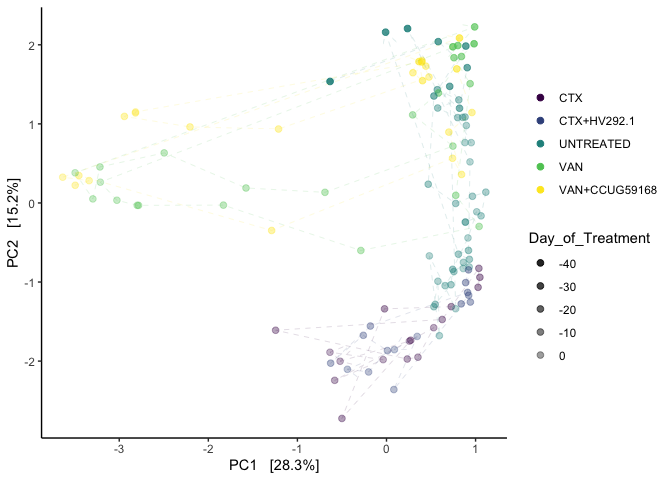

```r
plotly::ggplotly(pca_atchi)
```

<!--html_preserve--><div id="htmlwidget-2444bc49e22850c4558c" style="width:672px;height:480px;" class="plotly html-widget"></div>
<script type="application/json" data-for="htmlwidget-2444bc49e22850c4558c">{"x":{"data":[{"x":[1.04830151811925,1.02813617211359,1.03692863321448,0.625246730623804,-1.24443666602461,0.23294083119682,0.353158435653758,0.530219251614083,0.257484174249083,-0.520564005729659,0.726510722997924,-0.0217664968536903,-0.500175724620912,0.2724510333387,-0.58142372664777,-0.0375667678302663,-0.634695544262961],"y":[-0.940004572966816,-1.06685628869738,-0.82666232608721,-1.47357578839281,-1.60985304547684,-1.97358693445739,-1.95059722735829,-1.577622132689,-1.74673036825827,-2.00188643433092,-1.31124375613815,-1.3392012085286,-2.72503222683476,-1.73588441051752,-2.24313971149585,-1.98153639278241,-1.88807973305033],"text":["Treatment: CTX<br />Treatment: CTX<br />shape: 19<br />Day_of_Treatment:  -3<br />colour: CTX<br />shape: 19<br />na.rm: TRUE<br />PC1:  1.048301518<br />PC2: -0.940004573","Treatment: CTX<br />Treatment: CTX<br />shape: 19<br />Day_of_Treatment:  -2<br />colour: CTX<br />shape: 19<br />na.rm: TRUE<br />PC1:  1.028136172<br />PC2: -1.066856289","Treatment: CTX<br />Treatment: CTX<br />shape: 19<br />Day_of_Treatment:  -1<br />colour: CTX<br />shape: 19<br />na.rm: TRUE<br />PC1:  1.036928633<br />PC2: -0.826662326","Treatment: CTX<br />Treatment: CTX<br />shape: 19<br />Day_of_Treatment:   1<br />colour: CTX<br />shape: 19<br />na.rm: TRUE<br />PC1:  0.625246731<br />PC2: -1.473575788","Treatment: CTX<br />Treatment: CTX<br />shape: 19<br />Day_of_Treatment:   2<br />colour: CTX<br />shape: 19<br />na.rm: TRUE<br />PC1: -1.244436666<br />PC2: -1.609853045","Treatment: CTX<br />Treatment: CTX<br />shape: 19<br />Day_of_Treatment:   3<br />colour: CTX<br />shape: 19<br />na.rm: TRUE<br />PC1:  0.232940831<br />PC2: -1.973586934","Treatment: CTX<br />Treatment: CTX<br />shape: 19<br />Day_of_Treatment:   4<br />colour: CTX<br />shape: 19<br />na.rm: TRUE<br />PC1:  0.353158436<br />PC2: -1.950597227","Treatment: CTX<br />Treatment: CTX<br />shape: 19<br />Day_of_Treatment:   5<br />colour: CTX<br />shape: 19<br />na.rm: TRUE<br />PC1:  0.530219252<br />PC2: -1.577622133","Treatment: CTX<br />Treatment: CTX<br />shape: 19<br />Day_of_Treatment:   6<br />colour: CTX<br />shape: 19<br />na.rm: TRUE<br />PC1:  0.257484174<br />PC2: -1.746730368","Treatment: CTX<br />Treatment: CTX<br />shape: 19<br />Day_of_Treatment:   7<br />colour: CTX<br />shape: 19<br />na.rm: TRUE<br />PC1: -0.520564006<br />PC2: -2.001886434","Treatment: CTX<br />Treatment: CTX<br />shape: 19<br />Day_of_Treatment:  -1<br />colour: CTX<br />shape: 19<br />na.rm: TRUE<br />PC1:  0.726510723<br />PC2: -1.311243756","Treatment: CTX<br />Treatment: CTX<br />shape: 19<br />Day_of_Treatment:   0<br />colour: CTX<br />shape: 19<br />na.rm: TRUE<br />PC1: -0.021766497<br />PC2: -1.339201209","Treatment: CTX<br />Treatment: CTX<br />shape: 19<br />Day_of_Treatment:   1<br />colour: CTX<br />shape: 19<br />na.rm: TRUE<br />PC1: -0.500175725<br />PC2: -2.725032227","Treatment: CTX<br />Treatment: CTX<br />shape: 19<br />Day_of_Treatment:   2<br />colour: CTX<br />shape: 19<br />na.rm: TRUE<br />PC1:  0.272451033<br />PC2: -1.735884411","Treatment: CTX<br />Treatment: CTX<br />shape: 19<br />Day_of_Treatment:   4<br />colour: CTX<br />shape: 19<br />na.rm: TRUE<br />PC1: -0.581423727<br />PC2: -2.243139711","Treatment: CTX<br />Treatment: CTX<br />shape: 19<br />Day_of_Treatment:   6<br />colour: CTX<br />shape: 19<br />na.rm: TRUE<br />PC1: -0.037566768<br />PC2: -1.981536393","Treatment: CTX<br />Treatment: CTX<br />shape: 19<br />Day_of_Treatment:   7<br />colour: CTX<br />shape: 19<br />na.rm: TRUE<br />PC1: -0.634695544<br />PC2: -1.888079733"],"type":"scatter","mode":"markers","marker":{"autocolorscale":false,"color":"rgba(68,1,84,1)","opacity":[0.42,0.408,0.396,0.372,0.36,0.348,0.336,0.324,0.312,0.3,0.396,0.384,0.372,0.36,0.336,0.312,0.3],"size":7.55905511811024,"symbol":"circle","line":{"width":1.88976377952756,"color":"rgba(68,1,84,1)"}},"hoveron":"points","name":"CTX","legendgroup":"CTX","showlegend":true,"xaxis":"x","yaxis":"y","hoverinfo":"text","frame":null},{"x":[0.838792333426435,0.941514304592568,0.922529237368795,0.0826238258976776,0.344221523995318,0.0884698999956775,0.888600028484082,0.920518447946641,0.910431892632397,-0.180797813126298,-0.626818117147484,-0.26019370986512,0.0107387813815142,-0.200934856721827,-0.438972428634549],"y":[-1.27602538154507,-1.25291326799131,-1.16742471548822,-2.35979960296225,-1.6877773018994,-1.85526964010015,-1.00744513986898,-0.846358882974638,-1.13180404421272,-1.55652625566417,-2.02620752343984,-1.67372976159496,-1.86675933566092,-2.13726668364137,-2.10350941288593],"text":["Treatment: CTX+HV292.1<br />Treatment: CTX+HV292.1<br />shape: 19<br />Day_of_Treatment:  -3<br />colour: CTX+HV292.1<br />shape: 19<br />na.rm: TRUE<br />PC1:  0.838792333<br />PC2: -1.276025382","Treatment: CTX+HV292.1<br />Treatment: CTX+HV292.1<br />shape: 19<br />Day_of_Treatment:  -1<br />colour: CTX+HV292.1<br />shape: 19<br />na.rm: TRUE<br />PC1:  0.941514305<br />PC2: -1.252913268","Treatment: CTX+HV292.1<br />Treatment: CTX+HV292.1<br />shape: 19<br />Day_of_Treatment:   0<br />colour: CTX+HV292.1<br />shape: 19<br />na.rm: TRUE<br />PC1:  0.922529237<br />PC2: -1.167424715","Treatment: CTX+HV292.1<br />Treatment: CTX+HV292.1<br />shape: 19<br />Day_of_Treatment:   4<br />colour: CTX+HV292.1<br />shape: 19<br />na.rm: TRUE<br />PC1:  0.082623826<br />PC2: -2.359799603","Treatment: CTX+HV292.1<br />Treatment: CTX+HV292.1<br />shape: 19<br />Day_of_Treatment:   6<br />colour: CTX+HV292.1<br />shape: 19<br />na.rm: TRUE<br />PC1:  0.344221524<br />PC2: -1.687777302","Treatment: CTX+HV292.1<br />Treatment: CTX+HV292.1<br />shape: 19<br />Day_of_Treatment:   7<br />colour: CTX+HV292.1<br />shape: 19<br />na.rm: TRUE<br />PC1:  0.088469900<br />PC2: -1.855269640","Treatment: CTX+HV292.1<br />Treatment: CTX+HV292.1<br />shape: 19<br />Day_of_Treatment:  -3<br />colour: CTX+HV292.1<br />shape: 19<br />na.rm: TRUE<br />PC1:  0.888600028<br />PC2: -1.007445140","Treatment: CTX+HV292.1<br />Treatment: CTX+HV292.1<br />shape: 19<br />Day_of_Treatment:  -2<br />colour: CTX+HV292.1<br />shape: 19<br />na.rm: TRUE<br />PC1:  0.920518448<br />PC2: -0.846358883","Treatment: CTX+HV292.1<br />Treatment: CTX+HV292.1<br />shape: 19<br />Day_of_Treatment:  -1<br />colour: CTX+HV292.1<br />shape: 19<br />na.rm: TRUE<br />PC1:  0.910431893<br />PC2: -1.131804044","Treatment: CTX+HV292.1<br />Treatment: CTX+HV292.1<br />shape: 19<br />Day_of_Treatment:   1<br />colour: CTX+HV292.1<br />shape: 19<br />na.rm: TRUE<br />PC1: -0.180797813<br />PC2: -1.556526256","Treatment: CTX+HV292.1<br />Treatment: CTX+HV292.1<br />shape: 19<br />Day_of_Treatment:   2<br />colour: CTX+HV292.1<br />shape: 19<br />na.rm: TRUE<br />PC1: -0.626818117<br />PC2: -2.026207523","Treatment: CTX+HV292.1<br />Treatment: CTX+HV292.1<br />shape: 19<br />Day_of_Treatment:   3<br />colour: CTX+HV292.1<br />shape: 19<br />na.rm: TRUE<br />PC1: -0.260193710<br />PC2: -1.673729762","Treatment: CTX+HV292.1<br />Treatment: CTX+HV292.1<br />shape: 19<br />Day_of_Treatment:   4<br />colour: CTX+HV292.1<br />shape: 19<br />na.rm: TRUE<br />PC1:  0.010738781<br />PC2: -1.866759336","Treatment: CTX+HV292.1<br />Treatment: CTX+HV292.1<br />shape: 19<br />Day_of_Treatment:   5<br />colour: CTX+HV292.1<br />shape: 19<br />na.rm: TRUE<br />PC1: -0.200934857<br />PC2: -2.137266684","Treatment: CTX+HV292.1<br />Treatment: CTX+HV292.1<br />shape: 19<br />Day_of_Treatment:   7<br />colour: CTX+HV292.1<br />shape: 19<br />na.rm: TRUE<br />PC1: -0.438972429<br />PC2: -2.103509413"],"type":"scatter","mode":"markers","marker":{"autocolorscale":false,"color":"rgba(59,82,139,1)","opacity":[0.42,0.396,0.384,0.336,0.312,0.3,0.42,0.408,0.396,0.372,0.36,0.348,0.336,0.324,0.3],"size":7.55905511811024,"symbol":"circle","line":{"width":1.88976377952756,"color":"rgba(59,82,139,1)"}},"hoveron":"points","name":"CTX+HV292.1","legendgroup":"CTX+HV292.1","showlegend":true,"xaxis":"x","yaxis":"y","hoverinfo":"text","frame":null},{"x":[-0.63340175745657,0.580854089836878,0.906237462160797,0.819876213491718,0.570793576681,0.811750803052714,0.574701630627178,0.798723161293513,0.854755035859448,0.881951004039862,0.896003057790515,0.881108882426037,0.951038164717975,0.236336413684621,0.937314653229488,0.92045350173159,0.807105858136313,0.930332409660856,0.756446278380803,0.65794339818268,0.86381271839641,0.928308893554975,0.861407255690896,-0.009725276388277,0.890595585040054,0.532332210478821,0.468505412813117,0.777112871185364,0.964749362824843,1.11500638626001,1.06170187852664,0.886054935479271,0.88504911584242,1.01305231421448,0.914534584418986,0.743007791132913,0.723909878795488,0.546931600205215,0.531709793471885,0.577118145866634,0.593497224323363,0.481086473576403,0.776984524075951,0.7098047958765],"y":[1.53659120524863,2.03987135623731,1.71097816160718,1.19803886157558,1.43192067329572,1.30346277104013,1.2005816323069,1.07971464539016,1.0824512798719,1.0866804700917,0.979231516875508,0.763658841132792,0.762637290222346,2.20567637093955,0.519455815794315,-0.600301685769354,-0.647896498900843,-0.712986066486233,-0.868168468587753,-1.04589039644473,-0.751036819771006,-0.808957595166002,-0.829261997029491,2.15954739712082,1.98401815103327,1.35248014946862,0.236862417986278,-0.00650740570124392,0.084612696547578,0.136565315444512,-0.162798207325172,-0.240278967788132,-0.243983827217898,-0.111762316241011,-0.442181309211695,-0.839045065560461,-1.03435556536835,-1.28199554680617,-1.31233588433058,-0.990071497410238,-1.67850726213502,-0.669210225272663,-1.33791372460699,1.47433694967697],"text":["Treatment: UNTREATED<br />Treatment: UNTREATED<br />shape: 19<br />Day_of_Treatment: -43<br />colour: UNTREATED<br />shape: 19<br />na.rm: TRUE<br />PC1: -0.633401757<br />PC2:  1.536591205","Treatment: UNTREATED<br />Treatment: UNTREATED<br />shape: 19<br />Day_of_Treatment: -28<br />colour: UNTREATED<br />shape: 19<br />na.rm: TRUE<br />PC1:  0.580854090<br />PC2:  2.039871356","Treatment: UNTREATED<br />Treatment: UNTREATED<br />shape: 19<br />Day_of_Treatment: -22<br />colour: UNTREATED<br />shape: 19<br />na.rm: TRUE<br />PC1:  0.906237462<br />PC2:  1.710978162","Treatment: UNTREATED<br />Treatment: UNTREATED<br />shape: 19<br />Day_of_Treatment: -16<br />colour: UNTREATED<br />shape: 19<br />na.rm: TRUE<br />PC1:  0.819876213<br />PC2:  1.198038862","Treatment: UNTREATED<br />Treatment: UNTREATED<br />shape: 19<br />Day_of_Treatment: -10<br />colour: UNTREATED<br />shape: 19<br />na.rm: TRUE<br />PC1:  0.570793577<br />PC2:  1.431920673","Treatment: UNTREATED<br />Treatment: UNTREATED<br />shape: 19<br />Day_of_Treatment:  -3<br />colour: UNTREATED<br />shape: 19<br />na.rm: TRUE<br />PC1:  0.811750803<br />PC2:  1.303462771","Treatment: UNTREATED<br />Treatment: UNTREATED<br />shape: 19<br />Day_of_Treatment:  -2<br />colour: UNTREATED<br />shape: 19<br />na.rm: TRUE<br />PC1:  0.574701631<br />PC2:  1.200581632","Treatment: UNTREATED<br />Treatment: UNTREATED<br />shape: 19<br />Day_of_Treatment:  -1<br />colour: UNTREATED<br />shape: 19<br />na.rm: TRUE<br />PC1:  0.798723161<br />PC2:  1.079714645","Treatment: UNTREATED<br />Treatment: UNTREATED<br />shape: 19<br />Day_of_Treatment:   0<br />colour: UNTREATED<br />shape: 19<br />na.rm: TRUE<br />PC1:  0.854755036<br />PC2:  1.082451280","Treatment: UNTREATED<br />Treatment: UNTREATED<br />shape: 19<br />Day_of_Treatment:   1<br />colour: UNTREATED<br />shape: 19<br />na.rm: TRUE<br />PC1:  0.881951004<br />PC2:  1.086680470","Treatment: UNTREATED<br />Treatment: UNTREATED<br />shape: 19<br />Day_of_Treatment:   3<br />colour: UNTREATED<br />shape: 19<br />na.rm: TRUE<br />PC1:  0.896003058<br />PC2:  0.979231517","Treatment: UNTREATED<br />Treatment: UNTREATED<br />shape: 19<br />Day_of_Treatment:   4<br />colour: UNTREATED<br />shape: 19<br />na.rm: TRUE<br />PC1:  0.881108882<br />PC2:  0.763658841","Treatment: UNTREATED<br />Treatment: UNTREATED<br />shape: 19<br />Day_of_Treatment:   5<br />colour: UNTREATED<br />shape: 19<br />na.rm: TRUE<br />PC1:  0.951038165<br />PC2:  0.762637290","Treatment: UNTREATED<br />Treatment: UNTREATED<br />shape: 19<br />Day_of_Treatment: -39<br />colour: UNTREATED<br />shape: 19<br />na.rm: TRUE<br />PC1:  0.236336414<br />PC2:  2.205676371","Treatment: UNTREATED<br />Treatment: UNTREATED<br />shape: 19<br />Day_of_Treatment:   6<br />colour: UNTREATED<br />shape: 19<br />na.rm: TRUE<br />PC1:  0.937314653<br />PC2:  0.519455816","Treatment: UNTREATED<br />Treatment: UNTREATED<br />shape: 19<br />Day_of_Treatment:  -2<br />colour: UNTREATED<br />shape: 19<br />na.rm: TRUE<br />PC1:  0.920453502<br />PC2: -0.600301686","Treatment: UNTREATED<br />Treatment: UNTREATED<br />shape: 19<br />Day_of_Treatment:  -1<br />colour: UNTREATED<br />shape: 19<br />na.rm: TRUE<br />PC1:  0.807105858<br />PC2: -0.647896499","Treatment: UNTREATED<br />Treatment: UNTREATED<br />shape: 19<br />Day_of_Treatment:   0<br />colour: UNTREATED<br />shape: 19<br />na.rm: TRUE<br />PC1:  0.930332410<br />PC2: -0.712986066","Treatment: UNTREATED<br />Treatment: UNTREATED<br />shape: 19<br />Day_of_Treatment:   1<br />colour: UNTREATED<br />shape: 19<br />na.rm: TRUE<br />PC1:  0.756446278<br />PC2: -0.868168469","Treatment: UNTREATED<br />Treatment: UNTREATED<br />shape: 19<br />Day_of_Treatment:   2<br />colour: UNTREATED<br />shape: 19<br />na.rm: TRUE<br />PC1:  0.657943398<br />PC2: -1.045890396","Treatment: UNTREATED<br />Treatment: UNTREATED<br />shape: 19<br />Day_of_Treatment:   3<br />colour: UNTREATED<br />shape: 19<br />na.rm: TRUE<br />PC1:  0.863812718<br />PC2: -0.751036820","Treatment: UNTREATED<br />Treatment: UNTREATED<br />shape: 19<br />Day_of_Treatment:   4<br />colour: UNTREATED<br />shape: 19<br />na.rm: TRUE<br />PC1:  0.928308894<br />PC2: -0.808957595","Treatment: UNTREATED<br />Treatment: UNTREATED<br />shape: 19<br />Day_of_Treatment:   6<br />colour: UNTREATED<br />shape: 19<br />na.rm: TRUE<br />PC1:  0.861407256<br />PC2: -0.829261997","Treatment: UNTREATED<br />Treatment: UNTREATED<br />shape: 19<br />Day_of_Treatment: -35<br />colour: UNTREATED<br />shape: 19<br />na.rm: TRUE<br />PC1: -0.009725276<br />PC2:  2.159547397","Treatment: UNTREATED<br />Treatment: UNTREATED<br />shape: 19<br />Day_of_Treatment: -28<br />colour: UNTREATED<br />shape: 19<br />na.rm: TRUE<br />PC1:  0.890595585<br />PC2:  1.984018151","Treatment: UNTREATED<br />Treatment: UNTREATED<br />shape: 19<br />Day_of_Treatment: -16<br />colour: UNTREATED<br />shape: 19<br />na.rm: TRUE<br />PC1:  0.532332210<br />PC2:  1.352480149","Treatment: UNTREATED<br />Treatment: UNTREATED<br />shape: 19<br />Day_of_Treatment:  -2<br />colour: UNTREATED<br />shape: 19<br />na.rm: TRUE<br />PC1:  0.468505413<br />PC2:  0.236862418","Treatment: UNTREATED<br />Treatment: UNTREATED<br />shape: 19<br />Day_of_Treatment:  -1<br />colour: UNTREATED<br />shape: 19<br />na.rm: TRUE<br />PC1:  0.777112871<br />PC2: -0.006507406","Treatment: UNTREATED<br />Treatment: UNTREATED<br />shape: 19<br />Day_of_Treatment:   0<br />colour: UNTREATED<br />shape: 19<br />na.rm: TRUE<br />PC1:  0.964749363<br />PC2:  0.084612697","Treatment: UNTREATED<br />Treatment: UNTREATED<br />shape: 19<br />Day_of_Treatment:   1<br />colour: UNTREATED<br />shape: 19<br />na.rm: TRUE<br />PC1:  1.115006386<br />PC2:  0.136565315","Treatment: UNTREATED<br />Treatment: UNTREATED<br />shape: 19<br />Day_of_Treatment:   2<br />colour: UNTREATED<br />shape: 19<br />na.rm: TRUE<br />PC1:  1.061701879<br />PC2: -0.162798207","Treatment: UNTREATED<br />Treatment: UNTREATED<br />shape: 19<br />Day_of_Treatment:   3<br />colour: UNTREATED<br />shape: 19<br />na.rm: TRUE<br />PC1:  0.886054935<br />PC2: -0.240278968","Treatment: UNTREATED<br />Treatment: UNTREATED<br />shape: 19<br />Day_of_Treatment:   4<br />colour: UNTREATED<br />shape: 19<br />na.rm: TRUE<br />PC1:  0.885049116<br />PC2: -0.243983827","Treatment: UNTREATED<br />Treatment: UNTREATED<br />shape: 19<br />Day_of_Treatment:   5<br />colour: UNTREATED<br />shape: 19<br />na.rm: TRUE<br />PC1:  1.013052314<br />PC2: -0.111762316","Treatment: UNTREATED<br />Treatment: UNTREATED<br />shape: 19<br />Day_of_Treatment:   6<br />colour: UNTREATED<br />shape: 19<br />na.rm: TRUE<br />PC1:  0.914534584<br />PC2: -0.442181309","Treatment: UNTREATED<br />Treatment: UNTREATED<br />shape: 19<br />Day_of_Treatment:  -3<br />colour: UNTREATED<br />shape: 19<br />na.rm: TRUE<br />PC1:  0.743007791<br />PC2: -0.839045066","Treatment: UNTREATED<br />Treatment: UNTREATED<br />shape: 19<br />Day_of_Treatment:  -1<br />colour: UNTREATED<br />shape: 19<br />na.rm: TRUE<br />PC1:  0.723909879<br />PC2: -1.034355565","Treatment: UNTREATED<br />Treatment: UNTREATED<br />shape: 19<br />Day_of_Treatment:   0<br />colour: UNTREATED<br />shape: 19<br />na.rm: TRUE<br />PC1:  0.546931600<br />PC2: -1.281995547","Treatment: UNTREATED<br />Treatment: UNTREATED<br />shape: 19<br />Day_of_Treatment:   1<br />colour: UNTREATED<br />shape: 19<br />na.rm: TRUE<br />PC1:  0.531709793<br />PC2: -1.312335884","Treatment: UNTREATED<br />Treatment: UNTREATED<br />shape: 19<br />Day_of_Treatment:   3<br />colour: UNTREATED<br />shape: 19<br />na.rm: TRUE<br />PC1:  0.577118146<br />PC2: -0.990071497","Treatment: UNTREATED<br />Treatment: UNTREATED<br />shape: 19<br />Day_of_Treatment:   4<br />colour: UNTREATED<br />shape: 19<br />na.rm: TRUE<br />PC1:  0.593497224<br />PC2: -1.678507262","Treatment: UNTREATED<br />Treatment: UNTREATED<br />shape: 19<br />Day_of_Treatment:   5<br />colour: UNTREATED<br />shape: 19<br />na.rm: TRUE<br />PC1:  0.481086474<br />PC2: -0.669210225","Treatment: UNTREATED<br />Treatment: UNTREATED<br />shape: 19<br />Day_of_Treatment:   7<br />colour: UNTREATED<br />shape: 19<br />na.rm: TRUE<br />PC1:  0.776984524<br />PC2: -1.337913725","Treatment: UNTREATED<br />Treatment: UNTREATED<br />shape: 19<br />Day_of_Treatment: -22<br />colour: UNTREATED<br />shape: 19<br />na.rm: TRUE<br />PC1:  0.709804796<br />PC2:  1.474336950"],"type":"scatter","mode":"markers","marker":{"autocolorscale":false,"color":"rgba(33,144,140,1)","opacity":[0.9,0.72,0.648,0.576,0.504,0.42,0.408,0.396,0.384,0.372,0.348,0.336,0.324,0.852,0.312,0.408,0.396,0.384,0.372,0.36,0.348,0.336,0.312,0.804,0.72,0.576,0.408,0.396,0.384,0.372,0.36,0.348,0.336,0.324,0.312,0.42,0.396,0.384,0.372,0.348,0.336,0.324,0.3,0.648],"size":7.55905511811024,"symbol":"circle","line":{"width":1.88976377952756,"color":"rgba(33,144,140,1)"}},"hoveron":"points","name":"UNTREATED","legendgroup":"UNTREATED","showlegend":true,"xaxis":"x","yaxis":"y","hoverinfo":"text","frame":null},{"x":[0.983199764687839,0.841254309457845,0.582987617131228,0.29368236947261,0.745537586735271,-0.690741116917043,-1.57715741011965,-2.4954469076002,-3.21670677344051,-3.29609987734276,-3.49525501593882,0.98977893763952,0.745582196971655,0.757330438735292,0.93868902047446,0.777852548860377,1.03974489107305,-0.287909969188463,-1.83067884814783,-2.78342435140173,-2.79837105803895,-3.02630804598668,-3.21218349848578,0.80054615980687],"y":[2.01327311002539,1.85215376136289,1.39071152251477,1.11372144108556,0.718941796452634,0.134355579775129,0.189206174128668,0.633168471573367,0.455562895847302,0.0513525831314882,0.381682427078074,2.22665625918932,1.97474937067689,1.83676623838822,1.50845910832146,0.0965617282288286,-0.297107608070808,-0.601118167122702,-0.0273318430857631,-0.0303663471534186,-0.0298747703304454,0.0343325501992655,0.262745383738065,1.99053756719985],"text":["Treatment: VAN<br />Treatment: VAN<br />shape: 19<br />Day_of_Treatment: -28<br />colour: VAN<br />shape: 19<br />na.rm: TRUE<br />PC1:  0.983199765<br />PC2:  2.013273110","Treatment: VAN<br />Treatment: VAN<br />shape: 19<br />Day_of_Treatment: -16<br />colour: VAN<br />shape: 19<br />na.rm: TRUE<br />PC1:  0.841254309<br />PC2:  1.852153761","Treatment: VAN<br />Treatment: VAN<br />shape: 19<br />Day_of_Treatment: -10<br />colour: VAN<br />shape: 19<br />na.rm: TRUE<br />PC1:  0.582987617<br />PC2:  1.390711523","Treatment: VAN<br />Treatment: VAN<br />shape: 19<br />Day_of_Treatment:  -2<br />colour: VAN<br />shape: 19<br />na.rm: TRUE<br />PC1:  0.293682369<br />PC2:  1.113721441","Treatment: VAN<br />Treatment: VAN<br />shape: 19<br />Day_of_Treatment:  -1<br />colour: VAN<br />shape: 19<br />na.rm: TRUE<br />PC1:  0.745537587<br />PC2:  0.718941796","Treatment: VAN<br />Treatment: VAN<br />shape: 19<br />Day_of_Treatment:   1<br />colour: VAN<br />shape: 19<br />na.rm: TRUE<br />PC1: -0.690741117<br />PC2:  0.134355580","Treatment: VAN<br />Treatment: VAN<br />shape: 19<br />Day_of_Treatment:   2<br />colour: VAN<br />shape: 19<br />na.rm: TRUE<br />PC1: -1.577157410<br />PC2:  0.189206174","Treatment: VAN<br />Treatment: VAN<br />shape: 19<br />Day_of_Treatment:   3<br />colour: VAN<br />shape: 19<br />na.rm: TRUE<br />PC1: -2.495446908<br />PC2:  0.633168472","Treatment: VAN<br />Treatment: VAN<br />shape: 19<br />Day_of_Treatment:   4<br />colour: VAN<br />shape: 19<br />na.rm: TRUE<br />PC1: -3.216706773<br />PC2:  0.455562896","Treatment: VAN<br />Treatment: VAN<br />shape: 19<br />Day_of_Treatment:   5<br />colour: VAN<br />shape: 19<br />na.rm: TRUE<br />PC1: -3.296099877<br />PC2:  0.051352583","Treatment: VAN<br />Treatment: VAN<br />shape: 19<br />Day_of_Treatment:   7<br />colour: VAN<br />shape: 19<br />na.rm: TRUE<br />PC1: -3.495255016<br />PC2:  0.381682427","Treatment: VAN<br />Treatment: VAN<br />shape: 19<br />Day_of_Treatment: -22<br />colour: VAN<br />shape: 19<br />na.rm: TRUE<br />PC1:  0.989778938<br />PC2:  2.226656259","Treatment: VAN<br />Treatment: VAN<br />shape: 19<br />Day_of_Treatment: -28<br />colour: VAN<br />shape: 19<br />na.rm: TRUE<br />PC1:  0.745582197<br />PC2:  1.974749371","Treatment: VAN<br />Treatment: VAN<br />shape: 19<br />Day_of_Treatment: -16<br />colour: VAN<br />shape: 19<br />na.rm: TRUE<br />PC1:  0.757330439<br />PC2:  1.836766238","Treatment: VAN<br />Treatment: VAN<br />shape: 19<br />Day_of_Treatment: -10<br />colour: VAN<br />shape: 19<br />na.rm: TRUE<br />PC1:  0.938689020<br />PC2:  1.508459108","Treatment: VAN<br />Treatment: VAN<br />shape: 19<br />Day_of_Treatment:  -3<br />colour: VAN<br />shape: 19<br />na.rm: TRUE<br />PC1:  0.777852549<br />PC2:  0.096561728","Treatment: VAN<br />Treatment: VAN<br />shape: 19<br />Day_of_Treatment:   0<br />colour: VAN<br />shape: 19<br />na.rm: TRUE<br />PC1:  1.039744891<br />PC2: -0.297107608","Treatment: VAN<br />Treatment: VAN<br />shape: 19<br />Day_of_Treatment:   1<br />colour: VAN<br />shape: 19<br />na.rm: TRUE<br />PC1: -0.287909969<br />PC2: -0.601118167","Treatment: VAN<br />Treatment: VAN<br />shape: 19<br />Day_of_Treatment:   2<br />colour: VAN<br />shape: 19<br />na.rm: TRUE<br />PC1: -1.830678848<br />PC2: -0.027331843","Treatment: VAN<br />Treatment: VAN<br />shape: 19<br />Day_of_Treatment:   3<br />colour: VAN<br />shape: 19<br />na.rm: TRUE<br />PC1: -2.783424351<br />PC2: -0.030366347","Treatment: VAN<br />Treatment: VAN<br />shape: 19<br />Day_of_Treatment:   4<br />colour: VAN<br />shape: 19<br />na.rm: TRUE<br />PC1: -2.798371058<br />PC2: -0.029874770","Treatment: VAN<br />Treatment: VAN<br />shape: 19<br />Day_of_Treatment:   5<br />colour: VAN<br />shape: 19<br />na.rm: TRUE<br />PC1: -3.026308046<br />PC2:  0.034332550","Treatment: VAN<br />Treatment: VAN<br />shape: 19<br />Day_of_Treatment:   7<br />colour: VAN<br />shape: 19<br />na.rm: TRUE<br />PC1: -3.212183498<br />PC2:  0.262745384","Treatment: VAN<br />Treatment: VAN<br />shape: 19<br />Day_of_Treatment: -22<br />colour: VAN<br />shape: 19<br />na.rm: TRUE<br />PC1:  0.800546160<br />PC2:  1.990537567"],"type":"scatter","mode":"markers","marker":{"autocolorscale":false,"color":"rgba(93,200,99,1)","opacity":[0.72,0.576,0.504,0.408,0.396,0.372,0.36,0.348,0.336,0.324,0.3,0.648,0.72,0.576,0.504,0.42,0.384,0.372,0.36,0.348,0.336,0.324,0.3,0.648],"size":7.55905511811024,"symbol":"circle","line":{"width":1.88976377952756,"color":"rgba(93,200,99,1)"}},"hoveron":"points","name":"VAN","legendgroup":"VAN","showlegend":true,"xaxis":"x","yaxis":"y","hoverinfo":"text","frame":null},{"x":[0.788985459078614,0.959302578577036,0.69995883406494,0.842526358530722,0.74141761818098,-1.28907703887154,-3.45333856987792,-3.49434345995801,-3.33827017227988,-3.63460352368434,0.819406324390995,0.364731764945759,0.40478134643191,0.296726714226904,0.44166170422189,0.397581944775963,0.476970148945286,-1.21179515360669,-2.20580051958225,-2.94238046305012,-2.81786466876292,-2.81688966118995,0.396065231487819],"y":[1.69561619477137,1.14387920877412,0.89585899378229,0.360420742722536,0.565181897870978,-0.348087828542981,0.34679210520446,0.223505544993842,0.282486679503637,0.325570395586188,2.08606307774722,1.78764082245971,1.54673221294349,1.64692600006783,1.73016347071777,1.80231994656782,1.59232658109005,0.934971746412647,0.961417098142671,1.09473606852899,1.13806522898232,1.15136652813542,1.78328992259937],"text":["Treatment: VAN+CCUG59168<br />Treatment: VAN+CCUG59168<br />shape: 19<br />Day_of_Treatment: -16<br />colour: VAN+CCUG59168<br />shape: 19<br />na.rm: TRUE<br />PC1:  0.788985459<br />PC2:  1.695616195","Treatment: VAN+CCUG59168<br />Treatment: VAN+CCUG59168<br />shape: 19<br />Day_of_Treatment:  -3<br />colour: VAN+CCUG59168<br />shape: 19<br />na.rm: TRUE<br />PC1:  0.959302579<br />PC2:  1.143879209","Treatment: VAN+CCUG59168<br />Treatment: VAN+CCUG59168<br />shape: 19<br />Day_of_Treatment:  -2<br />colour: VAN+CCUG59168<br />shape: 19<br />na.rm: TRUE<br />PC1:  0.699958834<br />PC2:  0.895858994","Treatment: VAN+CCUG59168<br />Treatment: VAN+CCUG59168<br />shape: 19<br />Day_of_Treatment:  -1<br />colour: VAN+CCUG59168<br />shape: 19<br />na.rm: TRUE<br />PC1:  0.842526359<br />PC2:  0.360420743","Treatment: VAN+CCUG59168<br />Treatment: VAN+CCUG59168<br />shape: 19<br />Day_of_Treatment:   0<br />colour: VAN+CCUG59168<br />shape: 19<br />na.rm: TRUE<br />PC1:  0.741417618<br />PC2:  0.565181898","Treatment: VAN+CCUG59168<br />Treatment: VAN+CCUG59168<br />shape: 19<br />Day_of_Treatment:   1<br />colour: VAN+CCUG59168<br />shape: 19<br />na.rm: TRUE<br />PC1: -1.289077039<br />PC2: -0.348087829","Treatment: VAN+CCUG59168<br />Treatment: VAN+CCUG59168<br />shape: 19<br />Day_of_Treatment:   4<br />colour: VAN+CCUG59168<br />shape: 19<br />na.rm: TRUE<br />PC1: -3.453338570<br />PC2:  0.346792105","Treatment: VAN+CCUG59168<br />Treatment: VAN+CCUG59168<br />shape: 19<br />Day_of_Treatment:   5<br />colour: VAN+CCUG59168<br />shape: 19<br />na.rm: TRUE<br />PC1: -3.494343460<br />PC2:  0.223505545","Treatment: VAN+CCUG59168<br />Treatment: VAN+CCUG59168<br />shape: 19<br />Day_of_Treatment:   6<br />colour: VAN+CCUG59168<br />shape: 19<br />na.rm: TRUE<br />PC1: -3.338270172<br />PC2:  0.282486680","Treatment: VAN+CCUG59168<br />Treatment: VAN+CCUG59168<br />shape: 19<br />Day_of_Treatment:   7<br />colour: VAN+CCUG59168<br />shape: 19<br />na.rm: TRUE<br />PC1: -3.634603524<br />PC2:  0.325570396","Treatment: VAN+CCUG59168<br />Treatment: VAN+CCUG59168<br />shape: 19<br />Day_of_Treatment: -22<br />colour: VAN+CCUG59168<br />shape: 19<br />na.rm: TRUE<br />PC1:  0.819406324<br />PC2:  2.086063078","Treatment: VAN+CCUG59168<br />Treatment: VAN+CCUG59168<br />shape: 19<br />Day_of_Treatment: -16<br />colour: VAN+CCUG59168<br />shape: 19<br />na.rm: TRUE<br />PC1:  0.364731765<br />PC2:  1.787640822","Treatment: VAN+CCUG59168<br />Treatment: VAN+CCUG59168<br />shape: 19<br />Day_of_Treatment: -10<br />colour: VAN+CCUG59168<br />shape: 19<br />na.rm: TRUE<br />PC1:  0.404781346<br />PC2:  1.546732213","Treatment: VAN+CCUG59168<br />Treatment: VAN+CCUG59168<br />shape: 19<br />Day_of_Treatment:  -3<br />colour: VAN+CCUG59168<br />shape: 19<br />na.rm: TRUE<br />PC1:  0.296726714<br />PC2:  1.646926000","Treatment: VAN+CCUG59168<br />Treatment: VAN+CCUG59168<br />shape: 19<br />Day_of_Treatment:  -2<br />colour: VAN+CCUG59168<br />shape: 19<br />na.rm: TRUE<br />PC1:  0.441661704<br />PC2:  1.730163471","Treatment: VAN+CCUG59168<br />Treatment: VAN+CCUG59168<br />shape: 19<br />Day_of_Treatment:  -1<br />colour: VAN+CCUG59168<br />shape: 19<br />na.rm: TRUE<br />PC1:  0.397581945<br />PC2:  1.802319947","Treatment: VAN+CCUG59168<br />Treatment: VAN+CCUG59168<br />shape: 19<br />Day_of_Treatment:   0<br />colour: VAN+CCUG59168<br />shape: 19<br />na.rm: TRUE<br />PC1:  0.476970149<br />PC2:  1.592326581","Treatment: VAN+CCUG59168<br />Treatment: VAN+CCUG59168<br />shape: 19<br />Day_of_Treatment:   1<br />colour: VAN+CCUG59168<br />shape: 19<br />na.rm: TRUE<br />PC1: -1.211795154<br />PC2:  0.934971746","Treatment: VAN+CCUG59168<br />Treatment: VAN+CCUG59168<br />shape: 19<br />Day_of_Treatment:   2<br />colour: VAN+CCUG59168<br />shape: 19<br />na.rm: TRUE<br />PC1: -2.205800520<br />PC2:  0.961417098","Treatment: VAN+CCUG59168<br />Treatment: VAN+CCUG59168<br />shape: 19<br />Day_of_Treatment:   3<br />colour: VAN+CCUG59168<br />shape: 19<br />na.rm: TRUE<br />PC1: -2.942380463<br />PC2:  1.094736069","Treatment: VAN+CCUG59168<br />Treatment: VAN+CCUG59168<br />shape: 19<br />Day_of_Treatment:   4<br />colour: VAN+CCUG59168<br />shape: 19<br />na.rm: TRUE<br />PC1: -2.817864669<br />PC2:  1.138065229","Treatment: VAN+CCUG59168<br />Treatment: VAN+CCUG59168<br />shape: 19<br />Day_of_Treatment:   7<br />colour: VAN+CCUG59168<br />shape: 19<br />na.rm: TRUE<br />PC1: -2.816889661<br />PC2:  1.151366528","Treatment: VAN+CCUG59168<br />Treatment: VAN+CCUG59168<br />shape: 19<br />Day_of_Treatment: -22<br />colour: VAN+CCUG59168<br />shape: 19<br />na.rm: TRUE<br />PC1:  0.396065231<br />PC2:  1.783289923"],"type":"scatter","mode":"markers","marker":{"autocolorscale":false,"color":"rgba(253,231,37,1)","opacity":[0.576,0.42,0.408,0.396,0.384,0.372,0.336,0.324,0.312,0.3,0.648,0.576,0.504,0.42,0.408,0.396,0.384,0.372,0.36,0.348,0.336,0.3,0.648],"size":7.55905511811024,"symbol":"circle","line":{"width":1.88976377952756,"color":"rgba(253,231,37,1)"}},"hoveron":"points","name":"VAN+CCUG59168","legendgroup":"VAN+CCUG59168","showlegend":true,"xaxis":"x","yaxis":"y","hoverinfo":"text","frame":null},{"x":[1.04830151811925,1.02813617211359,1.03692863321448,0.625246730623804,-1.24443666602461,0.23294083119682,0.353158435653758,0.530219251614083,0.257484174249083,-0.520564005729659,null,0.726510722997924,-0.0217664968536903,-0.500175724620912,0.2724510333387,-0.58142372664777,-0.0375667678302663,-0.634695544262961],"y":[-0.940004572966816,-1.06685628869738,-0.82666232608721,-1.47357578839281,-1.60985304547684,-1.97358693445739,-1.95059722735829,-1.577622132689,-1.74673036825827,-2.00188643433092,null,-1.31124375613815,-1.3392012085286,-2.72503222683476,-1.73588441051752,-2.24313971149585,-1.98153639278241,-1.88807973305033],"text":["Reactor_Treatment: TR_2CTX<br />Treatment: CTX<br />colour: CTX<br />na.rm: TRUE<br />PC1:  1.048301518<br />PC2: -0.940004573","Reactor_Treatment: TR_2CTX<br />Treatment: CTX<br />colour: CTX<br />na.rm: TRUE<br />PC1:  1.028136172<br />PC2: -1.066856289","Reactor_Treatment: TR_2CTX<br />Treatment: CTX<br />colour: CTX<br />na.rm: TRUE<br />PC1:  1.036928633<br />PC2: -0.826662326","Reactor_Treatment: TR_2CTX<br />Treatment: CTX<br />colour: CTX<br />na.rm: TRUE<br />PC1:  0.625246731<br />PC2: -1.473575788","Reactor_Treatment: TR_2CTX<br />Treatment: CTX<br />colour: CTX<br />na.rm: TRUE<br />PC1: -1.244436666<br />PC2: -1.609853045","Reactor_Treatment: TR_2CTX<br />Treatment: CTX<br />colour: CTX<br />na.rm: TRUE<br />PC1:  0.232940831<br />PC2: -1.973586934","Reactor_Treatment: TR_2CTX<br />Treatment: CTX<br />colour: CTX<br />na.rm: TRUE<br />PC1:  0.353158436<br />PC2: -1.950597227","Reactor_Treatment: TR_2CTX<br />Treatment: CTX<br />colour: CTX<br />na.rm: TRUE<br />PC1:  0.530219252<br />PC2: -1.577622133","Reactor_Treatment: TR_2CTX<br />Treatment: CTX<br />colour: CTX<br />na.rm: TRUE<br />PC1:  0.257484174<br />PC2: -1.746730368","Reactor_Treatment: TR_2CTX<br />Treatment: CTX<br />colour: CTX<br />na.rm: TRUE<br />PC1: -0.520564006<br />PC2: -2.001886434",null,"Reactor_Treatment: TR4_CTX<br />Treatment: CTX<br />colour: CTX<br />na.rm: TRUE<br />PC1:  0.726510723<br />PC2: -1.311243756","Reactor_Treatment: TR4_CTX<br />Treatment: CTX<br />colour: CTX<br />na.rm: TRUE<br />PC1: -0.021766497<br />PC2: -1.339201209","Reactor_Treatment: TR4_CTX<br />Treatment: CTX<br />colour: CTX<br />na.rm: TRUE<br />PC1: -0.500175725<br />PC2: -2.725032227","Reactor_Treatment: TR4_CTX<br />Treatment: CTX<br />colour: CTX<br />na.rm: TRUE<br />PC1:  0.272451033<br />PC2: -1.735884411","Reactor_Treatment: TR4_CTX<br />Treatment: CTX<br />colour: CTX<br />na.rm: TRUE<br />PC1: -0.581423727<br />PC2: -2.243139711","Reactor_Treatment: TR4_CTX<br />Treatment: CTX<br />colour: CTX<br />na.rm: TRUE<br />PC1: -0.037566768<br />PC2: -1.981536393","Reactor_Treatment: TR4_CTX<br />Treatment: CTX<br />colour: CTX<br />na.rm: TRUE<br />PC1: -0.634695544<br />PC2: -1.888079733"],"type":"scatter","mode":"lines","line":{"width":0.188976377952756,"color":"rgba(68,1,84,1)","dash":"dash"},"hoveron":"points","name":"(CTX,1)","legendgroup":"(CTX,1)","showlegend":true,"xaxis":"x","yaxis":"y","hoverinfo":"text","frame":null},{"x":[0.838792333426435,0.941514304592568,0.922529237368795,0.0826238258976776,0.344221523995318,0.0884698999956775,null,0.888600028484082,0.920518447946641,0.910431892632397,-0.180797813126298,-0.626818117147484,-0.26019370986512,0.0107387813815142,-0.200934856721827,-0.438972428634549],"y":[-1.27602538154507,-1.25291326799131,-1.16742471548822,-2.35979960296225,-1.6877773018994,-1.85526964010015,null,-1.00744513986898,-0.846358882974638,-1.13180404421272,-1.55652625566417,-2.02620752343984,-1.67372976159496,-1.86675933566092,-2.13726668364137,-2.10350941288593],"text":["Reactor_Treatment: TR1_CTX+HV292.1<br />Treatment: CTX+HV292.1<br />colour: CTX+HV292.1<br />na.rm: TRUE<br />PC1:  0.838792333<br />PC2: -1.276025382","Reactor_Treatment: TR1_CTX+HV292.1<br />Treatment: CTX+HV292.1<br />colour: CTX+HV292.1<br />na.rm: TRUE<br />PC1:  0.941514305<br />PC2: -1.252913268","Reactor_Treatment: TR1_CTX+HV292.1<br />Treatment: CTX+HV292.1<br />colour: CTX+HV292.1<br />na.rm: TRUE<br />PC1:  0.922529237<br />PC2: -1.167424715","Reactor_Treatment: TR1_CTX+HV292.1<br />Treatment: CTX+HV292.1<br />colour: CTX+HV292.1<br />na.rm: TRUE<br />PC1:  0.082623826<br />PC2: -2.359799603","Reactor_Treatment: TR1_CTX+HV292.1<br />Treatment: CTX+HV292.1<br />colour: CTX+HV292.1<br />na.rm: TRUE<br />PC1:  0.344221524<br />PC2: -1.687777302","Reactor_Treatment: TR1_CTX+HV292.1<br />Treatment: CTX+HV292.1<br />colour: CTX+HV292.1<br />na.rm: TRUE<br />PC1:  0.088469900<br />PC2: -1.855269640",null,"Reactor_Treatment: TR3_CTX+HV292.1<br />Treatment: CTX+HV292.1<br />colour: CTX+HV292.1<br />na.rm: TRUE<br />PC1:  0.888600028<br />PC2: -1.007445140","Reactor_Treatment: TR3_CTX+HV292.1<br />Treatment: CTX+HV292.1<br />colour: CTX+HV292.1<br />na.rm: TRUE<br />PC1:  0.920518448<br />PC2: -0.846358883","Reactor_Treatment: TR3_CTX+HV292.1<br />Treatment: CTX+HV292.1<br />colour: CTX+HV292.1<br />na.rm: TRUE<br />PC1:  0.910431893<br />PC2: -1.131804044","Reactor_Treatment: TR3_CTX+HV292.1<br />Treatment: CTX+HV292.1<br />colour: CTX+HV292.1<br />na.rm: TRUE<br />PC1: -0.180797813<br />PC2: -1.556526256","Reactor_Treatment: TR3_CTX+HV292.1<br />Treatment: CTX+HV292.1<br />colour: CTX+HV292.1<br />na.rm: TRUE<br />PC1: -0.626818117<br />PC2: -2.026207523","Reactor_Treatment: TR3_CTX+HV292.1<br />Treatment: CTX+HV292.1<br />colour: CTX+HV292.1<br />na.rm: TRUE<br />PC1: -0.260193710<br />PC2: -1.673729762","Reactor_Treatment: TR3_CTX+HV292.1<br />Treatment: CTX+HV292.1<br />colour: CTX+HV292.1<br />na.rm: TRUE<br />PC1:  0.010738781<br />PC2: -1.866759336","Reactor_Treatment: TR3_CTX+HV292.1<br />Treatment: CTX+HV292.1<br />colour: CTX+HV292.1<br />na.rm: TRUE<br />PC1: -0.200934857<br />PC2: -2.137266684","Reactor_Treatment: TR3_CTX+HV292.1<br />Treatment: CTX+HV292.1<br />colour: CTX+HV292.1<br />na.rm: TRUE<br />PC1: -0.438972429<br />PC2: -2.103509413"],"type":"scatter","mode":"lines","line":{"width":0.188976377952756,"color":"rgba(59,82,139,1)","dash":"dash"},"hoveron":"points","name":"(CTX+HV292.1,1)","legendgroup":"(CTX+HV292.1,1)","showlegend":true,"xaxis":"x","yaxis":"y","hoverinfo":"text","frame":null},{"x":[0.890595585040054,0.532332210478821,0.468505412813117,0.777112871185364,0.964749362824843,1.11500638626001,1.06170187852664,0.886054935479271,0.88504911584242,1.01305231421448,0.914534584418986,0.743007791132913,0.723909878795488,0.546931600205215,0.531709793471885,0.577118145866634,0.593497224323363,0.481086473576403,0.776984524075951,0.7098047958765,null,-0.63340175745657,0.580854089836878,0.906237462160797,0.819876213491718,0.570793576681,0.811750803052714,0.574701630627178,0.798723161293513,0.854755035859448,0.881951004039862,0.896003057790515,0.881108882426037,0.951038164717975,0.236336413684621,0.937314653229488,0.92045350173159,0.807105858136313,0.930332409660856,0.756446278380803,0.65794339818268,0.86381271839641,0.928308893554975,0.861407255690896,-0.009725276388277],"y":[1.98401815103327,1.35248014946862,0.236862417986278,-0.00650740570124392,0.084612696547578,0.136565315444512,-0.162798207325172,-0.240278967788132,-0.243983827217898,-0.111762316241011,-0.442181309211695,-0.839045065560461,-1.03435556536835,-1.28199554680617,-1.31233588433058,-0.990071497410238,-1.67850726213502,-0.669210225272663,-1.33791372460699,1.47433694967697,null,1.53659120524863,2.03987135623731,1.71097816160718,1.19803886157558,1.43192067329572,1.30346277104013,1.2005816323069,1.07971464539016,1.0824512798719,1.0866804700917,0.979231516875508,0.763658841132792,0.762637290222346,2.20567637093955,0.519455815794315,-0.600301685769354,-0.647896498900843,-0.712986066486233,-0.868168468587753,-1.04589039644473,-0.751036819771006,-0.808957595166002,-0.829261997029491,2.15954739712082],"text":["Reactor_Treatment: CR_UNTREATED<br />Treatment: UNTREATED<br />colour: UNTREATED<br />na.rm: TRUE<br />PC1:  0.890595585<br />PC2:  1.984018151","Reactor_Treatment: CR_UNTREATED<br />Treatment: UNTREATED<br />colour: UNTREATED<br />na.rm: TRUE<br />PC1:  0.532332210<br />PC2:  1.352480149","Reactor_Treatment: CR_UNTREATED<br />Treatment: UNTREATED<br />colour: UNTREATED<br />na.rm: TRUE<br />PC1:  0.468505413<br />PC2:  0.236862418","Reactor_Treatment: CR_UNTREATED<br />Treatment: UNTREATED<br />colour: UNTREATED<br />na.rm: TRUE<br />PC1:  0.777112871<br />PC2: -0.006507406","Reactor_Treatment: CR_UNTREATED<br />Treatment: UNTREATED<br />colour: UNTREATED<br />na.rm: TRUE<br />PC1:  0.964749363<br />PC2:  0.084612697","Reactor_Treatment: CR_UNTREATED<br />Treatment: UNTREATED<br />colour: UNTREATED<br />na.rm: TRUE<br />PC1:  1.115006386<br />PC2:  0.136565315","Reactor_Treatment: CR_UNTREATED<br />Treatment: UNTREATED<br />colour: UNTREATED<br />na.rm: TRUE<br />PC1:  1.061701879<br />PC2: -0.162798207","Reactor_Treatment: CR_UNTREATED<br />Treatment: UNTREATED<br />colour: UNTREATED<br />na.rm: TRUE<br />PC1:  0.886054935<br />PC2: -0.240278968","Reactor_Treatment: CR_UNTREATED<br />Treatment: UNTREATED<br />colour: UNTREATED<br />na.rm: TRUE<br />PC1:  0.885049116<br />PC2: -0.243983827","Reactor_Treatment: CR_UNTREATED<br />Treatment: UNTREATED<br />colour: UNTREATED<br />na.rm: TRUE<br />PC1:  1.013052314<br />PC2: -0.111762316","Reactor_Treatment: CR_UNTREATED<br />Treatment: UNTREATED<br />colour: UNTREATED<br />na.rm: TRUE<br />PC1:  0.914534584<br />PC2: -0.442181309","Reactor_Treatment: CR_UNTREATED<br />Treatment: UNTREATED<br />colour: UNTREATED<br />na.rm: TRUE<br />PC1:  0.743007791<br />PC2: -0.839045066","Reactor_Treatment: CR_UNTREATED<br />Treatment: UNTREATED<br />colour: UNTREATED<br />na.rm: TRUE<br />PC1:  0.723909879<br />PC2: -1.034355565","Reactor_Treatment: CR_UNTREATED<br />Treatment: UNTREATED<br />colour: UNTREATED<br />na.rm: TRUE<br />PC1:  0.546931600<br />PC2: -1.281995547","Reactor_Treatment: CR_UNTREATED<br />Treatment: UNTREATED<br />colour: UNTREATED<br />na.rm: TRUE<br />PC1:  0.531709793<br />PC2: -1.312335884","Reactor_Treatment: CR_UNTREATED<br />Treatment: UNTREATED<br />colour: UNTREATED<br />na.rm: TRUE<br />PC1:  0.577118146<br />PC2: -0.990071497","Reactor_Treatment: CR_UNTREATED<br />Treatment: UNTREATED<br />colour: UNTREATED<br />na.rm: TRUE<br />PC1:  0.593497224<br />PC2: -1.678507262","Reactor_Treatment: CR_UNTREATED<br />Treatment: UNTREATED<br />colour: UNTREATED<br />na.rm: TRUE<br />PC1:  0.481086474<br />PC2: -0.669210225","Reactor_Treatment: CR_UNTREATED<br />Treatment: UNTREATED<br />colour: UNTREATED<br />na.rm: TRUE<br />PC1:  0.776984524<br />PC2: -1.337913725","Reactor_Treatment: CR_UNTREATED<br />Treatment: UNTREATED<br />colour: UNTREATED<br />na.rm: TRUE<br />PC1:  0.709804796<br />PC2:  1.474336950",null,"Reactor_Treatment: IR_UNTREATED<br />Treatment: UNTREATED<br />colour: UNTREATED<br />na.rm: TRUE<br />PC1: -0.633401757<br />PC2:  1.536591205","Reactor_Treatment: IR_UNTREATED<br />Treatment: UNTREATED<br />colour: UNTREATED<br />na.rm: TRUE<br />PC1:  0.580854090<br />PC2:  2.039871356","Reactor_Treatment: IR_UNTREATED<br />Treatment: UNTREATED<br />colour: UNTREATED<br />na.rm: TRUE<br />PC1:  0.906237462<br />PC2:  1.710978162","Reactor_Treatment: IR_UNTREATED<br />Treatment: UNTREATED<br />colour: UNTREATED<br />na.rm: TRUE<br />PC1:  0.819876213<br />PC2:  1.198038862","Reactor_Treatment: IR_UNTREATED<br />Treatment: UNTREATED<br />colour: UNTREATED<br />na.rm: TRUE<br />PC1:  0.570793577<br />PC2:  1.431920673","Reactor_Treatment: IR_UNTREATED<br />Treatment: UNTREATED<br />colour: UNTREATED<br />na.rm: TRUE<br />PC1:  0.811750803<br />PC2:  1.303462771","Reactor_Treatment: IR_UNTREATED<br />Treatment: UNTREATED<br />colour: UNTREATED<br />na.rm: TRUE<br />PC1:  0.574701631<br />PC2:  1.200581632","Reactor_Treatment: IR_UNTREATED<br />Treatment: UNTREATED<br />colour: UNTREATED<br />na.rm: TRUE<br />PC1:  0.798723161<br />PC2:  1.079714645","Reactor_Treatment: IR_UNTREATED<br />Treatment: UNTREATED<br />colour: UNTREATED<br />na.rm: TRUE<br />PC1:  0.854755036<br />PC2:  1.082451280","Reactor_Treatment: IR_UNTREATED<br />Treatment: UNTREATED<br />colour: UNTREATED<br />na.rm: TRUE<br />PC1:  0.881951004<br />PC2:  1.086680470","Reactor_Treatment: IR_UNTREATED<br />Treatment: UNTREATED<br />colour: UNTREATED<br />na.rm: TRUE<br />PC1:  0.896003058<br />PC2:  0.979231517","Reactor_Treatment: IR_UNTREATED<br />Treatment: UNTREATED<br />colour: UNTREATED<br />na.rm: TRUE<br />PC1:  0.881108882<br />PC2:  0.763658841","Reactor_Treatment: IR_UNTREATED<br />Treatment: UNTREATED<br />colour: UNTREATED<br />na.rm: TRUE<br />PC1:  0.951038165<br />PC2:  0.762637290","Reactor_Treatment: IR_UNTREATED<br />Treatment: UNTREATED<br />colour: UNTREATED<br />na.rm: TRUE<br />PC1:  0.236336414<br />PC2:  2.205676371","Reactor_Treatment: IR_UNTREATED<br />Treatment: UNTREATED<br />colour: UNTREATED<br />na.rm: TRUE<br />PC1:  0.937314653<br />PC2:  0.519455816","Reactor_Treatment: IR_UNTREATED<br />Treatment: UNTREATED<br />colour: UNTREATED<br />na.rm: TRUE<br />PC1:  0.920453502<br />PC2: -0.600301686","Reactor_Treatment: IR_UNTREATED<br />Treatment: UNTREATED<br />colour: UNTREATED<br />na.rm: TRUE<br />PC1:  0.807105858<br />PC2: -0.647896499","Reactor_Treatment: IR_UNTREATED<br />Treatment: UNTREATED<br />colour: UNTREATED<br />na.rm: TRUE<br />PC1:  0.930332410<br />PC2: -0.712986066","Reactor_Treatment: IR_UNTREATED<br />Treatment: UNTREATED<br />colour: UNTREATED<br />na.rm: TRUE<br />PC1:  0.756446278<br />PC2: -0.868168469","Reactor_Treatment: IR_UNTREATED<br />Treatment: UNTREATED<br />colour: UNTREATED<br />na.rm: TRUE<br />PC1:  0.657943398<br />PC2: -1.045890396","Reactor_Treatment: IR_UNTREATED<br />Treatment: UNTREATED<br />colour: UNTREATED<br />na.rm: TRUE<br />PC1:  0.863812718<br />PC2: -0.751036820","Reactor_Treatment: IR_UNTREATED<br />Treatment: UNTREATED<br />colour: UNTREATED<br />na.rm: TRUE<br />PC1:  0.928308894<br />PC2: -0.808957595","Reactor_Treatment: IR_UNTREATED<br />Treatment: UNTREATED<br />colour: UNTREATED<br />na.rm: TRUE<br />PC1:  0.861407256<br />PC2: -0.829261997","Reactor_Treatment: IR_UNTREATED<br />Treatment: UNTREATED<br />colour: UNTREATED<br />na.rm: TRUE<br />PC1: -0.009725276<br />PC2:  2.159547397"],"type":"scatter","mode":"lines","line":{"width":0.188976377952756,"color":"rgba(33,144,140,1)","dash":"dash"},"hoveron":"points","name":"(UNTREATED,1)","legendgroup":"(UNTREATED,1)","showlegend":true,"xaxis":"x","yaxis":"y","hoverinfo":"text","frame":null},{"x":[0.983199764687839,0.841254309457845,0.582987617131228,0.29368236947261,0.745537586735271,-0.690741116917043,-1.57715741011965,-2.4954469076002,-3.21670677344051,-3.29609987734276,-3.49525501593882,0.98977893763952,null,0.745582196971655,0.757330438735292,0.93868902047446,0.777852548860377,1.03974489107305,-0.287909969188463,-1.83067884814783,-2.78342435140173,-2.79837105803895,-3.02630804598668,-3.21218349848578,0.80054615980687],"y":[2.01327311002539,1.85215376136289,1.39071152251477,1.11372144108556,0.718941796452634,0.134355579775129,0.189206174128668,0.633168471573367,0.455562895847302,0.0513525831314882,0.381682427078074,2.22665625918932,null,1.97474937067689,1.83676623838822,1.50845910832146,0.0965617282288286,-0.297107608070808,-0.601118167122702,-0.0273318430857631,-0.0303663471534186,-0.0298747703304454,0.0343325501992655,0.262745383738065,1.99053756719985],"text":["Reactor_Treatment: TR2_VAN<br />Treatment: VAN<br />colour: VAN<br />na.rm: TRUE<br />PC1:  0.983199765<br />PC2:  2.013273110","Reactor_Treatment: TR2_VAN<br />Treatment: VAN<br />colour: VAN<br />na.rm: TRUE<br />PC1:  0.841254309<br />PC2:  1.852153761","Reactor_Treatment: TR2_VAN<br />Treatment: VAN<br />colour: VAN<br />na.rm: TRUE<br />PC1:  0.582987617<br />PC2:  1.390711523","Reactor_Treatment: TR2_VAN<br />Treatment: VAN<br />colour: VAN<br />na.rm: TRUE<br />PC1:  0.293682369<br />PC2:  1.113721441","Reactor_Treatment: TR2_VAN<br />Treatment: VAN<br />colour: VAN<br />na.rm: TRUE<br />PC1:  0.745537587<br />PC2:  0.718941796","Reactor_Treatment: TR2_VAN<br />Treatment: VAN<br />colour: VAN<br />na.rm: TRUE<br />PC1: -0.690741117<br />PC2:  0.134355580","Reactor_Treatment: TR2_VAN<br />Treatment: VAN<br />colour: VAN<br />na.rm: TRUE<br />PC1: -1.577157410<br />PC2:  0.189206174","Reactor_Treatment: TR2_VAN<br />Treatment: VAN<br />colour: VAN<br />na.rm: TRUE<br />PC1: -2.495446908<br />PC2:  0.633168472","Reactor_Treatment: TR2_VAN<br />Treatment: VAN<br />colour: VAN<br />na.rm: TRUE<br />PC1: -3.216706773<br />PC2:  0.455562896","Reactor_Treatment: TR2_VAN<br />Treatment: VAN<br />colour: VAN<br />na.rm: TRUE<br />PC1: -3.296099877<br />PC2:  0.051352583","Reactor_Treatment: TR2_VAN<br />Treatment: VAN<br />colour: VAN<br />na.rm: TRUE<br />PC1: -3.495255016<br />PC2:  0.381682427","Reactor_Treatment: TR2_VAN<br />Treatment: VAN<br />colour: VAN<br />na.rm: TRUE<br />PC1:  0.989778938<br />PC2:  2.226656259",null,"Reactor_Treatment: TR4_VAN<br />Treatment: VAN<br />colour: VAN<br />na.rm: TRUE<br />PC1:  0.745582197<br />PC2:  1.974749371","Reactor_Treatment: TR4_VAN<br />Treatment: VAN<br />colour: VAN<br />na.rm: TRUE<br />PC1:  0.757330439<br />PC2:  1.836766238","Reactor_Treatment: TR4_VAN<br />Treatment: VAN<br />colour: VAN<br />na.rm: TRUE<br />PC1:  0.938689020<br />PC2:  1.508459108","Reactor_Treatment: TR4_VAN<br />Treatment: VAN<br />colour: VAN<br />na.rm: TRUE<br />PC1:  0.777852549<br />PC2:  0.096561728","Reactor_Treatment: TR4_VAN<br />Treatment: VAN<br />colour: VAN<br />na.rm: TRUE<br />PC1:  1.039744891<br />PC2: -0.297107608","Reactor_Treatment: TR4_VAN<br />Treatment: VAN<br />colour: VAN<br />na.rm: TRUE<br />PC1: -0.287909969<br />PC2: -0.601118167","Reactor_Treatment: TR4_VAN<br />Treatment: VAN<br />colour: VAN<br />na.rm: TRUE<br />PC1: -1.830678848<br />PC2: -0.027331843","Reactor_Treatment: TR4_VAN<br />Treatment: VAN<br />colour: VAN<br />na.rm: TRUE<br />PC1: -2.783424351<br />PC2: -0.030366347","Reactor_Treatment: TR4_VAN<br />Treatment: VAN<br />colour: VAN<br />na.rm: TRUE<br />PC1: -2.798371058<br />PC2: -0.029874770","Reactor_Treatment: TR4_VAN<br />Treatment: VAN<br />colour: VAN<br />na.rm: TRUE<br />PC1: -3.026308046<br />PC2:  0.034332550","Reactor_Treatment: TR4_VAN<br />Treatment: VAN<br />colour: VAN<br />na.rm: TRUE<br />PC1: -3.212183498<br />PC2:  0.262745384","Reactor_Treatment: TR4_VAN<br />Treatment: VAN<br />colour: VAN<br />na.rm: TRUE<br />PC1:  0.800546160<br />PC2:  1.990537567"],"type":"scatter","mode":"lines","line":{"width":0.188976377952756,"color":"rgba(93,200,99,1)","dash":"dash"},"hoveron":"points","name":"(VAN,1)","legendgroup":"(VAN,1)","showlegend":true,"xaxis":"x","yaxis":"y","hoverinfo":"text","frame":null},{"x":[0.788985459078614,0.959302578577036,0.69995883406494,0.842526358530722,0.74141761818098,-1.28907703887154,-3.45333856987792,-3.49434345995801,-3.33827017227988,-3.63460352368434,0.819406324390995,null,0.364731764945759,0.40478134643191,0.296726714226904,0.44166170422189,0.397581944775963,0.476970148945286,-1.21179515360669,-2.20580051958225,-2.94238046305012,-2.81786466876292,-2.81688966118995,0.396065231487819],"y":[1.69561619477137,1.14387920877412,0.89585899378229,0.360420742722536,0.565181897870978,-0.348087828542981,0.34679210520446,0.223505544993842,0.282486679503637,0.325570395586188,2.08606307774722,null,1.78764082245971,1.54673221294349,1.64692600006783,1.73016347071777,1.80231994656782,1.59232658109005,0.934971746412647,0.961417098142671,1.09473606852899,1.13806522898232,1.15136652813542,1.78328992259937],"text":["Reactor_Treatment: TR1_VAN+CCUG59168<br />Treatment: VAN+CCUG59168<br />colour: VAN+CCUG59168<br />na.rm: TRUE<br />PC1:  0.788985459<br />PC2:  1.695616195","Reactor_Treatment: TR1_VAN+CCUG59168<br />Treatment: VAN+CCUG59168<br />colour: VAN+CCUG59168<br />na.rm: TRUE<br />PC1:  0.959302579<br />PC2:  1.143879209","Reactor_Treatment: TR1_VAN+CCUG59168<br />Treatment: VAN+CCUG59168<br />colour: VAN+CCUG59168<br />na.rm: TRUE<br />PC1:  0.699958834<br />PC2:  0.895858994","Reactor_Treatment: TR1_VAN+CCUG59168<br />Treatment: VAN+CCUG59168<br />colour: VAN+CCUG59168<br />na.rm: TRUE<br />PC1:  0.842526359<br />PC2:  0.360420743","Reactor_Treatment: TR1_VAN+CCUG59168<br />Treatment: VAN+CCUG59168<br />colour: VAN+CCUG59168<br />na.rm: TRUE<br />PC1:  0.741417618<br />PC2:  0.565181898","Reactor_Treatment: TR1_VAN+CCUG59168<br />Treatment: VAN+CCUG59168<br />colour: VAN+CCUG59168<br />na.rm: TRUE<br />PC1: -1.289077039<br />PC2: -0.348087829","Reactor_Treatment: TR1_VAN+CCUG59168<br />Treatment: VAN+CCUG59168<br />colour: VAN+CCUG59168<br />na.rm: TRUE<br />PC1: -3.453338570<br />PC2:  0.346792105","Reactor_Treatment: TR1_VAN+CCUG59168<br />Treatment: VAN+CCUG59168<br />colour: VAN+CCUG59168<br />na.rm: TRUE<br />PC1: -3.494343460<br />PC2:  0.223505545","Reactor_Treatment: TR1_VAN+CCUG59168<br />Treatment: VAN+CCUG59168<br />colour: VAN+CCUG59168<br />na.rm: TRUE<br />PC1: -3.338270172<br />PC2:  0.282486680","Reactor_Treatment: TR1_VAN+CCUG59168<br />Treatment: VAN+CCUG59168<br />colour: VAN+CCUG59168<br />na.rm: TRUE<br />PC1: -3.634603524<br />PC2:  0.325570396","Reactor_Treatment: TR1_VAN+CCUG59168<br />Treatment: VAN+CCUG59168<br />colour: VAN+CCUG59168<br />na.rm: TRUE<br />PC1:  0.819406324<br />PC2:  2.086063078",null,"Reactor_Treatment: TR3_VAN+CCUG59168<br />Treatment: VAN+CCUG59168<br />colour: VAN+CCUG59168<br />na.rm: TRUE<br />PC1:  0.364731765<br />PC2:  1.787640822","Reactor_Treatment: TR3_VAN+CCUG59168<br />Treatment: VAN+CCUG59168<br />colour: VAN+CCUG59168<br />na.rm: TRUE<br />PC1:  0.404781346<br />PC2:  1.546732213","Reactor_Treatment: TR3_VAN+CCUG59168<br />Treatment: VAN+CCUG59168<br />colour: VAN+CCUG59168<br />na.rm: TRUE<br />PC1:  0.296726714<br />PC2:  1.646926000","Reactor_Treatment: TR3_VAN+CCUG59168<br />Treatment: VAN+CCUG59168<br />colour: VAN+CCUG59168<br />na.rm: TRUE<br />PC1:  0.441661704<br />PC2:  1.730163471","Reactor_Treatment: TR3_VAN+CCUG59168<br />Treatment: VAN+CCUG59168<br />colour: VAN+CCUG59168<br />na.rm: TRUE<br />PC1:  0.397581945<br />PC2:  1.802319947","Reactor_Treatment: TR3_VAN+CCUG59168<br />Treatment: VAN+CCUG59168<br />colour: VAN+CCUG59168<br />na.rm: TRUE<br />PC1:  0.476970149<br />PC2:  1.592326581","Reactor_Treatment: TR3_VAN+CCUG59168<br />Treatment: VAN+CCUG59168<br />colour: VAN+CCUG59168<br />na.rm: TRUE<br />PC1: -1.211795154<br />PC2:  0.934971746","Reactor_Treatment: TR3_VAN+CCUG59168<br />Treatment: VAN+CCUG59168<br />colour: VAN+CCUG59168<br />na.rm: TRUE<br />PC1: -2.205800520<br />PC2:  0.961417098","Reactor_Treatment: TR3_VAN+CCUG59168<br />Treatment: VAN+CCUG59168<br />colour: VAN+CCUG59168<br />na.rm: TRUE<br />PC1: -2.942380463<br />PC2:  1.094736069","Reactor_Treatment: TR3_VAN+CCUG59168<br />Treatment: VAN+CCUG59168<br />colour: VAN+CCUG59168<br />na.rm: TRUE<br />PC1: -2.817864669<br />PC2:  1.138065229","Reactor_Treatment: TR3_VAN+CCUG59168<br />Treatment: VAN+CCUG59168<br />colour: VAN+CCUG59168<br />na.rm: TRUE<br />PC1: -2.816889661<br />PC2:  1.151366528","Reactor_Treatment: TR3_VAN+CCUG59168<br />Treatment: VAN+CCUG59168<br />colour: VAN+CCUG59168<br />na.rm: TRUE<br />PC1:  0.396065231<br />PC2:  1.783289923"],"type":"scatter","mode":"lines","line":{"width":0.188976377952756,"color":"rgba(253,231,37,1)","dash":"dash"},"hoveron":"points","name":"(VAN+CCUG59168,1)","legendgroup":"(VAN+CCUG59168,1)","showlegend":true,"xaxis":"x","yaxis":"y","hoverinfo":"text","frame":null}],"layout":{"margin":{"t":26.2283105022831,"r":7.30593607305936,"b":40.1826484018265,"l":37.2602739726027},"plot_bgcolor":"rgba(255,255,255,1)","paper_bgcolor":"rgba(255,255,255,1)","font":{"color":"rgba(0,0,0,1)","family":"","size":14.6118721461187},"xaxis":{"domain":[0,1],"automargin":true,"type":"linear","autorange":false,"range":[-3.87208401918156,1.35248688175723],"tickmode":"array","ticktext":["-3","-2","-1","0","1"],"tickvals":[-3,-2,-1,0,1],"categoryorder":"array","categoryarray":["-3","-2","-1","0","1"],"nticks":null,"ticks":"outside","tickcolor":"rgba(51,51,51,1)","ticklen":3.65296803652968,"tickwidth":0.66417600664176,"showticklabels":true,"tickfont":{"color":"rgba(77,77,77,1)","family":"","size":11.689497716895},"tickangle":-0,"showline":true,"linecolor":"rgba(0,0,0,1)","linewidth":0.66417600664176,"showgrid":false,"gridcolor":null,"gridwidth":0,"zeroline":false,"anchor":"y","title":{"text":"PC1   [28.3%]","font":{"color":"rgba(0,0,0,1)","family":"","size":14.6118721461187}},"hoverformat":".2f"},"yaxis":{"domain":[0,1],"automargin":true,"type":"linear","autorange":false,"range":[-2.97261665113596,2.47424068349053],"tickmode":"array","ticktext":["-2","-1","0","1","2"],"tickvals":[-2,-1,0,1,2],"categoryorder":"array","categoryarray":["-2","-1","0","1","2"],"nticks":null,"ticks":"outside","tickcolor":"rgba(51,51,51,1)","ticklen":3.65296803652968,"tickwidth":0.66417600664176,"showticklabels":true,"tickfont":{"color":"rgba(77,77,77,1)","family":"","size":11.689497716895},"tickangle":-0,"showline":true,"linecolor":"rgba(0,0,0,1)","linewidth":0.66417600664176,"showgrid":false,"gridcolor":null,"gridwidth":0,"zeroline":false,"anchor":"x","title":{"text":"PC2   [15.2%]","font":{"color":"rgba(0,0,0,1)","family":"","size":14.6118721461187}},"hoverformat":".2f"},"shapes":[{"type":"rect","fillcolor":null,"line":{"color":null,"width":0,"linetype":[]},"yref":"paper","xref":"paper","x0":0,"x1":1,"y0":0,"y1":1}],"showlegend":true,"legend":{"bgcolor":"rgba(255,255,255,1)","bordercolor":"transparent","borderwidth":1.88976377952756,"font":{"color":"rgba(0,0,0,1)","family":"","size":11.689497716895},"y":0.913385826771654},"annotations":[{"text":"Day_of_Treatment","x":1.02,"y":1,"showarrow":false,"ax":0,"ay":0,"font":{"color":"rgba(0,0,0,1)","family":"","size":14.6118721461187},"xref":"paper","yref":"paper","textangle":-0,"xanchor":"left","yanchor":"bottom","legendTitle":true}],"hovermode":"closest","barmode":"relative"},"config":{"doubleClick":"reset","showSendToCloud":false},"source":"A","attrs":{"3f5647d7db5f":{"colour":{},"fill":{},"shape":{},"alpha":{},"colour.1":{},"shape.1":{},"na.rm":{},"x":{},"y":{},"type":"scatter"},"3f562c835ed2":{"colour":{},"colour.1":{},"shape":{},"na.rm":{},"x":{},"y":{}}},"cur_data":"3f5647d7db5f","visdat":{"3f5647d7db5f":["function (y) ","x"],"3f562c835ed2":["function (y) ","x"]},"highlight":{"on":"plotly_click","persistent":false,"dynamic":false,"selectize":false,"opacityDim":0.2,"selected":{"opacity":1},"debounce":0},"shinyEvents":["plotly_hover","plotly_click","plotly_selected","plotly_relayout","plotly_brushed","plotly_brushing","plotly_clickannotation","plotly_doubleclick","plotly_deselect","plotly_afterplot","plotly_sunburstclick"],"base_url":"https://plot.ly"},"evals":[],"jsHooks":[]}</script><!--/html_preserve-->

```r
# pca_atchi %>% 
#   export::graph2ppt(append = TRUE,
#                     file = file.path(here::here("data/processed/figures_NRP72")))
```

This is the fonction of interest

```r
phyloseq_add_taxa_vector(dist =  bdiv_list$coda,
                         phyloseq = physeq_rare,
                         figure_ord = pca_atchi,
                         pval_cutoff = 0.05,
                         top_r = 16, # top features tp display(strain, or depending on what you specified based on correlation r value)
                         taxrank_glom = "Strain",
                         tax_rank_plot = "Strain"
) -> out
```

<!-- -->


Add the vectors to the ordination plot

```r
out$plot
```

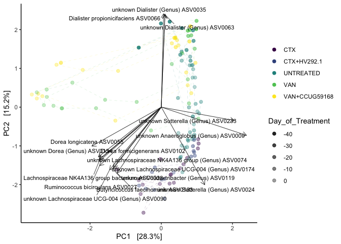<!-- -->
Get the raw table of taxa and correlation with the ordination: 

```r
out$envfit %>%
  DT::datatable()
```

<!--html_preserve--><div id="htmlwidget-697eb98e4f09fd602f8d" style="width:100%;height:auto;" class="datatables html-widget"></div>
<script type="application/json" data-for="htmlwidget-697eb98e4f09fd602f8d">{"x":{"filter":"none","data":[["ASV0002","ASV0003","ASV0004","ASV0007","ASV0008","ASV0009","ASV0011","ASV0012","ASV0013","ASV0014","ASV0016","ASV0017","ASV0018","ASV0019","ASV0020","ASV0021","ASV0023","ASV0024","ASV0025","ASV0026","ASV0027","ASV0033","ASV0034","ASV0035","ASV0036","ASV0037","ASV0038","ASV0043","ASV0046","ASV0047","ASV0049","ASV0050","ASV0054","ASV0055","ASV0056","ASV0057","ASV0058","ASV0060","ASV0061","ASV0063","ASV0064","ASV0066","ASV0068","ASV0074","ASV0077","ASV0079","ASV0080","ASV0081","ASV0083","ASV0084","ASV0085","ASV0089","ASV0090","ASV0092","ASV0094","ASV0097","ASV0099","ASV0102","ASV0103","ASV0105","ASV0107","ASV0109","ASV0111","ASV0113","ASV0114","ASV0116","ASV0119","ASV0120","ASV0122","ASV0124","ASV0129","ASV0133","ASV0134","ASV0135","ASV0138","ASV0141","ASV0143","ASV0144","ASV0145","ASV0147","ASV0148","ASV0150","ASV0151","ASV0152","ASV0153","ASV0154","ASV0155","ASV0156","ASV0158","ASV0160","ASV0161","ASV0163","ASV0164","ASV0166","ASV0168","ASV0169","ASV0174","ASV0175","ASV0177","ASV0179","ASV0181","ASV0183","ASV0185","ASV0186","ASV0187","ASV0188","ASV0190","ASV0191","ASV0194","ASV0197","ASV0198","ASV0202","ASV0204","ASV0207","ASV0208","ASV0210","ASV0211","ASV0214","ASV0215","ASV0218","ASV0224","ASV0225","ASV0228","ASV0229","ASV0230","ASV0232","ASV0233","ASV0236","ASV0240","ASV0242","ASV0243","ASV0244","ASV0245","ASV0246","ASV0247","ASV0248","ASV0250","ASV0252","ASV0255","ASV0256","ASV0258","ASV0260","ASV0264","ASV0265","ASV0266","ASV0270","ASV0271","ASV0275","ASV0278","ASV0280","ASV0282","ASV0284","ASV0285","ASV0287","ASV0290","ASV0292","ASV0296","ASV0298","ASV0301","ASV0305","ASV0307","ASV0320","ASV0326","ASV0327","ASV0328","ASV0331","ASV0332","ASV0333","ASV0336","ASV0338","ASV0340","ASV0343","ASV0345","ASV0350","ASV0351","ASV0353","ASV0356","ASV0357","ASV0360","ASV0361","ASV0367","ASV0370","ASV0371","ASV0372","ASV0373","ASV0375","ASV0377","ASV0379","ASV0380","ASV0381","ASV0383","ASV0386","ASV0389","ASV0392","ASV0400","ASV0401","ASV0402","ASV0414","ASV0416","ASV0421","ASV0422","ASV0424","ASV0425","ASV0426","ASV0427","ASV0430","ASV0436","ASV0444","ASV0446","ASV0448","ASV0452","ASV0464","ASV0465","ASV0469","ASV0470","ASV0471","ASV0475","ASV0478","ASV0480","ASV0482","ASV0489","ASV0492","ASV0493","ASV0494","ASV0498","ASV0515","ASV0526","ASV0531","ASV0537","ASV0545","ASV0552","ASV0554","ASV0568","ASV0571","ASV0573","ASV0577","ASV0578","ASV0580","ASV0582","ASV0583","ASV0584","ASV0587","ASV0594","ASV0595","ASV0600","ASV0605","ASV0606","ASV0609","ASV0610","ASV0611","ASV0612","ASV0615","ASV0633","ASV0634","ASV0639","ASV0640","ASV0644","ASV0645","ASV0646","ASV0649","ASV0650","ASV0655","ASV0664","ASV0665","ASV0666","ASV0674","ASV0675","ASV0683","ASV0693","ASV0694","ASV0695","ASV0699","ASV0700","ASV0701","ASV0702","ASV0704","ASV0710","ASV0712","ASV0713","ASV0714","ASV0721","ASV0722","ASV0723","ASV0726","ASV0738","ASV0739","ASV0740","ASV0741","ASV0745","ASV0746","ASV0751","ASV0752","ASV0753","ASV0756","ASV0765","ASV0781","ASV0782","ASV0791","ASV0793","ASV0796","ASV0800","ASV0801","ASV0808","ASV0817","ASV0822","ASV0823","ASV0827","ASV0830","ASV0832","ASV0838","ASV0847","ASV0850","ASV0851","ASV0866","ASV0882","ASV0884","ASV0892","ASV0894","ASV0895","ASV0900","ASV0904","ASV0907","ASV0909","ASV0910","ASV0920","ASV0925","ASV0934","ASV0937","ASV0940","ASV0944","ASV0946","ASV0948","ASV0949","ASV0950","ASV0957","ASV0959","ASV0963","ASV0965","ASV0970","ASV0972","ASV0974","ASV0976","ASV0985","ASV0989","ASV0998","ASV1009","ASV1010","ASV1011","ASV1022","ASV1024","ASV1026","ASV1034","ASV1036","ASV1038","ASV1043","ASV1045","ASV1046","ASV1047","ASV1052","ASV1112","ASV1114","ASV1115","ASV1116","ASV1121","ASV1125","ASV1130","ASV1131","ASV1142","ASV1146","ASV1151","ASV1152","ASV1155"],[0.497522640623298,0.192318198065198,-0.0281694711886057,-0.393719580593023,-0.255193866728531,0.797690749617397,-0.531446228106975,-0.406871349336324,0.488493836869596,-0.235622416455704,-0.0340890109497106,0.0522105719919927,-0.253325617890456,0.475958058674707,-0.020770745935044,-0.360946356974012,-0.581798049564825,0.406797701659303,-0.268669358420121,-0.108084962938278,-0.577728247646288,-0.423665847957793,0.508333937960833,0.022056004731186,-0.505052431200815,0.00593751806391461,-0.458770830180028,-0.207885810280163,-0.058462427238587,-0.557988893539027,-0.190600529968074,-0.392779913005105,0.583472280201508,-0.649502212054614,-0.213994058875957,0.662297539526698,-0.0556968075190058,-0.270673624269079,-0.0188877924227295,0.0348549145178576,0.191323754625987,0.0344912922868075,-0.243746147618143,-0.580386152913049,-0.150794493073906,-0.175922421631617,0.353075925921365,0.014913314379991,-0.187945921432127,-0.372311494179282,0.57815903222469,-0.562352513591702,-0.48379675035746,-0.440419613072166,0.0261358334714323,-0.344057315593114,-0.267905101354432,-0.579756512439977,-0.00756211499088156,-0.317799602586991,-0.0510267077925162,-0.129469673906415,-0.548392899334345,0.671095199913082,-0.269336847087706,-0.219528202110419,-0.452025171422621,0.65798013240347,-0.398025680615535,0.169318762866785,-0.080540680673551,-0.224881406321808,-0.589059408734796,-0.184759902595782,-0.0313938540419075,-0.058695441345502,-0.40996391947066,-0.320898799171512,-0.29265394429224,-0.420846892456356,-0.19767746562518,-0.100889504198901,0.035701632199998,-0.126983039961611,-0.441724290607999,-0.324823025360536,-0.405860897320924,-0.302037843876812,-0.101472440625571,0.175700149105386,0.549039714507045,-0.0266232113928013,-0.377912074077343,-0.473289593159102,-0.113210369035278,-0.0545533614270124,-0.447502052549474,-0.0989483559858354,0.350130767693614,-0.363555405319128,-0.390412351408445,-0.413304755437625,0.336350380536025,0.569540647901426,-0.26996030740374,-0.033893373627176,0.208185544443974,-0.355248993594191,-0.171480810038319,-0.198494747548434,0.0328827904068397,-0.0845097115953426,-0.31888548893894,-0.0924551614547479,-0.189202670056412,-0.352393113027363,-0.050417370636953,-0.230802670899465,-0.379950349867983,-0.0916098938219958,-0.170918360233227,-0.0556498102310888,0.00689191174901686,-0.430438526257587,-0.213083590487574,-0.0262863458102421,0.683866296163376,-0.215522086173969,0.0327025707899807,0.454678562003157,-0.0498951258719342,-0.191785155005974,-0.306908883906352,-0.286800860370503,0.54696730014236,-0.0970727078708839,-0.0223903222596413,-0.0517308169728257,0.00140377434171503,0.0325528252036291,0.0302734647321867,-0.0358419269299265,-0.26340922512759,-0.192753781520898,-0.3992743901987,0.0076316634545221,-0.00188885798000297,-0.227483013919953,-0.226634431655626,0.0577908400112126,-0.297474387075409,-0.119816152255156,-0.00844334430058607,0.39505840208479,-0.203678853265456,-0.0134768987132473,-0.227960637484651,0.032425562879119,0.577813947666075,0.548029685511347,-0.0472705362410668,-0.000538865532742096,-0.18776788437265,-0.138555185078544,-0.234379370382376,-0.249946669197628,-0.0970760762222605,-0.0408310589876777,-0.179285737219885,-0.0703969778259175,0.380689813363473,0.532078823942979,-0.231468293250211,-0.212490505916807,-0.0124028742319066,-0.11470192510015,-0.204841210468015,0.218103237207458,-0.257064106315956,-0.12315180631292,-0.0788756746975814,-0.0646058723763093,-0.048952018018993,-0.094148288811265,-0.0186563162419694,-0.244900113104541,-0.0299019582351565,0.0314334777064634,0.525482244269453,-0.166193154155274,0.549543929276609,-0.242696670503678,0.0328522390943219,0.00880616359591078,0.151725514062872,-0.0736521714533761,0.494742076321392,-0.0497017592266883,-0.163517790060401,-0.182018463429892,-0.0201584492875405,-0.011856892812017,0.131015034051362,-0.0906329074736135,0.306800355272034,-0.0201584492875405,0.467471648645983,-0.0735363047641912,-0.119794226655616,0.379610852049342,0.0244494389994163,-0.00488887456063106,-0.0838312977938953,0.297488704201331,0.235110007808364,-0.0174150392240767,0.032891488359648,-0.0886391302983973,-0.0593686225224709,-0.0417436969322897,0.00115648384910728,-0.0469036823700936,-0.0488859926018723,-0.0764892569105497,-0.00369594282668683,0.00527826379058787,-0.0789969180274625,-0.0472683463846826,-0.0232176231300744,-0.0201584492875405,0.068625103022298,0.0133242254906931,-0.0149563000854566,-0.018464819663617,0.068625103022298,-0.104521291314154,0.068625103022298,-0.0541248588298762,-0.0809088258480589,-0.047943892972647,0.235110007808364,0.000835814032882626,-0.0393070753836188,-0.0508539224496702,-0.0201584492875405,-0.0429095341104653,-0.0594991757646987,-0.012982385594932,0.0328914883596481,-0.0757573748833748,-0.0149563000854566,-0.0149563000854566,-0.0885316881650298,0.068625103022298,-0.0237479472603237,-0.0149563000854566,-0.0557202954822598,0.0115584927523862,-0.0149563000854566,0.0516243442293229,0.068625103022298,0.191323754625987,-0.0689107599937858,-0.0294674754233148,-0.0149563000854566,-0.0545087740396674,-0.0716089933178513,-0.0304848249118438,-0.073237924752096,0.0230792438403838,-0.0616057828003124,-0.0101298071521526,-0.0603849492581604,0.235110007808364,-0.0295550240398911,-0.0149563000854566,-0.016548416991518,-0.0149563000854566,0.068625103022298,0.068625103022298,-0.0200844151480216,-0.0569372783412112,0.0326077394915187,-0.0415092688060042,-0.061506614295811,-0.0149563000854566,-0.0149563000854566,-0.0428741296419588,0.00109179427030756,0.00109179427030756,0.0295955407827963,-0.0479438929726471,0.00109179427030756,-0.0149563000854566,-0.081059442964568,-0.0517308169728257,-0.077249580791094,-0.0288727299951003,-0.0200844151480216,-0.0149563000854566,-0.0688936159271089,0.0151061256888219,-0.0562590808978713,0.235110007808364,-0.0149563000854566,-0.0149563000854566,-0.0272399710771169,-0.0498951258719342,-0.0200844151480216,-0.065747807716994,-0.0295550240398911,-0.0689107599937858,-0.0284629059306237,-0.0295808914545523,-0.0472683463846826,-0.0472683463846826,-0.0118849629534147,-0.058462427238587,-0.0561525282169218,-0.0554157873709375,-0.0504687726150847,-0.0534847840678635,-0.0386538333235269,-0.0541248588298762,-0.0453492081088126,-0.0510212532056319,-0.0424290273979707,-0.0303052732937272,-0.0303052732937272,-0.0149563000854566,-0.0149563000854566,-0.0149563000854566,-0.0149563000854566,-0.0149563000854566,-0.0428741296419588,-0.0428741296419588,0.107184387552991,-0.0609581282603811,-0.0613948936020622,-0.0613948936020622,-0.0613948936020622,-0.0613948936020622,-0.0272399710771169,-0.0129783619813808,-0.0149919766177087,-0.0498951258719342,-0.0498951258719342,-0.0498951258719342,-0.0200844151480216,-0.0200844151480216,-0.0385220725252331,0.0151061256888219,0.0151061256888219,0.1903014407043,0.00109179427030756,0.00109179427030756,0.00109179427030756,0.00109179427030756,0.0295955407827963,-0.0275674600223863,-0.0295550240398911,-0.0295550240398911,-0.0295550240398911,-0.0757573748833748,-0.0588761817424637,-0.0689107599937858,-0.0579914120501129,-0.030806582771891,-0.030806582771891,-0.0262863458102422,-0.0262863458102422,-0.0372570269191685],[-0.142317702231171,0.519290239207563,-0.205122700871957,0.357662676668257,0.548746532116891,-0.242807629117575,-0.290097963145646,-0.51717687274927,-0.325381923458623,0.642745292444897,-0.177938892673322,-0.593339409101258,0.60102245661543,-0.069717943812637,0.380434353967269,-0.0614041561608935,-0.46571332094221,-0.667873183221152,0.532191872916211,-0.394179300688036,-0.503400537410412,0.147508648274255,-0.000776365810081937,0.804189823251797,-0.252878997303675,-0.304569619562758,-0.0191289695921984,-0.0221228240329201,-0.0441671218480187,-0.281502699517199,0.335116095199691,-0.325797791797851,-0.268015326947465,-0.335298990303874,-0.371246051903664,-0.0495595064594563,0.384351589802543,-0.182960489475538,0.359688832533894,0.795349374220103,0.00278437175963856,0.801097481065327,0.299167642201929,-0.452479562267371,0.338502768420356,0.349673829333878,-0.207807263878869,0.127715814418131,0.584175858727291,0.0315065598660535,-0.0509826067722707,0.178168527384694,-0.539612339133225,-0.221230764063257,0.41434091948282,0.509630469045679,-0.462750945895795,-0.448481582915014,0.0698309427978963,-0.134716343096389,0.251086714350389,0.565937995948417,-0.228604326360409,-0.0510395604125227,-0.388656219430993,0.604044570563859,-0.532340273675983,-0.0495934098039417,-0.342325115161761,-0.00691171359058532,-0.129958603566026,0.431378392130101,-0.428154926367947,0.342442603402762,0.614747542812965,0.256831897160143,-0.171276628471742,-0.332740018279696,-0.07205588871544,-0.0649279894818642,0.409878901261204,-0.31904217601854,-0.302015270782598,0.499713340183584,-0.335567959904764,0.0117495866029331,0.0674407720562816,-0.266356722824636,-0.154485954026245,0.0630939224558084,-0.0567790971156351,-0.157321751341382,-0.0383799581443936,-0.31459817608793,0.527262529754767,0.412808592473446,-0.519486387060425,0.355239043981692,-0.206841582455281,-0.183742849199808,-0.53279257026416,-0.567323708911262,-0.177014900249277,-0.0490183184466827,0.364333219418413,0.231022108080236,-0.113417017832105,-0.0592556499912529,-0.145795825177319,0.468840485725058,-0.109375486039916,0.546298536660875,-0.378825456690382,-0.101036006082081,0.159116107996205,-0.315593306816411,0.588960449394778,0.333796832830994,-0.128195105692266,0.464524248390342,-0.0730892854457085,0.368595645408655,0.126252388879087,-0.457659517736639,-0.252057076098535,0.0498458136325299,-0.115165382753299,0.593638668124614,-0.10927933430289,-0.0460394025677503,0.0771138269141792,-0.285183904152504,-0.45768733342361,0.0666653073861033,-0.0345951027927944,0.320574476111635,0.391586934637354,0.0938431275502788,0.200626487657552,-0.110424249851893,0.530851501174127,0.432269156848948,0.0971456091791714,0.230724773417274,-0.187502640613254,0.137413564261504,0.329795869378581,0.323202044140194,-0.232547021127451,0.343547724698716,0.0124714192024481,-0.273680640905833,0.28319470922291,-0.0446901637824591,-0.28748853698754,-0.213484726052684,-0.392779984419843,-0.108757293170702,-0.038854285341137,-0.0118511354435809,0.350519666138104,-0.248429809410066,-0.299822883242559,0.161563422501294,-0.357048899375983,-0.259746121197878,0.13708189197668,-0.0857518294694207,-0.152035188271873,-0.346980033137424,-0.0535917186425279,-0.098035232834032,-0.0296688888117226,-0.207102592035591,0.263461060708895,-0.217426298380485,0.0840456553728664,-0.0421073619555053,-0.0625071347389443,0.221509866148861,-0.265930364006229,-0.189471739199976,-0.0822218138949843,-0.315659281478371,-0.0440152228509413,-0.205161319205432,0.160283015224135,-0.0373894076003756,-0.0573902524555687,0.232261351667009,0.0205942528988971,-0.172761879415381,-0.111292113172735,0.294756796769685,-0.0960769933911634,0.111014558329274,-0.0427332474130989,-0.128975851640119,0.237720861765636,0.029407474779994,-0.124572278016313,0.164804360300125,-0.13852810642264,-0.18657901728353,-0.0261776903095445,-0.124572278016313,-0.036422515215781,-0.104470964983235,-0.311074907506203,-0.0296726232976139,0.321156017148317,-0.0647937018306475,0.0203074244113566,-0.201646599380413,-0.032185496221419,0.27009685164659,-0.108773137480525,0.217662535465989,-0.234466186501861,0.0642601713210392,0.245073790292139,-0.235839074527549,0.311238765980895,0.120198489132586,-0.175287340966678,0.156927283726564,-0.22629251240846,-0.0816011257099298,0.156063717884807,-0.124572278016313,0.121019539151915,0.133264768276544,-0.0773182340222411,-0.123370349874933,0.121019539151915,-0.0844870606797187,0.121019539151915,-0.031563278524708,0.0597119896961395,-0.123394215415112,-0.032185496221419,0.0762970628785178,0.0763804202094944,-0.140945043931308,-0.124572278016313,-0.130929466358884,0.0337870284988203,0.169174106069998,-0.108773137480526,-0.012648732996486,-0.0773182340222411,-0.0773182340222411,-0.160895198775645,0.121019539151915,0.0614878787616406,-0.0773182340222411,-0.119270323394824,0.262854826068487,-0.0773182340222411,0.221328769786759,0.121019539151915,0.00278437175963856,0.0103635753881847,0.147728960036347,-0.0773182340222411,0.0106494215639135,-0.0169234691151149,-0.0446166480904327,0.0781999270126792,-0.0303413370402256,0.0845663662569721,-0.159180249980383,-0.190936135687053,-0.032185496221419,-0.0203691034109587,-0.0773182340222411,0.0986399531487278,-0.0773182340222411,0.121019539151915,0.121019539151915,-0.123274564225346,0.0937860835384989,0.132231408570759,-0.140698067879943,-0.0661518605538815,-0.0773182340222411,-0.0773182340222411,-0.0563609826342825,0.091570831018227,0.091570831018227,0.155649920807992,-0.123394215415112,0.091570831018227,-0.0773182340222411,0.0961650445689824,0.0938431275502788,-0.0494767920986485,0.0276860882965673,-0.123274564225346,-0.0773182340222411,0.0268364464381229,0.0429947368145934,-0.0614995269043148,-0.032185496221419,-0.0773182340222411,-0.0773182340222411,0.110487511126283,0.0771138269141792,-0.123274564225346,-0.0078607025419178,-0.0203691034109587,0.0103635753881847,0.0909477141487216,-0.101160319036724,-0.0816011257099298,-0.0816011257099298,-0.15120565454635,-0.0441671218480187,0.0499224710630189,0.0578942524980825,0.0598168347427674,-0.0869388421029117,-0.0674401890604868,-0.031563278524708,0.0940445470288778,0.0880154506059436,-0.147248287200353,-0.0985496254422267,-0.0985496254422267,-0.0773182340222411,-0.0773182340222411,-0.0773182340222411,-0.0773182340222411,-0.0773182340222411,-0.0563609826342825,-0.0563609826342825,-0.0175287458632249,0.0745134077348288,0.0667222342025727,0.0667222342025727,0.0667222342025727,0.0667222342025727,0.110487511126283,0.1200201770696,-0.113431946590485,0.0771138269141792,0.0771138269141792,0.0771138269141792,-0.123274564225346,-0.123274564225346,-0.139086554818637,0.0429947368145934,0.0429947368145934,0.00283018129862375,0.091570831018227,0.091570831018227,0.091570831018227,0.091570831018227,0.155649920807992,-0.0954781418106878,-0.0203691034109587,-0.0203691034109587,-0.0203691034109587,-0.012648732996486,0.0217647556777579,0.0103635753881847,0.0382228425769381,0.0720450928819643,0.0720450928819643,0.0498458136325299,0.0498458136325299,-0.105493345823768],["ASV0002","ASV0003","ASV0004","ASV0007","ASV0008","ASV0009","ASV0011","ASV0012","ASV0013","ASV0014","ASV0016","ASV0017","ASV0018","ASV0019","ASV0020","ASV0021","ASV0023","ASV0024","ASV0025","ASV0026","ASV0027","ASV0033","ASV0034","ASV0035","ASV0036","ASV0037","ASV0038","ASV0043","ASV0046","ASV0047","ASV0049","ASV0050","ASV0054","ASV0055","ASV0056","ASV0057","ASV0058","ASV0060","ASV0061","ASV0063","ASV0064","ASV0066","ASV0068","ASV0074","ASV0077","ASV0079","ASV0080","ASV0081","ASV0083","ASV0084","ASV0085","ASV0089","ASV0090","ASV0092","ASV0094","ASV0097","ASV0099","ASV0102","ASV0103","ASV0105","ASV0107","ASV0109","ASV0111","ASV0113","ASV0114","ASV0116","ASV0119","ASV0120","ASV0122","ASV0124","ASV0129","ASV0133","ASV0134","ASV0135","ASV0138","ASV0141","ASV0143","ASV0144","ASV0145","ASV0147","ASV0148","ASV0150","ASV0151","ASV0152","ASV0153","ASV0154","ASV0155","ASV0156","ASV0158","ASV0160","ASV0161","ASV0163","ASV0164","ASV0166","ASV0168","ASV0169","ASV0174","ASV0175","ASV0177","ASV0179","ASV0181","ASV0183","ASV0185","ASV0186","ASV0187","ASV0188","ASV0190","ASV0191","ASV0194","ASV0197","ASV0198","ASV0202","ASV0204","ASV0207","ASV0208","ASV0210","ASV0211","ASV0214","ASV0215","ASV0218","ASV0224","ASV0225","ASV0228","ASV0229","ASV0230","ASV0232","ASV0233","ASV0236","ASV0240","ASV0242","ASV0243","ASV0244","ASV0245","ASV0246","ASV0247","ASV0248","ASV0250","ASV0252","ASV0255","ASV0256","ASV0258","ASV0260","ASV0264","ASV0265","ASV0266","ASV0270","ASV0271","ASV0275","ASV0278","ASV0280","ASV0282","ASV0284","ASV0285","ASV0287","ASV0290","ASV0292","ASV0296","ASV0298","ASV0301","ASV0305","ASV0307","ASV0320","ASV0326","ASV0327","ASV0328","ASV0331","ASV0332","ASV0333","ASV0336","ASV0338","ASV0340","ASV0343","ASV0345","ASV0350","ASV0351","ASV0353","ASV0356","ASV0357","ASV0360","ASV0361","ASV0367","ASV0370","ASV0371","ASV0372","ASV0373","ASV0375","ASV0377","ASV0379","ASV0380","ASV0381","ASV0383","ASV0386","ASV0389","ASV0392","ASV0400","ASV0401","ASV0402","ASV0414","ASV0416","ASV0421","ASV0422","ASV0424","ASV0425","ASV0426","ASV0427","ASV0430","ASV0436","ASV0444","ASV0446","ASV0448","ASV0452","ASV0464","ASV0465","ASV0469","ASV0470","ASV0471","ASV0475","ASV0478","ASV0480","ASV0482","ASV0489","ASV0492","ASV0493","ASV0494","ASV0498","ASV0515","ASV0526","ASV0531","ASV0537","ASV0545","ASV0552","ASV0554","ASV0568","ASV0571","ASV0573","ASV0577","ASV0578","ASV0580","ASV0582","ASV0583","ASV0584","ASV0587","ASV0594","ASV0595","ASV0600","ASV0605","ASV0606","ASV0609","ASV0610","ASV0611","ASV0612","ASV0615","ASV0633","ASV0634","ASV0639","ASV0640","ASV0644","ASV0645","ASV0646","ASV0649","ASV0650","ASV0655","ASV0664","ASV0665","ASV0666","ASV0674","ASV0675","ASV0683","ASV0693","ASV0694","ASV0695","ASV0699","ASV0700","ASV0701","ASV0702","ASV0704","ASV0710","ASV0712","ASV0713","ASV0714","ASV0721","ASV0722","ASV0723","ASV0726","ASV0738","ASV0739","ASV0740","ASV0741","ASV0745","ASV0746","ASV0751","ASV0752","ASV0753","ASV0756","ASV0765","ASV0781","ASV0782","ASV0791","ASV0793","ASV0796","ASV0800","ASV0801","ASV0808","ASV0817","ASV0822","ASV0823","ASV0827","ASV0830","ASV0832","ASV0838","ASV0847","ASV0850","ASV0851","ASV0866","ASV0882","ASV0884","ASV0892","ASV0894","ASV0895","ASV0900","ASV0904","ASV0907","ASV0909","ASV0910","ASV0920","ASV0925","ASV0934","ASV0937","ASV0940","ASV0944","ASV0946","ASV0948","ASV0949","ASV0950","ASV0957","ASV0959","ASV0963","ASV0965","ASV0970","ASV0972","ASV0974","ASV0976","ASV0985","ASV0989","ASV0998","ASV1009","ASV1010","ASV1011","ASV1022","ASV1024","ASV1026","ASV1034","ASV1036","ASV1038","ASV1043","ASV1045","ASV1046","ASV1047","ASV1052","ASV1112","ASV1114","ASV1115","ASV1116","ASV1121","ASV1125","ASV1130","ASV1131","ASV1142","ASV1146","ASV1151","ASV1152","ASV1155"],[0.001,0.001,0.079,0.001,0.001,0.001,0.001,0.001,0.001,0.001,0.143,0.001,0.001,0.001,0.001,0.001,0.001,0.001,0.001,0.001,0.001,0.001,0.001,0.001,0.001,0.005,0.001,0.078,0.863,0.001,0.001,0.001,0.001,0.001,0.001,0.001,0.002,0.002,0.002,0.001,0.105,0.001,0.001,0.001,0.001,0.001,0.001,0.371,0.001,0.001,0.001,0.001,0.001,0.001,0.001,0.001,0.001,0.001,0.833,0.002,0.017,0.001,0.001,0.001,0.001,0.001,0.001,0.001,0.001,0.145,0.246,0.001,0.001,0.001,0.001,0.012,0.001,0.001,0.005,0.001,0.001,0.003,0.001,0.001,0.001,0.002,0.001,0.001,0.126,0.09,0.001,0.192,0.001,0.001,0.001,0.001,0.001,0.001,0.001,0.001,0.001,0.001,0.001,0.001,0.001,0.026,0.021,0.001,0.041,0.001,0.445,0.001,0.001,0.314,0.014,0.001,0.001,0.002,0.001,0.001,0.103,0.002,0.411,0.001,0.001,0.96,0.001,0.001,0.447,0.001,0.676,0.001,0.001,0.004,0.001,0.002,0.001,0.506,0.065,0.43,0.001,0.001,0.007,0.004,0.001,0.303,0.001,0.001,0.001,0.001,0.003,0.004,0.007,0.001,0.001,0.041,0.001,0.456,0.001,0.001,0.002,0.012,0.001,0.04,0.001,0.001,0.17,0.62,0.02,0.001,0.001,0.001,0.031,0.004,0.014,0.022,0.043,0.062,0.016,0.02,0.01,0.078,0.657,0.001,0.925,0.001,0.193,0.891,0.001,0.006,0.001,0.006,0.432,0.004,0.108,0.347,0.001,0.274,0.008,0.11,0.373,0.186,0.093,0.045,0.002,0.373,0.001,0.365,0.001,0.001,0.001,0.809,0.642,0.002,0.037,0.004,0.469,0.033,0.029,0.845,0.026,0.018,0.003,0.295,0.125,0.217,0.022,0.67,0.178,0.373,0.281,0.335,0.804,0.359,0.281,0.351,0.281,0.964,0.595,0.323,0.037,0.798,0.693,0.22,0.373,0.312,0.775,0.154,0.469,0.834,0.804,0.804,0.101,0.281,0.856,0.804,0.395,0.011,0.804,0.017,0.281,0.105,0.907,0.226,0.804,0.882,0.792,0.942,0.538,0.948,0.546,0.188,0.062,0.037,1,0.804,0.624,0.804,0.281,0.281,0.367,0.529,0.304,0.223,0.65,0.804,0.804,0.886,0.689,0.689,0.156,0.323,0.689,0.804,0.373,0.506,0.666,0.936,0.367,0.804,0.85,0.99,0.764,0.037,0.804,0.804,0.445,0.676,0.367,0.923,1,0.907,0.664,0.547,0.67,0.67,0.185,0.863,0.857,0.8,0.82,0.568,0.836,0.964,0.559,0.606,0.167,0.558,0.558,0.804,0.804,0.804,0.804,0.804,0.886,0.886,0.488,0.647,0.713,0.713,0.713,0.713,0.445,0.411,0.43,0.676,0.676,0.676,0.367,0.367,0.235,0.99,0.99,0.118,0.689,0.689,0.689,0.689,0.156,0.623,1,1,1,0.834,0.947,0.907,0.908,0.805,0.805,0.96,0.96,0.486],[0.267783106301139,0.306648641843293,0.0428688415200519,0.282937698423848,0.366246666126173,0.695266076782862,0.366591921590384,0.433016212617475,0.344499624773213,0.468639434096502,0.0328243101933374,0.354777598220361,0.425401862035628,0.231396665306858,0.145161721565192,0.134052743006642,0.555377867780457,0.611538958941246,0.355411413751945,0.167059680304278,0.587182029193543,0.201251552041493,0.25840399522664,0.647207739166459,0.319025745539166,0.0927979072813624,0.210836592101731,0.0437059294590314,0.00536859005096481,0.390595375148377,0.148631359285999,0.260420261200654,0.412272117242303,0.534278536362634,0.183617088288265,0.441094175543623,0.150828278951552,0.106738751584087,0.129732804952199,0.633795492138357,0.0366125318102807,0.642946823412825,0.148913462619347,0.541585840762881,0.137323103369662,0.15322048535375,0.167846468386052,0.016533736198283,0.376585103302739,0.139608512012602,0.336867092736286,0.347984373693335,0.525240772201269,0.242912486546649,0.172361479349115,0.378098651392858,0.285911581259182,0.537253343930522,0.00493354615517838,0.119145080501714,0.0656482630314165,0.337048211719544,0.352994710071025,0.452973804073483,0.223595994101539,0.413062474749509,0.48771292257707,0.435397360933669,0.275610926899973,0.0287166152434969,0.0233760398841904,0.236658964106026,0.530307627992129,0.151403158232464,0.378900115466183,0.0694077782336215,0.197406098728393,0.213691959074491,0.0908383822083775,0.181327750708328,0.207077094115086,0.111966602136145,0.0924878303276302,0.265838114795326,0.307726204627786,0.105648050589711,0.169271325709693,0.162172762927633,0.034162566197909,0.0348513854465145,0.304668473975245,0.0254589288299855,0.144290556920605,0.322975051390561,0.2908223629405,0.173387003262894,0.470124193377087,0.135985555521326,0.165374994718324,0.165933967368819,0.436289727060961,0.492677011560185,0.14446585339699,0.326779345155316,0.205617262345307,0.0545199751976677,0.0562046408493619,0.129713079505571,0.0506620908505334,0.259211565859225,0.013044274851408,0.305583982511741,0.245196681692503,0.0187562314046418,0.0611155861803354,0.223780041416433,0.349416322213243,0.164690198502329,0.160796253488254,0.224175149988689,0.0345551295117795,0.138959651192979,0.0159871641452325,0.394729559061736,0.108937386146419,0.00317557711274454,0.480936176412927,0.398856637921546,0.0130114310419565,0.208852221334054,0.00843606588712614,0.11811140486833,0.303670758197057,0.0866989967181446,0.300370048562267,0.112191105347635,0.15384165390957,0.0114826100130939,0.0402529581322085,0.0132532013840912,0.282719798965715,0.188141267688951,0.0788216892651098,0.0903879413590584,0.194577278905487,0.0189407299301336,0.108768883243643,0.156208082958506,0.10544128264712,0.121364820334866,0.0886465472628137,0.0892570035478581,0.0802705333948269,0.158068351796691,0.124134734166767,0.0457573550567168,0.206242168403261,0.0128795659458457,0.335378613606824,0.300476985612968,0.125098539946086,0.0617176605795842,0.125150539717662,0.0453002788024811,0.18241760580644,0.129941384920331,0.0282152096826162,0.00902055163540783,0.0552580740433415,0.125350877883071,0.147796806305776,0.292718781765366,0.0544578137434881,0.0880436987326411,0.0695655617990684,0.0604307268491203,0.0490235936930564,0.0493420520112247,0.0699890966492939,0.0642329881994211,0.0769403305594842,0.0400734587009676,0.00915672674831324,0.108504682269531,0.0022853979783384,0.10206723229673,0.0265847720756373,0.00238603132142976,0.279425230119375,0.0815654999662647,0.302422653457238,0.0887483408527054,0.0134652040679634,0.0869591177592033,0.0322514202767283,0.0177488745208413,0.246595852517271,0.0191050351765217,0.0832492757848338,0.0339955206023151,0.015924615527852,0.027301063081089,0.0363549754165216,0.0430260536076085,0.094811729464989,0.015924615527852,0.219856341902437,0.0163217706429003,0.11111825482001,0.144984863566989,0.103738962417956,0.00422212489138844,0.00744007797603171,0.129160880169072,0.0563126219386679,0.073255592860576,0.0129134454438701,0.0552338747655392,0.0584990259529409,0.00587190585178417,0.0600625001430484,0.0578200244938855,0.0992594097219807,0.0202982832124846,0.0307393118965465,0.0246540324464404,0.0574488142299706,0.00889304028707011,0.0248949420638387,0.015924615527852,0.0193551336213629,0.0179370334487277,0.00620180022456427,0.0155611927934733,0.0193551336213629,0.0180627637602768,0.0193551336213629,0.00392574089458232,0.0101117598135834,0.0175247492712837,0.0563126219386679,0.00582194038898606,0.00737901476659243,0.0224516268373155,0.015924615527852,0.0189837532785994,0.00468171521145861,0.0287884205003183,0.0129134454438702,0.00589917029563659,0.00620180022456426,0.00620180022456427,0.0337251247984045,0.0193551336213629,0.00434472423368533,0.00620180022456426,0.0173301613713362,0.0692262583422016,0.00620180022456427,0.0516514972524276,0.0193551336213629,0.0366125318102807,0.00485609653774773,0.0226921777412444,0.00620180022456426,0.00308461662695346,0.00541425173088632,0.00291996983673128,0.011479022206782,0.00145324822963246,0.0109467427763476,0.025440964976757,0.0401029500080151,0.0563126219386679,0.00128839981976487,0.00620180022456427,0.0100036904621084,0.00620180022456427,0.0193551336213629,0.0193551336213629,0.0156000019167871,0.0120376831303948,0.0185484100873537,0.0215189657019583,0.00815913225687385,0.00620180022456427,0.00620180022456427,0.00501475135605739,0.00838640910809736,0.00838640910809736,0.0251027938817603,0.0175247492712837,0.00838640910809736,0.00620180022456427,0.0158183490906804,0.0114826100130939,0.00841545068877265,0.00160015402253528,0.0156000019167871,0.00620180022456427,0.00546652517293823,0.00207674242708264,0.00694727599292776,0.0563126219386679,0.00620180022456427,0.00620180022456427,0.0129495061391627,0.00843606588712614,0.0156000019167871,0.00438456486404332,0.00128839981976487,0.00485609653774773,0.0090816237228931,0.0111084392868579,0.00889304028707011,0.00889304028707011,0.0230044023111943,0.00536859005096481,0.00564535954219016,0.00642265396225269,0.00612515072791667,0.010418984392981,0.00604229793111721,0.00392574089458232,0.0109009275019632,0.0103498878240405,0.0234822804493754,0.0106304382642107,0.0106304382642107,0.00620180022456427,0.00620180022456427,0.00620180022456427,0.00620180022456427,0.00620180022456427,0.00501475135605739,0.00501475135605739,0.0117957498666474,0.00926814133326592,0.00822118949739151,0.00822118949739151,0.00822118949739151,0.00822118949739151,0.0129495061391627,0.0145732807835379,0.0130915658702126,0.00843606588712614,0.00843606588712614,0.00843606588712614,0.0156000019167871,0.0156000019167871,0.0208290198029571,0.00207674242708264,0.00207674242708264,0.0362226482603153,0.00838640910809736,0.00838640910809736,0.00838640910809736,0.00838640910809736,0.0251027938817603,0.00987604041570769,0.00128839981976487,0.00128839981976487,0.00128839981976487,0.00589917029563659,0.00394010936628411,0.00485609653774773,0.00482398956622738,0.00613954095045223,0.00613954095045223,0.00317557711274454,0.00317557711274454,0.0125169320679488]],"container":"<table class=\"display\">\n  <thead>\n    <tr>\n      <th> <\/th>\n      <th>Axis.1<\/th>\n      <th>Axis.2<\/th>\n      <th>id<\/th>\n      <th>pval<\/th>\n      <th>r<\/th>\n    <\/tr>\n  <\/thead>\n<\/table>","options":{"columnDefs":[{"className":"dt-right","targets":[1,2,4,5]},{"orderable":false,"targets":0}],"order":[],"autoWidth":false,"orderClasses":false}},"evals":[],"jsHooks":[]}</script><!--/html_preserve-->

You could then filter that table and use the ASV id to generate a heatmap of only the significant features:

```r
out$envfit %>%
  filter(pval <= 0.05) %>% 
  pull(id) -> ASV_envit
```


```r
physeq_rare %>% 
prune_taxa(x = ., taxa = ASV_envit) %>%
  phyloseq_ampvis_heatmap(transform = FALSE,
                          group_by = "SampleID",
                          facet_by = c("Model", "Fermentation", "Reactor_Treatment"),
                          tax_aggregate = "Genus",
                          tax_add = NULL,
                          ntax  = 50) -> p

p$data %>% 
  mutate(Abundance = na_if(Abundance, 0)) -> p$data 


p + facet_grid( ~Model + Fermentation + Reactor_Treatment , scales = "free", space = "free") + 
  scale_fill_viridis_c(breaks = c(0,  0.01, 0.1, 0.2, 0.50, 0.75, 0.100), 
                       labels = c(0,  0.01, 0.1, 0.2, 0.50, 0.75, 0.100), 
                       trans = scales::pseudo_log_trans(sigma = 0.001),
                       na.value = 'transparent') -> p2
```

```
## Scale for 'fill' is already present. Adding another scale for 'fill', which
## will replace the existing scale.
```

```r
p2
```

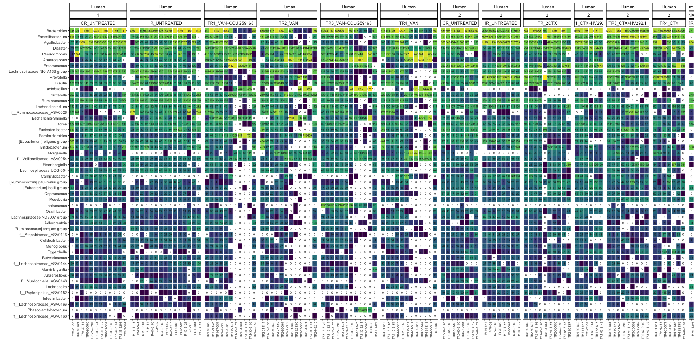<!-- -->

```r
# p2 %>% 
  # export::graph2ppt(append = TRUE,
  #                   file = file.path(here::here("data/processed/figures_NRP72")))
```


```r
vegan::adonis(bdiv_list$coda  ~ get_variable(physeq_rare, "Reactor_Treatment") * 
                get_variable(physeq_rare, "Day_of_Treatment"))$aov.tab %>% 
  data.frame() %>%
  rownames_to_column('Term') %>%
  mutate_if(is.numeric, round, 4) %>%
  DT::datatable()
```

<!--html_preserve--><div id="htmlwidget-14b6cfe71b0bb90106ec" style="width:100%;height:auto;" class="datatables html-widget"></div>
<script type="application/json" data-for="htmlwidget-14b6cfe71b0bb90106ec">{"x":{"filter":"none","data":[["1","2","3","4","5"],["get_variable(physeq_rare, \"Reactor_Treatment\")","get_variable(physeq_rare, \"Day_of_Treatment\")","get_variable(physeq_rare, \"Reactor_Treatment\"):get_variable(physeq_rare, \"Day_of_Treatment\")","Residuals","Total"],[9,1,9,103,122],[13269.1047,3867.7196,7879.8944,21493.8049,46510.5236],[1474.345,3867.7196,875.5438,208.6777,null],[7.0652,18.5344,4.1957,null,null],[0.2853,0.0832,0.1694,0.4621,1],[0.001,0.001,0.001,null,null]],"container":"<table class=\"display\">\n  <thead>\n    <tr>\n      <th> <\/th>\n      <th>Term<\/th>\n      <th>Df<\/th>\n      <th>SumsOfSqs<\/th>\n      <th>MeanSqs<\/th>\n      <th>F.Model<\/th>\n      <th>R2<\/th>\n      <th>Pr..F.<\/th>\n    <\/tr>\n  <\/thead>\n<\/table>","options":{"columnDefs":[{"className":"dt-right","targets":[2,3,4,5,6,7]},{"orderable":false,"targets":0}],"order":[],"autoWidth":false,"orderClasses":false}},"evals":[],"jsHooks":[]}</script><!--/html_preserve-->


```r
lapply(
  bdiv_list,
  FUN = phyloseq_adonis_strata_perm,
  physeq = physeq_rare,
  formula = paste0(c("Reactor_Treatment", "Day_of_Treatment"), collapse=" * "),
  nrep = 999,
  strata = "none"
) %>%
  bind_rows(.id = "Distance") %>%
  mutate_if(is.numeric, round, 3) %>%
  DT::datatable()
```

<!--html_preserve--><div id="htmlwidget-995a46e8d2059b577b8b" style="width:100%;height:auto;" class="datatables html-widget"></div>
<script type="application/json" data-for="htmlwidget-995a46e8d2059b577b8b">{"x":{"filter":"none","data":[["1","2","3","4","5","6","7","8","9","10","11","12","13","14","15","16","17","18","19","20","21","22","23","24","25"],["bray","bray","bray","bray","bray","sorensen","sorensen","sorensen","sorensen","sorensen","bjaccard","bjaccard","bjaccard","bjaccard","bjaccard","wjaccard","wjaccard","wjaccard","wjaccard","wjaccard","coda","coda","coda","coda","coda"],["Reactor_Treatment","Day_of_Treatment","Reactor_Treatment:Day_of_Treatment","Residuals","Total","Reactor_Treatment","Day_of_Treatment","Reactor_Treatment:Day_of_Treatment","Residuals","Total","Reactor_Treatment","Day_of_Treatment","Reactor_Treatment:Day_of_Treatment","Residuals","Total","Reactor_Treatment","Day_of_Treatment","Reactor_Treatment:Day_of_Treatment","Residuals","Total","Reactor_Treatment","Day_of_Treatment","Reactor_Treatment:Day_of_Treatment","Residuals","Total"],[9,1,9,103,122,9,1,9,103,122,9,1,9,103,122,9,1,9,103,122,9,1,9,103,122],[7.644,1.81,3.698,10.724,23.875,2.711,1.085,1.833,4.545,10.174,4.286,1.417,2.949,9.348,18.001,8.964,1.881,4.974,18.094,33.913,13269.105,3867.72,7879.894,21493.805,46510.524],[0.849,1.81,0.411,0.104,null,0.301,1.085,0.204,0.044,null,0.476,1.417,0.328,0.091,null,0.996,1.881,0.553,0.176,null,1474.345,3867.72,875.544,208.678,null],[8.157,17.382,3.947,null,null,6.827,24.586,4.617,null,null,5.247,15.611,3.61,null,null,5.67,10.707,3.146,null,null,7.065,18.534,4.196,null,null],[0.32,0.076,0.155,0.449,1,0.266,0.107,0.18,0.447,1,0.238,0.079,0.164,0.519,1,0.264,0.055,0.147,0.534,1,0.285,0.083,0.169,0.462,1],[0.001,0.001,0.001,null,null,0.001,0.001,0.001,null,null,0.001,0.001,0.001,null,null,0.001,0.001,0.001,null,null,0.001,0.001,0.001,null,null]],"container":"<table class=\"display\">\n  <thead>\n    <tr>\n      <th> <\/th>\n      <th>Distance<\/th>\n      <th>terms<\/th>\n      <th>Df<\/th>\n      <th>SumsOfSqs<\/th>\n      <th>MeanSqs<\/th>\n      <th>F.Model<\/th>\n      <th>R2<\/th>\n      <th>Pr..F.<\/th>\n    <\/tr>\n  <\/thead>\n<\/table>","options":{"columnDefs":[{"className":"dt-right","targets":[3,4,5,6,7,8]},{"orderable":false,"targets":0}],"order":[],"autoWidth":false,"orderClasses":false}},"evals":[],"jsHooks":[]}</script><!--/html_preserve-->


```r
phyloseq_plot_bdiv(physeq_rare,
                   bdiv_list,
                   m = "NMDS",
                   axis1 = 1,
                   axis2 = 2) -> plots
```


```r
# plot_list %>%
#   phyloseq_ordinations_expl_var()
```


```r
physeq_rare %>%
  phyloseq_distance_boxplot(bdiv_list$coda ,
                            d = "Reactor_Treatment") -> dist_box


dist_box_plot <- dist_box$plot

dist_box_plot
```

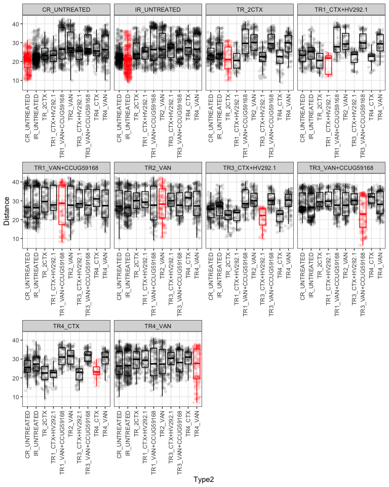<!-- -->

```r
# 
# dist_box_plot %>% 
#   export::graph2ppt(append = TRUE,
#                     file = file.path(here::here("data/processed/figures_NRP72")))
```


```r
plots %>%
  phyloseq_plot_ordinations_facet(color_group =  "Day_of_Treatment",
                                  shape_group = "Treatment")  -> plot_list

plot_list
```

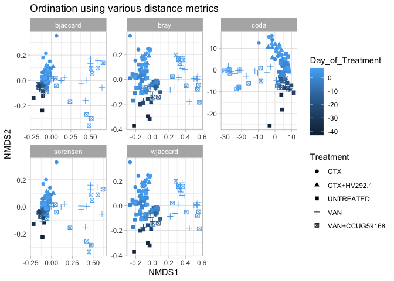<!-- -->


```r
lapply(
  bdiv_list,
  FUN = physeq_pairwise_permanovas,
  physeq = physeq_rare,
  compare_header = "Reactor_Treatment",
  n_perm = 999,
  strat = FALSE
) %>%
  bind_rows(.id = "Distance") %>%
  mutate_if(is.numeric, round, 3) %>%
  # filter(! terms %in% (c("Residuals", "Total"))) %>%
  DT::datatable()
```

<!--html_preserve--><div id="htmlwidget-0574d296f08c91d2aad7" style="width:100%;height:auto;" class="datatables html-widget"></div>
<script type="application/json" data-for="htmlwidget-0574d296f08c91d2aad7">{"x":{"filter":"none","data":[["1","2","3","4","5","6","7","8","9","10","11","12","13","14","15","16","17","18","19","20","21","22","23","24","25","26","27","28","29","30","31","32","33","34","35","36","37","38","39","40","41","42","43","44","45","46","47","48","49","50","51","52","53","54","55","56","57","58","59","60","61","62","63","64","65","66","67","68","69","70","71","72","73","74","75","76","77","78","79","80","81","82","83","84","85","86","87","88","89","90","91","92","93","94","95","96","97","98","99","100","101","102","103","104","105","106","107","108","109","110","111","112","113","114","115","116","117","118","119","120","121","122","123","124","125","126","127","128","129","130","131","132","133","134","135","136","137","138","139","140","141","142","143","144","145","146","147","148","149","150","151","152","153","154","155","156","157","158","159","160","161","162","163","164","165","166","167","168","169","170","171","172","173","174","175","176","177","178","179","180","181","182","183","184","185","186","187","188","189","190","191","192","193","194","195","196","197","198","199","200","201","202","203","204","205","206","207","208","209","210","211","212","213","214","215","216","217","218","219","220","221","222","223","224","225"],["bray","bray","bray","bray","bray","bray","bray","bray","bray","bray","bray","bray","bray","bray","bray","bray","bray","bray","bray","bray","bray","bray","bray","bray","bray","bray","bray","bray","bray","bray","bray","bray","bray","bray","bray","bray","bray","bray","bray","bray","bray","bray","bray","bray","bray","sorensen","sorensen","sorensen","sorensen","sorensen","sorensen","sorensen","sorensen","sorensen","sorensen","sorensen","sorensen","sorensen","sorensen","sorensen","sorensen","sorensen","sorensen","sorensen","sorensen","sorensen","sorensen","sorensen","sorensen","sorensen","sorensen","sorensen","sorensen","sorensen","sorensen","sorensen","sorensen","sorensen","sorensen","sorensen","sorensen","sorensen","sorensen","sorensen","sorensen","sorensen","sorensen","sorensen","sorensen","sorensen","bjaccard","bjaccard","bjaccard","bjaccard","bjaccard","bjaccard","bjaccard","bjaccard","bjaccard","bjaccard","bjaccard","bjaccard","bjaccard","bjaccard","bjaccard","bjaccard","bjaccard","bjaccard","bjaccard","bjaccard","bjaccard","bjaccard","bjaccard","bjaccard","bjaccard","bjaccard","bjaccard","bjaccard","bjaccard","bjaccard","bjaccard","bjaccard","bjaccard","bjaccard","bjaccard","bjaccard","bjaccard","bjaccard","bjaccard","bjaccard","bjaccard","bjaccard","bjaccard","bjaccard","bjaccard","wjaccard","wjaccard","wjaccard","wjaccard","wjaccard","wjaccard","wjaccard","wjaccard","wjaccard","wjaccard","wjaccard","wjaccard","wjaccard","wjaccard","wjaccard","wjaccard","wjaccard","wjaccard","wjaccard","wjaccard","wjaccard","wjaccard","wjaccard","wjaccard","wjaccard","wjaccard","wjaccard","wjaccard","wjaccard","wjaccard","wjaccard","wjaccard","wjaccard","wjaccard","wjaccard","wjaccard","wjaccard","wjaccard","wjaccard","wjaccard","wjaccard","wjaccard","wjaccard","wjaccard","wjaccard","coda","coda","coda","coda","coda","coda","coda","coda","coda","coda","coda","coda","coda","coda","coda","coda","coda","coda","coda","coda","coda","coda","coda","coda","coda","coda","coda","coda","coda","coda","coda","coda","coda","coda","coda","coda","coda","coda","coda","coda","coda","coda","coda","coda","coda"],["CR_UNTREATED","CR_UNTREATED","CR_UNTREATED","CR_UNTREATED","CR_UNTREATED","CR_UNTREATED","CR_UNTREATED","CR_UNTREATED","CR_UNTREATED","IR_UNTREATED","IR_UNTREATED","IR_UNTREATED","IR_UNTREATED","IR_UNTREATED","IR_UNTREATED","IR_UNTREATED","IR_UNTREATED","TR_2CTX","TR_2CTX","TR_2CTX","TR_2CTX","TR_2CTX","TR_2CTX","TR_2CTX","TR1_CTX+HV292.1","TR1_CTX+HV292.1","TR1_CTX+HV292.1","TR1_CTX+HV292.1","TR1_CTX+HV292.1","TR1_CTX+HV292.1","TR1_VAN+CCUG59168","TR1_VAN+CCUG59168","TR1_VAN+CCUG59168","TR1_VAN+CCUG59168","TR1_VAN+CCUG59168","TR2_VAN","TR2_VAN","TR2_VAN","TR2_VAN","TR3_CTX+HV292.1","TR3_CTX+HV292.1","TR3_CTX+HV292.1","TR3_VAN+CCUG59168","TR3_VAN+CCUG59168","TR4_CTX","CR_UNTREATED","CR_UNTREATED","CR_UNTREATED","CR_UNTREATED","CR_UNTREATED","CR_UNTREATED","CR_UNTREATED","CR_UNTREATED","CR_UNTREATED","IR_UNTREATED","IR_UNTREATED","IR_UNTREATED","IR_UNTREATED","IR_UNTREATED","IR_UNTREATED","IR_UNTREATED","IR_UNTREATED","TR_2CTX","TR_2CTX","TR_2CTX","TR_2CTX","TR_2CTX","TR_2CTX","TR_2CTX","TR1_CTX+HV292.1","TR1_CTX+HV292.1","TR1_CTX+HV292.1","TR1_CTX+HV292.1","TR1_CTX+HV292.1","TR1_CTX+HV292.1","TR1_VAN+CCUG59168","TR1_VAN+CCUG59168","TR1_VAN+CCUG59168","TR1_VAN+CCUG59168","TR1_VAN+CCUG59168","TR2_VAN","TR2_VAN","TR2_VAN","TR2_VAN","TR3_CTX+HV292.1","TR3_CTX+HV292.1","TR3_CTX+HV292.1","TR3_VAN+CCUG59168","TR3_VAN+CCUG59168","TR4_CTX","CR_UNTREATED","CR_UNTREATED","CR_UNTREATED","CR_UNTREATED","CR_UNTREATED","CR_UNTREATED","CR_UNTREATED","CR_UNTREATED","CR_UNTREATED","IR_UNTREATED","IR_UNTREATED","IR_UNTREATED","IR_UNTREATED","IR_UNTREATED","IR_UNTREATED","IR_UNTREATED","IR_UNTREATED","TR_2CTX","TR_2CTX","TR_2CTX","TR_2CTX","TR_2CTX","TR_2CTX","TR_2CTX","TR1_CTX+HV292.1","TR1_CTX+HV292.1","TR1_CTX+HV292.1","TR1_CTX+HV292.1","TR1_CTX+HV292.1","TR1_CTX+HV292.1","TR1_VAN+CCUG59168","TR1_VAN+CCUG59168","TR1_VAN+CCUG59168","TR1_VAN+CCUG59168","TR1_VAN+CCUG59168","TR2_VAN","TR2_VAN","TR2_VAN","TR2_VAN","TR3_CTX+HV292.1","TR3_CTX+HV292.1","TR3_CTX+HV292.1","TR3_VAN+CCUG59168","TR3_VAN+CCUG59168","TR4_CTX","CR_UNTREATED","CR_UNTREATED","CR_UNTREATED","CR_UNTREATED","CR_UNTREATED","CR_UNTREATED","CR_UNTREATED","CR_UNTREATED","CR_UNTREATED","IR_UNTREATED","IR_UNTREATED","IR_UNTREATED","IR_UNTREATED","IR_UNTREATED","IR_UNTREATED","IR_UNTREATED","IR_UNTREATED","TR_2CTX","TR_2CTX","TR_2CTX","TR_2CTX","TR_2CTX","TR_2CTX","TR_2CTX","TR1_CTX+HV292.1","TR1_CTX+HV292.1","TR1_CTX+HV292.1","TR1_CTX+HV292.1","TR1_CTX+HV292.1","TR1_CTX+HV292.1","TR1_VAN+CCUG59168","TR1_VAN+CCUG59168","TR1_VAN+CCUG59168","TR1_VAN+CCUG59168","TR1_VAN+CCUG59168","TR2_VAN","TR2_VAN","TR2_VAN","TR2_VAN","TR3_CTX+HV292.1","TR3_CTX+HV292.1","TR3_CTX+HV292.1","TR3_VAN+CCUG59168","TR3_VAN+CCUG59168","TR4_CTX","CR_UNTREATED","CR_UNTREATED","CR_UNTREATED","CR_UNTREATED","CR_UNTREATED","CR_UNTREATED","CR_UNTREATED","CR_UNTREATED","CR_UNTREATED","IR_UNTREATED","IR_UNTREATED","IR_UNTREATED","IR_UNTREATED","IR_UNTREATED","IR_UNTREATED","IR_UNTREATED","IR_UNTREATED","TR_2CTX","TR_2CTX","TR_2CTX","TR_2CTX","TR_2CTX","TR_2CTX","TR_2CTX","TR1_CTX+HV292.1","TR1_CTX+HV292.1","TR1_CTX+HV292.1","TR1_CTX+HV292.1","TR1_CTX+HV292.1","TR1_CTX+HV292.1","TR1_VAN+CCUG59168","TR1_VAN+CCUG59168","TR1_VAN+CCUG59168","TR1_VAN+CCUG59168","TR1_VAN+CCUG59168","TR2_VAN","TR2_VAN","TR2_VAN","TR2_VAN","TR3_CTX+HV292.1","TR3_CTX+HV292.1","TR3_CTX+HV292.1","TR3_VAN+CCUG59168","TR3_VAN+CCUG59168","TR4_CTX"],["IR_UNTREATED","TR_2CTX","TR1_CTX+HV292.1","TR1_VAN+CCUG59168","TR2_VAN","TR3_CTX+HV292.1","TR3_VAN+CCUG59168","TR4_CTX","TR4_VAN","TR_2CTX","TR1_CTX+HV292.1","TR1_VAN+CCUG59168","TR2_VAN","TR3_CTX+HV292.1","TR3_VAN+CCUG59168","TR4_CTX","TR4_VAN","TR1_CTX+HV292.1","TR1_VAN+CCUG59168","TR2_VAN","TR3_CTX+HV292.1","TR3_VAN+CCUG59168","TR4_CTX","TR4_VAN","TR1_VAN+CCUG59168","TR2_VAN","TR3_CTX+HV292.1","TR3_VAN+CCUG59168","TR4_CTX","TR4_VAN","TR2_VAN","TR3_CTX+HV292.1","TR3_VAN+CCUG59168","TR4_CTX","TR4_VAN","TR3_CTX+HV292.1","TR3_VAN+CCUG59168","TR4_CTX","TR4_VAN","TR3_VAN+CCUG59168","TR4_CTX","TR4_VAN","TR4_CTX","TR4_VAN","TR4_VAN","IR_UNTREATED","TR_2CTX","TR1_CTX+HV292.1","TR1_VAN+CCUG59168","TR2_VAN","TR3_CTX+HV292.1","TR3_VAN+CCUG59168","TR4_CTX","TR4_VAN","TR_2CTX","TR1_CTX+HV292.1","TR1_VAN+CCUG59168","TR2_VAN","TR3_CTX+HV292.1","TR3_VAN+CCUG59168","TR4_CTX","TR4_VAN","TR1_CTX+HV292.1","TR1_VAN+CCUG59168","TR2_VAN","TR3_CTX+HV292.1","TR3_VAN+CCUG59168","TR4_CTX","TR4_VAN","TR1_VAN+CCUG59168","TR2_VAN","TR3_CTX+HV292.1","TR3_VAN+CCUG59168","TR4_CTX","TR4_VAN","TR2_VAN","TR3_CTX+HV292.1","TR3_VAN+CCUG59168","TR4_CTX","TR4_VAN","TR3_CTX+HV292.1","TR3_VAN+CCUG59168","TR4_CTX","TR4_VAN","TR3_VAN+CCUG59168","TR4_CTX","TR4_VAN","TR4_CTX","TR4_VAN","TR4_VAN","IR_UNTREATED","TR_2CTX","TR1_CTX+HV292.1","TR1_VAN+CCUG59168","TR2_VAN","TR3_CTX+HV292.1","TR3_VAN+CCUG59168","TR4_CTX","TR4_VAN","TR_2CTX","TR1_CTX+HV292.1","TR1_VAN+CCUG59168","TR2_VAN","TR3_CTX+HV292.1","TR3_VAN+CCUG59168","TR4_CTX","TR4_VAN","TR1_CTX+HV292.1","TR1_VAN+CCUG59168","TR2_VAN","TR3_CTX+HV292.1","TR3_VAN+CCUG59168","TR4_CTX","TR4_VAN","TR1_VAN+CCUG59168","TR2_VAN","TR3_CTX+HV292.1","TR3_VAN+CCUG59168","TR4_CTX","TR4_VAN","TR2_VAN","TR3_CTX+HV292.1","TR3_VAN+CCUG59168","TR4_CTX","TR4_VAN","TR3_CTX+HV292.1","TR3_VAN+CCUG59168","TR4_CTX","TR4_VAN","TR3_VAN+CCUG59168","TR4_CTX","TR4_VAN","TR4_CTX","TR4_VAN","TR4_VAN","IR_UNTREATED","TR_2CTX","TR1_CTX+HV292.1","TR1_VAN+CCUG59168","TR2_VAN","TR3_CTX+HV292.1","TR3_VAN+CCUG59168","TR4_CTX","TR4_VAN","TR_2CTX","TR1_CTX+HV292.1","TR1_VAN+CCUG59168","TR2_VAN","TR3_CTX+HV292.1","TR3_VAN+CCUG59168","TR4_CTX","TR4_VAN","TR1_CTX+HV292.1","TR1_VAN+CCUG59168","TR2_VAN","TR3_CTX+HV292.1","TR3_VAN+CCUG59168","TR4_CTX","TR4_VAN","TR1_VAN+CCUG59168","TR2_VAN","TR3_CTX+HV292.1","TR3_VAN+CCUG59168","TR4_CTX","TR4_VAN","TR2_VAN","TR3_CTX+HV292.1","TR3_VAN+CCUG59168","TR4_CTX","TR4_VAN","TR3_CTX+HV292.1","TR3_VAN+CCUG59168","TR4_CTX","TR4_VAN","TR3_VAN+CCUG59168","TR4_CTX","TR4_VAN","TR4_CTX","TR4_VAN","TR4_VAN","IR_UNTREATED","TR_2CTX","TR1_CTX+HV292.1","TR1_VAN+CCUG59168","TR2_VAN","TR3_CTX+HV292.1","TR3_VAN+CCUG59168","TR4_CTX","TR4_VAN","TR_2CTX","TR1_CTX+HV292.1","TR1_VAN+CCUG59168","TR2_VAN","TR3_CTX+HV292.1","TR3_VAN+CCUG59168","TR4_CTX","TR4_VAN","TR1_CTX+HV292.1","TR1_VAN+CCUG59168","TR2_VAN","TR3_CTX+HV292.1","TR3_VAN+CCUG59168","TR4_CTX","TR4_VAN","TR1_VAN+CCUG59168","TR2_VAN","TR3_CTX+HV292.1","TR3_VAN+CCUG59168","TR4_CTX","TR4_VAN","TR2_VAN","TR3_CTX+HV292.1","TR3_VAN+CCUG59168","TR4_CTX","TR4_VAN","TR3_CTX+HV292.1","TR3_VAN+CCUG59168","TR4_CTX","TR4_VAN","TR3_VAN+CCUG59168","TR4_CTX","TR4_VAN","TR4_CTX","TR4_VAN","TR4_VAN"],[0.108,0.117,0.125,0.212,0.255,0.165,0.293,0.162,0.216,0.151,0.165,0.192,0.17,0.19,0.232,0.182,0.187,0.075,0.261,0.264,0.101,0.323,0.074,0.258,0.266,0.289,0.214,0.323,0.108,0.271,0.043,0.289,0.09,0.236,0.089,0.288,0.073,0.25,0.068,0.339,0.113,0.279,0.298,0.106,0.261,0.067,0.16,0.152,0.209,0.168,0.186,0.288,0.212,0.181,0.175,0.156,0.221,0.17,0.203,0.254,0.212,0.206,0.077,0.181,0.138,0.052,0.242,0.051,0.167,0.197,0.152,0.144,0.259,0.151,0.18,0.024,0.167,0.105,0.169,0.062,0.136,0.091,0.137,0.054,0.251,0.079,0.182,0.236,0.131,0.153,0.063,0.142,0.134,0.17,0.156,0.155,0.23,0.176,0.152,0.146,0.137,0.169,0.141,0.166,0.197,0.171,0.16,0.081,0.16,0.135,0.059,0.202,0.057,0.152,0.184,0.155,0.135,0.224,0.144,0.171,0.031,0.154,0.102,0.155,0.068,0.138,0.085,0.135,0.058,0.209,0.078,0.165,0.198,0.117,0.144,0.1,0.1,0.105,0.161,0.186,0.135,0.229,0.121,0.161,0.126,0.138,0.143,0.124,0.156,0.174,0.136,0.134,0.078,0.211,0.208,0.109,0.262,0.077,0.205,0.23,0.237,0.191,0.275,0.11,0.229,0.05,0.24,0.108,0.194,0.093,0.227,0.081,0.192,0.065,0.278,0.11,0.224,0.238,0.111,0.203,0.106,0.145,0.127,0.176,0.198,0.173,0.276,0.175,0.163,0.169,0.159,0.156,0.136,0.203,0.21,0.197,0.157,0.073,0.207,0.205,0.079,0.311,0.059,0.204,0.22,0.221,0.147,0.324,0.122,0.219,0.036,0.206,0.117,0.196,0.063,0.21,0.098,0.198,0.064,0.311,0.065,0.214,0.3,0.14,0.202],[0.001,0.002,0.012,0.001,0.001,0.003,0.001,0.001,0.001,0.001,0.001,0.001,0.001,0.001,0.001,0.001,0.001,0.306,0.001,0.001,0.092,0.001,0.263,0.002,0.002,0.001,0.029,0.001,0.249,0.002,0.392,0.001,0.097,0.007,0.096,0.001,0.138,0.001,0.163,0.001,0.124,0.003,0.001,0.063,0.005,0.002,0.001,0.001,0.003,0.003,0.001,0.001,0.001,0.006,0.001,0.002,0.001,0.001,0.001,0.001,0.001,0.001,0.292,0.021,0.03,0.428,0.001,0.566,0.025,0.018,0.045,0.047,0.007,0.105,0.03,0.614,0.044,0.081,0.021,0.231,0.034,0.077,0.032,0.245,0.001,0.241,0.02,0.011,0.046,0.042,0.002,0.001,0.001,0.001,0.001,0.001,0.001,0.001,0.002,0.001,0.001,0.001,0.001,0.001,0.001,0.001,0.001,0.225,0.016,0.01,0.327,0.001,0.44,0.008,0.009,0.017,0.052,0.006,0.064,0.022,0.587,0.027,0.045,0.024,0.178,0.012,0.059,0.023,0.185,0.001,0.25,0.009,0.004,0.032,0.019,0.001,0.002,0.012,0.001,0.001,0.002,0.001,0.001,0.001,0.001,0.001,0.001,0.001,0.001,0.001,0.001,0.001,0.266,0.001,0.001,0.049,0.001,0.249,0.002,0.003,0.001,0.021,0.002,0.181,0.005,0.304,0.001,0.038,0.002,0.058,0.001,0.055,0.001,0.136,0.001,0.088,0.001,0.002,0.022,0.003,0.001,0.001,0.002,0.001,0.001,0.001,0.001,0.001,0.001,0.001,0.001,0.001,0.001,0.001,0.001,0.001,0.001,0.348,0.002,0.001,0.192,0.001,0.42,0.002,0.005,0.006,0.057,0.003,0.132,0.004,0.481,0.002,0.044,0.012,0.196,0.002,0.058,0.004,0.166,0.001,0.361,0.001,0.001,0.018,0.003],[0.045,0.09,0.54,0.045,0.045,0.135,0.045,0.045,0.045,0.045,0.045,0.045,0.045,0.045,0.045,0.045,0.045,13.77,0.045,0.045,4.14,0.045,11.835,0.09,0.09,0.045,1.305,0.045,11.205,0.09,17.64,0.045,4.365,0.315,4.32,0.045,6.21,0.045,7.335,0.045,5.58,0.135,0.045,2.835,0.225,0.09,0.045,0.045,0.135,0.135,0.045,0.045,0.045,0.27,0.045,0.09,0.045,0.045,0.045,0.045,0.045,0.045,13.14,0.945,1.35,19.26,0.045,25.47,1.125,0.81,2.025,2.115,0.315,4.725,1.35,27.63,1.98,3.645,0.945,10.395,1.53,3.465,1.44,11.025,0.045,10.845,0.9,0.495,2.07,1.89,0.09,0.045,0.045,0.045,0.045,0.045,0.045,0.045,0.09,0.045,0.045,0.045,0.045,0.045,0.045,0.045,0.045,10.125,0.72,0.45,14.715,0.045,19.8,0.36,0.405,0.765,2.34,0.27,2.88,0.99,26.415,1.215,2.025,1.08,8.01,0.54,2.655,1.035,8.325,0.045,11.25,0.405,0.18,1.44,0.855,0.045,0.09,0.54,0.045,0.045,0.09,0.045,0.045,0.045,0.045,0.045,0.045,0.045,0.045,0.045,0.045,0.045,11.97,0.045,0.045,2.205,0.045,11.205,0.09,0.135,0.045,0.945,0.09,8.145,0.225,13.68,0.045,1.71,0.09,2.61,0.045,2.475,0.045,6.12,0.045,3.96,0.045,0.09,0.99,0.135,0.045,0.045,0.09,0.045,0.045,0.045,0.045,0.045,0.045,0.045,0.045,0.045,0.045,0.045,0.045,0.045,0.045,15.66,0.09,0.045,8.64,0.045,18.9,0.09,0.225,0.27,2.565,0.135,5.94,0.18,21.645,0.09,1.98,0.54,8.82,0.09,2.61,0.18,7.47,0.045,16.245,0.045,0.045,0.81,0.135],[0.004,0.003,0.016,0.004,0.004,0.005,0.004,0.004,0.004,0.004,0.004,0.004,0.004,0.004,0.004,0.004,0.004,0.313,0.004,0.004,0.115,0.004,0.275,0.003,0.003,0.004,0.038,0.004,0.267,0.003,0.392,0.004,0.115,0.01,0.117,0.004,0.155,0.004,0.179,0.004,0.143,0.005,0.004,0.081,0.007,0.006,0.006,0.006,0.008,0.008,0.006,0.006,0.006,0.014,0.006,0.006,0.006,0.006,0.006,0.006,0.006,0.006,0.313,0.039,0.049,0.448,0.006,0.579,0.043,0.037,0.061,0.06,0.016,0.124,0.049,0.614,0.062,0.099,0.039,0.267,0.051,0.096,0.05,0.269,0.006,0.271,0.039,0.024,0.061,0.061,0.005,0.005,0.005,0.005,0.005,0.005,0.005,0.005,0.005,0.005,0.005,0.005,0.005,0.005,0.005,0.005,0.005,0.247,0.027,0.018,0.342,0.005,0.45,0.016,0.017,0.027,0.065,0.013,0.076,0.033,0.587,0.037,0.058,0.034,0.205,0.021,0.072,0.033,0.208,0.005,0.268,0.017,0.009,0.042,0.029,0.004,0.003,0.016,0.004,0.004,0.003,0.004,0.004,0.004,0.004,0.004,0.004,0.004,0.004,0.004,0.004,0.004,0.272,0.004,0.004,0.06,0.004,0.261,0.003,0.004,0.004,0.028,0.003,0.194,0.007,0.304,0.004,0.048,0.003,0.067,0.004,0.065,0.004,0.149,0.004,0.099,0.004,0.003,0.028,0.004,0.004,0.004,0.004,0.004,0.004,0.004,0.004,0.004,0.004,0.004,0.004,0.004,0.004,0.004,0.004,0.004,0.004,0.373,0.004,0.004,0.216,0.004,0.43,0.004,0.007,0.008,0.071,0.005,0.156,0.006,0.481,0.004,0.057,0.016,0.215,0.004,0.071,0.006,0.192,0.004,0.378,0.004,0.004,0.024,0.005]],"container":"<table class=\"display\">\n  <thead>\n    <tr>\n      <th> <\/th>\n      <th>Distance<\/th>\n      <th>X1<\/th>\n      <th>X2<\/th>\n      <th>R2<\/th>\n      <th>pval<\/th>\n      <th>pvalBon<\/th>\n      <th>pvalFDR<\/th>\n    <\/tr>\n  <\/thead>\n<\/table>","options":{"columnDefs":[{"className":"dt-right","targets":[4,5,6,7]},{"orderable":false,"targets":0}],"order":[],"autoWidth":false,"orderClasses":false}},"evals":[],"jsHooks":[]}</script><!--/html_preserve-->


```r
correct_plot_x_continious <- function(original_plot = tmp_plot$data){
  
  
  ggplot(data=original_plot,mapping=aes(x=as.numeric(as.character(varGroup2)),y=Distance,color=Label)) +
    # geom_boxplot(data=tmp_plot$data,mapping=aes(x=as.factor(varGroup2),y=Distance,color=Label),outlier.size = 0.5) +
    geom_point(position=position_jitterdodge(jitter.width = 0.1,seed=123),aes(group=Label),size=2, alpha=0.4) +
    theme_bw() + 
    geom_path(arrow = arrow(type = "open", angle = 30, length = unit(0.1, "inches")),
                           size = 0.4, linetype = "dashed", inherit.aes = TRUE, aes(group=Label, color = Label),
                           position=position_jitterdodge(dodge.width=0.9)) +
    theme(legend.position="bottom")  + geom_smooth(show.legend = FALSE, level = 0.95, alpha=0.005, size = 0.001) + 
    # ylim(c(0,1)) +
    xlab("Day Treatment") + guides(col = guide_legend(ncol = 3)) + scale_x_continuous(breaks=seq(0,90,10)) + scale_fill_viridis_d() + scale_color_viridis_d() -> plot
  
  return(plot)
}
```


```r
phyloseq_plot_beta_div_wrt_timepoint(distances = c("coda", "bjaccard", "wjaccard"),
                                     bdiv_list = bdiv_list,
                                     physeq = physeq_rare,
                                     timepoint = "fixed",
                                     group_var = "Reactor_Treatment",
                                     time_var = "Day_of_Treatment",
                                     fixed_time = -2) -> t
tmp_plot <- t$bjaccard + facet_null() 

tmp_plot$data %>% 
  correct_plot_x_continious(.) -> tmp_plot_corrected

tmp_plot_corrected 
```

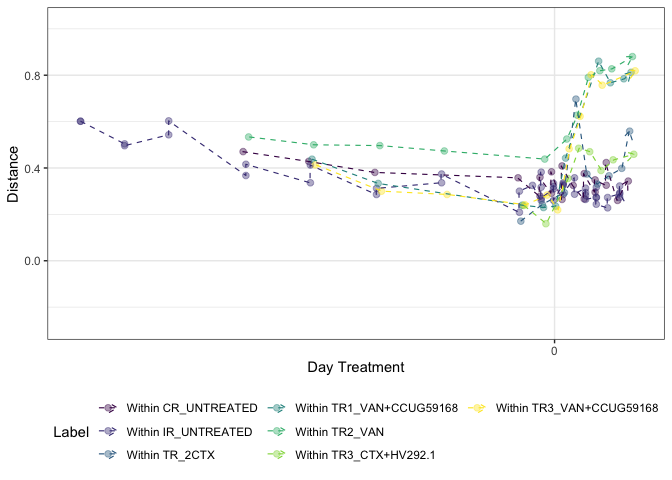<!-- -->

```r
# tmp_plot_corrected %>% 
#   export::graph2ppt(append = TRUE,
#                     file = file.path(here::here("data/processed/figures_NRP72")))
```


```r
tmp_plot <- t$wjaccard + facet_null()

tmp_plot$data %>% 
  correct_plot_x_continious(.) -> tmp_plot_corrected

tmp_plot_corrected
```

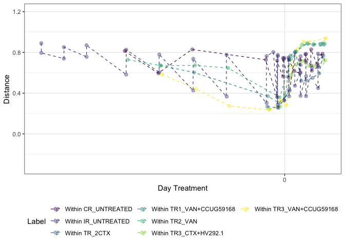<!-- -->

```r
# 
# tmp_plot_corrected %>% 
#   export::graph2ppt(append = TRUE,
#                     file = file.path(here::here("data/processed/figures_NRP72")))
```

```r
tmp_plot <- t$coda + facet_null()

tmp_plot$data %>% 
  correct_plot_x_continious(.) -> tmp_plot_corrected

tmp_plot_corrected %>% 
  plotly::ggplotly()
```

<!--html_preserve--><div id="htmlwidget-d3a0f762ed828f13105a" style="width:672px;height:480px;" class="plotly html-widget"></div>
<script type="application/json" data-for="htmlwidget-d3a0f762ed828f13105a">{"x":{"data":[{"x":[-28.2507453420347,-22.2989884030335,-16.3003193792217,-3.31115607928419,-1.31988307218544,-1.3230231100272,-0.281151384252467,-0.279873091072302,0.678751902306396,0.678419199572493,1.68910292401877,2.68733626019716,2.68812305486124,3.67882628261338,3.67717818184394,4.68890289463299,4.68660907976967,5.71714319134572,6.68689621305011],"y":[26.7487115631465,19.6470228724037,19.8291048500274,22.1048518270857,12.4956371620383,22.7534729406825,15.4587456611391,23.6628436527722,15.6745961642127,24.0754856793628,16.9315350759549,15.5738203562364,22.2417785706379,17.7713102185057,24.1857444344963,18.2123513049007,25.1995734496746,18.526944992051,22.1985345972387],"text":["Label: Within CR_UNTREATED<br />as.numeric(as.character(varGroup2)): -28<br />Distance: 26.748712<br />Label: Within CR_UNTREATED","Label: Within CR_UNTREATED<br />as.numeric(as.character(varGroup2)): -22<br />Distance: 19.647023<br />Label: Within CR_UNTREATED","Label: Within CR_UNTREATED<br />as.numeric(as.character(varGroup2)): -16<br />Distance: 19.829105<br />Label: Within CR_UNTREATED","Label: Within CR_UNTREATED<br />as.numeric(as.character(varGroup2)):  -3<br />Distance: 22.104852<br />Label: Within CR_UNTREATED","Label: Within CR_UNTREATED<br />as.numeric(as.character(varGroup2)):  -1<br />Distance: 12.495637<br />Label: Within CR_UNTREATED","Label: Within CR_UNTREATED<br />as.numeric(as.character(varGroup2)):  -1<br />Distance: 22.753473<br />Label: Within CR_UNTREATED","Label: Within CR_UNTREATED<br />as.numeric(as.character(varGroup2)):   0<br />Distance: 15.458746<br />Label: Within CR_UNTREATED","Label: Within CR_UNTREATED<br />as.numeric(as.character(varGroup2)):   0<br />Distance: 23.662844<br />Label: Within CR_UNTREATED","Label: Within CR_UNTREATED<br />as.numeric(as.character(varGroup2)):   1<br />Distance: 15.674596<br />Label: Within CR_UNTREATED","Label: Within CR_UNTREATED<br />as.numeric(as.character(varGroup2)):   1<br />Distance: 24.075486<br />Label: Within CR_UNTREATED","Label: Within CR_UNTREATED<br />as.numeric(as.character(varGroup2)):   2<br />Distance: 16.931535<br />Label: Within CR_UNTREATED","Label: Within CR_UNTREATED<br />as.numeric(as.character(varGroup2)):   3<br />Distance: 15.573820<br />Label: Within CR_UNTREATED","Label: Within CR_UNTREATED<br />as.numeric(as.character(varGroup2)):   3<br />Distance: 22.241779<br />Label: Within CR_UNTREATED","Label: Within CR_UNTREATED<br />as.numeric(as.character(varGroup2)):   4<br />Distance: 17.771310<br />Label: Within CR_UNTREATED","Label: Within CR_UNTREATED<br />as.numeric(as.character(varGroup2)):   4<br />Distance: 24.185744<br />Label: Within CR_UNTREATED","Label: Within CR_UNTREATED<br />as.numeric(as.character(varGroup2)):   5<br />Distance: 18.212351<br />Label: Within CR_UNTREATED","Label: Within CR_UNTREATED<br />as.numeric(as.character(varGroup2)):   5<br />Distance: 25.199573<br />Label: Within CR_UNTREATED","Label: Within CR_UNTREATED<br />as.numeric(as.character(varGroup2)):   6<br />Distance: 18.526945<br />Label: Within CR_UNTREATED","Label: Within CR_UNTREATED<br />as.numeric(as.character(varGroup2)):   7<br />Distance: 22.198535<br />Label: Within CR_UNTREATED"],"type":"scatter","mode":"markers","marker":{"autocolorscale":false,"color":"rgba(68,1,84,1)","opacity":0.4,"size":7.55905511811024,"symbol":"circle","line":{"width":1.88976377952756,"color":"rgba(68,1,84,1)"}},"hoveron":"points","name":"(Within CR_UNTREATED,1)","legendgroup":"(Within CR_UNTREATED,1)","showlegend":true,"xaxis":"x","yaxis":"y","hoverinfo":"text","frame":null},{"x":[-42.9984052503539,-42.9986331953822,-38.9993234968205,-38.9995069936359,-34.998265720082,-34.9994536638628,-27.9992683141468,-27.9998453823694,-22.1496696771212,-22.1507397903955,-16.1512381977287,-16.14837535357,-10.2485884244031,-10.2493308586722,-3.18646327221864,-3.18916802215962,-2.00007790887336,-1.21337883871546,-1.21528077415998,-1.21492367566243,-1.21522737819676,-0.095003333254799,-0.0940498374181947,-0.0940527216621201,-0.0942101914002642,0.784494793601101,0.784446938568493,0.784777563256223,0.785594855715173,1.8116788513697,1.81375553584331,2.81090642514622,2.81229719324283,2.81354885910752,2.81117333073676,3.78592813828888,3.78468457129189,3.78440737922391,3.78660308523816,4.8138861240672,4.81205951851188,5.9068293515601,5.90482838828394,5.9058428759221,5.90545836366517],"y":[33.846887783568,35.7535713102823,22.8413685408035,28.3307120193911,28.2436760339973,31.6274590115623,17.1976108747756,26.3603153472506,16.7983794003923,24.0783817705069,14.5174540254296,21.8435431261983,15.9152083522688,23.1929059804511,10.5364701968678,21.6748543572542,21.9078256971495,11.3832532819417,21.45936088713,21.8123000111958,11.8394247896656,11.5781762622323,20.7477176352627,21.0549151872218,11.8146766456585,13.6044643202125,21.0323061476866,21.3049238461766,13.6453698219854,22.6477492670093,16.1677632060604,14.8369490556221,21.0216200116571,20.8028546549162,13.8929706189131,13.8563922663455,21.3302326641416,19.3148242300909,15.1277227456689,12.6841734477444,19.3761897096183,14.8394654489687,21.9130546741675,18.644580967333,16.9108944862276],"text":["Label: Within IR_UNTREATED<br />as.numeric(as.character(varGroup2)): -43<br />Distance: 33.846888<br />Label: Within IR_UNTREATED","Label: Within IR_UNTREATED<br />as.numeric(as.character(varGroup2)): -43<br />Distance: 35.753571<br />Label: Within IR_UNTREATED","Label: Within IR_UNTREATED<br />as.numeric(as.character(varGroup2)): -39<br />Distance: 22.841369<br />Label: Within IR_UNTREATED","Label: Within IR_UNTREATED<br />as.numeric(as.character(varGroup2)): -39<br />Distance: 28.330712<br />Label: Within IR_UNTREATED","Label: Within IR_UNTREATED<br />as.numeric(as.character(varGroup2)): -35<br />Distance: 28.243676<br />Label: Within IR_UNTREATED","Label: Within IR_UNTREATED<br />as.numeric(as.character(varGroup2)): -35<br />Distance: 31.627459<br />Label: Within IR_UNTREATED","Label: Within IR_UNTREATED<br />as.numeric(as.character(varGroup2)): -28<br />Distance: 17.197611<br />Label: Within IR_UNTREATED","Label: Within IR_UNTREATED<br />as.numeric(as.character(varGroup2)): -28<br />Distance: 26.360315<br />Label: Within IR_UNTREATED","Label: Within IR_UNTREATED<br />as.numeric(as.character(varGroup2)): -22<br />Distance: 16.798379<br />Label: Within IR_UNTREATED","Label: Within IR_UNTREATED<br />as.numeric(as.character(varGroup2)): -22<br />Distance: 24.078382<br />Label: Within IR_UNTREATED","Label: Within IR_UNTREATED<br />as.numeric(as.character(varGroup2)): -16<br />Distance: 14.517454<br />Label: Within IR_UNTREATED","Label: Within IR_UNTREATED<br />as.numeric(as.character(varGroup2)): -16<br />Distance: 21.843543<br />Label: Within IR_UNTREATED","Label: Within IR_UNTREATED<br />as.numeric(as.character(varGroup2)): -10<br />Distance: 15.915208<br />Label: Within IR_UNTREATED","Label: Within IR_UNTREATED<br />as.numeric(as.character(varGroup2)): -10<br />Distance: 23.192906<br />Label: Within IR_UNTREATED","Label: Within IR_UNTREATED<br />as.numeric(as.character(varGroup2)):  -3<br />Distance: 10.536470<br />Label: Within IR_UNTREATED","Label: Within IR_UNTREATED<br />as.numeric(as.character(varGroup2)):  -3<br />Distance: 21.674854<br />Label: Within IR_UNTREATED","Label: Within IR_UNTREATED<br />as.numeric(as.character(varGroup2)):  -2<br />Distance: 21.907826<br />Label: Within IR_UNTREATED","Label: Within IR_UNTREATED<br />as.numeric(as.character(varGroup2)):  -1<br />Distance: 11.383253<br />Label: Within IR_UNTREATED","Label: Within IR_UNTREATED<br />as.numeric(as.character(varGroup2)):  -1<br />Distance: 21.459361<br />Label: Within IR_UNTREATED","Label: Within IR_UNTREATED<br />as.numeric(as.character(varGroup2)):  -1<br />Distance: 21.812300<br />Label: Within IR_UNTREATED","Label: Within IR_UNTREATED<br />as.numeric(as.character(varGroup2)):  -1<br />Distance: 11.839425<br />Label: Within IR_UNTREATED","Label: Within IR_UNTREATED<br />as.numeric(as.character(varGroup2)):   0<br />Distance: 11.578176<br />Label: Within IR_UNTREATED","Label: Within IR_UNTREATED<br />as.numeric(as.character(varGroup2)):   0<br />Distance: 20.747718<br />Label: Within IR_UNTREATED","Label: Within IR_UNTREATED<br />as.numeric(as.character(varGroup2)):   0<br />Distance: 21.054915<br />Label: Within IR_UNTREATED","Label: Within IR_UNTREATED<br />as.numeric(as.character(varGroup2)):   0<br />Distance: 11.814677<br />Label: Within IR_UNTREATED","Label: Within IR_UNTREATED<br />as.numeric(as.character(varGroup2)):   1<br />Distance: 13.604464<br />Label: Within IR_UNTREATED","Label: Within IR_UNTREATED<br />as.numeric(as.character(varGroup2)):   1<br />Distance: 21.032306<br />Label: Within IR_UNTREATED","Label: Within IR_UNTREATED<br />as.numeric(as.character(varGroup2)):   1<br />Distance: 21.304924<br />Label: Within IR_UNTREATED","Label: Within IR_UNTREATED<br />as.numeric(as.character(varGroup2)):   1<br />Distance: 13.645370<br />Label: Within IR_UNTREATED","Label: Within IR_UNTREATED<br />as.numeric(as.character(varGroup2)):   2<br />Distance: 22.647749<br />Label: Within IR_UNTREATED","Label: Within IR_UNTREATED<br />as.numeric(as.character(varGroup2)):   2<br />Distance: 16.167763<br />Label: Within IR_UNTREATED","Label: Within IR_UNTREATED<br />as.numeric(as.character(varGroup2)):   3<br />Distance: 14.836949<br />Label: Within IR_UNTREATED","Label: Within IR_UNTREATED<br />as.numeric(as.character(varGroup2)):   3<br />Distance: 21.021620<br />Label: Within IR_UNTREATED","Label: Within IR_UNTREATED<br />as.numeric(as.character(varGroup2)):   3<br />Distance: 20.802855<br />Label: Within IR_UNTREATED","Label: Within IR_UNTREATED<br />as.numeric(as.character(varGroup2)):   3<br />Distance: 13.892971<br />Label: Within IR_UNTREATED","Label: Within IR_UNTREATED<br />as.numeric(as.character(varGroup2)):   4<br />Distance: 13.856392<br />Label: Within IR_UNTREATED","Label: Within IR_UNTREATED<br />as.numeric(as.character(varGroup2)):   4<br />Distance: 21.330233<br />Label: Within IR_UNTREATED","Label: Within IR_UNTREATED<br />as.numeric(as.character(varGroup2)):   4<br />Distance: 19.314824<br />Label: Within IR_UNTREATED","Label: Within IR_UNTREATED<br />as.numeric(as.character(varGroup2)):   4<br />Distance: 15.127723<br />Label: Within IR_UNTREATED","Label: Within IR_UNTREATED<br />as.numeric(as.character(varGroup2)):   5<br />Distance: 12.684173<br />Label: Within IR_UNTREATED","Label: Within IR_UNTREATED<br />as.numeric(as.character(varGroup2)):   5<br />Distance: 19.376190<br />Label: Within IR_UNTREATED","Label: Within IR_UNTREATED<br />as.numeric(as.character(varGroup2)):   6<br />Distance: 14.839465<br />Label: Within IR_UNTREATED","Label: Within IR_UNTREATED<br />as.numeric(as.character(varGroup2)):   6<br />Distance: 21.913055<br />Label: Within IR_UNTREATED","Label: Within IR_UNTREATED<br />as.numeric(as.character(varGroup2)):   6<br />Distance: 18.644581<br />Label: Within IR_UNTREATED","Label: Within IR_UNTREATED<br />as.numeric(as.character(varGroup2)):   6<br />Distance: 16.910894<br />Label: Within IR_UNTREATED"],"type":"scatter","mode":"markers","marker":{"autocolorscale":false,"color":"rgba(68,58,131,1)","opacity":0.4,"size":7.55905511811024,"symbol":"circle","line":{"width":1.88976377952756,"color":"rgba(68,58,131,1)"}},"hoveron":"points","name":"(Within IR_UNTREATED,1)","legendgroup":"(Within IR_UNTREATED,1)","showlegend":true,"xaxis":"x","yaxis":"y","hoverinfo":"text","frame":null},{"x":[-3.06139599986358,-1.10732350155903,0.89394508795556,1.93859610354217,2.93853278007407,3.89264602597154,4.93839289529347,6.09420340747916,6.81323748211001],"y":[9.85359546199704,11.0470474560213,14.4983814493647,31.1859143906997,19.9758616931476,18.9643849878797,20.1136445742013,21.9393931562449,30.8948070007886],"text":["Label: Within TR_2CTX<br />as.numeric(as.character(varGroup2)):  -3<br />Distance:  9.853595<br />Label: Within TR_2CTX","Label: Within TR_2CTX<br />as.numeric(as.character(varGroup2)):  -1<br />Distance: 11.047047<br />Label: Within TR_2CTX","Label: Within TR_2CTX<br />as.numeric(as.character(varGroup2)):   1<br />Distance: 14.498381<br />Label: Within TR_2CTX","Label: Within TR_2CTX<br />as.numeric(as.character(varGroup2)):   2<br />Distance: 31.185914<br />Label: Within TR_2CTX","Label: Within TR_2CTX<br />as.numeric(as.character(varGroup2)):   3<br />Distance: 19.975862<br />Label: Within TR_2CTX","Label: Within TR_2CTX<br />as.numeric(as.character(varGroup2)):   4<br />Distance: 18.964385<br />Label: Within TR_2CTX","Label: Within TR_2CTX<br />as.numeric(as.character(varGroup2)):   5<br />Distance: 20.113645<br />Label: Within TR_2CTX","Label: Within TR_2CTX<br />as.numeric(as.character(varGroup2)):   6<br />Distance: 21.939393<br />Label: Within TR_2CTX","Label: Within TR_2CTX<br />as.numeric(as.character(varGroup2)):   7<br />Distance: 30.894807<br />Label: Within TR_2CTX"],"type":"scatter","mode":"markers","marker":{"autocolorscale":false,"color":"rgba(49,104,142,1)","opacity":0.4,"size":7.55905511811024,"symbol":"circle","line":{"width":1.88976377952756,"color":"rgba(49,104,142,1)"}},"hoveron":"points","name":"(Within TR_2CTX,1)","legendgroup":"(Within TR_2CTX,1)","showlegend":true,"xaxis":"x","yaxis":"y","hoverinfo":"text","frame":null},{"x":[-22.0017521937778,-16.0000866085119,-2.93848203899943,-1.00042169635887,0.0941456877307868,0.999479992664011,3.99863556289245,5.06160041920253,6.28183966872789,6.93721104133221],"y":[22.1925159987322,17.4190214113263,11.127214196521,11.9762353173048,12.7154971960269,25.8596025222371,37.8133544104873,38.0308933670555,37.8199438276179,39.5522296092337],"text":["Label: Within TR1_VAN+CCUG59168<br />as.numeric(as.character(varGroup2)): -22<br />Distance: 22.192516<br />Label: Within TR1_VAN+CCUG59168","Label: Within TR1_VAN+CCUG59168<br />as.numeric(as.character(varGroup2)): -16<br />Distance: 17.419021<br />Label: Within TR1_VAN+CCUG59168","Label: Within TR1_VAN+CCUG59168<br />as.numeric(as.character(varGroup2)):  -3<br />Distance: 11.127214<br />Label: Within TR1_VAN+CCUG59168","Label: Within TR1_VAN+CCUG59168<br />as.numeric(as.character(varGroup2)):  -1<br />Distance: 11.976235<br />Label: Within TR1_VAN+CCUG59168","Label: Within TR1_VAN+CCUG59168<br />as.numeric(as.character(varGroup2)):   0<br />Distance: 12.715497<br />Label: Within TR1_VAN+CCUG59168","Label: Within TR1_VAN+CCUG59168<br />as.numeric(as.character(varGroup2)):   1<br />Distance: 25.859603<br />Label: Within TR1_VAN+CCUG59168","Label: Within TR1_VAN+CCUG59168<br />as.numeric(as.character(varGroup2)):   4<br />Distance: 37.813354<br />Label: Within TR1_VAN+CCUG59168","Label: Within TR1_VAN+CCUG59168<br />as.numeric(as.character(varGroup2)):   5<br />Distance: 38.030893<br />Label: Within TR1_VAN+CCUG59168","Label: Within TR1_VAN+CCUG59168<br />as.numeric(as.character(varGroup2)):   6<br />Distance: 37.819944<br />Label: Within TR1_VAN+CCUG59168","Label: Within TR1_VAN+CCUG59168<br />as.numeric(as.character(varGroup2)):   7<br />Distance: 39.552230<br />Label: Within TR1_VAN+CCUG59168"],"type":"scatter","mode":"markers","marker":{"autocolorscale":false,"color":"rgba(33,144,140,1)","opacity":0.4,"size":7.55905511811024,"symbol":"circle","line":{"width":1.88976377952756,"color":"rgba(33,144,140,1)"}},"hoveron":"points","name":"(Within TR1_VAN+CCUG59168,1)","legendgroup":"(Within TR1_VAN+CCUG59168,1)","showlegend":true,"xaxis":"x","yaxis":"y","hoverinfo":"text","frame":null},{"x":[-27.7489887865473,-21.8513934573886,-15.8502284465211,-9.99829839656146,-0.891478016139953,1.1084988889351,2.06135983386061,3.061204195409,4.10768005687984,5.18695093499039,7.06305002851918],"y":[26.3333690148999,22.6646178666648,20.9814165525941,20.6643112695552,15.918897220346,22.3593233205356,25.840858023029,30.0208955084325,36.1105931781223,37.7252065854447,37.6698020311563],"text":["Label: Within TR2_VAN<br />as.numeric(as.character(varGroup2)): -28<br />Distance: 26.333369<br />Label: Within TR2_VAN","Label: Within TR2_VAN<br />as.numeric(as.character(varGroup2)): -22<br />Distance: 22.664618<br />Label: Within TR2_VAN","Label: Within TR2_VAN<br />as.numeric(as.character(varGroup2)): -16<br />Distance: 20.981417<br />Label: Within TR2_VAN","Label: Within TR2_VAN<br />as.numeric(as.character(varGroup2)): -10<br />Distance: 20.664311<br />Label: Within TR2_VAN","Label: Within TR2_VAN<br />as.numeric(as.character(varGroup2)):  -1<br />Distance: 15.918897<br />Label: Within TR2_VAN","Label: Within TR2_VAN<br />as.numeric(as.character(varGroup2)):   1<br />Distance: 22.359323<br />Label: Within TR2_VAN","Label: Within TR2_VAN<br />as.numeric(as.character(varGroup2)):   2<br />Distance: 25.840858<br />Label: Within TR2_VAN","Label: Within TR2_VAN<br />as.numeric(as.character(varGroup2)):   3<br />Distance: 30.020896<br />Label: Within TR2_VAN","Label: Within TR2_VAN<br />as.numeric(as.character(varGroup2)):   4<br />Distance: 36.110593<br />Label: Within TR2_VAN","Label: Within TR2_VAN<br />as.numeric(as.character(varGroup2)):   5<br />Distance: 37.725207<br />Label: Within TR2_VAN","Label: Within TR2_VAN<br />as.numeric(as.character(varGroup2)):   7<br />Distance: 37.669802<br />Label: Within TR2_VAN"],"type":"scatter","mode":"markers","marker":{"autocolorscale":false,"color":"rgba(53,183,121,1)","opacity":0.4,"size":7.55905511811024,"symbol":"circle","line":{"width":1.88976377952756,"color":"rgba(53,183,121,1)"}},"hoveron":"points","name":"(Within TR2_VAN,1)","legendgroup":"(Within TR2_VAN,1)","showlegend":true,"xaxis":"x","yaxis":"y","hoverinfo":"text","frame":null},{"x":[-2.8131302693246,-0.786810106348438,1.21527622060612,2.18607401749724,3.18738343523358,4.21432608432045,5.31285083845356,7.18691341593094],"y":[11.7240159353145,9.82381889980789,20.4557568746754,26.030282584975,25.7351101318921,24.0802042796568,25.7728946363985,26.3788364809901],"text":["Label: Within TR3_CTX+HV292.1<br />as.numeric(as.character(varGroup2)):  -3<br />Distance: 11.724016<br />Label: Within TR3_CTX+HV292.1","Label: Within TR3_CTX+HV292.1<br />as.numeric(as.character(varGroup2)):  -1<br />Distance:  9.823819<br />Label: Within TR3_CTX+HV292.1","Label: Within TR3_CTX+HV292.1<br />as.numeric(as.character(varGroup2)):   1<br />Distance: 20.455757<br />Label: Within TR3_CTX+HV292.1","Label: Within TR3_CTX+HV292.1<br />as.numeric(as.character(varGroup2)):   2<br />Distance: 26.030283<br />Label: Within TR3_CTX+HV292.1","Label: Within TR3_CTX+HV292.1<br />as.numeric(as.character(varGroup2)):   3<br />Distance: 25.735110<br />Label: Within TR3_CTX+HV292.1","Label: Within TR3_CTX+HV292.1<br />as.numeric(as.character(varGroup2)):   4<br />Distance: 24.080204<br />Label: Within TR3_CTX+HV292.1","Label: Within TR3_CTX+HV292.1<br />as.numeric(as.character(varGroup2)):   5<br />Distance: 25.772895<br />Label: Within TR3_CTX+HV292.1","Label: Within TR3_CTX+HV292.1<br />as.numeric(as.character(varGroup2)):   7<br />Distance: 26.378836<br />Label: Within TR3_CTX+HV292.1"],"type":"scatter","mode":"markers","marker":{"autocolorscale":false,"color":"rgba(143,215,68,1)","opacity":0.4,"size":7.55905511811024,"symbol":"circle","line":{"width":1.88976377952756,"color":"rgba(143,215,68,1)"}},"hoveron":"points","name":"(Within TR3_CTX+HV292.1,1)","legendgroup":"(Within TR3_CTX+HV292.1,1)","showlegend":true,"xaxis":"x","yaxis":"y","hoverinfo":"text","frame":null},{"x":[-21.7000399542678,-15.6984053549912,-9.75005999158888,-2.68613035009782,-0.677117259494545,0.281631526253758,1.32111520222342,2.31126173575768,3.31402736773077,4.32073112897234,7.3109586686721],"y":[19.0839405869683,16.4566738524359,14.2123800340552,10.3945832771385,10.5378906241346,9.00926316770117,22.9910737009508,28.5120926477293,34.1001098648554,33.0641837443758,34.2443467072711],"text":["Label: Within TR3_VAN+CCUG59168<br />as.numeric(as.character(varGroup2)): -22<br />Distance: 19.083941<br />Label: Within TR3_VAN+CCUG59168","Label: Within TR3_VAN+CCUG59168<br />as.numeric(as.character(varGroup2)): -16<br />Distance: 16.456674<br />Label: Within TR3_VAN+CCUG59168","Label: Within TR3_VAN+CCUG59168<br />as.numeric(as.character(varGroup2)): -10<br />Distance: 14.212380<br />Label: Within TR3_VAN+CCUG59168","Label: Within TR3_VAN+CCUG59168<br />as.numeric(as.character(varGroup2)):  -3<br />Distance: 10.394583<br />Label: Within TR3_VAN+CCUG59168","Label: Within TR3_VAN+CCUG59168<br />as.numeric(as.character(varGroup2)):  -1<br />Distance: 10.537891<br />Label: Within TR3_VAN+CCUG59168","Label: Within TR3_VAN+CCUG59168<br />as.numeric(as.character(varGroup2)):   0<br />Distance:  9.009263<br />Label: Within TR3_VAN+CCUG59168","Label: Within TR3_VAN+CCUG59168<br />as.numeric(as.character(varGroup2)):   1<br />Distance: 22.991074<br />Label: Within TR3_VAN+CCUG59168","Label: Within TR3_VAN+CCUG59168<br />as.numeric(as.character(varGroup2)):   2<br />Distance: 28.512093<br />Label: Within TR3_VAN+CCUG59168","Label: Within TR3_VAN+CCUG59168<br />as.numeric(as.character(varGroup2)):   3<br />Distance: 34.100110<br />Label: Within TR3_VAN+CCUG59168","Label: Within TR3_VAN+CCUG59168<br />as.numeric(as.character(varGroup2)):   4<br />Distance: 33.064184<br />Label: Within TR3_VAN+CCUG59168","Label: Within TR3_VAN+CCUG59168<br />as.numeric(as.character(varGroup2)):   7<br />Distance: 34.244347<br />Label: Within TR3_VAN+CCUG59168"],"type":"scatter","mode":"markers","marker":{"autocolorscale":false,"color":"rgba(253,231,37,1)","opacity":0.4,"size":7.55905511811024,"symbol":"circle","line":{"width":1.88976377952756,"color":"rgba(253,231,37,1)"}},"hoveron":"points","name":"(Within TR3_VAN+CCUG59168,1)","legendgroup":"(Within TR3_VAN+CCUG59168,1)","showlegend":true,"xaxis":"x","yaxis":"y","hoverinfo":"text","frame":null},{"x":[-28.2931099248494,-22.3631912058494,-16.3561810140625,-3.38059904165893,-1.38501199355587,-1.3818939253996,-0.3340690073933,-0.342394311801253,0.618545623589541,0.607342709472081,1.62219783327166,2.62619723949516,2.62793586758668,3.60806494782817,3.61794297650578,4.61946177225429,4.62160654614696,5.667907796408,6.62209420356442],"y":[26.7487115631465,19.6470228724037,19.8291048500274,22.1048518270857,12.4956371620383,22.7534729406825,15.4587456611391,23.6628436527722,15.6745961642127,24.0754856793628,16.9315350759549,15.5738203562364,22.2417785706379,17.7713102185057,24.1857444344963,18.2123513049007,25.1995734496746,18.526944992051,22.1985345972387],"text":["Label: Within CR_UNTREATED<br />Label: Within CR_UNTREATED<br />as.numeric(as.character(varGroup2)): -28<br />Distance: 26.748712<br />Label: Within CR_UNTREATED","Label: Within CR_UNTREATED<br />Label: Within CR_UNTREATED<br />as.numeric(as.character(varGroup2)): -22<br />Distance: 19.647023<br />Label: Within CR_UNTREATED","Label: Within CR_UNTREATED<br />Label: Within CR_UNTREATED<br />as.numeric(as.character(varGroup2)): -16<br />Distance: 19.829105<br />Label: Within CR_UNTREATED","Label: Within CR_UNTREATED<br />Label: Within CR_UNTREATED<br />as.numeric(as.character(varGroup2)):  -3<br />Distance: 22.104852<br />Label: Within CR_UNTREATED","Label: Within CR_UNTREATED<br />Label: Within CR_UNTREATED<br />as.numeric(as.character(varGroup2)):  -1<br />Distance: 12.495637<br />Label: Within CR_UNTREATED","Label: Within CR_UNTREATED<br />Label: Within CR_UNTREATED<br />as.numeric(as.character(varGroup2)):  -1<br />Distance: 22.753473<br />Label: Within CR_UNTREATED","Label: Within CR_UNTREATED<br />Label: Within CR_UNTREATED<br />as.numeric(as.character(varGroup2)):   0<br />Distance: 15.458746<br />Label: Within CR_UNTREATED","Label: Within CR_UNTREATED<br />Label: Within CR_UNTREATED<br />as.numeric(as.character(varGroup2)):   0<br />Distance: 23.662844<br />Label: Within CR_UNTREATED","Label: Within CR_UNTREATED<br />Label: Within CR_UNTREATED<br />as.numeric(as.character(varGroup2)):   1<br />Distance: 15.674596<br />Label: Within CR_UNTREATED","Label: Within CR_UNTREATED<br />Label: Within CR_UNTREATED<br />as.numeric(as.character(varGroup2)):   1<br />Distance: 24.075486<br />Label: Within CR_UNTREATED","Label: Within CR_UNTREATED<br />Label: Within CR_UNTREATED<br />as.numeric(as.character(varGroup2)):   2<br />Distance: 16.931535<br />Label: Within CR_UNTREATED","Label: Within CR_UNTREATED<br />Label: Within CR_UNTREATED<br />as.numeric(as.character(varGroup2)):   3<br />Distance: 15.573820<br />Label: Within CR_UNTREATED","Label: Within CR_UNTREATED<br />Label: Within CR_UNTREATED<br />as.numeric(as.character(varGroup2)):   3<br />Distance: 22.241779<br />Label: Within CR_UNTREATED","Label: Within CR_UNTREATED<br />Label: Within CR_UNTREATED<br />as.numeric(as.character(varGroup2)):   4<br />Distance: 17.771310<br />Label: Within CR_UNTREATED","Label: Within CR_UNTREATED<br />Label: Within CR_UNTREATED<br />as.numeric(as.character(varGroup2)):   4<br />Distance: 24.185744<br />Label: Within CR_UNTREATED","Label: Within CR_UNTREATED<br />Label: Within CR_UNTREATED<br />as.numeric(as.character(varGroup2)):   5<br />Distance: 18.212351<br />Label: Within CR_UNTREATED","Label: Within CR_UNTREATED<br />Label: Within CR_UNTREATED<br />as.numeric(as.character(varGroup2)):   5<br />Distance: 25.199573<br />Label: Within CR_UNTREATED","Label: Within CR_UNTREATED<br />Label: Within CR_UNTREATED<br />as.numeric(as.character(varGroup2)):   6<br />Distance: 18.526945<br />Label: Within CR_UNTREATED","Label: Within CR_UNTREATED<br />Label: Within CR_UNTREATED<br />as.numeric(as.character(varGroup2)):   7<br />Distance: 22.198535<br />Label: Within CR_UNTREATED"],"type":"scatter","mode":"lines","line":{"width":1.51181102362205,"color":"rgba(68,1,84,1)","dash":"dash"},"hoveron":"points","name":"(Within CR_UNTREATED,1)","legendgroup":"(Within CR_UNTREATED,1)","showlegend":false,"xaxis":"x","yaxis":"y","hoverinfo":"text","frame":null},{"x":[-43.0052070260244,-42.997096537583,-39.0040028389118,-38.9988797723397,-35.0036155399425,-35.0050664409636,-27.9944587767647,-28.0043580110593,-22.1761522393844,-22.1755013369782,-16.186413374704,-16.1756061066308,-10.3017192577257,-10.2979482023634,-3.2286636314894,-3.23196199537304,-1.99300349220111,-1.26306893372381,-1.25703292857426,-1.25654097397889,-1.25965100239337,-0.105894367311869,-0.106946183041784,-0.115101551257989,-0.118300699334788,0.744555213794878,0.74346880938503,0.741471461231883,0.73831568339975,1.77058003067055,1.77387893726363,2.76964003712331,2.76867065377403,2.76821665262575,2.77079347324018,3.74339869846088,3.74563323934714,3.73913467572418,3.73656722378677,4.77199164220835,4.77229055484528,5.89285551236714,5.88214749303369,5.89001237980106,5.8915600587859],"y":[33.846887783568,35.7535713102823,22.8413685408035,28.3307120193911,28.2436760339973,31.6274590115623,17.1976108747756,26.3603153472506,16.7983794003923,24.0783817705069,14.5174540254296,21.8435431261983,15.9152083522688,23.1929059804511,10.5364701968678,21.6748543572542,21.9078256971495,11.3832532819417,21.45936088713,21.8123000111958,11.8394247896656,11.5781762622323,20.7477176352627,21.0549151872218,11.8146766456585,13.6044643202125,21.0323061476866,21.3049238461766,13.6453698219854,22.6477492670093,16.1677632060604,14.8369490556221,21.0216200116571,20.8028546549162,13.8929706189131,13.8563922663455,21.3302326641416,19.3148242300909,15.1277227456689,12.6841734477444,19.3761897096183,14.8394654489687,21.9130546741675,18.644580967333,16.9108944862276],"text":["Label: Within IR_UNTREATED<br />Label: Within IR_UNTREATED<br />as.numeric(as.character(varGroup2)): -43<br />Distance: 33.846888<br />Label: Within IR_UNTREATED","Label: Within IR_UNTREATED<br />Label: Within IR_UNTREATED<br />as.numeric(as.character(varGroup2)): -43<br />Distance: 35.753571<br />Label: Within IR_UNTREATED","Label: Within IR_UNTREATED<br />Label: Within IR_UNTREATED<br />as.numeric(as.character(varGroup2)): -39<br />Distance: 22.841369<br />Label: Within IR_UNTREATED","Label: Within IR_UNTREATED<br />Label: Within IR_UNTREATED<br />as.numeric(as.character(varGroup2)): -39<br />Distance: 28.330712<br />Label: Within IR_UNTREATED","Label: Within IR_UNTREATED<br />Label: Within IR_UNTREATED<br />as.numeric(as.character(varGroup2)): -35<br />Distance: 28.243676<br />Label: Within IR_UNTREATED","Label: Within IR_UNTREATED<br />Label: Within IR_UNTREATED<br />as.numeric(as.character(varGroup2)): -35<br />Distance: 31.627459<br />Label: Within IR_UNTREATED","Label: Within IR_UNTREATED<br />Label: Within IR_UNTREATED<br />as.numeric(as.character(varGroup2)): -28<br />Distance: 17.197611<br />Label: Within IR_UNTREATED","Label: Within IR_UNTREATED<br />Label: Within IR_UNTREATED<br />as.numeric(as.character(varGroup2)): -28<br />Distance: 26.360315<br />Label: Within IR_UNTREATED","Label: Within IR_UNTREATED<br />Label: Within IR_UNTREATED<br />as.numeric(as.character(varGroup2)): -22<br />Distance: 16.798379<br />Label: Within IR_UNTREATED","Label: Within IR_UNTREATED<br />Label: Within IR_UNTREATED<br />as.numeric(as.character(varGroup2)): -22<br />Distance: 24.078382<br />Label: Within IR_UNTREATED","Label: Within IR_UNTREATED<br />Label: Within IR_UNTREATED<br />as.numeric(as.character(varGroup2)): -16<br />Distance: 14.517454<br />Label: Within IR_UNTREATED","Label: Within IR_UNTREATED<br />Label: Within IR_UNTREATED<br />as.numeric(as.character(varGroup2)): -16<br />Distance: 21.843543<br />Label: Within IR_UNTREATED","Label: Within IR_UNTREATED<br />Label: Within IR_UNTREATED<br />as.numeric(as.character(varGroup2)): -10<br />Distance: 15.915208<br />Label: Within IR_UNTREATED","Label: Within IR_UNTREATED<br />Label: Within IR_UNTREATED<br />as.numeric(as.character(varGroup2)): -10<br />Distance: 23.192906<br />Label: Within IR_UNTREATED","Label: Within IR_UNTREATED<br />Label: Within IR_UNTREATED<br />as.numeric(as.character(varGroup2)):  -3<br />Distance: 10.536470<br />Label: Within IR_UNTREATED","Label: Within IR_UNTREATED<br />Label: Within IR_UNTREATED<br />as.numeric(as.character(varGroup2)):  -3<br />Distance: 21.674854<br />Label: Within IR_UNTREATED","Label: Within IR_UNTREATED<br />Label: Within IR_UNTREATED<br />as.numeric(as.character(varGroup2)):  -2<br />Distance: 21.907826<br />Label: Within IR_UNTREATED","Label: Within IR_UNTREATED<br />Label: Within IR_UNTREATED<br />as.numeric(as.character(varGroup2)):  -1<br />Distance: 11.383253<br />Label: Within IR_UNTREATED","Label: Within IR_UNTREATED<br />Label: Within IR_UNTREATED<br />as.numeric(as.character(varGroup2)):  -1<br />Distance: 21.459361<br />Label: Within IR_UNTREATED","Label: Within IR_UNTREATED<br />Label: Within IR_UNTREATED<br />as.numeric(as.character(varGroup2)):  -1<br />Distance: 21.812300<br />Label: Within IR_UNTREATED","Label: Within IR_UNTREATED<br />Label: Within IR_UNTREATED<br />as.numeric(as.character(varGroup2)):  -1<br />Distance: 11.839425<br />Label: Within IR_UNTREATED","Label: Within IR_UNTREATED<br />Label: Within IR_UNTREATED<br />as.numeric(as.character(varGroup2)):   0<br />Distance: 11.578176<br />Label: Within IR_UNTREATED","Label: Within IR_UNTREATED<br />Label: Within IR_UNTREATED<br />as.numeric(as.character(varGroup2)):   0<br />Distance: 20.747718<br />Label: Within IR_UNTREATED","Label: Within IR_UNTREATED<br />Label: Within IR_UNTREATED<br />as.numeric(as.character(varGroup2)):   0<br />Distance: 21.054915<br />Label: Within IR_UNTREATED","Label: Within IR_UNTREATED<br />Label: Within IR_UNTREATED<br />as.numeric(as.character(varGroup2)):   0<br />Distance: 11.814677<br />Label: Within IR_UNTREATED","Label: Within IR_UNTREATED<br />Label: Within IR_UNTREATED<br />as.numeric(as.character(varGroup2)):   1<br />Distance: 13.604464<br />Label: Within IR_UNTREATED","Label: Within IR_UNTREATED<br />Label: Within IR_UNTREATED<br />as.numeric(as.character(varGroup2)):   1<br />Distance: 21.032306<br />Label: Within IR_UNTREATED","Label: Within IR_UNTREATED<br />Label: Within IR_UNTREATED<br />as.numeric(as.character(varGroup2)):   1<br />Distance: 21.304924<br />Label: Within IR_UNTREATED","Label: Within IR_UNTREATED<br />Label: Within IR_UNTREATED<br />as.numeric(as.character(varGroup2)):   1<br />Distance: 13.645370<br />Label: Within IR_UNTREATED","Label: Within IR_UNTREATED<br />Label: Within IR_UNTREATED<br />as.numeric(as.character(varGroup2)):   2<br />Distance: 22.647749<br />Label: Within IR_UNTREATED","Label: Within IR_UNTREATED<br />Label: Within IR_UNTREATED<br />as.numeric(as.character(varGroup2)):   2<br />Distance: 16.167763<br />Label: Within IR_UNTREATED","Label: Within IR_UNTREATED<br />Label: Within IR_UNTREATED<br />as.numeric(as.character(varGroup2)):   3<br />Distance: 14.836949<br />Label: Within IR_UNTREATED","Label: Within IR_UNTREATED<br />Label: Within IR_UNTREATED<br />as.numeric(as.character(varGroup2)):   3<br />Distance: 21.021620<br />Label: Within IR_UNTREATED","Label: Within IR_UNTREATED<br />Label: Within IR_UNTREATED<br />as.numeric(as.character(varGroup2)):   3<br />Distance: 20.802855<br />Label: Within IR_UNTREATED","Label: Within IR_UNTREATED<br />Label: Within IR_UNTREATED<br />as.numeric(as.character(varGroup2)):   3<br />Distance: 13.892971<br />Label: Within IR_UNTREATED","Label: Within IR_UNTREATED<br />Label: Within IR_UNTREATED<br />as.numeric(as.character(varGroup2)):   4<br />Distance: 13.856392<br />Label: Within IR_UNTREATED","Label: Within IR_UNTREATED<br />Label: Within IR_UNTREATED<br />as.numeric(as.character(varGroup2)):   4<br />Distance: 21.330233<br />Label: Within IR_UNTREATED","Label: Within IR_UNTREATED<br />Label: Within IR_UNTREATED<br />as.numeric(as.character(varGroup2)):   4<br />Distance: 19.314824<br />Label: Within IR_UNTREATED","Label: Within IR_UNTREATED<br />Label: Within IR_UNTREATED<br />as.numeric(as.character(varGroup2)):   4<br />Distance: 15.127723<br />Label: Within IR_UNTREATED","Label: Within IR_UNTREATED<br />Label: Within IR_UNTREATED<br />as.numeric(as.character(varGroup2)):   5<br />Distance: 12.684173<br />Label: Within IR_UNTREATED","Label: Within IR_UNTREATED<br />Label: Within IR_UNTREATED<br />as.numeric(as.character(varGroup2)):   5<br />Distance: 19.376190<br />Label: Within IR_UNTREATED","Label: Within IR_UNTREATED<br />Label: Within IR_UNTREATED<br />as.numeric(as.character(varGroup2)):   6<br />Distance: 14.839465<br />Label: Within IR_UNTREATED","Label: Within IR_UNTREATED<br />Label: Within IR_UNTREATED<br />as.numeric(as.character(varGroup2)):   6<br />Distance: 21.913055<br />Label: Within IR_UNTREATED","Label: Within IR_UNTREATED<br />Label: Within IR_UNTREATED<br />as.numeric(as.character(varGroup2)):   6<br />Distance: 18.644581<br />Label: Within IR_UNTREATED","Label: Within IR_UNTREATED<br />Label: Within IR_UNTREATED<br />as.numeric(as.character(varGroup2)):   6<br />Distance: 16.910894<br />Label: Within IR_UNTREATED"],"type":"scatter","mode":"lines","line":{"width":1.51181102362205,"color":"rgba(68,58,131,1)","dash":"dash"},"hoveron":"points","name":"(Within IR_UNTREATED,1)","legendgroup":"(Within IR_UNTREATED,1)","showlegend":false,"xaxis":"x","yaxis":"y","hoverinfo":"text","frame":null},{"x":[-3.07509110936928,-1.1220551458862,0.869619409246067,1.91818303365849,2.92504925707257,3.87591492163396,4.92128611414514,6.11162702759172,6.77126890020282],"y":[9.85359546199704,11.0470474560213,14.4983814493647,31.1859143906997,19.9758616931476,18.9643849878797,20.1136445742013,21.9393931562449,30.8948070007886],"text":["Label: Within TR_2CTX<br />Label: Within TR_2CTX<br />as.numeric(as.character(varGroup2)):  -3<br />Distance:  9.853595<br />Label: Within TR_2CTX","Label: Within TR_2CTX<br />Label: Within TR_2CTX<br />as.numeric(as.character(varGroup2)):  -1<br />Distance: 11.047047<br />Label: Within TR_2CTX","Label: Within TR_2CTX<br />Label: Within TR_2CTX<br />as.numeric(as.character(varGroup2)):   1<br />Distance: 14.498381<br />Label: Within TR_2CTX","Label: Within TR_2CTX<br />Label: Within TR_2CTX<br />as.numeric(as.character(varGroup2)):   2<br />Distance: 31.185914<br />Label: Within TR_2CTX","Label: Within TR_2CTX<br />Label: Within TR_2CTX<br />as.numeric(as.character(varGroup2)):   3<br />Distance: 19.975862<br />Label: Within TR_2CTX","Label: Within TR_2CTX<br />Label: Within TR_2CTX<br />as.numeric(as.character(varGroup2)):   4<br />Distance: 18.964385<br />Label: Within TR_2CTX","Label: Within TR_2CTX<br />Label: Within TR_2CTX<br />as.numeric(as.character(varGroup2)):   5<br />Distance: 20.113645<br />Label: Within TR_2CTX","Label: Within TR_2CTX<br />Label: Within TR_2CTX<br />as.numeric(as.character(varGroup2)):   6<br />Distance: 21.939393<br />Label: Within TR_2CTX","Label: Within TR_2CTX<br />Label: Within TR_2CTX<br />as.numeric(as.character(varGroup2)):   7<br />Distance: 30.894807<br />Label: Within TR_2CTX"],"type":"scatter","mode":"lines","line":{"width":1.51181102362205,"color":"rgba(49,104,142,1)","dash":"dash"},"hoveron":"points","name":"(Within TR_2CTX,1)","legendgroup":"(Within TR_2CTX,1)","showlegend":false,"xaxis":"x","yaxis":"y","hoverinfo":"text","frame":null},{"x":[-22.0046328949726,-15.9996913116883,-2.92625172533618,-1.00098798365512,0.113193310480238,1.0063184121787,3.99326428613511,5.07987604898711,6.34042676008192,6.92945557815725],"y":[22.1925159987322,17.4190214113263,11.127214196521,11.9762353173048,12.7154971960269,25.8596025222371,37.8133544104873,38.0308933670555,37.8199438276179,39.5522296092337],"text":["Label: Within TR1_VAN+CCUG59168<br />Label: Within TR1_VAN+CCUG59168<br />as.numeric(as.character(varGroup2)): -22<br />Distance: 22.192516<br />Label: Within TR1_VAN+CCUG59168","Label: Within TR1_VAN+CCUG59168<br />Label: Within TR1_VAN+CCUG59168<br />as.numeric(as.character(varGroup2)): -16<br />Distance: 17.419021<br />Label: Within TR1_VAN+CCUG59168","Label: Within TR1_VAN+CCUG59168<br />Label: Within TR1_VAN+CCUG59168<br />as.numeric(as.character(varGroup2)):  -3<br />Distance: 11.127214<br />Label: Within TR1_VAN+CCUG59168","Label: Within TR1_VAN+CCUG59168<br />Label: Within TR1_VAN+CCUG59168<br />as.numeric(as.character(varGroup2)):  -1<br />Distance: 11.976235<br />Label: Within TR1_VAN+CCUG59168","Label: Within TR1_VAN+CCUG59168<br />Label: Within TR1_VAN+CCUG59168<br />as.numeric(as.character(varGroup2)):   0<br />Distance: 12.715497<br />Label: Within TR1_VAN+CCUG59168","Label: Within TR1_VAN+CCUG59168<br />Label: Within TR1_VAN+CCUG59168<br />as.numeric(as.character(varGroup2)):   1<br />Distance: 25.859603<br />Label: Within TR1_VAN+CCUG59168","Label: Within TR1_VAN+CCUG59168<br />Label: Within TR1_VAN+CCUG59168<br />as.numeric(as.character(varGroup2)):   4<br />Distance: 37.813354<br />Label: Within TR1_VAN+CCUG59168","Label: Within TR1_VAN+CCUG59168<br />Label: Within TR1_VAN+CCUG59168<br />as.numeric(as.character(varGroup2)):   5<br />Distance: 38.030893<br />Label: Within TR1_VAN+CCUG59168","Label: Within TR1_VAN+CCUG59168<br />Label: Within TR1_VAN+CCUG59168<br />as.numeric(as.character(varGroup2)):   6<br />Distance: 37.819944<br />Label: Within TR1_VAN+CCUG59168","Label: Within TR1_VAN+CCUG59168<br />Label: Within TR1_VAN+CCUG59168<br />as.numeric(as.character(varGroup2)):   7<br />Distance: 39.552230<br />Label: Within TR1_VAN+CCUG59168"],"type":"scatter","mode":"lines","line":{"width":1.51181102362205,"color":"rgba(33,144,140,1)","dash":"dash"},"hoveron":"points","name":"(Within TR1_VAN+CCUG59168,1)","legendgroup":"(Within TR1_VAN+CCUG59168,1)","showlegend":false,"xaxis":"x","yaxis":"y","hoverinfo":"text","frame":null},{"x":[-27.7011023327349,-21.8230646801845,-15.8233980317806,-10.0048017204331,-0.870301087317816,1.1279880046359,2.08066402446283,3.06942839614655,4.12237146511198,5.22949715493606,7.07182122353922],"y":[26.3333690148999,22.6646178666648,20.9814165525941,20.6643112695552,15.918897220346,22.3593233205356,25.840858023029,30.0208955084325,36.1105931781223,37.7252065854447,37.6698020311563],"text":["Label: Within TR2_VAN<br />Label: Within TR2_VAN<br />as.numeric(as.character(varGroup2)): -28<br />Distance: 26.333369<br />Label: Within TR2_VAN","Label: Within TR2_VAN<br />Label: Within TR2_VAN<br />as.numeric(as.character(varGroup2)): -22<br />Distance: 22.664618<br />Label: Within TR2_VAN","Label: Within TR2_VAN<br />Label: Within TR2_VAN<br />as.numeric(as.character(varGroup2)): -16<br />Distance: 20.981417<br />Label: Within TR2_VAN","Label: Within TR2_VAN<br />Label: Within TR2_VAN<br />as.numeric(as.character(varGroup2)): -10<br />Distance: 20.664311<br />Label: Within TR2_VAN","Label: Within TR2_VAN<br />Label: Within TR2_VAN<br />as.numeric(as.character(varGroup2)):  -1<br />Distance: 15.918897<br />Label: Within TR2_VAN","Label: Within TR2_VAN<br />Label: Within TR2_VAN<br />as.numeric(as.character(varGroup2)):   1<br />Distance: 22.359323<br />Label: Within TR2_VAN","Label: Within TR2_VAN<br />Label: Within TR2_VAN<br />as.numeric(as.character(varGroup2)):   2<br />Distance: 25.840858<br />Label: Within TR2_VAN","Label: Within TR2_VAN<br />Label: Within TR2_VAN<br />as.numeric(as.character(varGroup2)):   3<br />Distance: 30.020896<br />Label: Within TR2_VAN","Label: Within TR2_VAN<br />Label: Within TR2_VAN<br />as.numeric(as.character(varGroup2)):   4<br />Distance: 36.110593<br />Label: Within TR2_VAN","Label: Within TR2_VAN<br />Label: Within TR2_VAN<br />as.numeric(as.character(varGroup2)):   5<br />Distance: 37.725207<br />Label: Within TR2_VAN","Label: Within TR2_VAN<br />Label: Within TR2_VAN<br />as.numeric(as.character(varGroup2)):   7<br />Distance: 37.669802<br />Label: Within TR2_VAN"],"type":"scatter","mode":"lines","line":{"width":1.51181102362205,"color":"rgba(53,183,121,1)","dash":"dash"},"hoveron":"points","name":"(Within TR2_VAN,1)","legendgroup":"(Within TR2_VAN,1)","showlegend":false,"xaxis":"x","yaxis":"y","hoverinfo":"text","frame":null},{"x":[-2.77631755825786,-0.745027071998028,1.25504301471174,2.22796928214661,3.22560762261743,4.25616551499188,5.38057250942577,7.21979222685883],"y":[11.7240159353145,9.82381889980789,20.4557568746754,26.030282584975,25.7351101318921,24.0802042796568,25.7728946363985,26.3788364809901],"text":["Label: Within TR3_CTX+HV292.1<br />Label: Within TR3_CTX+HV292.1<br />as.numeric(as.character(varGroup2)):  -3<br />Distance: 11.724016<br />Label: Within TR3_CTX+HV292.1","Label: Within TR3_CTX+HV292.1<br />Label: Within TR3_CTX+HV292.1<br />as.numeric(as.character(varGroup2)):  -1<br />Distance:  9.823819<br />Label: Within TR3_CTX+HV292.1","Label: Within TR3_CTX+HV292.1<br />Label: Within TR3_CTX+HV292.1<br />as.numeric(as.character(varGroup2)):   1<br />Distance: 20.455757<br />Label: Within TR3_CTX+HV292.1","Label: Within TR3_CTX+HV292.1<br />Label: Within TR3_CTX+HV292.1<br />as.numeric(as.character(varGroup2)):   2<br />Distance: 26.030283<br />Label: Within TR3_CTX+HV292.1","Label: Within TR3_CTX+HV292.1<br />Label: Within TR3_CTX+HV292.1<br />as.numeric(as.character(varGroup2)):   3<br />Distance: 25.735110<br />Label: Within TR3_CTX+HV292.1","Label: Within TR3_CTX+HV292.1<br />Label: Within TR3_CTX+HV292.1<br />as.numeric(as.character(varGroup2)):   4<br />Distance: 24.080204<br />Label: Within TR3_CTX+HV292.1","Label: Within TR3_CTX+HV292.1<br />Label: Within TR3_CTX+HV292.1<br />as.numeric(as.character(varGroup2)):   5<br />Distance: 25.772895<br />Label: Within TR3_CTX+HV292.1","Label: Within TR3_CTX+HV292.1<br />Label: Within TR3_CTX+HV292.1<br />as.numeric(as.character(varGroup2)):   7<br />Distance: 26.378836<br />Label: Within TR3_CTX+HV292.1"],"type":"scatter","mode":"lines","line":{"width":1.51181102362205,"color":"rgba(143,215,68,1)","dash":"dash"},"hoveron":"points","name":"(Within TR3_CTX+HV292.1,1)","legendgroup":"(Within TR3_CTX+HV292.1,1)","showlegend":false,"xaxis":"x","yaxis":"y","hoverinfo":"text","frame":null},{"x":[-21.6396690553597,-15.6371923072087,-9.69694490967351,-2.63056090367272,-0.613670496379765,0.344203369642951,1.38489550411711,2.37446604852744,3.37276630254887,4.38638304992016,7.37356313590549],"y":[19.0839405869683,16.4566738524359,14.2123800340552,10.3945832771385,10.5378906241346,9.00926316770117,22.9910737009508,28.5120926477293,34.1001098648554,33.0641837443758,34.2443467072711],"text":["Label: Within TR3_VAN+CCUG59168<br />Label: Within TR3_VAN+CCUG59168<br />as.numeric(as.character(varGroup2)): -22<br />Distance: 19.083941<br />Label: Within TR3_VAN+CCUG59168","Label: Within TR3_VAN+CCUG59168<br />Label: Within TR3_VAN+CCUG59168<br />as.numeric(as.character(varGroup2)): -16<br />Distance: 16.456674<br />Label: Within TR3_VAN+CCUG59168","Label: Within TR3_VAN+CCUG59168<br />Label: Within TR3_VAN+CCUG59168<br />as.numeric(as.character(varGroup2)): -10<br />Distance: 14.212380<br />Label: Within TR3_VAN+CCUG59168","Label: Within TR3_VAN+CCUG59168<br />Label: Within TR3_VAN+CCUG59168<br />as.numeric(as.character(varGroup2)):  -3<br />Distance: 10.394583<br />Label: Within TR3_VAN+CCUG59168","Label: Within TR3_VAN+CCUG59168<br />Label: Within TR3_VAN+CCUG59168<br />as.numeric(as.character(varGroup2)):  -1<br />Distance: 10.537891<br />Label: Within TR3_VAN+CCUG59168","Label: Within TR3_VAN+CCUG59168<br />Label: Within TR3_VAN+CCUG59168<br />as.numeric(as.character(varGroup2)):   0<br />Distance:  9.009263<br />Label: Within TR3_VAN+CCUG59168","Label: Within TR3_VAN+CCUG59168<br />Label: Within TR3_VAN+CCUG59168<br />as.numeric(as.character(varGroup2)):   1<br />Distance: 22.991074<br />Label: Within TR3_VAN+CCUG59168","Label: Within TR3_VAN+CCUG59168<br />Label: Within TR3_VAN+CCUG59168<br />as.numeric(as.character(varGroup2)):   2<br />Distance: 28.512093<br />Label: Within TR3_VAN+CCUG59168","Label: Within TR3_VAN+CCUG59168<br />Label: Within TR3_VAN+CCUG59168<br />as.numeric(as.character(varGroup2)):   3<br />Distance: 34.100110<br />Label: Within TR3_VAN+CCUG59168","Label: Within TR3_VAN+CCUG59168<br />Label: Within TR3_VAN+CCUG59168<br />as.numeric(as.character(varGroup2)):   4<br />Distance: 33.064184<br />Label: Within TR3_VAN+CCUG59168","Label: Within TR3_VAN+CCUG59168<br />Label: Within TR3_VAN+CCUG59168<br />as.numeric(as.character(varGroup2)):   7<br />Distance: 34.244347<br />Label: Within TR3_VAN+CCUG59168"],"type":"scatter","mode":"lines","line":{"width":1.51181102362205,"color":"rgba(253,231,37,1)","dash":"dash"},"hoveron":"points","name":"(Within TR3_VAN+CCUG59168,1)","legendgroup":"(Within TR3_VAN+CCUG59168,1)","showlegend":false,"xaxis":"x","yaxis":"y","hoverinfo":"text","frame":null},{"x":[-28,-27.5569620253165,-27.1139240506329,-26.6708860759494,-26.2278481012658,-25.7848101265823,-25.3417721518987,-24.8987341772152,-24.4556962025316,-24.0126582278481,-23.5696202531646,-23.126582278481,-22.6835443037975,-22.2405063291139,-21.7974683544304,-21.3544303797468,-20.9113924050633,-20.4683544303797,-20.0253164556962,-19.5822784810127,-19.1392405063291,-18.6962025316456,-18.253164556962,-17.8101265822785,-17.3670886075949,-16.9240506329114,-16.4810126582278,-16.0379746835443,-15.5949367088608,-15.1518987341772,-14.7088607594937,-14.2658227848101,-13.8227848101266,-13.379746835443,-12.9367088607595,-12.493670886076,-12.0506329113924,-11.6075949367089,-11.1645569620253,-10.7215189873418,-10.2784810126582,-9.83544303797468,-9.39240506329114,-8.94936708860759,-8.50632911392405,-8.06329113924051,-7.62025316455696,-7.17721518987342,-6.73417721518987,-6.29113924050633,-5.84810126582279,-5.40506329113924,-4.9620253164557,-4.51898734177215,-4.07594936708861,-3.63291139240506,-3.18987341772152,-2.74683544303798,-2.30379746835443,-1.86075949367089,-1.41772151898734,-0.974683544303797,-0.531645569620256,-0.0886075949367111,0.354430379746834,0.797468354430379,1.24050632911392,1.68354430379746,2.12658227848101,2.56962025316455,3.0126582278481,3.45569620253164,3.89873417721519,4.34177215189873,4.78481012658228,5.22784810126582,5.67088607594936,6.11392405063291,6.55696202531645,7],"y":[26.0442933087415,25.6353513007746,25.238009572394,24.8521796276871,24.4777729707411,24.1147011056435,23.7628755364814,23.4222077673424,23.0926093023136,22.7739916454823,22.466266300936,22.169344772762,21.8831385650475,21.6075591818798,21.3433026147821,21.0955468432758,20.864367605192,20.6486857309222,20.4474220508582,20.2594973953914,20.0838325949136,19.9193484798164,19.7649658804914,19.6196056273302,19.4821885507246,19.3516354810661,19.2268672487463,19.1068046841569,19.0019630692248,18.9266445134977,18.8787875338373,18.8562274135043,18.8567994357597,18.8783388838645,18.9186810410794,18.9756611906655,19.0471146158837,19.1308765999948,19.2247824262597,19.3266673779394,19.4343667382948,19.5457157905868,19.6585498180763,19.7707041040242,19.8800139316913,19.9843145843388,20.0814413452273,20.1692294976179,20.2455143247715,20.3081311099489,20.3549151364111,20.383701687419,20.3923260462334,20.3786234961154,20.3404293203258,20.2755788021255,20.1819072247754,20.0572498715365,19.8994420256696,19.7063189704356,19.4757159890956,19.2056512331309,18.9583634872867,18.7922921184011,18.8157781659207,19.0361808018147,19.1356065008635,19.1346632115893,19.1186692890312,19.1582009211916,19.323876890377,19.6789433334371,20.0449643826939,20.2720815674898,20.5064499649718,20.7215297993467,20.924479894892,21.1160862958803,21.2932570785611,21.4529003191839],"text":["as.numeric(as.character(varGroup2)): -28.00000000<br />Distance: 26.044293<br />Label: Within CR_UNTREATED","as.numeric(as.character(varGroup2)): -27.55696203<br />Distance: 25.635351<br />Label: Within CR_UNTREATED","as.numeric(as.character(varGroup2)): -27.11392405<br />Distance: 25.238010<br />Label: Within CR_UNTREATED","as.numeric(as.character(varGroup2)): -26.67088608<br />Distance: 24.852180<br />Label: Within CR_UNTREATED","as.numeric(as.character(varGroup2)): -26.22784810<br />Distance: 24.477773<br />Label: Within CR_UNTREATED","as.numeric(as.character(varGroup2)): -25.78481013<br />Distance: 24.114701<br />Label: Within CR_UNTREATED","as.numeric(as.character(varGroup2)): -25.34177215<br />Distance: 23.762876<br />Label: Within CR_UNTREATED","as.numeric(as.character(varGroup2)): -24.89873418<br />Distance: 23.422208<br />Label: Within CR_UNTREATED","as.numeric(as.character(varGroup2)): -24.45569620<br />Distance: 23.092609<br />Label: Within CR_UNTREATED","as.numeric(as.character(varGroup2)): -24.01265823<br />Distance: 22.773992<br />Label: Within CR_UNTREATED","as.numeric(as.character(varGroup2)): -23.56962025<br />Distance: 22.466266<br />Label: Within CR_UNTREATED","as.numeric(as.character(varGroup2)): -23.12658228<br />Distance: 22.169345<br />Label: Within CR_UNTREATED","as.numeric(as.character(varGroup2)): -22.68354430<br />Distance: 21.883139<br />Label: Within CR_UNTREATED","as.numeric(as.character(varGroup2)): -22.24050633<br />Distance: 21.607559<br />Label: Within CR_UNTREATED","as.numeric(as.character(varGroup2)): -21.79746835<br />Distance: 21.343303<br />Label: Within CR_UNTREATED","as.numeric(as.character(varGroup2)): -21.35443038<br />Distance: 21.095547<br />Label: Within CR_UNTREATED","as.numeric(as.character(varGroup2)): -20.91139241<br />Distance: 20.864368<br />Label: Within CR_UNTREATED","as.numeric(as.character(varGroup2)): -20.46835443<br />Distance: 20.648686<br />Label: Within CR_UNTREATED","as.numeric(as.character(varGroup2)): -20.02531646<br />Distance: 20.447422<br />Label: Within CR_UNTREATED","as.numeric(as.character(varGroup2)): -19.58227848<br />Distance: 20.259497<br />Label: Within CR_UNTREATED","as.numeric(as.character(varGroup2)): -19.13924051<br />Distance: 20.083833<br />Label: Within CR_UNTREATED","as.numeric(as.character(varGroup2)): -18.69620253<br />Distance: 19.919348<br />Label: Within CR_UNTREATED","as.numeric(as.character(varGroup2)): -18.25316456<br />Distance: 19.764966<br />Label: Within CR_UNTREATED","as.numeric(as.character(varGroup2)): -17.81012658<br />Distance: 19.619606<br />Label: Within CR_UNTREATED","as.numeric(as.character(varGroup2)): -17.36708861<br />Distance: 19.482189<br />Label: Within CR_UNTREATED","as.numeric(as.character(varGroup2)): -16.92405063<br />Distance: 19.351635<br />Label: Within CR_UNTREATED","as.numeric(as.character(varGroup2)): -16.48101266<br />Distance: 19.226867<br />Label: Within CR_UNTREATED","as.numeric(as.character(varGroup2)): -16.03797468<br />Distance: 19.106805<br />Label: Within CR_UNTREATED","as.numeric(as.character(varGroup2)): -15.59493671<br />Distance: 19.001963<br />Label: Within CR_UNTREATED","as.numeric(as.character(varGroup2)): -15.15189873<br />Distance: 18.926645<br />Label: Within CR_UNTREATED","as.numeric(as.character(varGroup2)): -14.70886076<br />Distance: 18.878788<br />Label: Within CR_UNTREATED","as.numeric(as.character(varGroup2)): -14.26582278<br />Distance: 18.856227<br />Label: Within CR_UNTREATED","as.numeric(as.character(varGroup2)): -13.82278481<br />Distance: 18.856799<br />Label: Within CR_UNTREATED","as.numeric(as.character(varGroup2)): -13.37974684<br />Distance: 18.878339<br />Label: Within CR_UNTREATED","as.numeric(as.character(varGroup2)): -12.93670886<br />Distance: 18.918681<br />Label: Within CR_UNTREATED","as.numeric(as.character(varGroup2)): -12.49367089<br />Distance: 18.975661<br />Label: Within CR_UNTREATED","as.numeric(as.character(varGroup2)): -12.05063291<br />Distance: 19.047115<br />Label: Within CR_UNTREATED","as.numeric(as.character(varGroup2)): -11.60759494<br />Distance: 19.130877<br />Label: Within CR_UNTREATED","as.numeric(as.character(varGroup2)): -11.16455696<br />Distance: 19.224782<br />Label: Within CR_UNTREATED","as.numeric(as.character(varGroup2)): -10.72151899<br />Distance: 19.326667<br />Label: Within CR_UNTREATED","as.numeric(as.character(varGroup2)): -10.27848101<br />Distance: 19.434367<br />Label: Within CR_UNTREATED","as.numeric(as.character(varGroup2)):  -9.83544304<br />Distance: 19.545716<br />Label: Within CR_UNTREATED","as.numeric(as.character(varGroup2)):  -9.39240506<br />Distance: 19.658550<br />Label: Within CR_UNTREATED","as.numeric(as.character(varGroup2)):  -8.94936709<br />Distance: 19.770704<br />Label: Within CR_UNTREATED","as.numeric(as.character(varGroup2)):  -8.50632911<br />Distance: 19.880014<br />Label: Within CR_UNTREATED","as.numeric(as.character(varGroup2)):  -8.06329114<br />Distance: 19.984315<br />Label: Within CR_UNTREATED","as.numeric(as.character(varGroup2)):  -7.62025316<br />Distance: 20.081441<br />Label: Within CR_UNTREATED","as.numeric(as.character(varGroup2)):  -7.17721519<br />Distance: 20.169229<br />Label: Within CR_UNTREATED","as.numeric(as.character(varGroup2)):  -6.73417722<br />Distance: 20.245514<br />Label: Within CR_UNTREATED","as.numeric(as.character(varGroup2)):  -6.29113924<br />Distance: 20.308131<br />Label: Within CR_UNTREATED","as.numeric(as.character(varGroup2)):  -5.84810127<br />Distance: 20.354915<br />Label: Within CR_UNTREATED","as.numeric(as.character(varGroup2)):  -5.40506329<br />Distance: 20.383702<br />Label: Within CR_UNTREATED","as.numeric(as.character(varGroup2)):  -4.96202532<br />Distance: 20.392326<br />Label: Within CR_UNTREATED","as.numeric(as.character(varGroup2)):  -4.51898734<br />Distance: 20.378623<br />Label: Within CR_UNTREATED","as.numeric(as.character(varGroup2)):  -4.07594937<br />Distance: 20.340429<br />Label: Within CR_UNTREATED","as.numeric(as.character(varGroup2)):  -3.63291139<br />Distance: 20.275579<br />Label: Within CR_UNTREATED","as.numeric(as.character(varGroup2)):  -3.18987342<br />Distance: 20.181907<br />Label: Within CR_UNTREATED","as.numeric(as.character(varGroup2)):  -2.74683544<br />Distance: 20.057250<br />Label: Within CR_UNTREATED","as.numeric(as.character(varGroup2)):  -2.30379747<br />Distance: 19.899442<br />Label: Within CR_UNTREATED","as.numeric(as.character(varGroup2)):  -1.86075949<br />Distance: 19.706319<br />Label: Within CR_UNTREATED","as.numeric(as.character(varGroup2)):  -1.41772152<br />Distance: 19.475716<br />Label: Within CR_UNTREATED","as.numeric(as.character(varGroup2)):  -0.97468354<br />Distance: 19.205651<br />Label: Within CR_UNTREATED","as.numeric(as.character(varGroup2)):  -0.53164557<br />Distance: 18.958363<br />Label: Within CR_UNTREATED","as.numeric(as.character(varGroup2)):  -0.08860759<br />Distance: 18.792292<br />Label: Within CR_UNTREATED","as.numeric(as.character(varGroup2)):   0.35443038<br />Distance: 18.815778<br />Label: Within CR_UNTREATED","as.numeric(as.character(varGroup2)):   0.79746835<br />Distance: 19.036181<br />Label: Within CR_UNTREATED","as.numeric(as.character(varGroup2)):   1.24050633<br />Distance: 19.135607<br />Label: Within CR_UNTREATED","as.numeric(as.character(varGroup2)):   1.68354430<br />Distance: 19.134663<br />Label: Within CR_UNTREATED","as.numeric(as.character(varGroup2)):   2.12658228<br />Distance: 19.118669<br />Label: Within CR_UNTREATED","as.numeric(as.character(varGroup2)):   2.56962025<br />Distance: 19.158201<br />Label: Within CR_UNTREATED","as.numeric(as.character(varGroup2)):   3.01265823<br />Distance: 19.323877<br />Label: Within CR_UNTREATED","as.numeric(as.character(varGroup2)):   3.45569620<br />Distance: 19.678943<br />Label: Within CR_UNTREATED","as.numeric(as.character(varGroup2)):   3.89873418<br />Distance: 20.044964<br />Label: Within CR_UNTREATED","as.numeric(as.character(varGroup2)):   4.34177215<br />Distance: 20.272082<br />Label: Within CR_UNTREATED","as.numeric(as.character(varGroup2)):   4.78481013<br />Distance: 20.506450<br />Label: Within CR_UNTREATED","as.numeric(as.character(varGroup2)):   5.22784810<br />Distance: 20.721530<br />Label: Within CR_UNTREATED","as.numeric(as.character(varGroup2)):   5.67088608<br />Distance: 20.924480<br />Label: Within CR_UNTREATED","as.numeric(as.character(varGroup2)):   6.11392405<br />Distance: 21.116086<br />Label: Within CR_UNTREATED","as.numeric(as.character(varGroup2)):   6.55696203<br />Distance: 21.293257<br />Label: Within CR_UNTREATED","as.numeric(as.character(varGroup2)):   7.00000000<br />Distance: 21.452900<br />Label: Within CR_UNTREATED"],"type":"scatter","mode":"lines","name":"(Within CR_UNTREATED,1)","line":{"width":0.00377952755905512,"color":"rgba(68,1,84,1)","dash":"solid"},"hoveron":"points","legendgroup":"(Within CR_UNTREATED,1)","showlegend":false,"xaxis":"x","yaxis":"y","hoverinfo":"text","frame":null},{"x":[-43,-42.379746835443,-41.7594936708861,-41.1392405063291,-40.5189873417722,-39.8987341772152,-39.2784810126582,-38.6582278481013,-38.0379746835443,-37.4177215189873,-36.7974683544304,-36.1772151898734,-35.5569620253165,-34.9367088607595,-34.3164556962025,-33.6962025316456,-33.0759493670886,-32.4556962025316,-31.8354430379747,-31.2151898734177,-30.5949367088608,-29.9746835443038,-29.3544303797468,-28.7341772151899,-28.1139240506329,-27.493670886076,-26.873417721519,-26.253164556962,-25.6329113924051,-25.0126582278481,-24.3924050632911,-23.7721518987342,-23.1518987341772,-22.5316455696203,-21.9113924050633,-21.2911392405063,-20.6708860759494,-20.0506329113924,-19.4303797468354,-18.8101265822785,-18.1898734177215,-17.5696202531646,-16.9493670886076,-16.3291139240506,-15.7088607594937,-15.0886075949367,-14.4683544303797,-13.8481012658228,-13.2278481012658,-12.6075949367089,-11.9873417721519,-11.3670886075949,-10.746835443038,-10.126582278481,-9.50632911392405,-8.88607594936709,-8.26582278481013,-7.64556962025316,-7.02531645569621,-6.40506329113924,-5.78481012658228,-5.16455696202532,-4.54430379746836,-3.9240506329114,-3.30379746835443,-2.68354430379747,-2.0632911392405,-1.44303797468355,-0.822784810126585,-0.202531645569621,0.417721518987342,1.0379746835443,1.65822784810126,2.27848101265823,2.89873417721519,3.51898734177215,4.13924050632911,4.75949367088607,5.37974683544304,6],"y":[33.1388821337971,32.585168026295,32.0416540861644,31.5085549274043,30.9860851640138,30.4744594099919,29.9738922793376,29.484698990925,29.007430828557,28.5419868601049,28.0881860674342,27.6458474324101,27.214789936898,26.7948325627632,26.385794291871,25.9874941060868,25.5997509872759,25.2223839173035,24.8552118780351,24.498053851336,24.1507288190714,23.8130557631068,23.4848536653074,23.1659415075386,22.8561382716657,22.5575693391685,22.2743673356245,22.0061329338669,21.7523481506084,21.512495002562,21.2860555064406,21.072511678957,20.8713455368244,20.6820390967554,20.5040743754631,20.3369333896603,20.18009815606,20.0330506913751,19.8952730123184,19.766247135603,19.6454550779416,19.5323788560472,19.4265004866328,19.3273019864112,19.2342653720953,19.1468726603981,19.0646058680325,18.9869470117113,18.9133781081475,18.843381174054,18.7764382261437,18.7120312811295,18.6496423557244,18.5887534666411,18.5163458885325,18.4099596524605,18.276017357205,18.1218177382394,17.9546595310368,17.7818414710705,17.6106622938138,17.4484207347398,17.3024155293219,17.1799454130333,17.0883091213472,17.0348053897369,17.0267329536756,17.0971503509005,17.1925925277473,17.2635856324528,17.3221191583476,17.3643887495206,17.4013684029323,17.4429686553047,17.4827354220678,17.5209350998335,17.556581627052,17.5878848776842,17.612936337815,17.6318212576213],"text":["as.numeric(as.character(varGroup2)): -43.00000000<br />Distance: 33.138882<br />Label: Within IR_UNTREATED","as.numeric(as.character(varGroup2)): -42.37974684<br />Distance: 32.585168<br />Label: Within IR_UNTREATED","as.numeric(as.character(varGroup2)): -41.75949367<br />Distance: 32.041654<br />Label: Within IR_UNTREATED","as.numeric(as.character(varGroup2)): -41.13924051<br />Distance: 31.508555<br />Label: Within IR_UNTREATED","as.numeric(as.character(varGroup2)): -40.51898734<br />Distance: 30.986085<br />Label: Within IR_UNTREATED","as.numeric(as.character(varGroup2)): -39.89873418<br />Distance: 30.474459<br />Label: Within IR_UNTREATED","as.numeric(as.character(varGroup2)): -39.27848101<br />Distance: 29.973892<br />Label: Within IR_UNTREATED","as.numeric(as.character(varGroup2)): -38.65822785<br />Distance: 29.484699<br />Label: Within IR_UNTREATED","as.numeric(as.character(varGroup2)): -38.03797468<br />Distance: 29.007431<br />Label: Within IR_UNTREATED","as.numeric(as.character(varGroup2)): -37.41772152<br />Distance: 28.541987<br />Label: Within IR_UNTREATED","as.numeric(as.character(varGroup2)): -36.79746835<br />Distance: 28.088186<br />Label: Within IR_UNTREATED","as.numeric(as.character(varGroup2)): -36.17721519<br />Distance: 27.645847<br />Label: Within IR_UNTREATED","as.numeric(as.character(varGroup2)): -35.55696203<br />Distance: 27.214790<br />Label: Within IR_UNTREATED","as.numeric(as.character(varGroup2)): -34.93670886<br />Distance: 26.794833<br />Label: Within IR_UNTREATED","as.numeric(as.character(varGroup2)): -34.31645570<br />Distance: 26.385794<br />Label: Within IR_UNTREATED","as.numeric(as.character(varGroup2)): -33.69620253<br />Distance: 25.987494<br />Label: Within IR_UNTREATED","as.numeric(as.character(varGroup2)): -33.07594937<br />Distance: 25.599751<br />Label: Within IR_UNTREATED","as.numeric(as.character(varGroup2)): -32.45569620<br />Distance: 25.222384<br />Label: Within IR_UNTREATED","as.numeric(as.character(varGroup2)): -31.83544304<br />Distance: 24.855212<br />Label: Within IR_UNTREATED","as.numeric(as.character(varGroup2)): -31.21518987<br />Distance: 24.498054<br />Label: Within IR_UNTREATED","as.numeric(as.character(varGroup2)): -30.59493671<br />Distance: 24.150729<br />Label: Within IR_UNTREATED","as.numeric(as.character(varGroup2)): -29.97468354<br />Distance: 23.813056<br />Label: Within IR_UNTREATED","as.numeric(as.character(varGroup2)): -29.35443038<br />Distance: 23.484854<br />Label: Within IR_UNTREATED","as.numeric(as.character(varGroup2)): -28.73417722<br />Distance: 23.165942<br />Label: Within IR_UNTREATED","as.numeric(as.character(varGroup2)): -28.11392405<br />Distance: 22.856138<br />Label: Within IR_UNTREATED","as.numeric(as.character(varGroup2)): -27.49367089<br />Distance: 22.557569<br />Label: Within IR_UNTREATED","as.numeric(as.character(varGroup2)): -26.87341772<br />Distance: 22.274367<br />Label: Within IR_UNTREATED","as.numeric(as.character(varGroup2)): -26.25316456<br />Distance: 22.006133<br />Label: Within IR_UNTREATED","as.numeric(as.character(varGroup2)): -25.63291139<br />Distance: 21.752348<br />Label: Within IR_UNTREATED","as.numeric(as.character(varGroup2)): -25.01265823<br />Distance: 21.512495<br />Label: Within IR_UNTREATED","as.numeric(as.character(varGroup2)): -24.39240506<br />Distance: 21.286056<br />Label: Within IR_UNTREATED","as.numeric(as.character(varGroup2)): -23.77215190<br />Distance: 21.072512<br />Label: Within IR_UNTREATED","as.numeric(as.character(varGroup2)): -23.15189873<br />Distance: 20.871346<br />Label: Within IR_UNTREATED","as.numeric(as.character(varGroup2)): -22.53164557<br />Distance: 20.682039<br />Label: Within IR_UNTREATED","as.numeric(as.character(varGroup2)): -21.91139241<br />Distance: 20.504074<br />Label: Within IR_UNTREATED","as.numeric(as.character(varGroup2)): -21.29113924<br />Distance: 20.336933<br />Label: Within IR_UNTREATED","as.numeric(as.character(varGroup2)): -20.67088608<br />Distance: 20.180098<br />Label: Within IR_UNTREATED","as.numeric(as.character(varGroup2)): -20.05063291<br />Distance: 20.033051<br />Label: Within IR_UNTREATED","as.numeric(as.character(varGroup2)): -19.43037975<br />Distance: 19.895273<br />Label: Within IR_UNTREATED","as.numeric(as.character(varGroup2)): -18.81012658<br />Distance: 19.766247<br />Label: Within IR_UNTREATED","as.numeric(as.character(varGroup2)): -18.18987342<br />Distance: 19.645455<br />Label: Within IR_UNTREATED","as.numeric(as.character(varGroup2)): -17.56962025<br />Distance: 19.532379<br />Label: Within IR_UNTREATED","as.numeric(as.character(varGroup2)): -16.94936709<br />Distance: 19.426500<br />Label: Within IR_UNTREATED","as.numeric(as.character(varGroup2)): -16.32911392<br />Distance: 19.327302<br />Label: Within IR_UNTREATED","as.numeric(as.character(varGroup2)): -15.70886076<br />Distance: 19.234265<br />Label: Within IR_UNTREATED","as.numeric(as.character(varGroup2)): -15.08860759<br />Distance: 19.146873<br />Label: Within IR_UNTREATED","as.numeric(as.character(varGroup2)): -14.46835443<br />Distance: 19.064606<br />Label: Within IR_UNTREATED","as.numeric(as.character(varGroup2)): -13.84810127<br />Distance: 18.986947<br />Label: Within IR_UNTREATED","as.numeric(as.character(varGroup2)): -13.22784810<br />Distance: 18.913378<br />Label: Within IR_UNTREATED","as.numeric(as.character(varGroup2)): -12.60759494<br />Distance: 18.843381<br />Label: Within IR_UNTREATED","as.numeric(as.character(varGroup2)): -11.98734177<br />Distance: 18.776438<br />Label: Within IR_UNTREATED","as.numeric(as.character(varGroup2)): -11.36708861<br />Distance: 18.712031<br />Label: Within IR_UNTREATED","as.numeric(as.character(varGroup2)): -10.74683544<br />Distance: 18.649642<br />Label: Within IR_UNTREATED","as.numeric(as.character(varGroup2)): -10.12658228<br />Distance: 18.588753<br />Label: Within IR_UNTREATED","as.numeric(as.character(varGroup2)):  -9.50632911<br />Distance: 18.516346<br />Label: Within IR_UNTREATED","as.numeric(as.character(varGroup2)):  -8.88607595<br />Distance: 18.409960<br />Label: Within IR_UNTREATED","as.numeric(as.character(varGroup2)):  -8.26582278<br />Distance: 18.276017<br />Label: Within IR_UNTREATED","as.numeric(as.character(varGroup2)):  -7.64556962<br />Distance: 18.121818<br />Label: Within IR_UNTREATED","as.numeric(as.character(varGroup2)):  -7.02531646<br />Distance: 17.954660<br />Label: Within IR_UNTREATED","as.numeric(as.character(varGroup2)):  -6.40506329<br />Distance: 17.781841<br />Label: Within IR_UNTREATED","as.numeric(as.character(varGroup2)):  -5.78481013<br />Distance: 17.610662<br />Label: Within IR_UNTREATED","as.numeric(as.character(varGroup2)):  -5.16455696<br />Distance: 17.448421<br />Label: Within IR_UNTREATED","as.numeric(as.character(varGroup2)):  -4.54430380<br />Distance: 17.302416<br />Label: Within IR_UNTREATED","as.numeric(as.character(varGroup2)):  -3.92405063<br />Distance: 17.179945<br />Label: Within IR_UNTREATED","as.numeric(as.character(varGroup2)):  -3.30379747<br />Distance: 17.088309<br />Label: Within IR_UNTREATED","as.numeric(as.character(varGroup2)):  -2.68354430<br />Distance: 17.034805<br />Label: Within IR_UNTREATED","as.numeric(as.character(varGroup2)):  -2.06329114<br />Distance: 17.026733<br />Label: Within IR_UNTREATED","as.numeric(as.character(varGroup2)):  -1.44303797<br />Distance: 17.097150<br />Label: Within IR_UNTREATED","as.numeric(as.character(varGroup2)):  -0.82278481<br />Distance: 17.192593<br />Label: Within IR_UNTREATED","as.numeric(as.character(varGroup2)):  -0.20253165<br />Distance: 17.263586<br />Label: Within IR_UNTREATED","as.numeric(as.character(varGroup2)):   0.41772152<br />Distance: 17.322119<br />Label: Within IR_UNTREATED","as.numeric(as.character(varGroup2)):   1.03797468<br />Distance: 17.364389<br />Label: Within IR_UNTREATED","as.numeric(as.character(varGroup2)):   1.65822785<br />Distance: 17.401368<br />Label: Within IR_UNTREATED","as.numeric(as.character(varGroup2)):   2.27848101<br />Distance: 17.442969<br />Label: Within IR_UNTREATED","as.numeric(as.character(varGroup2)):   2.89873418<br />Distance: 17.482735<br />Label: Within IR_UNTREATED","as.numeric(as.character(varGroup2)):   3.51898734<br />Distance: 17.520935<br />Label: Within IR_UNTREATED","as.numeric(as.character(varGroup2)):   4.13924051<br />Distance: 17.556582<br />Label: Within IR_UNTREATED","as.numeric(as.character(varGroup2)):   4.75949367<br />Distance: 17.587885<br />Label: Within IR_UNTREATED","as.numeric(as.character(varGroup2)):   5.37974684<br />Distance: 17.612936<br />Label: Within IR_UNTREATED","as.numeric(as.character(varGroup2)):   6.00000000<br />Distance: 17.631821<br />Label: Within IR_UNTREATED"],"type":"scatter","mode":"lines","name":"(Within IR_UNTREATED,1)","line":{"width":0.00377952755905512,"color":"rgba(68,58,131,1)","dash":"solid"},"hoveron":"points","legendgroup":"(Within IR_UNTREATED,1)","showlegend":false,"xaxis":"x","yaxis":"y","hoverinfo":"text","frame":null},{"x":[-3,-2.87341772151899,-2.74683544303797,-2.62025316455696,-2.49367088607595,-2.36708860759494,-2.24050632911392,-2.11392405063291,-1.9873417721519,-1.86075949367089,-1.73417721518987,-1.60759493670886,-1.48101265822785,-1.35443037974684,-1.22784810126582,-1.10126582278481,-0.974683544303797,-0.848101265822785,-0.721518987341772,-0.594936708860759,-0.468354430379747,-0.341772151898734,-0.215189873417721,-0.0886075949367084,0.037974683544304,0.164556962025316,0.291139240506329,0.417721518987342,0.544303797468355,0.670886075949367,0.79746835443038,0.924050632911393,1.05063291139241,1.17721518987342,1.30379746835443,1.43037974683544,1.55696202531646,1.68354430379747,1.81012658227848,1.93670886075949,2.06329113924051,2.18987341772152,2.31645569620253,2.44303797468354,2.56962025316456,2.69620253164557,2.82278481012658,2.9493670886076,3.07594936708861,3.20253164556962,3.32911392405063,3.45569620253165,3.58227848101266,3.70886075949367,3.83544303797468,3.9620253164557,4.08860759493671,4.21518987341772,4.34177215189873,4.46835443037975,4.59493670886076,4.72151898734177,4.84810126582279,4.9746835443038,5.10126582278481,5.22784810126582,5.35443037974684,5.48101265822785,5.60759493670886,5.73417721518987,5.86075949367089,5.9873417721519,6.11392405063291,6.24050632911393,6.36708860759494,6.49367088607595,6.62025316455696,6.74683544303798,6.87341772151899,7],"y":[9.96045043439086,9.79214712436844,9.65324947776372,9.54347298124721,9.46253312148946,9.41014538516098,9.38602525893231,9.38988822947397,9.42144978345649,9.48042540755041,9.56653058842624,9.67948081275452,9.81899156720578,9.98477833845054,10.1765566131593,10.3940418780027,10.6389516185331,10.9736581761172,11.4172195604586,11.9551466398566,12.5729502826103,13.256141357019,13.9902307313817,14.7607292739978,15.5531478531663,16.3529973371865,17.1457885943575,17.9170324929786,18.6522399013489,19.3369216877675,19.9565887205338,20.4967518679468,20.9634261096777,21.5250982778402,22.1941711166485,22.9356848830486,23.7146798339866,24.4961962264087,25.2452743172608,25.9269543634892,26.461197987112,26.5941669497755,26.3776724544047,25.9143369293269,25.3067828028695,24.6576325033596,24.0695084591246,23.6450330984918,23.3686037174936,22.8507194707418,22.1275731843531,21.2875217740155,20.4189221554173,19.6101312442466,18.9495059561917,18.5254032069407,18.3628165828107,18.3167579044163,18.3622678456237,18.48447684569,18.6685153438724,18.8995137794281,19.1626025916145,19.4429122196886,19.7385878386386,20.072077584007,20.4485937823576,20.8726646578371,21.3488184345918,21.8815833367686,22.4754875885138,23.1350594139741,23.8568874474875,24.6318449500676,25.4608964763099,26.3450988147112,27.2855087537683,28.283183081978,29.339178587837,30.4545520598422],"text":["as.numeric(as.character(varGroup2)):  -3.00000000<br />Distance:  9.960450<br />Label: Within TR_2CTX","as.numeric(as.character(varGroup2)):  -2.87341772<br />Distance:  9.792147<br />Label: Within TR_2CTX","as.numeric(as.character(varGroup2)):  -2.74683544<br />Distance:  9.653249<br />Label: Within TR_2CTX","as.numeric(as.character(varGroup2)):  -2.62025316<br />Distance:  9.543473<br />Label: Within TR_2CTX","as.numeric(as.character(varGroup2)):  -2.49367089<br />Distance:  9.462533<br />Label: Within TR_2CTX","as.numeric(as.character(varGroup2)):  -2.36708861<br />Distance:  9.410145<br />Label: Within TR_2CTX","as.numeric(as.character(varGroup2)):  -2.24050633<br />Distance:  9.386025<br />Label: Within TR_2CTX","as.numeric(as.character(varGroup2)):  -2.11392405<br />Distance:  9.389888<br />Label: Within TR_2CTX","as.numeric(as.character(varGroup2)):  -1.98734177<br />Distance:  9.421450<br />Label: Within TR_2CTX","as.numeric(as.character(varGroup2)):  -1.86075949<br />Distance:  9.480425<br />Label: Within TR_2CTX","as.numeric(as.character(varGroup2)):  -1.73417722<br />Distance:  9.566531<br />Label: Within TR_2CTX","as.numeric(as.character(varGroup2)):  -1.60759494<br />Distance:  9.679481<br />Label: Within TR_2CTX","as.numeric(as.character(varGroup2)):  -1.48101266<br />Distance:  9.818992<br />Label: Within TR_2CTX","as.numeric(as.character(varGroup2)):  -1.35443038<br />Distance:  9.984778<br />Label: Within TR_2CTX","as.numeric(as.character(varGroup2)):  -1.22784810<br />Distance: 10.176557<br />Label: Within TR_2CTX","as.numeric(as.character(varGroup2)):  -1.10126582<br />Distance: 10.394042<br />Label: Within TR_2CTX","as.numeric(as.character(varGroup2)):  -0.97468354<br />Distance: 10.638952<br />Label: Within TR_2CTX","as.numeric(as.character(varGroup2)):  -0.84810127<br />Distance: 10.973658<br />Label: Within TR_2CTX","as.numeric(as.character(varGroup2)):  -0.72151899<br />Distance: 11.417220<br />Label: Within TR_2CTX","as.numeric(as.character(varGroup2)):  -0.59493671<br />Distance: 11.955147<br />Label: Within TR_2CTX","as.numeric(as.character(varGroup2)):  -0.46835443<br />Distance: 12.572950<br />Label: Within TR_2CTX","as.numeric(as.character(varGroup2)):  -0.34177215<br />Distance: 13.256141<br />Label: Within TR_2CTX","as.numeric(as.character(varGroup2)):  -0.21518987<br />Distance: 13.990231<br />Label: Within TR_2CTX","as.numeric(as.character(varGroup2)):  -0.08860759<br />Distance: 14.760729<br />Label: Within TR_2CTX","as.numeric(as.character(varGroup2)):   0.03797468<br />Distance: 15.553148<br />Label: Within TR_2CTX","as.numeric(as.character(varGroup2)):   0.16455696<br />Distance: 16.352997<br />Label: Within TR_2CTX","as.numeric(as.character(varGroup2)):   0.29113924<br />Distance: 17.145789<br />Label: Within TR_2CTX","as.numeric(as.character(varGroup2)):   0.41772152<br />Distance: 17.917032<br />Label: Within TR_2CTX","as.numeric(as.character(varGroup2)):   0.54430380<br />Distance: 18.652240<br />Label: Within TR_2CTX","as.numeric(as.character(varGroup2)):   0.67088608<br />Distance: 19.336922<br />Label: Within TR_2CTX","as.numeric(as.character(varGroup2)):   0.79746835<br />Distance: 19.956589<br />Label: Within TR_2CTX","as.numeric(as.character(varGroup2)):   0.92405063<br />Distance: 20.496752<br />Label: Within TR_2CTX","as.numeric(as.character(varGroup2)):   1.05063291<br />Distance: 20.963426<br />Label: Within TR_2CTX","as.numeric(as.character(varGroup2)):   1.17721519<br />Distance: 21.525098<br />Label: Within TR_2CTX","as.numeric(as.character(varGroup2)):   1.30379747<br />Distance: 22.194171<br />Label: Within TR_2CTX","as.numeric(as.character(varGroup2)):   1.43037975<br />Distance: 22.935685<br />Label: Within TR_2CTX","as.numeric(as.character(varGroup2)):   1.55696203<br />Distance: 23.714680<br />Label: Within TR_2CTX","as.numeric(as.character(varGroup2)):   1.68354430<br />Distance: 24.496196<br />Label: Within TR_2CTX","as.numeric(as.character(varGroup2)):   1.81012658<br />Distance: 25.245274<br />Label: Within TR_2CTX","as.numeric(as.character(varGroup2)):   1.93670886<br />Distance: 25.926954<br />Label: Within TR_2CTX","as.numeric(as.character(varGroup2)):   2.06329114<br />Distance: 26.461198<br />Label: Within TR_2CTX","as.numeric(as.character(varGroup2)):   2.18987342<br />Distance: 26.594167<br />Label: Within TR_2CTX","as.numeric(as.character(varGroup2)):   2.31645570<br />Distance: 26.377672<br />Label: Within TR_2CTX","as.numeric(as.character(varGroup2)):   2.44303797<br />Distance: 25.914337<br />Label: Within TR_2CTX","as.numeric(as.character(varGroup2)):   2.56962025<br />Distance: 25.306783<br />Label: Within TR_2CTX","as.numeric(as.character(varGroup2)):   2.69620253<br />Distance: 24.657633<br />Label: Within TR_2CTX","as.numeric(as.character(varGroup2)):   2.82278481<br />Distance: 24.069508<br />Label: Within TR_2CTX","as.numeric(as.character(varGroup2)):   2.94936709<br />Distance: 23.645033<br />Label: Within TR_2CTX","as.numeric(as.character(varGroup2)):   3.07594937<br />Distance: 23.368604<br />Label: Within TR_2CTX","as.numeric(as.character(varGroup2)):   3.20253165<br />Distance: 22.850719<br />Label: Within TR_2CTX","as.numeric(as.character(varGroup2)):   3.32911392<br />Distance: 22.127573<br />Label: Within TR_2CTX","as.numeric(as.character(varGroup2)):   3.45569620<br />Distance: 21.287522<br />Label: Within TR_2CTX","as.numeric(as.character(varGroup2)):   3.58227848<br />Distance: 20.418922<br />Label: Within TR_2CTX","as.numeric(as.character(varGroup2)):   3.70886076<br />Distance: 19.610131<br />Label: Within TR_2CTX","as.numeric(as.character(varGroup2)):   3.83544304<br />Distance: 18.949506<br />Label: Within TR_2CTX","as.numeric(as.character(varGroup2)):   3.96202532<br />Distance: 18.525403<br />Label: Within TR_2CTX","as.numeric(as.character(varGroup2)):   4.08860759<br />Distance: 18.362817<br />Label: Within TR_2CTX","as.numeric(as.character(varGroup2)):   4.21518987<br />Distance: 18.316758<br />Label: Within TR_2CTX","as.numeric(as.character(varGroup2)):   4.34177215<br />Distance: 18.362268<br />Label: Within TR_2CTX","as.numeric(as.character(varGroup2)):   4.46835443<br />Distance: 18.484477<br />Label: Within TR_2CTX","as.numeric(as.character(varGroup2)):   4.59493671<br />Distance: 18.668515<br />Label: Within TR_2CTX","as.numeric(as.character(varGroup2)):   4.72151899<br />Distance: 18.899514<br />Label: Within TR_2CTX","as.numeric(as.character(varGroup2)):   4.84810127<br />Distance: 19.162603<br />Label: Within TR_2CTX","as.numeric(as.character(varGroup2)):   4.97468354<br />Distance: 19.442912<br />Label: Within TR_2CTX","as.numeric(as.character(varGroup2)):   5.10126582<br />Distance: 19.738588<br />Label: Within TR_2CTX","as.numeric(as.character(varGroup2)):   5.22784810<br />Distance: 20.072078<br />Label: Within TR_2CTX","as.numeric(as.character(varGroup2)):   5.35443038<br />Distance: 20.448594<br />Label: Within TR_2CTX","as.numeric(as.character(varGroup2)):   5.48101266<br />Distance: 20.872665<br />Label: Within TR_2CTX","as.numeric(as.character(varGroup2)):   5.60759494<br />Distance: 21.348818<br />Label: Within TR_2CTX","as.numeric(as.character(varGroup2)):   5.73417722<br />Distance: 21.881583<br />Label: Within TR_2CTX","as.numeric(as.character(varGroup2)):   5.86075949<br />Distance: 22.475488<br />Label: Within TR_2CTX","as.numeric(as.character(varGroup2)):   5.98734177<br />Distance: 23.135059<br />Label: Within TR_2CTX","as.numeric(as.character(varGroup2)):   6.11392405<br />Distance: 23.856887<br />Label: Within TR_2CTX","as.numeric(as.character(varGroup2)):   6.24050633<br />Distance: 24.631845<br />Label: Within TR_2CTX","as.numeric(as.character(varGroup2)):   6.36708861<br />Distance: 25.460896<br />Label: Within TR_2CTX","as.numeric(as.character(varGroup2)):   6.49367089<br />Distance: 26.345099<br />Label: Within TR_2CTX","as.numeric(as.character(varGroup2)):   6.62025316<br />Distance: 27.285509<br />Label: Within TR_2CTX","as.numeric(as.character(varGroup2)):   6.74683544<br />Distance: 28.283183<br />Label: Within TR_2CTX","as.numeric(as.character(varGroup2)):   6.87341772<br />Distance: 29.339179<br />Label: Within TR_2CTX","as.numeric(as.character(varGroup2)):   7.00000000<br />Distance: 30.454552<br />Label: Within TR_2CTX"],"type":"scatter","mode":"lines","name":"(Within TR_2CTX,1)","line":{"width":0.00377952755905512,"color":"rgba(49,104,142,1)","dash":"solid"},"hoveron":"points","legendgroup":"(Within TR_2CTX,1)","showlegend":false,"xaxis":"x","yaxis":"y","hoverinfo":"text","frame":null},{"x":[-22,-21.6329113924051,-21.2658227848101,-20.8987341772152,-20.5316455696203,-20.1645569620253,-19.7974683544304,-19.4303797468354,-19.0632911392405,-18.6962025316456,-18.3291139240506,-17.9620253164557,-17.5949367088608,-17.2278481012658,-16.8607594936709,-16.493670886076,-16.126582278481,-15.7594936708861,-15.3924050632911,-15.0253164556962,-14.6582278481013,-14.2911392405063,-13.9240506329114,-13.5569620253165,-13.1898734177215,-12.8227848101266,-12.4556962025316,-12.0886075949367,-11.7215189873418,-11.3544303797468,-10.9873417721519,-10.620253164557,-10.253164556962,-9.88607594936709,-9.51898734177215,-9.15189873417721,-8.78481012658228,-8.41772151898734,-8.05063291139241,-7.68354430379747,-7.31645569620253,-6.94936708860759,-6.58227848101266,-6.21518987341772,-5.84810126582278,-5.48101265822785,-5.11392405063291,-4.74683544303797,-4.37974683544304,-4.0126582278481,-3.64556962025316,-3.27848101265823,-2.91139240506329,-2.54430379746835,-2.17721518987342,-1.81012658227848,-1.44303797468354,-1.07594936708861,-0.708860759493671,-0.341772151898734,0.0253164556962027,0.39240506329114,0.759493670886076,1.12658227848101,1.49367088607595,1.86075949367089,2.22784810126582,2.59493670886076,2.9620253164557,3.32911392405063,3.69620253164557,4.06329113924051,4.43037974683545,4.79746835443038,5.16455696202532,5.53164556962025,5.89873417721519,6.26582278481013,6.63291139240506,7],"y":[22.3646306699957,21.9783112864971,21.5964208258344,21.2193128313632,20.8473408464388,20.4808584144169,20.1202190786529,19.7657763825023,19.4178838693206,19.0768950824633,18.743163565286,18.417042861144,18.0988865133929,17.7890480653882,17.4878810604855,17.1957390420401,16.9129755534076,16.6358865241292,16.3514892368791,16.0598454985409,15.7621579356002,15.4596291745425,15.1534618418535,14.8448585640186,14.5350219675235,14.2251546788536,13.9164593244946,13.610138530932,13.3073949246513,13.0094311321382,12.7174497798781,12.4326534943567,12.1562449020594,11.8894266294719,11.6334013030797,11.3893715493683,11.1585399948234,10.9421092659304,10.741281989175,10.5572607910426,10.3912482980189,10.2444471365894,10.1180599332397,10.0132893144553,9.93133790672175,9.87340833652464,9.84070323034952,9.83442521468195,9.85577691600749,9.90596096081169,9.98617997558011,10.0976365867983,10.2457813742791,10.5286500233823,10.9796289306372,11.5891079855166,12.3474770774929,13.2451260960388,14.3016622734861,15.5324555383813,16.8635125846155,18.5439617784179,20.5068288705316,22.3797951629271,24.3841863294643,26.5547523978125,28.7878866112606,30.9799822130976,33.0274324466125,34.8266305550942,36.2739697818319,37.2692663444547,37.9098584150812,38.3756946756993,38.7719106508115,39.0253423512948,39.1357325464721,39.1237117031342,38.9799265948735,38.6983259997409],"text":["as.numeric(as.character(varGroup2)): -22.00000000<br />Distance: 22.364631<br />Label: Within TR1_VAN+CCUG59168","as.numeric(as.character(varGroup2)): -21.63291139<br />Distance: 21.978311<br />Label: Within TR1_VAN+CCUG59168","as.numeric(as.character(varGroup2)): -21.26582278<br />Distance: 21.596421<br />Label: Within TR1_VAN+CCUG59168","as.numeric(as.character(varGroup2)): -20.89873418<br />Distance: 21.219313<br />Label: Within TR1_VAN+CCUG59168","as.numeric(as.character(varGroup2)): -20.53164557<br />Distance: 20.847341<br />Label: Within TR1_VAN+CCUG59168","as.numeric(as.character(varGroup2)): -20.16455696<br />Distance: 20.480858<br />Label: Within TR1_VAN+CCUG59168","as.numeric(as.character(varGroup2)): -19.79746835<br />Distance: 20.120219<br />Label: Within TR1_VAN+CCUG59168","as.numeric(as.character(varGroup2)): -19.43037975<br />Distance: 19.765776<br />Label: Within TR1_VAN+CCUG59168","as.numeric(as.character(varGroup2)): -19.06329114<br />Distance: 19.417884<br />Label: Within TR1_VAN+CCUG59168","as.numeric(as.character(varGroup2)): -18.69620253<br />Distance: 19.076895<br />Label: Within TR1_VAN+CCUG59168","as.numeric(as.character(varGroup2)): -18.32911392<br />Distance: 18.743164<br />Label: Within TR1_VAN+CCUG59168","as.numeric(as.character(varGroup2)): -17.96202532<br />Distance: 18.417043<br />Label: Within TR1_VAN+CCUG59168","as.numeric(as.character(varGroup2)): -17.59493671<br />Distance: 18.098887<br />Label: Within TR1_VAN+CCUG59168","as.numeric(as.character(varGroup2)): -17.22784810<br />Distance: 17.789048<br />Label: Within TR1_VAN+CCUG59168","as.numeric(as.character(varGroup2)): -16.86075949<br />Distance: 17.487881<br />Label: Within TR1_VAN+CCUG59168","as.numeric(as.character(varGroup2)): -16.49367089<br />Distance: 17.195739<br />Label: Within TR1_VAN+CCUG59168","as.numeric(as.character(varGroup2)): -16.12658228<br />Distance: 16.912976<br />Label: Within TR1_VAN+CCUG59168","as.numeric(as.character(varGroup2)): -15.75949367<br />Distance: 16.635887<br />Label: Within TR1_VAN+CCUG59168","as.numeric(as.character(varGroup2)): -15.39240506<br />Distance: 16.351489<br />Label: Within TR1_VAN+CCUG59168","as.numeric(as.character(varGroup2)): -15.02531646<br />Distance: 16.059845<br />Label: Within TR1_VAN+CCUG59168","as.numeric(as.character(varGroup2)): -14.65822785<br />Distance: 15.762158<br />Label: Within TR1_VAN+CCUG59168","as.numeric(as.character(varGroup2)): -14.29113924<br />Distance: 15.459629<br />Label: Within TR1_VAN+CCUG59168","as.numeric(as.character(varGroup2)): -13.92405063<br />Distance: 15.153462<br />Label: Within TR1_VAN+CCUG59168","as.numeric(as.character(varGroup2)): -13.55696203<br />Distance: 14.844859<br />Label: Within TR1_VAN+CCUG59168","as.numeric(as.character(varGroup2)): -13.18987342<br />Distance: 14.535022<br />Label: Within TR1_VAN+CCUG59168","as.numeric(as.character(varGroup2)): -12.82278481<br />Distance: 14.225155<br />Label: Within TR1_VAN+CCUG59168","as.numeric(as.character(varGroup2)): -12.45569620<br />Distance: 13.916459<br />Label: Within TR1_VAN+CCUG59168","as.numeric(as.character(varGroup2)): -12.08860759<br />Distance: 13.610139<br />Label: Within TR1_VAN+CCUG59168","as.numeric(as.character(varGroup2)): -11.72151899<br />Distance: 13.307395<br />Label: Within TR1_VAN+CCUG59168","as.numeric(as.character(varGroup2)): -11.35443038<br />Distance: 13.009431<br />Label: Within TR1_VAN+CCUG59168","as.numeric(as.character(varGroup2)): -10.98734177<br />Distance: 12.717450<br />Label: Within TR1_VAN+CCUG59168","as.numeric(as.character(varGroup2)): -10.62025316<br />Distance: 12.432653<br />Label: Within TR1_VAN+CCUG59168","as.numeric(as.character(varGroup2)): -10.25316456<br />Distance: 12.156245<br />Label: Within TR1_VAN+CCUG59168","as.numeric(as.character(varGroup2)):  -9.88607595<br />Distance: 11.889427<br />Label: Within TR1_VAN+CCUG59168","as.numeric(as.character(varGroup2)):  -9.51898734<br />Distance: 11.633401<br />Label: Within TR1_VAN+CCUG59168","as.numeric(as.character(varGroup2)):  -9.15189873<br />Distance: 11.389372<br />Label: Within TR1_VAN+CCUG59168","as.numeric(as.character(varGroup2)):  -8.78481013<br />Distance: 11.158540<br />Label: Within TR1_VAN+CCUG59168","as.numeric(as.character(varGroup2)):  -8.41772152<br />Distance: 10.942109<br />Label: Within TR1_VAN+CCUG59168","as.numeric(as.character(varGroup2)):  -8.05063291<br />Distance: 10.741282<br />Label: Within TR1_VAN+CCUG59168","as.numeric(as.character(varGroup2)):  -7.68354430<br />Distance: 10.557261<br />Label: Within TR1_VAN+CCUG59168","as.numeric(as.character(varGroup2)):  -7.31645570<br />Distance: 10.391248<br />Label: Within TR1_VAN+CCUG59168","as.numeric(as.character(varGroup2)):  -6.94936709<br />Distance: 10.244447<br />Label: Within TR1_VAN+CCUG59168","as.numeric(as.character(varGroup2)):  -6.58227848<br />Distance: 10.118060<br />Label: Within TR1_VAN+CCUG59168","as.numeric(as.character(varGroup2)):  -6.21518987<br />Distance: 10.013289<br />Label: Within TR1_VAN+CCUG59168","as.numeric(as.character(varGroup2)):  -5.84810127<br />Distance:  9.931338<br />Label: Within TR1_VAN+CCUG59168","as.numeric(as.character(varGroup2)):  -5.48101266<br />Distance:  9.873408<br />Label: Within TR1_VAN+CCUG59168","as.numeric(as.character(varGroup2)):  -5.11392405<br />Distance:  9.840703<br />Label: Within TR1_VAN+CCUG59168","as.numeric(as.character(varGroup2)):  -4.74683544<br />Distance:  9.834425<br />Label: Within TR1_VAN+CCUG59168","as.numeric(as.character(varGroup2)):  -4.37974684<br />Distance:  9.855777<br />Label: Within TR1_VAN+CCUG59168","as.numeric(as.character(varGroup2)):  -4.01265823<br />Distance:  9.905961<br />Label: Within TR1_VAN+CCUG59168","as.numeric(as.character(varGroup2)):  -3.64556962<br />Distance:  9.986180<br />Label: Within TR1_VAN+CCUG59168","as.numeric(as.character(varGroup2)):  -3.27848101<br />Distance: 10.097637<br />Label: Within TR1_VAN+CCUG59168","as.numeric(as.character(varGroup2)):  -2.91139241<br />Distance: 10.245781<br />Label: Within TR1_VAN+CCUG59168","as.numeric(as.character(varGroup2)):  -2.54430380<br />Distance: 10.528650<br />Label: Within TR1_VAN+CCUG59168","as.numeric(as.character(varGroup2)):  -2.17721519<br />Distance: 10.979629<br />Label: Within TR1_VAN+CCUG59168","as.numeric(as.character(varGroup2)):  -1.81012658<br />Distance: 11.589108<br />Label: Within TR1_VAN+CCUG59168","as.numeric(as.character(varGroup2)):  -1.44303797<br />Distance: 12.347477<br />Label: Within TR1_VAN+CCUG59168","as.numeric(as.character(varGroup2)):  -1.07594937<br />Distance: 13.245126<br />Label: Within TR1_VAN+CCUG59168","as.numeric(as.character(varGroup2)):  -0.70886076<br />Distance: 14.301662<br />Label: Within TR1_VAN+CCUG59168","as.numeric(as.character(varGroup2)):  -0.34177215<br />Distance: 15.532456<br />Label: Within TR1_VAN+CCUG59168","as.numeric(as.character(varGroup2)):   0.02531646<br />Distance: 16.863513<br />Label: Within TR1_VAN+CCUG59168","as.numeric(as.character(varGroup2)):   0.39240506<br />Distance: 18.543962<br />Label: Within TR1_VAN+CCUG59168","as.numeric(as.character(varGroup2)):   0.75949367<br />Distance: 20.506829<br />Label: Within TR1_VAN+CCUG59168","as.numeric(as.character(varGroup2)):   1.12658228<br />Distance: 22.379795<br />Label: Within TR1_VAN+CCUG59168","as.numeric(as.character(varGroup2)):   1.49367089<br />Distance: 24.384186<br />Label: Within TR1_VAN+CCUG59168","as.numeric(as.character(varGroup2)):   1.86075949<br />Distance: 26.554752<br />Label: Within TR1_VAN+CCUG59168","as.numeric(as.character(varGroup2)):   2.22784810<br />Distance: 28.787887<br />Label: Within TR1_VAN+CCUG59168","as.numeric(as.character(varGroup2)):   2.59493671<br />Distance: 30.979982<br />Label: Within TR1_VAN+CCUG59168","as.numeric(as.character(varGroup2)):   2.96202532<br />Distance: 33.027432<br />Label: Within TR1_VAN+CCUG59168","as.numeric(as.character(varGroup2)):   3.32911392<br />Distance: 34.826631<br />Label: Within TR1_VAN+CCUG59168","as.numeric(as.character(varGroup2)):   3.69620253<br />Distance: 36.273970<br />Label: Within TR1_VAN+CCUG59168","as.numeric(as.character(varGroup2)):   4.06329114<br />Distance: 37.269266<br />Label: Within TR1_VAN+CCUG59168","as.numeric(as.character(varGroup2)):   4.43037975<br />Distance: 37.909858<br />Label: Within TR1_VAN+CCUG59168","as.numeric(as.character(varGroup2)):   4.79746835<br />Distance: 38.375695<br />Label: Within TR1_VAN+CCUG59168","as.numeric(as.character(varGroup2)):   5.16455696<br />Distance: 38.771911<br />Label: Within TR1_VAN+CCUG59168","as.numeric(as.character(varGroup2)):   5.53164557<br />Distance: 39.025342<br />Label: Within TR1_VAN+CCUG59168","as.numeric(as.character(varGroup2)):   5.89873418<br />Distance: 39.135733<br />Label: Within TR1_VAN+CCUG59168","as.numeric(as.character(varGroup2)):   6.26582278<br />Distance: 39.123712<br />Label: Within TR1_VAN+CCUG59168","as.numeric(as.character(varGroup2)):   6.63291139<br />Distance: 38.979927<br />Label: Within TR1_VAN+CCUG59168","as.numeric(as.character(varGroup2)):   7.00000000<br />Distance: 38.698326<br />Label: Within TR1_VAN+CCUG59168"],"type":"scatter","mode":"lines","name":"(Within TR1_VAN+CCUG59168,1)","line":{"width":0.00377952755905512,"color":"rgba(33,144,140,1)","dash":"solid"},"hoveron":"points","legendgroup":"(Within TR1_VAN+CCUG59168,1)","showlegend":false,"xaxis":"x","yaxis":"y","hoverinfo":"text","frame":null},{"x":[-28,-27.5569620253165,-27.1139240506329,-26.6708860759494,-26.2278481012658,-25.7848101265823,-25.3417721518987,-24.8987341772152,-24.4556962025316,-24.0126582278481,-23.5696202531646,-23.126582278481,-22.6835443037975,-22.2405063291139,-21.7974683544304,-21.3544303797468,-20.9113924050633,-20.4683544303797,-20.0253164556962,-19.5822784810127,-19.1392405063291,-18.6962025316456,-18.253164556962,-17.8101265822785,-17.3670886075949,-16.9240506329114,-16.4810126582278,-16.0379746835443,-15.5949367088608,-15.1518987341772,-14.7088607594937,-14.2658227848101,-13.8227848101266,-13.379746835443,-12.9367088607595,-12.493670886076,-12.0506329113924,-11.6075949367089,-11.1645569620253,-10.7215189873418,-10.2784810126582,-9.83544303797468,-9.39240506329114,-8.94936708860759,-8.50632911392405,-8.06329113924051,-7.62025316455696,-7.17721518987342,-6.73417721518987,-6.29113924050633,-5.84810126582279,-5.40506329113924,-4.9620253164557,-4.51898734177215,-4.07594936708861,-3.63291139240506,-3.18987341772152,-2.74683544303798,-2.30379746835443,-1.86075949367089,-1.41772151898734,-0.974683544303797,-0.531645569620256,-0.0886075949367111,0.354430379746834,0.797468354430379,1.24050632911392,1.68354430379746,2.12658227848101,2.56962025316455,3.0126582278481,3.45569620253164,3.89873417721519,4.34177215189873,4.78481012658228,5.22784810126582,5.67088607594936,6.11392405063291,6.55696202531645,7],"y":[26.1067603502625,25.8528501866119,25.6056193408102,25.3648809896807,25.1304483100467,24.9021344787316,24.6797526725587,24.4631160683514,24.2520378429331,24.0463311731271,23.8458092357567,23.6502852076454,23.4595722656164,23.2734835864932,23.0923326749887,22.9193270955953,22.7544802988319,22.5970740963741,22.4463902998976,22.301710721078,22.162317171591,22.0274914631122,21.8965154073173,21.7686708158819,21.6432395004816,21.5195032727922,21.3967439444892,21.2742433272483,21.1537538296374,21.0382738531284,20.9275939330556,20.8214834875919,20.7197119349103,20.6220486931837,20.528263180585,20.4381248152873,20.3514030154635,20.2678671992864,20.1872867849292,20.1094311905646,20.0340698343657,19.9471670852043,19.7104481494708,19.3102117283998,18.7741303036595,18.1298763569181,17.4051223698439,16.6275408241049,15.8248042013694,15.0245849833056,14.2545556515816,13.5423886878657,12.915756573826,12.4023317911307,12.029786821448,11.8257941464462,11.8180262477933,12.0341556071576,12.5018547062073,13.2487960266106,14.3026520500356,15.6908590049417,17.3419589495772,19.1324941218781,20.9882274425926,22.8349218324686,24.6187212105497,26.3593860728673,27.9803308795884,29.5066219188001,30.9287643971413,32.2434043713133,33.4586256308063,34.5654223783973,35.5727857091202,36.467598714609,37.25241960433,37.9283042073137,38.4949237004888,38.9519492607838],"text":["as.numeric(as.character(varGroup2)): -28.00000000<br />Distance: 26.106760<br />Label: Within TR2_VAN","as.numeric(as.character(varGroup2)): -27.55696203<br />Distance: 25.852850<br />Label: Within TR2_VAN","as.numeric(as.character(varGroup2)): -27.11392405<br />Distance: 25.605619<br />Label: Within TR2_VAN","as.numeric(as.character(varGroup2)): -26.67088608<br />Distance: 25.364881<br />Label: Within TR2_VAN","as.numeric(as.character(varGroup2)): -26.22784810<br />Distance: 25.130448<br />Label: Within TR2_VAN","as.numeric(as.character(varGroup2)): -25.78481013<br />Distance: 24.902134<br />Label: Within TR2_VAN","as.numeric(as.character(varGroup2)): -25.34177215<br />Distance: 24.679753<br />Label: Within TR2_VAN","as.numeric(as.character(varGroup2)): -24.89873418<br />Distance: 24.463116<br />Label: Within TR2_VAN","as.numeric(as.character(varGroup2)): -24.45569620<br />Distance: 24.252038<br />Label: Within TR2_VAN","as.numeric(as.character(varGroup2)): -24.01265823<br />Distance: 24.046331<br />Label: Within TR2_VAN","as.numeric(as.character(varGroup2)): -23.56962025<br />Distance: 23.845809<br />Label: Within TR2_VAN","as.numeric(as.character(varGroup2)): -23.12658228<br />Distance: 23.650285<br />Label: Within TR2_VAN","as.numeric(as.character(varGroup2)): -22.68354430<br />Distance: 23.459572<br />Label: Within TR2_VAN","as.numeric(as.character(varGroup2)): -22.24050633<br />Distance: 23.273484<br />Label: Within TR2_VAN","as.numeric(as.character(varGroup2)): -21.79746835<br />Distance: 23.092333<br />Label: Within TR2_VAN","as.numeric(as.character(varGroup2)): -21.35443038<br />Distance: 22.919327<br />Label: Within TR2_VAN","as.numeric(as.character(varGroup2)): -20.91139241<br />Distance: 22.754480<br />Label: Within TR2_VAN","as.numeric(as.character(varGroup2)): -20.46835443<br />Distance: 22.597074<br />Label: Within TR2_VAN","as.numeric(as.character(varGroup2)): -20.02531646<br />Distance: 22.446390<br />Label: Within TR2_VAN","as.numeric(as.character(varGroup2)): -19.58227848<br />Distance: 22.301711<br />Label: Within TR2_VAN","as.numeric(as.character(varGroup2)): -19.13924051<br />Distance: 22.162317<br />Label: Within TR2_VAN","as.numeric(as.character(varGroup2)): -18.69620253<br />Distance: 22.027491<br />Label: Within TR2_VAN","as.numeric(as.character(varGroup2)): -18.25316456<br />Distance: 21.896515<br />Label: Within TR2_VAN","as.numeric(as.character(varGroup2)): -17.81012658<br />Distance: 21.768671<br />Label: Within TR2_VAN","as.numeric(as.character(varGroup2)): -17.36708861<br />Distance: 21.643240<br />Label: Within TR2_VAN","as.numeric(as.character(varGroup2)): -16.92405063<br />Distance: 21.519503<br />Label: Within TR2_VAN","as.numeric(as.character(varGroup2)): -16.48101266<br />Distance: 21.396744<br />Label: Within TR2_VAN","as.numeric(as.character(varGroup2)): -16.03797468<br />Distance: 21.274243<br />Label: Within TR2_VAN","as.numeric(as.character(varGroup2)): -15.59493671<br />Distance: 21.153754<br />Label: Within TR2_VAN","as.numeric(as.character(varGroup2)): -15.15189873<br />Distance: 21.038274<br />Label: Within TR2_VAN","as.numeric(as.character(varGroup2)): -14.70886076<br />Distance: 20.927594<br />Label: Within TR2_VAN","as.numeric(as.character(varGroup2)): -14.26582278<br />Distance: 20.821483<br />Label: Within TR2_VAN","as.numeric(as.character(varGroup2)): -13.82278481<br />Distance: 20.719712<br />Label: Within TR2_VAN","as.numeric(as.character(varGroup2)): -13.37974684<br />Distance: 20.622049<br />Label: Within TR2_VAN","as.numeric(as.character(varGroup2)): -12.93670886<br />Distance: 20.528263<br />Label: Within TR2_VAN","as.numeric(as.character(varGroup2)): -12.49367089<br />Distance: 20.438125<br />Label: Within TR2_VAN","as.numeric(as.character(varGroup2)): -12.05063291<br />Distance: 20.351403<br />Label: Within TR2_VAN","as.numeric(as.character(varGroup2)): -11.60759494<br />Distance: 20.267867<br />Label: Within TR2_VAN","as.numeric(as.character(varGroup2)): -11.16455696<br />Distance: 20.187287<br />Label: Within TR2_VAN","as.numeric(as.character(varGroup2)): -10.72151899<br />Distance: 20.109431<br />Label: Within TR2_VAN","as.numeric(as.character(varGroup2)): -10.27848101<br />Distance: 20.034070<br />Label: Within TR2_VAN","as.numeric(as.character(varGroup2)):  -9.83544304<br />Distance: 19.947167<br />Label: Within TR2_VAN","as.numeric(as.character(varGroup2)):  -9.39240506<br />Distance: 19.710448<br />Label: Within TR2_VAN","as.numeric(as.character(varGroup2)):  -8.94936709<br />Distance: 19.310212<br />Label: Within TR2_VAN","as.numeric(as.character(varGroup2)):  -8.50632911<br />Distance: 18.774130<br />Label: Within TR2_VAN","as.numeric(as.character(varGroup2)):  -8.06329114<br />Distance: 18.129876<br />Label: Within TR2_VAN","as.numeric(as.character(varGroup2)):  -7.62025316<br />Distance: 17.405122<br />Label: Within TR2_VAN","as.numeric(as.character(varGroup2)):  -7.17721519<br />Distance: 16.627541<br />Label: Within TR2_VAN","as.numeric(as.character(varGroup2)):  -6.73417722<br />Distance: 15.824804<br />Label: Within TR2_VAN","as.numeric(as.character(varGroup2)):  -6.29113924<br />Distance: 15.024585<br />Label: Within TR2_VAN","as.numeric(as.character(varGroup2)):  -5.84810127<br />Distance: 14.254556<br />Label: Within TR2_VAN","as.numeric(as.character(varGroup2)):  -5.40506329<br />Distance: 13.542389<br />Label: Within TR2_VAN","as.numeric(as.character(varGroup2)):  -4.96202532<br />Distance: 12.915757<br />Label: Within TR2_VAN","as.numeric(as.character(varGroup2)):  -4.51898734<br />Distance: 12.402332<br />Label: Within TR2_VAN","as.numeric(as.character(varGroup2)):  -4.07594937<br />Distance: 12.029787<br />Label: Within TR2_VAN","as.numeric(as.character(varGroup2)):  -3.63291139<br />Distance: 11.825794<br />Label: Within TR2_VAN","as.numeric(as.character(varGroup2)):  -3.18987342<br />Distance: 11.818026<br />Label: Within TR2_VAN","as.numeric(as.character(varGroup2)):  -2.74683544<br />Distance: 12.034156<br />Label: Within TR2_VAN","as.numeric(as.character(varGroup2)):  -2.30379747<br />Distance: 12.501855<br />Label: Within TR2_VAN","as.numeric(as.character(varGroup2)):  -1.86075949<br />Distance: 13.248796<br />Label: Within TR2_VAN","as.numeric(as.character(varGroup2)):  -1.41772152<br />Distance: 14.302652<br />Label: Within TR2_VAN","as.numeric(as.character(varGroup2)):  -0.97468354<br />Distance: 15.690859<br />Label: Within TR2_VAN","as.numeric(as.character(varGroup2)):  -0.53164557<br />Distance: 17.341959<br />Label: Within TR2_VAN","as.numeric(as.character(varGroup2)):  -0.08860759<br />Distance: 19.132494<br />Label: Within TR2_VAN","as.numeric(as.character(varGroup2)):   0.35443038<br />Distance: 20.988227<br />Label: Within TR2_VAN","as.numeric(as.character(varGroup2)):   0.79746835<br />Distance: 22.834922<br />Label: Within TR2_VAN","as.numeric(as.character(varGroup2)):   1.24050633<br />Distance: 24.618721<br />Label: Within TR2_VAN","as.numeric(as.character(varGroup2)):   1.68354430<br />Distance: 26.359386<br />Label: Within TR2_VAN","as.numeric(as.character(varGroup2)):   2.12658228<br />Distance: 27.980331<br />Label: Within TR2_VAN","as.numeric(as.character(varGroup2)):   2.56962025<br />Distance: 29.506622<br />Label: Within TR2_VAN","as.numeric(as.character(varGroup2)):   3.01265823<br />Distance: 30.928764<br />Label: Within TR2_VAN","as.numeric(as.character(varGroup2)):   3.45569620<br />Distance: 32.243404<br />Label: Within TR2_VAN","as.numeric(as.character(varGroup2)):   3.89873418<br />Distance: 33.458626<br />Label: Within TR2_VAN","as.numeric(as.character(varGroup2)):   4.34177215<br />Distance: 34.565422<br />Label: Within TR2_VAN","as.numeric(as.character(varGroup2)):   4.78481013<br />Distance: 35.572786<br />Label: Within TR2_VAN","as.numeric(as.character(varGroup2)):   5.22784810<br />Distance: 36.467599<br />Label: Within TR2_VAN","as.numeric(as.character(varGroup2)):   5.67088608<br />Distance: 37.252420<br />Label: Within TR2_VAN","as.numeric(as.character(varGroup2)):   6.11392405<br />Distance: 37.928304<br />Label: Within TR2_VAN","as.numeric(as.character(varGroup2)):   6.55696203<br />Distance: 38.494924<br />Label: Within TR2_VAN","as.numeric(as.character(varGroup2)):   7.00000000<br />Distance: 38.951949<br />Label: Within TR2_VAN"],"type":"scatter","mode":"lines","name":"(Within TR2_VAN,1)","line":{"width":0.00377952755905512,"color":"rgba(53,183,121,1)","dash":"solid"},"hoveron":"points","legendgroup":"(Within TR2_VAN,1)","showlegend":false,"xaxis":"x","yaxis":"y","hoverinfo":"text","frame":null},{"x":[-3,-2.87341772151899,-2.74683544303797,-2.62025316455696,-2.49367088607595,-2.36708860759494,-2.24050632911392,-2.11392405063291,-1.9873417721519,-1.86075949367089,-1.73417721518987,-1.60759493670886,-1.48101265822785,-1.35443037974684,-1.22784810126582,-1.10126582278481,-0.974683544303797,-0.848101265822785,-0.721518987341772,-0.594936708860759,-0.468354430379747,-0.341772151898734,-0.215189873417721,-0.0886075949367084,0.037974683544304,0.164556962025316,0.291139240506329,0.417721518987342,0.544303797468355,0.670886075949367,0.79746835443038,0.924050632911393,1.05063291139241,1.17721518987342,1.30379746835443,1.43037974683544,1.55696202531646,1.68354430379747,1.81012658227848,1.93670886075949,2.06329113924051,2.18987341772152,2.31645569620253,2.44303797468354,2.56962025316456,2.69620253164557,2.82278481012658,2.9493670886076,3.07594936708861,3.20253164556962,3.32911392405063,3.45569620253165,3.58227848101266,3.70886075949367,3.83544303797468,3.9620253164557,4.08860759493671,4.21518987341772,4.34177215189873,4.46835443037975,4.59493670886076,4.72151898734177,4.84810126582279,4.9746835443038,5.10126582278481,5.22784810126582,5.35443037974684,5.48101265822785,5.60759493670886,5.73417721518987,5.86075949367089,5.9873417721519,6.11392405063291,6.24050632911393,6.36708860759494,6.49367088607595,6.62025316455696,6.74683544303798,6.87341772151899,7],"y":[11.3536224206524,11.0999256202572,10.8881241062966,10.7169269467517,10.5850432096035,10.4911819628333,10.4340522744221,10.412363212351,10.4248238446012,10.4701432391537,10.5470304639896,10.6541945870902,10.7903446764364,10.9541898000094,11.1444390257904,11.3598014217603,11.6007963985786,11.9232444990971,12.3450314494216,12.8539086779144,13.4376276129379,14.0839396828546,14.7805963160267,15.5153489408167,16.2759489855869,17.0501478786998,17.8256970485177,18.5903479234031,19.3318519317183,20.0379605018256,20.6964250620876,21.2949970408665,21.8288815359035,22.3560433266728,22.8846501939588,23.4063318600808,23.9127180473585,24.3954384781114,24.846122874659,25.256400959321,25.6029673344431,25.8048208765558,25.882049199475,25.8715616896634,25.8102677335835,25.7350767176979,25.682898028469,25.6906410523595,25.7475787086375,25.6947380920625,25.5477576322974,25.3434448045695,25.1186070841063,24.9100519461352,24.7545868658837,24.6890193185792,24.717507915287,24.7629658030917,24.816777989445,24.8757258200074,24.9365906404395,24.9961537964018,25.0511966335547,25.0985004975587,25.1411280417481,25.1904092412537,25.2464491521889,25.3089799209423,25.3777336939027,25.4524426174585,25.5328388379986,25.6186545019115,25.709621755586,25.8054727454107,25.9059396177742,26.0107545190652,26.1196495956723,26.2323569939843,26.3486088603897,26.4681373412773],"text":["as.numeric(as.character(varGroup2)):  -3.00000000<br />Distance: 11.353622<br />Label: Within TR3_CTX+HV292.1","as.numeric(as.character(varGroup2)):  -2.87341772<br />Distance: 11.099926<br />Label: Within TR3_CTX+HV292.1","as.numeric(as.character(varGroup2)):  -2.74683544<br />Distance: 10.888124<br />Label: Within TR3_CTX+HV292.1","as.numeric(as.character(varGroup2)):  -2.62025316<br />Distance: 10.716927<br />Label: Within TR3_CTX+HV292.1","as.numeric(as.character(varGroup2)):  -2.49367089<br />Distance: 10.585043<br />Label: Within TR3_CTX+HV292.1","as.numeric(as.character(varGroup2)):  -2.36708861<br />Distance: 10.491182<br />Label: Within TR3_CTX+HV292.1","as.numeric(as.character(varGroup2)):  -2.24050633<br />Distance: 10.434052<br />Label: Within TR3_CTX+HV292.1","as.numeric(as.character(varGroup2)):  -2.11392405<br />Distance: 10.412363<br />Label: Within TR3_CTX+HV292.1","as.numeric(as.character(varGroup2)):  -1.98734177<br />Distance: 10.424824<br />Label: Within TR3_CTX+HV292.1","as.numeric(as.character(varGroup2)):  -1.86075949<br />Distance: 10.470143<br />Label: Within TR3_CTX+HV292.1","as.numeric(as.character(varGroup2)):  -1.73417722<br />Distance: 10.547030<br />Label: Within TR3_CTX+HV292.1","as.numeric(as.character(varGroup2)):  -1.60759494<br />Distance: 10.654195<br />Label: Within TR3_CTX+HV292.1","as.numeric(as.character(varGroup2)):  -1.48101266<br />Distance: 10.790345<br />Label: Within TR3_CTX+HV292.1","as.numeric(as.character(varGroup2)):  -1.35443038<br />Distance: 10.954190<br />Label: Within TR3_CTX+HV292.1","as.numeric(as.character(varGroup2)):  -1.22784810<br />Distance: 11.144439<br />Label: Within TR3_CTX+HV292.1","as.numeric(as.character(varGroup2)):  -1.10126582<br />Distance: 11.359801<br />Label: Within TR3_CTX+HV292.1","as.numeric(as.character(varGroup2)):  -0.97468354<br />Distance: 11.600796<br />Label: Within TR3_CTX+HV292.1","as.numeric(as.character(varGroup2)):  -0.84810127<br />Distance: 11.923244<br />Label: Within TR3_CTX+HV292.1","as.numeric(as.character(varGroup2)):  -0.72151899<br />Distance: 12.345031<br />Label: Within TR3_CTX+HV292.1","as.numeric(as.character(varGroup2)):  -0.59493671<br />Distance: 12.853909<br />Label: Within TR3_CTX+HV292.1","as.numeric(as.character(varGroup2)):  -0.46835443<br />Distance: 13.437628<br />Label: Within TR3_CTX+HV292.1","as.numeric(as.character(varGroup2)):  -0.34177215<br />Distance: 14.083940<br />Label: Within TR3_CTX+HV292.1","as.numeric(as.character(varGroup2)):  -0.21518987<br />Distance: 14.780596<br />Label: Within TR3_CTX+HV292.1","as.numeric(as.character(varGroup2)):  -0.08860759<br />Distance: 15.515349<br />Label: Within TR3_CTX+HV292.1","as.numeric(as.character(varGroup2)):   0.03797468<br />Distance: 16.275949<br />Label: Within TR3_CTX+HV292.1","as.numeric(as.character(varGroup2)):   0.16455696<br />Distance: 17.050148<br />Label: Within TR3_CTX+HV292.1","as.numeric(as.character(varGroup2)):   0.29113924<br />Distance: 17.825697<br />Label: Within TR3_CTX+HV292.1","as.numeric(as.character(varGroup2)):   0.41772152<br />Distance: 18.590348<br />Label: Within TR3_CTX+HV292.1","as.numeric(as.character(varGroup2)):   0.54430380<br />Distance: 19.331852<br />Label: Within TR3_CTX+HV292.1","as.numeric(as.character(varGroup2)):   0.67088608<br />Distance: 20.037961<br />Label: Within TR3_CTX+HV292.1","as.numeric(as.character(varGroup2)):   0.79746835<br />Distance: 20.696425<br />Label: Within TR3_CTX+HV292.1","as.numeric(as.character(varGroup2)):   0.92405063<br />Distance: 21.294997<br />Label: Within TR3_CTX+HV292.1","as.numeric(as.character(varGroup2)):   1.05063291<br />Distance: 21.828882<br />Label: Within TR3_CTX+HV292.1","as.numeric(as.character(varGroup2)):   1.17721519<br />Distance: 22.356043<br />Label: Within TR3_CTX+HV292.1","as.numeric(as.character(varGroup2)):   1.30379747<br />Distance: 22.884650<br />Label: Within TR3_CTX+HV292.1","as.numeric(as.character(varGroup2)):   1.43037975<br />Distance: 23.406332<br />Label: Within TR3_CTX+HV292.1","as.numeric(as.character(varGroup2)):   1.55696203<br />Distance: 23.912718<br />Label: Within TR3_CTX+HV292.1","as.numeric(as.character(varGroup2)):   1.68354430<br />Distance: 24.395438<br />Label: Within TR3_CTX+HV292.1","as.numeric(as.character(varGroup2)):   1.81012658<br />Distance: 24.846123<br />Label: Within TR3_CTX+HV292.1","as.numeric(as.character(varGroup2)):   1.93670886<br />Distance: 25.256401<br />Label: Within TR3_CTX+HV292.1","as.numeric(as.character(varGroup2)):   2.06329114<br />Distance: 25.602967<br />Label: Within TR3_CTX+HV292.1","as.numeric(as.character(varGroup2)):   2.18987342<br />Distance: 25.804821<br />Label: Within TR3_CTX+HV292.1","as.numeric(as.character(varGroup2)):   2.31645570<br />Distance: 25.882049<br />Label: Within TR3_CTX+HV292.1","as.numeric(as.character(varGroup2)):   2.44303797<br />Distance: 25.871562<br />Label: Within TR3_CTX+HV292.1","as.numeric(as.character(varGroup2)):   2.56962025<br />Distance: 25.810268<br />Label: Within TR3_CTX+HV292.1","as.numeric(as.character(varGroup2)):   2.69620253<br />Distance: 25.735077<br />Label: Within TR3_CTX+HV292.1","as.numeric(as.character(varGroup2)):   2.82278481<br />Distance: 25.682898<br />Label: Within TR3_CTX+HV292.1","as.numeric(as.character(varGroup2)):   2.94936709<br />Distance: 25.690641<br />Label: Within TR3_CTX+HV292.1","as.numeric(as.character(varGroup2)):   3.07594937<br />Distance: 25.747579<br />Label: Within TR3_CTX+HV292.1","as.numeric(as.character(varGroup2)):   3.20253165<br />Distance: 25.694738<br />Label: Within TR3_CTX+HV292.1","as.numeric(as.character(varGroup2)):   3.32911392<br />Distance: 25.547758<br />Label: Within TR3_CTX+HV292.1","as.numeric(as.character(varGroup2)):   3.45569620<br />Distance: 25.343445<br />Label: Within TR3_CTX+HV292.1","as.numeric(as.character(varGroup2)):   3.58227848<br />Distance: 25.118607<br />Label: Within TR3_CTX+HV292.1","as.numeric(as.character(varGroup2)):   3.70886076<br />Distance: 24.910052<br />Label: Within TR3_CTX+HV292.1","as.numeric(as.character(varGroup2)):   3.83544304<br />Distance: 24.754587<br />Label: Within TR3_CTX+HV292.1","as.numeric(as.character(varGroup2)):   3.96202532<br />Distance: 24.689019<br />Label: Within TR3_CTX+HV292.1","as.numeric(as.character(varGroup2)):   4.08860759<br />Distance: 24.717508<br />Label: Within TR3_CTX+HV292.1","as.numeric(as.character(varGroup2)):   4.21518987<br />Distance: 24.762966<br />Label: Within TR3_CTX+HV292.1","as.numeric(as.character(varGroup2)):   4.34177215<br />Distance: 24.816778<br />Label: Within TR3_CTX+HV292.1","as.numeric(as.character(varGroup2)):   4.46835443<br />Distance: 24.875726<br />Label: Within TR3_CTX+HV292.1","as.numeric(as.character(varGroup2)):   4.59493671<br />Distance: 24.936591<br />Label: Within TR3_CTX+HV292.1","as.numeric(as.character(varGroup2)):   4.72151899<br />Distance: 24.996154<br />Label: Within TR3_CTX+HV292.1","as.numeric(as.character(varGroup2)):   4.84810127<br />Distance: 25.051197<br />Label: Within TR3_CTX+HV292.1","as.numeric(as.character(varGroup2)):   4.97468354<br />Distance: 25.098500<br />Label: Within TR3_CTX+HV292.1","as.numeric(as.character(varGroup2)):   5.10126582<br />Distance: 25.141128<br />Label: Within TR3_CTX+HV292.1","as.numeric(as.character(varGroup2)):   5.22784810<br />Distance: 25.190409<br />Label: Within TR3_CTX+HV292.1","as.numeric(as.character(varGroup2)):   5.35443038<br />Distance: 25.246449<br />Label: Within TR3_CTX+HV292.1","as.numeric(as.character(varGroup2)):   5.48101266<br />Distance: 25.308980<br />Label: Within TR3_CTX+HV292.1","as.numeric(as.character(varGroup2)):   5.60759494<br />Distance: 25.377734<br />Label: Within TR3_CTX+HV292.1","as.numeric(as.character(varGroup2)):   5.73417722<br />Distance: 25.452443<br />Label: Within TR3_CTX+HV292.1","as.numeric(as.character(varGroup2)):   5.86075949<br />Distance: 25.532839<br />Label: Within TR3_CTX+HV292.1","as.numeric(as.character(varGroup2)):   5.98734177<br />Distance: 25.618655<br />Label: Within TR3_CTX+HV292.1","as.numeric(as.character(varGroup2)):   6.11392405<br />Distance: 25.709622<br />Label: Within TR3_CTX+HV292.1","as.numeric(as.character(varGroup2)):   6.24050633<br />Distance: 25.805473<br />Label: Within TR3_CTX+HV292.1","as.numeric(as.character(varGroup2)):   6.36708861<br />Distance: 25.905940<br />Label: Within TR3_CTX+HV292.1","as.numeric(as.character(varGroup2)):   6.49367089<br />Distance: 26.010755<br />Label: Within TR3_CTX+HV292.1","as.numeric(as.character(varGroup2)):   6.62025316<br />Distance: 26.119650<br />Label: Within TR3_CTX+HV292.1","as.numeric(as.character(varGroup2)):   6.74683544<br />Distance: 26.232357<br />Label: Within TR3_CTX+HV292.1","as.numeric(as.character(varGroup2)):   6.87341772<br />Distance: 26.348609<br />Label: Within TR3_CTX+HV292.1","as.numeric(as.character(varGroup2)):   7.00000000<br />Distance: 26.468137<br />Label: Within TR3_CTX+HV292.1"],"type":"scatter","mode":"lines","name":"(Within TR3_CTX+HV292.1,1)","line":{"width":0.00377952755905512,"color":"rgba(143,215,68,1)","dash":"solid"},"hoveron":"points","legendgroup":"(Within TR3_CTX+HV292.1,1)","showlegend":false,"xaxis":"x","yaxis":"y","hoverinfo":"text","frame":null},{"x":[-22,-21.6329113924051,-21.2658227848101,-20.8987341772152,-20.5316455696203,-20.1645569620253,-19.7974683544304,-19.4303797468354,-19.0632911392405,-18.6962025316456,-18.3291139240506,-17.9620253164557,-17.5949367088608,-17.2278481012658,-16.8607594936709,-16.493670886076,-16.126582278481,-15.7594936708861,-15.3924050632911,-15.0253164556962,-14.6582278481013,-14.2911392405063,-13.9240506329114,-13.5569620253165,-13.1898734177215,-12.8227848101266,-12.4556962025316,-12.0886075949367,-11.7215189873418,-11.3544303797468,-10.9873417721519,-10.620253164557,-10.253164556962,-9.88607594936709,-9.51898734177215,-9.15189873417721,-8.78481012658228,-8.41772151898734,-8.05063291139241,-7.68354430379747,-7.31645569620253,-6.94936708860759,-6.58227848101266,-6.21518987341772,-5.84810126582278,-5.48101265822785,-5.11392405063291,-4.74683544303797,-4.37974683544304,-4.0126582278481,-3.64556962025316,-3.27848101265823,-2.91139240506329,-2.54430379746835,-2.17721518987342,-1.81012658227848,-1.44303797468354,-1.07594936708861,-0.708860759493671,-0.341772151898734,0.0253164556962027,0.39240506329114,0.759493670886076,1.12658227848101,1.49367088607595,1.86075949367089,2.22784810126582,2.59493670886076,2.9620253164557,3.32911392405063,3.69620253164557,4.06329113924051,4.43037974683545,4.79746835443038,5.16455696202532,5.53164556962025,5.89873417721519,6.26582278481013,6.63291139240506,7],"y":[19.0532476660112,18.9023598736841,18.751355295232,18.6002258925574,18.4489636275631,18.2975604621519,18.1460083582265,17.9942992776898,17.8424251824444,17.6903780343931,17.5381497954386,17.3857324274838,17.2331178924313,17.0802981521839,16.9272651686444,16.7740109037156,16.6205273193001,16.4665409419628,16.31122198407,16.1546520823468,15.9969897010015,15.8383933042424,15.679021356278,15.5190323213165,15.3585846635664,15.197836847236,15.0369473365337,14.8760745956679,14.7153770888468,14.555013280279,14.3951416341727,14.2359206147363,14.0775086861782,13.9251140777463,13.8487426176334,13.8573179638566,13.9334343327344,14.0596859405856,14.218667003729,14.3929717384832,14.565194361167,14.7179290880992,14.8337701355984,14.8953117199834,14.885148057573,14.7858733646857,14.5800818576405,14.2503677527559,13.7793252663508,13.1495486147438,12.3436320142538,11.3441696811993,10.1641058995848,9.46286952889974,9.40018794607618,9.82299165382792,10.5782111548687,11.5127769519124,12.5795101233638,13.8685872899844,15.2716326230303,16.904806790201,18.7503433204095,20.7155868382718,23.8037093710547,26.9386549240795,28.9153613946574,30.5677664490739,32.0088405398038,33.2486567404532,34.300314792541,35.1228730322856,35.7200038999862,36.1063395330339,36.2820707576971,36.2473884002447,36.0024832869451,35.5475462440671,34.8827680978793,34.0083396746504],"text":["as.numeric(as.character(varGroup2)): -22.00000000<br />Distance: 19.053248<br />Label: Within TR3_VAN+CCUG59168","as.numeric(as.character(varGroup2)): -21.63291139<br />Distance: 18.902360<br />Label: Within TR3_VAN+CCUG59168","as.numeric(as.character(varGroup2)): -21.26582278<br />Distance: 18.751355<br />Label: Within TR3_VAN+CCUG59168","as.numeric(as.character(varGroup2)): -20.89873418<br />Distance: 18.600226<br />Label: Within TR3_VAN+CCUG59168","as.numeric(as.character(varGroup2)): -20.53164557<br />Distance: 18.448964<br />Label: Within TR3_VAN+CCUG59168","as.numeric(as.character(varGroup2)): -20.16455696<br />Distance: 18.297560<br />Label: Within TR3_VAN+CCUG59168","as.numeric(as.character(varGroup2)): -19.79746835<br />Distance: 18.146008<br />Label: Within TR3_VAN+CCUG59168","as.numeric(as.character(varGroup2)): -19.43037975<br />Distance: 17.994299<br />Label: Within TR3_VAN+CCUG59168","as.numeric(as.character(varGroup2)): -19.06329114<br />Distance: 17.842425<br />Label: Within TR3_VAN+CCUG59168","as.numeric(as.character(varGroup2)): -18.69620253<br />Distance: 17.690378<br />Label: Within TR3_VAN+CCUG59168","as.numeric(as.character(varGroup2)): -18.32911392<br />Distance: 17.538150<br />Label: Within TR3_VAN+CCUG59168","as.numeric(as.character(varGroup2)): -17.96202532<br />Distance: 17.385732<br />Label: Within TR3_VAN+CCUG59168","as.numeric(as.character(varGroup2)): -17.59493671<br />Distance: 17.233118<br />Label: Within TR3_VAN+CCUG59168","as.numeric(as.character(varGroup2)): -17.22784810<br />Distance: 17.080298<br />Label: Within TR3_VAN+CCUG59168","as.numeric(as.character(varGroup2)): -16.86075949<br />Distance: 16.927265<br />Label: Within TR3_VAN+CCUG59168","as.numeric(as.character(varGroup2)): -16.49367089<br />Distance: 16.774011<br />Label: Within TR3_VAN+CCUG59168","as.numeric(as.character(varGroup2)): -16.12658228<br />Distance: 16.620527<br />Label: Within TR3_VAN+CCUG59168","as.numeric(as.character(varGroup2)): -15.75949367<br />Distance: 16.466541<br />Label: Within TR3_VAN+CCUG59168","as.numeric(as.character(varGroup2)): -15.39240506<br />Distance: 16.311222<br />Label: Within TR3_VAN+CCUG59168","as.numeric(as.character(varGroup2)): -15.02531646<br />Distance: 16.154652<br />Label: Within TR3_VAN+CCUG59168","as.numeric(as.character(varGroup2)): -14.65822785<br />Distance: 15.996990<br />Label: Within TR3_VAN+CCUG59168","as.numeric(as.character(varGroup2)): -14.29113924<br />Distance: 15.838393<br />Label: Within TR3_VAN+CCUG59168","as.numeric(as.character(varGroup2)): -13.92405063<br />Distance: 15.679021<br />Label: Within TR3_VAN+CCUG59168","as.numeric(as.character(varGroup2)): -13.55696203<br />Distance: 15.519032<br />Label: Within TR3_VAN+CCUG59168","as.numeric(as.character(varGroup2)): -13.18987342<br />Distance: 15.358585<br />Label: Within TR3_VAN+CCUG59168","as.numeric(as.character(varGroup2)): -12.82278481<br />Distance: 15.197837<br />Label: Within TR3_VAN+CCUG59168","as.numeric(as.character(varGroup2)): -12.45569620<br />Distance: 15.036947<br />Label: Within TR3_VAN+CCUG59168","as.numeric(as.character(varGroup2)): -12.08860759<br />Distance: 14.876075<br />Label: Within TR3_VAN+CCUG59168","as.numeric(as.character(varGroup2)): -11.72151899<br />Distance: 14.715377<br />Label: Within TR3_VAN+CCUG59168","as.numeric(as.character(varGroup2)): -11.35443038<br />Distance: 14.555013<br />Label: Within TR3_VAN+CCUG59168","as.numeric(as.character(varGroup2)): -10.98734177<br />Distance: 14.395142<br />Label: Within TR3_VAN+CCUG59168","as.numeric(as.character(varGroup2)): -10.62025316<br />Distance: 14.235921<br />Label: Within TR3_VAN+CCUG59168","as.numeric(as.character(varGroup2)): -10.25316456<br />Distance: 14.077509<br />Label: Within TR3_VAN+CCUG59168","as.numeric(as.character(varGroup2)):  -9.88607595<br />Distance: 13.925114<br />Label: Within TR3_VAN+CCUG59168","as.numeric(as.character(varGroup2)):  -9.51898734<br />Distance: 13.848743<br />Label: Within TR3_VAN+CCUG59168","as.numeric(as.character(varGroup2)):  -9.15189873<br />Distance: 13.857318<br />Label: Within TR3_VAN+CCUG59168","as.numeric(as.character(varGroup2)):  -8.78481013<br />Distance: 13.933434<br />Label: Within TR3_VAN+CCUG59168","as.numeric(as.character(varGroup2)):  -8.41772152<br />Distance: 14.059686<br />Label: Within TR3_VAN+CCUG59168","as.numeric(as.character(varGroup2)):  -8.05063291<br />Distance: 14.218667<br />Label: Within TR3_VAN+CCUG59168","as.numeric(as.character(varGroup2)):  -7.68354430<br />Distance: 14.392972<br />Label: Within TR3_VAN+CCUG59168","as.numeric(as.character(varGroup2)):  -7.31645570<br />Distance: 14.565194<br />Label: Within TR3_VAN+CCUG59168","as.numeric(as.character(varGroup2)):  -6.94936709<br />Distance: 14.717929<br />Label: Within TR3_VAN+CCUG59168","as.numeric(as.character(varGroup2)):  -6.58227848<br />Distance: 14.833770<br />Label: Within TR3_VAN+CCUG59168","as.numeric(as.character(varGroup2)):  -6.21518987<br />Distance: 14.895312<br />Label: Within TR3_VAN+CCUG59168","as.numeric(as.character(varGroup2)):  -5.84810127<br />Distance: 14.885148<br />Label: Within TR3_VAN+CCUG59168","as.numeric(as.character(varGroup2)):  -5.48101266<br />Distance: 14.785873<br />Label: Within TR3_VAN+CCUG59168","as.numeric(as.character(varGroup2)):  -5.11392405<br />Distance: 14.580082<br />Label: Within TR3_VAN+CCUG59168","as.numeric(as.character(varGroup2)):  -4.74683544<br />Distance: 14.250368<br />Label: Within TR3_VAN+CCUG59168","as.numeric(as.character(varGroup2)):  -4.37974684<br />Distance: 13.779325<br />Label: Within TR3_VAN+CCUG59168","as.numeric(as.character(varGroup2)):  -4.01265823<br />Distance: 13.149549<br />Label: Within TR3_VAN+CCUG59168","as.numeric(as.character(varGroup2)):  -3.64556962<br />Distance: 12.343632<br />Label: Within TR3_VAN+CCUG59168","as.numeric(as.character(varGroup2)):  -3.27848101<br />Distance: 11.344170<br />Label: Within TR3_VAN+CCUG59168","as.numeric(as.character(varGroup2)):  -2.91139241<br />Distance: 10.164106<br />Label: Within TR3_VAN+CCUG59168","as.numeric(as.character(varGroup2)):  -2.54430380<br />Distance:  9.462870<br />Label: Within TR3_VAN+CCUG59168","as.numeric(as.character(varGroup2)):  -2.17721519<br />Distance:  9.400188<br />Label: Within TR3_VAN+CCUG59168","as.numeric(as.character(varGroup2)):  -1.81012658<br />Distance:  9.822992<br />Label: Within TR3_VAN+CCUG59168","as.numeric(as.character(varGroup2)):  -1.44303797<br />Distance: 10.578211<br />Label: Within TR3_VAN+CCUG59168","as.numeric(as.character(varGroup2)):  -1.07594937<br />Distance: 11.512777<br />Label: Within TR3_VAN+CCUG59168","as.numeric(as.character(varGroup2)):  -0.70886076<br />Distance: 12.579510<br />Label: Within TR3_VAN+CCUG59168","as.numeric(as.character(varGroup2)):  -0.34177215<br />Distance: 13.868587<br />Label: Within TR3_VAN+CCUG59168","as.numeric(as.character(varGroup2)):   0.02531646<br />Distance: 15.271633<br />Label: Within TR3_VAN+CCUG59168","as.numeric(as.character(varGroup2)):   0.39240506<br />Distance: 16.904807<br />Label: Within TR3_VAN+CCUG59168","as.numeric(as.character(varGroup2)):   0.75949367<br />Distance: 18.750343<br />Label: Within TR3_VAN+CCUG59168","as.numeric(as.character(varGroup2)):   1.12658228<br />Distance: 20.715587<br />Label: Within TR3_VAN+CCUG59168","as.numeric(as.character(varGroup2)):   1.49367089<br />Distance: 23.803709<br />Label: Within TR3_VAN+CCUG59168","as.numeric(as.character(varGroup2)):   1.86075949<br />Distance: 26.938655<br />Label: Within TR3_VAN+CCUG59168","as.numeric(as.character(varGroup2)):   2.22784810<br />Distance: 28.915361<br />Label: Within TR3_VAN+CCUG59168","as.numeric(as.character(varGroup2)):   2.59493671<br />Distance: 30.567766<br />Label: Within TR3_VAN+CCUG59168","as.numeric(as.character(varGroup2)):   2.96202532<br />Distance: 32.008841<br />Label: Within TR3_VAN+CCUG59168","as.numeric(as.character(varGroup2)):   3.32911392<br />Distance: 33.248657<br />Label: Within TR3_VAN+CCUG59168","as.numeric(as.character(varGroup2)):   3.69620253<br />Distance: 34.300315<br />Label: Within TR3_VAN+CCUG59168","as.numeric(as.character(varGroup2)):   4.06329114<br />Distance: 35.122873<br />Label: Within TR3_VAN+CCUG59168","as.numeric(as.character(varGroup2)):   4.43037975<br />Distance: 35.720004<br />Label: Within TR3_VAN+CCUG59168","as.numeric(as.character(varGroup2)):   4.79746835<br />Distance: 36.106340<br />Label: Within TR3_VAN+CCUG59168","as.numeric(as.character(varGroup2)):   5.16455696<br />Distance: 36.282071<br />Label: Within TR3_VAN+CCUG59168","as.numeric(as.character(varGroup2)):   5.53164557<br />Distance: 36.247388<br />Label: Within TR3_VAN+CCUG59168","as.numeric(as.character(varGroup2)):   5.89873418<br />Distance: 36.002483<br />Label: Within TR3_VAN+CCUG59168","as.numeric(as.character(varGroup2)):   6.26582278<br />Distance: 35.547546<br />Label: Within TR3_VAN+CCUG59168","as.numeric(as.character(varGroup2)):   6.63291139<br />Distance: 34.882768<br />Label: Within TR3_VAN+CCUG59168","as.numeric(as.character(varGroup2)):   7.00000000<br />Distance: 34.008340<br />Label: Within TR3_VAN+CCUG59168"],"type":"scatter","mode":"lines","name":"(Within TR3_VAN+CCUG59168,1)","line":{"width":0.00377952755905512,"color":"rgba(253,231,37,1)","dash":"solid"},"hoveron":"points","legendgroup":"(Within TR3_VAN+CCUG59168,1)","showlegend":false,"xaxis":"x","yaxis":"y","hoverinfo":"text","frame":null},{"x":[-28,-27.5569620253165,-27.1139240506329,-26.6708860759494,-26.2278481012658,-25.7848101265823,-25.3417721518987,-24.8987341772152,-24.4556962025316,-24.0126582278481,-23.5696202531646,-23.126582278481,-22.6835443037975,-22.2405063291139,-21.7974683544304,-21.3544303797468,-20.9113924050633,-20.4683544303797,-20.0253164556962,-19.5822784810127,-19.1392405063291,-18.6962025316456,-18.253164556962,-17.8101265822785,-17.3670886075949,-16.9240506329114,-16.4810126582278,-16.0379746835443,-15.5949367088608,-15.1518987341772,-14.7088607594937,-14.2658227848101,-13.8227848101266,-13.379746835443,-12.9367088607595,-12.493670886076,-12.0506329113924,-11.6075949367089,-11.1645569620253,-10.7215189873418,-10.2784810126582,-9.83544303797468,-9.39240506329114,-8.94936708860759,-8.50632911392405,-8.06329113924051,-7.62025316455696,-7.17721518987342,-6.73417721518987,-6.29113924050633,-5.84810126582279,-5.40506329113924,-4.9620253164557,-4.51898734177215,-4.07594936708861,-3.63291139240506,-3.18987341772152,-2.74683544303798,-2.30379746835443,-1.86075949367089,-1.41772151898734,-0.974683544303797,-0.531645569620256,-0.0886075949367111,0.354430379746834,0.797468354430379,1.24050632911392,1.68354430379746,2.12658227848101,2.56962025316455,3.0126582278481,3.45569620253164,3.89873417721519,4.34177215189873,4.78481012658228,5.22784810126582,5.67088607594936,6.11392405063291,6.55696202531645,7,7,6.55696202531645,6.11392405063291,5.67088607594936,5.22784810126582,4.78481012658228,4.34177215189873,3.89873417721519,3.45569620253164,3.0126582278481,2.56962025316455,2.12658227848101,1.68354430379746,1.24050632911392,0.797468354430379,0.354430379746834,-0.0886075949367111,-0.531645569620256,-0.974683544303797,-1.41772151898734,-1.86075949367089,-2.30379746835443,-2.74683544303798,-3.18987341772152,-3.63291139240506,-4.07594936708861,-4.51898734177215,-4.9620253164557,-5.40506329113924,-5.84810126582279,-6.29113924050633,-6.73417721518987,-7.17721518987342,-7.62025316455696,-8.06329113924051,-8.50632911392405,-8.94936708860759,-9.39240506329114,-9.83544303797468,-10.2784810126582,-10.7215189873418,-11.1645569620253,-11.6075949367089,-12.0506329113924,-12.493670886076,-12.9367088607595,-13.379746835443,-13.8227848101266,-14.2658227848101,-14.7088607594937,-15.1518987341772,-15.5949367088608,-16.0379746835443,-16.4810126582278,-16.9240506329114,-17.3670886075949,-17.8101265822785,-18.253164556962,-18.6962025316456,-19.1392405063291,-19.5822784810127,-20.0253164556962,-20.4683544303797,-20.9113924050633,-21.3544303797468,-21.7974683544304,-22.2405063291139,-22.6835443037975,-23.126582278481,-23.5696202531646,-24.0126582278481,-24.4556962025316,-24.8987341772152,-25.3417721518987,-25.7848101265823,-26.2278481012658,-26.6708860759494,-27.1139240506329,-27.5569620253165,-28,-28],"y":[17.2815971281352,17.4184621541534,17.5216074009582,17.5881459010982,17.6151852083817,17.6000418546852,17.5405293142044,17.4352959310793,17.2841595272888,17.0883618484766,16.8506660370728,16.5752539084791,16.2674371837606,15.9332505962102,15.5801025255276,15.2216527610741,14.8641780027883,14.511518726676,14.1667098288315,13.8320842894368,13.5093869695928,13.1998836001378,12.9044571467465,12.6236883694476,12.3579200676983,12.1073058429809,11.8718447302724,11.651403099628,11.4675621195192,11.3473984945631,11.2851202247155,11.2736046276784,11.3049730631119,11.3709114847063,11.4629689289437,11.5728556663619,11.6927495597527,11.8156058374516,11.9354527893105,12.0476463084183,12.149052990322,12.2381369110072,12.3149386468677,12.3809526239203,12.4389246800789,12.492600869833,12.5464591537019,12.6054491002275,12.6747543091352,12.7595810532477,12.8649663420591,12.9955891261636,13.1555577978505,13.3481315899353,13.5753057454439,13.8371365932803,14.1305750991605,14.4473609701339,14.7701114618509,15.0650775545474,15.2698662121659,15.2796093302414,15.121326724033,14.9568905272602,14.9539586872335,14.7579528624305,14.631473425396,14.9044696116302,15.0922229513815,14.9998640679117,15.0709876304209,15.7386935066845,16.2555856794269,16.5744053212684,16.8769761161527,17.0575086127692,16.9276656782182,16.3307899383767,15.2252638972424,13.64424228911,29.2615583492578,27.3612502598798,25.9013826533839,24.9212941115659,24.3855509859242,24.135923813791,23.9697578137111,23.8343430859609,23.6191931601897,23.5767661503332,23.3165377744715,23.1451156266809,23.3648568115484,23.6397395763309,23.3144087411989,22.6775976446079,22.6276937095421,22.7954002505405,23.1316931360204,23.6815657660252,24.3475603863239,25.0287725894882,25.667138772939,26.2332393503903,26.7140210109706,27.1055528952077,27.4091154022955,27.6290942946163,27.7718142486743,27.844863930763,27.8566811666501,27.8162743404077,27.7330098950084,27.6164235367528,27.4760282988445,27.3211031833038,27.160455584128,27.0021609892848,26.8532946701664,26.7196804862676,26.6056884474606,26.5141120632089,26.4461473625379,26.4014796720146,26.3784667149692,26.3743931532151,26.3857662830227,26.4086258084076,26.4388501993302,26.472454842959,26.5058905324324,26.5363640189303,26.5622062686858,26.5818897672201,26.5959651191512,26.6064570337509,26.6155228852129,26.6254746142363,26.638813359495,26.6582782202344,26.686910501346,26.7281342728848,26.7858527351685,26.8645572075957,26.9694409254775,27.1065027040366,27.2818677675494,27.4988399463343,27.7634356370448,28.0818665647992,28.4596214424881,28.9010590773383,29.4091196036055,29.9852217587585,30.6293603566017,31.3403607331006,32.1162133542759,32.9544117438299,33.8522404473958,34.8069894893479,17.2815971281352],"text":["as.numeric(as.character(varGroup2)): -28.00000000<br />Distance: 26.044293<br />Label: Within CR_UNTREATED","as.numeric(as.character(varGroup2)): -27.55696203<br />Distance: 25.635351<br />Label: Within CR_UNTREATED","as.numeric(as.character(varGroup2)): -27.11392405<br />Distance: 25.238010<br />Label: Within CR_UNTREATED","as.numeric(as.character(varGroup2)): -26.67088608<br />Distance: 24.852180<br />Label: Within CR_UNTREATED","as.numeric(as.character(varGroup2)): -26.22784810<br />Distance: 24.477773<br />Label: Within CR_UNTREATED","as.numeric(as.character(varGroup2)): -25.78481013<br />Distance: 24.114701<br />Label: Within CR_UNTREATED","as.numeric(as.character(varGroup2)): -25.34177215<br />Distance: 23.762876<br />Label: Within CR_UNTREATED","as.numeric(as.character(varGroup2)): -24.89873418<br />Distance: 23.422208<br />Label: Within CR_UNTREATED","as.numeric(as.character(varGroup2)): -24.45569620<br />Distance: 23.092609<br />Label: Within CR_UNTREATED","as.numeric(as.character(varGroup2)): -24.01265823<br />Distance: 22.773992<br />Label: Within CR_UNTREATED","as.numeric(as.character(varGroup2)): -23.56962025<br />Distance: 22.466266<br />Label: Within CR_UNTREATED","as.numeric(as.character(varGroup2)): -23.12658228<br />Distance: 22.169345<br />Label: Within CR_UNTREATED","as.numeric(as.character(varGroup2)): -22.68354430<br />Distance: 21.883139<br />Label: Within CR_UNTREATED","as.numeric(as.character(varGroup2)): -22.24050633<br />Distance: 21.607559<br />Label: Within CR_UNTREATED","as.numeric(as.character(varGroup2)): -21.79746835<br />Distance: 21.343303<br />Label: Within CR_UNTREATED","as.numeric(as.character(varGroup2)): -21.35443038<br />Distance: 21.095547<br />Label: Within CR_UNTREATED","as.numeric(as.character(varGroup2)): -20.91139241<br />Distance: 20.864368<br />Label: Within CR_UNTREATED","as.numeric(as.character(varGroup2)): -20.46835443<br />Distance: 20.648686<br />Label: Within CR_UNTREATED","as.numeric(as.character(varGroup2)): -20.02531646<br />Distance: 20.447422<br />Label: Within CR_UNTREATED","as.numeric(as.character(varGroup2)): -19.58227848<br />Distance: 20.259497<br />Label: Within CR_UNTREATED","as.numeric(as.character(varGroup2)): -19.13924051<br />Distance: 20.083833<br />Label: Within CR_UNTREATED","as.numeric(as.character(varGroup2)): -18.69620253<br />Distance: 19.919348<br />Label: Within CR_UNTREATED","as.numeric(as.character(varGroup2)): -18.25316456<br />Distance: 19.764966<br />Label: Within CR_UNTREATED","as.numeric(as.character(varGroup2)): -17.81012658<br />Distance: 19.619606<br />Label: Within CR_UNTREATED","as.numeric(as.character(varGroup2)): -17.36708861<br />Distance: 19.482189<br />Label: Within CR_UNTREATED","as.numeric(as.character(varGroup2)): -16.92405063<br />Distance: 19.351635<br />Label: Within CR_UNTREATED","as.numeric(as.character(varGroup2)): -16.48101266<br />Distance: 19.226867<br />Label: Within CR_UNTREATED","as.numeric(as.character(varGroup2)): -16.03797468<br />Distance: 19.106805<br />Label: Within CR_UNTREATED","as.numeric(as.character(varGroup2)): -15.59493671<br />Distance: 19.001963<br />Label: Within CR_UNTREATED","as.numeric(as.character(varGroup2)): -15.15189873<br />Distance: 18.926645<br />Label: Within CR_UNTREATED","as.numeric(as.character(varGroup2)): -14.70886076<br />Distance: 18.878788<br />Label: Within CR_UNTREATED","as.numeric(as.character(varGroup2)): -14.26582278<br />Distance: 18.856227<br />Label: Within CR_UNTREATED","as.numeric(as.character(varGroup2)): -13.82278481<br />Distance: 18.856799<br />Label: Within CR_UNTREATED","as.numeric(as.character(varGroup2)): -13.37974684<br />Distance: 18.878339<br />Label: Within CR_UNTREATED","as.numeric(as.character(varGroup2)): -12.93670886<br />Distance: 18.918681<br />Label: Within CR_UNTREATED","as.numeric(as.character(varGroup2)): -12.49367089<br />Distance: 18.975661<br />Label: Within CR_UNTREATED","as.numeric(as.character(varGroup2)): -12.05063291<br />Distance: 19.047115<br />Label: Within CR_UNTREATED","as.numeric(as.character(varGroup2)): -11.60759494<br />Distance: 19.130877<br />Label: Within CR_UNTREATED","as.numeric(as.character(varGroup2)): -11.16455696<br />Distance: 19.224782<br />Label: Within CR_UNTREATED","as.numeric(as.character(varGroup2)): -10.72151899<br />Distance: 19.326667<br />Label: Within CR_UNTREATED","as.numeric(as.character(varGroup2)): -10.27848101<br />Distance: 19.434367<br />Label: Within CR_UNTREATED","as.numeric(as.character(varGroup2)):  -9.83544304<br />Distance: 19.545716<br />Label: Within CR_UNTREATED","as.numeric(as.character(varGroup2)):  -9.39240506<br />Distance: 19.658550<br />Label: Within CR_UNTREATED","as.numeric(as.character(varGroup2)):  -8.94936709<br />Distance: 19.770704<br />Label: Within CR_UNTREATED","as.numeric(as.character(varGroup2)):  -8.50632911<br />Distance: 19.880014<br />Label: Within CR_UNTREATED","as.numeric(as.character(varGroup2)):  -8.06329114<br />Distance: 19.984315<br />Label: Within CR_UNTREATED","as.numeric(as.character(varGroup2)):  -7.62025316<br />Distance: 20.081441<br />Label: Within CR_UNTREATED","as.numeric(as.character(varGroup2)):  -7.17721519<br />Distance: 20.169229<br />Label: Within CR_UNTREATED","as.numeric(as.character(varGroup2)):  -6.73417722<br />Distance: 20.245514<br />Label: Within CR_UNTREATED","as.numeric(as.character(varGroup2)):  -6.29113924<br />Distance: 20.308131<br />Label: Within CR_UNTREATED","as.numeric(as.character(varGroup2)):  -5.84810127<br />Distance: 20.354915<br />Label: Within CR_UNTREATED","as.numeric(as.character(varGroup2)):  -5.40506329<br />Distance: 20.383702<br />Label: Within CR_UNTREATED","as.numeric(as.character(varGroup2)):  -4.96202532<br />Distance: 20.392326<br />Label: Within CR_UNTREATED","as.numeric(as.character(varGroup2)):  -4.51898734<br />Distance: 20.378623<br />Label: Within CR_UNTREATED","as.numeric(as.character(varGroup2)):  -4.07594937<br />Distance: 20.340429<br />Label: Within CR_UNTREATED","as.numeric(as.character(varGroup2)):  -3.63291139<br />Distance: 20.275579<br />Label: Within CR_UNTREATED","as.numeric(as.character(varGroup2)):  -3.18987342<br />Distance: 20.181907<br />Label: Within CR_UNTREATED","as.numeric(as.character(varGroup2)):  -2.74683544<br />Distance: 20.057250<br />Label: Within CR_UNTREATED","as.numeric(as.character(varGroup2)):  -2.30379747<br />Distance: 19.899442<br />Label: Within CR_UNTREATED","as.numeric(as.character(varGroup2)):  -1.86075949<br />Distance: 19.706319<br />Label: Within CR_UNTREATED","as.numeric(as.character(varGroup2)):  -1.41772152<br />Distance: 19.475716<br />Label: Within CR_UNTREATED","as.numeric(as.character(varGroup2)):  -0.97468354<br />Distance: 19.205651<br />Label: Within CR_UNTREATED","as.numeric(as.character(varGroup2)):  -0.53164557<br />Distance: 18.958363<br />Label: Within CR_UNTREATED","as.numeric(as.character(varGroup2)):  -0.08860759<br />Distance: 18.792292<br />Label: Within CR_UNTREATED","as.numeric(as.character(varGroup2)):   0.35443038<br />Distance: 18.815778<br />Label: Within CR_UNTREATED","as.numeric(as.character(varGroup2)):   0.79746835<br />Distance: 19.036181<br />Label: Within CR_UNTREATED","as.numeric(as.character(varGroup2)):   1.24050633<br />Distance: 19.135607<br />Label: Within CR_UNTREATED","as.numeric(as.character(varGroup2)):   1.68354430<br />Distance: 19.134663<br />Label: Within CR_UNTREATED","as.numeric(as.character(varGroup2)):   2.12658228<br />Distance: 19.118669<br />Label: Within CR_UNTREATED","as.numeric(as.character(varGroup2)):   2.56962025<br />Distance: 19.158201<br />Label: Within CR_UNTREATED","as.numeric(as.character(varGroup2)):   3.01265823<br />Distance: 19.323877<br />Label: Within CR_UNTREATED","as.numeric(as.character(varGroup2)):   3.45569620<br />Distance: 19.678943<br />Label: Within CR_UNTREATED","as.numeric(as.character(varGroup2)):   3.89873418<br />Distance: 20.044964<br />Label: Within CR_UNTREATED","as.numeric(as.character(varGroup2)):   4.34177215<br />Distance: 20.272082<br />Label: Within CR_UNTREATED","as.numeric(as.character(varGroup2)):   4.78481013<br />Distance: 20.506450<br />Label: Within CR_UNTREATED","as.numeric(as.character(varGroup2)):   5.22784810<br />Distance: 20.721530<br />Label: Within CR_UNTREATED","as.numeric(as.character(varGroup2)):   5.67088608<br />Distance: 20.924480<br />Label: Within CR_UNTREATED","as.numeric(as.character(varGroup2)):   6.11392405<br />Distance: 21.116086<br />Label: Within CR_UNTREATED","as.numeric(as.character(varGroup2)):   6.55696203<br />Distance: 21.293257<br />Label: Within CR_UNTREATED","as.numeric(as.character(varGroup2)):   7.00000000<br />Distance: 21.452900<br />Label: Within CR_UNTREATED","as.numeric(as.character(varGroup2)):   7.00000000<br />Distance: 21.452900<br />Label: Within CR_UNTREATED","as.numeric(as.character(varGroup2)):   6.55696203<br />Distance: 21.293257<br />Label: Within CR_UNTREATED","as.numeric(as.character(varGroup2)):   6.11392405<br />Distance: 21.116086<br />Label: Within CR_UNTREATED","as.numeric(as.character(varGroup2)):   5.67088608<br />Distance: 20.924480<br />Label: Within CR_UNTREATED","as.numeric(as.character(varGroup2)):   5.22784810<br />Distance: 20.721530<br />Label: Within CR_UNTREATED","as.numeric(as.character(varGroup2)):   4.78481013<br />Distance: 20.506450<br />Label: Within CR_UNTREATED","as.numeric(as.character(varGroup2)):   4.34177215<br />Distance: 20.272082<br />Label: Within CR_UNTREATED","as.numeric(as.character(varGroup2)):   3.89873418<br />Distance: 20.044964<br />Label: Within CR_UNTREATED","as.numeric(as.character(varGroup2)):   3.45569620<br />Distance: 19.678943<br />Label: Within CR_UNTREATED","as.numeric(as.character(varGroup2)):   3.01265823<br />Distance: 19.323877<br />Label: Within CR_UNTREATED","as.numeric(as.character(varGroup2)):   2.56962025<br />Distance: 19.158201<br />Label: Within CR_UNTREATED","as.numeric(as.character(varGroup2)):   2.12658228<br />Distance: 19.118669<br />Label: Within CR_UNTREATED","as.numeric(as.character(varGroup2)):   1.68354430<br />Distance: 19.134663<br />Label: Within CR_UNTREATED","as.numeric(as.character(varGroup2)):   1.24050633<br />Distance: 19.135607<br />Label: Within CR_UNTREATED","as.numeric(as.character(varGroup2)):   0.79746835<br />Distance: 19.036181<br />Label: Within CR_UNTREATED","as.numeric(as.character(varGroup2)):   0.35443038<br />Distance: 18.815778<br />Label: Within CR_UNTREATED","as.numeric(as.character(varGroup2)):  -0.08860759<br />Distance: 18.792292<br />Label: Within CR_UNTREATED","as.numeric(as.character(varGroup2)):  -0.53164557<br />Distance: 18.958363<br />Label: Within CR_UNTREATED","as.numeric(as.character(varGroup2)):  -0.97468354<br />Distance: 19.205651<br />Label: Within CR_UNTREATED","as.numeric(as.character(varGroup2)):  -1.41772152<br />Distance: 19.475716<br />Label: Within CR_UNTREATED","as.numeric(as.character(varGroup2)):  -1.86075949<br />Distance: 19.706319<br />Label: Within CR_UNTREATED","as.numeric(as.character(varGroup2)):  -2.30379747<br />Distance: 19.899442<br />Label: Within CR_UNTREATED","as.numeric(as.character(varGroup2)):  -2.74683544<br />Distance: 20.057250<br />Label: Within CR_UNTREATED","as.numeric(as.character(varGroup2)):  -3.18987342<br />Distance: 20.181907<br />Label: Within CR_UNTREATED","as.numeric(as.character(varGroup2)):  -3.63291139<br />Distance: 20.275579<br />Label: Within CR_UNTREATED","as.numeric(as.character(varGroup2)):  -4.07594937<br />Distance: 20.340429<br />Label: Within CR_UNTREATED","as.numeric(as.character(varGroup2)):  -4.51898734<br />Distance: 20.378623<br />Label: Within CR_UNTREATED","as.numeric(as.character(varGroup2)):  -4.96202532<br />Distance: 20.392326<br />Label: Within CR_UNTREATED","as.numeric(as.character(varGroup2)):  -5.40506329<br />Distance: 20.383702<br />Label: Within CR_UNTREATED","as.numeric(as.character(varGroup2)):  -5.84810127<br />Distance: 20.354915<br />Label: Within CR_UNTREATED","as.numeric(as.character(varGroup2)):  -6.29113924<br />Distance: 20.308131<br />Label: Within CR_UNTREATED","as.numeric(as.character(varGroup2)):  -6.73417722<br />Distance: 20.245514<br />Label: Within CR_UNTREATED","as.numeric(as.character(varGroup2)):  -7.17721519<br />Distance: 20.169229<br />Label: Within CR_UNTREATED","as.numeric(as.character(varGroup2)):  -7.62025316<br />Distance: 20.081441<br />Label: Within CR_UNTREATED","as.numeric(as.character(varGroup2)):  -8.06329114<br />Distance: 19.984315<br />Label: Within CR_UNTREATED","as.numeric(as.character(varGroup2)):  -8.50632911<br />Distance: 19.880014<br />Label: Within CR_UNTREATED","as.numeric(as.character(varGroup2)):  -8.94936709<br />Distance: 19.770704<br />Label: Within CR_UNTREATED","as.numeric(as.character(varGroup2)):  -9.39240506<br />Distance: 19.658550<br />Label: Within CR_UNTREATED","as.numeric(as.character(varGroup2)):  -9.83544304<br />Distance: 19.545716<br />Label: Within CR_UNTREATED","as.numeric(as.character(varGroup2)): -10.27848101<br />Distance: 19.434367<br />Label: Within CR_UNTREATED","as.numeric(as.character(varGroup2)): -10.72151899<br />Distance: 19.326667<br />Label: Within CR_UNTREATED","as.numeric(as.character(varGroup2)): -11.16455696<br />Distance: 19.224782<br />Label: Within CR_UNTREATED","as.numeric(as.character(varGroup2)): -11.60759494<br />Distance: 19.130877<br />Label: Within CR_UNTREATED","as.numeric(as.character(varGroup2)): -12.05063291<br />Distance: 19.047115<br />Label: Within CR_UNTREATED","as.numeric(as.character(varGroup2)): -12.49367089<br />Distance: 18.975661<br />Label: Within CR_UNTREATED","as.numeric(as.character(varGroup2)): -12.93670886<br />Distance: 18.918681<br />Label: Within CR_UNTREATED","as.numeric(as.character(varGroup2)): -13.37974684<br />Distance: 18.878339<br />Label: Within CR_UNTREATED","as.numeric(as.character(varGroup2)): -13.82278481<br />Distance: 18.856799<br />Label: Within CR_UNTREATED","as.numeric(as.character(varGroup2)): -14.26582278<br />Distance: 18.856227<br />Label: Within CR_UNTREATED","as.numeric(as.character(varGroup2)): -14.70886076<br />Distance: 18.878788<br />Label: Within CR_UNTREATED","as.numeric(as.character(varGroup2)): -15.15189873<br />Distance: 18.926645<br />Label: Within CR_UNTREATED","as.numeric(as.character(varGroup2)): -15.59493671<br />Distance: 19.001963<br />Label: Within CR_UNTREATED","as.numeric(as.character(varGroup2)): -16.03797468<br />Distance: 19.106805<br />Label: Within CR_UNTREATED","as.numeric(as.character(varGroup2)): -16.48101266<br />Distance: 19.226867<br />Label: Within CR_UNTREATED","as.numeric(as.character(varGroup2)): -16.92405063<br />Distance: 19.351635<br />Label: Within CR_UNTREATED","as.numeric(as.character(varGroup2)): -17.36708861<br />Distance: 19.482189<br />Label: Within CR_UNTREATED","as.numeric(as.character(varGroup2)): -17.81012658<br />Distance: 19.619606<br />Label: Within CR_UNTREATED","as.numeric(as.character(varGroup2)): -18.25316456<br />Distance: 19.764966<br />Label: Within CR_UNTREATED","as.numeric(as.character(varGroup2)): -18.69620253<br />Distance: 19.919348<br />Label: Within CR_UNTREATED","as.numeric(as.character(varGroup2)): -19.13924051<br />Distance: 20.083833<br />Label: Within CR_UNTREATED","as.numeric(as.character(varGroup2)): -19.58227848<br />Distance: 20.259497<br />Label: Within CR_UNTREATED","as.numeric(as.character(varGroup2)): -20.02531646<br />Distance: 20.447422<br />Label: Within CR_UNTREATED","as.numeric(as.character(varGroup2)): -20.46835443<br />Distance: 20.648686<br />Label: Within CR_UNTREATED","as.numeric(as.character(varGroup2)): -20.91139241<br />Distance: 20.864368<br />Label: Within CR_UNTREATED","as.numeric(as.character(varGroup2)): -21.35443038<br />Distance: 21.095547<br />Label: Within CR_UNTREATED","as.numeric(as.character(varGroup2)): -21.79746835<br />Distance: 21.343303<br />Label: Within CR_UNTREATED","as.numeric(as.character(varGroup2)): -22.24050633<br />Distance: 21.607559<br />Label: Within CR_UNTREATED","as.numeric(as.character(varGroup2)): -22.68354430<br />Distance: 21.883139<br />Label: Within CR_UNTREATED","as.numeric(as.character(varGroup2)): -23.12658228<br />Distance: 22.169345<br />Label: Within CR_UNTREATED","as.numeric(as.character(varGroup2)): -23.56962025<br />Distance: 22.466266<br />Label: Within CR_UNTREATED","as.numeric(as.character(varGroup2)): -24.01265823<br />Distance: 22.773992<br />Label: Within CR_UNTREATED","as.numeric(as.character(varGroup2)): -24.45569620<br />Distance: 23.092609<br />Label: Within CR_UNTREATED","as.numeric(as.character(varGroup2)): -24.89873418<br />Distance: 23.422208<br />Label: Within CR_UNTREATED","as.numeric(as.character(varGroup2)): -25.34177215<br />Distance: 23.762876<br />Label: Within CR_UNTREATED","as.numeric(as.character(varGroup2)): -25.78481013<br />Distance: 24.114701<br />Label: Within CR_UNTREATED","as.numeric(as.character(varGroup2)): -26.22784810<br />Distance: 24.477773<br />Label: Within CR_UNTREATED","as.numeric(as.character(varGroup2)): -26.67088608<br />Distance: 24.852180<br />Label: Within CR_UNTREATED","as.numeric(as.character(varGroup2)): -27.11392405<br />Distance: 25.238010<br />Label: Within CR_UNTREATED","as.numeric(as.character(varGroup2)): -27.55696203<br />Distance: 25.635351<br />Label: Within CR_UNTREATED","as.numeric(as.character(varGroup2)): -28.00000000<br />Distance: 26.044293<br />Label: Within CR_UNTREATED","as.numeric(as.character(varGroup2)): -28.00000000<br />Distance: 26.044293<br />Label: Within CR_UNTREATED"],"type":"scatter","mode":"lines","line":{"width":0.00377952755905512,"color":"transparent","dash":"solid"},"fill":"toself","fillcolor":"rgba(153,153,153,0.005)","hoveron":"points","hoverinfo":"x+y","name":"(Within CR_UNTREATED,1)","legendgroup":"(Within CR_UNTREATED,1)","showlegend":false,"xaxis":"x","yaxis":"y","frame":null},{"x":[-43,-42.379746835443,-41.7594936708861,-41.1392405063291,-40.5189873417722,-39.8987341772152,-39.2784810126582,-38.6582278481013,-38.0379746835443,-37.4177215189873,-36.7974683544304,-36.1772151898734,-35.5569620253165,-34.9367088607595,-34.3164556962025,-33.6962025316456,-33.0759493670886,-32.4556962025316,-31.8354430379747,-31.2151898734177,-30.5949367088608,-29.9746835443038,-29.3544303797468,-28.7341772151899,-28.1139240506329,-27.493670886076,-26.873417721519,-26.253164556962,-25.6329113924051,-25.0126582278481,-24.3924050632911,-23.7721518987342,-23.1518987341772,-22.5316455696203,-21.9113924050633,-21.2911392405063,-20.6708860759494,-20.0506329113924,-19.4303797468354,-18.8101265822785,-18.1898734177215,-17.5696202531646,-16.9493670886076,-16.3291139240506,-15.7088607594937,-15.0886075949367,-14.4683544303797,-13.8481012658228,-13.2278481012658,-12.6075949367089,-11.9873417721519,-11.3670886075949,-10.746835443038,-10.126582278481,-9.50632911392405,-8.88607594936709,-8.26582278481013,-7.64556962025316,-7.02531645569621,-6.40506329113924,-5.78481012658228,-5.16455696202532,-4.54430379746836,-3.9240506329114,-3.30379746835443,-2.68354430379747,-2.0632911392405,-1.44303797468355,-0.822784810126585,-0.202531645569621,0.417721518987342,1.0379746835443,1.65822784810126,2.27848101265823,2.89873417721519,3.51898734177215,4.13924050632911,4.75949367088607,5.37974683544304,6,6,5.37974683544304,4.75949367088607,4.13924050632911,3.51898734177215,2.89873417721519,2.27848101265823,1.65822784810126,1.0379746835443,0.417721518987342,-0.202531645569621,-0.822784810126585,-1.44303797468355,-2.0632911392405,-2.68354430379747,-3.30379746835443,-3.9240506329114,-4.54430379746836,-5.16455696202532,-5.78481012658228,-6.40506329113924,-7.02531645569621,-7.64556962025316,-8.26582278481013,-8.88607594936709,-9.50632911392405,-10.126582278481,-10.746835443038,-11.3670886075949,-11.9873417721519,-12.6075949367089,-13.2278481012658,-13.8481012658228,-14.4683544303797,-15.0886075949367,-15.7088607594937,-16.3291139240506,-16.9493670886076,-17.5696202531646,-18.1898734177215,-18.8101265822785,-19.4303797468354,-20.0506329113924,-20.6708860759494,-21.2911392405063,-21.9113924050633,-22.5316455696203,-23.1518987341772,-23.7721518987342,-24.3924050632911,-25.0126582278481,-25.6329113924051,-26.253164556962,-26.873417721519,-27.493670886076,-28.1139240506329,-28.7341772151899,-29.3544303797468,-29.9746835443038,-30.5949367088608,-31.2151898734177,-31.8354430379747,-32.4556962025316,-33.0759493670886,-33.6962025316456,-34.3164556962025,-34.9367088607595,-35.5569620253165,-36.1772151898734,-36.7974683544304,-37.4177215189873,-38.0379746835443,-38.6582278481013,-39.2784810126582,-39.8987341772152,-40.5189873417722,-41.1392405063291,-41.7594936708861,-42.379746835443,-43,-43],"y":[28.318837542752,28.0616450914078,27.7925916502093,27.5102140026372,27.2133685604132,26.9013732832367,26.5741464905882,26.2323959024035,25.8775381989153,25.510625680343,25.1329236313737,24.7459686715921,24.3515204130325,23.9514907413415,23.5478621457013,23.1426074677346,22.7376211211198,22.334667652958,21.9353491788488,21.5410899276331,21.1531343040519,20.7725543439921,20.4002627570365,20.0370284818393,19.6834925012285,19.3462986494886,19.03683415636,18.7535770268063,18.4941125536341,18.2556090587038,18.0349510582735,17.8288632282558,17.634035843197,17.4472569686121,17.2655507547274,17.0863150009697,16.9074458906937,16.7274351528816,16.545426335314,16.3612225218865,16.1752460724095,15.9884589933875,15.8022577379939,15.6183573781141,15.4386776965258,15.2652393763929,15.1000737772593,14.9451458826585,14.802287275481,14.6731343104575,14.5590656258149,14.4611323452122,14.3799734144236,14.3157072657771,14.2586189514514,14.1765003500558,14.0347231951266,13.8019667438533,13.4717346122567,13.0718654545116,12.6587621962622,12.3041468816844,12.0835251955835,12.0688565893603,12.3223906353722,12.8837395417255,13.7222493166964,14.50506079636,14.9582560650808,15.1589776517377,15.183747213579,15.1595988413846,15.1585384528413,15.2205007753281,15.333075340559,15.4516568480473,15.4759587629491,15.2770322639886,14.7692203876864,13.9510682118496,21.3125743033929,20.4566522879436,19.8987374913797,19.637204491155,19.5902133516197,19.6323955035766,19.6654365352813,19.6441983530232,19.5691786576566,19.4604911031163,19.3681936131679,19.4269289904138,19.6892399054411,20.3312165906548,21.1858712377482,21.8542276073221,22.2910342367062,22.5213058630603,22.5926945877952,22.5625623913653,22.4918174876294,22.4375844498169,22.4416687326254,22.5173115192835,22.6434189548651,22.7740728256136,22.8617996675052,22.9193112970252,22.9629302170468,22.9938108264726,23.0136280376505,23.024468940814,23.0287481407641,23.0291379588056,23.0285059444034,23.0298530476649,23.0362465947083,23.0507432352717,23.0762987187069,23.1156640834737,23.1712717493194,23.2451196893228,23.3386662298686,23.4527504214263,23.587551778351,23.7425979961988,23.9168212248987,24.1086552304517,24.3161601296583,24.5371599546076,24.7693809464201,25.0105837475827,25.2586888409274,25.511900514889,25.7688400288483,26.028784042103,26.294854533238,26.5694445735783,26.8535571822215,27.148323334091,27.4550177750388,27.7750745772214,28.1101001816491,28.4618808534319,28.832380744439,29.2237264380408,29.638174384185,30.0780594607636,30.5457261932281,31.0434485034947,31.5733480398669,32.1373234581986,32.7370020794465,33.373638068087,34.0475455367471,34.7588017676145,35.5068958521715,36.2907165221195,37.1086909611821,37.9589267248423,28.318837542752],"text":["as.numeric(as.character(varGroup2)): -43.00000000<br />Distance: 33.138882<br />Label: Within IR_UNTREATED","as.numeric(as.character(varGroup2)): -42.37974684<br />Distance: 32.585168<br />Label: Within IR_UNTREATED","as.numeric(as.character(varGroup2)): -41.75949367<br />Distance: 32.041654<br />Label: Within IR_UNTREATED","as.numeric(as.character(varGroup2)): -41.13924051<br />Distance: 31.508555<br />Label: Within IR_UNTREATED","as.numeric(as.character(varGroup2)): -40.51898734<br />Distance: 30.986085<br />Label: Within IR_UNTREATED","as.numeric(as.character(varGroup2)): -39.89873418<br />Distance: 30.474459<br />Label: Within IR_UNTREATED","as.numeric(as.character(varGroup2)): -39.27848101<br />Distance: 29.973892<br />Label: Within IR_UNTREATED","as.numeric(as.character(varGroup2)): -38.65822785<br />Distance: 29.484699<br />Label: Within IR_UNTREATED","as.numeric(as.character(varGroup2)): -38.03797468<br />Distance: 29.007431<br />Label: Within IR_UNTREATED","as.numeric(as.character(varGroup2)): -37.41772152<br />Distance: 28.541987<br />Label: Within IR_UNTREATED","as.numeric(as.character(varGroup2)): -36.79746835<br />Distance: 28.088186<br />Label: Within IR_UNTREATED","as.numeric(as.character(varGroup2)): -36.17721519<br />Distance: 27.645847<br />Label: Within IR_UNTREATED","as.numeric(as.character(varGroup2)): -35.55696203<br />Distance: 27.214790<br />Label: Within IR_UNTREATED","as.numeric(as.character(varGroup2)): -34.93670886<br />Distance: 26.794833<br />Label: Within IR_UNTREATED","as.numeric(as.character(varGroup2)): -34.31645570<br />Distance: 26.385794<br />Label: Within IR_UNTREATED","as.numeric(as.character(varGroup2)): -33.69620253<br />Distance: 25.987494<br />Label: Within IR_UNTREATED","as.numeric(as.character(varGroup2)): -33.07594937<br />Distance: 25.599751<br />Label: Within IR_UNTREATED","as.numeric(as.character(varGroup2)): -32.45569620<br />Distance: 25.222384<br />Label: Within IR_UNTREATED","as.numeric(as.character(varGroup2)): -31.83544304<br />Distance: 24.855212<br />Label: Within IR_UNTREATED","as.numeric(as.character(varGroup2)): -31.21518987<br />Distance: 24.498054<br />Label: Within IR_UNTREATED","as.numeric(as.character(varGroup2)): -30.59493671<br />Distance: 24.150729<br />Label: Within IR_UNTREATED","as.numeric(as.character(varGroup2)): -29.97468354<br />Distance: 23.813056<br />Label: Within IR_UNTREATED","as.numeric(as.character(varGroup2)): -29.35443038<br />Distance: 23.484854<br />Label: Within IR_UNTREATED","as.numeric(as.character(varGroup2)): -28.73417722<br />Distance: 23.165942<br />Label: Within IR_UNTREATED","as.numeric(as.character(varGroup2)): -28.11392405<br />Distance: 22.856138<br />Label: Within IR_UNTREATED","as.numeric(as.character(varGroup2)): -27.49367089<br />Distance: 22.557569<br />Label: Within IR_UNTREATED","as.numeric(as.character(varGroup2)): -26.87341772<br />Distance: 22.274367<br />Label: Within IR_UNTREATED","as.numeric(as.character(varGroup2)): -26.25316456<br />Distance: 22.006133<br />Label: Within IR_UNTREATED","as.numeric(as.character(varGroup2)): -25.63291139<br />Distance: 21.752348<br />Label: Within IR_UNTREATED","as.numeric(as.character(varGroup2)): -25.01265823<br />Distance: 21.512495<br />Label: Within IR_UNTREATED","as.numeric(as.character(varGroup2)): -24.39240506<br />Distance: 21.286056<br />Label: Within IR_UNTREATED","as.numeric(as.character(varGroup2)): -23.77215190<br />Distance: 21.072512<br />Label: Within IR_UNTREATED","as.numeric(as.character(varGroup2)): -23.15189873<br />Distance: 20.871346<br />Label: Within IR_UNTREATED","as.numeric(as.character(varGroup2)): -22.53164557<br />Distance: 20.682039<br />Label: Within IR_UNTREATED","as.numeric(as.character(varGroup2)): -21.91139241<br />Distance: 20.504074<br />Label: Within IR_UNTREATED","as.numeric(as.character(varGroup2)): -21.29113924<br />Distance: 20.336933<br />Label: Within IR_UNTREATED","as.numeric(as.character(varGroup2)): -20.67088608<br />Distance: 20.180098<br />Label: Within IR_UNTREATED","as.numeric(as.character(varGroup2)): -20.05063291<br />Distance: 20.033051<br />Label: Within IR_UNTREATED","as.numeric(as.character(varGroup2)): -19.43037975<br />Distance: 19.895273<br />Label: Within IR_UNTREATED","as.numeric(as.character(varGroup2)): -18.81012658<br />Distance: 19.766247<br />Label: Within IR_UNTREATED","as.numeric(as.character(varGroup2)): -18.18987342<br />Distance: 19.645455<br />Label: Within IR_UNTREATED","as.numeric(as.character(varGroup2)): -17.56962025<br />Distance: 19.532379<br />Label: Within IR_UNTREATED","as.numeric(as.character(varGroup2)): -16.94936709<br />Distance: 19.426500<br />Label: Within IR_UNTREATED","as.numeric(as.character(varGroup2)): -16.32911392<br />Distance: 19.327302<br />Label: Within IR_UNTREATED","as.numeric(as.character(varGroup2)): -15.70886076<br />Distance: 19.234265<br />Label: Within IR_UNTREATED","as.numeric(as.character(varGroup2)): -15.08860759<br />Distance: 19.146873<br />Label: Within IR_UNTREATED","as.numeric(as.character(varGroup2)): -14.46835443<br />Distance: 19.064606<br />Label: Within IR_UNTREATED","as.numeric(as.character(varGroup2)): -13.84810127<br />Distance: 18.986947<br />Label: Within IR_UNTREATED","as.numeric(as.character(varGroup2)): -13.22784810<br />Distance: 18.913378<br />Label: Within IR_UNTREATED","as.numeric(as.character(varGroup2)): -12.60759494<br />Distance: 18.843381<br />Label: Within IR_UNTREATED","as.numeric(as.character(varGroup2)): -11.98734177<br />Distance: 18.776438<br />Label: Within IR_UNTREATED","as.numeric(as.character(varGroup2)): -11.36708861<br />Distance: 18.712031<br />Label: Within IR_UNTREATED","as.numeric(as.character(varGroup2)): -10.74683544<br />Distance: 18.649642<br />Label: Within IR_UNTREATED","as.numeric(as.character(varGroup2)): -10.12658228<br />Distance: 18.588753<br />Label: Within IR_UNTREATED","as.numeric(as.character(varGroup2)):  -9.50632911<br />Distance: 18.516346<br />Label: Within IR_UNTREATED","as.numeric(as.character(varGroup2)):  -8.88607595<br />Distance: 18.409960<br />Label: Within IR_UNTREATED","as.numeric(as.character(varGroup2)):  -8.26582278<br />Distance: 18.276017<br />Label: Within IR_UNTREATED","as.numeric(as.character(varGroup2)):  -7.64556962<br />Distance: 18.121818<br />Label: Within IR_UNTREATED","as.numeric(as.character(varGroup2)):  -7.02531646<br />Distance: 17.954660<br />Label: Within IR_UNTREATED","as.numeric(as.character(varGroup2)):  -6.40506329<br />Distance: 17.781841<br />Label: Within IR_UNTREATED","as.numeric(as.character(varGroup2)):  -5.78481013<br />Distance: 17.610662<br />Label: Within IR_UNTREATED","as.numeric(as.character(varGroup2)):  -5.16455696<br />Distance: 17.448421<br />Label: Within IR_UNTREATED","as.numeric(as.character(varGroup2)):  -4.54430380<br />Distance: 17.302416<br />Label: Within IR_UNTREATED","as.numeric(as.character(varGroup2)):  -3.92405063<br />Distance: 17.179945<br />Label: Within IR_UNTREATED","as.numeric(as.character(varGroup2)):  -3.30379747<br />Distance: 17.088309<br />Label: Within IR_UNTREATED","as.numeric(as.character(varGroup2)):  -2.68354430<br />Distance: 17.034805<br />Label: Within IR_UNTREATED","as.numeric(as.character(varGroup2)):  -2.06329114<br />Distance: 17.026733<br />Label: Within IR_UNTREATED","as.numeric(as.character(varGroup2)):  -1.44303797<br />Distance: 17.097150<br />Label: Within IR_UNTREATED","as.numeric(as.character(varGroup2)):  -0.82278481<br />Distance: 17.192593<br />Label: Within IR_UNTREATED","as.numeric(as.character(varGroup2)):  -0.20253165<br />Distance: 17.263586<br />Label: Within IR_UNTREATED","as.numeric(as.character(varGroup2)):   0.41772152<br />Distance: 17.322119<br />Label: Within IR_UNTREATED","as.numeric(as.character(varGroup2)):   1.03797468<br />Distance: 17.364389<br />Label: Within IR_UNTREATED","as.numeric(as.character(varGroup2)):   1.65822785<br />Distance: 17.401368<br />Label: Within IR_UNTREATED","as.numeric(as.character(varGroup2)):   2.27848101<br />Distance: 17.442969<br />Label: Within IR_UNTREATED","as.numeric(as.character(varGroup2)):   2.89873418<br />Distance: 17.482735<br />Label: Within IR_UNTREATED","as.numeric(as.character(varGroup2)):   3.51898734<br />Distance: 17.520935<br />Label: Within IR_UNTREATED","as.numeric(as.character(varGroup2)):   4.13924051<br />Distance: 17.556582<br />Label: Within IR_UNTREATED","as.numeric(as.character(varGroup2)):   4.75949367<br />Distance: 17.587885<br />Label: Within IR_UNTREATED","as.numeric(as.character(varGroup2)):   5.37974684<br />Distance: 17.612936<br />Label: Within IR_UNTREATED","as.numeric(as.character(varGroup2)):   6.00000000<br />Distance: 17.631821<br />Label: Within IR_UNTREATED","as.numeric(as.character(varGroup2)):   6.00000000<br />Distance: 17.631821<br />Label: Within IR_UNTREATED","as.numeric(as.character(varGroup2)):   5.37974684<br />Distance: 17.612936<br />Label: Within IR_UNTREATED","as.numeric(as.character(varGroup2)):   4.75949367<br />Distance: 17.587885<br />Label: Within IR_UNTREATED","as.numeric(as.character(varGroup2)):   4.13924051<br />Distance: 17.556582<br />Label: Within IR_UNTREATED","as.numeric(as.character(varGroup2)):   3.51898734<br />Distance: 17.520935<br />Label: Within IR_UNTREATED","as.numeric(as.character(varGroup2)):   2.89873418<br />Distance: 17.482735<br />Label: Within IR_UNTREATED","as.numeric(as.character(varGroup2)):   2.27848101<br />Distance: 17.442969<br />Label: Within IR_UNTREATED","as.numeric(as.character(varGroup2)):   1.65822785<br />Distance: 17.401368<br />Label: Within IR_UNTREATED","as.numeric(as.character(varGroup2)):   1.03797468<br />Distance: 17.364389<br />Label: Within IR_UNTREATED","as.numeric(as.character(varGroup2)):   0.41772152<br />Distance: 17.322119<br />Label: Within IR_UNTREATED","as.numeric(as.character(varGroup2)):  -0.20253165<br />Distance: 17.263586<br />Label: Within IR_UNTREATED","as.numeric(as.character(varGroup2)):  -0.82278481<br />Distance: 17.192593<br />Label: Within IR_UNTREATED","as.numeric(as.character(varGroup2)):  -1.44303797<br />Distance: 17.097150<br />Label: Within IR_UNTREATED","as.numeric(as.character(varGroup2)):  -2.06329114<br />Distance: 17.026733<br />Label: Within IR_UNTREATED","as.numeric(as.character(varGroup2)):  -2.68354430<br />Distance: 17.034805<br />Label: Within IR_UNTREATED","as.numeric(as.character(varGroup2)):  -3.30379747<br />Distance: 17.088309<br />Label: Within IR_UNTREATED","as.numeric(as.character(varGroup2)):  -3.92405063<br />Distance: 17.179945<br />Label: Within IR_UNTREATED","as.numeric(as.character(varGroup2)):  -4.54430380<br />Distance: 17.302416<br />Label: Within IR_UNTREATED","as.numeric(as.character(varGroup2)):  -5.16455696<br />Distance: 17.448421<br />Label: Within IR_UNTREATED","as.numeric(as.character(varGroup2)):  -5.78481013<br />Distance: 17.610662<br />Label: Within IR_UNTREATED","as.numeric(as.character(varGroup2)):  -6.40506329<br />Distance: 17.781841<br />Label: Within IR_UNTREATED","as.numeric(as.character(varGroup2)):  -7.02531646<br />Distance: 17.954660<br />Label: Within IR_UNTREATED","as.numeric(as.character(varGroup2)):  -7.64556962<br />Distance: 18.121818<br />Label: Within IR_UNTREATED","as.numeric(as.character(varGroup2)):  -8.26582278<br />Distance: 18.276017<br />Label: Within IR_UNTREATED","as.numeric(as.character(varGroup2)):  -8.88607595<br />Distance: 18.409960<br />Label: Within IR_UNTREATED","as.numeric(as.character(varGroup2)):  -9.50632911<br />Distance: 18.516346<br />Label: Within IR_UNTREATED","as.numeric(as.character(varGroup2)): -10.12658228<br />Distance: 18.588753<br />Label: Within IR_UNTREATED","as.numeric(as.character(varGroup2)): -10.74683544<br />Distance: 18.649642<br />Label: Within IR_UNTREATED","as.numeric(as.character(varGroup2)): -11.36708861<br />Distance: 18.712031<br />Label: Within IR_UNTREATED","as.numeric(as.character(varGroup2)): -11.98734177<br />Distance: 18.776438<br />Label: Within IR_UNTREATED","as.numeric(as.character(varGroup2)): -12.60759494<br />Distance: 18.843381<br />Label: Within IR_UNTREATED","as.numeric(as.character(varGroup2)): -13.22784810<br />Distance: 18.913378<br />Label: Within IR_UNTREATED","as.numeric(as.character(varGroup2)): -13.84810127<br />Distance: 18.986947<br />Label: Within IR_UNTREATED","as.numeric(as.character(varGroup2)): -14.46835443<br />Distance: 19.064606<br />Label: Within IR_UNTREATED","as.numeric(as.character(varGroup2)): -15.08860759<br />Distance: 19.146873<br />Label: Within IR_UNTREATED","as.numeric(as.character(varGroup2)): -15.70886076<br />Distance: 19.234265<br />Label: Within IR_UNTREATED","as.numeric(as.character(varGroup2)): -16.32911392<br />Distance: 19.327302<br />Label: Within IR_UNTREATED","as.numeric(as.character(varGroup2)): -16.94936709<br />Distance: 19.426500<br />Label: Within IR_UNTREATED","as.numeric(as.character(varGroup2)): -17.56962025<br />Distance: 19.532379<br />Label: Within IR_UNTREATED","as.numeric(as.character(varGroup2)): -18.18987342<br />Distance: 19.645455<br />Label: Within IR_UNTREATED","as.numeric(as.character(varGroup2)): -18.81012658<br />Distance: 19.766247<br />Label: Within IR_UNTREATED","as.numeric(as.character(varGroup2)): -19.43037975<br />Distance: 19.895273<br />Label: Within IR_UNTREATED","as.numeric(as.character(varGroup2)): -20.05063291<br />Distance: 20.033051<br />Label: Within IR_UNTREATED","as.numeric(as.character(varGroup2)): -20.67088608<br />Distance: 20.180098<br />Label: Within IR_UNTREATED","as.numeric(as.character(varGroup2)): -21.29113924<br />Distance: 20.336933<br />Label: Within IR_UNTREATED","as.numeric(as.character(varGroup2)): -21.91139241<br />Distance: 20.504074<br />Label: Within IR_UNTREATED","as.numeric(as.character(varGroup2)): -22.53164557<br />Distance: 20.682039<br />Label: Within IR_UNTREATED","as.numeric(as.character(varGroup2)): -23.15189873<br />Distance: 20.871346<br />Label: Within IR_UNTREATED","as.numeric(as.character(varGroup2)): -23.77215190<br />Distance: 21.072512<br />Label: Within IR_UNTREATED","as.numeric(as.character(varGroup2)): -24.39240506<br />Distance: 21.286056<br />Label: Within IR_UNTREATED","as.numeric(as.character(varGroup2)): -25.01265823<br />Distance: 21.512495<br />Label: Within IR_UNTREATED","as.numeric(as.character(varGroup2)): -25.63291139<br />Distance: 21.752348<br />Label: Within IR_UNTREATED","as.numeric(as.character(varGroup2)): -26.25316456<br />Distance: 22.006133<br />Label: Within IR_UNTREATED","as.numeric(as.character(varGroup2)): -26.87341772<br />Distance: 22.274367<br />Label: Within IR_UNTREATED","as.numeric(as.character(varGroup2)): -27.49367089<br />Distance: 22.557569<br />Label: Within IR_UNTREATED","as.numeric(as.character(varGroup2)): -28.11392405<br />Distance: 22.856138<br />Label: Within IR_UNTREATED","as.numeric(as.character(varGroup2)): -28.73417722<br />Distance: 23.165942<br />Label: Within IR_UNTREATED","as.numeric(as.character(varGroup2)): -29.35443038<br />Distance: 23.484854<br />Label: Within IR_UNTREATED","as.numeric(as.character(varGroup2)): -29.97468354<br />Distance: 23.813056<br />Label: Within IR_UNTREATED","as.numeric(as.character(varGroup2)): -30.59493671<br />Distance: 24.150729<br />Label: Within IR_UNTREATED","as.numeric(as.character(varGroup2)): -31.21518987<br />Distance: 24.498054<br />Label: Within IR_UNTREATED","as.numeric(as.character(varGroup2)): -31.83544304<br />Distance: 24.855212<br />Label: Within IR_UNTREATED","as.numeric(as.character(varGroup2)): -32.45569620<br />Distance: 25.222384<br />Label: Within IR_UNTREATED","as.numeric(as.character(varGroup2)): -33.07594937<br />Distance: 25.599751<br />Label: Within IR_UNTREATED","as.numeric(as.character(varGroup2)): -33.69620253<br />Distance: 25.987494<br />Label: Within IR_UNTREATED","as.numeric(as.character(varGroup2)): -34.31645570<br />Distance: 26.385794<br />Label: Within IR_UNTREATED","as.numeric(as.character(varGroup2)): -34.93670886<br />Distance: 26.794833<br />Label: Within IR_UNTREATED","as.numeric(as.character(varGroup2)): -35.55696203<br />Distance: 27.214790<br />Label: Within IR_UNTREATED","as.numeric(as.character(varGroup2)): -36.17721519<br />Distance: 27.645847<br />Label: Within IR_UNTREATED","as.numeric(as.character(varGroup2)): -36.79746835<br />Distance: 28.088186<br />Label: Within IR_UNTREATED","as.numeric(as.character(varGroup2)): -37.41772152<br />Distance: 28.541987<br />Label: Within IR_UNTREATED","as.numeric(as.character(varGroup2)): -38.03797468<br />Distance: 29.007431<br />Label: Within IR_UNTREATED","as.numeric(as.character(varGroup2)): -38.65822785<br />Distance: 29.484699<br />Label: Within IR_UNTREATED","as.numeric(as.character(varGroup2)): -39.27848101<br />Distance: 29.973892<br />Label: Within IR_UNTREATED","as.numeric(as.character(varGroup2)): -39.89873418<br />Distance: 30.474459<br />Label: Within IR_UNTREATED","as.numeric(as.character(varGroup2)): -40.51898734<br />Distance: 30.986085<br />Label: Within IR_UNTREATED","as.numeric(as.character(varGroup2)): -41.13924051<br />Distance: 31.508555<br />Label: Within IR_UNTREATED","as.numeric(as.character(varGroup2)): -41.75949367<br />Distance: 32.041654<br />Label: Within IR_UNTREATED","as.numeric(as.character(varGroup2)): -42.37974684<br />Distance: 32.585168<br />Label: Within IR_UNTREATED","as.numeric(as.character(varGroup2)): -43.00000000<br />Distance: 33.138882<br />Label: Within IR_UNTREATED","as.numeric(as.character(varGroup2)): -43.00000000<br />Distance: 33.138882<br />Label: Within IR_UNTREATED"],"type":"scatter","mode":"lines","line":{"width":0.00377952755905512,"color":"transparent","dash":"solid"},"fill":"toself","fillcolor":"rgba(153,153,153,0.005)","hoveron":"points","hoverinfo":"x+y","name":"(Within IR_UNTREATED,1)","legendgroup":"(Within IR_UNTREATED,1)","showlegend":false,"xaxis":"x","yaxis":"y","frame":null},{"x":[-3,-2.87341772151899,-2.74683544303797,-2.62025316455696,-2.49367088607595,-2.36708860759494,-2.24050632911392,-2.11392405063291,-1.9873417721519,-1.86075949367089,-1.73417721518987,-1.60759493670886,-1.48101265822785,-1.35443037974684,-1.22784810126582,-1.10126582278481,-0.974683544303797,-0.848101265822785,-0.721518987341772,-0.594936708860759,-0.468354430379747,-0.341772151898734,-0.215189873417721,-0.0886075949367084,0.037974683544304,0.164556962025316,0.291139240506329,0.417721518987342,0.544303797468355,0.670886075949367,0.79746835443038,0.924050632911393,1.05063291139241,1.17721518987342,1.30379746835443,1.43037974683544,1.55696202531646,1.68354430379747,1.81012658227848,1.93670886075949,2.06329113924051,2.18987341772152,2.31645569620253,2.44303797468354,2.56962025316456,2.69620253164557,2.82278481012658,2.9493670886076,3.07594936708861,3.20253164556962,3.32911392405063,3.45569620253165,3.58227848101266,3.70886075949367,3.83544303797468,3.9620253164557,4.08860759493671,4.21518987341772,4.34177215189873,4.46835443037975,4.59493670886076,4.72151898734177,4.84810126582279,4.9746835443038,5.10126582278481,5.22784810126582,5.35443037974684,5.48101265822785,5.60759493670886,5.73417721518987,5.86075949367089,5.9873417721519,6.11392405063291,6.24050632911393,6.36708860759494,6.49367088607595,6.62025316455696,6.74683544303798,6.87341772151899,7,7,6.87341772151899,6.74683544303798,6.62025316455696,6.49367088607595,6.36708860759494,6.24050632911393,6.11392405063291,5.9873417721519,5.86075949367089,5.73417721518987,5.60759493670886,5.48101265822785,5.35443037974684,5.22784810126582,5.10126582278481,4.9746835443038,4.84810126582279,4.72151898734177,4.59493670886076,4.46835443037975,4.34177215189873,4.21518987341772,4.08860759493671,3.9620253164557,3.83544303797468,3.70886075949367,3.58227848101266,3.45569620253165,3.32911392405063,3.20253164556962,3.07594936708861,2.9493670886076,2.82278481012658,2.69620253164557,2.56962025316456,2.44303797468354,2.31645569620253,2.18987341772152,2.06329113924051,1.93670886075949,1.81012658227848,1.68354430379747,1.55696202531646,1.43037974683544,1.30379746835443,1.17721518987342,1.05063291139241,0.924050632911393,0.79746835443038,0.670886075949367,0.544303797468355,0.417721518987342,0.291139240506329,0.164556962025316,0.037974683544304,-0.0886075949367084,-0.215189873417721,-0.341772151898734,-0.468354430379747,-0.594936708860759,-0.721518987341772,-0.848101265822785,-0.974683544303797,-1.10126582278481,-1.22784810126582,-1.35443037974684,-1.48101265822785,-1.60759493670886,-1.73417721518987,-1.86075949367089,-1.9873417721519,-2.11392405063291,-2.24050632911392,-2.36708860759494,-2.49367088607595,-2.62025316455696,-2.74683544303797,-2.87341772151899,-3,-3],"y":[-7.52092785158044,-6.43392094316389,-5.51123289838832,-4.75278979174209,-4.15461543659267,-3.7077872265197,-3.39807883881557,-3.20653090244758,-3.11086106704557,-3.08731666591136,-3.11247310369316,-3.1646115187822,-3.22454052520422,-3.2759168977334,-3.30521018632157,-3.3014633929156,-3.25145412755551,-3.00687149152182,-2.52170633458391,-1.83364862770237,-0.986088929009011,-0.0257899988779418,0.999300670204802,2.04250512429943,3.0612904128513,4.02037969576189,4.89454004439037,5.67028228784614,6.34588555686063,6.9296983015811,7.43723761065907,7.88784341815352,8.32718643753135,8.97724990938928,9.79887633626967,10.6711275660121,11.4784351412335,12.133854869192,12.5957995017805,12.8711698196332,13.0092655623057,13.0865937474679,13.0913148270437,12.9644064957664,12.6588818983077,12.1856788181696,11.6411228443364,11.1966727645344,10.968160141307,10.6981076325238,10.2680850457462,9.60387183068672,8.70220006200843,7.6685077559302,6.70950537427528,6.08651919099728,5.97992717157129,6.1944051477697,6.52788657891696,6.8075494848708,6.93666540099478,6.92874339230546,6.89521950164866,6.9965014746217,7.30664553203408,7.71782828320123,8.21934116475058,8.80667628643688,9.4777145604058,10.230974685686,11.0614367555195,11.9534871664776,12.8449113779047,13.6396825761725,14.272669744947,14.6840623088734,14.8298437048634,14.6879618822573,14.2567402678066,13.5478250789578,47.3612790407267,44.4216169078675,41.8784042816986,39.7411738026731,38.006135320549,36.6491232076728,35.6240073239627,34.8688635170704,34.3166316614705,33.889538421508,33.5321919878511,33.2199223087779,32.9386530292372,32.6778463999647,32.4263268848127,32.1705301452431,31.8893229647555,31.4299856815803,30.8702841665508,30.40036528675,30.1614042065091,30.1966491123304,30.439110661063,30.7457059940501,30.9642872228841,31.1895065381081,31.551754732563,32.1356442488261,32.9711717173443,33.98706132296,35.0033313089599,35.7690472936802,36.0933934324491,36.4978940739128,37.1295861885496,37.9546837074312,38.8642673628874,39.6640300817656,40.101740152083,39.9131304119183,38.9827389073453,37.8947491327412,36.8585375836253,35.9509245267398,35.2002422000851,34.5894658970274,34.0729466462912,33.599665781824,33.1056603177401,32.4759398304085,31.744145073954,30.9585942458371,30.163782698111,29.3970371443247,28.6856149786111,28.0450052934813,27.4789534236961,26.9811607925587,26.5380727129159,26.1319894942297,25.7439419074156,25.3561454555011,24.9541878437562,24.5293573646217,24.089547148921,23.6583234126402,23.2454735746345,22.8625236596158,22.5235731442912,22.2455342805456,22.0481674810122,21.9537606339586,21.9863073613955,22.1701293566802,22.5280779968417,23.0796816795716,23.8397357542365,24.8177318539158,26.0182151919008,27.4418287203621,-7.52092785158044],"text":["as.numeric(as.character(varGroup2)):  -3.00000000<br />Distance:  9.960450<br />Label: Within TR_2CTX","as.numeric(as.character(varGroup2)):  -2.87341772<br />Distance:  9.792147<br />Label: Within TR_2CTX","as.numeric(as.character(varGroup2)):  -2.74683544<br />Distance:  9.653249<br />Label: Within TR_2CTX","as.numeric(as.character(varGroup2)):  -2.62025316<br />Distance:  9.543473<br />Label: Within TR_2CTX","as.numeric(as.character(varGroup2)):  -2.49367089<br />Distance:  9.462533<br />Label: Within TR_2CTX","as.numeric(as.character(varGroup2)):  -2.36708861<br />Distance:  9.410145<br />Label: Within TR_2CTX","as.numeric(as.character(varGroup2)):  -2.24050633<br />Distance:  9.386025<br />Label: Within TR_2CTX","as.numeric(as.character(varGroup2)):  -2.11392405<br />Distance:  9.389888<br />Label: Within TR_2CTX","as.numeric(as.character(varGroup2)):  -1.98734177<br />Distance:  9.421450<br />Label: Within TR_2CTX","as.numeric(as.character(varGroup2)):  -1.86075949<br />Distance:  9.480425<br />Label: Within TR_2CTX","as.numeric(as.character(varGroup2)):  -1.73417722<br />Distance:  9.566531<br />Label: Within TR_2CTX","as.numeric(as.character(varGroup2)):  -1.60759494<br />Distance:  9.679481<br />Label: Within TR_2CTX","as.numeric(as.character(varGroup2)):  -1.48101266<br />Distance:  9.818992<br />Label: Within TR_2CTX","as.numeric(as.character(varGroup2)):  -1.35443038<br />Distance:  9.984778<br />Label: Within TR_2CTX","as.numeric(as.character(varGroup2)):  -1.22784810<br />Distance: 10.176557<br />Label: Within TR_2CTX","as.numeric(as.character(varGroup2)):  -1.10126582<br />Distance: 10.394042<br />Label: Within TR_2CTX","as.numeric(as.character(varGroup2)):  -0.97468354<br />Distance: 10.638952<br />Label: Within TR_2CTX","as.numeric(as.character(varGroup2)):  -0.84810127<br />Distance: 10.973658<br />Label: Within TR_2CTX","as.numeric(as.character(varGroup2)):  -0.72151899<br />Distance: 11.417220<br />Label: Within TR_2CTX","as.numeric(as.character(varGroup2)):  -0.59493671<br />Distance: 11.955147<br />Label: Within TR_2CTX","as.numeric(as.character(varGroup2)):  -0.46835443<br />Distance: 12.572950<br />Label: Within TR_2CTX","as.numeric(as.character(varGroup2)):  -0.34177215<br />Distance: 13.256141<br />Label: Within TR_2CTX","as.numeric(as.character(varGroup2)):  -0.21518987<br />Distance: 13.990231<br />Label: Within TR_2CTX","as.numeric(as.character(varGroup2)):  -0.08860759<br />Distance: 14.760729<br />Label: Within TR_2CTX","as.numeric(as.character(varGroup2)):   0.03797468<br />Distance: 15.553148<br />Label: Within TR_2CTX","as.numeric(as.character(varGroup2)):   0.16455696<br />Distance: 16.352997<br />Label: Within TR_2CTX","as.numeric(as.character(varGroup2)):   0.29113924<br />Distance: 17.145789<br />Label: Within TR_2CTX","as.numeric(as.character(varGroup2)):   0.41772152<br />Distance: 17.917032<br />Label: Within TR_2CTX","as.numeric(as.character(varGroup2)):   0.54430380<br />Distance: 18.652240<br />Label: Within TR_2CTX","as.numeric(as.character(varGroup2)):   0.67088608<br />Distance: 19.336922<br />Label: Within TR_2CTX","as.numeric(as.character(varGroup2)):   0.79746835<br />Distance: 19.956589<br />Label: Within TR_2CTX","as.numeric(as.character(varGroup2)):   0.92405063<br />Distance: 20.496752<br />Label: Within TR_2CTX","as.numeric(as.character(varGroup2)):   1.05063291<br />Distance: 20.963426<br />Label: Within TR_2CTX","as.numeric(as.character(varGroup2)):   1.17721519<br />Distance: 21.525098<br />Label: Within TR_2CTX","as.numeric(as.character(varGroup2)):   1.30379747<br />Distance: 22.194171<br />Label: Within TR_2CTX","as.numeric(as.character(varGroup2)):   1.43037975<br />Distance: 22.935685<br />Label: Within TR_2CTX","as.numeric(as.character(varGroup2)):   1.55696203<br />Distance: 23.714680<br />Label: Within TR_2CTX","as.numeric(as.character(varGroup2)):   1.68354430<br />Distance: 24.496196<br />Label: Within TR_2CTX","as.numeric(as.character(varGroup2)):   1.81012658<br />Distance: 25.245274<br />Label: Within TR_2CTX","as.numeric(as.character(varGroup2)):   1.93670886<br />Distance: 25.926954<br />Label: Within TR_2CTX","as.numeric(as.character(varGroup2)):   2.06329114<br />Distance: 26.461198<br />Label: Within TR_2CTX","as.numeric(as.character(varGroup2)):   2.18987342<br />Distance: 26.594167<br />Label: Within TR_2CTX","as.numeric(as.character(varGroup2)):   2.31645570<br />Distance: 26.377672<br />Label: Within TR_2CTX","as.numeric(as.character(varGroup2)):   2.44303797<br />Distance: 25.914337<br />Label: Within TR_2CTX","as.numeric(as.character(varGroup2)):   2.56962025<br />Distance: 25.306783<br />Label: Within TR_2CTX","as.numeric(as.character(varGroup2)):   2.69620253<br />Distance: 24.657633<br />Label: Within TR_2CTX","as.numeric(as.character(varGroup2)):   2.82278481<br />Distance: 24.069508<br />Label: Within TR_2CTX","as.numeric(as.character(varGroup2)):   2.94936709<br />Distance: 23.645033<br />Label: Within TR_2CTX","as.numeric(as.character(varGroup2)):   3.07594937<br />Distance: 23.368604<br />Label: Within TR_2CTX","as.numeric(as.character(varGroup2)):   3.20253165<br />Distance: 22.850719<br />Label: Within TR_2CTX","as.numeric(as.character(varGroup2)):   3.32911392<br />Distance: 22.127573<br />Label: Within TR_2CTX","as.numeric(as.character(varGroup2)):   3.45569620<br />Distance: 21.287522<br />Label: Within TR_2CTX","as.numeric(as.character(varGroup2)):   3.58227848<br />Distance: 20.418922<br />Label: Within TR_2CTX","as.numeric(as.character(varGroup2)):   3.70886076<br />Distance: 19.610131<br />Label: Within TR_2CTX","as.numeric(as.character(varGroup2)):   3.83544304<br />Distance: 18.949506<br />Label: Within TR_2CTX","as.numeric(as.character(varGroup2)):   3.96202532<br />Distance: 18.525403<br />Label: Within TR_2CTX","as.numeric(as.character(varGroup2)):   4.08860759<br />Distance: 18.362817<br />Label: Within TR_2CTX","as.numeric(as.character(varGroup2)):   4.21518987<br />Distance: 18.316758<br />Label: Within TR_2CTX","as.numeric(as.character(varGroup2)):   4.34177215<br />Distance: 18.362268<br />Label: Within TR_2CTX","as.numeric(as.character(varGroup2)):   4.46835443<br />Distance: 18.484477<br />Label: Within TR_2CTX","as.numeric(as.character(varGroup2)):   4.59493671<br />Distance: 18.668515<br />Label: Within TR_2CTX","as.numeric(as.character(varGroup2)):   4.72151899<br />Distance: 18.899514<br />Label: Within TR_2CTX","as.numeric(as.character(varGroup2)):   4.84810127<br />Distance: 19.162603<br />Label: Within TR_2CTX","as.numeric(as.character(varGroup2)):   4.97468354<br />Distance: 19.442912<br />Label: Within TR_2CTX","as.numeric(as.character(varGroup2)):   5.10126582<br />Distance: 19.738588<br />Label: Within TR_2CTX","as.numeric(as.character(varGroup2)):   5.22784810<br />Distance: 20.072078<br />Label: Within TR_2CTX","as.numeric(as.character(varGroup2)):   5.35443038<br />Distance: 20.448594<br />Label: Within TR_2CTX","as.numeric(as.character(varGroup2)):   5.48101266<br />Distance: 20.872665<br />Label: Within TR_2CTX","as.numeric(as.character(varGroup2)):   5.60759494<br />Distance: 21.348818<br />Label: Within TR_2CTX","as.numeric(as.character(varGroup2)):   5.73417722<br />Distance: 21.881583<br />Label: Within TR_2CTX","as.numeric(as.character(varGroup2)):   5.86075949<br />Distance: 22.475488<br />Label: Within TR_2CTX","as.numeric(as.character(varGroup2)):   5.98734177<br />Distance: 23.135059<br />Label: Within TR_2CTX","as.numeric(as.character(varGroup2)):   6.11392405<br />Distance: 23.856887<br />Label: Within TR_2CTX","as.numeric(as.character(varGroup2)):   6.24050633<br />Distance: 24.631845<br />Label: Within TR_2CTX","as.numeric(as.character(varGroup2)):   6.36708861<br />Distance: 25.460896<br />Label: Within TR_2CTX","as.numeric(as.character(varGroup2)):   6.49367089<br />Distance: 26.345099<br />Label: Within TR_2CTX","as.numeric(as.character(varGroup2)):   6.62025316<br />Distance: 27.285509<br />Label: Within TR_2CTX","as.numeric(as.character(varGroup2)):   6.74683544<br />Distance: 28.283183<br />Label: Within TR_2CTX","as.numeric(as.character(varGroup2)):   6.87341772<br />Distance: 29.339179<br />Label: Within TR_2CTX","as.numeric(as.character(varGroup2)):   7.00000000<br />Distance: 30.454552<br />Label: Within TR_2CTX","as.numeric(as.character(varGroup2)):   7.00000000<br />Distance: 30.454552<br />Label: Within TR_2CTX","as.numeric(as.character(varGroup2)):   6.87341772<br />Distance: 29.339179<br />Label: Within TR_2CTX","as.numeric(as.character(varGroup2)):   6.74683544<br />Distance: 28.283183<br />Label: Within TR_2CTX","as.numeric(as.character(varGroup2)):   6.62025316<br />Distance: 27.285509<br />Label: Within TR_2CTX","as.numeric(as.character(varGroup2)):   6.49367089<br />Distance: 26.345099<br />Label: Within TR_2CTX","as.numeric(as.character(varGroup2)):   6.36708861<br />Distance: 25.460896<br />Label: Within TR_2CTX","as.numeric(as.character(varGroup2)):   6.24050633<br />Distance: 24.631845<br />Label: Within TR_2CTX","as.numeric(as.character(varGroup2)):   6.11392405<br />Distance: 23.856887<br />Label: Within TR_2CTX","as.numeric(as.character(varGroup2)):   5.98734177<br />Distance: 23.135059<br />Label: Within TR_2CTX","as.numeric(as.character(varGroup2)):   5.86075949<br />Distance: 22.475488<br />Label: Within TR_2CTX","as.numeric(as.character(varGroup2)):   5.73417722<br />Distance: 21.881583<br />Label: Within TR_2CTX","as.numeric(as.character(varGroup2)):   5.60759494<br />Distance: 21.348818<br />Label: Within TR_2CTX","as.numeric(as.character(varGroup2)):   5.48101266<br />Distance: 20.872665<br />Label: Within TR_2CTX","as.numeric(as.character(varGroup2)):   5.35443038<br />Distance: 20.448594<br />Label: Within TR_2CTX","as.numeric(as.character(varGroup2)):   5.22784810<br />Distance: 20.072078<br />Label: Within TR_2CTX","as.numeric(as.character(varGroup2)):   5.10126582<br />Distance: 19.738588<br />Label: Within TR_2CTX","as.numeric(as.character(varGroup2)):   4.97468354<br />Distance: 19.442912<br />Label: Within TR_2CTX","as.numeric(as.character(varGroup2)):   4.84810127<br />Distance: 19.162603<br />Label: Within TR_2CTX","as.numeric(as.character(varGroup2)):   4.72151899<br />Distance: 18.899514<br />Label: Within TR_2CTX","as.numeric(as.character(varGroup2)):   4.59493671<br />Distance: 18.668515<br />Label: Within TR_2CTX","as.numeric(as.character(varGroup2)):   4.46835443<br />Distance: 18.484477<br />Label: Within TR_2CTX","as.numeric(as.character(varGroup2)):   4.34177215<br />Distance: 18.362268<br />Label: Within TR_2CTX","as.numeric(as.character(varGroup2)):   4.21518987<br />Distance: 18.316758<br />Label: Within TR_2CTX","as.numeric(as.character(varGroup2)):   4.08860759<br />Distance: 18.362817<br />Label: Within TR_2CTX","as.numeric(as.character(varGroup2)):   3.96202532<br />Distance: 18.525403<br />Label: Within TR_2CTX","as.numeric(as.character(varGroup2)):   3.83544304<br />Distance: 18.949506<br />Label: Within TR_2CTX","as.numeric(as.character(varGroup2)):   3.70886076<br />Distance: 19.610131<br />Label: Within TR_2CTX","as.numeric(as.character(varGroup2)):   3.58227848<br />Distance: 20.418922<br />Label: Within TR_2CTX","as.numeric(as.character(varGroup2)):   3.45569620<br />Distance: 21.287522<br />Label: Within TR_2CTX","as.numeric(as.character(varGroup2)):   3.32911392<br />Distance: 22.127573<br />Label: Within TR_2CTX","as.numeric(as.character(varGroup2)):   3.20253165<br />Distance: 22.850719<br />Label: Within TR_2CTX","as.numeric(as.character(varGroup2)):   3.07594937<br />Distance: 23.368604<br />Label: Within TR_2CTX","as.numeric(as.character(varGroup2)):   2.94936709<br />Distance: 23.645033<br />Label: Within TR_2CTX","as.numeric(as.character(varGroup2)):   2.82278481<br />Distance: 24.069508<br />Label: Within TR_2CTX","as.numeric(as.character(varGroup2)):   2.69620253<br />Distance: 24.657633<br />Label: Within TR_2CTX","as.numeric(as.character(varGroup2)):   2.56962025<br />Distance: 25.306783<br />Label: Within TR_2CTX","as.numeric(as.character(varGroup2)):   2.44303797<br />Distance: 25.914337<br />Label: Within TR_2CTX","as.numeric(as.character(varGroup2)):   2.31645570<br />Distance: 26.377672<br />Label: Within TR_2CTX","as.numeric(as.character(varGroup2)):   2.18987342<br />Distance: 26.594167<br />Label: Within TR_2CTX","as.numeric(as.character(varGroup2)):   2.06329114<br />Distance: 26.461198<br />Label: Within TR_2CTX","as.numeric(as.character(varGroup2)):   1.93670886<br />Distance: 25.926954<br />Label: Within TR_2CTX","as.numeric(as.character(varGroup2)):   1.81012658<br />Distance: 25.245274<br />Label: Within TR_2CTX","as.numeric(as.character(varGroup2)):   1.68354430<br />Distance: 24.496196<br />Label: Within TR_2CTX","as.numeric(as.character(varGroup2)):   1.55696203<br />Distance: 23.714680<br />Label: Within TR_2CTX","as.numeric(as.character(varGroup2)):   1.43037975<br />Distance: 22.935685<br />Label: Within TR_2CTX","as.numeric(as.character(varGroup2)):   1.30379747<br />Distance: 22.194171<br />Label: Within TR_2CTX","as.numeric(as.character(varGroup2)):   1.17721519<br />Distance: 21.525098<br />Label: Within TR_2CTX","as.numeric(as.character(varGroup2)):   1.05063291<br />Distance: 20.963426<br />Label: Within TR_2CTX","as.numeric(as.character(varGroup2)):   0.92405063<br />Distance: 20.496752<br />Label: Within TR_2CTX","as.numeric(as.character(varGroup2)):   0.79746835<br />Distance: 19.956589<br />Label: Within TR_2CTX","as.numeric(as.character(varGroup2)):   0.67088608<br />Distance: 19.336922<br />Label: Within TR_2CTX","as.numeric(as.character(varGroup2)):   0.54430380<br />Distance: 18.652240<br />Label: Within TR_2CTX","as.numeric(as.character(varGroup2)):   0.41772152<br />Distance: 17.917032<br />Label: Within TR_2CTX","as.numeric(as.character(varGroup2)):   0.29113924<br />Distance: 17.145789<br />Label: Within TR_2CTX","as.numeric(as.character(varGroup2)):   0.16455696<br />Distance: 16.352997<br />Label: Within TR_2CTX","as.numeric(as.character(varGroup2)):   0.03797468<br />Distance: 15.553148<br />Label: Within TR_2CTX","as.numeric(as.character(varGroup2)):  -0.08860759<br />Distance: 14.760729<br />Label: Within TR_2CTX","as.numeric(as.character(varGroup2)):  -0.21518987<br />Distance: 13.990231<br />Label: Within TR_2CTX","as.numeric(as.character(varGroup2)):  -0.34177215<br />Distance: 13.256141<br />Label: Within TR_2CTX","as.numeric(as.character(varGroup2)):  -0.46835443<br />Distance: 12.572950<br />Label: Within TR_2CTX","as.numeric(as.character(varGroup2)):  -0.59493671<br />Distance: 11.955147<br />Label: Within TR_2CTX","as.numeric(as.character(varGroup2)):  -0.72151899<br />Distance: 11.417220<br />Label: Within TR_2CTX","as.numeric(as.character(varGroup2)):  -0.84810127<br />Distance: 10.973658<br />Label: Within TR_2CTX","as.numeric(as.character(varGroup2)):  -0.97468354<br />Distance: 10.638952<br />Label: Within TR_2CTX","as.numeric(as.character(varGroup2)):  -1.10126582<br />Distance: 10.394042<br />Label: Within TR_2CTX","as.numeric(as.character(varGroup2)):  -1.22784810<br />Distance: 10.176557<br />Label: Within TR_2CTX","as.numeric(as.character(varGroup2)):  -1.35443038<br />Distance:  9.984778<br />Label: Within TR_2CTX","as.numeric(as.character(varGroup2)):  -1.48101266<br />Distance:  9.818992<br />Label: Within TR_2CTX","as.numeric(as.character(varGroup2)):  -1.60759494<br />Distance:  9.679481<br />Label: Within TR_2CTX","as.numeric(as.character(varGroup2)):  -1.73417722<br />Distance:  9.566531<br />Label: Within TR_2CTX","as.numeric(as.character(varGroup2)):  -1.86075949<br />Distance:  9.480425<br />Label: Within TR_2CTX","as.numeric(as.character(varGroup2)):  -1.98734177<br />Distance:  9.421450<br />Label: Within TR_2CTX","as.numeric(as.character(varGroup2)):  -2.11392405<br />Distance:  9.389888<br />Label: Within TR_2CTX","as.numeric(as.character(varGroup2)):  -2.24050633<br />Distance:  9.386025<br />Label: Within TR_2CTX","as.numeric(as.character(varGroup2)):  -2.36708861<br />Distance:  9.410145<br />Label: Within TR_2CTX","as.numeric(as.character(varGroup2)):  -2.49367089<br />Distance:  9.462533<br />Label: Within TR_2CTX","as.numeric(as.character(varGroup2)):  -2.62025316<br />Distance:  9.543473<br />Label: Within TR_2CTX","as.numeric(as.character(varGroup2)):  -2.74683544<br />Distance:  9.653249<br />Label: Within TR_2CTX","as.numeric(as.character(varGroup2)):  -2.87341772<br />Distance:  9.792147<br />Label: Within TR_2CTX","as.numeric(as.character(varGroup2)):  -3.00000000<br />Distance:  9.960450<br />Label: Within TR_2CTX","as.numeric(as.character(varGroup2)):  -3.00000000<br />Distance:  9.960450<br />Label: Within TR_2CTX"],"type":"scatter","mode":"lines","line":{"width":0.00377952755905512,"color":"transparent","dash":"solid"},"fill":"toself","fillcolor":"rgba(153,153,153,0.005)","hoveron":"points","hoverinfo":"x+y","name":"(Within TR_2CTX,1)","legendgroup":"(Within TR_2CTX,1)","showlegend":false,"xaxis":"x","yaxis":"y","frame":null},{"x":[-22,-21.6329113924051,-21.2658227848101,-20.8987341772152,-20.5316455696203,-20.1645569620253,-19.7974683544304,-19.4303797468354,-19.0632911392405,-18.6962025316456,-18.3291139240506,-17.9620253164557,-17.5949367088608,-17.2278481012658,-16.8607594936709,-16.493670886076,-16.126582278481,-15.7594936708861,-15.3924050632911,-15.0253164556962,-14.6582278481013,-14.2911392405063,-13.9240506329114,-13.5569620253165,-13.1898734177215,-12.8227848101266,-12.4556962025316,-12.0886075949367,-11.7215189873418,-11.3544303797468,-10.9873417721519,-10.620253164557,-10.253164556962,-9.88607594936709,-9.51898734177215,-9.15189873417721,-8.78481012658228,-8.41772151898734,-8.05063291139241,-7.68354430379747,-7.31645569620253,-6.94936708860759,-6.58227848101266,-6.21518987341772,-5.84810126582278,-5.48101265822785,-5.11392405063291,-4.74683544303797,-4.37974683544304,-4.0126582278481,-3.64556962025316,-3.27848101265823,-2.91139240506329,-2.54430379746835,-2.17721518987342,-1.81012658227848,-1.44303797468354,-1.07594936708861,-0.708860759493671,-0.341772151898734,0.0253164556962027,0.39240506329114,0.759493670886076,1.12658227848101,1.49367088607595,1.86075949367089,2.22784810126582,2.59493670886076,2.9620253164557,3.32911392405063,3.69620253164557,4.06329113924051,4.43037974683545,4.79746835443038,5.16455696202532,5.53164556962025,5.89873417721519,6.26582278481013,6.63291139240506,7,7,6.63291139240506,6.26582278481013,5.89873417721519,5.53164556962025,5.16455696202532,4.79746835443038,4.43037974683545,4.06329113924051,3.69620253164557,3.32911392405063,2.9620253164557,2.59493670886076,2.22784810126582,1.86075949367089,1.49367088607595,1.12658227848101,0.759493670886076,0.39240506329114,0.0253164556962027,-0.341772151898734,-0.708860759493671,-1.07594936708861,-1.44303797468354,-1.81012658227848,-2.17721518987342,-2.54430379746835,-2.91139240506329,-3.27848101265823,-3.64556962025316,-4.0126582278481,-4.37974683544304,-4.74683544303797,-5.11392405063291,-5.48101265822785,-5.84810126582278,-6.21518987341772,-6.58227848101266,-6.94936708860759,-7.31645569620253,-7.68354430379747,-8.05063291139241,-8.41772151898734,-8.78481012658228,-9.15189873417721,-9.51898734177215,-9.88607594936709,-10.253164556962,-10.620253164557,-10.9873417721519,-11.3544303797468,-11.7215189873418,-12.0886075949367,-12.4556962025316,-12.8227848101266,-13.1898734177215,-13.5569620253165,-13.9240506329114,-14.2911392405063,-14.6582278481013,-15.0253164556962,-15.3924050632911,-15.7594936708861,-16.126582278481,-16.493670886076,-16.8607594936709,-17.2278481012658,-17.5949367088608,-17.9620253164557,-18.3291139240506,-18.6962025316456,-19.0632911392405,-19.4303797468354,-19.7974683544304,-20.1645569620253,-20.5316455696203,-20.8987341772152,-21.2658227848101,-21.6329113924051,-22,-22],"y":[12.3353126351733,12.6568701342717,12.8836595592121,13.0095244015359,13.0298900797884,12.9430247740765,12.7511388971508,12.4608904126053,12.0830185780046,11.6311895729613,11.1204615906971,10.5658466754156,9.98127519973528,9.37903279599406,8.76958195362793,8.16162998975427,7.56232194482303,6.98000932102589,6.4259578682892,5.8968912422372,5.38374693065098,4.87444122824841,4.35553612784537,3.81371218243176,3.23710502949055,2.61646146390691,1.94601533259372,1.22398702805312,0.45266744587501,-0.361871277440629,-1.21032887445682,-2.08085766644488,-2.95974921700706,-3.8320442501443,-4.68202614498163,-5.49359191189756,-6.25051462859744,-6.93661983177215,-7.53589944126427,-8.03258425259062,-8.41119251647904,-8.65656919350003,-8.75392904009105,-8.68891751060447,-8.44770771296547,-8.01716172388351,-7.38510572626768,-6.54081276156789,-5.4758835033862,-4.18593905644624,-2.67409651300319,-0.958700479708485,0.901805306947658,2.67714088045299,4.25622476541331,5.60697863867148,6.73426876588507,7.69779498453629,8.62902467975222,9.65011443001513,10.7511242862551,12.2214587513809,13.9011636381779,15.567917540751,17.661260546826,20.0593872081364,22.4339674961961,24.5268722054232,26.2435239253007,27.6460879033723,28.8620693562351,30.0020722590438,31.0428014914767,31.9951588879763,32.9202582458118,33.5859814752209,33.7536393571399,33.1958133054482,31.7993161016059,29.6333501096043,47.7633018898775,46.160537088141,45.0516101008202,44.5178257358044,44.4647032273687,44.6235630558112,44.7562304634224,44.7769153386858,44.5364604298656,43.6858702074286,42.0071732068162,39.8113409679242,37.4330922207719,35.141805726325,33.0501175874885,31.1071121121026,29.1916727851031,27.1124941028853,24.866464805455,22.9759008829759,21.4147966467474,19.97429986722,18.7924572075413,17.9606853891007,17.5712373323616,17.7030330958612,18.3801591663116,19.5897574416105,21.1539736533051,22.6464564641634,23.9978609780696,25.1874373354012,26.2096631909318,27.0665121869667,27.7639783969328,28.310383526409,28.715496139515,28.9900489065705,29.1454634666789,29.1936891125169,29.1471058346759,29.0184634196142,28.820838363633,28.5675946182442,28.2723350106342,27.948828751141,27.6108975090881,27.2722390211259,26.9461646551582,26.645228434213,26.380733541717,26.1621224034276,25.9962900338109,25.8869033163955,25.8338478938003,25.8329389055564,25.8760049456055,25.9513875558616,26.0448171208366,26.1405689405493,26.2227997548445,26.2770206054689,26.2917637272325,26.2636291619921,26.2298480943259,26.206180167343,26.1990633347824,26.2164978270506,26.2682390468724,26.3658655398748,26.5226005919654,26.7527491606366,27.0706623523993,27.489299260155,28.0186920547573,28.6647916130893,29.4291012611904,30.3091820924567,31.2997524387225,32.3939487048181,12.3353126351733],"text":["as.numeric(as.character(varGroup2)): -22.00000000<br />Distance: 22.364631<br />Label: Within TR1_VAN+CCUG59168","as.numeric(as.character(varGroup2)): -21.63291139<br />Distance: 21.978311<br />Label: Within TR1_VAN+CCUG59168","as.numeric(as.character(varGroup2)): -21.26582278<br />Distance: 21.596421<br />Label: Within TR1_VAN+CCUG59168","as.numeric(as.character(varGroup2)): -20.89873418<br />Distance: 21.219313<br />Label: Within TR1_VAN+CCUG59168","as.numeric(as.character(varGroup2)): -20.53164557<br />Distance: 20.847341<br />Label: Within TR1_VAN+CCUG59168","as.numeric(as.character(varGroup2)): -20.16455696<br />Distance: 20.480858<br />Label: Within TR1_VAN+CCUG59168","as.numeric(as.character(varGroup2)): -19.79746835<br />Distance: 20.120219<br />Label: Within TR1_VAN+CCUG59168","as.numeric(as.character(varGroup2)): -19.43037975<br />Distance: 19.765776<br />Label: Within TR1_VAN+CCUG59168","as.numeric(as.character(varGroup2)): -19.06329114<br />Distance: 19.417884<br />Label: Within TR1_VAN+CCUG59168","as.numeric(as.character(varGroup2)): -18.69620253<br />Distance: 19.076895<br />Label: Within TR1_VAN+CCUG59168","as.numeric(as.character(varGroup2)): -18.32911392<br />Distance: 18.743164<br />Label: Within TR1_VAN+CCUG59168","as.numeric(as.character(varGroup2)): -17.96202532<br />Distance: 18.417043<br />Label: Within TR1_VAN+CCUG59168","as.numeric(as.character(varGroup2)): -17.59493671<br />Distance: 18.098887<br />Label: Within TR1_VAN+CCUG59168","as.numeric(as.character(varGroup2)): -17.22784810<br />Distance: 17.789048<br />Label: Within TR1_VAN+CCUG59168","as.numeric(as.character(varGroup2)): -16.86075949<br />Distance: 17.487881<br />Label: Within TR1_VAN+CCUG59168","as.numeric(as.character(varGroup2)): -16.49367089<br />Distance: 17.195739<br />Label: Within TR1_VAN+CCUG59168","as.numeric(as.character(varGroup2)): -16.12658228<br />Distance: 16.912976<br />Label: Within TR1_VAN+CCUG59168","as.numeric(as.character(varGroup2)): -15.75949367<br />Distance: 16.635887<br />Label: Within TR1_VAN+CCUG59168","as.numeric(as.character(varGroup2)): -15.39240506<br />Distance: 16.351489<br />Label: Within TR1_VAN+CCUG59168","as.numeric(as.character(varGroup2)): -15.02531646<br />Distance: 16.059845<br />Label: Within TR1_VAN+CCUG59168","as.numeric(as.character(varGroup2)): -14.65822785<br />Distance: 15.762158<br />Label: Within TR1_VAN+CCUG59168","as.numeric(as.character(varGroup2)): -14.29113924<br />Distance: 15.459629<br />Label: Within TR1_VAN+CCUG59168","as.numeric(as.character(varGroup2)): -13.92405063<br />Distance: 15.153462<br />Label: Within TR1_VAN+CCUG59168","as.numeric(as.character(varGroup2)): -13.55696203<br />Distance: 14.844859<br />Label: Within TR1_VAN+CCUG59168","as.numeric(as.character(varGroup2)): -13.18987342<br />Distance: 14.535022<br />Label: Within TR1_VAN+CCUG59168","as.numeric(as.character(varGroup2)): -12.82278481<br />Distance: 14.225155<br />Label: Within TR1_VAN+CCUG59168","as.numeric(as.character(varGroup2)): -12.45569620<br />Distance: 13.916459<br />Label: Within TR1_VAN+CCUG59168","as.numeric(as.character(varGroup2)): -12.08860759<br />Distance: 13.610139<br />Label: Within TR1_VAN+CCUG59168","as.numeric(as.character(varGroup2)): -11.72151899<br />Distance: 13.307395<br />Label: Within TR1_VAN+CCUG59168","as.numeric(as.character(varGroup2)): -11.35443038<br />Distance: 13.009431<br />Label: Within TR1_VAN+CCUG59168","as.numeric(as.character(varGroup2)): -10.98734177<br />Distance: 12.717450<br />Label: Within TR1_VAN+CCUG59168","as.numeric(as.character(varGroup2)): -10.62025316<br />Distance: 12.432653<br />Label: Within TR1_VAN+CCUG59168","as.numeric(as.character(varGroup2)): -10.25316456<br />Distance: 12.156245<br />Label: Within TR1_VAN+CCUG59168","as.numeric(as.character(varGroup2)):  -9.88607595<br />Distance: 11.889427<br />Label: Within TR1_VAN+CCUG59168","as.numeric(as.character(varGroup2)):  -9.51898734<br />Distance: 11.633401<br />Label: Within TR1_VAN+CCUG59168","as.numeric(as.character(varGroup2)):  -9.15189873<br />Distance: 11.389372<br />Label: Within TR1_VAN+CCUG59168","as.numeric(as.character(varGroup2)):  -8.78481013<br />Distance: 11.158540<br />Label: Within TR1_VAN+CCUG59168","as.numeric(as.character(varGroup2)):  -8.41772152<br />Distance: 10.942109<br />Label: Within TR1_VAN+CCUG59168","as.numeric(as.character(varGroup2)):  -8.05063291<br />Distance: 10.741282<br />Label: Within TR1_VAN+CCUG59168","as.numeric(as.character(varGroup2)):  -7.68354430<br />Distance: 10.557261<br />Label: Within TR1_VAN+CCUG59168","as.numeric(as.character(varGroup2)):  -7.31645570<br />Distance: 10.391248<br />Label: Within TR1_VAN+CCUG59168","as.numeric(as.character(varGroup2)):  -6.94936709<br />Distance: 10.244447<br />Label: Within TR1_VAN+CCUG59168","as.numeric(as.character(varGroup2)):  -6.58227848<br />Distance: 10.118060<br />Label: Within TR1_VAN+CCUG59168","as.numeric(as.character(varGroup2)):  -6.21518987<br />Distance: 10.013289<br />Label: Within TR1_VAN+CCUG59168","as.numeric(as.character(varGroup2)):  -5.84810127<br />Distance:  9.931338<br />Label: Within TR1_VAN+CCUG59168","as.numeric(as.character(varGroup2)):  -5.48101266<br />Distance:  9.873408<br />Label: Within TR1_VAN+CCUG59168","as.numeric(as.character(varGroup2)):  -5.11392405<br />Distance:  9.840703<br />Label: Within TR1_VAN+CCUG59168","as.numeric(as.character(varGroup2)):  -4.74683544<br />Distance:  9.834425<br />Label: Within TR1_VAN+CCUG59168","as.numeric(as.character(varGroup2)):  -4.37974684<br />Distance:  9.855777<br />Label: Within TR1_VAN+CCUG59168","as.numeric(as.character(varGroup2)):  -4.01265823<br />Distance:  9.905961<br />Label: Within TR1_VAN+CCUG59168","as.numeric(as.character(varGroup2)):  -3.64556962<br />Distance:  9.986180<br />Label: Within TR1_VAN+CCUG59168","as.numeric(as.character(varGroup2)):  -3.27848101<br />Distance: 10.097637<br />Label: Within TR1_VAN+CCUG59168","as.numeric(as.character(varGroup2)):  -2.91139241<br />Distance: 10.245781<br />Label: Within TR1_VAN+CCUG59168","as.numeric(as.character(varGroup2)):  -2.54430380<br />Distance: 10.528650<br />Label: Within TR1_VAN+CCUG59168","as.numeric(as.character(varGroup2)):  -2.17721519<br />Distance: 10.979629<br />Label: Within TR1_VAN+CCUG59168","as.numeric(as.character(varGroup2)):  -1.81012658<br />Distance: 11.589108<br />Label: Within TR1_VAN+CCUG59168","as.numeric(as.character(varGroup2)):  -1.44303797<br />Distance: 12.347477<br />Label: Within TR1_VAN+CCUG59168","as.numeric(as.character(varGroup2)):  -1.07594937<br />Distance: 13.245126<br />Label: Within TR1_VAN+CCUG59168","as.numeric(as.character(varGroup2)):  -0.70886076<br />Distance: 14.301662<br />Label: Within TR1_VAN+CCUG59168","as.numeric(as.character(varGroup2)):  -0.34177215<br />Distance: 15.532456<br />Label: Within TR1_VAN+CCUG59168","as.numeric(as.character(varGroup2)):   0.02531646<br />Distance: 16.863513<br />Label: Within TR1_VAN+CCUG59168","as.numeric(as.character(varGroup2)):   0.39240506<br />Distance: 18.543962<br />Label: Within TR1_VAN+CCUG59168","as.numeric(as.character(varGroup2)):   0.75949367<br />Distance: 20.506829<br />Label: Within TR1_VAN+CCUG59168","as.numeric(as.character(varGroup2)):   1.12658228<br />Distance: 22.379795<br />Label: Within TR1_VAN+CCUG59168","as.numeric(as.character(varGroup2)):   1.49367089<br />Distance: 24.384186<br />Label: Within TR1_VAN+CCUG59168","as.numeric(as.character(varGroup2)):   1.86075949<br />Distance: 26.554752<br />Label: Within TR1_VAN+CCUG59168","as.numeric(as.character(varGroup2)):   2.22784810<br />Distance: 28.787887<br />Label: Within TR1_VAN+CCUG59168","as.numeric(as.character(varGroup2)):   2.59493671<br />Distance: 30.979982<br />Label: Within TR1_VAN+CCUG59168","as.numeric(as.character(varGroup2)):   2.96202532<br />Distance: 33.027432<br />Label: Within TR1_VAN+CCUG59168","as.numeric(as.character(varGroup2)):   3.32911392<br />Distance: 34.826631<br />Label: Within TR1_VAN+CCUG59168","as.numeric(as.character(varGroup2)):   3.69620253<br />Distance: 36.273970<br />Label: Within TR1_VAN+CCUG59168","as.numeric(as.character(varGroup2)):   4.06329114<br />Distance: 37.269266<br />Label: Within TR1_VAN+CCUG59168","as.numeric(as.character(varGroup2)):   4.43037975<br />Distance: 37.909858<br />Label: Within TR1_VAN+CCUG59168","as.numeric(as.character(varGroup2)):   4.79746835<br />Distance: 38.375695<br />Label: Within TR1_VAN+CCUG59168","as.numeric(as.character(varGroup2)):   5.16455696<br />Distance: 38.771911<br />Label: Within TR1_VAN+CCUG59168","as.numeric(as.character(varGroup2)):   5.53164557<br />Distance: 39.025342<br />Label: Within TR1_VAN+CCUG59168","as.numeric(as.character(varGroup2)):   5.89873418<br />Distance: 39.135733<br />Label: Within TR1_VAN+CCUG59168","as.numeric(as.character(varGroup2)):   6.26582278<br />Distance: 39.123712<br />Label: Within TR1_VAN+CCUG59168","as.numeric(as.character(varGroup2)):   6.63291139<br />Distance: 38.979927<br />Label: Within TR1_VAN+CCUG59168","as.numeric(as.character(varGroup2)):   7.00000000<br />Distance: 38.698326<br />Label: Within TR1_VAN+CCUG59168","as.numeric(as.character(varGroup2)):   7.00000000<br />Distance: 38.698326<br />Label: Within TR1_VAN+CCUG59168","as.numeric(as.character(varGroup2)):   6.63291139<br />Distance: 38.979927<br />Label: Within TR1_VAN+CCUG59168","as.numeric(as.character(varGroup2)):   6.26582278<br />Distance: 39.123712<br />Label: Within TR1_VAN+CCUG59168","as.numeric(as.character(varGroup2)):   5.89873418<br />Distance: 39.135733<br />Label: Within TR1_VAN+CCUG59168","as.numeric(as.character(varGroup2)):   5.53164557<br />Distance: 39.025342<br />Label: Within TR1_VAN+CCUG59168","as.numeric(as.character(varGroup2)):   5.16455696<br />Distance: 38.771911<br />Label: Within TR1_VAN+CCUG59168","as.numeric(as.character(varGroup2)):   4.79746835<br />Distance: 38.375695<br />Label: Within TR1_VAN+CCUG59168","as.numeric(as.character(varGroup2)):   4.43037975<br />Distance: 37.909858<br />Label: Within TR1_VAN+CCUG59168","as.numeric(as.character(varGroup2)):   4.06329114<br />Distance: 37.269266<br />Label: Within TR1_VAN+CCUG59168","as.numeric(as.character(varGroup2)):   3.69620253<br />Distance: 36.273970<br />Label: Within TR1_VAN+CCUG59168","as.numeric(as.character(varGroup2)):   3.32911392<br />Distance: 34.826631<br />Label: Within TR1_VAN+CCUG59168","as.numeric(as.character(varGroup2)):   2.96202532<br />Distance: 33.027432<br />Label: Within TR1_VAN+CCUG59168","as.numeric(as.character(varGroup2)):   2.59493671<br />Distance: 30.979982<br />Label: Within TR1_VAN+CCUG59168","as.numeric(as.character(varGroup2)):   2.22784810<br />Distance: 28.787887<br />Label: Within TR1_VAN+CCUG59168","as.numeric(as.character(varGroup2)):   1.86075949<br />Distance: 26.554752<br />Label: Within TR1_VAN+CCUG59168","as.numeric(as.character(varGroup2)):   1.49367089<br />Distance: 24.384186<br />Label: Within TR1_VAN+CCUG59168","as.numeric(as.character(varGroup2)):   1.12658228<br />Distance: 22.379795<br />Label: Within TR1_VAN+CCUG59168","as.numeric(as.character(varGroup2)):   0.75949367<br />Distance: 20.506829<br />Label: Within TR1_VAN+CCUG59168","as.numeric(as.character(varGroup2)):   0.39240506<br />Distance: 18.543962<br />Label: Within TR1_VAN+CCUG59168","as.numeric(as.character(varGroup2)):   0.02531646<br />Distance: 16.863513<br />Label: Within TR1_VAN+CCUG59168","as.numeric(as.character(varGroup2)):  -0.34177215<br />Distance: 15.532456<br />Label: Within TR1_VAN+CCUG59168","as.numeric(as.character(varGroup2)):  -0.70886076<br />Distance: 14.301662<br />Label: Within TR1_VAN+CCUG59168","as.numeric(as.character(varGroup2)):  -1.07594937<br />Distance: 13.245126<br />Label: Within TR1_VAN+CCUG59168","as.numeric(as.character(varGroup2)):  -1.44303797<br />Distance: 12.347477<br />Label: Within TR1_VAN+CCUG59168","as.numeric(as.character(varGroup2)):  -1.81012658<br />Distance: 11.589108<br />Label: Within TR1_VAN+CCUG59168","as.numeric(as.character(varGroup2)):  -2.17721519<br />Distance: 10.979629<br />Label: Within TR1_VAN+CCUG59168","as.numeric(as.character(varGroup2)):  -2.54430380<br />Distance: 10.528650<br />Label: Within TR1_VAN+CCUG59168","as.numeric(as.character(varGroup2)):  -2.91139241<br />Distance: 10.245781<br />Label: Within TR1_VAN+CCUG59168","as.numeric(as.character(varGroup2)):  -3.27848101<br />Distance: 10.097637<br />Label: Within TR1_VAN+CCUG59168","as.numeric(as.character(varGroup2)):  -3.64556962<br />Distance:  9.986180<br />Label: Within TR1_VAN+CCUG59168","as.numeric(as.character(varGroup2)):  -4.01265823<br />Distance:  9.905961<br />Label: Within TR1_VAN+CCUG59168","as.numeric(as.character(varGroup2)):  -4.37974684<br />Distance:  9.855777<br />Label: Within TR1_VAN+CCUG59168","as.numeric(as.character(varGroup2)):  -4.74683544<br />Distance:  9.834425<br />Label: Within TR1_VAN+CCUG59168","as.numeric(as.character(varGroup2)):  -5.11392405<br />Distance:  9.840703<br />Label: Within TR1_VAN+CCUG59168","as.numeric(as.character(varGroup2)):  -5.48101266<br />Distance:  9.873408<br />Label: Within TR1_VAN+CCUG59168","as.numeric(as.character(varGroup2)):  -5.84810127<br />Distance:  9.931338<br />Label: Within TR1_VAN+CCUG59168","as.numeric(as.character(varGroup2)):  -6.21518987<br />Distance: 10.013289<br />Label: Within TR1_VAN+CCUG59168","as.numeric(as.character(varGroup2)):  -6.58227848<br />Distance: 10.118060<br />Label: Within TR1_VAN+CCUG59168","as.numeric(as.character(varGroup2)):  -6.94936709<br />Distance: 10.244447<br />Label: Within TR1_VAN+CCUG59168","as.numeric(as.character(varGroup2)):  -7.31645570<br />Distance: 10.391248<br />Label: Within TR1_VAN+CCUG59168","as.numeric(as.character(varGroup2)):  -7.68354430<br />Distance: 10.557261<br />Label: Within TR1_VAN+CCUG59168","as.numeric(as.character(varGroup2)):  -8.05063291<br />Distance: 10.741282<br />Label: Within TR1_VAN+CCUG59168","as.numeric(as.character(varGroup2)):  -8.41772152<br />Distance: 10.942109<br />Label: Within TR1_VAN+CCUG59168","as.numeric(as.character(varGroup2)):  -8.78481013<br />Distance: 11.158540<br />Label: Within TR1_VAN+CCUG59168","as.numeric(as.character(varGroup2)):  -9.15189873<br />Distance: 11.389372<br />Label: Within TR1_VAN+CCUG59168","as.numeric(as.character(varGroup2)):  -9.51898734<br />Distance: 11.633401<br />Label: Within TR1_VAN+CCUG59168","as.numeric(as.character(varGroup2)):  -9.88607595<br />Distance: 11.889427<br />Label: Within TR1_VAN+CCUG59168","as.numeric(as.character(varGroup2)): -10.25316456<br />Distance: 12.156245<br />Label: Within TR1_VAN+CCUG59168","as.numeric(as.character(varGroup2)): -10.62025316<br />Distance: 12.432653<br />Label: Within TR1_VAN+CCUG59168","as.numeric(as.character(varGroup2)): -10.98734177<br />Distance: 12.717450<br />Label: Within TR1_VAN+CCUG59168","as.numeric(as.character(varGroup2)): -11.35443038<br />Distance: 13.009431<br />Label: Within TR1_VAN+CCUG59168","as.numeric(as.character(varGroup2)): -11.72151899<br />Distance: 13.307395<br />Label: Within TR1_VAN+CCUG59168","as.numeric(as.character(varGroup2)): -12.08860759<br />Distance: 13.610139<br />Label: Within TR1_VAN+CCUG59168","as.numeric(as.character(varGroup2)): -12.45569620<br />Distance: 13.916459<br />Label: Within TR1_VAN+CCUG59168","as.numeric(as.character(varGroup2)): -12.82278481<br />Distance: 14.225155<br />Label: Within TR1_VAN+CCUG59168","as.numeric(as.character(varGroup2)): -13.18987342<br />Distance: 14.535022<br />Label: Within TR1_VAN+CCUG59168","as.numeric(as.character(varGroup2)): -13.55696203<br />Distance: 14.844859<br />Label: Within TR1_VAN+CCUG59168","as.numeric(as.character(varGroup2)): -13.92405063<br />Distance: 15.153462<br />Label: Within TR1_VAN+CCUG59168","as.numeric(as.character(varGroup2)): -14.29113924<br />Distance: 15.459629<br />Label: Within TR1_VAN+CCUG59168","as.numeric(as.character(varGroup2)): -14.65822785<br />Distance: 15.762158<br />Label: Within TR1_VAN+CCUG59168","as.numeric(as.character(varGroup2)): -15.02531646<br />Distance: 16.059845<br />Label: Within TR1_VAN+CCUG59168","as.numeric(as.character(varGroup2)): -15.39240506<br />Distance: 16.351489<br />Label: Within TR1_VAN+CCUG59168","as.numeric(as.character(varGroup2)): -15.75949367<br />Distance: 16.635887<br />Label: Within TR1_VAN+CCUG59168","as.numeric(as.character(varGroup2)): -16.12658228<br />Distance: 16.912976<br />Label: Within TR1_VAN+CCUG59168","as.numeric(as.character(varGroup2)): -16.49367089<br />Distance: 17.195739<br />Label: Within TR1_VAN+CCUG59168","as.numeric(as.character(varGroup2)): -16.86075949<br />Distance: 17.487881<br />Label: Within TR1_VAN+CCUG59168","as.numeric(as.character(varGroup2)): -17.22784810<br />Distance: 17.789048<br />Label: Within TR1_VAN+CCUG59168","as.numeric(as.character(varGroup2)): -17.59493671<br />Distance: 18.098887<br />Label: Within TR1_VAN+CCUG59168","as.numeric(as.character(varGroup2)): -17.96202532<br />Distance: 18.417043<br />Label: Within TR1_VAN+CCUG59168","as.numeric(as.character(varGroup2)): -18.32911392<br />Distance: 18.743164<br />Label: Within TR1_VAN+CCUG59168","as.numeric(as.character(varGroup2)): -18.69620253<br />Distance: 19.076895<br />Label: Within TR1_VAN+CCUG59168","as.numeric(as.character(varGroup2)): -19.06329114<br />Distance: 19.417884<br />Label: Within TR1_VAN+CCUG59168","as.numeric(as.character(varGroup2)): -19.43037975<br />Distance: 19.765776<br />Label: Within TR1_VAN+CCUG59168","as.numeric(as.character(varGroup2)): -19.79746835<br />Distance: 20.120219<br />Label: Within TR1_VAN+CCUG59168","as.numeric(as.character(varGroup2)): -20.16455696<br />Distance: 20.480858<br />Label: Within TR1_VAN+CCUG59168","as.numeric(as.character(varGroup2)): -20.53164557<br />Distance: 20.847341<br />Label: Within TR1_VAN+CCUG59168","as.numeric(as.character(varGroup2)): -20.89873418<br />Distance: 21.219313<br />Label: Within TR1_VAN+CCUG59168","as.numeric(as.character(varGroup2)): -21.26582278<br />Distance: 21.596421<br />Label: Within TR1_VAN+CCUG59168","as.numeric(as.character(varGroup2)): -21.63291139<br />Distance: 21.978311<br />Label: Within TR1_VAN+CCUG59168","as.numeric(as.character(varGroup2)): -22.00000000<br />Distance: 22.364631<br />Label: Within TR1_VAN+CCUG59168","as.numeric(as.character(varGroup2)): -22.00000000<br />Distance: 22.364631<br />Label: Within TR1_VAN+CCUG59168"],"type":"scatter","mode":"lines","line":{"width":0.00377952755905512,"color":"transparent","dash":"solid"},"fill":"toself","fillcolor":"rgba(153,153,153,0.005)","hoveron":"points","hoverinfo":"x+y","name":"(Within TR1_VAN+CCUG59168,1)","legendgroup":"(Within TR1_VAN+CCUG59168,1)","showlegend":false,"xaxis":"x","yaxis":"y","frame":null},{"x":[-28,-27.5569620253165,-27.1139240506329,-26.6708860759494,-26.2278481012658,-25.7848101265823,-25.3417721518987,-24.8987341772152,-24.4556962025316,-24.0126582278481,-23.5696202531646,-23.126582278481,-22.6835443037975,-22.2405063291139,-21.7974683544304,-21.3544303797468,-20.9113924050633,-20.4683544303797,-20.0253164556962,-19.5822784810127,-19.1392405063291,-18.6962025316456,-18.253164556962,-17.8101265822785,-17.3670886075949,-16.9240506329114,-16.4810126582278,-16.0379746835443,-15.5949367088608,-15.1518987341772,-14.7088607594937,-14.2658227848101,-13.8227848101266,-13.379746835443,-12.9367088607595,-12.493670886076,-12.0506329113924,-11.6075949367089,-11.1645569620253,-10.7215189873418,-10.2784810126582,-9.83544303797468,-9.39240506329114,-8.94936708860759,-8.50632911392405,-8.06329113924051,-7.62025316455696,-7.17721518987342,-6.73417721518987,-6.29113924050633,-5.84810126582279,-5.40506329113924,-4.9620253164557,-4.51898734177215,-4.07594936708861,-3.63291139240506,-3.18987341772152,-2.74683544303798,-2.30379746835443,-1.86075949367089,-1.41772151898734,-0.974683544303797,-0.531645569620256,-0.0886075949367111,0.354430379746834,0.797468354430379,1.24050632911392,1.68354430379746,2.12658227848101,2.56962025316455,3.0126582278481,3.45569620253164,3.89873417721519,4.34177215189873,4.78481012658228,5.22784810126582,5.67088607594936,6.11392405063291,6.55696202531645,7,7,6.55696202531645,6.11392405063291,5.67088607594936,5.22784810126582,4.78481012658228,4.34177215189873,3.89873417721519,3.45569620253164,3.0126582278481,2.56962025316455,2.12658227848101,1.68354430379746,1.24050632911392,0.797468354430379,0.354430379746834,-0.0886075949367111,-0.531645569620256,-0.974683544303797,-1.41772151898734,-1.86075949367089,-2.30379746835443,-2.74683544303798,-3.18987341772152,-3.63291139240506,-4.07594936708861,-4.51898734177215,-4.9620253164557,-5.40506329113924,-5.84810126582279,-6.29113924050633,-6.73417721518987,-7.17721518987342,-7.62025316455696,-8.06329113924051,-8.50632911392405,-8.94936708860759,-9.39240506329114,-9.83544303797468,-10.2784810126582,-10.7215189873418,-11.1645569620253,-11.6075949367089,-12.0506329113924,-12.493670886076,-12.9367088607595,-13.379746835443,-13.8227848101266,-14.2658227848101,-14.7088607594937,-15.1518987341772,-15.5949367088608,-16.0379746835443,-16.4810126582278,-16.9240506329114,-17.3670886075949,-17.8101265822785,-18.253164556962,-18.6962025316456,-19.1392405063291,-19.5822784810127,-20.0253164556962,-20.4683544303797,-20.9113924050633,-21.3544303797468,-21.7974683544304,-22.2405063291139,-22.6835443037975,-23.126582278481,-23.5696202531646,-24.0126582278481,-24.4556962025316,-24.8987341772152,-25.3417721518987,-25.7848101265823,-26.2278481012658,-26.6708860759494,-27.1139240506329,-27.5569620253165,-28,-28],"y":[21.577856418934,21.6033826129819,21.6088126028536,21.5937347355526,21.5578475177234,21.5010366959711,21.4234576163618,21.3256106299268,21.2083942310451,21.0731215620879,20.9214920001213,20.7555194436282,20.5774290330858,20.3895403603405,20.1952535754777,20.0043784168755,19.819492134917,19.6408812897812,19.468312618905,19.3012160261434,19.1388383054947,18.9803675888088,18.8250294529515,18.6721557666152,18.5212274046816,18.3718921600012,18.2239595040087,18.077374112433,17.9383111964719,17.8110014211621,17.6875455771675,17.5597883036229,17.4207448285834,17.2657572941925,17.0932659786277,16.9050458569961,16.705906407389,16.5030158919772,16.3050811511783,16.1215691331155,15.9620548700758,15.8221051694201,15.5670450983681,15.1629595051876,14.6052081956743,13.8871150113224,13.00915559711,11.9867410636788,10.8530418443458,9.65597239629312,8.45227695087088,7.3022174090922,6.26631327311517,5.403854379204,4.77242071926292,4.4278013893182,4.42393877503671,4.81262864166013,5.64261228997436,6.95721307184346,8.78799598699985,11.1347033090021,13.6412268265547,16.0378103642042,18.2927986950845,20.3615095639188,22.2283673630338,23.9682461144979,25.5505508680159,27.0399489584283,28.4481171834874,29.7785169180838,31.0320228110685,32.1775697967396,33.185083261039,33.989387361849,34.5404560524375,34.8064118288445,34.7807442233864,34.4736970583663,43.4302014632014,42.2091031775911,41.0501965857829,39.9643831562225,38.945810067369,37.9604881572014,36.953274960055,35.8852284505441,34.7082918245428,33.4094116107952,31.9732948791718,30.4101108911609,28.7505260312367,27.0090750580657,25.3083341010184,23.6836561901007,22.227177879552,21.0426910725997,20.2470147008812,19.8173081130713,19.5403789813777,19.3610971224403,19.2556825726551,19.2121137205499,19.2237869035741,19.2871529236331,19.4008092030574,19.5651998745367,19.7825599666391,20.0568343522923,20.393197570318,20.796566558393,21.268340584531,21.8010891425778,22.3726377025139,22.9430524116448,23.457463951612,23.8538512005734,24.0722290009885,24.1060847986557,24.0972932480137,24.06949241868,24.0327185065956,23.9968996235379,23.9712037735785,23.9632603825423,23.9783400921748,24.0186790412371,24.0831786715609,24.1676422889437,24.2655462850948,24.3691964628029,24.4711125420636,24.5695283849697,24.6671143855832,24.7652515962817,24.8651858651486,24.9680013616831,25.0746153374156,25.1857960376873,25.3022054160127,25.4244679808902,25.553266902967,25.6894684627468,25.8342757743152,25.9894117744998,26.1574268126459,26.3417154981471,26.5450509716626,26.7701264713921,27.0195407841662,27.295681454821,27.6006215067759,27.9360477287556,28.303232261492,28.7030491023699,29.1360272438087,29.6024260787668,30.102317760242,30.635664281591,21.577856418934],"text":["as.numeric(as.character(varGroup2)): -28.00000000<br />Distance: 26.106760<br />Label: Within TR2_VAN","as.numeric(as.character(varGroup2)): -27.55696203<br />Distance: 25.852850<br />Label: Within TR2_VAN","as.numeric(as.character(varGroup2)): -27.11392405<br />Distance: 25.605619<br />Label: Within TR2_VAN","as.numeric(as.character(varGroup2)): -26.67088608<br />Distance: 25.364881<br />Label: Within TR2_VAN","as.numeric(as.character(varGroup2)): -26.22784810<br />Distance: 25.130448<br />Label: Within TR2_VAN","as.numeric(as.character(varGroup2)): -25.78481013<br />Distance: 24.902134<br />Label: Within TR2_VAN","as.numeric(as.character(varGroup2)): -25.34177215<br />Distance: 24.679753<br />Label: Within TR2_VAN","as.numeric(as.character(varGroup2)): -24.89873418<br />Distance: 24.463116<br />Label: Within TR2_VAN","as.numeric(as.character(varGroup2)): -24.45569620<br />Distance: 24.252038<br />Label: Within TR2_VAN","as.numeric(as.character(varGroup2)): -24.01265823<br />Distance: 24.046331<br />Label: Within TR2_VAN","as.numeric(as.character(varGroup2)): -23.56962025<br />Distance: 23.845809<br />Label: Within TR2_VAN","as.numeric(as.character(varGroup2)): -23.12658228<br />Distance: 23.650285<br />Label: Within TR2_VAN","as.numeric(as.character(varGroup2)): -22.68354430<br />Distance: 23.459572<br />Label: Within TR2_VAN","as.numeric(as.character(varGroup2)): -22.24050633<br />Distance: 23.273484<br />Label: Within TR2_VAN","as.numeric(as.character(varGroup2)): -21.79746835<br />Distance: 23.092333<br />Label: Within TR2_VAN","as.numeric(as.character(varGroup2)): -21.35443038<br />Distance: 22.919327<br />Label: Within TR2_VAN","as.numeric(as.character(varGroup2)): -20.91139241<br />Distance: 22.754480<br />Label: Within TR2_VAN","as.numeric(as.character(varGroup2)): -20.46835443<br />Distance: 22.597074<br />Label: Within TR2_VAN","as.numeric(as.character(varGroup2)): -20.02531646<br />Distance: 22.446390<br />Label: Within TR2_VAN","as.numeric(as.character(varGroup2)): -19.58227848<br />Distance: 22.301711<br />Label: Within TR2_VAN","as.numeric(as.character(varGroup2)): -19.13924051<br />Distance: 22.162317<br />Label: Within TR2_VAN","as.numeric(as.character(varGroup2)): -18.69620253<br />Distance: 22.027491<br />Label: Within TR2_VAN","as.numeric(as.character(varGroup2)): -18.25316456<br />Distance: 21.896515<br />Label: Within TR2_VAN","as.numeric(as.character(varGroup2)): -17.81012658<br />Distance: 21.768671<br />Label: Within TR2_VAN","as.numeric(as.character(varGroup2)): -17.36708861<br />Distance: 21.643240<br />Label: Within TR2_VAN","as.numeric(as.character(varGroup2)): -16.92405063<br />Distance: 21.519503<br />Label: Within TR2_VAN","as.numeric(as.character(varGroup2)): -16.48101266<br />Distance: 21.396744<br />Label: Within TR2_VAN","as.numeric(as.character(varGroup2)): -16.03797468<br />Distance: 21.274243<br />Label: Within TR2_VAN","as.numeric(as.character(varGroup2)): -15.59493671<br />Distance: 21.153754<br />Label: Within TR2_VAN","as.numeric(as.character(varGroup2)): -15.15189873<br />Distance: 21.038274<br />Label: Within TR2_VAN","as.numeric(as.character(varGroup2)): -14.70886076<br />Distance: 20.927594<br />Label: Within TR2_VAN","as.numeric(as.character(varGroup2)): -14.26582278<br />Distance: 20.821483<br />Label: Within TR2_VAN","as.numeric(as.character(varGroup2)): -13.82278481<br />Distance: 20.719712<br />Label: Within TR2_VAN","as.numeric(as.character(varGroup2)): -13.37974684<br />Distance: 20.622049<br />Label: Within TR2_VAN","as.numeric(as.character(varGroup2)): -12.93670886<br />Distance: 20.528263<br />Label: Within TR2_VAN","as.numeric(as.character(varGroup2)): -12.49367089<br />Distance: 20.438125<br />Label: Within TR2_VAN","as.numeric(as.character(varGroup2)): -12.05063291<br />Distance: 20.351403<br />Label: Within TR2_VAN","as.numeric(as.character(varGroup2)): -11.60759494<br />Distance: 20.267867<br />Label: Within TR2_VAN","as.numeric(as.character(varGroup2)): -11.16455696<br />Distance: 20.187287<br />Label: Within TR2_VAN","as.numeric(as.character(varGroup2)): -10.72151899<br />Distance: 20.109431<br />Label: Within TR2_VAN","as.numeric(as.character(varGroup2)): -10.27848101<br />Distance: 20.034070<br />Label: Within TR2_VAN","as.numeric(as.character(varGroup2)):  -9.83544304<br />Distance: 19.947167<br />Label: Within TR2_VAN","as.numeric(as.character(varGroup2)):  -9.39240506<br />Distance: 19.710448<br />Label: Within TR2_VAN","as.numeric(as.character(varGroup2)):  -8.94936709<br />Distance: 19.310212<br />Label: Within TR2_VAN","as.numeric(as.character(varGroup2)):  -8.50632911<br />Distance: 18.774130<br />Label: Within TR2_VAN","as.numeric(as.character(varGroup2)):  -8.06329114<br />Distance: 18.129876<br />Label: Within TR2_VAN","as.numeric(as.character(varGroup2)):  -7.62025316<br />Distance: 17.405122<br />Label: Within TR2_VAN","as.numeric(as.character(varGroup2)):  -7.17721519<br />Distance: 16.627541<br />Label: Within TR2_VAN","as.numeric(as.character(varGroup2)):  -6.73417722<br />Distance: 15.824804<br />Label: Within TR2_VAN","as.numeric(as.character(varGroup2)):  -6.29113924<br />Distance: 15.024585<br />Label: Within TR2_VAN","as.numeric(as.character(varGroup2)):  -5.84810127<br />Distance: 14.254556<br />Label: Within TR2_VAN","as.numeric(as.character(varGroup2)):  -5.40506329<br />Distance: 13.542389<br />Label: Within TR2_VAN","as.numeric(as.character(varGroup2)):  -4.96202532<br />Distance: 12.915757<br />Label: Within TR2_VAN","as.numeric(as.character(varGroup2)):  -4.51898734<br />Distance: 12.402332<br />Label: Within TR2_VAN","as.numeric(as.character(varGroup2)):  -4.07594937<br />Distance: 12.029787<br />Label: Within TR2_VAN","as.numeric(as.character(varGroup2)):  -3.63291139<br />Distance: 11.825794<br />Label: Within TR2_VAN","as.numeric(as.character(varGroup2)):  -3.18987342<br />Distance: 11.818026<br />Label: Within TR2_VAN","as.numeric(as.character(varGroup2)):  -2.74683544<br />Distance: 12.034156<br />Label: Within TR2_VAN","as.numeric(as.character(varGroup2)):  -2.30379747<br />Distance: 12.501855<br />Label: Within TR2_VAN","as.numeric(as.character(varGroup2)):  -1.86075949<br />Distance: 13.248796<br />Label: Within TR2_VAN","as.numeric(as.character(varGroup2)):  -1.41772152<br />Distance: 14.302652<br />Label: Within TR2_VAN","as.numeric(as.character(varGroup2)):  -0.97468354<br />Distance: 15.690859<br />Label: Within TR2_VAN","as.numeric(as.character(varGroup2)):  -0.53164557<br />Distance: 17.341959<br />Label: Within TR2_VAN","as.numeric(as.character(varGroup2)):  -0.08860759<br />Distance: 19.132494<br />Label: Within TR2_VAN","as.numeric(as.character(varGroup2)):   0.35443038<br />Distance: 20.988227<br />Label: Within TR2_VAN","as.numeric(as.character(varGroup2)):   0.79746835<br />Distance: 22.834922<br />Label: Within TR2_VAN","as.numeric(as.character(varGroup2)):   1.24050633<br />Distance: 24.618721<br />Label: Within TR2_VAN","as.numeric(as.character(varGroup2)):   1.68354430<br />Distance: 26.359386<br />Label: Within TR2_VAN","as.numeric(as.character(varGroup2)):   2.12658228<br />Distance: 27.980331<br />Label: Within TR2_VAN","as.numeric(as.character(varGroup2)):   2.56962025<br />Distance: 29.506622<br />Label: Within TR2_VAN","as.numeric(as.character(varGroup2)):   3.01265823<br />Distance: 30.928764<br />Label: Within TR2_VAN","as.numeric(as.character(varGroup2)):   3.45569620<br />Distance: 32.243404<br />Label: Within TR2_VAN","as.numeric(as.character(varGroup2)):   3.89873418<br />Distance: 33.458626<br />Label: Within TR2_VAN","as.numeric(as.character(varGroup2)):   4.34177215<br />Distance: 34.565422<br />Label: Within TR2_VAN","as.numeric(as.character(varGroup2)):   4.78481013<br />Distance: 35.572786<br />Label: Within TR2_VAN","as.numeric(as.character(varGroup2)):   5.22784810<br />Distance: 36.467599<br />Label: Within TR2_VAN","as.numeric(as.character(varGroup2)):   5.67088608<br />Distance: 37.252420<br />Label: Within TR2_VAN","as.numeric(as.character(varGroup2)):   6.11392405<br />Distance: 37.928304<br />Label: Within TR2_VAN","as.numeric(as.character(varGroup2)):   6.55696203<br />Distance: 38.494924<br />Label: Within TR2_VAN","as.numeric(as.character(varGroup2)):   7.00000000<br />Distance: 38.951949<br />Label: Within TR2_VAN","as.numeric(as.character(varGroup2)):   7.00000000<br />Distance: 38.951949<br />Label: Within TR2_VAN","as.numeric(as.character(varGroup2)):   6.55696203<br />Distance: 38.494924<br />Label: Within TR2_VAN","as.numeric(as.character(varGroup2)):   6.11392405<br />Distance: 37.928304<br />Label: Within TR2_VAN","as.numeric(as.character(varGroup2)):   5.67088608<br />Distance: 37.252420<br />Label: Within TR2_VAN","as.numeric(as.character(varGroup2)):   5.22784810<br />Distance: 36.467599<br />Label: Within TR2_VAN","as.numeric(as.character(varGroup2)):   4.78481013<br />Distance: 35.572786<br />Label: Within TR2_VAN","as.numeric(as.character(varGroup2)):   4.34177215<br />Distance: 34.565422<br />Label: Within TR2_VAN","as.numeric(as.character(varGroup2)):   3.89873418<br />Distance: 33.458626<br />Label: Within TR2_VAN","as.numeric(as.character(varGroup2)):   3.45569620<br />Distance: 32.243404<br />Label: Within TR2_VAN","as.numeric(as.character(varGroup2)):   3.01265823<br />Distance: 30.928764<br />Label: Within TR2_VAN","as.numeric(as.character(varGroup2)):   2.56962025<br />Distance: 29.506622<br />Label: Within TR2_VAN","as.numeric(as.character(varGroup2)):   2.12658228<br />Distance: 27.980331<br />Label: Within TR2_VAN","as.numeric(as.character(varGroup2)):   1.68354430<br />Distance: 26.359386<br />Label: Within TR2_VAN","as.numeric(as.character(varGroup2)):   1.24050633<br />Distance: 24.618721<br />Label: Within TR2_VAN","as.numeric(as.character(varGroup2)):   0.79746835<br />Distance: 22.834922<br />Label: Within TR2_VAN","as.numeric(as.character(varGroup2)):   0.35443038<br />Distance: 20.988227<br />Label: Within TR2_VAN","as.numeric(as.character(varGroup2)):  -0.08860759<br />Distance: 19.132494<br />Label: Within TR2_VAN","as.numeric(as.character(varGroup2)):  -0.53164557<br />Distance: 17.341959<br />Label: Within TR2_VAN","as.numeric(as.character(varGroup2)):  -0.97468354<br />Distance: 15.690859<br />Label: Within TR2_VAN","as.numeric(as.character(varGroup2)):  -1.41772152<br />Distance: 14.302652<br />Label: Within TR2_VAN","as.numeric(as.character(varGroup2)):  -1.86075949<br />Distance: 13.248796<br />Label: Within TR2_VAN","as.numeric(as.character(varGroup2)):  -2.30379747<br />Distance: 12.501855<br />Label: Within TR2_VAN","as.numeric(as.character(varGroup2)):  -2.74683544<br />Distance: 12.034156<br />Label: Within TR2_VAN","as.numeric(as.character(varGroup2)):  -3.18987342<br />Distance: 11.818026<br />Label: Within TR2_VAN","as.numeric(as.character(varGroup2)):  -3.63291139<br />Distance: 11.825794<br />Label: Within TR2_VAN","as.numeric(as.character(varGroup2)):  -4.07594937<br />Distance: 12.029787<br />Label: Within TR2_VAN","as.numeric(as.character(varGroup2)):  -4.51898734<br />Distance: 12.402332<br />Label: Within TR2_VAN","as.numeric(as.character(varGroup2)):  -4.96202532<br />Distance: 12.915757<br />Label: Within TR2_VAN","as.numeric(as.character(varGroup2)):  -5.40506329<br />Distance: 13.542389<br />Label: Within TR2_VAN","as.numeric(as.character(varGroup2)):  -5.84810127<br />Distance: 14.254556<br />Label: Within TR2_VAN","as.numeric(as.character(varGroup2)):  -6.29113924<br />Distance: 15.024585<br />Label: Within TR2_VAN","as.numeric(as.character(varGroup2)):  -6.73417722<br />Distance: 15.824804<br />Label: Within TR2_VAN","as.numeric(as.character(varGroup2)):  -7.17721519<br />Distance: 16.627541<br />Label: Within TR2_VAN","as.numeric(as.character(varGroup2)):  -7.62025316<br />Distance: 17.405122<br />Label: Within TR2_VAN","as.numeric(as.character(varGroup2)):  -8.06329114<br />Distance: 18.129876<br />Label: Within TR2_VAN","as.numeric(as.character(varGroup2)):  -8.50632911<br />Distance: 18.774130<br />Label: Within TR2_VAN","as.numeric(as.character(varGroup2)):  -8.94936709<br />Distance: 19.310212<br />Label: Within TR2_VAN","as.numeric(as.character(varGroup2)):  -9.39240506<br />Distance: 19.710448<br />Label: Within TR2_VAN","as.numeric(as.character(varGroup2)):  -9.83544304<br />Distance: 19.947167<br />Label: Within TR2_VAN","as.numeric(as.character(varGroup2)): -10.27848101<br />Distance: 20.034070<br />Label: Within TR2_VAN","as.numeric(as.character(varGroup2)): -10.72151899<br />Distance: 20.109431<br />Label: Within TR2_VAN","as.numeric(as.character(varGroup2)): -11.16455696<br />Distance: 20.187287<br />Label: Within TR2_VAN","as.numeric(as.character(varGroup2)): -11.60759494<br />Distance: 20.267867<br />Label: Within TR2_VAN","as.numeric(as.character(varGroup2)): -12.05063291<br />Distance: 20.351403<br />Label: Within TR2_VAN","as.numeric(as.character(varGroup2)): -12.49367089<br />Distance: 20.438125<br />Label: Within TR2_VAN","as.numeric(as.character(varGroup2)): -12.93670886<br />Distance: 20.528263<br />Label: Within TR2_VAN","as.numeric(as.character(varGroup2)): -13.37974684<br />Distance: 20.622049<br />Label: Within TR2_VAN","as.numeric(as.character(varGroup2)): -13.82278481<br />Distance: 20.719712<br />Label: Within TR2_VAN","as.numeric(as.character(varGroup2)): -14.26582278<br />Distance: 20.821483<br />Label: Within TR2_VAN","as.numeric(as.character(varGroup2)): -14.70886076<br />Distance: 20.927594<br />Label: Within TR2_VAN","as.numeric(as.character(varGroup2)): -15.15189873<br />Distance: 21.038274<br />Label: Within TR2_VAN","as.numeric(as.character(varGroup2)): -15.59493671<br />Distance: 21.153754<br />Label: Within TR2_VAN","as.numeric(as.character(varGroup2)): -16.03797468<br />Distance: 21.274243<br />Label: Within TR2_VAN","as.numeric(as.character(varGroup2)): -16.48101266<br />Distance: 21.396744<br />Label: Within TR2_VAN","as.numeric(as.character(varGroup2)): -16.92405063<br />Distance: 21.519503<br />Label: Within TR2_VAN","as.numeric(as.character(varGroup2)): -17.36708861<br />Distance: 21.643240<br />Label: Within TR2_VAN","as.numeric(as.character(varGroup2)): -17.81012658<br />Distance: 21.768671<br />Label: Within TR2_VAN","as.numeric(as.character(varGroup2)): -18.25316456<br />Distance: 21.896515<br />Label: Within TR2_VAN","as.numeric(as.character(varGroup2)): -18.69620253<br />Distance: 22.027491<br />Label: Within TR2_VAN","as.numeric(as.character(varGroup2)): -19.13924051<br />Distance: 22.162317<br />Label: Within TR2_VAN","as.numeric(as.character(varGroup2)): -19.58227848<br />Distance: 22.301711<br />Label: Within TR2_VAN","as.numeric(as.character(varGroup2)): -20.02531646<br />Distance: 22.446390<br />Label: Within TR2_VAN","as.numeric(as.character(varGroup2)): -20.46835443<br />Distance: 22.597074<br />Label: Within TR2_VAN","as.numeric(as.character(varGroup2)): -20.91139241<br />Distance: 22.754480<br />Label: Within TR2_VAN","as.numeric(as.character(varGroup2)): -21.35443038<br />Distance: 22.919327<br />Label: Within TR2_VAN","as.numeric(as.character(varGroup2)): -21.79746835<br />Distance: 23.092333<br />Label: Within TR2_VAN","as.numeric(as.character(varGroup2)): -22.24050633<br />Distance: 23.273484<br />Label: Within TR2_VAN","as.numeric(as.character(varGroup2)): -22.68354430<br />Distance: 23.459572<br />Label: Within TR2_VAN","as.numeric(as.character(varGroup2)): -23.12658228<br />Distance: 23.650285<br />Label: Within TR2_VAN","as.numeric(as.character(varGroup2)): -23.56962025<br />Distance: 23.845809<br />Label: Within TR2_VAN","as.numeric(as.character(varGroup2)): -24.01265823<br />Distance: 24.046331<br />Label: Within TR2_VAN","as.numeric(as.character(varGroup2)): -24.45569620<br />Distance: 24.252038<br />Label: Within TR2_VAN","as.numeric(as.character(varGroup2)): -24.89873418<br />Distance: 24.463116<br />Label: Within TR2_VAN","as.numeric(as.character(varGroup2)): -25.34177215<br />Distance: 24.679753<br />Label: Within TR2_VAN","as.numeric(as.character(varGroup2)): -25.78481013<br />Distance: 24.902134<br />Label: Within TR2_VAN","as.numeric(as.character(varGroup2)): -26.22784810<br />Distance: 25.130448<br />Label: Within TR2_VAN","as.numeric(as.character(varGroup2)): -26.67088608<br />Distance: 25.364881<br />Label: Within TR2_VAN","as.numeric(as.character(varGroup2)): -27.11392405<br />Distance: 25.605619<br />Label: Within TR2_VAN","as.numeric(as.character(varGroup2)): -27.55696203<br />Distance: 25.852850<br />Label: Within TR2_VAN","as.numeric(as.character(varGroup2)): -28.00000000<br />Distance: 26.106760<br />Label: Within TR2_VAN","as.numeric(as.character(varGroup2)): -28.00000000<br />Distance: 26.106760<br />Label: Within TR2_VAN"],"type":"scatter","mode":"lines","line":{"width":0.00377952755905512,"color":"transparent","dash":"solid"},"fill":"toself","fillcolor":"rgba(153,153,153,0.005)","hoveron":"points","hoverinfo":"x+y","name":"(Within TR2_VAN,1)","legendgroup":"(Within TR2_VAN,1)","showlegend":false,"xaxis":"x","yaxis":"y","frame":null},{"x":[-3,-2.87341772151899,-2.74683544303797,-2.62025316455696,-2.49367088607595,-2.36708860759494,-2.24050632911392,-2.11392405063291,-1.9873417721519,-1.86075949367089,-1.73417721518987,-1.60759493670886,-1.48101265822785,-1.35443037974684,-1.22784810126582,-1.10126582278481,-0.974683544303797,-0.848101265822785,-0.721518987341772,-0.594936708860759,-0.468354430379747,-0.341772151898734,-0.215189873417721,-0.0886075949367084,0.037974683544304,0.164556962025316,0.291139240506329,0.417721518987342,0.544303797468355,0.670886075949367,0.79746835443038,0.924050632911393,1.05063291139241,1.17721518987342,1.30379746835443,1.43037974683544,1.55696202531646,1.68354430379747,1.81012658227848,1.93670886075949,2.06329113924051,2.18987341772152,2.31645569620253,2.44303797468354,2.56962025316456,2.69620253164557,2.82278481012658,2.9493670886076,3.07594936708861,3.20253164556962,3.32911392405063,3.45569620253165,3.58227848101266,3.70886075949367,3.83544303797468,3.9620253164557,4.08860759493671,4.21518987341772,4.34177215189873,4.46835443037975,4.59493670886076,4.72151898734177,4.84810126582279,4.9746835443038,5.10126582278481,5.22784810126582,5.35443037974684,5.48101265822785,5.60759493670886,5.73417721518987,5.86075949367089,5.9873417721519,6.11392405063291,6.24050632911393,6.36708860759494,6.49367088607595,6.62025316455696,6.74683544303798,6.87341772151899,7,7,6.87341772151899,6.74683544303798,6.62025316455696,6.49367088607595,6.36708860759494,6.24050632911393,6.11392405063291,5.9873417721519,5.86075949367089,5.73417721518987,5.60759493670886,5.48101265822785,5.35443037974684,5.22784810126582,5.10126582278481,4.9746835443038,4.84810126582279,4.72151898734177,4.59493670886076,4.46835443037975,4.34177215189873,4.21518987341772,4.08860759493671,3.9620253164557,3.83544303797468,3.70886075949367,3.58227848101266,3.45569620253165,3.32911392405063,3.20253164556962,3.07594936708861,2.9493670886076,2.82278481012658,2.69620253164557,2.56962025316456,2.44303797468354,2.31645569620253,2.18987341772152,2.06329113924051,1.93670886075949,1.81012658227848,1.68354430379747,1.55696202531646,1.43037974683544,1.30379746835443,1.17721518987342,1.05063291139241,0.924050632911393,0.79746835443038,0.670886075949367,0.544303797468355,0.417721518987342,0.291139240506329,0.164556962025316,0.037974683544304,-0.0886075949367084,-0.215189873417721,-0.341772151898734,-0.468354430379747,-0.594936708860759,-0.721518987341772,-0.848101265822785,-0.974683544303797,-1.10126582278481,-1.22784810126582,-1.35443037974684,-1.48101265822785,-1.60759493670886,-1.73417721518987,-1.86075949367089,-1.9873417721519,-2.11392405063291,-2.24050632911392,-2.36708860759494,-2.49367088607595,-2.62025316455696,-2.74683544303797,-2.87341772151899,-3,-3],"y":[4.88078260045004,5.09189022426548,5.27316264436862,5.42344164809293,5.54301391520301,5.63399763911456,5.70047482327112,5.74827997959521,5.78447802144708,5.81667827704496,5.85236859944416,5.89840525870273,5.96070867504674,6.04414467861186,6.15253761167866,6.28875894300274,6.45758801070208,6.74666587584094,7.18385747856341,7.74832365936368,8.41711449910149,9.16603145140605,9.97043729847771,10.806164895272,11.6505818694912,12.4837425729578,13.2894203222678,14.055736801838,14.7751711517796,15.4439308847959,16.0608778494218,16.6262893813221,17.150053929208,17.7099444179644,18.2950373885446,18.8651272891245,19.3819968078008,19.8180273553201,20.1623946839594,20.4222282358081,20.6238706276605,20.8169031773258,20.9921027355258,21.1180933489289,21.1708138827117,21.1535582232882,21.1072417949787,21.1018951818333,21.1610253801031,21.1207295418642,20.9594825024073,20.6851220686316,20.3379705999641,19.9952105655643,19.7578296860813,19.7296508851427,19.9156911034898,20.1047654548781,20.2536651392879,20.3470805618076,20.3878844191009,20.3948429261179,20.3956987236813,20.4183881462351,20.4734805958029,20.5466472507828,20.6341035560394,20.7316268912498,20.8339437283286,20.9346137255885,21.0259753680497,21.0992137886464,21.1446161597672,21.1520551477175,21.1116736529581,21.0146481900943,20.8538357933619,20.6241218575539,20.3223945378627,19.9472108642282,32.9890638183264,32.3748231829167,31.8405921304146,31.3854633979828,31.006860848036,30.7002055825903,30.4588903431038,30.2746273514049,30.1380952151767,30.0397023079475,29.9702715093285,29.9215236594767,29.8863329506349,29.8587947483385,29.8341712317247,29.8087754876934,29.7786128488823,29.706694543428,29.5974646666857,29.4852968617781,29.4043710782073,29.379890839602,29.4211661513052,29.5193247270842,29.6483877520156,29.7513440456861,29.8248933267061,29.8992435682484,30.0017675405074,30.1360327621874,30.2687466422608,30.3341320371719,30.2793869228857,30.2585542619594,30.3165952121076,30.4497215844554,30.6250300303979,30.7719956634242,30.7927385757857,30.5820640412258,30.090573682834,29.5298510653586,28.9728496009026,28.4434392869161,27.947536431037,27.4742629993729,27.0021422353812,26.5077091425989,25.9637047004109,25.3319722747534,24.6319901188554,23.888532711657,23.1249590449682,22.3619737747677,21.6165531844418,20.9013161016826,20.2245329863613,19.5907553335756,19.0018479143031,18.4581407267744,17.9594936964651,17.5062054202798,17.0998231223533,16.7440047864551,16.4308439005179,16.1363404399021,15.864234921407,15.6199806778261,15.4099839154776,15.2416923285351,15.1236082012624,15.0651696677553,15.0764464451068,15.1676297255731,15.3483662865521,15.6270725040041,16.0104122454104,16.5030855682246,17.1079610162489,17.8264622408547,4.88078260045004],"text":["as.numeric(as.character(varGroup2)):  -3.00000000<br />Distance: 11.353622<br />Label: Within TR3_CTX+HV292.1","as.numeric(as.character(varGroup2)):  -2.87341772<br />Distance: 11.099926<br />Label: Within TR3_CTX+HV292.1","as.numeric(as.character(varGroup2)):  -2.74683544<br />Distance: 10.888124<br />Label: Within TR3_CTX+HV292.1","as.numeric(as.character(varGroup2)):  -2.62025316<br />Distance: 10.716927<br />Label: Within TR3_CTX+HV292.1","as.numeric(as.character(varGroup2)):  -2.49367089<br />Distance: 10.585043<br />Label: Within TR3_CTX+HV292.1","as.numeric(as.character(varGroup2)):  -2.36708861<br />Distance: 10.491182<br />Label: Within TR3_CTX+HV292.1","as.numeric(as.character(varGroup2)):  -2.24050633<br />Distance: 10.434052<br />Label: Within TR3_CTX+HV292.1","as.numeric(as.character(varGroup2)):  -2.11392405<br />Distance: 10.412363<br />Label: Within TR3_CTX+HV292.1","as.numeric(as.character(varGroup2)):  -1.98734177<br />Distance: 10.424824<br />Label: Within TR3_CTX+HV292.1","as.numeric(as.character(varGroup2)):  -1.86075949<br />Distance: 10.470143<br />Label: Within TR3_CTX+HV292.1","as.numeric(as.character(varGroup2)):  -1.73417722<br />Distance: 10.547030<br />Label: Within TR3_CTX+HV292.1","as.numeric(as.character(varGroup2)):  -1.60759494<br />Distance: 10.654195<br />Label: Within TR3_CTX+HV292.1","as.numeric(as.character(varGroup2)):  -1.48101266<br />Distance: 10.790345<br />Label: Within TR3_CTX+HV292.1","as.numeric(as.character(varGroup2)):  -1.35443038<br />Distance: 10.954190<br />Label: Within TR3_CTX+HV292.1","as.numeric(as.character(varGroup2)):  -1.22784810<br />Distance: 11.144439<br />Label: Within TR3_CTX+HV292.1","as.numeric(as.character(varGroup2)):  -1.10126582<br />Distance: 11.359801<br />Label: Within TR3_CTX+HV292.1","as.numeric(as.character(varGroup2)):  -0.97468354<br />Distance: 11.600796<br />Label: Within TR3_CTX+HV292.1","as.numeric(as.character(varGroup2)):  -0.84810127<br />Distance: 11.923244<br />Label: Within TR3_CTX+HV292.1","as.numeric(as.character(varGroup2)):  -0.72151899<br />Distance: 12.345031<br />Label: Within TR3_CTX+HV292.1","as.numeric(as.character(varGroup2)):  -0.59493671<br />Distance: 12.853909<br />Label: Within TR3_CTX+HV292.1","as.numeric(as.character(varGroup2)):  -0.46835443<br />Distance: 13.437628<br />Label: Within TR3_CTX+HV292.1","as.numeric(as.character(varGroup2)):  -0.34177215<br />Distance: 14.083940<br />Label: Within TR3_CTX+HV292.1","as.numeric(as.character(varGroup2)):  -0.21518987<br />Distance: 14.780596<br />Label: Within TR3_CTX+HV292.1","as.numeric(as.character(varGroup2)):  -0.08860759<br />Distance: 15.515349<br />Label: Within TR3_CTX+HV292.1","as.numeric(as.character(varGroup2)):   0.03797468<br />Distance: 16.275949<br />Label: Within TR3_CTX+HV292.1","as.numeric(as.character(varGroup2)):   0.16455696<br />Distance: 17.050148<br />Label: Within TR3_CTX+HV292.1","as.numeric(as.character(varGroup2)):   0.29113924<br />Distance: 17.825697<br />Label: Within TR3_CTX+HV292.1","as.numeric(as.character(varGroup2)):   0.41772152<br />Distance: 18.590348<br />Label: Within TR3_CTX+HV292.1","as.numeric(as.character(varGroup2)):   0.54430380<br />Distance: 19.331852<br />Label: Within TR3_CTX+HV292.1","as.numeric(as.character(varGroup2)):   0.67088608<br />Distance: 20.037961<br />Label: Within TR3_CTX+HV292.1","as.numeric(as.character(varGroup2)):   0.79746835<br />Distance: 20.696425<br />Label: Within TR3_CTX+HV292.1","as.numeric(as.character(varGroup2)):   0.92405063<br />Distance: 21.294997<br />Label: Within TR3_CTX+HV292.1","as.numeric(as.character(varGroup2)):   1.05063291<br />Distance: 21.828882<br />Label: Within TR3_CTX+HV292.1","as.numeric(as.character(varGroup2)):   1.17721519<br />Distance: 22.356043<br />Label: Within TR3_CTX+HV292.1","as.numeric(as.character(varGroup2)):   1.30379747<br />Distance: 22.884650<br />Label: Within TR3_CTX+HV292.1","as.numeric(as.character(varGroup2)):   1.43037975<br />Distance: 23.406332<br />Label: Within TR3_CTX+HV292.1","as.numeric(as.character(varGroup2)):   1.55696203<br />Distance: 23.912718<br />Label: Within TR3_CTX+HV292.1","as.numeric(as.character(varGroup2)):   1.68354430<br />Distance: 24.395438<br />Label: Within TR3_CTX+HV292.1","as.numeric(as.character(varGroup2)):   1.81012658<br />Distance: 24.846123<br />Label: Within TR3_CTX+HV292.1","as.numeric(as.character(varGroup2)):   1.93670886<br />Distance: 25.256401<br />Label: Within TR3_CTX+HV292.1","as.numeric(as.character(varGroup2)):   2.06329114<br />Distance: 25.602967<br />Label: Within TR3_CTX+HV292.1","as.numeric(as.character(varGroup2)):   2.18987342<br />Distance: 25.804821<br />Label: Within TR3_CTX+HV292.1","as.numeric(as.character(varGroup2)):   2.31645570<br />Distance: 25.882049<br />Label: Within TR3_CTX+HV292.1","as.numeric(as.character(varGroup2)):   2.44303797<br />Distance: 25.871562<br />Label: Within TR3_CTX+HV292.1","as.numeric(as.character(varGroup2)):   2.56962025<br />Distance: 25.810268<br />Label: Within TR3_CTX+HV292.1","as.numeric(as.character(varGroup2)):   2.69620253<br />Distance: 25.735077<br />Label: Within TR3_CTX+HV292.1","as.numeric(as.character(varGroup2)):   2.82278481<br />Distance: 25.682898<br />Label: Within TR3_CTX+HV292.1","as.numeric(as.character(varGroup2)):   2.94936709<br />Distance: 25.690641<br />Label: Within TR3_CTX+HV292.1","as.numeric(as.character(varGroup2)):   3.07594937<br />Distance: 25.747579<br />Label: Within TR3_CTX+HV292.1","as.numeric(as.character(varGroup2)):   3.20253165<br />Distance: 25.694738<br />Label: Within TR3_CTX+HV292.1","as.numeric(as.character(varGroup2)):   3.32911392<br />Distance: 25.547758<br />Label: Within TR3_CTX+HV292.1","as.numeric(as.character(varGroup2)):   3.45569620<br />Distance: 25.343445<br />Label: Within TR3_CTX+HV292.1","as.numeric(as.character(varGroup2)):   3.58227848<br />Distance: 25.118607<br />Label: Within TR3_CTX+HV292.1","as.numeric(as.character(varGroup2)):   3.70886076<br />Distance: 24.910052<br />Label: Within TR3_CTX+HV292.1","as.numeric(as.character(varGroup2)):   3.83544304<br />Distance: 24.754587<br />Label: Within TR3_CTX+HV292.1","as.numeric(as.character(varGroup2)):   3.96202532<br />Distance: 24.689019<br />Label: Within TR3_CTX+HV292.1","as.numeric(as.character(varGroup2)):   4.08860759<br />Distance: 24.717508<br />Label: Within TR3_CTX+HV292.1","as.numeric(as.character(varGroup2)):   4.21518987<br />Distance: 24.762966<br />Label: Within TR3_CTX+HV292.1","as.numeric(as.character(varGroup2)):   4.34177215<br />Distance: 24.816778<br />Label: Within TR3_CTX+HV292.1","as.numeric(as.character(varGroup2)):   4.46835443<br />Distance: 24.875726<br />Label: Within TR3_CTX+HV292.1","as.numeric(as.character(varGroup2)):   4.59493671<br />Distance: 24.936591<br />Label: Within TR3_CTX+HV292.1","as.numeric(as.character(varGroup2)):   4.72151899<br />Distance: 24.996154<br />Label: Within TR3_CTX+HV292.1","as.numeric(as.character(varGroup2)):   4.84810127<br />Distance: 25.051197<br />Label: Within TR3_CTX+HV292.1","as.numeric(as.character(varGroup2)):   4.97468354<br />Distance: 25.098500<br />Label: Within TR3_CTX+HV292.1","as.numeric(as.character(varGroup2)):   5.10126582<br />Distance: 25.141128<br />Label: Within TR3_CTX+HV292.1","as.numeric(as.character(varGroup2)):   5.22784810<br />Distance: 25.190409<br />Label: Within TR3_CTX+HV292.1","as.numeric(as.character(varGroup2)):   5.35443038<br />Distance: 25.246449<br />Label: Within TR3_CTX+HV292.1","as.numeric(as.character(varGroup2)):   5.48101266<br />Distance: 25.308980<br />Label: Within TR3_CTX+HV292.1","as.numeric(as.character(varGroup2)):   5.60759494<br />Distance: 25.377734<br />Label: Within TR3_CTX+HV292.1","as.numeric(as.character(varGroup2)):   5.73417722<br />Distance: 25.452443<br />Label: Within TR3_CTX+HV292.1","as.numeric(as.character(varGroup2)):   5.86075949<br />Distance: 25.532839<br />Label: Within TR3_CTX+HV292.1","as.numeric(as.character(varGroup2)):   5.98734177<br />Distance: 25.618655<br />Label: Within TR3_CTX+HV292.1","as.numeric(as.character(varGroup2)):   6.11392405<br />Distance: 25.709622<br />Label: Within TR3_CTX+HV292.1","as.numeric(as.character(varGroup2)):   6.24050633<br />Distance: 25.805473<br />Label: Within TR3_CTX+HV292.1","as.numeric(as.character(varGroup2)):   6.36708861<br />Distance: 25.905940<br />Label: Within TR3_CTX+HV292.1","as.numeric(as.character(varGroup2)):   6.49367089<br />Distance: 26.010755<br />Label: Within TR3_CTX+HV292.1","as.numeric(as.character(varGroup2)):   6.62025316<br />Distance: 26.119650<br />Label: Within TR3_CTX+HV292.1","as.numeric(as.character(varGroup2)):   6.74683544<br />Distance: 26.232357<br />Label: Within TR3_CTX+HV292.1","as.numeric(as.character(varGroup2)):   6.87341772<br />Distance: 26.348609<br />Label: Within TR3_CTX+HV292.1","as.numeric(as.character(varGroup2)):   7.00000000<br />Distance: 26.468137<br />Label: Within TR3_CTX+HV292.1","as.numeric(as.character(varGroup2)):   7.00000000<br />Distance: 26.468137<br />Label: Within TR3_CTX+HV292.1","as.numeric(as.character(varGroup2)):   6.87341772<br />Distance: 26.348609<br />Label: Within TR3_CTX+HV292.1","as.numeric(as.character(varGroup2)):   6.74683544<br />Distance: 26.232357<br />Label: Within TR3_CTX+HV292.1","as.numeric(as.character(varGroup2)):   6.62025316<br />Distance: 26.119650<br />Label: Within TR3_CTX+HV292.1","as.numeric(as.character(varGroup2)):   6.49367089<br />Distance: 26.010755<br />Label: Within TR3_CTX+HV292.1","as.numeric(as.character(varGroup2)):   6.36708861<br />Distance: 25.905940<br />Label: Within TR3_CTX+HV292.1","as.numeric(as.character(varGroup2)):   6.24050633<br />Distance: 25.805473<br />Label: Within TR3_CTX+HV292.1","as.numeric(as.character(varGroup2)):   6.11392405<br />Distance: 25.709622<br />Label: Within TR3_CTX+HV292.1","as.numeric(as.character(varGroup2)):   5.98734177<br />Distance: 25.618655<br />Label: Within TR3_CTX+HV292.1","as.numeric(as.character(varGroup2)):   5.86075949<br />Distance: 25.532839<br />Label: Within TR3_CTX+HV292.1","as.numeric(as.character(varGroup2)):   5.73417722<br />Distance: 25.452443<br />Label: Within TR3_CTX+HV292.1","as.numeric(as.character(varGroup2)):   5.60759494<br />Distance: 25.377734<br />Label: Within TR3_CTX+HV292.1","as.numeric(as.character(varGroup2)):   5.48101266<br />Distance: 25.308980<br />Label: Within TR3_CTX+HV292.1","as.numeric(as.character(varGroup2)):   5.35443038<br />Distance: 25.246449<br />Label: Within TR3_CTX+HV292.1","as.numeric(as.character(varGroup2)):   5.22784810<br />Distance: 25.190409<br />Label: Within TR3_CTX+HV292.1","as.numeric(as.character(varGroup2)):   5.10126582<br />Distance: 25.141128<br />Label: Within TR3_CTX+HV292.1","as.numeric(as.character(varGroup2)):   4.97468354<br />Distance: 25.098500<br />Label: Within TR3_CTX+HV292.1","as.numeric(as.character(varGroup2)):   4.84810127<br />Distance: 25.051197<br />Label: Within TR3_CTX+HV292.1","as.numeric(as.character(varGroup2)):   4.72151899<br />Distance: 24.996154<br />Label: Within TR3_CTX+HV292.1","as.numeric(as.character(varGroup2)):   4.59493671<br />Distance: 24.936591<br />Label: Within TR3_CTX+HV292.1","as.numeric(as.character(varGroup2)):   4.46835443<br />Distance: 24.875726<br />Label: Within TR3_CTX+HV292.1","as.numeric(as.character(varGroup2)):   4.34177215<br />Distance: 24.816778<br />Label: Within TR3_CTX+HV292.1","as.numeric(as.character(varGroup2)):   4.21518987<br />Distance: 24.762966<br />Label: Within TR3_CTX+HV292.1","as.numeric(as.character(varGroup2)):   4.08860759<br />Distance: 24.717508<br />Label: Within TR3_CTX+HV292.1","as.numeric(as.character(varGroup2)):   3.96202532<br />Distance: 24.689019<br />Label: Within TR3_CTX+HV292.1","as.numeric(as.character(varGroup2)):   3.83544304<br />Distance: 24.754587<br />Label: Within TR3_CTX+HV292.1","as.numeric(as.character(varGroup2)):   3.70886076<br />Distance: 24.910052<br />Label: Within TR3_CTX+HV292.1","as.numeric(as.character(varGroup2)):   3.58227848<br />Distance: 25.118607<br />Label: Within TR3_CTX+HV292.1","as.numeric(as.character(varGroup2)):   3.45569620<br />Distance: 25.343445<br />Label: Within TR3_CTX+HV292.1","as.numeric(as.character(varGroup2)):   3.32911392<br />Distance: 25.547758<br />Label: Within TR3_CTX+HV292.1","as.numeric(as.character(varGroup2)):   3.20253165<br />Distance: 25.694738<br />Label: Within TR3_CTX+HV292.1","as.numeric(as.character(varGroup2)):   3.07594937<br />Distance: 25.747579<br />Label: Within TR3_CTX+HV292.1","as.numeric(as.character(varGroup2)):   2.94936709<br />Distance: 25.690641<br />Label: Within TR3_CTX+HV292.1","as.numeric(as.character(varGroup2)):   2.82278481<br />Distance: 25.682898<br />Label: Within TR3_CTX+HV292.1","as.numeric(as.character(varGroup2)):   2.69620253<br />Distance: 25.735077<br />Label: Within TR3_CTX+HV292.1","as.numeric(as.character(varGroup2)):   2.56962025<br />Distance: 25.810268<br />Label: Within TR3_CTX+HV292.1","as.numeric(as.character(varGroup2)):   2.44303797<br />Distance: 25.871562<br />Label: Within TR3_CTX+HV292.1","as.numeric(as.character(varGroup2)):   2.31645570<br />Distance: 25.882049<br />Label: Within TR3_CTX+HV292.1","as.numeric(as.character(varGroup2)):   2.18987342<br />Distance: 25.804821<br />Label: Within TR3_CTX+HV292.1","as.numeric(as.character(varGroup2)):   2.06329114<br />Distance: 25.602967<br />Label: Within TR3_CTX+HV292.1","as.numeric(as.character(varGroup2)):   1.93670886<br />Distance: 25.256401<br />Label: Within TR3_CTX+HV292.1","as.numeric(as.character(varGroup2)):   1.81012658<br />Distance: 24.846123<br />Label: Within TR3_CTX+HV292.1","as.numeric(as.character(varGroup2)):   1.68354430<br />Distance: 24.395438<br />Label: Within TR3_CTX+HV292.1","as.numeric(as.character(varGroup2)):   1.55696203<br />Distance: 23.912718<br />Label: Within TR3_CTX+HV292.1","as.numeric(as.character(varGroup2)):   1.43037975<br />Distance: 23.406332<br />Label: Within TR3_CTX+HV292.1","as.numeric(as.character(varGroup2)):   1.30379747<br />Distance: 22.884650<br />Label: Within TR3_CTX+HV292.1","as.numeric(as.character(varGroup2)):   1.17721519<br />Distance: 22.356043<br />Label: Within TR3_CTX+HV292.1","as.numeric(as.character(varGroup2)):   1.05063291<br />Distance: 21.828882<br />Label: Within TR3_CTX+HV292.1","as.numeric(as.character(varGroup2)):   0.92405063<br />Distance: 21.294997<br />Label: Within TR3_CTX+HV292.1","as.numeric(as.character(varGroup2)):   0.79746835<br />Distance: 20.696425<br />Label: Within TR3_CTX+HV292.1","as.numeric(as.character(varGroup2)):   0.67088608<br />Distance: 20.037961<br />Label: Within TR3_CTX+HV292.1","as.numeric(as.character(varGroup2)):   0.54430380<br />Distance: 19.331852<br />Label: Within TR3_CTX+HV292.1","as.numeric(as.character(varGroup2)):   0.41772152<br />Distance: 18.590348<br />Label: Within TR3_CTX+HV292.1","as.numeric(as.character(varGroup2)):   0.29113924<br />Distance: 17.825697<br />Label: Within TR3_CTX+HV292.1","as.numeric(as.character(varGroup2)):   0.16455696<br />Distance: 17.050148<br />Label: Within TR3_CTX+HV292.1","as.numeric(as.character(varGroup2)):   0.03797468<br />Distance: 16.275949<br />Label: Within TR3_CTX+HV292.1","as.numeric(as.character(varGroup2)):  -0.08860759<br />Distance: 15.515349<br />Label: Within TR3_CTX+HV292.1","as.numeric(as.character(varGroup2)):  -0.21518987<br />Distance: 14.780596<br />Label: Within TR3_CTX+HV292.1","as.numeric(as.character(varGroup2)):  -0.34177215<br />Distance: 14.083940<br />Label: Within TR3_CTX+HV292.1","as.numeric(as.character(varGroup2)):  -0.46835443<br />Distance: 13.437628<br />Label: Within TR3_CTX+HV292.1","as.numeric(as.character(varGroup2)):  -0.59493671<br />Distance: 12.853909<br />Label: Within TR3_CTX+HV292.1","as.numeric(as.character(varGroup2)):  -0.72151899<br />Distance: 12.345031<br />Label: Within TR3_CTX+HV292.1","as.numeric(as.character(varGroup2)):  -0.84810127<br />Distance: 11.923244<br />Label: Within TR3_CTX+HV292.1","as.numeric(as.character(varGroup2)):  -0.97468354<br />Distance: 11.600796<br />Label: Within TR3_CTX+HV292.1","as.numeric(as.character(varGroup2)):  -1.10126582<br />Distance: 11.359801<br />Label: Within TR3_CTX+HV292.1","as.numeric(as.character(varGroup2)):  -1.22784810<br />Distance: 11.144439<br />Label: Within TR3_CTX+HV292.1","as.numeric(as.character(varGroup2)):  -1.35443038<br />Distance: 10.954190<br />Label: Within TR3_CTX+HV292.1","as.numeric(as.character(varGroup2)):  -1.48101266<br />Distance: 10.790345<br />Label: Within TR3_CTX+HV292.1","as.numeric(as.character(varGroup2)):  -1.60759494<br />Distance: 10.654195<br />Label: Within TR3_CTX+HV292.1","as.numeric(as.character(varGroup2)):  -1.73417722<br />Distance: 10.547030<br />Label: Within TR3_CTX+HV292.1","as.numeric(as.character(varGroup2)):  -1.86075949<br />Distance: 10.470143<br />Label: Within TR3_CTX+HV292.1","as.numeric(as.character(varGroup2)):  -1.98734177<br />Distance: 10.424824<br />Label: Within TR3_CTX+HV292.1","as.numeric(as.character(varGroup2)):  -2.11392405<br />Distance: 10.412363<br />Label: Within TR3_CTX+HV292.1","as.numeric(as.character(varGroup2)):  -2.24050633<br />Distance: 10.434052<br />Label: Within TR3_CTX+HV292.1","as.numeric(as.character(varGroup2)):  -2.36708861<br />Distance: 10.491182<br />Label: Within TR3_CTX+HV292.1","as.numeric(as.character(varGroup2)):  -2.49367089<br />Distance: 10.585043<br />Label: Within TR3_CTX+HV292.1","as.numeric(as.character(varGroup2)):  -2.62025316<br />Distance: 10.716927<br />Label: Within TR3_CTX+HV292.1","as.numeric(as.character(varGroup2)):  -2.74683544<br />Distance: 10.888124<br />Label: Within TR3_CTX+HV292.1","as.numeric(as.character(varGroup2)):  -2.87341772<br />Distance: 11.099926<br />Label: Within TR3_CTX+HV292.1","as.numeric(as.character(varGroup2)):  -3.00000000<br />Distance: 11.353622<br />Label: Within TR3_CTX+HV292.1","as.numeric(as.character(varGroup2)):  -3.00000000<br />Distance: 11.353622<br />Label: Within TR3_CTX+HV292.1"],"type":"scatter","mode":"lines","line":{"width":0.00377952755905512,"color":"transparent","dash":"solid"},"fill":"toself","fillcolor":"rgba(153,153,153,0.005)","hoveron":"points","hoverinfo":"x+y","name":"(Within TR3_CTX+HV292.1,1)","legendgroup":"(Within TR3_CTX+HV292.1,1)","showlegend":false,"xaxis":"x","yaxis":"y","frame":null},{"x":[-22,-21.6329113924051,-21.2658227848101,-20.8987341772152,-20.5316455696203,-20.1645569620253,-19.7974683544304,-19.4303797468354,-19.0632911392405,-18.6962025316456,-18.3291139240506,-17.9620253164557,-17.5949367088608,-17.2278481012658,-16.8607594936709,-16.493670886076,-16.126582278481,-15.7594936708861,-15.3924050632911,-15.0253164556962,-14.6582278481013,-14.2911392405063,-13.9240506329114,-13.5569620253165,-13.1898734177215,-12.8227848101266,-12.4556962025316,-12.0886075949367,-11.7215189873418,-11.3544303797468,-10.9873417721519,-10.620253164557,-10.253164556962,-9.88607594936709,-9.51898734177215,-9.15189873417721,-8.78481012658228,-8.41772151898734,-8.05063291139241,-7.68354430379747,-7.31645569620253,-6.94936708860759,-6.58227848101266,-6.21518987341772,-5.84810126582278,-5.48101265822785,-5.11392405063291,-4.74683544303797,-4.37974683544304,-4.0126582278481,-3.64556962025316,-3.27848101265823,-2.91139240506329,-2.54430379746835,-2.17721518987342,-1.81012658227848,-1.44303797468354,-1.07594936708861,-0.708860759493671,-0.341772151898734,0.0253164556962027,0.39240506329114,0.759493670886076,1.12658227848101,1.49367088607595,1.86075949367089,2.22784810126582,2.59493670886076,2.9620253164557,3.32911392405063,3.69620253164557,4.06329113924051,4.43037974683545,4.79746835443038,5.16455696202532,5.53164556962025,5.89873417721519,6.26582278481013,6.63291139240506,7,7,7,6.63291139240506,6.26582278481013,5.89873417721519,5.53164556962025,5.16455696202532,4.79746835443038,4.43037974683545,4.06329113924051,3.69620253164557,3.32911392405063,2.9620253164557,2.59493670886076,2.22784810126582,1.86075949367089,1.49367088607595,1.12658227848101,0.759493670886076,0.39240506329114,0.0253164556962027,-0.341772151898734,-0.708860759493671,-1.07594936708861,-1.44303797468354,-1.81012658227848,-2.17721518987342,-2.54430379746835,-2.91139240506329,-3.27848101265823,-3.64556962025316,-4.0126582278481,-4.37974683544304,-4.74683544303797,-5.11392405063291,-5.48101265822785,-5.84810126582278,-6.21518987341772,-6.58227848101266,-6.94936708860759,-7.31645569620253,-7.68354430379747,-8.05063291139241,-8.41772151898734,-8.78481012658228,-9.15189873417721,-9.51898734177215,-9.88607594936709,-10.253164556962,-10.620253164557,-10.9873417721519,-11.3544303797468,-11.7215189873418,-12.0886075949367,-12.4556962025316,-12.8227848101266,-13.1898734177215,-13.5569620253165,-13.9240506329114,-14.2911392405063,-14.6582278481013,-15.0253164556962,-15.3924050632911,-15.7594936708861,-16.126582278481,-16.493670886076,-16.8607594936709,-17.2278481012658,-17.5949367088608,-17.9620253164557,-18.3291139240506,-18.6962025316456,-19.0632911392405,-19.4303797468354,-19.7974683544304,-20.1645569620253,-20.5316455696203,-20.8987341772152,-21.2658227848101,-21.6329113924051,-22,-22],"y":[9.2249422689669,9.67132977669923,10.0571118554193,10.3809175743326,10.6417053449506,10.8390132364224,10.9732230742598,11.0457927911744,11.0594030007709,11.0179726461853,10.9265264936474,10.7909349806496,10.6175782922963,10.4129984971435,10.1835941846845,9.9353897123356,9.67388740436596,9.40765857358642,9.15156532186815,8.9045204172717,8.66162474613635,8.41656521642214,8.16274277082887,7.8942301198894,7.60655724555912,7.29729205925579,6.96638071962592,6.61623551645594,6.25159530959677,5.87921651521116,5.50746816658562,5.14589965494086,4.80483053225238,4.50264511411731,4.34676877590704,4.31511670024665,4.31995349211869,4.26945917169305,4.08869610717964,3.7364280964492,3.21088076333596,2.54311038543284,1.78422749765964,0.993754495512626,0.232229327876396,-0.442436145659904,-0.976464625180368,-1.32101071913656,-1.43335779150298,-1.27984028175054,-0.84334813130693,-0.14391445460465,0.703216080870808,1.62453728147717,2.67024241825339,3.80973688349492,4.96037873940047,6.03684833071075,7.09063186778938,8.3193088903048,9.66975469204498,11.3097883529455,13.2215710687912,15.3038038305645,18.1703437095289,20.7311479093449,22.9774707648623,25.0169702648782,26.347944295568,27.466849404442,28.4357657683112,29.2286058427981,29.817923954898,30.1618701096104,30.2049523088226,29.8839588932736,29.1390677488939,27.9262016834865,26.222788336401,24.0241727717792,24.0241727717792,43.9925065775216,43.5427478593577,43.1688908046477,42.8658988249963,42.6108179072157,42.3591892065716,42.0508089564573,41.6220838450745,41.0171402217731,40.1648638167709,39.0304640764644,37.6697367840396,36.1185626332695,34.8532520244525,33.146161938814,29.4370750325805,26.1273698459791,24.2791155720279,22.4998252274564,20.8735105540155,19.417865689664,18.0683883789382,16.9887055731141,16.196043570337,15.8362464241609,16.130133473899,17.3012017763223,19.6249957182989,22.8322538170033,25.5306121598145,27.5789375112382,28.9920083242046,29.8217462246484,30.1366283404613,30.0141828750314,29.5380667872695,28.7968689444542,27.8833127735372,26.8927477907656,25.9195079589981,25.0495153805172,24.3486379002783,23.8499127094781,23.5469151733501,23.3995192274665,23.3507164593598,23.3475830413752,23.3501868401039,23.3259415745317,23.2828151017597,23.2308100453468,23.1791588680969,23.1359136748798,23.1075139534415,23.0983816352163,23.1106120815737,23.1438345227436,23.1952999417271,23.2602213920627,23.3323546558666,23.4047837474219,23.4708786462719,23.5254233103391,23.5671672342342,23.6126320950956,23.6709361526044,23.7475978072244,23.8486574925663,23.9805298743179,24.1497730972299,24.3627834226008,24.6254473641178,24.9428057642052,25.3187936421933,25.7561076878814,26.2562219101756,26.8195342107821,27.4455987350446,28.1333899706691,28.8815530630554,9.2249422689669],"text":["as.numeric(as.character(varGroup2)): -22.00000000<br />Distance: 19.053248<br />Label: Within TR3_VAN+CCUG59168","as.numeric(as.character(varGroup2)): -21.63291139<br />Distance: 18.902360<br />Label: Within TR3_VAN+CCUG59168","as.numeric(as.character(varGroup2)): -21.26582278<br />Distance: 18.751355<br />Label: Within TR3_VAN+CCUG59168","as.numeric(as.character(varGroup2)): -20.89873418<br />Distance: 18.600226<br />Label: Within TR3_VAN+CCUG59168","as.numeric(as.character(varGroup2)): -20.53164557<br />Distance: 18.448964<br />Label: Within TR3_VAN+CCUG59168","as.numeric(as.character(varGroup2)): -20.16455696<br />Distance: 18.297560<br />Label: Within TR3_VAN+CCUG59168","as.numeric(as.character(varGroup2)): -19.79746835<br />Distance: 18.146008<br />Label: Within TR3_VAN+CCUG59168","as.numeric(as.character(varGroup2)): -19.43037975<br />Distance: 17.994299<br />Label: Within TR3_VAN+CCUG59168","as.numeric(as.character(varGroup2)): -19.06329114<br />Distance: 17.842425<br />Label: Within TR3_VAN+CCUG59168","as.numeric(as.character(varGroup2)): -18.69620253<br />Distance: 17.690378<br />Label: Within TR3_VAN+CCUG59168","as.numeric(as.character(varGroup2)): -18.32911392<br />Distance: 17.538150<br />Label: Within TR3_VAN+CCUG59168","as.numeric(as.character(varGroup2)): -17.96202532<br />Distance: 17.385732<br />Label: Within TR3_VAN+CCUG59168","as.numeric(as.character(varGroup2)): -17.59493671<br />Distance: 17.233118<br />Label: Within TR3_VAN+CCUG59168","as.numeric(as.character(varGroup2)): -17.22784810<br />Distance: 17.080298<br />Label: Within TR3_VAN+CCUG59168","as.numeric(as.character(varGroup2)): -16.86075949<br />Distance: 16.927265<br />Label: Within TR3_VAN+CCUG59168","as.numeric(as.character(varGroup2)): -16.49367089<br />Distance: 16.774011<br />Label: Within TR3_VAN+CCUG59168","as.numeric(as.character(varGroup2)): -16.12658228<br />Distance: 16.620527<br />Label: Within TR3_VAN+CCUG59168","as.numeric(as.character(varGroup2)): -15.75949367<br />Distance: 16.466541<br />Label: Within TR3_VAN+CCUG59168","as.numeric(as.character(varGroup2)): -15.39240506<br />Distance: 16.311222<br />Label: Within TR3_VAN+CCUG59168","as.numeric(as.character(varGroup2)): -15.02531646<br />Distance: 16.154652<br />Label: Within TR3_VAN+CCUG59168","as.numeric(as.character(varGroup2)): -14.65822785<br />Distance: 15.996990<br />Label: Within TR3_VAN+CCUG59168","as.numeric(as.character(varGroup2)): -14.29113924<br />Distance: 15.838393<br />Label: Within TR3_VAN+CCUG59168","as.numeric(as.character(varGroup2)): -13.92405063<br />Distance: 15.679021<br />Label: Within TR3_VAN+CCUG59168","as.numeric(as.character(varGroup2)): -13.55696203<br />Distance: 15.519032<br />Label: Within TR3_VAN+CCUG59168","as.numeric(as.character(varGroup2)): -13.18987342<br />Distance: 15.358585<br />Label: Within TR3_VAN+CCUG59168","as.numeric(as.character(varGroup2)): -12.82278481<br />Distance: 15.197837<br />Label: Within TR3_VAN+CCUG59168","as.numeric(as.character(varGroup2)): -12.45569620<br />Distance: 15.036947<br />Label: Within TR3_VAN+CCUG59168","as.numeric(as.character(varGroup2)): -12.08860759<br />Distance: 14.876075<br />Label: Within TR3_VAN+CCUG59168","as.numeric(as.character(varGroup2)): -11.72151899<br />Distance: 14.715377<br />Label: Within TR3_VAN+CCUG59168","as.numeric(as.character(varGroup2)): -11.35443038<br />Distance: 14.555013<br />Label: Within TR3_VAN+CCUG59168","as.numeric(as.character(varGroup2)): -10.98734177<br />Distance: 14.395142<br />Label: Within TR3_VAN+CCUG59168","as.numeric(as.character(varGroup2)): -10.62025316<br />Distance: 14.235921<br />Label: Within TR3_VAN+CCUG59168","as.numeric(as.character(varGroup2)): -10.25316456<br />Distance: 14.077509<br />Label: Within TR3_VAN+CCUG59168","as.numeric(as.character(varGroup2)):  -9.88607595<br />Distance: 13.925114<br />Label: Within TR3_VAN+CCUG59168","as.numeric(as.character(varGroup2)):  -9.51898734<br />Distance: 13.848743<br />Label: Within TR3_VAN+CCUG59168","as.numeric(as.character(varGroup2)):  -9.15189873<br />Distance: 13.857318<br />Label: Within TR3_VAN+CCUG59168","as.numeric(as.character(varGroup2)):  -8.78481013<br />Distance: 13.933434<br />Label: Within TR3_VAN+CCUG59168","as.numeric(as.character(varGroup2)):  -8.41772152<br />Distance: 14.059686<br />Label: Within TR3_VAN+CCUG59168","as.numeric(as.character(varGroup2)):  -8.05063291<br />Distance: 14.218667<br />Label: Within TR3_VAN+CCUG59168","as.numeric(as.character(varGroup2)):  -7.68354430<br />Distance: 14.392972<br />Label: Within TR3_VAN+CCUG59168","as.numeric(as.character(varGroup2)):  -7.31645570<br />Distance: 14.565194<br />Label: Within TR3_VAN+CCUG59168","as.numeric(as.character(varGroup2)):  -6.94936709<br />Distance: 14.717929<br />Label: Within TR3_VAN+CCUG59168","as.numeric(as.character(varGroup2)):  -6.58227848<br />Distance: 14.833770<br />Label: Within TR3_VAN+CCUG59168","as.numeric(as.character(varGroup2)):  -6.21518987<br />Distance: 14.895312<br />Label: Within TR3_VAN+CCUG59168","as.numeric(as.character(varGroup2)):  -5.84810127<br />Distance: 14.885148<br />Label: Within TR3_VAN+CCUG59168","as.numeric(as.character(varGroup2)):  -5.48101266<br />Distance: 14.785873<br />Label: Within TR3_VAN+CCUG59168","as.numeric(as.character(varGroup2)):  -5.11392405<br />Distance: 14.580082<br />Label: Within TR3_VAN+CCUG59168","as.numeric(as.character(varGroup2)):  -4.74683544<br />Distance: 14.250368<br />Label: Within TR3_VAN+CCUG59168","as.numeric(as.character(varGroup2)):  -4.37974684<br />Distance: 13.779325<br />Label: Within TR3_VAN+CCUG59168","as.numeric(as.character(varGroup2)):  -4.01265823<br />Distance: 13.149549<br />Label: Within TR3_VAN+CCUG59168","as.numeric(as.character(varGroup2)):  -3.64556962<br />Distance: 12.343632<br />Label: Within TR3_VAN+CCUG59168","as.numeric(as.character(varGroup2)):  -3.27848101<br />Distance: 11.344170<br />Label: Within TR3_VAN+CCUG59168","as.numeric(as.character(varGroup2)):  -2.91139241<br />Distance: 10.164106<br />Label: Within TR3_VAN+CCUG59168","as.numeric(as.character(varGroup2)):  -2.54430380<br />Distance:  9.462870<br />Label: Within TR3_VAN+CCUG59168","as.numeric(as.character(varGroup2)):  -2.17721519<br />Distance:  9.400188<br />Label: Within TR3_VAN+CCUG59168","as.numeric(as.character(varGroup2)):  -1.81012658<br />Distance:  9.822992<br />Label: Within TR3_VAN+CCUG59168","as.numeric(as.character(varGroup2)):  -1.44303797<br />Distance: 10.578211<br />Label: Within TR3_VAN+CCUG59168","as.numeric(as.character(varGroup2)):  -1.07594937<br />Distance: 11.512777<br />Label: Within TR3_VAN+CCUG59168","as.numeric(as.character(varGroup2)):  -0.70886076<br />Distance: 12.579510<br />Label: Within TR3_VAN+CCUG59168","as.numeric(as.character(varGroup2)):  -0.34177215<br />Distance: 13.868587<br />Label: Within TR3_VAN+CCUG59168","as.numeric(as.character(varGroup2)):   0.02531646<br />Distance: 15.271633<br />Label: Within TR3_VAN+CCUG59168","as.numeric(as.character(varGroup2)):   0.39240506<br />Distance: 16.904807<br />Label: Within TR3_VAN+CCUG59168","as.numeric(as.character(varGroup2)):   0.75949367<br />Distance: 18.750343<br />Label: Within TR3_VAN+CCUG59168","as.numeric(as.character(varGroup2)):   1.12658228<br />Distance: 20.715587<br />Label: Within TR3_VAN+CCUG59168","as.numeric(as.character(varGroup2)):   1.49367089<br />Distance: 23.803709<br />Label: Within TR3_VAN+CCUG59168","as.numeric(as.character(varGroup2)):   1.86075949<br />Distance: 26.938655<br />Label: Within TR3_VAN+CCUG59168","as.numeric(as.character(varGroup2)):   2.22784810<br />Distance: 28.915361<br />Label: Within TR3_VAN+CCUG59168","as.numeric(as.character(varGroup2)):   2.59493671<br />Distance: 30.567766<br />Label: Within TR3_VAN+CCUG59168","as.numeric(as.character(varGroup2)):   2.96202532<br />Distance: 32.008841<br />Label: Within TR3_VAN+CCUG59168","as.numeric(as.character(varGroup2)):   3.32911392<br />Distance: 33.248657<br />Label: Within TR3_VAN+CCUG59168","as.numeric(as.character(varGroup2)):   3.69620253<br />Distance: 34.300315<br />Label: Within TR3_VAN+CCUG59168","as.numeric(as.character(varGroup2)):   4.06329114<br />Distance: 35.122873<br />Label: Within TR3_VAN+CCUG59168","as.numeric(as.character(varGroup2)):   4.43037975<br />Distance: 35.720004<br />Label: Within TR3_VAN+CCUG59168","as.numeric(as.character(varGroup2)):   4.79746835<br />Distance: 36.106340<br />Label: Within TR3_VAN+CCUG59168","as.numeric(as.character(varGroup2)):   5.16455696<br />Distance: 36.282071<br />Label: Within TR3_VAN+CCUG59168","as.numeric(as.character(varGroup2)):   5.53164557<br />Distance: 36.247388<br />Label: Within TR3_VAN+CCUG59168","as.numeric(as.character(varGroup2)):   5.89873418<br />Distance: 36.002483<br />Label: Within TR3_VAN+CCUG59168","as.numeric(as.character(varGroup2)):   6.26582278<br />Distance: 35.547546<br />Label: Within TR3_VAN+CCUG59168","as.numeric(as.character(varGroup2)):   6.63291139<br />Distance: 34.882768<br />Label: Within TR3_VAN+CCUG59168","as.numeric(as.character(varGroup2)):   7.00000000<br />Distance: 34.008340<br />Label: Within TR3_VAN+CCUG59168","as.numeric(as.character(varGroup2)):   7.00000000<br />Distance: 34.008340<br />Label: Within TR3_VAN+CCUG59168","as.numeric(as.character(varGroup2)):   7.00000000<br />Distance: 34.008340<br />Label: Within TR3_VAN+CCUG59168","as.numeric(as.character(varGroup2)):   6.63291139<br />Distance: 34.882768<br />Label: Within TR3_VAN+CCUG59168","as.numeric(as.character(varGroup2)):   6.26582278<br />Distance: 35.547546<br />Label: Within TR3_VAN+CCUG59168","as.numeric(as.character(varGroup2)):   5.89873418<br />Distance: 36.002483<br />Label: Within TR3_VAN+CCUG59168","as.numeric(as.character(varGroup2)):   5.53164557<br />Distance: 36.247388<br />Label: Within TR3_VAN+CCUG59168","as.numeric(as.character(varGroup2)):   5.16455696<br />Distance: 36.282071<br />Label: Within TR3_VAN+CCUG59168","as.numeric(as.character(varGroup2)):   4.79746835<br />Distance: 36.106340<br />Label: Within TR3_VAN+CCUG59168","as.numeric(as.character(varGroup2)):   4.43037975<br />Distance: 35.720004<br />Label: Within TR3_VAN+CCUG59168","as.numeric(as.character(varGroup2)):   4.06329114<br />Distance: 35.122873<br />Label: Within TR3_VAN+CCUG59168","as.numeric(as.character(varGroup2)):   3.69620253<br />Distance: 34.300315<br />Label: Within TR3_VAN+CCUG59168","as.numeric(as.character(varGroup2)):   3.32911392<br />Distance: 33.248657<br />Label: Within TR3_VAN+CCUG59168","as.numeric(as.character(varGroup2)):   2.96202532<br />Distance: 32.008841<br />Label: Within TR3_VAN+CCUG59168","as.numeric(as.character(varGroup2)):   2.59493671<br />Distance: 30.567766<br />Label: Within TR3_VAN+CCUG59168","as.numeric(as.character(varGroup2)):   2.22784810<br />Distance: 28.915361<br />Label: Within TR3_VAN+CCUG59168","as.numeric(as.character(varGroup2)):   1.86075949<br />Distance: 26.938655<br />Label: Within TR3_VAN+CCUG59168","as.numeric(as.character(varGroup2)):   1.49367089<br />Distance: 23.803709<br />Label: Within TR3_VAN+CCUG59168","as.numeric(as.character(varGroup2)):   1.12658228<br />Distance: 20.715587<br />Label: Within TR3_VAN+CCUG59168","as.numeric(as.character(varGroup2)):   0.75949367<br />Distance: 18.750343<br />Label: Within TR3_VAN+CCUG59168","as.numeric(as.character(varGroup2)):   0.39240506<br />Distance: 16.904807<br />Label: Within TR3_VAN+CCUG59168","as.numeric(as.character(varGroup2)):   0.02531646<br />Distance: 15.271633<br />Label: Within TR3_VAN+CCUG59168","as.numeric(as.character(varGroup2)):  -0.34177215<br />Distance: 13.868587<br />Label: Within TR3_VAN+CCUG59168","as.numeric(as.character(varGroup2)):  -0.70886076<br />Distance: 12.579510<br />Label: Within TR3_VAN+CCUG59168","as.numeric(as.character(varGroup2)):  -1.07594937<br />Distance: 11.512777<br />Label: Within TR3_VAN+CCUG59168","as.numeric(as.character(varGroup2)):  -1.44303797<br />Distance: 10.578211<br />Label: Within TR3_VAN+CCUG59168","as.numeric(as.character(varGroup2)):  -1.81012658<br />Distance:  9.822992<br />Label: Within TR3_VAN+CCUG59168","as.numeric(as.character(varGroup2)):  -2.17721519<br />Distance:  9.400188<br />Label: Within TR3_VAN+CCUG59168","as.numeric(as.character(varGroup2)):  -2.54430380<br />Distance:  9.462870<br />Label: Within TR3_VAN+CCUG59168","as.numeric(as.character(varGroup2)):  -2.91139241<br />Distance: 10.164106<br />Label: Within TR3_VAN+CCUG59168","as.numeric(as.character(varGroup2)):  -3.27848101<br />Distance: 11.344170<br />Label: Within TR3_VAN+CCUG59168","as.numeric(as.character(varGroup2)):  -3.64556962<br />Distance: 12.343632<br />Label: Within TR3_VAN+CCUG59168","as.numeric(as.character(varGroup2)):  -4.01265823<br />Distance: 13.149549<br />Label: Within TR3_VAN+CCUG59168","as.numeric(as.character(varGroup2)):  -4.37974684<br />Distance: 13.779325<br />Label: Within TR3_VAN+CCUG59168","as.numeric(as.character(varGroup2)):  -4.74683544<br />Distance: 14.250368<br />Label: Within TR3_VAN+CCUG59168","as.numeric(as.character(varGroup2)):  -5.11392405<br />Distance: 14.580082<br />Label: Within TR3_VAN+CCUG59168","as.numeric(as.character(varGroup2)):  -5.48101266<br />Distance: 14.785873<br />Label: Within TR3_VAN+CCUG59168","as.numeric(as.character(varGroup2)):  -5.84810127<br />Distance: 14.885148<br />Label: Within TR3_VAN+CCUG59168","as.numeric(as.character(varGroup2)):  -6.21518987<br />Distance: 14.895312<br />Label: Within TR3_VAN+CCUG59168","as.numeric(as.character(varGroup2)):  -6.58227848<br />Distance: 14.833770<br />Label: Within TR3_VAN+CCUG59168","as.numeric(as.character(varGroup2)):  -6.94936709<br />Distance: 14.717929<br />Label: Within TR3_VAN+CCUG59168","as.numeric(as.character(varGroup2)):  -7.31645570<br />Distance: 14.565194<br />Label: Within TR3_VAN+CCUG59168","as.numeric(as.character(varGroup2)):  -7.68354430<br />Distance: 14.392972<br />Label: Within TR3_VAN+CCUG59168","as.numeric(as.character(varGroup2)):  -8.05063291<br />Distance: 14.218667<br />Label: Within TR3_VAN+CCUG59168","as.numeric(as.character(varGroup2)):  -8.41772152<br />Distance: 14.059686<br />Label: Within TR3_VAN+CCUG59168","as.numeric(as.character(varGroup2)):  -8.78481013<br />Distance: 13.933434<br />Label: Within TR3_VAN+CCUG59168","as.numeric(as.character(varGroup2)):  -9.15189873<br />Distance: 13.857318<br />Label: Within TR3_VAN+CCUG59168","as.numeric(as.character(varGroup2)):  -9.51898734<br />Distance: 13.848743<br />Label: Within TR3_VAN+CCUG59168","as.numeric(as.character(varGroup2)):  -9.88607595<br />Distance: 13.925114<br />Label: Within TR3_VAN+CCUG59168","as.numeric(as.character(varGroup2)): -10.25316456<br />Distance: 14.077509<br />Label: Within TR3_VAN+CCUG59168","as.numeric(as.character(varGroup2)): -10.62025316<br />Distance: 14.235921<br />Label: Within TR3_VAN+CCUG59168","as.numeric(as.character(varGroup2)): -10.98734177<br />Distance: 14.395142<br />Label: Within TR3_VAN+CCUG59168","as.numeric(as.character(varGroup2)): -11.35443038<br />Distance: 14.555013<br />Label: Within TR3_VAN+CCUG59168","as.numeric(as.character(varGroup2)): -11.72151899<br />Distance: 14.715377<br />Label: Within TR3_VAN+CCUG59168","as.numeric(as.character(varGroup2)): -12.08860759<br />Distance: 14.876075<br />Label: Within TR3_VAN+CCUG59168","as.numeric(as.character(varGroup2)): -12.45569620<br />Distance: 15.036947<br />Label: Within TR3_VAN+CCUG59168","as.numeric(as.character(varGroup2)): -12.82278481<br />Distance: 15.197837<br />Label: Within TR3_VAN+CCUG59168","as.numeric(as.character(varGroup2)): -13.18987342<br />Distance: 15.358585<br />Label: Within TR3_VAN+CCUG59168","as.numeric(as.character(varGroup2)): -13.55696203<br />Distance: 15.519032<br />Label: Within TR3_VAN+CCUG59168","as.numeric(as.character(varGroup2)): -13.92405063<br />Distance: 15.679021<br />Label: Within TR3_VAN+CCUG59168","as.numeric(as.character(varGroup2)): -14.29113924<br />Distance: 15.838393<br />Label: Within TR3_VAN+CCUG59168","as.numeric(as.character(varGroup2)): -14.65822785<br />Distance: 15.996990<br />Label: Within TR3_VAN+CCUG59168","as.numeric(as.character(varGroup2)): -15.02531646<br />Distance: 16.154652<br />Label: Within TR3_VAN+CCUG59168","as.numeric(as.character(varGroup2)): -15.39240506<br />Distance: 16.311222<br />Label: Within TR3_VAN+CCUG59168","as.numeric(as.character(varGroup2)): -15.75949367<br />Distance: 16.466541<br />Label: Within TR3_VAN+CCUG59168","as.numeric(as.character(varGroup2)): -16.12658228<br />Distance: 16.620527<br />Label: Within TR3_VAN+CCUG59168","as.numeric(as.character(varGroup2)): -16.49367089<br />Distance: 16.774011<br />Label: Within TR3_VAN+CCUG59168","as.numeric(as.character(varGroup2)): -16.86075949<br />Distance: 16.927265<br />Label: Within TR3_VAN+CCUG59168","as.numeric(as.character(varGroup2)): -17.22784810<br />Distance: 17.080298<br />Label: Within TR3_VAN+CCUG59168","as.numeric(as.character(varGroup2)): -17.59493671<br />Distance: 17.233118<br />Label: Within TR3_VAN+CCUG59168","as.numeric(as.character(varGroup2)): -17.96202532<br />Distance: 17.385732<br />Label: Within TR3_VAN+CCUG59168","as.numeric(as.character(varGroup2)): -18.32911392<br />Distance: 17.538150<br />Label: Within TR3_VAN+CCUG59168","as.numeric(as.character(varGroup2)): -18.69620253<br />Distance: 17.690378<br />Label: Within TR3_VAN+CCUG59168","as.numeric(as.character(varGroup2)): -19.06329114<br />Distance: 17.842425<br />Label: Within TR3_VAN+CCUG59168","as.numeric(as.character(varGroup2)): -19.43037975<br />Distance: 17.994299<br />Label: Within TR3_VAN+CCUG59168","as.numeric(as.character(varGroup2)): -19.79746835<br />Distance: 18.146008<br />Label: Within TR3_VAN+CCUG59168","as.numeric(as.character(varGroup2)): -20.16455696<br />Distance: 18.297560<br />Label: Within TR3_VAN+CCUG59168","as.numeric(as.character(varGroup2)): -20.53164557<br />Distance: 18.448964<br />Label: Within TR3_VAN+CCUG59168","as.numeric(as.character(varGroup2)): -20.89873418<br />Distance: 18.600226<br />Label: Within TR3_VAN+CCUG59168","as.numeric(as.character(varGroup2)): -21.26582278<br />Distance: 18.751355<br />Label: Within TR3_VAN+CCUG59168","as.numeric(as.character(varGroup2)): -21.63291139<br />Distance: 18.902360<br />Label: Within TR3_VAN+CCUG59168","as.numeric(as.character(varGroup2)): -22.00000000<br />Distance: 19.053248<br />Label: Within TR3_VAN+CCUG59168","as.numeric(as.character(varGroup2)): -22.00000000<br />Distance: 19.053248<br />Label: Within TR3_VAN+CCUG59168"],"type":"scatter","mode":"lines","line":{"width":0.00377952755905512,"color":"transparent","dash":"solid"},"fill":"toself","fillcolor":"rgba(153,153,153,0.005)","hoveron":"points","hoverinfo":"x+y","name":"(Within TR3_VAN+CCUG59168,1)","legendgroup":"(Within TR3_VAN+CCUG59168,1)","showlegend":false,"xaxis":"x","yaxis":"y","frame":null}],"layout":{"margin":{"t":26.2283105022831,"r":7.30593607305936,"b":40.1826484018265,"l":43.1050228310502},"plot_bgcolor":"rgba(255,255,255,1)","paper_bgcolor":"rgba(255,255,255,1)","font":{"color":"rgba(0,0,0,1)","family":"","size":14.6118721461187},"xaxis":{"domain":[0,1],"automargin":true,"type":"linear","autorange":false,"range":[-46.001787762789,9.9906542619272],"tickmode":"array","ticktext":["0"],"tickvals":[0],"categoryorder":"array","categoryarray":["0"],"nticks":null,"ticks":"outside","tickcolor":"rgba(51,51,51,1)","ticklen":3.65296803652968,"tickwidth":0.66417600664176,"showticklabels":true,"tickfont":{"color":"rgba(77,77,77,1)","family":"","size":11.689497716895},"tickangle":-0,"showline":false,"linecolor":null,"linewidth":0,"showgrid":true,"gridcolor":"rgba(235,235,235,1)","gridwidth":0.66417600664176,"zeroline":false,"anchor":"y","title":{"text":"Day Treatment","font":{"color":"rgba(0,0,0,1)","family":"","size":14.6118721461187}},"hoverformat":".2f"},"yaxis":{"domain":[0,1],"automargin":true,"type":"linear","autorange":false,"range":[-11.5797905865895,50.5891634363759],"tickmode":"array","ticktext":["-10","0","10","20","30","40","50"],"tickvals":[-10,0,10,20,30,40,50],"categoryorder":"array","categoryarray":["-10","0","10","20","30","40","50"],"nticks":null,"ticks":"outside","tickcolor":"rgba(51,51,51,1)","ticklen":3.65296803652968,"tickwidth":0.66417600664176,"showticklabels":true,"tickfont":{"color":"rgba(77,77,77,1)","family":"","size":11.689497716895},"tickangle":-0,"showline":false,"linecolor":null,"linewidth":0,"showgrid":true,"gridcolor":"rgba(235,235,235,1)","gridwidth":0.66417600664176,"zeroline":false,"anchor":"x","title":{"text":"Distance","font":{"color":"rgba(0,0,0,1)","family":"","size":14.6118721461187}},"hoverformat":".2f"},"shapes":[{"type":"rect","fillcolor":"transparent","line":{"color":"rgba(51,51,51,1)","width":0.66417600664176,"linetype":"solid"},"yref":"paper","xref":"paper","x0":0,"x1":1,"y0":0,"y1":1}],"showlegend":true,"legend":{"bgcolor":"rgba(255,255,255,1)","bordercolor":"transparent","borderwidth":1.88976377952756,"font":{"color":"rgba(0,0,0,1)","family":"","size":11.689497716895},"y":0.913385826771654},"annotations":[{"text":"Label","x":1.02,"y":1,"showarrow":false,"ax":0,"ay":0,"font":{"color":"rgba(0,0,0,1)","family":"","size":14.6118721461187},"xref":"paper","yref":"paper","textangle":-0,"xanchor":"left","yanchor":"bottom","legendTitle":true}],"hovermode":"closest","barmode":"relative"},"config":{"doubleClick":"reset","showSendToCloud":false},"source":"A","attrs":{"3f561814524e":{"x":{},"y":{},"colour":{},"type":"scatter"},"3f565e278b3b":{"colour":{},"x":{},"y":{},"colour.1":{}},"3f567625fec7":{"x":{},"y":{},"colour":{}}},"cur_data":"3f561814524e","visdat":{"3f561814524e":["function (y) ","x"],"3f565e278b3b":["function (y) ","x"],"3f567625fec7":["function (y) ","x"]},"highlight":{"on":"plotly_click","persistent":false,"dynamic":false,"selectize":false,"opacityDim":0.2,"selected":{"opacity":1},"debounce":0},"shinyEvents":["plotly_hover","plotly_click","plotly_selected","plotly_relayout","plotly_brushed","plotly_brushing","plotly_clickannotation","plotly_doubleclick","plotly_deselect","plotly_afterplot","plotly_sunburstclick"],"base_url":"https://plot.ly"},"evals":[],"jsHooks":[]}</script><!--/html_preserve-->

```r
# tmp_plot_corrected %>% 
#   export::graph2ppt(append = TRUE,
#                     file = file.path(here::here("data/processed/figures_NRP72")))
```

```r
phyloseq_plot_beta_div_wrt_timepoint(distances = c("coda","bjaccard", "wjaccard"),
                                     bdiv_list = bdiv_list,
                                     physeq = physeq_rare,
                                     timepoint = "previous",
                                     group_var = "Reactor_Treatment",
                                     time_var = "Day_of_Treatment") -> t


tmp_plot <- t$bjaccard + facet_null()

tmp_plot$data %>% 
  correct_plot_x_continious(.) -> tmp_plot_corrected

tmp_plot_corrected
```

```
## Warning in simpleLoess(y, x, w, span, degree = degree, parametric =
## parametric, : span too small. fewer data values than degrees of freedom.
```

```
## Warning in simpleLoess(y, x, w, span, degree = degree, parametric =
## parametric, : pseudoinverse used at -1.04
```

```
## Warning in simpleLoess(y, x, w, span, degree = degree, parametric =
## parametric, : neighborhood radius 5.04
```

```
## Warning in simpleLoess(y, x, w, span, degree = degree, parametric =
## parametric, : reciprocal condition number 0
```

```
## Warning in simpleLoess(y, x, w, span, degree = degree, parametric =
## parametric, : There are other near singularities as well. 9.2416
```

```
## Warning in predLoess(object$y, object$x, newx = if
## (is.null(newdata)) object$x else if (is.data.frame(newdata))
## as.matrix(model.frame(delete.response(terms(object)), : span too small. fewer
## data values than degrees of freedom.
```

```
## Warning in predLoess(object$y, object$x, newx = if
## (is.null(newdata)) object$x else if (is.data.frame(newdata))
## as.matrix(model.frame(delete.response(terms(object)), : pseudoinverse used at
## -1.04
```

```
## Warning in predLoess(object$y, object$x, newx = if
## (is.null(newdata)) object$x else if (is.data.frame(newdata))
## as.matrix(model.frame(delete.response(terms(object)), : neighborhood radius 5.04
```

```
## Warning in predLoess(object$y, object$x, newx = if
## (is.null(newdata)) object$x else if (is.data.frame(newdata))
## as.matrix(model.frame(delete.response(terms(object)), : reciprocal condition
## number 0
```

```
## Warning in predLoess(object$y, object$x, newx = if
## (is.null(newdata)) object$x else if (is.data.frame(newdata))
## as.matrix(model.frame(delete.response(terms(object)), : There are other near
## singularities as well. 9.2416
```

```
## Warning in simpleLoess(y, x, w, span, degree = degree, parametric =
## parametric, : pseudoinverse used at 2
```

```
## Warning in simpleLoess(y, x, w, span, degree = degree, parametric =
## parametric, : neighborhood radius 2
```

```
## Warning in simpleLoess(y, x, w, span, degree = degree, parametric =
## parametric, : reciprocal condition number 0
```

```
## Warning in simpleLoess(y, x, w, span, degree = degree, parametric =
## parametric, : Chernobyl! trL>n 6

## Warning in simpleLoess(y, x, w, span, degree = degree, parametric =
## parametric, : Chernobyl! trL>n 6
```

```
## Warning in sqrt(sum.squares/one.delta): NaNs produced
```

```
## Warning in predLoess(object$y, object$x, newx = if
## (is.null(newdata)) object$x else if (is.data.frame(newdata))
## as.matrix(model.frame(delete.response(terms(object)), : pseudoinverse used at 2
```

```
## Warning in predLoess(object$y, object$x, newx = if
## (is.null(newdata)) object$x else if (is.data.frame(newdata))
## as.matrix(model.frame(delete.response(terms(object)), : neighborhood radius 2
```

```
## Warning in predLoess(object$y, object$x, newx = if
## (is.null(newdata)) object$x else if (is.data.frame(newdata))
## as.matrix(model.frame(delete.response(terms(object)), : reciprocal condition
## number 0
```

```
## Warning in stats::qt(level/2 + 0.5, pred$df): NaNs produced
```

```
## Warning in max(ids, na.rm = TRUE): no non-missing arguments to max; returning -
## Inf

## Warning in max(ids, na.rm = TRUE): no non-missing arguments to max; returning -
## Inf
```

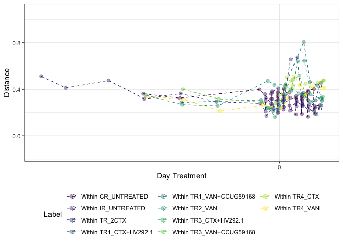<!-- -->

```r
tmp_plot_corrected %>% 
  export::graph2ppt(append = TRUE,
                    file = file.path(here::here("data/processed/figures_NRP72")))
```

```
## Warning in simpleLoess(y, x, w, span, degree = degree, parametric =
## parametric, : span too small. fewer data values than degrees of freedom.
```

```
## Warning in simpleLoess(y, x, w, span, degree = degree, parametric =
## parametric, : pseudoinverse used at -1.04
```

```
## Warning in simpleLoess(y, x, w, span, degree = degree, parametric =
## parametric, : neighborhood radius 5.04
```

```
## Warning in simpleLoess(y, x, w, span, degree = degree, parametric =
## parametric, : reciprocal condition number 0
```

```
## Warning in simpleLoess(y, x, w, span, degree = degree, parametric =
## parametric, : There are other near singularities as well. 9.2416
```

```
## Warning in predLoess(object$y, object$x, newx = if
## (is.null(newdata)) object$x else if (is.data.frame(newdata))
## as.matrix(model.frame(delete.response(terms(object)), : span too small. fewer
## data values than degrees of freedom.
```

```
## Warning in predLoess(object$y, object$x, newx = if
## (is.null(newdata)) object$x else if (is.data.frame(newdata))
## as.matrix(model.frame(delete.response(terms(object)), : pseudoinverse used at
## -1.04
```

```
## Warning in predLoess(object$y, object$x, newx = if
## (is.null(newdata)) object$x else if (is.data.frame(newdata))
## as.matrix(model.frame(delete.response(terms(object)), : neighborhood radius 5.04
```

```
## Warning in predLoess(object$y, object$x, newx = if
## (is.null(newdata)) object$x else if (is.data.frame(newdata))
## as.matrix(model.frame(delete.response(terms(object)), : reciprocal condition
## number 0
```

```
## Warning in predLoess(object$y, object$x, newx = if
## (is.null(newdata)) object$x else if (is.data.frame(newdata))
## as.matrix(model.frame(delete.response(terms(object)), : There are other near
## singularities as well. 9.2416
```

```
## Warning in simpleLoess(y, x, w, span, degree = degree, parametric =
## parametric, : pseudoinverse used at 2
```

```
## Warning in simpleLoess(y, x, w, span, degree = degree, parametric =
## parametric, : neighborhood radius 2
```

```
## Warning in simpleLoess(y, x, w, span, degree = degree, parametric =
## parametric, : reciprocal condition number 0
```

```
## Warning in simpleLoess(y, x, w, span, degree = degree, parametric =
## parametric, : Chernobyl! trL>n 6

## Warning in simpleLoess(y, x, w, span, degree = degree, parametric =
## parametric, : Chernobyl! trL>n 6
```

```
## Warning in sqrt(sum.squares/one.delta): NaNs produced
```

```
## Warning in predLoess(object$y, object$x, newx = if
## (is.null(newdata)) object$x else if (is.data.frame(newdata))
## as.matrix(model.frame(delete.response(terms(object)), : pseudoinverse used at 2
```

```
## Warning in predLoess(object$y, object$x, newx = if
## (is.null(newdata)) object$x else if (is.data.frame(newdata))
## as.matrix(model.frame(delete.response(terms(object)), : neighborhood radius 2
```

```
## Warning in predLoess(object$y, object$x, newx = if
## (is.null(newdata)) object$x else if (is.data.frame(newdata))
## as.matrix(model.frame(delete.response(terms(object)), : reciprocal condition
## number 0
```

```
## Warning in stats::qt(level/2 + 0.5, pred$df): NaNs produced
```

```
## Warning in max(ids, na.rm = TRUE): no non-missing arguments to max; returning -
## Inf

## Warning in max(ids, na.rm = TRUE): no non-missing arguments to max; returning -
## Inf
```

```r
tmp_plot <- t$wjaccard + facet_null()

tmp_plot$data %>% 
  correct_plot_x_continious(.) -> tmp_plot_corrected

tmp_plot_corrected
```

```
## Warning in simpleLoess(y, x, w, span, degree = degree, parametric =
## parametric, : span too small. fewer data values than degrees of freedom.
```

```
## Warning in simpleLoess(y, x, w, span, degree = degree, parametric =
## parametric, : pseudoinverse used at -1.04
```

```
## Warning in simpleLoess(y, x, w, span, degree = degree, parametric =
## parametric, : neighborhood radius 5.04
```

```
## Warning in simpleLoess(y, x, w, span, degree = degree, parametric =
## parametric, : reciprocal condition number 0
```

```
## Warning in simpleLoess(y, x, w, span, degree = degree, parametric =
## parametric, : There are other near singularities as well. 9.2416
```

```
## Warning in predLoess(object$y, object$x, newx = if
## (is.null(newdata)) object$x else if (is.data.frame(newdata))
## as.matrix(model.frame(delete.response(terms(object)), : span too small. fewer
## data values than degrees of freedom.
```

```
## Warning in predLoess(object$y, object$x, newx = if
## (is.null(newdata)) object$x else if (is.data.frame(newdata))
## as.matrix(model.frame(delete.response(terms(object)), : pseudoinverse used at
## -1.04
```

```
## Warning in predLoess(object$y, object$x, newx = if
## (is.null(newdata)) object$x else if (is.data.frame(newdata))
## as.matrix(model.frame(delete.response(terms(object)), : neighborhood radius 5.04
```

```
## Warning in predLoess(object$y, object$x, newx = if
## (is.null(newdata)) object$x else if (is.data.frame(newdata))
## as.matrix(model.frame(delete.response(terms(object)), : reciprocal condition
## number 0
```

```
## Warning in predLoess(object$y, object$x, newx = if
## (is.null(newdata)) object$x else if (is.data.frame(newdata))
## as.matrix(model.frame(delete.response(terms(object)), : There are other near
## singularities as well. 9.2416
```

```
## Warning in simpleLoess(y, x, w, span, degree = degree, parametric =
## parametric, : pseudoinverse used at 2
```

```
## Warning in simpleLoess(y, x, w, span, degree = degree, parametric =
## parametric, : neighborhood radius 2
```

```
## Warning in simpleLoess(y, x, w, span, degree = degree, parametric =
## parametric, : reciprocal condition number 0
```

```
## Warning in simpleLoess(y, x, w, span, degree = degree, parametric =
## parametric, : Chernobyl! trL>n 6

## Warning in simpleLoess(y, x, w, span, degree = degree, parametric =
## parametric, : Chernobyl! trL>n 6
```

```
## Warning in sqrt(sum.squares/one.delta): NaNs produced
```

```
## Warning in predLoess(object$y, object$x, newx = if
## (is.null(newdata)) object$x else if (is.data.frame(newdata))
## as.matrix(model.frame(delete.response(terms(object)), : pseudoinverse used at 2
```

```
## Warning in predLoess(object$y, object$x, newx = if
## (is.null(newdata)) object$x else if (is.data.frame(newdata))
## as.matrix(model.frame(delete.response(terms(object)), : neighborhood radius 2
```

```
## Warning in predLoess(object$y, object$x, newx = if
## (is.null(newdata)) object$x else if (is.data.frame(newdata))
## as.matrix(model.frame(delete.response(terms(object)), : reciprocal condition
## number 0
```

```
## Warning in stats::qt(level/2 + 0.5, pred$df): NaNs produced
```

```
## Warning in max(ids, na.rm = TRUE): no non-missing arguments to max; returning -
## Inf

## Warning in max(ids, na.rm = TRUE): no non-missing arguments to max; returning -
## Inf
```

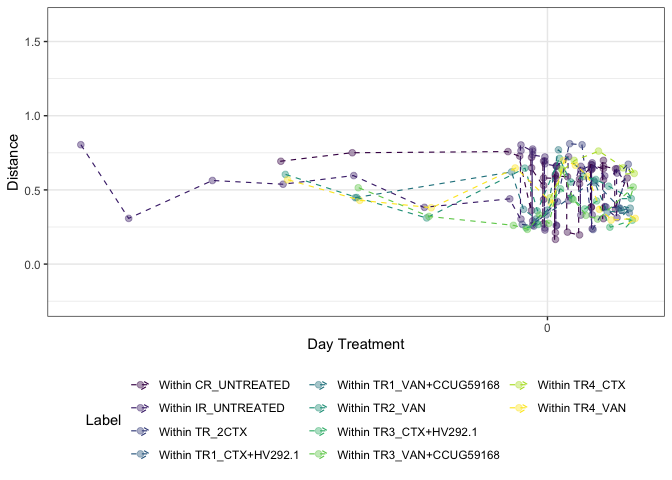<!-- -->

```r
tmp_plot_corrected %>% 
  export::graph2ppt(append = TRUE,
                    file = file.path(here::here("data/processed/figures_NRP72")))
```

```
## Warning in simpleLoess(y, x, w, span, degree = degree, parametric =
## parametric, : span too small. fewer data values than degrees of freedom.
```

```
## Warning in simpleLoess(y, x, w, span, degree = degree, parametric =
## parametric, : pseudoinverse used at -1.04
```

```
## Warning in simpleLoess(y, x, w, span, degree = degree, parametric =
## parametric, : neighborhood radius 5.04
```

```
## Warning in simpleLoess(y, x, w, span, degree = degree, parametric =
## parametric, : reciprocal condition number 0
```

```
## Warning in simpleLoess(y, x, w, span, degree = degree, parametric =
## parametric, : There are other near singularities as well. 9.2416
```

```
## Warning in predLoess(object$y, object$x, newx = if
## (is.null(newdata)) object$x else if (is.data.frame(newdata))
## as.matrix(model.frame(delete.response(terms(object)), : span too small. fewer
## data values than degrees of freedom.
```

```
## Warning in predLoess(object$y, object$x, newx = if
## (is.null(newdata)) object$x else if (is.data.frame(newdata))
## as.matrix(model.frame(delete.response(terms(object)), : pseudoinverse used at
## -1.04
```

```
## Warning in predLoess(object$y, object$x, newx = if
## (is.null(newdata)) object$x else if (is.data.frame(newdata))
## as.matrix(model.frame(delete.response(terms(object)), : neighborhood radius 5.04
```

```
## Warning in predLoess(object$y, object$x, newx = if
## (is.null(newdata)) object$x else if (is.data.frame(newdata))
## as.matrix(model.frame(delete.response(terms(object)), : reciprocal condition
## number 0
```

```
## Warning in predLoess(object$y, object$x, newx = if
## (is.null(newdata)) object$x else if (is.data.frame(newdata))
## as.matrix(model.frame(delete.response(terms(object)), : There are other near
## singularities as well. 9.2416
```

```
## Warning in simpleLoess(y, x, w, span, degree = degree, parametric =
## parametric, : pseudoinverse used at 2
```

```
## Warning in simpleLoess(y, x, w, span, degree = degree, parametric =
## parametric, : neighborhood radius 2
```

```
## Warning in simpleLoess(y, x, w, span, degree = degree, parametric =
## parametric, : reciprocal condition number 0
```

```
## Warning in simpleLoess(y, x, w, span, degree = degree, parametric =
## parametric, : Chernobyl! trL>n 6

## Warning in simpleLoess(y, x, w, span, degree = degree, parametric =
## parametric, : Chernobyl! trL>n 6
```

```
## Warning in sqrt(sum.squares/one.delta): NaNs produced
```

```
## Warning in predLoess(object$y, object$x, newx = if
## (is.null(newdata)) object$x else if (is.data.frame(newdata))
## as.matrix(model.frame(delete.response(terms(object)), : pseudoinverse used at 2
```

```
## Warning in predLoess(object$y, object$x, newx = if
## (is.null(newdata)) object$x else if (is.data.frame(newdata))
## as.matrix(model.frame(delete.response(terms(object)), : neighborhood radius 2
```

```
## Warning in predLoess(object$y, object$x, newx = if
## (is.null(newdata)) object$x else if (is.data.frame(newdata))
## as.matrix(model.frame(delete.response(terms(object)), : reciprocal condition
## number 0
```

```
## Warning in stats::qt(level/2 + 0.5, pred$df): NaNs produced
```

```
## Warning in max(ids, na.rm = TRUE): no non-missing arguments to max; returning -
## Inf

## Warning in max(ids, na.rm = TRUE): no non-missing arguments to max; returning -
## Inf
```

```r
tmp_plot <- t$coda + facet_null()

tmp_plot$data %>% 
  correct_plot_x_continious(.) -> tmp_plot_corrected

tmp_plot_corrected
```

```
## Warning in simpleLoess(y, x, w, span, degree = degree, parametric =
## parametric, : span too small. fewer data values than degrees of freedom.
```

```
## Warning in simpleLoess(y, x, w, span, degree = degree, parametric =
## parametric, : pseudoinverse used at -1.04
```

```
## Warning in simpleLoess(y, x, w, span, degree = degree, parametric =
## parametric, : neighborhood radius 5.04
```

```
## Warning in simpleLoess(y, x, w, span, degree = degree, parametric =
## parametric, : reciprocal condition number 0
```

```
## Warning in simpleLoess(y, x, w, span, degree = degree, parametric =
## parametric, : There are other near singularities as well. 9.2416
```

```
## Warning in predLoess(object$y, object$x, newx = if
## (is.null(newdata)) object$x else if (is.data.frame(newdata))
## as.matrix(model.frame(delete.response(terms(object)), : span too small. fewer
## data values than degrees of freedom.
```

```
## Warning in predLoess(object$y, object$x, newx = if
## (is.null(newdata)) object$x else if (is.data.frame(newdata))
## as.matrix(model.frame(delete.response(terms(object)), : pseudoinverse used at
## -1.04
```

```
## Warning in predLoess(object$y, object$x, newx = if
## (is.null(newdata)) object$x else if (is.data.frame(newdata))
## as.matrix(model.frame(delete.response(terms(object)), : neighborhood radius 5.04
```

```
## Warning in predLoess(object$y, object$x, newx = if
## (is.null(newdata)) object$x else if (is.data.frame(newdata))
## as.matrix(model.frame(delete.response(terms(object)), : reciprocal condition
## number 0
```

```
## Warning in predLoess(object$y, object$x, newx = if
## (is.null(newdata)) object$x else if (is.data.frame(newdata))
## as.matrix(model.frame(delete.response(terms(object)), : There are other near
## singularities as well. 9.2416
```

```
## Warning in simpleLoess(y, x, w, span, degree = degree, parametric =
## parametric, : pseudoinverse used at 2
```

```
## Warning in simpleLoess(y, x, w, span, degree = degree, parametric =
## parametric, : neighborhood radius 2
```

```
## Warning in simpleLoess(y, x, w, span, degree = degree, parametric =
## parametric, : reciprocal condition number 0
```

```
## Warning in simpleLoess(y, x, w, span, degree = degree, parametric =
## parametric, : Chernobyl! trL>n 6

## Warning in simpleLoess(y, x, w, span, degree = degree, parametric =
## parametric, : Chernobyl! trL>n 6
```

```
## Warning in sqrt(sum.squares/one.delta): NaNs produced
```

```
## Warning in predLoess(object$y, object$x, newx = if
## (is.null(newdata)) object$x else if (is.data.frame(newdata))
## as.matrix(model.frame(delete.response(terms(object)), : pseudoinverse used at 2
```

```
## Warning in predLoess(object$y, object$x, newx = if
## (is.null(newdata)) object$x else if (is.data.frame(newdata))
## as.matrix(model.frame(delete.response(terms(object)), : neighborhood radius 2
```

```
## Warning in predLoess(object$y, object$x, newx = if
## (is.null(newdata)) object$x else if (is.data.frame(newdata))
## as.matrix(model.frame(delete.response(terms(object)), : reciprocal condition
## number 0
```

```
## Warning in stats::qt(level/2 + 0.5, pred$df): NaNs produced
```

```
## Warning in max(ids, na.rm = TRUE): no non-missing arguments to max; returning -
## Inf

## Warning in max(ids, na.rm = TRUE): no non-missing arguments to max; returning -
## Inf
```

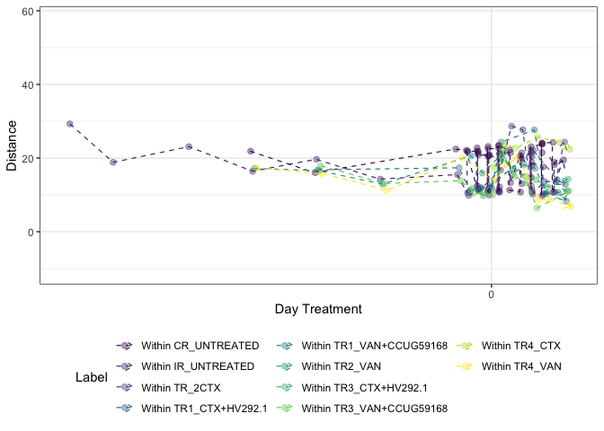<!-- -->

```r
tmp_plot_corrected %>% 
  export::graph2ppt(append = TRUE,
                    file = file.path(here::here("data/processed/figures_NRP72")))
```

```
## Warning in simpleLoess(y, x, w, span, degree = degree, parametric =
## parametric, : span too small. fewer data values than degrees of freedom.
```

```
## Warning in simpleLoess(y, x, w, span, degree = degree, parametric =
## parametric, : pseudoinverse used at -1.04
```

```
## Warning in simpleLoess(y, x, w, span, degree = degree, parametric =
## parametric, : neighborhood radius 5.04
```

```
## Warning in simpleLoess(y, x, w, span, degree = degree, parametric =
## parametric, : reciprocal condition number 0
```

```
## Warning in simpleLoess(y, x, w, span, degree = degree, parametric =
## parametric, : There are other near singularities as well. 9.2416
```

```
## Warning in predLoess(object$y, object$x, newx = if
## (is.null(newdata)) object$x else if (is.data.frame(newdata))
## as.matrix(model.frame(delete.response(terms(object)), : span too small. fewer
## data values than degrees of freedom.
```

```
## Warning in predLoess(object$y, object$x, newx = if
## (is.null(newdata)) object$x else if (is.data.frame(newdata))
## as.matrix(model.frame(delete.response(terms(object)), : pseudoinverse used at
## -1.04
```

```
## Warning in predLoess(object$y, object$x, newx = if
## (is.null(newdata)) object$x else if (is.data.frame(newdata))
## as.matrix(model.frame(delete.response(terms(object)), : neighborhood radius 5.04
```

```
## Warning in predLoess(object$y, object$x, newx = if
## (is.null(newdata)) object$x else if (is.data.frame(newdata))
## as.matrix(model.frame(delete.response(terms(object)), : reciprocal condition
## number 0
```

```
## Warning in predLoess(object$y, object$x, newx = if
## (is.null(newdata)) object$x else if (is.data.frame(newdata))
## as.matrix(model.frame(delete.response(terms(object)), : There are other near
## singularities as well. 9.2416
```

```
## Warning in simpleLoess(y, x, w, span, degree = degree, parametric =
## parametric, : pseudoinverse used at 2
```

```
## Warning in simpleLoess(y, x, w, span, degree = degree, parametric =
## parametric, : neighborhood radius 2
```

```
## Warning in simpleLoess(y, x, w, span, degree = degree, parametric =
## parametric, : reciprocal condition number 0
```

```
## Warning in simpleLoess(y, x, w, span, degree = degree, parametric =
## parametric, : Chernobyl! trL>n 6

## Warning in simpleLoess(y, x, w, span, degree = degree, parametric =
## parametric, : Chernobyl! trL>n 6
```

```
## Warning in sqrt(sum.squares/one.delta): NaNs produced
```

```
## Warning in predLoess(object$y, object$x, newx = if
## (is.null(newdata)) object$x else if (is.data.frame(newdata))
## as.matrix(model.frame(delete.response(terms(object)), : pseudoinverse used at 2
```

```
## Warning in predLoess(object$y, object$x, newx = if
## (is.null(newdata)) object$x else if (is.data.frame(newdata))
## as.matrix(model.frame(delete.response(terms(object)), : neighborhood radius 2
```

```
## Warning in predLoess(object$y, object$x, newx = if
## (is.null(newdata)) object$x else if (is.data.frame(newdata))
## as.matrix(model.frame(delete.response(terms(object)), : reciprocal condition
## number 0
```

```
## Warning in stats::qt(level/2 + 0.5, pred$df): NaNs produced
```

```
## Warning in max(ids, na.rm = TRUE): no non-missing arguments to max; returning -
## Inf

## Warning in max(ids, na.rm = TRUE): no non-missing arguments to max; returning -
## Inf
```


```r
phyloseq_plot_beta_div_wrt_timepoint(distances = c("coda","bjaccard", "wjaccard"),
                                     bdiv_list = bdiv_list,
                                     physeq = physeq_rare,
                                     timepoint = "between.ref.group",
                                     group_var = "Reactor_Treatment",
                                     time_var = "Day_of_Treatment",
                                     group_to_compare = "CR_UNTREATED") -> t
tmp_plot<- t$bjaccard + facet_null()

tmp_plot$data %>% 
  correct_plot_x_continious(.) + guides(col = guide_legend(ncol = 2)) -> tmp_plot_corrected

tmp_plot_corrected
```

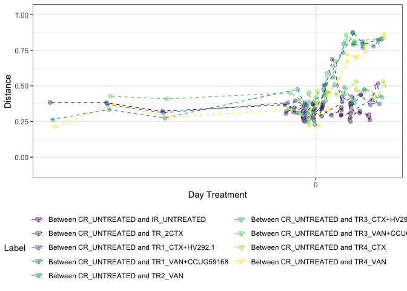<!-- -->

```r
tmp_plot_corrected %>% 
  export::graph2ppt(append = TRUE,
                    file = file.path(here::here("data/processed/figures_NRP72")))
```

```r
tmp_plot <- t$wjaccard + facet_null()

tmp_plot$data %>% 
  correct_plot_x_continious(.) + guides(col = guide_legend(ncol = 2)) -> tmp_plot_corrected

tmp_plot_corrected
```

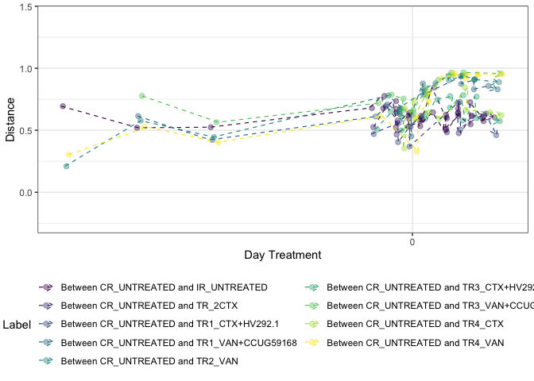<!-- -->

```r
tmp_plot_corrected %>% 
  export::graph2ppt(append = TRUE,
                    file = file.path(here::here("data/processed/figures_NRP72")))
```


```r
tmp_plot <- t$coda + facet_null()

tmp_plot$data %>% 
  correct_plot_x_continious(.) + guides(col = guide_legend(ncol = 2)) -> tmp_plot_corrected

tmp_plot_corrected
```

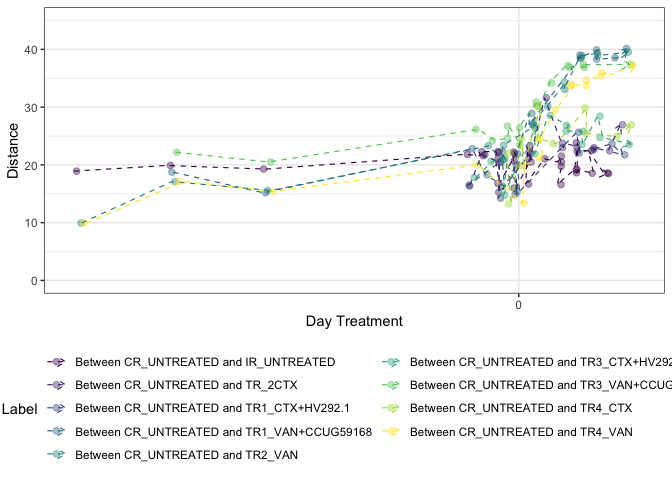<!-- -->

```r
tmp_plot_corrected %>% 
  export::graph2ppt(append = TRUE,
                    file = file.path(here::here("data/processed/figures_NRP72")))
```


```r
sessionInfo()
```

```
## R version 4.0.2 (2020-06-22)
## Platform: x86_64-apple-darwin17.0 (64-bit)
## Running under: macOS High Sierra 10.13.6
## 
## Matrix products: default
## BLAS:   /Library/Frameworks/R.framework/Versions/4.0/Resources/lib/libRblas.dylib
## LAPACK: /Library/Frameworks/R.framework/Versions/4.0/Resources/lib/libRlapack.dylib
## 
## locale:
## [1] en_US.UTF-8/en_US.UTF-8/en_US.UTF-8/C/en_US.UTF-8/en_US.UTF-8
## 
## attached base packages:
## [1] stats     graphics  grDevices utils     datasets  methods   base     
## 
## other attached packages:
##  [1] gdtools_0.2.2        usedist_0.4.0.9000   GUniFrac_1.1        
##  [4] matrixStats_0.58.0   vegan_2.5-7          lattice_0.20-41     
##  [7] permute_0.9-5        ape_5.4-1            reshape2_1.4.4      
## [10] scales_1.1.1         here_1.0.1           microbiome_1.10.0   
## [13] plotly_4.9.2.1       ampvis2_2.6.5        ggrepel_0.8.2       
## [16] speedyseq_0.5.0      phyloseq_1.34.0      forcats_0.5.0       
## [19] stringr_1.4.0        dplyr_1.0.4          purrr_0.3.4         
## [22] readr_1.4.0          tidyr_1.1.2          tibble_3.0.6        
## [25] ggplot2_3.3.3        tidyverse_1.3.0.9000
## 
## loaded via a namespace (and not attached):
##   [1] readxl_1.3.1            uuid_0.1-4              backports_1.2.1        
##   [4] systemfonts_0.3.2       plyr_1.8.6              igraph_1.2.6           
##   [7] lazyeval_0.2.2          splines_4.0.2           crosstalk_1.1.0.1      
##  [10] digest_0.6.27           foreach_1.5.1           htmltools_0.5.1.1      
##  [13] magrittr_2.0.1          cluster_2.1.0           doParallel_1.0.16      
##  [16] openxlsx_4.2.3          Biostrings_2.56.0       modelr_0.1.8           
##  [19] officer_0.3.14          prettyunits_1.1.1       colorspace_2.0-0       
##  [22] blob_1.2.1              rvest_0.3.6             haven_2.3.1            
##  [25] xfun_0.21               crayon_1.4.1            jsonlite_1.7.2         
##  [28] survival_3.2-3          iterators_1.0.13        glue_1.4.2             
##  [31] rvg_0.2.5               gtable_0.3.0            zlibbioc_1.34.0        
##  [34] XVector_0.28.0          webshot_0.5.2           Rhdf5lib_1.10.1        
##  [37] BiocGenerics_0.34.0     DBI_1.1.1               miniUI_0.1.1.1         
##  [40] Rcpp_1.0.6              xtable_1.8-4            viridisLite_0.3.0      
##  [43] progress_1.2.2          stats4_4.0.2            DT_0.15                
##  [46] truncnorm_1.0-8         htmlwidgets_1.5.3       httr_1.4.2             
##  [49] RColorBrewer_1.1-2      ellipsis_0.3.1          pkgconfig_2.0.3        
##  [52] NADA_1.6-1.1            farver_2.0.3            dbplyr_1.4.4           
##  [55] manipulateWidget_0.10.1 later_1.1.0.1           tidyselect_1.1.0       
##  [58] labeling_0.4.2          rlang_0.4.10            munsell_0.5.0          
##  [61] cellranger_1.1.0        tools_4.0.2             cli_2.3.0              
##  [64] generics_0.1.0          devEMF_4.0-2            ade4_1.7-16            
##  [67] export_0.3.0            broom_0.7.2             fastmap_1.1.0          
##  [70] evaluate_0.14           biomformat_1.7.0        yaml_2.2.1             
##  [73] knitr_1.31              fs_1.5.0                zip_2.1.1              
##  [76] rgl_0.100.54            nlme_3.1-149            mime_0.10              
##  [79] xml2_1.3.2              compiler_4.0.2          rstudioapi_0.13        
##  [82] zCompositions_1.3.4     reprex_0.3.0            stringi_1.5.3          
##  [85] highr_0.8               stargazer_5.2.2         Matrix_1.2-18          
##  [88] multtest_2.44.0         vctrs_0.3.6             pillar_1.4.7           
##  [91] lifecycle_1.0.0         data.table_1.13.6       flextable_0.5.11       
##  [94] httpuv_1.5.4            patchwork_1.1.0         R6_2.5.0               
##  [97] promises_1.1.1          network_1.16.0          IRanges_2.22.2         
## [100] codetools_0.2-16        ggnet_0.1.0             MASS_7.3-52            
## [103] assertthat_0.2.1        rhdf5_2.32.4            rprojroot_2.0.2        
## [106] withr_2.4.1             S4Vectors_0.26.1        mgcv_1.8-32            
## [109] parallel_4.0.2          hms_1.0.0               grid_4.0.2             
## [112] rmarkdown_2.4           Cairo_1.5-12.2          Rtsne_0.15             
## [115] shiny_1.5.0             Biobase_2.50.0          lubridate_1.7.9        
## [118] base64enc_0.1-3
```

