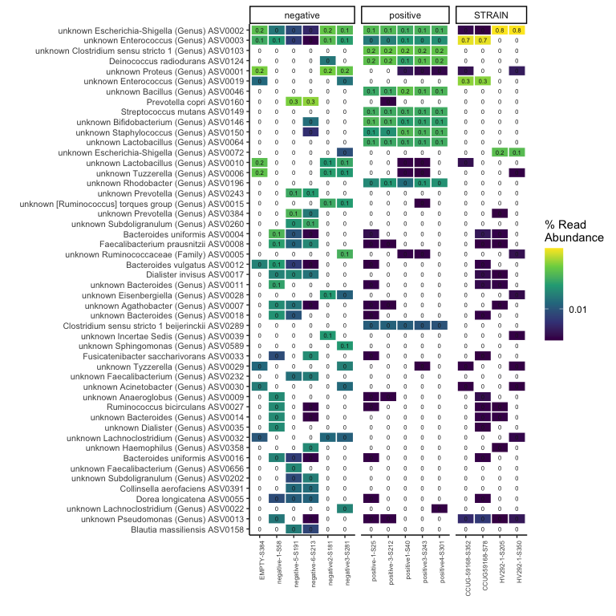
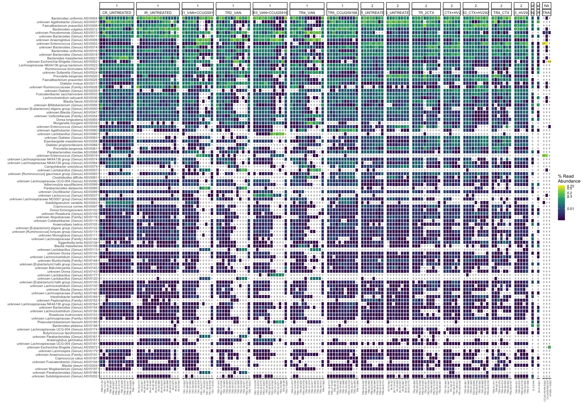
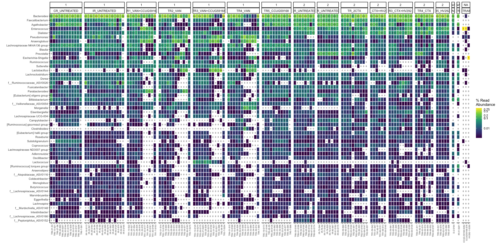
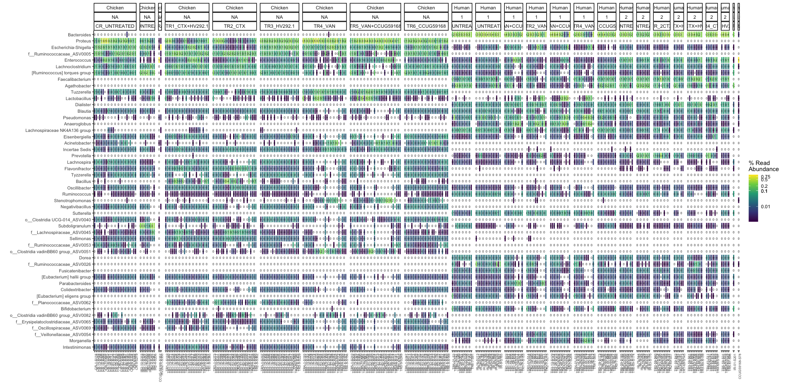
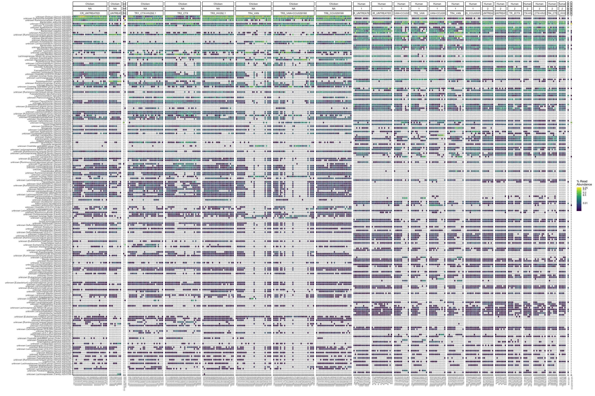

#### Load required packages


```r
library(tidyverse)
library(phyloseq)
library(speedyseq)
library(ggrepel)
library(ampvis2)
library(plotly)
library(microbiome)
library(here)
options(getClass.msg=FALSE) # https://github.com/epurdom/clusterExperiment/issues/66
#this fixes an error message that pops up because the class 'Annotated' is defined in two different packages
```

#### Source required functions


```r
'%!in%' <- function(x,y)!('%in%'(x,y))

source("https://raw.githubusercontent.com/fconstancias/DivComAnalyses/master/R/phyloseq_taxa_tests.R")
source("https://raw.githubusercontent.com/fconstancias/DivComAnalyses/master/R/phyloseq_normalisation.R")
source("https://raw.githubusercontent.com/fconstancias/DivComAnalyses/master/R/phyloseq_alpha.R")
source("https://raw.githubusercontent.com/fconstancias/DivComAnalyses/master/R/phyloseq_beta.R")
source("https://raw.githubusercontent.com/fconstancias/DivComAnalyses/master/R/phyloseq_heatmap.R")
```


```r
plot_time <- function(df, 
                      measure,
                      x = "Day_from_Inoculum", 
                      y = "value", 
                      shape = "neg",
                      fill = "Reactor_Treatment",
                      group = "Reactor_Treatment", 
                      point_size=0.5,
                      facet,
                      smooth = FALSE)
{
  df %>%
    dplyr::filter(alphadiversiy %in% measure) %>%
    dplyr::mutate(alphadiversiy = fct_reorder(alphadiversiy, value, .desc = TRUE)) %>%
    dplyr::mutate(neg = ifelse(value == 0, "neg", "pos")) %>%
    arrange(Day_from_Inoculum) %>%
    ggplot(aes_string(x = x,
                      y = y)) +
    geom_jitter(alpha=0.9, size = point_size, aes_string(color = fill, fill = fill, shape = shape),  show.legend = TRUE) + 
    geom_path(inherit.aes = TRUE, aes_string(fill = fill, color = fill, show.legend = FALSE),
              size = 0.01,
              linetype = "dashed") +
    facet_grid(as.formula(facet), scales = "free") +
    geom_vline(xintercept = c(0),
               color="black", alpha=0.4) + theme_light() -> plot
  
  if(smooth == TRUE) 
  {
    plot +
      geom_smooth(show.legend = FALSE, level = 0.95, alpha=0.005, size = 0.5 ,aes_string(color = fill, fill = fill))  -> plot
  }
  # scale_y_continuous(labels = scientific,
  #                    limits=c(1e+10, 1e+11), breaks = seq(1e+10, 1e+11, by = 1e+10),
  #                    trans = "log10") +
  
  
  return(plot + theme(legend.position = "bottom"))
}
```

# Inspection of strains:


```r
ps = "data/raw/metabarcoding/ps_silva_dada2_human_chicken_meta.RDS"

ps %>% 
  here::here() %>%
  readRDS() %>%
  phyloseq_get_strains_fast() %>% 
  filter_taxa(function(x) sum(x > 0) > 0, TRUE) %>% 
  prune_samples(sample_sums(.)>= 100, .) %>% # only keep samples with at least 100 seqs.
  subset_samples(Reactor %in% c("STRAIN", "negative", "positive"))  %>% 
  # subset_samples(Experiment == "CCUG59168" |  Experiment ==  "HV292.1" | Experiment ==  "Cecum" |  Experiment ==  "Continuous" & Reactor %in% c("IR1", "CR")) %>%
  # rarefy_even_depth(sample.size = 2574,rngseed = 123) %>%
  phyloseq_ampvis_heatmap(transform = "compositional",
                          group_by = "SampleID",
                          facet_by = c("Fermentation", "Enrichment", "Reactor", "Reactor_Treatment"),
                          tax_aggregate = "Species",
                          tax_add = NULL,
                          ntax  = 50) -> p
```

```
## Joining, by = "ASV"
```

```r
p$data %>% 
  mutate(Abundance = na_if(Abundance, 0)) -> p$data 


p + facet_grid( ~ Reactor , scales = "free", space = "free") + 
  scale_fill_viridis_c(breaks = c(0,  0.01, 1, 10, 50, 75, 100), 
                       labels = c(0,  0.01, 1, 10, 50, 75, 100), 
                       trans = scales::pseudo_log_trans(sigma = 0.001),
                       na.value = 'transparent') -> p2
```

```
## Scale for 'fill' is already present. Adding another scale for 'fill', which
## will replace the existing scale.
```

```r
p2
```

<!-- -->

```r
# p2 %>% 
  # export::graph2ppt(append = TRUE,
  #                   file = file.path(here::here("data/processed/figures_NRP72")))
```


# Import phyloseq object


```r
ps = "data/raw/metabarcoding/ps_silva_dada2_human_chicken_meta.RDS"

ps %>% 
  here::here() %>%
  readRDS() %>%
  phyloseq_get_strains_fast() %>% 
  filter_taxa(function(x) sum(x > 0) > 0, TRUE) %>% 
  subset_samples(Enrichment == "NotEnriched") -> physeq
```

```
## Joining, by = "ASV"
```

```r
physeq
```

```
## phyloseq-class experiment-level object
## otu_table()   OTU Table:          [ 1110 taxa and 414 samples ]:
## sample_data() Sample Data:        [ 414 samples by 59 sample variables ]:
## tax_table()   Taxonomy Table:     [ 1110 taxa by 8 taxonomic ranks ]:
## phy_tree()    Phylogenetic Tree:  [ 1110 tips and 1109 internal nodes ]:
## refseq()      DNAStringSet     :      [ 1110 reference sequences ]
## taxa are rows
```

```r
physeq %>% 
  sample_data() %>% 
  data.frame() %>% 
  DT::datatable()
```

<!--html_preserve--><div id="htmlwidget-7796165bea14b8198b8e" style="width:100%;height:auto;" class="datatables html-widget"></div>
<script type="application/json" data-for="htmlwidget-7796165bea14b8198b8e">{"x":{"filter":"none","data":[["CCUG-59168-S352","CR-1-S116","CR-10-S245","CR-13-S148","CR-14-S336","CR-15-S292","CR-16-S332","CR-17-S97","CR-18-S252","CR-19-S341","CR-20-S111","CR-21-S126","CR-22-S311","CR-25-S383","CR-28-S106","CR-3-S98","CR-31-S334","CR-34-S359","CR-37-S367","CR-40-S166","CR-46-S191","CR-52-S196","CR-58-S382","CR-6-S169","CR-64-S324","CR-7-S125","CR-8-S94","CR-9-S219","D-0-S154","EMPTY-S384","HV292-1-S350","IR2-10-S315","IR2-11-S108","IR2-12-S251","IR2-16-S100","IR2-17-S86","IR2-18-S135","IR2-2-S291","IR2-3-S347","IR2-4-S206","negativ-S80","negative2-S181","negative3-S281","negative4-S373","positive1-S40","Positive2-S163","positive3-S243","positive4-S301","TR1-1-S110","TR1-10-S380","TR1-13-S171","TR1-14-S274","TR1-15-S168","TR1-16-S199","TR1-17-S246","TR1-18-S124","TR1-19-S305","TR1-20-S118","TR1-21-S207","TR1-22-S282","TR1-25-S117","TR1-28-S289","TR1-3-S121","TR1-31-S153","TR1-33-S375","TR1-34-S317","TR1-37-S306","TR1-40-S209","TR1-46-S170","TR1-52-S253","TR1-58-S275","TR1-6-S203","TR1-64-S263","TR1-7-S258","TR1-8-S321","TR1-9-S345","TR2-1-S273","TR2-10-S177","TR2-13-S231","TR2-14-S232","TR2-15-S288","TR2-16-S184","TR2-17-S248","TR2-18-S326","TR2-19-S318","TR2-20-S271","TR2-21-S228","TR2-22-S364","TR2-25-S133","TR2-28-S286","TR2-3-S297","TR2-31-S182","TR2-34-S302","TR2-37-S330","TR2-40-S259","TR2-46-S239","TR2-52-S230","TR2-58-S172","TR2-6-S261","TR2-64-S216","TR2-7-S299","TR2-8-S360","TR2-9-S362","TR3-1-S237","TR3-10-S139","TR3-13-S304","TR3-14-S136","TR3-15-S338","TR3-16-S296","TR3-17-S222","TR3-18-S293","TR3-19-S266","TR3-20-S265","TR3-21-S234","TR3-22-S235","TR3-25-S102","TR3-28-S162","TR3-3-S179","TR3-31-S283","TR3-34-S354","TR3-37-S221","TR3-40-S257","TR3-46-S224","TR3-52-S217","TR3-58-S233","TR3-6-S85","TR3-64-S190","TR3-7-S165","TR3-8-S303","TR3-9-S229","TR4-1-S193","TR4-10-S161","TR4-13-S142","TR4-14-S226","TR4-15-S218","TR4-16-S276","TR4-17-S114","TR4-18-S200","TR4-19-S270","TR4-20-S269","TR4-21-S254","TR4-22-S344","TR4-25-S333","TR4-28-S183","TR4-3-S309","TR4-31-S278","TR4-34-S342","TR4-37-S188","TR4-40-S242","TR4-46-S215","TR4-52-S95","TR4-58-S112","TR4-6-S225","TR4-64-S220","TR4-7-S192","TR4-8-S327","TR4-9-S156","TR5-1-S210","TR5-10-S204","TR5-13-S103","TR5-14-S267","TR5-15-S358","TR5-16-S290","TR5-17-S82","TR5-18-S201","TR5-19-S87","TR5-20-S208","TR5-21-S185","TR5-22-S145","TR5-25-S240","TR5-28-S214","TR5-3-S331","TR5-31-S313","TR5-34-S127","TR5-37-S368","TR5-40-S335","TR5-46-S310","TR5-52-S93","TR5-56-S241","TR5-57-S348","TR5-58-S372","TR5-59-S374","TR5-6-S131","TR5-64-S141","TR5-7-S213","TR5-8-S92","TR5-9-S249","TR6-1-S247","TR6-10-S212","TR6-13-S164","TR6-14-S211","TR6-15-S149","TR6-16-S371","TR6-17-S138","TR6-18-S262","TR6-19-S137","TR6-20-S132","TR6-21-S107","TR6-22-S152","TR6-25-S378","TR6-28-S158","TR6-3-S236","TR6-31-S272","TR6-34-S143","TR6-37-S312","TR6-40-S160","TR6-46-S176","TR6-52-S122","TR6-58-S361","TR6-6-S277","TR6-64-S146","TR6-7-S325","TR6-8-S300","TR6-9-S189","CCUG59168-S78","D-1-S49","D-2-S164","IR-01-S201","IR-13-S103","IR-16-S113","IR-22-S41","IR-28-S184","IR-34-S4","IR-41-S106","IR-42-S9","IR-43-S162","IR-44-S89","IR-45-S216","IR-46-S126","IR-47-S63","IR-48-S98","IR-49-S125","IR-5-S70","IR-50-S81","IR-51-S157","IR-74-S188","IR-75-S44","IR-76-S2","IR-77-S163","IR-78-S29","IR-79-S167","IR-80-S67","IR-81-S182","IR-82-S143","IR-83-S170","IR-84-S178","IR-9-S165","negative-1-S58","Negative-2-S104","negative-4-S189","negative-5-S191","negative-6-S213","Negative-7-S223","Negative-8-S224","positive-1-S25","positive-2-S181","positive-3-S212","SLURRY-S110","TR1-01-S102","TR1-13-S22","TR1-19-S116","TR1-26-S27","TR1-27-S54","TR1-28-S35","TR1-29-S18","TR1-30-S76","TR1-31-S109","TR1-32-S111","TR1-33-S177","TR1-34-S34","TR1-35-S161","TR1-36-S198","TR1-59-S42","TR1-60-S114","TR1-61-S47","TR1-62-S7","TR1-63-S100","TR1-64-S120","TR1-65-S128","TR1-66-S151","TR1-67-S133","TR1-68-S13","TR1-69-S145","TR1-7-S153","TR2-01-S14","TR2-13-S156","TR2-19-S40","TR2-26-S87","TR2-27-S59","TR2-28-S64","TR2-29-S117","TR2-30-S73","TR2-31-S32","TR2-32-S90","TR2-33-S30","TR2-34-S71","TR2-35-S131","TR2-36-S183","TR2-59-S60","TR2-60-S79","TR2-61-S196","TR2-62-S97","TR2-63-S160","TR2-64-S51","TR2-65-S158","TR2-66-S93","TR2-67-S193","TR2-68-S147","TR2-69-S57","TR2-7-S215","TR3-01-S121","TR3-13-S129","TR3-19-S214","TR3-26-S175","TR3-27-S203","TR3-28-S38","TR3-29-S210","TR3-30-S190","TR3-31-S23","TR3-32-S211","TR3-33-S86","TR3-34-S149","TR3-35-S20","TR3-36-S8","TR3-59-S61","TR3-60-S46","TR3-61-S45","TR3-62-S37","TR3-63-S206","TR3-64-S146","TR3-65-S92","TR3-66-S69","TR3-67-S199","TR3-68-S194","TR3-69-S139","TR3-7-S204","TR4-01-S15","TR4-13-S168","TR4-19-S154","TR4-26-S26","TR4-27-S130","TR4-28-S138","TR4-29-S159","TR4-30-S48","TR4-31-S19","TR4-32-S17","TR4-33-S84","TR4-34-S16","TR4-35-S202","TR4-36-S12","TR4-59-S180","TR4-60-S36","TR4-61-S11","TR4-62-S1","TR4-63-S74","TR4-64-S10","TR4-65-S155","TR4-66-S55","TR4-67-S192","TR4-68-S52","TR4-69-S197","TR4-7-S65","TR5-01-S123","TR5-13-S137","TR5-19-S173","TR5-26-S24","TR5-27-S148","TR5-28-S5","TR5-29-S136","TR5-30-S62","TR5-31-S88","TR5-32-S56","TR5-33-S134","TR5-34-S28","TR5-35-S77","TR5-36-S85","TR5-59-S31","TR5-60-S75","TR5-61-S142","TR5-62-S176","TR5-63-S82","TR5-64-S108","TR5-65-S187","TR5-66-S101","TR5-67-S96","TR5-68-S99","TR5-69-S107","TR5-7-S66","TR6-01-S3","TR6-13-S21","TR6-19-S33","TR6-26-S122","TR6-27-S6","TR6-28-S80","TR6-29-S207","TR6-30-S144","TR6-31-S179","TR6-32-S39","TR6-33-S135","TR6-34-S141","TR6-35-S208","TR6-36-S124","TR6-59-S185","TR6-60-S119","TR6-61-S186","TR6-62-S50","TR6-63-S195","TR6-64-S105","TR6-65-S94","TR6-66-S132","TR6-67-S140","TR6-68-S127","TR6-69-S174","TR6-7-S91"],["CCUG-59168-S352","CR-1-S116","CR-10-S245","CR-13-S148","CR-14-S336","CR-15-S292","CR-16-S332","CR-17-S97","CR-18-S252","CR-19-S341","CR-20-S111","CR-21-S126","CR-22-S311","CR-25-S383","CR-28-S106","CR-3-S98","CR-31-S334","CR-34-S359","CR-37-S367","CR-40-S166","CR-46-S191","CR-52-S196","CR-58-S382","CR-6-S169","CR-64-S324","CR-7-S125","CR-8-S94","CR-9-S219","D-0-S154","EMPTY-S384","HV292-1-S350","IR2-10-S315","IR2-11-S108","IR2-12-S251","IR2-16-S100","IR2-17-S86","IR2-18-S135","IR2-2-S291","IR2-3-S347","IR2-4-S206","negativ-S80","negative2-S181","negative3-S281","negative4-S373","positive1-S40","Positive2-S163","positive3-S243","positive4-S301","TR1-1-S110","TR1-10-S380","TR1-13-S171","TR1-14-S274","TR1-15-S168","TR1-16-S199","TR1-17-S246","TR1-18-S124","TR1-19-S305","TR1-20-S118","TR1-21-S207","TR1-22-S282","TR1-25-S117","TR1-28-S289","TR1-3-S121","TR1-31-S153","TR1-33-S375","TR1-34-S317","TR1-37-S306","TR1-40-S209","TR1-46-S170","TR1-52-S253","TR1-58-S275","TR1-6-S203","TR1-64-S263","TR1-7-S258","TR1-8-S321","TR1-9-S345","TR2-1-S273","TR2-10-S177","TR2-13-S231","TR2-14-S232","TR2-15-S288","TR2-16-S184","TR2-17-S248","TR2-18-S326","TR2-19-S318","TR2-20-S271","TR2-21-S228","TR2-22-S364","TR2-25-S133","TR2-28-S286","TR2-3-S297","TR2-31-S182","TR2-34-S302","TR2-37-S330","TR2-40-S259","TR2-46-S239","TR2-52-S230","TR2-58-S172","TR2-6-S261","TR2-64-S216","TR2-7-S299","TR2-8-S360","TR2-9-S362","TR3-1-S237","TR3-10-S139","TR3-13-S304","TR3-14-S136","TR3-15-S338","TR3-16-S296","TR3-17-S222","TR3-18-S293","TR3-19-S266","TR3-20-S265","TR3-21-S234","TR3-22-S235","TR3-25-S102","TR3-28-S162","TR3-3-S179","TR3-31-S283","TR3-34-S354","TR3-37-S221","TR3-40-S257","TR3-46-S224","TR3-52-S217","TR3-58-S233","TR3-6-S85","TR3-64-S190","TR3-7-S165","TR3-8-S303","TR3-9-S229","TR4-1-S193","TR4-10-S161","TR4-13-S142","TR4-14-S226","TR4-15-S218","TR4-16-S276","TR4-17-S114","TR4-18-S200","TR4-19-S270","TR4-20-S269","TR4-21-S254","TR4-22-S344","TR4-25-S333","TR4-28-S183","TR4-3-S309","TR4-31-S278","TR4-34-S342","TR4-37-S188","TR4-40-S242","TR4-46-S215","TR4-52-S95","TR4-58-S112","TR4-6-S225","TR4-64-S220","TR4-7-S192","TR4-8-S327","TR4-9-S156","TR5-1-S210","TR5-10-S204","TR5-13-S103","TR5-14-S267","TR5-15-S358","TR5-16-S290","TR5-17-S82","TR5-18-S201","TR5-19-S87","TR5-20-S208","TR5-21-S185","TR5-22-S145","TR5-25-S240","TR5-28-S214","TR5-3-S331","TR5-31-S313","TR5-34-S127","TR5-37-S368","TR5-40-S335","TR5-46-S310","TR5-52-S93","TR5-56-S241","TR5-57-S348","TR5-58-S372","TR5-59-S374","TR5-6-S131","TR5-64-S141","TR5-7-S213","TR5-8-S92","TR5-9-S249","TR6-1-S247","TR6-10-S212","TR6-13-S164","TR6-14-S211","TR6-15-S149","TR6-16-S371","TR6-17-S138","TR6-18-S262","TR6-19-S137","TR6-20-S132","TR6-21-S107","TR6-22-S152","TR6-25-S378","TR6-28-S158","TR6-3-S236","TR6-31-S272","TR6-34-S143","TR6-37-S312","TR6-40-S160","TR6-46-S176","TR6-52-S122","TR6-58-S361","TR6-6-S277","TR6-64-S146","TR6-7-S325","TR6-8-S300","TR6-9-S189","CCUG59168-S78","D-1-S49","D-2-S164","IR-01-S201","IR-13-S103","IR-16-S113","IR-22-S41","IR-28-S184","IR-34-S4","IR-41-S106","IR-42-S9","IR-43-S162","IR-44-S89","IR-45-S216","IR-46-S126","IR-47-S63","IR-48-S98","IR-49-S125","IR-5-S70","IR-50-S81","IR-51-S157","IR-74-S188","IR-75-S44","IR-76-S2","IR-77-S163","IR-78-S29","IR-79-S167","IR-80-S67","IR-81-S182","IR-82-S143","IR-83-S170","IR-84-S178","IR-9-S165","negative-1-S58","Negative-2-S104","negative-4-S189","negative-5-S191","negative-6-S213","Negative-7-S223","Negative-8-S224","positive-1-S25","positive-2-S181","positive-3-S212","SLURRY-S110","TR1-01-S102","TR1-13-S22","TR1-19-S116","TR1-26-S27","TR1-27-S54","TR1-28-S35","TR1-29-S18","TR1-30-S76","TR1-31-S109","TR1-32-S111","TR1-33-S177","TR1-34-S34","TR1-35-S161","TR1-36-S198","TR1-59-S42","TR1-60-S114","TR1-61-S47","TR1-62-S7","TR1-63-S100","TR1-64-S120","TR1-65-S128","TR1-66-S151","TR1-67-S133","TR1-68-S13","TR1-69-S145","TR1-7-S153","TR2-01-S14","TR2-13-S156","TR2-19-S40","TR2-26-S87","TR2-27-S59","TR2-28-S64","TR2-29-S117","TR2-30-S73","TR2-31-S32","TR2-32-S90","TR2-33-S30","TR2-34-S71","TR2-35-S131","TR2-36-S183","TR2-59-S60","TR2-60-S79","TR2-61-S196","TR2-62-S97","TR2-63-S160","TR2-64-S51","TR2-65-S158","TR2-66-S93","TR2-67-S193","TR2-68-S147","TR2-69-S57","TR2-7-S215","TR3-01-S121","TR3-13-S129","TR3-19-S214","TR3-26-S175","TR3-27-S203","TR3-28-S38","TR3-29-S210","TR3-30-S190","TR3-31-S23","TR3-32-S211","TR3-33-S86","TR3-34-S149","TR3-35-S20","TR3-36-S8","TR3-59-S61","TR3-60-S46","TR3-61-S45","TR3-62-S37","TR3-63-S206","TR3-64-S146","TR3-65-S92","TR3-66-S69","TR3-67-S199","TR3-68-S194","TR3-69-S139","TR3-7-S204","TR4-01-S15","TR4-13-S168","TR4-19-S154","TR4-26-S26","TR4-27-S130","TR4-28-S138","TR4-29-S159","TR4-30-S48","TR4-31-S19","TR4-32-S17","TR4-33-S84","TR4-34-S16","TR4-35-S202","TR4-36-S12","TR4-59-S180","TR4-60-S36","TR4-61-S11","TR4-62-S1","TR4-63-S74","TR4-64-S10","TR4-65-S155","TR4-66-S55","TR4-67-S192","TR4-68-S52","TR4-69-S197","TR4-7-S65","TR5-01-S123","TR5-13-S137","TR5-19-S173","TR5-26-S24","TR5-27-S148","TR5-28-S5","TR5-29-S136","TR5-30-S62","TR5-31-S88","TR5-32-S56","TR5-33-S134","TR5-34-S28","TR5-35-S77","TR5-36-S85","TR5-59-S31","TR5-60-S75","TR5-61-S142","TR5-62-S176","TR5-63-S82","TR5-64-S108","TR5-65-S187","TR5-66-S101","TR5-67-S96","TR5-68-S99","TR5-69-S107","TR5-7-S66","TR6-01-S3","TR6-13-S21","TR6-19-S33","TR6-26-S122","TR6-27-S6","TR6-28-S80","TR6-29-S207","TR6-30-S144","TR6-31-S179","TR6-32-S39","TR6-33-S135","TR6-34-S141","TR6-35-S208","TR6-36-S124","TR6-59-S185","TR6-60-S119","TR6-61-S186","TR6-62-S50","TR6-63-S195","TR6-64-S105","TR6-65-S94","TR6-66-S132","TR6-67-S140","TR6-68-S127","TR6-69-S174","TR6-7-S91"],[13810,28820,18544,35696,19843,23558,17458,35320,18248,17616,10546,5791,19772,27038,12819,16617,17114,14742,20603,292,24284,89,33119,33362,10847,13230,29570,15864,11484,271,11756,11055,9675,17304,24293,32911,12973,37027,12859,8809,159,194,319,136,13752,137,37502,14703,9597,24293,30520,38463,153,119,16895,10245,9274,23106,20083,37224,25088,31361,11415,53372,14596,12259,21641,29333,32752,14582,34812,9320,31538,33265,22738,19224,32834,41526,22002,21133,31566,36760,31490,16339,10065,31072,15593,18760,10044,33858,16116,26488,114,16482,21185,25929,14560,24670,26262,21707,13404,11174,25114,22205,19126,10035,849,17747,54352,14735,30395,32415,20988,23216,29951,27384,157,206,48636,19992,8850,25559,14862,28604,41007,32478,28368,142,14103,14583,55187,29037,19207,20906,21839,17118,28993,104,28080,20518,21868,16291,14939,13668,22955,30109,13943,24208,33403,25294,35250,12291,29426,15761,24588,14735,13619,17359,9229,25912,32547,22887,26228,81610,28427,35069,24461,35805,26274,23604,23625,15049,14374,10701,22449,19458,20221,14483,33230,10826,22041,15502,16338,22049,11916,20574,27444,37274,20886,139,23392,21435,25239,20193,27970,25289,18844,4866,45304,41581,12179,20967,26177,9428,15495,14903,49716,14292,26475,24204,24475,13215,10893,26232,37913,248,29089,31415,45,212258,28104,54621,36330,31716,31462,42361,33948,31607,490,35259,38070,83416,39405,43548,75,31,28681,36537,38613,79353,44606,31946,55035,154,48719,202,61517,179,36,81,462,14377,51,50,34789,95,21547,197,201,41559,21,29917,40017,34188,48601,36509,46,32,298876,38875,34460,34485,37915,106,238630,34160,32,46,60,48508,96,30852,40431,29198,32425,37192,36818,391,140771,25719,52,38226,31911,33510,341981,36077,42,46398,34839,40581,24392,128,36811,181260,43440,27556,34791,40112,178654,25681,606,59343,30269,49371,29899,833850,41335,35109,37593,24657,79933,96,770,19943,32613,22084,49196,288,26658,51983,32513,36607,31725,64,30574,25811,25731,41730,41366,36275,246,119,41176,26568,42070,44815,35489,26904,4066,31375,42,226,28442,24176,41734,33664,27,30540,60,144932,25982,39486,41,151,53990,200,35121,31023,42864,33028,235088,23120,48732,174,39972,33570,35337,36052,245,48508,43222,21,35,50,31097,29,23,37517,37542,41033,274,240,27579,28872,20504,31410,53659,30398,39943,44414,24496,37,279563,38,252856,32359,34779,140,33692,38344,32451,68,44451,34424],[13800,28777,18481,35517,19771,23449,17377,35021,18092,17528,10498,5764,19704,26952,12756,16559,17060,14692,20513,285,24178,88,33017,33207,10801,13186,29416,15784,11428,271,11708,11014,9622,17265,24173,32797,12924,36928,12835,8790,155,192,318,135,13668,137,37328,14663,9560,24222,30379,38309,151,118,16833,10215,9256,23057,20061,37164,25036,31285,11379,53186,14545,12229,21576,29237,32656,14527,34691,9298,31375,33193,22697,19166,32778,41391,21915,21084,31486,36629,31404,16307,10054,31018,15567,18715,10028,33802,16088,26432,113,16456,21122,25888,14526,24606,26216,21663,13379,11147,25042,22107,18999,10007,847,17682,54180,14652,30311,32239,20879,23054,29887,27235,157,204,48480,19933,8794,25440,14757,28406,40797,32308,28173,140,14047,14496,54986,28823,19074,20783,21709,17032,28752,102,27827,20360,21735,16251,14883,13587,22915,29927,13880,24010,33159,25090,35030,12236,29327,15686,24489,14686,13550,17312,9196,25816,32400,22773,26175,81154,28321,34934,24365,35626,26195,23547,23517,15011,14314,10631,22317,19371,20118,14421,33088,10786,21973,15440,16283,21937,11877,20466,27344,37156,20798,137,23298,21335,25165,20062,27814,25165,18739,4830,45159,41476,12113,20895,26080,9368,15447,14836,49525,14183,26387,24155,24302,13182,10862,26101,37815,242,29028,31345,44,211906,28054,54508,36264,31681,31400,42289,33888,31558,489,35207,38015,83280,39294,43481,72,31,28639,36475,38557,79110,44543,31900,54925,154,48627,198,61389,177,36,79,461,14358,50,48,34699,95,21489,196,200,41473,21,29846,39899,34109,48521,36431,46,32,298004,38743,34346,34334,37868,104,238248,34103,31,46,59,48410,96,30800,40343,29132,32350,37140,36755,389,140514,25668,52,38119,31782,33387,340637,35918,40,46202,34774,40514,24363,125,36755,180879,43349,27493,34741,40046,178284,25629,604,59246,30207,49307,29855,832269,41257,35014,37485,24582,79598,95,768,19861,32549,22056,49111,287,26606,51895,32447,36539,31676,63,30520,25771,25674,41641,41280,36212,242,119,41122,26495,41904,44659,35335,26802,4054,31261,41,224,28406,24123,41656,33613,26,30481,60,144643,25946,39399,41,150,53896,198,35060,30972,42803,32966,234702,23079,48670,173,39913,33504,35275,35995,244,48427,43149,21,35,50,31050,29,23,37428,37466,40961,270,240,27513,28808,20469,31362,53585,30364,39883,44342,24443,37,279071,37,252414,32285,34728,140,33627,38300,32391,68,44372,34357],[13790,28657,18449,35448,19727,23410,17364,34992,18086,17501,10481,5753,19674,26895,12734,16535,17029,14673,20488,284,24128,82,32947,33135,10784,13170,29344,15762,11279,262,11705,11002,9604,17237,24129,32744,12907,36802,12816,8777,150,184,311,121,13637,133,37259,14626,9553,24168,30318,38272,144,113,16807,10194,9239,23026,20043,37011,25005,31191,11365,53091,14522,12213,21526,29200,32579,14503,34646,9278,31337,33157,22647,19132,32729,41289,21880,21028,31385,36533,31369,16275,10040,30982,15543,18688,10010,33626,16059,26391,108,16434,21105,25862,14512,24565,26174,21627,13352,11129,24987,22083,18958,9986,844,17655,54052,14631,30243,32191,20839,23032,29845,27195,151,196,48306,19904,8783,25407,14738,28366,40757,32267,28084,135,14016,14470,54963,28783,19048,20752,21687,17006,28709,99,27811,20353,21727,16227,14871,13562,22888,29902,13863,23977,33099,25053,34978,12219,29272,15672,24442,14665,13522,17292,9180,25770,32361,22768,26122,81069,28304,34910,24357,35602,26148,23484,23492,14987,14298,10616,22293,19348,20093,14413,33054,10770,21947,15420,16252,21916,11857,20379,27302,37119,20767,130,23265,21298,25127,20030,27764,25122,18711,4824,45022,41372,12100,20861,26048,9342,15419,14805,49414,14155,26347,24116,24256,13157,10856,26061,37792,228,28917,31217,37,211154,27958,54412,36174,31619,31314,42225,33801,31519,485,35169,37924,83185,39199,43397,65,23,28569,36363,38488,79015,44463,31824,54814,148,48539,192,61233,170,31,72,447,14335,48,47,34519,91,21416,191,199,41410,16,29808,39819,34047,48428,36343,36,30,297757,38707,34270,34287,37785,98,237846,34030,31,42,53,48299,90,30723,40200,29040,32249,37094,36682,380,139113,25602,48,37993,31710,33329,339997,35822,34,46139,34696,40456,24296,125,36712,179849,43294,27440,34642,39972,177932,25587,596,59141,30171,49230,29798,830661,41188,34904,37437,24552,79377,92,762,19755,32475,22024,49012,270,26549,51807,32308,36468,31610,61,30460,25646,25613,41567,41237,36116,236,112,41052,26335,41801,44563,35288,26749,4040,31220,38,214,28348,23967,41517,33524,25,30414,56,144364,25869,39299,34,143,53837,191,35023,30868,42733,32872,234135,23027,48575,168,39781,33364,35191,35935,240,48362,43078,18,32,48,30882,27,22,37356,37291,40886,261,234,27367,28729,20422,31309,53521,30310,39817,44269,24390,34,278666,32,252020,32222,34672,130,33496,38248,32317,64,44282,34266],[13777,28414,18393,35270,19623,23355,17300,34870,18051,17477,10441,5734,19630,26833,12693,16483,16965,14631,20428,263,24062,75,32858,32986,10726,13113,29242,15710,11256,244,11679,10949,9561,17172,23987,32638,12877,36740,12765,8744,126,167,283,94,13549,116,37123,14554,9506,24070,30221,38125,115,91,16749,10150,9203,22905,19956,36869,24844,31054,11333,52950,14477,12155,21493,29104,32459,14453,34523,9227,31248,33059,22555,19063,32626,41149,21840,20983,31307,36439,31205,16201,10015,30901,15456,18581,9980,33571,16017,26250,100,16356,21025,25757,14459,24436,26089,21526,13276,11088,24944,22017,18909,9935,835,17595,53946,14571,30137,32099,20792,22946,29693,27065,125,183,48153,19840,8764,25318,14685,28309,40627,32097,28039,124,13986,14427,54881,28697,18973,20695,21638,16951,28624,81,27758,20315,21684,16158,14817,13510,22810,29815,13793,23844,33044,24965,34883,12176,29184,15607,24304,14622,13459,17259,9148,25681,32267,22682,26065,80828,28266,34783,24197,35513,26064,23401,23409,14909,14261,10586,22204,19262,19985,14356,32952,10709,21847,15355,16178,21817,11812,20312,27214,37040,20722,107,23171,21224,25027,19961,27683,24996,18640,4806,44857,41216,12041,20784,25967,9318,15351,14757,49275,14114,26262,24009,24192,13102,10775,25934,37774,228,28759,31160,39,210500,27932,54319,36125,31529,31242,42182,33750,31461,483,35081,37857,83022,39106,43272,64,23,28550,36264,38432,78085,44385,31757,54702,148,48445,191,61094,163,31,69,451,14315,49,44,34279,83,21254,188,194,41288,12,29678,39713,34001,48321,36255,41,27,293282,37895,33143,33498,37703,98,237395,33944,30,40,51,48190,88,30667,40139,29007,32124,37027,36594,368,139023,25529,49,37920,31651,33287,337146,34839,35,45199,34615,40321,24257,121,36601,179671,43167,27366,34562,39892,177646,25568,587,58937,30100,49129,29735,829156,41136,34824,37352,24494,79170,83,763,19696,32364,21950,48940,265,26501,51690,32211,36379,31484,59,30405,25635,25545,41520,41138,36069,229,111,40997,26274,41714,44486,35225,26737,4042,31194,39,209,28277,23936,41407,33444,24,30330,54,144222,25853,39250,39,141,53734,186,34938,30821,42695,32818,233566,22987,48438,165,39749,33301,35157,35898,237,48292,42988,15,32,45,30807,25,22,37269,37288,40793,253,227,27289,28664,20396,31213,53351,30240,39713,44162,24283,32,278208,33,251515,32169,34605,135,33425,38133,32248,57,44188,34204],[13760,26654,17982,34436,19126,22970,17025,34419,17940,17246,10182,5585,19218,26290,12440,16118,16554,14372,20055,220,23531,52,32219,32118,10465,12823,28473,15447,10248,197,11636,10709,9237,16785,23225,31665,12616,35377,12314,8405,92,127,240,46,13242,65,36576,14354,9282,23472,29532,37514,79,72,16429,9821,8959,22201,19419,35192,24131,30003,11037,51752,14157,11967,21096,28534,31595,14090,33788,8963,30747,32462,21872,18629,31606,40233,21513,20461,30381,35449,30516,15845,9814,30167,14959,18015,9694,31718,15428,25319,84,15811,20547,25098,14058,23412,25517,20850,12833,10799,24545,21432,18438,9617,772,17213,52616,14285,29449,31521,20378,22495,28951,26411,91,120,46273,19569,8602,24935,14391,27900,39937,31244,27343,98,13628,14079,54034,28092,18531,20340,21317,16595,28097,53,27315,20002,21405,15906,14608,13345,22206,29549,13647,23524,32725,24729,34505,12075,28423,15483,23546,14317,13099,16799,8923,24848,31643,22378,25501,79535,27828,34135,23598,34882,25640,22905,23144,14363,14109,10513,21993,19076,19794,14269,32723,10643,21602,15195,15650,21659,11462,19433,26603,36182,20299,82,22689,20816,24552,19569,27171,24337,18240,4681,43413,40184,11788,20112,25461,9115,15082,14448,48250,13873,25780,23351,23730,12811,10482,25364,37721,187,27917,29883,29,199879,26009,52516,34263,30001,29598,40987,32047,30413,459,33827,35998,80743,37738,41158,51,15,27203,34519,37241,75110,43275,30210,52725,122,46843,168,59438,141,19,48,417,14271,39,35,33058,65,20603,174,179,39854,9,28150,38256,32656,46333,35484,29,23,266770,32672,27499,28774,36197,79,231166,32331,26,31,36,46414,68,29509,38039,26828,29934,35978,35025,334,115588,23955,41,36739,30923,32683,319217,30231,27,39386,32953,38473,22096,107,35561,165773,41820,26209,32681,38581,174558,24751,530,56735,29162,47786,28923,814071,39924,33704,36617,24072,77318,74,724,18108,30691,20850,47064,214,25740,50234,29961,35042,30258,50,29510,23351,24382,40284,39809,34298,200,94,39697,24097,41231,43879,34596,26247,4019,30717,32,184,27014,20547,39936,31912,15,29029,42,141559,24646,36882,27,122,52076,169,33807,29212,41250,31102,226909,21785,46439,143,37833,31257,33651,34530,219,46736,41415,13,25,41,27686,19,19,35482,34634,39735,225,209,24312,27021,19611,29786,51381,28866,38232,42496,23016,27,272354,25,245450,30902,33178,115,30776,37027,30870,55,42841,32651],[13760,26654,17982,34436,19126,22970,17025,34419,17940,17246,10182,5585,19218,26290,12440,16118,16554,14372,20055,220,23531,52,32219,32118,10465,12823,28473,15447,10248,197,11636,10709,9237,16785,23225,31665,12616,35377,12314,8405,92,127,240,46,13242,65,36576,14354,9282,23472,29532,37514,79,72,16429,9821,8959,22201,19419,35192,24131,30003,11037,51752,14157,11967,21096,28534,31595,14090,33788,8963,30747,32462,21872,18629,31606,40233,21513,20461,30381,35449,30516,15845,9814,30167,14959,18015,9694,31718,15428,25319,84,15811,20547,25098,14058,23412,25517,20850,12833,10799,24545,21432,18438,9617,772,17213,52616,14285,29449,31521,20378,22495,28951,26411,91,120,46273,19569,8602,24935,14391,27900,39937,31244,27343,98,13628,14079,54034,28092,18531,20340,21317,16595,28097,53,27315,20002,21405,15906,14608,13345,22206,29549,13647,23524,32725,24729,34505,12075,28423,15483,23546,14317,13099,16799,8923,24848,31643,22378,25501,79535,27828,34135,23598,34882,25640,22905,23144,14363,14109,10513,21993,19076,19794,14269,32723,10643,21602,15195,15650,21659,11462,19433,26603,36182,20299,82,22689,20816,24552,19569,27171,24337,18240,4681,43413,40184,11788,20112,25461,9115,15082,14448,48250,13873,25780,23351,23730,12811,10482,25364,37721,187,27917,29883,29,199879,26009,52516,34263,30001,29598,40987,32047,30413,459,33827,35998,80743,37738,41158,51,15,27203,34519,37241,75110,43275,30210,52725,122,46843,168,59438,141,19,48,417,14271,39,35,33058,65,20603,174,179,39854,9,28150,38256,32656,46333,35484,29,23,266770,32672,27499,28774,36197,79,231166,32331,26,31,36,46414,68,29509,38039,26828,29934,35978,35025,334,115588,23955,41,36739,30923,32683,319217,30231,27,39386,32953,38473,22096,107,35561,165773,41820,26209,32681,38581,174558,24751,530,56735,29162,47786,28923,814071,39924,33704,36617,24072,77318,74,724,18108,30691,20850,47064,214,25740,50234,29961,35042,30258,50,29510,23351,24382,40284,39809,34298,200,94,39697,24097,41231,43879,34596,26247,4019,30717,32,184,27014,20547,39936,31912,15,29029,42,141559,24646,36882,27,122,52076,169,33807,29212,41250,31102,226909,21785,46439,143,37833,31257,33651,34530,219,46736,41415,13,25,41,27686,19,19,35482,34634,39735,225,209,24312,27021,19611,29786,51381,28866,38232,42496,23016,27,272354,25,245450,30902,33178,115,30776,37027,30870,55,42841,32651],[0.999,0.999,0.997,0.995,0.996,0.995,0.995,0.992,0.991,0.995,0.995,0.995,0.997,0.997,0.995,0.997,0.997,0.997,0.996,0.976,0.996,0.989,0.997,0.995,0.996,0.997,0.995,0.995,0.995,1,0.996,0.996,0.995,0.998,0.995,0.997,0.996,0.997,0.998,0.998,0.975,0.99,0.997,0.993,0.994,1,0.995,0.997,0.996,0.997,0.995,0.996,0.987,0.992,0.996,0.997,0.998,0.998,0.999,0.998,0.998,0.998,0.997,0.997,0.997,0.998,0.997,0.997,0.997,0.996,0.997,0.998,0.995,0.998,0.998,0.997,0.998,0.997,0.996,0.998,0.997,0.996,0.997,0.998,0.999,0.998,0.998,0.998,0.998,0.998,0.998,0.998,0.991,0.998,0.997,0.998,0.998,0.997,0.998,0.998,0.998,0.998,0.997,0.996,0.993,0.997,0.998,0.996,0.997,0.994,0.997,0.995,0.995,0.993,0.998,0.995,1,0.99,0.997,0.997,0.994,0.995,0.993,0.993,0.995,0.995,0.993,0.986,0.996,0.994,0.996,0.993,0.993,0.994,0.994,0.995,0.992,0.981,0.991,0.992,0.994,0.998,0.996,0.994,0.998,0.994,0.995,0.992,0.993,0.992,0.994,0.996,0.997,0.995,0.996,0.997,0.995,0.997,0.996,0.996,0.995,0.995,0.998,0.994,0.996,0.996,0.996,0.995,0.997,0.998,0.995,0.997,0.996,0.993,0.994,0.996,0.995,0.996,0.996,0.996,0.997,0.996,0.997,0.995,0.997,0.995,0.996,0.997,0.996,0.986,0.996,0.995,0.997,0.994,0.994,0.995,0.994,0.993,0.997,0.997,0.995,0.997,0.996,0.994,0.997,0.996,0.996,0.992,0.997,0.998,0.993,0.998,0.997,0.995,0.997,0.976,0.998,0.998,0.978,0.998,0.998,0.998,0.998,0.999,0.998,0.998,0.998,0.998,0.998,0.999,0.999,0.998,0.997,0.998,0.96,1,0.999,0.998,0.999,0.997,0.999,0.999,0.998,1,0.998,0.98,0.998,0.989,1,0.975,0.998,0.999,0.98,0.96,0.997,1,0.997,0.995,0.995,0.998,1,0.998,0.997,0.998,0.998,0.998,1,1,0.997,0.997,0.997,0.996,0.999,0.981,0.998,0.998,0.969,1,0.983,0.998,1,0.998,0.998,0.998,0.998,0.999,0.998,0.995,0.998,0.998,1,0.997,0.996,0.996,0.996,0.996,0.952,0.996,0.998,0.998,0.999,0.977,0.998,0.998,0.998,0.998,0.999,0.998,0.998,0.998,0.997,0.998,0.998,0.999,0.999,0.998,0.998,0.997,0.997,0.997,0.996,0.99,0.997,0.996,0.998,0.999,0.998,0.997,0.998,0.998,0.998,0.998,0.998,0.984,0.998,0.998,0.998,0.998,0.998,0.998,0.984,1,0.999,0.997,0.996,0.997,0.996,0.996,0.997,0.996,0.976,0.991,0.999,0.998,0.998,0.998,0.963,0.998,1,0.998,0.999,0.998,1,0.993,0.998,0.99,0.998,0.998,0.999,0.998,0.998,0.998,0.999,0.994,0.999,0.998,0.998,0.998,0.996,0.998,0.998,1,1,1,0.998,1,1,0.998,0.998,0.998,0.985,1,0.998,0.998,0.998,0.998,0.999,0.999,0.998,0.998,0.998,1,0.998,0.974,0.998,0.998,0.999,1,0.998,0.999,0.998,1,0.998,0.998],[0.999,0.996,0.998,0.998,0.998,0.998,0.999,0.999,1,0.998,0.998,0.998,0.998,0.998,0.998,0.999,0.998,0.999,0.999,0.996,0.998,0.932,0.998,0.998,0.998,0.999,0.998,0.999,0.987,0.967,1,0.999,0.998,0.998,0.998,0.998,0.999,0.997,0.999,0.999,0.968,0.958,0.978,0.896,0.998,0.971,0.998,0.997,0.999,0.998,0.998,0.999,0.954,0.958,0.998,0.998,0.998,0.999,0.999,0.996,0.999,0.997,0.999,0.998,0.998,0.999,0.998,0.999,0.998,0.998,0.999,0.998,0.999,0.999,0.998,0.998,0.999,0.998,0.998,0.997,0.997,0.997,0.999,0.998,0.999,0.999,0.998,0.999,0.998,0.995,0.998,0.998,0.956,0.999,0.999,0.999,0.999,0.998,0.998,0.998,0.998,0.998,0.998,0.999,0.998,0.998,0.996,0.998,0.998,0.999,0.998,0.999,0.998,0.999,0.999,0.999,0.962,0.961,0.996,0.999,0.999,0.999,0.999,0.999,0.999,0.999,0.997,0.964,0.998,0.998,1,0.999,0.999,0.999,0.999,0.998,0.999,0.971,0.999,1,1,0.999,0.999,0.998,0.999,0.999,0.999,0.999,0.998,0.999,0.999,0.999,0.998,0.999,0.998,0.999,0.998,0.999,0.998,0.998,0.999,1,0.998,0.999,0.999,0.999,1,0.999,0.998,0.997,0.999,0.998,0.999,0.999,0.999,0.999,0.999,0.999,0.999,0.999,0.999,0.999,0.998,0.999,0.998,0.996,0.998,0.999,0.999,0.949,0.999,0.998,0.998,0.998,0.998,0.998,0.999,0.999,0.997,0.997,0.999,0.998,0.999,0.997,0.998,0.998,0.998,0.998,0.998,0.998,0.998,0.998,0.999,0.998,0.999,0.942,0.996,0.996,0.841,0.996,0.997,0.998,0.998,0.998,0.997,0.998,0.997,0.999,0.992,0.999,0.998,0.999,0.998,0.998,0.903,0.742,0.998,0.997,0.998,0.999,0.998,0.998,0.998,0.961,0.998,0.97,0.997,0.96,0.861,0.911,0.97,0.998,0.96,0.979,0.995,0.958,0.997,0.974,0.995,0.998,0.762,0.999,0.998,0.998,0.998,0.998,0.783,0.938,0.999,0.999,0.998,0.999,0.998,0.942,0.998,0.998,1,0.913,0.898,0.998,0.938,0.998,0.996,0.997,0.997,0.999,0.998,0.977,0.99,0.997,0.923,0.997,0.998,0.998,0.998,0.997,0.85,0.999,0.998,0.999,0.997,1,0.999,0.994,0.999,0.998,0.997,0.998,0.998,0.998,0.987,0.998,0.999,0.998,0.998,0.998,0.998,0.997,0.999,0.999,0.997,0.968,0.992,0.995,0.998,0.999,0.998,0.941,0.998,0.998,0.996,0.998,0.998,0.968,0.998,0.995,0.998,0.998,0.999,0.997,0.975,0.941,0.998,0.994,0.998,0.998,0.999,0.998,0.997,0.999,0.927,0.955,0.998,0.994,0.997,0.997,0.962,0.998,0.933,0.998,0.997,0.997,0.829,0.953,0.999,0.965,0.999,0.997,0.998,0.997,0.998,0.998,0.998,0.971,0.997,0.996,0.998,0.998,0.984,0.999,0.998,0.857,0.914,0.96,0.995,0.931,0.957,0.998,0.995,0.998,0.967,0.975,0.995,0.997,0.998,0.998,0.999,0.998,0.998,0.998,0.998,0.919,0.999,0.865,0.998,0.998,0.998,0.929,0.996,0.999,0.998,0.941,0.998,0.997],[0.998,0.987,0.995,0.993,0.993,0.996,0.996,0.996,0.998,0.997,0.995,0.995,0.996,0.996,0.995,0.995,0.994,0.996,0.996,0.923,0.995,0.852,0.995,0.993,0.993,0.994,0.994,0.995,0.985,0.9,0.998,0.994,0.994,0.995,0.992,0.995,0.996,0.995,0.995,0.995,0.813,0.87,0.89,0.696,0.991,0.847,0.995,0.993,0.994,0.994,0.995,0.995,0.762,0.771,0.995,0.994,0.994,0.993,0.995,0.992,0.992,0.993,0.996,0.996,0.995,0.994,0.996,0.995,0.994,0.995,0.995,0.992,0.996,0.996,0.994,0.995,0.995,0.994,0.997,0.995,0.994,0.995,0.994,0.993,0.996,0.996,0.993,0.993,0.995,0.993,0.996,0.993,0.885,0.994,0.995,0.995,0.995,0.993,0.995,0.994,0.992,0.995,0.996,0.996,0.995,0.993,0.986,0.995,0.996,0.994,0.994,0.996,0.996,0.995,0.994,0.994,0.796,0.897,0.993,0.995,0.997,0.995,0.995,0.997,0.996,0.993,0.995,0.886,0.996,0.995,0.998,0.996,0.995,0.996,0.997,0.995,0.996,0.794,0.998,0.998,0.998,0.994,0.996,0.994,0.995,0.996,0.994,0.993,0.997,0.995,0.996,0.995,0.995,0.995,0.992,0.996,0.993,0.997,0.995,0.995,0.996,0.996,0.996,0.996,0.998,0.996,0.993,0.997,0.995,0.994,0.995,0.993,0.996,0.996,0.995,0.994,0.993,0.995,0.996,0.993,0.994,0.994,0.994,0.995,0.995,0.992,0.995,0.997,0.996,0.781,0.995,0.995,0.995,0.995,0.995,0.993,0.995,0.995,0.993,0.994,0.994,0.995,0.996,0.995,0.994,0.995,0.995,0.995,0.995,0.994,0.995,0.994,0.992,0.994,0.999,0.942,0.991,0.994,0.886,0.993,0.996,0.997,0.996,0.995,0.995,0.997,0.996,0.997,0.988,0.996,0.996,0.997,0.995,0.995,0.889,0.742,0.997,0.994,0.997,0.987,0.996,0.996,0.996,0.961,0.996,0.965,0.995,0.921,0.861,0.873,0.978,0.997,0.98,0.917,0.988,0.874,0.989,0.959,0.97,0.996,0.571,0.994,0.995,0.997,0.996,0.995,0.891,0.844,0.984,0.978,0.965,0.976,0.996,0.942,0.996,0.995,0.968,0.87,0.864,0.995,0.917,0.996,0.995,0.996,0.993,0.997,0.996,0.946,0.989,0.995,0.942,0.995,0.996,0.997,0.99,0.97,0.875,0.978,0.995,0.995,0.996,0.968,0.996,0.993,0.996,0.995,0.995,0.996,0.996,0.998,0.972,0.995,0.996,0.996,0.996,0.996,0.997,0.995,0.996,0.996,0.995,0.874,0.993,0.992,0.994,0.995,0.997,0.923,0.996,0.996,0.993,0.996,0.994,0.937,0.996,0.995,0.995,0.997,0.997,0.996,0.946,0.933,0.997,0.992,0.995,0.996,0.997,0.998,0.997,0.998,0.951,0.933,0.995,0.992,0.994,0.995,0.923,0.995,0.9,0.997,0.996,0.996,0.951,0.94,0.997,0.939,0.997,0.995,0.997,0.996,0.995,0.996,0.995,0.954,0.996,0.994,0.997,0.997,0.971,0.997,0.996,0.714,0.914,0.9,0.992,0.862,0.957,0.996,0.995,0.996,0.937,0.946,0.992,0.995,0.996,0.995,0.996,0.996,0.996,0.996,0.993,0.865,0.997,0.892,0.996,0.996,0.996,0.964,0.994,0.996,0.996,0.838,0.996,0.996],[0.998,0.93,0.975,0.971,0.97,0.981,0.98,0.984,0.992,0.985,0.971,0.971,0.977,0.978,0.977,0.975,0.972,0.979,0.979,0.775,0.975,0.634,0.978,0.969,0.97,0.974,0.97,0.98,0.909,0.752,0.994,0.973,0.962,0.974,0.963,0.967,0.977,0.961,0.961,0.958,0.613,0.69,0.772,0.38,0.971,0.489,0.982,0.981,0.972,0.971,0.974,0.98,0.549,0.637,0.978,0.963,0.97,0.964,0.969,0.951,0.965,0.962,0.971,0.975,0.975,0.98,0.98,0.977,0.97,0.972,0.975,0.966,0.981,0.979,0.966,0.974,0.966,0.974,0.983,0.973,0.968,0.97,0.973,0.974,0.977,0.974,0.962,0.964,0.968,0.943,0.961,0.959,0.778,0.962,0.974,0.97,0.969,0.953,0.975,0.964,0.961,0.97,0.982,0.971,0.973,0.963,0.915,0.975,0.973,0.976,0.974,0.979,0.978,0.977,0.97,0.971,0.603,0.612,0.958,0.983,0.979,0.981,0.976,0.984,0.98,0.968,0.974,0.726,0.972,0.973,0.983,0.976,0.973,0.98,0.983,0.976,0.979,0.535,0.982,0.983,0.985,0.98,0.982,0.984,0.97,0.988,0.984,0.981,0.989,0.987,0.986,0.988,0.971,0.988,0.963,0.976,0.969,0.971,0.972,0.964,0.978,0.983,0.976,0.981,0.983,0.978,0.969,0.98,0.981,0.975,0.985,0.958,0.987,0.99,0.987,0.986,0.985,0.99,0.99,0.988,0.984,0.985,0.963,0.988,0.967,0.954,0.974,0.975,0.977,0.631,0.975,0.977,0.977,0.977,0.979,0.969,0.975,0.97,0.964,0.971,0.974,0.964,0.977,0.976,0.978,0.976,0.976,0.98,0.978,0.968,0.978,0.974,0.966,0.973,0.998,0.82,0.965,0.957,0.784,0.947,0.93,0.965,0.947,0.949,0.945,0.971,0.948,0.965,0.946,0.962,0.949,0.971,0.963,0.948,0.785,0.652,0.952,0.949,0.968,0.951,0.973,0.949,0.962,0.824,0.965,0.875,0.971,0.829,0.613,0.667,0.933,0.996,0.812,0.745,0.958,0.714,0.962,0.911,0.899,0.962,0.562,0.944,0.961,0.959,0.957,0.976,0.806,0.767,0.896,0.844,0.802,0.839,0.958,0.806,0.972,0.95,0.839,0.738,0.679,0.961,0.756,0.96,0.946,0.924,0.928,0.97,0.955,0.879,0.831,0.936,0.854,0.967,0.975,0.981,0.939,0.844,0.794,0.854,0.95,0.951,0.909,0.856,0.969,0.922,0.966,0.955,0.943,0.965,0.981,0.967,0.889,0.959,0.967,0.971,0.971,0.98,0.969,0.966,0.978,0.98,0.974,0.804,0.95,0.917,0.945,0.947,0.96,0.793,0.97,0.97,0.927,0.961,0.957,0.82,0.969,0.911,0.952,0.969,0.965,0.95,0.847,0.839,0.967,0.915,0.986,0.985,0.98,0.981,0.995,0.984,0.842,0.86,0.953,0.857,0.962,0.952,0.6,0.954,0.75,0.981,0.953,0.938,0.794,0.853,0.967,0.885,0.965,0.946,0.965,0.946,0.969,0.946,0.956,0.851,0.951,0.937,0.956,0.961,0.912,0.966,0.961,0.722,0.781,0.854,0.897,0.704,0.864,0.95,0.929,0.972,0.862,0.893,0.888,0.941,0.96,0.951,0.96,0.952,0.96,0.96,0.944,0.794,0.977,0.781,0.974,0.959,0.957,0.885,0.919,0.968,0.955,0.859,0.967,0.953],[0.997,0.926,0.973,0.97,0.967,0.98,0.98,0.983,0.992,0.984,0.97,0.969,0.975,0.975,0.975,0.973,0.97,0.978,0.978,0.772,0.973,0.591,0.976,0.967,0.969,0.972,0.968,0.979,0.897,0.727,0.994,0.972,0.96,0.972,0.961,0.965,0.976,0.958,0.959,0.956,0.594,0.661,0.755,0.341,0.969,0.474,0.98,0.979,0.971,0.969,0.972,0.979,0.523,0.61,0.976,0.961,0.968,0.963,0.968,0.947,0.964,0.959,0.97,0.973,0.973,0.979,0.978,0.976,0.968,0.97,0.974,0.964,0.98,0.978,0.964,0.972,0.964,0.972,0.982,0.97,0.965,0.968,0.972,0.972,0.976,0.973,0.961,0.963,0.967,0.938,0.959,0.958,0.743,0.961,0.973,0.969,0.968,0.951,0.973,0.962,0.959,0.969,0.98,0.969,0.97,0.961,0.911,0.973,0.971,0.975,0.972,0.978,0.976,0.976,0.969,0.97,0.58,0.588,0.954,0.982,0.978,0.98,0.975,0.982,0.979,0.967,0.971,0.7,0.97,0.971,0.983,0.975,0.972,0.979,0.982,0.974,0.977,0.52,0.982,0.982,0.985,0.979,0.982,0.982,0.969,0.987,0.983,0.98,0.987,0.986,0.985,0.987,0.969,0.987,0.961,0.975,0.967,0.97,0.97,0.963,0.977,0.983,0.974,0.98,0.983,0.977,0.969,0.979,0.979,0.973,0.984,0.957,0.986,0.989,0.985,0.985,0.984,0.989,0.989,0.987,0.983,0.984,0.961,0.987,0.965,0.95,0.973,0.974,0.976,0.599,0.974,0.976,0.976,0.975,0.977,0.967,0.973,0.969,0.961,0.969,0.973,0.963,0.976,0.973,0.976,0.974,0.974,0.978,0.977,0.967,0.976,0.972,0.965,0.972,0.998,0.773,0.962,0.953,0.659,0.943,0.927,0.963,0.945,0.947,0.943,0.969,0.946,0.964,0.939,0.961,0.947,0.97,0.96,0.947,0.708,0.484,0.95,0.946,0.966,0.949,0.972,0.947,0.96,0.792,0.963,0.848,0.968,0.797,0.528,0.608,0.905,0.994,0.78,0.729,0.953,0.684,0.959,0.888,0.895,0.961,0.429,0.943,0.959,0.957,0.955,0.974,0.63,0.719,0.895,0.843,0.801,0.838,0.956,0.76,0.97,0.948,0.839,0.674,0.61,0.959,0.708,0.958,0.943,0.921,0.925,0.969,0.953,0.859,0.823,0.933,0.788,0.964,0.973,0.979,0.937,0.842,0.675,0.852,0.948,0.95,0.907,0.856,0.968,0.916,0.965,0.953,0.941,0.963,0.979,0.966,0.877,0.958,0.965,0.969,0.969,0.978,0.968,0.963,0.977,0.979,0.971,0.779,0.943,0.912,0.943,0.945,0.958,0.746,0.967,0.968,0.923,0.959,0.955,0.794,0.967,0.906,0.95,0.967,0.964,0.947,0.826,0.79,0.965,0.909,0.984,0.983,0.979,0.979,0.991,0.983,0.78,0.821,0.951,0.852,0.959,0.949,0.577,0.952,0.7,0.979,0.95,0.936,0.659,0.813,0.966,0.854,0.964,0.943,0.964,0.943,0.967,0.944,0.954,0.827,0.948,0.933,0.954,0.959,0.898,0.965,0.96,0.619,0.714,0.82,0.892,0.655,0.826,0.948,0.924,0.97,0.833,0.871,0.884,0.938,0.958,0.95,0.959,0.951,0.959,0.958,0.942,0.73,0.976,0.676,0.972,0.957,0.955,0.821,0.915,0.967,0.953,0.809,0.965,0.95],[0.996,0.925,0.97,0.965,0.964,0.975,0.975,0.974,0.983,0.979,0.965,0.964,0.972,0.972,0.97,0.97,0.967,0.975,0.973,0.753,0.969,0.584,0.973,0.963,0.965,0.969,0.963,0.974,0.892,0.727,0.99,0.969,0.955,0.97,0.956,0.962,0.972,0.955,0.958,0.954,0.579,0.655,0.752,0.338,0.963,0.474,0.975,0.976,0.967,0.966,0.968,0.975,0.516,0.605,0.972,0.959,0.966,0.961,0.967,0.945,0.962,0.957,0.967,0.97,0.97,0.976,0.975,0.973,0.965,0.966,0.971,0.962,0.975,0.976,0.962,0.969,0.963,0.969,0.978,0.968,0.962,0.964,0.969,0.97,0.975,0.971,0.959,0.96,0.965,0.937,0.957,0.956,0.737,0.959,0.97,0.968,0.966,0.949,0.972,0.961,0.957,0.966,0.977,0.965,0.964,0.958,0.909,0.97,0.968,0.969,0.969,0.972,0.971,0.969,0.967,0.964,0.58,0.583,0.951,0.979,0.972,0.976,0.968,0.975,0.974,0.962,0.964,0.69,0.966,0.965,0.979,0.967,0.965,0.973,0.976,0.969,0.969,0.51,0.973,0.975,0.979,0.976,0.978,0.976,0.967,0.981,0.979,0.972,0.98,0.978,0.979,0.982,0.966,0.982,0.958,0.972,0.962,0.968,0.967,0.959,0.972,0.978,0.972,0.975,0.979,0.973,0.965,0.974,0.976,0.97,0.98,0.954,0.982,0.982,0.98,0.98,0.979,0.985,0.985,0.983,0.98,0.98,0.958,0.982,0.962,0.945,0.969,0.971,0.972,0.59,0.97,0.971,0.973,0.969,0.971,0.962,0.968,0.962,0.958,0.966,0.968,0.959,0.973,0.967,0.973,0.969,0.971,0.971,0.974,0.965,0.97,0.969,0.962,0.967,0.995,0.754,0.96,0.951,0.644,0.942,0.925,0.961,0.943,0.946,0.941,0.968,0.944,0.962,0.937,0.959,0.946,0.968,0.958,0.945,0.68,0.484,0.948,0.945,0.964,0.947,0.97,0.946,0.958,0.792,0.961,0.832,0.966,0.788,0.528,0.593,0.903,0.993,0.765,0.7,0.95,0.684,0.956,0.883,0.891,0.959,0.429,0.941,0.956,0.955,0.953,0.972,0.63,0.719,0.893,0.84,0.798,0.834,0.955,0.745,0.969,0.946,0.812,0.674,0.6,0.957,0.708,0.956,0.941,0.919,0.923,0.967,0.951,0.854,0.821,0.931,0.788,0.961,0.969,0.975,0.933,0.838,0.643,0.849,0.946,0.948,0.906,0.836,0.966,0.915,0.963,0.951,0.939,0.962,0.977,0.964,0.875,0.956,0.963,0.968,0.967,0.976,0.966,0.96,0.974,0.976,0.967,0.771,0.94,0.908,0.941,0.944,0.957,0.743,0.966,0.966,0.922,0.957,0.954,0.781,0.965,0.905,0.948,0.965,0.962,0.945,0.813,0.79,0.964,0.907,0.98,0.979,0.975,0.976,0.988,0.979,0.762,0.814,0.95,0.85,0.957,0.948,0.556,0.951,0.7,0.977,0.949,0.934,0.659,0.808,0.965,0.845,0.963,0.942,0.962,0.942,0.965,0.942,0.953,0.822,0.946,0.931,0.952,0.958,0.894,0.963,0.958,0.619,0.714,0.82,0.89,0.655,0.826,0.946,0.923,0.968,0.821,0.871,0.882,0.936,0.956,0.948,0.958,0.95,0.957,0.957,0.94,0.73,0.974,0.658,0.971,0.955,0.954,0.821,0.913,0.966,0.951,0.809,0.964,0.948],[13760,26654,17982,34436,19126,22970,17025,34419,17940,17246,10182,5585,19218,26290,12440,16118,16554,14372,20055,220,23531,52,32219,32118,10465,12823,28473,15447,10248,197,11636,10709,9237,16785,23225,31665,12616,35377,12314,8405,92,127,240,46,13242,65,36576,14354,9282,23472,29532,37514,79,72,16429,9821,8959,22201,19419,35192,24131,30003,11037,51752,14157,11967,21096,28534,31595,14090,33788,8963,30747,32462,21872,18629,31606,40233,21513,20461,30381,35449,30516,15845,9814,30167,14959,18015,9694,31718,15428,25319,84,15811,20547,25098,14058,23412,25517,20850,12833,10799,24545,21432,18438,9617,772,17213,52616,14285,29449,31521,20378,22495,28951,26411,91,120,46273,19569,8602,24935,14391,27900,39937,31244,27343,98,13628,14079,54034,28092,18531,20340,21317,16595,28097,53,27315,20002,21405,15906,14608,13345,22206,29549,13647,23524,32725,24729,34505,12075,28423,15483,23546,14317,13099,16799,8923,24848,31643,22378,25501,79535,27828,34135,23598,34882,25640,22905,23144,14363,14109,10513,21993,19076,19794,14269,32723,10643,21602,15195,15650,21659,11462,19433,26603,36182,20299,82,22689,20816,24552,19569,27171,24337,18240,4681,43413,40184,11788,20112,25461,9115,15082,14448,48250,13873,25780,23351,23730,12811,10482,25364,37721,187,27917,29883,29,199879,26009,52516,34263,30001,29598,40987,32047,30413,459,33827,35998,80743,37738,41158,51,15,27203,34519,37241,75110,43275,30210,52725,122,46843,168,59438,141,19,48,417,14271,39,35,33058,65,20603,174,179,39854,9,28150,38256,32656,46333,35484,29,23,266770,32672,27499,28774,36197,79,231166,32331,26,31,36,46414,68,29509,38039,26828,29934,35978,35025,334,115588,23955,41,36739,30923,32683,319217,30231,27,39386,32953,38473,22096,107,35561,165773,41820,26209,32681,38581,174558,24751,530,56735,29162,47786,28923,814071,39924,33704,36617,24072,77318,74,724,18108,30691,20850,47064,214,25740,50234,29961,35042,30258,50,29510,23351,24382,40284,39809,34298,200,94,39697,24097,41231,43879,34596,26247,4019,30717,32,184,27014,20547,39936,31912,15,29029,42,141559,24646,36882,27,122,52076,169,33807,29212,41250,31102,226909,21785,46439,143,37833,31257,33651,34530,219,46736,41415,13,25,41,27686,19,19,35482,34634,39735,225,209,24312,27021,19611,29786,51381,28866,38232,42496,23016,27,272354,25,245450,30902,33178,115,30776,37027,30870,55,42841,32651],[13759,24618,17766,33481,18586,22102,16482,32366,17493,16865,10033,5498,18906,25717,12247,15866,16147,14193,19632,217,22823,50,31329,31333,10250,12623,27631,15238,10134,190,11636,10589,9040,16576,22635,30990,12438,33975,12105,8227,92,127,239,46,13076,65,36129,14248,9114,22788,28640,36763,79,72,16233,9721,8815,21733,18970,32972,23655,28539,10821,50459,13944,11868,20691,27700,30745,13879,33098,8825,30193,31856,21200,18232,30573,38910,21064,19700,28832,34188,30071,15515,9662,29595,14630,17620,9527,28751,15094,24528,84,15473,20312,24475,13833,22828,25072,20344,12500,10630,24022,20963,17999,9445,766,16817,50919,14059,28621,30971,19912,21882,28444,25715,91,119,43012,19345,8488,24373,14095,27229,38785,30573,26205,97,13324,13866,51873,27288,18061,20007,20936,16308,27386,52,26523,19498,20811,15392,14213,12958,21693,28468,13296,22202,31714,23673,32412,11655,27820,15160,22579,14066,12832,16411,8801,24314,31064,21686,24706,76689,26923,33512,22590,32585,24928,21635,22552,14024,13736,10317,20843,18476,19015,14077,31406,10422,20899,14618,15374,21080,11289,18313,26176,35470,19932,81,22198,20429,24101,19164,26759,23661,17862,4595,40710,38640,11628,19656,24832,8838,14697,14011,46576,13514,25025,22872,23096,12656,10355,24705,37549,161,26104,23155,28,107359,14040,40996,22940,20137,18181,31707,21227,23258,401,25488,24251,62635,29611,26451,47,15,17713,23186,29579,60632,36210,20619,38243,84,35597,145,49262,126,16,40,413,13852,33,31,26291,57,15746,151,136,30436,7,19861,28817,24739,32886,28461,28,18,234739,26013,17305,22660,27508,68,188953,22354,24,24,29,36591,57,22448,24528,13724,18030,29771,26390,285,25610,14713,38,25840,22842,25240,255508,23736,22,33722,23827,27926,10235,93,28863,87793,32880,19156,19842,30271,149775,20020,379,41765,23018,39081,22990,695560,31892,26093,30160,19576,54164,61,559,8748,21965,15029,36864,186,20454,40379,17134,26378,21142,44,23544,12043,17671,32555,31797,24757,171,83,31591,11843,33451,34419,25181,18942,4014,23394,26,154,19750,7987,32773,22236,14,20689,30,122962,15361,20919,20,107,41767,162,26523,18666,31448,21287,183302,15674,34690,120,26883,19614,25116,26855,183,36980,31488,11,23,34,11181,14,17,25250,20148,32487,205,195,10458,17152,15172,21835,39822,21084,29304,32476,16044,20,232869,17,201757,23664,23813,109,15573,30059,22765,47,35074,24272],[13759,24618,17766,33481,18586,22098,16478,32350,17493,16865,10033,5498,18904,25717,12247,15866,16147,14193,19632,217,22821,50,31329,31333,10250,12623,27631,15238,10134,190,11636,10589,9040,16576,22634,30990,12438,33975,12105,8227,92,127,239,46,13076,65,36129,14248,9114,22788,28637,36759,79,72,16233,9721,8815,21733,18970,32972,23655,28539,10821,50459,13944,11868,20691,27700,30745,13879,33098,8825,30193,31856,21200,18229,30573,38909,21063,19700,28832,34185,30071,15515,9662,29595,14630,17620,9527,28751,15094,24528,84,15473,20312,24475,13833,22828,25072,20344,12500,10630,24022,20963,17999,9445,766,16817,50911,14059,28621,30970,19912,21876,28444,25715,91,119,43012,19345,8488,24373,14095,27227,38785,30573,26202,97,13324,13866,51857,27288,18061,20007,20936,16308,27381,52,26523,19494,20805,15392,14213,12958,21693,28465,13296,22197,31714,23673,32400,11655,27820,15160,22578,14066,12832,16411,8801,24314,31063,21680,24706,76678,26919,33510,22589,32568,24928,21634,22552,14024,13736,10317,20843,18476,19015,14077,31403,10422,20899,14618,15374,21080,11289,18313,26176,35470,19932,81,22198,20429,24101,19164,26759,23659,17862,4595,40709,38640,11628,19656,24832,8838,14697,14011,46575,13514,25025,22872,23096,12656,10355,24703,37549,160,26104,23155,28,107301,14038,40996,22940,20137,18179,31707,21225,23257,401,25486,24251,62635,29611,26451,47,15,17713,23183,29579,60630,36208,20617,38243,84,35595,145,49262,126,16,40,413,13852,33,31,26291,57,15746,151,136,30433,7,19861,28817,24739,32886,28461,28,18,234739,26013,17305,22660,27508,68,188948,22348,24,24,29,36587,57,22448,24524,13721,18029,29769,26390,285,25587,14713,38,25840,22842,25240,255490,23732,22,33722,23827,27921,10235,93,28862,87725,32880,19156,19837,30269,149775,20016,379,41765,23016,39081,22990,695530,31892,26093,30160,19576,54164,61,559,8748,21965,15029,36862,186,20454,40374,17133,26378,21137,44,23544,12042,17671,32555,31797,24755,171,83,31591,11843,33451,34419,25181,18942,4014,23394,26,154,19745,7979,32768,22236,14,20686,30,122962,15359,20915,20,107,41761,162,26522,18666,31443,21287,183302,15673,34690,120,26883,19614,25116,26853,183,36975,31486,11,23,34,11177,14,17,25246,20147,32483,205,195,10456,17151,15172,21832,39822,21084,29304,32475,16044,20,232863,17,201745,23663,23807,109,15573,30057,22765,47,35074,24272],[1,1,1,1,1,1,1,1,1,1,1,1,1,1,1,1,1,1,1,1,1,1,1,1,1,1,1,1,1,1,1,1,1,1,1,1,1,1,1,1,1,1,1,1,1,1,1,1,1,1,1,1,1,1,1,1,1,1,1,1,1,1,1,1,1,1,1,1,1,1,1,1,1,1,1,1,1,1,1,1,1,1,1,1,1,1,1,1,1,1,1,1,1,1,1,1,1,1,1,1,1,1,1,1,1,1,1,1,1,1,1,1,1,1,1,1,1,1,1,1,1,1,1,1,1,1,1,1,1,1,1,1,1,1,1,1,1,1,1,1,1,1,1,1,1,1,1,1,1,1,1,1,1,1,1,1,1,1,1,1,1,1,1,1,1,1,1,1,1,1,1,1,1,1,1,1,1,1,1,1,1,1,1,1,1,1,1,1,1,1,1,1,1,1,1,1,1,1,1,1,1,1,1,1,1,1,1,1,1,1,1,1,1,1,1,1,1,1,1,1,1,1,1,1,1,1,1,1,1,1,1,1,1,1,1,1,1,1,1,1,1,1,1,1,1,1,1,1,1,1,1,1,1,1,1,1,1,1,1,1,1,1,1,1,1,1,1,1,1,1,1,1,1,1,1,1,1,1,1,1,1,1,1,1,1,1,1,1,1,1,1,1,1,1,1,1,1,1,1,1,1,1,1,1,1,1,1,1,1,1,1,1,1,1,1,1,1,1,1,1,1,1,1,1,1,1,1,1,1,1,1,1,1,1,1,1,1,1,1,1,1,1,1,1,1,1,1,1,1,1,1,1,1,1,1,1,1,1,1,1,1,1,1,1,1,1,1,1,1,1,1,1,1,1,1,1,1,1,1,1,1,1,1,1,1,1,1,1,1,1,1,1,1,1,1,1,1,1,1,1,1,1,1,1,1,1,1,1,1,1,1,1,1,1],[1,0.92,0.99,0.97,0.97,0.96,0.97,0.94,0.98,0.98,0.99,0.98,0.98,0.98,0.98,0.98,0.98,0.99,0.98,0.99,0.97,0.96,0.97,0.98,0.98,0.98,0.97,0.99,0.99,0.96,1,0.99,0.98,0.99,0.97,0.98,0.99,0.96,0.98,0.98,1,1,1,1,0.99,1,0.99,0.99,0.98,0.97,0.97,0.98,1,1,0.99,0.99,0.98,0.98,0.98,0.94,0.98,0.95,0.98,0.98,0.98,0.99,0.98,0.97,0.97,0.99,0.98,0.98,0.98,0.98,0.97,0.98,0.97,0.97,0.98,0.96,0.95,0.96,0.99,0.98,0.98,0.98,0.98,0.98,0.98,0.91,0.98,0.97,1,0.98,0.99,0.98,0.98,0.98,0.98,0.98,0.97,0.98,0.98,0.98,0.98,0.98,0.99,0.98,0.97,0.98,0.97,0.98,0.98,0.97,0.98,0.97,1,0.99,0.93,0.99,0.99,0.98,0.98,0.98,0.97,0.98,0.96,0.99,0.98,0.98,0.96,0.97,0.97,0.98,0.98,0.98,0.97,0.98,0.97,0.97,0.97,0.97,0.97,0.97,0.98,0.96,0.97,0.94,0.97,0.96,0.94,0.97,0.98,0.98,0.96,0.98,0.98,0.98,0.99,0.98,0.98,0.97,0.97,0.96,0.97,0.98,0.96,0.93,0.97,0.94,0.97,0.98,0.97,0.98,0.95,0.97,0.96,0.99,0.96,0.98,0.97,0.96,0.98,0.97,0.98,0.94,0.98,0.98,0.98,0.99,0.98,0.98,0.98,0.98,0.98,0.97,0.98,0.98,0.94,0.96,0.99,0.98,0.98,0.97,0.97,0.97,0.97,0.97,0.97,0.98,0.97,0.99,0.99,0.97,1,0.86,0.94,0.77,0.97,0.54,0.54,0.78,0.67,0.67,0.61,0.77,0.66,0.76,0.87,0.75,0.67,0.78,0.78,0.64,0.92,1,0.65,0.67,0.79,0.81,0.84,0.68,0.73,0.69,0.76,0.86,0.83,0.89,0.84,0.83,0.99,0.97,0.85,0.89,0.8,0.88,0.76,0.87,0.76,0.76,0.78,0.71,0.75,0.76,0.71,0.8,0.97,0.78,0.88,0.8,0.63,0.79,0.76,0.86,0.82,0.69,0.92,0.77,0.81,0.79,0.84,0.76,0.64,0.51,0.6,0.83,0.75,0.85,0.22,0.61,0.93,0.7,0.74,0.77,0.8,0.79,0.81,0.86,0.72,0.73,0.46,0.87,0.81,0.53,0.79,0.73,0.61,0.78,0.86,0.81,0.72,0.74,0.79,0.82,0.79,0.85,0.8,0.77,0.82,0.81,0.7,0.82,0.77,0.48,0.72,0.72,0.78,0.87,0.79,0.8,0.57,0.75,0.7,0.88,0.8,0.52,0.72,0.81,0.8,0.72,0.86,0.88,0.8,0.49,0.81,0.78,0.73,0.72,1,0.76,0.81,0.84,0.73,0.39,0.82,0.7,0.93,0.71,0.71,0.87,0.62,0.57,0.74,0.88,0.8,0.96,0.78,0.64,0.76,0.68,0.81,0.72,0.75,0.84,0.71,0.63,0.75,0.78,0.84,0.79,0.76,0.85,0.92,0.83,0.4,0.74,0.89,0.71,0.58,0.82,0.91,0.93,0.43,0.63,0.77,0.73,0.78,0.73,0.77,0.76,0.7,0.74,0.86,0.68,0.82,0.77,0.72,0.95,0.51,0.81,0.74,0.85,0.82,0.74],[1,1,1,1,1,1,1,1,1,1,1,1,1,1,1,1,1,1,1,1,1,1,1,1,1,1,1,1,1,1,1,1,1,1,1,1,1,1,1,1,1,1,1,1,1,1,1,1,1,1,1,1,1,1,1,1,1,1,1,1,1,1,1,1,1,1,1,1,1,1,1,1,1,1,1,1,1,1,1,1,1,1,1,1,1,1,1,1,1,1,1,1,1,1,1,1,1,1,1,1,1,1,1,1,1,1,1,1,1,1,1,1,1,1,1,1,1,1,1,1,1,1,1,1,1,1,1,1,1,1,1,1,1,1,1,1,1,1,1,1,1,1,1,1,1,1,1,1,1,1,1,1,1,1,1,1,1,1,1,1,1,1,1,1,1,1,1,1,1,1,1,1,1,1,1,1,1,1,1,1,1,1,1,1,1,1,1,1,1,1,1,1,1,1,1,1,1,1,1,1,1,1,1,1,1,1,1,1,1,1,1,1,1,1,1,0.99,1,1,1,1,1,1,1,1,1,1,1,1,1,1,1,1,1,1,1,1,1,1,1,1,1,1,1,1,1,1,1,1,1,1,1,1,1,1,1,1,1,1,1,1,1,1,1,1,1,1,1,1,1,1,1,1,1,1,1,1,1,1,1,1,1,1,1,1,1,1,1,1,1,1,1,1,1,1,1,1,1,1,1,1,1,1,1,1,1,1,1,1,1,1,1,1,1,1,1,1,1,1,1,1,1,1,1,1,1,1,1,1,1,1,1,1,1,1,1,1,1,1,1,1,1,1,1,1,1,1,1,1,1,1,1,1,1,1,1,1,1,1,1,1,1,1,1,1,1,1,1,1,1,1,1,1,1,1,1,1,1,1,1,1,1,1,1,1,1,1,1,1,1,1,1,1,1,1,1,1,1,1,1,1,1,1,1,1,1,1,1,1,1,1,1,1,1,1],["CCUG59168","CR-1","CR-10","CR-13","CR-14","CR-15","CR-16","CR-17","CR-18","CR-19","CR-20","CR-21","CR-22","CR-25","CR-28","CR-3","CR-31","CR-34","CR-37","CR-40","CR-46","CR-52","CR-58","CR-6","CR-64","CR-7","CR-8","CR-9","D-0","NTC5","HV292.1","IR2-10","IR2-11","IR2-12","IR2-16","IR2-17","IR2-18","IR2-2","IR2-3","IR2-4","negativ","NTC2","NTC3","NTC4","positive1","positive2","positive3","positive4","TR1-1","TR1-10","TR1-13","TR1-14","TR1-15","TR1-16","TR1-17","TR1-18","TR1-19","TR1-20","TR1-21","TR1-22","TR1-25","TR1-28","TR1-3","TR1-31","TR1-33","TR1-34","TR1-37","TR1-40","TR1-46","TR1-52","TR1-58","TR1-6","TR1-64","TR1-7","TR1-8","TR1-9","TR2-1","TR2-10","TR2-13","TR2-14","TR2-15","TR2-16","TR2-17","TR2-18","TR2-19","TR2-20","TR2-21","TR2-22","TR2-25","TR2-28","TR2-3","TR2-31","TR2-34","TR2-37","TR2-40","TR2-46","TR2-52","TR2-58","TR2-6","TR2-64","TR2-7","TR2-8","TR2-9","TR3-1","TR3-10","TR3-13","TR3-14","TR3-15","TR3-16","TR3-17","TR3-18","TR3-19","TR3-20","TR3-21","TR3-22","TR3-25","TR3-28","TR3-3","TR3-31","TR3-34","TR3-37","TR3-40","TR3-46","TR3-52","TR3-58","TR3-6","TR3-64","TR3-7","TR3-8","TR3-9","TR4-1","TR4-10","TR4-13","TR4-14","TR4-15","TR4-16","TR4-17","TR4-18","TR4-19","TR4-20","TR4-21","TR4-22","TR4-25","TR4-28","TR4-3","TR4-31","TR4-34","TR4-37","TR4-40","TR4-46","TR4-52","TR4-58","TR4-6","TR4-64","TR4-7","TR4-8","TR4-9","TR5-1","TR5-10","TR5-13","TR5-14","TR5-15","TR5-16","TR5-17","TR5-18","TR5-19","TR5-20","TR5-21","TR5-22","TR5-25","TR5-28","TR5-3","TR5-31","TR5-34","TR5-37","TR5-40","TR5-46","TR5-52","TR5-56","TR5-57","TR5-58","TR5-59","TR5-6","TR5-64","TR5-7","TR5-8","TR5-9","TR6-1","TR6-10","TR6-13","TR6-14","TR6-15","TR6-16","TR6-17","TR6-18","TR6-19","TR6-20","TR6-21","TR6-22","TR6-25","TR6-28","TR6-3","TR6-31","TR6-34","TR6-37","TR6-40","TR6-46","TR6-52","TR6-58","TR6-6","TR6-64","TR6-7","TR6-8","TR6-9","CCUG59168","D-1","D-2","IR-1","IR-13","IR-16","IR-22","IR-28","IR-34","IR-41","IR-42","IR-43","IR-44","IR-45","IR-46","IR-47","IR-48","IR-49","IR-5","IR-50","IR-51","IR-74","IR-75","IR-76","IR-77","IR-78","IR-79","IR-80","IR-81","IR-82","IR-83","IR-84","IR-9","negative-1","Negative-2","negative-4","negative-5","negative-6","Negative-7","Negative-8","positive-1","positive-2","positive-3","SLURRY","TR1-1","TR1-13","TR1-19","TR1-26","TR1-27","TR1-28","TR1-29","TR1-30","TR1-31","TR1-32","TR1-33","TR1-34","TR1-35","TR1-36","TR1-59","TR1-60","TR1-61","TR1-62","TR1-63","TR1-64","TR1-65","TR1-66","TR1-67","TR1-68","TR1-69","TR1-7","TR2-1","TR2-13","TR2-19","TR2-26","TR2-27","TR2-28","TR2-29","TR2-30","TR2-31","TR2-32","TR2-33","TR2-34","TR2-35","TR2-36","TR2-59","TR2-60","TR2-61","TR2-62","TR2-63","TR2-64","TR2-65","TR2-66","TR2-67","TR2-68","TR2-69","TR2-7","TR3-1","TR3-13","TR3-19","TR3-26","TR3-27","TR3-28","TR3-29","TR3-30","TR3-31","TR3-32","TR3-33","TR3-34","TR3-35","TR3-36","TR3-59","TR3-60","TR3-61","TR3-62","TR3-63","TR3-64","TR3-65","TR3-66","TR3-67","TR3-68","TR3-69","TR3-7","TR4-1","TR4-13","TR4-19","TR4-26","TR4-27","TR4-28","TR4-29","TR4-30","TR4-31","TR4-32","TR4-33","TR4-34","TR4-35","TR4-36","TR4-59","TR4-60","TR4-61","TR4-62","TR4-63","TR4-64","TR4-65","TR4-66","TR4-67","TR4-68","TR4-69","TR4-7","TR5-1","TR5-13","TR5-19","TR5-26","TR5-27","TR5-28","TR5-29","TR5-30","TR5-31","TR5-32","TR5-33","TR5-34","TR5-35","TR5-36","TR5-59","TR5-60","TR5-61","TR5-62","TR5-63","TR5-64","TR5-65","TR5-66","TR5-67","TR5-68","TR5-69","TR5-7","TR6-1","TR6-13","TR6-19","TR6-26","TR6-27","TR6-28","TR6-29","TR6-30","TR6-31","TR6-32","TR6-33","TR6-34","TR6-35","TR6-36","TR6-59","TR6-60","TR6-61","TR6-62","TR6-63","TR6-64","TR6-65","TR6-66","TR6-67","TR6-68","TR6-69","TR6-7"],["N724-D","N703-A","N723-D","N707-A","N722-D","N716-D","N722-D","N701-A","N724-D","N723-D","N702-A","N704-A","N719-D","N729-D","N702-A","N701-A","N722-D","N726-D","N727-D","N711-A","N715-A","N716-D","N729-D","N712-A","N721-D","N704-A","N715-A","N720-D","N710-A","N729-D","N724-D","N720-D","N702-A","N724-D","N701-A","N714-A","N705-A","N716-D","N724-D","N718-D","N712-A","N714-A","N729-D","N728-D","N705-A","N711-A","N723-D","N718-D","N702-A","N729-D","N712-A","N728-D","N711-A","N716-D","N723-D","N704-A","N719-D","N703-A","N718-D","N729-D","N703-A","N716-D","N704-A","N710-A","N728-D","N720-D","N719-D","N719-D","N712-A","N724-D","N728-D","N718-D","N726-D","N726-D","N721-D","N724-D","N728-D","N714-A","N721-D","N721-D","N729-D","N714-A","N723-D","N721-D","N720-D","N727-D","N721-D","N727-D","N705-A","N729-D","N718-D","N714-A","N718-D","N722-D","N726-D","N722-D","N721-D","N712-A","N726-D","N719-D","N718-D","N726-D","N727-D","N722-D","N706-A","N718-D","N705-A","N723-D","N716-D","N720-D","N716-D","N727-D","N727-D","N722-D","N722-D","N701-A","N711-A","N714-A","N729-D","N726-D","N720-D","N726-D","N720-D","N720-D","N722-D","N714-A","N715-A","N711-A","N718-D","N721-D","N716-D","N711-A","N706-A","N721-D","N720-D","N728-D","N703-A","N716-D","N727-D","N727-D","N724-D","N723-D","N722-D","N714-A","N719-D","N728-D","N723-D","N715-A","N723-D","N719-D","N715-A","N702-A","N721-D","N720-D","N715-A","N721-D","N710-A","N719-D","N718-D","N701-A","N727-D","N726-D","N716-D","N714-A","N718-D","N714-A","N718-D","N715-A","N707-A","N722-D","N719-D","N722-D","N720-D","N704-A","N727-D","N722-D","N719-D","N715-A","N723-D","N724-D","N728-D","N728-D","N705-A","N706-A","N719-D","N715-A","N724-D","N723-D","N719-D","N711-A","N719-D","N707-A","N728-D","N706-A","N726-D","N706-A","N705-A","N702-A","N707-A","N729-D","N710-A","N722-D","N727-D","N706-A","N719-D","N710-A","N712-A","N704-A","N727-D","N728-D","N707-A","N721-D","N718-D","N715-A","A-N712","A-N707","A-N711","D-N718","A-N701","A-N703","A-N706","A-N714","A-N701","A-N702","A-N702","A-N711","A-N715","D-N719","A-N704","A-N710","A-N701","A-N704","A-N711","A-N714","A-N710","A-N715","A-N706","A-N701","A-N711","A-N704","A-N711","A-N711","A-N714","A-N706","A-N712","A-N714","A-N711","A-N710","A-N701","A-N715","A-N715","D-N719","N720-D","N720-D","A-N704","A-N714","D-N719","A-N702","A-N701","A-N703","A-N703","A-N704","A-N707","A-N705","A-N703","A-N712","A-N702","A-N702","A-N714","A-N705","A-N711","D-N716","A-N706","A-N703","A-N706","A-N701","A-N701","A-N703","A-N704","A-N707","A-N705","A-N702","A-N707","A-N710","A-N702","A-N710","A-N705","A-N714","A-N710","A-N710","A-N703","A-N712","A-N704","A-N715","A-N704","A-N711","A-N705","A-N714","A-N710","A-N712","D-N716","A-N701","A-N710","A-N707","A-N710","A-N715","D-N716","A-N707","A-N710","D-N719","A-N704","A-N705","D-N719","A-N712","D-N718","A-N705","D-N719","A-N715","A-N703","D-N719","A-N714","A-N707","A-N703","A-N701","A-N710","A-N706","A-N706","A-N705","D-N718","A-N707","A-N715","A-N711","D-N716","D-N716","A-N706","D-N718","A-N702","A-N711","A-N710","A-N704","A-N705","A-N706","A-N710","A-N706","A-N703","A-N703","A-N714","A-N702","D-N718","A-N702","A-N714","A-N705","A-N702","A-N701","A-N712","A-N702","A-N710","A-N707","A-N715","A-N707","D-N716","A-N711","A-N704","A-N706","A-N712","A-N703","A-N707","A-N701","A-N705","A-N710","A-N714","A-N707","A-N705","A-N704","A-N712","A-N714","A-N704","A-N712","A-N706","A-N712","A-N714","A-N702","A-N715","A-N701","A-N715","A-N701","A-N702","A-N711","A-N701","A-N703","A-N705","A-N704","A-N701","A-N712","D-N718","A-N706","A-N714","A-N705","A-N705","A-N706","D-N718","A-N704","A-N715","A-N703","A-N715","A-N707","D-N716","A-N702","A-N715","A-N705","A-N706","A-N704","A-N712","A-N715"],["ACTGAGCG","AGGCAGAA","TAGCGCTC","CTCTCTAC","ATGCGCAG","ACTCGCTA","ATGCGCAG","TAAGGCGA","ACTGAGCG","TAGCGCTC","CGTACTAG","TCCTGAGC","GCGTAGTA","TCGACGTC","CGTACTAG","TAAGGCGA","ATGCGCAG","CCTAAGAC","CGATCAGT","AAGAGGCA","ATCTCAGG","ACTCGCTA","TCGACGTC","GTAGAGGA","TACGCTGC","TCCTGAGC","ATCTCAGG","CGGAGCCT","CGAGGCTG","TCGACGTC","ACTGAGCG","CGGAGCCT","CGTACTAG","ACTGAGCG","TAAGGCGA","GCTCATGA","GGACTCCT","ACTCGCTA","ACTGAGCG","GGAGCTAC","GTAGAGGA","GCTCATGA","TCGACGTC","TGCAGCTA","GGACTCCT","AAGAGGCA","TAGCGCTC","GGAGCTAC","CGTACTAG","TCGACGTC","GTAGAGGA","TGCAGCTA","AAGAGGCA","ACTCGCTA","TAGCGCTC","TCCTGAGC","GCGTAGTA","AGGCAGAA","GGAGCTAC","TCGACGTC","AGGCAGAA","ACTCGCTA","TCCTGAGC","CGAGGCTG","TGCAGCTA","CGGAGCCT","GCGTAGTA","GCGTAGTA","GTAGAGGA","ACTGAGCG","TGCAGCTA","GGAGCTAC","CCTAAGAC","CCTAAGAC","TACGCTGC","ACTGAGCG","TGCAGCTA","GCTCATGA","TACGCTGC","TACGCTGC","TCGACGTC","GCTCATGA","TAGCGCTC","TACGCTGC","CGGAGCCT","CGATCAGT","TACGCTGC","CGATCAGT","GGACTCCT","TCGACGTC","GGAGCTAC","GCTCATGA","GGAGCTAC","ATGCGCAG","CCTAAGAC","ATGCGCAG","TACGCTGC","GTAGAGGA","CCTAAGAC","GCGTAGTA","GGAGCTAC","CCTAAGAC","CGATCAGT","ATGCGCAG","TAGGCATG","GGAGCTAC","GGACTCCT","TAGCGCTC","ACTCGCTA","CGGAGCCT","ACTCGCTA","CGATCAGT","CGATCAGT","ATGCGCAG","ATGCGCAG","TAAGGCGA","AAGAGGCA","GCTCATGA","TCGACGTC","CCTAAGAC","CGGAGCCT","CCTAAGAC","CGGAGCCT","CGGAGCCT","ATGCGCAG","GCTCATGA","ATCTCAGG","AAGAGGCA","GGAGCTAC","TACGCTGC","ACTCGCTA","AAGAGGCA","TAGGCATG","TACGCTGC","CGGAGCCT","TGCAGCTA","AGGCAGAA","ACTCGCTA","CGATCAGT","CGATCAGT","ACTGAGCG","TAGCGCTC","ATGCGCAG","GCTCATGA","GCGTAGTA","TGCAGCTA","TAGCGCTC","ATCTCAGG","TAGCGCTC","GCGTAGTA","ATCTCAGG","CGTACTAG","TACGCTGC","CGGAGCCT","ATCTCAGG","TACGCTGC","CGAGGCTG","GCGTAGTA","GGAGCTAC","TAAGGCGA","CGATCAGT","CCTAAGAC","ACTCGCTA","GCTCATGA","GGAGCTAC","GCTCATGA","GGAGCTAC","ATCTCAGG","CTCTCTAC","ATGCGCAG","GCGTAGTA","ATGCGCAG","CGGAGCCT","TCCTGAGC","CGATCAGT","ATGCGCAG","GCGTAGTA","ATCTCAGG","TAGCGCTC","ACTGAGCG","TGCAGCTA","TGCAGCTA","GGACTCCT","TAGGCATG","GCGTAGTA","ATCTCAGG","ACTGAGCG","TAGCGCTC","GCGTAGTA","AAGAGGCA","GCGTAGTA","CTCTCTAC","TGCAGCTA","TAGGCATG","CCTAAGAC","TAGGCATG","GGACTCCT","CGTACTAG","CTCTCTAC","TCGACGTC","CGAGGCTG","ATGCGCAG","CGATCAGT","TAGGCATG","GCGTAGTA","CGAGGCTG","GTAGAGGA","TCCTGAGC","CGATCAGT","TGCAGCTA","CTCTCTAC","TACGCTGC","GGAGCTAC","ATCTCAGG",null,null,null,null,null,null,null,null,null,null,null,null,null,null,null,null,null,null,null,null,null,null,null,null,null,null,null,null,null,null,null,null,null,null,null,null,null,null,null,null,null,null,null,null,null,null,null,null,null,null,null,null,null,null,null,null,null,null,null,null,null,null,null,null,null,null,null,null,null,null,null,null,null,null,null,null,null,null,null,null,null,null,null,null,null,null,null,null,null,null,null,null,null,null,null,null,null,null,null,null,null,null,null,null,null,null,null,null,null,null,null,null,null,null,null,null,null,null,null,null,null,null,null,null,null,null,null,null,null,null,null,null,null,null,null,null,null,null,null,null,null,null,null,null,null,null,null,null,null,null,null,null,null,null,null,null,null,null,null,null,null,null,null,null,null,null,null,null,null,null,null,null,null,null,null,null,null,null,null,null,null,null,null,null,null,null,null,null,null,null,null,null,null,null,null,null,null,null,null,null],["S522-D","S517-D","S507-A","S517-D","S522-D","S517-D","S517-D","S513-D","S506-A","S518-D","S521-D","S520-D","S521-D","S521-D","S515-D","S515-D","S520-D","S521-D","S521-D","S520-D","S521-D","S506-A","S520-D","S513-D","S517-D","S518-D","S508-A","S505-A","S515-D","S522-D","S520-D","S516-D","S517-D","S505-A","S517-D","S508-A","S521-D","S516-D","S516-D","S508-A","S511-A","S518-D","S502-A","S518-D","S511-A","S516-D","S505-A","S518-D","S520-D","S517-D","S516-D","S503-A","S522-D","S510-A","S508-A","S517-D","S513-D","S520-D","S510-A","S503-A","S518-D","S513-D","S513-D","S513-D","S521-D","S518-D","S515-D","S502-A","S515-D","S507-A","S505-A","S505-A","S510-A","S503-A","S513-D","S513-D","S502-A","S513-D","S510-A","S511-A","S511-A","S522-D","S511-A","S520-D","S520-D","S510-A","S506-A","S517-D","S518-D","S508-A","S513-D","S520-D","S520-D","S515-D","S505-A","S510-A","S508-A","S517-D","S507-A","S511-A","S516-D","S522-D","S515-D","S507-A","S516-D","S522-D","S522-D","S515-D","S522-D","S508-A","S518-D","S503-A","S502-A","S503-A","S505-A","S520-D","S515-D","S516-D","S505-A","S515-D","S507-A","S502-A","S511-A","S502-A","S502-A","S507-A","S520-D","S518-D","S521-D","S507-A","S502-A","S513-D","S520-D","S503-A","S503-A","S506-A","S515-D","S511-A","S508-A","S507-A","S508-A","S522-D","S518-D","S521-D","S518-D","S508-A","S520-D","S517-D","S503-A","S510-A","S510-A","S522-D","S502-A","S506-A","S522-D","S521-D","S517-D","S503-A","S506-A","S521-D","S505-A","S520-D","S515-D","S503-A","S502-A","S510-A","S511-A","S513-D","S513-D","S511-A","S508-A","S516-D","S513-D","S521-D","S522-D","S521-D","S520-D","S507-A","S502-A","S517-D","S517-D","S520-D","S516-D","S518-D","S507-A","S506-A","S502-A","S510-A","S506-A","S517-D","S505-A","S518-D","S516-D","S515-D","S508-A","S513-D","S517-D","S516-D","S522-D","S515-D","S520-D","S506-A","S511-A","S521-D","S522-D","S522-D","S522-D","S515-D","S513-D","S507-A","S515-D","S518-D","S517-D","S518-D","A-S508","A-S502","D-S517","A-S502","D-S521","D-S513","A-S502","D-S522","A-S506","D-S515","A-S502","D-S515","A-S502","A-S511","D-S520","A-S510","D-S515","D-S518","A-S508","A-S502","D-S518","D-S517","A-S506","A-S503","D-S516","A-S507","D-S521","A-S505","D-S520","D-S521","D-S515","D-S515","D-S518","A-S503","D-S522","D-S518","D-S521","A-S507","A-S510","A-S511","A-S502","D-S518","A-S506","D-S520","D-S520","A-S508","D-S517","A-S505","A-S508","A-S505","A-S503","A-S506","D-S518","D-S521","D-S513","A-S503","D-S513","A-S508","A-S503","D-S515","A-S510","A-S510","D-S517","D-S522","D-S522","D-S521","D-S518","A-S507","D-S513","D-S513","A-S508","D-S517","A-S511","A-S510","A-S505","A-S511","D-S518","A-S502","A-S511","A-S503","A-S508","A-S510","D-S516","D-S521","A-S506","A-S510","A-S506","D-S513","D-S522","A-S505","D-S520","A-S507","A-S502","D-S516","A-S502","A-S510","D-S513","D-S513","A-S508","D-S521","A-S505","A-S508","A-S503","D-S520","A-S510","A-S505","A-S508","D-S518","A-S506","A-S511","A-S507","A-S508","A-S507","A-S507","A-S508","D-S515","A-S506","A-S507","A-S510","A-S503","D-S516","A-S506","A-S510","D-S522","D-S515","A-S503","D-S515","D-S515","D-S521","A-S511","A-S505","A-S502","A-S506","A-S511","A-S503","A-S506","D-S517","A-S506","A-S505","A-S502","A-S503","A-S503","D-S516","A-S510","D-S522","A-S506","A-S507","A-S502","D-S516","D-S513","D-S518","A-S511","D-S517","A-S507","D-S522","A-S508","A-S511","A-S511","D-S520","A-S506","A-S507","A-S507","A-S510","A-S505","D-S520","D-S522","A-S503","D-S517","D-S516","D-S518","A-S511","D-S516","D-S516","A-S503","A-S505","A-S507","A-S502","D-S515","A-S508","A-S511","A-S510","D-S522","D-S516","A-S510","D-S521","D-S518","A-S511","D-S517","D-S513","D-S521","D-S515","A-S503","A-S505","D-S513","A-S508","D-S517","D-S517","D-S521","D-S520","A-S505"],["TTATGCGA","GCGTAAGA","AAGGAGTA","GCGTAAGA","TTATGCGA","GCGTAAGA","GCGTAAGA","TCGACTAG","ACTGCATA","CTATTAAG","GAGCCTTA","AAGGCTAT","GAGCCTTA","GAGCCTTA","TTCTAGCT","TTCTAGCT","AAGGCTAT","GAGCCTTA","GAGCCTTA","AAGGCTAT","GAGCCTTA","ACTGCATA","AAGGCTAT","TCGACTAG","GCGTAAGA","CTATTAAG","CTAAGCCT","GTAAGGAG","TTCTAGCT","TTATGCGA","AAGGCTAT","CCTAGAGT","GCGTAAGA","GTAAGGAG","GCGTAAGA","CTAAGCCT","GAGCCTTA","CCTAGAGT","CCTAGAGT","CTAAGCCT","TCTCTCCG","CTATTAAG","CTCTCTAT","CTATTAAG","TCTCTCCG","CCTAGAGT","GTAAGGAG","CTATTAAG","AAGGCTAT","GCGTAAGA","CCTAGAGT","TATCCTCT","TTATGCGA","CGTCTAAT","CTAAGCCT","GCGTAAGA","TCGACTAG","AAGGCTAT","CGTCTAAT","TATCCTCT","CTATTAAG","TCGACTAG","TCGACTAG","TCGACTAG","GAGCCTTA","CTATTAAG","TTCTAGCT","CTCTCTAT","TTCTAGCT","AAGGAGTA","GTAAGGAG","GTAAGGAG","CGTCTAAT","TATCCTCT","TCGACTAG","TCGACTAG","CTCTCTAT","TCGACTAG","CGTCTAAT","TCTCTCCG","TCTCTCCG","TTATGCGA","TCTCTCCG","AAGGCTAT","AAGGCTAT","CGTCTAAT","ACTGCATA","GCGTAAGA","CTATTAAG","CTAAGCCT","TCGACTAG","AAGGCTAT","AAGGCTAT","TTCTAGCT","GTAAGGAG","CGTCTAAT","CTAAGCCT","GCGTAAGA","AAGGAGTA","TCTCTCCG","CCTAGAGT","TTATGCGA","TTCTAGCT","AAGGAGTA","CCTAGAGT","TTATGCGA","TTATGCGA","TTCTAGCT","TTATGCGA","CTAAGCCT","CTATTAAG","TATCCTCT","CTCTCTAT","TATCCTCT","GTAAGGAG","AAGGCTAT","TTCTAGCT","CCTAGAGT","GTAAGGAG","TTCTAGCT","AAGGAGTA","CTCTCTAT","TCTCTCCG","CTCTCTAT","CTCTCTAT","AAGGAGTA","AAGGCTAT","CTATTAAG","GAGCCTTA","AAGGAGTA","CTCTCTAT","TCGACTAG","AAGGCTAT","TATCCTCT","TATCCTCT","ACTGCATA","TTCTAGCT","TCTCTCCG","CTAAGCCT","AAGGAGTA","CTAAGCCT","TTATGCGA","CTATTAAG","GAGCCTTA","CTATTAAG","CTAAGCCT","AAGGCTAT","GCGTAAGA","TATCCTCT","CGTCTAAT","CGTCTAAT","TTATGCGA","CTCTCTAT","ACTGCATA","TTATGCGA","GAGCCTTA","GCGTAAGA","TATCCTCT","ACTGCATA","GAGCCTTA","GTAAGGAG","AAGGCTAT","TTCTAGCT","TATCCTCT","CTCTCTAT","CGTCTAAT","TCTCTCCG","TCGACTAG","TCGACTAG","TCTCTCCG","CTAAGCCT","CCTAGAGT","TCGACTAG","GAGCCTTA","TTATGCGA","GAGCCTTA","AAGGCTAT","AAGGAGTA","CTCTCTAT","GCGTAAGA","GCGTAAGA","AAGGCTAT","CCTAGAGT","CTATTAAG","AAGGAGTA","ACTGCATA","CTCTCTAT","CGTCTAAT","ACTGCATA","GCGTAAGA","GTAAGGAG","CTATTAAG","CCTAGAGT","TTCTAGCT","CTAAGCCT","TCGACTAG","GCGTAAGA","CCTAGAGT","TTATGCGA","TTCTAGCT","AAGGCTAT","ACTGCATA","TCTCTCCG","GAGCCTTA","TTATGCGA","TTATGCGA","TTATGCGA","TTCTAGCT","TCGACTAG","AAGGAGTA","TTCTAGCT","CTATTAAG","GCGTAAGA","CTATTAAG",null,null,null,null,null,null,null,null,null,null,null,null,null,null,null,null,null,null,null,null,null,null,null,null,null,null,null,null,null,null,null,null,null,null,null,null,null,null,null,null,null,null,null,null,null,null,null,null,null,null,null,null,null,null,null,null,null,null,null,null,null,null,null,null,null,null,null,null,null,null,null,null,null,null,null,null,null,null,null,null,null,null,null,null,null,null,null,null,null,null,null,null,null,null,null,null,null,null,null,null,null,null,null,null,null,null,null,null,null,null,null,null,null,null,null,null,null,null,null,null,null,null,null,null,null,null,null,null,null,null,null,null,null,null,null,null,null,null,null,null,null,null,null,null,null,null,null,null,null,null,null,null,null,null,null,null,null,null,null,null,null,null,null,null,null,null,null,null,null,null,null,null,null,null,null,null,null,null,null,null,null,null,null,null,null,null,null,null,null,null,null,null,null,null,null,null,null,null,null,null],["CCUG59168",null,null,null,null,null,null,null,null,null,null,null,null,null,null,null,null,null,null,null,null,null,null,null,null,null,null,null,null,"negative",null,null,null,null,null,null,null,null,null,null,"negative","negative","negative","negative","mock","mock","mock","mock",null,null,null,null,null,null,null,null,null,null,null,null,null,null,null,null,null,null,null,null,null,null,null,null,null,null,null,null,null,null,null,null,null,null,null,null,null,null,null,null,null,null,null,null,null,null,null,null,null,null,null,null,null,null,null,null,null,null,null,null,null,null,null,null,null,null,null,null,null,null,null,null,null,null,null,null,null,null,null,null,null,null,null,null,null,null,null,null,null,null,null,null,null,null,null,null,null,null,null,null,null,null,null,null,null,null,null,null,null,null,null,null,null,null,null,null,null,null,null,null,null,null,null,null,null,null,null,null,null,null,null,null,null,null,null,null,null,null,null,null,null,null,null,null,null,null,null,null,null,null,null,null,null,null,null,null,null,null,null,null,null,null,null,null,null,null,"CCUG59168",null,null,null,null,null,null,null,null,null,null,null,null,null,null,null,null,null,null,null,null,null,null,null,null,null,null,null,null,null,null,null,null,"negative","negative","negative","negative","negative","negative","negative","mock","mock","mock","SLURRY",null,null,null,null,null,null,null,null,null,null,null,null,null,null,null,null,null,null,null,null,null,null,null,null,null,null,null,null,null,null,null,null,null,null,null,null,null,null,null,null,null,null,null,null,null,null,null,null,null,null,null,null,null,null,null,null,null,null,null,null,null,null,null,null,null,null,null,null,null,null,null,null,null,null,null,null,null,null,null,null,null,null,null,null,null,null,null,null,null,null,null,null,null,null,null,null,null,null,null,null,null,null,null,null,null,null,null,null,null,null,null,null,null,null,null,null,null,null,null,null,null,null,null,null,null,null,null,null,null,null,null,null,null,null,null,null,null,null,null,null,null,null,null,null,null,null,null,null,null,null,null,null,null,null,null,null],["CCUG59168","Continuous","Continuous","Continuous","Continuous","Continuous","Continuous","Continuous","Continuous","Continuous","Continuous","Continuous","Continuous","Continuous","Continuous","Continuous","Continuous","Continuous","Continuous","Continuous","Continuous","Continuous","Continuous","Continuous","Continuous","Continuous","Continuous","Continuous","Cecum","NTC","HV292.1","Continuous","Continuous","Continuous","Continuous","Continuous","Continuous","Continuous","Continuous","Continuous","NTC","NTC","NTC","NTC","Mock","Mock","Mock","Mock","Continuous","Continuous","Continuous","Continuous","Continuous","Continuous","Continuous","Continuous","Continuous","Continuous","Continuous","Continuous","Continuous","Continuous","Continuous","Continuous","Continuous","Continuous","Continuous","Continuous","Continuous","Continuous","Continuous","Continuous","Continuous","Continuous","Continuous","Continuous","Continuous","Continuous","Continuous","Continuous","Continuous","Continuous","Continuous","Continuous","Continuous","Continuous","Continuous","Continuous","Continuous","Continuous","Continuous","Continuous","Continuous","Continuous","Continuous","Continuous","Continuous","Continuous","Continuous","Continuous","Continuous","Continuous","Continuous","Continuous","Continuous","Continuous","Continuous","Continuous","Continuous","Continuous","Continuous","Continuous","Continuous","Continuous","Continuous","Continuous","Continuous","Continuous","Continuous","Continuous","Continuous","Continuous","Continuous","Continuous","Continuous","Continuous","Continuous","Continuous","Continuous","Continuous","Continuous","Continuous","Continuous","Continuous","Continuous","Continuous","Continuous","Continuous","Continuous","Continuous","Continuous","Continuous","Continuous","Continuous","Continuous","Continuous","Continuous","Continuous","Continuous","Continuous","Continuous","Continuous","Continuous","Continuous","Continuous","Continuous","Continuous","Continuous","Continuous","Continuous","Continuous","Continuous","Continuous","Continuous","Continuous","Continuous","Continuous","Continuous","Continuous","Continuous","Continuous","Continuous","Continuous","Continuous","Continuous","Continuous","Continuous","Continuous","Continuous","Continuous","Continuous","Continuous","Continuous","Continuous","Continuous","Continuous","Continuous","Continuous","Continuous","Continuous","Continuous","Continuous","Continuous","Continuous","Continuous","Continuous","Continuous","Continuous","Continuous","Continuous","Continuous","Continuous","Continuous","Continuous","Continuous","Continuous","Continuous","Continuous","Continuous","Continuous","Continuous","Continuous","Continuous","Continuous","CCUG59168","Cecum","Cecum","Continuous","Continuous","Continuous","Continuous","Continuous","Continuous","Continuous","Continuous","Continuous","Continuous","Continuous","Continuous","Continuous","Continuous","Continuous","Continuous","Continuous","Continuous","Continuous","Continuous","Continuous","Continuous","Continuous","Continuous","Continuous","Continuous","Continuous","Continuous","Continuous","Continuous","NTC","NTC","NTC","NTC","NTC","NTC","NTC","Mock","Mock","Mock","SLURRY","Continuous","Continuous","Continuous","Continuous","Continuous","Continuous","Continuous","Continuous","Continuous","Continuous","Continuous","Continuous","Continuous","Continuous","Continuous","Continuous","Continuous","Continuous","Continuous","Continuous","Continuous","Continuous","Continuous","Continuous","Continuous","Continuous","Continuous","Continuous","Continuous","Continuous","Continuous","Continuous","Continuous","Continuous","Continuous","Continuous","Continuous","Continuous","Continuous","Continuous","Continuous","Continuous","Continuous","Continuous","Continuous","Continuous","Continuous","Continuous","Continuous","Continuous","Continuous","Continuous","Continuous","Continuous","Continuous","Continuous","Continuous","Continuous","Continuous","Continuous","Continuous","Continuous","Continuous","Continuous","Continuous","Continuous","Continuous","Continuous","Continuous","Continuous","Continuous","Continuous","Continuous","Continuous","Continuous","Continuous","Continuous","Continuous","Continuous","Continuous","Continuous","Continuous","Continuous","Continuous","Continuous","Continuous","Continuous","Continuous","Continuous","Continuous","Continuous","Continuous","Continuous","Continuous","Continuous","Continuous","Continuous","Continuous","Continuous","Continuous","Continuous","Continuous","Continuous","Continuous","Continuous","Continuous","Continuous","Continuous","Continuous","Continuous","Continuous","Continuous","Continuous","Continuous","Continuous","Continuous","Continuous","Continuous","Continuous","Continuous","Continuous","Continuous","Continuous","Continuous","Continuous","Continuous","Continuous","Continuous","Continuous","Continuous","Continuous","Continuous","Continuous","Continuous","Continuous","Continuous","Continuous","Continuous","Continuous","Continuous","Continuous","Continuous","Continuous","Continuous","Continuous","Continuous","Continuous","Continuous","Continuous","Continuous","Continuous","Continuous","Continuous","Continuous","Continuous","Continuous"],["STRAIN","CR","CR","CR","CR","CR","CR","CR","CR","CR","CR","CR","CR","CR","CR","CR","CR","CR","CR","CR","CR","CR","CR","CR","CR","CR","CR","CR","DONOR","negative","STRAIN","IR2","IR2","IR2","IR2","IR2","IR2","IR2","IR2","IR2","negative","negative","negative","negative","positive","positive","positive","positive","TR1","TR1","TR1","TR1","TR1","TR1","TR1","TR1","TR1","TR1","TR1","TR1","TR1","TR1","TR1","TR1","TR1","TR1","TR1","TR1","TR1","TR1","TR1","TR1","TR1","TR1","TR1","TR1","TR2","TR2","TR2","TR2","TR2","TR2","TR2","TR2","TR2","TR2","TR2","TR2","TR2","TR2","TR2","TR2","TR2","TR2","TR2","TR2","TR2","TR2","TR2","TR2","TR2","TR2","TR2","TR3","TR3","TR3","TR3","TR3","TR3","TR3","TR3","TR3","TR3","TR3","TR3","TR3","TR3","TR3","TR3","TR3","TR3","TR3","TR3","TR3","TR3","TR3","TR3","TR3","TR3","TR3","TR4","TR4","TR4","TR4","TR4","TR4","TR4","TR4","TR4","TR4","TR4","TR4","TR4","TR4","TR4","TR4","TR4","TR4","TR4","TR4","TR4","TR4","TR4","TR4","TR4","TR4","TR4","TR5","TR5","TR5","TR5","TR5","TR5","TR5","TR5","TR5","TR5","TR5","TR5","TR5","TR5","TR5","TR5","TR5","TR5","TR5","TR5","TR5","TR5","TR5","TR5","TR5","TR5","TR5","TR5","TR5","TR5","TR6","TR6","TR6","TR6","TR6","TR6","TR6","TR6","TR6","TR6","TR6","TR6","TR6","TR6","TR6","TR6","TR6","TR6","TR6","TR6","TR6","TR6","TR6","TR6","TR6","TR6","TR6","STRAIN","DONOR","DONOR","IR","IR","IR","IR","IR","IR","IR","IR","IR","IR","IR","IR","IR","IR","IR","IR","IR","IR","IR","IR","IR","IR","IR","IR","IR","IR","IR","IR","IR","IR","negative","negative","negative","negative","negative","negative","negative","positive","positive","positive","SLURRY","TR1","TR1","TR1","TR1","TR1","TR1","TR1","TR1","TR1","TR1","TR1","TR1","TR1","TR1","TR1","TR1","TR1","TR1","TR1","TR1","TR1","TR1","TR1","TR1","TR1","TR1","TR2","TR2","TR2","TR2","TR2","TR2","TR2","TR2","TR2","TR2","TR2","TR2","TR2","TR2","TR2","TR2","TR2","TR2","TR2","TR2","TR2","TR2","TR2","TR2","TR2","TR2","TR3","TR3","TR3","TR3","TR3","TR3","TR3","TR3","TR3","TR3","TR3","TR3","TR3","TR3","TR3","TR3","TR3","TR3","TR3","TR3","TR3","TR3","TR3","TR3","TR3","TR3","TR4","TR4","TR4","TR4","TR4","TR4","TR4","TR4","TR4","TR4","TR4","TR4","TR4","TR4","TR4","TR4","TR4","TR4","TR4","TR4","TR4","TR4","TR4","TR4","TR4","TR4","TR5","TR5","TR5","TR5","TR5","TR5","TR5","TR5","TR5","TR5","TR5","TR5","TR5","TR5","TR5","TR5","TR5","TR5","TR5","TR5","TR5","TR5","TR5","TR5","TR5","TR5","CR","CR","CR","CR","CR","CR","CR","CR","CR","CR","CR","CR","CR","CR","CR","CR","CR","CR","CR","CR","CR","CR","CR","CR","CR","CR"],["STRAIN","UNTREATED","UNTREATED","UNTREATED","UNTREATED","UNTREATED","UNTREATED","UNTREATED","UNTREATED","UNTREATED","UNTREATED","UNTREATED","UNTREATED","UNTREATED","UNTREATED","UNTREATED","UNTREATED","UNTREATED","UNTREATED","UNTREATED","UNTREATED","UNTREATED","UNTREATED","UNTREATED","UNTREATED","UNTREATED","UNTREATED","UNTREATED","DONOR","negative","STRAIN","UNTREATED","UNTREATED","UNTREATED","UNTREATED","UNTREATED","UNTREATED","UNTREATED","UNTREATED","UNTREATED","negative","negative","negative","negative","positive","positive","positive","positive","CTX+HV292.1","CTX+HV292.1","CTX+HV292.1","CTX+HV292.1","CTX+HV292.1","CTX+HV292.1","CTX+HV292.1","CTX+HV292.1","CTX+HV292.1","CTX+HV292.1","CTX+HV292.1","CTX+HV292.1","CTX+HV292.1","CTX+HV292.1","CTX+HV292.1","CTX+HV292.1","CTX+HV292.1","CTX+HV292.1","CTX+HV292.1","CTX+HV292.1","CTX+HV292.1","CTX+HV292.1","CTX+HV292.1","CTX+HV292.1","CTX+HV292.1","CTX+HV292.1","CTX+HV292.1","CTX+HV292.1","CTX","CTX","CTX","CTX","CTX","CTX","CTX","CTX","CTX","CTX","CTX","CTX","CTX","CTX","CTX","CTX","CTX","CTX","CTX","CTX","CTX","CTX","CTX","CTX","CTX","CTX","CTX","HV292.1","HV292.1","HV292.1","HV292.1","HV292.1","HV292.1","HV292.1","HV292.1","HV292.1","HV292.1","HV292.1","HV292.1","HV292.1","HV292.1","HV292.1","HV292.1","HV292.1","HV292.1","HV292.1","HV292.1","HV292.1","HV292.1","HV292.1","HV292.1","HV292.1","HV292.1","HV292.1","VAN","VAN","VAN","VAN","VAN","VAN","VAN","VAN","VAN","VAN","VAN","VAN","VAN","VAN","VAN","VAN","VAN","VAN","VAN","VAN","VAN","VAN","VAN","VAN","VAN","VAN","VAN","VAN+CCUG59168","VAN+CCUG59168","VAN+CCUG59168","VAN+CCUG59168","VAN+CCUG59168","VAN+CCUG59168","VAN+CCUG59168","VAN+CCUG59168","VAN+CCUG59168","VAN+CCUG59168","VAN+CCUG59168","VAN+CCUG59168","VAN+CCUG59168","VAN+CCUG59168","VAN+CCUG59168","VAN+CCUG59168","VAN+CCUG59168","VAN+CCUG59168","VAN+CCUG59168","VAN+CCUG59168","VAN+CCUG59168","VAN+CCUG59168","VAN+CCUG59168","VAN+CCUG59168","VAN+CCUG59168","VAN+CCUG59168","VAN+CCUG59168","VAN+CCUG59168","VAN+CCUG59168","VAN+CCUG59168","CCUG59168","CCUG59168","CCUG59168","CCUG59168","CCUG59168","CCUG59168","CCUG59168","CCUG59168","CCUG59168","CCUG59168","CCUG59168","CCUG59168","CCUG59168","CCUG59168","CCUG59168","CCUG59168","CCUG59168","CCUG59168","CCUG59168","CCUG59168","CCUG59168","CCUG59168","CCUG59168","CCUG59168","CCUG59168","CCUG59168","CCUG59168","STRAIN","DONOR","DONOR","UNTREATED","UNTREATED","UNTREATED","UNTREATED","UNTREATED","UNTREATED","UNTREATED","UNTREATED","UNTREATED","UNTREATED","UNTREATED","UNTREATED","UNTREATED","UNTREATED","UNTREATED","UNTREATED","UNTREATED","UNTREATED","UNTREATED","UNTREATED","UNTREATED","UNTREATED","UNTREATED","UNTREATED","UNTREATED","UNTREATED","UNTREATED","UNTREATED","UNTREATED","UNTREATED","negative","negative","negative","negative","negative","negative","negative","positive","positive","positive","SLURRY","VAN+CCUG59168","VAN+CCUG59168","VAN+CCUG59168","VAN+CCUG59168","VAN+CCUG59168","VAN+CCUG59168","VAN+CCUG59168","VAN+CCUG59168","VAN+CCUG59168","VAN+CCUG59168","VAN+CCUG59168","VAN+CCUG59168","VAN+CCUG59168","VAN+CCUG59168","CTX+HV292.1","CTX+HV292.1","CTX+HV292.1","CTX+HV292.1","CTX+HV292.1","CTX+HV292.1","CTX+HV292.1","CTX+HV292.1","CTX+HV292.1","CTX+HV292.1","CTX+HV292.1","VAN+CCUG59168","VAN","VAN","VAN","VAN","VAN","VAN","VAN","VAN","VAN","VAN","VAN","VAN","VAN","VAN","CTX","CTX","CTX","CTX","CTX","CTX","CTX","CTX","CTX","CTX","CTX","VAN","VAN+CCUG59168","VAN+CCUG59168","VAN+CCUG59168","VAN+CCUG59168","VAN+CCUG59168","VAN+CCUG59168","VAN+CCUG59168","VAN+CCUG59168","VAN+CCUG59168","VAN+CCUG59168","VAN+CCUG59168","VAN+CCUG59168","VAN+CCUG59168","VAN+CCUG59168","CTX+HV292.1","CTX+HV292.1","CTX+HV292.1","CTX+HV292.1","CTX+HV292.1","CTX+HV292.1","CTX+HV292.1","CTX+HV292.1","CTX+HV292.1","CTX+HV292.1","CTX+HV292.1","VAN+CCUG59168","VAN","VAN","VAN","VAN","VAN","VAN","VAN","VAN","VAN","VAN","VAN","VAN","VAN","VAN","CTX","CTX","CTX","CTX","CTX","CTX","CTX","CTX","CTX","CTX","CTX","VAN","CCUG59168","CCUG59168","CCUG59168","CCUG59168","CCUG59168","CCUG59168","CCUG59168","CCUG59168","CCUG59168","CCUG59168","CCUG59168","CCUG59168","CCUG59168","CCUG59168","HV292.1","HV292.1","HV292.1","HV292.1","HV292.1","HV292.1","HV292.1","HV292.1","HV292.1","HV292.1","HV292.1","CCUG59168","UNTREATED","UNTREATED","UNTREATED","UNTREATED","UNTREATED","UNTREATED","UNTREATED","UNTREATED","UNTREATED","UNTREATED","UNTREATED","UNTREATED","UNTREATED","UNTREATED","UNTREATED","UNTREATED","UNTREATED","UNTREATED","UNTREATED","UNTREATED","UNTREATED","UNTREATED","UNTREATED","UNTREATED","UNTREATED","UNTREATED"],[null,1,10,13,14,15,16,17,18,19,20,21,22,25,28,3,31,34,37,40,46,52,58,6,64,7,8,9,null,null,null,-13,-12,-11,-7,-6,-5,-21,-20,-19,null,null,null,null,null,null,null,null,1,10,13,14,15,16,17,18,19,20,21,22,25,28,3,31,33,34,37,40,46,52,58,6,64,7,8,9,1,10,13,14,15,16,17,18,19,20,21,22,25,28,3,31,34,37,40,46,52,58,6,64,7,8,9,1,10,13,14,15,16,17,18,19,20,21,22,25,28,3,31,34,37,40,46,52,58,6,64,7,8,9,1,10,13,14,15,16,17,18,19,20,21,22,25,28,3,31,34,37,40,46,52,58,6,64,7,8,9,1,10,13,14,15,16,17,18,19,20,21,22,25,28,3,31,34,37,40,46,52,52,57,58,59,6,64,7,8,9,1,10,13,14,15,16,17,18,19,20,21,22,25,28,3,31,34,37,40,46,52,58,6,64,7,8,9,null,null,null,-14,-2,1,7,13,19,26,27,28,29,30,31,32,33,34,-10,35,36,6,7,8,9,10,11,12,13,14,15,16,-6,null,null,null,null,null,null,null,null,null,null,null,1,13,19,26,27,28,29,30,31,32,33,34,35,36,6,7,8,9,10,11,12,13,14,15,16,7,1,13,19,26,27,28,29,30,31,32,33,34,35,36,6,7,8,9,10,11,12,13,14,15,16,7,1,13,19,26,27,28,29,30,31,32,33,34,35,36,6,7,8,9,10,11,12,13,14,15,16,7,1,13,19,26,27,28,29,30,31,32,33,34,35,36,6,7,8,9,10,11,12,13,14,15,16,7,1,13,19,26,27,28,29,30,31,32,33,34,35,36,6,7,8,9,10,11,12,13,14,15,16,7,1,13,19,26,27,28,29,30,31,32,33,34,35,36,6,7,8,9,10,11,12,13,14,15,16,7],[null,-15,-6,-3,-2,-1,0,1,2,3,4,5,6,9,12,-13,15,18,21,24,30,36,42,-10,48,-9,-8,-7,null,null,null,-29,-28,-27,-23,-22,-21,-37,-36,-35,null,null,null,null,null,null,null,null,-15,-6,-3,-2,-1,0,1,2,3,4,5,6,9,12,-13,15,17,18,21,24,30,36,42,-10,48,-9,-8,-7,-15,-6,-3,-2,-1,0,1,2,3,4,5,6,9,12,-13,15,18,21,24,30,36,42,-10,48,-9,-8,-7,-15,-6,-3,-2,-1,0,1,2,3,4,5,6,9,12,-13,15,18,21,24,30,36,42,-10,48,-9,-8,-7,-15,-6,-3,-2,-1,0,1,2,3,4,5,6,9,12,-13,15,18,21,24,30,36,42,-10,48,-9,-8,-7,-15,-6,-3,-2,-1,0,1,2,3,4,5,6,9,12,-13,15,18,21,24,30,36,40,37,42,43,-10,48,-9,-8,-7,-15,-6,-3,-2,-1,0,1,2,3,4,5,6,9,12,-13,15,18,21,24,30,36,42,-10,48,-9,-8,-7,null,null,null,-43,-31,-28,-22,-16,-10,-3,-2,-1,0,1,2,3,4,5,-39,6,7,-3,-2,-1,0,1,2,3,4,5,6,7,-35,null,null,null,null,null,null,null,null,null,null,null,-28,-16,-10,-3,-2,-1,0,1,2,3,4,5,6,7,-3,-2,-1,0,1,2,3,4,5,6,7,-22,-28,-16,-10,-3,-2,-1,0,1,2,3,4,5,6,7,-3,-2,-1,0,1,2,3,4,5,6,7,-22,-28,-16,-10,-3,-2,-1,0,1,2,3,4,5,6,7,-3,-2,-1,0,1,2,3,4,5,6,7,-22,-28,-16,-10,-3,-2,-1,0,1,2,3,4,5,6,7,-3,-2,-1,0,1,2,3,4,5,6,7,-22,-28,-16,-10,-3,-2,-1,0,1,2,3,4,5,6,7,-3,-2,-1,0,1,2,3,4,5,6,7,-22,-28,-16,-10,-3,-2,-1,0,1,2,3,4,5,6,7,-3,-2,-1,0,1,2,3,4,5,6,7,-22],[null,24,33,36,37,38,39,40,41,42,43,44,45,48,51,26,54,57,60,63,69,75,81,29,87,30,31,32,null,null,null,10,11,12,16,17,18,2,3,4,null,null,null,null,null,null,null,null,24,33,36,37,38,39,40,41,42,43,44,45,48,51,26,54,56,57,60,63,69,75,81,29,87,30,31,32,24,33,36,37,38,39,40,41,42,43,44,45,48,51,26,54,57,60,63,69,75,81,29,87,30,31,32,24,33,36,37,38,39,40,41,42,43,44,45,48,51,26,54,57,60,63,69,75,81,29,87,30,31,32,24,33,36,37,38,39,40,41,42,43,44,45,48,51,26,54,57,60,63,69,75,81,29,87,30,31,32,24,33,36,37,38,39,40,41,42,43,44,45,48,51,26,54,57,60,63,69,75,79,76,81,82,29,87,30,31,32,24,33,36,37,38,39,40,41,42,43,44,45,48,51,26,54,57,60,63,69,75,81,29,87,30,31,32,null,null,null,1,13,16,22,28,34,41,42,43,44,45,46,47,48,49,5,50,51,74,75,76,77,78,79,80,81,82,83,84,9,null,null,null,null,null,null,null,null,null,null,null,16,28,34,41,42,43,44,45,46,47,48,49,50,51,74,75,76,77,78,79,80,81,82,83,84,22,16,28,34,41,42,43,44,45,46,47,48,49,50,51,74,75,76,77,78,79,80,81,82,83,84,22,16,28,34,41,42,43,44,45,46,47,48,49,50,51,74,75,76,77,78,79,80,81,82,83,84,22,16,28,34,41,42,43,44,45,46,47,48,49,50,51,74,75,76,77,78,79,80,81,82,83,84,22,16,28,34,41,42,43,44,45,46,47,48,49,50,51,74,75,76,77,78,79,80,81,82,83,84,22,16,28,34,41,42,43,44,45,46,47,48,49,50,51,74,75,76,77,78,79,80,81,82,83,84,22],["NotEnriched","NotEnriched","NotEnriched","NotEnriched","NotEnriched","NotEnriched","NotEnriched","NotEnriched","NotEnriched","NotEnriched","NotEnriched","NotEnriched","NotEnriched","NotEnriched","NotEnriched","NotEnriched","NotEnriched","NotEnriched","NotEnriched","NotEnriched","NotEnriched","NotEnriched","NotEnriched","NotEnriched","NotEnriched","NotEnriched","NotEnriched","NotEnriched","NotEnriched","NotEnriched","NotEnriched","NotEnriched","NotEnriched","NotEnriched","NotEnriched","NotEnriched","NotEnriched","NotEnriched","NotEnriched","NotEnriched","NotEnriched","NotEnriched","NotEnriched","NotEnriched","NotEnriched","NotEnriched","NotEnriched","NotEnriched","NotEnriched","NotEnriched","NotEnriched","NotEnriched","NotEnriched","NotEnriched","NotEnriched","NotEnriched","NotEnriched","NotEnriched","NotEnriched","NotEnriched","NotEnriched","NotEnriched","NotEnriched","NotEnriched","NotEnriched","NotEnriched","NotEnriched","NotEnriched","NotEnriched","NotEnriched","NotEnriched","NotEnriched","NotEnriched","NotEnriched","NotEnriched","NotEnriched","NotEnriched","NotEnriched","NotEnriched","NotEnriched","NotEnriched","NotEnriched","NotEnriched","NotEnriched","NotEnriched","NotEnriched","NotEnriched","NotEnriched","NotEnriched","NotEnriched","NotEnriched","NotEnriched","NotEnriched","NotEnriched","NotEnriched","NotEnriched","NotEnriched","NotEnriched","NotEnriched","NotEnriched","NotEnriched","NotEnriched","NotEnriched","NotEnriched","NotEnriched","NotEnriched","NotEnriched","NotEnriched","NotEnriched","NotEnriched","NotEnriched","NotEnriched","NotEnriched","NotEnriched","NotEnriched","NotEnriched","NotEnriched","NotEnriched","NotEnriched","NotEnriched","NotEnriched","NotEnriched","NotEnriched","NotEnriched","NotEnriched","NotEnriched","NotEnriched","NotEnriched","NotEnriched","NotEnriched","NotEnriched","NotEnriched","NotEnriched","NotEnriched","NotEnriched","NotEnriched","NotEnriched","NotEnriched","NotEnriched","NotEnriched","NotEnriched","NotEnriched","NotEnriched","NotEnriched","NotEnriched","NotEnriched","NotEnriched","NotEnriched","NotEnriched","NotEnriched","NotEnriched","NotEnriched","NotEnriched","NotEnriched","NotEnriched","NotEnriched","NotEnriched","NotEnriched","NotEnriched","NotEnriched","NotEnriched","NotEnriched","NotEnriched","NotEnriched","NotEnriched","NotEnriched","NotEnriched","NotEnriched","NotEnriched","NotEnriched","NotEnriched","NotEnriched","NotEnriched","NotEnriched","NotEnriched","NotEnriched","NotEnriched","NotEnriched","NotEnriched","NotEnriched","NotEnriched","NotEnriched","NotEnriched","NotEnriched","NotEnriched","NotEnriched","NotEnriched","NotEnriched","NotEnriched","NotEnriched","NotEnriched","NotEnriched","NotEnriched","NotEnriched","NotEnriched","NotEnriched","NotEnriched","NotEnriched","NotEnriched","NotEnriched","NotEnriched","NotEnriched","NotEnriched","NotEnriched","NotEnriched","NotEnriched","NotEnriched","NotEnriched","NotEnriched","NotEnriched","NotEnriched","NotEnriched","NotEnriched","NotEnriched","NotEnriched","NotEnriched","NotEnriched","NotEnriched","NotEnriched","NotEnriched","NotEnriched","NotEnriched","NotEnriched","NotEnriched","NotEnriched","NotEnriched","NotEnriched","NotEnriched","NotEnriched","NotEnriched","NotEnriched","NotEnriched","NotEnriched","NotEnriched","NotEnriched","NotEnriched","NotEnriched","NotEnriched","NotEnriched","NotEnriched","NotEnriched","NotEnriched","NotEnriched","NotEnriched","NotEnriched","NotEnriched","NotEnriched","NotEnriched","NotEnriched","NotEnriched","NotEnriched","NotEnriched","NotEnriched","NotEnriched","NotEnriched","NotEnriched","NotEnriched","NotEnriched","NotEnriched","NotEnriched","NotEnriched","NotEnriched","NotEnriched","NotEnriched","NotEnriched","NotEnriched","NotEnriched","NotEnriched","NotEnriched","NotEnriched","NotEnriched","NotEnriched","NotEnriched","NotEnriched","NotEnriched","NotEnriched","NotEnriched","NotEnriched","NotEnriched","NotEnriched","NotEnriched","NotEnriched","NotEnriched","NotEnriched","NotEnriched","NotEnriched","NotEnriched","NotEnriched","NotEnriched","NotEnriched","NotEnriched","NotEnriched","NotEnriched","NotEnriched","NotEnriched","NotEnriched","NotEnriched","NotEnriched","NotEnriched","NotEnriched","NotEnriched","NotEnriched","NotEnriched","NotEnriched","NotEnriched","NotEnriched","NotEnriched","NotEnriched","NotEnriched","NotEnriched","NotEnriched","NotEnriched","NotEnriched","NotEnriched","NotEnriched","NotEnriched","NotEnriched","NotEnriched","NotEnriched","NotEnriched","NotEnriched","NotEnriched","NotEnriched","NotEnriched","NotEnriched","NotEnriched","NotEnriched","NotEnriched","NotEnriched","NotEnriched","NotEnriched","NotEnriched","NotEnriched","NotEnriched","NotEnriched","NotEnriched","NotEnriched","NotEnriched","NotEnriched","NotEnriched","NotEnriched","NotEnriched","NotEnriched","NotEnriched","NotEnriched","NotEnriched","NotEnriched","NotEnriched","NotEnriched","NotEnriched","NotEnriched","NotEnriched","NotEnriched","NotEnriched","NotEnriched","NotEnriched","NotEnriched","NotEnriched","NotEnriched","NotEnriched","NotEnriched","NotEnriched","NotEnriched","NotEnriched","NotEnriched","NotEnriched","NotEnriched","NotEnriched","NotEnriched","NotEnriched","NotEnriched","NotEnriched","NotEnriched","NotEnriched","NotEnriched","NotEnriched","NotEnriched","NotEnriched","NotEnriched","NotEnriched","NotEnriched","NotEnriched","NotEnriched","NotEnriched","NotEnriched","NotEnriched","NotEnriched","NotEnriched","NotEnriched","NotEnriched","NotEnriched","NotEnriched","NotEnriched","NotEnriched","NotEnriched","NotEnriched","NotEnriched","NotEnriched","NotEnriched","NotEnriched","NotEnriched","NotEnriched","NotEnriched","NotEnriched","NotEnriched","NotEnriched","NotEnriched","NotEnriched","NotEnriched","NotEnriched","NotEnriched","NotEnriched","NotEnriched","NotEnriched"],["STRAIN","Stab","Stab","Stab","Stab","Stab","Treat","Treat","Treat","Treat","Treat","Treat","Treat","Treat","Treat","Stab","Treat","Treat","Treat","Treat","Treat","Treat","Treat","Stab","Treat","Stab","Stab","Stab","DONOR",null,"STRAIN","Stab","Stab","Stab","Stab","Stab","Stab","Stab","Stab","Stab",null,null,null,null,null,null,null,null,"Stab","Stab","Stab","Stab","Stab","Treat","Treat","Treat","Treat","Treat","Treat","Treat","Treat","Treat","Stab","Treat","Treat","Treat","Treat","Treat","Treat","Treat","Treat","Stab","Treat","Stab","Stab","Stab","Stab","Stab","Stab","Stab","Stab","Treat","Treat","Treat","Treat","Treat","Treat","Treat","Treat","Treat","Stab","Treat","Treat","Treat","Treat","Treat","Treat","Treat","Stab","Treat","Stab","Stab","Stab","Stab","Stab","Stab","Stab","Stab","Treat","Treat","Treat","Treat","Treat","Treat","Treat","Treat","Treat","Stab","Treat","Treat","Treat","Treat","Treat","Treat","Treat","Stab","Treat","Stab","Stab","Stab","Stab","Stab","Stab","Stab","Stab","Treat","Treat","Treat","Treat","Treat","Treat","Treat","Treat","Treat","Stab","Treat","Treat","Treat","Treat","Treat","Treat","Treat","Stab","Treat","Stab","Stab","Stab","Stab","Stab","Stab","Stab","Stab","Treat","Treat","Treat","Treat","Treat","Treat","Treat","Treat","Treat","Stab","Treat","Treat","Treat","Treat","Treat","Treat","Treat","Treat","Treat","Treat","Stab","Treat","Stab","Stab","Stab","Stab","Stab","Stab","Stab","Stab","Treat","Treat","Treat","Treat","Treat","Treat","Treat","Treat","Treat","Stab","Treat","Treat","Treat","Treat","Treat","Treat","Treat","Stab","Treat","Stab","Stab","Stab",null,null,null,null,null,"Stab","Stab","Stab","Stab","Stab","Stab","Stab","Stab","Treat","Treat","Treat","Treat","Treat","Treat","Treat","Treat","Stab","Stab","Stab","Stab","Treat","Treat","Treat","Treat","Treat","Treat","Treat","Stab",null,null,null,null,null,null,null,null,null,null,null,"Stab","Stab","Stab","Stab","Stab","Stab","Treat","Treat","Treat","Treat","Treat","Treat","Treat","Treat","Stab","Stab","Stab","Stab","Treat","Treat","Treat","Treat","Treat","Treat","Treat","Stab","Stab","Stab","Stab","Stab","Stab","Stab","Treat","Treat","Treat","Treat","Treat","Treat","Treat","Treat","Stab","Stab","Stab","Stab","Treat","Treat","Treat","Treat","Treat","Treat","Treat","Stab","Stab","Stab","Stab","Stab","Stab","Stab","Treat","Treat","Treat","Treat","Treat","Treat","Treat","Treat","Stab","Stab","Stab","Stab","Treat","Treat","Treat","Treat","Treat","Treat","Treat","Stab","Stab","Stab","Stab","Stab","Stab","Stab","Treat","Treat","Treat","Treat","Treat","Treat","Treat","Treat","Stab","Stab","Stab","Stab","Treat","Treat","Treat","Treat","Treat","Treat","Treat","Stab","Stab","Stab","Stab","Stab","Stab","Stab","Treat","Treat","Treat","Treat","Treat","Treat","Treat","Treat","Stab","Stab","Stab","Stab","Treat","Treat","Treat","Treat","Treat","Treat","Treat","Stab","Stab","Stab","Stab","Stab","Stab","Stab","Treat","Treat","Treat","Treat","Treat","Treat","Treat","Treat","Stab","Stab","Stab","Stab","Treat","Treat","Treat","Treat","Treat","Treat","Treat","Stab"],["STRAIN","UNTREATED","UNTREATED","UNTREATED","UNTREATED","UNTREATED","UNTREATED","UNTREATED","UNTREATED","UNTREATED","UNTREATED","UNTREATED","UNTREATED","UNTREATED","UNTREATED","UNTREATED","UNTREATED","UNTREATED","UNTREATED","UNTREATED","UNTREATED","UNTREATED","UNTREATED","UNTREATED","UNTREATED","UNTREATED","UNTREATED","UNTREATED","DONOR","negative","STRAIN","UNTREATED","UNTREATED","UNTREATED","UNTREATED","UNTREATED","UNTREATED","UNTREATED","UNTREATED","UNTREATED","negative","negative","negative","negative","positive","positive","positive","positive","AB+E. coli","AB+E. coli","AB+E. coli","AB+E. coli","AB+E. coli","AB+E. coli","AB+E. coli","AB+E. coli","AB+E. coli","AB+E. coli","AB+E. coli","AB+E. coli","AB+E. coli","AB+E. coli","AB+E. coli","AB+E. coli","AB+E. coli","AB+E. coli","AB+E. coli","AB+E. coli","AB+E. coli","AB+E. coli","AB+E. coli","AB+E. coli","AB+E. coli","AB+E. coli","AB+E. coli","AB+E. coli","AB","AB","AB","AB","AB","AB","AB","AB","AB","AB","AB","AB","AB","AB","AB","AB","AB","AB","AB","AB","AB","AB","AB","AB","AB","AB","AB","E. coli","E. coli","E. coli","E. coli","E. coli","E. coli","E. coli","E. coli","E. coli","E. coli","E. coli","E. coli","E. coli","E. coli","E. coli","E. coli","E. coli","E. coli","E. coli","E. coli","E. coli","E. coli","E. coli","E. coli","E. coli","E. coli","E. coli","AB","AB","AB","AB","AB","AB","AB","AB","AB","AB","AB","AB","AB","AB","AB","AB","AB","AB","AB","AB","AB","AB","E. coli","AB","AB","AB","AB","AB+E. faecium","AB+E. faecium","AB+E. faecium","AB+E. faecium","AB+E. faecium","AB+E. faecium","AB+E. faecium","AB+E. faecium","AB+E. faecium","AB+E. faecium","AB+E. faecium","AB+E. faecium","AB+E. faecium","AB+E. faecium","AB+E. faecium","AB+E. faecium","AB+E. faecium","AB+E. faecium","AB+E. faecium","AB+E. faecium","AB+E. faecium","AB+E. faecium","AB+E. faecium","AB+E. faecium","AB+E. faecium","AB+E. faecium","AB+E. faecium","AB+E. faecium","AB+E. faecium","AB+E. faecium","E. faecium","E. faecium","E. faecium","E. faecium","E. faecium","E. faecium","E. faecium","E. faecium","E. faecium","E. faecium","E. faecium","E. faecium","E. faecium","E. faecium","E. faecium","E. faecium","E. faecium","E. faecium","E. faecium","E. faecium","E. faecium","E. faecium","E. faecium","E. faecium","E. faecium","E. faecium","E. faecium","STRAIN","DONOR","DONOR","UNTREATED","UNTREATED","UNTREATED","UNTREATED","UNTREATED","UNTREATED","UNTREATED","UNTREATED","UNTREATED","UNTREATED","UNTREATED","UNTREATED","UNTREATED","UNTREATED","UNTREATED","UNTREATED","UNTREATED","UNTREATED","UNTREATED","UNTREATED","UNTREATED","UNTREATED","UNTREATED","UNTREATED","UNTREATED","UNTREATED","UNTREATED","UNTREATED","UNTREATED","UNTREATED","negative","negative","negative","negative","negative","negative","negative","positive","positive","positive","SLURRY","AB+E. faecium","AB+E. faecium","AB+E. faecium","AB+E. faecium","AB+E. faecium","AB+E. faecium","AB+E. faecium","AB+E. faecium","AB+E. faecium","AB+E. faecium","AB+E. faecium","AB+E. faecium","AB+E. faecium","AB+E. faecium","AB+E. coli","AB+E. coli","AB+E. coli","AB+E. coli","AB+E. coli","AB+E. coli","AB+E. coli","AB+E. coli","AB+E. coli","AB+E. coli","AB+E. coli","AB+E. faecium","AB","AB","AB","AB","AB","AB","AB","AB","AB","AB","AB","AB","AB","AB","AB","AB","AB","AB","AB","AB","AB","AB","AB","AB","AB","AB","AB+E. faecium","AB+E. faecium","AB+E. faecium","AB+E. faecium","AB+E. faecium","AB+E. faecium","AB+E. faecium","AB+E. faecium","AB+E. faecium","AB+E. faecium","AB+E. faecium","AB+E. faecium","AB+E. faecium","AB+E. faecium","AB+E. coli","AB+E. coli","AB+E. coli","AB+E. coli","AB+E. coli","AB+E. coli","AB+E. coli","AB+E. coli","AB+E. coli","AB+E. coli","AB+E. coli","AB+E. faecium","AB","AB","AB","AB","AB","AB","AB","AB","AB","AB","AB","AB","AB","AB","AB","AB","AB","AB","AB","AB","AB","AB","AB","AB","AB","AB","E. faecium","E. faecium","E. faecium","E. faecium","E. faecium","E. faecium","E. faecium","E. faecium","E. faecium","E. faecium","E. faecium","E. faecium","E. faecium","E. faecium","E. coli","E. coli","E. coli","E. coli","E. coli","E. coli","E. coli","E. coli","E. coli","E. coli","E. coli","E. faecium","UNTREATED","UNTREATED","UNTREATED","UNTREATED","UNTREATED","UNTREATED","UNTREATED","UNTREATED","UNTREATED","UNTREATED","UNTREATED","UNTREATED","UNTREATED","UNTREATED","UNTREATED","UNTREATED","UNTREATED","UNTREATED","UNTREATED","UNTREATED","UNTREATED","UNTREATED","UNTREATED","UNTREATED","UNTREATED","UNTREATED"],[null,"2020-06-12T00:00:00Z","2020-06-21T00:00:00Z","2020-06-24T00:00:00Z","2020-06-25T00:00:00Z","2020-06-26T00:00:00Z","2020-06-27T00:00:00Z","2020-06-28T00:00:00Z","2020-06-29T00:00:00Z","2020-06-30T00:00:00Z","2020-07-01T00:00:00Z","2020-07-02T00:00:00Z","2020-07-03T00:00:00Z","2020-07-06T00:00:00Z","2020-07-09T00:00:00Z","2020-06-14T00:00:00Z","2020-07-12T00:00:00Z","2020-07-15T00:00:00Z","2020-07-18T00:00:00Z","2020-07-21T00:00:00Z","2020-07-27T00:00:00Z","2020-08-02T00:00:00Z","2020-08-08T00:00:00Z","2020-06-14T00:00:00Z","2020-08-14T00:00:00Z","2020-06-18T00:00:00Z","2020-06-19T00:00:00Z","2020-06-20T00:00:00Z","2020-05-19T00:00:00Z",null,null,"2020-05-29T00:00:00Z","2020-05-30T00:00:00Z","2020-05-31T00:00:00Z","2020-06-04T00:00:00Z","2020-06-05T00:00:00Z","2020-06-06T00:00:00Z","2020-05-21T00:00:00Z","2020-05-22T00:00:00Z","2020-05-23T00:00:00Z",null,null,null,null,null,null,null,null,"2020-06-12T00:00:00Z","2020-06-21T00:00:00Z","2020-06-24T00:00:00Z","2020-06-25T00:00:00Z","2020-06-26T00:00:00Z","2020-06-27T00:00:00Z","2020-06-28T00:00:00Z","2020-06-29T00:00:00Z","2020-06-30T00:00:00Z","2020-07-01T00:00:00Z","2020-07-02T00:00:00Z","2020-07-03T00:00:00Z","2020-07-06T00:00:00Z","2020-07-09T00:00:00Z","2020-06-14T00:00:00Z","2020-07-12T00:00:00Z","2020-07-14T00:00:00Z","2020-07-15T00:00:00Z","2020-07-18T00:00:00Z","2020-07-21T00:00:00Z","2020-07-27T00:00:00Z","2020-08-02T00:00:00Z","2020-08-08T00:00:00Z","2020-06-17T00:00:00Z","2020-08-14T00:00:00Z","2020-06-18T00:00:00Z","2020-06-19T00:00:00Z","2020-06-20T00:00:00Z","2020-06-12T00:00:00Z","2020-06-21T00:00:00Z","2020-06-24T00:00:00Z","2020-06-25T00:00:00Z","2020-06-26T00:00:00Z","2020-06-27T00:00:00Z","2020-06-28T00:00:00Z","2020-06-29T00:00:00Z","2020-06-30T00:00:00Z","2020-07-01T00:00:00Z","2020-07-02T00:00:00Z","2020-07-03T00:00:00Z","2020-07-06T00:00:00Z","2020-07-09T00:00:00Z","2020-06-14T00:00:00Z","2020-07-12T00:00:00Z","2020-07-15T00:00:00Z","2020-07-18T00:00:00Z","2020-07-21T00:00:00Z","2020-07-27T00:00:00Z","2020-08-02T00:00:00Z","2020-08-08T00:00:00Z","2020-06-17T00:00:00Z","2020-08-14T00:00:00Z","2020-06-18T00:00:00Z","2020-06-19T00:00:00Z","2020-06-20T00:00:00Z","2020-06-12T00:00:00Z","2020-06-21T00:00:00Z","2020-06-24T00:00:00Z","2020-06-25T00:00:00Z","2020-06-26T00:00:00Z","2020-06-27T00:00:00Z","2020-06-28T00:00:00Z","2020-06-29T00:00:00Z","2020-06-30T00:00:00Z","2020-07-01T00:00:00Z","2020-07-02T00:00:00Z","2020-07-03T00:00:00Z","2020-07-06T00:00:00Z","2020-07-09T00:00:00Z","2020-06-14T00:00:00Z","2020-07-12T00:00:00Z","2020-07-15T00:00:00Z","2020-07-18T00:00:00Z","2020-07-21T00:00:00Z","2020-07-27T00:00:00Z","2020-08-02T00:00:00Z","2020-08-08T00:00:00Z","2020-06-17T00:00:00Z","2020-08-14T00:00:00Z","2020-06-18T00:00:00Z","2020-06-19T00:00:00Z","2020-06-20T00:00:00Z","2020-06-12T00:00:00Z","2020-06-21T00:00:00Z","2020-06-24T00:00:00Z","2020-06-25T00:00:00Z","2020-06-26T00:00:00Z","2020-06-27T00:00:00Z","2020-06-28T00:00:00Z","2020-06-29T00:00:00Z","2020-06-30T00:00:00Z","2020-07-01T00:00:00Z","2020-07-02T00:00:00Z","2020-07-03T00:00:00Z","2020-07-06T00:00:00Z","2020-07-09T00:00:00Z","2020-06-14T00:00:00Z","2020-07-12T00:00:00Z","2020-07-15T00:00:00Z","2020-07-18T00:00:00Z","2020-07-21T00:00:00Z","2020-07-27T00:00:00Z","2020-08-02T00:00:00Z","2020-08-08T00:00:00Z","2020-06-17T00:00:00Z","2020-08-14T00:00:00Z","2020-06-18T00:00:00Z","2020-06-19T00:00:00Z","2020-06-20T00:00:00Z","2020-06-12T00:00:00Z","2020-06-21T00:00:00Z","2020-06-24T00:00:00Z","2020-06-25T00:00:00Z","2020-06-26T00:00:00Z","2020-06-27T00:00:00Z","2020-06-28T00:00:00Z","2020-06-29T00:00:00Z","2020-06-30T00:00:00Z","2020-07-01T00:00:00Z","2020-07-02T00:00:00Z","2020-07-03T00:00:00Z","2020-07-06T00:00:00Z","2020-07-09T00:00:00Z","2020-06-14T00:00:00Z","2020-07-12T00:00:00Z","2020-07-15T00:00:00Z","2020-07-18T00:00:00Z","2020-07-21T00:00:00Z","2020-07-27T00:00:00Z","2020-08-02T00:00:00Z","2020-08-02T00:00:00Z","2020-08-03T00:00:00Z","2020-08-08T00:00:00Z","2020-08-09T00:00:00Z","2020-06-17T00:00:00Z","2020-08-14T00:00:00Z","2020-06-18T00:00:00Z","2020-06-19T00:00:00Z","2020-06-20T00:00:00Z","2020-06-12T00:00:00Z","2020-06-21T00:00:00Z","2020-06-24T00:00:00Z","2020-06-25T00:00:00Z","2020-06-26T00:00:00Z","2020-06-27T00:00:00Z","2020-06-28T00:00:00Z","2020-06-29T00:00:00Z","2020-06-30T00:00:00Z","2020-07-01T00:00:00Z","2020-07-02T00:00:00Z","2020-07-03T00:00:00Z","2020-07-06T00:00:00Z","2020-07-09T00:00:00Z","2020-06-14T00:00:00Z","2020-07-12T00:00:00Z","2020-07-15T00:00:00Z","2020-07-18T00:00:00Z","2020-07-21T00:00:00Z","2020-07-27T00:00:00Z","2020-08-02T00:00:00Z","2020-08-08T00:00:00Z","2020-06-17T00:00:00Z","2020-08-14T00:00:00Z","2020-06-18T00:00:00Z","2020-06-19T00:00:00Z","2020-06-20T00:00:00Z",null,null,null,null,null,null,null,null,null,null,null,null,null,null,null,null,null,null,null,null,null,null,null,null,null,null,null,null,null,null,null,null,null,null,null,null,null,null,null,null,null,null,null,null,null,null,null,null,null,null,null,null,null,null,null,null,null,null,null,null,null,null,null,null,null,null,null,null,null,null,null,null,null,null,null,null,null,null,null,null,null,null,null,null,null,null,null,null,null,null,null,null,null,null,null,null,null,null,null,null,null,null,null,null,null,null,null,null,null,null,null,null,null,null,null,null,null,null,null,null,null,null,null,null,null,null,null,null,null,null,null,null,null,null,null,null,null,null,null,null,null,null,null,null,null,null,null,null,null,null,null,null,null,null,null,null,null,null,null,null,null,null,null,null,null,null,null,null,null,null,null,null,null,null,null,null,null,null,null,null,null,null,null,null,null,null,null,null,null,null,null,null,null,null,null,null,null,null,null,null],[null,null,"Paul",null,null,null,null,null,null,null,null,null,null,null,null,null,null,null,null,null,null,null,null,"Paul",null,"Paul","Paul","Paul",null,null,null,"Paul","Paul","Paul",null,null,null,null,null,null,null,null,null,null,null,null,null,null,null,"Paul",null,null,null,null,null,null,null,null,null,null,null,null,null,null,null,null,null,null,null,null,null,"Paul",null,"Paul","Paul","Paul",null,"Paul",null,null,null,null,null,null,null,null,null,null,null,null,null,null,null,null,null,null,null,null,"Paul",null,"Paul","Paul","Paul",null,"Paul",null,null,null,null,null,null,null,null,null,null,null,null,null,null,null,null,null,null,null,null,"Paul",null,"Paul","Paul","Paul",null,"Paul",null,null,null,null,null,null,null,null,null,null,null,null,null,null,null,null,null,null,null,null,"Paul",null,"Paul","Paul","Paul",null,"Paul",null,null,null,null,null,null,null,null,null,null,null,null,null,null,null,null,null,null,null,null,null,null,null,"Paul",null,"Paul","Paul","Paul",null,"Paul",null,null,null,null,null,null,null,null,null,null,null,null,null,null,null,null,null,null,null,null,"Paul",null,"Paul","Paul","Paul",null,null,null,null,null,null,null,null,null,null,null,null,null,null,null,null,null,null,null,null,null,null,null,null,null,null,null,null,null,null,null,null,null,null,null,null,null,null,null,null,null,null,null,null,null,null,null,null,null,null,null,null,null,null,null,null,null,null,null,null,null,null,null,null,null,null,null,null,null,null,null,null,null,null,null,null,null,null,null,null,null,null,null,null,null,null,null,null,null,null,null,null,null,null,null,null,null,null,null,null,null,null,null,null,null,null,null,null,null,null,null,null,null,null,null,null,null,null,null,null,null,null,null,null,null,null,null,null,null,null,null,null,null,null,null,null,null,null,null,null,null,null,null,null,null,null,null,null,null,null,null,null,null,null,null,null,null,null,null,null,null,null,null,null,null,null,null,null,null,null,null,null,null,null,null,null,null,null,null,null,null,null,null,null,null,null,null,null,null,null,null,null,null,null,null,null,null,null,null,null],["STRAIN","CR_UNTREATED","CR_UNTREATED","CR_UNTREATED","CR_UNTREATED","CR_UNTREATED","CR_UNTREATED","CR_UNTREATED","CR_UNTREATED","CR_UNTREATED","CR_UNTREATED","CR_UNTREATED","CR_UNTREATED","CR_UNTREATED","CR_UNTREATED","CR_UNTREATED","CR_UNTREATED","CR_UNTREATED","CR_UNTREATED","CR_UNTREATED","CR_UNTREATED","CR_UNTREATED","CR_UNTREATED","CR_UNTREATED","CR_UNTREATED","CR_UNTREATED","CR_UNTREATED","CR_UNTREATED","DONOR","negative","STRAIN","IR2_UNTREATED","IR2_UNTREATED","IR2_UNTREATED","IR2_UNTREATED","IR2_UNTREATED","IR2_UNTREATED","IR2_UNTREATED","IR2_UNTREATED","IR2_UNTREATED","negative","negative","negative","negative","positive","positive","positive","positive","TR1_CTX+HV292.1","TR1_CTX+HV292.1","TR1_CTX+HV292.1","TR1_CTX+HV292.1","TR1_CTX+HV292.1","TR1_CTX+HV292.1","TR1_CTX+HV292.1","TR1_CTX+HV292.1","TR1_CTX+HV292.1","TR1_CTX+HV292.1","TR1_CTX+HV292.1","TR1_CTX+HV292.1","TR1_CTX+HV292.1","TR1_CTX+HV292.1","TR1_CTX+HV292.1","TR1_CTX+HV292.1","TR1_CTX+HV292.1","TR1_CTX+HV292.1","TR1_CTX+HV292.1","TR1_CTX+HV292.1","TR1_CTX+HV292.1","TR1_CTX+HV292.1","TR1_CTX+HV292.1","TR1_CTX+HV292.1","TR1_CTX+HV292.1","TR1_CTX+HV292.1","TR1_CTX+HV292.1","TR1_CTX+HV292.1","TR2_CTX","TR2_CTX","TR2_CTX","TR2_CTX","TR2_CTX","TR2_CTX","TR2_CTX","TR2_CTX","TR2_CTX","TR2_CTX","TR2_CTX","TR2_CTX","TR2_CTX","TR2_CTX","TR2_CTX","TR2_CTX","TR2_CTX","TR2_CTX","TR2_CTX","TR2_CTX","TR2_CTX","TR2_CTX","TR2_CTX","TR2_CTX","TR2_CTX","TR2_CTX","TR2_CTX","TR3_HV292.1","TR3_HV292.1","TR3_HV292.1","TR3_HV292.1","TR3_HV292.1","TR3_HV292.1","TR3_HV292.1","TR3_HV292.1","TR3_HV292.1","TR3_HV292.1","TR3_HV292.1","TR3_HV292.1","TR3_HV292.1","TR3_HV292.1","TR3_HV292.1","TR3_HV292.1","TR3_HV292.1","TR3_HV292.1","TR3_HV292.1","TR3_HV292.1","TR3_HV292.1","TR3_HV292.1","TR3_HV292.1","TR3_HV292.1","TR3_HV292.1","TR3_HV292.1","TR3_HV292.1","TR4_VAN","TR4_VAN","TR4_VAN","TR4_VAN","TR4_VAN","TR4_VAN","TR4_VAN","TR4_VAN","TR4_VAN","TR4_VAN","TR4_VAN","TR4_VAN","TR4_VAN","TR4_VAN","TR4_VAN","TR4_VAN","TR4_VAN","TR4_VAN","TR4_VAN","TR4_VAN","TR4_VAN","TR4_VAN","TR4_VAN","TR4_VAN","TR4_VAN","TR4_VAN","TR4_VAN","TR5_VAN+CCUG59168","TR5_VAN+CCUG59168","TR5_VAN+CCUG59168","TR5_VAN+CCUG59168","TR5_VAN+CCUG59168","TR5_VAN+CCUG59168","TR5_VAN+CCUG59168","TR5_VAN+CCUG59168","TR5_VAN+CCUG59168","TR5_VAN+CCUG59168","TR5_VAN+CCUG59168","TR5_VAN+CCUG59168","TR5_VAN+CCUG59168","TR5_VAN+CCUG59168","TR5_VAN+CCUG59168","TR5_VAN+CCUG59168","TR5_VAN+CCUG59168","TR5_VAN+CCUG59168","TR5_VAN+CCUG59168","TR5_VAN+CCUG59168","TR5_VAN+CCUG59168","TR5_VAN+CCUG59168","TR5_VAN+CCUG59168","TR5_VAN+CCUG59168","TR5_VAN+CCUG59168","TR5_VAN+CCUG59168","TR5_VAN+CCUG59168","TR5_VAN+CCUG59168","TR5_VAN+CCUG59168","TR5_VAN+CCUG59168","TR6_CCUG59168","TR6_CCUG59168","TR6_CCUG59168","TR6_CCUG59168","TR6_CCUG59168","TR6_CCUG59168","TR6_CCUG59168","TR6_CCUG59168","TR6_CCUG59168","TR6_CCUG59168","TR6_CCUG59168","TR6_CCUG59168","TR6_CCUG59168","TR6_CCUG59168","TR6_CCUG59168","TR6_CCUG59168","TR6_CCUG59168","TR6_CCUG59168","TR6_CCUG59168","TR6_CCUG59168","TR6_CCUG59168","TR6_CCUG59168","TR6_CCUG59168","TR6_CCUG59168","TR6_CCUG59168","TR6_CCUG59168","TR6_CCUG59168","STRAIN","DONOR","DONOR","IR_UNTREATED","IR_UNTREATED","IR_UNTREATED","IR_UNTREATED","IR_UNTREATED","IR_UNTREATED","IR_UNTREATED","IR_UNTREATED","IR_UNTREATED","IR_UNTREATED","IR_UNTREATED","IR_UNTREATED","IR_UNTREATED","IR_UNTREATED","IR_UNTREATED","IR_UNTREATED","IR_UNTREATED","IR_UNTREATED","IR_UNTREATED","IR_UNTREATED","IR_UNTREATED","IR_UNTREATED","IR_UNTREATED","IR_UNTREATED","IR_UNTREATED","IR_UNTREATED","IR_UNTREATED","IR_UNTREATED","IR_UNTREATED","IR_UNTREATED","negative","negative","negative","negative","negative","negative","negative","positive","positive","positive","SLURRY","TR1_VAN+CCUG59168","TR1_VAN+CCUG59168","TR1_VAN+CCUG59168","TR1_VAN+CCUG59168","TR1_VAN+CCUG59168","TR1_VAN+CCUG59168","TR1_VAN+CCUG59168","TR1_VAN+CCUG59168","TR1_VAN+CCUG59168","TR1_VAN+CCUG59168","TR1_VAN+CCUG59168","TR1_VAN+CCUG59168","TR1_VAN+CCUG59168","TR1_VAN+CCUG59168","TR1_CTX+HV292.1","TR1_CTX+HV292.1","TR1_CTX+HV292.1","TR1_CTX+HV292.1","TR1_CTX+HV292.1","TR1_CTX+HV292.1","TR1_CTX+HV292.1","TR1_CTX+HV292.1","TR1_CTX+HV292.1","TR1_CTX+HV292.1","TR1_CTX+HV292.1","TR1_VAN+CCUG59168","TR2_VAN","TR2_VAN","TR2_VAN","TR2_VAN","TR2_VAN","TR2_VAN","TR2_VAN","TR2_VAN","TR2_VAN","TR2_VAN","TR2_VAN","TR2_VAN","TR2_VAN","TR2_VAN","TR_2CTX","TR_2CTX","TR_2CTX","TR_2CTX","TR_2CTX","TR_2CTX","TR_2CTX","TR_2CTX","TR_2CTX","TR_2CTX","TR_2CTX","TR2_VAN","TR3_VAN+CCUG59168","TR3_VAN+CCUG59168","TR3_VAN+CCUG59168","TR3_VAN+CCUG59168","TR3_VAN+CCUG59168","TR3_VAN+CCUG59168","TR3_VAN+CCUG59168","TR3_VAN+CCUG59168","TR3_VAN+CCUG59168","TR3_VAN+CCUG59168","TR3_VAN+CCUG59168","TR3_VAN+CCUG59168","TR3_VAN+CCUG59168","TR3_VAN+CCUG59168","TR3_CTX+HV292.1","TR3_CTX+HV292.1","TR3_CTX+HV292.1","TR3_CTX+HV292.1","TR3_CTX+HV292.1","TR3_CTX+HV292.1","TR3_CTX+HV292.1","TR3_CTX+HV292.1","TR3_CTX+HV292.1","TR3_CTX+HV292.1","TR3_CTX+HV292.1","TR3_VAN+CCUG59168","TR4_VAN","TR4_VAN","TR4_VAN","TR4_VAN","TR4_VAN","TR4_VAN","TR4_VAN","TR4_VAN","TR4_VAN","TR4_VAN","TR4_VAN","TR4_VAN","TR4_VAN","TR4_VAN","TR4_CTX","TR4_CTX","TR4_CTX","TR4_CTX","TR4_CTX","TR4_CTX","TR4_CTX","TR4_CTX","TR4_CTX","TR4_CTX","TR4_CTX","TR4_VAN","TR5_CCUG59168","TR5_CCUG59168","TR5_CCUG59168","TR5_CCUG59168","TR5_CCUG59168","TR5_CCUG59168","TR5_CCUG59168","TR5_CCUG59168","TR5_CCUG59168","TR5_CCUG59168","TR5_CCUG59168","TR5_CCUG59168","TR5_CCUG59168","TR5_CCUG59168","TR5_HV292.1","TR5_HV292.1","TR5_HV292.1","TR5_HV292.1","TR5_HV292.1","TR5_HV292.1","TR5_HV292.1","TR5_HV292.1","TR5_HV292.1","TR5_HV292.1","TR5_HV292.1","TR5_CCUG59168","CR_UNTREATED","CR_UNTREATED","CR_UNTREATED","CR_UNTREATED","CR_UNTREATED","CR_UNTREATED","CR_UNTREATED","CR_UNTREATED","CR_UNTREATED","CR_UNTREATED","CR_UNTREATED","CR_UNTREATED","CR_UNTREATED","CR_UNTREATED","CR_UNTREATED","CR_UNTREATED","CR_UNTREATED","CR_UNTREATED","CR_UNTREATED","CR_UNTREATED","CR_UNTREATED","CR_UNTREATED","CR_UNTREATED","CR_UNTREATED","CR_UNTREATED","CR_UNTREATED"],[null,29200000000,27100000000,45700000000,30100000000,67500000000,58300000000,70100000000,80900000000,90100000000,56700000000,43900000000,51900000000,51200000000,30000000000,33700000000,28400000000,30300000000,48700000000,29700000000,45300000000,33900000000,27100000000,36500000000,32600000000,36400000000,32500000000,30400000000,14400000000,null,null,48300000000,58700000000,44400000000,51100000000,46600000000,44000000000,27800000000,36300000000,47900000000,null,null,null,null,null,null,null,null,25500000000,25600000000,56800000000,55300000000,50800000000,36500000000,31100000000,29500000000,33600000000,22800000000,22200000000,35600000000,29900000000,28700000000,38900000000,26400000000,null,34900000000,37000000000,38500000000,60500000000,33400000000,35400000000,29600000000,36100000000,31500000000,40100000000,37100000000,34900000000,31800000000,52700000000,57800000000,62300000000,47700000000,27100000000,32200000000,42000000000,22700000000,28900000000,39800000000,31600000000,31600000000,42300000000,26100000000,27900000000,20800000000,27700000000,50500000000,35200000000,25400000000,25200000000,27900000000,29200000000,42400000000,36500000000,31100000000,40600000000,39400000000,42100000000,48700000000,36800000000,52400000000,42200000000,46200000000,33900000000,47900000000,46700000000,27400000000,29400000000,39200000000,26000000000,34800000000,46000000000,32700000000,38400000000,42000000000,39900000000,30200000000,34300000000,44400000000,44700000000,48700000000,34000000000,53400000000,56300000000,50000000000,66800000000,39600000000,37400000000,60300000000,56100000000,42700000000,58200000000,75200000000,41600000000,43000000000,39800000000,43800000000,46800000000,51200000000,55700000000,63100000000,49400000000,77400000000,38700000000,69400000000,48200000000,50400000000,59400000000,33200000000,43900000000,39400000000,49000000000,71500000000,43900000000,26000000000,23400000000,57100000000,25000000000,48900000000,70200000000,61400000000,47900000000,43100000000,66600000000,44600000000,46000000000,57000000000,65900000000,35900000000,null,null,52600000000,null,37900000000,53200000000,52700000000,46500000000,43300000000,34300000000,45700000000,38800000000,55700000000,53000000000,34100000000,39300000000,44800000000,56800000000,44700000000,69300000000,40800000000,25500000000,40600000000,41600000000,44200000000,49800000000,54700000000,59900000000,28100000000,52300000000,48500000000,26200000000,39300000000,45700000000,58900000000,44400000000,null,32400000000,19000000000,113000000000,299000000000,252000000000,282000000000,196000000000,270000000000,439000000000,173000000000,128000000000,205000000000,210000000000,505000000000,241000000000,326000000000,191000000000,201000000000,297000000000,192000000000,198000000000,269000000000,300000000000,312000000000,105000000000,207000000000,261000000000,218000000000,237000000000,264000000000,174000000000,228000000000,null,null,null,null,null,null,null,null,null,null,221000000000,342000000000,172000000000,179000000000,331000000000,180000000000,111000000000,297000000000,303000000000,183000000000,194000000000,432000000000,358000000000,49200000000,49200000000,286000000000,222000000000,214000000000,498000000000,559000000000,58100000000,136000000000,281000000000,136000000000,281000000000,210000000000,302000000000,230000000000,184000000000,196000000000,114000000000,81300000000,250000000000,270000000000,74500000000,288000000000,243000000000,256000000000,230000000000,298000000000,321000000000,217000000000,216000000000,207000000000,279000000000,266000000000,235000000000,285000000000,107000000000,113000000000,194000000000,102000000000,364000000000,364000000000,236000000000,289000000000,71800000000,234000000000,313000000000,177000000000,121000000000,137000000000,200000000000,102000000000,48300000000,43500000000,291000000000,311000000000,219000000000,198000000000,592000000000,383000000000,592000000000,204000000000,179000000000,181000000000,239000000000,241000000000,245000000000,211000000000,138000000000,25000000000,152000000000,34700000000,29900000000,408000000000,132000000000,65000000000,96300000000,142000000000,147000000000,37900000000,117000000000,134000000000,143000000000,205000000000,189000000000,322000000000,229000000000,239000000000,137000000000,314000000000,202000000000,242000000000,239000000000,319000000000,197000000000,118000000000,289000000000,262000000000,192000000000,285000000000,277000000000,484000000000,200000000000,226000000000,144000000000,299000000000,168000000000,277000000000,278000000000,243000000000,217000000000,452000000000,80600000000,254000000000,275000000000,208000000000,317000000000,393000000000,262000000000,303000000000,321000000000,183000000000,194000000000,452000000000,258000000000,194000000000,49200000000,136000000000,302000000000,106000000000,167000000000,252000000000,439000000000,241000000000,192000000000,237000000000,179000000000,239000000000,137000000000,126000000000,235000000000,365000000000,201000000000,260000000000,326000000000],[null,null,null,null,null,null,null,null,null,null,null,null,null,null,null,null,null,null,null,null,null,null,null,null,null,null,null,null,null,null,null,null,null,null,null,null,null,null,null,null,null,null,null,null,null,null,null,null,null,null,null,null,null,null,null,null,794000,null,null,36472900,58738500,86644850,null,535275000,null,794251000,1553849000,1604181500,54054532.5,320822400,330021450,null,862908750,null,null,null,null,null,null,null,null,null,null,null,null,null,null,null,null,null,null,null,null,null,null,null,null,null,null,null,null,null,null,null,null,null,null,null,null,null,null,887000,null,null,345229.425,116977.15,235677.55,null,0,0,0,0,0,0,0,null,0,null,null,null,null,null,null,null,null,null,null,null,null,null,null,null,null,null,null,null,null,null,null,null,null,null,null,null,null,null,null,null,null,null,null,null,null,null,null,null,null,null,null,null,null,null,null,null,null,null,null,null,null,null,null,null,null,null,null,null,null,null,null,null,null,null,null,null,null,null,null,null,null,null,null,null,null,null,null,null,null,null,null,null,null,null,null,null,null,null,null,null,null,null,null,null,null,null,null,null,null,null,null,null,null,null,null,null,null,null,null,null,null,null,null,null,null,null,null,null,null,null,null,null,null,null,null,null,null,null,null,null,null,null,null,null,null,null,null,null,null,null,null,null,null,null,null,null,null,0,5520000,74700,0,0,0,0,0,null,null,null,null,null,null,null,null,null,null,null,null,null,null,null,null,null,null,0,0,0,0,0,0,0,0,null,null,null,null,null,null,null,null,null,null,null,null,null,null,null,null,null,null,0,30487500,4357500,0,0,0,0,0,null,null,null,null,null,null,null,null,null,null,null,null,null,null,null,null,null,null,0,0,0,0,0,0,0,0,null,null,null,null,null,null,null,null,null,null,null,null,null,null,null,null,null,null,0,20600000,434000,0,0,0,0,0,null,null,null,null,null,null,null,null,null,null,null,null,null,null,null,null,null,null,0,0,0,0,0,0,0,0,null],[null,null,null,null,null,null,null,null,null,null,null,null,null,null,null,null,null,null,null,null,null,null,null,null,null,null,null,null,null,null,null,null,null,null,null,null,null,null,null,null,null,null,null,null,null,null,null,null,null,null,null,null,null,null,null,null,null,null,null,null,null,null,null,null,null,null,null,null,null,null,null,null,null,null,null,null,null,null,null,null,null,null,null,null,null,null,null,null,null,null,null,null,null,null,null,null,null,null,null,null,null,null,null,null,null,null,null,null,null,null,null,null,null,null,null,null,null,null,null,null,null,null,null,null,null,null,null,null,null,null,null,null,null,null,null,null,null,null,null,null,null,null,null,null,null,null,null,null,null,null,null,null,null,null,null,null,null,null,null,null,null,null,null,null,null,50400000,null,null,30454375,63900875,78595400,null,99426950,45942135,23024050,50326380,91984000,251975000,null,null,472000000,null,null,539000000,null,null,null,null,null,null,null,null,null,null,null,0,null,null,220000,0,0,null,0,0,0,1338.3825,268816.8,26600910,46100,null,2120,null,null,null,null,null,null,null,null,null,null,null,null,null,null,null,null,null,null,null,null,null,null,null,null,null,null,null,null,null,null,null,null,null,null,null,null,null,null,null,null,null,null,null,null,null,null,null,null,null,null,null,null,null,0,13800000000,9775000000,8450000000,10175000000,5300000000,4757500000,5165000000,null,null,null,null,null,null,null,null,null,null,null,null,null,null,null,null,null,null,0,0,0,0,0,0,0,0,null,null,null,null,null,null,null,null,null,null,null,null,null,null,null,null,null,null,0,2080000000,1560000000,2690000000,2190000000,2140000000,1770000000,1670000000,null,null,null,null,null,null,null,null,null,null,null,null,null,null,null,null,null,null,0,0,0,0,0,0,0,0,null,null,null,null,null,null,null,null,null,null,null,null,null,null,null,null,null,null,0,15700000,3760000,883000,501000,146000,118000,129000,null,null,null,null,null,null,null,null,null,null,null,null,null,null,null,null,null,null,0,0,0,0,0,0,0,0,null,null,null,null,null,null,null,null,null,null,null,null],[null,null,null,null,null,null,null,null,null,null,null,null,null,null,null,null,null,null,null,null,null,null,null,null,null,null,null,null,null,null,null,null,null,null,null,null,null,null,null,null,null,null,null,null,null,null,null,null,null,null,null,null,null,null,null,null,1507417,null,null,81407000,134995500,165967600,null,813618000,null,1345102500,1807141000,2069334500,80708775,726500000,781085250,null,1927667500,null,null,null,null,null,null,null,null,null,null,null,null,null,null,null,null,null,null,null,null,null,null,null,null,null,null,null,null,null,null,null,null,null,null,null,null,null,null,1670000,null,null,49745.205,60862.65,10621.3425,null,22181.6,15470.625,16636.27,28157.6,4713.66525,7055.9825,110789,null,36665.4,null,null,null,null,null,null,null,null,null,null,null,null,null,null,null,null,null,null,null,null,null,null,null,null,null,null,null,null,null,null,null,null,null,null,null,null,null,null,null,null,null,null,null,null,null,null,null,null,null,null,null,null,null,null,null,null,null,null,null,null,null,null,null,null,null,null,null,null,null,null,null,null,null,null,null,null,null,null,null,null,null,null,null,null,null,null,null,null,null,null,null,null,null,null,null,null,null,null,null,null,null,null,null,null,null,null,null,null,null,null,null,null,null,null,null,null,null,null,null,null,null,null,null,null,null,null,null,null,null,null,null,null,null,null,null,null,null,null,null,null,null,null,null,null,null,null,null,null,0,11025000,23400,2160000,8625,2475,0,0,null,null,null,null,null,null,null,null,null,null,null,null,null,null,null,null,null,null,0,0,0,0,0,0,0,0,null,null,null,null,null,null,null,null,null,null,null,null,null,null,null,null,null,null,0,53737500,4353750,3550000,3675000,4350567.525,1983750,1117500,null,null,null,null,null,null,null,null,null,null,null,null,null,null,null,null,null,null,0,0,0,0,0,0,0,0,null,null,null,null,null,null,null,null,null,null,null,null,null,null,null,null,null,null,0,41600000,2130,210000,321000,4350000,0,null,null,null,null,null,null,null,null,null,null,null,null,null,null,null,null,null,null,null,0,0,0,0,0,0,0,0,null],[null,null,null,null,null,null,null,null,null,null,null,null,null,null,null,null,null,null,null,null,null,null,null,null,null,null,null,null,null,null,null,null,null,null,null,null,null,null,null,null,null,null,null,null,null,null,null,null,null,null,null,null,null,null,null,null,null,null,null,null,null,null,null,null,null,null,null,null,null,null,null,null,null,null,null,null,null,null,null,null,null,null,null,null,null,null,null,null,null,null,null,null,null,null,null,null,null,null,null,null,null,null,null,null,null,null,null,null,null,null,null,null,null,null,null,null,null,null,null,null,null,null,null,null,null,null,null,null,null,null,null,null,null,null,null,null,null,null,null,null,null,null,null,null,null,null,null,null,null,null,null,null,null,null,null,null,null,null,14700000000,null,null,17402500000,41347625000,41564875000,null,66827950000,28473350000,57697500000,64044630000,127915000000,460610000000,null,null,186089000000,null,null,576969000000,null,null,null,null,null,null,null,null,null,null,null,0,null,null,106535000,0,0,null,0,0,0,0,0,0,139000000,null,58185800,null,null,null,null,null,null,null,null,null,null,null,null,null,null,null,null,null,null,null,null,null,null,null,null,null,null,null,null,null,null,null,null,null,null,null,null,null,null,null,null,null,null,null,null,null,null,null,null,null,null,null,null,null,null,null,null,null,null,null,null,0,9600000000000,9000000000000,8400000000000,3790000000000,1400000000000,1100000000000,1300000000000,null,null,null,null,null,null,null,null,null,null,null,null,null,null,null,null,null,null,0,0,0,0,0,0,0,0,null,null,null,null,null,null,null,null,null,null,null,null,null,null,null,null,null,null,0,850000000000,800000000000,1190000000000,1200000000000,550000000000,420000000000,480000000000,null,null,null,null,null,null,null,null,null,null,null,null,null,null,null,null,null,null,0,0,0,0,0,0,0,0,null,null,null,null,null,null,null,null,null,null,null,null,null,null,null,null,null,null,0,6125000000,1667500000,347000000,217500000,0,0,0,null,null,null,null,null,null,null,null,null,null,null,null,null,null,null,null,null,null,0,0,0,0,0,0,0,0,null,null,null,null,null,null,null,null,null,null,null,null],["Chicken","Chicken","Chicken","Chicken","Chicken","Chicken","Chicken","Chicken","Chicken","Chicken","Chicken","Chicken","Chicken","Chicken","Chicken","Chicken","Chicken","Chicken","Chicken","Chicken","Chicken","Chicken","Chicken","Chicken","Chicken","Chicken","Chicken","Chicken","Chicken","Chicken","Chicken","Chicken","Chicken","Chicken","Chicken","Chicken","Chicken","Chicken","Chicken","Chicken","Chicken","Chicken","Chicken","Chicken","Chicken","Chicken","Chicken","Chicken","Chicken","Chicken","Chicken","Chicken","Chicken","Chicken","Chicken","Chicken","Chicken","Chicken","Chicken","Chicken","Chicken","Chicken","Chicken","Chicken","Chicken","Chicken","Chicken","Chicken","Chicken","Chicken","Chicken","Chicken","Chicken","Chicken","Chicken","Chicken","Chicken","Chicken","Chicken","Chicken","Chicken","Chicken","Chicken","Chicken","Chicken","Chicken","Chicken","Chicken","Chicken","Chicken","Chicken","Chicken","Chicken","Chicken","Chicken","Chicken","Chicken","Chicken","Chicken","Chicken","Chicken","Chicken","Chicken","Chicken","Chicken","Chicken","Chicken","Chicken","Chicken","Chicken","Chicken","Chicken","Chicken","Chicken","Chicken","Chicken","Chicken","Chicken","Chicken","Chicken","Chicken","Chicken","Chicken","Chicken","Chicken","Chicken","Chicken","Chicken","Chicken","Chicken","Chicken","Chicken","Chicken","Chicken","Chicken","Chicken","Chicken","Chicken","Chicken","Chicken","Chicken","Chicken","Chicken","Chicken","Chicken","Chicken","Chicken","Chicken","Chicken","Chicken","Chicken","Chicken","Chicken","Chicken","Chicken","Chicken","Chicken","Chicken","Chicken","Chicken","Chicken","Chicken","Chicken","Chicken","Chicken","Chicken","Chicken","Chicken","Chicken","Chicken","Chicken","Chicken","Chicken","Chicken","Chicken","Chicken","Chicken","Chicken","Chicken","Chicken","Chicken","Chicken","Chicken","Chicken","Chicken","Chicken","Chicken","Chicken","Chicken","Chicken","Chicken","Chicken","Chicken","Chicken","Chicken","Chicken","Chicken","Chicken","Chicken","Chicken","Chicken","Chicken","Chicken","Chicken","Chicken","Chicken","Chicken","Chicken","Chicken","Chicken","Chicken","Chicken","Chicken","Chicken","Human","Human","Human","Human","Human","Human","Human","Human","Human","Human","Human","Human","Human","Human","Human","Human","Human","Human","Human","Human","Human","Human","Human","Human","Human","Human","Human","Human","Human","Human","Human","Human","Human","Human","Human","Human","Human","Human","Human","Human","Human","Human","Human","Human","Human","Human","Human","Human","Human","Human","Human","Human","Human","Human","Human","Human","Human","Human","Human","Human","Human","Human","Human","Human","Human","Human","Human","Human","Human","Human","Human","Human","Human","Human","Human","Human","Human","Human","Human","Human","Human","Human","Human","Human","Human","Human","Human","Human","Human","Human","Human","Human","Human","Human","Human","Human","Human","Human","Human","Human","Human","Human","Human","Human","Human","Human","Human","Human","Human","Human","Human","Human","Human","Human","Human","Human","Human","Human","Human","Human","Human","Human","Human","Human","Human","Human","Human","Human","Human","Human","Human","Human","Human","Human","Human","Human","Human","Human","Human","Human","Human","Human","Human","Human","Human","Human","Human","Human","Human","Human","Human","Human","Human","Human","Human","Human","Human","Human","Human","Human","Human","Human","Human","Human","Human","Human","Human","Human","Human","Human","Human","Human","Human","Human","Human","Human","Human","Human","Human","Human","Human","Human","Human","Human","Human","Human","Human","Human","Human","Human","Human","Human","Human","Human","Human","Human","Human","Human","Human","Human"],[null,null,null,null,null,null,null,null,null,null,null,null,null,null,null,null,null,null,null,null,null,null,null,null,null,null,null,null,null,null,null,null,null,null,null,null,null,null,null,null,null,null,null,null,null,null,null,null,"20","20","20","20","20","20","20","20","20","20","20","20","20","20","20","20","20","20","20","20","20","20","20","20","20","20","20","20","20","20","20","20","20","20","20","20","20","20","20","20","20","20","20","20","20","20","20","20","20","20","20","20","20","20","20",null,null,null,null,null,null,null,null,null,null,null,null,null,null,null,null,null,null,null,null,null,null,null,null,null,null,null,"90","90","90","90","90","90","90","90","90","90","90","90","90","90","90","90","90","90","90","90","90","90","90","90","90","90","90","90","90","90","90","90","90","90","90","90","90","90","90","90","90","90","90","90","90","90","90","90","90","90","90","90","90","90","90","90","90",null,null,null,null,null,null,null,null,null,null,null,null,null,null,null,null,null,null,null,null,null,null,null,null,null,null,null,null,null,null,null,null,null,null,null,null,null,null,null,null,null,null,null,null,null,null,null,null,null,null,null,null,null,null,null,null,null,null,null,null,"negative","negative","negative","negative","negative","negative","negative","positive","positive","positive","SLURRY","90","90","90","90","90","90","90","90","90","90","90","90","90","90","20","20","20","20","20","20","20","20","20","20","20","90","90","90","90","90","90","90","90","90","90","90","90","90","90","90","20","20","20","20","20","20","20","20","20","20","20","90","600","600","600","600","600","600","600","600","600","600","600","600","600","600","200","200","200","200","200","200","200","200","200","200","200","600","600","600","600","600","600","600","600","600","600","600","600","600","600","600","200","200","200","200","200","200","200","200","200","200","200","600",null,null,null,null,null,null,null,null,null,null,null,null,null,null,null,null,null,null,null,null,null,null,null,null,null,null,null,null,null,null,null,null,null,null,null,null,null,null,null,null,null,null,null,null,null,null,null,null,null,null,null,null],[null,null,null,null,null,null,null,null,null,null,null,null,null,null,null,null,null,null,null,null,null,null,null,null,null,null,null,null,null,null,null,null,null,null,null,null,null,null,null,null,null,null,null,null,null,null,null,null,null,null,null,null,null,null,null,null,null,null,null,null,null,null,null,null,null,null,null,null,null,null,null,null,null,null,null,null,null,null,null,null,null,null,null,null,null,null,null,null,null,null,null,null,null,null,null,null,null,null,null,null,null,null,null,null,null,null,null,null,null,null,null,null,null,null,null,null,null,null,null,null,null,null,null,null,null,null,null,null,null,null,null,null,null,null,null,null,null,null,null,null,null,null,null,null,null,null,null,null,null,null,null,null,null,null,null,null,null,null,null,null,null,null,null,null,null,null,null,null,null,null,null,null,null,null,null,null,null,null,null,null,null,null,null,null,null,null,null,null,null,null,null,null,null,null,null,null,null,null,null,null,null,null,null,null,null,null,null,null,null,null,null,null,null,null,null,null,null,null,null,1,1,1,1,1,1,1,1,1,1,1,1,1,1,1,1,2,2,2,2,2,2,2,2,2,2,2,1,null,null,null,null,null,null,null,null,null,null,null,1,1,1,1,1,1,1,1,1,1,1,1,1,1,2,2,2,2,2,2,2,2,2,2,2,1,1,1,1,1,1,1,1,1,1,1,1,1,1,1,2,2,2,2,2,2,2,2,2,2,2,1,1,1,1,1,1,1,1,1,1,1,1,1,1,1,2,2,2,2,2,2,2,2,2,2,2,1,1,1,1,1,1,1,1,1,1,1,1,1,1,1,2,2,2,2,2,2,2,2,2,2,2,1,1,1,1,1,1,1,1,1,1,1,1,1,1,1,2,2,2,2,2,2,2,2,2,2,2,1,1,1,1,1,1,1,1,1,1,1,1,1,1,1,2,2,2,2,2,2,2,2,2,2,2,1],[null,null,null,null,null,null,null,null,null,null,null,null,null,null,null,null,null,null,null,null,null,null,null,null,null,null,null,null,null,null,null,null,null,null,null,null,null,null,null,null,null,null,null,null,null,null,null,null,"CTX","CTX","CTX","CTX","CTX","CTX","CTX","CTX","CTX","CTX","CTX","CTX","CTX","CTX","CTX","CTX","CTX","CTX","CTX","CTX","CTX","CTX","CTX","CTX","CTX","CTX","CTX","CTX","CTX","CTX","CTX","CTX","CTX","CTX","CTX","CTX","CTX","CTX","CTX","CTX","CTX","CTX","CTX","CTX","CTX","CTX","CTX","CTX","CTX","CTX","CTX","CTX","CTX","CTX","CTX",null,null,null,null,null,null,null,null,null,null,null,null,null,null,null,null,null,null,null,null,null,null,null,null,null,null,null,"VAN","VAN","VAN","VAN","VAN","VAN","VAN","VAN","VAN","VAN","VAN","VAN","VAN","VAN","VAN","VAN","VAN","VAN","VAN","VAN","VAN","VAN","VAN","VAN","VAN","VAN","VAN","VAN","VAN","VAN","VAN","VAN","VAN","VAN","VAN","VAN","VAN","VAN","VAN","VAN","VAN","VAN","VAN","VAN","VAN","VAN","VAN","VAN","VAN","VAN","VAN","VAN","VAN","VAN","VAN","VAN","VAN",null,null,null,null,null,null,null,null,null,null,null,null,null,null,null,null,null,null,null,null,null,null,null,null,null,null,null,null,null,null,null,null,null,null,null,null,null,null,null,"CTX","CTX","CTX","CTX","CTX","CTX",null,"CTX","CTX",null,null,null,null,null,null,null,null,null,null,null,null,null,null,null,null,null,null,null,null,null,null,null,"VAN","VAN","VAN","VAN","VAN","VAN","VAN","VAN","VAN","VAN","VAN","VAN","VAN","VAN","CTX","CTX","CTX","CTX","CTX","CTX","CTX","CTX","CTX","CTX","CTX","VAN","VAN","VAN","VAN","VAN","VAN","VAN","VAN","VAN","VAN","VAN","VAN","VAN","VAN","VAN","CTX","CTX","CTX","CTX","CTX","CTX","CTX","CTX","CTX","CTX","CTX","VAN","VAN","VAN","VAN","VAN","VAN","VAN","VAN","VAN","VAN","VAN","VAN","VAN","VAN","VAN","CTX","CTX","CTX","CTX","CTX","CTX","CTX","CTX","CTX","CTX","CTX","VAN","VAN","VAN","VAN","VAN","VAN","VAN","VAN","VAN","VAN","VAN","VAN","VAN","VAN","VAN","CTX","CTX","CTX","CTX","CTX","CTX","CTX","CTX","CTX","CTX","CTX","VAN","VAN","VAN","VAN","VAN","VAN","VAN","VAN","VAN","VAN","VAN","VAN","VAN","VAN","VAN","CTX","CTX","CTX","CTX","CTX","CTX","CTX","CTX","CTX","CTX","CTX","VAN","VAN","VAN","VAN","VAN","VAN","VAN","VAN","VAN","VAN","VAN","VAN","VAN","VAN","VAN","CTX","CTX","CTX","CTX","CTX","CTX","CTX","CTX","CTX","CTX","CTX","VAN"],[null,null,0,0,0,0,0,0,0,0.261,0,0,0,0,0,0,0,0,0,0,null,0,0,0.173,0,0,0,0,null,null,null,0,0,0,0.129,0,0,0,0,0,null,null,null,null,null,null,null,null,null,0,0,0,0,0,0,0,0,0,0,0,0,0,0,0,0.339,0,0,0,0,0,0,0,0,0,0,0,null,0,0,0,0,0,0,0,0,0,0,0,0,0,0,0,0,0,0,0,0,0,0,0,0,0,0,null,0,0,null,0,0,0,0,0,0,0,0,0,0,0,0,0,0,0,0,0,0,0,0,0,0,0,null,0,0,0,0,0,0,0,0,0,0.598,0.471,0.318,0,0,null,0,0,0,0,0,0,0,0,0,0,0,null,0,0,0,0,0,0,0,0.489,0.55,0.564,0.544,0.351,0,0,0,0.07,0,0,0,0,0,0,0,0,0,0,0,0,0,null,0,0,0,0,0,0,0,0,0,0,0,0,0,0,0,0,0,0,0,0,0,0,0,0.164,0,0,null,null,null,0.059,0,0,0,0,0,0.042,0.041,0.041,0,0,0,0,0,0,0,0,0,0,0,0,0,0,0,0,0,0,0,0,0,null,null,null,null,null,null,null,null,null,null,null,0.102,0,0,0.07,0.044,0.053,0,0,1.395,1.58,1.196,0.929,0.79,0.777,0,0,0,0,0,0,0,0,0,0,0,0,0,0,0,0,0.137,0,0.066,0,1.186,1.238,1.135,0.899,0.784,0.731,0,0,0,0,0,0,0,0,0,0,0,0,0,0,0,0,0.051,0.069,0,0,0,0.904,1.042,1.173,1.226,1.22,0,0,0,0,0,0,0,0,0,0,0,0,0,0,0,0.048,0.045,0,0,0,1.496,1.663,1.63,1.61,1.591,1.579,0,0,0,0,0,0,0,0,0,0,0,0,0,0,0,0,0,0.037,0,0,0,0,0,0,0,0,0,0,0,0,0,0,0,0,0,0,0,0,0,0,0,0,0.107,0.046,0,0,0,0,0,0,0,0,0,0,0,0,0,0,0,0,0,0,0,0],[null,null,0,0,0,0.947,0,0,0,0,0,0,0,0,0,0,0,0,0,0,null,0,0,0,0,0,0,0,null,null,null,0,0,0,0,0,0,0,0,0.746,null,null,null,null,null,null,null,null,null,0,0,0.799,0,0,0,0,0,0,0,0,0,0,0,0,0,0,0,0,0,0,0,0,0,0,0,0,null,0,0,0,0,0,0,0,0,0,0,0,0,0,0,0,0,0,0,0,0,0,0,0,0,0,0,null,0,0,null,0,0,0,0,0,0,0,0,0,0,0,0,0,0,0,0,0,0,0,0,0,0,0,null,0,0,0,0,0,1.401,0,0,0.446,0,0.383,0,0,0,null,0,0,0,0,0,0,0,0,0,0,0,null,0,0,0,0,0,1.584,1.947,0,0.437,0,0,0,0,0,0,0,0,0,0,0,0,0,0,0,0,0,0,0,0,null,0,0,0,0,0,0,0,0,0,0,0,0,0,0,0,0,0,0,0,0,0,0,0,0,0,0,null,null,null,0,0,0,0,0,0,0,0,0.116,0,0,0,0,0,0,0,0,0,0,0,0,0,0,0,0,0,0,0,0,0,null,null,null,null,null,null,null,null,null,null,null,0.273,0,0,0,0,0.173,0,3.207,2.313,0.767,0.634,0.195,0.219,0.244,0,0,0,0,0,0,0,0,0,0,0,0,0.248,0,0,0,0.115,0.228,0,9.781,1.376,1.616,1.055,0,0,0,0,0,0,0,0,0,0,0,0,0,0,0,0.194,0.36,0,0.088,0,0,0,0,0,0,0,0,0,0,0,0,0,0,0.305,0.412,0,0,0,0,0,0,0.191,0,0,0,0.161,0,0,6.682,0,0,0,0,0,0,0,0,0,0,0.309,0.725,0,0,0,0,0,0,0.259,0,0,0.134,0,0.284,0,0,0,0,0,0,0,0,0,0,0,0,0,0,0,0,0,0,0,0.552,0,0,0,0,0,0,0,0,0,0,0,0,0,0,0,0,0,0,0,0,0,0,0,0,0,0],[null,null,0,0,0,0,1.595,1.759,1.615,0,0,0,0,0,0,0,0.847,0,0,0,null,0,0,0,0,0,0,0,null,null,null,0,0,0,0,0,0,0,0,0,null,null,null,null,null,null,null,null,null,0,0,0,0,0,0,0,0,0,0,0,0,0,0,0.753,0,0,0,0,0,0,0,0,0,0,0,0,null,0,0,0,0,0,0,0,0,0,0,0,0,0,0,1.008,0,0,0,0,0,0,0,0,0,0,0,null,0,0,null,0,0,0,0,0,0,0,0,0,0,0,0.814,0,0,0,0,0,0,0,0,0,0,0,null,0,0,0,0,0,1.045,1.532,1.38,1.237,1.033,0,0,0,0,null,0,0,0,0,0,0,0,0,0,0,0,null,0,0,0,0,0,1.135,1.359,1.448,0,0,0,0,0,0,0,0,0,0,0,0,0,0,0,0,0,0,0,0,0,null,0,0,0,0,0,0,0,0,0,0,0,0,0,0,0,0,0,0,0,0,0,0,0,0,0,0,null,null,null,0.326,0,0,0,0,0,0,0,0,0,0,0,0,0.34,0,0.241,0,0,0.724,0.55,0,0,0.18,0,0,0,0.249,0,0,0,null,null,null,null,null,null,null,null,null,null,null,0.294,0,0,0.149,0.077,0,0,4.096,3.32,2.044,1.163,1.142,1.353,1.325,0.768,0.714,0.536,0.371,0.314,0.68,0.367,0.764,0,0,0.229,0,0.198,0,0,0,0,0,0,4.362,2.93,1.323,1.164,1.115,1.154,1.144,0.761,0.475,0.588,0.65,0.703,0.975,0,0,0.825,0.285,0.759,0,0.164,0,0,0.311,0,0,0,2.502,2.826,2.563,2.36,1.746,0.851,0.784,0.663,0.776,0.655,0.704,0.989,0.752,0.391,0.31,0,0,0,0,0.239,0,0,0.211,0.13,0,0.236,4.27,3.382,2.668,1.477,0.847,0.792,0.75,0.82,0.634,0.622,0.313,0.958,0.767,0.397,0.217,0.329,0,0,0.169,0.266,0,0,0.423,0.149,0,0.17,0,0.262,0,0,0,0,0.266,0.77,0.77,0.602,0.66,0.68,0,0,0,0,0,0,0,0.305,0,0,0.452,0,0,0,0,0,0,0.383,0,0,0,0.695,0.301,0.703,0.36,0.464,0.224,0,0,0.197,0,0,0],[null,null,3.383,0.751,0.748,1.969,2.798,4.295,5.96,0.818,0.799,0.701,0.783,1.192,1.061,6.081,0.531,0.664,0.503,0.377,null,1.141,0.578,5.187,0.546,3.646,3.933,3.998,null,null,null,10.416,9.171,8.433,9.142,7.442,7.304,11.214,12.009,13.154,null,228,580,860,387,15162,39680,15446,null,2.487,1.952,2.133,1.09,0.875,1.201,1.999,2.779,3.025,3.069,2.949,0.69,0.712,6.03,0.487,0.538,0.55,0.321,0.341,0.527,0,0.244,2.789,0.455,3.059,2.995,2.751,null,2.074,1.99,1.687,0.792,0.752,1.116,2.193,2.973,3.025,3.42,2.853,3.076,0.877,6.593,2.177,4.281,3.602,5.119,3.776,0,0.327,3.636,0.511,4.361,4.015,2.868,null,0.796,0.701,null,0.65,0.714,0.751,0.655,0.629,0.91,0.639,0.694,0.794,1.566,5.604,0.517,0.524,0.33,0.379,0.453,0,0,2.123,0.456,1.757,1.014,0.793,null,0.755,0.623,0.748,0.621,0.742,4.792,8.744,11.605,10.699,10.796,10.667,8.354,7.903,4.884,null,5.187,6.401,7.825,7.444,7.698,6.615,1.884,0.418,0.754,1.048,0.873,null,0.816,1.525,0.63,0.694,0.757,6.021,7.904,9.526,7.267,9.386,10.599,7.898,4.862,5.078,3.29,3.351,3.505,4.782,7.771,9.136,9.78,9.929,8.305,8.031,3.285,3.99,3.145,0.946,0.748,null,0.718,0.737,0.738,0.734,0.737,0.726,0.692,0.748,0.796,0.729,0.709,0.556,0.502,4.174,0.437,0.512,0.335,0.306,1.15,0,0.286,3.883,0.429,3.259,0.885,0.816,null,null,null,2.323,0.973,0.969,1.086,1.142,1.176,1.071,1.15,1.026,1.12,1.143,1.175,1.225,1.442,1.157,0.338,1.118,1.115,1.268,1.455,1.547,1.172,1.186,1.154,1.072,1.199,1.173,1.182,1.11,0.847,null,null,null,null,null,null,null,null,null,null,null,10.96,1.144,1.355,1.208,0.839,0.901,1.167,1.351,1.483,1.473,1.391,1.361,1.305,1.417,1.354,1.377,1.519,1.483,1.558,1.224,1.37,1.309,1.069,1.144,1.194,1.241,9.832,1.247,1.249,0.849,0.858,0.886,1.149,1.558,1.67,1.637,1.404,1.367,1.435,1.378,1.422,1.602,2.608,1.552,1.497,1.175,1.085,1.114,1.282,1.355,1.121,1.313,11.076,1.185,1.285,1.054,1.096,0.844,1.078,1.962,5.622,1.559,1.459,1.438,1.525,1.435,1.375,1.424,1.531,1.464,1.2,1.09,1.1,1.597,1.548,1.737,1.739,1.205,8.324,1.207,1.297,0.968,1.059,0.932,0.96,1.587,1.625,1.479,1.413,1.555,1.384,1.401,1.442,1.397,1.513,1.484,1.3,1.191,1.051,1.115,1.656,1.79,1.796,1.288,9.937,1.207,1.892,0.916,1.106,1.135,1.314,1.239,1.265,1.233,1.305,1.317,1.214,1.208,1.415,1.415,1.448,1.441,1.435,1.273,1.11,1.196,1.252,1.685,1.73,1.327,9.558,1.27,1.355,1.174,0.925,0.819,1.22,1.246,1.213,1.251,1.287,1.344,1.282,1.187,1.356,1.074,1.356,1.413,1.39,1.315,1.258,1.231,1.276,1.833,1.784,1.405],[null,null,0,0,0,0,6.491,8.223,6.309,4.327,0,0,0,0,0,0,0,0,0,6.324,null,0,0,0,0,0,0,0,null,null,null,0,0,0,0,0,0,0,0,0,null,177,222,353,159,14151,38551,15098,null,0,0,0,0,0,0,0,0,0,0,0,0,0,0,0,0,0,0,8.532,8.115,7.668,0,0,1.035,0,0,0,null,0,0,0,0,0,0,0,0,0,0,0,0,0,0,0,0,0,0,0,0,0,0,0,0,0,0,null,0,0,null,0,0,0,0,0,0,0,0,0,0,0,0,0,0,0,0,0,0,0,0,0,0,0,null,0,0,0,0,0,0,0,0,0,0,0,0,0,0,null,0,0,7.755,8.524,0,0,0,3.808,0,0,0,null,0,0,0,0,0,0,0,0,0,0,0,0,0,0,0,0,0,0,0,0,0,0,0,0,0,0,0,0,0,null,0,0,0,0,0,0,0,0,0,0,0,0,0,0,0,0,0,0,0,0,0,0,0,0,0,0,null,null,null,1.037,0.77,2.459,0.943,0.886,0.69,0.588,0.473,0.845,0.617,1.156,1.181,1.185,1.961,1.117,0.579,1.091,1.157,1.252,1.35,1.244,1.211,1.137,1.245,0.966,1.044,1.083,0.997,1.119,0.796,null,null,null,null,null,null,null,null,null,null,null,1.725,0.934,1.09,0.454,0.899,0.534,0.977,29.016,14.144,9.844,16.749,5.896,5.243,5.496,1.15,1.243,1.338,1.241,1.613,2.099,1.552,1.357,0.995,1.137,1.038,1.078,1.662,0.907,0.893,0,0.327,0.734,1.001,5.44,6.278,5.033,7.355,4.034,3.991,4.138,1.153,1.29,1.287,1.283,1.75,2.166,1.505,1.14,1.19,1.322,2.45,1.143,1.434,1.092,1.071,0.707,0.485,0.679,0.398,31.934,21.833,15.308,14.938,13.878,13.177,13.537,1.092,1.162,1.31,1.548,3.095,3.214,2.16,1.605,1.476,1.716,1.127,1.183,1.509,0.924,0.997,0.826,0.834,0.449,0.554,5.702,4.427,7.13,5.085,4.147,3.783,4.294,1.153,1.18,1.238,1.276,3.283,3.424,2.611,1.519,1.279,1.543,1.322,1.077,1.692,0.924,0.821,1.004,1.106,0.364,0.684,1.215,1.164,1.269,1.235,1.047,1.013,1.372,1.22,1.22,1.321,1.277,1.293,1.172,1.029,1.04,1.168,1.434,1.331,1.075,1.641,1.019,0.969,0.587,0.522,0,1.156,0.994,0.873,1.113,1.185,1.251,1.189,1.171,1.376,1.483,1.423,1.448,1.453,1.176,0.905,1.041,0.952,1.125,0.853,1.155],[null,null,2.388,3.557,2.51,3.179,4.719,5.614,0,0,0,0,0,0,0,0,0,0,0,0,null,0,0,2.22,0,2.702,3.445,2.818,null,null,null,0,0,0,2.003,0,2.853,0,0,0,null,164,196,322,136,13837,37749,14795,null,0,0,0,0,0,0,0,0,0,0,0,0,0,2.235,0,0,0,0,0,0,0,0,2.617,0,2.959,3.301,0,null,0,0,0,0,0,0,0,0,0,0,0,0,0,2.587,0,0,0,0,0,0,1.249,0,2.219,0,0,0,null,0,0,null,0,0,0,0,0,0,0,0,0,0,0,0,0,0,0,0,0,0,0,0,0,0,0,null,0,0,0,0,0,0,0,0,10.349,9.618,0,0,0,0,null,0,0,0,0,0,0,0,0,0,0,0,null,0,0,0,0,0,0,0,0,0,9.711,0,0,0,0,0,0,0,0,0,0,0,0,0,0,0,0,0,0,0,null,0,0,0,0,0,0,0,0,0,0,0,0,0,0,0,0,0,0,0,0,0,0,0,0,0,0,null,null,null,3.014,3.103,2.434,4.353,4.301,4.953,3.146,2.657,2.408,3.094,5.434,6.111,5.686,5.073,5.486,1.361,4.542,5.356,3.953,4.55,3.862,3.64,3.651,2.93,3.106,3.82,4.002,3.268,3.192,3.242,null,null,null,null,null,null,null,null,null,null,null,7.448,6.212,7.379,8.645,6.207,5.278,0.751,10.029,13.81,13.503,9.248,7.647,8.171,8.836,5.673,5.771,5.898,4.677,6.574,0,3.816,4.396,3.927,4.513,3.661,5.259,6.039,5.906,4.949,8.629,6.708,6.244,7.855,2.891,16.35,12.418,11.792,9.416,8.096,8.562,6.574,8.127,8.273,7.926,9.178,6.972,5.782,6.004,5.614,4.977,0,5.281,6.234,4.412,3.862,5.398,8.114,7.344,8.873,10.365,6.699,8.918,8.516,9.729,10.626,10.322,6.448,7.872,7.826,8.981,6.354,7.447,5.931,4.336,3.614,3.672,5.85,5.8,6.232,4.717,5.316,1.368,4.329,7.921,11.27,2.731,13.763,14.424,12.502,11.279,11.213,12.778,5.284,4.835,4.607,5.402,0,5.862,0,0,0,0,0,5.529,7.485,4.717,5.096,9.598,6.14,3.277,3,5.294,5.824,6.174,6.48,6.38,5.781,6.666,7.333,7.333,7.221,7.432,6.33,6.636,5.727,5.564,8.455,10.46,10.916,8.757,9.296,8.737,6.004,5.393,8.88,8.203,8.716,9.137,11.843,10.938,8.467,10.814,10.961,9.06,7.425,6.48,6.459,6.211,5.867,6.357,5.953,5.377,6.343,5.704,4.163,13.021],[null,null,69.822,70.645,68.102,49.775,45.373,39.53,41.926,81.797,94.074,86.705,79.022,65.569,72.298,68.934,82.701,80.108,86.402,88.073,null,73.088,98.611,72.668,75.009,71.963,68.133,67.842,null,null,null,68.266,69.51,72.866,60.667,67.908,64.557,56.375,65.189,72.178,null,159,194,319,136,13752,37502,14704,null,83.371,78.777,59.788,83.366,85.876,82.428,78.326,77.988,75.634,72.326,69.146,75.543,76.664,67.418,82.483,80.934,80.776,90.528,92.526,100.476,79.078,72.392,78.933,69.191,82.925,83.563,81.902,null,92.168,93.56,90.856,98.07,99.902,95.235,96.527,90.991,75.634,84.906,84.486,82.344,88.906,63.021,91.66,94.764,103.752,102.943,110.663,91.397,68.746,96.91,57.91,95.19,93.236,92.549,null,95.58,91.575,null,99.568,88.425,86.398,83.433,85.603,90.754,93.635,90.5,83.151,83.152,74.684,88.98,98.521,95.974,95.792,105.354,102.958,77.679,95.399,83.474,95.078,96.992,94.748,null,92.682,89.036,94.132,101.441,95.815,79.243,57.244,48.991,46.502,47.637,44.945,39.16,37.823,74.419,null,44.793,44.769,42.346,46.362,40.062,30.977,89.964,41.394,93.275,95.232,94.201,null,90.05,92.696,92.284,94.605,94.282,77.564,58.734,47.53,44.22,45.669,42.48,41.392,39.66,67.759,39.428,36.067,43.981,39.88,41.884,32.299,30.635,27.661,24.721,24.788,95.063,31.082,99.437,102.984,96.253,null,93.888,91.358,95.238,97.498,92.981,87.252,86.864,87.31,91.45,94.75,92.708,83.167,88.667,69.615,86.844,96.131,91.148,95.394,100.967,93.154,82.253,89.609,85.485,93.573,100.725,93.585,null,null,null,68.259,91.056,92.35,87.491,80.396,74.767,74.416,70.666,68.459,70.935,68.571,69.58,66.965,62.39,61.16,94.204,62.4,63.85,59.795,54.499,56.595,56.37,63.862,68.104,65.181,64.826,64.714,61.857,64.146,98,null,null,null,null,null,null,null,null,null,null,null,85.488,70.527,68.292,76.942,77.036,77.645,80.957,23.392,16.108,11.513,16.454,18.297,18.046,18.665,68.227,66.778,68.571,70.567,75.484,71.649,70.605,70.132,73.436,72.469,69.252,78.661,88.593,76.08,73.07,78.467,79.072,78.499,81.835,21.269,16.18,20.83,18.36,19.141,18.881,19.052,74.115,72.865,71.535,70.925,71.548,68.758,68.421,70.044,70.972,72.539,59.247,79.17,87.859,66.564,64.674,59.687,58.355,57.376,60.957,19.888,13.675,11.689,10.631,10.448,10.684,10.928,77.547,75.945,76.633,79.635,69.382,63.329,65.98,65.929,60.576,61.592,66.606,76.127,84.698,71.543,77.255,74.989,72.423,69.627,70.011,29.523,17.087,12.683,13.136,14,14.25,15.865,70.862,69.519,70.801,70.924,64.353,66.812,64.822,62.532,62.391,59.2,58.881,74.659,81.661,71.543,68.688,72.024,75.338,76.749,81.724,78.115,74.883,73.792,72.412,71.829,73.378,72.238,73.764,73.764,73.189,70.885,70.102,68.919,67.573,68.595,68.908,68.666,67.988,72.401,80.75,79.473,70.272,66.857,65.577,64.866,72.206,71.28,72.848,74.408,70.473,67.686,63.766,64.405,53.669,49.748,52.167,54.016,52.98,55.019,54.688,55.265,60.219,59.891,61.137,57.775],[null,null,14.232,13.205,13.395,11.56,9.765,7.362,7.311,10.133,15.326,15.767,14.989,9.225,10.742,17.529,10.935,10.306,10.546,11.247,null,11.806,13.568,15.354,11.518,12.759,12.604,13.715,null,null,null,12.728,12.66,12.7,13.952,11.512,11.333,4.014,7.348,11.749,null,159,194,319,136,13752,37502,14704,null,17.718,13.518,12.427,13.06,12.454,12.11,11.091,8.582,7.762,12.14,12.609,12.593,13.19,19.627,14.201,14.804,14.779,14.121,13.785,13.971,13.604,13.896,16.887,13.707,15.18,16.113,17.155,null,16.629,14.283,13.87,13.18,12.294,12.018,9.384,7.423,7.726,5.716,4.727,5.823,4.666,18.8,8.217,5.288,4.216,8.903,12.096,12.261,13.115,16.341,13.311,14.375,14.874,16.647,null,15.568,13.252,null,14.76,12.482,11.689,12.49,13.331,14.317,13.645,10.883,13.738,11.839,20.629,13.077,13.709,13.478,14.051,14.368,16.461,13.123,13.981,12.933,14.018,15.417,15.886,null,15.565,13.196,13.831,14.85,13.114,17.005,21.131,21.902,23.092,24.239,22.242,17.485,14.292,16.121,null,15.056,16.874,15.733,19.358,23.478,15.826,13.956,17.022,13.693,16.07,16.706,null,10.971,11.958,12.027,12.469,12.041,16.918,21.525,23.12,21.102,24.147,22.509,19.165,14.332,17.531,14.212,11.712,14.239,15.597,18.412,14.392,14.923,17.488,18.034,17.278,11.299,13.931,11.105,11.128,11.005,null,11.297,11.605,11.722,11.455,10.373,11.533,13.083,13.946,14.576,13.997,11.875,11.986,11.467,17.677,12.157,13.305,13.072,14.392,15.176,17.066,13.311,10.335,14.118,10.319,10.885,11.095,null,null,null,17.269,22.066,20.737,26.673,32.208,30.66,37.034,35.278,33.931,35.298,32.232,32.371,30.54,25.581,25.832,24.18,25.853,25.357,20.164,18.234,19.855,19.507,19.223,18.316,17.737,18.568,18.544,17.921,17.998,22.239,null,null,null,null,null,null,null,null,null,null,null,5.209,33.076,31.684,21.901,22.329,23.407,25.124,19.437,10.391,7.533,27.652,40.738,41.724,41.793,23.384,25.447,27.257,28.253,32.194,31.339,26.932,26.335,26.91,27.702,25.772,34.314,5.779,34.471,34.916,28.786,27.372,27.767,27.881,19.543,7.888,25.674,29.158,42.98,45.397,45.481,25.893,27.125,26.884,27.67,29.822,25.577,23.025,24.061,24.449,25.858,25.199,34.752,6.123,36.308,36.666,36.823,37.211,36.797,36.658,17.952,14.513,13.911,10.858,10.297,10.593,11.06,26.594,27.037,27.355,28.991,34.611,31.859,27.327,25.744,25.273,26.363,24.514,35.335,5.073,34.552,27.997,23.27,23.626,22.762,22.042,14.073,7.44,6.561,7.296,9.409,9.736,10.169,24.603,24.376,25.104,26.408,34.868,36.643,36.192,34.13,32.664,34.36,33.442,29.297,5.895,34.552,33.449,18.746,19.295,19.707,20.038,17.219,17.748,17.652,17.139,15.774,14.91,14.474,36.312,36.312,36.735,36.912,38.008,38.594,39.064,38.977,39.166,37.722,35.881,31.365,4.312,30.862,28.033,20.057,19.165,17.193,18.174,19.527,22.871,23.448,20.797,21.245,19.566,19.489,20.768,22.353,24.281,25.613,25.113,24.666,26.113,26.42,28.649,28.935,27.614,20.24],[null,null,6.565,6.865,7.119,5.27,4.854,0,0,0,0,6.942,0,7.565,10.432,6.303,7.681,10.198,5.857,5.537,null,5.592,8.741,6.257,7.914,6.549,6.67,6.91,null,null,null,6.276,6.863,6.918,5.603,5.914,5.653,0.956,3.145,5.942,null,155,192,318,135,13668,37328,14664,null,6.985,6.737,5.796,8.268,7.116,7.901,6.076,4.4,0,0,0,8.033,10.086,6.413,7.432,10.056,10.96,6.83,6.26,7.021,7.928,10.658,7.641,7.787,7.698,8.076,7.063,null,7.329,7.367,7.782,8.776,7.596,7.794,6.547,0,0,0,0,0,0,6.15,5.115,0,1.411,0,5.428,8.766,10.398,7.179,7.44,7.333,7.411,7.621,null,7.324,7.144,null,7.584,7.498,8.204,7.056,6.86,8.025,6.714,7.967,6.751,7.088,6.401,7.232,6.693,6.795,6.124,7.536,8.039,7.586,6.875,6.417,6.772,6.832,6.883,null,7.811,7.595,8.933,7.813,8.162,8.207,5.169,4.715,4.802,0,6.994,5.935,5.811,6.23,null,4.904,4.021,4.23,4.941,12.07,0,6.892,5.82,6.812,6.909,7.044,null,6.536,9.009,7.868,7.545,7.121,7.59,5.189,0,0,0,6.538,4.138,4.819,6.115,4.264,0,3.502,3.878,5.257,14.328,0,0,0,6.133,6.605,6.202,7.021,7.166,8.359,null,6.774,8.411,7.886,7.408,6.821,8.115,7.404,0,0,7.214,8.693,6.189,7.046,6.146,7.966,7.223,7.979,7.047,7.531,8.668,7.841,6.403,6.381,6.895,7.327,6.784,null,null,null,1.076,3.302,3.864,4.741,4.591,5.369,4.581,4.143,4.364,4.668,4.455,4.869,4.79,4.511,4.759,10.617,4.897,5.065,4.939,4.14,4.199,3.892,3.763,2.806,2.747,2.99,3.368,3.548,3.842,4.221,null,null,null,null,null,null,null,null,null,null,null,0,4.17,5.046,3.56,3.64,3.886,3.709,2.571,3.004,3.121,3.747,3.936,4.076,4.202,5.831,5.683,4.937,4.598,4.251,3.507,4.857,5.289,4.69,5.068,5.347,1.561,0.79,4.583,5.606,4.067,4.515,4.418,4.39,3.698,2.866,3.302,3.85,4.37,4.571,4.842,5.521,4.977,4.776,4.453,4,3.546,4.64,4.598,4.547,4.871,5.255,1.682,0.729,4.899,5.594,4.813,4.87,4.541,4.716,3.586,3.167,3.508,2.749,2.91,2.684,2.549,5.3,5.018,4.521,4.313,3.285,2.658,3.912,4.448,4.396,4.926,5.216,1.972,0.582,3.292,4.564,3.342,3.319,3.449,2.946,2.032,1.877,2.26,2.228,2.252,2.169,2.208,5.181,4.818,4.911,4.618,3.117,2.968,3.756,4.026,4.507,5.27,5.939,2.293,0.681,3.292,5.15,3.996,4.469,4.269,4.659,4.725,4.939,5.184,5.094,5.28,4.263,4.565,3.812,3.812,3.001,3.269,3.627,3.237,3.187,3.423,3.723,3.996,0,1.576,0,2.575,5.122,2.956,2.742,2.603,2.851,2.548,2.525,2.422,2.35,2.368,2.36,2.321,3.035,5.21,3.506,3.767,3.912,3.559,3.488,3.682,3.912,4.18,4.315,0],[null,null,34.057,38.033,37.673,22.6,14.158,8.315,3.552,14.599,21.844,27.682,29.396,42.264,42.186,40.587,36.685,36.506,36.21,35.936,null,33.956,42.156,33.901,36.797,39.064,38.046,34.592,null,null,null,31.392,36.246,38.594,31.449,37.556,35.241,33.58,39.272,37.504,null,150,184,311,121,13637,37259,14627,null,42.106,41.678,30.95,41.333,39.987,46.439,50.356,49.923,48.862,49.287,48.632,49.461,50.756,46.029,49.623,49.31,49.187,45.451,41.994,59.817,49.926,52.776,44.702,36.459,46.293,47.426,44.62,null,41.585,41.719,43.157,44.333,44.129,47.89,47.253,44.651,48.862,41.24,43.389,40.41,44.515,45.191,45.407,39.231,39.604,35.693,44.934,43.145,52.683,45.656,35.756,47.512,47.286,44.566,null,29.274,35.92,null,33.721,35.966,35.082,32.109,29.604,26.63,26.799,33.987,32.688,32.521,39.59,31.829,27.956,33.396,31.566,36.305,24.192,24.976,34.787,23.882,32.45,31.489,31.501,null,30.336,36.478,34.897,33.872,37.582,28.479,14.109,6.737,3.75,1.522,2.367,2.601,2.036,45.385,null,0.634,0.45,0,0.287,0,0.994,36.455,2.23,34.914,32.411,32.268,null,45.901,46.755,45.695,42.811,38.708,29.69,14.326,7.136,3.984,1.788,1.971,4.299,4.671,44.443,2.523,1.619,0.422,0.855,1.018,2.334,2.27,2.22,0,0,44.789,1.974,45.398,46.052,46.839,null,47.121,46.6,46.79,47.083,45.223,38.443,33.975,31.669,29.482,26.634,33.598,37.484,33.267,45.062,30.698,27.778,32.697,31.912,37.422,24.726,24.81,45.503,23.281,46.807,48.058,46.524,null,null,null,49.595,21.454,21.787,29.866,27.8,27.796,29.976,29.831,30.174,31.932,32.915,37.588,41.593,43.466,47.498,21.484,46.769,47.459,52.628,49.821,50.999,50.088,49.303,45.29,44.5,45.314,47.369,46.103,47.517,22.611,null,null,null,null,null,null,null,null,null,null,null,29.013,32.697,34.244,40.536,41.611,40.871,40.363,14.661,9.971,9.105,12.162,13.78,13.336,13.49,52.059,50.996,48.394,45.31,41.199,39.737,39.501,41.49,38.781,43.458,47.85,27.705,28.891,30.775,33.664,34.986,36.738,37.598,38.689,16.553,10.988,12.666,14.99,15.435,13.495,12.833,47.332,45.635,45.421,44.641,43.675,42.488,42.896,43.127,43.332,46.047,49.825,26.878,29.066,31.197,32.83,31.684,32.452,33.022,34.663,18.726,9.675,7.647,5.187,5.175,5.144,5.173,46.967,46.058,44.309,41.346,36.085,37.098,40,43.344,46.709,49.082,48.333,26.208,28.197,27.617,33.416,39.496,42.029,43.182,43.117,12.535,4.548,5.816,6.066,4.939,4.449,4.905,51.295,50.881,50.198,48.266,39.773,36.167,38.253,41.848,44.419,47.44,48.455,31.142,29.763,27.617,34.151,45.574,44.569,42.214,44.813,46.529,47.354,48.061,48.613,48.984,49.026,48.449,35.115,35.115,33.9,34.7,35.459,34.622,35.241,35.246,36.391,38.212,38.423,31.5,28.758,24.966,35.996,47.233,46.121,44.874,45.963,44.81,43.446,42.201,38.015,39.164,42.468,42.328,52.361,54.557,53.009,51.319,52.049,51.423,51.621,51.157,50.425,50.217,48.676,41.451],[null,null,6.21,6.673,6.656,4.267,2.71,1.417,1.061,0.881,4.824,4.87,4.364,3.84,3.83,7.729,4.733,4.526,4.443,4.974,null,2.646,4.697,6.808,4.585,6.234,6.457,6.429,null,null,null,7.32,7.201,7.366,6.502,6.36,6.605,0.571,5.729,8.035,null,126,167,283,94,13549,37123,14555,null,7.942,6.993,5.243,6.524,5.796,6.534,5.94,3.876,3.872,7.405,7.437,7.488,7.385,8.305,7.766,7.728,7.794,7.936,7.613,8.804,5.39,7.373,8.752,7.614,8.523,8.533,8.328,null,7.613,6.875,6.98,6.422,5.802,6.038,3.761,2.036,3.874,1.044,1.149,1.342,1.109,7.968,4.247,1.511,1.355,4.456,6.609,5.232,7.211,8.481,6.925,8.263,7.896,7.93,null,5.799,7.065,null,6.467,6.244,6.429,6.395,6.109,5.883,5.297,5.613,5.237,4.892,8.07,6.394,5.52,6.253,5.602,6.443,3.695,4.18,7.085,4.188,6.954,6.781,6.693,null,6.15,6.94,6.84,6.542,6.557,6.182,5.84,5.97,5.741,5.25,5.154,5.816,4.958,8.218,null,4.836,6.832,6.867,7.161,3.823,5.581,7.227,4.591,7.18,7.055,6.949,null,5.848,6.637,6.31,6.11,5.391,5.858,5.858,5.905,5.818,5.231,5.099,5.318,4.62,8.057,5.282,4.382,4.741,5.709,7.101,4.596,2.561,0,6.331,6.814,6.677,4.674,6.974,6.639,6.02,null,5.503,6.298,6.002,5.748,5.133,6.024,6.189,6.04,5.817,5.309,5.621,6.108,4.957,7.927,6.309,5.514,6.441,5.848,7.673,4.717,4.977,6.676,5.541,7.037,6.965,6.384,null,null,null,0,4.662,5.292,6.494,6.031,6.451,5.757,5.166,5.278,5.226,5.986,6.282,6.307,5.992,6.25,3.733,6.519,6.5,3.738,3.347,3.443,3.106,3.088,2.732,3.139,3.57,4.045,4.347,4.534,5.619,null,null,null,null,null,null,null,null,null,null,null,0,4.703,5.933,4.652,4.691,4.754,5.016,4.272,5.741,5.593,6.452,6.765,6.926,6.903,3.863,3.983,3.842,3.869,3.894,3.382,4.427,4.732,5.15,5.162,5.29,0.673,0.397,5.111,6.567,5.157,5.264,5.287,5.215,6.617,5.201,5.969,6.571,6.717,7.595,7.904,3.714,3.596,3.394,3.29,2.98,2.864,3.259,3.635,4.082,4.363,6.343,1.056,0.539,6.294,7.008,6.014,5.849,5.7,5.856,5.648,5.042,5.601,4.484,4.402,4.015,3.751,3.981,3.902,3.614,3.631,3.394,4.044,5.518,6.218,6.181,6.257,4.836,1.882,0.321,3.735,4.28,3.132,1.664,2.876,3.226,2.75,3.086,4.042,4.138,4.009,3.844,4.026,4.049,4.112,4.062,4.019,3.61,4.61,5.307,6.166,6.851,7.295,7.871,1.746,0.443,3.735,5.958,3.735,3.743,4.334,3.804,4.203,4.305,4.14,3.961,3.947,3.729,3.707,2.962,2.962,2.809,3.168,3.258,3.362,3.844,4.081,4.485,4.682,4.747,0.59,0,2.106,6.138,3.832,4.159,3.593,3.587,3.415,3.186,2.336,2.918,2.885,2.195,2.3,3.449,3.728,3.828,3.872,3.952,3.702,4.236,4.49,4.648,5.025,5.126,0.452],[null,null,8.27,7.906,7.466,3.218,1.384,0.365,0,0,0,0,2.65,6.178,6.753,2.936,6.773,6.351,6.586,7.091,null,6.145,7.419,7.76,6.461,7.202,6.12,6.955,null,null,null,3.181,5.35,6.839,5.162,6.107,6.505,5.101,5.863,6.45,null,92,127,240,46,13246,36577,14355,null,8.811,7.737,4.454,7.962,7.02,4.832,2.458,1.147,0.57,0.522,0.544,0.455,0.455,2.043,0.585,0.702,1.021,7.98,8.328,9.447,8.105,8.268,7.872,8.207,8.175,8.015,8.828,null,7.685,6.376,7.847,7.313,6.606,3.41,1.469,0.036,0.57,0,0,0,0,3.384,0,0,0,0,0,0,0.338,6.558,0.233,6.188,5.927,7.071,null,7.972,7.749,null,8.363,7.623,6.96,6.632,0,0,0,6.511,5.947,6.324,3.565,7.51,7.088,7.843,7.358,7.805,7.427,6.083,8.305,6.227,7.851,7.528,8.119,null,8.686,8.164,8.443,8.752,8.358,4.307,1.585,0.436,0,0,0,0,0,3.351,null,0,0,0,0,0,0,8.846,0,8.616,8.487,8.889,null,7.026,7.112,7.345,7.167,6.474,3.135,1.132,0.337,0,0,0,0,0,3.619,0,0,0,0,0,0,0,0,0,0,6.826,0,6.17,6.097,7.258,null,7.659,7.024,7.068,7.114,6.378,6.447,6.938,0,0,0,7.144,7.738,6.337,3.124,7.81,7.287,7.706,7.324,7.628,6.761,6.474,6.412,6.703,5.678,5.668,6.905,null,null,null,0,1.114,1.21,1.165,1.421,1.215,1.063,0.28,0.179,0.196,0.991,1.176,1.233,1.233,1.241,0.178,1.256,1.226,1.333,1.279,1.281,1.664,1.753,1.505,1.162,1.106,1.138,1.154,0,1.186,null,null,null,null,null,null,null,null,null,null,null,1.133,1.41,1.249,0.283,0.181,1.239,1.17,1.059,1.021,1.046,0,1.253,1.261,1.239,2.941,3.398,3.761,3.867,4.031,4.146,5.098,5.188,5.903,6.506,6.032,1.424,1.104,1.391,1.205,1.289,0,1.303,0.257,1.054,0.97,1.079,1.167,1.251,1.276,1.243,2.965,3.254,3.482,3.42,3.486,3.118,4.63,5.558,6.759,7.201,4.494,1.379,1.143,1.591,1.221,0.287,0.852,0,1.182,1.069,1.025,1.023,0,1.006,0.983,0.973,1.802,1.916,1.935,2.058,1.704,1.229,1.598,2.129,2.747,3.681,6.599,1.28,1.147,1.403,1.327,0.387,1.075,0.475,0.456,1.147,1.014,0.958,0,0.969,0.947,0.971,1.465,1.586,1.715,1.42,1.147,1.009,1.038,1.361,1.252,1.609,1.967,1.32,1.151,1.403,1.195,1.092,0.333,0.284,0.912,1.259,1.317,1.393,1.476,1.575,1.407,1.426,1.365,1.365,1.264,1.229,1.282,1.15,1.038,1.089,1.006,1.1,1.182,1.455,1.104,1.28,1.187,0.69,0.325,0.39,1.345,1.293,1.289,1.288,1.142,1.183,1.219,1.239,1.247,1.557,1.687,1.895,1.797,1.806,1.783,1.663,1.373,1.585,1.616,1.434],[null,null,144.927,147.635,143.669,101.838,93.847,76.88,67.734,112.555,136.867,142.667,131.204,135.833,147.302,150.099,150.886,148.659,150.547,159.559,null,134.374,175.77,150.155,142.83,150.119,145.408,143.259,null,null,null,139.579,147.001,153.716,134.48,142.799,140.051,111.811,138.555,155.012,null,92,127,240,46,13246,36577,14355,null,169.42,157.392,120.791,161.603,159.124,161.445,156.246,148.695,139.725,144.749,141.317,154.263,159.248,158.1,162.577,164.072,165.067,173.167,179.379,208.178,171.699,165.607,170.193,144.455,174.812,178.022,170.647,null,175.083,172.17,172.179,178.886,177.081,173.501,167.134,148.11,139.691,136.326,136.604,132.995,140.073,153.694,156.823,145.075,153.94,157.114,183.506,160.801,154.067,184.761,124.305,183.222,180.645,179.252,null,162.313,163.406,null,171.113,158.952,155.513,148.77,142.136,146.519,146.729,156.155,148.306,147.382,158.543,155.539,160.011,164.069,160.872,178.264,162.772,133.627,168.555,137.577,164.88,166.053,164.623,null,161.985,162.032,167.824,173.891,170.33,148.215,113.822,100.356,104.935,99.062,92.369,79.351,72.823,158.608,null,75.41,79.347,77.001,85.553,87.131,59.993,165.224,71.475,165.244,167.212,166.93,null,167.148,175.692,172.159,171.401,164.774,146.776,114.668,93.554,82.391,86.221,89.196,82.21,72.964,152.602,68.999,57.131,70.39,70.701,81.443,77.085,60.169,57.298,57.391,63.044,174.544,61.853,179.25,181.012,176.482,null,172.96,172.033,175.444,177.04,167.646,158.54,155.145,139.713,142.121,148.633,160.348,153.228,152.243,153.725,152.221,157.75,159.378,162.223,177.547,155.092,139.952,168.821,141.938,173.568,180.513,172.093,null,null,null,142.958,148.5,151.102,162.812,158.776,153.077,157.674,149.685,146.821,153.086,152.883,160.333,159.524,151.989,154.5,156.915,154.445,157.085,149.794,139.225,143.025,140.65,147.146,144.082,139.61,142.437,145.685,140.377,143.458,158.761,null,null,null,null,null,null,null,null,null,null,null,141.645,154.873,156.272,158.4,157.554,158.741,159.234,113.091,82.701,67.122,96.848,101.939,102.45,104.387,165.25,165.39,166.053,164.236,171.112,157.763,158.525,160.992,160.861,167.159,165.665,151.916,143.533,160.471,162.119,162.23,161.106,162.964,168.338,92.766,73.883,92.785,98.001,106.725,106.675,107.308,169.45,168.946,168.248,165.81,168.639,157.639,155.243,159.281,163.052,168.818,154.693,152.654,144.561,153.902,154.211,146.866,149.335,146.372,154.381,113.632,84.077,72.631,62.224,62.202,61.508,61.732,171.769,171.11,169.689,172.671,160.404,153.132,153.917,155.66,152.52,159.026,164.82,150.992,136.513,148.99,156.449,148.037,150.694,151.673,154.818,83.032,59.745,59.684,54.971,55.016,54.158,58.946,166.154,163.338,164.771,164.13,152.718,160.178,153.427,152.914,155.348,158.507,159.673,148.52,139.233,148.99,156.4,157.242,156.248,152.654,161.118,159.798,159.061,158.898,157.715,156.133,154.721,154.371,164.068,164.068,161.49,160.973,161.474,158.965,157.813,159.211,164.554,167.957,162.198,150.598,135.724,152.288,155.076,149.231,148.523,142.587,155.218,154.25,160.094,159.405,147.017,147.94,145.006,143.5,145.381,146.491,148.419,149.914,148.977,149.247,150.045,150.326,157.994,158.495,155.284,136.933]],"container":"<table class=\"display\">\n  <thead>\n    <tr>\n      <th> <\/th>\n      <th>sample<\/th>\n      <th>input<\/th>\n      <th>filtered<\/th>\n      <th>denoisedF<\/th>\n      <th>denoisedR<\/th>\n      <th>merged<\/th>\n      <th>tabled<\/th>\n      <th>filtered_pc<\/th>\n      <th>denoisedF_pc<\/th>\n      <th>denoisedR_pc<\/th>\n      <th>merged_pc<\/th>\n      <th>filtered_merged_pc<\/th>\n      <th>input_merged_pc<\/th>\n      <th>tabled_joined<\/th>\n      <th>chimera_out<\/th>\n      <th>length_filtered<\/th>\n      <th>tabled_pc<\/th>\n      <th>chimera_out_pc<\/th>\n      <th>length_filtered_pc<\/th>\n      <th>Sample_description<\/th>\n      <th>I7_Index_ID<\/th>\n      <th>index<\/th>\n      <th>I5_Index_ID<\/th>\n      <th>index2<\/th>\n      <th>Description2<\/th>\n      <th>Experiment<\/th>\n      <th>Reactor<\/th>\n      <th>Treatment<\/th>\n      <th>Day_of_Connection<\/th>\n      <th>Day_of_Treatment<\/th>\n      <th>Day_from_Inoculum<\/th>\n      <th>Enrichment<\/th>\n      <th>Phase<\/th>\n      <th>Treatment2<\/th>\n      <th>Date<\/th>\n      <th>Paul<\/th>\n      <th>Reactor_Treatment<\/th>\n      <th>GeneCopyNumberperML<\/th>\n      <th>HV292.1_Copy_Number_permL<\/th>\n      <th>CCUG59168_Copy_Number_permL<\/th>\n      <th>CTX_Copy_Number_permL<\/th>\n      <th>VAN_Copy_Number_permL<\/th>\n      <th>Model<\/th>\n      <th>Antibiotic_mg.mL<\/th>\n      <th>Fermentation<\/th>\n      <th>Antibiotic<\/th>\n      <th>Lactose_mM<\/th>\n      <th>Glucose_mM<\/th>\n      <th>Galactose_mM<\/th>\n      <th>Succinat_mM<\/th>\n      <th>Lactat_mM<\/th>\n      <th>Formiat_mM<\/th>\n      <th>Acetat_mM<\/th>\n      <th>Propionat_mM<\/th>\n      <th>Isobutyrat_mM<\/th>\n      <th>Butyrat_mM<\/th>\n      <th>Isovalerat_mM<\/th>\n      <th>Valerat_mM<\/th>\n      <th>Total_SCFA_mM<\/th>\n    <\/tr>\n  <\/thead>\n<\/table>","options":{"columnDefs":[{"className":"dt-right","targets":[2,3,4,5,6,7,8,9,10,11,12,13,14,15,16,17,18,19,29,30,31,38,39,40,41,42,45,47,48,49,50,51,52,53,54,55,56,57,58,59]},{"orderable":false,"targets":0}],"order":[],"autoWidth":false,"orderClasses":false}},"evals":[],"jsHooks":[]}</script><!--/html_preserve-->


# Rarefaction:


```r
physeq %>% 
  rarefy_even_depth(sample.size = 4576,
                    rngseed = 123) -> physeq_rare
```

```
## `set.seed(123)` was used to initialize repeatable random subsampling.
```

```
## Please record this for your records so others can reproduce.
```

```
## Try `set.seed(123); .Random.seed` for the full vector
```

```
## ...
```

```
## 73 samples removedbecause they contained fewer reads than `sample.size`.
```

```
## Up to first five removed samples are:
```

```
## CR-40-S166CR-52-S196EMPTY-S384negativ-S80negative2-S181
```

```
## ...
```

```
## 351OTUs were removed because they are no longer 
## present in any sample after random subsampling
```

```
## ...
```

```r
physeq_rare
```

```
## phyloseq-class experiment-level object
## otu_table()   OTU Table:          [ 759 taxa and 341 samples ]:
## sample_data() Sample Data:        [ 341 samples by 59 sample variables ]:
## tax_table()   Taxonomy Table:     [ 759 taxa by 8 taxonomic ranks ]:
## phy_tree()    Phylogenetic Tree:  [ 759 tips and 758 internal nodes ]:
## refseq()      DNAStringSet     :      [ 759 reference sequences ]
## taxa are rows
```

heatmap:


```r
physeq_rare %>%
  subset_samples(Treatment == "STRAIN" | Model == "Human" & Reactor %!in% c("negative", "positive"))  %>%
  # subset_samples(Experiment == "CCUG59168" |  Experiment ==  "HV292.1" | Experiment ==  "Cecum" |  Experiment ==  "Continuous" & Reactor %in% c("IR1", "CR")) %>%
  # rarefy_even_depth(sample.size = 2574,rngseed = 123) %>%
  phyloseq_ampvis_heatmap(transform = "compositional",
                          group_by = "SampleID",
                          facet_by = c("Fermentation", "Enrichment",  "Reactor_Treatment"),
                          tax_aggregate = "Species",
                          tax_add = NULL,
                          ntax  = 100) -> p

p$data %>% 
  mutate(Abundance = na_if(Abundance, 0)) -> p$data 


p + facet_grid( ~ Fermentation + Reactor_Treatment , scales = "free", space = "free") + 
  scale_fill_viridis_c(breaks = c(0,  0.01, 0.1, 0.2, 0.50, 0.75, 0.100), 
                       labels = c(0,  0.01, 0.1, 0.2, 0.50, 0.75, 0.100), 
                       trans = scales::pseudo_log_trans(sigma = 0.001),
                       na.value = 'transparent') -> p2
```

```
## Scale for 'fill' is already present. Adding another scale for 'fill', which
## will replace the existing scale.
```

```r
p2
```

<!-- -->

```r
# p2 %>% 
  # export::graph2ppt(append = TRUE,
  #                   file = file.path(here::here("data/processed/figures_NRP72")))
```
same at the genus level


```r
physeq_rare %>%
  subset_samples(Treatment == "STRAIN" | Model == "Human" & Reactor %!in% c("negative", "positive"))  %>%
  # subset_samples(Experiment == "CCUG59168" |  Experiment ==  "HV292.1" | Experiment ==  "Cecum" |  Experiment ==  "Continuous" & Reactor %in% c("IR1", "CR")) %>%
  # rarefy_even_depth(sample.size = 2574,rngseed = 123) %>%
  phyloseq_ampvis_heatmap(transform = "compositional",
                          group_by = "SampleID",
                          facet_by = c("Fermentation", "Enrichment",  "Reactor_Treatment"),
                          tax_aggregate = "Genus",
                          tax_add = NULL,
                          ntax  = 50) -> p

p$data %>% 
  mutate(Abundance = na_if(Abundance, 0)) -> p$data 


p + facet_grid( ~ Fermentation + Reactor_Treatment , scales = "free", space = "free") + 
  scale_fill_viridis_c(breaks = c(0,  0.01, 0.1, 0.2, 0.50, 0.75, 0.100), 
                       labels = c(0,  0.01, 0.1, 0.2, 0.50, 0.75, 0.100), 
                       trans = scales::pseudo_log_trans(sigma = 0.001),
                       na.value = 'transparent') -> p2
```

```
## Scale for 'fill' is already present. Adding another scale for 'fill', which
## will replace the existing scale.
```

```r
p2
```

<!-- -->

```r
# p2 %>% 
  # export::graph2ppt(append = TRUE,
  #                   file = file.path(here::here("data/processed/figures_NRP72")))
```

same at the genus level


```r
physeq_rare %>%
  subset_samples(Treatment == "STRAIN" | Experiment == "Continuous")  %>%
  # subset_samples(Experiment == "CCUG59168" |  Experiment ==  "HV292.1" | Experiment ==  "Cecum" |  Experiment ==  "Continuous" & Reactor %in% c("IR1", "CR")) %>%
  # rarefy_even_depth(sample.size = 2574,rngseed = 123) %>%
  phyloseq_ampvis_heatmap(transform = "compositional",
                          group_by = "SampleID",
                          facet_by = c("Model", "Fermentation", "Reactor_Treatment"),
                          tax_aggregate = "Genus",
                          tax_add = NULL,
                          ntax  = 50) -> p

p$data %>% 
  mutate(Abundance = na_if(Abundance, 0)) -> p$data 


p + facet_grid( ~Model + Fermentation + Reactor_Treatment , scales = "free", space = "free") + 
  scale_fill_viridis_c(breaks = c(0,  0.01, 0.1, 0.2, 0.50, 0.75, 0.100), 
                       labels = c(0,  0.01, 0.1, 0.2, 0.50, 0.75, 0.100), 
                       trans = scales::pseudo_log_trans(sigma = 0.001),
                       na.value = 'transparent') -> p2
```

```
## Scale for 'fill' is already present. Adding another scale for 'fill', which
## will replace the existing scale.
```

```r
p2
```

<!-- -->

```r
# p2 %>% 
  # export::graph2ppt(append = TRUE,
  #                   file = file.path(here::here("data/processed/figures_NRP72")))
```


```r
physeq_rare %>%
  subset_samples(Treatment == "STRAIN" | Experiment == "Continuous")  %>%
  # subset_samples(Experiment == "CCUG59168" |  Experiment ==  "HV292.1" | Experiment ==  "Cecum" |  Experiment ==  "Continuous" & Reactor %in% c("IR1", "CR")) %>%
  # rarefy_even_depth(sample.size = 2574,rngseed = 123) %>%
  phyloseq_ampvis_heatmap(transform = "compositional",
                          group_by = "SampleID",
                          facet_by = c("Model", "Fermentation", "Reactor_Treatment"),
                          tax_aggregate = "Species",
                          tax_add = NULL,
                          ntax  = 200) -> p

p$data %>% 
  mutate(Abundance = na_if(Abundance, 0)) -> p$data 


p + facet_grid( ~Model + Fermentation + Reactor_Treatment , scales = "free", space = "free") + 
  scale_fill_viridis_c(breaks = c(0,  0.01, 0.1, 0.2, 0.50, 0.75, 0.100), 
                       labels = c(0,  0.01, 0.1, 0.2, 0.50, 0.75, 0.100), 
                       trans = scales::pseudo_log_trans(sigma = 0.001),
                       na.value = 'transparent') -> p2
```

```
## Scale for 'fill' is already present. Adding another scale for 'fill', which
## will replace the existing scale.
```

```r
p2
```

<!-- -->

```r
# p2 %>% 
  # export::graph2ppt(append = TRUE,
  #                   file = file.path(here::here("data/processed/figures_NRP72")))
```


```r
sessionInfo()
```

```
## R version 4.0.2 (2020-06-22)
## Platform: x86_64-apple-darwin17.0 (64-bit)
## Running under: macOS High Sierra 10.13.6
## 
## Matrix products: default
## BLAS:   /Library/Frameworks/R.framework/Versions/4.0/Resources/lib/libRblas.dylib
## LAPACK: /Library/Frameworks/R.framework/Versions/4.0/Resources/lib/libRlapack.dylib
## 
## locale:
## [1] en_US.UTF-8/en_US.UTF-8/en_US.UTF-8/C/en_US.UTF-8/en_US.UTF-8
## 
## attached base packages:
## [1] stats     graphics  grDevices utils     datasets  methods   base     
## 
## other attached packages:
##  [1] reshape2_1.4.4       scales_1.1.1         here_1.0.1          
##  [4] microbiome_1.10.0    plotly_4.9.2.1       ampvis2_2.6.5       
##  [7] ggrepel_0.8.2        speedyseq_0.5.0      phyloseq_1.34.0     
## [10] forcats_0.5.0        stringr_1.4.0        dplyr_1.0.4         
## [13] purrr_0.3.4          readr_1.4.0          tidyr_1.1.2         
## [16] tibble_3.0.6         ggplot2_3.3.3        tidyverse_1.3.0.9000
## 
## loaded via a namespace (and not attached):
##  [1] Rtsne_0.15          colorspace_2.0-0    ellipsis_0.3.1     
##  [4] rprojroot_2.0.2     XVector_0.28.0      fs_1.5.0           
##  [7] rstudioapi_0.13     farver_2.0.3        ggnet_0.1.0        
## [10] DT_0.15             lubridate_1.7.9     xml2_1.3.2         
## [13] codetools_0.2-16    splines_4.0.2       doParallel_1.0.16  
## [16] knitr_1.31          ade4_1.7-16         jsonlite_1.7.2     
## [19] broom_0.7.2         cluster_2.1.0       dbplyr_1.4.4       
## [22] compiler_4.0.2      httr_1.4.2          backports_1.2.1    
## [25] assertthat_0.2.1    Matrix_1.2-18       lazyeval_0.2.2     
## [28] cli_2.3.0           htmltools_0.5.1.1   prettyunits_1.1.1  
## [31] tools_4.0.2         igraph_1.2.6        gtable_0.3.0       
## [34] glue_1.4.2          Rcpp_1.0.6          Biobase_2.50.0     
## [37] cellranger_1.1.0    vctrs_0.3.6         Biostrings_2.56.0  
## [40] multtest_2.44.0     ape_5.4-1           nlme_3.1-149       
## [43] iterators_1.0.13    crosstalk_1.1.0.1   xfun_0.21          
## [46] network_1.16.0      rvest_0.3.6         lifecycle_1.0.0    
## [49] zlibbioc_1.34.0     MASS_7.3-52         hms_1.0.0          
## [52] parallel_4.0.2      biomformat_1.7.0    rhdf5_2.32.4       
## [55] RColorBrewer_1.1-2  yaml_2.2.1          stringi_1.5.3      
## [58] highr_0.8           S4Vectors_0.26.1    foreach_1.5.1      
## [61] permute_0.9-5       BiocGenerics_0.34.0 rlang_0.4.10       
## [64] pkgconfig_2.0.3     evaluate_0.14       lattice_0.20-41    
## [67] Rhdf5lib_1.10.1     patchwork_1.1.0     htmlwidgets_1.5.3  
## [70] tidyselect_1.1.0    plyr_1.8.6          magrittr_2.0.1     
## [73] R6_2.5.0            IRanges_2.22.2      generics_0.1.0     
## [76] DBI_1.1.1           pillar_1.4.7        haven_2.3.1        
## [79] withr_2.4.1         mgcv_1.8-32         survival_3.2-3     
## [82] modelr_0.1.8        crayon_1.4.1        rmarkdown_2.4      
## [85] progress_1.2.2      grid_4.0.2          readxl_1.3.1       
## [88] data.table_1.13.6   blob_1.2.1          vegan_2.5-7        
## [91] reprex_0.3.0        digest_0.6.27       stats4_4.0.2       
## [94] munsell_0.5.0       viridisLite_0.3.0
```
