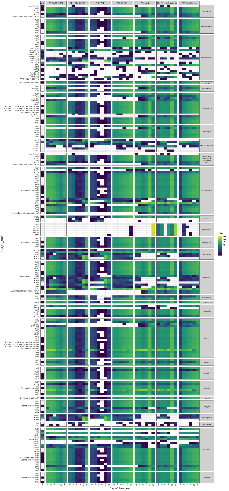

#### Load required packages


```r
library(tidyverse)
library(phyloseq)
library(speedyseq)
library(ggrepel)
library(here)
library(gridExtra)
options(getClass.msg=FALSE) # https://github.com/epurdom/clusterExperiment/issues/66
#this fixes an error message that pops up because the class 'Annotated' is defined in two different packages
```

#### Source required functions


```r
rm(list = ls())

'%!in%' <- function(x,y)!('%in%'(x,y))

source("https://raw.githubusercontent.com/fconstancias/DivComAnalyses/master/R/phyloseq_taxa_tests.R")
source("https://raw.githubusercontent.com/fconstancias/DivComAnalyses/master/R/phyloseq_normalisation.R")
source("https://raw.githubusercontent.com/fconstancias/DivComAnalyses/master/R/phyloseq_alpha.R")
source("https://raw.githubusercontent.com/fconstancias/DivComAnalyses/master/R/phyloseq_beta.R")
source("https://raw.githubusercontent.com/fconstancias/DivComAnalyses/master/R/phyloseq_heatmap.R")
```

# Import data:


```r
ps = "data/raw/rgi_CARD/sqm_rgi_chicken.txt"
  
ps %>% 
  here::here() %>%
  read_tsv() -> df
```

```
## 
## ── Column specification ────────────────────────────────────────────────────────
## cols(
##   .default = col_double(),
##   ORF_ID = col_character(),
##   Cut_Off = col_character(),
##   Best_Hit_ARO = col_character(),
##   Model_type = col_character(),
##   SNPs_in_Best_Hit_ARO = col_character(),
##   Other_SNPs = col_character(),
##   Drug.Class = col_character(),
##   Resistance.Mechanism = col_character(),
##   AMR.Gene.Family = col_character(),
##   Predicted_DNA = col_logical(),
##   Predicted_Protein = col_character(),
##   CARD_Protein_Sequence = col_character(),
##   ID = col_character(),
##   Nudged = col_logical(),
##   Note = col_character(),
##   `Contig ID` = col_character(),
##   Molecule = col_character(),
##   Method = col_character(),
##   `Gene name` = col_character(),
##   Tax = col_character()
##   # ... with 7 more columns
## )
## ℹ Use `spec()` for the full column specifications.
```

```
## Warning: 5 parsing failures.
## row     col           expected actual                                                                               file
##   4 KEGGFUN delimiter or quote      - '/Users/snehasundar/Desktop/amchick/amchick/data/raw/rgi_CARD/sqm_rgi_chicken.txt'
## 230 KEGGFUN delimiter or quote      - '/Users/snehasundar/Desktop/amchick/amchick/data/raw/rgi_CARD/sqm_rgi_chicken.txt'
## 369 KEGGFUN delimiter or quote      - '/Users/snehasundar/Desktop/amchick/amchick/data/raw/rgi_CARD/sqm_rgi_chicken.txt'
## 401 KEGGFUN delimiter or quote      - '/Users/snehasundar/Desktop/amchick/amchick/data/raw/rgi_CARD/sqm_rgi_chicken.txt'
## 413 KEGGFUN delimiter or quote      - '/Users/snehasundar/Desktop/amchick/amchick/data/raw/rgi_CARD/sqm_rgi_chicken.txt'
```

```r
df %>% 
  head() %>% 
  DT::datatable()
```

```{=html}
<div id="htmlwidget-86e30d14aca0fe8d9da7" style="width:100%;height:auto;" class="datatables html-widget"></div>
<script type="application/json" data-for="htmlwidget-86e30d14aca0fe8d9da7">{"x":{"filter":"none","data":[["1","2","3","4","5","6"],["megahit_2041_3-302","megahit_5711_6400-6900","megahit_5725_76549-77598","megahit_8430_2303-3106","megahit_8430_3106-3942","megahit_8432_51736-52788"],[3,6400,76549,2303,3106,51736],[302,6900,77598,3106,3942,52788],[-1,1,1,1,1,-1],["Strict","Strict","Strict","Strict","Strict","Strict"],[1300,32,300,500,500,300],[194.5,54.7,302.4,553.9,563.5,313.9],["tetW","Trimethoprim-resistant dihydrofolate reductase DfrA42","vanI","APH(3'')-Ib","APH(6)-Id","vanI"],[98,28.14,45.35,99.63,99.64,45.79],[3000194,3005334,3003723,3002639,3002660,3003723],["protein homolog model","protein homolog model","protein homolog model","protein homolog model","protein homolog model","protein homolog model"],["n/a","n/a","n/a","n/a","n/a","n/a"],["n/a","n/a","n/a","n/a","n/a","n/a"],["tetracycline antibiotic","diaminopyrimidine antibiotic","glycopeptide antibiotic","aminoglycoside antibiotic","aminoglycoside antibiotic","glycopeptide antibiotic"],["antibiotic target protection","antibiotic target replacement","antibiotic target alteration","antibiotic inactivation","antibiotic inactivation","antibiotic target alteration"],["tetracycline-resistant ribosomal protection protein","trimethoprim resistant dihydrofolate reductase dfr","glycopeptide resistance gene cluster; van ligase","APH(3'')","APH(6)","glycopeptide resistance gene cluster; van ligase"],[null,null,null,null,null,null],["MNIINIGILAHVDAGKTTLTESLLYASGAISEPGSVEKGTTRTDTLFLERQRGITIQAAVTSFQWHRCKVNIVDTPGHMDFLAEVYRSLAVLDGAILVIS","MNLIVNADKNWAIGKDNRLLVSIPQDMKFFRETTTGKVVVMGRKTLESFPGGQPLKKRTNIVLTSDRSYQAGEAVIVHSMEELMEELEKYPREDIFVIGGESIYRSLLPWCRKAYVTRTDHAYDADTWFPDLDADPEWRMTKTSDEQTYFDLEYYFTVYERIAGGK*","MEKLRVAVLFGGCSTEYEVSLQSAAAVLAHLDTRRFAPLTVGITKQGKWLYYTGPFEHIADGTWHTREVYCTPCMLCPDRGTPTLLVRGQHEMRYCFDAAFPVMHGKNGEDGTVQGLLEMAGVPVVGCGTLASALCMDKDKAHKLAALAGVEVPRSAVFSRRSTFAAIQNAAQLLGWPLFVKPVCAGSSFGITRVEQPQQLAAAVEAAFRHDSQVLLEEAVPGFEVGCAVMGNGELFVGEVDEIELSGGFFDYEEKYTLKTSRIHCPARIGKNDAERIKTAARTVYRALGCRVFARVDLFLTPQGKVVFNEINTIPGFTAHSRYPGMMRAAGLPFGELITRLVELGVEK*","MNRTNIFFGESHSDWLPVRGGESGDFVFRRGDGHAFAKIAPASRRGELAGERDRLIWLKGRGVACPEVINWQEEQEGACLVITAIPGVPAADLSGADLLKAWPSMGQQLGAVHSLSVDQCPFERRLSRMFGRAVDVVSRNAVNPDFLPDEDKSTPQLDLLARVERELPVRLDQERTDMVVCHGDPCMPNFMVDPKTLQCTGLIDLGRLGTADRYADLALMIANAEENWAAPDEAERAFAVLFNVLGIEAPDRERLAFYLRLDPLTWG*","MFMPPVFPAHWHVSQPVLIADTFSSLVWKVSLPDGTPAIVKGLKPIEDIADELRGADYLVWRNGRGAVRLLGRENNLMLLEYAGERMLSHIVAEHGDYQATEIAAELMAKLYAASEEPLPSALLPIRDRFAALFQRARDDQNAGCQTDYVHAAIIADQMMSNASELRGLHGDLHHENIMFSSRGWLVIDPVGLVGEVGFGAANMFYDPADRDDLCLDPRRIAQMADAFSRALDVDPRRLLDQAYAYGCLSAAWNADGEEEQRDLAIAAAIKQVRQTSY*","MNKKTIAVLFGGCSSEYAVSLQSAHAVLTHLDSDRYAAVPVGITREGRWFRFHGDYDRIEMDTWHQESSCLTPAFLSPDRGIHGLVEFTAAGARSIPLDAVFPVLHGKNGEDGTVQGLAELAGIPLVGCGCLASAICMDKDRAHKLARLAGVDVPESFVVRAGERLDDLERRAQALGYPIFVKPVRAGSSFGITRVMDPDGLKPAVQLALEHDNEAILEQAVEGFEVGCAVLGNETLTCGRVDEIELAGGFFDYTEKYTLQSARIHMPARIDPDTERRIRQDACAVYRALGCSGFARVDLFLTPQGRIVFNEVNTIPGFTAHSRYPNMMKGIGLSFSQVLDRLIELGVKG*"],["MKIINIGILAHVDAGKTTLTESLLYASGAISEPGSVEKGTTRTDTMFLERQRGITIQAAVTSFQWHRCKVNIVDTPGHMDFLAEVYRSLAVLDGAILVISAKDGVQAQTRILFHALRKMNIPTVIFINKIDQAGVDLQSVVQSVRDKLSADIIIKQTVSLSPEIVLEENTDIEAWDAVIENNDELLEKYIAGEPISREKLAREEQQRVQDASLFPVYHGSAKNGLGIQPLMDAVTGLFQPIGEQGGAALCGSVFKVEYTDCGQRRVYLRLYSGTLRLRDTVALAGREKLKITEMRIPSKGEIVRTDTAYQGEIVILPSDSVRLNDVLGDQTRLPRKRWREDPLPMLRTTIAPKTAAQRERLLDALTQLADTDPLLRCEVDSITHEIILSFLGRVQLEVVSALLSEKYKLETVVKEPSVIYMERPLKAASHTIHIEVPPNPFWASIGLSVTPLSLGSGVQYESRVSLGYLNQSFQNAVRDGIRYGLEQGLFGWNVTDCKICFEYGLYYSPVSTPADFRSLAPIVLEQALKESGTQLLEPYLSFILYAPQEYLSRAYHDAPKYCATIETAQVKKDEVVFTGEIPARCIQAYRTDLAFYTNGRSVCLTELKGYQAAVGQPVIQPRRPNSRLDKVRHMFQKVM","MHKPTPLKRLSMILARDLNGAIGYEGSLAIKSDNDFAWYKKITKPFKHAVCGRVTYEEDLPDIVKKRHRFIIITRNPDKYASTPEAQYMTLSDALKELQVWDVPGHDIICLGGAEIYKALLPYVSTVYLTTFFSVADEADTYFNDFTDKWESVGATWFNDCYCTRLERVCQSTNNII","MTKLKIAIIFGGCSEEHPVSVKSAGEVAKNLDPEKYEPFYIGITKDGVWQLCHYPEVNWEKGSCRPAILSPDRSVQGLLVLEQGQYQRIPLDLVFPVLHGKFGEDGAMQGLLELSGIPYVGCDIPSSALCMDKSLAYIVAGKAGIATPKFRTVTVKETIDAERLTYPVYVKPARSGSSFGVTKVCRQEELLNAVEIASQYDSKVLIEETVIGTEIGCAIFGNDLDLIAGEVDQIRLSHGFFRIHQENEPEKGSENSTLIVPAGISAEARSRVQETAKAIYRALGCRGLARVDMFLKEDGTVILNEVNTLPGMTSYSRFPRMMAAAGLPFAEVIDRLVSLALKGKTGTN","MNRTNIFFGESHSDWLPVRGGESGDFVFRRGDGHAFAKIAPASRRGELAGERDRLIWLKGRGVACPEVINWQEEQEGACLVITAIPGVPAADLSGADLLKAWPSMGQQLGAVHSLLVDQCPFERRLSRMFGRAVDVVSRNAVNPDFLPDEDKSTPQLDLLARVERELPVRLDQERTDMVVCHGDPCMPNFMVDPKTLQCTGLIDLGRLGTADRYADLALMIANAEENWAAPDEAERAFAVLFNVLGIEAPDRERLAFYLRLDPLTWG","MFMPPVFPAHWHVSQPVLIADTFSSLVWKVSLPDGTPAIVKGLKPIEDIADELRGADYLVWRNGRGAVRLLGRENNLMLLEYAGERMLSHIVAEHGDYQATEIAAELMAKLYAASEEPLPSALLPIRDRFAALFQRARDDQNAGCQTDYVHAAIIADQMMSNASELRGLHGDLHHENIMFSSRGWLVIDPVGLVGEVGFGAANMFYDPADRDDLCLDPRRIAQMADAFSRALDVDPRRLLDQAYAYGCLSAAWNADGEQEQRDLAIAAAIKQVRQTSY","MTKLKIAIIFGGCSEEHPVSVKSAGEVAKNLDPEKYEPFYIGITKDGVWQLCHYPEVNWEKGSCRPAILSPDRSVQGLLVLEQGQYQRIPLDLVFPVLHGKFGEDGAMQGLLELSGIPYVGCDIPSSALCMDKSLAYIVAGKAGIATPKFRTVTVKETIDAERLTYPVYVKPARSGSSFGVTKVCRQEELLNAVEIASQYDSKVLIEETVIGTEIGCAIFGNDLDLIAGEVDQIRLSHGFFRIHQENEPEKGSENSTLIVPAGISAEARSRVQETAKAIYRALGCRGLARVDMFLKEDGTVILNEVNTLPGMTSYSRFPRMMAAAGLPFAEVIDRLVSLALKGKTGTN"],[15.65,94.35,100.57,100.37,100.36,100.86],["gnl|BL_ORD_ID|363|hsp_num:0","gnl|BL_ORD_ID|3106|hsp_num:0","gnl|BL_ORD_ID|2092|hsp_num:0","gnl|BL_ORD_ID|1730|hsp_num:0","gnl|BL_ORD_ID|974|hsp_num:0","gnl|BL_ORD_ID|2092|hsp_num:0"],[389,4066,2241,1830,1031,2241],[true,null,null,null,null,null],["loose hit with at least 95 percent identity pushed strict",null,null,null,null,null],["megahit_2041","megahit_5711","megahit_5725","megahit_8430","megahit_8430","megahit_8432"],["CDS","CDS","CDS","CDS","CDS","CDS"],["Prodigal","Prodigal","Prodigal","Prodigal","Prodigal","Prodigal"],[300,501,1050,804,837,1053],[100,167,350,268,279,351],[50.67,55.49,60,56.22,55.91,60.3],["tetM, tetO","DHFR, folA",null,"strA","strB","vanC, vanE, vanG"],["k_Bacteria","k_Bacteria;n_Terrabacteria group;p_Firmicutes;c_Clostridia;o_Eubacteriales;f_Lachnospiraceae","k_Bacteria;n_Terrabacteria group;p_Firmicutes;c_Clostridia;o_Eubacteriales;f_Oscillospiraceae;n_unclassified Oscillospiraceae;s_Oscillospiraceae bacterium","k_Bacteria;p_Proteobacteria;c_Gammaproteobacteria;o_Enterobacterales;f_Enterobacteriaceae","k_Bacteria;p_Proteobacteria;c_Gammaproteobacteria;o_Enterobacterales;f_Enterobacteriaceae","k_Bacteria;n_Terrabacteria group;p_Firmicutes;c_Clostridia;n_Clostridia incertae sedis;g_Candidatus Parachristensenella;s_Candidatus Parachristensenella avicola"],["K18220*","K00287*",null,"K10673*","K04343*","K18856*"],["ribosomal protection tetracycline resistance protein","dihydrofolate reductase [EC:1.5.1.3]",null,"streptomycin 3\\\"-kinase [EC:2.7.1.87]","streptomycin 6-kinase [EC:2.7.1.72]","D-alanine---D-serine ligase [EC:6.3.2.35]"],["Brite Hierarchies; Protein families: signaling and cellular processes; Antimicrobial resistance genes","Metabolism; Metabolism of cofactors and vitamins; Folate biosynthesis | Metabolism; Metabolism of cofactors and vitamins; One carbon pool by folate | Human Diseases; Drug resistance: Antineoplastic; Antifolate resistance",null,"Brite Hierarchies; Protein families: signaling and cellular processes; Antimicrobial resistance genes","Brite Hierarchies; Protein families: signaling and cellular processes; Antimicrobial resistance genes","Environmental Information Processing; Signal transduction; Two-component system | Human Diseases; Drug resistance: Antimicrobial; Vancomycin resistance | Brite Hierarchies; Protein families: signaling and cellular processes; Antimicrobial resistance genes"],["COG0480*","COG0262*","COG1181*","COG3231*","COG3570*","COG1181*"],["Translation elongation factors (GTPases)","Dihydrofolate reductase","D-alanine-D-alanine ligase and related ATP-grasp enzymes","Aminoglycoside phosphotransferase","Streptomycin 6-kinase","D-alanine-D-alanine ligase and related ATP-grasp enzymes"],["Translation, ribosomal structure and biogenesis","Coenzyme metabolism","Cell envelope biogenesis, outer membrane","Translation, ribosomal structure and biogenesis",null,"Cell envelope biogenesis, outer membrane"],["PF00009 [Elongation factor Tu GTP binding domain]","PF00186 [Dihydrofolate reductase]","PF01820 [D-ala D-ala ligase N-terminus];PF07478 [D-ala D-ala ligase C-terminus]","PF01636 [Phosphotransferase enzyme family]","PF04655 [Aminoglycoside/hydroxyurea antibiotic resistance kinase]","PF01820 [D-ala D-ala ligase N-terminus];PF07478 [D-ala D-ala ligase C-terminus]"],[3.512,0.082,1.877,0,0,0],[11.975,0,1.688,1.291,0.782,0],[6.867,0,0.32,0.192,0,0.04],[4.694,0.067,0.415,0,0.04,0.032],[8.854,0.116,1.189,0,0,0.014],[0.295,0,0,0,0,0],[20.186,0,0,0,0.057,0],[11.051,0,0,0,0,0],[16.386,0.361,3.116,0.019,0.018,0.387],[1.396,0,0,0,0.038,0],[9.413,0.718,2.9,0.086,0.066,0.118],[10.596,0.274,1.912,0,0,0.166],[9.942,0.293,2.313,0,0,0.015],[0.419,0,0,0,0,0],[23.164,0,0,0.321,0.389,0],[18.581,0,0,0,0,0],[10.575,0.188,1.78,0,0,0.104],[0.579,0,0,0.02,0.038,0],[0.611,0,0,0,0,0],[8.883,0.347,2.155,0,0.039,0.041],[8.52,0.09,0,0,0,0],[14.158,0.749,0.935,0.919,0.659,0.042],[1.172,0,0.028,0,0,0],[21.955,0,0,0,0,0],[12.555,0.447,1.229,0,0,0.225],[0.67,0,0,0.019,0.018,0],[0.303,0,0,0.355,0.372,0],[11.969,0.445,1.348,0,0,0.087],[18.818,0.416,1.761,0,0,0.079],[10.857,0.032,0.958,0,0,0.121],[7.397,0.318,0.884,0.018,0.104,0],[0.833,0,0,0.259,0.348,0],[1.247,0,0,0,0,0],[7.619,0.213,1.77,0.019,0.055,0.087],[6.057,0.218,1.246,0.362,0.622,0],[8.798,0.302,0,0,0,0],[5.726,0.717,1.368,44.807,45.504,0.074],[7.478,1.535,0.05,0.039,0,0.06],[15.021,0.162,2.217,0,0.032,0.154],[10.098,0.235,4.202,0.037,0,0.196],[8.725,0.517,5.013,0,0.034,0.123],[14.734,0.562,0,0.718,1.043,0.134],[12.163,0,0.153,0,0,0.122],[29.423,0.329,16.591,0,0,0],[79.067,0,14.506,10.748,5.846,0],[50.833,0,2.891,2.005,0,0.215],[31.363,0.599,2.839,0,0.358,0.285],[68.517,0.834,10.58,0,0,0.019],[1.51,0,0,0,0,0],[137.103,0,0,0,0.538,0],[74.43,0,0,0,0,0],[114.657,3.236,25.511,0.109,0.178,3.205],[10.84,0,0,0,0.358,0],[73.123,5.501,27.335,0.933,0.717,1.109],[94.133,1.876,20.112,0,0,1.974],[66.297,2.261,18.423,0,0,0.142],[4.29,0,0,0,0,0],[179.943,0,0,3.141,4.038,0],[147.687,0,0,0,0,0],[69.907,1.555,14.733,0,0,0.773],[4.53,0,0,0.076,0.286,0],[5.853,0,0,0,0,0],[84.14,3.136,27.444,0,0.388,0.443],[61.857,0.517,0,0,0,0],[131.423,7.495,11.055,11.265,7.412,0.57],[11.04,0,0.263,0,0,0],[146.41,0,0,0,0,0],[101.18,4.102,11.913,0,0,2.521],[6.327,0,0,0.16,0.025,0],[3.353,0,0,3.917,4.041,0],[96.623,4.645,12.855,0,0,0.687],[142.327,4.172,16.152,0,0,0.855],[72.153,0.299,7.477,0,0,1.067],[57.04,2.844,8.188,0.187,1.008,0],[5.79,0,0,1.561,2.264,0],[11.447,0,0,0,0,0],[53.297,1.355,15.14,0.119,0.538,0.623],[58.71,1.81,12.708,3.662,7.002,0],[75.947,2.493,0,0,0,0],[42.25,5.222,11.097,360.684,373.44,0.68],[75.23,19.104,0.714,0.44,0,0.67],[109.933,1.273,21.685,0,0.358,1.709],[74.107,2.084,38.284,0.373,0,1.833],[71.363,3.848,45.788,0,0.358,1.281],[112.083,4.778,0,6.937,10.074,1.292],[78.59,0,1.367,0,0,0.858],[77,3,144,0,0,0],[225,0,111,65,41,0],[147,0,24,11,0,3],[84,2,26,0,2,2],[183,4,86,0,0,1],[5,0,0,0,0,0],[381,0,0,0,3,0],[194,0,0,0,0,0],[326,12,217,1,1,27],[26,0,0,0,2,0],[204,26,220,5,4,9],[255,11,161,0,0,14],[183,9,149,0,0,1],[9,0,0,0,0,0],[512,0,0,19,24,0],[420,0,0,0,0,0],[202,6,119,0,0,7],[11,0,0,1,2,0],[12,0,0,0,0,0],[245,16,208,0,3,4],[170,3,0,0,0,0],[385,34,89,67,50,4],[24,0,2,0,0,0],[428,0,0,0,0,0],[286,17,98,0,0,18],[13,0,0,1,1,0],[7,0,0,22,24,0],[274,17,108,0,0,7],[406,15,133,0,0,6],[204,1,63,0,0,8],[153,11,64,1,6,0],[12,0,0,10,14,0],[30,0,0,0,0,0],[150,7,122,1,3,6],[150,9,108,24,43,0],[209,12,0,0,0,0],[110,23,92,2307,2439,5],[213,73,5,3,0,6],[333,6,172,0,2,12],[206,8,300,2,0,14],[182,18,366,0,2,9],[314,20,0,41,62,10],[227,0,10,0,0,8],[8827,165,17421,0,0,0],[23720,0,15231,8641,4893,0],[15250,0,3036,1612,0,226],[9409,300,2981,0,300,300],[20555,418,11109,0,0,20],[453,0,0,0,0,0],[41131,0,0,0,450,0],[22329,0,0,0,0,0],[34397,1621,26787,88,149,3375],[3252,0,0,0,300,0],[21937,2756,28702,750,600,1168],[28240,940,21118,0,0,2079],[19889,1133,19344,0,0,150],[1287,0,0,0,0,0],[53983,0,0,2525,3380,0],[44306,0,0,0,0,0],[20972,779,15470,0,0,814],[1359,0,0,61,239,0],[1756,0,0,0,0,0],[25242,1571,28816,0,325,466],[18557,259,0,0,0,0],[39427,3755,11608,9057,6204,600],[3312,0,276,0,0,0],[43923,0,0,0,0,0],[30354,2055,12509,0,0,2655],[1898,0,0,129,21,0],[1006,0,0,3149,3382,0],[28987,2327,13498,0,0,723],[42698,2090,16960,0,0,900],[21646,150,7851,0,0,1124],[17112,1425,8597,150,844,0],[1737,0,0,1255,1895,0],[3434,0,0,0,0,0],[15989,679,15897,96,450,656],[17613,907,13343,2944,5861,0],[22784,1249,0,0,0,0],[12675,2616,11652,289990,312569,716],[22569,9571,750,354,0,706],[32980,638,22769,0,300,1800],[22232,1044,40198,300,0,1930],[21409,1928,48077,0,300,1349],[33625,2394,0,5577,8432,1360],[23577,0,1435,0,0,904],[25,25,25,25,25,25]],"container":"<table class=\"display\">\n  <thead>\n    <tr>\n      <th> <\/th>\n      <th>ORF_ID<\/th>\n      <th>Start<\/th>\n      <th>Stop<\/th>\n      <th>Orientation<\/th>\n      <th>Cut_Off<\/th>\n      <th>Pass_Bitscore<\/th>\n      <th>Best_Hit_Bitscore<\/th>\n      <th>Best_Hit_ARO<\/th>\n      <th>Best_Identities<\/th>\n      <th>ARO<\/th>\n      <th>Model_type<\/th>\n      <th>SNPs_in_Best_Hit_ARO<\/th>\n      <th>Other_SNPs<\/th>\n      <th>Drug.Class<\/th>\n      <th>Resistance.Mechanism<\/th>\n      <th>AMR.Gene.Family<\/th>\n      <th>Predicted_DNA<\/th>\n      <th>Predicted_Protein<\/th>\n      <th>CARD_Protein_Sequence<\/th>\n      <th>Percentage.Length.of.Reference.Sequence<\/th>\n      <th>ID<\/th>\n      <th>Model_ID<\/th>\n      <th>Nudged<\/th>\n      <th>Note<\/th>\n      <th>Contig ID<\/th>\n      <th>Molecule<\/th>\n      <th>Method<\/th>\n      <th>Length NT<\/th>\n      <th>Length AA<\/th>\n      <th>GC perc<\/th>\n      <th>Gene name<\/th>\n      <th>Tax<\/th>\n      <th>KEGG ID<\/th>\n      <th>KEGGFUN<\/th>\n      <th>KEGGPATH<\/th>\n      <th>COG ID<\/th>\n      <th>COGFUN<\/th>\n      <th>COGPATH<\/th>\n      <th>PFAM<\/th>\n      <th>TPM D1<\/th>\n      <th>TPM D10<\/th>\n      <th>TPM D11<\/th>\n      <th>TPM D12<\/th>\n      <th>TPM D13<\/th>\n      <th>TPM D14<\/th>\n      <th>TPM D15<\/th>\n      <th>TPM D16<\/th>\n      <th>TPM D17<\/th>\n      <th>TPM D18<\/th>\n      <th>TPM D19<\/th>\n      <th>TPM D2<\/th>\n      <th>TPM D20<\/th>\n      <th>TPM D21<\/th>\n      <th>TPM D22<\/th>\n      <th>TPM D23<\/th>\n      <th>TPM D24<\/th>\n      <th>TPM D25<\/th>\n      <th>TPM D26<\/th>\n      <th>TPM D27<\/th>\n      <th>TPM D28<\/th>\n      <th>TPM D29<\/th>\n      <th>TPM D3<\/th>\n      <th>TPM D30<\/th>\n      <th>TPM D31<\/th>\n      <th>TPM D32<\/th>\n      <th>TPM D33<\/th>\n      <th>TPM D34<\/th>\n      <th>TPM D35<\/th>\n      <th>TPM D36<\/th>\n      <th>TPM D37<\/th>\n      <th>TPM D38<\/th>\n      <th>TPM D39<\/th>\n      <th>TPM D4<\/th>\n      <th>TPM D40<\/th>\n      <th>TPM D41<\/th>\n      <th>TPM D42<\/th>\n      <th>TPM D43<\/th>\n      <th>TPM D5<\/th>\n      <th>TPM D6<\/th>\n      <th>TPM D7<\/th>\n      <th>TPM D8<\/th>\n      <th>TPM D9<\/th>\n      <th>Coverage D1<\/th>\n      <th>Coverage D10<\/th>\n      <th>Coverage D11<\/th>\n      <th>Coverage D12<\/th>\n      <th>Coverage D13<\/th>\n      <th>Coverage D14<\/th>\n      <th>Coverage D15<\/th>\n      <th>Coverage D16<\/th>\n      <th>Coverage D17<\/th>\n      <th>Coverage D18<\/th>\n      <th>Coverage D19<\/th>\n      <th>Coverage D2<\/th>\n      <th>Coverage D20<\/th>\n      <th>Coverage D21<\/th>\n      <th>Coverage D22<\/th>\n      <th>Coverage D23<\/th>\n      <th>Coverage D24<\/th>\n      <th>Coverage D25<\/th>\n      <th>Coverage D26<\/th>\n      <th>Coverage D27<\/th>\n      <th>Coverage D28<\/th>\n      <th>Coverage D29<\/th>\n      <th>Coverage D3<\/th>\n      <th>Coverage D30<\/th>\n      <th>Coverage D31<\/th>\n      <th>Coverage D32<\/th>\n      <th>Coverage D33<\/th>\n      <th>Coverage D34<\/th>\n      <th>Coverage D35<\/th>\n      <th>Coverage D36<\/th>\n      <th>Coverage D37<\/th>\n      <th>Coverage D38<\/th>\n      <th>Coverage D39<\/th>\n      <th>Coverage D4<\/th>\n      <th>Coverage D40<\/th>\n      <th>Coverage D41<\/th>\n      <th>Coverage D42<\/th>\n      <th>Coverage D43<\/th>\n      <th>Coverage D5<\/th>\n      <th>Coverage D6<\/th>\n      <th>Coverage D7<\/th>\n      <th>Coverage D8<\/th>\n      <th>Coverage D9<\/th>\n      <th>Raw read count D1<\/th>\n      <th>Raw read count D10<\/th>\n      <th>Raw read count D11<\/th>\n      <th>Raw read count D12<\/th>\n      <th>Raw read count D13<\/th>\n      <th>Raw read count D14<\/th>\n      <th>Raw read count D15<\/th>\n      <th>Raw read count D16<\/th>\n      <th>Raw read count D17<\/th>\n      <th>Raw read count D18<\/th>\n      <th>Raw read count D19<\/th>\n      <th>Raw read count D2<\/th>\n      <th>Raw read count D20<\/th>\n      <th>Raw read count D21<\/th>\n      <th>Raw read count D22<\/th>\n      <th>Raw read count D23<\/th>\n      <th>Raw read count D24<\/th>\n      <th>Raw read count D25<\/th>\n      <th>Raw read count D26<\/th>\n      <th>Raw read count D27<\/th>\n      <th>Raw read count D28<\/th>\n      <th>Raw read count D29<\/th>\n      <th>Raw read count D3<\/th>\n      <th>Raw read count D30<\/th>\n      <th>Raw read count D31<\/th>\n      <th>Raw read count D32<\/th>\n      <th>Raw read count D33<\/th>\n      <th>Raw read count D34<\/th>\n      <th>Raw read count D35<\/th>\n      <th>Raw read count D36<\/th>\n      <th>Raw read count D37<\/th>\n      <th>Raw read count D38<\/th>\n      <th>Raw read count D39<\/th>\n      <th>Raw read count D4<\/th>\n      <th>Raw read count D40<\/th>\n      <th>Raw read count D41<\/th>\n      <th>Raw read count D42<\/th>\n      <th>Raw read count D43<\/th>\n      <th>Raw read count D5<\/th>\n      <th>Raw read count D6<\/th>\n      <th>Raw read count D7<\/th>\n      <th>Raw read count D8<\/th>\n      <th>Raw read count D9<\/th>\n      <th>Raw base count D1<\/th>\n      <th>Raw base count D10<\/th>\n      <th>Raw base count D11<\/th>\n      <th>Raw base count D12<\/th>\n      <th>Raw base count D13<\/th>\n      <th>Raw base count D14<\/th>\n      <th>Raw base count D15<\/th>\n      <th>Raw base count D16<\/th>\n      <th>Raw base count D17<\/th>\n      <th>Raw base count D18<\/th>\n      <th>Raw base count D19<\/th>\n      <th>Raw base count D2<\/th>\n      <th>Raw base count D20<\/th>\n      <th>Raw base count D21<\/th>\n      <th>Raw base count D22<\/th>\n      <th>Raw base count D23<\/th>\n      <th>Raw base count D24<\/th>\n      <th>Raw base count D25<\/th>\n      <th>Raw base count D26<\/th>\n      <th>Raw base count D27<\/th>\n      <th>Raw base count D28<\/th>\n      <th>Raw base count D29<\/th>\n      <th>Raw base count D3<\/th>\n      <th>Raw base count D30<\/th>\n      <th>Raw base count D31<\/th>\n      <th>Raw base count D32<\/th>\n      <th>Raw base count D33<\/th>\n      <th>Raw base count D34<\/th>\n      <th>Raw base count D35<\/th>\n      <th>Raw base count D36<\/th>\n      <th>Raw base count D37<\/th>\n      <th>Raw base count D38<\/th>\n      <th>Raw base count D39<\/th>\n      <th>Raw base count D4<\/th>\n      <th>Raw base count D40<\/th>\n      <th>Raw base count D41<\/th>\n      <th>Raw base count D42<\/th>\n      <th>Raw base count D43<\/th>\n      <th>Raw base count D5<\/th>\n      <th>Raw base count D6<\/th>\n      <th>Raw base count D7<\/th>\n      <th>Raw base count D8<\/th>\n      <th>Raw base count D9<\/th>\n      <th>Hits<\/th>\n    <\/tr>\n  <\/thead>\n<\/table>","options":{"columnDefs":[{"className":"dt-right","targets":[2,3,4,6,7,9,10,20,22,28,29,30,40,41,42,43,44,45,46,47,48,49,50,51,52,53,54,55,56,57,58,59,60,61,62,63,64,65,66,67,68,69,70,71,72,73,74,75,76,77,78,79,80,81,82,83,84,85,86,87,88,89,90,91,92,93,94,95,96,97,98,99,100,101,102,103,104,105,106,107,108,109,110,111,112,113,114,115,116,117,118,119,120,121,122,123,124,125,126,127,128,129,130,131,132,133,134,135,136,137,138,139,140,141,142,143,144,145,146,147,148,149,150,151,152,153,154,155,156,157,158,159,160,161,162,163,164,165,166,167,168,169,170,171,172,173,174,175,176,177,178,179,180,181,182,183,184,185,186,187,188,189,190,191,192,193,194,195,196,197,198,199,200,201,202,203,204,205,206,207,208,209,210,211,212]},{"orderable":false,"targets":0}],"order":[],"autoWidth":false,"orderClasses":false}},"evals":[],"jsHooks":[]}</script>
```


```r
ps = "data/raw/metabarcoding/merged_chicken_human_04.08.2021.tsv"
  
ps %>% 
  here::here() %>%
  read_tsv() %>% 
  filter(metagenomic_sample_name %!in% NA) -> meta
```

```
## 
## ── Column specification ────────────────────────────────────────────────────────
## cols(
##   .default = col_double(),
##   sample = col_character(),
##   Sample_description = col_character(),
##   I7_Index_ID = col_character(),
##   index = col_character(),
##   I5_Index_ID = col_character(),
##   index2 = col_character(),
##   Description2 = col_character(),
##   Experiment = col_character(),
##   Reactor = col_character(),
##   Treatment = col_character(),
##   Enrichment = col_character(),
##   Phase = col_character(),
##   Treatment2 = col_character(),
##   Date = col_character(),
##   Paul = col_character(),
##   Reactor_Treatment = col_character(),
##   Model = col_character(),
##   Antibiotic = col_character(),
##   metagenomic_sample_name = col_character()
## )
## ℹ Use `spec()` for the full column specifications.
```

```r
meta %>% 
  head() %>% 
  DT::datatable()
```

```{=html}
<div id="htmlwidget-0cdf3f1138dbc118ec35" style="width:100%;height:auto;" class="datatables html-widget"></div>
<script type="application/json" data-for="htmlwidget-0cdf3f1138dbc118ec35">{"x":{"filter":"none","data":[["1","2","3","4","5","6"],["CR-15-S292","CR-17-S97","CR-19-S341","CR-21-S126","CR-46-S191","CR-64-S324"],[23558,35320,17616,5791,24284,10847],[23449,35021,17528,5764,24178,10801],[23410,34992,17501,5753,24128,10784],[23355,34870,17477,5734,24062,10726],[22970,34419,17246,5585,23531,10465],[22970,34419,17246,5585,23531,10465],[0.995,0.992,0.995,0.995,0.996,0.996],[0.998,0.999,0.998,0.998,0.998,0.998],[0.996,0.996,0.997,0.995,0.995,0.993],[0.981,0.984,0.985,0.971,0.975,0.97],[0.98,0.983,0.984,0.969,0.973,0.969],[0.975,0.974,0.979,0.964,0.969,0.965],[22970,34419,17246,5585,23531,10465],[22102,32366,16865,5498,22823,10250],[22098,32350,16865,5498,22821,10250],[1,1,1,1,1,1],[0.96,0.94,0.98,0.98,0.97,0.98],[1,1,1,1,1,1],["CR-15","CR-17","CR-19","CR-21","CR-46","CR-64"],["N716-D","N701-A","N723-D","N704-A","N715-A","N721-D"],["ACTCGCTA","TAAGGCGA","TAGCGCTC","TCCTGAGC","ATCTCAGG","TACGCTGC"],["S517-D","S513-D","S518-D","S520-D","S521-D","S517-D"],["GCGTAAGA","TCGACTAG","CTATTAAG","AAGGCTAT","GAGCCTTA","GCGTAAGA"],[null,null,null,null,null,null],["Continuous","Continuous","Continuous","Continuous","Continuous","Continuous"],["CR","CR","CR","CR","CR","CR"],["UNTREATED","UNTREATED","UNTREATED","UNTREATED","UNTREATED","UNTREATED"],[15,17,19,21,46,64],[-1,1,3,5,30,48],[38,40,42,44,69,87],["NotEnriched","NotEnriched","NotEnriched","NotEnriched","NotEnriched","NotEnriched"],["Stab","Treat","Treat","Treat","Treat","Treat"],["UNTREATED","UNTREATED","UNTREATED","UNTREATED","UNTREATED","UNTREATED"],["2020-06-26T00:00:00Z","2020-06-28T00:00:00Z","2020-06-30T00:00:00Z","2020-07-02T00:00:00Z","2020-07-27T00:00:00Z","2020-08-14T00:00:00Z"],[null,null,null,null,null,null],["CR_UNTREATED","CR_UNTREATED","CR_UNTREATED","CR_UNTREATED","CR_UNTREATED","CR_UNTREATED"],[67500000000,70100000000,90100000000,43900000000,45300000000,32600000000],[null,null,null,null,null,null],[null,null,null,null,null,null],[null,null,null,null,null,null],[null,null,null,null,null,null],["Chicken","Chicken","Chicken","Chicken","Chicken","Chicken"],[null,null,null,null,null,null],[null,null,null,null,null,null],[null,null,null,null,null,null],[0,0,0.261,0,null,0],[0.947,0,0,0,null,0],[0,1.759,0,0,null,0],[1.969,4.295,0.818,0.701,null,0.546],[0,8.223,4.327,0,null,0],[3.179,5.614,0,0,null,0],[49.775,39.53,81.797,86.705,null,75.009],[11.56,7.362,10.133,15.767,null,11.518],[5.27,0,0,6.942,null,7.914],[22.6,8.315,14.599,27.682,null,36.797],[4.267,1.417,0.881,4.87,null,4.585],[3.218,0.365,0,0,null,6.461],[101.838,76.88,112.555,142.667,null,142.83],["D1","D14","D21","D28","D35","D36"],[57121568,44863798,56304446,50088120,55285758,48021514]],"container":"<table class=\"display\">\n  <thead>\n    <tr>\n      <th> <\/th>\n      <th>sample<\/th>\n      <th>input<\/th>\n      <th>filtered<\/th>\n      <th>denoisedF<\/th>\n      <th>denoisedR<\/th>\n      <th>merged<\/th>\n      <th>tabled<\/th>\n      <th>filtered_pc<\/th>\n      <th>denoisedF_pc<\/th>\n      <th>denoisedR_pc<\/th>\n      <th>merged_pc<\/th>\n      <th>filtered_merged_pc<\/th>\n      <th>input_merged_pc<\/th>\n      <th>tabled_joined<\/th>\n      <th>chimera_out<\/th>\n      <th>length_filtered<\/th>\n      <th>tabled_pc<\/th>\n      <th>chimera_out_pc<\/th>\n      <th>length_filtered_pc<\/th>\n      <th>Sample_description<\/th>\n      <th>I7_Index_ID<\/th>\n      <th>index<\/th>\n      <th>I5_Index_ID<\/th>\n      <th>index2<\/th>\n      <th>Description2<\/th>\n      <th>Experiment<\/th>\n      <th>Reactor<\/th>\n      <th>Treatment<\/th>\n      <th>Day_of_Connection<\/th>\n      <th>Day_of_Treatment<\/th>\n      <th>Day_from_Inoculum<\/th>\n      <th>Enrichment<\/th>\n      <th>Phase<\/th>\n      <th>Treatment2<\/th>\n      <th>Date<\/th>\n      <th>Paul<\/th>\n      <th>Reactor_Treatment<\/th>\n      <th>GeneCopyNumberperML<\/th>\n      <th>HV292.1_Copy_Number_permL<\/th>\n      <th>CCUG59168_Copy_Number_permL<\/th>\n      <th>CTX_Copy_Number_permL<\/th>\n      <th>VAN_Copy_Number_permL<\/th>\n      <th>Model<\/th>\n      <th>Antibiotic_mg/mL<\/th>\n      <th>Fermentation<\/th>\n      <th>Antibiotic<\/th>\n      <th>Lactose_mM<\/th>\n      <th>Glucose_mM<\/th>\n      <th>Galactose_mM<\/th>\n      <th>Succinat_mM<\/th>\n      <th>Lactat_mM<\/th>\n      <th>Formiat_mM<\/th>\n      <th>Acetat_mM<\/th>\n      <th>Propionat_mM<\/th>\n      <th>Isobutyrat_mM<\/th>\n      <th>Butyrat_mM<\/th>\n      <th>Isovalerat_mM<\/th>\n      <th>Valerat_mM<\/th>\n      <th>Total_SCFA_mM<\/th>\n      <th>metagenomic_sample_name<\/th>\n      <th>raw_metagenomic_pairs<\/th>\n    <\/tr>\n  <\/thead>\n<\/table>","options":{"columnDefs":[{"className":"dt-right","targets":[2,3,4,5,6,7,8,9,10,11,12,13,14,15,16,17,18,19,29,30,31,38,39,40,41,42,44,45,47,48,49,50,51,52,53,54,55,56,57,58,59,61]},{"orderable":false,"targets":0}],"order":[],"autoWidth":false,"orderClasses":false}},"evals":[],"jsHooks":[]}</script>
```

```r
meta 
```

```
## # A tibble: 43 x 61
##    sample      input filtered denoisedF denoisedR merged tabled filtered_pc
##    <chr>       <dbl>    <dbl>     <dbl>     <dbl>  <dbl>  <dbl>       <dbl>
##  1 CR-15-S292  23558    23449     23410     23355  22970  22970       0.995
##  2 CR-17-S97   35320    35021     34992     34870  34419  34419       0.992
##  3 CR-19-S341  17616    17528     17501     17477  17246  17246       0.995
##  4 CR-21-S126   5791     5764      5753      5734   5585   5585       0.995
##  5 CR-46-S191  24284    24178     24128     24062  23531  23531       0.996
##  6 CR-64-S324  10847    10801     10784     10726  10465  10465       0.996
##  7 D-0-S154    11484    11428     11279     11256  10248  10248       0.995
##  8 TR1-15-S168   153      151       144       115     79     79       0.987
##  9 TR1-17-S246 16895    16833     16807     16749  16429  16429       0.996
## 10 TR1-19-S305  9274     9256      9239      9203   8959   8959       0.998
## # … with 33 more rows, and 53 more variables: denoisedF_pc <dbl>,
## #   denoisedR_pc <dbl>, merged_pc <dbl>, filtered_merged_pc <dbl>,
## #   input_merged_pc <dbl>, tabled_joined <dbl>, chimera_out <dbl>,
## #   length_filtered <dbl>, tabled_pc <dbl>, chimera_out_pc <dbl>,
## #   length_filtered_pc <dbl>, Sample_description <chr>, I7_Index_ID <chr>,
## #   index <chr>, I5_Index_ID <chr>, index2 <chr>, Description2 <chr>,
## #   Experiment <chr>, Reactor <chr>, Treatment <chr>, Day_of_Connection <dbl>,
## #   Day_of_Treatment <dbl>, Day_from_Inoculum <dbl>, Enrichment <chr>,
## #   Phase <chr>, Treatment2 <chr>, Date <chr>, Paul <chr>,
## #   Reactor_Treatment <chr>, GeneCopyNumberperML <dbl>,
## #   HV292.1_Copy_Number_permL <dbl>, CCUG59168_Copy_Number_permL <dbl>,
## #   CTX_Copy_Number_permL <dbl>, VAN_Copy_Number_permL <dbl>, Model <chr>,
## #   Antibiotic_mg/mL <dbl>, Fermentation <dbl>, Antibiotic <chr>,
## #   Lactose_mM <dbl>, Glucose_mM <dbl>, Galactose_mM <dbl>, Succinat_mM <dbl>,
## #   Lactat_mM <dbl>, Formiat_mM <dbl>, Acetat_mM <dbl>, Propionat_mM <dbl>,
## #   Isobutyrat_mM <dbl>, Butyrat_mM <dbl>, Isovalerat_mM <dbl>,
## #   Valerat_mM <dbl>, Total_SCFA_mM <dbl>, metagenomic_sample_name <chr>,
## #   raw_metagenomic_pairs <dbl>
```

Filtering:


```r
type = c("protein homolog model")

df %>% 
  filter(Model_type %in% type,
         Cut_Off == "Strict",
         Nudged %!in% c("TRUE"),
         Best_Identities > 95, # plot disteibution of bestID vs percentage length ref and color bitscore and symbol class AMR
         Percentage.Length.of.Reference.Sequence > 80) %>% 
  select(ORF_ID,
         Best_Hit_ARO,
         Model_type,
         Drug.Class,
         Resistance.Mechanism,
         AMR.Gene.Family,
         Best_Identities,
         Percentage.Length.of.Reference.Sequence,
         Note,
         "Length AA",
         "Gene name",
         "Contig ID", 
         starts_with("TPM"),
         ) -> fil_df

fil_df %>% 
  DT::datatable()
```

```{=html}
<div id="htmlwidget-6375b6a56f39db0149fb" style="width:100%;height:auto;" class="datatables html-widget"></div>
<script type="application/json" data-for="htmlwidget-6375b6a56f39db0149fb">{"x":{"filter":"none","data":[["1","2","3","4","5","6","7","8","9","10","11","12","13","14","15","16","17","18","19","20","21","22","23","24","25","26","27","28","29","30","31","32","33","34","35","36","37","38","39","40","41","42","43","44","45","46","47","48","49","50","51","52","53","54","55","56","57","58","59","60","61","62","63","64","65","66","67","68","69","70","71","72","73","74","75","76","77","78","79","80","81","82","83","84","85","86","87","88","89","90","91","92","93","94","95","96","97","98","99","100","101","102","103","104","105","106","107","108"],["megahit_8430_2303-3106","megahit_8430_3106-3942","megahit_8588_1391-1876","megahit_8588_2029-2940","megahit_8588_3368-3976","megahit_8588_3982-5031","megahit_8588_5006-5974","megahit_8588_7321-8016","megahit_10204_188-2107","megahit_26483_24511-25815","megahit_26483_57215-60328","megahit_26836_9130-12723","megahit_26836_12728-13342","megahit_26836_13758-14921","megahit_26836_14921-16459","megahit_29911_7324-8058","megahit_30260_28698-30236","megahit_30260_30253-31425","megahit_30260_31552-32082","megahit_36176_1673-2704","megahit_36176_2704-4755","megahit_36176_4752-6218","megahit_44776_19035-20783","megahit_44983_4255-5628","megahit_48078_597734-598093","megahit_49429_8854-12003","megahit_49429_12026-13219","megahit_50897_9144-11117","megahit_51318_2237-3469","megahit_54793_45438-46259","megahit_57345_3924-4418","megahit_59151_90-1493","megahit_60380_10265-11125","megahit_60380_12054-13253","megahit_61156_7441-8745","megahit_63249_19214-20722","megahit_65181_7811-9019","megahit_65467_2556-3803","megahit_70573_90-752","megahit_74379_105-761","megahit_79858_535-1359","megahit_79858_2818-5931","megahit_79858_5956-7113","megahit_82310_71-1990","megahit_90010_3222-4016","megahit_91723_6408-7634","megahit_92360_3017-3916","megahit_92360_3960-4496","megahit_95455_4165-5133","megahit_95507_36366-37055","megahit_105465_40301-40714","megahit_106833_2-1138","megahit_116176_2773-3105","megahit_116819_1344-2549","megahit_124236_11707-12939","megahit_127866_167-1036","megahit_136349_1020-2186","megahit_137297_14786-15517","megahit_137297_15643-16425","megahit_160839_276-1433","megahit_186897_7208-7681","megahit_189688_629-1849","megahit_200600_3930-4745","megahit_202645_7984-9882","megahit_219391_905-1780","megahit_233202_89192-89845","megahit_238253_17189-18322","megahit_238953_479-1258","megahit_238953_1422-1769","megahit_238953_1763-2602","megahit_240960_76762-78405","megahit_248056_1334-2239","megahit_257448_709-3786","megahit_257448_5199-6602","megahit_257448_6599-7321","megahit_263098_30598-31419","megahit_264584_183-1274","megahit_270237_11799-12656","megahit_294235_7317-7865","megahit_300546_10075-11718","megahit_302680_545-877","megahit_308087_1823-2500","megahit_323384_26-1948","megahit_324420_869-1606","megahit_330281_173-631","megahit_333450_50336-51493","megahit_334362_12083-12580","megahit_349230_4107-4490","megahit_362226_25588-26874","megahit_378501_89739-90068","megahit_378501_95837-99016","megahit_378501_167318-168469","megahit_385510_14478-15959","megahit_434069_9750-10382","megahit_439738_3678-4097","megahit_440044_760-2718","megahit_450418_435-1874","megahit_480745_34-1953","megahit_483940_298-1086","megahit_483940_1144-1668","megahit_483940_1763-2236","megahit_491891_404-946","megahit_527694_1-633","megahit_527694_764-1552","megahit_550483_218906-219538","megahit_585692_1911-3629","megahit_644673_282016-282510","megahit_649537_18134-18595"],["APH(3'')-Ib","APH(6)-Id","vanZA","vanYA","vanXA","vanA","vanHA","vanRA","tet32","Escherichia coli ampC1 beta-lactamase","acrD","evgS","evgA","emrK","emrY","ErmG","emrB","emrA","emrR","mdtN","mdtO","mdtP","msbA","cpxA","FosB","acrB","Escherichia coli acrA","tetQ","mdtM","bacA","lnuC","baeS","TEM-1","tet(A)","Acinetobacter baumannii AbaQ","Acinetobacter baumannii AmvA","mdtH","mdtA","AcrS","QnrS1","gadX","mdtF","mdtE","tetO","APH(3')-IIIa","mdtG","APH(2'')-IIa","AAC(6')-Im","PmrF","smeR","H-NS","mdtM","Escherichia coli emrE","tet(B)","Escherichia coli mdfA","APH(2'')-Ig","ugd","ErmA","ANT(9)-Ia","AcrE","dfrF","tet(40)","sul2","tet(W/N/W)","CTX-M-1","catA4","Escherichia coli ampC beta-lactamase","aadA2","qacEdelta1","sul1","eptA","APH(2'')-IVa","mdtC","baeS","baeR","OXA-273","ugd","ANT(6)-Ib","AAC(6')-Ii","YojI","Escherichia coli emrE","kdpE","tet(44)","ErmB","dfrA5","Escherichia coli ampH beta-lactamase","dfrG","marA","efmA","abeS","adeF","ADC-41","TolC","CRP","FosB2","tetB(P)","AAC(6')-Ie-APH(2'')-Ia","tet32","aadA","SAT-2","dfrA1","SAT-4","dfrA17","aadA5","CRP","efrA","dfrE","AAC(6')-Iz"],["protein homolog model","protein homolog model","protein homolog model","protein homolog model","protein homolog model","protein homolog model","protein homolog model","protein homolog model","protein homolog model","protein homolog model","protein homolog model","protein homolog model","protein homolog model","protein homolog model","protein homolog model","protein homolog model","protein homolog model","protein homolog model","protein homolog model","protein homolog model","protein homolog model","protein homolog model","protein homolog model","protein homolog model","protein homolog model","protein homolog model","protein homolog model","protein homolog model","protein homolog model","protein homolog model","protein homolog model","protein homolog model","protein homolog model","protein homolog model","protein homolog model","protein homolog model","protein homolog model","protein homolog model","protein homolog model","protein homolog model","protein homolog model","protein homolog model","protein homolog model","protein homolog model","protein homolog model","protein homolog model","protein homolog model","protein homolog model","protein homolog model","protein homolog model","protein homolog model","protein homolog model","protein homolog model","protein homolog model","protein homolog model","protein homolog model","protein homolog model","protein homolog model","protein homolog model","protein homolog model","protein homolog model","protein homolog model","protein homolog model","protein homolog model","protein homolog model","protein homolog model","protein homolog model","protein homolog model","protein homolog model","protein homolog model","protein homolog model","protein homolog model","protein homolog model","protein homolog model","protein homolog model","protein homolog model","protein homolog model","protein homolog model","protein homolog model","protein homolog model","protein homolog model","protein homolog model","protein homolog model","protein homolog model","protein homolog model","protein homolog model","protein homolog model","protein homolog model","protein homolog model","protein homolog model","protein homolog model","protein homolog model","protein homolog model","protein homolog model","protein homolog model","protein homolog model","protein homolog model","protein homolog model","protein homolog model","protein homolog model","protein homolog model","protein homolog model","protein homolog model","protein homolog model","protein homolog model","protein homolog model","protein homolog model","protein homolog model"],["aminoglycoside antibiotic","aminoglycoside antibiotic","glycopeptide antibiotic","glycopeptide antibiotic","glycopeptide antibiotic","glycopeptide antibiotic","glycopeptide antibiotic","glycopeptide antibiotic","tetracycline antibiotic","cephalosporin; penam","aminoglycoside antibiotic","macrolide antibiotic; fluoroquinolone antibiotic; penam; tetracycline antibiotic","macrolide antibiotic; fluoroquinolone antibiotic; penam; tetracycline antibiotic","tetracycline antibiotic","tetracycline antibiotic","macrolide antibiotic; lincosamide antibiotic; streptogramin antibiotic","fluoroquinolone antibiotic","fluoroquinolone antibiotic","fluoroquinolone antibiotic","nucleoside antibiotic; acridine dye; disinfecting agents and intercalating dyes","nucleoside antibiotic; acridine dye; disinfecting agents and intercalating dyes","nucleoside antibiotic; acridine dye; disinfecting agents and intercalating dyes","nitroimidazole antibiotic","aminoglycoside antibiotic; aminocoumarin antibiotic","fosfomycin","fluoroquinolone antibiotic; cephalosporin; glycylcycline; penam; tetracycline antibiotic; rifamycin antibiotic; phenicol antibiotic; triclosan","fluoroquinolone antibiotic; cephalosporin; glycylcycline; penam; tetracycline antibiotic; rifamycin antibiotic; phenicol antibiotic; triclosan","tetracycline antibiotic","fluoroquinolone antibiotic; lincosamide antibiotic; nucleoside antibiotic; acridine dye; phenicol antibiotic; disinfecting agents and intercalating dyes","peptide antibiotic","lincosamide antibiotic","aminoglycoside antibiotic; aminocoumarin antibiotic","monobactam; cephalosporin; penam; penem","tetracycline antibiotic","fluoroquinolone antibiotic","macrolide antibiotic; acridine dye; disinfecting agents and intercalating dyes","fluoroquinolone antibiotic","aminocoumarin antibiotic","fluoroquinolone antibiotic; cephalosporin; glycylcycline; cephamycin; penam; tetracycline antibiotic; rifamycin antibiotic; phenicol antibiotic; triclosan","fluoroquinolone antibiotic","macrolide antibiotic; fluoroquinolone antibiotic; penam","macrolide antibiotic; fluoroquinolone antibiotic; penam","macrolide antibiotic; fluoroquinolone antibiotic; penam","tetracycline antibiotic","aminoglycoside antibiotic","fosfomycin","aminoglycoside antibiotic","aminoglycoside antibiotic","peptide antibiotic","aminoglycoside antibiotic; cephalosporin; cephamycin; penam","macrolide antibiotic; fluoroquinolone antibiotic; cephalosporin; cephamycin; penam; tetracycline antibiotic","fluoroquinolone antibiotic; lincosamide antibiotic; nucleoside antibiotic; acridine dye; phenicol antibiotic; disinfecting agents and intercalating dyes","macrolide antibiotic","tetracycline antibiotic","tetracycline antibiotic; benzalkonium chloride; rhodamine","aminoglycoside antibiotic","peptide antibiotic","macrolide antibiotic; lincosamide antibiotic; streptogramin antibiotic","aminoglycoside antibiotic","fluoroquinolone antibiotic; cephalosporin; cephamycin; penam","diaminopyrimidine antibiotic","tetracycline antibiotic","sulfonamide antibiotic","tetracycline antibiotic","cephalosporin","phenicol antibiotic","cephalosporin; penam","aminoglycoside antibiotic","acridine dye; disinfecting agents and intercalating dyes","sulfonamide antibiotic","peptide antibiotic","aminoglycoside antibiotic","aminocoumarin antibiotic","aminoglycoside antibiotic; aminocoumarin antibiotic","aminoglycoside antibiotic; aminocoumarin antibiotic","carbapenem; cephalosporin; penam","peptide antibiotic","aminoglycoside antibiotic","aminoglycoside antibiotic","peptide antibiotic","macrolide antibiotic","aminoglycoside antibiotic","tetracycline antibiotic","macrolide antibiotic; lincosamide antibiotic; streptogramin antibiotic","diaminopyrimidine antibiotic","cephalosporin; penam","diaminopyrimidine antibiotic","fluoroquinolone antibiotic; monobactam; carbapenem; cephalosporin; glycylcycline; cephamycin; penam; tetracycline antibiotic; rifamycin antibiotic; phenicol antibiotic; triclosan; penem","macrolide antibiotic; fluoroquinolone antibiotic","macrolide antibiotic; aminocoumarin antibiotic","fluoroquinolone antibiotic; tetracycline antibiotic","cephalosporin","macrolide antibiotic; fluoroquinolone antibiotic; aminoglycoside antibiotic; carbapenem; cephalosporin; glycylcycline; cephamycin; penam; tetracycline antibiotic; peptide antibiotic; aminocoumarin antibiotic; rifamycin antibiotic; phenicol antibiotic; triclosan; penem","macrolide antibiotic; fluoroquinolone antibiotic; penam","fosfomycin","tetracycline antibiotic","aminoglycoside antibiotic","tetracycline antibiotic","aminoglycoside antibiotic","nucleoside antibiotic","diaminopyrimidine antibiotic","nucleoside antibiotic","diaminopyrimidine antibiotic","aminoglycoside antibiotic","macrolide antibiotic; fluoroquinolone antibiotic; penam","macrolide antibiotic; fluoroquinolone antibiotic; rifamycin antibiotic","diaminopyrimidine antibiotic","aminoglycoside antibiotic"],["antibiotic inactivation","antibiotic inactivation","antibiotic target alteration","antibiotic target alteration","antibiotic target alteration","antibiotic target alteration","antibiotic target alteration","antibiotic target alteration","antibiotic target protection","antibiotic inactivation","antibiotic efflux","antibiotic efflux","antibiotic efflux","antibiotic efflux","antibiotic efflux","antibiotic target alteration","antibiotic efflux","antibiotic efflux","antibiotic efflux","antibiotic efflux","antibiotic efflux","antibiotic efflux","antibiotic efflux","antibiotic efflux","antibiotic inactivation","antibiotic efflux","antibiotic efflux","antibiotic target protection","antibiotic efflux","antibiotic target alteration","antibiotic inactivation","antibiotic efflux","antibiotic inactivation","antibiotic efflux","antibiotic efflux","antibiotic efflux","antibiotic efflux","antibiotic efflux","antibiotic efflux","antibiotic target protection","antibiotic efflux","antibiotic efflux","antibiotic efflux","antibiotic target protection","antibiotic inactivation","antibiotic efflux","antibiotic inactivation","antibiotic inactivation","antibiotic target alteration","antibiotic efflux","antibiotic efflux","antibiotic efflux","antibiotic efflux","antibiotic efflux","antibiotic efflux","antibiotic inactivation","antibiotic target alteration","antibiotic target alteration","antibiotic inactivation","antibiotic efflux","antibiotic target replacement","antibiotic efflux","antibiotic target replacement","antibiotic target protection","antibiotic inactivation","antibiotic inactivation","antibiotic inactivation","antibiotic inactivation","antibiotic efflux","antibiotic target replacement","antibiotic target alteration","antibiotic inactivation","antibiotic efflux","antibiotic efflux","antibiotic efflux","antibiotic inactivation","antibiotic target alteration","antibiotic inactivation","antibiotic inactivation","antibiotic efflux","antibiotic efflux","antibiotic efflux","antibiotic target protection","antibiotic target alteration","antibiotic target replacement","antibiotic inactivation","antibiotic target replacement","antibiotic efflux; reduced permeability to antibiotic","antibiotic efflux","antibiotic efflux","antibiotic efflux","antibiotic inactivation","antibiotic efflux","antibiotic efflux","antibiotic inactivation","antibiotic target protection","antibiotic inactivation","antibiotic target protection","antibiotic inactivation","antibiotic inactivation","antibiotic target replacement","antibiotic inactivation","antibiotic target replacement","antibiotic inactivation","antibiotic efflux","antibiotic efflux","antibiotic target replacement","antibiotic inactivation"],["APH(3'')","APH(6)","vanZ; glycopeptide resistance gene cluster","vanY; glycopeptide resistance gene cluster","vanX; glycopeptide resistance gene cluster","glycopeptide resistance gene cluster; van ligase","vanH; glycopeptide resistance gene cluster","glycopeptide resistance gene cluster; vanR","tetracycline-resistant ribosomal protection protein","ampC-type beta-lactamase","resistance-nodulation-cell division (RND) antibiotic efflux pump","major facilitator superfamily (MFS) antibiotic efflux pump; resistance-nodulation-cell division (RND) antibiotic efflux pump","major facilitator superfamily (MFS) antibiotic efflux pump; resistance-nodulation-cell division (RND) antibiotic efflux pump","major facilitator superfamily (MFS) antibiotic efflux pump","major facilitator superfamily (MFS) antibiotic efflux pump","Erm 23S ribosomal RNA methyltransferase","major facilitator superfamily (MFS) antibiotic efflux pump","major facilitator superfamily (MFS) antibiotic efflux pump","major facilitator superfamily (MFS) antibiotic efflux pump","major facilitator superfamily (MFS) antibiotic efflux pump","major facilitator superfamily (MFS) antibiotic efflux pump","major facilitator superfamily (MFS) antibiotic efflux pump","ATP-binding cassette (ABC) antibiotic efflux pump","resistance-nodulation-cell division (RND) antibiotic efflux pump","fosfomycin thiol transferase","resistance-nodulation-cell division (RND) antibiotic efflux pump","resistance-nodulation-cell division (RND) antibiotic efflux pump","tetracycline-resistant ribosomal protection protein","major facilitator superfamily (MFS) antibiotic efflux pump","undecaprenyl pyrophosphate related proteins","lincosamide nucleotidyltransferase (LNU)","resistance-nodulation-cell division (RND) antibiotic efflux pump","TEM beta-lactamase","major facilitator superfamily (MFS) antibiotic efflux pump","major facilitator superfamily (MFS) antibiotic efflux pump","major facilitator superfamily (MFS) antibiotic efflux pump","major facilitator superfamily (MFS) antibiotic efflux pump","resistance-nodulation-cell division (RND) antibiotic efflux pump","resistance-nodulation-cell division (RND) antibiotic efflux pump","quinolone resistance protein (qnr)","resistance-nodulation-cell division (RND) antibiotic efflux pump","resistance-nodulation-cell division (RND) antibiotic efflux pump","resistance-nodulation-cell division (RND) antibiotic efflux pump","tetracycline-resistant ribosomal protection protein","APH(3')","major facilitator superfamily (MFS) antibiotic efflux pump","APH(2'')","AAC(6')","pmr phosphoethanolamine transferase","resistance-nodulation-cell division (RND) antibiotic efflux pump","major facilitator superfamily (MFS) antibiotic efflux pump; resistance-nodulation-cell division (RND) antibiotic efflux pump","major facilitator superfamily (MFS) antibiotic efflux pump","small multidrug resistance (SMR) antibiotic efflux pump","major facilitator superfamily (MFS) antibiotic efflux pump","major facilitator superfamily (MFS) antibiotic efflux pump","APH(2'')","pmr phosphoethanolamine transferase","Erm 23S ribosomal RNA methyltransferase","ANT(9)","resistance-nodulation-cell division (RND) antibiotic efflux pump","trimethoprim resistant dihydrofolate reductase dfr","major facilitator superfamily (MFS) antibiotic efflux pump","sulfonamide resistant sul","tetracycline-resistant ribosomal protection protein","CTX-M beta-lactamase","chloramphenicol acetyltransferase (CAT)","ampC-type beta-lactamase","ANT(3'')","major facilitator superfamily (MFS) antibiotic efflux pump","sulfonamide resistant sul","pmr phosphoethanolamine transferase","APH(2'')","resistance-nodulation-cell division (RND) antibiotic efflux pump","resistance-nodulation-cell division (RND) antibiotic efflux pump","resistance-nodulation-cell division (RND) antibiotic efflux pump","OXA beta-lactamase","pmr phosphoethanolamine transferase","ANT(6)","AAC(6')","ATP-binding cassette (ABC) antibiotic efflux pump","small multidrug resistance (SMR) antibiotic efflux pump","kdpDE","tetracycline-resistant ribosomal protection protein","Erm 23S ribosomal RNA methyltransferase","trimethoprim resistant dihydrofolate reductase dfr","ampC-type beta-lactamase","trimethoprim resistant dihydrofolate reductase dfr","resistance-nodulation-cell division (RND) antibiotic efflux pump; General Bacterial Porin with reduced permeability to beta-lactams","major facilitator superfamily (MFS) antibiotic efflux pump","small multidrug resistance (SMR) antibiotic efflux pump","resistance-nodulation-cell division (RND) antibiotic efflux pump","ADC beta-lactamase without carbapenemase activity","ATP-binding cassette (ABC) antibiotic efflux pump; major facilitator superfamily (MFS) antibiotic efflux pump; resistance-nodulation-cell division (RND) antibiotic efflux pump","resistance-nodulation-cell division (RND) antibiotic efflux pump","fosfomycin thiol transferase","tetracycline-resistant ribosomal protection protein","APH(2''); AAC(6')","tetracycline-resistant ribosomal protection protein","ANT(3'')","streptothricin acetyltransferase (SAT)","trimethoprim resistant dihydrofolate reductase dfr","streptothricin acetyltransferase (SAT)","trimethoprim resistant dihydrofolate reductase dfr","ANT(3'')","resistance-nodulation-cell division (RND) antibiotic efflux pump","ATP-binding cassette (ABC) antibiotic efflux pump","trimethoprim resistant dihydrofolate reductase dfr","AAC(6')"],[99.63,99.64,100,100,100,100,100,100,98.75,99.08,99.81,99.16,100,100,99.8,99.18,100,99.74,100,100,99.41,98.16,100,100,100,100,100,96.35,97.8,99.63,98.17,96.15,100,99.74,99.77,95.33,99.75,99.28,99.55,100,98.54,99.81,100,99.37,100,100,99,100,99.69,100,100,98.15,98.18,99.25,96.59,97.92,99.23,100,100,100,100,98.03,100,95.25,100,96.77,97.61,100,100,100,99.63,100,99.8,100,100,100,98.9,100,99.45,99.82,97.27,99.11,98.75,98.78,100,100,100,100,100,97.25,98.58,99.48,100,99.52,98.56,97.85,100,95.62,99.62,100,99.36,99.44,99.36,100,98.1,99.3,98.78,98.04],[100.37,100.36,100.62,100.33,100.5,102.04,100.31,100.43,100.16,100.23,100.1,100.08,100.49,110.54,100.2,100.41,100.2,100.26,100.57,100.29,100.15,100.2,100.17,100.22,86.96,100.1,100.25,100.15,100.24,100.37,100.61,100.21,100.35,94.34,100.23,102.24,100.25,100.24,100.45,100.46,100.36,100.1,100.26,100.16,100.38,100.25,100.33,100.56,100.31,100.44,100.73,92.44,100.91,100.25,100.24,94.77,100.26,100.41,100.38,100.26,96.34,100.25,100.37,99.06,100.34,100.46,100.27,100.39,100.87,100.36,100.18,100.33,100.1,100.21,100.42,100.37,93.81,100.35,100.55,100.18,100.91,100.44,100.16,99.19,97.45,100.26,100.61,100.79,100.23,100.92,100.09,100.26,99.8,100.48,100.72,100.15,100.21,100.16,100,100.57,100.64,100.56,134.39,100.38,100.48,99.65,100.61,100.65],[null,null,null,null,null,null,null,null,null,null,null,null,null,null,null,null,null,null,null,null,null,null,null,null,null,null,null,null,null,null,null,null,null,null,null,null,null,null,null,null,null,null,null,null,null,null,null,null,null,null,null,null,null,null,null,null,null,null,null,null,null,null,null,null,null,null,null,null,null,null,null,null,null,null,null,null,null,null,null,null,null,null,null,null,null,null,null,null,null,null,null,null,null,null,null,null,null,null,null,null,null,null,null,null,null,null,null,null],[268,279,162,304,203,350,323,232,640,435,1038,1198,205,388,513,245,513,391,177,344,684,489,583,458,120,1050,398,658,411,274,165,468,287,400,435,503,403,416,221,219,275,1038,386,640,265,409,300,179,323,230,138,379,111,402,411,290,389,244,261,386,158,407,272,633,292,218,378,260,116,280,548,302,1026,468,241,274,364,286,183,548,111,226,641,246,153,386,166,128,429,110,1060,384,494,211,140,653,480,640,263,175,158,181,211,263,211,573,165,154],["strA","strB",null,"vanY","vanX","vanB, vanA, vanD","vanH","vanRC, vanRE, vanRG","tetM, tetO","pbp4b","acrD","evgS, bvgS","evgA, bvgA","emrK","emrY","ermC, ermA","emrB","emrA","emrR, mprA","mdtN","mdtO","mdtP","msbA","cpxA","fosB","acrB, mexB, adeJ, smeE, mtrD, cmeB","acrA, mexA, adeI, smeD, mtrC, cmeA","tetM, tetO",null,"bacA","lnuA_C_D_E, lin","baeS, smeS","blaTEM","tetA",null,"smvA, qacA, lfrA","mdtH","mdtA","envR, acrS","qnr, mcbG","gadX","mdtF","mdtE","tetM, tetO","aph3-III","mdtG","aphD","aacA","arnC, pmrF","baeR, smeR","hns",null,"emrE, qac, mmr, smr","tetA","mdfA, cmr",null,"UGDH, ugd","ermC, ermA","ant9","acrE","DHFR, folA","tetP_A, tet40","sul2","tetM, tetO","blaCTX-M","catA","ampC","aadA","ebr, qacEdelta1","sul1","eptA, pmrC","aphD","mdtC","baeS, smeS","baeR, smeR","blaOXA-213","UGDH, ugd","aadK","aac6-I","yojI","emrE, qac, mmr, smr","kdpE","tetM, tetO","ermC, ermA","dfrA1, dhfr","ampH","dfrD, dhfr","marA","mef","emrE, qac, mmr, smr","bpeF","blaADC","tolC","crp","fosB","tetM, tetO","aacA-aphD","tetM, tetO","aadA",null,"dfrA1, dhfr","sat4","dfrA1, dhfr","aadA","crp","efrA","DHFR, folA","aac6-I, aacA7"],["megahit_8430","megahit_8430","megahit_8588","megahit_8588","megahit_8588","megahit_8588","megahit_8588","megahit_8588","megahit_10204","megahit_26483","megahit_26483","megahit_26836","megahit_26836","megahit_26836","megahit_26836","megahit_29911","megahit_30260","megahit_30260","megahit_30260","megahit_36176","megahit_36176","megahit_36176","megahit_44776","megahit_44983","megahit_48078","megahit_49429","megahit_49429","megahit_50897","megahit_51318","megahit_54793","megahit_57345","megahit_59151","megahit_60380","megahit_60380","megahit_61156","megahit_63249","megahit_65181","megahit_65467","megahit_70573","megahit_74379","megahit_79858","megahit_79858","megahit_79858","megahit_82310","megahit_90010","megahit_91723","megahit_92360","megahit_92360","megahit_95455","megahit_95507","megahit_105465","megahit_106833","megahit_116176","megahit_116819","megahit_124236","megahit_127866","megahit_136349","megahit_137297","megahit_137297","megahit_160839","megahit_186897","megahit_189688","megahit_200600","megahit_202645","megahit_219391","megahit_233202","megahit_238253","megahit_238953","megahit_238953","megahit_238953","megahit_240960","megahit_248056","megahit_257448","megahit_257448","megahit_257448","megahit_263098","megahit_264584","megahit_270237","megahit_294235","megahit_300546","megahit_302680","megahit_308087","megahit_323384","megahit_324420","megahit_330281","megahit_333450","megahit_334362","megahit_349230","megahit_362226","megahit_378501","megahit_378501","megahit_378501","megahit_385510","megahit_434069","megahit_439738","megahit_440044","megahit_450418","megahit_480745","megahit_483940","megahit_483940","megahit_483940","megahit_491891","megahit_527694","megahit_527694","megahit_550483","megahit_585692","megahit_644673","megahit_649537"],[0,0,0,0,0,0,0,0,0.007,33.407,31.397,27.843,31.973,29.154,23.028,0.13,35.325,37.189,40.381,37.431,35.689,39.931,30.809,43.969,0,31.585,33.796,0,35.591,41.983,4.644,0,3.163,0,0.178,0.381,26.088,30.613,28.667,0,40.238,34.165,37.423,6.464,6.196,28.237,0,0,29.739,0,32.622,1.035,23.34,0,33.138,0.739,0.95,0.112,0.245,36.56,8.603,0.997,0,20.017,0,93.734,38.251,0,0,0,33.468,0,21.775,34.443,36.508,0.233,1.366,0,0,31.188,1.561,34.633,1.928,0.167,0.596,33.961,0.055,30.717,0.043,0.456,0.306,0.249,33.96,38.586,0,0,0,0.834,0,0,0,6.25,0,0,126.827,1.13,0.581,0],[1.291,0.782,0,0,0,0,0,0,0.091,14.572,13.29,12.475,14.123,13.923,10.198,0.217,16.018,15.599,18.462,18.597,16.301,18.459,14.296,19.604,0,13.944,15.03,0,13.558,18.725,22.063,0,1.873,0,0,0,10.407,14.508,11.246,0,19.566,16.146,18.283,17.538,10.885,13.637,0,0,11.106,0,15.581,2.401,13.665,0.596,14.646,0.899,1.177,1.81,1.02,18.31,13.844,3.295,1.409,31.05,1.148,20.239,16.023,0.061,0,0,16.374,0,11.002,14.693,14.31,0,0.833,0.093,0.465,15.228,3.452,13.847,3.13,1.428,0.139,16.297,0.577,15.01,0.248,0,0,0,14.706,19.624,0,0,0,3.276,0,0,0,11.585,0.883,1.032,29.108,0.622,0.452,0],[0.192,0,0,0,0,0,0,0,0.088,16.023,16.125,13.496,15.769,13.617,13.759,0.496,17.748,18.399,20.665,17.844,19.103,19.593,15.889,22.49,0.078,17.009,19.12,0,14.39,19.112,38.957,0.03,4.086,0.164,0.021,0,12.299,14.666,11.837,0.32,20.877,17.565,20.55,8.518,5.659,14.894,0,0,16.69,0.02,16.079,3.205,13.509,0,16.299,0.805,1.453,0,0,17.863,15.404,3.133,0.103,15.564,0,95.401,18.847,0.108,0,0.067,18.652,0,11.934,16.959,17.155,0.136,3.285,0,0.153,14.211,6.818,16.929,5.91,0.399,4.305,16.701,0,16.204,0.076,0,0.035,0.024,17.409,20.258,0,0,0,1.277,0.036,0,0,6.427,0.044,0.089,119.532,2.568,3.426,0],[0,0.04,11.453,8.475,11.783,8.575,11.195,10.864,0.044,12.989,12.41,10.832,12.813,12.056,11.003,0.297,15.306,14.779,16.513,13.533,15.581,16.08,11.944,18.133,0,12.678,13.326,0,12.755,16.848,61.272,0.012,2.434,0,3.417,3.211,9.721,13.367,11.86,0,17.924,14.887,15.926,6.017,6.643,10.849,0,0,12.856,6.998,15.713,1.976,11.63,0.014,12.809,0.347,0.359,0,0,16.679,16.801,2.348,0,20.43,0,54.4,15.317,0.15,0.193,0.04,14.441,0,8.634,14.127,12.36,2.937,2.948,0.039,8.673,12.544,9.868,11.771,6.6,7.361,10.301,13.421,0,14.059,7.491,4.979,3.453,3.275,13.021,17.614,0,0,0.047,0.506,0,0,0,6.299,0,0,74.719,1.775,1.998,7.294],[0,0,0.538,0.318,0.524,0.498,0.704,0.209,0.968,10.611,11.397,9.794,12.297,10.513,8.875,0.375,11.941,11.15,13.422,13.334,13.32,15.465,10.167,16.491,0,11.294,13.409,0,10.395,14.939,18.298,0,1.146,0,1.835,2.222,9.197,10.608,9.48,0,14.34,13.579,14.516,10.97,6.847,10.316,0.032,0.108,10.096,3.745,11.921,1.864,8.064,0,11.184,0.584,0.137,0,0,12.347,27.469,3.947,0,34.924,0,26.035,14.464,0.019,0,0,12.864,0,7.88,12.582,12.829,2.313,0.239,0.102,0.291,11.372,0.523,10.897,10.749,0.275,0.063,10.768,0,10.357,0.192,3.299,2.725,2.495,11.93,14.561,0,0,0,2.419,0,0,0,8.741,0,0,32.264,1.317,1.056,2.576],[0,0,0,0,0,0,0,0,0.009,35.804,32.752,29.215,35.715,30.463,25.338,0.024,39.335,40.798,45.529,41.18,40.317,45.376,32.337,48.036,0,33.703,40.836,0,39.917,44.729,0.536,0,3.841,0,1.084,0.75,31.318,39.678,27.101,0,40.472,36.018,39.616,28.692,0.801,31.897,0,0,34.093,0,40.539,1.151,16.623,0,36.288,0.244,1.061,11.597,11.903,39.295,0.672,0.695,0,2.449,0,125.149,39.207,0,0,0.126,37.285,0,27.091,38.053,38.477,1.054,2.024,0,5.992,36.123,0.372,38.814,0.239,10.544,0.231,36.913,6.712,37.673,3.834,1.822,1.029,0.461,35.239,44.283,0,0,0,0.018,0,0,0,1.531,0,0,164.252,37.593,35.835,0],[0,0.057,0,0,0,0,0,0,0.025,0.621,0.337,0.27,0.258,0.164,0.207,0.649,0.32,0.434,0.269,0.385,0.403,0.509,0.145,0.416,11.258,0.308,0.226,0,0.155,0.29,8.22,0,0.037,0,0,0,0.237,0.357,0.479,0,0.308,0.429,0.48,16.515,11.376,0.091,0,0,0.328,0,0.23,0.028,0.095,0.013,0.322,1.443,0,0.478,0.528,0.302,2.381,3.241,0,49.424,0,0.583,0.294,0,0,0,0.338,0,0.217,0.475,0.242,0,0.029,0,0.203,0.106,0.239,0.234,0.678,0.108,0,0.384,0.128,0.538,0.136,0,0,0,0.311,0.377,0.303,0,0.11,1.225,0,0,0,7.171,0.025,0.04,0.251,1.701,1.991,0],[0,0,0,0,0,0,0,0,0.009,0.118,0.027,0.067,0,0.088,0.033,0.465,0,0.044,0.064,0.199,0.042,0.023,0.117,0.037,22.976,0.043,0.072,0,0,0.042,5.075,0,0,0,0,0,0.028,0.055,0.103,0,0.021,0.077,0.074,16.235,24.871,0.056,0,0,0.018,0,0.206,0,0.051,0,0.083,0.275,0,0,0,0.059,0.937,1.61,0,42.116,0,1.019,0.075,0,0,0,0.104,0,0.011,0.146,0,0,0,0,0,0.083,0,0.05,0.027,1.366,0,0.059,0,0,0,0,0,0,0.069,0.297,0.488,0,0.024,0.81,0,0,0,11.519,0,0,1.674,1.949,1.485,0],[0.019,0.018,0,0,0,0,0,0,0.22,20.394,19.868,17.454,19.811,18.577,15.373,0.574,21.497,21.558,25.188,21.625,19.936,20.815,19.416,23.025,0,19.698,21.242,0,16.62,24.251,26.899,0,0.788,0,0,0,15.279,19.501,11.895,0,21.019,19.941,22.007,15.362,11.001,20.511,0.05,0.028,18.3,0,23.602,4.244,17.253,0.075,19.873,2.063,0.517,0.989,0.713,20.418,6.84,2.495,0.037,28.387,0.069,24.071,22.193,0,0,0,20.325,0,15.99,22.93,22.566,0,1.229,0,0.385,19.289,1.63,18.148,2.054,1.349,0.066,20.079,0.515,22.736,0.41,0,0,0,19.413,22.535,0,0,0.01,4.28,0,0,0,10.775,0.095,0.115,27.252,0.5,0.213,0],[0,0.038,0,0,0,0,0,0,0,8.889,8.806,7.778,8.567,9.578,7.998,0,9.37,9.395,12.167,9.164,10.121,10.895,9.009,12.019,0,8.803,10.863,0,9.121,10.094,40.003,0.023,0.88,0.027,0.333,0.128,7.463,9.011,6.829,0.025,11.64,9.696,10.226,0.361,8.066,8.404,0,0,7.499,0.234,8.679,1.403,10.499,0,8.481,0.037,0.552,0,0,11.033,0.136,0.092,0,5.286,0,121.75,10.187,0,0,0,10.477,0,6.423,9.215,9.516,0.02,2.228,0,0,8.948,5.032,9.078,0.109,0,5.546,9.781,0,11.119,0,0.195,0.233,0.112,10.404,11.428,0,0,0,8.106,0.082,0.092,0,0.237,0,0,144.879,0.253,0.033,0.418],[0.086,0.066,0,0,0,0,0,0,0.101,11.509,11.762,11.1,12.312,12.13,9.903,0.282,13.95,13.972,14.937,11.937,14.604,16.975,12.212,17.086,0,12.234,13.691,0,11.541,16.469,19.015,0.02,4.196,0,0.774,0.725,9.423,12.456,10.898,0,14.295,14.007,15.157,15.594,11.526,12.522,0,0,11.371,1.364,11.535,1.4,10.558,0.034,11.675,1.623,0.866,0,0,14.428,23.304,2.585,0.068,33.064,0,25.292,15.112,0,0,0,13.64,0,8.913,13.901,13.383,0.943,2.523,0,0.555,12.596,7.274,13.107,9.07,3.17,5.73,13.83,0,12.112,0.355,0.797,0.884,0.661,12.796,17.494,0,0,0.077,1.831,0,0,0,13.715,0.109,0.07,34.441,2.851,2.796,1.648],[0,0,0,0,0,0,0,0,1.234,0.688,0.793,0.572,0.75,0.825,0.697,0.56,1.239,0.871,1.362,1.28,1.069,1.003,0.791,1.343,0,0.835,1.055,0,0.819,0.789,21.407,0,0.174,0,0.525,0.347,0.711,0.679,0.884,0,1.526,1.085,1.098,12.733,9.989,0.701,0,0,0.759,0.253,0.873,0.614,0.412,0,1.031,1.204,0.075,0,0,0.721,34.322,2.757,0,36.664,0,20.834,1.154,0,0,0,1.077,0.014,0.551,0.897,0.776,0.425,0.068,0.058,0,0.94,0.412,0.809,18.865,0.22,0,0.937,0,0.747,0,0.604,0.565,0.292,1.312,0.867,0,0,0,3.123,0,0,0,10.607,0,0,26.666,1.008,0.756,0.054],[0,0,0,0.071,0,0,0,0,0.679,18.784,17.596,15.373,18.789,16.732,13.153,0.31,18.205,18.772,22.345,18.967,19.348,18.787,16.913,21.956,0,17.706,17.622,0,14.448,19.788,28.678,0,1.06,0,1.174,1.35,13.238,16.533,12.291,0,19.222,17.146,17.678,12.012,7.237,18.981,0.217,0,15.323,3.118,19.526,3.182,14.243,0,18.704,0.712,0.07,0,0,18.424,18.052,4.178,0,28.631,0,44.932,18.698,0,0,0,17.795,0,13.847,19.549,17.606,0.872,0.06,0,0.119,17.329,0.196,16.779,5.95,0.707,0,16.566,0,18.336,0.241,1.235,1.471,1.415,17.607,20.289,0,0,0,1.986,0,0,0,6.873,0,0,52.422,1.062,0.856,3.246],[0,0,0,0,0,0,0,0,0,25.052,24.677,21.412,24.24,23.094,19.945,0,27.19,30.313,32.127,29.121,27.072,31.81,24.428,31.278,0,24.803,29.219,0,27.127,30.765,2.879,0.01,4.592,0,0.899,0.815,23.436,25.256,20.841,0,27.892,25.471,27.123,34.289,10.668,25.506,0,0,25.333,0,25.041,0.442,12.629,0,25.598,0.177,1.089,4.237,3.551,24.794,10.552,1.694,0,3.966,0,99.19,25.479,0,0,0,26.192,0,18.479,27.595,27.789,0.629,2.111,0,1.654,23.855,0.671,28.067,3.531,3.029,0.122,24.879,1.824,28.489,1.216,1.651,0.848,0.982,26.746,27.656,0,0,0,0.102,0,0,0,11.759,0,0,121.44,25.326,22.778,0],[0.321,0.389,0,0,0,0,0,0,0.014,0.322,0.266,0.313,0.154,0.198,0.273,4.192,0.15,0.312,0.204,0.644,0.463,0.509,0.248,0.583,1.244,0.289,0.489,0,0.517,0.38,18.892,0,0.489,0,0,0,0.213,0.185,0.123,0,0.543,0.262,0.41,21.398,15.212,0.332,0,0.101,0.196,0,0.262,0,0.082,0.36,0.319,0.187,0.279,0.13,0.208,0.41,1.403,3.502,0.965,51.282,0.837,0.042,0.299,0.07,0,0.081,0.347,0,0.176,0.3,0.413,0,0,0,0,0.074,0,0.12,0.219,1.361,0,0.492,0.082,0.318,0.179,0,0,0,0.421,0.214,0.032,0,0.038,5.606,0,0,0,6.899,0.365,0.482,0,5.574,4.689,0],[0,0,0,0,0,0,0,0,0.463,0,0,0.022,0,0.023,0.017,14.446,0.017,0.023,0,0,0.013,0.027,0,0.077,3.65,0.017,0,0,0,0,14.586,0,0,0,0,0,0,0.021,0,0,0,0.013,0.023,24.733,24.724,0,0,0,0,0,0,0,0,0,0.032,0.076,0,0,0,0.023,1.316,1.837,0,50.816,0,0,0,0.136,0,0.158,0,0,0.009,0,0,0,0,0,0,0,0,0,0.083,2.14,0,0.023,0,0,0,0,0,0,0,0,0.19,0,0.203,13.756,0,0,0,14.665,0,0,0.084,4.246,4.746,0],[0,0,0,0,0,0,0,0,0.065,25.79,25,21.237,25.843,21.925,19.144,0.47,25.44,28.732,31.233,26.814,25.976,26.1,25.026,31.341,0,25.023,26.241,0,21.195,26.385,18.973,0.022,1.514,0.026,0,0,19.082,21.267,17.174,0,28.574,25.03,27.301,14.2,7.388,23.935,0.105,0.058,23.598,0.023,30.5,4.268,20.704,0,26.201,1.264,0.484,0.858,1.224,26.256,6.56,2.753,0,19.154,0,42.697,29.153,0.06,0,0.075,25.057,0,18.21,25.873,28.999,0,0.877,0,0.744,25.382,2.075,23.233,1.258,1.447,0,25.036,0.315,27.443,0.403,0,0,0,23.335,29.45,0,0,0,6.781,0.04,0,0,6.913,0.124,0.04,53.665,1.169,1.237,0],[0.02,0.038,0,0,0,0,0,0,0.008,16.483,14.967,12.959,15.794,15.536,12.972,0,17.477,17.49,17.727,15.748,16.879,19.842,14.647,20.943,0,15.382,17.672,0,15.256,20.674,29.577,0.045,3.999,0.053,0.762,0.597,13.39,15.667,14.388,0,19.852,16.803,17.198,0.033,23.502,14.674,0,0,14.539,0.984,16.518,1.584,15.604,0,15.384,0,1.881,0,0,16.366,0.4,0.052,0.213,1.929,0,111.087,16.866,0.04,0,0.038,17.369,0,9.995,15.917,16.427,0.538,4.845,0,0,14.9,11.288,18.24,0.033,0,11.699,15.739,0,15.794,0,1.244,0.785,0.576,16.529,20.01,0,0,0,22.358,0.581,0.511,0.233,0.087,0,0,148.63,0.046,0.128,0.923],[0,0,15.495,15.308,19.514,15.464,17.844,15.055,0.024,12.161,11.282,9.767,11.5,10.656,9.746,0,12.287,12.423,13.434,10.997,13.578,12.745,9.441,13.463,0,10.717,11.731,0,10.257,14.569,40.64,0.011,1.597,0,3.184,3.32,8.743,10.685,9.976,0,14.349,12.297,13.296,0.032,24.593,9.934,0,0,9.852,0.465,14.426,1.169,11.422,0,10.939,0,0.314,0,0,12.953,0.548,0.1,0.037,2.606,0,111.361,12.096,0.059,0.044,0.091,12.292,0,7.161,10.205,11.218,3.809,3.315,0,4.813,9.366,8.669,14.238,0.016,0.062,9.884,10.843,0,10.581,4.747,3.842,3.228,3.235,10.152,13.465,0,0,0,23.405,0,0,0.032,0,0,0,151.492,0,0,0.231],[0,0.039,0,0,0,0.021,0.045,0,1.031,24.129,20.398,18.57,21.665,20.912,16.679,0.355,23.506,25.425,28.41,22.133,22.861,22.962,22.263,25.189,0.03,21.788,24.24,0,19.336,24.598,15.403,0.008,0.821,0.036,2.967,3.316,18.497,21.788,15.175,0.033,23.559,22.564,24.928,9.868,5.431,20.938,0,0,20.148,8.023,24.906,4.238,17.148,0,23.2,0.9,0.308,0,0,23.932,13.699,3.278,0.027,18.477,0,63.065,23.182,0,0,0.013,22.335,0.012,16.675,23.775,25.981,2.726,0.478,0.063,0.119,23.553,1.143,20.149,6.533,0.413,0.213,22.768,0,24.331,0.085,4.417,2.989,3.446,20.997,23.746,0,0,0.008,5.79,0.083,0,0,4.887,0,0,83.405,0.962,0.813,8.004],[0,0,0,0,0,0,0,0,0.423,16.048,16.102,13.897,19.142,15.939,11.948,1.166,18.385,18.239,21.49,18.312,16.617,18.509,16.272,20.024,0,15.622,17.314,0,15.876,19.625,15.429,0,1.397,0,1.82,1.763,16.005,17.528,10.817,0,15.18,15.257,17.839,31.862,12.727,16.775,0,0,15.826,0,18.267,0.41,7.269,0,16.742,1.002,0.786,1.972,2.131,17.683,10.943,4.593,0,21.083,0,23.678,17.832,0.212,0,0.036,16.818,0,11.972,18.258,19.838,1.738,0.867,0,0.767,16.937,0.226,19.203,2.173,2.465,0,16.748,1.117,19.341,0.935,1.595,1.811,1.566,15.907,19.714,0,0,0.021,1.402,0,0,0,13.179,0,0,26.649,20.378,21.413,0],[0.919,0.659,0,0,0,0,0,0,2.017,0.549,0.485,0.568,0.664,0.531,0.523,0.285,0.746,0.508,0.499,0.246,0.57,0.662,0.561,0.602,0,0.571,0.85,0,0.421,1.101,23.089,0,0.897,0,0,0,0.538,0.477,0.449,0,0.602,0.701,0.8,11.653,16.999,0.369,0.049,0.062,0.387,0,0.56,0.039,0.729,0.75,0.501,1.915,0.255,92.582,88.524,0.772,7.913,2.593,0.919,32.091,1.662,1.721,0.623,0,0,0,0.604,0,0.43,0.762,0.793,0,0.02,0,34.121,0.382,0,0.618,0.034,83.129,0,0.524,47.828,0.575,33.37,0,0.007,0,0.603,0.523,0,0,0.077,5.763,0,0,0,14.283,0.784,1.202,2.701,2.606,1.805,0],[0,0,3.044,2.634,2.886,3.236,3.084,3.557,0,9.541,8.65,8.139,10.337,9.828,7.767,0,10.403,10.639,11.917,10.078,10.686,10.864,9.079,13.369,0,9.291,10.882,0,9.052,11.654,56.579,0.021,1.157,0.024,3.109,1.922,7.669,9.718,7.468,0,10.99,10.814,12.611,0.259,8.383,9.097,0,0,8.254,0.149,10.084,1.121,8.27,0,8.898,0,0.414,0,0,10.107,0.247,0.264,0,6.109,0,94.315,10.915,0,0,0,10.763,0,6.463,10.381,10.373,2.174,3.058,0,1.814,9.845,7.61,10.845,0.19,0.715,8.616,10.17,0,8.888,1.912,1.997,2.183,1.869,10.694,12.241,0,0,0,8.918,0,0.056,0,0.27,0,0,116.165,0.307,0.237,0.127],[0,0,0,0,0,0,0,0,0.345,0.059,0.128,0.034,0,0,0.02,11.83,0.12,0.157,0,0.224,0.045,0.021,0.035,0.045,0,0.034,0.052,0,0.112,0,17.627,0,0,0,0,0,0.038,0.025,0.093,0,0.168,0.059,0.066,12.776,20.403,0.075,0,0,0.079,0,0.186,0.027,0,0,0.075,0,0.013,80.456,85.475,0.08,0.455,0.391,0,39.441,0,0,0.054,0,0,0,0.075,0,0.07,0.044,0.021,0,0,0,29.208,0.019,0,0.045,0.184,79.447,0,0.066,43.324,0.12,31.567,0,0.01,0,0.052,0.049,0,0,0,15.1,0,0,0,10.316,0,0,0,3.357,3.295,0],[0,0,0,0,0,0,0,0,0.508,28.913,28.526,25.64,29.509,28.456,22.557,0.753,30.311,32.313,37.178,29.939,30.351,32.768,28.674,33.529,0,29.655,31.138,0,21.555,30.618,37.514,0,2.707,0.011,0,0,20.142,20.757,17.004,0.04,31.512,27.972,31.185,13.609,9.211,29.184,0.059,0,25.905,0,34.547,8.618,9.571,0,28.412,2.513,0.734,0.342,0.084,31.333,6.585,3.333,0,25.931,0,22.554,32.065,0,0,0,29.056,0,25.715,31.705,32.752,0,1.182,0.015,0.192,28.222,1.977,20.279,1.972,2.748,0.115,28.216,0,34.262,0.225,0,0,0,29.033,33.892,0,0,0.018,4.76,0,0,0,7.64,0,0,27.651,1.44,1.517,0],[0.019,0.018,0,0,0,0,0,0,0.016,51.215,50.125,48.145,55.507,53.607,45.336,0,55.623,51.561,62.191,54.426,55.257,56.983,50.165,60.401,0,49.213,53.347,0,38.168,60.732,10.65,0.54,2.209,0,12.238,13.585,37.353,37.685,31.317,0.047,62.741,51.644,57.062,0,8.129,46.003,0,0,45.743,18.642,58.929,18.221,10.91,0,55.309,0.053,1.007,0,0,54.966,0.457,0,0.133,7.799,0,34.325,56.47,0,0,0,55.202,0,41.333,54.222,62.098,12.244,3.794,0,0,50.726,6.593,42.391,0,0,10.812,52.109,0,48.555,0,15.835,13.01,13.971,50.064,59.912,0,0,0,8.246,0.157,0.059,0.098,0,0,0,45.087,0,0,16.598],[0.355,0.372,6.618,6.3,7.326,6.694,6.933,6.876,0,50.762,48.764,42.291,48.333,48.978,40.095,0,52.76,57.879,58.347,51.36,51.338,55.199,46.863,60.738,0,49.697,54.471,0,35.215,53.043,14.515,0.351,2.621,0.227,8.328,7.58,34.176,35.113,28.539,0.02,57.33,50.505,53.6,0,7.276,45.819,0,0,43.136,27.723,57.639,16.562,11.489,0,48.573,0.06,0.511,0,0,51.662,0.629,0,0.413,11.227,0,35.258,53.316,0,0,0,51.418,0,40.251,53.704,52.126,8.031,4.05,0,4.465,49.39,8.802,37.682,0,0,11.415,49.389,0,51.436,4.565,8.724,9.135,8.635,49.521,59.968,0,0,0,8.207,0.099,0.049,0.055,0,0,0,43.762,0,0,22.766],[0,0,0,0,0,0,0,0,0.246,29.875,31.083,25.717,30.173,28.484,23.323,1.444,30.918,33.248,35.884,31.518,31.689,32.74,30.091,35.118,0,28.839,33.794,0,22.054,31.821,27.772,0.028,2.222,0.022,7.752,7.095,21.679,24.256,17.196,0,30.292,28.423,32.479,7.228,16.962,28.805,0.175,0.049,27.481,3.039,34.725,9.186,6.926,0,29.504,2.772,0.629,0,0,31.144,5.225,3.263,0,23.435,0,7.514,32.901,0,0,0,31.104,0,24.783,33.518,33.351,7.19,0.204,0,0,29.868,0.118,22.325,2.344,0.71,0.257,30.136,0,28.667,0,9.134,7.01,7.337,28.013,34.946,0,0,0,5.344,0,0,0,16.387,0,0,9.171,1.952,1.694,2.751],[0,0,0,0,0,0,0,0,0.232,9.121,8.301,7.985,8.411,8.72,7.291,0.303,9.252,10.171,11.391,9.108,10.151,11.867,8.896,11.79,0,8.806,9.293,0,9.721,11.503,20.225,0.01,5.136,0,3.207,2.866,7.004,9.86,7.718,0,9.219,9.81,11.743,20.683,5.789,8.239,0,0.052,8.61,0,10.244,0.049,8.142,0,9.383,2.765,0.441,0.399,0.249,8.934,8.243,1.685,0,36.545,0,25.407,10.128,0,0,0,9.439,0.092,6.717,8.586,9.731,2.69,0.802,0,0.279,8.475,0.209,9.926,2.661,0.961,0,8.874,0.056,9.234,0.108,3.876,2.882,2.752,8.332,10.917,0,0,0,2.39,0,0,0,4.02,0,0,32.972,8.04,7.107,0],[0,0,0,0,0,0,0,0,0.075,19.452,19.042,17.676,19.989,18.119,18.082,0.391,22.885,22.063,25.136,18.456,20.906,24.542,20.055,24.797,0,20.527,21.622,0,20.77,25.444,13.482,0.011,13.833,0,3.499,2.899,17.471,21.735,14.737,0,19.836,19.667,20.819,14.594,7.792,19.947,0.213,0.059,20.101,0,24.527,0.253,15.438,0,19.462,1.597,0.835,0.131,0.51,20.998,4.379,1.948,0,31.486,0,43.161,20.119,0,0,0,20.666,0,15.12,23.971,23.474,2.331,2.456,0,0.116,19.53,1.199,26.609,6.609,0.606,0.174,20.116,0.256,24.156,0.149,3.338,2.967,3.285,18.562,21.439,0,0,0,3.8,0,0,0,5.234,0,0,47.746,3.269,3.483,0],[0.018,0.104,0,0,0,0,0,0,0.128,37.033,35.026,32.104,36.272,32.435,28.707,0.533,36.595,40.31,40.617,34.56,38.975,42.484,33.843,46.458,0,34.994,39.298,0,35.702,42.331,24.525,0.103,17.924,0.399,8.58,8.228,29.32,32.146,26.011,0,44.04,37.616,38.64,10.229,4.999,32.85,0,0.162,34.726,12.654,34.018,4.006,26.439,0,37.184,2.084,2.349,0,0,39.029,6.242,2.233,0,12.862,0,35.662,42.541,0,0,0,39.798,0,27.552,35.186,36.812,8.134,1.979,0,0,33.976,1.176,33.201,2.783,0.963,0.6,37.112,0,34.75,0.023,9.098,8.201,8.096,36.916,41.221,0,0,0,1.095,0,0,0,4.06,0,0,44.773,2.759,2.11,13.091],[0.259,0.348,127.941,139.19,165.803,157.506,152.9,157.883,0,5.346,5.798,5.354,5.553,6.261,4.587,0,5.967,6.497,7.922,6.558,7.469,7.779,6.048,8.714,0,5.85,6.819,0,5.438,8.841,7.614,0.415,2.056,0.069,11.952,11.054,5.649,4.705,3.926,0,8.632,7.229,8.272,0,4.767,6.245,0,0,4.986,50.188,6.187,1.154,4.377,0,5.219,0,0.696,0,0,7.103,0.351,0,0.434,12.501,0,44.481,8.318,0,0,0.149,6.637,0,4.607,5.503,7.028,9.981,0.82,0,28.22,5.561,2.501,5.498,0,0,1.452,5.629,0,4.501,23.639,12.242,11.728,11.135,5.958,7.632,0,0,0,4.718,0.264,0.238,0,0,0,0,59.872,0,0,45.253],[0,0,302.742,265.957,321.842,278.352,287.069,286.753,0,5.971,5.705,4.221,5.575,4.702,4.561,0,7.056,6.324,9.015,8.661,7.661,8.957,5.681,8.719,0,6.206,6.641,0,6.714,6.992,6.347,0.16,3.62,0.01,15.801,15.49,5.063,5.814,3.516,0,8.266,7.046,7.601,0.006,4.046,4.786,0,0,5.674,36.226,6.775,1.393,4.343,0,6.522,0.043,1.784,0,0,6.965,0.053,0,0.107,12.657,0,59.131,7.454,0,0,0.059,6.514,0,4.852,6.748,7.363,15.197,0.514,0,20.801,6.112,1.722,5.755,0,0,1.521,5.717,0,5.065,17.969,18.813,14.733,17.953,6.376,8.607,0,0,0,4.175,0.095,0.024,0.079,0,0,0,73.323,0,0,38.318],[0.019,0.055,0,0,0,0,0,0,0.19,16.651,16.163,15.649,18.31,16.233,13.812,0.415,18.367,18.927,21.838,18.545,18.565,19.247,16.876,20.461,0,15.668,18.939,0,13.965,19.483,24.565,0.043,3.398,0.102,0,0,13.713,13.736,12.089,0.046,21.241,16.794,18.449,12.913,9.181,16.554,0,0,14.876,0,21.274,4.114,12.447,0,16.746,1.419,0.496,0,0,16.198,12.891,3.806,0.149,23.511,0,56.292,18.14,0,0.088,0,17.444,0,13.005,17.799,16.376,0,0.447,0,0,16.044,1.556,14.856,4.192,0.764,0.199,17.159,0,17.381,0.189,0,0,0,15.845,17.862,0,0,0,4.746,0,0,0,10.383,0,0,75.275,0.807,1.139,0],[0.362,0.622,0,0.066,0.099,0.046,0.025,0.157,0.12,39.286,39.965,33.219,40.5,37.478,33.242,0.775,44.412,45.06,50.83,40.769,45.299,48.359,36.468,50.979,0,39.474,43.232,0,39.566,49.357,24.351,0.112,24.96,0.414,0,0,33.948,36.78,30.843,0.313,42.745,41.755,45.277,6.373,7.101,37.133,0.108,0.113,37.606,0,41.786,4.912,28.922,0,38.593,1.81,2.45,0.43,0.34,44.44,10.351,2.659,0.386,11.808,0,37.269,45.263,0,0,0,44.869,0.027,31.88,44.152,41.303,0,3.073,0,0.243,38.605,2.765,39.738,1.48,13.28,0.158,40.245,0.097,39.403,0.047,0,0,0,41.076,48.4,0,0,0,4.436,0,0,0,4.105,0,0,46.372,2.467,2.937,0],[0,0,0,0,0,0.024,0,0,0.539,0.503,0.511,0.467,0.78,0.542,0.418,5.635,0.558,0.592,1.189,0.893,0.923,1.179,0.65,0.772,0,0.485,0.423,0,0.83,0.968,32.374,0,0,0,0,0,0.501,0.506,0.457,0,1.117,0.73,0.632,15.384,10.373,0.545,0,0,0.456,0,0.58,0.011,0,0,0.471,0.653,0.011,23.755,22.289,0.622,0.32,3.154,0,32.378,0,2.645,0.713,0,0,0,0.837,0,0.336,0.612,0.646,0,0.046,0,9.27,0.384,0,0.671,0.105,23.134,0,0.523,11.056,0.395,8.743,0,0,0,0.673,0.918,0,0,0.14,6.202,0,0,0,8.954,0,0,3.052,2.733,3.342,0],[44.807,45.504,0,0,0,0,0,0,0.659,26.098,25.795,23.436,25.264,23.933,23.743,0.149,30.856,29.66,35.348,23.983,33.248,35.51,24.589,38.107,0,27.528,31.375,0,31.624,37.215,33.345,0.033,44.797,0,0,0,21.815,28.028,27.204,0,32.84,30.82,33.591,16.177,12.119,22.628,0.191,0.087,23.512,0,26.215,0.165,27.62,40.709,27.419,2.423,22.132,31.85,31.57,33.834,1.746,2.443,68.261,22.893,102.696,7.115,33.366,0,0,0,31.64,0.034,16.651,25.848,27.689,0,0.043,0,12.913,24.829,0.047,28.49,0.26,35.929,0.068,29.869,14.549,25.009,11.721,0,0,0,28.186,34.34,0,0,0,18.243,0,0,0,10.065,46.822,66.757,7.771,0.3,0.41,0],[0.039,0,0,0,0,0,0,0,0.878,0,0.057,0.018,0.034,0,0.014,2.78,0,0.018,0.04,0,0.031,0.029,0.012,0.1,0,0.013,0.053,1.595,0.026,0.064,20.042,0,0.049,0,0,0,0.009,0.008,0,0,0,0.037,0,28.161,10.452,0.009,0.129,0.059,0.022,0,0,0,0,0,0.034,0.823,0,0,0,0.055,2.311,4.813,0,20.098,0,0,0.019,0.014,0.272,0.176,0.013,0.57,0,0.03,0,0,0,8.433,0,0,0,0,14.82,17.853,0,0.073,0,0,0.041,0,0,0,0,0.1,0,0.688,0.102,3.768,0.133,0,0,10.687,0,0,0,0,0,0],[0,0.032,0,0,0,0,0,0,0.197,15.108,14.175,13.543,14.742,14.102,11.097,0.368,15.361,16.289,20.031,16.902,16.256,16.207,14.902,19.018,0,15.049,15.482,0,10.909,15.425,23.784,0,1.446,0,0,0,11.674,12.795,9.389,0,16.058,14.462,15.928,17.705,12.783,14.414,0,0,11.633,0,16.376,3.892,10.2,0,15.376,1.804,0.267,1.368,1.469,15.694,9.335,5.497,0,29.9,0,16.822,17.052,0,0,0,14.808,0.06,11.347,16.501,16.789,0,0.173,0.032,0.764,14.907,0.569,12.854,3.589,2.182,0,15.752,0.679,16.669,0.568,0,0,0,13.989,17.594,0,0,0,2.756,0,0,0,12.137,0,0,26.551,0.394,0.547,0],[0.037,0,0,0,0,0,0,0,0.061,0.992,1.086,0.99,1.554,1.162,0.755,0.12,1.118,1.204,1.219,1.411,1.118,1.383,1.001,1.049,0.041,1.218,1.207,0,1.312,1.288,37.521,0,0.905,0,0,0,0.888,0.99,1.131,0,1.39,1.166,0.952,8.9,14.095,1.031,0.147,0.055,1.108,0,1.421,0,0.795,0.024,0.883,0.93,0.076,0,0,1.371,8.501,2.613,0,29.101,0,43.082,1.349,0,0,0,0.948,0,0.655,1.665,1.586,0,0.135,0.086,0,1.136,0.442,1.084,2.944,0.1,0.032,0.978,0,1.494,0,0,0,0,1.012,1.417,0.035,0,0,1.884,0,0,0,12.051,0,0,55.638,0.282,0.059,0],[0,0.034,0,0,0,0,0,0,0.03,5.114,4.665,4.154,4.42,4.522,3.906,0.313,5.317,5.983,6.257,6.271,5.453,6.51,5.123,5.914,0.12,4.538,5.324,0,5.354,5.844,31.99,0.02,1.086,0,0,0,3.688,5.128,3.211,0.022,4.864,5.436,6.359,11.071,17.15,4.091,0.096,0.107,4.037,0,4.968,0.278,4.146,0,4.386,1.57,0.555,0.865,1.12,5.117,6.736,1.661,0.071,32.287,0,39.189,5.631,0,0,0,5.52,0,3.159,4.804,5.033,0,0.54,0.017,1.048,3.919,1.339,5.812,5.886,1.403,0.251,4.012,0.838,4.457,0.38,0,0,0,4.619,5.203,0.068,0,0.05,1.333,0,0,0,18.885,0,0,49.464,0.51,0.436,0],[0.718,1.043,0,0,0,0,0,0,0.007,2.557,2.703,2.511,3.205,2.77,1.692,0.421,2.515,3.216,2.757,2.974,2.895,3.618,2.688,2.879,0.469,2.923,3.148,0,2.923,2.5,32.023,0,1.177,0,0,0,1.886,2.177,2.251,0,2.696,2.758,3.282,10.683,16.238,2.799,0,0.157,2.499,0,3.842,0.124,2.367,0.56,2.58,2.104,0.543,0.846,0.989,3.124,8.167,2.56,1.208,44.167,1.382,5.123,3.377,0.036,0.04,0.034,2.834,0,1.88,2.657,3.466,0,0.271,0,0.538,2.415,0.592,2.678,4.509,1.183,0,2.784,0.311,2.896,0.35,0,0,0,2.907,3.158,0,0,0.059,6.613,0.036,0,0,15.088,0.578,1.338,6.672,0.491,0.626,0],[0,0,0,0,0,0,0,0,0.025,0.69,0.821,0.693,0.575,0.732,0.564,0.372,0.731,1.069,1.271,0.779,0.768,0.8,0.698,1.217,0.491,0.816,1.037,0,0.756,0.821,34.227,0,1.176,0,0,0,0.758,0.592,0.485,0,0.74,0.609,0.652,7.987,9.766,0.747,0.107,0.06,0.78,0,0.893,0.057,1.207,0,0.626,2.568,0.028,0,0,0.472,11.835,3.199,0,45.946,0,13.567,1.091,0,0,0,0.851,0,0.621,0.996,0.711,0,0.147,0,0,0.675,0.434,0.948,4.054,0.588,0,0.694,0,1.088,0,0,0,0,0.835,1.041,0.077,0,0.089,5.902,0.041,0,0,12.611,0,0,19.426,0.58,0.422,0.035]],"container":"<table class=\"display\">\n  <thead>\n    <tr>\n      <th> <\/th>\n      <th>ORF_ID<\/th>\n      <th>Best_Hit_ARO<\/th>\n      <th>Model_type<\/th>\n      <th>Drug.Class<\/th>\n      <th>Resistance.Mechanism<\/th>\n      <th>AMR.Gene.Family<\/th>\n      <th>Best_Identities<\/th>\n      <th>Percentage.Length.of.Reference.Sequence<\/th>\n      <th>Note<\/th>\n      <th>Length AA<\/th>\n      <th>Gene name<\/th>\n      <th>Contig ID<\/th>\n      <th>TPM D1<\/th>\n      <th>TPM D10<\/th>\n      <th>TPM D11<\/th>\n      <th>TPM D12<\/th>\n      <th>TPM D13<\/th>\n      <th>TPM D14<\/th>\n      <th>TPM D15<\/th>\n      <th>TPM D16<\/th>\n      <th>TPM D17<\/th>\n      <th>TPM D18<\/th>\n      <th>TPM D19<\/th>\n      <th>TPM D2<\/th>\n      <th>TPM D20<\/th>\n      <th>TPM D21<\/th>\n      <th>TPM D22<\/th>\n      <th>TPM D23<\/th>\n      <th>TPM D24<\/th>\n      <th>TPM D25<\/th>\n      <th>TPM D26<\/th>\n      <th>TPM D27<\/th>\n      <th>TPM D28<\/th>\n      <th>TPM D29<\/th>\n      <th>TPM D3<\/th>\n      <th>TPM D30<\/th>\n      <th>TPM D31<\/th>\n      <th>TPM D32<\/th>\n      <th>TPM D33<\/th>\n      <th>TPM D34<\/th>\n      <th>TPM D35<\/th>\n      <th>TPM D36<\/th>\n      <th>TPM D37<\/th>\n      <th>TPM D38<\/th>\n      <th>TPM D39<\/th>\n      <th>TPM D4<\/th>\n      <th>TPM D40<\/th>\n      <th>TPM D41<\/th>\n      <th>TPM D42<\/th>\n      <th>TPM D43<\/th>\n      <th>TPM D5<\/th>\n      <th>TPM D6<\/th>\n      <th>TPM D7<\/th>\n      <th>TPM D8<\/th>\n      <th>TPM D9<\/th>\n    <\/tr>\n  <\/thead>\n<\/table>","options":{"columnDefs":[{"className":"dt-right","targets":[7,8,10,13,14,15,16,17,18,19,20,21,22,23,24,25,26,27,28,29,30,31,32,33,34,35,36,37,38,39,40,41,42,43,44,45,46,47,48,49,50,51,52,53,54,55]},{"orderable":false,"targets":0}],"order":[],"autoWidth":false,"orderClasses":false}},"evals":[],"jsHooks":[]}</script>
```

```r
fil_df %>% 
  write_tsv(here::here("tmp/rgi_card_table.tsv"))

fil_df
```

```
## # A tibble: 108 x 55
##    ORF_ID  Best_Hit_ARO  Model_type  Drug.Class Resistance.Mech… AMR.Gene.Family
##    <chr>   <chr>         <chr>       <chr>      <chr>            <chr>          
##  1 megahi… APH(3'')-Ib   protein ho… aminoglyc… antibiotic inac… APH(3'')       
##  2 megahi… APH(6)-Id     protein ho… aminoglyc… antibiotic inac… APH(6)         
##  3 megahi… vanZA         protein ho… glycopept… antibiotic targ… vanZ; glycopep…
##  4 megahi… vanYA         protein ho… glycopept… antibiotic targ… vanY; glycopep…
##  5 megahi… vanXA         protein ho… glycopept… antibiotic targ… vanX; glycopep…
##  6 megahi… vanA          protein ho… glycopept… antibiotic targ… glycopeptide r…
##  7 megahi… vanHA         protein ho… glycopept… antibiotic targ… vanH; glycopep…
##  8 megahi… vanRA         protein ho… glycopept… antibiotic targ… glycopeptide r…
##  9 megahi… tet32         protein ho… tetracycl… antibiotic targ… tetracycline-r…
## 10 megahi… Escherichia … protein ho… cephalosp… antibiotic inac… ampC-type beta…
## # … with 98 more rows, and 49 more variables: Best_Identities <dbl>,
## #   Percentage.Length.of.Reference.Sequence <dbl>, Note <chr>, Length AA <dbl>,
## #   Gene name <chr>, Contig ID <chr>, TPM D1 <dbl>, TPM D10 <dbl>,
## #   TPM D11 <dbl>, TPM D12 <dbl>, TPM D13 <dbl>, TPM D14 <dbl>, TPM D15 <dbl>,
## #   TPM D16 <dbl>, TPM D17 <dbl>, TPM D18 <dbl>, TPM D19 <dbl>, TPM D2 <dbl>,
## #   TPM D20 <dbl>, TPM D21 <dbl>, TPM D22 <dbl>, TPM D23 <dbl>, TPM D24 <dbl>,
## #   TPM D25 <dbl>, TPM D26 <dbl>, TPM D27 <dbl>, TPM D28 <dbl>, TPM D29 <dbl>,
## #   TPM D3 <dbl>, TPM D30 <dbl>, TPM D31 <dbl>, TPM D32 <dbl>, TPM D33 <dbl>,
## #   TPM D34 <dbl>, TPM D35 <dbl>, TPM D36 <dbl>, TPM D37 <dbl>, TPM D38 <dbl>,
## #   TPM D39 <dbl>, TPM D4 <dbl>, TPM D40 <dbl>, TPM D41 <dbl>, TPM D42 <dbl>,
## #   TPM D43 <dbl>, TPM D5 <dbl>, TPM D6 <dbl>, TPM D7 <dbl>, TPM D8 <dbl>,
## #   TPM D9 <dbl>
```


```r
plot.df <- fil_df %>% 
  pivot_longer(cols = `TPM D1`:`TPM D9`,
               names_to = "sample", values_to = "TPM") %>%   
  mutate(sample = str_remove(sample, "TPM ")) %>% 
  left_join(meta %>% 
              select(raw_metagenomic_pairs, metagenomic_sample_name,
                     Treatment, Day_of_Treatment, Fermentation, Reactor_Treatment),
            by = c("sample" = "metagenomic_sample_name")) %>% 
  select(Day_of_Treatment, Best_Hit_ARO, TPM, Drug.Class, Reactor_Treatment, ORF_ID) %>% 
  mutate(Day_of_Treatment = as.factor(Day_of_Treatment)) %>% 
   mutate(TPM = na_if(TPM, 0)) %>%
    mutate(Reactor_Treatment = fct_relevel(Reactor_Treatment, c("DONOR"))) 

plot.df$Drug.Class <- str_remove_all(plot.df$Drug.Class," antibiotic")
```

Split drug classes containing multiple agents into separate drug classes. For example the drug class "cephalosporin; penam" should be split into "cephalosporin" and "penam" and genes coming under "cephalosporin; penam" should appear both in drug.class "cephalosporin" and "penam". 


```r
plot.df.sep <- separate_rows(plot.df, Drug.Class,sep = '; ',convert = TRUE)
```

Just in case we need abbreviations for drug class labels. 


Make the heatmap. 

```r
#convert drug class ino factors
plot.df.sep$Drug.Class <- factor(plot.df.sep$Drug.Class
                             #, labels = drug_class_labels
                             )


plot.df.sep %>% 
  ggplot(mapping = aes(x = Day_of_Treatment,
                       y = Best_Hit_ARO ,
                       fill = TPM,
  )) +
  # facet_grid(. ~ Reactor_Treatment,  scales = "free", space = "free", drop = TRUE) +
  facet_grid(Drug.Class ~ Reactor_Treatment, scales = "free", space = "free", drop = TRUE,labeller = labeller(Drug.Class = label_wrap_gen(width = 15))) +
  #we adjust the vertical labels such that it is printed correctly. 
  geom_tile() +
  theme_bw() -> perma_bbuble
```


Make the heatmap pretty 

```r
perma_bbuble +
  scale_fill_viridis_c(name = "TPM",
                       na.value = "transparent", trans = scales::pseudo_log_trans(sigma = 0.1),
                       # trans =  scales::pseudo_log_trans(sigma = 1),
                       breaks = c(1, 10, 50, 100, 400), labels = c(1, 10, 50, 100, 400),
                       limits = c(0, 500)) + #need to make sure that we include max value of tpm as upper limit
  theme(axis.text.x = element_text(angle = 90, hjust = 1, vjust = 0.5),
        strip.text.x = element_text(size=8),
        #change the size of the label and the angle so the text is printed horizontally
        strip.text.y = element_text(size = 7,angle=0)) -> perma_bbuble

perma_bbuble
```

<!-- -->


Store as pdf. 

```r
pdf(here("output","metagenomics","exploratory","resistome_heatmap_chicken.pdf"),width=20, height=30)
  perma_bbuble
dev.off()
```

```
## quartz_off_screen 
##                 2
```


```r
sessionInfo()
```

```
## R version 4.0.2 (2020-06-22)
## Platform: x86_64-apple-darwin17.0 (64-bit)
## Running under: macOS  10.16
## 
## Matrix products: default
## BLAS:   /Library/Frameworks/R.framework/Versions/4.0/Resources/lib/libRblas.dylib
## LAPACK: /Library/Frameworks/R.framework/Versions/4.0/Resources/lib/libRlapack.dylib
## 
## locale:
## [1] en_US.UTF-8/en_US.UTF-8/en_US.UTF-8/C/en_US.UTF-8/en_US.UTF-8
## 
## attached base packages:
## [1] stats     graphics  grDevices utils     datasets  methods   base     
## 
## other attached packages:
##  [1] reshape2_1.4.4       scales_1.1.1         gridExtra_2.3       
##  [4] here_1.0.1           ggrepel_0.9.1        speedyseq_0.5.3.9001
##  [7] phyloseq_1.32.0      forcats_0.5.1        stringr_1.4.0       
## [10] dplyr_1.0.5          purrr_0.3.4          readr_1.4.0         
## [13] tidyr_1.1.3          tibble_3.1.0         ggplot2_3.3.3       
## [16] tidyverse_1.3.0     
## 
## loaded via a namespace (and not attached):
##  [1] nlme_3.1-152        fs_1.5.0            lubridate_1.7.10   
##  [4] progress_1.2.2      httr_1.4.2          rprojroot_2.0.2    
##  [7] tools_4.0.2         backports_1.2.1     bslib_0.2.4        
## [10] DT_0.17             vegan_2.5-7         utf8_1.2.1         
## [13] R6_2.5.0            mgcv_1.8-34         DBI_1.1.1          
## [16] BiocGenerics_0.34.0 colorspace_2.0-0    permute_0.9-5      
## [19] ade4_1.7-16         withr_2.4.1         tidyselect_1.1.0   
## [22] prettyunits_1.1.1   compiler_4.0.2      cli_2.4.0          
## [25] rvest_1.0.0         Biobase_2.48.0      xml2_1.3.2         
## [28] sass_0.3.1          digest_0.6.27       rmarkdown_2.7      
## [31] XVector_0.28.0      pkgconfig_2.0.3     htmltools_0.5.1.1  
## [34] highr_0.8           dbplyr_2.1.1        htmlwidgets_1.5.3  
## [37] rlang_0.4.10        readxl_1.3.1        rstudioapi_0.13    
## [40] farver_2.1.0        jquerylib_0.1.3     generics_0.1.0     
## [43] jsonlite_1.7.2      crosstalk_1.1.1     magrittr_2.0.1     
## [46] biomformat_1.16.0   Matrix_1.3-2        Rcpp_1.0.6         
## [49] munsell_0.5.0       S4Vectors_0.26.1    Rhdf5lib_1.10.1    
## [52] fansi_0.4.2         ape_5.4-1           lifecycle_1.0.0    
## [55] stringi_1.5.3       yaml_2.2.1          MASS_7.3-53.1      
## [58] zlibbioc_1.34.0     rhdf5_2.32.4        plyr_1.8.6         
## [61] grid_4.0.2          parallel_4.0.2      crayon_1.4.1       
## [64] lattice_0.20-41     splines_4.0.2       Biostrings_2.56.0  
## [67] haven_2.3.1         multtest_2.44.0     hms_1.0.0          
## [70] knitr_1.31          pillar_1.6.0        igraph_1.2.6       
## [73] codetools_0.2-18    stats4_4.0.2        reprex_2.0.0       
## [76] glue_1.4.2          evaluate_0.14       data.table_1.14.0  
## [79] modelr_0.1.8        vctrs_0.3.7         foreach_1.5.1      
## [82] cellranger_1.1.0    gtable_0.3.0        assertthat_0.2.1   
## [85] xfun_0.22           broom_0.7.6         viridisLite_0.3.0  
## [88] survival_3.2-10     iterators_1.0.13    IRanges_2.22.2     
## [91] cluster_2.1.1       ellipsis_0.3.1
```

