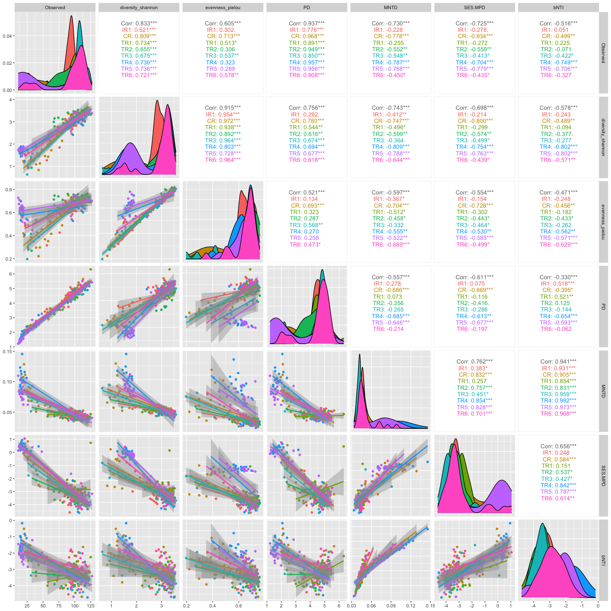
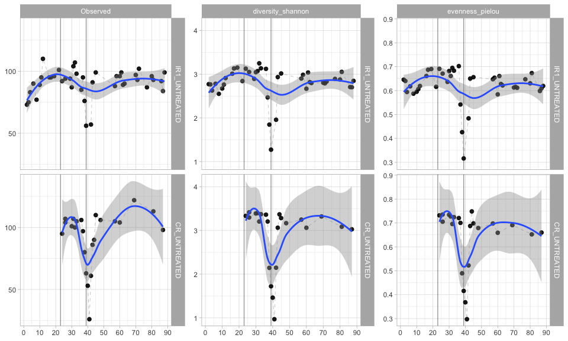
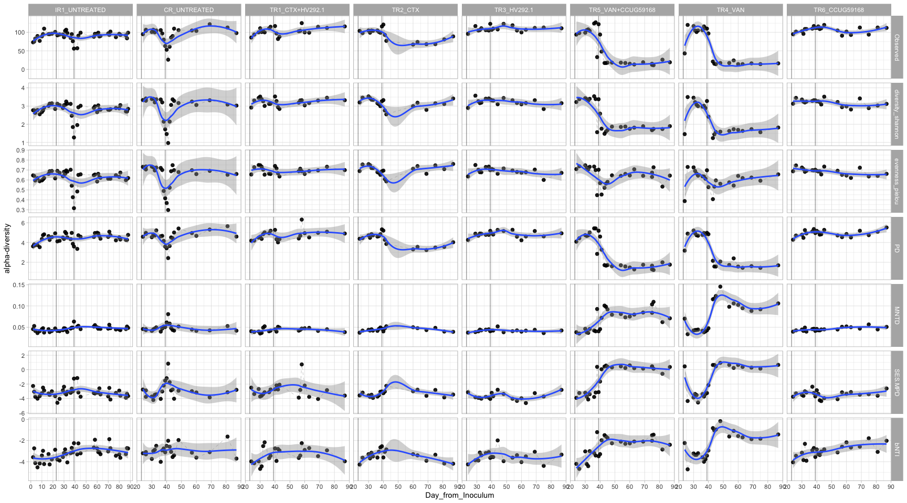
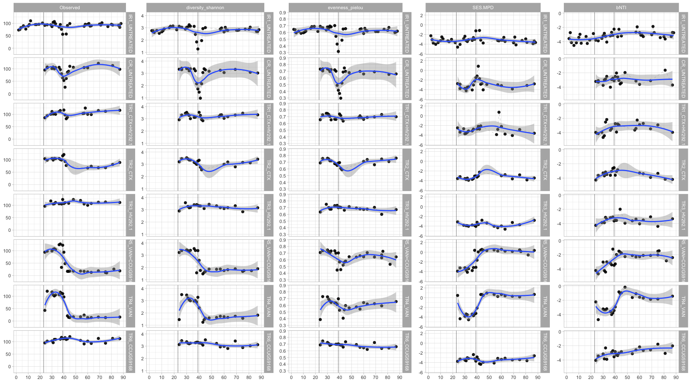
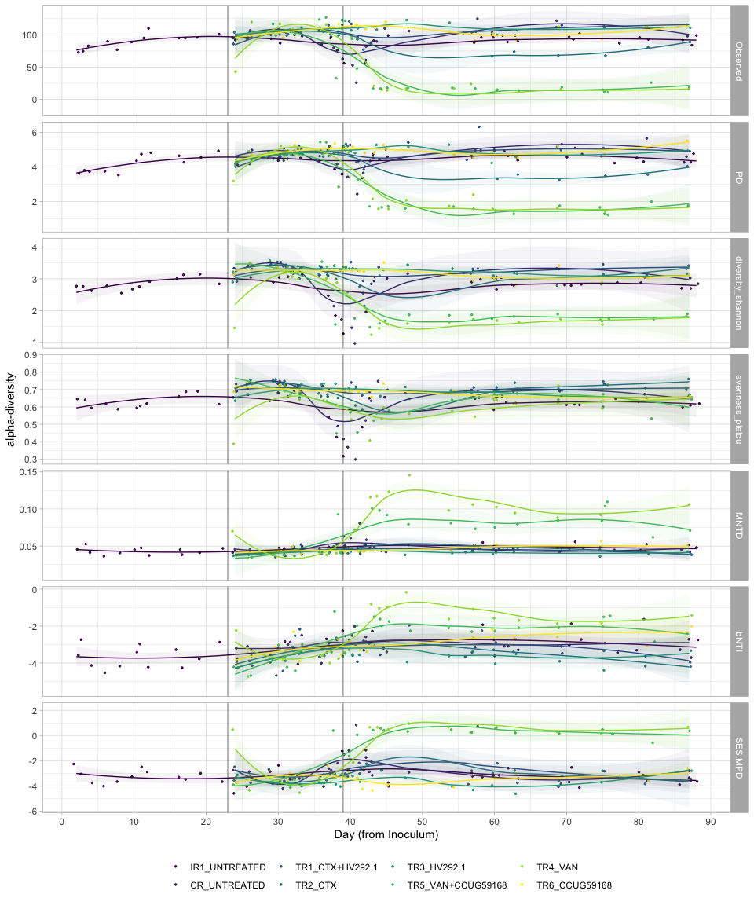

#### Load required packages


```r
library(tidyverse)
library(phyloseq)
library(speedyseq)
library(ggrepel)
library(ampvis2)
library(plotly)
library(microbiome)
options(getClass.msg=FALSE) # https://github.com/epurdom/clusterExperiment/issues/66
#this fixes an error message that pops up because the class 'Annotated' is defined in two different packages
```

#### Load functions from Github


```r
'%!in%' <- function(x,y)!('%in%'(x,y))

source("https://raw.githubusercontent.com/fconstancias/DivComAnalyses/master/R/phyloseq_taxa_tests.R")
source("https://raw.githubusercontent.com/fconstancias/DivComAnalyses/master/R/phyloseq_normalisation.R")
```

```
## Loading required package: scales
```

```
## 
## Attaching package: 'scales'
```

```
## The following object is masked from 'package:microbiome':
## 
##     alpha
```

```
## The following object is masked from 'package:purrr':
## 
##     discard
```

```
## The following object is masked from 'package:readr':
## 
##     col_factor
```

```
## Loading required package: reshape2
```

```
## 
## Attaching package: 'reshape2'
```

```
## The following object is masked from 'package:tidyr':
## 
##     smiths
```

```r
source("https://raw.githubusercontent.com/fconstancias/DivComAnalyses/master/R/phyloseq_alpha.R")
source("https://raw.githubusercontent.com/fconstancias/DivComAnalyses/master/R/phyloseq_beta.R")
source("https://raw.githubusercontent.com/fconstancias/DivComAnalyses/master/R/phyloseq_heatmap.R")
```


#### Load physeq object


```r
ps = "data/processed/physeq_update_23_11.RDS"

ps %>% 
  here::here() %>%
  readRDS() %>%
  phyloseq_get_strains_fast() %>%
  phyloseq_remove_chloro_mitho() -> physeq
```

```
## Joining, by = "ASV"
```

```r
physeq %>% 
  subset_samples(Experiment == "Continuous") %>% 
  subset_samples(Paul %!in% c("Paul")) %>%
  subset_samples(Reactor != "IR2") -> ps_PolyFermS
```

We will be analysing only the PolyFermS samples here so take a subset of the physeq object.  

```r
physeq %>% 
  subset_samples(Experiment == "Continuous") %>% 
  subset_samples(Paul %!in% c("Paul")) %>%
  subset_samples(Reactor != "IR2") -> ps_polyFermS

sample_data(ps_polyFermS)$Reactor <- fct_relevel(sample_data(ps_polyFermS)$Reactor, "IR1", "CR", "TR1", "TR2","TR3", "TR4", "TR5", "TR6") 

sample_data(ps_polyFermS)$Treatment <- fct_relevel(sample_data(ps_polyFermS)$Treatment, "UNTREATED",  "CTX+HV292.1", "CTX","HV292.1","VAN+CCUG59168", "VAN",  "CCUG59168") 

sample_data(ps_polyFermS)$Reactor_Treatment <- fct_relevel(sample_data(ps_polyFermS)$Reactor_Treatment, "IR1_UNTREATED","CR_UNTREATED", "CR_CTX", "CR_VAN", "TR1_CTX+HV292.1","TR2_CTX", "TR3_HV292.1", "TR5_VAN+CCUG59168", "TR4_VAN", "TR6_CCUG59168") 

ps_polyFermS %>% 
  rarefy_even_depth(sample.size = 4576,
                    rngseed = 123) -> ps_polyFermS_rare
```

```
## `set.seed(123)` was used to initialize repeatable random subsampling.
```

```
## Please record this for your records so others can reproduce.
```

```
## Try `set.seed(123); .Random.seed` for the full vector
```

```
## ...
```

```
## 16 samples removedbecause they contained fewer reads than `sample.size`.
```

```
## Up to first five removed samples are:
```

```
## CR-40-S166ETR1-30-S178ETR1-42-S194ETR2-30-S195IR1-40-S197
```

```
## ...
```

```
## 50OTUs were removed because they are no longer 
## present in any sample after random subsampling
```

```
## ...
```

Compute alpha-div metrics:


```r
ps_polyFermS_rare %>%
  phyloseq_alphas(phylo = TRUE) -> alpha_df
```

```
## Loading required package: metagMisc
```

```
## 
## Attaching package: 'metagMisc'
```

```
## The following object is masked from 'package:purrr':
## 
##     some
```

```
## Observed richness
```

```
## Other forms of richness
```

```
## Diversity
```

```
## Evenness
```

```
## Dominance
```

```
## Rarity
```


Plotting a bar plot of the different diversity indices 

```r
measures = c("Observed", "diversity_shannon", "evenness_pielou", "PD","MNTD", "SES.MPD" ,"bNTI")

# define a function to plot scatter plot
my_fn <- function(data, mapping, ...){
  p <- ggplot(data = data, mapping = mapping) +
    geom_point() +
    geom_smooth(method=lm, ...)
  p
}


alpha_df %>%
  GGally::ggpairs(columns = measures,
                  ggplot2::aes(colour = Reactor),
                  # legend = 1,
                  progress = FALSE,
                  upper = list(
                    continuous = GGally::wrap('cor', method = "spearman")
                  ),
                  lower = list(continuous = my_fn)) -> p_corr

p_corr
```

<!-- -->


```r
alpha_df %>%
  plot_alphas(measure = measures,
             x_group = "Reactor_Treatment",
             colour_group = "Enrichment",
             fill_group = "Enrichment",
              shape_group = "Enrichment",
              facet_group = "Reactor_Treatment",
            test_group = "Reactor_Treatment",
            test_group_2 = "Enrichment") -> out
```


```r
plot_alpha_time <- function(df, 
                            x = "Day_from_Inoculum", 
                            y = "value", 
                            group = "Reactor_Treatment", 
                            facet)
{
  df %>%
  arrange(Day_from_Inoculum) %>%
  ggplot(aes_string(x = x,
             y = y)) +
  geom_point(size=2, alpha=0.9, aes_string(group = group)) + 
  geom_path(inherit.aes = TRUE, aes_string(group=group),
            size = 0.08,
            linetype = "dashed") +
  facet_grid(as.formula(facet), scales = "free") +
  theme_light() +
  ylab("alpha-diversity") +
  scale_color_viridis_d(na.value = "black") + 
  geom_vline(xintercept = c(23,39), 
             color="black", alpha=0.4) + 
  geom_smooth(show.legend = TRUE, level = 0.95) + 
  scale_x_continuous(breaks=seq(0,90,10)) -> plot

  return(plot)
}
```


```r
out$plot$data %>%
  dplyr::filter(Reactor %in% c("IR1", "CR")) %>%
  dplyr::filter(Enrichment == "NotEnriched") %>%
  dplyr::filter(alphadiversiy %in% c("Observed")) %>% 
  plot_alpha_time(facet = c("Reactor_Treatment ~ alphadiversiy")) + 
  facet_null() + 
  facet_grid(Reactor_Treatment~ alphadiversiy, scales = "fixed") -> p1

out$plot$data %>%
  dplyr::filter(Reactor %in% c("IR1", "CR")) %>%
  dplyr::filter(Enrichment == "NotEnriched") %>%
  dplyr::filter(alphadiversiy %in% c("diversity_shannon")) %>% 
  plot_alpha_time(facet = c("Reactor_Treatment ~ alphadiversiy")) + 
  facet_null() + 
  facet_grid(Reactor_Treatment~ alphadiversiy, scales = "fixed") -> p2


out$plot$data %>%
  dplyr::filter(Reactor %in% c("IR1", "CR")) %>%
  dplyr::filter(Enrichment == "NotEnriched") %>%
  dplyr::filter(alphadiversiy %in% c("evenness_pielou")) %>% 
  plot_alpha_time(facet = c("Reactor_Treatment ~ alphadiversiy")) + 
  facet_null() + 
  facet_grid(Reactor_Treatment~ alphadiversiy, scales = "fixed") -> p3

ggpubr::ggarrange(p1 + ylab(NULL) + xlab(NULL),p2 + ylab(NULL) + xlab(NULL) ,p3+ ylab(NULL) + xlab(NULL),
                  ncol = 3,
                  nrow = 1,
                  common.legend = TRUE) -> bigp_1
```

```
## `geom_smooth()` using method = 'loess' and formula 'y ~ x'
## `geom_smooth()` using method = 'loess' and formula 'y ~ x'
## `geom_smooth()` using method = 'loess' and formula 'y ~ x'
## `geom_smooth()` using method = 'loess' and formula 'y ~ x'
## `geom_smooth()` using method = 'loess' and formula 'y ~ x'
## `geom_smooth()` using method = 'loess' and formula 'y ~ x'
```

```r
 bigp_1
```

<!-- -->


```r
out$plot$data %>%
  dplyr::filter(Enrichment == "NotEnriched") %>%
  plot_alpha_time(facet = c("alphadiversiy ~ Reactor_Treatment")) -> p4

p4
```

```
## `geom_smooth()` using method = 'loess' and formula 'y ~ x'
```

<!-- -->


```r
out$plot$data %>%
  dplyr::filter(Enrichment == "NotEnriched") %>%
  dplyr::filter(alphadiversiy %in% c("Observed")) %>% 
  plot_alpha_time(facet = c("Reactor_Treatment ~ alphadiversiy")) + 
  facet_null() + 
  facet_grid(Reactor_Treatment~ alphadiversiy, scales = "fixed") -> p5

out$plot$data %>%
  dplyr::filter(Enrichment == "NotEnriched") %>%
  dplyr::filter(alphadiversiy %in% c("diversity_shannon")) %>% 
  plot_alpha_time(facet = c("Reactor_Treatment ~ alphadiversiy")) + 
  facet_null() + 
  facet_grid(Reactor_Treatment~ alphadiversiy, scales = "fixed") -> p6


out$plot$data %>%
  dplyr::filter(Enrichment == "NotEnriched") %>%
  dplyr::filter(alphadiversiy %in% c("evenness_pielou")) %>% 
  plot_alpha_time(facet = c("Reactor_Treatment ~ alphadiversiy")) + 
  facet_null() + 
  facet_grid(Reactor_Treatment~ alphadiversiy, scales = "fixed") -> p7

out$plot$data %>%
  dplyr::filter(Enrichment == "NotEnriched") %>%
  dplyr::filter(alphadiversiy %in% c("SES.MPD")) %>% 
  plot_alpha_time(facet = c("Reactor_Treatment ~ alphadiversiy")) + 
  facet_null() + 
  facet_grid(Reactor_Treatment~ alphadiversiy, scales = "fixed")  -> p8

out$plot$data %>%
  dplyr::filter(Enrichment == "NotEnriched") %>%
  dplyr::filter(alphadiversiy %in% c("bNTI")) %>% 
  plot_alpha_time(facet = c("Reactor_Treatment ~ alphadiversiy")) + 
  facet_null() + 
  facet_grid(Reactor_Treatment~ alphadiversiy, scales = "fixed") -> p9

ggpubr::ggarrange(p5 + ylab(NULL) + xlab(NULL),
                  p6 + ylab(NULL)+ xlab(NULL),
                  p7 + ylab(NULL)+ xlab(NULL),
                  p8 + ylab(NULL)+ xlab(NULL),
                  p9 + ylab(NULL)+ xlab(NULL),
                  ncol = 5,
                  nrow = 1,
                  common.legend = TRUE) -> bigp_2
```

```
## `geom_smooth()` using method = 'loess' and formula 'y ~ x'
## `geom_smooth()` using method = 'loess' and formula 'y ~ x'
## `geom_smooth()` using method = 'loess' and formula 'y ~ x'
## `geom_smooth()` using method = 'loess' and formula 'y ~ x'
## `geom_smooth()` using method = 'loess' and formula 'y ~ x'
## `geom_smooth()` using method = 'loess' and formula 'y ~ x'
## `geom_smooth()` using method = 'loess' and formula 'y ~ x'
## `geom_smooth()` using method = 'loess' and formula 'y ~ x'
## `geom_smooth()` using method = 'loess' and formula 'y ~ x'
## `geom_smooth()` using method = 'loess' and formula 'y ~ x'
```

```r
bigp_2
```

<!-- -->


```r
plot_time <- function(df, 
                      measure,
                      x = "Day_from_Inoculum", 
                      y = "value", 
                      shape = "neg",
                      fill = "Reactor_Treatment",
                      group = "Reactor_Treatment", 
                      facet)
{
  df %>%
  dplyr::filter(alphadiversiy %in% measure) %>%
  dplyr::mutate(alphadiversiy = fct_reorder(alphadiversiy, value, .desc = TRUE)) %>%
  dplyr::mutate(neg = ifelse(value == 0, "neg", "pos")) %>%
  arrange(Day_from_Inoculum) %>%
  ggplot(aes_string(x = x,
                    y = y)) +
  geom_jitter(size=0.5, alpha=0.9, aes_string(color = fill, fill = fill, shape = shape),  show.legend = TRUE) + 
  geom_path(inherit.aes = TRUE, aes_string(fill = fill, color = fill, show.legend = FALSE),
            size = 0.001,
            linetype = "dashed") +
  facet_grid(as.formula(facet), scales = "free") +
  geom_vline(xintercept = c(23,39), 
             color="black", alpha=0.4) + 
  geom_smooth(show.legend = FALSE, level = 0.95, alpha=0.05, size = 0.5 ,aes_string(color = fill, fill = fill)) +
  scale_x_continuous(breaks=seq(0,90,10)) +
  # scale_y_continuous(labels = scientific,
  #                    limits=c(1e+10, 1e+11), breaks = seq(1e+10, 1e+11, by = 1e+10),
  #                    trans = "log10") +
  theme_light() +
  scale_color_viridis_d(na.value = "black") +
  scale_fill_viridis_d(na.value = "black") -> plot

  return(plot + theme(legend.position = "bottom"))
}
```


```r
out$plot$data %>%
  dplyr::filter(Enrichment == "NotEnriched") %>%
  plot_time(measure = measures,
            facet = c("alphadiversiy ~ ."),
            shape = NULL) + 
  labs(x="Day (from Inoculum)", y= "alpha-diversity",  
       col=NULL, fill = NULL, shape = NULL) -> p5

p5
```



```r
p5 %>%
  plotly::ggplotly() -> p5ly
```

```
## `geom_smooth()` using method = 'loess' and formula 'y ~ x'
```

```r
p5ly
```

<!--html_preserve--><div id="htmlwidget-486f97a532a432489cc5" style="width:672px;height:480px;" class="plotly html-widget"></div>
<script type="application/json" data-for="htmlwidget-486f97a532a432489cc5">{"x":{"data":[{"x":[2.34416073914617,3.38478619940579,3.65529655851424,6.35788141600788,7.74230774808675,9.98454470448196,10.7452144963667,12.2397913020104,16.2458221731707,16.9679706543684,19.047023437731,22.25721966438,24.3493069510907,25.9647946927696,29.3780740961432,29.9880521591753,30.6267799695954,31.8435999112204,33.2587560402229,35.7908600088209,37.2685044620186,38.223616207391,38.8054953733459,42.3549903556705,42.7609684349969,44.7444432819262,57.178239605017,57.9329104535282,60.3838526858017,61.3379872929305,61.8199089899659,62.7605648454279,70.0732127794996,70.7808416936547,72.193552617915,77.2166496010497,79.7521915862337,81.2267080949619,86.1375166729093,87.3744692102075,88.0704167675227],"y":[72.9999999907753,75.0000000043954,82.9999999895228,89.999999990403,77.0000000014847,88.9999999998539,95.0000000040895,109.999999988449,95.000000001885,94.999999994268,95.9999999968071,101.000000008064,92.0000000047622,93.9999999930186,94.0000000049165,87.0000000102774,104.000000004844,106.999999997024,98.0000000115934,85.000000011382,94.9999999930035,75.9999999975752,55.9999999993954,56.9999999908291,91.0000000100241,99.0000000032236,88.0000000087241,95.999999994905,95.9999999915337,98.9999999985847,88.9999999907051,89.9999999976754,96.9999999987414,93.0000000018299,102.000000001907,86.9999999991576,95.9999999892105,93.0000000129034,91.9999999878508,83.9999999985623,99.0000000109209],"text":["Reactor_Treatment: IR1_UNTREATED<br />Reactor_Treatment: IR1_UNTREATED<br />shape: 19<br />Day_from_Inoculum:  2<br />value:  73.00000000","Reactor_Treatment: IR1_UNTREATED<br />Reactor_Treatment: IR1_UNTREATED<br />shape: 19<br />Day_from_Inoculum:  3<br />value:  75.00000000","Reactor_Treatment: IR1_UNTREATED<br />Reactor_Treatment: IR1_UNTREATED<br />shape: 19<br />Day_from_Inoculum:  4<br />value:  83.00000000","Reactor_Treatment: IR1_UNTREATED<br />Reactor_Treatment: IR1_UNTREATED<br />shape: 19<br />Day_from_Inoculum:  6<br />value:  90.00000000","Reactor_Treatment: IR1_UNTREATED<br />Reactor_Treatment: IR1_UNTREATED<br />shape: 19<br />Day_from_Inoculum:  8<br />value:  77.00000000","Reactor_Treatment: IR1_UNTREATED<br />Reactor_Treatment: IR1_UNTREATED<br />shape: 19<br />Day_from_Inoculum: 10<br />value:  89.00000000","Reactor_Treatment: IR1_UNTREATED<br />Reactor_Treatment: IR1_UNTREATED<br />shape: 19<br />Day_from_Inoculum: 11<br />value:  95.00000000","Reactor_Treatment: IR1_UNTREATED<br />Reactor_Treatment: IR1_UNTREATED<br />shape: 19<br />Day_from_Inoculum: 12<br />value: 110.00000000","Reactor_Treatment: IR1_UNTREATED<br />Reactor_Treatment: IR1_UNTREATED<br />shape: 19<br />Day_from_Inoculum: 16<br />value:  95.00000000","Reactor_Treatment: IR1_UNTREATED<br />Reactor_Treatment: IR1_UNTREATED<br />shape: 19<br />Day_from_Inoculum: 17<br />value:  95.00000000","Reactor_Treatment: IR1_UNTREATED<br />Reactor_Treatment: IR1_UNTREATED<br />shape: 19<br />Day_from_Inoculum: 19<br />value:  96.00000000","Reactor_Treatment: IR1_UNTREATED<br />Reactor_Treatment: IR1_UNTREATED<br />shape: 19<br />Day_from_Inoculum: 22<br />value: 101.00000000","Reactor_Treatment: IR1_UNTREATED<br />Reactor_Treatment: IR1_UNTREATED<br />shape: 19<br />Day_from_Inoculum: 24<br />value:  92.00000000","Reactor_Treatment: IR1_UNTREATED<br />Reactor_Treatment: IR1_UNTREATED<br />shape: 19<br />Day_from_Inoculum: 26<br />value:  94.00000000","Reactor_Treatment: IR1_UNTREATED<br />Reactor_Treatment: IR1_UNTREATED<br />shape: 19<br />Day_from_Inoculum: 29<br />value:  94.00000000","Reactor_Treatment: IR1_UNTREATED<br />Reactor_Treatment: IR1_UNTREATED<br />shape: 19<br />Day_from_Inoculum: 30<br />value:  87.00000000","Reactor_Treatment: IR1_UNTREATED<br />Reactor_Treatment: IR1_UNTREATED<br />shape: 19<br />Day_from_Inoculum: 31<br />value: 104.00000000","Reactor_Treatment: IR1_UNTREATED<br />Reactor_Treatment: IR1_UNTREATED<br />shape: 19<br />Day_from_Inoculum: 32<br />value: 107.00000000","Reactor_Treatment: IR1_UNTREATED<br />Reactor_Treatment: IR1_UNTREATED<br />shape: 19<br />Day_from_Inoculum: 33<br />value:  98.00000000","Reactor_Treatment: IR1_UNTREATED<br />Reactor_Treatment: IR1_UNTREATED<br />shape: 19<br />Day_from_Inoculum: 36<br />value:  85.00000000","Reactor_Treatment: IR1_UNTREATED<br />Reactor_Treatment: IR1_UNTREATED<br />shape: 19<br />Day_from_Inoculum: 37<br />value:  95.00000000","Reactor_Treatment: IR1_UNTREATED<br />Reactor_Treatment: IR1_UNTREATED<br />shape: 19<br />Day_from_Inoculum: 38<br />value:  76.00000000","Reactor_Treatment: IR1_UNTREATED<br />Reactor_Treatment: IR1_UNTREATED<br />shape: 19<br />Day_from_Inoculum: 39<br />value:  56.00000000","Reactor_Treatment: IR1_UNTREATED<br />Reactor_Treatment: IR1_UNTREATED<br />shape: 19<br />Day_from_Inoculum: 42<br />value:  57.00000000","Reactor_Treatment: IR1_UNTREATED<br />Reactor_Treatment: IR1_UNTREATED<br />shape: 19<br />Day_from_Inoculum: 43<br />value:  91.00000000","Reactor_Treatment: IR1_UNTREATED<br />Reactor_Treatment: IR1_UNTREATED<br />shape: 19<br />Day_from_Inoculum: 45<br />value:  99.00000000","Reactor_Treatment: IR1_UNTREATED<br />Reactor_Treatment: IR1_UNTREATED<br />shape: 19<br />Day_from_Inoculum: 57<br />value:  88.00000000","Reactor_Treatment: IR1_UNTREATED<br />Reactor_Treatment: IR1_UNTREATED<br />shape: 19<br />Day_from_Inoculum: 58<br />value:  96.00000000","Reactor_Treatment: IR1_UNTREATED<br />Reactor_Treatment: IR1_UNTREATED<br />shape: 19<br />Day_from_Inoculum: 60<br />value:  96.00000000","Reactor_Treatment: IR1_UNTREATED<br />Reactor_Treatment: IR1_UNTREATED<br />shape: 19<br />Day_from_Inoculum: 61<br />value:  99.00000000","Reactor_Treatment: IR1_UNTREATED<br />Reactor_Treatment: IR1_UNTREATED<br />shape: 19<br />Day_from_Inoculum: 62<br />value:  89.00000000","Reactor_Treatment: IR1_UNTREATED<br />Reactor_Treatment: IR1_UNTREATED<br />shape: 19<br />Day_from_Inoculum: 63<br />value:  90.00000000","Reactor_Treatment: IR1_UNTREATED<br />Reactor_Treatment: IR1_UNTREATED<br />shape: 19<br />Day_from_Inoculum: 70<br />value:  97.00000000","Reactor_Treatment: IR1_UNTREATED<br />Reactor_Treatment: IR1_UNTREATED<br />shape: 19<br />Day_from_Inoculum: 71<br />value:  93.00000000","Reactor_Treatment: IR1_UNTREATED<br />Reactor_Treatment: IR1_UNTREATED<br />shape: 19<br />Day_from_Inoculum: 72<br />value: 102.00000000","Reactor_Treatment: IR1_UNTREATED<br />Reactor_Treatment: IR1_UNTREATED<br />shape: 19<br />Day_from_Inoculum: 77<br />value:  87.00000000","Reactor_Treatment: IR1_UNTREATED<br />Reactor_Treatment: IR1_UNTREATED<br />shape: 19<br />Day_from_Inoculum: 80<br />value:  96.00000000","Reactor_Treatment: IR1_UNTREATED<br />Reactor_Treatment: IR1_UNTREATED<br />shape: 19<br />Day_from_Inoculum: 81<br />value:  93.00000000","Reactor_Treatment: IR1_UNTREATED<br />Reactor_Treatment: IR1_UNTREATED<br />shape: 19<br />Day_from_Inoculum: 86<br />value:  92.00000000","Reactor_Treatment: IR1_UNTREATED<br />Reactor_Treatment: IR1_UNTREATED<br />shape: 19<br />Day_from_Inoculum: 87<br />value:  84.00000000","Reactor_Treatment: IR1_UNTREATED<br />Reactor_Treatment: IR1_UNTREATED<br />shape: 19<br />Day_from_Inoculum: 88<br />value:  99.00000000"],"type":"scatter","mode":"markers","marker":{"autocolorscale":false,"color":"rgba(68,1,84,1)","opacity":0.9,"size":1.88976377952756,"symbol":"circle","line":{"width":1.88976377952756,"color":"rgba(68,1,84,1)"}},"hoveron":"points","name":"IR1_UNTREATED","legendgroup":"IR1_UNTREATED","showlegend":true,"xaxis":"x","yaxis":"y","hoverinfo":"text","frame":null},{"x":[2.01351325120777,3.13341429401189,3.76495582778007,5.80603676419705,8.22890251204371,9.8481244629249,10.844291844964,11.6770075879991,15.9369556613266,16.6741466879845,19.1218257576227,22.3888660905883,24.1275610443205,26.1771473145112,28.9323632409796,30.1928563792259,31.3113324677572,32.3329727912322,33.3599067462608,35.9341377805918,37.0165795855224,38.3330838834867,38.8991910226643,41.8347758438438,43.193416256085,44.8470244798809,57.2194755623117,58.1857502304018,59.8878546120599,61.1306254789233,61.9210951767862,62.6336339844391,69.674684259668,71.1256736829877,72.0884859366342,76.8709692759439,80.191293211095,81.2893541321158,86.1016131021082,87.3627544090152,87.6216061482206],"y":[3.61199195955979,3.80374848744703,3.71961241136997,3.74614938764297,3.5289017495714,4.34655379099654,4.7393390383761,4.82164835501825,4.64373092119736,4.26160683343313,4.55155476433319,4.92605588782339,4.11325153354374,4.17043036904225,4.500796469744,4.36359937675937,5.06432844217666,4.91977170446235,4.51151076120637,4.33719655107314,4.96995845233113,3.86713620802566,3.59171305125379,3.35394375021947,4.72699720956865,4.58187421827922,4.55603312516299,4.95251828580219,4.98280971449263,4.92767992760938,4.64308409414292,4.3849938919783,4.56271051318803,5.08868740547226,4.73647699670607,4.21920731675771,4.51815302928625,4.30321070773438,4.25799100708204,4.2658041179262,4.76853285605503],"text":["Reactor_Treatment: IR1_UNTREATED<br />Reactor_Treatment: IR1_UNTREATED<br />shape: 19<br />Day_from_Inoculum:  2<br />value:   3.61199197","Reactor_Treatment: IR1_UNTREATED<br />Reactor_Treatment: IR1_UNTREATED<br />shape: 19<br />Day_from_Inoculum:  3<br />value:   3.80374849","Reactor_Treatment: IR1_UNTREATED<br />Reactor_Treatment: IR1_UNTREATED<br />shape: 19<br />Day_from_Inoculum:  4<br />value:   3.71961242","Reactor_Treatment: IR1_UNTREATED<br />Reactor_Treatment: IR1_UNTREATED<br />shape: 19<br />Day_from_Inoculum:  6<br />value:   3.74614939","Reactor_Treatment: IR1_UNTREATED<br />Reactor_Treatment: IR1_UNTREATED<br />shape: 19<br />Day_from_Inoculum:  8<br />value:   3.52890174","Reactor_Treatment: IR1_UNTREATED<br />Reactor_Treatment: IR1_UNTREATED<br />shape: 19<br />Day_from_Inoculum: 10<br />value:   4.34655379","Reactor_Treatment: IR1_UNTREATED<br />Reactor_Treatment: IR1_UNTREATED<br />shape: 19<br />Day_from_Inoculum: 11<br />value:   4.73933904","Reactor_Treatment: IR1_UNTREATED<br />Reactor_Treatment: IR1_UNTREATED<br />shape: 19<br />Day_from_Inoculum: 12<br />value:   4.82164834","Reactor_Treatment: IR1_UNTREATED<br />Reactor_Treatment: IR1_UNTREATED<br />shape: 19<br />Day_from_Inoculum: 16<br />value:   4.64373092","Reactor_Treatment: IR1_UNTREATED<br />Reactor_Treatment: IR1_UNTREATED<br />shape: 19<br />Day_from_Inoculum: 17<br />value:   4.26160684","Reactor_Treatment: IR1_UNTREATED<br />Reactor_Treatment: IR1_UNTREATED<br />shape: 19<br />Day_from_Inoculum: 19<br />value:   4.55155477","Reactor_Treatment: IR1_UNTREATED<br />Reactor_Treatment: IR1_UNTREATED<br />shape: 19<br />Day_from_Inoculum: 22<br />value:   4.92605590","Reactor_Treatment: IR1_UNTREATED<br />Reactor_Treatment: IR1_UNTREATED<br />shape: 19<br />Day_from_Inoculum: 24<br />value:   4.11325153","Reactor_Treatment: IR1_UNTREATED<br />Reactor_Treatment: IR1_UNTREATED<br />shape: 19<br />Day_from_Inoculum: 26<br />value:   4.17043037","Reactor_Treatment: IR1_UNTREATED<br />Reactor_Treatment: IR1_UNTREATED<br />shape: 19<br />Day_from_Inoculum: 29<br />value:   4.50079647","Reactor_Treatment: IR1_UNTREATED<br />Reactor_Treatment: IR1_UNTREATED<br />shape: 19<br />Day_from_Inoculum: 30<br />value:   4.36359937","Reactor_Treatment: IR1_UNTREATED<br />Reactor_Treatment: IR1_UNTREATED<br />shape: 19<br />Day_from_Inoculum: 31<br />value:   5.06432844","Reactor_Treatment: IR1_UNTREATED<br />Reactor_Treatment: IR1_UNTREATED<br />shape: 19<br />Day_from_Inoculum: 32<br />value:   4.91977171","Reactor_Treatment: IR1_UNTREATED<br />Reactor_Treatment: IR1_UNTREATED<br />shape: 19<br />Day_from_Inoculum: 33<br />value:   4.51151077","Reactor_Treatment: IR1_UNTREATED<br />Reactor_Treatment: IR1_UNTREATED<br />shape: 19<br />Day_from_Inoculum: 36<br />value:   4.33719654","Reactor_Treatment: IR1_UNTREATED<br />Reactor_Treatment: IR1_UNTREATED<br />shape: 19<br />Day_from_Inoculum: 37<br />value:   4.96995846","Reactor_Treatment: IR1_UNTREATED<br />Reactor_Treatment: IR1_UNTREATED<br />shape: 19<br />Day_from_Inoculum: 38<br />value:   3.86713621","Reactor_Treatment: IR1_UNTREATED<br />Reactor_Treatment: IR1_UNTREATED<br />shape: 19<br />Day_from_Inoculum: 39<br />value:   3.59171304","Reactor_Treatment: IR1_UNTREATED<br />Reactor_Treatment: IR1_UNTREATED<br />shape: 19<br />Day_from_Inoculum: 42<br />value:   3.35394376","Reactor_Treatment: IR1_UNTREATED<br />Reactor_Treatment: IR1_UNTREATED<br />shape: 19<br />Day_from_Inoculum: 43<br />value:   4.72699721","Reactor_Treatment: IR1_UNTREATED<br />Reactor_Treatment: IR1_UNTREATED<br />shape: 19<br />Day_from_Inoculum: 45<br />value:   4.58187422","Reactor_Treatment: IR1_UNTREATED<br />Reactor_Treatment: IR1_UNTREATED<br />shape: 19<br />Day_from_Inoculum: 57<br />value:   4.55603312","Reactor_Treatment: IR1_UNTREATED<br />Reactor_Treatment: IR1_UNTREATED<br />shape: 19<br />Day_from_Inoculum: 58<br />value:   4.95251829","Reactor_Treatment: IR1_UNTREATED<br />Reactor_Treatment: IR1_UNTREATED<br />shape: 19<br />Day_from_Inoculum: 60<br />value:   4.98280973","Reactor_Treatment: IR1_UNTREATED<br />Reactor_Treatment: IR1_UNTREATED<br />shape: 19<br />Day_from_Inoculum: 61<br />value:   4.92767992","Reactor_Treatment: IR1_UNTREATED<br />Reactor_Treatment: IR1_UNTREATED<br />shape: 19<br />Day_from_Inoculum: 62<br />value:   4.64308410","Reactor_Treatment: IR1_UNTREATED<br />Reactor_Treatment: IR1_UNTREATED<br />shape: 19<br />Day_from_Inoculum: 63<br />value:   4.38499388","Reactor_Treatment: IR1_UNTREATED<br />Reactor_Treatment: IR1_UNTREATED<br />shape: 19<br />Day_from_Inoculum: 70<br />value:   4.56271053","Reactor_Treatment: IR1_UNTREATED<br />Reactor_Treatment: IR1_UNTREATED<br />shape: 19<br />Day_from_Inoculum: 71<br />value:   5.08868740","Reactor_Treatment: IR1_UNTREATED<br />Reactor_Treatment: IR1_UNTREATED<br />shape: 19<br />Day_from_Inoculum: 72<br />value:   4.73647700","Reactor_Treatment: IR1_UNTREATED<br />Reactor_Treatment: IR1_UNTREATED<br />shape: 19<br />Day_from_Inoculum: 77<br />value:   4.21920733","Reactor_Treatment: IR1_UNTREATED<br />Reactor_Treatment: IR1_UNTREATED<br />shape: 19<br />Day_from_Inoculum: 80<br />value:   4.51815302","Reactor_Treatment: IR1_UNTREATED<br />Reactor_Treatment: IR1_UNTREATED<br />shape: 19<br />Day_from_Inoculum: 81<br />value:   4.30321072","Reactor_Treatment: IR1_UNTREATED<br />Reactor_Treatment: IR1_UNTREATED<br />shape: 19<br />Day_from_Inoculum: 86<br />value:   4.25799101","Reactor_Treatment: IR1_UNTREATED<br />Reactor_Treatment: IR1_UNTREATED<br />shape: 19<br />Day_from_Inoculum: 87<br />value:   4.26580413","Reactor_Treatment: IR1_UNTREATED<br />Reactor_Treatment: IR1_UNTREATED<br />shape: 19<br />Day_from_Inoculum: 88<br />value:   4.76853286"],"type":"scatter","mode":"markers","marker":{"autocolorscale":false,"color":"rgba(68,1,84,1)","opacity":0.9,"size":1.88976377952756,"symbol":"circle","line":{"width":1.88976377952756,"color":"rgba(68,1,84,1)"}},"hoveron":"points","name":"IR1_UNTREATED","legendgroup":"IR1_UNTREATED","showlegend":false,"xaxis":"x","yaxis":"y2","hoverinfo":"text","frame":null},{"x":[2.17791162393987,3.16641160063446,3.84628550950438,5.87426821719855,8.25167651232332,9.77553440593183,10.9717389844358,12.1328415466473,16.2022801211104,17.2989770874381,18.8822763439268,21.9080836258829,24.2711694663391,25.627113468945,29.3878025632352,29.8520669098943,31.2725711721927,31.8604131687433,33.1932593656704,36.0742056015879,37.3522689145058,37.8813981857151,38.9919916316867,42.273709044978,42.9544876353815,45.1639938186854,56.9898627771065,57.9188812075183,60.2703459583223,60.6705928979442,62.1627555752173,62.9248662551865,70.1516095723957,71.0628866152838,72.0949418652803,76.8329041598365,80.3654117248952,81.108266931586,85.7458076708019,86.8888475336134,88.2374333078042],"y":[2.77050522807277,2.76409097196097,2.62498657045792,2.78034232493573,2.5499594228658,2.67165297976587,2.75984039508382,2.91090865556545,3.01014408389916,3.12918470503109,3.14948863201405,2.84159528602135,3.12464045047886,3.04915470900401,2.89158975485032,3.0446916752918,3.07000256058977,3.24788418300627,3.13307623394698,3.12029605480441,2.46687387394703,1.84538224578849,1.27211646863959,1.95613190261911,2.93285310290379,3.01528366551359,2.89897407244161,2.98494848713176,2.66654549693364,3.0366254539668,2.81671391406086,2.7970033653873,2.80313452464048,2.78897263338491,2.8288004073771,2.89111096920056,2.87714910323889,3.05164966681114,2.70507061672384,2.7002461208548,2.84604370233246],"text":["Reactor_Treatment: IR1_UNTREATED<br />Reactor_Treatment: IR1_UNTREATED<br />shape: 19<br />Day_from_Inoculum:  2<br />value:   2.77050522","Reactor_Treatment: IR1_UNTREATED<br />Reactor_Treatment: IR1_UNTREATED<br />shape: 19<br />Day_from_Inoculum:  3<br />value:   2.76409097","Reactor_Treatment: IR1_UNTREATED<br />Reactor_Treatment: IR1_UNTREATED<br />shape: 19<br />Day_from_Inoculum:  4<br />value:   2.62498657","Reactor_Treatment: IR1_UNTREATED<br />Reactor_Treatment: IR1_UNTREATED<br />shape: 19<br />Day_from_Inoculum:  6<br />value:   2.78034232","Reactor_Treatment: IR1_UNTREATED<br />Reactor_Treatment: IR1_UNTREATED<br />shape: 19<br />Day_from_Inoculum:  8<br />value:   2.54995942","Reactor_Treatment: IR1_UNTREATED<br />Reactor_Treatment: IR1_UNTREATED<br />shape: 19<br />Day_from_Inoculum: 10<br />value:   2.67165297","Reactor_Treatment: IR1_UNTREATED<br />Reactor_Treatment: IR1_UNTREATED<br />shape: 19<br />Day_from_Inoculum: 11<br />value:   2.75984040","Reactor_Treatment: IR1_UNTREATED<br />Reactor_Treatment: IR1_UNTREATED<br />shape: 19<br />Day_from_Inoculum: 12<br />value:   2.91090865","Reactor_Treatment: IR1_UNTREATED<br />Reactor_Treatment: IR1_UNTREATED<br />shape: 19<br />Day_from_Inoculum: 16<br />value:   3.01014409","Reactor_Treatment: IR1_UNTREATED<br />Reactor_Treatment: IR1_UNTREATED<br />shape: 19<br />Day_from_Inoculum: 17<br />value:   3.12918471","Reactor_Treatment: IR1_UNTREATED<br />Reactor_Treatment: IR1_UNTREATED<br />shape: 19<br />Day_from_Inoculum: 19<br />value:   3.14948862","Reactor_Treatment: IR1_UNTREATED<br />Reactor_Treatment: IR1_UNTREATED<br />shape: 19<br />Day_from_Inoculum: 22<br />value:   2.84159529","Reactor_Treatment: IR1_UNTREATED<br />Reactor_Treatment: IR1_UNTREATED<br />shape: 19<br />Day_from_Inoculum: 24<br />value:   3.12464045","Reactor_Treatment: IR1_UNTREATED<br />Reactor_Treatment: IR1_UNTREATED<br />shape: 19<br />Day_from_Inoculum: 26<br />value:   3.04915471","Reactor_Treatment: IR1_UNTREATED<br />Reactor_Treatment: IR1_UNTREATED<br />shape: 19<br />Day_from_Inoculum: 29<br />value:   2.89158977","Reactor_Treatment: IR1_UNTREATED<br />Reactor_Treatment: IR1_UNTREATED<br />shape: 19<br />Day_from_Inoculum: 30<br />value:   3.04469167","Reactor_Treatment: IR1_UNTREATED<br />Reactor_Treatment: IR1_UNTREATED<br />shape: 19<br />Day_from_Inoculum: 31<br />value:   3.07000255","Reactor_Treatment: IR1_UNTREATED<br />Reactor_Treatment: IR1_UNTREATED<br />shape: 19<br />Day_from_Inoculum: 32<br />value:   3.24788419","Reactor_Treatment: IR1_UNTREATED<br />Reactor_Treatment: IR1_UNTREATED<br />shape: 19<br />Day_from_Inoculum: 33<br />value:   3.13307622","Reactor_Treatment: IR1_UNTREATED<br />Reactor_Treatment: IR1_UNTREATED<br />shape: 19<br />Day_from_Inoculum: 36<br />value:   3.12029606","Reactor_Treatment: IR1_UNTREATED<br />Reactor_Treatment: IR1_UNTREATED<br />shape: 19<br />Day_from_Inoculum: 37<br />value:   2.46687387","Reactor_Treatment: IR1_UNTREATED<br />Reactor_Treatment: IR1_UNTREATED<br />shape: 19<br />Day_from_Inoculum: 38<br />value:   1.84538225","Reactor_Treatment: IR1_UNTREATED<br />Reactor_Treatment: IR1_UNTREATED<br />shape: 19<br />Day_from_Inoculum: 39<br />value:   1.27211647","Reactor_Treatment: IR1_UNTREATED<br />Reactor_Treatment: IR1_UNTREATED<br />shape: 19<br />Day_from_Inoculum: 42<br />value:   1.95613189","Reactor_Treatment: IR1_UNTREATED<br />Reactor_Treatment: IR1_UNTREATED<br />shape: 19<br />Day_from_Inoculum: 43<br />value:   2.93285310","Reactor_Treatment: IR1_UNTREATED<br />Reactor_Treatment: IR1_UNTREATED<br />shape: 19<br />Day_from_Inoculum: 45<br />value:   3.01528368","Reactor_Treatment: IR1_UNTREATED<br />Reactor_Treatment: IR1_UNTREATED<br />shape: 19<br />Day_from_Inoculum: 57<br />value:   2.89897407","Reactor_Treatment: IR1_UNTREATED<br />Reactor_Treatment: IR1_UNTREATED<br />shape: 19<br />Day_from_Inoculum: 58<br />value:   2.98494849","Reactor_Treatment: IR1_UNTREATED<br />Reactor_Treatment: IR1_UNTREATED<br />shape: 19<br />Day_from_Inoculum: 60<br />value:   2.66654550","Reactor_Treatment: IR1_UNTREATED<br />Reactor_Treatment: IR1_UNTREATED<br />shape: 19<br />Day_from_Inoculum: 61<br />value:   3.03662546","Reactor_Treatment: IR1_UNTREATED<br />Reactor_Treatment: IR1_UNTREATED<br />shape: 19<br />Day_from_Inoculum: 62<br />value:   2.81671391","Reactor_Treatment: IR1_UNTREATED<br />Reactor_Treatment: IR1_UNTREATED<br />shape: 19<br />Day_from_Inoculum: 63<br />value:   2.79700338","Reactor_Treatment: IR1_UNTREATED<br />Reactor_Treatment: IR1_UNTREATED<br />shape: 19<br />Day_from_Inoculum: 70<br />value:   2.80313452","Reactor_Treatment: IR1_UNTREATED<br />Reactor_Treatment: IR1_UNTREATED<br />shape: 19<br />Day_from_Inoculum: 71<br />value:   2.78897264","Reactor_Treatment: IR1_UNTREATED<br />Reactor_Treatment: IR1_UNTREATED<br />shape: 19<br />Day_from_Inoculum: 72<br />value:   2.82880041","Reactor_Treatment: IR1_UNTREATED<br />Reactor_Treatment: IR1_UNTREATED<br />shape: 19<br />Day_from_Inoculum: 77<br />value:   2.89111098","Reactor_Treatment: IR1_UNTREATED<br />Reactor_Treatment: IR1_UNTREATED<br />shape: 19<br />Day_from_Inoculum: 80<br />value:   2.87714911","Reactor_Treatment: IR1_UNTREATED<br />Reactor_Treatment: IR1_UNTREATED<br />shape: 19<br />Day_from_Inoculum: 81<br />value:   3.05164967","Reactor_Treatment: IR1_UNTREATED<br />Reactor_Treatment: IR1_UNTREATED<br />shape: 19<br />Day_from_Inoculum: 86<br />value:   2.70507062","Reactor_Treatment: IR1_UNTREATED<br />Reactor_Treatment: IR1_UNTREATED<br />shape: 19<br />Day_from_Inoculum: 87<br />value:   2.70024613","Reactor_Treatment: IR1_UNTREATED<br />Reactor_Treatment: IR1_UNTREATED<br />shape: 19<br />Day_from_Inoculum: 88<br />value:   2.84604369"],"type":"scatter","mode":"markers","marker":{"autocolorscale":false,"color":"rgba(68,1,84,1)","opacity":0.9,"size":1.88976377952756,"symbol":"circle","line":{"width":1.88976377952756,"color":"rgba(68,1,84,1)"}},"hoveron":"points","name":"IR1_UNTREATED","legendgroup":"IR1_UNTREATED","showlegend":false,"xaxis":"x","yaxis":"y3","hoverinfo":"text","frame":null},{"x":[2.07343810331076,2.63097954206169,3.83513623494655,5.7931623397395,7.91614767741412,9.91978777591139,10.702862293832,12.1390766927972,15.8415547030047,16.9707458557561,19.1582208830863,21.8718316989019,24.3375322565436,25.8212414938956,28.9743219828233,30.2828889265656,31.1795540468767,32.1530031351373,33.0196693094447,35.9967171931639,36.6666741456836,37.9286625536159,38.644775625132,41.9691777393222,43.3532097093761,45.1680519741029,56.7374182073399,57.9060987671837,60.2264810703695,60.79717600476,61.7623696463183,62.8631328515708,69.8864501211792,70.8229199592024,72.3079579215497,76.8467728922144,79.9929688395932,81.213920908235,85.9240499293432,87.297504700534,87.9254304198548],"y":[0.645736264503161,0.640208133727372,0.594044197928028,0.617879991895425,0.587033525555007,0.595203685826968,0.606041957036882,0.619278961504992,0.661006908184092,0.687147421577299,0.69001937221818,0.615714199458685,0.691018709044855,0.67113291717039,0.636452148828722,0.681763178116208,0.661012944807589,0.69505737201424,0.683336624379884,0.702350000851461,0.541708512648547,0.426113111247124,0.316026179099401,0.483825658055724,0.65017610118961,0.656192619662292,0.647477330697214,0.653970376397358,0.584211680006555,0.660837052185026,0.627521081857555,0.621582590152528,0.612745700673498,0.615314151028135,0.611636112249965,0.647373597359297,0.630352682472479,0.673266989736575,0.598230234213183,0.609424012458689,0.619362236859676],"text":["Reactor_Treatment: IR1_UNTREATED<br />Reactor_Treatment: IR1_UNTREATED<br />shape: 19<br />Day_from_Inoculum:  2<br />value:   0.64573626","Reactor_Treatment: IR1_UNTREATED<br />Reactor_Treatment: IR1_UNTREATED<br />shape: 19<br />Day_from_Inoculum:  3<br />value:   0.64020812","Reactor_Treatment: IR1_UNTREATED<br />Reactor_Treatment: IR1_UNTREATED<br />shape: 19<br />Day_from_Inoculum:  4<br />value:   0.59404419","Reactor_Treatment: IR1_UNTREATED<br />Reactor_Treatment: IR1_UNTREATED<br />shape: 19<br />Day_from_Inoculum:  6<br />value:   0.61787998","Reactor_Treatment: IR1_UNTREATED<br />Reactor_Treatment: IR1_UNTREATED<br />shape: 19<br />Day_from_Inoculum:  8<br />value:   0.58703353","Reactor_Treatment: IR1_UNTREATED<br />Reactor_Treatment: IR1_UNTREATED<br />shape: 19<br />Day_from_Inoculum: 10<br />value:   0.59520370","Reactor_Treatment: IR1_UNTREATED<br />Reactor_Treatment: IR1_UNTREATED<br />shape: 19<br />Day_from_Inoculum: 11<br />value:   0.60604194","Reactor_Treatment: IR1_UNTREATED<br />Reactor_Treatment: IR1_UNTREATED<br />shape: 19<br />Day_from_Inoculum: 12<br />value:   0.61927897","Reactor_Treatment: IR1_UNTREATED<br />Reactor_Treatment: IR1_UNTREATED<br />shape: 19<br />Day_from_Inoculum: 16<br />value:   0.66100691","Reactor_Treatment: IR1_UNTREATED<br />Reactor_Treatment: IR1_UNTREATED<br />shape: 19<br />Day_from_Inoculum: 17<br />value:   0.68714741","Reactor_Treatment: IR1_UNTREATED<br />Reactor_Treatment: IR1_UNTREATED<br />shape: 19<br />Day_from_Inoculum: 19<br />value:   0.69001936","Reactor_Treatment: IR1_UNTREATED<br />Reactor_Treatment: IR1_UNTREATED<br />shape: 19<br />Day_from_Inoculum: 22<br />value:   0.61571421","Reactor_Treatment: IR1_UNTREATED<br />Reactor_Treatment: IR1_UNTREATED<br />shape: 19<br />Day_from_Inoculum: 24<br />value:   0.69101870","Reactor_Treatment: IR1_UNTREATED<br />Reactor_Treatment: IR1_UNTREATED<br />shape: 19<br />Day_from_Inoculum: 26<br />value:   0.67113292","Reactor_Treatment: IR1_UNTREATED<br />Reactor_Treatment: IR1_UNTREATED<br />shape: 19<br />Day_from_Inoculum: 29<br />value:   0.63645216","Reactor_Treatment: IR1_UNTREATED<br />Reactor_Treatment: IR1_UNTREATED<br />shape: 19<br />Day_from_Inoculum: 30<br />value:   0.68176317","Reactor_Treatment: IR1_UNTREATED<br />Reactor_Treatment: IR1_UNTREATED<br />shape: 19<br />Day_from_Inoculum: 31<br />value:   0.66101295","Reactor_Treatment: IR1_UNTREATED<br />Reactor_Treatment: IR1_UNTREATED<br />shape: 19<br />Day_from_Inoculum: 32<br />value:   0.69505738","Reactor_Treatment: IR1_UNTREATED<br />Reactor_Treatment: IR1_UNTREATED<br />shape: 19<br />Day_from_Inoculum: 33<br />value:   0.68333663","Reactor_Treatment: IR1_UNTREATED<br />Reactor_Treatment: IR1_UNTREATED<br />shape: 19<br />Day_from_Inoculum: 36<br />value:   0.70234999","Reactor_Treatment: IR1_UNTREATED<br />Reactor_Treatment: IR1_UNTREATED<br />shape: 19<br />Day_from_Inoculum: 37<br />value:   0.54170851","Reactor_Treatment: IR1_UNTREATED<br />Reactor_Treatment: IR1_UNTREATED<br />shape: 19<br />Day_from_Inoculum: 38<br />value:   0.42611311","Reactor_Treatment: IR1_UNTREATED<br />Reactor_Treatment: IR1_UNTREATED<br />shape: 19<br />Day_from_Inoculum: 39<br />value:   0.31602617","Reactor_Treatment: IR1_UNTREATED<br />Reactor_Treatment: IR1_UNTREATED<br />shape: 19<br />Day_from_Inoculum: 42<br />value:   0.48382565","Reactor_Treatment: IR1_UNTREATED<br />Reactor_Treatment: IR1_UNTREATED<br />shape: 19<br />Day_from_Inoculum: 43<br />value:   0.65017611","Reactor_Treatment: IR1_UNTREATED<br />Reactor_Treatment: IR1_UNTREATED<br />shape: 19<br />Day_from_Inoculum: 45<br />value:   0.65619261","Reactor_Treatment: IR1_UNTREATED<br />Reactor_Treatment: IR1_UNTREATED<br />shape: 19<br />Day_from_Inoculum: 57<br />value:   0.64747733","Reactor_Treatment: IR1_UNTREATED<br />Reactor_Treatment: IR1_UNTREATED<br />shape: 19<br />Day_from_Inoculum: 58<br />value:   0.65397037","Reactor_Treatment: IR1_UNTREATED<br />Reactor_Treatment: IR1_UNTREATED<br />shape: 19<br />Day_from_Inoculum: 60<br />value:   0.58421167","Reactor_Treatment: IR1_UNTREATED<br />Reactor_Treatment: IR1_UNTREATED<br />shape: 19<br />Day_from_Inoculum: 61<br />value:   0.66083705","Reactor_Treatment: IR1_UNTREATED<br />Reactor_Treatment: IR1_UNTREATED<br />shape: 19<br />Day_from_Inoculum: 62<br />value:   0.62752107","Reactor_Treatment: IR1_UNTREATED<br />Reactor_Treatment: IR1_UNTREATED<br />shape: 19<br />Day_from_Inoculum: 63<br />value:   0.62158260","Reactor_Treatment: IR1_UNTREATED<br />Reactor_Treatment: IR1_UNTREATED<br />shape: 19<br />Day_from_Inoculum: 70<br />value:   0.61274571","Reactor_Treatment: IR1_UNTREATED<br />Reactor_Treatment: IR1_UNTREATED<br />shape: 19<br />Day_from_Inoculum: 71<br />value:   0.61531416","Reactor_Treatment: IR1_UNTREATED<br />Reactor_Treatment: IR1_UNTREATED<br />shape: 19<br />Day_from_Inoculum: 72<br />value:   0.61163612","Reactor_Treatment: IR1_UNTREATED<br />Reactor_Treatment: IR1_UNTREATED<br />shape: 19<br />Day_from_Inoculum: 77<br />value:   0.64737359","Reactor_Treatment: IR1_UNTREATED<br />Reactor_Treatment: IR1_UNTREATED<br />shape: 19<br />Day_from_Inoculum: 80<br />value:   0.63035268","Reactor_Treatment: IR1_UNTREATED<br />Reactor_Treatment: IR1_UNTREATED<br />shape: 19<br />Day_from_Inoculum: 81<br />value:   0.67326700","Reactor_Treatment: IR1_UNTREATED<br />Reactor_Treatment: IR1_UNTREATED<br />shape: 19<br />Day_from_Inoculum: 86<br />value:   0.59823023","Reactor_Treatment: IR1_UNTREATED<br />Reactor_Treatment: IR1_UNTREATED<br />shape: 19<br />Day_from_Inoculum: 87<br />value:   0.60942401","Reactor_Treatment: IR1_UNTREATED<br />Reactor_Treatment: IR1_UNTREATED<br />shape: 19<br />Day_from_Inoculum: 88<br />value:   0.61936223"],"type":"scatter","mode":"markers","marker":{"autocolorscale":false,"color":"rgba(68,1,84,1)","opacity":0.9,"size":1.88976377952756,"symbol":"circle","line":{"width":1.88976377952756,"color":"rgba(68,1,84,1)"}},"hoveron":"points","name":"IR1_UNTREATED","legendgroup":"IR1_UNTREATED","showlegend":false,"xaxis":"x","yaxis":"y4","hoverinfo":"text","frame":null},{"x":[2.2226831804961,3.38887465205044,4.17674636691809,5.92448627278209,8.00756136775017,9.73796672709286,10.6617356365547,11.8741801373661,16.1973208997399,17.0966407289729,18.8320207905024,21.9387499665841,24.3774354614317,25.9419097673148,28.6305410319939,30.3869683464989,30.8181149298325,32.0939651882276,32.6331734139472,35.7206403160468,37.3621058074757,37.6050771070644,38.6483863566071,41.7924760458991,43.05269833114,44.7686337970197,56.7109282493591,57.8139614824206,60.1407815236598,61.1866864841431,62.0985322553664,63.3741519637406,69.8859356943518,70.8814021470025,71.7519854981452,77.3614163449034,79.7048247475177,81.2981534408405,86.0822098746896,87.0943723704666,87.8863671783358],"y":[0.0453998398898885,0.0527413315754242,0.0412128334284337,0.0361531907676787,0.040678824227865,0.0452092923933509,0.0475746628011728,0.0373122536632226,0.0451678890480272,0.0383359193233311,0.0410066260620411,0.0469318028244743,0.0412939133142476,0.0407259990118399,0.0428383345842658,0.047522842613351,0.0468103562131674,0.0433232729286529,0.0384947488970831,0.0468256379535767,0.0488351084005056,0.0487808183504802,0.0631196368085794,0.0512206645908285,0.0532698487866729,0.0454475266376835,0.0514933863738932,0.0548123607806397,0.0497589545471432,0.0463435894880256,0.0479754936579281,0.0460157941412044,0.0465837438255547,0.0556931278036642,0.0476298737034307,0.0446460141586988,0.0445470399856353,0.0430618891875545,0.0454869213362064,0.0514488551844216,0.048240851085318],"text":["Reactor_Treatment: IR1_UNTREATED<br />Reactor_Treatment: IR1_UNTREATED<br />shape: 19<br />Day_from_Inoculum:  2<br />value:   0.04539985","Reactor_Treatment: IR1_UNTREATED<br />Reactor_Treatment: IR1_UNTREATED<br />shape: 19<br />Day_from_Inoculum:  3<br />value:   0.05274133","Reactor_Treatment: IR1_UNTREATED<br />Reactor_Treatment: IR1_UNTREATED<br />shape: 19<br />Day_from_Inoculum:  4<br />value:   0.04121283","Reactor_Treatment: IR1_UNTREATED<br />Reactor_Treatment: IR1_UNTREATED<br />shape: 19<br />Day_from_Inoculum:  6<br />value:   0.03615318","Reactor_Treatment: IR1_UNTREATED<br />Reactor_Treatment: IR1_UNTREATED<br />shape: 19<br />Day_from_Inoculum:  8<br />value:   0.04067883","Reactor_Treatment: IR1_UNTREATED<br />Reactor_Treatment: IR1_UNTREATED<br />shape: 19<br />Day_from_Inoculum: 10<br />value:   0.04520931","Reactor_Treatment: IR1_UNTREATED<br />Reactor_Treatment: IR1_UNTREATED<br />shape: 19<br />Day_from_Inoculum: 11<br />value:   0.04757466","Reactor_Treatment: IR1_UNTREATED<br />Reactor_Treatment: IR1_UNTREATED<br />shape: 19<br />Day_from_Inoculum: 12<br />value:   0.03731225","Reactor_Treatment: IR1_UNTREATED<br />Reactor_Treatment: IR1_UNTREATED<br />shape: 19<br />Day_from_Inoculum: 16<br />value:   0.04516789","Reactor_Treatment: IR1_UNTREATED<br />Reactor_Treatment: IR1_UNTREATED<br />shape: 19<br />Day_from_Inoculum: 17<br />value:   0.03833593","Reactor_Treatment: IR1_UNTREATED<br />Reactor_Treatment: IR1_UNTREATED<br />shape: 19<br />Day_from_Inoculum: 19<br />value:   0.04100663","Reactor_Treatment: IR1_UNTREATED<br />Reactor_Treatment: IR1_UNTREATED<br />shape: 19<br />Day_from_Inoculum: 22<br />value:   0.04693181","Reactor_Treatment: IR1_UNTREATED<br />Reactor_Treatment: IR1_UNTREATED<br />shape: 19<br />Day_from_Inoculum: 24<br />value:   0.04129392","Reactor_Treatment: IR1_UNTREATED<br />Reactor_Treatment: IR1_UNTREATED<br />shape: 19<br />Day_from_Inoculum: 26<br />value:   0.04072600","Reactor_Treatment: IR1_UNTREATED<br />Reactor_Treatment: IR1_UNTREATED<br />shape: 19<br />Day_from_Inoculum: 29<br />value:   0.04283833","Reactor_Treatment: IR1_UNTREATED<br />Reactor_Treatment: IR1_UNTREATED<br />shape: 19<br />Day_from_Inoculum: 30<br />value:   0.04752285","Reactor_Treatment: IR1_UNTREATED<br />Reactor_Treatment: IR1_UNTREATED<br />shape: 19<br />Day_from_Inoculum: 31<br />value:   0.04681036","Reactor_Treatment: IR1_UNTREATED<br />Reactor_Treatment: IR1_UNTREATED<br />shape: 19<br />Day_from_Inoculum: 32<br />value:   0.04332327","Reactor_Treatment: IR1_UNTREATED<br />Reactor_Treatment: IR1_UNTREATED<br />shape: 19<br />Day_from_Inoculum: 33<br />value:   0.03849475","Reactor_Treatment: IR1_UNTREATED<br />Reactor_Treatment: IR1_UNTREATED<br />shape: 19<br />Day_from_Inoculum: 36<br />value:   0.04682564","Reactor_Treatment: IR1_UNTREATED<br />Reactor_Treatment: IR1_UNTREATED<br />shape: 19<br />Day_from_Inoculum: 37<br />value:   0.04883511","Reactor_Treatment: IR1_UNTREATED<br />Reactor_Treatment: IR1_UNTREATED<br />shape: 19<br />Day_from_Inoculum: 38<br />value:   0.04878083","Reactor_Treatment: IR1_UNTREATED<br />Reactor_Treatment: IR1_UNTREATED<br />shape: 19<br />Day_from_Inoculum: 39<br />value:   0.06311963","Reactor_Treatment: IR1_UNTREATED<br />Reactor_Treatment: IR1_UNTREATED<br />shape: 19<br />Day_from_Inoculum: 42<br />value:   0.05122067","Reactor_Treatment: IR1_UNTREATED<br />Reactor_Treatment: IR1_UNTREATED<br />shape: 19<br />Day_from_Inoculum: 43<br />value:   0.05326985","Reactor_Treatment: IR1_UNTREATED<br />Reactor_Treatment: IR1_UNTREATED<br />shape: 19<br />Day_from_Inoculum: 45<br />value:   0.04544752","Reactor_Treatment: IR1_UNTREATED<br />Reactor_Treatment: IR1_UNTREATED<br />shape: 19<br />Day_from_Inoculum: 57<br />value:   0.05149338","Reactor_Treatment: IR1_UNTREATED<br />Reactor_Treatment: IR1_UNTREATED<br />shape: 19<br />Day_from_Inoculum: 58<br />value:   0.05481237","Reactor_Treatment: IR1_UNTREATED<br />Reactor_Treatment: IR1_UNTREATED<br />shape: 19<br />Day_from_Inoculum: 60<br />value:   0.04975896","Reactor_Treatment: IR1_UNTREATED<br />Reactor_Treatment: IR1_UNTREATED<br />shape: 19<br />Day_from_Inoculum: 61<br />value:   0.04634359","Reactor_Treatment: IR1_UNTREATED<br />Reactor_Treatment: IR1_UNTREATED<br />shape: 19<br />Day_from_Inoculum: 62<br />value:   0.04797550","Reactor_Treatment: IR1_UNTREATED<br />Reactor_Treatment: IR1_UNTREATED<br />shape: 19<br />Day_from_Inoculum: 63<br />value:   0.04601580","Reactor_Treatment: IR1_UNTREATED<br />Reactor_Treatment: IR1_UNTREATED<br />shape: 19<br />Day_from_Inoculum: 70<br />value:   0.04658374","Reactor_Treatment: IR1_UNTREATED<br />Reactor_Treatment: IR1_UNTREATED<br />shape: 19<br />Day_from_Inoculum: 71<br />value:   0.05569312","Reactor_Treatment: IR1_UNTREATED<br />Reactor_Treatment: IR1_UNTREATED<br />shape: 19<br />Day_from_Inoculum: 72<br />value:   0.04762988","Reactor_Treatment: IR1_UNTREATED<br />Reactor_Treatment: IR1_UNTREATED<br />shape: 19<br />Day_from_Inoculum: 77<br />value:   0.04464602","Reactor_Treatment: IR1_UNTREATED<br />Reactor_Treatment: IR1_UNTREATED<br />shape: 19<br />Day_from_Inoculum: 80<br />value:   0.04454705","Reactor_Treatment: IR1_UNTREATED<br />Reactor_Treatment: IR1_UNTREATED<br />shape: 19<br />Day_from_Inoculum: 81<br />value:   0.04306188","Reactor_Treatment: IR1_UNTREATED<br />Reactor_Treatment: IR1_UNTREATED<br />shape: 19<br />Day_from_Inoculum: 86<br />value:   0.04548693","Reactor_Treatment: IR1_UNTREATED<br />Reactor_Treatment: IR1_UNTREATED<br />shape: 19<br />Day_from_Inoculum: 87<br />value:   0.05144884","Reactor_Treatment: IR1_UNTREATED<br />Reactor_Treatment: IR1_UNTREATED<br />shape: 19<br />Day_from_Inoculum: 88<br />value:   0.04824085"],"type":"scatter","mode":"markers","marker":{"autocolorscale":false,"color":"rgba(68,1,84,1)","opacity":0.9,"size":1.88976377952756,"symbol":"circle","line":{"width":1.88976377952756,"color":"rgba(68,1,84,1)"}},"hoveron":"points","name":"IR1_UNTREATED","legendgroup":"IR1_UNTREATED","showlegend":false,"xaxis":"x","yaxis":"y5","hoverinfo":"text","frame":null},{"x":[1.86747251283377,2.99400299694389,4.02086842767894,5.82167893182486,8.12348703015596,9.95816805660725,10.9055427534506,12.2201167861,16.0878515901044,16.7097261777148,19.1914431218058,22.3687727650628,23.899918221496,26.056964170374,29.1709966471419,29.7119272718206,31.2235560769215,32.3747378544882,32.8828583443537,36.3597142543644,36.6261693671346,37.9391553414986,39.2374419897795,42.34010970667,42.8445668879896,44.8938218601048,56.6673799442127,58.3772856548429,60.0927859945223,61.3477185100317,61.674658671394,62.9376103293151,70.3477299597114,71.2613058926538,71.8896386835724,76.8304332027212,79.6928488919511,80.742230082117,85.9187052221969,86.6013787489384,87.896325285174],"y":[-3.576831253101,-2.74014357650083,-4.13511903586529,-4.532988200653,-4.16624520464996,-3.41618452036183,-2.97273692722855,-4.22630664678874,-3.28000017593426,-4.25934512391103,-3.78436859068667,-2.87015965947102,-3.79188924046269,-3.8899592648232,-3.55313406191138,-3.18287259661506,-2.83870977412242,-3.25504020647038,-4.06654815782944,-3.19121326618646,-2.70044128510096,-3.11283573091328,-2.25278979391364,-3.31091100454301,-2.26976616615213,-3.20542806153563,-2.66750576420443,-1.9277530921686,-2.74660246827984,-3.09406448516987,-3.09381570802869,-3.29165393151934,-3.03059150941745,-1.87242031403323,-2.72829322764747,-3.43947514774905,-3.30985290849765,-3.63068589245089,-3.28277723667784,-2.71865456361596,-2.75253174977975],"text":["Reactor_Treatment: IR1_UNTREATED<br />Reactor_Treatment: IR1_UNTREATED<br />shape: 19<br />Day_from_Inoculum:  2<br />value:  -3.57683126","Reactor_Treatment: IR1_UNTREATED<br />Reactor_Treatment: IR1_UNTREATED<br />shape: 19<br />Day_from_Inoculum:  3<br />value:  -2.74014358","Reactor_Treatment: IR1_UNTREATED<br />Reactor_Treatment: IR1_UNTREATED<br />shape: 19<br />Day_from_Inoculum:  4<br />value:  -4.13511903","Reactor_Treatment: IR1_UNTREATED<br />Reactor_Treatment: IR1_UNTREATED<br />shape: 19<br />Day_from_Inoculum:  6<br />value:  -4.53298819","Reactor_Treatment: IR1_UNTREATED<br />Reactor_Treatment: IR1_UNTREATED<br />shape: 19<br />Day_from_Inoculum:  8<br />value:  -4.16624520","Reactor_Treatment: IR1_UNTREATED<br />Reactor_Treatment: IR1_UNTREATED<br />shape: 19<br />Day_from_Inoculum: 10<br />value:  -3.41618451","Reactor_Treatment: IR1_UNTREATED<br />Reactor_Treatment: IR1_UNTREATED<br />shape: 19<br />Day_from_Inoculum: 11<br />value:  -2.97273692","Reactor_Treatment: IR1_UNTREATED<br />Reactor_Treatment: IR1_UNTREATED<br />shape: 19<br />Day_from_Inoculum: 12<br />value:  -4.22630665","Reactor_Treatment: IR1_UNTREATED<br />Reactor_Treatment: IR1_UNTREATED<br />shape: 19<br />Day_from_Inoculum: 16<br />value:  -3.28000018","Reactor_Treatment: IR1_UNTREATED<br />Reactor_Treatment: IR1_UNTREATED<br />shape: 19<br />Day_from_Inoculum: 17<br />value:  -4.25934513","Reactor_Treatment: IR1_UNTREATED<br />Reactor_Treatment: IR1_UNTREATED<br />shape: 19<br />Day_from_Inoculum: 19<br />value:  -3.78436858","Reactor_Treatment: IR1_UNTREATED<br />Reactor_Treatment: IR1_UNTREATED<br />shape: 19<br />Day_from_Inoculum: 22<br />value:  -2.87015966","Reactor_Treatment: IR1_UNTREATED<br />Reactor_Treatment: IR1_UNTREATED<br />shape: 19<br />Day_from_Inoculum: 24<br />value:  -3.79188924","Reactor_Treatment: IR1_UNTREATED<br />Reactor_Treatment: IR1_UNTREATED<br />shape: 19<br />Day_from_Inoculum: 26<br />value:  -3.88995926","Reactor_Treatment: IR1_UNTREATED<br />Reactor_Treatment: IR1_UNTREATED<br />shape: 19<br />Day_from_Inoculum: 29<br />value:  -3.55313406","Reactor_Treatment: IR1_UNTREATED<br />Reactor_Treatment: IR1_UNTREATED<br />shape: 19<br />Day_from_Inoculum: 30<br />value:  -3.18287260","Reactor_Treatment: IR1_UNTREATED<br />Reactor_Treatment: IR1_UNTREATED<br />shape: 19<br />Day_from_Inoculum: 31<br />value:  -2.83870978","Reactor_Treatment: IR1_UNTREATED<br />Reactor_Treatment: IR1_UNTREATED<br />shape: 19<br />Day_from_Inoculum: 32<br />value:  -3.25504022","Reactor_Treatment: IR1_UNTREATED<br />Reactor_Treatment: IR1_UNTREATED<br />shape: 19<br />Day_from_Inoculum: 33<br />value:  -4.06654816","Reactor_Treatment: IR1_UNTREATED<br />Reactor_Treatment: IR1_UNTREATED<br />shape: 19<br />Day_from_Inoculum: 36<br />value:  -3.19121326","Reactor_Treatment: IR1_UNTREATED<br />Reactor_Treatment: IR1_UNTREATED<br />shape: 19<br />Day_from_Inoculum: 37<br />value:  -2.70044128","Reactor_Treatment: IR1_UNTREATED<br />Reactor_Treatment: IR1_UNTREATED<br />shape: 19<br />Day_from_Inoculum: 38<br />value:  -3.11283573","Reactor_Treatment: IR1_UNTREATED<br />Reactor_Treatment: IR1_UNTREATED<br />shape: 19<br />Day_from_Inoculum: 39<br />value:  -2.25278980","Reactor_Treatment: IR1_UNTREATED<br />Reactor_Treatment: IR1_UNTREATED<br />shape: 19<br />Day_from_Inoculum: 42<br />value:  -3.31091099","Reactor_Treatment: IR1_UNTREATED<br />Reactor_Treatment: IR1_UNTREATED<br />shape: 19<br />Day_from_Inoculum: 43<br />value:  -2.26976617","Reactor_Treatment: IR1_UNTREATED<br />Reactor_Treatment: IR1_UNTREATED<br />shape: 19<br />Day_from_Inoculum: 45<br />value:  -3.20542807","Reactor_Treatment: IR1_UNTREATED<br />Reactor_Treatment: IR1_UNTREATED<br />shape: 19<br />Day_from_Inoculum: 57<br />value:  -2.66750577","Reactor_Treatment: IR1_UNTREATED<br />Reactor_Treatment: IR1_UNTREATED<br />shape: 19<br />Day_from_Inoculum: 58<br />value:  -1.92775310","Reactor_Treatment: IR1_UNTREATED<br />Reactor_Treatment: IR1_UNTREATED<br />shape: 19<br />Day_from_Inoculum: 60<br />value:  -2.74660246","Reactor_Treatment: IR1_UNTREATED<br />Reactor_Treatment: IR1_UNTREATED<br />shape: 19<br />Day_from_Inoculum: 61<br />value:  -3.09406449","Reactor_Treatment: IR1_UNTREATED<br />Reactor_Treatment: IR1_UNTREATED<br />shape: 19<br />Day_from_Inoculum: 62<br />value:  -3.09381571","Reactor_Treatment: IR1_UNTREATED<br />Reactor_Treatment: IR1_UNTREATED<br />shape: 19<br />Day_from_Inoculum: 63<br />value:  -3.29165393","Reactor_Treatment: IR1_UNTREATED<br />Reactor_Treatment: IR1_UNTREATED<br />shape: 19<br />Day_from_Inoculum: 70<br />value:  -3.03059150","Reactor_Treatment: IR1_UNTREATED<br />Reactor_Treatment: IR1_UNTREATED<br />shape: 19<br />Day_from_Inoculum: 71<br />value:  -1.87242030","Reactor_Treatment: IR1_UNTREATED<br />Reactor_Treatment: IR1_UNTREATED<br />shape: 19<br />Day_from_Inoculum: 72<br />value:  -2.72829323","Reactor_Treatment: IR1_UNTREATED<br />Reactor_Treatment: IR1_UNTREATED<br />shape: 19<br />Day_from_Inoculum: 77<br />value:  -3.43947515","Reactor_Treatment: IR1_UNTREATED<br />Reactor_Treatment: IR1_UNTREATED<br />shape: 19<br />Day_from_Inoculum: 80<br />value:  -3.30985291","Reactor_Treatment: IR1_UNTREATED<br />Reactor_Treatment: IR1_UNTREATED<br />shape: 19<br />Day_from_Inoculum: 81<br />value:  -3.63068590","Reactor_Treatment: IR1_UNTREATED<br />Reactor_Treatment: IR1_UNTREATED<br />shape: 19<br />Day_from_Inoculum: 86<br />value:  -3.28277724","Reactor_Treatment: IR1_UNTREATED<br />Reactor_Treatment: IR1_UNTREATED<br />shape: 19<br />Day_from_Inoculum: 87<br />value:  -2.71865455","Reactor_Treatment: IR1_UNTREATED<br />Reactor_Treatment: IR1_UNTREATED<br />shape: 19<br />Day_from_Inoculum: 88<br />value:  -2.75253176"],"type":"scatter","mode":"markers","marker":{"autocolorscale":false,"color":"rgba(68,1,84,1)","opacity":0.9,"size":1.88976377952756,"symbol":"circle","line":{"width":1.88976377952756,"color":"rgba(68,1,84,1)"}},"hoveron":"points","name":"IR1_UNTREATED","legendgroup":"IR1_UNTREATED","showlegend":false,"xaxis":"x","yaxis":"y6","hoverinfo":"text","frame":null},{"x":[2.22824439145625,3.25438912622631,3.82269329540431,5.72273891400546,7.98787729199976,9.96737592089921,11.2233803709969,12.1452807130292,16.2568858513609,16.7551597043872,19.2147425252944,22.1000057114288,23.8880903141573,26.3694133343175,29.0629374481738,30.0536505226046,31.1503312084824,32.2359039707109,32.7247904820368,35.6219123499468,37.0966113450006,38.1136767471209,38.8411579804495,41.9070408966392,43.2746339019388,45.0205058125779,57.1299683608115,58.2356319852173,59.6687051201239,61.2295278863981,62.1634433334693,62.6210773210973,69.9835477247834,70.6464836254716,71.9688753314316,77.3532022470608,79.7922070052475,80.6938272858038,85.9023683389649,86.6965747326612,88.0440386908129],"y":[-2.2652819836708,-3.06338779390156,-3.76359684186198,-4.02367463948179,-3.66636701835426,-3.27415515616854,-2.49886614680541,-2.89311120813846,-3.31077172968032,-3.49591745922242,-3.00773193139739,-3.67091806645233,-4.59775709040694,-4.05016760544361,-2.86730092575602,-2.37320187539727,-3.2722739889088,-3.44160829996231,-3.08323971148024,-3.20929146243555,-2.63367500763021,-3.00426462722747,-1.24258138896795,-1.16641623932274,-3.16233133476479,-3.75217845113402,-3.24311877819688,-3.30209296170723,-3.17648286170558,-3.16462919586445,-2.59459366848785,-3.42845698246038,-3.70533561044154,-2.53467115575771,-4.14142753930823,-3.22577497920457,-2.91031051394271,-3.61854937757013,-3.89610744912973,-3.36436929114386,-3.65670736753483],"text":["Reactor_Treatment: IR1_UNTREATED<br />Reactor_Treatment: IR1_UNTREATED<br />shape: 19<br />Day_from_Inoculum:  2<br />value:  -2.26528198","Reactor_Treatment: IR1_UNTREATED<br />Reactor_Treatment: IR1_UNTREATED<br />shape: 19<br />Day_from_Inoculum:  3<br />value:  -3.06338781","Reactor_Treatment: IR1_UNTREATED<br />Reactor_Treatment: IR1_UNTREATED<br />shape: 19<br />Day_from_Inoculum:  4<br />value:  -3.76359685","Reactor_Treatment: IR1_UNTREATED<br />Reactor_Treatment: IR1_UNTREATED<br />shape: 19<br />Day_from_Inoculum:  6<br />value:  -4.02367463","Reactor_Treatment: IR1_UNTREATED<br />Reactor_Treatment: IR1_UNTREATED<br />shape: 19<br />Day_from_Inoculum:  8<br />value:  -3.66636701","Reactor_Treatment: IR1_UNTREATED<br />Reactor_Treatment: IR1_UNTREATED<br />shape: 19<br />Day_from_Inoculum: 10<br />value:  -3.27415514","Reactor_Treatment: IR1_UNTREATED<br />Reactor_Treatment: IR1_UNTREATED<br />shape: 19<br />Day_from_Inoculum: 11<br />value:  -2.49886613","Reactor_Treatment: IR1_UNTREATED<br />Reactor_Treatment: IR1_UNTREATED<br />shape: 19<br />Day_from_Inoculum: 12<br />value:  -2.89311122","Reactor_Treatment: IR1_UNTREATED<br />Reactor_Treatment: IR1_UNTREATED<br />shape: 19<br />Day_from_Inoculum: 16<br />value:  -3.31077174","Reactor_Treatment: IR1_UNTREATED<br />Reactor_Treatment: IR1_UNTREATED<br />shape: 19<br />Day_from_Inoculum: 17<br />value:  -3.49591745","Reactor_Treatment: IR1_UNTREATED<br />Reactor_Treatment: IR1_UNTREATED<br />shape: 19<br />Day_from_Inoculum: 19<br />value:  -3.00773194","Reactor_Treatment: IR1_UNTREATED<br />Reactor_Treatment: IR1_UNTREATED<br />shape: 19<br />Day_from_Inoculum: 22<br />value:  -3.67091806","Reactor_Treatment: IR1_UNTREATED<br />Reactor_Treatment: IR1_UNTREATED<br />shape: 19<br />Day_from_Inoculum: 24<br />value:  -4.59775709","Reactor_Treatment: IR1_UNTREATED<br />Reactor_Treatment: IR1_UNTREATED<br />shape: 19<br />Day_from_Inoculum: 26<br />value:  -4.05016759","Reactor_Treatment: IR1_UNTREATED<br />Reactor_Treatment: IR1_UNTREATED<br />shape: 19<br />Day_from_Inoculum: 29<br />value:  -2.86730091","Reactor_Treatment: IR1_UNTREATED<br />Reactor_Treatment: IR1_UNTREATED<br />shape: 19<br />Day_from_Inoculum: 30<br />value:  -2.37320187","Reactor_Treatment: IR1_UNTREATED<br />Reactor_Treatment: IR1_UNTREATED<br />shape: 19<br />Day_from_Inoculum: 31<br />value:  -3.27227400","Reactor_Treatment: IR1_UNTREATED<br />Reactor_Treatment: IR1_UNTREATED<br />shape: 19<br />Day_from_Inoculum: 32<br />value:  -3.44160830","Reactor_Treatment: IR1_UNTREATED<br />Reactor_Treatment: IR1_UNTREATED<br />shape: 19<br />Day_from_Inoculum: 33<br />value:  -3.08323971","Reactor_Treatment: IR1_UNTREATED<br />Reactor_Treatment: IR1_UNTREATED<br />shape: 19<br />Day_from_Inoculum: 36<br />value:  -3.20929147","Reactor_Treatment: IR1_UNTREATED<br />Reactor_Treatment: IR1_UNTREATED<br />shape: 19<br />Day_from_Inoculum: 37<br />value:  -2.63367500","Reactor_Treatment: IR1_UNTREATED<br />Reactor_Treatment: IR1_UNTREATED<br />shape: 19<br />Day_from_Inoculum: 38<br />value:  -3.00426463","Reactor_Treatment: IR1_UNTREATED<br />Reactor_Treatment: IR1_UNTREATED<br />shape: 19<br />Day_from_Inoculum: 39<br />value:  -1.24258140","Reactor_Treatment: IR1_UNTREATED<br />Reactor_Treatment: IR1_UNTREATED<br />shape: 19<br />Day_from_Inoculum: 42<br />value:  -1.16641624","Reactor_Treatment: IR1_UNTREATED<br />Reactor_Treatment: IR1_UNTREATED<br />shape: 19<br />Day_from_Inoculum: 43<br />value:  -3.16233135","Reactor_Treatment: IR1_UNTREATED<br />Reactor_Treatment: IR1_UNTREATED<br />shape: 19<br />Day_from_Inoculum: 45<br />value:  -3.75217846","Reactor_Treatment: IR1_UNTREATED<br />Reactor_Treatment: IR1_UNTREATED<br />shape: 19<br />Day_from_Inoculum: 57<br />value:  -3.24311877","Reactor_Treatment: IR1_UNTREATED<br />Reactor_Treatment: IR1_UNTREATED<br />shape: 19<br />Day_from_Inoculum: 58<br />value:  -3.30209297","Reactor_Treatment: IR1_UNTREATED<br />Reactor_Treatment: IR1_UNTREATED<br />shape: 19<br />Day_from_Inoculum: 60<br />value:  -3.17648285","Reactor_Treatment: IR1_UNTREATED<br />Reactor_Treatment: IR1_UNTREATED<br />shape: 19<br />Day_from_Inoculum: 61<br />value:  -3.16462920","Reactor_Treatment: IR1_UNTREATED<br />Reactor_Treatment: IR1_UNTREATED<br />shape: 19<br />Day_from_Inoculum: 62<br />value:  -2.59459368","Reactor_Treatment: IR1_UNTREATED<br />Reactor_Treatment: IR1_UNTREATED<br />shape: 19<br />Day_from_Inoculum: 63<br />value:  -3.42845699","Reactor_Treatment: IR1_UNTREATED<br />Reactor_Treatment: IR1_UNTREATED<br />shape: 19<br />Day_from_Inoculum: 70<br />value:  -3.70533560","Reactor_Treatment: IR1_UNTREATED<br />Reactor_Treatment: IR1_UNTREATED<br />shape: 19<br />Day_from_Inoculum: 71<br />value:  -2.53467116","Reactor_Treatment: IR1_UNTREATED<br />Reactor_Treatment: IR1_UNTREATED<br />shape: 19<br />Day_from_Inoculum: 72<br />value:  -4.14142754","Reactor_Treatment: IR1_UNTREATED<br />Reactor_Treatment: IR1_UNTREATED<br />shape: 19<br />Day_from_Inoculum: 77<br />value:  -3.22577498","Reactor_Treatment: IR1_UNTREATED<br />Reactor_Treatment: IR1_UNTREATED<br />shape: 19<br />Day_from_Inoculum: 80<br />value:  -2.91031050","Reactor_Treatment: IR1_UNTREATED<br />Reactor_Treatment: IR1_UNTREATED<br />shape: 19<br />Day_from_Inoculum: 81<br />value:  -3.61854937","Reactor_Treatment: IR1_UNTREATED<br />Reactor_Treatment: IR1_UNTREATED<br />shape: 19<br />Day_from_Inoculum: 86<br />value:  -3.89610745","Reactor_Treatment: IR1_UNTREATED<br />Reactor_Treatment: IR1_UNTREATED<br />shape: 19<br />Day_from_Inoculum: 87<br />value:  -3.36436928","Reactor_Treatment: IR1_UNTREATED<br />Reactor_Treatment: IR1_UNTREATED<br />shape: 19<br />Day_from_Inoculum: 88<br />value:  -3.65670736"],"type":"scatter","mode":"markers","marker":{"autocolorscale":false,"color":"rgba(68,1,84,1)","opacity":0.9,"size":1.88976377952756,"symbol":"circle","line":{"width":1.88976377952756,"color":"rgba(68,1,84,1)"}},"hoveron":"points","name":"IR1_UNTREATED","legendgroup":"IR1_UNTREATED","showlegend":false,"xaxis":"x","yaxis":"y7","hoverinfo":"text","frame":null},{"x":[24.2976074770093,26.3858705110848,25.7985593765974,30.2467147883028,30.6459365393966,31.8878322631121,33.1505617860705,35.7540742551908,36.9389008508995,37.855548780784,39.3477304905653,40.2692565785721,40.9850829819217,42.1145396333188,42.6377505095676,43.6445326546207,45.1908269317821,48.0340896677226,56.7142222521827,59.7993214765564,69.2260504921898,80.6659915931523,86.8448068279773],"y":[94.9999999986743,104.000000010915,106.999999997228,100.999999987753,106.999999988464,100.000000003033,105.000000009108,105.999999991159,97.0000000119171,80.000000012038,63.0000000067549,52.999999988519,26.0000000069196,60.9999999881164,85.9999999997772,90.000000012257,109.999999997852,105.999999996514,104.999999999062,103.999999993688,122.000000005549,113.00000000102,97.9999999905269],"text":["Reactor_Treatment: CR_UNTREATED<br />Reactor_Treatment: CR_UNTREATED<br />shape: 19<br />Day_from_Inoculum: 24<br />value:  95.00000000","Reactor_Treatment: CR_UNTREATED<br />Reactor_Treatment: CR_UNTREATED<br />shape: 19<br />Day_from_Inoculum: 26<br />value: 104.00000000","Reactor_Treatment: CR_UNTREATED<br />Reactor_Treatment: CR_UNTREATED<br />shape: 19<br />Day_from_Inoculum: 26<br />value: 107.00000000","Reactor_Treatment: CR_UNTREATED<br />Reactor_Treatment: CR_UNTREATED<br />shape: 19<br />Day_from_Inoculum: 30<br />value: 101.00000000","Reactor_Treatment: CR_UNTREATED<br />Reactor_Treatment: CR_UNTREATED<br />shape: 19<br />Day_from_Inoculum: 31<br />value: 107.00000000","Reactor_Treatment: CR_UNTREATED<br />Reactor_Treatment: CR_UNTREATED<br />shape: 19<br />Day_from_Inoculum: 32<br />value: 100.00000000","Reactor_Treatment: CR_UNTREATED<br />Reactor_Treatment: CR_UNTREATED<br />shape: 19<br />Day_from_Inoculum: 33<br />value: 105.00000000","Reactor_Treatment: CR_UNTREATED<br />Reactor_Treatment: CR_UNTREATED<br />shape: 19<br />Day_from_Inoculum: 36<br />value: 106.00000000","Reactor_Treatment: CR_UNTREATED<br />Reactor_Treatment: CR_UNTREATED<br />shape: 19<br />Day_from_Inoculum: 37<br />value:  97.00000000","Reactor_Treatment: CR_UNTREATED<br />Reactor_Treatment: CR_UNTREATED<br />shape: 19<br />Day_from_Inoculum: 38<br />value:  80.00000000","Reactor_Treatment: CR_UNTREATED<br />Reactor_Treatment: CR_UNTREATED<br />shape: 19<br />Day_from_Inoculum: 39<br />value:  63.00000000","Reactor_Treatment: CR_UNTREATED<br />Reactor_Treatment: CR_UNTREATED<br />shape: 19<br />Day_from_Inoculum: 40<br />value:  53.00000000","Reactor_Treatment: CR_UNTREATED<br />Reactor_Treatment: CR_UNTREATED<br />shape: 19<br />Day_from_Inoculum: 41<br />value:  26.00000000","Reactor_Treatment: CR_UNTREATED<br />Reactor_Treatment: CR_UNTREATED<br />shape: 19<br />Day_from_Inoculum: 42<br />value:  61.00000000","Reactor_Treatment: CR_UNTREATED<br />Reactor_Treatment: CR_UNTREATED<br />shape: 19<br />Day_from_Inoculum: 43<br />value:  86.00000000","Reactor_Treatment: CR_UNTREATED<br />Reactor_Treatment: CR_UNTREATED<br />shape: 19<br />Day_from_Inoculum: 44<br />value:  90.00000000","Reactor_Treatment: CR_UNTREATED<br />Reactor_Treatment: CR_UNTREATED<br />shape: 19<br />Day_from_Inoculum: 45<br />value: 110.00000000","Reactor_Treatment: CR_UNTREATED<br />Reactor_Treatment: CR_UNTREATED<br />shape: 19<br />Day_from_Inoculum: 48<br />value: 106.00000000","Reactor_Treatment: CR_UNTREATED<br />Reactor_Treatment: CR_UNTREATED<br />shape: 19<br />Day_from_Inoculum: 57<br />value: 105.00000000","Reactor_Treatment: CR_UNTREATED<br />Reactor_Treatment: CR_UNTREATED<br />shape: 19<br />Day_from_Inoculum: 60<br />value: 104.00000000","Reactor_Treatment: CR_UNTREATED<br />Reactor_Treatment: CR_UNTREATED<br />shape: 19<br />Day_from_Inoculum: 69<br />value: 122.00000000","Reactor_Treatment: CR_UNTREATED<br />Reactor_Treatment: CR_UNTREATED<br />shape: 19<br />Day_from_Inoculum: 81<br />value: 113.00000000","Reactor_Treatment: CR_UNTREATED<br />Reactor_Treatment: CR_UNTREATED<br />shape: 19<br />Day_from_Inoculum: 87<br />value:  98.00000000"],"type":"scatter","mode":"markers","marker":{"autocolorscale":false,"color":"rgba(70,51,126,1)","opacity":0.9,"size":1.88976377952756,"symbol":"circle","line":{"width":1.88976377952756,"color":"rgba(70,51,126,1)"}},"hoveron":"points","name":"CR_UNTREATED","legendgroup":"CR_UNTREATED","showlegend":true,"xaxis":"x","yaxis":"y","hoverinfo":"text","frame":null},{"x":[24.1157347589731,25.7394115624949,26.1272583188489,30.1572550587356,30.8189170595258,32.1104899510741,33.1713251521811,35.7197346298024,36.6178586674854,38.0715122595429,39.2628475254402,40.2512479312718,41.2749103676528,42.3924970440567,42.8088281789795,43.951482071355,45.0517464559525,47.8228226367384,56.8139491207898,60.2590127957985,68.9621576337144,81.1320834066719,87.2496625240892],"y":[4.58017904228976,4.9733937568714,4.86581019991541,4.53310259078611,4.82106953230783,4.70244609960443,5.22470399795163,4.62640832603608,4.67036896231705,4.15582902078277,3.58650131199802,3.42072061992708,2.4225190689741,3.64186682929558,4.51390535708555,4.43188128277312,5.00947824849309,5.41333367692268,4.95287185172232,4.67404258539037,5.30980855394738,5.64847436681679,4.59850046431335],"text":["Reactor_Treatment: CR_UNTREATED<br />Reactor_Treatment: CR_UNTREATED<br />shape: 19<br />Day_from_Inoculum: 24<br />value:   4.58017903","Reactor_Treatment: CR_UNTREATED<br />Reactor_Treatment: CR_UNTREATED<br />shape: 19<br />Day_from_Inoculum: 26<br />value:   4.97339375","Reactor_Treatment: CR_UNTREATED<br />Reactor_Treatment: CR_UNTREATED<br />shape: 19<br />Day_from_Inoculum: 26<br />value:   4.86581020","Reactor_Treatment: CR_UNTREATED<br />Reactor_Treatment: CR_UNTREATED<br />shape: 19<br />Day_from_Inoculum: 30<br />value:   4.53310258","Reactor_Treatment: CR_UNTREATED<br />Reactor_Treatment: CR_UNTREATED<br />shape: 19<br />Day_from_Inoculum: 31<br />value:   4.82106954","Reactor_Treatment: CR_UNTREATED<br />Reactor_Treatment: CR_UNTREATED<br />shape: 19<br />Day_from_Inoculum: 32<br />value:   4.70244611","Reactor_Treatment: CR_UNTREATED<br />Reactor_Treatment: CR_UNTREATED<br />shape: 19<br />Day_from_Inoculum: 33<br />value:   5.22470399","Reactor_Treatment: CR_UNTREATED<br />Reactor_Treatment: CR_UNTREATED<br />shape: 19<br />Day_from_Inoculum: 36<br />value:   4.62640834","Reactor_Treatment: CR_UNTREATED<br />Reactor_Treatment: CR_UNTREATED<br />shape: 19<br />Day_from_Inoculum: 37<br />value:   4.67036896","Reactor_Treatment: CR_UNTREATED<br />Reactor_Treatment: CR_UNTREATED<br />shape: 19<br />Day_from_Inoculum: 38<br />value:   4.15582903","Reactor_Treatment: CR_UNTREATED<br />Reactor_Treatment: CR_UNTREATED<br />shape: 19<br />Day_from_Inoculum: 39<br />value:   3.58650131","Reactor_Treatment: CR_UNTREATED<br />Reactor_Treatment: CR_UNTREATED<br />shape: 19<br />Day_from_Inoculum: 40<br />value:   3.42072063","Reactor_Treatment: CR_UNTREATED<br />Reactor_Treatment: CR_UNTREATED<br />shape: 19<br />Day_from_Inoculum: 41<br />value:   2.42251906","Reactor_Treatment: CR_UNTREATED<br />Reactor_Treatment: CR_UNTREATED<br />shape: 19<br />Day_from_Inoculum: 42<br />value:   3.64186683","Reactor_Treatment: CR_UNTREATED<br />Reactor_Treatment: CR_UNTREATED<br />shape: 19<br />Day_from_Inoculum: 43<br />value:   4.51390536","Reactor_Treatment: CR_UNTREATED<br />Reactor_Treatment: CR_UNTREATED<br />shape: 19<br />Day_from_Inoculum: 44<br />value:   4.43188127","Reactor_Treatment: CR_UNTREATED<br />Reactor_Treatment: CR_UNTREATED<br />shape: 19<br />Day_from_Inoculum: 45<br />value:   5.00947826","Reactor_Treatment: CR_UNTREATED<br />Reactor_Treatment: CR_UNTREATED<br />shape: 19<br />Day_from_Inoculum: 48<br />value:   5.41333367","Reactor_Treatment: CR_UNTREATED<br />Reactor_Treatment: CR_UNTREATED<br />shape: 19<br />Day_from_Inoculum: 57<br />value:   4.95287184","Reactor_Treatment: CR_UNTREATED<br />Reactor_Treatment: CR_UNTREATED<br />shape: 19<br />Day_from_Inoculum: 60<br />value:   4.67404259","Reactor_Treatment: CR_UNTREATED<br />Reactor_Treatment: CR_UNTREATED<br />shape: 19<br />Day_from_Inoculum: 69<br />value:   5.30980855","Reactor_Treatment: CR_UNTREATED<br />Reactor_Treatment: CR_UNTREATED<br />shape: 19<br />Day_from_Inoculum: 81<br />value:   5.64847436","Reactor_Treatment: CR_UNTREATED<br />Reactor_Treatment: CR_UNTREATED<br />shape: 19<br />Day_from_Inoculum: 87<br />value:   4.59850046"],"type":"scatter","mode":"markers","marker":{"autocolorscale":false,"color":"rgba(70,51,126,1)","opacity":0.9,"size":1.88976377952756,"symbol":"circle","line":{"width":1.88976377952756,"color":"rgba(70,51,126,1)"}},"hoveron":"points","name":"CR_UNTREATED","legendgroup":"CR_UNTREATED","showlegend":false,"xaxis":"x","yaxis":"y2","hoverinfo":"text","frame":null},{"x":[24.3467475760728,25.9061441691592,26.0982419047505,30.1590504733846,31.1235590767115,31.6946767989546,33.2254143975675,35.6219833793119,36.7094752008095,38.1030998524278,38.6163404079154,39.7451242938638,41.1983688373119,41.875457954593,43.3488069698215,44.1130111545324,45.2238523209468,48.0959537660703,57.3926857519895,59.8835530234501,68.6878517005593,80.7280801834539,86.9233348052949],"y":[3.33228088808878,3.41435441135216,3.29512123339714,3.38784390663881,3.39745669266721,3.2033650464068,3.37035171670857,3.35998166925786,3.20325503786825,2.14377131876668,1.72178602584948,1.46152288546932,0.968466082058733,2.14651270013115,3.06154840631216,3.36734978765679,3.28207426431357,3.16536783172264,3.2471696539202,3.06021652456087,3.31920128543713,3.08354672207316,3.02564734422451],"text":["Reactor_Treatment: CR_UNTREATED<br />Reactor_Treatment: CR_UNTREATED<br />shape: 19<br />Day_from_Inoculum: 24<br />value:   3.33228088","Reactor_Treatment: CR_UNTREATED<br />Reactor_Treatment: CR_UNTREATED<br />shape: 19<br />Day_from_Inoculum: 26<br />value:   3.41435442","Reactor_Treatment: CR_UNTREATED<br />Reactor_Treatment: CR_UNTREATED<br />shape: 19<br />Day_from_Inoculum: 26<br />value:   3.29512124","Reactor_Treatment: CR_UNTREATED<br />Reactor_Treatment: CR_UNTREATED<br />shape: 19<br />Day_from_Inoculum: 30<br />value:   3.38784392","Reactor_Treatment: CR_UNTREATED<br />Reactor_Treatment: CR_UNTREATED<br />shape: 19<br />Day_from_Inoculum: 31<br />value:   3.39745670","Reactor_Treatment: CR_UNTREATED<br />Reactor_Treatment: CR_UNTREATED<br />shape: 19<br />Day_from_Inoculum: 32<br />value:   3.20336504","Reactor_Treatment: CR_UNTREATED<br />Reactor_Treatment: CR_UNTREATED<br />shape: 19<br />Day_from_Inoculum: 33<br />value:   3.37035171","Reactor_Treatment: CR_UNTREATED<br />Reactor_Treatment: CR_UNTREATED<br />shape: 19<br />Day_from_Inoculum: 36<br />value:   3.35998168","Reactor_Treatment: CR_UNTREATED<br />Reactor_Treatment: CR_UNTREATED<br />shape: 19<br />Day_from_Inoculum: 37<br />value:   3.20325503","Reactor_Treatment: CR_UNTREATED<br />Reactor_Treatment: CR_UNTREATED<br />shape: 19<br />Day_from_Inoculum: 38<br />value:   2.14377131","Reactor_Treatment: CR_UNTREATED<br />Reactor_Treatment: CR_UNTREATED<br />shape: 19<br />Day_from_Inoculum: 39<br />value:   1.72178602","Reactor_Treatment: CR_UNTREATED<br />Reactor_Treatment: CR_UNTREATED<br />shape: 19<br />Day_from_Inoculum: 40<br />value:   1.46152288","Reactor_Treatment: CR_UNTREATED<br />Reactor_Treatment: CR_UNTREATED<br />shape: 19<br />Day_from_Inoculum: 41<br />value:   0.96846609","Reactor_Treatment: CR_UNTREATED<br />Reactor_Treatment: CR_UNTREATED<br />shape: 19<br />Day_from_Inoculum: 42<br />value:   2.14651270","Reactor_Treatment: CR_UNTREATED<br />Reactor_Treatment: CR_UNTREATED<br />shape: 19<br />Day_from_Inoculum: 43<br />value:   3.06154839","Reactor_Treatment: CR_UNTREATED<br />Reactor_Treatment: CR_UNTREATED<br />shape: 19<br />Day_from_Inoculum: 44<br />value:   3.36734978","Reactor_Treatment: CR_UNTREATED<br />Reactor_Treatment: CR_UNTREATED<br />shape: 19<br />Day_from_Inoculum: 45<br />value:   3.28207426","Reactor_Treatment: CR_UNTREATED<br />Reactor_Treatment: CR_UNTREATED<br />shape: 19<br />Day_from_Inoculum: 48<br />value:   3.16536783","Reactor_Treatment: CR_UNTREATED<br />Reactor_Treatment: CR_UNTREATED<br />shape: 19<br />Day_from_Inoculum: 57<br />value:   3.24716964","Reactor_Treatment: CR_UNTREATED<br />Reactor_Treatment: CR_UNTREATED<br />shape: 19<br />Day_from_Inoculum: 60<br />value:   3.06021652","Reactor_Treatment: CR_UNTREATED<br />Reactor_Treatment: CR_UNTREATED<br />shape: 19<br />Day_from_Inoculum: 69<br />value:   3.31920128","Reactor_Treatment: CR_UNTREATED<br />Reactor_Treatment: CR_UNTREATED<br />shape: 19<br />Day_from_Inoculum: 81<br />value:   3.08354672","Reactor_Treatment: CR_UNTREATED<br />Reactor_Treatment: CR_UNTREATED<br />shape: 19<br />Day_from_Inoculum: 87<br />value:   3.02564735"],"type":"scatter","mode":"markers","marker":{"autocolorscale":false,"color":"rgba(70,51,126,1)","opacity":0.9,"size":1.88976377952756,"symbol":"circle","line":{"width":1.88976377952756,"color":"rgba(70,51,126,1)"}},"hoveron":"points","name":"CR_UNTREATED","legendgroup":"CR_UNTREATED","showlegend":false,"xaxis":"x","yaxis":"y3","hoverinfo":"text","frame":null},{"x":[24.1840556370094,26.156038296409,25.9721188081428,29.93189856112,31.2782588582486,31.9972836971283,33.2478821463883,35.6612504925579,37.1781422028318,38.1861102903262,38.6655150484294,39.8759231286123,41.2055550612509,41.7290671607479,43.3513630153611,43.7612400548533,44.8039079284295,48.1907421702519,56.676471974887,60.058592605032,68.8485155187547,80.9154709048569,87.2432532455772],"y":[0.731745923533003,0.735156563114832,0.705166250966492,0.734074850437013,0.727066369482881,0.695601878653309,0.724190040545446,0.720494390371176,0.700209258330221,0.489219151523055,0.415575669972508,0.368114726365167,0.297249045000656,0.522154843391952,0.68731694482157,0.748331615683203,0.69824231325263,0.678762565626724,0.69772181028368,0.658905900838151,0.690921471269794,0.652272855118278,0.659905951713867],"text":["Reactor_Treatment: CR_UNTREATED<br />Reactor_Treatment: CR_UNTREATED<br />shape: 19<br />Day_from_Inoculum: 24<br />value:   0.73174593","Reactor_Treatment: CR_UNTREATED<br />Reactor_Treatment: CR_UNTREATED<br />shape: 19<br />Day_from_Inoculum: 26<br />value:   0.73515656","Reactor_Treatment: CR_UNTREATED<br />Reactor_Treatment: CR_UNTREATED<br />shape: 19<br />Day_from_Inoculum: 26<br />value:   0.70516626","Reactor_Treatment: CR_UNTREATED<br />Reactor_Treatment: CR_UNTREATED<br />shape: 19<br />Day_from_Inoculum: 30<br />value:   0.73407485","Reactor_Treatment: CR_UNTREATED<br />Reactor_Treatment: CR_UNTREATED<br />shape: 19<br />Day_from_Inoculum: 31<br />value:   0.72706637","Reactor_Treatment: CR_UNTREATED<br />Reactor_Treatment: CR_UNTREATED<br />shape: 19<br />Day_from_Inoculum: 32<br />value:   0.69560188","Reactor_Treatment: CR_UNTREATED<br />Reactor_Treatment: CR_UNTREATED<br />shape: 19<br />Day_from_Inoculum: 33<br />value:   0.72419003","Reactor_Treatment: CR_UNTREATED<br />Reactor_Treatment: CR_UNTREATED<br />shape: 19<br />Day_from_Inoculum: 36<br />value:   0.72049438","Reactor_Treatment: CR_UNTREATED<br />Reactor_Treatment: CR_UNTREATED<br />shape: 19<br />Day_from_Inoculum: 37<br />value:   0.70020927","Reactor_Treatment: CR_UNTREATED<br />Reactor_Treatment: CR_UNTREATED<br />shape: 19<br />Day_from_Inoculum: 38<br />value:   0.48921914","Reactor_Treatment: CR_UNTREATED<br />Reactor_Treatment: CR_UNTREATED<br />shape: 19<br />Day_from_Inoculum: 39<br />value:   0.41557568","Reactor_Treatment: CR_UNTREATED<br />Reactor_Treatment: CR_UNTREATED<br />shape: 19<br />Day_from_Inoculum: 40<br />value:   0.36811471","Reactor_Treatment: CR_UNTREATED<br />Reactor_Treatment: CR_UNTREATED<br />shape: 19<br />Day_from_Inoculum: 41<br />value:   0.29724905","Reactor_Treatment: CR_UNTREATED<br />Reactor_Treatment: CR_UNTREATED<br />shape: 19<br />Day_from_Inoculum: 42<br />value:   0.52215484","Reactor_Treatment: CR_UNTREATED<br />Reactor_Treatment: CR_UNTREATED<br />shape: 19<br />Day_from_Inoculum: 43<br />value:   0.68731695","Reactor_Treatment: CR_UNTREATED<br />Reactor_Treatment: CR_UNTREATED<br />shape: 19<br />Day_from_Inoculum: 44<br />value:   0.74833160","Reactor_Treatment: CR_UNTREATED<br />Reactor_Treatment: CR_UNTREATED<br />shape: 19<br />Day_from_Inoculum: 45<br />value:   0.69824231","Reactor_Treatment: CR_UNTREATED<br />Reactor_Treatment: CR_UNTREATED<br />shape: 19<br />Day_from_Inoculum: 48<br />value:   0.67876255","Reactor_Treatment: CR_UNTREATED<br />Reactor_Treatment: CR_UNTREATED<br />shape: 19<br />Day_from_Inoculum: 57<br />value:   0.69772181","Reactor_Treatment: CR_UNTREATED<br />Reactor_Treatment: CR_UNTREATED<br />shape: 19<br />Day_from_Inoculum: 60<br />value:   0.65890589","Reactor_Treatment: CR_UNTREATED<br />Reactor_Treatment: CR_UNTREATED<br />shape: 19<br />Day_from_Inoculum: 69<br />value:   0.69092147","Reactor_Treatment: CR_UNTREATED<br />Reactor_Treatment: CR_UNTREATED<br />shape: 19<br />Day_from_Inoculum: 81<br />value:   0.65227285","Reactor_Treatment: CR_UNTREATED<br />Reactor_Treatment: CR_UNTREATED<br />shape: 19<br />Day_from_Inoculum: 87<br />value:   0.65990596"],"type":"scatter","mode":"markers","marker":{"autocolorscale":false,"color":"rgba(70,51,126,1)","opacity":0.9,"size":1.88976377952756,"symbol":"circle","line":{"width":1.88976377952756,"color":"rgba(70,51,126,1)"}},"hoveron":"points","name":"CR_UNTREATED","legendgroup":"CR_UNTREATED","showlegend":false,"xaxis":"x","yaxis":"y4","hoverinfo":"text","frame":null},{"x":[24.3657728768885,25.9262527992949,26.0556996276602,29.8247609961778,31.0786771053448,31.8236276665702,33.3338027704507,36.1004506109282,37.0023243613541,37.6639460578561,39.3038060674444,39.6802772587165,40.6294345732778,42.3371208280325,42.7328461065888,43.6974276099354,45.2437241064385,48.2837767273188,56.8653575051576,59.6298883369193,69.3330472834408,80.7953719208017,87.1257023623213],"y":[0.045638364111319,0.0453427211372867,0.0432141964172652,0.0413774363616977,0.0447257940558771,0.0469395110228299,0.0494524178068655,0.0396206469776576,0.0467192564950892,0.0515186353909635,0.0503895869862231,0.0609941703336136,0.0806699326435375,0.0584456454571353,0.0478670603042136,0.0435718326239583,0.0420217543608539,0.0515679054221634,0.0443670765352753,0.0414592865931466,0.0424645160681508,0.052533795786958,0.041832973580522],"text":["Reactor_Treatment: CR_UNTREATED<br />Reactor_Treatment: CR_UNTREATED<br />shape: 19<br />Day_from_Inoculum: 24<br />value:   0.04563835","Reactor_Treatment: CR_UNTREATED<br />Reactor_Treatment: CR_UNTREATED<br />shape: 19<br />Day_from_Inoculum: 26<br />value:   0.04534271","Reactor_Treatment: CR_UNTREATED<br />Reactor_Treatment: CR_UNTREATED<br />shape: 19<br />Day_from_Inoculum: 26<br />value:   0.04321420","Reactor_Treatment: CR_UNTREATED<br />Reactor_Treatment: CR_UNTREATED<br />shape: 19<br />Day_from_Inoculum: 30<br />value:   0.04137743","Reactor_Treatment: CR_UNTREATED<br />Reactor_Treatment: CR_UNTREATED<br />shape: 19<br />Day_from_Inoculum: 31<br />value:   0.04472579","Reactor_Treatment: CR_UNTREATED<br />Reactor_Treatment: CR_UNTREATED<br />shape: 19<br />Day_from_Inoculum: 32<br />value:   0.04693952","Reactor_Treatment: CR_UNTREATED<br />Reactor_Treatment: CR_UNTREATED<br />shape: 19<br />Day_from_Inoculum: 33<br />value:   0.04945243","Reactor_Treatment: CR_UNTREATED<br />Reactor_Treatment: CR_UNTREATED<br />shape: 19<br />Day_from_Inoculum: 36<br />value:   0.03962064","Reactor_Treatment: CR_UNTREATED<br />Reactor_Treatment: CR_UNTREATED<br />shape: 19<br />Day_from_Inoculum: 37<br />value:   0.04671926","Reactor_Treatment: CR_UNTREATED<br />Reactor_Treatment: CR_UNTREATED<br />shape: 19<br />Day_from_Inoculum: 38<br />value:   0.05151863","Reactor_Treatment: CR_UNTREATED<br />Reactor_Treatment: CR_UNTREATED<br />shape: 19<br />Day_from_Inoculum: 39<br />value:   0.05038957","Reactor_Treatment: CR_UNTREATED<br />Reactor_Treatment: CR_UNTREATED<br />shape: 19<br />Day_from_Inoculum: 40<br />value:   0.06099416","Reactor_Treatment: CR_UNTREATED<br />Reactor_Treatment: CR_UNTREATED<br />shape: 19<br />Day_from_Inoculum: 41<br />value:   0.08066993","Reactor_Treatment: CR_UNTREATED<br />Reactor_Treatment: CR_UNTREATED<br />shape: 19<br />Day_from_Inoculum: 42<br />value:   0.05844566","Reactor_Treatment: CR_UNTREATED<br />Reactor_Treatment: CR_UNTREATED<br />shape: 19<br />Day_from_Inoculum: 43<br />value:   0.04786706","Reactor_Treatment: CR_UNTREATED<br />Reactor_Treatment: CR_UNTREATED<br />shape: 19<br />Day_from_Inoculum: 44<br />value:   0.04357184","Reactor_Treatment: CR_UNTREATED<br />Reactor_Treatment: CR_UNTREATED<br />shape: 19<br />Day_from_Inoculum: 45<br />value:   0.04202174","Reactor_Treatment: CR_UNTREATED<br />Reactor_Treatment: CR_UNTREATED<br />shape: 19<br />Day_from_Inoculum: 48<br />value:   0.05156790","Reactor_Treatment: CR_UNTREATED<br />Reactor_Treatment: CR_UNTREATED<br />shape: 19<br />Day_from_Inoculum: 57<br />value:   0.04436707","Reactor_Treatment: CR_UNTREATED<br />Reactor_Treatment: CR_UNTREATED<br />shape: 19<br />Day_from_Inoculum: 60<br />value:   0.04145929","Reactor_Treatment: CR_UNTREATED<br />Reactor_Treatment: CR_UNTREATED<br />shape: 19<br />Day_from_Inoculum: 69<br />value:   0.04246453","Reactor_Treatment: CR_UNTREATED<br />Reactor_Treatment: CR_UNTREATED<br />shape: 19<br />Day_from_Inoculum: 81<br />value:   0.05253379","Reactor_Treatment: CR_UNTREATED<br />Reactor_Treatment: CR_UNTREATED<br />shape: 19<br />Day_from_Inoculum: 87<br />value:   0.04183297"],"type":"scatter","mode":"markers","marker":{"autocolorscale":false,"color":"rgba(70,51,126,1)","opacity":0.9,"size":1.88976377952756,"symbol":"circle","line":{"width":1.88976377952756,"color":"rgba(70,51,126,1)"}},"hoveron":"points","name":"CR_UNTREATED","legendgroup":"CR_UNTREATED","showlegend":false,"xaxis":"x","yaxis":"y5","hoverinfo":"text","frame":null},{"x":[24.3925732687116,25.8862535683438,26.0214110840112,30.0182245206088,31.3362202038988,32.0322867786512,32.6720133259892,35.8677518486977,36.848066864349,37.6173136970028,38.7390201188624,39.755258686468,40.845502124913,42.2489742713049,43.2820042714477,44.117074717395,44.9713781775907,47.835066424869,56.6600881680846,59.7502101060003,69.0245950559154,80.7569404046983,87.3073154062033],"y":[-3.20643337982767,-3.09026613564292,-3.30373734602455,-3.74060800872435,-2.99749616427701,-2.87200590242776,-2.49916654196469,-4.01437011361629,-2.93043605684439,-2.75572653668899,-3.10932975465529,-2.51165590081477,-2.0221008471267,-2.58611182926171,-3.07025293877462,-3.55842090499701,-3.40306410317537,-1.95634077646576,-3.14503335124657,-3.61279827928972,-3.09853852705169,-1.62877720832923,-3.70553528578182],"text":["Reactor_Treatment: CR_UNTREATED<br />Reactor_Treatment: CR_UNTREATED<br />shape: 19<br />Day_from_Inoculum: 24<br />value:  -3.20643338","Reactor_Treatment: CR_UNTREATED<br />Reactor_Treatment: CR_UNTREATED<br />shape: 19<br />Day_from_Inoculum: 26<br />value:  -3.09026613","Reactor_Treatment: CR_UNTREATED<br />Reactor_Treatment: CR_UNTREATED<br />shape: 19<br />Day_from_Inoculum: 26<br />value:  -3.30373736","Reactor_Treatment: CR_UNTREATED<br />Reactor_Treatment: CR_UNTREATED<br />shape: 19<br />Day_from_Inoculum: 30<br />value:  -3.74060801","Reactor_Treatment: CR_UNTREATED<br />Reactor_Treatment: CR_UNTREATED<br />shape: 19<br />Day_from_Inoculum: 31<br />value:  -2.99749617","Reactor_Treatment: CR_UNTREATED<br />Reactor_Treatment: CR_UNTREATED<br />shape: 19<br />Day_from_Inoculum: 32<br />value:  -2.87200592","Reactor_Treatment: CR_UNTREATED<br />Reactor_Treatment: CR_UNTREATED<br />shape: 19<br />Day_from_Inoculum: 33<br />value:  -2.49916654","Reactor_Treatment: CR_UNTREATED<br />Reactor_Treatment: CR_UNTREATED<br />shape: 19<br />Day_from_Inoculum: 36<br />value:  -4.01437011","Reactor_Treatment: CR_UNTREATED<br />Reactor_Treatment: CR_UNTREATED<br />shape: 19<br />Day_from_Inoculum: 37<br />value:  -2.93043606","Reactor_Treatment: CR_UNTREATED<br />Reactor_Treatment: CR_UNTREATED<br />shape: 19<br />Day_from_Inoculum: 38<br />value:  -2.75572654","Reactor_Treatment: CR_UNTREATED<br />Reactor_Treatment: CR_UNTREATED<br />shape: 19<br />Day_from_Inoculum: 39<br />value:  -3.10932976","Reactor_Treatment: CR_UNTREATED<br />Reactor_Treatment: CR_UNTREATED<br />shape: 19<br />Day_from_Inoculum: 40<br />value:  -2.51165589","Reactor_Treatment: CR_UNTREATED<br />Reactor_Treatment: CR_UNTREATED<br />shape: 19<br />Day_from_Inoculum: 41<br />value:  -2.02210086","Reactor_Treatment: CR_UNTREATED<br />Reactor_Treatment: CR_UNTREATED<br />shape: 19<br />Day_from_Inoculum: 42<br />value:  -2.58611184","Reactor_Treatment: CR_UNTREATED<br />Reactor_Treatment: CR_UNTREATED<br />shape: 19<br />Day_from_Inoculum: 43<br />value:  -3.07025293","Reactor_Treatment: CR_UNTREATED<br />Reactor_Treatment: CR_UNTREATED<br />shape: 19<br />Day_from_Inoculum: 44<br />value:  -3.55842091","Reactor_Treatment: CR_UNTREATED<br />Reactor_Treatment: CR_UNTREATED<br />shape: 19<br />Day_from_Inoculum: 45<br />value:  -3.40306411","Reactor_Treatment: CR_UNTREATED<br />Reactor_Treatment: CR_UNTREATED<br />shape: 19<br />Day_from_Inoculum: 48<br />value:  -1.95634078","Reactor_Treatment: CR_UNTREATED<br />Reactor_Treatment: CR_UNTREATED<br />shape: 19<br />Day_from_Inoculum: 57<br />value:  -3.14503335","Reactor_Treatment: CR_UNTREATED<br />Reactor_Treatment: CR_UNTREATED<br />shape: 19<br />Day_from_Inoculum: 60<br />value:  -3.61279828","Reactor_Treatment: CR_UNTREATED<br />Reactor_Treatment: CR_UNTREATED<br />shape: 19<br />Day_from_Inoculum: 69<br />value:  -3.09853854","Reactor_Treatment: CR_UNTREATED<br />Reactor_Treatment: CR_UNTREATED<br />shape: 19<br />Day_from_Inoculum: 81<br />value:  -1.62877721","Reactor_Treatment: CR_UNTREATED<br />Reactor_Treatment: CR_UNTREATED<br />shape: 19<br />Day_from_Inoculum: 87<br />value:  -3.70553529"],"type":"scatter","mode":"markers","marker":{"autocolorscale":false,"color":"rgba(70,51,126,1)","opacity":0.9,"size":1.88976377952756,"symbol":"circle","line":{"width":1.88976377952756,"color":"rgba(70,51,126,1)"}},"hoveron":"points","name":"CR_UNTREATED","legendgroup":"CR_UNTREATED","showlegend":false,"xaxis":"x","yaxis":"y6","hoverinfo":"text","frame":null},{"x":[24.2247779916972,26.1594206888229,25.779285264574,30.2111218167469,31.0229146325961,32.119270721823,32.7165510982275,35.7804474627599,37.1099414898083,37.7145629776642,38.6577917750925,39.657832704857,40.9073669293895,41.6837154513225,42.7600735580549,43.9889949539676,44.9204928601161,48.1652617229149,57.3716697046533,59.628833643347,69.1084087219089,80.6905905388296,86.8824728712439],"y":[-2.75485403390333,-2.8780010244069,-3.76437922893717,-3.73750015183596,-4.20902571204832,-3.48238368132489,-3.41993871954844,-4.05669377725323,-3.02538741072225,-2.20456839320416,-1.51935850774108,-1.18849953903626,0.835100272069746,-1.74200469546491,-2.88041795560359,-2.75169038772218,-4.03689803617763,-2.91955554308853,-2.98808869390414,-3.16816220012409,-3.84686795304449,-3.13533497636085,-2.80141253443988],"text":["Reactor_Treatment: CR_UNTREATED<br />Reactor_Treatment: CR_UNTREATED<br />shape: 19<br />Day_from_Inoculum: 24<br />value:  -2.75485404","Reactor_Treatment: CR_UNTREATED<br />Reactor_Treatment: CR_UNTREATED<br />shape: 19<br />Day_from_Inoculum: 26<br />value:  -2.87800102","Reactor_Treatment: CR_UNTREATED<br />Reactor_Treatment: CR_UNTREATED<br />shape: 19<br />Day_from_Inoculum: 26<br />value:  -3.76437924","Reactor_Treatment: CR_UNTREATED<br />Reactor_Treatment: CR_UNTREATED<br />shape: 19<br />Day_from_Inoculum: 30<br />value:  -3.73750015","Reactor_Treatment: CR_UNTREATED<br />Reactor_Treatment: CR_UNTREATED<br />shape: 19<br />Day_from_Inoculum: 31<br />value:  -4.20902571","Reactor_Treatment: CR_UNTREATED<br />Reactor_Treatment: CR_UNTREATED<br />shape: 19<br />Day_from_Inoculum: 32<br />value:  -3.48238369","Reactor_Treatment: CR_UNTREATED<br />Reactor_Treatment: CR_UNTREATED<br />shape: 19<br />Day_from_Inoculum: 33<br />value:  -3.41993873","Reactor_Treatment: CR_UNTREATED<br />Reactor_Treatment: CR_UNTREATED<br />shape: 19<br />Day_from_Inoculum: 36<br />value:  -4.05669378","Reactor_Treatment: CR_UNTREATED<br />Reactor_Treatment: CR_UNTREATED<br />shape: 19<br />Day_from_Inoculum: 37<br />value:  -3.02538742","Reactor_Treatment: CR_UNTREATED<br />Reactor_Treatment: CR_UNTREATED<br />shape: 19<br />Day_from_Inoculum: 38<br />value:  -2.20456839","Reactor_Treatment: CR_UNTREATED<br />Reactor_Treatment: CR_UNTREATED<br />shape: 19<br />Day_from_Inoculum: 39<br />value:  -1.51935852","Reactor_Treatment: CR_UNTREATED<br />Reactor_Treatment: CR_UNTREATED<br />shape: 19<br />Day_from_Inoculum: 40<br />value:  -1.18849955","Reactor_Treatment: CR_UNTREATED<br />Reactor_Treatment: CR_UNTREATED<br />shape: 19<br />Day_from_Inoculum: 41<br />value:   0.83510028","Reactor_Treatment: CR_UNTREATED<br />Reactor_Treatment: CR_UNTREATED<br />shape: 19<br />Day_from_Inoculum: 42<br />value:  -1.74200469","Reactor_Treatment: CR_UNTREATED<br />Reactor_Treatment: CR_UNTREATED<br />shape: 19<br />Day_from_Inoculum: 43<br />value:  -2.88041796","Reactor_Treatment: CR_UNTREATED<br />Reactor_Treatment: CR_UNTREATED<br />shape: 19<br />Day_from_Inoculum: 44<br />value:  -2.75169038","Reactor_Treatment: CR_UNTREATED<br />Reactor_Treatment: CR_UNTREATED<br />shape: 19<br />Day_from_Inoculum: 45<br />value:  -4.03689804","Reactor_Treatment: CR_UNTREATED<br />Reactor_Treatment: CR_UNTREATED<br />shape: 19<br />Day_from_Inoculum: 48<br />value:  -2.91955553","Reactor_Treatment: CR_UNTREATED<br />Reactor_Treatment: CR_UNTREATED<br />shape: 19<br />Day_from_Inoculum: 57<br />value:  -2.98808869","Reactor_Treatment: CR_UNTREATED<br />Reactor_Treatment: CR_UNTREATED<br />shape: 19<br />Day_from_Inoculum: 60<br />value:  -3.16816221","Reactor_Treatment: CR_UNTREATED<br />Reactor_Treatment: CR_UNTREATED<br />shape: 19<br />Day_from_Inoculum: 69<br />value:  -3.84686796","Reactor_Treatment: CR_UNTREATED<br />Reactor_Treatment: CR_UNTREATED<br />shape: 19<br />Day_from_Inoculum: 81<br />value:  -3.13533499","Reactor_Treatment: CR_UNTREATED<br />Reactor_Treatment: CR_UNTREATED<br />shape: 19<br />Day_from_Inoculum: 87<br />value:  -2.80141253"],"type":"scatter","mode":"markers","marker":{"autocolorscale":false,"color":"rgba(70,51,126,1)","opacity":0.9,"size":1.88976377952756,"symbol":"circle","line":{"width":1.88976377952756,"color":"rgba(70,51,126,1)"}},"hoveron":"points","name":"CR_UNTREATED","legendgroup":"CR_UNTREATED","showlegend":false,"xaxis":"x","yaxis":"y7","hoverinfo":"text","frame":null},{"x":[23.6740268917754,25.844655161351,29.2438213860616,30.294742942974,30.7941748376936,32.1169090500101,32.8299300147221,36.1966257553548,36.8563693508506,39.8210569309071,40.8228980327025,41.7676097214222,42.6005746964365,55.9216039028019,57.2815248761326,57.8764993013814,60.0617006283253,63.3162895873189,68.891814192757,74.8889668757096,87.3203248532489],"y":[85.9999999937421,94.000000003079,99.9999999869779,110.999999998106,100.999999995573,102.999999999171,100.000000012325,110.999999989094,115.000000000003,117.000000006479,97.0000000076693,81.9999999896348,87.9999999905168,103.000000002538,104.000000009021,124.999999988016,100.000000000462,98.9999999892167,115.000000007823,111.99999999266,115.999999991443],"text":["Reactor_Treatment: TR1_CTX+HV292.1<br />Reactor_Treatment: TR1_CTX+HV292.1<br />shape: 19<br />Day_from_Inoculum: 24<br />value:  86.00000000","Reactor_Treatment: TR1_CTX+HV292.1<br />Reactor_Treatment: TR1_CTX+HV292.1<br />shape: 19<br />Day_from_Inoculum: 26<br />value:  94.00000000","Reactor_Treatment: TR1_CTX+HV292.1<br />Reactor_Treatment: TR1_CTX+HV292.1<br />shape: 19<br />Day_from_Inoculum: 29<br />value: 100.00000000","Reactor_Treatment: TR1_CTX+HV292.1<br />Reactor_Treatment: TR1_CTX+HV292.1<br />shape: 19<br />Day_from_Inoculum: 30<br />value: 111.00000000","Reactor_Treatment: TR1_CTX+HV292.1<br />Reactor_Treatment: TR1_CTX+HV292.1<br />shape: 19<br />Day_from_Inoculum: 31<br />value: 101.00000000","Reactor_Treatment: TR1_CTX+HV292.1<br />Reactor_Treatment: TR1_CTX+HV292.1<br />shape: 19<br />Day_from_Inoculum: 32<br />value: 103.00000000","Reactor_Treatment: TR1_CTX+HV292.1<br />Reactor_Treatment: TR1_CTX+HV292.1<br />shape: 19<br />Day_from_Inoculum: 33<br />value: 100.00000000","Reactor_Treatment: TR1_CTX+HV292.1<br />Reactor_Treatment: TR1_CTX+HV292.1<br />shape: 19<br />Day_from_Inoculum: 36<br />value: 111.00000000","Reactor_Treatment: TR1_CTX+HV292.1<br />Reactor_Treatment: TR1_CTX+HV292.1<br />shape: 19<br />Day_from_Inoculum: 37<br />value: 115.00000000","Reactor_Treatment: TR1_CTX+HV292.1<br />Reactor_Treatment: TR1_CTX+HV292.1<br />shape: 19<br />Day_from_Inoculum: 40<br />value: 117.00000000","Reactor_Treatment: TR1_CTX+HV292.1<br />Reactor_Treatment: TR1_CTX+HV292.1<br />shape: 19<br />Day_from_Inoculum: 41<br />value:  97.00000000","Reactor_Treatment: TR1_CTX+HV292.1<br />Reactor_Treatment: TR1_CTX+HV292.1<br />shape: 19<br />Day_from_Inoculum: 42<br />value:  82.00000000","Reactor_Treatment: TR1_CTX+HV292.1<br />Reactor_Treatment: TR1_CTX+HV292.1<br />shape: 19<br />Day_from_Inoculum: 43<br />value:  88.00000000","Reactor_Treatment: TR1_CTX+HV292.1<br />Reactor_Treatment: TR1_CTX+HV292.1<br />shape: 19<br />Day_from_Inoculum: 56<br />value: 103.00000000","Reactor_Treatment: TR1_CTX+HV292.1<br />Reactor_Treatment: TR1_CTX+HV292.1<br />shape: 19<br />Day_from_Inoculum: 57<br />value: 104.00000000","Reactor_Treatment: TR1_CTX+HV292.1<br />Reactor_Treatment: TR1_CTX+HV292.1<br />shape: 19<br />Day_from_Inoculum: 58<br />value: 125.00000000","Reactor_Treatment: TR1_CTX+HV292.1<br />Reactor_Treatment: TR1_CTX+HV292.1<br />shape: 19<br />Day_from_Inoculum: 60<br />value: 100.00000000","Reactor_Treatment: TR1_CTX+HV292.1<br />Reactor_Treatment: TR1_CTX+HV292.1<br />shape: 19<br />Day_from_Inoculum: 63<br />value:  99.00000000","Reactor_Treatment: TR1_CTX+HV292.1<br />Reactor_Treatment: TR1_CTX+HV292.1<br />shape: 19<br />Day_from_Inoculum: 69<br />value: 115.00000000","Reactor_Treatment: TR1_CTX+HV292.1<br />Reactor_Treatment: TR1_CTX+HV292.1<br />shape: 19<br />Day_from_Inoculum: 75<br />value: 112.00000000","Reactor_Treatment: TR1_CTX+HV292.1<br />Reactor_Treatment: TR1_CTX+HV292.1<br />shape: 19<br />Day_from_Inoculum: 87<br />value: 116.00000000"],"type":"scatter","mode":"markers","marker":{"autocolorscale":false,"color":"rgba(54,92,141,1)","opacity":0.9,"size":1.88976377952756,"symbol":"circle","line":{"width":1.88976377952756,"color":"rgba(54,92,141,1)"}},"hoveron":"points","name":"TR1_CTX+HV292.1","legendgroup":"TR1_CTX+HV292.1","showlegend":true,"xaxis":"x","yaxis":"y","hoverinfo":"text","frame":null},{"x":[24.0435873715207,26.2474282249808,29.18111965321,29.7831754371524,30.72170113381,31.603214979358,33.1826363211498,35.9221839366481,36.720812898688,40.1726582342759,40.8408853244036,41.7374355753884,42.6763332940638,55.702128389664,57.3069934953004,58.1399242503569,60.1939376784489,63.2449375782162,68.6316708154976,74.731516106613,87.3618763811886],"y":[4.18327877850013,4.19354922074794,4.48755772175802,4.5863712404865,4.36552668136083,4.84632290068383,5.01964193147874,4.9363116785014,5.18808483486496,5.27183994676193,4.33498924125921,4.01682079891423,4.33842679056181,4.40701312940487,4.68507105247379,6.31583863007841,4.94223159127819,4.51717331695553,4.97721988762668,5.0887579253164,4.90490385742157],"text":["Reactor_Treatment: TR1_CTX+HV292.1<br />Reactor_Treatment: TR1_CTX+HV292.1<br />shape: 19<br />Day_from_Inoculum: 24<br />value:   4.18327878","Reactor_Treatment: TR1_CTX+HV292.1<br />Reactor_Treatment: TR1_CTX+HV292.1<br />shape: 19<br />Day_from_Inoculum: 26<br />value:   4.19354922","Reactor_Treatment: TR1_CTX+HV292.1<br />Reactor_Treatment: TR1_CTX+HV292.1<br />shape: 19<br />Day_from_Inoculum: 29<br />value:   4.48755771","Reactor_Treatment: TR1_CTX+HV292.1<br />Reactor_Treatment: TR1_CTX+HV292.1<br />shape: 19<br />Day_from_Inoculum: 30<br />value:   4.58637125","Reactor_Treatment: TR1_CTX+HV292.1<br />Reactor_Treatment: TR1_CTX+HV292.1<br />shape: 19<br />Day_from_Inoculum: 31<br />value:   4.36552667","Reactor_Treatment: TR1_CTX+HV292.1<br />Reactor_Treatment: TR1_CTX+HV292.1<br />shape: 19<br />Day_from_Inoculum: 32<br />value:   4.84632290","Reactor_Treatment: TR1_CTX+HV292.1<br />Reactor_Treatment: TR1_CTX+HV292.1<br />shape: 19<br />Day_from_Inoculum: 33<br />value:   5.01964192","Reactor_Treatment: TR1_CTX+HV292.1<br />Reactor_Treatment: TR1_CTX+HV292.1<br />shape: 19<br />Day_from_Inoculum: 36<br />value:   4.93631168","Reactor_Treatment: TR1_CTX+HV292.1<br />Reactor_Treatment: TR1_CTX+HV292.1<br />shape: 19<br />Day_from_Inoculum: 37<br />value:   5.18808483","Reactor_Treatment: TR1_CTX+HV292.1<br />Reactor_Treatment: TR1_CTX+HV292.1<br />shape: 19<br />Day_from_Inoculum: 40<br />value:   5.27183994","Reactor_Treatment: TR1_CTX+HV292.1<br />Reactor_Treatment: TR1_CTX+HV292.1<br />shape: 19<br />Day_from_Inoculum: 41<br />value:   4.33498925","Reactor_Treatment: TR1_CTX+HV292.1<br />Reactor_Treatment: TR1_CTX+HV292.1<br />shape: 19<br />Day_from_Inoculum: 42<br />value:   4.01682079","Reactor_Treatment: TR1_CTX+HV292.1<br />Reactor_Treatment: TR1_CTX+HV292.1<br />shape: 19<br />Day_from_Inoculum: 43<br />value:   4.33842679","Reactor_Treatment: TR1_CTX+HV292.1<br />Reactor_Treatment: TR1_CTX+HV292.1<br />shape: 19<br />Day_from_Inoculum: 56<br />value:   4.40701313","Reactor_Treatment: TR1_CTX+HV292.1<br />Reactor_Treatment: TR1_CTX+HV292.1<br />shape: 19<br />Day_from_Inoculum: 57<br />value:   4.68507106","Reactor_Treatment: TR1_CTX+HV292.1<br />Reactor_Treatment: TR1_CTX+HV292.1<br />shape: 19<br />Day_from_Inoculum: 58<br />value:   6.31583864","Reactor_Treatment: TR1_CTX+HV292.1<br />Reactor_Treatment: TR1_CTX+HV292.1<br />shape: 19<br />Day_from_Inoculum: 60<br />value:   4.94223159","Reactor_Treatment: TR1_CTX+HV292.1<br />Reactor_Treatment: TR1_CTX+HV292.1<br />shape: 19<br />Day_from_Inoculum: 63<br />value:   4.51717332","Reactor_Treatment: TR1_CTX+HV292.1<br />Reactor_Treatment: TR1_CTX+HV292.1<br />shape: 19<br />Day_from_Inoculum: 69<br />value:   4.97721989","Reactor_Treatment: TR1_CTX+HV292.1<br />Reactor_Treatment: TR1_CTX+HV292.1<br />shape: 19<br />Day_from_Inoculum: 75<br />value:   5.08875792","Reactor_Treatment: TR1_CTX+HV292.1<br />Reactor_Treatment: TR1_CTX+HV292.1<br />shape: 19<br />Day_from_Inoculum: 87<br />value:   4.90490385"],"type":"scatter","mode":"markers","marker":{"autocolorscale":false,"color":"rgba(54,92,141,1)","opacity":0.9,"size":1.88976377952756,"symbol":"circle","line":{"width":1.88976377952756,"color":"rgba(54,92,141,1)"}},"hoveron":"points","name":"TR1_CTX+HV292.1","legendgroup":"TR1_CTX+HV292.1","showlegend":false,"xaxis":"x","yaxis":"y2","hoverinfo":"text","frame":null},{"x":[23.985318527557,26.172270876728,29.1064382525161,29.7556491753086,30.7938518906012,31.9765079094097,32.7095974620432,35.676454760693,36.9799558538944,39.6807436922565,41.1961502304301,41.6064714439213,42.8571032047272,56.0670725312084,57.288300428167,57.6588905056939,59.6101362809539,63.2697781991214,68.8891166217625,74.8868849346414,87.2391766197979],"y":[2.91756831879583,3.30771481357367,3.45180948864863,3.52049451999156,3.38183217390706,3.26234426895866,3.00776628323705,3.11906760148476,3.13025546867994,3.5254592519935,3.27490285455074,2.93827370337314,2.84254710536617,3.18673808979081,3.30893956978964,3.32064062148604,3.0405204329701,3.16542504615393,3.3040638827292,3.4560266665203,3.32221146317294],"text":["Reactor_Treatment: TR1_CTX+HV292.1<br />Reactor_Treatment: TR1_CTX+HV292.1<br />shape: 19<br />Day_from_Inoculum: 24<br />value:   2.91756831","Reactor_Treatment: TR1_CTX+HV292.1<br />Reactor_Treatment: TR1_CTX+HV292.1<br />shape: 19<br />Day_from_Inoculum: 26<br />value:   3.30771481","Reactor_Treatment: TR1_CTX+HV292.1<br />Reactor_Treatment: TR1_CTX+HV292.1<br />shape: 19<br />Day_from_Inoculum: 29<br />value:   3.45180948","Reactor_Treatment: TR1_CTX+HV292.1<br />Reactor_Treatment: TR1_CTX+HV292.1<br />shape: 19<br />Day_from_Inoculum: 30<br />value:   3.52049452","Reactor_Treatment: TR1_CTX+HV292.1<br />Reactor_Treatment: TR1_CTX+HV292.1<br />shape: 19<br />Day_from_Inoculum: 31<br />value:   3.38183219","Reactor_Treatment: TR1_CTX+HV292.1<br />Reactor_Treatment: TR1_CTX+HV292.1<br />shape: 19<br />Day_from_Inoculum: 32<br />value:   3.26234427","Reactor_Treatment: TR1_CTX+HV292.1<br />Reactor_Treatment: TR1_CTX+HV292.1<br />shape: 19<br />Day_from_Inoculum: 33<br />value:   3.00776629","Reactor_Treatment: TR1_CTX+HV292.1<br />Reactor_Treatment: TR1_CTX+HV292.1<br />shape: 19<br />Day_from_Inoculum: 36<br />value:   3.11906759","Reactor_Treatment: TR1_CTX+HV292.1<br />Reactor_Treatment: TR1_CTX+HV292.1<br />shape: 19<br />Day_from_Inoculum: 37<br />value:   3.13025547","Reactor_Treatment: TR1_CTX+HV292.1<br />Reactor_Treatment: TR1_CTX+HV292.1<br />shape: 19<br />Day_from_Inoculum: 40<br />value:   3.52545925","Reactor_Treatment: TR1_CTX+HV292.1<br />Reactor_Treatment: TR1_CTX+HV292.1<br />shape: 19<br />Day_from_Inoculum: 41<br />value:   3.27490284","Reactor_Treatment: TR1_CTX+HV292.1<br />Reactor_Treatment: TR1_CTX+HV292.1<br />shape: 19<br />Day_from_Inoculum: 42<br />value:   2.93827370","Reactor_Treatment: TR1_CTX+HV292.1<br />Reactor_Treatment: TR1_CTX+HV292.1<br />shape: 19<br />Day_from_Inoculum: 43<br />value:   2.84254711","Reactor_Treatment: TR1_CTX+HV292.1<br />Reactor_Treatment: TR1_CTX+HV292.1<br />shape: 19<br />Day_from_Inoculum: 56<br />value:   3.18673809","Reactor_Treatment: TR1_CTX+HV292.1<br />Reactor_Treatment: TR1_CTX+HV292.1<br />shape: 19<br />Day_from_Inoculum: 57<br />value:   3.30893957","Reactor_Treatment: TR1_CTX+HV292.1<br />Reactor_Treatment: TR1_CTX+HV292.1<br />shape: 19<br />Day_from_Inoculum: 58<br />value:   3.32064062","Reactor_Treatment: TR1_CTX+HV292.1<br />Reactor_Treatment: TR1_CTX+HV292.1<br />shape: 19<br />Day_from_Inoculum: 60<br />value:   3.04052044","Reactor_Treatment: TR1_CTX+HV292.1<br />Reactor_Treatment: TR1_CTX+HV292.1<br />shape: 19<br />Day_from_Inoculum: 63<br />value:   3.16542504","Reactor_Treatment: TR1_CTX+HV292.1<br />Reactor_Treatment: TR1_CTX+HV292.1<br />shape: 19<br />Day_from_Inoculum: 69<br />value:   3.30406387","Reactor_Treatment: TR1_CTX+HV292.1<br />Reactor_Treatment: TR1_CTX+HV292.1<br />shape: 19<br />Day_from_Inoculum: 75<br />value:   3.45602666","Reactor_Treatment: TR1_CTX+HV292.1<br />Reactor_Treatment: TR1_CTX+HV292.1<br />shape: 19<br />Day_from_Inoculum: 87<br />value:   3.32221146"],"type":"scatter","mode":"markers","marker":{"autocolorscale":false,"color":"rgba(54,92,141,1)","opacity":0.9,"size":1.88976377952756,"symbol":"circle","line":{"width":1.88976377952756,"color":"rgba(54,92,141,1)"}},"hoveron":"points","name":"TR1_CTX+HV292.1","legendgroup":"TR1_CTX+HV292.1","showlegend":false,"xaxis":"x","yaxis":"y3","hoverinfo":"text","frame":null},{"x":[23.8418521888554,25.7329116975889,29.2543813616037,30.0045119645074,31.1155837329105,32.1767965294421,33.3060084136203,35.7751113105565,37.1567607436329,39.6977025412023,41.3397079052404,41.826936311461,43.0620883196592,55.9435976009816,57.2108320565894,57.7270663760603,60.3667693253607,62.9327858706936,69.1056484073401,75.33113612663,87.2044198667631],"y":[0.654993455870783,0.728043185751921,0.749550899695163,0.747525621663097,0.732772238918944,0.703891057534084,0.653128150634605,0.662288490831251,0.659705010011373,0.74030458584495,0.715870978362384,0.666771241919031,0.634874533606061,0.687578093214413,0.712459315204837,0.687743340678603,0.660240633790219,0.688866707598742,0.696335331392699,0.732441982615645,0.698884702906244],"text":["Reactor_Treatment: TR1_CTX+HV292.1<br />Reactor_Treatment: TR1_CTX+HV292.1<br />shape: 19<br />Day_from_Inoculum: 24<br />value:   0.65499345","Reactor_Treatment: TR1_CTX+HV292.1<br />Reactor_Treatment: TR1_CTX+HV292.1<br />shape: 19<br />Day_from_Inoculum: 26<br />value:   0.72804319","Reactor_Treatment: TR1_CTX+HV292.1<br />Reactor_Treatment: TR1_CTX+HV292.1<br />shape: 19<br />Day_from_Inoculum: 29<br />value:   0.74955091","Reactor_Treatment: TR1_CTX+HV292.1<br />Reactor_Treatment: TR1_CTX+HV292.1<br />shape: 19<br />Day_from_Inoculum: 30<br />value:   0.74752563","Reactor_Treatment: TR1_CTX+HV292.1<br />Reactor_Treatment: TR1_CTX+HV292.1<br />shape: 19<br />Day_from_Inoculum: 31<br />value:   0.73277224","Reactor_Treatment: TR1_CTX+HV292.1<br />Reactor_Treatment: TR1_CTX+HV292.1<br />shape: 19<br />Day_from_Inoculum: 32<br />value:   0.70389105","Reactor_Treatment: TR1_CTX+HV292.1<br />Reactor_Treatment: TR1_CTX+HV292.1<br />shape: 19<br />Day_from_Inoculum: 33<br />value:   0.65312815","Reactor_Treatment: TR1_CTX+HV292.1<br />Reactor_Treatment: TR1_CTX+HV292.1<br />shape: 19<br />Day_from_Inoculum: 36<br />value:   0.66228848","Reactor_Treatment: TR1_CTX+HV292.1<br />Reactor_Treatment: TR1_CTX+HV292.1<br />shape: 19<br />Day_from_Inoculum: 37<br />value:   0.65970500","Reactor_Treatment: TR1_CTX+HV292.1<br />Reactor_Treatment: TR1_CTX+HV292.1<br />shape: 19<br />Day_from_Inoculum: 40<br />value:   0.74030459","Reactor_Treatment: TR1_CTX+HV292.1<br />Reactor_Treatment: TR1_CTX+HV292.1<br />shape: 19<br />Day_from_Inoculum: 41<br />value:   0.71587098","Reactor_Treatment: TR1_CTX+HV292.1<br />Reactor_Treatment: TR1_CTX+HV292.1<br />shape: 19<br />Day_from_Inoculum: 42<br />value:   0.66677125","Reactor_Treatment: TR1_CTX+HV292.1<br />Reactor_Treatment: TR1_CTX+HV292.1<br />shape: 19<br />Day_from_Inoculum: 43<br />value:   0.63487453","Reactor_Treatment: TR1_CTX+HV292.1<br />Reactor_Treatment: TR1_CTX+HV292.1<br />shape: 19<br />Day_from_Inoculum: 56<br />value:   0.68757809","Reactor_Treatment: TR1_CTX+HV292.1<br />Reactor_Treatment: TR1_CTX+HV292.1<br />shape: 19<br />Day_from_Inoculum: 57<br />value:   0.71245932","Reactor_Treatment: TR1_CTX+HV292.1<br />Reactor_Treatment: TR1_CTX+HV292.1<br />shape: 19<br />Day_from_Inoculum: 58<br />value:   0.68774334","Reactor_Treatment: TR1_CTX+HV292.1<br />Reactor_Treatment: TR1_CTX+HV292.1<br />shape: 19<br />Day_from_Inoculum: 60<br />value:   0.66024063","Reactor_Treatment: TR1_CTX+HV292.1<br />Reactor_Treatment: TR1_CTX+HV292.1<br />shape: 19<br />Day_from_Inoculum: 63<br />value:   0.68886670","Reactor_Treatment: TR1_CTX+HV292.1<br />Reactor_Treatment: TR1_CTX+HV292.1<br />shape: 19<br />Day_from_Inoculum: 69<br />value:   0.69633533","Reactor_Treatment: TR1_CTX+HV292.1<br />Reactor_Treatment: TR1_CTX+HV292.1<br />shape: 19<br />Day_from_Inoculum: 75<br />value:   0.73244198","Reactor_Treatment: TR1_CTX+HV292.1<br />Reactor_Treatment: TR1_CTX+HV292.1<br />shape: 19<br />Day_from_Inoculum: 87<br />value:   0.69888470"],"type":"scatter","mode":"markers","marker":{"autocolorscale":false,"color":"rgba(54,92,141,1)","opacity":0.9,"size":1.88976377952756,"symbol":"circle","line":{"width":1.88976377952756,"color":"rgba(54,92,141,1)"}},"hoveron":"points","name":"TR1_CTX+HV292.1","legendgroup":"TR1_CTX+HV292.1","showlegend":false,"xaxis":"x","yaxis":"y4","hoverinfo":"text","frame":null},{"x":[24.3190981283784,25.9994000300765,29.0723189160228,29.7620111921802,30.8314904360101,32.2154120653868,32.892016825825,36.0839785872027,36.6155688364059,40.105681373924,40.8113958410919,41.6878616945818,43.0331545090303,55.7147510163486,56.7401745067909,57.622897047177,59.7097241247073,63.086159330979,68.9282752528787,74.8712092321366,87.0220279181376],"y":[0.040431854945217,0.0385995351260457,0.039852951125079,0.0351168176962879,0.0366050822737542,0.0488429494568692,0.0519785306580867,0.0403102429466004,0.0417738001978121,0.0449068733388236,0.0396166458968009,0.0508701839866978,0.0489102828640572,0.0418712794498665,0.0435254825516713,0.0466452684678639,0.0473763653962587,0.0483110431770701,0.0412161141076107,0.0449354721300387,0.0382861258869589],"text":["Reactor_Treatment: TR1_CTX+HV292.1<br />Reactor_Treatment: TR1_CTX+HV292.1<br />shape: 19<br />Day_from_Inoculum: 24<br />value:   0.04043187","Reactor_Treatment: TR1_CTX+HV292.1<br />Reactor_Treatment: TR1_CTX+HV292.1<br />shape: 19<br />Day_from_Inoculum: 26<br />value:   0.03859952","Reactor_Treatment: TR1_CTX+HV292.1<br />Reactor_Treatment: TR1_CTX+HV292.1<br />shape: 19<br />Day_from_Inoculum: 29<br />value:   0.03985296","Reactor_Treatment: TR1_CTX+HV292.1<br />Reactor_Treatment: TR1_CTX+HV292.1<br />shape: 19<br />Day_from_Inoculum: 30<br />value:   0.03511683","Reactor_Treatment: TR1_CTX+HV292.1<br />Reactor_Treatment: TR1_CTX+HV292.1<br />shape: 19<br />Day_from_Inoculum: 31<br />value:   0.03660507","Reactor_Treatment: TR1_CTX+HV292.1<br />Reactor_Treatment: TR1_CTX+HV292.1<br />shape: 19<br />Day_from_Inoculum: 32<br />value:   0.04884294","Reactor_Treatment: TR1_CTX+HV292.1<br />Reactor_Treatment: TR1_CTX+HV292.1<br />shape: 19<br />Day_from_Inoculum: 33<br />value:   0.05197854","Reactor_Treatment: TR1_CTX+HV292.1<br />Reactor_Treatment: TR1_CTX+HV292.1<br />shape: 19<br />Day_from_Inoculum: 36<br />value:   0.04031025","Reactor_Treatment: TR1_CTX+HV292.1<br />Reactor_Treatment: TR1_CTX+HV292.1<br />shape: 19<br />Day_from_Inoculum: 37<br />value:   0.04177381","Reactor_Treatment: TR1_CTX+HV292.1<br />Reactor_Treatment: TR1_CTX+HV292.1<br />shape: 19<br />Day_from_Inoculum: 40<br />value:   0.04490688","Reactor_Treatment: TR1_CTX+HV292.1<br />Reactor_Treatment: TR1_CTX+HV292.1<br />shape: 19<br />Day_from_Inoculum: 41<br />value:   0.03961665","Reactor_Treatment: TR1_CTX+HV292.1<br />Reactor_Treatment: TR1_CTX+HV292.1<br />shape: 19<br />Day_from_Inoculum: 42<br />value:   0.05087019","Reactor_Treatment: TR1_CTX+HV292.1<br />Reactor_Treatment: TR1_CTX+HV292.1<br />shape: 19<br />Day_from_Inoculum: 43<br />value:   0.04891029","Reactor_Treatment: TR1_CTX+HV292.1<br />Reactor_Treatment: TR1_CTX+HV292.1<br />shape: 19<br />Day_from_Inoculum: 56<br />value:   0.04187127","Reactor_Treatment: TR1_CTX+HV292.1<br />Reactor_Treatment: TR1_CTX+HV292.1<br />shape: 19<br />Day_from_Inoculum: 57<br />value:   0.04352549","Reactor_Treatment: TR1_CTX+HV292.1<br />Reactor_Treatment: TR1_CTX+HV292.1<br />shape: 19<br />Day_from_Inoculum: 58<br />value:   0.04664528","Reactor_Treatment: TR1_CTX+HV292.1<br />Reactor_Treatment: TR1_CTX+HV292.1<br />shape: 19<br />Day_from_Inoculum: 60<br />value:   0.04737635","Reactor_Treatment: TR1_CTX+HV292.1<br />Reactor_Treatment: TR1_CTX+HV292.1<br />shape: 19<br />Day_from_Inoculum: 63<br />value:   0.04831105","Reactor_Treatment: TR1_CTX+HV292.1<br />Reactor_Treatment: TR1_CTX+HV292.1<br />shape: 19<br />Day_from_Inoculum: 69<br />value:   0.04121612","Reactor_Treatment: TR1_CTX+HV292.1<br />Reactor_Treatment: TR1_CTX+HV292.1<br />shape: 19<br />Day_from_Inoculum: 75<br />value:   0.04493547","Reactor_Treatment: TR1_CTX+HV292.1<br />Reactor_Treatment: TR1_CTX+HV292.1<br />shape: 19<br />Day_from_Inoculum: 87<br />value:   0.03828613"],"type":"scatter","mode":"markers","marker":{"autocolorscale":false,"color":"rgba(54,92,141,1)","opacity":0.9,"size":1.88976377952756,"symbol":"circle","line":{"width":1.88976377952756,"color":"rgba(54,92,141,1)"}},"hoveron":"points","name":"TR1_CTX+HV292.1","legendgroup":"TR1_CTX+HV292.1","showlegend":false,"xaxis":"x","yaxis":"y5","hoverinfo":"text","frame":null},{"x":[24.0399358417839,26.3341957308352,29.0785447930917,30.0473664198071,31.3053609102964,32.0698442174122,33.2631164608523,36.1754771174863,36.9981693549082,39.8362717261538,41.2017126461491,41.8204226022586,43.0761818008497,55.8118791114539,56.72848816365,57.7720464607701,59.8849708596244,62.9898595703766,69.189768303372,74.7976568749175,87.3237182499841],"y":[-3.97366774726241,-4.14472407593494,-3.96171284407579,-4.67797444012601,-4.44099971213573,-2.52574967074052,-2.16991205155629,-3.66965293287132,-3.43783206592731,-2.75055084039774,-3.92810062680982,-2.79904130914903,-2.94127534583805,-3.64480566952655,-3.4214394733371,-2.25175331389299,-2.89367551992015,-2.71554610421854,-3.47814503584641,-2.92640819184204,-3.96265432704303],"text":["Reactor_Treatment: TR1_CTX+HV292.1<br />Reactor_Treatment: TR1_CTX+HV292.1<br />shape: 19<br />Day_from_Inoculum: 24<br />value:  -3.97366774","Reactor_Treatment: TR1_CTX+HV292.1<br />Reactor_Treatment: TR1_CTX+HV292.1<br />shape: 19<br />Day_from_Inoculum: 26<br />value:  -4.14472408","Reactor_Treatment: TR1_CTX+HV292.1<br />Reactor_Treatment: TR1_CTX+HV292.1<br />shape: 19<br />Day_from_Inoculum: 29<br />value:  -3.96171285","Reactor_Treatment: TR1_CTX+HV292.1<br />Reactor_Treatment: TR1_CTX+HV292.1<br />shape: 19<br />Day_from_Inoculum: 30<br />value:  -4.67797444","Reactor_Treatment: TR1_CTX+HV292.1<br />Reactor_Treatment: TR1_CTX+HV292.1<br />shape: 19<br />Day_from_Inoculum: 31<br />value:  -4.44099972","Reactor_Treatment: TR1_CTX+HV292.1<br />Reactor_Treatment: TR1_CTX+HV292.1<br />shape: 19<br />Day_from_Inoculum: 32<br />value:  -2.52574966","Reactor_Treatment: TR1_CTX+HV292.1<br />Reactor_Treatment: TR1_CTX+HV292.1<br />shape: 19<br />Day_from_Inoculum: 33<br />value:  -2.16991206","Reactor_Treatment: TR1_CTX+HV292.1<br />Reactor_Treatment: TR1_CTX+HV292.1<br />shape: 19<br />Day_from_Inoculum: 36<br />value:  -3.66965294","Reactor_Treatment: TR1_CTX+HV292.1<br />Reactor_Treatment: TR1_CTX+HV292.1<br />shape: 19<br />Day_from_Inoculum: 37<br />value:  -3.43783208","Reactor_Treatment: TR1_CTX+HV292.1<br />Reactor_Treatment: TR1_CTX+HV292.1<br />shape: 19<br />Day_from_Inoculum: 40<br />value:  -2.75055083","Reactor_Treatment: TR1_CTX+HV292.1<br />Reactor_Treatment: TR1_CTX+HV292.1<br />shape: 19<br />Day_from_Inoculum: 41<br />value:  -3.92810062","Reactor_Treatment: TR1_CTX+HV292.1<br />Reactor_Treatment: TR1_CTX+HV292.1<br />shape: 19<br />Day_from_Inoculum: 42<br />value:  -2.79904131","Reactor_Treatment: TR1_CTX+HV292.1<br />Reactor_Treatment: TR1_CTX+HV292.1<br />shape: 19<br />Day_from_Inoculum: 43<br />value:  -2.94127535","Reactor_Treatment: TR1_CTX+HV292.1<br />Reactor_Treatment: TR1_CTX+HV292.1<br />shape: 19<br />Day_from_Inoculum: 56<br />value:  -3.64480566","Reactor_Treatment: TR1_CTX+HV292.1<br />Reactor_Treatment: TR1_CTX+HV292.1<br />shape: 19<br />Day_from_Inoculum: 57<br />value:  -3.42143947","Reactor_Treatment: TR1_CTX+HV292.1<br />Reactor_Treatment: TR1_CTX+HV292.1<br />shape: 19<br />Day_from_Inoculum: 58<br />value:  -2.25175331","Reactor_Treatment: TR1_CTX+HV292.1<br />Reactor_Treatment: TR1_CTX+HV292.1<br />shape: 19<br />Day_from_Inoculum: 60<br />value:  -2.89367553","Reactor_Treatment: TR1_CTX+HV292.1<br />Reactor_Treatment: TR1_CTX+HV292.1<br />shape: 19<br />Day_from_Inoculum: 63<br />value:  -2.71554610","Reactor_Treatment: TR1_CTX+HV292.1<br />Reactor_Treatment: TR1_CTX+HV292.1<br />shape: 19<br />Day_from_Inoculum: 69<br />value:  -3.47814503","Reactor_Treatment: TR1_CTX+HV292.1<br />Reactor_Treatment: TR1_CTX+HV292.1<br />shape: 19<br />Day_from_Inoculum: 75<br />value:  -2.92640819","Reactor_Treatment: TR1_CTX+HV292.1<br />Reactor_Treatment: TR1_CTX+HV292.1<br />shape: 19<br />Day_from_Inoculum: 87<br />value:  -3.96265432"],"type":"scatter","mode":"markers","marker":{"autocolorscale":false,"color":"rgba(54,92,141,1)","opacity":0.9,"size":1.88976377952756,"symbol":"circle","line":{"width":1.88976377952756,"color":"rgba(54,92,141,1)"}},"hoveron":"points","name":"TR1_CTX+HV292.1","legendgroup":"TR1_CTX+HV292.1","showlegend":false,"xaxis":"x","yaxis":"y6","hoverinfo":"text","frame":null},{"x":[23.7624944802374,25.9233161276206,29.3059555763379,30.3919809527695,30.7815472392365,31.6052790811285,33.3626131810248,35.8254848983139,37.1702535334975,39.6596784198657,41.3748350776732,42.149959340319,42.6927771836519,55.8122096052393,57.0071184804663,57.6680760197341,60.1267059352249,63.1583069825545,69.3054723186418,75.3912992957979,87.2024830663577],"y":[-2.49552320722024,-3.37425368677926,-2.68314254670712,-3.72622866751444,-3.61458478891907,-3.39795218089139,-3.13988497507692,-3.12898928038832,-2.75229707773086,-2.72007740624818,-2.18615999069629,-2.74801620201323,-2.09389877498422,-3.88043173748821,-2.80812208754414,0.728319341900522,-2.21421888224948,-3.77377365451923,-4.0717744366902,-2.84367287136054,-3.6006831530591],"text":["Reactor_Treatment: TR1_CTX+HV292.1<br />Reactor_Treatment: TR1_CTX+HV292.1<br />shape: 19<br />Day_from_Inoculum: 24<br />value:  -2.49552320","Reactor_Treatment: TR1_CTX+HV292.1<br />Reactor_Treatment: TR1_CTX+HV292.1<br />shape: 19<br />Day_from_Inoculum: 26<br />value:  -3.37425368","Reactor_Treatment: TR1_CTX+HV292.1<br />Reactor_Treatment: TR1_CTX+HV292.1<br />shape: 19<br />Day_from_Inoculum: 29<br />value:  -2.68314256","Reactor_Treatment: TR1_CTX+HV292.1<br />Reactor_Treatment: TR1_CTX+HV292.1<br />shape: 19<br />Day_from_Inoculum: 30<br />value:  -3.72622866","Reactor_Treatment: TR1_CTX+HV292.1<br />Reactor_Treatment: TR1_CTX+HV292.1<br />shape: 19<br />Day_from_Inoculum: 31<br />value:  -3.61458479","Reactor_Treatment: TR1_CTX+HV292.1<br />Reactor_Treatment: TR1_CTX+HV292.1<br />shape: 19<br />Day_from_Inoculum: 32<br />value:  -3.39795218","Reactor_Treatment: TR1_CTX+HV292.1<br />Reactor_Treatment: TR1_CTX+HV292.1<br />shape: 19<br />Day_from_Inoculum: 33<br />value:  -3.13988497","Reactor_Treatment: TR1_CTX+HV292.1<br />Reactor_Treatment: TR1_CTX+HV292.1<br />shape: 19<br />Day_from_Inoculum: 36<br />value:  -3.12898928","Reactor_Treatment: TR1_CTX+HV292.1<br />Reactor_Treatment: TR1_CTX+HV292.1<br />shape: 19<br />Day_from_Inoculum: 37<br />value:  -2.75229707","Reactor_Treatment: TR1_CTX+HV292.1<br />Reactor_Treatment: TR1_CTX+HV292.1<br />shape: 19<br />Day_from_Inoculum: 40<br />value:  -2.72007742","Reactor_Treatment: TR1_CTX+HV292.1<br />Reactor_Treatment: TR1_CTX+HV292.1<br />shape: 19<br />Day_from_Inoculum: 41<br />value:  -2.18615999","Reactor_Treatment: TR1_CTX+HV292.1<br />Reactor_Treatment: TR1_CTX+HV292.1<br />shape: 19<br />Day_from_Inoculum: 42<br />value:  -2.74801619","Reactor_Treatment: TR1_CTX+HV292.1<br />Reactor_Treatment: TR1_CTX+HV292.1<br />shape: 19<br />Day_from_Inoculum: 43<br />value:  -2.09389877","Reactor_Treatment: TR1_CTX+HV292.1<br />Reactor_Treatment: TR1_CTX+HV292.1<br />shape: 19<br />Day_from_Inoculum: 56<br />value:  -3.88043175","Reactor_Treatment: TR1_CTX+HV292.1<br />Reactor_Treatment: TR1_CTX+HV292.1<br />shape: 19<br />Day_from_Inoculum: 57<br />value:  -2.80812209","Reactor_Treatment: TR1_CTX+HV292.1<br />Reactor_Treatment: TR1_CTX+HV292.1<br />shape: 19<br />Day_from_Inoculum: 58<br />value:   0.72831933","Reactor_Treatment: TR1_CTX+HV292.1<br />Reactor_Treatment: TR1_CTX+HV292.1<br />shape: 19<br />Day_from_Inoculum: 60<br />value:  -2.21421887","Reactor_Treatment: TR1_CTX+HV292.1<br />Reactor_Treatment: TR1_CTX+HV292.1<br />shape: 19<br />Day_from_Inoculum: 63<br />value:  -3.77377364","Reactor_Treatment: TR1_CTX+HV292.1<br />Reactor_Treatment: TR1_CTX+HV292.1<br />shape: 19<br />Day_from_Inoculum: 69<br />value:  -4.07177443","Reactor_Treatment: TR1_CTX+HV292.1<br />Reactor_Treatment: TR1_CTX+HV292.1<br />shape: 19<br />Day_from_Inoculum: 75<br />value:  -2.84367288","Reactor_Treatment: TR1_CTX+HV292.1<br />Reactor_Treatment: TR1_CTX+HV292.1<br />shape: 19<br />Day_from_Inoculum: 87<br />value:  -3.60068315"],"type":"scatter","mode":"markers","marker":{"autocolorscale":false,"color":"rgba(54,92,141,1)","opacity":0.9,"size":1.88976377952756,"symbol":"circle","line":{"width":1.88976377952756,"color":"rgba(54,92,141,1)"}},"hoveron":"points","name":"TR1_CTX+HV292.1","legendgroup":"TR1_CTX+HV292.1","showlegend":false,"xaxis":"x","yaxis":"y7","hoverinfo":"text","frame":null},{"x":[23.851917598024,25.8833398705348,30.172556658648,30.9033156450838,31.6000925082713,33.2874188281596,36.1835593400523,37.0028582496569,38.0324551254511,39.0343385292217,40.2329963672906,41.035442449525,41.6398551182821,59.9782649401575,62.6713615778834,68.6182450648397,74.7994249174371,81.2215612843633,87.2818755231798],"y":[103.999999996742,97.9999999934761,105.00000000197,99.0000000062931,104.999999989518,103.999999993165,105.000000004911,100.9999999981,99.0000000119547,116.000000004252,120.999999997235,93.0000000075066,76.9999999883425,67.0000000114461,73.9999999896058,67.9999999930121,68.0000000085703,80.9999999975967,89.0000000060118],"text":["Reactor_Treatment: TR2_CTX<br />Reactor_Treatment: TR2_CTX<br />shape: 19<br />Day_from_Inoculum: 24<br />value: 104.00000000","Reactor_Treatment: TR2_CTX<br />Reactor_Treatment: TR2_CTX<br />shape: 19<br />Day_from_Inoculum: 26<br />value:  98.00000000","Reactor_Treatment: TR2_CTX<br />Reactor_Treatment: TR2_CTX<br />shape: 19<br />Day_from_Inoculum: 30<br />value: 105.00000000","Reactor_Treatment: TR2_CTX<br />Reactor_Treatment: TR2_CTX<br />shape: 19<br />Day_from_Inoculum: 31<br />value:  99.00000000","Reactor_Treatment: TR2_CTX<br />Reactor_Treatment: TR2_CTX<br />shape: 19<br />Day_from_Inoculum: 32<br />value: 105.00000000","Reactor_Treatment: TR2_CTX<br />Reactor_Treatment: TR2_CTX<br />shape: 19<br />Day_from_Inoculum: 33<br />value: 104.00000000","Reactor_Treatment: TR2_CTX<br />Reactor_Treatment: TR2_CTX<br />shape: 19<br />Day_from_Inoculum: 36<br />value: 105.00000000","Reactor_Treatment: TR2_CTX<br />Reactor_Treatment: TR2_CTX<br />shape: 19<br />Day_from_Inoculum: 37<br />value: 101.00000000","Reactor_Treatment: TR2_CTX<br />Reactor_Treatment: TR2_CTX<br />shape: 19<br />Day_from_Inoculum: 38<br />value:  99.00000000","Reactor_Treatment: TR2_CTX<br />Reactor_Treatment: TR2_CTX<br />shape: 19<br />Day_from_Inoculum: 39<br />value: 116.00000000","Reactor_Treatment: TR2_CTX<br />Reactor_Treatment: TR2_CTX<br />shape: 19<br />Day_from_Inoculum: 40<br />value: 121.00000000","Reactor_Treatment: TR2_CTX<br />Reactor_Treatment: TR2_CTX<br />shape: 19<br />Day_from_Inoculum: 41<br />value:  93.00000000","Reactor_Treatment: TR2_CTX<br />Reactor_Treatment: TR2_CTX<br />shape: 19<br />Day_from_Inoculum: 42<br />value:  77.00000000","Reactor_Treatment: TR2_CTX<br />Reactor_Treatment: TR2_CTX<br />shape: 19<br />Day_from_Inoculum: 60<br />value:  67.00000000","Reactor_Treatment: TR2_CTX<br />Reactor_Treatment: TR2_CTX<br />shape: 19<br />Day_from_Inoculum: 63<br />value:  74.00000000","Reactor_Treatment: TR2_CTX<br />Reactor_Treatment: TR2_CTX<br />shape: 19<br />Day_from_Inoculum: 69<br />value:  68.00000000","Reactor_Treatment: TR2_CTX<br />Reactor_Treatment: TR2_CTX<br />shape: 19<br />Day_from_Inoculum: 75<br />value:  68.00000000","Reactor_Treatment: TR2_CTX<br />Reactor_Treatment: TR2_CTX<br />shape: 19<br />Day_from_Inoculum: 81<br />value:  81.00000000","Reactor_Treatment: TR2_CTX<br />Reactor_Treatment: TR2_CTX<br />shape: 19<br />Day_from_Inoculum: 87<br />value:  89.00000000"],"type":"scatter","mode":"markers","marker":{"autocolorscale":false,"color":"rgba(39,127,142,1)","opacity":0.9,"size":1.88976377952756,"symbol":"circle","line":{"width":1.88976377952756,"color":"rgba(39,127,142,1)"}},"hoveron":"points","name":"TR2_CTX","legendgroup":"TR2_CTX","showlegend":true,"xaxis":"x","yaxis":"y","hoverinfo":"text","frame":null},{"x":[23.9960459670052,25.6588354842737,29.7918087881058,31.1928857306018,31.8845311718062,33.0695737214759,35.7449848877266,37.3622239125893,37.7725496936589,38.6775037473068,40.124548076652,41.0630968442187,42.1823084102944,60.0853625627235,62.8585215639323,68.6466479739174,74.8864780442789,81.1839442299679,86.8860920354724],"y":[4.37749874603685,4.45020552450962,4.7221300978563,4.47339842662792,4.84127061131871,4.71958733159864,4.59905846197672,4.64571912432544,4.83475390453813,5.32446446708484,5.20589018951924,4.27192145759069,3.85279486100189,3.30829682689824,3.55688892407718,3.23361806880572,3.48672012950281,3.55498124551066,4.02452203921302],"text":["Reactor_Treatment: TR2_CTX<br />Reactor_Treatment: TR2_CTX<br />shape: 19<br />Day_from_Inoculum: 24<br />value:   4.37749874","Reactor_Treatment: TR2_CTX<br />Reactor_Treatment: TR2_CTX<br />shape: 19<br />Day_from_Inoculum: 26<br />value:   4.45020552","Reactor_Treatment: TR2_CTX<br />Reactor_Treatment: TR2_CTX<br />shape: 19<br />Day_from_Inoculum: 30<br />value:   4.72213009","Reactor_Treatment: TR2_CTX<br />Reactor_Treatment: TR2_CTX<br />shape: 19<br />Day_from_Inoculum: 31<br />value:   4.47339843","Reactor_Treatment: TR2_CTX<br />Reactor_Treatment: TR2_CTX<br />shape: 19<br />Day_from_Inoculum: 32<br />value:   4.84127062","Reactor_Treatment: TR2_CTX<br />Reactor_Treatment: TR2_CTX<br />shape: 19<br />Day_from_Inoculum: 33<br />value:   4.71958734","Reactor_Treatment: TR2_CTX<br />Reactor_Treatment: TR2_CTX<br />shape: 19<br />Day_from_Inoculum: 36<br />value:   4.59905847","Reactor_Treatment: TR2_CTX<br />Reactor_Treatment: TR2_CTX<br />shape: 19<br />Day_from_Inoculum: 37<br />value:   4.64571913","Reactor_Treatment: TR2_CTX<br />Reactor_Treatment: TR2_CTX<br />shape: 19<br />Day_from_Inoculum: 38<br />value:   4.83475391","Reactor_Treatment: TR2_CTX<br />Reactor_Treatment: TR2_CTX<br />shape: 19<br />Day_from_Inoculum: 39<br />value:   5.32446448","Reactor_Treatment: TR2_CTX<br />Reactor_Treatment: TR2_CTX<br />shape: 19<br />Day_from_Inoculum: 40<br />value:   5.20589020","Reactor_Treatment: TR2_CTX<br />Reactor_Treatment: TR2_CTX<br />shape: 19<br />Day_from_Inoculum: 41<br />value:   4.27192145","Reactor_Treatment: TR2_CTX<br />Reactor_Treatment: TR2_CTX<br />shape: 19<br />Day_from_Inoculum: 42<br />value:   3.85279487","Reactor_Treatment: TR2_CTX<br />Reactor_Treatment: TR2_CTX<br />shape: 19<br />Day_from_Inoculum: 60<br />value:   3.30829683","Reactor_Treatment: TR2_CTX<br />Reactor_Treatment: TR2_CTX<br />shape: 19<br />Day_from_Inoculum: 63<br />value:   3.55688894","Reactor_Treatment: TR2_CTX<br />Reactor_Treatment: TR2_CTX<br />shape: 19<br />Day_from_Inoculum: 69<br />value:   3.23361808","Reactor_Treatment: TR2_CTX<br />Reactor_Treatment: TR2_CTX<br />shape: 19<br />Day_from_Inoculum: 75<br />value:   3.48672012","Reactor_Treatment: TR2_CTX<br />Reactor_Treatment: TR2_CTX<br />shape: 19<br />Day_from_Inoculum: 81<br />value:   3.55498125","Reactor_Treatment: TR2_CTX<br />Reactor_Treatment: TR2_CTX<br />shape: 19<br />Day_from_Inoculum: 87<br />value:   4.02452203"],"type":"scatter","mode":"markers","marker":{"autocolorscale":false,"color":"rgba(39,127,142,1)","opacity":0.9,"size":1.88976377952756,"symbol":"circle","line":{"width":1.88976377952756,"color":"rgba(39,127,142,1)"}},"hoveron":"points","name":"TR2_CTX","legendgroup":"TR2_CTX","showlegend":false,"xaxis":"x","yaxis":"y2","hoverinfo":"text","frame":null},{"x":[24.3114186832681,25.601953836903,30.3548052892089,31.3070658294484,32.1774855360389,32.9928085323423,35.9910251304507,36.8637142919004,37.7645266015083,39.1187291668728,39.7506870267913,41.2912684852257,42.1534607166424,59.9389742445201,62.8693243067712,68.8274257641286,74.7639978250489,80.7872915534303,87.149798665382],"y":[3.20105181712717,3.46405012661533,3.5306806655146,3.43949464890794,3.35193230692796,3.33808997201995,3.15526183491428,3.09929639064691,2.99357571561185,3.26446335052368,3.32610949607886,2.75832382281446,2.54502548783979,2.99446652704791,3.18206790728808,2.79126030138418,3.14942393800511,3.11407667049886,3.41361715600521],"text":["Reactor_Treatment: TR2_CTX<br />Reactor_Treatment: TR2_CTX<br />shape: 19<br />Day_from_Inoculum: 24<br />value:   3.20105181","Reactor_Treatment: TR2_CTX<br />Reactor_Treatment: TR2_CTX<br />shape: 19<br />Day_from_Inoculum: 26<br />value:   3.46405013","Reactor_Treatment: TR2_CTX<br />Reactor_Treatment: TR2_CTX<br />shape: 19<br />Day_from_Inoculum: 30<br />value:   3.53068067","Reactor_Treatment: TR2_CTX<br />Reactor_Treatment: TR2_CTX<br />shape: 19<br />Day_from_Inoculum: 31<br />value:   3.43949466","Reactor_Treatment: TR2_CTX<br />Reactor_Treatment: TR2_CTX<br />shape: 19<br />Day_from_Inoculum: 32<br />value:   3.35193231","Reactor_Treatment: TR2_CTX<br />Reactor_Treatment: TR2_CTX<br />shape: 19<br />Day_from_Inoculum: 33<br />value:   3.33808998","Reactor_Treatment: TR2_CTX<br />Reactor_Treatment: TR2_CTX<br />shape: 19<br />Day_from_Inoculum: 36<br />value:   3.15526183","Reactor_Treatment: TR2_CTX<br />Reactor_Treatment: TR2_CTX<br />shape: 19<br />Day_from_Inoculum: 37<br />value:   3.09929638","Reactor_Treatment: TR2_CTX<br />Reactor_Treatment: TR2_CTX<br />shape: 19<br />Day_from_Inoculum: 38<br />value:   2.99357573","Reactor_Treatment: TR2_CTX<br />Reactor_Treatment: TR2_CTX<br />shape: 19<br />Day_from_Inoculum: 39<br />value:   3.26446335","Reactor_Treatment: TR2_CTX<br />Reactor_Treatment: TR2_CTX<br />shape: 19<br />Day_from_Inoculum: 40<br />value:   3.32610950","Reactor_Treatment: TR2_CTX<br />Reactor_Treatment: TR2_CTX<br />shape: 19<br />Day_from_Inoculum: 41<br />value:   2.75832382","Reactor_Treatment: TR2_CTX<br />Reactor_Treatment: TR2_CTX<br />shape: 19<br />Day_from_Inoculum: 42<br />value:   2.54502548","Reactor_Treatment: TR2_CTX<br />Reactor_Treatment: TR2_CTX<br />shape: 19<br />Day_from_Inoculum: 60<br />value:   2.99446654","Reactor_Treatment: TR2_CTX<br />Reactor_Treatment: TR2_CTX<br />shape: 19<br />Day_from_Inoculum: 63<br />value:   3.18206790","Reactor_Treatment: TR2_CTX<br />Reactor_Treatment: TR2_CTX<br />shape: 19<br />Day_from_Inoculum: 69<br />value:   2.79126030","Reactor_Treatment: TR2_CTX<br />Reactor_Treatment: TR2_CTX<br />shape: 19<br />Day_from_Inoculum: 75<br />value:   3.14942394","Reactor_Treatment: TR2_CTX<br />Reactor_Treatment: TR2_CTX<br />shape: 19<br />Day_from_Inoculum: 81<br />value:   3.11407667","Reactor_Treatment: TR2_CTX<br />Reactor_Treatment: TR2_CTX<br />shape: 19<br />Day_from_Inoculum: 87<br />value:   3.41361716"],"type":"scatter","mode":"markers","marker":{"autocolorscale":false,"color":"rgba(39,127,142,1)","opacity":0.9,"size":1.88976377952756,"symbol":"circle","line":{"width":1.88976377952756,"color":"rgba(39,127,142,1)"}},"hoveron":"points","name":"TR2_CTX","legendgroup":"TR2_CTX","showlegend":false,"xaxis":"x","yaxis":"y3","hoverinfo":"text","frame":null},{"x":[24.0622237835079,26.2770834885538,29.8425187855959,30.7942967211828,31.9044032007456,33.2305380240083,36.2352701583877,37.0185686580837,37.8394889231771,39.1698802262545,40.3221962861717,41.3630923209712,42.2159768341109,60.2072734564543,63.0841829678044,69.0574860775843,75.3026594618335,80.7545236391947,86.6865687977523],"y":[0.689229621064711,0.755523384461234,0.758640049485102,0.748510318628372,0.720232249650941,0.718735786717854,0.677973518234033,0.671552640537975,0.651468478000115,0.686736392003301,0.693547698616829,0.6085522927672,0.585897682840125,0.712172521017895,0.739316863858842,0.661513253237682,0.746396055403178,0.708638694044872,0.760502043075851],"text":["Reactor_Treatment: TR2_CTX<br />Reactor_Treatment: TR2_CTX<br />shape: 19<br />Day_from_Inoculum: 24<br />value:   0.68922963","Reactor_Treatment: TR2_CTX<br />Reactor_Treatment: TR2_CTX<br />shape: 19<br />Day_from_Inoculum: 26<br />value:   0.75552338","Reactor_Treatment: TR2_CTX<br />Reactor_Treatment: TR2_CTX<br />shape: 19<br />Day_from_Inoculum: 30<br />value:   0.75864004","Reactor_Treatment: TR2_CTX<br />Reactor_Treatment: TR2_CTX<br />shape: 19<br />Day_from_Inoculum: 31<br />value:   0.74851033","Reactor_Treatment: TR2_CTX<br />Reactor_Treatment: TR2_CTX<br />shape: 19<br />Day_from_Inoculum: 32<br />value:   0.72023225","Reactor_Treatment: TR2_CTX<br />Reactor_Treatment: TR2_CTX<br />shape: 19<br />Day_from_Inoculum: 33<br />value:   0.71873579","Reactor_Treatment: TR2_CTX<br />Reactor_Treatment: TR2_CTX<br />shape: 19<br />Day_from_Inoculum: 36<br />value:   0.67797351","Reactor_Treatment: TR2_CTX<br />Reactor_Treatment: TR2_CTX<br />shape: 19<br />Day_from_Inoculum: 37<br />value:   0.67155264","Reactor_Treatment: TR2_CTX<br />Reactor_Treatment: TR2_CTX<br />shape: 19<br />Day_from_Inoculum: 38<br />value:   0.65146848","Reactor_Treatment: TR2_CTX<br />Reactor_Treatment: TR2_CTX<br />shape: 19<br />Day_from_Inoculum: 39<br />value:   0.68673639","Reactor_Treatment: TR2_CTX<br />Reactor_Treatment: TR2_CTX<br />shape: 19<br />Day_from_Inoculum: 40<br />value:   0.69354770","Reactor_Treatment: TR2_CTX<br />Reactor_Treatment: TR2_CTX<br />shape: 19<br />Day_from_Inoculum: 41<br />value:   0.60855229","Reactor_Treatment: TR2_CTX<br />Reactor_Treatment: TR2_CTX<br />shape: 19<br />Day_from_Inoculum: 42<br />value:   0.58589767","Reactor_Treatment: TR2_CTX<br />Reactor_Treatment: TR2_CTX<br />shape: 19<br />Day_from_Inoculum: 60<br />value:   0.71217252","Reactor_Treatment: TR2_CTX<br />Reactor_Treatment: TR2_CTX<br />shape: 19<br />Day_from_Inoculum: 63<br />value:   0.73931686","Reactor_Treatment: TR2_CTX<br />Reactor_Treatment: TR2_CTX<br />shape: 19<br />Day_from_Inoculum: 69<br />value:   0.66151326","Reactor_Treatment: TR2_CTX<br />Reactor_Treatment: TR2_CTX<br />shape: 19<br />Day_from_Inoculum: 75<br />value:   0.74639606","Reactor_Treatment: TR2_CTX<br />Reactor_Treatment: TR2_CTX<br />shape: 19<br />Day_from_Inoculum: 81<br />value:   0.70863868","Reactor_Treatment: TR2_CTX<br />Reactor_Treatment: TR2_CTX<br />shape: 19<br />Day_from_Inoculum: 87<br />value:   0.76050205"],"type":"scatter","mode":"markers","marker":{"autocolorscale":false,"color":"rgba(39,127,142,1)","opacity":0.9,"size":1.88976377952756,"symbol":"circle","line":{"width":1.88976377952756,"color":"rgba(39,127,142,1)"}},"hoveron":"points","name":"TR2_CTX","legendgroup":"TR2_CTX","showlegend":false,"xaxis":"x","yaxis":"y4","hoverinfo":"text","frame":null},{"x":[23.6645423272625,25.8253129748628,30.3121373768896,30.8326638458297,32.2249048525468,33.110865210928,36.2377687612548,37.3073747307062,37.6530549246818,38.651128401421,40.0905308756977,40.6854028513655,42.1029747353867,60.2575798735023,62.7633001200855,69.312903720513,75.1042312491685,80.8315033830702,86.8880192382261],"y":[0.0370471630647121,0.0420156504573618,0.0438753086158964,0.042141388826632,0.0449351937209559,0.0420011018360272,0.0413548786384981,0.0460298286919468,0.0491702370081532,0.0464510984132548,0.0401147488681755,0.0470931559589636,0.0520298828134064,0.0498480296807882,0.0476140295699831,0.0431989674655272,0.0483450097593002,0.0397104151993056,0.0390633796163469],"text":["Reactor_Treatment: TR2_CTX<br />Reactor_Treatment: TR2_CTX<br />shape: 19<br />Day_from_Inoculum: 24<br />value:   0.03704717","Reactor_Treatment: TR2_CTX<br />Reactor_Treatment: TR2_CTX<br />shape: 19<br />Day_from_Inoculum: 26<br />value:   0.04201565","Reactor_Treatment: TR2_CTX<br />Reactor_Treatment: TR2_CTX<br />shape: 19<br />Day_from_Inoculum: 30<br />value:   0.04387530","Reactor_Treatment: TR2_CTX<br />Reactor_Treatment: TR2_CTX<br />shape: 19<br />Day_from_Inoculum: 31<br />value:   0.04214138","Reactor_Treatment: TR2_CTX<br />Reactor_Treatment: TR2_CTX<br />shape: 19<br />Day_from_Inoculum: 32<br />value:   0.04493521","Reactor_Treatment: TR2_CTX<br />Reactor_Treatment: TR2_CTX<br />shape: 19<br />Day_from_Inoculum: 33<br />value:   0.04200111","Reactor_Treatment: TR2_CTX<br />Reactor_Treatment: TR2_CTX<br />shape: 19<br />Day_from_Inoculum: 36<br />value:   0.04135489","Reactor_Treatment: TR2_CTX<br />Reactor_Treatment: TR2_CTX<br />shape: 19<br />Day_from_Inoculum: 37<br />value:   0.04602983","Reactor_Treatment: TR2_CTX<br />Reactor_Treatment: TR2_CTX<br />shape: 19<br />Day_from_Inoculum: 38<br />value:   0.04917025","Reactor_Treatment: TR2_CTX<br />Reactor_Treatment: TR2_CTX<br />shape: 19<br />Day_from_Inoculum: 39<br />value:   0.04645110","Reactor_Treatment: TR2_CTX<br />Reactor_Treatment: TR2_CTX<br />shape: 19<br />Day_from_Inoculum: 40<br />value:   0.04011476","Reactor_Treatment: TR2_CTX<br />Reactor_Treatment: TR2_CTX<br />shape: 19<br />Day_from_Inoculum: 41<br />value:   0.04709316","Reactor_Treatment: TR2_CTX<br />Reactor_Treatment: TR2_CTX<br />shape: 19<br />Day_from_Inoculum: 42<br />value:   0.05202988","Reactor_Treatment: TR2_CTX<br />Reactor_Treatment: TR2_CTX<br />shape: 19<br />Day_from_Inoculum: 60<br />value:   0.04984803","Reactor_Treatment: TR2_CTX<br />Reactor_Treatment: TR2_CTX<br />shape: 19<br />Day_from_Inoculum: 63<br />value:   0.04761403","Reactor_Treatment: TR2_CTX<br />Reactor_Treatment: TR2_CTX<br />shape: 19<br />Day_from_Inoculum: 69<br />value:   0.04319897","Reactor_Treatment: TR2_CTX<br />Reactor_Treatment: TR2_CTX<br />shape: 19<br />Day_from_Inoculum: 75<br />value:   0.04834500","Reactor_Treatment: TR2_CTX<br />Reactor_Treatment: TR2_CTX<br />shape: 19<br />Day_from_Inoculum: 81<br />value:   0.03971040","Reactor_Treatment: TR2_CTX<br />Reactor_Treatment: TR2_CTX<br />shape: 19<br />Day_from_Inoculum: 87<br />value:   0.03906339"],"type":"scatter","mode":"markers","marker":{"autocolorscale":false,"color":"rgba(39,127,142,1)","opacity":0.9,"size":1.88976377952756,"symbol":"circle","line":{"width":1.88976377952756,"color":"rgba(39,127,142,1)"}},"hoveron":"points","name":"TR2_CTX","legendgroup":"TR2_CTX","showlegend":false,"xaxis":"x","yaxis":"y5","hoverinfo":"text","frame":null},{"x":[24.0632959859446,26.3062621373683,30.0027098547667,31.3578360021114,31.8924438841641,33.270364805311,36.2873112315312,36.7312851663679,37.9458794999868,38.882434582524,40.2831746162847,40.7322878655046,41.7235243933275,59.8245214223862,63.3565517419949,69.3559016861022,75.1583636807278,81.3792638190091,86.6501577563584],"y":[-4.27303740750684,-3.6197235656297,-3.28996717565207,-3.68666118988711,-3.15609784747264,-3.50179973239202,-3.61114403943601,-3.05123182343685,-2.64752239545267,-2.54310714089523,-3.60051353086986,-3.06515789603743,-2.84647977441947,-3.28941428551546,-3.40004379500925,-3.90773934467036,-3.34534465863574,-4.17116440413579,-4.1909840678215],"text":["Reactor_Treatment: TR2_CTX<br />Reactor_Treatment: TR2_CTX<br />shape: 19<br />Day_from_Inoculum: 24<br />value:  -4.27303742","Reactor_Treatment: TR2_CTX<br />Reactor_Treatment: TR2_CTX<br />shape: 19<br />Day_from_Inoculum: 26<br />value:  -3.61972356","Reactor_Treatment: TR2_CTX<br />Reactor_Treatment: TR2_CTX<br />shape: 19<br />Day_from_Inoculum: 30<br />value:  -3.28996717","Reactor_Treatment: TR2_CTX<br />Reactor_Treatment: TR2_CTX<br />shape: 19<br />Day_from_Inoculum: 31<br />value:  -3.68666119","Reactor_Treatment: TR2_CTX<br />Reactor_Treatment: TR2_CTX<br />shape: 19<br />Day_from_Inoculum: 32<br />value:  -3.15609785","Reactor_Treatment: TR2_CTX<br />Reactor_Treatment: TR2_CTX<br />shape: 19<br />Day_from_Inoculum: 33<br />value:  -3.50179973","Reactor_Treatment: TR2_CTX<br />Reactor_Treatment: TR2_CTX<br />shape: 19<br />Day_from_Inoculum: 36<br />value:  -3.61114405","Reactor_Treatment: TR2_CTX<br />Reactor_Treatment: TR2_CTX<br />shape: 19<br />Day_from_Inoculum: 37<br />value:  -3.05123183","Reactor_Treatment: TR2_CTX<br />Reactor_Treatment: TR2_CTX<br />shape: 19<br />Day_from_Inoculum: 38<br />value:  -2.64752240","Reactor_Treatment: TR2_CTX<br />Reactor_Treatment: TR2_CTX<br />shape: 19<br />Day_from_Inoculum: 39<br />value:  -2.54310715","Reactor_Treatment: TR2_CTX<br />Reactor_Treatment: TR2_CTX<br />shape: 19<br />Day_from_Inoculum: 40<br />value:  -3.60051353","Reactor_Treatment: TR2_CTX<br />Reactor_Treatment: TR2_CTX<br />shape: 19<br />Day_from_Inoculum: 41<br />value:  -3.06515789","Reactor_Treatment: TR2_CTX<br />Reactor_Treatment: TR2_CTX<br />shape: 19<br />Day_from_Inoculum: 42<br />value:  -2.84647978","Reactor_Treatment: TR2_CTX<br />Reactor_Treatment: TR2_CTX<br />shape: 19<br />Day_from_Inoculum: 60<br />value:  -3.28941428","Reactor_Treatment: TR2_CTX<br />Reactor_Treatment: TR2_CTX<br />shape: 19<br />Day_from_Inoculum: 63<br />value:  -3.40004379","Reactor_Treatment: TR2_CTX<br />Reactor_Treatment: TR2_CTX<br />shape: 19<br />Day_from_Inoculum: 69<br />value:  -3.90773934","Reactor_Treatment: TR2_CTX<br />Reactor_Treatment: TR2_CTX<br />shape: 19<br />Day_from_Inoculum: 75<br />value:  -3.34534466","Reactor_Treatment: TR2_CTX<br />Reactor_Treatment: TR2_CTX<br />shape: 19<br />Day_from_Inoculum: 81<br />value:  -4.17116441","Reactor_Treatment: TR2_CTX<br />Reactor_Treatment: TR2_CTX<br />shape: 19<br />Day_from_Inoculum: 87<br />value:  -4.19098407"],"type":"scatter","mode":"markers","marker":{"autocolorscale":false,"color":"rgba(39,127,142,1)","opacity":0.9,"size":1.88976377952756,"symbol":"circle","line":{"width":1.88976377952756,"color":"rgba(39,127,142,1)"}},"hoveron":"points","name":"TR2_CTX","legendgroup":"TR2_CTX","showlegend":false,"xaxis":"x","yaxis":"y6","hoverinfo":"text","frame":null},{"x":[24.3745930835605,25.9855233794078,29.8043325208127,30.6715452471748,31.693855638057,32.8797363175079,35.9463062282652,37.2477929810062,38.3382305864245,39.3421148721129,40.0313744537532,41.0279614530504,41.6298670276999,60.3243491875008,62.6501576315612,69.2305141139775,74.9919655339792,80.6356919402257,86.6371072012931],"y":[-3.57832868920122,-3.18775813052201,-3.57551610066673,-3.78329083601433,-3.48311999019932,-3.91728362727451,-3.73340009334629,-3.55336069825184,-3.06056076050395,-3.02898061677592,-3.26284458270817,-3.03506688100145,-2.25058505132321,-2.99715103460203,-2.77994158805697,-3.62531463337639,-2.81583302616296,-3.84586346326923,-3.45476982590362],"text":["Reactor_Treatment: TR2_CTX<br />Reactor_Treatment: TR2_CTX<br />shape: 19<br />Day_from_Inoculum: 24<br />value:  -3.57832869","Reactor_Treatment: TR2_CTX<br />Reactor_Treatment: TR2_CTX<br />shape: 19<br />Day_from_Inoculum: 26<br />value:  -3.18775813","Reactor_Treatment: TR2_CTX<br />Reactor_Treatment: TR2_CTX<br />shape: 19<br />Day_from_Inoculum: 30<br />value:  -3.57551609","Reactor_Treatment: TR2_CTX<br />Reactor_Treatment: TR2_CTX<br />shape: 19<br />Day_from_Inoculum: 31<br />value:  -3.78329083","Reactor_Treatment: TR2_CTX<br />Reactor_Treatment: TR2_CTX<br />shape: 19<br />Day_from_Inoculum: 32<br />value:  -3.48312000","Reactor_Treatment: TR2_CTX<br />Reactor_Treatment: TR2_CTX<br />shape: 19<br />Day_from_Inoculum: 33<br />value:  -3.91728363","Reactor_Treatment: TR2_CTX<br />Reactor_Treatment: TR2_CTX<br />shape: 19<br />Day_from_Inoculum: 36<br />value:  -3.73340011","Reactor_Treatment: TR2_CTX<br />Reactor_Treatment: TR2_CTX<br />shape: 19<br />Day_from_Inoculum: 37<br />value:  -3.55336069","Reactor_Treatment: TR2_CTX<br />Reactor_Treatment: TR2_CTX<br />shape: 19<br />Day_from_Inoculum: 38<br />value:  -3.06056077","Reactor_Treatment: TR2_CTX<br />Reactor_Treatment: TR2_CTX<br />shape: 19<br />Day_from_Inoculum: 39<br />value:  -3.02898062","Reactor_Treatment: TR2_CTX<br />Reactor_Treatment: TR2_CTX<br />shape: 19<br />Day_from_Inoculum: 40<br />value:  -3.26284459","Reactor_Treatment: TR2_CTX<br />Reactor_Treatment: TR2_CTX<br />shape: 19<br />Day_from_Inoculum: 41<br />value:  -3.03506687","Reactor_Treatment: TR2_CTX<br />Reactor_Treatment: TR2_CTX<br />shape: 19<br />Day_from_Inoculum: 42<br />value:  -2.25058505","Reactor_Treatment: TR2_CTX<br />Reactor_Treatment: TR2_CTX<br />shape: 19<br />Day_from_Inoculum: 60<br />value:  -2.99715104","Reactor_Treatment: TR2_CTX<br />Reactor_Treatment: TR2_CTX<br />shape: 19<br />Day_from_Inoculum: 63<br />value:  -2.77994160","Reactor_Treatment: TR2_CTX<br />Reactor_Treatment: TR2_CTX<br />shape: 19<br />Day_from_Inoculum: 69<br />value:  -3.62531463","Reactor_Treatment: TR2_CTX<br />Reactor_Treatment: TR2_CTX<br />shape: 19<br />Day_from_Inoculum: 75<br />value:  -2.81583302","Reactor_Treatment: TR2_CTX<br />Reactor_Treatment: TR2_CTX<br />shape: 19<br />Day_from_Inoculum: 81<br />value:  -3.84586346","Reactor_Treatment: TR2_CTX<br />Reactor_Treatment: TR2_CTX<br />shape: 19<br />Day_from_Inoculum: 87<br />value:  -3.45476982"],"type":"scatter","mode":"markers","marker":{"autocolorscale":false,"color":"rgba(39,127,142,1)","opacity":0.9,"size":1.88976377952756,"symbol":"circle","line":{"width":1.88976377952756,"color":"rgba(39,127,142,1)"}},"hoveron":"points","name":"TR2_CTX","legendgroup":"TR2_CTX","showlegend":false,"xaxis":"x","yaxis":"y7","hoverinfo":"text","frame":null},{"x":[24.3074670327827,29.0959407370538,31.2314062239602,31.8409249162301,33.3175839152187,36.0830683156848,37.9236179357395,39.195756047219,39.8282762410119,41.1343010043725,43.9180636221543,48.2134369209409,53.8510295566171,57.1864712556824,60.1085666777566,62.6084122683853,68.7261210734025,75.2552520373836,87.1732214579359],"y":[95.9999999925688,116.999999995556,105.000000010723,106.000000003477,111.000000010946,106.000000004961,104.999999990358,123.000000008118,106.999999995418,110.000000009453,107.999999987604,123.000000009802,119.000000000422,104.999999986987,99.9999999913891,106.999999988822,112.000000002746,112.999999994836,111.000000011071],"text":["Reactor_Treatment: TR3_HV292.1<br />Reactor_Treatment: TR3_HV292.1<br />shape: 19<br />Day_from_Inoculum: 24<br />value:  96.00000000","Reactor_Treatment: TR3_HV292.1<br />Reactor_Treatment: TR3_HV292.1<br />shape: 19<br />Day_from_Inoculum: 29<br />value: 117.00000000","Reactor_Treatment: TR3_HV292.1<br />Reactor_Treatment: TR3_HV292.1<br />shape: 19<br />Day_from_Inoculum: 31<br />value: 105.00000000","Reactor_Treatment: TR3_HV292.1<br />Reactor_Treatment: TR3_HV292.1<br />shape: 19<br />Day_from_Inoculum: 32<br />value: 106.00000000","Reactor_Treatment: TR3_HV292.1<br />Reactor_Treatment: TR3_HV292.1<br />shape: 19<br />Day_from_Inoculum: 33<br />value: 111.00000000","Reactor_Treatment: TR3_HV292.1<br />Reactor_Treatment: TR3_HV292.1<br />shape: 19<br />Day_from_Inoculum: 36<br />value: 106.00000000","Reactor_Treatment: TR3_HV292.1<br />Reactor_Treatment: TR3_HV292.1<br />shape: 19<br />Day_from_Inoculum: 38<br />value: 105.00000000","Reactor_Treatment: TR3_HV292.1<br />Reactor_Treatment: TR3_HV292.1<br />shape: 19<br />Day_from_Inoculum: 39<br />value: 123.00000000","Reactor_Treatment: TR3_HV292.1<br />Reactor_Treatment: TR3_HV292.1<br />shape: 19<br />Day_from_Inoculum: 40<br />value: 107.00000000","Reactor_Treatment: TR3_HV292.1<br />Reactor_Treatment: TR3_HV292.1<br />shape: 19<br />Day_from_Inoculum: 41<br />value: 110.00000000","Reactor_Treatment: TR3_HV292.1<br />Reactor_Treatment: TR3_HV292.1<br />shape: 19<br />Day_from_Inoculum: 44<br />value: 108.00000000","Reactor_Treatment: TR3_HV292.1<br />Reactor_Treatment: TR3_HV292.1<br />shape: 19<br />Day_from_Inoculum: 48<br />value: 123.00000000","Reactor_Treatment: TR3_HV292.1<br />Reactor_Treatment: TR3_HV292.1<br />shape: 19<br />Day_from_Inoculum: 54<br />value: 119.00000000","Reactor_Treatment: TR3_HV292.1<br />Reactor_Treatment: TR3_HV292.1<br />shape: 19<br />Day_from_Inoculum: 57<br />value: 105.00000000","Reactor_Treatment: TR3_HV292.1<br />Reactor_Treatment: TR3_HV292.1<br />shape: 19<br />Day_from_Inoculum: 60<br />value: 100.00000000","Reactor_Treatment: TR3_HV292.1<br />Reactor_Treatment: TR3_HV292.1<br />shape: 19<br />Day_from_Inoculum: 63<br />value: 107.00000000","Reactor_Treatment: TR3_HV292.1<br />Reactor_Treatment: TR3_HV292.1<br />shape: 19<br />Day_from_Inoculum: 69<br />value: 112.00000000","Reactor_Treatment: TR3_HV292.1<br />Reactor_Treatment: TR3_HV292.1<br />shape: 19<br />Day_from_Inoculum: 75<br />value: 113.00000000","Reactor_Treatment: TR3_HV292.1<br />Reactor_Treatment: TR3_HV292.1<br />shape: 19<br />Day_from_Inoculum: 87<br />value: 111.00000000"],"type":"scatter","mode":"markers","marker":{"autocolorscale":false,"color":"rgba(31,161,135,1)","opacity":0.9,"size":1.88976377952756,"symbol":"circle","line":{"width":1.88976377952756,"color":"rgba(31,161,135,1)"}},"hoveron":"points","name":"TR3_HV292.1","legendgroup":"TR3_HV292.1","showlegend":true,"xaxis":"x","yaxis":"y","hoverinfo":"text","frame":null},{"x":[24.1054934276268,28.6088218236342,31.1963582716882,32.1625955512747,33.0087124288082,36.3645866254345,38.1167659303173,38.6740498790517,39.6561114355922,41.0843872353435,43.8741492180154,48.3648006504402,53.7435391258448,56.6920705787837,60.3772892925888,62.6925856128335,68.8701805915684,75.2216244293377,86.8459580108523],"y":[4.26407139921102,4.88881753549483,4.68826643815617,4.89829945334036,4.88612537683997,4.77958529379086,4.77869188315348,5.17684395825777,4.91544707693891,4.80510320981394,5.27324689549985,5.16203816163526,5.28297014634336,4.58878019136144,4.22750854785424,4.61013090692576,5.16036320907856,4.61532082837122,4.93031254101563],"text":["Reactor_Treatment: TR3_HV292.1<br />Reactor_Treatment: TR3_HV292.1<br />shape: 19<br />Day_from_Inoculum: 24<br />value:   4.26407139","Reactor_Treatment: TR3_HV292.1<br />Reactor_Treatment: TR3_HV292.1<br />shape: 19<br />Day_from_Inoculum: 29<br />value:   4.88881755","Reactor_Treatment: TR3_HV292.1<br />Reactor_Treatment: TR3_HV292.1<br />shape: 19<br />Day_from_Inoculum: 31<br />value:   4.68826643","Reactor_Treatment: TR3_HV292.1<br />Reactor_Treatment: TR3_HV292.1<br />shape: 19<br />Day_from_Inoculum: 32<br />value:   4.89829946","Reactor_Treatment: TR3_HV292.1<br />Reactor_Treatment: TR3_HV292.1<br />shape: 19<br />Day_from_Inoculum: 33<br />value:   4.88612538","Reactor_Treatment: TR3_HV292.1<br />Reactor_Treatment: TR3_HV292.1<br />shape: 19<br />Day_from_Inoculum: 36<br />value:   4.77958530","Reactor_Treatment: TR3_HV292.1<br />Reactor_Treatment: TR3_HV292.1<br />shape: 19<br />Day_from_Inoculum: 38<br />value:   4.77869189","Reactor_Treatment: TR3_HV292.1<br />Reactor_Treatment: TR3_HV292.1<br />shape: 19<br />Day_from_Inoculum: 39<br />value:   5.17684396","Reactor_Treatment: TR3_HV292.1<br />Reactor_Treatment: TR3_HV292.1<br />shape: 19<br />Day_from_Inoculum: 40<br />value:   4.91544709","Reactor_Treatment: TR3_HV292.1<br />Reactor_Treatment: TR3_HV292.1<br />shape: 19<br />Day_from_Inoculum: 41<br />value:   4.80510320","Reactor_Treatment: TR3_HV292.1<br />Reactor_Treatment: TR3_HV292.1<br />shape: 19<br />Day_from_Inoculum: 44<br />value:   5.27324689","Reactor_Treatment: TR3_HV292.1<br />Reactor_Treatment: TR3_HV292.1<br />shape: 19<br />Day_from_Inoculum: 48<br />value:   5.16203816","Reactor_Treatment: TR3_HV292.1<br />Reactor_Treatment: TR3_HV292.1<br />shape: 19<br />Day_from_Inoculum: 54<br />value:   5.28297016","Reactor_Treatment: TR3_HV292.1<br />Reactor_Treatment: TR3_HV292.1<br />shape: 19<br />Day_from_Inoculum: 57<br />value:   4.58878019","Reactor_Treatment: TR3_HV292.1<br />Reactor_Treatment: TR3_HV292.1<br />shape: 19<br />Day_from_Inoculum: 60<br />value:   4.22750855","Reactor_Treatment: TR3_HV292.1<br />Reactor_Treatment: TR3_HV292.1<br />shape: 19<br />Day_from_Inoculum: 63<br />value:   4.61013091","Reactor_Treatment: TR3_HV292.1<br />Reactor_Treatment: TR3_HV292.1<br />shape: 19<br />Day_from_Inoculum: 69<br />value:   5.16036322","Reactor_Treatment: TR3_HV292.1<br />Reactor_Treatment: TR3_HV292.1<br />shape: 19<br />Day_from_Inoculum: 75<br />value:   4.61532082","Reactor_Treatment: TR3_HV292.1<br />Reactor_Treatment: TR3_HV292.1<br />shape: 19<br />Day_from_Inoculum: 87<br />value:   4.93031255"],"type":"scatter","mode":"markers","marker":{"autocolorscale":false,"color":"rgba(31,161,135,1)","opacity":0.9,"size":1.88976377952756,"symbol":"circle","line":{"width":1.88976377952756,"color":"rgba(31,161,135,1)"}},"hoveron":"points","name":"TR3_HV292.1","legendgroup":"TR3_HV292.1","showlegend":false,"xaxis":"x","yaxis":"y2","hoverinfo":"text","frame":null},{"x":[24.2758406339213,28.7330050854012,30.7528254296631,32.016369381547,32.9729802539572,36.1466012923047,38.337718905136,38.6575423933566,40.3017334364355,40.6220039395615,43.7595645479858,48.142028346844,54.0122322119772,56.8338544405997,59.6085335144773,62.9971726942807,69.0930899085477,74.8373084111139,87.0363800833002],"y":[2.89949633244363,3.57168846689976,3.26464588678233,3.16345403460698,3.18945424425403,3.40387918991492,3.41409921916945,3.36077505456657,3.31952767581501,3.30436031394579,3.09982791201667,3.44197838692359,3.31971084141871,3.16601563208037,3.09752041384707,3.16606628543298,3.32119066465056,2.83731942272354,3.1593042035776],"text":["Reactor_Treatment: TR3_HV292.1<br />Reactor_Treatment: TR3_HV292.1<br />shape: 19<br />Day_from_Inoculum: 24<br />value:   2.89949634","Reactor_Treatment: TR3_HV292.1<br />Reactor_Treatment: TR3_HV292.1<br />shape: 19<br />Day_from_Inoculum: 29<br />value:   3.57168848","Reactor_Treatment: TR3_HV292.1<br />Reactor_Treatment: TR3_HV292.1<br />shape: 19<br />Day_from_Inoculum: 31<br />value:   3.26464588","Reactor_Treatment: TR3_HV292.1<br />Reactor_Treatment: TR3_HV292.1<br />shape: 19<br />Day_from_Inoculum: 32<br />value:   3.16345402","Reactor_Treatment: TR3_HV292.1<br />Reactor_Treatment: TR3_HV292.1<br />shape: 19<br />Day_from_Inoculum: 33<br />value:   3.18945424","Reactor_Treatment: TR3_HV292.1<br />Reactor_Treatment: TR3_HV292.1<br />shape: 19<br />Day_from_Inoculum: 36<br />value:   3.40387920","Reactor_Treatment: TR3_HV292.1<br />Reactor_Treatment: TR3_HV292.1<br />shape: 19<br />Day_from_Inoculum: 38<br />value:   3.41409922","Reactor_Treatment: TR3_HV292.1<br />Reactor_Treatment: TR3_HV292.1<br />shape: 19<br />Day_from_Inoculum: 39<br />value:   3.36077506","Reactor_Treatment: TR3_HV292.1<br />Reactor_Treatment: TR3_HV292.1<br />shape: 19<br />Day_from_Inoculum: 40<br />value:   3.31952767","Reactor_Treatment: TR3_HV292.1<br />Reactor_Treatment: TR3_HV292.1<br />shape: 19<br />Day_from_Inoculum: 41<br />value:   3.30436032","Reactor_Treatment: TR3_HV292.1<br />Reactor_Treatment: TR3_HV292.1<br />shape: 19<br />Day_from_Inoculum: 44<br />value:   3.09982791","Reactor_Treatment: TR3_HV292.1<br />Reactor_Treatment: TR3_HV292.1<br />shape: 19<br />Day_from_Inoculum: 48<br />value:   3.44197840","Reactor_Treatment: TR3_HV292.1<br />Reactor_Treatment: TR3_HV292.1<br />shape: 19<br />Day_from_Inoculum: 54<br />value:   3.31971085","Reactor_Treatment: TR3_HV292.1<br />Reactor_Treatment: TR3_HV292.1<br />shape: 19<br />Day_from_Inoculum: 57<br />value:   3.16601564","Reactor_Treatment: TR3_HV292.1<br />Reactor_Treatment: TR3_HV292.1<br />shape: 19<br />Day_from_Inoculum: 60<br />value:   3.09752042","Reactor_Treatment: TR3_HV292.1<br />Reactor_Treatment: TR3_HV292.1<br />shape: 19<br />Day_from_Inoculum: 63<br />value:   3.16606628","Reactor_Treatment: TR3_HV292.1<br />Reactor_Treatment: TR3_HV292.1<br />shape: 19<br />Day_from_Inoculum: 69<br />value:   3.32119068","Reactor_Treatment: TR3_HV292.1<br />Reactor_Treatment: TR3_HV292.1<br />shape: 19<br />Day_from_Inoculum: 75<br />value:   2.83731941","Reactor_Treatment: TR3_HV292.1<br />Reactor_Treatment: TR3_HV292.1<br />shape: 19<br />Day_from_Inoculum: 87<br />value:   3.15930420"],"type":"scatter","mode":"markers","marker":{"autocolorscale":false,"color":"rgba(31,161,135,1)","opacity":0.9,"size":1.88976377952756,"symbol":"circle","line":{"width":1.88976377952756,"color":"rgba(31,161,135,1)"}},"hoveron":"points","name":"TR3_HV292.1","legendgroup":"TR3_HV292.1","showlegend":false,"xaxis":"x","yaxis":"y3","hoverinfo":"text","frame":null},{"x":[24.1095747821033,29.3521919101477,31.2643752759323,31.9476824186742,32.7811209604144,35.7583626320586,37.7685460798442,38.7524230236188,39.8119754560292,40.8329052330926,43.9277901168913,48.2544207796454,54.2045058500022,57.1657402833924,59.8384254099801,62.6785951865837,68.8055896198377,74.6466737093404,86.6414207741618],"y":[0.635248712746897,0.750012190505908,0.701476940722233,0.678352176735757,0.677234066117628,0.729907501868583,0.733590100864576,0.6983886788893,0.710389312703274,0.702983533772672,0.662054885430185,0.71526320232951,0.694627544747622,0.680284184176564,0.67261800793948,0.677548086360295,0.70386594786946,0.600187562856687,0.670832124746732],"text":["Reactor_Treatment: TR3_HV292.1<br />Reactor_Treatment: TR3_HV292.1<br />shape: 19<br />Day_from_Inoculum: 24<br />value:   0.63524872","Reactor_Treatment: TR3_HV292.1<br />Reactor_Treatment: TR3_HV292.1<br />shape: 19<br />Day_from_Inoculum: 29<br />value:   0.75001218","Reactor_Treatment: TR3_HV292.1<br />Reactor_Treatment: TR3_HV292.1<br />shape: 19<br />Day_from_Inoculum: 31<br />value:   0.70147694","Reactor_Treatment: TR3_HV292.1<br />Reactor_Treatment: TR3_HV292.1<br />shape: 19<br />Day_from_Inoculum: 32<br />value:   0.67835217","Reactor_Treatment: TR3_HV292.1<br />Reactor_Treatment: TR3_HV292.1<br />shape: 19<br />Day_from_Inoculum: 33<br />value:   0.67723406","Reactor_Treatment: TR3_HV292.1<br />Reactor_Treatment: TR3_HV292.1<br />shape: 19<br />Day_from_Inoculum: 36<br />value:   0.72990751","Reactor_Treatment: TR3_HV292.1<br />Reactor_Treatment: TR3_HV292.1<br />shape: 19<br />Day_from_Inoculum: 38<br />value:   0.73359010","Reactor_Treatment: TR3_HV292.1<br />Reactor_Treatment: TR3_HV292.1<br />shape: 19<br />Day_from_Inoculum: 39<br />value:   0.69838868","Reactor_Treatment: TR3_HV292.1<br />Reactor_Treatment: TR3_HV292.1<br />shape: 19<br />Day_from_Inoculum: 40<br />value:   0.71038931","Reactor_Treatment: TR3_HV292.1<br />Reactor_Treatment: TR3_HV292.1<br />shape: 19<br />Day_from_Inoculum: 41<br />value:   0.70298354","Reactor_Treatment: TR3_HV292.1<br />Reactor_Treatment: TR3_HV292.1<br />shape: 19<br />Day_from_Inoculum: 44<br />value:   0.66205490","Reactor_Treatment: TR3_HV292.1<br />Reactor_Treatment: TR3_HV292.1<br />shape: 19<br />Day_from_Inoculum: 48<br />value:   0.71526320","Reactor_Treatment: TR3_HV292.1<br />Reactor_Treatment: TR3_HV292.1<br />shape: 19<br />Day_from_Inoculum: 54<br />value:   0.69462755","Reactor_Treatment: TR3_HV292.1<br />Reactor_Treatment: TR3_HV292.1<br />shape: 19<br />Day_from_Inoculum: 57<br />value:   0.68028419","Reactor_Treatment: TR3_HV292.1<br />Reactor_Treatment: TR3_HV292.1<br />shape: 19<br />Day_from_Inoculum: 60<br />value:   0.67261801","Reactor_Treatment: TR3_HV292.1<br />Reactor_Treatment: TR3_HV292.1<br />shape: 19<br />Day_from_Inoculum: 63<br />value:   0.67754810","Reactor_Treatment: TR3_HV292.1<br />Reactor_Treatment: TR3_HV292.1<br />shape: 19<br />Day_from_Inoculum: 69<br />value:   0.70386595","Reactor_Treatment: TR3_HV292.1<br />Reactor_Treatment: TR3_HV292.1<br />shape: 19<br />Day_from_Inoculum: 75<br />value:   0.60018757","Reactor_Treatment: TR3_HV292.1<br />Reactor_Treatment: TR3_HV292.1<br />shape: 19<br />Day_from_Inoculum: 87<br />value:   0.67083214"],"type":"scatter","mode":"markers","marker":{"autocolorscale":false,"color":"rgba(31,161,135,1)","opacity":0.9,"size":1.88976377952756,"symbol":"circle","line":{"width":1.88976377952756,"color":"rgba(31,161,135,1)"}},"hoveron":"points","name":"TR3_HV292.1","legendgroup":"TR3_HV292.1","showlegend":false,"xaxis":"x","yaxis":"y4","hoverinfo":"text","frame":null},{"x":[24.0169298827648,29.2679644508287,31.0526379883289,32.0895827395841,32.9928093709052,35.8633037619293,37.892384570837,39.2752276992425,40.340602086857,40.6858635054901,43.8171548977494,47.8492767546326,54.1677548939362,57.3832125935703,59.7756754897535,63.1363699400797,68.8353591067716,75.146072989516,86.7873152382672],"y":[0.0372235250586563,0.0384989526962025,0.0402323216186502,0.0441364010223269,0.0425298313689984,0.0440236357461648,0.0448942378919743,0.0405291633585367,0.0422745775173032,0.0420604390244063,0.0518026607498889,0.038089899188698,0.0405414839861258,0.0425055428337494,0.0395259638282192,0.0418374990479868,0.043770486991295,0.036081361225015,0.0422343354245193],"text":["Reactor_Treatment: TR3_HV292.1<br />Reactor_Treatment: TR3_HV292.1<br />shape: 19<br />Day_from_Inoculum: 24<br />value:   0.03722351","Reactor_Treatment: TR3_HV292.1<br />Reactor_Treatment: TR3_HV292.1<br />shape: 19<br />Day_from_Inoculum: 29<br />value:   0.03849894","Reactor_Treatment: TR3_HV292.1<br />Reactor_Treatment: TR3_HV292.1<br />shape: 19<br />Day_from_Inoculum: 31<br />value:   0.04023232","Reactor_Treatment: TR3_HV292.1<br />Reactor_Treatment: TR3_HV292.1<br />shape: 19<br />Day_from_Inoculum: 32<br />value:   0.04413639","Reactor_Treatment: TR3_HV292.1<br />Reactor_Treatment: TR3_HV292.1<br />shape: 19<br />Day_from_Inoculum: 33<br />value:   0.04252982","Reactor_Treatment: TR3_HV292.1<br />Reactor_Treatment: TR3_HV292.1<br />shape: 19<br />Day_from_Inoculum: 36<br />value:   0.04402363","Reactor_Treatment: TR3_HV292.1<br />Reactor_Treatment: TR3_HV292.1<br />shape: 19<br />Day_from_Inoculum: 38<br />value:   0.04489425","Reactor_Treatment: TR3_HV292.1<br />Reactor_Treatment: TR3_HV292.1<br />shape: 19<br />Day_from_Inoculum: 39<br />value:   0.04052917","Reactor_Treatment: TR3_HV292.1<br />Reactor_Treatment: TR3_HV292.1<br />shape: 19<br />Day_from_Inoculum: 40<br />value:   0.04227459","Reactor_Treatment: TR3_HV292.1<br />Reactor_Treatment: TR3_HV292.1<br />shape: 19<br />Day_from_Inoculum: 41<br />value:   0.04206043","Reactor_Treatment: TR3_HV292.1<br />Reactor_Treatment: TR3_HV292.1<br />shape: 19<br />Day_from_Inoculum: 44<br />value:   0.05180265","Reactor_Treatment: TR3_HV292.1<br />Reactor_Treatment: TR3_HV292.1<br />shape: 19<br />Day_from_Inoculum: 48<br />value:   0.03808991","Reactor_Treatment: TR3_HV292.1<br />Reactor_Treatment: TR3_HV292.1<br />shape: 19<br />Day_from_Inoculum: 54<br />value:   0.04054149","Reactor_Treatment: TR3_HV292.1<br />Reactor_Treatment: TR3_HV292.1<br />shape: 19<br />Day_from_Inoculum: 57<br />value:   0.04250554","Reactor_Treatment: TR3_HV292.1<br />Reactor_Treatment: TR3_HV292.1<br />shape: 19<br />Day_from_Inoculum: 60<br />value:   0.03952597","Reactor_Treatment: TR3_HV292.1<br />Reactor_Treatment: TR3_HV292.1<br />shape: 19<br />Day_from_Inoculum: 63<br />value:   0.04183749","Reactor_Treatment: TR3_HV292.1<br />Reactor_Treatment: TR3_HV292.1<br />shape: 19<br />Day_from_Inoculum: 69<br />value:   0.04377048","Reactor_Treatment: TR3_HV292.1<br />Reactor_Treatment: TR3_HV292.1<br />shape: 19<br />Day_from_Inoculum: 75<br />value:   0.03608136","Reactor_Treatment: TR3_HV292.1<br />Reactor_Treatment: TR3_HV292.1<br />shape: 19<br />Day_from_Inoculum: 87<br />value:   0.04223434"],"type":"scatter","mode":"markers","marker":{"autocolorscale":false,"color":"rgba(31,161,135,1)","opacity":0.9,"size":1.88976377952756,"symbol":"circle","line":{"width":1.88976377952756,"color":"rgba(31,161,135,1)"}},"hoveron":"points","name":"TR3_HV292.1","legendgroup":"TR3_HV292.1","showlegend":false,"xaxis":"x","yaxis":"y5","hoverinfo":"text","frame":null},{"x":[23.8122031506151,28.9632728809491,30.7868366461247,32.0744495827705,32.7789034642279,35.7187765929848,37.8433178994805,38.8330752858892,39.8463301679119,41.3101011062041,44.111630833894,47.7922708360478,53.7046870900318,56.7649428566918,60.0237264880911,62.7681739732623,68.9483397809789,74.6874545894563,87.1902406360954],"y":[-4.25649699272933,-3.86677235436207,-3.88515615378326,-3.13386889967604,-3.39439435637464,-3.18619095907905,-3.10021657736866,-3.63789830338911,-3.54044967061974,-3.56063604177441,-1.98961188685432,-3.95012317187818,-3.62097515061589,-3.38743079054326,-4.03740380033094,-3.50189628629627,-3.06620095183828,-4.3943872334946,-3.33552172037864],"text":["Reactor_Treatment: TR3_HV292.1<br />Reactor_Treatment: TR3_HV292.1<br />shape: 19<br />Day_from_Inoculum: 24<br />value:  -4.25649700","Reactor_Treatment: TR3_HV292.1<br />Reactor_Treatment: TR3_HV292.1<br />shape: 19<br />Day_from_Inoculum: 29<br />value:  -3.86677235","Reactor_Treatment: TR3_HV292.1<br />Reactor_Treatment: TR3_HV292.1<br />shape: 19<br />Day_from_Inoculum: 31<br />value:  -3.88515615","Reactor_Treatment: TR3_HV292.1<br />Reactor_Treatment: TR3_HV292.1<br />shape: 19<br />Day_from_Inoculum: 32<br />value:  -3.13386891","Reactor_Treatment: TR3_HV292.1<br />Reactor_Treatment: TR3_HV292.1<br />shape: 19<br />Day_from_Inoculum: 33<br />value:  -3.39439436","Reactor_Treatment: TR3_HV292.1<br />Reactor_Treatment: TR3_HV292.1<br />shape: 19<br />Day_from_Inoculum: 36<br />value:  -3.18619095","Reactor_Treatment: TR3_HV292.1<br />Reactor_Treatment: TR3_HV292.1<br />shape: 19<br />Day_from_Inoculum: 38<br />value:  -3.10021658","Reactor_Treatment: TR3_HV292.1<br />Reactor_Treatment: TR3_HV292.1<br />shape: 19<br />Day_from_Inoculum: 39<br />value:  -3.63789829","Reactor_Treatment: TR3_HV292.1<br />Reactor_Treatment: TR3_HV292.1<br />shape: 19<br />Day_from_Inoculum: 40<br />value:  -3.54044968","Reactor_Treatment: TR3_HV292.1<br />Reactor_Treatment: TR3_HV292.1<br />shape: 19<br />Day_from_Inoculum: 41<br />value:  -3.56063604","Reactor_Treatment: TR3_HV292.1<br />Reactor_Treatment: TR3_HV292.1<br />shape: 19<br />Day_from_Inoculum: 44<br />value:  -1.98961189","Reactor_Treatment: TR3_HV292.1<br />Reactor_Treatment: TR3_HV292.1<br />shape: 19<br />Day_from_Inoculum: 48<br />value:  -3.95012317","Reactor_Treatment: TR3_HV292.1<br />Reactor_Treatment: TR3_HV292.1<br />shape: 19<br />Day_from_Inoculum: 54<br />value:  -3.62097515","Reactor_Treatment: TR3_HV292.1<br />Reactor_Treatment: TR3_HV292.1<br />shape: 19<br />Day_from_Inoculum: 57<br />value:  -3.38743079","Reactor_Treatment: TR3_HV292.1<br />Reactor_Treatment: TR3_HV292.1<br />shape: 19<br />Day_from_Inoculum: 60<br />value:  -4.03740381","Reactor_Treatment: TR3_HV292.1<br />Reactor_Treatment: TR3_HV292.1<br />shape: 19<br />Day_from_Inoculum: 63<br />value:  -3.50189629","Reactor_Treatment: TR3_HV292.1<br />Reactor_Treatment: TR3_HV292.1<br />shape: 19<br />Day_from_Inoculum: 69<br />value:  -3.06620094","Reactor_Treatment: TR3_HV292.1<br />Reactor_Treatment: TR3_HV292.1<br />shape: 19<br />Day_from_Inoculum: 75<br />value:  -4.39438723","Reactor_Treatment: TR3_HV292.1<br />Reactor_Treatment: TR3_HV292.1<br />shape: 19<br />Day_from_Inoculum: 87<br />value:  -3.33552173"],"type":"scatter","mode":"markers","marker":{"autocolorscale":false,"color":"rgba(31,161,135,1)","opacity":0.9,"size":1.88976377952756,"symbol":"circle","line":{"width":1.88976377952756,"color":"rgba(31,161,135,1)"}},"hoveron":"points","name":"TR3_HV292.1","legendgroup":"TR3_HV292.1","showlegend":false,"xaxis":"x","yaxis":"y6","hoverinfo":"text","frame":null},{"x":[23.7507819779217,29.1979091182351,31.1834933774546,31.6742509130389,32.7761771915481,36.2447117071599,38.2668535530567,38.806558621116,40.3305814115331,41.3169774986804,43.873289135471,48.1673398856074,53.6948864592239,56.9783551562577,60.06869534906,62.9227578014135,69.0804218390956,75.3745853524655,86.6103252727538],"y":[-3.13610126881292,-3.83301769437121,-3.90967929000419,-3.92101686296934,-4.02195094788342,-3.77489303109523,-3.87617327154234,-4.05168720523341,-3.22318835984568,-3.67960536648589,-2.7893804617867,-3.36924202637265,-4.04141320827806,-4.33195793720779,-3.9697797587617,-4.63181671862068,-3.25536073578834,-3.72297137933847,-2.80586277626735],"text":["Reactor_Treatment: TR3_HV292.1<br />Reactor_Treatment: TR3_HV292.1<br />shape: 19<br />Day_from_Inoculum: 24<br />value:  -3.13610126","Reactor_Treatment: TR3_HV292.1<br />Reactor_Treatment: TR3_HV292.1<br />shape: 19<br />Day_from_Inoculum: 29<br />value:  -3.83301769","Reactor_Treatment: TR3_HV292.1<br />Reactor_Treatment: TR3_HV292.1<br />shape: 19<br />Day_from_Inoculum: 31<br />value:  -3.90967930","Reactor_Treatment: TR3_HV292.1<br />Reactor_Treatment: TR3_HV292.1<br />shape: 19<br />Day_from_Inoculum: 32<br />value:  -3.92101686","Reactor_Treatment: TR3_HV292.1<br />Reactor_Treatment: TR3_HV292.1<br />shape: 19<br />Day_from_Inoculum: 33<br />value:  -4.02195095","Reactor_Treatment: TR3_HV292.1<br />Reactor_Treatment: TR3_HV292.1<br />shape: 19<br />Day_from_Inoculum: 36<br />value:  -3.77489304","Reactor_Treatment: TR3_HV292.1<br />Reactor_Treatment: TR3_HV292.1<br />shape: 19<br />Day_from_Inoculum: 38<br />value:  -3.87617327","Reactor_Treatment: TR3_HV292.1<br />Reactor_Treatment: TR3_HV292.1<br />shape: 19<br />Day_from_Inoculum: 39<br />value:  -4.05168721","Reactor_Treatment: TR3_HV292.1<br />Reactor_Treatment: TR3_HV292.1<br />shape: 19<br />Day_from_Inoculum: 40<br />value:  -3.22318835","Reactor_Treatment: TR3_HV292.1<br />Reactor_Treatment: TR3_HV292.1<br />shape: 19<br />Day_from_Inoculum: 41<br />value:  -3.67960538","Reactor_Treatment: TR3_HV292.1<br />Reactor_Treatment: TR3_HV292.1<br />shape: 19<br />Day_from_Inoculum: 44<br />value:  -2.78938047","Reactor_Treatment: TR3_HV292.1<br />Reactor_Treatment: TR3_HV292.1<br />shape: 19<br />Day_from_Inoculum: 48<br />value:  -3.36924203","Reactor_Treatment: TR3_HV292.1<br />Reactor_Treatment: TR3_HV292.1<br />shape: 19<br />Day_from_Inoculum: 54<br />value:  -4.04141320","Reactor_Treatment: TR3_HV292.1<br />Reactor_Treatment: TR3_HV292.1<br />shape: 19<br />Day_from_Inoculum: 57<br />value:  -4.33195795","Reactor_Treatment: TR3_HV292.1<br />Reactor_Treatment: TR3_HV292.1<br />shape: 19<br />Day_from_Inoculum: 60<br />value:  -3.96977975","Reactor_Treatment: TR3_HV292.1<br />Reactor_Treatment: TR3_HV292.1<br />shape: 19<br />Day_from_Inoculum: 63<br />value:  -4.63181672","Reactor_Treatment: TR3_HV292.1<br />Reactor_Treatment: TR3_HV292.1<br />shape: 19<br />Day_from_Inoculum: 69<br />value:  -3.25536074","Reactor_Treatment: TR3_HV292.1<br />Reactor_Treatment: TR3_HV292.1<br />shape: 19<br />Day_from_Inoculum: 75<br />value:  -3.72297137","Reactor_Treatment: TR3_HV292.1<br />Reactor_Treatment: TR3_HV292.1<br />shape: 19<br />Day_from_Inoculum: 87<br />value:  -2.80586278"],"type":"scatter","mode":"markers","marker":{"autocolorscale":false,"color":"rgba(31,161,135,1)","opacity":0.9,"size":1.88976377952756,"symbol":"circle","line":{"width":1.88976377952756,"color":"rgba(31,161,135,1)"}},"hoveron":"points","name":"TR3_HV292.1","legendgroup":"TR3_HV292.1","showlegend":false,"xaxis":"x","yaxis":"y7","hoverinfo":"text","frame":null},{"x":[23.8277037443593,25.6215596925467,30.0437546016648,31.0764512371272,31.7232313761488,33.0922684606165,35.8960893163458,37.3831343827769,37.7272972509265,39.3040032904595,39.7045981384814,40.9942625392228,43.1935006469488,43.9654932592064,45.1395165987313,47.8635416593403,54.3616048276424,57.1083826735616,60.1801306342706,63.1154536638409,68.6040473155677,74.7654922280461,74.6237584296614,76.1010964224115,81.6274045228958,87.2340563999489],"y":[94.0000000019234,98.0000000046429,98.9999999882791,106.000000002643,108.000000006428,103.999999996514,123.999999992818,127.000000007147,32.999999999377,122.000000001473,94.000000010173,48.0000000105716,16.9999999987178,16.9999999979913,17.999999998818,17.9999999870767,17.9999999917276,17.0000000087523,14.9999999951179,12.9999999949168,18.9999999988621,14.9999999869736,11.9999999880003,10.9999999909813,25.9999999941195,19.0000000091977],"text":["Reactor_Treatment: TR5_VAN+CCUG59168<br />Reactor_Treatment: TR5_VAN+CCUG59168<br />shape: 19<br />Day_from_Inoculum: 24<br />value:  94.00000000","Reactor_Treatment: TR5_VAN+CCUG59168<br />Reactor_Treatment: TR5_VAN+CCUG59168<br />shape: 19<br />Day_from_Inoculum: 26<br />value:  98.00000000","Reactor_Treatment: TR5_VAN+CCUG59168<br />Reactor_Treatment: TR5_VAN+CCUG59168<br />shape: 19<br />Day_from_Inoculum: 30<br />value:  99.00000000","Reactor_Treatment: TR5_VAN+CCUG59168<br />Reactor_Treatment: TR5_VAN+CCUG59168<br />shape: 19<br />Day_from_Inoculum: 31<br />value: 106.00000000","Reactor_Treatment: TR5_VAN+CCUG59168<br />Reactor_Treatment: TR5_VAN+CCUG59168<br />shape: 19<br />Day_from_Inoculum: 32<br />value: 108.00000000","Reactor_Treatment: TR5_VAN+CCUG59168<br />Reactor_Treatment: TR5_VAN+CCUG59168<br />shape: 19<br />Day_from_Inoculum: 33<br />value: 104.00000000","Reactor_Treatment: TR5_VAN+CCUG59168<br />Reactor_Treatment: TR5_VAN+CCUG59168<br />shape: 19<br />Day_from_Inoculum: 36<br />value: 124.00000000","Reactor_Treatment: TR5_VAN+CCUG59168<br />Reactor_Treatment: TR5_VAN+CCUG59168<br />shape: 19<br />Day_from_Inoculum: 37<br />value: 127.00000000","Reactor_Treatment: TR5_VAN+CCUG59168<br />Reactor_Treatment: TR5_VAN+CCUG59168<br />shape: 19<br />Day_from_Inoculum: 38<br />value:  33.00000000","Reactor_Treatment: TR5_VAN+CCUG59168<br />Reactor_Treatment: TR5_VAN+CCUG59168<br />shape: 19<br />Day_from_Inoculum: 39<br />value: 122.00000000","Reactor_Treatment: TR5_VAN+CCUG59168<br />Reactor_Treatment: TR5_VAN+CCUG59168<br />shape: 19<br />Day_from_Inoculum: 40<br />value:  94.00000000","Reactor_Treatment: TR5_VAN+CCUG59168<br />Reactor_Treatment: TR5_VAN+CCUG59168<br />shape: 19<br />Day_from_Inoculum: 41<br />value:  48.00000000","Reactor_Treatment: TR5_VAN+CCUG59168<br />Reactor_Treatment: TR5_VAN+CCUG59168<br />shape: 19<br />Day_from_Inoculum: 43<br />value:  17.00000000","Reactor_Treatment: TR5_VAN+CCUG59168<br />Reactor_Treatment: TR5_VAN+CCUG59168<br />shape: 19<br />Day_from_Inoculum: 44<br />value:  17.00000000","Reactor_Treatment: TR5_VAN+CCUG59168<br />Reactor_Treatment: TR5_VAN+CCUG59168<br />shape: 19<br />Day_from_Inoculum: 45<br />value:  18.00000000","Reactor_Treatment: TR5_VAN+CCUG59168<br />Reactor_Treatment: TR5_VAN+CCUG59168<br />shape: 19<br />Day_from_Inoculum: 48<br />value:  18.00000000","Reactor_Treatment: TR5_VAN+CCUG59168<br />Reactor_Treatment: TR5_VAN+CCUG59168<br />shape: 19<br />Day_from_Inoculum: 54<br />value:  18.00000000","Reactor_Treatment: TR5_VAN+CCUG59168<br />Reactor_Treatment: TR5_VAN+CCUG59168<br />shape: 19<br />Day_from_Inoculum: 57<br />value:  17.00000000","Reactor_Treatment: TR5_VAN+CCUG59168<br />Reactor_Treatment: TR5_VAN+CCUG59168<br />shape: 19<br />Day_from_Inoculum: 60<br />value:  15.00000000","Reactor_Treatment: TR5_VAN+CCUG59168<br />Reactor_Treatment: TR5_VAN+CCUG59168<br />shape: 19<br />Day_from_Inoculum: 63<br />value:  13.00000000","Reactor_Treatment: TR5_VAN+CCUG59168<br />Reactor_Treatment: TR5_VAN+CCUG59168<br />shape: 19<br />Day_from_Inoculum: 69<br />value:  19.00000000","Reactor_Treatment: TR5_VAN+CCUG59168<br />Reactor_Treatment: TR5_VAN+CCUG59168<br />shape: 19<br />Day_from_Inoculum: 75<br />value:  15.00000000","Reactor_Treatment: TR5_VAN+CCUG59168<br />Reactor_Treatment: TR5_VAN+CCUG59168<br />shape: 19<br />Day_from_Inoculum: 75<br />value:  12.00000000","Reactor_Treatment: TR5_VAN+CCUG59168<br />Reactor_Treatment: TR5_VAN+CCUG59168<br />shape: 19<br />Day_from_Inoculum: 76<br />value:  11.00000000","Reactor_Treatment: TR5_VAN+CCUG59168<br />Reactor_Treatment: TR5_VAN+CCUG59168<br />shape: 19<br />Day_from_Inoculum: 82<br />value:  26.00000000","Reactor_Treatment: TR5_VAN+CCUG59168<br />Reactor_Treatment: TR5_VAN+CCUG59168<br />shape: 19<br />Day_from_Inoculum: 87<br />value:  19.00000000"],"type":"scatter","mode":"markers","marker":{"autocolorscale":false,"color":"rgba(74,193,109,1)","opacity":0.9,"size":1.88976377952756,"symbol":"circle","line":{"width":1.88976377952756,"color":"rgba(74,193,109,1)"}},"hoveron":"points","name":"TR5_VAN+CCUG59168","legendgroup":"TR5_VAN+CCUG59168","showlegend":true,"xaxis":"x","yaxis":"y","hoverinfo":"text","frame":null},{"x":[24.1486325563863,25.8181274387985,29.9453980129212,31.2546391477808,31.6097191052511,32.8043835194781,35.8856901727617,37.2731505384669,37.7895930329338,38.9150558320805,40.2888834258541,40.6067048035562,42.6032272610813,43.7921346604824,44.6865406220779,47.6999131089076,54.096017963253,57.3661688048393,60.1992818690836,62.7189403520897,68.7711917756125,75.0312807450071,74.9669535892084,75.9968486461788,82.0800498146564,86.6401636099443],"y":[4.08862269551461,4.4301288716491,4.74401963193449,4.65952489671861,4.7188665150127,5.01975569583938,5.42847721904634,5.42170717286752,2.84640674246658,5.19047727848036,4.59668999838162,3.27112134291811,1.70914221852338,1.65927704728573,1.71475686811409,1.60095146386883,1.69838633107078,1.56855334614692,1.47257781596907,1.2791069804941,1.74630811435232,1.65313882223003,1.28351664627976,1.21896457689905,1.99109520067427,1.75851828636951],"text":["Reactor_Treatment: TR5_VAN+CCUG59168<br />Reactor_Treatment: TR5_VAN+CCUG59168<br />shape: 19<br />Day_from_Inoculum: 24<br />value:   4.08862270","Reactor_Treatment: TR5_VAN+CCUG59168<br />Reactor_Treatment: TR5_VAN+CCUG59168<br />shape: 19<br />Day_from_Inoculum: 26<br />value:   4.43012887","Reactor_Treatment: TR5_VAN+CCUG59168<br />Reactor_Treatment: TR5_VAN+CCUG59168<br />shape: 19<br />Day_from_Inoculum: 30<br />value:   4.74401963","Reactor_Treatment: TR5_VAN+CCUG59168<br />Reactor_Treatment: TR5_VAN+CCUG59168<br />shape: 19<br />Day_from_Inoculum: 31<br />value:   4.65952490","Reactor_Treatment: TR5_VAN+CCUG59168<br />Reactor_Treatment: TR5_VAN+CCUG59168<br />shape: 19<br />Day_from_Inoculum: 32<br />value:   4.71886651","Reactor_Treatment: TR5_VAN+CCUG59168<br />Reactor_Treatment: TR5_VAN+CCUG59168<br />shape: 19<br />Day_from_Inoculum: 33<br />value:   5.01975570","Reactor_Treatment: TR5_VAN+CCUG59168<br />Reactor_Treatment: TR5_VAN+CCUG59168<br />shape: 19<br />Day_from_Inoculum: 36<br />value:   5.42847721","Reactor_Treatment: TR5_VAN+CCUG59168<br />Reactor_Treatment: TR5_VAN+CCUG59168<br />shape: 19<br />Day_from_Inoculum: 37<br />value:   5.42170717","Reactor_Treatment: TR5_VAN+CCUG59168<br />Reactor_Treatment: TR5_VAN+CCUG59168<br />shape: 19<br />Day_from_Inoculum: 38<br />value:   2.84640673","Reactor_Treatment: TR5_VAN+CCUG59168<br />Reactor_Treatment: TR5_VAN+CCUG59168<br />shape: 19<br />Day_from_Inoculum: 39<br />value:   5.19047729","Reactor_Treatment: TR5_VAN+CCUG59168<br />Reactor_Treatment: TR5_VAN+CCUG59168<br />shape: 19<br />Day_from_Inoculum: 40<br />value:   4.59669000","Reactor_Treatment: TR5_VAN+CCUG59168<br />Reactor_Treatment: TR5_VAN+CCUG59168<br />shape: 19<br />Day_from_Inoculum: 41<br />value:   3.27112135","Reactor_Treatment: TR5_VAN+CCUG59168<br />Reactor_Treatment: TR5_VAN+CCUG59168<br />shape: 19<br />Day_from_Inoculum: 43<br />value:   1.70914223","Reactor_Treatment: TR5_VAN+CCUG59168<br />Reactor_Treatment: TR5_VAN+CCUG59168<br />shape: 19<br />Day_from_Inoculum: 44<br />value:   1.65927706","Reactor_Treatment: TR5_VAN+CCUG59168<br />Reactor_Treatment: TR5_VAN+CCUG59168<br />shape: 19<br />Day_from_Inoculum: 45<br />value:   1.71475688","Reactor_Treatment: TR5_VAN+CCUG59168<br />Reactor_Treatment: TR5_VAN+CCUG59168<br />shape: 19<br />Day_from_Inoculum: 48<br />value:   1.60095147","Reactor_Treatment: TR5_VAN+CCUG59168<br />Reactor_Treatment: TR5_VAN+CCUG59168<br />shape: 19<br />Day_from_Inoculum: 54<br />value:   1.69838634","Reactor_Treatment: TR5_VAN+CCUG59168<br />Reactor_Treatment: TR5_VAN+CCUG59168<br />shape: 19<br />Day_from_Inoculum: 57<br />value:   1.56855334","Reactor_Treatment: TR5_VAN+CCUG59168<br />Reactor_Treatment: TR5_VAN+CCUG59168<br />shape: 19<br />Day_from_Inoculum: 60<br />value:   1.47257781","Reactor_Treatment: TR5_VAN+CCUG59168<br />Reactor_Treatment: TR5_VAN+CCUG59168<br />shape: 19<br />Day_from_Inoculum: 63<br />value:   1.27910698","Reactor_Treatment: TR5_VAN+CCUG59168<br />Reactor_Treatment: TR5_VAN+CCUG59168<br />shape: 19<br />Day_from_Inoculum: 69<br />value:   1.74630810","Reactor_Treatment: TR5_VAN+CCUG59168<br />Reactor_Treatment: TR5_VAN+CCUG59168<br />shape: 19<br />Day_from_Inoculum: 75<br />value:   1.65313882","Reactor_Treatment: TR5_VAN+CCUG59168<br />Reactor_Treatment: TR5_VAN+CCUG59168<br />shape: 19<br />Day_from_Inoculum: 75<br />value:   1.28351663","Reactor_Treatment: TR5_VAN+CCUG59168<br />Reactor_Treatment: TR5_VAN+CCUG59168<br />shape: 19<br />Day_from_Inoculum: 76<br />value:   1.21896456","Reactor_Treatment: TR5_VAN+CCUG59168<br />Reactor_Treatment: TR5_VAN+CCUG59168<br />shape: 19<br />Day_from_Inoculum: 82<br />value:   1.99109520","Reactor_Treatment: TR5_VAN+CCUG59168<br />Reactor_Treatment: TR5_VAN+CCUG59168<br />shape: 19<br />Day_from_Inoculum: 87<br />value:   1.75851828"],"type":"scatter","mode":"markers","marker":{"autocolorscale":false,"color":"rgba(74,193,109,1)","opacity":0.9,"size":1.88976377952756,"symbol":"circle","line":{"width":1.88976377952756,"color":"rgba(74,193,109,1)"}},"hoveron":"points","name":"TR5_VAN+CCUG59168","legendgroup":"TR5_VAN+CCUG59168","showlegend":false,"xaxis":"x","yaxis":"y2","hoverinfo":"text","frame":null},{"x":[23.9410290593281,25.8331635948271,30.2918212931603,31.3963501732796,32.0526840740815,33.3425439160317,36.032020137459,36.6483969828114,37.6810788437724,39.3136791646481,39.8246102027595,41.2254310619086,42.9173455087468,44.1346179960296,45.2845915416256,47.6657020695508,53.6566141260788,56.6510331805795,59.7575965028256,62.9828653080389,69.0992561774328,74.6863614546135,75.3052331145853,76.2878433963284,81.8508923577145,87.1243388354778],"y":[3.22072822136135,3.37969771101008,3.43355396009425,3.37797628828285,3.29780651769303,3.39808430431329,3.53836672541756,3.38565689575111,1.56283376160921,3.37558507126236,2.58212397003823,1.75414025853902,1.47688718426929,1.59509881479407,1.67668812717057,1.86694402537505,1.85197646947003,1.87127442758629,1.74719106726438,1.81380598881831,1.88933077422314,1.70634809711812,1.6729460283091,1.74312792011167,1.73681346874511,1.89464581042155],"text":["Reactor_Treatment: TR5_VAN+CCUG59168<br />Reactor_Treatment: TR5_VAN+CCUG59168<br />shape: 19<br />Day_from_Inoculum: 24<br />value:   3.22072823","Reactor_Treatment: TR5_VAN+CCUG59168<br />Reactor_Treatment: TR5_VAN+CCUG59168<br />shape: 19<br />Day_from_Inoculum: 26<br />value:   3.37969770","Reactor_Treatment: TR5_VAN+CCUG59168<br />Reactor_Treatment: TR5_VAN+CCUG59168<br />shape: 19<br />Day_from_Inoculum: 30<br />value:   3.43355396","Reactor_Treatment: TR5_VAN+CCUG59168<br />Reactor_Treatment: TR5_VAN+CCUG59168<br />shape: 19<br />Day_from_Inoculum: 31<br />value:   3.37797628","Reactor_Treatment: TR5_VAN+CCUG59168<br />Reactor_Treatment: TR5_VAN+CCUG59168<br />shape: 19<br />Day_from_Inoculum: 32<br />value:   3.29780653","Reactor_Treatment: TR5_VAN+CCUG59168<br />Reactor_Treatment: TR5_VAN+CCUG59168<br />shape: 19<br />Day_from_Inoculum: 33<br />value:   3.39808430","Reactor_Treatment: TR5_VAN+CCUG59168<br />Reactor_Treatment: TR5_VAN+CCUG59168<br />shape: 19<br />Day_from_Inoculum: 36<br />value:   3.53836671","Reactor_Treatment: TR5_VAN+CCUG59168<br />Reactor_Treatment: TR5_VAN+CCUG59168<br />shape: 19<br />Day_from_Inoculum: 37<br />value:   3.38565690","Reactor_Treatment: TR5_VAN+CCUG59168<br />Reactor_Treatment: TR5_VAN+CCUG59168<br />shape: 19<br />Day_from_Inoculum: 38<br />value:   1.56283376","Reactor_Treatment: TR5_VAN+CCUG59168<br />Reactor_Treatment: TR5_VAN+CCUG59168<br />shape: 19<br />Day_from_Inoculum: 39<br />value:   3.37558508","Reactor_Treatment: TR5_VAN+CCUG59168<br />Reactor_Treatment: TR5_VAN+CCUG59168<br />shape: 19<br />Day_from_Inoculum: 40<br />value:   2.58212396","Reactor_Treatment: TR5_VAN+CCUG59168<br />Reactor_Treatment: TR5_VAN+CCUG59168<br />shape: 19<br />Day_from_Inoculum: 41<br />value:   1.75414025","Reactor_Treatment: TR5_VAN+CCUG59168<br />Reactor_Treatment: TR5_VAN+CCUG59168<br />shape: 19<br />Day_from_Inoculum: 43<br />value:   1.47688719","Reactor_Treatment: TR5_VAN+CCUG59168<br />Reactor_Treatment: TR5_VAN+CCUG59168<br />shape: 19<br />Day_from_Inoculum: 44<br />value:   1.59509883","Reactor_Treatment: TR5_VAN+CCUG59168<br />Reactor_Treatment: TR5_VAN+CCUG59168<br />shape: 19<br />Day_from_Inoculum: 45<br />value:   1.67668812","Reactor_Treatment: TR5_VAN+CCUG59168<br />Reactor_Treatment: TR5_VAN+CCUG59168<br />shape: 19<br />Day_from_Inoculum: 48<br />value:   1.86694403","Reactor_Treatment: TR5_VAN+CCUG59168<br />Reactor_Treatment: TR5_VAN+CCUG59168<br />shape: 19<br />Day_from_Inoculum: 54<br />value:   1.85197647","Reactor_Treatment: TR5_VAN+CCUG59168<br />Reactor_Treatment: TR5_VAN+CCUG59168<br />shape: 19<br />Day_from_Inoculum: 57<br />value:   1.87127444","Reactor_Treatment: TR5_VAN+CCUG59168<br />Reactor_Treatment: TR5_VAN+CCUG59168<br />shape: 19<br />Day_from_Inoculum: 60<br />value:   1.74719107","Reactor_Treatment: TR5_VAN+CCUG59168<br />Reactor_Treatment: TR5_VAN+CCUG59168<br />shape: 19<br />Day_from_Inoculum: 63<br />value:   1.81380600","Reactor_Treatment: TR5_VAN+CCUG59168<br />Reactor_Treatment: TR5_VAN+CCUG59168<br />shape: 19<br />Day_from_Inoculum: 69<br />value:   1.88933076","Reactor_Treatment: TR5_VAN+CCUG59168<br />Reactor_Treatment: TR5_VAN+CCUG59168<br />shape: 19<br />Day_from_Inoculum: 75<br />value:   1.70634809","Reactor_Treatment: TR5_VAN+CCUG59168<br />Reactor_Treatment: TR5_VAN+CCUG59168<br />shape: 19<br />Day_from_Inoculum: 75<br />value:   1.67294604","Reactor_Treatment: TR5_VAN+CCUG59168<br />Reactor_Treatment: TR5_VAN+CCUG59168<br />shape: 19<br />Day_from_Inoculum: 76<br />value:   1.74312793","Reactor_Treatment: TR5_VAN+CCUG59168<br />Reactor_Treatment: TR5_VAN+CCUG59168<br />shape: 19<br />Day_from_Inoculum: 82<br />value:   1.73681346","Reactor_Treatment: TR5_VAN+CCUG59168<br />Reactor_Treatment: TR5_VAN+CCUG59168<br />shape: 19<br />Day_from_Inoculum: 87<br />value:   1.89464581"],"type":"scatter","mode":"markers","marker":{"autocolorscale":false,"color":"rgba(74,193,109,1)","opacity":0.9,"size":1.88976377952756,"symbol":"circle","line":{"width":1.88976377952756,"color":"rgba(74,193,109,1)"}},"hoveron":"points","name":"TR5_VAN+CCUG59168","legendgroup":"TR5_VAN+CCUG59168","showlegend":false,"xaxis":"x","yaxis":"y3","hoverinfo":"text","frame":null},{"x":[24.2409405596554,26.0658279320225,30.0941945046186,31.0836211243644,32.0219648646191,33.2542274734005,35.7140907714143,36.7058618631214,37.6329762123525,38.9656320864335,40.3029540687799,41.0531204562634,42.9535313360393,44.1048174092546,44.677885424532,48.2033326851204,54.2138597300276,56.9522436732426,60.1754261152819,63.0956378860399,69.3369450263679,74.9314064292237,75.1914508640766,75.7808206146583,82.3554188711569,86.9367324406281],"y":[0.708897052762173,0.737125761998207,0.74721750184192,0.724353034271315,0.704338777413826,0.731653375973595,0.734058086623209,0.698911264929405,0.446969939703101,0.702658250722676,0.568337313049584,0.453125604388868,0.521276376262825,0.56299989376493,0.580094266550267,0.645918306644336,0.640739897435748,0.660477775728527,0.645184155716825,0.70715080540131,0.641660690073895,0.630102086094947,0.673243022771124,0.72694081411308,0.533076117090821,0.643465816238888],"text":["Reactor_Treatment: TR5_VAN+CCUG59168<br />Reactor_Treatment: TR5_VAN+CCUG59168<br />shape: 19<br />Day_from_Inoculum: 24<br />value:   0.70889704","Reactor_Treatment: TR5_VAN+CCUG59168<br />Reactor_Treatment: TR5_VAN+CCUG59168<br />shape: 19<br />Day_from_Inoculum: 26<br />value:   0.73712577","Reactor_Treatment: TR5_VAN+CCUG59168<br />Reactor_Treatment: TR5_VAN+CCUG59168<br />shape: 19<br />Day_from_Inoculum: 30<br />value:   0.74721750","Reactor_Treatment: TR5_VAN+CCUG59168<br />Reactor_Treatment: TR5_VAN+CCUG59168<br />shape: 19<br />Day_from_Inoculum: 31<br />value:   0.72435304","Reactor_Treatment: TR5_VAN+CCUG59168<br />Reactor_Treatment: TR5_VAN+CCUG59168<br />shape: 19<br />Day_from_Inoculum: 32<br />value:   0.70433877","Reactor_Treatment: TR5_VAN+CCUG59168<br />Reactor_Treatment: TR5_VAN+CCUG59168<br />shape: 19<br />Day_from_Inoculum: 33<br />value:   0.73165338","Reactor_Treatment: TR5_VAN+CCUG59168<br />Reactor_Treatment: TR5_VAN+CCUG59168<br />shape: 19<br />Day_from_Inoculum: 36<br />value:   0.73405810","Reactor_Treatment: TR5_VAN+CCUG59168<br />Reactor_Treatment: TR5_VAN+CCUG59168<br />shape: 19<br />Day_from_Inoculum: 37<br />value:   0.69891126","Reactor_Treatment: TR5_VAN+CCUG59168<br />Reactor_Treatment: TR5_VAN+CCUG59168<br />shape: 19<br />Day_from_Inoculum: 38<br />value:   0.44696994","Reactor_Treatment: TR5_VAN+CCUG59168<br />Reactor_Treatment: TR5_VAN+CCUG59168<br />shape: 19<br />Day_from_Inoculum: 39<br />value:   0.70265826","Reactor_Treatment: TR5_VAN+CCUG59168<br />Reactor_Treatment: TR5_VAN+CCUG59168<br />shape: 19<br />Day_from_Inoculum: 40<br />value:   0.56833732","Reactor_Treatment: TR5_VAN+CCUG59168<br />Reactor_Treatment: TR5_VAN+CCUG59168<br />shape: 19<br />Day_from_Inoculum: 41<br />value:   0.45312559","Reactor_Treatment: TR5_VAN+CCUG59168<br />Reactor_Treatment: TR5_VAN+CCUG59168<br />shape: 19<br />Day_from_Inoculum: 43<br />value:   0.52127638","Reactor_Treatment: TR5_VAN+CCUG59168<br />Reactor_Treatment: TR5_VAN+CCUG59168<br />shape: 19<br />Day_from_Inoculum: 44<br />value:   0.56299990","Reactor_Treatment: TR5_VAN+CCUG59168<br />Reactor_Treatment: TR5_VAN+CCUG59168<br />shape: 19<br />Day_from_Inoculum: 45<br />value:   0.58009428","Reactor_Treatment: TR5_VAN+CCUG59168<br />Reactor_Treatment: TR5_VAN+CCUG59168<br />shape: 19<br />Day_from_Inoculum: 48<br />value:   0.64591830","Reactor_Treatment: TR5_VAN+CCUG59168<br />Reactor_Treatment: TR5_VAN+CCUG59168<br />shape: 19<br />Day_from_Inoculum: 54<br />value:   0.64073989","Reactor_Treatment: TR5_VAN+CCUG59168<br />Reactor_Treatment: TR5_VAN+CCUG59168<br />shape: 19<br />Day_from_Inoculum: 57<br />value:   0.66047777","Reactor_Treatment: TR5_VAN+CCUG59168<br />Reactor_Treatment: TR5_VAN+CCUG59168<br />shape: 19<br />Day_from_Inoculum: 60<br />value:   0.64518415","Reactor_Treatment: TR5_VAN+CCUG59168<br />Reactor_Treatment: TR5_VAN+CCUG59168<br />shape: 19<br />Day_from_Inoculum: 63<br />value:   0.70715080","Reactor_Treatment: TR5_VAN+CCUG59168<br />Reactor_Treatment: TR5_VAN+CCUG59168<br />shape: 19<br />Day_from_Inoculum: 69<br />value:   0.64166069","Reactor_Treatment: TR5_VAN+CCUG59168<br />Reactor_Treatment: TR5_VAN+CCUG59168<br />shape: 19<br />Day_from_Inoculum: 75<br />value:   0.63010209","Reactor_Treatment: TR5_VAN+CCUG59168<br />Reactor_Treatment: TR5_VAN+CCUG59168<br />shape: 19<br />Day_from_Inoculum: 75<br />value:   0.67324301","Reactor_Treatment: TR5_VAN+CCUG59168<br />Reactor_Treatment: TR5_VAN+CCUG59168<br />shape: 19<br />Day_from_Inoculum: 76<br />value:   0.72694081","Reactor_Treatment: TR5_VAN+CCUG59168<br />Reactor_Treatment: TR5_VAN+CCUG59168<br />shape: 19<br />Day_from_Inoculum: 82<br />value:   0.53307612","Reactor_Treatment: TR5_VAN+CCUG59168<br />Reactor_Treatment: TR5_VAN+CCUG59168<br />shape: 19<br />Day_from_Inoculum: 87<br />value:   0.64346581"],"type":"scatter","mode":"markers","marker":{"autocolorscale":false,"color":"rgba(74,193,109,1)","opacity":0.9,"size":1.88976377952756,"symbol":"circle","line":{"width":1.88976377952756,"color":"rgba(74,193,109,1)"}},"hoveron":"points","name":"TR5_VAN+CCUG59168","legendgroup":"TR5_VAN+CCUG59168","showlegend":false,"xaxis":"x","yaxis":"y4","hoverinfo":"text","frame":null},{"x":[24.2317446690053,25.6543053198606,30.1657096398994,31.2317967491224,31.7837905399501,32.8768618674949,36.2214698888361,36.8549489758909,37.7814094945788,39.0487142983824,39.7710658494383,40.9134382363409,42.6787302453071,44.3015633987263,44.7946809768677,47.8440057797357,54.2366667566821,57.3343858920038,59.6416109068319,62.9394224638119,69.1065633669496,75.100404724665,75.3721386227757,76.1729187101126,81.8560908239335,86.6439911318943],"y":[0.0380704194340568,0.0349368523929467,0.0460923773134303,0.0377497037743588,0.0366061545566835,0.0458211780017861,0.0420447766474541,0.0403306429825972,0.0928135215020196,0.0403951652629603,0.0453703714492982,0.0718198899699475,0.100794758416154,0.0980033418048263,0.0918440244662141,0.0793957306685275,0.0809083309329731,0.0732035553688826,0.0751204906483516,0.0796428712110226,0.0845415182848818,0.103719255185238,0.0838185127551749,0.109623367227977,0.0618932813837853,0.070889759932614],"text":["Reactor_Treatment: TR5_VAN+CCUG59168<br />Reactor_Treatment: TR5_VAN+CCUG59168<br />shape: 19<br />Day_from_Inoculum: 24<br />value:   0.03807041","Reactor_Treatment: TR5_VAN+CCUG59168<br />Reactor_Treatment: TR5_VAN+CCUG59168<br />shape: 19<br />Day_from_Inoculum: 26<br />value:   0.03493684","Reactor_Treatment: TR5_VAN+CCUG59168<br />Reactor_Treatment: TR5_VAN+CCUG59168<br />shape: 19<br />Day_from_Inoculum: 30<br />value:   0.04609238","Reactor_Treatment: TR5_VAN+CCUG59168<br />Reactor_Treatment: TR5_VAN+CCUG59168<br />shape: 19<br />Day_from_Inoculum: 31<br />value:   0.03774970","Reactor_Treatment: TR5_VAN+CCUG59168<br />Reactor_Treatment: TR5_VAN+CCUG59168<br />shape: 19<br />Day_from_Inoculum: 32<br />value:   0.03660616","Reactor_Treatment: TR5_VAN+CCUG59168<br />Reactor_Treatment: TR5_VAN+CCUG59168<br />shape: 19<br />Day_from_Inoculum: 33<br />value:   0.04582119","Reactor_Treatment: TR5_VAN+CCUG59168<br />Reactor_Treatment: TR5_VAN+CCUG59168<br />shape: 19<br />Day_from_Inoculum: 36<br />value:   0.04204477","Reactor_Treatment: TR5_VAN+CCUG59168<br />Reactor_Treatment: TR5_VAN+CCUG59168<br />shape: 19<br />Day_from_Inoculum: 37<br />value:   0.04033065","Reactor_Treatment: TR5_VAN+CCUG59168<br />Reactor_Treatment: TR5_VAN+CCUG59168<br />shape: 19<br />Day_from_Inoculum: 38<br />value:   0.09281353","Reactor_Treatment: TR5_VAN+CCUG59168<br />Reactor_Treatment: TR5_VAN+CCUG59168<br />shape: 19<br />Day_from_Inoculum: 39<br />value:   0.04039517","Reactor_Treatment: TR5_VAN+CCUG59168<br />Reactor_Treatment: TR5_VAN+CCUG59168<br />shape: 19<br />Day_from_Inoculum: 40<br />value:   0.04537036","Reactor_Treatment: TR5_VAN+CCUG59168<br />Reactor_Treatment: TR5_VAN+CCUG59168<br />shape: 19<br />Day_from_Inoculum: 41<br />value:   0.07181988","Reactor_Treatment: TR5_VAN+CCUG59168<br />Reactor_Treatment: TR5_VAN+CCUG59168<br />shape: 19<br />Day_from_Inoculum: 43<br />value:   0.10079476","Reactor_Treatment: TR5_VAN+CCUG59168<br />Reactor_Treatment: TR5_VAN+CCUG59168<br />shape: 19<br />Day_from_Inoculum: 44<br />value:   0.09800334","Reactor_Treatment: TR5_VAN+CCUG59168<br />Reactor_Treatment: TR5_VAN+CCUG59168<br />shape: 19<br />Day_from_Inoculum: 45<br />value:   0.09184402","Reactor_Treatment: TR5_VAN+CCUG59168<br />Reactor_Treatment: TR5_VAN+CCUG59168<br />shape: 19<br />Day_from_Inoculum: 48<br />value:   0.07939573","Reactor_Treatment: TR5_VAN+CCUG59168<br />Reactor_Treatment: TR5_VAN+CCUG59168<br />shape: 19<br />Day_from_Inoculum: 54<br />value:   0.08090834","Reactor_Treatment: TR5_VAN+CCUG59168<br />Reactor_Treatment: TR5_VAN+CCUG59168<br />shape: 19<br />Day_from_Inoculum: 57<br />value:   0.07320356","Reactor_Treatment: TR5_VAN+CCUG59168<br />Reactor_Treatment: TR5_VAN+CCUG59168<br />shape: 19<br />Day_from_Inoculum: 60<br />value:   0.07512048","Reactor_Treatment: TR5_VAN+CCUG59168<br />Reactor_Treatment: TR5_VAN+CCUG59168<br />shape: 19<br />Day_from_Inoculum: 63<br />value:   0.07964288","Reactor_Treatment: TR5_VAN+CCUG59168<br />Reactor_Treatment: TR5_VAN+CCUG59168<br />shape: 19<br />Day_from_Inoculum: 69<br />value:   0.08454151","Reactor_Treatment: TR5_VAN+CCUG59168<br />Reactor_Treatment: TR5_VAN+CCUG59168<br />shape: 19<br />Day_from_Inoculum: 75<br />value:   0.10371925","Reactor_Treatment: TR5_VAN+CCUG59168<br />Reactor_Treatment: TR5_VAN+CCUG59168<br />shape: 19<br />Day_from_Inoculum: 75<br />value:   0.08381851","Reactor_Treatment: TR5_VAN+CCUG59168<br />Reactor_Treatment: TR5_VAN+CCUG59168<br />shape: 19<br />Day_from_Inoculum: 76<br />value:   0.10962336","Reactor_Treatment: TR5_VAN+CCUG59168<br />Reactor_Treatment: TR5_VAN+CCUG59168<br />shape: 19<br />Day_from_Inoculum: 82<br />value:   0.06189329","Reactor_Treatment: TR5_VAN+CCUG59168<br />Reactor_Treatment: TR5_VAN+CCUG59168<br />shape: 19<br />Day_from_Inoculum: 87<br />value:   0.07088975"],"type":"scatter","mode":"markers","marker":{"autocolorscale":false,"color":"rgba(74,193,109,1)","opacity":0.9,"size":1.88976377952756,"symbol":"circle","line":{"width":1.88976377952756,"color":"rgba(74,193,109,1)"}},"hoveron":"points","name":"TR5_VAN+CCUG59168","legendgroup":"TR5_VAN+CCUG59168","showlegend":false,"xaxis":"x","yaxis":"y5","hoverinfo":"text","frame":null},{"x":[24.0316811040044,25.6139629602432,30.3657605657354,31.1462829373777,32.0030285565183,32.7059493195266,36.3159258317202,36.9799421895295,37.9710076216608,38.6866275945678,40.1936377828941,40.7097597545013,42.7479551659897,43.9721181644127,45.1712309716269,47.640723990649,53.6911363581196,57.2508489826694,59.6763211425394,63.3633257085457,68.8894350877032,75.0082411415875,74.9482823098078,75.6649659542367,81.7541856329888,87.2760835994035],"y":[-4.20697412283343,-4.67969052463082,-3.02887923942039,-4.2209608146336,-4.42204871828109,-3.00441090536243,-3.18490165643801,-3.41541364542333,-1.20844309375821,-3.48126668424655,-3.28679754343952,-1.97525473511952,-1.49388097868782,-1.62051383340225,-1.75322157528974,-2.25721176327997,-2.10563467276727,-2.30738598082448,-2.26764479200151,-2.09538233510539,-2.09885270629278,-1.50540364329706,-2.0216829379377,-1.45021153803595,-2.84815800064964,-2.39907420936758],"text":["Reactor_Treatment: TR5_VAN+CCUG59168<br />Reactor_Treatment: TR5_VAN+CCUG59168<br />shape: 19<br />Day_from_Inoculum: 24<br />value:  -4.20697412","Reactor_Treatment: TR5_VAN+CCUG59168<br />Reactor_Treatment: TR5_VAN+CCUG59168<br />shape: 19<br />Day_from_Inoculum: 26<br />value:  -4.67969052","Reactor_Treatment: TR5_VAN+CCUG59168<br />Reactor_Treatment: TR5_VAN+CCUG59168<br />shape: 19<br />Day_from_Inoculum: 30<br />value:  -3.02887923","Reactor_Treatment: TR5_VAN+CCUG59168<br />Reactor_Treatment: TR5_VAN+CCUG59168<br />shape: 19<br />Day_from_Inoculum: 31<br />value:  -4.22096083","Reactor_Treatment: TR5_VAN+CCUG59168<br />Reactor_Treatment: TR5_VAN+CCUG59168<br />shape: 19<br />Day_from_Inoculum: 32<br />value:  -4.42204871","Reactor_Treatment: TR5_VAN+CCUG59168<br />Reactor_Treatment: TR5_VAN+CCUG59168<br />shape: 19<br />Day_from_Inoculum: 33<br />value:  -3.00441091","Reactor_Treatment: TR5_VAN+CCUG59168<br />Reactor_Treatment: TR5_VAN+CCUG59168<br />shape: 19<br />Day_from_Inoculum: 36<br />value:  -3.18490164","Reactor_Treatment: TR5_VAN+CCUG59168<br />Reactor_Treatment: TR5_VAN+CCUG59168<br />shape: 19<br />Day_from_Inoculum: 37<br />value:  -3.41541364","Reactor_Treatment: TR5_VAN+CCUG59168<br />Reactor_Treatment: TR5_VAN+CCUG59168<br />shape: 19<br />Day_from_Inoculum: 38<br />value:  -1.20844310","Reactor_Treatment: TR5_VAN+CCUG59168<br />Reactor_Treatment: TR5_VAN+CCUG59168<br />shape: 19<br />Day_from_Inoculum: 39<br />value:  -3.48126670","Reactor_Treatment: TR5_VAN+CCUG59168<br />Reactor_Treatment: TR5_VAN+CCUG59168<br />shape: 19<br />Day_from_Inoculum: 40<br />value:  -3.28679754","Reactor_Treatment: TR5_VAN+CCUG59168<br />Reactor_Treatment: TR5_VAN+CCUG59168<br />shape: 19<br />Day_from_Inoculum: 41<br />value:  -1.97525474","Reactor_Treatment: TR5_VAN+CCUG59168<br />Reactor_Treatment: TR5_VAN+CCUG59168<br />shape: 19<br />Day_from_Inoculum: 43<br />value:  -1.49388097","Reactor_Treatment: TR5_VAN+CCUG59168<br />Reactor_Treatment: TR5_VAN+CCUG59168<br />shape: 19<br />Day_from_Inoculum: 44<br />value:  -1.62051384","Reactor_Treatment: TR5_VAN+CCUG59168<br />Reactor_Treatment: TR5_VAN+CCUG59168<br />shape: 19<br />Day_from_Inoculum: 45<br />value:  -1.75322157","Reactor_Treatment: TR5_VAN+CCUG59168<br />Reactor_Treatment: TR5_VAN+CCUG59168<br />shape: 19<br />Day_from_Inoculum: 48<br />value:  -2.25721175","Reactor_Treatment: TR5_VAN+CCUG59168<br />Reactor_Treatment: TR5_VAN+CCUG59168<br />shape: 19<br />Day_from_Inoculum: 54<br />value:  -2.10563468","Reactor_Treatment: TR5_VAN+CCUG59168<br />Reactor_Treatment: TR5_VAN+CCUG59168<br />shape: 19<br />Day_from_Inoculum: 57<br />value:  -2.30738597","Reactor_Treatment: TR5_VAN+CCUG59168<br />Reactor_Treatment: TR5_VAN+CCUG59168<br />shape: 19<br />Day_from_Inoculum: 60<br />value:  -2.26764480","Reactor_Treatment: TR5_VAN+CCUG59168<br />Reactor_Treatment: TR5_VAN+CCUG59168<br />shape: 19<br />Day_from_Inoculum: 63<br />value:  -2.09538233","Reactor_Treatment: TR5_VAN+CCUG59168<br />Reactor_Treatment: TR5_VAN+CCUG59168<br />shape: 19<br />Day_from_Inoculum: 69<br />value:  -2.09885271","Reactor_Treatment: TR5_VAN+CCUG59168<br />Reactor_Treatment: TR5_VAN+CCUG59168<br />shape: 19<br />Day_from_Inoculum: 75<br />value:  -1.50540365","Reactor_Treatment: TR5_VAN+CCUG59168<br />Reactor_Treatment: TR5_VAN+CCUG59168<br />shape: 19<br />Day_from_Inoculum: 75<br />value:  -2.02168293","Reactor_Treatment: TR5_VAN+CCUG59168<br />Reactor_Treatment: TR5_VAN+CCUG59168<br />shape: 19<br />Day_from_Inoculum: 76<br />value:  -1.45021154","Reactor_Treatment: TR5_VAN+CCUG59168<br />Reactor_Treatment: TR5_VAN+CCUG59168<br />shape: 19<br />Day_from_Inoculum: 82<br />value:  -2.84815800","Reactor_Treatment: TR5_VAN+CCUG59168<br />Reactor_Treatment: TR5_VAN+CCUG59168<br />shape: 19<br />Day_from_Inoculum: 87<br />value:  -2.39907421"],"type":"scatter","mode":"markers","marker":{"autocolorscale":false,"color":"rgba(74,193,109,1)","opacity":0.9,"size":1.88976377952756,"symbol":"circle","line":{"width":1.88976377952756,"color":"rgba(74,193,109,1)"}},"hoveron":"points","name":"TR5_VAN+CCUG59168","legendgroup":"TR5_VAN+CCUG59168","showlegend":false,"xaxis":"x","yaxis":"y6","hoverinfo":"text","frame":null},{"x":[23.7562129827216,26.352130198665,30.3361263493076,31.1636589027941,31.6657747088,32.6322902148589,35.7004952324554,37.0282745124772,37.6395330613479,39.1229494178668,40.2617632200941,40.8514298675582,43.2635931240395,43.8042936040089,45.131664041616,48.066446942091,53.6729092234746,57.3269098741934,60.0581775223836,62.6536074517295,69.0658174350858,74.6577997282147,74.9869159920141,75.7241929255426,81.9645875917748,86.6263078300282],"y":[-3.91239053595384,-3.23748667329122,-3.2060421226062,-3.73964080202444,-4.13794990044484,-3.40731821061116,-3.78832652958101,-3.17353372546453,0.388369528701698,-3.1159550416429,-1.6395734347534,0.0554601785163305,0.436512558276181,0.569463400061411,0.407892574194757,0.321782102774348,0.457627930706511,0.236487711608188,0.591417732229163,0.205760421648832,0.151180110929654,0.462510549226357,0.425135972267388,0.13097470738536,-0.569385316973113,0.370497112471907],"text":["Reactor_Treatment: TR5_VAN+CCUG59168<br />Reactor_Treatment: TR5_VAN+CCUG59168<br />shape: 19<br />Day_from_Inoculum: 24<br />value:  -3.91239054","Reactor_Treatment: TR5_VAN+CCUG59168<br />Reactor_Treatment: TR5_VAN+CCUG59168<br />shape: 19<br />Day_from_Inoculum: 26<br />value:  -3.23748667","Reactor_Treatment: TR5_VAN+CCUG59168<br />Reactor_Treatment: TR5_VAN+CCUG59168<br />shape: 19<br />Day_from_Inoculum: 30<br />value:  -3.20604212","Reactor_Treatment: TR5_VAN+CCUG59168<br />Reactor_Treatment: TR5_VAN+CCUG59168<br />shape: 19<br />Day_from_Inoculum: 31<br />value:  -3.73964081","Reactor_Treatment: TR5_VAN+CCUG59168<br />Reactor_Treatment: TR5_VAN+CCUG59168<br />shape: 19<br />Day_from_Inoculum: 32<br />value:  -4.13794989","Reactor_Treatment: TR5_VAN+CCUG59168<br />Reactor_Treatment: TR5_VAN+CCUG59168<br />shape: 19<br />Day_from_Inoculum: 33<br />value:  -3.40731821","Reactor_Treatment: TR5_VAN+CCUG59168<br />Reactor_Treatment: TR5_VAN+CCUG59168<br />shape: 19<br />Day_from_Inoculum: 36<br />value:  -3.78832653","Reactor_Treatment: TR5_VAN+CCUG59168<br />Reactor_Treatment: TR5_VAN+CCUG59168<br />shape: 19<br />Day_from_Inoculum: 37<br />value:  -3.17353373","Reactor_Treatment: TR5_VAN+CCUG59168<br />Reactor_Treatment: TR5_VAN+CCUG59168<br />shape: 19<br />Day_from_Inoculum: 38<br />value:   0.38836953","Reactor_Treatment: TR5_VAN+CCUG59168<br />Reactor_Treatment: TR5_VAN+CCUG59168<br />shape: 19<br />Day_from_Inoculum: 39<br />value:  -3.11595505","Reactor_Treatment: TR5_VAN+CCUG59168<br />Reactor_Treatment: TR5_VAN+CCUG59168<br />shape: 19<br />Day_from_Inoculum: 40<br />value:  -1.63957343","Reactor_Treatment: TR5_VAN+CCUG59168<br />Reactor_Treatment: TR5_VAN+CCUG59168<br />shape: 19<br />Day_from_Inoculum: 41<br />value:   0.05546018","Reactor_Treatment: TR5_VAN+CCUG59168<br />Reactor_Treatment: TR5_VAN+CCUG59168<br />shape: 19<br />Day_from_Inoculum: 43<br />value:   0.43651256","Reactor_Treatment: TR5_VAN+CCUG59168<br />Reactor_Treatment: TR5_VAN+CCUG59168<br />shape: 19<br />Day_from_Inoculum: 44<br />value:   0.56946340","Reactor_Treatment: TR5_VAN+CCUG59168<br />Reactor_Treatment: TR5_VAN+CCUG59168<br />shape: 19<br />Day_from_Inoculum: 45<br />value:   0.40789259","Reactor_Treatment: TR5_VAN+CCUG59168<br />Reactor_Treatment: TR5_VAN+CCUG59168<br />shape: 19<br />Day_from_Inoculum: 48<br />value:   0.32178210","Reactor_Treatment: TR5_VAN+CCUG59168<br />Reactor_Treatment: TR5_VAN+CCUG59168<br />shape: 19<br />Day_from_Inoculum: 54<br />value:   0.45762793","Reactor_Treatment: TR5_VAN+CCUG59168<br />Reactor_Treatment: TR5_VAN+CCUG59168<br />shape: 19<br />Day_from_Inoculum: 57<br />value:   0.23648772","Reactor_Treatment: TR5_VAN+CCUG59168<br />Reactor_Treatment: TR5_VAN+CCUG59168<br />shape: 19<br />Day_from_Inoculum: 60<br />value:   0.59141772","Reactor_Treatment: TR5_VAN+CCUG59168<br />Reactor_Treatment: TR5_VAN+CCUG59168<br />shape: 19<br />Day_from_Inoculum: 63<br />value:   0.20576042","Reactor_Treatment: TR5_VAN+CCUG59168<br />Reactor_Treatment: TR5_VAN+CCUG59168<br />shape: 19<br />Day_from_Inoculum: 69<br />value:   0.15118011","Reactor_Treatment: TR5_VAN+CCUG59168<br />Reactor_Treatment: TR5_VAN+CCUG59168<br />shape: 19<br />Day_from_Inoculum: 75<br />value:   0.46251055","Reactor_Treatment: TR5_VAN+CCUG59168<br />Reactor_Treatment: TR5_VAN+CCUG59168<br />shape: 19<br />Day_from_Inoculum: 75<br />value:   0.42513597","Reactor_Treatment: TR5_VAN+CCUG59168<br />Reactor_Treatment: TR5_VAN+CCUG59168<br />shape: 19<br />Day_from_Inoculum: 76<br />value:   0.13097470","Reactor_Treatment: TR5_VAN+CCUG59168<br />Reactor_Treatment: TR5_VAN+CCUG59168<br />shape: 19<br />Day_from_Inoculum: 82<br />value:  -0.56938533","Reactor_Treatment: TR5_VAN+CCUG59168<br />Reactor_Treatment: TR5_VAN+CCUG59168<br />shape: 19<br />Day_from_Inoculum: 87<br />value:   0.37049712"],"type":"scatter","mode":"markers","marker":{"autocolorscale":false,"color":"rgba(74,193,109,1)","opacity":0.9,"size":1.88976377952756,"symbol":"circle","line":{"width":1.88976377952756,"color":"rgba(74,193,109,1)"}},"hoveron":"points","name":"TR5_VAN+CCUG59168","legendgroup":"TR5_VAN+CCUG59168","showlegend":false,"xaxis":"x","yaxis":"y7","hoverinfo":"text","frame":null},{"x":[23.970134617947,25.6211514854804,30.2671684641391,31.3545819241554,31.6953465921804,33.2983987307176,35.7095921898261,37.0967391287908,37.8103176390752,39.121522484161,39.7827229876071,43.35969908759,44.0381193391979,45.2814489722252,48.266989755258,54.3677298845723,56.7614799933508,59.8353951247409,63.2650615019724,69.1428047675639,75.0186155656353,86.7310852825642],"y":[43.0000000053867,119.999999989777,117.000000000946,104.999999995853,100.999999987566,104.999999988019,106.000000005426,116.000000004063,111.000000001665,109.999999990322,96.9999999954952,21.0000000034675,14.9999999931392,13.9999999987845,17.0000000049918,17.0000000008378,23.9999999901947,14.0000000007417,14.0000000018753,15.9999999988155,14.0000000028334,16.0000000091572],"text":["Reactor_Treatment: TR4_VAN<br />Reactor_Treatment: TR4_VAN<br />shape: 19<br />Day_from_Inoculum: 24<br />value:  43.00000000","Reactor_Treatment: TR4_VAN<br />Reactor_Treatment: TR4_VAN<br />shape: 19<br />Day_from_Inoculum: 26<br />value: 120.00000000","Reactor_Treatment: TR4_VAN<br />Reactor_Treatment: TR4_VAN<br />shape: 19<br />Day_from_Inoculum: 30<br />value: 117.00000000","Reactor_Treatment: TR4_VAN<br />Reactor_Treatment: TR4_VAN<br />shape: 19<br />Day_from_Inoculum: 31<br />value: 105.00000000","Reactor_Treatment: TR4_VAN<br />Reactor_Treatment: TR4_VAN<br />shape: 19<br />Day_from_Inoculum: 32<br />value: 101.00000000","Reactor_Treatment: TR4_VAN<br />Reactor_Treatment: TR4_VAN<br />shape: 19<br />Day_from_Inoculum: 33<br />value: 105.00000000","Reactor_Treatment: TR4_VAN<br />Reactor_Treatment: TR4_VAN<br />shape: 19<br />Day_from_Inoculum: 36<br />value: 106.00000000","Reactor_Treatment: TR4_VAN<br />Reactor_Treatment: TR4_VAN<br />shape: 19<br />Day_from_Inoculum: 37<br />value: 116.00000000","Reactor_Treatment: TR4_VAN<br />Reactor_Treatment: TR4_VAN<br />shape: 19<br />Day_from_Inoculum: 38<br />value: 111.00000000","Reactor_Treatment: TR4_VAN<br />Reactor_Treatment: TR4_VAN<br />shape: 19<br />Day_from_Inoculum: 39<br />value: 110.00000000","Reactor_Treatment: TR4_VAN<br />Reactor_Treatment: TR4_VAN<br />shape: 19<br />Day_from_Inoculum: 40<br />value:  97.00000000","Reactor_Treatment: TR4_VAN<br />Reactor_Treatment: TR4_VAN<br />shape: 19<br />Day_from_Inoculum: 43<br />value:  21.00000000","Reactor_Treatment: TR4_VAN<br />Reactor_Treatment: TR4_VAN<br />shape: 19<br />Day_from_Inoculum: 44<br />value:  15.00000000","Reactor_Treatment: TR4_VAN<br />Reactor_Treatment: TR4_VAN<br />shape: 19<br />Day_from_Inoculum: 45<br />value:  14.00000000","Reactor_Treatment: TR4_VAN<br />Reactor_Treatment: TR4_VAN<br />shape: 19<br />Day_from_Inoculum: 48<br />value:  17.00000000","Reactor_Treatment: TR4_VAN<br />Reactor_Treatment: TR4_VAN<br />shape: 19<br />Day_from_Inoculum: 54<br />value:  17.00000000","Reactor_Treatment: TR4_VAN<br />Reactor_Treatment: TR4_VAN<br />shape: 19<br />Day_from_Inoculum: 57<br />value:  24.00000000","Reactor_Treatment: TR4_VAN<br />Reactor_Treatment: TR4_VAN<br />shape: 19<br />Day_from_Inoculum: 60<br />value:  14.00000000","Reactor_Treatment: TR4_VAN<br />Reactor_Treatment: TR4_VAN<br />shape: 19<br />Day_from_Inoculum: 63<br />value:  14.00000000","Reactor_Treatment: TR4_VAN<br />Reactor_Treatment: TR4_VAN<br />shape: 19<br />Day_from_Inoculum: 69<br />value:  16.00000000","Reactor_Treatment: TR4_VAN<br />Reactor_Treatment: TR4_VAN<br />shape: 19<br />Day_from_Inoculum: 75<br />value:  14.00000000","Reactor_Treatment: TR4_VAN<br />Reactor_Treatment: TR4_VAN<br />shape: 19<br />Day_from_Inoculum: 87<br />value:  16.00000000"],"type":"scatter","mode":"markers","marker":{"autocolorscale":false,"color":"rgba(159,218,58,1)","opacity":0.9,"size":1.88976377952756,"symbol":"circle","line":{"width":1.88976377952756,"color":"rgba(159,218,58,1)"}},"hoveron":"points","name":"TR4_VAN","legendgroup":"TR4_VAN","showlegend":true,"xaxis":"x","yaxis":"y","hoverinfo":"text","frame":null},{"x":[23.9848813951015,25.6964471828192,30.0355637013912,30.6382099224254,31.6328064091504,32.7123878430575,36.3349931862205,37.2284922294319,37.7518209172413,39.1010248126462,40.3673736495897,42.9231109181419,43.8968528054655,45.0718331567943,47.8945207593963,54.1619032489136,56.8907587591559,59.6951665820554,63.3730569740757,69.1907583007589,74.7411563483998,86.8322312189266],"y":[3.17985112276892,4.89424568138765,5.21075873472628,4.93744421889716,4.73627847610774,4.6851499809473,4.76790627334485,4.95668411700478,4.84305542030342,4.97589512127168,4.84007052336053,2.14722223355486,1.572893611392,1.56783572865387,2.07030208531913,1.73163667262935,2.39255118594742,1.56416986957028,1.4396247540068,1.60625735517545,1.43408361755559,1.69509952949008],"text":["Reactor_Treatment: TR4_VAN<br />Reactor_Treatment: TR4_VAN<br />shape: 19<br />Day_from_Inoculum: 24<br />value:   3.17985113","Reactor_Treatment: TR4_VAN<br />Reactor_Treatment: TR4_VAN<br />shape: 19<br />Day_from_Inoculum: 26<br />value:   4.89424569","Reactor_Treatment: TR4_VAN<br />Reactor_Treatment: TR4_VAN<br />shape: 19<br />Day_from_Inoculum: 30<br />value:   5.21075872","Reactor_Treatment: TR4_VAN<br />Reactor_Treatment: TR4_VAN<br />shape: 19<br />Day_from_Inoculum: 31<br />value:   4.93744422","Reactor_Treatment: TR4_VAN<br />Reactor_Treatment: TR4_VAN<br />shape: 19<br />Day_from_Inoculum: 32<br />value:   4.73627849","Reactor_Treatment: TR4_VAN<br />Reactor_Treatment: TR4_VAN<br />shape: 19<br />Day_from_Inoculum: 33<br />value:   4.68514999","Reactor_Treatment: TR4_VAN<br />Reactor_Treatment: TR4_VAN<br />shape: 19<br />Day_from_Inoculum: 36<br />value:   4.76790628","Reactor_Treatment: TR4_VAN<br />Reactor_Treatment: TR4_VAN<br />shape: 19<br />Day_from_Inoculum: 37<br />value:   4.95668413","Reactor_Treatment: TR4_VAN<br />Reactor_Treatment: TR4_VAN<br />shape: 19<br />Day_from_Inoculum: 38<br />value:   4.84305542","Reactor_Treatment: TR4_VAN<br />Reactor_Treatment: TR4_VAN<br />shape: 19<br />Day_from_Inoculum: 39<br />value:   4.97589513","Reactor_Treatment: TR4_VAN<br />Reactor_Treatment: TR4_VAN<br />shape: 19<br />Day_from_Inoculum: 40<br />value:   4.84007053","Reactor_Treatment: TR4_VAN<br />Reactor_Treatment: TR4_VAN<br />shape: 19<br />Day_from_Inoculum: 43<br />value:   2.14722224","Reactor_Treatment: TR4_VAN<br />Reactor_Treatment: TR4_VAN<br />shape: 19<br />Day_from_Inoculum: 44<br />value:   1.57289360","Reactor_Treatment: TR4_VAN<br />Reactor_Treatment: TR4_VAN<br />shape: 19<br />Day_from_Inoculum: 45<br />value:   1.56783572","Reactor_Treatment: TR4_VAN<br />Reactor_Treatment: TR4_VAN<br />shape: 19<br />Day_from_Inoculum: 48<br />value:   2.07030209","Reactor_Treatment: TR4_VAN<br />Reactor_Treatment: TR4_VAN<br />shape: 19<br />Day_from_Inoculum: 54<br />value:   1.73163668","Reactor_Treatment: TR4_VAN<br />Reactor_Treatment: TR4_VAN<br />shape: 19<br />Day_from_Inoculum: 57<br />value:   2.39255117","Reactor_Treatment: TR4_VAN<br />Reactor_Treatment: TR4_VAN<br />shape: 19<br />Day_from_Inoculum: 60<br />value:   1.56416987","Reactor_Treatment: TR4_VAN<br />Reactor_Treatment: TR4_VAN<br />shape: 19<br />Day_from_Inoculum: 63<br />value:   1.43962475","Reactor_Treatment: TR4_VAN<br />Reactor_Treatment: TR4_VAN<br />shape: 19<br />Day_from_Inoculum: 69<br />value:   1.60625735","Reactor_Treatment: TR4_VAN<br />Reactor_Treatment: TR4_VAN<br />shape: 19<br />Day_from_Inoculum: 75<br />value:   1.43408363","Reactor_Treatment: TR4_VAN<br />Reactor_Treatment: TR4_VAN<br />shape: 19<br />Day_from_Inoculum: 87<br />value:   1.69509954"],"type":"scatter","mode":"markers","marker":{"autocolorscale":false,"color":"rgba(159,218,58,1)","opacity":0.9,"size":1.88976377952756,"symbol":"circle","line":{"width":1.88976377952756,"color":"rgba(159,218,58,1)"}},"hoveron":"points","name":"TR4_VAN","legendgroup":"TR4_VAN","showlegend":false,"xaxis":"x","yaxis":"y2","hoverinfo":"text","frame":null},{"x":[24.3817970082164,25.6276536354795,29.6930527085438,30.9563439998776,32.2475446930155,32.8295237081125,35.8445831660181,37.3117571551353,38.1257680557668,38.7661412324756,40.2292762773111,43.1720382597297,44.3781774401665,44.8301862984896,48.3435268124565,54.3510523073375,56.9896462805569,60.3360407855362,62.8793036501855,68.7775946544483,75.1951234450564,87.1474084664136],"y":[1.45612299459496,3.49577259394464,3.45794922201428,3.21337453041096,3.06865616476689,2.99252729400998,2.96747238418309,3.01621327639243,2.88260162960667,3.27595593872496,2.414435633196,1.23831748324613,1.44362623172302,1.57100252072927,1.59003117253891,1.63042219342336,1.72781438505175,1.68972417029766,1.63363655734829,1.72961589970405,1.56255064762983,1.81901650634256],"text":["Reactor_Treatment: TR4_VAN<br />Reactor_Treatment: TR4_VAN<br />shape: 19<br />Day_from_Inoculum: 24<br />value:   1.45612300","Reactor_Treatment: TR4_VAN<br />Reactor_Treatment: TR4_VAN<br />shape: 19<br />Day_from_Inoculum: 26<br />value:   3.49577260","Reactor_Treatment: TR4_VAN<br />Reactor_Treatment: TR4_VAN<br />shape: 19<br />Day_from_Inoculum: 30<br />value:   3.45794922","Reactor_Treatment: TR4_VAN<br />Reactor_Treatment: TR4_VAN<br />shape: 19<br />Day_from_Inoculum: 31<br />value:   3.21337453","Reactor_Treatment: TR4_VAN<br />Reactor_Treatment: TR4_VAN<br />shape: 19<br />Day_from_Inoculum: 32<br />value:   3.06865617","Reactor_Treatment: TR4_VAN<br />Reactor_Treatment: TR4_VAN<br />shape: 19<br />Day_from_Inoculum: 33<br />value:   2.99252730","Reactor_Treatment: TR4_VAN<br />Reactor_Treatment: TR4_VAN<br />shape: 19<br />Day_from_Inoculum: 36<br />value:   2.96747238","Reactor_Treatment: TR4_VAN<br />Reactor_Treatment: TR4_VAN<br />shape: 19<br />Day_from_Inoculum: 37<br />value:   3.01621327","Reactor_Treatment: TR4_VAN<br />Reactor_Treatment: TR4_VAN<br />shape: 19<br />Day_from_Inoculum: 38<br />value:   2.88260163","Reactor_Treatment: TR4_VAN<br />Reactor_Treatment: TR4_VAN<br />shape: 19<br />Day_from_Inoculum: 39<br />value:   3.27595594","Reactor_Treatment: TR4_VAN<br />Reactor_Treatment: TR4_VAN<br />shape: 19<br />Day_from_Inoculum: 40<br />value:   2.41443562","Reactor_Treatment: TR4_VAN<br />Reactor_Treatment: TR4_VAN<br />shape: 19<br />Day_from_Inoculum: 43<br />value:   1.23831748","Reactor_Treatment: TR4_VAN<br />Reactor_Treatment: TR4_VAN<br />shape: 19<br />Day_from_Inoculum: 44<br />value:   1.44362623","Reactor_Treatment: TR4_VAN<br />Reactor_Treatment: TR4_VAN<br />shape: 19<br />Day_from_Inoculum: 45<br />value:   1.57100251","Reactor_Treatment: TR4_VAN<br />Reactor_Treatment: TR4_VAN<br />shape: 19<br />Day_from_Inoculum: 48<br />value:   1.59003117","Reactor_Treatment: TR4_VAN<br />Reactor_Treatment: TR4_VAN<br />shape: 19<br />Day_from_Inoculum: 54<br />value:   1.63042219","Reactor_Treatment: TR4_VAN<br />Reactor_Treatment: TR4_VAN<br />shape: 19<br />Day_from_Inoculum: 57<br />value:   1.72781438","Reactor_Treatment: TR4_VAN<br />Reactor_Treatment: TR4_VAN<br />shape: 19<br />Day_from_Inoculum: 60<br />value:   1.68972418","Reactor_Treatment: TR4_VAN<br />Reactor_Treatment: TR4_VAN<br />shape: 19<br />Day_from_Inoculum: 63<br />value:   1.63363657","Reactor_Treatment: TR4_VAN<br />Reactor_Treatment: TR4_VAN<br />shape: 19<br />Day_from_Inoculum: 69<br />value:   1.72961589","Reactor_Treatment: TR4_VAN<br />Reactor_Treatment: TR4_VAN<br />shape: 19<br />Day_from_Inoculum: 75<br />value:   1.56255064","Reactor_Treatment: TR4_VAN<br />Reactor_Treatment: TR4_VAN<br />shape: 19<br />Day_from_Inoculum: 87<br />value:   1.81901651"],"type":"scatter","mode":"markers","marker":{"autocolorscale":false,"color":"rgba(159,218,58,1)","opacity":0.9,"size":1.88976377952756,"symbol":"circle","line":{"width":1.88976377952756,"color":"rgba(159,218,58,1)"}},"hoveron":"points","name":"TR4_VAN","legendgroup":"TR4_VAN","showlegend":false,"xaxis":"x","yaxis":"y3","hoverinfo":"text","frame":null},{"x":[23.9184730200097,25.640688363649,30.1677241336554,31.1740837004036,31.9376200396568,33.0108183944598,36.2555631121621,37.1727316146716,37.9116227610037,39.063019348681,40.3820244649425,43.1154061269015,44.3950710821897,45.0972272479907,48.0390825677663,54.0789442546666,56.8097512954846,60.1850581845269,62.9235199525952,69.2244302829727,75.1603792114183,86.7037792908028],"y":[0.38714318297932,0.730188752754324,0.726128301797107,0.690460229685813,0.664913553434747,0.643006606049819,0.636327029435572,0.634512673257056,0.61207838113055,0.696940674426213,0.527778846080311,0.406736191904882,0.533086947769589,0.5952892706454,0.561211229377988,0.575467489206484,0.543670575621494,0.640275664707782,0.619022772303924,0.62382707251682,0.592086663156806,0.656071529618792],"text":["Reactor_Treatment: TR4_VAN<br />Reactor_Treatment: TR4_VAN<br />shape: 19<br />Day_from_Inoculum: 24<br />value:   0.38714319","Reactor_Treatment: TR4_VAN<br />Reactor_Treatment: TR4_VAN<br />shape: 19<br />Day_from_Inoculum: 26<br />value:   0.73018875","Reactor_Treatment: TR4_VAN<br />Reactor_Treatment: TR4_VAN<br />shape: 19<br />Day_from_Inoculum: 30<br />value:   0.72612829","Reactor_Treatment: TR4_VAN<br />Reactor_Treatment: TR4_VAN<br />shape: 19<br />Day_from_Inoculum: 31<br />value:   0.69046023","Reactor_Treatment: TR4_VAN<br />Reactor_Treatment: TR4_VAN<br />shape: 19<br />Day_from_Inoculum: 32<br />value:   0.66491355","Reactor_Treatment: TR4_VAN<br />Reactor_Treatment: TR4_VAN<br />shape: 19<br />Day_from_Inoculum: 33<br />value:   0.64300662","Reactor_Treatment: TR4_VAN<br />Reactor_Treatment: TR4_VAN<br />shape: 19<br />Day_from_Inoculum: 36<br />value:   0.63632704","Reactor_Treatment: TR4_VAN<br />Reactor_Treatment: TR4_VAN<br />shape: 19<br />Day_from_Inoculum: 37<br />value:   0.63451268","Reactor_Treatment: TR4_VAN<br />Reactor_Treatment: TR4_VAN<br />shape: 19<br />Day_from_Inoculum: 38<br />value:   0.61207838","Reactor_Treatment: TR4_VAN<br />Reactor_Treatment: TR4_VAN<br />shape: 19<br />Day_from_Inoculum: 39<br />value:   0.69694067","Reactor_Treatment: TR4_VAN<br />Reactor_Treatment: TR4_VAN<br />shape: 19<br />Day_from_Inoculum: 40<br />value:   0.52777883","Reactor_Treatment: TR4_VAN<br />Reactor_Treatment: TR4_VAN<br />shape: 19<br />Day_from_Inoculum: 43<br />value:   0.40673620","Reactor_Treatment: TR4_VAN<br />Reactor_Treatment: TR4_VAN<br />shape: 19<br />Day_from_Inoculum: 44<br />value:   0.53308695","Reactor_Treatment: TR4_VAN<br />Reactor_Treatment: TR4_VAN<br />shape: 19<br />Day_from_Inoculum: 45<br />value:   0.59528927","Reactor_Treatment: TR4_VAN<br />Reactor_Treatment: TR4_VAN<br />shape: 19<br />Day_from_Inoculum: 48<br />value:   0.56121124","Reactor_Treatment: TR4_VAN<br />Reactor_Treatment: TR4_VAN<br />shape: 19<br />Day_from_Inoculum: 54<br />value:   0.57546750","Reactor_Treatment: TR4_VAN<br />Reactor_Treatment: TR4_VAN<br />shape: 19<br />Day_from_Inoculum: 57<br />value:   0.54367058","Reactor_Treatment: TR4_VAN<br />Reactor_Treatment: TR4_VAN<br />shape: 19<br />Day_from_Inoculum: 60<br />value:   0.64027566","Reactor_Treatment: TR4_VAN<br />Reactor_Treatment: TR4_VAN<br />shape: 19<br />Day_from_Inoculum: 63<br />value:   0.61902277","Reactor_Treatment: TR4_VAN<br />Reactor_Treatment: TR4_VAN<br />shape: 19<br />Day_from_Inoculum: 69<br />value:   0.62382707","Reactor_Treatment: TR4_VAN<br />Reactor_Treatment: TR4_VAN<br />shape: 19<br />Day_from_Inoculum: 75<br />value:   0.59208666","Reactor_Treatment: TR4_VAN<br />Reactor_Treatment: TR4_VAN<br />shape: 19<br />Day_from_Inoculum: 87<br />value:   0.65607152"],"type":"scatter","mode":"markers","marker":{"autocolorscale":false,"color":"rgba(159,218,58,1)","opacity":0.9,"size":1.88976377952756,"symbol":"circle","line":{"width":1.88976377952756,"color":"rgba(159,218,58,1)"}},"hoveron":"points","name":"TR4_VAN","legendgroup":"TR4_VAN","showlegend":false,"xaxis":"x","yaxis":"y4","hoverinfo":"text","frame":null},{"x":[24.0280621103942,25.9466964740306,29.9136257352307,30.7741456223652,32.2461882323027,32.9658371163532,35.7857075192034,36.7866881603375,37.9738052206114,39.2425937885419,40.0093721935526,43.0986368790269,43.7691598579288,45.1782634532079,48.3248589368537,53.9970740169287,57.2390180315822,59.9651525296271,63.2645414980128,68.6234384708107,75.2967031994835,87.1363552106544],"y":[0.070022916697109,0.0334982201972424,0.0422888013611843,0.0431729312072888,0.0435008657848501,0.0442191961309726,0.041521145262148,0.0380511200580953,0.0400707416586832,0.0426757736796737,0.0474234839985435,0.115815343359013,0.117291576400279,0.123303528034782,0.145492436226452,0.0980615176584207,0.106032856662905,0.10254256067851,0.0946675489448392,0.088340769840639,0.0921259220376721,0.105972051916424],"text":["Reactor_Treatment: TR4_VAN<br />Reactor_Treatment: TR4_VAN<br />shape: 19<br />Day_from_Inoculum: 24<br />value:   0.07002292","Reactor_Treatment: TR4_VAN<br />Reactor_Treatment: TR4_VAN<br />shape: 19<br />Day_from_Inoculum: 26<br />value:   0.03349823","Reactor_Treatment: TR4_VAN<br />Reactor_Treatment: TR4_VAN<br />shape: 19<br />Day_from_Inoculum: 30<br />value:   0.04228881","Reactor_Treatment: TR4_VAN<br />Reactor_Treatment: TR4_VAN<br />shape: 19<br />Day_from_Inoculum: 31<br />value:   0.04317293","Reactor_Treatment: TR4_VAN<br />Reactor_Treatment: TR4_VAN<br />shape: 19<br />Day_from_Inoculum: 32<br />value:   0.04350086","Reactor_Treatment: TR4_VAN<br />Reactor_Treatment: TR4_VAN<br />shape: 19<br />Day_from_Inoculum: 33<br />value:   0.04421920","Reactor_Treatment: TR4_VAN<br />Reactor_Treatment: TR4_VAN<br />shape: 19<br />Day_from_Inoculum: 36<br />value:   0.04152115","Reactor_Treatment: TR4_VAN<br />Reactor_Treatment: TR4_VAN<br />shape: 19<br />Day_from_Inoculum: 37<br />value:   0.03805112","Reactor_Treatment: TR4_VAN<br />Reactor_Treatment: TR4_VAN<br />shape: 19<br />Day_from_Inoculum: 38<br />value:   0.04007073","Reactor_Treatment: TR4_VAN<br />Reactor_Treatment: TR4_VAN<br />shape: 19<br />Day_from_Inoculum: 39<br />value:   0.04267579","Reactor_Treatment: TR4_VAN<br />Reactor_Treatment: TR4_VAN<br />shape: 19<br />Day_from_Inoculum: 40<br />value:   0.04742348","Reactor_Treatment: TR4_VAN<br />Reactor_Treatment: TR4_VAN<br />shape: 19<br />Day_from_Inoculum: 43<br />value:   0.11581533","Reactor_Treatment: TR4_VAN<br />Reactor_Treatment: TR4_VAN<br />shape: 19<br />Day_from_Inoculum: 44<br />value:   0.11729159","Reactor_Treatment: TR4_VAN<br />Reactor_Treatment: TR4_VAN<br />shape: 19<br />Day_from_Inoculum: 45<br />value:   0.12330352","Reactor_Treatment: TR4_VAN<br />Reactor_Treatment: TR4_VAN<br />shape: 19<br />Day_from_Inoculum: 48<br />value:   0.14549244","Reactor_Treatment: TR4_VAN<br />Reactor_Treatment: TR4_VAN<br />shape: 19<br />Day_from_Inoculum: 54<br />value:   0.09806152","Reactor_Treatment: TR4_VAN<br />Reactor_Treatment: TR4_VAN<br />shape: 19<br />Day_from_Inoculum: 57<br />value:   0.10603284","Reactor_Treatment: TR4_VAN<br />Reactor_Treatment: TR4_VAN<br />shape: 19<br />Day_from_Inoculum: 60<br />value:   0.10254257","Reactor_Treatment: TR4_VAN<br />Reactor_Treatment: TR4_VAN<br />shape: 19<br />Day_from_Inoculum: 63<br />value:   0.09466755","Reactor_Treatment: TR4_VAN<br />Reactor_Treatment: TR4_VAN<br />shape: 19<br />Day_from_Inoculum: 69<br />value:   0.08834077","Reactor_Treatment: TR4_VAN<br />Reactor_Treatment: TR4_VAN<br />shape: 19<br />Day_from_Inoculum: 75<br />value:   0.09212592","Reactor_Treatment: TR4_VAN<br />Reactor_Treatment: TR4_VAN<br />shape: 19<br />Day_from_Inoculum: 87<br />value:   0.10597204"],"type":"scatter","mode":"markers","marker":{"autocolorscale":false,"color":"rgba(159,218,58,1)","opacity":0.9,"size":1.88976377952756,"symbol":"circle","line":{"width":1.88976377952756,"color":"rgba(159,218,58,1)"}},"hoveron":"points","name":"TR4_VAN","legendgroup":"TR4_VAN","showlegend":false,"xaxis":"x","yaxis":"y5","hoverinfo":"text","frame":null},{"x":[23.9815265936777,25.9952570559457,30.366392554529,30.9704502783716,32.1672105424106,32.7483963286504,35.8819755099714,37.3746746351942,37.7533940047026,38.7053578078747,40.2601703494787,42.6579622697085,43.789347553812,45.2311620781198,47.6726539611816,54.3093893351033,56.8847142832354,60.3255859728903,63.2891674537212,69.3727021554485,75.3627103118226,86.6509828886017],"y":[-2.23769236626741,-4.723410358744,-3.22420177195724,-3.35229399670723,-3.35423484890793,-3.20458651227046,-3.58940208961994,-4.00397084092869,-3.76632247229398,-3.43449361129004,-2.94098192249047,-0.824915755197627,-1.04661510314003,-0.961088317083862,-0.168057002705483,-1.61815056769768,-1.0882962624739,-1.57463767274374,-1.69862637313453,-1.87225728929121,-1.83053382125333,-1.42527126477205],"text":["Reactor_Treatment: TR4_VAN<br />Reactor_Treatment: TR4_VAN<br />shape: 19<br />Day_from_Inoculum: 24<br />value:  -2.23769236","Reactor_Treatment: TR4_VAN<br />Reactor_Treatment: TR4_VAN<br />shape: 19<br />Day_from_Inoculum: 26<br />value:  -4.72341037","Reactor_Treatment: TR4_VAN<br />Reactor_Treatment: TR4_VAN<br />shape: 19<br />Day_from_Inoculum: 30<br />value:  -3.22420178","Reactor_Treatment: TR4_VAN<br />Reactor_Treatment: TR4_VAN<br />shape: 19<br />Day_from_Inoculum: 31<br />value:  -3.35229401","Reactor_Treatment: TR4_VAN<br />Reactor_Treatment: TR4_VAN<br />shape: 19<br />Day_from_Inoculum: 32<br />value:  -3.35423485","Reactor_Treatment: TR4_VAN<br />Reactor_Treatment: TR4_VAN<br />shape: 19<br />Day_from_Inoculum: 33<br />value:  -3.20458651","Reactor_Treatment: TR4_VAN<br />Reactor_Treatment: TR4_VAN<br />shape: 19<br />Day_from_Inoculum: 36<br />value:  -3.58940208","Reactor_Treatment: TR4_VAN<br />Reactor_Treatment: TR4_VAN<br />shape: 19<br />Day_from_Inoculum: 37<br />value:  -4.00397083","Reactor_Treatment: TR4_VAN<br />Reactor_Treatment: TR4_VAN<br />shape: 19<br />Day_from_Inoculum: 38<br />value:  -3.76632247","Reactor_Treatment: TR4_VAN<br />Reactor_Treatment: TR4_VAN<br />shape: 19<br />Day_from_Inoculum: 39<br />value:  -3.43449360","Reactor_Treatment: TR4_VAN<br />Reactor_Treatment: TR4_VAN<br />shape: 19<br />Day_from_Inoculum: 40<br />value:  -2.94098192","Reactor_Treatment: TR4_VAN<br />Reactor_Treatment: TR4_VAN<br />shape: 19<br />Day_from_Inoculum: 43<br />value:  -0.82491575","Reactor_Treatment: TR4_VAN<br />Reactor_Treatment: TR4_VAN<br />shape: 19<br />Day_from_Inoculum: 44<br />value:  -1.04661511","Reactor_Treatment: TR4_VAN<br />Reactor_Treatment: TR4_VAN<br />shape: 19<br />Day_from_Inoculum: 45<br />value:  -0.96108831","Reactor_Treatment: TR4_VAN<br />Reactor_Treatment: TR4_VAN<br />shape: 19<br />Day_from_Inoculum: 48<br />value:  -0.16805701","Reactor_Treatment: TR4_VAN<br />Reactor_Treatment: TR4_VAN<br />shape: 19<br />Day_from_Inoculum: 54<br />value:  -1.61815058","Reactor_Treatment: TR4_VAN<br />Reactor_Treatment: TR4_VAN<br />shape: 19<br />Day_from_Inoculum: 57<br />value:  -1.08829626","Reactor_Treatment: TR4_VAN<br />Reactor_Treatment: TR4_VAN<br />shape: 19<br />Day_from_Inoculum: 60<br />value:  -1.57463766","Reactor_Treatment: TR4_VAN<br />Reactor_Treatment: TR4_VAN<br />shape: 19<br />Day_from_Inoculum: 63<br />value:  -1.69862636","Reactor_Treatment: TR4_VAN<br />Reactor_Treatment: TR4_VAN<br />shape: 19<br />Day_from_Inoculum: 69<br />value:  -1.87225728","Reactor_Treatment: TR4_VAN<br />Reactor_Treatment: TR4_VAN<br />shape: 19<br />Day_from_Inoculum: 75<br />value:  -1.83053382","Reactor_Treatment: TR4_VAN<br />Reactor_Treatment: TR4_VAN<br />shape: 19<br />Day_from_Inoculum: 87<br />value:  -1.42527127"],"type":"scatter","mode":"markers","marker":{"autocolorscale":false,"color":"rgba(159,218,58,1)","opacity":0.9,"size":1.88976377952756,"symbol":"circle","line":{"width":1.88976377952756,"color":"rgba(159,218,58,1)"}},"hoveron":"points","name":"TR4_VAN","legendgroup":"TR4_VAN","showlegend":false,"xaxis":"x","yaxis":"y6","hoverinfo":"text","frame":null},{"x":[24.2832768023014,26.0087622927502,30.0705858146772,30.9486245689914,31.8025946846232,33.103742945008,36.2745576320216,37.243729699403,38.1190089499578,39.2241146974266,40.1735622121021,43.2166921146214,44.3028537841514,45.132670140639,47.6418978529051,54.2586025774479,56.915849439986,60.0440131276846,62.739716809988,68.6424637403339,74.975493565388,86.9253271097317],"y":[0.458182555363039,-4.35020194619309,-3.85574293036979,-3.37295814048762,-3.52302533584185,-4.55376732166986,-3.3919068319942,-3.7274253303541,-3.35989845315404,-3.24426421817419,-2.15098701505317,0.650149590844517,0.649115676910805,0.46827042889351,0.945824679532233,0.66482474655417,0.244363638039615,0.651744028398742,0.378436748844025,0.287384361948131,0.146362058259211,0.667258894905628],"text":["Reactor_Treatment: TR4_VAN<br />Reactor_Treatment: TR4_VAN<br />shape: 19<br />Day_from_Inoculum: 24<br />value:   0.45818256","Reactor_Treatment: TR4_VAN<br />Reactor_Treatment: TR4_VAN<br />shape: 19<br />Day_from_Inoculum: 26<br />value:  -4.35020194","Reactor_Treatment: TR4_VAN<br />Reactor_Treatment: TR4_VAN<br />shape: 19<br />Day_from_Inoculum: 30<br />value:  -3.85574292","Reactor_Treatment: TR4_VAN<br />Reactor_Treatment: TR4_VAN<br />shape: 19<br />Day_from_Inoculum: 31<br />value:  -3.37295815","Reactor_Treatment: TR4_VAN<br />Reactor_Treatment: TR4_VAN<br />shape: 19<br />Day_from_Inoculum: 32<br />value:  -3.52302533","Reactor_Treatment: TR4_VAN<br />Reactor_Treatment: TR4_VAN<br />shape: 19<br />Day_from_Inoculum: 33<br />value:  -4.55376731","Reactor_Treatment: TR4_VAN<br />Reactor_Treatment: TR4_VAN<br />shape: 19<br />Day_from_Inoculum: 36<br />value:  -3.39190683","Reactor_Treatment: TR4_VAN<br />Reactor_Treatment: TR4_VAN<br />shape: 19<br />Day_from_Inoculum: 37<br />value:  -3.72742533","Reactor_Treatment: TR4_VAN<br />Reactor_Treatment: TR4_VAN<br />shape: 19<br />Day_from_Inoculum: 38<br />value:  -3.35989844","Reactor_Treatment: TR4_VAN<br />Reactor_Treatment: TR4_VAN<br />shape: 19<br />Day_from_Inoculum: 39<br />value:  -3.24426421","Reactor_Treatment: TR4_VAN<br />Reactor_Treatment: TR4_VAN<br />shape: 19<br />Day_from_Inoculum: 40<br />value:  -2.15098703","Reactor_Treatment: TR4_VAN<br />Reactor_Treatment: TR4_VAN<br />shape: 19<br />Day_from_Inoculum: 43<br />value:   0.65014960","Reactor_Treatment: TR4_VAN<br />Reactor_Treatment: TR4_VAN<br />shape: 19<br />Day_from_Inoculum: 44<br />value:   0.64911568","Reactor_Treatment: TR4_VAN<br />Reactor_Treatment: TR4_VAN<br />shape: 19<br />Day_from_Inoculum: 45<br />value:   0.46827042","Reactor_Treatment: TR4_VAN<br />Reactor_Treatment: TR4_VAN<br />shape: 19<br />Day_from_Inoculum: 48<br />value:   0.94582467","Reactor_Treatment: TR4_VAN<br />Reactor_Treatment: TR4_VAN<br />shape: 19<br />Day_from_Inoculum: 54<br />value:   0.66482474","Reactor_Treatment: TR4_VAN<br />Reactor_Treatment: TR4_VAN<br />shape: 19<br />Day_from_Inoculum: 57<br />value:   0.24436364","Reactor_Treatment: TR4_VAN<br />Reactor_Treatment: TR4_VAN<br />shape: 19<br />Day_from_Inoculum: 60<br />value:   0.65174403","Reactor_Treatment: TR4_VAN<br />Reactor_Treatment: TR4_VAN<br />shape: 19<br />Day_from_Inoculum: 63<br />value:   0.37843675","Reactor_Treatment: TR4_VAN<br />Reactor_Treatment: TR4_VAN<br />shape: 19<br />Day_from_Inoculum: 69<br />value:   0.28738436","Reactor_Treatment: TR4_VAN<br />Reactor_Treatment: TR4_VAN<br />shape: 19<br />Day_from_Inoculum: 75<br />value:   0.14636206","Reactor_Treatment: TR4_VAN<br />Reactor_Treatment: TR4_VAN<br />shape: 19<br />Day_from_Inoculum: 87<br />value:   0.66725891"],"type":"scatter","mode":"markers","marker":{"autocolorscale":false,"color":"rgba(159,218,58,1)","opacity":0.9,"size":1.88976377952756,"symbol":"circle","line":{"width":1.88976377952756,"color":"rgba(159,218,58,1)"}},"hoveron":"points","name":"TR4_VAN","legendgroup":"TR4_VAN","showlegend":false,"xaxis":"x","yaxis":"y7","hoverinfo":"text","frame":null},{"x":[24.2439986301586,26.2599954718724,29.9546469992027,31.3163276031613,31.7673090839759,33.0396372033283,36.7630806053057,37.7768140614033,38.9065056085587,39.9230867950246,40.7328729169443,42.372012575157,42.6181181192398,45.0301033720374,53.6367967698723,57.3138870652765,59.7887407692149,62.8025987703353,68.9214251514524,75.1026693949476,81.3877863990143,86.8589233879],"y":[95.0000000096942,102.00000001224,102.999999996418,95.9999999920218,109.00000001235,109.000000001293,109.99999999742,116.999999996359,112.000000008401,112.000000008515,115.999999999384,109.000000012677,111.000000012951,120.000000006507,104.999999989438,90.9999999947964,101.999999994669,93.0000000013897,112.999999988848,93.9999999880364,113.000000004412,111.999999998614],"text":["Reactor_Treatment: TR6_CCUG59168<br />Reactor_Treatment: TR6_CCUG59168<br />shape: 19<br />Day_from_Inoculum: 24<br />value:  95.00000000","Reactor_Treatment: TR6_CCUG59168<br />Reactor_Treatment: TR6_CCUG59168<br />shape: 19<br />Day_from_Inoculum: 26<br />value: 102.00000000","Reactor_Treatment: TR6_CCUG59168<br />Reactor_Treatment: TR6_CCUG59168<br />shape: 19<br />Day_from_Inoculum: 30<br />value: 103.00000000","Reactor_Treatment: TR6_CCUG59168<br />Reactor_Treatment: TR6_CCUG59168<br />shape: 19<br />Day_from_Inoculum: 31<br />value:  96.00000000","Reactor_Treatment: TR6_CCUG59168<br />Reactor_Treatment: TR6_CCUG59168<br />shape: 19<br />Day_from_Inoculum: 32<br />value: 109.00000000","Reactor_Treatment: TR6_CCUG59168<br />Reactor_Treatment: TR6_CCUG59168<br />shape: 19<br />Day_from_Inoculum: 33<br />value: 109.00000000","Reactor_Treatment: TR6_CCUG59168<br />Reactor_Treatment: TR6_CCUG59168<br />shape: 19<br />Day_from_Inoculum: 37<br />value: 110.00000000","Reactor_Treatment: TR6_CCUG59168<br />Reactor_Treatment: TR6_CCUG59168<br />shape: 19<br />Day_from_Inoculum: 38<br />value: 117.00000000","Reactor_Treatment: TR6_CCUG59168<br />Reactor_Treatment: TR6_CCUG59168<br />shape: 19<br />Day_from_Inoculum: 39<br />value: 112.00000000","Reactor_Treatment: TR6_CCUG59168<br />Reactor_Treatment: TR6_CCUG59168<br />shape: 19<br />Day_from_Inoculum: 40<br />value: 112.00000000","Reactor_Treatment: TR6_CCUG59168<br />Reactor_Treatment: TR6_CCUG59168<br />shape: 19<br />Day_from_Inoculum: 41<br />value: 116.00000000","Reactor_Treatment: TR6_CCUG59168<br />Reactor_Treatment: TR6_CCUG59168<br />shape: 19<br />Day_from_Inoculum: 42<br />value: 109.00000000","Reactor_Treatment: TR6_CCUG59168<br />Reactor_Treatment: TR6_CCUG59168<br />shape: 19<br />Day_from_Inoculum: 43<br />value: 111.00000000","Reactor_Treatment: TR6_CCUG59168<br />Reactor_Treatment: TR6_CCUG59168<br />shape: 19<br />Day_from_Inoculum: 45<br />value: 120.00000000","Reactor_Treatment: TR6_CCUG59168<br />Reactor_Treatment: TR6_CCUG59168<br />shape: 19<br />Day_from_Inoculum: 54<br />value: 105.00000000","Reactor_Treatment: TR6_CCUG59168<br />Reactor_Treatment: TR6_CCUG59168<br />shape: 19<br />Day_from_Inoculum: 57<br />value:  91.00000000","Reactor_Treatment: TR6_CCUG59168<br />Reactor_Treatment: TR6_CCUG59168<br />shape: 19<br />Day_from_Inoculum: 60<br />value: 102.00000000","Reactor_Treatment: TR6_CCUG59168<br />Reactor_Treatment: TR6_CCUG59168<br />shape: 19<br />Day_from_Inoculum: 63<br />value:  93.00000000","Reactor_Treatment: TR6_CCUG59168<br />Reactor_Treatment: TR6_CCUG59168<br />shape: 19<br />Day_from_Inoculum: 69<br />value: 113.00000000","Reactor_Treatment: TR6_CCUG59168<br />Reactor_Treatment: TR6_CCUG59168<br />shape: 19<br />Day_from_Inoculum: 75<br />value:  94.00000000","Reactor_Treatment: TR6_CCUG59168<br />Reactor_Treatment: TR6_CCUG59168<br />shape: 19<br />Day_from_Inoculum: 81<br />value: 113.00000000","Reactor_Treatment: TR6_CCUG59168<br />Reactor_Treatment: TR6_CCUG59168<br />shape: 19<br />Day_from_Inoculum: 87<br />value: 112.00000000"],"type":"scatter","mode":"markers","marker":{"autocolorscale":false,"color":"rgba(253,231,37,1)","opacity":0.9,"size":1.88976377952756,"symbol":"circle","line":{"width":1.88976377952756,"color":"rgba(253,231,37,1)"}},"hoveron":"points","name":"TR6_CCUG59168","legendgroup":"TR6_CCUG59168","showlegend":true,"xaxis":"x","yaxis":"y","hoverinfo":"text","frame":null},{"x":[24.2882995629683,26.0620283024386,29.7110888332129,30.9743754521012,32.0721840996295,32.7972292818129,36.7151736460626,37.6460483837873,39.2250725127757,40.2599519513547,40.8524780331179,41.8815454246476,42.7997731020674,44.9848001368344,53.667172491923,56.8438099229708,59.7848338581622,63.3175139399245,68.8318221438676,74.8397186977789,81.3524910783395,87.120678259246],"y":[4.28112093292091,4.70224924484276,4.78585054788912,4.47102035172411,5.25158951123078,4.91820331111157,5.12123413299362,5.35676287591816,4.95635415556582,5.17444339503998,5.04680194627545,4.79672385689995,4.83203258262348,5.27164675231771,4.71433013061145,4.54053347408492,4.85412679619611,4.51061851122371,5.1882480789828,4.74409989087497,5.08066015274407,5.51398487297243],"text":["Reactor_Treatment: TR6_CCUG59168<br />Reactor_Treatment: TR6_CCUG59168<br />shape: 19<br />Day_from_Inoculum: 24<br />value:   4.28112093","Reactor_Treatment: TR6_CCUG59168<br />Reactor_Treatment: TR6_CCUG59168<br />shape: 19<br />Day_from_Inoculum: 26<br />value:   4.70224924","Reactor_Treatment: TR6_CCUG59168<br />Reactor_Treatment: TR6_CCUG59168<br />shape: 19<br />Day_from_Inoculum: 30<br />value:   4.78585056","Reactor_Treatment: TR6_CCUG59168<br />Reactor_Treatment: TR6_CCUG59168<br />shape: 19<br />Day_from_Inoculum: 31<br />value:   4.47102036","Reactor_Treatment: TR6_CCUG59168<br />Reactor_Treatment: TR6_CCUG59168<br />shape: 19<br />Day_from_Inoculum: 32<br />value:   5.25158950","Reactor_Treatment: TR6_CCUG59168<br />Reactor_Treatment: TR6_CCUG59168<br />shape: 19<br />Day_from_Inoculum: 33<br />value:   4.91820332","Reactor_Treatment: TR6_CCUG59168<br />Reactor_Treatment: TR6_CCUG59168<br />shape: 19<br />Day_from_Inoculum: 37<br />value:   5.12123412","Reactor_Treatment: TR6_CCUG59168<br />Reactor_Treatment: TR6_CCUG59168<br />shape: 19<br />Day_from_Inoculum: 38<br />value:   5.35676288","Reactor_Treatment: TR6_CCUG59168<br />Reactor_Treatment: TR6_CCUG59168<br />shape: 19<br />Day_from_Inoculum: 39<br />value:   4.95635415","Reactor_Treatment: TR6_CCUG59168<br />Reactor_Treatment: TR6_CCUG59168<br />shape: 19<br />Day_from_Inoculum: 40<br />value:   5.17444340","Reactor_Treatment: TR6_CCUG59168<br />Reactor_Treatment: TR6_CCUG59168<br />shape: 19<br />Day_from_Inoculum: 41<br />value:   5.04680196","Reactor_Treatment: TR6_CCUG59168<br />Reactor_Treatment: TR6_CCUG59168<br />shape: 19<br />Day_from_Inoculum: 42<br />value:   4.79672386","Reactor_Treatment: TR6_CCUG59168<br />Reactor_Treatment: TR6_CCUG59168<br />shape: 19<br />Day_from_Inoculum: 43<br />value:   4.83203258","Reactor_Treatment: TR6_CCUG59168<br />Reactor_Treatment: TR6_CCUG59168<br />shape: 19<br />Day_from_Inoculum: 45<br />value:   5.27164676","Reactor_Treatment: TR6_CCUG59168<br />Reactor_Treatment: TR6_CCUG59168<br />shape: 19<br />Day_from_Inoculum: 54<br />value:   4.71433014","Reactor_Treatment: TR6_CCUG59168<br />Reactor_Treatment: TR6_CCUG59168<br />shape: 19<br />Day_from_Inoculum: 57<br />value:   4.54053346","Reactor_Treatment: TR6_CCUG59168<br />Reactor_Treatment: TR6_CCUG59168<br />shape: 19<br />Day_from_Inoculum: 60<br />value:   4.85412679","Reactor_Treatment: TR6_CCUG59168<br />Reactor_Treatment: TR6_CCUG59168<br />shape: 19<br />Day_from_Inoculum: 63<br />value:   4.51061851","Reactor_Treatment: TR6_CCUG59168<br />Reactor_Treatment: TR6_CCUG59168<br />shape: 19<br />Day_from_Inoculum: 69<br />value:   5.18824809","Reactor_Treatment: TR6_CCUG59168<br />Reactor_Treatment: TR6_CCUG59168<br />shape: 19<br />Day_from_Inoculum: 75<br />value:   4.74409990","Reactor_Treatment: TR6_CCUG59168<br />Reactor_Treatment: TR6_CCUG59168<br />shape: 19<br />Day_from_Inoculum: 81<br />value:   5.08066014","Reactor_Treatment: TR6_CCUG59168<br />Reactor_Treatment: TR6_CCUG59168<br />shape: 19<br />Day_from_Inoculum: 87<br />value:   5.51398487"],"type":"scatter","mode":"markers","marker":{"autocolorscale":false,"color":"rgba(253,231,37,1)","opacity":0.9,"size":1.88976377952756,"symbol":"circle","line":{"width":1.88976377952756,"color":"rgba(253,231,37,1)"}},"hoveron":"points","name":"TR6_CCUG59168","legendgroup":"TR6_CCUG59168","showlegend":false,"xaxis":"x","yaxis":"y2","hoverinfo":"text","frame":null},{"x":[24.0879313871264,26.3067307997495,30.0136864533648,30.6137866547331,32.3739735003561,33.1428955135867,37.2816314600408,38.330242806673,38.9324039224535,39.8410970944911,41.3284023420885,41.7240421332419,43.1975344762206,45.125538809225,53.7488933483139,57.1903192467988,60.0420879827812,63.0462893785909,68.8162811355665,75.3141088366508,81.1973079457879,87.0580396473408],"y":[3.12920609771733,3.44841694087411,3.35640025574469,3.23850995712456,3.19806257643507,3.24017375927789,3.28280106596685,3.31731309767686,3.31320118924939,3.25985656251201,3.25579559348016,3.21987641363129,3.08667007159494,3.51496784439991,3.22224770277642,2.93897448678889,2.9803469560095,2.81303231813525,3.41881642214464,2.88609179159152,3.02828480380055,3.12020178454584],"text":["Reactor_Treatment: TR6_CCUG59168<br />Reactor_Treatment: TR6_CCUG59168<br />shape: 19<br />Day_from_Inoculum: 24<br />value:   3.12920609","Reactor_Treatment: TR6_CCUG59168<br />Reactor_Treatment: TR6_CCUG59168<br />shape: 19<br />Day_from_Inoculum: 26<br />value:   3.44841695","Reactor_Treatment: TR6_CCUG59168<br />Reactor_Treatment: TR6_CCUG59168<br />shape: 19<br />Day_from_Inoculum: 30<br />value:   3.35640025","Reactor_Treatment: TR6_CCUG59168<br />Reactor_Treatment: TR6_CCUG59168<br />shape: 19<br />Day_from_Inoculum: 31<br />value:   3.23850996","Reactor_Treatment: TR6_CCUG59168<br />Reactor_Treatment: TR6_CCUG59168<br />shape: 19<br />Day_from_Inoculum: 32<br />value:   3.19806258","Reactor_Treatment: TR6_CCUG59168<br />Reactor_Treatment: TR6_CCUG59168<br />shape: 19<br />Day_from_Inoculum: 33<br />value:   3.24017375","Reactor_Treatment: TR6_CCUG59168<br />Reactor_Treatment: TR6_CCUG59168<br />shape: 19<br />Day_from_Inoculum: 37<br />value:   3.28280107","Reactor_Treatment: TR6_CCUG59168<br />Reactor_Treatment: TR6_CCUG59168<br />shape: 19<br />Day_from_Inoculum: 38<br />value:   3.31731310","Reactor_Treatment: TR6_CCUG59168<br />Reactor_Treatment: TR6_CCUG59168<br />shape: 19<br />Day_from_Inoculum: 39<br />value:   3.31320120","Reactor_Treatment: TR6_CCUG59168<br />Reactor_Treatment: TR6_CCUG59168<br />shape: 19<br />Day_from_Inoculum: 40<br />value:   3.25985656","Reactor_Treatment: TR6_CCUG59168<br />Reactor_Treatment: TR6_CCUG59168<br />shape: 19<br />Day_from_Inoculum: 41<br />value:   3.25579559","Reactor_Treatment: TR6_CCUG59168<br />Reactor_Treatment: TR6_CCUG59168<br />shape: 19<br />Day_from_Inoculum: 42<br />value:   3.21987642","Reactor_Treatment: TR6_CCUG59168<br />Reactor_Treatment: TR6_CCUG59168<br />shape: 19<br />Day_from_Inoculum: 43<br />value:   3.08667006","Reactor_Treatment: TR6_CCUG59168<br />Reactor_Treatment: TR6_CCUG59168<br />shape: 19<br />Day_from_Inoculum: 45<br />value:   3.51496785","Reactor_Treatment: TR6_CCUG59168<br />Reactor_Treatment: TR6_CCUG59168<br />shape: 19<br />Day_from_Inoculum: 54<br />value:   3.22224769","Reactor_Treatment: TR6_CCUG59168<br />Reactor_Treatment: TR6_CCUG59168<br />shape: 19<br />Day_from_Inoculum: 57<br />value:   2.93897448","Reactor_Treatment: TR6_CCUG59168<br />Reactor_Treatment: TR6_CCUG59168<br />shape: 19<br />Day_from_Inoculum: 60<br />value:   2.98034696","Reactor_Treatment: TR6_CCUG59168<br />Reactor_Treatment: TR6_CCUG59168<br />shape: 19<br />Day_from_Inoculum: 63<br />value:   2.81303231","Reactor_Treatment: TR6_CCUG59168<br />Reactor_Treatment: TR6_CCUG59168<br />shape: 19<br />Day_from_Inoculum: 69<br />value:   3.41881642","Reactor_Treatment: TR6_CCUG59168<br />Reactor_Treatment: TR6_CCUG59168<br />shape: 19<br />Day_from_Inoculum: 75<br />value:   2.88609179","Reactor_Treatment: TR6_CCUG59168<br />Reactor_Treatment: TR6_CCUG59168<br />shape: 19<br />Day_from_Inoculum: 81<br />value:   3.02828480","Reactor_Treatment: TR6_CCUG59168<br />Reactor_Treatment: TR6_CCUG59168<br />shape: 19<br />Day_from_Inoculum: 87<br />value:   3.12020179"],"type":"scatter","mode":"markers","marker":{"autocolorscale":false,"color":"rgba(253,231,37,1)","opacity":0.9,"size":1.88976377952756,"symbol":"circle","line":{"width":1.88976377952756,"color":"rgba(253,231,37,1)"}},"hoveron":"points","name":"TR6_CCUG59168","legendgroup":"TR6_CCUG59168","showlegend":false,"xaxis":"x","yaxis":"y3","hoverinfo":"text","frame":null},{"x":[24.0555624315515,26.204682113789,30.3279574261978,31.2065778501332,31.8857854420319,32.7015523165464,36.9951718786731,37.9512517882511,39.3832267209888,39.7671201325953,41.3291174076498,41.6635019082576,42.7142601225525,44.8577508138493,53.6052488559857,56.7217894589528,60.2566676175222,63.1966230211779,69.3013757742941,75.1432125218213,81.3364243850112,87.2029987443238],"y":[0.687152111461518,0.745608044390066,0.724184792430721,0.709522976230618,0.681693758367322,0.690670100031852,0.698396929177093,0.696596364816598,0.702172734764362,0.69086728736184,0.68491297521601,0.686343569022427,0.655409336560965,0.734198208703891,0.692366821773753,0.651533142612181,0.644403136450532,0.620622308463339,0.723193563702945,0.635242036957439,0.64058311351145,0.661269997456861],"text":["Reactor_Treatment: TR6_CCUG59168<br />Reactor_Treatment: TR6_CCUG59168<br />shape: 19<br />Day_from_Inoculum: 24<br />value:   0.68715210","Reactor_Treatment: TR6_CCUG59168<br />Reactor_Treatment: TR6_CCUG59168<br />shape: 19<br />Day_from_Inoculum: 26<br />value:   0.74560805","Reactor_Treatment: TR6_CCUG59168<br />Reactor_Treatment: TR6_CCUG59168<br />shape: 19<br />Day_from_Inoculum: 30<br />value:   0.72418479","Reactor_Treatment: TR6_CCUG59168<br />Reactor_Treatment: TR6_CCUG59168<br />shape: 19<br />Day_from_Inoculum: 31<br />value:   0.70952299","Reactor_Treatment: TR6_CCUG59168<br />Reactor_Treatment: TR6_CCUG59168<br />shape: 19<br />Day_from_Inoculum: 32<br />value:   0.68169376","Reactor_Treatment: TR6_CCUG59168<br />Reactor_Treatment: TR6_CCUG59168<br />shape: 19<br />Day_from_Inoculum: 33<br />value:   0.69067011","Reactor_Treatment: TR6_CCUG59168<br />Reactor_Treatment: TR6_CCUG59168<br />shape: 19<br />Day_from_Inoculum: 37<br />value:   0.69839693","Reactor_Treatment: TR6_CCUG59168<br />Reactor_Treatment: TR6_CCUG59168<br />shape: 19<br />Day_from_Inoculum: 38<br />value:   0.69659637","Reactor_Treatment: TR6_CCUG59168<br />Reactor_Treatment: TR6_CCUG59168<br />shape: 19<br />Day_from_Inoculum: 39<br />value:   0.70217272","Reactor_Treatment: TR6_CCUG59168<br />Reactor_Treatment: TR6_CCUG59168<br />shape: 19<br />Day_from_Inoculum: 40<br />value:   0.69086730","Reactor_Treatment: TR6_CCUG59168<br />Reactor_Treatment: TR6_CCUG59168<br />shape: 19<br />Day_from_Inoculum: 41<br />value:   0.68491297","Reactor_Treatment: TR6_CCUG59168<br />Reactor_Treatment: TR6_CCUG59168<br />shape: 19<br />Day_from_Inoculum: 42<br />value:   0.68634356","Reactor_Treatment: TR6_CCUG59168<br />Reactor_Treatment: TR6_CCUG59168<br />shape: 19<br />Day_from_Inoculum: 43<br />value:   0.65540934","Reactor_Treatment: TR6_CCUG59168<br />Reactor_Treatment: TR6_CCUG59168<br />shape: 19<br />Day_from_Inoculum: 45<br />value:   0.73419821","Reactor_Treatment: TR6_CCUG59168<br />Reactor_Treatment: TR6_CCUG59168<br />shape: 19<br />Day_from_Inoculum: 54<br />value:   0.69236681","Reactor_Treatment: TR6_CCUG59168<br />Reactor_Treatment: TR6_CCUG59168<br />shape: 19<br />Day_from_Inoculum: 57<br />value:   0.65153315","Reactor_Treatment: TR6_CCUG59168<br />Reactor_Treatment: TR6_CCUG59168<br />shape: 19<br />Day_from_Inoculum: 60<br />value:   0.64440313","Reactor_Treatment: TR6_CCUG59168<br />Reactor_Treatment: TR6_CCUG59168<br />shape: 19<br />Day_from_Inoculum: 63<br />value:   0.62062230","Reactor_Treatment: TR6_CCUG59168<br />Reactor_Treatment: TR6_CCUG59168<br />shape: 19<br />Day_from_Inoculum: 69<br />value:   0.72319356","Reactor_Treatment: TR6_CCUG59168<br />Reactor_Treatment: TR6_CCUG59168<br />shape: 19<br />Day_from_Inoculum: 75<br />value:   0.63524203","Reactor_Treatment: TR6_CCUG59168<br />Reactor_Treatment: TR6_CCUG59168<br />shape: 19<br />Day_from_Inoculum: 81<br />value:   0.64058311","Reactor_Treatment: TR6_CCUG59168<br />Reactor_Treatment: TR6_CCUG59168<br />shape: 19<br />Day_from_Inoculum: 87<br />value:   0.66127001"],"type":"scatter","mode":"markers","marker":{"autocolorscale":false,"color":"rgba(253,231,37,1)","opacity":0.9,"size":1.88976377952756,"symbol":"circle","line":{"width":1.88976377952756,"color":"rgba(253,231,37,1)"}},"hoveron":"points","name":"TR6_CCUG59168","legendgroup":"TR6_CCUG59168","showlegend":false,"xaxis":"x","yaxis":"y4","hoverinfo":"text","frame":null},{"x":[23.6097952056676,26.1038399174809,30.2464592304081,31.2935389248654,32.253822299093,32.6869317997247,36.6046490002424,37.6061058534309,39.0570490956306,40.2967426303774,41.0093590132892,41.894312691316,42.6154955560341,44.9786314424127,53.9990569051355,57.3335928389803,59.9837736791,62.8492856340483,68.7032910855487,74.9067189637572,80.953047100082,86.6250375218689],"y":[0.0394566506242882,0.0424957917460134,0.0443244447826181,0.0413158743497277,0.0489529978983168,0.0395947909325262,0.045334009301823,0.0462218550511776,0.0412938996092937,0.0457850510488062,0.0425802090270193,0.0424583618937216,0.0444713701081332,0.0448197365017786,0.0445601262439531,0.0508556556376995,0.0516315161658741,0.0498700313251908,0.0466383258120195,0.0564247819844056,0.0446892254587569,0.0506766210911561],"text":["Reactor_Treatment: TR6_CCUG59168<br />Reactor_Treatment: TR6_CCUG59168<br />shape: 19<br />Day_from_Inoculum: 24<br />value:   0.03945666","Reactor_Treatment: TR6_CCUG59168<br />Reactor_Treatment: TR6_CCUG59168<br />shape: 19<br />Day_from_Inoculum: 26<br />value:   0.04249578","Reactor_Treatment: TR6_CCUG59168<br />Reactor_Treatment: TR6_CCUG59168<br />shape: 19<br />Day_from_Inoculum: 30<br />value:   0.04432446","Reactor_Treatment: TR6_CCUG59168<br />Reactor_Treatment: TR6_CCUG59168<br />shape: 19<br />Day_from_Inoculum: 31<br />value:   0.04131586","Reactor_Treatment: TR6_CCUG59168<br />Reactor_Treatment: TR6_CCUG59168<br />shape: 19<br />Day_from_Inoculum: 32<br />value:   0.04895299","Reactor_Treatment: TR6_CCUG59168<br />Reactor_Treatment: TR6_CCUG59168<br />shape: 19<br />Day_from_Inoculum: 33<br />value:   0.03959478","Reactor_Treatment: TR6_CCUG59168<br />Reactor_Treatment: TR6_CCUG59168<br />shape: 19<br />Day_from_Inoculum: 37<br />value:   0.04533401","Reactor_Treatment: TR6_CCUG59168<br />Reactor_Treatment: TR6_CCUG59168<br />shape: 19<br />Day_from_Inoculum: 38<br />value:   0.04622187","Reactor_Treatment: TR6_CCUG59168<br />Reactor_Treatment: TR6_CCUG59168<br />shape: 19<br />Day_from_Inoculum: 39<br />value:   0.04129389","Reactor_Treatment: TR6_CCUG59168<br />Reactor_Treatment: TR6_CCUG59168<br />shape: 19<br />Day_from_Inoculum: 40<br />value:   0.04578504","Reactor_Treatment: TR6_CCUG59168<br />Reactor_Treatment: TR6_CCUG59168<br />shape: 19<br />Day_from_Inoculum: 41<br />value:   0.04258020","Reactor_Treatment: TR6_CCUG59168<br />Reactor_Treatment: TR6_CCUG59168<br />shape: 19<br />Day_from_Inoculum: 42<br />value:   0.04245837","Reactor_Treatment: TR6_CCUG59168<br />Reactor_Treatment: TR6_CCUG59168<br />shape: 19<br />Day_from_Inoculum: 43<br />value:   0.04447137","Reactor_Treatment: TR6_CCUG59168<br />Reactor_Treatment: TR6_CCUG59168<br />shape: 19<br />Day_from_Inoculum: 45<br />value:   0.04481975","Reactor_Treatment: TR6_CCUG59168<br />Reactor_Treatment: TR6_CCUG59168<br />shape: 19<br />Day_from_Inoculum: 54<br />value:   0.04456014","Reactor_Treatment: TR6_CCUG59168<br />Reactor_Treatment: TR6_CCUG59168<br />shape: 19<br />Day_from_Inoculum: 57<br />value:   0.05085566","Reactor_Treatment: TR6_CCUG59168<br />Reactor_Treatment: TR6_CCUG59168<br />shape: 19<br />Day_from_Inoculum: 60<br />value:   0.05163151","Reactor_Treatment: TR6_CCUG59168<br />Reactor_Treatment: TR6_CCUG59168<br />shape: 19<br />Day_from_Inoculum: 63<br />value:   0.04987003","Reactor_Treatment: TR6_CCUG59168<br />Reactor_Treatment: TR6_CCUG59168<br />shape: 19<br />Day_from_Inoculum: 69<br />value:   0.04663834","Reactor_Treatment: TR6_CCUG59168<br />Reactor_Treatment: TR6_CCUG59168<br />shape: 19<br />Day_from_Inoculum: 75<br />value:   0.05642479","Reactor_Treatment: TR6_CCUG59168<br />Reactor_Treatment: TR6_CCUG59168<br />shape: 19<br />Day_from_Inoculum: 81<br />value:   0.04468922","Reactor_Treatment: TR6_CCUG59168<br />Reactor_Treatment: TR6_CCUG59168<br />shape: 19<br />Day_from_Inoculum: 87<br />value:   0.05067662"],"type":"scatter","mode":"markers","marker":{"autocolorscale":false,"color":"rgba(253,231,37,1)","opacity":0.9,"size":1.88976377952756,"symbol":"circle","line":{"width":1.88976377952756,"color":"rgba(253,231,37,1)"}},"hoveron":"points","name":"TR6_CCUG59168","legendgroup":"TR6_CCUG59168","showlegend":false,"xaxis":"x","yaxis":"y5","hoverinfo":"text","frame":null},{"x":[24.1493427483365,25.7753702428192,30.3351564535871,31.3065989226103,32.0812015932053,32.8753889160231,36.6392175484449,37.6208985636011,38.8837544668466,40.3882858170196,40.9536876467988,41.7542313687503,42.8775762822479,44.8340595558286,54.3325867936015,56.705423787795,59.9949601197615,63.0989405293018,68.8944933313876,75.3758629985154,80.8526492770761,86.6250738767907],"y":[-4.05527319264728,-3.4452508476798,-3.15629273182617,-3.84735837758477,-2.31345204120143,-3.90774660100267,-2.91945713024974,-2.71174431503798,-3.55304696436393,-2.84291204569267,-3.29614996861019,-3.37421029911687,-3.04455885952363,-2.83420041078267,-3.12263724640718,-2.58589023671892,-2.17511685459654,-2.66241582890324,-2.58234485228333,-1.78690661121653,-3.07607079675569,-2.02477621748771],"text":["Reactor_Treatment: TR6_CCUG59168<br />Reactor_Treatment: TR6_CCUG59168<br />shape: 19<br />Day_from_Inoculum: 24<br />value:  -4.05527319","Reactor_Treatment: TR6_CCUG59168<br />Reactor_Treatment: TR6_CCUG59168<br />shape: 19<br />Day_from_Inoculum: 26<br />value:  -3.44525085","Reactor_Treatment: TR6_CCUG59168<br />Reactor_Treatment: TR6_CCUG59168<br />shape: 19<br />Day_from_Inoculum: 30<br />value:  -3.15629273","Reactor_Treatment: TR6_CCUG59168<br />Reactor_Treatment: TR6_CCUG59168<br />shape: 19<br />Day_from_Inoculum: 31<br />value:  -3.84735839","Reactor_Treatment: TR6_CCUG59168<br />Reactor_Treatment: TR6_CCUG59168<br />shape: 19<br />Day_from_Inoculum: 32<br />value:  -2.31345204","Reactor_Treatment: TR6_CCUG59168<br />Reactor_Treatment: TR6_CCUG59168<br />shape: 19<br />Day_from_Inoculum: 33<br />value:  -3.90774659","Reactor_Treatment: TR6_CCUG59168<br />Reactor_Treatment: TR6_CCUG59168<br />shape: 19<br />Day_from_Inoculum: 37<br />value:  -2.91945714","Reactor_Treatment: TR6_CCUG59168<br />Reactor_Treatment: TR6_CCUG59168<br />shape: 19<br />Day_from_Inoculum: 38<br />value:  -2.71174431","Reactor_Treatment: TR6_CCUG59168<br />Reactor_Treatment: TR6_CCUG59168<br />shape: 19<br />Day_from_Inoculum: 39<br />value:  -3.55304697","Reactor_Treatment: TR6_CCUG59168<br />Reactor_Treatment: TR6_CCUG59168<br />shape: 19<br />Day_from_Inoculum: 40<br />value:  -2.84291204","Reactor_Treatment: TR6_CCUG59168<br />Reactor_Treatment: TR6_CCUG59168<br />shape: 19<br />Day_from_Inoculum: 41<br />value:  -3.29614997","Reactor_Treatment: TR6_CCUG59168<br />Reactor_Treatment: TR6_CCUG59168<br />shape: 19<br />Day_from_Inoculum: 42<br />value:  -3.37421030","Reactor_Treatment: TR6_CCUG59168<br />Reactor_Treatment: TR6_CCUG59168<br />shape: 19<br />Day_from_Inoculum: 43<br />value:  -3.04455886","Reactor_Treatment: TR6_CCUG59168<br />Reactor_Treatment: TR6_CCUG59168<br />shape: 19<br />Day_from_Inoculum: 45<br />value:  -2.83420040","Reactor_Treatment: TR6_CCUG59168<br />Reactor_Treatment: TR6_CCUG59168<br />shape: 19<br />Day_from_Inoculum: 54<br />value:  -3.12263726","Reactor_Treatment: TR6_CCUG59168<br />Reactor_Treatment: TR6_CCUG59168<br />shape: 19<br />Day_from_Inoculum: 57<br />value:  -2.58589025","Reactor_Treatment: TR6_CCUG59168<br />Reactor_Treatment: TR6_CCUG59168<br />shape: 19<br />Day_from_Inoculum: 60<br />value:  -2.17511687","Reactor_Treatment: TR6_CCUG59168<br />Reactor_Treatment: TR6_CCUG59168<br />shape: 19<br />Day_from_Inoculum: 63<br />value:  -2.66241583","Reactor_Treatment: TR6_CCUG59168<br />Reactor_Treatment: TR6_CCUG59168<br />shape: 19<br />Day_from_Inoculum: 69<br />value:  -2.58234484","Reactor_Treatment: TR6_CCUG59168<br />Reactor_Treatment: TR6_CCUG59168<br />shape: 19<br />Day_from_Inoculum: 75<br />value:  -1.78690661","Reactor_Treatment: TR6_CCUG59168<br />Reactor_Treatment: TR6_CCUG59168<br />shape: 19<br />Day_from_Inoculum: 81<br />value:  -3.07607081","Reactor_Treatment: TR6_CCUG59168<br />Reactor_Treatment: TR6_CCUG59168<br />shape: 19<br />Day_from_Inoculum: 87<br />value:  -2.02477621"],"type":"scatter","mode":"markers","marker":{"autocolorscale":false,"color":"rgba(253,231,37,1)","opacity":0.9,"size":1.88976377952756,"symbol":"circle","line":{"width":1.88976377952756,"color":"rgba(253,231,37,1)"}},"hoveron":"points","name":"TR6_CCUG59168","legendgroup":"TR6_CCUG59168","showlegend":false,"xaxis":"x","yaxis":"y6","hoverinfo":"text","frame":null},{"x":[23.803709053807,26.1081935549155,29.8484668472782,30.6374185698107,31.9948199952021,32.6513552989811,37.1990757917985,37.7718024857342,39.3931996487081,39.6461836038157,41.2277484491467,41.9291827237234,43.1281612001359,45.1116766218096,54.2467515064403,56.7152140954509,59.7706905882806,63.2938656134531,69.093744010292,74.6608530197293,81.0745219483972,87.0349322693422],"y":[-3.75492014044121,-3.29209526338265,-3.50296478250097,-3.62843667118348,-3.00675491970111,-3.16628478038533,-2.36545586793229,-3.23410760616061,-3.70471314329757,-2.85771994955544,-3.36246477098554,-4.24783405592571,-4.35770838422959,-3.95591709244012,-4.09714885537732,-3.14514439771941,-3.3501452521367,-3.111402761298,-3.47365023058342,-3.41243958472998,-3.61142496266797,-2.61439974455449],"text":["Reactor_Treatment: TR6_CCUG59168<br />Reactor_Treatment: TR6_CCUG59168<br />shape: 19<br />Day_from_Inoculum: 24<br />value:  -3.75492014","Reactor_Treatment: TR6_CCUG59168<br />Reactor_Treatment: TR6_CCUG59168<br />shape: 19<br />Day_from_Inoculum: 26<br />value:  -3.29209526","Reactor_Treatment: TR6_CCUG59168<br />Reactor_Treatment: TR6_CCUG59168<br />shape: 19<br />Day_from_Inoculum: 30<br />value:  -3.50296479","Reactor_Treatment: TR6_CCUG59168<br />Reactor_Treatment: TR6_CCUG59168<br />shape: 19<br />Day_from_Inoculum: 31<br />value:  -3.62843666","Reactor_Treatment: TR6_CCUG59168<br />Reactor_Treatment: TR6_CCUG59168<br />shape: 19<br />Day_from_Inoculum: 32<br />value:  -3.00675493","Reactor_Treatment: TR6_CCUG59168<br />Reactor_Treatment: TR6_CCUG59168<br />shape: 19<br />Day_from_Inoculum: 33<br />value:  -3.16628477","Reactor_Treatment: TR6_CCUG59168<br />Reactor_Treatment: TR6_CCUG59168<br />shape: 19<br />Day_from_Inoculum: 37<br />value:  -2.36545586","Reactor_Treatment: TR6_CCUG59168<br />Reactor_Treatment: TR6_CCUG59168<br />shape: 19<br />Day_from_Inoculum: 38<br />value:  -3.23410761","Reactor_Treatment: TR6_CCUG59168<br />Reactor_Treatment: TR6_CCUG59168<br />shape: 19<br />Day_from_Inoculum: 39<br />value:  -3.70471313","Reactor_Treatment: TR6_CCUG59168<br />Reactor_Treatment: TR6_CCUG59168<br />shape: 19<br />Day_from_Inoculum: 40<br />value:  -2.85771994","Reactor_Treatment: TR6_CCUG59168<br />Reactor_Treatment: TR6_CCUG59168<br />shape: 19<br />Day_from_Inoculum: 41<br />value:  -3.36246476","Reactor_Treatment: TR6_CCUG59168<br />Reactor_Treatment: TR6_CCUG59168<br />shape: 19<br />Day_from_Inoculum: 42<br />value:  -4.24783405","Reactor_Treatment: TR6_CCUG59168<br />Reactor_Treatment: TR6_CCUG59168<br />shape: 19<br />Day_from_Inoculum: 43<br />value:  -4.35770837","Reactor_Treatment: TR6_CCUG59168<br />Reactor_Treatment: TR6_CCUG59168<br />shape: 19<br />Day_from_Inoculum: 45<br />value:  -3.95591710","Reactor_Treatment: TR6_CCUG59168<br />Reactor_Treatment: TR6_CCUG59168<br />shape: 19<br />Day_from_Inoculum: 54<br />value:  -4.09714886","Reactor_Treatment: TR6_CCUG59168<br />Reactor_Treatment: TR6_CCUG59168<br />shape: 19<br />Day_from_Inoculum: 57<br />value:  -3.14514440","Reactor_Treatment: TR6_CCUG59168<br />Reactor_Treatment: TR6_CCUG59168<br />shape: 19<br />Day_from_Inoculum: 60<br />value:  -3.35014525","Reactor_Treatment: TR6_CCUG59168<br />Reactor_Treatment: TR6_CCUG59168<br />shape: 19<br />Day_from_Inoculum: 63<br />value:  -3.11140277","Reactor_Treatment: TR6_CCUG59168<br />Reactor_Treatment: TR6_CCUG59168<br />shape: 19<br />Day_from_Inoculum: 69<br />value:  -3.47365023","Reactor_Treatment: TR6_CCUG59168<br />Reactor_Treatment: TR6_CCUG59168<br />shape: 19<br />Day_from_Inoculum: 75<br />value:  -3.41243959","Reactor_Treatment: TR6_CCUG59168<br />Reactor_Treatment: TR6_CCUG59168<br />shape: 19<br />Day_from_Inoculum: 81<br />value:  -3.61142497","Reactor_Treatment: TR6_CCUG59168<br />Reactor_Treatment: TR6_CCUG59168<br />shape: 19<br />Day_from_Inoculum: 87<br />value:  -2.61439974"],"type":"scatter","mode":"markers","marker":{"autocolorscale":false,"color":"rgba(253,231,37,1)","opacity":0.9,"size":1.88976377952756,"symbol":"circle","line":{"width":1.88976377952756,"color":"rgba(253,231,37,1)"}},"hoveron":"points","name":"TR6_CCUG59168","legendgroup":"TR6_CCUG59168","showlegend":false,"xaxis":"x","yaxis":"y7","hoverinfo":"text","frame":null},{"x":[2,3,4,6,8,10,11,12,16,17,19,22,24,26,29,30,31,32,33,36,37,38,39,42,43,45,57,58,60,61,62,63,70,71,72,77,80,81,86,87,88],"y":[73,75,83,90,77,89,95,110,95,95,96,101,92,94,94,87,104,107,98,85,95,76,56,57,91,99,88,96,96,99,89,90,97,93,102,87,96,93,92,84,99],"text":["Reactor_Treatment: IR1_UNTREATED<br />Reactor_Treatment: IR1_UNTREATED<br />show.legend: FALSE<br />Day_from_Inoculum:  2<br />value:  73.00000000","Reactor_Treatment: IR1_UNTREATED<br />Reactor_Treatment: IR1_UNTREATED<br />show.legend: FALSE<br />Day_from_Inoculum:  3<br />value:  75.00000000","Reactor_Treatment: IR1_UNTREATED<br />Reactor_Treatment: IR1_UNTREATED<br />show.legend: FALSE<br />Day_from_Inoculum:  4<br />value:  83.00000000","Reactor_Treatment: IR1_UNTREATED<br />Reactor_Treatment: IR1_UNTREATED<br />show.legend: FALSE<br />Day_from_Inoculum:  6<br />value:  90.00000000","Reactor_Treatment: IR1_UNTREATED<br />Reactor_Treatment: IR1_UNTREATED<br />show.legend: FALSE<br />Day_from_Inoculum:  8<br />value:  77.00000000","Reactor_Treatment: IR1_UNTREATED<br />Reactor_Treatment: IR1_UNTREATED<br />show.legend: FALSE<br />Day_from_Inoculum: 10<br />value:  89.00000000","Reactor_Treatment: IR1_UNTREATED<br />Reactor_Treatment: IR1_UNTREATED<br />show.legend: FALSE<br />Day_from_Inoculum: 11<br />value:  95.00000000","Reactor_Treatment: IR1_UNTREATED<br />Reactor_Treatment: IR1_UNTREATED<br />show.legend: FALSE<br />Day_from_Inoculum: 12<br />value: 110.00000000","Reactor_Treatment: IR1_UNTREATED<br />Reactor_Treatment: IR1_UNTREATED<br />show.legend: FALSE<br />Day_from_Inoculum: 16<br />value:  95.00000000","Reactor_Treatment: IR1_UNTREATED<br />Reactor_Treatment: IR1_UNTREATED<br />show.legend: FALSE<br />Day_from_Inoculum: 17<br />value:  95.00000000","Reactor_Treatment: IR1_UNTREATED<br />Reactor_Treatment: IR1_UNTREATED<br />show.legend: FALSE<br />Day_from_Inoculum: 19<br />value:  96.00000000","Reactor_Treatment: IR1_UNTREATED<br />Reactor_Treatment: IR1_UNTREATED<br />show.legend: FALSE<br />Day_from_Inoculum: 22<br />value: 101.00000000","Reactor_Treatment: IR1_UNTREATED<br />Reactor_Treatment: IR1_UNTREATED<br />show.legend: FALSE<br />Day_from_Inoculum: 24<br />value:  92.00000000","Reactor_Treatment: IR1_UNTREATED<br />Reactor_Treatment: IR1_UNTREATED<br />show.legend: FALSE<br />Day_from_Inoculum: 26<br />value:  94.00000000","Reactor_Treatment: IR1_UNTREATED<br />Reactor_Treatment: IR1_UNTREATED<br />show.legend: FALSE<br />Day_from_Inoculum: 29<br />value:  94.00000000","Reactor_Treatment: IR1_UNTREATED<br />Reactor_Treatment: IR1_UNTREATED<br />show.legend: FALSE<br />Day_from_Inoculum: 30<br />value:  87.00000000","Reactor_Treatment: IR1_UNTREATED<br />Reactor_Treatment: IR1_UNTREATED<br />show.legend: FALSE<br />Day_from_Inoculum: 31<br />value: 104.00000000","Reactor_Treatment: IR1_UNTREATED<br />Reactor_Treatment: IR1_UNTREATED<br />show.legend: FALSE<br />Day_from_Inoculum: 32<br />value: 107.00000000","Reactor_Treatment: IR1_UNTREATED<br />Reactor_Treatment: IR1_UNTREATED<br />show.legend: FALSE<br />Day_from_Inoculum: 33<br />value:  98.00000000","Reactor_Treatment: IR1_UNTREATED<br />Reactor_Treatment: IR1_UNTREATED<br />show.legend: FALSE<br />Day_from_Inoculum: 36<br />value:  85.00000000","Reactor_Treatment: IR1_UNTREATED<br />Reactor_Treatment: IR1_UNTREATED<br />show.legend: FALSE<br />Day_from_Inoculum: 37<br />value:  95.00000000","Reactor_Treatment: IR1_UNTREATED<br />Reactor_Treatment: IR1_UNTREATED<br />show.legend: FALSE<br />Day_from_Inoculum: 38<br />value:  76.00000000","Reactor_Treatment: IR1_UNTREATED<br />Reactor_Treatment: IR1_UNTREATED<br />show.legend: FALSE<br />Day_from_Inoculum: 39<br />value:  56.00000000","Reactor_Treatment: IR1_UNTREATED<br />Reactor_Treatment: IR1_UNTREATED<br />show.legend: FALSE<br />Day_from_Inoculum: 42<br />value:  57.00000000","Reactor_Treatment: IR1_UNTREATED<br />Reactor_Treatment: IR1_UNTREATED<br />show.legend: FALSE<br />Day_from_Inoculum: 43<br />value:  91.00000000","Reactor_Treatment: IR1_UNTREATED<br />Reactor_Treatment: IR1_UNTREATED<br />show.legend: FALSE<br />Day_from_Inoculum: 45<br />value:  99.00000000","Reactor_Treatment: IR1_UNTREATED<br />Reactor_Treatment: IR1_UNTREATED<br />show.legend: FALSE<br />Day_from_Inoculum: 57<br />value:  88.00000000","Reactor_Treatment: IR1_UNTREATED<br />Reactor_Treatment: IR1_UNTREATED<br />show.legend: FALSE<br />Day_from_Inoculum: 58<br />value:  96.00000000","Reactor_Treatment: IR1_UNTREATED<br />Reactor_Treatment: IR1_UNTREATED<br />show.legend: FALSE<br />Day_from_Inoculum: 60<br />value:  96.00000000","Reactor_Treatment: IR1_UNTREATED<br />Reactor_Treatment: IR1_UNTREATED<br />show.legend: FALSE<br />Day_from_Inoculum: 61<br />value:  99.00000000","Reactor_Treatment: IR1_UNTREATED<br />Reactor_Treatment: IR1_UNTREATED<br />show.legend: FALSE<br />Day_from_Inoculum: 62<br />value:  89.00000000","Reactor_Treatment: IR1_UNTREATED<br />Reactor_Treatment: IR1_UNTREATED<br />show.legend: FALSE<br />Day_from_Inoculum: 63<br />value:  90.00000000","Reactor_Treatment: IR1_UNTREATED<br />Reactor_Treatment: IR1_UNTREATED<br />show.legend: FALSE<br />Day_from_Inoculum: 70<br />value:  97.00000000","Reactor_Treatment: IR1_UNTREATED<br />Reactor_Treatment: IR1_UNTREATED<br />show.legend: FALSE<br />Day_from_Inoculum: 71<br />value:  93.00000000","Reactor_Treatment: IR1_UNTREATED<br />Reactor_Treatment: IR1_UNTREATED<br />show.legend: FALSE<br />Day_from_Inoculum: 72<br />value: 102.00000000","Reactor_Treatment: IR1_UNTREATED<br />Reactor_Treatment: IR1_UNTREATED<br />show.legend: FALSE<br />Day_from_Inoculum: 77<br />value:  87.00000000","Reactor_Treatment: IR1_UNTREATED<br />Reactor_Treatment: IR1_UNTREATED<br />show.legend: FALSE<br />Day_from_Inoculum: 80<br />value:  96.00000000","Reactor_Treatment: IR1_UNTREATED<br />Reactor_Treatment: IR1_UNTREATED<br />show.legend: FALSE<br />Day_from_Inoculum: 81<br />value:  93.00000000","Reactor_Treatment: IR1_UNTREATED<br />Reactor_Treatment: IR1_UNTREATED<br />show.legend: FALSE<br />Day_from_Inoculum: 86<br />value:  92.00000000","Reactor_Treatment: IR1_UNTREATED<br />Reactor_Treatment: IR1_UNTREATED<br />show.legend: FALSE<br />Day_from_Inoculum: 87<br />value:  84.00000000","Reactor_Treatment: IR1_UNTREATED<br />Reactor_Treatment: IR1_UNTREATED<br />show.legend: FALSE<br />Day_from_Inoculum: 88<br />value:  99.00000000"],"type":"scatter","mode":"lines","line":{"width":0.00377952755905512,"color":"rgba(68,1,84,1)","dash":"dash"},"hoveron":"points","name":"IR1_UNTREATED","legendgroup":"IR1_UNTREATED","showlegend":false,"xaxis":"x","yaxis":"y","hoverinfo":"text","frame":null},{"x":[2,3,4,6,8,10,11,12,16,17,19,22,24,26,29,30,31,32,33,36,37,38,39,42,43,45,57,58,60,61,62,63,70,71,72,77,80,81,86,87,88],"y":[3.611991967,3.80374849,3.71961242,3.746149391,3.528901742,4.34655379100001,4.73933904000001,4.82164834400001,4.64373092100001,4.26160684100001,4.55155477400001,4.92605590000001,4.113251535,4.170430371,4.50079647000001,4.36359936700001,5.06432843500002,4.91977171200001,4.51151076900001,4.33719654300001,4.96995846000001,3.867136212,3.591713042,3.353943762,4.72699720600001,4.58187422000001,4.55603311500001,4.95251829200001,4.98280972700001,4.92767992200002,4.64308409700001,4.38499388400001,4.56271052600001,5.08868739700001,4.73647699600001,4.219207327,4.51815301900001,4.30321071500001,4.257991005,4.26580412700001,4.76853285500001],"text":["Reactor_Treatment: IR1_UNTREATED<br />Reactor_Treatment: IR1_UNTREATED<br />show.legend: FALSE<br />Day_from_Inoculum:  2<br />value:   3.61199197","Reactor_Treatment: IR1_UNTREATED<br />Reactor_Treatment: IR1_UNTREATED<br />show.legend: FALSE<br />Day_from_Inoculum:  3<br />value:   3.80374849","Reactor_Treatment: IR1_UNTREATED<br />Reactor_Treatment: IR1_UNTREATED<br />show.legend: FALSE<br />Day_from_Inoculum:  4<br />value:   3.71961242","Reactor_Treatment: IR1_UNTREATED<br />Reactor_Treatment: IR1_UNTREATED<br />show.legend: FALSE<br />Day_from_Inoculum:  6<br />value:   3.74614939","Reactor_Treatment: IR1_UNTREATED<br />Reactor_Treatment: IR1_UNTREATED<br />show.legend: FALSE<br />Day_from_Inoculum:  8<br />value:   3.52890174","Reactor_Treatment: IR1_UNTREATED<br />Reactor_Treatment: IR1_UNTREATED<br />show.legend: FALSE<br />Day_from_Inoculum: 10<br />value:   4.34655379","Reactor_Treatment: IR1_UNTREATED<br />Reactor_Treatment: IR1_UNTREATED<br />show.legend: FALSE<br />Day_from_Inoculum: 11<br />value:   4.73933904","Reactor_Treatment: IR1_UNTREATED<br />Reactor_Treatment: IR1_UNTREATED<br />show.legend: FALSE<br />Day_from_Inoculum: 12<br />value:   4.82164834","Reactor_Treatment: IR1_UNTREATED<br />Reactor_Treatment: IR1_UNTREATED<br />show.legend: FALSE<br />Day_from_Inoculum: 16<br />value:   4.64373092","Reactor_Treatment: IR1_UNTREATED<br />Reactor_Treatment: IR1_UNTREATED<br />show.legend: FALSE<br />Day_from_Inoculum: 17<br />value:   4.26160684","Reactor_Treatment: IR1_UNTREATED<br />Reactor_Treatment: IR1_UNTREATED<br />show.legend: FALSE<br />Day_from_Inoculum: 19<br />value:   4.55155477","Reactor_Treatment: IR1_UNTREATED<br />Reactor_Treatment: IR1_UNTREATED<br />show.legend: FALSE<br />Day_from_Inoculum: 22<br />value:   4.92605590","Reactor_Treatment: IR1_UNTREATED<br />Reactor_Treatment: IR1_UNTREATED<br />show.legend: FALSE<br />Day_from_Inoculum: 24<br />value:   4.11325153","Reactor_Treatment: IR1_UNTREATED<br />Reactor_Treatment: IR1_UNTREATED<br />show.legend: FALSE<br />Day_from_Inoculum: 26<br />value:   4.17043037","Reactor_Treatment: IR1_UNTREATED<br />Reactor_Treatment: IR1_UNTREATED<br />show.legend: FALSE<br />Day_from_Inoculum: 29<br />value:   4.50079647","Reactor_Treatment: IR1_UNTREATED<br />Reactor_Treatment: IR1_UNTREATED<br />show.legend: FALSE<br />Day_from_Inoculum: 30<br />value:   4.36359937","Reactor_Treatment: IR1_UNTREATED<br />Reactor_Treatment: IR1_UNTREATED<br />show.legend: FALSE<br />Day_from_Inoculum: 31<br />value:   5.06432844","Reactor_Treatment: IR1_UNTREATED<br />Reactor_Treatment: IR1_UNTREATED<br />show.legend: FALSE<br />Day_from_Inoculum: 32<br />value:   4.91977171","Reactor_Treatment: IR1_UNTREATED<br />Reactor_Treatment: IR1_UNTREATED<br />show.legend: FALSE<br />Day_from_Inoculum: 33<br />value:   4.51151077","Reactor_Treatment: IR1_UNTREATED<br />Reactor_Treatment: IR1_UNTREATED<br />show.legend: FALSE<br />Day_from_Inoculum: 36<br />value:   4.33719654","Reactor_Treatment: IR1_UNTREATED<br />Reactor_Treatment: IR1_UNTREATED<br />show.legend: FALSE<br />Day_from_Inoculum: 37<br />value:   4.96995846","Reactor_Treatment: IR1_UNTREATED<br />Reactor_Treatment: IR1_UNTREATED<br />show.legend: FALSE<br />Day_from_Inoculum: 38<br />value:   3.86713621","Reactor_Treatment: IR1_UNTREATED<br />Reactor_Treatment: IR1_UNTREATED<br />show.legend: FALSE<br />Day_from_Inoculum: 39<br />value:   3.59171304","Reactor_Treatment: IR1_UNTREATED<br />Reactor_Treatment: IR1_UNTREATED<br />show.legend: FALSE<br />Day_from_Inoculum: 42<br />value:   3.35394376","Reactor_Treatment: IR1_UNTREATED<br />Reactor_Treatment: IR1_UNTREATED<br />show.legend: FALSE<br />Day_from_Inoculum: 43<br />value:   4.72699721","Reactor_Treatment: IR1_UNTREATED<br />Reactor_Treatment: IR1_UNTREATED<br />show.legend: FALSE<br />Day_from_Inoculum: 45<br />value:   4.58187422","Reactor_Treatment: IR1_UNTREATED<br />Reactor_Treatment: IR1_UNTREATED<br />show.legend: FALSE<br />Day_from_Inoculum: 57<br />value:   4.55603312","Reactor_Treatment: IR1_UNTREATED<br />Reactor_Treatment: IR1_UNTREATED<br />show.legend: FALSE<br />Day_from_Inoculum: 58<br />value:   4.95251829","Reactor_Treatment: IR1_UNTREATED<br />Reactor_Treatment: IR1_UNTREATED<br />show.legend: FALSE<br />Day_from_Inoculum: 60<br />value:   4.98280973","Reactor_Treatment: IR1_UNTREATED<br />Reactor_Treatment: IR1_UNTREATED<br />show.legend: FALSE<br />Day_from_Inoculum: 61<br />value:   4.92767992","Reactor_Treatment: IR1_UNTREATED<br />Reactor_Treatment: IR1_UNTREATED<br />show.legend: FALSE<br />Day_from_Inoculum: 62<br />value:   4.64308410","Reactor_Treatment: IR1_UNTREATED<br />Reactor_Treatment: IR1_UNTREATED<br />show.legend: FALSE<br />Day_from_Inoculum: 63<br />value:   4.38499388","Reactor_Treatment: IR1_UNTREATED<br />Reactor_Treatment: IR1_UNTREATED<br />show.legend: FALSE<br />Day_from_Inoculum: 70<br />value:   4.56271053","Reactor_Treatment: IR1_UNTREATED<br />Reactor_Treatment: IR1_UNTREATED<br />show.legend: FALSE<br />Day_from_Inoculum: 71<br />value:   5.08868740","Reactor_Treatment: IR1_UNTREATED<br />Reactor_Treatment: IR1_UNTREATED<br />show.legend: FALSE<br />Day_from_Inoculum: 72<br />value:   4.73647700","Reactor_Treatment: IR1_UNTREATED<br />Reactor_Treatment: IR1_UNTREATED<br />show.legend: FALSE<br />Day_from_Inoculum: 77<br />value:   4.21920733","Reactor_Treatment: IR1_UNTREATED<br />Reactor_Treatment: IR1_UNTREATED<br />show.legend: FALSE<br />Day_from_Inoculum: 80<br />value:   4.51815302","Reactor_Treatment: IR1_UNTREATED<br />Reactor_Treatment: IR1_UNTREATED<br />show.legend: FALSE<br />Day_from_Inoculum: 81<br />value:   4.30321072","Reactor_Treatment: IR1_UNTREATED<br />Reactor_Treatment: IR1_UNTREATED<br />show.legend: FALSE<br />Day_from_Inoculum: 86<br />value:   4.25799101","Reactor_Treatment: IR1_UNTREATED<br />Reactor_Treatment: IR1_UNTREATED<br />show.legend: FALSE<br />Day_from_Inoculum: 87<br />value:   4.26580413","Reactor_Treatment: IR1_UNTREATED<br />Reactor_Treatment: IR1_UNTREATED<br />show.legend: FALSE<br />Day_from_Inoculum: 88<br />value:   4.76853286"],"type":"scatter","mode":"lines","line":{"width":0.00377952755905512,"color":"rgba(68,1,84,1)","dash":"dash"},"hoveron":"points","name":"IR1_UNTREATED","legendgroup":"IR1_UNTREATED","showlegend":false,"xaxis":"x","yaxis":"y2","hoverinfo":"text","frame":null},{"x":[2,3,4,6,8,10,11,12,16,17,19,22,24,26,29,30,31,32,33,36,37,38,39,42,43,45,57,58,60,61,62,63,70,71,72,77,80,81,86,87,88],"y":[2.77050522063732,2.764090965573,2.62498657414188,2.7803423243918,2.54995942313998,2.67165296728782,2.75984040442075,2.91090865443579,3.0101440891053,3.12918470699279,3.14948862363706,2.84159528898393,3.12464044774954,3.04915471030553,2.89158976585101,3.04469166518822,3.07000255206527,3.24788418648851,3.13307622299337,3.12029606457184,2.4668738656881,1.84538224819356,1.27211647011997,1.95613189057082,2.93285309836544,3.01528367802878,2.89897406651555,2.98494849183445,2.66654550085202,3.03662545986882,2.81671391066272,2.79700337530744,2.80313451932828,2.78897264326258,2.82880041332695,2.89111097885846,2.87714911321403,3.05164967364111,2.70507062349318,2.70024612727951,2.84604369011396],"text":["Reactor_Treatment: IR1_UNTREATED<br />Reactor_Treatment: IR1_UNTREATED<br />show.legend: FALSE<br />Day_from_Inoculum:  2<br />value:   2.77050522","Reactor_Treatment: IR1_UNTREATED<br />Reactor_Treatment: IR1_UNTREATED<br />show.legend: FALSE<br />Day_from_Inoculum:  3<br />value:   2.76409097","Reactor_Treatment: IR1_UNTREATED<br />Reactor_Treatment: IR1_UNTREATED<br />show.legend: FALSE<br />Day_from_Inoculum:  4<br />value:   2.62498657","Reactor_Treatment: IR1_UNTREATED<br />Reactor_Treatment: IR1_UNTREATED<br />show.legend: FALSE<br />Day_from_Inoculum:  6<br />value:   2.78034232","Reactor_Treatment: IR1_UNTREATED<br />Reactor_Treatment: IR1_UNTREATED<br />show.legend: FALSE<br />Day_from_Inoculum:  8<br />value:   2.54995942","Reactor_Treatment: IR1_UNTREATED<br />Reactor_Treatment: IR1_UNTREATED<br />show.legend: FALSE<br />Day_from_Inoculum: 10<br />value:   2.67165297","Reactor_Treatment: IR1_UNTREATED<br />Reactor_Treatment: IR1_UNTREATED<br />show.legend: FALSE<br />Day_from_Inoculum: 11<br />value:   2.75984040","Reactor_Treatment: IR1_UNTREATED<br />Reactor_Treatment: IR1_UNTREATED<br />show.legend: FALSE<br />Day_from_Inoculum: 12<br />value:   2.91090865","Reactor_Treatment: IR1_UNTREATED<br />Reactor_Treatment: IR1_UNTREATED<br />show.legend: FALSE<br />Day_from_Inoculum: 16<br />value:   3.01014409","Reactor_Treatment: IR1_UNTREATED<br />Reactor_Treatment: IR1_UNTREATED<br />show.legend: FALSE<br />Day_from_Inoculum: 17<br />value:   3.12918471","Reactor_Treatment: IR1_UNTREATED<br />Reactor_Treatment: IR1_UNTREATED<br />show.legend: FALSE<br />Day_from_Inoculum: 19<br />value:   3.14948862","Reactor_Treatment: IR1_UNTREATED<br />Reactor_Treatment: IR1_UNTREATED<br />show.legend: FALSE<br />Day_from_Inoculum: 22<br />value:   2.84159529","Reactor_Treatment: IR1_UNTREATED<br />Reactor_Treatment: IR1_UNTREATED<br />show.legend: FALSE<br />Day_from_Inoculum: 24<br />value:   3.12464045","Reactor_Treatment: IR1_UNTREATED<br />Reactor_Treatment: IR1_UNTREATED<br />show.legend: FALSE<br />Day_from_Inoculum: 26<br />value:   3.04915471","Reactor_Treatment: IR1_UNTREATED<br />Reactor_Treatment: IR1_UNTREATED<br />show.legend: FALSE<br />Day_from_Inoculum: 29<br />value:   2.89158977","Reactor_Treatment: IR1_UNTREATED<br />Reactor_Treatment: IR1_UNTREATED<br />show.legend: FALSE<br />Day_from_Inoculum: 30<br />value:   3.04469167","Reactor_Treatment: IR1_UNTREATED<br />Reactor_Treatment: IR1_UNTREATED<br />show.legend: FALSE<br />Day_from_Inoculum: 31<br />value:   3.07000255","Reactor_Treatment: IR1_UNTREATED<br />Reactor_Treatment: IR1_UNTREATED<br />show.legend: FALSE<br />Day_from_Inoculum: 32<br />value:   3.24788419","Reactor_Treatment: IR1_UNTREATED<br />Reactor_Treatment: IR1_UNTREATED<br />show.legend: FALSE<br />Day_from_Inoculum: 33<br />value:   3.13307622","Reactor_Treatment: IR1_UNTREATED<br />Reactor_Treatment: IR1_UNTREATED<br />show.legend: FALSE<br />Day_from_Inoculum: 36<br />value:   3.12029606","Reactor_Treatment: IR1_UNTREATED<br />Reactor_Treatment: IR1_UNTREATED<br />show.legend: FALSE<br />Day_from_Inoculum: 37<br />value:   2.46687387","Reactor_Treatment: IR1_UNTREATED<br />Reactor_Treatment: IR1_UNTREATED<br />show.legend: FALSE<br />Day_from_Inoculum: 38<br />value:   1.84538225","Reactor_Treatment: IR1_UNTREATED<br />Reactor_Treatment: IR1_UNTREATED<br />show.legend: FALSE<br />Day_from_Inoculum: 39<br />value:   1.27211647","Reactor_Treatment: IR1_UNTREATED<br />Reactor_Treatment: IR1_UNTREATED<br />show.legend: FALSE<br />Day_from_Inoculum: 42<br />value:   1.95613189","Reactor_Treatment: IR1_UNTREATED<br />Reactor_Treatment: IR1_UNTREATED<br />show.legend: FALSE<br />Day_from_Inoculum: 43<br />value:   2.93285310","Reactor_Treatment: IR1_UNTREATED<br />Reactor_Treatment: IR1_UNTREATED<br />show.legend: FALSE<br />Day_from_Inoculum: 45<br />value:   3.01528368","Reactor_Treatment: IR1_UNTREATED<br />Reactor_Treatment: IR1_UNTREATED<br />show.legend: FALSE<br />Day_from_Inoculum: 57<br />value:   2.89897407","Reactor_Treatment: IR1_UNTREATED<br />Reactor_Treatment: IR1_UNTREATED<br />show.legend: FALSE<br />Day_from_Inoculum: 58<br />value:   2.98494849","Reactor_Treatment: IR1_UNTREATED<br />Reactor_Treatment: IR1_UNTREATED<br />show.legend: FALSE<br />Day_from_Inoculum: 60<br />value:   2.66654550","Reactor_Treatment: IR1_UNTREATED<br />Reactor_Treatment: IR1_UNTREATED<br />show.legend: FALSE<br />Day_from_Inoculum: 61<br />value:   3.03662546","Reactor_Treatment: IR1_UNTREATED<br />Reactor_Treatment: IR1_UNTREATED<br />show.legend: FALSE<br />Day_from_Inoculum: 62<br />value:   2.81671391","Reactor_Treatment: IR1_UNTREATED<br />Reactor_Treatment: IR1_UNTREATED<br />show.legend: FALSE<br />Day_from_Inoculum: 63<br />value:   2.79700338","Reactor_Treatment: IR1_UNTREATED<br />Reactor_Treatment: IR1_UNTREATED<br />show.legend: FALSE<br />Day_from_Inoculum: 70<br />value:   2.80313452","Reactor_Treatment: IR1_UNTREATED<br />Reactor_Treatment: IR1_UNTREATED<br />show.legend: FALSE<br />Day_from_Inoculum: 71<br />value:   2.78897264","Reactor_Treatment: IR1_UNTREATED<br />Reactor_Treatment: IR1_UNTREATED<br />show.legend: FALSE<br />Day_from_Inoculum: 72<br />value:   2.82880041","Reactor_Treatment: IR1_UNTREATED<br />Reactor_Treatment: IR1_UNTREATED<br />show.legend: FALSE<br />Day_from_Inoculum: 77<br />value:   2.89111098","Reactor_Treatment: IR1_UNTREATED<br />Reactor_Treatment: IR1_UNTREATED<br />show.legend: FALSE<br />Day_from_Inoculum: 80<br />value:   2.87714911","Reactor_Treatment: IR1_UNTREATED<br />Reactor_Treatment: IR1_UNTREATED<br />show.legend: FALSE<br />Day_from_Inoculum: 81<br />value:   3.05164967","Reactor_Treatment: IR1_UNTREATED<br />Reactor_Treatment: IR1_UNTREATED<br />show.legend: FALSE<br />Day_from_Inoculum: 86<br />value:   2.70507062","Reactor_Treatment: IR1_UNTREATED<br />Reactor_Treatment: IR1_UNTREATED<br />show.legend: FALSE<br />Day_from_Inoculum: 87<br />value:   2.70024613","Reactor_Treatment: IR1_UNTREATED<br />Reactor_Treatment: IR1_UNTREATED<br />show.legend: FALSE<br />Day_from_Inoculum: 88<br />value:   2.84604369"],"type":"scatter","mode":"lines","line":{"width":0.00377952755905512,"color":"rgba(68,1,84,1)","dash":"dash"},"hoveron":"points","name":"IR1_UNTREATED","legendgroup":"IR1_UNTREATED","showlegend":false,"xaxis":"x","yaxis":"y3","hoverinfo":"text","frame":null},{"x":[2,3,4,6,8,10,11,12,16,17,19,22,24,26,29,30,31,32,33,36,37,38,39,42,43,45,57,58,60,61,62,63,70,71,72,77,80,81,86,87,88],"y":[0.645736257069887,0.640208124003155,0.594044186502305,0.617879983396661,0.587033528323147,0.595203698233023,0.606041944065545,0.619278973191724,0.661006909224402,0.687147409005381,0.690019361258287,0.615714211278889,0.69101869636477,0.67113292366692,0.636452157393639,0.681763167600832,0.661012954924366,0.69505738419852,0.683336629445803,0.702349989775444,0.541708510003456,0.426113109072551,0.316026168110455,0.48382564577731,0.650176112585271,0.656192607890404,0.647477325614914,0.653970373560509,0.584211674700149,0.660837052983477,0.627521072915694,0.621582595759467,0.612745708417481,0.615314158569598,0.611636117125231,0.647373591673769,0.630352679620784,0.673267002357212,0.598230230670921,0.609424006874855,0.619362232745812],"text":["Reactor_Treatment: IR1_UNTREATED<br />Reactor_Treatment: IR1_UNTREATED<br />show.legend: FALSE<br />Day_from_Inoculum:  2<br />value:   0.64573626","Reactor_Treatment: IR1_UNTREATED<br />Reactor_Treatment: IR1_UNTREATED<br />show.legend: FALSE<br />Day_from_Inoculum:  3<br />value:   0.64020812","Reactor_Treatment: IR1_UNTREATED<br />Reactor_Treatment: IR1_UNTREATED<br />show.legend: FALSE<br />Day_from_Inoculum:  4<br />value:   0.59404419","Reactor_Treatment: IR1_UNTREATED<br />Reactor_Treatment: IR1_UNTREATED<br />show.legend: FALSE<br />Day_from_Inoculum:  6<br />value:   0.61787998","Reactor_Treatment: IR1_UNTREATED<br />Reactor_Treatment: IR1_UNTREATED<br />show.legend: FALSE<br />Day_from_Inoculum:  8<br />value:   0.58703353","Reactor_Treatment: IR1_UNTREATED<br />Reactor_Treatment: IR1_UNTREATED<br />show.legend: FALSE<br />Day_from_Inoculum: 10<br />value:   0.59520370","Reactor_Treatment: IR1_UNTREATED<br />Reactor_Treatment: IR1_UNTREATED<br />show.legend: FALSE<br />Day_from_Inoculum: 11<br />value:   0.60604194","Reactor_Treatment: IR1_UNTREATED<br />Reactor_Treatment: IR1_UNTREATED<br />show.legend: FALSE<br />Day_from_Inoculum: 12<br />value:   0.61927897","Reactor_Treatment: IR1_UNTREATED<br />Reactor_Treatment: IR1_UNTREATED<br />show.legend: FALSE<br />Day_from_Inoculum: 16<br />value:   0.66100691","Reactor_Treatment: IR1_UNTREATED<br />Reactor_Treatment: IR1_UNTREATED<br />show.legend: FALSE<br />Day_from_Inoculum: 17<br />value:   0.68714741","Reactor_Treatment: IR1_UNTREATED<br />Reactor_Treatment: IR1_UNTREATED<br />show.legend: FALSE<br />Day_from_Inoculum: 19<br />value:   0.69001936","Reactor_Treatment: IR1_UNTREATED<br />Reactor_Treatment: IR1_UNTREATED<br />show.legend: FALSE<br />Day_from_Inoculum: 22<br />value:   0.61571421","Reactor_Treatment: IR1_UNTREATED<br />Reactor_Treatment: IR1_UNTREATED<br />show.legend: FALSE<br />Day_from_Inoculum: 24<br />value:   0.69101870","Reactor_Treatment: IR1_UNTREATED<br />Reactor_Treatment: IR1_UNTREATED<br />show.legend: FALSE<br />Day_from_Inoculum: 26<br />value:   0.67113292","Reactor_Treatment: IR1_UNTREATED<br />Reactor_Treatment: IR1_UNTREATED<br />show.legend: FALSE<br />Day_from_Inoculum: 29<br />value:   0.63645216","Reactor_Treatment: IR1_UNTREATED<br />Reactor_Treatment: IR1_UNTREATED<br />show.legend: FALSE<br />Day_from_Inoculum: 30<br />value:   0.68176317","Reactor_Treatment: IR1_UNTREATED<br />Reactor_Treatment: IR1_UNTREATED<br />show.legend: FALSE<br />Day_from_Inoculum: 31<br />value:   0.66101295","Reactor_Treatment: IR1_UNTREATED<br />Reactor_Treatment: IR1_UNTREATED<br />show.legend: FALSE<br />Day_from_Inoculum: 32<br />value:   0.69505738","Reactor_Treatment: IR1_UNTREATED<br />Reactor_Treatment: IR1_UNTREATED<br />show.legend: FALSE<br />Day_from_Inoculum: 33<br />value:   0.68333663","Reactor_Treatment: IR1_UNTREATED<br />Reactor_Treatment: IR1_UNTREATED<br />show.legend: FALSE<br />Day_from_Inoculum: 36<br />value:   0.70234999","Reactor_Treatment: IR1_UNTREATED<br />Reactor_Treatment: IR1_UNTREATED<br />show.legend: FALSE<br />Day_from_Inoculum: 37<br />value:   0.54170851","Reactor_Treatment: IR1_UNTREATED<br />Reactor_Treatment: IR1_UNTREATED<br />show.legend: FALSE<br />Day_from_Inoculum: 38<br />value:   0.42611311","Reactor_Treatment: IR1_UNTREATED<br />Reactor_Treatment: IR1_UNTREATED<br />show.legend: FALSE<br />Day_from_Inoculum: 39<br />value:   0.31602617","Reactor_Treatment: IR1_UNTREATED<br />Reactor_Treatment: IR1_UNTREATED<br />show.legend: FALSE<br />Day_from_Inoculum: 42<br />value:   0.48382565","Reactor_Treatment: IR1_UNTREATED<br />Reactor_Treatment: IR1_UNTREATED<br />show.legend: FALSE<br />Day_from_Inoculum: 43<br />value:   0.65017611","Reactor_Treatment: IR1_UNTREATED<br />Reactor_Treatment: IR1_UNTREATED<br />show.legend: FALSE<br />Day_from_Inoculum: 45<br />value:   0.65619261","Reactor_Treatment: IR1_UNTREATED<br />Reactor_Treatment: IR1_UNTREATED<br />show.legend: FALSE<br />Day_from_Inoculum: 57<br />value:   0.64747733","Reactor_Treatment: IR1_UNTREATED<br />Reactor_Treatment: IR1_UNTREATED<br />show.legend: FALSE<br />Day_from_Inoculum: 58<br />value:   0.65397037","Reactor_Treatment: IR1_UNTREATED<br />Reactor_Treatment: IR1_UNTREATED<br />show.legend: FALSE<br />Day_from_Inoculum: 60<br />value:   0.58421167","Reactor_Treatment: IR1_UNTREATED<br />Reactor_Treatment: IR1_UNTREATED<br />show.legend: FALSE<br />Day_from_Inoculum: 61<br />value:   0.66083705","Reactor_Treatment: IR1_UNTREATED<br />Reactor_Treatment: IR1_UNTREATED<br />show.legend: FALSE<br />Day_from_Inoculum: 62<br />value:   0.62752107","Reactor_Treatment: IR1_UNTREATED<br />Reactor_Treatment: IR1_UNTREATED<br />show.legend: FALSE<br />Day_from_Inoculum: 63<br />value:   0.62158260","Reactor_Treatment: IR1_UNTREATED<br />Reactor_Treatment: IR1_UNTREATED<br />show.legend: FALSE<br />Day_from_Inoculum: 70<br />value:   0.61274571","Reactor_Treatment: IR1_UNTREATED<br />Reactor_Treatment: IR1_UNTREATED<br />show.legend: FALSE<br />Day_from_Inoculum: 71<br />value:   0.61531416","Reactor_Treatment: IR1_UNTREATED<br />Reactor_Treatment: IR1_UNTREATED<br />show.legend: FALSE<br />Day_from_Inoculum: 72<br />value:   0.61163612","Reactor_Treatment: IR1_UNTREATED<br />Reactor_Treatment: IR1_UNTREATED<br />show.legend: FALSE<br />Day_from_Inoculum: 77<br />value:   0.64737359","Reactor_Treatment: IR1_UNTREATED<br />Reactor_Treatment: IR1_UNTREATED<br />show.legend: FALSE<br />Day_from_Inoculum: 80<br />value:   0.63035268","Reactor_Treatment: IR1_UNTREATED<br />Reactor_Treatment: IR1_UNTREATED<br />show.legend: FALSE<br />Day_from_Inoculum: 81<br />value:   0.67326700","Reactor_Treatment: IR1_UNTREATED<br />Reactor_Treatment: IR1_UNTREATED<br />show.legend: FALSE<br />Day_from_Inoculum: 86<br />value:   0.59823023","Reactor_Treatment: IR1_UNTREATED<br />Reactor_Treatment: IR1_UNTREATED<br />show.legend: FALSE<br />Day_from_Inoculum: 87<br />value:   0.60942401","Reactor_Treatment: IR1_UNTREATED<br />Reactor_Treatment: IR1_UNTREATED<br />show.legend: FALSE<br />Day_from_Inoculum: 88<br />value:   0.61936223"],"type":"scatter","mode":"lines","line":{"width":0.00377952755905512,"color":"rgba(68,1,84,1)","dash":"dash"},"hoveron":"points","name":"IR1_UNTREATED","legendgroup":"IR1_UNTREATED","showlegend":false,"xaxis":"x","yaxis":"y4","hoverinfo":"text","frame":null},{"x":[2,3,4,6,8,10,11,12,16,17,19,22,24,26,29,30,31,32,33,36,37,38,39,42,43,45,57,58,60,61,62,63,70,71,72,77,80,81,86,87,88],"y":[0.0453998469863013,0.0527413331333333,0.0412128256506024,0.0361531799444444,0.0406788301558441,0.0452093053033708,0.0475746574421052,0.0373122496090909,0.0451678933157895,0.0383359274842105,0.04100662628125,0.0469318064653465,0.04129392,0.040725996106383,0.042838327106383,0.0475228468505747,0.0468103642788462,0.0433232660747664,0.0384947472040816,0.046825636117647,0.0488351073368421,0.0487808257894737,0.0631196323571428,0.0512206687017544,0.0532698538571429,0.0454475150707071,0.05149337925,0.0548123727395833,0.0497589619270834,0.0463435872525252,0.0479755016067416,0.0460157993333333,0.0465837381546392,0.0556931182473118,0.0476298791372549,0.0446460242068965,0.0445470466770833,0.0430618779247312,0.0454869289782609,0.0514488443214286,0.0482408472929293],"text":["Reactor_Treatment: IR1_UNTREATED<br />Reactor_Treatment: IR1_UNTREATED<br />show.legend: FALSE<br />Day_from_Inoculum:  2<br />value:   0.04539985","Reactor_Treatment: IR1_UNTREATED<br />Reactor_Treatment: IR1_UNTREATED<br />show.legend: FALSE<br />Day_from_Inoculum:  3<br />value:   0.05274133","Reactor_Treatment: IR1_UNTREATED<br />Reactor_Treatment: IR1_UNTREATED<br />show.legend: FALSE<br />Day_from_Inoculum:  4<br />value:   0.04121283","Reactor_Treatment: IR1_UNTREATED<br />Reactor_Treatment: IR1_UNTREATED<br />show.legend: FALSE<br />Day_from_Inoculum:  6<br />value:   0.03615318","Reactor_Treatment: IR1_UNTREATED<br />Reactor_Treatment: IR1_UNTREATED<br />show.legend: FALSE<br />Day_from_Inoculum:  8<br />value:   0.04067883","Reactor_Treatment: IR1_UNTREATED<br />Reactor_Treatment: IR1_UNTREATED<br />show.legend: FALSE<br />Day_from_Inoculum: 10<br />value:   0.04520931","Reactor_Treatment: IR1_UNTREATED<br />Reactor_Treatment: IR1_UNTREATED<br />show.legend: FALSE<br />Day_from_Inoculum: 11<br />value:   0.04757466","Reactor_Treatment: IR1_UNTREATED<br />Reactor_Treatment: IR1_UNTREATED<br />show.legend: FALSE<br />Day_from_Inoculum: 12<br />value:   0.03731225","Reactor_Treatment: IR1_UNTREATED<br />Reactor_Treatment: IR1_UNTREATED<br />show.legend: FALSE<br />Day_from_Inoculum: 16<br />value:   0.04516789","Reactor_Treatment: IR1_UNTREATED<br />Reactor_Treatment: IR1_UNTREATED<br />show.legend: FALSE<br />Day_from_Inoculum: 17<br />value:   0.03833593","Reactor_Treatment: IR1_UNTREATED<br />Reactor_Treatment: IR1_UNTREATED<br />show.legend: FALSE<br />Day_from_Inoculum: 19<br />value:   0.04100663","Reactor_Treatment: IR1_UNTREATED<br />Reactor_Treatment: IR1_UNTREATED<br />show.legend: FALSE<br />Day_from_Inoculum: 22<br />value:   0.04693181","Reactor_Treatment: IR1_UNTREATED<br />Reactor_Treatment: IR1_UNTREATED<br />show.legend: FALSE<br />Day_from_Inoculum: 24<br />value:   0.04129392","Reactor_Treatment: IR1_UNTREATED<br />Reactor_Treatment: IR1_UNTREATED<br />show.legend: FALSE<br />Day_from_Inoculum: 26<br />value:   0.04072600","Reactor_Treatment: IR1_UNTREATED<br />Reactor_Treatment: IR1_UNTREATED<br />show.legend: FALSE<br />Day_from_Inoculum: 29<br />value:   0.04283833","Reactor_Treatment: IR1_UNTREATED<br />Reactor_Treatment: IR1_UNTREATED<br />show.legend: FALSE<br />Day_from_Inoculum: 30<br />value:   0.04752285","Reactor_Treatment: IR1_UNTREATED<br />Reactor_Treatment: IR1_UNTREATED<br />show.legend: FALSE<br />Day_from_Inoculum: 31<br />value:   0.04681036","Reactor_Treatment: IR1_UNTREATED<br />Reactor_Treatment: IR1_UNTREATED<br />show.legend: FALSE<br />Day_from_Inoculum: 32<br />value:   0.04332327","Reactor_Treatment: IR1_UNTREATED<br />Reactor_Treatment: IR1_UNTREATED<br />show.legend: FALSE<br />Day_from_Inoculum: 33<br />value:   0.03849475","Reactor_Treatment: IR1_UNTREATED<br />Reactor_Treatment: IR1_UNTREATED<br />show.legend: FALSE<br />Day_from_Inoculum: 36<br />value:   0.04682564","Reactor_Treatment: IR1_UNTREATED<br />Reactor_Treatment: IR1_UNTREATED<br />show.legend: FALSE<br />Day_from_Inoculum: 37<br />value:   0.04883511","Reactor_Treatment: IR1_UNTREATED<br />Reactor_Treatment: IR1_UNTREATED<br />show.legend: FALSE<br />Day_from_Inoculum: 38<br />value:   0.04878083","Reactor_Treatment: IR1_UNTREATED<br />Reactor_Treatment: IR1_UNTREATED<br />show.legend: FALSE<br />Day_from_Inoculum: 39<br />value:   0.06311963","Reactor_Treatment: IR1_UNTREATED<br />Reactor_Treatment: IR1_UNTREATED<br />show.legend: FALSE<br />Day_from_Inoculum: 42<br />value:   0.05122067","Reactor_Treatment: IR1_UNTREATED<br />Reactor_Treatment: IR1_UNTREATED<br />show.legend: FALSE<br />Day_from_Inoculum: 43<br />value:   0.05326985","Reactor_Treatment: IR1_UNTREATED<br />Reactor_Treatment: IR1_UNTREATED<br />show.legend: FALSE<br />Day_from_Inoculum: 45<br />value:   0.04544752","Reactor_Treatment: IR1_UNTREATED<br />Reactor_Treatment: IR1_UNTREATED<br />show.legend: FALSE<br />Day_from_Inoculum: 57<br />value:   0.05149338","Reactor_Treatment: IR1_UNTREATED<br />Reactor_Treatment: IR1_UNTREATED<br />show.legend: FALSE<br />Day_from_Inoculum: 58<br />value:   0.05481237","Reactor_Treatment: IR1_UNTREATED<br />Reactor_Treatment: IR1_UNTREATED<br />show.legend: FALSE<br />Day_from_Inoculum: 60<br />value:   0.04975896","Reactor_Treatment: IR1_UNTREATED<br />Reactor_Treatment: IR1_UNTREATED<br />show.legend: FALSE<br />Day_from_Inoculum: 61<br />value:   0.04634359","Reactor_Treatment: IR1_UNTREATED<br />Reactor_Treatment: IR1_UNTREATED<br />show.legend: FALSE<br />Day_from_Inoculum: 62<br />value:   0.04797550","Reactor_Treatment: IR1_UNTREATED<br />Reactor_Treatment: IR1_UNTREATED<br />show.legend: FALSE<br />Day_from_Inoculum: 63<br />value:   0.04601580","Reactor_Treatment: IR1_UNTREATED<br />Reactor_Treatment: IR1_UNTREATED<br />show.legend: FALSE<br />Day_from_Inoculum: 70<br />value:   0.04658374","Reactor_Treatment: IR1_UNTREATED<br />Reactor_Treatment: IR1_UNTREATED<br />show.legend: FALSE<br />Day_from_Inoculum: 71<br />value:   0.05569312","Reactor_Treatment: IR1_UNTREATED<br />Reactor_Treatment: IR1_UNTREATED<br />show.legend: FALSE<br />Day_from_Inoculum: 72<br />value:   0.04762988","Reactor_Treatment: IR1_UNTREATED<br />Reactor_Treatment: IR1_UNTREATED<br />show.legend: FALSE<br />Day_from_Inoculum: 77<br />value:   0.04464602","Reactor_Treatment: IR1_UNTREATED<br />Reactor_Treatment: IR1_UNTREATED<br />show.legend: FALSE<br />Day_from_Inoculum: 80<br />value:   0.04454705","Reactor_Treatment: IR1_UNTREATED<br />Reactor_Treatment: IR1_UNTREATED<br />show.legend: FALSE<br />Day_from_Inoculum: 81<br />value:   0.04306188","Reactor_Treatment: IR1_UNTREATED<br />Reactor_Treatment: IR1_UNTREATED<br />show.legend: FALSE<br />Day_from_Inoculum: 86<br />value:   0.04548693","Reactor_Treatment: IR1_UNTREATED<br />Reactor_Treatment: IR1_UNTREATED<br />show.legend: FALSE<br />Day_from_Inoculum: 87<br />value:   0.05144884","Reactor_Treatment: IR1_UNTREATED<br />Reactor_Treatment: IR1_UNTREATED<br />show.legend: FALSE<br />Day_from_Inoculum: 88<br />value:   0.04824085"],"type":"scatter","mode":"lines","line":{"width":0.00377952755905512,"color":"rgba(68,1,84,1)","dash":"dash"},"hoveron":"points","name":"IR1_UNTREATED","legendgroup":"IR1_UNTREATED","showlegend":false,"xaxis":"x","yaxis":"y5","hoverinfo":"text","frame":null},{"x":[2,3,4,6,8,10,11,12,16,17,19,22,24,26,29,30,31,32,33,36,37,38,39,42,43,45,57,58,60,61,62,63,70,71,72,77,80,81,86,87,88],"y":[-3.57683126020381,-2.74014358429646,-4.13511903373692,-4.53298818824656,-4.16624519895506,-3.41618451121021,-2.97273691725951,-4.22630664747954,-3.28000018035102,-4.25934513277987,-3.78436858402928,-2.87015965702261,-3.79188923671437,-3.88995925691181,-3.55313406233322,-3.18287259711092,-2.83870977509169,-3.25504021569593,-4.06654815845523,-3.19121326158124,-2.70044127534781,-3.11283573223201,-2.25278980101489,-3.31091099208842,-2.26976617356731,-3.20542807037813,-2.66750577382446,-1.92775310126663,-2.74660245961495,-3.09406448876471,-3.09381571433671,-3.2916539333617,-3.03059150018313,-1.87242030385289,-2.72829323282815,-3.43947514761931,-3.30985291140731,-3.63068590443103,-3.28277723805871,-2.71865455195646,-2.7525317606287],"text":["Reactor_Treatment: IR1_UNTREATED<br />Reactor_Treatment: IR1_UNTREATED<br />show.legend: FALSE<br />Day_from_Inoculum:  2<br />value:  -3.57683126","Reactor_Treatment: IR1_UNTREATED<br />Reactor_Treatment: IR1_UNTREATED<br />show.legend: FALSE<br />Day_from_Inoculum:  3<br />value:  -2.74014358","Reactor_Treatment: IR1_UNTREATED<br />Reactor_Treatment: IR1_UNTREATED<br />show.legend: FALSE<br />Day_from_Inoculum:  4<br />value:  -4.13511903","Reactor_Treatment: IR1_UNTREATED<br />Reactor_Treatment: IR1_UNTREATED<br />show.legend: FALSE<br />Day_from_Inoculum:  6<br />value:  -4.53298819","Reactor_Treatment: IR1_UNTREATED<br />Reactor_Treatment: IR1_UNTREATED<br />show.legend: FALSE<br />Day_from_Inoculum:  8<br />value:  -4.16624520","Reactor_Treatment: IR1_UNTREATED<br />Reactor_Treatment: IR1_UNTREATED<br />show.legend: FALSE<br />Day_from_Inoculum: 10<br />value:  -3.41618451","Reactor_Treatment: IR1_UNTREATED<br />Reactor_Treatment: IR1_UNTREATED<br />show.legend: FALSE<br />Day_from_Inoculum: 11<br />value:  -2.97273692","Reactor_Treatment: IR1_UNTREATED<br />Reactor_Treatment: IR1_UNTREATED<br />show.legend: FALSE<br />Day_from_Inoculum: 12<br />value:  -4.22630665","Reactor_Treatment: IR1_UNTREATED<br />Reactor_Treatment: IR1_UNTREATED<br />show.legend: FALSE<br />Day_from_Inoculum: 16<br />value:  -3.28000018","Reactor_Treatment: IR1_UNTREATED<br />Reactor_Treatment: IR1_UNTREATED<br />show.legend: FALSE<br />Day_from_Inoculum: 17<br />value:  -4.25934513","Reactor_Treatment: IR1_UNTREATED<br />Reactor_Treatment: IR1_UNTREATED<br />show.legend: FALSE<br />Day_from_Inoculum: 19<br />value:  -3.78436858","Reactor_Treatment: IR1_UNTREATED<br />Reactor_Treatment: IR1_UNTREATED<br />show.legend: FALSE<br />Day_from_Inoculum: 22<br />value:  -2.87015966","Reactor_Treatment: IR1_UNTREATED<br />Reactor_Treatment: IR1_UNTREATED<br />show.legend: FALSE<br />Day_from_Inoculum: 24<br />value:  -3.79188924","Reactor_Treatment: IR1_UNTREATED<br />Reactor_Treatment: IR1_UNTREATED<br />show.legend: FALSE<br />Day_from_Inoculum: 26<br />value:  -3.88995926","Reactor_Treatment: IR1_UNTREATED<br />Reactor_Treatment: IR1_UNTREATED<br />show.legend: FALSE<br />Day_from_Inoculum: 29<br />value:  -3.55313406","Reactor_Treatment: IR1_UNTREATED<br />Reactor_Treatment: IR1_UNTREATED<br />show.legend: FALSE<br />Day_from_Inoculum: 30<br />value:  -3.18287260","Reactor_Treatment: IR1_UNTREATED<br />Reactor_Treatment: IR1_UNTREATED<br />show.legend: FALSE<br />Day_from_Inoculum: 31<br />value:  -2.83870978","Reactor_Treatment: IR1_UNTREATED<br />Reactor_Treatment: IR1_UNTREATED<br />show.legend: FALSE<br />Day_from_Inoculum: 32<br />value:  -3.25504022","Reactor_Treatment: IR1_UNTREATED<br />Reactor_Treatment: IR1_UNTREATED<br />show.legend: FALSE<br />Day_from_Inoculum: 33<br />value:  -4.06654816","Reactor_Treatment: IR1_UNTREATED<br />Reactor_Treatment: IR1_UNTREATED<br />show.legend: FALSE<br />Day_from_Inoculum: 36<br />value:  -3.19121326","Reactor_Treatment: IR1_UNTREATED<br />Reactor_Treatment: IR1_UNTREATED<br />show.legend: FALSE<br />Day_from_Inoculum: 37<br />value:  -2.70044128","Reactor_Treatment: IR1_UNTREATED<br />Reactor_Treatment: IR1_UNTREATED<br />show.legend: FALSE<br />Day_from_Inoculum: 38<br />value:  -3.11283573","Reactor_Treatment: IR1_UNTREATED<br />Reactor_Treatment: IR1_UNTREATED<br />show.legend: FALSE<br />Day_from_Inoculum: 39<br />value:  -2.25278980","Reactor_Treatment: IR1_UNTREATED<br />Reactor_Treatment: IR1_UNTREATED<br />show.legend: FALSE<br />Day_from_Inoculum: 42<br />value:  -3.31091099","Reactor_Treatment: IR1_UNTREATED<br />Reactor_Treatment: IR1_UNTREATED<br />show.legend: FALSE<br />Day_from_Inoculum: 43<br />value:  -2.26976617","Reactor_Treatment: IR1_UNTREATED<br />Reactor_Treatment: IR1_UNTREATED<br />show.legend: FALSE<br />Day_from_Inoculum: 45<br />value:  -3.20542807","Reactor_Treatment: IR1_UNTREATED<br />Reactor_Treatment: IR1_UNTREATED<br />show.legend: FALSE<br />Day_from_Inoculum: 57<br />value:  -2.66750577","Reactor_Treatment: IR1_UNTREATED<br />Reactor_Treatment: IR1_UNTREATED<br />show.legend: FALSE<br />Day_from_Inoculum: 58<br />value:  -1.92775310","Reactor_Treatment: IR1_UNTREATED<br />Reactor_Treatment: IR1_UNTREATED<br />show.legend: FALSE<br />Day_from_Inoculum: 60<br />value:  -2.74660246","Reactor_Treatment: IR1_UNTREATED<br />Reactor_Treatment: IR1_UNTREATED<br />show.legend: FALSE<br />Day_from_Inoculum: 61<br />value:  -3.09406449","Reactor_Treatment: IR1_UNTREATED<br />Reactor_Treatment: IR1_UNTREATED<br />show.legend: FALSE<br />Day_from_Inoculum: 62<br />value:  -3.09381571","Reactor_Treatment: IR1_UNTREATED<br />Reactor_Treatment: IR1_UNTREATED<br />show.legend: FALSE<br />Day_from_Inoculum: 63<br />value:  -3.29165393","Reactor_Treatment: IR1_UNTREATED<br />Reactor_Treatment: IR1_UNTREATED<br />show.legend: FALSE<br />Day_from_Inoculum: 70<br />value:  -3.03059150","Reactor_Treatment: IR1_UNTREATED<br />Reactor_Treatment: IR1_UNTREATED<br />show.legend: FALSE<br />Day_from_Inoculum: 71<br />value:  -1.87242030","Reactor_Treatment: IR1_UNTREATED<br />Reactor_Treatment: IR1_UNTREATED<br />show.legend: FALSE<br />Day_from_Inoculum: 72<br />value:  -2.72829323","Reactor_Treatment: IR1_UNTREATED<br />Reactor_Treatment: IR1_UNTREATED<br />show.legend: FALSE<br />Day_from_Inoculum: 77<br />value:  -3.43947515","Reactor_Treatment: IR1_UNTREATED<br />Reactor_Treatment: IR1_UNTREATED<br />show.legend: FALSE<br />Day_from_Inoculum: 80<br />value:  -3.30985291","Reactor_Treatment: IR1_UNTREATED<br />Reactor_Treatment: IR1_UNTREATED<br />show.legend: FALSE<br />Day_from_Inoculum: 81<br />value:  -3.63068590","Reactor_Treatment: IR1_UNTREATED<br />Reactor_Treatment: IR1_UNTREATED<br />show.legend: FALSE<br />Day_from_Inoculum: 86<br />value:  -3.28277724","Reactor_Treatment: IR1_UNTREATED<br />Reactor_Treatment: IR1_UNTREATED<br />show.legend: FALSE<br />Day_from_Inoculum: 87<br />value:  -2.71865455","Reactor_Treatment: IR1_UNTREATED<br />Reactor_Treatment: IR1_UNTREATED<br />show.legend: FALSE<br />Day_from_Inoculum: 88<br />value:  -2.75253176"],"type":"scatter","mode":"lines","line":{"width":0.00377952755905512,"color":"rgba(68,1,84,1)","dash":"dash"},"hoveron":"points","name":"IR1_UNTREATED","legendgroup":"IR1_UNTREATED","showlegend":false,"xaxis":"x","yaxis":"y6","hoverinfo":"text","frame":null},{"x":[2,3,4,6,8,10,11,12,16,17,19,22,24,26,29,30,31,32,33,36,37,38,39,42,43,45,57,58,60,61,62,63,70,71,72,77,80,81,86,87,88],"y":[-2.26528197526736,-3.06338780509563,-3.76359685347577,-4.02367462705273,-3.66636701383588,-3.27415514314528,-2.49886613420248,-2.89311122051237,-3.31077173682993,-3.4959174490452,-3.00773193702959,-3.67091806454488,-4.5977570891643,-4.05016759494033,-2.86730091454175,-2.37320187299336,-3.27227400147138,-3.44160830440685,-3.08323970981408,-3.20929147455283,-2.63367499949171,-3.00426462823311,-1.2425813957264,-1.16641624373342,-3.16233134699268,-3.75217846093769,-3.24311877125924,-3.30209296668072,-3.17648285076003,-3.16462920260692,-2.59459367789339,-3.42845699076045,-3.70533559811406,-2.53467116398966,-4.14142753926819,-3.22577498192547,-2.91031050476946,-3.61854937302982,-3.89610744786071,-3.36436928432604,-3.65670736016882],"text":["Reactor_Treatment: IR1_UNTREATED<br />Reactor_Treatment: IR1_UNTREATED<br />show.legend: FALSE<br />Day_from_Inoculum:  2<br />value:  -2.26528198","Reactor_Treatment: IR1_UNTREATED<br />Reactor_Treatment: IR1_UNTREATED<br />show.legend: FALSE<br />Day_from_Inoculum:  3<br />value:  -3.06338781","Reactor_Treatment: IR1_UNTREATED<br />Reactor_Treatment: IR1_UNTREATED<br />show.legend: FALSE<br />Day_from_Inoculum:  4<br />value:  -3.76359685","Reactor_Treatment: IR1_UNTREATED<br />Reactor_Treatment: IR1_UNTREATED<br />show.legend: FALSE<br />Day_from_Inoculum:  6<br />value:  -4.02367463","Reactor_Treatment: IR1_UNTREATED<br />Reactor_Treatment: IR1_UNTREATED<br />show.legend: FALSE<br />Day_from_Inoculum:  8<br />value:  -3.66636701","Reactor_Treatment: IR1_UNTREATED<br />Reactor_Treatment: IR1_UNTREATED<br />show.legend: FALSE<br />Day_from_Inoculum: 10<br />value:  -3.27415514","Reactor_Treatment: IR1_UNTREATED<br />Reactor_Treatment: IR1_UNTREATED<br />show.legend: FALSE<br />Day_from_Inoculum: 11<br />value:  -2.49886613","Reactor_Treatment: IR1_UNTREATED<br />Reactor_Treatment: IR1_UNTREATED<br />show.legend: FALSE<br />Day_from_Inoculum: 12<br />value:  -2.89311122","Reactor_Treatment: IR1_UNTREATED<br />Reactor_Treatment: IR1_UNTREATED<br />show.legend: FALSE<br />Day_from_Inoculum: 16<br />value:  -3.31077174","Reactor_Treatment: IR1_UNTREATED<br />Reactor_Treatment: IR1_UNTREATED<br />show.legend: FALSE<br />Day_from_Inoculum: 17<br />value:  -3.49591745","Reactor_Treatment: IR1_UNTREATED<br />Reactor_Treatment: IR1_UNTREATED<br />show.legend: FALSE<br />Day_from_Inoculum: 19<br />value:  -3.00773194","Reactor_Treatment: IR1_UNTREATED<br />Reactor_Treatment: IR1_UNTREATED<br />show.legend: FALSE<br />Day_from_Inoculum: 22<br />value:  -3.67091806","Reactor_Treatment: IR1_UNTREATED<br />Reactor_Treatment: IR1_UNTREATED<br />show.legend: FALSE<br />Day_from_Inoculum: 24<br />value:  -4.59775709","Reactor_Treatment: IR1_UNTREATED<br />Reactor_Treatment: IR1_UNTREATED<br />show.legend: FALSE<br />Day_from_Inoculum: 26<br />value:  -4.05016759","Reactor_Treatment: IR1_UNTREATED<br />Reactor_Treatment: IR1_UNTREATED<br />show.legend: FALSE<br />Day_from_Inoculum: 29<br />value:  -2.86730091","Reactor_Treatment: IR1_UNTREATED<br />Reactor_Treatment: IR1_UNTREATED<br />show.legend: FALSE<br />Day_from_Inoculum: 30<br />value:  -2.37320187","Reactor_Treatment: IR1_UNTREATED<br />Reactor_Treatment: IR1_UNTREATED<br />show.legend: FALSE<br />Day_from_Inoculum: 31<br />value:  -3.27227400","Reactor_Treatment: IR1_UNTREATED<br />Reactor_Treatment: IR1_UNTREATED<br />show.legend: FALSE<br />Day_from_Inoculum: 32<br />value:  -3.44160830","Reactor_Treatment: IR1_UNTREATED<br />Reactor_Treatment: IR1_UNTREATED<br />show.legend: FALSE<br />Day_from_Inoculum: 33<br />value:  -3.08323971","Reactor_Treatment: IR1_UNTREATED<br />Reactor_Treatment: IR1_UNTREATED<br />show.legend: FALSE<br />Day_from_Inoculum: 36<br />value:  -3.20929147","Reactor_Treatment: IR1_UNTREATED<br />Reactor_Treatment: IR1_UNTREATED<br />show.legend: FALSE<br />Day_from_Inoculum: 37<br />value:  -2.63367500","Reactor_Treatment: IR1_UNTREATED<br />Reactor_Treatment: IR1_UNTREATED<br />show.legend: FALSE<br />Day_from_Inoculum: 38<br />value:  -3.00426463","Reactor_Treatment: IR1_UNTREATED<br />Reactor_Treatment: IR1_UNTREATED<br />show.legend: FALSE<br />Day_from_Inoculum: 39<br />value:  -1.24258140","Reactor_Treatment: IR1_UNTREATED<br />Reactor_Treatment: IR1_UNTREATED<br />show.legend: FALSE<br />Day_from_Inoculum: 42<br />value:  -1.16641624","Reactor_Treatment: IR1_UNTREATED<br />Reactor_Treatment: IR1_UNTREATED<br />show.legend: FALSE<br />Day_from_Inoculum: 43<br />value:  -3.16233135","Reactor_Treatment: IR1_UNTREATED<br />Reactor_Treatment: IR1_UNTREATED<br />show.legend: FALSE<br />Day_from_Inoculum: 45<br />value:  -3.75217846","Reactor_Treatment: IR1_UNTREATED<br />Reactor_Treatment: IR1_UNTREATED<br />show.legend: FALSE<br />Day_from_Inoculum: 57<br />value:  -3.24311877","Reactor_Treatment: IR1_UNTREATED<br />Reactor_Treatment: IR1_UNTREATED<br />show.legend: FALSE<br />Day_from_Inoculum: 58<br />value:  -3.30209297","Reactor_Treatment: IR1_UNTREATED<br />Reactor_Treatment: IR1_UNTREATED<br />show.legend: FALSE<br />Day_from_Inoculum: 60<br />value:  -3.17648285","Reactor_Treatment: IR1_UNTREATED<br />Reactor_Treatment: IR1_UNTREATED<br />show.legend: FALSE<br />Day_from_Inoculum: 61<br />value:  -3.16462920","Reactor_Treatment: IR1_UNTREATED<br />Reactor_Treatment: IR1_UNTREATED<br />show.legend: FALSE<br />Day_from_Inoculum: 62<br />value:  -2.59459368","Reactor_Treatment: IR1_UNTREATED<br />Reactor_Treatment: IR1_UNTREATED<br />show.legend: FALSE<br />Day_from_Inoculum: 63<br />value:  -3.42845699","Reactor_Treatment: IR1_UNTREATED<br />Reactor_Treatment: IR1_UNTREATED<br />show.legend: FALSE<br />Day_from_Inoculum: 70<br />value:  -3.70533560","Reactor_Treatment: IR1_UNTREATED<br />Reactor_Treatment: IR1_UNTREATED<br />show.legend: FALSE<br />Day_from_Inoculum: 71<br />value:  -2.53467116","Reactor_Treatment: IR1_UNTREATED<br />Reactor_Treatment: IR1_UNTREATED<br />show.legend: FALSE<br />Day_from_Inoculum: 72<br />value:  -4.14142754","Reactor_Treatment: IR1_UNTREATED<br />Reactor_Treatment: IR1_UNTREATED<br />show.legend: FALSE<br />Day_from_Inoculum: 77<br />value:  -3.22577498","Reactor_Treatment: IR1_UNTREATED<br />Reactor_Treatment: IR1_UNTREATED<br />show.legend: FALSE<br />Day_from_Inoculum: 80<br />value:  -2.91031050","Reactor_Treatment: IR1_UNTREATED<br />Reactor_Treatment: IR1_UNTREATED<br />show.legend: FALSE<br />Day_from_Inoculum: 81<br />value:  -3.61854937","Reactor_Treatment: IR1_UNTREATED<br />Reactor_Treatment: IR1_UNTREATED<br />show.legend: FALSE<br />Day_from_Inoculum: 86<br />value:  -3.89610745","Reactor_Treatment: IR1_UNTREATED<br />Reactor_Treatment: IR1_UNTREATED<br />show.legend: FALSE<br />Day_from_Inoculum: 87<br />value:  -3.36436928","Reactor_Treatment: IR1_UNTREATED<br />Reactor_Treatment: IR1_UNTREATED<br />show.legend: FALSE<br />Day_from_Inoculum: 88<br />value:  -3.65670736"],"type":"scatter","mode":"lines","line":{"width":0.00377952755905512,"color":"rgba(68,1,84,1)","dash":"dash"},"hoveron":"points","name":"IR1_UNTREATED","legendgroup":"IR1_UNTREATED","showlegend":false,"xaxis":"x","yaxis":"y7","hoverinfo":"text","frame":null},{"x":[24,26,26,30,31,32,33,36,37,38,39,40,41,42,43,44,45,48,57,60,69,81,87],"y":[95,104,107,101,107,100,105,106,97,80,63,53,26,61,86,90,110,106,105,104,122,113,98],"text":["Reactor_Treatment: CR_UNTREATED<br />Reactor_Treatment: CR_UNTREATED<br />show.legend: FALSE<br />Day_from_Inoculum: 24<br />value:  95.00000000","Reactor_Treatment: CR_UNTREATED<br />Reactor_Treatment: CR_UNTREATED<br />show.legend: FALSE<br />Day_from_Inoculum: 26<br />value: 104.00000000","Reactor_Treatment: CR_UNTREATED<br />Reactor_Treatment: CR_UNTREATED<br />show.legend: FALSE<br />Day_from_Inoculum: 26<br />value: 107.00000000","Reactor_Treatment: CR_UNTREATED<br />Reactor_Treatment: CR_UNTREATED<br />show.legend: FALSE<br />Day_from_Inoculum: 30<br />value: 101.00000000","Reactor_Treatment: CR_UNTREATED<br />Reactor_Treatment: CR_UNTREATED<br />show.legend: FALSE<br />Day_from_Inoculum: 31<br />value: 107.00000000","Reactor_Treatment: CR_UNTREATED<br />Reactor_Treatment: CR_UNTREATED<br />show.legend: FALSE<br />Day_from_Inoculum: 32<br />value: 100.00000000","Reactor_Treatment: CR_UNTREATED<br />Reactor_Treatment: CR_UNTREATED<br />show.legend: FALSE<br />Day_from_Inoculum: 33<br />value: 105.00000000","Reactor_Treatment: CR_UNTREATED<br />Reactor_Treatment: CR_UNTREATED<br />show.legend: FALSE<br />Day_from_Inoculum: 36<br />value: 106.00000000","Reactor_Treatment: CR_UNTREATED<br />Reactor_Treatment: CR_UNTREATED<br />show.legend: FALSE<br />Day_from_Inoculum: 37<br />value:  97.00000000","Reactor_Treatment: CR_UNTREATED<br />Reactor_Treatment: CR_UNTREATED<br />show.legend: FALSE<br />Day_from_Inoculum: 38<br />value:  80.00000000","Reactor_Treatment: CR_UNTREATED<br />Reactor_Treatment: CR_UNTREATED<br />show.legend: FALSE<br />Day_from_Inoculum: 39<br />value:  63.00000000","Reactor_Treatment: CR_UNTREATED<br />Reactor_Treatment: CR_UNTREATED<br />show.legend: FALSE<br />Day_from_Inoculum: 40<br />value:  53.00000000","Reactor_Treatment: CR_UNTREATED<br />Reactor_Treatment: CR_UNTREATED<br />show.legend: FALSE<br />Day_from_Inoculum: 41<br />value:  26.00000000","Reactor_Treatment: CR_UNTREATED<br />Reactor_Treatment: CR_UNTREATED<br />show.legend: FALSE<br />Day_from_Inoculum: 42<br />value:  61.00000000","Reactor_Treatment: CR_UNTREATED<br />Reactor_Treatment: CR_UNTREATED<br />show.legend: FALSE<br />Day_from_Inoculum: 43<br />value:  86.00000000","Reactor_Treatment: CR_UNTREATED<br />Reactor_Treatment: CR_UNTREATED<br />show.legend: FALSE<br />Day_from_Inoculum: 44<br />value:  90.00000000","Reactor_Treatment: CR_UNTREATED<br />Reactor_Treatment: CR_UNTREATED<br />show.legend: FALSE<br />Day_from_Inoculum: 45<br />value: 110.00000000","Reactor_Treatment: CR_UNTREATED<br />Reactor_Treatment: CR_UNTREATED<br />show.legend: FALSE<br />Day_from_Inoculum: 48<br />value: 106.00000000","Reactor_Treatment: CR_UNTREATED<br />Reactor_Treatment: CR_UNTREATED<br />show.legend: FALSE<br />Day_from_Inoculum: 57<br />value: 105.00000000","Reactor_Treatment: CR_UNTREATED<br />Reactor_Treatment: CR_UNTREATED<br />show.legend: FALSE<br />Day_from_Inoculum: 60<br />value: 104.00000000","Reactor_Treatment: CR_UNTREATED<br />Reactor_Treatment: CR_UNTREATED<br />show.legend: FALSE<br />Day_from_Inoculum: 69<br />value: 122.00000000","Reactor_Treatment: CR_UNTREATED<br />Reactor_Treatment: CR_UNTREATED<br />show.legend: FALSE<br />Day_from_Inoculum: 81<br />value: 113.00000000","Reactor_Treatment: CR_UNTREATED<br />Reactor_Treatment: CR_UNTREATED<br />show.legend: FALSE<br />Day_from_Inoculum: 87<br />value:  98.00000000"],"type":"scatter","mode":"lines","line":{"width":0.00377952755905512,"color":"rgba(70,51,126,1)","dash":"dash"},"hoveron":"points","name":"CR_UNTREATED","legendgroup":"CR_UNTREATED","showlegend":false,"xaxis":"x","yaxis":"y","hoverinfo":"text","frame":null},{"x":[24,26,26,30,31,32,33,36,37,38,39,40,41,42,43,44,45,48,57,60,69,81,87],"y":[4.58017903100001,4.97339374500001,4.86581019600001,4.53310258400001,4.82106953900001,4.70244611100001,5.22470398900001,4.62640833900002,4.67036895900001,4.155829028,3.586501315,3.420720629,2.422519062,3.641866826,4.51390535800001,4.43188127300001,5.00947825500002,5.41333367300001,4.95287184000001,4.67404259000001,5.30980854700001,5.64847435900002,4.59850046200001],"text":["Reactor_Treatment: CR_UNTREATED<br />Reactor_Treatment: CR_UNTREATED<br />show.legend: FALSE<br />Day_from_Inoculum: 24<br />value:   4.58017903","Reactor_Treatment: CR_UNTREATED<br />Reactor_Treatment: CR_UNTREATED<br />show.legend: FALSE<br />Day_from_Inoculum: 26<br />value:   4.97339375","Reactor_Treatment: CR_UNTREATED<br />Reactor_Treatment: CR_UNTREATED<br />show.legend: FALSE<br />Day_from_Inoculum: 26<br />value:   4.86581020","Reactor_Treatment: CR_UNTREATED<br />Reactor_Treatment: CR_UNTREATED<br />show.legend: FALSE<br />Day_from_Inoculum: 30<br />value:   4.53310258","Reactor_Treatment: CR_UNTREATED<br />Reactor_Treatment: CR_UNTREATED<br />show.legend: FALSE<br />Day_from_Inoculum: 31<br />value:   4.82106954","Reactor_Treatment: CR_UNTREATED<br />Reactor_Treatment: CR_UNTREATED<br />show.legend: FALSE<br />Day_from_Inoculum: 32<br />value:   4.70244611","Reactor_Treatment: CR_UNTREATED<br />Reactor_Treatment: CR_UNTREATED<br />show.legend: FALSE<br />Day_from_Inoculum: 33<br />value:   5.22470399","Reactor_Treatment: CR_UNTREATED<br />Reactor_Treatment: CR_UNTREATED<br />show.legend: FALSE<br />Day_from_Inoculum: 36<br />value:   4.62640834","Reactor_Treatment: CR_UNTREATED<br />Reactor_Treatment: CR_UNTREATED<br />show.legend: FALSE<br />Day_from_Inoculum: 37<br />value:   4.67036896","Reactor_Treatment: CR_UNTREATED<br />Reactor_Treatment: CR_UNTREATED<br />show.legend: FALSE<br />Day_from_Inoculum: 38<br />value:   4.15582903","Reactor_Treatment: CR_UNTREATED<br />Reactor_Treatment: CR_UNTREATED<br />show.legend: FALSE<br />Day_from_Inoculum: 39<br />value:   3.58650131","Reactor_Treatment: CR_UNTREATED<br />Reactor_Treatment: CR_UNTREATED<br />show.legend: FALSE<br />Day_from_Inoculum: 40<br />value:   3.42072063","Reactor_Treatment: CR_UNTREATED<br />Reactor_Treatment: CR_UNTREATED<br />show.legend: FALSE<br />Day_from_Inoculum: 41<br />value:   2.42251906","Reactor_Treatment: CR_UNTREATED<br />Reactor_Treatment: CR_UNTREATED<br />show.legend: FALSE<br />Day_from_Inoculum: 42<br />value:   3.64186683","Reactor_Treatment: CR_UNTREATED<br />Reactor_Treatment: CR_UNTREATED<br />show.legend: FALSE<br />Day_from_Inoculum: 43<br />value:   4.51390536","Reactor_Treatment: CR_UNTREATED<br />Reactor_Treatment: CR_UNTREATED<br />show.legend: FALSE<br />Day_from_Inoculum: 44<br />value:   4.43188127","Reactor_Treatment: CR_UNTREATED<br />Reactor_Treatment: CR_UNTREATED<br />show.legend: FALSE<br />Day_from_Inoculum: 45<br />value:   5.00947826","Reactor_Treatment: CR_UNTREATED<br />Reactor_Treatment: CR_UNTREATED<br />show.legend: FALSE<br />Day_from_Inoculum: 48<br />value:   5.41333367","Reactor_Treatment: CR_UNTREATED<br />Reactor_Treatment: CR_UNTREATED<br />show.legend: FALSE<br />Day_from_Inoculum: 57<br />value:   4.95287184","Reactor_Treatment: CR_UNTREATED<br />Reactor_Treatment: CR_UNTREATED<br />show.legend: FALSE<br />Day_from_Inoculum: 60<br />value:   4.67404259","Reactor_Treatment: CR_UNTREATED<br />Reactor_Treatment: CR_UNTREATED<br />show.legend: FALSE<br />Day_from_Inoculum: 69<br />value:   5.30980855","Reactor_Treatment: CR_UNTREATED<br />Reactor_Treatment: CR_UNTREATED<br />show.legend: FALSE<br />Day_from_Inoculum: 81<br />value:   5.64847436","Reactor_Treatment: CR_UNTREATED<br />Reactor_Treatment: CR_UNTREATED<br />show.legend: FALSE<br />Day_from_Inoculum: 87<br />value:   4.59850046"],"type":"scatter","mode":"lines","line":{"width":0.00377952755905512,"color":"rgba(70,51,126,1)","dash":"dash"},"hoveron":"points","name":"CR_UNTREATED","legendgroup":"CR_UNTREATED","showlegend":false,"xaxis":"x","yaxis":"y2","hoverinfo":"text","frame":null},{"x":[24,26,26,30,31,32,33,36,37,38,39,40,41,42,43,44,45,48,57,60,69,81,87],"y":[3.33228088137478,3.41435442380774,3.29512124145477,3.38784391720383,3.39745669744999,3.20336504321181,3.37035170636031,3.35998167780012,3.20325503003778,2.14377131263107,1.72178601833303,1.46152287503146,0.968466091022783,2.14651270291064,3.06154839358532,3.36734978242073,3.28207426407027,3.16536782614798,3.24716964461823,3.06021652240421,3.31920128077462,3.08354671500006,3.02564735082474],"text":["Reactor_Treatment: CR_UNTREATED<br />Reactor_Treatment: CR_UNTREATED<br />show.legend: FALSE<br />Day_from_Inoculum: 24<br />value:   3.33228088","Reactor_Treatment: CR_UNTREATED<br />Reactor_Treatment: CR_UNTREATED<br />show.legend: FALSE<br />Day_from_Inoculum: 26<br />value:   3.41435442","Reactor_Treatment: CR_UNTREATED<br />Reactor_Treatment: CR_UNTREATED<br />show.legend: FALSE<br />Day_from_Inoculum: 26<br />value:   3.29512124","Reactor_Treatment: CR_UNTREATED<br />Reactor_Treatment: CR_UNTREATED<br />show.legend: FALSE<br />Day_from_Inoculum: 30<br />value:   3.38784392","Reactor_Treatment: CR_UNTREATED<br />Reactor_Treatment: CR_UNTREATED<br />show.legend: FALSE<br />Day_from_Inoculum: 31<br />value:   3.39745670","Reactor_Treatment: CR_UNTREATED<br />Reactor_Treatment: CR_UNTREATED<br />show.legend: FALSE<br />Day_from_Inoculum: 32<br />value:   3.20336504","Reactor_Treatment: CR_UNTREATED<br />Reactor_Treatment: CR_UNTREATED<br />show.legend: FALSE<br />Day_from_Inoculum: 33<br />value:   3.37035171","Reactor_Treatment: CR_UNTREATED<br />Reactor_Treatment: CR_UNTREATED<br />show.legend: FALSE<br />Day_from_Inoculum: 36<br />value:   3.35998168","Reactor_Treatment: CR_UNTREATED<br />Reactor_Treatment: CR_UNTREATED<br />show.legend: FALSE<br />Day_from_Inoculum: 37<br />value:   3.20325503","Reactor_Treatment: CR_UNTREATED<br />Reactor_Treatment: CR_UNTREATED<br />show.legend: FALSE<br />Day_from_Inoculum: 38<br />value:   2.14377131","Reactor_Treatment: CR_UNTREATED<br />Reactor_Treatment: CR_UNTREATED<br />show.legend: FALSE<br />Day_from_Inoculum: 39<br />value:   1.72178602","Reactor_Treatment: CR_UNTREATED<br />Reactor_Treatment: CR_UNTREATED<br />show.legend: FALSE<br />Day_from_Inoculum: 40<br />value:   1.46152288","Reactor_Treatment: CR_UNTREATED<br />Reactor_Treatment: CR_UNTREATED<br />show.legend: FALSE<br />Day_from_Inoculum: 41<br />value:   0.96846609","Reactor_Treatment: CR_UNTREATED<br />Reactor_Treatment: CR_UNTREATED<br />show.legend: FALSE<br />Day_from_Inoculum: 42<br />value:   2.14651270","Reactor_Treatment: CR_UNTREATED<br />Reactor_Treatment: CR_UNTREATED<br />show.legend: FALSE<br />Day_from_Inoculum: 43<br />value:   3.06154839","Reactor_Treatment: CR_UNTREATED<br />Reactor_Treatment: CR_UNTREATED<br />show.legend: FALSE<br />Day_from_Inoculum: 44<br />value:   3.36734978","Reactor_Treatment: CR_UNTREATED<br />Reactor_Treatment: CR_UNTREATED<br />show.legend: FALSE<br />Day_from_Inoculum: 45<br />value:   3.28207426","Reactor_Treatment: CR_UNTREATED<br />Reactor_Treatment: CR_UNTREATED<br />show.legend: FALSE<br />Day_from_Inoculum: 48<br />value:   3.16536783","Reactor_Treatment: CR_UNTREATED<br />Reactor_Treatment: CR_UNTREATED<br />show.legend: FALSE<br />Day_from_Inoculum: 57<br />value:   3.24716964","Reactor_Treatment: CR_UNTREATED<br />Reactor_Treatment: CR_UNTREATED<br />show.legend: FALSE<br />Day_from_Inoculum: 60<br />value:   3.06021652","Reactor_Treatment: CR_UNTREATED<br />Reactor_Treatment: CR_UNTREATED<br />show.legend: FALSE<br />Day_from_Inoculum: 69<br />value:   3.31920128","Reactor_Treatment: CR_UNTREATED<br />Reactor_Treatment: CR_UNTREATED<br />show.legend: FALSE<br />Day_from_Inoculum: 81<br />value:   3.08354672","Reactor_Treatment: CR_UNTREATED<br />Reactor_Treatment: CR_UNTREATED<br />show.legend: FALSE<br />Day_from_Inoculum: 87<br />value:   3.02564735"],"type":"scatter","mode":"lines","line":{"width":0.00377952755905512,"color":"rgba(70,51,126,1)","dash":"dash"},"hoveron":"points","name":"CR_UNTREATED","legendgroup":"CR_UNTREATED","showlegend":false,"xaxis":"x","yaxis":"y3","hoverinfo":"text","frame":null},{"x":[24,26,26,30,31,32,33,36,37,38,39,40,41,42,43,44,45,48,57,60,69,81,87],"y":[0.731745930049416,0.735156557222382,0.705166261848367,0.734074853482392,0.727066369817336,0.695601880894331,0.724190034460916,0.720494384078553,0.700209268976753,0.489219142500857,0.415575676881891,0.368114714699624,0.297249047018998,0.522154844403697,0.687316949030972,0.748331602695004,0.698242309010683,0.678762553186228,0.697721811168486,0.658905890753073,0.690921469716193,0.652272847764786,0.659905956781625],"text":["Reactor_Treatment: CR_UNTREATED<br />Reactor_Treatment: CR_UNTREATED<br />show.legend: FALSE<br />Day_from_Inoculum: 24<br />value:   0.73174593","Reactor_Treatment: CR_UNTREATED<br />Reactor_Treatment: CR_UNTREATED<br />show.legend: FALSE<br />Day_from_Inoculum: 26<br />value:   0.73515656","Reactor_Treatment: CR_UNTREATED<br />Reactor_Treatment: CR_UNTREATED<br />show.legend: FALSE<br />Day_from_Inoculum: 26<br />value:   0.70516626","Reactor_Treatment: CR_UNTREATED<br />Reactor_Treatment: CR_UNTREATED<br />show.legend: FALSE<br />Day_from_Inoculum: 30<br />value:   0.73407485","Reactor_Treatment: CR_UNTREATED<br />Reactor_Treatment: CR_UNTREATED<br />show.legend: FALSE<br />Day_from_Inoculum: 31<br />value:   0.72706637","Reactor_Treatment: CR_UNTREATED<br />Reactor_Treatment: CR_UNTREATED<br />show.legend: FALSE<br />Day_from_Inoculum: 32<br />value:   0.69560188","Reactor_Treatment: CR_UNTREATED<br />Reactor_Treatment: CR_UNTREATED<br />show.legend: FALSE<br />Day_from_Inoculum: 33<br />value:   0.72419003","Reactor_Treatment: CR_UNTREATED<br />Reactor_Treatment: CR_UNTREATED<br />show.legend: FALSE<br />Day_from_Inoculum: 36<br />value:   0.72049438","Reactor_Treatment: CR_UNTREATED<br />Reactor_Treatment: CR_UNTREATED<br />show.legend: FALSE<br />Day_from_Inoculum: 37<br />value:   0.70020927","Reactor_Treatment: CR_UNTREATED<br />Reactor_Treatment: CR_UNTREATED<br />show.legend: FALSE<br />Day_from_Inoculum: 38<br />value:   0.48921914","Reactor_Treatment: CR_UNTREATED<br />Reactor_Treatment: CR_UNTREATED<br />show.legend: FALSE<br />Day_from_Inoculum: 39<br />value:   0.41557568","Reactor_Treatment: CR_UNTREATED<br />Reactor_Treatment: CR_UNTREATED<br />show.legend: FALSE<br />Day_from_Inoculum: 40<br />value:   0.36811471","Reactor_Treatment: CR_UNTREATED<br />Reactor_Treatment: CR_UNTREATED<br />show.legend: FALSE<br />Day_from_Inoculum: 41<br />value:   0.29724905","Reactor_Treatment: CR_UNTREATED<br />Reactor_Treatment: CR_UNTREATED<br />show.legend: FALSE<br />Day_from_Inoculum: 42<br />value:   0.52215484","Reactor_Treatment: CR_UNTREATED<br />Reactor_Treatment: CR_UNTREATED<br />show.legend: FALSE<br />Day_from_Inoculum: 43<br />value:   0.68731695","Reactor_Treatment: CR_UNTREATED<br />Reactor_Treatment: CR_UNTREATED<br />show.legend: FALSE<br />Day_from_Inoculum: 44<br />value:   0.74833160","Reactor_Treatment: CR_UNTREATED<br />Reactor_Treatment: CR_UNTREATED<br />show.legend: FALSE<br />Day_from_Inoculum: 45<br />value:   0.69824231","Reactor_Treatment: CR_UNTREATED<br />Reactor_Treatment: CR_UNTREATED<br />show.legend: FALSE<br />Day_from_Inoculum: 48<br />value:   0.67876255","Reactor_Treatment: CR_UNTREATED<br />Reactor_Treatment: CR_UNTREATED<br />show.legend: FALSE<br />Day_from_Inoculum: 57<br />value:   0.69772181","Reactor_Treatment: CR_UNTREATED<br />Reactor_Treatment: CR_UNTREATED<br />show.legend: FALSE<br />Day_from_Inoculum: 60<br />value:   0.65890589","Reactor_Treatment: CR_UNTREATED<br />Reactor_Treatment: CR_UNTREATED<br />show.legend: FALSE<br />Day_from_Inoculum: 69<br />value:   0.69092147","Reactor_Treatment: CR_UNTREATED<br />Reactor_Treatment: CR_UNTREATED<br />show.legend: FALSE<br />Day_from_Inoculum: 81<br />value:   0.65227285","Reactor_Treatment: CR_UNTREATED<br />Reactor_Treatment: CR_UNTREATED<br />show.legend: FALSE<br />Day_from_Inoculum: 87<br />value:   0.65990596"],"type":"scatter","mode":"lines","line":{"width":0.00377952755905512,"color":"rgba(70,51,126,1)","dash":"dash"},"hoveron":"points","name":"CR_UNTREATED","legendgroup":"CR_UNTREATED","showlegend":false,"xaxis":"x","yaxis":"y4","hoverinfo":"text","frame":null},{"x":[24,26,26,30,31,32,33,36,37,38,39,40,41,42,43,44,45,48,57,60,69,81,87],"y":[0.0456383535368421,0.0453427124615385,0.0432141981869159,0.0413774344950495,0.0447257898224299,0.04693951712,0.0494524262761905,0.0396206375,0.0467192561649485,0.051518633825,0.0503895747936508,0.0609941574528302,0.0806699275769231,0.0584456550819672,0.0478670608953488,0.0435718374666667,0.0420217417818182,0.0515679023773585,0.0443670730761905,0.0414592853365384,0.0424645285491803,0.0525337876017699,0.0418329703469388],"text":["Reactor_Treatment: CR_UNTREATED<br />Reactor_Treatment: CR_UNTREATED<br />show.legend: FALSE<br />Day_from_Inoculum: 24<br />value:   0.04563835","Reactor_Treatment: CR_UNTREATED<br />Reactor_Treatment: CR_UNTREATED<br />show.legend: FALSE<br />Day_from_Inoculum: 26<br />value:   0.04534271","Reactor_Treatment: CR_UNTREATED<br />Reactor_Treatment: CR_UNTREATED<br />show.legend: FALSE<br />Day_from_Inoculum: 26<br />value:   0.04321420","Reactor_Treatment: CR_UNTREATED<br />Reactor_Treatment: CR_UNTREATED<br />show.legend: FALSE<br />Day_from_Inoculum: 30<br />value:   0.04137743","Reactor_Treatment: CR_UNTREATED<br />Reactor_Treatment: CR_UNTREATED<br />show.legend: FALSE<br />Day_from_Inoculum: 31<br />value:   0.04472579","Reactor_Treatment: CR_UNTREATED<br />Reactor_Treatment: CR_UNTREATED<br />show.legend: FALSE<br />Day_from_Inoculum: 32<br />value:   0.04693952","Reactor_Treatment: CR_UNTREATED<br />Reactor_Treatment: CR_UNTREATED<br />show.legend: FALSE<br />Day_from_Inoculum: 33<br />value:   0.04945243","Reactor_Treatment: CR_UNTREATED<br />Reactor_Treatment: CR_UNTREATED<br />show.legend: FALSE<br />Day_from_Inoculum: 36<br />value:   0.03962064","Reactor_Treatment: CR_UNTREATED<br />Reactor_Treatment: CR_UNTREATED<br />show.legend: FALSE<br />Day_from_Inoculum: 37<br />value:   0.04671926","Reactor_Treatment: CR_UNTREATED<br />Reactor_Treatment: CR_UNTREATED<br />show.legend: FALSE<br />Day_from_Inoculum: 38<br />value:   0.05151863","Reactor_Treatment: CR_UNTREATED<br />Reactor_Treatment: CR_UNTREATED<br />show.legend: FALSE<br />Day_from_Inoculum: 39<br />value:   0.05038957","Reactor_Treatment: CR_UNTREATED<br />Reactor_Treatment: CR_UNTREATED<br />show.legend: FALSE<br />Day_from_Inoculum: 40<br />value:   0.06099416","Reactor_Treatment: CR_UNTREATED<br />Reactor_Treatment: CR_UNTREATED<br />show.legend: FALSE<br />Day_from_Inoculum: 41<br />value:   0.08066993","Reactor_Treatment: CR_UNTREATED<br />Reactor_Treatment: CR_UNTREATED<br />show.legend: FALSE<br />Day_from_Inoculum: 42<br />value:   0.05844566","Reactor_Treatment: CR_UNTREATED<br />Reactor_Treatment: CR_UNTREATED<br />show.legend: FALSE<br />Day_from_Inoculum: 43<br />value:   0.04786706","Reactor_Treatment: CR_UNTREATED<br />Reactor_Treatment: CR_UNTREATED<br />show.legend: FALSE<br />Day_from_Inoculum: 44<br />value:   0.04357184","Reactor_Treatment: CR_UNTREATED<br />Reactor_Treatment: CR_UNTREATED<br />show.legend: FALSE<br />Day_from_Inoculum: 45<br />value:   0.04202174","Reactor_Treatment: CR_UNTREATED<br />Reactor_Treatment: CR_UNTREATED<br />show.legend: FALSE<br />Day_from_Inoculum: 48<br />value:   0.05156790","Reactor_Treatment: CR_UNTREATED<br />Reactor_Treatment: CR_UNTREATED<br />show.legend: FALSE<br />Day_from_Inoculum: 57<br />value:   0.04436707","Reactor_Treatment: CR_UNTREATED<br />Reactor_Treatment: CR_UNTREATED<br />show.legend: FALSE<br />Day_from_Inoculum: 60<br />value:   0.04145929","Reactor_Treatment: CR_UNTREATED<br />Reactor_Treatment: CR_UNTREATED<br />show.legend: FALSE<br />Day_from_Inoculum: 69<br />value:   0.04246453","Reactor_Treatment: CR_UNTREATED<br />Reactor_Treatment: CR_UNTREATED<br />show.legend: FALSE<br />Day_from_Inoculum: 81<br />value:   0.05253379","Reactor_Treatment: CR_UNTREATED<br />Reactor_Treatment: CR_UNTREATED<br />show.legend: FALSE<br />Day_from_Inoculum: 87<br />value:   0.04183297"],"type":"scatter","mode":"lines","line":{"width":0.00377952755905512,"color":"rgba(70,51,126,1)","dash":"dash"},"hoveron":"points","name":"CR_UNTREATED","legendgroup":"CR_UNTREATED","showlegend":false,"xaxis":"x","yaxis":"y5","hoverinfo":"text","frame":null},{"x":[24,26,26,30,31,32,33,36,37,38,39,40,41,42,43,44,45,48,57,60,69,81,87],"y":[-3.20643338258189,-3.09026612643907,-3.30373735855717,-3.74060800623465,-2.99749617173148,-2.87200591543944,-2.49916654362944,-4.01437010905172,-2.93043606164998,-2.75572653555757,-3.10932975599652,-2.51165589413686,-2.02210085654547,-2.58611183825976,-3.07025293065737,-3.55842090791814,-3.40306411176605,-1.9563407791576,-3.14503334697908,-3.61279827998598,-3.0985385384859,-1.62877720525753,-3.70553528878403],"text":["Reactor_Treatment: CR_UNTREATED<br />Reactor_Treatment: CR_UNTREATED<br />show.legend: FALSE<br />Day_from_Inoculum: 24<br />value:  -3.20643338","Reactor_Treatment: CR_UNTREATED<br />Reactor_Treatment: CR_UNTREATED<br />show.legend: FALSE<br />Day_from_Inoculum: 26<br />value:  -3.09026613","Reactor_Treatment: CR_UNTREATED<br />Reactor_Treatment: CR_UNTREATED<br />show.legend: FALSE<br />Day_from_Inoculum: 26<br />value:  -3.30373736","Reactor_Treatment: CR_UNTREATED<br />Reactor_Treatment: CR_UNTREATED<br />show.legend: FALSE<br />Day_from_Inoculum: 30<br />value:  -3.74060801","Reactor_Treatment: CR_UNTREATED<br />Reactor_Treatment: CR_UNTREATED<br />show.legend: FALSE<br />Day_from_Inoculum: 31<br />value:  -2.99749617","Reactor_Treatment: CR_UNTREATED<br />Reactor_Treatment: CR_UNTREATED<br />show.legend: FALSE<br />Day_from_Inoculum: 32<br />value:  -2.87200592","Reactor_Treatment: CR_UNTREATED<br />Reactor_Treatment: CR_UNTREATED<br />show.legend: FALSE<br />Day_from_Inoculum: 33<br />value:  -2.49916654","Reactor_Treatment: CR_UNTREATED<br />Reactor_Treatment: CR_UNTREATED<br />show.legend: FALSE<br />Day_from_Inoculum: 36<br />value:  -4.01437011","Reactor_Treatment: CR_UNTREATED<br />Reactor_Treatment: CR_UNTREATED<br />show.legend: FALSE<br />Day_from_Inoculum: 37<br />value:  -2.93043606","Reactor_Treatment: CR_UNTREATED<br />Reactor_Treatment: CR_UNTREATED<br />show.legend: FALSE<br />Day_from_Inoculum: 38<br />value:  -2.75572654","Reactor_Treatment: CR_UNTREATED<br />Reactor_Treatment: CR_UNTREATED<br />show.legend: FALSE<br />Day_from_Inoculum: 39<br />value:  -3.10932976","Reactor_Treatment: CR_UNTREATED<br />Reactor_Treatment: CR_UNTREATED<br />show.legend: FALSE<br />Day_from_Inoculum: 40<br />value:  -2.51165589","Reactor_Treatment: CR_UNTREATED<br />Reactor_Treatment: CR_UNTREATED<br />show.legend: FALSE<br />Day_from_Inoculum: 41<br />value:  -2.02210086","Reactor_Treatment: CR_UNTREATED<br />Reactor_Treatment: CR_UNTREATED<br />show.legend: FALSE<br />Day_from_Inoculum: 42<br />value:  -2.58611184","Reactor_Treatment: CR_UNTREATED<br />Reactor_Treatment: CR_UNTREATED<br />show.legend: FALSE<br />Day_from_Inoculum: 43<br />value:  -3.07025293","Reactor_Treatment: CR_UNTREATED<br />Reactor_Treatment: CR_UNTREATED<br />show.legend: FALSE<br />Day_from_Inoculum: 44<br />value:  -3.55842091","Reactor_Treatment: CR_UNTREATED<br />Reactor_Treatment: CR_UNTREATED<br />show.legend: FALSE<br />Day_from_Inoculum: 45<br />value:  -3.40306411","Reactor_Treatment: CR_UNTREATED<br />Reactor_Treatment: CR_UNTREATED<br />show.legend: FALSE<br />Day_from_Inoculum: 48<br />value:  -1.95634078","Reactor_Treatment: CR_UNTREATED<br />Reactor_Treatment: CR_UNTREATED<br />show.legend: FALSE<br />Day_from_Inoculum: 57<br />value:  -3.14503335","Reactor_Treatment: CR_UNTREATED<br />Reactor_Treatment: CR_UNTREATED<br />show.legend: FALSE<br />Day_from_Inoculum: 60<br />value:  -3.61279828","Reactor_Treatment: CR_UNTREATED<br />Reactor_Treatment: CR_UNTREATED<br />show.legend: FALSE<br />Day_from_Inoculum: 69<br />value:  -3.09853854","Reactor_Treatment: CR_UNTREATED<br />Reactor_Treatment: CR_UNTREATED<br />show.legend: FALSE<br />Day_from_Inoculum: 81<br />value:  -1.62877721","Reactor_Treatment: CR_UNTREATED<br />Reactor_Treatment: CR_UNTREATED<br />show.legend: FALSE<br />Day_from_Inoculum: 87<br />value:  -3.70553529"],"type":"scatter","mode":"lines","line":{"width":0.00377952755905512,"color":"rgba(70,51,126,1)","dash":"dash"},"hoveron":"points","name":"CR_UNTREATED","legendgroup":"CR_UNTREATED","showlegend":false,"xaxis":"x","yaxis":"y6","hoverinfo":"text","frame":null},{"x":[24,26,26,30,31,32,33,36,37,38,39,40,41,42,43,44,45,48,57,60,69,81,87],"y":[-2.75485404087985,-2.87800102301422,-3.76437923749712,-3.7375001493842,-4.20902570557125,-3.48238369362288,-3.41993872780428,-4.05669378289914,-3.02538741618295,-2.20456838637372,-1.51935851924835,-1.18849954940515,0.835100281411358,-1.74200469302863,-2.88041796353848,-2.75169038010817,-4.03689803864122,-2.91955553334902,-2.98808869141083,-3.16816221281482,-3.84686795972714,-3.13533498759002,-2.80141253059502],"text":["Reactor_Treatment: CR_UNTREATED<br />Reactor_Treatment: CR_UNTREATED<br />show.legend: FALSE<br />Day_from_Inoculum: 24<br />value:  -2.75485404","Reactor_Treatment: CR_UNTREATED<br />Reactor_Treatment: CR_UNTREATED<br />show.legend: FALSE<br />Day_from_Inoculum: 26<br />value:  -2.87800102","Reactor_Treatment: CR_UNTREATED<br />Reactor_Treatment: CR_UNTREATED<br />show.legend: FALSE<br />Day_from_Inoculum: 26<br />value:  -3.76437924","Reactor_Treatment: CR_UNTREATED<br />Reactor_Treatment: CR_UNTREATED<br />show.legend: FALSE<br />Day_from_Inoculum: 30<br />value:  -3.73750015","Reactor_Treatment: CR_UNTREATED<br />Reactor_Treatment: CR_UNTREATED<br />show.legend: FALSE<br />Day_from_Inoculum: 31<br />value:  -4.20902571","Reactor_Treatment: CR_UNTREATED<br />Reactor_Treatment: CR_UNTREATED<br />show.legend: FALSE<br />Day_from_Inoculum: 32<br />value:  -3.48238369","Reactor_Treatment: CR_UNTREATED<br />Reactor_Treatment: CR_UNTREATED<br />show.legend: FALSE<br />Day_from_Inoculum: 33<br />value:  -3.41993873","Reactor_Treatment: CR_UNTREATED<br />Reactor_Treatment: CR_UNTREATED<br />show.legend: FALSE<br />Day_from_Inoculum: 36<br />value:  -4.05669378","Reactor_Treatment: CR_UNTREATED<br />Reactor_Treatment: CR_UNTREATED<br />show.legend: FALSE<br />Day_from_Inoculum: 37<br />value:  -3.02538742","Reactor_Treatment: CR_UNTREATED<br />Reactor_Treatment: CR_UNTREATED<br />show.legend: FALSE<br />Day_from_Inoculum: 38<br />value:  -2.20456839","Reactor_Treatment: CR_UNTREATED<br />Reactor_Treatment: CR_UNTREATED<br />show.legend: FALSE<br />Day_from_Inoculum: 39<br />value:  -1.51935852","Reactor_Treatment: CR_UNTREATED<br />Reactor_Treatment: CR_UNTREATED<br />show.legend: FALSE<br />Day_from_Inoculum: 40<br />value:  -1.18849955","Reactor_Treatment: CR_UNTREATED<br />Reactor_Treatment: CR_UNTREATED<br />show.legend: FALSE<br />Day_from_Inoculum: 41<br />value:   0.83510028","Reactor_Treatment: CR_UNTREATED<br />Reactor_Treatment: CR_UNTREATED<br />show.legend: FALSE<br />Day_from_Inoculum: 42<br />value:  -1.74200469","Reactor_Treatment: CR_UNTREATED<br />Reactor_Treatment: CR_UNTREATED<br />show.legend: FALSE<br />Day_from_Inoculum: 43<br />value:  -2.88041796","Reactor_Treatment: CR_UNTREATED<br />Reactor_Treatment: CR_UNTREATED<br />show.legend: FALSE<br />Day_from_Inoculum: 44<br />value:  -2.75169038","Reactor_Treatment: CR_UNTREATED<br />Reactor_Treatment: CR_UNTREATED<br />show.legend: FALSE<br />Day_from_Inoculum: 45<br />value:  -4.03689804","Reactor_Treatment: CR_UNTREATED<br />Reactor_Treatment: CR_UNTREATED<br />show.legend: FALSE<br />Day_from_Inoculum: 48<br />value:  -2.91955553","Reactor_Treatment: CR_UNTREATED<br />Reactor_Treatment: CR_UNTREATED<br />show.legend: FALSE<br />Day_from_Inoculum: 57<br />value:  -2.98808869","Reactor_Treatment: CR_UNTREATED<br />Reactor_Treatment: CR_UNTREATED<br />show.legend: FALSE<br />Day_from_Inoculum: 60<br />value:  -3.16816221","Reactor_Treatment: CR_UNTREATED<br />Reactor_Treatment: CR_UNTREATED<br />show.legend: FALSE<br />Day_from_Inoculum: 69<br />value:  -3.84686796","Reactor_Treatment: CR_UNTREATED<br />Reactor_Treatment: CR_UNTREATED<br />show.legend: FALSE<br />Day_from_Inoculum: 81<br />value:  -3.13533499","Reactor_Treatment: CR_UNTREATED<br />Reactor_Treatment: CR_UNTREATED<br />show.legend: FALSE<br />Day_from_Inoculum: 87<br />value:  -2.80141253"],"type":"scatter","mode":"lines","line":{"width":0.00377952755905512,"color":"rgba(70,51,126,1)","dash":"dash"},"hoveron":"points","name":"CR_UNTREATED","legendgroup":"CR_UNTREATED","showlegend":false,"xaxis":"x","yaxis":"y7","hoverinfo":"text","frame":null},{"x":[24,26,29,30,31,32,33,36,37,40,41,42,43,56,57,58,60,63,69,75,87],"y":[86,94,100,111,101,103,100,111,115,117,97,82,88,103,104,125,100,99,115,112,116],"text":["Reactor_Treatment: TR1_CTX+HV292.1<br />Reactor_Treatment: TR1_CTX+HV292.1<br />show.legend: FALSE<br />Day_from_Inoculum: 24<br />value:  86.00000000","Reactor_Treatment: TR1_CTX+HV292.1<br />Reactor_Treatment: TR1_CTX+HV292.1<br />show.legend: FALSE<br />Day_from_Inoculum: 26<br />value:  94.00000000","Reactor_Treatment: TR1_CTX+HV292.1<br />Reactor_Treatment: TR1_CTX+HV292.1<br />show.legend: FALSE<br />Day_from_Inoculum: 29<br />value: 100.00000000","Reactor_Treatment: TR1_CTX+HV292.1<br />Reactor_Treatment: TR1_CTX+HV292.1<br />show.legend: FALSE<br />Day_from_Inoculum: 30<br />value: 111.00000000","Reactor_Treatment: TR1_CTX+HV292.1<br />Reactor_Treatment: TR1_CTX+HV292.1<br />show.legend: FALSE<br />Day_from_Inoculum: 31<br />value: 101.00000000","Reactor_Treatment: TR1_CTX+HV292.1<br />Reactor_Treatment: TR1_CTX+HV292.1<br />show.legend: FALSE<br />Day_from_Inoculum: 32<br />value: 103.00000000","Reactor_Treatment: TR1_CTX+HV292.1<br />Reactor_Treatment: TR1_CTX+HV292.1<br />show.legend: FALSE<br />Day_from_Inoculum: 33<br />value: 100.00000000","Reactor_Treatment: TR1_CTX+HV292.1<br />Reactor_Treatment: TR1_CTX+HV292.1<br />show.legend: FALSE<br />Day_from_Inoculum: 36<br />value: 111.00000000","Reactor_Treatment: TR1_CTX+HV292.1<br />Reactor_Treatment: TR1_CTX+HV292.1<br />show.legend: FALSE<br />Day_from_Inoculum: 37<br />value: 115.00000000","Reactor_Treatment: TR1_CTX+HV292.1<br />Reactor_Treatment: TR1_CTX+HV292.1<br />show.legend: FALSE<br />Day_from_Inoculum: 40<br />value: 117.00000000","Reactor_Treatment: TR1_CTX+HV292.1<br />Reactor_Treatment: TR1_CTX+HV292.1<br />show.legend: FALSE<br />Day_from_Inoculum: 41<br />value:  97.00000000","Reactor_Treatment: TR1_CTX+HV292.1<br />Reactor_Treatment: TR1_CTX+HV292.1<br />show.legend: FALSE<br />Day_from_Inoculum: 42<br />value:  82.00000000","Reactor_Treatment: TR1_CTX+HV292.1<br />Reactor_Treatment: TR1_CTX+HV292.1<br />show.legend: FALSE<br />Day_from_Inoculum: 43<br />value:  88.00000000","Reactor_Treatment: TR1_CTX+HV292.1<br />Reactor_Treatment: TR1_CTX+HV292.1<br />show.legend: FALSE<br />Day_from_Inoculum: 56<br />value: 103.00000000","Reactor_Treatment: TR1_CTX+HV292.1<br />Reactor_Treatment: TR1_CTX+HV292.1<br />show.legend: FALSE<br />Day_from_Inoculum: 57<br />value: 104.00000000","Reactor_Treatment: TR1_CTX+HV292.1<br />Reactor_Treatment: TR1_CTX+HV292.1<br />show.legend: FALSE<br />Day_from_Inoculum: 58<br />value: 125.00000000","Reactor_Treatment: TR1_CTX+HV292.1<br />Reactor_Treatment: TR1_CTX+HV292.1<br />show.legend: FALSE<br />Day_from_Inoculum: 60<br />value: 100.00000000","Reactor_Treatment: TR1_CTX+HV292.1<br />Reactor_Treatment: TR1_CTX+HV292.1<br />show.legend: FALSE<br />Day_from_Inoculum: 63<br />value:  99.00000000","Reactor_Treatment: TR1_CTX+HV292.1<br />Reactor_Treatment: TR1_CTX+HV292.1<br />show.legend: FALSE<br />Day_from_Inoculum: 69<br />value: 115.00000000","Reactor_Treatment: TR1_CTX+HV292.1<br />Reactor_Treatment: TR1_CTX+HV292.1<br />show.legend: FALSE<br />Day_from_Inoculum: 75<br />value: 112.00000000","Reactor_Treatment: TR1_CTX+HV292.1<br />Reactor_Treatment: TR1_CTX+HV292.1<br />show.legend: FALSE<br />Day_from_Inoculum: 87<br />value: 116.00000000"],"type":"scatter","mode":"lines","line":{"width":0.00377952755905512,"color":"rgba(54,92,141,1)","dash":"dash"},"hoveron":"points","name":"TR1_CTX+HV292.1","legendgroup":"TR1_CTX+HV292.1","showlegend":false,"xaxis":"x","yaxis":"y","hoverinfo":"text","frame":null},{"x":[24,26,29,30,31,32,33,36,37,40,41,42,43,56,57,58,60,63,69,75,87],"y":[4.183278782,4.193549217,4.48755771400001,4.58637124700001,4.36552667300001,4.84632290100001,5.01964192200001,4.93631168100001,5.18808482700001,5.27183993700001,4.33498924700001,4.016820788,4.33842679100001,4.40701313100001,4.68507105800001,6.31583863600001,4.94223159300001,4.51717331500001,4.97721989300002,5.08875792400001,4.90490384700002],"text":["Reactor_Treatment: TR1_CTX+HV292.1<br />Reactor_Treatment: TR1_CTX+HV292.1<br />show.legend: FALSE<br />Day_from_Inoculum: 24<br />value:   4.18327878","Reactor_Treatment: TR1_CTX+HV292.1<br />Reactor_Treatment: TR1_CTX+HV292.1<br />show.legend: FALSE<br />Day_from_Inoculum: 26<br />value:   4.19354922","Reactor_Treatment: TR1_CTX+HV292.1<br />Reactor_Treatment: TR1_CTX+HV292.1<br />show.legend: FALSE<br />Day_from_Inoculum: 29<br />value:   4.48755771","Reactor_Treatment: TR1_CTX+HV292.1<br />Reactor_Treatment: TR1_CTX+HV292.1<br />show.legend: FALSE<br />Day_from_Inoculum: 30<br />value:   4.58637125","Reactor_Treatment: TR1_CTX+HV292.1<br />Reactor_Treatment: TR1_CTX+HV292.1<br />show.legend: FALSE<br />Day_from_Inoculum: 31<br />value:   4.36552667","Reactor_Treatment: TR1_CTX+HV292.1<br />Reactor_Treatment: TR1_CTX+HV292.1<br />show.legend: FALSE<br />Day_from_Inoculum: 32<br />value:   4.84632290","Reactor_Treatment: TR1_CTX+HV292.1<br />Reactor_Treatment: TR1_CTX+HV292.1<br />show.legend: FALSE<br />Day_from_Inoculum: 33<br />value:   5.01964192","Reactor_Treatment: TR1_CTX+HV292.1<br />Reactor_Treatment: TR1_CTX+HV292.1<br />show.legend: FALSE<br />Day_from_Inoculum: 36<br />value:   4.93631168","Reactor_Treatment: TR1_CTX+HV292.1<br />Reactor_Treatment: TR1_CTX+HV292.1<br />show.legend: FALSE<br />Day_from_Inoculum: 37<br />value:   5.18808483","Reactor_Treatment: TR1_CTX+HV292.1<br />Reactor_Treatment: TR1_CTX+HV292.1<br />show.legend: FALSE<br />Day_from_Inoculum: 40<br />value:   5.27183994","Reactor_Treatment: TR1_CTX+HV292.1<br />Reactor_Treatment: TR1_CTX+HV292.1<br />show.legend: FALSE<br />Day_from_Inoculum: 41<br />value:   4.33498925","Reactor_Treatment: TR1_CTX+HV292.1<br />Reactor_Treatment: TR1_CTX+HV292.1<br />show.legend: FALSE<br />Day_from_Inoculum: 42<br />value:   4.01682079","Reactor_Treatment: TR1_CTX+HV292.1<br />Reactor_Treatment: TR1_CTX+HV292.1<br />show.legend: FALSE<br />Day_from_Inoculum: 43<br />value:   4.33842679","Reactor_Treatment: TR1_CTX+HV292.1<br />Reactor_Treatment: TR1_CTX+HV292.1<br />show.legend: FALSE<br />Day_from_Inoculum: 56<br />value:   4.40701313","Reactor_Treatment: TR1_CTX+HV292.1<br />Reactor_Treatment: TR1_CTX+HV292.1<br />show.legend: FALSE<br />Day_from_Inoculum: 57<br />value:   4.68507106","Reactor_Treatment: TR1_CTX+HV292.1<br />Reactor_Treatment: TR1_CTX+HV292.1<br />show.legend: FALSE<br />Day_from_Inoculum: 58<br />value:   6.31583864","Reactor_Treatment: TR1_CTX+HV292.1<br />Reactor_Treatment: TR1_CTX+HV292.1<br />show.legend: FALSE<br />Day_from_Inoculum: 60<br />value:   4.94223159","Reactor_Treatment: TR1_CTX+HV292.1<br />Reactor_Treatment: TR1_CTX+HV292.1<br />show.legend: FALSE<br />Day_from_Inoculum: 63<br />value:   4.51717332","Reactor_Treatment: TR1_CTX+HV292.1<br />Reactor_Treatment: TR1_CTX+HV292.1<br />show.legend: FALSE<br />Day_from_Inoculum: 69<br />value:   4.97721989","Reactor_Treatment: TR1_CTX+HV292.1<br />Reactor_Treatment: TR1_CTX+HV292.1<br />show.legend: FALSE<br />Day_from_Inoculum: 75<br />value:   5.08875792","Reactor_Treatment: TR1_CTX+HV292.1<br />Reactor_Treatment: TR1_CTX+HV292.1<br />show.legend: FALSE<br />Day_from_Inoculum: 87<br />value:   4.90490385"],"type":"scatter","mode":"lines","line":{"width":0.00377952755905512,"color":"rgba(54,92,141,1)","dash":"dash"},"hoveron":"points","name":"TR1_CTX+HV292.1","legendgroup":"TR1_CTX+HV292.1","showlegend":false,"xaxis":"x","yaxis":"y2","hoverinfo":"text","frame":null},{"x":[24,26,29,30,31,32,33,36,37,40,41,42,43,56,57,58,60,63,69,75,87],"y":[2.91756831071696,3.30771481002547,3.45180948170732,3.52049451815543,3.38183218581399,3.26234427015549,3.00776629493072,3.11906759200868,3.13025546825689,3.52545924586882,3.27490284394226,2.93827369847537,2.84254710688618,3.18673808797821,3.30893957066791,3.32064062206807,3.04052044399642,3.16542503846091,3.30406387131163,3.45602665991255,3.3222114593504],"text":["Reactor_Treatment: TR1_CTX+HV292.1<br />Reactor_Treatment: TR1_CTX+HV292.1<br />show.legend: FALSE<br />Day_from_Inoculum: 24<br />value:   2.91756831","Reactor_Treatment: TR1_CTX+HV292.1<br />Reactor_Treatment: TR1_CTX+HV292.1<br />show.legend: FALSE<br />Day_from_Inoculum: 26<br />value:   3.30771481","Reactor_Treatment: TR1_CTX+HV292.1<br />Reactor_Treatment: TR1_CTX+HV292.1<br />show.legend: FALSE<br />Day_from_Inoculum: 29<br />value:   3.45180948","Reactor_Treatment: TR1_CTX+HV292.1<br />Reactor_Treatment: TR1_CTX+HV292.1<br />show.legend: FALSE<br />Day_from_Inoculum: 30<br />value:   3.52049452","Reactor_Treatment: TR1_CTX+HV292.1<br />Reactor_Treatment: TR1_CTX+HV292.1<br />show.legend: FALSE<br />Day_from_Inoculum: 31<br />value:   3.38183219","Reactor_Treatment: TR1_CTX+HV292.1<br />Reactor_Treatment: TR1_CTX+HV292.1<br />show.legend: FALSE<br />Day_from_Inoculum: 32<br />value:   3.26234427","Reactor_Treatment: TR1_CTX+HV292.1<br />Reactor_Treatment: TR1_CTX+HV292.1<br />show.legend: FALSE<br />Day_from_Inoculum: 33<br />value:   3.00776629","Reactor_Treatment: TR1_CTX+HV292.1<br />Reactor_Treatment: TR1_CTX+HV292.1<br />show.legend: FALSE<br />Day_from_Inoculum: 36<br />value:   3.11906759","Reactor_Treatment: TR1_CTX+HV292.1<br />Reactor_Treatment: TR1_CTX+HV292.1<br />show.legend: FALSE<br />Day_from_Inoculum: 37<br />value:   3.13025547","Reactor_Treatment: TR1_CTX+HV292.1<br />Reactor_Treatment: TR1_CTX+HV292.1<br />show.legend: FALSE<br />Day_from_Inoculum: 40<br />value:   3.52545925","Reactor_Treatment: TR1_CTX+HV292.1<br />Reactor_Treatment: TR1_CTX+HV292.1<br />show.legend: FALSE<br />Day_from_Inoculum: 41<br />value:   3.27490284","Reactor_Treatment: TR1_CTX+HV292.1<br />Reactor_Treatment: TR1_CTX+HV292.1<br />show.legend: FALSE<br />Day_from_Inoculum: 42<br />value:   2.93827370","Reactor_Treatment: TR1_CTX+HV292.1<br />Reactor_Treatment: TR1_CTX+HV292.1<br />show.legend: FALSE<br />Day_from_Inoculum: 43<br />value:   2.84254711","Reactor_Treatment: TR1_CTX+HV292.1<br />Reactor_Treatment: TR1_CTX+HV292.1<br />show.legend: FALSE<br />Day_from_Inoculum: 56<br />value:   3.18673809","Reactor_Treatment: TR1_CTX+HV292.1<br />Reactor_Treatment: TR1_CTX+HV292.1<br />show.legend: FALSE<br />Day_from_Inoculum: 57<br />value:   3.30893957","Reactor_Treatment: TR1_CTX+HV292.1<br />Reactor_Treatment: TR1_CTX+HV292.1<br />show.legend: FALSE<br />Day_from_Inoculum: 58<br />value:   3.32064062","Reactor_Treatment: TR1_CTX+HV292.1<br />Reactor_Treatment: TR1_CTX+HV292.1<br />show.legend: FALSE<br />Day_from_Inoculum: 60<br />value:   3.04052044","Reactor_Treatment: TR1_CTX+HV292.1<br />Reactor_Treatment: TR1_CTX+HV292.1<br />show.legend: FALSE<br />Day_from_Inoculum: 63<br />value:   3.16542504","Reactor_Treatment: TR1_CTX+HV292.1<br />Reactor_Treatment: TR1_CTX+HV292.1<br />show.legend: FALSE<br />Day_from_Inoculum: 69<br />value:   3.30406387","Reactor_Treatment: TR1_CTX+HV292.1<br />Reactor_Treatment: TR1_CTX+HV292.1<br />show.legend: FALSE<br />Day_from_Inoculum: 75<br />value:   3.45602666","Reactor_Treatment: TR1_CTX+HV292.1<br />Reactor_Treatment: TR1_CTX+HV292.1<br />show.legend: FALSE<br />Day_from_Inoculum: 87<br />value:   3.32221146"],"type":"scatter","mode":"lines","line":{"width":0.00377952755905512,"color":"rgba(54,92,141,1)","dash":"dash"},"hoveron":"points","name":"TR1_CTX+HV292.1","legendgroup":"TR1_CTX+HV292.1","showlegend":false,"xaxis":"x","yaxis":"y3","hoverinfo":"text","frame":null},{"x":[24,26,29,30,31,32,33,36,37,40,41,42,43,56,57,58,60,63,69,75,87],"y":[0.654993451716458,0.728043186397166,0.749550905243407,0.747525627327843,0.732772237143793,0.703891053487819,0.653128152371499,0.662288478612907,0.65970500390206,0.740304594947253,0.715870982742093,0.666771249450368,0.634874530255203,0.687578086242206,0.71245931759957,0.687743341202884,0.660240625470836,0.688866698083663,0.696335328288743,0.732441980846329,0.698884700992111],"text":["Reactor_Treatment: TR1_CTX+HV292.1<br />Reactor_Treatment: TR1_CTX+HV292.1<br />show.legend: FALSE<br />Day_from_Inoculum: 24<br />value:   0.65499345","Reactor_Treatment: TR1_CTX+HV292.1<br />Reactor_Treatment: TR1_CTX+HV292.1<br />show.legend: FALSE<br />Day_from_Inoculum: 26<br />value:   0.72804319","Reactor_Treatment: TR1_CTX+HV292.1<br />Reactor_Treatment: TR1_CTX+HV292.1<br />show.legend: FALSE<br />Day_from_Inoculum: 29<br />value:   0.74955091","Reactor_Treatment: TR1_CTX+HV292.1<br />Reactor_Treatment: TR1_CTX+HV292.1<br />show.legend: FALSE<br />Day_from_Inoculum: 30<br />value:   0.74752563","Reactor_Treatment: TR1_CTX+HV292.1<br />Reactor_Treatment: TR1_CTX+HV292.1<br />show.legend: FALSE<br />Day_from_Inoculum: 31<br />value:   0.73277224","Reactor_Treatment: TR1_CTX+HV292.1<br />Reactor_Treatment: TR1_CTX+HV292.1<br />show.legend: FALSE<br />Day_from_Inoculum: 32<br />value:   0.70389105","Reactor_Treatment: TR1_CTX+HV292.1<br />Reactor_Treatment: TR1_CTX+HV292.1<br />show.legend: FALSE<br />Day_from_Inoculum: 33<br />value:   0.65312815","Reactor_Treatment: TR1_CTX+HV292.1<br />Reactor_Treatment: TR1_CTX+HV292.1<br />show.legend: FALSE<br />Day_from_Inoculum: 36<br />value:   0.66228848","Reactor_Treatment: TR1_CTX+HV292.1<br />Reactor_Treatment: TR1_CTX+HV292.1<br />show.legend: FALSE<br />Day_from_Inoculum: 37<br />value:   0.65970500","Reactor_Treatment: TR1_CTX+HV292.1<br />Reactor_Treatment: TR1_CTX+HV292.1<br />show.legend: FALSE<br />Day_from_Inoculum: 40<br />value:   0.74030459","Reactor_Treatment: TR1_CTX+HV292.1<br />Reactor_Treatment: TR1_CTX+HV292.1<br />show.legend: FALSE<br />Day_from_Inoculum: 41<br />value:   0.71587098","Reactor_Treatment: TR1_CTX+HV292.1<br />Reactor_Treatment: TR1_CTX+HV292.1<br />show.legend: FALSE<br />Day_from_Inoculum: 42<br />value:   0.66677125","Reactor_Treatment: TR1_CTX+HV292.1<br />Reactor_Treatment: TR1_CTX+HV292.1<br />show.legend: FALSE<br />Day_from_Inoculum: 43<br />value:   0.63487453","Reactor_Treatment: TR1_CTX+HV292.1<br />Reactor_Treatment: TR1_CTX+HV292.1<br />show.legend: FALSE<br />Day_from_Inoculum: 56<br />value:   0.68757809","Reactor_Treatment: TR1_CTX+HV292.1<br />Reactor_Treatment: TR1_CTX+HV292.1<br />show.legend: FALSE<br />Day_from_Inoculum: 57<br />value:   0.71245932","Reactor_Treatment: TR1_CTX+HV292.1<br />Reactor_Treatment: TR1_CTX+HV292.1<br />show.legend: FALSE<br />Day_from_Inoculum: 58<br />value:   0.68774334","Reactor_Treatment: TR1_CTX+HV292.1<br />Reactor_Treatment: TR1_CTX+HV292.1<br />show.legend: FALSE<br />Day_from_Inoculum: 60<br />value:   0.66024063","Reactor_Treatment: TR1_CTX+HV292.1<br />Reactor_Treatment: TR1_CTX+HV292.1<br />show.legend: FALSE<br />Day_from_Inoculum: 63<br />value:   0.68886670","Reactor_Treatment: TR1_CTX+HV292.1<br />Reactor_Treatment: TR1_CTX+HV292.1<br />show.legend: FALSE<br />Day_from_Inoculum: 69<br />value:   0.69633533","Reactor_Treatment: TR1_CTX+HV292.1<br />Reactor_Treatment: TR1_CTX+HV292.1<br />show.legend: FALSE<br />Day_from_Inoculum: 75<br />value:   0.73244198","Reactor_Treatment: TR1_CTX+HV292.1<br />Reactor_Treatment: TR1_CTX+HV292.1<br />show.legend: FALSE<br />Day_from_Inoculum: 87<br />value:   0.69888470"],"type":"scatter","mode":"lines","line":{"width":0.00377952755905512,"color":"rgba(54,92,141,1)","dash":"dash"},"hoveron":"points","name":"TR1_CTX+HV292.1","legendgroup":"TR1_CTX+HV292.1","showlegend":false,"xaxis":"x","yaxis":"y4","hoverinfo":"text","frame":null},{"x":[24,26,29,30,31,32,33,36,37,40,41,42,43,56,57,58,60,63,69,75,87],"y":[0.0404318664069767,0.0385995248723404,0.03985295663,0.0351168292162162,0.0366050718613861,0.0488429417378641,0.05197853605,0.0403102504054054,0.0417738085478261,0.0449068792051282,0.0396166451546392,0.050870185097561,0.0489102931931818,0.0418712711553398,0.0435254934711539,0.046645276408,0.04737635322,0.0483110451313132,0.0412161193391304,0.0449354722589286,0.0382861349827586],"text":["Reactor_Treatment: TR1_CTX+HV292.1<br />Reactor_Treatment: TR1_CTX+HV292.1<br />show.legend: FALSE<br />Day_from_Inoculum: 24<br />value:   0.04043187","Reactor_Treatment: TR1_CTX+HV292.1<br />Reactor_Treatment: TR1_CTX+HV292.1<br />show.legend: FALSE<br />Day_from_Inoculum: 26<br />value:   0.03859952","Reactor_Treatment: TR1_CTX+HV292.1<br />Reactor_Treatment: TR1_CTX+HV292.1<br />show.legend: FALSE<br />Day_from_Inoculum: 29<br />value:   0.03985296","Reactor_Treatment: TR1_CTX+HV292.1<br />Reactor_Treatment: TR1_CTX+HV292.1<br />show.legend: FALSE<br />Day_from_Inoculum: 30<br />value:   0.03511683","Reactor_Treatment: TR1_CTX+HV292.1<br />Reactor_Treatment: TR1_CTX+HV292.1<br />show.legend: FALSE<br />Day_from_Inoculum: 31<br />value:   0.03660507","Reactor_Treatment: TR1_CTX+HV292.1<br />Reactor_Treatment: TR1_CTX+HV292.1<br />show.legend: FALSE<br />Day_from_Inoculum: 32<br />value:   0.04884294","Reactor_Treatment: TR1_CTX+HV292.1<br />Reactor_Treatment: TR1_CTX+HV292.1<br />show.legend: FALSE<br />Day_from_Inoculum: 33<br />value:   0.05197854","Reactor_Treatment: TR1_CTX+HV292.1<br />Reactor_Treatment: TR1_CTX+HV292.1<br />show.legend: FALSE<br />Day_from_Inoculum: 36<br />value:   0.04031025","Reactor_Treatment: TR1_CTX+HV292.1<br />Reactor_Treatment: TR1_CTX+HV292.1<br />show.legend: FALSE<br />Day_from_Inoculum: 37<br />value:   0.04177381","Reactor_Treatment: TR1_CTX+HV292.1<br />Reactor_Treatment: TR1_CTX+HV292.1<br />show.legend: FALSE<br />Day_from_Inoculum: 40<br />value:   0.04490688","Reactor_Treatment: TR1_CTX+HV292.1<br />Reactor_Treatment: TR1_CTX+HV292.1<br />show.legend: FALSE<br />Day_from_Inoculum: 41<br />value:   0.03961665","Reactor_Treatment: TR1_CTX+HV292.1<br />Reactor_Treatment: TR1_CTX+HV292.1<br />show.legend: FALSE<br />Day_from_Inoculum: 42<br />value:   0.05087019","Reactor_Treatment: TR1_CTX+HV292.1<br />Reactor_Treatment: TR1_CTX+HV292.1<br />show.legend: FALSE<br />Day_from_Inoculum: 43<br />value:   0.04891029","Reactor_Treatment: TR1_CTX+HV292.1<br />Reactor_Treatment: TR1_CTX+HV292.1<br />show.legend: FALSE<br />Day_from_Inoculum: 56<br />value:   0.04187127","Reactor_Treatment: TR1_CTX+HV292.1<br />Reactor_Treatment: TR1_CTX+HV292.1<br />show.legend: FALSE<br />Day_from_Inoculum: 57<br />value:   0.04352549","Reactor_Treatment: TR1_CTX+HV292.1<br />Reactor_Treatment: TR1_CTX+HV292.1<br />show.legend: FALSE<br />Day_from_Inoculum: 58<br />value:   0.04664528","Reactor_Treatment: TR1_CTX+HV292.1<br />Reactor_Treatment: TR1_CTX+HV292.1<br />show.legend: FALSE<br />Day_from_Inoculum: 60<br />value:   0.04737635","Reactor_Treatment: TR1_CTX+HV292.1<br />Reactor_Treatment: TR1_CTX+HV292.1<br />show.legend: FALSE<br />Day_from_Inoculum: 63<br />value:   0.04831105","Reactor_Treatment: TR1_CTX+HV292.1<br />Reactor_Treatment: TR1_CTX+HV292.1<br />show.legend: FALSE<br />Day_from_Inoculum: 69<br />value:   0.04121612","Reactor_Treatment: TR1_CTX+HV292.1<br />Reactor_Treatment: TR1_CTX+HV292.1<br />show.legend: FALSE<br />Day_from_Inoculum: 75<br />value:   0.04493547","Reactor_Treatment: TR1_CTX+HV292.1<br />Reactor_Treatment: TR1_CTX+HV292.1<br />show.legend: FALSE<br />Day_from_Inoculum: 87<br />value:   0.03828613"],"type":"scatter","mode":"lines","line":{"width":0.00377952755905512,"color":"rgba(54,92,141,1)","dash":"dash"},"hoveron":"points","name":"TR1_CTX+HV292.1","legendgroup":"TR1_CTX+HV292.1","showlegend":false,"xaxis":"x","yaxis":"y5","hoverinfo":"text","frame":null},{"x":[24,26,29,30,31,32,33,36,37,40,41,42,43,56,57,58,60,63,69,75,87],"y":[-3.97366773609771,-4.14472408112844,-3.96171285043317,-4.67797444328722,-4.4409997165729,-2.52574966406676,-2.16991205978681,-3.66965293858005,-3.43783207541793,-2.75055083159075,-3.92810061843838,-2.79904130973307,-2.9412753499688,-3.64480565918654,-3.42143947191439,-2.25175331481997,-2.89367552766053,-2.71554609577506,-3.47814502658846,-2.92640819474508,-3.96265431836522],"text":["Reactor_Treatment: TR1_CTX+HV292.1<br />Reactor_Treatment: TR1_CTX+HV292.1<br />show.legend: FALSE<br />Day_from_Inoculum: 24<br />value:  -3.97366774","Reactor_Treatment: TR1_CTX+HV292.1<br />Reactor_Treatment: TR1_CTX+HV292.1<br />show.legend: FALSE<br />Day_from_Inoculum: 26<br />value:  -4.14472408","Reactor_Treatment: TR1_CTX+HV292.1<br />Reactor_Treatment: TR1_CTX+HV292.1<br />show.legend: FALSE<br />Day_from_Inoculum: 29<br />value:  -3.96171285","Reactor_Treatment: TR1_CTX+HV292.1<br />Reactor_Treatment: TR1_CTX+HV292.1<br />show.legend: FALSE<br />Day_from_Inoculum: 30<br />value:  -4.67797444","Reactor_Treatment: TR1_CTX+HV292.1<br />Reactor_Treatment: TR1_CTX+HV292.1<br />show.legend: FALSE<br />Day_from_Inoculum: 31<br />value:  -4.44099972","Reactor_Treatment: TR1_CTX+HV292.1<br />Reactor_Treatment: TR1_CTX+HV292.1<br />show.legend: FALSE<br />Day_from_Inoculum: 32<br />value:  -2.52574966","Reactor_Treatment: TR1_CTX+HV292.1<br />Reactor_Treatment: TR1_CTX+HV292.1<br />show.legend: FALSE<br />Day_from_Inoculum: 33<br />value:  -2.16991206","Reactor_Treatment: TR1_CTX+HV292.1<br />Reactor_Treatment: TR1_CTX+HV292.1<br />show.legend: FALSE<br />Day_from_Inoculum: 36<br />value:  -3.66965294","Reactor_Treatment: TR1_CTX+HV292.1<br />Reactor_Treatment: TR1_CTX+HV292.1<br />show.legend: FALSE<br />Day_from_Inoculum: 37<br />value:  -3.43783208","Reactor_Treatment: TR1_CTX+HV292.1<br />Reactor_Treatment: TR1_CTX+HV292.1<br />show.legend: FALSE<br />Day_from_Inoculum: 40<br />value:  -2.75055083","Reactor_Treatment: TR1_CTX+HV292.1<br />Reactor_Treatment: TR1_CTX+HV292.1<br />show.legend: FALSE<br />Day_from_Inoculum: 41<br />value:  -3.92810062","Reactor_Treatment: TR1_CTX+HV292.1<br />Reactor_Treatment: TR1_CTX+HV292.1<br />show.legend: FALSE<br />Day_from_Inoculum: 42<br />value:  -2.79904131","Reactor_Treatment: TR1_CTX+HV292.1<br />Reactor_Treatment: TR1_CTX+HV292.1<br />show.legend: FALSE<br />Day_from_Inoculum: 43<br />value:  -2.94127535","Reactor_Treatment: TR1_CTX+HV292.1<br />Reactor_Treatment: TR1_CTX+HV292.1<br />show.legend: FALSE<br />Day_from_Inoculum: 56<br />value:  -3.64480566","Reactor_Treatment: TR1_CTX+HV292.1<br />Reactor_Treatment: TR1_CTX+HV292.1<br />show.legend: FALSE<br />Day_from_Inoculum: 57<br />value:  -3.42143947","Reactor_Treatment: TR1_CTX+HV292.1<br />Reactor_Treatment: TR1_CTX+HV292.1<br />show.legend: FALSE<br />Day_from_Inoculum: 58<br />value:  -2.25175331","Reactor_Treatment: TR1_CTX+HV292.1<br />Reactor_Treatment: TR1_CTX+HV292.1<br />show.legend: FALSE<br />Day_from_Inoculum: 60<br />value:  -2.89367553","Reactor_Treatment: TR1_CTX+HV292.1<br />Reactor_Treatment: TR1_CTX+HV292.1<br />show.legend: FALSE<br />Day_from_Inoculum: 63<br />value:  -2.71554610","Reactor_Treatment: TR1_CTX+HV292.1<br />Reactor_Treatment: TR1_CTX+HV292.1<br />show.legend: FALSE<br />Day_from_Inoculum: 69<br />value:  -3.47814503","Reactor_Treatment: TR1_CTX+HV292.1<br />Reactor_Treatment: TR1_CTX+HV292.1<br />show.legend: FALSE<br />Day_from_Inoculum: 75<br />value:  -2.92640819","Reactor_Treatment: TR1_CTX+HV292.1<br />Reactor_Treatment: TR1_CTX+HV292.1<br />show.legend: FALSE<br />Day_from_Inoculum: 87<br />value:  -3.96265432"],"type":"scatter","mode":"lines","line":{"width":0.00377952755905512,"color":"rgba(54,92,141,1)","dash":"dash"},"hoveron":"points","name":"TR1_CTX+HV292.1","legendgroup":"TR1_CTX+HV292.1","showlegend":false,"xaxis":"x","yaxis":"y6","hoverinfo":"text","frame":null},{"x":[24,26,29,30,31,32,33,36,37,40,41,42,43,56,57,58,60,63,69,75,87],"y":[-2.49552320429658,-3.37425367885232,-2.6831425597282,-3.7262286645702,-3.61458478866055,-3.3979521804776,-3.13988497414901,-3.12898927873791,-2.75229706791038,-2.72007741537514,-2.18615999252689,-2.74801619439627,-2.09389877255719,-3.88043174839406,-2.80812208900613,0.728319330127596,-2.21421887485033,-3.77377364201905,-4.07177442525097,-2.84367288175869,-3.60068315130405],"text":["Reactor_Treatment: TR1_CTX+HV292.1<br />Reactor_Treatment: TR1_CTX+HV292.1<br />show.legend: FALSE<br />Day_from_Inoculum: 24<br />value:  -2.49552320","Reactor_Treatment: TR1_CTX+HV292.1<br />Reactor_Treatment: TR1_CTX+HV292.1<br />show.legend: FALSE<br />Day_from_Inoculum: 26<br />value:  -3.37425368","Reactor_Treatment: TR1_CTX+HV292.1<br />Reactor_Treatment: TR1_CTX+HV292.1<br />show.legend: FALSE<br />Day_from_Inoculum: 29<br />value:  -2.68314256","Reactor_Treatment: TR1_CTX+HV292.1<br />Reactor_Treatment: TR1_CTX+HV292.1<br />show.legend: FALSE<br />Day_from_Inoculum: 30<br />value:  -3.72622866","Reactor_Treatment: TR1_CTX+HV292.1<br />Reactor_Treatment: TR1_CTX+HV292.1<br />show.legend: FALSE<br />Day_from_Inoculum: 31<br />value:  -3.61458479","Reactor_Treatment: TR1_CTX+HV292.1<br />Reactor_Treatment: TR1_CTX+HV292.1<br />show.legend: FALSE<br />Day_from_Inoculum: 32<br />value:  -3.39795218","Reactor_Treatment: TR1_CTX+HV292.1<br />Reactor_Treatment: TR1_CTX+HV292.1<br />show.legend: FALSE<br />Day_from_Inoculum: 33<br />value:  -3.13988497","Reactor_Treatment: TR1_CTX+HV292.1<br />Reactor_Treatment: TR1_CTX+HV292.1<br />show.legend: FALSE<br />Day_from_Inoculum: 36<br />value:  -3.12898928","Reactor_Treatment: TR1_CTX+HV292.1<br />Reactor_Treatment: TR1_CTX+HV292.1<br />show.legend: FALSE<br />Day_from_Inoculum: 37<br />value:  -2.75229707","Reactor_Treatment: TR1_CTX+HV292.1<br />Reactor_Treatment: TR1_CTX+HV292.1<br />show.legend: FALSE<br />Day_from_Inoculum: 40<br />value:  -2.72007742","Reactor_Treatment: TR1_CTX+HV292.1<br />Reactor_Treatment: TR1_CTX+HV292.1<br />show.legend: FALSE<br />Day_from_Inoculum: 41<br />value:  -2.18615999","Reactor_Treatment: TR1_CTX+HV292.1<br />Reactor_Treatment: TR1_CTX+HV292.1<br />show.legend: FALSE<br />Day_from_Inoculum: 42<br />value:  -2.74801619","Reactor_Treatment: TR1_CTX+HV292.1<br />Reactor_Treatment: TR1_CTX+HV292.1<br />show.legend: FALSE<br />Day_from_Inoculum: 43<br />value:  -2.09389877","Reactor_Treatment: TR1_CTX+HV292.1<br />Reactor_Treatment: TR1_CTX+HV292.1<br />show.legend: FALSE<br />Day_from_Inoculum: 56<br />value:  -3.88043175","Reactor_Treatment: TR1_CTX+HV292.1<br />Reactor_Treatment: TR1_CTX+HV292.1<br />show.legend: FALSE<br />Day_from_Inoculum: 57<br />value:  -2.80812209","Reactor_Treatment: TR1_CTX+HV292.1<br />Reactor_Treatment: TR1_CTX+HV292.1<br />show.legend: FALSE<br />Day_from_Inoculum: 58<br />value:   0.72831933","Reactor_Treatment: TR1_CTX+HV292.1<br />Reactor_Treatment: TR1_CTX+HV292.1<br />show.legend: FALSE<br />Day_from_Inoculum: 60<br />value:  -2.21421887","Reactor_Treatment: TR1_CTX+HV292.1<br />Reactor_Treatment: TR1_CTX+HV292.1<br />show.legend: FALSE<br />Day_from_Inoculum: 63<br />value:  -3.77377364","Reactor_Treatment: TR1_CTX+HV292.1<br />Reactor_Treatment: TR1_CTX+HV292.1<br />show.legend: FALSE<br />Day_from_Inoculum: 69<br />value:  -4.07177443","Reactor_Treatment: TR1_CTX+HV292.1<br />Reactor_Treatment: TR1_CTX+HV292.1<br />show.legend: FALSE<br />Day_from_Inoculum: 75<br />value:  -2.84367288","Reactor_Treatment: TR1_CTX+HV292.1<br />Reactor_Treatment: TR1_CTX+HV292.1<br />show.legend: FALSE<br />Day_from_Inoculum: 87<br />value:  -3.60068315"],"type":"scatter","mode":"lines","line":{"width":0.00377952755905512,"color":"rgba(54,92,141,1)","dash":"dash"},"hoveron":"points","name":"TR1_CTX+HV292.1","legendgroup":"TR1_CTX+HV292.1","showlegend":false,"xaxis":"x","yaxis":"y7","hoverinfo":"text","frame":null},{"x":[24,26,30,31,32,33,36,37,38,39,40,41,42,60,63,69,75,81,87],"y":[104,98,105,99,105,104,105,101,99,116,121,93,77,67,74,68,68,81,89],"text":["Reactor_Treatment: TR2_CTX<br />Reactor_Treatment: TR2_CTX<br />show.legend: FALSE<br />Day_from_Inoculum: 24<br />value: 104.00000000","Reactor_Treatment: TR2_CTX<br />Reactor_Treatment: TR2_CTX<br />show.legend: FALSE<br />Day_from_Inoculum: 26<br />value:  98.00000000","Reactor_Treatment: TR2_CTX<br />Reactor_Treatment: TR2_CTX<br />show.legend: FALSE<br />Day_from_Inoculum: 30<br />value: 105.00000000","Reactor_Treatment: TR2_CTX<br />Reactor_Treatment: TR2_CTX<br />show.legend: FALSE<br />Day_from_Inoculum: 31<br />value:  99.00000000","Reactor_Treatment: TR2_CTX<br />Reactor_Treatment: TR2_CTX<br />show.legend: FALSE<br />Day_from_Inoculum: 32<br />value: 105.00000000","Reactor_Treatment: TR2_CTX<br />Reactor_Treatment: TR2_CTX<br />show.legend: FALSE<br />Day_from_Inoculum: 33<br />value: 104.00000000","Reactor_Treatment: TR2_CTX<br />Reactor_Treatment: TR2_CTX<br />show.legend: FALSE<br />Day_from_Inoculum: 36<br />value: 105.00000000","Reactor_Treatment: TR2_CTX<br />Reactor_Treatment: TR2_CTX<br />show.legend: FALSE<br />Day_from_Inoculum: 37<br />value: 101.00000000","Reactor_Treatment: TR2_CTX<br />Reactor_Treatment: TR2_CTX<br />show.legend: FALSE<br />Day_from_Inoculum: 38<br />value:  99.00000000","Reactor_Treatment: TR2_CTX<br />Reactor_Treatment: TR2_CTX<br />show.legend: FALSE<br />Day_from_Inoculum: 39<br />value: 116.00000000","Reactor_Treatment: TR2_CTX<br />Reactor_Treatment: TR2_CTX<br />show.legend: FALSE<br />Day_from_Inoculum: 40<br />value: 121.00000000","Reactor_Treatment: TR2_CTX<br />Reactor_Treatment: TR2_CTX<br />show.legend: FALSE<br />Day_from_Inoculum: 41<br />value:  93.00000000","Reactor_Treatment: TR2_CTX<br />Reactor_Treatment: TR2_CTX<br />show.legend: FALSE<br />Day_from_Inoculum: 42<br />value:  77.00000000","Reactor_Treatment: TR2_CTX<br />Reactor_Treatment: TR2_CTX<br />show.legend: FALSE<br />Day_from_Inoculum: 60<br />value:  67.00000000","Reactor_Treatment: TR2_CTX<br />Reactor_Treatment: TR2_CTX<br />show.legend: FALSE<br />Day_from_Inoculum: 63<br />value:  74.00000000","Reactor_Treatment: TR2_CTX<br />Reactor_Treatment: TR2_CTX<br />show.legend: FALSE<br />Day_from_Inoculum: 69<br />value:  68.00000000","Reactor_Treatment: TR2_CTX<br />Reactor_Treatment: TR2_CTX<br />show.legend: FALSE<br />Day_from_Inoculum: 75<br />value:  68.00000000","Reactor_Treatment: TR2_CTX<br />Reactor_Treatment: TR2_CTX<br />show.legend: FALSE<br />Day_from_Inoculum: 81<br />value:  81.00000000","Reactor_Treatment: TR2_CTX<br />Reactor_Treatment: TR2_CTX<br />show.legend: FALSE<br />Day_from_Inoculum: 87<br />value:  89.00000000"],"type":"scatter","mode":"lines","line":{"width":0.00377952755905512,"color":"rgba(39,127,142,1)","dash":"dash"},"hoveron":"points","name":"TR2_CTX","legendgroup":"TR2_CTX","showlegend":false,"xaxis":"x","yaxis":"y","hoverinfo":"text","frame":null},{"x":[24,26,30,31,32,33,36,37,38,39,40,41,42,60,63,69,75,81,87],"y":[4.37749873800001,4.45020552300001,4.72213008500001,4.47339842800001,4.84127061900001,4.71958734000001,4.59905846700001,4.64571912900001,4.83475390900001,5.32446447500001,5.20589020200002,4.27192145000001,3.852794867,3.308296832,3.556888936,3.233618081,3.486720121,3.554981255,4.024522034],"text":["Reactor_Treatment: TR2_CTX<br />Reactor_Treatment: TR2_CTX<br />show.legend: FALSE<br />Day_from_Inoculum: 24<br />value:   4.37749874","Reactor_Treatment: TR2_CTX<br />Reactor_Treatment: TR2_CTX<br />show.legend: FALSE<br />Day_from_Inoculum: 26<br />value:   4.45020552","Reactor_Treatment: TR2_CTX<br />Reactor_Treatment: TR2_CTX<br />show.legend: FALSE<br />Day_from_Inoculum: 30<br />value:   4.72213009","Reactor_Treatment: TR2_CTX<br />Reactor_Treatment: TR2_CTX<br />show.legend: FALSE<br />Day_from_Inoculum: 31<br />value:   4.47339843","Reactor_Treatment: TR2_CTX<br />Reactor_Treatment: TR2_CTX<br />show.legend: FALSE<br />Day_from_Inoculum: 32<br />value:   4.84127062","Reactor_Treatment: TR2_CTX<br />Reactor_Treatment: TR2_CTX<br />show.legend: FALSE<br />Day_from_Inoculum: 33<br />value:   4.71958734","Reactor_Treatment: TR2_CTX<br />Reactor_Treatment: TR2_CTX<br />show.legend: FALSE<br />Day_from_Inoculum: 36<br />value:   4.59905847","Reactor_Treatment: TR2_CTX<br />Reactor_Treatment: TR2_CTX<br />show.legend: FALSE<br />Day_from_Inoculum: 37<br />value:   4.64571913","Reactor_Treatment: TR2_CTX<br />Reactor_Treatment: TR2_CTX<br />show.legend: FALSE<br />Day_from_Inoculum: 38<br />value:   4.83475391","Reactor_Treatment: TR2_CTX<br />Reactor_Treatment: TR2_CTX<br />show.legend: FALSE<br />Day_from_Inoculum: 39<br />value:   5.32446448","Reactor_Treatment: TR2_CTX<br />Reactor_Treatment: TR2_CTX<br />show.legend: FALSE<br />Day_from_Inoculum: 40<br />value:   5.20589020","Reactor_Treatment: TR2_CTX<br />Reactor_Treatment: TR2_CTX<br />show.legend: FALSE<br />Day_from_Inoculum: 41<br />value:   4.27192145","Reactor_Treatment: TR2_CTX<br />Reactor_Treatment: TR2_CTX<br />show.legend: FALSE<br />Day_from_Inoculum: 42<br />value:   3.85279487","Reactor_Treatment: TR2_CTX<br />Reactor_Treatment: TR2_CTX<br />show.legend: FALSE<br />Day_from_Inoculum: 60<br />value:   3.30829683","Reactor_Treatment: TR2_CTX<br />Reactor_Treatment: TR2_CTX<br />show.legend: FALSE<br />Day_from_Inoculum: 63<br />value:   3.55688894","Reactor_Treatment: TR2_CTX<br />Reactor_Treatment: TR2_CTX<br />show.legend: FALSE<br />Day_from_Inoculum: 69<br />value:   3.23361808","Reactor_Treatment: TR2_CTX<br />Reactor_Treatment: TR2_CTX<br />show.legend: FALSE<br />Day_from_Inoculum: 75<br />value:   3.48672012","Reactor_Treatment: TR2_CTX<br />Reactor_Treatment: TR2_CTX<br />show.legend: FALSE<br />Day_from_Inoculum: 81<br />value:   3.55498125","Reactor_Treatment: TR2_CTX<br />Reactor_Treatment: TR2_CTX<br />show.legend: FALSE<br />Day_from_Inoculum: 87<br />value:   4.02452203"],"type":"scatter","mode":"lines","line":{"width":0.00377952755905512,"color":"rgba(39,127,142,1)","dash":"dash"},"hoveron":"points","name":"TR2_CTX","legendgroup":"TR2_CTX","showlegend":false,"xaxis":"x","yaxis":"y2","hoverinfo":"text","frame":null},{"x":[24,26,30,31,32,33,36,37,38,39,40,41,42,60,63,69,75,81,87],"y":[3.20105181343916,3.46405013240482,3.53068066731595,3.43949465686522,3.35193231375894,3.33808998300129,3.15526182840836,3.09929637880147,2.99357572831137,3.26446334881022,3.32610949800393,2.75832382120652,2.5450254818466,2.99446653920295,3.18206790268526,2.79126030225622,3.14942394052383,3.1140766662954,3.41361716061056],"text":["Reactor_Treatment: TR2_CTX<br />Reactor_Treatment: TR2_CTX<br />show.legend: FALSE<br />Day_from_Inoculum: 24<br />value:   3.20105181","Reactor_Treatment: TR2_CTX<br />Reactor_Treatment: TR2_CTX<br />show.legend: FALSE<br />Day_from_Inoculum: 26<br />value:   3.46405013","Reactor_Treatment: TR2_CTX<br />Reactor_Treatment: TR2_CTX<br />show.legend: FALSE<br />Day_from_Inoculum: 30<br />value:   3.53068067","Reactor_Treatment: TR2_CTX<br />Reactor_Treatment: TR2_CTX<br />show.legend: FALSE<br />Day_from_Inoculum: 31<br />value:   3.43949466","Reactor_Treatment: TR2_CTX<br />Reactor_Treatment: TR2_CTX<br />show.legend: FALSE<br />Day_from_Inoculum: 32<br />value:   3.35193231","Reactor_Treatment: TR2_CTX<br />Reactor_Treatment: TR2_CTX<br />show.legend: FALSE<br />Day_from_Inoculum: 33<br />value:   3.33808998","Reactor_Treatment: TR2_CTX<br />Reactor_Treatment: TR2_CTX<br />show.legend: FALSE<br />Day_from_Inoculum: 36<br />value:   3.15526183","Reactor_Treatment: TR2_CTX<br />Reactor_Treatment: TR2_CTX<br />show.legend: FALSE<br />Day_from_Inoculum: 37<br />value:   3.09929638","Reactor_Treatment: TR2_CTX<br />Reactor_Treatment: TR2_CTX<br />show.legend: FALSE<br />Day_from_Inoculum: 38<br />value:   2.99357573","Reactor_Treatment: TR2_CTX<br />Reactor_Treatment: TR2_CTX<br />show.legend: FALSE<br />Day_from_Inoculum: 39<br />value:   3.26446335","Reactor_Treatment: TR2_CTX<br />Reactor_Treatment: TR2_CTX<br />show.legend: FALSE<br />Day_from_Inoculum: 40<br />value:   3.32610950","Reactor_Treatment: TR2_CTX<br />Reactor_Treatment: TR2_CTX<br />show.legend: FALSE<br />Day_from_Inoculum: 41<br />value:   2.75832382","Reactor_Treatment: TR2_CTX<br />Reactor_Treatment: TR2_CTX<br />show.legend: FALSE<br />Day_from_Inoculum: 42<br />value:   2.54502548","Reactor_Treatment: TR2_CTX<br />Reactor_Treatment: TR2_CTX<br />show.legend: FALSE<br />Day_from_Inoculum: 60<br />value:   2.99446654","Reactor_Treatment: TR2_CTX<br />Reactor_Treatment: TR2_CTX<br />show.legend: FALSE<br />Day_from_Inoculum: 63<br />value:   3.18206790","Reactor_Treatment: TR2_CTX<br />Reactor_Treatment: TR2_CTX<br />show.legend: FALSE<br />Day_from_Inoculum: 69<br />value:   2.79126030","Reactor_Treatment: TR2_CTX<br />Reactor_Treatment: TR2_CTX<br />show.legend: FALSE<br />Day_from_Inoculum: 75<br />value:   3.14942394","Reactor_Treatment: TR2_CTX<br />Reactor_Treatment: TR2_CTX<br />show.legend: FALSE<br />Day_from_Inoculum: 81<br />value:   3.11407667","Reactor_Treatment: TR2_CTX<br />Reactor_Treatment: TR2_CTX<br />show.legend: FALSE<br />Day_from_Inoculum: 87<br />value:   3.41361716"],"type":"scatter","mode":"lines","line":{"width":0.00377952755905512,"color":"rgba(39,127,142,1)","dash":"dash"},"hoveron":"points","name":"TR2_CTX","legendgroup":"TR2_CTX","showlegend":false,"xaxis":"x","yaxis":"y3","hoverinfo":"text","frame":null},{"x":[24,26,30,31,32,33,36,37,38,39,40,41,42,60,63,69,75,81,87],"y":[0.689229628374077,0.755523381249638,0.758640040239373,0.748510325963419,0.720232245563822,0.718735794529788,0.677973508799138,0.6715526425565,0.651468476545544,0.686736386093569,0.693547699045738,0.608552294411434,0.585897671438636,0.712172520148853,0.739316862960445,0.661513261092558,0.746396063374976,0.708638684096351,0.76050204993867],"text":["Reactor_Treatment: TR2_CTX<br />Reactor_Treatment: TR2_CTX<br />show.legend: FALSE<br />Day_from_Inoculum: 24<br />value:   0.68922963","Reactor_Treatment: TR2_CTX<br />Reactor_Treatment: TR2_CTX<br />show.legend: FALSE<br />Day_from_Inoculum: 26<br />value:   0.75552338","Reactor_Treatment: TR2_CTX<br />Reactor_Treatment: TR2_CTX<br />show.legend: FALSE<br />Day_from_Inoculum: 30<br />value:   0.75864004","Reactor_Treatment: TR2_CTX<br />Reactor_Treatment: TR2_CTX<br />show.legend: FALSE<br />Day_from_Inoculum: 31<br />value:   0.74851033","Reactor_Treatment: TR2_CTX<br />Reactor_Treatment: TR2_CTX<br />show.legend: FALSE<br />Day_from_Inoculum: 32<br />value:   0.72023225","Reactor_Treatment: TR2_CTX<br />Reactor_Treatment: TR2_CTX<br />show.legend: FALSE<br />Day_from_Inoculum: 33<br />value:   0.71873579","Reactor_Treatment: TR2_CTX<br />Reactor_Treatment: TR2_CTX<br />show.legend: FALSE<br />Day_from_Inoculum: 36<br />value:   0.67797351","Reactor_Treatment: TR2_CTX<br />Reactor_Treatment: TR2_CTX<br />show.legend: FALSE<br />Day_from_Inoculum: 37<br />value:   0.67155264","Reactor_Treatment: TR2_CTX<br />Reactor_Treatment: TR2_CTX<br />show.legend: FALSE<br />Day_from_Inoculum: 38<br />value:   0.65146848","Reactor_Treatment: TR2_CTX<br />Reactor_Treatment: TR2_CTX<br />show.legend: FALSE<br />Day_from_Inoculum: 39<br />value:   0.68673639","Reactor_Treatment: TR2_CTX<br />Reactor_Treatment: TR2_CTX<br />show.legend: FALSE<br />Day_from_Inoculum: 40<br />value:   0.69354770","Reactor_Treatment: TR2_CTX<br />Reactor_Treatment: TR2_CTX<br />show.legend: FALSE<br />Day_from_Inoculum: 41<br />value:   0.60855229","Reactor_Treatment: TR2_CTX<br />Reactor_Treatment: TR2_CTX<br />show.legend: FALSE<br />Day_from_Inoculum: 42<br />value:   0.58589767","Reactor_Treatment: TR2_CTX<br />Reactor_Treatment: TR2_CTX<br />show.legend: FALSE<br />Day_from_Inoculum: 60<br />value:   0.71217252","Reactor_Treatment: TR2_CTX<br />Reactor_Treatment: TR2_CTX<br />show.legend: FALSE<br />Day_from_Inoculum: 63<br />value:   0.73931686","Reactor_Treatment: TR2_CTX<br />Reactor_Treatment: TR2_CTX<br />show.legend: FALSE<br />Day_from_Inoculum: 69<br />value:   0.66151326","Reactor_Treatment: TR2_CTX<br />Reactor_Treatment: TR2_CTX<br />show.legend: FALSE<br />Day_from_Inoculum: 75<br />value:   0.74639606","Reactor_Treatment: TR2_CTX<br />Reactor_Treatment: TR2_CTX<br />show.legend: FALSE<br />Day_from_Inoculum: 81<br />value:   0.70863868","Reactor_Treatment: TR2_CTX<br />Reactor_Treatment: TR2_CTX<br />show.legend: FALSE<br />Day_from_Inoculum: 87<br />value:   0.76050205"],"type":"scatter","mode":"lines","line":{"width":0.00377952755905512,"color":"rgba(39,127,142,1)","dash":"dash"},"hoveron":"points","name":"TR2_CTX","legendgroup":"TR2_CTX","showlegend":false,"xaxis":"x","yaxis":"y4","hoverinfo":"text","frame":null},{"x":[24,26,30,31,32,33,36,37,38,39,40,41,42,60,63,69,75,81,87],"y":[0.0370471736826923,0.0420156510714285,0.0438753030761905,0.0421413783838384,0.0449352052857143,0.0420011138173077,0.0413548881523809,0.0460298333861386,0.0491702492020202,0.0464511046293104,0.0401147615785124,0.0470931566129032,0.052029877051948,0.049848031,0.0476140298378378,0.0431989655294118,0.0483450010882353,0.0397104031234568,0.0390633915617978],"text":["Reactor_Treatment: TR2_CTX<br />Reactor_Treatment: TR2_CTX<br />show.legend: FALSE<br />Day_from_Inoculum: 24<br />value:   0.03704717","Reactor_Treatment: TR2_CTX<br />Reactor_Treatment: TR2_CTX<br />show.legend: FALSE<br />Day_from_Inoculum: 26<br />value:   0.04201565","Reactor_Treatment: TR2_CTX<br />Reactor_Treatment: TR2_CTX<br />show.legend: FALSE<br />Day_from_Inoculum: 30<br />value:   0.04387530","Reactor_Treatment: TR2_CTX<br />Reactor_Treatment: TR2_CTX<br />show.legend: FALSE<br />Day_from_Inoculum: 31<br />value:   0.04214138","Reactor_Treatment: TR2_CTX<br />Reactor_Treatment: TR2_CTX<br />show.legend: FALSE<br />Day_from_Inoculum: 32<br />value:   0.04493521","Reactor_Treatment: TR2_CTX<br />Reactor_Treatment: TR2_CTX<br />show.legend: FALSE<br />Day_from_Inoculum: 33<br />value:   0.04200111","Reactor_Treatment: TR2_CTX<br />Reactor_Treatment: TR2_CTX<br />show.legend: FALSE<br />Day_from_Inoculum: 36<br />value:   0.04135489","Reactor_Treatment: TR2_CTX<br />Reactor_Treatment: TR2_CTX<br />show.legend: FALSE<br />Day_from_Inoculum: 37<br />value:   0.04602983","Reactor_Treatment: TR2_CTX<br />Reactor_Treatment: TR2_CTX<br />show.legend: FALSE<br />Day_from_Inoculum: 38<br />value:   0.04917025","Reactor_Treatment: TR2_CTX<br />Reactor_Treatment: TR2_CTX<br />show.legend: FALSE<br />Day_from_Inoculum: 39<br />value:   0.04645110","Reactor_Treatment: TR2_CTX<br />Reactor_Treatment: TR2_CTX<br />show.legend: FALSE<br />Day_from_Inoculum: 40<br />value:   0.04011476","Reactor_Treatment: TR2_CTX<br />Reactor_Treatment: TR2_CTX<br />show.legend: FALSE<br />Day_from_Inoculum: 41<br />value:   0.04709316","Reactor_Treatment: TR2_CTX<br />Reactor_Treatment: TR2_CTX<br />show.legend: FALSE<br />Day_from_Inoculum: 42<br />value:   0.05202988","Reactor_Treatment: TR2_CTX<br />Reactor_Treatment: TR2_CTX<br />show.legend: FALSE<br />Day_from_Inoculum: 60<br />value:   0.04984803","Reactor_Treatment: TR2_CTX<br />Reactor_Treatment: TR2_CTX<br />show.legend: FALSE<br />Day_from_Inoculum: 63<br />value:   0.04761403","Reactor_Treatment: TR2_CTX<br />Reactor_Treatment: TR2_CTX<br />show.legend: FALSE<br />Day_from_Inoculum: 69<br />value:   0.04319897","Reactor_Treatment: TR2_CTX<br />Reactor_Treatment: TR2_CTX<br />show.legend: FALSE<br />Day_from_Inoculum: 75<br />value:   0.04834500","Reactor_Treatment: TR2_CTX<br />Reactor_Treatment: TR2_CTX<br />show.legend: FALSE<br />Day_from_Inoculum: 81<br />value:   0.03971040","Reactor_Treatment: TR2_CTX<br />Reactor_Treatment: TR2_CTX<br />show.legend: FALSE<br />Day_from_Inoculum: 87<br />value:   0.03906339"],"type":"scatter","mode":"lines","line":{"width":0.00377952755905512,"color":"rgba(39,127,142,1)","dash":"dash"},"hoveron":"points","name":"TR2_CTX","legendgroup":"TR2_CTX","showlegend":false,"xaxis":"x","yaxis":"y5","hoverinfo":"text","frame":null},{"x":[24,26,30,31,32,33,36,37,38,39,40,41,42,60,63,69,75,81,87],"y":[-4.2730374196134,-3.61972355818879,-3.28996717485593,-3.68666118683922,-3.15609785332082,-3.50179973190049,-3.6111440507663,-3.05123182545249,-2.64752239775141,-2.54310715284941,-3.60051352788299,-3.0651578891587,-2.84647978380711,-3.28941428334256,-3.40004379429439,-3.90773934325391,-3.34534465643922,-4.17116440592348,-4.19098406618525],"text":["Reactor_Treatment: TR2_CTX<br />Reactor_Treatment: TR2_CTX<br />show.legend: FALSE<br />Day_from_Inoculum: 24<br />value:  -4.27303742","Reactor_Treatment: TR2_CTX<br />Reactor_Treatment: TR2_CTX<br />show.legend: FALSE<br />Day_from_Inoculum: 26<br />value:  -3.61972356","Reactor_Treatment: TR2_CTX<br />Reactor_Treatment: TR2_CTX<br />show.legend: FALSE<br />Day_from_Inoculum: 30<br />value:  -3.28996717","Reactor_Treatment: TR2_CTX<br />Reactor_Treatment: TR2_CTX<br />show.legend: FALSE<br />Day_from_Inoculum: 31<br />value:  -3.68666119","Reactor_Treatment: TR2_CTX<br />Reactor_Treatment: TR2_CTX<br />show.legend: FALSE<br />Day_from_Inoculum: 32<br />value:  -3.15609785","Reactor_Treatment: TR2_CTX<br />Reactor_Treatment: TR2_CTX<br />show.legend: FALSE<br />Day_from_Inoculum: 33<br />value:  -3.50179973","Reactor_Treatment: TR2_CTX<br />Reactor_Treatment: TR2_CTX<br />show.legend: FALSE<br />Day_from_Inoculum: 36<br />value:  -3.61114405","Reactor_Treatment: TR2_CTX<br />Reactor_Treatment: TR2_CTX<br />show.legend: FALSE<br />Day_from_Inoculum: 37<br />value:  -3.05123183","Reactor_Treatment: TR2_CTX<br />Reactor_Treatment: TR2_CTX<br />show.legend: FALSE<br />Day_from_Inoculum: 38<br />value:  -2.64752240","Reactor_Treatment: TR2_CTX<br />Reactor_Treatment: TR2_CTX<br />show.legend: FALSE<br />Day_from_Inoculum: 39<br />value:  -2.54310715","Reactor_Treatment: TR2_CTX<br />Reactor_Treatment: TR2_CTX<br />show.legend: FALSE<br />Day_from_Inoculum: 40<br />value:  -3.60051353","Reactor_Treatment: TR2_CTX<br />Reactor_Treatment: TR2_CTX<br />show.legend: FALSE<br />Day_from_Inoculum: 41<br />value:  -3.06515789","Reactor_Treatment: TR2_CTX<br />Reactor_Treatment: TR2_CTX<br />show.legend: FALSE<br />Day_from_Inoculum: 42<br />value:  -2.84647978","Reactor_Treatment: TR2_CTX<br />Reactor_Treatment: TR2_CTX<br />show.legend: FALSE<br />Day_from_Inoculum: 60<br />value:  -3.28941428","Reactor_Treatment: TR2_CTX<br />Reactor_Treatment: TR2_CTX<br />show.legend: FALSE<br />Day_from_Inoculum: 63<br />value:  -3.40004379","Reactor_Treatment: TR2_CTX<br />Reactor_Treatment: TR2_CTX<br />show.legend: FALSE<br />Day_from_Inoculum: 69<br />value:  -3.90773934","Reactor_Treatment: TR2_CTX<br />Reactor_Treatment: TR2_CTX<br />show.legend: FALSE<br />Day_from_Inoculum: 75<br />value:  -3.34534466","Reactor_Treatment: TR2_CTX<br />Reactor_Treatment: TR2_CTX<br />show.legend: FALSE<br />Day_from_Inoculum: 81<br />value:  -4.17116441","Reactor_Treatment: TR2_CTX<br />Reactor_Treatment: TR2_CTX<br />show.legend: FALSE<br />Day_from_Inoculum: 87<br />value:  -4.19098407"],"type":"scatter","mode":"lines","line":{"width":0.00377952755905512,"color":"rgba(39,127,142,1)","dash":"dash"},"hoveron":"points","name":"TR2_CTX","legendgroup":"TR2_CTX","showlegend":false,"xaxis":"x","yaxis":"y6","hoverinfo":"text","frame":null},{"x":[24,26,30,31,32,33,36,37,38,39,40,41,42,60,63,69,75,81,87],"y":[-3.57832869222997,-3.18775812846306,-3.5755160929005,-3.78329082977515,-3.48311999833295,-3.91728362858848,-3.73340010627763,-3.55336069215903,-3.06056077204923,-3.02898062146084,-3.26284459421071,-3.03506687351224,-2.25058505131575,-2.99715104423923,-2.7799415951165,-3.62531463123312,-2.81583302226454,-3.84586345863133,-3.45476982053779],"text":["Reactor_Treatment: TR2_CTX<br />Reactor_Treatment: TR2_CTX<br />show.legend: FALSE<br />Day_from_Inoculum: 24<br />value:  -3.57832869","Reactor_Treatment: TR2_CTX<br />Reactor_Treatment: TR2_CTX<br />show.legend: FALSE<br />Day_from_Inoculum: 26<br />value:  -3.18775813","Reactor_Treatment: TR2_CTX<br />Reactor_Treatment: TR2_CTX<br />show.legend: FALSE<br />Day_from_Inoculum: 30<br />value:  -3.57551609","Reactor_Treatment: TR2_CTX<br />Reactor_Treatment: TR2_CTX<br />show.legend: FALSE<br />Day_from_Inoculum: 31<br />value:  -3.78329083","Reactor_Treatment: TR2_CTX<br />Reactor_Treatment: TR2_CTX<br />show.legend: FALSE<br />Day_from_Inoculum: 32<br />value:  -3.48312000","Reactor_Treatment: TR2_CTX<br />Reactor_Treatment: TR2_CTX<br />show.legend: FALSE<br />Day_from_Inoculum: 33<br />value:  -3.91728363","Reactor_Treatment: TR2_CTX<br />Reactor_Treatment: TR2_CTX<br />show.legend: FALSE<br />Day_from_Inoculum: 36<br />value:  -3.73340011","Reactor_Treatment: TR2_CTX<br />Reactor_Treatment: TR2_CTX<br />show.legend: FALSE<br />Day_from_Inoculum: 37<br />value:  -3.55336069","Reactor_Treatment: TR2_CTX<br />Reactor_Treatment: TR2_CTX<br />show.legend: FALSE<br />Day_from_Inoculum: 38<br />value:  -3.06056077","Reactor_Treatment: TR2_CTX<br />Reactor_Treatment: TR2_CTX<br />show.legend: FALSE<br />Day_from_Inoculum: 39<br />value:  -3.02898062","Reactor_Treatment: TR2_CTX<br />Reactor_Treatment: TR2_CTX<br />show.legend: FALSE<br />Day_from_Inoculum: 40<br />value:  -3.26284459","Reactor_Treatment: TR2_CTX<br />Reactor_Treatment: TR2_CTX<br />show.legend: FALSE<br />Day_from_Inoculum: 41<br />value:  -3.03506687","Reactor_Treatment: TR2_CTX<br />Reactor_Treatment: TR2_CTX<br />show.legend: FALSE<br />Day_from_Inoculum: 42<br />value:  -2.25058505","Reactor_Treatment: TR2_CTX<br />Reactor_Treatment: TR2_CTX<br />show.legend: FALSE<br />Day_from_Inoculum: 60<br />value:  -2.99715104","Reactor_Treatment: TR2_CTX<br />Reactor_Treatment: TR2_CTX<br />show.legend: FALSE<br />Day_from_Inoculum: 63<br />value:  -2.77994160","Reactor_Treatment: TR2_CTX<br />Reactor_Treatment: TR2_CTX<br />show.legend: FALSE<br />Day_from_Inoculum: 69<br />value:  -3.62531463","Reactor_Treatment: TR2_CTX<br />Reactor_Treatment: TR2_CTX<br />show.legend: FALSE<br />Day_from_Inoculum: 75<br />value:  -2.81583302","Reactor_Treatment: TR2_CTX<br />Reactor_Treatment: TR2_CTX<br />show.legend: FALSE<br />Day_from_Inoculum: 81<br />value:  -3.84586346","Reactor_Treatment: TR2_CTX<br />Reactor_Treatment: TR2_CTX<br />show.legend: FALSE<br />Day_from_Inoculum: 87<br />value:  -3.45476982"],"type":"scatter","mode":"lines","line":{"width":0.00377952755905512,"color":"rgba(39,127,142,1)","dash":"dash"},"hoveron":"points","name":"TR2_CTX","legendgroup":"TR2_CTX","showlegend":false,"xaxis":"x","yaxis":"y7","hoverinfo":"text","frame":null},{"x":[24,29,31,32,33,36,38,39,40,41,44,48,54,57,60,63,69,75,87],"y":[96,117,105,106,111,106,105,123,107,110,108,123,119,105,100,107,112,113,111],"text":["Reactor_Treatment: TR3_HV292.1<br />Reactor_Treatment: TR3_HV292.1<br />show.legend: FALSE<br />Day_from_Inoculum: 24<br />value:  96.00000000","Reactor_Treatment: TR3_HV292.1<br />Reactor_Treatment: TR3_HV292.1<br />show.legend: FALSE<br />Day_from_Inoculum: 29<br />value: 117.00000000","Reactor_Treatment: TR3_HV292.1<br />Reactor_Treatment: TR3_HV292.1<br />show.legend: FALSE<br />Day_from_Inoculum: 31<br />value: 105.00000000","Reactor_Treatment: TR3_HV292.1<br />Reactor_Treatment: TR3_HV292.1<br />show.legend: FALSE<br />Day_from_Inoculum: 32<br />value: 106.00000000","Reactor_Treatment: TR3_HV292.1<br />Reactor_Treatment: TR3_HV292.1<br />show.legend: FALSE<br />Day_from_Inoculum: 33<br />value: 111.00000000","Reactor_Treatment: TR3_HV292.1<br />Reactor_Treatment: TR3_HV292.1<br />show.legend: FALSE<br />Day_from_Inoculum: 36<br />value: 106.00000000","Reactor_Treatment: TR3_HV292.1<br />Reactor_Treatment: TR3_HV292.1<br />show.legend: FALSE<br />Day_from_Inoculum: 38<br />value: 105.00000000","Reactor_Treatment: TR3_HV292.1<br />Reactor_Treatment: TR3_HV292.1<br />show.legend: FALSE<br />Day_from_Inoculum: 39<br />value: 123.00000000","Reactor_Treatment: TR3_HV292.1<br />Reactor_Treatment: TR3_HV292.1<br />show.legend: FALSE<br />Day_from_Inoculum: 40<br />value: 107.00000000","Reactor_Treatment: TR3_HV292.1<br />Reactor_Treatment: TR3_HV292.1<br />show.legend: FALSE<br />Day_from_Inoculum: 41<br />value: 110.00000000","Reactor_Treatment: TR3_HV292.1<br />Reactor_Treatment: TR3_HV292.1<br />show.legend: FALSE<br />Day_from_Inoculum: 44<br />value: 108.00000000","Reactor_Treatment: TR3_HV292.1<br />Reactor_Treatment: TR3_HV292.1<br />show.legend: FALSE<br />Day_from_Inoculum: 48<br />value: 123.00000000","Reactor_Treatment: TR3_HV292.1<br />Reactor_Treatment: TR3_HV292.1<br />show.legend: FALSE<br />Day_from_Inoculum: 54<br />value: 119.00000000","Reactor_Treatment: TR3_HV292.1<br />Reactor_Treatment: TR3_HV292.1<br />show.legend: FALSE<br />Day_from_Inoculum: 57<br />value: 105.00000000","Reactor_Treatment: TR3_HV292.1<br />Reactor_Treatment: TR3_HV292.1<br />show.legend: FALSE<br />Day_from_Inoculum: 60<br />value: 100.00000000","Reactor_Treatment: TR3_HV292.1<br />Reactor_Treatment: TR3_HV292.1<br />show.legend: FALSE<br />Day_from_Inoculum: 63<br />value: 107.00000000","Reactor_Treatment: TR3_HV292.1<br />Reactor_Treatment: TR3_HV292.1<br />show.legend: FALSE<br />Day_from_Inoculum: 69<br />value: 112.00000000","Reactor_Treatment: TR3_HV292.1<br />Reactor_Treatment: TR3_HV292.1<br />show.legend: FALSE<br />Day_from_Inoculum: 75<br />value: 113.00000000","Reactor_Treatment: TR3_HV292.1<br />Reactor_Treatment: TR3_HV292.1<br />show.legend: FALSE<br />Day_from_Inoculum: 87<br />value: 111.00000000"],"type":"scatter","mode":"lines","line":{"width":0.00377952755905512,"color":"rgba(31,161,135,1)","dash":"dash"},"hoveron":"points","name":"TR3_HV292.1","legendgroup":"TR3_HV292.1","showlegend":false,"xaxis":"x","yaxis":"y","hoverinfo":"text","frame":null},{"x":[24,29,31,32,33,36,38,39,40,41,44,48,54,57,60,63,69,75,87],"y":[4.26407138900001,4.88881754500001,4.68826643300001,4.89829945500002,4.88612538400002,4.77958529700001,4.77869188800001,5.17684396100001,4.91544708500001,4.80510320000001,5.27324689200001,5.16203816100002,5.28297015500001,4.58878019300001,4.227508553,4.61013090500001,5.16036321700001,4.61532081900001,4.93031255000001],"text":["Reactor_Treatment: TR3_HV292.1<br />Reactor_Treatment: TR3_HV292.1<br />show.legend: FALSE<br />Day_from_Inoculum: 24<br />value:   4.26407139","Reactor_Treatment: TR3_HV292.1<br />Reactor_Treatment: TR3_HV292.1<br />show.legend: FALSE<br />Day_from_Inoculum: 29<br />value:   4.88881755","Reactor_Treatment: TR3_HV292.1<br />Reactor_Treatment: TR3_HV292.1<br />show.legend: FALSE<br />Day_from_Inoculum: 31<br />value:   4.68826643","Reactor_Treatment: TR3_HV292.1<br />Reactor_Treatment: TR3_HV292.1<br />show.legend: FALSE<br />Day_from_Inoculum: 32<br />value:   4.89829946","Reactor_Treatment: TR3_HV292.1<br />Reactor_Treatment: TR3_HV292.1<br />show.legend: FALSE<br />Day_from_Inoculum: 33<br />value:   4.88612538","Reactor_Treatment: TR3_HV292.1<br />Reactor_Treatment: TR3_HV292.1<br />show.legend: FALSE<br />Day_from_Inoculum: 36<br />value:   4.77958530","Reactor_Treatment: TR3_HV292.1<br />Reactor_Treatment: TR3_HV292.1<br />show.legend: FALSE<br />Day_from_Inoculum: 38<br />value:   4.77869189","Reactor_Treatment: TR3_HV292.1<br />Reactor_Treatment: TR3_HV292.1<br />show.legend: FALSE<br />Day_from_Inoculum: 39<br />value:   5.17684396","Reactor_Treatment: TR3_HV292.1<br />Reactor_Treatment: TR3_HV292.1<br />show.legend: FALSE<br />Day_from_Inoculum: 40<br />value:   4.91544709","Reactor_Treatment: TR3_HV292.1<br />Reactor_Treatment: TR3_HV292.1<br />show.legend: FALSE<br />Day_from_Inoculum: 41<br />value:   4.80510320","Reactor_Treatment: TR3_HV292.1<br />Reactor_Treatment: TR3_HV292.1<br />show.legend: FALSE<br />Day_from_Inoculum: 44<br />value:   5.27324689","Reactor_Treatment: TR3_HV292.1<br />Reactor_Treatment: TR3_HV292.1<br />show.legend: FALSE<br />Day_from_Inoculum: 48<br />value:   5.16203816","Reactor_Treatment: TR3_HV292.1<br />Reactor_Treatment: TR3_HV292.1<br />show.legend: FALSE<br />Day_from_Inoculum: 54<br />value:   5.28297016","Reactor_Treatment: TR3_HV292.1<br />Reactor_Treatment: TR3_HV292.1<br />show.legend: FALSE<br />Day_from_Inoculum: 57<br />value:   4.58878019","Reactor_Treatment: TR3_HV292.1<br />Reactor_Treatment: TR3_HV292.1<br />show.legend: FALSE<br />Day_from_Inoculum: 60<br />value:   4.22750855","Reactor_Treatment: TR3_HV292.1<br />Reactor_Treatment: TR3_HV292.1<br />show.legend: FALSE<br />Day_from_Inoculum: 63<br />value:   4.61013091","Reactor_Treatment: TR3_HV292.1<br />Reactor_Treatment: TR3_HV292.1<br />show.legend: FALSE<br />Day_from_Inoculum: 69<br />value:   5.16036322","Reactor_Treatment: TR3_HV292.1<br />Reactor_Treatment: TR3_HV292.1<br />show.legend: FALSE<br />Day_from_Inoculum: 75<br />value:   4.61532082","Reactor_Treatment: TR3_HV292.1<br />Reactor_Treatment: TR3_HV292.1<br />show.legend: FALSE<br />Day_from_Inoculum: 87<br />value:   4.93031255"],"type":"scatter","mode":"lines","line":{"width":0.00377952755905512,"color":"rgba(31,161,135,1)","dash":"dash"},"hoveron":"points","name":"TR3_HV292.1","legendgroup":"TR3_HV292.1","showlegend":false,"xaxis":"x","yaxis":"y2","hoverinfo":"text","frame":null},{"x":[24,29,31,32,33,36,38,39,40,41,44,48,54,57,60,63,69,75,87],"y":[2.89949634227895,3.57168847601117,3.26464587641073,3.16345402324664,3.18945424351484,3.40387920025291,3.41409921748055,3.36077505809765,3.31952766951827,3.30436032265832,3.09982790696216,3.44197839759832,3.31971085311294,3.16601564340153,3.09752041566413,3.16606628426968,3.32119067721648,2.83731941305374,3.15930420303177],"text":["Reactor_Treatment: TR3_HV292.1<br />Reactor_Treatment: TR3_HV292.1<br />show.legend: FALSE<br />Day_from_Inoculum: 24<br />value:   2.89949634","Reactor_Treatment: TR3_HV292.1<br />Reactor_Treatment: TR3_HV292.1<br />show.legend: FALSE<br />Day_from_Inoculum: 29<br />value:   3.57168848","Reactor_Treatment: TR3_HV292.1<br />Reactor_Treatment: TR3_HV292.1<br />show.legend: FALSE<br />Day_from_Inoculum: 31<br />value:   3.26464588","Reactor_Treatment: TR3_HV292.1<br />Reactor_Treatment: TR3_HV292.1<br />show.legend: FALSE<br />Day_from_Inoculum: 32<br />value:   3.16345402","Reactor_Treatment: TR3_HV292.1<br />Reactor_Treatment: TR3_HV292.1<br />show.legend: FALSE<br />Day_from_Inoculum: 33<br />value:   3.18945424","Reactor_Treatment: TR3_HV292.1<br />Reactor_Treatment: TR3_HV292.1<br />show.legend: FALSE<br />Day_from_Inoculum: 36<br />value:   3.40387920","Reactor_Treatment: TR3_HV292.1<br />Reactor_Treatment: TR3_HV292.1<br />show.legend: FALSE<br />Day_from_Inoculum: 38<br />value:   3.41409922","Reactor_Treatment: TR3_HV292.1<br />Reactor_Treatment: TR3_HV292.1<br />show.legend: FALSE<br />Day_from_Inoculum: 39<br />value:   3.36077506","Reactor_Treatment: TR3_HV292.1<br />Reactor_Treatment: TR3_HV292.1<br />show.legend: FALSE<br />Day_from_Inoculum: 40<br />value:   3.31952767","Reactor_Treatment: TR3_HV292.1<br />Reactor_Treatment: TR3_HV292.1<br />show.legend: FALSE<br />Day_from_Inoculum: 41<br />value:   3.30436032","Reactor_Treatment: TR3_HV292.1<br />Reactor_Treatment: TR3_HV292.1<br />show.legend: FALSE<br />Day_from_Inoculum: 44<br />value:   3.09982791","Reactor_Treatment: TR3_HV292.1<br />Reactor_Treatment: TR3_HV292.1<br />show.legend: FALSE<br />Day_from_Inoculum: 48<br />value:   3.44197840","Reactor_Treatment: TR3_HV292.1<br />Reactor_Treatment: TR3_HV292.1<br />show.legend: FALSE<br />Day_from_Inoculum: 54<br />value:   3.31971085","Reactor_Treatment: TR3_HV292.1<br />Reactor_Treatment: TR3_HV292.1<br />show.legend: FALSE<br />Day_from_Inoculum: 57<br />value:   3.16601564","Reactor_Treatment: TR3_HV292.1<br />Reactor_Treatment: TR3_HV292.1<br />show.legend: FALSE<br />Day_from_Inoculum: 60<br />value:   3.09752042","Reactor_Treatment: TR3_HV292.1<br />Reactor_Treatment: TR3_HV292.1<br />show.legend: FALSE<br />Day_from_Inoculum: 63<br />value:   3.16606628","Reactor_Treatment: TR3_HV292.1<br />Reactor_Treatment: TR3_HV292.1<br />show.legend: FALSE<br />Day_from_Inoculum: 69<br />value:   3.32119068","Reactor_Treatment: TR3_HV292.1<br />Reactor_Treatment: TR3_HV292.1<br />show.legend: FALSE<br />Day_from_Inoculum: 75<br />value:   2.83731941","Reactor_Treatment: TR3_HV292.1<br />Reactor_Treatment: TR3_HV292.1<br />show.legend: FALSE<br />Day_from_Inoculum: 87<br />value:   3.15930420"],"type":"scatter","mode":"lines","line":{"width":0.00377952755905512,"color":"rgba(31,161,135,1)","dash":"dash"},"hoveron":"points","name":"TR3_HV292.1","legendgroup":"TR3_HV292.1","showlegend":false,"xaxis":"x","yaxis":"y3","hoverinfo":"text","frame":null},{"x":[24,29,31,32,33,36,38,39,40,41,44,48,54,57,60,63,69,75,87],"y":[0.635248719126861,0.750012184542952,0.70147694238526,0.678352168733314,0.677234056727375,0.729907506361681,0.733590095447417,0.698388675476578,0.710389313864206,0.702983539024159,0.66205489692481,0.715263203446399,0.694627552081018,0.680284189205516,0.6726180120528,0.677548096972884,0.703865947159781,0.600187571204297,0.670832135687635],"text":["Reactor_Treatment: TR3_HV292.1<br />Reactor_Treatment: TR3_HV292.1<br />show.legend: FALSE<br />Day_from_Inoculum: 24<br />value:   0.63524872","Reactor_Treatment: TR3_HV292.1<br />Reactor_Treatment: TR3_HV292.1<br />show.legend: FALSE<br />Day_from_Inoculum: 29<br />value:   0.75001218","Reactor_Treatment: TR3_HV292.1<br />Reactor_Treatment: TR3_HV292.1<br />show.legend: FALSE<br />Day_from_Inoculum: 31<br />value:   0.70147694","Reactor_Treatment: TR3_HV292.1<br />Reactor_Treatment: TR3_HV292.1<br />show.legend: FALSE<br />Day_from_Inoculum: 32<br />value:   0.67835217","Reactor_Treatment: TR3_HV292.1<br />Reactor_Treatment: TR3_HV292.1<br />show.legend: FALSE<br />Day_from_Inoculum: 33<br />value:   0.67723406","Reactor_Treatment: TR3_HV292.1<br />Reactor_Treatment: TR3_HV292.1<br />show.legend: FALSE<br />Day_from_Inoculum: 36<br />value:   0.72990751","Reactor_Treatment: TR3_HV292.1<br />Reactor_Treatment: TR3_HV292.1<br />show.legend: FALSE<br />Day_from_Inoculum: 38<br />value:   0.73359010","Reactor_Treatment: TR3_HV292.1<br />Reactor_Treatment: TR3_HV292.1<br />show.legend: FALSE<br />Day_from_Inoculum: 39<br />value:   0.69838868","Reactor_Treatment: TR3_HV292.1<br />Reactor_Treatment: TR3_HV292.1<br />show.legend: FALSE<br />Day_from_Inoculum: 40<br />value:   0.71038931","Reactor_Treatment: TR3_HV292.1<br />Reactor_Treatment: TR3_HV292.1<br />show.legend: FALSE<br />Day_from_Inoculum: 41<br />value:   0.70298354","Reactor_Treatment: TR3_HV292.1<br />Reactor_Treatment: TR3_HV292.1<br />show.legend: FALSE<br />Day_from_Inoculum: 44<br />value:   0.66205490","Reactor_Treatment: TR3_HV292.1<br />Reactor_Treatment: TR3_HV292.1<br />show.legend: FALSE<br />Day_from_Inoculum: 48<br />value:   0.71526320","Reactor_Treatment: TR3_HV292.1<br />Reactor_Treatment: TR3_HV292.1<br />show.legend: FALSE<br />Day_from_Inoculum: 54<br />value:   0.69462755","Reactor_Treatment: TR3_HV292.1<br />Reactor_Treatment: TR3_HV292.1<br />show.legend: FALSE<br />Day_from_Inoculum: 57<br />value:   0.68028419","Reactor_Treatment: TR3_HV292.1<br />Reactor_Treatment: TR3_HV292.1<br />show.legend: FALSE<br />Day_from_Inoculum: 60<br />value:   0.67261801","Reactor_Treatment: TR3_HV292.1<br />Reactor_Treatment: TR3_HV292.1<br />show.legend: FALSE<br />Day_from_Inoculum: 63<br />value:   0.67754810","Reactor_Treatment: TR3_HV292.1<br />Reactor_Treatment: TR3_HV292.1<br />show.legend: FALSE<br />Day_from_Inoculum: 69<br />value:   0.70386595","Reactor_Treatment: TR3_HV292.1<br />Reactor_Treatment: TR3_HV292.1<br />show.legend: FALSE<br />Day_from_Inoculum: 75<br />value:   0.60018757","Reactor_Treatment: TR3_HV292.1<br />Reactor_Treatment: TR3_HV292.1<br />show.legend: FALSE<br />Day_from_Inoculum: 87<br />value:   0.67083214"],"type":"scatter","mode":"lines","line":{"width":0.00377952755905512,"color":"rgba(31,161,135,1)","dash":"dash"},"hoveron":"points","name":"TR3_HV292.1","legendgroup":"TR3_HV292.1","showlegend":false,"xaxis":"x","yaxis":"y4","hoverinfo":"text","frame":null},{"x":[24,29,31,32,33,36,38,39,40,41,44,48,54,57,60,63,69,75,87],"y":[0.03722351309375,0.0384989399230769,0.0402323222190476,0.0441363887169811,0.0425298194324324,0.0440236289528302,0.0448942461904762,0.040529166,0.0422745902710281,0.0420604274545455,0.0518026493703704,0.0380899068861789,0.0405414921680673,0.0425055363904762,0.03952597141,0.0418374882149533,0.0437704779910714,0.0360813605929204,0.042234338990991],"text":["Reactor_Treatment: TR3_HV292.1<br />Reactor_Treatment: TR3_HV292.1<br />show.legend: FALSE<br />Day_from_Inoculum: 24<br />value:   0.03722351","Reactor_Treatment: TR3_HV292.1<br />Reactor_Treatment: TR3_HV292.1<br />show.legend: FALSE<br />Day_from_Inoculum: 29<br />value:   0.03849894","Reactor_Treatment: TR3_HV292.1<br />Reactor_Treatment: TR3_HV292.1<br />show.legend: FALSE<br />Day_from_Inoculum: 31<br />value:   0.04023232","Reactor_Treatment: TR3_HV292.1<br />Reactor_Treatment: TR3_HV292.1<br />show.legend: FALSE<br />Day_from_Inoculum: 32<br />value:   0.04413639","Reactor_Treatment: TR3_HV292.1<br />Reactor_Treatment: TR3_HV292.1<br />show.legend: FALSE<br />Day_from_Inoculum: 33<br />value:   0.04252982","Reactor_Treatment: TR3_HV292.1<br />Reactor_Treatment: TR3_HV292.1<br />show.legend: FALSE<br />Day_from_Inoculum: 36<br />value:   0.04402363","Reactor_Treatment: TR3_HV292.1<br />Reactor_Treatment: TR3_HV292.1<br />show.legend: FALSE<br />Day_from_Inoculum: 38<br />value:   0.04489425","Reactor_Treatment: TR3_HV292.1<br />Reactor_Treatment: TR3_HV292.1<br />show.legend: FALSE<br />Day_from_Inoculum: 39<br />value:   0.04052917","Reactor_Treatment: TR3_HV292.1<br />Reactor_Treatment: TR3_HV292.1<br />show.legend: FALSE<br />Day_from_Inoculum: 40<br />value:   0.04227459","Reactor_Treatment: TR3_HV292.1<br />Reactor_Treatment: TR3_HV292.1<br />show.legend: FALSE<br />Day_from_Inoculum: 41<br />value:   0.04206043","Reactor_Treatment: TR3_HV292.1<br />Reactor_Treatment: TR3_HV292.1<br />show.legend: FALSE<br />Day_from_Inoculum: 44<br />value:   0.05180265","Reactor_Treatment: TR3_HV292.1<br />Reactor_Treatment: TR3_HV292.1<br />show.legend: FALSE<br />Day_from_Inoculum: 48<br />value:   0.03808991","Reactor_Treatment: TR3_HV292.1<br />Reactor_Treatment: TR3_HV292.1<br />show.legend: FALSE<br />Day_from_Inoculum: 54<br />value:   0.04054149","Reactor_Treatment: TR3_HV292.1<br />Reactor_Treatment: TR3_HV292.1<br />show.legend: FALSE<br />Day_from_Inoculum: 57<br />value:   0.04250554","Reactor_Treatment: TR3_HV292.1<br />Reactor_Treatment: TR3_HV292.1<br />show.legend: FALSE<br />Day_from_Inoculum: 60<br />value:   0.03952597","Reactor_Treatment: TR3_HV292.1<br />Reactor_Treatment: TR3_HV292.1<br />show.legend: FALSE<br />Day_from_Inoculum: 63<br />value:   0.04183749","Reactor_Treatment: TR3_HV292.1<br />Reactor_Treatment: TR3_HV292.1<br />show.legend: FALSE<br />Day_from_Inoculum: 69<br />value:   0.04377048","Reactor_Treatment: TR3_HV292.1<br />Reactor_Treatment: TR3_HV292.1<br />show.legend: FALSE<br />Day_from_Inoculum: 75<br />value:   0.03608136","Reactor_Treatment: TR3_HV292.1<br />Reactor_Treatment: TR3_HV292.1<br />show.legend: FALSE<br />Day_from_Inoculum: 87<br />value:   0.04223434"],"type":"scatter","mode":"lines","line":{"width":0.00377952755905512,"color":"rgba(31,161,135,1)","dash":"dash"},"hoveron":"points","name":"TR3_HV292.1","legendgroup":"TR3_HV292.1","showlegend":false,"xaxis":"x","yaxis":"y5","hoverinfo":"text","frame":null},{"x":[24,29,31,32,33,36,38,39,40,41,44,48,54,57,60,63,69,75,87],"y":[-4.2564970026505,-3.86677234614652,-3.88515614869927,-3.13386890527184,-3.39439435522513,-3.18619094859694,-3.10021658483426,-3.63789829406544,-3.54044968168746,-3.56063603634086,-1.98961189011161,-3.95012317074016,-3.62097515374351,-3.38743079019703,-4.03740381252646,-3.50189629066052,-3.06620093989342,-4.39438723214045,-3.33552172781968],"text":["Reactor_Treatment: TR3_HV292.1<br />Reactor_Treatment: TR3_HV292.1<br />show.legend: FALSE<br />Day_from_Inoculum: 24<br />value:  -4.25649700","Reactor_Treatment: TR3_HV292.1<br />Reactor_Treatment: TR3_HV292.1<br />show.legend: FALSE<br />Day_from_Inoculum: 29<br />value:  -3.86677235","Reactor_Treatment: TR3_HV292.1<br />Reactor_Treatment: TR3_HV292.1<br />show.legend: FALSE<br />Day_from_Inoculum: 31<br />value:  -3.88515615","Reactor_Treatment: TR3_HV292.1<br />Reactor_Treatment: TR3_HV292.1<br />show.legend: FALSE<br />Day_from_Inoculum: 32<br />value:  -3.13386891","Reactor_Treatment: TR3_HV292.1<br />Reactor_Treatment: TR3_HV292.1<br />show.legend: FALSE<br />Day_from_Inoculum: 33<br />value:  -3.39439436","Reactor_Treatment: TR3_HV292.1<br />Reactor_Treatment: TR3_HV292.1<br />show.legend: FALSE<br />Day_from_Inoculum: 36<br />value:  -3.18619095","Reactor_Treatment: TR3_HV292.1<br />Reactor_Treatment: TR3_HV292.1<br />show.legend: FALSE<br />Day_from_Inoculum: 38<br />value:  -3.10021658","Reactor_Treatment: TR3_HV292.1<br />Reactor_Treatment: TR3_HV292.1<br />show.legend: FALSE<br />Day_from_Inoculum: 39<br />value:  -3.63789829","Reactor_Treatment: TR3_HV292.1<br />Reactor_Treatment: TR3_HV292.1<br />show.legend: FALSE<br />Day_from_Inoculum: 40<br />value:  -3.54044968","Reactor_Treatment: TR3_HV292.1<br />Reactor_Treatment: TR3_HV292.1<br />show.legend: FALSE<br />Day_from_Inoculum: 41<br />value:  -3.56063604","Reactor_Treatment: TR3_HV292.1<br />Reactor_Treatment: TR3_HV292.1<br />show.legend: FALSE<br />Day_from_Inoculum: 44<br />value:  -1.98961189","Reactor_Treatment: TR3_HV292.1<br />Reactor_Treatment: TR3_HV292.1<br />show.legend: FALSE<br />Day_from_Inoculum: 48<br />value:  -3.95012317","Reactor_Treatment: TR3_HV292.1<br />Reactor_Treatment: TR3_HV292.1<br />show.legend: FALSE<br />Day_from_Inoculum: 54<br />value:  -3.62097515","Reactor_Treatment: TR3_HV292.1<br />Reactor_Treatment: TR3_HV292.1<br />show.legend: FALSE<br />Day_from_Inoculum: 57<br />value:  -3.38743079","Reactor_Treatment: TR3_HV292.1<br />Reactor_Treatment: TR3_HV292.1<br />show.legend: FALSE<br />Day_from_Inoculum: 60<br />value:  -4.03740381","Reactor_Treatment: TR3_HV292.1<br />Reactor_Treatment: TR3_HV292.1<br />show.legend: FALSE<br />Day_from_Inoculum: 63<br />value:  -3.50189629","Reactor_Treatment: TR3_HV292.1<br />Reactor_Treatment: TR3_HV292.1<br />show.legend: FALSE<br />Day_from_Inoculum: 69<br />value:  -3.06620094","Reactor_Treatment: TR3_HV292.1<br />Reactor_Treatment: TR3_HV292.1<br />show.legend: FALSE<br />Day_from_Inoculum: 75<br />value:  -4.39438723","Reactor_Treatment: TR3_HV292.1<br />Reactor_Treatment: TR3_HV292.1<br />show.legend: FALSE<br />Day_from_Inoculum: 87<br />value:  -3.33552173"],"type":"scatter","mode":"lines","line":{"width":0.00377952755905512,"color":"rgba(31,161,135,1)","dash":"dash"},"hoveron":"points","name":"TR3_HV292.1","legendgroup":"TR3_HV292.1","showlegend":false,"xaxis":"x","yaxis":"y6","hoverinfo":"text","frame":null},{"x":[24,29,31,32,33,36,38,39,40,41,44,48,54,57,60,63,69,75,87],"y":[-3.13610125892923,-3.83301768592064,-3.90967930091697,-3.92101685743269,-4.02195094778308,-3.77489304398217,-3.87617327399822,-4.05168720533924,-3.22318835049086,-3.67960537927181,-2.78938046739842,-3.3692420295645,-4.04141320333782,-4.33195794688043,-3.96977974618008,-4.63181672175832,-3.25536074398065,-3.72297137431384,-2.80586277531606],"text":["Reactor_Treatment: TR3_HV292.1<br />Reactor_Treatment: TR3_HV292.1<br />show.legend: FALSE<br />Day_from_Inoculum: 24<br />value:  -3.13610126","Reactor_Treatment: TR3_HV292.1<br />Reactor_Treatment: TR3_HV292.1<br />show.legend: FALSE<br />Day_from_Inoculum: 29<br />value:  -3.83301769","Reactor_Treatment: TR3_HV292.1<br />Reactor_Treatment: TR3_HV292.1<br />show.legend: FALSE<br />Day_from_Inoculum: 31<br />value:  -3.90967930","Reactor_Treatment: TR3_HV292.1<br />Reactor_Treatment: TR3_HV292.1<br />show.legend: FALSE<br />Day_from_Inoculum: 32<br />value:  -3.92101686","Reactor_Treatment: TR3_HV292.1<br />Reactor_Treatment: TR3_HV292.1<br />show.legend: FALSE<br />Day_from_Inoculum: 33<br />value:  -4.02195095","Reactor_Treatment: TR3_HV292.1<br />Reactor_Treatment: TR3_HV292.1<br />show.legend: FALSE<br />Day_from_Inoculum: 36<br />value:  -3.77489304","Reactor_Treatment: TR3_HV292.1<br />Reactor_Treatment: TR3_HV292.1<br />show.legend: FALSE<br />Day_from_Inoculum: 38<br />value:  -3.87617327","Reactor_Treatment: TR3_HV292.1<br />Reactor_Treatment: TR3_HV292.1<br />show.legend: FALSE<br />Day_from_Inoculum: 39<br />value:  -4.05168721","Reactor_Treatment: TR3_HV292.1<br />Reactor_Treatment: TR3_HV292.1<br />show.legend: FALSE<br />Day_from_Inoculum: 40<br />value:  -3.22318835","Reactor_Treatment: TR3_HV292.1<br />Reactor_Treatment: TR3_HV292.1<br />show.legend: FALSE<br />Day_from_Inoculum: 41<br />value:  -3.67960538","Reactor_Treatment: TR3_HV292.1<br />Reactor_Treatment: TR3_HV292.1<br />show.legend: FALSE<br />Day_from_Inoculum: 44<br />value:  -2.78938047","Reactor_Treatment: TR3_HV292.1<br />Reactor_Treatment: TR3_HV292.1<br />show.legend: FALSE<br />Day_from_Inoculum: 48<br />value:  -3.36924203","Reactor_Treatment: TR3_HV292.1<br />Reactor_Treatment: TR3_HV292.1<br />show.legend: FALSE<br />Day_from_Inoculum: 54<br />value:  -4.04141320","Reactor_Treatment: TR3_HV292.1<br />Reactor_Treatment: TR3_HV292.1<br />show.legend: FALSE<br />Day_from_Inoculum: 57<br />value:  -4.33195795","Reactor_Treatment: TR3_HV292.1<br />Reactor_Treatment: TR3_HV292.1<br />show.legend: FALSE<br />Day_from_Inoculum: 60<br />value:  -3.96977975","Reactor_Treatment: TR3_HV292.1<br />Reactor_Treatment: TR3_HV292.1<br />show.legend: FALSE<br />Day_from_Inoculum: 63<br />value:  -4.63181672","Reactor_Treatment: TR3_HV292.1<br />Reactor_Treatment: TR3_HV292.1<br />show.legend: FALSE<br />Day_from_Inoculum: 69<br />value:  -3.25536074","Reactor_Treatment: TR3_HV292.1<br />Reactor_Treatment: TR3_HV292.1<br />show.legend: FALSE<br />Day_from_Inoculum: 75<br />value:  -3.72297137","Reactor_Treatment: TR3_HV292.1<br />Reactor_Treatment: TR3_HV292.1<br />show.legend: FALSE<br />Day_from_Inoculum: 87<br />value:  -2.80586278"],"type":"scatter","mode":"lines","line":{"width":0.00377952755905512,"color":"rgba(31,161,135,1)","dash":"dash"},"hoveron":"points","name":"TR3_HV292.1","legendgroup":"TR3_HV292.1","showlegend":false,"xaxis":"x","yaxis":"y7","hoverinfo":"text","frame":null},{"x":[24,26,30,31,32,33,36,37,38,39,40,41,43,44,45,48,54,57,60,63,69,75,75,76,82,87],"y":[94,98,99,106,108,104,124,127,33,122,94,48,17,17,18,18,18,17,15,13,19,15,12,11,26,19],"text":["Reactor_Treatment: TR5_VAN+CCUG59168<br />Reactor_Treatment: TR5_VAN+CCUG59168<br />show.legend: FALSE<br />Day_from_Inoculum: 24<br />value:  94.00000000","Reactor_Treatment: TR5_VAN+CCUG59168<br />Reactor_Treatment: TR5_VAN+CCUG59168<br />show.legend: FALSE<br />Day_from_Inoculum: 26<br />value:  98.00000000","Reactor_Treatment: TR5_VAN+CCUG59168<br />Reactor_Treatment: TR5_VAN+CCUG59168<br />show.legend: FALSE<br />Day_from_Inoculum: 30<br />value:  99.00000000","Reactor_Treatment: TR5_VAN+CCUG59168<br />Reactor_Treatment: TR5_VAN+CCUG59168<br />show.legend: FALSE<br />Day_from_Inoculum: 31<br />value: 106.00000000","Reactor_Treatment: TR5_VAN+CCUG59168<br />Reactor_Treatment: TR5_VAN+CCUG59168<br />show.legend: FALSE<br />Day_from_Inoculum: 32<br />value: 108.00000000","Reactor_Treatment: TR5_VAN+CCUG59168<br />Reactor_Treatment: TR5_VAN+CCUG59168<br />show.legend: FALSE<br />Day_from_Inoculum: 33<br />value: 104.00000000","Reactor_Treatment: TR5_VAN+CCUG59168<br />Reactor_Treatment: TR5_VAN+CCUG59168<br />show.legend: FALSE<br />Day_from_Inoculum: 36<br />value: 124.00000000","Reactor_Treatment: TR5_VAN+CCUG59168<br />Reactor_Treatment: TR5_VAN+CCUG59168<br />show.legend: FALSE<br />Day_from_Inoculum: 37<br />value: 127.00000000","Reactor_Treatment: TR5_VAN+CCUG59168<br />Reactor_Treatment: TR5_VAN+CCUG59168<br />show.legend: FALSE<br />Day_from_Inoculum: 38<br />value:  33.00000000","Reactor_Treatment: TR5_VAN+CCUG59168<br />Reactor_Treatment: TR5_VAN+CCUG59168<br />show.legend: FALSE<br />Day_from_Inoculum: 39<br />value: 122.00000000","Reactor_Treatment: TR5_VAN+CCUG59168<br />Reactor_Treatment: TR5_VAN+CCUG59168<br />show.legend: FALSE<br />Day_from_Inoculum: 40<br />value:  94.00000000","Reactor_Treatment: TR5_VAN+CCUG59168<br />Reactor_Treatment: TR5_VAN+CCUG59168<br />show.legend: FALSE<br />Day_from_Inoculum: 41<br />value:  48.00000000","Reactor_Treatment: TR5_VAN+CCUG59168<br />Reactor_Treatment: TR5_VAN+CCUG59168<br />show.legend: FALSE<br />Day_from_Inoculum: 43<br />value:  17.00000000","Reactor_Treatment: TR5_VAN+CCUG59168<br />Reactor_Treatment: TR5_VAN+CCUG59168<br />show.legend: FALSE<br />Day_from_Inoculum: 44<br />value:  17.00000000","Reactor_Treatment: TR5_VAN+CCUG59168<br />Reactor_Treatment: TR5_VAN+CCUG59168<br />show.legend: FALSE<br />Day_from_Inoculum: 45<br />value:  18.00000000","Reactor_Treatment: TR5_VAN+CCUG59168<br />Reactor_Treatment: TR5_VAN+CCUG59168<br />show.legend: FALSE<br />Day_from_Inoculum: 48<br />value:  18.00000000","Reactor_Treatment: TR5_VAN+CCUG59168<br />Reactor_Treatment: TR5_VAN+CCUG59168<br />show.legend: FALSE<br />Day_from_Inoculum: 54<br />value:  18.00000000","Reactor_Treatment: TR5_VAN+CCUG59168<br />Reactor_Treatment: TR5_VAN+CCUG59168<br />show.legend: FALSE<br />Day_from_Inoculum: 57<br />value:  17.00000000","Reactor_Treatment: TR5_VAN+CCUG59168<br />Reactor_Treatment: TR5_VAN+CCUG59168<br />show.legend: FALSE<br />Day_from_Inoculum: 60<br />value:  15.00000000","Reactor_Treatment: TR5_VAN+CCUG59168<br />Reactor_Treatment: TR5_VAN+CCUG59168<br />show.legend: FALSE<br />Day_from_Inoculum: 63<br />value:  13.00000000","Reactor_Treatment: TR5_VAN+CCUG59168<br />Reactor_Treatment: TR5_VAN+CCUG59168<br />show.legend: FALSE<br />Day_from_Inoculum: 69<br />value:  19.00000000","Reactor_Treatment: TR5_VAN+CCUG59168<br />Reactor_Treatment: TR5_VAN+CCUG59168<br />show.legend: FALSE<br />Day_from_Inoculum: 75<br />value:  15.00000000","Reactor_Treatment: TR5_VAN+CCUG59168<br />Reactor_Treatment: TR5_VAN+CCUG59168<br />show.legend: FALSE<br />Day_from_Inoculum: 75<br />value:  12.00000000","Reactor_Treatment: TR5_VAN+CCUG59168<br />Reactor_Treatment: TR5_VAN+CCUG59168<br />show.legend: FALSE<br />Day_from_Inoculum: 76<br />value:  11.00000000","Reactor_Treatment: TR5_VAN+CCUG59168<br />Reactor_Treatment: TR5_VAN+CCUG59168<br />show.legend: FALSE<br />Day_from_Inoculum: 82<br />value:  26.00000000","Reactor_Treatment: TR5_VAN+CCUG59168<br />Reactor_Treatment: TR5_VAN+CCUG59168<br />show.legend: FALSE<br />Day_from_Inoculum: 87<br />value:  19.00000000"],"type":"scatter","mode":"lines","line":{"width":0.00377952755905512,"color":"rgba(74,193,109,1)","dash":"dash"},"hoveron":"points","name":"TR5_VAN+CCUG59168","legendgroup":"TR5_VAN+CCUG59168","showlegend":false,"xaxis":"x","yaxis":"y","hoverinfo":"text","frame":null},{"x":[24,26,30,31,32,33,36,37,38,39,40,41,43,44,45,48,54,57,60,63,69,75,75,76,82,87],"y":[4.088622696,4.43012887000001,4.74401963300001,4.65952489900001,4.71886650700001,5.01975570200001,5.42847720700001,5.42170716900001,2.846406731,5.19047729100001,4.59669000200001,3.271121355,1.709142226,1.659277059,1.714756876,1.600951475,1.698386342,1.568553337,1.472577815,1.279106983,1.746308103,1.65313882,1.283516634,1.218964565,1.991095203,1.758518281],"text":["Reactor_Treatment: TR5_VAN+CCUG59168<br />Reactor_Treatment: TR5_VAN+CCUG59168<br />show.legend: FALSE<br />Day_from_Inoculum: 24<br />value:   4.08862270","Reactor_Treatment: TR5_VAN+CCUG59168<br />Reactor_Treatment: TR5_VAN+CCUG59168<br />show.legend: FALSE<br />Day_from_Inoculum: 26<br />value:   4.43012887","Reactor_Treatment: TR5_VAN+CCUG59168<br />Reactor_Treatment: TR5_VAN+CCUG59168<br />show.legend: FALSE<br />Day_from_Inoculum: 30<br />value:   4.74401963","Reactor_Treatment: TR5_VAN+CCUG59168<br />Reactor_Treatment: TR5_VAN+CCUG59168<br />show.legend: FALSE<br />Day_from_Inoculum: 31<br />value:   4.65952490","Reactor_Treatment: TR5_VAN+CCUG59168<br />Reactor_Treatment: TR5_VAN+CCUG59168<br />show.legend: FALSE<br />Day_from_Inoculum: 32<br />value:   4.71886651","Reactor_Treatment: TR5_VAN+CCUG59168<br />Reactor_Treatment: TR5_VAN+CCUG59168<br />show.legend: FALSE<br />Day_from_Inoculum: 33<br />value:   5.01975570","Reactor_Treatment: TR5_VAN+CCUG59168<br />Reactor_Treatment: TR5_VAN+CCUG59168<br />show.legend: FALSE<br />Day_from_Inoculum: 36<br />value:   5.42847721","Reactor_Treatment: TR5_VAN+CCUG59168<br />Reactor_Treatment: TR5_VAN+CCUG59168<br />show.legend: FALSE<br />Day_from_Inoculum: 37<br />value:   5.42170717","Reactor_Treatment: TR5_VAN+CCUG59168<br />Reactor_Treatment: TR5_VAN+CCUG59168<br />show.legend: FALSE<br />Day_from_Inoculum: 38<br />value:   2.84640673","Reactor_Treatment: TR5_VAN+CCUG59168<br />Reactor_Treatment: TR5_VAN+CCUG59168<br />show.legend: FALSE<br />Day_from_Inoculum: 39<br />value:   5.19047729","Reactor_Treatment: TR5_VAN+CCUG59168<br />Reactor_Treatment: TR5_VAN+CCUG59168<br />show.legend: FALSE<br />Day_from_Inoculum: 40<br />value:   4.59669000","Reactor_Treatment: TR5_VAN+CCUG59168<br />Reactor_Treatment: TR5_VAN+CCUG59168<br />show.legend: FALSE<br />Day_from_Inoculum: 41<br />value:   3.27112135","Reactor_Treatment: TR5_VAN+CCUG59168<br />Reactor_Treatment: TR5_VAN+CCUG59168<br />show.legend: FALSE<br />Day_from_Inoculum: 43<br />value:   1.70914223","Reactor_Treatment: TR5_VAN+CCUG59168<br />Reactor_Treatment: TR5_VAN+CCUG59168<br />show.legend: FALSE<br />Day_from_Inoculum: 44<br />value:   1.65927706","Reactor_Treatment: TR5_VAN+CCUG59168<br />Reactor_Treatment: TR5_VAN+CCUG59168<br />show.legend: FALSE<br />Day_from_Inoculum: 45<br />value:   1.71475688","Reactor_Treatment: TR5_VAN+CCUG59168<br />Reactor_Treatment: TR5_VAN+CCUG59168<br />show.legend: FALSE<br />Day_from_Inoculum: 48<br />value:   1.60095147","Reactor_Treatment: TR5_VAN+CCUG59168<br />Reactor_Treatment: TR5_VAN+CCUG59168<br />show.legend: FALSE<br />Day_from_Inoculum: 54<br />value:   1.69838634","Reactor_Treatment: TR5_VAN+CCUG59168<br />Reactor_Treatment: TR5_VAN+CCUG59168<br />show.legend: FALSE<br />Day_from_Inoculum: 57<br />value:   1.56855334","Reactor_Treatment: TR5_VAN+CCUG59168<br />Reactor_Treatment: TR5_VAN+CCUG59168<br />show.legend: FALSE<br />Day_from_Inoculum: 60<br />value:   1.47257781","Reactor_Treatment: TR5_VAN+CCUG59168<br />Reactor_Treatment: TR5_VAN+CCUG59168<br />show.legend: FALSE<br />Day_from_Inoculum: 63<br />value:   1.27910698","Reactor_Treatment: TR5_VAN+CCUG59168<br />Reactor_Treatment: TR5_VAN+CCUG59168<br />show.legend: FALSE<br />Day_from_Inoculum: 69<br />value:   1.74630810","Reactor_Treatment: TR5_VAN+CCUG59168<br />Reactor_Treatment: TR5_VAN+CCUG59168<br />show.legend: FALSE<br />Day_from_Inoculum: 75<br />value:   1.65313882","Reactor_Treatment: TR5_VAN+CCUG59168<br />Reactor_Treatment: TR5_VAN+CCUG59168<br />show.legend: FALSE<br />Day_from_Inoculum: 75<br />value:   1.28351663","Reactor_Treatment: TR5_VAN+CCUG59168<br />Reactor_Treatment: TR5_VAN+CCUG59168<br />show.legend: FALSE<br />Day_from_Inoculum: 76<br />value:   1.21896456","Reactor_Treatment: TR5_VAN+CCUG59168<br />Reactor_Treatment: TR5_VAN+CCUG59168<br />show.legend: FALSE<br />Day_from_Inoculum: 82<br />value:   1.99109520","Reactor_Treatment: TR5_VAN+CCUG59168<br />Reactor_Treatment: TR5_VAN+CCUG59168<br />show.legend: FALSE<br />Day_from_Inoculum: 87<br />value:   1.75851828"],"type":"scatter","mode":"lines","line":{"width":0.00377952755905512,"color":"rgba(74,193,109,1)","dash":"dash"},"hoveron":"points","name":"TR5_VAN+CCUG59168","legendgroup":"TR5_VAN+CCUG59168","showlegend":false,"xaxis":"x","yaxis":"y2","hoverinfo":"text","frame":null},{"x":[24,26,30,31,32,33,36,37,38,39,40,41,43,44,45,48,54,57,60,63,69,75,75,76,82,87],"y":[3.22072822754748,3.37969770462282,3.43355395987772,3.37797627747611,3.29780653061499,3.3980843029809,3.5383667128553,3.38565690004157,1.56283376164741,3.37558508089657,2.58212395855378,1.75414025138756,1.47688719437346,1.59509882609614,1.6766881220452,1.86694402536609,1.85197647037292,1.87127444030084,1.74719107010695,1.81380599911891,1.88933076172536,1.70634809194352,1.67294603966568,1.74312793283851,1.73681345583897,1.89464581286385],"text":["Reactor_Treatment: TR5_VAN+CCUG59168<br />Reactor_Treatment: TR5_VAN+CCUG59168<br />show.legend: FALSE<br />Day_from_Inoculum: 24<br />value:   3.22072823","Reactor_Treatment: TR5_VAN+CCUG59168<br />Reactor_Treatment: TR5_VAN+CCUG59168<br />show.legend: FALSE<br />Day_from_Inoculum: 26<br />value:   3.37969770","Reactor_Treatment: TR5_VAN+CCUG59168<br />Reactor_Treatment: TR5_VAN+CCUG59168<br />show.legend: FALSE<br />Day_from_Inoculum: 30<br />value:   3.43355396","Reactor_Treatment: TR5_VAN+CCUG59168<br />Reactor_Treatment: TR5_VAN+CCUG59168<br />show.legend: FALSE<br />Day_from_Inoculum: 31<br />value:   3.37797628","Reactor_Treatment: TR5_VAN+CCUG59168<br />Reactor_Treatment: TR5_VAN+CCUG59168<br />show.legend: FALSE<br />Day_from_Inoculum: 32<br />value:   3.29780653","Reactor_Treatment: TR5_VAN+CCUG59168<br />Reactor_Treatment: TR5_VAN+CCUG59168<br />show.legend: FALSE<br />Day_from_Inoculum: 33<br />value:   3.39808430","Reactor_Treatment: TR5_VAN+CCUG59168<br />Reactor_Treatment: TR5_VAN+CCUG59168<br />show.legend: FALSE<br />Day_from_Inoculum: 36<br />value:   3.53836671","Reactor_Treatment: TR5_VAN+CCUG59168<br />Reactor_Treatment: TR5_VAN+CCUG59168<br />show.legend: FALSE<br />Day_from_Inoculum: 37<br />value:   3.38565690","Reactor_Treatment: TR5_VAN+CCUG59168<br />Reactor_Treatment: TR5_VAN+CCUG59168<br />show.legend: FALSE<br />Day_from_Inoculum: 38<br />value:   1.56283376","Reactor_Treatment: TR5_VAN+CCUG59168<br />Reactor_Treatment: TR5_VAN+CCUG59168<br />show.legend: FALSE<br />Day_from_Inoculum: 39<br />value:   3.37558508","Reactor_Treatment: TR5_VAN+CCUG59168<br />Reactor_Treatment: TR5_VAN+CCUG59168<br />show.legend: FALSE<br />Day_from_Inoculum: 40<br />value:   2.58212396","Reactor_Treatment: TR5_VAN+CCUG59168<br />Reactor_Treatment: TR5_VAN+CCUG59168<br />show.legend: FALSE<br />Day_from_Inoculum: 41<br />value:   1.75414025","Reactor_Treatment: TR5_VAN+CCUG59168<br />Reactor_Treatment: TR5_VAN+CCUG59168<br />show.legend: FALSE<br />Day_from_Inoculum: 43<br />value:   1.47688719","Reactor_Treatment: TR5_VAN+CCUG59168<br />Reactor_Treatment: TR5_VAN+CCUG59168<br />show.legend: FALSE<br />Day_from_Inoculum: 44<br />value:   1.59509883","Reactor_Treatment: TR5_VAN+CCUG59168<br />Reactor_Treatment: TR5_VAN+CCUG59168<br />show.legend: FALSE<br />Day_from_Inoculum: 45<br />value:   1.67668812","Reactor_Treatment: TR5_VAN+CCUG59168<br />Reactor_Treatment: TR5_VAN+CCUG59168<br />show.legend: FALSE<br />Day_from_Inoculum: 48<br />value:   1.86694403","Reactor_Treatment: TR5_VAN+CCUG59168<br />Reactor_Treatment: TR5_VAN+CCUG59168<br />show.legend: FALSE<br />Day_from_Inoculum: 54<br />value:   1.85197647","Reactor_Treatment: TR5_VAN+CCUG59168<br />Reactor_Treatment: TR5_VAN+CCUG59168<br />show.legend: FALSE<br />Day_from_Inoculum: 57<br />value:   1.87127444","Reactor_Treatment: TR5_VAN+CCUG59168<br />Reactor_Treatment: TR5_VAN+CCUG59168<br />show.legend: FALSE<br />Day_from_Inoculum: 60<br />value:   1.74719107","Reactor_Treatment: TR5_VAN+CCUG59168<br />Reactor_Treatment: TR5_VAN+CCUG59168<br />show.legend: FALSE<br />Day_from_Inoculum: 63<br />value:   1.81380600","Reactor_Treatment: TR5_VAN+CCUG59168<br />Reactor_Treatment: TR5_VAN+CCUG59168<br />show.legend: FALSE<br />Day_from_Inoculum: 69<br />value:   1.88933076","Reactor_Treatment: TR5_VAN+CCUG59168<br />Reactor_Treatment: TR5_VAN+CCUG59168<br />show.legend: FALSE<br />Day_from_Inoculum: 75<br />value:   1.70634809","Reactor_Treatment: TR5_VAN+CCUG59168<br />Reactor_Treatment: TR5_VAN+CCUG59168<br />show.legend: FALSE<br />Day_from_Inoculum: 75<br />value:   1.67294604","Reactor_Treatment: TR5_VAN+CCUG59168<br />Reactor_Treatment: TR5_VAN+CCUG59168<br />show.legend: FALSE<br />Day_from_Inoculum: 76<br />value:   1.74312793","Reactor_Treatment: TR5_VAN+CCUG59168<br />Reactor_Treatment: TR5_VAN+CCUG59168<br />show.legend: FALSE<br />Day_from_Inoculum: 82<br />value:   1.73681346","Reactor_Treatment: TR5_VAN+CCUG59168<br />Reactor_Treatment: TR5_VAN+CCUG59168<br />show.legend: FALSE<br />Day_from_Inoculum: 87<br />value:   1.89464581"],"type":"scatter","mode":"lines","line":{"width":0.00377952755905512,"color":"rgba(74,193,109,1)","dash":"dash"},"hoveron":"points","name":"TR5_VAN+CCUG59168","legendgroup":"TR5_VAN+CCUG59168","showlegend":false,"xaxis":"x","yaxis":"y3","hoverinfo":"text","frame":null},{"x":[24,26,30,31,32,33,36,37,38,39,40,41,43,44,45,48,54,57,60,63,69,75,75,76,82,87],"y":[0.708897041001218,0.737125774685488,0.747217498533177,0.724353038456329,0.704338765968445,0.731653380771441,0.734058096959148,0.698911259952328,0.446969936193112,0.702658262622993,0.568337315163963,0.45312559240528,0.521276379511558,0.562999898840124,0.580094279382809,0.645918304545362,0.640739885903442,0.660477773135786,0.645184151089895,0.70715080352073,0.641660694989246,0.63010209014922,0.673243012894832,0.726940810390045,0.533076118393248,0.643465810047188],"text":["Reactor_Treatment: TR5_VAN+CCUG59168<br />Reactor_Treatment: TR5_VAN+CCUG59168<br />show.legend: FALSE<br />Day_from_Inoculum: 24<br />value:   0.70889704","Reactor_Treatment: TR5_VAN+CCUG59168<br />Reactor_Treatment: TR5_VAN+CCUG59168<br />show.legend: FALSE<br />Day_from_Inoculum: 26<br />value:   0.73712577","Reactor_Treatment: TR5_VAN+CCUG59168<br />Reactor_Treatment: TR5_VAN+CCUG59168<br />show.legend: FALSE<br />Day_from_Inoculum: 30<br />value:   0.74721750","Reactor_Treatment: TR5_VAN+CCUG59168<br />Reactor_Treatment: TR5_VAN+CCUG59168<br />show.legend: FALSE<br />Day_from_Inoculum: 31<br />value:   0.72435304","Reactor_Treatment: TR5_VAN+CCUG59168<br />Reactor_Treatment: TR5_VAN+CCUG59168<br />show.legend: FALSE<br />Day_from_Inoculum: 32<br />value:   0.70433877","Reactor_Treatment: TR5_VAN+CCUG59168<br />Reactor_Treatment: TR5_VAN+CCUG59168<br />show.legend: FALSE<br />Day_from_Inoculum: 33<br />value:   0.73165338","Reactor_Treatment: TR5_VAN+CCUG59168<br />Reactor_Treatment: TR5_VAN+CCUG59168<br />show.legend: FALSE<br />Day_from_Inoculum: 36<br />value:   0.73405810","Reactor_Treatment: TR5_VAN+CCUG59168<br />Reactor_Treatment: TR5_VAN+CCUG59168<br />show.legend: FALSE<br />Day_from_Inoculum: 37<br />value:   0.69891126","Reactor_Treatment: TR5_VAN+CCUG59168<br />Reactor_Treatment: TR5_VAN+CCUG59168<br />show.legend: FALSE<br />Day_from_Inoculum: 38<br />value:   0.44696994","Reactor_Treatment: TR5_VAN+CCUG59168<br />Reactor_Treatment: TR5_VAN+CCUG59168<br />show.legend: FALSE<br />Day_from_Inoculum: 39<br />value:   0.70265826","Reactor_Treatment: TR5_VAN+CCUG59168<br />Reactor_Treatment: TR5_VAN+CCUG59168<br />show.legend: FALSE<br />Day_from_Inoculum: 40<br />value:   0.56833732","Reactor_Treatment: TR5_VAN+CCUG59168<br />Reactor_Treatment: TR5_VAN+CCUG59168<br />show.legend: FALSE<br />Day_from_Inoculum: 41<br />value:   0.45312559","Reactor_Treatment: TR5_VAN+CCUG59168<br />Reactor_Treatment: TR5_VAN+CCUG59168<br />show.legend: FALSE<br />Day_from_Inoculum: 43<br />value:   0.52127638","Reactor_Treatment: TR5_VAN+CCUG59168<br />Reactor_Treatment: TR5_VAN+CCUG59168<br />show.legend: FALSE<br />Day_from_Inoculum: 44<br />value:   0.56299990","Reactor_Treatment: TR5_VAN+CCUG59168<br />Reactor_Treatment: TR5_VAN+CCUG59168<br />show.legend: FALSE<br />Day_from_Inoculum: 45<br />value:   0.58009428","Reactor_Treatment: TR5_VAN+CCUG59168<br />Reactor_Treatment: TR5_VAN+CCUG59168<br />show.legend: FALSE<br />Day_from_Inoculum: 48<br />value:   0.64591830","Reactor_Treatment: TR5_VAN+CCUG59168<br />Reactor_Treatment: TR5_VAN+CCUG59168<br />show.legend: FALSE<br />Day_from_Inoculum: 54<br />value:   0.64073989","Reactor_Treatment: TR5_VAN+CCUG59168<br />Reactor_Treatment: TR5_VAN+CCUG59168<br />show.legend: FALSE<br />Day_from_Inoculum: 57<br />value:   0.66047777","Reactor_Treatment: TR5_VAN+CCUG59168<br />Reactor_Treatment: TR5_VAN+CCUG59168<br />show.legend: FALSE<br />Day_from_Inoculum: 60<br />value:   0.64518415","Reactor_Treatment: TR5_VAN+CCUG59168<br />Reactor_Treatment: TR5_VAN+CCUG59168<br />show.legend: FALSE<br />Day_from_Inoculum: 63<br />value:   0.70715080","Reactor_Treatment: TR5_VAN+CCUG59168<br />Reactor_Treatment: TR5_VAN+CCUG59168<br />show.legend: FALSE<br />Day_from_Inoculum: 69<br />value:   0.64166069","Reactor_Treatment: TR5_VAN+CCUG59168<br />Reactor_Treatment: TR5_VAN+CCUG59168<br />show.legend: FALSE<br />Day_from_Inoculum: 75<br />value:   0.63010209","Reactor_Treatment: TR5_VAN+CCUG59168<br />Reactor_Treatment: TR5_VAN+CCUG59168<br />show.legend: FALSE<br />Day_from_Inoculum: 75<br />value:   0.67324301","Reactor_Treatment: TR5_VAN+CCUG59168<br />Reactor_Treatment: TR5_VAN+CCUG59168<br />show.legend: FALSE<br />Day_from_Inoculum: 76<br />value:   0.72694081","Reactor_Treatment: TR5_VAN+CCUG59168<br />Reactor_Treatment: TR5_VAN+CCUG59168<br />show.legend: FALSE<br />Day_from_Inoculum: 82<br />value:   0.53307612","Reactor_Treatment: TR5_VAN+CCUG59168<br />Reactor_Treatment: TR5_VAN+CCUG59168<br />show.legend: FALSE<br />Day_from_Inoculum: 87<br />value:   0.64346581"],"type":"scatter","mode":"lines","line":{"width":0.00377952755905512,"color":"rgba(74,193,109,1)","dash":"dash"},"hoveron":"points","name":"TR5_VAN+CCUG59168","legendgroup":"TR5_VAN+CCUG59168","showlegend":false,"xaxis":"x","yaxis":"y4","hoverinfo":"text","frame":null},{"x":[24,26,30,31,32,33,36,37,38,39,40,41,43,44,45,48,54,57,60,63,69,75,75,76,82,87],"y":[0.0380704083617021,0.0349368429183673,0.0460923817373737,0.0377497011981132,0.0366061568703704,0.0458211861826923,0.0420447737177419,0.040330645488189,0.0928135262121212,0.040395173647541,0.0453703627553192,0.0718198780833333,0.100794759647059,0.0980033434117647,0.0918440233333333,0.0793957310555556,0.0809083412777778,0.0732035622352941,0.0751204829333333,0.0796428790769231,0.0845415113684211,0.1037192456,0.0838185143333334,0.109623362727273,0.0618932853846154,0.070889748631579],"text":["Reactor_Treatment: TR5_VAN+CCUG59168<br />Reactor_Treatment: TR5_VAN+CCUG59168<br />show.legend: FALSE<br />Day_from_Inoculum: 24<br />value:   0.03807041","Reactor_Treatment: TR5_VAN+CCUG59168<br />Reactor_Treatment: TR5_VAN+CCUG59168<br />show.legend: FALSE<br />Day_from_Inoculum: 26<br />value:   0.03493684","Reactor_Treatment: TR5_VAN+CCUG59168<br />Reactor_Treatment: TR5_VAN+CCUG59168<br />show.legend: FALSE<br />Day_from_Inoculum: 30<br />value:   0.04609238","Reactor_Treatment: TR5_VAN+CCUG59168<br />Reactor_Treatment: TR5_VAN+CCUG59168<br />show.legend: FALSE<br />Day_from_Inoculum: 31<br />value:   0.03774970","Reactor_Treatment: TR5_VAN+CCUG59168<br />Reactor_Treatment: TR5_VAN+CCUG59168<br />show.legend: FALSE<br />Day_from_Inoculum: 32<br />value:   0.03660616","Reactor_Treatment: TR5_VAN+CCUG59168<br />Reactor_Treatment: TR5_VAN+CCUG59168<br />show.legend: FALSE<br />Day_from_Inoculum: 33<br />value:   0.04582119","Reactor_Treatment: TR5_VAN+CCUG59168<br />Reactor_Treatment: TR5_VAN+CCUG59168<br />show.legend: FALSE<br />Day_from_Inoculum: 36<br />value:   0.04204477","Reactor_Treatment: TR5_VAN+CCUG59168<br />Reactor_Treatment: TR5_VAN+CCUG59168<br />show.legend: FALSE<br />Day_from_Inoculum: 37<br />value:   0.04033065","Reactor_Treatment: TR5_VAN+CCUG59168<br />Reactor_Treatment: TR5_VAN+CCUG59168<br />show.legend: FALSE<br />Day_from_Inoculum: 38<br />value:   0.09281353","Reactor_Treatment: TR5_VAN+CCUG59168<br />Reactor_Treatment: TR5_VAN+CCUG59168<br />show.legend: FALSE<br />Day_from_Inoculum: 39<br />value:   0.04039517","Reactor_Treatment: TR5_VAN+CCUG59168<br />Reactor_Treatment: TR5_VAN+CCUG59168<br />show.legend: FALSE<br />Day_from_Inoculum: 40<br />value:   0.04537036","Reactor_Treatment: TR5_VAN+CCUG59168<br />Reactor_Treatment: TR5_VAN+CCUG59168<br />show.legend: FALSE<br />Day_from_Inoculum: 41<br />value:   0.07181988","Reactor_Treatment: TR5_VAN+CCUG59168<br />Reactor_Treatment: TR5_VAN+CCUG59168<br />show.legend: FALSE<br />Day_from_Inoculum: 43<br />value:   0.10079476","Reactor_Treatment: TR5_VAN+CCUG59168<br />Reactor_Treatment: TR5_VAN+CCUG59168<br />show.legend: FALSE<br />Day_from_Inoculum: 44<br />value:   0.09800334","Reactor_Treatment: TR5_VAN+CCUG59168<br />Reactor_Treatment: TR5_VAN+CCUG59168<br />show.legend: FALSE<br />Day_from_Inoculum: 45<br />value:   0.09184402","Reactor_Treatment: TR5_VAN+CCUG59168<br />Reactor_Treatment: TR5_VAN+CCUG59168<br />show.legend: FALSE<br />Day_from_Inoculum: 48<br />value:   0.07939573","Reactor_Treatment: TR5_VAN+CCUG59168<br />Reactor_Treatment: TR5_VAN+CCUG59168<br />show.legend: FALSE<br />Day_from_Inoculum: 54<br />value:   0.08090834","Reactor_Treatment: TR5_VAN+CCUG59168<br />Reactor_Treatment: TR5_VAN+CCUG59168<br />show.legend: FALSE<br />Day_from_Inoculum: 57<br />value:   0.07320356","Reactor_Treatment: TR5_VAN+CCUG59168<br />Reactor_Treatment: TR5_VAN+CCUG59168<br />show.legend: FALSE<br />Day_from_Inoculum: 60<br />value:   0.07512048","Reactor_Treatment: TR5_VAN+CCUG59168<br />Reactor_Treatment: TR5_VAN+CCUG59168<br />show.legend: FALSE<br />Day_from_Inoculum: 63<br />value:   0.07964288","Reactor_Treatment: TR5_VAN+CCUG59168<br />Reactor_Treatment: TR5_VAN+CCUG59168<br />show.legend: FALSE<br />Day_from_Inoculum: 69<br />value:   0.08454151","Reactor_Treatment: TR5_VAN+CCUG59168<br />Reactor_Treatment: TR5_VAN+CCUG59168<br />show.legend: FALSE<br />Day_from_Inoculum: 75<br />value:   0.10371925","Reactor_Treatment: TR5_VAN+CCUG59168<br />Reactor_Treatment: TR5_VAN+CCUG59168<br />show.legend: FALSE<br />Day_from_Inoculum: 75<br />value:   0.08381851","Reactor_Treatment: TR5_VAN+CCUG59168<br />Reactor_Treatment: TR5_VAN+CCUG59168<br />show.legend: FALSE<br />Day_from_Inoculum: 76<br />value:   0.10962336","Reactor_Treatment: TR5_VAN+CCUG59168<br />Reactor_Treatment: TR5_VAN+CCUG59168<br />show.legend: FALSE<br />Day_from_Inoculum: 82<br />value:   0.06189329","Reactor_Treatment: TR5_VAN+CCUG59168<br />Reactor_Treatment: TR5_VAN+CCUG59168<br />show.legend: FALSE<br />Day_from_Inoculum: 87<br />value:   0.07088975"],"type":"scatter","mode":"lines","line":{"width":0.00377952755905512,"color":"rgba(74,193,109,1)","dash":"dash"},"hoveron":"points","name":"TR5_VAN+CCUG59168","legendgroup":"TR5_VAN+CCUG59168","showlegend":false,"xaxis":"x","yaxis":"y5","hoverinfo":"text","frame":null},{"x":[24,26,30,31,32,33,36,37,38,39,40,41,43,44,45,48,54,57,60,63,69,75,75,76,82,87],"y":[-4.20697411914942,-4.67969051895164,-3.02887923228134,-4.22096082690116,-4.4220487128083,-3.00441091452872,-3.18490164341727,-3.41541363631344,-1.20844310145238,-3.48126669701729,-3.28679753659152,-1.97525473994997,-1.49388096673793,-1.62051383900094,-1.75322156597691,-2.25721175094109,-2.10563467752359,-2.30738597295995,-2.2676448007821,-2.09538233219387,-2.09885271145214,-1.50540365080871,-2.02168293088261,-1.45021154469229,-2.84815799561974,-2.39907421417839],"text":["Reactor_Treatment: TR5_VAN+CCUG59168<br />Reactor_Treatment: TR5_VAN+CCUG59168<br />show.legend: FALSE<br />Day_from_Inoculum: 24<br />value:  -4.20697412","Reactor_Treatment: TR5_VAN+CCUG59168<br />Reactor_Treatment: TR5_VAN+CCUG59168<br />show.legend: FALSE<br />Day_from_Inoculum: 26<br />value:  -4.67969052","Reactor_Treatment: TR5_VAN+CCUG59168<br />Reactor_Treatment: TR5_VAN+CCUG59168<br />show.legend: FALSE<br />Day_from_Inoculum: 30<br />value:  -3.02887923","Reactor_Treatment: TR5_VAN+CCUG59168<br />Reactor_Treatment: TR5_VAN+CCUG59168<br />show.legend: FALSE<br />Day_from_Inoculum: 31<br />value:  -4.22096083","Reactor_Treatment: TR5_VAN+CCUG59168<br />Reactor_Treatment: TR5_VAN+CCUG59168<br />show.legend: FALSE<br />Day_from_Inoculum: 32<br />value:  -4.42204871","Reactor_Treatment: TR5_VAN+CCUG59168<br />Reactor_Treatment: TR5_VAN+CCUG59168<br />show.legend: FALSE<br />Day_from_Inoculum: 33<br />value:  -3.00441091","Reactor_Treatment: TR5_VAN+CCUG59168<br />Reactor_Treatment: TR5_VAN+CCUG59168<br />show.legend: FALSE<br />Day_from_Inoculum: 36<br />value:  -3.18490164","Reactor_Treatment: TR5_VAN+CCUG59168<br />Reactor_Treatment: TR5_VAN+CCUG59168<br />show.legend: FALSE<br />Day_from_Inoculum: 37<br />value:  -3.41541364","Reactor_Treatment: TR5_VAN+CCUG59168<br />Reactor_Treatment: TR5_VAN+CCUG59168<br />show.legend: FALSE<br />Day_from_Inoculum: 38<br />value:  -1.20844310","Reactor_Treatment: TR5_VAN+CCUG59168<br />Reactor_Treatment: TR5_VAN+CCUG59168<br />show.legend: FALSE<br />Day_from_Inoculum: 39<br />value:  -3.48126670","Reactor_Treatment: TR5_VAN+CCUG59168<br />Reactor_Treatment: TR5_VAN+CCUG59168<br />show.legend: FALSE<br />Day_from_Inoculum: 40<br />value:  -3.28679754","Reactor_Treatment: TR5_VAN+CCUG59168<br />Reactor_Treatment: TR5_VAN+CCUG59168<br />show.legend: FALSE<br />Day_from_Inoculum: 41<br />value:  -1.97525474","Reactor_Treatment: TR5_VAN+CCUG59168<br />Reactor_Treatment: TR5_VAN+CCUG59168<br />show.legend: FALSE<br />Day_from_Inoculum: 43<br />value:  -1.49388097","Reactor_Treatment: TR5_VAN+CCUG59168<br />Reactor_Treatment: TR5_VAN+CCUG59168<br />show.legend: FALSE<br />Day_from_Inoculum: 44<br />value:  -1.62051384","Reactor_Treatment: TR5_VAN+CCUG59168<br />Reactor_Treatment: TR5_VAN+CCUG59168<br />show.legend: FALSE<br />Day_from_Inoculum: 45<br />value:  -1.75322157","Reactor_Treatment: TR5_VAN+CCUG59168<br />Reactor_Treatment: TR5_VAN+CCUG59168<br />show.legend: FALSE<br />Day_from_Inoculum: 48<br />value:  -2.25721175","Reactor_Treatment: TR5_VAN+CCUG59168<br />Reactor_Treatment: TR5_VAN+CCUG59168<br />show.legend: FALSE<br />Day_from_Inoculum: 54<br />value:  -2.10563468","Reactor_Treatment: TR5_VAN+CCUG59168<br />Reactor_Treatment: TR5_VAN+CCUG59168<br />show.legend: FALSE<br />Day_from_Inoculum: 57<br />value:  -2.30738597","Reactor_Treatment: TR5_VAN+CCUG59168<br />Reactor_Treatment: TR5_VAN+CCUG59168<br />show.legend: FALSE<br />Day_from_Inoculum: 60<br />value:  -2.26764480","Reactor_Treatment: TR5_VAN+CCUG59168<br />Reactor_Treatment: TR5_VAN+CCUG59168<br />show.legend: FALSE<br />Day_from_Inoculum: 63<br />value:  -2.09538233","Reactor_Treatment: TR5_VAN+CCUG59168<br />Reactor_Treatment: TR5_VAN+CCUG59168<br />show.legend: FALSE<br />Day_from_Inoculum: 69<br />value:  -2.09885271","Reactor_Treatment: TR5_VAN+CCUG59168<br />Reactor_Treatment: TR5_VAN+CCUG59168<br />show.legend: FALSE<br />Day_from_Inoculum: 75<br />value:  -1.50540365","Reactor_Treatment: TR5_VAN+CCUG59168<br />Reactor_Treatment: TR5_VAN+CCUG59168<br />show.legend: FALSE<br />Day_from_Inoculum: 75<br />value:  -2.02168293","Reactor_Treatment: TR5_VAN+CCUG59168<br />Reactor_Treatment: TR5_VAN+CCUG59168<br />show.legend: FALSE<br />Day_from_Inoculum: 76<br />value:  -1.45021154","Reactor_Treatment: TR5_VAN+CCUG59168<br />Reactor_Treatment: TR5_VAN+CCUG59168<br />show.legend: FALSE<br />Day_from_Inoculum: 82<br />value:  -2.84815800","Reactor_Treatment: TR5_VAN+CCUG59168<br />Reactor_Treatment: TR5_VAN+CCUG59168<br />show.legend: FALSE<br />Day_from_Inoculum: 87<br />value:  -2.39907421"],"type":"scatter","mode":"lines","line":{"width":0.00377952755905512,"color":"rgba(74,193,109,1)","dash":"dash"},"hoveron":"points","name":"TR5_VAN+CCUG59168","legendgroup":"TR5_VAN+CCUG59168","showlegend":false,"xaxis":"x","yaxis":"y6","hoverinfo":"text","frame":null},{"x":[24,26,30,31,32,33,36,37,38,39,40,41,43,44,45,48,54,57,60,63,69,75,75,76,82,87],"y":[-3.91239054034651,-3.23748667416057,-3.20604212203089,-3.73964081049097,-4.13794989253012,-3.40731820783471,-3.78832653101626,-3.17353372679615,0.388369528294397,-3.11595504613216,-1.63957343082463,0.0554601801479537,0.436512564892505,0.569463399538704,0.407892585915471,0.321782104645059,0.457627932825035,0.236487719479746,0.591417723955031,0.205760418978702,0.151180109294941,0.462510549437368,0.425135966711283,0.130974698874171,-0.569385329514329,0.370497118668183],"text":["Reactor_Treatment: TR5_VAN+CCUG59168<br />Reactor_Treatment: TR5_VAN+CCUG59168<br />show.legend: FALSE<br />Day_from_Inoculum: 24<br />value:  -3.91239054","Reactor_Treatment: TR5_VAN+CCUG59168<br />Reactor_Treatment: TR5_VAN+CCUG59168<br />show.legend: FALSE<br />Day_from_Inoculum: 26<br />value:  -3.23748667","Reactor_Treatment: TR5_VAN+CCUG59168<br />Reactor_Treatment: TR5_VAN+CCUG59168<br />show.legend: FALSE<br />Day_from_Inoculum: 30<br />value:  -3.20604212","Reactor_Treatment: TR5_VAN+CCUG59168<br />Reactor_Treatment: TR5_VAN+CCUG59168<br />show.legend: FALSE<br />Day_from_Inoculum: 31<br />value:  -3.73964081","Reactor_Treatment: TR5_VAN+CCUG59168<br />Reactor_Treatment: TR5_VAN+CCUG59168<br />show.legend: FALSE<br />Day_from_Inoculum: 32<br />value:  -4.13794989","Reactor_Treatment: TR5_VAN+CCUG59168<br />Reactor_Treatment: TR5_VAN+CCUG59168<br />show.legend: FALSE<br />Day_from_Inoculum: 33<br />value:  -3.40731821","Reactor_Treatment: TR5_VAN+CCUG59168<br />Reactor_Treatment: TR5_VAN+CCUG59168<br />show.legend: FALSE<br />Day_from_Inoculum: 36<br />value:  -3.78832653","Reactor_Treatment: TR5_VAN+CCUG59168<br />Reactor_Treatment: TR5_VAN+CCUG59168<br />show.legend: FALSE<br />Day_from_Inoculum: 37<br />value:  -3.17353373","Reactor_Treatment: TR5_VAN+CCUG59168<br />Reactor_Treatment: TR5_VAN+CCUG59168<br />show.legend: FALSE<br />Day_from_Inoculum: 38<br />value:   0.38836953","Reactor_Treatment: TR5_VAN+CCUG59168<br />Reactor_Treatment: TR5_VAN+CCUG59168<br />show.legend: FALSE<br />Day_from_Inoculum: 39<br />value:  -3.11595505","Reactor_Treatment: TR5_VAN+CCUG59168<br />Reactor_Treatment: TR5_VAN+CCUG59168<br />show.legend: FALSE<br />Day_from_Inoculum: 40<br />value:  -1.63957343","Reactor_Treatment: TR5_VAN+CCUG59168<br />Reactor_Treatment: TR5_VAN+CCUG59168<br />show.legend: FALSE<br />Day_from_Inoculum: 41<br />value:   0.05546018","Reactor_Treatment: TR5_VAN+CCUG59168<br />Reactor_Treatment: TR5_VAN+CCUG59168<br />show.legend: FALSE<br />Day_from_Inoculum: 43<br />value:   0.43651256","Reactor_Treatment: TR5_VAN+CCUG59168<br />Reactor_Treatment: TR5_VAN+CCUG59168<br />show.legend: FALSE<br />Day_from_Inoculum: 44<br />value:   0.56946340","Reactor_Treatment: TR5_VAN+CCUG59168<br />Reactor_Treatment: TR5_VAN+CCUG59168<br />show.legend: FALSE<br />Day_from_Inoculum: 45<br />value:   0.40789259","Reactor_Treatment: TR5_VAN+CCUG59168<br />Reactor_Treatment: TR5_VAN+CCUG59168<br />show.legend: FALSE<br />Day_from_Inoculum: 48<br />value:   0.32178210","Reactor_Treatment: TR5_VAN+CCUG59168<br />Reactor_Treatment: TR5_VAN+CCUG59168<br />show.legend: FALSE<br />Day_from_Inoculum: 54<br />value:   0.45762793","Reactor_Treatment: TR5_VAN+CCUG59168<br />Reactor_Treatment: TR5_VAN+CCUG59168<br />show.legend: FALSE<br />Day_from_Inoculum: 57<br />value:   0.23648772","Reactor_Treatment: TR5_VAN+CCUG59168<br />Reactor_Treatment: TR5_VAN+CCUG59168<br />show.legend: FALSE<br />Day_from_Inoculum: 60<br />value:   0.59141772","Reactor_Treatment: TR5_VAN+CCUG59168<br />Reactor_Treatment: TR5_VAN+CCUG59168<br />show.legend: FALSE<br />Day_from_Inoculum: 63<br />value:   0.20576042","Reactor_Treatment: TR5_VAN+CCUG59168<br />Reactor_Treatment: TR5_VAN+CCUG59168<br />show.legend: FALSE<br />Day_from_Inoculum: 69<br />value:   0.15118011","Reactor_Treatment: TR5_VAN+CCUG59168<br />Reactor_Treatment: TR5_VAN+CCUG59168<br />show.legend: FALSE<br />Day_from_Inoculum: 75<br />value:   0.46251055","Reactor_Treatment: TR5_VAN+CCUG59168<br />Reactor_Treatment: TR5_VAN+CCUG59168<br />show.legend: FALSE<br />Day_from_Inoculum: 75<br />value:   0.42513597","Reactor_Treatment: TR5_VAN+CCUG59168<br />Reactor_Treatment: TR5_VAN+CCUG59168<br />show.legend: FALSE<br />Day_from_Inoculum: 76<br />value:   0.13097470","Reactor_Treatment: TR5_VAN+CCUG59168<br />Reactor_Treatment: TR5_VAN+CCUG59168<br />show.legend: FALSE<br />Day_from_Inoculum: 82<br />value:  -0.56938533","Reactor_Treatment: TR5_VAN+CCUG59168<br />Reactor_Treatment: TR5_VAN+CCUG59168<br />show.legend: FALSE<br />Day_from_Inoculum: 87<br />value:   0.37049712"],"type":"scatter","mode":"lines","line":{"width":0.00377952755905512,"color":"rgba(74,193,109,1)","dash":"dash"},"hoveron":"points","name":"TR5_VAN+CCUG59168","legendgroup":"TR5_VAN+CCUG59168","showlegend":false,"xaxis":"x","yaxis":"y7","hoverinfo":"text","frame":null},{"x":[24,26,30,31,32,33,36,37,38,39,40,43,44,45,48,54,57,60,63,69,75,87],"y":[43,120,117,105,101,105,106,116,111,110,97,21,15,14,17,17,24,14,14,16,14,16],"text":["Reactor_Treatment: TR4_VAN<br />Reactor_Treatment: TR4_VAN<br />show.legend: FALSE<br />Day_from_Inoculum: 24<br />value:  43.00000000","Reactor_Treatment: TR4_VAN<br />Reactor_Treatment: TR4_VAN<br />show.legend: FALSE<br />Day_from_Inoculum: 26<br />value: 120.00000000","Reactor_Treatment: TR4_VAN<br />Reactor_Treatment: TR4_VAN<br />show.legend: FALSE<br />Day_from_Inoculum: 30<br />value: 117.00000000","Reactor_Treatment: TR4_VAN<br />Reactor_Treatment: TR4_VAN<br />show.legend: FALSE<br />Day_from_Inoculum: 31<br />value: 105.00000000","Reactor_Treatment: TR4_VAN<br />Reactor_Treatment: TR4_VAN<br />show.legend: FALSE<br />Day_from_Inoculum: 32<br />value: 101.00000000","Reactor_Treatment: TR4_VAN<br />Reactor_Treatment: TR4_VAN<br />show.legend: FALSE<br />Day_from_Inoculum: 33<br />value: 105.00000000","Reactor_Treatment: TR4_VAN<br />Reactor_Treatment: TR4_VAN<br />show.legend: FALSE<br />Day_from_Inoculum: 36<br />value: 106.00000000","Reactor_Treatment: TR4_VAN<br />Reactor_Treatment: TR4_VAN<br />show.legend: FALSE<br />Day_from_Inoculum: 37<br />value: 116.00000000","Reactor_Treatment: TR4_VAN<br />Reactor_Treatment: TR4_VAN<br />show.legend: FALSE<br />Day_from_Inoculum: 38<br />value: 111.00000000","Reactor_Treatment: TR4_VAN<br />Reactor_Treatment: TR4_VAN<br />show.legend: FALSE<br />Day_from_Inoculum: 39<br />value: 110.00000000","Reactor_Treatment: TR4_VAN<br />Reactor_Treatment: TR4_VAN<br />show.legend: FALSE<br />Day_from_Inoculum: 40<br />value:  97.00000000","Reactor_Treatment: TR4_VAN<br />Reactor_Treatment: TR4_VAN<br />show.legend: FALSE<br />Day_from_Inoculum: 43<br />value:  21.00000000","Reactor_Treatment: TR4_VAN<br />Reactor_Treatment: TR4_VAN<br />show.legend: FALSE<br />Day_from_Inoculum: 44<br />value:  15.00000000","Reactor_Treatment: TR4_VAN<br />Reactor_Treatment: TR4_VAN<br />show.legend: FALSE<br />Day_from_Inoculum: 45<br />value:  14.00000000","Reactor_Treatment: TR4_VAN<br />Reactor_Treatment: TR4_VAN<br />show.legend: FALSE<br />Day_from_Inoculum: 48<br />value:  17.00000000","Reactor_Treatment: TR4_VAN<br />Reactor_Treatment: TR4_VAN<br />show.legend: FALSE<br />Day_from_Inoculum: 54<br />value:  17.00000000","Reactor_Treatment: TR4_VAN<br />Reactor_Treatment: TR4_VAN<br />show.legend: FALSE<br />Day_from_Inoculum: 57<br />value:  24.00000000","Reactor_Treatment: TR4_VAN<br />Reactor_Treatment: TR4_VAN<br />show.legend: FALSE<br />Day_from_Inoculum: 60<br />value:  14.00000000","Reactor_Treatment: TR4_VAN<br />Reactor_Treatment: TR4_VAN<br />show.legend: FALSE<br />Day_from_Inoculum: 63<br />value:  14.00000000","Reactor_Treatment: TR4_VAN<br />Reactor_Treatment: TR4_VAN<br />show.legend: FALSE<br />Day_from_Inoculum: 69<br />value:  16.00000000","Reactor_Treatment: TR4_VAN<br />Reactor_Treatment: TR4_VAN<br />show.legend: FALSE<br />Day_from_Inoculum: 75<br />value:  14.00000000","Reactor_Treatment: TR4_VAN<br />Reactor_Treatment: TR4_VAN<br />show.legend: FALSE<br />Day_from_Inoculum: 87<br />value:  16.00000000"],"type":"scatter","mode":"lines","line":{"width":0.00377952755905512,"color":"rgba(159,218,58,1)","dash":"dash"},"hoveron":"points","name":"TR4_VAN","legendgroup":"TR4_VAN","showlegend":false,"xaxis":"x","yaxis":"y","hoverinfo":"text","frame":null},{"x":[24,26,30,31,32,33,36,37,38,39,40,43,44,45,48,54,57,60,63,69,75,87],"y":[3.179851125,4.89424569200001,5.21075872300001,4.93744422400001,4.73627848700001,4.68514999400001,4.76790627800001,4.95668412600001,4.84305541900001,4.97589513000001,4.84007053100001,2.147222236,1.572893599,1.567835721,2.070302089,1.731636683,2.392551173,1.564169868,1.439624747,1.60625735,1.434083627,1.695099541],"text":["Reactor_Treatment: TR4_VAN<br />Reactor_Treatment: TR4_VAN<br />show.legend: FALSE<br />Day_from_Inoculum: 24<br />value:   3.17985113","Reactor_Treatment: TR4_VAN<br />Reactor_Treatment: TR4_VAN<br />show.legend: FALSE<br />Day_from_Inoculum: 26<br />value:   4.89424569","Reactor_Treatment: TR4_VAN<br />Reactor_Treatment: TR4_VAN<br />show.legend: FALSE<br />Day_from_Inoculum: 30<br />value:   5.21075872","Reactor_Treatment: TR4_VAN<br />Reactor_Treatment: TR4_VAN<br />show.legend: FALSE<br />Day_from_Inoculum: 31<br />value:   4.93744422","Reactor_Treatment: TR4_VAN<br />Reactor_Treatment: TR4_VAN<br />show.legend: FALSE<br />Day_from_Inoculum: 32<br />value:   4.73627849","Reactor_Treatment: TR4_VAN<br />Reactor_Treatment: TR4_VAN<br />show.legend: FALSE<br />Day_from_Inoculum: 33<br />value:   4.68514999","Reactor_Treatment: TR4_VAN<br />Reactor_Treatment: TR4_VAN<br />show.legend: FALSE<br />Day_from_Inoculum: 36<br />value:   4.76790628","Reactor_Treatment: TR4_VAN<br />Reactor_Treatment: TR4_VAN<br />show.legend: FALSE<br />Day_from_Inoculum: 37<br />value:   4.95668413","Reactor_Treatment: TR4_VAN<br />Reactor_Treatment: TR4_VAN<br />show.legend: FALSE<br />Day_from_Inoculum: 38<br />value:   4.84305542","Reactor_Treatment: TR4_VAN<br />Reactor_Treatment: TR4_VAN<br />show.legend: FALSE<br />Day_from_Inoculum: 39<br />value:   4.97589513","Reactor_Treatment: TR4_VAN<br />Reactor_Treatment: TR4_VAN<br />show.legend: FALSE<br />Day_from_Inoculum: 40<br />value:   4.84007053","Reactor_Treatment: TR4_VAN<br />Reactor_Treatment: TR4_VAN<br />show.legend: FALSE<br />Day_from_Inoculum: 43<br />value:   2.14722224","Reactor_Treatment: TR4_VAN<br />Reactor_Treatment: TR4_VAN<br />show.legend: FALSE<br />Day_from_Inoculum: 44<br />value:   1.57289360","Reactor_Treatment: TR4_VAN<br />Reactor_Treatment: TR4_VAN<br />show.legend: FALSE<br />Day_from_Inoculum: 45<br />value:   1.56783572","Reactor_Treatment: TR4_VAN<br />Reactor_Treatment: TR4_VAN<br />show.legend: FALSE<br />Day_from_Inoculum: 48<br />value:   2.07030209","Reactor_Treatment: TR4_VAN<br />Reactor_Treatment: TR4_VAN<br />show.legend: FALSE<br />Day_from_Inoculum: 54<br />value:   1.73163668","Reactor_Treatment: TR4_VAN<br />Reactor_Treatment: TR4_VAN<br />show.legend: FALSE<br />Day_from_Inoculum: 57<br />value:   2.39255117","Reactor_Treatment: TR4_VAN<br />Reactor_Treatment: TR4_VAN<br />show.legend: FALSE<br />Day_from_Inoculum: 60<br />value:   1.56416987","Reactor_Treatment: TR4_VAN<br />Reactor_Treatment: TR4_VAN<br />show.legend: FALSE<br />Day_from_Inoculum: 63<br />value:   1.43962475","Reactor_Treatment: TR4_VAN<br />Reactor_Treatment: TR4_VAN<br />show.legend: FALSE<br />Day_from_Inoculum: 69<br />value:   1.60625735","Reactor_Treatment: TR4_VAN<br />Reactor_Treatment: TR4_VAN<br />show.legend: FALSE<br />Day_from_Inoculum: 75<br />value:   1.43408363","Reactor_Treatment: TR4_VAN<br />Reactor_Treatment: TR4_VAN<br />show.legend: FALSE<br />Day_from_Inoculum: 87<br />value:   1.69509954"],"type":"scatter","mode":"lines","line":{"width":0.00377952755905512,"color":"rgba(159,218,58,1)","dash":"dash"},"hoveron":"points","name":"TR4_VAN","legendgroup":"TR4_VAN","showlegend":false,"xaxis":"x","yaxis":"y2","hoverinfo":"text","frame":null},{"x":[24,26,30,31,32,33,36,37,38,39,40,43,44,45,48,54,57,60,63,69,75,87],"y":[1.45612299872075,3.49577259715941,3.45794921542865,3.21337452998869,3.06865616866038,2.99252730064524,2.96747238055433,3.01621327175896,2.88260163022234,3.27595594437964,2.41443562381239,1.23831747670354,1.44362623127011,1.57100251048431,1.59003116564667,1.63042218892872,1.72781437731861,1.68972417574989,1.63363656814366,1.72961589282118,1.5625506430304,1.81901651069681],"text":["Reactor_Treatment: TR4_VAN<br />Reactor_Treatment: TR4_VAN<br />show.legend: FALSE<br />Day_from_Inoculum: 24<br />value:   1.45612300","Reactor_Treatment: TR4_VAN<br />Reactor_Treatment: TR4_VAN<br />show.legend: FALSE<br />Day_from_Inoculum: 26<br />value:   3.49577260","Reactor_Treatment: TR4_VAN<br />Reactor_Treatment: TR4_VAN<br />show.legend: FALSE<br />Day_from_Inoculum: 30<br />value:   3.45794922","Reactor_Treatment: TR4_VAN<br />Reactor_Treatment: TR4_VAN<br />show.legend: FALSE<br />Day_from_Inoculum: 31<br />value:   3.21337453","Reactor_Treatment: TR4_VAN<br />Reactor_Treatment: TR4_VAN<br />show.legend: FALSE<br />Day_from_Inoculum: 32<br />value:   3.06865617","Reactor_Treatment: TR4_VAN<br />Reactor_Treatment: TR4_VAN<br />show.legend: FALSE<br />Day_from_Inoculum: 33<br />value:   2.99252730","Reactor_Treatment: TR4_VAN<br />Reactor_Treatment: TR4_VAN<br />show.legend: FALSE<br />Day_from_Inoculum: 36<br />value:   2.96747238","Reactor_Treatment: TR4_VAN<br />Reactor_Treatment: TR4_VAN<br />show.legend: FALSE<br />Day_from_Inoculum: 37<br />value:   3.01621327","Reactor_Treatment: TR4_VAN<br />Reactor_Treatment: TR4_VAN<br />show.legend: FALSE<br />Day_from_Inoculum: 38<br />value:   2.88260163","Reactor_Treatment: TR4_VAN<br />Reactor_Treatment: TR4_VAN<br />show.legend: FALSE<br />Day_from_Inoculum: 39<br />value:   3.27595594","Reactor_Treatment: TR4_VAN<br />Reactor_Treatment: TR4_VAN<br />show.legend: FALSE<br />Day_from_Inoculum: 40<br />value:   2.41443562","Reactor_Treatment: TR4_VAN<br />Reactor_Treatment: TR4_VAN<br />show.legend: FALSE<br />Day_from_Inoculum: 43<br />value:   1.23831748","Reactor_Treatment: TR4_VAN<br />Reactor_Treatment: TR4_VAN<br />show.legend: FALSE<br />Day_from_Inoculum: 44<br />value:   1.44362623","Reactor_Treatment: TR4_VAN<br />Reactor_Treatment: TR4_VAN<br />show.legend: FALSE<br />Day_from_Inoculum: 45<br />value:   1.57100251","Reactor_Treatment: TR4_VAN<br />Reactor_Treatment: TR4_VAN<br />show.legend: FALSE<br />Day_from_Inoculum: 48<br />value:   1.59003117","Reactor_Treatment: TR4_VAN<br />Reactor_Treatment: TR4_VAN<br />show.legend: FALSE<br />Day_from_Inoculum: 54<br />value:   1.63042219","Reactor_Treatment: TR4_VAN<br />Reactor_Treatment: TR4_VAN<br />show.legend: FALSE<br />Day_from_Inoculum: 57<br />value:   1.72781438","Reactor_Treatment: TR4_VAN<br />Reactor_Treatment: TR4_VAN<br />show.legend: FALSE<br />Day_from_Inoculum: 60<br />value:   1.68972418","Reactor_Treatment: TR4_VAN<br />Reactor_Treatment: TR4_VAN<br />show.legend: FALSE<br />Day_from_Inoculum: 63<br />value:   1.63363657","Reactor_Treatment: TR4_VAN<br />Reactor_Treatment: TR4_VAN<br />show.legend: FALSE<br />Day_from_Inoculum: 69<br />value:   1.72961589","Reactor_Treatment: TR4_VAN<br />Reactor_Treatment: TR4_VAN<br />show.legend: FALSE<br />Day_from_Inoculum: 75<br />value:   1.56255064","Reactor_Treatment: TR4_VAN<br />Reactor_Treatment: TR4_VAN<br />show.legend: FALSE<br />Day_from_Inoculum: 87<br />value:   1.81901651"],"type":"scatter","mode":"lines","line":{"width":0.00377952755905512,"color":"rgba(159,218,58,1)","dash":"dash"},"hoveron":"points","name":"TR4_VAN","legendgroup":"TR4_VAN","showlegend":false,"xaxis":"x","yaxis":"y3","hoverinfo":"text","frame":null},{"x":[24,26,30,31,32,33,36,37,38,39,40,43,44,45,48,54,57,60,63,69,75,87],"y":[0.387143186730506,0.730188747046903,0.726128289888996,0.690460229185221,0.664913550461444,0.643006617051208,0.636327036907371,0.634512684202792,0.612078382981615,0.696940671898195,0.527778833495242,0.406736196573905,0.533086953366867,0.595289269715617,0.561211237050816,0.575467496067382,0.543670582549396,0.640275660853577,0.619022766126047,0.623827067803965,0.592086661208759,0.656071524819358],"text":["Reactor_Treatment: TR4_VAN<br />Reactor_Treatment: TR4_VAN<br />show.legend: FALSE<br />Day_from_Inoculum: 24<br />value:   0.38714319","Reactor_Treatment: TR4_VAN<br />Reactor_Treatment: TR4_VAN<br />show.legend: FALSE<br />Day_from_Inoculum: 26<br />value:   0.73018875","Reactor_Treatment: TR4_VAN<br />Reactor_Treatment: TR4_VAN<br />show.legend: FALSE<br />Day_from_Inoculum: 30<br />value:   0.72612829","Reactor_Treatment: TR4_VAN<br />Reactor_Treatment: TR4_VAN<br />show.legend: FALSE<br />Day_from_Inoculum: 31<br />value:   0.69046023","Reactor_Treatment: TR4_VAN<br />Reactor_Treatment: TR4_VAN<br />show.legend: FALSE<br />Day_from_Inoculum: 32<br />value:   0.66491355","Reactor_Treatment: TR4_VAN<br />Reactor_Treatment: TR4_VAN<br />show.legend: FALSE<br />Day_from_Inoculum: 33<br />value:   0.64300662","Reactor_Treatment: TR4_VAN<br />Reactor_Treatment: TR4_VAN<br />show.legend: FALSE<br />Day_from_Inoculum: 36<br />value:   0.63632704","Reactor_Treatment: TR4_VAN<br />Reactor_Treatment: TR4_VAN<br />show.legend: FALSE<br />Day_from_Inoculum: 37<br />value:   0.63451268","Reactor_Treatment: TR4_VAN<br />Reactor_Treatment: TR4_VAN<br />show.legend: FALSE<br />Day_from_Inoculum: 38<br />value:   0.61207838","Reactor_Treatment: TR4_VAN<br />Reactor_Treatment: TR4_VAN<br />show.legend: FALSE<br />Day_from_Inoculum: 39<br />value:   0.69694067","Reactor_Treatment: TR4_VAN<br />Reactor_Treatment: TR4_VAN<br />show.legend: FALSE<br />Day_from_Inoculum: 40<br />value:   0.52777883","Reactor_Treatment: TR4_VAN<br />Reactor_Treatment: TR4_VAN<br />show.legend: FALSE<br />Day_from_Inoculum: 43<br />value:   0.40673620","Reactor_Treatment: TR4_VAN<br />Reactor_Treatment: TR4_VAN<br />show.legend: FALSE<br />Day_from_Inoculum: 44<br />value:   0.53308695","Reactor_Treatment: TR4_VAN<br />Reactor_Treatment: TR4_VAN<br />show.legend: FALSE<br />Day_from_Inoculum: 45<br />value:   0.59528927","Reactor_Treatment: TR4_VAN<br />Reactor_Treatment: TR4_VAN<br />show.legend: FALSE<br />Day_from_Inoculum: 48<br />value:   0.56121124","Reactor_Treatment: TR4_VAN<br />Reactor_Treatment: TR4_VAN<br />show.legend: FALSE<br />Day_from_Inoculum: 54<br />value:   0.57546750","Reactor_Treatment: TR4_VAN<br />Reactor_Treatment: TR4_VAN<br />show.legend: FALSE<br />Day_from_Inoculum: 57<br />value:   0.54367058","Reactor_Treatment: TR4_VAN<br />Reactor_Treatment: TR4_VAN<br />show.legend: FALSE<br />Day_from_Inoculum: 60<br />value:   0.64027566","Reactor_Treatment: TR4_VAN<br />Reactor_Treatment: TR4_VAN<br />show.legend: FALSE<br />Day_from_Inoculum: 63<br />value:   0.61902277","Reactor_Treatment: TR4_VAN<br />Reactor_Treatment: TR4_VAN<br />show.legend: FALSE<br />Day_from_Inoculum: 69<br />value:   0.62382707","Reactor_Treatment: TR4_VAN<br />Reactor_Treatment: TR4_VAN<br />show.legend: FALSE<br />Day_from_Inoculum: 75<br />value:   0.59208666","Reactor_Treatment: TR4_VAN<br />Reactor_Treatment: TR4_VAN<br />show.legend: FALSE<br />Day_from_Inoculum: 87<br />value:   0.65607152"],"type":"scatter","mode":"lines","line":{"width":0.00377952755905512,"color":"rgba(159,218,58,1)","dash":"dash"},"hoveron":"points","name":"TR4_VAN","legendgroup":"TR4_VAN","showlegend":false,"xaxis":"x","yaxis":"y4","hoverinfo":"text","frame":null},{"x":[24,26,30,31,32,33,36,37,38,39,40,43,44,45,48,54,57,60,63,69,75,87],"y":[0.0700229163255813,0.033498226025,0.0422888053333333,0.0431729303333334,0.0435008595346535,0.0442191983428571,0.0415211518018868,0.0380511219655173,0.0400707322342342,0.0426757853636364,0.0474234773402062,0.115815334047619,0.117291589266667,0.123303520285714,0.145492436941176,0.098061518,0.106032844583333,0.102542570142857,0.0946675497857143,0.0883407691875,0.0921259248571429,0.1059720444375],"text":["Reactor_Treatment: TR4_VAN<br />Reactor_Treatment: TR4_VAN<br />show.legend: FALSE<br />Day_from_Inoculum: 24<br />value:   0.07002292","Reactor_Treatment: TR4_VAN<br />Reactor_Treatment: TR4_VAN<br />show.legend: FALSE<br />Day_from_Inoculum: 26<br />value:   0.03349823","Reactor_Treatment: TR4_VAN<br />Reactor_Treatment: TR4_VAN<br />show.legend: FALSE<br />Day_from_Inoculum: 30<br />value:   0.04228881","Reactor_Treatment: TR4_VAN<br />Reactor_Treatment: TR4_VAN<br />show.legend: FALSE<br />Day_from_Inoculum: 31<br />value:   0.04317293","Reactor_Treatment: TR4_VAN<br />Reactor_Treatment: TR4_VAN<br />show.legend: FALSE<br />Day_from_Inoculum: 32<br />value:   0.04350086","Reactor_Treatment: TR4_VAN<br />Reactor_Treatment: TR4_VAN<br />show.legend: FALSE<br />Day_from_Inoculum: 33<br />value:   0.04421920","Reactor_Treatment: TR4_VAN<br />Reactor_Treatment: TR4_VAN<br />show.legend: FALSE<br />Day_from_Inoculum: 36<br />value:   0.04152115","Reactor_Treatment: TR4_VAN<br />Reactor_Treatment: TR4_VAN<br />show.legend: FALSE<br />Day_from_Inoculum: 37<br />value:   0.03805112","Reactor_Treatment: TR4_VAN<br />Reactor_Treatment: TR4_VAN<br />show.legend: FALSE<br />Day_from_Inoculum: 38<br />value:   0.04007073","Reactor_Treatment: TR4_VAN<br />Reactor_Treatment: TR4_VAN<br />show.legend: FALSE<br />Day_from_Inoculum: 39<br />value:   0.04267579","Reactor_Treatment: TR4_VAN<br />Reactor_Treatment: TR4_VAN<br />show.legend: FALSE<br />Day_from_Inoculum: 40<br />value:   0.04742348","Reactor_Treatment: TR4_VAN<br />Reactor_Treatment: TR4_VAN<br />show.legend: FALSE<br />Day_from_Inoculum: 43<br />value:   0.11581533","Reactor_Treatment: TR4_VAN<br />Reactor_Treatment: TR4_VAN<br />show.legend: FALSE<br />Day_from_Inoculum: 44<br />value:   0.11729159","Reactor_Treatment: TR4_VAN<br />Reactor_Treatment: TR4_VAN<br />show.legend: FALSE<br />Day_from_Inoculum: 45<br />value:   0.12330352","Reactor_Treatment: TR4_VAN<br />Reactor_Treatment: TR4_VAN<br />show.legend: FALSE<br />Day_from_Inoculum: 48<br />value:   0.14549244","Reactor_Treatment: TR4_VAN<br />Reactor_Treatment: TR4_VAN<br />show.legend: FALSE<br />Day_from_Inoculum: 54<br />value:   0.09806152","Reactor_Treatment: TR4_VAN<br />Reactor_Treatment: TR4_VAN<br />show.legend: FALSE<br />Day_from_Inoculum: 57<br />value:   0.10603284","Reactor_Treatment: TR4_VAN<br />Reactor_Treatment: TR4_VAN<br />show.legend: FALSE<br />Day_from_Inoculum: 60<br />value:   0.10254257","Reactor_Treatment: TR4_VAN<br />Reactor_Treatment: TR4_VAN<br />show.legend: FALSE<br />Day_from_Inoculum: 63<br />value:   0.09466755","Reactor_Treatment: TR4_VAN<br />Reactor_Treatment: TR4_VAN<br />show.legend: FALSE<br />Day_from_Inoculum: 69<br />value:   0.08834077","Reactor_Treatment: TR4_VAN<br />Reactor_Treatment: TR4_VAN<br />show.legend: FALSE<br />Day_from_Inoculum: 75<br />value:   0.09212592","Reactor_Treatment: TR4_VAN<br />Reactor_Treatment: TR4_VAN<br />show.legend: FALSE<br />Day_from_Inoculum: 87<br />value:   0.10597204"],"type":"scatter","mode":"lines","line":{"width":0.00377952755905512,"color":"rgba(159,218,58,1)","dash":"dash"},"hoveron":"points","name":"TR4_VAN","legendgroup":"TR4_VAN","showlegend":false,"xaxis":"x","yaxis":"y5","hoverinfo":"text","frame":null},{"x":[24,26,30,31,32,33,36,37,38,39,40,43,44,45,48,54,57,60,63,69,75,87],"y":[-2.23769235695369,-4.72341037037823,-3.2242017787007,-3.35229400794118,-3.35423484994218,-3.204586505236,-3.58940208283966,-4.00397083228546,-3.76632247081058,-3.43449360157463,-2.9409819211968,-0.824915747327608,-1.04661511172952,-0.961088311244617,-0.168057005715191,-1.61815057711617,-1.08829625920489,-1.57463766102469,-1.69862636417983,-1.87225728172318,-1.83053381878902,-1.42527126666694],"text":["Reactor_Treatment: TR4_VAN<br />Reactor_Treatment: TR4_VAN<br />show.legend: FALSE<br />Day_from_Inoculum: 24<br />value:  -2.23769236","Reactor_Treatment: TR4_VAN<br />Reactor_Treatment: TR4_VAN<br />show.legend: FALSE<br />Day_from_Inoculum: 26<br />value:  -4.72341037","Reactor_Treatment: TR4_VAN<br />Reactor_Treatment: TR4_VAN<br />show.legend: FALSE<br />Day_from_Inoculum: 30<br />value:  -3.22420178","Reactor_Treatment: TR4_VAN<br />Reactor_Treatment: TR4_VAN<br />show.legend: FALSE<br />Day_from_Inoculum: 31<br />value:  -3.35229401","Reactor_Treatment: TR4_VAN<br />Reactor_Treatment: TR4_VAN<br />show.legend: FALSE<br />Day_from_Inoculum: 32<br />value:  -3.35423485","Reactor_Treatment: TR4_VAN<br />Reactor_Treatment: TR4_VAN<br />show.legend: FALSE<br />Day_from_Inoculum: 33<br />value:  -3.20458651","Reactor_Treatment: TR4_VAN<br />Reactor_Treatment: TR4_VAN<br />show.legend: FALSE<br />Day_from_Inoculum: 36<br />value:  -3.58940208","Reactor_Treatment: TR4_VAN<br />Reactor_Treatment: TR4_VAN<br />show.legend: FALSE<br />Day_from_Inoculum: 37<br />value:  -4.00397083","Reactor_Treatment: TR4_VAN<br />Reactor_Treatment: TR4_VAN<br />show.legend: FALSE<br />Day_from_Inoculum: 38<br />value:  -3.76632247","Reactor_Treatment: TR4_VAN<br />Reactor_Treatment: TR4_VAN<br />show.legend: FALSE<br />Day_from_Inoculum: 39<br />value:  -3.43449360","Reactor_Treatment: TR4_VAN<br />Reactor_Treatment: TR4_VAN<br />show.legend: FALSE<br />Day_from_Inoculum: 40<br />value:  -2.94098192","Reactor_Treatment: TR4_VAN<br />Reactor_Treatment: TR4_VAN<br />show.legend: FALSE<br />Day_from_Inoculum: 43<br />value:  -0.82491575","Reactor_Treatment: TR4_VAN<br />Reactor_Treatment: TR4_VAN<br />show.legend: FALSE<br />Day_from_Inoculum: 44<br />value:  -1.04661511","Reactor_Treatment: TR4_VAN<br />Reactor_Treatment: TR4_VAN<br />show.legend: FALSE<br />Day_from_Inoculum: 45<br />value:  -0.96108831","Reactor_Treatment: TR4_VAN<br />Reactor_Treatment: TR4_VAN<br />show.legend: FALSE<br />Day_from_Inoculum: 48<br />value:  -0.16805701","Reactor_Treatment: TR4_VAN<br />Reactor_Treatment: TR4_VAN<br />show.legend: FALSE<br />Day_from_Inoculum: 54<br />value:  -1.61815058","Reactor_Treatment: TR4_VAN<br />Reactor_Treatment: TR4_VAN<br />show.legend: FALSE<br />Day_from_Inoculum: 57<br />value:  -1.08829626","Reactor_Treatment: TR4_VAN<br />Reactor_Treatment: TR4_VAN<br />show.legend: FALSE<br />Day_from_Inoculum: 60<br />value:  -1.57463766","Reactor_Treatment: TR4_VAN<br />Reactor_Treatment: TR4_VAN<br />show.legend: FALSE<br />Day_from_Inoculum: 63<br />value:  -1.69862636","Reactor_Treatment: TR4_VAN<br />Reactor_Treatment: TR4_VAN<br />show.legend: FALSE<br />Day_from_Inoculum: 69<br />value:  -1.87225728","Reactor_Treatment: TR4_VAN<br />Reactor_Treatment: TR4_VAN<br />show.legend: FALSE<br />Day_from_Inoculum: 75<br />value:  -1.83053382","Reactor_Treatment: TR4_VAN<br />Reactor_Treatment: TR4_VAN<br />show.legend: FALSE<br />Day_from_Inoculum: 87<br />value:  -1.42527127"],"type":"scatter","mode":"lines","line":{"width":0.00377952755905512,"color":"rgba(159,218,58,1)","dash":"dash"},"hoveron":"points","name":"TR4_VAN","legendgroup":"TR4_VAN","showlegend":false,"xaxis":"x","yaxis":"y6","hoverinfo":"text","frame":null},{"x":[24,26,30,31,32,33,36,37,38,39,40,43,44,45,48,54,57,60,63,69,75,87],"y":[0.458182559958371,-4.35020194469345,-3.85574292337796,-3.3729581495674,-3.5230253297924,-4.55376731033391,-3.39190683360927,-3.7274253282866,-3.35989844445213,-3.24426421252904,-2.15098702659043,0.650149596068214,0.649115678241712,0.468270416592029,0.945824674285323,0.66482473643581,0.244363643148681,0.651744031460325,0.378436748340232,0.287384356663236,0.146362063398294,0.667258906729504],"text":["Reactor_Treatment: TR4_VAN<br />Reactor_Treatment: TR4_VAN<br />show.legend: FALSE<br />Day_from_Inoculum: 24<br />value:   0.45818256","Reactor_Treatment: TR4_VAN<br />Reactor_Treatment: TR4_VAN<br />show.legend: FALSE<br />Day_from_Inoculum: 26<br />value:  -4.35020194","Reactor_Treatment: TR4_VAN<br />Reactor_Treatment: TR4_VAN<br />show.legend: FALSE<br />Day_from_Inoculum: 30<br />value:  -3.85574292","Reactor_Treatment: TR4_VAN<br />Reactor_Treatment: TR4_VAN<br />show.legend: FALSE<br />Day_from_Inoculum: 31<br />value:  -3.37295815","Reactor_Treatment: TR4_VAN<br />Reactor_Treatment: TR4_VAN<br />show.legend: FALSE<br />Day_from_Inoculum: 32<br />value:  -3.52302533","Reactor_Treatment: TR4_VAN<br />Reactor_Treatment: TR4_VAN<br />show.legend: FALSE<br />Day_from_Inoculum: 33<br />value:  -4.55376731","Reactor_Treatment: TR4_VAN<br />Reactor_Treatment: TR4_VAN<br />show.legend: FALSE<br />Day_from_Inoculum: 36<br />value:  -3.39190683","Reactor_Treatment: TR4_VAN<br />Reactor_Treatment: TR4_VAN<br />show.legend: FALSE<br />Day_from_Inoculum: 37<br />value:  -3.72742533","Reactor_Treatment: TR4_VAN<br />Reactor_Treatment: TR4_VAN<br />show.legend: FALSE<br />Day_from_Inoculum: 38<br />value:  -3.35989844","Reactor_Treatment: TR4_VAN<br />Reactor_Treatment: TR4_VAN<br />show.legend: FALSE<br />Day_from_Inoculum: 39<br />value:  -3.24426421","Reactor_Treatment: TR4_VAN<br />Reactor_Treatment: TR4_VAN<br />show.legend: FALSE<br />Day_from_Inoculum: 40<br />value:  -2.15098703","Reactor_Treatment: TR4_VAN<br />Reactor_Treatment: TR4_VAN<br />show.legend: FALSE<br />Day_from_Inoculum: 43<br />value:   0.65014960","Reactor_Treatment: TR4_VAN<br />Reactor_Treatment: TR4_VAN<br />show.legend: FALSE<br />Day_from_Inoculum: 44<br />value:   0.64911568","Reactor_Treatment: TR4_VAN<br />Reactor_Treatment: TR4_VAN<br />show.legend: FALSE<br />Day_from_Inoculum: 45<br />value:   0.46827042","Reactor_Treatment: TR4_VAN<br />Reactor_Treatment: TR4_VAN<br />show.legend: FALSE<br />Day_from_Inoculum: 48<br />value:   0.94582467","Reactor_Treatment: TR4_VAN<br />Reactor_Treatment: TR4_VAN<br />show.legend: FALSE<br />Day_from_Inoculum: 54<br />value:   0.66482474","Reactor_Treatment: TR4_VAN<br />Reactor_Treatment: TR4_VAN<br />show.legend: FALSE<br />Day_from_Inoculum: 57<br />value:   0.24436364","Reactor_Treatment: TR4_VAN<br />Reactor_Treatment: TR4_VAN<br />show.legend: FALSE<br />Day_from_Inoculum: 60<br />value:   0.65174403","Reactor_Treatment: TR4_VAN<br />Reactor_Treatment: TR4_VAN<br />show.legend: FALSE<br />Day_from_Inoculum: 63<br />value:   0.37843675","Reactor_Treatment: TR4_VAN<br />Reactor_Treatment: TR4_VAN<br />show.legend: FALSE<br />Day_from_Inoculum: 69<br />value:   0.28738436","Reactor_Treatment: TR4_VAN<br />Reactor_Treatment: TR4_VAN<br />show.legend: FALSE<br />Day_from_Inoculum: 75<br />value:   0.14636206","Reactor_Treatment: TR4_VAN<br />Reactor_Treatment: TR4_VAN<br />show.legend: FALSE<br />Day_from_Inoculum: 87<br />value:   0.66725891"],"type":"scatter","mode":"lines","line":{"width":0.00377952755905512,"color":"rgba(159,218,58,1)","dash":"dash"},"hoveron":"points","name":"TR4_VAN","legendgroup":"TR4_VAN","showlegend":false,"xaxis":"x","yaxis":"y7","hoverinfo":"text","frame":null},{"x":[24,26,30,31,32,33,37,38,39,40,41,42,43,45,54,57,60,63,69,75,81,87],"y":[95,102,103,96,109,109,110,117,112,112,116,109,111,120,105,91,102,93,113,94,113,112],"text":["Reactor_Treatment: TR6_CCUG59168<br />Reactor_Treatment: TR6_CCUG59168<br />show.legend: FALSE<br />Day_from_Inoculum: 24<br />value:  95.00000000","Reactor_Treatment: TR6_CCUG59168<br />Reactor_Treatment: TR6_CCUG59168<br />show.legend: FALSE<br />Day_from_Inoculum: 26<br />value: 102.00000000","Reactor_Treatment: TR6_CCUG59168<br />Reactor_Treatment: TR6_CCUG59168<br />show.legend: FALSE<br />Day_from_Inoculum: 30<br />value: 103.00000000","Reactor_Treatment: TR6_CCUG59168<br />Reactor_Treatment: TR6_CCUG59168<br />show.legend: FALSE<br />Day_from_Inoculum: 31<br />value:  96.00000000","Reactor_Treatment: TR6_CCUG59168<br />Reactor_Treatment: TR6_CCUG59168<br />show.legend: FALSE<br />Day_from_Inoculum: 32<br />value: 109.00000000","Reactor_Treatment: TR6_CCUG59168<br />Reactor_Treatment: TR6_CCUG59168<br />show.legend: FALSE<br />Day_from_Inoculum: 33<br />value: 109.00000000","Reactor_Treatment: TR6_CCUG59168<br />Reactor_Treatment: TR6_CCUG59168<br />show.legend: FALSE<br />Day_from_Inoculum: 37<br />value: 110.00000000","Reactor_Treatment: TR6_CCUG59168<br />Reactor_Treatment: TR6_CCUG59168<br />show.legend: FALSE<br />Day_from_Inoculum: 38<br />value: 117.00000000","Reactor_Treatment: TR6_CCUG59168<br />Reactor_Treatment: TR6_CCUG59168<br />show.legend: FALSE<br />Day_from_Inoculum: 39<br />value: 112.00000000","Reactor_Treatment: TR6_CCUG59168<br />Reactor_Treatment: TR6_CCUG59168<br />show.legend: FALSE<br />Day_from_Inoculum: 40<br />value: 112.00000000","Reactor_Treatment: TR6_CCUG59168<br />Reactor_Treatment: TR6_CCUG59168<br />show.legend: FALSE<br />Day_from_Inoculum: 41<br />value: 116.00000000","Reactor_Treatment: TR6_CCUG59168<br />Reactor_Treatment: TR6_CCUG59168<br />show.legend: FALSE<br />Day_from_Inoculum: 42<br />value: 109.00000000","Reactor_Treatment: TR6_CCUG59168<br />Reactor_Treatment: TR6_CCUG59168<br />show.legend: FALSE<br />Day_from_Inoculum: 43<br />value: 111.00000000","Reactor_Treatment: TR6_CCUG59168<br />Reactor_Treatment: TR6_CCUG59168<br />show.legend: FALSE<br />Day_from_Inoculum: 45<br />value: 120.00000000","Reactor_Treatment: TR6_CCUG59168<br />Reactor_Treatment: TR6_CCUG59168<br />show.legend: FALSE<br />Day_from_Inoculum: 54<br />value: 105.00000000","Reactor_Treatment: TR6_CCUG59168<br />Reactor_Treatment: TR6_CCUG59168<br />show.legend: FALSE<br />Day_from_Inoculum: 57<br />value:  91.00000000","Reactor_Treatment: TR6_CCUG59168<br />Reactor_Treatment: TR6_CCUG59168<br />show.legend: FALSE<br />Day_from_Inoculum: 60<br />value: 102.00000000","Reactor_Treatment: TR6_CCUG59168<br />Reactor_Treatment: TR6_CCUG59168<br />show.legend: FALSE<br />Day_from_Inoculum: 63<br />value:  93.00000000","Reactor_Treatment: TR6_CCUG59168<br />Reactor_Treatment: TR6_CCUG59168<br />show.legend: FALSE<br />Day_from_Inoculum: 69<br />value: 113.00000000","Reactor_Treatment: TR6_CCUG59168<br />Reactor_Treatment: TR6_CCUG59168<br />show.legend: FALSE<br />Day_from_Inoculum: 75<br />value:  94.00000000","Reactor_Treatment: TR6_CCUG59168<br />Reactor_Treatment: TR6_CCUG59168<br />show.legend: FALSE<br />Day_from_Inoculum: 81<br />value: 113.00000000","Reactor_Treatment: TR6_CCUG59168<br />Reactor_Treatment: TR6_CCUG59168<br />show.legend: FALSE<br />Day_from_Inoculum: 87<br />value: 112.00000000"],"type":"scatter","mode":"lines","line":{"width":0.00377952755905512,"color":"rgba(253,231,37,1)","dash":"dash"},"hoveron":"points","name":"TR6_CCUG59168","legendgroup":"TR6_CCUG59168","showlegend":false,"xaxis":"x","yaxis":"y","hoverinfo":"text","frame":null},{"x":[24,26,30,31,32,33,37,38,39,40,41,42,43,45,54,57,60,63,69,75,81,87],"y":[4.28112093100001,4.70224923900001,4.78585055600001,4.47102036100001,5.25158950400001,4.91820331500001,5.12123412100001,5.35676288300001,4.95635415000002,5.17444340000001,5.04680195800001,4.79672386000001,4.83203257900001,5.27164675700001,4.71433014300001,4.54053346400001,4.85412678600001,4.51061851300001,5.18824808500001,4.74409989700001,5.08066014300001,5.51398486600001],"text":["Reactor_Treatment: TR6_CCUG59168<br />Reactor_Treatment: TR6_CCUG59168<br />show.legend: FALSE<br />Day_from_Inoculum: 24<br />value:   4.28112093","Reactor_Treatment: TR6_CCUG59168<br />Reactor_Treatment: TR6_CCUG59168<br />show.legend: FALSE<br />Day_from_Inoculum: 26<br />value:   4.70224924","Reactor_Treatment: TR6_CCUG59168<br />Reactor_Treatment: TR6_CCUG59168<br />show.legend: FALSE<br />Day_from_Inoculum: 30<br />value:   4.78585056","Reactor_Treatment: TR6_CCUG59168<br />Reactor_Treatment: TR6_CCUG59168<br />show.legend: FALSE<br />Day_from_Inoculum: 31<br />value:   4.47102036","Reactor_Treatment: TR6_CCUG59168<br />Reactor_Treatment: TR6_CCUG59168<br />show.legend: FALSE<br />Day_from_Inoculum: 32<br />value:   5.25158950","Reactor_Treatment: TR6_CCUG59168<br />Reactor_Treatment: TR6_CCUG59168<br />show.legend: FALSE<br />Day_from_Inoculum: 33<br />value:   4.91820332","Reactor_Treatment: TR6_CCUG59168<br />Reactor_Treatment: TR6_CCUG59168<br />show.legend: FALSE<br />Day_from_Inoculum: 37<br />value:   5.12123412","Reactor_Treatment: TR6_CCUG59168<br />Reactor_Treatment: TR6_CCUG59168<br />show.legend: FALSE<br />Day_from_Inoculum: 38<br />value:   5.35676288","Reactor_Treatment: TR6_CCUG59168<br />Reactor_Treatment: TR6_CCUG59168<br />show.legend: FALSE<br />Day_from_Inoculum: 39<br />value:   4.95635415","Reactor_Treatment: TR6_CCUG59168<br />Reactor_Treatment: TR6_CCUG59168<br />show.legend: FALSE<br />Day_from_Inoculum: 40<br />value:   5.17444340","Reactor_Treatment: TR6_CCUG59168<br />Reactor_Treatment: TR6_CCUG59168<br />show.legend: FALSE<br />Day_from_Inoculum: 41<br />value:   5.04680196","Reactor_Treatment: TR6_CCUG59168<br />Reactor_Treatment: TR6_CCUG59168<br />show.legend: FALSE<br />Day_from_Inoculum: 42<br />value:   4.79672386","Reactor_Treatment: TR6_CCUG59168<br />Reactor_Treatment: TR6_CCUG59168<br />show.legend: FALSE<br />Day_from_Inoculum: 43<br />value:   4.83203258","Reactor_Treatment: TR6_CCUG59168<br />Reactor_Treatment: TR6_CCUG59168<br />show.legend: FALSE<br />Day_from_Inoculum: 45<br />value:   5.27164676","Reactor_Treatment: TR6_CCUG59168<br />Reactor_Treatment: TR6_CCUG59168<br />show.legend: FALSE<br />Day_from_Inoculum: 54<br />value:   4.71433014","Reactor_Treatment: TR6_CCUG59168<br />Reactor_Treatment: TR6_CCUG59168<br />show.legend: FALSE<br />Day_from_Inoculum: 57<br />value:   4.54053346","Reactor_Treatment: TR6_CCUG59168<br />Reactor_Treatment: TR6_CCUG59168<br />show.legend: FALSE<br />Day_from_Inoculum: 60<br />value:   4.85412679","Reactor_Treatment: TR6_CCUG59168<br />Reactor_Treatment: TR6_CCUG59168<br />show.legend: FALSE<br />Day_from_Inoculum: 63<br />value:   4.51061851","Reactor_Treatment: TR6_CCUG59168<br />Reactor_Treatment: TR6_CCUG59168<br />show.legend: FALSE<br />Day_from_Inoculum: 69<br />value:   5.18824809","Reactor_Treatment: TR6_CCUG59168<br />Reactor_Treatment: TR6_CCUG59168<br />show.legend: FALSE<br />Day_from_Inoculum: 75<br />value:   4.74409990","Reactor_Treatment: TR6_CCUG59168<br />Reactor_Treatment: TR6_CCUG59168<br />show.legend: FALSE<br />Day_from_Inoculum: 81<br />value:   5.08066014","Reactor_Treatment: TR6_CCUG59168<br />Reactor_Treatment: TR6_CCUG59168<br />show.legend: FALSE<br />Day_from_Inoculum: 87<br />value:   5.51398487"],"type":"scatter","mode":"lines","line":{"width":0.00377952755905512,"color":"rgba(253,231,37,1)","dash":"dash"},"hoveron":"points","name":"TR6_CCUG59168","legendgroup":"TR6_CCUG59168","showlegend":false,"xaxis":"x","yaxis":"y2","hoverinfo":"text","frame":null},{"x":[24,26,30,31,32,33,37,38,39,40,41,42,43,45,54,57,60,63,69,75,81,87],"y":[3.12920608751235,3.4484169522771,3.35640025193258,3.23850995908148,3.19806257529805,3.24017375421426,3.28280107063371,3.31731309704307,3.31320119992154,3.25985656466746,3.25579558867936,3.21987642319954,3.08667006296179,3.51496784788956,3.22224769081073,2.93897448272609,2.98034696489495,2.81303230870544,3.41881641874815,2.88609179331934,3.02828480016923,3.1202017907594],"text":["Reactor_Treatment: TR6_CCUG59168<br />Reactor_Treatment: TR6_CCUG59168<br />show.legend: FALSE<br />Day_from_Inoculum: 24<br />value:   3.12920609","Reactor_Treatment: TR6_CCUG59168<br />Reactor_Treatment: TR6_CCUG59168<br />show.legend: FALSE<br />Day_from_Inoculum: 26<br />value:   3.44841695","Reactor_Treatment: TR6_CCUG59168<br />Reactor_Treatment: TR6_CCUG59168<br />show.legend: FALSE<br />Day_from_Inoculum: 30<br />value:   3.35640025","Reactor_Treatment: TR6_CCUG59168<br />Reactor_Treatment: TR6_CCUG59168<br />show.legend: FALSE<br />Day_from_Inoculum: 31<br />value:   3.23850996","Reactor_Treatment: TR6_CCUG59168<br />Reactor_Treatment: TR6_CCUG59168<br />show.legend: FALSE<br />Day_from_Inoculum: 32<br />value:   3.19806258","Reactor_Treatment: TR6_CCUG59168<br />Reactor_Treatment: TR6_CCUG59168<br />show.legend: FALSE<br />Day_from_Inoculum: 33<br />value:   3.24017375","Reactor_Treatment: TR6_CCUG59168<br />Reactor_Treatment: TR6_CCUG59168<br />show.legend: FALSE<br />Day_from_Inoculum: 37<br />value:   3.28280107","Reactor_Treatment: TR6_CCUG59168<br />Reactor_Treatment: TR6_CCUG59168<br />show.legend: FALSE<br />Day_from_Inoculum: 38<br />value:   3.31731310","Reactor_Treatment: TR6_CCUG59168<br />Reactor_Treatment: TR6_CCUG59168<br />show.legend: FALSE<br />Day_from_Inoculum: 39<br />value:   3.31320120","Reactor_Treatment: TR6_CCUG59168<br />Reactor_Treatment: TR6_CCUG59168<br />show.legend: FALSE<br />Day_from_Inoculum: 40<br />value:   3.25985656","Reactor_Treatment: TR6_CCUG59168<br />Reactor_Treatment: TR6_CCUG59168<br />show.legend: FALSE<br />Day_from_Inoculum: 41<br />value:   3.25579559","Reactor_Treatment: TR6_CCUG59168<br />Reactor_Treatment: TR6_CCUG59168<br />show.legend: FALSE<br />Day_from_Inoculum: 42<br />value:   3.21987642","Reactor_Treatment: TR6_CCUG59168<br />Reactor_Treatment: TR6_CCUG59168<br />show.legend: FALSE<br />Day_from_Inoculum: 43<br />value:   3.08667006","Reactor_Treatment: TR6_CCUG59168<br />Reactor_Treatment: TR6_CCUG59168<br />show.legend: FALSE<br />Day_from_Inoculum: 45<br />value:   3.51496785","Reactor_Treatment: TR6_CCUG59168<br />Reactor_Treatment: TR6_CCUG59168<br />show.legend: FALSE<br />Day_from_Inoculum: 54<br />value:   3.22224769","Reactor_Treatment: TR6_CCUG59168<br />Reactor_Treatment: TR6_CCUG59168<br />show.legend: FALSE<br />Day_from_Inoculum: 57<br />value:   2.93897448","Reactor_Treatment: TR6_CCUG59168<br />Reactor_Treatment: TR6_CCUG59168<br />show.legend: FALSE<br />Day_from_Inoculum: 60<br />value:   2.98034696","Reactor_Treatment: TR6_CCUG59168<br />Reactor_Treatment: TR6_CCUG59168<br />show.legend: FALSE<br />Day_from_Inoculum: 63<br />value:   2.81303231","Reactor_Treatment: TR6_CCUG59168<br />Reactor_Treatment: TR6_CCUG59168<br />show.legend: FALSE<br />Day_from_Inoculum: 69<br />value:   3.41881642","Reactor_Treatment: TR6_CCUG59168<br />Reactor_Treatment: TR6_CCUG59168<br />show.legend: FALSE<br />Day_from_Inoculum: 75<br />value:   2.88609179","Reactor_Treatment: TR6_CCUG59168<br />Reactor_Treatment: TR6_CCUG59168<br />show.legend: FALSE<br />Day_from_Inoculum: 81<br />value:   3.02828480","Reactor_Treatment: TR6_CCUG59168<br />Reactor_Treatment: TR6_CCUG59168<br />show.legend: FALSE<br />Day_from_Inoculum: 87<br />value:   3.12020179"],"type":"scatter","mode":"lines","line":{"width":0.00377952755905512,"color":"rgba(253,231,37,1)","dash":"dash"},"hoveron":"points","name":"TR6_CCUG59168","legendgroup":"TR6_CCUG59168","showlegend":false,"xaxis":"x","yaxis":"y3","hoverinfo":"text","frame":null},{"x":[24,26,30,31,32,33,37,38,39,40,41,42,43,45,54,57,60,63,69,75,81,87],"y":[0.687152104020216,0.745608048197005,0.72418479278001,0.709522986247029,0.681693759572239,0.690670109221289,0.698396932901621,0.696596374358165,0.702172722786338,0.69086729775411,0.684912972677099,0.686343563519656,0.655409336180003,0.734198205811837,0.69236681199952,0.651533145397267,0.644403131697234,0.620622296974326,0.723193558441621,0.635242028446444,0.640583111921223,0.661270008930403],"text":["Reactor_Treatment: TR6_CCUG59168<br />Reactor_Treatment: TR6_CCUG59168<br />show.legend: FALSE<br />Day_from_Inoculum: 24<br />value:   0.68715210","Reactor_Treatment: TR6_CCUG59168<br />Reactor_Treatment: TR6_CCUG59168<br />show.legend: FALSE<br />Day_from_Inoculum: 26<br />value:   0.74560805","Reactor_Treatment: TR6_CCUG59168<br />Reactor_Treatment: TR6_CCUG59168<br />show.legend: FALSE<br />Day_from_Inoculum: 30<br />value:   0.72418479","Reactor_Treatment: TR6_CCUG59168<br />Reactor_Treatment: TR6_CCUG59168<br />show.legend: FALSE<br />Day_from_Inoculum: 31<br />value:   0.70952299","Reactor_Treatment: TR6_CCUG59168<br />Reactor_Treatment: TR6_CCUG59168<br />show.legend: FALSE<br />Day_from_Inoculum: 32<br />value:   0.68169376","Reactor_Treatment: TR6_CCUG59168<br />Reactor_Treatment: TR6_CCUG59168<br />show.legend: FALSE<br />Day_from_Inoculum: 33<br />value:   0.69067011","Reactor_Treatment: TR6_CCUG59168<br />Reactor_Treatment: TR6_CCUG59168<br />show.legend: FALSE<br />Day_from_Inoculum: 37<br />value:   0.69839693","Reactor_Treatment: TR6_CCUG59168<br />Reactor_Treatment: TR6_CCUG59168<br />show.legend: FALSE<br />Day_from_Inoculum: 38<br />value:   0.69659637","Reactor_Treatment: TR6_CCUG59168<br />Reactor_Treatment: TR6_CCUG59168<br />show.legend: FALSE<br />Day_from_Inoculum: 39<br />value:   0.70217272","Reactor_Treatment: TR6_CCUG59168<br />Reactor_Treatment: TR6_CCUG59168<br />show.legend: FALSE<br />Day_from_Inoculum: 40<br />value:   0.69086730","Reactor_Treatment: TR6_CCUG59168<br />Reactor_Treatment: TR6_CCUG59168<br />show.legend: FALSE<br />Day_from_Inoculum: 41<br />value:   0.68491297","Reactor_Treatment: TR6_CCUG59168<br />Reactor_Treatment: TR6_CCUG59168<br />show.legend: FALSE<br />Day_from_Inoculum: 42<br />value:   0.68634356","Reactor_Treatment: TR6_CCUG59168<br />Reactor_Treatment: TR6_CCUG59168<br />show.legend: FALSE<br />Day_from_Inoculum: 43<br />value:   0.65540934","Reactor_Treatment: TR6_CCUG59168<br />Reactor_Treatment: TR6_CCUG59168<br />show.legend: FALSE<br />Day_from_Inoculum: 45<br />value:   0.73419821","Reactor_Treatment: TR6_CCUG59168<br />Reactor_Treatment: TR6_CCUG59168<br />show.legend: FALSE<br />Day_from_Inoculum: 54<br />value:   0.69236681","Reactor_Treatment: TR6_CCUG59168<br />Reactor_Treatment: TR6_CCUG59168<br />show.legend: FALSE<br />Day_from_Inoculum: 57<br />value:   0.65153315","Reactor_Treatment: TR6_CCUG59168<br />Reactor_Treatment: TR6_CCUG59168<br />show.legend: FALSE<br />Day_from_Inoculum: 60<br />value:   0.64440313","Reactor_Treatment: TR6_CCUG59168<br />Reactor_Treatment: TR6_CCUG59168<br />show.legend: FALSE<br />Day_from_Inoculum: 63<br />value:   0.62062230","Reactor_Treatment: TR6_CCUG59168<br />Reactor_Treatment: TR6_CCUG59168<br />show.legend: FALSE<br />Day_from_Inoculum: 69<br />value:   0.72319356","Reactor_Treatment: TR6_CCUG59168<br />Reactor_Treatment: TR6_CCUG59168<br />show.legend: FALSE<br />Day_from_Inoculum: 75<br />value:   0.63524203","Reactor_Treatment: TR6_CCUG59168<br />Reactor_Treatment: TR6_CCUG59168<br />show.legend: FALSE<br />Day_from_Inoculum: 81<br />value:   0.64058311","Reactor_Treatment: TR6_CCUG59168<br />Reactor_Treatment: TR6_CCUG59168<br />show.legend: FALSE<br />Day_from_Inoculum: 87<br />value:   0.66127001"],"type":"scatter","mode":"lines","line":{"width":0.00377952755905512,"color":"rgba(253,231,37,1)","dash":"dash"},"hoveron":"points","name":"TR6_CCUG59168","legendgroup":"TR6_CCUG59168","showlegend":false,"xaxis":"x","yaxis":"y4","hoverinfo":"text","frame":null},{"x":[24,26,30,31,32,33,37,38,39,40,41,42,43,45,54,57,60,63,69,75,81,87],"y":[0.0394566589578947,0.0424957792745098,0.0443244556019417,0.0413158629895833,0.0489529858623853,0.0395947792844037,0.0453340119090909,0.0462218676324786,0.0412938873482143,0.0457850380714286,0.04258020225,0.042458368146789,0.0444713660810811,0.0448197484416667,0.0445601384571429,0.0508556641318681,0.0516315065196079,0.0498700286344086,0.046638336619469,0.0564247879361702,0.0446892197345133,0.0506766238303572],"text":["Reactor_Treatment: TR6_CCUG59168<br />Reactor_Treatment: TR6_CCUG59168<br />show.legend: FALSE<br />Day_from_Inoculum: 24<br />value:   0.03945666","Reactor_Treatment: TR6_CCUG59168<br />Reactor_Treatment: TR6_CCUG59168<br />show.legend: FALSE<br />Day_from_Inoculum: 26<br />value:   0.04249578","Reactor_Treatment: TR6_CCUG59168<br />Reactor_Treatment: TR6_CCUG59168<br />show.legend: FALSE<br />Day_from_Inoculum: 30<br />value:   0.04432446","Reactor_Treatment: TR6_CCUG59168<br />Reactor_Treatment: TR6_CCUG59168<br />show.legend: FALSE<br />Day_from_Inoculum: 31<br />value:   0.04131586","Reactor_Treatment: TR6_CCUG59168<br />Reactor_Treatment: TR6_CCUG59168<br />show.legend: FALSE<br />Day_from_Inoculum: 32<br />value:   0.04895299","Reactor_Treatment: TR6_CCUG59168<br />Reactor_Treatment: TR6_CCUG59168<br />show.legend: FALSE<br />Day_from_Inoculum: 33<br />value:   0.03959478","Reactor_Treatment: TR6_CCUG59168<br />Reactor_Treatment: TR6_CCUG59168<br />show.legend: FALSE<br />Day_from_Inoculum: 37<br />value:   0.04533401","Reactor_Treatment: TR6_CCUG59168<br />Reactor_Treatment: TR6_CCUG59168<br />show.legend: FALSE<br />Day_from_Inoculum: 38<br />value:   0.04622187","Reactor_Treatment: TR6_CCUG59168<br />Reactor_Treatment: TR6_CCUG59168<br />show.legend: FALSE<br />Day_from_Inoculum: 39<br />value:   0.04129389","Reactor_Treatment: TR6_CCUG59168<br />Reactor_Treatment: TR6_CCUG59168<br />show.legend: FALSE<br />Day_from_Inoculum: 40<br />value:   0.04578504","Reactor_Treatment: TR6_CCUG59168<br />Reactor_Treatment: TR6_CCUG59168<br />show.legend: FALSE<br />Day_from_Inoculum: 41<br />value:   0.04258020","Reactor_Treatment: TR6_CCUG59168<br />Reactor_Treatment: TR6_CCUG59168<br />show.legend: FALSE<br />Day_from_Inoculum: 42<br />value:   0.04245837","Reactor_Treatment: TR6_CCUG59168<br />Reactor_Treatment: TR6_CCUG59168<br />show.legend: FALSE<br />Day_from_Inoculum: 43<br />value:   0.04447137","Reactor_Treatment: TR6_CCUG59168<br />Reactor_Treatment: TR6_CCUG59168<br />show.legend: FALSE<br />Day_from_Inoculum: 45<br />value:   0.04481975","Reactor_Treatment: TR6_CCUG59168<br />Reactor_Treatment: TR6_CCUG59168<br />show.legend: FALSE<br />Day_from_Inoculum: 54<br />value:   0.04456014","Reactor_Treatment: TR6_CCUG59168<br />Reactor_Treatment: TR6_CCUG59168<br />show.legend: FALSE<br />Day_from_Inoculum: 57<br />value:   0.05085566","Reactor_Treatment: TR6_CCUG59168<br />Reactor_Treatment: TR6_CCUG59168<br />show.legend: FALSE<br />Day_from_Inoculum: 60<br />value:   0.05163151","Reactor_Treatment: TR6_CCUG59168<br />Reactor_Treatment: TR6_CCUG59168<br />show.legend: FALSE<br />Day_from_Inoculum: 63<br />value:   0.04987003","Reactor_Treatment: TR6_CCUG59168<br />Reactor_Treatment: TR6_CCUG59168<br />show.legend: FALSE<br />Day_from_Inoculum: 69<br />value:   0.04663834","Reactor_Treatment: TR6_CCUG59168<br />Reactor_Treatment: TR6_CCUG59168<br />show.legend: FALSE<br />Day_from_Inoculum: 75<br />value:   0.05642479","Reactor_Treatment: TR6_CCUG59168<br />Reactor_Treatment: TR6_CCUG59168<br />show.legend: FALSE<br />Day_from_Inoculum: 81<br />value:   0.04468922","Reactor_Treatment: TR6_CCUG59168<br />Reactor_Treatment: TR6_CCUG59168<br />show.legend: FALSE<br />Day_from_Inoculum: 87<br />value:   0.05067662"],"type":"scatter","mode":"lines","line":{"width":0.00377952755905512,"color":"rgba(253,231,37,1)","dash":"dash"},"hoveron":"points","name":"TR6_CCUG59168","legendgroup":"TR6_CCUG59168","showlegend":false,"xaxis":"x","yaxis":"y5","hoverinfo":"text","frame":null},{"x":[24,26,30,31,32,33,37,38,39,40,41,42,43,45,54,57,60,63,69,75,81,87],"y":[-4.05527318727033,-3.44525085266717,-3.15629273378328,-3.84735838626144,-2.31345204132107,-3.90774659156029,-2.91945713570037,-2.71174431012047,-3.55304697152562,-2.84291203811027,-3.29614996801374,-3.37421029624426,-3.04455885899953,-2.83420040131393,-3.1226372568992,-2.58589024689197,-2.17511686702648,-2.66241583167403,-2.58234484216451,-1.78690660588273,-3.07607080523003,-2.02477621024079],"text":["Reactor_Treatment: TR6_CCUG59168<br />Reactor_Treatment: TR6_CCUG59168<br />show.legend: FALSE<br />Day_from_Inoculum: 24<br />value:  -4.05527319","Reactor_Treatment: TR6_CCUG59168<br />Reactor_Treatment: TR6_CCUG59168<br />show.legend: FALSE<br />Day_from_Inoculum: 26<br />value:  -3.44525085","Reactor_Treatment: TR6_CCUG59168<br />Reactor_Treatment: TR6_CCUG59168<br />show.legend: FALSE<br />Day_from_Inoculum: 30<br />value:  -3.15629273","Reactor_Treatment: TR6_CCUG59168<br />Reactor_Treatment: TR6_CCUG59168<br />show.legend: FALSE<br />Day_from_Inoculum: 31<br />value:  -3.84735839","Reactor_Treatment: TR6_CCUG59168<br />Reactor_Treatment: TR6_CCUG59168<br />show.legend: FALSE<br />Day_from_Inoculum: 32<br />value:  -2.31345204","Reactor_Treatment: TR6_CCUG59168<br />Reactor_Treatment: TR6_CCUG59168<br />show.legend: FALSE<br />Day_from_Inoculum: 33<br />value:  -3.90774659","Reactor_Treatment: TR6_CCUG59168<br />Reactor_Treatment: TR6_CCUG59168<br />show.legend: FALSE<br />Day_from_Inoculum: 37<br />value:  -2.91945714","Reactor_Treatment: TR6_CCUG59168<br />Reactor_Treatment: TR6_CCUG59168<br />show.legend: FALSE<br />Day_from_Inoculum: 38<br />value:  -2.71174431","Reactor_Treatment: TR6_CCUG59168<br />Reactor_Treatment: TR6_CCUG59168<br />show.legend: FALSE<br />Day_from_Inoculum: 39<br />value:  -3.55304697","Reactor_Treatment: TR6_CCUG59168<br />Reactor_Treatment: TR6_CCUG59168<br />show.legend: FALSE<br />Day_from_Inoculum: 40<br />value:  -2.84291204","Reactor_Treatment: TR6_CCUG59168<br />Reactor_Treatment: TR6_CCUG59168<br />show.legend: FALSE<br />Day_from_Inoculum: 41<br />value:  -3.29614997","Reactor_Treatment: TR6_CCUG59168<br />Reactor_Treatment: TR6_CCUG59168<br />show.legend: FALSE<br />Day_from_Inoculum: 42<br />value:  -3.37421030","Reactor_Treatment: TR6_CCUG59168<br />Reactor_Treatment: TR6_CCUG59168<br />show.legend: FALSE<br />Day_from_Inoculum: 43<br />value:  -3.04455886","Reactor_Treatment: TR6_CCUG59168<br />Reactor_Treatment: TR6_CCUG59168<br />show.legend: FALSE<br />Day_from_Inoculum: 45<br />value:  -2.83420040","Reactor_Treatment: TR6_CCUG59168<br />Reactor_Treatment: TR6_CCUG59168<br />show.legend: FALSE<br />Day_from_Inoculum: 54<br />value:  -3.12263726","Reactor_Treatment: TR6_CCUG59168<br />Reactor_Treatment: TR6_CCUG59168<br />show.legend: FALSE<br />Day_from_Inoculum: 57<br />value:  -2.58589025","Reactor_Treatment: TR6_CCUG59168<br />Reactor_Treatment: TR6_CCUG59168<br />show.legend: FALSE<br />Day_from_Inoculum: 60<br />value:  -2.17511687","Reactor_Treatment: TR6_CCUG59168<br />Reactor_Treatment: TR6_CCUG59168<br />show.legend: FALSE<br />Day_from_Inoculum: 63<br />value:  -2.66241583","Reactor_Treatment: TR6_CCUG59168<br />Reactor_Treatment: TR6_CCUG59168<br />show.legend: FALSE<br />Day_from_Inoculum: 69<br />value:  -2.58234484","Reactor_Treatment: TR6_CCUG59168<br />Reactor_Treatment: TR6_CCUG59168<br />show.legend: FALSE<br />Day_from_Inoculum: 75<br />value:  -1.78690661","Reactor_Treatment: TR6_CCUG59168<br />Reactor_Treatment: TR6_CCUG59168<br />show.legend: FALSE<br />Day_from_Inoculum: 81<br />value:  -3.07607081","Reactor_Treatment: TR6_CCUG59168<br />Reactor_Treatment: TR6_CCUG59168<br />show.legend: FALSE<br />Day_from_Inoculum: 87<br />value:  -2.02477621"],"type":"scatter","mode":"lines","line":{"width":0.00377952755905512,"color":"rgba(253,231,37,1)","dash":"dash"},"hoveron":"points","name":"TR6_CCUG59168","legendgroup":"TR6_CCUG59168","showlegend":false,"xaxis":"x","yaxis":"y6","hoverinfo":"text","frame":null},{"x":[24,26,30,31,32,33,37,38,39,40,41,42,43,45,54,57,60,63,69,75,81,87],"y":[-3.75492014232308,-3.29209525916619,-3.5029647915499,-3.62843665887978,-3.00675492738956,-3.16628476846971,-2.36545586032964,-3.23410760911955,-3.70471313292738,-2.8577199422353,-3.36246475876055,-4.24783405219834,-4.35770837488659,-3.95591709616984,-4.09714885988135,-3.14514440127725,-3.3501452477051,-3.11140277322076,-3.47365022892372,-3.41243959058206,-3.61142496976533,-2.61439974356183],"text":["Reactor_Treatment: TR6_CCUG59168<br />Reactor_Treatment: TR6_CCUG59168<br />show.legend: FALSE<br />Day_from_Inoculum: 24<br />value:  -3.75492014","Reactor_Treatment: TR6_CCUG59168<br />Reactor_Treatment: TR6_CCUG59168<br />show.legend: FALSE<br />Day_from_Inoculum: 26<br />value:  -3.29209526","Reactor_Treatment: TR6_CCUG59168<br />Reactor_Treatment: TR6_CCUG59168<br />show.legend: FALSE<br />Day_from_Inoculum: 30<br />value:  -3.50296479","Reactor_Treatment: TR6_CCUG59168<br />Reactor_Treatment: TR6_CCUG59168<br />show.legend: FALSE<br />Day_from_Inoculum: 31<br />value:  -3.62843666","Reactor_Treatment: TR6_CCUG59168<br />Reactor_Treatment: TR6_CCUG59168<br />show.legend: FALSE<br />Day_from_Inoculum: 32<br />value:  -3.00675493","Reactor_Treatment: TR6_CCUG59168<br />Reactor_Treatment: TR6_CCUG59168<br />show.legend: FALSE<br />Day_from_Inoculum: 33<br />value:  -3.16628477","Reactor_Treatment: TR6_CCUG59168<br />Reactor_Treatment: TR6_CCUG59168<br />show.legend: FALSE<br />Day_from_Inoculum: 37<br />value:  -2.36545586","Reactor_Treatment: TR6_CCUG59168<br />Reactor_Treatment: TR6_CCUG59168<br />show.legend: FALSE<br />Day_from_Inoculum: 38<br />value:  -3.23410761","Reactor_Treatment: TR6_CCUG59168<br />Reactor_Treatment: TR6_CCUG59168<br />show.legend: FALSE<br />Day_from_Inoculum: 39<br />value:  -3.70471313","Reactor_Treatment: TR6_CCUG59168<br />Reactor_Treatment: TR6_CCUG59168<br />show.legend: FALSE<br />Day_from_Inoculum: 40<br />value:  -2.85771994","Reactor_Treatment: TR6_CCUG59168<br />Reactor_Treatment: TR6_CCUG59168<br />show.legend: FALSE<br />Day_from_Inoculum: 41<br />value:  -3.36246476","Reactor_Treatment: TR6_CCUG59168<br />Reactor_Treatment: TR6_CCUG59168<br />show.legend: FALSE<br />Day_from_Inoculum: 42<br />value:  -4.24783405","Reactor_Treatment: TR6_CCUG59168<br />Reactor_Treatment: TR6_CCUG59168<br />show.legend: FALSE<br />Day_from_Inoculum: 43<br />value:  -4.35770837","Reactor_Treatment: TR6_CCUG59168<br />Reactor_Treatment: TR6_CCUG59168<br />show.legend: FALSE<br />Day_from_Inoculum: 45<br />value:  -3.95591710","Reactor_Treatment: TR6_CCUG59168<br />Reactor_Treatment: TR6_CCUG59168<br />show.legend: FALSE<br />Day_from_Inoculum: 54<br />value:  -4.09714886","Reactor_Treatment: TR6_CCUG59168<br />Reactor_Treatment: TR6_CCUG59168<br />show.legend: FALSE<br />Day_from_Inoculum: 57<br />value:  -3.14514440","Reactor_Treatment: TR6_CCUG59168<br />Reactor_Treatment: TR6_CCUG59168<br />show.legend: FALSE<br />Day_from_Inoculum: 60<br />value:  -3.35014525","Reactor_Treatment: TR6_CCUG59168<br />Reactor_Treatment: TR6_CCUG59168<br />show.legend: FALSE<br />Day_from_Inoculum: 63<br />value:  -3.11140277","Reactor_Treatment: TR6_CCUG59168<br />Reactor_Treatment: TR6_CCUG59168<br />show.legend: FALSE<br />Day_from_Inoculum: 69<br />value:  -3.47365023","Reactor_Treatment: TR6_CCUG59168<br />Reactor_Treatment: TR6_CCUG59168<br />show.legend: FALSE<br />Day_from_Inoculum: 75<br />value:  -3.41243959","Reactor_Treatment: TR6_CCUG59168<br />Reactor_Treatment: TR6_CCUG59168<br />show.legend: FALSE<br />Day_from_Inoculum: 81<br />value:  -3.61142497","Reactor_Treatment: TR6_CCUG59168<br />Reactor_Treatment: TR6_CCUG59168<br />show.legend: FALSE<br />Day_from_Inoculum: 87<br />value:  -2.61439974"],"type":"scatter","mode":"lines","line":{"width":0.00377952755905512,"color":"rgba(253,231,37,1)","dash":"dash"},"hoveron":"points","name":"TR6_CCUG59168","legendgroup":"TR6_CCUG59168","showlegend":false,"xaxis":"x","yaxis":"y7","hoverinfo":"text","frame":null},{"x":[23,23,null,39,39],"y":[-25.8483294766087,145.195925406974,null,-25.8483294766087,145.195925406974],"text":["xintercept: 23","xintercept: 23",null,"xintercept: 39","xintercept: 39"],"type":"scatter","mode":"lines","line":{"width":1.88976377952756,"color":"rgba(0,0,0,0.4)","dash":"solid"},"hoveron":"points","showlegend":false,"xaxis":"x","yaxis":"y","hoverinfo":"text","frame":null},{"x":[23,23,null,39,39],"y":[0.21396130895147,6.60640422300232,null,0.21396130895147,6.60640422300232],"text":["xintercept: 23","xintercept: 23",null,"xintercept: 39","xintercept: 39"],"type":"scatter","mode":"lines","line":{"width":1.88976377952756,"color":"rgba(0,0,0,0.4)","dash":"solid"},"hoveron":"points","showlegend":false,"xaxis":"x","yaxis":"y2","hoverinfo":"text","frame":null},{"x":[23,23,null,39,39],"y":[0.810477402868819,4.28622834504691,null,0.810477402868819,4.28622834504691],"text":["xintercept: 23","xintercept: 23",null,"xintercept: 39","xintercept: 39"],"type":"scatter","mode":"lines","line":{"width":1.88976377952756,"color":"rgba(0,0,0,0.4)","dash":"solid"},"hoveron":"points","showlegend":false,"xaxis":"x","yaxis":"y3","hoverinfo":"text","frame":null},{"x":[23,23,null,39,39],"y":[0.904079315443782,0.268352365455746,null,0.904079315443782,0.268352365455746],"text":["xintercept: 23","xintercept: 23",null,"xintercept: 39","xintercept: 39"],"type":"scatter","mode":"lines","line":{"width":1.88976377952756,"color":"rgba(0,0,0,0.4)","dash":"solid"},"hoveron":"points","showlegend":false,"xaxis":"x","yaxis":"y4","hoverinfo":"text","frame":null},{"x":[23,23,null,39,39],"y":[0.00343805610608126,0.152256931266657,null,0.00343805610608126,0.152256931266657],"text":["xintercept: 23","xintercept: 23",null,"xintercept: 39","xintercept: 39"],"type":"scatter","mode":"lines","line":{"width":1.88976377952756,"color":"rgba(0,0,0,0.4)","dash":"solid"},"hoveron":"points","showlegend":false,"xaxis":"x","yaxis":"y5","hoverinfo":"text","frame":null},{"x":[23,23,null,39,39],"y":[-5.82648229327709,0.147892111874373,null,-5.82648229327709,0.147892111874373],"text":["xintercept: 23","xintercept: 23",null,"xintercept: 39","xintercept: 39"],"type":"scatter","mode":"lines","line":{"width":1.88976377952756,"color":"rgba(0,0,0,0.4)","dash":"solid"},"hoveron":"points","showlegend":false,"xaxis":"x","yaxis":"y6","hoverinfo":"text","frame":null},{"x":[23,23,null,39,39],"y":[-6.14971425974259,2.62264612643643,null,-6.14971425974259,2.62264612643643],"text":["xintercept: 23","xintercept: 23",null,"xintercept: 39","xintercept: 39"],"type":"scatter","mode":"lines","line":{"width":1.88976377952756,"color":"rgba(0,0,0,0.4)","dash":"solid"},"hoveron":"points","showlegend":false,"xaxis":"x","yaxis":"y7","hoverinfo":"text","frame":null},{"x":[2,3.08860759493671,4.17721518987342,5.26582278481013,6.35443037974684,7.44303797468354,8.53164556962025,9.62025316455696,10.7088607594937,11.7974683544304,12.8860759493671,13.9746835443038,15.0632911392405,16.1518987341772,17.2405063291139,18.3291139240506,19.4177215189873,20.506329113924,21.5949367088608,22.6835443037975,23.7721518987342,24.8607594936709,25.9493670886076,27.0379746835443,28.126582278481,29.2151898734177,30.3037974683544,31.3924050632911,32.4810126582278,33.5696202531646,34.6582278481013,35.746835443038,36.8354430379747,37.9240506329114,39.0126582278481,40.1012658227848,41.1898734177215,42.2784810126582,43.3670886075949,44.4556962025316,45.5443037974684,46.6329113924051,47.7215189873418,48.8101265822785,49.8987341772152,50.9873417721519,52.0759493670886,53.1645569620253,54.253164556962,55.3417721518987,56.4303797468354,57.5189873417722,58.6075949367089,59.6962025316456,60.7848101265823,61.873417721519,62.9620253164557,64.0506329113924,65.1392405063291,66.2278481012658,67.3164556962025,68.4050632911392,69.4936708860759,70.5822784810127,71.6708860759494,72.7594936708861,73.8481012658228,74.9367088607595,76.0253164556962,77.1139240506329,78.2025316455696,79.2911392405063,80.379746835443,81.4683544303797,82.5569620253165,83.6455696202532,84.7341772151899,85.8227848101266,86.9113924050633,88],"y":[76.5412194183376,78.8438441967382,81.0186373062669,83.063897890144,84.9779250915898,86.7590180538248,88.4054759200692,89.9155978335435,91.2847206055882,92.5049221768177,93.5821447942573,94.5233566836371,95.3355260706872,96.0256211811378,96.600610240719,97.0674614751609,97.4225879286597,97.573859130971,97.5200726915679,97.2885403211338,96.9065737303518,96.4014846299055,95.8005847304781,95.131185742753,94.4205993774135,93.696137345143,92.9685120730689,91.9979965734526,90.8078608163129,89.542274577796,88.3454076340477,87.3614297612142,86.7345107354413,86.3559391420149,85.8770895602263,85.3436036257764,84.8087966561687,84.3259839689068,83.9484808814943,83.7296027114347,83.715182729577,83.8851245288464,84.2123783548744,84.6742076727639,85.2478759476175,85.9106466445382,86.6397832286285,87.4125491649913,88.2062079187295,88.9980229549457,89.7652577387427,90.4851757352234,91.1350404094905,91.6921152266467,92.1336636517949,92.4369491500377,92.6450171365633,92.8484040409154,93.0453018689172,93.2328084383405,93.4080215669565,93.5680390725369,93.7099587728532,93.8308784856769,93.9278960287795,93.9981092199325,94.0386158769075,94.046513817476,94.0189008594095,93.9529496530162,93.8545673835384,93.7292946044739,93.5776515794213,93.400158571979,93.1973358457456,92.9697036643197,92.7177822912997,92.4420919902841,92.1431530248716,91.8214856586605],"text":["Reactor_Treatment: IR1_UNTREATED<br />Reactor_Treatment: IR1_UNTREATED<br />Day_from_Inoculum:  2.000000<br />value:  76.54121942","Reactor_Treatment: IR1_UNTREATED<br />Reactor_Treatment: IR1_UNTREATED<br />Day_from_Inoculum:  3.088608<br />value:  78.84384420","Reactor_Treatment: IR1_UNTREATED<br />Reactor_Treatment: IR1_UNTREATED<br />Day_from_Inoculum:  4.177215<br />value:  81.01863731","Reactor_Treatment: IR1_UNTREATED<br />Reactor_Treatment: IR1_UNTREATED<br />Day_from_Inoculum:  5.265823<br />value:  83.06389789","Reactor_Treatment: IR1_UNTREATED<br />Reactor_Treatment: IR1_UNTREATED<br />Day_from_Inoculum:  6.354430<br />value:  84.97792509","Reactor_Treatment: IR1_UNTREATED<br />Reactor_Treatment: IR1_UNTREATED<br />Day_from_Inoculum:  7.443038<br />value:  86.75901805","Reactor_Treatment: IR1_UNTREATED<br />Reactor_Treatment: IR1_UNTREATED<br />Day_from_Inoculum:  8.531646<br />value:  88.40547592","Reactor_Treatment: IR1_UNTREATED<br />Reactor_Treatment: IR1_UNTREATED<br />Day_from_Inoculum:  9.620253<br />value:  89.91559783","Reactor_Treatment: IR1_UNTREATED<br />Reactor_Treatment: IR1_UNTREATED<br />Day_from_Inoculum: 10.708861<br />value:  91.28472061","Reactor_Treatment: IR1_UNTREATED<br />Reactor_Treatment: IR1_UNTREATED<br />Day_from_Inoculum: 11.797468<br />value:  92.50492218","Reactor_Treatment: IR1_UNTREATED<br />Reactor_Treatment: IR1_UNTREATED<br />Day_from_Inoculum: 12.886076<br />value:  93.58214479","Reactor_Treatment: IR1_UNTREATED<br />Reactor_Treatment: IR1_UNTREATED<br />Day_from_Inoculum: 13.974684<br />value:  94.52335668","Reactor_Treatment: IR1_UNTREATED<br />Reactor_Treatment: IR1_UNTREATED<br />Day_from_Inoculum: 15.063291<br />value:  95.33552607","Reactor_Treatment: IR1_UNTREATED<br />Reactor_Treatment: IR1_UNTREATED<br />Day_from_Inoculum: 16.151899<br />value:  96.02562118","Reactor_Treatment: IR1_UNTREATED<br />Reactor_Treatment: IR1_UNTREATED<br />Day_from_Inoculum: 17.240506<br />value:  96.60061024","Reactor_Treatment: IR1_UNTREATED<br />Reactor_Treatment: IR1_UNTREATED<br />Day_from_Inoculum: 18.329114<br />value:  97.06746148","Reactor_Treatment: IR1_UNTREATED<br />Reactor_Treatment: IR1_UNTREATED<br />Day_from_Inoculum: 19.417722<br />value:  97.42258793","Reactor_Treatment: IR1_UNTREATED<br />Reactor_Treatment: IR1_UNTREATED<br />Day_from_Inoculum: 20.506329<br />value:  97.57385913","Reactor_Treatment: IR1_UNTREATED<br />Reactor_Treatment: IR1_UNTREATED<br />Day_from_Inoculum: 21.594937<br />value:  97.52007269","Reactor_Treatment: IR1_UNTREATED<br />Reactor_Treatment: IR1_UNTREATED<br />Day_from_Inoculum: 22.683544<br />value:  97.28854032","Reactor_Treatment: IR1_UNTREATED<br />Reactor_Treatment: IR1_UNTREATED<br />Day_from_Inoculum: 23.772152<br />value:  96.90657373","Reactor_Treatment: IR1_UNTREATED<br />Reactor_Treatment: IR1_UNTREATED<br />Day_from_Inoculum: 24.860759<br />value:  96.40148463","Reactor_Treatment: IR1_UNTREATED<br />Reactor_Treatment: IR1_UNTREATED<br />Day_from_Inoculum: 25.949367<br />value:  95.80058473","Reactor_Treatment: IR1_UNTREATED<br />Reactor_Treatment: IR1_UNTREATED<br />Day_from_Inoculum: 27.037975<br />value:  95.13118574","Reactor_Treatment: IR1_UNTREATED<br />Reactor_Treatment: IR1_UNTREATED<br />Day_from_Inoculum: 28.126582<br />value:  94.42059938","Reactor_Treatment: IR1_UNTREATED<br />Reactor_Treatment: IR1_UNTREATED<br />Day_from_Inoculum: 29.215190<br />value:  93.69613735","Reactor_Treatment: IR1_UNTREATED<br />Reactor_Treatment: IR1_UNTREATED<br />Day_from_Inoculum: 30.303797<br />value:  92.96851207","Reactor_Treatment: IR1_UNTREATED<br />Reactor_Treatment: IR1_UNTREATED<br />Day_from_Inoculum: 31.392405<br />value:  91.99799657","Reactor_Treatment: IR1_UNTREATED<br />Reactor_Treatment: IR1_UNTREATED<br />Day_from_Inoculum: 32.481013<br />value:  90.80786082","Reactor_Treatment: IR1_UNTREATED<br />Reactor_Treatment: IR1_UNTREATED<br />Day_from_Inoculum: 33.569620<br />value:  89.54227458","Reactor_Treatment: IR1_UNTREATED<br />Reactor_Treatment: IR1_UNTREATED<br />Day_from_Inoculum: 34.658228<br />value:  88.34540763","Reactor_Treatment: IR1_UNTREATED<br />Reactor_Treatment: IR1_UNTREATED<br />Day_from_Inoculum: 35.746835<br />value:  87.36142976","Reactor_Treatment: IR1_UNTREATED<br />Reactor_Treatment: IR1_UNTREATED<br />Day_from_Inoculum: 36.835443<br />value:  86.73451074","Reactor_Treatment: IR1_UNTREATED<br />Reactor_Treatment: IR1_UNTREATED<br />Day_from_Inoculum: 37.924051<br />value:  86.35593914","Reactor_Treatment: IR1_UNTREATED<br />Reactor_Treatment: IR1_UNTREATED<br />Day_from_Inoculum: 39.012658<br />value:  85.87708956","Reactor_Treatment: IR1_UNTREATED<br />Reactor_Treatment: IR1_UNTREATED<br />Day_from_Inoculum: 40.101266<br />value:  85.34360363","Reactor_Treatment: IR1_UNTREATED<br />Reactor_Treatment: IR1_UNTREATED<br />Day_from_Inoculum: 41.189873<br />value:  84.80879666","Reactor_Treatment: IR1_UNTREATED<br />Reactor_Treatment: IR1_UNTREATED<br />Day_from_Inoculum: 42.278481<br />value:  84.32598397","Reactor_Treatment: IR1_UNTREATED<br />Reactor_Treatment: IR1_UNTREATED<br />Day_from_Inoculum: 43.367089<br />value:  83.94848088","Reactor_Treatment: IR1_UNTREATED<br />Reactor_Treatment: IR1_UNTREATED<br />Day_from_Inoculum: 44.455696<br />value:  83.72960271","Reactor_Treatment: IR1_UNTREATED<br />Reactor_Treatment: IR1_UNTREATED<br />Day_from_Inoculum: 45.544304<br />value:  83.71518273","Reactor_Treatment: IR1_UNTREATED<br />Reactor_Treatment: IR1_UNTREATED<br />Day_from_Inoculum: 46.632911<br />value:  83.88512453","Reactor_Treatment: IR1_UNTREATED<br />Reactor_Treatment: IR1_UNTREATED<br />Day_from_Inoculum: 47.721519<br />value:  84.21237835","Reactor_Treatment: IR1_UNTREATED<br />Reactor_Treatment: IR1_UNTREATED<br />Day_from_Inoculum: 48.810127<br />value:  84.67420767","Reactor_Treatment: IR1_UNTREATED<br />Reactor_Treatment: IR1_UNTREATED<br />Day_from_Inoculum: 49.898734<br />value:  85.24787595","Reactor_Treatment: IR1_UNTREATED<br />Reactor_Treatment: IR1_UNTREATED<br />Day_from_Inoculum: 50.987342<br />value:  85.91064664","Reactor_Treatment: IR1_UNTREATED<br />Reactor_Treatment: IR1_UNTREATED<br />Day_from_Inoculum: 52.075949<br />value:  86.63978323","Reactor_Treatment: IR1_UNTREATED<br />Reactor_Treatment: IR1_UNTREATED<br />Day_from_Inoculum: 53.164557<br />value:  87.41254916","Reactor_Treatment: IR1_UNTREATED<br />Reactor_Treatment: IR1_UNTREATED<br />Day_from_Inoculum: 54.253165<br />value:  88.20620792","Reactor_Treatment: IR1_UNTREATED<br />Reactor_Treatment: IR1_UNTREATED<br />Day_from_Inoculum: 55.341772<br />value:  88.99802295","Reactor_Treatment: IR1_UNTREATED<br />Reactor_Treatment: IR1_UNTREATED<br />Day_from_Inoculum: 56.430380<br />value:  89.76525774","Reactor_Treatment: IR1_UNTREATED<br />Reactor_Treatment: IR1_UNTREATED<br />Day_from_Inoculum: 57.518987<br />value:  90.48517574","Reactor_Treatment: IR1_UNTREATED<br />Reactor_Treatment: IR1_UNTREATED<br />Day_from_Inoculum: 58.607595<br />value:  91.13504041","Reactor_Treatment: IR1_UNTREATED<br />Reactor_Treatment: IR1_UNTREATED<br />Day_from_Inoculum: 59.696203<br />value:  91.69211523","Reactor_Treatment: IR1_UNTREATED<br />Reactor_Treatment: IR1_UNTREATED<br />Day_from_Inoculum: 60.784810<br />value:  92.13366365","Reactor_Treatment: IR1_UNTREATED<br />Reactor_Treatment: IR1_UNTREATED<br />Day_from_Inoculum: 61.873418<br />value:  92.43694915","Reactor_Treatment: IR1_UNTREATED<br />Reactor_Treatment: IR1_UNTREATED<br />Day_from_Inoculum: 62.962025<br />value:  92.64501714","Reactor_Treatment: IR1_UNTREATED<br />Reactor_Treatment: IR1_UNTREATED<br />Day_from_Inoculum: 64.050633<br />value:  92.84840404","Reactor_Treatment: IR1_UNTREATED<br />Reactor_Treatment: IR1_UNTREATED<br />Day_from_Inoculum: 65.139241<br />value:  93.04530187","Reactor_Treatment: IR1_UNTREATED<br />Reactor_Treatment: IR1_UNTREATED<br />Day_from_Inoculum: 66.227848<br />value:  93.23280844","Reactor_Treatment: IR1_UNTREATED<br />Reactor_Treatment: IR1_UNTREATED<br />Day_from_Inoculum: 67.316456<br />value:  93.40802157","Reactor_Treatment: IR1_UNTREATED<br />Reactor_Treatment: IR1_UNTREATED<br />Day_from_Inoculum: 68.405063<br />value:  93.56803907","Reactor_Treatment: IR1_UNTREATED<br />Reactor_Treatment: IR1_UNTREATED<br />Day_from_Inoculum: 69.493671<br />value:  93.70995877","Reactor_Treatment: IR1_UNTREATED<br />Reactor_Treatment: IR1_UNTREATED<br />Day_from_Inoculum: 70.582278<br />value:  93.83087849","Reactor_Treatment: IR1_UNTREATED<br />Reactor_Treatment: IR1_UNTREATED<br />Day_from_Inoculum: 71.670886<br />value:  93.92789603","Reactor_Treatment: IR1_UNTREATED<br />Reactor_Treatment: IR1_UNTREATED<br />Day_from_Inoculum: 72.759494<br />value:  93.99810922","Reactor_Treatment: IR1_UNTREATED<br />Reactor_Treatment: IR1_UNTREATED<br />Day_from_Inoculum: 73.848101<br />value:  94.03861588","Reactor_Treatment: IR1_UNTREATED<br />Reactor_Treatment: IR1_UNTREATED<br />Day_from_Inoculum: 74.936709<br />value:  94.04651382","Reactor_Treatment: IR1_UNTREATED<br />Reactor_Treatment: IR1_UNTREATED<br />Day_from_Inoculum: 76.025316<br />value:  94.01890086","Reactor_Treatment: IR1_UNTREATED<br />Reactor_Treatment: IR1_UNTREATED<br />Day_from_Inoculum: 77.113924<br />value:  93.95294965","Reactor_Treatment: IR1_UNTREATED<br />Reactor_Treatment: IR1_UNTREATED<br />Day_from_Inoculum: 78.202532<br />value:  93.85456738","Reactor_Treatment: IR1_UNTREATED<br />Reactor_Treatment: IR1_UNTREATED<br />Day_from_Inoculum: 79.291139<br />value:  93.72929460","Reactor_Treatment: IR1_UNTREATED<br />Reactor_Treatment: IR1_UNTREATED<br />Day_from_Inoculum: 80.379747<br />value:  93.57765158","Reactor_Treatment: IR1_UNTREATED<br />Reactor_Treatment: IR1_UNTREATED<br />Day_from_Inoculum: 81.468354<br />value:  93.40015857","Reactor_Treatment: IR1_UNTREATED<br />Reactor_Treatment: IR1_UNTREATED<br />Day_from_Inoculum: 82.556962<br />value:  93.19733585","Reactor_Treatment: IR1_UNTREATED<br />Reactor_Treatment: IR1_UNTREATED<br />Day_from_Inoculum: 83.645570<br />value:  92.96970366","Reactor_Treatment: IR1_UNTREATED<br />Reactor_Treatment: IR1_UNTREATED<br />Day_from_Inoculum: 84.734177<br />value:  92.71778229","Reactor_Treatment: IR1_UNTREATED<br />Reactor_Treatment: IR1_UNTREATED<br />Day_from_Inoculum: 85.822785<br />value:  92.44209199","Reactor_Treatment: IR1_UNTREATED<br />Reactor_Treatment: IR1_UNTREATED<br />Day_from_Inoculum: 86.911392<br />value:  92.14315302","Reactor_Treatment: IR1_UNTREATED<br />Reactor_Treatment: IR1_UNTREATED<br />Day_from_Inoculum: 88.000000<br />value:  91.82148566"],"type":"scatter","mode":"lines","name":"IR1_UNTREATED","line":{"width":1.88976377952756,"color":"rgba(68,1,84,1)","dash":"solid"},"hoveron":"points","legendgroup":"IR1_UNTREATED","showlegend":false,"xaxis":"x","yaxis":"y","hoverinfo":"text","frame":null},{"x":[2,3.08860759493671,4.17721518987342,5.26582278481013,6.35443037974684,7.44303797468354,8.53164556962025,9.62025316455696,10.7088607594937,11.7974683544304,12.8860759493671,13.9746835443038,15.0632911392405,16.1518987341772,17.2405063291139,18.3291139240506,19.4177215189873,20.506329113924,21.5949367088608,22.6835443037975,23.7721518987342,24.8607594936709,25.9493670886076,27.0379746835443,28.126582278481,29.2151898734177,30.3037974683544,31.3924050632911,32.4810126582278,33.5696202531646,34.6582278481013,35.746835443038,36.8354430379747,37.9240506329114,39.0126582278481,40.1012658227848,41.1898734177215,42.2784810126582,43.3670886075949,44.4556962025316,45.5443037974684,46.6329113924051,47.7215189873418,48.8101265822785,49.8987341772152,50.9873417721519,52.0759493670886,53.1645569620253,54.253164556962,55.3417721518987,56.4303797468354,57.5189873417722,58.6075949367089,59.6962025316456,60.7848101265823,61.873417721519,62.9620253164557,64.0506329113924,65.1392405063291,66.2278481012658,67.3164556962025,68.4050632911392,69.4936708860759,70.5822784810127,71.6708860759494,72.7594936708861,73.8481012658228,74.9367088607595,76.0253164556962,77.1139240506329,78.2025316455696,79.2911392405063,80.379746835443,81.4683544303797,82.5569620253165,83.6455696202532,84.7341772151899,85.8227848101266,86.9113924050633,88],"y":[3.64310728911165,3.73268281769447,3.8179150002519,3.89875206091257,3.97514222380514,4.04703371305823,4.11437475280051,4.1771135671606,4.2351189350417,4.2881877615899,4.33650671933716,4.380290688907,4.41975455092295,4.45511318600855,4.48658147478731,4.51437429788277,4.53833457075486,4.55519742841488,4.56492650337114,4.56849274566362,4.56686710533233,4.56102053241725,4.5519239769584,4.54054838899577,4.52786471856936,4.51484391571916,4.50190195751738,4.48103268513998,4.45290758899146,4.42222468429928,4.39368198629095,4.37197751019395,4.36180927123576,4.36089960887482,4.35947970441576,4.35800283061665,4.35712810008904,4.35751462544449,4.35982151929453,4.36470789425072,4.37304722574691,4.38625163329512,4.40383204668847,4.42502579178299,4.44907019443468,4.47520258049956,4.50266027583365,4.53068060629297,4.55850089773352,4.58535847601134,4.61049066698242,4.6331347965028,4.65252819042848,4.66790817461548,4.67851207491983,4.68357721719752,4.68456513874812,4.68456069706569,4.68353847610477,4.68143613017344,4.67819131357979,4.67374168063191,4.66802488563786,4.66097858290575,4.65254042674364,4.64264807145963,4.6312391713618,4.61825138075823,4.603622353957,4.58729117522026,4.56936624879979,4.54995684350567,4.52907788284405,4.50674429032111,4.48297098944303,4.45777290371597,4.43116495664611,4.40316207173962,4.37377917250268,4.34303118244144],"text":["Reactor_Treatment: IR1_UNTREATED<br />Reactor_Treatment: IR1_UNTREATED<br />Day_from_Inoculum:  2.000000<br />value:   3.64310729","Reactor_Treatment: IR1_UNTREATED<br />Reactor_Treatment: IR1_UNTREATED<br />Day_from_Inoculum:  3.088608<br />value:   3.73268282","Reactor_Treatment: IR1_UNTREATED<br />Reactor_Treatment: IR1_UNTREATED<br />Day_from_Inoculum:  4.177215<br />value:   3.81791500","Reactor_Treatment: IR1_UNTREATED<br />Reactor_Treatment: IR1_UNTREATED<br />Day_from_Inoculum:  5.265823<br />value:   3.89875206","Reactor_Treatment: IR1_UNTREATED<br />Reactor_Treatment: IR1_UNTREATED<br />Day_from_Inoculum:  6.354430<br />value:   3.97514222","Reactor_Treatment: IR1_UNTREATED<br />Reactor_Treatment: IR1_UNTREATED<br />Day_from_Inoculum:  7.443038<br />value:   4.04703371","Reactor_Treatment: IR1_UNTREATED<br />Reactor_Treatment: IR1_UNTREATED<br />Day_from_Inoculum:  8.531646<br />value:   4.11437475","Reactor_Treatment: IR1_UNTREATED<br />Reactor_Treatment: IR1_UNTREATED<br />Day_from_Inoculum:  9.620253<br />value:   4.17711357","Reactor_Treatment: IR1_UNTREATED<br />Reactor_Treatment: IR1_UNTREATED<br />Day_from_Inoculum: 10.708861<br />value:   4.23511894","Reactor_Treatment: IR1_UNTREATED<br />Reactor_Treatment: IR1_UNTREATED<br />Day_from_Inoculum: 11.797468<br />value:   4.28818776","Reactor_Treatment: IR1_UNTREATED<br />Reactor_Treatment: IR1_UNTREATED<br />Day_from_Inoculum: 12.886076<br />value:   4.33650672","Reactor_Treatment: IR1_UNTREATED<br />Reactor_Treatment: IR1_UNTREATED<br />Day_from_Inoculum: 13.974684<br />value:   4.38029069","Reactor_Treatment: IR1_UNTREATED<br />Reactor_Treatment: IR1_UNTREATED<br />Day_from_Inoculum: 15.063291<br />value:   4.41975455","Reactor_Treatment: IR1_UNTREATED<br />Reactor_Treatment: IR1_UNTREATED<br />Day_from_Inoculum: 16.151899<br />value:   4.45511319","Reactor_Treatment: IR1_UNTREATED<br />Reactor_Treatment: IR1_UNTREATED<br />Day_from_Inoculum: 17.240506<br />value:   4.48658147","Reactor_Treatment: IR1_UNTREATED<br />Reactor_Treatment: IR1_UNTREATED<br />Day_from_Inoculum: 18.329114<br />value:   4.51437430","Reactor_Treatment: IR1_UNTREATED<br />Reactor_Treatment: IR1_UNTREATED<br />Day_from_Inoculum: 19.417722<br />value:   4.53833457","Reactor_Treatment: IR1_UNTREATED<br />Reactor_Treatment: IR1_UNTREATED<br />Day_from_Inoculum: 20.506329<br />value:   4.55519743","Reactor_Treatment: IR1_UNTREATED<br />Reactor_Treatment: IR1_UNTREATED<br />Day_from_Inoculum: 21.594937<br />value:   4.56492650","Reactor_Treatment: IR1_UNTREATED<br />Reactor_Treatment: IR1_UNTREATED<br />Day_from_Inoculum: 22.683544<br />value:   4.56849275","Reactor_Treatment: IR1_UNTREATED<br />Reactor_Treatment: IR1_UNTREATED<br />Day_from_Inoculum: 23.772152<br />value:   4.56686711","Reactor_Treatment: IR1_UNTREATED<br />Reactor_Treatment: IR1_UNTREATED<br />Day_from_Inoculum: 24.860759<br />value:   4.56102053","Reactor_Treatment: IR1_UNTREATED<br />Reactor_Treatment: IR1_UNTREATED<br />Day_from_Inoculum: 25.949367<br />value:   4.55192398","Reactor_Treatment: IR1_UNTREATED<br />Reactor_Treatment: IR1_UNTREATED<br />Day_from_Inoculum: 27.037975<br />value:   4.54054839","Reactor_Treatment: IR1_UNTREATED<br />Reactor_Treatment: IR1_UNTREATED<br />Day_from_Inoculum: 28.126582<br />value:   4.52786472","Reactor_Treatment: IR1_UNTREATED<br />Reactor_Treatment: IR1_UNTREATED<br />Day_from_Inoculum: 29.215190<br />value:   4.51484392","Reactor_Treatment: IR1_UNTREATED<br />Reactor_Treatment: IR1_UNTREATED<br />Day_from_Inoculum: 30.303797<br />value:   4.50190196","Reactor_Treatment: IR1_UNTREATED<br />Reactor_Treatment: IR1_UNTREATED<br />Day_from_Inoculum: 31.392405<br />value:   4.48103269","Reactor_Treatment: IR1_UNTREATED<br />Reactor_Treatment: IR1_UNTREATED<br />Day_from_Inoculum: 32.481013<br />value:   4.45290759","Reactor_Treatment: IR1_UNTREATED<br />Reactor_Treatment: IR1_UNTREATED<br />Day_from_Inoculum: 33.569620<br />value:   4.42222468","Reactor_Treatment: IR1_UNTREATED<br />Reactor_Treatment: IR1_UNTREATED<br />Day_from_Inoculum: 34.658228<br />value:   4.39368199","Reactor_Treatment: IR1_UNTREATED<br />Reactor_Treatment: IR1_UNTREATED<br />Day_from_Inoculum: 35.746835<br />value:   4.37197751","Reactor_Treatment: IR1_UNTREATED<br />Reactor_Treatment: IR1_UNTREATED<br />Day_from_Inoculum: 36.835443<br />value:   4.36180927","Reactor_Treatment: IR1_UNTREATED<br />Reactor_Treatment: IR1_UNTREATED<br />Day_from_Inoculum: 37.924051<br />value:   4.36089961","Reactor_Treatment: IR1_UNTREATED<br />Reactor_Treatment: IR1_UNTREATED<br />Day_from_Inoculum: 39.012658<br />value:   4.35947970","Reactor_Treatment: IR1_UNTREATED<br />Reactor_Treatment: IR1_UNTREATED<br />Day_from_Inoculum: 40.101266<br />value:   4.35800283","Reactor_Treatment: IR1_UNTREATED<br />Reactor_Treatment: IR1_UNTREATED<br />Day_from_Inoculum: 41.189873<br />value:   4.35712810","Reactor_Treatment: IR1_UNTREATED<br />Reactor_Treatment: IR1_UNTREATED<br />Day_from_Inoculum: 42.278481<br />value:   4.35751463","Reactor_Treatment: IR1_UNTREATED<br />Reactor_Treatment: IR1_UNTREATED<br />Day_from_Inoculum: 43.367089<br />value:   4.35982152","Reactor_Treatment: IR1_UNTREATED<br />Reactor_Treatment: IR1_UNTREATED<br />Day_from_Inoculum: 44.455696<br />value:   4.36470789","Reactor_Treatment: IR1_UNTREATED<br />Reactor_Treatment: IR1_UNTREATED<br />Day_from_Inoculum: 45.544304<br />value:   4.37304723","Reactor_Treatment: IR1_UNTREATED<br />Reactor_Treatment: IR1_UNTREATED<br />Day_from_Inoculum: 46.632911<br />value:   4.38625163","Reactor_Treatment: IR1_UNTREATED<br />Reactor_Treatment: IR1_UNTREATED<br />Day_from_Inoculum: 47.721519<br />value:   4.40383205","Reactor_Treatment: IR1_UNTREATED<br />Reactor_Treatment: IR1_UNTREATED<br />Day_from_Inoculum: 48.810127<br />value:   4.42502579","Reactor_Treatment: IR1_UNTREATED<br />Reactor_Treatment: IR1_UNTREATED<br />Day_from_Inoculum: 49.898734<br />value:   4.44907019","Reactor_Treatment: IR1_UNTREATED<br />Reactor_Treatment: IR1_UNTREATED<br />Day_from_Inoculum: 50.987342<br />value:   4.47520258","Reactor_Treatment: IR1_UNTREATED<br />Reactor_Treatment: IR1_UNTREATED<br />Day_from_Inoculum: 52.075949<br />value:   4.50266028","Reactor_Treatment: IR1_UNTREATED<br />Reactor_Treatment: IR1_UNTREATED<br />Day_from_Inoculum: 53.164557<br />value:   4.53068061","Reactor_Treatment: IR1_UNTREATED<br />Reactor_Treatment: IR1_UNTREATED<br />Day_from_Inoculum: 54.253165<br />value:   4.55850090","Reactor_Treatment: IR1_UNTREATED<br />Reactor_Treatment: IR1_UNTREATED<br />Day_from_Inoculum: 55.341772<br />value:   4.58535848","Reactor_Treatment: IR1_UNTREATED<br />Reactor_Treatment: IR1_UNTREATED<br />Day_from_Inoculum: 56.430380<br />value:   4.61049067","Reactor_Treatment: IR1_UNTREATED<br />Reactor_Treatment: IR1_UNTREATED<br />Day_from_Inoculum: 57.518987<br />value:   4.63313480","Reactor_Treatment: IR1_UNTREATED<br />Reactor_Treatment: IR1_UNTREATED<br />Day_from_Inoculum: 58.607595<br />value:   4.65252819","Reactor_Treatment: IR1_UNTREATED<br />Reactor_Treatment: IR1_UNTREATED<br />Day_from_Inoculum: 59.696203<br />value:   4.66790817","Reactor_Treatment: IR1_UNTREATED<br />Reactor_Treatment: IR1_UNTREATED<br />Day_from_Inoculum: 60.784810<br />value:   4.67851207","Reactor_Treatment: IR1_UNTREATED<br />Reactor_Treatment: IR1_UNTREATED<br />Day_from_Inoculum: 61.873418<br />value:   4.68357722","Reactor_Treatment: IR1_UNTREATED<br />Reactor_Treatment: IR1_UNTREATED<br />Day_from_Inoculum: 62.962025<br />value:   4.68456514","Reactor_Treatment: IR1_UNTREATED<br />Reactor_Treatment: IR1_UNTREATED<br />Day_from_Inoculum: 64.050633<br />value:   4.68456070","Reactor_Treatment: IR1_UNTREATED<br />Reactor_Treatment: IR1_UNTREATED<br />Day_from_Inoculum: 65.139241<br />value:   4.68353848","Reactor_Treatment: IR1_UNTREATED<br />Reactor_Treatment: IR1_UNTREATED<br />Day_from_Inoculum: 66.227848<br />value:   4.68143613","Reactor_Treatment: IR1_UNTREATED<br />Reactor_Treatment: IR1_UNTREATED<br />Day_from_Inoculum: 67.316456<br />value:   4.67819131","Reactor_Treatment: IR1_UNTREATED<br />Reactor_Treatment: IR1_UNTREATED<br />Day_from_Inoculum: 68.405063<br />value:   4.67374168","Reactor_Treatment: IR1_UNTREATED<br />Reactor_Treatment: IR1_UNTREATED<br />Day_from_Inoculum: 69.493671<br />value:   4.66802489","Reactor_Treatment: IR1_UNTREATED<br />Reactor_Treatment: IR1_UNTREATED<br />Day_from_Inoculum: 70.582278<br />value:   4.66097858","Reactor_Treatment: IR1_UNTREATED<br />Reactor_Treatment: IR1_UNTREATED<br />Day_from_Inoculum: 71.670886<br />value:   4.65254043","Reactor_Treatment: IR1_UNTREATED<br />Reactor_Treatment: IR1_UNTREATED<br />Day_from_Inoculum: 72.759494<br />value:   4.64264807","Reactor_Treatment: IR1_UNTREATED<br />Reactor_Treatment: IR1_UNTREATED<br />Day_from_Inoculum: 73.848101<br />value:   4.63123917","Reactor_Treatment: IR1_UNTREATED<br />Reactor_Treatment: IR1_UNTREATED<br />Day_from_Inoculum: 74.936709<br />value:   4.61825138","Reactor_Treatment: IR1_UNTREATED<br />Reactor_Treatment: IR1_UNTREATED<br />Day_from_Inoculum: 76.025316<br />value:   4.60362235","Reactor_Treatment: IR1_UNTREATED<br />Reactor_Treatment: IR1_UNTREATED<br />Day_from_Inoculum: 77.113924<br />value:   4.58729118","Reactor_Treatment: IR1_UNTREATED<br />Reactor_Treatment: IR1_UNTREATED<br />Day_from_Inoculum: 78.202532<br />value:   4.56936625","Reactor_Treatment: IR1_UNTREATED<br />Reactor_Treatment: IR1_UNTREATED<br />Day_from_Inoculum: 79.291139<br />value:   4.54995684","Reactor_Treatment: IR1_UNTREATED<br />Reactor_Treatment: IR1_UNTREATED<br />Day_from_Inoculum: 80.379747<br />value:   4.52907788","Reactor_Treatment: IR1_UNTREATED<br />Reactor_Treatment: IR1_UNTREATED<br />Day_from_Inoculum: 81.468354<br />value:   4.50674429","Reactor_Treatment: IR1_UNTREATED<br />Reactor_Treatment: IR1_UNTREATED<br />Day_from_Inoculum: 82.556962<br />value:   4.48297099","Reactor_Treatment: IR1_UNTREATED<br />Reactor_Treatment: IR1_UNTREATED<br />Day_from_Inoculum: 83.645570<br />value:   4.45777290","Reactor_Treatment: IR1_UNTREATED<br />Reactor_Treatment: IR1_UNTREATED<br />Day_from_Inoculum: 84.734177<br />value:   4.43116496","Reactor_Treatment: IR1_UNTREATED<br />Reactor_Treatment: IR1_UNTREATED<br />Day_from_Inoculum: 85.822785<br />value:   4.40316207","Reactor_Treatment: IR1_UNTREATED<br />Reactor_Treatment: IR1_UNTREATED<br />Day_from_Inoculum: 86.911392<br />value:   4.37377917","Reactor_Treatment: IR1_UNTREATED<br />Reactor_Treatment: IR1_UNTREATED<br />Day_from_Inoculum: 88.000000<br />value:   4.34303118"],"type":"scatter","mode":"lines","name":"IR1_UNTREATED","line":{"width":1.88976377952756,"color":"rgba(68,1,84,1)","dash":"solid"},"hoveron":"points","legendgroup":"IR1_UNTREATED","showlegend":false,"xaxis":"x","yaxis":"y2","hoverinfo":"text","frame":null},{"x":[2,3.08860759493671,4.17721518987342,5.26582278481013,6.35443037974684,7.44303797468354,8.53164556962025,9.62025316455696,10.7088607594937,11.7974683544304,12.8860759493671,13.9746835443038,15.0632911392405,16.1518987341772,17.2405063291139,18.3291139240506,19.4177215189873,20.506329113924,21.5949367088608,22.6835443037975,23.7721518987342,24.8607594936709,25.9493670886076,27.0379746835443,28.126582278481,29.2151898734177,30.3037974683544,31.3924050632911,32.4810126582278,33.5696202531646,34.6582278481013,35.746835443038,36.8354430379747,37.9240506329114,39.0126582278481,40.1012658227848,41.1898734177215,42.2784810126582,43.3670886075949,44.4556962025316,45.5443037974684,46.6329113924051,47.7215189873418,48.8101265822785,49.8987341772152,50.9873417721519,52.0759493670886,53.1645569620253,54.253164556962,55.3417721518987,56.4303797468354,57.5189873417722,58.6075949367089,59.6962025316456,60.7848101265823,61.873417721519,62.9620253164557,64.0506329113924,65.1392405063291,66.2278481012658,67.3164556962025,68.4050632911392,69.4936708860759,70.5822784810127,71.6708860759494,72.7594936708861,73.8481012658228,74.9367088607595,76.0253164556962,77.1139240506329,78.2025316455696,79.2911392405063,80.379746835443,81.4683544303797,82.5569620253165,83.6455696202532,84.7341772151899,85.8227848101266,86.9113924050633,88],"y":[2.57361622939051,2.62593820897048,2.67514064227417,2.72119459932629,2.76407115015152,2.80374136477455,2.84017631322008,2.87334706551279,2.90316310441674,2.92944594225154,2.95228195749998,2.97177795645919,2.9880407454263,3.00117713069844,3.01129391857274,3.01849791534633,3.02281559414502,3.02356898670767,3.02071302271411,3.01441358524975,3.00483655740004,2.9921478222504,2.97651326288626,2.95809876239305,2.9370702038562,2.91359347036114,2.88735526220641,2.85129708822026,2.8070908197008,2.76005231596862,2.71549743634429,2.67874204014838,2.65510198670147,2.6402700106516,2.62098282172661,2.59911053982616,2.57681645945517,2.55626387511856,2.53961608132128,2.52903637256823,2.52631410768507,2.53025864127088,2.53982183280756,2.55420610791962,2.57261389223157,2.5942476113679,2.61830969095312,2.64400255661175,2.67052863396827,2.6970903486472,2.72289012627304,2.74713039247029,2.76901357286347,2.78774209307706,2.80251837873558,2.81254485546354,2.81930099156448,2.82591680943289,2.83233039928762,2.83844200136801,2.84415185591338,2.84936020316309,2.85396728335646,2.85787333673284,2.86097860353157,2.86318332399197,2.86438773835339,2.86449208685516,2.86339660973663,2.86100447101799,2.85755629642876,2.85326598198051,2.84814877620208,2.84221992762232,2.83549468477006,2.82798829617417,2.81971601036347,2.81069307586683,2.80093474121309,2.79045625493108],"text":["Reactor_Treatment: IR1_UNTREATED<br />Reactor_Treatment: IR1_UNTREATED<br />Day_from_Inoculum:  2.000000<br />value:   2.57361623","Reactor_Treatment: IR1_UNTREATED<br />Reactor_Treatment: IR1_UNTREATED<br />Day_from_Inoculum:  3.088608<br />value:   2.62593821","Reactor_Treatment: IR1_UNTREATED<br />Reactor_Treatment: IR1_UNTREATED<br />Day_from_Inoculum:  4.177215<br />value:   2.67514064","Reactor_Treatment: IR1_UNTREATED<br />Reactor_Treatment: IR1_UNTREATED<br />Day_from_Inoculum:  5.265823<br />value:   2.72119460","Reactor_Treatment: IR1_UNTREATED<br />Reactor_Treatment: IR1_UNTREATED<br />Day_from_Inoculum:  6.354430<br />value:   2.76407115","Reactor_Treatment: IR1_UNTREATED<br />Reactor_Treatment: IR1_UNTREATED<br />Day_from_Inoculum:  7.443038<br />value:   2.80374136","Reactor_Treatment: IR1_UNTREATED<br />Reactor_Treatment: IR1_UNTREATED<br />Day_from_Inoculum:  8.531646<br />value:   2.84017631","Reactor_Treatment: IR1_UNTREATED<br />Reactor_Treatment: IR1_UNTREATED<br />Day_from_Inoculum:  9.620253<br />value:   2.87334707","Reactor_Treatment: IR1_UNTREATED<br />Reactor_Treatment: IR1_UNTREATED<br />Day_from_Inoculum: 10.708861<br />value:   2.90316310","Reactor_Treatment: IR1_UNTREATED<br />Reactor_Treatment: IR1_UNTREATED<br />Day_from_Inoculum: 11.797468<br />value:   2.92944594","Reactor_Treatment: IR1_UNTREATED<br />Reactor_Treatment: IR1_UNTREATED<br />Day_from_Inoculum: 12.886076<br />value:   2.95228196","Reactor_Treatment: IR1_UNTREATED<br />Reactor_Treatment: IR1_UNTREATED<br />Day_from_Inoculum: 13.974684<br />value:   2.97177796","Reactor_Treatment: IR1_UNTREATED<br />Reactor_Treatment: IR1_UNTREATED<br />Day_from_Inoculum: 15.063291<br />value:   2.98804075","Reactor_Treatment: IR1_UNTREATED<br />Reactor_Treatment: IR1_UNTREATED<br />Day_from_Inoculum: 16.151899<br />value:   3.00117713","Reactor_Treatment: IR1_UNTREATED<br />Reactor_Treatment: IR1_UNTREATED<br />Day_from_Inoculum: 17.240506<br />value:   3.01129392","Reactor_Treatment: IR1_UNTREATED<br />Reactor_Treatment: IR1_UNTREATED<br />Day_from_Inoculum: 18.329114<br />value:   3.01849792","Reactor_Treatment: IR1_UNTREATED<br />Reactor_Treatment: IR1_UNTREATED<br />Day_from_Inoculum: 19.417722<br />value:   3.02281559","Reactor_Treatment: IR1_UNTREATED<br />Reactor_Treatment: IR1_UNTREATED<br />Day_from_Inoculum: 20.506329<br />value:   3.02356899","Reactor_Treatment: IR1_UNTREATED<br />Reactor_Treatment: IR1_UNTREATED<br />Day_from_Inoculum: 21.594937<br />value:   3.02071302","Reactor_Treatment: IR1_UNTREATED<br />Reactor_Treatment: IR1_UNTREATED<br />Day_from_Inoculum: 22.683544<br />value:   3.01441359","Reactor_Treatment: IR1_UNTREATED<br />Reactor_Treatment: IR1_UNTREATED<br />Day_from_Inoculum: 23.772152<br />value:   3.00483656","Reactor_Treatment: IR1_UNTREATED<br />Reactor_Treatment: IR1_UNTREATED<br />Day_from_Inoculum: 24.860759<br />value:   2.99214782","Reactor_Treatment: IR1_UNTREATED<br />Reactor_Treatment: IR1_UNTREATED<br />Day_from_Inoculum: 25.949367<br />value:   2.97651326","Reactor_Treatment: IR1_UNTREATED<br />Reactor_Treatment: IR1_UNTREATED<br />Day_from_Inoculum: 27.037975<br />value:   2.95809876","Reactor_Treatment: IR1_UNTREATED<br />Reactor_Treatment: IR1_UNTREATED<br />Day_from_Inoculum: 28.126582<br />value:   2.93707020","Reactor_Treatment: IR1_UNTREATED<br />Reactor_Treatment: IR1_UNTREATED<br />Day_from_Inoculum: 29.215190<br />value:   2.91359347","Reactor_Treatment: IR1_UNTREATED<br />Reactor_Treatment: IR1_UNTREATED<br />Day_from_Inoculum: 30.303797<br />value:   2.88735526","Reactor_Treatment: IR1_UNTREATED<br />Reactor_Treatment: IR1_UNTREATED<br />Day_from_Inoculum: 31.392405<br />value:   2.85129709","Reactor_Treatment: IR1_UNTREATED<br />Reactor_Treatment: IR1_UNTREATED<br />Day_from_Inoculum: 32.481013<br />value:   2.80709082","Reactor_Treatment: IR1_UNTREATED<br />Reactor_Treatment: IR1_UNTREATED<br />Day_from_Inoculum: 33.569620<br />value:   2.76005232","Reactor_Treatment: IR1_UNTREATED<br />Reactor_Treatment: IR1_UNTREATED<br />Day_from_Inoculum: 34.658228<br />value:   2.71549744","Reactor_Treatment: IR1_UNTREATED<br />Reactor_Treatment: IR1_UNTREATED<br />Day_from_Inoculum: 35.746835<br />value:   2.67874204","Reactor_Treatment: IR1_UNTREATED<br />Reactor_Treatment: IR1_UNTREATED<br />Day_from_Inoculum: 36.835443<br />value:   2.65510199","Reactor_Treatment: IR1_UNTREATED<br />Reactor_Treatment: IR1_UNTREATED<br />Day_from_Inoculum: 37.924051<br />value:   2.64027001","Reactor_Treatment: IR1_UNTREATED<br />Reactor_Treatment: IR1_UNTREATED<br />Day_from_Inoculum: 39.012658<br />value:   2.62098282","Reactor_Treatment: IR1_UNTREATED<br />Reactor_Treatment: IR1_UNTREATED<br />Day_from_Inoculum: 40.101266<br />value:   2.59911054","Reactor_Treatment: IR1_UNTREATED<br />Reactor_Treatment: IR1_UNTREATED<br />Day_from_Inoculum: 41.189873<br />value:   2.57681646","Reactor_Treatment: IR1_UNTREATED<br />Reactor_Treatment: IR1_UNTREATED<br />Day_from_Inoculum: 42.278481<br />value:   2.55626388","Reactor_Treatment: IR1_UNTREATED<br />Reactor_Treatment: IR1_UNTREATED<br />Day_from_Inoculum: 43.367089<br />value:   2.53961608","Reactor_Treatment: IR1_UNTREATED<br />Reactor_Treatment: IR1_UNTREATED<br />Day_from_Inoculum: 44.455696<br />value:   2.52903637","Reactor_Treatment: IR1_UNTREATED<br />Reactor_Treatment: IR1_UNTREATED<br />Day_from_Inoculum: 45.544304<br />value:   2.52631411","Reactor_Treatment: IR1_UNTREATED<br />Reactor_Treatment: IR1_UNTREATED<br />Day_from_Inoculum: 46.632911<br />value:   2.53025864","Reactor_Treatment: IR1_UNTREATED<br />Reactor_Treatment: IR1_UNTREATED<br />Day_from_Inoculum: 47.721519<br />value:   2.53982183","Reactor_Treatment: IR1_UNTREATED<br />Reactor_Treatment: IR1_UNTREATED<br />Day_from_Inoculum: 48.810127<br />value:   2.55420611","Reactor_Treatment: IR1_UNTREATED<br />Reactor_Treatment: IR1_UNTREATED<br />Day_from_Inoculum: 49.898734<br />value:   2.57261389","Reactor_Treatment: IR1_UNTREATED<br />Reactor_Treatment: IR1_UNTREATED<br />Day_from_Inoculum: 50.987342<br />value:   2.59424761","Reactor_Treatment: IR1_UNTREATED<br />Reactor_Treatment: IR1_UNTREATED<br />Day_from_Inoculum: 52.075949<br />value:   2.61830969","Reactor_Treatment: IR1_UNTREATED<br />Reactor_Treatment: IR1_UNTREATED<br />Day_from_Inoculum: 53.164557<br />value:   2.64400256","Reactor_Treatment: IR1_UNTREATED<br />Reactor_Treatment: IR1_UNTREATED<br />Day_from_Inoculum: 54.253165<br />value:   2.67052863","Reactor_Treatment: IR1_UNTREATED<br />Reactor_Treatment: IR1_UNTREATED<br />Day_from_Inoculum: 55.341772<br />value:   2.69709035","Reactor_Treatment: IR1_UNTREATED<br />Reactor_Treatment: IR1_UNTREATED<br />Day_from_Inoculum: 56.430380<br />value:   2.72289013","Reactor_Treatment: IR1_UNTREATED<br />Reactor_Treatment: IR1_UNTREATED<br />Day_from_Inoculum: 57.518987<br />value:   2.74713039","Reactor_Treatment: IR1_UNTREATED<br />Reactor_Treatment: IR1_UNTREATED<br />Day_from_Inoculum: 58.607595<br />value:   2.76901357","Reactor_Treatment: IR1_UNTREATED<br />Reactor_Treatment: IR1_UNTREATED<br />Day_from_Inoculum: 59.696203<br />value:   2.78774209","Reactor_Treatment: IR1_UNTREATED<br />Reactor_Treatment: IR1_UNTREATED<br />Day_from_Inoculum: 60.784810<br />value:   2.80251838","Reactor_Treatment: IR1_UNTREATED<br />Reactor_Treatment: IR1_UNTREATED<br />Day_from_Inoculum: 61.873418<br />value:   2.81254486","Reactor_Treatment: IR1_UNTREATED<br />Reactor_Treatment: IR1_UNTREATED<br />Day_from_Inoculum: 62.962025<br />value:   2.81930099","Reactor_Treatment: IR1_UNTREATED<br />Reactor_Treatment: IR1_UNTREATED<br />Day_from_Inoculum: 64.050633<br />value:   2.82591681","Reactor_Treatment: IR1_UNTREATED<br />Reactor_Treatment: IR1_UNTREATED<br />Day_from_Inoculum: 65.139241<br />value:   2.83233040","Reactor_Treatment: IR1_UNTREATED<br />Reactor_Treatment: IR1_UNTREATED<br />Day_from_Inoculum: 66.227848<br />value:   2.83844200","Reactor_Treatment: IR1_UNTREATED<br />Reactor_Treatment: IR1_UNTREATED<br />Day_from_Inoculum: 67.316456<br />value:   2.84415186","Reactor_Treatment: IR1_UNTREATED<br />Reactor_Treatment: IR1_UNTREATED<br />Day_from_Inoculum: 68.405063<br />value:   2.84936020","Reactor_Treatment: IR1_UNTREATED<br />Reactor_Treatment: IR1_UNTREATED<br />Day_from_Inoculum: 69.493671<br />value:   2.85396728","Reactor_Treatment: IR1_UNTREATED<br />Reactor_Treatment: IR1_UNTREATED<br />Day_from_Inoculum: 70.582278<br />value:   2.85787334","Reactor_Treatment: IR1_UNTREATED<br />Reactor_Treatment: IR1_UNTREATED<br />Day_from_Inoculum: 71.670886<br />value:   2.86097860","Reactor_Treatment: IR1_UNTREATED<br />Reactor_Treatment: IR1_UNTREATED<br />Day_from_Inoculum: 72.759494<br />value:   2.86318332","Reactor_Treatment: IR1_UNTREATED<br />Reactor_Treatment: IR1_UNTREATED<br />Day_from_Inoculum: 73.848101<br />value:   2.86438774","Reactor_Treatment: IR1_UNTREATED<br />Reactor_Treatment: IR1_UNTREATED<br />Day_from_Inoculum: 74.936709<br />value:   2.86449209","Reactor_Treatment: IR1_UNTREATED<br />Reactor_Treatment: IR1_UNTREATED<br />Day_from_Inoculum: 76.025316<br />value:   2.86339661","Reactor_Treatment: IR1_UNTREATED<br />Reactor_Treatment: IR1_UNTREATED<br />Day_from_Inoculum: 77.113924<br />value:   2.86100447","Reactor_Treatment: IR1_UNTREATED<br />Reactor_Treatment: IR1_UNTREATED<br />Day_from_Inoculum: 78.202532<br />value:   2.85755630","Reactor_Treatment: IR1_UNTREATED<br />Reactor_Treatment: IR1_UNTREATED<br />Day_from_Inoculum: 79.291139<br />value:   2.85326598","Reactor_Treatment: IR1_UNTREATED<br />Reactor_Treatment: IR1_UNTREATED<br />Day_from_Inoculum: 80.379747<br />value:   2.84814878","Reactor_Treatment: IR1_UNTREATED<br />Reactor_Treatment: IR1_UNTREATED<br />Day_from_Inoculum: 81.468354<br />value:   2.84221993","Reactor_Treatment: IR1_UNTREATED<br />Reactor_Treatment: IR1_UNTREATED<br />Day_from_Inoculum: 82.556962<br />value:   2.83549468","Reactor_Treatment: IR1_UNTREATED<br />Reactor_Treatment: IR1_UNTREATED<br />Day_from_Inoculum: 83.645570<br />value:   2.82798830","Reactor_Treatment: IR1_UNTREATED<br />Reactor_Treatment: IR1_UNTREATED<br />Day_from_Inoculum: 84.734177<br />value:   2.81971601","Reactor_Treatment: IR1_UNTREATED<br />Reactor_Treatment: IR1_UNTREATED<br />Day_from_Inoculum: 85.822785<br />value:   2.81069308","Reactor_Treatment: IR1_UNTREATED<br />Reactor_Treatment: IR1_UNTREATED<br />Day_from_Inoculum: 86.911392<br />value:   2.80093474","Reactor_Treatment: IR1_UNTREATED<br />Reactor_Treatment: IR1_UNTREATED<br />Day_from_Inoculum: 88.000000<br />value:   2.79045625"],"type":"scatter","mode":"lines","name":"IR1_UNTREATED","line":{"width":1.88976377952756,"color":"rgba(68,1,84,1)","dash":"solid"},"hoveron":"points","legendgroup":"IR1_UNTREATED","showlegend":false,"xaxis":"x","yaxis":"y3","hoverinfo":"text","frame":null},{"x":[2,3.08860759493671,4.17721518987342,5.26582278481013,6.35443037974684,7.44303797468354,8.53164556962025,9.62025316455696,10.7088607594937,11.7974683544304,12.8860759493671,13.9746835443038,15.0632911392405,16.1518987341772,17.2405063291139,18.3291139240506,19.4177215189873,20.506329113924,21.5949367088608,22.6835443037975,23.7721518987342,24.8607594936709,25.9493670886076,27.0379746835443,28.126582278481,29.2151898734177,30.3037974683544,31.3924050632911,32.4810126582278,33.5696202531646,34.6582278481013,35.746835443038,36.8354430379747,37.9240506329114,39.0126582278481,40.1012658227848,41.1898734177215,42.2784810126582,43.3670886075949,44.4556962025316,45.5443037974684,46.6329113924051,47.7215189873418,48.8101265822785,49.8987341772152,50.9873417721519,52.0759493670886,53.1645569620253,54.253164556962,55.3417721518987,56.4303797468354,57.5189873417722,58.6075949367089,59.6962025316456,60.7848101265823,61.873417721519,62.9620253164557,64.0506329113924,65.1392405063291,66.2278481012658,67.3164556962025,68.4050632911392,69.4936708860759,70.5822784810127,71.6708860759494,72.7594936708861,73.8481012658228,74.9367088607595,76.0253164556962,77.1139240506329,78.2025316455696,79.2911392405063,80.379746835443,81.4683544303797,82.5569620253165,83.6455696202532,84.7341772151899,85.8227848101266,86.9113924050633,88],"y":[0.594273865862918,0.602301370845929,0.60982868029707,0.616851955791621,0.623367358904866,0.629371051212087,0.634859194288566,0.639827949709586,0.644264185108157,0.648139898536602,0.651465215051898,0.654253271252005,0.656517203734889,0.658270149098512,0.659525243940838,0.660295624859828,0.660592804034933,0.66040780912604,0.659732389271107,0.65856132152423,0.656889382939506,0.65471135057103,0.6520220014729,0.648816112699212,0.645088461304063,0.64083382434155,0.635964343844957,0.629255426611375,0.621050232904278,0.612328738218874,0.604070918050367,0.597256747893966,0.592866203244876,0.590092111493242,0.586471184832682,0.582355967810126,0.578153499325974,0.574270818280627,0.571114963574486,0.569092974107951,0.568540621311075,0.569229221151189,0.570962687663604,0.573593078119425,0.576972449789757,0.580952859945704,0.585386365858372,0.590125024798864,0.595020894038286,0.599926030847743,0.604692492498339,0.609172336261178,0.613217619407367,0.616680399208008,0.619412732934208,0.62126667785707,0.622515202516735,0.623736842403763,0.624920421933509,0.62604777071448,0.627100718355183,0.628061094464123,0.628910728649807,0.629631450520743,0.630205089685436,0.630613475752392,0.63083843833012,0.630861807027124,0.630665411451911,0.63023162828518,0.629605839923904,0.628827980203812,0.627900723684576,0.626826744925863,0.625608718487345,0.62424931892869,0.622751220809568,0.621117098689648,0.6193496271286,0.617451480686094],"text":["Reactor_Treatment: IR1_UNTREATED<br />Reactor_Treatment: IR1_UNTREATED<br />Day_from_Inoculum:  2.000000<br />value:   0.59427387","Reactor_Treatment: IR1_UNTREATED<br />Reactor_Treatment: IR1_UNTREATED<br />Day_from_Inoculum:  3.088608<br />value:   0.60230137","Reactor_Treatment: IR1_UNTREATED<br />Reactor_Treatment: IR1_UNTREATED<br />Day_from_Inoculum:  4.177215<br />value:   0.60982868","Reactor_Treatment: IR1_UNTREATED<br />Reactor_Treatment: IR1_UNTREATED<br />Day_from_Inoculum:  5.265823<br />value:   0.61685196","Reactor_Treatment: IR1_UNTREATED<br />Reactor_Treatment: IR1_UNTREATED<br />Day_from_Inoculum:  6.354430<br />value:   0.62336736","Reactor_Treatment: IR1_UNTREATED<br />Reactor_Treatment: IR1_UNTREATED<br />Day_from_Inoculum:  7.443038<br />value:   0.62937105","Reactor_Treatment: IR1_UNTREATED<br />Reactor_Treatment: IR1_UNTREATED<br />Day_from_Inoculum:  8.531646<br />value:   0.63485919","Reactor_Treatment: IR1_UNTREATED<br />Reactor_Treatment: IR1_UNTREATED<br />Day_from_Inoculum:  9.620253<br />value:   0.63982795","Reactor_Treatment: IR1_UNTREATED<br />Reactor_Treatment: IR1_UNTREATED<br />Day_from_Inoculum: 10.708861<br />value:   0.64426419","Reactor_Treatment: IR1_UNTREATED<br />Reactor_Treatment: IR1_UNTREATED<br />Day_from_Inoculum: 11.797468<br />value:   0.64813990","Reactor_Treatment: IR1_UNTREATED<br />Reactor_Treatment: IR1_UNTREATED<br />Day_from_Inoculum: 12.886076<br />value:   0.65146522","Reactor_Treatment: IR1_UNTREATED<br />Reactor_Treatment: IR1_UNTREATED<br />Day_from_Inoculum: 13.974684<br />value:   0.65425327","Reactor_Treatment: IR1_UNTREATED<br />Reactor_Treatment: IR1_UNTREATED<br />Day_from_Inoculum: 15.063291<br />value:   0.65651720","Reactor_Treatment: IR1_UNTREATED<br />Reactor_Treatment: IR1_UNTREATED<br />Day_from_Inoculum: 16.151899<br />value:   0.65827015","Reactor_Treatment: IR1_UNTREATED<br />Reactor_Treatment: IR1_UNTREATED<br />Day_from_Inoculum: 17.240506<br />value:   0.65952524","Reactor_Treatment: IR1_UNTREATED<br />Reactor_Treatment: IR1_UNTREATED<br />Day_from_Inoculum: 18.329114<br />value:   0.66029562","Reactor_Treatment: IR1_UNTREATED<br />Reactor_Treatment: IR1_UNTREATED<br />Day_from_Inoculum: 19.417722<br />value:   0.66059280","Reactor_Treatment: IR1_UNTREATED<br />Reactor_Treatment: IR1_UNTREATED<br />Day_from_Inoculum: 20.506329<br />value:   0.66040781","Reactor_Treatment: IR1_UNTREATED<br />Reactor_Treatment: IR1_UNTREATED<br />Day_from_Inoculum: 21.594937<br />value:   0.65973239","Reactor_Treatment: IR1_UNTREATED<br />Reactor_Treatment: IR1_UNTREATED<br />Day_from_Inoculum: 22.683544<br />value:   0.65856132","Reactor_Treatment: IR1_UNTREATED<br />Reactor_Treatment: IR1_UNTREATED<br />Day_from_Inoculum: 23.772152<br />value:   0.65688938","Reactor_Treatment: IR1_UNTREATED<br />Reactor_Treatment: IR1_UNTREATED<br />Day_from_Inoculum: 24.860759<br />value:   0.65471135","Reactor_Treatment: IR1_UNTREATED<br />Reactor_Treatment: IR1_UNTREATED<br />Day_from_Inoculum: 25.949367<br />value:   0.65202200","Reactor_Treatment: IR1_UNTREATED<br />Reactor_Treatment: IR1_UNTREATED<br />Day_from_Inoculum: 27.037975<br />value:   0.64881611","Reactor_Treatment: IR1_UNTREATED<br />Reactor_Treatment: IR1_UNTREATED<br />Day_from_Inoculum: 28.126582<br />value:   0.64508846","Reactor_Treatment: IR1_UNTREATED<br />Reactor_Treatment: IR1_UNTREATED<br />Day_from_Inoculum: 29.215190<br />value:   0.64083382","Reactor_Treatment: IR1_UNTREATED<br />Reactor_Treatment: IR1_UNTREATED<br />Day_from_Inoculum: 30.303797<br />value:   0.63596434","Reactor_Treatment: IR1_UNTREATED<br />Reactor_Treatment: IR1_UNTREATED<br />Day_from_Inoculum: 31.392405<br />value:   0.62925543","Reactor_Treatment: IR1_UNTREATED<br />Reactor_Treatment: IR1_UNTREATED<br />Day_from_Inoculum: 32.481013<br />value:   0.62105023","Reactor_Treatment: IR1_UNTREATED<br />Reactor_Treatment: IR1_UNTREATED<br />Day_from_Inoculum: 33.569620<br />value:   0.61232874","Reactor_Treatment: IR1_UNTREATED<br />Reactor_Treatment: IR1_UNTREATED<br />Day_from_Inoculum: 34.658228<br />value:   0.60407092","Reactor_Treatment: IR1_UNTREATED<br />Reactor_Treatment: IR1_UNTREATED<br />Day_from_Inoculum: 35.746835<br />value:   0.59725675","Reactor_Treatment: IR1_UNTREATED<br />Reactor_Treatment: IR1_UNTREATED<br />Day_from_Inoculum: 36.835443<br />value:   0.59286620","Reactor_Treatment: IR1_UNTREATED<br />Reactor_Treatment: IR1_UNTREATED<br />Day_from_Inoculum: 37.924051<br />value:   0.59009211","Reactor_Treatment: IR1_UNTREATED<br />Reactor_Treatment: IR1_UNTREATED<br />Day_from_Inoculum: 39.012658<br />value:   0.58647118","Reactor_Treatment: IR1_UNTREATED<br />Reactor_Treatment: IR1_UNTREATED<br />Day_from_Inoculum: 40.101266<br />value:   0.58235597","Reactor_Treatment: IR1_UNTREATED<br />Reactor_Treatment: IR1_UNTREATED<br />Day_from_Inoculum: 41.189873<br />value:   0.57815350","Reactor_Treatment: IR1_UNTREATED<br />Reactor_Treatment: IR1_UNTREATED<br />Day_from_Inoculum: 42.278481<br />value:   0.57427082","Reactor_Treatment: IR1_UNTREATED<br />Reactor_Treatment: IR1_UNTREATED<br />Day_from_Inoculum: 43.367089<br />value:   0.57111496","Reactor_Treatment: IR1_UNTREATED<br />Reactor_Treatment: IR1_UNTREATED<br />Day_from_Inoculum: 44.455696<br />value:   0.56909297","Reactor_Treatment: IR1_UNTREATED<br />Reactor_Treatment: IR1_UNTREATED<br />Day_from_Inoculum: 45.544304<br />value:   0.56854062","Reactor_Treatment: IR1_UNTREATED<br />Reactor_Treatment: IR1_UNTREATED<br />Day_from_Inoculum: 46.632911<br />value:   0.56922922","Reactor_Treatment: IR1_UNTREATED<br />Reactor_Treatment: IR1_UNTREATED<br />Day_from_Inoculum: 47.721519<br />value:   0.57096269","Reactor_Treatment: IR1_UNTREATED<br />Reactor_Treatment: IR1_UNTREATED<br />Day_from_Inoculum: 48.810127<br />value:   0.57359308","Reactor_Treatment: IR1_UNTREATED<br />Reactor_Treatment: IR1_UNTREATED<br />Day_from_Inoculum: 49.898734<br />value:   0.57697245","Reactor_Treatment: IR1_UNTREATED<br />Reactor_Treatment: IR1_UNTREATED<br />Day_from_Inoculum: 50.987342<br />value:   0.58095286","Reactor_Treatment: IR1_UNTREATED<br />Reactor_Treatment: IR1_UNTREATED<br />Day_from_Inoculum: 52.075949<br />value:   0.58538637","Reactor_Treatment: IR1_UNTREATED<br />Reactor_Treatment: IR1_UNTREATED<br />Day_from_Inoculum: 53.164557<br />value:   0.59012502","Reactor_Treatment: IR1_UNTREATED<br />Reactor_Treatment: IR1_UNTREATED<br />Day_from_Inoculum: 54.253165<br />value:   0.59502089","Reactor_Treatment: IR1_UNTREATED<br />Reactor_Treatment: IR1_UNTREATED<br />Day_from_Inoculum: 55.341772<br />value:   0.59992603","Reactor_Treatment: IR1_UNTREATED<br />Reactor_Treatment: IR1_UNTREATED<br />Day_from_Inoculum: 56.430380<br />value:   0.60469249","Reactor_Treatment: IR1_UNTREATED<br />Reactor_Treatment: IR1_UNTREATED<br />Day_from_Inoculum: 57.518987<br />value:   0.60917234","Reactor_Treatment: IR1_UNTREATED<br />Reactor_Treatment: IR1_UNTREATED<br />Day_from_Inoculum: 58.607595<br />value:   0.61321762","Reactor_Treatment: IR1_UNTREATED<br />Reactor_Treatment: IR1_UNTREATED<br />Day_from_Inoculum: 59.696203<br />value:   0.61668040","Reactor_Treatment: IR1_UNTREATED<br />Reactor_Treatment: IR1_UNTREATED<br />Day_from_Inoculum: 60.784810<br />value:   0.61941273","Reactor_Treatment: IR1_UNTREATED<br />Reactor_Treatment: IR1_UNTREATED<br />Day_from_Inoculum: 61.873418<br />value:   0.62126668","Reactor_Treatment: IR1_UNTREATED<br />Reactor_Treatment: IR1_UNTREATED<br />Day_from_Inoculum: 62.962025<br />value:   0.62251520","Reactor_Treatment: IR1_UNTREATED<br />Reactor_Treatment: IR1_UNTREATED<br />Day_from_Inoculum: 64.050633<br />value:   0.62373684","Reactor_Treatment: IR1_UNTREATED<br />Reactor_Treatment: IR1_UNTREATED<br />Day_from_Inoculum: 65.139241<br />value:   0.62492042","Reactor_Treatment: IR1_UNTREATED<br />Reactor_Treatment: IR1_UNTREATED<br />Day_from_Inoculum: 66.227848<br />value:   0.62604777","Reactor_Treatment: IR1_UNTREATED<br />Reactor_Treatment: IR1_UNTREATED<br />Day_from_Inoculum: 67.316456<br />value:   0.62710072","Reactor_Treatment: IR1_UNTREATED<br />Reactor_Treatment: IR1_UNTREATED<br />Day_from_Inoculum: 68.405063<br />value:   0.62806109","Reactor_Treatment: IR1_UNTREATED<br />Reactor_Treatment: IR1_UNTREATED<br />Day_from_Inoculum: 69.493671<br />value:   0.62891073","Reactor_Treatment: IR1_UNTREATED<br />Reactor_Treatment: IR1_UNTREATED<br />Day_from_Inoculum: 70.582278<br />value:   0.62963145","Reactor_Treatment: IR1_UNTREATED<br />Reactor_Treatment: IR1_UNTREATED<br />Day_from_Inoculum: 71.670886<br />value:   0.63020509","Reactor_Treatment: IR1_UNTREATED<br />Reactor_Treatment: IR1_UNTREATED<br />Day_from_Inoculum: 72.759494<br />value:   0.63061348","Reactor_Treatment: IR1_UNTREATED<br />Reactor_Treatment: IR1_UNTREATED<br />Day_from_Inoculum: 73.848101<br />value:   0.63083844","Reactor_Treatment: IR1_UNTREATED<br />Reactor_Treatment: IR1_UNTREATED<br />Day_from_Inoculum: 74.936709<br />value:   0.63086181","Reactor_Treatment: IR1_UNTREATED<br />Reactor_Treatment: IR1_UNTREATED<br />Day_from_Inoculum: 76.025316<br />value:   0.63066541","Reactor_Treatment: IR1_UNTREATED<br />Reactor_Treatment: IR1_UNTREATED<br />Day_from_Inoculum: 77.113924<br />value:   0.63023163","Reactor_Treatment: IR1_UNTREATED<br />Reactor_Treatment: IR1_UNTREATED<br />Day_from_Inoculum: 78.202532<br />value:   0.62960584","Reactor_Treatment: IR1_UNTREATED<br />Reactor_Treatment: IR1_UNTREATED<br />Day_from_Inoculum: 79.291139<br />value:   0.62882798","Reactor_Treatment: IR1_UNTREATED<br />Reactor_Treatment: IR1_UNTREATED<br />Day_from_Inoculum: 80.379747<br />value:   0.62790072","Reactor_Treatment: IR1_UNTREATED<br />Reactor_Treatment: IR1_UNTREATED<br />Day_from_Inoculum: 81.468354<br />value:   0.62682674","Reactor_Treatment: IR1_UNTREATED<br />Reactor_Treatment: IR1_UNTREATED<br />Day_from_Inoculum: 82.556962<br />value:   0.62560872","Reactor_Treatment: IR1_UNTREATED<br />Reactor_Treatment: IR1_UNTREATED<br />Day_from_Inoculum: 83.645570<br />value:   0.62424932","Reactor_Treatment: IR1_UNTREATED<br />Reactor_Treatment: IR1_UNTREATED<br />Day_from_Inoculum: 84.734177<br />value:   0.62275122","Reactor_Treatment: IR1_UNTREATED<br />Reactor_Treatment: IR1_UNTREATED<br />Day_from_Inoculum: 85.822785<br />value:   0.62111710","Reactor_Treatment: IR1_UNTREATED<br />Reactor_Treatment: IR1_UNTREATED<br />Day_from_Inoculum: 86.911392<br />value:   0.61934963","Reactor_Treatment: IR1_UNTREATED<br />Reactor_Treatment: IR1_UNTREATED<br />Day_from_Inoculum: 88.000000<br />value:   0.61745148"],"type":"scatter","mode":"lines","name":"IR1_UNTREATED","line":{"width":1.88976377952756,"color":"rgba(68,1,84,1)","dash":"solid"},"hoveron":"points","legendgroup":"IR1_UNTREATED","showlegend":false,"xaxis":"x","yaxis":"y4","hoverinfo":"text","frame":null},{"x":[2,3.08860759493671,4.17721518987342,5.26582278481013,6.35443037974684,7.44303797468354,8.53164556962025,9.62025316455696,10.7088607594937,11.7974683544304,12.8860759493671,13.9746835443038,15.0632911392405,16.1518987341772,17.2405063291139,18.3291139240506,19.4177215189873,20.506329113924,21.5949367088608,22.6835443037975,23.7721518987342,24.8607594936709,25.9493670886076,27.0379746835443,28.126582278481,29.2151898734177,30.3037974683544,31.3924050632911,32.4810126582278,33.5696202531646,34.6582278481013,35.746835443038,36.8354430379747,37.9240506329114,39.0126582278481,40.1012658227848,41.1898734177215,42.2784810126582,43.3670886075949,44.4556962025316,45.5443037974684,46.6329113924051,47.7215189873418,48.8101265822785,49.8987341772152,50.9873417721519,52.0759493670886,53.1645569620253,54.253164556962,55.3417721518987,56.4303797468354,57.5189873417722,58.6075949367089,59.6962025316456,60.7848101265823,61.873417721519,62.9620253164557,64.0506329113924,65.1392405063291,66.2278481012658,67.3164556962025,68.4050632911392,69.4936708860759,70.5822784810127,71.6708860759494,72.7594936708861,73.8481012658228,74.9367088607595,76.0253164556962,77.1139240506329,78.2025316455696,79.2911392405063,80.379746835443,81.4683544303797,82.5569620253165,83.6455696202532,84.7341772151899,85.8227848101266,86.9113924050633,88],"y":[0.0452820551225045,0.0447687642012824,0.0442941937992979,0.0438588132548483,0.0434630919062304,0.0431074990917414,0.0427925041496783,0.0425185764183381,0.0422871377759391,0.0421008242046854,0.0419580057699419,0.0418567300515889,0.041795044629507,0.0417709970835764,0.0417826349936776,0.041828005939691,0.0419078503252909,0.0420455420649593,0.0422413435662852,0.0424882515663133,0.042779262802088,0.0431073740106539,0.0434655819290555,0.0438468832943375,0.0442442748435442,0.0446507533137204,0.0450645143126888,0.0455611070730827,0.0461311643230416,0.0467271088997559,0.0473013636404159,0.0478063513822119,0.0481944949623343,0.0485136391701764,0.0488935634405808,0.0493088409480951,0.0497310918357616,0.0501319362466228,0.0504829943237209,0.0507558862100985,0.0509304682704897,0.051040527588778,0.0510985028681258,0.0511100132134132,0.0510806777295205,0.0510161155213279,0.0509219456937158,0.0508037873515643,0.0506672595997536,0.0505179815431641,0.050361572286676,0.0502036509351696,0.050049836593525,0.0499057483666225,0.0497770053593424,0.0496692266765649,0.0495713078943733,0.0494607635654232,0.0493390604447232,0.0492079460976608,0.0490691680896234,0.0489244739859984,0.0487756113521732,0.0486243277535353,0.0484723707554721,0.0483214879233711,0.0481734268226196,0.0480299350186052,0.0478927600767152,0.0477635998657268,0.047638410123601,0.0475135808207048,0.0473888743628587,0.0472640531558836,0.0471388796055999,0.0470131161178286,0.0468865250983901,0.0467588689531053,0.0466299100877948,0.0464994109082792],"text":["Reactor_Treatment: IR1_UNTREATED<br />Reactor_Treatment: IR1_UNTREATED<br />Day_from_Inoculum:  2.000000<br />value:   0.04528206","Reactor_Treatment: IR1_UNTREATED<br />Reactor_Treatment: IR1_UNTREATED<br />Day_from_Inoculum:  3.088608<br />value:   0.04476876","Reactor_Treatment: IR1_UNTREATED<br />Reactor_Treatment: IR1_UNTREATED<br />Day_from_Inoculum:  4.177215<br />value:   0.04429419","Reactor_Treatment: IR1_UNTREATED<br />Reactor_Treatment: IR1_UNTREATED<br />Day_from_Inoculum:  5.265823<br />value:   0.04385881","Reactor_Treatment: IR1_UNTREATED<br />Reactor_Treatment: IR1_UNTREATED<br />Day_from_Inoculum:  6.354430<br />value:   0.04346309","Reactor_Treatment: IR1_UNTREATED<br />Reactor_Treatment: IR1_UNTREATED<br />Day_from_Inoculum:  7.443038<br />value:   0.04310750","Reactor_Treatment: IR1_UNTREATED<br />Reactor_Treatment: IR1_UNTREATED<br />Day_from_Inoculum:  8.531646<br />value:   0.04279250","Reactor_Treatment: IR1_UNTREATED<br />Reactor_Treatment: IR1_UNTREATED<br />Day_from_Inoculum:  9.620253<br />value:   0.04251858","Reactor_Treatment: IR1_UNTREATED<br />Reactor_Treatment: IR1_UNTREATED<br />Day_from_Inoculum: 10.708861<br />value:   0.04228714","Reactor_Treatment: IR1_UNTREATED<br />Reactor_Treatment: IR1_UNTREATED<br />Day_from_Inoculum: 11.797468<br />value:   0.04210082","Reactor_Treatment: IR1_UNTREATED<br />Reactor_Treatment: IR1_UNTREATED<br />Day_from_Inoculum: 12.886076<br />value:   0.04195801","Reactor_Treatment: IR1_UNTREATED<br />Reactor_Treatment: IR1_UNTREATED<br />Day_from_Inoculum: 13.974684<br />value:   0.04185673","Reactor_Treatment: IR1_UNTREATED<br />Reactor_Treatment: IR1_UNTREATED<br />Day_from_Inoculum: 15.063291<br />value:   0.04179504","Reactor_Treatment: IR1_UNTREATED<br />Reactor_Treatment: IR1_UNTREATED<br />Day_from_Inoculum: 16.151899<br />value:   0.04177100","Reactor_Treatment: IR1_UNTREATED<br />Reactor_Treatment: IR1_UNTREATED<br />Day_from_Inoculum: 17.240506<br />value:   0.04178263","Reactor_Treatment: IR1_UNTREATED<br />Reactor_Treatment: IR1_UNTREATED<br />Day_from_Inoculum: 18.329114<br />value:   0.04182801","Reactor_Treatment: IR1_UNTREATED<br />Reactor_Treatment: IR1_UNTREATED<br />Day_from_Inoculum: 19.417722<br />value:   0.04190785","Reactor_Treatment: IR1_UNTREATED<br />Reactor_Treatment: IR1_UNTREATED<br />Day_from_Inoculum: 20.506329<br />value:   0.04204554","Reactor_Treatment: IR1_UNTREATED<br />Reactor_Treatment: IR1_UNTREATED<br />Day_from_Inoculum: 21.594937<br />value:   0.04224134","Reactor_Treatment: IR1_UNTREATED<br />Reactor_Treatment: IR1_UNTREATED<br />Day_from_Inoculum: 22.683544<br />value:   0.04248825","Reactor_Treatment: IR1_UNTREATED<br />Reactor_Treatment: IR1_UNTREATED<br />Day_from_Inoculum: 23.772152<br />value:   0.04277926","Reactor_Treatment: IR1_UNTREATED<br />Reactor_Treatment: IR1_UNTREATED<br />Day_from_Inoculum: 24.860759<br />value:   0.04310737","Reactor_Treatment: IR1_UNTREATED<br />Reactor_Treatment: IR1_UNTREATED<br />Day_from_Inoculum: 25.949367<br />value:   0.04346558","Reactor_Treatment: IR1_UNTREATED<br />Reactor_Treatment: IR1_UNTREATED<br />Day_from_Inoculum: 27.037975<br />value:   0.04384688","Reactor_Treatment: IR1_UNTREATED<br />Reactor_Treatment: IR1_UNTREATED<br />Day_from_Inoculum: 28.126582<br />value:   0.04424427","Reactor_Treatment: IR1_UNTREATED<br />Reactor_Treatment: IR1_UNTREATED<br />Day_from_Inoculum: 29.215190<br />value:   0.04465075","Reactor_Treatment: IR1_UNTREATED<br />Reactor_Treatment: IR1_UNTREATED<br />Day_from_Inoculum: 30.303797<br />value:   0.04506451","Reactor_Treatment: IR1_UNTREATED<br />Reactor_Treatment: IR1_UNTREATED<br />Day_from_Inoculum: 31.392405<br />value:   0.04556111","Reactor_Treatment: IR1_UNTREATED<br />Reactor_Treatment: IR1_UNTREATED<br />Day_from_Inoculum: 32.481013<br />value:   0.04613116","Reactor_Treatment: IR1_UNTREATED<br />Reactor_Treatment: IR1_UNTREATED<br />Day_from_Inoculum: 33.569620<br />value:   0.04672711","Reactor_Treatment: IR1_UNTREATED<br />Reactor_Treatment: IR1_UNTREATED<br />Day_from_Inoculum: 34.658228<br />value:   0.04730136","Reactor_Treatment: IR1_UNTREATED<br />Reactor_Treatment: IR1_UNTREATED<br />Day_from_Inoculum: 35.746835<br />value:   0.04780635","Reactor_Treatment: IR1_UNTREATED<br />Reactor_Treatment: IR1_UNTREATED<br />Day_from_Inoculum: 36.835443<br />value:   0.04819449","Reactor_Treatment: IR1_UNTREATED<br />Reactor_Treatment: IR1_UNTREATED<br />Day_from_Inoculum: 37.924051<br />value:   0.04851364","Reactor_Treatment: IR1_UNTREATED<br />Reactor_Treatment: IR1_UNTREATED<br />Day_from_Inoculum: 39.012658<br />value:   0.04889356","Reactor_Treatment: IR1_UNTREATED<br />Reactor_Treatment: IR1_UNTREATED<br />Day_from_Inoculum: 40.101266<br />value:   0.04930884","Reactor_Treatment: IR1_UNTREATED<br />Reactor_Treatment: IR1_UNTREATED<br />Day_from_Inoculum: 41.189873<br />value:   0.04973109","Reactor_Treatment: IR1_UNTREATED<br />Reactor_Treatment: IR1_UNTREATED<br />Day_from_Inoculum: 42.278481<br />value:   0.05013194","Reactor_Treatment: IR1_UNTREATED<br />Reactor_Treatment: IR1_UNTREATED<br />Day_from_Inoculum: 43.367089<br />value:   0.05048299","Reactor_Treatment: IR1_UNTREATED<br />Reactor_Treatment: IR1_UNTREATED<br />Day_from_Inoculum: 44.455696<br />value:   0.05075589","Reactor_Treatment: IR1_UNTREATED<br />Reactor_Treatment: IR1_UNTREATED<br />Day_from_Inoculum: 45.544304<br />value:   0.05093047","Reactor_Treatment: IR1_UNTREATED<br />Reactor_Treatment: IR1_UNTREATED<br />Day_from_Inoculum: 46.632911<br />value:   0.05104053","Reactor_Treatment: IR1_UNTREATED<br />Reactor_Treatment: IR1_UNTREATED<br />Day_from_Inoculum: 47.721519<br />value:   0.05109850","Reactor_Treatment: IR1_UNTREATED<br />Reactor_Treatment: IR1_UNTREATED<br />Day_from_Inoculum: 48.810127<br />value:   0.05111001","Reactor_Treatment: IR1_UNTREATED<br />Reactor_Treatment: IR1_UNTREATED<br />Day_from_Inoculum: 49.898734<br />value:   0.05108068","Reactor_Treatment: IR1_UNTREATED<br />Reactor_Treatment: IR1_UNTREATED<br />Day_from_Inoculum: 50.987342<br />value:   0.05101612","Reactor_Treatment: IR1_UNTREATED<br />Reactor_Treatment: IR1_UNTREATED<br />Day_from_Inoculum: 52.075949<br />value:   0.05092195","Reactor_Treatment: IR1_UNTREATED<br />Reactor_Treatment: IR1_UNTREATED<br />Day_from_Inoculum: 53.164557<br />value:   0.05080379","Reactor_Treatment: IR1_UNTREATED<br />Reactor_Treatment: IR1_UNTREATED<br />Day_from_Inoculum: 54.253165<br />value:   0.05066726","Reactor_Treatment: IR1_UNTREATED<br />Reactor_Treatment: IR1_UNTREATED<br />Day_from_Inoculum: 55.341772<br />value:   0.05051798","Reactor_Treatment: IR1_UNTREATED<br />Reactor_Treatment: IR1_UNTREATED<br />Day_from_Inoculum: 56.430380<br />value:   0.05036157","Reactor_Treatment: IR1_UNTREATED<br />Reactor_Treatment: IR1_UNTREATED<br />Day_from_Inoculum: 57.518987<br />value:   0.05020365","Reactor_Treatment: IR1_UNTREATED<br />Reactor_Treatment: IR1_UNTREATED<br />Day_from_Inoculum: 58.607595<br />value:   0.05004984","Reactor_Treatment: IR1_UNTREATED<br />Reactor_Treatment: IR1_UNTREATED<br />Day_from_Inoculum: 59.696203<br />value:   0.04990575","Reactor_Treatment: IR1_UNTREATED<br />Reactor_Treatment: IR1_UNTREATED<br />Day_from_Inoculum: 60.784810<br />value:   0.04977701","Reactor_Treatment: IR1_UNTREATED<br />Reactor_Treatment: IR1_UNTREATED<br />Day_from_Inoculum: 61.873418<br />value:   0.04966923","Reactor_Treatment: IR1_UNTREATED<br />Reactor_Treatment: IR1_UNTREATED<br />Day_from_Inoculum: 62.962025<br />value:   0.04957131","Reactor_Treatment: IR1_UNTREATED<br />Reactor_Treatment: IR1_UNTREATED<br />Day_from_Inoculum: 64.050633<br />value:   0.04946076","Reactor_Treatment: IR1_UNTREATED<br />Reactor_Treatment: IR1_UNTREATED<br />Day_from_Inoculum: 65.139241<br />value:   0.04933906","Reactor_Treatment: IR1_UNTREATED<br />Reactor_Treatment: IR1_UNTREATED<br />Day_from_Inoculum: 66.227848<br />value:   0.04920795","Reactor_Treatment: IR1_UNTREATED<br />Reactor_Treatment: IR1_UNTREATED<br />Day_from_Inoculum: 67.316456<br />value:   0.04906917","Reactor_Treatment: IR1_UNTREATED<br />Reactor_Treatment: IR1_UNTREATED<br />Day_from_Inoculum: 68.405063<br />value:   0.04892447","Reactor_Treatment: IR1_UNTREATED<br />Reactor_Treatment: IR1_UNTREATED<br />Day_from_Inoculum: 69.493671<br />value:   0.04877561","Reactor_Treatment: IR1_UNTREATED<br />Reactor_Treatment: IR1_UNTREATED<br />Day_from_Inoculum: 70.582278<br />value:   0.04862433","Reactor_Treatment: IR1_UNTREATED<br />Reactor_Treatment: IR1_UNTREATED<br />Day_from_Inoculum: 71.670886<br />value:   0.04847237","Reactor_Treatment: IR1_UNTREATED<br />Reactor_Treatment: IR1_UNTREATED<br />Day_from_Inoculum: 72.759494<br />value:   0.04832149","Reactor_Treatment: IR1_UNTREATED<br />Reactor_Treatment: IR1_UNTREATED<br />Day_from_Inoculum: 73.848101<br />value:   0.04817343","Reactor_Treatment: IR1_UNTREATED<br />Reactor_Treatment: IR1_UNTREATED<br />Day_from_Inoculum: 74.936709<br />value:   0.04802994","Reactor_Treatment: IR1_UNTREATED<br />Reactor_Treatment: IR1_UNTREATED<br />Day_from_Inoculum: 76.025316<br />value:   0.04789276","Reactor_Treatment: IR1_UNTREATED<br />Reactor_Treatment: IR1_UNTREATED<br />Day_from_Inoculum: 77.113924<br />value:   0.04776360","Reactor_Treatment: IR1_UNTREATED<br />Reactor_Treatment: IR1_UNTREATED<br />Day_from_Inoculum: 78.202532<br />value:   0.04763841","Reactor_Treatment: IR1_UNTREATED<br />Reactor_Treatment: IR1_UNTREATED<br />Day_from_Inoculum: 79.291139<br />value:   0.04751358","Reactor_Treatment: IR1_UNTREATED<br />Reactor_Treatment: IR1_UNTREATED<br />Day_from_Inoculum: 80.379747<br />value:   0.04738887","Reactor_Treatment: IR1_UNTREATED<br />Reactor_Treatment: IR1_UNTREATED<br />Day_from_Inoculum: 81.468354<br />value:   0.04726405","Reactor_Treatment: IR1_UNTREATED<br />Reactor_Treatment: IR1_UNTREATED<br />Day_from_Inoculum: 82.556962<br />value:   0.04713888","Reactor_Treatment: IR1_UNTREATED<br />Reactor_Treatment: IR1_UNTREATED<br />Day_from_Inoculum: 83.645570<br />value:   0.04701312","Reactor_Treatment: IR1_UNTREATED<br />Reactor_Treatment: IR1_UNTREATED<br />Day_from_Inoculum: 84.734177<br />value:   0.04688653","Reactor_Treatment: IR1_UNTREATED<br />Reactor_Treatment: IR1_UNTREATED<br />Day_from_Inoculum: 85.822785<br />value:   0.04675887","Reactor_Treatment: IR1_UNTREATED<br />Reactor_Treatment: IR1_UNTREATED<br />Day_from_Inoculum: 86.911392<br />value:   0.04662991","Reactor_Treatment: IR1_UNTREATED<br />Reactor_Treatment: IR1_UNTREATED<br />Day_from_Inoculum: 88.000000<br />value:   0.04649941"],"type":"scatter","mode":"lines","name":"IR1_UNTREATED","line":{"width":1.88976377952756,"color":"rgba(68,1,84,1)","dash":"solid"},"hoveron":"points","legendgroup":"IR1_UNTREATED","showlegend":false,"xaxis":"x","yaxis":"y5","hoverinfo":"text","frame":null},{"x":[2,3.08860759493671,4.17721518987342,5.26582278481013,6.35443037974684,7.44303797468354,8.53164556962025,9.62025316455696,10.7088607594937,11.7974683544304,12.8860759493671,13.9746835443038,15.0632911392405,16.1518987341772,17.2405063291139,18.3291139240506,19.4177215189873,20.506329113924,21.5949367088608,22.6835443037975,23.7721518987342,24.8607594936709,25.9493670886076,27.0379746835443,28.126582278481,29.2151898734177,30.3037974683544,31.3924050632911,32.4810126582278,33.5696202531646,34.6582278481013,35.746835443038,36.8354430379747,37.9240506329114,39.0126582278481,40.1012658227848,41.1898734177215,42.2784810126582,43.3670886075949,44.4556962025316,45.5443037974684,46.6329113924051,47.7215189873418,48.8101265822785,49.8987341772152,50.9873417721519,52.0759493670886,53.1645569620253,54.253164556962,55.3417721518987,56.4303797468354,57.5189873417722,58.6075949367089,59.6962025316456,60.7848101265823,61.873417721519,62.9620253164557,64.0506329113924,65.1392405063291,66.2278481012658,67.3164556962025,68.4050632911392,69.4936708860759,70.5822784810127,71.6708860759494,72.7594936708861,73.8481012658228,74.9367088607595,76.0253164556962,77.1139240506329,78.2025316455696,79.2911392405063,80.379746835443,81.4683544303797,82.5569620253165,83.6455696202532,84.7341772151899,85.8227848101266,86.9113924050633,88],"y":[-3.65553070403119,-3.67442937504077,-3.69093574532739,-3.70501131126415,-3.71661756922415,-3.72571601558049,-3.73226814670626,-3.73623545897457,-3.73750370932744,-3.73586396085837,-3.73144860420842,-3.72441575412556,-3.71492352535782,-3.70313003265317,-3.68919339075963,-3.67327171442519,-3.65531370850765,-3.6335065521952,-3.6078319829782,-3.57883648010642,-3.54706652282965,-3.51306859039768,-3.47738916206026,-3.4405747170672,-3.40317173466827,-3.36572669411325,-3.32845307786681,-3.28651402100283,-3.24028680971742,-3.19256573428531,-3.14614508498127,-3.10381915208005,-3.06838222585641,-3.03679597288722,-3.00118693150249,-2.96329813206047,-2.92505426471763,-2.88838001963048,-2.85520008695551,-2.82743915684922,-2.8063270573153,-2.78883011966248,-2.77416136340413,-2.76214098288076,-2.75258917243287,-2.74532612640094,-2.7401720391255,-2.73694710494703,-2.73547151820603,-2.73556547324301,-2.73704916439847,-2.7397427860129,-2.74346653242681,-2.7480405979807,-2.75328517701506,-2.75902046387041,-2.76565135188417,-2.77392044796403,-2.78369156544017,-2.7948184703906,-2.80715492889334,-2.8205547070264,-2.8348715708678,-2.84995928649557,-2.86567161998771,-2.88186233742225,-2.8983852048772,-2.91509398843057,-2.9318424541604,-2.94848878760766,-2.96539917687997,-2.98289259234459,-3.00098636409467,-3.01969782222335,-3.0390442968238,-3.05904311798916,-3.0797116158126,-3.10106712038725,-3.12312696180628,-3.14590847016284],"text":["Reactor_Treatment: IR1_UNTREATED<br />Reactor_Treatment: IR1_UNTREATED<br />Day_from_Inoculum:  2.000000<br />value:  -3.65553070","Reactor_Treatment: IR1_UNTREATED<br />Reactor_Treatment: IR1_UNTREATED<br />Day_from_Inoculum:  3.088608<br />value:  -3.67442938","Reactor_Treatment: IR1_UNTREATED<br />Reactor_Treatment: IR1_UNTREATED<br />Day_from_Inoculum:  4.177215<br />value:  -3.69093575","Reactor_Treatment: IR1_UNTREATED<br />Reactor_Treatment: IR1_UNTREATED<br />Day_from_Inoculum:  5.265823<br />value:  -3.70501131","Reactor_Treatment: IR1_UNTREATED<br />Reactor_Treatment: IR1_UNTREATED<br />Day_from_Inoculum:  6.354430<br />value:  -3.71661757","Reactor_Treatment: IR1_UNTREATED<br />Reactor_Treatment: IR1_UNTREATED<br />Day_from_Inoculum:  7.443038<br />value:  -3.72571602","Reactor_Treatment: IR1_UNTREATED<br />Reactor_Treatment: IR1_UNTREATED<br />Day_from_Inoculum:  8.531646<br />value:  -3.73226815","Reactor_Treatment: IR1_UNTREATED<br />Reactor_Treatment: IR1_UNTREATED<br />Day_from_Inoculum:  9.620253<br />value:  -3.73623546","Reactor_Treatment: IR1_UNTREATED<br />Reactor_Treatment: IR1_UNTREATED<br />Day_from_Inoculum: 10.708861<br />value:  -3.73750371","Reactor_Treatment: IR1_UNTREATED<br />Reactor_Treatment: IR1_UNTREATED<br />Day_from_Inoculum: 11.797468<br />value:  -3.73586396","Reactor_Treatment: IR1_UNTREATED<br />Reactor_Treatment: IR1_UNTREATED<br />Day_from_Inoculum: 12.886076<br />value:  -3.73144860","Reactor_Treatment: IR1_UNTREATED<br />Reactor_Treatment: IR1_UNTREATED<br />Day_from_Inoculum: 13.974684<br />value:  -3.72441575","Reactor_Treatment: IR1_UNTREATED<br />Reactor_Treatment: IR1_UNTREATED<br />Day_from_Inoculum: 15.063291<br />value:  -3.71492353","Reactor_Treatment: IR1_UNTREATED<br />Reactor_Treatment: IR1_UNTREATED<br />Day_from_Inoculum: 16.151899<br />value:  -3.70313003","Reactor_Treatment: IR1_UNTREATED<br />Reactor_Treatment: IR1_UNTREATED<br />Day_from_Inoculum: 17.240506<br />value:  -3.68919339","Reactor_Treatment: IR1_UNTREATED<br />Reactor_Treatment: IR1_UNTREATED<br />Day_from_Inoculum: 18.329114<br />value:  -3.67327171","Reactor_Treatment: IR1_UNTREATED<br />Reactor_Treatment: IR1_UNTREATED<br />Day_from_Inoculum: 19.417722<br />value:  -3.65531371","Reactor_Treatment: IR1_UNTREATED<br />Reactor_Treatment: IR1_UNTREATED<br />Day_from_Inoculum: 20.506329<br />value:  -3.63350655","Reactor_Treatment: IR1_UNTREATED<br />Reactor_Treatment: IR1_UNTREATED<br />Day_from_Inoculum: 21.594937<br />value:  -3.60783198","Reactor_Treatment: IR1_UNTREATED<br />Reactor_Treatment: IR1_UNTREATED<br />Day_from_Inoculum: 22.683544<br />value:  -3.57883648","Reactor_Treatment: IR1_UNTREATED<br />Reactor_Treatment: IR1_UNTREATED<br />Day_from_Inoculum: 23.772152<br />value:  -3.54706652","Reactor_Treatment: IR1_UNTREATED<br />Reactor_Treatment: IR1_UNTREATED<br />Day_from_Inoculum: 24.860759<br />value:  -3.51306859","Reactor_Treatment: IR1_UNTREATED<br />Reactor_Treatment: IR1_UNTREATED<br />Day_from_Inoculum: 25.949367<br />value:  -3.47738916","Reactor_Treatment: IR1_UNTREATED<br />Reactor_Treatment: IR1_UNTREATED<br />Day_from_Inoculum: 27.037975<br />value:  -3.44057472","Reactor_Treatment: IR1_UNTREATED<br />Reactor_Treatment: IR1_UNTREATED<br />Day_from_Inoculum: 28.126582<br />value:  -3.40317173","Reactor_Treatment: IR1_UNTREATED<br />Reactor_Treatment: IR1_UNTREATED<br />Day_from_Inoculum: 29.215190<br />value:  -3.36572669","Reactor_Treatment: IR1_UNTREATED<br />Reactor_Treatment: IR1_UNTREATED<br />Day_from_Inoculum: 30.303797<br />value:  -3.32845308","Reactor_Treatment: IR1_UNTREATED<br />Reactor_Treatment: IR1_UNTREATED<br />Day_from_Inoculum: 31.392405<br />value:  -3.28651402","Reactor_Treatment: IR1_UNTREATED<br />Reactor_Treatment: IR1_UNTREATED<br />Day_from_Inoculum: 32.481013<br />value:  -3.24028681","Reactor_Treatment: IR1_UNTREATED<br />Reactor_Treatment: IR1_UNTREATED<br />Day_from_Inoculum: 33.569620<br />value:  -3.19256573","Reactor_Treatment: IR1_UNTREATED<br />Reactor_Treatment: IR1_UNTREATED<br />Day_from_Inoculum: 34.658228<br />value:  -3.14614508","Reactor_Treatment: IR1_UNTREATED<br />Reactor_Treatment: IR1_UNTREATED<br />Day_from_Inoculum: 35.746835<br />value:  -3.10381915","Reactor_Treatment: IR1_UNTREATED<br />Reactor_Treatment: IR1_UNTREATED<br />Day_from_Inoculum: 36.835443<br />value:  -3.06838223","Reactor_Treatment: IR1_UNTREATED<br />Reactor_Treatment: IR1_UNTREATED<br />Day_from_Inoculum: 37.924051<br />value:  -3.03679597","Reactor_Treatment: IR1_UNTREATED<br />Reactor_Treatment: IR1_UNTREATED<br />Day_from_Inoculum: 39.012658<br />value:  -3.00118693","Reactor_Treatment: IR1_UNTREATED<br />Reactor_Treatment: IR1_UNTREATED<br />Day_from_Inoculum: 40.101266<br />value:  -2.96329813","Reactor_Treatment: IR1_UNTREATED<br />Reactor_Treatment: IR1_UNTREATED<br />Day_from_Inoculum: 41.189873<br />value:  -2.92505426","Reactor_Treatment: IR1_UNTREATED<br />Reactor_Treatment: IR1_UNTREATED<br />Day_from_Inoculum: 42.278481<br />value:  -2.88838002","Reactor_Treatment: IR1_UNTREATED<br />Reactor_Treatment: IR1_UNTREATED<br />Day_from_Inoculum: 43.367089<br />value:  -2.85520009","Reactor_Treatment: IR1_UNTREATED<br />Reactor_Treatment: IR1_UNTREATED<br />Day_from_Inoculum: 44.455696<br />value:  -2.82743916","Reactor_Treatment: IR1_UNTREATED<br />Reactor_Treatment: IR1_UNTREATED<br />Day_from_Inoculum: 45.544304<br />value:  -2.80632706","Reactor_Treatment: IR1_UNTREATED<br />Reactor_Treatment: IR1_UNTREATED<br />Day_from_Inoculum: 46.632911<br />value:  -2.78883012","Reactor_Treatment: IR1_UNTREATED<br />Reactor_Treatment: IR1_UNTREATED<br />Day_from_Inoculum: 47.721519<br />value:  -2.77416136","Reactor_Treatment: IR1_UNTREATED<br />Reactor_Treatment: IR1_UNTREATED<br />Day_from_Inoculum: 48.810127<br />value:  -2.76214098","Reactor_Treatment: IR1_UNTREATED<br />Reactor_Treatment: IR1_UNTREATED<br />Day_from_Inoculum: 49.898734<br />value:  -2.75258917","Reactor_Treatment: IR1_UNTREATED<br />Reactor_Treatment: IR1_UNTREATED<br />Day_from_Inoculum: 50.987342<br />value:  -2.74532613","Reactor_Treatment: IR1_UNTREATED<br />Reactor_Treatment: IR1_UNTREATED<br />Day_from_Inoculum: 52.075949<br />value:  -2.74017204","Reactor_Treatment: IR1_UNTREATED<br />Reactor_Treatment: IR1_UNTREATED<br />Day_from_Inoculum: 53.164557<br />value:  -2.73694710","Reactor_Treatment: IR1_UNTREATED<br />Reactor_Treatment: IR1_UNTREATED<br />Day_from_Inoculum: 54.253165<br />value:  -2.73547152","Reactor_Treatment: IR1_UNTREATED<br />Reactor_Treatment: IR1_UNTREATED<br />Day_from_Inoculum: 55.341772<br />value:  -2.73556547","Reactor_Treatment: IR1_UNTREATED<br />Reactor_Treatment: IR1_UNTREATED<br />Day_from_Inoculum: 56.430380<br />value:  -2.73704916","Reactor_Treatment: IR1_UNTREATED<br />Reactor_Treatment: IR1_UNTREATED<br />Day_from_Inoculum: 57.518987<br />value:  -2.73974279","Reactor_Treatment: IR1_UNTREATED<br />Reactor_Treatment: IR1_UNTREATED<br />Day_from_Inoculum: 58.607595<br />value:  -2.74346653","Reactor_Treatment: IR1_UNTREATED<br />Reactor_Treatment: IR1_UNTREATED<br />Day_from_Inoculum: 59.696203<br />value:  -2.74804060","Reactor_Treatment: IR1_UNTREATED<br />Reactor_Treatment: IR1_UNTREATED<br />Day_from_Inoculum: 60.784810<br />value:  -2.75328518","Reactor_Treatment: IR1_UNTREATED<br />Reactor_Treatment: IR1_UNTREATED<br />Day_from_Inoculum: 61.873418<br />value:  -2.75902046","Reactor_Treatment: IR1_UNTREATED<br />Reactor_Treatment: IR1_UNTREATED<br />Day_from_Inoculum: 62.962025<br />value:  -2.76565135","Reactor_Treatment: IR1_UNTREATED<br />Reactor_Treatment: IR1_UNTREATED<br />Day_from_Inoculum: 64.050633<br />value:  -2.77392045","Reactor_Treatment: IR1_UNTREATED<br />Reactor_Treatment: IR1_UNTREATED<br />Day_from_Inoculum: 65.139241<br />value:  -2.78369157","Reactor_Treatment: IR1_UNTREATED<br />Reactor_Treatment: IR1_UNTREATED<br />Day_from_Inoculum: 66.227848<br />value:  -2.79481847","Reactor_Treatment: IR1_UNTREATED<br />Reactor_Treatment: IR1_UNTREATED<br />Day_from_Inoculum: 67.316456<br />value:  -2.80715493","Reactor_Treatment: IR1_UNTREATED<br />Reactor_Treatment: IR1_UNTREATED<br />Day_from_Inoculum: 68.405063<br />value:  -2.82055471","Reactor_Treatment: IR1_UNTREATED<br />Reactor_Treatment: IR1_UNTREATED<br />Day_from_Inoculum: 69.493671<br />value:  -2.83487157","Reactor_Treatment: IR1_UNTREATED<br />Reactor_Treatment: IR1_UNTREATED<br />Day_from_Inoculum: 70.582278<br />value:  -2.84995929","Reactor_Treatment: IR1_UNTREATED<br />Reactor_Treatment: IR1_UNTREATED<br />Day_from_Inoculum: 71.670886<br />value:  -2.86567162","Reactor_Treatment: IR1_UNTREATED<br />Reactor_Treatment: IR1_UNTREATED<br />Day_from_Inoculum: 72.759494<br />value:  -2.88186234","Reactor_Treatment: IR1_UNTREATED<br />Reactor_Treatment: IR1_UNTREATED<br />Day_from_Inoculum: 73.848101<br />value:  -2.89838520","Reactor_Treatment: IR1_UNTREATED<br />Reactor_Treatment: IR1_UNTREATED<br />Day_from_Inoculum: 74.936709<br />value:  -2.91509399","Reactor_Treatment: IR1_UNTREATED<br />Reactor_Treatment: IR1_UNTREATED<br />Day_from_Inoculum: 76.025316<br />value:  -2.93184245","Reactor_Treatment: IR1_UNTREATED<br />Reactor_Treatment: IR1_UNTREATED<br />Day_from_Inoculum: 77.113924<br />value:  -2.94848879","Reactor_Treatment: IR1_UNTREATED<br />Reactor_Treatment: IR1_UNTREATED<br />Day_from_Inoculum: 78.202532<br />value:  -2.96539918","Reactor_Treatment: IR1_UNTREATED<br />Reactor_Treatment: IR1_UNTREATED<br />Day_from_Inoculum: 79.291139<br />value:  -2.98289259","Reactor_Treatment: IR1_UNTREATED<br />Reactor_Treatment: IR1_UNTREATED<br />Day_from_Inoculum: 80.379747<br />value:  -3.00098636","Reactor_Treatment: IR1_UNTREATED<br />Reactor_Treatment: IR1_UNTREATED<br />Day_from_Inoculum: 81.468354<br />value:  -3.01969782","Reactor_Treatment: IR1_UNTREATED<br />Reactor_Treatment: IR1_UNTREATED<br />Day_from_Inoculum: 82.556962<br />value:  -3.03904430","Reactor_Treatment: IR1_UNTREATED<br />Reactor_Treatment: IR1_UNTREATED<br />Day_from_Inoculum: 83.645570<br />value:  -3.05904312","Reactor_Treatment: IR1_UNTREATED<br />Reactor_Treatment: IR1_UNTREATED<br />Day_from_Inoculum: 84.734177<br />value:  -3.07971162","Reactor_Treatment: IR1_UNTREATED<br />Reactor_Treatment: IR1_UNTREATED<br />Day_from_Inoculum: 85.822785<br />value:  -3.10106712","Reactor_Treatment: IR1_UNTREATED<br />Reactor_Treatment: IR1_UNTREATED<br />Day_from_Inoculum: 86.911392<br />value:  -3.12312696","Reactor_Treatment: IR1_UNTREATED<br />Reactor_Treatment: IR1_UNTREATED<br />Day_from_Inoculum: 88.000000<br />value:  -3.14590847"],"type":"scatter","mode":"lines","name":"IR1_UNTREATED","line":{"width":1.88976377952756,"color":"rgba(68,1,84,1)","dash":"solid"},"hoveron":"points","legendgroup":"IR1_UNTREATED","showlegend":false,"xaxis":"x","yaxis":"y6","hoverinfo":"text","frame":null},{"x":[2,3.08860759493671,4.17721518987342,5.26582278481013,6.35443037974684,7.44303797468354,8.53164556962025,9.62025316455696,10.7088607594937,11.7974683544304,12.8860759493671,13.9746835443038,15.0632911392405,16.1518987341772,17.2405063291139,18.3291139240506,19.4177215189873,20.506329113924,21.5949367088608,22.6835443037975,23.7721518987342,24.8607594936709,25.9493670886076,27.0379746835443,28.126582278481,29.2151898734177,30.3037974683544,31.3924050632911,32.4810126582278,33.5696202531646,34.6582278481013,35.746835443038,36.8354430379747,37.9240506329114,39.0126582278481,40.1012658227848,41.1898734177215,42.2784810126582,43.3670886075949,44.4556962025316,45.5443037974684,46.6329113924051,47.7215189873418,48.8101265822785,49.8987341772152,50.9873417721519,52.0759493670886,53.1645569620253,54.253164556962,55.3417721518987,56.4303797468354,57.5189873417722,58.6075949367089,59.6962025316456,60.7848101265823,61.873417721519,62.9620253164557,64.0506329113924,65.1392405063291,66.2278481012658,67.3164556962025,68.4050632911392,69.4936708860759,70.5822784810127,71.6708860759494,72.7594936708861,73.8481012658228,74.9367088607595,76.0253164556962,77.1139240506329,78.2025316455696,79.2911392405063,80.379746835443,81.4683544303797,82.5569620253165,83.6455696202532,84.7341772151899,85.8227848101266,86.9113924050633,88],"y":[-3.01842493621369,-3.07674237037458,-3.13107115105311,-3.18131765623951,-3.22738826392398,-3.26918935209675,-3.30662729874803,-3.33960848186805,-3.36785069150777,-3.39081836030518,-3.40880549446919,-3.42216936774482,-3.43126725387706,-3.43645642661094,-3.43809415969146,-3.43653772686363,-3.43188307407112,-3.42194466831045,-3.40661537931909,-3.38647632298389,-3.36210861519169,-3.33409337182935,-3.3030117087837,-3.26944474194159,-3.23397358718986,-3.19717936041537,-3.15902930560583,-3.1105584571547,-3.05330219833023,-2.99337168564913,-2.93687807562811,-2.88993252478389,-2.85864618963316,-2.83622487412259,-2.80507783385796,-2.76881835502323,-2.73146101013767,-2.69702037172056,-2.66951101229115,-2.65294750436871,-2.65043197350347,-2.65855660529016,-2.6754460566636,-2.69992101984871,-2.73080218707041,-2.76691025055362,-2.80706590252327,-2.85008983520427,-2.89480274082155,-2.94002531160003,-2.98457823976462,-3.02728221754026,-3.06695793715186,-3.10242609082435,-3.13250737078264,-3.15602246925166,-3.17508109873776,-3.19424750887237,-3.21352383270296,-3.23285780015113,-3.25219714113844,-3.27148958558649,-3.29068286341687,-3.30972470455115,-3.32856283891093,-3.34714499641779,-3.36541890699331,-3.38333230055907,-3.40083290703668,-3.41786974482496,-3.43454345325304,-3.45095236379567,-3.46710917490517,-3.48302658503389,-3.49871729263415,-3.51419399615831,-3.52946939405868,-3.54455618478761,-3.55946706679743,-3.57421473854048],"text":["Reactor_Treatment: IR1_UNTREATED<br />Reactor_Treatment: IR1_UNTREATED<br />Day_from_Inoculum:  2.000000<br />value:  -3.01842494","Reactor_Treatment: IR1_UNTREATED<br />Reactor_Treatment: IR1_UNTREATED<br />Day_from_Inoculum:  3.088608<br />value:  -3.07674237","Reactor_Treatment: IR1_UNTREATED<br />Reactor_Treatment: IR1_UNTREATED<br />Day_from_Inoculum:  4.177215<br />value:  -3.13107115","Reactor_Treatment: IR1_UNTREATED<br />Reactor_Treatment: IR1_UNTREATED<br />Day_from_Inoculum:  5.265823<br />value:  -3.18131766","Reactor_Treatment: IR1_UNTREATED<br />Reactor_Treatment: IR1_UNTREATED<br />Day_from_Inoculum:  6.354430<br />value:  -3.22738826","Reactor_Treatment: IR1_UNTREATED<br />Reactor_Treatment: IR1_UNTREATED<br />Day_from_Inoculum:  7.443038<br />value:  -3.26918935","Reactor_Treatment: IR1_UNTREATED<br />Reactor_Treatment: IR1_UNTREATED<br />Day_from_Inoculum:  8.531646<br />value:  -3.30662730","Reactor_Treatment: IR1_UNTREATED<br />Reactor_Treatment: IR1_UNTREATED<br />Day_from_Inoculum:  9.620253<br />value:  -3.33960848","Reactor_Treatment: IR1_UNTREATED<br />Reactor_Treatment: IR1_UNTREATED<br />Day_from_Inoculum: 10.708861<br />value:  -3.36785069","Reactor_Treatment: IR1_UNTREATED<br />Reactor_Treatment: IR1_UNTREATED<br />Day_from_Inoculum: 11.797468<br />value:  -3.39081836","Reactor_Treatment: IR1_UNTREATED<br />Reactor_Treatment: IR1_UNTREATED<br />Day_from_Inoculum: 12.886076<br />value:  -3.40880549","Reactor_Treatment: IR1_UNTREATED<br />Reactor_Treatment: IR1_UNTREATED<br />Day_from_Inoculum: 13.974684<br />value:  -3.42216937","Reactor_Treatment: IR1_UNTREATED<br />Reactor_Treatment: IR1_UNTREATED<br />Day_from_Inoculum: 15.063291<br />value:  -3.43126725","Reactor_Treatment: IR1_UNTREATED<br />Reactor_Treatment: IR1_UNTREATED<br />Day_from_Inoculum: 16.151899<br />value:  -3.43645643","Reactor_Treatment: IR1_UNTREATED<br />Reactor_Treatment: IR1_UNTREATED<br />Day_from_Inoculum: 17.240506<br />value:  -3.43809416","Reactor_Treatment: IR1_UNTREATED<br />Reactor_Treatment: IR1_UNTREATED<br />Day_from_Inoculum: 18.329114<br />value:  -3.43653773","Reactor_Treatment: IR1_UNTREATED<br />Reactor_Treatment: IR1_UNTREATED<br />Day_from_Inoculum: 19.417722<br />value:  -3.43188307","Reactor_Treatment: IR1_UNTREATED<br />Reactor_Treatment: IR1_UNTREATED<br />Day_from_Inoculum: 20.506329<br />value:  -3.42194467","Reactor_Treatment: IR1_UNTREATED<br />Reactor_Treatment: IR1_UNTREATED<br />Day_from_Inoculum: 21.594937<br />value:  -3.40661538","Reactor_Treatment: IR1_UNTREATED<br />Reactor_Treatment: IR1_UNTREATED<br />Day_from_Inoculum: 22.683544<br />value:  -3.38647632","Reactor_Treatment: IR1_UNTREATED<br />Reactor_Treatment: IR1_UNTREATED<br />Day_from_Inoculum: 23.772152<br />value:  -3.36210862","Reactor_Treatment: IR1_UNTREATED<br />Reactor_Treatment: IR1_UNTREATED<br />Day_from_Inoculum: 24.860759<br />value:  -3.33409337","Reactor_Treatment: IR1_UNTREATED<br />Reactor_Treatment: IR1_UNTREATED<br />Day_from_Inoculum: 25.949367<br />value:  -3.30301171","Reactor_Treatment: IR1_UNTREATED<br />Reactor_Treatment: IR1_UNTREATED<br />Day_from_Inoculum: 27.037975<br />value:  -3.26944474","Reactor_Treatment: IR1_UNTREATED<br />Reactor_Treatment: IR1_UNTREATED<br />Day_from_Inoculum: 28.126582<br />value:  -3.23397359","Reactor_Treatment: IR1_UNTREATED<br />Reactor_Treatment: IR1_UNTREATED<br />Day_from_Inoculum: 29.215190<br />value:  -3.19717936","Reactor_Treatment: IR1_UNTREATED<br />Reactor_Treatment: IR1_UNTREATED<br />Day_from_Inoculum: 30.303797<br />value:  -3.15902931","Reactor_Treatment: IR1_UNTREATED<br />Reactor_Treatment: IR1_UNTREATED<br />Day_from_Inoculum: 31.392405<br />value:  -3.11055846","Reactor_Treatment: IR1_UNTREATED<br />Reactor_Treatment: IR1_UNTREATED<br />Day_from_Inoculum: 32.481013<br />value:  -3.05330220","Reactor_Treatment: IR1_UNTREATED<br />Reactor_Treatment: IR1_UNTREATED<br />Day_from_Inoculum: 33.569620<br />value:  -2.99337169","Reactor_Treatment: IR1_UNTREATED<br />Reactor_Treatment: IR1_UNTREATED<br />Day_from_Inoculum: 34.658228<br />value:  -2.93687808","Reactor_Treatment: IR1_UNTREATED<br />Reactor_Treatment: IR1_UNTREATED<br />Day_from_Inoculum: 35.746835<br />value:  -2.88993252","Reactor_Treatment: IR1_UNTREATED<br />Reactor_Treatment: IR1_UNTREATED<br />Day_from_Inoculum: 36.835443<br />value:  -2.85864619","Reactor_Treatment: IR1_UNTREATED<br />Reactor_Treatment: IR1_UNTREATED<br />Day_from_Inoculum: 37.924051<br />value:  -2.83622487","Reactor_Treatment: IR1_UNTREATED<br />Reactor_Treatment: IR1_UNTREATED<br />Day_from_Inoculum: 39.012658<br />value:  -2.80507783","Reactor_Treatment: IR1_UNTREATED<br />Reactor_Treatment: IR1_UNTREATED<br />Day_from_Inoculum: 40.101266<br />value:  -2.76881836","Reactor_Treatment: IR1_UNTREATED<br />Reactor_Treatment: IR1_UNTREATED<br />Day_from_Inoculum: 41.189873<br />value:  -2.73146101","Reactor_Treatment: IR1_UNTREATED<br />Reactor_Treatment: IR1_UNTREATED<br />Day_from_Inoculum: 42.278481<br />value:  -2.69702037","Reactor_Treatment: IR1_UNTREATED<br />Reactor_Treatment: IR1_UNTREATED<br />Day_from_Inoculum: 43.367089<br />value:  -2.66951101","Reactor_Treatment: IR1_UNTREATED<br />Reactor_Treatment: IR1_UNTREATED<br />Day_from_Inoculum: 44.455696<br />value:  -2.65294750","Reactor_Treatment: IR1_UNTREATED<br />Reactor_Treatment: IR1_UNTREATED<br />Day_from_Inoculum: 45.544304<br />value:  -2.65043197","Reactor_Treatment: IR1_UNTREATED<br />Reactor_Treatment: IR1_UNTREATED<br />Day_from_Inoculum: 46.632911<br />value:  -2.65855661","Reactor_Treatment: IR1_UNTREATED<br />Reactor_Treatment: IR1_UNTREATED<br />Day_from_Inoculum: 47.721519<br />value:  -2.67544606","Reactor_Treatment: IR1_UNTREATED<br />Reactor_Treatment: IR1_UNTREATED<br />Day_from_Inoculum: 48.810127<br />value:  -2.69992102","Reactor_Treatment: IR1_UNTREATED<br />Reactor_Treatment: IR1_UNTREATED<br />Day_from_Inoculum: 49.898734<br />value:  -2.73080219","Reactor_Treatment: IR1_UNTREATED<br />Reactor_Treatment: IR1_UNTREATED<br />Day_from_Inoculum: 50.987342<br />value:  -2.76691025","Reactor_Treatment: IR1_UNTREATED<br />Reactor_Treatment: IR1_UNTREATED<br />Day_from_Inoculum: 52.075949<br />value:  -2.80706590","Reactor_Treatment: IR1_UNTREATED<br />Reactor_Treatment: IR1_UNTREATED<br />Day_from_Inoculum: 53.164557<br />value:  -2.85008984","Reactor_Treatment: IR1_UNTREATED<br />Reactor_Treatment: IR1_UNTREATED<br />Day_from_Inoculum: 54.253165<br />value:  -2.89480274","Reactor_Treatment: IR1_UNTREATED<br />Reactor_Treatment: IR1_UNTREATED<br />Day_from_Inoculum: 55.341772<br />value:  -2.94002531","Reactor_Treatment: IR1_UNTREATED<br />Reactor_Treatment: IR1_UNTREATED<br />Day_from_Inoculum: 56.430380<br />value:  -2.98457824","Reactor_Treatment: IR1_UNTREATED<br />Reactor_Treatment: IR1_UNTREATED<br />Day_from_Inoculum: 57.518987<br />value:  -3.02728222","Reactor_Treatment: IR1_UNTREATED<br />Reactor_Treatment: IR1_UNTREATED<br />Day_from_Inoculum: 58.607595<br />value:  -3.06695794","Reactor_Treatment: IR1_UNTREATED<br />Reactor_Treatment: IR1_UNTREATED<br />Day_from_Inoculum: 59.696203<br />value:  -3.10242609","Reactor_Treatment: IR1_UNTREATED<br />Reactor_Treatment: IR1_UNTREATED<br />Day_from_Inoculum: 60.784810<br />value:  -3.13250737","Reactor_Treatment: IR1_UNTREATED<br />Reactor_Treatment: IR1_UNTREATED<br />Day_from_Inoculum: 61.873418<br />value:  -3.15602247","Reactor_Treatment: IR1_UNTREATED<br />Reactor_Treatment: IR1_UNTREATED<br />Day_from_Inoculum: 62.962025<br />value:  -3.17508110","Reactor_Treatment: IR1_UNTREATED<br />Reactor_Treatment: IR1_UNTREATED<br />Day_from_Inoculum: 64.050633<br />value:  -3.19424751","Reactor_Treatment: IR1_UNTREATED<br />Reactor_Treatment: IR1_UNTREATED<br />Day_from_Inoculum: 65.139241<br />value:  -3.21352383","Reactor_Treatment: IR1_UNTREATED<br />Reactor_Treatment: IR1_UNTREATED<br />Day_from_Inoculum: 66.227848<br />value:  -3.23285780","Reactor_Treatment: IR1_UNTREATED<br />Reactor_Treatment: IR1_UNTREATED<br />Day_from_Inoculum: 67.316456<br />value:  -3.25219714","Reactor_Treatment: IR1_UNTREATED<br />Reactor_Treatment: IR1_UNTREATED<br />Day_from_Inoculum: 68.405063<br />value:  -3.27148959","Reactor_Treatment: IR1_UNTREATED<br />Reactor_Treatment: IR1_UNTREATED<br />Day_from_Inoculum: 69.493671<br />value:  -3.29068286","Reactor_Treatment: IR1_UNTREATED<br />Reactor_Treatment: IR1_UNTREATED<br />Day_from_Inoculum: 70.582278<br />value:  -3.30972470","Reactor_Treatment: IR1_UNTREATED<br />Reactor_Treatment: IR1_UNTREATED<br />Day_from_Inoculum: 71.670886<br />value:  -3.32856284","Reactor_Treatment: IR1_UNTREATED<br />Reactor_Treatment: IR1_UNTREATED<br />Day_from_Inoculum: 72.759494<br />value:  -3.34714500","Reactor_Treatment: IR1_UNTREATED<br />Reactor_Treatment: IR1_UNTREATED<br />Day_from_Inoculum: 73.848101<br />value:  -3.36541891","Reactor_Treatment: IR1_UNTREATED<br />Reactor_Treatment: IR1_UNTREATED<br />Day_from_Inoculum: 74.936709<br />value:  -3.38333230","Reactor_Treatment: IR1_UNTREATED<br />Reactor_Treatment: IR1_UNTREATED<br />Day_from_Inoculum: 76.025316<br />value:  -3.40083291","Reactor_Treatment: IR1_UNTREATED<br />Reactor_Treatment: IR1_UNTREATED<br />Day_from_Inoculum: 77.113924<br />value:  -3.41786974","Reactor_Treatment: IR1_UNTREATED<br />Reactor_Treatment: IR1_UNTREATED<br />Day_from_Inoculum: 78.202532<br />value:  -3.43454345","Reactor_Treatment: IR1_UNTREATED<br />Reactor_Treatment: IR1_UNTREATED<br />Day_from_Inoculum: 79.291139<br />value:  -3.45095236","Reactor_Treatment: IR1_UNTREATED<br />Reactor_Treatment: IR1_UNTREATED<br />Day_from_Inoculum: 80.379747<br />value:  -3.46710917","Reactor_Treatment: IR1_UNTREATED<br />Reactor_Treatment: IR1_UNTREATED<br />Day_from_Inoculum: 81.468354<br />value:  -3.48302659","Reactor_Treatment: IR1_UNTREATED<br />Reactor_Treatment: IR1_UNTREATED<br />Day_from_Inoculum: 82.556962<br />value:  -3.49871729","Reactor_Treatment: IR1_UNTREATED<br />Reactor_Treatment: IR1_UNTREATED<br />Day_from_Inoculum: 83.645570<br />value:  -3.51419400","Reactor_Treatment: IR1_UNTREATED<br />Reactor_Treatment: IR1_UNTREATED<br />Day_from_Inoculum: 84.734177<br />value:  -3.52946939","Reactor_Treatment: IR1_UNTREATED<br />Reactor_Treatment: IR1_UNTREATED<br />Day_from_Inoculum: 85.822785<br />value:  -3.54455618","Reactor_Treatment: IR1_UNTREATED<br />Reactor_Treatment: IR1_UNTREATED<br />Day_from_Inoculum: 86.911392<br />value:  -3.55946707","Reactor_Treatment: IR1_UNTREATED<br />Reactor_Treatment: IR1_UNTREATED<br />Day_from_Inoculum: 88.000000<br />value:  -3.57421474"],"type":"scatter","mode":"lines","name":"IR1_UNTREATED","line":{"width":1.88976377952756,"color":"rgba(68,1,84,1)","dash":"solid"},"hoveron":"points","legendgroup":"IR1_UNTREATED","showlegend":false,"xaxis":"x","yaxis":"y7","hoverinfo":"text","frame":null},{"x":[24,24.7974683544304,25.5949367088608,26.3924050632911,27.1898734177215,27.9873417721519,28.7848101265823,29.5822784810127,30.379746835443,31.1772151898734,31.9746835443038,32.7721518987342,33.5696202531646,34.3670886075949,35.1645569620253,35.9620253164557,36.7594936708861,37.5569620253165,38.3544303797468,39.1518987341772,39.9493670886076,40.746835443038,41.5443037974684,42.3417721518987,43.1392405063291,43.9367088607595,44.7341772151899,45.5316455696203,46.3291139240506,47.126582278481,47.9240506329114,48.7215189873418,49.5189873417722,50.3164556962025,51.1139240506329,51.9113924050633,52.7088607594937,53.5063291139241,54.3037974683544,55.1012658227848,55.8987341772152,56.6962025316456,57.493670886076,58.2911392405063,59.0886075949367,59.8860759493671,60.6835443037975,61.4810126582278,62.2784810126582,63.0759493670886,63.873417721519,64.6708860759494,65.4683544303797,66.2658227848101,67.0632911392405,67.8607594936709,68.6582278481013,69.4556962025316,70.253164556962,71.0506329113924,71.8481012658228,72.6455696202532,73.4430379746835,74.2405063291139,75.0379746835443,75.8354430379747,76.6329113924051,77.4303797468354,78.2278481012658,79.0253164556962,79.8227848101266,80.620253164557,81.4177215189873,82.2151898734177,83.0126582278481,83.8101265822785,84.6075949367089,85.4050632911392,86.2025316455696,87],"y":[95.9559385685458,99.1232521928134,101.814568087151,104.079590423872,105.892689455892,107.233038865958,108.086562757006,108.439185231974,108.276830393799,107.585422345419,106.35088518977,103.795675264189,99.5032083478577,94.1738588667002,88.5089421222317,83.2097734159672,78.9776680494217,75.9029305567279,72.9179177981849,70.6332985733561,69.7740334331018,70.620089743242,72.4504399554025,74.5837294906546,76.3626258233643,78.1927769599874,80.3585459107971,82.6900302637243,85.0173276067001,87.1705355276555,88.9797516145215,90.5158587829999,92.0535232933007,93.5901932906801,95.1208982690909,96.6406677224859,98.144531144818,99.6275180300401,101.084657872105,102.510980164965,103.901514402574,105.251290078885,106.555336687849,107.80868372342,109.006360679552,110.143397050196,111.214822329305,112.215666010833,113.140957588732,113.985726556956,114.745002409456,115.413814640186,115.987192743098,116.460166212146,116.827764541283,117.08501722446,117.226953755631,117.257658732455,117.215502496465,117.105382227735,116.927252374409,116.68106738463,116.366781706541,115.984349788286,115.533726078009,115.014865023852,114.427721073959,113.772248676473,113.048402279538,112.256136331296,111.395405279892,110.466163573469,109.46836566017,108.401965988139,107.266919005518,106.063179160452,104.790700901083,103.449438675555,102.039346932012,100.560380118596],"text":["Reactor_Treatment: CR_UNTREATED<br />Reactor_Treatment: CR_UNTREATED<br />Day_from_Inoculum: 24.000000<br />value:  95.95593857","Reactor_Treatment: CR_UNTREATED<br />Reactor_Treatment: CR_UNTREATED<br />Day_from_Inoculum: 24.797468<br />value:  99.12325219","Reactor_Treatment: CR_UNTREATED<br />Reactor_Treatment: CR_UNTREATED<br />Day_from_Inoculum: 25.594937<br />value: 101.81456809","Reactor_Treatment: CR_UNTREATED<br />Reactor_Treatment: CR_UNTREATED<br />Day_from_Inoculum: 26.392405<br />value: 104.07959042","Reactor_Treatment: CR_UNTREATED<br />Reactor_Treatment: CR_UNTREATED<br />Day_from_Inoculum: 27.189873<br />value: 105.89268946","Reactor_Treatment: CR_UNTREATED<br />Reactor_Treatment: CR_UNTREATED<br />Day_from_Inoculum: 27.987342<br />value: 107.23303887","Reactor_Treatment: CR_UNTREATED<br />Reactor_Treatment: CR_UNTREATED<br />Day_from_Inoculum: 28.784810<br />value: 108.08656276","Reactor_Treatment: CR_UNTREATED<br />Reactor_Treatment: CR_UNTREATED<br />Day_from_Inoculum: 29.582278<br />value: 108.43918523","Reactor_Treatment: CR_UNTREATED<br />Reactor_Treatment: CR_UNTREATED<br />Day_from_Inoculum: 30.379747<br />value: 108.27683039","Reactor_Treatment: CR_UNTREATED<br />Reactor_Treatment: CR_UNTREATED<br />Day_from_Inoculum: 31.177215<br />value: 107.58542235","Reactor_Treatment: CR_UNTREATED<br />Reactor_Treatment: CR_UNTREATED<br />Day_from_Inoculum: 31.974684<br />value: 106.35088519","Reactor_Treatment: CR_UNTREATED<br />Reactor_Treatment: CR_UNTREATED<br />Day_from_Inoculum: 32.772152<br />value: 103.79567526","Reactor_Treatment: CR_UNTREATED<br />Reactor_Treatment: CR_UNTREATED<br />Day_from_Inoculum: 33.569620<br />value:  99.50320835","Reactor_Treatment: CR_UNTREATED<br />Reactor_Treatment: CR_UNTREATED<br />Day_from_Inoculum: 34.367089<br />value:  94.17385887","Reactor_Treatment: CR_UNTREATED<br />Reactor_Treatment: CR_UNTREATED<br />Day_from_Inoculum: 35.164557<br />value:  88.50894212","Reactor_Treatment: CR_UNTREATED<br />Reactor_Treatment: CR_UNTREATED<br />Day_from_Inoculum: 35.962025<br />value:  83.20977342","Reactor_Treatment: CR_UNTREATED<br />Reactor_Treatment: CR_UNTREATED<br />Day_from_Inoculum: 36.759494<br />value:  78.97766805","Reactor_Treatment: CR_UNTREATED<br />Reactor_Treatment: CR_UNTREATED<br />Day_from_Inoculum: 37.556962<br />value:  75.90293056","Reactor_Treatment: CR_UNTREATED<br />Reactor_Treatment: CR_UNTREATED<br />Day_from_Inoculum: 38.354430<br />value:  72.91791780","Reactor_Treatment: CR_UNTREATED<br />Reactor_Treatment: CR_UNTREATED<br />Day_from_Inoculum: 39.151899<br />value:  70.63329857","Reactor_Treatment: CR_UNTREATED<br />Reactor_Treatment: CR_UNTREATED<br />Day_from_Inoculum: 39.949367<br />value:  69.77403343","Reactor_Treatment: CR_UNTREATED<br />Reactor_Treatment: CR_UNTREATED<br />Day_from_Inoculum: 40.746835<br />value:  70.62008974","Reactor_Treatment: CR_UNTREATED<br />Reactor_Treatment: CR_UNTREATED<br />Day_from_Inoculum: 41.544304<br />value:  72.45043996","Reactor_Treatment: CR_UNTREATED<br />Reactor_Treatment: CR_UNTREATED<br />Day_from_Inoculum: 42.341772<br />value:  74.58372949","Reactor_Treatment: CR_UNTREATED<br />Reactor_Treatment: CR_UNTREATED<br />Day_from_Inoculum: 43.139241<br />value:  76.36262582","Reactor_Treatment: CR_UNTREATED<br />Reactor_Treatment: CR_UNTREATED<br />Day_from_Inoculum: 43.936709<br />value:  78.19277696","Reactor_Treatment: CR_UNTREATED<br />Reactor_Treatment: CR_UNTREATED<br />Day_from_Inoculum: 44.734177<br />value:  80.35854591","Reactor_Treatment: CR_UNTREATED<br />Reactor_Treatment: CR_UNTREATED<br />Day_from_Inoculum: 45.531646<br />value:  82.69003026","Reactor_Treatment: CR_UNTREATED<br />Reactor_Treatment: CR_UNTREATED<br />Day_from_Inoculum: 46.329114<br />value:  85.01732761","Reactor_Treatment: CR_UNTREATED<br />Reactor_Treatment: CR_UNTREATED<br />Day_from_Inoculum: 47.126582<br />value:  87.17053553","Reactor_Treatment: CR_UNTREATED<br />Reactor_Treatment: CR_UNTREATED<br />Day_from_Inoculum: 47.924051<br />value:  88.97975161","Reactor_Treatment: CR_UNTREATED<br />Reactor_Treatment: CR_UNTREATED<br />Day_from_Inoculum: 48.721519<br />value:  90.51585878","Reactor_Treatment: CR_UNTREATED<br />Reactor_Treatment: CR_UNTREATED<br />Day_from_Inoculum: 49.518987<br />value:  92.05352329","Reactor_Treatment: CR_UNTREATED<br />Reactor_Treatment: CR_UNTREATED<br />Day_from_Inoculum: 50.316456<br />value:  93.59019329","Reactor_Treatment: CR_UNTREATED<br />Reactor_Treatment: CR_UNTREATED<br />Day_from_Inoculum: 51.113924<br />value:  95.12089827","Reactor_Treatment: CR_UNTREATED<br />Reactor_Treatment: CR_UNTREATED<br />Day_from_Inoculum: 51.911392<br />value:  96.64066772","Reactor_Treatment: CR_UNTREATED<br />Reactor_Treatment: CR_UNTREATED<br />Day_from_Inoculum: 52.708861<br />value:  98.14453114","Reactor_Treatment: CR_UNTREATED<br />Reactor_Treatment: CR_UNTREATED<br />Day_from_Inoculum: 53.506329<br />value:  99.62751803","Reactor_Treatment: CR_UNTREATED<br />Reactor_Treatment: CR_UNTREATED<br />Day_from_Inoculum: 54.303797<br />value: 101.08465787","Reactor_Treatment: CR_UNTREATED<br />Reactor_Treatment: CR_UNTREATED<br />Day_from_Inoculum: 55.101266<br />value: 102.51098016","Reactor_Treatment: CR_UNTREATED<br />Reactor_Treatment: CR_UNTREATED<br />Day_from_Inoculum: 55.898734<br />value: 103.90151440","Reactor_Treatment: CR_UNTREATED<br />Reactor_Treatment: CR_UNTREATED<br />Day_from_Inoculum: 56.696203<br />value: 105.25129008","Reactor_Treatment: CR_UNTREATED<br />Reactor_Treatment: CR_UNTREATED<br />Day_from_Inoculum: 57.493671<br />value: 106.55533669","Reactor_Treatment: CR_UNTREATED<br />Reactor_Treatment: CR_UNTREATED<br />Day_from_Inoculum: 58.291139<br />value: 107.80868372","Reactor_Treatment: CR_UNTREATED<br />Reactor_Treatment: CR_UNTREATED<br />Day_from_Inoculum: 59.088608<br />value: 109.00636068","Reactor_Treatment: CR_UNTREATED<br />Reactor_Treatment: CR_UNTREATED<br />Day_from_Inoculum: 59.886076<br />value: 110.14339705","Reactor_Treatment: CR_UNTREATED<br />Reactor_Treatment: CR_UNTREATED<br />Day_from_Inoculum: 60.683544<br />value: 111.21482233","Reactor_Treatment: CR_UNTREATED<br />Reactor_Treatment: CR_UNTREATED<br />Day_from_Inoculum: 61.481013<br />value: 112.21566601","Reactor_Treatment: CR_UNTREATED<br />Reactor_Treatment: CR_UNTREATED<br />Day_from_Inoculum: 62.278481<br />value: 113.14095759","Reactor_Treatment: CR_UNTREATED<br />Reactor_Treatment: CR_UNTREATED<br />Day_from_Inoculum: 63.075949<br />value: 113.98572656","Reactor_Treatment: CR_UNTREATED<br />Reactor_Treatment: CR_UNTREATED<br />Day_from_Inoculum: 63.873418<br />value: 114.74500241","Reactor_Treatment: CR_UNTREATED<br />Reactor_Treatment: CR_UNTREATED<br />Day_from_Inoculum: 64.670886<br />value: 115.41381464","Reactor_Treatment: CR_UNTREATED<br />Reactor_Treatment: CR_UNTREATED<br />Day_from_Inoculum: 65.468354<br />value: 115.98719274","Reactor_Treatment: CR_UNTREATED<br />Reactor_Treatment: CR_UNTREATED<br />Day_from_Inoculum: 66.265823<br />value: 116.46016621","Reactor_Treatment: CR_UNTREATED<br />Reactor_Treatment: CR_UNTREATED<br />Day_from_Inoculum: 67.063291<br />value: 116.82776454","Reactor_Treatment: CR_UNTREATED<br />Reactor_Treatment: CR_UNTREATED<br />Day_from_Inoculum: 67.860759<br />value: 117.08501722","Reactor_Treatment: CR_UNTREATED<br />Reactor_Treatment: CR_UNTREATED<br />Day_from_Inoculum: 68.658228<br />value: 117.22695376","Reactor_Treatment: CR_UNTREATED<br />Reactor_Treatment: CR_UNTREATED<br />Day_from_Inoculum: 69.455696<br />value: 117.25765873","Reactor_Treatment: CR_UNTREATED<br />Reactor_Treatment: CR_UNTREATED<br />Day_from_Inoculum: 70.253165<br />value: 117.21550250","Reactor_Treatment: CR_UNTREATED<br />Reactor_Treatment: CR_UNTREATED<br />Day_from_Inoculum: 71.050633<br />value: 117.10538223","Reactor_Treatment: CR_UNTREATED<br />Reactor_Treatment: CR_UNTREATED<br />Day_from_Inoculum: 71.848101<br />value: 116.92725237","Reactor_Treatment: CR_UNTREATED<br />Reactor_Treatment: CR_UNTREATED<br />Day_from_Inoculum: 72.645570<br />value: 116.68106738","Reactor_Treatment: CR_UNTREATED<br />Reactor_Treatment: CR_UNTREATED<br />Day_from_Inoculum: 73.443038<br />value: 116.36678171","Reactor_Treatment: CR_UNTREATED<br />Reactor_Treatment: CR_UNTREATED<br />Day_from_Inoculum: 74.240506<br />value: 115.98434979","Reactor_Treatment: CR_UNTREATED<br />Reactor_Treatment: CR_UNTREATED<br />Day_from_Inoculum: 75.037975<br />value: 115.53372608","Reactor_Treatment: CR_UNTREATED<br />Reactor_Treatment: CR_UNTREATED<br />Day_from_Inoculum: 75.835443<br />value: 115.01486502","Reactor_Treatment: CR_UNTREATED<br />Reactor_Treatment: CR_UNTREATED<br />Day_from_Inoculum: 76.632911<br />value: 114.42772107","Reactor_Treatment: CR_UNTREATED<br />Reactor_Treatment: CR_UNTREATED<br />Day_from_Inoculum: 77.430380<br />value: 113.77224868","Reactor_Treatment: CR_UNTREATED<br />Reactor_Treatment: CR_UNTREATED<br />Day_from_Inoculum: 78.227848<br />value: 113.04840228","Reactor_Treatment: CR_UNTREATED<br />Reactor_Treatment: CR_UNTREATED<br />Day_from_Inoculum: 79.025316<br />value: 112.25613633","Reactor_Treatment: CR_UNTREATED<br />Reactor_Treatment: CR_UNTREATED<br />Day_from_Inoculum: 79.822785<br />value: 111.39540528","Reactor_Treatment: CR_UNTREATED<br />Reactor_Treatment: CR_UNTREATED<br />Day_from_Inoculum: 80.620253<br />value: 110.46616357","Reactor_Treatment: CR_UNTREATED<br />Reactor_Treatment: CR_UNTREATED<br />Day_from_Inoculum: 81.417722<br />value: 109.46836566","Reactor_Treatment: CR_UNTREATED<br />Reactor_Treatment: CR_UNTREATED<br />Day_from_Inoculum: 82.215190<br />value: 108.40196599","Reactor_Treatment: CR_UNTREATED<br />Reactor_Treatment: CR_UNTREATED<br />Day_from_Inoculum: 83.012658<br />value: 107.26691901","Reactor_Treatment: CR_UNTREATED<br />Reactor_Treatment: CR_UNTREATED<br />Day_from_Inoculum: 83.810127<br />value: 106.06317916","Reactor_Treatment: CR_UNTREATED<br />Reactor_Treatment: CR_UNTREATED<br />Day_from_Inoculum: 84.607595<br />value: 104.79070090","Reactor_Treatment: CR_UNTREATED<br />Reactor_Treatment: CR_UNTREATED<br />Day_from_Inoculum: 85.405063<br />value: 103.44943868","Reactor_Treatment: CR_UNTREATED<br />Reactor_Treatment: CR_UNTREATED<br />Day_from_Inoculum: 86.202532<br />value: 102.03934693","Reactor_Treatment: CR_UNTREATED<br />Reactor_Treatment: CR_UNTREATED<br />Day_from_Inoculum: 87.000000<br />value: 100.56038012"],"type":"scatter","mode":"lines","name":"CR_UNTREATED","line":{"width":1.88976377952756,"color":"rgba(70,51,126,1)","dash":"solid"},"hoveron":"points","legendgroup":"CR_UNTREATED","showlegend":false,"xaxis":"x","yaxis":"y","hoverinfo":"text","frame":null},{"x":[24,24.7974683544304,25.5949367088608,26.3924050632911,27.1898734177215,27.9873417721519,28.7848101265823,29.5822784810127,30.379746835443,31.1772151898734,31.9746835443038,32.7721518987342,33.5696202531646,34.3670886075949,35.1645569620253,35.9620253164557,36.7594936708861,37.5569620253165,38.3544303797468,39.1518987341772,39.9493670886076,40.746835443038,41.5443037974684,42.3417721518987,43.1392405063291,43.9367088607595,44.7341772151899,45.5316455696203,46.3291139240506,47.126582278481,47.9240506329114,48.7215189873418,49.5189873417722,50.3164556962025,51.1139240506329,51.9113924050633,52.7088607594937,53.5063291139241,54.3037974683544,55.1012658227848,55.8987341772152,56.6962025316456,57.493670886076,58.2911392405063,59.0886075949367,59.8860759493671,60.6835443037975,61.4810126582278,62.2784810126582,63.0759493670886,63.873417721519,64.6708860759494,65.4683544303797,66.2658227848101,67.0632911392405,67.8607594936709,68.6582278481013,69.4556962025316,70.253164556962,71.0506329113924,71.8481012658228,72.6455696202532,73.4430379746835,74.2405063291139,75.0379746835443,75.8354430379747,76.6329113924051,77.4303797468354,78.2278481012658,79.0253164556962,79.8227848101266,80.620253164557,81.4177215189873,82.2151898734177,83.0126582278481,83.8101265822785,84.6075949367089,85.4050632911392,86.2025316455696,87],"y":[4.61971719763356,4.70538552546374,4.77786939008709,4.83880737737628,4.88706466086902,4.92197926715778,4.94317476313356,4.95027471568733,4.94290269171011,4.92068225809287,4.88323698172662,4.80812770586502,4.68334314213573,4.52914819081999,4.36583494084127,4.21369548112306,4.09302190058885,4.00346802504296,3.90997528408249,3.83878704807795,3.82014588197431,3.86522693711292,3.94523650893872,4.0348311418533,4.10957080894976,4.18450018021979,4.26992460877226,4.35920299253312,4.44569422942831,4.52275721738377,4.58375085432547,4.6317400196564,4.67799805876402,4.72261984869122,4.76560275645838,4.80694414908586,4.84664139359403,4.88469185700326,4.92109290633391,4.95584190860637,4.98893623084099,5.02037324005814,5.0501503032782,5.07826478752153,5.1047140598085,5.12949548715948,5.15260643659484,5.17404427513495,5.19380636980018,5.21189008761089,5.22829279558746,5.24301186075024,5.25604465011962,5.26738853071596,5.27704086955964,5.284999033671,5.29126039007044,5.2957914552389,5.29844982240613,5.29921781765761,5.29809519353332,5.29508170257325,5.29017709731741,5.28338113030577,5.27469355407833,5.2641141211751,5.25164258413605,5.23727869550118,5.22102220781048,5.20287287360395,5.18283044542158,5.16089467580336,5.13706531728928,5.11134212241934,5.08372484373352,5.05421323377183,5.02280704507426,4.98950603018079,4.95430994163141,4.91721853196613],"text":["Reactor_Treatment: CR_UNTREATED<br />Reactor_Treatment: CR_UNTREATED<br />Day_from_Inoculum: 24.000000<br />value:   4.61971720","Reactor_Treatment: CR_UNTREATED<br />Reactor_Treatment: CR_UNTREATED<br />Day_from_Inoculum: 24.797468<br />value:   4.70538553","Reactor_Treatment: CR_UNTREATED<br />Reactor_Treatment: CR_UNTREATED<br />Day_from_Inoculum: 25.594937<br />value:   4.77786939","Reactor_Treatment: CR_UNTREATED<br />Reactor_Treatment: CR_UNTREATED<br />Day_from_Inoculum: 26.392405<br />value:   4.83880738","Reactor_Treatment: CR_UNTREATED<br />Reactor_Treatment: CR_UNTREATED<br />Day_from_Inoculum: 27.189873<br />value:   4.88706466","Reactor_Treatment: CR_UNTREATED<br />Reactor_Treatment: CR_UNTREATED<br />Day_from_Inoculum: 27.987342<br />value:   4.92197927","Reactor_Treatment: CR_UNTREATED<br />Reactor_Treatment: CR_UNTREATED<br />Day_from_Inoculum: 28.784810<br />value:   4.94317476","Reactor_Treatment: CR_UNTREATED<br />Reactor_Treatment: CR_UNTREATED<br />Day_from_Inoculum: 29.582278<br />value:   4.95027472","Reactor_Treatment: CR_UNTREATED<br />Reactor_Treatment: CR_UNTREATED<br />Day_from_Inoculum: 30.379747<br />value:   4.94290269","Reactor_Treatment: CR_UNTREATED<br />Reactor_Treatment: CR_UNTREATED<br />Day_from_Inoculum: 31.177215<br />value:   4.92068226","Reactor_Treatment: CR_UNTREATED<br />Reactor_Treatment: CR_UNTREATED<br />Day_from_Inoculum: 31.974684<br />value:   4.88323698","Reactor_Treatment: CR_UNTREATED<br />Reactor_Treatment: CR_UNTREATED<br />Day_from_Inoculum: 32.772152<br />value:   4.80812771","Reactor_Treatment: CR_UNTREATED<br />Reactor_Treatment: CR_UNTREATED<br />Day_from_Inoculum: 33.569620<br />value:   4.68334314","Reactor_Treatment: CR_UNTREATED<br />Reactor_Treatment: CR_UNTREATED<br />Day_from_Inoculum: 34.367089<br />value:   4.52914819","Reactor_Treatment: CR_UNTREATED<br />Reactor_Treatment: CR_UNTREATED<br />Day_from_Inoculum: 35.164557<br />value:   4.36583494","Reactor_Treatment: CR_UNTREATED<br />Reactor_Treatment: CR_UNTREATED<br />Day_from_Inoculum: 35.962025<br />value:   4.21369548","Reactor_Treatment: CR_UNTREATED<br />Reactor_Treatment: CR_UNTREATED<br />Day_from_Inoculum: 36.759494<br />value:   4.09302190","Reactor_Treatment: CR_UNTREATED<br />Reactor_Treatment: CR_UNTREATED<br />Day_from_Inoculum: 37.556962<br />value:   4.00346803","Reactor_Treatment: CR_UNTREATED<br />Reactor_Treatment: CR_UNTREATED<br />Day_from_Inoculum: 38.354430<br />value:   3.90997528","Reactor_Treatment: CR_UNTREATED<br />Reactor_Treatment: CR_UNTREATED<br />Day_from_Inoculum: 39.151899<br />value:   3.83878705","Reactor_Treatment: CR_UNTREATED<br />Reactor_Treatment: CR_UNTREATED<br />Day_from_Inoculum: 39.949367<br />value:   3.82014588","Reactor_Treatment: CR_UNTREATED<br />Reactor_Treatment: CR_UNTREATED<br />Day_from_Inoculum: 40.746835<br />value:   3.86522694","Reactor_Treatment: CR_UNTREATED<br />Reactor_Treatment: CR_UNTREATED<br />Day_from_Inoculum: 41.544304<br />value:   3.94523651","Reactor_Treatment: CR_UNTREATED<br />Reactor_Treatment: CR_UNTREATED<br />Day_from_Inoculum: 42.341772<br />value:   4.03483114","Reactor_Treatment: CR_UNTREATED<br />Reactor_Treatment: CR_UNTREATED<br />Day_from_Inoculum: 43.139241<br />value:   4.10957081","Reactor_Treatment: CR_UNTREATED<br />Reactor_Treatment: CR_UNTREATED<br />Day_from_Inoculum: 43.936709<br />value:   4.18450018","Reactor_Treatment: CR_UNTREATED<br />Reactor_Treatment: CR_UNTREATED<br />Day_from_Inoculum: 44.734177<br />value:   4.26992461","Reactor_Treatment: CR_UNTREATED<br />Reactor_Treatment: CR_UNTREATED<br />Day_from_Inoculum: 45.531646<br />value:   4.35920299","Reactor_Treatment: CR_UNTREATED<br />Reactor_Treatment: CR_UNTREATED<br />Day_from_Inoculum: 46.329114<br />value:   4.44569423","Reactor_Treatment: CR_UNTREATED<br />Reactor_Treatment: CR_UNTREATED<br />Day_from_Inoculum: 47.126582<br />value:   4.52275722","Reactor_Treatment: CR_UNTREATED<br />Reactor_Treatment: CR_UNTREATED<br />Day_from_Inoculum: 47.924051<br />value:   4.58375085","Reactor_Treatment: CR_UNTREATED<br />Reactor_Treatment: CR_UNTREATED<br />Day_from_Inoculum: 48.721519<br />value:   4.63174002","Reactor_Treatment: CR_UNTREATED<br />Reactor_Treatment: CR_UNTREATED<br />Day_from_Inoculum: 49.518987<br />value:   4.67799806","Reactor_Treatment: CR_UNTREATED<br />Reactor_Treatment: CR_UNTREATED<br />Day_from_Inoculum: 50.316456<br />value:   4.72261985","Reactor_Treatment: CR_UNTREATED<br />Reactor_Treatment: CR_UNTREATED<br />Day_from_Inoculum: 51.113924<br />value:   4.76560276","Reactor_Treatment: CR_UNTREATED<br />Reactor_Treatment: CR_UNTREATED<br />Day_from_Inoculum: 51.911392<br />value:   4.80694415","Reactor_Treatment: CR_UNTREATED<br />Reactor_Treatment: CR_UNTREATED<br />Day_from_Inoculum: 52.708861<br />value:   4.84664139","Reactor_Treatment: CR_UNTREATED<br />Reactor_Treatment: CR_UNTREATED<br />Day_from_Inoculum: 53.506329<br />value:   4.88469186","Reactor_Treatment: CR_UNTREATED<br />Reactor_Treatment: CR_UNTREATED<br />Day_from_Inoculum: 54.303797<br />value:   4.92109291","Reactor_Treatment: CR_UNTREATED<br />Reactor_Treatment: CR_UNTREATED<br />Day_from_Inoculum: 55.101266<br />value:   4.95584191","Reactor_Treatment: CR_UNTREATED<br />Reactor_Treatment: CR_UNTREATED<br />Day_from_Inoculum: 55.898734<br />value:   4.98893623","Reactor_Treatment: CR_UNTREATED<br />Reactor_Treatment: CR_UNTREATED<br />Day_from_Inoculum: 56.696203<br />value:   5.02037324","Reactor_Treatment: CR_UNTREATED<br />Reactor_Treatment: CR_UNTREATED<br />Day_from_Inoculum: 57.493671<br />value:   5.05015030","Reactor_Treatment: CR_UNTREATED<br />Reactor_Treatment: CR_UNTREATED<br />Day_from_Inoculum: 58.291139<br />value:   5.07826479","Reactor_Treatment: CR_UNTREATED<br />Reactor_Treatment: CR_UNTREATED<br />Day_from_Inoculum: 59.088608<br />value:   5.10471406","Reactor_Treatment: CR_UNTREATED<br />Reactor_Treatment: CR_UNTREATED<br />Day_from_Inoculum: 59.886076<br />value:   5.12949549","Reactor_Treatment: CR_UNTREATED<br />Reactor_Treatment: CR_UNTREATED<br />Day_from_Inoculum: 60.683544<br />value:   5.15260644","Reactor_Treatment: CR_UNTREATED<br />Reactor_Treatment: CR_UNTREATED<br />Day_from_Inoculum: 61.481013<br />value:   5.17404428","Reactor_Treatment: CR_UNTREATED<br />Reactor_Treatment: CR_UNTREATED<br />Day_from_Inoculum: 62.278481<br />value:   5.19380637","Reactor_Treatment: CR_UNTREATED<br />Reactor_Treatment: CR_UNTREATED<br />Day_from_Inoculum: 63.075949<br />value:   5.21189009","Reactor_Treatment: CR_UNTREATED<br />Reactor_Treatment: CR_UNTREATED<br />Day_from_Inoculum: 63.873418<br />value:   5.22829280","Reactor_Treatment: CR_UNTREATED<br />Reactor_Treatment: CR_UNTREATED<br />Day_from_Inoculum: 64.670886<br />value:   5.24301186","Reactor_Treatment: CR_UNTREATED<br />Reactor_Treatment: CR_UNTREATED<br />Day_from_Inoculum: 65.468354<br />value:   5.25604465","Reactor_Treatment: CR_UNTREATED<br />Reactor_Treatment: CR_UNTREATED<br />Day_from_Inoculum: 66.265823<br />value:   5.26738853","Reactor_Treatment: CR_UNTREATED<br />Reactor_Treatment: CR_UNTREATED<br />Day_from_Inoculum: 67.063291<br />value:   5.27704087","Reactor_Treatment: CR_UNTREATED<br />Reactor_Treatment: CR_UNTREATED<br />Day_from_Inoculum: 67.860759<br />value:   5.28499903","Reactor_Treatment: CR_UNTREATED<br />Reactor_Treatment: CR_UNTREATED<br />Day_from_Inoculum: 68.658228<br />value:   5.29126039","Reactor_Treatment: CR_UNTREATED<br />Reactor_Treatment: CR_UNTREATED<br />Day_from_Inoculum: 69.455696<br />value:   5.29579146","Reactor_Treatment: CR_UNTREATED<br />Reactor_Treatment: CR_UNTREATED<br />Day_from_Inoculum: 70.253165<br />value:   5.29844982","Reactor_Treatment: CR_UNTREATED<br />Reactor_Treatment: CR_UNTREATED<br />Day_from_Inoculum: 71.050633<br />value:   5.29921782","Reactor_Treatment: CR_UNTREATED<br />Reactor_Treatment: CR_UNTREATED<br />Day_from_Inoculum: 71.848101<br />value:   5.29809519","Reactor_Treatment: CR_UNTREATED<br />Reactor_Treatment: CR_UNTREATED<br />Day_from_Inoculum: 72.645570<br />value:   5.29508170","Reactor_Treatment: CR_UNTREATED<br />Reactor_Treatment: CR_UNTREATED<br />Day_from_Inoculum: 73.443038<br />value:   5.29017710","Reactor_Treatment: CR_UNTREATED<br />Reactor_Treatment: CR_UNTREATED<br />Day_from_Inoculum: 74.240506<br />value:   5.28338113","Reactor_Treatment: CR_UNTREATED<br />Reactor_Treatment: CR_UNTREATED<br />Day_from_Inoculum: 75.037975<br />value:   5.27469355","Reactor_Treatment: CR_UNTREATED<br />Reactor_Treatment: CR_UNTREATED<br />Day_from_Inoculum: 75.835443<br />value:   5.26411412","Reactor_Treatment: CR_UNTREATED<br />Reactor_Treatment: CR_UNTREATED<br />Day_from_Inoculum: 76.632911<br />value:   5.25164258","Reactor_Treatment: CR_UNTREATED<br />Reactor_Treatment: CR_UNTREATED<br />Day_from_Inoculum: 77.430380<br />value:   5.23727870","Reactor_Treatment: CR_UNTREATED<br />Reactor_Treatment: CR_UNTREATED<br />Day_from_Inoculum: 78.227848<br />value:   5.22102221","Reactor_Treatment: CR_UNTREATED<br />Reactor_Treatment: CR_UNTREATED<br />Day_from_Inoculum: 79.025316<br />value:   5.20287287","Reactor_Treatment: CR_UNTREATED<br />Reactor_Treatment: CR_UNTREATED<br />Day_from_Inoculum: 79.822785<br />value:   5.18283045","Reactor_Treatment: CR_UNTREATED<br />Reactor_Treatment: CR_UNTREATED<br />Day_from_Inoculum: 80.620253<br />value:   5.16089468","Reactor_Treatment: CR_UNTREATED<br />Reactor_Treatment: CR_UNTREATED<br />Day_from_Inoculum: 81.417722<br />value:   5.13706532","Reactor_Treatment: CR_UNTREATED<br />Reactor_Treatment: CR_UNTREATED<br />Day_from_Inoculum: 82.215190<br />value:   5.11134212","Reactor_Treatment: CR_UNTREATED<br />Reactor_Treatment: CR_UNTREATED<br />Day_from_Inoculum: 83.012658<br />value:   5.08372484","Reactor_Treatment: CR_UNTREATED<br />Reactor_Treatment: CR_UNTREATED<br />Day_from_Inoculum: 83.810127<br />value:   5.05421323","Reactor_Treatment: CR_UNTREATED<br />Reactor_Treatment: CR_UNTREATED<br />Day_from_Inoculum: 84.607595<br />value:   5.02280705","Reactor_Treatment: CR_UNTREATED<br />Reactor_Treatment: CR_UNTREATED<br />Day_from_Inoculum: 85.405063<br />value:   4.98950603","Reactor_Treatment: CR_UNTREATED<br />Reactor_Treatment: CR_UNTREATED<br />Day_from_Inoculum: 86.202532<br />value:   4.95430994","Reactor_Treatment: CR_UNTREATED<br />Reactor_Treatment: CR_UNTREATED<br />Day_from_Inoculum: 87.000000<br />value:   4.91721853"],"type":"scatter","mode":"lines","name":"CR_UNTREATED","line":{"width":1.88976377952756,"color":"rgba(70,51,126,1)","dash":"solid"},"hoveron":"points","legendgroup":"CR_UNTREATED","showlegend":false,"xaxis":"x","yaxis":"y2","hoverinfo":"text","frame":null},{"x":[24,24.7974683544304,25.5949367088608,26.3924050632911,27.1898734177215,27.9873417721519,28.7848101265823,29.5822784810127,30.379746835443,31.1772151898734,31.9746835443038,32.7721518987342,33.5696202531646,34.3670886075949,35.1645569620253,35.9620253164557,36.7594936708861,37.5569620253165,38.3544303797468,39.1518987341772,39.9493670886076,40.746835443038,41.5443037974684,42.3417721518987,43.1392405063291,43.9367088607595,44.7341772151899,45.5316455696203,46.3291139240506,47.126582278481,47.9240506329114,48.7215189873418,49.5189873417722,50.3164556962025,51.1139240506329,51.9113924050633,52.7088607594937,53.5063291139241,54.3037974683544,55.1012658227848,55.8987341772152,56.6962025316456,57.493670886076,58.2911392405063,59.0886075949367,59.8860759493671,60.6835443037975,61.4810126582278,62.2784810126582,63.0759493670886,63.873417721519,64.6708860759494,65.4683544303797,66.2658227848101,67.0632911392405,67.8607594936709,68.6582278481013,69.4556962025316,70.253164556962,71.0506329113924,71.8481012658228,72.6455696202532,73.4430379746835,74.2405063291139,75.0379746835443,75.8354430379747,76.6329113924051,77.4303797468354,78.2278481012658,79.0253164556962,79.8227848101266,80.620253164557,81.4177215189873,82.2151898734177,83.0126582278481,83.8101265822785,84.6075949367089,85.4050632911392,86.2025316455696,87],"y":[3.22190087516586,3.30456618834353,3.37256512400123,3.42697038007431,3.46692998590048,3.4920076314461,3.50197610929213,3.49660821201952,3.47567673220922,3.43895446244218,3.38621419529935,3.28654816158502,3.1229439628207,2.92294044028383,2.71411408638094,2.52404139351857,2.38029885410326,2.29560298618782,2.2408679328609,2.21352294394251,2.21334677313797,2.24895456844141,2.31645229516194,2.39176201738073,2.45168532264409,2.5153455298857,2.59378317345295,2.67894306463094,2.76277001470474,2.83720883495944,2.89420433668012,2.93637295041623,2.97585602464359,3.01282980054961,3.04736455763151,3.07953057538655,3.10939813331197,3.13703751090501,3.16251898766292,3.18591284308293,3.20728935666229,3.22671880789826,3.24427147628806,3.26001764132894,3.27402758251815,3.28637157935293,3.29711991133052,3.30634285794816,3.31411069870311,3.3204937130926,3.32556218061388,3.32938638076419,3.33203659304077,3.33358309694087,3.33409617196173,3.33364609760059,3.3323031533547,3.33003888190544,3.3264535312727,3.32151580632812,3.31524849766016,3.30767439585729,3.29881629150797,3.28869697520066,3.27733923752384,3.26476586906595,3.25099966041546,3.23606340216084,3.21997988489055,3.20277189919305,3.1844622356568,3.16507368487027,3.14462903742192,3.12315108390021,3.10066261489361,3.07718642099058,3.05274529277958,3.02736202084907,3.00105939578753,2.9738602081834],"text":["Reactor_Treatment: CR_UNTREATED<br />Reactor_Treatment: CR_UNTREATED<br />Day_from_Inoculum: 24.000000<br />value:   3.22190088","Reactor_Treatment: CR_UNTREATED<br />Reactor_Treatment: CR_UNTREATED<br />Day_from_Inoculum: 24.797468<br />value:   3.30456619","Reactor_Treatment: CR_UNTREATED<br />Reactor_Treatment: CR_UNTREATED<br />Day_from_Inoculum: 25.594937<br />value:   3.37256512","Reactor_Treatment: CR_UNTREATED<br />Reactor_Treatment: CR_UNTREATED<br />Day_from_Inoculum: 26.392405<br />value:   3.42697038","Reactor_Treatment: CR_UNTREATED<br />Reactor_Treatment: CR_UNTREATED<br />Day_from_Inoculum: 27.189873<br />value:   3.46692999","Reactor_Treatment: CR_UNTREATED<br />Reactor_Treatment: CR_UNTREATED<br />Day_from_Inoculum: 27.987342<br />value:   3.49200763","Reactor_Treatment: CR_UNTREATED<br />Reactor_Treatment: CR_UNTREATED<br />Day_from_Inoculum: 28.784810<br />value:   3.50197611","Reactor_Treatment: CR_UNTREATED<br />Reactor_Treatment: CR_UNTREATED<br />Day_from_Inoculum: 29.582278<br />value:   3.49660821","Reactor_Treatment: CR_UNTREATED<br />Reactor_Treatment: CR_UNTREATED<br />Day_from_Inoculum: 30.379747<br />value:   3.47567673","Reactor_Treatment: CR_UNTREATED<br />Reactor_Treatment: CR_UNTREATED<br />Day_from_Inoculum: 31.177215<br />value:   3.43895446","Reactor_Treatment: CR_UNTREATED<br />Reactor_Treatment: CR_UNTREATED<br />Day_from_Inoculum: 31.974684<br />value:   3.38621420","Reactor_Treatment: CR_UNTREATED<br />Reactor_Treatment: CR_UNTREATED<br />Day_from_Inoculum: 32.772152<br />value:   3.28654816","Reactor_Treatment: CR_UNTREATED<br />Reactor_Treatment: CR_UNTREATED<br />Day_from_Inoculum: 33.569620<br />value:   3.12294396","Reactor_Treatment: CR_UNTREATED<br />Reactor_Treatment: CR_UNTREATED<br />Day_from_Inoculum: 34.367089<br />value:   2.92294044","Reactor_Treatment: CR_UNTREATED<br />Reactor_Treatment: CR_UNTREATED<br />Day_from_Inoculum: 35.164557<br />value:   2.71411409","Reactor_Treatment: CR_UNTREATED<br />Reactor_Treatment: CR_UNTREATED<br />Day_from_Inoculum: 35.962025<br />value:   2.52404139","Reactor_Treatment: CR_UNTREATED<br />Reactor_Treatment: CR_UNTREATED<br />Day_from_Inoculum: 36.759494<br />value:   2.38029885","Reactor_Treatment: CR_UNTREATED<br />Reactor_Treatment: CR_UNTREATED<br />Day_from_Inoculum: 37.556962<br />value:   2.29560299","Reactor_Treatment: CR_UNTREATED<br />Reactor_Treatment: CR_UNTREATED<br />Day_from_Inoculum: 38.354430<br />value:   2.24086793","Reactor_Treatment: CR_UNTREATED<br />Reactor_Treatment: CR_UNTREATED<br />Day_from_Inoculum: 39.151899<br />value:   2.21352294","Reactor_Treatment: CR_UNTREATED<br />Reactor_Treatment: CR_UNTREATED<br />Day_from_Inoculum: 39.949367<br />value:   2.21334677","Reactor_Treatment: CR_UNTREATED<br />Reactor_Treatment: CR_UNTREATED<br />Day_from_Inoculum: 40.746835<br />value:   2.24895457","Reactor_Treatment: CR_UNTREATED<br />Reactor_Treatment: CR_UNTREATED<br />Day_from_Inoculum: 41.544304<br />value:   2.31645230","Reactor_Treatment: CR_UNTREATED<br />Reactor_Treatment: CR_UNTREATED<br />Day_from_Inoculum: 42.341772<br />value:   2.39176202","Reactor_Treatment: CR_UNTREATED<br />Reactor_Treatment: CR_UNTREATED<br />Day_from_Inoculum: 43.139241<br />value:   2.45168532","Reactor_Treatment: CR_UNTREATED<br />Reactor_Treatment: CR_UNTREATED<br />Day_from_Inoculum: 43.936709<br />value:   2.51534553","Reactor_Treatment: CR_UNTREATED<br />Reactor_Treatment: CR_UNTREATED<br />Day_from_Inoculum: 44.734177<br />value:   2.59378317","Reactor_Treatment: CR_UNTREATED<br />Reactor_Treatment: CR_UNTREATED<br />Day_from_Inoculum: 45.531646<br />value:   2.67894306","Reactor_Treatment: CR_UNTREATED<br />Reactor_Treatment: CR_UNTREATED<br />Day_from_Inoculum: 46.329114<br />value:   2.76277001","Reactor_Treatment: CR_UNTREATED<br />Reactor_Treatment: CR_UNTREATED<br />Day_from_Inoculum: 47.126582<br />value:   2.83720883","Reactor_Treatment: CR_UNTREATED<br />Reactor_Treatment: CR_UNTREATED<br />Day_from_Inoculum: 47.924051<br />value:   2.89420434","Reactor_Treatment: CR_UNTREATED<br />Reactor_Treatment: CR_UNTREATED<br />Day_from_Inoculum: 48.721519<br />value:   2.93637295","Reactor_Treatment: CR_UNTREATED<br />Reactor_Treatment: CR_UNTREATED<br />Day_from_Inoculum: 49.518987<br />value:   2.97585602","Reactor_Treatment: CR_UNTREATED<br />Reactor_Treatment: CR_UNTREATED<br />Day_from_Inoculum: 50.316456<br />value:   3.01282980","Reactor_Treatment: CR_UNTREATED<br />Reactor_Treatment: CR_UNTREATED<br />Day_from_Inoculum: 51.113924<br />value:   3.04736456","Reactor_Treatment: CR_UNTREATED<br />Reactor_Treatment: CR_UNTREATED<br />Day_from_Inoculum: 51.911392<br />value:   3.07953058","Reactor_Treatment: CR_UNTREATED<br />Reactor_Treatment: CR_UNTREATED<br />Day_from_Inoculum: 52.708861<br />value:   3.10939813","Reactor_Treatment: CR_UNTREATED<br />Reactor_Treatment: CR_UNTREATED<br />Day_from_Inoculum: 53.506329<br />value:   3.13703751","Reactor_Treatment: CR_UNTREATED<br />Reactor_Treatment: CR_UNTREATED<br />Day_from_Inoculum: 54.303797<br />value:   3.16251899","Reactor_Treatment: CR_UNTREATED<br />Reactor_Treatment: CR_UNTREATED<br />Day_from_Inoculum: 55.101266<br />value:   3.18591284","Reactor_Treatment: CR_UNTREATED<br />Reactor_Treatment: CR_UNTREATED<br />Day_from_Inoculum: 55.898734<br />value:   3.20728936","Reactor_Treatment: CR_UNTREATED<br />Reactor_Treatment: CR_UNTREATED<br />Day_from_Inoculum: 56.696203<br />value:   3.22671881","Reactor_Treatment: CR_UNTREATED<br />Reactor_Treatment: CR_UNTREATED<br />Day_from_Inoculum: 57.493671<br />value:   3.24427148","Reactor_Treatment: CR_UNTREATED<br />Reactor_Treatment: CR_UNTREATED<br />Day_from_Inoculum: 58.291139<br />value:   3.26001764","Reactor_Treatment: CR_UNTREATED<br />Reactor_Treatment: CR_UNTREATED<br />Day_from_Inoculum: 59.088608<br />value:   3.27402758","Reactor_Treatment: CR_UNTREATED<br />Reactor_Treatment: CR_UNTREATED<br />Day_from_Inoculum: 59.886076<br />value:   3.28637158","Reactor_Treatment: CR_UNTREATED<br />Reactor_Treatment: CR_UNTREATED<br />Day_from_Inoculum: 60.683544<br />value:   3.29711991","Reactor_Treatment: CR_UNTREATED<br />Reactor_Treatment: CR_UNTREATED<br />Day_from_Inoculum: 61.481013<br />value:   3.30634286","Reactor_Treatment: CR_UNTREATED<br />Reactor_Treatment: CR_UNTREATED<br />Day_from_Inoculum: 62.278481<br />value:   3.31411070","Reactor_Treatment: CR_UNTREATED<br />Reactor_Treatment: CR_UNTREATED<br />Day_from_Inoculum: 63.075949<br />value:   3.32049371","Reactor_Treatment: CR_UNTREATED<br />Reactor_Treatment: CR_UNTREATED<br />Day_from_Inoculum: 63.873418<br />value:   3.32556218","Reactor_Treatment: CR_UNTREATED<br />Reactor_Treatment: CR_UNTREATED<br />Day_from_Inoculum: 64.670886<br />value:   3.32938638","Reactor_Treatment: CR_UNTREATED<br />Reactor_Treatment: CR_UNTREATED<br />Day_from_Inoculum: 65.468354<br />value:   3.33203659","Reactor_Treatment: CR_UNTREATED<br />Reactor_Treatment: CR_UNTREATED<br />Day_from_Inoculum: 66.265823<br />value:   3.33358310","Reactor_Treatment: CR_UNTREATED<br />Reactor_Treatment: CR_UNTREATED<br />Day_from_Inoculum: 67.063291<br />value:   3.33409617","Reactor_Treatment: CR_UNTREATED<br />Reactor_Treatment: CR_UNTREATED<br />Day_from_Inoculum: 67.860759<br />value:   3.33364610","Reactor_Treatment: CR_UNTREATED<br />Reactor_Treatment: CR_UNTREATED<br />Day_from_Inoculum: 68.658228<br />value:   3.33230315","Reactor_Treatment: CR_UNTREATED<br />Reactor_Treatment: CR_UNTREATED<br />Day_from_Inoculum: 69.455696<br />value:   3.33003888","Reactor_Treatment: CR_UNTREATED<br />Reactor_Treatment: CR_UNTREATED<br />Day_from_Inoculum: 70.253165<br />value:   3.32645353","Reactor_Treatment: CR_UNTREATED<br />Reactor_Treatment: CR_UNTREATED<br />Day_from_Inoculum: 71.050633<br />value:   3.32151581","Reactor_Treatment: CR_UNTREATED<br />Reactor_Treatment: CR_UNTREATED<br />Day_from_Inoculum: 71.848101<br />value:   3.31524850","Reactor_Treatment: CR_UNTREATED<br />Reactor_Treatment: CR_UNTREATED<br />Day_from_Inoculum: 72.645570<br />value:   3.30767440","Reactor_Treatment: CR_UNTREATED<br />Reactor_Treatment: CR_UNTREATED<br />Day_from_Inoculum: 73.443038<br />value:   3.29881629","Reactor_Treatment: CR_UNTREATED<br />Reactor_Treatment: CR_UNTREATED<br />Day_from_Inoculum: 74.240506<br />value:   3.28869698","Reactor_Treatment: CR_UNTREATED<br />Reactor_Treatment: CR_UNTREATED<br />Day_from_Inoculum: 75.037975<br />value:   3.27733924","Reactor_Treatment: CR_UNTREATED<br />Reactor_Treatment: CR_UNTREATED<br />Day_from_Inoculum: 75.835443<br />value:   3.26476587","Reactor_Treatment: CR_UNTREATED<br />Reactor_Treatment: CR_UNTREATED<br />Day_from_Inoculum: 76.632911<br />value:   3.25099966","Reactor_Treatment: CR_UNTREATED<br />Reactor_Treatment: CR_UNTREATED<br />Day_from_Inoculum: 77.430380<br />value:   3.23606340","Reactor_Treatment: CR_UNTREATED<br />Reactor_Treatment: CR_UNTREATED<br />Day_from_Inoculum: 78.227848<br />value:   3.21997988","Reactor_Treatment: CR_UNTREATED<br />Reactor_Treatment: CR_UNTREATED<br />Day_from_Inoculum: 79.025316<br />value:   3.20277190","Reactor_Treatment: CR_UNTREATED<br />Reactor_Treatment: CR_UNTREATED<br />Day_from_Inoculum: 79.822785<br />value:   3.18446224","Reactor_Treatment: CR_UNTREATED<br />Reactor_Treatment: CR_UNTREATED<br />Day_from_Inoculum: 80.620253<br />value:   3.16507368","Reactor_Treatment: CR_UNTREATED<br />Reactor_Treatment: CR_UNTREATED<br />Day_from_Inoculum: 81.417722<br />value:   3.14462904","Reactor_Treatment: CR_UNTREATED<br />Reactor_Treatment: CR_UNTREATED<br />Day_from_Inoculum: 82.215190<br />value:   3.12315108","Reactor_Treatment: CR_UNTREATED<br />Reactor_Treatment: CR_UNTREATED<br />Day_from_Inoculum: 83.012658<br />value:   3.10066261","Reactor_Treatment: CR_UNTREATED<br />Reactor_Treatment: CR_UNTREATED<br />Day_from_Inoculum: 83.810127<br />value:   3.07718642","Reactor_Treatment: CR_UNTREATED<br />Reactor_Treatment: CR_UNTREATED<br />Day_from_Inoculum: 84.607595<br />value:   3.05274529","Reactor_Treatment: CR_UNTREATED<br />Reactor_Treatment: CR_UNTREATED<br />Day_from_Inoculum: 85.405063<br />value:   3.02736202","Reactor_Treatment: CR_UNTREATED<br />Reactor_Treatment: CR_UNTREATED<br />Day_from_Inoculum: 86.202532<br />value:   3.00105940","Reactor_Treatment: CR_UNTREATED<br />Reactor_Treatment: CR_UNTREATED<br />Day_from_Inoculum: 87.000000<br />value:   2.97386021"],"type":"scatter","mode":"lines","name":"CR_UNTREATED","line":{"width":1.88976377952756,"color":"rgba(70,51,126,1)","dash":"solid"},"hoveron":"points","legendgroup":"CR_UNTREATED","showlegend":false,"xaxis":"x","yaxis":"y3","hoverinfo":"text","frame":null},{"x":[24,24.7974683544304,25.5949367088608,26.3924050632911,27.1898734177215,27.9873417721519,28.7848101265823,29.5822784810127,30.379746835443,31.1772151898734,31.9746835443038,32.7721518987342,33.5696202531646,34.3670886075949,35.1645569620253,35.9620253164557,36.7594936708861,37.5569620253165,38.3544303797468,39.1518987341772,39.9493670886076,40.746835443038,41.5443037974684,42.3417721518987,43.1392405063291,43.9367088607595,44.7341772151899,45.5316455696203,46.3291139240506,47.126582278481,47.9240506329114,48.7215189873418,49.5189873417722,50.3164556962025,51.1139240506329,51.9113924050633,52.7088607594937,53.5063291139241,54.3037974683544,55.1012658227848,55.8987341772152,56.6962025316456,57.493670886076,58.2911392405063,59.0886075949367,59.8860759493671,60.6835443037975,61.4810126582278,62.2784810126582,63.0759493670886,63.873417721519,64.6708860759494,65.4683544303797,66.2658227848101,67.0632911392405,67.8607594936709,68.6582278481013,69.4556962025316,70.253164556962,71.0506329113924,71.8481012658228,72.6455696202532,73.4430379746835,74.2405063291139,75.0379746835443,75.8354430379747,76.6329113924051,77.4303797468354,78.2278481012658,79.0253164556962,79.8227848101266,80.620253164557,81.4177215189873,82.2151898734177,83.0126582278481,83.8101265822785,84.6075949367089,85.4050632911392,86.2025316455696,87],"y":[0.704917132727426,0.718741055756678,0.729982707073609,0.738815168140538,0.745083078147846,0.748716745445249,0.749684004735734,0.74795269072229,0.743490638107905,0.736265681595568,0.726245655888266,0.707603216198682,0.677115265949623,0.639962689509994,0.601333477771242,0.566415621624813,0.540397111962155,0.526041397212983,0.518397586747414,0.51590374854106,0.517353108384595,0.524273385472953,0.536921727536814,0.550866643629649,0.56183975735827,0.573571805079075,0.58814048702366,0.603975390763362,0.619506103869519,0.633162213913468,0.643373308466548,0.650629338451898,0.657274412728262,0.663352434708844,0.668886887813556,0.673901255462309,0.678419021075018,0.682463668071594,0.686058679871949,0.689227539895998,0.691993731563651,0.694380738294822,0.696412043509423,0.698111130627367,0.699501483068566,0.700606584252933,0.701449917600381,0.702054966530821,0.702445214464167,0.702644144820331,0.702675241019226,0.702561986480764,0.702327864624857,0.701996358871419,0.701590952640362,0.701135129351599,0.700652372425041,0.7001298086626,0.699417492535825,0.69850066938405,0.697384473434244,0.69607403891338,0.694574500048428,0.692890991066359,0.691028646194144,0.688992599658755,0.686787985687161,0.684419938506334,0.681893592343245,0.679214081424865,0.676386539978164,0.673416102230114,0.670307902407687,0.667067074737852,0.66369875344758,0.660208072763843,0.656600166913612,0.652880170123858,0.64905321662155,0.645124440633662],"text":["Reactor_Treatment: CR_UNTREATED<br />Reactor_Treatment: CR_UNTREATED<br />Day_from_Inoculum: 24.000000<br />value:   0.70491713","Reactor_Treatment: CR_UNTREATED<br />Reactor_Treatment: CR_UNTREATED<br />Day_from_Inoculum: 24.797468<br />value:   0.71874106","Reactor_Treatment: CR_UNTREATED<br />Reactor_Treatment: CR_UNTREATED<br />Day_from_Inoculum: 25.594937<br />value:   0.72998271","Reactor_Treatment: CR_UNTREATED<br />Reactor_Treatment: CR_UNTREATED<br />Day_from_Inoculum: 26.392405<br />value:   0.73881517","Reactor_Treatment: CR_UNTREATED<br />Reactor_Treatment: CR_UNTREATED<br />Day_from_Inoculum: 27.189873<br />value:   0.74508308","Reactor_Treatment: CR_UNTREATED<br />Reactor_Treatment: CR_UNTREATED<br />Day_from_Inoculum: 27.987342<br />value:   0.74871675","Reactor_Treatment: CR_UNTREATED<br />Reactor_Treatment: CR_UNTREATED<br />Day_from_Inoculum: 28.784810<br />value:   0.74968400","Reactor_Treatment: CR_UNTREATED<br />Reactor_Treatment: CR_UNTREATED<br />Day_from_Inoculum: 29.582278<br />value:   0.74795269","Reactor_Treatment: CR_UNTREATED<br />Reactor_Treatment: CR_UNTREATED<br />Day_from_Inoculum: 30.379747<br />value:   0.74349064","Reactor_Treatment: CR_UNTREATED<br />Reactor_Treatment: CR_UNTREATED<br />Day_from_Inoculum: 31.177215<br />value:   0.73626568","Reactor_Treatment: CR_UNTREATED<br />Reactor_Treatment: CR_UNTREATED<br />Day_from_Inoculum: 31.974684<br />value:   0.72624566","Reactor_Treatment: CR_UNTREATED<br />Reactor_Treatment: CR_UNTREATED<br />Day_from_Inoculum: 32.772152<br />value:   0.70760322","Reactor_Treatment: CR_UNTREATED<br />Reactor_Treatment: CR_UNTREATED<br />Day_from_Inoculum: 33.569620<br />value:   0.67711527","Reactor_Treatment: CR_UNTREATED<br />Reactor_Treatment: CR_UNTREATED<br />Day_from_Inoculum: 34.367089<br />value:   0.63996269","Reactor_Treatment: CR_UNTREATED<br />Reactor_Treatment: CR_UNTREATED<br />Day_from_Inoculum: 35.164557<br />value:   0.60133348","Reactor_Treatment: CR_UNTREATED<br />Reactor_Treatment: CR_UNTREATED<br />Day_from_Inoculum: 35.962025<br />value:   0.56641562","Reactor_Treatment: CR_UNTREATED<br />Reactor_Treatment: CR_UNTREATED<br />Day_from_Inoculum: 36.759494<br />value:   0.54039711","Reactor_Treatment: CR_UNTREATED<br />Reactor_Treatment: CR_UNTREATED<br />Day_from_Inoculum: 37.556962<br />value:   0.52604140","Reactor_Treatment: CR_UNTREATED<br />Reactor_Treatment: CR_UNTREATED<br />Day_from_Inoculum: 38.354430<br />value:   0.51839759","Reactor_Treatment: CR_UNTREATED<br />Reactor_Treatment: CR_UNTREATED<br />Day_from_Inoculum: 39.151899<br />value:   0.51590375","Reactor_Treatment: CR_UNTREATED<br />Reactor_Treatment: CR_UNTREATED<br />Day_from_Inoculum: 39.949367<br />value:   0.51735311","Reactor_Treatment: CR_UNTREATED<br />Reactor_Treatment: CR_UNTREATED<br />Day_from_Inoculum: 40.746835<br />value:   0.52427339","Reactor_Treatment: CR_UNTREATED<br />Reactor_Treatment: CR_UNTREATED<br />Day_from_Inoculum: 41.544304<br />value:   0.53692173","Reactor_Treatment: CR_UNTREATED<br />Reactor_Treatment: CR_UNTREATED<br />Day_from_Inoculum: 42.341772<br />value:   0.55086664","Reactor_Treatment: CR_UNTREATED<br />Reactor_Treatment: CR_UNTREATED<br />Day_from_Inoculum: 43.139241<br />value:   0.56183976","Reactor_Treatment: CR_UNTREATED<br />Reactor_Treatment: CR_UNTREATED<br />Day_from_Inoculum: 43.936709<br />value:   0.57357181","Reactor_Treatment: CR_UNTREATED<br />Reactor_Treatment: CR_UNTREATED<br />Day_from_Inoculum: 44.734177<br />value:   0.58814049","Reactor_Treatment: CR_UNTREATED<br />Reactor_Treatment: CR_UNTREATED<br />Day_from_Inoculum: 45.531646<br />value:   0.60397539","Reactor_Treatment: CR_UNTREATED<br />Reactor_Treatment: CR_UNTREATED<br />Day_from_Inoculum: 46.329114<br />value:   0.61950610","Reactor_Treatment: CR_UNTREATED<br />Reactor_Treatment: CR_UNTREATED<br />Day_from_Inoculum: 47.126582<br />value:   0.63316221","Reactor_Treatment: CR_UNTREATED<br />Reactor_Treatment: CR_UNTREATED<br />Day_from_Inoculum: 47.924051<br />value:   0.64337331","Reactor_Treatment: CR_UNTREATED<br />Reactor_Treatment: CR_UNTREATED<br />Day_from_Inoculum: 48.721519<br />value:   0.65062934","Reactor_Treatment: CR_UNTREATED<br />Reactor_Treatment: CR_UNTREATED<br />Day_from_Inoculum: 49.518987<br />value:   0.65727441","Reactor_Treatment: CR_UNTREATED<br />Reactor_Treatment: CR_UNTREATED<br />Day_from_Inoculum: 50.316456<br />value:   0.66335243","Reactor_Treatment: CR_UNTREATED<br />Reactor_Treatment: CR_UNTREATED<br />Day_from_Inoculum: 51.113924<br />value:   0.66888689","Reactor_Treatment: CR_UNTREATED<br />Reactor_Treatment: CR_UNTREATED<br />Day_from_Inoculum: 51.911392<br />value:   0.67390126","Reactor_Treatment: CR_UNTREATED<br />Reactor_Treatment: CR_UNTREATED<br />Day_from_Inoculum: 52.708861<br />value:   0.67841902","Reactor_Treatment: CR_UNTREATED<br />Reactor_Treatment: CR_UNTREATED<br />Day_from_Inoculum: 53.506329<br />value:   0.68246367","Reactor_Treatment: CR_UNTREATED<br />Reactor_Treatment: CR_UNTREATED<br />Day_from_Inoculum: 54.303797<br />value:   0.68605868","Reactor_Treatment: CR_UNTREATED<br />Reactor_Treatment: CR_UNTREATED<br />Day_from_Inoculum: 55.101266<br />value:   0.68922754","Reactor_Treatment: CR_UNTREATED<br />Reactor_Treatment: CR_UNTREATED<br />Day_from_Inoculum: 55.898734<br />value:   0.69199373","Reactor_Treatment: CR_UNTREATED<br />Reactor_Treatment: CR_UNTREATED<br />Day_from_Inoculum: 56.696203<br />value:   0.69438074","Reactor_Treatment: CR_UNTREATED<br />Reactor_Treatment: CR_UNTREATED<br />Day_from_Inoculum: 57.493671<br />value:   0.69641204","Reactor_Treatment: CR_UNTREATED<br />Reactor_Treatment: CR_UNTREATED<br />Day_from_Inoculum: 58.291139<br />value:   0.69811113","Reactor_Treatment: CR_UNTREATED<br />Reactor_Treatment: CR_UNTREATED<br />Day_from_Inoculum: 59.088608<br />value:   0.69950148","Reactor_Treatment: CR_UNTREATED<br />Reactor_Treatment: CR_UNTREATED<br />Day_from_Inoculum: 59.886076<br />value:   0.70060658","Reactor_Treatment: CR_UNTREATED<br />Reactor_Treatment: CR_UNTREATED<br />Day_from_Inoculum: 60.683544<br />value:   0.70144992","Reactor_Treatment: CR_UNTREATED<br />Reactor_Treatment: CR_UNTREATED<br />Day_from_Inoculum: 61.481013<br />value:   0.70205497","Reactor_Treatment: CR_UNTREATED<br />Reactor_Treatment: CR_UNTREATED<br />Day_from_Inoculum: 62.278481<br />value:   0.70244521","Reactor_Treatment: CR_UNTREATED<br />Reactor_Treatment: CR_UNTREATED<br />Day_from_Inoculum: 63.075949<br />value:   0.70264414","Reactor_Treatment: CR_UNTREATED<br />Reactor_Treatment: CR_UNTREATED<br />Day_from_Inoculum: 63.873418<br />value:   0.70267524","Reactor_Treatment: CR_UNTREATED<br />Reactor_Treatment: CR_UNTREATED<br />Day_from_Inoculum: 64.670886<br />value:   0.70256199","Reactor_Treatment: CR_UNTREATED<br />Reactor_Treatment: CR_UNTREATED<br />Day_from_Inoculum: 65.468354<br />value:   0.70232786","Reactor_Treatment: CR_UNTREATED<br />Reactor_Treatment: CR_UNTREATED<br />Day_from_Inoculum: 66.265823<br />value:   0.70199636","Reactor_Treatment: CR_UNTREATED<br />Reactor_Treatment: CR_UNTREATED<br />Day_from_Inoculum: 67.063291<br />value:   0.70159095","Reactor_Treatment: CR_UNTREATED<br />Reactor_Treatment: CR_UNTREATED<br />Day_from_Inoculum: 67.860759<br />value:   0.70113513","Reactor_Treatment: CR_UNTREATED<br />Reactor_Treatment: CR_UNTREATED<br />Day_from_Inoculum: 68.658228<br />value:   0.70065237","Reactor_Treatment: CR_UNTREATED<br />Reactor_Treatment: CR_UNTREATED<br />Day_from_Inoculum: 69.455696<br />value:   0.70012981","Reactor_Treatment: CR_UNTREATED<br />Reactor_Treatment: CR_UNTREATED<br />Day_from_Inoculum: 70.253165<br />value:   0.69941749","Reactor_Treatment: CR_UNTREATED<br />Reactor_Treatment: CR_UNTREATED<br />Day_from_Inoculum: 71.050633<br />value:   0.69850067","Reactor_Treatment: CR_UNTREATED<br />Reactor_Treatment: CR_UNTREATED<br />Day_from_Inoculum: 71.848101<br />value:   0.69738447","Reactor_Treatment: CR_UNTREATED<br />Reactor_Treatment: CR_UNTREATED<br />Day_from_Inoculum: 72.645570<br />value:   0.69607404","Reactor_Treatment: CR_UNTREATED<br />Reactor_Treatment: CR_UNTREATED<br />Day_from_Inoculum: 73.443038<br />value:   0.69457450","Reactor_Treatment: CR_UNTREATED<br />Reactor_Treatment: CR_UNTREATED<br />Day_from_Inoculum: 74.240506<br />value:   0.69289099","Reactor_Treatment: CR_UNTREATED<br />Reactor_Treatment: CR_UNTREATED<br />Day_from_Inoculum: 75.037975<br />value:   0.69102865","Reactor_Treatment: CR_UNTREATED<br />Reactor_Treatment: CR_UNTREATED<br />Day_from_Inoculum: 75.835443<br />value:   0.68899260","Reactor_Treatment: CR_UNTREATED<br />Reactor_Treatment: CR_UNTREATED<br />Day_from_Inoculum: 76.632911<br />value:   0.68678799","Reactor_Treatment: CR_UNTREATED<br />Reactor_Treatment: CR_UNTREATED<br />Day_from_Inoculum: 77.430380<br />value:   0.68441994","Reactor_Treatment: CR_UNTREATED<br />Reactor_Treatment: CR_UNTREATED<br />Day_from_Inoculum: 78.227848<br />value:   0.68189359","Reactor_Treatment: CR_UNTREATED<br />Reactor_Treatment: CR_UNTREATED<br />Day_from_Inoculum: 79.025316<br />value:   0.67921408","Reactor_Treatment: CR_UNTREATED<br />Reactor_Treatment: CR_UNTREATED<br />Day_from_Inoculum: 79.822785<br />value:   0.67638654","Reactor_Treatment: CR_UNTREATED<br />Reactor_Treatment: CR_UNTREATED<br />Day_from_Inoculum: 80.620253<br />value:   0.67341610","Reactor_Treatment: CR_UNTREATED<br />Reactor_Treatment: CR_UNTREATED<br />Day_from_Inoculum: 81.417722<br />value:   0.67030790","Reactor_Treatment: CR_UNTREATED<br />Reactor_Treatment: CR_UNTREATED<br />Day_from_Inoculum: 82.215190<br />value:   0.66706707","Reactor_Treatment: CR_UNTREATED<br />Reactor_Treatment: CR_UNTREATED<br />Day_from_Inoculum: 83.012658<br />value:   0.66369875","Reactor_Treatment: CR_UNTREATED<br />Reactor_Treatment: CR_UNTREATED<br />Day_from_Inoculum: 83.810127<br />value:   0.66020807","Reactor_Treatment: CR_UNTREATED<br />Reactor_Treatment: CR_UNTREATED<br />Day_from_Inoculum: 84.607595<br />value:   0.65660017","Reactor_Treatment: CR_UNTREATED<br />Reactor_Treatment: CR_UNTREATED<br />Day_from_Inoculum: 85.405063<br />value:   0.65288017","Reactor_Treatment: CR_UNTREATED<br />Reactor_Treatment: CR_UNTREATED<br />Day_from_Inoculum: 86.202532<br />value:   0.64905322","Reactor_Treatment: CR_UNTREATED<br />Reactor_Treatment: CR_UNTREATED<br />Day_from_Inoculum: 87.000000<br />value:   0.64512444"],"type":"scatter","mode":"lines","name":"CR_UNTREATED","line":{"width":1.88976377952756,"color":"rgba(70,51,126,1)","dash":"solid"},"hoveron":"points","legendgroup":"CR_UNTREATED","showlegend":false,"xaxis":"x","yaxis":"y4","hoverinfo":"text","frame":null},{"x":[24,24.7974683544304,25.5949367088608,26.3924050632911,27.1898734177215,27.9873417721519,28.7848101265823,29.5822784810127,30.379746835443,31.1772151898734,31.9746835443038,32.7721518987342,33.5696202531646,34.3670886075949,35.1645569620253,35.9620253164557,36.7594936708861,37.5569620253165,38.3544303797468,39.1518987341772,39.9493670886076,40.746835443038,41.5443037974684,42.3417721518987,43.1392405063291,43.9367088607595,44.7341772151899,45.5316455696203,46.3291139240506,47.126582278481,47.9240506329114,48.7215189873418,49.5189873417722,50.3164556962025,51.1139240506329,51.9113924050633,52.7088607594937,53.5063291139241,54.3037974683544,55.1012658227848,55.8987341772152,56.6962025316456,57.493670886076,58.2911392405063,59.0886075949367,59.8860759493671,60.6835443037975,61.4810126582278,62.2784810126582,63.0759493670886,63.873417721519,64.6708860759494,65.4683544303797,66.2658227848101,67.0632911392405,67.8607594936709,68.6582278481013,69.4556962025316,70.253164556962,71.0506329113924,71.8481012658228,72.6455696202532,73.4430379746835,74.2405063291139,75.0379746835443,75.8354430379747,76.6329113924051,77.4303797468354,78.2278481012658,79.0253164556962,79.8227848101266,80.620253164557,81.4177215189873,82.2151898734177,83.0126582278481,83.8101265822785,84.6075949367089,85.4050632911392,86.2025316455696,87],"y":[0.0460236674488867,0.0452573070128748,0.0446146402306406,0.0440647132986544,0.0436092938800099,0.0432625402057278,0.0430374891508065,0.0429471775902443,0.0430046423990395,0.0432229204521905,0.0436150486246955,0.0444331238839481,0.0458057077454377,0.0475058500231181,0.04930630318597,0.0509798197029737,0.0522991520431099,0.0531805456735423,0.0538938089393358,0.0544001876730453,0.0546366605361341,0.0545648157943819,0.0542790557689536,0.0539179768117042,0.0536155144320552,0.053287150777378,0.052869539841609,0.0523915273225852,0.0518819589181436,0.0513696803261213,0.0508835372443553,0.0504244680049891,0.0499648639766261,0.049506037028164,0.0490495670332116,0.0485970338653782,0.0481500173982726,0.047710097505504,0.0472788540606812,0.0468578669374135,0.0464487160093097,0.0460529811499788,0.0456722422330301,0.0453080791320723,0.0449620717207146,0.044635799872566,0.0443308434612355,0.0440487823603321,0.0437911964434649,0.0435596655842428,0.0433557696562749,0.0431810885331702,0.0430372020885378,0.0429256901959866,0.0428481327291256,0.042806109561564,0.0428012005669107,0.0428310290436561,0.0428783210807605,0.042940542180469,0.0430173237722828,0.0431082972857028,0.0432130941502303,0.0433313457953662,0.0434626836506117,0.0436067391454679,0.0437631437094359,0.0439315287720168,0.0441115257627116,0.0443027661110215,0.0445048812464476,0.044717502598491,0.0449402615966527,0.0451727896704339,0.0454147182493357,0.0456656787628591,0.0459253026405053,0.0461932213117753,0.0464690662061702,0.0467524687531912],"text":["Reactor_Treatment: CR_UNTREATED<br />Reactor_Treatment: CR_UNTREATED<br />Day_from_Inoculum: 24.000000<br />value:   0.04602367","Reactor_Treatment: CR_UNTREATED<br />Reactor_Treatment: CR_UNTREATED<br />Day_from_Inoculum: 24.797468<br />value:   0.04525731","Reactor_Treatment: CR_UNTREATED<br />Reactor_Treatment: CR_UNTREATED<br />Day_from_Inoculum: 25.594937<br />value:   0.04461464","Reactor_Treatment: CR_UNTREATED<br />Reactor_Treatment: CR_UNTREATED<br />Day_from_Inoculum: 26.392405<br />value:   0.04406471","Reactor_Treatment: CR_UNTREATED<br />Reactor_Treatment: CR_UNTREATED<br />Day_from_Inoculum: 27.189873<br />value:   0.04360929","Reactor_Treatment: CR_UNTREATED<br />Reactor_Treatment: CR_UNTREATED<br />Day_from_Inoculum: 27.987342<br />value:   0.04326254","Reactor_Treatment: CR_UNTREATED<br />Reactor_Treatment: CR_UNTREATED<br />Day_from_Inoculum: 28.784810<br />value:   0.04303749","Reactor_Treatment: CR_UNTREATED<br />Reactor_Treatment: CR_UNTREATED<br />Day_from_Inoculum: 29.582278<br />value:   0.04294718","Reactor_Treatment: CR_UNTREATED<br />Reactor_Treatment: CR_UNTREATED<br />Day_from_Inoculum: 30.379747<br />value:   0.04300464","Reactor_Treatment: CR_UNTREATED<br />Reactor_Treatment: CR_UNTREATED<br />Day_from_Inoculum: 31.177215<br />value:   0.04322292","Reactor_Treatment: CR_UNTREATED<br />Reactor_Treatment: CR_UNTREATED<br />Day_from_Inoculum: 31.974684<br />value:   0.04361505","Reactor_Treatment: CR_UNTREATED<br />Reactor_Treatment: CR_UNTREATED<br />Day_from_Inoculum: 32.772152<br />value:   0.04443312","Reactor_Treatment: CR_UNTREATED<br />Reactor_Treatment: CR_UNTREATED<br />Day_from_Inoculum: 33.569620<br />value:   0.04580571","Reactor_Treatment: CR_UNTREATED<br />Reactor_Treatment: CR_UNTREATED<br />Day_from_Inoculum: 34.367089<br />value:   0.04750585","Reactor_Treatment: CR_UNTREATED<br />Reactor_Treatment: CR_UNTREATED<br />Day_from_Inoculum: 35.164557<br />value:   0.04930630","Reactor_Treatment: CR_UNTREATED<br />Reactor_Treatment: CR_UNTREATED<br />Day_from_Inoculum: 35.962025<br />value:   0.05097982","Reactor_Treatment: CR_UNTREATED<br />Reactor_Treatment: CR_UNTREATED<br />Day_from_Inoculum: 36.759494<br />value:   0.05229915","Reactor_Treatment: CR_UNTREATED<br />Reactor_Treatment: CR_UNTREATED<br />Day_from_Inoculum: 37.556962<br />value:   0.05318055","Reactor_Treatment: CR_UNTREATED<br />Reactor_Treatment: CR_UNTREATED<br />Day_from_Inoculum: 38.354430<br />value:   0.05389381","Reactor_Treatment: CR_UNTREATED<br />Reactor_Treatment: CR_UNTREATED<br />Day_from_Inoculum: 39.151899<br />value:   0.05440019","Reactor_Treatment: CR_UNTREATED<br />Reactor_Treatment: CR_UNTREATED<br />Day_from_Inoculum: 39.949367<br />value:   0.05463666","Reactor_Treatment: CR_UNTREATED<br />Reactor_Treatment: CR_UNTREATED<br />Day_from_Inoculum: 40.746835<br />value:   0.05456482","Reactor_Treatment: CR_UNTREATED<br />Reactor_Treatment: CR_UNTREATED<br />Day_from_Inoculum: 41.544304<br />value:   0.05427906","Reactor_Treatment: CR_UNTREATED<br />Reactor_Treatment: CR_UNTREATED<br />Day_from_Inoculum: 42.341772<br />value:   0.05391798","Reactor_Treatment: CR_UNTREATED<br />Reactor_Treatment: CR_UNTREATED<br />Day_from_Inoculum: 43.139241<br />value:   0.05361551","Reactor_Treatment: CR_UNTREATED<br />Reactor_Treatment: CR_UNTREATED<br />Day_from_Inoculum: 43.936709<br />value:   0.05328715","Reactor_Treatment: CR_UNTREATED<br />Reactor_Treatment: CR_UNTREATED<br />Day_from_Inoculum: 44.734177<br />value:   0.05286954","Reactor_Treatment: CR_UNTREATED<br />Reactor_Treatment: CR_UNTREATED<br />Day_from_Inoculum: 45.531646<br />value:   0.05239153","Reactor_Treatment: CR_UNTREATED<br />Reactor_Treatment: CR_UNTREATED<br />Day_from_Inoculum: 46.329114<br />value:   0.05188196","Reactor_Treatment: CR_UNTREATED<br />Reactor_Treatment: CR_UNTREATED<br />Day_from_Inoculum: 47.126582<br />value:   0.05136968","Reactor_Treatment: CR_UNTREATED<br />Reactor_Treatment: CR_UNTREATED<br />Day_from_Inoculum: 47.924051<br />value:   0.05088354","Reactor_Treatment: CR_UNTREATED<br />Reactor_Treatment: CR_UNTREATED<br />Day_from_Inoculum: 48.721519<br />value:   0.05042447","Reactor_Treatment: CR_UNTREATED<br />Reactor_Treatment: CR_UNTREATED<br />Day_from_Inoculum: 49.518987<br />value:   0.04996486","Reactor_Treatment: CR_UNTREATED<br />Reactor_Treatment: CR_UNTREATED<br />Day_from_Inoculum: 50.316456<br />value:   0.04950604","Reactor_Treatment: CR_UNTREATED<br />Reactor_Treatment: CR_UNTREATED<br />Day_from_Inoculum: 51.113924<br />value:   0.04904957","Reactor_Treatment: CR_UNTREATED<br />Reactor_Treatment: CR_UNTREATED<br />Day_from_Inoculum: 51.911392<br />value:   0.04859703","Reactor_Treatment: CR_UNTREATED<br />Reactor_Treatment: CR_UNTREATED<br />Day_from_Inoculum: 52.708861<br />value:   0.04815002","Reactor_Treatment: CR_UNTREATED<br />Reactor_Treatment: CR_UNTREATED<br />Day_from_Inoculum: 53.506329<br />value:   0.04771010","Reactor_Treatment: CR_UNTREATED<br />Reactor_Treatment: CR_UNTREATED<br />Day_from_Inoculum: 54.303797<br />value:   0.04727885","Reactor_Treatment: CR_UNTREATED<br />Reactor_Treatment: CR_UNTREATED<br />Day_from_Inoculum: 55.101266<br />value:   0.04685787","Reactor_Treatment: CR_UNTREATED<br />Reactor_Treatment: CR_UNTREATED<br />Day_from_Inoculum: 55.898734<br />value:   0.04644872","Reactor_Treatment: CR_UNTREATED<br />Reactor_Treatment: CR_UNTREATED<br />Day_from_Inoculum: 56.696203<br />value:   0.04605298","Reactor_Treatment: CR_UNTREATED<br />Reactor_Treatment: CR_UNTREATED<br />Day_from_Inoculum: 57.493671<br />value:   0.04567224","Reactor_Treatment: CR_UNTREATED<br />Reactor_Treatment: CR_UNTREATED<br />Day_from_Inoculum: 58.291139<br />value:   0.04530808","Reactor_Treatment: CR_UNTREATED<br />Reactor_Treatment: CR_UNTREATED<br />Day_from_Inoculum: 59.088608<br />value:   0.04496207","Reactor_Treatment: CR_UNTREATED<br />Reactor_Treatment: CR_UNTREATED<br />Day_from_Inoculum: 59.886076<br />value:   0.04463580","Reactor_Treatment: CR_UNTREATED<br />Reactor_Treatment: CR_UNTREATED<br />Day_from_Inoculum: 60.683544<br />value:   0.04433084","Reactor_Treatment: CR_UNTREATED<br />Reactor_Treatment: CR_UNTREATED<br />Day_from_Inoculum: 61.481013<br />value:   0.04404878","Reactor_Treatment: CR_UNTREATED<br />Reactor_Treatment: CR_UNTREATED<br />Day_from_Inoculum: 62.278481<br />value:   0.04379120","Reactor_Treatment: CR_UNTREATED<br />Reactor_Treatment: CR_UNTREATED<br />Day_from_Inoculum: 63.075949<br />value:   0.04355967","Reactor_Treatment: CR_UNTREATED<br />Reactor_Treatment: CR_UNTREATED<br />Day_from_Inoculum: 63.873418<br />value:   0.04335577","Reactor_Treatment: CR_UNTREATED<br />Reactor_Treatment: CR_UNTREATED<br />Day_from_Inoculum: 64.670886<br />value:   0.04318109","Reactor_Treatment: CR_UNTREATED<br />Reactor_Treatment: CR_UNTREATED<br />Day_from_Inoculum: 65.468354<br />value:   0.04303720","Reactor_Treatment: CR_UNTREATED<br />Reactor_Treatment: CR_UNTREATED<br />Day_from_Inoculum: 66.265823<br />value:   0.04292569","Reactor_Treatment: CR_UNTREATED<br />Reactor_Treatment: CR_UNTREATED<br />Day_from_Inoculum: 67.063291<br />value:   0.04284813","Reactor_Treatment: CR_UNTREATED<br />Reactor_Treatment: CR_UNTREATED<br />Day_from_Inoculum: 67.860759<br />value:   0.04280611","Reactor_Treatment: CR_UNTREATED<br />Reactor_Treatment: CR_UNTREATED<br />Day_from_Inoculum: 68.658228<br />value:   0.04280120","Reactor_Treatment: CR_UNTREATED<br />Reactor_Treatment: CR_UNTREATED<br />Day_from_Inoculum: 69.455696<br />value:   0.04283103","Reactor_Treatment: CR_UNTREATED<br />Reactor_Treatment: CR_UNTREATED<br />Day_from_Inoculum: 70.253165<br />value:   0.04287832","Reactor_Treatment: CR_UNTREATED<br />Reactor_Treatment: CR_UNTREATED<br />Day_from_Inoculum: 71.050633<br />value:   0.04294054","Reactor_Treatment: CR_UNTREATED<br />Reactor_Treatment: CR_UNTREATED<br />Day_from_Inoculum: 71.848101<br />value:   0.04301732","Reactor_Treatment: CR_UNTREATED<br />Reactor_Treatment: CR_UNTREATED<br />Day_from_Inoculum: 72.645570<br />value:   0.04310830","Reactor_Treatment: CR_UNTREATED<br />Reactor_Treatment: CR_UNTREATED<br />Day_from_Inoculum: 73.443038<br />value:   0.04321309","Reactor_Treatment: CR_UNTREATED<br />Reactor_Treatment: CR_UNTREATED<br />Day_from_Inoculum: 74.240506<br />value:   0.04333135","Reactor_Treatment: CR_UNTREATED<br />Reactor_Treatment: CR_UNTREATED<br />Day_from_Inoculum: 75.037975<br />value:   0.04346268","Reactor_Treatment: CR_UNTREATED<br />Reactor_Treatment: CR_UNTREATED<br />Day_from_Inoculum: 75.835443<br />value:   0.04360674","Reactor_Treatment: CR_UNTREATED<br />Reactor_Treatment: CR_UNTREATED<br />Day_from_Inoculum: 76.632911<br />value:   0.04376314","Reactor_Treatment: CR_UNTREATED<br />Reactor_Treatment: CR_UNTREATED<br />Day_from_Inoculum: 77.430380<br />value:   0.04393153","Reactor_Treatment: CR_UNTREATED<br />Reactor_Treatment: CR_UNTREATED<br />Day_from_Inoculum: 78.227848<br />value:   0.04411153","Reactor_Treatment: CR_UNTREATED<br />Reactor_Treatment: CR_UNTREATED<br />Day_from_Inoculum: 79.025316<br />value:   0.04430277","Reactor_Treatment: CR_UNTREATED<br />Reactor_Treatment: CR_UNTREATED<br />Day_from_Inoculum: 79.822785<br />value:   0.04450488","Reactor_Treatment: CR_UNTREATED<br />Reactor_Treatment: CR_UNTREATED<br />Day_from_Inoculum: 80.620253<br />value:   0.04471750","Reactor_Treatment: CR_UNTREATED<br />Reactor_Treatment: CR_UNTREATED<br />Day_from_Inoculum: 81.417722<br />value:   0.04494026","Reactor_Treatment: CR_UNTREATED<br />Reactor_Treatment: CR_UNTREATED<br />Day_from_Inoculum: 82.215190<br />value:   0.04517279","Reactor_Treatment: CR_UNTREATED<br />Reactor_Treatment: CR_UNTREATED<br />Day_from_Inoculum: 83.012658<br />value:   0.04541472","Reactor_Treatment: CR_UNTREATED<br />Reactor_Treatment: CR_UNTREATED<br />Day_from_Inoculum: 83.810127<br />value:   0.04566568","Reactor_Treatment: CR_UNTREATED<br />Reactor_Treatment: CR_UNTREATED<br />Day_from_Inoculum: 84.607595<br />value:   0.04592530","Reactor_Treatment: CR_UNTREATED<br />Reactor_Treatment: CR_UNTREATED<br />Day_from_Inoculum: 85.405063<br />value:   0.04619322","Reactor_Treatment: CR_UNTREATED<br />Reactor_Treatment: CR_UNTREATED<br />Day_from_Inoculum: 86.202532<br />value:   0.04646907","Reactor_Treatment: CR_UNTREATED<br />Reactor_Treatment: CR_UNTREATED<br />Day_from_Inoculum: 87.000000<br />value:   0.04675247"],"type":"scatter","mode":"lines","name":"CR_UNTREATED","line":{"width":1.88976377952756,"color":"rgba(70,51,126,1)","dash":"solid"},"hoveron":"points","legendgroup":"CR_UNTREATED","showlegend":false,"xaxis":"x","yaxis":"y5","hoverinfo":"text","frame":null},{"x":[24,24.7974683544304,25.5949367088608,26.3924050632911,27.1898734177215,27.9873417721519,28.7848101265823,29.5822784810127,30.379746835443,31.1772151898734,31.9746835443038,32.7721518987342,33.5696202531646,34.3670886075949,35.1645569620253,35.9620253164557,36.7594936708861,37.5569620253165,38.3544303797468,39.1518987341772,39.9493670886076,40.746835443038,41.5443037974684,42.3417721518987,43.1392405063291,43.9367088607595,44.7341772151899,45.5316455696203,46.3291139240506,47.126582278481,47.9240506329114,48.7215189873418,49.5189873417722,50.3164556962025,51.1139240506329,51.9113924050633,52.7088607594937,53.5063291139241,54.3037974683544,55.1012658227848,55.8987341772152,56.6962025316456,57.493670886076,58.2911392405063,59.0886075949367,59.8860759493671,60.6835443037975,61.4810126582278,62.2784810126582,63.0759493670886,63.873417721519,64.6708860759494,65.4683544303797,66.2658227848101,67.0632911392405,67.8607594936709,68.6582278481013,69.4556962025316,70.253164556962,71.0506329113924,71.8481012658228,72.6455696202532,73.4430379746835,74.2405063291139,75.0379746835443,75.8354430379747,76.6329113924051,77.4303797468354,78.2278481012658,79.0253164556962,79.8227848101266,80.620253164557,81.4177215189873,82.2151898734177,83.0126582278481,83.8101265822785,84.6075949367089,85.4050632911392,86.2025316455696,87],"y":[-3.20925143248732,-3.21398888252487,-3.21645567078563,-3.21804737169879,-3.21916336988138,-3.21912631161112,-3.21720549067648,-3.21267020086597,-3.2047897359681,-3.19283338977135,-3.17607045606422,-3.14543172704726,-3.09660658013927,-3.0379313948796,-2.97775303927456,-2.92441838133046,-2.8862742890536,-2.87443611383439,-2.8900619096158,-2.91076434610043,-2.91315884053556,-2.89246419254173,-2.86662799270128,-2.84048905202635,-2.81870271505067,-2.80029647772689,-2.78432363894974,-2.77205135098292,-2.76474676609018,-2.76367703653522,-2.77010931458179,-2.78188834305346,-2.79453721049529,-2.80789360907258,-2.82183104558902,-2.8362230268483,-2.85094305965411,-2.86586465081013,-2.88086130712005,-2.89580653538756,-2.91057384241635,-2.9250367350101,-2.93906871997251,-2.95254330410726,-2.96533399421803,-2.97731429710852,-2.98835771958241,-2.9983377684434,-3.00712795049516,-3.01460177254139,-3.02063274138577,-3.025094363832,-3.02786014668375,-3.02880359674472,-3.0277982208186,-3.02471752570907,-3.01943501821982,-3.01219935859267,-3.00466375831441,-2.99707307138324,-2.98946619083219,-2.98188200969429,-2.97435942100253,-2.96693731778996,-2.95965459308958,-2.95255013993441,-2.94566285135748,-2.9390316203918,-2.9326953400704,-2.92669290342629,-2.92106320349249,-2.91584513330202,-2.9110775858879,-2.90679945428315,-2.90304963152079,-2.89986701063384,-2.89729048465531,-2.89535894661823,-2.89411128955562,-2.8935864065005],"text":["Reactor_Treatment: CR_UNTREATED<br />Reactor_Treatment: CR_UNTREATED<br />Day_from_Inoculum: 24.000000<br />value:  -3.20925143","Reactor_Treatment: CR_UNTREATED<br />Reactor_Treatment: CR_UNTREATED<br />Day_from_Inoculum: 24.797468<br />value:  -3.21398888","Reactor_Treatment: CR_UNTREATED<br />Reactor_Treatment: CR_UNTREATED<br />Day_from_Inoculum: 25.594937<br />value:  -3.21645567","Reactor_Treatment: CR_UNTREATED<br />Reactor_Treatment: CR_UNTREATED<br />Day_from_Inoculum: 26.392405<br />value:  -3.21804737","Reactor_Treatment: CR_UNTREATED<br />Reactor_Treatment: CR_UNTREATED<br />Day_from_Inoculum: 27.189873<br />value:  -3.21916337","Reactor_Treatment: CR_UNTREATED<br />Reactor_Treatment: CR_UNTREATED<br />Day_from_Inoculum: 27.987342<br />value:  -3.21912631","Reactor_Treatment: CR_UNTREATED<br />Reactor_Treatment: CR_UNTREATED<br />Day_from_Inoculum: 28.784810<br />value:  -3.21720549","Reactor_Treatment: CR_UNTREATED<br />Reactor_Treatment: CR_UNTREATED<br />Day_from_Inoculum: 29.582278<br />value:  -3.21267020","Reactor_Treatment: CR_UNTREATED<br />Reactor_Treatment: CR_UNTREATED<br />Day_from_Inoculum: 30.379747<br />value:  -3.20478974","Reactor_Treatment: CR_UNTREATED<br />Reactor_Treatment: CR_UNTREATED<br />Day_from_Inoculum: 31.177215<br />value:  -3.19283339","Reactor_Treatment: CR_UNTREATED<br />Reactor_Treatment: CR_UNTREATED<br />Day_from_Inoculum: 31.974684<br />value:  -3.17607046","Reactor_Treatment: CR_UNTREATED<br />Reactor_Treatment: CR_UNTREATED<br />Day_from_Inoculum: 32.772152<br />value:  -3.14543173","Reactor_Treatment: CR_UNTREATED<br />Reactor_Treatment: CR_UNTREATED<br />Day_from_Inoculum: 33.569620<br />value:  -3.09660658","Reactor_Treatment: CR_UNTREATED<br />Reactor_Treatment: CR_UNTREATED<br />Day_from_Inoculum: 34.367089<br />value:  -3.03793139","Reactor_Treatment: CR_UNTREATED<br />Reactor_Treatment: CR_UNTREATED<br />Day_from_Inoculum: 35.164557<br />value:  -2.97775304","Reactor_Treatment: CR_UNTREATED<br />Reactor_Treatment: CR_UNTREATED<br />Day_from_Inoculum: 35.962025<br />value:  -2.92441838","Reactor_Treatment: CR_UNTREATED<br />Reactor_Treatment: CR_UNTREATED<br />Day_from_Inoculum: 36.759494<br />value:  -2.88627429","Reactor_Treatment: CR_UNTREATED<br />Reactor_Treatment: CR_UNTREATED<br />Day_from_Inoculum: 37.556962<br />value:  -2.87443611","Reactor_Treatment: CR_UNTREATED<br />Reactor_Treatment: CR_UNTREATED<br />Day_from_Inoculum: 38.354430<br />value:  -2.89006191","Reactor_Treatment: CR_UNTREATED<br />Reactor_Treatment: CR_UNTREATED<br />Day_from_Inoculum: 39.151899<br />value:  -2.91076435","Reactor_Treatment: CR_UNTREATED<br />Reactor_Treatment: CR_UNTREATED<br />Day_from_Inoculum: 39.949367<br />value:  -2.91315884","Reactor_Treatment: CR_UNTREATED<br />Reactor_Treatment: CR_UNTREATED<br />Day_from_Inoculum: 40.746835<br />value:  -2.89246419","Reactor_Treatment: CR_UNTREATED<br />Reactor_Treatment: CR_UNTREATED<br />Day_from_Inoculum: 41.544304<br />value:  -2.86662799","Reactor_Treatment: CR_UNTREATED<br />Reactor_Treatment: CR_UNTREATED<br />Day_from_Inoculum: 42.341772<br />value:  -2.84048905","Reactor_Treatment: CR_UNTREATED<br />Reactor_Treatment: CR_UNTREATED<br />Day_from_Inoculum: 43.139241<br />value:  -2.81870272","Reactor_Treatment: CR_UNTREATED<br />Reactor_Treatment: CR_UNTREATED<br />Day_from_Inoculum: 43.936709<br />value:  -2.80029648","Reactor_Treatment: CR_UNTREATED<br />Reactor_Treatment: CR_UNTREATED<br />Day_from_Inoculum: 44.734177<br />value:  -2.78432364","Reactor_Treatment: CR_UNTREATED<br />Reactor_Treatment: CR_UNTREATED<br />Day_from_Inoculum: 45.531646<br />value:  -2.77205135","Reactor_Treatment: CR_UNTREATED<br />Reactor_Treatment: CR_UNTREATED<br />Day_from_Inoculum: 46.329114<br />value:  -2.76474677","Reactor_Treatment: CR_UNTREATED<br />Reactor_Treatment: CR_UNTREATED<br />Day_from_Inoculum: 47.126582<br />value:  -2.76367704","Reactor_Treatment: CR_UNTREATED<br />Reactor_Treatment: CR_UNTREATED<br />Day_from_Inoculum: 47.924051<br />value:  -2.77010931","Reactor_Treatment: CR_UNTREATED<br />Reactor_Treatment: CR_UNTREATED<br />Day_from_Inoculum: 48.721519<br />value:  -2.78188834","Reactor_Treatment: CR_UNTREATED<br />Reactor_Treatment: CR_UNTREATED<br />Day_from_Inoculum: 49.518987<br />value:  -2.79453721","Reactor_Treatment: CR_UNTREATED<br />Reactor_Treatment: CR_UNTREATED<br />Day_from_Inoculum: 50.316456<br />value:  -2.80789361","Reactor_Treatment: CR_UNTREATED<br />Reactor_Treatment: CR_UNTREATED<br />Day_from_Inoculum: 51.113924<br />value:  -2.82183105","Reactor_Treatment: CR_UNTREATED<br />Reactor_Treatment: CR_UNTREATED<br />Day_from_Inoculum: 51.911392<br />value:  -2.83622303","Reactor_Treatment: CR_UNTREATED<br />Reactor_Treatment: CR_UNTREATED<br />Day_from_Inoculum: 52.708861<br />value:  -2.85094306","Reactor_Treatment: CR_UNTREATED<br />Reactor_Treatment: CR_UNTREATED<br />Day_from_Inoculum: 53.506329<br />value:  -2.86586465","Reactor_Treatment: CR_UNTREATED<br />Reactor_Treatment: CR_UNTREATED<br />Day_from_Inoculum: 54.303797<br />value:  -2.88086131","Reactor_Treatment: CR_UNTREATED<br />Reactor_Treatment: CR_UNTREATED<br />Day_from_Inoculum: 55.101266<br />value:  -2.89580654","Reactor_Treatment: CR_UNTREATED<br />Reactor_Treatment: CR_UNTREATED<br />Day_from_Inoculum: 55.898734<br />value:  -2.91057384","Reactor_Treatment: CR_UNTREATED<br />Reactor_Treatment: CR_UNTREATED<br />Day_from_Inoculum: 56.696203<br />value:  -2.92503674","Reactor_Treatment: CR_UNTREATED<br />Reactor_Treatment: CR_UNTREATED<br />Day_from_Inoculum: 57.493671<br />value:  -2.93906872","Reactor_Treatment: CR_UNTREATED<br />Reactor_Treatment: CR_UNTREATED<br />Day_from_Inoculum: 58.291139<br />value:  -2.95254330","Reactor_Treatment: CR_UNTREATED<br />Reactor_Treatment: CR_UNTREATED<br />Day_from_Inoculum: 59.088608<br />value:  -2.96533399","Reactor_Treatment: CR_UNTREATED<br />Reactor_Treatment: CR_UNTREATED<br />Day_from_Inoculum: 59.886076<br />value:  -2.97731430","Reactor_Treatment: CR_UNTREATED<br />Reactor_Treatment: CR_UNTREATED<br />Day_from_Inoculum: 60.683544<br />value:  -2.98835772","Reactor_Treatment: CR_UNTREATED<br />Reactor_Treatment: CR_UNTREATED<br />Day_from_Inoculum: 61.481013<br />value:  -2.99833777","Reactor_Treatment: CR_UNTREATED<br />Reactor_Treatment: CR_UNTREATED<br />Day_from_Inoculum: 62.278481<br />value:  -3.00712795","Reactor_Treatment: CR_UNTREATED<br />Reactor_Treatment: CR_UNTREATED<br />Day_from_Inoculum: 63.075949<br />value:  -3.01460177","Reactor_Treatment: CR_UNTREATED<br />Reactor_Treatment: CR_UNTREATED<br />Day_from_Inoculum: 63.873418<br />value:  -3.02063274","Reactor_Treatment: CR_UNTREATED<br />Reactor_Treatment: CR_UNTREATED<br />Day_from_Inoculum: 64.670886<br />value:  -3.02509436","Reactor_Treatment: CR_UNTREATED<br />Reactor_Treatment: CR_UNTREATED<br />Day_from_Inoculum: 65.468354<br />value:  -3.02786015","Reactor_Treatment: CR_UNTREATED<br />Reactor_Treatment: CR_UNTREATED<br />Day_from_Inoculum: 66.265823<br />value:  -3.02880360","Reactor_Treatment: CR_UNTREATED<br />Reactor_Treatment: CR_UNTREATED<br />Day_from_Inoculum: 67.063291<br />value:  -3.02779822","Reactor_Treatment: CR_UNTREATED<br />Reactor_Treatment: CR_UNTREATED<br />Day_from_Inoculum: 67.860759<br />value:  -3.02471753","Reactor_Treatment: CR_UNTREATED<br />Reactor_Treatment: CR_UNTREATED<br />Day_from_Inoculum: 68.658228<br />value:  -3.01943502","Reactor_Treatment: CR_UNTREATED<br />Reactor_Treatment: CR_UNTREATED<br />Day_from_Inoculum: 69.455696<br />value:  -3.01219936","Reactor_Treatment: CR_UNTREATED<br />Reactor_Treatment: CR_UNTREATED<br />Day_from_Inoculum: 70.253165<br />value:  -3.00466376","Reactor_Treatment: CR_UNTREATED<br />Reactor_Treatment: CR_UNTREATED<br />Day_from_Inoculum: 71.050633<br />value:  -2.99707307","Reactor_Treatment: CR_UNTREATED<br />Reactor_Treatment: CR_UNTREATED<br />Day_from_Inoculum: 71.848101<br />value:  -2.98946619","Reactor_Treatment: CR_UNTREATED<br />Reactor_Treatment: CR_UNTREATED<br />Day_from_Inoculum: 72.645570<br />value:  -2.98188201","Reactor_Treatment: CR_UNTREATED<br />Reactor_Treatment: CR_UNTREATED<br />Day_from_Inoculum: 73.443038<br />value:  -2.97435942","Reactor_Treatment: CR_UNTREATED<br />Reactor_Treatment: CR_UNTREATED<br />Day_from_Inoculum: 74.240506<br />value:  -2.96693732","Reactor_Treatment: CR_UNTREATED<br />Reactor_Treatment: CR_UNTREATED<br />Day_from_Inoculum: 75.037975<br />value:  -2.95965459","Reactor_Treatment: CR_UNTREATED<br />Reactor_Treatment: CR_UNTREATED<br />Day_from_Inoculum: 75.835443<br />value:  -2.95255014","Reactor_Treatment: CR_UNTREATED<br />Reactor_Treatment: CR_UNTREATED<br />Day_from_Inoculum: 76.632911<br />value:  -2.94566285","Reactor_Treatment: CR_UNTREATED<br />Reactor_Treatment: CR_UNTREATED<br />Day_from_Inoculum: 77.430380<br />value:  -2.93903162","Reactor_Treatment: CR_UNTREATED<br />Reactor_Treatment: CR_UNTREATED<br />Day_from_Inoculum: 78.227848<br />value:  -2.93269534","Reactor_Treatment: CR_UNTREATED<br />Reactor_Treatment: CR_UNTREATED<br />Day_from_Inoculum: 79.025316<br />value:  -2.92669290","Reactor_Treatment: CR_UNTREATED<br />Reactor_Treatment: CR_UNTREATED<br />Day_from_Inoculum: 79.822785<br />value:  -2.92106320","Reactor_Treatment: CR_UNTREATED<br />Reactor_Treatment: CR_UNTREATED<br />Day_from_Inoculum: 80.620253<br />value:  -2.91584513","Reactor_Treatment: CR_UNTREATED<br />Reactor_Treatment: CR_UNTREATED<br />Day_from_Inoculum: 81.417722<br />value:  -2.91107759","Reactor_Treatment: CR_UNTREATED<br />Reactor_Treatment: CR_UNTREATED<br />Day_from_Inoculum: 82.215190<br />value:  -2.90679945","Reactor_Treatment: CR_UNTREATED<br />Reactor_Treatment: CR_UNTREATED<br />Day_from_Inoculum: 83.012658<br />value:  -2.90304963","Reactor_Treatment: CR_UNTREATED<br />Reactor_Treatment: CR_UNTREATED<br />Day_from_Inoculum: 83.810127<br />value:  -2.89986701","Reactor_Treatment: CR_UNTREATED<br />Reactor_Treatment: CR_UNTREATED<br />Day_from_Inoculum: 84.607595<br />value:  -2.89729048","Reactor_Treatment: CR_UNTREATED<br />Reactor_Treatment: CR_UNTREATED<br />Day_from_Inoculum: 85.405063<br />value:  -2.89535895","Reactor_Treatment: CR_UNTREATED<br />Reactor_Treatment: CR_UNTREATED<br />Day_from_Inoculum: 86.202532<br />value:  -2.89411129","Reactor_Treatment: CR_UNTREATED<br />Reactor_Treatment: CR_UNTREATED<br />Day_from_Inoculum: 87.000000<br />value:  -2.89358641"],"type":"scatter","mode":"lines","name":"CR_UNTREATED","line":{"width":1.88976377952756,"color":"rgba(70,51,126,1)","dash":"solid"},"hoveron":"points","legendgroup":"CR_UNTREATED","showlegend":false,"xaxis":"x","yaxis":"y6","hoverinfo":"text","frame":null},{"x":[24,24.7974683544304,25.5949367088608,26.3924050632911,27.1898734177215,27.9873417721519,28.7848101265823,29.5822784810127,30.379746835443,31.1772151898734,31.9746835443038,32.7721518987342,33.5696202531646,34.3670886075949,35.1645569620253,35.9620253164557,36.7594936708861,37.5569620253165,38.3544303797468,39.1518987341772,39.9493670886076,40.746835443038,41.5443037974684,42.3417721518987,43.1392405063291,43.9367088607595,44.7341772151899,45.5316455696203,46.3291139240506,47.126582278481,47.9240506329114,48.7215189873418,49.5189873417722,50.3164556962025,51.1139240506329,51.9113924050633,52.7088607594937,53.5063291139241,54.3037974683544,55.1012658227848,55.8987341772152,56.6962025316456,57.493670886076,58.2911392405063,59.0886075949367,59.8860759493671,60.6835443037975,61.4810126582278,62.2784810126582,63.0759493670886,63.873417721519,64.6708860759494,65.4683544303797,66.2658227848101,67.0632911392405,67.8607594936709,68.6582278481013,69.4556962025316,70.253164556962,71.0506329113924,71.8481012658228,72.6455696202532,73.4430379746835,74.2405063291139,75.0379746835443,75.8354430379747,76.6329113924051,77.4303797468354,78.2278481012658,79.0253164556962,79.8227848101266,80.620253164557,81.4177215189873,82.2151898734177,83.0126582278481,83.8101265822785,84.6075949367089,85.4050632911392,86.2025316455696,87],"y":[-2.72366220781417,-2.98618740833773,-3.2151677958855,-3.4113508884884,-3.57393399943981,-3.70263068294361,-3.79734560780402,-3.85798344282528,-3.88444885681163,-3.87664651856728,-3.83448109689648,-3.70824542773405,-3.47039390718851,-3.16525339419258,-2.83721155113757,-2.53065604041482,-2.28997452441563,-2.13189804105451,-2.00455739338538,-1.91507814136242,-1.87524871447203,-1.89713665819297,-1.96462124613492,-2.04429893926928,-2.10395340180838,-2.16722408099632,-2.24938564431252,-2.34122484661043,-2.43352844274352,-2.51708318756525,-2.58267583592907,-2.63400927517912,-2.68580712991745,-2.73798083266062,-2.79031229901033,-2.84258344456831,-2.89457618493626,-2.94607243571591,-2.99685411250897,-3.04670313091715,-3.09540140654217,-3.14273085498575,-3.18847339184959,-3.23241093273542,-3.27432539324495,-3.31399868897989,-3.35121273554196,-3.38574944853287,-3.41739074355434,-3.44591853620809,-3.47111474209583,-3.49276127681927,-3.51064005598013,-3.52453299518013,-3.53422201002097,-3.53948901610438,-3.54011592903207,-3.53629202017172,-3.52974580232985,-3.52069568747813,-3.50913749814095,-3.4950670568427,-3.47848018610781,-3.45937270846065,-3.43774044642563,-3.41357922252716,-3.38688485928963,-3.35765317923744,-3.325880004895,-3.2915611587867,-3.25469246343695,-3.21526974137014,-3.17328881511068,-3.12874550718296,-3.08163564011139,-3.03195503642037,-2.97969951863429,-2.92486490927756,-2.86744703087458,-2.80744170594975],"text":["Reactor_Treatment: CR_UNTREATED<br />Reactor_Treatment: CR_UNTREATED<br />Day_from_Inoculum: 24.000000<br />value:  -2.72366221","Reactor_Treatment: CR_UNTREATED<br />Reactor_Treatment: CR_UNTREATED<br />Day_from_Inoculum: 24.797468<br />value:  -2.98618741","Reactor_Treatment: CR_UNTREATED<br />Reactor_Treatment: CR_UNTREATED<br />Day_from_Inoculum: 25.594937<br />value:  -3.21516780","Reactor_Treatment: CR_UNTREATED<br />Reactor_Treatment: CR_UNTREATED<br />Day_from_Inoculum: 26.392405<br />value:  -3.41135089","Reactor_Treatment: CR_UNTREATED<br />Reactor_Treatment: CR_UNTREATED<br />Day_from_Inoculum: 27.189873<br />value:  -3.57393400","Reactor_Treatment: CR_UNTREATED<br />Reactor_Treatment: CR_UNTREATED<br />Day_from_Inoculum: 27.987342<br />value:  -3.70263068","Reactor_Treatment: CR_UNTREATED<br />Reactor_Treatment: CR_UNTREATED<br />Day_from_Inoculum: 28.784810<br />value:  -3.79734561","Reactor_Treatment: CR_UNTREATED<br />Reactor_Treatment: CR_UNTREATED<br />Day_from_Inoculum: 29.582278<br />value:  -3.85798344","Reactor_Treatment: CR_UNTREATED<br />Reactor_Treatment: CR_UNTREATED<br />Day_from_Inoculum: 30.379747<br />value:  -3.88444886","Reactor_Treatment: CR_UNTREATED<br />Reactor_Treatment: CR_UNTREATED<br />Day_from_Inoculum: 31.177215<br />value:  -3.87664652","Reactor_Treatment: CR_UNTREATED<br />Reactor_Treatment: CR_UNTREATED<br />Day_from_Inoculum: 31.974684<br />value:  -3.83448110","Reactor_Treatment: CR_UNTREATED<br />Reactor_Treatment: CR_UNTREATED<br />Day_from_Inoculum: 32.772152<br />value:  -3.70824543","Reactor_Treatment: CR_UNTREATED<br />Reactor_Treatment: CR_UNTREATED<br />Day_from_Inoculum: 33.569620<br />value:  -3.47039391","Reactor_Treatment: CR_UNTREATED<br />Reactor_Treatment: CR_UNTREATED<br />Day_from_Inoculum: 34.367089<br />value:  -3.16525339","Reactor_Treatment: CR_UNTREATED<br />Reactor_Treatment: CR_UNTREATED<br />Day_from_Inoculum: 35.164557<br />value:  -2.83721155","Reactor_Treatment: CR_UNTREATED<br />Reactor_Treatment: CR_UNTREATED<br />Day_from_Inoculum: 35.962025<br />value:  -2.53065604","Reactor_Treatment: CR_UNTREATED<br />Reactor_Treatment: CR_UNTREATED<br />Day_from_Inoculum: 36.759494<br />value:  -2.28997452","Reactor_Treatment: CR_UNTREATED<br />Reactor_Treatment: CR_UNTREATED<br />Day_from_Inoculum: 37.556962<br />value:  -2.13189804","Reactor_Treatment: CR_UNTREATED<br />Reactor_Treatment: CR_UNTREATED<br />Day_from_Inoculum: 38.354430<br />value:  -2.00455739","Reactor_Treatment: CR_UNTREATED<br />Reactor_Treatment: CR_UNTREATED<br />Day_from_Inoculum: 39.151899<br />value:  -1.91507814","Reactor_Treatment: CR_UNTREATED<br />Reactor_Treatment: CR_UNTREATED<br />Day_from_Inoculum: 39.949367<br />value:  -1.87524871","Reactor_Treatment: CR_UNTREATED<br />Reactor_Treatment: CR_UNTREATED<br />Day_from_Inoculum: 40.746835<br />value:  -1.89713666","Reactor_Treatment: CR_UNTREATED<br />Reactor_Treatment: CR_UNTREATED<br />Day_from_Inoculum: 41.544304<br />value:  -1.96462125","Reactor_Treatment: CR_UNTREATED<br />Reactor_Treatment: CR_UNTREATED<br />Day_from_Inoculum: 42.341772<br />value:  -2.04429894","Reactor_Treatment: CR_UNTREATED<br />Reactor_Treatment: CR_UNTREATED<br />Day_from_Inoculum: 43.139241<br />value:  -2.10395340","Reactor_Treatment: CR_UNTREATED<br />Reactor_Treatment: CR_UNTREATED<br />Day_from_Inoculum: 43.936709<br />value:  -2.16722408","Reactor_Treatment: CR_UNTREATED<br />Reactor_Treatment: CR_UNTREATED<br />Day_from_Inoculum: 44.734177<br />value:  -2.24938564","Reactor_Treatment: CR_UNTREATED<br />Reactor_Treatment: CR_UNTREATED<br />Day_from_Inoculum: 45.531646<br />value:  -2.34122485","Reactor_Treatment: CR_UNTREATED<br />Reactor_Treatment: CR_UNTREATED<br />Day_from_Inoculum: 46.329114<br />value:  -2.43352844","Reactor_Treatment: CR_UNTREATED<br />Reactor_Treatment: CR_UNTREATED<br />Day_from_Inoculum: 47.126582<br />value:  -2.51708319","Reactor_Treatment: CR_UNTREATED<br />Reactor_Treatment: CR_UNTREATED<br />Day_from_Inoculum: 47.924051<br />value:  -2.58267584","Reactor_Treatment: CR_UNTREATED<br />Reactor_Treatment: CR_UNTREATED<br />Day_from_Inoculum: 48.721519<br />value:  -2.63400928","Reactor_Treatment: CR_UNTREATED<br />Reactor_Treatment: CR_UNTREATED<br />Day_from_Inoculum: 49.518987<br />value:  -2.68580713","Reactor_Treatment: CR_UNTREATED<br />Reactor_Treatment: CR_UNTREATED<br />Day_from_Inoculum: 50.316456<br />value:  -2.73798083","Reactor_Treatment: CR_UNTREATED<br />Reactor_Treatment: CR_UNTREATED<br />Day_from_Inoculum: 51.113924<br />value:  -2.79031230","Reactor_Treatment: CR_UNTREATED<br />Reactor_Treatment: CR_UNTREATED<br />Day_from_Inoculum: 51.911392<br />value:  -2.84258344","Reactor_Treatment: CR_UNTREATED<br />Reactor_Treatment: CR_UNTREATED<br />Day_from_Inoculum: 52.708861<br />value:  -2.89457618","Reactor_Treatment: CR_UNTREATED<br />Reactor_Treatment: CR_UNTREATED<br />Day_from_Inoculum: 53.506329<br />value:  -2.94607244","Reactor_Treatment: CR_UNTREATED<br />Reactor_Treatment: CR_UNTREATED<br />Day_from_Inoculum: 54.303797<br />value:  -2.99685411","Reactor_Treatment: CR_UNTREATED<br />Reactor_Treatment: CR_UNTREATED<br />Day_from_Inoculum: 55.101266<br />value:  -3.04670313","Reactor_Treatment: CR_UNTREATED<br />Reactor_Treatment: CR_UNTREATED<br />Day_from_Inoculum: 55.898734<br />value:  -3.09540141","Reactor_Treatment: CR_UNTREATED<br />Reactor_Treatment: CR_UNTREATED<br />Day_from_Inoculum: 56.696203<br />value:  -3.14273085","Reactor_Treatment: CR_UNTREATED<br />Reactor_Treatment: CR_UNTREATED<br />Day_from_Inoculum: 57.493671<br />value:  -3.18847339","Reactor_Treatment: CR_UNTREATED<br />Reactor_Treatment: CR_UNTREATED<br />Day_from_Inoculum: 58.291139<br />value:  -3.23241093","Reactor_Treatment: CR_UNTREATED<br />Reactor_Treatment: CR_UNTREATED<br />Day_from_Inoculum: 59.088608<br />value:  -3.27432539","Reactor_Treatment: CR_UNTREATED<br />Reactor_Treatment: CR_UNTREATED<br />Day_from_Inoculum: 59.886076<br />value:  -3.31399869","Reactor_Treatment: CR_UNTREATED<br />Reactor_Treatment: CR_UNTREATED<br />Day_from_Inoculum: 60.683544<br />value:  -3.35121274","Reactor_Treatment: CR_UNTREATED<br />Reactor_Treatment: CR_UNTREATED<br />Day_from_Inoculum: 61.481013<br />value:  -3.38574945","Reactor_Treatment: CR_UNTREATED<br />Reactor_Treatment: CR_UNTREATED<br />Day_from_Inoculum: 62.278481<br />value:  -3.41739074","Reactor_Treatment: CR_UNTREATED<br />Reactor_Treatment: CR_UNTREATED<br />Day_from_Inoculum: 63.075949<br />value:  -3.44591854","Reactor_Treatment: CR_UNTREATED<br />Reactor_Treatment: CR_UNTREATED<br />Day_from_Inoculum: 63.873418<br />value:  -3.47111474","Reactor_Treatment: CR_UNTREATED<br />Reactor_Treatment: CR_UNTREATED<br />Day_from_Inoculum: 64.670886<br />value:  -3.49276128","Reactor_Treatment: CR_UNTREATED<br />Reactor_Treatment: CR_UNTREATED<br />Day_from_Inoculum: 65.468354<br />value:  -3.51064006","Reactor_Treatment: CR_UNTREATED<br />Reactor_Treatment: CR_UNTREATED<br />Day_from_Inoculum: 66.265823<br />value:  -3.52453300","Reactor_Treatment: CR_UNTREATED<br />Reactor_Treatment: CR_UNTREATED<br />Day_from_Inoculum: 67.063291<br />value:  -3.53422201","Reactor_Treatment: CR_UNTREATED<br />Reactor_Treatment: CR_UNTREATED<br />Day_from_Inoculum: 67.860759<br />value:  -3.53948902","Reactor_Treatment: CR_UNTREATED<br />Reactor_Treatment: CR_UNTREATED<br />Day_from_Inoculum: 68.658228<br />value:  -3.54011593","Reactor_Treatment: CR_UNTREATED<br />Reactor_Treatment: CR_UNTREATED<br />Day_from_Inoculum: 69.455696<br />value:  -3.53629202","Reactor_Treatment: CR_UNTREATED<br />Reactor_Treatment: CR_UNTREATED<br />Day_from_Inoculum: 70.253165<br />value:  -3.52974580","Reactor_Treatment: CR_UNTREATED<br />Reactor_Treatment: CR_UNTREATED<br />Day_from_Inoculum: 71.050633<br />value:  -3.52069569","Reactor_Treatment: CR_UNTREATED<br />Reactor_Treatment: CR_UNTREATED<br />Day_from_Inoculum: 71.848101<br />value:  -3.50913750","Reactor_Treatment: CR_UNTREATED<br />Reactor_Treatment: CR_UNTREATED<br />Day_from_Inoculum: 72.645570<br />value:  -3.49506706","Reactor_Treatment: CR_UNTREATED<br />Reactor_Treatment: CR_UNTREATED<br />Day_from_Inoculum: 73.443038<br />value:  -3.47848019","Reactor_Treatment: CR_UNTREATED<br />Reactor_Treatment: CR_UNTREATED<br />Day_from_Inoculum: 74.240506<br />value:  -3.45937271","Reactor_Treatment: CR_UNTREATED<br />Reactor_Treatment: CR_UNTREATED<br />Day_from_Inoculum: 75.037975<br />value:  -3.43774045","Reactor_Treatment: CR_UNTREATED<br />Reactor_Treatment: CR_UNTREATED<br />Day_from_Inoculum: 75.835443<br />value:  -3.41357922","Reactor_Treatment: CR_UNTREATED<br />Reactor_Treatment: CR_UNTREATED<br />Day_from_Inoculum: 76.632911<br />value:  -3.38688486","Reactor_Treatment: CR_UNTREATED<br />Reactor_Treatment: CR_UNTREATED<br />Day_from_Inoculum: 77.430380<br />value:  -3.35765318","Reactor_Treatment: CR_UNTREATED<br />Reactor_Treatment: CR_UNTREATED<br />Day_from_Inoculum: 78.227848<br />value:  -3.32588000","Reactor_Treatment: CR_UNTREATED<br />Reactor_Treatment: CR_UNTREATED<br />Day_from_Inoculum: 79.025316<br />value:  -3.29156116","Reactor_Treatment: CR_UNTREATED<br />Reactor_Treatment: CR_UNTREATED<br />Day_from_Inoculum: 79.822785<br />value:  -3.25469246","Reactor_Treatment: CR_UNTREATED<br />Reactor_Treatment: CR_UNTREATED<br />Day_from_Inoculum: 80.620253<br />value:  -3.21526974","Reactor_Treatment: CR_UNTREATED<br />Reactor_Treatment: CR_UNTREATED<br />Day_from_Inoculum: 81.417722<br />value:  -3.17328882","Reactor_Treatment: CR_UNTREATED<br />Reactor_Treatment: CR_UNTREATED<br />Day_from_Inoculum: 82.215190<br />value:  -3.12874551","Reactor_Treatment: CR_UNTREATED<br />Reactor_Treatment: CR_UNTREATED<br />Day_from_Inoculum: 83.012658<br />value:  -3.08163564","Reactor_Treatment: CR_UNTREATED<br />Reactor_Treatment: CR_UNTREATED<br />Day_from_Inoculum: 83.810127<br />value:  -3.03195504","Reactor_Treatment: CR_UNTREATED<br />Reactor_Treatment: CR_UNTREATED<br />Day_from_Inoculum: 84.607595<br />value:  -2.97969952","Reactor_Treatment: CR_UNTREATED<br />Reactor_Treatment: CR_UNTREATED<br />Day_from_Inoculum: 85.405063<br />value:  -2.92486491","Reactor_Treatment: CR_UNTREATED<br />Reactor_Treatment: CR_UNTREATED<br />Day_from_Inoculum: 86.202532<br />value:  -2.86744703","Reactor_Treatment: CR_UNTREATED<br />Reactor_Treatment: CR_UNTREATED<br />Day_from_Inoculum: 87.000000<br />value:  -2.80744171"],"type":"scatter","mode":"lines","name":"CR_UNTREATED","line":{"width":1.88976377952756,"color":"rgba(70,51,126,1)","dash":"solid"},"hoveron":"points","legendgroup":"CR_UNTREATED","showlegend":false,"xaxis":"x","yaxis":"y7","hoverinfo":"text","frame":null},{"x":[24,24.7974683544304,25.5949367088608,26.3924050632911,27.1898734177215,27.9873417721519,28.7848101265823,29.5822784810127,30.379746835443,31.1772151898734,31.9746835443038,32.7721518987342,33.5696202531646,34.3670886075949,35.1645569620253,35.9620253164557,36.7594936708861,37.5569620253165,38.3544303797468,39.1518987341772,39.9493670886076,40.746835443038,41.5443037974684,42.3417721518987,43.1392405063291,43.9367088607595,44.7341772151899,45.5316455696203,46.3291139240506,47.126582278481,47.9240506329114,48.7215189873418,49.5189873417722,50.3164556962025,51.1139240506329,51.9113924050633,52.7088607594937,53.5063291139241,54.3037974683544,55.1012658227848,55.8987341772152,56.6962025316456,57.493670886076,58.2911392405063,59.0886075949367,59.8860759493671,60.6835443037975,61.4810126582278,62.2784810126582,63.0759493670886,63.873417721519,64.6708860759494,65.4683544303797,66.2658227848101,67.0632911392405,67.8607594936709,68.6582278481013,69.4556962025316,70.253164556962,71.0506329113924,71.8481012658228,72.6455696202532,73.4430379746835,74.2405063291139,75.0379746835443,75.8354430379747,76.6329113924051,77.4303797468354,78.2278481012658,79.0253164556962,79.8227848101266,80.620253164557,81.4177215189873,82.2151898734177,83.0126582278481,83.8101265822785,84.6075949367089,85.4050632911392,86.2025316455696,87],"y":[84.5722573435359,88.1361966978123,91.4174690258934,94.4172950343946,97.1368954299312,99.5774909191184,101.740302208572,103.63162996462,105.254662781978,106.588910117003,107.612912371232,108.34290828568,108.803645069438,108.979160466479,108.853452612551,108.410519643399,107.634359694769,106.476689285757,104.921393838663,103.138901247581,101.308621132969,99.6099631152902,98.2084242522014,97.1431150675971,96.387275957504,95.9136863314822,95.6951255990916,95.7043731698922,95.9142084534441,96.2974108593071,96.8267597970412,97.4750346762066,98.2150149063631,99.0194798970707,99.8612090578894,100.712981798379,101.5475775281,102.337775656612,103.056355593476,103.67609674825,104.169778530495,104.645284751602,105.189638035972,105.623509856973,106.021588110933,106.427112814355,106.837551397838,107.250371291981,107.663039927384,108.073024734646,108.477793144368,108.874812587148,109.261550493587,109.635474294284,109.994051419839,110.334749300851,110.65503536792,110.955289776827,111.247330489845,111.532762920398,111.811633007942,112.083986691932,112.349869911822,112.609328607066,112.86240871712,113.109156181438,113.349616939474,113.583836930685,113.811862094524,114.033738370446,114.249511697905,114.459228016358,114.662933265257,114.860673384059,115.052494312217,115.238441989187,115.418562354423,115.59290134738,115.761504907512,115.924418974275],"text":["Reactor_Treatment: TR1_CTX+HV292.1<br />Reactor_Treatment: TR1_CTX+HV292.1<br />Day_from_Inoculum: 24.000000<br />value:  84.57225734","Reactor_Treatment: TR1_CTX+HV292.1<br />Reactor_Treatment: TR1_CTX+HV292.1<br />Day_from_Inoculum: 24.797468<br />value:  88.13619670","Reactor_Treatment: TR1_CTX+HV292.1<br />Reactor_Treatment: TR1_CTX+HV292.1<br />Day_from_Inoculum: 25.594937<br />value:  91.41746903","Reactor_Treatment: TR1_CTX+HV292.1<br />Reactor_Treatment: TR1_CTX+HV292.1<br />Day_from_Inoculum: 26.392405<br />value:  94.41729503","Reactor_Treatment: TR1_CTX+HV292.1<br />Reactor_Treatment: TR1_CTX+HV292.1<br />Day_from_Inoculum: 27.189873<br />value:  97.13689543","Reactor_Treatment: TR1_CTX+HV292.1<br />Reactor_Treatment: TR1_CTX+HV292.1<br />Day_from_Inoculum: 27.987342<br />value:  99.57749092","Reactor_Treatment: TR1_CTX+HV292.1<br />Reactor_Treatment: TR1_CTX+HV292.1<br />Day_from_Inoculum: 28.784810<br />value: 101.74030221","Reactor_Treatment: TR1_CTX+HV292.1<br />Reactor_Treatment: TR1_CTX+HV292.1<br />Day_from_Inoculum: 29.582278<br />value: 103.63162996","Reactor_Treatment: TR1_CTX+HV292.1<br />Reactor_Treatment: TR1_CTX+HV292.1<br />Day_from_Inoculum: 30.379747<br />value: 105.25466278","Reactor_Treatment: TR1_CTX+HV292.1<br />Reactor_Treatment: TR1_CTX+HV292.1<br />Day_from_Inoculum: 31.177215<br />value: 106.58891012","Reactor_Treatment: TR1_CTX+HV292.1<br />Reactor_Treatment: TR1_CTX+HV292.1<br />Day_from_Inoculum: 31.974684<br />value: 107.61291237","Reactor_Treatment: TR1_CTX+HV292.1<br />Reactor_Treatment: TR1_CTX+HV292.1<br />Day_from_Inoculum: 32.772152<br />value: 108.34290829","Reactor_Treatment: TR1_CTX+HV292.1<br />Reactor_Treatment: TR1_CTX+HV292.1<br />Day_from_Inoculum: 33.569620<br />value: 108.80364507","Reactor_Treatment: TR1_CTX+HV292.1<br />Reactor_Treatment: TR1_CTX+HV292.1<br />Day_from_Inoculum: 34.367089<br />value: 108.97916047","Reactor_Treatment: TR1_CTX+HV292.1<br />Reactor_Treatment: TR1_CTX+HV292.1<br />Day_from_Inoculum: 35.164557<br />value: 108.85345261","Reactor_Treatment: TR1_CTX+HV292.1<br />Reactor_Treatment: TR1_CTX+HV292.1<br />Day_from_Inoculum: 35.962025<br />value: 108.41051964","Reactor_Treatment: TR1_CTX+HV292.1<br />Reactor_Treatment: TR1_CTX+HV292.1<br />Day_from_Inoculum: 36.759494<br />value: 107.63435969","Reactor_Treatment: TR1_CTX+HV292.1<br />Reactor_Treatment: TR1_CTX+HV292.1<br />Day_from_Inoculum: 37.556962<br />value: 106.47668929","Reactor_Treatment: TR1_CTX+HV292.1<br />Reactor_Treatment: TR1_CTX+HV292.1<br />Day_from_Inoculum: 38.354430<br />value: 104.92139384","Reactor_Treatment: TR1_CTX+HV292.1<br />Reactor_Treatment: TR1_CTX+HV292.1<br />Day_from_Inoculum: 39.151899<br />value: 103.13890125","Reactor_Treatment: TR1_CTX+HV292.1<br />Reactor_Treatment: TR1_CTX+HV292.1<br />Day_from_Inoculum: 39.949367<br />value: 101.30862113","Reactor_Treatment: TR1_CTX+HV292.1<br />Reactor_Treatment: TR1_CTX+HV292.1<br />Day_from_Inoculum: 40.746835<br />value:  99.60996312","Reactor_Treatment: TR1_CTX+HV292.1<br />Reactor_Treatment: TR1_CTX+HV292.1<br />Day_from_Inoculum: 41.544304<br />value:  98.20842425","Reactor_Treatment: TR1_CTX+HV292.1<br />Reactor_Treatment: TR1_CTX+HV292.1<br />Day_from_Inoculum: 42.341772<br />value:  97.14311507","Reactor_Treatment: TR1_CTX+HV292.1<br />Reactor_Treatment: TR1_CTX+HV292.1<br />Day_from_Inoculum: 43.139241<br />value:  96.38727596","Reactor_Treatment: TR1_CTX+HV292.1<br />Reactor_Treatment: TR1_CTX+HV292.1<br />Day_from_Inoculum: 43.936709<br />value:  95.91368633","Reactor_Treatment: TR1_CTX+HV292.1<br />Reactor_Treatment: TR1_CTX+HV292.1<br />Day_from_Inoculum: 44.734177<br />value:  95.69512560","Reactor_Treatment: TR1_CTX+HV292.1<br />Reactor_Treatment: TR1_CTX+HV292.1<br />Day_from_Inoculum: 45.531646<br />value:  95.70437317","Reactor_Treatment: TR1_CTX+HV292.1<br />Reactor_Treatment: TR1_CTX+HV292.1<br />Day_from_Inoculum: 46.329114<br />value:  95.91420845","Reactor_Treatment: TR1_CTX+HV292.1<br />Reactor_Treatment: TR1_CTX+HV292.1<br />Day_from_Inoculum: 47.126582<br />value:  96.29741086","Reactor_Treatment: TR1_CTX+HV292.1<br />Reactor_Treatment: TR1_CTX+HV292.1<br />Day_from_Inoculum: 47.924051<br />value:  96.82675980","Reactor_Treatment: TR1_CTX+HV292.1<br />Reactor_Treatment: TR1_CTX+HV292.1<br />Day_from_Inoculum: 48.721519<br />value:  97.47503468","Reactor_Treatment: TR1_CTX+HV292.1<br />Reactor_Treatment: TR1_CTX+HV292.1<br />Day_from_Inoculum: 49.518987<br />value:  98.21501491","Reactor_Treatment: TR1_CTX+HV292.1<br />Reactor_Treatment: TR1_CTX+HV292.1<br />Day_from_Inoculum: 50.316456<br />value:  99.01947990","Reactor_Treatment: TR1_CTX+HV292.1<br />Reactor_Treatment: TR1_CTX+HV292.1<br />Day_from_Inoculum: 51.113924<br />value:  99.86120906","Reactor_Treatment: TR1_CTX+HV292.1<br />Reactor_Treatment: TR1_CTX+HV292.1<br />Day_from_Inoculum: 51.911392<br />value: 100.71298180","Reactor_Treatment: TR1_CTX+HV292.1<br />Reactor_Treatment: TR1_CTX+HV292.1<br />Day_from_Inoculum: 52.708861<br />value: 101.54757753","Reactor_Treatment: TR1_CTX+HV292.1<br />Reactor_Treatment: TR1_CTX+HV292.1<br />Day_from_Inoculum: 53.506329<br />value: 102.33777566","Reactor_Treatment: TR1_CTX+HV292.1<br />Reactor_Treatment: TR1_CTX+HV292.1<br />Day_from_Inoculum: 54.303797<br />value: 103.05635559","Reactor_Treatment: TR1_CTX+HV292.1<br />Reactor_Treatment: TR1_CTX+HV292.1<br />Day_from_Inoculum: 55.101266<br />value: 103.67609675","Reactor_Treatment: TR1_CTX+HV292.1<br />Reactor_Treatment: TR1_CTX+HV292.1<br />Day_from_Inoculum: 55.898734<br />value: 104.16977853","Reactor_Treatment: TR1_CTX+HV292.1<br />Reactor_Treatment: TR1_CTX+HV292.1<br />Day_from_Inoculum: 56.696203<br />value: 104.64528475","Reactor_Treatment: TR1_CTX+HV292.1<br />Reactor_Treatment: TR1_CTX+HV292.1<br />Day_from_Inoculum: 57.493671<br />value: 105.18963804","Reactor_Treatment: TR1_CTX+HV292.1<br />Reactor_Treatment: TR1_CTX+HV292.1<br />Day_from_Inoculum: 58.291139<br />value: 105.62350986","Reactor_Treatment: TR1_CTX+HV292.1<br />Reactor_Treatment: TR1_CTX+HV292.1<br />Day_from_Inoculum: 59.088608<br />value: 106.02158811","Reactor_Treatment: TR1_CTX+HV292.1<br />Reactor_Treatment: TR1_CTX+HV292.1<br />Day_from_Inoculum: 59.886076<br />value: 106.42711281","Reactor_Treatment: TR1_CTX+HV292.1<br />Reactor_Treatment: TR1_CTX+HV292.1<br />Day_from_Inoculum: 60.683544<br />value: 106.83755140","Reactor_Treatment: TR1_CTX+HV292.1<br />Reactor_Treatment: TR1_CTX+HV292.1<br />Day_from_Inoculum: 61.481013<br />value: 107.25037129","Reactor_Treatment: TR1_CTX+HV292.1<br />Reactor_Treatment: TR1_CTX+HV292.1<br />Day_from_Inoculum: 62.278481<br />value: 107.66303993","Reactor_Treatment: TR1_CTX+HV292.1<br />Reactor_Treatment: TR1_CTX+HV292.1<br />Day_from_Inoculum: 63.075949<br />value: 108.07302473","Reactor_Treatment: TR1_CTX+HV292.1<br />Reactor_Treatment: TR1_CTX+HV292.1<br />Day_from_Inoculum: 63.873418<br />value: 108.47779314","Reactor_Treatment: TR1_CTX+HV292.1<br />Reactor_Treatment: TR1_CTX+HV292.1<br />Day_from_Inoculum: 64.670886<br />value: 108.87481259","Reactor_Treatment: TR1_CTX+HV292.1<br />Reactor_Treatment: TR1_CTX+HV292.1<br />Day_from_Inoculum: 65.468354<br />value: 109.26155049","Reactor_Treatment: TR1_CTX+HV292.1<br />Reactor_Treatment: TR1_CTX+HV292.1<br />Day_from_Inoculum: 66.265823<br />value: 109.63547429","Reactor_Treatment: TR1_CTX+HV292.1<br />Reactor_Treatment: TR1_CTX+HV292.1<br />Day_from_Inoculum: 67.063291<br />value: 109.99405142","Reactor_Treatment: TR1_CTX+HV292.1<br />Reactor_Treatment: TR1_CTX+HV292.1<br />Day_from_Inoculum: 67.860759<br />value: 110.33474930","Reactor_Treatment: TR1_CTX+HV292.1<br />Reactor_Treatment: TR1_CTX+HV292.1<br />Day_from_Inoculum: 68.658228<br />value: 110.65503537","Reactor_Treatment: TR1_CTX+HV292.1<br />Reactor_Treatment: TR1_CTX+HV292.1<br />Day_from_Inoculum: 69.455696<br />value: 110.95528978","Reactor_Treatment: TR1_CTX+HV292.1<br />Reactor_Treatment: TR1_CTX+HV292.1<br />Day_from_Inoculum: 70.253165<br />value: 111.24733049","Reactor_Treatment: TR1_CTX+HV292.1<br />Reactor_Treatment: TR1_CTX+HV292.1<br />Day_from_Inoculum: 71.050633<br />value: 111.53276292","Reactor_Treatment: TR1_CTX+HV292.1<br />Reactor_Treatment: TR1_CTX+HV292.1<br />Day_from_Inoculum: 71.848101<br />value: 111.81163301","Reactor_Treatment: TR1_CTX+HV292.1<br />Reactor_Treatment: TR1_CTX+HV292.1<br />Day_from_Inoculum: 72.645570<br />value: 112.08398669","Reactor_Treatment: TR1_CTX+HV292.1<br />Reactor_Treatment: TR1_CTX+HV292.1<br />Day_from_Inoculum: 73.443038<br />value: 112.34986991","Reactor_Treatment: TR1_CTX+HV292.1<br />Reactor_Treatment: TR1_CTX+HV292.1<br />Day_from_Inoculum: 74.240506<br />value: 112.60932861","Reactor_Treatment: TR1_CTX+HV292.1<br />Reactor_Treatment: TR1_CTX+HV292.1<br />Day_from_Inoculum: 75.037975<br />value: 112.86240872","Reactor_Treatment: TR1_CTX+HV292.1<br />Reactor_Treatment: TR1_CTX+HV292.1<br />Day_from_Inoculum: 75.835443<br />value: 113.10915618","Reactor_Treatment: TR1_CTX+HV292.1<br />Reactor_Treatment: TR1_CTX+HV292.1<br />Day_from_Inoculum: 76.632911<br />value: 113.34961694","Reactor_Treatment: TR1_CTX+HV292.1<br />Reactor_Treatment: TR1_CTX+HV292.1<br />Day_from_Inoculum: 77.430380<br />value: 113.58383693","Reactor_Treatment: TR1_CTX+HV292.1<br />Reactor_Treatment: TR1_CTX+HV292.1<br />Day_from_Inoculum: 78.227848<br />value: 113.81186209","Reactor_Treatment: TR1_CTX+HV292.1<br />Reactor_Treatment: TR1_CTX+HV292.1<br />Day_from_Inoculum: 79.025316<br />value: 114.03373837","Reactor_Treatment: TR1_CTX+HV292.1<br />Reactor_Treatment: TR1_CTX+HV292.1<br />Day_from_Inoculum: 79.822785<br />value: 114.24951170","Reactor_Treatment: TR1_CTX+HV292.1<br />Reactor_Treatment: TR1_CTX+HV292.1<br />Day_from_Inoculum: 80.620253<br />value: 114.45922802","Reactor_Treatment: TR1_CTX+HV292.1<br />Reactor_Treatment: TR1_CTX+HV292.1<br />Day_from_Inoculum: 81.417722<br />value: 114.66293327","Reactor_Treatment: TR1_CTX+HV292.1<br />Reactor_Treatment: TR1_CTX+HV292.1<br />Day_from_Inoculum: 82.215190<br />value: 114.86067338","Reactor_Treatment: TR1_CTX+HV292.1<br />Reactor_Treatment: TR1_CTX+HV292.1<br />Day_from_Inoculum: 83.012658<br />value: 115.05249431","Reactor_Treatment: TR1_CTX+HV292.1<br />Reactor_Treatment: TR1_CTX+HV292.1<br />Day_from_Inoculum: 83.810127<br />value: 115.23844199","Reactor_Treatment: TR1_CTX+HV292.1<br />Reactor_Treatment: TR1_CTX+HV292.1<br />Day_from_Inoculum: 84.607595<br />value: 115.41856235","Reactor_Treatment: TR1_CTX+HV292.1<br />Reactor_Treatment: TR1_CTX+HV292.1<br />Day_from_Inoculum: 85.405063<br />value: 115.59290135","Reactor_Treatment: TR1_CTX+HV292.1<br />Reactor_Treatment: TR1_CTX+HV292.1<br />Day_from_Inoculum: 86.202532<br />value: 115.76150491","Reactor_Treatment: TR1_CTX+HV292.1<br />Reactor_Treatment: TR1_CTX+HV292.1<br />Day_from_Inoculum: 87.000000<br />value: 115.92441897"],"type":"scatter","mode":"lines","name":"TR1_CTX+HV292.1","line":{"width":1.88976377952756,"color":"rgba(54,92,141,1)","dash":"solid"},"hoveron":"points","legendgroup":"TR1_CTX+HV292.1","showlegend":false,"xaxis":"x","yaxis":"y","hoverinfo":"text","frame":null},{"x":[24,24.7974683544304,25.5949367088608,26.3924050632911,27.1898734177215,27.9873417721519,28.7848101265823,29.5822784810127,30.379746835443,31.1772151898734,31.9746835443038,32.7721518987342,33.5696202531646,34.3670886075949,35.1645569620253,35.9620253164557,36.7594936708861,37.5569620253165,38.3544303797468,39.1518987341772,39.9493670886076,40.746835443038,41.5443037974684,42.3417721518987,43.1392405063291,43.9367088607595,44.7341772151899,45.5316455696203,46.3291139240506,47.126582278481,47.9240506329114,48.7215189873418,49.5189873417722,50.3164556962025,51.1139240506329,51.9113924050633,52.7088607594937,53.5063291139241,54.3037974683544,55.1012658227848,55.8987341772152,56.6962025316456,57.493670886076,58.2911392405063,59.0886075949367,59.8860759493671,60.6835443037975,61.4810126582278,62.2784810126582,63.0759493670886,63.873417721519,64.6708860759494,65.4683544303797,66.2658227848101,67.0632911392405,67.8607594936709,68.6582278481013,69.4556962025316,70.253164556962,71.0506329113924,71.8481012658228,72.6455696202532,73.4430379746835,74.2405063291139,75.0379746835443,75.8354430379747,76.6329113924051,77.4303797468354,78.2278481012658,79.0253164556962,79.8227848101266,80.620253164557,81.4177215189873,82.2151898734177,83.0126582278481,83.8101265822785,84.6075949367089,85.4050632911392,86.2025316455696,87],"y":[3.95876672643739,4.08815987237369,4.20801063211353,4.31836636611191,4.41927443482382,4.51078219870424,4.59293701820818,4.66597770202167,4.72999771639199,4.78417063463053,4.8276328268234,4.86226577318701,4.88976460086775,4.90841800183621,4.91651157422211,4.91233091615516,4.89416162576507,4.8608825208862,4.81523007808797,4.76117726287096,4.70267226494708,4.6436632740282,4.59038606164579,4.55135947403883,4.52588414601549,4.51267798029068,4.51045887957936,4.51794474659644,4.53385348405686,4.55690299467557,4.58581118116748,4.61929594624754,4.65607519263068,4.69486682303183,4.73438874016592,4.77335884674789,4.81049504549268,4.84451523911521,4.87413733033043,4.89807922185325,4.91505881639863,4.92655433244659,4.93705070739883,4.94754940166041,4.95801791960693,4.96825754414617,4.97819110078237,4.98774141501981,4.99683131236274,5.00538361831542,5.01332115838212,5.02056675806709,5.0270432428746,5.0326734383089,5.03738016987425,5.04108626307491,5.04371454341516,5.04525767972262,5.04599227548993,5.04596315863007,5.04517848225627,5.04364639948176,5.04137506341977,5.03837262718352,5.03464724388627,5.03020706664122,5.02506024856163,5.0192149427607,5.01267930235169,5.00546148044781,4.99756963016231,4.9890119046084,4.97979645689933,4.96993144014832,4.95942500746861,4.94828531197342,4.93652050677599,4.92413874498954,4.91114817972732,4.89755696410255],"text":["Reactor_Treatment: TR1_CTX+HV292.1<br />Reactor_Treatment: TR1_CTX+HV292.1<br />Day_from_Inoculum: 24.000000<br />value:   3.95876673","Reactor_Treatment: TR1_CTX+HV292.1<br />Reactor_Treatment: TR1_CTX+HV292.1<br />Day_from_Inoculum: 24.797468<br />value:   4.08815987","Reactor_Treatment: TR1_CTX+HV292.1<br />Reactor_Treatment: TR1_CTX+HV292.1<br />Day_from_Inoculum: 25.594937<br />value:   4.20801063","Reactor_Treatment: TR1_CTX+HV292.1<br />Reactor_Treatment: TR1_CTX+HV292.1<br />Day_from_Inoculum: 26.392405<br />value:   4.31836637","Reactor_Treatment: TR1_CTX+HV292.1<br />Reactor_Treatment: TR1_CTX+HV292.1<br />Day_from_Inoculum: 27.189873<br />value:   4.41927443","Reactor_Treatment: TR1_CTX+HV292.1<br />Reactor_Treatment: TR1_CTX+HV292.1<br />Day_from_Inoculum: 27.987342<br />value:   4.51078220","Reactor_Treatment: TR1_CTX+HV292.1<br />Reactor_Treatment: TR1_CTX+HV292.1<br />Day_from_Inoculum: 28.784810<br />value:   4.59293702","Reactor_Treatment: TR1_CTX+HV292.1<br />Reactor_Treatment: TR1_CTX+HV292.1<br />Day_from_Inoculum: 29.582278<br />value:   4.66597770","Reactor_Treatment: TR1_CTX+HV292.1<br />Reactor_Treatment: TR1_CTX+HV292.1<br />Day_from_Inoculum: 30.379747<br />value:   4.72999772","Reactor_Treatment: TR1_CTX+HV292.1<br />Reactor_Treatment: TR1_CTX+HV292.1<br />Day_from_Inoculum: 31.177215<br />value:   4.78417063","Reactor_Treatment: TR1_CTX+HV292.1<br />Reactor_Treatment: TR1_CTX+HV292.1<br />Day_from_Inoculum: 31.974684<br />value:   4.82763283","Reactor_Treatment: TR1_CTX+HV292.1<br />Reactor_Treatment: TR1_CTX+HV292.1<br />Day_from_Inoculum: 32.772152<br />value:   4.86226577","Reactor_Treatment: TR1_CTX+HV292.1<br />Reactor_Treatment: TR1_CTX+HV292.1<br />Day_from_Inoculum: 33.569620<br />value:   4.88976460","Reactor_Treatment: TR1_CTX+HV292.1<br />Reactor_Treatment: TR1_CTX+HV292.1<br />Day_from_Inoculum: 34.367089<br />value:   4.90841800","Reactor_Treatment: TR1_CTX+HV292.1<br />Reactor_Treatment: TR1_CTX+HV292.1<br />Day_from_Inoculum: 35.164557<br />value:   4.91651157","Reactor_Treatment: TR1_CTX+HV292.1<br />Reactor_Treatment: TR1_CTX+HV292.1<br />Day_from_Inoculum: 35.962025<br />value:   4.91233092","Reactor_Treatment: TR1_CTX+HV292.1<br />Reactor_Treatment: TR1_CTX+HV292.1<br />Day_from_Inoculum: 36.759494<br />value:   4.89416163","Reactor_Treatment: TR1_CTX+HV292.1<br />Reactor_Treatment: TR1_CTX+HV292.1<br />Day_from_Inoculum: 37.556962<br />value:   4.86088252","Reactor_Treatment: TR1_CTX+HV292.1<br />Reactor_Treatment: TR1_CTX+HV292.1<br />Day_from_Inoculum: 38.354430<br />value:   4.81523008","Reactor_Treatment: TR1_CTX+HV292.1<br />Reactor_Treatment: TR1_CTX+HV292.1<br />Day_from_Inoculum: 39.151899<br />value:   4.76117726","Reactor_Treatment: TR1_CTX+HV292.1<br />Reactor_Treatment: TR1_CTX+HV292.1<br />Day_from_Inoculum: 39.949367<br />value:   4.70267226","Reactor_Treatment: TR1_CTX+HV292.1<br />Reactor_Treatment: TR1_CTX+HV292.1<br />Day_from_Inoculum: 40.746835<br />value:   4.64366327","Reactor_Treatment: TR1_CTX+HV292.1<br />Reactor_Treatment: TR1_CTX+HV292.1<br />Day_from_Inoculum: 41.544304<br />value:   4.59038606","Reactor_Treatment: TR1_CTX+HV292.1<br />Reactor_Treatment: TR1_CTX+HV292.1<br />Day_from_Inoculum: 42.341772<br />value:   4.55135947","Reactor_Treatment: TR1_CTX+HV292.1<br />Reactor_Treatment: TR1_CTX+HV292.1<br />Day_from_Inoculum: 43.139241<br />value:   4.52588415","Reactor_Treatment: TR1_CTX+HV292.1<br />Reactor_Treatment: TR1_CTX+HV292.1<br />Day_from_Inoculum: 43.936709<br />value:   4.51267798","Reactor_Treatment: TR1_CTX+HV292.1<br />Reactor_Treatment: TR1_CTX+HV292.1<br />Day_from_Inoculum: 44.734177<br />value:   4.51045888","Reactor_Treatment: TR1_CTX+HV292.1<br />Reactor_Treatment: TR1_CTX+HV292.1<br />Day_from_Inoculum: 45.531646<br />value:   4.51794475","Reactor_Treatment: TR1_CTX+HV292.1<br />Reactor_Treatment: TR1_CTX+HV292.1<br />Day_from_Inoculum: 46.329114<br />value:   4.53385348","Reactor_Treatment: TR1_CTX+HV292.1<br />Reactor_Treatment: TR1_CTX+HV292.1<br />Day_from_Inoculum: 47.126582<br />value:   4.55690299","Reactor_Treatment: TR1_CTX+HV292.1<br />Reactor_Treatment: TR1_CTX+HV292.1<br />Day_from_Inoculum: 47.924051<br />value:   4.58581118","Reactor_Treatment: TR1_CTX+HV292.1<br />Reactor_Treatment: TR1_CTX+HV292.1<br />Day_from_Inoculum: 48.721519<br />value:   4.61929595","Reactor_Treatment: TR1_CTX+HV292.1<br />Reactor_Treatment: TR1_CTX+HV292.1<br />Day_from_Inoculum: 49.518987<br />value:   4.65607519","Reactor_Treatment: TR1_CTX+HV292.1<br />Reactor_Treatment: TR1_CTX+HV292.1<br />Day_from_Inoculum: 50.316456<br />value:   4.69486682","Reactor_Treatment: TR1_CTX+HV292.1<br />Reactor_Treatment: TR1_CTX+HV292.1<br />Day_from_Inoculum: 51.113924<br />value:   4.73438874","Reactor_Treatment: TR1_CTX+HV292.1<br />Reactor_Treatment: TR1_CTX+HV292.1<br />Day_from_Inoculum: 51.911392<br />value:   4.77335885","Reactor_Treatment: TR1_CTX+HV292.1<br />Reactor_Treatment: TR1_CTX+HV292.1<br />Day_from_Inoculum: 52.708861<br />value:   4.81049505","Reactor_Treatment: TR1_CTX+HV292.1<br />Reactor_Treatment: TR1_CTX+HV292.1<br />Day_from_Inoculum: 53.506329<br />value:   4.84451524","Reactor_Treatment: TR1_CTX+HV292.1<br />Reactor_Treatment: TR1_CTX+HV292.1<br />Day_from_Inoculum: 54.303797<br />value:   4.87413733","Reactor_Treatment: TR1_CTX+HV292.1<br />Reactor_Treatment: TR1_CTX+HV292.1<br />Day_from_Inoculum: 55.101266<br />value:   4.89807922","Reactor_Treatment: TR1_CTX+HV292.1<br />Reactor_Treatment: TR1_CTX+HV292.1<br />Day_from_Inoculum: 55.898734<br />value:   4.91505882","Reactor_Treatment: TR1_CTX+HV292.1<br />Reactor_Treatment: TR1_CTX+HV292.1<br />Day_from_Inoculum: 56.696203<br />value:   4.92655433","Reactor_Treatment: TR1_CTX+HV292.1<br />Reactor_Treatment: TR1_CTX+HV292.1<br />Day_from_Inoculum: 57.493671<br />value:   4.93705071","Reactor_Treatment: TR1_CTX+HV292.1<br />Reactor_Treatment: TR1_CTX+HV292.1<br />Day_from_Inoculum: 58.291139<br />value:   4.94754940","Reactor_Treatment: TR1_CTX+HV292.1<br />Reactor_Treatment: TR1_CTX+HV292.1<br />Day_from_Inoculum: 59.088608<br />value:   4.95801792","Reactor_Treatment: TR1_CTX+HV292.1<br />Reactor_Treatment: TR1_CTX+HV292.1<br />Day_from_Inoculum: 59.886076<br />value:   4.96825754","Reactor_Treatment: TR1_CTX+HV292.1<br />Reactor_Treatment: TR1_CTX+HV292.1<br />Day_from_Inoculum: 60.683544<br />value:   4.97819110","Reactor_Treatment: TR1_CTX+HV292.1<br />Reactor_Treatment: TR1_CTX+HV292.1<br />Day_from_Inoculum: 61.481013<br />value:   4.98774142","Reactor_Treatment: TR1_CTX+HV292.1<br />Reactor_Treatment: TR1_CTX+HV292.1<br />Day_from_Inoculum: 62.278481<br />value:   4.99683131","Reactor_Treatment: TR1_CTX+HV292.1<br />Reactor_Treatment: TR1_CTX+HV292.1<br />Day_from_Inoculum: 63.075949<br />value:   5.00538362","Reactor_Treatment: TR1_CTX+HV292.1<br />Reactor_Treatment: TR1_CTX+HV292.1<br />Day_from_Inoculum: 63.873418<br />value:   5.01332116","Reactor_Treatment: TR1_CTX+HV292.1<br />Reactor_Treatment: TR1_CTX+HV292.1<br />Day_from_Inoculum: 64.670886<br />value:   5.02056676","Reactor_Treatment: TR1_CTX+HV292.1<br />Reactor_Treatment: TR1_CTX+HV292.1<br />Day_from_Inoculum: 65.468354<br />value:   5.02704324","Reactor_Treatment: TR1_CTX+HV292.1<br />Reactor_Treatment: TR1_CTX+HV292.1<br />Day_from_Inoculum: 66.265823<br />value:   5.03267344","Reactor_Treatment: TR1_CTX+HV292.1<br />Reactor_Treatment: TR1_CTX+HV292.1<br />Day_from_Inoculum: 67.063291<br />value:   5.03738017","Reactor_Treatment: TR1_CTX+HV292.1<br />Reactor_Treatment: TR1_CTX+HV292.1<br />Day_from_Inoculum: 67.860759<br />value:   5.04108626","Reactor_Treatment: TR1_CTX+HV292.1<br />Reactor_Treatment: TR1_CTX+HV292.1<br />Day_from_Inoculum: 68.658228<br />value:   5.04371454","Reactor_Treatment: TR1_CTX+HV292.1<br />Reactor_Treatment: TR1_CTX+HV292.1<br />Day_from_Inoculum: 69.455696<br />value:   5.04525768","Reactor_Treatment: TR1_CTX+HV292.1<br />Reactor_Treatment: TR1_CTX+HV292.1<br />Day_from_Inoculum: 70.253165<br />value:   5.04599228","Reactor_Treatment: TR1_CTX+HV292.1<br />Reactor_Treatment: TR1_CTX+HV292.1<br />Day_from_Inoculum: 71.050633<br />value:   5.04596316","Reactor_Treatment: TR1_CTX+HV292.1<br />Reactor_Treatment: TR1_CTX+HV292.1<br />Day_from_Inoculum: 71.848101<br />value:   5.04517848","Reactor_Treatment: TR1_CTX+HV292.1<br />Reactor_Treatment: TR1_CTX+HV292.1<br />Day_from_Inoculum: 72.645570<br />value:   5.04364640","Reactor_Treatment: TR1_CTX+HV292.1<br />Reactor_Treatment: TR1_CTX+HV292.1<br />Day_from_Inoculum: 73.443038<br />value:   5.04137506","Reactor_Treatment: TR1_CTX+HV292.1<br />Reactor_Treatment: TR1_CTX+HV292.1<br />Day_from_Inoculum: 74.240506<br />value:   5.03837263","Reactor_Treatment: TR1_CTX+HV292.1<br />Reactor_Treatment: TR1_CTX+HV292.1<br />Day_from_Inoculum: 75.037975<br />value:   5.03464724","Reactor_Treatment: TR1_CTX+HV292.1<br />Reactor_Treatment: TR1_CTX+HV292.1<br />Day_from_Inoculum: 75.835443<br />value:   5.03020707","Reactor_Treatment: TR1_CTX+HV292.1<br />Reactor_Treatment: TR1_CTX+HV292.1<br />Day_from_Inoculum: 76.632911<br />value:   5.02506025","Reactor_Treatment: TR1_CTX+HV292.1<br />Reactor_Treatment: TR1_CTX+HV292.1<br />Day_from_Inoculum: 77.430380<br />value:   5.01921494","Reactor_Treatment: TR1_CTX+HV292.1<br />Reactor_Treatment: TR1_CTX+HV292.1<br />Day_from_Inoculum: 78.227848<br />value:   5.01267930","Reactor_Treatment: TR1_CTX+HV292.1<br />Reactor_Treatment: TR1_CTX+HV292.1<br />Day_from_Inoculum: 79.025316<br />value:   5.00546148","Reactor_Treatment: TR1_CTX+HV292.1<br />Reactor_Treatment: TR1_CTX+HV292.1<br />Day_from_Inoculum: 79.822785<br />value:   4.99756963","Reactor_Treatment: TR1_CTX+HV292.1<br />Reactor_Treatment: TR1_CTX+HV292.1<br />Day_from_Inoculum: 80.620253<br />value:   4.98901190","Reactor_Treatment: TR1_CTX+HV292.1<br />Reactor_Treatment: TR1_CTX+HV292.1<br />Day_from_Inoculum: 81.417722<br />value:   4.97979646","Reactor_Treatment: TR1_CTX+HV292.1<br />Reactor_Treatment: TR1_CTX+HV292.1<br />Day_from_Inoculum: 82.215190<br />value:   4.96993144","Reactor_Treatment: TR1_CTX+HV292.1<br />Reactor_Treatment: TR1_CTX+HV292.1<br />Day_from_Inoculum: 83.012658<br />value:   4.95942501","Reactor_Treatment: TR1_CTX+HV292.1<br />Reactor_Treatment: TR1_CTX+HV292.1<br />Day_from_Inoculum: 83.810127<br />value:   4.94828531","Reactor_Treatment: TR1_CTX+HV292.1<br />Reactor_Treatment: TR1_CTX+HV292.1<br />Day_from_Inoculum: 84.607595<br />value:   4.93652051","Reactor_Treatment: TR1_CTX+HV292.1<br />Reactor_Treatment: TR1_CTX+HV292.1<br />Day_from_Inoculum: 85.405063<br />value:   4.92413874","Reactor_Treatment: TR1_CTX+HV292.1<br />Reactor_Treatment: TR1_CTX+HV292.1<br />Day_from_Inoculum: 86.202532<br />value:   4.91114818","Reactor_Treatment: TR1_CTX+HV292.1<br />Reactor_Treatment: TR1_CTX+HV292.1<br />Day_from_Inoculum: 87.000000<br />value:   4.89755696"],"type":"scatter","mode":"lines","name":"TR1_CTX+HV292.1","line":{"width":1.88976377952756,"color":"rgba(54,92,141,1)","dash":"solid"},"hoveron":"points","legendgroup":"TR1_CTX+HV292.1","showlegend":false,"xaxis":"x","yaxis":"y2","hoverinfo":"text","frame":null},{"x":[24,24.7974683544304,25.5949367088608,26.3924050632911,27.1898734177215,27.9873417721519,28.7848101265823,29.5822784810127,30.379746835443,31.1772151898734,31.9746835443038,32.7721518987342,33.5696202531646,34.3670886075949,35.1645569620253,35.9620253164557,36.7594936708861,37.5569620253165,38.3544303797468,39.1518987341772,39.9493670886076,40.746835443038,41.5443037974684,42.3417721518987,43.1392405063291,43.9367088607595,44.7341772151899,45.5316455696203,46.3291139240506,47.126582278481,47.9240506329114,48.7215189873418,49.5189873417722,50.3164556962025,51.1139240506329,51.9113924050633,52.7088607594937,53.5063291139241,54.3037974683544,55.1012658227848,55.8987341772152,56.6962025316456,57.493670886076,58.2911392405063,59.0886075949367,59.8860759493671,60.6835443037975,61.4810126582278,62.2784810126582,63.0759493670886,63.873417721519,64.6708860759494,65.4683544303797,66.2658227848101,67.0632911392405,67.8607594936709,68.6582278481013,69.4556962025316,70.253164556962,71.0506329113924,71.8481012658228,72.6455696202532,73.4430379746835,74.2405063291139,75.0379746835443,75.8354430379747,76.6329113924051,77.4303797468354,78.2278481012658,79.0253164556962,79.8227848101266,80.620253164557,81.4177215189873,82.2151898734177,83.0126582278481,83.8101265822785,84.6075949367089,85.4050632911392,86.2025316455696,87],"y":[3.1009995940454,3.14054708291977,3.17613468731355,3.2077654676045,3.23544248417038,3.25916879738896,3.27894746763799,3.29479267196631,3.30674013792092,3.31480157010916,3.31898724238131,3.31800258032624,3.31110130039233,3.29940847772695,3.2840507776816,3.26615486560776,3.2468474068569,3.22472959891628,3.19540533994782,3.16329094787067,3.13333154138144,3.11047223917673,3.09702070548226,3.08734969363514,3.08071282660454,3.07684681133099,3.07548835475503,3.07637416381721,3.07924094545806,3.08382540661812,3.08986425423794,3.09709419525806,3.10525193661901,3.11407418526134,3.12329764812558,3.13265903215228,3.14189504428198,3.15074239145521,3.15893778061253,3.16621791869446,3.17231951264155,3.17725040915985,3.18217383614058,3.18839719626006,3.19548246176904,3.20304421344587,3.21097750175016,3.21917737714153,3.22753889007959,3.23595709102396,3.24432703043425,3.25254375877007,3.26050232649105,3.2680977840568,3.27522518192693,3.28177957056106,3.2876560004188,3.29286764524225,3.29789003097065,3.3027824898558,3.30754099940668,3.31216153713225,3.31664008054148,3.32097260714333,3.32515509444678,3.32918351996078,3.33305386119432,3.33676209565635,3.34030420085584,3.34367615430176,3.34687393350307,3.34989351596875,3.35273087920775,3.35538200072906,3.35784285804163,3.36010942865443,3.36217769007642,3.36404361981659,3.36570319538388,3.36715239428728],"text":["Reactor_Treatment: TR1_CTX+HV292.1<br />Reactor_Treatment: TR1_CTX+HV292.1<br />Day_from_Inoculum: 24.000000<br />value:   3.10099959","Reactor_Treatment: TR1_CTX+HV292.1<br />Reactor_Treatment: TR1_CTX+HV292.1<br />Day_from_Inoculum: 24.797468<br />value:   3.14054708","Reactor_Treatment: TR1_CTX+HV292.1<br />Reactor_Treatment: TR1_CTX+HV292.1<br />Day_from_Inoculum: 25.594937<br />value:   3.17613469","Reactor_Treatment: TR1_CTX+HV292.1<br />Reactor_Treatment: TR1_CTX+HV292.1<br />Day_from_Inoculum: 26.392405<br />value:   3.20776547","Reactor_Treatment: TR1_CTX+HV292.1<br />Reactor_Treatment: TR1_CTX+HV292.1<br />Day_from_Inoculum: 27.189873<br />value:   3.23544248","Reactor_Treatment: TR1_CTX+HV292.1<br />Reactor_Treatment: TR1_CTX+HV292.1<br />Day_from_Inoculum: 27.987342<br />value:   3.25916880","Reactor_Treatment: TR1_CTX+HV292.1<br />Reactor_Treatment: TR1_CTX+HV292.1<br />Day_from_Inoculum: 28.784810<br />value:   3.27894747","Reactor_Treatment: TR1_CTX+HV292.1<br />Reactor_Treatment: TR1_CTX+HV292.1<br />Day_from_Inoculum: 29.582278<br />value:   3.29479267","Reactor_Treatment: TR1_CTX+HV292.1<br />Reactor_Treatment: TR1_CTX+HV292.1<br />Day_from_Inoculum: 30.379747<br />value:   3.30674014","Reactor_Treatment: TR1_CTX+HV292.1<br />Reactor_Treatment: TR1_CTX+HV292.1<br />Day_from_Inoculum: 31.177215<br />value:   3.31480157","Reactor_Treatment: TR1_CTX+HV292.1<br />Reactor_Treatment: TR1_CTX+HV292.1<br />Day_from_Inoculum: 31.974684<br />value:   3.31898724","Reactor_Treatment: TR1_CTX+HV292.1<br />Reactor_Treatment: TR1_CTX+HV292.1<br />Day_from_Inoculum: 32.772152<br />value:   3.31800258","Reactor_Treatment: TR1_CTX+HV292.1<br />Reactor_Treatment: TR1_CTX+HV292.1<br />Day_from_Inoculum: 33.569620<br />value:   3.31110130","Reactor_Treatment: TR1_CTX+HV292.1<br />Reactor_Treatment: TR1_CTX+HV292.1<br />Day_from_Inoculum: 34.367089<br />value:   3.29940848","Reactor_Treatment: TR1_CTX+HV292.1<br />Reactor_Treatment: TR1_CTX+HV292.1<br />Day_from_Inoculum: 35.164557<br />value:   3.28405078","Reactor_Treatment: TR1_CTX+HV292.1<br />Reactor_Treatment: TR1_CTX+HV292.1<br />Day_from_Inoculum: 35.962025<br />value:   3.26615487","Reactor_Treatment: TR1_CTX+HV292.1<br />Reactor_Treatment: TR1_CTX+HV292.1<br />Day_from_Inoculum: 36.759494<br />value:   3.24684741","Reactor_Treatment: TR1_CTX+HV292.1<br />Reactor_Treatment: TR1_CTX+HV292.1<br />Day_from_Inoculum: 37.556962<br />value:   3.22472960","Reactor_Treatment: TR1_CTX+HV292.1<br />Reactor_Treatment: TR1_CTX+HV292.1<br />Day_from_Inoculum: 38.354430<br />value:   3.19540534","Reactor_Treatment: TR1_CTX+HV292.1<br />Reactor_Treatment: TR1_CTX+HV292.1<br />Day_from_Inoculum: 39.151899<br />value:   3.16329095","Reactor_Treatment: TR1_CTX+HV292.1<br />Reactor_Treatment: TR1_CTX+HV292.1<br />Day_from_Inoculum: 39.949367<br />value:   3.13333154","Reactor_Treatment: TR1_CTX+HV292.1<br />Reactor_Treatment: TR1_CTX+HV292.1<br />Day_from_Inoculum: 40.746835<br />value:   3.11047224","Reactor_Treatment: TR1_CTX+HV292.1<br />Reactor_Treatment: TR1_CTX+HV292.1<br />Day_from_Inoculum: 41.544304<br />value:   3.09702071","Reactor_Treatment: TR1_CTX+HV292.1<br />Reactor_Treatment: TR1_CTX+HV292.1<br />Day_from_Inoculum: 42.341772<br />value:   3.08734969","Reactor_Treatment: TR1_CTX+HV292.1<br />Reactor_Treatment: TR1_CTX+HV292.1<br />Day_from_Inoculum: 43.139241<br />value:   3.08071283","Reactor_Treatment: TR1_CTX+HV292.1<br />Reactor_Treatment: TR1_CTX+HV292.1<br />Day_from_Inoculum: 43.936709<br />value:   3.07684681","Reactor_Treatment: TR1_CTX+HV292.1<br />Reactor_Treatment: TR1_CTX+HV292.1<br />Day_from_Inoculum: 44.734177<br />value:   3.07548835","Reactor_Treatment: TR1_CTX+HV292.1<br />Reactor_Treatment: TR1_CTX+HV292.1<br />Day_from_Inoculum: 45.531646<br />value:   3.07637416","Reactor_Treatment: TR1_CTX+HV292.1<br />Reactor_Treatment: TR1_CTX+HV292.1<br />Day_from_Inoculum: 46.329114<br />value:   3.07924095","Reactor_Treatment: TR1_CTX+HV292.1<br />Reactor_Treatment: TR1_CTX+HV292.1<br />Day_from_Inoculum: 47.126582<br />value:   3.08382541","Reactor_Treatment: TR1_CTX+HV292.1<br />Reactor_Treatment: TR1_CTX+HV292.1<br />Day_from_Inoculum: 47.924051<br />value:   3.08986425","Reactor_Treatment: TR1_CTX+HV292.1<br />Reactor_Treatment: TR1_CTX+HV292.1<br />Day_from_Inoculum: 48.721519<br />value:   3.09709420","Reactor_Treatment: TR1_CTX+HV292.1<br />Reactor_Treatment: TR1_CTX+HV292.1<br />Day_from_Inoculum: 49.518987<br />value:   3.10525194","Reactor_Treatment: TR1_CTX+HV292.1<br />Reactor_Treatment: TR1_CTX+HV292.1<br />Day_from_Inoculum: 50.316456<br />value:   3.11407419","Reactor_Treatment: TR1_CTX+HV292.1<br />Reactor_Treatment: TR1_CTX+HV292.1<br />Day_from_Inoculum: 51.113924<br />value:   3.12329765","Reactor_Treatment: TR1_CTX+HV292.1<br />Reactor_Treatment: TR1_CTX+HV292.1<br />Day_from_Inoculum: 51.911392<br />value:   3.13265903","Reactor_Treatment: TR1_CTX+HV292.1<br />Reactor_Treatment: TR1_CTX+HV292.1<br />Day_from_Inoculum: 52.708861<br />value:   3.14189504","Reactor_Treatment: TR1_CTX+HV292.1<br />Reactor_Treatment: TR1_CTX+HV292.1<br />Day_from_Inoculum: 53.506329<br />value:   3.15074239","Reactor_Treatment: TR1_CTX+HV292.1<br />Reactor_Treatment: TR1_CTX+HV292.1<br />Day_from_Inoculum: 54.303797<br />value:   3.15893778","Reactor_Treatment: TR1_CTX+HV292.1<br />Reactor_Treatment: TR1_CTX+HV292.1<br />Day_from_Inoculum: 55.101266<br />value:   3.16621792","Reactor_Treatment: TR1_CTX+HV292.1<br />Reactor_Treatment: TR1_CTX+HV292.1<br />Day_from_Inoculum: 55.898734<br />value:   3.17231951","Reactor_Treatment: TR1_CTX+HV292.1<br />Reactor_Treatment: TR1_CTX+HV292.1<br />Day_from_Inoculum: 56.696203<br />value:   3.17725041","Reactor_Treatment: TR1_CTX+HV292.1<br />Reactor_Treatment: TR1_CTX+HV292.1<br />Day_from_Inoculum: 57.493671<br />value:   3.18217384","Reactor_Treatment: TR1_CTX+HV292.1<br />Reactor_Treatment: TR1_CTX+HV292.1<br />Day_from_Inoculum: 58.291139<br />value:   3.18839720","Reactor_Treatment: TR1_CTX+HV292.1<br />Reactor_Treatment: TR1_CTX+HV292.1<br />Day_from_Inoculum: 59.088608<br />value:   3.19548246","Reactor_Treatment: TR1_CTX+HV292.1<br />Reactor_Treatment: TR1_CTX+HV292.1<br />Day_from_Inoculum: 59.886076<br />value:   3.20304421","Reactor_Treatment: TR1_CTX+HV292.1<br />Reactor_Treatment: TR1_CTX+HV292.1<br />Day_from_Inoculum: 60.683544<br />value:   3.21097750","Reactor_Treatment: TR1_CTX+HV292.1<br />Reactor_Treatment: TR1_CTX+HV292.1<br />Day_from_Inoculum: 61.481013<br />value:   3.21917738","Reactor_Treatment: TR1_CTX+HV292.1<br />Reactor_Treatment: TR1_CTX+HV292.1<br />Day_from_Inoculum: 62.278481<br />value:   3.22753889","Reactor_Treatment: TR1_CTX+HV292.1<br />Reactor_Treatment: TR1_CTX+HV292.1<br />Day_from_Inoculum: 63.075949<br />value:   3.23595709","Reactor_Treatment: TR1_CTX+HV292.1<br />Reactor_Treatment: TR1_CTX+HV292.1<br />Day_from_Inoculum: 63.873418<br />value:   3.24432703","Reactor_Treatment: TR1_CTX+HV292.1<br />Reactor_Treatment: TR1_CTX+HV292.1<br />Day_from_Inoculum: 64.670886<br />value:   3.25254376","Reactor_Treatment: TR1_CTX+HV292.1<br />Reactor_Treatment: TR1_CTX+HV292.1<br />Day_from_Inoculum: 65.468354<br />value:   3.26050233","Reactor_Treatment: TR1_CTX+HV292.1<br />Reactor_Treatment: TR1_CTX+HV292.1<br />Day_from_Inoculum: 66.265823<br />value:   3.26809778","Reactor_Treatment: TR1_CTX+HV292.1<br />Reactor_Treatment: TR1_CTX+HV292.1<br />Day_from_Inoculum: 67.063291<br />value:   3.27522518","Reactor_Treatment: TR1_CTX+HV292.1<br />Reactor_Treatment: TR1_CTX+HV292.1<br />Day_from_Inoculum: 67.860759<br />value:   3.28177957","Reactor_Treatment: TR1_CTX+HV292.1<br />Reactor_Treatment: TR1_CTX+HV292.1<br />Day_from_Inoculum: 68.658228<br />value:   3.28765600","Reactor_Treatment: TR1_CTX+HV292.1<br />Reactor_Treatment: TR1_CTX+HV292.1<br />Day_from_Inoculum: 69.455696<br />value:   3.29286765","Reactor_Treatment: TR1_CTX+HV292.1<br />Reactor_Treatment: TR1_CTX+HV292.1<br />Day_from_Inoculum: 70.253165<br />value:   3.29789003","Reactor_Treatment: TR1_CTX+HV292.1<br />Reactor_Treatment: TR1_CTX+HV292.1<br />Day_from_Inoculum: 71.050633<br />value:   3.30278249","Reactor_Treatment: TR1_CTX+HV292.1<br />Reactor_Treatment: TR1_CTX+HV292.1<br />Day_from_Inoculum: 71.848101<br />value:   3.30754100","Reactor_Treatment: TR1_CTX+HV292.1<br />Reactor_Treatment: TR1_CTX+HV292.1<br />Day_from_Inoculum: 72.645570<br />value:   3.31216154","Reactor_Treatment: TR1_CTX+HV292.1<br />Reactor_Treatment: TR1_CTX+HV292.1<br />Day_from_Inoculum: 73.443038<br />value:   3.31664008","Reactor_Treatment: TR1_CTX+HV292.1<br />Reactor_Treatment: TR1_CTX+HV292.1<br />Day_from_Inoculum: 74.240506<br />value:   3.32097261","Reactor_Treatment: TR1_CTX+HV292.1<br />Reactor_Treatment: TR1_CTX+HV292.1<br />Day_from_Inoculum: 75.037975<br />value:   3.32515509","Reactor_Treatment: TR1_CTX+HV292.1<br />Reactor_Treatment: TR1_CTX+HV292.1<br />Day_from_Inoculum: 75.835443<br />value:   3.32918352","Reactor_Treatment: TR1_CTX+HV292.1<br />Reactor_Treatment: TR1_CTX+HV292.1<br />Day_from_Inoculum: 76.632911<br />value:   3.33305386","Reactor_Treatment: TR1_CTX+HV292.1<br />Reactor_Treatment: TR1_CTX+HV292.1<br />Day_from_Inoculum: 77.430380<br />value:   3.33676210","Reactor_Treatment: TR1_CTX+HV292.1<br />Reactor_Treatment: TR1_CTX+HV292.1<br />Day_from_Inoculum: 78.227848<br />value:   3.34030420","Reactor_Treatment: TR1_CTX+HV292.1<br />Reactor_Treatment: TR1_CTX+HV292.1<br />Day_from_Inoculum: 79.025316<br />value:   3.34367615","Reactor_Treatment: TR1_CTX+HV292.1<br />Reactor_Treatment: TR1_CTX+HV292.1<br />Day_from_Inoculum: 79.822785<br />value:   3.34687393","Reactor_Treatment: TR1_CTX+HV292.1<br />Reactor_Treatment: TR1_CTX+HV292.1<br />Day_from_Inoculum: 80.620253<br />value:   3.34989352","Reactor_Treatment: TR1_CTX+HV292.1<br />Reactor_Treatment: TR1_CTX+HV292.1<br />Day_from_Inoculum: 81.417722<br />value:   3.35273088","Reactor_Treatment: TR1_CTX+HV292.1<br />Reactor_Treatment: TR1_CTX+HV292.1<br />Day_from_Inoculum: 82.215190<br />value:   3.35538200","Reactor_Treatment: TR1_CTX+HV292.1<br />Reactor_Treatment: TR1_CTX+HV292.1<br />Day_from_Inoculum: 83.012658<br />value:   3.35784286","Reactor_Treatment: TR1_CTX+HV292.1<br />Reactor_Treatment: TR1_CTX+HV292.1<br />Day_from_Inoculum: 83.810127<br />value:   3.36010943","Reactor_Treatment: TR1_CTX+HV292.1<br />Reactor_Treatment: TR1_CTX+HV292.1<br />Day_from_Inoculum: 84.607595<br />value:   3.36217769","Reactor_Treatment: TR1_CTX+HV292.1<br />Reactor_Treatment: TR1_CTX+HV292.1<br />Day_from_Inoculum: 85.405063<br />value:   3.36404362","Reactor_Treatment: TR1_CTX+HV292.1<br />Reactor_Treatment: TR1_CTX+HV292.1<br />Day_from_Inoculum: 86.202532<br />value:   3.36570320","Reactor_Treatment: TR1_CTX+HV292.1<br />Reactor_Treatment: TR1_CTX+HV292.1<br />Day_from_Inoculum: 87.000000<br />value:   3.36715239"],"type":"scatter","mode":"lines","name":"TR1_CTX+HV292.1","line":{"width":1.88976377952756,"color":"rgba(54,92,141,1)","dash":"solid"},"hoveron":"points","legendgroup":"TR1_CTX+HV292.1","showlegend":false,"xaxis":"x","yaxis":"y3","hoverinfo":"text","frame":null},{"x":[24,24.7974683544304,25.5949367088608,26.3924050632911,27.1898734177215,27.9873417721519,28.7848101265823,29.5822784810127,30.379746835443,31.1772151898734,31.9746835443038,32.7721518987342,33.5696202531646,34.3670886075949,35.1645569620253,35.9620253164557,36.7594936708861,37.5569620253165,38.3544303797468,39.1518987341772,39.9493670886076,40.746835443038,41.5443037974684,42.3417721518987,43.1392405063291,43.9367088607595,44.7341772151899,45.5316455696203,46.3291139240506,47.126582278481,47.9240506329114,48.7215189873418,49.5189873417722,50.3164556962025,51.1139240506329,51.9113924050633,52.7088607594937,53.5063291139241,54.3037974683544,55.1012658227848,55.8987341772152,56.6962025316456,57.493670886076,58.2911392405063,59.0886075949367,59.8860759493671,60.6835443037975,61.4810126582278,62.2784810126582,63.0759493670886,63.873417721519,64.6708860759494,65.4683544303797,66.2658227848101,67.0632911392405,67.8607594936709,68.6582278481013,69.4556962025316,70.253164556962,71.0506329113924,71.8481012658228,72.6455696202532,73.4430379746835,74.2405063291139,75.0379746835443,75.8354430379747,76.6329113924051,77.4303797468354,78.2278481012658,79.0253164556962,79.8227848101266,80.620253164557,81.4177215189873,82.2151898734177,83.0126582278481,83.8101265822785,84.6075949367089,85.4050632911392,86.2025316455696,87],"y":[0.696716053195824,0.699971387168015,0.7027930278696,0.705179987064829,0.707131276517952,0.708645907993219,0.70972289325488,0.710356853438721,0.710551257308212,0.710336074612672,0.709742262446181,0.708470001294569,0.706325855189972,0.70357288852437,0.700474560320913,0.697294329602748,0.694295655393025,0.691255989749634,0.687271850842335,0.683026465396782,0.679301540572584,0.67687878352935,0.676008942451484,0.675463080278998,0.675122453006601,0.674969759847874,0.674987700016394,0.675158972725741,0.675466277189492,0.675892312621228,0.676419778234527,0.677031373242967,0.677709796860128,0.678437748299588,0.679197926774926,0.67997303149972,0.68074576168755,0.681498816551994,0.682214895306631,0.682876697165039,0.683466921340799,0.683835501916364,0.684106237617836,0.684808278988653,0.685743694220201,0.68677004126842,0.687868702251737,0.689021059288577,0.690208494497366,0.69141238999653,0.692614127904493,0.693795090339681,0.69493665942052,0.696020217265436,0.697027145992853,0.697938827721198,0.698736644568896,0.699422846234441,0.700081311514874,0.700722327304371,0.701344984591589,0.701948374365185,0.702531587613819,0.703093715326147,0.703633848490828,0.704151078096521,0.704644495131882,0.70511319058557,0.705556255446243,0.705972780702559,0.706361857343176,0.706722576356752,0.707054028731944,0.707355305457412,0.707625497521812,0.707863695913804,0.708068991622044,0.708240475635191,0.708377238941903,0.708478372530838],"text":["Reactor_Treatment: TR1_CTX+HV292.1<br />Reactor_Treatment: TR1_CTX+HV292.1<br />Day_from_Inoculum: 24.000000<br />value:   0.69671605","Reactor_Treatment: TR1_CTX+HV292.1<br />Reactor_Treatment: TR1_CTX+HV292.1<br />Day_from_Inoculum: 24.797468<br />value:   0.69997139","Reactor_Treatment: TR1_CTX+HV292.1<br />Reactor_Treatment: TR1_CTX+HV292.1<br />Day_from_Inoculum: 25.594937<br />value:   0.70279303","Reactor_Treatment: TR1_CTX+HV292.1<br />Reactor_Treatment: TR1_CTX+HV292.1<br />Day_from_Inoculum: 26.392405<br />value:   0.70517999","Reactor_Treatment: TR1_CTX+HV292.1<br />Reactor_Treatment: TR1_CTX+HV292.1<br />Day_from_Inoculum: 27.189873<br />value:   0.70713128","Reactor_Treatment: TR1_CTX+HV292.1<br />Reactor_Treatment: TR1_CTX+HV292.1<br />Day_from_Inoculum: 27.987342<br />value:   0.70864591","Reactor_Treatment: TR1_CTX+HV292.1<br />Reactor_Treatment: TR1_CTX+HV292.1<br />Day_from_Inoculum: 28.784810<br />value:   0.70972289","Reactor_Treatment: TR1_CTX+HV292.1<br />Reactor_Treatment: TR1_CTX+HV292.1<br />Day_from_Inoculum: 29.582278<br />value:   0.71035685","Reactor_Treatment: TR1_CTX+HV292.1<br />Reactor_Treatment: TR1_CTX+HV292.1<br />Day_from_Inoculum: 30.379747<br />value:   0.71055126","Reactor_Treatment: TR1_CTX+HV292.1<br />Reactor_Treatment: TR1_CTX+HV292.1<br />Day_from_Inoculum: 31.177215<br />value:   0.71033607","Reactor_Treatment: TR1_CTX+HV292.1<br />Reactor_Treatment: TR1_CTX+HV292.1<br />Day_from_Inoculum: 31.974684<br />value:   0.70974226","Reactor_Treatment: TR1_CTX+HV292.1<br />Reactor_Treatment: TR1_CTX+HV292.1<br />Day_from_Inoculum: 32.772152<br />value:   0.70847000","Reactor_Treatment: TR1_CTX+HV292.1<br />Reactor_Treatment: TR1_CTX+HV292.1<br />Day_from_Inoculum: 33.569620<br />value:   0.70632586","Reactor_Treatment: TR1_CTX+HV292.1<br />Reactor_Treatment: TR1_CTX+HV292.1<br />Day_from_Inoculum: 34.367089<br />value:   0.70357289","Reactor_Treatment: TR1_CTX+HV292.1<br />Reactor_Treatment: TR1_CTX+HV292.1<br />Day_from_Inoculum: 35.164557<br />value:   0.70047456","Reactor_Treatment: TR1_CTX+HV292.1<br />Reactor_Treatment: TR1_CTX+HV292.1<br />Day_from_Inoculum: 35.962025<br />value:   0.69729433","Reactor_Treatment: TR1_CTX+HV292.1<br />Reactor_Treatment: TR1_CTX+HV292.1<br />Day_from_Inoculum: 36.759494<br />value:   0.69429566","Reactor_Treatment: TR1_CTX+HV292.1<br />Reactor_Treatment: TR1_CTX+HV292.1<br />Day_from_Inoculum: 37.556962<br />value:   0.69125599","Reactor_Treatment: TR1_CTX+HV292.1<br />Reactor_Treatment: TR1_CTX+HV292.1<br />Day_from_Inoculum: 38.354430<br />value:   0.68727185","Reactor_Treatment: TR1_CTX+HV292.1<br />Reactor_Treatment: TR1_CTX+HV292.1<br />Day_from_Inoculum: 39.151899<br />value:   0.68302647","Reactor_Treatment: TR1_CTX+HV292.1<br />Reactor_Treatment: TR1_CTX+HV292.1<br />Day_from_Inoculum: 39.949367<br />value:   0.67930154","Reactor_Treatment: TR1_CTX+HV292.1<br />Reactor_Treatment: TR1_CTX+HV292.1<br />Day_from_Inoculum: 40.746835<br />value:   0.67687878","Reactor_Treatment: TR1_CTX+HV292.1<br />Reactor_Treatment: TR1_CTX+HV292.1<br />Day_from_Inoculum: 41.544304<br />value:   0.67600894","Reactor_Treatment: TR1_CTX+HV292.1<br />Reactor_Treatment: TR1_CTX+HV292.1<br />Day_from_Inoculum: 42.341772<br />value:   0.67546308","Reactor_Treatment: TR1_CTX+HV292.1<br />Reactor_Treatment: TR1_CTX+HV292.1<br />Day_from_Inoculum: 43.139241<br />value:   0.67512245","Reactor_Treatment: TR1_CTX+HV292.1<br />Reactor_Treatment: TR1_CTX+HV292.1<br />Day_from_Inoculum: 43.936709<br />value:   0.67496976","Reactor_Treatment: TR1_CTX+HV292.1<br />Reactor_Treatment: TR1_CTX+HV292.1<br />Day_from_Inoculum: 44.734177<br />value:   0.67498770","Reactor_Treatment: TR1_CTX+HV292.1<br />Reactor_Treatment: TR1_CTX+HV292.1<br />Day_from_Inoculum: 45.531646<br />value:   0.67515897","Reactor_Treatment: TR1_CTX+HV292.1<br />Reactor_Treatment: TR1_CTX+HV292.1<br />Day_from_Inoculum: 46.329114<br />value:   0.67546628","Reactor_Treatment: TR1_CTX+HV292.1<br />Reactor_Treatment: TR1_CTX+HV292.1<br />Day_from_Inoculum: 47.126582<br />value:   0.67589231","Reactor_Treatment: TR1_CTX+HV292.1<br />Reactor_Treatment: TR1_CTX+HV292.1<br />Day_from_Inoculum: 47.924051<br />value:   0.67641978","Reactor_Treatment: TR1_CTX+HV292.1<br />Reactor_Treatment: TR1_CTX+HV292.1<br />Day_from_Inoculum: 48.721519<br />value:   0.67703137","Reactor_Treatment: TR1_CTX+HV292.1<br />Reactor_Treatment: TR1_CTX+HV292.1<br />Day_from_Inoculum: 49.518987<br />value:   0.67770980","Reactor_Treatment: TR1_CTX+HV292.1<br />Reactor_Treatment: TR1_CTX+HV292.1<br />Day_from_Inoculum: 50.316456<br />value:   0.67843775","Reactor_Treatment: TR1_CTX+HV292.1<br />Reactor_Treatment: TR1_CTX+HV292.1<br />Day_from_Inoculum: 51.113924<br />value:   0.67919793","Reactor_Treatment: TR1_CTX+HV292.1<br />Reactor_Treatment: TR1_CTX+HV292.1<br />Day_from_Inoculum: 51.911392<br />value:   0.67997303","Reactor_Treatment: TR1_CTX+HV292.1<br />Reactor_Treatment: TR1_CTX+HV292.1<br />Day_from_Inoculum: 52.708861<br />value:   0.68074576","Reactor_Treatment: TR1_CTX+HV292.1<br />Reactor_Treatment: TR1_CTX+HV292.1<br />Day_from_Inoculum: 53.506329<br />value:   0.68149882","Reactor_Treatment: TR1_CTX+HV292.1<br />Reactor_Treatment: TR1_CTX+HV292.1<br />Day_from_Inoculum: 54.303797<br />value:   0.68221490","Reactor_Treatment: TR1_CTX+HV292.1<br />Reactor_Treatment: TR1_CTX+HV292.1<br />Day_from_Inoculum: 55.101266<br />value:   0.68287670","Reactor_Treatment: TR1_CTX+HV292.1<br />Reactor_Treatment: TR1_CTX+HV292.1<br />Day_from_Inoculum: 55.898734<br />value:   0.68346692","Reactor_Treatment: TR1_CTX+HV292.1<br />Reactor_Treatment: TR1_CTX+HV292.1<br />Day_from_Inoculum: 56.696203<br />value:   0.68383550","Reactor_Treatment: TR1_CTX+HV292.1<br />Reactor_Treatment: TR1_CTX+HV292.1<br />Day_from_Inoculum: 57.493671<br />value:   0.68410624","Reactor_Treatment: TR1_CTX+HV292.1<br />Reactor_Treatment: TR1_CTX+HV292.1<br />Day_from_Inoculum: 58.291139<br />value:   0.68480828","Reactor_Treatment: TR1_CTX+HV292.1<br />Reactor_Treatment: TR1_CTX+HV292.1<br />Day_from_Inoculum: 59.088608<br />value:   0.68574369","Reactor_Treatment: TR1_CTX+HV292.1<br />Reactor_Treatment: TR1_CTX+HV292.1<br />Day_from_Inoculum: 59.886076<br />value:   0.68677004","Reactor_Treatment: TR1_CTX+HV292.1<br />Reactor_Treatment: TR1_CTX+HV292.1<br />Day_from_Inoculum: 60.683544<br />value:   0.68786870","Reactor_Treatment: TR1_CTX+HV292.1<br />Reactor_Treatment: TR1_CTX+HV292.1<br />Day_from_Inoculum: 61.481013<br />value:   0.68902106","Reactor_Treatment: TR1_CTX+HV292.1<br />Reactor_Treatment: TR1_CTX+HV292.1<br />Day_from_Inoculum: 62.278481<br />value:   0.69020849","Reactor_Treatment: TR1_CTX+HV292.1<br />Reactor_Treatment: TR1_CTX+HV292.1<br />Day_from_Inoculum: 63.075949<br />value:   0.69141239","Reactor_Treatment: TR1_CTX+HV292.1<br />Reactor_Treatment: TR1_CTX+HV292.1<br />Day_from_Inoculum: 63.873418<br />value:   0.69261413","Reactor_Treatment: TR1_CTX+HV292.1<br />Reactor_Treatment: TR1_CTX+HV292.1<br />Day_from_Inoculum: 64.670886<br />value:   0.69379509","Reactor_Treatment: TR1_CTX+HV292.1<br />Reactor_Treatment: TR1_CTX+HV292.1<br />Day_from_Inoculum: 65.468354<br />value:   0.69493666","Reactor_Treatment: TR1_CTX+HV292.1<br />Reactor_Treatment: TR1_CTX+HV292.1<br />Day_from_Inoculum: 66.265823<br />value:   0.69602022","Reactor_Treatment: TR1_CTX+HV292.1<br />Reactor_Treatment: TR1_CTX+HV292.1<br />Day_from_Inoculum: 67.063291<br />value:   0.69702715","Reactor_Treatment: TR1_CTX+HV292.1<br />Reactor_Treatment: TR1_CTX+HV292.1<br />Day_from_Inoculum: 67.860759<br />value:   0.69793883","Reactor_Treatment: TR1_CTX+HV292.1<br />Reactor_Treatment: TR1_CTX+HV292.1<br />Day_from_Inoculum: 68.658228<br />value:   0.69873664","Reactor_Treatment: TR1_CTX+HV292.1<br />Reactor_Treatment: TR1_CTX+HV292.1<br />Day_from_Inoculum: 69.455696<br />value:   0.69942285","Reactor_Treatment: TR1_CTX+HV292.1<br />Reactor_Treatment: TR1_CTX+HV292.1<br />Day_from_Inoculum: 70.253165<br />value:   0.70008131","Reactor_Treatment: TR1_CTX+HV292.1<br />Reactor_Treatment: TR1_CTX+HV292.1<br />Day_from_Inoculum: 71.050633<br />value:   0.70072233","Reactor_Treatment: TR1_CTX+HV292.1<br />Reactor_Treatment: TR1_CTX+HV292.1<br />Day_from_Inoculum: 71.848101<br />value:   0.70134498","Reactor_Treatment: TR1_CTX+HV292.1<br />Reactor_Treatment: TR1_CTX+HV292.1<br />Day_from_Inoculum: 72.645570<br />value:   0.70194837","Reactor_Treatment: TR1_CTX+HV292.1<br />Reactor_Treatment: TR1_CTX+HV292.1<br />Day_from_Inoculum: 73.443038<br />value:   0.70253159","Reactor_Treatment: TR1_CTX+HV292.1<br />Reactor_Treatment: TR1_CTX+HV292.1<br />Day_from_Inoculum: 74.240506<br />value:   0.70309372","Reactor_Treatment: TR1_CTX+HV292.1<br />Reactor_Treatment: TR1_CTX+HV292.1<br />Day_from_Inoculum: 75.037975<br />value:   0.70363385","Reactor_Treatment: TR1_CTX+HV292.1<br />Reactor_Treatment: TR1_CTX+HV292.1<br />Day_from_Inoculum: 75.835443<br />value:   0.70415108","Reactor_Treatment: TR1_CTX+HV292.1<br />Reactor_Treatment: TR1_CTX+HV292.1<br />Day_from_Inoculum: 76.632911<br />value:   0.70464450","Reactor_Treatment: TR1_CTX+HV292.1<br />Reactor_Treatment: TR1_CTX+HV292.1<br />Day_from_Inoculum: 77.430380<br />value:   0.70511319","Reactor_Treatment: TR1_CTX+HV292.1<br />Reactor_Treatment: TR1_CTX+HV292.1<br />Day_from_Inoculum: 78.227848<br />value:   0.70555626","Reactor_Treatment: TR1_CTX+HV292.1<br />Reactor_Treatment: TR1_CTX+HV292.1<br />Day_from_Inoculum: 79.025316<br />value:   0.70597278","Reactor_Treatment: TR1_CTX+HV292.1<br />Reactor_Treatment: TR1_CTX+HV292.1<br />Day_from_Inoculum: 79.822785<br />value:   0.70636186","Reactor_Treatment: TR1_CTX+HV292.1<br />Reactor_Treatment: TR1_CTX+HV292.1<br />Day_from_Inoculum: 80.620253<br />value:   0.70672258","Reactor_Treatment: TR1_CTX+HV292.1<br />Reactor_Treatment: TR1_CTX+HV292.1<br />Day_from_Inoculum: 81.417722<br />value:   0.70705403","Reactor_Treatment: TR1_CTX+HV292.1<br />Reactor_Treatment: TR1_CTX+HV292.1<br />Day_from_Inoculum: 82.215190<br />value:   0.70735531","Reactor_Treatment: TR1_CTX+HV292.1<br />Reactor_Treatment: TR1_CTX+HV292.1<br />Day_from_Inoculum: 83.012658<br />value:   0.70762550","Reactor_Treatment: TR1_CTX+HV292.1<br />Reactor_Treatment: TR1_CTX+HV292.1<br />Day_from_Inoculum: 83.810127<br />value:   0.70786370","Reactor_Treatment: TR1_CTX+HV292.1<br />Reactor_Treatment: TR1_CTX+HV292.1<br />Day_from_Inoculum: 84.607595<br />value:   0.70806899","Reactor_Treatment: TR1_CTX+HV292.1<br />Reactor_Treatment: TR1_CTX+HV292.1<br />Day_from_Inoculum: 85.405063<br />value:   0.70824048","Reactor_Treatment: TR1_CTX+HV292.1<br />Reactor_Treatment: TR1_CTX+HV292.1<br />Day_from_Inoculum: 86.202532<br />value:   0.70837724","Reactor_Treatment: TR1_CTX+HV292.1<br />Reactor_Treatment: TR1_CTX+HV292.1<br />Day_from_Inoculum: 87.000000<br />value:   0.70847837"],"type":"scatter","mode":"lines","name":"TR1_CTX+HV292.1","line":{"width":1.88976377952756,"color":"rgba(54,92,141,1)","dash":"solid"},"hoveron":"points","legendgroup":"TR1_CTX+HV292.1","showlegend":false,"xaxis":"x","yaxis":"y4","hoverinfo":"text","frame":null},{"x":[24,24.7974683544304,25.5949367088608,26.3924050632911,27.1898734177215,27.9873417721519,28.7848101265823,29.5822784810127,30.379746835443,31.1772151898734,31.9746835443038,32.7721518987342,33.5696202531646,34.3670886075949,35.1645569620253,35.9620253164557,36.7594936708861,37.5569620253165,38.3544303797468,39.1518987341772,39.9493670886076,40.746835443038,41.5443037974684,42.3417721518987,43.1392405063291,43.9367088607595,44.7341772151899,45.5316455696203,46.3291139240506,47.126582278481,47.9240506329114,48.7215189873418,49.5189873417722,50.3164556962025,51.1139240506329,51.9113924050633,52.7088607594937,53.5063291139241,54.3037974683544,55.1012658227848,55.8987341772152,56.6962025316456,57.493670886076,58.2911392405063,59.0886075949367,59.8860759493671,60.6835443037975,61.4810126582278,62.2784810126582,63.0759493670886,63.873417721519,64.6708860759494,65.4683544303797,66.2658227848101,67.0632911392405,67.8607594936709,68.6582278481013,69.4556962025316,70.253164556962,71.0506329113924,71.8481012658228,72.6455696202532,73.4430379746835,74.2405063291139,75.0379746835443,75.8354430379747,76.6329113924051,77.4303797468354,78.2278481012658,79.0253164556962,79.8227848101266,80.620253164557,81.4177215189873,82.2151898734177,83.0126582278481,83.8101265822785,84.6075949367089,85.4050632911392,86.2025316455696,87],"y":[0.0388284674409877,0.0391056658088169,0.0393879351636531,0.0396747678572524,0.0399656562413714,0.0402600926677662,0.0405575694881934,0.0408554270969187,0.041151566496492,0.0414531769724794,0.0417678398874232,0.0421053696171699,0.0424659108138161,0.0428416163002036,0.0432246339063839,0.0436071114624087,0.0439811967983293,0.0443454645225771,0.0447085753104863,0.0450593418635913,0.0453853087197159,0.0456740204166843,0.0459149151092931,0.0461089254532312,0.0462597632863782,0.0463709999949262,0.0464462069650671,0.0464889555829932,0.0465028172348965,0.0464913633069691,0.046458165185403,0.0464067942563903,0.0463408219061232,0.0462638195207937,0.0461793584865939,0.0460910101897158,0.0460023460163516,0.0459169373526933,0.045838355584933,0.0457701720992628,0.0457159582818748,0.0456402521467003,0.0455312732013404,0.0454644808157218,0.0454119205000795,0.0453550890534124,0.0452934479715453,0.0452264587503029,0.0451535828855099,0.045074281872991,0.0449880172085709,0.0448942503880743,0.0447924429073258,0.0446820562621503,0.0445625519483725,0.0444333914618169,0.0442940362983083,0.0441444699259047,0.0439867311535114,0.0438210363029336,0.0436473226513302,0.04346552747586,0.0432755880536819,0.0430774416619546,0.042871025577837,0.0426562770784878,0.0424331334410659,0.0422015319427301,0.0419614098606393,0.0417127044719522,0.0414553530538276,0.0411892928834245,0.0409144612379015,0.0406307953944176,0.0403382326301314,0.040036710222202,0.0397261654477879,0.0394065355840482,0.0390777579081416,0.0387397696972269],"text":["Reactor_Treatment: TR1_CTX+HV292.1<br />Reactor_Treatment: TR1_CTX+HV292.1<br />Day_from_Inoculum: 24.000000<br />value:   0.03882847","Reactor_Treatment: TR1_CTX+HV292.1<br />Reactor_Treatment: TR1_CTX+HV292.1<br />Day_from_Inoculum: 24.797468<br />value:   0.03910567","Reactor_Treatment: TR1_CTX+HV292.1<br />Reactor_Treatment: TR1_CTX+HV292.1<br />Day_from_Inoculum: 25.594937<br />value:   0.03938794","Reactor_Treatment: TR1_CTX+HV292.1<br />Reactor_Treatment: TR1_CTX+HV292.1<br />Day_from_Inoculum: 26.392405<br />value:   0.03967477","Reactor_Treatment: TR1_CTX+HV292.1<br />Reactor_Treatment: TR1_CTX+HV292.1<br />Day_from_Inoculum: 27.189873<br />value:   0.03996566","Reactor_Treatment: TR1_CTX+HV292.1<br />Reactor_Treatment: TR1_CTX+HV292.1<br />Day_from_Inoculum: 27.987342<br />value:   0.04026009","Reactor_Treatment: TR1_CTX+HV292.1<br />Reactor_Treatment: TR1_CTX+HV292.1<br />Day_from_Inoculum: 28.784810<br />value:   0.04055757","Reactor_Treatment: TR1_CTX+HV292.1<br />Reactor_Treatment: TR1_CTX+HV292.1<br />Day_from_Inoculum: 29.582278<br />value:   0.04085543","Reactor_Treatment: TR1_CTX+HV292.1<br />Reactor_Treatment: TR1_CTX+HV292.1<br />Day_from_Inoculum: 30.379747<br />value:   0.04115157","Reactor_Treatment: TR1_CTX+HV292.1<br />Reactor_Treatment: TR1_CTX+HV292.1<br />Day_from_Inoculum: 31.177215<br />value:   0.04145318","Reactor_Treatment: TR1_CTX+HV292.1<br />Reactor_Treatment: TR1_CTX+HV292.1<br />Day_from_Inoculum: 31.974684<br />value:   0.04176784","Reactor_Treatment: TR1_CTX+HV292.1<br />Reactor_Treatment: TR1_CTX+HV292.1<br />Day_from_Inoculum: 32.772152<br />value:   0.04210537","Reactor_Treatment: TR1_CTX+HV292.1<br />Reactor_Treatment: TR1_CTX+HV292.1<br />Day_from_Inoculum: 33.569620<br />value:   0.04246591","Reactor_Treatment: TR1_CTX+HV292.1<br />Reactor_Treatment: TR1_CTX+HV292.1<br />Day_from_Inoculum: 34.367089<br />value:   0.04284162","Reactor_Treatment: TR1_CTX+HV292.1<br />Reactor_Treatment: TR1_CTX+HV292.1<br />Day_from_Inoculum: 35.164557<br />value:   0.04322463","Reactor_Treatment: TR1_CTX+HV292.1<br />Reactor_Treatment: TR1_CTX+HV292.1<br />Day_from_Inoculum: 35.962025<br />value:   0.04360711","Reactor_Treatment: TR1_CTX+HV292.1<br />Reactor_Treatment: TR1_CTX+HV292.1<br />Day_from_Inoculum: 36.759494<br />value:   0.04398120","Reactor_Treatment: TR1_CTX+HV292.1<br />Reactor_Treatment: TR1_CTX+HV292.1<br />Day_from_Inoculum: 37.556962<br />value:   0.04434546","Reactor_Treatment: TR1_CTX+HV292.1<br />Reactor_Treatment: TR1_CTX+HV292.1<br />Day_from_Inoculum: 38.354430<br />value:   0.04470858","Reactor_Treatment: TR1_CTX+HV292.1<br />Reactor_Treatment: TR1_CTX+HV292.1<br />Day_from_Inoculum: 39.151899<br />value:   0.04505934","Reactor_Treatment: TR1_CTX+HV292.1<br />Reactor_Treatment: TR1_CTX+HV292.1<br />Day_from_Inoculum: 39.949367<br />value:   0.04538531","Reactor_Treatment: TR1_CTX+HV292.1<br />Reactor_Treatment: TR1_CTX+HV292.1<br />Day_from_Inoculum: 40.746835<br />value:   0.04567402","Reactor_Treatment: TR1_CTX+HV292.1<br />Reactor_Treatment: TR1_CTX+HV292.1<br />Day_from_Inoculum: 41.544304<br />value:   0.04591492","Reactor_Treatment: TR1_CTX+HV292.1<br />Reactor_Treatment: TR1_CTX+HV292.1<br />Day_from_Inoculum: 42.341772<br />value:   0.04610893","Reactor_Treatment: TR1_CTX+HV292.1<br />Reactor_Treatment: TR1_CTX+HV292.1<br />Day_from_Inoculum: 43.139241<br />value:   0.04625976","Reactor_Treatment: TR1_CTX+HV292.1<br />Reactor_Treatment: TR1_CTX+HV292.1<br />Day_from_Inoculum: 43.936709<br />value:   0.04637100","Reactor_Treatment: TR1_CTX+HV292.1<br />Reactor_Treatment: TR1_CTX+HV292.1<br />Day_from_Inoculum: 44.734177<br />value:   0.04644621","Reactor_Treatment: TR1_CTX+HV292.1<br />Reactor_Treatment: TR1_CTX+HV292.1<br />Day_from_Inoculum: 45.531646<br />value:   0.04648896","Reactor_Treatment: TR1_CTX+HV292.1<br />Reactor_Treatment: TR1_CTX+HV292.1<br />Day_from_Inoculum: 46.329114<br />value:   0.04650282","Reactor_Treatment: TR1_CTX+HV292.1<br />Reactor_Treatment: TR1_CTX+HV292.1<br />Day_from_Inoculum: 47.126582<br />value:   0.04649136","Reactor_Treatment: TR1_CTX+HV292.1<br />Reactor_Treatment: TR1_CTX+HV292.1<br />Day_from_Inoculum: 47.924051<br />value:   0.04645817","Reactor_Treatment: TR1_CTX+HV292.1<br />Reactor_Treatment: TR1_CTX+HV292.1<br />Day_from_Inoculum: 48.721519<br />value:   0.04640679","Reactor_Treatment: TR1_CTX+HV292.1<br />Reactor_Treatment: TR1_CTX+HV292.1<br />Day_from_Inoculum: 49.518987<br />value:   0.04634082","Reactor_Treatment: TR1_CTX+HV292.1<br />Reactor_Treatment: TR1_CTX+HV292.1<br />Day_from_Inoculum: 50.316456<br />value:   0.04626382","Reactor_Treatment: TR1_CTX+HV292.1<br />Reactor_Treatment: TR1_CTX+HV292.1<br />Day_from_Inoculum: 51.113924<br />value:   0.04617936","Reactor_Treatment: TR1_CTX+HV292.1<br />Reactor_Treatment: TR1_CTX+HV292.1<br />Day_from_Inoculum: 51.911392<br />value:   0.04609101","Reactor_Treatment: TR1_CTX+HV292.1<br />Reactor_Treatment: TR1_CTX+HV292.1<br />Day_from_Inoculum: 52.708861<br />value:   0.04600235","Reactor_Treatment: TR1_CTX+HV292.1<br />Reactor_Treatment: TR1_CTX+HV292.1<br />Day_from_Inoculum: 53.506329<br />value:   0.04591694","Reactor_Treatment: TR1_CTX+HV292.1<br />Reactor_Treatment: TR1_CTX+HV292.1<br />Day_from_Inoculum: 54.303797<br />value:   0.04583836","Reactor_Treatment: TR1_CTX+HV292.1<br />Reactor_Treatment: TR1_CTX+HV292.1<br />Day_from_Inoculum: 55.101266<br />value:   0.04577017","Reactor_Treatment: TR1_CTX+HV292.1<br />Reactor_Treatment: TR1_CTX+HV292.1<br />Day_from_Inoculum: 55.898734<br />value:   0.04571596","Reactor_Treatment: TR1_CTX+HV292.1<br />Reactor_Treatment: TR1_CTX+HV292.1<br />Day_from_Inoculum: 56.696203<br />value:   0.04564025","Reactor_Treatment: TR1_CTX+HV292.1<br />Reactor_Treatment: TR1_CTX+HV292.1<br />Day_from_Inoculum: 57.493671<br />value:   0.04553127","Reactor_Treatment: TR1_CTX+HV292.1<br />Reactor_Treatment: TR1_CTX+HV292.1<br />Day_from_Inoculum: 58.291139<br />value:   0.04546448","Reactor_Treatment: TR1_CTX+HV292.1<br />Reactor_Treatment: TR1_CTX+HV292.1<br />Day_from_Inoculum: 59.088608<br />value:   0.04541192","Reactor_Treatment: TR1_CTX+HV292.1<br />Reactor_Treatment: TR1_CTX+HV292.1<br />Day_from_Inoculum: 59.886076<br />value:   0.04535509","Reactor_Treatment: TR1_CTX+HV292.1<br />Reactor_Treatment: TR1_CTX+HV292.1<br />Day_from_Inoculum: 60.683544<br />value:   0.04529345","Reactor_Treatment: TR1_CTX+HV292.1<br />Reactor_Treatment: TR1_CTX+HV292.1<br />Day_from_Inoculum: 61.481013<br />value:   0.04522646","Reactor_Treatment: TR1_CTX+HV292.1<br />Reactor_Treatment: TR1_CTX+HV292.1<br />Day_from_Inoculum: 62.278481<br />value:   0.04515358","Reactor_Treatment: TR1_CTX+HV292.1<br />Reactor_Treatment: TR1_CTX+HV292.1<br />Day_from_Inoculum: 63.075949<br />value:   0.04507428","Reactor_Treatment: TR1_CTX+HV292.1<br />Reactor_Treatment: TR1_CTX+HV292.1<br />Day_from_Inoculum: 63.873418<br />value:   0.04498802","Reactor_Treatment: TR1_CTX+HV292.1<br />Reactor_Treatment: TR1_CTX+HV292.1<br />Day_from_Inoculum: 64.670886<br />value:   0.04489425","Reactor_Treatment: TR1_CTX+HV292.1<br />Reactor_Treatment: TR1_CTX+HV292.1<br />Day_from_Inoculum: 65.468354<br />value:   0.04479244","Reactor_Treatment: TR1_CTX+HV292.1<br />Reactor_Treatment: TR1_CTX+HV292.1<br />Day_from_Inoculum: 66.265823<br />value:   0.04468206","Reactor_Treatment: TR1_CTX+HV292.1<br />Reactor_Treatment: TR1_CTX+HV292.1<br />Day_from_Inoculum: 67.063291<br />value:   0.04456255","Reactor_Treatment: TR1_CTX+HV292.1<br />Reactor_Treatment: TR1_CTX+HV292.1<br />Day_from_Inoculum: 67.860759<br />value:   0.04443339","Reactor_Treatment: TR1_CTX+HV292.1<br />Reactor_Treatment: TR1_CTX+HV292.1<br />Day_from_Inoculum: 68.658228<br />value:   0.04429404","Reactor_Treatment: TR1_CTX+HV292.1<br />Reactor_Treatment: TR1_CTX+HV292.1<br />Day_from_Inoculum: 69.455696<br />value:   0.04414447","Reactor_Treatment: TR1_CTX+HV292.1<br />Reactor_Treatment: TR1_CTX+HV292.1<br />Day_from_Inoculum: 70.253165<br />value:   0.04398673","Reactor_Treatment: TR1_CTX+HV292.1<br />Reactor_Treatment: TR1_CTX+HV292.1<br />Day_from_Inoculum: 71.050633<br />value:   0.04382104","Reactor_Treatment: TR1_CTX+HV292.1<br />Reactor_Treatment: TR1_CTX+HV292.1<br />Day_from_Inoculum: 71.848101<br />value:   0.04364732","Reactor_Treatment: TR1_CTX+HV292.1<br />Reactor_Treatment: TR1_CTX+HV292.1<br />Day_from_Inoculum: 72.645570<br />value:   0.04346553","Reactor_Treatment: TR1_CTX+HV292.1<br />Reactor_Treatment: TR1_CTX+HV292.1<br />Day_from_Inoculum: 73.443038<br />value:   0.04327559","Reactor_Treatment: TR1_CTX+HV292.1<br />Reactor_Treatment: TR1_CTX+HV292.1<br />Day_from_Inoculum: 74.240506<br />value:   0.04307744","Reactor_Treatment: TR1_CTX+HV292.1<br />Reactor_Treatment: TR1_CTX+HV292.1<br />Day_from_Inoculum: 75.037975<br />value:   0.04287103","Reactor_Treatment: TR1_CTX+HV292.1<br />Reactor_Treatment: TR1_CTX+HV292.1<br />Day_from_Inoculum: 75.835443<br />value:   0.04265628","Reactor_Treatment: TR1_CTX+HV292.1<br />Reactor_Treatment: TR1_CTX+HV292.1<br />Day_from_Inoculum: 76.632911<br />value:   0.04243313","Reactor_Treatment: TR1_CTX+HV292.1<br />Reactor_Treatment: TR1_CTX+HV292.1<br />Day_from_Inoculum: 77.430380<br />value:   0.04220153","Reactor_Treatment: TR1_CTX+HV292.1<br />Reactor_Treatment: TR1_CTX+HV292.1<br />Day_from_Inoculum: 78.227848<br />value:   0.04196141","Reactor_Treatment: TR1_CTX+HV292.1<br />Reactor_Treatment: TR1_CTX+HV292.1<br />Day_from_Inoculum: 79.025316<br />value:   0.04171270","Reactor_Treatment: TR1_CTX+HV292.1<br />Reactor_Treatment: TR1_CTX+HV292.1<br />Day_from_Inoculum: 79.822785<br />value:   0.04145535","Reactor_Treatment: TR1_CTX+HV292.1<br />Reactor_Treatment: TR1_CTX+HV292.1<br />Day_from_Inoculum: 80.620253<br />value:   0.04118929","Reactor_Treatment: TR1_CTX+HV292.1<br />Reactor_Treatment: TR1_CTX+HV292.1<br />Day_from_Inoculum: 81.417722<br />value:   0.04091446","Reactor_Treatment: TR1_CTX+HV292.1<br />Reactor_Treatment: TR1_CTX+HV292.1<br />Day_from_Inoculum: 82.215190<br />value:   0.04063080","Reactor_Treatment: TR1_CTX+HV292.1<br />Reactor_Treatment: TR1_CTX+HV292.1<br />Day_from_Inoculum: 83.012658<br />value:   0.04033823","Reactor_Treatment: TR1_CTX+HV292.1<br />Reactor_Treatment: TR1_CTX+HV292.1<br />Day_from_Inoculum: 83.810127<br />value:   0.04003671","Reactor_Treatment: TR1_CTX+HV292.1<br />Reactor_Treatment: TR1_CTX+HV292.1<br />Day_from_Inoculum: 84.607595<br />value:   0.03972617","Reactor_Treatment: TR1_CTX+HV292.1<br />Reactor_Treatment: TR1_CTX+HV292.1<br />Day_from_Inoculum: 85.405063<br />value:   0.03940654","Reactor_Treatment: TR1_CTX+HV292.1<br />Reactor_Treatment: TR1_CTX+HV292.1<br />Day_from_Inoculum: 86.202532<br />value:   0.03907776","Reactor_Treatment: TR1_CTX+HV292.1<br />Reactor_Treatment: TR1_CTX+HV292.1<br />Day_from_Inoculum: 87.000000<br />value:   0.03873977"],"type":"scatter","mode":"lines","name":"TR1_CTX+HV292.1","line":{"width":1.88976377952756,"color":"rgba(54,92,141,1)","dash":"solid"},"hoveron":"points","legendgroup":"TR1_CTX+HV292.1","showlegend":false,"xaxis":"x","yaxis":"y5","hoverinfo":"text","frame":null},{"x":[24,24.7974683544304,25.5949367088608,26.3924050632911,27.1898734177215,27.9873417721519,28.7848101265823,29.5822784810127,30.379746835443,31.1772151898734,31.9746835443038,32.7721518987342,33.5696202531646,34.3670886075949,35.1645569620253,35.9620253164557,36.7594936708861,37.5569620253165,38.3544303797468,39.1518987341772,39.9493670886076,40.746835443038,41.5443037974684,42.3417721518987,43.1392405063291,43.9367088607595,44.7341772151899,45.5316455696203,46.3291139240506,47.126582278481,47.9240506329114,48.7215189873418,49.5189873417722,50.3164556962025,51.1139240506329,51.9113924050633,52.7088607594937,53.5063291139241,54.3037974683544,55.1012658227848,55.8987341772152,56.6962025316456,57.493670886076,58.2911392405063,59.0886075949367,59.8860759493671,60.6835443037975,61.4810126582278,62.2784810126582,63.0759493670886,63.873417721519,64.6708860759494,65.4683544303797,66.2658227848101,67.0632911392405,67.8607594936709,68.6582278481013,69.4556962025316,70.253164556962,71.0506329113924,71.8481012658228,72.6455696202532,73.4430379746835,74.2405063291139,75.0379746835443,75.8354430379747,76.6329113924051,77.4303797468354,78.2278481012658,79.0253164556962,79.8227848101266,80.620253164557,81.4177215189873,82.2151898734177,83.0126582278481,83.8101265822785,84.6075949367089,85.4050632911392,86.2025316455696,87],"y":[-4.28036273684251,-4.19346330690775,-4.1095203747133,-4.02856012934734,-3.95060875989808,-3.87569245545371,-3.80383740510241,-3.73518287002857,-3.66990118484208,-3.6077379247544,-3.54841958476221,-3.48936795168723,-3.42930914420508,-3.37045884640219,-3.31503563847145,-3.26525810060575,-3.22334481299796,-3.1893409608116,-3.15882599045886,-3.1329855085917,-3.11340072621205,-3.10165285432185,-3.09682740163667,-3.0921093018441,-3.08704469919368,-3.08169409800955,-3.07611800261586,-3.07037691733676,-3.06453134649639,-3.05864179441891,-3.05276876542845,-3.04697276384917,-3.0413142940052,-3.0358538602207,-3.03065196681982,-3.0257691181267,-3.02126581846548,-3.01720257216032,-3.01363988353536,-3.01063825691474,-3.00825819662262,-3.00969592285364,-3.01479456652698,-3.01554172470487,-3.01469072571251,-3.01423926677876,-3.01436000470897,-3.01522559630852,-3.01700869838279,-3.01988196773714,-3.02401806117695,-3.02958963550759,-3.03676934753443,-3.04572985406284,-3.0566438118982,-3.06968387784588,-3.08502270871125,-3.10265027197008,-3.12183888578525,-3.1425010616176,-3.16464710369908,-3.1882873162617,-3.21343200353744,-3.24009146975827,-3.26827601915618,-3.29799595596316,-3.32926158441118,-3.36208320873223,-3.3964711331583,-3.43243566192136,-3.46998709925341,-3.50913574938641,-3.54989191655237,-3.59226590498325,-3.63626801891104,-3.68190856256773,-3.7291978401853,-3.77814615599574,-3.82876381423101,-3.88106111912312],"text":["Reactor_Treatment: TR1_CTX+HV292.1<br />Reactor_Treatment: TR1_CTX+HV292.1<br />Day_from_Inoculum: 24.000000<br />value:  -4.28036274","Reactor_Treatment: TR1_CTX+HV292.1<br />Reactor_Treatment: TR1_CTX+HV292.1<br />Day_from_Inoculum: 24.797468<br />value:  -4.19346331","Reactor_Treatment: TR1_CTX+HV292.1<br />Reactor_Treatment: TR1_CTX+HV292.1<br />Day_from_Inoculum: 25.594937<br />value:  -4.10952037","Reactor_Treatment: TR1_CTX+HV292.1<br />Reactor_Treatment: TR1_CTX+HV292.1<br />Day_from_Inoculum: 26.392405<br />value:  -4.02856013","Reactor_Treatment: TR1_CTX+HV292.1<br />Reactor_Treatment: TR1_CTX+HV292.1<br />Day_from_Inoculum: 27.189873<br />value:  -3.95060876","Reactor_Treatment: TR1_CTX+HV292.1<br />Reactor_Treatment: TR1_CTX+HV292.1<br />Day_from_Inoculum: 27.987342<br />value:  -3.87569246","Reactor_Treatment: TR1_CTX+HV292.1<br />Reactor_Treatment: TR1_CTX+HV292.1<br />Day_from_Inoculum: 28.784810<br />value:  -3.80383741","Reactor_Treatment: TR1_CTX+HV292.1<br />Reactor_Treatment: TR1_CTX+HV292.1<br />Day_from_Inoculum: 29.582278<br />value:  -3.73518287","Reactor_Treatment: TR1_CTX+HV292.1<br />Reactor_Treatment: TR1_CTX+HV292.1<br />Day_from_Inoculum: 30.379747<br />value:  -3.66990118","Reactor_Treatment: TR1_CTX+HV292.1<br />Reactor_Treatment: TR1_CTX+HV292.1<br />Day_from_Inoculum: 31.177215<br />value:  -3.60773792","Reactor_Treatment: TR1_CTX+HV292.1<br />Reactor_Treatment: TR1_CTX+HV292.1<br />Day_from_Inoculum: 31.974684<br />value:  -3.54841958","Reactor_Treatment: TR1_CTX+HV292.1<br />Reactor_Treatment: TR1_CTX+HV292.1<br />Day_from_Inoculum: 32.772152<br />value:  -3.48936795","Reactor_Treatment: TR1_CTX+HV292.1<br />Reactor_Treatment: TR1_CTX+HV292.1<br />Day_from_Inoculum: 33.569620<br />value:  -3.42930914","Reactor_Treatment: TR1_CTX+HV292.1<br />Reactor_Treatment: TR1_CTX+HV292.1<br />Day_from_Inoculum: 34.367089<br />value:  -3.37045885","Reactor_Treatment: TR1_CTX+HV292.1<br />Reactor_Treatment: TR1_CTX+HV292.1<br />Day_from_Inoculum: 35.164557<br />value:  -3.31503564","Reactor_Treatment: TR1_CTX+HV292.1<br />Reactor_Treatment: TR1_CTX+HV292.1<br />Day_from_Inoculum: 35.962025<br />value:  -3.26525810","Reactor_Treatment: TR1_CTX+HV292.1<br />Reactor_Treatment: TR1_CTX+HV292.1<br />Day_from_Inoculum: 36.759494<br />value:  -3.22334481","Reactor_Treatment: TR1_CTX+HV292.1<br />Reactor_Treatment: TR1_CTX+HV292.1<br />Day_from_Inoculum: 37.556962<br />value:  -3.18934096","Reactor_Treatment: TR1_CTX+HV292.1<br />Reactor_Treatment: TR1_CTX+HV292.1<br />Day_from_Inoculum: 38.354430<br />value:  -3.15882599","Reactor_Treatment: TR1_CTX+HV292.1<br />Reactor_Treatment: TR1_CTX+HV292.1<br />Day_from_Inoculum: 39.151899<br />value:  -3.13298551","Reactor_Treatment: TR1_CTX+HV292.1<br />Reactor_Treatment: TR1_CTX+HV292.1<br />Day_from_Inoculum: 39.949367<br />value:  -3.11340073","Reactor_Treatment: TR1_CTX+HV292.1<br />Reactor_Treatment: TR1_CTX+HV292.1<br />Day_from_Inoculum: 40.746835<br />value:  -3.10165285","Reactor_Treatment: TR1_CTX+HV292.1<br />Reactor_Treatment: TR1_CTX+HV292.1<br />Day_from_Inoculum: 41.544304<br />value:  -3.09682740","Reactor_Treatment: TR1_CTX+HV292.1<br />Reactor_Treatment: TR1_CTX+HV292.1<br />Day_from_Inoculum: 42.341772<br />value:  -3.09210930","Reactor_Treatment: TR1_CTX+HV292.1<br />Reactor_Treatment: TR1_CTX+HV292.1<br />Day_from_Inoculum: 43.139241<br />value:  -3.08704470","Reactor_Treatment: TR1_CTX+HV292.1<br />Reactor_Treatment: TR1_CTX+HV292.1<br />Day_from_Inoculum: 43.936709<br />value:  -3.08169410","Reactor_Treatment: TR1_CTX+HV292.1<br />Reactor_Treatment: TR1_CTX+HV292.1<br />Day_from_Inoculum: 44.734177<br />value:  -3.07611800","Reactor_Treatment: TR1_CTX+HV292.1<br />Reactor_Treatment: TR1_CTX+HV292.1<br />Day_from_Inoculum: 45.531646<br />value:  -3.07037692","Reactor_Treatment: TR1_CTX+HV292.1<br />Reactor_Treatment: TR1_CTX+HV292.1<br />Day_from_Inoculum: 46.329114<br />value:  -3.06453135","Reactor_Treatment: TR1_CTX+HV292.1<br />Reactor_Treatment: TR1_CTX+HV292.1<br />Day_from_Inoculum: 47.126582<br />value:  -3.05864179","Reactor_Treatment: TR1_CTX+HV292.1<br />Reactor_Treatment: TR1_CTX+HV292.1<br />Day_from_Inoculum: 47.924051<br />value:  -3.05276877","Reactor_Treatment: TR1_CTX+HV292.1<br />Reactor_Treatment: TR1_CTX+HV292.1<br />Day_from_Inoculum: 48.721519<br />value:  -3.04697276","Reactor_Treatment: TR1_CTX+HV292.1<br />Reactor_Treatment: TR1_CTX+HV292.1<br />Day_from_Inoculum: 49.518987<br />value:  -3.04131429","Reactor_Treatment: TR1_CTX+HV292.1<br />Reactor_Treatment: TR1_CTX+HV292.1<br />Day_from_Inoculum: 50.316456<br />value:  -3.03585386","Reactor_Treatment: TR1_CTX+HV292.1<br />Reactor_Treatment: TR1_CTX+HV292.1<br />Day_from_Inoculum: 51.113924<br />value:  -3.03065197","Reactor_Treatment: TR1_CTX+HV292.1<br />Reactor_Treatment: TR1_CTX+HV292.1<br />Day_from_Inoculum: 51.911392<br />value:  -3.02576912","Reactor_Treatment: TR1_CTX+HV292.1<br />Reactor_Treatment: TR1_CTX+HV292.1<br />Day_from_Inoculum: 52.708861<br />value:  -3.02126582","Reactor_Treatment: TR1_CTX+HV292.1<br />Reactor_Treatment: TR1_CTX+HV292.1<br />Day_from_Inoculum: 53.506329<br />value:  -3.01720257","Reactor_Treatment: TR1_CTX+HV292.1<br />Reactor_Treatment: TR1_CTX+HV292.1<br />Day_from_Inoculum: 54.303797<br />value:  -3.01363988","Reactor_Treatment: TR1_CTX+HV292.1<br />Reactor_Treatment: TR1_CTX+HV292.1<br />Day_from_Inoculum: 55.101266<br />value:  -3.01063826","Reactor_Treatment: TR1_CTX+HV292.1<br />Reactor_Treatment: TR1_CTX+HV292.1<br />Day_from_Inoculum: 55.898734<br />value:  -3.00825820","Reactor_Treatment: TR1_CTX+HV292.1<br />Reactor_Treatment: TR1_CTX+HV292.1<br />Day_from_Inoculum: 56.696203<br />value:  -3.00969592","Reactor_Treatment: TR1_CTX+HV292.1<br />Reactor_Treatment: TR1_CTX+HV292.1<br />Day_from_Inoculum: 57.493671<br />value:  -3.01479457","Reactor_Treatment: TR1_CTX+HV292.1<br />Reactor_Treatment: TR1_CTX+HV292.1<br />Day_from_Inoculum: 58.291139<br />value:  -3.01554172","Reactor_Treatment: TR1_CTX+HV292.1<br />Reactor_Treatment: TR1_CTX+HV292.1<br />Day_from_Inoculum: 59.088608<br />value:  -3.01469073","Reactor_Treatment: TR1_CTX+HV292.1<br />Reactor_Treatment: TR1_CTX+HV292.1<br />Day_from_Inoculum: 59.886076<br />value:  -3.01423927","Reactor_Treatment: TR1_CTX+HV292.1<br />Reactor_Treatment: TR1_CTX+HV292.1<br />Day_from_Inoculum: 60.683544<br />value:  -3.01436000","Reactor_Treatment: TR1_CTX+HV292.1<br />Reactor_Treatment: TR1_CTX+HV292.1<br />Day_from_Inoculum: 61.481013<br />value:  -3.01522560","Reactor_Treatment: TR1_CTX+HV292.1<br />Reactor_Treatment: TR1_CTX+HV292.1<br />Day_from_Inoculum: 62.278481<br />value:  -3.01700870","Reactor_Treatment: TR1_CTX+HV292.1<br />Reactor_Treatment: TR1_CTX+HV292.1<br />Day_from_Inoculum: 63.075949<br />value:  -3.01988197","Reactor_Treatment: TR1_CTX+HV292.1<br />Reactor_Treatment: TR1_CTX+HV292.1<br />Day_from_Inoculum: 63.873418<br />value:  -3.02401806","Reactor_Treatment: TR1_CTX+HV292.1<br />Reactor_Treatment: TR1_CTX+HV292.1<br />Day_from_Inoculum: 64.670886<br />value:  -3.02958964","Reactor_Treatment: TR1_CTX+HV292.1<br />Reactor_Treatment: TR1_CTX+HV292.1<br />Day_from_Inoculum: 65.468354<br />value:  -3.03676935","Reactor_Treatment: TR1_CTX+HV292.1<br />Reactor_Treatment: TR1_CTX+HV292.1<br />Day_from_Inoculum: 66.265823<br />value:  -3.04572985","Reactor_Treatment: TR1_CTX+HV292.1<br />Reactor_Treatment: TR1_CTX+HV292.1<br />Day_from_Inoculum: 67.063291<br />value:  -3.05664381","Reactor_Treatment: TR1_CTX+HV292.1<br />Reactor_Treatment: TR1_CTX+HV292.1<br />Day_from_Inoculum: 67.860759<br />value:  -3.06968388","Reactor_Treatment: TR1_CTX+HV292.1<br />Reactor_Treatment: TR1_CTX+HV292.1<br />Day_from_Inoculum: 68.658228<br />value:  -3.08502271","Reactor_Treatment: TR1_CTX+HV292.1<br />Reactor_Treatment: TR1_CTX+HV292.1<br />Day_from_Inoculum: 69.455696<br />value:  -3.10265027","Reactor_Treatment: TR1_CTX+HV292.1<br />Reactor_Treatment: TR1_CTX+HV292.1<br />Day_from_Inoculum: 70.253165<br />value:  -3.12183889","Reactor_Treatment: TR1_CTX+HV292.1<br />Reactor_Treatment: TR1_CTX+HV292.1<br />Day_from_Inoculum: 71.050633<br />value:  -3.14250106","Reactor_Treatment: TR1_CTX+HV292.1<br />Reactor_Treatment: TR1_CTX+HV292.1<br />Day_from_Inoculum: 71.848101<br />value:  -3.16464710","Reactor_Treatment: TR1_CTX+HV292.1<br />Reactor_Treatment: TR1_CTX+HV292.1<br />Day_from_Inoculum: 72.645570<br />value:  -3.18828732","Reactor_Treatment: TR1_CTX+HV292.1<br />Reactor_Treatment: TR1_CTX+HV292.1<br />Day_from_Inoculum: 73.443038<br />value:  -3.21343200","Reactor_Treatment: TR1_CTX+HV292.1<br />Reactor_Treatment: TR1_CTX+HV292.1<br />Day_from_Inoculum: 74.240506<br />value:  -3.24009147","Reactor_Treatment: TR1_CTX+HV292.1<br />Reactor_Treatment: TR1_CTX+HV292.1<br />Day_from_Inoculum: 75.037975<br />value:  -3.26827602","Reactor_Treatment: TR1_CTX+HV292.1<br />Reactor_Treatment: TR1_CTX+HV292.1<br />Day_from_Inoculum: 75.835443<br />value:  -3.29799596","Reactor_Treatment: TR1_CTX+HV292.1<br />Reactor_Treatment: TR1_CTX+HV292.1<br />Day_from_Inoculum: 76.632911<br />value:  -3.32926158","Reactor_Treatment: TR1_CTX+HV292.1<br />Reactor_Treatment: TR1_CTX+HV292.1<br />Day_from_Inoculum: 77.430380<br />value:  -3.36208321","Reactor_Treatment: TR1_CTX+HV292.1<br />Reactor_Treatment: TR1_CTX+HV292.1<br />Day_from_Inoculum: 78.227848<br />value:  -3.39647113","Reactor_Treatment: TR1_CTX+HV292.1<br />Reactor_Treatment: TR1_CTX+HV292.1<br />Day_from_Inoculum: 79.025316<br />value:  -3.43243566","Reactor_Treatment: TR1_CTX+HV292.1<br />Reactor_Treatment: TR1_CTX+HV292.1<br />Day_from_Inoculum: 79.822785<br />value:  -3.46998710","Reactor_Treatment: TR1_CTX+HV292.1<br />Reactor_Treatment: TR1_CTX+HV292.1<br />Day_from_Inoculum: 80.620253<br />value:  -3.50913575","Reactor_Treatment: TR1_CTX+HV292.1<br />Reactor_Treatment: TR1_CTX+HV292.1<br />Day_from_Inoculum: 81.417722<br />value:  -3.54989192","Reactor_Treatment: TR1_CTX+HV292.1<br />Reactor_Treatment: TR1_CTX+HV292.1<br />Day_from_Inoculum: 82.215190<br />value:  -3.59226590","Reactor_Treatment: TR1_CTX+HV292.1<br />Reactor_Treatment: TR1_CTX+HV292.1<br />Day_from_Inoculum: 83.012658<br />value:  -3.63626802","Reactor_Treatment: TR1_CTX+HV292.1<br />Reactor_Treatment: TR1_CTX+HV292.1<br />Day_from_Inoculum: 83.810127<br />value:  -3.68190856","Reactor_Treatment: TR1_CTX+HV292.1<br />Reactor_Treatment: TR1_CTX+HV292.1<br />Day_from_Inoculum: 84.607595<br />value:  -3.72919784","Reactor_Treatment: TR1_CTX+HV292.1<br />Reactor_Treatment: TR1_CTX+HV292.1<br />Day_from_Inoculum: 85.405063<br />value:  -3.77814616","Reactor_Treatment: TR1_CTX+HV292.1<br />Reactor_Treatment: TR1_CTX+HV292.1<br />Day_from_Inoculum: 86.202532<br />value:  -3.82876381","Reactor_Treatment: TR1_CTX+HV292.1<br />Reactor_Treatment: TR1_CTX+HV292.1<br />Day_from_Inoculum: 87.000000<br />value:  -3.88106112"],"type":"scatter","mode":"lines","name":"TR1_CTX+HV292.1","line":{"width":1.88976377952756,"color":"rgba(54,92,141,1)","dash":"solid"},"hoveron":"points","legendgroup":"TR1_CTX+HV292.1","showlegend":false,"xaxis":"x","yaxis":"y6","hoverinfo":"text","frame":null},{"x":[24,24.7974683544304,25.5949367088608,26.3924050632911,27.1898734177215,27.9873417721519,28.7848101265823,29.5822784810127,30.379746835443,31.1772151898734,31.9746835443038,32.7721518987342,33.5696202531646,34.3670886075949,35.1645569620253,35.9620253164557,36.7594936708861,37.5569620253165,38.3544303797468,39.1518987341772,39.9493670886076,40.746835443038,41.5443037974684,42.3417721518987,43.1392405063291,43.9367088607595,44.7341772151899,45.5316455696203,46.3291139240506,47.126582278481,47.9240506329114,48.7215189873418,49.5189873417722,50.3164556962025,51.1139240506329,51.9113924050633,52.7088607594937,53.5063291139241,54.3037974683544,55.1012658227848,55.8987341772152,56.6962025316456,57.493670886076,58.2911392405063,59.0886075949367,59.8860759493671,60.6835443037975,61.4810126582278,62.2784810126582,63.0759493670886,63.873417721519,64.6708860759494,65.4683544303797,66.2658227848101,67.0632911392405,67.8607594936709,68.6582278481013,69.4556962025316,70.253164556962,71.0506329113924,71.8481012658228,72.6455696202532,73.4430379746835,74.2405063291139,75.0379746835443,75.8354430379747,76.6329113924051,77.4303797468354,78.2278481012658,79.0253164556962,79.8227848101266,80.620253164557,81.4177215189873,82.2151898734177,83.0126582278481,83.8101265822785,84.6075949367089,85.4050632911392,86.2025316455696,87],"y":[-2.75242824789638,-2.86391164267369,-2.96312138890655,-3.04997111329343,-3.12437444253279,-3.18624500332311,-3.23549642236286,-3.27171607908447,-3.2946138722495,-3.30534462945614,-3.30512353194803,-3.29176630419381,-3.26316174174079,-3.22133055814897,-3.16829725726646,-3.10608634294142,-3.03672231902197,-2.9540356842324,-2.84437465262143,-2.7250310819492,-2.61508326195499,-2.53360948237809,-2.48623043374587,-2.44183317978494,-2.39827836309352,-2.35602520966437,-2.31553294549025,-2.27726079656392,-2.24166798887814,-2.20921374842565,-2.18035730119922,-2.15555787319162,-2.13527469039559,-2.11996697880389,-2.11009396440928,-2.10611487320453,-2.10848893118238,-2.11767536433559,-2.13413339865693,-2.15832226013915,-2.190701174775,-2.25151340189437,-2.33568180137809,-2.38650721274898,-2.42570698405249,-2.46670154495195,-2.50911068769689,-2.55255420453684,-2.59665188772132,-2.64102352949986,-2.68528892212197,-2.7290678578372,-2.77198012889505,-2.81364552754505,-2.85368384603673,-2.89171487661961,-2.92735841154322,-2.96079215455621,-2.99431261847416,-3.02816256179882,-3.06228068016217,-3.09660566919615,-3.13107622453271,-3.16563104180382,-3.20020881664142,-3.23474824467746,-3.26918802154391,-3.30346684287271,-3.33752340429582,-3.37129640144519,-3.40472452995277,-3.43774648545053,-3.47030096357041,-3.50232665994436,-3.53376227020435,-3.56454648998232,-3.59461801491022,-3.62391554062002,-3.65237776274367,-3.67994337691311],"text":["Reactor_Treatment: TR1_CTX+HV292.1<br />Reactor_Treatment: TR1_CTX+HV292.1<br />Day_from_Inoculum: 24.000000<br />value:  -2.75242825","Reactor_Treatment: TR1_CTX+HV292.1<br />Reactor_Treatment: TR1_CTX+HV292.1<br />Day_from_Inoculum: 24.797468<br />value:  -2.86391164","Reactor_Treatment: TR1_CTX+HV292.1<br />Reactor_Treatment: TR1_CTX+HV292.1<br />Day_from_Inoculum: 25.594937<br />value:  -2.96312139","Reactor_Treatment: TR1_CTX+HV292.1<br />Reactor_Treatment: TR1_CTX+HV292.1<br />Day_from_Inoculum: 26.392405<br />value:  -3.04997111","Reactor_Treatment: TR1_CTX+HV292.1<br />Reactor_Treatment: TR1_CTX+HV292.1<br />Day_from_Inoculum: 27.189873<br />value:  -3.12437444","Reactor_Treatment: TR1_CTX+HV292.1<br />Reactor_Treatment: TR1_CTX+HV292.1<br />Day_from_Inoculum: 27.987342<br />value:  -3.18624500","Reactor_Treatment: TR1_CTX+HV292.1<br />Reactor_Treatment: TR1_CTX+HV292.1<br />Day_from_Inoculum: 28.784810<br />value:  -3.23549642","Reactor_Treatment: TR1_CTX+HV292.1<br />Reactor_Treatment: TR1_CTX+HV292.1<br />Day_from_Inoculum: 29.582278<br />value:  -3.27171608","Reactor_Treatment: TR1_CTX+HV292.1<br />Reactor_Treatment: TR1_CTX+HV292.1<br />Day_from_Inoculum: 30.379747<br />value:  -3.29461387","Reactor_Treatment: TR1_CTX+HV292.1<br />Reactor_Treatment: TR1_CTX+HV292.1<br />Day_from_Inoculum: 31.177215<br />value:  -3.30534463","Reactor_Treatment: TR1_CTX+HV292.1<br />Reactor_Treatment: TR1_CTX+HV292.1<br />Day_from_Inoculum: 31.974684<br />value:  -3.30512353","Reactor_Treatment: TR1_CTX+HV292.1<br />Reactor_Treatment: TR1_CTX+HV292.1<br />Day_from_Inoculum: 32.772152<br />value:  -3.29176630","Reactor_Treatment: TR1_CTX+HV292.1<br />Reactor_Treatment: TR1_CTX+HV292.1<br />Day_from_Inoculum: 33.569620<br />value:  -3.26316174","Reactor_Treatment: TR1_CTX+HV292.1<br />Reactor_Treatment: TR1_CTX+HV292.1<br />Day_from_Inoculum: 34.367089<br />value:  -3.22133056","Reactor_Treatment: TR1_CTX+HV292.1<br />Reactor_Treatment: TR1_CTX+HV292.1<br />Day_from_Inoculum: 35.164557<br />value:  -3.16829726","Reactor_Treatment: TR1_CTX+HV292.1<br />Reactor_Treatment: TR1_CTX+HV292.1<br />Day_from_Inoculum: 35.962025<br />value:  -3.10608634","Reactor_Treatment: TR1_CTX+HV292.1<br />Reactor_Treatment: TR1_CTX+HV292.1<br />Day_from_Inoculum: 36.759494<br />value:  -3.03672232","Reactor_Treatment: TR1_CTX+HV292.1<br />Reactor_Treatment: TR1_CTX+HV292.1<br />Day_from_Inoculum: 37.556962<br />value:  -2.95403568","Reactor_Treatment: TR1_CTX+HV292.1<br />Reactor_Treatment: TR1_CTX+HV292.1<br />Day_from_Inoculum: 38.354430<br />value:  -2.84437465","Reactor_Treatment: TR1_CTX+HV292.1<br />Reactor_Treatment: TR1_CTX+HV292.1<br />Day_from_Inoculum: 39.151899<br />value:  -2.72503108","Reactor_Treatment: TR1_CTX+HV292.1<br />Reactor_Treatment: TR1_CTX+HV292.1<br />Day_from_Inoculum: 39.949367<br />value:  -2.61508326","Reactor_Treatment: TR1_CTX+HV292.1<br />Reactor_Treatment: TR1_CTX+HV292.1<br />Day_from_Inoculum: 40.746835<br />value:  -2.53360948","Reactor_Treatment: TR1_CTX+HV292.1<br />Reactor_Treatment: TR1_CTX+HV292.1<br />Day_from_Inoculum: 41.544304<br />value:  -2.48623043","Reactor_Treatment: TR1_CTX+HV292.1<br />Reactor_Treatment: TR1_CTX+HV292.1<br />Day_from_Inoculum: 42.341772<br />value:  -2.44183318","Reactor_Treatment: TR1_CTX+HV292.1<br />Reactor_Treatment: TR1_CTX+HV292.1<br />Day_from_Inoculum: 43.139241<br />value:  -2.39827836","Reactor_Treatment: TR1_CTX+HV292.1<br />Reactor_Treatment: TR1_CTX+HV292.1<br />Day_from_Inoculum: 43.936709<br />value:  -2.35602521","Reactor_Treatment: TR1_CTX+HV292.1<br />Reactor_Treatment: TR1_CTX+HV292.1<br />Day_from_Inoculum: 44.734177<br />value:  -2.31553295","Reactor_Treatment: TR1_CTX+HV292.1<br />Reactor_Treatment: TR1_CTX+HV292.1<br />Day_from_Inoculum: 45.531646<br />value:  -2.27726080","Reactor_Treatment: TR1_CTX+HV292.1<br />Reactor_Treatment: TR1_CTX+HV292.1<br />Day_from_Inoculum: 46.329114<br />value:  -2.24166799","Reactor_Treatment: TR1_CTX+HV292.1<br />Reactor_Treatment: TR1_CTX+HV292.1<br />Day_from_Inoculum: 47.126582<br />value:  -2.20921375","Reactor_Treatment: TR1_CTX+HV292.1<br />Reactor_Treatment: TR1_CTX+HV292.1<br />Day_from_Inoculum: 47.924051<br />value:  -2.18035730","Reactor_Treatment: TR1_CTX+HV292.1<br />Reactor_Treatment: TR1_CTX+HV292.1<br />Day_from_Inoculum: 48.721519<br />value:  -2.15555787","Reactor_Treatment: TR1_CTX+HV292.1<br />Reactor_Treatment: TR1_CTX+HV292.1<br />Day_from_Inoculum: 49.518987<br />value:  -2.13527469","Reactor_Treatment: TR1_CTX+HV292.1<br />Reactor_Treatment: TR1_CTX+HV292.1<br />Day_from_Inoculum: 50.316456<br />value:  -2.11996698","Reactor_Treatment: TR1_CTX+HV292.1<br />Reactor_Treatment: TR1_CTX+HV292.1<br />Day_from_Inoculum: 51.113924<br />value:  -2.11009396","Reactor_Treatment: TR1_CTX+HV292.1<br />Reactor_Treatment: TR1_CTX+HV292.1<br />Day_from_Inoculum: 51.911392<br />value:  -2.10611487","Reactor_Treatment: TR1_CTX+HV292.1<br />Reactor_Treatment: TR1_CTX+HV292.1<br />Day_from_Inoculum: 52.708861<br />value:  -2.10848893","Reactor_Treatment: TR1_CTX+HV292.1<br />Reactor_Treatment: TR1_CTX+HV292.1<br />Day_from_Inoculum: 53.506329<br />value:  -2.11767536","Reactor_Treatment: TR1_CTX+HV292.1<br />Reactor_Treatment: TR1_CTX+HV292.1<br />Day_from_Inoculum: 54.303797<br />value:  -2.13413340","Reactor_Treatment: TR1_CTX+HV292.1<br />Reactor_Treatment: TR1_CTX+HV292.1<br />Day_from_Inoculum: 55.101266<br />value:  -2.15832226","Reactor_Treatment: TR1_CTX+HV292.1<br />Reactor_Treatment: TR1_CTX+HV292.1<br />Day_from_Inoculum: 55.898734<br />value:  -2.19070117","Reactor_Treatment: TR1_CTX+HV292.1<br />Reactor_Treatment: TR1_CTX+HV292.1<br />Day_from_Inoculum: 56.696203<br />value:  -2.25151340","Reactor_Treatment: TR1_CTX+HV292.1<br />Reactor_Treatment: TR1_CTX+HV292.1<br />Day_from_Inoculum: 57.493671<br />value:  -2.33568180","Reactor_Treatment: TR1_CTX+HV292.1<br />Reactor_Treatment: TR1_CTX+HV292.1<br />Day_from_Inoculum: 58.291139<br />value:  -2.38650721","Reactor_Treatment: TR1_CTX+HV292.1<br />Reactor_Treatment: TR1_CTX+HV292.1<br />Day_from_Inoculum: 59.088608<br />value:  -2.42570698","Reactor_Treatment: TR1_CTX+HV292.1<br />Reactor_Treatment: TR1_CTX+HV292.1<br />Day_from_Inoculum: 59.886076<br />value:  -2.46670154","Reactor_Treatment: TR1_CTX+HV292.1<br />Reactor_Treatment: TR1_CTX+HV292.1<br />Day_from_Inoculum: 60.683544<br />value:  -2.50911069","Reactor_Treatment: TR1_CTX+HV292.1<br />Reactor_Treatment: TR1_CTX+HV292.1<br />Day_from_Inoculum: 61.481013<br />value:  -2.55255420","Reactor_Treatment: TR1_CTX+HV292.1<br />Reactor_Treatment: TR1_CTX+HV292.1<br />Day_from_Inoculum: 62.278481<br />value:  -2.59665189","Reactor_Treatment: TR1_CTX+HV292.1<br />Reactor_Treatment: TR1_CTX+HV292.1<br />Day_from_Inoculum: 63.075949<br />value:  -2.64102353","Reactor_Treatment: TR1_CTX+HV292.1<br />Reactor_Treatment: TR1_CTX+HV292.1<br />Day_from_Inoculum: 63.873418<br />value:  -2.68528892","Reactor_Treatment: TR1_CTX+HV292.1<br />Reactor_Treatment: TR1_CTX+HV292.1<br />Day_from_Inoculum: 64.670886<br />value:  -2.72906786","Reactor_Treatment: TR1_CTX+HV292.1<br />Reactor_Treatment: TR1_CTX+HV292.1<br />Day_from_Inoculum: 65.468354<br />value:  -2.77198013","Reactor_Treatment: TR1_CTX+HV292.1<br />Reactor_Treatment: TR1_CTX+HV292.1<br />Day_from_Inoculum: 66.265823<br />value:  -2.81364553","Reactor_Treatment: TR1_CTX+HV292.1<br />Reactor_Treatment: TR1_CTX+HV292.1<br />Day_from_Inoculum: 67.063291<br />value:  -2.85368385","Reactor_Treatment: TR1_CTX+HV292.1<br />Reactor_Treatment: TR1_CTX+HV292.1<br />Day_from_Inoculum: 67.860759<br />value:  -2.89171488","Reactor_Treatment: TR1_CTX+HV292.1<br />Reactor_Treatment: TR1_CTX+HV292.1<br />Day_from_Inoculum: 68.658228<br />value:  -2.92735841","Reactor_Treatment: TR1_CTX+HV292.1<br />Reactor_Treatment: TR1_CTX+HV292.1<br />Day_from_Inoculum: 69.455696<br />value:  -2.96079215","Reactor_Treatment: TR1_CTX+HV292.1<br />Reactor_Treatment: TR1_CTX+HV292.1<br />Day_from_Inoculum: 70.253165<br />value:  -2.99431262","Reactor_Treatment: TR1_CTX+HV292.1<br />Reactor_Treatment: TR1_CTX+HV292.1<br />Day_from_Inoculum: 71.050633<br />value:  -3.02816256","Reactor_Treatment: TR1_CTX+HV292.1<br />Reactor_Treatment: TR1_CTX+HV292.1<br />Day_from_Inoculum: 71.848101<br />value:  -3.06228068","Reactor_Treatment: TR1_CTX+HV292.1<br />Reactor_Treatment: TR1_CTX+HV292.1<br />Day_from_Inoculum: 72.645570<br />value:  -3.09660567","Reactor_Treatment: TR1_CTX+HV292.1<br />Reactor_Treatment: TR1_CTX+HV292.1<br />Day_from_Inoculum: 73.443038<br />value:  -3.13107622","Reactor_Treatment: TR1_CTX+HV292.1<br />Reactor_Treatment: TR1_CTX+HV292.1<br />Day_from_Inoculum: 74.240506<br />value:  -3.16563104","Reactor_Treatment: TR1_CTX+HV292.1<br />Reactor_Treatment: TR1_CTX+HV292.1<br />Day_from_Inoculum: 75.037975<br />value:  -3.20020882","Reactor_Treatment: TR1_CTX+HV292.1<br />Reactor_Treatment: TR1_CTX+HV292.1<br />Day_from_Inoculum: 75.835443<br />value:  -3.23474824","Reactor_Treatment: TR1_CTX+HV292.1<br />Reactor_Treatment: TR1_CTX+HV292.1<br />Day_from_Inoculum: 76.632911<br />value:  -3.26918802","Reactor_Treatment: TR1_CTX+HV292.1<br />Reactor_Treatment: TR1_CTX+HV292.1<br />Day_from_Inoculum: 77.430380<br />value:  -3.30346684","Reactor_Treatment: TR1_CTX+HV292.1<br />Reactor_Treatment: TR1_CTX+HV292.1<br />Day_from_Inoculum: 78.227848<br />value:  -3.33752340","Reactor_Treatment: TR1_CTX+HV292.1<br />Reactor_Treatment: TR1_CTX+HV292.1<br />Day_from_Inoculum: 79.025316<br />value:  -3.37129640","Reactor_Treatment: TR1_CTX+HV292.1<br />Reactor_Treatment: TR1_CTX+HV292.1<br />Day_from_Inoculum: 79.822785<br />value:  -3.40472453","Reactor_Treatment: TR1_CTX+HV292.1<br />Reactor_Treatment: TR1_CTX+HV292.1<br />Day_from_Inoculum: 80.620253<br />value:  -3.43774649","Reactor_Treatment: TR1_CTX+HV292.1<br />Reactor_Treatment: TR1_CTX+HV292.1<br />Day_from_Inoculum: 81.417722<br />value:  -3.47030096","Reactor_Treatment: TR1_CTX+HV292.1<br />Reactor_Treatment: TR1_CTX+HV292.1<br />Day_from_Inoculum: 82.215190<br />value:  -3.50232666","Reactor_Treatment: TR1_CTX+HV292.1<br />Reactor_Treatment: TR1_CTX+HV292.1<br />Day_from_Inoculum: 83.012658<br />value:  -3.53376227","Reactor_Treatment: TR1_CTX+HV292.1<br />Reactor_Treatment: TR1_CTX+HV292.1<br />Day_from_Inoculum: 83.810127<br />value:  -3.56454649","Reactor_Treatment: TR1_CTX+HV292.1<br />Reactor_Treatment: TR1_CTX+HV292.1<br />Day_from_Inoculum: 84.607595<br />value:  -3.59461801","Reactor_Treatment: TR1_CTX+HV292.1<br />Reactor_Treatment: TR1_CTX+HV292.1<br />Day_from_Inoculum: 85.405063<br />value:  -3.62391554","Reactor_Treatment: TR1_CTX+HV292.1<br />Reactor_Treatment: TR1_CTX+HV292.1<br />Day_from_Inoculum: 86.202532<br />value:  -3.65237776","Reactor_Treatment: TR1_CTX+HV292.1<br />Reactor_Treatment: TR1_CTX+HV292.1<br />Day_from_Inoculum: 87.000000<br />value:  -3.67994338"],"type":"scatter","mode":"lines","name":"TR1_CTX+HV292.1","line":{"width":1.88976377952756,"color":"rgba(54,92,141,1)","dash":"solid"},"hoveron":"points","legendgroup":"TR1_CTX+HV292.1","showlegend":false,"xaxis":"x","yaxis":"y7","hoverinfo":"text","frame":null},{"x":[24,24.7974683544304,25.5949367088608,26.3924050632911,27.1898734177215,27.9873417721519,28.7848101265823,29.5822784810127,30.379746835443,31.1772151898734,31.9746835443038,32.7721518987342,33.5696202531646,34.3670886075949,35.1645569620253,35.9620253164557,36.7594936708861,37.5569620253165,38.3544303797468,39.1518987341772,39.9493670886076,40.746835443038,41.5443037974684,42.3417721518987,43.1392405063291,43.9367088607595,44.7341772151899,45.5316455696203,46.3291139240506,47.126582278481,47.9240506329114,48.7215189873418,49.5189873417722,50.3164556962025,51.1139240506329,51.9113924050633,52.7088607594937,53.5063291139241,54.3037974683544,55.1012658227848,55.8987341772152,56.6962025316456,57.493670886076,58.2911392405063,59.0886075949367,59.8860759493671,60.6835443037975,61.4810126582278,62.2784810126582,63.0759493670886,63.873417721519,64.6708860759494,65.4683544303797,66.2658227848101,67.0632911392405,67.8607594936709,68.6582278481013,69.4556962025316,70.253164556962,71.0506329113924,71.8481012658228,72.6455696202532,73.4430379746835,74.2405063291139,75.0379746835443,75.8354430379747,76.6329113924051,77.4303797468354,78.2278481012658,79.0253164556962,79.8227848101266,80.620253164557,81.4177215189873,82.2151898734177,83.0126582278481,83.8101265822785,84.6075949367089,85.4050632911392,86.2025316455696,87],"y":[98.7901015471354,99.9554604346116,101.013079769309,102.005172170158,102.905961295115,103.699214677233,104.375443600177,104.925159347612,105.351176283849,105.696894900954,105.893003282431,105.949804587232,105.920550179792,105.763990558546,105.438778584851,104.903567120065,104.281162525112,103.440092657048,102.501612334939,101.171903313761,99.3774975442281,96.996380009829,92.967709717011,87.9944580783604,83.8150353916162,80.1339103272114,76.9230423473546,74.1543909142545,71.7999154901197,69.8315755371588,68.2213305175805,66.9411398935933,65.962963127406,65.258759681227,64.8004890172651,64.5601105977289,64.5095838848271,64.6208683407681,64.8659234277607,65.2167086080135,65.6451833437352,66.1233070971342,66.6230393304194,67.1163395057992,67.5751670854824,67.9714815316775,68.2772423065932,68.4644088724381,68.5049406914208,68.3719881189595,68.1969850730314,68.0833487060581,68.0308065168082,68.03908600405,68.1079146665521,68.237020003083,68.4261295124112,68.6749706933051,68.9832710445332,69.350758064864,69.777159253066,70.2622021079077,70.8056141281575,71.407122812584,72.0664569054951,72.7840133378094,73.5603441793626,74.3955614062567,75.2897769945939,76.243102920476,77.2556511600053,78.3275336892838,79.4588624844136,80.6497495214967,81.9003067766352,83.2106462259312,84.5808798454866,86.0111196114038,87.5014774997845,89.0520654867311],"text":["Reactor_Treatment: TR2_CTX<br />Reactor_Treatment: TR2_CTX<br />Day_from_Inoculum: 24.000000<br />value:  98.79010155","Reactor_Treatment: TR2_CTX<br />Reactor_Treatment: TR2_CTX<br />Day_from_Inoculum: 24.797468<br />value:  99.95546043","Reactor_Treatment: TR2_CTX<br />Reactor_Treatment: TR2_CTX<br />Day_from_Inoculum: 25.594937<br />value: 101.01307977","Reactor_Treatment: TR2_CTX<br />Reactor_Treatment: TR2_CTX<br />Day_from_Inoculum: 26.392405<br />value: 102.00517217","Reactor_Treatment: TR2_CTX<br />Reactor_Treatment: TR2_CTX<br />Day_from_Inoculum: 27.189873<br />value: 102.90596130","Reactor_Treatment: TR2_CTX<br />Reactor_Treatment: TR2_CTX<br />Day_from_Inoculum: 27.987342<br />value: 103.69921468","Reactor_Treatment: TR2_CTX<br />Reactor_Treatment: TR2_CTX<br />Day_from_Inoculum: 28.784810<br />value: 104.37544360","Reactor_Treatment: TR2_CTX<br />Reactor_Treatment: TR2_CTX<br />Day_from_Inoculum: 29.582278<br />value: 104.92515935","Reactor_Treatment: TR2_CTX<br />Reactor_Treatment: TR2_CTX<br />Day_from_Inoculum: 30.379747<br />value: 105.35117628","Reactor_Treatment: TR2_CTX<br />Reactor_Treatment: TR2_CTX<br />Day_from_Inoculum: 31.177215<br />value: 105.69689490","Reactor_Treatment: TR2_CTX<br />Reactor_Treatment: TR2_CTX<br />Day_from_Inoculum: 31.974684<br />value: 105.89300328","Reactor_Treatment: TR2_CTX<br />Reactor_Treatment: TR2_CTX<br />Day_from_Inoculum: 32.772152<br />value: 105.94980459","Reactor_Treatment: TR2_CTX<br />Reactor_Treatment: TR2_CTX<br />Day_from_Inoculum: 33.569620<br />value: 105.92055018","Reactor_Treatment: TR2_CTX<br />Reactor_Treatment: TR2_CTX<br />Day_from_Inoculum: 34.367089<br />value: 105.76399056","Reactor_Treatment: TR2_CTX<br />Reactor_Treatment: TR2_CTX<br />Day_from_Inoculum: 35.164557<br />value: 105.43877858","Reactor_Treatment: TR2_CTX<br />Reactor_Treatment: TR2_CTX<br />Day_from_Inoculum: 35.962025<br />value: 104.90356712","Reactor_Treatment: TR2_CTX<br />Reactor_Treatment: TR2_CTX<br />Day_from_Inoculum: 36.759494<br />value: 104.28116253","Reactor_Treatment: TR2_CTX<br />Reactor_Treatment: TR2_CTX<br />Day_from_Inoculum: 37.556962<br />value: 103.44009266","Reactor_Treatment: TR2_CTX<br />Reactor_Treatment: TR2_CTX<br />Day_from_Inoculum: 38.354430<br />value: 102.50161233","Reactor_Treatment: TR2_CTX<br />Reactor_Treatment: TR2_CTX<br />Day_from_Inoculum: 39.151899<br />value: 101.17190331","Reactor_Treatment: TR2_CTX<br />Reactor_Treatment: TR2_CTX<br />Day_from_Inoculum: 39.949367<br />value:  99.37749754","Reactor_Treatment: TR2_CTX<br />Reactor_Treatment: TR2_CTX<br />Day_from_Inoculum: 40.746835<br />value:  96.99638001","Reactor_Treatment: TR2_CTX<br />Reactor_Treatment: TR2_CTX<br />Day_from_Inoculum: 41.544304<br />value:  92.96770972","Reactor_Treatment: TR2_CTX<br />Reactor_Treatment: TR2_CTX<br />Day_from_Inoculum: 42.341772<br />value:  87.99445808","Reactor_Treatment: TR2_CTX<br />Reactor_Treatment: TR2_CTX<br />Day_from_Inoculum: 43.139241<br />value:  83.81503539","Reactor_Treatment: TR2_CTX<br />Reactor_Treatment: TR2_CTX<br />Day_from_Inoculum: 43.936709<br />value:  80.13391033","Reactor_Treatment: TR2_CTX<br />Reactor_Treatment: TR2_CTX<br />Day_from_Inoculum: 44.734177<br />value:  76.92304235","Reactor_Treatment: TR2_CTX<br />Reactor_Treatment: TR2_CTX<br />Day_from_Inoculum: 45.531646<br />value:  74.15439091","Reactor_Treatment: TR2_CTX<br />Reactor_Treatment: TR2_CTX<br />Day_from_Inoculum: 46.329114<br />value:  71.79991549","Reactor_Treatment: TR2_CTX<br />Reactor_Treatment: TR2_CTX<br />Day_from_Inoculum: 47.126582<br />value:  69.83157554","Reactor_Treatment: TR2_CTX<br />Reactor_Treatment: TR2_CTX<br />Day_from_Inoculum: 47.924051<br />value:  68.22133052","Reactor_Treatment: TR2_CTX<br />Reactor_Treatment: TR2_CTX<br />Day_from_Inoculum: 48.721519<br />value:  66.94113989","Reactor_Treatment: TR2_CTX<br />Reactor_Treatment: TR2_CTX<br />Day_from_Inoculum: 49.518987<br />value:  65.96296313","Reactor_Treatment: TR2_CTX<br />Reactor_Treatment: TR2_CTX<br />Day_from_Inoculum: 50.316456<br />value:  65.25875968","Reactor_Treatment: TR2_CTX<br />Reactor_Treatment: TR2_CTX<br />Day_from_Inoculum: 51.113924<br />value:  64.80048902","Reactor_Treatment: TR2_CTX<br />Reactor_Treatment: TR2_CTX<br />Day_from_Inoculum: 51.911392<br />value:  64.56011060","Reactor_Treatment: TR2_CTX<br />Reactor_Treatment: TR2_CTX<br />Day_from_Inoculum: 52.708861<br />value:  64.50958388","Reactor_Treatment: TR2_CTX<br />Reactor_Treatment: TR2_CTX<br />Day_from_Inoculum: 53.506329<br />value:  64.62086834","Reactor_Treatment: TR2_CTX<br />Reactor_Treatment: TR2_CTX<br />Day_from_Inoculum: 54.303797<br />value:  64.86592343","Reactor_Treatment: TR2_CTX<br />Reactor_Treatment: TR2_CTX<br />Day_from_Inoculum: 55.101266<br />value:  65.21670861","Reactor_Treatment: TR2_CTX<br />Reactor_Treatment: TR2_CTX<br />Day_from_Inoculum: 55.898734<br />value:  65.64518334","Reactor_Treatment: TR2_CTX<br />Reactor_Treatment: TR2_CTX<br />Day_from_Inoculum: 56.696203<br />value:  66.12330710","Reactor_Treatment: TR2_CTX<br />Reactor_Treatment: TR2_CTX<br />Day_from_Inoculum: 57.493671<br />value:  66.62303933","Reactor_Treatment: TR2_CTX<br />Reactor_Treatment: TR2_CTX<br />Day_from_Inoculum: 58.291139<br />value:  67.11633951","Reactor_Treatment: TR2_CTX<br />Reactor_Treatment: TR2_CTX<br />Day_from_Inoculum: 59.088608<br />value:  67.57516709","Reactor_Treatment: TR2_CTX<br />Reactor_Treatment: TR2_CTX<br />Day_from_Inoculum: 59.886076<br />value:  67.97148153","Reactor_Treatment: TR2_CTX<br />Reactor_Treatment: TR2_CTX<br />Day_from_Inoculum: 60.683544<br />value:  68.27724231","Reactor_Treatment: TR2_CTX<br />Reactor_Treatment: TR2_CTX<br />Day_from_Inoculum: 61.481013<br />value:  68.46440887","Reactor_Treatment: TR2_CTX<br />Reactor_Treatment: TR2_CTX<br />Day_from_Inoculum: 62.278481<br />value:  68.50494069","Reactor_Treatment: TR2_CTX<br />Reactor_Treatment: TR2_CTX<br />Day_from_Inoculum: 63.075949<br />value:  68.37198812","Reactor_Treatment: TR2_CTX<br />Reactor_Treatment: TR2_CTX<br />Day_from_Inoculum: 63.873418<br />value:  68.19698507","Reactor_Treatment: TR2_CTX<br />Reactor_Treatment: TR2_CTX<br />Day_from_Inoculum: 64.670886<br />value:  68.08334871","Reactor_Treatment: TR2_CTX<br />Reactor_Treatment: TR2_CTX<br />Day_from_Inoculum: 65.468354<br />value:  68.03080652","Reactor_Treatment: TR2_CTX<br />Reactor_Treatment: TR2_CTX<br />Day_from_Inoculum: 66.265823<br />value:  68.03908600","Reactor_Treatment: TR2_CTX<br />Reactor_Treatment: TR2_CTX<br />Day_from_Inoculum: 67.063291<br />value:  68.10791467","Reactor_Treatment: TR2_CTX<br />Reactor_Treatment: TR2_CTX<br />Day_from_Inoculum: 67.860759<br />value:  68.23702000","Reactor_Treatment: TR2_CTX<br />Reactor_Treatment: TR2_CTX<br />Day_from_Inoculum: 68.658228<br />value:  68.42612951","Reactor_Treatment: TR2_CTX<br />Reactor_Treatment: TR2_CTX<br />Day_from_Inoculum: 69.455696<br />value:  68.67497069","Reactor_Treatment: TR2_CTX<br />Reactor_Treatment: TR2_CTX<br />Day_from_Inoculum: 70.253165<br />value:  68.98327104","Reactor_Treatment: TR2_CTX<br />Reactor_Treatment: TR2_CTX<br />Day_from_Inoculum: 71.050633<br />value:  69.35075806","Reactor_Treatment: TR2_CTX<br />Reactor_Treatment: TR2_CTX<br />Day_from_Inoculum: 71.848101<br />value:  69.77715925","Reactor_Treatment: TR2_CTX<br />Reactor_Treatment: TR2_CTX<br />Day_from_Inoculum: 72.645570<br />value:  70.26220211","Reactor_Treatment: TR2_CTX<br />Reactor_Treatment: TR2_CTX<br />Day_from_Inoculum: 73.443038<br />value:  70.80561413","Reactor_Treatment: TR2_CTX<br />Reactor_Treatment: TR2_CTX<br />Day_from_Inoculum: 74.240506<br />value:  71.40712281","Reactor_Treatment: TR2_CTX<br />Reactor_Treatment: TR2_CTX<br />Day_from_Inoculum: 75.037975<br />value:  72.06645691","Reactor_Treatment: TR2_CTX<br />Reactor_Treatment: TR2_CTX<br />Day_from_Inoculum: 75.835443<br />value:  72.78401334","Reactor_Treatment: TR2_CTX<br />Reactor_Treatment: TR2_CTX<br />Day_from_Inoculum: 76.632911<br />value:  73.56034418","Reactor_Treatment: TR2_CTX<br />Reactor_Treatment: TR2_CTX<br />Day_from_Inoculum: 77.430380<br />value:  74.39556141","Reactor_Treatment: TR2_CTX<br />Reactor_Treatment: TR2_CTX<br />Day_from_Inoculum: 78.227848<br />value:  75.28977699","Reactor_Treatment: TR2_CTX<br />Reactor_Treatment: TR2_CTX<br />Day_from_Inoculum: 79.025316<br />value:  76.24310292","Reactor_Treatment: TR2_CTX<br />Reactor_Treatment: TR2_CTX<br />Day_from_Inoculum: 79.822785<br />value:  77.25565116","Reactor_Treatment: TR2_CTX<br />Reactor_Treatment: TR2_CTX<br />Day_from_Inoculum: 80.620253<br />value:  78.32753369","Reactor_Treatment: TR2_CTX<br />Reactor_Treatment: TR2_CTX<br />Day_from_Inoculum: 81.417722<br />value:  79.45886248","Reactor_Treatment: TR2_CTX<br />Reactor_Treatment: TR2_CTX<br />Day_from_Inoculum: 82.215190<br />value:  80.64974952","Reactor_Treatment: TR2_CTX<br />Reactor_Treatment: TR2_CTX<br />Day_from_Inoculum: 83.012658<br />value:  81.90030678","Reactor_Treatment: TR2_CTX<br />Reactor_Treatment: TR2_CTX<br />Day_from_Inoculum: 83.810127<br />value:  83.21064623","Reactor_Treatment: TR2_CTX<br />Reactor_Treatment: TR2_CTX<br />Day_from_Inoculum: 84.607595<br />value:  84.58087985","Reactor_Treatment: TR2_CTX<br />Reactor_Treatment: TR2_CTX<br />Day_from_Inoculum: 85.405063<br />value:  86.01111961","Reactor_Treatment: TR2_CTX<br />Reactor_Treatment: TR2_CTX<br />Day_from_Inoculum: 86.202532<br />value:  87.50147750","Reactor_Treatment: TR2_CTX<br />Reactor_Treatment: TR2_CTX<br />Day_from_Inoculum: 87.000000<br />value:  89.05206549"],"type":"scatter","mode":"lines","name":"TR2_CTX","line":{"width":1.88976377952756,"color":"rgba(39,127,142,1)","dash":"solid"},"hoveron":"points","legendgroup":"TR2_CTX","showlegend":false,"xaxis":"x","yaxis":"y","hoverinfo":"text","frame":null},{"x":[24,24.7974683544304,25.5949367088608,26.3924050632911,27.1898734177215,27.9873417721519,28.7848101265823,29.5822784810127,30.379746835443,31.1772151898734,31.9746835443038,32.7721518987342,33.5696202531646,34.3670886075949,35.1645569620253,35.9620253164557,36.7594936708861,37.5569620253165,38.3544303797468,39.1518987341772,39.9493670886076,40.746835443038,41.5443037974684,42.3417721518987,43.1392405063291,43.9367088607595,44.7341772151899,45.5316455696203,46.3291139240506,47.126582278481,47.9240506329114,48.7215189873418,49.5189873417722,50.3164556962025,51.1139240506329,51.9113924050633,52.7088607594937,53.5063291139241,54.3037974683544,55.1012658227848,55.8987341772152,56.6962025316456,57.493670886076,58.2911392405063,59.0886075949367,59.8860759493671,60.6835443037975,61.4810126582278,62.2784810126582,63.0759493670886,63.873417721519,64.6708860759494,65.4683544303797,66.2658227848101,67.0632911392405,67.8607594936709,68.6582278481013,69.4556962025316,70.253164556962,71.0506329113924,71.8481012658228,72.6455696202532,73.4430379746835,74.2405063291139,75.0379746835443,75.8354430379747,76.6329113924051,77.4303797468354,78.2278481012658,79.0253164556962,79.8227848101266,80.620253164557,81.4177215189873,82.2151898734177,83.0126582278481,83.8101265822785,84.6075949367089,85.4050632911392,86.2025316455696,87],"y":[4.27255061574425,4.35132594486518,4.42392491022681,4.49182570219959,4.55414313842046,4.6103059307539,4.65997497737803,4.70281117647095,4.7388983744602,4.76973030667183,4.79294977579222,4.80875282276382,4.81889128150193,4.82213517286795,4.81725138771634,4.80300681690152,4.78285259174837,4.75330163703395,4.71782857644511,4.66756851540498,4.60021670098023,4.51103099709208,4.36074583878294,4.1745782467216,4.01743754767852,3.87856776986128,3.75694134062844,3.65153068733861,3.56130823735037,3.48524641802229,3.42231765671297,3.37149438078099,3.33174901758494,3.3020539944834,3.28138173883496,3.2687046779982,3.26299523933171,3.26322585019407,3.26836893794387,3.27739692993969,3.28928225354012,3.30299733610374,3.31751460498915,3.33180648755492,3.34484541115964,3.35560380316189,3.36305409092027,3.36616870179335,3.36392006313972,3.35532374121016,3.34513285988708,3.3370986001829,3.33121875050808,3.32749109927309,3.32591343488841,3.32648354576451,3.32919922031185,3.33405824694092,3.34105841406219,3.35019751008612,3.36147332342318,3.37488364248386,3.39042625567862,3.40809895141794,3.42789952527947,3.44982966152265,3.47389209638361,3.50008706983035,3.52841482183087,3.55887559235317,3.59146962136524,3.6261971488351,3.66305841473072,3.70205365902013,3.74318312167131,3.78644704265226,3.83184566193099,3.87937921947549,3.92904795525377,3.98085210923382],"text":["Reactor_Treatment: TR2_CTX<br />Reactor_Treatment: TR2_CTX<br />Day_from_Inoculum: 24.000000<br />value:   4.27255062","Reactor_Treatment: TR2_CTX<br />Reactor_Treatment: TR2_CTX<br />Day_from_Inoculum: 24.797468<br />value:   4.35132594","Reactor_Treatment: TR2_CTX<br />Reactor_Treatment: TR2_CTX<br />Day_from_Inoculum: 25.594937<br />value:   4.42392491","Reactor_Treatment: TR2_CTX<br />Reactor_Treatment: TR2_CTX<br />Day_from_Inoculum: 26.392405<br />value:   4.49182570","Reactor_Treatment: TR2_CTX<br />Reactor_Treatment: TR2_CTX<br />Day_from_Inoculum: 27.189873<br />value:   4.55414314","Reactor_Treatment: TR2_CTX<br />Reactor_Treatment: TR2_CTX<br />Day_from_Inoculum: 27.987342<br />value:   4.61030593","Reactor_Treatment: TR2_CTX<br />Reactor_Treatment: TR2_CTX<br />Day_from_Inoculum: 28.784810<br />value:   4.65997498","Reactor_Treatment: TR2_CTX<br />Reactor_Treatment: TR2_CTX<br />Day_from_Inoculum: 29.582278<br />value:   4.70281118","Reactor_Treatment: TR2_CTX<br />Reactor_Treatment: TR2_CTX<br />Day_from_Inoculum: 30.379747<br />value:   4.73889837","Reactor_Treatment: TR2_CTX<br />Reactor_Treatment: TR2_CTX<br />Day_from_Inoculum: 31.177215<br />value:   4.76973031","Reactor_Treatment: TR2_CTX<br />Reactor_Treatment: TR2_CTX<br />Day_from_Inoculum: 31.974684<br />value:   4.79294978","Reactor_Treatment: TR2_CTX<br />Reactor_Treatment: TR2_CTX<br />Day_from_Inoculum: 32.772152<br />value:   4.80875282","Reactor_Treatment: TR2_CTX<br />Reactor_Treatment: TR2_CTX<br />Day_from_Inoculum: 33.569620<br />value:   4.81889128","Reactor_Treatment: TR2_CTX<br />Reactor_Treatment: TR2_CTX<br />Day_from_Inoculum: 34.367089<br />value:   4.82213517","Reactor_Treatment: TR2_CTX<br />Reactor_Treatment: TR2_CTX<br />Day_from_Inoculum: 35.164557<br />value:   4.81725139","Reactor_Treatment: TR2_CTX<br />Reactor_Treatment: TR2_CTX<br />Day_from_Inoculum: 35.962025<br />value:   4.80300682","Reactor_Treatment: TR2_CTX<br />Reactor_Treatment: TR2_CTX<br />Day_from_Inoculum: 36.759494<br />value:   4.78285259","Reactor_Treatment: TR2_CTX<br />Reactor_Treatment: TR2_CTX<br />Day_from_Inoculum: 37.556962<br />value:   4.75330164","Reactor_Treatment: TR2_CTX<br />Reactor_Treatment: TR2_CTX<br />Day_from_Inoculum: 38.354430<br />value:   4.71782858","Reactor_Treatment: TR2_CTX<br />Reactor_Treatment: TR2_CTX<br />Day_from_Inoculum: 39.151899<br />value:   4.66756852","Reactor_Treatment: TR2_CTX<br />Reactor_Treatment: TR2_CTX<br />Day_from_Inoculum: 39.949367<br />value:   4.60021670","Reactor_Treatment: TR2_CTX<br />Reactor_Treatment: TR2_CTX<br />Day_from_Inoculum: 40.746835<br />value:   4.51103100","Reactor_Treatment: TR2_CTX<br />Reactor_Treatment: TR2_CTX<br />Day_from_Inoculum: 41.544304<br />value:   4.36074584","Reactor_Treatment: TR2_CTX<br />Reactor_Treatment: TR2_CTX<br />Day_from_Inoculum: 42.341772<br />value:   4.17457825","Reactor_Treatment: TR2_CTX<br />Reactor_Treatment: TR2_CTX<br />Day_from_Inoculum: 43.139241<br />value:   4.01743755","Reactor_Treatment: TR2_CTX<br />Reactor_Treatment: TR2_CTX<br />Day_from_Inoculum: 43.936709<br />value:   3.87856777","Reactor_Treatment: TR2_CTX<br />Reactor_Treatment: TR2_CTX<br />Day_from_Inoculum: 44.734177<br />value:   3.75694134","Reactor_Treatment: TR2_CTX<br />Reactor_Treatment: TR2_CTX<br />Day_from_Inoculum: 45.531646<br />value:   3.65153069","Reactor_Treatment: TR2_CTX<br />Reactor_Treatment: TR2_CTX<br />Day_from_Inoculum: 46.329114<br />value:   3.56130824","Reactor_Treatment: TR2_CTX<br />Reactor_Treatment: TR2_CTX<br />Day_from_Inoculum: 47.126582<br />value:   3.48524642","Reactor_Treatment: TR2_CTX<br />Reactor_Treatment: TR2_CTX<br />Day_from_Inoculum: 47.924051<br />value:   3.42231766","Reactor_Treatment: TR2_CTX<br />Reactor_Treatment: TR2_CTX<br />Day_from_Inoculum: 48.721519<br />value:   3.37149438","Reactor_Treatment: TR2_CTX<br />Reactor_Treatment: TR2_CTX<br />Day_from_Inoculum: 49.518987<br />value:   3.33174902","Reactor_Treatment: TR2_CTX<br />Reactor_Treatment: TR2_CTX<br />Day_from_Inoculum: 50.316456<br />value:   3.30205399","Reactor_Treatment: TR2_CTX<br />Reactor_Treatment: TR2_CTX<br />Day_from_Inoculum: 51.113924<br />value:   3.28138174","Reactor_Treatment: TR2_CTX<br />Reactor_Treatment: TR2_CTX<br />Day_from_Inoculum: 51.911392<br />value:   3.26870468","Reactor_Treatment: TR2_CTX<br />Reactor_Treatment: TR2_CTX<br />Day_from_Inoculum: 52.708861<br />value:   3.26299524","Reactor_Treatment: TR2_CTX<br />Reactor_Treatment: TR2_CTX<br />Day_from_Inoculum: 53.506329<br />value:   3.26322585","Reactor_Treatment: TR2_CTX<br />Reactor_Treatment: TR2_CTX<br />Day_from_Inoculum: 54.303797<br />value:   3.26836894","Reactor_Treatment: TR2_CTX<br />Reactor_Treatment: TR2_CTX<br />Day_from_Inoculum: 55.101266<br />value:   3.27739693","Reactor_Treatment: TR2_CTX<br />Reactor_Treatment: TR2_CTX<br />Day_from_Inoculum: 55.898734<br />value:   3.28928225","Reactor_Treatment: TR2_CTX<br />Reactor_Treatment: TR2_CTX<br />Day_from_Inoculum: 56.696203<br />value:   3.30299734","Reactor_Treatment: TR2_CTX<br />Reactor_Treatment: TR2_CTX<br />Day_from_Inoculum: 57.493671<br />value:   3.31751460","Reactor_Treatment: TR2_CTX<br />Reactor_Treatment: TR2_CTX<br />Day_from_Inoculum: 58.291139<br />value:   3.33180649","Reactor_Treatment: TR2_CTX<br />Reactor_Treatment: TR2_CTX<br />Day_from_Inoculum: 59.088608<br />value:   3.34484541","Reactor_Treatment: TR2_CTX<br />Reactor_Treatment: TR2_CTX<br />Day_from_Inoculum: 59.886076<br />value:   3.35560380","Reactor_Treatment: TR2_CTX<br />Reactor_Treatment: TR2_CTX<br />Day_from_Inoculum: 60.683544<br />value:   3.36305409","Reactor_Treatment: TR2_CTX<br />Reactor_Treatment: TR2_CTX<br />Day_from_Inoculum: 61.481013<br />value:   3.36616870","Reactor_Treatment: TR2_CTX<br />Reactor_Treatment: TR2_CTX<br />Day_from_Inoculum: 62.278481<br />value:   3.36392006","Reactor_Treatment: TR2_CTX<br />Reactor_Treatment: TR2_CTX<br />Day_from_Inoculum: 63.075949<br />value:   3.35532374","Reactor_Treatment: TR2_CTX<br />Reactor_Treatment: TR2_CTX<br />Day_from_Inoculum: 63.873418<br />value:   3.34513286","Reactor_Treatment: TR2_CTX<br />Reactor_Treatment: TR2_CTX<br />Day_from_Inoculum: 64.670886<br />value:   3.33709860","Reactor_Treatment: TR2_CTX<br />Reactor_Treatment: TR2_CTX<br />Day_from_Inoculum: 65.468354<br />value:   3.33121875","Reactor_Treatment: TR2_CTX<br />Reactor_Treatment: TR2_CTX<br />Day_from_Inoculum: 66.265823<br />value:   3.32749110","Reactor_Treatment: TR2_CTX<br />Reactor_Treatment: TR2_CTX<br />Day_from_Inoculum: 67.063291<br />value:   3.32591343","Reactor_Treatment: TR2_CTX<br />Reactor_Treatment: TR2_CTX<br />Day_from_Inoculum: 67.860759<br />value:   3.32648355","Reactor_Treatment: TR2_CTX<br />Reactor_Treatment: TR2_CTX<br />Day_from_Inoculum: 68.658228<br />value:   3.32919922","Reactor_Treatment: TR2_CTX<br />Reactor_Treatment: TR2_CTX<br />Day_from_Inoculum: 69.455696<br />value:   3.33405825","Reactor_Treatment: TR2_CTX<br />Reactor_Treatment: TR2_CTX<br />Day_from_Inoculum: 70.253165<br />value:   3.34105841","Reactor_Treatment: TR2_CTX<br />Reactor_Treatment: TR2_CTX<br />Day_from_Inoculum: 71.050633<br />value:   3.35019751","Reactor_Treatment: TR2_CTX<br />Reactor_Treatment: TR2_CTX<br />Day_from_Inoculum: 71.848101<br />value:   3.36147332","Reactor_Treatment: TR2_CTX<br />Reactor_Treatment: TR2_CTX<br />Day_from_Inoculum: 72.645570<br />value:   3.37488364","Reactor_Treatment: TR2_CTX<br />Reactor_Treatment: TR2_CTX<br />Day_from_Inoculum: 73.443038<br />value:   3.39042626","Reactor_Treatment: TR2_CTX<br />Reactor_Treatment: TR2_CTX<br />Day_from_Inoculum: 74.240506<br />value:   3.40809895","Reactor_Treatment: TR2_CTX<br />Reactor_Treatment: TR2_CTX<br />Day_from_Inoculum: 75.037975<br />value:   3.42789953","Reactor_Treatment: TR2_CTX<br />Reactor_Treatment: TR2_CTX<br />Day_from_Inoculum: 75.835443<br />value:   3.44982966","Reactor_Treatment: TR2_CTX<br />Reactor_Treatment: TR2_CTX<br />Day_from_Inoculum: 76.632911<br />value:   3.47389210","Reactor_Treatment: TR2_CTX<br />Reactor_Treatment: TR2_CTX<br />Day_from_Inoculum: 77.430380<br />value:   3.50008707","Reactor_Treatment: TR2_CTX<br />Reactor_Treatment: TR2_CTX<br />Day_from_Inoculum: 78.227848<br />value:   3.52841482","Reactor_Treatment: TR2_CTX<br />Reactor_Treatment: TR2_CTX<br />Day_from_Inoculum: 79.025316<br />value:   3.55887559","Reactor_Treatment: TR2_CTX<br />Reactor_Treatment: TR2_CTX<br />Day_from_Inoculum: 79.822785<br />value:   3.59146962","Reactor_Treatment: TR2_CTX<br />Reactor_Treatment: TR2_CTX<br />Day_from_Inoculum: 80.620253<br />value:   3.62619715","Reactor_Treatment: TR2_CTX<br />Reactor_Treatment: TR2_CTX<br />Day_from_Inoculum: 81.417722<br />value:   3.66305841","Reactor_Treatment: TR2_CTX<br />Reactor_Treatment: TR2_CTX<br />Day_from_Inoculum: 82.215190<br />value:   3.70205366","Reactor_Treatment: TR2_CTX<br />Reactor_Treatment: TR2_CTX<br />Day_from_Inoculum: 83.012658<br />value:   3.74318312","Reactor_Treatment: TR2_CTX<br />Reactor_Treatment: TR2_CTX<br />Day_from_Inoculum: 83.810127<br />value:   3.78644704","Reactor_Treatment: TR2_CTX<br />Reactor_Treatment: TR2_CTX<br />Day_from_Inoculum: 84.607595<br />value:   3.83184566","Reactor_Treatment: TR2_CTX<br />Reactor_Treatment: TR2_CTX<br />Day_from_Inoculum: 85.405063<br />value:   3.87937922","Reactor_Treatment: TR2_CTX<br />Reactor_Treatment: TR2_CTX<br />Day_from_Inoculum: 86.202532<br />value:   3.92904796","Reactor_Treatment: TR2_CTX<br />Reactor_Treatment: TR2_CTX<br />Day_from_Inoculum: 87.000000<br />value:   3.98085211"],"type":"scatter","mode":"lines","name":"TR2_CTX","line":{"width":1.88976377952756,"color":"rgba(39,127,142,1)","dash":"solid"},"hoveron":"points","legendgroup":"TR2_CTX","showlegend":false,"xaxis":"x","yaxis":"y2","hoverinfo":"text","frame":null},{"x":[24,24.7974683544304,25.5949367088608,26.3924050632911,27.1898734177215,27.9873417721519,28.7848101265823,29.5822784810127,30.379746835443,31.1772151898734,31.9746835443038,32.7721518987342,33.5696202531646,34.3670886075949,35.1645569620253,35.9620253164557,36.7594936708861,37.5569620253165,38.3544303797468,39.1518987341772,39.9493670886076,40.746835443038,41.5443037974684,42.3417721518987,43.1392405063291,43.9367088607595,44.7341772151899,45.5316455696203,46.3291139240506,47.126582278481,47.9240506329114,48.7215189873418,49.5189873417722,50.3164556962025,51.1139240506329,51.9113924050633,52.7088607594937,53.5063291139241,54.3037974683544,55.1012658227848,55.8987341772152,56.6962025316456,57.493670886076,58.2911392405063,59.0886075949367,59.8860759493671,60.6835443037975,61.4810126582278,62.2784810126582,63.0759493670886,63.873417721519,64.6708860759494,65.4683544303797,66.2658227848101,67.0632911392405,67.8607594936709,68.6582278481013,69.4556962025316,70.253164556962,71.0506329113924,71.8481012658228,72.6455696202532,73.4430379746835,74.2405063291139,75.0379746835443,75.8354430379747,76.6329113924051,77.4303797468354,78.2278481012658,79.0253164556962,79.8227848101266,80.620253164557,81.4177215189873,82.2151898734177,83.0126582278481,83.8101265822785,84.6075949367089,85.4050632911392,86.2025316455696,87],"y":[3.27809084513784,3.31832504258223,3.35263230692319,3.38119434442706,3.40392473560594,3.4207563787513,3.43164647587036,3.43655222897032,3.43549317552483,3.42869067740735,3.41578881846368,3.39658147579127,3.37123801628533,3.33984026740561,3.30246988378506,3.25920852005663,3.20930058226937,3.15381497838143,3.09200033807598,3.025319843488,2.9540409800494,2.87720986734027,2.78952152724883,2.69448281716315,2.6136403853814,2.54780281613245,2.4960160990141,2.45732622362418,2.43077917956051,2.4154209564209,2.41029754380317,2.41445493130515,2.42693910852465,2.44679606505948,2.47307179050748,2.50481227446645,2.54106350653422,2.5808714763086,2.62328217338741,2.66734158736847,2.71209570784961,2.75659052442863,2.79987202670336,2.84098620427161,2.87897904673121,2.91289654367997,2.94178468471571,2.96468945943625,2.98065685743941,2.98877353113073,2.99354017116429,2.99853230342987,3.00379145956047,3.00935917118907,3.01527696994866,3.02158638747221,3.02832895539272,3.03554620534317,3.04327966895655,3.05157087786584,3.06046136370402,3.06999265810409,3.08020629269902,3.09114379912181,3.1028463524343,3.11517746899937,3.12800586765389,3.14133752003045,3.15517839776166,3.16953447248011,3.18441171581841,3.19981609940915,3.21575359488493,3.23223017387836,3.24925180802204,3.26682446894855,3.28495412829051,3.30364675768052,3.32290832875117,3.34274481313506],"text":["Reactor_Treatment: TR2_CTX<br />Reactor_Treatment: TR2_CTX<br />Day_from_Inoculum: 24.000000<br />value:   3.27809085","Reactor_Treatment: TR2_CTX<br />Reactor_Treatment: TR2_CTX<br />Day_from_Inoculum: 24.797468<br />value:   3.31832504","Reactor_Treatment: TR2_CTX<br />Reactor_Treatment: TR2_CTX<br />Day_from_Inoculum: 25.594937<br />value:   3.35263231","Reactor_Treatment: TR2_CTX<br />Reactor_Treatment: TR2_CTX<br />Day_from_Inoculum: 26.392405<br />value:   3.38119434","Reactor_Treatment: TR2_CTX<br />Reactor_Treatment: TR2_CTX<br />Day_from_Inoculum: 27.189873<br />value:   3.40392474","Reactor_Treatment: TR2_CTX<br />Reactor_Treatment: TR2_CTX<br />Day_from_Inoculum: 27.987342<br />value:   3.42075638","Reactor_Treatment: TR2_CTX<br />Reactor_Treatment: TR2_CTX<br />Day_from_Inoculum: 28.784810<br />value:   3.43164648","Reactor_Treatment: TR2_CTX<br />Reactor_Treatment: TR2_CTX<br />Day_from_Inoculum: 29.582278<br />value:   3.43655223","Reactor_Treatment: TR2_CTX<br />Reactor_Treatment: TR2_CTX<br />Day_from_Inoculum: 30.379747<br />value:   3.43549318","Reactor_Treatment: TR2_CTX<br />Reactor_Treatment: TR2_CTX<br />Day_from_Inoculum: 31.177215<br />value:   3.42869068","Reactor_Treatment: TR2_CTX<br />Reactor_Treatment: TR2_CTX<br />Day_from_Inoculum: 31.974684<br />value:   3.41578882","Reactor_Treatment: TR2_CTX<br />Reactor_Treatment: TR2_CTX<br />Day_from_Inoculum: 32.772152<br />value:   3.39658148","Reactor_Treatment: TR2_CTX<br />Reactor_Treatment: TR2_CTX<br />Day_from_Inoculum: 33.569620<br />value:   3.37123802","Reactor_Treatment: TR2_CTX<br />Reactor_Treatment: TR2_CTX<br />Day_from_Inoculum: 34.367089<br />value:   3.33984027","Reactor_Treatment: TR2_CTX<br />Reactor_Treatment: TR2_CTX<br />Day_from_Inoculum: 35.164557<br />value:   3.30246988","Reactor_Treatment: TR2_CTX<br />Reactor_Treatment: TR2_CTX<br />Day_from_Inoculum: 35.962025<br />value:   3.25920852","Reactor_Treatment: TR2_CTX<br />Reactor_Treatment: TR2_CTX<br />Day_from_Inoculum: 36.759494<br />value:   3.20930058","Reactor_Treatment: TR2_CTX<br />Reactor_Treatment: TR2_CTX<br />Day_from_Inoculum: 37.556962<br />value:   3.15381498","Reactor_Treatment: TR2_CTX<br />Reactor_Treatment: TR2_CTX<br />Day_from_Inoculum: 38.354430<br />value:   3.09200034","Reactor_Treatment: TR2_CTX<br />Reactor_Treatment: TR2_CTX<br />Day_from_Inoculum: 39.151899<br />value:   3.02531984","Reactor_Treatment: TR2_CTX<br />Reactor_Treatment: TR2_CTX<br />Day_from_Inoculum: 39.949367<br />value:   2.95404098","Reactor_Treatment: TR2_CTX<br />Reactor_Treatment: TR2_CTX<br />Day_from_Inoculum: 40.746835<br />value:   2.87720987","Reactor_Treatment: TR2_CTX<br />Reactor_Treatment: TR2_CTX<br />Day_from_Inoculum: 41.544304<br />value:   2.78952153","Reactor_Treatment: TR2_CTX<br />Reactor_Treatment: TR2_CTX<br />Day_from_Inoculum: 42.341772<br />value:   2.69448282","Reactor_Treatment: TR2_CTX<br />Reactor_Treatment: TR2_CTX<br />Day_from_Inoculum: 43.139241<br />value:   2.61364039","Reactor_Treatment: TR2_CTX<br />Reactor_Treatment: TR2_CTX<br />Day_from_Inoculum: 43.936709<br />value:   2.54780282","Reactor_Treatment: TR2_CTX<br />Reactor_Treatment: TR2_CTX<br />Day_from_Inoculum: 44.734177<br />value:   2.49601610","Reactor_Treatment: TR2_CTX<br />Reactor_Treatment: TR2_CTX<br />Day_from_Inoculum: 45.531646<br />value:   2.45732622","Reactor_Treatment: TR2_CTX<br />Reactor_Treatment: TR2_CTX<br />Day_from_Inoculum: 46.329114<br />value:   2.43077918","Reactor_Treatment: TR2_CTX<br />Reactor_Treatment: TR2_CTX<br />Day_from_Inoculum: 47.126582<br />value:   2.41542096","Reactor_Treatment: TR2_CTX<br />Reactor_Treatment: TR2_CTX<br />Day_from_Inoculum: 47.924051<br />value:   2.41029754","Reactor_Treatment: TR2_CTX<br />Reactor_Treatment: TR2_CTX<br />Day_from_Inoculum: 48.721519<br />value:   2.41445493","Reactor_Treatment: TR2_CTX<br />Reactor_Treatment: TR2_CTX<br />Day_from_Inoculum: 49.518987<br />value:   2.42693911","Reactor_Treatment: TR2_CTX<br />Reactor_Treatment: TR2_CTX<br />Day_from_Inoculum: 50.316456<br />value:   2.44679607","Reactor_Treatment: TR2_CTX<br />Reactor_Treatment: TR2_CTX<br />Day_from_Inoculum: 51.113924<br />value:   2.47307179","Reactor_Treatment: TR2_CTX<br />Reactor_Treatment: TR2_CTX<br />Day_from_Inoculum: 51.911392<br />value:   2.50481227","Reactor_Treatment: TR2_CTX<br />Reactor_Treatment: TR2_CTX<br />Day_from_Inoculum: 52.708861<br />value:   2.54106351","Reactor_Treatment: TR2_CTX<br />Reactor_Treatment: TR2_CTX<br />Day_from_Inoculum: 53.506329<br />value:   2.58087148","Reactor_Treatment: TR2_CTX<br />Reactor_Treatment: TR2_CTX<br />Day_from_Inoculum: 54.303797<br />value:   2.62328217","Reactor_Treatment: TR2_CTX<br />Reactor_Treatment: TR2_CTX<br />Day_from_Inoculum: 55.101266<br />value:   2.66734159","Reactor_Treatment: TR2_CTX<br />Reactor_Treatment: TR2_CTX<br />Day_from_Inoculum: 55.898734<br />value:   2.71209571","Reactor_Treatment: TR2_CTX<br />Reactor_Treatment: TR2_CTX<br />Day_from_Inoculum: 56.696203<br />value:   2.75659052","Reactor_Treatment: TR2_CTX<br />Reactor_Treatment: TR2_CTX<br />Day_from_Inoculum: 57.493671<br />value:   2.79987203","Reactor_Treatment: TR2_CTX<br />Reactor_Treatment: TR2_CTX<br />Day_from_Inoculum: 58.291139<br />value:   2.84098620","Reactor_Treatment: TR2_CTX<br />Reactor_Treatment: TR2_CTX<br />Day_from_Inoculum: 59.088608<br />value:   2.87897905","Reactor_Treatment: TR2_CTX<br />Reactor_Treatment: TR2_CTX<br />Day_from_Inoculum: 59.886076<br />value:   2.91289654","Reactor_Treatment: TR2_CTX<br />Reactor_Treatment: TR2_CTX<br />Day_from_Inoculum: 60.683544<br />value:   2.94178468","Reactor_Treatment: TR2_CTX<br />Reactor_Treatment: TR2_CTX<br />Day_from_Inoculum: 61.481013<br />value:   2.96468946","Reactor_Treatment: TR2_CTX<br />Reactor_Treatment: TR2_CTX<br />Day_from_Inoculum: 62.278481<br />value:   2.98065686","Reactor_Treatment: TR2_CTX<br />Reactor_Treatment: TR2_CTX<br />Day_from_Inoculum: 63.075949<br />value:   2.98877353","Reactor_Treatment: TR2_CTX<br />Reactor_Treatment: TR2_CTX<br />Day_from_Inoculum: 63.873418<br />value:   2.99354017","Reactor_Treatment: TR2_CTX<br />Reactor_Treatment: TR2_CTX<br />Day_from_Inoculum: 64.670886<br />value:   2.99853230","Reactor_Treatment: TR2_CTX<br />Reactor_Treatment: TR2_CTX<br />Day_from_Inoculum: 65.468354<br />value:   3.00379146","Reactor_Treatment: TR2_CTX<br />Reactor_Treatment: TR2_CTX<br />Day_from_Inoculum: 66.265823<br />value:   3.00935917","Reactor_Treatment: TR2_CTX<br />Reactor_Treatment: TR2_CTX<br />Day_from_Inoculum: 67.063291<br />value:   3.01527697","Reactor_Treatment: TR2_CTX<br />Reactor_Treatment: TR2_CTX<br />Day_from_Inoculum: 67.860759<br />value:   3.02158639","Reactor_Treatment: TR2_CTX<br />Reactor_Treatment: TR2_CTX<br />Day_from_Inoculum: 68.658228<br />value:   3.02832896","Reactor_Treatment: TR2_CTX<br />Reactor_Treatment: TR2_CTX<br />Day_from_Inoculum: 69.455696<br />value:   3.03554621","Reactor_Treatment: TR2_CTX<br />Reactor_Treatment: TR2_CTX<br />Day_from_Inoculum: 70.253165<br />value:   3.04327967","Reactor_Treatment: TR2_CTX<br />Reactor_Treatment: TR2_CTX<br />Day_from_Inoculum: 71.050633<br />value:   3.05157088","Reactor_Treatment: TR2_CTX<br />Reactor_Treatment: TR2_CTX<br />Day_from_Inoculum: 71.848101<br />value:   3.06046136","Reactor_Treatment: TR2_CTX<br />Reactor_Treatment: TR2_CTX<br />Day_from_Inoculum: 72.645570<br />value:   3.06999266","Reactor_Treatment: TR2_CTX<br />Reactor_Treatment: TR2_CTX<br />Day_from_Inoculum: 73.443038<br />value:   3.08020629","Reactor_Treatment: TR2_CTX<br />Reactor_Treatment: TR2_CTX<br />Day_from_Inoculum: 74.240506<br />value:   3.09114380","Reactor_Treatment: TR2_CTX<br />Reactor_Treatment: TR2_CTX<br />Day_from_Inoculum: 75.037975<br />value:   3.10284635","Reactor_Treatment: TR2_CTX<br />Reactor_Treatment: TR2_CTX<br />Day_from_Inoculum: 75.835443<br />value:   3.11517747","Reactor_Treatment: TR2_CTX<br />Reactor_Treatment: TR2_CTX<br />Day_from_Inoculum: 76.632911<br />value:   3.12800587","Reactor_Treatment: TR2_CTX<br />Reactor_Treatment: TR2_CTX<br />Day_from_Inoculum: 77.430380<br />value:   3.14133752","Reactor_Treatment: TR2_CTX<br />Reactor_Treatment: TR2_CTX<br />Day_from_Inoculum: 78.227848<br />value:   3.15517840","Reactor_Treatment: TR2_CTX<br />Reactor_Treatment: TR2_CTX<br />Day_from_Inoculum: 79.025316<br />value:   3.16953447","Reactor_Treatment: TR2_CTX<br />Reactor_Treatment: TR2_CTX<br />Day_from_Inoculum: 79.822785<br />value:   3.18441172","Reactor_Treatment: TR2_CTX<br />Reactor_Treatment: TR2_CTX<br />Day_from_Inoculum: 80.620253<br />value:   3.19981610","Reactor_Treatment: TR2_CTX<br />Reactor_Treatment: TR2_CTX<br />Day_from_Inoculum: 81.417722<br />value:   3.21575359","Reactor_Treatment: TR2_CTX<br />Reactor_Treatment: TR2_CTX<br />Day_from_Inoculum: 82.215190<br />value:   3.23223017","Reactor_Treatment: TR2_CTX<br />Reactor_Treatment: TR2_CTX<br />Day_from_Inoculum: 83.012658<br />value:   3.24925181","Reactor_Treatment: TR2_CTX<br />Reactor_Treatment: TR2_CTX<br />Day_from_Inoculum: 83.810127<br />value:   3.26682447","Reactor_Treatment: TR2_CTX<br />Reactor_Treatment: TR2_CTX<br />Day_from_Inoculum: 84.607595<br />value:   3.28495413","Reactor_Treatment: TR2_CTX<br />Reactor_Treatment: TR2_CTX<br />Day_from_Inoculum: 85.405063<br />value:   3.30364676","Reactor_Treatment: TR2_CTX<br />Reactor_Treatment: TR2_CTX<br />Day_from_Inoculum: 86.202532<br />value:   3.32290833","Reactor_Treatment: TR2_CTX<br />Reactor_Treatment: TR2_CTX<br />Day_from_Inoculum: 87.000000<br />value:   3.34274481"],"type":"scatter","mode":"lines","name":"TR2_CTX","line":{"width":1.88976377952756,"color":"rgba(39,127,142,1)","dash":"solid"},"hoveron":"points","legendgroup":"TR2_CTX","showlegend":false,"xaxis":"x","yaxis":"y3","hoverinfo":"text","frame":null},{"x":[24,24.7974683544304,25.5949367088608,26.3924050632911,27.1898734177215,27.9873417721519,28.7848101265823,29.5822784810127,30.379746835443,31.1772151898734,31.9746835443038,32.7721518987342,33.5696202531646,34.3670886075949,35.1645569620253,35.9620253164557,36.7594936708861,37.5569620253165,38.3544303797468,39.1518987341772,39.9493670886076,40.746835443038,41.5443037974684,42.3417721518987,43.1392405063291,43.9367088607595,44.7341772151899,45.5316455696203,46.3291139240506,47.126582278481,47.9240506329114,48.7215189873418,49.5189873417722,50.3164556962025,51.1139240506329,51.9113924050633,52.7088607594937,53.5063291139241,54.3037974683544,55.1012658227848,55.8987341772152,56.6962025316456,57.493670886076,58.2911392405063,59.0886075949367,59.8860759493671,60.6835443037975,61.4810126582278,62.2784810126582,63.0759493670886,63.873417721519,64.6708860759494,65.4683544303797,66.2658227848101,67.0632911392405,67.8607594936709,68.6582278481013,69.4556962025316,70.253164556962,71.0506329113924,71.8481012658228,72.6455696202532,73.4430379746835,74.2405063291139,75.0379746835443,75.8354430379747,76.6329113924051,77.4303797468354,78.2278481012658,79.0253164556962,79.8227848101266,80.620253164557,81.4177215189873,82.2151898734177,83.0126582278481,83.8101265822785,84.6075949367089,85.4050632911392,86.2025316455696,87],"y":[0.713625184520332,0.720624217620076,0.726499374793473,0.731231042110895,0.734836601535682,0.737324170356777,0.738697687048361,0.738961090084618,0.738114562902676,0.736145188924175,0.733073292788632,0.728839043369085,0.723404021896567,0.716844712305218,0.709237699175706,0.700659567088696,0.690771363526486,0.679993042905129,0.667989137516877,0.655492824420787,0.642665197779191,0.629467761455388,0.616219686964483,0.602709706071745,0.591244697047353,0.582412987014758,0.576040232766077,0.571952091093424,0.569974218788914,0.569932272644665,0.57165190945279,0.574958786005404,0.579678559094625,0.585636885512566,0.592659422051343,0.600571825503071,0.609199752659866,0.618368860313844,0.627904805257119,0.637633244281808,0.647379834180024,0.656970231743884,0.666230093765504,0.674985077036998,0.683060838350481,0.69028303449807,0.69647732227188,0.701469358464025,0.705084799866622,0.707156740754518,0.708508825592214,0.709796438452817,0.71102877063728,0.71221501344655,0.713364358181578,0.714485996143314,0.715589118632708,0.71668291695071,0.717776582398269,0.718879306276336,0.72000027988586,0.721148694527791,0.722333741503079,0.723564612112675,0.724850421319072,0.726162152213011,0.727471549097235,0.728779660736499,0.730087535895553,0.731396223339151,0.732706771832045,0.734020230138988,0.735337647024732,0.736660071254031,0.737988551591635,0.739324136802299,0.740667875650775,0.742020816901814,0.743384009320171,0.744758501670596],"text":["Reactor_Treatment: TR2_CTX<br />Reactor_Treatment: TR2_CTX<br />Day_from_Inoculum: 24.000000<br />value:   0.71362518","Reactor_Treatment: TR2_CTX<br />Reactor_Treatment: TR2_CTX<br />Day_from_Inoculum: 24.797468<br />value:   0.72062422","Reactor_Treatment: TR2_CTX<br />Reactor_Treatment: TR2_CTX<br />Day_from_Inoculum: 25.594937<br />value:   0.72649937","Reactor_Treatment: TR2_CTX<br />Reactor_Treatment: TR2_CTX<br />Day_from_Inoculum: 26.392405<br />value:   0.73123104","Reactor_Treatment: TR2_CTX<br />Reactor_Treatment: TR2_CTX<br />Day_from_Inoculum: 27.189873<br />value:   0.73483660","Reactor_Treatment: TR2_CTX<br />Reactor_Treatment: TR2_CTX<br />Day_from_Inoculum: 27.987342<br />value:   0.73732417","Reactor_Treatment: TR2_CTX<br />Reactor_Treatment: TR2_CTX<br />Day_from_Inoculum: 28.784810<br />value:   0.73869769","Reactor_Treatment: TR2_CTX<br />Reactor_Treatment: TR2_CTX<br />Day_from_Inoculum: 29.582278<br />value:   0.73896109","Reactor_Treatment: TR2_CTX<br />Reactor_Treatment: TR2_CTX<br />Day_from_Inoculum: 30.379747<br />value:   0.73811456","Reactor_Treatment: TR2_CTX<br />Reactor_Treatment: TR2_CTX<br />Day_from_Inoculum: 31.177215<br />value:   0.73614519","Reactor_Treatment: TR2_CTX<br />Reactor_Treatment: TR2_CTX<br />Day_from_Inoculum: 31.974684<br />value:   0.73307329","Reactor_Treatment: TR2_CTX<br />Reactor_Treatment: TR2_CTX<br />Day_from_Inoculum: 32.772152<br />value:   0.72883904","Reactor_Treatment: TR2_CTX<br />Reactor_Treatment: TR2_CTX<br />Day_from_Inoculum: 33.569620<br />value:   0.72340402","Reactor_Treatment: TR2_CTX<br />Reactor_Treatment: TR2_CTX<br />Day_from_Inoculum: 34.367089<br />value:   0.71684471","Reactor_Treatment: TR2_CTX<br />Reactor_Treatment: TR2_CTX<br />Day_from_Inoculum: 35.164557<br />value:   0.70923770","Reactor_Treatment: TR2_CTX<br />Reactor_Treatment: TR2_CTX<br />Day_from_Inoculum: 35.962025<br />value:   0.70065957","Reactor_Treatment: TR2_CTX<br />Reactor_Treatment: TR2_CTX<br />Day_from_Inoculum: 36.759494<br />value:   0.69077136","Reactor_Treatment: TR2_CTX<br />Reactor_Treatment: TR2_CTX<br />Day_from_Inoculum: 37.556962<br />value:   0.67999304","Reactor_Treatment: TR2_CTX<br />Reactor_Treatment: TR2_CTX<br />Day_from_Inoculum: 38.354430<br />value:   0.66798914","Reactor_Treatment: TR2_CTX<br />Reactor_Treatment: TR2_CTX<br />Day_from_Inoculum: 39.151899<br />value:   0.65549282","Reactor_Treatment: TR2_CTX<br />Reactor_Treatment: TR2_CTX<br />Day_from_Inoculum: 39.949367<br />value:   0.64266520","Reactor_Treatment: TR2_CTX<br />Reactor_Treatment: TR2_CTX<br />Day_from_Inoculum: 40.746835<br />value:   0.62946776","Reactor_Treatment: TR2_CTX<br />Reactor_Treatment: TR2_CTX<br />Day_from_Inoculum: 41.544304<br />value:   0.61621969","Reactor_Treatment: TR2_CTX<br />Reactor_Treatment: TR2_CTX<br />Day_from_Inoculum: 42.341772<br />value:   0.60270971","Reactor_Treatment: TR2_CTX<br />Reactor_Treatment: TR2_CTX<br />Day_from_Inoculum: 43.139241<br />value:   0.59124470","Reactor_Treatment: TR2_CTX<br />Reactor_Treatment: TR2_CTX<br />Day_from_Inoculum: 43.936709<br />value:   0.58241299","Reactor_Treatment: TR2_CTX<br />Reactor_Treatment: TR2_CTX<br />Day_from_Inoculum: 44.734177<br />value:   0.57604023","Reactor_Treatment: TR2_CTX<br />Reactor_Treatment: TR2_CTX<br />Day_from_Inoculum: 45.531646<br />value:   0.57195209","Reactor_Treatment: TR2_CTX<br />Reactor_Treatment: TR2_CTX<br />Day_from_Inoculum: 46.329114<br />value:   0.56997422","Reactor_Treatment: TR2_CTX<br />Reactor_Treatment: TR2_CTX<br />Day_from_Inoculum: 47.126582<br />value:   0.56993227","Reactor_Treatment: TR2_CTX<br />Reactor_Treatment: TR2_CTX<br />Day_from_Inoculum: 47.924051<br />value:   0.57165191","Reactor_Treatment: TR2_CTX<br />Reactor_Treatment: TR2_CTX<br />Day_from_Inoculum: 48.721519<br />value:   0.57495879","Reactor_Treatment: TR2_CTX<br />Reactor_Treatment: TR2_CTX<br />Day_from_Inoculum: 49.518987<br />value:   0.57967856","Reactor_Treatment: TR2_CTX<br />Reactor_Treatment: TR2_CTX<br />Day_from_Inoculum: 50.316456<br />value:   0.58563689","Reactor_Treatment: TR2_CTX<br />Reactor_Treatment: TR2_CTX<br />Day_from_Inoculum: 51.113924<br />value:   0.59265942","Reactor_Treatment: TR2_CTX<br />Reactor_Treatment: TR2_CTX<br />Day_from_Inoculum: 51.911392<br />value:   0.60057183","Reactor_Treatment: TR2_CTX<br />Reactor_Treatment: TR2_CTX<br />Day_from_Inoculum: 52.708861<br />value:   0.60919975","Reactor_Treatment: TR2_CTX<br />Reactor_Treatment: TR2_CTX<br />Day_from_Inoculum: 53.506329<br />value:   0.61836886","Reactor_Treatment: TR2_CTX<br />Reactor_Treatment: TR2_CTX<br />Day_from_Inoculum: 54.303797<br />value:   0.62790481","Reactor_Treatment: TR2_CTX<br />Reactor_Treatment: TR2_CTX<br />Day_from_Inoculum: 55.101266<br />value:   0.63763324","Reactor_Treatment: TR2_CTX<br />Reactor_Treatment: TR2_CTX<br />Day_from_Inoculum: 55.898734<br />value:   0.64737983","Reactor_Treatment: TR2_CTX<br />Reactor_Treatment: TR2_CTX<br />Day_from_Inoculum: 56.696203<br />value:   0.65697023","Reactor_Treatment: TR2_CTX<br />Reactor_Treatment: TR2_CTX<br />Day_from_Inoculum: 57.493671<br />value:   0.66623009","Reactor_Treatment: TR2_CTX<br />Reactor_Treatment: TR2_CTX<br />Day_from_Inoculum: 58.291139<br />value:   0.67498508","Reactor_Treatment: TR2_CTX<br />Reactor_Treatment: TR2_CTX<br />Day_from_Inoculum: 59.088608<br />value:   0.68306084","Reactor_Treatment: TR2_CTX<br />Reactor_Treatment: TR2_CTX<br />Day_from_Inoculum: 59.886076<br />value:   0.69028303","Reactor_Treatment: TR2_CTX<br />Reactor_Treatment: TR2_CTX<br />Day_from_Inoculum: 60.683544<br />value:   0.69647732","Reactor_Treatment: TR2_CTX<br />Reactor_Treatment: TR2_CTX<br />Day_from_Inoculum: 61.481013<br />value:   0.70146936","Reactor_Treatment: TR2_CTX<br />Reactor_Treatment: TR2_CTX<br />Day_from_Inoculum: 62.278481<br />value:   0.70508480","Reactor_Treatment: TR2_CTX<br />Reactor_Treatment: TR2_CTX<br />Day_from_Inoculum: 63.075949<br />value:   0.70715674","Reactor_Treatment: TR2_CTX<br />Reactor_Treatment: TR2_CTX<br />Day_from_Inoculum: 63.873418<br />value:   0.70850883","Reactor_Treatment: TR2_CTX<br />Reactor_Treatment: TR2_CTX<br />Day_from_Inoculum: 64.670886<br />value:   0.70979644","Reactor_Treatment: TR2_CTX<br />Reactor_Treatment: TR2_CTX<br />Day_from_Inoculum: 65.468354<br />value:   0.71102877","Reactor_Treatment: TR2_CTX<br />Reactor_Treatment: TR2_CTX<br />Day_from_Inoculum: 66.265823<br />value:   0.71221501","Reactor_Treatment: TR2_CTX<br />Reactor_Treatment: TR2_CTX<br />Day_from_Inoculum: 67.063291<br />value:   0.71336436","Reactor_Treatment: TR2_CTX<br />Reactor_Treatment: TR2_CTX<br />Day_from_Inoculum: 67.860759<br />value:   0.71448600","Reactor_Treatment: TR2_CTX<br />Reactor_Treatment: TR2_CTX<br />Day_from_Inoculum: 68.658228<br />value:   0.71558912","Reactor_Treatment: TR2_CTX<br />Reactor_Treatment: TR2_CTX<br />Day_from_Inoculum: 69.455696<br />value:   0.71668292","Reactor_Treatment: TR2_CTX<br />Reactor_Treatment: TR2_CTX<br />Day_from_Inoculum: 70.253165<br />value:   0.71777658","Reactor_Treatment: TR2_CTX<br />Reactor_Treatment: TR2_CTX<br />Day_from_Inoculum: 71.050633<br />value:   0.71887931","Reactor_Treatment: TR2_CTX<br />Reactor_Treatment: TR2_CTX<br />Day_from_Inoculum: 71.848101<br />value:   0.72000028","Reactor_Treatment: TR2_CTX<br />Reactor_Treatment: TR2_CTX<br />Day_from_Inoculum: 72.645570<br />value:   0.72114869","Reactor_Treatment: TR2_CTX<br />Reactor_Treatment: TR2_CTX<br />Day_from_Inoculum: 73.443038<br />value:   0.72233374","Reactor_Treatment: TR2_CTX<br />Reactor_Treatment: TR2_CTX<br />Day_from_Inoculum: 74.240506<br />value:   0.72356461","Reactor_Treatment: TR2_CTX<br />Reactor_Treatment: TR2_CTX<br />Day_from_Inoculum: 75.037975<br />value:   0.72485042","Reactor_Treatment: TR2_CTX<br />Reactor_Treatment: TR2_CTX<br />Day_from_Inoculum: 75.835443<br />value:   0.72616215","Reactor_Treatment: TR2_CTX<br />Reactor_Treatment: TR2_CTX<br />Day_from_Inoculum: 76.632911<br />value:   0.72747155","Reactor_Treatment: TR2_CTX<br />Reactor_Treatment: TR2_CTX<br />Day_from_Inoculum: 77.430380<br />value:   0.72877966","Reactor_Treatment: TR2_CTX<br />Reactor_Treatment: TR2_CTX<br />Day_from_Inoculum: 78.227848<br />value:   0.73008754","Reactor_Treatment: TR2_CTX<br />Reactor_Treatment: TR2_CTX<br />Day_from_Inoculum: 79.025316<br />value:   0.73139622","Reactor_Treatment: TR2_CTX<br />Reactor_Treatment: TR2_CTX<br />Day_from_Inoculum: 79.822785<br />value:   0.73270677","Reactor_Treatment: TR2_CTX<br />Reactor_Treatment: TR2_CTX<br />Day_from_Inoculum: 80.620253<br />value:   0.73402023","Reactor_Treatment: TR2_CTX<br />Reactor_Treatment: TR2_CTX<br />Day_from_Inoculum: 81.417722<br />value:   0.73533765","Reactor_Treatment: TR2_CTX<br />Reactor_Treatment: TR2_CTX<br />Day_from_Inoculum: 82.215190<br />value:   0.73666007","Reactor_Treatment: TR2_CTX<br />Reactor_Treatment: TR2_CTX<br />Day_from_Inoculum: 83.012658<br />value:   0.73798855","Reactor_Treatment: TR2_CTX<br />Reactor_Treatment: TR2_CTX<br />Day_from_Inoculum: 83.810127<br />value:   0.73932414","Reactor_Treatment: TR2_CTX<br />Reactor_Treatment: TR2_CTX<br />Day_from_Inoculum: 84.607595<br />value:   0.74066788","Reactor_Treatment: TR2_CTX<br />Reactor_Treatment: TR2_CTX<br />Day_from_Inoculum: 85.405063<br />value:   0.74202082","Reactor_Treatment: TR2_CTX<br />Reactor_Treatment: TR2_CTX<br />Day_from_Inoculum: 86.202532<br />value:   0.74338401","Reactor_Treatment: TR2_CTX<br />Reactor_Treatment: TR2_CTX<br />Day_from_Inoculum: 87.000000<br />value:   0.74475850"],"type":"scatter","mode":"lines","name":"TR2_CTX","line":{"width":1.88976377952756,"color":"rgba(39,127,142,1)","dash":"solid"},"hoveron":"points","legendgroup":"TR2_CTX","showlegend":false,"xaxis":"x","yaxis":"y4","hoverinfo":"text","frame":null},{"x":[24,24.7974683544304,25.5949367088608,26.3924050632911,27.1898734177215,27.9873417721519,28.7848101265823,29.5822784810127,30.379746835443,31.1772151898734,31.9746835443038,32.7721518987342,33.5696202531646,34.3670886075949,35.1645569620253,35.9620253164557,36.7594936708861,37.5569620253165,38.3544303797468,39.1518987341772,39.9493670886076,40.746835443038,41.5443037974684,42.3417721518987,43.1392405063291,43.9367088607595,44.7341772151899,45.5316455696203,46.3291139240506,47.126582278481,47.9240506329114,48.7215189873418,49.5189873417722,50.3164556962025,51.1139240506329,51.9113924050633,52.7088607594937,53.5063291139241,54.3037974683544,55.1012658227848,55.8987341772152,56.6962025316456,57.493670886076,58.2911392405063,59.0886075949367,59.8860759493671,60.6835443037975,61.4810126582278,62.2784810126582,63.0759493670886,63.873417721519,64.6708860759494,65.4683544303797,66.2658227848101,67.0632911392405,67.8607594936709,68.6582278481013,69.4556962025316,70.253164556962,71.0506329113924,71.8481012658228,72.6455696202532,73.4430379746835,74.2405063291139,75.0379746835443,75.8354430379747,76.6329113924051,77.4303797468354,78.2278481012658,79.0253164556962,79.8227848101266,80.620253164557,81.4177215189873,82.2151898734177,83.0126582278481,83.8101265822785,84.6075949367089,85.4050632911392,86.2025316455696,87],"y":[0.0391224035922277,0.0395355340674177,0.0399428558945896,0.0403360672320524,0.0407205042602995,0.0410993663498744,0.0414744723156804,0.0418476409726206,0.0422183138538643,0.0425781197264291,0.0429405144796976,0.0433004693473963,0.0436464351970262,0.0439898353993344,0.0443421160979832,0.0447147234366353,0.0450683992014039,0.0454489425970167,0.0458183721303607,0.046262422047565,0.0468024752273338,0.0474559832256425,0.0484114647424999,0.0495219447956276,0.0504368249560721,0.0512048012390505,0.0518345004668974,0.0523345494619474,0.0527135750465351,0.0529802040429952,0.0531430632736623,0.053210779560871,0.0531919797269561,0.0530952905942521,0.0529293389850936,0.0527027517218153,0.0524241556267519,0.0521021775222379,0.051745444230608,0.0513625825741969,0.0509622193753392,0.0505529814563695,0.0501434956396224,0.0497423887474326,0.0493582876021347,0.0489998190260634,0.0486756098415533,0.048394286870939,0.0481644769365552,0.0479944337511345,0.0478429102457199,0.0476777352411539,0.0474992850655427,0.047307936046992,0.047104064513608,0.0468880467934966,0.0466602592147637,0.0464210781055155,0.0461708797938578,0.0459100406078966,0.045638936875738,0.0453579449254878,0.0450674410852522,0.044767801683137,0.0444594006265139,0.0441413771583928,0.0438128018941611,0.0434736536505629,0.0431239112443422,0.0427635534922432,0.0423925592110099,0.0420109072173864,0.0416185763281166,0.0412155453599448,0.040801793129615,0.0403772984538713,0.0399420401494576,0.0394959970331182,0.039039147921597,0.0385714716316381],"text":["Reactor_Treatment: TR2_CTX<br />Reactor_Treatment: TR2_CTX<br />Day_from_Inoculum: 24.000000<br />value:   0.03912240","Reactor_Treatment: TR2_CTX<br />Reactor_Treatment: TR2_CTX<br />Day_from_Inoculum: 24.797468<br />value:   0.03953553","Reactor_Treatment: TR2_CTX<br />Reactor_Treatment: TR2_CTX<br />Day_from_Inoculum: 25.594937<br />value:   0.03994286","Reactor_Treatment: TR2_CTX<br />Reactor_Treatment: TR2_CTX<br />Day_from_Inoculum: 26.392405<br />value:   0.04033607","Reactor_Treatment: TR2_CTX<br />Reactor_Treatment: TR2_CTX<br />Day_from_Inoculum: 27.189873<br />value:   0.04072050","Reactor_Treatment: TR2_CTX<br />Reactor_Treatment: TR2_CTX<br />Day_from_Inoculum: 27.987342<br />value:   0.04109937","Reactor_Treatment: TR2_CTX<br />Reactor_Treatment: TR2_CTX<br />Day_from_Inoculum: 28.784810<br />value:   0.04147447","Reactor_Treatment: TR2_CTX<br />Reactor_Treatment: TR2_CTX<br />Day_from_Inoculum: 29.582278<br />value:   0.04184764","Reactor_Treatment: TR2_CTX<br />Reactor_Treatment: TR2_CTX<br />Day_from_Inoculum: 30.379747<br />value:   0.04221831","Reactor_Treatment: TR2_CTX<br />Reactor_Treatment: TR2_CTX<br />Day_from_Inoculum: 31.177215<br />value:   0.04257812","Reactor_Treatment: TR2_CTX<br />Reactor_Treatment: TR2_CTX<br />Day_from_Inoculum: 31.974684<br />value:   0.04294051","Reactor_Treatment: TR2_CTX<br />Reactor_Treatment: TR2_CTX<br />Day_from_Inoculum: 32.772152<br />value:   0.04330047","Reactor_Treatment: TR2_CTX<br />Reactor_Treatment: TR2_CTX<br />Day_from_Inoculum: 33.569620<br />value:   0.04364644","Reactor_Treatment: TR2_CTX<br />Reactor_Treatment: TR2_CTX<br />Day_from_Inoculum: 34.367089<br />value:   0.04398984","Reactor_Treatment: TR2_CTX<br />Reactor_Treatment: TR2_CTX<br />Day_from_Inoculum: 35.164557<br />value:   0.04434212","Reactor_Treatment: TR2_CTX<br />Reactor_Treatment: TR2_CTX<br />Day_from_Inoculum: 35.962025<br />value:   0.04471472","Reactor_Treatment: TR2_CTX<br />Reactor_Treatment: TR2_CTX<br />Day_from_Inoculum: 36.759494<br />value:   0.04506840","Reactor_Treatment: TR2_CTX<br />Reactor_Treatment: TR2_CTX<br />Day_from_Inoculum: 37.556962<br />value:   0.04544894","Reactor_Treatment: TR2_CTX<br />Reactor_Treatment: TR2_CTX<br />Day_from_Inoculum: 38.354430<br />value:   0.04581837","Reactor_Treatment: TR2_CTX<br />Reactor_Treatment: TR2_CTX<br />Day_from_Inoculum: 39.151899<br />value:   0.04626242","Reactor_Treatment: TR2_CTX<br />Reactor_Treatment: TR2_CTX<br />Day_from_Inoculum: 39.949367<br />value:   0.04680248","Reactor_Treatment: TR2_CTX<br />Reactor_Treatment: TR2_CTX<br />Day_from_Inoculum: 40.746835<br />value:   0.04745598","Reactor_Treatment: TR2_CTX<br />Reactor_Treatment: TR2_CTX<br />Day_from_Inoculum: 41.544304<br />value:   0.04841146","Reactor_Treatment: TR2_CTX<br />Reactor_Treatment: TR2_CTX<br />Day_from_Inoculum: 42.341772<br />value:   0.04952194","Reactor_Treatment: TR2_CTX<br />Reactor_Treatment: TR2_CTX<br />Day_from_Inoculum: 43.139241<br />value:   0.05043682","Reactor_Treatment: TR2_CTX<br />Reactor_Treatment: TR2_CTX<br />Day_from_Inoculum: 43.936709<br />value:   0.05120480","Reactor_Treatment: TR2_CTX<br />Reactor_Treatment: TR2_CTX<br />Day_from_Inoculum: 44.734177<br />value:   0.05183450","Reactor_Treatment: TR2_CTX<br />Reactor_Treatment: TR2_CTX<br />Day_from_Inoculum: 45.531646<br />value:   0.05233455","Reactor_Treatment: TR2_CTX<br />Reactor_Treatment: TR2_CTX<br />Day_from_Inoculum: 46.329114<br />value:   0.05271358","Reactor_Treatment: TR2_CTX<br />Reactor_Treatment: TR2_CTX<br />Day_from_Inoculum: 47.126582<br />value:   0.05298020","Reactor_Treatment: TR2_CTX<br />Reactor_Treatment: TR2_CTX<br />Day_from_Inoculum: 47.924051<br />value:   0.05314306","Reactor_Treatment: TR2_CTX<br />Reactor_Treatment: TR2_CTX<br />Day_from_Inoculum: 48.721519<br />value:   0.05321078","Reactor_Treatment: TR2_CTX<br />Reactor_Treatment: TR2_CTX<br />Day_from_Inoculum: 49.518987<br />value:   0.05319198","Reactor_Treatment: TR2_CTX<br />Reactor_Treatment: TR2_CTX<br />Day_from_Inoculum: 50.316456<br />value:   0.05309529","Reactor_Treatment: TR2_CTX<br />Reactor_Treatment: TR2_CTX<br />Day_from_Inoculum: 51.113924<br />value:   0.05292934","Reactor_Treatment: TR2_CTX<br />Reactor_Treatment: TR2_CTX<br />Day_from_Inoculum: 51.911392<br />value:   0.05270275","Reactor_Treatment: TR2_CTX<br />Reactor_Treatment: TR2_CTX<br />Day_from_Inoculum: 52.708861<br />value:   0.05242416","Reactor_Treatment: TR2_CTX<br />Reactor_Treatment: TR2_CTX<br />Day_from_Inoculum: 53.506329<br />value:   0.05210218","Reactor_Treatment: TR2_CTX<br />Reactor_Treatment: TR2_CTX<br />Day_from_Inoculum: 54.303797<br />value:   0.05174544","Reactor_Treatment: TR2_CTX<br />Reactor_Treatment: TR2_CTX<br />Day_from_Inoculum: 55.101266<br />value:   0.05136258","Reactor_Treatment: TR2_CTX<br />Reactor_Treatment: TR2_CTX<br />Day_from_Inoculum: 55.898734<br />value:   0.05096222","Reactor_Treatment: TR2_CTX<br />Reactor_Treatment: TR2_CTX<br />Day_from_Inoculum: 56.696203<br />value:   0.05055298","Reactor_Treatment: TR2_CTX<br />Reactor_Treatment: TR2_CTX<br />Day_from_Inoculum: 57.493671<br />value:   0.05014350","Reactor_Treatment: TR2_CTX<br />Reactor_Treatment: TR2_CTX<br />Day_from_Inoculum: 58.291139<br />value:   0.04974239","Reactor_Treatment: TR2_CTX<br />Reactor_Treatment: TR2_CTX<br />Day_from_Inoculum: 59.088608<br />value:   0.04935829","Reactor_Treatment: TR2_CTX<br />Reactor_Treatment: TR2_CTX<br />Day_from_Inoculum: 59.886076<br />value:   0.04899982","Reactor_Treatment: TR2_CTX<br />Reactor_Treatment: TR2_CTX<br />Day_from_Inoculum: 60.683544<br />value:   0.04867561","Reactor_Treatment: TR2_CTX<br />Reactor_Treatment: TR2_CTX<br />Day_from_Inoculum: 61.481013<br />value:   0.04839429","Reactor_Treatment: TR2_CTX<br />Reactor_Treatment: TR2_CTX<br />Day_from_Inoculum: 62.278481<br />value:   0.04816448","Reactor_Treatment: TR2_CTX<br />Reactor_Treatment: TR2_CTX<br />Day_from_Inoculum: 63.075949<br />value:   0.04799443","Reactor_Treatment: TR2_CTX<br />Reactor_Treatment: TR2_CTX<br />Day_from_Inoculum: 63.873418<br />value:   0.04784291","Reactor_Treatment: TR2_CTX<br />Reactor_Treatment: TR2_CTX<br />Day_from_Inoculum: 64.670886<br />value:   0.04767774","Reactor_Treatment: TR2_CTX<br />Reactor_Treatment: TR2_CTX<br />Day_from_Inoculum: 65.468354<br />value:   0.04749929","Reactor_Treatment: TR2_CTX<br />Reactor_Treatment: TR2_CTX<br />Day_from_Inoculum: 66.265823<br />value:   0.04730794","Reactor_Treatment: TR2_CTX<br />Reactor_Treatment: TR2_CTX<br />Day_from_Inoculum: 67.063291<br />value:   0.04710406","Reactor_Treatment: TR2_CTX<br />Reactor_Treatment: TR2_CTX<br />Day_from_Inoculum: 67.860759<br />value:   0.04688805","Reactor_Treatment: TR2_CTX<br />Reactor_Treatment: TR2_CTX<br />Day_from_Inoculum: 68.658228<br />value:   0.04666026","Reactor_Treatment: TR2_CTX<br />Reactor_Treatment: TR2_CTX<br />Day_from_Inoculum: 69.455696<br />value:   0.04642108","Reactor_Treatment: TR2_CTX<br />Reactor_Treatment: TR2_CTX<br />Day_from_Inoculum: 70.253165<br />value:   0.04617088","Reactor_Treatment: TR2_CTX<br />Reactor_Treatment: TR2_CTX<br />Day_from_Inoculum: 71.050633<br />value:   0.04591004","Reactor_Treatment: TR2_CTX<br />Reactor_Treatment: TR2_CTX<br />Day_from_Inoculum: 71.848101<br />value:   0.04563894","Reactor_Treatment: TR2_CTX<br />Reactor_Treatment: TR2_CTX<br />Day_from_Inoculum: 72.645570<br />value:   0.04535794","Reactor_Treatment: TR2_CTX<br />Reactor_Treatment: TR2_CTX<br />Day_from_Inoculum: 73.443038<br />value:   0.04506744","Reactor_Treatment: TR2_CTX<br />Reactor_Treatment: TR2_CTX<br />Day_from_Inoculum: 74.240506<br />value:   0.04476780","Reactor_Treatment: TR2_CTX<br />Reactor_Treatment: TR2_CTX<br />Day_from_Inoculum: 75.037975<br />value:   0.04445940","Reactor_Treatment: TR2_CTX<br />Reactor_Treatment: TR2_CTX<br />Day_from_Inoculum: 75.835443<br />value:   0.04414138","Reactor_Treatment: TR2_CTX<br />Reactor_Treatment: TR2_CTX<br />Day_from_Inoculum: 76.632911<br />value:   0.04381280","Reactor_Treatment: TR2_CTX<br />Reactor_Treatment: TR2_CTX<br />Day_from_Inoculum: 77.430380<br />value:   0.04347365","Reactor_Treatment: TR2_CTX<br />Reactor_Treatment: TR2_CTX<br />Day_from_Inoculum: 78.227848<br />value:   0.04312391","Reactor_Treatment: TR2_CTX<br />Reactor_Treatment: TR2_CTX<br />Day_from_Inoculum: 79.025316<br />value:   0.04276355","Reactor_Treatment: TR2_CTX<br />Reactor_Treatment: TR2_CTX<br />Day_from_Inoculum: 79.822785<br />value:   0.04239256","Reactor_Treatment: TR2_CTX<br />Reactor_Treatment: TR2_CTX<br />Day_from_Inoculum: 80.620253<br />value:   0.04201091","Reactor_Treatment: TR2_CTX<br />Reactor_Treatment: TR2_CTX<br />Day_from_Inoculum: 81.417722<br />value:   0.04161858","Reactor_Treatment: TR2_CTX<br />Reactor_Treatment: TR2_CTX<br />Day_from_Inoculum: 82.215190<br />value:   0.04121555","Reactor_Treatment: TR2_CTX<br />Reactor_Treatment: TR2_CTX<br />Day_from_Inoculum: 83.012658<br />value:   0.04080179","Reactor_Treatment: TR2_CTX<br />Reactor_Treatment: TR2_CTX<br />Day_from_Inoculum: 83.810127<br />value:   0.04037730","Reactor_Treatment: TR2_CTX<br />Reactor_Treatment: TR2_CTX<br />Day_from_Inoculum: 84.607595<br />value:   0.03994204","Reactor_Treatment: TR2_CTX<br />Reactor_Treatment: TR2_CTX<br />Day_from_Inoculum: 85.405063<br />value:   0.03949600","Reactor_Treatment: TR2_CTX<br />Reactor_Treatment: TR2_CTX<br />Day_from_Inoculum: 86.202532<br />value:   0.03903915","Reactor_Treatment: TR2_CTX<br />Reactor_Treatment: TR2_CTX<br />Day_from_Inoculum: 87.000000<br />value:   0.03857147"],"type":"scatter","mode":"lines","name":"TR2_CTX","line":{"width":1.88976377952756,"color":"rgba(39,127,142,1)","dash":"solid"},"hoveron":"points","legendgroup":"TR2_CTX","showlegend":false,"xaxis":"x","yaxis":"y5","hoverinfo":"text","frame":null},{"x":[24,24.7974683544304,25.5949367088608,26.3924050632911,27.1898734177215,27.9873417721519,28.7848101265823,29.5822784810127,30.379746835443,31.1772151898734,31.9746835443038,32.7721518987342,33.5696202531646,34.3670886075949,35.1645569620253,35.9620253164557,36.7594936708861,37.5569620253165,38.3544303797468,39.1518987341772,39.9493670886076,40.746835443038,41.5443037974684,42.3417721518987,43.1392405063291,43.9367088607595,44.7341772151899,45.5316455696203,46.3291139240506,47.126582278481,47.9240506329114,48.7215189873418,49.5189873417722,50.3164556962025,51.1139240506329,51.9113924050633,52.7088607594937,53.5063291139241,54.3037974683544,55.1012658227848,55.8987341772152,56.6962025316456,57.493670886076,58.2911392405063,59.0886075949367,59.8860759493671,60.6835443037975,61.4810126582278,62.2784810126582,63.0759493670886,63.873417721519,64.6708860759494,65.4683544303797,66.2658227848101,67.0632911392405,67.8607594936709,68.6582278481013,69.4556962025316,70.253164556962,71.0506329113924,71.8481012658228,72.6455696202532,73.4430379746835,74.2405063291139,75.0379746835443,75.8354430379747,76.6329113924051,77.4303797468354,78.2278481012658,79.0253164556962,79.8227848101266,80.620253164557,81.4177215189873,82.2151898734177,83.0126582278481,83.8101265822785,84.6075949367089,85.4050632911392,86.2025316455696,87],"y":[-4.08050624513438,-3.9926605727702,-3.90850055354047,-3.8280573980996,-3.75126582292846,-3.67811812931612,-3.60862169795105,-3.54278390952171,-3.48062989061049,-3.4222187794894,-3.36740721761245,-3.31668966461229,-3.27036153637124,-3.22780556551263,-3.18840369232237,-3.15153785708633,-3.11967602318207,-3.08959406713384,-3.06355204207534,-3.03725016473737,-3.00976415121611,-2.9821902592888,-2.95883657080245,-2.94012229534542,-2.9247998164933,-2.9147723541512,-2.90971836380598,-2.90931630094446,-2.9132446210535,-2.92118177961993,-2.93280623213059,-2.94779643407233,-2.96583084093199,-2.9865879081964,-3.00974609135241,-3.03498384588686,-3.06197962728658,-3.09041189103843,-3.11995909262925,-3.15029968754586,-3.18111213127512,-3.21207487930387,-3.24286638711894,-3.27316511020719,-3.30264950405544,-3.33099802415054,-3.35788912597933,-3.38300126502866,-3.40601289678536,-3.42661677484354,-3.44640431128979,-3.46662481276083,-3.48728148865109,-3.50837754835497,-3.52991620126686,-3.55190065678118,-3.57433412429233,-3.59721981319472,-3.62056093288274,-3.64436069275081,-3.66862230219332,-3.69334897060469,-3.71854390737932,-3.7442103219116,-3.77035131973768,-3.79692053592952,-3.82388140696659,-3.8512392279382,-3.87899929393367,-3.90716690004233,-3.93574734135349,-3.96474591295646,-3.99416790994058,-4.02401862739515,-4.05430336040951,-4.08502740407295,-4.11619605347481,-4.14781460370441,-4.17988834985106,-4.21242258700407],"text":["Reactor_Treatment: TR2_CTX<br />Reactor_Treatment: TR2_CTX<br />Day_from_Inoculum: 24.000000<br />value:  -4.08050625","Reactor_Treatment: TR2_CTX<br />Reactor_Treatment: TR2_CTX<br />Day_from_Inoculum: 24.797468<br />value:  -3.99266057","Reactor_Treatment: TR2_CTX<br />Reactor_Treatment: TR2_CTX<br />Day_from_Inoculum: 25.594937<br />value:  -3.90850055","Reactor_Treatment: TR2_CTX<br />Reactor_Treatment: TR2_CTX<br />Day_from_Inoculum: 26.392405<br />value:  -3.82805740","Reactor_Treatment: TR2_CTX<br />Reactor_Treatment: TR2_CTX<br />Day_from_Inoculum: 27.189873<br />value:  -3.75126582","Reactor_Treatment: TR2_CTX<br />Reactor_Treatment: TR2_CTX<br />Day_from_Inoculum: 27.987342<br />value:  -3.67811813","Reactor_Treatment: TR2_CTX<br />Reactor_Treatment: TR2_CTX<br />Day_from_Inoculum: 28.784810<br />value:  -3.60862170","Reactor_Treatment: TR2_CTX<br />Reactor_Treatment: TR2_CTX<br />Day_from_Inoculum: 29.582278<br />value:  -3.54278391","Reactor_Treatment: TR2_CTX<br />Reactor_Treatment: TR2_CTX<br />Day_from_Inoculum: 30.379747<br />value:  -3.48062989","Reactor_Treatment: TR2_CTX<br />Reactor_Treatment: TR2_CTX<br />Day_from_Inoculum: 31.177215<br />value:  -3.42221878","Reactor_Treatment: TR2_CTX<br />Reactor_Treatment: TR2_CTX<br />Day_from_Inoculum: 31.974684<br />value:  -3.36740722","Reactor_Treatment: TR2_CTX<br />Reactor_Treatment: TR2_CTX<br />Day_from_Inoculum: 32.772152<br />value:  -3.31668966","Reactor_Treatment: TR2_CTX<br />Reactor_Treatment: TR2_CTX<br />Day_from_Inoculum: 33.569620<br />value:  -3.27036154","Reactor_Treatment: TR2_CTX<br />Reactor_Treatment: TR2_CTX<br />Day_from_Inoculum: 34.367089<br />value:  -3.22780557","Reactor_Treatment: TR2_CTX<br />Reactor_Treatment: TR2_CTX<br />Day_from_Inoculum: 35.164557<br />value:  -3.18840369","Reactor_Treatment: TR2_CTX<br />Reactor_Treatment: TR2_CTX<br />Day_from_Inoculum: 35.962025<br />value:  -3.15153786","Reactor_Treatment: TR2_CTX<br />Reactor_Treatment: TR2_CTX<br />Day_from_Inoculum: 36.759494<br />value:  -3.11967602","Reactor_Treatment: TR2_CTX<br />Reactor_Treatment: TR2_CTX<br />Day_from_Inoculum: 37.556962<br />value:  -3.08959407","Reactor_Treatment: TR2_CTX<br />Reactor_Treatment: TR2_CTX<br />Day_from_Inoculum: 38.354430<br />value:  -3.06355204","Reactor_Treatment: TR2_CTX<br />Reactor_Treatment: TR2_CTX<br />Day_from_Inoculum: 39.151899<br />value:  -3.03725016","Reactor_Treatment: TR2_CTX<br />Reactor_Treatment: TR2_CTX<br />Day_from_Inoculum: 39.949367<br />value:  -3.00976415","Reactor_Treatment: TR2_CTX<br />Reactor_Treatment: TR2_CTX<br />Day_from_Inoculum: 40.746835<br />value:  -2.98219026","Reactor_Treatment: TR2_CTX<br />Reactor_Treatment: TR2_CTX<br />Day_from_Inoculum: 41.544304<br />value:  -2.95883657","Reactor_Treatment: TR2_CTX<br />Reactor_Treatment: TR2_CTX<br />Day_from_Inoculum: 42.341772<br />value:  -2.94012230","Reactor_Treatment: TR2_CTX<br />Reactor_Treatment: TR2_CTX<br />Day_from_Inoculum: 43.139241<br />value:  -2.92479982","Reactor_Treatment: TR2_CTX<br />Reactor_Treatment: TR2_CTX<br />Day_from_Inoculum: 43.936709<br />value:  -2.91477235","Reactor_Treatment: TR2_CTX<br />Reactor_Treatment: TR2_CTX<br />Day_from_Inoculum: 44.734177<br />value:  -2.90971836","Reactor_Treatment: TR2_CTX<br />Reactor_Treatment: TR2_CTX<br />Day_from_Inoculum: 45.531646<br />value:  -2.90931630","Reactor_Treatment: TR2_CTX<br />Reactor_Treatment: TR2_CTX<br />Day_from_Inoculum: 46.329114<br />value:  -2.91324462","Reactor_Treatment: TR2_CTX<br />Reactor_Treatment: TR2_CTX<br />Day_from_Inoculum: 47.126582<br />value:  -2.92118178","Reactor_Treatment: TR2_CTX<br />Reactor_Treatment: TR2_CTX<br />Day_from_Inoculum: 47.924051<br />value:  -2.93280623","Reactor_Treatment: TR2_CTX<br />Reactor_Treatment: TR2_CTX<br />Day_from_Inoculum: 48.721519<br />value:  -2.94779643","Reactor_Treatment: TR2_CTX<br />Reactor_Treatment: TR2_CTX<br />Day_from_Inoculum: 49.518987<br />value:  -2.96583084","Reactor_Treatment: TR2_CTX<br />Reactor_Treatment: TR2_CTX<br />Day_from_Inoculum: 50.316456<br />value:  -2.98658791","Reactor_Treatment: TR2_CTX<br />Reactor_Treatment: TR2_CTX<br />Day_from_Inoculum: 51.113924<br />value:  -3.00974609","Reactor_Treatment: TR2_CTX<br />Reactor_Treatment: TR2_CTX<br />Day_from_Inoculum: 51.911392<br />value:  -3.03498385","Reactor_Treatment: TR2_CTX<br />Reactor_Treatment: TR2_CTX<br />Day_from_Inoculum: 52.708861<br />value:  -3.06197963","Reactor_Treatment: TR2_CTX<br />Reactor_Treatment: TR2_CTX<br />Day_from_Inoculum: 53.506329<br />value:  -3.09041189","Reactor_Treatment: TR2_CTX<br />Reactor_Treatment: TR2_CTX<br />Day_from_Inoculum: 54.303797<br />value:  -3.11995909","Reactor_Treatment: TR2_CTX<br />Reactor_Treatment: TR2_CTX<br />Day_from_Inoculum: 55.101266<br />value:  -3.15029969","Reactor_Treatment: TR2_CTX<br />Reactor_Treatment: TR2_CTX<br />Day_from_Inoculum: 55.898734<br />value:  -3.18111213","Reactor_Treatment: TR2_CTX<br />Reactor_Treatment: TR2_CTX<br />Day_from_Inoculum: 56.696203<br />value:  -3.21207488","Reactor_Treatment: TR2_CTX<br />Reactor_Treatment: TR2_CTX<br />Day_from_Inoculum: 57.493671<br />value:  -3.24286639","Reactor_Treatment: TR2_CTX<br />Reactor_Treatment: TR2_CTX<br />Day_from_Inoculum: 58.291139<br />value:  -3.27316511","Reactor_Treatment: TR2_CTX<br />Reactor_Treatment: TR2_CTX<br />Day_from_Inoculum: 59.088608<br />value:  -3.30264950","Reactor_Treatment: TR2_CTX<br />Reactor_Treatment: TR2_CTX<br />Day_from_Inoculum: 59.886076<br />value:  -3.33099802","Reactor_Treatment: TR2_CTX<br />Reactor_Treatment: TR2_CTX<br />Day_from_Inoculum: 60.683544<br />value:  -3.35788913","Reactor_Treatment: TR2_CTX<br />Reactor_Treatment: TR2_CTX<br />Day_from_Inoculum: 61.481013<br />value:  -3.38300127","Reactor_Treatment: TR2_CTX<br />Reactor_Treatment: TR2_CTX<br />Day_from_Inoculum: 62.278481<br />value:  -3.40601290","Reactor_Treatment: TR2_CTX<br />Reactor_Treatment: TR2_CTX<br />Day_from_Inoculum: 63.075949<br />value:  -3.42661677","Reactor_Treatment: TR2_CTX<br />Reactor_Treatment: TR2_CTX<br />Day_from_Inoculum: 63.873418<br />value:  -3.44640431","Reactor_Treatment: TR2_CTX<br />Reactor_Treatment: TR2_CTX<br />Day_from_Inoculum: 64.670886<br />value:  -3.46662481","Reactor_Treatment: TR2_CTX<br />Reactor_Treatment: TR2_CTX<br />Day_from_Inoculum: 65.468354<br />value:  -3.48728149","Reactor_Treatment: TR2_CTX<br />Reactor_Treatment: TR2_CTX<br />Day_from_Inoculum: 66.265823<br />value:  -3.50837755","Reactor_Treatment: TR2_CTX<br />Reactor_Treatment: TR2_CTX<br />Day_from_Inoculum: 67.063291<br />value:  -3.52991620","Reactor_Treatment: TR2_CTX<br />Reactor_Treatment: TR2_CTX<br />Day_from_Inoculum: 67.860759<br />value:  -3.55190066","Reactor_Treatment: TR2_CTX<br />Reactor_Treatment: TR2_CTX<br />Day_from_Inoculum: 68.658228<br />value:  -3.57433412","Reactor_Treatment: TR2_CTX<br />Reactor_Treatment: TR2_CTX<br />Day_from_Inoculum: 69.455696<br />value:  -3.59721981","Reactor_Treatment: TR2_CTX<br />Reactor_Treatment: TR2_CTX<br />Day_from_Inoculum: 70.253165<br />value:  -3.62056093","Reactor_Treatment: TR2_CTX<br />Reactor_Treatment: TR2_CTX<br />Day_from_Inoculum: 71.050633<br />value:  -3.64436069","Reactor_Treatment: TR2_CTX<br />Reactor_Treatment: TR2_CTX<br />Day_from_Inoculum: 71.848101<br />value:  -3.66862230","Reactor_Treatment: TR2_CTX<br />Reactor_Treatment: TR2_CTX<br />Day_from_Inoculum: 72.645570<br />value:  -3.69334897","Reactor_Treatment: TR2_CTX<br />Reactor_Treatment: TR2_CTX<br />Day_from_Inoculum: 73.443038<br />value:  -3.71854391","Reactor_Treatment: TR2_CTX<br />Reactor_Treatment: TR2_CTX<br />Day_from_Inoculum: 74.240506<br />value:  -3.74421032","Reactor_Treatment: TR2_CTX<br />Reactor_Treatment: TR2_CTX<br />Day_from_Inoculum: 75.037975<br />value:  -3.77035132","Reactor_Treatment: TR2_CTX<br />Reactor_Treatment: TR2_CTX<br />Day_from_Inoculum: 75.835443<br />value:  -3.79692054","Reactor_Treatment: TR2_CTX<br />Reactor_Treatment: TR2_CTX<br />Day_from_Inoculum: 76.632911<br />value:  -3.82388141","Reactor_Treatment: TR2_CTX<br />Reactor_Treatment: TR2_CTX<br />Day_from_Inoculum: 77.430380<br />value:  -3.85123923","Reactor_Treatment: TR2_CTX<br />Reactor_Treatment: TR2_CTX<br />Day_from_Inoculum: 78.227848<br />value:  -3.87899929","Reactor_Treatment: TR2_CTX<br />Reactor_Treatment: TR2_CTX<br />Day_from_Inoculum: 79.025316<br />value:  -3.90716690","Reactor_Treatment: TR2_CTX<br />Reactor_Treatment: TR2_CTX<br />Day_from_Inoculum: 79.822785<br />value:  -3.93574734","Reactor_Treatment: TR2_CTX<br />Reactor_Treatment: TR2_CTX<br />Day_from_Inoculum: 80.620253<br />value:  -3.96474591","Reactor_Treatment: TR2_CTX<br />Reactor_Treatment: TR2_CTX<br />Day_from_Inoculum: 81.417722<br />value:  -3.99416791","Reactor_Treatment: TR2_CTX<br />Reactor_Treatment: TR2_CTX<br />Day_from_Inoculum: 82.215190<br />value:  -4.02401863","Reactor_Treatment: TR2_CTX<br />Reactor_Treatment: TR2_CTX<br />Day_from_Inoculum: 83.012658<br />value:  -4.05430336","Reactor_Treatment: TR2_CTX<br />Reactor_Treatment: TR2_CTX<br />Day_from_Inoculum: 83.810127<br />value:  -4.08502740","Reactor_Treatment: TR2_CTX<br />Reactor_Treatment: TR2_CTX<br />Day_from_Inoculum: 84.607595<br />value:  -4.11619605","Reactor_Treatment: TR2_CTX<br />Reactor_Treatment: TR2_CTX<br />Day_from_Inoculum: 85.405063<br />value:  -4.14781460","Reactor_Treatment: TR2_CTX<br />Reactor_Treatment: TR2_CTX<br />Day_from_Inoculum: 86.202532<br />value:  -4.17988835","Reactor_Treatment: TR2_CTX<br />Reactor_Treatment: TR2_CTX<br />Day_from_Inoculum: 87.000000<br />value:  -4.21242259"],"type":"scatter","mode":"lines","name":"TR2_CTX","line":{"width":1.88976377952756,"color":"rgba(39,127,142,1)","dash":"solid"},"hoveron":"points","legendgroup":"TR2_CTX","showlegend":false,"xaxis":"x","yaxis":"y6","hoverinfo":"text","frame":null},{"x":[24,24.7974683544304,25.5949367088608,26.3924050632911,27.1898734177215,27.9873417721519,28.7848101265823,29.5822784810127,30.379746835443,31.1772151898734,31.9746835443038,32.7721518987342,33.5696202531646,34.3670886075949,35.1645569620253,35.9620253164557,36.7594936708861,37.5569620253165,38.3544303797468,39.1518987341772,39.9493670886076,40.746835443038,41.5443037974684,42.3417721518987,43.1392405063291,43.9367088607595,44.7341772151899,45.5316455696203,46.3291139240506,47.126582278481,47.9240506329114,48.7215189873418,49.5189873417722,50.3164556962025,51.1139240506329,51.9113924050633,52.7088607594937,53.5063291139241,54.3037974683544,55.1012658227848,55.8987341772152,56.6962025316456,57.493670886076,58.2911392405063,59.0886075949367,59.8860759493671,60.6835443037975,61.4810126582278,62.2784810126582,63.0759493670886,63.873417721519,64.6708860759494,65.4683544303797,66.2658227848101,67.0632911392405,67.8607594936709,68.6582278481013,69.4556962025316,70.253164556962,71.0506329113924,71.8481012658228,72.6455696202532,73.4430379746835,74.2405063291139,75.0379746835443,75.8354430379747,76.6329113924051,77.4303797468354,78.2278481012658,79.0253164556962,79.8227848101266,80.620253164557,81.4177215189873,82.2151898734177,83.0126582278481,83.8101265822785,84.6075949367089,85.4050632911392,86.2025316455696,87],"y":[-3.29167665767246,-3.38509898898204,-3.46737935809542,-3.53924048278963,-3.60019393169032,-3.64996384502356,-3.68839981850246,-3.71535144784014,-3.73088242475066,-3.73574431998302,-3.72869736833129,-3.71039111783088,-3.68196090210255,-3.64214480234939,-3.58967857111314,-3.52329796093554,-3.44746947461979,-3.35688881666146,-3.25586397423106,-3.13493493426864,-2.99193348887322,-2.82585203343919,-2.62252645325086,-2.3979787280731,-2.20673382630959,-2.04992950301315,-1.92540605049238,-1.83100376105585,-1.76456292701214,-1.72392384066984,-1.70692679433753,-1.71141208032379,-1.73521999093719,-1.77619081848634,-1.83216485527979,-1.90098239362614,-1.98048372583397,-2.06850914421185,-2.16289894106838,-2.26149340871213,-2.36213283945168,-2.46265752559562,-2.56090775945252,-2.65472383333097,-2.74194603953956,-2.82041467038685,-2.88797001818144,-2.9424523752319,-2.98170203384682,-3.00365258746824,-3.01861356430001,-3.03461694508588,-3.0515541192797,-3.06931647633533,-3.08779540570662,-3.10688229684742,-3.12646853921158,-3.14644552225296,-3.16670463542541,-3.18713726818278,-3.20763480997893,-3.2280886502677,-3.24839017850296,-3.26843078413855,-3.2881027076208,-3.30772642866442,-3.32762544325856,-3.34779918335292,-3.36824708089724,-3.38896856784123,-3.4099630761346,-3.43123003772708,-3.45276888456838,-3.47457904860821,-3.4966599617963,-3.51901105608236,-3.54163176341611,-3.56452151574727,-3.58767974502555,-3.61110588320067],"text":["Reactor_Treatment: TR2_CTX<br />Reactor_Treatment: TR2_CTX<br />Day_from_Inoculum: 24.000000<br />value:  -3.29167666","Reactor_Treatment: TR2_CTX<br />Reactor_Treatment: TR2_CTX<br />Day_from_Inoculum: 24.797468<br />value:  -3.38509899","Reactor_Treatment: TR2_CTX<br />Reactor_Treatment: TR2_CTX<br />Day_from_Inoculum: 25.594937<br />value:  -3.46737936","Reactor_Treatment: TR2_CTX<br />Reactor_Treatment: TR2_CTX<br />Day_from_Inoculum: 26.392405<br />value:  -3.53924048","Reactor_Treatment: TR2_CTX<br />Reactor_Treatment: TR2_CTX<br />Day_from_Inoculum: 27.189873<br />value:  -3.60019393","Reactor_Treatment: TR2_CTX<br />Reactor_Treatment: TR2_CTX<br />Day_from_Inoculum: 27.987342<br />value:  -3.64996385","Reactor_Treatment: TR2_CTX<br />Reactor_Treatment: TR2_CTX<br />Day_from_Inoculum: 28.784810<br />value:  -3.68839982","Reactor_Treatment: TR2_CTX<br />Reactor_Treatment: TR2_CTX<br />Day_from_Inoculum: 29.582278<br />value:  -3.71535145","Reactor_Treatment: TR2_CTX<br />Reactor_Treatment: TR2_CTX<br />Day_from_Inoculum: 30.379747<br />value:  -3.73088242","Reactor_Treatment: TR2_CTX<br />Reactor_Treatment: TR2_CTX<br />Day_from_Inoculum: 31.177215<br />value:  -3.73574432","Reactor_Treatment: TR2_CTX<br />Reactor_Treatment: TR2_CTX<br />Day_from_Inoculum: 31.974684<br />value:  -3.72869737","Reactor_Treatment: TR2_CTX<br />Reactor_Treatment: TR2_CTX<br />Day_from_Inoculum: 32.772152<br />value:  -3.71039112","Reactor_Treatment: TR2_CTX<br />Reactor_Treatment: TR2_CTX<br />Day_from_Inoculum: 33.569620<br />value:  -3.68196090","Reactor_Treatment: TR2_CTX<br />Reactor_Treatment: TR2_CTX<br />Day_from_Inoculum: 34.367089<br />value:  -3.64214480","Reactor_Treatment: TR2_CTX<br />Reactor_Treatment: TR2_CTX<br />Day_from_Inoculum: 35.164557<br />value:  -3.58967857","Reactor_Treatment: TR2_CTX<br />Reactor_Treatment: TR2_CTX<br />Day_from_Inoculum: 35.962025<br />value:  -3.52329796","Reactor_Treatment: TR2_CTX<br />Reactor_Treatment: TR2_CTX<br />Day_from_Inoculum: 36.759494<br />value:  -3.44746947","Reactor_Treatment: TR2_CTX<br />Reactor_Treatment: TR2_CTX<br />Day_from_Inoculum: 37.556962<br />value:  -3.35688882","Reactor_Treatment: TR2_CTX<br />Reactor_Treatment: TR2_CTX<br />Day_from_Inoculum: 38.354430<br />value:  -3.25586397","Reactor_Treatment: TR2_CTX<br />Reactor_Treatment: TR2_CTX<br />Day_from_Inoculum: 39.151899<br />value:  -3.13493493","Reactor_Treatment: TR2_CTX<br />Reactor_Treatment: TR2_CTX<br />Day_from_Inoculum: 39.949367<br />value:  -2.99193349","Reactor_Treatment: TR2_CTX<br />Reactor_Treatment: TR2_CTX<br />Day_from_Inoculum: 40.746835<br />value:  -2.82585203","Reactor_Treatment: TR2_CTX<br />Reactor_Treatment: TR2_CTX<br />Day_from_Inoculum: 41.544304<br />value:  -2.62252645","Reactor_Treatment: TR2_CTX<br />Reactor_Treatment: TR2_CTX<br />Day_from_Inoculum: 42.341772<br />value:  -2.39797873","Reactor_Treatment: TR2_CTX<br />Reactor_Treatment: TR2_CTX<br />Day_from_Inoculum: 43.139241<br />value:  -2.20673383","Reactor_Treatment: TR2_CTX<br />Reactor_Treatment: TR2_CTX<br />Day_from_Inoculum: 43.936709<br />value:  -2.04992950","Reactor_Treatment: TR2_CTX<br />Reactor_Treatment: TR2_CTX<br />Day_from_Inoculum: 44.734177<br />value:  -1.92540605","Reactor_Treatment: TR2_CTX<br />Reactor_Treatment: TR2_CTX<br />Day_from_Inoculum: 45.531646<br />value:  -1.83100376","Reactor_Treatment: TR2_CTX<br />Reactor_Treatment: TR2_CTX<br />Day_from_Inoculum: 46.329114<br />value:  -1.76456293","Reactor_Treatment: TR2_CTX<br />Reactor_Treatment: TR2_CTX<br />Day_from_Inoculum: 47.126582<br />value:  -1.72392384","Reactor_Treatment: TR2_CTX<br />Reactor_Treatment: TR2_CTX<br />Day_from_Inoculum: 47.924051<br />value:  -1.70692679","Reactor_Treatment: TR2_CTX<br />Reactor_Treatment: TR2_CTX<br />Day_from_Inoculum: 48.721519<br />value:  -1.71141208","Reactor_Treatment: TR2_CTX<br />Reactor_Treatment: TR2_CTX<br />Day_from_Inoculum: 49.518987<br />value:  -1.73521999","Reactor_Treatment: TR2_CTX<br />Reactor_Treatment: TR2_CTX<br />Day_from_Inoculum: 50.316456<br />value:  -1.77619082","Reactor_Treatment: TR2_CTX<br />Reactor_Treatment: TR2_CTX<br />Day_from_Inoculum: 51.113924<br />value:  -1.83216486","Reactor_Treatment: TR2_CTX<br />Reactor_Treatment: TR2_CTX<br />Day_from_Inoculum: 51.911392<br />value:  -1.90098239","Reactor_Treatment: TR2_CTX<br />Reactor_Treatment: TR2_CTX<br />Day_from_Inoculum: 52.708861<br />value:  -1.98048373","Reactor_Treatment: TR2_CTX<br />Reactor_Treatment: TR2_CTX<br />Day_from_Inoculum: 53.506329<br />value:  -2.06850914","Reactor_Treatment: TR2_CTX<br />Reactor_Treatment: TR2_CTX<br />Day_from_Inoculum: 54.303797<br />value:  -2.16289894","Reactor_Treatment: TR2_CTX<br />Reactor_Treatment: TR2_CTX<br />Day_from_Inoculum: 55.101266<br />value:  -2.26149341","Reactor_Treatment: TR2_CTX<br />Reactor_Treatment: TR2_CTX<br />Day_from_Inoculum: 55.898734<br />value:  -2.36213284","Reactor_Treatment: TR2_CTX<br />Reactor_Treatment: TR2_CTX<br />Day_from_Inoculum: 56.696203<br />value:  -2.46265753","Reactor_Treatment: TR2_CTX<br />Reactor_Treatment: TR2_CTX<br />Day_from_Inoculum: 57.493671<br />value:  -2.56090776","Reactor_Treatment: TR2_CTX<br />Reactor_Treatment: TR2_CTX<br />Day_from_Inoculum: 58.291139<br />value:  -2.65472383","Reactor_Treatment: TR2_CTX<br />Reactor_Treatment: TR2_CTX<br />Day_from_Inoculum: 59.088608<br />value:  -2.74194604","Reactor_Treatment: TR2_CTX<br />Reactor_Treatment: TR2_CTX<br />Day_from_Inoculum: 59.886076<br />value:  -2.82041467","Reactor_Treatment: TR2_CTX<br />Reactor_Treatment: TR2_CTX<br />Day_from_Inoculum: 60.683544<br />value:  -2.88797002","Reactor_Treatment: TR2_CTX<br />Reactor_Treatment: TR2_CTX<br />Day_from_Inoculum: 61.481013<br />value:  -2.94245238","Reactor_Treatment: TR2_CTX<br />Reactor_Treatment: TR2_CTX<br />Day_from_Inoculum: 62.278481<br />value:  -2.98170203","Reactor_Treatment: TR2_CTX<br />Reactor_Treatment: TR2_CTX<br />Day_from_Inoculum: 63.075949<br />value:  -3.00365259","Reactor_Treatment: TR2_CTX<br />Reactor_Treatment: TR2_CTX<br />Day_from_Inoculum: 63.873418<br />value:  -3.01861356","Reactor_Treatment: TR2_CTX<br />Reactor_Treatment: TR2_CTX<br />Day_from_Inoculum: 64.670886<br />value:  -3.03461695","Reactor_Treatment: TR2_CTX<br />Reactor_Treatment: TR2_CTX<br />Day_from_Inoculum: 65.468354<br />value:  -3.05155412","Reactor_Treatment: TR2_CTX<br />Reactor_Treatment: TR2_CTX<br />Day_from_Inoculum: 66.265823<br />value:  -3.06931648","Reactor_Treatment: TR2_CTX<br />Reactor_Treatment: TR2_CTX<br />Day_from_Inoculum: 67.063291<br />value:  -3.08779541","Reactor_Treatment: TR2_CTX<br />Reactor_Treatment: TR2_CTX<br />Day_from_Inoculum: 67.860759<br />value:  -3.10688230","Reactor_Treatment: TR2_CTX<br />Reactor_Treatment: TR2_CTX<br />Day_from_Inoculum: 68.658228<br />value:  -3.12646854","Reactor_Treatment: TR2_CTX<br />Reactor_Treatment: TR2_CTX<br />Day_from_Inoculum: 69.455696<br />value:  -3.14644552","Reactor_Treatment: TR2_CTX<br />Reactor_Treatment: TR2_CTX<br />Day_from_Inoculum: 70.253165<br />value:  -3.16670464","Reactor_Treatment: TR2_CTX<br />Reactor_Treatment: TR2_CTX<br />Day_from_Inoculum: 71.050633<br />value:  -3.18713727","Reactor_Treatment: TR2_CTX<br />Reactor_Treatment: TR2_CTX<br />Day_from_Inoculum: 71.848101<br />value:  -3.20763481","Reactor_Treatment: TR2_CTX<br />Reactor_Treatment: TR2_CTX<br />Day_from_Inoculum: 72.645570<br />value:  -3.22808865","Reactor_Treatment: TR2_CTX<br />Reactor_Treatment: TR2_CTX<br />Day_from_Inoculum: 73.443038<br />value:  -3.24839018","Reactor_Treatment: TR2_CTX<br />Reactor_Treatment: TR2_CTX<br />Day_from_Inoculum: 74.240506<br />value:  -3.26843078","Reactor_Treatment: TR2_CTX<br />Reactor_Treatment: TR2_CTX<br />Day_from_Inoculum: 75.037975<br />value:  -3.28810271","Reactor_Treatment: TR2_CTX<br />Reactor_Treatment: TR2_CTX<br />Day_from_Inoculum: 75.835443<br />value:  -3.30772643","Reactor_Treatment: TR2_CTX<br />Reactor_Treatment: TR2_CTX<br />Day_from_Inoculum: 76.632911<br />value:  -3.32762544","Reactor_Treatment: TR2_CTX<br />Reactor_Treatment: TR2_CTX<br />Day_from_Inoculum: 77.430380<br />value:  -3.34779918","Reactor_Treatment: TR2_CTX<br />Reactor_Treatment: TR2_CTX<br />Day_from_Inoculum: 78.227848<br />value:  -3.36824708","Reactor_Treatment: TR2_CTX<br />Reactor_Treatment: TR2_CTX<br />Day_from_Inoculum: 79.025316<br />value:  -3.38896857","Reactor_Treatment: TR2_CTX<br />Reactor_Treatment: TR2_CTX<br />Day_from_Inoculum: 79.822785<br />value:  -3.40996308","Reactor_Treatment: TR2_CTX<br />Reactor_Treatment: TR2_CTX<br />Day_from_Inoculum: 80.620253<br />value:  -3.43123004","Reactor_Treatment: TR2_CTX<br />Reactor_Treatment: TR2_CTX<br />Day_from_Inoculum: 81.417722<br />value:  -3.45276888","Reactor_Treatment: TR2_CTX<br />Reactor_Treatment: TR2_CTX<br />Day_from_Inoculum: 82.215190<br />value:  -3.47457905","Reactor_Treatment: TR2_CTX<br />Reactor_Treatment: TR2_CTX<br />Day_from_Inoculum: 83.012658<br />value:  -3.49665996","Reactor_Treatment: TR2_CTX<br />Reactor_Treatment: TR2_CTX<br />Day_from_Inoculum: 83.810127<br />value:  -3.51901106","Reactor_Treatment: TR2_CTX<br />Reactor_Treatment: TR2_CTX<br />Day_from_Inoculum: 84.607595<br />value:  -3.54163176","Reactor_Treatment: TR2_CTX<br />Reactor_Treatment: TR2_CTX<br />Day_from_Inoculum: 85.405063<br />value:  -3.56452152","Reactor_Treatment: TR2_CTX<br />Reactor_Treatment: TR2_CTX<br />Day_from_Inoculum: 86.202532<br />value:  -3.58767975","Reactor_Treatment: TR2_CTX<br />Reactor_Treatment: TR2_CTX<br />Day_from_Inoculum: 87.000000<br />value:  -3.61110588"],"type":"scatter","mode":"lines","name":"TR2_CTX","line":{"width":1.88976377952756,"color":"rgba(39,127,142,1)","dash":"solid"},"hoveron":"points","legendgroup":"TR2_CTX","showlegend":false,"xaxis":"x","yaxis":"y7","hoverinfo":"text","frame":null},{"x":[24,24.7974683544304,25.5949367088608,26.3924050632911,27.1898734177215,27.9873417721519,28.7848101265823,29.5822784810127,30.379746835443,31.1772151898734,31.9746835443038,32.7721518987342,33.5696202531646,34.3670886075949,35.1645569620253,35.9620253164557,36.7594936708861,37.5569620253165,38.3544303797468,39.1518987341772,39.9493670886076,40.746835443038,41.5443037974684,42.3417721518987,43.1392405063291,43.9367088607595,44.7341772151899,45.5316455696203,46.3291139240506,47.126582278481,47.9240506329114,48.7215189873418,49.5189873417722,50.3164556962025,51.1139240506329,51.9113924050633,52.7088607594937,53.5063291139241,54.3037974683544,55.1012658227848,55.8987341772152,56.6962025316456,57.493670886076,58.2911392405063,59.0886075949367,59.8860759493671,60.6835443037975,61.4810126582278,62.2784810126582,63.0759493670886,63.873417721519,64.6708860759494,65.4683544303797,66.2658227848101,67.0632911392405,67.8607594936709,68.6582278481013,69.4556962025316,70.253164556962,71.0506329113924,71.8481012658228,72.6455696202532,73.4430379746835,74.2405063291139,75.0379746835443,75.8354430379747,76.6329113924051,77.4303797468354,78.2278481012658,79.0253164556962,79.8227848101266,80.620253164557,81.4177215189873,82.2151898734177,83.0126582278481,83.8101265822785,84.6075949367089,85.4050632911392,86.2025316455696,87],"y":[100.829592225948,101.688253787111,102.514771046315,103.304931366361,104.054522110049,104.75933064018,105.415144319555,106.019529304903,106.583347945751,107.121533806451,107.610286743827,108.069694565378,108.497964571516,108.812363913848,109.049414669752,109.252982068682,109.466931340093,109.735127713438,109.961120200743,110.029321351925,110.431163040402,110.868372723117,111.411346754684,112.161319632703,113.054385512519,114.016460260211,114.973459741853,115.851299823523,116.575896371296,117.073165251249,117.269022329459,117.085067792448,116.551097907338,115.77471899352,114.863860342119,113.926451244262,113.070420991072,112.403698873676,111.997538036788,111.567989488625,111.067348570206,110.540747738332,110.033319449807,109.590196161431,109.256510330008,109.07739441234,109.010570410011,108.930158515442,108.839160569796,108.742870978865,108.646584148439,108.555594484307,108.475196392261,108.41068427809,108.367352547585,108.350495606536,108.365407860734,108.413212023541,108.477855996428,108.556839261731,108.649835825727,108.756519694695,108.876564874913,109.009645372662,109.155435194218,109.313608345861,109.48383883387,109.665800664523,109.859167844098,110.063614378874,110.278814275131,110.504441539146,110.740170177199,110.985674195567,111.24062760053,111.504704398366,111.777578595353,112.058924197772,112.348415211899,112.645725644014],"text":["Reactor_Treatment: TR3_HV292.1<br />Reactor_Treatment: TR3_HV292.1<br />Day_from_Inoculum: 24.000000<br />value: 100.82959223","Reactor_Treatment: TR3_HV292.1<br />Reactor_Treatment: TR3_HV292.1<br />Day_from_Inoculum: 24.797468<br />value: 101.68825379","Reactor_Treatment: TR3_HV292.1<br />Reactor_Treatment: TR3_HV292.1<br />Day_from_Inoculum: 25.594937<br />value: 102.51477105","Reactor_Treatment: TR3_HV292.1<br />Reactor_Treatment: TR3_HV292.1<br />Day_from_Inoculum: 26.392405<br />value: 103.30493137","Reactor_Treatment: TR3_HV292.1<br />Reactor_Treatment: TR3_HV292.1<br />Day_from_Inoculum: 27.189873<br />value: 104.05452211","Reactor_Treatment: TR3_HV292.1<br />Reactor_Treatment: TR3_HV292.1<br />Day_from_Inoculum: 27.987342<br />value: 104.75933064","Reactor_Treatment: TR3_HV292.1<br />Reactor_Treatment: TR3_HV292.1<br />Day_from_Inoculum: 28.784810<br />value: 105.41514432","Reactor_Treatment: TR3_HV292.1<br />Reactor_Treatment: TR3_HV292.1<br />Day_from_Inoculum: 29.582278<br />value: 106.01952930","Reactor_Treatment: TR3_HV292.1<br />Reactor_Treatment: TR3_HV292.1<br />Day_from_Inoculum: 30.379747<br />value: 106.58334795","Reactor_Treatment: TR3_HV292.1<br />Reactor_Treatment: TR3_HV292.1<br />Day_from_Inoculum: 31.177215<br />value: 107.12153381","Reactor_Treatment: TR3_HV292.1<br />Reactor_Treatment: TR3_HV292.1<br />Day_from_Inoculum: 31.974684<br />value: 107.61028674","Reactor_Treatment: TR3_HV292.1<br />Reactor_Treatment: TR3_HV292.1<br />Day_from_Inoculum: 32.772152<br />value: 108.06969457","Reactor_Treatment: TR3_HV292.1<br />Reactor_Treatment: TR3_HV292.1<br />Day_from_Inoculum: 33.569620<br />value: 108.49796457","Reactor_Treatment: TR3_HV292.1<br />Reactor_Treatment: TR3_HV292.1<br />Day_from_Inoculum: 34.367089<br />value: 108.81236391","Reactor_Treatment: TR3_HV292.1<br />Reactor_Treatment: TR3_HV292.1<br />Day_from_Inoculum: 35.164557<br />value: 109.04941467","Reactor_Treatment: TR3_HV292.1<br />Reactor_Treatment: TR3_HV292.1<br />Day_from_Inoculum: 35.962025<br />value: 109.25298207","Reactor_Treatment: TR3_HV292.1<br />Reactor_Treatment: TR3_HV292.1<br />Day_from_Inoculum: 36.759494<br />value: 109.46693134","Reactor_Treatment: TR3_HV292.1<br />Reactor_Treatment: TR3_HV292.1<br />Day_from_Inoculum: 37.556962<br />value: 109.73512771","Reactor_Treatment: TR3_HV292.1<br />Reactor_Treatment: TR3_HV292.1<br />Day_from_Inoculum: 38.354430<br />value: 109.96112020","Reactor_Treatment: TR3_HV292.1<br />Reactor_Treatment: TR3_HV292.1<br />Day_from_Inoculum: 39.151899<br />value: 110.02932135","Reactor_Treatment: TR3_HV292.1<br />Reactor_Treatment: TR3_HV292.1<br />Day_from_Inoculum: 39.949367<br />value: 110.43116304","Reactor_Treatment: TR3_HV292.1<br />Reactor_Treatment: TR3_HV292.1<br />Day_from_Inoculum: 40.746835<br />value: 110.86837272","Reactor_Treatment: TR3_HV292.1<br />Reactor_Treatment: TR3_HV292.1<br />Day_from_Inoculum: 41.544304<br />value: 111.41134675","Reactor_Treatment: TR3_HV292.1<br />Reactor_Treatment: TR3_HV292.1<br />Day_from_Inoculum: 42.341772<br />value: 112.16131963","Reactor_Treatment: TR3_HV292.1<br />Reactor_Treatment: TR3_HV292.1<br />Day_from_Inoculum: 43.139241<br />value: 113.05438551","Reactor_Treatment: TR3_HV292.1<br />Reactor_Treatment: TR3_HV292.1<br />Day_from_Inoculum: 43.936709<br />value: 114.01646026","Reactor_Treatment: TR3_HV292.1<br />Reactor_Treatment: TR3_HV292.1<br />Day_from_Inoculum: 44.734177<br />value: 114.97345974","Reactor_Treatment: TR3_HV292.1<br />Reactor_Treatment: TR3_HV292.1<br />Day_from_Inoculum: 45.531646<br />value: 115.85129982","Reactor_Treatment: TR3_HV292.1<br />Reactor_Treatment: TR3_HV292.1<br />Day_from_Inoculum: 46.329114<br />value: 116.57589637","Reactor_Treatment: TR3_HV292.1<br />Reactor_Treatment: TR3_HV292.1<br />Day_from_Inoculum: 47.126582<br />value: 117.07316525","Reactor_Treatment: TR3_HV292.1<br />Reactor_Treatment: TR3_HV292.1<br />Day_from_Inoculum: 47.924051<br />value: 117.26902233","Reactor_Treatment: TR3_HV292.1<br />Reactor_Treatment: TR3_HV292.1<br />Day_from_Inoculum: 48.721519<br />value: 117.08506779","Reactor_Treatment: TR3_HV292.1<br />Reactor_Treatment: TR3_HV292.1<br />Day_from_Inoculum: 49.518987<br />value: 116.55109791","Reactor_Treatment: TR3_HV292.1<br />Reactor_Treatment: TR3_HV292.1<br />Day_from_Inoculum: 50.316456<br />value: 115.77471899","Reactor_Treatment: TR3_HV292.1<br />Reactor_Treatment: TR3_HV292.1<br />Day_from_Inoculum: 51.113924<br />value: 114.86386034","Reactor_Treatment: TR3_HV292.1<br />Reactor_Treatment: TR3_HV292.1<br />Day_from_Inoculum: 51.911392<br />value: 113.92645124","Reactor_Treatment: TR3_HV292.1<br />Reactor_Treatment: TR3_HV292.1<br />Day_from_Inoculum: 52.708861<br />value: 113.07042099","Reactor_Treatment: TR3_HV292.1<br />Reactor_Treatment: TR3_HV292.1<br />Day_from_Inoculum: 53.506329<br />value: 112.40369887","Reactor_Treatment: TR3_HV292.1<br />Reactor_Treatment: TR3_HV292.1<br />Day_from_Inoculum: 54.303797<br />value: 111.99753804","Reactor_Treatment: TR3_HV292.1<br />Reactor_Treatment: TR3_HV292.1<br />Day_from_Inoculum: 55.101266<br />value: 111.56798949","Reactor_Treatment: TR3_HV292.1<br />Reactor_Treatment: TR3_HV292.1<br />Day_from_Inoculum: 55.898734<br />value: 111.06734857","Reactor_Treatment: TR3_HV292.1<br />Reactor_Treatment: TR3_HV292.1<br />Day_from_Inoculum: 56.696203<br />value: 110.54074774","Reactor_Treatment: TR3_HV292.1<br />Reactor_Treatment: TR3_HV292.1<br />Day_from_Inoculum: 57.493671<br />value: 110.03331945","Reactor_Treatment: TR3_HV292.1<br />Reactor_Treatment: TR3_HV292.1<br />Day_from_Inoculum: 58.291139<br />value: 109.59019616","Reactor_Treatment: TR3_HV292.1<br />Reactor_Treatment: TR3_HV292.1<br />Day_from_Inoculum: 59.088608<br />value: 109.25651033","Reactor_Treatment: TR3_HV292.1<br />Reactor_Treatment: TR3_HV292.1<br />Day_from_Inoculum: 59.886076<br />value: 109.07739441","Reactor_Treatment: TR3_HV292.1<br />Reactor_Treatment: TR3_HV292.1<br />Day_from_Inoculum: 60.683544<br />value: 109.01057041","Reactor_Treatment: TR3_HV292.1<br />Reactor_Treatment: TR3_HV292.1<br />Day_from_Inoculum: 61.481013<br />value: 108.93015852","Reactor_Treatment: TR3_HV292.1<br />Reactor_Treatment: TR3_HV292.1<br />Day_from_Inoculum: 62.278481<br />value: 108.83916057","Reactor_Treatment: TR3_HV292.1<br />Reactor_Treatment: TR3_HV292.1<br />Day_from_Inoculum: 63.075949<br />value: 108.74287098","Reactor_Treatment: TR3_HV292.1<br />Reactor_Treatment: TR3_HV292.1<br />Day_from_Inoculum: 63.873418<br />value: 108.64658415","Reactor_Treatment: TR3_HV292.1<br />Reactor_Treatment: TR3_HV292.1<br />Day_from_Inoculum: 64.670886<br />value: 108.55559448","Reactor_Treatment: TR3_HV292.1<br />Reactor_Treatment: TR3_HV292.1<br />Day_from_Inoculum: 65.468354<br />value: 108.47519639","Reactor_Treatment: TR3_HV292.1<br />Reactor_Treatment: TR3_HV292.1<br />Day_from_Inoculum: 66.265823<br />value: 108.41068428","Reactor_Treatment: TR3_HV292.1<br />Reactor_Treatment: TR3_HV292.1<br />Day_from_Inoculum: 67.063291<br />value: 108.36735255","Reactor_Treatment: TR3_HV292.1<br />Reactor_Treatment: TR3_HV292.1<br />Day_from_Inoculum: 67.860759<br />value: 108.35049561","Reactor_Treatment: TR3_HV292.1<br />Reactor_Treatment: TR3_HV292.1<br />Day_from_Inoculum: 68.658228<br />value: 108.36540786","Reactor_Treatment: TR3_HV292.1<br />Reactor_Treatment: TR3_HV292.1<br />Day_from_Inoculum: 69.455696<br />value: 108.41321202","Reactor_Treatment: TR3_HV292.1<br />Reactor_Treatment: TR3_HV292.1<br />Day_from_Inoculum: 70.253165<br />value: 108.47785600","Reactor_Treatment: TR3_HV292.1<br />Reactor_Treatment: TR3_HV292.1<br />Day_from_Inoculum: 71.050633<br />value: 108.55683926","Reactor_Treatment: TR3_HV292.1<br />Reactor_Treatment: TR3_HV292.1<br />Day_from_Inoculum: 71.848101<br />value: 108.64983583","Reactor_Treatment: TR3_HV292.1<br />Reactor_Treatment: TR3_HV292.1<br />Day_from_Inoculum: 72.645570<br />value: 108.75651969","Reactor_Treatment: TR3_HV292.1<br />Reactor_Treatment: TR3_HV292.1<br />Day_from_Inoculum: 73.443038<br />value: 108.87656487","Reactor_Treatment: TR3_HV292.1<br />Reactor_Treatment: TR3_HV292.1<br />Day_from_Inoculum: 74.240506<br />value: 109.00964537","Reactor_Treatment: TR3_HV292.1<br />Reactor_Treatment: TR3_HV292.1<br />Day_from_Inoculum: 75.037975<br />value: 109.15543519","Reactor_Treatment: TR3_HV292.1<br />Reactor_Treatment: TR3_HV292.1<br />Day_from_Inoculum: 75.835443<br />value: 109.31360835","Reactor_Treatment: TR3_HV292.1<br />Reactor_Treatment: TR3_HV292.1<br />Day_from_Inoculum: 76.632911<br />value: 109.48383883","Reactor_Treatment: TR3_HV292.1<br />Reactor_Treatment: TR3_HV292.1<br />Day_from_Inoculum: 77.430380<br />value: 109.66580066","Reactor_Treatment: TR3_HV292.1<br />Reactor_Treatment: TR3_HV292.1<br />Day_from_Inoculum: 78.227848<br />value: 109.85916784","Reactor_Treatment: TR3_HV292.1<br />Reactor_Treatment: TR3_HV292.1<br />Day_from_Inoculum: 79.025316<br />value: 110.06361438","Reactor_Treatment: TR3_HV292.1<br />Reactor_Treatment: TR3_HV292.1<br />Day_from_Inoculum: 79.822785<br />value: 110.27881428","Reactor_Treatment: TR3_HV292.1<br />Reactor_Treatment: TR3_HV292.1<br />Day_from_Inoculum: 80.620253<br />value: 110.50444154","Reactor_Treatment: TR3_HV292.1<br />Reactor_Treatment: TR3_HV292.1<br />Day_from_Inoculum: 81.417722<br />value: 110.74017018","Reactor_Treatment: TR3_HV292.1<br />Reactor_Treatment: TR3_HV292.1<br />Day_from_Inoculum: 82.215190<br />value: 110.98567420","Reactor_Treatment: TR3_HV292.1<br />Reactor_Treatment: TR3_HV292.1<br />Day_from_Inoculum: 83.012658<br />value: 111.24062760","Reactor_Treatment: TR3_HV292.1<br />Reactor_Treatment: TR3_HV292.1<br />Day_from_Inoculum: 83.810127<br />value: 111.50470440","Reactor_Treatment: TR3_HV292.1<br />Reactor_Treatment: TR3_HV292.1<br />Day_from_Inoculum: 84.607595<br />value: 111.77757860","Reactor_Treatment: TR3_HV292.1<br />Reactor_Treatment: TR3_HV292.1<br />Day_from_Inoculum: 85.405063<br />value: 112.05892420","Reactor_Treatment: TR3_HV292.1<br />Reactor_Treatment: TR3_HV292.1<br />Day_from_Inoculum: 86.202532<br />value: 112.34841521","Reactor_Treatment: TR3_HV292.1<br />Reactor_Treatment: TR3_HV292.1<br />Day_from_Inoculum: 87.000000<br />value: 112.64572564"],"type":"scatter","mode":"lines","name":"TR3_HV292.1","line":{"width":1.88976377952756,"color":"rgba(31,161,135,1)","dash":"solid"},"hoveron":"points","legendgroup":"TR3_HV292.1","showlegend":false,"xaxis":"x","yaxis":"y","hoverinfo":"text","frame":null},{"x":[24,24.7974683544304,25.5949367088608,26.3924050632911,27.1898734177215,27.9873417721519,28.7848101265823,29.5822784810127,30.379746835443,31.1772151898734,31.9746835443038,32.7721518987342,33.5696202531646,34.3670886075949,35.1645569620253,35.9620253164557,36.7594936708861,37.5569620253165,38.3544303797468,39.1518987341772,39.9493670886076,40.746835443038,41.5443037974684,42.3417721518987,43.1392405063291,43.9367088607595,44.7341772151899,45.5316455696203,46.3291139240506,47.126582278481,47.9240506329114,48.7215189873418,49.5189873417722,50.3164556962025,51.1139240506329,51.9113924050633,52.7088607594937,53.5063291139241,54.3037974683544,55.1012658227848,55.8987341772152,56.6962025316456,57.493670886076,58.2911392405063,59.0886075949367,59.8860759493671,60.6835443037975,61.4810126582278,62.2784810126582,63.0759493670886,63.873417721519,64.6708860759494,65.4683544303797,66.2658227848101,67.0632911392405,67.8607594936709,68.6582278481013,69.4556962025316,70.253164556962,71.0506329113924,71.8481012658228,72.6455696202532,73.4430379746835,74.2405063291139,75.0379746835443,75.8354430379747,76.6329113924051,77.4303797468354,78.2278481012658,79.0253164556962,79.8227848101266,80.620253164557,81.4177215189873,82.2151898734177,83.0126582278481,83.8101265822785,84.6075949367089,85.4050632911392,86.2025316455696,87],"y":[4.39698210801337,4.443288638921,4.48791203208032,4.53074222378927,4.57166915034576,4.61058274804773,4.64737295319309,4.68195021416046,4.71460208617183,4.74585643093149,4.7751489875799,4.80289065928704,4.82898819433943,4.85142021702742,4.8710845530561,4.88905768700274,4.90641610344461,4.92423628695898,4.93962005296684,4.94941736105731,4.96625914594437,4.98305441001613,5.00471019734176,5.03517856662288,5.07152669885415,5.11045557535312,5.14866617743732,5.18285948642429,5.20973648363156,5.22599815037666,5.22834546797713,5.2103768885805,5.17065791940316,5.11627085372996,5.0543481313008,4.99202219185555,4.93642547513409,4.8946904208763,4.87191367907801,4.85259876328166,4.83265667768681,4.81297534663465,4.79444269446632,4.77794664552301,4.76437512414588,4.75461605467609,4.74723597460771,4.738891652889,4.72989040992575,4.72060228758669,4.71139732774058,4.70264557225615,4.69471706300216,4.68798184184734,4.68280995066044,4.6795714313102,4.67863632566537,4.68007375348814,4.68272156992242,4.68640550319421,4.69110870668946,4.69681433379413,4.70350553789417,4.71116547237552,4.71977729062415,4.729324146026,4.73978919196703,4.75115558183318,4.76340646901042,4.77652500688469,4.79049434884194,4.80529764826813,4.82091805854921,4.83733873307113,4.85454282521984,4.8725134883813,4.89123387594146,4.91068714128627,4.93085643780168,4.95172491887365],"text":["Reactor_Treatment: TR3_HV292.1<br />Reactor_Treatment: TR3_HV292.1<br />Day_from_Inoculum: 24.000000<br />value:   4.39698211","Reactor_Treatment: TR3_HV292.1<br />Reactor_Treatment: TR3_HV292.1<br />Day_from_Inoculum: 24.797468<br />value:   4.44328864","Reactor_Treatment: TR3_HV292.1<br />Reactor_Treatment: TR3_HV292.1<br />Day_from_Inoculum: 25.594937<br />value:   4.48791203","Reactor_Treatment: TR3_HV292.1<br />Reactor_Treatment: TR3_HV292.1<br />Day_from_Inoculum: 26.392405<br />value:   4.53074222","Reactor_Treatment: TR3_HV292.1<br />Reactor_Treatment: TR3_HV292.1<br />Day_from_Inoculum: 27.189873<br />value:   4.57166915","Reactor_Treatment: TR3_HV292.1<br />Reactor_Treatment: TR3_HV292.1<br />Day_from_Inoculum: 27.987342<br />value:   4.61058275","Reactor_Treatment: TR3_HV292.1<br />Reactor_Treatment: TR3_HV292.1<br />Day_from_Inoculum: 28.784810<br />value:   4.64737295","Reactor_Treatment: TR3_HV292.1<br />Reactor_Treatment: TR3_HV292.1<br />Day_from_Inoculum: 29.582278<br />value:   4.68195021","Reactor_Treatment: TR3_HV292.1<br />Reactor_Treatment: TR3_HV292.1<br />Day_from_Inoculum: 30.379747<br />value:   4.71460209","Reactor_Treatment: TR3_HV292.1<br />Reactor_Treatment: TR3_HV292.1<br />Day_from_Inoculum: 31.177215<br />value:   4.74585643","Reactor_Treatment: TR3_HV292.1<br />Reactor_Treatment: TR3_HV292.1<br />Day_from_Inoculum: 31.974684<br />value:   4.77514899","Reactor_Treatment: TR3_HV292.1<br />Reactor_Treatment: TR3_HV292.1<br />Day_from_Inoculum: 32.772152<br />value:   4.80289066","Reactor_Treatment: TR3_HV292.1<br />Reactor_Treatment: TR3_HV292.1<br />Day_from_Inoculum: 33.569620<br />value:   4.82898819","Reactor_Treatment: TR3_HV292.1<br />Reactor_Treatment: TR3_HV292.1<br />Day_from_Inoculum: 34.367089<br />value:   4.85142022","Reactor_Treatment: TR3_HV292.1<br />Reactor_Treatment: TR3_HV292.1<br />Day_from_Inoculum: 35.164557<br />value:   4.87108455","Reactor_Treatment: TR3_HV292.1<br />Reactor_Treatment: TR3_HV292.1<br />Day_from_Inoculum: 35.962025<br />value:   4.88905769","Reactor_Treatment: TR3_HV292.1<br />Reactor_Treatment: TR3_HV292.1<br />Day_from_Inoculum: 36.759494<br />value:   4.90641610","Reactor_Treatment: TR3_HV292.1<br />Reactor_Treatment: TR3_HV292.1<br />Day_from_Inoculum: 37.556962<br />value:   4.92423629","Reactor_Treatment: TR3_HV292.1<br />Reactor_Treatment: TR3_HV292.1<br />Day_from_Inoculum: 38.354430<br />value:   4.93962005","Reactor_Treatment: TR3_HV292.1<br />Reactor_Treatment: TR3_HV292.1<br />Day_from_Inoculum: 39.151899<br />value:   4.94941736","Reactor_Treatment: TR3_HV292.1<br />Reactor_Treatment: TR3_HV292.1<br />Day_from_Inoculum: 39.949367<br />value:   4.96625915","Reactor_Treatment: TR3_HV292.1<br />Reactor_Treatment: TR3_HV292.1<br />Day_from_Inoculum: 40.746835<br />value:   4.98305441","Reactor_Treatment: TR3_HV292.1<br />Reactor_Treatment: TR3_HV292.1<br />Day_from_Inoculum: 41.544304<br />value:   5.00471020","Reactor_Treatment: TR3_HV292.1<br />Reactor_Treatment: TR3_HV292.1<br />Day_from_Inoculum: 42.341772<br />value:   5.03517857","Reactor_Treatment: TR3_HV292.1<br />Reactor_Treatment: TR3_HV292.1<br />Day_from_Inoculum: 43.139241<br />value:   5.07152670","Reactor_Treatment: TR3_HV292.1<br />Reactor_Treatment: TR3_HV292.1<br />Day_from_Inoculum: 43.936709<br />value:   5.11045558","Reactor_Treatment: TR3_HV292.1<br />Reactor_Treatment: TR3_HV292.1<br />Day_from_Inoculum: 44.734177<br />value:   5.14866618","Reactor_Treatment: TR3_HV292.1<br />Reactor_Treatment: TR3_HV292.1<br />Day_from_Inoculum: 45.531646<br />value:   5.18285949","Reactor_Treatment: TR3_HV292.1<br />Reactor_Treatment: TR3_HV292.1<br />Day_from_Inoculum: 46.329114<br />value:   5.20973648","Reactor_Treatment: TR3_HV292.1<br />Reactor_Treatment: TR3_HV292.1<br />Day_from_Inoculum: 47.126582<br />value:   5.22599815","Reactor_Treatment: TR3_HV292.1<br />Reactor_Treatment: TR3_HV292.1<br />Day_from_Inoculum: 47.924051<br />value:   5.22834547","Reactor_Treatment: TR3_HV292.1<br />Reactor_Treatment: TR3_HV292.1<br />Day_from_Inoculum: 48.721519<br />value:   5.21037689","Reactor_Treatment: TR3_HV292.1<br />Reactor_Treatment: TR3_HV292.1<br />Day_from_Inoculum: 49.518987<br />value:   5.17065792","Reactor_Treatment: TR3_HV292.1<br />Reactor_Treatment: TR3_HV292.1<br />Day_from_Inoculum: 50.316456<br />value:   5.11627085","Reactor_Treatment: TR3_HV292.1<br />Reactor_Treatment: TR3_HV292.1<br />Day_from_Inoculum: 51.113924<br />value:   5.05434813","Reactor_Treatment: TR3_HV292.1<br />Reactor_Treatment: TR3_HV292.1<br />Day_from_Inoculum: 51.911392<br />value:   4.99202219","Reactor_Treatment: TR3_HV292.1<br />Reactor_Treatment: TR3_HV292.1<br />Day_from_Inoculum: 52.708861<br />value:   4.93642548","Reactor_Treatment: TR3_HV292.1<br />Reactor_Treatment: TR3_HV292.1<br />Day_from_Inoculum: 53.506329<br />value:   4.89469042","Reactor_Treatment: TR3_HV292.1<br />Reactor_Treatment: TR3_HV292.1<br />Day_from_Inoculum: 54.303797<br />value:   4.87191368","Reactor_Treatment: TR3_HV292.1<br />Reactor_Treatment: TR3_HV292.1<br />Day_from_Inoculum: 55.101266<br />value:   4.85259876","Reactor_Treatment: TR3_HV292.1<br />Reactor_Treatment: TR3_HV292.1<br />Day_from_Inoculum: 55.898734<br />value:   4.83265668","Reactor_Treatment: TR3_HV292.1<br />Reactor_Treatment: TR3_HV292.1<br />Day_from_Inoculum: 56.696203<br />value:   4.81297535","Reactor_Treatment: TR3_HV292.1<br />Reactor_Treatment: TR3_HV292.1<br />Day_from_Inoculum: 57.493671<br />value:   4.79444269","Reactor_Treatment: TR3_HV292.1<br />Reactor_Treatment: TR3_HV292.1<br />Day_from_Inoculum: 58.291139<br />value:   4.77794665","Reactor_Treatment: TR3_HV292.1<br />Reactor_Treatment: TR3_HV292.1<br />Day_from_Inoculum: 59.088608<br />value:   4.76437512","Reactor_Treatment: TR3_HV292.1<br />Reactor_Treatment: TR3_HV292.1<br />Day_from_Inoculum: 59.886076<br />value:   4.75461605","Reactor_Treatment: TR3_HV292.1<br />Reactor_Treatment: TR3_HV292.1<br />Day_from_Inoculum: 60.683544<br />value:   4.74723597","Reactor_Treatment: TR3_HV292.1<br />Reactor_Treatment: TR3_HV292.1<br />Day_from_Inoculum: 61.481013<br />value:   4.73889165","Reactor_Treatment: TR3_HV292.1<br />Reactor_Treatment: TR3_HV292.1<br />Day_from_Inoculum: 62.278481<br />value:   4.72989041","Reactor_Treatment: TR3_HV292.1<br />Reactor_Treatment: TR3_HV292.1<br />Day_from_Inoculum: 63.075949<br />value:   4.72060229","Reactor_Treatment: TR3_HV292.1<br />Reactor_Treatment: TR3_HV292.1<br />Day_from_Inoculum: 63.873418<br />value:   4.71139733","Reactor_Treatment: TR3_HV292.1<br />Reactor_Treatment: TR3_HV292.1<br />Day_from_Inoculum: 64.670886<br />value:   4.70264557","Reactor_Treatment: TR3_HV292.1<br />Reactor_Treatment: TR3_HV292.1<br />Day_from_Inoculum: 65.468354<br />value:   4.69471706","Reactor_Treatment: TR3_HV292.1<br />Reactor_Treatment: TR3_HV292.1<br />Day_from_Inoculum: 66.265823<br />value:   4.68798184","Reactor_Treatment: TR3_HV292.1<br />Reactor_Treatment: TR3_HV292.1<br />Day_from_Inoculum: 67.063291<br />value:   4.68280995","Reactor_Treatment: TR3_HV292.1<br />Reactor_Treatment: TR3_HV292.1<br />Day_from_Inoculum: 67.860759<br />value:   4.67957143","Reactor_Treatment: TR3_HV292.1<br />Reactor_Treatment: TR3_HV292.1<br />Day_from_Inoculum: 68.658228<br />value:   4.67863633","Reactor_Treatment: TR3_HV292.1<br />Reactor_Treatment: TR3_HV292.1<br />Day_from_Inoculum: 69.455696<br />value:   4.68007375","Reactor_Treatment: TR3_HV292.1<br />Reactor_Treatment: TR3_HV292.1<br />Day_from_Inoculum: 70.253165<br />value:   4.68272157","Reactor_Treatment: TR3_HV292.1<br />Reactor_Treatment: TR3_HV292.1<br />Day_from_Inoculum: 71.050633<br />value:   4.68640550","Reactor_Treatment: TR3_HV292.1<br />Reactor_Treatment: TR3_HV292.1<br />Day_from_Inoculum: 71.848101<br />value:   4.69110871","Reactor_Treatment: TR3_HV292.1<br />Reactor_Treatment: TR3_HV292.1<br />Day_from_Inoculum: 72.645570<br />value:   4.69681433","Reactor_Treatment: TR3_HV292.1<br />Reactor_Treatment: TR3_HV292.1<br />Day_from_Inoculum: 73.443038<br />value:   4.70350554","Reactor_Treatment: TR3_HV292.1<br />Reactor_Treatment: TR3_HV292.1<br />Day_from_Inoculum: 74.240506<br />value:   4.71116547","Reactor_Treatment: TR3_HV292.1<br />Reactor_Treatment: TR3_HV292.1<br />Day_from_Inoculum: 75.037975<br />value:   4.71977729","Reactor_Treatment: TR3_HV292.1<br />Reactor_Treatment: TR3_HV292.1<br />Day_from_Inoculum: 75.835443<br />value:   4.72932415","Reactor_Treatment: TR3_HV292.1<br />Reactor_Treatment: TR3_HV292.1<br />Day_from_Inoculum: 76.632911<br />value:   4.73978919","Reactor_Treatment: TR3_HV292.1<br />Reactor_Treatment: TR3_HV292.1<br />Day_from_Inoculum: 77.430380<br />value:   4.75115558","Reactor_Treatment: TR3_HV292.1<br />Reactor_Treatment: TR3_HV292.1<br />Day_from_Inoculum: 78.227848<br />value:   4.76340647","Reactor_Treatment: TR3_HV292.1<br />Reactor_Treatment: TR3_HV292.1<br />Day_from_Inoculum: 79.025316<br />value:   4.77652501","Reactor_Treatment: TR3_HV292.1<br />Reactor_Treatment: TR3_HV292.1<br />Day_from_Inoculum: 79.822785<br />value:   4.79049435","Reactor_Treatment: TR3_HV292.1<br />Reactor_Treatment: TR3_HV292.1<br />Day_from_Inoculum: 80.620253<br />value:   4.80529765","Reactor_Treatment: TR3_HV292.1<br />Reactor_Treatment: TR3_HV292.1<br />Day_from_Inoculum: 81.417722<br />value:   4.82091806","Reactor_Treatment: TR3_HV292.1<br />Reactor_Treatment: TR3_HV292.1<br />Day_from_Inoculum: 82.215190<br />value:   4.83733873","Reactor_Treatment: TR3_HV292.1<br />Reactor_Treatment: TR3_HV292.1<br />Day_from_Inoculum: 83.012658<br />value:   4.85454283","Reactor_Treatment: TR3_HV292.1<br />Reactor_Treatment: TR3_HV292.1<br />Day_from_Inoculum: 83.810127<br />value:   4.87251349","Reactor_Treatment: TR3_HV292.1<br />Reactor_Treatment: TR3_HV292.1<br />Day_from_Inoculum: 84.607595<br />value:   4.89123388","Reactor_Treatment: TR3_HV292.1<br />Reactor_Treatment: TR3_HV292.1<br />Day_from_Inoculum: 85.405063<br />value:   4.91068714","Reactor_Treatment: TR3_HV292.1<br />Reactor_Treatment: TR3_HV292.1<br />Day_from_Inoculum: 86.202532<br />value:   4.93085644","Reactor_Treatment: TR3_HV292.1<br />Reactor_Treatment: TR3_HV292.1<br />Day_from_Inoculum: 87.000000<br />value:   4.95172492"],"type":"scatter","mode":"lines","name":"TR3_HV292.1","line":{"width":1.88976377952756,"color":"rgba(31,161,135,1)","dash":"solid"},"hoveron":"points","legendgroup":"TR3_HV292.1","showlegend":false,"xaxis":"x","yaxis":"y2","hoverinfo":"text","frame":null},{"x":[24,24.7974683544304,25.5949367088608,26.3924050632911,27.1898734177215,27.9873417721519,28.7848101265823,29.5822784810127,30.379746835443,31.1772151898734,31.9746835443038,32.7721518987342,33.5696202531646,34.3670886075949,35.1645569620253,35.9620253164557,36.7594936708861,37.5569620253165,38.3544303797468,39.1518987341772,39.9493670886076,40.746835443038,41.5443037974684,42.3417721518987,43.1392405063291,43.9367088607595,44.7341772151899,45.5316455696203,46.3291139240506,47.126582278481,47.9240506329114,48.7215189873418,49.5189873417722,50.3164556962025,51.1139240506329,51.9113924050633,52.7088607594937,53.5063291139241,54.3037974683544,55.1012658227848,55.8987341772152,56.6962025316456,57.493670886076,58.2911392405063,59.0886075949367,59.8860759493671,60.6835443037975,61.4810126582278,62.2784810126582,63.0759493670886,63.873417721519,64.6708860759494,65.4683544303797,66.2658227848101,67.0632911392405,67.8607594936709,68.6582278481013,69.4556962025316,70.253164556962,71.0506329113924,71.8481012658228,72.6455696202532,73.4430379746835,74.2405063291139,75.0379746835443,75.8354430379747,76.6329113924051,77.4303797468354,78.2278481012658,79.0253164556962,79.8227848101266,80.620253164557,81.4177215189873,82.2151898734177,83.0126582278481,83.8101265822785,84.6075949367089,85.4050632911392,86.2025316455696,87],"y":[3.02410500911716,3.06122594969738,3.09616996601541,3.12882552694842,3.15908110137356,3.18682515816798,3.21194616620882,3.23440517923413,3.25448922246906,3.2724652755288,3.28766080119559,3.30070178258232,3.31155656503356,3.31788764940623,3.32073324886249,3.32133973858094,3.32095349374019,3.32082088951885,3.31867984241304,3.31144051181931,3.31051999165278,3.30958347676786,3.31022093072948,3.31075888121175,3.31092978877734,3.31063063929744,3.30975841864329,3.3082101126861,3.30588270729709,3.30267318834746,3.29847854170845,3.29251797589558,3.284269664498,3.27453433397583,3.26412160042511,3.25384107994187,3.24450238862217,3.23691514256205,3.23182997878484,3.22895536007371,3.22746347118992,3.22658114623455,3.22553521930867,3.22355252451335,3.21985989594968,3.21368416771872,3.20517405866847,3.19571166565784,3.18557784382839,3.17503135035448,3.16433094241045,3.15373537717065,3.14350341180944,3.13389380350116,3.12516530942017,3.11757668674081,3.11138669263743,3.10661333104228,3.10231341491666,3.09836647897097,3.0947797827059,3.09156058562218,3.08871614722049,3.08625372700154,3.08418058446604,3.08250397911468,3.08123117044818,3.08036941796724,3.07992598117256,3.07990811956484,3.08032309264479,3.08117815991311,3.0824805808705,3.08423761501768,3.08645652185534,3.08914456088418,3.09230899160492,3.09595707351825,3.10009606612487,3.1047332289255],"text":["Reactor_Treatment: TR3_HV292.1<br />Reactor_Treatment: TR3_HV292.1<br />Day_from_Inoculum: 24.000000<br />value:   3.02410501","Reactor_Treatment: TR3_HV292.1<br />Reactor_Treatment: TR3_HV292.1<br />Day_from_Inoculum: 24.797468<br />value:   3.06122595","Reactor_Treatment: TR3_HV292.1<br />Reactor_Treatment: TR3_HV292.1<br />Day_from_Inoculum: 25.594937<br />value:   3.09616997","Reactor_Treatment: TR3_HV292.1<br />Reactor_Treatment: TR3_HV292.1<br />Day_from_Inoculum: 26.392405<br />value:   3.12882553","Reactor_Treatment: TR3_HV292.1<br />Reactor_Treatment: TR3_HV292.1<br />Day_from_Inoculum: 27.189873<br />value:   3.15908110","Reactor_Treatment: TR3_HV292.1<br />Reactor_Treatment: TR3_HV292.1<br />Day_from_Inoculum: 27.987342<br />value:   3.18682516","Reactor_Treatment: TR3_HV292.1<br />Reactor_Treatment: TR3_HV292.1<br />Day_from_Inoculum: 28.784810<br />value:   3.21194617","Reactor_Treatment: TR3_HV292.1<br />Reactor_Treatment: TR3_HV292.1<br />Day_from_Inoculum: 29.582278<br />value:   3.23440518","Reactor_Treatment: TR3_HV292.1<br />Reactor_Treatment: TR3_HV292.1<br />Day_from_Inoculum: 30.379747<br />value:   3.25448922","Reactor_Treatment: TR3_HV292.1<br />Reactor_Treatment: TR3_HV292.1<br />Day_from_Inoculum: 31.177215<br />value:   3.27246528","Reactor_Treatment: TR3_HV292.1<br />Reactor_Treatment: TR3_HV292.1<br />Day_from_Inoculum: 31.974684<br />value:   3.28766080","Reactor_Treatment: TR3_HV292.1<br />Reactor_Treatment: TR3_HV292.1<br />Day_from_Inoculum: 32.772152<br />value:   3.30070178","Reactor_Treatment: TR3_HV292.1<br />Reactor_Treatment: TR3_HV292.1<br />Day_from_Inoculum: 33.569620<br />value:   3.31155657","Reactor_Treatment: TR3_HV292.1<br />Reactor_Treatment: TR3_HV292.1<br />Day_from_Inoculum: 34.367089<br />value:   3.31788765","Reactor_Treatment: TR3_HV292.1<br />Reactor_Treatment: TR3_HV292.1<br />Day_from_Inoculum: 35.164557<br />value:   3.32073325","Reactor_Treatment: TR3_HV292.1<br />Reactor_Treatment: TR3_HV292.1<br />Day_from_Inoculum: 35.962025<br />value:   3.32133974","Reactor_Treatment: TR3_HV292.1<br />Reactor_Treatment: TR3_HV292.1<br />Day_from_Inoculum: 36.759494<br />value:   3.32095349","Reactor_Treatment: TR3_HV292.1<br />Reactor_Treatment: TR3_HV292.1<br />Day_from_Inoculum: 37.556962<br />value:   3.32082089","Reactor_Treatment: TR3_HV292.1<br />Reactor_Treatment: TR3_HV292.1<br />Day_from_Inoculum: 38.354430<br />value:   3.31867984","Reactor_Treatment: TR3_HV292.1<br />Reactor_Treatment: TR3_HV292.1<br />Day_from_Inoculum: 39.151899<br />value:   3.31144051","Reactor_Treatment: TR3_HV292.1<br />Reactor_Treatment: TR3_HV292.1<br />Day_from_Inoculum: 39.949367<br />value:   3.31051999","Reactor_Treatment: TR3_HV292.1<br />Reactor_Treatment: TR3_HV292.1<br />Day_from_Inoculum: 40.746835<br />value:   3.30958348","Reactor_Treatment: TR3_HV292.1<br />Reactor_Treatment: TR3_HV292.1<br />Day_from_Inoculum: 41.544304<br />value:   3.31022093","Reactor_Treatment: TR3_HV292.1<br />Reactor_Treatment: TR3_HV292.1<br />Day_from_Inoculum: 42.341772<br />value:   3.31075888","Reactor_Treatment: TR3_HV292.1<br />Reactor_Treatment: TR3_HV292.1<br />Day_from_Inoculum: 43.139241<br />value:   3.31092979","Reactor_Treatment: TR3_HV292.1<br />Reactor_Treatment: TR3_HV292.1<br />Day_from_Inoculum: 43.936709<br />value:   3.31063064","Reactor_Treatment: TR3_HV292.1<br />Reactor_Treatment: TR3_HV292.1<br />Day_from_Inoculum: 44.734177<br />value:   3.30975842","Reactor_Treatment: TR3_HV292.1<br />Reactor_Treatment: TR3_HV292.1<br />Day_from_Inoculum: 45.531646<br />value:   3.30821011","Reactor_Treatment: TR3_HV292.1<br />Reactor_Treatment: TR3_HV292.1<br />Day_from_Inoculum: 46.329114<br />value:   3.30588271","Reactor_Treatment: TR3_HV292.1<br />Reactor_Treatment: TR3_HV292.1<br />Day_from_Inoculum: 47.126582<br />value:   3.30267319","Reactor_Treatment: TR3_HV292.1<br />Reactor_Treatment: TR3_HV292.1<br />Day_from_Inoculum: 47.924051<br />value:   3.29847854","Reactor_Treatment: TR3_HV292.1<br />Reactor_Treatment: TR3_HV292.1<br />Day_from_Inoculum: 48.721519<br />value:   3.29251798","Reactor_Treatment: TR3_HV292.1<br />Reactor_Treatment: TR3_HV292.1<br />Day_from_Inoculum: 49.518987<br />value:   3.28426966","Reactor_Treatment: TR3_HV292.1<br />Reactor_Treatment: TR3_HV292.1<br />Day_from_Inoculum: 50.316456<br />value:   3.27453433","Reactor_Treatment: TR3_HV292.1<br />Reactor_Treatment: TR3_HV292.1<br />Day_from_Inoculum: 51.113924<br />value:   3.26412160","Reactor_Treatment: TR3_HV292.1<br />Reactor_Treatment: TR3_HV292.1<br />Day_from_Inoculum: 51.911392<br />value:   3.25384108","Reactor_Treatment: TR3_HV292.1<br />Reactor_Treatment: TR3_HV292.1<br />Day_from_Inoculum: 52.708861<br />value:   3.24450239","Reactor_Treatment: TR3_HV292.1<br />Reactor_Treatment: TR3_HV292.1<br />Day_from_Inoculum: 53.506329<br />value:   3.23691514","Reactor_Treatment: TR3_HV292.1<br />Reactor_Treatment: TR3_HV292.1<br />Day_from_Inoculum: 54.303797<br />value:   3.23182998","Reactor_Treatment: TR3_HV292.1<br />Reactor_Treatment: TR3_HV292.1<br />Day_from_Inoculum: 55.101266<br />value:   3.22895536","Reactor_Treatment: TR3_HV292.1<br />Reactor_Treatment: TR3_HV292.1<br />Day_from_Inoculum: 55.898734<br />value:   3.22746347","Reactor_Treatment: TR3_HV292.1<br />Reactor_Treatment: TR3_HV292.1<br />Day_from_Inoculum: 56.696203<br />value:   3.22658115","Reactor_Treatment: TR3_HV292.1<br />Reactor_Treatment: TR3_HV292.1<br />Day_from_Inoculum: 57.493671<br />value:   3.22553522","Reactor_Treatment: TR3_HV292.1<br />Reactor_Treatment: TR3_HV292.1<br />Day_from_Inoculum: 58.291139<br />value:   3.22355252","Reactor_Treatment: TR3_HV292.1<br />Reactor_Treatment: TR3_HV292.1<br />Day_from_Inoculum: 59.088608<br />value:   3.21985990","Reactor_Treatment: TR3_HV292.1<br />Reactor_Treatment: TR3_HV292.1<br />Day_from_Inoculum: 59.886076<br />value:   3.21368417","Reactor_Treatment: TR3_HV292.1<br />Reactor_Treatment: TR3_HV292.1<br />Day_from_Inoculum: 60.683544<br />value:   3.20517406","Reactor_Treatment: TR3_HV292.1<br />Reactor_Treatment: TR3_HV292.1<br />Day_from_Inoculum: 61.481013<br />value:   3.19571167","Reactor_Treatment: TR3_HV292.1<br />Reactor_Treatment: TR3_HV292.1<br />Day_from_Inoculum: 62.278481<br />value:   3.18557784","Reactor_Treatment: TR3_HV292.1<br />Reactor_Treatment: TR3_HV292.1<br />Day_from_Inoculum: 63.075949<br />value:   3.17503135","Reactor_Treatment: TR3_HV292.1<br />Reactor_Treatment: TR3_HV292.1<br />Day_from_Inoculum: 63.873418<br />value:   3.16433094","Reactor_Treatment: TR3_HV292.1<br />Reactor_Treatment: TR3_HV292.1<br />Day_from_Inoculum: 64.670886<br />value:   3.15373538","Reactor_Treatment: TR3_HV292.1<br />Reactor_Treatment: TR3_HV292.1<br />Day_from_Inoculum: 65.468354<br />value:   3.14350341","Reactor_Treatment: TR3_HV292.1<br />Reactor_Treatment: TR3_HV292.1<br />Day_from_Inoculum: 66.265823<br />value:   3.13389380","Reactor_Treatment: TR3_HV292.1<br />Reactor_Treatment: TR3_HV292.1<br />Day_from_Inoculum: 67.063291<br />value:   3.12516531","Reactor_Treatment: TR3_HV292.1<br />Reactor_Treatment: TR3_HV292.1<br />Day_from_Inoculum: 67.860759<br />value:   3.11757669","Reactor_Treatment: TR3_HV292.1<br />Reactor_Treatment: TR3_HV292.1<br />Day_from_Inoculum: 68.658228<br />value:   3.11138669","Reactor_Treatment: TR3_HV292.1<br />Reactor_Treatment: TR3_HV292.1<br />Day_from_Inoculum: 69.455696<br />value:   3.10661333","Reactor_Treatment: TR3_HV292.1<br />Reactor_Treatment: TR3_HV292.1<br />Day_from_Inoculum: 70.253165<br />value:   3.10231341","Reactor_Treatment: TR3_HV292.1<br />Reactor_Treatment: TR3_HV292.1<br />Day_from_Inoculum: 71.050633<br />value:   3.09836648","Reactor_Treatment: TR3_HV292.1<br />Reactor_Treatment: TR3_HV292.1<br />Day_from_Inoculum: 71.848101<br />value:   3.09477978","Reactor_Treatment: TR3_HV292.1<br />Reactor_Treatment: TR3_HV292.1<br />Day_from_Inoculum: 72.645570<br />value:   3.09156059","Reactor_Treatment: TR3_HV292.1<br />Reactor_Treatment: TR3_HV292.1<br />Day_from_Inoculum: 73.443038<br />value:   3.08871615","Reactor_Treatment: TR3_HV292.1<br />Reactor_Treatment: TR3_HV292.1<br />Day_from_Inoculum: 74.240506<br />value:   3.08625373","Reactor_Treatment: TR3_HV292.1<br />Reactor_Treatment: TR3_HV292.1<br />Day_from_Inoculum: 75.037975<br />value:   3.08418058","Reactor_Treatment: TR3_HV292.1<br />Reactor_Treatment: TR3_HV292.1<br />Day_from_Inoculum: 75.835443<br />value:   3.08250398","Reactor_Treatment: TR3_HV292.1<br />Reactor_Treatment: TR3_HV292.1<br />Day_from_Inoculum: 76.632911<br />value:   3.08123117","Reactor_Treatment: TR3_HV292.1<br />Reactor_Treatment: TR3_HV292.1<br />Day_from_Inoculum: 77.430380<br />value:   3.08036942","Reactor_Treatment: TR3_HV292.1<br />Reactor_Treatment: TR3_HV292.1<br />Day_from_Inoculum: 78.227848<br />value:   3.07992598","Reactor_Treatment: TR3_HV292.1<br />Reactor_Treatment: TR3_HV292.1<br />Day_from_Inoculum: 79.025316<br />value:   3.07990812","Reactor_Treatment: TR3_HV292.1<br />Reactor_Treatment: TR3_HV292.1<br />Day_from_Inoculum: 79.822785<br />value:   3.08032309","Reactor_Treatment: TR3_HV292.1<br />Reactor_Treatment: TR3_HV292.1<br />Day_from_Inoculum: 80.620253<br />value:   3.08117816","Reactor_Treatment: TR3_HV292.1<br />Reactor_Treatment: TR3_HV292.1<br />Day_from_Inoculum: 81.417722<br />value:   3.08248058","Reactor_Treatment: TR3_HV292.1<br />Reactor_Treatment: TR3_HV292.1<br />Day_from_Inoculum: 82.215190<br />value:   3.08423762","Reactor_Treatment: TR3_HV292.1<br />Reactor_Treatment: TR3_HV292.1<br />Day_from_Inoculum: 83.012658<br />value:   3.08645652","Reactor_Treatment: TR3_HV292.1<br />Reactor_Treatment: TR3_HV292.1<br />Day_from_Inoculum: 83.810127<br />value:   3.08914456","Reactor_Treatment: TR3_HV292.1<br />Reactor_Treatment: TR3_HV292.1<br />Day_from_Inoculum: 84.607595<br />value:   3.09230899","Reactor_Treatment: TR3_HV292.1<br />Reactor_Treatment: TR3_HV292.1<br />Day_from_Inoculum: 85.405063<br />value:   3.09595707","Reactor_Treatment: TR3_HV292.1<br />Reactor_Treatment: TR3_HV292.1<br />Day_from_Inoculum: 86.202532<br />value:   3.10009607","Reactor_Treatment: TR3_HV292.1<br />Reactor_Treatment: TR3_HV292.1<br />Day_from_Inoculum: 87.000000<br />value:   3.10473323"],"type":"scatter","mode":"lines","name":"TR3_HV292.1","line":{"width":1.88976377952756,"color":"rgba(31,161,135,1)","dash":"solid"},"hoveron":"points","legendgroup":"TR3_HV292.1","showlegend":false,"xaxis":"x","yaxis":"y3","hoverinfo":"text","frame":null},{"x":[24,24.7974683544304,25.5949367088608,26.3924050632911,27.1898734177215,27.9873417721519,28.7848101265823,29.5822784810127,30.379746835443,31.1772151898734,31.9746835443038,32.7721518987342,33.5696202531646,34.3670886075949,35.1645569620253,35.9620253164557,36.7594936708861,37.5569620253165,38.3544303797468,39.1518987341772,39.9493670886076,40.746835443038,41.5443037974684,42.3417721518987,43.1392405063291,43.9367088607595,44.7341772151899,45.5316455696203,46.3291139240506,47.126582278481,47.9240506329114,48.7215189873418,49.5189873417722,50.3164556962025,51.1139240506329,51.9113924050633,52.7088607594937,53.5063291139241,54.3037974683544,55.1012658227848,55.8987341772152,56.6962025316456,57.493670886076,58.2911392405063,59.0886075949367,59.8860759493671,60.6835443037975,61.4810126582278,62.2784810126582,63.0759493670886,63.873417721519,64.6708860759494,65.4683544303797,66.2658227848101,67.0632911392405,67.8607594936709,68.6582278481013,69.4556962025316,70.253164556962,71.0506329113924,71.8481012658228,72.6455696202532,73.4430379746835,74.2405063291139,75.0379746835443,75.8354430379747,76.6329113924051,77.4303797468354,78.2278481012658,79.0253164556962,79.8227848101266,80.620253164557,81.4177215189873,82.2151898734177,83.0126582278481,83.8101265822785,84.6075949367089,85.4050632911392,86.2025316455696,87],"y":[0.655146472120098,0.66196935449031,0.668368669347711,0.6743262600524,0.679823969964475,0.684843642444034,0.689367120851175,0.693389166857063,0.69695626551159,0.700105865103704,0.70272578092136,0.704923013687383,0.706694366874489,0.707652616316522,0.707969612644924,0.707851725573933,0.707505324817783,0.70713678009071,0.706394835666404,0.70477700357423,0.704043734115827,0.703256342073801,0.702666117440563,0.701769237223621,0.700595417011258,0.699224266018993,0.697735393462341,0.696208408556821,0.69472292051795,0.693358538561244,0.69219487190222,0.691171951588035,0.690136776716627,0.689113388260821,0.688127291976891,0.687203993621108,0.686368998949748,0.685647813719082,0.685102817080807,0.68505438330951,0.685392558522451,0.685894134678757,0.686335903737556,0.686494657657976,0.686147188399145,0.68507028792019,0.68335134684897,0.681449177255728,0.679419188670407,0.677309084349149,0.675166567548098,0.673039341523393,0.670975109531178,0.669021574827595,0.667226440668785,0.665637410310891,0.664302187010054,0.663223086305521,0.662221909472387,0.661276499845688,0.660388831477621,0.659560878420384,0.658794614726177,0.658092014447197,0.657455051635643,0.656885700343713,0.656385934623606,0.655957728527519,0.655603056107652,0.655323891416203,0.655122208505369,0.65499998142735,0.654959184234344,0.655001790978548,0.655129775712162,0.655345112487384,0.655649775356412,0.656045738371445,0.656534975584681,0.657119461048317],"text":["Reactor_Treatment: TR3_HV292.1<br />Reactor_Treatment: TR3_HV292.1<br />Day_from_Inoculum: 24.000000<br />value:   0.65514647","Reactor_Treatment: TR3_HV292.1<br />Reactor_Treatment: TR3_HV292.1<br />Day_from_Inoculum: 24.797468<br />value:   0.66196935","Reactor_Treatment: TR3_HV292.1<br />Reactor_Treatment: TR3_HV292.1<br />Day_from_Inoculum: 25.594937<br />value:   0.66836867","Reactor_Treatment: TR3_HV292.1<br />Reactor_Treatment: TR3_HV292.1<br />Day_from_Inoculum: 26.392405<br />value:   0.67432626","Reactor_Treatment: TR3_HV292.1<br />Reactor_Treatment: TR3_HV292.1<br />Day_from_Inoculum: 27.189873<br />value:   0.67982397","Reactor_Treatment: TR3_HV292.1<br />Reactor_Treatment: TR3_HV292.1<br />Day_from_Inoculum: 27.987342<br />value:   0.68484364","Reactor_Treatment: TR3_HV292.1<br />Reactor_Treatment: TR3_HV292.1<br />Day_from_Inoculum: 28.784810<br />value:   0.68936712","Reactor_Treatment: TR3_HV292.1<br />Reactor_Treatment: TR3_HV292.1<br />Day_from_Inoculum: 29.582278<br />value:   0.69338917","Reactor_Treatment: TR3_HV292.1<br />Reactor_Treatment: TR3_HV292.1<br />Day_from_Inoculum: 30.379747<br />value:   0.69695627","Reactor_Treatment: TR3_HV292.1<br />Reactor_Treatment: TR3_HV292.1<br />Day_from_Inoculum: 31.177215<br />value:   0.70010587","Reactor_Treatment: TR3_HV292.1<br />Reactor_Treatment: TR3_HV292.1<br />Day_from_Inoculum: 31.974684<br />value:   0.70272578","Reactor_Treatment: TR3_HV292.1<br />Reactor_Treatment: TR3_HV292.1<br />Day_from_Inoculum: 32.772152<br />value:   0.70492301","Reactor_Treatment: TR3_HV292.1<br />Reactor_Treatment: TR3_HV292.1<br />Day_from_Inoculum: 33.569620<br />value:   0.70669437","Reactor_Treatment: TR3_HV292.1<br />Reactor_Treatment: TR3_HV292.1<br />Day_from_Inoculum: 34.367089<br />value:   0.70765262","Reactor_Treatment: TR3_HV292.1<br />Reactor_Treatment: TR3_HV292.1<br />Day_from_Inoculum: 35.164557<br />value:   0.70796961","Reactor_Treatment: TR3_HV292.1<br />Reactor_Treatment: TR3_HV292.1<br />Day_from_Inoculum: 35.962025<br />value:   0.70785173","Reactor_Treatment: TR3_HV292.1<br />Reactor_Treatment: TR3_HV292.1<br />Day_from_Inoculum: 36.759494<br />value:   0.70750532","Reactor_Treatment: TR3_HV292.1<br />Reactor_Treatment: TR3_HV292.1<br />Day_from_Inoculum: 37.556962<br />value:   0.70713678","Reactor_Treatment: TR3_HV292.1<br />Reactor_Treatment: TR3_HV292.1<br />Day_from_Inoculum: 38.354430<br />value:   0.70639484","Reactor_Treatment: TR3_HV292.1<br />Reactor_Treatment: TR3_HV292.1<br />Day_from_Inoculum: 39.151899<br />value:   0.70477700","Reactor_Treatment: TR3_HV292.1<br />Reactor_Treatment: TR3_HV292.1<br />Day_from_Inoculum: 39.949367<br />value:   0.70404373","Reactor_Treatment: TR3_HV292.1<br />Reactor_Treatment: TR3_HV292.1<br />Day_from_Inoculum: 40.746835<br />value:   0.70325634","Reactor_Treatment: TR3_HV292.1<br />Reactor_Treatment: TR3_HV292.1<br />Day_from_Inoculum: 41.544304<br />value:   0.70266612","Reactor_Treatment: TR3_HV292.1<br />Reactor_Treatment: TR3_HV292.1<br />Day_from_Inoculum: 42.341772<br />value:   0.70176924","Reactor_Treatment: TR3_HV292.1<br />Reactor_Treatment: TR3_HV292.1<br />Day_from_Inoculum: 43.139241<br />value:   0.70059542","Reactor_Treatment: TR3_HV292.1<br />Reactor_Treatment: TR3_HV292.1<br />Day_from_Inoculum: 43.936709<br />value:   0.69922427","Reactor_Treatment: TR3_HV292.1<br />Reactor_Treatment: TR3_HV292.1<br />Day_from_Inoculum: 44.734177<br />value:   0.69773539","Reactor_Treatment: TR3_HV292.1<br />Reactor_Treatment: TR3_HV292.1<br />Day_from_Inoculum: 45.531646<br />value:   0.69620841","Reactor_Treatment: TR3_HV292.1<br />Reactor_Treatment: TR3_HV292.1<br />Day_from_Inoculum: 46.329114<br />value:   0.69472292","Reactor_Treatment: TR3_HV292.1<br />Reactor_Treatment: TR3_HV292.1<br />Day_from_Inoculum: 47.126582<br />value:   0.69335854","Reactor_Treatment: TR3_HV292.1<br />Reactor_Treatment: TR3_HV292.1<br />Day_from_Inoculum: 47.924051<br />value:   0.69219487","Reactor_Treatment: TR3_HV292.1<br />Reactor_Treatment: TR3_HV292.1<br />Day_from_Inoculum: 48.721519<br />value:   0.69117195","Reactor_Treatment: TR3_HV292.1<br />Reactor_Treatment: TR3_HV292.1<br />Day_from_Inoculum: 49.518987<br />value:   0.69013678","Reactor_Treatment: TR3_HV292.1<br />Reactor_Treatment: TR3_HV292.1<br />Day_from_Inoculum: 50.316456<br />value:   0.68911339","Reactor_Treatment: TR3_HV292.1<br />Reactor_Treatment: TR3_HV292.1<br />Day_from_Inoculum: 51.113924<br />value:   0.68812729","Reactor_Treatment: TR3_HV292.1<br />Reactor_Treatment: TR3_HV292.1<br />Day_from_Inoculum: 51.911392<br />value:   0.68720399","Reactor_Treatment: TR3_HV292.1<br />Reactor_Treatment: TR3_HV292.1<br />Day_from_Inoculum: 52.708861<br />value:   0.68636900","Reactor_Treatment: TR3_HV292.1<br />Reactor_Treatment: TR3_HV292.1<br />Day_from_Inoculum: 53.506329<br />value:   0.68564781","Reactor_Treatment: TR3_HV292.1<br />Reactor_Treatment: TR3_HV292.1<br />Day_from_Inoculum: 54.303797<br />value:   0.68510282","Reactor_Treatment: TR3_HV292.1<br />Reactor_Treatment: TR3_HV292.1<br />Day_from_Inoculum: 55.101266<br />value:   0.68505438","Reactor_Treatment: TR3_HV292.1<br />Reactor_Treatment: TR3_HV292.1<br />Day_from_Inoculum: 55.898734<br />value:   0.68539256","Reactor_Treatment: TR3_HV292.1<br />Reactor_Treatment: TR3_HV292.1<br />Day_from_Inoculum: 56.696203<br />value:   0.68589413","Reactor_Treatment: TR3_HV292.1<br />Reactor_Treatment: TR3_HV292.1<br />Day_from_Inoculum: 57.493671<br />value:   0.68633590","Reactor_Treatment: TR3_HV292.1<br />Reactor_Treatment: TR3_HV292.1<br />Day_from_Inoculum: 58.291139<br />value:   0.68649466","Reactor_Treatment: TR3_HV292.1<br />Reactor_Treatment: TR3_HV292.1<br />Day_from_Inoculum: 59.088608<br />value:   0.68614719","Reactor_Treatment: TR3_HV292.1<br />Reactor_Treatment: TR3_HV292.1<br />Day_from_Inoculum: 59.886076<br />value:   0.68507029","Reactor_Treatment: TR3_HV292.1<br />Reactor_Treatment: TR3_HV292.1<br />Day_from_Inoculum: 60.683544<br />value:   0.68335135","Reactor_Treatment: TR3_HV292.1<br />Reactor_Treatment: TR3_HV292.1<br />Day_from_Inoculum: 61.481013<br />value:   0.68144918","Reactor_Treatment: TR3_HV292.1<br />Reactor_Treatment: TR3_HV292.1<br />Day_from_Inoculum: 62.278481<br />value:   0.67941919","Reactor_Treatment: TR3_HV292.1<br />Reactor_Treatment: TR3_HV292.1<br />Day_from_Inoculum: 63.075949<br />value:   0.67730908","Reactor_Treatment: TR3_HV292.1<br />Reactor_Treatment: TR3_HV292.1<br />Day_from_Inoculum: 63.873418<br />value:   0.67516657","Reactor_Treatment: TR3_HV292.1<br />Reactor_Treatment: TR3_HV292.1<br />Day_from_Inoculum: 64.670886<br />value:   0.67303934","Reactor_Treatment: TR3_HV292.1<br />Reactor_Treatment: TR3_HV292.1<br />Day_from_Inoculum: 65.468354<br />value:   0.67097511","Reactor_Treatment: TR3_HV292.1<br />Reactor_Treatment: TR3_HV292.1<br />Day_from_Inoculum: 66.265823<br />value:   0.66902157","Reactor_Treatment: TR3_HV292.1<br />Reactor_Treatment: TR3_HV292.1<br />Day_from_Inoculum: 67.063291<br />value:   0.66722644","Reactor_Treatment: TR3_HV292.1<br />Reactor_Treatment: TR3_HV292.1<br />Day_from_Inoculum: 67.860759<br />value:   0.66563741","Reactor_Treatment: TR3_HV292.1<br />Reactor_Treatment: TR3_HV292.1<br />Day_from_Inoculum: 68.658228<br />value:   0.66430219","Reactor_Treatment: TR3_HV292.1<br />Reactor_Treatment: TR3_HV292.1<br />Day_from_Inoculum: 69.455696<br />value:   0.66322309","Reactor_Treatment: TR3_HV292.1<br />Reactor_Treatment: TR3_HV292.1<br />Day_from_Inoculum: 70.253165<br />value:   0.66222191","Reactor_Treatment: TR3_HV292.1<br />Reactor_Treatment: TR3_HV292.1<br />Day_from_Inoculum: 71.050633<br />value:   0.66127650","Reactor_Treatment: TR3_HV292.1<br />Reactor_Treatment: TR3_HV292.1<br />Day_from_Inoculum: 71.848101<br />value:   0.66038883","Reactor_Treatment: TR3_HV292.1<br />Reactor_Treatment: TR3_HV292.1<br />Day_from_Inoculum: 72.645570<br />value:   0.65956088","Reactor_Treatment: TR3_HV292.1<br />Reactor_Treatment: TR3_HV292.1<br />Day_from_Inoculum: 73.443038<br />value:   0.65879461","Reactor_Treatment: TR3_HV292.1<br />Reactor_Treatment: TR3_HV292.1<br />Day_from_Inoculum: 74.240506<br />value:   0.65809201","Reactor_Treatment: TR3_HV292.1<br />Reactor_Treatment: TR3_HV292.1<br />Day_from_Inoculum: 75.037975<br />value:   0.65745505","Reactor_Treatment: TR3_HV292.1<br />Reactor_Treatment: TR3_HV292.1<br />Day_from_Inoculum: 75.835443<br />value:   0.65688570","Reactor_Treatment: TR3_HV292.1<br />Reactor_Treatment: TR3_HV292.1<br />Day_from_Inoculum: 76.632911<br />value:   0.65638593","Reactor_Treatment: TR3_HV292.1<br />Reactor_Treatment: TR3_HV292.1<br />Day_from_Inoculum: 77.430380<br />value:   0.65595773","Reactor_Treatment: TR3_HV292.1<br />Reactor_Treatment: TR3_HV292.1<br />Day_from_Inoculum: 78.227848<br />value:   0.65560306","Reactor_Treatment: TR3_HV292.1<br />Reactor_Treatment: TR3_HV292.1<br />Day_from_Inoculum: 79.025316<br />value:   0.65532389","Reactor_Treatment: TR3_HV292.1<br />Reactor_Treatment: TR3_HV292.1<br />Day_from_Inoculum: 79.822785<br />value:   0.65512221","Reactor_Treatment: TR3_HV292.1<br />Reactor_Treatment: TR3_HV292.1<br />Day_from_Inoculum: 80.620253<br />value:   0.65499998","Reactor_Treatment: TR3_HV292.1<br />Reactor_Treatment: TR3_HV292.1<br />Day_from_Inoculum: 81.417722<br />value:   0.65495918","Reactor_Treatment: TR3_HV292.1<br />Reactor_Treatment: TR3_HV292.1<br />Day_from_Inoculum: 82.215190<br />value:   0.65500179","Reactor_Treatment: TR3_HV292.1<br />Reactor_Treatment: TR3_HV292.1<br />Day_from_Inoculum: 83.012658<br />value:   0.65512978","Reactor_Treatment: TR3_HV292.1<br />Reactor_Treatment: TR3_HV292.1<br />Day_from_Inoculum: 83.810127<br />value:   0.65534511","Reactor_Treatment: TR3_HV292.1<br />Reactor_Treatment: TR3_HV292.1<br />Day_from_Inoculum: 84.607595<br />value:   0.65564978","Reactor_Treatment: TR3_HV292.1<br />Reactor_Treatment: TR3_HV292.1<br />Day_from_Inoculum: 85.405063<br />value:   0.65604574","Reactor_Treatment: TR3_HV292.1<br />Reactor_Treatment: TR3_HV292.1<br />Day_from_Inoculum: 86.202532<br />value:   0.65653498","Reactor_Treatment: TR3_HV292.1<br />Reactor_Treatment: TR3_HV292.1<br />Day_from_Inoculum: 87.000000<br />value:   0.65711946"],"type":"scatter","mode":"lines","name":"TR3_HV292.1","line":{"width":1.88976377952756,"color":"rgba(31,161,135,1)","dash":"solid"},"hoveron":"points","legendgroup":"TR3_HV292.1","showlegend":false,"xaxis":"x","yaxis":"y4","hoverinfo":"text","frame":null},{"x":[24,24.7974683544304,25.5949367088608,26.3924050632911,27.1898734177215,27.9873417721519,28.7848101265823,29.5822784810127,30.379746835443,31.1772151898734,31.9746835443038,32.7721518987342,33.5696202531646,34.3670886075949,35.1645569620253,35.9620253164557,36.7594936708861,37.5569620253165,38.3544303797468,39.1518987341772,39.9493670886076,40.746835443038,41.5443037974684,42.3417721518987,43.1392405063291,43.9367088607595,44.7341772151899,45.5316455696203,46.3291139240506,47.126582278481,47.9240506329114,48.7215189873418,49.5189873417722,50.3164556962025,51.1139240506329,51.9113924050633,52.7088607594937,53.5063291139241,54.3037974683544,55.1012658227848,55.8987341772152,56.6962025316456,57.493670886076,58.2911392405063,59.0886075949367,59.8860759493671,60.6835443037975,61.4810126582278,62.2784810126582,63.0759493670886,63.873417721519,64.6708860759494,65.4683544303797,66.2658227848101,67.0632911392405,67.8607594936709,68.6582278481013,69.4556962025316,70.253164556962,71.0506329113924,71.8481012658228,72.6455696202532,73.4430379746835,74.2405063291139,75.0379746835443,75.8354430379747,76.6329113924051,77.4303797468354,78.2278481012658,79.0253164556962,79.8227848101266,80.620253164557,81.4177215189873,82.2151898734177,83.0126582278481,83.8101265822785,84.6075949367089,85.4050632911392,86.2025316455696,87],"y":[0.0367448438235141,0.0373665655283362,0.0379599429382162,0.0385256686433416,0.0390644352339001,0.0395769353000793,0.0400638614320669,0.0405254503106236,0.0409601831847642,0.0413669835351494,0.0417509245873935,0.0421070361438026,0.0424346698868642,0.0427496576398244,0.0430452201161392,0.0433131624742614,0.0435452898726441,0.0437334074697401,0.0438885664318473,0.0440284000907985,0.0440710856435058,0.0440730718783971,0.0440502640682307,0.043982528366133,0.0438765197958516,0.0437413498763311,0.043586130126516,0.0434199720653508,0.0432519872117799,0.0430912870847478,0.0429469832031991,0.0427764376153082,0.0425279115867308,0.0422318418973653,0.0419192718831229,0.0416212448799143,0.0413688042236507,0.0411929932502428,0.041119713802247,0.0411123215479681,0.0411424844520599,0.0411923225011151,0.0412439556817264,0.0412795039804865,0.0412810873839879,0.0412308258788233,0.0411371036245981,0.0410380759395539,0.0409365859791215,0.040834815575942,0.0407349465626565,0.040639160771906,0.0405496400363317,0.0404685661885746,0.0403981210612757,0.0403404864870763,0.0402978442986172,0.0402703972303282,0.0402504008270697,0.0402368117293643,0.0402296331273403,0.040228868211126,0.0402345201708499,0.0402465921966402,0.0402650874786252,0.0402900092069333,0.0403213605716928,0.0403591447630321,0.0404033649710795,0.0404540243859633,0.0405111261978119,0.0405746735967537,0.0406446697729168,0.0407211179164298,0.0408040212174208,0.0408933828660183,0.0409892060523506,0.041091493966546,0.0412002497987329,0.0413154767390396],"text":["Reactor_Treatment: TR3_HV292.1<br />Reactor_Treatment: TR3_HV292.1<br />Day_from_Inoculum: 24.000000<br />value:   0.03674484","Reactor_Treatment: TR3_HV292.1<br />Reactor_Treatment: TR3_HV292.1<br />Day_from_Inoculum: 24.797468<br />value:   0.03736657","Reactor_Treatment: TR3_HV292.1<br />Reactor_Treatment: TR3_HV292.1<br />Day_from_Inoculum: 25.594937<br />value:   0.03795994","Reactor_Treatment: TR3_HV292.1<br />Reactor_Treatment: TR3_HV292.1<br />Day_from_Inoculum: 26.392405<br />value:   0.03852567","Reactor_Treatment: TR3_HV292.1<br />Reactor_Treatment: TR3_HV292.1<br />Day_from_Inoculum: 27.189873<br />value:   0.03906444","Reactor_Treatment: TR3_HV292.1<br />Reactor_Treatment: TR3_HV292.1<br />Day_from_Inoculum: 27.987342<br />value:   0.03957694","Reactor_Treatment: TR3_HV292.1<br />Reactor_Treatment: TR3_HV292.1<br />Day_from_Inoculum: 28.784810<br />value:   0.04006386","Reactor_Treatment: TR3_HV292.1<br />Reactor_Treatment: TR3_HV292.1<br />Day_from_Inoculum: 29.582278<br />value:   0.04052545","Reactor_Treatment: TR3_HV292.1<br />Reactor_Treatment: TR3_HV292.1<br />Day_from_Inoculum: 30.379747<br />value:   0.04096018","Reactor_Treatment: TR3_HV292.1<br />Reactor_Treatment: TR3_HV292.1<br />Day_from_Inoculum: 31.177215<br />value:   0.04136698","Reactor_Treatment: TR3_HV292.1<br />Reactor_Treatment: TR3_HV292.1<br />Day_from_Inoculum: 31.974684<br />value:   0.04175092","Reactor_Treatment: TR3_HV292.1<br />Reactor_Treatment: TR3_HV292.1<br />Day_from_Inoculum: 32.772152<br />value:   0.04210704","Reactor_Treatment: TR3_HV292.1<br />Reactor_Treatment: TR3_HV292.1<br />Day_from_Inoculum: 33.569620<br />value:   0.04243467","Reactor_Treatment: TR3_HV292.1<br />Reactor_Treatment: TR3_HV292.1<br />Day_from_Inoculum: 34.367089<br />value:   0.04274966","Reactor_Treatment: TR3_HV292.1<br />Reactor_Treatment: TR3_HV292.1<br />Day_from_Inoculum: 35.164557<br />value:   0.04304522","Reactor_Treatment: TR3_HV292.1<br />Reactor_Treatment: TR3_HV292.1<br />Day_from_Inoculum: 35.962025<br />value:   0.04331316","Reactor_Treatment: TR3_HV292.1<br />Reactor_Treatment: TR3_HV292.1<br />Day_from_Inoculum: 36.759494<br />value:   0.04354529","Reactor_Treatment: TR3_HV292.1<br />Reactor_Treatment: TR3_HV292.1<br />Day_from_Inoculum: 37.556962<br />value:   0.04373341","Reactor_Treatment: TR3_HV292.1<br />Reactor_Treatment: TR3_HV292.1<br />Day_from_Inoculum: 38.354430<br />value:   0.04388857","Reactor_Treatment: TR3_HV292.1<br />Reactor_Treatment: TR3_HV292.1<br />Day_from_Inoculum: 39.151899<br />value:   0.04402840","Reactor_Treatment: TR3_HV292.1<br />Reactor_Treatment: TR3_HV292.1<br />Day_from_Inoculum: 39.949367<br />value:   0.04407109","Reactor_Treatment: TR3_HV292.1<br />Reactor_Treatment: TR3_HV292.1<br />Day_from_Inoculum: 40.746835<br />value:   0.04407307","Reactor_Treatment: TR3_HV292.1<br />Reactor_Treatment: TR3_HV292.1<br />Day_from_Inoculum: 41.544304<br />value:   0.04405026","Reactor_Treatment: TR3_HV292.1<br />Reactor_Treatment: TR3_HV292.1<br />Day_from_Inoculum: 42.341772<br />value:   0.04398253","Reactor_Treatment: TR3_HV292.1<br />Reactor_Treatment: TR3_HV292.1<br />Day_from_Inoculum: 43.139241<br />value:   0.04387652","Reactor_Treatment: TR3_HV292.1<br />Reactor_Treatment: TR3_HV292.1<br />Day_from_Inoculum: 43.936709<br />value:   0.04374135","Reactor_Treatment: TR3_HV292.1<br />Reactor_Treatment: TR3_HV292.1<br />Day_from_Inoculum: 44.734177<br />value:   0.04358613","Reactor_Treatment: TR3_HV292.1<br />Reactor_Treatment: TR3_HV292.1<br />Day_from_Inoculum: 45.531646<br />value:   0.04341997","Reactor_Treatment: TR3_HV292.1<br />Reactor_Treatment: TR3_HV292.1<br />Day_from_Inoculum: 46.329114<br />value:   0.04325199","Reactor_Treatment: TR3_HV292.1<br />Reactor_Treatment: TR3_HV292.1<br />Day_from_Inoculum: 47.126582<br />value:   0.04309129","Reactor_Treatment: TR3_HV292.1<br />Reactor_Treatment: TR3_HV292.1<br />Day_from_Inoculum: 47.924051<br />value:   0.04294698","Reactor_Treatment: TR3_HV292.1<br />Reactor_Treatment: TR3_HV292.1<br />Day_from_Inoculum: 48.721519<br />value:   0.04277644","Reactor_Treatment: TR3_HV292.1<br />Reactor_Treatment: TR3_HV292.1<br />Day_from_Inoculum: 49.518987<br />value:   0.04252791","Reactor_Treatment: TR3_HV292.1<br />Reactor_Treatment: TR3_HV292.1<br />Day_from_Inoculum: 50.316456<br />value:   0.04223184","Reactor_Treatment: TR3_HV292.1<br />Reactor_Treatment: TR3_HV292.1<br />Day_from_Inoculum: 51.113924<br />value:   0.04191927","Reactor_Treatment: TR3_HV292.1<br />Reactor_Treatment: TR3_HV292.1<br />Day_from_Inoculum: 51.911392<br />value:   0.04162124","Reactor_Treatment: TR3_HV292.1<br />Reactor_Treatment: TR3_HV292.1<br />Day_from_Inoculum: 52.708861<br />value:   0.04136880","Reactor_Treatment: TR3_HV292.1<br />Reactor_Treatment: TR3_HV292.1<br />Day_from_Inoculum: 53.506329<br />value:   0.04119299","Reactor_Treatment: TR3_HV292.1<br />Reactor_Treatment: TR3_HV292.1<br />Day_from_Inoculum: 54.303797<br />value:   0.04111971","Reactor_Treatment: TR3_HV292.1<br />Reactor_Treatment: TR3_HV292.1<br />Day_from_Inoculum: 55.101266<br />value:   0.04111232","Reactor_Treatment: TR3_HV292.1<br />Reactor_Treatment: TR3_HV292.1<br />Day_from_Inoculum: 55.898734<br />value:   0.04114248","Reactor_Treatment: TR3_HV292.1<br />Reactor_Treatment: TR3_HV292.1<br />Day_from_Inoculum: 56.696203<br />value:   0.04119232","Reactor_Treatment: TR3_HV292.1<br />Reactor_Treatment: TR3_HV292.1<br />Day_from_Inoculum: 57.493671<br />value:   0.04124396","Reactor_Treatment: TR3_HV292.1<br />Reactor_Treatment: TR3_HV292.1<br />Day_from_Inoculum: 58.291139<br />value:   0.04127950","Reactor_Treatment: TR3_HV292.1<br />Reactor_Treatment: TR3_HV292.1<br />Day_from_Inoculum: 59.088608<br />value:   0.04128109","Reactor_Treatment: TR3_HV292.1<br />Reactor_Treatment: TR3_HV292.1<br />Day_from_Inoculum: 59.886076<br />value:   0.04123083","Reactor_Treatment: TR3_HV292.1<br />Reactor_Treatment: TR3_HV292.1<br />Day_from_Inoculum: 60.683544<br />value:   0.04113710","Reactor_Treatment: TR3_HV292.1<br />Reactor_Treatment: TR3_HV292.1<br />Day_from_Inoculum: 61.481013<br />value:   0.04103808","Reactor_Treatment: TR3_HV292.1<br />Reactor_Treatment: TR3_HV292.1<br />Day_from_Inoculum: 62.278481<br />value:   0.04093659","Reactor_Treatment: TR3_HV292.1<br />Reactor_Treatment: TR3_HV292.1<br />Day_from_Inoculum: 63.075949<br />value:   0.04083482","Reactor_Treatment: TR3_HV292.1<br />Reactor_Treatment: TR3_HV292.1<br />Day_from_Inoculum: 63.873418<br />value:   0.04073495","Reactor_Treatment: TR3_HV292.1<br />Reactor_Treatment: TR3_HV292.1<br />Day_from_Inoculum: 64.670886<br />value:   0.04063916","Reactor_Treatment: TR3_HV292.1<br />Reactor_Treatment: TR3_HV292.1<br />Day_from_Inoculum: 65.468354<br />value:   0.04054964","Reactor_Treatment: TR3_HV292.1<br />Reactor_Treatment: TR3_HV292.1<br />Day_from_Inoculum: 66.265823<br />value:   0.04046857","Reactor_Treatment: TR3_HV292.1<br />Reactor_Treatment: TR3_HV292.1<br />Day_from_Inoculum: 67.063291<br />value:   0.04039812","Reactor_Treatment: TR3_HV292.1<br />Reactor_Treatment: TR3_HV292.1<br />Day_from_Inoculum: 67.860759<br />value:   0.04034049","Reactor_Treatment: TR3_HV292.1<br />Reactor_Treatment: TR3_HV292.1<br />Day_from_Inoculum: 68.658228<br />value:   0.04029784","Reactor_Treatment: TR3_HV292.1<br />Reactor_Treatment: TR3_HV292.1<br />Day_from_Inoculum: 69.455696<br />value:   0.04027040","Reactor_Treatment: TR3_HV292.1<br />Reactor_Treatment: TR3_HV292.1<br />Day_from_Inoculum: 70.253165<br />value:   0.04025040","Reactor_Treatment: TR3_HV292.1<br />Reactor_Treatment: TR3_HV292.1<br />Day_from_Inoculum: 71.050633<br />value:   0.04023681","Reactor_Treatment: TR3_HV292.1<br />Reactor_Treatment: TR3_HV292.1<br />Day_from_Inoculum: 71.848101<br />value:   0.04022963","Reactor_Treatment: TR3_HV292.1<br />Reactor_Treatment: TR3_HV292.1<br />Day_from_Inoculum: 72.645570<br />value:   0.04022887","Reactor_Treatment: TR3_HV292.1<br />Reactor_Treatment: TR3_HV292.1<br />Day_from_Inoculum: 73.443038<br />value:   0.04023452","Reactor_Treatment: TR3_HV292.1<br />Reactor_Treatment: TR3_HV292.1<br />Day_from_Inoculum: 74.240506<br />value:   0.04024659","Reactor_Treatment: TR3_HV292.1<br />Reactor_Treatment: TR3_HV292.1<br />Day_from_Inoculum: 75.037975<br />value:   0.04026509","Reactor_Treatment: TR3_HV292.1<br />Reactor_Treatment: TR3_HV292.1<br />Day_from_Inoculum: 75.835443<br />value:   0.04029001","Reactor_Treatment: TR3_HV292.1<br />Reactor_Treatment: TR3_HV292.1<br />Day_from_Inoculum: 76.632911<br />value:   0.04032136","Reactor_Treatment: TR3_HV292.1<br />Reactor_Treatment: TR3_HV292.1<br />Day_from_Inoculum: 77.430380<br />value:   0.04035914","Reactor_Treatment: TR3_HV292.1<br />Reactor_Treatment: TR3_HV292.1<br />Day_from_Inoculum: 78.227848<br />value:   0.04040336","Reactor_Treatment: TR3_HV292.1<br />Reactor_Treatment: TR3_HV292.1<br />Day_from_Inoculum: 79.025316<br />value:   0.04045402","Reactor_Treatment: TR3_HV292.1<br />Reactor_Treatment: TR3_HV292.1<br />Day_from_Inoculum: 79.822785<br />value:   0.04051113","Reactor_Treatment: TR3_HV292.1<br />Reactor_Treatment: TR3_HV292.1<br />Day_from_Inoculum: 80.620253<br />value:   0.04057467","Reactor_Treatment: TR3_HV292.1<br />Reactor_Treatment: TR3_HV292.1<br />Day_from_Inoculum: 81.417722<br />value:   0.04064467","Reactor_Treatment: TR3_HV292.1<br />Reactor_Treatment: TR3_HV292.1<br />Day_from_Inoculum: 82.215190<br />value:   0.04072112","Reactor_Treatment: TR3_HV292.1<br />Reactor_Treatment: TR3_HV292.1<br />Day_from_Inoculum: 83.012658<br />value:   0.04080402","Reactor_Treatment: TR3_HV292.1<br />Reactor_Treatment: TR3_HV292.1<br />Day_from_Inoculum: 83.810127<br />value:   0.04089338","Reactor_Treatment: TR3_HV292.1<br />Reactor_Treatment: TR3_HV292.1<br />Day_from_Inoculum: 84.607595<br />value:   0.04098921","Reactor_Treatment: TR3_HV292.1<br />Reactor_Treatment: TR3_HV292.1<br />Day_from_Inoculum: 85.405063<br />value:   0.04109149","Reactor_Treatment: TR3_HV292.1<br />Reactor_Treatment: TR3_HV292.1<br />Day_from_Inoculum: 86.202532<br />value:   0.04120025","Reactor_Treatment: TR3_HV292.1<br />Reactor_Treatment: TR3_HV292.1<br />Day_from_Inoculum: 87.000000<br />value:   0.04131548"],"type":"scatter","mode":"lines","name":"TR3_HV292.1","line":{"width":1.88976377952756,"color":"rgba(31,161,135,1)","dash":"solid"},"hoveron":"points","legendgroup":"TR3_HV292.1","showlegend":false,"xaxis":"x","yaxis":"y5","hoverinfo":"text","frame":null},{"x":[24,24.7974683544304,25.5949367088608,26.3924050632911,27.1898734177215,27.9873417721519,28.7848101265823,29.5822784810127,30.379746835443,31.1772151898734,31.9746835443038,32.7721518987342,33.5696202531646,34.3670886075949,35.1645569620253,35.9620253164557,36.7594936708861,37.5569620253165,38.3544303797468,39.1518987341772,39.9493670886076,40.746835443038,41.5443037974684,42.3417721518987,43.1392405063291,43.9367088607595,44.7341772151899,45.5316455696203,46.3291139240506,47.126582278481,47.9240506329114,48.7215189873418,49.5189873417722,50.3164556962025,51.1139240506329,51.9113924050633,52.7088607594937,53.5063291139241,54.3037974683544,55.1012658227848,55.8987341772152,56.6962025316456,57.493670886076,58.2911392405063,59.0886075949367,59.8860759493671,60.6835443037975,61.4810126582278,62.2784810126582,63.0759493670886,63.873417721519,64.6708860759494,65.4683544303797,66.2658227848101,67.0632911392405,67.8607594936709,68.6582278481013,69.4556962025316,70.253164556962,71.0506329113924,71.8481012658228,72.6455696202532,73.4430379746835,74.2405063291139,75.0379746835443,75.8354430379747,76.6329113924051,77.4303797468354,78.2278481012658,79.0253164556962,79.8227848101266,80.620253164557,81.4177215189873,82.2151898734177,83.0126582278481,83.8101265822785,84.6075949367089,85.4050632911392,86.2025316455696,87],"y":[-4.27276135328529,-4.18149248196471,-4.09430914711322,-4.01116059454999,-3.93199607009418,-3.85676481956496,-3.78541608878151,-3.71795179800648,-3.65446785789961,-3.59491523827611,-3.53885122588697,-3.48675757797995,-3.43867583742267,-3.39316995072105,-3.35087170611452,-3.31254174119662,-3.27894069356088,-3.25082920080082,-3.22756041547654,-3.20770973579843,-3.19811142658262,-3.19378377741172,-3.19175412031574,-3.19300020240669,-3.19739621814127,-3.20465118156235,-3.21447410671283,-3.22657400763558,-3.24065989837348,-3.25644079296942,-3.27362570546627,-3.29968698014761,-3.3419379916353,-3.3943716771123,-3.45088616908047,-3.50537960004164,-3.55175010249768,-3.58389580895045,-3.59688088735524,-3.59918517568708,-3.59590718074571,-3.58962044535314,-3.58289851233143,-3.5783149245026,-3.57844322468869,-3.58585695571174,-3.59962515537834,-3.61464280874474,-3.6303687856349,-3.64634900519461,-3.66212938656965,-3.67725584890582,-3.69127431134891,-3.7037306930447,-3.71417091313899,-3.72214089077756,-3.7271865451062,-3.72925836485651,-3.72993596139996,-3.72943526555349,-3.72775860957188,-3.72490832570993,-3.72088674622244,-3.71569620336419,-3.70933902938997,-3.70181755655458,-3.6931341171128,-3.68329104331944,-3.67229066742928,-3.66013532169711,-3.64682733837772,-3.63236904972591,-3.61676278799647,-3.60001088544418,-3.58211567432385,-3.56307948689026,-3.5429046553982,-3.52159351210247,-3.49914838925785,-3.47557161911915],"text":["Reactor_Treatment: TR3_HV292.1<br />Reactor_Treatment: TR3_HV292.1<br />Day_from_Inoculum: 24.000000<br />value:  -4.27276135","Reactor_Treatment: TR3_HV292.1<br />Reactor_Treatment: TR3_HV292.1<br />Day_from_Inoculum: 24.797468<br />value:  -4.18149248","Reactor_Treatment: TR3_HV292.1<br />Reactor_Treatment: TR3_HV292.1<br />Day_from_Inoculum: 25.594937<br />value:  -4.09430915","Reactor_Treatment: TR3_HV292.1<br />Reactor_Treatment: TR3_HV292.1<br />Day_from_Inoculum: 26.392405<br />value:  -4.01116059","Reactor_Treatment: TR3_HV292.1<br />Reactor_Treatment: TR3_HV292.1<br />Day_from_Inoculum: 27.189873<br />value:  -3.93199607","Reactor_Treatment: TR3_HV292.1<br />Reactor_Treatment: TR3_HV292.1<br />Day_from_Inoculum: 27.987342<br />value:  -3.85676482","Reactor_Treatment: TR3_HV292.1<br />Reactor_Treatment: TR3_HV292.1<br />Day_from_Inoculum: 28.784810<br />value:  -3.78541609","Reactor_Treatment: TR3_HV292.1<br />Reactor_Treatment: TR3_HV292.1<br />Day_from_Inoculum: 29.582278<br />value:  -3.71795180","Reactor_Treatment: TR3_HV292.1<br />Reactor_Treatment: TR3_HV292.1<br />Day_from_Inoculum: 30.379747<br />value:  -3.65446786","Reactor_Treatment: TR3_HV292.1<br />Reactor_Treatment: TR3_HV292.1<br />Day_from_Inoculum: 31.177215<br />value:  -3.59491524","Reactor_Treatment: TR3_HV292.1<br />Reactor_Treatment: TR3_HV292.1<br />Day_from_Inoculum: 31.974684<br />value:  -3.53885123","Reactor_Treatment: TR3_HV292.1<br />Reactor_Treatment: TR3_HV292.1<br />Day_from_Inoculum: 32.772152<br />value:  -3.48675758","Reactor_Treatment: TR3_HV292.1<br />Reactor_Treatment: TR3_HV292.1<br />Day_from_Inoculum: 33.569620<br />value:  -3.43867584","Reactor_Treatment: TR3_HV292.1<br />Reactor_Treatment: TR3_HV292.1<br />Day_from_Inoculum: 34.367089<br />value:  -3.39316995","Reactor_Treatment: TR3_HV292.1<br />Reactor_Treatment: TR3_HV292.1<br />Day_from_Inoculum: 35.164557<br />value:  -3.35087171","Reactor_Treatment: TR3_HV292.1<br />Reactor_Treatment: TR3_HV292.1<br />Day_from_Inoculum: 35.962025<br />value:  -3.31254174","Reactor_Treatment: TR3_HV292.1<br />Reactor_Treatment: TR3_HV292.1<br />Day_from_Inoculum: 36.759494<br />value:  -3.27894069","Reactor_Treatment: TR3_HV292.1<br />Reactor_Treatment: TR3_HV292.1<br />Day_from_Inoculum: 37.556962<br />value:  -3.25082920","Reactor_Treatment: TR3_HV292.1<br />Reactor_Treatment: TR3_HV292.1<br />Day_from_Inoculum: 38.354430<br />value:  -3.22756042","Reactor_Treatment: TR3_HV292.1<br />Reactor_Treatment: TR3_HV292.1<br />Day_from_Inoculum: 39.151899<br />value:  -3.20770974","Reactor_Treatment: TR3_HV292.1<br />Reactor_Treatment: TR3_HV292.1<br />Day_from_Inoculum: 39.949367<br />value:  -3.19811143","Reactor_Treatment: TR3_HV292.1<br />Reactor_Treatment: TR3_HV292.1<br />Day_from_Inoculum: 40.746835<br />value:  -3.19378378","Reactor_Treatment: TR3_HV292.1<br />Reactor_Treatment: TR3_HV292.1<br />Day_from_Inoculum: 41.544304<br />value:  -3.19175412","Reactor_Treatment: TR3_HV292.1<br />Reactor_Treatment: TR3_HV292.1<br />Day_from_Inoculum: 42.341772<br />value:  -3.19300020","Reactor_Treatment: TR3_HV292.1<br />Reactor_Treatment: TR3_HV292.1<br />Day_from_Inoculum: 43.139241<br />value:  -3.19739622","Reactor_Treatment: TR3_HV292.1<br />Reactor_Treatment: TR3_HV292.1<br />Day_from_Inoculum: 43.936709<br />value:  -3.20465118","Reactor_Treatment: TR3_HV292.1<br />Reactor_Treatment: TR3_HV292.1<br />Day_from_Inoculum: 44.734177<br />value:  -3.21447411","Reactor_Treatment: TR3_HV292.1<br />Reactor_Treatment: TR3_HV292.1<br />Day_from_Inoculum: 45.531646<br />value:  -3.22657401","Reactor_Treatment: TR3_HV292.1<br />Reactor_Treatment: TR3_HV292.1<br />Day_from_Inoculum: 46.329114<br />value:  -3.24065990","Reactor_Treatment: TR3_HV292.1<br />Reactor_Treatment: TR3_HV292.1<br />Day_from_Inoculum: 47.126582<br />value:  -3.25644079","Reactor_Treatment: TR3_HV292.1<br />Reactor_Treatment: TR3_HV292.1<br />Day_from_Inoculum: 47.924051<br />value:  -3.27362571","Reactor_Treatment: TR3_HV292.1<br />Reactor_Treatment: TR3_HV292.1<br />Day_from_Inoculum: 48.721519<br />value:  -3.29968698","Reactor_Treatment: TR3_HV292.1<br />Reactor_Treatment: TR3_HV292.1<br />Day_from_Inoculum: 49.518987<br />value:  -3.34193799","Reactor_Treatment: TR3_HV292.1<br />Reactor_Treatment: TR3_HV292.1<br />Day_from_Inoculum: 50.316456<br />value:  -3.39437168","Reactor_Treatment: TR3_HV292.1<br />Reactor_Treatment: TR3_HV292.1<br />Day_from_Inoculum: 51.113924<br />value:  -3.45088617","Reactor_Treatment: TR3_HV292.1<br />Reactor_Treatment: TR3_HV292.1<br />Day_from_Inoculum: 51.911392<br />value:  -3.50537960","Reactor_Treatment: TR3_HV292.1<br />Reactor_Treatment: TR3_HV292.1<br />Day_from_Inoculum: 52.708861<br />value:  -3.55175010","Reactor_Treatment: TR3_HV292.1<br />Reactor_Treatment: TR3_HV292.1<br />Day_from_Inoculum: 53.506329<br />value:  -3.58389581","Reactor_Treatment: TR3_HV292.1<br />Reactor_Treatment: TR3_HV292.1<br />Day_from_Inoculum: 54.303797<br />value:  -3.59688089","Reactor_Treatment: TR3_HV292.1<br />Reactor_Treatment: TR3_HV292.1<br />Day_from_Inoculum: 55.101266<br />value:  -3.59918518","Reactor_Treatment: TR3_HV292.1<br />Reactor_Treatment: TR3_HV292.1<br />Day_from_Inoculum: 55.898734<br />value:  -3.59590718","Reactor_Treatment: TR3_HV292.1<br />Reactor_Treatment: TR3_HV292.1<br />Day_from_Inoculum: 56.696203<br />value:  -3.58962045","Reactor_Treatment: TR3_HV292.1<br />Reactor_Treatment: TR3_HV292.1<br />Day_from_Inoculum: 57.493671<br />value:  -3.58289851","Reactor_Treatment: TR3_HV292.1<br />Reactor_Treatment: TR3_HV292.1<br />Day_from_Inoculum: 58.291139<br />value:  -3.57831492","Reactor_Treatment: TR3_HV292.1<br />Reactor_Treatment: TR3_HV292.1<br />Day_from_Inoculum: 59.088608<br />value:  -3.57844322","Reactor_Treatment: TR3_HV292.1<br />Reactor_Treatment: TR3_HV292.1<br />Day_from_Inoculum: 59.886076<br />value:  -3.58585696","Reactor_Treatment: TR3_HV292.1<br />Reactor_Treatment: TR3_HV292.1<br />Day_from_Inoculum: 60.683544<br />value:  -3.59962516","Reactor_Treatment: TR3_HV292.1<br />Reactor_Treatment: TR3_HV292.1<br />Day_from_Inoculum: 61.481013<br />value:  -3.61464281","Reactor_Treatment: TR3_HV292.1<br />Reactor_Treatment: TR3_HV292.1<br />Day_from_Inoculum: 62.278481<br />value:  -3.63036879","Reactor_Treatment: TR3_HV292.1<br />Reactor_Treatment: TR3_HV292.1<br />Day_from_Inoculum: 63.075949<br />value:  -3.64634901","Reactor_Treatment: TR3_HV292.1<br />Reactor_Treatment: TR3_HV292.1<br />Day_from_Inoculum: 63.873418<br />value:  -3.66212939","Reactor_Treatment: TR3_HV292.1<br />Reactor_Treatment: TR3_HV292.1<br />Day_from_Inoculum: 64.670886<br />value:  -3.67725585","Reactor_Treatment: TR3_HV292.1<br />Reactor_Treatment: TR3_HV292.1<br />Day_from_Inoculum: 65.468354<br />value:  -3.69127431","Reactor_Treatment: TR3_HV292.1<br />Reactor_Treatment: TR3_HV292.1<br />Day_from_Inoculum: 66.265823<br />value:  -3.70373069","Reactor_Treatment: TR3_HV292.1<br />Reactor_Treatment: TR3_HV292.1<br />Day_from_Inoculum: 67.063291<br />value:  -3.71417091","Reactor_Treatment: TR3_HV292.1<br />Reactor_Treatment: TR3_HV292.1<br />Day_from_Inoculum: 67.860759<br />value:  -3.72214089","Reactor_Treatment: TR3_HV292.1<br />Reactor_Treatment: TR3_HV292.1<br />Day_from_Inoculum: 68.658228<br />value:  -3.72718655","Reactor_Treatment: TR3_HV292.1<br />Reactor_Treatment: TR3_HV292.1<br />Day_from_Inoculum: 69.455696<br />value:  -3.72925836","Reactor_Treatment: TR3_HV292.1<br />Reactor_Treatment: TR3_HV292.1<br />Day_from_Inoculum: 70.253165<br />value:  -3.72993596","Reactor_Treatment: TR3_HV292.1<br />Reactor_Treatment: TR3_HV292.1<br />Day_from_Inoculum: 71.050633<br />value:  -3.72943527","Reactor_Treatment: TR3_HV292.1<br />Reactor_Treatment: TR3_HV292.1<br />Day_from_Inoculum: 71.848101<br />value:  -3.72775861","Reactor_Treatment: TR3_HV292.1<br />Reactor_Treatment: TR3_HV292.1<br />Day_from_Inoculum: 72.645570<br />value:  -3.72490833","Reactor_Treatment: TR3_HV292.1<br />Reactor_Treatment: TR3_HV292.1<br />Day_from_Inoculum: 73.443038<br />value:  -3.72088675","Reactor_Treatment: TR3_HV292.1<br />Reactor_Treatment: TR3_HV292.1<br />Day_from_Inoculum: 74.240506<br />value:  -3.71569620","Reactor_Treatment: TR3_HV292.1<br />Reactor_Treatment: TR3_HV292.1<br />Day_from_Inoculum: 75.037975<br />value:  -3.70933903","Reactor_Treatment: TR3_HV292.1<br />Reactor_Treatment: TR3_HV292.1<br />Day_from_Inoculum: 75.835443<br />value:  -3.70181756","Reactor_Treatment: TR3_HV292.1<br />Reactor_Treatment: TR3_HV292.1<br />Day_from_Inoculum: 76.632911<br />value:  -3.69313412","Reactor_Treatment: TR3_HV292.1<br />Reactor_Treatment: TR3_HV292.1<br />Day_from_Inoculum: 77.430380<br />value:  -3.68329104","Reactor_Treatment: TR3_HV292.1<br />Reactor_Treatment: TR3_HV292.1<br />Day_from_Inoculum: 78.227848<br />value:  -3.67229067","Reactor_Treatment: TR3_HV292.1<br />Reactor_Treatment: TR3_HV292.1<br />Day_from_Inoculum: 79.025316<br />value:  -3.66013532","Reactor_Treatment: TR3_HV292.1<br />Reactor_Treatment: TR3_HV292.1<br />Day_from_Inoculum: 79.822785<br />value:  -3.64682734","Reactor_Treatment: TR3_HV292.1<br />Reactor_Treatment: TR3_HV292.1<br />Day_from_Inoculum: 80.620253<br />value:  -3.63236905","Reactor_Treatment: TR3_HV292.1<br />Reactor_Treatment: TR3_HV292.1<br />Day_from_Inoculum: 81.417722<br />value:  -3.61676279","Reactor_Treatment: TR3_HV292.1<br />Reactor_Treatment: TR3_HV292.1<br />Day_from_Inoculum: 82.215190<br />value:  -3.60001089","Reactor_Treatment: TR3_HV292.1<br />Reactor_Treatment: TR3_HV292.1<br />Day_from_Inoculum: 83.012658<br />value:  -3.58211567","Reactor_Treatment: TR3_HV292.1<br />Reactor_Treatment: TR3_HV292.1<br />Day_from_Inoculum: 83.810127<br />value:  -3.56307949","Reactor_Treatment: TR3_HV292.1<br />Reactor_Treatment: TR3_HV292.1<br />Day_from_Inoculum: 84.607595<br />value:  -3.54290466","Reactor_Treatment: TR3_HV292.1<br />Reactor_Treatment: TR3_HV292.1<br />Day_from_Inoculum: 85.405063<br />value:  -3.52159351","Reactor_Treatment: TR3_HV292.1<br />Reactor_Treatment: TR3_HV292.1<br />Day_from_Inoculum: 86.202532<br />value:  -3.49914839","Reactor_Treatment: TR3_HV292.1<br />Reactor_Treatment: TR3_HV292.1<br />Day_from_Inoculum: 87.000000<br />value:  -3.47557162"],"type":"scatter","mode":"lines","name":"TR3_HV292.1","line":{"width":1.88976377952756,"color":"rgba(31,161,135,1)","dash":"solid"},"hoveron":"points","legendgroup":"TR3_HV292.1","showlegend":false,"xaxis":"x","yaxis":"y6","hoverinfo":"text","frame":null},{"x":[24,24.7974683544304,25.5949367088608,26.3924050632911,27.1898734177215,27.9873417721519,28.7848101265823,29.5822784810127,30.379746835443,31.1772151898734,31.9746835443038,32.7721518987342,33.5696202531646,34.3670886075949,35.1645569620253,35.9620253164557,36.7594936708861,37.5569620253165,38.3544303797468,39.1518987341772,39.9493670886076,40.746835443038,41.5443037974684,42.3417721518987,43.1392405063291,43.9367088607595,44.7341772151899,45.5316455696203,46.3291139240506,47.126582278481,47.9240506329114,48.7215189873418,49.5189873417722,50.3164556962025,51.1139240506329,51.9113924050633,52.7088607594937,53.5063291139241,54.3037974683544,55.1012658227848,55.8987341772152,56.6962025316456,57.493670886076,58.2911392405063,59.0886075949367,59.8860759493671,60.6835443037975,61.4810126582278,62.2784810126582,63.0759493670886,63.873417721519,64.6708860759494,65.4683544303797,66.2658227848101,67.0632911392405,67.8607594936709,68.6582278481013,69.4556962025316,70.253164556962,71.0506329113924,71.8481012658228,72.6455696202532,73.4430379746835,74.2405063291139,75.0379746835443,75.8354430379747,76.6329113924051,77.4303797468354,78.2278481012658,79.0253164556962,79.8227848101266,80.620253164557,81.4177215189873,82.2151898734177,83.0126582278481,83.8101265822785,84.6075949367089,85.4050632911392,86.2025316455696,87],"y":[-3.28349824918,-3.37580128671026,-3.46079230957669,-3.53804651251287,-3.60713909025238,-3.6676452375288,-3.7191401490757,-3.76105011562111,-3.79413760340947,-3.82083285640902,-3.83790776298242,-3.84779359702169,-3.85198732262439,-3.84323531546868,-3.82407825405445,-3.79770307298717,-3.76729670687229,-3.73604609031528,-3.69647908528688,-3.63884066171828,-3.57713565855121,-3.51413623403731,-3.48140208664731,-3.44848189435802,-3.4146154659232,-3.38233787874087,-3.35418421020907,-3.33268953772582,-3.32038893868918,-3.31981749049716,-3.3335102705478,-3.37261227923861,-3.4437546774889,-3.5359707732277,-3.63817788739761,-3.73929334094124,-3.82823445480121,-3.89391854992012,-3.92854649735812,-3.957286521923,-3.98642597408837,-4.01417512014805,-4.03874422639584,-4.05834355912557,-4.07118338463103,-4.07547396920605,-4.07328164554727,-4.07021145750934,-4.06607332853858,-4.06057516313317,-4.05342486579131,-4.04433034101117,-4.03299949329094,-4.01914022712881,-4.00246044702295,-3.98266805747156,-3.95947096297282,-3.93277779814513,-3.90334867842209,-3.87132564405348,-3.83674796854569,-3.79965492540512,-3.76008578813816,-3.7180798302512,-3.67367632525065,-3.62691454664288,-3.57783376793431,-3.52647326263131,-3.47287230424029,-3.41707016626763,-3.35910612221974,-3.299019445603,-3.23684940992381,-3.17263528868856,-3.10641635540364,-3.03823188357546,-2.9681211467104,-2.89612341831486,-2.82227797189522,-2.74662408095789],"text":["Reactor_Treatment: TR3_HV292.1<br />Reactor_Treatment: TR3_HV292.1<br />Day_from_Inoculum: 24.000000<br />value:  -3.28349825","Reactor_Treatment: TR3_HV292.1<br />Reactor_Treatment: TR3_HV292.1<br />Day_from_Inoculum: 24.797468<br />value:  -3.37580129","Reactor_Treatment: TR3_HV292.1<br />Reactor_Treatment: TR3_HV292.1<br />Day_from_Inoculum: 25.594937<br />value:  -3.46079231","Reactor_Treatment: TR3_HV292.1<br />Reactor_Treatment: TR3_HV292.1<br />Day_from_Inoculum: 26.392405<br />value:  -3.53804651","Reactor_Treatment: TR3_HV292.1<br />Reactor_Treatment: TR3_HV292.1<br />Day_from_Inoculum: 27.189873<br />value:  -3.60713909","Reactor_Treatment: TR3_HV292.1<br />Reactor_Treatment: TR3_HV292.1<br />Day_from_Inoculum: 27.987342<br />value:  -3.66764524","Reactor_Treatment: TR3_HV292.1<br />Reactor_Treatment: TR3_HV292.1<br />Day_from_Inoculum: 28.784810<br />value:  -3.71914015","Reactor_Treatment: TR3_HV292.1<br />Reactor_Treatment: TR3_HV292.1<br />Day_from_Inoculum: 29.582278<br />value:  -3.76105012","Reactor_Treatment: TR3_HV292.1<br />Reactor_Treatment: TR3_HV292.1<br />Day_from_Inoculum: 30.379747<br />value:  -3.79413760","Reactor_Treatment: TR3_HV292.1<br />Reactor_Treatment: TR3_HV292.1<br />Day_from_Inoculum: 31.177215<br />value:  -3.82083286","Reactor_Treatment: TR3_HV292.1<br />Reactor_Treatment: TR3_HV292.1<br />Day_from_Inoculum: 31.974684<br />value:  -3.83790776","Reactor_Treatment: TR3_HV292.1<br />Reactor_Treatment: TR3_HV292.1<br />Day_from_Inoculum: 32.772152<br />value:  -3.84779360","Reactor_Treatment: TR3_HV292.1<br />Reactor_Treatment: TR3_HV292.1<br />Day_from_Inoculum: 33.569620<br />value:  -3.85198732","Reactor_Treatment: TR3_HV292.1<br />Reactor_Treatment: TR3_HV292.1<br />Day_from_Inoculum: 34.367089<br />value:  -3.84323532","Reactor_Treatment: TR3_HV292.1<br />Reactor_Treatment: TR3_HV292.1<br />Day_from_Inoculum: 35.164557<br />value:  -3.82407825","Reactor_Treatment: TR3_HV292.1<br />Reactor_Treatment: TR3_HV292.1<br />Day_from_Inoculum: 35.962025<br />value:  -3.79770307","Reactor_Treatment: TR3_HV292.1<br />Reactor_Treatment: TR3_HV292.1<br />Day_from_Inoculum: 36.759494<br />value:  -3.76729671","Reactor_Treatment: TR3_HV292.1<br />Reactor_Treatment: TR3_HV292.1<br />Day_from_Inoculum: 37.556962<br />value:  -3.73604609","Reactor_Treatment: TR3_HV292.1<br />Reactor_Treatment: TR3_HV292.1<br />Day_from_Inoculum: 38.354430<br />value:  -3.69647909","Reactor_Treatment: TR3_HV292.1<br />Reactor_Treatment: TR3_HV292.1<br />Day_from_Inoculum: 39.151899<br />value:  -3.63884066","Reactor_Treatment: TR3_HV292.1<br />Reactor_Treatment: TR3_HV292.1<br />Day_from_Inoculum: 39.949367<br />value:  -3.57713566","Reactor_Treatment: TR3_HV292.1<br />Reactor_Treatment: TR3_HV292.1<br />Day_from_Inoculum: 40.746835<br />value:  -3.51413623","Reactor_Treatment: TR3_HV292.1<br />Reactor_Treatment: TR3_HV292.1<br />Day_from_Inoculum: 41.544304<br />value:  -3.48140209","Reactor_Treatment: TR3_HV292.1<br />Reactor_Treatment: TR3_HV292.1<br />Day_from_Inoculum: 42.341772<br />value:  -3.44848189","Reactor_Treatment: TR3_HV292.1<br />Reactor_Treatment: TR3_HV292.1<br />Day_from_Inoculum: 43.139241<br />value:  -3.41461547","Reactor_Treatment: TR3_HV292.1<br />Reactor_Treatment: TR3_HV292.1<br />Day_from_Inoculum: 43.936709<br />value:  -3.38233788","Reactor_Treatment: TR3_HV292.1<br />Reactor_Treatment: TR3_HV292.1<br />Day_from_Inoculum: 44.734177<br />value:  -3.35418421","Reactor_Treatment: TR3_HV292.1<br />Reactor_Treatment: TR3_HV292.1<br />Day_from_Inoculum: 45.531646<br />value:  -3.33268954","Reactor_Treatment: TR3_HV292.1<br />Reactor_Treatment: TR3_HV292.1<br />Day_from_Inoculum: 46.329114<br />value:  -3.32038894","Reactor_Treatment: TR3_HV292.1<br />Reactor_Treatment: TR3_HV292.1<br />Day_from_Inoculum: 47.126582<br />value:  -3.31981749","Reactor_Treatment: TR3_HV292.1<br />Reactor_Treatment: TR3_HV292.1<br />Day_from_Inoculum: 47.924051<br />value:  -3.33351027","Reactor_Treatment: TR3_HV292.1<br />Reactor_Treatment: TR3_HV292.1<br />Day_from_Inoculum: 48.721519<br />value:  -3.37261228","Reactor_Treatment: TR3_HV292.1<br />Reactor_Treatment: TR3_HV292.1<br />Day_from_Inoculum: 49.518987<br />value:  -3.44375468","Reactor_Treatment: TR3_HV292.1<br />Reactor_Treatment: TR3_HV292.1<br />Day_from_Inoculum: 50.316456<br />value:  -3.53597077","Reactor_Treatment: TR3_HV292.1<br />Reactor_Treatment: TR3_HV292.1<br />Day_from_Inoculum: 51.113924<br />value:  -3.63817789","Reactor_Treatment: TR3_HV292.1<br />Reactor_Treatment: TR3_HV292.1<br />Day_from_Inoculum: 51.911392<br />value:  -3.73929334","Reactor_Treatment: TR3_HV292.1<br />Reactor_Treatment: TR3_HV292.1<br />Day_from_Inoculum: 52.708861<br />value:  -3.82823445","Reactor_Treatment: TR3_HV292.1<br />Reactor_Treatment: TR3_HV292.1<br />Day_from_Inoculum: 53.506329<br />value:  -3.89391855","Reactor_Treatment: TR3_HV292.1<br />Reactor_Treatment: TR3_HV292.1<br />Day_from_Inoculum: 54.303797<br />value:  -3.92854650","Reactor_Treatment: TR3_HV292.1<br />Reactor_Treatment: TR3_HV292.1<br />Day_from_Inoculum: 55.101266<br />value:  -3.95728652","Reactor_Treatment: TR3_HV292.1<br />Reactor_Treatment: TR3_HV292.1<br />Day_from_Inoculum: 55.898734<br />value:  -3.98642597","Reactor_Treatment: TR3_HV292.1<br />Reactor_Treatment: TR3_HV292.1<br />Day_from_Inoculum: 56.696203<br />value:  -4.01417512","Reactor_Treatment: TR3_HV292.1<br />Reactor_Treatment: TR3_HV292.1<br />Day_from_Inoculum: 57.493671<br />value:  -4.03874423","Reactor_Treatment: TR3_HV292.1<br />Reactor_Treatment: TR3_HV292.1<br />Day_from_Inoculum: 58.291139<br />value:  -4.05834356","Reactor_Treatment: TR3_HV292.1<br />Reactor_Treatment: TR3_HV292.1<br />Day_from_Inoculum: 59.088608<br />value:  -4.07118338","Reactor_Treatment: TR3_HV292.1<br />Reactor_Treatment: TR3_HV292.1<br />Day_from_Inoculum: 59.886076<br />value:  -4.07547397","Reactor_Treatment: TR3_HV292.1<br />Reactor_Treatment: TR3_HV292.1<br />Day_from_Inoculum: 60.683544<br />value:  -4.07328165","Reactor_Treatment: TR3_HV292.1<br />Reactor_Treatment: TR3_HV292.1<br />Day_from_Inoculum: 61.481013<br />value:  -4.07021146","Reactor_Treatment: TR3_HV292.1<br />Reactor_Treatment: TR3_HV292.1<br />Day_from_Inoculum: 62.278481<br />value:  -4.06607333","Reactor_Treatment: TR3_HV292.1<br />Reactor_Treatment: TR3_HV292.1<br />Day_from_Inoculum: 63.075949<br />value:  -4.06057516","Reactor_Treatment: TR3_HV292.1<br />Reactor_Treatment: TR3_HV292.1<br />Day_from_Inoculum: 63.873418<br />value:  -4.05342487","Reactor_Treatment: TR3_HV292.1<br />Reactor_Treatment: TR3_HV292.1<br />Day_from_Inoculum: 64.670886<br />value:  -4.04433034","Reactor_Treatment: TR3_HV292.1<br />Reactor_Treatment: TR3_HV292.1<br />Day_from_Inoculum: 65.468354<br />value:  -4.03299949","Reactor_Treatment: TR3_HV292.1<br />Reactor_Treatment: TR3_HV292.1<br />Day_from_Inoculum: 66.265823<br />value:  -4.01914023","Reactor_Treatment: TR3_HV292.1<br />Reactor_Treatment: TR3_HV292.1<br />Day_from_Inoculum: 67.063291<br />value:  -4.00246045","Reactor_Treatment: TR3_HV292.1<br />Reactor_Treatment: TR3_HV292.1<br />Day_from_Inoculum: 67.860759<br />value:  -3.98266806","Reactor_Treatment: TR3_HV292.1<br />Reactor_Treatment: TR3_HV292.1<br />Day_from_Inoculum: 68.658228<br />value:  -3.95947096","Reactor_Treatment: TR3_HV292.1<br />Reactor_Treatment: TR3_HV292.1<br />Day_from_Inoculum: 69.455696<br />value:  -3.93277780","Reactor_Treatment: TR3_HV292.1<br />Reactor_Treatment: TR3_HV292.1<br />Day_from_Inoculum: 70.253165<br />value:  -3.90334868","Reactor_Treatment: TR3_HV292.1<br />Reactor_Treatment: TR3_HV292.1<br />Day_from_Inoculum: 71.050633<br />value:  -3.87132564","Reactor_Treatment: TR3_HV292.1<br />Reactor_Treatment: TR3_HV292.1<br />Day_from_Inoculum: 71.848101<br />value:  -3.83674797","Reactor_Treatment: TR3_HV292.1<br />Reactor_Treatment: TR3_HV292.1<br />Day_from_Inoculum: 72.645570<br />value:  -3.79965493","Reactor_Treatment: TR3_HV292.1<br />Reactor_Treatment: TR3_HV292.1<br />Day_from_Inoculum: 73.443038<br />value:  -3.76008579","Reactor_Treatment: TR3_HV292.1<br />Reactor_Treatment: TR3_HV292.1<br />Day_from_Inoculum: 74.240506<br />value:  -3.71807983","Reactor_Treatment: TR3_HV292.1<br />Reactor_Treatment: TR3_HV292.1<br />Day_from_Inoculum: 75.037975<br />value:  -3.67367633","Reactor_Treatment: TR3_HV292.1<br />Reactor_Treatment: TR3_HV292.1<br />Day_from_Inoculum: 75.835443<br />value:  -3.62691455","Reactor_Treatment: TR3_HV292.1<br />Reactor_Treatment: TR3_HV292.1<br />Day_from_Inoculum: 76.632911<br />value:  -3.57783377","Reactor_Treatment: TR3_HV292.1<br />Reactor_Treatment: TR3_HV292.1<br />Day_from_Inoculum: 77.430380<br />value:  -3.52647326","Reactor_Treatment: TR3_HV292.1<br />Reactor_Treatment: TR3_HV292.1<br />Day_from_Inoculum: 78.227848<br />value:  -3.47287230","Reactor_Treatment: TR3_HV292.1<br />Reactor_Treatment: TR3_HV292.1<br />Day_from_Inoculum: 79.025316<br />value:  -3.41707017","Reactor_Treatment: TR3_HV292.1<br />Reactor_Treatment: TR3_HV292.1<br />Day_from_Inoculum: 79.822785<br />value:  -3.35910612","Reactor_Treatment: TR3_HV292.1<br />Reactor_Treatment: TR3_HV292.1<br />Day_from_Inoculum: 80.620253<br />value:  -3.29901945","Reactor_Treatment: TR3_HV292.1<br />Reactor_Treatment: TR3_HV292.1<br />Day_from_Inoculum: 81.417722<br />value:  -3.23684941","Reactor_Treatment: TR3_HV292.1<br />Reactor_Treatment: TR3_HV292.1<br />Day_from_Inoculum: 82.215190<br />value:  -3.17263529","Reactor_Treatment: TR3_HV292.1<br />Reactor_Treatment: TR3_HV292.1<br />Day_from_Inoculum: 83.012658<br />value:  -3.10641636","Reactor_Treatment: TR3_HV292.1<br />Reactor_Treatment: TR3_HV292.1<br />Day_from_Inoculum: 83.810127<br />value:  -3.03823188","Reactor_Treatment: TR3_HV292.1<br />Reactor_Treatment: TR3_HV292.1<br />Day_from_Inoculum: 84.607595<br />value:  -2.96812115","Reactor_Treatment: TR3_HV292.1<br />Reactor_Treatment: TR3_HV292.1<br />Day_from_Inoculum: 85.405063<br />value:  -2.89612342","Reactor_Treatment: TR3_HV292.1<br />Reactor_Treatment: TR3_HV292.1<br />Day_from_Inoculum: 86.202532<br />value:  -2.82227797","Reactor_Treatment: TR3_HV292.1<br />Reactor_Treatment: TR3_HV292.1<br />Day_from_Inoculum: 87.000000<br />value:  -2.74662408"],"type":"scatter","mode":"lines","name":"TR3_HV292.1","line":{"width":1.88976377952756,"color":"rgba(31,161,135,1)","dash":"solid"},"hoveron":"points","legendgroup":"TR3_HV292.1","showlegend":false,"xaxis":"x","yaxis":"y7","hoverinfo":"text","frame":null},{"x":[24,24.7974683544304,25.5949367088608,26.3924050632911,27.1898734177215,27.9873417721519,28.7848101265823,29.5822784810127,30.379746835443,31.1772151898734,31.9746835443038,32.7721518987342,33.5696202531646,34.3670886075949,35.1645569620253,35.9620253164557,36.7594936708861,37.5569620253165,38.3544303797468,39.1518987341772,39.9493670886076,40.746835443038,41.5443037974684,42.3417721518987,43.1392405063291,43.9367088607595,44.7341772151899,45.5316455696203,46.3291139240506,47.126582278481,47.9240506329114,48.7215189873418,49.5189873417722,50.3164556962025,51.1139240506329,51.9113924050633,52.7088607594937,53.5063291139241,54.3037974683544,55.1012658227848,55.8987341772152,56.6962025316456,57.493670886076,58.2911392405063,59.0886075949367,59.8860759493671,60.6835443037975,61.4810126582278,62.2784810126582,63.0759493670886,63.873417721519,64.6708860759494,65.4683544303797,66.2658227848101,67.0632911392405,67.8607594936709,68.6582278481013,69.4556962025316,70.253164556962,71.0506329113924,71.8481012658228,72.6455696202532,73.4430379746835,74.2405063291139,75.0379746835443,75.8354430379747,76.6329113924051,77.4303797468354,78.2278481012658,79.0253164556962,79.8227848101266,80.620253164557,81.4177215189873,82.2151898734177,83.0126582278481,83.8101265822785,84.6075949367089,85.4050632911392,86.2025316455696,87],"y":[96.0081251765193,99.0216268882763,101.597710987161,103.477804477527,104.863527015149,105.816029463726,106.341327268474,106.445435874611,106.134370727353,105.408193619886,104.132681468103,102.320366566581,100.065621926122,97.4628205575306,94.6063354716099,91.5905396791634,88.0799627291438,83.874938438925,79.4194087687671,75.114990830105,69.9038629124496,63.6971809149407,57.223333827114,51.2107106385051,46.3170148869647,40.6942877985281,35.073977439752,31.147043964559,27.594449356615,24.2679768990079,21.178772003276,18.3379800809573,15.75674654359,13.4462168027122,11.417536269862,9.68185035657755,8.25030447439692,7.13404403485826,6.36512330027318,6.13047597509153,6.38972057923778,7.03998062042734,7.97837960637561,9.10204104479801,10.3080884434099,11.4936453099267,12.5558351520639,13.3917814775367,13.8986077940607,13.9760018537973,13.8727598200386,13.80487188975,13.7707201438061,13.7686866630812,13.7971535284499,13.8545028207866,13.9391166209657,14.0493770098618,14.1836660683493,14.3403658773026,14.5178585175962,14.7145260701046,14.9287506157023,15.1589142352636,15.4034094501601,15.6659636321718,15.950635852266,16.2575762651063,16.5869350253559,16.9388622876785,17.3135082067374,17.711022937196,18.1315566337179,18.5752594509663,19.0422815436049,19.5327730662969,20.0468841737059,20.5847650204952,21.1465657613284,21.7324365508689],"text":["Reactor_Treatment: TR5_VAN+CCUG59168<br />Reactor_Treatment: TR5_VAN+CCUG59168<br />Day_from_Inoculum: 24.000000<br />value:  96.00812518","Reactor_Treatment: TR5_VAN+CCUG59168<br />Reactor_Treatment: TR5_VAN+CCUG59168<br />Day_from_Inoculum: 24.797468<br />value:  99.02162689","Reactor_Treatment: TR5_VAN+CCUG59168<br />Reactor_Treatment: TR5_VAN+CCUG59168<br />Day_from_Inoculum: 25.594937<br />value: 101.59771099","Reactor_Treatment: TR5_VAN+CCUG59168<br />Reactor_Treatment: TR5_VAN+CCUG59168<br />Day_from_Inoculum: 26.392405<br />value: 103.47780448","Reactor_Treatment: TR5_VAN+CCUG59168<br />Reactor_Treatment: TR5_VAN+CCUG59168<br />Day_from_Inoculum: 27.189873<br />value: 104.86352702","Reactor_Treatment: TR5_VAN+CCUG59168<br />Reactor_Treatment: TR5_VAN+CCUG59168<br />Day_from_Inoculum: 27.987342<br />value: 105.81602946","Reactor_Treatment: TR5_VAN+CCUG59168<br />Reactor_Treatment: TR5_VAN+CCUG59168<br />Day_from_Inoculum: 28.784810<br />value: 106.34132727","Reactor_Treatment: TR5_VAN+CCUG59168<br />Reactor_Treatment: TR5_VAN+CCUG59168<br />Day_from_Inoculum: 29.582278<br />value: 106.44543587","Reactor_Treatment: TR5_VAN+CCUG59168<br />Reactor_Treatment: TR5_VAN+CCUG59168<br />Day_from_Inoculum: 30.379747<br />value: 106.13437073","Reactor_Treatment: TR5_VAN+CCUG59168<br />Reactor_Treatment: TR5_VAN+CCUG59168<br />Day_from_Inoculum: 31.177215<br />value: 105.40819362","Reactor_Treatment: TR5_VAN+CCUG59168<br />Reactor_Treatment: TR5_VAN+CCUG59168<br />Day_from_Inoculum: 31.974684<br />value: 104.13268147","Reactor_Treatment: TR5_VAN+CCUG59168<br />Reactor_Treatment: TR5_VAN+CCUG59168<br />Day_from_Inoculum: 32.772152<br />value: 102.32036657","Reactor_Treatment: TR5_VAN+CCUG59168<br />Reactor_Treatment: TR5_VAN+CCUG59168<br />Day_from_Inoculum: 33.569620<br />value: 100.06562193","Reactor_Treatment: TR5_VAN+CCUG59168<br />Reactor_Treatment: TR5_VAN+CCUG59168<br />Day_from_Inoculum: 34.367089<br />value:  97.46282056","Reactor_Treatment: TR5_VAN+CCUG59168<br />Reactor_Treatment: TR5_VAN+CCUG59168<br />Day_from_Inoculum: 35.164557<br />value:  94.60633547","Reactor_Treatment: TR5_VAN+CCUG59168<br />Reactor_Treatment: TR5_VAN+CCUG59168<br />Day_from_Inoculum: 35.962025<br />value:  91.59053968","Reactor_Treatment: TR5_VAN+CCUG59168<br />Reactor_Treatment: TR5_VAN+CCUG59168<br />Day_from_Inoculum: 36.759494<br />value:  88.07996273","Reactor_Treatment: TR5_VAN+CCUG59168<br />Reactor_Treatment: TR5_VAN+CCUG59168<br />Day_from_Inoculum: 37.556962<br />value:  83.87493844","Reactor_Treatment: TR5_VAN+CCUG59168<br />Reactor_Treatment: TR5_VAN+CCUG59168<br />Day_from_Inoculum: 38.354430<br />value:  79.41940877","Reactor_Treatment: TR5_VAN+CCUG59168<br />Reactor_Treatment: TR5_VAN+CCUG59168<br />Day_from_Inoculum: 39.151899<br />value:  75.11499083","Reactor_Treatment: TR5_VAN+CCUG59168<br />Reactor_Treatment: TR5_VAN+CCUG59168<br />Day_from_Inoculum: 39.949367<br />value:  69.90386291","Reactor_Treatment: TR5_VAN+CCUG59168<br />Reactor_Treatment: TR5_VAN+CCUG59168<br />Day_from_Inoculum: 40.746835<br />value:  63.69718091","Reactor_Treatment: TR5_VAN+CCUG59168<br />Reactor_Treatment: TR5_VAN+CCUG59168<br />Day_from_Inoculum: 41.544304<br />value:  57.22333383","Reactor_Treatment: TR5_VAN+CCUG59168<br />Reactor_Treatment: TR5_VAN+CCUG59168<br />Day_from_Inoculum: 42.341772<br />value:  51.21071064","Reactor_Treatment: TR5_VAN+CCUG59168<br />Reactor_Treatment: TR5_VAN+CCUG59168<br />Day_from_Inoculum: 43.139241<br />value:  46.31701489","Reactor_Treatment: TR5_VAN+CCUG59168<br />Reactor_Treatment: TR5_VAN+CCUG59168<br />Day_from_Inoculum: 43.936709<br />value:  40.69428780","Reactor_Treatment: TR5_VAN+CCUG59168<br />Reactor_Treatment: TR5_VAN+CCUG59168<br />Day_from_Inoculum: 44.734177<br />value:  35.07397744","Reactor_Treatment: TR5_VAN+CCUG59168<br />Reactor_Treatment: TR5_VAN+CCUG59168<br />Day_from_Inoculum: 45.531646<br />value:  31.14704396","Reactor_Treatment: TR5_VAN+CCUG59168<br />Reactor_Treatment: TR5_VAN+CCUG59168<br />Day_from_Inoculum: 46.329114<br />value:  27.59444936","Reactor_Treatment: TR5_VAN+CCUG59168<br />Reactor_Treatment: TR5_VAN+CCUG59168<br />Day_from_Inoculum: 47.126582<br />value:  24.26797690","Reactor_Treatment: TR5_VAN+CCUG59168<br />Reactor_Treatment: TR5_VAN+CCUG59168<br />Day_from_Inoculum: 47.924051<br />value:  21.17877200","Reactor_Treatment: TR5_VAN+CCUG59168<br />Reactor_Treatment: TR5_VAN+CCUG59168<br />Day_from_Inoculum: 48.721519<br />value:  18.33798008","Reactor_Treatment: TR5_VAN+CCUG59168<br />Reactor_Treatment: TR5_VAN+CCUG59168<br />Day_from_Inoculum: 49.518987<br />value:  15.75674654","Reactor_Treatment: TR5_VAN+CCUG59168<br />Reactor_Treatment: TR5_VAN+CCUG59168<br />Day_from_Inoculum: 50.316456<br />value:  13.44621680","Reactor_Treatment: TR5_VAN+CCUG59168<br />Reactor_Treatment: TR5_VAN+CCUG59168<br />Day_from_Inoculum: 51.113924<br />value:  11.41753627","Reactor_Treatment: TR5_VAN+CCUG59168<br />Reactor_Treatment: TR5_VAN+CCUG59168<br />Day_from_Inoculum: 51.911392<br />value:   9.68185036","Reactor_Treatment: TR5_VAN+CCUG59168<br />Reactor_Treatment: TR5_VAN+CCUG59168<br />Day_from_Inoculum: 52.708861<br />value:   8.25030447","Reactor_Treatment: TR5_VAN+CCUG59168<br />Reactor_Treatment: TR5_VAN+CCUG59168<br />Day_from_Inoculum: 53.506329<br />value:   7.13404403","Reactor_Treatment: TR5_VAN+CCUG59168<br />Reactor_Treatment: TR5_VAN+CCUG59168<br />Day_from_Inoculum: 54.303797<br />value:   6.36512330","Reactor_Treatment: TR5_VAN+CCUG59168<br />Reactor_Treatment: TR5_VAN+CCUG59168<br />Day_from_Inoculum: 55.101266<br />value:   6.13047598","Reactor_Treatment: TR5_VAN+CCUG59168<br />Reactor_Treatment: TR5_VAN+CCUG59168<br />Day_from_Inoculum: 55.898734<br />value:   6.38972058","Reactor_Treatment: TR5_VAN+CCUG59168<br />Reactor_Treatment: TR5_VAN+CCUG59168<br />Day_from_Inoculum: 56.696203<br />value:   7.03998062","Reactor_Treatment: TR5_VAN+CCUG59168<br />Reactor_Treatment: TR5_VAN+CCUG59168<br />Day_from_Inoculum: 57.493671<br />value:   7.97837961","Reactor_Treatment: TR5_VAN+CCUG59168<br />Reactor_Treatment: TR5_VAN+CCUG59168<br />Day_from_Inoculum: 58.291139<br />value:   9.10204104","Reactor_Treatment: TR5_VAN+CCUG59168<br />Reactor_Treatment: TR5_VAN+CCUG59168<br />Day_from_Inoculum: 59.088608<br />value:  10.30808844","Reactor_Treatment: TR5_VAN+CCUG59168<br />Reactor_Treatment: TR5_VAN+CCUG59168<br />Day_from_Inoculum: 59.886076<br />value:  11.49364531","Reactor_Treatment: TR5_VAN+CCUG59168<br />Reactor_Treatment: TR5_VAN+CCUG59168<br />Day_from_Inoculum: 60.683544<br />value:  12.55583515","Reactor_Treatment: TR5_VAN+CCUG59168<br />Reactor_Treatment: TR5_VAN+CCUG59168<br />Day_from_Inoculum: 61.481013<br />value:  13.39178148","Reactor_Treatment: TR5_VAN+CCUG59168<br />Reactor_Treatment: TR5_VAN+CCUG59168<br />Day_from_Inoculum: 62.278481<br />value:  13.89860779","Reactor_Treatment: TR5_VAN+CCUG59168<br />Reactor_Treatment: TR5_VAN+CCUG59168<br />Day_from_Inoculum: 63.075949<br />value:  13.97600185","Reactor_Treatment: TR5_VAN+CCUG59168<br />Reactor_Treatment: TR5_VAN+CCUG59168<br />Day_from_Inoculum: 63.873418<br />value:  13.87275982","Reactor_Treatment: TR5_VAN+CCUG59168<br />Reactor_Treatment: TR5_VAN+CCUG59168<br />Day_from_Inoculum: 64.670886<br />value:  13.80487189","Reactor_Treatment: TR5_VAN+CCUG59168<br />Reactor_Treatment: TR5_VAN+CCUG59168<br />Day_from_Inoculum: 65.468354<br />value:  13.77072014","Reactor_Treatment: TR5_VAN+CCUG59168<br />Reactor_Treatment: TR5_VAN+CCUG59168<br />Day_from_Inoculum: 66.265823<br />value:  13.76868666","Reactor_Treatment: TR5_VAN+CCUG59168<br />Reactor_Treatment: TR5_VAN+CCUG59168<br />Day_from_Inoculum: 67.063291<br />value:  13.79715353","Reactor_Treatment: TR5_VAN+CCUG59168<br />Reactor_Treatment: TR5_VAN+CCUG59168<br />Day_from_Inoculum: 67.860759<br />value:  13.85450282","Reactor_Treatment: TR5_VAN+CCUG59168<br />Reactor_Treatment: TR5_VAN+CCUG59168<br />Day_from_Inoculum: 68.658228<br />value:  13.93911662","Reactor_Treatment: TR5_VAN+CCUG59168<br />Reactor_Treatment: TR5_VAN+CCUG59168<br />Day_from_Inoculum: 69.455696<br />value:  14.04937701","Reactor_Treatment: TR5_VAN+CCUG59168<br />Reactor_Treatment: TR5_VAN+CCUG59168<br />Day_from_Inoculum: 70.253165<br />value:  14.18366607","Reactor_Treatment: TR5_VAN+CCUG59168<br />Reactor_Treatment: TR5_VAN+CCUG59168<br />Day_from_Inoculum: 71.050633<br />value:  14.34036588","Reactor_Treatment: TR5_VAN+CCUG59168<br />Reactor_Treatment: TR5_VAN+CCUG59168<br />Day_from_Inoculum: 71.848101<br />value:  14.51785852","Reactor_Treatment: TR5_VAN+CCUG59168<br />Reactor_Treatment: TR5_VAN+CCUG59168<br />Day_from_Inoculum: 72.645570<br />value:  14.71452607","Reactor_Treatment: TR5_VAN+CCUG59168<br />Reactor_Treatment: TR5_VAN+CCUG59168<br />Day_from_Inoculum: 73.443038<br />value:  14.92875062","Reactor_Treatment: TR5_VAN+CCUG59168<br />Reactor_Treatment: TR5_VAN+CCUG59168<br />Day_from_Inoculum: 74.240506<br />value:  15.15891424","Reactor_Treatment: TR5_VAN+CCUG59168<br />Reactor_Treatment: TR5_VAN+CCUG59168<br />Day_from_Inoculum: 75.037975<br />value:  15.40340945","Reactor_Treatment: TR5_VAN+CCUG59168<br />Reactor_Treatment: TR5_VAN+CCUG59168<br />Day_from_Inoculum: 75.835443<br />value:  15.66596363","Reactor_Treatment: TR5_VAN+CCUG59168<br />Reactor_Treatment: TR5_VAN+CCUG59168<br />Day_from_Inoculum: 76.632911<br />value:  15.95063585","Reactor_Treatment: TR5_VAN+CCUG59168<br />Reactor_Treatment: TR5_VAN+CCUG59168<br />Day_from_Inoculum: 77.430380<br />value:  16.25757627","Reactor_Treatment: TR5_VAN+CCUG59168<br />Reactor_Treatment: TR5_VAN+CCUG59168<br />Day_from_Inoculum: 78.227848<br />value:  16.58693503","Reactor_Treatment: TR5_VAN+CCUG59168<br />Reactor_Treatment: TR5_VAN+CCUG59168<br />Day_from_Inoculum: 79.025316<br />value:  16.93886229","Reactor_Treatment: TR5_VAN+CCUG59168<br />Reactor_Treatment: TR5_VAN+CCUG59168<br />Day_from_Inoculum: 79.822785<br />value:  17.31350821","Reactor_Treatment: TR5_VAN+CCUG59168<br />Reactor_Treatment: TR5_VAN+CCUG59168<br />Day_from_Inoculum: 80.620253<br />value:  17.71102294","Reactor_Treatment: TR5_VAN+CCUG59168<br />Reactor_Treatment: TR5_VAN+CCUG59168<br />Day_from_Inoculum: 81.417722<br />value:  18.13155663","Reactor_Treatment: TR5_VAN+CCUG59168<br />Reactor_Treatment: TR5_VAN+CCUG59168<br />Day_from_Inoculum: 82.215190<br />value:  18.57525945","Reactor_Treatment: TR5_VAN+CCUG59168<br />Reactor_Treatment: TR5_VAN+CCUG59168<br />Day_from_Inoculum: 83.012658<br />value:  19.04228154","Reactor_Treatment: TR5_VAN+CCUG59168<br />Reactor_Treatment: TR5_VAN+CCUG59168<br />Day_from_Inoculum: 83.810127<br />value:  19.53277307","Reactor_Treatment: TR5_VAN+CCUG59168<br />Reactor_Treatment: TR5_VAN+CCUG59168<br />Day_from_Inoculum: 84.607595<br />value:  20.04688417","Reactor_Treatment: TR5_VAN+CCUG59168<br />Reactor_Treatment: TR5_VAN+CCUG59168<br />Day_from_Inoculum: 85.405063<br />value:  20.58476502","Reactor_Treatment: TR5_VAN+CCUG59168<br />Reactor_Treatment: TR5_VAN+CCUG59168<br />Day_from_Inoculum: 86.202532<br />value:  21.14656576","Reactor_Treatment: TR5_VAN+CCUG59168<br />Reactor_Treatment: TR5_VAN+CCUG59168<br />Day_from_Inoculum: 87.000000<br />value:  21.73243655"],"type":"scatter","mode":"lines","name":"TR5_VAN+CCUG59168","line":{"width":1.88976377952756,"color":"rgba(74,193,109,1)","dash":"solid"},"hoveron":"points","legendgroup":"TR5_VAN+CCUG59168","showlegend":false,"xaxis":"x","yaxis":"y","hoverinfo":"text","frame":null},{"x":[24,24.7974683544304,25.5949367088608,26.3924050632911,27.1898734177215,27.9873417721519,28.7848101265823,29.5822784810127,30.379746835443,31.1772151898734,31.9746835443038,32.7721518987342,33.5696202531646,34.3670886075949,35.1645569620253,35.9620253164557,36.7594936708861,37.5569620253165,38.3544303797468,39.1518987341772,39.9493670886076,40.746835443038,41.5443037974684,42.3417721518987,43.1392405063291,43.9367088607595,44.7341772151899,45.5316455696203,46.3291139240506,47.126582278481,47.9240506329114,48.7215189873418,49.5189873417722,50.3164556962025,51.1139240506329,51.9113924050633,52.7088607594937,53.5063291139241,54.3037974683544,55.1012658227848,55.8987341772152,56.6962025316456,57.493670886076,58.2911392405063,59.0886075949367,59.8860759493671,60.6835443037975,61.4810126582278,62.2784810126582,63.0759493670886,63.873417721519,64.6708860759494,65.4683544303797,66.2658227848101,67.0632911392405,67.8607594936709,68.6582278481013,69.4556962025316,70.253164556962,71.0506329113924,71.8481012658228,72.6455696202532,73.4430379746835,74.2405063291139,75.0379746835443,75.8354430379747,76.6329113924051,77.4303797468354,78.2278481012658,79.0253164556962,79.8227848101266,80.620253164557,81.4177215189873,82.2151898734177,83.0126582278481,83.8101265822785,84.6075949367089,85.4050632911392,86.2025316455696,87],"y":[4.20263826142291,4.34887210688824,4.477521653131,4.57936951616709,4.66163384349196,4.72648050221802,4.77410178597482,4.8046899883919,4.81843740309879,4.81531876678254,4.79041223681967,4.74418590138482,4.68010267517414,4.60162547288381,4.51221720920996,4.41534079884876,4.29847473929934,4.15424557223159,3.99926960673443,3.84860638518652,3.66352165937715,3.44066974783765,3.20673016969703,2.98838244408428,2.80971186247975,2.60292062820175,2.3950983528533,2.24771228101296,2.11002142444509,1.97714148332351,1.85026507653753,1.73058482297646,1.61929334152961,1.51758325108628,1.42664717053578,1.34767771876742,1.28186751467051,1.23040917713436,1.19499295764028,1.18027941788529,1.18412648110701,1.2027608355255,1.2324091693608,1.26929817083295,1.309654528162,1.34970492956798,1.38567606327095,1.41379461749095,1.43028728044801,1.43147462371404,1.42646077721197,1.42315484820073,1.42150002184938,1.421439483327,1.42291641780267,1.42587401044544,1.43025544642441,1.43600391090864,1.44306258906719,1.45137466606916,1.4608833270836,1.4715317572796,1.48326314182622,1.49602066589254,1.50974785986203,1.52456537193751,1.54060744386642,1.55787966543875,1.57638762644448,1.5961369166736,1.6171331259161,1.63938184396194,1.66288866060113,1.68765916562363,1.71369894881945,1.74101359997855,1.76960870889092,1.79948986534655,1.83066265913543,1.86313268004752],"text":["Reactor_Treatment: TR5_VAN+CCUG59168<br />Reactor_Treatment: TR5_VAN+CCUG59168<br />Day_from_Inoculum: 24.000000<br />value:   4.20263826","Reactor_Treatment: TR5_VAN+CCUG59168<br />Reactor_Treatment: TR5_VAN+CCUG59168<br />Day_from_Inoculum: 24.797468<br />value:   4.34887211","Reactor_Treatment: TR5_VAN+CCUG59168<br />Reactor_Treatment: TR5_VAN+CCUG59168<br />Day_from_Inoculum: 25.594937<br />value:   4.47752165","Reactor_Treatment: TR5_VAN+CCUG59168<br />Reactor_Treatment: TR5_VAN+CCUG59168<br />Day_from_Inoculum: 26.392405<br />value:   4.57936952","Reactor_Treatment: TR5_VAN+CCUG59168<br />Reactor_Treatment: TR5_VAN+CCUG59168<br />Day_from_Inoculum: 27.189873<br />value:   4.66163384","Reactor_Treatment: TR5_VAN+CCUG59168<br />Reactor_Treatment: TR5_VAN+CCUG59168<br />Day_from_Inoculum: 27.987342<br />value:   4.72648050","Reactor_Treatment: TR5_VAN+CCUG59168<br />Reactor_Treatment: TR5_VAN+CCUG59168<br />Day_from_Inoculum: 28.784810<br />value:   4.77410179","Reactor_Treatment: TR5_VAN+CCUG59168<br />Reactor_Treatment: TR5_VAN+CCUG59168<br />Day_from_Inoculum: 29.582278<br />value:   4.80468999","Reactor_Treatment: TR5_VAN+CCUG59168<br />Reactor_Treatment: TR5_VAN+CCUG59168<br />Day_from_Inoculum: 30.379747<br />value:   4.81843740","Reactor_Treatment: TR5_VAN+CCUG59168<br />Reactor_Treatment: TR5_VAN+CCUG59168<br />Day_from_Inoculum: 31.177215<br />value:   4.81531877","Reactor_Treatment: TR5_VAN+CCUG59168<br />Reactor_Treatment: TR5_VAN+CCUG59168<br />Day_from_Inoculum: 31.974684<br />value:   4.79041224","Reactor_Treatment: TR5_VAN+CCUG59168<br />Reactor_Treatment: TR5_VAN+CCUG59168<br />Day_from_Inoculum: 32.772152<br />value:   4.74418590","Reactor_Treatment: TR5_VAN+CCUG59168<br />Reactor_Treatment: TR5_VAN+CCUG59168<br />Day_from_Inoculum: 33.569620<br />value:   4.68010268","Reactor_Treatment: TR5_VAN+CCUG59168<br />Reactor_Treatment: TR5_VAN+CCUG59168<br />Day_from_Inoculum: 34.367089<br />value:   4.60162547","Reactor_Treatment: TR5_VAN+CCUG59168<br />Reactor_Treatment: TR5_VAN+CCUG59168<br />Day_from_Inoculum: 35.164557<br />value:   4.51221721","Reactor_Treatment: TR5_VAN+CCUG59168<br />Reactor_Treatment: TR5_VAN+CCUG59168<br />Day_from_Inoculum: 35.962025<br />value:   4.41534080","Reactor_Treatment: TR5_VAN+CCUG59168<br />Reactor_Treatment: TR5_VAN+CCUG59168<br />Day_from_Inoculum: 36.759494<br />value:   4.29847474","Reactor_Treatment: TR5_VAN+CCUG59168<br />Reactor_Treatment: TR5_VAN+CCUG59168<br />Day_from_Inoculum: 37.556962<br />value:   4.15424557","Reactor_Treatment: TR5_VAN+CCUG59168<br />Reactor_Treatment: TR5_VAN+CCUG59168<br />Day_from_Inoculum: 38.354430<br />value:   3.99926961","Reactor_Treatment: TR5_VAN+CCUG59168<br />Reactor_Treatment: TR5_VAN+CCUG59168<br />Day_from_Inoculum: 39.151899<br />value:   3.84860639","Reactor_Treatment: TR5_VAN+CCUG59168<br />Reactor_Treatment: TR5_VAN+CCUG59168<br />Day_from_Inoculum: 39.949367<br />value:   3.66352166","Reactor_Treatment: TR5_VAN+CCUG59168<br />Reactor_Treatment: TR5_VAN+CCUG59168<br />Day_from_Inoculum: 40.746835<br />value:   3.44066975","Reactor_Treatment: TR5_VAN+CCUG59168<br />Reactor_Treatment: TR5_VAN+CCUG59168<br />Day_from_Inoculum: 41.544304<br />value:   3.20673017","Reactor_Treatment: TR5_VAN+CCUG59168<br />Reactor_Treatment: TR5_VAN+CCUG59168<br />Day_from_Inoculum: 42.341772<br />value:   2.98838244","Reactor_Treatment: TR5_VAN+CCUG59168<br />Reactor_Treatment: TR5_VAN+CCUG59168<br />Day_from_Inoculum: 43.139241<br />value:   2.80971186","Reactor_Treatment: TR5_VAN+CCUG59168<br />Reactor_Treatment: TR5_VAN+CCUG59168<br />Day_from_Inoculum: 43.936709<br />value:   2.60292063","Reactor_Treatment: TR5_VAN+CCUG59168<br />Reactor_Treatment: TR5_VAN+CCUG59168<br />Day_from_Inoculum: 44.734177<br />value:   2.39509835","Reactor_Treatment: TR5_VAN+CCUG59168<br />Reactor_Treatment: TR5_VAN+CCUG59168<br />Day_from_Inoculum: 45.531646<br />value:   2.24771228","Reactor_Treatment: TR5_VAN+CCUG59168<br />Reactor_Treatment: TR5_VAN+CCUG59168<br />Day_from_Inoculum: 46.329114<br />value:   2.11002142","Reactor_Treatment: TR5_VAN+CCUG59168<br />Reactor_Treatment: TR5_VAN+CCUG59168<br />Day_from_Inoculum: 47.126582<br />value:   1.97714148","Reactor_Treatment: TR5_VAN+CCUG59168<br />Reactor_Treatment: TR5_VAN+CCUG59168<br />Day_from_Inoculum: 47.924051<br />value:   1.85026508","Reactor_Treatment: TR5_VAN+CCUG59168<br />Reactor_Treatment: TR5_VAN+CCUG59168<br />Day_from_Inoculum: 48.721519<br />value:   1.73058482","Reactor_Treatment: TR5_VAN+CCUG59168<br />Reactor_Treatment: TR5_VAN+CCUG59168<br />Day_from_Inoculum: 49.518987<br />value:   1.61929334","Reactor_Treatment: TR5_VAN+CCUG59168<br />Reactor_Treatment: TR5_VAN+CCUG59168<br />Day_from_Inoculum: 50.316456<br />value:   1.51758325","Reactor_Treatment: TR5_VAN+CCUG59168<br />Reactor_Treatment: TR5_VAN+CCUG59168<br />Day_from_Inoculum: 51.113924<br />value:   1.42664717","Reactor_Treatment: TR5_VAN+CCUG59168<br />Reactor_Treatment: TR5_VAN+CCUG59168<br />Day_from_Inoculum: 51.911392<br />value:   1.34767772","Reactor_Treatment: TR5_VAN+CCUG59168<br />Reactor_Treatment: TR5_VAN+CCUG59168<br />Day_from_Inoculum: 52.708861<br />value:   1.28186751","Reactor_Treatment: TR5_VAN+CCUG59168<br />Reactor_Treatment: TR5_VAN+CCUG59168<br />Day_from_Inoculum: 53.506329<br />value:   1.23040918","Reactor_Treatment: TR5_VAN+CCUG59168<br />Reactor_Treatment: TR5_VAN+CCUG59168<br />Day_from_Inoculum: 54.303797<br />value:   1.19499296","Reactor_Treatment: TR5_VAN+CCUG59168<br />Reactor_Treatment: TR5_VAN+CCUG59168<br />Day_from_Inoculum: 55.101266<br />value:   1.18027942","Reactor_Treatment: TR5_VAN+CCUG59168<br />Reactor_Treatment: TR5_VAN+CCUG59168<br />Day_from_Inoculum: 55.898734<br />value:   1.18412648","Reactor_Treatment: TR5_VAN+CCUG59168<br />Reactor_Treatment: TR5_VAN+CCUG59168<br />Day_from_Inoculum: 56.696203<br />value:   1.20276084","Reactor_Treatment: TR5_VAN+CCUG59168<br />Reactor_Treatment: TR5_VAN+CCUG59168<br />Day_from_Inoculum: 57.493671<br />value:   1.23240917","Reactor_Treatment: TR5_VAN+CCUG59168<br />Reactor_Treatment: TR5_VAN+CCUG59168<br />Day_from_Inoculum: 58.291139<br />value:   1.26929817","Reactor_Treatment: TR5_VAN+CCUG59168<br />Reactor_Treatment: TR5_VAN+CCUG59168<br />Day_from_Inoculum: 59.088608<br />value:   1.30965453","Reactor_Treatment: TR5_VAN+CCUG59168<br />Reactor_Treatment: TR5_VAN+CCUG59168<br />Day_from_Inoculum: 59.886076<br />value:   1.34970493","Reactor_Treatment: TR5_VAN+CCUG59168<br />Reactor_Treatment: TR5_VAN+CCUG59168<br />Day_from_Inoculum: 60.683544<br />value:   1.38567606","Reactor_Treatment: TR5_VAN+CCUG59168<br />Reactor_Treatment: TR5_VAN+CCUG59168<br />Day_from_Inoculum: 61.481013<br />value:   1.41379462","Reactor_Treatment: TR5_VAN+CCUG59168<br />Reactor_Treatment: TR5_VAN+CCUG59168<br />Day_from_Inoculum: 62.278481<br />value:   1.43028728","Reactor_Treatment: TR5_VAN+CCUG59168<br />Reactor_Treatment: TR5_VAN+CCUG59168<br />Day_from_Inoculum: 63.075949<br />value:   1.43147462","Reactor_Treatment: TR5_VAN+CCUG59168<br />Reactor_Treatment: TR5_VAN+CCUG59168<br />Day_from_Inoculum: 63.873418<br />value:   1.42646078","Reactor_Treatment: TR5_VAN+CCUG59168<br />Reactor_Treatment: TR5_VAN+CCUG59168<br />Day_from_Inoculum: 64.670886<br />value:   1.42315485","Reactor_Treatment: TR5_VAN+CCUG59168<br />Reactor_Treatment: TR5_VAN+CCUG59168<br />Day_from_Inoculum: 65.468354<br />value:   1.42150002","Reactor_Treatment: TR5_VAN+CCUG59168<br />Reactor_Treatment: TR5_VAN+CCUG59168<br />Day_from_Inoculum: 66.265823<br />value:   1.42143948","Reactor_Treatment: TR5_VAN+CCUG59168<br />Reactor_Treatment: TR5_VAN+CCUG59168<br />Day_from_Inoculum: 67.063291<br />value:   1.42291642","Reactor_Treatment: TR5_VAN+CCUG59168<br />Reactor_Treatment: TR5_VAN+CCUG59168<br />Day_from_Inoculum: 67.860759<br />value:   1.42587401","Reactor_Treatment: TR5_VAN+CCUG59168<br />Reactor_Treatment: TR5_VAN+CCUG59168<br />Day_from_Inoculum: 68.658228<br />value:   1.43025545","Reactor_Treatment: TR5_VAN+CCUG59168<br />Reactor_Treatment: TR5_VAN+CCUG59168<br />Day_from_Inoculum: 69.455696<br />value:   1.43600391","Reactor_Treatment: TR5_VAN+CCUG59168<br />Reactor_Treatment: TR5_VAN+CCUG59168<br />Day_from_Inoculum: 70.253165<br />value:   1.44306259","Reactor_Treatment: TR5_VAN+CCUG59168<br />Reactor_Treatment: TR5_VAN+CCUG59168<br />Day_from_Inoculum: 71.050633<br />value:   1.45137467","Reactor_Treatment: TR5_VAN+CCUG59168<br />Reactor_Treatment: TR5_VAN+CCUG59168<br />Day_from_Inoculum: 71.848101<br />value:   1.46088333","Reactor_Treatment: TR5_VAN+CCUG59168<br />Reactor_Treatment: TR5_VAN+CCUG59168<br />Day_from_Inoculum: 72.645570<br />value:   1.47153176","Reactor_Treatment: TR5_VAN+CCUG59168<br />Reactor_Treatment: TR5_VAN+CCUG59168<br />Day_from_Inoculum: 73.443038<br />value:   1.48326314","Reactor_Treatment: TR5_VAN+CCUG59168<br />Reactor_Treatment: TR5_VAN+CCUG59168<br />Day_from_Inoculum: 74.240506<br />value:   1.49602067","Reactor_Treatment: TR5_VAN+CCUG59168<br />Reactor_Treatment: TR5_VAN+CCUG59168<br />Day_from_Inoculum: 75.037975<br />value:   1.50974786","Reactor_Treatment: TR5_VAN+CCUG59168<br />Reactor_Treatment: TR5_VAN+CCUG59168<br />Day_from_Inoculum: 75.835443<br />value:   1.52456537","Reactor_Treatment: TR5_VAN+CCUG59168<br />Reactor_Treatment: TR5_VAN+CCUG59168<br />Day_from_Inoculum: 76.632911<br />value:   1.54060744","Reactor_Treatment: TR5_VAN+CCUG59168<br />Reactor_Treatment: TR5_VAN+CCUG59168<br />Day_from_Inoculum: 77.430380<br />value:   1.55787967","Reactor_Treatment: TR5_VAN+CCUG59168<br />Reactor_Treatment: TR5_VAN+CCUG59168<br />Day_from_Inoculum: 78.227848<br />value:   1.57638763","Reactor_Treatment: TR5_VAN+CCUG59168<br />Reactor_Treatment: TR5_VAN+CCUG59168<br />Day_from_Inoculum: 79.025316<br />value:   1.59613692","Reactor_Treatment: TR5_VAN+CCUG59168<br />Reactor_Treatment: TR5_VAN+CCUG59168<br />Day_from_Inoculum: 79.822785<br />value:   1.61713313","Reactor_Treatment: TR5_VAN+CCUG59168<br />Reactor_Treatment: TR5_VAN+CCUG59168<br />Day_from_Inoculum: 80.620253<br />value:   1.63938184","Reactor_Treatment: TR5_VAN+CCUG59168<br />Reactor_Treatment: TR5_VAN+CCUG59168<br />Day_from_Inoculum: 81.417722<br />value:   1.66288866","Reactor_Treatment: TR5_VAN+CCUG59168<br />Reactor_Treatment: TR5_VAN+CCUG59168<br />Day_from_Inoculum: 82.215190<br />value:   1.68765917","Reactor_Treatment: TR5_VAN+CCUG59168<br />Reactor_Treatment: TR5_VAN+CCUG59168<br />Day_from_Inoculum: 83.012658<br />value:   1.71369895","Reactor_Treatment: TR5_VAN+CCUG59168<br />Reactor_Treatment: TR5_VAN+CCUG59168<br />Day_from_Inoculum: 83.810127<br />value:   1.74101360","Reactor_Treatment: TR5_VAN+CCUG59168<br />Reactor_Treatment: TR5_VAN+CCUG59168<br />Day_from_Inoculum: 84.607595<br />value:   1.76960871","Reactor_Treatment: TR5_VAN+CCUG59168<br />Reactor_Treatment: TR5_VAN+CCUG59168<br />Day_from_Inoculum: 85.405063<br />value:   1.79948987","Reactor_Treatment: TR5_VAN+CCUG59168<br />Reactor_Treatment: TR5_VAN+CCUG59168<br />Day_from_Inoculum: 86.202532<br />value:   1.83066266","Reactor_Treatment: TR5_VAN+CCUG59168<br />Reactor_Treatment: TR5_VAN+CCUG59168<br />Day_from_Inoculum: 87.000000<br />value:   1.86313268"],"type":"scatter","mode":"lines","name":"TR5_VAN+CCUG59168","line":{"width":1.88976377952756,"color":"rgba(74,193,109,1)","dash":"solid"},"hoveron":"points","legendgroup":"TR5_VAN+CCUG59168","showlegend":false,"xaxis":"x","yaxis":"y2","hoverinfo":"text","frame":null},{"x":[24,24.7974683544304,25.5949367088608,26.3924050632911,27.1898734177215,27.9873417721519,28.7848101265823,29.5822784810127,30.379746835443,31.1772151898734,31.9746835443038,32.7721518987342,33.5696202531646,34.3670886075949,35.1645569620253,35.9620253164557,36.7594936708861,37.5569620253165,38.3544303797468,39.1518987341772,39.9493670886076,40.746835443038,41.5443037974684,42.3417721518987,43.1392405063291,43.9367088607595,44.7341772151899,45.5316455696203,46.3291139240506,47.126582278481,47.9240506329114,48.7215189873418,49.5189873417722,50.3164556962025,51.1139240506329,51.9113924050633,52.7088607594937,53.5063291139241,54.3037974683544,55.1012658227848,55.8987341772152,56.6962025316456,57.493670886076,58.2911392405063,59.0886075949367,59.8860759493671,60.6835443037975,61.4810126582278,62.2784810126582,63.0759493670886,63.873417721519,64.6708860759494,65.4683544303797,66.2658227848101,67.0632911392405,67.8607594936709,68.6582278481013,69.4556962025316,70.253164556962,71.0506329113924,71.8481012658228,72.6455696202532,73.4430379746835,74.2405063291139,75.0379746835443,75.8354430379747,76.6329113924051,77.4303797468354,78.2278481012658,79.0253164556962,79.8227848101266,80.620253164557,81.4177215189873,82.2151898734177,83.0126582278481,83.8101265822785,84.6075949367089,85.4050632911392,86.2025316455696,87],"y":[3.46497568908773,3.46941474367543,3.46811144263594,3.45488706686816,3.43457048384101,3.40866216369069,3.37734770983141,3.34081272567737,3.2992428146428,3.25270215309601,3.19849345813782,3.13685338327667,3.06967857600787,2.99886568382674,2.92631135422859,2.85391223470875,2.77374737211671,2.68146109979138,2.58766354168469,2.50206595372014,2.40275024963521,2.28687250091497,2.16872692010476,2.06260771974991,1.98174288250787,1.89914219593357,1.81980761151476,1.76580094937981,1.72491766235577,1.69420735747848,1.67228287207354,1.65775704346652,1.649242708983,1.64535270594854,1.64469987168874,1.64589704352917,1.64755705879541,1.64829275481303,1.64761997246944,1.65322496351448,1.66585881382801,1.68387131476528,1.70561225768154,1.72943143393206,1.75367863487208,1.77670365185687,1.79685627624167,1.81248629938175,1.82194351263235,1.82361636929933,1.82120824915289,1.81809821110021,1.81441937697784,1.81030486862232,1.80588780787018,1.80130131655796,1.7966785165222,1.79215252959944,1.78785647762621,1.78392348243905,1.7804866658745,1.7776791497691,1.77563405595939,1.7744845062819,1.77436259489907,1.77488339868253,1.77565883358447,1.77669227054933,1.77798708052158,1.77954663444568,1.7813743032661,1.78347345792729,1.78584746937373,1.78849970854987,1.79143354640017,1.79465235386909,1.79815950190111,1.80195836144068,1.80605230343226,1.81044469882031],"text":["Reactor_Treatment: TR5_VAN+CCUG59168<br />Reactor_Treatment: TR5_VAN+CCUG59168<br />Day_from_Inoculum: 24.000000<br />value:   3.46497569","Reactor_Treatment: TR5_VAN+CCUG59168<br />Reactor_Treatment: TR5_VAN+CCUG59168<br />Day_from_Inoculum: 24.797468<br />value:   3.46941474","Reactor_Treatment: TR5_VAN+CCUG59168<br />Reactor_Treatment: TR5_VAN+CCUG59168<br />Day_from_Inoculum: 25.594937<br />value:   3.46811144","Reactor_Treatment: TR5_VAN+CCUG59168<br />Reactor_Treatment: TR5_VAN+CCUG59168<br />Day_from_Inoculum: 26.392405<br />value:   3.45488707","Reactor_Treatment: TR5_VAN+CCUG59168<br />Reactor_Treatment: TR5_VAN+CCUG59168<br />Day_from_Inoculum: 27.189873<br />value:   3.43457048","Reactor_Treatment: TR5_VAN+CCUG59168<br />Reactor_Treatment: TR5_VAN+CCUG59168<br />Day_from_Inoculum: 27.987342<br />value:   3.40866216","Reactor_Treatment: TR5_VAN+CCUG59168<br />Reactor_Treatment: TR5_VAN+CCUG59168<br />Day_from_Inoculum: 28.784810<br />value:   3.37734771","Reactor_Treatment: TR5_VAN+CCUG59168<br />Reactor_Treatment: TR5_VAN+CCUG59168<br />Day_from_Inoculum: 29.582278<br />value:   3.34081273","Reactor_Treatment: TR5_VAN+CCUG59168<br />Reactor_Treatment: TR5_VAN+CCUG59168<br />Day_from_Inoculum: 30.379747<br />value:   3.29924281","Reactor_Treatment: TR5_VAN+CCUG59168<br />Reactor_Treatment: TR5_VAN+CCUG59168<br />Day_from_Inoculum: 31.177215<br />value:   3.25270215","Reactor_Treatment: TR5_VAN+CCUG59168<br />Reactor_Treatment: TR5_VAN+CCUG59168<br />Day_from_Inoculum: 31.974684<br />value:   3.19849346","Reactor_Treatment: TR5_VAN+CCUG59168<br />Reactor_Treatment: TR5_VAN+CCUG59168<br />Day_from_Inoculum: 32.772152<br />value:   3.13685338","Reactor_Treatment: TR5_VAN+CCUG59168<br />Reactor_Treatment: TR5_VAN+CCUG59168<br />Day_from_Inoculum: 33.569620<br />value:   3.06967858","Reactor_Treatment: TR5_VAN+CCUG59168<br />Reactor_Treatment: TR5_VAN+CCUG59168<br />Day_from_Inoculum: 34.367089<br />value:   2.99886568","Reactor_Treatment: TR5_VAN+CCUG59168<br />Reactor_Treatment: TR5_VAN+CCUG59168<br />Day_from_Inoculum: 35.164557<br />value:   2.92631135","Reactor_Treatment: TR5_VAN+CCUG59168<br />Reactor_Treatment: TR5_VAN+CCUG59168<br />Day_from_Inoculum: 35.962025<br />value:   2.85391223","Reactor_Treatment: TR5_VAN+CCUG59168<br />Reactor_Treatment: TR5_VAN+CCUG59168<br />Day_from_Inoculum: 36.759494<br />value:   2.77374737","Reactor_Treatment: TR5_VAN+CCUG59168<br />Reactor_Treatment: TR5_VAN+CCUG59168<br />Day_from_Inoculum: 37.556962<br />value:   2.68146110","Reactor_Treatment: TR5_VAN+CCUG59168<br />Reactor_Treatment: TR5_VAN+CCUG59168<br />Day_from_Inoculum: 38.354430<br />value:   2.58766354","Reactor_Treatment: TR5_VAN+CCUG59168<br />Reactor_Treatment: TR5_VAN+CCUG59168<br />Day_from_Inoculum: 39.151899<br />value:   2.50206595","Reactor_Treatment: TR5_VAN+CCUG59168<br />Reactor_Treatment: TR5_VAN+CCUG59168<br />Day_from_Inoculum: 39.949367<br />value:   2.40275025","Reactor_Treatment: TR5_VAN+CCUG59168<br />Reactor_Treatment: TR5_VAN+CCUG59168<br />Day_from_Inoculum: 40.746835<br />value:   2.28687250","Reactor_Treatment: TR5_VAN+CCUG59168<br />Reactor_Treatment: TR5_VAN+CCUG59168<br />Day_from_Inoculum: 41.544304<br />value:   2.16872692","Reactor_Treatment: TR5_VAN+CCUG59168<br />Reactor_Treatment: TR5_VAN+CCUG59168<br />Day_from_Inoculum: 42.341772<br />value:   2.06260772","Reactor_Treatment: TR5_VAN+CCUG59168<br />Reactor_Treatment: TR5_VAN+CCUG59168<br />Day_from_Inoculum: 43.139241<br />value:   1.98174288","Reactor_Treatment: TR5_VAN+CCUG59168<br />Reactor_Treatment: TR5_VAN+CCUG59168<br />Day_from_Inoculum: 43.936709<br />value:   1.89914220","Reactor_Treatment: TR5_VAN+CCUG59168<br />Reactor_Treatment: TR5_VAN+CCUG59168<br />Day_from_Inoculum: 44.734177<br />value:   1.81980761","Reactor_Treatment: TR5_VAN+CCUG59168<br />Reactor_Treatment: TR5_VAN+CCUG59168<br />Day_from_Inoculum: 45.531646<br />value:   1.76580095","Reactor_Treatment: TR5_VAN+CCUG59168<br />Reactor_Treatment: TR5_VAN+CCUG59168<br />Day_from_Inoculum: 46.329114<br />value:   1.72491766","Reactor_Treatment: TR5_VAN+CCUG59168<br />Reactor_Treatment: TR5_VAN+CCUG59168<br />Day_from_Inoculum: 47.126582<br />value:   1.69420736","Reactor_Treatment: TR5_VAN+CCUG59168<br />Reactor_Treatment: TR5_VAN+CCUG59168<br />Day_from_Inoculum: 47.924051<br />value:   1.67228287","Reactor_Treatment: TR5_VAN+CCUG59168<br />Reactor_Treatment: TR5_VAN+CCUG59168<br />Day_from_Inoculum: 48.721519<br />value:   1.65775704","Reactor_Treatment: TR5_VAN+CCUG59168<br />Reactor_Treatment: TR5_VAN+CCUG59168<br />Day_from_Inoculum: 49.518987<br />value:   1.64924271","Reactor_Treatment: TR5_VAN+CCUG59168<br />Reactor_Treatment: TR5_VAN+CCUG59168<br />Day_from_Inoculum: 50.316456<br />value:   1.64535271","Reactor_Treatment: TR5_VAN+CCUG59168<br />Reactor_Treatment: TR5_VAN+CCUG59168<br />Day_from_Inoculum: 51.113924<br />value:   1.64469987","Reactor_Treatment: TR5_VAN+CCUG59168<br />Reactor_Treatment: TR5_VAN+CCUG59168<br />Day_from_Inoculum: 51.911392<br />value:   1.64589704","Reactor_Treatment: TR5_VAN+CCUG59168<br />Reactor_Treatment: TR5_VAN+CCUG59168<br />Day_from_Inoculum: 52.708861<br />value:   1.64755706","Reactor_Treatment: TR5_VAN+CCUG59168<br />Reactor_Treatment: TR5_VAN+CCUG59168<br />Day_from_Inoculum: 53.506329<br />value:   1.64829275","Reactor_Treatment: TR5_VAN+CCUG59168<br />Reactor_Treatment: TR5_VAN+CCUG59168<br />Day_from_Inoculum: 54.303797<br />value:   1.64761997","Reactor_Treatment: TR5_VAN+CCUG59168<br />Reactor_Treatment: TR5_VAN+CCUG59168<br />Day_from_Inoculum: 55.101266<br />value:   1.65322496","Reactor_Treatment: TR5_VAN+CCUG59168<br />Reactor_Treatment: TR5_VAN+CCUG59168<br />Day_from_Inoculum: 55.898734<br />value:   1.66585881","Reactor_Treatment: TR5_VAN+CCUG59168<br />Reactor_Treatment: TR5_VAN+CCUG59168<br />Day_from_Inoculum: 56.696203<br />value:   1.68387131","Reactor_Treatment: TR5_VAN+CCUG59168<br />Reactor_Treatment: TR5_VAN+CCUG59168<br />Day_from_Inoculum: 57.493671<br />value:   1.70561226","Reactor_Treatment: TR5_VAN+CCUG59168<br />Reactor_Treatment: TR5_VAN+CCUG59168<br />Day_from_Inoculum: 58.291139<br />value:   1.72943143","Reactor_Treatment: TR5_VAN+CCUG59168<br />Reactor_Treatment: TR5_VAN+CCUG59168<br />Day_from_Inoculum: 59.088608<br />value:   1.75367863","Reactor_Treatment: TR5_VAN+CCUG59168<br />Reactor_Treatment: TR5_VAN+CCUG59168<br />Day_from_Inoculum: 59.886076<br />value:   1.77670365","Reactor_Treatment: TR5_VAN+CCUG59168<br />Reactor_Treatment: TR5_VAN+CCUG59168<br />Day_from_Inoculum: 60.683544<br />value:   1.79685628","Reactor_Treatment: TR5_VAN+CCUG59168<br />Reactor_Treatment: TR5_VAN+CCUG59168<br />Day_from_Inoculum: 61.481013<br />value:   1.81248630","Reactor_Treatment: TR5_VAN+CCUG59168<br />Reactor_Treatment: TR5_VAN+CCUG59168<br />Day_from_Inoculum: 62.278481<br />value:   1.82194351","Reactor_Treatment: TR5_VAN+CCUG59168<br />Reactor_Treatment: TR5_VAN+CCUG59168<br />Day_from_Inoculum: 63.075949<br />value:   1.82361637","Reactor_Treatment: TR5_VAN+CCUG59168<br />Reactor_Treatment: TR5_VAN+CCUG59168<br />Day_from_Inoculum: 63.873418<br />value:   1.82120825","Reactor_Treatment: TR5_VAN+CCUG59168<br />Reactor_Treatment: TR5_VAN+CCUG59168<br />Day_from_Inoculum: 64.670886<br />value:   1.81809821","Reactor_Treatment: TR5_VAN+CCUG59168<br />Reactor_Treatment: TR5_VAN+CCUG59168<br />Day_from_Inoculum: 65.468354<br />value:   1.81441938","Reactor_Treatment: TR5_VAN+CCUG59168<br />Reactor_Treatment: TR5_VAN+CCUG59168<br />Day_from_Inoculum: 66.265823<br />value:   1.81030487","Reactor_Treatment: TR5_VAN+CCUG59168<br />Reactor_Treatment: TR5_VAN+CCUG59168<br />Day_from_Inoculum: 67.063291<br />value:   1.80588781","Reactor_Treatment: TR5_VAN+CCUG59168<br />Reactor_Treatment: TR5_VAN+CCUG59168<br />Day_from_Inoculum: 67.860759<br />value:   1.80130132","Reactor_Treatment: TR5_VAN+CCUG59168<br />Reactor_Treatment: TR5_VAN+CCUG59168<br />Day_from_Inoculum: 68.658228<br />value:   1.79667852","Reactor_Treatment: TR5_VAN+CCUG59168<br />Reactor_Treatment: TR5_VAN+CCUG59168<br />Day_from_Inoculum: 69.455696<br />value:   1.79215253","Reactor_Treatment: TR5_VAN+CCUG59168<br />Reactor_Treatment: TR5_VAN+CCUG59168<br />Day_from_Inoculum: 70.253165<br />value:   1.78785648","Reactor_Treatment: TR5_VAN+CCUG59168<br />Reactor_Treatment: TR5_VAN+CCUG59168<br />Day_from_Inoculum: 71.050633<br />value:   1.78392348","Reactor_Treatment: TR5_VAN+CCUG59168<br />Reactor_Treatment: TR5_VAN+CCUG59168<br />Day_from_Inoculum: 71.848101<br />value:   1.78048667","Reactor_Treatment: TR5_VAN+CCUG59168<br />Reactor_Treatment: TR5_VAN+CCUG59168<br />Day_from_Inoculum: 72.645570<br />value:   1.77767915","Reactor_Treatment: TR5_VAN+CCUG59168<br />Reactor_Treatment: TR5_VAN+CCUG59168<br />Day_from_Inoculum: 73.443038<br />value:   1.77563406","Reactor_Treatment: TR5_VAN+CCUG59168<br />Reactor_Treatment: TR5_VAN+CCUG59168<br />Day_from_Inoculum: 74.240506<br />value:   1.77448451","Reactor_Treatment: TR5_VAN+CCUG59168<br />Reactor_Treatment: TR5_VAN+CCUG59168<br />Day_from_Inoculum: 75.037975<br />value:   1.77436259","Reactor_Treatment: TR5_VAN+CCUG59168<br />Reactor_Treatment: TR5_VAN+CCUG59168<br />Day_from_Inoculum: 75.835443<br />value:   1.77488340","Reactor_Treatment: TR5_VAN+CCUG59168<br />Reactor_Treatment: TR5_VAN+CCUG59168<br />Day_from_Inoculum: 76.632911<br />value:   1.77565883","Reactor_Treatment: TR5_VAN+CCUG59168<br />Reactor_Treatment: TR5_VAN+CCUG59168<br />Day_from_Inoculum: 77.430380<br />value:   1.77669227","Reactor_Treatment: TR5_VAN+CCUG59168<br />Reactor_Treatment: TR5_VAN+CCUG59168<br />Day_from_Inoculum: 78.227848<br />value:   1.77798708","Reactor_Treatment: TR5_VAN+CCUG59168<br />Reactor_Treatment: TR5_VAN+CCUG59168<br />Day_from_Inoculum: 79.025316<br />value:   1.77954663","Reactor_Treatment: TR5_VAN+CCUG59168<br />Reactor_Treatment: TR5_VAN+CCUG59168<br />Day_from_Inoculum: 79.822785<br />value:   1.78137430","Reactor_Treatment: TR5_VAN+CCUG59168<br />Reactor_Treatment: TR5_VAN+CCUG59168<br />Day_from_Inoculum: 80.620253<br />value:   1.78347346","Reactor_Treatment: TR5_VAN+CCUG59168<br />Reactor_Treatment: TR5_VAN+CCUG59168<br />Day_from_Inoculum: 81.417722<br />value:   1.78584747","Reactor_Treatment: TR5_VAN+CCUG59168<br />Reactor_Treatment: TR5_VAN+CCUG59168<br />Day_from_Inoculum: 82.215190<br />value:   1.78849971","Reactor_Treatment: TR5_VAN+CCUG59168<br />Reactor_Treatment: TR5_VAN+CCUG59168<br />Day_from_Inoculum: 83.012658<br />value:   1.79143355","Reactor_Treatment: TR5_VAN+CCUG59168<br />Reactor_Treatment: TR5_VAN+CCUG59168<br />Day_from_Inoculum: 83.810127<br />value:   1.79465235","Reactor_Treatment: TR5_VAN+CCUG59168<br />Reactor_Treatment: TR5_VAN+CCUG59168<br />Day_from_Inoculum: 84.607595<br />value:   1.79815950","Reactor_Treatment: TR5_VAN+CCUG59168<br />Reactor_Treatment: TR5_VAN+CCUG59168<br />Day_from_Inoculum: 85.405063<br />value:   1.80195836","Reactor_Treatment: TR5_VAN+CCUG59168<br />Reactor_Treatment: TR5_VAN+CCUG59168<br />Day_from_Inoculum: 86.202532<br />value:   1.80605230","Reactor_Treatment: TR5_VAN+CCUG59168<br />Reactor_Treatment: TR5_VAN+CCUG59168<br />Day_from_Inoculum: 87.000000<br />value:   1.81044470"],"type":"scatter","mode":"lines","name":"TR5_VAN+CCUG59168","line":{"width":1.88976377952756,"color":"rgba(74,193,109,1)","dash":"solid"},"hoveron":"points","legendgroup":"TR5_VAN+CCUG59168","showlegend":false,"xaxis":"x","yaxis":"y3","hoverinfo":"text","frame":null},{"x":[24,24.7974683544304,25.5949367088608,26.3924050632911,27.1898734177215,27.9873417721519,28.7848101265823,29.5822784810127,30.379746835443,31.1772151898734,31.9746835443038,32.7721518987342,33.5696202531646,34.3670886075949,35.1645569620253,35.9620253164557,36.7594936708861,37.5569620253165,38.3544303797468,39.1518987341772,39.9493670886076,40.746835443038,41.5443037974684,42.3417721518987,43.1392405063291,43.9367088607595,44.7341772151899,45.5316455696203,46.3291139240506,47.126582278481,47.9240506329114,48.7215189873418,49.5189873417722,50.3164556962025,51.1139240506329,51.9113924050633,52.7088607594937,53.5063291139241,54.3037974683544,55.1012658227848,55.8987341772152,56.6962025316456,57.493670886076,58.2911392405063,59.0886075949367,59.8860759493671,60.6835443037975,61.4810126582278,62.2784810126582,63.0759493670886,63.873417721519,64.6708860759494,65.4683544303797,66.2658227848101,67.0632911392405,67.8607594936709,68.6582278481013,69.4556962025316,70.253164556962,71.0506329113924,71.8481012658228,72.6455696202532,73.4430379746835,74.2405063291139,75.0379746835443,75.8354430379747,76.6329113924051,77.4303797468354,78.2278481012658,79.0253164556962,79.8227848101266,80.620253164557,81.4177215189873,82.2151898734177,83.0126582278481,83.8101265822785,84.6075949367089,85.4050632911392,86.2025316455696,87],"y":[0.765659800751499,0.758529350959515,0.751275262421679,0.743038759232482,0.734490490704643,0.725844857318961,0.717134344733703,0.708391438607133,0.699648624597519,0.690924551097463,0.681919147146874,0.672656138813749,0.663346782923981,0.654202336303461,0.645434055778084,0.63725319817374,0.6286231813251,0.619012773694848,0.609822861216207,0.602348121729409,0.594063363189807,0.584500448601689,0.575187639766131,0.567653198484211,0.56335900166606,0.560792082030724,0.559087194489578,0.559043547748075,0.561675929288831,0.566598342617098,0.573332262405398,0.581399163326256,0.590320520052196,0.599617807255741,0.608812499609417,0.617426071785745,0.624979998457251,0.630995754296458,0.63520443300974,0.639361405942939,0.643860439244242,0.648563522484562,0.653332645234811,0.658029797065903,0.66251696754875,0.666656146254265,0.67030932275336,0.673338486616949,0.675605627415944,0.676975523803151,0.677703116262529,0.6780423280024,0.678017520350789,0.677653054635719,0.676973292185217,0.676002594327307,0.674765322390013,0.673285837701359,0.671588501589372,0.669697675382076,0.667637720407494,0.665432997993653,0.663107869468576,0.660686696160288,0.658193676110859,0.655569968623222,0.652752989063844,0.649741614718878,0.646534722874472,0.64313119081678,0.639529895831951,0.635729715206138,0.63172952622549,0.627528206176159,0.623124632344296,0.618517682016053,0.613706232477579,0.608689161015028,0.603465344914548,0.598033661462292],"text":["Reactor_Treatment: TR5_VAN+CCUG59168<br />Reactor_Treatment: TR5_VAN+CCUG59168<br />Day_from_Inoculum: 24.000000<br />value:   0.76565980","Reactor_Treatment: TR5_VAN+CCUG59168<br />Reactor_Treatment: TR5_VAN+CCUG59168<br />Day_from_Inoculum: 24.797468<br />value:   0.75852935","Reactor_Treatment: TR5_VAN+CCUG59168<br />Reactor_Treatment: TR5_VAN+CCUG59168<br />Day_from_Inoculum: 25.594937<br />value:   0.75127526","Reactor_Treatment: TR5_VAN+CCUG59168<br />Reactor_Treatment: TR5_VAN+CCUG59168<br />Day_from_Inoculum: 26.392405<br />value:   0.74303876","Reactor_Treatment: TR5_VAN+CCUG59168<br />Reactor_Treatment: TR5_VAN+CCUG59168<br />Day_from_Inoculum: 27.189873<br />value:   0.73449049","Reactor_Treatment: TR5_VAN+CCUG59168<br />Reactor_Treatment: TR5_VAN+CCUG59168<br />Day_from_Inoculum: 27.987342<br />value:   0.72584486","Reactor_Treatment: TR5_VAN+CCUG59168<br />Reactor_Treatment: TR5_VAN+CCUG59168<br />Day_from_Inoculum: 28.784810<br />value:   0.71713434","Reactor_Treatment: TR5_VAN+CCUG59168<br />Reactor_Treatment: TR5_VAN+CCUG59168<br />Day_from_Inoculum: 29.582278<br />value:   0.70839144","Reactor_Treatment: TR5_VAN+CCUG59168<br />Reactor_Treatment: TR5_VAN+CCUG59168<br />Day_from_Inoculum: 30.379747<br />value:   0.69964862","Reactor_Treatment: TR5_VAN+CCUG59168<br />Reactor_Treatment: TR5_VAN+CCUG59168<br />Day_from_Inoculum: 31.177215<br />value:   0.69092455","Reactor_Treatment: TR5_VAN+CCUG59168<br />Reactor_Treatment: TR5_VAN+CCUG59168<br />Day_from_Inoculum: 31.974684<br />value:   0.68191915","Reactor_Treatment: TR5_VAN+CCUG59168<br />Reactor_Treatment: TR5_VAN+CCUG59168<br />Day_from_Inoculum: 32.772152<br />value:   0.67265614","Reactor_Treatment: TR5_VAN+CCUG59168<br />Reactor_Treatment: TR5_VAN+CCUG59168<br />Day_from_Inoculum: 33.569620<br />value:   0.66334678","Reactor_Treatment: TR5_VAN+CCUG59168<br />Reactor_Treatment: TR5_VAN+CCUG59168<br />Day_from_Inoculum: 34.367089<br />value:   0.65420234","Reactor_Treatment: TR5_VAN+CCUG59168<br />Reactor_Treatment: TR5_VAN+CCUG59168<br />Day_from_Inoculum: 35.164557<br />value:   0.64543406","Reactor_Treatment: TR5_VAN+CCUG59168<br />Reactor_Treatment: TR5_VAN+CCUG59168<br />Day_from_Inoculum: 35.962025<br />value:   0.63725320","Reactor_Treatment: TR5_VAN+CCUG59168<br />Reactor_Treatment: TR5_VAN+CCUG59168<br />Day_from_Inoculum: 36.759494<br />value:   0.62862318","Reactor_Treatment: TR5_VAN+CCUG59168<br />Reactor_Treatment: TR5_VAN+CCUG59168<br />Day_from_Inoculum: 37.556962<br />value:   0.61901277","Reactor_Treatment: TR5_VAN+CCUG59168<br />Reactor_Treatment: TR5_VAN+CCUG59168<br />Day_from_Inoculum: 38.354430<br />value:   0.60982286","Reactor_Treatment: TR5_VAN+CCUG59168<br />Reactor_Treatment: TR5_VAN+CCUG59168<br />Day_from_Inoculum: 39.151899<br />value:   0.60234812","Reactor_Treatment: TR5_VAN+CCUG59168<br />Reactor_Treatment: TR5_VAN+CCUG59168<br />Day_from_Inoculum: 39.949367<br />value:   0.59406336","Reactor_Treatment: TR5_VAN+CCUG59168<br />Reactor_Treatment: TR5_VAN+CCUG59168<br />Day_from_Inoculum: 40.746835<br />value:   0.58450045","Reactor_Treatment: TR5_VAN+CCUG59168<br />Reactor_Treatment: TR5_VAN+CCUG59168<br />Day_from_Inoculum: 41.544304<br />value:   0.57518764","Reactor_Treatment: TR5_VAN+CCUG59168<br />Reactor_Treatment: TR5_VAN+CCUG59168<br />Day_from_Inoculum: 42.341772<br />value:   0.56765320","Reactor_Treatment: TR5_VAN+CCUG59168<br />Reactor_Treatment: TR5_VAN+CCUG59168<br />Day_from_Inoculum: 43.139241<br />value:   0.56335900","Reactor_Treatment: TR5_VAN+CCUG59168<br />Reactor_Treatment: TR5_VAN+CCUG59168<br />Day_from_Inoculum: 43.936709<br />value:   0.56079208","Reactor_Treatment: TR5_VAN+CCUG59168<br />Reactor_Treatment: TR5_VAN+CCUG59168<br />Day_from_Inoculum: 44.734177<br />value:   0.55908719","Reactor_Treatment: TR5_VAN+CCUG59168<br />Reactor_Treatment: TR5_VAN+CCUG59168<br />Day_from_Inoculum: 45.531646<br />value:   0.55904355","Reactor_Treatment: TR5_VAN+CCUG59168<br />Reactor_Treatment: TR5_VAN+CCUG59168<br />Day_from_Inoculum: 46.329114<br />value:   0.56167593","Reactor_Treatment: TR5_VAN+CCUG59168<br />Reactor_Treatment: TR5_VAN+CCUG59168<br />Day_from_Inoculum: 47.126582<br />value:   0.56659834","Reactor_Treatment: TR5_VAN+CCUG59168<br />Reactor_Treatment: TR5_VAN+CCUG59168<br />Day_from_Inoculum: 47.924051<br />value:   0.57333226","Reactor_Treatment: TR5_VAN+CCUG59168<br />Reactor_Treatment: TR5_VAN+CCUG59168<br />Day_from_Inoculum: 48.721519<br />value:   0.58139916","Reactor_Treatment: TR5_VAN+CCUG59168<br />Reactor_Treatment: TR5_VAN+CCUG59168<br />Day_from_Inoculum: 49.518987<br />value:   0.59032052","Reactor_Treatment: TR5_VAN+CCUG59168<br />Reactor_Treatment: TR5_VAN+CCUG59168<br />Day_from_Inoculum: 50.316456<br />value:   0.59961781","Reactor_Treatment: TR5_VAN+CCUG59168<br />Reactor_Treatment: TR5_VAN+CCUG59168<br />Day_from_Inoculum: 51.113924<br />value:   0.60881250","Reactor_Treatment: TR5_VAN+CCUG59168<br />Reactor_Treatment: TR5_VAN+CCUG59168<br />Day_from_Inoculum: 51.911392<br />value:   0.61742607","Reactor_Treatment: TR5_VAN+CCUG59168<br />Reactor_Treatment: TR5_VAN+CCUG59168<br />Day_from_Inoculum: 52.708861<br />value:   0.62498000","Reactor_Treatment: TR5_VAN+CCUG59168<br />Reactor_Treatment: TR5_VAN+CCUG59168<br />Day_from_Inoculum: 53.506329<br />value:   0.63099575","Reactor_Treatment: TR5_VAN+CCUG59168<br />Reactor_Treatment: TR5_VAN+CCUG59168<br />Day_from_Inoculum: 54.303797<br />value:   0.63520443","Reactor_Treatment: TR5_VAN+CCUG59168<br />Reactor_Treatment: TR5_VAN+CCUG59168<br />Day_from_Inoculum: 55.101266<br />value:   0.63936141","Reactor_Treatment: TR5_VAN+CCUG59168<br />Reactor_Treatment: TR5_VAN+CCUG59168<br />Day_from_Inoculum: 55.898734<br />value:   0.64386044","Reactor_Treatment: TR5_VAN+CCUG59168<br />Reactor_Treatment: TR5_VAN+CCUG59168<br />Day_from_Inoculum: 56.696203<br />value:   0.64856352","Reactor_Treatment: TR5_VAN+CCUG59168<br />Reactor_Treatment: TR5_VAN+CCUG59168<br />Day_from_Inoculum: 57.493671<br />value:   0.65333265","Reactor_Treatment: TR5_VAN+CCUG59168<br />Reactor_Treatment: TR5_VAN+CCUG59168<br />Day_from_Inoculum: 58.291139<br />value:   0.65802980","Reactor_Treatment: TR5_VAN+CCUG59168<br />Reactor_Treatment: TR5_VAN+CCUG59168<br />Day_from_Inoculum: 59.088608<br />value:   0.66251697","Reactor_Treatment: TR5_VAN+CCUG59168<br />Reactor_Treatment: TR5_VAN+CCUG59168<br />Day_from_Inoculum: 59.886076<br />value:   0.66665615","Reactor_Treatment: TR5_VAN+CCUG59168<br />Reactor_Treatment: TR5_VAN+CCUG59168<br />Day_from_Inoculum: 60.683544<br />value:   0.67030932","Reactor_Treatment: TR5_VAN+CCUG59168<br />Reactor_Treatment: TR5_VAN+CCUG59168<br />Day_from_Inoculum: 61.481013<br />value:   0.67333849","Reactor_Treatment: TR5_VAN+CCUG59168<br />Reactor_Treatment: TR5_VAN+CCUG59168<br />Day_from_Inoculum: 62.278481<br />value:   0.67560563","Reactor_Treatment: TR5_VAN+CCUG59168<br />Reactor_Treatment: TR5_VAN+CCUG59168<br />Day_from_Inoculum: 63.075949<br />value:   0.67697552","Reactor_Treatment: TR5_VAN+CCUG59168<br />Reactor_Treatment: TR5_VAN+CCUG59168<br />Day_from_Inoculum: 63.873418<br />value:   0.67770312","Reactor_Treatment: TR5_VAN+CCUG59168<br />Reactor_Treatment: TR5_VAN+CCUG59168<br />Day_from_Inoculum: 64.670886<br />value:   0.67804233","Reactor_Treatment: TR5_VAN+CCUG59168<br />Reactor_Treatment: TR5_VAN+CCUG59168<br />Day_from_Inoculum: 65.468354<br />value:   0.67801752","Reactor_Treatment: TR5_VAN+CCUG59168<br />Reactor_Treatment: TR5_VAN+CCUG59168<br />Day_from_Inoculum: 66.265823<br />value:   0.67765305","Reactor_Treatment: TR5_VAN+CCUG59168<br />Reactor_Treatment: TR5_VAN+CCUG59168<br />Day_from_Inoculum: 67.063291<br />value:   0.67697329","Reactor_Treatment: TR5_VAN+CCUG59168<br />Reactor_Treatment: TR5_VAN+CCUG59168<br />Day_from_Inoculum: 67.860759<br />value:   0.67600259","Reactor_Treatment: TR5_VAN+CCUG59168<br />Reactor_Treatment: TR5_VAN+CCUG59168<br />Day_from_Inoculum: 68.658228<br />value:   0.67476532","Reactor_Treatment: TR5_VAN+CCUG59168<br />Reactor_Treatment: TR5_VAN+CCUG59168<br />Day_from_Inoculum: 69.455696<br />value:   0.67328584","Reactor_Treatment: TR5_VAN+CCUG59168<br />Reactor_Treatment: TR5_VAN+CCUG59168<br />Day_from_Inoculum: 70.253165<br />value:   0.67158850","Reactor_Treatment: TR5_VAN+CCUG59168<br />Reactor_Treatment: TR5_VAN+CCUG59168<br />Day_from_Inoculum: 71.050633<br />value:   0.66969768","Reactor_Treatment: TR5_VAN+CCUG59168<br />Reactor_Treatment: TR5_VAN+CCUG59168<br />Day_from_Inoculum: 71.848101<br />value:   0.66763772","Reactor_Treatment: TR5_VAN+CCUG59168<br />Reactor_Treatment: TR5_VAN+CCUG59168<br />Day_from_Inoculum: 72.645570<br />value:   0.66543300","Reactor_Treatment: TR5_VAN+CCUG59168<br />Reactor_Treatment: TR5_VAN+CCUG59168<br />Day_from_Inoculum: 73.443038<br />value:   0.66310787","Reactor_Treatment: TR5_VAN+CCUG59168<br />Reactor_Treatment: TR5_VAN+CCUG59168<br />Day_from_Inoculum: 74.240506<br />value:   0.66068670","Reactor_Treatment: TR5_VAN+CCUG59168<br />Reactor_Treatment: TR5_VAN+CCUG59168<br />Day_from_Inoculum: 75.037975<br />value:   0.65819368","Reactor_Treatment: TR5_VAN+CCUG59168<br />Reactor_Treatment: TR5_VAN+CCUG59168<br />Day_from_Inoculum: 75.835443<br />value:   0.65556997","Reactor_Treatment: TR5_VAN+CCUG59168<br />Reactor_Treatment: TR5_VAN+CCUG59168<br />Day_from_Inoculum: 76.632911<br />value:   0.65275299","Reactor_Treatment: TR5_VAN+CCUG59168<br />Reactor_Treatment: TR5_VAN+CCUG59168<br />Day_from_Inoculum: 77.430380<br />value:   0.64974161","Reactor_Treatment: TR5_VAN+CCUG59168<br />Reactor_Treatment: TR5_VAN+CCUG59168<br />Day_from_Inoculum: 78.227848<br />value:   0.64653472","Reactor_Treatment: TR5_VAN+CCUG59168<br />Reactor_Treatment: TR5_VAN+CCUG59168<br />Day_from_Inoculum: 79.025316<br />value:   0.64313119","Reactor_Treatment: TR5_VAN+CCUG59168<br />Reactor_Treatment: TR5_VAN+CCUG59168<br />Day_from_Inoculum: 79.822785<br />value:   0.63952990","Reactor_Treatment: TR5_VAN+CCUG59168<br />Reactor_Treatment: TR5_VAN+CCUG59168<br />Day_from_Inoculum: 80.620253<br />value:   0.63572972","Reactor_Treatment: TR5_VAN+CCUG59168<br />Reactor_Treatment: TR5_VAN+CCUG59168<br />Day_from_Inoculum: 81.417722<br />value:   0.63172953","Reactor_Treatment: TR5_VAN+CCUG59168<br />Reactor_Treatment: TR5_VAN+CCUG59168<br />Day_from_Inoculum: 82.215190<br />value:   0.62752821","Reactor_Treatment: TR5_VAN+CCUG59168<br />Reactor_Treatment: TR5_VAN+CCUG59168<br />Day_from_Inoculum: 83.012658<br />value:   0.62312463","Reactor_Treatment: TR5_VAN+CCUG59168<br />Reactor_Treatment: TR5_VAN+CCUG59168<br />Day_from_Inoculum: 83.810127<br />value:   0.61851768","Reactor_Treatment: TR5_VAN+CCUG59168<br />Reactor_Treatment: TR5_VAN+CCUG59168<br />Day_from_Inoculum: 84.607595<br />value:   0.61370623","Reactor_Treatment: TR5_VAN+CCUG59168<br />Reactor_Treatment: TR5_VAN+CCUG59168<br />Day_from_Inoculum: 85.405063<br />value:   0.60868916","Reactor_Treatment: TR5_VAN+CCUG59168<br />Reactor_Treatment: TR5_VAN+CCUG59168<br />Day_from_Inoculum: 86.202532<br />value:   0.60346534","Reactor_Treatment: TR5_VAN+CCUG59168<br />Reactor_Treatment: TR5_VAN+CCUG59168<br />Day_from_Inoculum: 87.000000<br />value:   0.59803366"],"type":"scatter","mode":"lines","name":"TR5_VAN+CCUG59168","line":{"width":1.88976377952756,"color":"rgba(74,193,109,1)","dash":"solid"},"hoveron":"points","legendgroup":"TR5_VAN+CCUG59168","showlegend":false,"xaxis":"x","yaxis":"y4","hoverinfo":"text","frame":null},{"x":[24,24.7974683544304,25.5949367088608,26.3924050632911,27.1898734177215,27.9873417721519,28.7848101265823,29.5822784810127,30.379746835443,31.1772151898734,31.9746835443038,32.7721518987342,33.5696202531646,34.3670886075949,35.1645569620253,35.9620253164557,36.7594936708861,37.5569620253165,38.3544303797468,39.1518987341772,39.9493670886076,40.746835443038,41.5443037974684,42.3417721518987,43.1392405063291,43.9367088607595,44.7341772151899,45.5316455696203,46.3291139240506,47.126582278481,47.9240506329114,48.7215189873418,49.5189873417722,50.3164556962025,51.1139240506329,51.9113924050633,52.7088607594937,53.5063291139241,54.3037974683544,55.1012658227848,55.8987341772152,56.6962025316456,57.493670886076,58.2911392405063,59.0886075949367,59.8860759493671,60.6835443037975,61.4810126582278,62.2784810126582,63.0759493670886,63.873417721519,64.6708860759494,65.4683544303797,66.2658227848101,67.0632911392405,67.8607594936709,68.6582278481013,69.4556962025316,70.253164556962,71.0506329113924,71.8481012658228,72.6455696202532,73.4430379746835,74.2405063291139,75.0379746835443,75.8354430379747,76.6329113924051,77.4303797468354,78.2278481012658,79.0253164556962,79.8227848101266,80.620253164557,81.4177215189873,82.2151898734177,83.0126582278481,83.8101265822785,84.6075949367089,85.4050632911392,86.2025316455696,87],"y":[0.0335443929363171,0.0339236723377209,0.0344311449613696,0.0352121630958887,0.0361528684200801,0.0372185906230074,0.0384057236232546,0.0397106613394052,0.0411297976900433,0.0426626740409824,0.0443799587607869,0.0462750924607771,0.0482983051363929,0.0503998267830743,0.0525298873962611,0.0546387169713933,0.056921834572679,0.0594896960639859,0.0620811446299664,0.0644574872170145,0.0671676680276518,0.0702764354694493,0.0734190213297832,0.0762306573960294,0.0783776898629791,0.080662329201073,0.0828453628045807,0.0842020049405225,0.0851327341677756,0.0857376821790825,0.0860658646850878,0.0861662973964357,0.0860879960237707,0.0858799762777371,0.0855912538689791,0.0852708445081413,0.084967763905868,0.0847310277728035,0.0845836439722203,0.0843095176720323,0.0838849386570167,0.0833545974331264,0.082763184506314,0.0821553903825323,0.0815759055677341,0.081069420567872,0.0806806258888988,0.0804542120367673,0.0804348695174302,0.0806663669930506,0.0810615803775156,0.0815272921396705,0.0820448374303409,0.0825955514003523,0.0831607692005302,0.0837218259817001,0.0842600568946876,0.0847567970903181,0.0851933817194173,0.0855511459328106,0.0858114248813235,0.0859555537157816,0.0859648675870105,0.0858207016458355,0.0855045395959437,0.0850723974881297,0.0845800063756745,0.0840263430876907,0.0834103844532909,0.082731107301588,0.0819874884616947,0.0811785047627235,0.0803031330337872,0.0793603501039985,0.0783491328024701,0.0772684579583147,0.0761173024006449,0.0748946429585736,0.0735994564612133,0.0722307197376768],"text":["Reactor_Treatment: TR5_VAN+CCUG59168<br />Reactor_Treatment: TR5_VAN+CCUG59168<br />Day_from_Inoculum: 24.000000<br />value:   0.03354439","Reactor_Treatment: TR5_VAN+CCUG59168<br />Reactor_Treatment: TR5_VAN+CCUG59168<br />Day_from_Inoculum: 24.797468<br />value:   0.03392367","Reactor_Treatment: TR5_VAN+CCUG59168<br />Reactor_Treatment: TR5_VAN+CCUG59168<br />Day_from_Inoculum: 25.594937<br />value:   0.03443114","Reactor_Treatment: TR5_VAN+CCUG59168<br />Reactor_Treatment: TR5_VAN+CCUG59168<br />Day_from_Inoculum: 26.392405<br />value:   0.03521216","Reactor_Treatment: TR5_VAN+CCUG59168<br />Reactor_Treatment: TR5_VAN+CCUG59168<br />Day_from_Inoculum: 27.189873<br />value:   0.03615287","Reactor_Treatment: TR5_VAN+CCUG59168<br />Reactor_Treatment: TR5_VAN+CCUG59168<br />Day_from_Inoculum: 27.987342<br />value:   0.03721859","Reactor_Treatment: TR5_VAN+CCUG59168<br />Reactor_Treatment: TR5_VAN+CCUG59168<br />Day_from_Inoculum: 28.784810<br />value:   0.03840572","Reactor_Treatment: TR5_VAN+CCUG59168<br />Reactor_Treatment: TR5_VAN+CCUG59168<br />Day_from_Inoculum: 29.582278<br />value:   0.03971066","Reactor_Treatment: TR5_VAN+CCUG59168<br />Reactor_Treatment: TR5_VAN+CCUG59168<br />Day_from_Inoculum: 30.379747<br />value:   0.04112980","Reactor_Treatment: TR5_VAN+CCUG59168<br />Reactor_Treatment: TR5_VAN+CCUG59168<br />Day_from_Inoculum: 31.177215<br />value:   0.04266267","Reactor_Treatment: TR5_VAN+CCUG59168<br />Reactor_Treatment: TR5_VAN+CCUG59168<br />Day_from_Inoculum: 31.974684<br />value:   0.04437996","Reactor_Treatment: TR5_VAN+CCUG59168<br />Reactor_Treatment: TR5_VAN+CCUG59168<br />Day_from_Inoculum: 32.772152<br />value:   0.04627509","Reactor_Treatment: TR5_VAN+CCUG59168<br />Reactor_Treatment: TR5_VAN+CCUG59168<br />Day_from_Inoculum: 33.569620<br />value:   0.04829831","Reactor_Treatment: TR5_VAN+CCUG59168<br />Reactor_Treatment: TR5_VAN+CCUG59168<br />Day_from_Inoculum: 34.367089<br />value:   0.05039983","Reactor_Treatment: TR5_VAN+CCUG59168<br />Reactor_Treatment: TR5_VAN+CCUG59168<br />Day_from_Inoculum: 35.164557<br />value:   0.05252989","Reactor_Treatment: TR5_VAN+CCUG59168<br />Reactor_Treatment: TR5_VAN+CCUG59168<br />Day_from_Inoculum: 35.962025<br />value:   0.05463872","Reactor_Treatment: TR5_VAN+CCUG59168<br />Reactor_Treatment: TR5_VAN+CCUG59168<br />Day_from_Inoculum: 36.759494<br />value:   0.05692183","Reactor_Treatment: TR5_VAN+CCUG59168<br />Reactor_Treatment: TR5_VAN+CCUG59168<br />Day_from_Inoculum: 37.556962<br />value:   0.05948970","Reactor_Treatment: TR5_VAN+CCUG59168<br />Reactor_Treatment: TR5_VAN+CCUG59168<br />Day_from_Inoculum: 38.354430<br />value:   0.06208114","Reactor_Treatment: TR5_VAN+CCUG59168<br />Reactor_Treatment: TR5_VAN+CCUG59168<br />Day_from_Inoculum: 39.151899<br />value:   0.06445749","Reactor_Treatment: TR5_VAN+CCUG59168<br />Reactor_Treatment: TR5_VAN+CCUG59168<br />Day_from_Inoculum: 39.949367<br />value:   0.06716767","Reactor_Treatment: TR5_VAN+CCUG59168<br />Reactor_Treatment: TR5_VAN+CCUG59168<br />Day_from_Inoculum: 40.746835<br />value:   0.07027644","Reactor_Treatment: TR5_VAN+CCUG59168<br />Reactor_Treatment: TR5_VAN+CCUG59168<br />Day_from_Inoculum: 41.544304<br />value:   0.07341902","Reactor_Treatment: TR5_VAN+CCUG59168<br />Reactor_Treatment: TR5_VAN+CCUG59168<br />Day_from_Inoculum: 42.341772<br />value:   0.07623066","Reactor_Treatment: TR5_VAN+CCUG59168<br />Reactor_Treatment: TR5_VAN+CCUG59168<br />Day_from_Inoculum: 43.139241<br />value:   0.07837769","Reactor_Treatment: TR5_VAN+CCUG59168<br />Reactor_Treatment: TR5_VAN+CCUG59168<br />Day_from_Inoculum: 43.936709<br />value:   0.08066233","Reactor_Treatment: TR5_VAN+CCUG59168<br />Reactor_Treatment: TR5_VAN+CCUG59168<br />Day_from_Inoculum: 44.734177<br />value:   0.08284536","Reactor_Treatment: TR5_VAN+CCUG59168<br />Reactor_Treatment: TR5_VAN+CCUG59168<br />Day_from_Inoculum: 45.531646<br />value:   0.08420200","Reactor_Treatment: TR5_VAN+CCUG59168<br />Reactor_Treatment: TR5_VAN+CCUG59168<br />Day_from_Inoculum: 46.329114<br />value:   0.08513273","Reactor_Treatment: TR5_VAN+CCUG59168<br />Reactor_Treatment: TR5_VAN+CCUG59168<br />Day_from_Inoculum: 47.126582<br />value:   0.08573768","Reactor_Treatment: TR5_VAN+CCUG59168<br />Reactor_Treatment: TR5_VAN+CCUG59168<br />Day_from_Inoculum: 47.924051<br />value:   0.08606586","Reactor_Treatment: TR5_VAN+CCUG59168<br />Reactor_Treatment: TR5_VAN+CCUG59168<br />Day_from_Inoculum: 48.721519<br />value:   0.08616630","Reactor_Treatment: TR5_VAN+CCUG59168<br />Reactor_Treatment: TR5_VAN+CCUG59168<br />Day_from_Inoculum: 49.518987<br />value:   0.08608800","Reactor_Treatment: TR5_VAN+CCUG59168<br />Reactor_Treatment: TR5_VAN+CCUG59168<br />Day_from_Inoculum: 50.316456<br />value:   0.08587998","Reactor_Treatment: TR5_VAN+CCUG59168<br />Reactor_Treatment: TR5_VAN+CCUG59168<br />Day_from_Inoculum: 51.113924<br />value:   0.08559125","Reactor_Treatment: TR5_VAN+CCUG59168<br />Reactor_Treatment: TR5_VAN+CCUG59168<br />Day_from_Inoculum: 51.911392<br />value:   0.08527084","Reactor_Treatment: TR5_VAN+CCUG59168<br />Reactor_Treatment: TR5_VAN+CCUG59168<br />Day_from_Inoculum: 52.708861<br />value:   0.08496776","Reactor_Treatment: TR5_VAN+CCUG59168<br />Reactor_Treatment: TR5_VAN+CCUG59168<br />Day_from_Inoculum: 53.506329<br />value:   0.08473103","Reactor_Treatment: TR5_VAN+CCUG59168<br />Reactor_Treatment: TR5_VAN+CCUG59168<br />Day_from_Inoculum: 54.303797<br />value:   0.08458364","Reactor_Treatment: TR5_VAN+CCUG59168<br />Reactor_Treatment: TR5_VAN+CCUG59168<br />Day_from_Inoculum: 55.101266<br />value:   0.08430952","Reactor_Treatment: TR5_VAN+CCUG59168<br />Reactor_Treatment: TR5_VAN+CCUG59168<br />Day_from_Inoculum: 55.898734<br />value:   0.08388494","Reactor_Treatment: TR5_VAN+CCUG59168<br />Reactor_Treatment: TR5_VAN+CCUG59168<br />Day_from_Inoculum: 56.696203<br />value:   0.08335460","Reactor_Treatment: TR5_VAN+CCUG59168<br />Reactor_Treatment: TR5_VAN+CCUG59168<br />Day_from_Inoculum: 57.493671<br />value:   0.08276318","Reactor_Treatment: TR5_VAN+CCUG59168<br />Reactor_Treatment: TR5_VAN+CCUG59168<br />Day_from_Inoculum: 58.291139<br />value:   0.08215539","Reactor_Treatment: TR5_VAN+CCUG59168<br />Reactor_Treatment: TR5_VAN+CCUG59168<br />Day_from_Inoculum: 59.088608<br />value:   0.08157591","Reactor_Treatment: TR5_VAN+CCUG59168<br />Reactor_Treatment: TR5_VAN+CCUG59168<br />Day_from_Inoculum: 59.886076<br />value:   0.08106942","Reactor_Treatment: TR5_VAN+CCUG59168<br />Reactor_Treatment: TR5_VAN+CCUG59168<br />Day_from_Inoculum: 60.683544<br />value:   0.08068063","Reactor_Treatment: TR5_VAN+CCUG59168<br />Reactor_Treatment: TR5_VAN+CCUG59168<br />Day_from_Inoculum: 61.481013<br />value:   0.08045421","Reactor_Treatment: TR5_VAN+CCUG59168<br />Reactor_Treatment: TR5_VAN+CCUG59168<br />Day_from_Inoculum: 62.278481<br />value:   0.08043487","Reactor_Treatment: TR5_VAN+CCUG59168<br />Reactor_Treatment: TR5_VAN+CCUG59168<br />Day_from_Inoculum: 63.075949<br />value:   0.08066637","Reactor_Treatment: TR5_VAN+CCUG59168<br />Reactor_Treatment: TR5_VAN+CCUG59168<br />Day_from_Inoculum: 63.873418<br />value:   0.08106158","Reactor_Treatment: TR5_VAN+CCUG59168<br />Reactor_Treatment: TR5_VAN+CCUG59168<br />Day_from_Inoculum: 64.670886<br />value:   0.08152729","Reactor_Treatment: TR5_VAN+CCUG59168<br />Reactor_Treatment: TR5_VAN+CCUG59168<br />Day_from_Inoculum: 65.468354<br />value:   0.08204484","Reactor_Treatment: TR5_VAN+CCUG59168<br />Reactor_Treatment: TR5_VAN+CCUG59168<br />Day_from_Inoculum: 66.265823<br />value:   0.08259555","Reactor_Treatment: TR5_VAN+CCUG59168<br />Reactor_Treatment: TR5_VAN+CCUG59168<br />Day_from_Inoculum: 67.063291<br />value:   0.08316077","Reactor_Treatment: TR5_VAN+CCUG59168<br />Reactor_Treatment: TR5_VAN+CCUG59168<br />Day_from_Inoculum: 67.860759<br />value:   0.08372183","Reactor_Treatment: TR5_VAN+CCUG59168<br />Reactor_Treatment: TR5_VAN+CCUG59168<br />Day_from_Inoculum: 68.658228<br />value:   0.08426006","Reactor_Treatment: TR5_VAN+CCUG59168<br />Reactor_Treatment: TR5_VAN+CCUG59168<br />Day_from_Inoculum: 69.455696<br />value:   0.08475680","Reactor_Treatment: TR5_VAN+CCUG59168<br />Reactor_Treatment: TR5_VAN+CCUG59168<br />Day_from_Inoculum: 70.253165<br />value:   0.08519338","Reactor_Treatment: TR5_VAN+CCUG59168<br />Reactor_Treatment: TR5_VAN+CCUG59168<br />Day_from_Inoculum: 71.050633<br />value:   0.08555115","Reactor_Treatment: TR5_VAN+CCUG59168<br />Reactor_Treatment: TR5_VAN+CCUG59168<br />Day_from_Inoculum: 71.848101<br />value:   0.08581142","Reactor_Treatment: TR5_VAN+CCUG59168<br />Reactor_Treatment: TR5_VAN+CCUG59168<br />Day_from_Inoculum: 72.645570<br />value:   0.08595555","Reactor_Treatment: TR5_VAN+CCUG59168<br />Reactor_Treatment: TR5_VAN+CCUG59168<br />Day_from_Inoculum: 73.443038<br />value:   0.08596487","Reactor_Treatment: TR5_VAN+CCUG59168<br />Reactor_Treatment: TR5_VAN+CCUG59168<br />Day_from_Inoculum: 74.240506<br />value:   0.08582070","Reactor_Treatment: TR5_VAN+CCUG59168<br />Reactor_Treatment: TR5_VAN+CCUG59168<br />Day_from_Inoculum: 75.037975<br />value:   0.08550454","Reactor_Treatment: TR5_VAN+CCUG59168<br />Reactor_Treatment: TR5_VAN+CCUG59168<br />Day_from_Inoculum: 75.835443<br />value:   0.08507240","Reactor_Treatment: TR5_VAN+CCUG59168<br />Reactor_Treatment: TR5_VAN+CCUG59168<br />Day_from_Inoculum: 76.632911<br />value:   0.08458001","Reactor_Treatment: TR5_VAN+CCUG59168<br />Reactor_Treatment: TR5_VAN+CCUG59168<br />Day_from_Inoculum: 77.430380<br />value:   0.08402634","Reactor_Treatment: TR5_VAN+CCUG59168<br />Reactor_Treatment: TR5_VAN+CCUG59168<br />Day_from_Inoculum: 78.227848<br />value:   0.08341038","Reactor_Treatment: TR5_VAN+CCUG59168<br />Reactor_Treatment: TR5_VAN+CCUG59168<br />Day_from_Inoculum: 79.025316<br />value:   0.08273111","Reactor_Treatment: TR5_VAN+CCUG59168<br />Reactor_Treatment: TR5_VAN+CCUG59168<br />Day_from_Inoculum: 79.822785<br />value:   0.08198749","Reactor_Treatment: TR5_VAN+CCUG59168<br />Reactor_Treatment: TR5_VAN+CCUG59168<br />Day_from_Inoculum: 80.620253<br />value:   0.08117850","Reactor_Treatment: TR5_VAN+CCUG59168<br />Reactor_Treatment: TR5_VAN+CCUG59168<br />Day_from_Inoculum: 81.417722<br />value:   0.08030313","Reactor_Treatment: TR5_VAN+CCUG59168<br />Reactor_Treatment: TR5_VAN+CCUG59168<br />Day_from_Inoculum: 82.215190<br />value:   0.07936035","Reactor_Treatment: TR5_VAN+CCUG59168<br />Reactor_Treatment: TR5_VAN+CCUG59168<br />Day_from_Inoculum: 83.012658<br />value:   0.07834913","Reactor_Treatment: TR5_VAN+CCUG59168<br />Reactor_Treatment: TR5_VAN+CCUG59168<br />Day_from_Inoculum: 83.810127<br />value:   0.07726846","Reactor_Treatment: TR5_VAN+CCUG59168<br />Reactor_Treatment: TR5_VAN+CCUG59168<br />Day_from_Inoculum: 84.607595<br />value:   0.07611730","Reactor_Treatment: TR5_VAN+CCUG59168<br />Reactor_Treatment: TR5_VAN+CCUG59168<br />Day_from_Inoculum: 85.405063<br />value:   0.07489464","Reactor_Treatment: TR5_VAN+CCUG59168<br />Reactor_Treatment: TR5_VAN+CCUG59168<br />Day_from_Inoculum: 86.202532<br />value:   0.07359946","Reactor_Treatment: TR5_VAN+CCUG59168<br />Reactor_Treatment: TR5_VAN+CCUG59168<br />Day_from_Inoculum: 87.000000<br />value:   0.07223072"],"type":"scatter","mode":"lines","name":"TR5_VAN+CCUG59168","line":{"width":1.88976377952756,"color":"rgba(74,193,109,1)","dash":"solid"},"hoveron":"points","legendgroup":"TR5_VAN+CCUG59168","showlegend":false,"xaxis":"x","yaxis":"y5","hoverinfo":"text","frame":null},{"x":[24,24.7974683544304,25.5949367088608,26.3924050632911,27.1898734177215,27.9873417721519,28.7848101265823,29.5822784810127,30.379746835443,31.1772151898734,31.9746835443038,32.7721518987342,33.5696202531646,34.3670886075949,35.1645569620253,35.9620253164557,36.7594936708861,37.5569620253165,38.3544303797468,39.1518987341772,39.9493670886076,40.746835443038,41.5443037974684,42.3417721518987,43.1392405063291,43.9367088607595,44.7341772151899,45.5316455696203,46.3291139240506,47.126582278481,47.9240506329114,48.7215189873418,49.5189873417722,50.3164556962025,51.1139240506329,51.9113924050633,52.7088607594937,53.5063291139241,54.3037974683544,55.1012658227848,55.8987341772152,56.6962025316456,57.493670886076,58.2911392405063,59.0886075949367,59.8860759493671,60.6835443037975,61.4810126582278,62.2784810126582,63.0759493670886,63.873417721519,64.6708860759494,65.4683544303797,66.2658227848101,67.0632911392405,67.8607594936709,68.6582278481013,69.4556962025316,70.253164556962,71.0506329113924,71.8481012658228,72.6455696202532,73.4430379746835,74.2405063291139,75.0379746835443,75.8354430379747,76.6329113924051,77.4303797468354,78.2278481012658,79.0253164556962,79.8227848101266,80.620253164557,81.4177215189873,82.2151898734177,83.0126582278481,83.8101265822785,84.6075949367089,85.4050632911392,86.2025316455696,87],"y":[-4.60562798114367,-4.49866650273747,-4.39183315142481,-4.28082238391961,-4.16905033716969,-4.057551461537,-3.94643198445362,-3.83579813335167,-3.72575613566323,-3.61632860318966,-3.50564880561612,-3.39390225988518,-3.28242251690664,-3.17254312759031,-3.06559764284598,-2.96291961358346,-2.85848679379802,-2.74912696936435,-2.64298349390463,-2.54759887355091,-2.44885482454358,-2.34421853749192,-2.24245433258625,-2.15232653001691,-2.08199535604783,-2.01629098513267,-1.95661733733245,-1.91569364720174,-1.89119407816087,-1.8803413109781,-1.88076630672601,-1.89010002647719,-1.90597343130421,-1.92601748227966,-1.94786314047612,-1.96914136696617,-1.98748312282239,-2.00051936911737,-2.0069304038959,-2.01539489070075,-2.02751275625708,-2.04219476273417,-2.0583516723013,-2.07489424712775,-2.09073324938282,-2.10477944123576,-2.11594358485588,-2.12313644241245,-2.12526877607476,-2.12127428952898,-2.11333959489499,-2.10378780821627,-2.09308357336934,-2.0816915342307,-2.07007633467687,-2.05870261858436,-2.04803502982966,-2.0385382122893,-2.03067680983978,-2.02491546635762,-2.02171882571931,-2.02155153180137,-2.02487822848031,-2.03216355963263,-2.04386842468412,-2.05857664380059,-2.07488503393464,-2.0928222891043,-2.11241710332761,-2.13369817062263,-2.15669418500739,-2.18143384049994,-2.20794583111832,-2.23625885088057,-2.26640159380474,-2.29840275390887,-2.332291025211,-2.36809510172918,-2.40584367748145,-2.44556544648585],"text":["Reactor_Treatment: TR5_VAN+CCUG59168<br />Reactor_Treatment: TR5_VAN+CCUG59168<br />Day_from_Inoculum: 24.000000<br />value:  -4.60562798","Reactor_Treatment: TR5_VAN+CCUG59168<br />Reactor_Treatment: TR5_VAN+CCUG59168<br />Day_from_Inoculum: 24.797468<br />value:  -4.49866650","Reactor_Treatment: TR5_VAN+CCUG59168<br />Reactor_Treatment: TR5_VAN+CCUG59168<br />Day_from_Inoculum: 25.594937<br />value:  -4.39183315","Reactor_Treatment: TR5_VAN+CCUG59168<br />Reactor_Treatment: TR5_VAN+CCUG59168<br />Day_from_Inoculum: 26.392405<br />value:  -4.28082238","Reactor_Treatment: TR5_VAN+CCUG59168<br />Reactor_Treatment: TR5_VAN+CCUG59168<br />Day_from_Inoculum: 27.189873<br />value:  -4.16905034","Reactor_Treatment: TR5_VAN+CCUG59168<br />Reactor_Treatment: TR5_VAN+CCUG59168<br />Day_from_Inoculum: 27.987342<br />value:  -4.05755146","Reactor_Treatment: TR5_VAN+CCUG59168<br />Reactor_Treatment: TR5_VAN+CCUG59168<br />Day_from_Inoculum: 28.784810<br />value:  -3.94643198","Reactor_Treatment: TR5_VAN+CCUG59168<br />Reactor_Treatment: TR5_VAN+CCUG59168<br />Day_from_Inoculum: 29.582278<br />value:  -3.83579813","Reactor_Treatment: TR5_VAN+CCUG59168<br />Reactor_Treatment: TR5_VAN+CCUG59168<br />Day_from_Inoculum: 30.379747<br />value:  -3.72575614","Reactor_Treatment: TR5_VAN+CCUG59168<br />Reactor_Treatment: TR5_VAN+CCUG59168<br />Day_from_Inoculum: 31.177215<br />value:  -3.61632860","Reactor_Treatment: TR5_VAN+CCUG59168<br />Reactor_Treatment: TR5_VAN+CCUG59168<br />Day_from_Inoculum: 31.974684<br />value:  -3.50564881","Reactor_Treatment: TR5_VAN+CCUG59168<br />Reactor_Treatment: TR5_VAN+CCUG59168<br />Day_from_Inoculum: 32.772152<br />value:  -3.39390226","Reactor_Treatment: TR5_VAN+CCUG59168<br />Reactor_Treatment: TR5_VAN+CCUG59168<br />Day_from_Inoculum: 33.569620<br />value:  -3.28242252","Reactor_Treatment: TR5_VAN+CCUG59168<br />Reactor_Treatment: TR5_VAN+CCUG59168<br />Day_from_Inoculum: 34.367089<br />value:  -3.17254313","Reactor_Treatment: TR5_VAN+CCUG59168<br />Reactor_Treatment: TR5_VAN+CCUG59168<br />Day_from_Inoculum: 35.164557<br />value:  -3.06559764","Reactor_Treatment: TR5_VAN+CCUG59168<br />Reactor_Treatment: TR5_VAN+CCUG59168<br />Day_from_Inoculum: 35.962025<br />value:  -2.96291961","Reactor_Treatment: TR5_VAN+CCUG59168<br />Reactor_Treatment: TR5_VAN+CCUG59168<br />Day_from_Inoculum: 36.759494<br />value:  -2.85848679","Reactor_Treatment: TR5_VAN+CCUG59168<br />Reactor_Treatment: TR5_VAN+CCUG59168<br />Day_from_Inoculum: 37.556962<br />value:  -2.74912697","Reactor_Treatment: TR5_VAN+CCUG59168<br />Reactor_Treatment: TR5_VAN+CCUG59168<br />Day_from_Inoculum: 38.354430<br />value:  -2.64298349","Reactor_Treatment: TR5_VAN+CCUG59168<br />Reactor_Treatment: TR5_VAN+CCUG59168<br />Day_from_Inoculum: 39.151899<br />value:  -2.54759887","Reactor_Treatment: TR5_VAN+CCUG59168<br />Reactor_Treatment: TR5_VAN+CCUG59168<br />Day_from_Inoculum: 39.949367<br />value:  -2.44885482","Reactor_Treatment: TR5_VAN+CCUG59168<br />Reactor_Treatment: TR5_VAN+CCUG59168<br />Day_from_Inoculum: 40.746835<br />value:  -2.34421854","Reactor_Treatment: TR5_VAN+CCUG59168<br />Reactor_Treatment: TR5_VAN+CCUG59168<br />Day_from_Inoculum: 41.544304<br />value:  -2.24245433","Reactor_Treatment: TR5_VAN+CCUG59168<br />Reactor_Treatment: TR5_VAN+CCUG59168<br />Day_from_Inoculum: 42.341772<br />value:  -2.15232653","Reactor_Treatment: TR5_VAN+CCUG59168<br />Reactor_Treatment: TR5_VAN+CCUG59168<br />Day_from_Inoculum: 43.139241<br />value:  -2.08199536","Reactor_Treatment: TR5_VAN+CCUG59168<br />Reactor_Treatment: TR5_VAN+CCUG59168<br />Day_from_Inoculum: 43.936709<br />value:  -2.01629099","Reactor_Treatment: TR5_VAN+CCUG59168<br />Reactor_Treatment: TR5_VAN+CCUG59168<br />Day_from_Inoculum: 44.734177<br />value:  -1.95661734","Reactor_Treatment: TR5_VAN+CCUG59168<br />Reactor_Treatment: TR5_VAN+CCUG59168<br />Day_from_Inoculum: 45.531646<br />value:  -1.91569365","Reactor_Treatment: TR5_VAN+CCUG59168<br />Reactor_Treatment: TR5_VAN+CCUG59168<br />Day_from_Inoculum: 46.329114<br />value:  -1.89119408","Reactor_Treatment: TR5_VAN+CCUG59168<br />Reactor_Treatment: TR5_VAN+CCUG59168<br />Day_from_Inoculum: 47.126582<br />value:  -1.88034131","Reactor_Treatment: TR5_VAN+CCUG59168<br />Reactor_Treatment: TR5_VAN+CCUG59168<br />Day_from_Inoculum: 47.924051<br />value:  -1.88076631","Reactor_Treatment: TR5_VAN+CCUG59168<br />Reactor_Treatment: TR5_VAN+CCUG59168<br />Day_from_Inoculum: 48.721519<br />value:  -1.89010003","Reactor_Treatment: TR5_VAN+CCUG59168<br />Reactor_Treatment: TR5_VAN+CCUG59168<br />Day_from_Inoculum: 49.518987<br />value:  -1.90597343","Reactor_Treatment: TR5_VAN+CCUG59168<br />Reactor_Treatment: TR5_VAN+CCUG59168<br />Day_from_Inoculum: 50.316456<br />value:  -1.92601748","Reactor_Treatment: TR5_VAN+CCUG59168<br />Reactor_Treatment: TR5_VAN+CCUG59168<br />Day_from_Inoculum: 51.113924<br />value:  -1.94786314","Reactor_Treatment: TR5_VAN+CCUG59168<br />Reactor_Treatment: TR5_VAN+CCUG59168<br />Day_from_Inoculum: 51.911392<br />value:  -1.96914137","Reactor_Treatment: TR5_VAN+CCUG59168<br />Reactor_Treatment: TR5_VAN+CCUG59168<br />Day_from_Inoculum: 52.708861<br />value:  -1.98748312","Reactor_Treatment: TR5_VAN+CCUG59168<br />Reactor_Treatment: TR5_VAN+CCUG59168<br />Day_from_Inoculum: 53.506329<br />value:  -2.00051937","Reactor_Treatment: TR5_VAN+CCUG59168<br />Reactor_Treatment: TR5_VAN+CCUG59168<br />Day_from_Inoculum: 54.303797<br />value:  -2.00693040","Reactor_Treatment: TR5_VAN+CCUG59168<br />Reactor_Treatment: TR5_VAN+CCUG59168<br />Day_from_Inoculum: 55.101266<br />value:  -2.01539489","Reactor_Treatment: TR5_VAN+CCUG59168<br />Reactor_Treatment: TR5_VAN+CCUG59168<br />Day_from_Inoculum: 55.898734<br />value:  -2.02751276","Reactor_Treatment: TR5_VAN+CCUG59168<br />Reactor_Treatment: TR5_VAN+CCUG59168<br />Day_from_Inoculum: 56.696203<br />value:  -2.04219476","Reactor_Treatment: TR5_VAN+CCUG59168<br />Reactor_Treatment: TR5_VAN+CCUG59168<br />Day_from_Inoculum: 57.493671<br />value:  -2.05835167","Reactor_Treatment: TR5_VAN+CCUG59168<br />Reactor_Treatment: TR5_VAN+CCUG59168<br />Day_from_Inoculum: 58.291139<br />value:  -2.07489425","Reactor_Treatment: TR5_VAN+CCUG59168<br />Reactor_Treatment: TR5_VAN+CCUG59168<br />Day_from_Inoculum: 59.088608<br />value:  -2.09073325","Reactor_Treatment: TR5_VAN+CCUG59168<br />Reactor_Treatment: TR5_VAN+CCUG59168<br />Day_from_Inoculum: 59.886076<br />value:  -2.10477944","Reactor_Treatment: TR5_VAN+CCUG59168<br />Reactor_Treatment: TR5_VAN+CCUG59168<br />Day_from_Inoculum: 60.683544<br />value:  -2.11594358","Reactor_Treatment: TR5_VAN+CCUG59168<br />Reactor_Treatment: TR5_VAN+CCUG59168<br />Day_from_Inoculum: 61.481013<br />value:  -2.12313644","Reactor_Treatment: TR5_VAN+CCUG59168<br />Reactor_Treatment: TR5_VAN+CCUG59168<br />Day_from_Inoculum: 62.278481<br />value:  -2.12526878","Reactor_Treatment: TR5_VAN+CCUG59168<br />Reactor_Treatment: TR5_VAN+CCUG59168<br />Day_from_Inoculum: 63.075949<br />value:  -2.12127429","Reactor_Treatment: TR5_VAN+CCUG59168<br />Reactor_Treatment: TR5_VAN+CCUG59168<br />Day_from_Inoculum: 63.873418<br />value:  -2.11333959","Reactor_Treatment: TR5_VAN+CCUG59168<br />Reactor_Treatment: TR5_VAN+CCUG59168<br />Day_from_Inoculum: 64.670886<br />value:  -2.10378781","Reactor_Treatment: TR5_VAN+CCUG59168<br />Reactor_Treatment: TR5_VAN+CCUG59168<br />Day_from_Inoculum: 65.468354<br />value:  -2.09308357","Reactor_Treatment: TR5_VAN+CCUG59168<br />Reactor_Treatment: TR5_VAN+CCUG59168<br />Day_from_Inoculum: 66.265823<br />value:  -2.08169153","Reactor_Treatment: TR5_VAN+CCUG59168<br />Reactor_Treatment: TR5_VAN+CCUG59168<br />Day_from_Inoculum: 67.063291<br />value:  -2.07007633","Reactor_Treatment: TR5_VAN+CCUG59168<br />Reactor_Treatment: TR5_VAN+CCUG59168<br />Day_from_Inoculum: 67.860759<br />value:  -2.05870262","Reactor_Treatment: TR5_VAN+CCUG59168<br />Reactor_Treatment: TR5_VAN+CCUG59168<br />Day_from_Inoculum: 68.658228<br />value:  -2.04803503","Reactor_Treatment: TR5_VAN+CCUG59168<br />Reactor_Treatment: TR5_VAN+CCUG59168<br />Day_from_Inoculum: 69.455696<br />value:  -2.03853821","Reactor_Treatment: TR5_VAN+CCUG59168<br />Reactor_Treatment: TR5_VAN+CCUG59168<br />Day_from_Inoculum: 70.253165<br />value:  -2.03067681","Reactor_Treatment: TR5_VAN+CCUG59168<br />Reactor_Treatment: TR5_VAN+CCUG59168<br />Day_from_Inoculum: 71.050633<br />value:  -2.02491547","Reactor_Treatment: TR5_VAN+CCUG59168<br />Reactor_Treatment: TR5_VAN+CCUG59168<br />Day_from_Inoculum: 71.848101<br />value:  -2.02171883","Reactor_Treatment: TR5_VAN+CCUG59168<br />Reactor_Treatment: TR5_VAN+CCUG59168<br />Day_from_Inoculum: 72.645570<br />value:  -2.02155153","Reactor_Treatment: TR5_VAN+CCUG59168<br />Reactor_Treatment: TR5_VAN+CCUG59168<br />Day_from_Inoculum: 73.443038<br />value:  -2.02487823","Reactor_Treatment: TR5_VAN+CCUG59168<br />Reactor_Treatment: TR5_VAN+CCUG59168<br />Day_from_Inoculum: 74.240506<br />value:  -2.03216356","Reactor_Treatment: TR5_VAN+CCUG59168<br />Reactor_Treatment: TR5_VAN+CCUG59168<br />Day_from_Inoculum: 75.037975<br />value:  -2.04386842","Reactor_Treatment: TR5_VAN+CCUG59168<br />Reactor_Treatment: TR5_VAN+CCUG59168<br />Day_from_Inoculum: 75.835443<br />value:  -2.05857664","Reactor_Treatment: TR5_VAN+CCUG59168<br />Reactor_Treatment: TR5_VAN+CCUG59168<br />Day_from_Inoculum: 76.632911<br />value:  -2.07488503","Reactor_Treatment: TR5_VAN+CCUG59168<br />Reactor_Treatment: TR5_VAN+CCUG59168<br />Day_from_Inoculum: 77.430380<br />value:  -2.09282229","Reactor_Treatment: TR5_VAN+CCUG59168<br />Reactor_Treatment: TR5_VAN+CCUG59168<br />Day_from_Inoculum: 78.227848<br />value:  -2.11241710","Reactor_Treatment: TR5_VAN+CCUG59168<br />Reactor_Treatment: TR5_VAN+CCUG59168<br />Day_from_Inoculum: 79.025316<br />value:  -2.13369817","Reactor_Treatment: TR5_VAN+CCUG59168<br />Reactor_Treatment: TR5_VAN+CCUG59168<br />Day_from_Inoculum: 79.822785<br />value:  -2.15669419","Reactor_Treatment: TR5_VAN+CCUG59168<br />Reactor_Treatment: TR5_VAN+CCUG59168<br />Day_from_Inoculum: 80.620253<br />value:  -2.18143384","Reactor_Treatment: TR5_VAN+CCUG59168<br />Reactor_Treatment: TR5_VAN+CCUG59168<br />Day_from_Inoculum: 81.417722<br />value:  -2.20794583","Reactor_Treatment: TR5_VAN+CCUG59168<br />Reactor_Treatment: TR5_VAN+CCUG59168<br />Day_from_Inoculum: 82.215190<br />value:  -2.23625885","Reactor_Treatment: TR5_VAN+CCUG59168<br />Reactor_Treatment: TR5_VAN+CCUG59168<br />Day_from_Inoculum: 83.012658<br />value:  -2.26640159","Reactor_Treatment: TR5_VAN+CCUG59168<br />Reactor_Treatment: TR5_VAN+CCUG59168<br />Day_from_Inoculum: 83.810127<br />value:  -2.29840275","Reactor_Treatment: TR5_VAN+CCUG59168<br />Reactor_Treatment: TR5_VAN+CCUG59168<br />Day_from_Inoculum: 84.607595<br />value:  -2.33229103","Reactor_Treatment: TR5_VAN+CCUG59168<br />Reactor_Treatment: TR5_VAN+CCUG59168<br />Day_from_Inoculum: 85.405063<br />value:  -2.36809510","Reactor_Treatment: TR5_VAN+CCUG59168<br />Reactor_Treatment: TR5_VAN+CCUG59168<br />Day_from_Inoculum: 86.202532<br />value:  -2.40584368","Reactor_Treatment: TR5_VAN+CCUG59168<br />Reactor_Treatment: TR5_VAN+CCUG59168<br />Day_from_Inoculum: 87.000000<br />value:  -2.44556545"],"type":"scatter","mode":"lines","name":"TR5_VAN+CCUG59168","line":{"width":1.88976377952756,"color":"rgba(74,193,109,1)","dash":"solid"},"hoveron":"points","legendgroup":"TR5_VAN+CCUG59168","showlegend":false,"xaxis":"x","yaxis":"y6","hoverinfo":"text","frame":null},{"x":[24,24.7974683544304,25.5949367088608,26.3924050632911,27.1898734177215,27.9873417721519,28.7848101265823,29.5822784810127,30.379746835443,31.1772151898734,31.9746835443038,32.7721518987342,33.5696202531646,34.3670886075949,35.1645569620253,35.9620253164557,36.7594936708861,37.5569620253165,38.3544303797468,39.1518987341772,39.9493670886076,40.746835443038,41.5443037974684,42.3417721518987,43.1392405063291,43.9367088607595,44.7341772151899,45.5316455696203,46.3291139240506,47.126582278481,47.9240506329114,48.7215189873418,49.5189873417722,50.3164556962025,51.1139240506329,51.9113924050633,52.7088607594937,53.5063291139241,54.3037974683544,55.1012658227848,55.8987341772152,56.6962025316456,57.493670886076,58.2911392405063,59.0886075949367,59.8860759493671,60.6835443037975,61.4810126582278,62.2784810126582,63.0759493670886,63.873417721519,64.6708860759494,65.4683544303797,66.2658227848101,67.0632911392405,67.8607594936709,68.6582278481013,69.4556962025316,70.253164556962,71.0506329113924,71.8481012658228,72.6455696202532,73.4430379746835,74.2405063291139,75.0379746835443,75.8354430379747,76.6329113924051,77.4303797468354,78.2278481012658,79.0253164556962,79.8227848101266,80.620253164557,81.4177215189873,82.2151898734177,83.0126582278481,83.8101265822785,84.6075949367089,85.4050632911392,86.2025316455696,87],"y":[-4.00276338219555,-3.98398378724034,-3.95346396408307,-3.89875846365061,-3.82943992105141,-3.74856801758424,-3.6565904543718,-3.55395493253677,-3.44110915320183,-3.31826164643543,-3.18014390167231,-3.02716736304433,-2.86299777280461,-2.69130087320625,-2.51574240650238,-2.33998811494612,-2.14912060896851,-1.93478350002003,-1.71684069203016,-1.5132790795782,-1.27716826635067,-1.00390284435844,-0.724997764205342,-0.471967976495221,-0.273918137181966,-0.0696978455588263,0.127634635690837,0.267317330672301,0.379394052164749,0.470176666608098,0.542173093351111,0.597891251742554,0.639839061131186,0.670524440865773,0.692455310295078,0.708139588767864,0.720085195632893,0.73080005023893,0.741152518109518,0.737257322832615,0.717978912039444,0.686557982680851,0.646235231707682,0.600251356070786,0.551847052721007,0.504263018609194,0.460739950686192,0.424518545902849,0.398839501210011,0.386858428703498,0.38021330626893,0.371850476474624,0.361981983891418,0.350819873090146,0.338576188641645,0.325462975116754,0.311692277086307,0.297476139121142,0.283026605792096,0.268555721670004,0.254275531325704,0.240398079330032,0.227135410253825,0.21469956866792,0.203301135806699,0.192407822685836,0.181458544361081,0.170444105245169,0.159355309750835,0.148182962290818,0.136917867277851,0.125550829124671,0.114072652244015,0.102474141048616,0.0907460999512131,0.0788793333645404,0.0668646457013341,0.0546928413743302,0.0423547247962647,0.0298411003798733],"text":["Reactor_Treatment: TR5_VAN+CCUG59168<br />Reactor_Treatment: TR5_VAN+CCUG59168<br />Day_from_Inoculum: 24.000000<br />value:  -4.00276338","Reactor_Treatment: TR5_VAN+CCUG59168<br />Reactor_Treatment: TR5_VAN+CCUG59168<br />Day_from_Inoculum: 24.797468<br />value:  -3.98398379","Reactor_Treatment: TR5_VAN+CCUG59168<br />Reactor_Treatment: TR5_VAN+CCUG59168<br />Day_from_Inoculum: 25.594937<br />value:  -3.95346396","Reactor_Treatment: TR5_VAN+CCUG59168<br />Reactor_Treatment: TR5_VAN+CCUG59168<br />Day_from_Inoculum: 26.392405<br />value:  -3.89875846","Reactor_Treatment: TR5_VAN+CCUG59168<br />Reactor_Treatment: TR5_VAN+CCUG59168<br />Day_from_Inoculum: 27.189873<br />value:  -3.82943992","Reactor_Treatment: TR5_VAN+CCUG59168<br />Reactor_Treatment: TR5_VAN+CCUG59168<br />Day_from_Inoculum: 27.987342<br />value:  -3.74856802","Reactor_Treatment: TR5_VAN+CCUG59168<br />Reactor_Treatment: TR5_VAN+CCUG59168<br />Day_from_Inoculum: 28.784810<br />value:  -3.65659045","Reactor_Treatment: TR5_VAN+CCUG59168<br />Reactor_Treatment: TR5_VAN+CCUG59168<br />Day_from_Inoculum: 29.582278<br />value:  -3.55395493","Reactor_Treatment: TR5_VAN+CCUG59168<br />Reactor_Treatment: TR5_VAN+CCUG59168<br />Day_from_Inoculum: 30.379747<br />value:  -3.44110915","Reactor_Treatment: TR5_VAN+CCUG59168<br />Reactor_Treatment: TR5_VAN+CCUG59168<br />Day_from_Inoculum: 31.177215<br />value:  -3.31826165","Reactor_Treatment: TR5_VAN+CCUG59168<br />Reactor_Treatment: TR5_VAN+CCUG59168<br />Day_from_Inoculum: 31.974684<br />value:  -3.18014390","Reactor_Treatment: TR5_VAN+CCUG59168<br />Reactor_Treatment: TR5_VAN+CCUG59168<br />Day_from_Inoculum: 32.772152<br />value:  -3.02716736","Reactor_Treatment: TR5_VAN+CCUG59168<br />Reactor_Treatment: TR5_VAN+CCUG59168<br />Day_from_Inoculum: 33.569620<br />value:  -2.86299777","Reactor_Treatment: TR5_VAN+CCUG59168<br />Reactor_Treatment: TR5_VAN+CCUG59168<br />Day_from_Inoculum: 34.367089<br />value:  -2.69130087","Reactor_Treatment: TR5_VAN+CCUG59168<br />Reactor_Treatment: TR5_VAN+CCUG59168<br />Day_from_Inoculum: 35.164557<br />value:  -2.51574241","Reactor_Treatment: TR5_VAN+CCUG59168<br />Reactor_Treatment: TR5_VAN+CCUG59168<br />Day_from_Inoculum: 35.962025<br />value:  -2.33998811","Reactor_Treatment: TR5_VAN+CCUG59168<br />Reactor_Treatment: TR5_VAN+CCUG59168<br />Day_from_Inoculum: 36.759494<br />value:  -2.14912061","Reactor_Treatment: TR5_VAN+CCUG59168<br />Reactor_Treatment: TR5_VAN+CCUG59168<br />Day_from_Inoculum: 37.556962<br />value:  -1.93478350","Reactor_Treatment: TR5_VAN+CCUG59168<br />Reactor_Treatment: TR5_VAN+CCUG59168<br />Day_from_Inoculum: 38.354430<br />value:  -1.71684069","Reactor_Treatment: TR5_VAN+CCUG59168<br />Reactor_Treatment: TR5_VAN+CCUG59168<br />Day_from_Inoculum: 39.151899<br />value:  -1.51327908","Reactor_Treatment: TR5_VAN+CCUG59168<br />Reactor_Treatment: TR5_VAN+CCUG59168<br />Day_from_Inoculum: 39.949367<br />value:  -1.27716827","Reactor_Treatment: TR5_VAN+CCUG59168<br />Reactor_Treatment: TR5_VAN+CCUG59168<br />Day_from_Inoculum: 40.746835<br />value:  -1.00390284","Reactor_Treatment: TR5_VAN+CCUG59168<br />Reactor_Treatment: TR5_VAN+CCUG59168<br />Day_from_Inoculum: 41.544304<br />value:  -0.72499776","Reactor_Treatment: TR5_VAN+CCUG59168<br />Reactor_Treatment: TR5_VAN+CCUG59168<br />Day_from_Inoculum: 42.341772<br />value:  -0.47196798","Reactor_Treatment: TR5_VAN+CCUG59168<br />Reactor_Treatment: TR5_VAN+CCUG59168<br />Day_from_Inoculum: 43.139241<br />value:  -0.27391814","Reactor_Treatment: TR5_VAN+CCUG59168<br />Reactor_Treatment: TR5_VAN+CCUG59168<br />Day_from_Inoculum: 43.936709<br />value:  -0.06969785","Reactor_Treatment: TR5_VAN+CCUG59168<br />Reactor_Treatment: TR5_VAN+CCUG59168<br />Day_from_Inoculum: 44.734177<br />value:   0.12763464","Reactor_Treatment: TR5_VAN+CCUG59168<br />Reactor_Treatment: TR5_VAN+CCUG59168<br />Day_from_Inoculum: 45.531646<br />value:   0.26731733","Reactor_Treatment: TR5_VAN+CCUG59168<br />Reactor_Treatment: TR5_VAN+CCUG59168<br />Day_from_Inoculum: 46.329114<br />value:   0.37939405","Reactor_Treatment: TR5_VAN+CCUG59168<br />Reactor_Treatment: TR5_VAN+CCUG59168<br />Day_from_Inoculum: 47.126582<br />value:   0.47017667","Reactor_Treatment: TR5_VAN+CCUG59168<br />Reactor_Treatment: TR5_VAN+CCUG59168<br />Day_from_Inoculum: 47.924051<br />value:   0.54217309","Reactor_Treatment: TR5_VAN+CCUG59168<br />Reactor_Treatment: TR5_VAN+CCUG59168<br />Day_from_Inoculum: 48.721519<br />value:   0.59789125","Reactor_Treatment: TR5_VAN+CCUG59168<br />Reactor_Treatment: TR5_VAN+CCUG59168<br />Day_from_Inoculum: 49.518987<br />value:   0.63983906","Reactor_Treatment: TR5_VAN+CCUG59168<br />Reactor_Treatment: TR5_VAN+CCUG59168<br />Day_from_Inoculum: 50.316456<br />value:   0.67052444","Reactor_Treatment: TR5_VAN+CCUG59168<br />Reactor_Treatment: TR5_VAN+CCUG59168<br />Day_from_Inoculum: 51.113924<br />value:   0.69245531","Reactor_Treatment: TR5_VAN+CCUG59168<br />Reactor_Treatment: TR5_VAN+CCUG59168<br />Day_from_Inoculum: 51.911392<br />value:   0.70813959","Reactor_Treatment: TR5_VAN+CCUG59168<br />Reactor_Treatment: TR5_VAN+CCUG59168<br />Day_from_Inoculum: 52.708861<br />value:   0.72008520","Reactor_Treatment: TR5_VAN+CCUG59168<br />Reactor_Treatment: TR5_VAN+CCUG59168<br />Day_from_Inoculum: 53.506329<br />value:   0.73080005","Reactor_Treatment: TR5_VAN+CCUG59168<br />Reactor_Treatment: TR5_VAN+CCUG59168<br />Day_from_Inoculum: 54.303797<br />value:   0.74115252","Reactor_Treatment: TR5_VAN+CCUG59168<br />Reactor_Treatment: TR5_VAN+CCUG59168<br />Day_from_Inoculum: 55.101266<br />value:   0.73725732","Reactor_Treatment: TR5_VAN+CCUG59168<br />Reactor_Treatment: TR5_VAN+CCUG59168<br />Day_from_Inoculum: 55.898734<br />value:   0.71797891","Reactor_Treatment: TR5_VAN+CCUG59168<br />Reactor_Treatment: TR5_VAN+CCUG59168<br />Day_from_Inoculum: 56.696203<br />value:   0.68655798","Reactor_Treatment: TR5_VAN+CCUG59168<br />Reactor_Treatment: TR5_VAN+CCUG59168<br />Day_from_Inoculum: 57.493671<br />value:   0.64623523","Reactor_Treatment: TR5_VAN+CCUG59168<br />Reactor_Treatment: TR5_VAN+CCUG59168<br />Day_from_Inoculum: 58.291139<br />value:   0.60025136","Reactor_Treatment: TR5_VAN+CCUG59168<br />Reactor_Treatment: TR5_VAN+CCUG59168<br />Day_from_Inoculum: 59.088608<br />value:   0.55184705","Reactor_Treatment: TR5_VAN+CCUG59168<br />Reactor_Treatment: TR5_VAN+CCUG59168<br />Day_from_Inoculum: 59.886076<br />value:   0.50426302","Reactor_Treatment: TR5_VAN+CCUG59168<br />Reactor_Treatment: TR5_VAN+CCUG59168<br />Day_from_Inoculum: 60.683544<br />value:   0.46073995","Reactor_Treatment: TR5_VAN+CCUG59168<br />Reactor_Treatment: TR5_VAN+CCUG59168<br />Day_from_Inoculum: 61.481013<br />value:   0.42451855","Reactor_Treatment: TR5_VAN+CCUG59168<br />Reactor_Treatment: TR5_VAN+CCUG59168<br />Day_from_Inoculum: 62.278481<br />value:   0.39883950","Reactor_Treatment: TR5_VAN+CCUG59168<br />Reactor_Treatment: TR5_VAN+CCUG59168<br />Day_from_Inoculum: 63.075949<br />value:   0.38685843","Reactor_Treatment: TR5_VAN+CCUG59168<br />Reactor_Treatment: TR5_VAN+CCUG59168<br />Day_from_Inoculum: 63.873418<br />value:   0.38021331","Reactor_Treatment: TR5_VAN+CCUG59168<br />Reactor_Treatment: TR5_VAN+CCUG59168<br />Day_from_Inoculum: 64.670886<br />value:   0.37185048","Reactor_Treatment: TR5_VAN+CCUG59168<br />Reactor_Treatment: TR5_VAN+CCUG59168<br />Day_from_Inoculum: 65.468354<br />value:   0.36198198","Reactor_Treatment: TR5_VAN+CCUG59168<br />Reactor_Treatment: TR5_VAN+CCUG59168<br />Day_from_Inoculum: 66.265823<br />value:   0.35081987","Reactor_Treatment: TR5_VAN+CCUG59168<br />Reactor_Treatment: TR5_VAN+CCUG59168<br />Day_from_Inoculum: 67.063291<br />value:   0.33857619","Reactor_Treatment: TR5_VAN+CCUG59168<br />Reactor_Treatment: TR5_VAN+CCUG59168<br />Day_from_Inoculum: 67.860759<br />value:   0.32546298","Reactor_Treatment: TR5_VAN+CCUG59168<br />Reactor_Treatment: TR5_VAN+CCUG59168<br />Day_from_Inoculum: 68.658228<br />value:   0.31169228","Reactor_Treatment: TR5_VAN+CCUG59168<br />Reactor_Treatment: TR5_VAN+CCUG59168<br />Day_from_Inoculum: 69.455696<br />value:   0.29747614","Reactor_Treatment: TR5_VAN+CCUG59168<br />Reactor_Treatment: TR5_VAN+CCUG59168<br />Day_from_Inoculum: 70.253165<br />value:   0.28302661","Reactor_Treatment: TR5_VAN+CCUG59168<br />Reactor_Treatment: TR5_VAN+CCUG59168<br />Day_from_Inoculum: 71.050633<br />value:   0.26855572","Reactor_Treatment: TR5_VAN+CCUG59168<br />Reactor_Treatment: TR5_VAN+CCUG59168<br />Day_from_Inoculum: 71.848101<br />value:   0.25427553","Reactor_Treatment: TR5_VAN+CCUG59168<br />Reactor_Treatment: TR5_VAN+CCUG59168<br />Day_from_Inoculum: 72.645570<br />value:   0.24039808","Reactor_Treatment: TR5_VAN+CCUG59168<br />Reactor_Treatment: TR5_VAN+CCUG59168<br />Day_from_Inoculum: 73.443038<br />value:   0.22713541","Reactor_Treatment: TR5_VAN+CCUG59168<br />Reactor_Treatment: TR5_VAN+CCUG59168<br />Day_from_Inoculum: 74.240506<br />value:   0.21469957","Reactor_Treatment: TR5_VAN+CCUG59168<br />Reactor_Treatment: TR5_VAN+CCUG59168<br />Day_from_Inoculum: 75.037975<br />value:   0.20330114","Reactor_Treatment: TR5_VAN+CCUG59168<br />Reactor_Treatment: TR5_VAN+CCUG59168<br />Day_from_Inoculum: 75.835443<br />value:   0.19240782","Reactor_Treatment: TR5_VAN+CCUG59168<br />Reactor_Treatment: TR5_VAN+CCUG59168<br />Day_from_Inoculum: 76.632911<br />value:   0.18145854","Reactor_Treatment: TR5_VAN+CCUG59168<br />Reactor_Treatment: TR5_VAN+CCUG59168<br />Day_from_Inoculum: 77.430380<br />value:   0.17044411","Reactor_Treatment: TR5_VAN+CCUG59168<br />Reactor_Treatment: TR5_VAN+CCUG59168<br />Day_from_Inoculum: 78.227848<br />value:   0.15935531","Reactor_Treatment: TR5_VAN+CCUG59168<br />Reactor_Treatment: TR5_VAN+CCUG59168<br />Day_from_Inoculum: 79.025316<br />value:   0.14818296","Reactor_Treatment: TR5_VAN+CCUG59168<br />Reactor_Treatment: TR5_VAN+CCUG59168<br />Day_from_Inoculum: 79.822785<br />value:   0.13691787","Reactor_Treatment: TR5_VAN+CCUG59168<br />Reactor_Treatment: TR5_VAN+CCUG59168<br />Day_from_Inoculum: 80.620253<br />value:   0.12555083","Reactor_Treatment: TR5_VAN+CCUG59168<br />Reactor_Treatment: TR5_VAN+CCUG59168<br />Day_from_Inoculum: 81.417722<br />value:   0.11407265","Reactor_Treatment: TR5_VAN+CCUG59168<br />Reactor_Treatment: TR5_VAN+CCUG59168<br />Day_from_Inoculum: 82.215190<br />value:   0.10247414","Reactor_Treatment: TR5_VAN+CCUG59168<br />Reactor_Treatment: TR5_VAN+CCUG59168<br />Day_from_Inoculum: 83.012658<br />value:   0.09074610","Reactor_Treatment: TR5_VAN+CCUG59168<br />Reactor_Treatment: TR5_VAN+CCUG59168<br />Day_from_Inoculum: 83.810127<br />value:   0.07887933","Reactor_Treatment: TR5_VAN+CCUG59168<br />Reactor_Treatment: TR5_VAN+CCUG59168<br />Day_from_Inoculum: 84.607595<br />value:   0.06686465","Reactor_Treatment: TR5_VAN+CCUG59168<br />Reactor_Treatment: TR5_VAN+CCUG59168<br />Day_from_Inoculum: 85.405063<br />value:   0.05469284","Reactor_Treatment: TR5_VAN+CCUG59168<br />Reactor_Treatment: TR5_VAN+CCUG59168<br />Day_from_Inoculum: 86.202532<br />value:   0.04235472","Reactor_Treatment: TR5_VAN+CCUG59168<br />Reactor_Treatment: TR5_VAN+CCUG59168<br />Day_from_Inoculum: 87.000000<br />value:   0.02984110"],"type":"scatter","mode":"lines","name":"TR5_VAN+CCUG59168","line":{"width":1.88976377952756,"color":"rgba(74,193,109,1)","dash":"solid"},"hoveron":"points","legendgroup":"TR5_VAN+CCUG59168","showlegend":false,"xaxis":"x","yaxis":"y7","hoverinfo":"text","frame":null},{"x":[24,24.7974683544304,25.5949367088608,26.3924050632911,27.1898734177215,27.9873417721519,28.7848101265823,29.5822784810127,30.379746835443,31.1772151898734,31.9746835443038,32.7721518987342,33.5696202531646,34.3670886075949,35.1645569620253,35.9620253164557,36.7594936708861,37.5569620253165,38.3544303797468,39.1518987341772,39.9493670886076,40.746835443038,41.5443037974684,42.3417721518987,43.1392405063291,43.9367088607595,44.7341772151899,45.5316455696203,46.3291139240506,47.126582278481,47.9240506329114,48.7215189873418,49.5189873417722,50.3164556962025,51.1139240506329,51.9113924050633,52.7088607594937,53.5063291139241,54.3037974683544,55.1012658227848,55.8987341772152,56.6962025316456,57.493670886076,58.2911392405063,59.0886075949367,59.8860759493671,60.6835443037975,61.4810126582278,62.2784810126582,63.0759493670886,63.873417721519,64.6708860759494,65.4683544303797,66.2658227848101,67.0632911392405,67.8607594936709,68.6582278481013,69.4556962025316,70.253164556962,71.0506329113924,71.8481012658228,72.6455696202532,73.4430379746835,74.2405063291139,75.0379746835443,75.8354430379747,76.6329113924051,77.4303797468354,78.2278481012658,79.0253164556962,79.8227848101266,80.620253164557,81.4177215189873,82.2151898734177,83.0126582278481,83.8101265822785,84.6075949367089,85.4050632911392,86.2025316455696,87],"y":[63.9115804751247,72.954528376813,81.1619752855019,88.5296197592182,95.0531603559888,100.72829563384,105.5507241508,109.516144464893,112.613893783335,114.813449268574,116.144397583971,116.646015429797,116.268765222348,114.84154476134,112.459400126397,109.232552919335,105.271224741969,100.685637196114,95.3382855043104,88.2116945205336,81.0632345144771,73.7638150332049,64.6774426400486,54.6896892095854,44.6961705203204,35.5925023507591,28.2743004794066,23.1476955509709,19.0605246029477,15.8172937713162,13.326602393258,11.4970498059548,10.2372353465883,9.45575835234003,9.06121816039179,8.96221410792521,9.06734553212196,9.28521177016369,9.52441215923208,9.69354603650881,9.70121273917552,9.4560116044139,8.99588162988256,8.75136514522178,8.73643539769306,8.9174827524923,9.26089757481543,9.73307022985833,10.3003910828169,10.9292504988871,11.5860388432648,12.2371464811459,12.8489637777263,13.3878810982019,13.8202888077687,14.1125772716225,14.2311368549592,14.1821265237082,14.1271180280327,14.0872276543005,14.0622236220174,14.0518741506889,14.0559474598207,14.0742117689184,14.1064352974877,14.1523862650342,14.2118328910635,14.2845433950814,14.3702859965934,14.4688289151051,14.5799403701223,14.7033885811505,14.8389417676955,14.9863681492628,15.145435945358,15.3159133754869,15.497568659155,15.6901700158681,15.8934856651317,16.1072838264515],"text":["Reactor_Treatment: TR4_VAN<br />Reactor_Treatment: TR4_VAN<br />Day_from_Inoculum: 24.000000<br />value:  63.91158048","Reactor_Treatment: TR4_VAN<br />Reactor_Treatment: TR4_VAN<br />Day_from_Inoculum: 24.797468<br />value:  72.95452838","Reactor_Treatment: TR4_VAN<br />Reactor_Treatment: TR4_VAN<br />Day_from_Inoculum: 25.594937<br />value:  81.16197529","Reactor_Treatment: TR4_VAN<br />Reactor_Treatment: TR4_VAN<br />Day_from_Inoculum: 26.392405<br />value:  88.52961976","Reactor_Treatment: TR4_VAN<br />Reactor_Treatment: TR4_VAN<br />Day_from_Inoculum: 27.189873<br />value:  95.05316036","Reactor_Treatment: TR4_VAN<br />Reactor_Treatment: TR4_VAN<br />Day_from_Inoculum: 27.987342<br />value: 100.72829563","Reactor_Treatment: TR4_VAN<br />Reactor_Treatment: TR4_VAN<br />Day_from_Inoculum: 28.784810<br />value: 105.55072415","Reactor_Treatment: TR4_VAN<br />Reactor_Treatment: TR4_VAN<br />Day_from_Inoculum: 29.582278<br />value: 109.51614446","Reactor_Treatment: TR4_VAN<br />Reactor_Treatment: TR4_VAN<br />Day_from_Inoculum: 30.379747<br />value: 112.61389378","Reactor_Treatment: TR4_VAN<br />Reactor_Treatment: TR4_VAN<br />Day_from_Inoculum: 31.177215<br />value: 114.81344927","Reactor_Treatment: TR4_VAN<br />Reactor_Treatment: TR4_VAN<br />Day_from_Inoculum: 31.974684<br />value: 116.14439758","Reactor_Treatment: TR4_VAN<br />Reactor_Treatment: TR4_VAN<br />Day_from_Inoculum: 32.772152<br />value: 116.64601543","Reactor_Treatment: TR4_VAN<br />Reactor_Treatment: TR4_VAN<br />Day_from_Inoculum: 33.569620<br />value: 116.26876522","Reactor_Treatment: TR4_VAN<br />Reactor_Treatment: TR4_VAN<br />Day_from_Inoculum: 34.367089<br />value: 114.84154476","Reactor_Treatment: TR4_VAN<br />Reactor_Treatment: TR4_VAN<br />Day_from_Inoculum: 35.164557<br />value: 112.45940013","Reactor_Treatment: TR4_VAN<br />Reactor_Treatment: TR4_VAN<br />Day_from_Inoculum: 35.962025<br />value: 109.23255292","Reactor_Treatment: TR4_VAN<br />Reactor_Treatment: TR4_VAN<br />Day_from_Inoculum: 36.759494<br />value: 105.27122474","Reactor_Treatment: TR4_VAN<br />Reactor_Treatment: TR4_VAN<br />Day_from_Inoculum: 37.556962<br />value: 100.68563720","Reactor_Treatment: TR4_VAN<br />Reactor_Treatment: TR4_VAN<br />Day_from_Inoculum: 38.354430<br />value:  95.33828550","Reactor_Treatment: TR4_VAN<br />Reactor_Treatment: TR4_VAN<br />Day_from_Inoculum: 39.151899<br />value:  88.21169452","Reactor_Treatment: TR4_VAN<br />Reactor_Treatment: TR4_VAN<br />Day_from_Inoculum: 39.949367<br />value:  81.06323451","Reactor_Treatment: TR4_VAN<br />Reactor_Treatment: TR4_VAN<br />Day_from_Inoculum: 40.746835<br />value:  73.76381503","Reactor_Treatment: TR4_VAN<br />Reactor_Treatment: TR4_VAN<br />Day_from_Inoculum: 41.544304<br />value:  64.67744264","Reactor_Treatment: TR4_VAN<br />Reactor_Treatment: TR4_VAN<br />Day_from_Inoculum: 42.341772<br />value:  54.68968921","Reactor_Treatment: TR4_VAN<br />Reactor_Treatment: TR4_VAN<br />Day_from_Inoculum: 43.139241<br />value:  44.69617052","Reactor_Treatment: TR4_VAN<br />Reactor_Treatment: TR4_VAN<br />Day_from_Inoculum: 43.936709<br />value:  35.59250235","Reactor_Treatment: TR4_VAN<br />Reactor_Treatment: TR4_VAN<br />Day_from_Inoculum: 44.734177<br />value:  28.27430048","Reactor_Treatment: TR4_VAN<br />Reactor_Treatment: TR4_VAN<br />Day_from_Inoculum: 45.531646<br />value:  23.14769555","Reactor_Treatment: TR4_VAN<br />Reactor_Treatment: TR4_VAN<br />Day_from_Inoculum: 46.329114<br />value:  19.06052460","Reactor_Treatment: TR4_VAN<br />Reactor_Treatment: TR4_VAN<br />Day_from_Inoculum: 47.126582<br />value:  15.81729377","Reactor_Treatment: TR4_VAN<br />Reactor_Treatment: TR4_VAN<br />Day_from_Inoculum: 47.924051<br />value:  13.32660239","Reactor_Treatment: TR4_VAN<br />Reactor_Treatment: TR4_VAN<br />Day_from_Inoculum: 48.721519<br />value:  11.49704981","Reactor_Treatment: TR4_VAN<br />Reactor_Treatment: TR4_VAN<br />Day_from_Inoculum: 49.518987<br />value:  10.23723535","Reactor_Treatment: TR4_VAN<br />Reactor_Treatment: TR4_VAN<br />Day_from_Inoculum: 50.316456<br />value:   9.45575835","Reactor_Treatment: TR4_VAN<br />Reactor_Treatment: TR4_VAN<br />Day_from_Inoculum: 51.113924<br />value:   9.06121816","Reactor_Treatment: TR4_VAN<br />Reactor_Treatment: TR4_VAN<br />Day_from_Inoculum: 51.911392<br />value:   8.96221411","Reactor_Treatment: TR4_VAN<br />Reactor_Treatment: TR4_VAN<br />Day_from_Inoculum: 52.708861<br />value:   9.06734553","Reactor_Treatment: TR4_VAN<br />Reactor_Treatment: TR4_VAN<br />Day_from_Inoculum: 53.506329<br />value:   9.28521177","Reactor_Treatment: TR4_VAN<br />Reactor_Treatment: TR4_VAN<br />Day_from_Inoculum: 54.303797<br />value:   9.52441216","Reactor_Treatment: TR4_VAN<br />Reactor_Treatment: TR4_VAN<br />Day_from_Inoculum: 55.101266<br />value:   9.69354604","Reactor_Treatment: TR4_VAN<br />Reactor_Treatment: TR4_VAN<br />Day_from_Inoculum: 55.898734<br />value:   9.70121274","Reactor_Treatment: TR4_VAN<br />Reactor_Treatment: TR4_VAN<br />Day_from_Inoculum: 56.696203<br />value:   9.45601160","Reactor_Treatment: TR4_VAN<br />Reactor_Treatment: TR4_VAN<br />Day_from_Inoculum: 57.493671<br />value:   8.99588163","Reactor_Treatment: TR4_VAN<br />Reactor_Treatment: TR4_VAN<br />Day_from_Inoculum: 58.291139<br />value:   8.75136515","Reactor_Treatment: TR4_VAN<br />Reactor_Treatment: TR4_VAN<br />Day_from_Inoculum: 59.088608<br />value:   8.73643540","Reactor_Treatment: TR4_VAN<br />Reactor_Treatment: TR4_VAN<br />Day_from_Inoculum: 59.886076<br />value:   8.91748275","Reactor_Treatment: TR4_VAN<br />Reactor_Treatment: TR4_VAN<br />Day_from_Inoculum: 60.683544<br />value:   9.26089757","Reactor_Treatment: TR4_VAN<br />Reactor_Treatment: TR4_VAN<br />Day_from_Inoculum: 61.481013<br />value:   9.73307023","Reactor_Treatment: TR4_VAN<br />Reactor_Treatment: TR4_VAN<br />Day_from_Inoculum: 62.278481<br />value:  10.30039108","Reactor_Treatment: TR4_VAN<br />Reactor_Treatment: TR4_VAN<br />Day_from_Inoculum: 63.075949<br />value:  10.92925050","Reactor_Treatment: TR4_VAN<br />Reactor_Treatment: TR4_VAN<br />Day_from_Inoculum: 63.873418<br />value:  11.58603884","Reactor_Treatment: TR4_VAN<br />Reactor_Treatment: TR4_VAN<br />Day_from_Inoculum: 64.670886<br />value:  12.23714648","Reactor_Treatment: TR4_VAN<br />Reactor_Treatment: TR4_VAN<br />Day_from_Inoculum: 65.468354<br />value:  12.84896378","Reactor_Treatment: TR4_VAN<br />Reactor_Treatment: TR4_VAN<br />Day_from_Inoculum: 66.265823<br />value:  13.38788110","Reactor_Treatment: TR4_VAN<br />Reactor_Treatment: TR4_VAN<br />Day_from_Inoculum: 67.063291<br />value:  13.82028881","Reactor_Treatment: TR4_VAN<br />Reactor_Treatment: TR4_VAN<br />Day_from_Inoculum: 67.860759<br />value:  14.11257727","Reactor_Treatment: TR4_VAN<br />Reactor_Treatment: TR4_VAN<br />Day_from_Inoculum: 68.658228<br />value:  14.23113685","Reactor_Treatment: TR4_VAN<br />Reactor_Treatment: TR4_VAN<br />Day_from_Inoculum: 69.455696<br />value:  14.18212652","Reactor_Treatment: TR4_VAN<br />Reactor_Treatment: TR4_VAN<br />Day_from_Inoculum: 70.253165<br />value:  14.12711803","Reactor_Treatment: TR4_VAN<br />Reactor_Treatment: TR4_VAN<br />Day_from_Inoculum: 71.050633<br />value:  14.08722765","Reactor_Treatment: TR4_VAN<br />Reactor_Treatment: TR4_VAN<br />Day_from_Inoculum: 71.848101<br />value:  14.06222362","Reactor_Treatment: TR4_VAN<br />Reactor_Treatment: TR4_VAN<br />Day_from_Inoculum: 72.645570<br />value:  14.05187415","Reactor_Treatment: TR4_VAN<br />Reactor_Treatment: TR4_VAN<br />Day_from_Inoculum: 73.443038<br />value:  14.05594746","Reactor_Treatment: TR4_VAN<br />Reactor_Treatment: TR4_VAN<br />Day_from_Inoculum: 74.240506<br />value:  14.07421177","Reactor_Treatment: TR4_VAN<br />Reactor_Treatment: TR4_VAN<br />Day_from_Inoculum: 75.037975<br />value:  14.10643530","Reactor_Treatment: TR4_VAN<br />Reactor_Treatment: TR4_VAN<br />Day_from_Inoculum: 75.835443<br />value:  14.15238627","Reactor_Treatment: TR4_VAN<br />Reactor_Treatment: TR4_VAN<br />Day_from_Inoculum: 76.632911<br />value:  14.21183289","Reactor_Treatment: TR4_VAN<br />Reactor_Treatment: TR4_VAN<br />Day_from_Inoculum: 77.430380<br />value:  14.28454340","Reactor_Treatment: TR4_VAN<br />Reactor_Treatment: TR4_VAN<br />Day_from_Inoculum: 78.227848<br />value:  14.37028600","Reactor_Treatment: TR4_VAN<br />Reactor_Treatment: TR4_VAN<br />Day_from_Inoculum: 79.025316<br />value:  14.46882892","Reactor_Treatment: TR4_VAN<br />Reactor_Treatment: TR4_VAN<br />Day_from_Inoculum: 79.822785<br />value:  14.57994037","Reactor_Treatment: TR4_VAN<br />Reactor_Treatment: TR4_VAN<br />Day_from_Inoculum: 80.620253<br />value:  14.70338858","Reactor_Treatment: TR4_VAN<br />Reactor_Treatment: TR4_VAN<br />Day_from_Inoculum: 81.417722<br />value:  14.83894177","Reactor_Treatment: TR4_VAN<br />Reactor_Treatment: TR4_VAN<br />Day_from_Inoculum: 82.215190<br />value:  14.98636815","Reactor_Treatment: TR4_VAN<br />Reactor_Treatment: TR4_VAN<br />Day_from_Inoculum: 83.012658<br />value:  15.14543595","Reactor_Treatment: TR4_VAN<br />Reactor_Treatment: TR4_VAN<br />Day_from_Inoculum: 83.810127<br />value:  15.31591338","Reactor_Treatment: TR4_VAN<br />Reactor_Treatment: TR4_VAN<br />Day_from_Inoculum: 84.607595<br />value:  15.49756866","Reactor_Treatment: TR4_VAN<br />Reactor_Treatment: TR4_VAN<br />Day_from_Inoculum: 85.405063<br />value:  15.69017002","Reactor_Treatment: TR4_VAN<br />Reactor_Treatment: TR4_VAN<br />Day_from_Inoculum: 86.202532<br />value:  15.89348567","Reactor_Treatment: TR4_VAN<br />Reactor_Treatment: TR4_VAN<br />Day_from_Inoculum: 87.000000<br />value:  16.10728383"],"type":"scatter","mode":"lines","name":"TR4_VAN","line":{"width":1.88976377952756,"color":"rgba(159,218,58,1)","dash":"solid"},"hoveron":"points","legendgroup":"TR4_VAN","showlegend":false,"xaxis":"x","yaxis":"y","hoverinfo":"text","frame":null},{"x":[24,24.7974683544304,25.5949367088608,26.3924050632911,27.1898734177215,27.9873417721519,28.7848101265823,29.5822784810127,30.379746835443,31.1772151898734,31.9746835443038,32.7721518987342,33.5696202531646,34.3670886075949,35.1645569620253,35.9620253164557,36.7594936708861,37.5569620253165,38.3544303797468,39.1518987341772,39.9493670886076,40.746835443038,41.5443037974684,42.3417721518987,43.1392405063291,43.9367088607595,44.7341772151899,45.5316455696203,46.3291139240506,47.126582278481,47.9240506329114,48.7215189873418,49.5189873417722,50.3164556962025,51.1139240506329,51.9113924050633,52.7088607594937,53.5063291139241,54.3037974683544,55.1012658227848,55.8987341772152,56.6962025316456,57.493670886076,58.2911392405063,59.0886075949367,59.8860759493671,60.6835443037975,61.4810126582278,62.2784810126582,63.0759493670886,63.873417721519,64.6708860759494,65.4683544303797,66.2658227848101,67.0632911392405,67.8607594936709,68.6582278481013,69.4556962025316,70.253164556962,71.0506329113924,71.8481012658228,72.6455696202532,73.4430379746835,74.2405063291139,75.0379746835443,75.8354430379747,76.6329113924051,77.4303797468354,78.2278481012658,79.0253164556962,79.8227848101266,80.620253164557,81.4177215189873,82.2151898734177,83.0126582278481,83.8101265822785,84.6075949367089,85.4050632911392,86.2025316455696,87],"y":[3.56138365866743,3.83963906253689,4.09159945152376,4.31716199426378,4.51622385939271,4.68868221554629,4.83443423136027,4.9533770754704,5.04527118119139,5.10942891372209,5.14642020009052,5.15702058466066,5.13995500661438,5.09125263708252,5.01320020242069,4.90843789517666,4.77960590789821,4.62934443313312,4.45133624185943,4.20883052521552,3.96780357044353,3.72816546991597,3.43185960431535,3.10713432043204,2.78258790265618,2.48681863537792,2.2484248029874,2.08038183316925,1.94587215420376,1.83854820405285,1.75538247198211,1.69334744725716,1.6494156191436,1.62055947690703,1.60375150981306,1.5959642071273,1.59417005811535,1.59534155204282,1.59645117817531,1.59447142577844,1.58637478411779,1.56913374245899,1.54392027382525,1.5247628806385,1.51229937367626,1.50562865928444,1.50384964380891,1.50606123359557,1.51136233499032,1.51885185433905,1.52762869798766,1.53679177228203,1.54543998356805,1.55267223819163,1.55758744249865,1.55928450283501,1.55686232554659,1.55049111196229,1.54453168878936,1.53956679758198,1.53560440483839,1.53265247705687,1.53071898073566,1.52981188237303,1.52993914846723,1.53110874551651,1.53332864001914,1.53660679847337,1.54095118737745,1.54636977322965,1.55287052252823,1.56046140177143,1.56915037745751,1.57894541608474,1.58985448415136,1.60188554815564,1.61504657459584,1.6293455299702,1.64479038077699,1.66138909351446],"text":["Reactor_Treatment: TR4_VAN<br />Reactor_Treatment: TR4_VAN<br />Day_from_Inoculum: 24.000000<br />value:   3.56138366","Reactor_Treatment: TR4_VAN<br />Reactor_Treatment: TR4_VAN<br />Day_from_Inoculum: 24.797468<br />value:   3.83963906","Reactor_Treatment: TR4_VAN<br />Reactor_Treatment: TR4_VAN<br />Day_from_Inoculum: 25.594937<br />value:   4.09159945","Reactor_Treatment: TR4_VAN<br />Reactor_Treatment: TR4_VAN<br />Day_from_Inoculum: 26.392405<br />value:   4.31716199","Reactor_Treatment: TR4_VAN<br />Reactor_Treatment: TR4_VAN<br />Day_from_Inoculum: 27.189873<br />value:   4.51622386","Reactor_Treatment: TR4_VAN<br />Reactor_Treatment: TR4_VAN<br />Day_from_Inoculum: 27.987342<br />value:   4.68868222","Reactor_Treatment: TR4_VAN<br />Reactor_Treatment: TR4_VAN<br />Day_from_Inoculum: 28.784810<br />value:   4.83443423","Reactor_Treatment: TR4_VAN<br />Reactor_Treatment: TR4_VAN<br />Day_from_Inoculum: 29.582278<br />value:   4.95337708","Reactor_Treatment: TR4_VAN<br />Reactor_Treatment: TR4_VAN<br />Day_from_Inoculum: 30.379747<br />value:   5.04527118","Reactor_Treatment: TR4_VAN<br />Reactor_Treatment: TR4_VAN<br />Day_from_Inoculum: 31.177215<br />value:   5.10942891","Reactor_Treatment: TR4_VAN<br />Reactor_Treatment: TR4_VAN<br />Day_from_Inoculum: 31.974684<br />value:   5.14642020","Reactor_Treatment: TR4_VAN<br />Reactor_Treatment: TR4_VAN<br />Day_from_Inoculum: 32.772152<br />value:   5.15702058","Reactor_Treatment: TR4_VAN<br />Reactor_Treatment: TR4_VAN<br />Day_from_Inoculum: 33.569620<br />value:   5.13995501","Reactor_Treatment: TR4_VAN<br />Reactor_Treatment: TR4_VAN<br />Day_from_Inoculum: 34.367089<br />value:   5.09125264","Reactor_Treatment: TR4_VAN<br />Reactor_Treatment: TR4_VAN<br />Day_from_Inoculum: 35.164557<br />value:   5.01320020","Reactor_Treatment: TR4_VAN<br />Reactor_Treatment: TR4_VAN<br />Day_from_Inoculum: 35.962025<br />value:   4.90843790","Reactor_Treatment: TR4_VAN<br />Reactor_Treatment: TR4_VAN<br />Day_from_Inoculum: 36.759494<br />value:   4.77960591","Reactor_Treatment: TR4_VAN<br />Reactor_Treatment: TR4_VAN<br />Day_from_Inoculum: 37.556962<br />value:   4.62934443","Reactor_Treatment: TR4_VAN<br />Reactor_Treatment: TR4_VAN<br />Day_from_Inoculum: 38.354430<br />value:   4.45133624","Reactor_Treatment: TR4_VAN<br />Reactor_Treatment: TR4_VAN<br />Day_from_Inoculum: 39.151899<br />value:   4.20883053","Reactor_Treatment: TR4_VAN<br />Reactor_Treatment: TR4_VAN<br />Day_from_Inoculum: 39.949367<br />value:   3.96780357","Reactor_Treatment: TR4_VAN<br />Reactor_Treatment: TR4_VAN<br />Day_from_Inoculum: 40.746835<br />value:   3.72816547","Reactor_Treatment: TR4_VAN<br />Reactor_Treatment: TR4_VAN<br />Day_from_Inoculum: 41.544304<br />value:   3.43185960","Reactor_Treatment: TR4_VAN<br />Reactor_Treatment: TR4_VAN<br />Day_from_Inoculum: 42.341772<br />value:   3.10713432","Reactor_Treatment: TR4_VAN<br />Reactor_Treatment: TR4_VAN<br />Day_from_Inoculum: 43.139241<br />value:   2.78258790","Reactor_Treatment: TR4_VAN<br />Reactor_Treatment: TR4_VAN<br />Day_from_Inoculum: 43.936709<br />value:   2.48681864","Reactor_Treatment: TR4_VAN<br />Reactor_Treatment: TR4_VAN<br />Day_from_Inoculum: 44.734177<br />value:   2.24842480","Reactor_Treatment: TR4_VAN<br />Reactor_Treatment: TR4_VAN<br />Day_from_Inoculum: 45.531646<br />value:   2.08038183","Reactor_Treatment: TR4_VAN<br />Reactor_Treatment: TR4_VAN<br />Day_from_Inoculum: 46.329114<br />value:   1.94587215","Reactor_Treatment: TR4_VAN<br />Reactor_Treatment: TR4_VAN<br />Day_from_Inoculum: 47.126582<br />value:   1.83854820","Reactor_Treatment: TR4_VAN<br />Reactor_Treatment: TR4_VAN<br />Day_from_Inoculum: 47.924051<br />value:   1.75538247","Reactor_Treatment: TR4_VAN<br />Reactor_Treatment: TR4_VAN<br />Day_from_Inoculum: 48.721519<br />value:   1.69334745","Reactor_Treatment: TR4_VAN<br />Reactor_Treatment: TR4_VAN<br />Day_from_Inoculum: 49.518987<br />value:   1.64941562","Reactor_Treatment: TR4_VAN<br />Reactor_Treatment: TR4_VAN<br />Day_from_Inoculum: 50.316456<br />value:   1.62055948","Reactor_Treatment: TR4_VAN<br />Reactor_Treatment: TR4_VAN<br />Day_from_Inoculum: 51.113924<br />value:   1.60375151","Reactor_Treatment: TR4_VAN<br />Reactor_Treatment: TR4_VAN<br />Day_from_Inoculum: 51.911392<br />value:   1.59596421","Reactor_Treatment: TR4_VAN<br />Reactor_Treatment: TR4_VAN<br />Day_from_Inoculum: 52.708861<br />value:   1.59417006","Reactor_Treatment: TR4_VAN<br />Reactor_Treatment: TR4_VAN<br />Day_from_Inoculum: 53.506329<br />value:   1.59534155","Reactor_Treatment: TR4_VAN<br />Reactor_Treatment: TR4_VAN<br />Day_from_Inoculum: 54.303797<br />value:   1.59645118","Reactor_Treatment: TR4_VAN<br />Reactor_Treatment: TR4_VAN<br />Day_from_Inoculum: 55.101266<br />value:   1.59447143","Reactor_Treatment: TR4_VAN<br />Reactor_Treatment: TR4_VAN<br />Day_from_Inoculum: 55.898734<br />value:   1.58637478","Reactor_Treatment: TR4_VAN<br />Reactor_Treatment: TR4_VAN<br />Day_from_Inoculum: 56.696203<br />value:   1.56913374","Reactor_Treatment: TR4_VAN<br />Reactor_Treatment: TR4_VAN<br />Day_from_Inoculum: 57.493671<br />value:   1.54392027","Reactor_Treatment: TR4_VAN<br />Reactor_Treatment: TR4_VAN<br />Day_from_Inoculum: 58.291139<br />value:   1.52476288","Reactor_Treatment: TR4_VAN<br />Reactor_Treatment: TR4_VAN<br />Day_from_Inoculum: 59.088608<br />value:   1.51229937","Reactor_Treatment: TR4_VAN<br />Reactor_Treatment: TR4_VAN<br />Day_from_Inoculum: 59.886076<br />value:   1.50562866","Reactor_Treatment: TR4_VAN<br />Reactor_Treatment: TR4_VAN<br />Day_from_Inoculum: 60.683544<br />value:   1.50384964","Reactor_Treatment: TR4_VAN<br />Reactor_Treatment: TR4_VAN<br />Day_from_Inoculum: 61.481013<br />value:   1.50606123","Reactor_Treatment: TR4_VAN<br />Reactor_Treatment: TR4_VAN<br />Day_from_Inoculum: 62.278481<br />value:   1.51136233","Reactor_Treatment: TR4_VAN<br />Reactor_Treatment: TR4_VAN<br />Day_from_Inoculum: 63.075949<br />value:   1.51885185","Reactor_Treatment: TR4_VAN<br />Reactor_Treatment: TR4_VAN<br />Day_from_Inoculum: 63.873418<br />value:   1.52762870","Reactor_Treatment: TR4_VAN<br />Reactor_Treatment: TR4_VAN<br />Day_from_Inoculum: 64.670886<br />value:   1.53679177","Reactor_Treatment: TR4_VAN<br />Reactor_Treatment: TR4_VAN<br />Day_from_Inoculum: 65.468354<br />value:   1.54543998","Reactor_Treatment: TR4_VAN<br />Reactor_Treatment: TR4_VAN<br />Day_from_Inoculum: 66.265823<br />value:   1.55267224","Reactor_Treatment: TR4_VAN<br />Reactor_Treatment: TR4_VAN<br />Day_from_Inoculum: 67.063291<br />value:   1.55758744","Reactor_Treatment: TR4_VAN<br />Reactor_Treatment: TR4_VAN<br />Day_from_Inoculum: 67.860759<br />value:   1.55928450","Reactor_Treatment: TR4_VAN<br />Reactor_Treatment: TR4_VAN<br />Day_from_Inoculum: 68.658228<br />value:   1.55686233","Reactor_Treatment: TR4_VAN<br />Reactor_Treatment: TR4_VAN<br />Day_from_Inoculum: 69.455696<br />value:   1.55049111","Reactor_Treatment: TR4_VAN<br />Reactor_Treatment: TR4_VAN<br />Day_from_Inoculum: 70.253165<br />value:   1.54453169","Reactor_Treatment: TR4_VAN<br />Reactor_Treatment: TR4_VAN<br />Day_from_Inoculum: 71.050633<br />value:   1.53956680","Reactor_Treatment: TR4_VAN<br />Reactor_Treatment: TR4_VAN<br />Day_from_Inoculum: 71.848101<br />value:   1.53560440","Reactor_Treatment: TR4_VAN<br />Reactor_Treatment: TR4_VAN<br />Day_from_Inoculum: 72.645570<br />value:   1.53265248","Reactor_Treatment: TR4_VAN<br />Reactor_Treatment: TR4_VAN<br />Day_from_Inoculum: 73.443038<br />value:   1.53071898","Reactor_Treatment: TR4_VAN<br />Reactor_Treatment: TR4_VAN<br />Day_from_Inoculum: 74.240506<br />value:   1.52981188","Reactor_Treatment: TR4_VAN<br />Reactor_Treatment: TR4_VAN<br />Day_from_Inoculum: 75.037975<br />value:   1.52993915","Reactor_Treatment: TR4_VAN<br />Reactor_Treatment: TR4_VAN<br />Day_from_Inoculum: 75.835443<br />value:   1.53110875","Reactor_Treatment: TR4_VAN<br />Reactor_Treatment: TR4_VAN<br />Day_from_Inoculum: 76.632911<br />value:   1.53332864","Reactor_Treatment: TR4_VAN<br />Reactor_Treatment: TR4_VAN<br />Day_from_Inoculum: 77.430380<br />value:   1.53660680","Reactor_Treatment: TR4_VAN<br />Reactor_Treatment: TR4_VAN<br />Day_from_Inoculum: 78.227848<br />value:   1.54095119","Reactor_Treatment: TR4_VAN<br />Reactor_Treatment: TR4_VAN<br />Day_from_Inoculum: 79.025316<br />value:   1.54636977","Reactor_Treatment: TR4_VAN<br />Reactor_Treatment: TR4_VAN<br />Day_from_Inoculum: 79.822785<br />value:   1.55287052","Reactor_Treatment: TR4_VAN<br />Reactor_Treatment: TR4_VAN<br />Day_from_Inoculum: 80.620253<br />value:   1.56046140","Reactor_Treatment: TR4_VAN<br />Reactor_Treatment: TR4_VAN<br />Day_from_Inoculum: 81.417722<br />value:   1.56915038","Reactor_Treatment: TR4_VAN<br />Reactor_Treatment: TR4_VAN<br />Day_from_Inoculum: 82.215190<br />value:   1.57894542","Reactor_Treatment: TR4_VAN<br />Reactor_Treatment: TR4_VAN<br />Day_from_Inoculum: 83.012658<br />value:   1.58985448","Reactor_Treatment: TR4_VAN<br />Reactor_Treatment: TR4_VAN<br />Day_from_Inoculum: 83.810127<br />value:   1.60188555","Reactor_Treatment: TR4_VAN<br />Reactor_Treatment: TR4_VAN<br />Day_from_Inoculum: 84.607595<br />value:   1.61504657","Reactor_Treatment: TR4_VAN<br />Reactor_Treatment: TR4_VAN<br />Day_from_Inoculum: 85.405063<br />value:   1.62934553","Reactor_Treatment: TR4_VAN<br />Reactor_Treatment: TR4_VAN<br />Day_from_Inoculum: 86.202532<br />value:   1.64479038","Reactor_Treatment: TR4_VAN<br />Reactor_Treatment: TR4_VAN<br />Day_from_Inoculum: 87.000000<br />value:   1.66138909"],"type":"scatter","mode":"lines","name":"TR4_VAN","line":{"width":1.88976377952756,"color":"rgba(159,218,58,1)","dash":"solid"},"hoveron":"points","legendgroup":"TR4_VAN","showlegend":false,"xaxis":"x","yaxis":"y2","hoverinfo":"text","frame":null},{"x":[24,24.7974683544304,25.5949367088608,26.3924050632911,27.1898734177215,27.9873417721519,28.7848101265823,29.5822784810127,30.379746835443,31.1772151898734,31.9746835443038,32.7721518987342,33.5696202531646,34.3670886075949,35.1645569620253,35.9620253164557,36.7594936708861,37.5569620253165,38.3544303797468,39.1518987341772,39.9493670886076,40.746835443038,41.5443037974684,42.3417721518987,43.1392405063291,43.9367088607595,44.7341772151899,45.5316455696203,46.3291139240506,47.126582278481,47.9240506329114,48.7215189873418,49.5189873417722,50.3164556962025,51.1139240506329,51.9113924050633,52.7088607594937,53.5063291139241,54.3037974683544,55.1012658227848,55.8987341772152,56.6962025316456,57.493670886076,58.2911392405063,59.0886075949367,59.8860759493671,60.6835443037975,61.4810126582278,62.2784810126582,63.0759493670886,63.873417721519,64.6708860759494,65.4683544303797,66.2658227848101,67.0632911392405,67.8607594936709,68.6582278481013,69.4556962025316,70.253164556962,71.0506329113924,71.8481012658228,72.6455696202532,73.4430379746835,74.2405063291139,75.0379746835443,75.8354430379747,76.6329113924051,77.4303797468354,78.2278481012658,79.0253164556962,79.8227848101266,80.620253164557,81.4177215189873,82.2151898734177,83.0126582278481,83.8101265822785,84.6075949367089,85.4050632911392,86.2025316455696,87],"y":[2.19115188000058,2.37206245781969,2.53575758385625,2.68213821580513,2.81110531136119,2.9225598282193,3.01640272407431,3.09253495662109,3.1504717591506,3.18854628889475,3.20877252786602,3.21375480830958,3.20037758243505,3.15739491849619,3.09039607503613,3.00593928598446,2.91058278527074,2.81088480682454,2.70619704220013,2.56589246625395,2.43249899774475,2.31205000980473,2.16934652387003,2.01676714435962,1.86689234015941,1.73230258015528,1.62557833323314,1.55275879032266,1.49850718991538,1.45965355809033,1.43439691733411,1.42093629013332,1.41747069897458,1.4221991663445,1.43332071472968,1.44903436661673,1.46753914449225,1.48703407084286,1.50571816815517,1.52179045891577,1.53344996561128,1.53889571072831,1.53872693930268,1.54095697195472,1.54602695070383,1.55350210255804,1.56294765452543,1.57392883361405,1.58601086683196,1.59875898118721,1.61173840368787,1.62451436134199,1.63665208115764,1.64771679014286,1.65727371530572,1.66488808365427,1.67012512219658,1.6730800166394,1.67591640094924,1.67892267880095,1.68210257551926,1.68545981642888,1.68899812685451,1.69272123212087,1.69663285755266,1.70073672847461,1.70503657021141,1.70953610808778,1.71423906742843,1.71914917355807,1.72427015180142,1.72960572748317,1.73515962592805,1.74093557246076,1.74693729240602,1.75316851108853,1.75963295383301,1.76633434596417,1.77327641280671,1.78046287968535],"text":["Reactor_Treatment: TR4_VAN<br />Reactor_Treatment: TR4_VAN<br />Day_from_Inoculum: 24.000000<br />value:   2.19115188","Reactor_Treatment: TR4_VAN<br />Reactor_Treatment: TR4_VAN<br />Day_from_Inoculum: 24.797468<br />value:   2.37206246","Reactor_Treatment: TR4_VAN<br />Reactor_Treatment: TR4_VAN<br />Day_from_Inoculum: 25.594937<br />value:   2.53575758","Reactor_Treatment: TR4_VAN<br />Reactor_Treatment: TR4_VAN<br />Day_from_Inoculum: 26.392405<br />value:   2.68213822","Reactor_Treatment: TR4_VAN<br />Reactor_Treatment: TR4_VAN<br />Day_from_Inoculum: 27.189873<br />value:   2.81110531","Reactor_Treatment: TR4_VAN<br />Reactor_Treatment: TR4_VAN<br />Day_from_Inoculum: 27.987342<br />value:   2.92255983","Reactor_Treatment: TR4_VAN<br />Reactor_Treatment: TR4_VAN<br />Day_from_Inoculum: 28.784810<br />value:   3.01640272","Reactor_Treatment: TR4_VAN<br />Reactor_Treatment: TR4_VAN<br />Day_from_Inoculum: 29.582278<br />value:   3.09253496","Reactor_Treatment: TR4_VAN<br />Reactor_Treatment: TR4_VAN<br />Day_from_Inoculum: 30.379747<br />value:   3.15047176","Reactor_Treatment: TR4_VAN<br />Reactor_Treatment: TR4_VAN<br />Day_from_Inoculum: 31.177215<br />value:   3.18854629","Reactor_Treatment: TR4_VAN<br />Reactor_Treatment: TR4_VAN<br />Day_from_Inoculum: 31.974684<br />value:   3.20877253","Reactor_Treatment: TR4_VAN<br />Reactor_Treatment: TR4_VAN<br />Day_from_Inoculum: 32.772152<br />value:   3.21375481","Reactor_Treatment: TR4_VAN<br />Reactor_Treatment: TR4_VAN<br />Day_from_Inoculum: 33.569620<br />value:   3.20037758","Reactor_Treatment: TR4_VAN<br />Reactor_Treatment: TR4_VAN<br />Day_from_Inoculum: 34.367089<br />value:   3.15739492","Reactor_Treatment: TR4_VAN<br />Reactor_Treatment: TR4_VAN<br />Day_from_Inoculum: 35.164557<br />value:   3.09039608","Reactor_Treatment: TR4_VAN<br />Reactor_Treatment: TR4_VAN<br />Day_from_Inoculum: 35.962025<br />value:   3.00593929","Reactor_Treatment: TR4_VAN<br />Reactor_Treatment: TR4_VAN<br />Day_from_Inoculum: 36.759494<br />value:   2.91058279","Reactor_Treatment: TR4_VAN<br />Reactor_Treatment: TR4_VAN<br />Day_from_Inoculum: 37.556962<br />value:   2.81088481","Reactor_Treatment: TR4_VAN<br />Reactor_Treatment: TR4_VAN<br />Day_from_Inoculum: 38.354430<br />value:   2.70619704","Reactor_Treatment: TR4_VAN<br />Reactor_Treatment: TR4_VAN<br />Day_from_Inoculum: 39.151899<br />value:   2.56589247","Reactor_Treatment: TR4_VAN<br />Reactor_Treatment: TR4_VAN<br />Day_from_Inoculum: 39.949367<br />value:   2.43249900","Reactor_Treatment: TR4_VAN<br />Reactor_Treatment: TR4_VAN<br />Day_from_Inoculum: 40.746835<br />value:   2.31205001","Reactor_Treatment: TR4_VAN<br />Reactor_Treatment: TR4_VAN<br />Day_from_Inoculum: 41.544304<br />value:   2.16934652","Reactor_Treatment: TR4_VAN<br />Reactor_Treatment: TR4_VAN<br />Day_from_Inoculum: 42.341772<br />value:   2.01676714","Reactor_Treatment: TR4_VAN<br />Reactor_Treatment: TR4_VAN<br />Day_from_Inoculum: 43.139241<br />value:   1.86689234","Reactor_Treatment: TR4_VAN<br />Reactor_Treatment: TR4_VAN<br />Day_from_Inoculum: 43.936709<br />value:   1.73230258","Reactor_Treatment: TR4_VAN<br />Reactor_Treatment: TR4_VAN<br />Day_from_Inoculum: 44.734177<br />value:   1.62557833","Reactor_Treatment: TR4_VAN<br />Reactor_Treatment: TR4_VAN<br />Day_from_Inoculum: 45.531646<br />value:   1.55275879","Reactor_Treatment: TR4_VAN<br />Reactor_Treatment: TR4_VAN<br />Day_from_Inoculum: 46.329114<br />value:   1.49850719","Reactor_Treatment: TR4_VAN<br />Reactor_Treatment: TR4_VAN<br />Day_from_Inoculum: 47.126582<br />value:   1.45965356","Reactor_Treatment: TR4_VAN<br />Reactor_Treatment: TR4_VAN<br />Day_from_Inoculum: 47.924051<br />value:   1.43439692","Reactor_Treatment: TR4_VAN<br />Reactor_Treatment: TR4_VAN<br />Day_from_Inoculum: 48.721519<br />value:   1.42093629","Reactor_Treatment: TR4_VAN<br />Reactor_Treatment: TR4_VAN<br />Day_from_Inoculum: 49.518987<br />value:   1.41747070","Reactor_Treatment: TR4_VAN<br />Reactor_Treatment: TR4_VAN<br />Day_from_Inoculum: 50.316456<br />value:   1.42219917","Reactor_Treatment: TR4_VAN<br />Reactor_Treatment: TR4_VAN<br />Day_from_Inoculum: 51.113924<br />value:   1.43332071","Reactor_Treatment: TR4_VAN<br />Reactor_Treatment: TR4_VAN<br />Day_from_Inoculum: 51.911392<br />value:   1.44903437","Reactor_Treatment: TR4_VAN<br />Reactor_Treatment: TR4_VAN<br />Day_from_Inoculum: 52.708861<br />value:   1.46753914","Reactor_Treatment: TR4_VAN<br />Reactor_Treatment: TR4_VAN<br />Day_from_Inoculum: 53.506329<br />value:   1.48703407","Reactor_Treatment: TR4_VAN<br />Reactor_Treatment: TR4_VAN<br />Day_from_Inoculum: 54.303797<br />value:   1.50571817","Reactor_Treatment: TR4_VAN<br />Reactor_Treatment: TR4_VAN<br />Day_from_Inoculum: 55.101266<br />value:   1.52179046","Reactor_Treatment: TR4_VAN<br />Reactor_Treatment: TR4_VAN<br />Day_from_Inoculum: 55.898734<br />value:   1.53344997","Reactor_Treatment: TR4_VAN<br />Reactor_Treatment: TR4_VAN<br />Day_from_Inoculum: 56.696203<br />value:   1.53889571","Reactor_Treatment: TR4_VAN<br />Reactor_Treatment: TR4_VAN<br />Day_from_Inoculum: 57.493671<br />value:   1.53872694","Reactor_Treatment: TR4_VAN<br />Reactor_Treatment: TR4_VAN<br />Day_from_Inoculum: 58.291139<br />value:   1.54095697","Reactor_Treatment: TR4_VAN<br />Reactor_Treatment: TR4_VAN<br />Day_from_Inoculum: 59.088608<br />value:   1.54602695","Reactor_Treatment: TR4_VAN<br />Reactor_Treatment: TR4_VAN<br />Day_from_Inoculum: 59.886076<br />value:   1.55350210","Reactor_Treatment: TR4_VAN<br />Reactor_Treatment: TR4_VAN<br />Day_from_Inoculum: 60.683544<br />value:   1.56294765","Reactor_Treatment: TR4_VAN<br />Reactor_Treatment: TR4_VAN<br />Day_from_Inoculum: 61.481013<br />value:   1.57392883","Reactor_Treatment: TR4_VAN<br />Reactor_Treatment: TR4_VAN<br />Day_from_Inoculum: 62.278481<br />value:   1.58601087","Reactor_Treatment: TR4_VAN<br />Reactor_Treatment: TR4_VAN<br />Day_from_Inoculum: 63.075949<br />value:   1.59875898","Reactor_Treatment: TR4_VAN<br />Reactor_Treatment: TR4_VAN<br />Day_from_Inoculum: 63.873418<br />value:   1.61173840","Reactor_Treatment: TR4_VAN<br />Reactor_Treatment: TR4_VAN<br />Day_from_Inoculum: 64.670886<br />value:   1.62451436","Reactor_Treatment: TR4_VAN<br />Reactor_Treatment: TR4_VAN<br />Day_from_Inoculum: 65.468354<br />value:   1.63665208","Reactor_Treatment: TR4_VAN<br />Reactor_Treatment: TR4_VAN<br />Day_from_Inoculum: 66.265823<br />value:   1.64771679","Reactor_Treatment: TR4_VAN<br />Reactor_Treatment: TR4_VAN<br />Day_from_Inoculum: 67.063291<br />value:   1.65727372","Reactor_Treatment: TR4_VAN<br />Reactor_Treatment: TR4_VAN<br />Day_from_Inoculum: 67.860759<br />value:   1.66488808","Reactor_Treatment: TR4_VAN<br />Reactor_Treatment: TR4_VAN<br />Day_from_Inoculum: 68.658228<br />value:   1.67012512","Reactor_Treatment: TR4_VAN<br />Reactor_Treatment: TR4_VAN<br />Day_from_Inoculum: 69.455696<br />value:   1.67308002","Reactor_Treatment: TR4_VAN<br />Reactor_Treatment: TR4_VAN<br />Day_from_Inoculum: 70.253165<br />value:   1.67591640","Reactor_Treatment: TR4_VAN<br />Reactor_Treatment: TR4_VAN<br />Day_from_Inoculum: 71.050633<br />value:   1.67892268","Reactor_Treatment: TR4_VAN<br />Reactor_Treatment: TR4_VAN<br />Day_from_Inoculum: 71.848101<br />value:   1.68210258","Reactor_Treatment: TR4_VAN<br />Reactor_Treatment: TR4_VAN<br />Day_from_Inoculum: 72.645570<br />value:   1.68545982","Reactor_Treatment: TR4_VAN<br />Reactor_Treatment: TR4_VAN<br />Day_from_Inoculum: 73.443038<br />value:   1.68899813","Reactor_Treatment: TR4_VAN<br />Reactor_Treatment: TR4_VAN<br />Day_from_Inoculum: 74.240506<br />value:   1.69272123","Reactor_Treatment: TR4_VAN<br />Reactor_Treatment: TR4_VAN<br />Day_from_Inoculum: 75.037975<br />value:   1.69663286","Reactor_Treatment: TR4_VAN<br />Reactor_Treatment: TR4_VAN<br />Day_from_Inoculum: 75.835443<br />value:   1.70073673","Reactor_Treatment: TR4_VAN<br />Reactor_Treatment: TR4_VAN<br />Day_from_Inoculum: 76.632911<br />value:   1.70503657","Reactor_Treatment: TR4_VAN<br />Reactor_Treatment: TR4_VAN<br />Day_from_Inoculum: 77.430380<br />value:   1.70953611","Reactor_Treatment: TR4_VAN<br />Reactor_Treatment: TR4_VAN<br />Day_from_Inoculum: 78.227848<br />value:   1.71423907","Reactor_Treatment: TR4_VAN<br />Reactor_Treatment: TR4_VAN<br />Day_from_Inoculum: 79.025316<br />value:   1.71914917","Reactor_Treatment: TR4_VAN<br />Reactor_Treatment: TR4_VAN<br />Day_from_Inoculum: 79.822785<br />value:   1.72427015","Reactor_Treatment: TR4_VAN<br />Reactor_Treatment: TR4_VAN<br />Day_from_Inoculum: 80.620253<br />value:   1.72960573","Reactor_Treatment: TR4_VAN<br />Reactor_Treatment: TR4_VAN<br />Day_from_Inoculum: 81.417722<br />value:   1.73515963","Reactor_Treatment: TR4_VAN<br />Reactor_Treatment: TR4_VAN<br />Day_from_Inoculum: 82.215190<br />value:   1.74093557","Reactor_Treatment: TR4_VAN<br />Reactor_Treatment: TR4_VAN<br />Day_from_Inoculum: 83.012658<br />value:   1.74693729","Reactor_Treatment: TR4_VAN<br />Reactor_Treatment: TR4_VAN<br />Day_from_Inoculum: 83.810127<br />value:   1.75316851","Reactor_Treatment: TR4_VAN<br />Reactor_Treatment: TR4_VAN<br />Day_from_Inoculum: 84.607595<br />value:   1.75963295","Reactor_Treatment: TR4_VAN<br />Reactor_Treatment: TR4_VAN<br />Day_from_Inoculum: 85.405063<br />value:   1.76633435","Reactor_Treatment: TR4_VAN<br />Reactor_Treatment: TR4_VAN<br />Day_from_Inoculum: 86.202532<br />value:   1.77327641","Reactor_Treatment: TR4_VAN<br />Reactor_Treatment: TR4_VAN<br />Day_from_Inoculum: 87.000000<br />value:   1.78046288"],"type":"scatter","mode":"lines","name":"TR4_VAN","line":{"width":1.88976377952756,"color":"rgba(159,218,58,1)","dash":"solid"},"hoveron":"points","legendgroup":"TR4_VAN","showlegend":false,"xaxis":"x","yaxis":"y3","hoverinfo":"text","frame":null},{"x":[24,24.7974683544304,25.5949367088608,26.3924050632911,27.1898734177215,27.9873417721519,28.7848101265823,29.5822784810127,30.379746835443,31.1772151898734,31.9746835443038,32.7721518987342,33.5696202531646,34.3670886075949,35.1645569620253,35.9620253164557,36.7594936708861,37.5569620253165,38.3544303797468,39.1518987341772,39.9493670886076,40.746835443038,41.5443037974684,42.3417721518987,43.1392405063291,43.9367088607595,44.7341772151899,45.5316455696203,46.3291139240506,47.126582278481,47.9240506329114,48.7215189873418,49.5189873417722,50.3164556962025,51.1139240506329,51.9113924050633,52.7088607594937,53.5063291139241,54.3037974683544,55.1012658227848,55.8987341772152,56.6962025316456,57.493670886076,58.2911392405063,59.0886075949367,59.8860759493671,60.6835443037975,61.4810126582278,62.2784810126582,63.0759493670886,63.873417721519,64.6708860759494,65.4683544303797,66.2658227848101,67.0632911392405,67.8607594936709,68.6582278481013,69.4556962025316,70.253164556962,71.0506329113924,71.8481012658228,72.6455696202532,73.4430379746835,74.2405063291139,75.0379746835443,75.8354430379747,76.6329113924051,77.4303797468354,78.2278481012658,79.0253164556962,79.8227848101266,80.620253164557,81.4177215189873,82.2151898734177,83.0126582278481,83.8101265822785,84.6075949367089,85.4050632911392,86.2025316455696,87],"y":[0.531482351409123,0.554254978881451,0.574941400509102,0.593526366214453,0.609994625919882,0.624330929547764,0.636520027020478,0.6465466682604,0.654305225216806,0.659414162642363,0.662356116516811,0.663752179752286,0.662891234389273,0.657145775603498,0.647786299776705,0.636308354370922,0.624207486848173,0.612979244670485,0.6029764434283,0.589219086644749,0.577326639044429,0.569234988746988,0.560777283538849,0.552447603922067,0.544761797491263,0.538235711841054,0.53338519456606,0.530571429386151,0.529479056107676,0.529888729942454,0.531606630063177,0.534438935642539,0.538191825853231,0.542671479867947,0.547684076859379,0.55303579600022,0.558532816463164,0.563981317420902,0.569187478046128,0.573957477511534,0.578097494989813,0.581413709653657,0.583943525390836,0.586457812879433,0.589021705695895,0.591617021269563,0.594225577029778,0.596829190405879,0.599409678827208,0.601948859723105,0.604428550522911,0.606830568655966,0.609136731551611,0.611328856639187,0.613388761348033,0.615298263107492,0.617039179346903,0.61861948018854,0.620148184608761,0.621640380987591,0.62309703292247,0.624519104010835,0.625907557850125,0.627263358037777,0.628587468171231,0.629880851847923,0.631144472665293,0.632379294220778,0.633586280111817,0.634766393935848,0.635920599290308,0.637049859772637,0.638155138980273,0.639237400510653,0.640297607961215,0.641336724929399,0.642355715012641,0.643355541808381,0.644337168914057,0.645301559927106],"text":["Reactor_Treatment: TR4_VAN<br />Reactor_Treatment: TR4_VAN<br />Day_from_Inoculum: 24.000000<br />value:   0.53148235","Reactor_Treatment: TR4_VAN<br />Reactor_Treatment: TR4_VAN<br />Day_from_Inoculum: 24.797468<br />value:   0.55425498","Reactor_Treatment: TR4_VAN<br />Reactor_Treatment: TR4_VAN<br />Day_from_Inoculum: 25.594937<br />value:   0.57494140","Reactor_Treatment: TR4_VAN<br />Reactor_Treatment: TR4_VAN<br />Day_from_Inoculum: 26.392405<br />value:   0.59352637","Reactor_Treatment: TR4_VAN<br />Reactor_Treatment: TR4_VAN<br />Day_from_Inoculum: 27.189873<br />value:   0.60999463","Reactor_Treatment: TR4_VAN<br />Reactor_Treatment: TR4_VAN<br />Day_from_Inoculum: 27.987342<br />value:   0.62433093","Reactor_Treatment: TR4_VAN<br />Reactor_Treatment: TR4_VAN<br />Day_from_Inoculum: 28.784810<br />value:   0.63652003","Reactor_Treatment: TR4_VAN<br />Reactor_Treatment: TR4_VAN<br />Day_from_Inoculum: 29.582278<br />value:   0.64654667","Reactor_Treatment: TR4_VAN<br />Reactor_Treatment: TR4_VAN<br />Day_from_Inoculum: 30.379747<br />value:   0.65430523","Reactor_Treatment: TR4_VAN<br />Reactor_Treatment: TR4_VAN<br />Day_from_Inoculum: 31.177215<br />value:   0.65941416","Reactor_Treatment: TR4_VAN<br />Reactor_Treatment: TR4_VAN<br />Day_from_Inoculum: 31.974684<br />value:   0.66235612","Reactor_Treatment: TR4_VAN<br />Reactor_Treatment: TR4_VAN<br />Day_from_Inoculum: 32.772152<br />value:   0.66375218","Reactor_Treatment: TR4_VAN<br />Reactor_Treatment: TR4_VAN<br />Day_from_Inoculum: 33.569620<br />value:   0.66289123","Reactor_Treatment: TR4_VAN<br />Reactor_Treatment: TR4_VAN<br />Day_from_Inoculum: 34.367089<br />value:   0.65714578","Reactor_Treatment: TR4_VAN<br />Reactor_Treatment: TR4_VAN<br />Day_from_Inoculum: 35.164557<br />value:   0.64778630","Reactor_Treatment: TR4_VAN<br />Reactor_Treatment: TR4_VAN<br />Day_from_Inoculum: 35.962025<br />value:   0.63630835","Reactor_Treatment: TR4_VAN<br />Reactor_Treatment: TR4_VAN<br />Day_from_Inoculum: 36.759494<br />value:   0.62420749","Reactor_Treatment: TR4_VAN<br />Reactor_Treatment: TR4_VAN<br />Day_from_Inoculum: 37.556962<br />value:   0.61297924","Reactor_Treatment: TR4_VAN<br />Reactor_Treatment: TR4_VAN<br />Day_from_Inoculum: 38.354430<br />value:   0.60297644","Reactor_Treatment: TR4_VAN<br />Reactor_Treatment: TR4_VAN<br />Day_from_Inoculum: 39.151899<br />value:   0.58921909","Reactor_Treatment: TR4_VAN<br />Reactor_Treatment: TR4_VAN<br />Day_from_Inoculum: 39.949367<br />value:   0.57732664","Reactor_Treatment: TR4_VAN<br />Reactor_Treatment: TR4_VAN<br />Day_from_Inoculum: 40.746835<br />value:   0.56923499","Reactor_Treatment: TR4_VAN<br />Reactor_Treatment: TR4_VAN<br />Day_from_Inoculum: 41.544304<br />value:   0.56077728","Reactor_Treatment: TR4_VAN<br />Reactor_Treatment: TR4_VAN<br />Day_from_Inoculum: 42.341772<br />value:   0.55244760","Reactor_Treatment: TR4_VAN<br />Reactor_Treatment: TR4_VAN<br />Day_from_Inoculum: 43.139241<br />value:   0.54476180","Reactor_Treatment: TR4_VAN<br />Reactor_Treatment: TR4_VAN<br />Day_from_Inoculum: 43.936709<br />value:   0.53823571","Reactor_Treatment: TR4_VAN<br />Reactor_Treatment: TR4_VAN<br />Day_from_Inoculum: 44.734177<br />value:   0.53338519","Reactor_Treatment: TR4_VAN<br />Reactor_Treatment: TR4_VAN<br />Day_from_Inoculum: 45.531646<br />value:   0.53057143","Reactor_Treatment: TR4_VAN<br />Reactor_Treatment: TR4_VAN<br />Day_from_Inoculum: 46.329114<br />value:   0.52947906","Reactor_Treatment: TR4_VAN<br />Reactor_Treatment: TR4_VAN<br />Day_from_Inoculum: 47.126582<br />value:   0.52988873","Reactor_Treatment: TR4_VAN<br />Reactor_Treatment: TR4_VAN<br />Day_from_Inoculum: 47.924051<br />value:   0.53160663","Reactor_Treatment: TR4_VAN<br />Reactor_Treatment: TR4_VAN<br />Day_from_Inoculum: 48.721519<br />value:   0.53443894","Reactor_Treatment: TR4_VAN<br />Reactor_Treatment: TR4_VAN<br />Day_from_Inoculum: 49.518987<br />value:   0.53819183","Reactor_Treatment: TR4_VAN<br />Reactor_Treatment: TR4_VAN<br />Day_from_Inoculum: 50.316456<br />value:   0.54267148","Reactor_Treatment: TR4_VAN<br />Reactor_Treatment: TR4_VAN<br />Day_from_Inoculum: 51.113924<br />value:   0.54768408","Reactor_Treatment: TR4_VAN<br />Reactor_Treatment: TR4_VAN<br />Day_from_Inoculum: 51.911392<br />value:   0.55303580","Reactor_Treatment: TR4_VAN<br />Reactor_Treatment: TR4_VAN<br />Day_from_Inoculum: 52.708861<br />value:   0.55853282","Reactor_Treatment: TR4_VAN<br />Reactor_Treatment: TR4_VAN<br />Day_from_Inoculum: 53.506329<br />value:   0.56398132","Reactor_Treatment: TR4_VAN<br />Reactor_Treatment: TR4_VAN<br />Day_from_Inoculum: 54.303797<br />value:   0.56918748","Reactor_Treatment: TR4_VAN<br />Reactor_Treatment: TR4_VAN<br />Day_from_Inoculum: 55.101266<br />value:   0.57395748","Reactor_Treatment: TR4_VAN<br />Reactor_Treatment: TR4_VAN<br />Day_from_Inoculum: 55.898734<br />value:   0.57809749","Reactor_Treatment: TR4_VAN<br />Reactor_Treatment: TR4_VAN<br />Day_from_Inoculum: 56.696203<br />value:   0.58141371","Reactor_Treatment: TR4_VAN<br />Reactor_Treatment: TR4_VAN<br />Day_from_Inoculum: 57.493671<br />value:   0.58394353","Reactor_Treatment: TR4_VAN<br />Reactor_Treatment: TR4_VAN<br />Day_from_Inoculum: 58.291139<br />value:   0.58645781","Reactor_Treatment: TR4_VAN<br />Reactor_Treatment: TR4_VAN<br />Day_from_Inoculum: 59.088608<br />value:   0.58902171","Reactor_Treatment: TR4_VAN<br />Reactor_Treatment: TR4_VAN<br />Day_from_Inoculum: 59.886076<br />value:   0.59161702","Reactor_Treatment: TR4_VAN<br />Reactor_Treatment: TR4_VAN<br />Day_from_Inoculum: 60.683544<br />value:   0.59422558","Reactor_Treatment: TR4_VAN<br />Reactor_Treatment: TR4_VAN<br />Day_from_Inoculum: 61.481013<br />value:   0.59682919","Reactor_Treatment: TR4_VAN<br />Reactor_Treatment: TR4_VAN<br />Day_from_Inoculum: 62.278481<br />value:   0.59940968","Reactor_Treatment: TR4_VAN<br />Reactor_Treatment: TR4_VAN<br />Day_from_Inoculum: 63.075949<br />value:   0.60194886","Reactor_Treatment: TR4_VAN<br />Reactor_Treatment: TR4_VAN<br />Day_from_Inoculum: 63.873418<br />value:   0.60442855","Reactor_Treatment: TR4_VAN<br />Reactor_Treatment: TR4_VAN<br />Day_from_Inoculum: 64.670886<br />value:   0.60683057","Reactor_Treatment: TR4_VAN<br />Reactor_Treatment: TR4_VAN<br />Day_from_Inoculum: 65.468354<br />value:   0.60913673","Reactor_Treatment: TR4_VAN<br />Reactor_Treatment: TR4_VAN<br />Day_from_Inoculum: 66.265823<br />value:   0.61132886","Reactor_Treatment: TR4_VAN<br />Reactor_Treatment: TR4_VAN<br />Day_from_Inoculum: 67.063291<br />value:   0.61338876","Reactor_Treatment: TR4_VAN<br />Reactor_Treatment: TR4_VAN<br />Day_from_Inoculum: 67.860759<br />value:   0.61529826","Reactor_Treatment: TR4_VAN<br />Reactor_Treatment: TR4_VAN<br />Day_from_Inoculum: 68.658228<br />value:   0.61703918","Reactor_Treatment: TR4_VAN<br />Reactor_Treatment: TR4_VAN<br />Day_from_Inoculum: 69.455696<br />value:   0.61861948","Reactor_Treatment: TR4_VAN<br />Reactor_Treatment: TR4_VAN<br />Day_from_Inoculum: 70.253165<br />value:   0.62014818","Reactor_Treatment: TR4_VAN<br />Reactor_Treatment: TR4_VAN<br />Day_from_Inoculum: 71.050633<br />value:   0.62164038","Reactor_Treatment: TR4_VAN<br />Reactor_Treatment: TR4_VAN<br />Day_from_Inoculum: 71.848101<br />value:   0.62309703","Reactor_Treatment: TR4_VAN<br />Reactor_Treatment: TR4_VAN<br />Day_from_Inoculum: 72.645570<br />value:   0.62451910","Reactor_Treatment: TR4_VAN<br />Reactor_Treatment: TR4_VAN<br />Day_from_Inoculum: 73.443038<br />value:   0.62590756","Reactor_Treatment: TR4_VAN<br />Reactor_Treatment: TR4_VAN<br />Day_from_Inoculum: 74.240506<br />value:   0.62726336","Reactor_Treatment: TR4_VAN<br />Reactor_Treatment: TR4_VAN<br />Day_from_Inoculum: 75.037975<br />value:   0.62858747","Reactor_Treatment: TR4_VAN<br />Reactor_Treatment: TR4_VAN<br />Day_from_Inoculum: 75.835443<br />value:   0.62988085","Reactor_Treatment: TR4_VAN<br />Reactor_Treatment: TR4_VAN<br />Day_from_Inoculum: 76.632911<br />value:   0.63114447","Reactor_Treatment: TR4_VAN<br />Reactor_Treatment: TR4_VAN<br />Day_from_Inoculum: 77.430380<br />value:   0.63237929","Reactor_Treatment: TR4_VAN<br />Reactor_Treatment: TR4_VAN<br />Day_from_Inoculum: 78.227848<br />value:   0.63358628","Reactor_Treatment: TR4_VAN<br />Reactor_Treatment: TR4_VAN<br />Day_from_Inoculum: 79.025316<br />value:   0.63476639","Reactor_Treatment: TR4_VAN<br />Reactor_Treatment: TR4_VAN<br />Day_from_Inoculum: 79.822785<br />value:   0.63592060","Reactor_Treatment: TR4_VAN<br />Reactor_Treatment: TR4_VAN<br />Day_from_Inoculum: 80.620253<br />value:   0.63704986","Reactor_Treatment: TR4_VAN<br />Reactor_Treatment: TR4_VAN<br />Day_from_Inoculum: 81.417722<br />value:   0.63815514","Reactor_Treatment: TR4_VAN<br />Reactor_Treatment: TR4_VAN<br />Day_from_Inoculum: 82.215190<br />value:   0.63923740","Reactor_Treatment: TR4_VAN<br />Reactor_Treatment: TR4_VAN<br />Day_from_Inoculum: 83.012658<br />value:   0.64029761","Reactor_Treatment: TR4_VAN<br />Reactor_Treatment: TR4_VAN<br />Day_from_Inoculum: 83.810127<br />value:   0.64133672","Reactor_Treatment: TR4_VAN<br />Reactor_Treatment: TR4_VAN<br />Day_from_Inoculum: 84.607595<br />value:   0.64235572","Reactor_Treatment: TR4_VAN<br />Reactor_Treatment: TR4_VAN<br />Day_from_Inoculum: 85.405063<br />value:   0.64335554","Reactor_Treatment: TR4_VAN<br />Reactor_Treatment: TR4_VAN<br />Day_from_Inoculum: 86.202532<br />value:   0.64433717","Reactor_Treatment: TR4_VAN<br />Reactor_Treatment: TR4_VAN<br />Day_from_Inoculum: 87.000000<br />value:   0.64530156"],"type":"scatter","mode":"lines","name":"TR4_VAN","line":{"width":1.88976377952756,"color":"rgba(159,218,58,1)","dash":"solid"},"hoveron":"points","legendgroup":"TR4_VAN","showlegend":false,"xaxis":"x","yaxis":"y4","hoverinfo":"text","frame":null},{"x":[24,24.7974683544304,25.5949367088608,26.3924050632911,27.1898734177215,27.9873417721519,28.7848101265823,29.5822784810127,30.379746835443,31.1772151898734,31.9746835443038,32.7721518987342,33.5696202531646,34.3670886075949,35.1645569620253,35.9620253164557,36.7594936708861,37.5569620253165,38.3544303797468,39.1518987341772,39.9493670886076,40.746835443038,41.5443037974684,42.3417721518987,43.1392405063291,43.9367088607595,44.7341772151899,45.5316455696203,46.3291139240506,47.126582278481,47.9240506329114,48.7215189873418,49.5189873417722,50.3164556962025,51.1139240506329,51.9113924050633,52.7088607594937,53.5063291139241,54.3037974683544,55.1012658227848,55.8987341772152,56.6962025316456,57.493670886076,58.2911392405063,59.0886075949367,59.8860759493671,60.6835443037975,61.4810126582278,62.2784810126582,63.0759493670886,63.873417721519,64.6708860759494,65.4683544303797,66.2658227848101,67.0632911392405,67.8607594936709,68.6582278481013,69.4556962025316,70.253164556962,71.0506329113924,71.8481012658228,72.6455696202532,73.4430379746835,74.2405063291139,75.0379746835443,75.8354430379747,76.6329113924051,77.4303797468354,78.2278481012658,79.0253164556962,79.8227848101266,80.620253164557,81.4177215189873,82.2151898734177,83.0126582278481,83.8101265822785,84.6075949367089,85.4050632911392,86.2025316455696,87],"y":[0.0652507018857442,0.0593391978530308,0.0540262569905254,0.04931407329805,0.0452048407754268,0.0417007534224778,0.0388040052390252,0.0365167902248911,0.0348368452038263,0.033748325036089,0.0332780436035158,0.0334596462208404,0.0342597972409984,0.0355427193540701,0.0373624450922446,0.0397841529646515,0.0428730214804206,0.0466942291486816,0.0514606746399572,0.0577469716559684,0.0641914249409695,0.0711188290840657,0.0798679044686398,0.0895015651802433,0.0990739943488429,0.107639375104405,0.114251890576898,0.118484229012529,0.121561839954758,0.123699117358299,0.125000273890237,0.125569522217653,0.125511075007631,0.124929144927254,0.123927944643606,0.122611686823769,0.121084584134826,0.119450849243862,0.117814694817958,0.116280333524198,0.114951978029665,0.113933841001443,0.113178539397991,0.112183302313118,0.110939495946218,0.109494521395294,0.107895779758349,0.106190672133384,0.104426599618402,0.102650963311407,0.100911164310399,0.099254603713382,0.0977286826183581,0.0963808021233298,0.0952583633262995,0.0944087673252696,0.0938794152182427,0.0936616069839561,0.0935276388112107,0.0934482647326523,0.09342437175991,0.0934568469046131,0.0935465771783905,0.0936944495928716,0.0939013511596855,0.0941681688904613,0.0944957897968282,0.0948851008904154,0.0953369891828519,0.095852341685767,0.0964320454107898,0.0970769873695494,0.0977880545736751,0.0985661340347959,0.0994121127645411,0.10032687777454,0.101311316076421,0.102366314681814,0.103492760602348,0.104691540849652],"text":["Reactor_Treatment: TR4_VAN<br />Reactor_Treatment: TR4_VAN<br />Day_from_Inoculum: 24.000000<br />value:   0.06525070","Reactor_Treatment: TR4_VAN<br />Reactor_Treatment: TR4_VAN<br />Day_from_Inoculum: 24.797468<br />value:   0.05933920","Reactor_Treatment: TR4_VAN<br />Reactor_Treatment: TR4_VAN<br />Day_from_Inoculum: 25.594937<br />value:   0.05402626","Reactor_Treatment: TR4_VAN<br />Reactor_Treatment: TR4_VAN<br />Day_from_Inoculum: 26.392405<br />value:   0.04931407","Reactor_Treatment: TR4_VAN<br />Reactor_Treatment: TR4_VAN<br />Day_from_Inoculum: 27.189873<br />value:   0.04520484","Reactor_Treatment: TR4_VAN<br />Reactor_Treatment: TR4_VAN<br />Day_from_Inoculum: 27.987342<br />value:   0.04170075","Reactor_Treatment: TR4_VAN<br />Reactor_Treatment: TR4_VAN<br />Day_from_Inoculum: 28.784810<br />value:   0.03880401","Reactor_Treatment: TR4_VAN<br />Reactor_Treatment: TR4_VAN<br />Day_from_Inoculum: 29.582278<br />value:   0.03651679","Reactor_Treatment: TR4_VAN<br />Reactor_Treatment: TR4_VAN<br />Day_from_Inoculum: 30.379747<br />value:   0.03483685","Reactor_Treatment: TR4_VAN<br />Reactor_Treatment: TR4_VAN<br />Day_from_Inoculum: 31.177215<br />value:   0.03374833","Reactor_Treatment: TR4_VAN<br />Reactor_Treatment: TR4_VAN<br />Day_from_Inoculum: 31.974684<br />value:   0.03327804","Reactor_Treatment: TR4_VAN<br />Reactor_Treatment: TR4_VAN<br />Day_from_Inoculum: 32.772152<br />value:   0.03345965","Reactor_Treatment: TR4_VAN<br />Reactor_Treatment: TR4_VAN<br />Day_from_Inoculum: 33.569620<br />value:   0.03425980","Reactor_Treatment: TR4_VAN<br />Reactor_Treatment: TR4_VAN<br />Day_from_Inoculum: 34.367089<br />value:   0.03554272","Reactor_Treatment: TR4_VAN<br />Reactor_Treatment: TR4_VAN<br />Day_from_Inoculum: 35.164557<br />value:   0.03736245","Reactor_Treatment: TR4_VAN<br />Reactor_Treatment: TR4_VAN<br />Day_from_Inoculum: 35.962025<br />value:   0.03978415","Reactor_Treatment: TR4_VAN<br />Reactor_Treatment: TR4_VAN<br />Day_from_Inoculum: 36.759494<br />value:   0.04287302","Reactor_Treatment: TR4_VAN<br />Reactor_Treatment: TR4_VAN<br />Day_from_Inoculum: 37.556962<br />value:   0.04669423","Reactor_Treatment: TR4_VAN<br />Reactor_Treatment: TR4_VAN<br />Day_from_Inoculum: 38.354430<br />value:   0.05146067","Reactor_Treatment: TR4_VAN<br />Reactor_Treatment: TR4_VAN<br />Day_from_Inoculum: 39.151899<br />value:   0.05774697","Reactor_Treatment: TR4_VAN<br />Reactor_Treatment: TR4_VAN<br />Day_from_Inoculum: 39.949367<br />value:   0.06419142","Reactor_Treatment: TR4_VAN<br />Reactor_Treatment: TR4_VAN<br />Day_from_Inoculum: 40.746835<br />value:   0.07111883","Reactor_Treatment: TR4_VAN<br />Reactor_Treatment: TR4_VAN<br />Day_from_Inoculum: 41.544304<br />value:   0.07986790","Reactor_Treatment: TR4_VAN<br />Reactor_Treatment: TR4_VAN<br />Day_from_Inoculum: 42.341772<br />value:   0.08950157","Reactor_Treatment: TR4_VAN<br />Reactor_Treatment: TR4_VAN<br />Day_from_Inoculum: 43.139241<br />value:   0.09907399","Reactor_Treatment: TR4_VAN<br />Reactor_Treatment: TR4_VAN<br />Day_from_Inoculum: 43.936709<br />value:   0.10763938","Reactor_Treatment: TR4_VAN<br />Reactor_Treatment: TR4_VAN<br />Day_from_Inoculum: 44.734177<br />value:   0.11425189","Reactor_Treatment: TR4_VAN<br />Reactor_Treatment: TR4_VAN<br />Day_from_Inoculum: 45.531646<br />value:   0.11848423","Reactor_Treatment: TR4_VAN<br />Reactor_Treatment: TR4_VAN<br />Day_from_Inoculum: 46.329114<br />value:   0.12156184","Reactor_Treatment: TR4_VAN<br />Reactor_Treatment: TR4_VAN<br />Day_from_Inoculum: 47.126582<br />value:   0.12369912","Reactor_Treatment: TR4_VAN<br />Reactor_Treatment: TR4_VAN<br />Day_from_Inoculum: 47.924051<br />value:   0.12500027","Reactor_Treatment: TR4_VAN<br />Reactor_Treatment: TR4_VAN<br />Day_from_Inoculum: 48.721519<br />value:   0.12556952","Reactor_Treatment: TR4_VAN<br />Reactor_Treatment: TR4_VAN<br />Day_from_Inoculum: 49.518987<br />value:   0.12551108","Reactor_Treatment: TR4_VAN<br />Reactor_Treatment: TR4_VAN<br />Day_from_Inoculum: 50.316456<br />value:   0.12492914","Reactor_Treatment: TR4_VAN<br />Reactor_Treatment: TR4_VAN<br />Day_from_Inoculum: 51.113924<br />value:   0.12392794","Reactor_Treatment: TR4_VAN<br />Reactor_Treatment: TR4_VAN<br />Day_from_Inoculum: 51.911392<br />value:   0.12261169","Reactor_Treatment: TR4_VAN<br />Reactor_Treatment: TR4_VAN<br />Day_from_Inoculum: 52.708861<br />value:   0.12108458","Reactor_Treatment: TR4_VAN<br />Reactor_Treatment: TR4_VAN<br />Day_from_Inoculum: 53.506329<br />value:   0.11945085","Reactor_Treatment: TR4_VAN<br />Reactor_Treatment: TR4_VAN<br />Day_from_Inoculum: 54.303797<br />value:   0.11781469","Reactor_Treatment: TR4_VAN<br />Reactor_Treatment: TR4_VAN<br />Day_from_Inoculum: 55.101266<br />value:   0.11628033","Reactor_Treatment: TR4_VAN<br />Reactor_Treatment: TR4_VAN<br />Day_from_Inoculum: 55.898734<br />value:   0.11495198","Reactor_Treatment: TR4_VAN<br />Reactor_Treatment: TR4_VAN<br />Day_from_Inoculum: 56.696203<br />value:   0.11393384","Reactor_Treatment: TR4_VAN<br />Reactor_Treatment: TR4_VAN<br />Day_from_Inoculum: 57.493671<br />value:   0.11317854","Reactor_Treatment: TR4_VAN<br />Reactor_Treatment: TR4_VAN<br />Day_from_Inoculum: 58.291139<br />value:   0.11218330","Reactor_Treatment: TR4_VAN<br />Reactor_Treatment: TR4_VAN<br />Day_from_Inoculum: 59.088608<br />value:   0.11093950","Reactor_Treatment: TR4_VAN<br />Reactor_Treatment: TR4_VAN<br />Day_from_Inoculum: 59.886076<br />value:   0.10949452","Reactor_Treatment: TR4_VAN<br />Reactor_Treatment: TR4_VAN<br />Day_from_Inoculum: 60.683544<br />value:   0.10789578","Reactor_Treatment: TR4_VAN<br />Reactor_Treatment: TR4_VAN<br />Day_from_Inoculum: 61.481013<br />value:   0.10619067","Reactor_Treatment: TR4_VAN<br />Reactor_Treatment: TR4_VAN<br />Day_from_Inoculum: 62.278481<br />value:   0.10442660","Reactor_Treatment: TR4_VAN<br />Reactor_Treatment: TR4_VAN<br />Day_from_Inoculum: 63.075949<br />value:   0.10265096","Reactor_Treatment: TR4_VAN<br />Reactor_Treatment: TR4_VAN<br />Day_from_Inoculum: 63.873418<br />value:   0.10091116","Reactor_Treatment: TR4_VAN<br />Reactor_Treatment: TR4_VAN<br />Day_from_Inoculum: 64.670886<br />value:   0.09925460","Reactor_Treatment: TR4_VAN<br />Reactor_Treatment: TR4_VAN<br />Day_from_Inoculum: 65.468354<br />value:   0.09772868","Reactor_Treatment: TR4_VAN<br />Reactor_Treatment: TR4_VAN<br />Day_from_Inoculum: 66.265823<br />value:   0.09638080","Reactor_Treatment: TR4_VAN<br />Reactor_Treatment: TR4_VAN<br />Day_from_Inoculum: 67.063291<br />value:   0.09525836","Reactor_Treatment: TR4_VAN<br />Reactor_Treatment: TR4_VAN<br />Day_from_Inoculum: 67.860759<br />value:   0.09440877","Reactor_Treatment: TR4_VAN<br />Reactor_Treatment: TR4_VAN<br />Day_from_Inoculum: 68.658228<br />value:   0.09387942","Reactor_Treatment: TR4_VAN<br />Reactor_Treatment: TR4_VAN<br />Day_from_Inoculum: 69.455696<br />value:   0.09366161","Reactor_Treatment: TR4_VAN<br />Reactor_Treatment: TR4_VAN<br />Day_from_Inoculum: 70.253165<br />value:   0.09352764","Reactor_Treatment: TR4_VAN<br />Reactor_Treatment: TR4_VAN<br />Day_from_Inoculum: 71.050633<br />value:   0.09344826","Reactor_Treatment: TR4_VAN<br />Reactor_Treatment: TR4_VAN<br />Day_from_Inoculum: 71.848101<br />value:   0.09342437","Reactor_Treatment: TR4_VAN<br />Reactor_Treatment: TR4_VAN<br />Day_from_Inoculum: 72.645570<br />value:   0.09345685","Reactor_Treatment: TR4_VAN<br />Reactor_Treatment: TR4_VAN<br />Day_from_Inoculum: 73.443038<br />value:   0.09354658","Reactor_Treatment: TR4_VAN<br />Reactor_Treatment: TR4_VAN<br />Day_from_Inoculum: 74.240506<br />value:   0.09369445","Reactor_Treatment: TR4_VAN<br />Reactor_Treatment: TR4_VAN<br />Day_from_Inoculum: 75.037975<br />value:   0.09390135","Reactor_Treatment: TR4_VAN<br />Reactor_Treatment: TR4_VAN<br />Day_from_Inoculum: 75.835443<br />value:   0.09416817","Reactor_Treatment: TR4_VAN<br />Reactor_Treatment: TR4_VAN<br />Day_from_Inoculum: 76.632911<br />value:   0.09449579","Reactor_Treatment: TR4_VAN<br />Reactor_Treatment: TR4_VAN<br />Day_from_Inoculum: 77.430380<br />value:   0.09488510","Reactor_Treatment: TR4_VAN<br />Reactor_Treatment: TR4_VAN<br />Day_from_Inoculum: 78.227848<br />value:   0.09533699","Reactor_Treatment: TR4_VAN<br />Reactor_Treatment: TR4_VAN<br />Day_from_Inoculum: 79.025316<br />value:   0.09585234","Reactor_Treatment: TR4_VAN<br />Reactor_Treatment: TR4_VAN<br />Day_from_Inoculum: 79.822785<br />value:   0.09643205","Reactor_Treatment: TR4_VAN<br />Reactor_Treatment: TR4_VAN<br />Day_from_Inoculum: 80.620253<br />value:   0.09707699","Reactor_Treatment: TR4_VAN<br />Reactor_Treatment: TR4_VAN<br />Day_from_Inoculum: 81.417722<br />value:   0.09778805","Reactor_Treatment: TR4_VAN<br />Reactor_Treatment: TR4_VAN<br />Day_from_Inoculum: 82.215190<br />value:   0.09856613","Reactor_Treatment: TR4_VAN<br />Reactor_Treatment: TR4_VAN<br />Day_from_Inoculum: 83.012658<br />value:   0.09941211","Reactor_Treatment: TR4_VAN<br />Reactor_Treatment: TR4_VAN<br />Day_from_Inoculum: 83.810127<br />value:   0.10032688","Reactor_Treatment: TR4_VAN<br />Reactor_Treatment: TR4_VAN<br />Day_from_Inoculum: 84.607595<br />value:   0.10131132","Reactor_Treatment: TR4_VAN<br />Reactor_Treatment: TR4_VAN<br />Day_from_Inoculum: 85.405063<br />value:   0.10236631","Reactor_Treatment: TR4_VAN<br />Reactor_Treatment: TR4_VAN<br />Day_from_Inoculum: 86.202532<br />value:   0.10349276","Reactor_Treatment: TR4_VAN<br />Reactor_Treatment: TR4_VAN<br />Day_from_Inoculum: 87.000000<br />value:   0.10469154"],"type":"scatter","mode":"lines","name":"TR4_VAN","line":{"width":1.88976377952756,"color":"rgba(159,218,58,1)","dash":"solid"},"hoveron":"points","legendgroup":"TR4_VAN","showlegend":false,"xaxis":"x","yaxis":"y5","hoverinfo":"text","frame":null},{"x":[24,24.7974683544304,25.5949367088608,26.3924050632911,27.1898734177215,27.9873417721519,28.7848101265823,29.5822784810127,30.379746835443,31.1772151898734,31.9746835443038,32.7721518987342,33.5696202531646,34.3670886075949,35.1645569620253,35.9620253164557,36.7594936708861,37.5569620253165,38.3544303797468,39.1518987341772,39.9493670886076,40.746835443038,41.5443037974684,42.3417721518987,43.1392405063291,43.9367088607595,44.7341772151899,45.5316455696203,46.3291139240506,47.126582278481,47.9240506329114,48.7215189873418,49.5189873417722,50.3164556962025,51.1139240506329,51.9113924050633,52.7088607594937,53.5063291139241,54.3037974683544,55.1012658227848,55.8987341772152,56.6962025316456,57.493670886076,58.2911392405063,59.0886075949367,59.8860759493671,60.6835443037975,61.4810126582278,62.2784810126582,63.0759493670886,63.873417721519,64.6708860759494,65.4683544303797,66.2658227848101,67.0632911392405,67.8607594936709,68.6582278481013,69.4556962025316,70.253164556962,71.0506329113924,71.8481012658228,72.6455696202532,73.4430379746835,74.2405063291139,75.0379746835443,75.8354430379747,76.6329113924051,77.4303797468354,78.2278481012658,79.0253164556962,79.8227848101266,80.620253164557,81.4177215189873,82.2151898734177,83.0126582278481,83.8101265822785,84.6075949367089,85.4050632911392,86.2025316455696,87],"y":[-2.860870321541,-3.03953190741036,-3.19952590394434,-3.34069978805778,-3.46290103666553,-3.56597712668245,-3.64977553502338,-3.71414373860317,-3.7590168989747,-3.78461686182279,-3.79035797522597,-3.77552264865392,-3.74116112566576,-3.69101533238867,-3.62380529164589,-3.53795651432216,-3.43189451130226,-3.30404479347093,-3.15056286838407,-2.96346841745338,-2.76699423463692,-2.53997472487241,-2.24920065084329,-1.92683900066366,-1.60529108599956,-1.31695821851699,-1.09424170988195,-0.951742803718582,-0.847429817263773,-0.774098565791957,-0.728331570656323,-0.706711353210055,-0.705820434806342,-0.72224133679837,-0.752556580539327,-0.793348687382397,-0.841200178680769,-0.892693575787629,-0.944411400056165,-0.992936172839562,-1.03485041549101,-1.06673664936369,-1.09013444411075,-1.12148623735345,-1.16109151232757,-1.20741812840133,-1.25893394494296,-1.31410682132071,-1.3714046169028,-1.42929519105747,-1.48624640315295,-1.54072611255748,-1.59120217863929,-1.63614246076662,-1.6740148183077,-1.70328711063076,-1.72242719710404,-1.73171375306593,-1.73849475374175,-1.7437128935415,-1.74733826976751,-1.7493409797221,-1.74969112070759,-1.7483587900263,-1.74531408498055,-1.74052710287267,-1.73396794100498,-1.72560669667979,-1.71541346719943,-1.70335834986623,-1.6894114419825,-1.67354284085057,-1.65572264377275,-1.63592094805138,-1.61410785098877,-1.59025344988723,-1.56432784204911,-1.53630112477671,-1.50614339537236,-1.47382475113838],"text":["Reactor_Treatment: TR4_VAN<br />Reactor_Treatment: TR4_VAN<br />Day_from_Inoculum: 24.000000<br />value:  -2.86087032","Reactor_Treatment: TR4_VAN<br />Reactor_Treatment: TR4_VAN<br />Day_from_Inoculum: 24.797468<br />value:  -3.03953191","Reactor_Treatment: TR4_VAN<br />Reactor_Treatment: TR4_VAN<br />Day_from_Inoculum: 25.594937<br />value:  -3.19952590","Reactor_Treatment: TR4_VAN<br />Reactor_Treatment: TR4_VAN<br />Day_from_Inoculum: 26.392405<br />value:  -3.34069979","Reactor_Treatment: TR4_VAN<br />Reactor_Treatment: TR4_VAN<br />Day_from_Inoculum: 27.189873<br />value:  -3.46290104","Reactor_Treatment: TR4_VAN<br />Reactor_Treatment: TR4_VAN<br />Day_from_Inoculum: 27.987342<br />value:  -3.56597713","Reactor_Treatment: TR4_VAN<br />Reactor_Treatment: TR4_VAN<br />Day_from_Inoculum: 28.784810<br />value:  -3.64977554","Reactor_Treatment: TR4_VAN<br />Reactor_Treatment: TR4_VAN<br />Day_from_Inoculum: 29.582278<br />value:  -3.71414374","Reactor_Treatment: TR4_VAN<br />Reactor_Treatment: TR4_VAN<br />Day_from_Inoculum: 30.379747<br />value:  -3.75901690","Reactor_Treatment: TR4_VAN<br />Reactor_Treatment: TR4_VAN<br />Day_from_Inoculum: 31.177215<br />value:  -3.78461686","Reactor_Treatment: TR4_VAN<br />Reactor_Treatment: TR4_VAN<br />Day_from_Inoculum: 31.974684<br />value:  -3.79035798","Reactor_Treatment: TR4_VAN<br />Reactor_Treatment: TR4_VAN<br />Day_from_Inoculum: 32.772152<br />value:  -3.77552265","Reactor_Treatment: TR4_VAN<br />Reactor_Treatment: TR4_VAN<br />Day_from_Inoculum: 33.569620<br />value:  -3.74116113","Reactor_Treatment: TR4_VAN<br />Reactor_Treatment: TR4_VAN<br />Day_from_Inoculum: 34.367089<br />value:  -3.69101533","Reactor_Treatment: TR4_VAN<br />Reactor_Treatment: TR4_VAN<br />Day_from_Inoculum: 35.164557<br />value:  -3.62380529","Reactor_Treatment: TR4_VAN<br />Reactor_Treatment: TR4_VAN<br />Day_from_Inoculum: 35.962025<br />value:  -3.53795651","Reactor_Treatment: TR4_VAN<br />Reactor_Treatment: TR4_VAN<br />Day_from_Inoculum: 36.759494<br />value:  -3.43189451","Reactor_Treatment: TR4_VAN<br />Reactor_Treatment: TR4_VAN<br />Day_from_Inoculum: 37.556962<br />value:  -3.30404479","Reactor_Treatment: TR4_VAN<br />Reactor_Treatment: TR4_VAN<br />Day_from_Inoculum: 38.354430<br />value:  -3.15056287","Reactor_Treatment: TR4_VAN<br />Reactor_Treatment: TR4_VAN<br />Day_from_Inoculum: 39.151899<br />value:  -2.96346842","Reactor_Treatment: TR4_VAN<br />Reactor_Treatment: TR4_VAN<br />Day_from_Inoculum: 39.949367<br />value:  -2.76699423","Reactor_Treatment: TR4_VAN<br />Reactor_Treatment: TR4_VAN<br />Day_from_Inoculum: 40.746835<br />value:  -2.53997472","Reactor_Treatment: TR4_VAN<br />Reactor_Treatment: TR4_VAN<br />Day_from_Inoculum: 41.544304<br />value:  -2.24920065","Reactor_Treatment: TR4_VAN<br />Reactor_Treatment: TR4_VAN<br />Day_from_Inoculum: 42.341772<br />value:  -1.92683900","Reactor_Treatment: TR4_VAN<br />Reactor_Treatment: TR4_VAN<br />Day_from_Inoculum: 43.139241<br />value:  -1.60529109","Reactor_Treatment: TR4_VAN<br />Reactor_Treatment: TR4_VAN<br />Day_from_Inoculum: 43.936709<br />value:  -1.31695822","Reactor_Treatment: TR4_VAN<br />Reactor_Treatment: TR4_VAN<br />Day_from_Inoculum: 44.734177<br />value:  -1.09424171","Reactor_Treatment: TR4_VAN<br />Reactor_Treatment: TR4_VAN<br />Day_from_Inoculum: 45.531646<br />value:  -0.95174280","Reactor_Treatment: TR4_VAN<br />Reactor_Treatment: TR4_VAN<br />Day_from_Inoculum: 46.329114<br />value:  -0.84742982","Reactor_Treatment: TR4_VAN<br />Reactor_Treatment: TR4_VAN<br />Day_from_Inoculum: 47.126582<br />value:  -0.77409857","Reactor_Treatment: TR4_VAN<br />Reactor_Treatment: TR4_VAN<br />Day_from_Inoculum: 47.924051<br />value:  -0.72833157","Reactor_Treatment: TR4_VAN<br />Reactor_Treatment: TR4_VAN<br />Day_from_Inoculum: 48.721519<br />value:  -0.70671135","Reactor_Treatment: TR4_VAN<br />Reactor_Treatment: TR4_VAN<br />Day_from_Inoculum: 49.518987<br />value:  -0.70582043","Reactor_Treatment: TR4_VAN<br />Reactor_Treatment: TR4_VAN<br />Day_from_Inoculum: 50.316456<br />value:  -0.72224134","Reactor_Treatment: TR4_VAN<br />Reactor_Treatment: TR4_VAN<br />Day_from_Inoculum: 51.113924<br />value:  -0.75255658","Reactor_Treatment: TR4_VAN<br />Reactor_Treatment: TR4_VAN<br />Day_from_Inoculum: 51.911392<br />value:  -0.79334869","Reactor_Treatment: TR4_VAN<br />Reactor_Treatment: TR4_VAN<br />Day_from_Inoculum: 52.708861<br />value:  -0.84120018","Reactor_Treatment: TR4_VAN<br />Reactor_Treatment: TR4_VAN<br />Day_from_Inoculum: 53.506329<br />value:  -0.89269358","Reactor_Treatment: TR4_VAN<br />Reactor_Treatment: TR4_VAN<br />Day_from_Inoculum: 54.303797<br />value:  -0.94441140","Reactor_Treatment: TR4_VAN<br />Reactor_Treatment: TR4_VAN<br />Day_from_Inoculum: 55.101266<br />value:  -0.99293617","Reactor_Treatment: TR4_VAN<br />Reactor_Treatment: TR4_VAN<br />Day_from_Inoculum: 55.898734<br />value:  -1.03485042","Reactor_Treatment: TR4_VAN<br />Reactor_Treatment: TR4_VAN<br />Day_from_Inoculum: 56.696203<br />value:  -1.06673665","Reactor_Treatment: TR4_VAN<br />Reactor_Treatment: TR4_VAN<br />Day_from_Inoculum: 57.493671<br />value:  -1.09013444","Reactor_Treatment: TR4_VAN<br />Reactor_Treatment: TR4_VAN<br />Day_from_Inoculum: 58.291139<br />value:  -1.12148624","Reactor_Treatment: TR4_VAN<br />Reactor_Treatment: TR4_VAN<br />Day_from_Inoculum: 59.088608<br />value:  -1.16109151","Reactor_Treatment: TR4_VAN<br />Reactor_Treatment: TR4_VAN<br />Day_from_Inoculum: 59.886076<br />value:  -1.20741813","Reactor_Treatment: TR4_VAN<br />Reactor_Treatment: TR4_VAN<br />Day_from_Inoculum: 60.683544<br />value:  -1.25893394","Reactor_Treatment: TR4_VAN<br />Reactor_Treatment: TR4_VAN<br />Day_from_Inoculum: 61.481013<br />value:  -1.31410682","Reactor_Treatment: TR4_VAN<br />Reactor_Treatment: TR4_VAN<br />Day_from_Inoculum: 62.278481<br />value:  -1.37140462","Reactor_Treatment: TR4_VAN<br />Reactor_Treatment: TR4_VAN<br />Day_from_Inoculum: 63.075949<br />value:  -1.42929519","Reactor_Treatment: TR4_VAN<br />Reactor_Treatment: TR4_VAN<br />Day_from_Inoculum: 63.873418<br />value:  -1.48624640","Reactor_Treatment: TR4_VAN<br />Reactor_Treatment: TR4_VAN<br />Day_from_Inoculum: 64.670886<br />value:  -1.54072611","Reactor_Treatment: TR4_VAN<br />Reactor_Treatment: TR4_VAN<br />Day_from_Inoculum: 65.468354<br />value:  -1.59120218","Reactor_Treatment: TR4_VAN<br />Reactor_Treatment: TR4_VAN<br />Day_from_Inoculum: 66.265823<br />value:  -1.63614246","Reactor_Treatment: TR4_VAN<br />Reactor_Treatment: TR4_VAN<br />Day_from_Inoculum: 67.063291<br />value:  -1.67401482","Reactor_Treatment: TR4_VAN<br />Reactor_Treatment: TR4_VAN<br />Day_from_Inoculum: 67.860759<br />value:  -1.70328711","Reactor_Treatment: TR4_VAN<br />Reactor_Treatment: TR4_VAN<br />Day_from_Inoculum: 68.658228<br />value:  -1.72242720","Reactor_Treatment: TR4_VAN<br />Reactor_Treatment: TR4_VAN<br />Day_from_Inoculum: 69.455696<br />value:  -1.73171375","Reactor_Treatment: TR4_VAN<br />Reactor_Treatment: TR4_VAN<br />Day_from_Inoculum: 70.253165<br />value:  -1.73849475","Reactor_Treatment: TR4_VAN<br />Reactor_Treatment: TR4_VAN<br />Day_from_Inoculum: 71.050633<br />value:  -1.74371289","Reactor_Treatment: TR4_VAN<br />Reactor_Treatment: TR4_VAN<br />Day_from_Inoculum: 71.848101<br />value:  -1.74733827","Reactor_Treatment: TR4_VAN<br />Reactor_Treatment: TR4_VAN<br />Day_from_Inoculum: 72.645570<br />value:  -1.74934098","Reactor_Treatment: TR4_VAN<br />Reactor_Treatment: TR4_VAN<br />Day_from_Inoculum: 73.443038<br />value:  -1.74969112","Reactor_Treatment: TR4_VAN<br />Reactor_Treatment: TR4_VAN<br />Day_from_Inoculum: 74.240506<br />value:  -1.74835879","Reactor_Treatment: TR4_VAN<br />Reactor_Treatment: TR4_VAN<br />Day_from_Inoculum: 75.037975<br />value:  -1.74531408","Reactor_Treatment: TR4_VAN<br />Reactor_Treatment: TR4_VAN<br />Day_from_Inoculum: 75.835443<br />value:  -1.74052710","Reactor_Treatment: TR4_VAN<br />Reactor_Treatment: TR4_VAN<br />Day_from_Inoculum: 76.632911<br />value:  -1.73396794","Reactor_Treatment: TR4_VAN<br />Reactor_Treatment: TR4_VAN<br />Day_from_Inoculum: 77.430380<br />value:  -1.72560670","Reactor_Treatment: TR4_VAN<br />Reactor_Treatment: TR4_VAN<br />Day_from_Inoculum: 78.227848<br />value:  -1.71541347","Reactor_Treatment: TR4_VAN<br />Reactor_Treatment: TR4_VAN<br />Day_from_Inoculum: 79.025316<br />value:  -1.70335835","Reactor_Treatment: TR4_VAN<br />Reactor_Treatment: TR4_VAN<br />Day_from_Inoculum: 79.822785<br />value:  -1.68941144","Reactor_Treatment: TR4_VAN<br />Reactor_Treatment: TR4_VAN<br />Day_from_Inoculum: 80.620253<br />value:  -1.67354284","Reactor_Treatment: TR4_VAN<br />Reactor_Treatment: TR4_VAN<br />Day_from_Inoculum: 81.417722<br />value:  -1.65572264","Reactor_Treatment: TR4_VAN<br />Reactor_Treatment: TR4_VAN<br />Day_from_Inoculum: 82.215190<br />value:  -1.63592095","Reactor_Treatment: TR4_VAN<br />Reactor_Treatment: TR4_VAN<br />Day_from_Inoculum: 83.012658<br />value:  -1.61410785","Reactor_Treatment: TR4_VAN<br />Reactor_Treatment: TR4_VAN<br />Day_from_Inoculum: 83.810127<br />value:  -1.59025345","Reactor_Treatment: TR4_VAN<br />Reactor_Treatment: TR4_VAN<br />Day_from_Inoculum: 84.607595<br />value:  -1.56432784","Reactor_Treatment: TR4_VAN<br />Reactor_Treatment: TR4_VAN<br />Day_from_Inoculum: 85.405063<br />value:  -1.53630112","Reactor_Treatment: TR4_VAN<br />Reactor_Treatment: TR4_VAN<br />Day_from_Inoculum: 86.202532<br />value:  -1.50614340","Reactor_Treatment: TR4_VAN<br />Reactor_Treatment: TR4_VAN<br />Day_from_Inoculum: 87.000000<br />value:  -1.47382475"],"type":"scatter","mode":"lines","name":"TR4_VAN","line":{"width":1.88976377952756,"color":"rgba(159,218,58,1)","dash":"solid"},"hoveron":"points","legendgroup":"TR4_VAN","showlegend":false,"xaxis":"x","yaxis":"y6","hoverinfo":"text","frame":null},{"x":[24,24.7974683544304,25.5949367088608,26.3924050632911,27.1898734177215,27.9873417721519,28.7848101265823,29.5822784810127,30.379746835443,31.1772151898734,31.9746835443038,32.7721518987342,33.5696202531646,34.3670886075949,35.1645569620253,35.9620253164557,36.7594936708861,37.5569620253165,38.3544303797468,39.1518987341772,39.9493670886076,40.746835443038,41.5443037974684,42.3417721518987,43.1392405063291,43.9367088607595,44.7341772151899,45.5316455696203,46.3291139240506,47.126582278481,47.9240506329114,48.7215189873418,49.5189873417722,50.3164556962025,51.1139240506329,51.9113924050633,52.7088607594937,53.5063291139241,54.3037974683544,55.1012658227848,55.8987341772152,56.6962025316456,57.493670886076,58.2911392405063,59.0886075949367,59.8860759493671,60.6835443037975,61.4810126582278,62.2784810126582,63.0759493670886,63.873417721519,64.6708860759494,65.4683544303797,66.2658227848101,67.0632911392405,67.8607594936709,68.6582278481013,69.4556962025316,70.253164556962,71.0506329113924,71.8481012658228,72.6455696202532,73.4430379746835,74.2405063291139,75.0379746835443,75.8354430379747,76.6329113924051,77.4303797468354,78.2278481012658,79.0253164556962,79.8227848101266,80.620253164557,81.4177215189873,82.2151898734177,83.0126582278481,83.8101265822785,84.6075949367089,85.4050632911392,86.2025316455696,87],"y":[-1.07518524651906,-1.57283293899603,-2.02464553468488,-2.43037565378459,-2.78977591649419,-3.10259894301267,-3.36859735353903,-3.58752376827228,-3.75824453682272,-3.87688641336599,-3.94799515200409,-3.97746997467874,-3.96022818589551,-3.87486757922508,-3.73158938432141,-3.5424355116214,-3.31944787156191,-3.07466837457982,-2.80314018747656,-2.43326754326453,-2.07305230733092,-1.73085705414609,-1.31464222734448,-0.863048552783021,-0.415258811183962,-0.0104557832695529,0.312177750237959,0.534822374769539,0.707917759703889,0.840427967275423,0.936783878584369,1.00141637473096,1.03875633681542,1.05323464593798,1.04928218319887,1.03132982969832,1.00380846653656,0.971148974813826,0.937782235630337,0.908139130086326,0.886650539282024,0.877747344317659,0.879431020460368,0.870311217368395,0.849858316833508,0.819914900861239,0.782323551457125,0.738926850626699,0.691567380375494,0.642087722709047,0.592330459632889,0.544138173152557,0.499353445273584,0.459818858001505,0.427376993341853,0.403870433300163,0.391141759881969,0.388876905779704,0.388335046305535,0.388393971799377,0.389089271742074,0.390456535614465,0.392531352897391,0.395349313071695,0.398946005618216,0.403357020017797,0.408617945751279,0.414764372299502,0.421831889143308,0.429856085763538,0.438872551641034,0.448916876256636,0.460024649091185,0.472231459625523,0.485572897340492,0.500084551716931,0.515802012235683,0.532760868377589,0.55099670962349,0.570545125454226],"text":["Reactor_Treatment: TR4_VAN<br />Reactor_Treatment: TR4_VAN<br />Day_from_Inoculum: 24.000000<br />value:  -1.07518525","Reactor_Treatment: TR4_VAN<br />Reactor_Treatment: TR4_VAN<br />Day_from_Inoculum: 24.797468<br />value:  -1.57283294","Reactor_Treatment: TR4_VAN<br />Reactor_Treatment: TR4_VAN<br />Day_from_Inoculum: 25.594937<br />value:  -2.02464553","Reactor_Treatment: TR4_VAN<br />Reactor_Treatment: TR4_VAN<br />Day_from_Inoculum: 26.392405<br />value:  -2.43037565","Reactor_Treatment: TR4_VAN<br />Reactor_Treatment: TR4_VAN<br />Day_from_Inoculum: 27.189873<br />value:  -2.78977592","Reactor_Treatment: TR4_VAN<br />Reactor_Treatment: TR4_VAN<br />Day_from_Inoculum: 27.987342<br />value:  -3.10259894","Reactor_Treatment: TR4_VAN<br />Reactor_Treatment: TR4_VAN<br />Day_from_Inoculum: 28.784810<br />value:  -3.36859735","Reactor_Treatment: TR4_VAN<br />Reactor_Treatment: TR4_VAN<br />Day_from_Inoculum: 29.582278<br />value:  -3.58752377","Reactor_Treatment: TR4_VAN<br />Reactor_Treatment: TR4_VAN<br />Day_from_Inoculum: 30.379747<br />value:  -3.75824454","Reactor_Treatment: TR4_VAN<br />Reactor_Treatment: TR4_VAN<br />Day_from_Inoculum: 31.177215<br />value:  -3.87688641","Reactor_Treatment: TR4_VAN<br />Reactor_Treatment: TR4_VAN<br />Day_from_Inoculum: 31.974684<br />value:  -3.94799515","Reactor_Treatment: TR4_VAN<br />Reactor_Treatment: TR4_VAN<br />Day_from_Inoculum: 32.772152<br />value:  -3.97746997","Reactor_Treatment: TR4_VAN<br />Reactor_Treatment: TR4_VAN<br />Day_from_Inoculum: 33.569620<br />value:  -3.96022819","Reactor_Treatment: TR4_VAN<br />Reactor_Treatment: TR4_VAN<br />Day_from_Inoculum: 34.367089<br />value:  -3.87486758","Reactor_Treatment: TR4_VAN<br />Reactor_Treatment: TR4_VAN<br />Day_from_Inoculum: 35.164557<br />value:  -3.73158938","Reactor_Treatment: TR4_VAN<br />Reactor_Treatment: TR4_VAN<br />Day_from_Inoculum: 35.962025<br />value:  -3.54243551","Reactor_Treatment: TR4_VAN<br />Reactor_Treatment: TR4_VAN<br />Day_from_Inoculum: 36.759494<br />value:  -3.31944787","Reactor_Treatment: TR4_VAN<br />Reactor_Treatment: TR4_VAN<br />Day_from_Inoculum: 37.556962<br />value:  -3.07466837","Reactor_Treatment: TR4_VAN<br />Reactor_Treatment: TR4_VAN<br />Day_from_Inoculum: 38.354430<br />value:  -2.80314019","Reactor_Treatment: TR4_VAN<br />Reactor_Treatment: TR4_VAN<br />Day_from_Inoculum: 39.151899<br />value:  -2.43326754","Reactor_Treatment: TR4_VAN<br />Reactor_Treatment: TR4_VAN<br />Day_from_Inoculum: 39.949367<br />value:  -2.07305231","Reactor_Treatment: TR4_VAN<br />Reactor_Treatment: TR4_VAN<br />Day_from_Inoculum: 40.746835<br />value:  -1.73085705","Reactor_Treatment: TR4_VAN<br />Reactor_Treatment: TR4_VAN<br />Day_from_Inoculum: 41.544304<br />value:  -1.31464223","Reactor_Treatment: TR4_VAN<br />Reactor_Treatment: TR4_VAN<br />Day_from_Inoculum: 42.341772<br />value:  -0.86304855","Reactor_Treatment: TR4_VAN<br />Reactor_Treatment: TR4_VAN<br />Day_from_Inoculum: 43.139241<br />value:  -0.41525881","Reactor_Treatment: TR4_VAN<br />Reactor_Treatment: TR4_VAN<br />Day_from_Inoculum: 43.936709<br />value:  -0.01045578","Reactor_Treatment: TR4_VAN<br />Reactor_Treatment: TR4_VAN<br />Day_from_Inoculum: 44.734177<br />value:   0.31217775","Reactor_Treatment: TR4_VAN<br />Reactor_Treatment: TR4_VAN<br />Day_from_Inoculum: 45.531646<br />value:   0.53482237","Reactor_Treatment: TR4_VAN<br />Reactor_Treatment: TR4_VAN<br />Day_from_Inoculum: 46.329114<br />value:   0.70791776","Reactor_Treatment: TR4_VAN<br />Reactor_Treatment: TR4_VAN<br />Day_from_Inoculum: 47.126582<br />value:   0.84042797","Reactor_Treatment: TR4_VAN<br />Reactor_Treatment: TR4_VAN<br />Day_from_Inoculum: 47.924051<br />value:   0.93678388","Reactor_Treatment: TR4_VAN<br />Reactor_Treatment: TR4_VAN<br />Day_from_Inoculum: 48.721519<br />value:   1.00141637","Reactor_Treatment: TR4_VAN<br />Reactor_Treatment: TR4_VAN<br />Day_from_Inoculum: 49.518987<br />value:   1.03875634","Reactor_Treatment: TR4_VAN<br />Reactor_Treatment: TR4_VAN<br />Day_from_Inoculum: 50.316456<br />value:   1.05323465","Reactor_Treatment: TR4_VAN<br />Reactor_Treatment: TR4_VAN<br />Day_from_Inoculum: 51.113924<br />value:   1.04928218","Reactor_Treatment: TR4_VAN<br />Reactor_Treatment: TR4_VAN<br />Day_from_Inoculum: 51.911392<br />value:   1.03132983","Reactor_Treatment: TR4_VAN<br />Reactor_Treatment: TR4_VAN<br />Day_from_Inoculum: 52.708861<br />value:   1.00380847","Reactor_Treatment: TR4_VAN<br />Reactor_Treatment: TR4_VAN<br />Day_from_Inoculum: 53.506329<br />value:   0.97114897","Reactor_Treatment: TR4_VAN<br />Reactor_Treatment: TR4_VAN<br />Day_from_Inoculum: 54.303797<br />value:   0.93778224","Reactor_Treatment: TR4_VAN<br />Reactor_Treatment: TR4_VAN<br />Day_from_Inoculum: 55.101266<br />value:   0.90813913","Reactor_Treatment: TR4_VAN<br />Reactor_Treatment: TR4_VAN<br />Day_from_Inoculum: 55.898734<br />value:   0.88665054","Reactor_Treatment: TR4_VAN<br />Reactor_Treatment: TR4_VAN<br />Day_from_Inoculum: 56.696203<br />value:   0.87774734","Reactor_Treatment: TR4_VAN<br />Reactor_Treatment: TR4_VAN<br />Day_from_Inoculum: 57.493671<br />value:   0.87943102","Reactor_Treatment: TR4_VAN<br />Reactor_Treatment: TR4_VAN<br />Day_from_Inoculum: 58.291139<br />value:   0.87031122","Reactor_Treatment: TR4_VAN<br />Reactor_Treatment: TR4_VAN<br />Day_from_Inoculum: 59.088608<br />value:   0.84985832","Reactor_Treatment: TR4_VAN<br />Reactor_Treatment: TR4_VAN<br />Day_from_Inoculum: 59.886076<br />value:   0.81991490","Reactor_Treatment: TR4_VAN<br />Reactor_Treatment: TR4_VAN<br />Day_from_Inoculum: 60.683544<br />value:   0.78232355","Reactor_Treatment: TR4_VAN<br />Reactor_Treatment: TR4_VAN<br />Day_from_Inoculum: 61.481013<br />value:   0.73892685","Reactor_Treatment: TR4_VAN<br />Reactor_Treatment: TR4_VAN<br />Day_from_Inoculum: 62.278481<br />value:   0.69156738","Reactor_Treatment: TR4_VAN<br />Reactor_Treatment: TR4_VAN<br />Day_from_Inoculum: 63.075949<br />value:   0.64208772","Reactor_Treatment: TR4_VAN<br />Reactor_Treatment: TR4_VAN<br />Day_from_Inoculum: 63.873418<br />value:   0.59233046","Reactor_Treatment: TR4_VAN<br />Reactor_Treatment: TR4_VAN<br />Day_from_Inoculum: 64.670886<br />value:   0.54413817","Reactor_Treatment: TR4_VAN<br />Reactor_Treatment: TR4_VAN<br />Day_from_Inoculum: 65.468354<br />value:   0.49935345","Reactor_Treatment: TR4_VAN<br />Reactor_Treatment: TR4_VAN<br />Day_from_Inoculum: 66.265823<br />value:   0.45981886","Reactor_Treatment: TR4_VAN<br />Reactor_Treatment: TR4_VAN<br />Day_from_Inoculum: 67.063291<br />value:   0.42737699","Reactor_Treatment: TR4_VAN<br />Reactor_Treatment: TR4_VAN<br />Day_from_Inoculum: 67.860759<br />value:   0.40387043","Reactor_Treatment: TR4_VAN<br />Reactor_Treatment: TR4_VAN<br />Day_from_Inoculum: 68.658228<br />value:   0.39114176","Reactor_Treatment: TR4_VAN<br />Reactor_Treatment: TR4_VAN<br />Day_from_Inoculum: 69.455696<br />value:   0.38887691","Reactor_Treatment: TR4_VAN<br />Reactor_Treatment: TR4_VAN<br />Day_from_Inoculum: 70.253165<br />value:   0.38833505","Reactor_Treatment: TR4_VAN<br />Reactor_Treatment: TR4_VAN<br />Day_from_Inoculum: 71.050633<br />value:   0.38839397","Reactor_Treatment: TR4_VAN<br />Reactor_Treatment: TR4_VAN<br />Day_from_Inoculum: 71.848101<br />value:   0.38908927","Reactor_Treatment: TR4_VAN<br />Reactor_Treatment: TR4_VAN<br />Day_from_Inoculum: 72.645570<br />value:   0.39045654","Reactor_Treatment: TR4_VAN<br />Reactor_Treatment: TR4_VAN<br />Day_from_Inoculum: 73.443038<br />value:   0.39253135","Reactor_Treatment: TR4_VAN<br />Reactor_Treatment: TR4_VAN<br />Day_from_Inoculum: 74.240506<br />value:   0.39534931","Reactor_Treatment: TR4_VAN<br />Reactor_Treatment: TR4_VAN<br />Day_from_Inoculum: 75.037975<br />value:   0.39894601","Reactor_Treatment: TR4_VAN<br />Reactor_Treatment: TR4_VAN<br />Day_from_Inoculum: 75.835443<br />value:   0.40335702","Reactor_Treatment: TR4_VAN<br />Reactor_Treatment: TR4_VAN<br />Day_from_Inoculum: 76.632911<br />value:   0.40861795","Reactor_Treatment: TR4_VAN<br />Reactor_Treatment: TR4_VAN<br />Day_from_Inoculum: 77.430380<br />value:   0.41476437","Reactor_Treatment: TR4_VAN<br />Reactor_Treatment: TR4_VAN<br />Day_from_Inoculum: 78.227848<br />value:   0.42183189","Reactor_Treatment: TR4_VAN<br />Reactor_Treatment: TR4_VAN<br />Day_from_Inoculum: 79.025316<br />value:   0.42985609","Reactor_Treatment: TR4_VAN<br />Reactor_Treatment: TR4_VAN<br />Day_from_Inoculum: 79.822785<br />value:   0.43887255","Reactor_Treatment: TR4_VAN<br />Reactor_Treatment: TR4_VAN<br />Day_from_Inoculum: 80.620253<br />value:   0.44891688","Reactor_Treatment: TR4_VAN<br />Reactor_Treatment: TR4_VAN<br />Day_from_Inoculum: 81.417722<br />value:   0.46002465","Reactor_Treatment: TR4_VAN<br />Reactor_Treatment: TR4_VAN<br />Day_from_Inoculum: 82.215190<br />value:   0.47223146","Reactor_Treatment: TR4_VAN<br />Reactor_Treatment: TR4_VAN<br />Day_from_Inoculum: 83.012658<br />value:   0.48557290","Reactor_Treatment: TR4_VAN<br />Reactor_Treatment: TR4_VAN<br />Day_from_Inoculum: 83.810127<br />value:   0.50008455","Reactor_Treatment: TR4_VAN<br />Reactor_Treatment: TR4_VAN<br />Day_from_Inoculum: 84.607595<br />value:   0.51580201","Reactor_Treatment: TR4_VAN<br />Reactor_Treatment: TR4_VAN<br />Day_from_Inoculum: 85.405063<br />value:   0.53276087","Reactor_Treatment: TR4_VAN<br />Reactor_Treatment: TR4_VAN<br />Day_from_Inoculum: 86.202532<br />value:   0.55099671","Reactor_Treatment: TR4_VAN<br />Reactor_Treatment: TR4_VAN<br />Day_from_Inoculum: 87.000000<br />value:   0.57054513"],"type":"scatter","mode":"lines","name":"TR4_VAN","line":{"width":1.88976377952756,"color":"rgba(159,218,58,1)","dash":"solid"},"hoveron":"points","legendgroup":"TR4_VAN","showlegend":false,"xaxis":"x","yaxis":"y7","hoverinfo":"text","frame":null},{"x":[24,24.7974683544304,25.5949367088608,26.3924050632911,27.1898734177215,27.9873417721519,28.7848101265823,29.5822784810127,30.379746835443,31.1772151898734,31.9746835443038,32.7721518987342,33.5696202531646,34.3670886075949,35.1645569620253,35.9620253164557,36.7594936708861,37.5569620253165,38.3544303797468,39.1518987341772,39.9493670886076,40.746835443038,41.5443037974684,42.3417721518987,43.1392405063291,43.9367088607595,44.7341772151899,45.5316455696203,46.3291139240506,47.126582278481,47.9240506329114,48.7215189873418,49.5189873417722,50.3164556962025,51.1139240506329,51.9113924050633,52.7088607594937,53.5063291139241,54.3037974683544,55.1012658227848,55.8987341772152,56.6962025316456,57.493670886076,58.2911392405063,59.0886075949367,59.8860759493671,60.6835443037975,61.4810126582278,62.2784810126582,63.0759493670886,63.873417721519,64.6708860759494,65.4683544303797,66.2658227848101,67.0632911392405,67.8607594936709,68.6582278481013,69.4556962025316,70.253164556962,71.0506329113924,71.8481012658228,72.6455696202532,73.4430379746835,74.2405063291139,75.0379746835443,75.8354430379747,76.6329113924051,77.4303797468354,78.2278481012658,79.0253164556962,79.8227848101266,80.620253164557,81.4177215189873,82.2151898734177,83.0126582278481,83.8101265822785,84.6075949367089,85.4050632911392,86.2025316455696,87],"y":[95.7416633836082,96.9033935200397,98.0355690086842,99.1378636071382,100.209951072998,101.251505163861,102.262199637323,103.241708250981,104.190973086768,105.115216847073,106.00819992379,106.861791120481,107.683104026009,108.503056978736,109.309863773801,110.089214983123,110.82680117862,111.50831293221,112.11944081581,112.652410139494,113.261791842908,113.79947464771,114.058819021249,114.166476590544,114.148346326999,114.015956870254,113.780836859948,113.438822936956,112.953367486579,112.338272361068,111.611379322034,110.790530131086,109.893566549834,108.938330339887,107.942663262856,106.924407080348,105.901403553976,104.891494445347,103.912521516072,102.98232652776,102.118751242022,101.339637420466,100.662826824702,100.106161216341,99.6874823569908,99.4246320082622,99.2829992460937,99.1810739694022,99.1170823742871,99.0906457013327,99.1013851911234,99.1489220842438,99.2328776212781,99.3528730428107,99.5085295894261,99.6994685017086,99.9253110202428,100.185678385613,100.480191838403,100.808472619198,101.170141968583,101.564821127141,101.992131335457,102.451693834115,102.943130038582,103.466154033146,104.020497500829,104.605829382616,105.221818619495,105.868134152452,106.544444922474,107.250419870546,107.985727937656,108.75003806479,109.543019192934,110.364340263076,111.2136702162,112.090677993295,112.995032535346,113.92640278334],"text":["Reactor_Treatment: TR6_CCUG59168<br />Reactor_Treatment: TR6_CCUG59168<br />Day_from_Inoculum: 24.000000<br />value:  95.74166338","Reactor_Treatment: TR6_CCUG59168<br />Reactor_Treatment: TR6_CCUG59168<br />Day_from_Inoculum: 24.797468<br />value:  96.90339352","Reactor_Treatment: TR6_CCUG59168<br />Reactor_Treatment: TR6_CCUG59168<br />Day_from_Inoculum: 25.594937<br />value:  98.03556901","Reactor_Treatment: TR6_CCUG59168<br />Reactor_Treatment: TR6_CCUG59168<br />Day_from_Inoculum: 26.392405<br />value:  99.13786361","Reactor_Treatment: TR6_CCUG59168<br />Reactor_Treatment: TR6_CCUG59168<br />Day_from_Inoculum: 27.189873<br />value: 100.20995107","Reactor_Treatment: TR6_CCUG59168<br />Reactor_Treatment: TR6_CCUG59168<br />Day_from_Inoculum: 27.987342<br />value: 101.25150516","Reactor_Treatment: TR6_CCUG59168<br />Reactor_Treatment: TR6_CCUG59168<br />Day_from_Inoculum: 28.784810<br />value: 102.26219964","Reactor_Treatment: TR6_CCUG59168<br />Reactor_Treatment: TR6_CCUG59168<br />Day_from_Inoculum: 29.582278<br />value: 103.24170825","Reactor_Treatment: TR6_CCUG59168<br />Reactor_Treatment: TR6_CCUG59168<br />Day_from_Inoculum: 30.379747<br />value: 104.19097309","Reactor_Treatment: TR6_CCUG59168<br />Reactor_Treatment: TR6_CCUG59168<br />Day_from_Inoculum: 31.177215<br />value: 105.11521685","Reactor_Treatment: TR6_CCUG59168<br />Reactor_Treatment: TR6_CCUG59168<br />Day_from_Inoculum: 31.974684<br />value: 106.00819992","Reactor_Treatment: TR6_CCUG59168<br />Reactor_Treatment: TR6_CCUG59168<br />Day_from_Inoculum: 32.772152<br />value: 106.86179112","Reactor_Treatment: TR6_CCUG59168<br />Reactor_Treatment: TR6_CCUG59168<br />Day_from_Inoculum: 33.569620<br />value: 107.68310403","Reactor_Treatment: TR6_CCUG59168<br />Reactor_Treatment: TR6_CCUG59168<br />Day_from_Inoculum: 34.367089<br />value: 108.50305698","Reactor_Treatment: TR6_CCUG59168<br />Reactor_Treatment: TR6_CCUG59168<br />Day_from_Inoculum: 35.164557<br />value: 109.30986377","Reactor_Treatment: TR6_CCUG59168<br />Reactor_Treatment: TR6_CCUG59168<br />Day_from_Inoculum: 35.962025<br />value: 110.08921498","Reactor_Treatment: TR6_CCUG59168<br />Reactor_Treatment: TR6_CCUG59168<br />Day_from_Inoculum: 36.759494<br />value: 110.82680118","Reactor_Treatment: TR6_CCUG59168<br />Reactor_Treatment: TR6_CCUG59168<br />Day_from_Inoculum: 37.556962<br />value: 111.50831293","Reactor_Treatment: TR6_CCUG59168<br />Reactor_Treatment: TR6_CCUG59168<br />Day_from_Inoculum: 38.354430<br />value: 112.11944082","Reactor_Treatment: TR6_CCUG59168<br />Reactor_Treatment: TR6_CCUG59168<br />Day_from_Inoculum: 39.151899<br />value: 112.65241014","Reactor_Treatment: TR6_CCUG59168<br />Reactor_Treatment: TR6_CCUG59168<br />Day_from_Inoculum: 39.949367<br />value: 113.26179184","Reactor_Treatment: TR6_CCUG59168<br />Reactor_Treatment: TR6_CCUG59168<br />Day_from_Inoculum: 40.746835<br />value: 113.79947465","Reactor_Treatment: TR6_CCUG59168<br />Reactor_Treatment: TR6_CCUG59168<br />Day_from_Inoculum: 41.544304<br />value: 114.05881902","Reactor_Treatment: TR6_CCUG59168<br />Reactor_Treatment: TR6_CCUG59168<br />Day_from_Inoculum: 42.341772<br />value: 114.16647659","Reactor_Treatment: TR6_CCUG59168<br />Reactor_Treatment: TR6_CCUG59168<br />Day_from_Inoculum: 43.139241<br />value: 114.14834633","Reactor_Treatment: TR6_CCUG59168<br />Reactor_Treatment: TR6_CCUG59168<br />Day_from_Inoculum: 43.936709<br />value: 114.01595687","Reactor_Treatment: TR6_CCUG59168<br />Reactor_Treatment: TR6_CCUG59168<br />Day_from_Inoculum: 44.734177<br />value: 113.78083686","Reactor_Treatment: TR6_CCUG59168<br />Reactor_Treatment: TR6_CCUG59168<br />Day_from_Inoculum: 45.531646<br />value: 113.43882294","Reactor_Treatment: TR6_CCUG59168<br />Reactor_Treatment: TR6_CCUG59168<br />Day_from_Inoculum: 46.329114<br />value: 112.95336749","Reactor_Treatment: TR6_CCUG59168<br />Reactor_Treatment: TR6_CCUG59168<br />Day_from_Inoculum: 47.126582<br />value: 112.33827236","Reactor_Treatment: TR6_CCUG59168<br />Reactor_Treatment: TR6_CCUG59168<br />Day_from_Inoculum: 47.924051<br />value: 111.61137932","Reactor_Treatment: TR6_CCUG59168<br />Reactor_Treatment: TR6_CCUG59168<br />Day_from_Inoculum: 48.721519<br />value: 110.79053013","Reactor_Treatment: TR6_CCUG59168<br />Reactor_Treatment: TR6_CCUG59168<br />Day_from_Inoculum: 49.518987<br />value: 109.89356655","Reactor_Treatment: TR6_CCUG59168<br />Reactor_Treatment: TR6_CCUG59168<br />Day_from_Inoculum: 50.316456<br />value: 108.93833034","Reactor_Treatment: TR6_CCUG59168<br />Reactor_Treatment: TR6_CCUG59168<br />Day_from_Inoculum: 51.113924<br />value: 107.94266326","Reactor_Treatment: TR6_CCUG59168<br />Reactor_Treatment: TR6_CCUG59168<br />Day_from_Inoculum: 51.911392<br />value: 106.92440708","Reactor_Treatment: TR6_CCUG59168<br />Reactor_Treatment: TR6_CCUG59168<br />Day_from_Inoculum: 52.708861<br />value: 105.90140355","Reactor_Treatment: TR6_CCUG59168<br />Reactor_Treatment: TR6_CCUG59168<br />Day_from_Inoculum: 53.506329<br />value: 104.89149445","Reactor_Treatment: TR6_CCUG59168<br />Reactor_Treatment: TR6_CCUG59168<br />Day_from_Inoculum: 54.303797<br />value: 103.91252152","Reactor_Treatment: TR6_CCUG59168<br />Reactor_Treatment: TR6_CCUG59168<br />Day_from_Inoculum: 55.101266<br />value: 102.98232653","Reactor_Treatment: TR6_CCUG59168<br />Reactor_Treatment: TR6_CCUG59168<br />Day_from_Inoculum: 55.898734<br />value: 102.11875124","Reactor_Treatment: TR6_CCUG59168<br />Reactor_Treatment: TR6_CCUG59168<br />Day_from_Inoculum: 56.696203<br />value: 101.33963742","Reactor_Treatment: TR6_CCUG59168<br />Reactor_Treatment: TR6_CCUG59168<br />Day_from_Inoculum: 57.493671<br />value: 100.66282682","Reactor_Treatment: TR6_CCUG59168<br />Reactor_Treatment: TR6_CCUG59168<br />Day_from_Inoculum: 58.291139<br />value: 100.10616122","Reactor_Treatment: TR6_CCUG59168<br />Reactor_Treatment: TR6_CCUG59168<br />Day_from_Inoculum: 59.088608<br />value:  99.68748236","Reactor_Treatment: TR6_CCUG59168<br />Reactor_Treatment: TR6_CCUG59168<br />Day_from_Inoculum: 59.886076<br />value:  99.42463201","Reactor_Treatment: TR6_CCUG59168<br />Reactor_Treatment: TR6_CCUG59168<br />Day_from_Inoculum: 60.683544<br />value:  99.28299925","Reactor_Treatment: TR6_CCUG59168<br />Reactor_Treatment: TR6_CCUG59168<br />Day_from_Inoculum: 61.481013<br />value:  99.18107397","Reactor_Treatment: TR6_CCUG59168<br />Reactor_Treatment: TR6_CCUG59168<br />Day_from_Inoculum: 62.278481<br />value:  99.11708237","Reactor_Treatment: TR6_CCUG59168<br />Reactor_Treatment: TR6_CCUG59168<br />Day_from_Inoculum: 63.075949<br />value:  99.09064570","Reactor_Treatment: TR6_CCUG59168<br />Reactor_Treatment: TR6_CCUG59168<br />Day_from_Inoculum: 63.873418<br />value:  99.10138519","Reactor_Treatment: TR6_CCUG59168<br />Reactor_Treatment: TR6_CCUG59168<br />Day_from_Inoculum: 64.670886<br />value:  99.14892208","Reactor_Treatment: TR6_CCUG59168<br />Reactor_Treatment: TR6_CCUG59168<br />Day_from_Inoculum: 65.468354<br />value:  99.23287762","Reactor_Treatment: TR6_CCUG59168<br />Reactor_Treatment: TR6_CCUG59168<br />Day_from_Inoculum: 66.265823<br />value:  99.35287304","Reactor_Treatment: TR6_CCUG59168<br />Reactor_Treatment: TR6_CCUG59168<br />Day_from_Inoculum: 67.063291<br />value:  99.50852959","Reactor_Treatment: TR6_CCUG59168<br />Reactor_Treatment: TR6_CCUG59168<br />Day_from_Inoculum: 67.860759<br />value:  99.69946850","Reactor_Treatment: TR6_CCUG59168<br />Reactor_Treatment: TR6_CCUG59168<br />Day_from_Inoculum: 68.658228<br />value:  99.92531102","Reactor_Treatment: TR6_CCUG59168<br />Reactor_Treatment: TR6_CCUG59168<br />Day_from_Inoculum: 69.455696<br />value: 100.18567839","Reactor_Treatment: TR6_CCUG59168<br />Reactor_Treatment: TR6_CCUG59168<br />Day_from_Inoculum: 70.253165<br />value: 100.48019184","Reactor_Treatment: TR6_CCUG59168<br />Reactor_Treatment: TR6_CCUG59168<br />Day_from_Inoculum: 71.050633<br />value: 100.80847262","Reactor_Treatment: TR6_CCUG59168<br />Reactor_Treatment: TR6_CCUG59168<br />Day_from_Inoculum: 71.848101<br />value: 101.17014197","Reactor_Treatment: TR6_CCUG59168<br />Reactor_Treatment: TR6_CCUG59168<br />Day_from_Inoculum: 72.645570<br />value: 101.56482113","Reactor_Treatment: TR6_CCUG59168<br />Reactor_Treatment: TR6_CCUG59168<br />Day_from_Inoculum: 73.443038<br />value: 101.99213134","Reactor_Treatment: TR6_CCUG59168<br />Reactor_Treatment: TR6_CCUG59168<br />Day_from_Inoculum: 74.240506<br />value: 102.45169383","Reactor_Treatment: TR6_CCUG59168<br />Reactor_Treatment: TR6_CCUG59168<br />Day_from_Inoculum: 75.037975<br />value: 102.94313004","Reactor_Treatment: TR6_CCUG59168<br />Reactor_Treatment: TR6_CCUG59168<br />Day_from_Inoculum: 75.835443<br />value: 103.46615403","Reactor_Treatment: TR6_CCUG59168<br />Reactor_Treatment: TR6_CCUG59168<br />Day_from_Inoculum: 76.632911<br />value: 104.02049750","Reactor_Treatment: TR6_CCUG59168<br />Reactor_Treatment: TR6_CCUG59168<br />Day_from_Inoculum: 77.430380<br />value: 104.60582938","Reactor_Treatment: TR6_CCUG59168<br />Reactor_Treatment: TR6_CCUG59168<br />Day_from_Inoculum: 78.227848<br />value: 105.22181862","Reactor_Treatment: TR6_CCUG59168<br />Reactor_Treatment: TR6_CCUG59168<br />Day_from_Inoculum: 79.025316<br />value: 105.86813415","Reactor_Treatment: TR6_CCUG59168<br />Reactor_Treatment: TR6_CCUG59168<br />Day_from_Inoculum: 79.822785<br />value: 106.54444492","Reactor_Treatment: TR6_CCUG59168<br />Reactor_Treatment: TR6_CCUG59168<br />Day_from_Inoculum: 80.620253<br />value: 107.25041987","Reactor_Treatment: TR6_CCUG59168<br />Reactor_Treatment: TR6_CCUG59168<br />Day_from_Inoculum: 81.417722<br />value: 107.98572794","Reactor_Treatment: TR6_CCUG59168<br />Reactor_Treatment: TR6_CCUG59168<br />Day_from_Inoculum: 82.215190<br />value: 108.75003806","Reactor_Treatment: TR6_CCUG59168<br />Reactor_Treatment: TR6_CCUG59168<br />Day_from_Inoculum: 83.012658<br />value: 109.54301919","Reactor_Treatment: TR6_CCUG59168<br />Reactor_Treatment: TR6_CCUG59168<br />Day_from_Inoculum: 83.810127<br />value: 110.36434026","Reactor_Treatment: TR6_CCUG59168<br />Reactor_Treatment: TR6_CCUG59168<br />Day_from_Inoculum: 84.607595<br />value: 111.21367022","Reactor_Treatment: TR6_CCUG59168<br />Reactor_Treatment: TR6_CCUG59168<br />Day_from_Inoculum: 85.405063<br />value: 112.09067799","Reactor_Treatment: TR6_CCUG59168<br />Reactor_Treatment: TR6_CCUG59168<br />Day_from_Inoculum: 86.202532<br />value: 112.99503254","Reactor_Treatment: TR6_CCUG59168<br />Reactor_Treatment: TR6_CCUG59168<br />Day_from_Inoculum: 87.000000<br />value: 113.92640278"],"type":"scatter","mode":"lines","name":"TR6_CCUG59168","line":{"width":1.88976377952756,"color":"rgba(253,231,37,1)","dash":"solid"},"hoveron":"points","legendgroup":"TR6_CCUG59168","showlegend":false,"xaxis":"x","yaxis":"y","hoverinfo":"text","frame":null},{"x":[24,24.7974683544304,25.5949367088608,26.3924050632911,27.1898734177215,27.9873417721519,28.7848101265823,29.5822784810127,30.379746835443,31.1772151898734,31.9746835443038,32.7721518987342,33.5696202531646,34.3670886075949,35.1645569620253,35.9620253164557,36.7594936708861,37.5569620253165,38.3544303797468,39.1518987341772,39.9493670886076,40.746835443038,41.5443037974684,42.3417721518987,43.1392405063291,43.9367088607595,44.7341772151899,45.5316455696203,46.3291139240506,47.126582278481,47.9240506329114,48.7215189873418,49.5189873417722,50.3164556962025,51.1139240506329,51.9113924050633,52.7088607594937,53.5063291139241,54.3037974683544,55.1012658227848,55.8987341772152,56.6962025316456,57.493670886076,58.2911392405063,59.0886075949367,59.8860759493671,60.6835443037975,61.4810126582278,62.2784810126582,63.0759493670886,63.873417721519,64.6708860759494,65.4683544303797,66.2658227848101,67.0632911392405,67.8607594936709,68.6582278481013,69.4556962025316,70.253164556962,71.0506329113924,71.8481012658228,72.6455696202532,73.4430379746835,74.2405063291139,75.0379746835443,75.8354430379747,76.6329113924051,77.4303797468354,78.2278481012658,79.0253164556962,79.8227848101266,80.620253164557,81.4177215189873,82.2151898734177,83.0126582278481,83.8101265822785,84.6075949367089,85.4050632911392,86.2025316455696,87],"y":[4.35671132088062,4.43099901268574,4.50127516269193,4.56752014173131,4.629714320636,4.68783807023811,4.74187176136976,4.79179576486307,4.83748087108719,4.87843746498714,4.91518159866361,4.94839394077912,4.97816146153433,5.00337230750367,5.02430218922984,5.04131753361127,5.0547847675464,5.06507031793367,5.07254061167153,5.07750623719294,5.07872439589605,5.07707819107066,5.07297423729936,5.06333020163215,5.04982897246229,5.03451458398905,5.01943107041171,5.00536513622696,4.98948048595355,4.97182352409318,4.95272322724734,4.93250857201751,4.91150853500516,4.89005209281178,4.86846822203884,4.84708589928783,4.82623410116022,4.80624180425749,4.78743798518112,4.77015162053258,4.75471168691337,4.74144716092495,4.73068701916881,4.72276023824642,4.71799579475927,4.71672266530883,4.71819318026144,4.720735018965,4.7243404159954,4.7290304655493,4.73482626182339,4.74174889901436,4.74981947131888,4.75905907293362,4.76948879805528,4.78112974088052,4.79400299560603,4.80812965642849,4.82353081754458,4.84022757315098,4.85824101744436,4.87759224462141,4.8983023488788,4.92039242441322,4.94388336454729,4.96869548324245,4.99475022145961,5.02204593191372,5.05058096731972,5.08035368039256,5.11136242384716,5.14360555039848,5.17708141276145,5.21178836365103,5.24772475578214,5.28488894186973,5.32327927462875,5.36289410677413,5.40373179102081,5.44579068008374],"text":["Reactor_Treatment: TR6_CCUG59168<br />Reactor_Treatment: TR6_CCUG59168<br />Day_from_Inoculum: 24.000000<br />value:   4.35671132","Reactor_Treatment: TR6_CCUG59168<br />Reactor_Treatment: TR6_CCUG59168<br />Day_from_Inoculum: 24.797468<br />value:   4.43099901","Reactor_Treatment: TR6_CCUG59168<br />Reactor_Treatment: TR6_CCUG59168<br />Day_from_Inoculum: 25.594937<br />value:   4.50127516","Reactor_Treatment: TR6_CCUG59168<br />Reactor_Treatment: TR6_CCUG59168<br />Day_from_Inoculum: 26.392405<br />value:   4.56752014","Reactor_Treatment: TR6_CCUG59168<br />Reactor_Treatment: TR6_CCUG59168<br />Day_from_Inoculum: 27.189873<br />value:   4.62971432","Reactor_Treatment: TR6_CCUG59168<br />Reactor_Treatment: TR6_CCUG59168<br />Day_from_Inoculum: 27.987342<br />value:   4.68783807","Reactor_Treatment: TR6_CCUG59168<br />Reactor_Treatment: TR6_CCUG59168<br />Day_from_Inoculum: 28.784810<br />value:   4.74187176","Reactor_Treatment: TR6_CCUG59168<br />Reactor_Treatment: TR6_CCUG59168<br />Day_from_Inoculum: 29.582278<br />value:   4.79179576","Reactor_Treatment: TR6_CCUG59168<br />Reactor_Treatment: TR6_CCUG59168<br />Day_from_Inoculum: 30.379747<br />value:   4.83748087","Reactor_Treatment: TR6_CCUG59168<br />Reactor_Treatment: TR6_CCUG59168<br />Day_from_Inoculum: 31.177215<br />value:   4.87843746","Reactor_Treatment: TR6_CCUG59168<br />Reactor_Treatment: TR6_CCUG59168<br />Day_from_Inoculum: 31.974684<br />value:   4.91518160","Reactor_Treatment: TR6_CCUG59168<br />Reactor_Treatment: TR6_CCUG59168<br />Day_from_Inoculum: 32.772152<br />value:   4.94839394","Reactor_Treatment: TR6_CCUG59168<br />Reactor_Treatment: TR6_CCUG59168<br />Day_from_Inoculum: 33.569620<br />value:   4.97816146","Reactor_Treatment: TR6_CCUG59168<br />Reactor_Treatment: TR6_CCUG59168<br />Day_from_Inoculum: 34.367089<br />value:   5.00337231","Reactor_Treatment: TR6_CCUG59168<br />Reactor_Treatment: TR6_CCUG59168<br />Day_from_Inoculum: 35.164557<br />value:   5.02430219","Reactor_Treatment: TR6_CCUG59168<br />Reactor_Treatment: TR6_CCUG59168<br />Day_from_Inoculum: 35.962025<br />value:   5.04131753","Reactor_Treatment: TR6_CCUG59168<br />Reactor_Treatment: TR6_CCUG59168<br />Day_from_Inoculum: 36.759494<br />value:   5.05478477","Reactor_Treatment: TR6_CCUG59168<br />Reactor_Treatment: TR6_CCUG59168<br />Day_from_Inoculum: 37.556962<br />value:   5.06507032","Reactor_Treatment: TR6_CCUG59168<br />Reactor_Treatment: TR6_CCUG59168<br />Day_from_Inoculum: 38.354430<br />value:   5.07254061","Reactor_Treatment: TR6_CCUG59168<br />Reactor_Treatment: TR6_CCUG59168<br />Day_from_Inoculum: 39.151899<br />value:   5.07750624","Reactor_Treatment: TR6_CCUG59168<br />Reactor_Treatment: TR6_CCUG59168<br />Day_from_Inoculum: 39.949367<br />value:   5.07872440","Reactor_Treatment: TR6_CCUG59168<br />Reactor_Treatment: TR6_CCUG59168<br />Day_from_Inoculum: 40.746835<br />value:   5.07707819","Reactor_Treatment: TR6_CCUG59168<br />Reactor_Treatment: TR6_CCUG59168<br />Day_from_Inoculum: 41.544304<br />value:   5.07297424","Reactor_Treatment: TR6_CCUG59168<br />Reactor_Treatment: TR6_CCUG59168<br />Day_from_Inoculum: 42.341772<br />value:   5.06333020","Reactor_Treatment: TR6_CCUG59168<br />Reactor_Treatment: TR6_CCUG59168<br />Day_from_Inoculum: 43.139241<br />value:   5.04982897","Reactor_Treatment: TR6_CCUG59168<br />Reactor_Treatment: TR6_CCUG59168<br />Day_from_Inoculum: 43.936709<br />value:   5.03451458","Reactor_Treatment: TR6_CCUG59168<br />Reactor_Treatment: TR6_CCUG59168<br />Day_from_Inoculum: 44.734177<br />value:   5.01943107","Reactor_Treatment: TR6_CCUG59168<br />Reactor_Treatment: TR6_CCUG59168<br />Day_from_Inoculum: 45.531646<br />value:   5.00536514","Reactor_Treatment: TR6_CCUG59168<br />Reactor_Treatment: TR6_CCUG59168<br />Day_from_Inoculum: 46.329114<br />value:   4.98948049","Reactor_Treatment: TR6_CCUG59168<br />Reactor_Treatment: TR6_CCUG59168<br />Day_from_Inoculum: 47.126582<br />value:   4.97182352","Reactor_Treatment: TR6_CCUG59168<br />Reactor_Treatment: TR6_CCUG59168<br />Day_from_Inoculum: 47.924051<br />value:   4.95272323","Reactor_Treatment: TR6_CCUG59168<br />Reactor_Treatment: TR6_CCUG59168<br />Day_from_Inoculum: 48.721519<br />value:   4.93250857","Reactor_Treatment: TR6_CCUG59168<br />Reactor_Treatment: TR6_CCUG59168<br />Day_from_Inoculum: 49.518987<br />value:   4.91150854","Reactor_Treatment: TR6_CCUG59168<br />Reactor_Treatment: TR6_CCUG59168<br />Day_from_Inoculum: 50.316456<br />value:   4.89005209","Reactor_Treatment: TR6_CCUG59168<br />Reactor_Treatment: TR6_CCUG59168<br />Day_from_Inoculum: 51.113924<br />value:   4.86846822","Reactor_Treatment: TR6_CCUG59168<br />Reactor_Treatment: TR6_CCUG59168<br />Day_from_Inoculum: 51.911392<br />value:   4.84708590","Reactor_Treatment: TR6_CCUG59168<br />Reactor_Treatment: TR6_CCUG59168<br />Day_from_Inoculum: 52.708861<br />value:   4.82623410","Reactor_Treatment: TR6_CCUG59168<br />Reactor_Treatment: TR6_CCUG59168<br />Day_from_Inoculum: 53.506329<br />value:   4.80624180","Reactor_Treatment: TR6_CCUG59168<br />Reactor_Treatment: TR6_CCUG59168<br />Day_from_Inoculum: 54.303797<br />value:   4.78743799","Reactor_Treatment: TR6_CCUG59168<br />Reactor_Treatment: TR6_CCUG59168<br />Day_from_Inoculum: 55.101266<br />value:   4.77015162","Reactor_Treatment: TR6_CCUG59168<br />Reactor_Treatment: TR6_CCUG59168<br />Day_from_Inoculum: 55.898734<br />value:   4.75471169","Reactor_Treatment: TR6_CCUG59168<br />Reactor_Treatment: TR6_CCUG59168<br />Day_from_Inoculum: 56.696203<br />value:   4.74144716","Reactor_Treatment: TR6_CCUG59168<br />Reactor_Treatment: TR6_CCUG59168<br />Day_from_Inoculum: 57.493671<br />value:   4.73068702","Reactor_Treatment: TR6_CCUG59168<br />Reactor_Treatment: TR6_CCUG59168<br />Day_from_Inoculum: 58.291139<br />value:   4.72276024","Reactor_Treatment: TR6_CCUG59168<br />Reactor_Treatment: TR6_CCUG59168<br />Day_from_Inoculum: 59.088608<br />value:   4.71799579","Reactor_Treatment: TR6_CCUG59168<br />Reactor_Treatment: TR6_CCUG59168<br />Day_from_Inoculum: 59.886076<br />value:   4.71672267","Reactor_Treatment: TR6_CCUG59168<br />Reactor_Treatment: TR6_CCUG59168<br />Day_from_Inoculum: 60.683544<br />value:   4.71819318","Reactor_Treatment: TR6_CCUG59168<br />Reactor_Treatment: TR6_CCUG59168<br />Day_from_Inoculum: 61.481013<br />value:   4.72073502","Reactor_Treatment: TR6_CCUG59168<br />Reactor_Treatment: TR6_CCUG59168<br />Day_from_Inoculum: 62.278481<br />value:   4.72434042","Reactor_Treatment: TR6_CCUG59168<br />Reactor_Treatment: TR6_CCUG59168<br />Day_from_Inoculum: 63.075949<br />value:   4.72903047","Reactor_Treatment: TR6_CCUG59168<br />Reactor_Treatment: TR6_CCUG59168<br />Day_from_Inoculum: 63.873418<br />value:   4.73482626","Reactor_Treatment: TR6_CCUG59168<br />Reactor_Treatment: TR6_CCUG59168<br />Day_from_Inoculum: 64.670886<br />value:   4.74174890","Reactor_Treatment: TR6_CCUG59168<br />Reactor_Treatment: TR6_CCUG59168<br />Day_from_Inoculum: 65.468354<br />value:   4.74981947","Reactor_Treatment: TR6_CCUG59168<br />Reactor_Treatment: TR6_CCUG59168<br />Day_from_Inoculum: 66.265823<br />value:   4.75905907","Reactor_Treatment: TR6_CCUG59168<br />Reactor_Treatment: TR6_CCUG59168<br />Day_from_Inoculum: 67.063291<br />value:   4.76948880","Reactor_Treatment: TR6_CCUG59168<br />Reactor_Treatment: TR6_CCUG59168<br />Day_from_Inoculum: 67.860759<br />value:   4.78112974","Reactor_Treatment: TR6_CCUG59168<br />Reactor_Treatment: TR6_CCUG59168<br />Day_from_Inoculum: 68.658228<br />value:   4.79400300","Reactor_Treatment: TR6_CCUG59168<br />Reactor_Treatment: TR6_CCUG59168<br />Day_from_Inoculum: 69.455696<br />value:   4.80812966","Reactor_Treatment: TR6_CCUG59168<br />Reactor_Treatment: TR6_CCUG59168<br />Day_from_Inoculum: 70.253165<br />value:   4.82353082","Reactor_Treatment: TR6_CCUG59168<br />Reactor_Treatment: TR6_CCUG59168<br />Day_from_Inoculum: 71.050633<br />value:   4.84022757","Reactor_Treatment: TR6_CCUG59168<br />Reactor_Treatment: TR6_CCUG59168<br />Day_from_Inoculum: 71.848101<br />value:   4.85824102","Reactor_Treatment: TR6_CCUG59168<br />Reactor_Treatment: TR6_CCUG59168<br />Day_from_Inoculum: 72.645570<br />value:   4.87759224","Reactor_Treatment: TR6_CCUG59168<br />Reactor_Treatment: TR6_CCUG59168<br />Day_from_Inoculum: 73.443038<br />value:   4.89830235","Reactor_Treatment: TR6_CCUG59168<br />Reactor_Treatment: TR6_CCUG59168<br />Day_from_Inoculum: 74.240506<br />value:   4.92039242","Reactor_Treatment: TR6_CCUG59168<br />Reactor_Treatment: TR6_CCUG59168<br />Day_from_Inoculum: 75.037975<br />value:   4.94388336","Reactor_Treatment: TR6_CCUG59168<br />Reactor_Treatment: TR6_CCUG59168<br />Day_from_Inoculum: 75.835443<br />value:   4.96869548","Reactor_Treatment: TR6_CCUG59168<br />Reactor_Treatment: TR6_CCUG59168<br />Day_from_Inoculum: 76.632911<br />value:   4.99475022","Reactor_Treatment: TR6_CCUG59168<br />Reactor_Treatment: TR6_CCUG59168<br />Day_from_Inoculum: 77.430380<br />value:   5.02204593","Reactor_Treatment: TR6_CCUG59168<br />Reactor_Treatment: TR6_CCUG59168<br />Day_from_Inoculum: 78.227848<br />value:   5.05058097","Reactor_Treatment: TR6_CCUG59168<br />Reactor_Treatment: TR6_CCUG59168<br />Day_from_Inoculum: 79.025316<br />value:   5.08035368","Reactor_Treatment: TR6_CCUG59168<br />Reactor_Treatment: TR6_CCUG59168<br />Day_from_Inoculum: 79.822785<br />value:   5.11136242","Reactor_Treatment: TR6_CCUG59168<br />Reactor_Treatment: TR6_CCUG59168<br />Day_from_Inoculum: 80.620253<br />value:   5.14360555","Reactor_Treatment: TR6_CCUG59168<br />Reactor_Treatment: TR6_CCUG59168<br />Day_from_Inoculum: 81.417722<br />value:   5.17708141","Reactor_Treatment: TR6_CCUG59168<br />Reactor_Treatment: TR6_CCUG59168<br />Day_from_Inoculum: 82.215190<br />value:   5.21178836","Reactor_Treatment: TR6_CCUG59168<br />Reactor_Treatment: TR6_CCUG59168<br />Day_from_Inoculum: 83.012658<br />value:   5.24772476","Reactor_Treatment: TR6_CCUG59168<br />Reactor_Treatment: TR6_CCUG59168<br />Day_from_Inoculum: 83.810127<br />value:   5.28488894","Reactor_Treatment: TR6_CCUG59168<br />Reactor_Treatment: TR6_CCUG59168<br />Day_from_Inoculum: 84.607595<br />value:   5.32327927","Reactor_Treatment: TR6_CCUG59168<br />Reactor_Treatment: TR6_CCUG59168<br />Day_from_Inoculum: 85.405063<br />value:   5.36289411","Reactor_Treatment: TR6_CCUG59168<br />Reactor_Treatment: TR6_CCUG59168<br />Day_from_Inoculum: 86.202532<br />value:   5.40373179","Reactor_Treatment: TR6_CCUG59168<br />Reactor_Treatment: TR6_CCUG59168<br />Day_from_Inoculum: 87.000000<br />value:   5.44579068"],"type":"scatter","mode":"lines","name":"TR6_CCUG59168","line":{"width":1.88976377952756,"color":"rgba(253,231,37,1)","dash":"solid"},"hoveron":"points","legendgroup":"TR6_CCUG59168","showlegend":false,"xaxis":"x","yaxis":"y2","hoverinfo":"text","frame":null},{"x":[24,24.7974683544304,25.5949367088608,26.3924050632911,27.1898734177215,27.9873417721519,28.7848101265823,29.5822784810127,30.379746835443,31.1772151898734,31.9746835443038,32.7721518987342,33.5696202531646,34.3670886075949,35.1645569620253,35.9620253164557,36.7594936708861,37.5569620253165,38.3544303797468,39.1518987341772,39.9493670886076,40.746835443038,41.5443037974684,42.3417721518987,43.1392405063291,43.9367088607595,44.7341772151899,45.5316455696203,46.3291139240506,47.126582278481,47.9240506329114,48.7215189873418,49.5189873417722,50.3164556962025,51.1139240506329,51.9113924050633,52.7088607594937,53.5063291139241,54.3037974683544,55.1012658227848,55.8987341772152,56.6962025316456,57.493670886076,58.2911392405063,59.0886075949367,59.8860759493671,60.6835443037975,61.4810126582278,62.2784810126582,63.0759493670886,63.873417721519,64.6708860759494,65.4683544303797,66.2658227848101,67.0632911392405,67.8607594936709,68.6582278481013,69.4556962025316,70.253164556962,71.0506329113924,71.8481012658228,72.6455696202532,73.4430379746835,74.2405063291139,75.0379746835443,75.8354430379747,76.6329113924051,77.4303797468354,78.2278481012658,79.0253164556962,79.8227848101266,80.620253164557,81.4177215189873,82.2151898734177,83.0126582278481,83.8101265822785,84.6075949367089,85.4050632911392,86.2025316455696,87],"y":[3.26918895735619,3.26963439760399,3.27000344583942,3.27029054992784,3.2704901577346,3.27059671712506,3.27060467596458,3.27050848211853,3.27025642442651,3.26965055561361,3.2689256292408,3.26838644342172,3.26788615076145,3.26653704426404,3.26468048225671,3.26273158736176,3.2611054822015,3.26021728939825,3.26048213157431,3.26238987611181,3.26773112224316,3.2732930620899,3.27575157316195,3.27773193062361,3.27885597178669,3.27842058946219,3.27572267646108,3.27029657930567,3.26265414487683,3.25309127597072,3.241862241136,3.22922130892133,3.21542274787537,3.20072082654678,3.18536981348421,3.16962397723634,3.1537375863518,3.13796490937928,3.12256021486741,3.10777777136487,3.09387184742032,3.08109671158241,3.06970663239979,3.05995587842114,3.05209871819511,3.04638942027036,3.04225151152829,3.03839290864846,3.03480432511086,3.03149872980576,3.02848909162344,3.02578837945416,3.02340956218819,3.02136560871581,3.01966948792728,3.01833416871288,3.01737261996288,3.01679781056754,3.01662270941714,3.01686028540195,3.01752350741224,3.01862534433827,3.02017876507033,3.02219673849868,3.02469210703657,3.0276127846355,3.03090156884418,3.03454836083677,3.03854306178741,3.04287557287024,3.0475357952594,3.05251363012904,3.0577989786533,3.06338174200633,3.06925182136226,3.07539911789525,3.08181353277944,3.08848496718896,3.09540332229797,3.10255849928061],"text":["Reactor_Treatment: TR6_CCUG59168<br />Reactor_Treatment: TR6_CCUG59168<br />Day_from_Inoculum: 24.000000<br />value:   3.26918896","Reactor_Treatment: TR6_CCUG59168<br />Reactor_Treatment: TR6_CCUG59168<br />Day_from_Inoculum: 24.797468<br />value:   3.26963440","Reactor_Treatment: TR6_CCUG59168<br />Reactor_Treatment: TR6_CCUG59168<br />Day_from_Inoculum: 25.594937<br />value:   3.27000345","Reactor_Treatment: TR6_CCUG59168<br />Reactor_Treatment: TR6_CCUG59168<br />Day_from_Inoculum: 26.392405<br />value:   3.27029055","Reactor_Treatment: TR6_CCUG59168<br />Reactor_Treatment: TR6_CCUG59168<br />Day_from_Inoculum: 27.189873<br />value:   3.27049016","Reactor_Treatment: TR6_CCUG59168<br />Reactor_Treatment: TR6_CCUG59168<br />Day_from_Inoculum: 27.987342<br />value:   3.27059672","Reactor_Treatment: TR6_CCUG59168<br />Reactor_Treatment: TR6_CCUG59168<br />Day_from_Inoculum: 28.784810<br />value:   3.27060468","Reactor_Treatment: TR6_CCUG59168<br />Reactor_Treatment: TR6_CCUG59168<br />Day_from_Inoculum: 29.582278<br />value:   3.27050848","Reactor_Treatment: TR6_CCUG59168<br />Reactor_Treatment: TR6_CCUG59168<br />Day_from_Inoculum: 30.379747<br />value:   3.27025642","Reactor_Treatment: TR6_CCUG59168<br />Reactor_Treatment: TR6_CCUG59168<br />Day_from_Inoculum: 31.177215<br />value:   3.26965056","Reactor_Treatment: TR6_CCUG59168<br />Reactor_Treatment: TR6_CCUG59168<br />Day_from_Inoculum: 31.974684<br />value:   3.26892563","Reactor_Treatment: TR6_CCUG59168<br />Reactor_Treatment: TR6_CCUG59168<br />Day_from_Inoculum: 32.772152<br />value:   3.26838644","Reactor_Treatment: TR6_CCUG59168<br />Reactor_Treatment: TR6_CCUG59168<br />Day_from_Inoculum: 33.569620<br />value:   3.26788615","Reactor_Treatment: TR6_CCUG59168<br />Reactor_Treatment: TR6_CCUG59168<br />Day_from_Inoculum: 34.367089<br />value:   3.26653704","Reactor_Treatment: TR6_CCUG59168<br />Reactor_Treatment: TR6_CCUG59168<br />Day_from_Inoculum: 35.164557<br />value:   3.26468048","Reactor_Treatment: TR6_CCUG59168<br />Reactor_Treatment: TR6_CCUG59168<br />Day_from_Inoculum: 35.962025<br />value:   3.26273159","Reactor_Treatment: TR6_CCUG59168<br />Reactor_Treatment: TR6_CCUG59168<br />Day_from_Inoculum: 36.759494<br />value:   3.26110548","Reactor_Treatment: TR6_CCUG59168<br />Reactor_Treatment: TR6_CCUG59168<br />Day_from_Inoculum: 37.556962<br />value:   3.26021729","Reactor_Treatment: TR6_CCUG59168<br />Reactor_Treatment: TR6_CCUG59168<br />Day_from_Inoculum: 38.354430<br />value:   3.26048213","Reactor_Treatment: TR6_CCUG59168<br />Reactor_Treatment: TR6_CCUG59168<br />Day_from_Inoculum: 39.151899<br />value:   3.26238988","Reactor_Treatment: TR6_CCUG59168<br />Reactor_Treatment: TR6_CCUG59168<br />Day_from_Inoculum: 39.949367<br />value:   3.26773112","Reactor_Treatment: TR6_CCUG59168<br />Reactor_Treatment: TR6_CCUG59168<br />Day_from_Inoculum: 40.746835<br />value:   3.27329306","Reactor_Treatment: TR6_CCUG59168<br />Reactor_Treatment: TR6_CCUG59168<br />Day_from_Inoculum: 41.544304<br />value:   3.27575157","Reactor_Treatment: TR6_CCUG59168<br />Reactor_Treatment: TR6_CCUG59168<br />Day_from_Inoculum: 42.341772<br />value:   3.27773193","Reactor_Treatment: TR6_CCUG59168<br />Reactor_Treatment: TR6_CCUG59168<br />Day_from_Inoculum: 43.139241<br />value:   3.27885597","Reactor_Treatment: TR6_CCUG59168<br />Reactor_Treatment: TR6_CCUG59168<br />Day_from_Inoculum: 43.936709<br />value:   3.27842059","Reactor_Treatment: TR6_CCUG59168<br />Reactor_Treatment: TR6_CCUG59168<br />Day_from_Inoculum: 44.734177<br />value:   3.27572268","Reactor_Treatment: TR6_CCUG59168<br />Reactor_Treatment: TR6_CCUG59168<br />Day_from_Inoculum: 45.531646<br />value:   3.27029658","Reactor_Treatment: TR6_CCUG59168<br />Reactor_Treatment: TR6_CCUG59168<br />Day_from_Inoculum: 46.329114<br />value:   3.26265414","Reactor_Treatment: TR6_CCUG59168<br />Reactor_Treatment: TR6_CCUG59168<br />Day_from_Inoculum: 47.126582<br />value:   3.25309128","Reactor_Treatment: TR6_CCUG59168<br />Reactor_Treatment: TR6_CCUG59168<br />Day_from_Inoculum: 47.924051<br />value:   3.24186224","Reactor_Treatment: TR6_CCUG59168<br />Reactor_Treatment: TR6_CCUG59168<br />Day_from_Inoculum: 48.721519<br />value:   3.22922131","Reactor_Treatment: TR6_CCUG59168<br />Reactor_Treatment: TR6_CCUG59168<br />Day_from_Inoculum: 49.518987<br />value:   3.21542275","Reactor_Treatment: TR6_CCUG59168<br />Reactor_Treatment: TR6_CCUG59168<br />Day_from_Inoculum: 50.316456<br />value:   3.20072083","Reactor_Treatment: TR6_CCUG59168<br />Reactor_Treatment: TR6_CCUG59168<br />Day_from_Inoculum: 51.113924<br />value:   3.18536981","Reactor_Treatment: TR6_CCUG59168<br />Reactor_Treatment: TR6_CCUG59168<br />Day_from_Inoculum: 51.911392<br />value:   3.16962398","Reactor_Treatment: TR6_CCUG59168<br />Reactor_Treatment: TR6_CCUG59168<br />Day_from_Inoculum: 52.708861<br />value:   3.15373759","Reactor_Treatment: TR6_CCUG59168<br />Reactor_Treatment: TR6_CCUG59168<br />Day_from_Inoculum: 53.506329<br />value:   3.13796491","Reactor_Treatment: TR6_CCUG59168<br />Reactor_Treatment: TR6_CCUG59168<br />Day_from_Inoculum: 54.303797<br />value:   3.12256021","Reactor_Treatment: TR6_CCUG59168<br />Reactor_Treatment: TR6_CCUG59168<br />Day_from_Inoculum: 55.101266<br />value:   3.10777777","Reactor_Treatment: TR6_CCUG59168<br />Reactor_Treatment: TR6_CCUG59168<br />Day_from_Inoculum: 55.898734<br />value:   3.09387185","Reactor_Treatment: TR6_CCUG59168<br />Reactor_Treatment: TR6_CCUG59168<br />Day_from_Inoculum: 56.696203<br />value:   3.08109671","Reactor_Treatment: TR6_CCUG59168<br />Reactor_Treatment: TR6_CCUG59168<br />Day_from_Inoculum: 57.493671<br />value:   3.06970663","Reactor_Treatment: TR6_CCUG59168<br />Reactor_Treatment: TR6_CCUG59168<br />Day_from_Inoculum: 58.291139<br />value:   3.05995588","Reactor_Treatment: TR6_CCUG59168<br />Reactor_Treatment: TR6_CCUG59168<br />Day_from_Inoculum: 59.088608<br />value:   3.05209872","Reactor_Treatment: TR6_CCUG59168<br />Reactor_Treatment: TR6_CCUG59168<br />Day_from_Inoculum: 59.886076<br />value:   3.04638942","Reactor_Treatment: TR6_CCUG59168<br />Reactor_Treatment: TR6_CCUG59168<br />Day_from_Inoculum: 60.683544<br />value:   3.04225151","Reactor_Treatment: TR6_CCUG59168<br />Reactor_Treatment: TR6_CCUG59168<br />Day_from_Inoculum: 61.481013<br />value:   3.03839291","Reactor_Treatment: TR6_CCUG59168<br />Reactor_Treatment: TR6_CCUG59168<br />Day_from_Inoculum: 62.278481<br />value:   3.03480433","Reactor_Treatment: TR6_CCUG59168<br />Reactor_Treatment: TR6_CCUG59168<br />Day_from_Inoculum: 63.075949<br />value:   3.03149873","Reactor_Treatment: TR6_CCUG59168<br />Reactor_Treatment: TR6_CCUG59168<br />Day_from_Inoculum: 63.873418<br />value:   3.02848909","Reactor_Treatment: TR6_CCUG59168<br />Reactor_Treatment: TR6_CCUG59168<br />Day_from_Inoculum: 64.670886<br />value:   3.02578838","Reactor_Treatment: TR6_CCUG59168<br />Reactor_Treatment: TR6_CCUG59168<br />Day_from_Inoculum: 65.468354<br />value:   3.02340956","Reactor_Treatment: TR6_CCUG59168<br />Reactor_Treatment: TR6_CCUG59168<br />Day_from_Inoculum: 66.265823<br />value:   3.02136561","Reactor_Treatment: TR6_CCUG59168<br />Reactor_Treatment: TR6_CCUG59168<br />Day_from_Inoculum: 67.063291<br />value:   3.01966949","Reactor_Treatment: TR6_CCUG59168<br />Reactor_Treatment: TR6_CCUG59168<br />Day_from_Inoculum: 67.860759<br />value:   3.01833417","Reactor_Treatment: TR6_CCUG59168<br />Reactor_Treatment: TR6_CCUG59168<br />Day_from_Inoculum: 68.658228<br />value:   3.01737262","Reactor_Treatment: TR6_CCUG59168<br />Reactor_Treatment: TR6_CCUG59168<br />Day_from_Inoculum: 69.455696<br />value:   3.01679781","Reactor_Treatment: TR6_CCUG59168<br />Reactor_Treatment: TR6_CCUG59168<br />Day_from_Inoculum: 70.253165<br />value:   3.01662271","Reactor_Treatment: TR6_CCUG59168<br />Reactor_Treatment: TR6_CCUG59168<br />Day_from_Inoculum: 71.050633<br />value:   3.01686029","Reactor_Treatment: TR6_CCUG59168<br />Reactor_Treatment: TR6_CCUG59168<br />Day_from_Inoculum: 71.848101<br />value:   3.01752351","Reactor_Treatment: TR6_CCUG59168<br />Reactor_Treatment: TR6_CCUG59168<br />Day_from_Inoculum: 72.645570<br />value:   3.01862534","Reactor_Treatment: TR6_CCUG59168<br />Reactor_Treatment: TR6_CCUG59168<br />Day_from_Inoculum: 73.443038<br />value:   3.02017877","Reactor_Treatment: TR6_CCUG59168<br />Reactor_Treatment: TR6_CCUG59168<br />Day_from_Inoculum: 74.240506<br />value:   3.02219674","Reactor_Treatment: TR6_CCUG59168<br />Reactor_Treatment: TR6_CCUG59168<br />Day_from_Inoculum: 75.037975<br />value:   3.02469211","Reactor_Treatment: TR6_CCUG59168<br />Reactor_Treatment: TR6_CCUG59168<br />Day_from_Inoculum: 75.835443<br />value:   3.02761278","Reactor_Treatment: TR6_CCUG59168<br />Reactor_Treatment: TR6_CCUG59168<br />Day_from_Inoculum: 76.632911<br />value:   3.03090157","Reactor_Treatment: TR6_CCUG59168<br />Reactor_Treatment: TR6_CCUG59168<br />Day_from_Inoculum: 77.430380<br />value:   3.03454836","Reactor_Treatment: TR6_CCUG59168<br />Reactor_Treatment: TR6_CCUG59168<br />Day_from_Inoculum: 78.227848<br />value:   3.03854306","Reactor_Treatment: TR6_CCUG59168<br />Reactor_Treatment: TR6_CCUG59168<br />Day_from_Inoculum: 79.025316<br />value:   3.04287557","Reactor_Treatment: TR6_CCUG59168<br />Reactor_Treatment: TR6_CCUG59168<br />Day_from_Inoculum: 79.822785<br />value:   3.04753580","Reactor_Treatment: TR6_CCUG59168<br />Reactor_Treatment: TR6_CCUG59168<br />Day_from_Inoculum: 80.620253<br />value:   3.05251363","Reactor_Treatment: TR6_CCUG59168<br />Reactor_Treatment: TR6_CCUG59168<br />Day_from_Inoculum: 81.417722<br />value:   3.05779898","Reactor_Treatment: TR6_CCUG59168<br />Reactor_Treatment: TR6_CCUG59168<br />Day_from_Inoculum: 82.215190<br />value:   3.06338174","Reactor_Treatment: TR6_CCUG59168<br />Reactor_Treatment: TR6_CCUG59168<br />Day_from_Inoculum: 83.012658<br />value:   3.06925182","Reactor_Treatment: TR6_CCUG59168<br />Reactor_Treatment: TR6_CCUG59168<br />Day_from_Inoculum: 83.810127<br />value:   3.07539912","Reactor_Treatment: TR6_CCUG59168<br />Reactor_Treatment: TR6_CCUG59168<br />Day_from_Inoculum: 84.607595<br />value:   3.08181353","Reactor_Treatment: TR6_CCUG59168<br />Reactor_Treatment: TR6_CCUG59168<br />Day_from_Inoculum: 85.405063<br />value:   3.08848497","Reactor_Treatment: TR6_CCUG59168<br />Reactor_Treatment: TR6_CCUG59168<br />Day_from_Inoculum: 86.202532<br />value:   3.09540332","Reactor_Treatment: TR6_CCUG59168<br />Reactor_Treatment: TR6_CCUG59168<br />Day_from_Inoculum: 87.000000<br />value:   3.10255850"],"type":"scatter","mode":"lines","name":"TR6_CCUG59168","line":{"width":1.88976377952756,"color":"rgba(253,231,37,1)","dash":"solid"},"hoveron":"points","legendgroup":"TR6_CCUG59168","showlegend":false,"xaxis":"x","yaxis":"y3","hoverinfo":"text","frame":null},{"x":[24,24.7974683544304,25.5949367088608,26.3924050632911,27.1898734177215,27.9873417721519,28.7848101265823,29.5822784810127,30.379746835443,31.1772151898734,31.9746835443038,32.7721518987342,33.5696202531646,34.3670886075949,35.1645569620253,35.9620253164557,36.7594936708861,37.5569620253165,38.3544303797468,39.1518987341772,39.9493670886076,40.746835443038,41.5443037974684,42.3417721518987,43.1392405063291,43.9367088607595,44.7341772151899,45.5316455696203,46.3291139240506,47.126582278481,47.9240506329114,48.7215189873418,49.5189873417722,50.3164556962025,51.1139240506329,51.9113924050633,52.7088607594937,53.5063291139241,54.3037974683544,55.1012658227848,55.8987341772152,56.6962025316456,57.493670886076,58.2911392405063,59.0886075949367,59.8860759493671,60.6835443037975,61.4810126582278,62.2784810126582,63.0759493670886,63.873417721519,64.6708860759494,65.4683544303797,66.2658227848101,67.0632911392405,67.8607594936709,68.6582278481013,69.4556962025316,70.253164556962,71.0506329113924,71.8481012658228,72.6455696202532,73.4430379746835,74.2405063291139,75.0379746835443,75.8354430379747,76.6329113924051,77.4303797468354,78.2278481012658,79.0253164556962,79.8227848101266,80.620253164557,81.4177215189873,82.2151898734177,83.0126582278481,83.8101265822785,84.6075949367089,85.4050632911392,86.2025316455696,87],"y":[0.716087385995481,0.714515816243311,0.712971519519503,0.711453772160073,0.709961850501036,0.708495030878409,0.707052589628205,0.70563380308644,0.704226469297313,0.702781682319484,0.701357582419419,0.700029684961947,0.698756510565775,0.69730670735648,0.695769370813205,0.694252761081696,0.692865138307698,0.691714762636956,0.690909894215216,0.690565933642221,0.690856650828478,0.691295236905802,0.691451882010181,0.691720320916587,0.69198252131933,0.692070017884211,0.691814345277035,0.691119659175043,0.690145457156416,0.688936351745231,0.687522477997715,0.685933970970095,0.684200965718597,0.682353597299448,0.680422000768874,0.678436311183102,0.676426663598358,0.674423193070869,0.672456034656862,0.670555323412562,0.668751194394197,0.667073782657993,0.665553223260177,0.664219651256975,0.663103201704613,0.66223400965932,0.66153597846228,0.660843885122656,0.660158293625442,0.65948262798271,0.658820312206535,0.658174770308993,0.657549426302155,0.656947704198098,0.656373028008895,0.655828821746621,0.65531850942335,0.654845515051156,0.654413262642113,0.654025176208297,0.65368467976178,0.653395197314637,0.653160152878943,0.652982970466772,0.652867045512582,0.652801121332418,0.652772852665409,0.6527805526833,0.652822534557837,0.652897111460765,0.653002596563829,0.653137303038774,0.653299544057346,0.653487632791291,0.653699882412352,0.653934606092277,0.654190117002809,0.654464728315695,0.65475675320268,0.655064504835509],"text":["Reactor_Treatment: TR6_CCUG59168<br />Reactor_Treatment: TR6_CCUG59168<br />Day_from_Inoculum: 24.000000<br />value:   0.71608739","Reactor_Treatment: TR6_CCUG59168<br />Reactor_Treatment: TR6_CCUG59168<br />Day_from_Inoculum: 24.797468<br />value:   0.71451582","Reactor_Treatment: TR6_CCUG59168<br />Reactor_Treatment: TR6_CCUG59168<br />Day_from_Inoculum: 25.594937<br />value:   0.71297152","Reactor_Treatment: TR6_CCUG59168<br />Reactor_Treatment: TR6_CCUG59168<br />Day_from_Inoculum: 26.392405<br />value:   0.71145377","Reactor_Treatment: TR6_CCUG59168<br />Reactor_Treatment: TR6_CCUG59168<br />Day_from_Inoculum: 27.189873<br />value:   0.70996185","Reactor_Treatment: TR6_CCUG59168<br />Reactor_Treatment: TR6_CCUG59168<br />Day_from_Inoculum: 27.987342<br />value:   0.70849503","Reactor_Treatment: TR6_CCUG59168<br />Reactor_Treatment: TR6_CCUG59168<br />Day_from_Inoculum: 28.784810<br />value:   0.70705259","Reactor_Treatment: TR6_CCUG59168<br />Reactor_Treatment: TR6_CCUG59168<br />Day_from_Inoculum: 29.582278<br />value:   0.70563380","Reactor_Treatment: TR6_CCUG59168<br />Reactor_Treatment: TR6_CCUG59168<br />Day_from_Inoculum: 30.379747<br />value:   0.70422647","Reactor_Treatment: TR6_CCUG59168<br />Reactor_Treatment: TR6_CCUG59168<br />Day_from_Inoculum: 31.177215<br />value:   0.70278168","Reactor_Treatment: TR6_CCUG59168<br />Reactor_Treatment: TR6_CCUG59168<br />Day_from_Inoculum: 31.974684<br />value:   0.70135758","Reactor_Treatment: TR6_CCUG59168<br />Reactor_Treatment: TR6_CCUG59168<br />Day_from_Inoculum: 32.772152<br />value:   0.70002968","Reactor_Treatment: TR6_CCUG59168<br />Reactor_Treatment: TR6_CCUG59168<br />Day_from_Inoculum: 33.569620<br />value:   0.69875651","Reactor_Treatment: TR6_CCUG59168<br />Reactor_Treatment: TR6_CCUG59168<br />Day_from_Inoculum: 34.367089<br />value:   0.69730671","Reactor_Treatment: TR6_CCUG59168<br />Reactor_Treatment: TR6_CCUG59168<br />Day_from_Inoculum: 35.164557<br />value:   0.69576937","Reactor_Treatment: TR6_CCUG59168<br />Reactor_Treatment: TR6_CCUG59168<br />Day_from_Inoculum: 35.962025<br />value:   0.69425276","Reactor_Treatment: TR6_CCUG59168<br />Reactor_Treatment: TR6_CCUG59168<br />Day_from_Inoculum: 36.759494<br />value:   0.69286514","Reactor_Treatment: TR6_CCUG59168<br />Reactor_Treatment: TR6_CCUG59168<br />Day_from_Inoculum: 37.556962<br />value:   0.69171476","Reactor_Treatment: TR6_CCUG59168<br />Reactor_Treatment: TR6_CCUG59168<br />Day_from_Inoculum: 38.354430<br />value:   0.69090989","Reactor_Treatment: TR6_CCUG59168<br />Reactor_Treatment: TR6_CCUG59168<br />Day_from_Inoculum: 39.151899<br />value:   0.69056593","Reactor_Treatment: TR6_CCUG59168<br />Reactor_Treatment: TR6_CCUG59168<br />Day_from_Inoculum: 39.949367<br />value:   0.69085665","Reactor_Treatment: TR6_CCUG59168<br />Reactor_Treatment: TR6_CCUG59168<br />Day_from_Inoculum: 40.746835<br />value:   0.69129524","Reactor_Treatment: TR6_CCUG59168<br />Reactor_Treatment: TR6_CCUG59168<br />Day_from_Inoculum: 41.544304<br />value:   0.69145188","Reactor_Treatment: TR6_CCUG59168<br />Reactor_Treatment: TR6_CCUG59168<br />Day_from_Inoculum: 42.341772<br />value:   0.69172032","Reactor_Treatment: TR6_CCUG59168<br />Reactor_Treatment: TR6_CCUG59168<br />Day_from_Inoculum: 43.139241<br />value:   0.69198252","Reactor_Treatment: TR6_CCUG59168<br />Reactor_Treatment: TR6_CCUG59168<br />Day_from_Inoculum: 43.936709<br />value:   0.69207002","Reactor_Treatment: TR6_CCUG59168<br />Reactor_Treatment: TR6_CCUG59168<br />Day_from_Inoculum: 44.734177<br />value:   0.69181435","Reactor_Treatment: TR6_CCUG59168<br />Reactor_Treatment: TR6_CCUG59168<br />Day_from_Inoculum: 45.531646<br />value:   0.69111966","Reactor_Treatment: TR6_CCUG59168<br />Reactor_Treatment: TR6_CCUG59168<br />Day_from_Inoculum: 46.329114<br />value:   0.69014546","Reactor_Treatment: TR6_CCUG59168<br />Reactor_Treatment: TR6_CCUG59168<br />Day_from_Inoculum: 47.126582<br />value:   0.68893635","Reactor_Treatment: TR6_CCUG59168<br />Reactor_Treatment: TR6_CCUG59168<br />Day_from_Inoculum: 47.924051<br />value:   0.68752248","Reactor_Treatment: TR6_CCUG59168<br />Reactor_Treatment: TR6_CCUG59168<br />Day_from_Inoculum: 48.721519<br />value:   0.68593397","Reactor_Treatment: TR6_CCUG59168<br />Reactor_Treatment: TR6_CCUG59168<br />Day_from_Inoculum: 49.518987<br />value:   0.68420097","Reactor_Treatment: TR6_CCUG59168<br />Reactor_Treatment: TR6_CCUG59168<br />Day_from_Inoculum: 50.316456<br />value:   0.68235360","Reactor_Treatment: TR6_CCUG59168<br />Reactor_Treatment: TR6_CCUG59168<br />Day_from_Inoculum: 51.113924<br />value:   0.68042200","Reactor_Treatment: TR6_CCUG59168<br />Reactor_Treatment: TR6_CCUG59168<br />Day_from_Inoculum: 51.911392<br />value:   0.67843631","Reactor_Treatment: TR6_CCUG59168<br />Reactor_Treatment: TR6_CCUG59168<br />Day_from_Inoculum: 52.708861<br />value:   0.67642666","Reactor_Treatment: TR6_CCUG59168<br />Reactor_Treatment: TR6_CCUG59168<br />Day_from_Inoculum: 53.506329<br />value:   0.67442319","Reactor_Treatment: TR6_CCUG59168<br />Reactor_Treatment: TR6_CCUG59168<br />Day_from_Inoculum: 54.303797<br />value:   0.67245603","Reactor_Treatment: TR6_CCUG59168<br />Reactor_Treatment: TR6_CCUG59168<br />Day_from_Inoculum: 55.101266<br />value:   0.67055532","Reactor_Treatment: TR6_CCUG59168<br />Reactor_Treatment: TR6_CCUG59168<br />Day_from_Inoculum: 55.898734<br />value:   0.66875119","Reactor_Treatment: TR6_CCUG59168<br />Reactor_Treatment: TR6_CCUG59168<br />Day_from_Inoculum: 56.696203<br />value:   0.66707378","Reactor_Treatment: TR6_CCUG59168<br />Reactor_Treatment: TR6_CCUG59168<br />Day_from_Inoculum: 57.493671<br />value:   0.66555322","Reactor_Treatment: TR6_CCUG59168<br />Reactor_Treatment: TR6_CCUG59168<br />Day_from_Inoculum: 58.291139<br />value:   0.66421965","Reactor_Treatment: TR6_CCUG59168<br />Reactor_Treatment: TR6_CCUG59168<br />Day_from_Inoculum: 59.088608<br />value:   0.66310320","Reactor_Treatment: TR6_CCUG59168<br />Reactor_Treatment: TR6_CCUG59168<br />Day_from_Inoculum: 59.886076<br />value:   0.66223401","Reactor_Treatment: TR6_CCUG59168<br />Reactor_Treatment: TR6_CCUG59168<br />Day_from_Inoculum: 60.683544<br />value:   0.66153598","Reactor_Treatment: TR6_CCUG59168<br />Reactor_Treatment: TR6_CCUG59168<br />Day_from_Inoculum: 61.481013<br />value:   0.66084389","Reactor_Treatment: TR6_CCUG59168<br />Reactor_Treatment: TR6_CCUG59168<br />Day_from_Inoculum: 62.278481<br />value:   0.66015829","Reactor_Treatment: TR6_CCUG59168<br />Reactor_Treatment: TR6_CCUG59168<br />Day_from_Inoculum: 63.075949<br />value:   0.65948263","Reactor_Treatment: TR6_CCUG59168<br />Reactor_Treatment: TR6_CCUG59168<br />Day_from_Inoculum: 63.873418<br />value:   0.65882031","Reactor_Treatment: TR6_CCUG59168<br />Reactor_Treatment: TR6_CCUG59168<br />Day_from_Inoculum: 64.670886<br />value:   0.65817477","Reactor_Treatment: TR6_CCUG59168<br />Reactor_Treatment: TR6_CCUG59168<br />Day_from_Inoculum: 65.468354<br />value:   0.65754943","Reactor_Treatment: TR6_CCUG59168<br />Reactor_Treatment: TR6_CCUG59168<br />Day_from_Inoculum: 66.265823<br />value:   0.65694770","Reactor_Treatment: TR6_CCUG59168<br />Reactor_Treatment: TR6_CCUG59168<br />Day_from_Inoculum: 67.063291<br />value:   0.65637303","Reactor_Treatment: TR6_CCUG59168<br />Reactor_Treatment: TR6_CCUG59168<br />Day_from_Inoculum: 67.860759<br />value:   0.65582882","Reactor_Treatment: TR6_CCUG59168<br />Reactor_Treatment: TR6_CCUG59168<br />Day_from_Inoculum: 68.658228<br />value:   0.65531851","Reactor_Treatment: TR6_CCUG59168<br />Reactor_Treatment: TR6_CCUG59168<br />Day_from_Inoculum: 69.455696<br />value:   0.65484552","Reactor_Treatment: TR6_CCUG59168<br />Reactor_Treatment: TR6_CCUG59168<br />Day_from_Inoculum: 70.253165<br />value:   0.65441326","Reactor_Treatment: TR6_CCUG59168<br />Reactor_Treatment: TR6_CCUG59168<br />Day_from_Inoculum: 71.050633<br />value:   0.65402518","Reactor_Treatment: TR6_CCUG59168<br />Reactor_Treatment: TR6_CCUG59168<br />Day_from_Inoculum: 71.848101<br />value:   0.65368468","Reactor_Treatment: TR6_CCUG59168<br />Reactor_Treatment: TR6_CCUG59168<br />Day_from_Inoculum: 72.645570<br />value:   0.65339520","Reactor_Treatment: TR6_CCUG59168<br />Reactor_Treatment: TR6_CCUG59168<br />Day_from_Inoculum: 73.443038<br />value:   0.65316015","Reactor_Treatment: TR6_CCUG59168<br />Reactor_Treatment: TR6_CCUG59168<br />Day_from_Inoculum: 74.240506<br />value:   0.65298297","Reactor_Treatment: TR6_CCUG59168<br />Reactor_Treatment: TR6_CCUG59168<br />Day_from_Inoculum: 75.037975<br />value:   0.65286705","Reactor_Treatment: TR6_CCUG59168<br />Reactor_Treatment: TR6_CCUG59168<br />Day_from_Inoculum: 75.835443<br />value:   0.65280112","Reactor_Treatment: TR6_CCUG59168<br />Reactor_Treatment: TR6_CCUG59168<br />Day_from_Inoculum: 76.632911<br />value:   0.65277285","Reactor_Treatment: TR6_CCUG59168<br />Reactor_Treatment: TR6_CCUG59168<br />Day_from_Inoculum: 77.430380<br />value:   0.65278055","Reactor_Treatment: TR6_CCUG59168<br />Reactor_Treatment: TR6_CCUG59168<br />Day_from_Inoculum: 78.227848<br />value:   0.65282253","Reactor_Treatment: TR6_CCUG59168<br />Reactor_Treatment: TR6_CCUG59168<br />Day_from_Inoculum: 79.025316<br />value:   0.65289711","Reactor_Treatment: TR6_CCUG59168<br />Reactor_Treatment: TR6_CCUG59168<br />Day_from_Inoculum: 79.822785<br />value:   0.65300260","Reactor_Treatment: TR6_CCUG59168<br />Reactor_Treatment: TR6_CCUG59168<br />Day_from_Inoculum: 80.620253<br />value:   0.65313730","Reactor_Treatment: TR6_CCUG59168<br />Reactor_Treatment: TR6_CCUG59168<br />Day_from_Inoculum: 81.417722<br />value:   0.65329954","Reactor_Treatment: TR6_CCUG59168<br />Reactor_Treatment: TR6_CCUG59168<br />Day_from_Inoculum: 82.215190<br />value:   0.65348763","Reactor_Treatment: TR6_CCUG59168<br />Reactor_Treatment: TR6_CCUG59168<br />Day_from_Inoculum: 83.012658<br />value:   0.65369988","Reactor_Treatment: TR6_CCUG59168<br />Reactor_Treatment: TR6_CCUG59168<br />Day_from_Inoculum: 83.810127<br />value:   0.65393461","Reactor_Treatment: TR6_CCUG59168<br />Reactor_Treatment: TR6_CCUG59168<br />Day_from_Inoculum: 84.607595<br />value:   0.65419012","Reactor_Treatment: TR6_CCUG59168<br />Reactor_Treatment: TR6_CCUG59168<br />Day_from_Inoculum: 85.405063<br />value:   0.65446473","Reactor_Treatment: TR6_CCUG59168<br />Reactor_Treatment: TR6_CCUG59168<br />Day_from_Inoculum: 86.202532<br />value:   0.65475675","Reactor_Treatment: TR6_CCUG59168<br />Reactor_Treatment: TR6_CCUG59168<br />Day_from_Inoculum: 87.000000<br />value:   0.65506450"],"type":"scatter","mode":"lines","name":"TR6_CCUG59168","line":{"width":1.88976377952756,"color":"rgba(253,231,37,1)","dash":"solid"},"hoveron":"points","legendgroup":"TR6_CCUG59168","showlegend":false,"xaxis":"x","yaxis":"y4","hoverinfo":"text","frame":null},{"x":[24,24.7974683544304,25.5949367088608,26.3924050632911,27.1898734177215,27.9873417721519,28.7848101265823,29.5822784810127,30.379746835443,31.1772151898734,31.9746835443038,32.7721518987342,33.5696202531646,34.3670886075949,35.1645569620253,35.9620253164557,36.7594936708861,37.5569620253165,38.3544303797468,39.1518987341772,39.9493670886076,40.746835443038,41.5443037974684,42.3417721518987,43.1392405063291,43.9367088607595,44.7341772151899,45.5316455696203,46.3291139240506,47.126582278481,47.9240506329114,48.7215189873418,49.5189873417722,50.3164556962025,51.1139240506329,51.9113924050633,52.7088607594937,53.5063291139241,54.3037974683544,55.1012658227848,55.8987341772152,56.6962025316456,57.493670886076,58.2911392405063,59.0886075949367,59.8860759493671,60.6835443037975,61.4810126582278,62.2784810126582,63.0759493670886,63.873417721519,64.6708860759494,65.4683544303797,66.2658227848101,67.0632911392405,67.8607594936709,68.6582278481013,69.4556962025316,70.253164556962,71.0506329113924,71.8481012658228,72.6455696202532,73.4430379746835,74.2405063291139,75.0379746835443,75.8354430379747,76.6329113924051,77.4303797468354,78.2278481012658,79.0253164556962,79.8227848101266,80.620253164557,81.4177215189873,82.2151898734177,83.0126582278481,83.8101265822785,84.6075949367089,85.4050632911392,86.2025316455696,87],"y":[0.0405731011505999,0.0409985597839137,0.0413969846521762,0.0417683524272789,0.0421126397811128,0.0424298233855695,0.0427198799125401,0.0429827860339159,0.0432170849089342,0.0434166119741173,0.0435883700849337,0.0437415164684704,0.0438731008966037,0.0439593246364527,0.0440083353525483,0.0440302306971555,0.0440351083225391,0.044033065880964,0.0440342010246954,0.0440464072961668,0.0440180498868261,0.0439863657713944,0.0440034253394355,0.0440194097550563,0.0440437022365453,0.0440916919695029,0.0441787681395298,0.0443150546382656,0.0444898060310673,0.0446979676605202,0.0449354402961048,0.0451981247073017,0.0454819216635915,0.0457827319344547,0.0460964562893718,0.0464189954978235,0.0467462503292903,0.0470741215532528,0.0473985099391916,0.0477153162565871,0.04802044127492,0.0483097857636709,0.0485792504923203,0.0488247362303487,0.0490421437472368,0.0492273738124651,0.0493870107777557,0.0495372972976862,0.0496783129819737,0.0498098539235613,0.0499317162153922,0.0500436959504096,0.0501455892215567,0.0502371921217766,0.0503183007440126,0.0503887111812078,0.0504482195263053,0.0504966218722485,0.0505337143119804,0.0505592929384442,0.0505731538445831,0.0505750931233404,0.0505649068676591,0.0505423911704824,0.0505073463256882,0.0504616210695109,0.0504068403356641,0.050342975125167,0.0502699964390387,0.0501878752782987,0.0500965826439661,0.04999608953706,0.0498863669585999,0.0497673859096049,0.0496391173910943,0.0495015324040873,0.0493546019496031,0.049198297028661,0.0490325886422803,0.0488574477914801],"text":["Reactor_Treatment: TR6_CCUG59168<br />Reactor_Treatment: TR6_CCUG59168<br />Day_from_Inoculum: 24.000000<br />value:   0.04057310","Reactor_Treatment: TR6_CCUG59168<br />Reactor_Treatment: TR6_CCUG59168<br />Day_from_Inoculum: 24.797468<br />value:   0.04099856","Reactor_Treatment: TR6_CCUG59168<br />Reactor_Treatment: TR6_CCUG59168<br />Day_from_Inoculum: 25.594937<br />value:   0.04139698","Reactor_Treatment: TR6_CCUG59168<br />Reactor_Treatment: TR6_CCUG59168<br />Day_from_Inoculum: 26.392405<br />value:   0.04176835","Reactor_Treatment: TR6_CCUG59168<br />Reactor_Treatment: TR6_CCUG59168<br />Day_from_Inoculum: 27.189873<br />value:   0.04211264","Reactor_Treatment: TR6_CCUG59168<br />Reactor_Treatment: TR6_CCUG59168<br />Day_from_Inoculum: 27.987342<br />value:   0.04242982","Reactor_Treatment: TR6_CCUG59168<br />Reactor_Treatment: TR6_CCUG59168<br />Day_from_Inoculum: 28.784810<br />value:   0.04271988","Reactor_Treatment: TR6_CCUG59168<br />Reactor_Treatment: TR6_CCUG59168<br />Day_from_Inoculum: 29.582278<br />value:   0.04298279","Reactor_Treatment: TR6_CCUG59168<br />Reactor_Treatment: TR6_CCUG59168<br />Day_from_Inoculum: 30.379747<br />value:   0.04321708","Reactor_Treatment: TR6_CCUG59168<br />Reactor_Treatment: TR6_CCUG59168<br />Day_from_Inoculum: 31.177215<br />value:   0.04341661","Reactor_Treatment: TR6_CCUG59168<br />Reactor_Treatment: TR6_CCUG59168<br />Day_from_Inoculum: 31.974684<br />value:   0.04358837","Reactor_Treatment: TR6_CCUG59168<br />Reactor_Treatment: TR6_CCUG59168<br />Day_from_Inoculum: 32.772152<br />value:   0.04374152","Reactor_Treatment: TR6_CCUG59168<br />Reactor_Treatment: TR6_CCUG59168<br />Day_from_Inoculum: 33.569620<br />value:   0.04387310","Reactor_Treatment: TR6_CCUG59168<br />Reactor_Treatment: TR6_CCUG59168<br />Day_from_Inoculum: 34.367089<br />value:   0.04395932","Reactor_Treatment: TR6_CCUG59168<br />Reactor_Treatment: TR6_CCUG59168<br />Day_from_Inoculum: 35.164557<br />value:   0.04400834","Reactor_Treatment: TR6_CCUG59168<br />Reactor_Treatment: TR6_CCUG59168<br />Day_from_Inoculum: 35.962025<br />value:   0.04403023","Reactor_Treatment: TR6_CCUG59168<br />Reactor_Treatment: TR6_CCUG59168<br />Day_from_Inoculum: 36.759494<br />value:   0.04403511","Reactor_Treatment: TR6_CCUG59168<br />Reactor_Treatment: TR6_CCUG59168<br />Day_from_Inoculum: 37.556962<br />value:   0.04403307","Reactor_Treatment: TR6_CCUG59168<br />Reactor_Treatment: TR6_CCUG59168<br />Day_from_Inoculum: 38.354430<br />value:   0.04403420","Reactor_Treatment: TR6_CCUG59168<br />Reactor_Treatment: TR6_CCUG59168<br />Day_from_Inoculum: 39.151899<br />value:   0.04404641","Reactor_Treatment: TR6_CCUG59168<br />Reactor_Treatment: TR6_CCUG59168<br />Day_from_Inoculum: 39.949367<br />value:   0.04401805","Reactor_Treatment: TR6_CCUG59168<br />Reactor_Treatment: TR6_CCUG59168<br />Day_from_Inoculum: 40.746835<br />value:   0.04398637","Reactor_Treatment: TR6_CCUG59168<br />Reactor_Treatment: TR6_CCUG59168<br />Day_from_Inoculum: 41.544304<br />value:   0.04400343","Reactor_Treatment: TR6_CCUG59168<br />Reactor_Treatment: TR6_CCUG59168<br />Day_from_Inoculum: 42.341772<br />value:   0.04401941","Reactor_Treatment: TR6_CCUG59168<br />Reactor_Treatment: TR6_CCUG59168<br />Day_from_Inoculum: 43.139241<br />value:   0.04404370","Reactor_Treatment: TR6_CCUG59168<br />Reactor_Treatment: TR6_CCUG59168<br />Day_from_Inoculum: 43.936709<br />value:   0.04409169","Reactor_Treatment: TR6_CCUG59168<br />Reactor_Treatment: TR6_CCUG59168<br />Day_from_Inoculum: 44.734177<br />value:   0.04417877","Reactor_Treatment: TR6_CCUG59168<br />Reactor_Treatment: TR6_CCUG59168<br />Day_from_Inoculum: 45.531646<br />value:   0.04431505","Reactor_Treatment: TR6_CCUG59168<br />Reactor_Treatment: TR6_CCUG59168<br />Day_from_Inoculum: 46.329114<br />value:   0.04448981","Reactor_Treatment: TR6_CCUG59168<br />Reactor_Treatment: TR6_CCUG59168<br />Day_from_Inoculum: 47.126582<br />value:   0.04469797","Reactor_Treatment: TR6_CCUG59168<br />Reactor_Treatment: TR6_CCUG59168<br />Day_from_Inoculum: 47.924051<br />value:   0.04493544","Reactor_Treatment: TR6_CCUG59168<br />Reactor_Treatment: TR6_CCUG59168<br />Day_from_Inoculum: 48.721519<br />value:   0.04519812","Reactor_Treatment: TR6_CCUG59168<br />Reactor_Treatment: TR6_CCUG59168<br />Day_from_Inoculum: 49.518987<br />value:   0.04548192","Reactor_Treatment: TR6_CCUG59168<br />Reactor_Treatment: TR6_CCUG59168<br />Day_from_Inoculum: 50.316456<br />value:   0.04578273","Reactor_Treatment: TR6_CCUG59168<br />Reactor_Treatment: TR6_CCUG59168<br />Day_from_Inoculum: 51.113924<br />value:   0.04609646","Reactor_Treatment: TR6_CCUG59168<br />Reactor_Treatment: TR6_CCUG59168<br />Day_from_Inoculum: 51.911392<br />value:   0.04641900","Reactor_Treatment: TR6_CCUG59168<br />Reactor_Treatment: TR6_CCUG59168<br />Day_from_Inoculum: 52.708861<br />value:   0.04674625","Reactor_Treatment: TR6_CCUG59168<br />Reactor_Treatment: TR6_CCUG59168<br />Day_from_Inoculum: 53.506329<br />value:   0.04707412","Reactor_Treatment: TR6_CCUG59168<br />Reactor_Treatment: TR6_CCUG59168<br />Day_from_Inoculum: 54.303797<br />value:   0.04739851","Reactor_Treatment: TR6_CCUG59168<br />Reactor_Treatment: TR6_CCUG59168<br />Day_from_Inoculum: 55.101266<br />value:   0.04771532","Reactor_Treatment: TR6_CCUG59168<br />Reactor_Treatment: TR6_CCUG59168<br />Day_from_Inoculum: 55.898734<br />value:   0.04802044","Reactor_Treatment: TR6_CCUG59168<br />Reactor_Treatment: TR6_CCUG59168<br />Day_from_Inoculum: 56.696203<br />value:   0.04830979","Reactor_Treatment: TR6_CCUG59168<br />Reactor_Treatment: TR6_CCUG59168<br />Day_from_Inoculum: 57.493671<br />value:   0.04857925","Reactor_Treatment: TR6_CCUG59168<br />Reactor_Treatment: TR6_CCUG59168<br />Day_from_Inoculum: 58.291139<br />value:   0.04882474","Reactor_Treatment: TR6_CCUG59168<br />Reactor_Treatment: TR6_CCUG59168<br />Day_from_Inoculum: 59.088608<br />value:   0.04904214","Reactor_Treatment: TR6_CCUG59168<br />Reactor_Treatment: TR6_CCUG59168<br />Day_from_Inoculum: 59.886076<br />value:   0.04922737","Reactor_Treatment: TR6_CCUG59168<br />Reactor_Treatment: TR6_CCUG59168<br />Day_from_Inoculum: 60.683544<br />value:   0.04938701","Reactor_Treatment: TR6_CCUG59168<br />Reactor_Treatment: TR6_CCUG59168<br />Day_from_Inoculum: 61.481013<br />value:   0.04953730","Reactor_Treatment: TR6_CCUG59168<br />Reactor_Treatment: TR6_CCUG59168<br />Day_from_Inoculum: 62.278481<br />value:   0.04967831","Reactor_Treatment: TR6_CCUG59168<br />Reactor_Treatment: TR6_CCUG59168<br />Day_from_Inoculum: 63.075949<br />value:   0.04980985","Reactor_Treatment: TR6_CCUG59168<br />Reactor_Treatment: TR6_CCUG59168<br />Day_from_Inoculum: 63.873418<br />value:   0.04993172","Reactor_Treatment: TR6_CCUG59168<br />Reactor_Treatment: TR6_CCUG59168<br />Day_from_Inoculum: 64.670886<br />value:   0.05004370","Reactor_Treatment: TR6_CCUG59168<br />Reactor_Treatment: TR6_CCUG59168<br />Day_from_Inoculum: 65.468354<br />value:   0.05014559","Reactor_Treatment: TR6_CCUG59168<br />Reactor_Treatment: TR6_CCUG59168<br />Day_from_Inoculum: 66.265823<br />value:   0.05023719","Reactor_Treatment: TR6_CCUG59168<br />Reactor_Treatment: TR6_CCUG59168<br />Day_from_Inoculum: 67.063291<br />value:   0.05031830","Reactor_Treatment: TR6_CCUG59168<br />Reactor_Treatment: TR6_CCUG59168<br />Day_from_Inoculum: 67.860759<br />value:   0.05038871","Reactor_Treatment: TR6_CCUG59168<br />Reactor_Treatment: TR6_CCUG59168<br />Day_from_Inoculum: 68.658228<br />value:   0.05044822","Reactor_Treatment: TR6_CCUG59168<br />Reactor_Treatment: TR6_CCUG59168<br />Day_from_Inoculum: 69.455696<br />value:   0.05049662","Reactor_Treatment: TR6_CCUG59168<br />Reactor_Treatment: TR6_CCUG59168<br />Day_from_Inoculum: 70.253165<br />value:   0.05053371","Reactor_Treatment: TR6_CCUG59168<br />Reactor_Treatment: TR6_CCUG59168<br />Day_from_Inoculum: 71.050633<br />value:   0.05055929","Reactor_Treatment: TR6_CCUG59168<br />Reactor_Treatment: TR6_CCUG59168<br />Day_from_Inoculum: 71.848101<br />value:   0.05057315","Reactor_Treatment: TR6_CCUG59168<br />Reactor_Treatment: TR6_CCUG59168<br />Day_from_Inoculum: 72.645570<br />value:   0.05057509","Reactor_Treatment: TR6_CCUG59168<br />Reactor_Treatment: TR6_CCUG59168<br />Day_from_Inoculum: 73.443038<br />value:   0.05056491","Reactor_Treatment: TR6_CCUG59168<br />Reactor_Treatment: TR6_CCUG59168<br />Day_from_Inoculum: 74.240506<br />value:   0.05054239","Reactor_Treatment: TR6_CCUG59168<br />Reactor_Treatment: TR6_CCUG59168<br />Day_from_Inoculum: 75.037975<br />value:   0.05050735","Reactor_Treatment: TR6_CCUG59168<br />Reactor_Treatment: TR6_CCUG59168<br />Day_from_Inoculum: 75.835443<br />value:   0.05046162","Reactor_Treatment: TR6_CCUG59168<br />Reactor_Treatment: TR6_CCUG59168<br />Day_from_Inoculum: 76.632911<br />value:   0.05040684","Reactor_Treatment: TR6_CCUG59168<br />Reactor_Treatment: TR6_CCUG59168<br />Day_from_Inoculum: 77.430380<br />value:   0.05034298","Reactor_Treatment: TR6_CCUG59168<br />Reactor_Treatment: TR6_CCUG59168<br />Day_from_Inoculum: 78.227848<br />value:   0.05027000","Reactor_Treatment: TR6_CCUG59168<br />Reactor_Treatment: TR6_CCUG59168<br />Day_from_Inoculum: 79.025316<br />value:   0.05018788","Reactor_Treatment: TR6_CCUG59168<br />Reactor_Treatment: TR6_CCUG59168<br />Day_from_Inoculum: 79.822785<br />value:   0.05009658","Reactor_Treatment: TR6_CCUG59168<br />Reactor_Treatment: TR6_CCUG59168<br />Day_from_Inoculum: 80.620253<br />value:   0.04999609","Reactor_Treatment: TR6_CCUG59168<br />Reactor_Treatment: TR6_CCUG59168<br />Day_from_Inoculum: 81.417722<br />value:   0.04988637","Reactor_Treatment: TR6_CCUG59168<br />Reactor_Treatment: TR6_CCUG59168<br />Day_from_Inoculum: 82.215190<br />value:   0.04976739","Reactor_Treatment: TR6_CCUG59168<br />Reactor_Treatment: TR6_CCUG59168<br />Day_from_Inoculum: 83.012658<br />value:   0.04963912","Reactor_Treatment: TR6_CCUG59168<br />Reactor_Treatment: TR6_CCUG59168<br />Day_from_Inoculum: 83.810127<br />value:   0.04950153","Reactor_Treatment: TR6_CCUG59168<br />Reactor_Treatment: TR6_CCUG59168<br />Day_from_Inoculum: 84.607595<br />value:   0.04935460","Reactor_Treatment: TR6_CCUG59168<br />Reactor_Treatment: TR6_CCUG59168<br />Day_from_Inoculum: 85.405063<br />value:   0.04919830","Reactor_Treatment: TR6_CCUG59168<br />Reactor_Treatment: TR6_CCUG59168<br />Day_from_Inoculum: 86.202532<br />value:   0.04903259","Reactor_Treatment: TR6_CCUG59168<br />Reactor_Treatment: TR6_CCUG59168<br />Day_from_Inoculum: 87.000000<br />value:   0.04885745"],"type":"scatter","mode":"lines","name":"TR6_CCUG59168","line":{"width":1.88976377952756,"color":"rgba(253,231,37,1)","dash":"solid"},"hoveron":"points","legendgroup":"TR6_CCUG59168","showlegend":false,"xaxis":"x","yaxis":"y5","hoverinfo":"text","frame":null},{"x":[24,24.7974683544304,25.5949367088608,26.3924050632911,27.1898734177215,27.9873417721519,28.7848101265823,29.5822784810127,30.379746835443,31.1772151898734,31.9746835443038,32.7721518987342,33.5696202531646,34.3670886075949,35.1645569620253,35.9620253164557,36.7594936708861,37.5569620253165,38.3544303797468,39.1518987341772,39.9493670886076,40.746835443038,41.5443037974684,42.3417721518987,43.1392405063291,43.9367088607595,44.7341772151899,45.5316455696203,46.3291139240506,47.126582278481,47.9240506329114,48.7215189873418,49.5189873417722,50.3164556962025,51.1139240506329,51.9113924050633,52.7088607594937,53.5063291139241,54.3037974683544,55.1012658227848,55.8987341772152,56.6962025316456,57.493670886076,58.2911392405063,59.0886075949367,59.8860759493671,60.6835443037975,61.4810126582278,62.2784810126582,63.0759493670886,63.873417721519,64.6708860759494,65.4683544303797,66.2658227848101,67.0632911392405,67.8607594936709,68.6582278481013,69.4556962025316,70.253164556962,71.0506329113924,71.8481012658228,72.6455696202532,73.4430379746835,74.2405063291139,75.0379746835443,75.8354430379747,76.6329113924051,77.4303797468354,78.2278481012658,79.0253164556962,79.8227848101266,80.620253164557,81.4177215189873,82.2151898734177,83.0126582278481,83.8101265822785,84.6075949367089,85.4050632911392,86.2025316455696,87],"y":[-3.84955464178941,-3.7724325241243,-3.69951251954869,-3.63080284608247,-3.5663117217455,-3.50604736455763,-3.45001799253875,-3.3982318237087,-3.35089180243102,-3.30883695102983,-3.2711120944458,-3.23646898114113,-3.20526932333655,-3.18066621705852,-3.16158411470218,-3.14668870356107,-3.13464567092874,-3.12412070409871,-3.11377949036453,-3.10248431488505,-3.09481875777753,-3.08858001927034,-3.08033281037747,-3.07457463641284,-3.06978000188904,-3.06387552248415,-3.05478781387627,-3.04120639546517,-3.02463010748426,-3.0054930009568,-2.98408211247405,-2.96068447862725,-2.93558713600765,-2.90907712120649,-2.88144147081501,-2.85296722142447,-2.82394140962611,-2.79465107201117,-2.7653832451709,-2.73642496569655,-2.70806327017936,-2.68058519521057,-2.65427777738143,-2.62942805328319,-2.60632305950709,-2.58524983264438,-2.56592799089052,-2.54750889727069,-2.52996178602642,-2.5132706221656,-2.49741937069612,-2.48239199662588,-2.46817246496277,-2.45474474071469,-2.44209278888953,-2.43020057449518,-2.41905206253954,-2.40863121803051,-2.39892200597598,-2.38990839138383,-2.38157433926198,-2.37390381461831,-2.36688078246071,-2.36048920779709,-2.35471291283317,-2.34947055824043,-2.34470468928296,-2.34041776836791,-2.33661225790242,-2.33329062029364,-2.33045531794871,-2.32810881327477,-2.32625356867896,-2.32489204656844,-2.32402670935035,-2.32366001943183,-2.32379443922001,-2.32443243112206,-2.32557645754511,-2.3272289808963],"text":["Reactor_Treatment: TR6_CCUG59168<br />Reactor_Treatment: TR6_CCUG59168<br />Day_from_Inoculum: 24.000000<br />value:  -3.84955464","Reactor_Treatment: TR6_CCUG59168<br />Reactor_Treatment: TR6_CCUG59168<br />Day_from_Inoculum: 24.797468<br />value:  -3.77243252","Reactor_Treatment: TR6_CCUG59168<br />Reactor_Treatment: TR6_CCUG59168<br />Day_from_Inoculum: 25.594937<br />value:  -3.69951252","Reactor_Treatment: TR6_CCUG59168<br />Reactor_Treatment: TR6_CCUG59168<br />Day_from_Inoculum: 26.392405<br />value:  -3.63080285","Reactor_Treatment: TR6_CCUG59168<br />Reactor_Treatment: TR6_CCUG59168<br />Day_from_Inoculum: 27.189873<br />value:  -3.56631172","Reactor_Treatment: TR6_CCUG59168<br />Reactor_Treatment: TR6_CCUG59168<br />Day_from_Inoculum: 27.987342<br />value:  -3.50604736","Reactor_Treatment: TR6_CCUG59168<br />Reactor_Treatment: TR6_CCUG59168<br />Day_from_Inoculum: 28.784810<br />value:  -3.45001799","Reactor_Treatment: TR6_CCUG59168<br />Reactor_Treatment: TR6_CCUG59168<br />Day_from_Inoculum: 29.582278<br />value:  -3.39823182","Reactor_Treatment: TR6_CCUG59168<br />Reactor_Treatment: TR6_CCUG59168<br />Day_from_Inoculum: 30.379747<br />value:  -3.35089180","Reactor_Treatment: TR6_CCUG59168<br />Reactor_Treatment: TR6_CCUG59168<br />Day_from_Inoculum: 31.177215<br />value:  -3.30883695","Reactor_Treatment: TR6_CCUG59168<br />Reactor_Treatment: TR6_CCUG59168<br />Day_from_Inoculum: 31.974684<br />value:  -3.27111209","Reactor_Treatment: TR6_CCUG59168<br />Reactor_Treatment: TR6_CCUG59168<br />Day_from_Inoculum: 32.772152<br />value:  -3.23646898","Reactor_Treatment: TR6_CCUG59168<br />Reactor_Treatment: TR6_CCUG59168<br />Day_from_Inoculum: 33.569620<br />value:  -3.20526932","Reactor_Treatment: TR6_CCUG59168<br />Reactor_Treatment: TR6_CCUG59168<br />Day_from_Inoculum: 34.367089<br />value:  -3.18066622","Reactor_Treatment: TR6_CCUG59168<br />Reactor_Treatment: TR6_CCUG59168<br />Day_from_Inoculum: 35.164557<br />value:  -3.16158411","Reactor_Treatment: TR6_CCUG59168<br />Reactor_Treatment: TR6_CCUG59168<br />Day_from_Inoculum: 35.962025<br />value:  -3.14668870","Reactor_Treatment: TR6_CCUG59168<br />Reactor_Treatment: TR6_CCUG59168<br />Day_from_Inoculum: 36.759494<br />value:  -3.13464567","Reactor_Treatment: TR6_CCUG59168<br />Reactor_Treatment: TR6_CCUG59168<br />Day_from_Inoculum: 37.556962<br />value:  -3.12412070","Reactor_Treatment: TR6_CCUG59168<br />Reactor_Treatment: TR6_CCUG59168<br />Day_from_Inoculum: 38.354430<br />value:  -3.11377949","Reactor_Treatment: TR6_CCUG59168<br />Reactor_Treatment: TR6_CCUG59168<br />Day_from_Inoculum: 39.151899<br />value:  -3.10248431","Reactor_Treatment: TR6_CCUG59168<br />Reactor_Treatment: TR6_CCUG59168<br />Day_from_Inoculum: 39.949367<br />value:  -3.09481876","Reactor_Treatment: TR6_CCUG59168<br />Reactor_Treatment: TR6_CCUG59168<br />Day_from_Inoculum: 40.746835<br />value:  -3.08858002","Reactor_Treatment: TR6_CCUG59168<br />Reactor_Treatment: TR6_CCUG59168<br />Day_from_Inoculum: 41.544304<br />value:  -3.08033281","Reactor_Treatment: TR6_CCUG59168<br />Reactor_Treatment: TR6_CCUG59168<br />Day_from_Inoculum: 42.341772<br />value:  -3.07457464","Reactor_Treatment: TR6_CCUG59168<br />Reactor_Treatment: TR6_CCUG59168<br />Day_from_Inoculum: 43.139241<br />value:  -3.06978000","Reactor_Treatment: TR6_CCUG59168<br />Reactor_Treatment: TR6_CCUG59168<br />Day_from_Inoculum: 43.936709<br />value:  -3.06387552","Reactor_Treatment: TR6_CCUG59168<br />Reactor_Treatment: TR6_CCUG59168<br />Day_from_Inoculum: 44.734177<br />value:  -3.05478781","Reactor_Treatment: TR6_CCUG59168<br />Reactor_Treatment: TR6_CCUG59168<br />Day_from_Inoculum: 45.531646<br />value:  -3.04120640","Reactor_Treatment: TR6_CCUG59168<br />Reactor_Treatment: TR6_CCUG59168<br />Day_from_Inoculum: 46.329114<br />value:  -3.02463011","Reactor_Treatment: TR6_CCUG59168<br />Reactor_Treatment: TR6_CCUG59168<br />Day_from_Inoculum: 47.126582<br />value:  -3.00549300","Reactor_Treatment: TR6_CCUG59168<br />Reactor_Treatment: TR6_CCUG59168<br />Day_from_Inoculum: 47.924051<br />value:  -2.98408211","Reactor_Treatment: TR6_CCUG59168<br />Reactor_Treatment: TR6_CCUG59168<br />Day_from_Inoculum: 48.721519<br />value:  -2.96068448","Reactor_Treatment: TR6_CCUG59168<br />Reactor_Treatment: TR6_CCUG59168<br />Day_from_Inoculum: 49.518987<br />value:  -2.93558714","Reactor_Treatment: TR6_CCUG59168<br />Reactor_Treatment: TR6_CCUG59168<br />Day_from_Inoculum: 50.316456<br />value:  -2.90907712","Reactor_Treatment: TR6_CCUG59168<br />Reactor_Treatment: TR6_CCUG59168<br />Day_from_Inoculum: 51.113924<br />value:  -2.88144147","Reactor_Treatment: TR6_CCUG59168<br />Reactor_Treatment: TR6_CCUG59168<br />Day_from_Inoculum: 51.911392<br />value:  -2.85296722","Reactor_Treatment: TR6_CCUG59168<br />Reactor_Treatment: TR6_CCUG59168<br />Day_from_Inoculum: 52.708861<br />value:  -2.82394141","Reactor_Treatment: TR6_CCUG59168<br />Reactor_Treatment: TR6_CCUG59168<br />Day_from_Inoculum: 53.506329<br />value:  -2.79465107","Reactor_Treatment: TR6_CCUG59168<br />Reactor_Treatment: TR6_CCUG59168<br />Day_from_Inoculum: 54.303797<br />value:  -2.76538325","Reactor_Treatment: TR6_CCUG59168<br />Reactor_Treatment: TR6_CCUG59168<br />Day_from_Inoculum: 55.101266<br />value:  -2.73642497","Reactor_Treatment: TR6_CCUG59168<br />Reactor_Treatment: TR6_CCUG59168<br />Day_from_Inoculum: 55.898734<br />value:  -2.70806327","Reactor_Treatment: TR6_CCUG59168<br />Reactor_Treatment: TR6_CCUG59168<br />Day_from_Inoculum: 56.696203<br />value:  -2.68058520","Reactor_Treatment: TR6_CCUG59168<br />Reactor_Treatment: TR6_CCUG59168<br />Day_from_Inoculum: 57.493671<br />value:  -2.65427778","Reactor_Treatment: TR6_CCUG59168<br />Reactor_Treatment: TR6_CCUG59168<br />Day_from_Inoculum: 58.291139<br />value:  -2.62942805","Reactor_Treatment: TR6_CCUG59168<br />Reactor_Treatment: TR6_CCUG59168<br />Day_from_Inoculum: 59.088608<br />value:  -2.60632306","Reactor_Treatment: TR6_CCUG59168<br />Reactor_Treatment: TR6_CCUG59168<br />Day_from_Inoculum: 59.886076<br />value:  -2.58524983","Reactor_Treatment: TR6_CCUG59168<br />Reactor_Treatment: TR6_CCUG59168<br />Day_from_Inoculum: 60.683544<br />value:  -2.56592799","Reactor_Treatment: TR6_CCUG59168<br />Reactor_Treatment: TR6_CCUG59168<br />Day_from_Inoculum: 61.481013<br />value:  -2.54750890","Reactor_Treatment: TR6_CCUG59168<br />Reactor_Treatment: TR6_CCUG59168<br />Day_from_Inoculum: 62.278481<br />value:  -2.52996179","Reactor_Treatment: TR6_CCUG59168<br />Reactor_Treatment: TR6_CCUG59168<br />Day_from_Inoculum: 63.075949<br />value:  -2.51327062","Reactor_Treatment: TR6_CCUG59168<br />Reactor_Treatment: TR6_CCUG59168<br />Day_from_Inoculum: 63.873418<br />value:  -2.49741937","Reactor_Treatment: TR6_CCUG59168<br />Reactor_Treatment: TR6_CCUG59168<br />Day_from_Inoculum: 64.670886<br />value:  -2.48239200","Reactor_Treatment: TR6_CCUG59168<br />Reactor_Treatment: TR6_CCUG59168<br />Day_from_Inoculum: 65.468354<br />value:  -2.46817246","Reactor_Treatment: TR6_CCUG59168<br />Reactor_Treatment: TR6_CCUG59168<br />Day_from_Inoculum: 66.265823<br />value:  -2.45474474","Reactor_Treatment: TR6_CCUG59168<br />Reactor_Treatment: TR6_CCUG59168<br />Day_from_Inoculum: 67.063291<br />value:  -2.44209279","Reactor_Treatment: TR6_CCUG59168<br />Reactor_Treatment: TR6_CCUG59168<br />Day_from_Inoculum: 67.860759<br />value:  -2.43020057","Reactor_Treatment: TR6_CCUG59168<br />Reactor_Treatment: TR6_CCUG59168<br />Day_from_Inoculum: 68.658228<br />value:  -2.41905206","Reactor_Treatment: TR6_CCUG59168<br />Reactor_Treatment: TR6_CCUG59168<br />Day_from_Inoculum: 69.455696<br />value:  -2.40863122","Reactor_Treatment: TR6_CCUG59168<br />Reactor_Treatment: TR6_CCUG59168<br />Day_from_Inoculum: 70.253165<br />value:  -2.39892201","Reactor_Treatment: TR6_CCUG59168<br />Reactor_Treatment: TR6_CCUG59168<br />Day_from_Inoculum: 71.050633<br />value:  -2.38990839","Reactor_Treatment: TR6_CCUG59168<br />Reactor_Treatment: TR6_CCUG59168<br />Day_from_Inoculum: 71.848101<br />value:  -2.38157434","Reactor_Treatment: TR6_CCUG59168<br />Reactor_Treatment: TR6_CCUG59168<br />Day_from_Inoculum: 72.645570<br />value:  -2.37390381","Reactor_Treatment: TR6_CCUG59168<br />Reactor_Treatment: TR6_CCUG59168<br />Day_from_Inoculum: 73.443038<br />value:  -2.36688078","Reactor_Treatment: TR6_CCUG59168<br />Reactor_Treatment: TR6_CCUG59168<br />Day_from_Inoculum: 74.240506<br />value:  -2.36048921","Reactor_Treatment: TR6_CCUG59168<br />Reactor_Treatment: TR6_CCUG59168<br />Day_from_Inoculum: 75.037975<br />value:  -2.35471291","Reactor_Treatment: TR6_CCUG59168<br />Reactor_Treatment: TR6_CCUG59168<br />Day_from_Inoculum: 75.835443<br />value:  -2.34947056","Reactor_Treatment: TR6_CCUG59168<br />Reactor_Treatment: TR6_CCUG59168<br />Day_from_Inoculum: 76.632911<br />value:  -2.34470469","Reactor_Treatment: TR6_CCUG59168<br />Reactor_Treatment: TR6_CCUG59168<br />Day_from_Inoculum: 77.430380<br />value:  -2.34041777","Reactor_Treatment: TR6_CCUG59168<br />Reactor_Treatment: TR6_CCUG59168<br />Day_from_Inoculum: 78.227848<br />value:  -2.33661226","Reactor_Treatment: TR6_CCUG59168<br />Reactor_Treatment: TR6_CCUG59168<br />Day_from_Inoculum: 79.025316<br />value:  -2.33329062","Reactor_Treatment: TR6_CCUG59168<br />Reactor_Treatment: TR6_CCUG59168<br />Day_from_Inoculum: 79.822785<br />value:  -2.33045532","Reactor_Treatment: TR6_CCUG59168<br />Reactor_Treatment: TR6_CCUG59168<br />Day_from_Inoculum: 80.620253<br />value:  -2.32810881","Reactor_Treatment: TR6_CCUG59168<br />Reactor_Treatment: TR6_CCUG59168<br />Day_from_Inoculum: 81.417722<br />value:  -2.32625357","Reactor_Treatment: TR6_CCUG59168<br />Reactor_Treatment: TR6_CCUG59168<br />Day_from_Inoculum: 82.215190<br />value:  -2.32489205","Reactor_Treatment: TR6_CCUG59168<br />Reactor_Treatment: TR6_CCUG59168<br />Day_from_Inoculum: 83.012658<br />value:  -2.32402671","Reactor_Treatment: TR6_CCUG59168<br />Reactor_Treatment: TR6_CCUG59168<br />Day_from_Inoculum: 83.810127<br />value:  -2.32366002","Reactor_Treatment: TR6_CCUG59168<br />Reactor_Treatment: TR6_CCUG59168<br />Day_from_Inoculum: 84.607595<br />value:  -2.32379444","Reactor_Treatment: TR6_CCUG59168<br />Reactor_Treatment: TR6_CCUG59168<br />Day_from_Inoculum: 85.405063<br />value:  -2.32443243","Reactor_Treatment: TR6_CCUG59168<br />Reactor_Treatment: TR6_CCUG59168<br />Day_from_Inoculum: 86.202532<br />value:  -2.32557646","Reactor_Treatment: TR6_CCUG59168<br />Reactor_Treatment: TR6_CCUG59168<br />Day_from_Inoculum: 87.000000<br />value:  -2.32722898"],"type":"scatter","mode":"lines","name":"TR6_CCUG59168","line":{"width":1.88976377952756,"color":"rgba(253,231,37,1)","dash":"solid"},"hoveron":"points","legendgroup":"TR6_CCUG59168","showlegend":false,"xaxis":"x","yaxis":"y6","hoverinfo":"text","frame":null},{"x":[24,24.7974683544304,25.5949367088608,26.3924050632911,27.1898734177215,27.9873417721519,28.7848101265823,29.5822784810127,30.379746835443,31.1772151898734,31.9746835443038,32.7721518987342,33.5696202531646,34.3670886075949,35.1645569620253,35.9620253164557,36.7594936708861,37.5569620253165,38.3544303797468,39.1518987341772,39.9493670886076,40.746835443038,41.5443037974684,42.3417721518987,43.1392405063291,43.9367088607595,44.7341772151899,45.5316455696203,46.3291139240506,47.126582278481,47.9240506329114,48.7215189873418,49.5189873417722,50.3164556962025,51.1139240506329,51.9113924050633,52.7088607594937,53.5063291139241,54.3037974683544,55.1012658227848,55.8987341772152,56.6962025316456,57.493670886076,58.2911392405063,59.0886075949367,59.8860759493671,60.6835443037975,61.4810126582278,62.2784810126582,63.0759493670886,63.873417721519,64.6708860759494,65.4683544303797,66.2658227848101,67.0632911392405,67.8607594936709,68.6582278481013,69.4556962025316,70.253164556962,71.0506329113924,71.8481012658228,72.6455696202532,73.4430379746835,74.2405063291139,75.0379746835443,75.8354430379747,76.6329113924051,77.4303797468354,78.2278481012658,79.0253164556962,79.8227848101266,80.620253164557,81.4177215189873,82.2151898734177,83.0126582278481,83.8101265822785,84.6075949367089,85.4050632911392,86.2025316455696,87],"y":[-3.76927609214086,-3.66478292285729,-3.56937494323529,-3.48312538587331,-3.40610748336979,-3.33839446832317,-3.28005957333191,-3.23117603099444,-3.19209910482019,-3.16413260827679,-3.14602615132619,-3.13610830415788,-3.1341034359635,-3.1426060057365,-3.16100062144994,-3.18846004889095,-3.22415705384663,-3.2672644021041,-3.31695485945048,-3.37295401282705,-3.44772941993147,-3.52539342903629,-3.5896358629978,-3.66024060694698,-3.73153576932438,-3.7954672418926,-3.84398091641421,-3.87262741066328,-3.88928109339841,-3.89572084689751,-3.89299289663399,-3.88214346808127,-3.86421878671274,-3.84026507800182,-3.81132856742191,-3.77845548044641,-3.74269204254875,-3.70508447920231,-3.66667901588052,-3.62852187805677,-3.59165929120447,-3.55713748079703,-3.52600267230786,-3.49930109121037,-3.47807896297795,-3.46338251308402,-3.4533569413637,-3.44350918201364,-3.43372361197229,-3.42396150190112,-3.41418412246158,-3.40435274431513,-3.39442863812324,-3.38437307454737,-3.37414732424897,-3.36371265788951,-3.35303034613046,-3.34206165963326,-3.33076786905939,-3.3191102450703,-3.30705005832745,-3.29454857949231,-3.28156707922633,-3.26806682819099,-3.25400929963277,-3.23945110276104,-3.22442477467846,-3.20888007892195,-3.19276677902846,-3.17603463853493,-3.15863342097831,-3.14051288989554,-3.12162280882356,-3.10191294129932,-3.08133305085976,-3.05983290104181,-3.03736225538243,-3.01387087741856,-2.98930853068714,-2.96362497872511],"text":["Reactor_Treatment: TR6_CCUG59168<br />Reactor_Treatment: TR6_CCUG59168<br />Day_from_Inoculum: 24.000000<br />value:  -3.76927609","Reactor_Treatment: TR6_CCUG59168<br />Reactor_Treatment: TR6_CCUG59168<br />Day_from_Inoculum: 24.797468<br />value:  -3.66478292","Reactor_Treatment: TR6_CCUG59168<br />Reactor_Treatment: TR6_CCUG59168<br />Day_from_Inoculum: 25.594937<br />value:  -3.56937494","Reactor_Treatment: TR6_CCUG59168<br />Reactor_Treatment: TR6_CCUG59168<br />Day_from_Inoculum: 26.392405<br />value:  -3.48312539","Reactor_Treatment: TR6_CCUG59168<br />Reactor_Treatment: TR6_CCUG59168<br />Day_from_Inoculum: 27.189873<br />value:  -3.40610748","Reactor_Treatment: TR6_CCUG59168<br />Reactor_Treatment: TR6_CCUG59168<br />Day_from_Inoculum: 27.987342<br />value:  -3.33839447","Reactor_Treatment: TR6_CCUG59168<br />Reactor_Treatment: TR6_CCUG59168<br />Day_from_Inoculum: 28.784810<br />value:  -3.28005957","Reactor_Treatment: TR6_CCUG59168<br />Reactor_Treatment: TR6_CCUG59168<br />Day_from_Inoculum: 29.582278<br />value:  -3.23117603","Reactor_Treatment: TR6_CCUG59168<br />Reactor_Treatment: TR6_CCUG59168<br />Day_from_Inoculum: 30.379747<br />value:  -3.19209910","Reactor_Treatment: TR6_CCUG59168<br />Reactor_Treatment: TR6_CCUG59168<br />Day_from_Inoculum: 31.177215<br />value:  -3.16413261","Reactor_Treatment: TR6_CCUG59168<br />Reactor_Treatment: TR6_CCUG59168<br />Day_from_Inoculum: 31.974684<br />value:  -3.14602615","Reactor_Treatment: TR6_CCUG59168<br />Reactor_Treatment: TR6_CCUG59168<br />Day_from_Inoculum: 32.772152<br />value:  -3.13610830","Reactor_Treatment: TR6_CCUG59168<br />Reactor_Treatment: TR6_CCUG59168<br />Day_from_Inoculum: 33.569620<br />value:  -3.13410344","Reactor_Treatment: TR6_CCUG59168<br />Reactor_Treatment: TR6_CCUG59168<br />Day_from_Inoculum: 34.367089<br />value:  -3.14260601","Reactor_Treatment: TR6_CCUG59168<br />Reactor_Treatment: TR6_CCUG59168<br />Day_from_Inoculum: 35.164557<br />value:  -3.16100062","Reactor_Treatment: TR6_CCUG59168<br />Reactor_Treatment: TR6_CCUG59168<br />Day_from_Inoculum: 35.962025<br />value:  -3.18846005","Reactor_Treatment: TR6_CCUG59168<br />Reactor_Treatment: TR6_CCUG59168<br />Day_from_Inoculum: 36.759494<br />value:  -3.22415705","Reactor_Treatment: TR6_CCUG59168<br />Reactor_Treatment: TR6_CCUG59168<br />Day_from_Inoculum: 37.556962<br />value:  -3.26726440","Reactor_Treatment: TR6_CCUG59168<br />Reactor_Treatment: TR6_CCUG59168<br />Day_from_Inoculum: 38.354430<br />value:  -3.31695486","Reactor_Treatment: TR6_CCUG59168<br />Reactor_Treatment: TR6_CCUG59168<br />Day_from_Inoculum: 39.151899<br />value:  -3.37295401","Reactor_Treatment: TR6_CCUG59168<br />Reactor_Treatment: TR6_CCUG59168<br />Day_from_Inoculum: 39.949367<br />value:  -3.44772942","Reactor_Treatment: TR6_CCUG59168<br />Reactor_Treatment: TR6_CCUG59168<br />Day_from_Inoculum: 40.746835<br />value:  -3.52539343","Reactor_Treatment: TR6_CCUG59168<br />Reactor_Treatment: TR6_CCUG59168<br />Day_from_Inoculum: 41.544304<br />value:  -3.58963586","Reactor_Treatment: TR6_CCUG59168<br />Reactor_Treatment: TR6_CCUG59168<br />Day_from_Inoculum: 42.341772<br />value:  -3.66024061","Reactor_Treatment: TR6_CCUG59168<br />Reactor_Treatment: TR6_CCUG59168<br />Day_from_Inoculum: 43.139241<br />value:  -3.73153577","Reactor_Treatment: TR6_CCUG59168<br />Reactor_Treatment: TR6_CCUG59168<br />Day_from_Inoculum: 43.936709<br />value:  -3.79546724","Reactor_Treatment: TR6_CCUG59168<br />Reactor_Treatment: TR6_CCUG59168<br />Day_from_Inoculum: 44.734177<br />value:  -3.84398092","Reactor_Treatment: TR6_CCUG59168<br />Reactor_Treatment: TR6_CCUG59168<br />Day_from_Inoculum: 45.531646<br />value:  -3.87262741","Reactor_Treatment: TR6_CCUG59168<br />Reactor_Treatment: TR6_CCUG59168<br />Day_from_Inoculum: 46.329114<br />value:  -3.88928109","Reactor_Treatment: TR6_CCUG59168<br />Reactor_Treatment: TR6_CCUG59168<br />Day_from_Inoculum: 47.126582<br />value:  -3.89572085","Reactor_Treatment: TR6_CCUG59168<br />Reactor_Treatment: TR6_CCUG59168<br />Day_from_Inoculum: 47.924051<br />value:  -3.89299290","Reactor_Treatment: TR6_CCUG59168<br />Reactor_Treatment: TR6_CCUG59168<br />Day_from_Inoculum: 48.721519<br />value:  -3.88214347","Reactor_Treatment: TR6_CCUG59168<br />Reactor_Treatment: TR6_CCUG59168<br />Day_from_Inoculum: 49.518987<br />value:  -3.86421879","Reactor_Treatment: TR6_CCUG59168<br />Reactor_Treatment: TR6_CCUG59168<br />Day_from_Inoculum: 50.316456<br />value:  -3.84026508","Reactor_Treatment: TR6_CCUG59168<br />Reactor_Treatment: TR6_CCUG59168<br />Day_from_Inoculum: 51.113924<br />value:  -3.81132857","Reactor_Treatment: TR6_CCUG59168<br />Reactor_Treatment: TR6_CCUG59168<br />Day_from_Inoculum: 51.911392<br />value:  -3.77845548","Reactor_Treatment: TR6_CCUG59168<br />Reactor_Treatment: TR6_CCUG59168<br />Day_from_Inoculum: 52.708861<br />value:  -3.74269204","Reactor_Treatment: TR6_CCUG59168<br />Reactor_Treatment: TR6_CCUG59168<br />Day_from_Inoculum: 53.506329<br />value:  -3.70508448","Reactor_Treatment: TR6_CCUG59168<br />Reactor_Treatment: TR6_CCUG59168<br />Day_from_Inoculum: 54.303797<br />value:  -3.66667902","Reactor_Treatment: TR6_CCUG59168<br />Reactor_Treatment: TR6_CCUG59168<br />Day_from_Inoculum: 55.101266<br />value:  -3.62852188","Reactor_Treatment: TR6_CCUG59168<br />Reactor_Treatment: TR6_CCUG59168<br />Day_from_Inoculum: 55.898734<br />value:  -3.59165929","Reactor_Treatment: TR6_CCUG59168<br />Reactor_Treatment: TR6_CCUG59168<br />Day_from_Inoculum: 56.696203<br />value:  -3.55713748","Reactor_Treatment: TR6_CCUG59168<br />Reactor_Treatment: TR6_CCUG59168<br />Day_from_Inoculum: 57.493671<br />value:  -3.52600267","Reactor_Treatment: TR6_CCUG59168<br />Reactor_Treatment: TR6_CCUG59168<br />Day_from_Inoculum: 58.291139<br />value:  -3.49930109","Reactor_Treatment: TR6_CCUG59168<br />Reactor_Treatment: TR6_CCUG59168<br />Day_from_Inoculum: 59.088608<br />value:  -3.47807896","Reactor_Treatment: TR6_CCUG59168<br />Reactor_Treatment: TR6_CCUG59168<br />Day_from_Inoculum: 59.886076<br />value:  -3.46338251","Reactor_Treatment: TR6_CCUG59168<br />Reactor_Treatment: TR6_CCUG59168<br />Day_from_Inoculum: 60.683544<br />value:  -3.45335694","Reactor_Treatment: TR6_CCUG59168<br />Reactor_Treatment: TR6_CCUG59168<br />Day_from_Inoculum: 61.481013<br />value:  -3.44350918","Reactor_Treatment: TR6_CCUG59168<br />Reactor_Treatment: TR6_CCUG59168<br />Day_from_Inoculum: 62.278481<br />value:  -3.43372361","Reactor_Treatment: TR6_CCUG59168<br />Reactor_Treatment: TR6_CCUG59168<br />Day_from_Inoculum: 63.075949<br />value:  -3.42396150","Reactor_Treatment: TR6_CCUG59168<br />Reactor_Treatment: TR6_CCUG59168<br />Day_from_Inoculum: 63.873418<br />value:  -3.41418412","Reactor_Treatment: TR6_CCUG59168<br />Reactor_Treatment: TR6_CCUG59168<br />Day_from_Inoculum: 64.670886<br />value:  -3.40435274","Reactor_Treatment: TR6_CCUG59168<br />Reactor_Treatment: TR6_CCUG59168<br />Day_from_Inoculum: 65.468354<br />value:  -3.39442864","Reactor_Treatment: TR6_CCUG59168<br />Reactor_Treatment: TR6_CCUG59168<br />Day_from_Inoculum: 66.265823<br />value:  -3.38437307","Reactor_Treatment: TR6_CCUG59168<br />Reactor_Treatment: TR6_CCUG59168<br />Day_from_Inoculum: 67.063291<br />value:  -3.37414732","Reactor_Treatment: TR6_CCUG59168<br />Reactor_Treatment: TR6_CCUG59168<br />Day_from_Inoculum: 67.860759<br />value:  -3.36371266","Reactor_Treatment: TR6_CCUG59168<br />Reactor_Treatment: TR6_CCUG59168<br />Day_from_Inoculum: 68.658228<br />value:  -3.35303035","Reactor_Treatment: TR6_CCUG59168<br />Reactor_Treatment: TR6_CCUG59168<br />Day_from_Inoculum: 69.455696<br />value:  -3.34206166","Reactor_Treatment: TR6_CCUG59168<br />Reactor_Treatment: TR6_CCUG59168<br />Day_from_Inoculum: 70.253165<br />value:  -3.33076787","Reactor_Treatment: TR6_CCUG59168<br />Reactor_Treatment: TR6_CCUG59168<br />Day_from_Inoculum: 71.050633<br />value:  -3.31911025","Reactor_Treatment: TR6_CCUG59168<br />Reactor_Treatment: TR6_CCUG59168<br />Day_from_Inoculum: 71.848101<br />value:  -3.30705006","Reactor_Treatment: TR6_CCUG59168<br />Reactor_Treatment: TR6_CCUG59168<br />Day_from_Inoculum: 72.645570<br />value:  -3.29454858","Reactor_Treatment: TR6_CCUG59168<br />Reactor_Treatment: TR6_CCUG59168<br />Day_from_Inoculum: 73.443038<br />value:  -3.28156708","Reactor_Treatment: TR6_CCUG59168<br />Reactor_Treatment: TR6_CCUG59168<br />Day_from_Inoculum: 74.240506<br />value:  -3.26806683","Reactor_Treatment: TR6_CCUG59168<br />Reactor_Treatment: TR6_CCUG59168<br />Day_from_Inoculum: 75.037975<br />value:  -3.25400930","Reactor_Treatment: TR6_CCUG59168<br />Reactor_Treatment: TR6_CCUG59168<br />Day_from_Inoculum: 75.835443<br />value:  -3.23945110","Reactor_Treatment: TR6_CCUG59168<br />Reactor_Treatment: TR6_CCUG59168<br />Day_from_Inoculum: 76.632911<br />value:  -3.22442477","Reactor_Treatment: TR6_CCUG59168<br />Reactor_Treatment: TR6_CCUG59168<br />Day_from_Inoculum: 77.430380<br />value:  -3.20888008","Reactor_Treatment: TR6_CCUG59168<br />Reactor_Treatment: TR6_CCUG59168<br />Day_from_Inoculum: 78.227848<br />value:  -3.19276678","Reactor_Treatment: TR6_CCUG59168<br />Reactor_Treatment: TR6_CCUG59168<br />Day_from_Inoculum: 79.025316<br />value:  -3.17603464","Reactor_Treatment: TR6_CCUG59168<br />Reactor_Treatment: TR6_CCUG59168<br />Day_from_Inoculum: 79.822785<br />value:  -3.15863342","Reactor_Treatment: TR6_CCUG59168<br />Reactor_Treatment: TR6_CCUG59168<br />Day_from_Inoculum: 80.620253<br />value:  -3.14051289","Reactor_Treatment: TR6_CCUG59168<br />Reactor_Treatment: TR6_CCUG59168<br />Day_from_Inoculum: 81.417722<br />value:  -3.12162281","Reactor_Treatment: TR6_CCUG59168<br />Reactor_Treatment: TR6_CCUG59168<br />Day_from_Inoculum: 82.215190<br />value:  -3.10191294","Reactor_Treatment: TR6_CCUG59168<br />Reactor_Treatment: TR6_CCUG59168<br />Day_from_Inoculum: 83.012658<br />value:  -3.08133305","Reactor_Treatment: TR6_CCUG59168<br />Reactor_Treatment: TR6_CCUG59168<br />Day_from_Inoculum: 83.810127<br />value:  -3.05983290","Reactor_Treatment: TR6_CCUG59168<br />Reactor_Treatment: TR6_CCUG59168<br />Day_from_Inoculum: 84.607595<br />value:  -3.03736226","Reactor_Treatment: TR6_CCUG59168<br />Reactor_Treatment: TR6_CCUG59168<br />Day_from_Inoculum: 85.405063<br />value:  -3.01387088","Reactor_Treatment: TR6_CCUG59168<br />Reactor_Treatment: TR6_CCUG59168<br />Day_from_Inoculum: 86.202532<br />value:  -2.98930853","Reactor_Treatment: TR6_CCUG59168<br />Reactor_Treatment: TR6_CCUG59168<br />Day_from_Inoculum: 87.000000<br />value:  -2.96362498"],"type":"scatter","mode":"lines","name":"TR6_CCUG59168","line":{"width":1.88976377952756,"color":"rgba(253,231,37,1)","dash":"solid"},"hoveron":"points","legendgroup":"TR6_CCUG59168","showlegend":false,"xaxis":"x","yaxis":"y7","hoverinfo":"text","frame":null},{"x":[2,3.08860759493671,4.17721518987342,5.26582278481013,6.35443037974684,7.44303797468354,8.53164556962025,9.62025316455696,10.7088607594937,11.7974683544304,12.8860759493671,13.9746835443038,15.0632911392405,16.1518987341772,17.2405063291139,18.3291139240506,19.4177215189873,20.506329113924,21.5949367088608,22.6835443037975,23.7721518987342,24.8607594936709,25.9493670886076,27.0379746835443,28.126582278481,29.2151898734177,30.3037974683544,31.3924050632911,32.4810126582278,33.5696202531646,34.6582278481013,35.746835443038,36.8354430379747,37.9240506329114,39.0126582278481,40.1012658227848,41.1898734177215,42.2784810126582,43.3670886075949,44.4556962025316,45.5443037974684,46.6329113924051,47.7215189873418,48.8101265822785,49.8987341772152,50.9873417721519,52.0759493670886,53.1645569620253,54.253164556962,55.3417721518987,56.4303797468354,57.5189873417722,58.6075949367089,59.6962025316456,60.7848101265823,61.873417721519,62.9620253164557,64.0506329113924,65.1392405063291,66.2278481012658,67.3164556962025,68.4050632911392,69.4936708860759,70.5822784810127,71.6708860759494,72.7594936708861,73.8481012658228,74.9367088607595,76.0253164556962,77.1139240506329,78.2025316455696,79.2911392405063,80.379746835443,81.4683544303797,82.5569620253165,83.6455696202532,84.7341772151899,85.8227848101266,86.9113924050633,88,88,86.9113924050633,85.8227848101266,84.7341772151899,83.6455696202532,82.5569620253165,81.4683544303797,80.379746835443,79.2911392405063,78.2025316455696,77.1139240506329,76.0253164556962,74.9367088607595,73.8481012658228,72.7594936708861,71.6708860759494,70.5822784810127,69.4936708860759,68.4050632911392,67.3164556962025,66.2278481012658,65.1392405063291,64.0506329113924,62.9620253164557,61.873417721519,60.7848101265823,59.6962025316456,58.6075949367089,57.5189873417722,56.4303797468354,55.3417721518987,54.253164556962,53.1645569620253,52.0759493670886,50.9873417721519,49.8987341772152,48.8101265822785,47.7215189873418,46.6329113924051,45.5443037974684,44.4556962025316,43.3670886075949,42.2784810126582,41.1898734177215,40.1012658227848,39.0126582278481,37.9240506329114,36.8354430379747,35.746835443038,34.6582278481013,33.5696202531646,32.4810126582278,31.3924050632911,30.3037974683544,29.2151898734177,28.126582278481,27.0379746835443,25.9493670886076,24.8607594936709,23.7721518987342,22.6835443037975,21.5949367088608,20.506329113924,19.4177215189873,18.3291139240506,17.2405063291139,16.1518987341772,15.0632911392405,13.9746835443038,12.8860759493671,11.7974683544304,10.7088607594937,9.62025316455696,8.53164556962025,7.44303797468354,6.35443037974684,5.26582278481013,4.17721518987342,3.08860759493671,2,2],"y":[66.369456552746,69.6608792112127,72.7182764946986,75.5322046391652,78.093809831228,80.3963729199683,82.4373511458989,84.2203114224127,85.7533131088384,87.0482731742464,88.131543641538,89.029510249019,89.7663426586489,90.3633940177778,90.8391682548107,91.2095833711152,91.4799523222936,91.5819159633489,91.5118130898022,91.2847293015146,90.9163628980909,90.4261420624088,89.8391280914878,89.1865647499666,88.5049932360929,87.8340043922984,87.1976722960899,86.3661320550108,85.2947685846615,84.0651736815477,82.8076776899784,81.7062820712379,80.9784582202399,80.555829434143,80.0368396122732,79.4325034188042,78.7785813820013,78.1362232427429,77.5911514096427,77.2451743249086,77.1901923700189,77.3905291807447,77.7970649209656,78.3671144865009,79.0573287050928,79.8252889382143,80.6314305565712,81.4411143043214,82.2263690721794,82.9667244648797,83.6487974611714,84.2647802684743,84.810349045039,85.2825374121112,85.6778628891695,85.9906715536809,86.2539459059739,86.5254919400281,86.8011203611569,87.0755970323984,87.3432922184454,87.5980897990702,87.8332744332895,88.0414036275695,88.2141788209407,88.3423399437748,88.4156201299873,88.4228069377171,88.3519550035503,88.1908346260406,87.9350956424709,87.5824965416288,87.1291253929732,86.5735249945429,85.916404764413,85.1601154258137,84.3080594046343,83.3641690303744,82.3325156167028,81.2170555634761,102.425915753845,101.95379043304,101.520014950194,101.127505177965,100.779291902826,100.478266927078,100.226792149415,100.026177765869,99.876092667319,99.7740391246059,99.7150646799918,99.6858467152687,99.6702206972349,99.6616116238278,99.6538784960902,99.6416132366183,99.6203533437843,99.5866431124168,99.5379883460036,99.4727509154676,99.3900198442825,99.2894833766776,99.1713161418027,99.0360883671528,98.8832267463946,98.5894644144202,98.1016930411821,97.459731773942,96.7055712019725,95.8817180163141,95.0293214450116,94.1860467652796,93.3839840256613,92.6481359006858,91.996004350862,91.4384231901423,90.981300859027,90.6276917887833,90.3797198769481,90.240173089135,90.2140310979607,90.3058103533458,90.5157446950708,90.8390119303362,91.2547038327486,91.7173395081794,92.1560488498867,92.4905632506428,93.0165774511905,93.883137578117,95.0193754740442,96.3209530479643,97.6298610918943,98.7393518500478,99.5582702979875,100.336205518734,101.075806735539,101.762041369468,102.376827197402,102.896784562613,103.292351340753,103.528332293334,103.565802298593,103.365223535026,102.925339579206,102.362052226627,101.687848344498,100.904709482726,100.017203118255,99.0327459469765,97.9615711793889,96.816128102338,95.6108842446742,94.3736006942395,93.1216631876812,91.8620403519516,90.5955911411227,89.3189981178352,88.0268091822637,86.7129822839292,66.369456552746],"text":["Reactor_Treatment: IR1_UNTREATED<br />Reactor_Treatment: IR1_UNTREATED<br />Day_from_Inoculum:  2.000000<br />value:  76.54121942","Reactor_Treatment: IR1_UNTREATED<br />Reactor_Treatment: IR1_UNTREATED<br />Day_from_Inoculum:  3.088608<br />value:  78.84384420","Reactor_Treatment: IR1_UNTREATED<br />Reactor_Treatment: IR1_UNTREATED<br />Day_from_Inoculum:  4.177215<br />value:  81.01863731","Reactor_Treatment: IR1_UNTREATED<br />Reactor_Treatment: IR1_UNTREATED<br />Day_from_Inoculum:  5.265823<br />value:  83.06389789","Reactor_Treatment: IR1_UNTREATED<br />Reactor_Treatment: IR1_UNTREATED<br />Day_from_Inoculum:  6.354430<br />value:  84.97792509","Reactor_Treatment: IR1_UNTREATED<br />Reactor_Treatment: IR1_UNTREATED<br />Day_from_Inoculum:  7.443038<br />value:  86.75901805","Reactor_Treatment: IR1_UNTREATED<br />Reactor_Treatment: IR1_UNTREATED<br />Day_from_Inoculum:  8.531646<br />value:  88.40547592","Reactor_Treatment: IR1_UNTREATED<br />Reactor_Treatment: IR1_UNTREATED<br />Day_from_Inoculum:  9.620253<br />value:  89.91559783","Reactor_Treatment: IR1_UNTREATED<br />Reactor_Treatment: IR1_UNTREATED<br />Day_from_Inoculum: 10.708861<br />value:  91.28472061","Reactor_Treatment: IR1_UNTREATED<br />Reactor_Treatment: IR1_UNTREATED<br />Day_from_Inoculum: 11.797468<br />value:  92.50492218","Reactor_Treatment: IR1_UNTREATED<br />Reactor_Treatment: IR1_UNTREATED<br />Day_from_Inoculum: 12.886076<br />value:  93.58214479","Reactor_Treatment: IR1_UNTREATED<br />Reactor_Treatment: IR1_UNTREATED<br />Day_from_Inoculum: 13.974684<br />value:  94.52335668","Reactor_Treatment: IR1_UNTREATED<br />Reactor_Treatment: IR1_UNTREATED<br />Day_from_Inoculum: 15.063291<br />value:  95.33552607","Reactor_Treatment: IR1_UNTREATED<br />Reactor_Treatment: IR1_UNTREATED<br />Day_from_Inoculum: 16.151899<br />value:  96.02562118","Reactor_Treatment: IR1_UNTREATED<br />Reactor_Treatment: IR1_UNTREATED<br />Day_from_Inoculum: 17.240506<br />value:  96.60061024","Reactor_Treatment: IR1_UNTREATED<br />Reactor_Treatment: IR1_UNTREATED<br />Day_from_Inoculum: 18.329114<br />value:  97.06746148","Reactor_Treatment: IR1_UNTREATED<br />Reactor_Treatment: IR1_UNTREATED<br />Day_from_Inoculum: 19.417722<br />value:  97.42258793","Reactor_Treatment: IR1_UNTREATED<br />Reactor_Treatment: IR1_UNTREATED<br />Day_from_Inoculum: 20.506329<br />value:  97.57385913","Reactor_Treatment: IR1_UNTREATED<br />Reactor_Treatment: IR1_UNTREATED<br />Day_from_Inoculum: 21.594937<br />value:  97.52007269","Reactor_Treatment: IR1_UNTREATED<br />Reactor_Treatment: IR1_UNTREATED<br />Day_from_Inoculum: 22.683544<br />value:  97.28854032","Reactor_Treatment: IR1_UNTREATED<br />Reactor_Treatment: IR1_UNTREATED<br />Day_from_Inoculum: 23.772152<br />value:  96.90657373","Reactor_Treatment: IR1_UNTREATED<br />Reactor_Treatment: IR1_UNTREATED<br />Day_from_Inoculum: 24.860759<br />value:  96.40148463","Reactor_Treatment: IR1_UNTREATED<br />Reactor_Treatment: IR1_UNTREATED<br />Day_from_Inoculum: 25.949367<br />value:  95.80058473","Reactor_Treatment: IR1_UNTREATED<br />Reactor_Treatment: IR1_UNTREATED<br />Day_from_Inoculum: 27.037975<br />value:  95.13118574","Reactor_Treatment: IR1_UNTREATED<br />Reactor_Treatment: IR1_UNTREATED<br />Day_from_Inoculum: 28.126582<br />value:  94.42059938","Reactor_Treatment: IR1_UNTREATED<br />Reactor_Treatment: IR1_UNTREATED<br />Day_from_Inoculum: 29.215190<br />value:  93.69613735","Reactor_Treatment: IR1_UNTREATED<br />Reactor_Treatment: IR1_UNTREATED<br />Day_from_Inoculum: 30.303797<br />value:  92.96851207","Reactor_Treatment: IR1_UNTREATED<br />Reactor_Treatment: IR1_UNTREATED<br />Day_from_Inoculum: 31.392405<br />value:  91.99799657","Reactor_Treatment: IR1_UNTREATED<br />Reactor_Treatment: IR1_UNTREATED<br />Day_from_Inoculum: 32.481013<br />value:  90.80786082","Reactor_Treatment: IR1_UNTREATED<br />Reactor_Treatment: IR1_UNTREATED<br />Day_from_Inoculum: 33.569620<br />value:  89.54227458","Reactor_Treatment: IR1_UNTREATED<br />Reactor_Treatment: IR1_UNTREATED<br />Day_from_Inoculum: 34.658228<br />value:  88.34540763","Reactor_Treatment: IR1_UNTREATED<br />Reactor_Treatment: IR1_UNTREATED<br />Day_from_Inoculum: 35.746835<br />value:  87.36142976","Reactor_Treatment: IR1_UNTREATED<br />Reactor_Treatment: IR1_UNTREATED<br />Day_from_Inoculum: 36.835443<br />value:  86.73451074","Reactor_Treatment: IR1_UNTREATED<br />Reactor_Treatment: IR1_UNTREATED<br />Day_from_Inoculum: 37.924051<br />value:  86.35593914","Reactor_Treatment: IR1_UNTREATED<br />Reactor_Treatment: IR1_UNTREATED<br />Day_from_Inoculum: 39.012658<br />value:  85.87708956","Reactor_Treatment: IR1_UNTREATED<br />Reactor_Treatment: IR1_UNTREATED<br />Day_from_Inoculum: 40.101266<br />value:  85.34360363","Reactor_Treatment: IR1_UNTREATED<br />Reactor_Treatment: IR1_UNTREATED<br />Day_from_Inoculum: 41.189873<br />value:  84.80879666","Reactor_Treatment: IR1_UNTREATED<br />Reactor_Treatment: IR1_UNTREATED<br />Day_from_Inoculum: 42.278481<br />value:  84.32598397","Reactor_Treatment: IR1_UNTREATED<br />Reactor_Treatment: IR1_UNTREATED<br />Day_from_Inoculum: 43.367089<br />value:  83.94848088","Reactor_Treatment: IR1_UNTREATED<br />Reactor_Treatment: IR1_UNTREATED<br />Day_from_Inoculum: 44.455696<br />value:  83.72960271","Reactor_Treatment: IR1_UNTREATED<br />Reactor_Treatment: IR1_UNTREATED<br />Day_from_Inoculum: 45.544304<br />value:  83.71518273","Reactor_Treatment: IR1_UNTREATED<br />Reactor_Treatment: IR1_UNTREATED<br />Day_from_Inoculum: 46.632911<br />value:  83.88512453","Reactor_Treatment: IR1_UNTREATED<br />Reactor_Treatment: IR1_UNTREATED<br />Day_from_Inoculum: 47.721519<br />value:  84.21237835","Reactor_Treatment: IR1_UNTREATED<br />Reactor_Treatment: IR1_UNTREATED<br />Day_from_Inoculum: 48.810127<br />value:  84.67420767","Reactor_Treatment: IR1_UNTREATED<br />Reactor_Treatment: IR1_UNTREATED<br />Day_from_Inoculum: 49.898734<br />value:  85.24787595","Reactor_Treatment: IR1_UNTREATED<br />Reactor_Treatment: IR1_UNTREATED<br />Day_from_Inoculum: 50.987342<br />value:  85.91064664","Reactor_Treatment: IR1_UNTREATED<br />Reactor_Treatment: IR1_UNTREATED<br />Day_from_Inoculum: 52.075949<br />value:  86.63978323","Reactor_Treatment: IR1_UNTREATED<br />Reactor_Treatment: IR1_UNTREATED<br />Day_from_Inoculum: 53.164557<br />value:  87.41254916","Reactor_Treatment: IR1_UNTREATED<br />Reactor_Treatment: IR1_UNTREATED<br />Day_from_Inoculum: 54.253165<br />value:  88.20620792","Reactor_Treatment: IR1_UNTREATED<br />Reactor_Treatment: IR1_UNTREATED<br />Day_from_Inoculum: 55.341772<br />value:  88.99802295","Reactor_Treatment: IR1_UNTREATED<br />Reactor_Treatment: IR1_UNTREATED<br />Day_from_Inoculum: 56.430380<br />value:  89.76525774","Reactor_Treatment: IR1_UNTREATED<br />Reactor_Treatment: IR1_UNTREATED<br />Day_from_Inoculum: 57.518987<br />value:  90.48517574","Reactor_Treatment: IR1_UNTREATED<br />Reactor_Treatment: IR1_UNTREATED<br />Day_from_Inoculum: 58.607595<br />value:  91.13504041","Reactor_Treatment: IR1_UNTREATED<br />Reactor_Treatment: IR1_UNTREATED<br />Day_from_Inoculum: 59.696203<br />value:  91.69211523","Reactor_Treatment: IR1_UNTREATED<br />Reactor_Treatment: IR1_UNTREATED<br />Day_from_Inoculum: 60.784810<br />value:  92.13366365","Reactor_Treatment: IR1_UNTREATED<br />Reactor_Treatment: IR1_UNTREATED<br />Day_from_Inoculum: 61.873418<br />value:  92.43694915","Reactor_Treatment: IR1_UNTREATED<br />Reactor_Treatment: IR1_UNTREATED<br />Day_from_Inoculum: 62.962025<br />value:  92.64501714","Reactor_Treatment: IR1_UNTREATED<br />Reactor_Treatment: IR1_UNTREATED<br />Day_from_Inoculum: 64.050633<br />value:  92.84840404","Reactor_Treatment: IR1_UNTREATED<br />Reactor_Treatment: IR1_UNTREATED<br />Day_from_Inoculum: 65.139241<br />value:  93.04530187","Reactor_Treatment: IR1_UNTREATED<br />Reactor_Treatment: IR1_UNTREATED<br />Day_from_Inoculum: 66.227848<br />value:  93.23280844","Reactor_Treatment: IR1_UNTREATED<br />Reactor_Treatment: IR1_UNTREATED<br />Day_from_Inoculum: 67.316456<br />value:  93.40802157","Reactor_Treatment: IR1_UNTREATED<br />Reactor_Treatment: IR1_UNTREATED<br />Day_from_Inoculum: 68.405063<br />value:  93.56803907","Reactor_Treatment: IR1_UNTREATED<br />Reactor_Treatment: IR1_UNTREATED<br />Day_from_Inoculum: 69.493671<br />value:  93.70995877","Reactor_Treatment: IR1_UNTREATED<br />Reactor_Treatment: IR1_UNTREATED<br />Day_from_Inoculum: 70.582278<br />value:  93.83087849","Reactor_Treatment: IR1_UNTREATED<br />Reactor_Treatment: IR1_UNTREATED<br />Day_from_Inoculum: 71.670886<br />value:  93.92789603","Reactor_Treatment: IR1_UNTREATED<br />Reactor_Treatment: IR1_UNTREATED<br />Day_from_Inoculum: 72.759494<br />value:  93.99810922","Reactor_Treatment: IR1_UNTREATED<br />Reactor_Treatment: IR1_UNTREATED<br />Day_from_Inoculum: 73.848101<br />value:  94.03861588","Reactor_Treatment: IR1_UNTREATED<br />Reactor_Treatment: IR1_UNTREATED<br />Day_from_Inoculum: 74.936709<br />value:  94.04651382","Reactor_Treatment: IR1_UNTREATED<br />Reactor_Treatment: IR1_UNTREATED<br />Day_from_Inoculum: 76.025316<br />value:  94.01890086","Reactor_Treatment: IR1_UNTREATED<br />Reactor_Treatment: IR1_UNTREATED<br />Day_from_Inoculum: 77.113924<br />value:  93.95294965","Reactor_Treatment: IR1_UNTREATED<br />Reactor_Treatment: IR1_UNTREATED<br />Day_from_Inoculum: 78.202532<br />value:  93.85456738","Reactor_Treatment: IR1_UNTREATED<br />Reactor_Treatment: IR1_UNTREATED<br />Day_from_Inoculum: 79.291139<br />value:  93.72929460","Reactor_Treatment: IR1_UNTREATED<br />Reactor_Treatment: IR1_UNTREATED<br />Day_from_Inoculum: 80.379747<br />value:  93.57765158","Reactor_Treatment: IR1_UNTREATED<br />Reactor_Treatment: IR1_UNTREATED<br />Day_from_Inoculum: 81.468354<br />value:  93.40015857","Reactor_Treatment: IR1_UNTREATED<br />Reactor_Treatment: IR1_UNTREATED<br />Day_from_Inoculum: 82.556962<br />value:  93.19733585","Reactor_Treatment: IR1_UNTREATED<br />Reactor_Treatment: IR1_UNTREATED<br />Day_from_Inoculum: 83.645570<br />value:  92.96970366","Reactor_Treatment: IR1_UNTREATED<br />Reactor_Treatment: IR1_UNTREATED<br />Day_from_Inoculum: 84.734177<br />value:  92.71778229","Reactor_Treatment: IR1_UNTREATED<br />Reactor_Treatment: IR1_UNTREATED<br />Day_from_Inoculum: 85.822785<br />value:  92.44209199","Reactor_Treatment: IR1_UNTREATED<br />Reactor_Treatment: IR1_UNTREATED<br />Day_from_Inoculum: 86.911392<br />value:  92.14315302","Reactor_Treatment: IR1_UNTREATED<br />Reactor_Treatment: IR1_UNTREATED<br />Day_from_Inoculum: 88.000000<br />value:  91.82148566","Reactor_Treatment: IR1_UNTREATED<br />Reactor_Treatment: IR1_UNTREATED<br />Day_from_Inoculum: 88.000000<br />value:  91.82148566","Reactor_Treatment: IR1_UNTREATED<br />Reactor_Treatment: IR1_UNTREATED<br />Day_from_Inoculum: 86.911392<br />value:  92.14315302","Reactor_Treatment: IR1_UNTREATED<br />Reactor_Treatment: IR1_UNTREATED<br />Day_from_Inoculum: 85.822785<br />value:  92.44209199","Reactor_Treatment: IR1_UNTREATED<br />Reactor_Treatment: IR1_UNTREATED<br />Day_from_Inoculum: 84.734177<br />value:  92.71778229","Reactor_Treatment: IR1_UNTREATED<br />Reactor_Treatment: IR1_UNTREATED<br />Day_from_Inoculum: 83.645570<br />value:  92.96970366","Reactor_Treatment: IR1_UNTREATED<br />Reactor_Treatment: IR1_UNTREATED<br />Day_from_Inoculum: 82.556962<br />value:  93.19733585","Reactor_Treatment: IR1_UNTREATED<br />Reactor_Treatment: IR1_UNTREATED<br />Day_from_Inoculum: 81.468354<br />value:  93.40015857","Reactor_Treatment: IR1_UNTREATED<br />Reactor_Treatment: IR1_UNTREATED<br />Day_from_Inoculum: 80.379747<br />value:  93.57765158","Reactor_Treatment: IR1_UNTREATED<br />Reactor_Treatment: IR1_UNTREATED<br />Day_from_Inoculum: 79.291139<br />value:  93.72929460","Reactor_Treatment: IR1_UNTREATED<br />Reactor_Treatment: IR1_UNTREATED<br />Day_from_Inoculum: 78.202532<br />value:  93.85456738","Reactor_Treatment: IR1_UNTREATED<br />Reactor_Treatment: IR1_UNTREATED<br />Day_from_Inoculum: 77.113924<br />value:  93.95294965","Reactor_Treatment: IR1_UNTREATED<br />Reactor_Treatment: IR1_UNTREATED<br />Day_from_Inoculum: 76.025316<br />value:  94.01890086","Reactor_Treatment: IR1_UNTREATED<br />Reactor_Treatment: IR1_UNTREATED<br />Day_from_Inoculum: 74.936709<br />value:  94.04651382","Reactor_Treatment: IR1_UNTREATED<br />Reactor_Treatment: IR1_UNTREATED<br />Day_from_Inoculum: 73.848101<br />value:  94.03861588","Reactor_Treatment: IR1_UNTREATED<br />Reactor_Treatment: IR1_UNTREATED<br />Day_from_Inoculum: 72.759494<br />value:  93.99810922","Reactor_Treatment: IR1_UNTREATED<br />Reactor_Treatment: IR1_UNTREATED<br />Day_from_Inoculum: 71.670886<br />value:  93.92789603","Reactor_Treatment: IR1_UNTREATED<br />Reactor_Treatment: IR1_UNTREATED<br />Day_from_Inoculum: 70.582278<br />value:  93.83087849","Reactor_Treatment: IR1_UNTREATED<br />Reactor_Treatment: IR1_UNTREATED<br />Day_from_Inoculum: 69.493671<br />value:  93.70995877","Reactor_Treatment: IR1_UNTREATED<br />Reactor_Treatment: IR1_UNTREATED<br />Day_from_Inoculum: 68.405063<br />value:  93.56803907","Reactor_Treatment: IR1_UNTREATED<br />Reactor_Treatment: IR1_UNTREATED<br />Day_from_Inoculum: 67.316456<br />value:  93.40802157","Reactor_Treatment: IR1_UNTREATED<br />Reactor_Treatment: IR1_UNTREATED<br />Day_from_Inoculum: 66.227848<br />value:  93.23280844","Reactor_Treatment: IR1_UNTREATED<br />Reactor_Treatment: IR1_UNTREATED<br />Day_from_Inoculum: 65.139241<br />value:  93.04530187","Reactor_Treatment: IR1_UNTREATED<br />Reactor_Treatment: IR1_UNTREATED<br />Day_from_Inoculum: 64.050633<br />value:  92.84840404","Reactor_Treatment: IR1_UNTREATED<br />Reactor_Treatment: IR1_UNTREATED<br />Day_from_Inoculum: 62.962025<br />value:  92.64501714","Reactor_Treatment: IR1_UNTREATED<br />Reactor_Treatment: IR1_UNTREATED<br />Day_from_Inoculum: 61.873418<br />value:  92.43694915","Reactor_Treatment: IR1_UNTREATED<br />Reactor_Treatment: IR1_UNTREATED<br />Day_from_Inoculum: 60.784810<br />value:  92.13366365","Reactor_Treatment: IR1_UNTREATED<br />Reactor_Treatment: IR1_UNTREATED<br />Day_from_Inoculum: 59.696203<br />value:  91.69211523","Reactor_Treatment: IR1_UNTREATED<br />Reactor_Treatment: IR1_UNTREATED<br />Day_from_Inoculum: 58.607595<br />value:  91.13504041","Reactor_Treatment: IR1_UNTREATED<br />Reactor_Treatment: IR1_UNTREATED<br />Day_from_Inoculum: 57.518987<br />value:  90.48517574","Reactor_Treatment: IR1_UNTREATED<br />Reactor_Treatment: IR1_UNTREATED<br />Day_from_Inoculum: 56.430380<br />value:  89.76525774","Reactor_Treatment: IR1_UNTREATED<br />Reactor_Treatment: IR1_UNTREATED<br />Day_from_Inoculum: 55.341772<br />value:  88.99802295","Reactor_Treatment: IR1_UNTREATED<br />Reactor_Treatment: IR1_UNTREATED<br />Day_from_Inoculum: 54.253165<br />value:  88.20620792","Reactor_Treatment: IR1_UNTREATED<br />Reactor_Treatment: IR1_UNTREATED<br />Day_from_Inoculum: 53.164557<br />value:  87.41254916","Reactor_Treatment: IR1_UNTREATED<br />Reactor_Treatment: IR1_UNTREATED<br />Day_from_Inoculum: 52.075949<br />value:  86.63978323","Reactor_Treatment: IR1_UNTREATED<br />Reactor_Treatment: IR1_UNTREATED<br />Day_from_Inoculum: 50.987342<br />value:  85.91064664","Reactor_Treatment: IR1_UNTREATED<br />Reactor_Treatment: IR1_UNTREATED<br />Day_from_Inoculum: 49.898734<br />value:  85.24787595","Reactor_Treatment: IR1_UNTREATED<br />Reactor_Treatment: IR1_UNTREATED<br />Day_from_Inoculum: 48.810127<br />value:  84.67420767","Reactor_Treatment: IR1_UNTREATED<br />Reactor_Treatment: IR1_UNTREATED<br />Day_from_Inoculum: 47.721519<br />value:  84.21237835","Reactor_Treatment: IR1_UNTREATED<br />Reactor_Treatment: IR1_UNTREATED<br />Day_from_Inoculum: 46.632911<br />value:  83.88512453","Reactor_Treatment: IR1_UNTREATED<br />Reactor_Treatment: IR1_UNTREATED<br />Day_from_Inoculum: 45.544304<br />value:  83.71518273","Reactor_Treatment: IR1_UNTREATED<br />Reactor_Treatment: IR1_UNTREATED<br />Day_from_Inoculum: 44.455696<br />value:  83.72960271","Reactor_Treatment: IR1_UNTREATED<br />Reactor_Treatment: IR1_UNTREATED<br />Day_from_Inoculum: 43.367089<br />value:  83.94848088","Reactor_Treatment: IR1_UNTREATED<br />Reactor_Treatment: IR1_UNTREATED<br />Day_from_Inoculum: 42.278481<br />value:  84.32598397","Reactor_Treatment: IR1_UNTREATED<br />Reactor_Treatment: IR1_UNTREATED<br />Day_from_Inoculum: 41.189873<br />value:  84.80879666","Reactor_Treatment: IR1_UNTREATED<br />Reactor_Treatment: IR1_UNTREATED<br />Day_from_Inoculum: 40.101266<br />value:  85.34360363","Reactor_Treatment: IR1_UNTREATED<br />Reactor_Treatment: IR1_UNTREATED<br />Day_from_Inoculum: 39.012658<br />value:  85.87708956","Reactor_Treatment: IR1_UNTREATED<br />Reactor_Treatment: IR1_UNTREATED<br />Day_from_Inoculum: 37.924051<br />value:  86.35593914","Reactor_Treatment: IR1_UNTREATED<br />Reactor_Treatment: IR1_UNTREATED<br />Day_from_Inoculum: 36.835443<br />value:  86.73451074","Reactor_Treatment: IR1_UNTREATED<br />Reactor_Treatment: IR1_UNTREATED<br />Day_from_Inoculum: 35.746835<br />value:  87.36142976","Reactor_Treatment: IR1_UNTREATED<br />Reactor_Treatment: IR1_UNTREATED<br />Day_from_Inoculum: 34.658228<br />value:  88.34540763","Reactor_Treatment: IR1_UNTREATED<br />Reactor_Treatment: IR1_UNTREATED<br />Day_from_Inoculum: 33.569620<br />value:  89.54227458","Reactor_Treatment: IR1_UNTREATED<br />Reactor_Treatment: IR1_UNTREATED<br />Day_from_Inoculum: 32.481013<br />value:  90.80786082","Reactor_Treatment: IR1_UNTREATED<br />Reactor_Treatment: IR1_UNTREATED<br />Day_from_Inoculum: 31.392405<br />value:  91.99799657","Reactor_Treatment: IR1_UNTREATED<br />Reactor_Treatment: IR1_UNTREATED<br />Day_from_Inoculum: 30.303797<br />value:  92.96851207","Reactor_Treatment: IR1_UNTREATED<br />Reactor_Treatment: IR1_UNTREATED<br />Day_from_Inoculum: 29.215190<br />value:  93.69613735","Reactor_Treatment: IR1_UNTREATED<br />Reactor_Treatment: IR1_UNTREATED<br />Day_from_Inoculum: 28.126582<br />value:  94.42059938","Reactor_Treatment: IR1_UNTREATED<br />Reactor_Treatment: IR1_UNTREATED<br />Day_from_Inoculum: 27.037975<br />value:  95.13118574","Reactor_Treatment: IR1_UNTREATED<br />Reactor_Treatment: IR1_UNTREATED<br />Day_from_Inoculum: 25.949367<br />value:  95.80058473","Reactor_Treatment: IR1_UNTREATED<br />Reactor_Treatment: IR1_UNTREATED<br />Day_from_Inoculum: 24.860759<br />value:  96.40148463","Reactor_Treatment: IR1_UNTREATED<br />Reactor_Treatment: IR1_UNTREATED<br />Day_from_Inoculum: 23.772152<br />value:  96.90657373","Reactor_Treatment: IR1_UNTREATED<br />Reactor_Treatment: IR1_UNTREATED<br />Day_from_Inoculum: 22.683544<br />value:  97.28854032","Reactor_Treatment: IR1_UNTREATED<br />Reactor_Treatment: IR1_UNTREATED<br />Day_from_Inoculum: 21.594937<br />value:  97.52007269","Reactor_Treatment: IR1_UNTREATED<br />Reactor_Treatment: IR1_UNTREATED<br />Day_from_Inoculum: 20.506329<br />value:  97.57385913","Reactor_Treatment: IR1_UNTREATED<br />Reactor_Treatment: IR1_UNTREATED<br />Day_from_Inoculum: 19.417722<br />value:  97.42258793","Reactor_Treatment: IR1_UNTREATED<br />Reactor_Treatment: IR1_UNTREATED<br />Day_from_Inoculum: 18.329114<br />value:  97.06746148","Reactor_Treatment: IR1_UNTREATED<br />Reactor_Treatment: IR1_UNTREATED<br />Day_from_Inoculum: 17.240506<br />value:  96.60061024","Reactor_Treatment: IR1_UNTREATED<br />Reactor_Treatment: IR1_UNTREATED<br />Day_from_Inoculum: 16.151899<br />value:  96.02562118","Reactor_Treatment: IR1_UNTREATED<br />Reactor_Treatment: IR1_UNTREATED<br />Day_from_Inoculum: 15.063291<br />value:  95.33552607","Reactor_Treatment: IR1_UNTREATED<br />Reactor_Treatment: IR1_UNTREATED<br />Day_from_Inoculum: 13.974684<br />value:  94.52335668","Reactor_Treatment: IR1_UNTREATED<br />Reactor_Treatment: IR1_UNTREATED<br />Day_from_Inoculum: 12.886076<br />value:  93.58214479","Reactor_Treatment: IR1_UNTREATED<br />Reactor_Treatment: IR1_UNTREATED<br />Day_from_Inoculum: 11.797468<br />value:  92.50492218","Reactor_Treatment: IR1_UNTREATED<br />Reactor_Treatment: IR1_UNTREATED<br />Day_from_Inoculum: 10.708861<br />value:  91.28472061","Reactor_Treatment: IR1_UNTREATED<br />Reactor_Treatment: IR1_UNTREATED<br />Day_from_Inoculum:  9.620253<br />value:  89.91559783","Reactor_Treatment: IR1_UNTREATED<br />Reactor_Treatment: IR1_UNTREATED<br />Day_from_Inoculum:  8.531646<br />value:  88.40547592","Reactor_Treatment: IR1_UNTREATED<br />Reactor_Treatment: IR1_UNTREATED<br />Day_from_Inoculum:  7.443038<br />value:  86.75901805","Reactor_Treatment: IR1_UNTREATED<br />Reactor_Treatment: IR1_UNTREATED<br />Day_from_Inoculum:  6.354430<br />value:  84.97792509","Reactor_Treatment: IR1_UNTREATED<br />Reactor_Treatment: IR1_UNTREATED<br />Day_from_Inoculum:  5.265823<br />value:  83.06389789","Reactor_Treatment: IR1_UNTREATED<br />Reactor_Treatment: IR1_UNTREATED<br />Day_from_Inoculum:  4.177215<br />value:  81.01863731","Reactor_Treatment: IR1_UNTREATED<br />Reactor_Treatment: IR1_UNTREATED<br />Day_from_Inoculum:  3.088608<br />value:  78.84384420","Reactor_Treatment: IR1_UNTREATED<br />Reactor_Treatment: IR1_UNTREATED<br />Day_from_Inoculum:  2.000000<br />value:  76.54121942","Reactor_Treatment: IR1_UNTREATED<br />Reactor_Treatment: IR1_UNTREATED<br />Day_from_Inoculum:  2.000000<br />value:  76.54121942"],"type":"scatter","mode":"lines","line":{"width":1.88976377952756,"color":"transparent","dash":"solid"},"fill":"toself","fillcolor":"rgba(68,1,84,0.05)","hoveron":"points","hoverinfo":"x+y","name":"IR1_UNTREATED","legendgroup":"IR1_UNTREATED","showlegend":false,"xaxis":"x","yaxis":"y","frame":null},{"x":[2,3.08860759493671,4.17721518987342,5.26582278481013,6.35443037974684,7.44303797468354,8.53164556962025,9.62025316455696,10.7088607594937,11.7974683544304,12.8860759493671,13.9746835443038,15.0632911392405,16.1518987341772,17.2405063291139,18.3291139240506,19.4177215189873,20.506329113924,21.5949367088608,22.6835443037975,23.7721518987342,24.8607594936709,25.9493670886076,27.0379746835443,28.126582278481,29.2151898734177,30.3037974683544,31.3924050632911,32.4810126582278,33.5696202531646,34.6582278481013,35.746835443038,36.8354430379747,37.9240506329114,39.0126582278481,40.1012658227848,41.1898734177215,42.2784810126582,43.3670886075949,44.4556962025316,45.5443037974684,46.6329113924051,47.7215189873418,48.8101265822785,49.8987341772152,50.9873417721519,52.0759493670886,53.1645569620253,54.253164556962,55.3417721518987,56.4303797468354,57.5189873417722,58.6075949367089,59.6962025316456,60.7848101265823,61.873417721519,62.9620253164557,64.0506329113924,65.1392405063291,66.2278481012658,67.3164556962025,68.4050632911392,69.4936708860759,70.5822784810127,71.6708860759494,72.7594936708861,73.8481012658228,74.9367088607595,76.0253164556962,77.1139240506329,78.2025316455696,79.2911392405063,80.379746835443,81.4683544303797,82.5569620253165,83.6455696202532,84.7341772151899,85.8227848101266,86.9113924050633,88,88,86.9113924050633,85.8227848101266,84.7341772151899,83.6455696202532,82.5569620253165,81.4683544303797,80.379746835443,79.2911392405063,78.2025316455696,77.1139240506329,76.0253164556962,74.9367088607595,73.8481012658228,72.7594936708861,71.6708860759494,70.5822784810127,69.4936708860759,68.4050632911392,67.3164556962025,66.2278481012658,65.1392405063291,64.0506329113924,62.9620253164557,61.873417721519,60.7848101265823,59.6962025316456,58.6075949367089,57.5189873417722,56.4303797468354,55.3417721518987,54.253164556962,53.1645569620253,52.0759493670886,50.9873417721519,49.8987341772152,48.8101265822785,47.7215189873418,46.6329113924051,45.5443037974684,44.4556962025316,43.3670886075949,42.2784810126582,41.1898734177215,40.1012658227848,39.0126582278481,37.9240506329114,36.8354430379747,35.746835443038,34.6582278481013,33.5696202531646,32.4810126582278,31.3924050632911,30.3037974683544,29.2151898734177,28.126582278481,27.0379746835443,25.9493670886076,24.8607594936709,23.7721518987342,22.6835443037975,21.5949367088608,20.506329113924,19.4177215189873,18.3291139240506,17.2405063291139,16.1518987341772,15.0632911392405,13.9746835443038,12.8860759493671,11.7974683544304,10.7088607594937,9.62025316455696,8.53164556962025,7.44303797468354,6.35443037974684,5.26582278481013,4.17721518987342,3.08860759493671,2,2],"y":[3.24378015004322,3.37217430168886,3.49205611227767,3.60306983178508,3.70488287070551,3.79724644296709,3.88007572094491,3.9535257329981,4.01796472491253,4.07396845035641,4.12252483701455,4.1646110659934,4.20111731878696,4.23282320503104,4.26039647858334,4.28440337394263,4.30503620285407,4.31996332453293,4.32905184238493,4.33279272889641,4.33170101016556,4.32643814154145,4.31788672542344,4.30717207800001,4.29562748422917,4.28470595322135,4.27534801906895,4.25993469303303,4.23647240687244,4.20720246443546,4.17627956699358,4.14996545801696,4.1358358570306,4.13319657976052,4.13020083368532,4.12594249205117,4.12039149452525,4.11451452064865,4.11024293359062,4.11013960846765,4.11688654178666,4.13128420886395,4.15197710338696,4.17741940229192,4.20603921226465,4.23630117125667,4.26678196105667,4.2962516257363,4.32374199013445,4.34857934512411,4.3703682205449,4.38893202079577,4.40423092461227,4.41627840255571,4.42506766385755,4.43050667040943,4.43366190557041,4.43633328229085,4.43840189847645,4.43971385962272,4.44009974066694,4.43937102185245,4.43731565897426,4.43369306098141,4.42822902898481,4.42061161680347,4.41048935303805,4.39747364449678,4.38114712466012,4.3610797565006,4.33697725719707,4.30864338414746,4.27591906000588,4.23874157614385,4.19713328196971,4.15118096190671,4.10101268854218,4.04677733763153,3.98862924122634,3.92671822004573,4.75934414483716,4.75892910377901,4.75954680584771,4.76131722475004,4.76436484552523,4.76880869691634,4.77474700449837,4.78223670568221,4.79127030286387,4.80175524040252,4.81350259393991,4.82609758325387,4.83902911701967,4.85198898968555,4.8646845261158,4.87685182450248,4.88826410483009,4.89873411230147,4.90811233941136,4.91628288649265,4.92315840072416,4.92867505373308,4.93278811184052,4.93546837192582,4.93664776398561,4.9319564859821,4.91953794667526,4.90082545624469,4.87733757220983,4.85061311341995,4.82213760689856,4.7932598053326,4.76510958684963,4.73853859061063,4.71410398974245,4.69210117660471,4.67263218127405,4.65568698998999,4.6412190577263,4.62920790970716,4.61927618003379,4.60940010499844,4.60051473024033,4.59386470565284,4.59006316918214,4.5887585751462,4.58860263798911,4.58778268544092,4.59398956237094,4.61108440558832,4.63724690416311,4.66934277111047,4.70213067724693,4.72845589596581,4.74498187821698,4.76010195290955,4.77392469999154,4.78596122849337,4.79560292329306,4.80203320049909,4.80419276243083,4.80080116435735,4.79043153229684,4.77163293865564,4.74434522182291,4.71276647099127,4.67740316698606,4.63839178305894,4.59597031182059,4.55048860165976,4.50240707282338,4.45227314517087,4.4007014013231,4.34867378465611,4.29682098314937,4.24540157690476,4.19443429004006,4.14377388822613,4.09319133370009,4.04243442818008,3.24378015004322],"text":["Reactor_Treatment: IR1_UNTREATED<br />Reactor_Treatment: IR1_UNTREATED<br />Day_from_Inoculum:  2.000000<br />value:   3.64310729","Reactor_Treatment: IR1_UNTREATED<br />Reactor_Treatment: IR1_UNTREATED<br />Day_from_Inoculum:  3.088608<br />value:   3.73268282","Reactor_Treatment: IR1_UNTREATED<br />Reactor_Treatment: IR1_UNTREATED<br />Day_from_Inoculum:  4.177215<br />value:   3.81791500","Reactor_Treatment: IR1_UNTREATED<br />Reactor_Treatment: IR1_UNTREATED<br />Day_from_Inoculum:  5.265823<br />value:   3.89875206","Reactor_Treatment: IR1_UNTREATED<br />Reactor_Treatment: IR1_UNTREATED<br />Day_from_Inoculum:  6.354430<br />value:   3.97514222","Reactor_Treatment: IR1_UNTREATED<br />Reactor_Treatment: IR1_UNTREATED<br />Day_from_Inoculum:  7.443038<br />value:   4.04703371","Reactor_Treatment: IR1_UNTREATED<br />Reactor_Treatment: IR1_UNTREATED<br />Day_from_Inoculum:  8.531646<br />value:   4.11437475","Reactor_Treatment: IR1_UNTREATED<br />Reactor_Treatment: IR1_UNTREATED<br />Day_from_Inoculum:  9.620253<br />value:   4.17711357","Reactor_Treatment: IR1_UNTREATED<br />Reactor_Treatment: IR1_UNTREATED<br />Day_from_Inoculum: 10.708861<br />value:   4.23511894","Reactor_Treatment: IR1_UNTREATED<br />Reactor_Treatment: IR1_UNTREATED<br />Day_from_Inoculum: 11.797468<br />value:   4.28818776","Reactor_Treatment: IR1_UNTREATED<br />Reactor_Treatment: IR1_UNTREATED<br />Day_from_Inoculum: 12.886076<br />value:   4.33650672","Reactor_Treatment: IR1_UNTREATED<br />Reactor_Treatment: IR1_UNTREATED<br />Day_from_Inoculum: 13.974684<br />value:   4.38029069","Reactor_Treatment: IR1_UNTREATED<br />Reactor_Treatment: IR1_UNTREATED<br />Day_from_Inoculum: 15.063291<br />value:   4.41975455","Reactor_Treatment: IR1_UNTREATED<br />Reactor_Treatment: IR1_UNTREATED<br />Day_from_Inoculum: 16.151899<br />value:   4.45511319","Reactor_Treatment: IR1_UNTREATED<br />Reactor_Treatment: IR1_UNTREATED<br />Day_from_Inoculum: 17.240506<br />value:   4.48658147","Reactor_Treatment: IR1_UNTREATED<br />Reactor_Treatment: IR1_UNTREATED<br />Day_from_Inoculum: 18.329114<br />value:   4.51437430","Reactor_Treatment: IR1_UNTREATED<br />Reactor_Treatment: IR1_UNTREATED<br />Day_from_Inoculum: 19.417722<br />value:   4.53833457","Reactor_Treatment: IR1_UNTREATED<br />Reactor_Treatment: IR1_UNTREATED<br />Day_from_Inoculum: 20.506329<br />value:   4.55519743","Reactor_Treatment: IR1_UNTREATED<br />Reactor_Treatment: IR1_UNTREATED<br />Day_from_Inoculum: 21.594937<br />value:   4.56492650","Reactor_Treatment: IR1_UNTREATED<br />Reactor_Treatment: IR1_UNTREATED<br />Day_from_Inoculum: 22.683544<br />value:   4.56849275","Reactor_Treatment: IR1_UNTREATED<br />Reactor_Treatment: IR1_UNTREATED<br />Day_from_Inoculum: 23.772152<br />value:   4.56686711","Reactor_Treatment: IR1_UNTREATED<br />Reactor_Treatment: IR1_UNTREATED<br />Day_from_Inoculum: 24.860759<br />value:   4.56102053","Reactor_Treatment: IR1_UNTREATED<br />Reactor_Treatment: IR1_UNTREATED<br />Day_from_Inoculum: 25.949367<br />value:   4.55192398","Reactor_Treatment: IR1_UNTREATED<br />Reactor_Treatment: IR1_UNTREATED<br />Day_from_Inoculum: 27.037975<br />value:   4.54054839","Reactor_Treatment: IR1_UNTREATED<br />Reactor_Treatment: IR1_UNTREATED<br />Day_from_Inoculum: 28.126582<br />value:   4.52786472","Reactor_Treatment: IR1_UNTREATED<br />Reactor_Treatment: IR1_UNTREATED<br />Day_from_Inoculum: 29.215190<br />value:   4.51484392","Reactor_Treatment: IR1_UNTREATED<br />Reactor_Treatment: IR1_UNTREATED<br />Day_from_Inoculum: 30.303797<br />value:   4.50190196","Reactor_Treatment: IR1_UNTREATED<br />Reactor_Treatment: IR1_UNTREATED<br />Day_from_Inoculum: 31.392405<br />value:   4.48103269","Reactor_Treatment: IR1_UNTREATED<br />Reactor_Treatment: IR1_UNTREATED<br />Day_from_Inoculum: 32.481013<br />value:   4.45290759","Reactor_Treatment: IR1_UNTREATED<br />Reactor_Treatment: IR1_UNTREATED<br />Day_from_Inoculum: 33.569620<br />value:   4.42222468","Reactor_Treatment: IR1_UNTREATED<br />Reactor_Treatment: IR1_UNTREATED<br />Day_from_Inoculum: 34.658228<br />value:   4.39368199","Reactor_Treatment: IR1_UNTREATED<br />Reactor_Treatment: IR1_UNTREATED<br />Day_from_Inoculum: 35.746835<br />value:   4.37197751","Reactor_Treatment: IR1_UNTREATED<br />Reactor_Treatment: IR1_UNTREATED<br />Day_from_Inoculum: 36.835443<br />value:   4.36180927","Reactor_Treatment: IR1_UNTREATED<br />Reactor_Treatment: IR1_UNTREATED<br />Day_from_Inoculum: 37.924051<br />value:   4.36089961","Reactor_Treatment: IR1_UNTREATED<br />Reactor_Treatment: IR1_UNTREATED<br />Day_from_Inoculum: 39.012658<br />value:   4.35947970","Reactor_Treatment: IR1_UNTREATED<br />Reactor_Treatment: IR1_UNTREATED<br />Day_from_Inoculum: 40.101266<br />value:   4.35800283","Reactor_Treatment: IR1_UNTREATED<br />Reactor_Treatment: IR1_UNTREATED<br />Day_from_Inoculum: 41.189873<br />value:   4.35712810","Reactor_Treatment: IR1_UNTREATED<br />Reactor_Treatment: IR1_UNTREATED<br />Day_from_Inoculum: 42.278481<br />value:   4.35751463","Reactor_Treatment: IR1_UNTREATED<br />Reactor_Treatment: IR1_UNTREATED<br />Day_from_Inoculum: 43.367089<br />value:   4.35982152","Reactor_Treatment: IR1_UNTREATED<br />Reactor_Treatment: IR1_UNTREATED<br />Day_from_Inoculum: 44.455696<br />value:   4.36470789","Reactor_Treatment: IR1_UNTREATED<br />Reactor_Treatment: IR1_UNTREATED<br />Day_from_Inoculum: 45.544304<br />value:   4.37304723","Reactor_Treatment: IR1_UNTREATED<br />Reactor_Treatment: IR1_UNTREATED<br />Day_from_Inoculum: 46.632911<br />value:   4.38625163","Reactor_Treatment: IR1_UNTREATED<br />Reactor_Treatment: IR1_UNTREATED<br />Day_from_Inoculum: 47.721519<br />value:   4.40383205","Reactor_Treatment: IR1_UNTREATED<br />Reactor_Treatment: IR1_UNTREATED<br />Day_from_Inoculum: 48.810127<br />value:   4.42502579","Reactor_Treatment: IR1_UNTREATED<br />Reactor_Treatment: IR1_UNTREATED<br />Day_from_Inoculum: 49.898734<br />value:   4.44907019","Reactor_Treatment: IR1_UNTREATED<br />Reactor_Treatment: IR1_UNTREATED<br />Day_from_Inoculum: 50.987342<br />value:   4.47520258","Reactor_Treatment: IR1_UNTREATED<br />Reactor_Treatment: IR1_UNTREATED<br />Day_from_Inoculum: 52.075949<br />value:   4.50266028","Reactor_Treatment: IR1_UNTREATED<br />Reactor_Treatment: IR1_UNTREATED<br />Day_from_Inoculum: 53.164557<br />value:   4.53068061","Reactor_Treatment: IR1_UNTREATED<br />Reactor_Treatment: IR1_UNTREATED<br />Day_from_Inoculum: 54.253165<br />value:   4.55850090","Reactor_Treatment: IR1_UNTREATED<br />Reactor_Treatment: IR1_UNTREATED<br />Day_from_Inoculum: 55.341772<br />value:   4.58535848","Reactor_Treatment: IR1_UNTREATED<br />Reactor_Treatment: IR1_UNTREATED<br />Day_from_Inoculum: 56.430380<br />value:   4.61049067","Reactor_Treatment: IR1_UNTREATED<br />Reactor_Treatment: IR1_UNTREATED<br />Day_from_Inoculum: 57.518987<br />value:   4.63313480","Reactor_Treatment: IR1_UNTREATED<br />Reactor_Treatment: IR1_UNTREATED<br />Day_from_Inoculum: 58.607595<br />value:   4.65252819","Reactor_Treatment: IR1_UNTREATED<br />Reactor_Treatment: IR1_UNTREATED<br />Day_from_Inoculum: 59.696203<br />value:   4.66790817","Reactor_Treatment: IR1_UNTREATED<br />Reactor_Treatment: IR1_UNTREATED<br />Day_from_Inoculum: 60.784810<br />value:   4.67851207","Reactor_Treatment: IR1_UNTREATED<br />Reactor_Treatment: IR1_UNTREATED<br />Day_from_Inoculum: 61.873418<br />value:   4.68357722","Reactor_Treatment: IR1_UNTREATED<br />Reactor_Treatment: IR1_UNTREATED<br />Day_from_Inoculum: 62.962025<br />value:   4.68456514","Reactor_Treatment: IR1_UNTREATED<br />Reactor_Treatment: IR1_UNTREATED<br />Day_from_Inoculum: 64.050633<br />value:   4.68456070","Reactor_Treatment: IR1_UNTREATED<br />Reactor_Treatment: IR1_UNTREATED<br />Day_from_Inoculum: 65.139241<br />value:   4.68353848","Reactor_Treatment: IR1_UNTREATED<br />Reactor_Treatment: IR1_UNTREATED<br />Day_from_Inoculum: 66.227848<br />value:   4.68143613","Reactor_Treatment: IR1_UNTREATED<br />Reactor_Treatment: IR1_UNTREATED<br />Day_from_Inoculum: 67.316456<br />value:   4.67819131","Reactor_Treatment: IR1_UNTREATED<br />Reactor_Treatment: IR1_UNTREATED<br />Day_from_Inoculum: 68.405063<br />value:   4.67374168","Reactor_Treatment: IR1_UNTREATED<br />Reactor_Treatment: IR1_UNTREATED<br />Day_from_Inoculum: 69.493671<br />value:   4.66802489","Reactor_Treatment: IR1_UNTREATED<br />Reactor_Treatment: IR1_UNTREATED<br />Day_from_Inoculum: 70.582278<br />value:   4.66097858","Reactor_Treatment: IR1_UNTREATED<br />Reactor_Treatment: IR1_UNTREATED<br />Day_from_Inoculum: 71.670886<br />value:   4.65254043","Reactor_Treatment: IR1_UNTREATED<br />Reactor_Treatment: IR1_UNTREATED<br />Day_from_Inoculum: 72.759494<br />value:   4.64264807","Reactor_Treatment: IR1_UNTREATED<br />Reactor_Treatment: IR1_UNTREATED<br />Day_from_Inoculum: 73.848101<br />value:   4.63123917","Reactor_Treatment: IR1_UNTREATED<br />Reactor_Treatment: IR1_UNTREATED<br />Day_from_Inoculum: 74.936709<br />value:   4.61825138","Reactor_Treatment: IR1_UNTREATED<br />Reactor_Treatment: IR1_UNTREATED<br />Day_from_Inoculum: 76.025316<br />value:   4.60362235","Reactor_Treatment: IR1_UNTREATED<br />Reactor_Treatment: IR1_UNTREATED<br />Day_from_Inoculum: 77.113924<br />value:   4.58729118","Reactor_Treatment: IR1_UNTREATED<br />Reactor_Treatment: IR1_UNTREATED<br />Day_from_Inoculum: 78.202532<br />value:   4.56936625","Reactor_Treatment: IR1_UNTREATED<br />Reactor_Treatment: IR1_UNTREATED<br />Day_from_Inoculum: 79.291139<br />value:   4.54995684","Reactor_Treatment: IR1_UNTREATED<br />Reactor_Treatment: IR1_UNTREATED<br />Day_from_Inoculum: 80.379747<br />value:   4.52907788","Reactor_Treatment: IR1_UNTREATED<br />Reactor_Treatment: IR1_UNTREATED<br />Day_from_Inoculum: 81.468354<br />value:   4.50674429","Reactor_Treatment: IR1_UNTREATED<br />Reactor_Treatment: IR1_UNTREATED<br />Day_from_Inoculum: 82.556962<br />value:   4.48297099","Reactor_Treatment: IR1_UNTREATED<br />Reactor_Treatment: IR1_UNTREATED<br />Day_from_Inoculum: 83.645570<br />value:   4.45777290","Reactor_Treatment: IR1_UNTREATED<br />Reactor_Treatment: IR1_UNTREATED<br />Day_from_Inoculum: 84.734177<br />value:   4.43116496","Reactor_Treatment: IR1_UNTREATED<br />Reactor_Treatment: IR1_UNTREATED<br />Day_from_Inoculum: 85.822785<br />value:   4.40316207","Reactor_Treatment: IR1_UNTREATED<br />Reactor_Treatment: IR1_UNTREATED<br />Day_from_Inoculum: 86.911392<br />value:   4.37377917","Reactor_Treatment: IR1_UNTREATED<br />Reactor_Treatment: IR1_UNTREATED<br />Day_from_Inoculum: 88.000000<br />value:   4.34303118","Reactor_Treatment: IR1_UNTREATED<br />Reactor_Treatment: IR1_UNTREATED<br />Day_from_Inoculum: 88.000000<br />value:   4.34303118","Reactor_Treatment: IR1_UNTREATED<br />Reactor_Treatment: IR1_UNTREATED<br />Day_from_Inoculum: 86.911392<br />value:   4.37377917","Reactor_Treatment: IR1_UNTREATED<br />Reactor_Treatment: IR1_UNTREATED<br />Day_from_Inoculum: 85.822785<br />value:   4.40316207","Reactor_Treatment: IR1_UNTREATED<br />Reactor_Treatment: IR1_UNTREATED<br />Day_from_Inoculum: 84.734177<br />value:   4.43116496","Reactor_Treatment: IR1_UNTREATED<br />Reactor_Treatment: IR1_UNTREATED<br />Day_from_Inoculum: 83.645570<br />value:   4.45777290","Reactor_Treatment: IR1_UNTREATED<br />Reactor_Treatment: IR1_UNTREATED<br />Day_from_Inoculum: 82.556962<br />value:   4.48297099","Reactor_Treatment: IR1_UNTREATED<br />Reactor_Treatment: IR1_UNTREATED<br />Day_from_Inoculum: 81.468354<br />value:   4.50674429","Reactor_Treatment: IR1_UNTREATED<br />Reactor_Treatment: IR1_UNTREATED<br />Day_from_Inoculum: 80.379747<br />value:   4.52907788","Reactor_Treatment: IR1_UNTREATED<br />Reactor_Treatment: IR1_UNTREATED<br />Day_from_Inoculum: 79.291139<br />value:   4.54995684","Reactor_Treatment: IR1_UNTREATED<br />Reactor_Treatment: IR1_UNTREATED<br />Day_from_Inoculum: 78.202532<br />value:   4.56936625","Reactor_Treatment: IR1_UNTREATED<br />Reactor_Treatment: IR1_UNTREATED<br />Day_from_Inoculum: 77.113924<br />value:   4.58729118","Reactor_Treatment: IR1_UNTREATED<br />Reactor_Treatment: IR1_UNTREATED<br />Day_from_Inoculum: 76.025316<br />value:   4.60362235","Reactor_Treatment: IR1_UNTREATED<br />Reactor_Treatment: IR1_UNTREATED<br />Day_from_Inoculum: 74.936709<br />value:   4.61825138","Reactor_Treatment: IR1_UNTREATED<br />Reactor_Treatment: IR1_UNTREATED<br />Day_from_Inoculum: 73.848101<br />value:   4.63123917","Reactor_Treatment: IR1_UNTREATED<br />Reactor_Treatment: IR1_UNTREATED<br />Day_from_Inoculum: 72.759494<br />value:   4.64264807","Reactor_Treatment: IR1_UNTREATED<br />Reactor_Treatment: IR1_UNTREATED<br />Day_from_Inoculum: 71.670886<br />value:   4.65254043","Reactor_Treatment: IR1_UNTREATED<br />Reactor_Treatment: IR1_UNTREATED<br />Day_from_Inoculum: 70.582278<br />value:   4.66097858","Reactor_Treatment: IR1_UNTREATED<br />Reactor_Treatment: IR1_UNTREATED<br />Day_from_Inoculum: 69.493671<br />value:   4.66802489","Reactor_Treatment: IR1_UNTREATED<br />Reactor_Treatment: IR1_UNTREATED<br />Day_from_Inoculum: 68.405063<br />value:   4.67374168","Reactor_Treatment: IR1_UNTREATED<br />Reactor_Treatment: IR1_UNTREATED<br />Day_from_Inoculum: 67.316456<br />value:   4.67819131","Reactor_Treatment: IR1_UNTREATED<br />Reactor_Treatment: IR1_UNTREATED<br />Day_from_Inoculum: 66.227848<br />value:   4.68143613","Reactor_Treatment: IR1_UNTREATED<br />Reactor_Treatment: IR1_UNTREATED<br />Day_from_Inoculum: 65.139241<br />value:   4.68353848","Reactor_Treatment: IR1_UNTREATED<br />Reactor_Treatment: IR1_UNTREATED<br />Day_from_Inoculum: 64.050633<br />value:   4.68456070","Reactor_Treatment: IR1_UNTREATED<br />Reactor_Treatment: IR1_UNTREATED<br />Day_from_Inoculum: 62.962025<br />value:   4.68456514","Reactor_Treatment: IR1_UNTREATED<br />Reactor_Treatment: IR1_UNTREATED<br />Day_from_Inoculum: 61.873418<br />value:   4.68357722","Reactor_Treatment: IR1_UNTREATED<br />Reactor_Treatment: IR1_UNTREATED<br />Day_from_Inoculum: 60.784810<br />value:   4.67851207","Reactor_Treatment: IR1_UNTREATED<br />Reactor_Treatment: IR1_UNTREATED<br />Day_from_Inoculum: 59.696203<br />value:   4.66790817","Reactor_Treatment: IR1_UNTREATED<br />Reactor_Treatment: IR1_UNTREATED<br />Day_from_Inoculum: 58.607595<br />value:   4.65252819","Reactor_Treatment: IR1_UNTREATED<br />Reactor_Treatment: IR1_UNTREATED<br />Day_from_Inoculum: 57.518987<br />value:   4.63313480","Reactor_Treatment: IR1_UNTREATED<br />Reactor_Treatment: IR1_UNTREATED<br />Day_from_Inoculum: 56.430380<br />value:   4.61049067","Reactor_Treatment: IR1_UNTREATED<br />Reactor_Treatment: IR1_UNTREATED<br />Day_from_Inoculum: 55.341772<br />value:   4.58535848","Reactor_Treatment: IR1_UNTREATED<br />Reactor_Treatment: IR1_UNTREATED<br />Day_from_Inoculum: 54.253165<br />value:   4.55850090","Reactor_Treatment: IR1_UNTREATED<br />Reactor_Treatment: IR1_UNTREATED<br />Day_from_Inoculum: 53.164557<br />value:   4.53068061","Reactor_Treatment: IR1_UNTREATED<br />Reactor_Treatment: IR1_UNTREATED<br />Day_from_Inoculum: 52.075949<br />value:   4.50266028","Reactor_Treatment: IR1_UNTREATED<br />Reactor_Treatment: IR1_UNTREATED<br />Day_from_Inoculum: 50.987342<br />value:   4.47520258","Reactor_Treatment: IR1_UNTREATED<br />Reactor_Treatment: IR1_UNTREATED<br />Day_from_Inoculum: 49.898734<br />value:   4.44907019","Reactor_Treatment: IR1_UNTREATED<br />Reactor_Treatment: IR1_UNTREATED<br />Day_from_Inoculum: 48.810127<br />value:   4.42502579","Reactor_Treatment: IR1_UNTREATED<br />Reactor_Treatment: IR1_UNTREATED<br />Day_from_Inoculum: 47.721519<br />value:   4.40383205","Reactor_Treatment: IR1_UNTREATED<br />Reactor_Treatment: IR1_UNTREATED<br />Day_from_Inoculum: 46.632911<br />value:   4.38625163","Reactor_Treatment: IR1_UNTREATED<br />Reactor_Treatment: IR1_UNTREATED<br />Day_from_Inoculum: 45.544304<br />value:   4.37304723","Reactor_Treatment: IR1_UNTREATED<br />Reactor_Treatment: IR1_UNTREATED<br />Day_from_Inoculum: 44.455696<br />value:   4.36470789","Reactor_Treatment: IR1_UNTREATED<br />Reactor_Treatment: IR1_UNTREATED<br />Day_from_Inoculum: 43.367089<br />value:   4.35982152","Reactor_Treatment: IR1_UNTREATED<br />Reactor_Treatment: IR1_UNTREATED<br />Day_from_Inoculum: 42.278481<br />value:   4.35751463","Reactor_Treatment: IR1_UNTREATED<br />Reactor_Treatment: IR1_UNTREATED<br />Day_from_Inoculum: 41.189873<br />value:   4.35712810","Reactor_Treatment: IR1_UNTREATED<br />Reactor_Treatment: IR1_UNTREATED<br />Day_from_Inoculum: 40.101266<br />value:   4.35800283","Reactor_Treatment: IR1_UNTREATED<br />Reactor_Treatment: IR1_UNTREATED<br />Day_from_Inoculum: 39.012658<br />value:   4.35947970","Reactor_Treatment: IR1_UNTREATED<br />Reactor_Treatment: IR1_UNTREATED<br />Day_from_Inoculum: 37.924051<br />value:   4.36089961","Reactor_Treatment: IR1_UNTREATED<br />Reactor_Treatment: IR1_UNTREATED<br />Day_from_Inoculum: 36.835443<br />value:   4.36180927","Reactor_Treatment: IR1_UNTREATED<br />Reactor_Treatment: IR1_UNTREATED<br />Day_from_Inoculum: 35.746835<br />value:   4.37197751","Reactor_Treatment: IR1_UNTREATED<br />Reactor_Treatment: IR1_UNTREATED<br />Day_from_Inoculum: 34.658228<br />value:   4.39368199","Reactor_Treatment: IR1_UNTREATED<br />Reactor_Treatment: IR1_UNTREATED<br />Day_from_Inoculum: 33.569620<br />value:   4.42222468","Reactor_Treatment: IR1_UNTREATED<br />Reactor_Treatment: IR1_UNTREATED<br />Day_from_Inoculum: 32.481013<br />value:   4.45290759","Reactor_Treatment: IR1_UNTREATED<br />Reactor_Treatment: IR1_UNTREATED<br />Day_from_Inoculum: 31.392405<br />value:   4.48103269","Reactor_Treatment: IR1_UNTREATED<br />Reactor_Treatment: IR1_UNTREATED<br />Day_from_Inoculum: 30.303797<br />value:   4.50190196","Reactor_Treatment: IR1_UNTREATED<br />Reactor_Treatment: IR1_UNTREATED<br />Day_from_Inoculum: 29.215190<br />value:   4.51484392","Reactor_Treatment: IR1_UNTREATED<br />Reactor_Treatment: IR1_UNTREATED<br />Day_from_Inoculum: 28.126582<br />value:   4.52786472","Reactor_Treatment: IR1_UNTREATED<br />Reactor_Treatment: IR1_UNTREATED<br />Day_from_Inoculum: 27.037975<br />value:   4.54054839","Reactor_Treatment: IR1_UNTREATED<br />Reactor_Treatment: IR1_UNTREATED<br />Day_from_Inoculum: 25.949367<br />value:   4.55192398","Reactor_Treatment: IR1_UNTREATED<br />Reactor_Treatment: IR1_UNTREATED<br />Day_from_Inoculum: 24.860759<br />value:   4.56102053","Reactor_Treatment: IR1_UNTREATED<br />Reactor_Treatment: IR1_UNTREATED<br />Day_from_Inoculum: 23.772152<br />value:   4.56686711","Reactor_Treatment: IR1_UNTREATED<br />Reactor_Treatment: IR1_UNTREATED<br />Day_from_Inoculum: 22.683544<br />value:   4.56849275","Reactor_Treatment: IR1_UNTREATED<br />Reactor_Treatment: IR1_UNTREATED<br />Day_from_Inoculum: 21.594937<br />value:   4.56492650","Reactor_Treatment: IR1_UNTREATED<br />Reactor_Treatment: IR1_UNTREATED<br />Day_from_Inoculum: 20.506329<br />value:   4.55519743","Reactor_Treatment: IR1_UNTREATED<br />Reactor_Treatment: IR1_UNTREATED<br />Day_from_Inoculum: 19.417722<br />value:   4.53833457","Reactor_Treatment: IR1_UNTREATED<br />Reactor_Treatment: IR1_UNTREATED<br />Day_from_Inoculum: 18.329114<br />value:   4.51437430","Reactor_Treatment: IR1_UNTREATED<br />Reactor_Treatment: IR1_UNTREATED<br />Day_from_Inoculum: 17.240506<br />value:   4.48658147","Reactor_Treatment: IR1_UNTREATED<br />Reactor_Treatment: IR1_UNTREATED<br />Day_from_Inoculum: 16.151899<br />value:   4.45511319","Reactor_Treatment: IR1_UNTREATED<br />Reactor_Treatment: IR1_UNTREATED<br />Day_from_Inoculum: 15.063291<br />value:   4.41975455","Reactor_Treatment: IR1_UNTREATED<br />Reactor_Treatment: IR1_UNTREATED<br />Day_from_Inoculum: 13.974684<br />value:   4.38029069","Reactor_Treatment: IR1_UNTREATED<br />Reactor_Treatment: IR1_UNTREATED<br />Day_from_Inoculum: 12.886076<br />value:   4.33650672","Reactor_Treatment: IR1_UNTREATED<br />Reactor_Treatment: IR1_UNTREATED<br />Day_from_Inoculum: 11.797468<br />value:   4.28818776","Reactor_Treatment: IR1_UNTREATED<br />Reactor_Treatment: IR1_UNTREATED<br />Day_from_Inoculum: 10.708861<br />value:   4.23511894","Reactor_Treatment: IR1_UNTREATED<br />Reactor_Treatment: IR1_UNTREATED<br />Day_from_Inoculum:  9.620253<br />value:   4.17711357","Reactor_Treatment: IR1_UNTREATED<br />Reactor_Treatment: IR1_UNTREATED<br />Day_from_Inoculum:  8.531646<br />value:   4.11437475","Reactor_Treatment: IR1_UNTREATED<br />Reactor_Treatment: IR1_UNTREATED<br />Day_from_Inoculum:  7.443038<br />value:   4.04703371","Reactor_Treatment: IR1_UNTREATED<br />Reactor_Treatment: IR1_UNTREATED<br />Day_from_Inoculum:  6.354430<br />value:   3.97514222","Reactor_Treatment: IR1_UNTREATED<br />Reactor_Treatment: IR1_UNTREATED<br />Day_from_Inoculum:  5.265823<br />value:   3.89875206","Reactor_Treatment: IR1_UNTREATED<br />Reactor_Treatment: IR1_UNTREATED<br />Day_from_Inoculum:  4.177215<br />value:   3.81791500","Reactor_Treatment: IR1_UNTREATED<br />Reactor_Treatment: IR1_UNTREATED<br />Day_from_Inoculum:  3.088608<br />value:   3.73268282","Reactor_Treatment: IR1_UNTREATED<br />Reactor_Treatment: IR1_UNTREATED<br />Day_from_Inoculum:  2.000000<br />value:   3.64310729","Reactor_Treatment: IR1_UNTREATED<br />Reactor_Treatment: IR1_UNTREATED<br />Day_from_Inoculum:  2.000000<br />value:   3.64310729"],"type":"scatter","mode":"lines","line":{"width":1.88976377952756,"color":"transparent","dash":"solid"},"fill":"toself","fillcolor":"rgba(68,1,84,0.05)","hoveron":"points","hoverinfo":"x+y","name":"IR1_UNTREATED","legendgroup":"IR1_UNTREATED","showlegend":false,"xaxis":"x","yaxis":"y2","frame":null},{"x":[2,3.08860759493671,4.17721518987342,5.26582278481013,6.35443037974684,7.44303797468354,8.53164556962025,9.62025316455696,10.7088607594937,11.7974683544304,12.8860759493671,13.9746835443038,15.0632911392405,16.1518987341772,17.2405063291139,18.3291139240506,19.4177215189873,20.506329113924,21.5949367088608,22.6835443037975,23.7721518987342,24.8607594936709,25.9493670886076,27.0379746835443,28.126582278481,29.2151898734177,30.3037974683544,31.3924050632911,32.4810126582278,33.5696202531646,34.6582278481013,35.746835443038,36.8354430379747,37.9240506329114,39.0126582278481,40.1012658227848,41.1898734177215,42.2784810126582,43.3670886075949,44.4556962025316,45.5443037974684,46.6329113924051,47.7215189873418,48.8101265822785,49.8987341772152,50.9873417721519,52.0759493670886,53.1645569620253,54.253164556962,55.3417721518987,56.4303797468354,57.5189873417722,58.6075949367089,59.6962025316456,60.7848101265823,61.873417721519,62.9620253164557,64.0506329113924,65.1392405063291,66.2278481012658,67.3164556962025,68.4050632911392,69.4936708860759,70.5822784810127,71.6708860759494,72.7594936708861,73.8481012658228,74.9367088607595,76.0253164556962,77.1139240506329,78.2025316455696,79.2911392405063,80.379746835443,81.4683544303797,82.5569620253165,83.6455696202532,84.7341772151899,85.8227848101266,86.9113924050633,88,88,86.9113924050633,85.8227848101266,84.7341772151899,83.6455696202532,82.5569620253165,81.4683544303797,80.379746835443,79.2911392405063,78.2025316455696,77.1139240506329,76.0253164556962,74.9367088607595,73.8481012658228,72.7594936708861,71.6708860759494,70.5822784810127,69.4936708860759,68.4050632911392,67.3164556962025,66.2278481012658,65.1392405063291,64.0506329113924,62.9620253164557,61.873417721519,60.7848101265823,59.6962025316456,58.6075949367089,57.5189873417722,56.4303797468354,55.3417721518987,54.253164556962,53.1645569620253,52.0759493670886,50.9873417721519,49.8987341772152,48.8101265822785,47.7215189873418,46.6329113924051,45.5443037974684,44.4556962025316,43.3670886075949,42.2784810126582,41.1898734177215,40.1012658227848,39.0126582278481,37.9240506329114,36.8354430379747,35.746835443038,34.6582278481013,33.5696202531646,32.4810126582278,31.3924050632911,30.3037974683544,29.2151898734177,28.126582278481,27.0379746835443,25.9493670886076,24.8607594936709,23.7721518987342,22.6835443037975,21.5949367088608,20.506329113924,19.4177215189873,18.3291139240506,17.2405063291139,16.1518987341772,15.0632911392405,13.9746835443038,12.8860759493671,11.7974683544304,10.7088607594937,9.62025316455696,8.53164556962025,7.44303797468354,6.35443037974684,5.26582278481013,4.17721518987342,3.08860759493671,2,2],"y":[2.21543756351011,2.30257811978985,2.38285972685189,2.45598080343831,2.52166054224557,2.57969330391932,2.63002051253275,2.67279873229849,2.70838544553829,2.73730075702215,2.76034973543342,2.77832293666516,2.7919328818312,2.80179291401123,2.80841604663172,2.81222423477376,2.81355734447605,2.81257446804168,2.80914395284291,2.80300116346792,2.79390303952386,2.78173786113695,2.76659226749219,2.74877060123787,2.7287637437499,2.70716996363881,2.68414646549725,2.65298203248314,2.61295809693666,2.56718695744294,2.52049714489213,2.47960711322197,2.45241389439384,2.43603053077216,2.41532988207324,2.39096274735445,2.36447426367126,2.33830359937168,2.31575520107085,2.30069995348599,2.29654937833075,2.30156421259076,2.31391916113449,2.33211419987083,2.35462592085468,2.37996368305993,2.40673734379428,2.43373019772481,2.4599603452125,2.48471000954139,2.5075109819615,2.52809137445843,2.54630197950853,2.56204138998331,2.57519002524351,2.58555184158113,2.59425196150277,2.60326786935233,2.61245380252481,2.62162788605038,2.63059431473991,2.63914015631386,2.64703137810985,2.65400834221555,2.65978126598407,2.66402650912813,2.66638497899926,2.66646428635381,2.66384623355412,2.65810289925671,2.64911371681413,2.63681855210248,2.62107658263277,2.60183342436518,2.57911098653221,2.55298897370612,2.5235841241042,2.49103183545938,2.45547239955931,2.4170420617273,3.16387044813486,3.14639708286686,3.13035431627429,3.11584789662274,3.10298761864221,3.09187838300791,3.08260643087945,3.07522096977139,3.06971341185854,3.0659988760434,3.06390604277926,3.06294698591914,3.06251988735652,3.06239049770752,3.06234013885581,3.06217594107907,3.06173833125014,3.06090318860308,3.05958025001232,3.05770939708686,3.05525611668563,3.05220699605044,3.04856574951346,3.04435002162619,3.03953786934595,3.02984673222766,3.01344279617081,2.9917251662184,2.96616941048215,2.93826927058457,2.90947068775301,2.88109692272404,2.85427491549868,2.82988203811197,2.80853153967587,2.79060186360845,2.77629801596841,2.76572450448063,2.75895306995099,2.75607883703939,2.75737279165047,2.7634769615717,2.77422415086545,2.78915865523907,2.80725833229787,2.82663576137998,2.84450949053105,2.8577900790091,2.87787696707479,2.91049772779646,2.9529176744943,3.00122354246495,3.04961214395738,3.09056405891558,3.12001697708347,3.1453766639625,3.16742692354823,3.18643425828032,3.20255778336384,3.21577007527622,3.22582600703158,3.2322820925853,3.23456350537366,3.23207384381399,3.22477159591891,3.21417179051376,3.20056134738565,3.1841486090214,3.16523297625323,3.14421417956655,3.12159112748094,3.09794076329519,3.0738953987271,3.05033211390741,3.02778942562979,3.00648175805747,2.98640839521427,2.96742155769645,2.94929829815111,2.9317948952709,2.21543756351011],"text":["Reactor_Treatment: IR1_UNTREATED<br />Reactor_Treatment: IR1_UNTREATED<br />Day_from_Inoculum:  2.000000<br />value:   2.57361623","Reactor_Treatment: IR1_UNTREATED<br />Reactor_Treatment: IR1_UNTREATED<br />Day_from_Inoculum:  3.088608<br />value:   2.62593821","Reactor_Treatment: IR1_UNTREATED<br />Reactor_Treatment: IR1_UNTREATED<br />Day_from_Inoculum:  4.177215<br />value:   2.67514064","Reactor_Treatment: IR1_UNTREATED<br />Reactor_Treatment: IR1_UNTREATED<br />Day_from_Inoculum:  5.265823<br />value:   2.72119460","Reactor_Treatment: IR1_UNTREATED<br />Reactor_Treatment: IR1_UNTREATED<br />Day_from_Inoculum:  6.354430<br />value:   2.76407115","Reactor_Treatment: IR1_UNTREATED<br />Reactor_Treatment: IR1_UNTREATED<br />Day_from_Inoculum:  7.443038<br />value:   2.80374136","Reactor_Treatment: IR1_UNTREATED<br />Reactor_Treatment: IR1_UNTREATED<br />Day_from_Inoculum:  8.531646<br />value:   2.84017631","Reactor_Treatment: IR1_UNTREATED<br />Reactor_Treatment: IR1_UNTREATED<br />Day_from_Inoculum:  9.620253<br />value:   2.87334707","Reactor_Treatment: IR1_UNTREATED<br />Reactor_Treatment: IR1_UNTREATED<br />Day_from_Inoculum: 10.708861<br />value:   2.90316310","Reactor_Treatment: IR1_UNTREATED<br />Reactor_Treatment: IR1_UNTREATED<br />Day_from_Inoculum: 11.797468<br />value:   2.92944594","Reactor_Treatment: IR1_UNTREATED<br />Reactor_Treatment: IR1_UNTREATED<br />Day_from_Inoculum: 12.886076<br />value:   2.95228196","Reactor_Treatment: IR1_UNTREATED<br />Reactor_Treatment: IR1_UNTREATED<br />Day_from_Inoculum: 13.974684<br />value:   2.97177796","Reactor_Treatment: IR1_UNTREATED<br />Reactor_Treatment: IR1_UNTREATED<br />Day_from_Inoculum: 15.063291<br />value:   2.98804075","Reactor_Treatment: IR1_UNTREATED<br />Reactor_Treatment: IR1_UNTREATED<br />Day_from_Inoculum: 16.151899<br />value:   3.00117713","Reactor_Treatment: IR1_UNTREATED<br />Reactor_Treatment: IR1_UNTREATED<br />Day_from_Inoculum: 17.240506<br />value:   3.01129392","Reactor_Treatment: IR1_UNTREATED<br />Reactor_Treatment: IR1_UNTREATED<br />Day_from_Inoculum: 18.329114<br />value:   3.01849792","Reactor_Treatment: IR1_UNTREATED<br />Reactor_Treatment: IR1_UNTREATED<br />Day_from_Inoculum: 19.417722<br />value:   3.02281559","Reactor_Treatment: IR1_UNTREATED<br />Reactor_Treatment: IR1_UNTREATED<br />Day_from_Inoculum: 20.506329<br />value:   3.02356899","Reactor_Treatment: IR1_UNTREATED<br />Reactor_Treatment: IR1_UNTREATED<br />Day_from_Inoculum: 21.594937<br />value:   3.02071302","Reactor_Treatment: IR1_UNTREATED<br />Reactor_Treatment: IR1_UNTREATED<br />Day_from_Inoculum: 22.683544<br />value:   3.01441359","Reactor_Treatment: IR1_UNTREATED<br />Reactor_Treatment: IR1_UNTREATED<br />Day_from_Inoculum: 23.772152<br />value:   3.00483656","Reactor_Treatment: IR1_UNTREATED<br />Reactor_Treatment: IR1_UNTREATED<br />Day_from_Inoculum: 24.860759<br />value:   2.99214782","Reactor_Treatment: IR1_UNTREATED<br />Reactor_Treatment: IR1_UNTREATED<br />Day_from_Inoculum: 25.949367<br />value:   2.97651326","Reactor_Treatment: IR1_UNTREATED<br />Reactor_Treatment: IR1_UNTREATED<br />Day_from_Inoculum: 27.037975<br />value:   2.95809876","Reactor_Treatment: IR1_UNTREATED<br />Reactor_Treatment: IR1_UNTREATED<br />Day_from_Inoculum: 28.126582<br />value:   2.93707020","Reactor_Treatment: IR1_UNTREATED<br />Reactor_Treatment: IR1_UNTREATED<br />Day_from_Inoculum: 29.215190<br />value:   2.91359347","Reactor_Treatment: IR1_UNTREATED<br />Reactor_Treatment: IR1_UNTREATED<br />Day_from_Inoculum: 30.303797<br />value:   2.88735526","Reactor_Treatment: IR1_UNTREATED<br />Reactor_Treatment: IR1_UNTREATED<br />Day_from_Inoculum: 31.392405<br />value:   2.85129709","Reactor_Treatment: IR1_UNTREATED<br />Reactor_Treatment: IR1_UNTREATED<br />Day_from_Inoculum: 32.481013<br />value:   2.80709082","Reactor_Treatment: IR1_UNTREATED<br />Reactor_Treatment: IR1_UNTREATED<br />Day_from_Inoculum: 33.569620<br />value:   2.76005232","Reactor_Treatment: IR1_UNTREATED<br />Reactor_Treatment: IR1_UNTREATED<br />Day_from_Inoculum: 34.658228<br />value:   2.71549744","Reactor_Treatment: IR1_UNTREATED<br />Reactor_Treatment: IR1_UNTREATED<br />Day_from_Inoculum: 35.746835<br />value:   2.67874204","Reactor_Treatment: IR1_UNTREATED<br />Reactor_Treatment: IR1_UNTREATED<br />Day_from_Inoculum: 36.835443<br />value:   2.65510199","Reactor_Treatment: IR1_UNTREATED<br />Reactor_Treatment: IR1_UNTREATED<br />Day_from_Inoculum: 37.924051<br />value:   2.64027001","Reactor_Treatment: IR1_UNTREATED<br />Reactor_Treatment: IR1_UNTREATED<br />Day_from_Inoculum: 39.012658<br />value:   2.62098282","Reactor_Treatment: IR1_UNTREATED<br />Reactor_Treatment: IR1_UNTREATED<br />Day_from_Inoculum: 40.101266<br />value:   2.59911054","Reactor_Treatment: IR1_UNTREATED<br />Reactor_Treatment: IR1_UNTREATED<br />Day_from_Inoculum: 41.189873<br />value:   2.57681646","Reactor_Treatment: IR1_UNTREATED<br />Reactor_Treatment: IR1_UNTREATED<br />Day_from_Inoculum: 42.278481<br />value:   2.55626388","Reactor_Treatment: IR1_UNTREATED<br />Reactor_Treatment: IR1_UNTREATED<br />Day_from_Inoculum: 43.367089<br />value:   2.53961608","Reactor_Treatment: IR1_UNTREATED<br />Reactor_Treatment: IR1_UNTREATED<br />Day_from_Inoculum: 44.455696<br />value:   2.52903637","Reactor_Treatment: IR1_UNTREATED<br />Reactor_Treatment: IR1_UNTREATED<br />Day_from_Inoculum: 45.544304<br />value:   2.52631411","Reactor_Treatment: IR1_UNTREATED<br />Reactor_Treatment: IR1_UNTREATED<br />Day_from_Inoculum: 46.632911<br />value:   2.53025864","Reactor_Treatment: IR1_UNTREATED<br />Reactor_Treatment: IR1_UNTREATED<br />Day_from_Inoculum: 47.721519<br />value:   2.53982183","Reactor_Treatment: IR1_UNTREATED<br />Reactor_Treatment: IR1_UNTREATED<br />Day_from_Inoculum: 48.810127<br />value:   2.55420611","Reactor_Treatment: IR1_UNTREATED<br />Reactor_Treatment: IR1_UNTREATED<br />Day_from_Inoculum: 49.898734<br />value:   2.57261389","Reactor_Treatment: IR1_UNTREATED<br />Reactor_Treatment: IR1_UNTREATED<br />Day_from_Inoculum: 50.987342<br />value:   2.59424761","Reactor_Treatment: IR1_UNTREATED<br />Reactor_Treatment: IR1_UNTREATED<br />Day_from_Inoculum: 52.075949<br />value:   2.61830969","Reactor_Treatment: IR1_UNTREATED<br />Reactor_Treatment: IR1_UNTREATED<br />Day_from_Inoculum: 53.164557<br />value:   2.64400256","Reactor_Treatment: IR1_UNTREATED<br />Reactor_Treatment: IR1_UNTREATED<br />Day_from_Inoculum: 54.253165<br />value:   2.67052863","Reactor_Treatment: IR1_UNTREATED<br />Reactor_Treatment: IR1_UNTREATED<br />Day_from_Inoculum: 55.341772<br />value:   2.69709035","Reactor_Treatment: IR1_UNTREATED<br />Reactor_Treatment: IR1_UNTREATED<br />Day_from_Inoculum: 56.430380<br />value:   2.72289013","Reactor_Treatment: IR1_UNTREATED<br />Reactor_Treatment: IR1_UNTREATED<br />Day_from_Inoculum: 57.518987<br />value:   2.74713039","Reactor_Treatment: IR1_UNTREATED<br />Reactor_Treatment: IR1_UNTREATED<br />Day_from_Inoculum: 58.607595<br />value:   2.76901357","Reactor_Treatment: IR1_UNTREATED<br />Reactor_Treatment: IR1_UNTREATED<br />Day_from_Inoculum: 59.696203<br />value:   2.78774209","Reactor_Treatment: IR1_UNTREATED<br />Reactor_Treatment: IR1_UNTREATED<br />Day_from_Inoculum: 60.784810<br />value:   2.80251838","Reactor_Treatment: IR1_UNTREATED<br />Reactor_Treatment: IR1_UNTREATED<br />Day_from_Inoculum: 61.873418<br />value:   2.81254486","Reactor_Treatment: IR1_UNTREATED<br />Reactor_Treatment: IR1_UNTREATED<br />Day_from_Inoculum: 62.962025<br />value:   2.81930099","Reactor_Treatment: IR1_UNTREATED<br />Reactor_Treatment: IR1_UNTREATED<br />Day_from_Inoculum: 64.050633<br />value:   2.82591681","Reactor_Treatment: IR1_UNTREATED<br />Reactor_Treatment: IR1_UNTREATED<br />Day_from_Inoculum: 65.139241<br />value:   2.83233040","Reactor_Treatment: IR1_UNTREATED<br />Reactor_Treatment: IR1_UNTREATED<br />Day_from_Inoculum: 66.227848<br />value:   2.83844200","Reactor_Treatment: IR1_UNTREATED<br />Reactor_Treatment: IR1_UNTREATED<br />Day_from_Inoculum: 67.316456<br />value:   2.84415186","Reactor_Treatment: IR1_UNTREATED<br />Reactor_Treatment: IR1_UNTREATED<br />Day_from_Inoculum: 68.405063<br />value:   2.84936020","Reactor_Treatment: IR1_UNTREATED<br />Reactor_Treatment: IR1_UNTREATED<br />Day_from_Inoculum: 69.493671<br />value:   2.85396728","Reactor_Treatment: IR1_UNTREATED<br />Reactor_Treatment: IR1_UNTREATED<br />Day_from_Inoculum: 70.582278<br />value:   2.85787334","Reactor_Treatment: IR1_UNTREATED<br />Reactor_Treatment: IR1_UNTREATED<br />Day_from_Inoculum: 71.670886<br />value:   2.86097860","Reactor_Treatment: IR1_UNTREATED<br />Reactor_Treatment: IR1_UNTREATED<br />Day_from_Inoculum: 72.759494<br />value:   2.86318332","Reactor_Treatment: IR1_UNTREATED<br />Reactor_Treatment: IR1_UNTREATED<br />Day_from_Inoculum: 73.848101<br />value:   2.86438774","Reactor_Treatment: IR1_UNTREATED<br />Reactor_Treatment: IR1_UNTREATED<br />Day_from_Inoculum: 74.936709<br />value:   2.86449209","Reactor_Treatment: IR1_UNTREATED<br />Reactor_Treatment: IR1_UNTREATED<br />Day_from_Inoculum: 76.025316<br />value:   2.86339661","Reactor_Treatment: IR1_UNTREATED<br />Reactor_Treatment: IR1_UNTREATED<br />Day_from_Inoculum: 77.113924<br />value:   2.86100447","Reactor_Treatment: IR1_UNTREATED<br />Reactor_Treatment: IR1_UNTREATED<br />Day_from_Inoculum: 78.202532<br />value:   2.85755630","Reactor_Treatment: IR1_UNTREATED<br />Reactor_Treatment: IR1_UNTREATED<br />Day_from_Inoculum: 79.291139<br />value:   2.85326598","Reactor_Treatment: IR1_UNTREATED<br />Reactor_Treatment: IR1_UNTREATED<br />Day_from_Inoculum: 80.379747<br />value:   2.84814878","Reactor_Treatment: IR1_UNTREATED<br />Reactor_Treatment: IR1_UNTREATED<br />Day_from_Inoculum: 81.468354<br />value:   2.84221993","Reactor_Treatment: IR1_UNTREATED<br />Reactor_Treatment: IR1_UNTREATED<br />Day_from_Inoculum: 82.556962<br />value:   2.83549468","Reactor_Treatment: IR1_UNTREATED<br />Reactor_Treatment: IR1_UNTREATED<br />Day_from_Inoculum: 83.645570<br />value:   2.82798830","Reactor_Treatment: IR1_UNTREATED<br />Reactor_Treatment: IR1_UNTREATED<br />Day_from_Inoculum: 84.734177<br />value:   2.81971601","Reactor_Treatment: IR1_UNTREATED<br />Reactor_Treatment: IR1_UNTREATED<br />Day_from_Inoculum: 85.822785<br />value:   2.81069308","Reactor_Treatment: IR1_UNTREATED<br />Reactor_Treatment: IR1_UNTREATED<br />Day_from_Inoculum: 86.911392<br />value:   2.80093474","Reactor_Treatment: IR1_UNTREATED<br />Reactor_Treatment: IR1_UNTREATED<br />Day_from_Inoculum: 88.000000<br />value:   2.79045625","Reactor_Treatment: IR1_UNTREATED<br />Reactor_Treatment: IR1_UNTREATED<br />Day_from_Inoculum: 88.000000<br />value:   2.79045625","Reactor_Treatment: IR1_UNTREATED<br />Reactor_Treatment: IR1_UNTREATED<br />Day_from_Inoculum: 86.911392<br />value:   2.80093474","Reactor_Treatment: IR1_UNTREATED<br />Reactor_Treatment: IR1_UNTREATED<br />Day_from_Inoculum: 85.822785<br />value:   2.81069308","Reactor_Treatment: IR1_UNTREATED<br />Reactor_Treatment: IR1_UNTREATED<br />Day_from_Inoculum: 84.734177<br />value:   2.81971601","Reactor_Treatment: IR1_UNTREATED<br />Reactor_Treatment: IR1_UNTREATED<br />Day_from_Inoculum: 83.645570<br />value:   2.82798830","Reactor_Treatment: IR1_UNTREATED<br />Reactor_Treatment: IR1_UNTREATED<br />Day_from_Inoculum: 82.556962<br />value:   2.83549468","Reactor_Treatment: IR1_UNTREATED<br />Reactor_Treatment: IR1_UNTREATED<br />Day_from_Inoculum: 81.468354<br />value:   2.84221993","Reactor_Treatment: IR1_UNTREATED<br />Reactor_Treatment: IR1_UNTREATED<br />Day_from_Inoculum: 80.379747<br />value:   2.84814878","Reactor_Treatment: IR1_UNTREATED<br />Reactor_Treatment: IR1_UNTREATED<br />Day_from_Inoculum: 79.291139<br />value:   2.85326598","Reactor_Treatment: IR1_UNTREATED<br />Reactor_Treatment: IR1_UNTREATED<br />Day_from_Inoculum: 78.202532<br />value:   2.85755630","Reactor_Treatment: IR1_UNTREATED<br />Reactor_Treatment: IR1_UNTREATED<br />Day_from_Inoculum: 77.113924<br />value:   2.86100447","Reactor_Treatment: IR1_UNTREATED<br />Reactor_Treatment: IR1_UNTREATED<br />Day_from_Inoculum: 76.025316<br />value:   2.86339661","Reactor_Treatment: IR1_UNTREATED<br />Reactor_Treatment: IR1_UNTREATED<br />Day_from_Inoculum: 74.936709<br />value:   2.86449209","Reactor_Treatment: IR1_UNTREATED<br />Reactor_Treatment: IR1_UNTREATED<br />Day_from_Inoculum: 73.848101<br />value:   2.86438774","Reactor_Treatment: IR1_UNTREATED<br />Reactor_Treatment: IR1_UNTREATED<br />Day_from_Inoculum: 72.759494<br />value:   2.86318332","Reactor_Treatment: IR1_UNTREATED<br />Reactor_Treatment: IR1_UNTREATED<br />Day_from_Inoculum: 71.670886<br />value:   2.86097860","Reactor_Treatment: IR1_UNTREATED<br />Reactor_Treatment: IR1_UNTREATED<br />Day_from_Inoculum: 70.582278<br />value:   2.85787334","Reactor_Treatment: IR1_UNTREATED<br />Reactor_Treatment: IR1_UNTREATED<br />Day_from_Inoculum: 69.493671<br />value:   2.85396728","Reactor_Treatment: IR1_UNTREATED<br />Reactor_Treatment: IR1_UNTREATED<br />Day_from_Inoculum: 68.405063<br />value:   2.84936020","Reactor_Treatment: IR1_UNTREATED<br />Reactor_Treatment: IR1_UNTREATED<br />Day_from_Inoculum: 67.316456<br />value:   2.84415186","Reactor_Treatment: IR1_UNTREATED<br />Reactor_Treatment: IR1_UNTREATED<br />Day_from_Inoculum: 66.227848<br />value:   2.83844200","Reactor_Treatment: IR1_UNTREATED<br />Reactor_Treatment: IR1_UNTREATED<br />Day_from_Inoculum: 65.139241<br />value:   2.83233040","Reactor_Treatment: IR1_UNTREATED<br />Reactor_Treatment: IR1_UNTREATED<br />Day_from_Inoculum: 64.050633<br />value:   2.82591681","Reactor_Treatment: IR1_UNTREATED<br />Reactor_Treatment: IR1_UNTREATED<br />Day_from_Inoculum: 62.962025<br />value:   2.81930099","Reactor_Treatment: IR1_UNTREATED<br />Reactor_Treatment: IR1_UNTREATED<br />Day_from_Inoculum: 61.873418<br />value:   2.81254486","Reactor_Treatment: IR1_UNTREATED<br />Reactor_Treatment: IR1_UNTREATED<br />Day_from_Inoculum: 60.784810<br />value:   2.80251838","Reactor_Treatment: IR1_UNTREATED<br />Reactor_Treatment: IR1_UNTREATED<br />Day_from_Inoculum: 59.696203<br />value:   2.78774209","Reactor_Treatment: IR1_UNTREATED<br />Reactor_Treatment: IR1_UNTREATED<br />Day_from_Inoculum: 58.607595<br />value:   2.76901357","Reactor_Treatment: IR1_UNTREATED<br />Reactor_Treatment: IR1_UNTREATED<br />Day_from_Inoculum: 57.518987<br />value:   2.74713039","Reactor_Treatment: IR1_UNTREATED<br />Reactor_Treatment: IR1_UNTREATED<br />Day_from_Inoculum: 56.430380<br />value:   2.72289013","Reactor_Treatment: IR1_UNTREATED<br />Reactor_Treatment: IR1_UNTREATED<br />Day_from_Inoculum: 55.341772<br />value:   2.69709035","Reactor_Treatment: IR1_UNTREATED<br />Reactor_Treatment: IR1_UNTREATED<br />Day_from_Inoculum: 54.253165<br />value:   2.67052863","Reactor_Treatment: IR1_UNTREATED<br />Reactor_Treatment: IR1_UNTREATED<br />Day_from_Inoculum: 53.164557<br />value:   2.64400256","Reactor_Treatment: IR1_UNTREATED<br />Reactor_Treatment: IR1_UNTREATED<br />Day_from_Inoculum: 52.075949<br />value:   2.61830969","Reactor_Treatment: IR1_UNTREATED<br />Reactor_Treatment: IR1_UNTREATED<br />Day_from_Inoculum: 50.987342<br />value:   2.59424761","Reactor_Treatment: IR1_UNTREATED<br />Reactor_Treatment: IR1_UNTREATED<br />Day_from_Inoculum: 49.898734<br />value:   2.57261389","Reactor_Treatment: IR1_UNTREATED<br />Reactor_Treatment: IR1_UNTREATED<br />Day_from_Inoculum: 48.810127<br />value:   2.55420611","Reactor_Treatment: IR1_UNTREATED<br />Reactor_Treatment: IR1_UNTREATED<br />Day_from_Inoculum: 47.721519<br />value:   2.53982183","Reactor_Treatment: IR1_UNTREATED<br />Reactor_Treatment: IR1_UNTREATED<br />Day_from_Inoculum: 46.632911<br />value:   2.53025864","Reactor_Treatment: IR1_UNTREATED<br />Reactor_Treatment: IR1_UNTREATED<br />Day_from_Inoculum: 45.544304<br />value:   2.52631411","Reactor_Treatment: IR1_UNTREATED<br />Reactor_Treatment: IR1_UNTREATED<br />Day_from_Inoculum: 44.455696<br />value:   2.52903637","Reactor_Treatment: IR1_UNTREATED<br />Reactor_Treatment: IR1_UNTREATED<br />Day_from_Inoculum: 43.367089<br />value:   2.53961608","Reactor_Treatment: IR1_UNTREATED<br />Reactor_Treatment: IR1_UNTREATED<br />Day_from_Inoculum: 42.278481<br />value:   2.55626388","Reactor_Treatment: IR1_UNTREATED<br />Reactor_Treatment: IR1_UNTREATED<br />Day_from_Inoculum: 41.189873<br />value:   2.57681646","Reactor_Treatment: IR1_UNTREATED<br />Reactor_Treatment: IR1_UNTREATED<br />Day_from_Inoculum: 40.101266<br />value:   2.59911054","Reactor_Treatment: IR1_UNTREATED<br />Reactor_Treatment: IR1_UNTREATED<br />Day_from_Inoculum: 39.012658<br />value:   2.62098282","Reactor_Treatment: IR1_UNTREATED<br />Reactor_Treatment: IR1_UNTREATED<br />Day_from_Inoculum: 37.924051<br />value:   2.64027001","Reactor_Treatment: IR1_UNTREATED<br />Reactor_Treatment: IR1_UNTREATED<br />Day_from_Inoculum: 36.835443<br />value:   2.65510199","Reactor_Treatment: IR1_UNTREATED<br />Reactor_Treatment: IR1_UNTREATED<br />Day_from_Inoculum: 35.746835<br />value:   2.67874204","Reactor_Treatment: IR1_UNTREATED<br />Reactor_Treatment: IR1_UNTREATED<br />Day_from_Inoculum: 34.658228<br />value:   2.71549744","Reactor_Treatment: IR1_UNTREATED<br />Reactor_Treatment: IR1_UNTREATED<br />Day_from_Inoculum: 33.569620<br />value:   2.76005232","Reactor_Treatment: IR1_UNTREATED<br />Reactor_Treatment: IR1_UNTREATED<br />Day_from_Inoculum: 32.481013<br />value:   2.80709082","Reactor_Treatment: IR1_UNTREATED<br />Reactor_Treatment: IR1_UNTREATED<br />Day_from_Inoculum: 31.392405<br />value:   2.85129709","Reactor_Treatment: IR1_UNTREATED<br />Reactor_Treatment: IR1_UNTREATED<br />Day_from_Inoculum: 30.303797<br />value:   2.88735526","Reactor_Treatment: IR1_UNTREATED<br />Reactor_Treatment: IR1_UNTREATED<br />Day_from_Inoculum: 29.215190<br />value:   2.91359347","Reactor_Treatment: IR1_UNTREATED<br />Reactor_Treatment: IR1_UNTREATED<br />Day_from_Inoculum: 28.126582<br />value:   2.93707020","Reactor_Treatment: IR1_UNTREATED<br />Reactor_Treatment: IR1_UNTREATED<br />Day_from_Inoculum: 27.037975<br />value:   2.95809876","Reactor_Treatment: IR1_UNTREATED<br />Reactor_Treatment: IR1_UNTREATED<br />Day_from_Inoculum: 25.949367<br />value:   2.97651326","Reactor_Treatment: IR1_UNTREATED<br />Reactor_Treatment: IR1_UNTREATED<br />Day_from_Inoculum: 24.860759<br />value:   2.99214782","Reactor_Treatment: IR1_UNTREATED<br />Reactor_Treatment: IR1_UNTREATED<br />Day_from_Inoculum: 23.772152<br />value:   3.00483656","Reactor_Treatment: IR1_UNTREATED<br />Reactor_Treatment: IR1_UNTREATED<br />Day_from_Inoculum: 22.683544<br />value:   3.01441359","Reactor_Treatment: IR1_UNTREATED<br />Reactor_Treatment: IR1_UNTREATED<br />Day_from_Inoculum: 21.594937<br />value:   3.02071302","Reactor_Treatment: IR1_UNTREATED<br />Reactor_Treatment: IR1_UNTREATED<br />Day_from_Inoculum: 20.506329<br />value:   3.02356899","Reactor_Treatment: IR1_UNTREATED<br />Reactor_Treatment: IR1_UNTREATED<br />Day_from_Inoculum: 19.417722<br />value:   3.02281559","Reactor_Treatment: IR1_UNTREATED<br />Reactor_Treatment: IR1_UNTREATED<br />Day_from_Inoculum: 18.329114<br />value:   3.01849792","Reactor_Treatment: IR1_UNTREATED<br />Reactor_Treatment: IR1_UNTREATED<br />Day_from_Inoculum: 17.240506<br />value:   3.01129392","Reactor_Treatment: IR1_UNTREATED<br />Reactor_Treatment: IR1_UNTREATED<br />Day_from_Inoculum: 16.151899<br />value:   3.00117713","Reactor_Treatment: IR1_UNTREATED<br />Reactor_Treatment: IR1_UNTREATED<br />Day_from_Inoculum: 15.063291<br />value:   2.98804075","Reactor_Treatment: IR1_UNTREATED<br />Reactor_Treatment: IR1_UNTREATED<br />Day_from_Inoculum: 13.974684<br />value:   2.97177796","Reactor_Treatment: IR1_UNTREATED<br />Reactor_Treatment: IR1_UNTREATED<br />Day_from_Inoculum: 12.886076<br />value:   2.95228196","Reactor_Treatment: IR1_UNTREATED<br />Reactor_Treatment: IR1_UNTREATED<br />Day_from_Inoculum: 11.797468<br />value:   2.92944594","Reactor_Treatment: IR1_UNTREATED<br />Reactor_Treatment: IR1_UNTREATED<br />Day_from_Inoculum: 10.708861<br />value:   2.90316310","Reactor_Treatment: IR1_UNTREATED<br />Reactor_Treatment: IR1_UNTREATED<br />Day_from_Inoculum:  9.620253<br />value:   2.87334707","Reactor_Treatment: IR1_UNTREATED<br />Reactor_Treatment: IR1_UNTREATED<br />Day_from_Inoculum:  8.531646<br />value:   2.84017631","Reactor_Treatment: IR1_UNTREATED<br />Reactor_Treatment: IR1_UNTREATED<br />Day_from_Inoculum:  7.443038<br />value:   2.80374136","Reactor_Treatment: IR1_UNTREATED<br />Reactor_Treatment: IR1_UNTREATED<br />Day_from_Inoculum:  6.354430<br />value:   2.76407115","Reactor_Treatment: IR1_UNTREATED<br />Reactor_Treatment: IR1_UNTREATED<br />Day_from_Inoculum:  5.265823<br />value:   2.72119460","Reactor_Treatment: IR1_UNTREATED<br />Reactor_Treatment: IR1_UNTREATED<br />Day_from_Inoculum:  4.177215<br />value:   2.67514064","Reactor_Treatment: IR1_UNTREATED<br />Reactor_Treatment: IR1_UNTREATED<br />Day_from_Inoculum:  3.088608<br />value:   2.62593821","Reactor_Treatment: IR1_UNTREATED<br />Reactor_Treatment: IR1_UNTREATED<br />Day_from_Inoculum:  2.000000<br />value:   2.57361623","Reactor_Treatment: IR1_UNTREATED<br />Reactor_Treatment: IR1_UNTREATED<br />Day_from_Inoculum:  2.000000<br />value:   2.57361623"],"type":"scatter","mode":"lines","line":{"width":1.88976377952756,"color":"transparent","dash":"solid"},"fill":"toself","fillcolor":"rgba(68,1,84,0.05)","hoveron":"points","hoverinfo":"x+y","name":"IR1_UNTREATED","legendgroup":"IR1_UNTREATED","showlegend":false,"xaxis":"x","yaxis":"y3","frame":null},{"x":[2,3.08860759493671,4.17721518987342,5.26582278481013,6.35443037974684,7.44303797468354,8.53164556962025,9.62025316455696,10.7088607594937,11.7974683544304,12.8860759493671,13.9746835443038,15.0632911392405,16.1518987341772,17.2405063291139,18.3291139240506,19.4177215189873,20.506329113924,21.5949367088608,22.6835443037975,23.7721518987342,24.8607594936709,25.9493670886076,27.0379746835443,28.126582278481,29.2151898734177,30.3037974683544,31.3924050632911,32.4810126582278,33.5696202531646,34.6582278481013,35.746835443038,36.8354430379747,37.9240506329114,39.0126582278481,40.1012658227848,41.1898734177215,42.2784810126582,43.3670886075949,44.4556962025316,45.5443037974684,46.6329113924051,47.7215189873418,48.8101265822785,49.8987341772152,50.9873417721519,52.0759493670886,53.1645569620253,54.253164556962,55.3417721518987,56.4303797468354,57.5189873417722,58.6075949367089,59.6962025316456,60.7848101265823,61.873417721519,62.9620253164557,64.0506329113924,65.1392405063291,66.2278481012658,67.3164556962025,68.4050632911392,69.4936708860759,70.5822784810127,71.6708860759494,72.7594936708861,73.8481012658228,74.9367088607595,76.0253164556962,77.1139240506329,78.2025316455696,79.2911392405063,80.379746835443,81.4683544303797,82.5569620253165,83.6455696202532,84.7341772151899,85.8227848101266,86.9113924050633,88,88,86.9113924050633,85.8227848101266,84.7341772151899,83.6455696202532,82.5569620253165,81.4683544303797,80.379746835443,79.2911392405063,78.2025316455696,77.1139240506329,76.0253164556962,74.9367088607595,73.8481012658228,72.7594936708861,71.6708860759494,70.5822784810127,69.4936708860759,68.4050632911392,67.3164556962025,66.2278481012658,65.1392405063291,64.0506329113924,62.9620253164557,61.873417721519,60.7848101265823,59.6962025316456,58.6075949367089,57.5189873417722,56.4303797468354,55.3417721518987,54.253164556962,53.1645569620253,52.0759493670886,50.9873417721519,49.8987341772152,48.8101265822785,47.7215189873418,46.6329113924051,45.5443037974684,44.4556962025316,43.3670886075949,42.2784810126582,41.1898734177215,40.1012658227848,39.0126582278481,37.9240506329114,36.8354430379747,35.746835443038,34.6582278481013,33.5696202531646,32.4810126582278,31.3924050632911,30.3037974683544,29.2151898734177,28.126582278481,27.0379746835443,25.9493670886076,24.8607594936709,23.7721518987342,22.6835443037975,21.5949367088608,20.506329113924,19.4177215189873,18.3291139240506,17.2405063291139,16.1518987341772,15.0632911392405,13.9746835443038,12.8860759493671,11.7974683544304,10.7088607594937,9.62025316455696,8.53164556962025,7.44303797468354,6.35443037974684,5.26582278481013,4.17721518987342,3.08860759493671,2,2],"y":[0.522280090666569,0.537306116282903,0.551080327802727,0.563544083997533,0.574642919195721,0.584337476454801,0.592617958525114,0.599517811242951,0.60511394998151,0.609518789609123,0.612886911638902,0.615368886076737,0.617099597967671,0.618193997609712,0.618746869078855,0.618834693758407,0.618531975683754,0.617997991368851,0.617207086940863,0.616067505400187,0.614491826317795,0.612419028658892,0.609827961483816,0.606741232165977,0.603218942291873,0.599342778241189,0.595119453230826,0.589394176065656,0.582029629690563,0.573562874733588,0.564875933861338,0.557230703551983,0.552125974016804,0.549040053955092,0.545135022419209,0.540518340931955,0.535472798982224,0.530460886007622,0.526119012047358,0.523197440983052,0.522357998366389,0.523261728233697,0.525556336839469,0.52895268932996,0.533156950705687,0.53788187210539,0.542860404794559,0.547860360881759,0.552696748330443,0.55723766371084,0.561401366659134,0.565145577204455,0.568452674107776,0.571314643991266,0.573719820608352,0.575641168664826,0.577280433330819,0.578984490388419,0.580725309867381,0.582468216250495,0.584175734051784,0.585806945246638,0.587316690641545,0.588654664397519,0.589764501595425,0.590583031943336,0.59103995923824,0.591058294674206,0.590555861967945,0.589448489768368,0.587708960942467,0.585322129373295,0.58225929940547,0.578509149478931,0.574075692952239,0.568974560025199,0.56322882464614,0.556865311318914,0.549911828250508,0.542395370310117,0.692507591062071,0.688787426006693,0.685368886060382,0.682273616972995,0.67952407783218,0.67714174402245,0.675144340372796,0.673542147963681,0.67233383103433,0.67150271890534,0.671014766801993,0.670774960935877,0.670665319380042,0.670636917421999,0.670643919561449,0.670645677775446,0.670608236643967,0.67050476665807,0.670315243681607,0.670025702658581,0.669627325178465,0.669115533999637,0.668489194419107,0.667749971702652,0.666892187049315,0.665105645260063,0.66204615442475,0.657982564706957,0.653199095317902,0.647983618337543,0.642614397984646,0.637345039746129,0.632389688715969,0.627912326922184,0.624023847786018,0.620787948873827,0.61823346690889,0.616369038487738,0.61519671406868,0.614723244255761,0.61498850723285,0.616110915101615,0.618080750553633,0.620834199669724,0.624193594688296,0.627807347246155,0.631144169031393,0.633606432472949,0.637282792235949,0.643265902239397,0.651094601704159,0.660070836117994,0.669116677157094,0.676809234459088,0.682324870441911,0.686957980316254,0.690890993232447,0.694216041461984,0.697003672483168,0.699286939561216,0.701055137648274,0.702257691601351,0.70281762688323,0.702653632386112,0.701756555961248,0.70030361880282,0.698346300587313,0.695934809502108,0.693137656427274,0.690043518464893,0.686761007464081,0.683414420234804,0.68013808817622,0.677100430052018,0.674404625969373,0.672091798614012,0.67015982758571,0.668577032791412,0.667296625408956,0.666267641059267,0.522280090666569],"text":["Reactor_Treatment: IR1_UNTREATED<br />Reactor_Treatment: IR1_UNTREATED<br />Day_from_Inoculum:  2.000000<br />value:   0.59427387","Reactor_Treatment: IR1_UNTREATED<br />Reactor_Treatment: IR1_UNTREATED<br />Day_from_Inoculum:  3.088608<br />value:   0.60230137","Reactor_Treatment: IR1_UNTREATED<br />Reactor_Treatment: IR1_UNTREATED<br />Day_from_Inoculum:  4.177215<br />value:   0.60982868","Reactor_Treatment: IR1_UNTREATED<br />Reactor_Treatment: IR1_UNTREATED<br />Day_from_Inoculum:  5.265823<br />value:   0.61685196","Reactor_Treatment: IR1_UNTREATED<br />Reactor_Treatment: IR1_UNTREATED<br />Day_from_Inoculum:  6.354430<br />value:   0.62336736","Reactor_Treatment: IR1_UNTREATED<br />Reactor_Treatment: IR1_UNTREATED<br />Day_from_Inoculum:  7.443038<br />value:   0.62937105","Reactor_Treatment: IR1_UNTREATED<br />Reactor_Treatment: IR1_UNTREATED<br />Day_from_Inoculum:  8.531646<br />value:   0.63485919","Reactor_Treatment: IR1_UNTREATED<br />Reactor_Treatment: IR1_UNTREATED<br />Day_from_Inoculum:  9.620253<br />value:   0.63982795","Reactor_Treatment: IR1_UNTREATED<br />Reactor_Treatment: IR1_UNTREATED<br />Day_from_Inoculum: 10.708861<br />value:   0.64426419","Reactor_Treatment: IR1_UNTREATED<br />Reactor_Treatment: IR1_UNTREATED<br />Day_from_Inoculum: 11.797468<br />value:   0.64813990","Reactor_Treatment: IR1_UNTREATED<br />Reactor_Treatment: IR1_UNTREATED<br />Day_from_Inoculum: 12.886076<br />value:   0.65146522","Reactor_Treatment: IR1_UNTREATED<br />Reactor_Treatment: IR1_UNTREATED<br />Day_from_Inoculum: 13.974684<br />value:   0.65425327","Reactor_Treatment: IR1_UNTREATED<br />Reactor_Treatment: IR1_UNTREATED<br />Day_from_Inoculum: 15.063291<br />value:   0.65651720","Reactor_Treatment: IR1_UNTREATED<br />Reactor_Treatment: IR1_UNTREATED<br />Day_from_Inoculum: 16.151899<br />value:   0.65827015","Reactor_Treatment: IR1_UNTREATED<br />Reactor_Treatment: IR1_UNTREATED<br />Day_from_Inoculum: 17.240506<br />value:   0.65952524","Reactor_Treatment: IR1_UNTREATED<br />Reactor_Treatment: IR1_UNTREATED<br />Day_from_Inoculum: 18.329114<br />value:   0.66029562","Reactor_Treatment: IR1_UNTREATED<br />Reactor_Treatment: IR1_UNTREATED<br />Day_from_Inoculum: 19.417722<br />value:   0.66059280","Reactor_Treatment: IR1_UNTREATED<br />Reactor_Treatment: IR1_UNTREATED<br />Day_from_Inoculum: 20.506329<br />value:   0.66040781","Reactor_Treatment: IR1_UNTREATED<br />Reactor_Treatment: IR1_UNTREATED<br />Day_from_Inoculum: 21.594937<br />value:   0.65973239","Reactor_Treatment: IR1_UNTREATED<br />Reactor_Treatment: IR1_UNTREATED<br />Day_from_Inoculum: 22.683544<br />value:   0.65856132","Reactor_Treatment: IR1_UNTREATED<br />Reactor_Treatment: IR1_UNTREATED<br />Day_from_Inoculum: 23.772152<br />value:   0.65688938","Reactor_Treatment: IR1_UNTREATED<br />Reactor_Treatment: IR1_UNTREATED<br />Day_from_Inoculum: 24.860759<br />value:   0.65471135","Reactor_Treatment: IR1_UNTREATED<br />Reactor_Treatment: IR1_UNTREATED<br />Day_from_Inoculum: 25.949367<br />value:   0.65202200","Reactor_Treatment: IR1_UNTREATED<br />Reactor_Treatment: IR1_UNTREATED<br />Day_from_Inoculum: 27.037975<br />value:   0.64881611","Reactor_Treatment: IR1_UNTREATED<br />Reactor_Treatment: IR1_UNTREATED<br />Day_from_Inoculum: 28.126582<br />value:   0.64508846","Reactor_Treatment: IR1_UNTREATED<br />Reactor_Treatment: IR1_UNTREATED<br />Day_from_Inoculum: 29.215190<br />value:   0.64083382","Reactor_Treatment: IR1_UNTREATED<br />Reactor_Treatment: IR1_UNTREATED<br />Day_from_Inoculum: 30.303797<br />value:   0.63596434","Reactor_Treatment: IR1_UNTREATED<br />Reactor_Treatment: IR1_UNTREATED<br />Day_from_Inoculum: 31.392405<br />value:   0.62925543","Reactor_Treatment: IR1_UNTREATED<br />Reactor_Treatment: IR1_UNTREATED<br />Day_from_Inoculum: 32.481013<br />value:   0.62105023","Reactor_Treatment: IR1_UNTREATED<br />Reactor_Treatment: IR1_UNTREATED<br />Day_from_Inoculum: 33.569620<br />value:   0.61232874","Reactor_Treatment: IR1_UNTREATED<br />Reactor_Treatment: IR1_UNTREATED<br />Day_from_Inoculum: 34.658228<br />value:   0.60407092","Reactor_Treatment: IR1_UNTREATED<br />Reactor_Treatment: IR1_UNTREATED<br />Day_from_Inoculum: 35.746835<br />value:   0.59725675","Reactor_Treatment: IR1_UNTREATED<br />Reactor_Treatment: IR1_UNTREATED<br />Day_from_Inoculum: 36.835443<br />value:   0.59286620","Reactor_Treatment: IR1_UNTREATED<br />Reactor_Treatment: IR1_UNTREATED<br />Day_from_Inoculum: 37.924051<br />value:   0.59009211","Reactor_Treatment: IR1_UNTREATED<br />Reactor_Treatment: IR1_UNTREATED<br />Day_from_Inoculum: 39.012658<br />value:   0.58647118","Reactor_Treatment: IR1_UNTREATED<br />Reactor_Treatment: IR1_UNTREATED<br />Day_from_Inoculum: 40.101266<br />value:   0.58235597","Reactor_Treatment: IR1_UNTREATED<br />Reactor_Treatment: IR1_UNTREATED<br />Day_from_Inoculum: 41.189873<br />value:   0.57815350","Reactor_Treatment: IR1_UNTREATED<br />Reactor_Treatment: IR1_UNTREATED<br />Day_from_Inoculum: 42.278481<br />value:   0.57427082","Reactor_Treatment: IR1_UNTREATED<br />Reactor_Treatment: IR1_UNTREATED<br />Day_from_Inoculum: 43.367089<br />value:   0.57111496","Reactor_Treatment: IR1_UNTREATED<br />Reactor_Treatment: IR1_UNTREATED<br />Day_from_Inoculum: 44.455696<br />value:   0.56909297","Reactor_Treatment: IR1_UNTREATED<br />Reactor_Treatment: IR1_UNTREATED<br />Day_from_Inoculum: 45.544304<br />value:   0.56854062","Reactor_Treatment: IR1_UNTREATED<br />Reactor_Treatment: IR1_UNTREATED<br />Day_from_Inoculum: 46.632911<br />value:   0.56922922","Reactor_Treatment: IR1_UNTREATED<br />Reactor_Treatment: IR1_UNTREATED<br />Day_from_Inoculum: 47.721519<br />value:   0.57096269","Reactor_Treatment: IR1_UNTREATED<br />Reactor_Treatment: IR1_UNTREATED<br />Day_from_Inoculum: 48.810127<br />value:   0.57359308","Reactor_Treatment: IR1_UNTREATED<br />Reactor_Treatment: IR1_UNTREATED<br />Day_from_Inoculum: 49.898734<br />value:   0.57697245","Reactor_Treatment: IR1_UNTREATED<br />Reactor_Treatment: IR1_UNTREATED<br />Day_from_Inoculum: 50.987342<br />value:   0.58095286","Reactor_Treatment: IR1_UNTREATED<br />Reactor_Treatment: IR1_UNTREATED<br />Day_from_Inoculum: 52.075949<br />value:   0.58538637","Reactor_Treatment: IR1_UNTREATED<br />Reactor_Treatment: IR1_UNTREATED<br />Day_from_Inoculum: 53.164557<br />value:   0.59012502","Reactor_Treatment: IR1_UNTREATED<br />Reactor_Treatment: IR1_UNTREATED<br />Day_from_Inoculum: 54.253165<br />value:   0.59502089","Reactor_Treatment: IR1_UNTREATED<br />Reactor_Treatment: IR1_UNTREATED<br />Day_from_Inoculum: 55.341772<br />value:   0.59992603","Reactor_Treatment: IR1_UNTREATED<br />Reactor_Treatment: IR1_UNTREATED<br />Day_from_Inoculum: 56.430380<br />value:   0.60469249","Reactor_Treatment: IR1_UNTREATED<br />Reactor_Treatment: IR1_UNTREATED<br />Day_from_Inoculum: 57.518987<br />value:   0.60917234","Reactor_Treatment: IR1_UNTREATED<br />Reactor_Treatment: IR1_UNTREATED<br />Day_from_Inoculum: 58.607595<br />value:   0.61321762","Reactor_Treatment: IR1_UNTREATED<br />Reactor_Treatment: IR1_UNTREATED<br />Day_from_Inoculum: 59.696203<br />value:   0.61668040","Reactor_Treatment: IR1_UNTREATED<br />Reactor_Treatment: IR1_UNTREATED<br />Day_from_Inoculum: 60.784810<br />value:   0.61941273","Reactor_Treatment: IR1_UNTREATED<br />Reactor_Treatment: IR1_UNTREATED<br />Day_from_Inoculum: 61.873418<br />value:   0.62126668","Reactor_Treatment: IR1_UNTREATED<br />Reactor_Treatment: IR1_UNTREATED<br />Day_from_Inoculum: 62.962025<br />value:   0.62251520","Reactor_Treatment: IR1_UNTREATED<br />Reactor_Treatment: IR1_UNTREATED<br />Day_from_Inoculum: 64.050633<br />value:   0.62373684","Reactor_Treatment: IR1_UNTREATED<br />Reactor_Treatment: IR1_UNTREATED<br />Day_from_Inoculum: 65.139241<br />value:   0.62492042","Reactor_Treatment: IR1_UNTREATED<br />Reactor_Treatment: IR1_UNTREATED<br />Day_from_Inoculum: 66.227848<br />value:   0.62604777","Reactor_Treatment: IR1_UNTREATED<br />Reactor_Treatment: IR1_UNTREATED<br />Day_from_Inoculum: 67.316456<br />value:   0.62710072","Reactor_Treatment: IR1_UNTREATED<br />Reactor_Treatment: IR1_UNTREATED<br />Day_from_Inoculum: 68.405063<br />value:   0.62806109","Reactor_Treatment: IR1_UNTREATED<br />Reactor_Treatment: IR1_UNTREATED<br />Day_from_Inoculum: 69.493671<br />value:   0.62891073","Reactor_Treatment: IR1_UNTREATED<br />Reactor_Treatment: IR1_UNTREATED<br />Day_from_Inoculum: 70.582278<br />value:   0.62963145","Reactor_Treatment: IR1_UNTREATED<br />Reactor_Treatment: IR1_UNTREATED<br />Day_from_Inoculum: 71.670886<br />value:   0.63020509","Reactor_Treatment: IR1_UNTREATED<br />Reactor_Treatment: IR1_UNTREATED<br />Day_from_Inoculum: 72.759494<br />value:   0.63061348","Reactor_Treatment: IR1_UNTREATED<br />Reactor_Treatment: IR1_UNTREATED<br />Day_from_Inoculum: 73.848101<br />value:   0.63083844","Reactor_Treatment: IR1_UNTREATED<br />Reactor_Treatment: IR1_UNTREATED<br />Day_from_Inoculum: 74.936709<br />value:   0.63086181","Reactor_Treatment: IR1_UNTREATED<br />Reactor_Treatment: IR1_UNTREATED<br />Day_from_Inoculum: 76.025316<br />value:   0.63066541","Reactor_Treatment: IR1_UNTREATED<br />Reactor_Treatment: IR1_UNTREATED<br />Day_from_Inoculum: 77.113924<br />value:   0.63023163","Reactor_Treatment: IR1_UNTREATED<br />Reactor_Treatment: IR1_UNTREATED<br />Day_from_Inoculum: 78.202532<br />value:   0.62960584","Reactor_Treatment: IR1_UNTREATED<br />Reactor_Treatment: IR1_UNTREATED<br />Day_from_Inoculum: 79.291139<br />value:   0.62882798","Reactor_Treatment: IR1_UNTREATED<br />Reactor_Treatment: IR1_UNTREATED<br />Day_from_Inoculum: 80.379747<br />value:   0.62790072","Reactor_Treatment: IR1_UNTREATED<br />Reactor_Treatment: IR1_UNTREATED<br />Day_from_Inoculum: 81.468354<br />value:   0.62682674","Reactor_Treatment: IR1_UNTREATED<br />Reactor_Treatment: IR1_UNTREATED<br />Day_from_Inoculum: 82.556962<br />value:   0.62560872","Reactor_Treatment: IR1_UNTREATED<br />Reactor_Treatment: IR1_UNTREATED<br />Day_from_Inoculum: 83.645570<br />value:   0.62424932","Reactor_Treatment: IR1_UNTREATED<br />Reactor_Treatment: IR1_UNTREATED<br />Day_from_Inoculum: 84.734177<br />value:   0.62275122","Reactor_Treatment: IR1_UNTREATED<br />Reactor_Treatment: IR1_UNTREATED<br />Day_from_Inoculum: 85.822785<br />value:   0.62111710","Reactor_Treatment: IR1_UNTREATED<br />Reactor_Treatment: IR1_UNTREATED<br />Day_from_Inoculum: 86.911392<br />value:   0.61934963","Reactor_Treatment: IR1_UNTREATED<br />Reactor_Treatment: IR1_UNTREATED<br />Day_from_Inoculum: 88.000000<br />value:   0.61745148","Reactor_Treatment: IR1_UNTREATED<br />Reactor_Treatment: IR1_UNTREATED<br />Day_from_Inoculum: 88.000000<br />value:   0.61745148","Reactor_Treatment: IR1_UNTREATED<br />Reactor_Treatment: IR1_UNTREATED<br />Day_from_Inoculum: 86.911392<br />value:   0.61934963","Reactor_Treatment: IR1_UNTREATED<br />Reactor_Treatment: IR1_UNTREATED<br />Day_from_Inoculum: 85.822785<br />value:   0.62111710","Reactor_Treatment: IR1_UNTREATED<br />Reactor_Treatment: IR1_UNTREATED<br />Day_from_Inoculum: 84.734177<br />value:   0.62275122","Reactor_Treatment: IR1_UNTREATED<br />Reactor_Treatment: IR1_UNTREATED<br />Day_from_Inoculum: 83.645570<br />value:   0.62424932","Reactor_Treatment: IR1_UNTREATED<br />Reactor_Treatment: IR1_UNTREATED<br />Day_from_Inoculum: 82.556962<br />value:   0.62560872","Reactor_Treatment: IR1_UNTREATED<br />Reactor_Treatment: IR1_UNTREATED<br />Day_from_Inoculum: 81.468354<br />value:   0.62682674","Reactor_Treatment: IR1_UNTREATED<br />Reactor_Treatment: IR1_UNTREATED<br />Day_from_Inoculum: 80.379747<br />value:   0.62790072","Reactor_Treatment: IR1_UNTREATED<br />Reactor_Treatment: IR1_UNTREATED<br />Day_from_Inoculum: 79.291139<br />value:   0.62882798","Reactor_Treatment: IR1_UNTREATED<br />Reactor_Treatment: IR1_UNTREATED<br />Day_from_Inoculum: 78.202532<br />value:   0.62960584","Reactor_Treatment: IR1_UNTREATED<br />Reactor_Treatment: IR1_UNTREATED<br />Day_from_Inoculum: 77.113924<br />value:   0.63023163","Reactor_Treatment: IR1_UNTREATED<br />Reactor_Treatment: IR1_UNTREATED<br />Day_from_Inoculum: 76.025316<br />value:   0.63066541","Reactor_Treatment: IR1_UNTREATED<br />Reactor_Treatment: IR1_UNTREATED<br />Day_from_Inoculum: 74.936709<br />value:   0.63086181","Reactor_Treatment: IR1_UNTREATED<br />Reactor_Treatment: IR1_UNTREATED<br />Day_from_Inoculum: 73.848101<br />value:   0.63083844","Reactor_Treatment: IR1_UNTREATED<br />Reactor_Treatment: IR1_UNTREATED<br />Day_from_Inoculum: 72.759494<br />value:   0.63061348","Reactor_Treatment: IR1_UNTREATED<br />Reactor_Treatment: IR1_UNTREATED<br />Day_from_Inoculum: 71.670886<br />value:   0.63020509","Reactor_Treatment: IR1_UNTREATED<br />Reactor_Treatment: IR1_UNTREATED<br />Day_from_Inoculum: 70.582278<br />value:   0.62963145","Reactor_Treatment: IR1_UNTREATED<br />Reactor_Treatment: IR1_UNTREATED<br />Day_from_Inoculum: 69.493671<br />value:   0.62891073","Reactor_Treatment: IR1_UNTREATED<br />Reactor_Treatment: IR1_UNTREATED<br />Day_from_Inoculum: 68.405063<br />value:   0.62806109","Reactor_Treatment: IR1_UNTREATED<br />Reactor_Treatment: IR1_UNTREATED<br />Day_from_Inoculum: 67.316456<br />value:   0.62710072","Reactor_Treatment: IR1_UNTREATED<br />Reactor_Treatment: IR1_UNTREATED<br />Day_from_Inoculum: 66.227848<br />value:   0.62604777","Reactor_Treatment: IR1_UNTREATED<br />Reactor_Treatment: IR1_UNTREATED<br />Day_from_Inoculum: 65.139241<br />value:   0.62492042","Reactor_Treatment: IR1_UNTREATED<br />Reactor_Treatment: IR1_UNTREATED<br />Day_from_Inoculum: 64.050633<br />value:   0.62373684","Reactor_Treatment: IR1_UNTREATED<br />Reactor_Treatment: IR1_UNTREATED<br />Day_from_Inoculum: 62.962025<br />value:   0.62251520","Reactor_Treatment: IR1_UNTREATED<br />Reactor_Treatment: IR1_UNTREATED<br />Day_from_Inoculum: 61.873418<br />value:   0.62126668","Reactor_Treatment: IR1_UNTREATED<br />Reactor_Treatment: IR1_UNTREATED<br />Day_from_Inoculum: 60.784810<br />value:   0.61941273","Reactor_Treatment: IR1_UNTREATED<br />Reactor_Treatment: IR1_UNTREATED<br />Day_from_Inoculum: 59.696203<br />value:   0.61668040","Reactor_Treatment: IR1_UNTREATED<br />Reactor_Treatment: IR1_UNTREATED<br />Day_from_Inoculum: 58.607595<br />value:   0.61321762","Reactor_Treatment: IR1_UNTREATED<br />Reactor_Treatment: IR1_UNTREATED<br />Day_from_Inoculum: 57.518987<br />value:   0.60917234","Reactor_Treatment: IR1_UNTREATED<br />Reactor_Treatment: IR1_UNTREATED<br />Day_from_Inoculum: 56.430380<br />value:   0.60469249","Reactor_Treatment: IR1_UNTREATED<br />Reactor_Treatment: IR1_UNTREATED<br />Day_from_Inoculum: 55.341772<br />value:   0.59992603","Reactor_Treatment: IR1_UNTREATED<br />Reactor_Treatment: IR1_UNTREATED<br />Day_from_Inoculum: 54.253165<br />value:   0.59502089","Reactor_Treatment: IR1_UNTREATED<br />Reactor_Treatment: IR1_UNTREATED<br />Day_from_Inoculum: 53.164557<br />value:   0.59012502","Reactor_Treatment: IR1_UNTREATED<br />Reactor_Treatment: IR1_UNTREATED<br />Day_from_Inoculum: 52.075949<br />value:   0.58538637","Reactor_Treatment: IR1_UNTREATED<br />Reactor_Treatment: IR1_UNTREATED<br />Day_from_Inoculum: 50.987342<br />value:   0.58095286","Reactor_Treatment: IR1_UNTREATED<br />Reactor_Treatment: IR1_UNTREATED<br />Day_from_Inoculum: 49.898734<br />value:   0.57697245","Reactor_Treatment: IR1_UNTREATED<br />Reactor_Treatment: IR1_UNTREATED<br />Day_from_Inoculum: 48.810127<br />value:   0.57359308","Reactor_Treatment: IR1_UNTREATED<br />Reactor_Treatment: IR1_UNTREATED<br />Day_from_Inoculum: 47.721519<br />value:   0.57096269","Reactor_Treatment: IR1_UNTREATED<br />Reactor_Treatment: IR1_UNTREATED<br />Day_from_Inoculum: 46.632911<br />value:   0.56922922","Reactor_Treatment: IR1_UNTREATED<br />Reactor_Treatment: IR1_UNTREATED<br />Day_from_Inoculum: 45.544304<br />value:   0.56854062","Reactor_Treatment: IR1_UNTREATED<br />Reactor_Treatment: IR1_UNTREATED<br />Day_from_Inoculum: 44.455696<br />value:   0.56909297","Reactor_Treatment: IR1_UNTREATED<br />Reactor_Treatment: IR1_UNTREATED<br />Day_from_Inoculum: 43.367089<br />value:   0.57111496","Reactor_Treatment: IR1_UNTREATED<br />Reactor_Treatment: IR1_UNTREATED<br />Day_from_Inoculum: 42.278481<br />value:   0.57427082","Reactor_Treatment: IR1_UNTREATED<br />Reactor_Treatment: IR1_UNTREATED<br />Day_from_Inoculum: 41.189873<br />value:   0.57815350","Reactor_Treatment: IR1_UNTREATED<br />Reactor_Treatment: IR1_UNTREATED<br />Day_from_Inoculum: 40.101266<br />value:   0.58235597","Reactor_Treatment: IR1_UNTREATED<br />Reactor_Treatment: IR1_UNTREATED<br />Day_from_Inoculum: 39.012658<br />value:   0.58647118","Reactor_Treatment: IR1_UNTREATED<br />Reactor_Treatment: IR1_UNTREATED<br />Day_from_Inoculum: 37.924051<br />value:   0.59009211","Reactor_Treatment: IR1_UNTREATED<br />Reactor_Treatment: IR1_UNTREATED<br />Day_from_Inoculum: 36.835443<br />value:   0.59286620","Reactor_Treatment: IR1_UNTREATED<br />Reactor_Treatment: IR1_UNTREATED<br />Day_from_Inoculum: 35.746835<br />value:   0.59725675","Reactor_Treatment: IR1_UNTREATED<br />Reactor_Treatment: IR1_UNTREATED<br />Day_from_Inoculum: 34.658228<br />value:   0.60407092","Reactor_Treatment: IR1_UNTREATED<br />Reactor_Treatment: IR1_UNTREATED<br />Day_from_Inoculum: 33.569620<br />value:   0.61232874","Reactor_Treatment: IR1_UNTREATED<br />Reactor_Treatment: IR1_UNTREATED<br />Day_from_Inoculum: 32.481013<br />value:   0.62105023","Reactor_Treatment: IR1_UNTREATED<br />Reactor_Treatment: IR1_UNTREATED<br />Day_from_Inoculum: 31.392405<br />value:   0.62925543","Reactor_Treatment: IR1_UNTREATED<br />Reactor_Treatment: IR1_UNTREATED<br />Day_from_Inoculum: 30.303797<br />value:   0.63596434","Reactor_Treatment: IR1_UNTREATED<br />Reactor_Treatment: IR1_UNTREATED<br />Day_from_Inoculum: 29.215190<br />value:   0.64083382","Reactor_Treatment: IR1_UNTREATED<br />Reactor_Treatment: IR1_UNTREATED<br />Day_from_Inoculum: 28.126582<br />value:   0.64508846","Reactor_Treatment: IR1_UNTREATED<br />Reactor_Treatment: IR1_UNTREATED<br />Day_from_Inoculum: 27.037975<br />value:   0.64881611","Reactor_Treatment: IR1_UNTREATED<br />Reactor_Treatment: IR1_UNTREATED<br />Day_from_Inoculum: 25.949367<br />value:   0.65202200","Reactor_Treatment: IR1_UNTREATED<br />Reactor_Treatment: IR1_UNTREATED<br />Day_from_Inoculum: 24.860759<br />value:   0.65471135","Reactor_Treatment: IR1_UNTREATED<br />Reactor_Treatment: IR1_UNTREATED<br />Day_from_Inoculum: 23.772152<br />value:   0.65688938","Reactor_Treatment: IR1_UNTREATED<br />Reactor_Treatment: IR1_UNTREATED<br />Day_from_Inoculum: 22.683544<br />value:   0.65856132","Reactor_Treatment: IR1_UNTREATED<br />Reactor_Treatment: IR1_UNTREATED<br />Day_from_Inoculum: 21.594937<br />value:   0.65973239","Reactor_Treatment: IR1_UNTREATED<br />Reactor_Treatment: IR1_UNTREATED<br />Day_from_Inoculum: 20.506329<br />value:   0.66040781","Reactor_Treatment: IR1_UNTREATED<br />Reactor_Treatment: IR1_UNTREATED<br />Day_from_Inoculum: 19.417722<br />value:   0.66059280","Reactor_Treatment: IR1_UNTREATED<br />Reactor_Treatment: IR1_UNTREATED<br />Day_from_Inoculum: 18.329114<br />value:   0.66029562","Reactor_Treatment: IR1_UNTREATED<br />Reactor_Treatment: IR1_UNTREATED<br />Day_from_Inoculum: 17.240506<br />value:   0.65952524","Reactor_Treatment: IR1_UNTREATED<br />Reactor_Treatment: IR1_UNTREATED<br />Day_from_Inoculum: 16.151899<br />value:   0.65827015","Reactor_Treatment: IR1_UNTREATED<br />Reactor_Treatment: IR1_UNTREATED<br />Day_from_Inoculum: 15.063291<br />value:   0.65651720","Reactor_Treatment: IR1_UNTREATED<br />Reactor_Treatment: IR1_UNTREATED<br />Day_from_Inoculum: 13.974684<br />value:   0.65425327","Reactor_Treatment: IR1_UNTREATED<br />Reactor_Treatment: IR1_UNTREATED<br />Day_from_Inoculum: 12.886076<br />value:   0.65146522","Reactor_Treatment: IR1_UNTREATED<br />Reactor_Treatment: IR1_UNTREATED<br />Day_from_Inoculum: 11.797468<br />value:   0.64813990","Reactor_Treatment: IR1_UNTREATED<br />Reactor_Treatment: IR1_UNTREATED<br />Day_from_Inoculum: 10.708861<br />value:   0.64426419","Reactor_Treatment: IR1_UNTREATED<br />Reactor_Treatment: IR1_UNTREATED<br />Day_from_Inoculum:  9.620253<br />value:   0.63982795","Reactor_Treatment: IR1_UNTREATED<br />Reactor_Treatment: IR1_UNTREATED<br />Day_from_Inoculum:  8.531646<br />value:   0.63485919","Reactor_Treatment: IR1_UNTREATED<br />Reactor_Treatment: IR1_UNTREATED<br />Day_from_Inoculum:  7.443038<br />value:   0.62937105","Reactor_Treatment: IR1_UNTREATED<br />Reactor_Treatment: IR1_UNTREATED<br />Day_from_Inoculum:  6.354430<br />value:   0.62336736","Reactor_Treatment: IR1_UNTREATED<br />Reactor_Treatment: IR1_UNTREATED<br />Day_from_Inoculum:  5.265823<br />value:   0.61685196","Reactor_Treatment: IR1_UNTREATED<br />Reactor_Treatment: IR1_UNTREATED<br />Day_from_Inoculum:  4.177215<br />value:   0.60982868","Reactor_Treatment: IR1_UNTREATED<br />Reactor_Treatment: IR1_UNTREATED<br />Day_from_Inoculum:  3.088608<br />value:   0.60230137","Reactor_Treatment: IR1_UNTREATED<br />Reactor_Treatment: IR1_UNTREATED<br />Day_from_Inoculum:  2.000000<br />value:   0.59427387","Reactor_Treatment: IR1_UNTREATED<br />Reactor_Treatment: IR1_UNTREATED<br />Day_from_Inoculum:  2.000000<br />value:   0.59427387"],"type":"scatter","mode":"lines","line":{"width":1.88976377952756,"color":"transparent","dash":"solid"},"fill":"toself","fillcolor":"rgba(68,1,84,0.05)","hoveron":"points","hoverinfo":"x+y","name":"IR1_UNTREATED","legendgroup":"IR1_UNTREATED","showlegend":false,"xaxis":"x","yaxis":"y4","frame":null},{"x":[2,3.08860759493671,4.17721518987342,5.26582278481013,6.35443037974684,7.44303797468354,8.53164556962025,9.62025316455696,10.7088607594937,11.7974683544304,12.8860759493671,13.9746835443038,15.0632911392405,16.1518987341772,17.2405063291139,18.3291139240506,19.4177215189873,20.506329113924,21.5949367088608,22.6835443037975,23.7721518987342,24.8607594936709,25.9493670886076,27.0379746835443,28.126582278481,29.2151898734177,30.3037974683544,31.3924050632911,32.4810126582278,33.5696202531646,34.6582278481013,35.746835443038,36.8354430379747,37.9240506329114,39.0126582278481,40.1012658227848,41.1898734177215,42.2784810126582,43.3670886075949,44.4556962025316,45.5443037974684,46.6329113924051,47.7215189873418,48.8101265822785,49.8987341772152,50.9873417721519,52.0759493670886,53.1645569620253,54.253164556962,55.3417721518987,56.4303797468354,57.5189873417722,58.6075949367089,59.6962025316456,60.7848101265823,61.873417721519,62.9620253164557,64.0506329113924,65.1392405063291,66.2278481012658,67.3164556962025,68.4050632911392,69.4936708860759,70.5822784810127,71.6708860759494,72.7594936708861,73.8481012658228,74.9367088607595,76.0253164556962,77.1139240506329,78.2025316455696,79.2911392405063,80.379746835443,81.4683544303797,82.5569620253165,83.6455696202532,84.7341772151899,85.8227848101266,86.9113924050633,88,88,86.9113924050633,85.8227848101266,84.7341772151899,83.6455696202532,82.5569620253165,81.4683544303797,80.379746835443,79.2911392405063,78.2025316455696,77.1139240506329,76.0253164556962,74.9367088607595,73.8481012658228,72.7594936708861,71.6708860759494,70.5822784810127,69.4936708860759,68.4050632911392,67.3164556962025,66.2278481012658,65.1392405063291,64.0506329113924,62.9620253164557,61.873417721519,60.7848101265823,59.6962025316456,58.6075949367089,57.5189873417722,56.4303797468354,55.3417721518987,54.253164556962,53.1645569620253,52.0759493670886,50.9873417721519,49.8987341772152,48.8101265822785,47.7215189873418,46.6329113924051,45.5443037974684,44.4556962025316,43.3670886075949,42.2784810126582,41.1898734177215,40.1012658227848,39.0126582278481,37.9240506329114,36.8354430379747,35.746835443038,34.6582278481013,33.5696202531646,32.4810126582278,31.3924050632911,30.3037974683544,29.2151898734177,28.126582278481,27.0379746835443,25.9493670886076,24.8607594936709,23.7721518987342,22.6835443037975,21.5949367088608,20.506329113924,19.4177215189873,18.3291139240506,17.2405063291139,16.1518987341772,15.0632911392405,13.9746835443038,12.8860759493671,11.7974683544304,10.7088607594937,9.62025316455696,8.53164556962025,7.44303797468354,6.35443037974684,5.26582278481013,4.17721518987342,3.08860759493671,2,2],"y":[0.0405859456669677,0.0405291639207579,0.0404620750794022,0.0403815737281807,0.0402848268213699,0.0401699868463072,0.0400371344508218,0.0398891710025104,0.0397333921380237,0.0395815931416802,0.0394415668841877,0.0393203256416758,0.0392238585699732,0.0391568544936816,0.0391226868072058,0.0391235350316198,0.0391642484904242,0.0392791758668545,0.039467444380863,0.0397164062066594,0.0400136963902717,0.0403486719938957,0.0407132907813885,0.0411023648443211,0.0415131519986083,0.0419443180228829,0.0424002273448188,0.0429609823388714,0.0435858744946791,0.0441984355864201,0.0447446990488214,0.045195477250532,0.045537034991984,0.0458358388319059,0.0461972311169029,0.0465797984073483,0.0469470561339724,0.0472742414440848,0.0475479362183343,0.0477621489531352,0.0479180043220367,0.0480420964390235,0.0481366746702699,0.0481981482456253,0.0482226198073377,0.0482066216073809,0.04814800353951,0.0480468894487263,0.0479064817364724,0.0477334457411966,0.0475377189071323,0.0473318126555538,0.0471298468815719,0.046946568195144,0.0467964849318576,0.0466931029138226,0.046620671860721,0.0465415953056175,0.0464562406023658,0.046365278697205,0.0462691978961422,0.0461682619505173,0.0460624579628442,0.045951437323134,0.0458344561913446,0.0457103268171733,0.0455773966315422,0.0454335765110214,0.0452764389562396,0.045103340948995,0.0449055026047829,0.0446757210627027,0.0444117124688378,0.0441123262707701,0.0437774122033445,0.0434075777607795,0.0430039159884089,0.0425677645779849,0.0421005253876073,0.0416035472218543,0.0513952745947042,0.0511592947879822,0.0509499733282257,0.0507691342083713,0.0506186544748776,0.0505003470078554,0.050415780040997,0.0503660362568796,0.0503514405787069,0.0503713176424192,0.0504238587824586,0.0505090811971907,0.050626293526189,0.050769457013697,0.0509326490295688,0.0511102853195996,0.0512972181839366,0.0514887647415022,0.0516806860214794,0.0518691382831046,0.0520506134981166,0.0522218802870807,0.0523799318252289,0.0525219439280256,0.0526453504393073,0.0527575257868272,0.0528649285381009,0.052969826305478,0.0530754892147853,0.0531854256662198,0.0533025173451317,0.0534280374630348,0.0535606852544023,0.0536958878479215,0.0538256094352749,0.0539387356517032,0.0540218781812011,0.0540603310659816,0.0540389587385326,0.0539429322189427,0.0537496234670617,0.0534180524291076,0.0529896310491607,0.0525151275375508,0.0520378834888419,0.0515898957642588,0.0511914395084469,0.0508519549326845,0.0504172255138918,0.0498580282320104,0.0492557822130917,0.0486764541514041,0.048161231807294,0.0477288012805587,0.0473571886045579,0.0469753976884802,0.0465914017443538,0.0462178730767225,0.0458660760274121,0.0455448292139043,0.0452600969259672,0.0450152427517075,0.0448119082630641,0.0446514521601576,0.0445324768477622,0.0444425831801494,0.0443851396734712,0.0443662306890407,0.0443931344615021,0.0444744446556961,0.0446200552676906,0.0448408834138546,0.0451479818341658,0.0455478738485349,0.0460450113371757,0.046641356991091,0.0473360527815159,0.0481263125191937,0.0490083644818068,0.0499781645780414,0.0405859456669677],"text":["Reactor_Treatment: IR1_UNTREATED<br />Reactor_Treatment: IR1_UNTREATED<br />Day_from_Inoculum:  2.000000<br />value:   0.04528206","Reactor_Treatment: IR1_UNTREATED<br />Reactor_Treatment: IR1_UNTREATED<br />Day_from_Inoculum:  3.088608<br />value:   0.04476876","Reactor_Treatment: IR1_UNTREATED<br />Reactor_Treatment: IR1_UNTREATED<br />Day_from_Inoculum:  4.177215<br />value:   0.04429419","Reactor_Treatment: IR1_UNTREATED<br />Reactor_Treatment: IR1_UNTREATED<br />Day_from_Inoculum:  5.265823<br />value:   0.04385881","Reactor_Treatment: IR1_UNTREATED<br />Reactor_Treatment: IR1_UNTREATED<br />Day_from_Inoculum:  6.354430<br />value:   0.04346309","Reactor_Treatment: IR1_UNTREATED<br />Reactor_Treatment: IR1_UNTREATED<br />Day_from_Inoculum:  7.443038<br />value:   0.04310750","Reactor_Treatment: IR1_UNTREATED<br />Reactor_Treatment: IR1_UNTREATED<br />Day_from_Inoculum:  8.531646<br />value:   0.04279250","Reactor_Treatment: IR1_UNTREATED<br />Reactor_Treatment: IR1_UNTREATED<br />Day_from_Inoculum:  9.620253<br />value:   0.04251858","Reactor_Treatment: IR1_UNTREATED<br />Reactor_Treatment: IR1_UNTREATED<br />Day_from_Inoculum: 10.708861<br />value:   0.04228714","Reactor_Treatment: IR1_UNTREATED<br />Reactor_Treatment: IR1_UNTREATED<br />Day_from_Inoculum: 11.797468<br />value:   0.04210082","Reactor_Treatment: IR1_UNTREATED<br />Reactor_Treatment: IR1_UNTREATED<br />Day_from_Inoculum: 12.886076<br />value:   0.04195801","Reactor_Treatment: IR1_UNTREATED<br />Reactor_Treatment: IR1_UNTREATED<br />Day_from_Inoculum: 13.974684<br />value:   0.04185673","Reactor_Treatment: IR1_UNTREATED<br />Reactor_Treatment: IR1_UNTREATED<br />Day_from_Inoculum: 15.063291<br />value:   0.04179504","Reactor_Treatment: IR1_UNTREATED<br />Reactor_Treatment: IR1_UNTREATED<br />Day_from_Inoculum: 16.151899<br />value:   0.04177100","Reactor_Treatment: IR1_UNTREATED<br />Reactor_Treatment: IR1_UNTREATED<br />Day_from_Inoculum: 17.240506<br />value:   0.04178263","Reactor_Treatment: IR1_UNTREATED<br />Reactor_Treatment: IR1_UNTREATED<br />Day_from_Inoculum: 18.329114<br />value:   0.04182801","Reactor_Treatment: IR1_UNTREATED<br />Reactor_Treatment: IR1_UNTREATED<br />Day_from_Inoculum: 19.417722<br />value:   0.04190785","Reactor_Treatment: IR1_UNTREATED<br />Reactor_Treatment: IR1_UNTREATED<br />Day_from_Inoculum: 20.506329<br />value:   0.04204554","Reactor_Treatment: IR1_UNTREATED<br />Reactor_Treatment: IR1_UNTREATED<br />Day_from_Inoculum: 21.594937<br />value:   0.04224134","Reactor_Treatment: IR1_UNTREATED<br />Reactor_Treatment: IR1_UNTREATED<br />Day_from_Inoculum: 22.683544<br />value:   0.04248825","Reactor_Treatment: IR1_UNTREATED<br />Reactor_Treatment: IR1_UNTREATED<br />Day_from_Inoculum: 23.772152<br />value:   0.04277926","Reactor_Treatment: IR1_UNTREATED<br />Reactor_Treatment: IR1_UNTREATED<br />Day_from_Inoculum: 24.860759<br />value:   0.04310737","Reactor_Treatment: IR1_UNTREATED<br />Reactor_Treatment: IR1_UNTREATED<br />Day_from_Inoculum: 25.949367<br />value:   0.04346558","Reactor_Treatment: IR1_UNTREATED<br />Reactor_Treatment: IR1_UNTREATED<br />Day_from_Inoculum: 27.037975<br />value:   0.04384688","Reactor_Treatment: IR1_UNTREATED<br />Reactor_Treatment: IR1_UNTREATED<br />Day_from_Inoculum: 28.126582<br />value:   0.04424427","Reactor_Treatment: IR1_UNTREATED<br />Reactor_Treatment: IR1_UNTREATED<br />Day_from_Inoculum: 29.215190<br />value:   0.04465075","Reactor_Treatment: IR1_UNTREATED<br />Reactor_Treatment: IR1_UNTREATED<br />Day_from_Inoculum: 30.303797<br />value:   0.04506451","Reactor_Treatment: IR1_UNTREATED<br />Reactor_Treatment: IR1_UNTREATED<br />Day_from_Inoculum: 31.392405<br />value:   0.04556111","Reactor_Treatment: IR1_UNTREATED<br />Reactor_Treatment: IR1_UNTREATED<br />Day_from_Inoculum: 32.481013<br />value:   0.04613116","Reactor_Treatment: IR1_UNTREATED<br />Reactor_Treatment: IR1_UNTREATED<br />Day_from_Inoculum: 33.569620<br />value:   0.04672711","Reactor_Treatment: IR1_UNTREATED<br />Reactor_Treatment: IR1_UNTREATED<br />Day_from_Inoculum: 34.658228<br />value:   0.04730136","Reactor_Treatment: IR1_UNTREATED<br />Reactor_Treatment: IR1_UNTREATED<br />Day_from_Inoculum: 35.746835<br />value:   0.04780635","Reactor_Treatment: IR1_UNTREATED<br />Reactor_Treatment: IR1_UNTREATED<br />Day_from_Inoculum: 36.835443<br />value:   0.04819449","Reactor_Treatment: IR1_UNTREATED<br />Reactor_Treatment: IR1_UNTREATED<br />Day_from_Inoculum: 37.924051<br />value:   0.04851364","Reactor_Treatment: IR1_UNTREATED<br />Reactor_Treatment: IR1_UNTREATED<br />Day_from_Inoculum: 39.012658<br />value:   0.04889356","Reactor_Treatment: IR1_UNTREATED<br />Reactor_Treatment: IR1_UNTREATED<br />Day_from_Inoculum: 40.101266<br />value:   0.04930884","Reactor_Treatment: IR1_UNTREATED<br />Reactor_Treatment: IR1_UNTREATED<br />Day_from_Inoculum: 41.189873<br />value:   0.04973109","Reactor_Treatment: IR1_UNTREATED<br />Reactor_Treatment: IR1_UNTREATED<br />Day_from_Inoculum: 42.278481<br />value:   0.05013194","Reactor_Treatment: IR1_UNTREATED<br />Reactor_Treatment: IR1_UNTREATED<br />Day_from_Inoculum: 43.367089<br />value:   0.05048299","Reactor_Treatment: IR1_UNTREATED<br />Reactor_Treatment: IR1_UNTREATED<br />Day_from_Inoculum: 44.455696<br />value:   0.05075589","Reactor_Treatment: IR1_UNTREATED<br />Reactor_Treatment: IR1_UNTREATED<br />Day_from_Inoculum: 45.544304<br />value:   0.05093047","Reactor_Treatment: IR1_UNTREATED<br />Reactor_Treatment: IR1_UNTREATED<br />Day_from_Inoculum: 46.632911<br />value:   0.05104053","Reactor_Treatment: IR1_UNTREATED<br />Reactor_Treatment: IR1_UNTREATED<br />Day_from_Inoculum: 47.721519<br />value:   0.05109850","Reactor_Treatment: IR1_UNTREATED<br />Reactor_Treatment: IR1_UNTREATED<br />Day_from_Inoculum: 48.810127<br />value:   0.05111001","Reactor_Treatment: IR1_UNTREATED<br />Reactor_Treatment: IR1_UNTREATED<br />Day_from_Inoculum: 49.898734<br />value:   0.05108068","Reactor_Treatment: IR1_UNTREATED<br />Reactor_Treatment: IR1_UNTREATED<br />Day_from_Inoculum: 50.987342<br />value:   0.05101612","Reactor_Treatment: IR1_UNTREATED<br />Reactor_Treatment: IR1_UNTREATED<br />Day_from_Inoculum: 52.075949<br />value:   0.05092195","Reactor_Treatment: IR1_UNTREATED<br />Reactor_Treatment: IR1_UNTREATED<br />Day_from_Inoculum: 53.164557<br />value:   0.05080379","Reactor_Treatment: IR1_UNTREATED<br />Reactor_Treatment: IR1_UNTREATED<br />Day_from_Inoculum: 54.253165<br />value:   0.05066726","Reactor_Treatment: IR1_UNTREATED<br />Reactor_Treatment: IR1_UNTREATED<br />Day_from_Inoculum: 55.341772<br />value:   0.05051798","Reactor_Treatment: IR1_UNTREATED<br />Reactor_Treatment: IR1_UNTREATED<br />Day_from_Inoculum: 56.430380<br />value:   0.05036157","Reactor_Treatment: IR1_UNTREATED<br />Reactor_Treatment: IR1_UNTREATED<br />Day_from_Inoculum: 57.518987<br />value:   0.05020365","Reactor_Treatment: IR1_UNTREATED<br />Reactor_Treatment: IR1_UNTREATED<br />Day_from_Inoculum: 58.607595<br />value:   0.05004984","Reactor_Treatment: IR1_UNTREATED<br />Reactor_Treatment: IR1_UNTREATED<br />Day_from_Inoculum: 59.696203<br />value:   0.04990575","Reactor_Treatment: IR1_UNTREATED<br />Reactor_Treatment: IR1_UNTREATED<br />Day_from_Inoculum: 60.784810<br />value:   0.04977701","Reactor_Treatment: IR1_UNTREATED<br />Reactor_Treatment: IR1_UNTREATED<br />Day_from_Inoculum: 61.873418<br />value:   0.04966923","Reactor_Treatment: IR1_UNTREATED<br />Reactor_Treatment: IR1_UNTREATED<br />Day_from_Inoculum: 62.962025<br />value:   0.04957131","Reactor_Treatment: IR1_UNTREATED<br />Reactor_Treatment: IR1_UNTREATED<br />Day_from_Inoculum: 64.050633<br />value:   0.04946076","Reactor_Treatment: IR1_UNTREATED<br />Reactor_Treatment: IR1_UNTREATED<br />Day_from_Inoculum: 65.139241<br />value:   0.04933906","Reactor_Treatment: IR1_UNTREATED<br />Reactor_Treatment: IR1_UNTREATED<br />Day_from_Inoculum: 66.227848<br />value:   0.04920795","Reactor_Treatment: IR1_UNTREATED<br />Reactor_Treatment: IR1_UNTREATED<br />Day_from_Inoculum: 67.316456<br />value:   0.04906917","Reactor_Treatment: IR1_UNTREATED<br />Reactor_Treatment: IR1_UNTREATED<br />Day_from_Inoculum: 68.405063<br />value:   0.04892447","Reactor_Treatment: IR1_UNTREATED<br />Reactor_Treatment: IR1_UNTREATED<br />Day_from_Inoculum: 69.493671<br />value:   0.04877561","Reactor_Treatment: IR1_UNTREATED<br />Reactor_Treatment: IR1_UNTREATED<br />Day_from_Inoculum: 70.582278<br />value:   0.04862433","Reactor_Treatment: IR1_UNTREATED<br />Reactor_Treatment: IR1_UNTREATED<br />Day_from_Inoculum: 71.670886<br />value:   0.04847237","Reactor_Treatment: IR1_UNTREATED<br />Reactor_Treatment: IR1_UNTREATED<br />Day_from_Inoculum: 72.759494<br />value:   0.04832149","Reactor_Treatment: IR1_UNTREATED<br />Reactor_Treatment: IR1_UNTREATED<br />Day_from_Inoculum: 73.848101<br />value:   0.04817343","Reactor_Treatment: IR1_UNTREATED<br />Reactor_Treatment: IR1_UNTREATED<br />Day_from_Inoculum: 74.936709<br />value:   0.04802994","Reactor_Treatment: IR1_UNTREATED<br />Reactor_Treatment: IR1_UNTREATED<br />Day_from_Inoculum: 76.025316<br />value:   0.04789276","Reactor_Treatment: IR1_UNTREATED<br />Reactor_Treatment: IR1_UNTREATED<br />Day_from_Inoculum: 77.113924<br />value:   0.04776360","Reactor_Treatment: IR1_UNTREATED<br />Reactor_Treatment: IR1_UNTREATED<br />Day_from_Inoculum: 78.202532<br />value:   0.04763841","Reactor_Treatment: IR1_UNTREATED<br />Reactor_Treatment: IR1_UNTREATED<br />Day_from_Inoculum: 79.291139<br />value:   0.04751358","Reactor_Treatment: IR1_UNTREATED<br />Reactor_Treatment: IR1_UNTREATED<br />Day_from_Inoculum: 80.379747<br />value:   0.04738887","Reactor_Treatment: IR1_UNTREATED<br />Reactor_Treatment: IR1_UNTREATED<br />Day_from_Inoculum: 81.468354<br />value:   0.04726405","Reactor_Treatment: IR1_UNTREATED<br />Reactor_Treatment: IR1_UNTREATED<br />Day_from_Inoculum: 82.556962<br />value:   0.04713888","Reactor_Treatment: IR1_UNTREATED<br />Reactor_Treatment: IR1_UNTREATED<br />Day_from_Inoculum: 83.645570<br />value:   0.04701312","Reactor_Treatment: IR1_UNTREATED<br />Reactor_Treatment: IR1_UNTREATED<br />Day_from_Inoculum: 84.734177<br />value:   0.04688653","Reactor_Treatment: IR1_UNTREATED<br />Reactor_Treatment: IR1_UNTREATED<br />Day_from_Inoculum: 85.822785<br />value:   0.04675887","Reactor_Treatment: IR1_UNTREATED<br />Reactor_Treatment: IR1_UNTREATED<br />Day_from_Inoculum: 86.911392<br />value:   0.04662991","Reactor_Treatment: IR1_UNTREATED<br />Reactor_Treatment: IR1_UNTREATED<br />Day_from_Inoculum: 88.000000<br />value:   0.04649941","Reactor_Treatment: IR1_UNTREATED<br />Reactor_Treatment: IR1_UNTREATED<br />Day_from_Inoculum: 88.000000<br />value:   0.04649941","Reactor_Treatment: IR1_UNTREATED<br />Reactor_Treatment: IR1_UNTREATED<br />Day_from_Inoculum: 86.911392<br />value:   0.04662991","Reactor_Treatment: IR1_UNTREATED<br />Reactor_Treatment: IR1_UNTREATED<br />Day_from_Inoculum: 85.822785<br />value:   0.04675887","Reactor_Treatment: IR1_UNTREATED<br />Reactor_Treatment: IR1_UNTREATED<br />Day_from_Inoculum: 84.734177<br />value:   0.04688653","Reactor_Treatment: IR1_UNTREATED<br />Reactor_Treatment: IR1_UNTREATED<br />Day_from_Inoculum: 83.645570<br />value:   0.04701312","Reactor_Treatment: IR1_UNTREATED<br />Reactor_Treatment: IR1_UNTREATED<br />Day_from_Inoculum: 82.556962<br />value:   0.04713888","Reactor_Treatment: IR1_UNTREATED<br />Reactor_Treatment: IR1_UNTREATED<br />Day_from_Inoculum: 81.468354<br />value:   0.04726405","Reactor_Treatment: IR1_UNTREATED<br />Reactor_Treatment: IR1_UNTREATED<br />Day_from_Inoculum: 80.379747<br />value:   0.04738887","Reactor_Treatment: IR1_UNTREATED<br />Reactor_Treatment: IR1_UNTREATED<br />Day_from_Inoculum: 79.291139<br />value:   0.04751358","Reactor_Treatment: IR1_UNTREATED<br />Reactor_Treatment: IR1_UNTREATED<br />Day_from_Inoculum: 78.202532<br />value:   0.04763841","Reactor_Treatment: IR1_UNTREATED<br />Reactor_Treatment: IR1_UNTREATED<br />Day_from_Inoculum: 77.113924<br />value:   0.04776360","Reactor_Treatment: IR1_UNTREATED<br />Reactor_Treatment: IR1_UNTREATED<br />Day_from_Inoculum: 76.025316<br />value:   0.04789276","Reactor_Treatment: IR1_UNTREATED<br />Reactor_Treatment: IR1_UNTREATED<br />Day_from_Inoculum: 74.936709<br />value:   0.04802994","Reactor_Treatment: IR1_UNTREATED<br />Reactor_Treatment: IR1_UNTREATED<br />Day_from_Inoculum: 73.848101<br />value:   0.04817343","Reactor_Treatment: IR1_UNTREATED<br />Reactor_Treatment: IR1_UNTREATED<br />Day_from_Inoculum: 72.759494<br />value:   0.04832149","Reactor_Treatment: IR1_UNTREATED<br />Reactor_Treatment: IR1_UNTREATED<br />Day_from_Inoculum: 71.670886<br />value:   0.04847237","Reactor_Treatment: IR1_UNTREATED<br />Reactor_Treatment: IR1_UNTREATED<br />Day_from_Inoculum: 70.582278<br />value:   0.04862433","Reactor_Treatment: IR1_UNTREATED<br />Reactor_Treatment: IR1_UNTREATED<br />Day_from_Inoculum: 69.493671<br />value:   0.04877561","Reactor_Treatment: IR1_UNTREATED<br />Reactor_Treatment: IR1_UNTREATED<br />Day_from_Inoculum: 68.405063<br />value:   0.04892447","Reactor_Treatment: IR1_UNTREATED<br />Reactor_Treatment: IR1_UNTREATED<br />Day_from_Inoculum: 67.316456<br />value:   0.04906917","Reactor_Treatment: IR1_UNTREATED<br />Reactor_Treatment: IR1_UNTREATED<br />Day_from_Inoculum: 66.227848<br />value:   0.04920795","Reactor_Treatment: IR1_UNTREATED<br />Reactor_Treatment: IR1_UNTREATED<br />Day_from_Inoculum: 65.139241<br />value:   0.04933906","Reactor_Treatment: IR1_UNTREATED<br />Reactor_Treatment: IR1_UNTREATED<br />Day_from_Inoculum: 64.050633<br />value:   0.04946076","Reactor_Treatment: IR1_UNTREATED<br />Reactor_Treatment: IR1_UNTREATED<br />Day_from_Inoculum: 62.962025<br />value:   0.04957131","Reactor_Treatment: IR1_UNTREATED<br />Reactor_Treatment: IR1_UNTREATED<br />Day_from_Inoculum: 61.873418<br />value:   0.04966923","Reactor_Treatment: IR1_UNTREATED<br />Reactor_Treatment: IR1_UNTREATED<br />Day_from_Inoculum: 60.784810<br />value:   0.04977701","Reactor_Treatment: IR1_UNTREATED<br />Reactor_Treatment: IR1_UNTREATED<br />Day_from_Inoculum: 59.696203<br />value:   0.04990575","Reactor_Treatment: IR1_UNTREATED<br />Reactor_Treatment: IR1_UNTREATED<br />Day_from_Inoculum: 58.607595<br />value:   0.05004984","Reactor_Treatment: IR1_UNTREATED<br />Reactor_Treatment: IR1_UNTREATED<br />Day_from_Inoculum: 57.518987<br />value:   0.05020365","Reactor_Treatment: IR1_UNTREATED<br />Reactor_Treatment: IR1_UNTREATED<br />Day_from_Inoculum: 56.430380<br />value:   0.05036157","Reactor_Treatment: IR1_UNTREATED<br />Reactor_Treatment: IR1_UNTREATED<br />Day_from_Inoculum: 55.341772<br />value:   0.05051798","Reactor_Treatment: IR1_UNTREATED<br />Reactor_Treatment: IR1_UNTREATED<br />Day_from_Inoculum: 54.253165<br />value:   0.05066726","Reactor_Treatment: IR1_UNTREATED<br />Reactor_Treatment: IR1_UNTREATED<br />Day_from_Inoculum: 53.164557<br />value:   0.05080379","Reactor_Treatment: IR1_UNTREATED<br />Reactor_Treatment: IR1_UNTREATED<br />Day_from_Inoculum: 52.075949<br />value:   0.05092195","Reactor_Treatment: IR1_UNTREATED<br />Reactor_Treatment: IR1_UNTREATED<br />Day_from_Inoculum: 50.987342<br />value:   0.05101612","Reactor_Treatment: IR1_UNTREATED<br />Reactor_Treatment: IR1_UNTREATED<br />Day_from_Inoculum: 49.898734<br />value:   0.05108068","Reactor_Treatment: IR1_UNTREATED<br />Reactor_Treatment: IR1_UNTREATED<br />Day_from_Inoculum: 48.810127<br />value:   0.05111001","Reactor_Treatment: IR1_UNTREATED<br />Reactor_Treatment: IR1_UNTREATED<br />Day_from_Inoculum: 47.721519<br />value:   0.05109850","Reactor_Treatment: IR1_UNTREATED<br />Reactor_Treatment: IR1_UNTREATED<br />Day_from_Inoculum: 46.632911<br />value:   0.05104053","Reactor_Treatment: IR1_UNTREATED<br />Reactor_Treatment: IR1_UNTREATED<br />Day_from_Inoculum: 45.544304<br />value:   0.05093047","Reactor_Treatment: IR1_UNTREATED<br />Reactor_Treatment: IR1_UNTREATED<br />Day_from_Inoculum: 44.455696<br />value:   0.05075589","Reactor_Treatment: IR1_UNTREATED<br />Reactor_Treatment: IR1_UNTREATED<br />Day_from_Inoculum: 43.367089<br />value:   0.05048299","Reactor_Treatment: IR1_UNTREATED<br />Reactor_Treatment: IR1_UNTREATED<br />Day_from_Inoculum: 42.278481<br />value:   0.05013194","Reactor_Treatment: IR1_UNTREATED<br />Reactor_Treatment: IR1_UNTREATED<br />Day_from_Inoculum: 41.189873<br />value:   0.04973109","Reactor_Treatment: IR1_UNTREATED<br />Reactor_Treatment: IR1_UNTREATED<br />Day_from_Inoculum: 40.101266<br />value:   0.04930884","Reactor_Treatment: IR1_UNTREATED<br />Reactor_Treatment: IR1_UNTREATED<br />Day_from_Inoculum: 39.012658<br />value:   0.04889356","Reactor_Treatment: IR1_UNTREATED<br />Reactor_Treatment: IR1_UNTREATED<br />Day_from_Inoculum: 37.924051<br />value:   0.04851364","Reactor_Treatment: IR1_UNTREATED<br />Reactor_Treatment: IR1_UNTREATED<br />Day_from_Inoculum: 36.835443<br />value:   0.04819449","Reactor_Treatment: IR1_UNTREATED<br />Reactor_Treatment: IR1_UNTREATED<br />Day_from_Inoculum: 35.746835<br />value:   0.04780635","Reactor_Treatment: IR1_UNTREATED<br />Reactor_Treatment: IR1_UNTREATED<br />Day_from_Inoculum: 34.658228<br />value:   0.04730136","Reactor_Treatment: IR1_UNTREATED<br />Reactor_Treatment: IR1_UNTREATED<br />Day_from_Inoculum: 33.569620<br />value:   0.04672711","Reactor_Treatment: IR1_UNTREATED<br />Reactor_Treatment: IR1_UNTREATED<br />Day_from_Inoculum: 32.481013<br />value:   0.04613116","Reactor_Treatment: IR1_UNTREATED<br />Reactor_Treatment: IR1_UNTREATED<br />Day_from_Inoculum: 31.392405<br />value:   0.04556111","Reactor_Treatment: IR1_UNTREATED<br />Reactor_Treatment: IR1_UNTREATED<br />Day_from_Inoculum: 30.303797<br />value:   0.04506451","Reactor_Treatment: IR1_UNTREATED<br />Reactor_Treatment: IR1_UNTREATED<br />Day_from_Inoculum: 29.215190<br />value:   0.04465075","Reactor_Treatment: IR1_UNTREATED<br />Reactor_Treatment: IR1_UNTREATED<br />Day_from_Inoculum: 28.126582<br />value:   0.04424427","Reactor_Treatment: IR1_UNTREATED<br />Reactor_Treatment: IR1_UNTREATED<br />Day_from_Inoculum: 27.037975<br />value:   0.04384688","Reactor_Treatment: IR1_UNTREATED<br />Reactor_Treatment: IR1_UNTREATED<br />Day_from_Inoculum: 25.949367<br />value:   0.04346558","Reactor_Treatment: IR1_UNTREATED<br />Reactor_Treatment: IR1_UNTREATED<br />Day_from_Inoculum: 24.860759<br />value:   0.04310737","Reactor_Treatment: IR1_UNTREATED<br />Reactor_Treatment: IR1_UNTREATED<br />Day_from_Inoculum: 23.772152<br />value:   0.04277926","Reactor_Treatment: IR1_UNTREATED<br />Reactor_Treatment: IR1_UNTREATED<br />Day_from_Inoculum: 22.683544<br />value:   0.04248825","Reactor_Treatment: IR1_UNTREATED<br />Reactor_Treatment: IR1_UNTREATED<br />Day_from_Inoculum: 21.594937<br />value:   0.04224134","Reactor_Treatment: IR1_UNTREATED<br />Reactor_Treatment: IR1_UNTREATED<br />Day_from_Inoculum: 20.506329<br />value:   0.04204554","Reactor_Treatment: IR1_UNTREATED<br />Reactor_Treatment: IR1_UNTREATED<br />Day_from_Inoculum: 19.417722<br />value:   0.04190785","Reactor_Treatment: IR1_UNTREATED<br />Reactor_Treatment: IR1_UNTREATED<br />Day_from_Inoculum: 18.329114<br />value:   0.04182801","Reactor_Treatment: IR1_UNTREATED<br />Reactor_Treatment: IR1_UNTREATED<br />Day_from_Inoculum: 17.240506<br />value:   0.04178263","Reactor_Treatment: IR1_UNTREATED<br />Reactor_Treatment: IR1_UNTREATED<br />Day_from_Inoculum: 16.151899<br />value:   0.04177100","Reactor_Treatment: IR1_UNTREATED<br />Reactor_Treatment: IR1_UNTREATED<br />Day_from_Inoculum: 15.063291<br />value:   0.04179504","Reactor_Treatment: IR1_UNTREATED<br />Reactor_Treatment: IR1_UNTREATED<br />Day_from_Inoculum: 13.974684<br />value:   0.04185673","Reactor_Treatment: IR1_UNTREATED<br />Reactor_Treatment: IR1_UNTREATED<br />Day_from_Inoculum: 12.886076<br />value:   0.04195801","Reactor_Treatment: IR1_UNTREATED<br />Reactor_Treatment: IR1_UNTREATED<br />Day_from_Inoculum: 11.797468<br />value:   0.04210082","Reactor_Treatment: IR1_UNTREATED<br />Reactor_Treatment: IR1_UNTREATED<br />Day_from_Inoculum: 10.708861<br />value:   0.04228714","Reactor_Treatment: IR1_UNTREATED<br />Reactor_Treatment: IR1_UNTREATED<br />Day_from_Inoculum:  9.620253<br />value:   0.04251858","Reactor_Treatment: IR1_UNTREATED<br />Reactor_Treatment: IR1_UNTREATED<br />Day_from_Inoculum:  8.531646<br />value:   0.04279250","Reactor_Treatment: IR1_UNTREATED<br />Reactor_Treatment: IR1_UNTREATED<br />Day_from_Inoculum:  7.443038<br />value:   0.04310750","Reactor_Treatment: IR1_UNTREATED<br />Reactor_Treatment: IR1_UNTREATED<br />Day_from_Inoculum:  6.354430<br />value:   0.04346309","Reactor_Treatment: IR1_UNTREATED<br />Reactor_Treatment: IR1_UNTREATED<br />Day_from_Inoculum:  5.265823<br />value:   0.04385881","Reactor_Treatment: IR1_UNTREATED<br />Reactor_Treatment: IR1_UNTREATED<br />Day_from_Inoculum:  4.177215<br />value:   0.04429419","Reactor_Treatment: IR1_UNTREATED<br />Reactor_Treatment: IR1_UNTREATED<br />Day_from_Inoculum:  3.088608<br />value:   0.04476876","Reactor_Treatment: IR1_UNTREATED<br />Reactor_Treatment: IR1_UNTREATED<br />Day_from_Inoculum:  2.000000<br />value:   0.04528206","Reactor_Treatment: IR1_UNTREATED<br />Reactor_Treatment: IR1_UNTREATED<br />Day_from_Inoculum:  2.000000<br />value:   0.04528206"],"type":"scatter","mode":"lines","line":{"width":1.88976377952756,"color":"transparent","dash":"solid"},"fill":"toself","fillcolor":"rgba(68,1,84,0.05)","hoveron":"points","hoverinfo":"x+y","name":"IR1_UNTREATED","legendgroup":"IR1_UNTREATED","showlegend":false,"xaxis":"x","yaxis":"y5","frame":null},{"x":[2,3.08860759493671,4.17721518987342,5.26582278481013,6.35443037974684,7.44303797468354,8.53164556962025,9.62025316455696,10.7088607594937,11.7974683544304,12.8860759493671,13.9746835443038,15.0632911392405,16.1518987341772,17.2405063291139,18.3291139240506,19.4177215189873,20.506329113924,21.5949367088608,22.6835443037975,23.7721518987342,24.8607594936709,25.9493670886076,27.0379746835443,28.126582278481,29.2151898734177,30.3037974683544,31.3924050632911,32.4810126582278,33.5696202531646,34.6582278481013,35.746835443038,36.8354430379747,37.9240506329114,39.0126582278481,40.1012658227848,41.1898734177215,42.2784810126582,43.3670886075949,44.4556962025316,45.5443037974684,46.6329113924051,47.7215189873418,48.8101265822785,49.8987341772152,50.9873417721519,52.0759493670886,53.1645569620253,54.253164556962,55.3417721518987,56.4303797468354,57.5189873417722,58.6075949367089,59.6962025316456,60.7848101265823,61.873417721519,62.9620253164557,64.0506329113924,65.1392405063291,66.2278481012658,67.3164556962025,68.4050632911392,69.4936708860759,70.5822784810127,71.6708860759494,72.7594936708861,73.8481012658228,74.9367088607595,76.0253164556962,77.1139240506329,78.2025316455696,79.2911392405063,80.379746835443,81.4683544303797,82.5569620253165,83.6455696202532,84.7341772151899,85.8227848101266,86.9113924050633,88,88,86.9113924050633,85.8227848101266,84.7341772151899,83.6455696202532,82.5569620253165,81.4683544303797,80.379746835443,79.2911392405063,78.2025316455696,77.1139240506329,76.0253164556962,74.9367088607595,73.8481012658228,72.7594936708861,71.6708860759494,70.5822784810127,69.4936708860759,68.4050632911392,67.3164556962025,66.2278481012658,65.1392405063291,64.0506329113924,62.9620253164557,61.873417721519,60.7848101265823,59.6962025316456,58.6075949367089,57.5189873417722,56.4303797468354,55.3417721518987,54.253164556962,53.1645569620253,52.0759493670886,50.9873417721519,49.8987341772152,48.8101265822785,47.7215189873418,46.6329113924051,45.5443037974684,44.4556962025316,43.3670886075949,42.2784810126582,41.1898734177215,40.1012658227848,39.0126582278481,37.9240506329114,36.8354430379747,35.746835443038,34.6582278481013,33.5696202531646,32.4810126582278,31.3924050632911,30.3037974683544,29.2151898734177,28.126582278481,27.0379746835443,25.9493670886076,24.8607594936709,23.7721518987342,22.6835443037975,21.5949367088608,20.506329113924,19.4177215189873,18.3291139240506,17.2405063291139,16.1518987341772,15.0632911392405,13.9746835443038,12.8860759493671,11.7974683544304,10.7088607594937,9.62025316455696,8.53164556962025,7.44303797468354,6.35443037974684,5.26582278481013,4.17721518987342,3.08860759493671,2,2],"y":[-4.19510578761353,-4.16155232167961,-4.1312397455136,-4.10454028860204,-4.08179488569161,-4.06323123543669,-4.04885549409184,-4.0383497219512,-4.03092479098506,-4.02531937586825,-4.02058320274503,-4.01584435783153,-4.01034848214687,-4.00349062258268,-3.99481696674932,-3.9840108762963,-3.97054894809931,-3.95135737886233,-3.92654833722723,-3.89731685322659,-3.86482545539645,-3.83003881550944,-3.79362278908836,-3.75591527419898,-3.71697315929061,-3.67669156026262,-3.63457517254686,-3.58526398287445,-3.53273633306928,-3.48310604798836,-3.43990154951067,-3.40380420165405,-3.37371990999573,-3.34447073111406,-3.31099098370552,-3.27686053322789,-3.24493528766056,-3.2167243494489,-3.19243333024497,-3.17141453603143,-3.15245410187531,-3.13334481923728,-3.11447044532519,-3.09670937364137,-3.08097522408817,-3.0681322551326,-3.05889333041554,-3.05371004040158,-3.05268025459437,-3.05550395685591,-3.06150517159291,-3.06971217757629,-3.07896844263654,-3.0880454261216,-3.09574196470403,-3.10097208217004,-3.10467447294917,-3.10932797470267,-3.11492272010562,-3.12143617696668,-3.12886679815021,-3.1372388374744,-3.14660833524258,-3.15706990456044,-3.16876356980246,-3.18188035988602,-3.19666471062452,-3.21341121719267,-3.23245335359213,-3.25414806598197,-3.27940565753184,-3.30895790888306,-3.3430572619334,-3.38182594414323,-3.4252712516476,-3.4733134153031,-3.52581687695927,-3.58261796900335,-3.64354565121709,-3.7084349791427,-2.58338196118299,-2.60270827239548,-2.61951627177116,-2.63360635466593,-2.64477282067523,-2.652817342,-2.65756970030348,-2.65891546625594,-2.65682727580612,-2.65139269622811,-2.64282950923334,-2.63123155472867,-2.61677675966848,-2.60010569912988,-2.58184431495848,-2.56257967017296,-2.5428486684307,-2.52313480649302,-2.5038705765784,-2.48544305963646,-2.46820076381452,-2.45246041077472,-2.43851292122539,-2.42662823081917,-2.41706884557077,-2.41082838932609,-2.4080357698398,-2.40796462221708,-2.40977339444951,-2.41259315720402,-2.41562698963012,-2.41826278181769,-2.42018416949247,-2.42145074783545,-2.42251999766928,-2.42420312077756,-2.42757259212016,-2.43385228148307,-2.44431542008768,-2.46020001275528,-2.483463777667,-2.51796684366605,-2.56003568981206,-2.6051732417747,-2.64973573089304,-2.69138287929947,-2.72912121466038,-2.76304454171708,-2.80383410250606,-2.85238862045188,-2.90202542058226,-2.94783728636555,-2.98776405913122,-3.02233098318676,-3.05476182796387,-3.08937031004593,-3.12523415993542,-3.16115553503217,-3.19609836528591,-3.22930759026285,-3.26035610698625,-3.28911562872916,-3.31565572552807,-3.34007846891599,-3.36253255255409,-3.38356981476994,-3.40276944272367,-3.41949856856876,-3.4329871504196,-3.4423140056718,-3.4464085458485,-3.44408262766982,-3.43412119599795,-3.41568079932069,-3.38820079572429,-3.35144025275669,-3.30548233392626,-3.25063174514118,-3.18730642840192,-3.11595562044886,-4.19510578761353],"text":["Reactor_Treatment: IR1_UNTREATED<br />Reactor_Treatment: IR1_UNTREATED<br />Day_from_Inoculum:  2.000000<br />value:  -3.65553070","Reactor_Treatment: IR1_UNTREATED<br />Reactor_Treatment: IR1_UNTREATED<br />Day_from_Inoculum:  3.088608<br />value:  -3.67442938","Reactor_Treatment: IR1_UNTREATED<br />Reactor_Treatment: IR1_UNTREATED<br />Day_from_Inoculum:  4.177215<br />value:  -3.69093575","Reactor_Treatment: IR1_UNTREATED<br />Reactor_Treatment: IR1_UNTREATED<br />Day_from_Inoculum:  5.265823<br />value:  -3.70501131","Reactor_Treatment: IR1_UNTREATED<br />Reactor_Treatment: IR1_UNTREATED<br />Day_from_Inoculum:  6.354430<br />value:  -3.71661757","Reactor_Treatment: IR1_UNTREATED<br />Reactor_Treatment: IR1_UNTREATED<br />Day_from_Inoculum:  7.443038<br />value:  -3.72571602","Reactor_Treatment: IR1_UNTREATED<br />Reactor_Treatment: IR1_UNTREATED<br />Day_from_Inoculum:  8.531646<br />value:  -3.73226815","Reactor_Treatment: IR1_UNTREATED<br />Reactor_Treatment: IR1_UNTREATED<br />Day_from_Inoculum:  9.620253<br />value:  -3.73623546","Reactor_Treatment: IR1_UNTREATED<br />Reactor_Treatment: IR1_UNTREATED<br />Day_from_Inoculum: 10.708861<br />value:  -3.73750371","Reactor_Treatment: IR1_UNTREATED<br />Reactor_Treatment: IR1_UNTREATED<br />Day_from_Inoculum: 11.797468<br />value:  -3.73586396","Reactor_Treatment: IR1_UNTREATED<br />Reactor_Treatment: IR1_UNTREATED<br />Day_from_Inoculum: 12.886076<br />value:  -3.73144860","Reactor_Treatment: IR1_UNTREATED<br />Reactor_Treatment: IR1_UNTREATED<br />Day_from_Inoculum: 13.974684<br />value:  -3.72441575","Reactor_Treatment: IR1_UNTREATED<br />Reactor_Treatment: IR1_UNTREATED<br />Day_from_Inoculum: 15.063291<br />value:  -3.71492353","Reactor_Treatment: IR1_UNTREATED<br />Reactor_Treatment: IR1_UNTREATED<br />Day_from_Inoculum: 16.151899<br />value:  -3.70313003","Reactor_Treatment: IR1_UNTREATED<br />Reactor_Treatment: IR1_UNTREATED<br />Day_from_Inoculum: 17.240506<br />value:  -3.68919339","Reactor_Treatment: IR1_UNTREATED<br />Reactor_Treatment: IR1_UNTREATED<br />Day_from_Inoculum: 18.329114<br />value:  -3.67327171","Reactor_Treatment: IR1_UNTREATED<br />Reactor_Treatment: IR1_UNTREATED<br />Day_from_Inoculum: 19.417722<br />value:  -3.65531371","Reactor_Treatment: IR1_UNTREATED<br />Reactor_Treatment: IR1_UNTREATED<br />Day_from_Inoculum: 20.506329<br />value:  -3.63350655","Reactor_Treatment: IR1_UNTREATED<br />Reactor_Treatment: IR1_UNTREATED<br />Day_from_Inoculum: 21.594937<br />value:  -3.60783198","Reactor_Treatment: IR1_UNTREATED<br />Reactor_Treatment: IR1_UNTREATED<br />Day_from_Inoculum: 22.683544<br />value:  -3.57883648","Reactor_Treatment: IR1_UNTREATED<br />Reactor_Treatment: IR1_UNTREATED<br />Day_from_Inoculum: 23.772152<br />value:  -3.54706652","Reactor_Treatment: IR1_UNTREATED<br />Reactor_Treatment: IR1_UNTREATED<br />Day_from_Inoculum: 24.860759<br />value:  -3.51306859","Reactor_Treatment: IR1_UNTREATED<br />Reactor_Treatment: IR1_UNTREATED<br />Day_from_Inoculum: 25.949367<br />value:  -3.47738916","Reactor_Treatment: IR1_UNTREATED<br />Reactor_Treatment: IR1_UNTREATED<br />Day_from_Inoculum: 27.037975<br />value:  -3.44057472","Reactor_Treatment: IR1_UNTREATED<br />Reactor_Treatment: IR1_UNTREATED<br />Day_from_Inoculum: 28.126582<br />value:  -3.40317173","Reactor_Treatment: IR1_UNTREATED<br />Reactor_Treatment: IR1_UNTREATED<br />Day_from_Inoculum: 29.215190<br />value:  -3.36572669","Reactor_Treatment: IR1_UNTREATED<br />Reactor_Treatment: IR1_UNTREATED<br />Day_from_Inoculum: 30.303797<br />value:  -3.32845308","Reactor_Treatment: IR1_UNTREATED<br />Reactor_Treatment: IR1_UNTREATED<br />Day_from_Inoculum: 31.392405<br />value:  -3.28651402","Reactor_Treatment: IR1_UNTREATED<br />Reactor_Treatment: IR1_UNTREATED<br />Day_from_Inoculum: 32.481013<br />value:  -3.24028681","Reactor_Treatment: IR1_UNTREATED<br />Reactor_Treatment: IR1_UNTREATED<br />Day_from_Inoculum: 33.569620<br />value:  -3.19256573","Reactor_Treatment: IR1_UNTREATED<br />Reactor_Treatment: IR1_UNTREATED<br />Day_from_Inoculum: 34.658228<br />value:  -3.14614508","Reactor_Treatment: IR1_UNTREATED<br />Reactor_Treatment: IR1_UNTREATED<br />Day_from_Inoculum: 35.746835<br />value:  -3.10381915","Reactor_Treatment: IR1_UNTREATED<br />Reactor_Treatment: IR1_UNTREATED<br />Day_from_Inoculum: 36.835443<br />value:  -3.06838223","Reactor_Treatment: IR1_UNTREATED<br />Reactor_Treatment: IR1_UNTREATED<br />Day_from_Inoculum: 37.924051<br />value:  -3.03679597","Reactor_Treatment: IR1_UNTREATED<br />Reactor_Treatment: IR1_UNTREATED<br />Day_from_Inoculum: 39.012658<br />value:  -3.00118693","Reactor_Treatment: IR1_UNTREATED<br />Reactor_Treatment: IR1_UNTREATED<br />Day_from_Inoculum: 40.101266<br />value:  -2.96329813","Reactor_Treatment: IR1_UNTREATED<br />Reactor_Treatment: IR1_UNTREATED<br />Day_from_Inoculum: 41.189873<br />value:  -2.92505426","Reactor_Treatment: IR1_UNTREATED<br />Reactor_Treatment: IR1_UNTREATED<br />Day_from_Inoculum: 42.278481<br />value:  -2.88838002","Reactor_Treatment: IR1_UNTREATED<br />Reactor_Treatment: IR1_UNTREATED<br />Day_from_Inoculum: 43.367089<br />value:  -2.85520009","Reactor_Treatment: IR1_UNTREATED<br />Reactor_Treatment: IR1_UNTREATED<br />Day_from_Inoculum: 44.455696<br />value:  -2.82743916","Reactor_Treatment: IR1_UNTREATED<br />Reactor_Treatment: IR1_UNTREATED<br />Day_from_Inoculum: 45.544304<br />value:  -2.80632706","Reactor_Treatment: IR1_UNTREATED<br />Reactor_Treatment: IR1_UNTREATED<br />Day_from_Inoculum: 46.632911<br />value:  -2.78883012","Reactor_Treatment: IR1_UNTREATED<br />Reactor_Treatment: IR1_UNTREATED<br />Day_from_Inoculum: 47.721519<br />value:  -2.77416136","Reactor_Treatment: IR1_UNTREATED<br />Reactor_Treatment: IR1_UNTREATED<br />Day_from_Inoculum: 48.810127<br />value:  -2.76214098","Reactor_Treatment: IR1_UNTREATED<br />Reactor_Treatment: IR1_UNTREATED<br />Day_from_Inoculum: 49.898734<br />value:  -2.75258917","Reactor_Treatment: IR1_UNTREATED<br />Reactor_Treatment: IR1_UNTREATED<br />Day_from_Inoculum: 50.987342<br />value:  -2.74532613","Reactor_Treatment: IR1_UNTREATED<br />Reactor_Treatment: IR1_UNTREATED<br />Day_from_Inoculum: 52.075949<br />value:  -2.74017204","Reactor_Treatment: IR1_UNTREATED<br />Reactor_Treatment: IR1_UNTREATED<br />Day_from_Inoculum: 53.164557<br />value:  -2.73694710","Reactor_Treatment: IR1_UNTREATED<br />Reactor_Treatment: IR1_UNTREATED<br />Day_from_Inoculum: 54.253165<br />value:  -2.73547152","Reactor_Treatment: IR1_UNTREATED<br />Reactor_Treatment: IR1_UNTREATED<br />Day_from_Inoculum: 55.341772<br />value:  -2.73556547","Reactor_Treatment: IR1_UNTREATED<br />Reactor_Treatment: IR1_UNTREATED<br />Day_from_Inoculum: 56.430380<br />value:  -2.73704916","Reactor_Treatment: IR1_UNTREATED<br />Reactor_Treatment: IR1_UNTREATED<br />Day_from_Inoculum: 57.518987<br />value:  -2.73974279","Reactor_Treatment: IR1_UNTREATED<br />Reactor_Treatment: IR1_UNTREATED<br />Day_from_Inoculum: 58.607595<br />value:  -2.74346653","Reactor_Treatment: IR1_UNTREATED<br />Reactor_Treatment: IR1_UNTREATED<br />Day_from_Inoculum: 59.696203<br />value:  -2.74804060","Reactor_Treatment: IR1_UNTREATED<br />Reactor_Treatment: IR1_UNTREATED<br />Day_from_Inoculum: 60.784810<br />value:  -2.75328518","Reactor_Treatment: IR1_UNTREATED<br />Reactor_Treatment: IR1_UNTREATED<br />Day_from_Inoculum: 61.873418<br />value:  -2.75902046","Reactor_Treatment: IR1_UNTREATED<br />Reactor_Treatment: IR1_UNTREATED<br />Day_from_Inoculum: 62.962025<br />value:  -2.76565135","Reactor_Treatment: IR1_UNTREATED<br />Reactor_Treatment: IR1_UNTREATED<br />Day_from_Inoculum: 64.050633<br />value:  -2.77392045","Reactor_Treatment: IR1_UNTREATED<br />Reactor_Treatment: IR1_UNTREATED<br />Day_from_Inoculum: 65.139241<br />value:  -2.78369157","Reactor_Treatment: IR1_UNTREATED<br />Reactor_Treatment: IR1_UNTREATED<br />Day_from_Inoculum: 66.227848<br />value:  -2.79481847","Reactor_Treatment: IR1_UNTREATED<br />Reactor_Treatment: IR1_UNTREATED<br />Day_from_Inoculum: 67.316456<br />value:  -2.80715493","Reactor_Treatment: IR1_UNTREATED<br />Reactor_Treatment: IR1_UNTREATED<br />Day_from_Inoculum: 68.405063<br />value:  -2.82055471","Reactor_Treatment: IR1_UNTREATED<br />Reactor_Treatment: IR1_UNTREATED<br />Day_from_Inoculum: 69.493671<br />value:  -2.83487157","Reactor_Treatment: IR1_UNTREATED<br />Reactor_Treatment: IR1_UNTREATED<br />Day_from_Inoculum: 70.582278<br />value:  -2.84995929","Reactor_Treatment: IR1_UNTREATED<br />Reactor_Treatment: IR1_UNTREATED<br />Day_from_Inoculum: 71.670886<br />value:  -2.86567162","Reactor_Treatment: IR1_UNTREATED<br />Reactor_Treatment: IR1_UNTREATED<br />Day_from_Inoculum: 72.759494<br />value:  -2.88186234","Reactor_Treatment: IR1_UNTREATED<br />Reactor_Treatment: IR1_UNTREATED<br />Day_from_Inoculum: 73.848101<br />value:  -2.89838520","Reactor_Treatment: IR1_UNTREATED<br />Reactor_Treatment: IR1_UNTREATED<br />Day_from_Inoculum: 74.936709<br />value:  -2.91509399","Reactor_Treatment: IR1_UNTREATED<br />Reactor_Treatment: IR1_UNTREATED<br />Day_from_Inoculum: 76.025316<br />value:  -2.93184245","Reactor_Treatment: IR1_UNTREATED<br />Reactor_Treatment: IR1_UNTREATED<br />Day_from_Inoculum: 77.113924<br />value:  -2.94848879","Reactor_Treatment: IR1_UNTREATED<br />Reactor_Treatment: IR1_UNTREATED<br />Day_from_Inoculum: 78.202532<br />value:  -2.96539918","Reactor_Treatment: IR1_UNTREATED<br />Reactor_Treatment: IR1_UNTREATED<br />Day_from_Inoculum: 79.291139<br />value:  -2.98289259","Reactor_Treatment: IR1_UNTREATED<br />Reactor_Treatment: IR1_UNTREATED<br />Day_from_Inoculum: 80.379747<br />value:  -3.00098636","Reactor_Treatment: IR1_UNTREATED<br />Reactor_Treatment: IR1_UNTREATED<br />Day_from_Inoculum: 81.468354<br />value:  -3.01969782","Reactor_Treatment: IR1_UNTREATED<br />Reactor_Treatment: IR1_UNTREATED<br />Day_from_Inoculum: 82.556962<br />value:  -3.03904430","Reactor_Treatment: IR1_UNTREATED<br />Reactor_Treatment: IR1_UNTREATED<br />Day_from_Inoculum: 83.645570<br />value:  -3.05904312","Reactor_Treatment: IR1_UNTREATED<br />Reactor_Treatment: IR1_UNTREATED<br />Day_from_Inoculum: 84.734177<br />value:  -3.07971162","Reactor_Treatment: IR1_UNTREATED<br />Reactor_Treatment: IR1_UNTREATED<br />Day_from_Inoculum: 85.822785<br />value:  -3.10106712","Reactor_Treatment: IR1_UNTREATED<br />Reactor_Treatment: IR1_UNTREATED<br />Day_from_Inoculum: 86.911392<br />value:  -3.12312696","Reactor_Treatment: IR1_UNTREATED<br />Reactor_Treatment: IR1_UNTREATED<br />Day_from_Inoculum: 88.000000<br />value:  -3.14590847","Reactor_Treatment: IR1_UNTREATED<br />Reactor_Treatment: IR1_UNTREATED<br />Day_from_Inoculum: 88.000000<br />value:  -3.14590847","Reactor_Treatment: IR1_UNTREATED<br />Reactor_Treatment: IR1_UNTREATED<br />Day_from_Inoculum: 86.911392<br />value:  -3.12312696","Reactor_Treatment: IR1_UNTREATED<br />Reactor_Treatment: IR1_UNTREATED<br />Day_from_Inoculum: 85.822785<br />value:  -3.10106712","Reactor_Treatment: IR1_UNTREATED<br />Reactor_Treatment: IR1_UNTREATED<br />Day_from_Inoculum: 84.734177<br />value:  -3.07971162","Reactor_Treatment: IR1_UNTREATED<br />Reactor_Treatment: IR1_UNTREATED<br />Day_from_Inoculum: 83.645570<br />value:  -3.05904312","Reactor_Treatment: IR1_UNTREATED<br />Reactor_Treatment: IR1_UNTREATED<br />Day_from_Inoculum: 82.556962<br />value:  -3.03904430","Reactor_Treatment: IR1_UNTREATED<br />Reactor_Treatment: IR1_UNTREATED<br />Day_from_Inoculum: 81.468354<br />value:  -3.01969782","Reactor_Treatment: IR1_UNTREATED<br />Reactor_Treatment: IR1_UNTREATED<br />Day_from_Inoculum: 80.379747<br />value:  -3.00098636","Reactor_Treatment: IR1_UNTREATED<br />Reactor_Treatment: IR1_UNTREATED<br />Day_from_Inoculum: 79.291139<br />value:  -2.98289259","Reactor_Treatment: IR1_UNTREATED<br />Reactor_Treatment: IR1_UNTREATED<br />Day_from_Inoculum: 78.202532<br />value:  -2.96539918","Reactor_Treatment: IR1_UNTREATED<br />Reactor_Treatment: IR1_UNTREATED<br />Day_from_Inoculum: 77.113924<br />value:  -2.94848879","Reactor_Treatment: IR1_UNTREATED<br />Reactor_Treatment: IR1_UNTREATED<br />Day_from_Inoculum: 76.025316<br />value:  -2.93184245","Reactor_Treatment: IR1_UNTREATED<br />Reactor_Treatment: IR1_UNTREATED<br />Day_from_Inoculum: 74.936709<br />value:  -2.91509399","Reactor_Treatment: IR1_UNTREATED<br />Reactor_Treatment: IR1_UNTREATED<br />Day_from_Inoculum: 73.848101<br />value:  -2.89838520","Reactor_Treatment: IR1_UNTREATED<br />Reactor_Treatment: IR1_UNTREATED<br />Day_from_Inoculum: 72.759494<br />value:  -2.88186234","Reactor_Treatment: IR1_UNTREATED<br />Reactor_Treatment: IR1_UNTREATED<br />Day_from_Inoculum: 71.670886<br />value:  -2.86567162","Reactor_Treatment: IR1_UNTREATED<br />Reactor_Treatment: IR1_UNTREATED<br />Day_from_Inoculum: 70.582278<br />value:  -2.84995929","Reactor_Treatment: IR1_UNTREATED<br />Reactor_Treatment: IR1_UNTREATED<br />Day_from_Inoculum: 69.493671<br />value:  -2.83487157","Reactor_Treatment: IR1_UNTREATED<br />Reactor_Treatment: IR1_UNTREATED<br />Day_from_Inoculum: 68.405063<br />value:  -2.82055471","Reactor_Treatment: IR1_UNTREATED<br />Reactor_Treatment: IR1_UNTREATED<br />Day_from_Inoculum: 67.316456<br />value:  -2.80715493","Reactor_Treatment: IR1_UNTREATED<br />Reactor_Treatment: IR1_UNTREATED<br />Day_from_Inoculum: 66.227848<br />value:  -2.79481847","Reactor_Treatment: IR1_UNTREATED<br />Reactor_Treatment: IR1_UNTREATED<br />Day_from_Inoculum: 65.139241<br />value:  -2.78369157","Reactor_Treatment: IR1_UNTREATED<br />Reactor_Treatment: IR1_UNTREATED<br />Day_from_Inoculum: 64.050633<br />value:  -2.77392045","Reactor_Treatment: IR1_UNTREATED<br />Reactor_Treatment: IR1_UNTREATED<br />Day_from_Inoculum: 62.962025<br />value:  -2.76565135","Reactor_Treatment: IR1_UNTREATED<br />Reactor_Treatment: IR1_UNTREATED<br />Day_from_Inoculum: 61.873418<br />value:  -2.75902046","Reactor_Treatment: IR1_UNTREATED<br />Reactor_Treatment: IR1_UNTREATED<br />Day_from_Inoculum: 60.784810<br />value:  -2.75328518","Reactor_Treatment: IR1_UNTREATED<br />Reactor_Treatment: IR1_UNTREATED<br />Day_from_Inoculum: 59.696203<br />value:  -2.74804060","Reactor_Treatment: IR1_UNTREATED<br />Reactor_Treatment: IR1_UNTREATED<br />Day_from_Inoculum: 58.607595<br />value:  -2.74346653","Reactor_Treatment: IR1_UNTREATED<br />Reactor_Treatment: IR1_UNTREATED<br />Day_from_Inoculum: 57.518987<br />value:  -2.73974279","Reactor_Treatment: IR1_UNTREATED<br />Reactor_Treatment: IR1_UNTREATED<br />Day_from_Inoculum: 56.430380<br />value:  -2.73704916","Reactor_Treatment: IR1_UNTREATED<br />Reactor_Treatment: IR1_UNTREATED<br />Day_from_Inoculum: 55.341772<br />value:  -2.73556547","Reactor_Treatment: IR1_UNTREATED<br />Reactor_Treatment: IR1_UNTREATED<br />Day_from_Inoculum: 54.253165<br />value:  -2.73547152","Reactor_Treatment: IR1_UNTREATED<br />Reactor_Treatment: IR1_UNTREATED<br />Day_from_Inoculum: 53.164557<br />value:  -2.73694710","Reactor_Treatment: IR1_UNTREATED<br />Reactor_Treatment: IR1_UNTREATED<br />Day_from_Inoculum: 52.075949<br />value:  -2.74017204","Reactor_Treatment: IR1_UNTREATED<br />Reactor_Treatment: IR1_UNTREATED<br />Day_from_Inoculum: 50.987342<br />value:  -2.74532613","Reactor_Treatment: IR1_UNTREATED<br />Reactor_Treatment: IR1_UNTREATED<br />Day_from_Inoculum: 49.898734<br />value:  -2.75258917","Reactor_Treatment: IR1_UNTREATED<br />Reactor_Treatment: IR1_UNTREATED<br />Day_from_Inoculum: 48.810127<br />value:  -2.76214098","Reactor_Treatment: IR1_UNTREATED<br />Reactor_Treatment: IR1_UNTREATED<br />Day_from_Inoculum: 47.721519<br />value:  -2.77416136","Reactor_Treatment: IR1_UNTREATED<br />Reactor_Treatment: IR1_UNTREATED<br />Day_from_Inoculum: 46.632911<br />value:  -2.78883012","Reactor_Treatment: IR1_UNTREATED<br />Reactor_Treatment: IR1_UNTREATED<br />Day_from_Inoculum: 45.544304<br />value:  -2.80632706","Reactor_Treatment: IR1_UNTREATED<br />Reactor_Treatment: IR1_UNTREATED<br />Day_from_Inoculum: 44.455696<br />value:  -2.82743916","Reactor_Treatment: IR1_UNTREATED<br />Reactor_Treatment: IR1_UNTREATED<br />Day_from_Inoculum: 43.367089<br />value:  -2.85520009","Reactor_Treatment: IR1_UNTREATED<br />Reactor_Treatment: IR1_UNTREATED<br />Day_from_Inoculum: 42.278481<br />value:  -2.88838002","Reactor_Treatment: IR1_UNTREATED<br />Reactor_Treatment: IR1_UNTREATED<br />Day_from_Inoculum: 41.189873<br />value:  -2.92505426","Reactor_Treatment: IR1_UNTREATED<br />Reactor_Treatment: IR1_UNTREATED<br />Day_from_Inoculum: 40.101266<br />value:  -2.96329813","Reactor_Treatment: IR1_UNTREATED<br />Reactor_Treatment: IR1_UNTREATED<br />Day_from_Inoculum: 39.012658<br />value:  -3.00118693","Reactor_Treatment: IR1_UNTREATED<br />Reactor_Treatment: IR1_UNTREATED<br />Day_from_Inoculum: 37.924051<br />value:  -3.03679597","Reactor_Treatment: IR1_UNTREATED<br />Reactor_Treatment: IR1_UNTREATED<br />Day_from_Inoculum: 36.835443<br />value:  -3.06838223","Reactor_Treatment: IR1_UNTREATED<br />Reactor_Treatment: IR1_UNTREATED<br />Day_from_Inoculum: 35.746835<br />value:  -3.10381915","Reactor_Treatment: IR1_UNTREATED<br />Reactor_Treatment: IR1_UNTREATED<br />Day_from_Inoculum: 34.658228<br />value:  -3.14614508","Reactor_Treatment: IR1_UNTREATED<br />Reactor_Treatment: IR1_UNTREATED<br />Day_from_Inoculum: 33.569620<br />value:  -3.19256573","Reactor_Treatment: IR1_UNTREATED<br />Reactor_Treatment: IR1_UNTREATED<br />Day_from_Inoculum: 32.481013<br />value:  -3.24028681","Reactor_Treatment: IR1_UNTREATED<br />Reactor_Treatment: IR1_UNTREATED<br />Day_from_Inoculum: 31.392405<br />value:  -3.28651402","Reactor_Treatment: IR1_UNTREATED<br />Reactor_Treatment: IR1_UNTREATED<br />Day_from_Inoculum: 30.303797<br />value:  -3.32845308","Reactor_Treatment: IR1_UNTREATED<br />Reactor_Treatment: IR1_UNTREATED<br />Day_from_Inoculum: 29.215190<br />value:  -3.36572669","Reactor_Treatment: IR1_UNTREATED<br />Reactor_Treatment: IR1_UNTREATED<br />Day_from_Inoculum: 28.126582<br />value:  -3.40317173","Reactor_Treatment: IR1_UNTREATED<br />Reactor_Treatment: IR1_UNTREATED<br />Day_from_Inoculum: 27.037975<br />value:  -3.44057472","Reactor_Treatment: IR1_UNTREATED<br />Reactor_Treatment: IR1_UNTREATED<br />Day_from_Inoculum: 25.949367<br />value:  -3.47738916","Reactor_Treatment: IR1_UNTREATED<br />Reactor_Treatment: IR1_UNTREATED<br />Day_from_Inoculum: 24.860759<br />value:  -3.51306859","Reactor_Treatment: IR1_UNTREATED<br />Reactor_Treatment: IR1_UNTREATED<br />Day_from_Inoculum: 23.772152<br />value:  -3.54706652","Reactor_Treatment: IR1_UNTREATED<br />Reactor_Treatment: IR1_UNTREATED<br />Day_from_Inoculum: 22.683544<br />value:  -3.57883648","Reactor_Treatment: IR1_UNTREATED<br />Reactor_Treatment: IR1_UNTREATED<br />Day_from_Inoculum: 21.594937<br />value:  -3.60783198","Reactor_Treatment: IR1_UNTREATED<br />Reactor_Treatment: IR1_UNTREATED<br />Day_from_Inoculum: 20.506329<br />value:  -3.63350655","Reactor_Treatment: IR1_UNTREATED<br />Reactor_Treatment: IR1_UNTREATED<br />Day_from_Inoculum: 19.417722<br />value:  -3.65531371","Reactor_Treatment: IR1_UNTREATED<br />Reactor_Treatment: IR1_UNTREATED<br />Day_from_Inoculum: 18.329114<br />value:  -3.67327171","Reactor_Treatment: IR1_UNTREATED<br />Reactor_Treatment: IR1_UNTREATED<br />Day_from_Inoculum: 17.240506<br />value:  -3.68919339","Reactor_Treatment: IR1_UNTREATED<br />Reactor_Treatment: IR1_UNTREATED<br />Day_from_Inoculum: 16.151899<br />value:  -3.70313003","Reactor_Treatment: IR1_UNTREATED<br />Reactor_Treatment: IR1_UNTREATED<br />Day_from_Inoculum: 15.063291<br />value:  -3.71492353","Reactor_Treatment: IR1_UNTREATED<br />Reactor_Treatment: IR1_UNTREATED<br />Day_from_Inoculum: 13.974684<br />value:  -3.72441575","Reactor_Treatment: IR1_UNTREATED<br />Reactor_Treatment: IR1_UNTREATED<br />Day_from_Inoculum: 12.886076<br />value:  -3.73144860","Reactor_Treatment: IR1_UNTREATED<br />Reactor_Treatment: IR1_UNTREATED<br />Day_from_Inoculum: 11.797468<br />value:  -3.73586396","Reactor_Treatment: IR1_UNTREATED<br />Reactor_Treatment: IR1_UNTREATED<br />Day_from_Inoculum: 10.708861<br />value:  -3.73750371","Reactor_Treatment: IR1_UNTREATED<br />Reactor_Treatment: IR1_UNTREATED<br />Day_from_Inoculum:  9.620253<br />value:  -3.73623546","Reactor_Treatment: IR1_UNTREATED<br />Reactor_Treatment: IR1_UNTREATED<br />Day_from_Inoculum:  8.531646<br />value:  -3.73226815","Reactor_Treatment: IR1_UNTREATED<br />Reactor_Treatment: IR1_UNTREATED<br />Day_from_Inoculum:  7.443038<br />value:  -3.72571602","Reactor_Treatment: IR1_UNTREATED<br />Reactor_Treatment: IR1_UNTREATED<br />Day_from_Inoculum:  6.354430<br />value:  -3.71661757","Reactor_Treatment: IR1_UNTREATED<br />Reactor_Treatment: IR1_UNTREATED<br />Day_from_Inoculum:  5.265823<br />value:  -3.70501131","Reactor_Treatment: IR1_UNTREATED<br />Reactor_Treatment: IR1_UNTREATED<br />Day_from_Inoculum:  4.177215<br />value:  -3.69093575","Reactor_Treatment: IR1_UNTREATED<br />Reactor_Treatment: IR1_UNTREATED<br />Day_from_Inoculum:  3.088608<br />value:  -3.67442938","Reactor_Treatment: IR1_UNTREATED<br />Reactor_Treatment: IR1_UNTREATED<br />Day_from_Inoculum:  2.000000<br />value:  -3.65553070","Reactor_Treatment: IR1_UNTREATED<br />Reactor_Treatment: IR1_UNTREATED<br />Day_from_Inoculum:  2.000000<br />value:  -3.65553070"],"type":"scatter","mode":"lines","line":{"width":1.88976377952756,"color":"transparent","dash":"solid"},"fill":"toself","fillcolor":"rgba(68,1,84,0.05)","hoveron":"points","hoverinfo":"x+y","name":"IR1_UNTREATED","legendgroup":"IR1_UNTREATED","showlegend":false,"xaxis":"x","yaxis":"y6","frame":null},{"x":[2,3.08860759493671,4.17721518987342,5.26582278481013,6.35443037974684,7.44303797468354,8.53164556962025,9.62025316455696,10.7088607594937,11.7974683544304,12.8860759493671,13.9746835443038,15.0632911392405,16.1518987341772,17.2405063291139,18.3291139240506,19.4177215189873,20.506329113924,21.5949367088608,22.6835443037975,23.7721518987342,24.8607594936709,25.9493670886076,27.0379746835443,28.126582278481,29.2151898734177,30.3037974683544,31.3924050632911,32.4810126582278,33.5696202531646,34.6582278481013,35.746835443038,36.8354430379747,37.9240506329114,39.0126582278481,40.1012658227848,41.1898734177215,42.2784810126582,43.3670886075949,44.4556962025316,45.5443037974684,46.6329113924051,47.7215189873418,48.8101265822785,49.8987341772152,50.9873417721519,52.0759493670886,53.1645569620253,54.253164556962,55.3417721518987,56.4303797468354,57.5189873417722,58.6075949367089,59.6962025316456,60.7848101265823,61.873417721519,62.9620253164557,64.0506329113924,65.1392405063291,66.2278481012658,67.3164556962025,68.4050632911392,69.4936708860759,70.5822784810127,71.6708860759494,72.7594936708861,73.8481012658228,74.9367088607595,76.0253164556962,77.1139240506329,78.2025316455696,79.2911392405063,80.379746835443,81.4683544303797,82.5569620253165,83.6455696202532,84.7341772151899,85.8227848101266,86.9113924050633,88,88,88,86.9113924050633,85.8227848101266,84.7341772151899,83.6455696202532,82.5569620253165,81.4683544303797,80.379746835443,79.2911392405063,78.2025316455696,77.1139240506329,76.0253164556962,74.9367088607595,73.8481012658228,72.7594936708861,71.6708860759494,70.5822784810127,69.4936708860759,68.4050632911392,67.3164556962025,66.2278481012658,65.1392405063291,64.0506329113924,62.9620253164557,61.873417721519,60.7848101265823,59.6962025316456,58.6075949367089,57.5189873417722,56.4303797468354,55.3417721518987,54.253164556962,53.1645569620253,52.0759493670886,50.9873417721519,49.8987341772152,48.8101265822785,47.7215189873418,46.6329113924051,45.5443037974684,44.4556962025316,43.3670886075949,42.2784810126582,41.1898734177215,40.1012658227848,39.0126582278481,37.9240506329114,36.8354430379747,35.746835443038,34.6582278481013,33.5696202531646,32.4810126582278,31.3924050632911,30.3037974683544,29.2151898734177,28.126582278481,27.0379746835443,25.9493670886076,24.8607594936709,23.7721518987342,22.6835443037975,21.5949367088608,20.506329113924,19.4177215189873,18.3291139240506,17.2405063291139,16.1518987341772,15.0632911392405,13.9746835443038,12.8860759493671,11.7974683544304,10.7088607594937,9.62025316455696,8.53164556962025,7.44303797468354,6.35443037974684,5.26582278481013,4.17721518987342,3.08860759493671,2,2],"y":[-3.68589406088945,-3.67932676816376,-3.67573923254484,-3.67554592010936,-3.67912258448548,-3.68670490316054,-3.69825449961864,-3.7133320817835,-3.73082058855185,-3.74888261932655,-3.7664728947454,-3.78267451510939,-3.7967159992235,-3.80801068504021,-3.81615887571163,-3.82093056242521,-3.82183768064831,-3.81513482758252,-3.80087621986436,-3.78044524842352,-3.75518509895024,-3.72619420291109,-3.69420134790511,-3.65952962919417,-3.62215452546464,-3.58185139833753,-3.53771070287022,-3.48012032465879,-3.41507025119794,-3.35277799400363,-3.3002628504504,-3.26102222953008,-3.23635724962117,-3.21682695862778,-3.18831391320409,-3.1567036147519,-3.12716257768703,-3.10319128117233,-3.08667775063561,-3.0784544490713,-3.07860058708221,-3.08473070405771,-3.0964176914563,-3.11379126278606,-3.13702470757464,-3.16623025390514,-3.20133285032319,-3.24193424331493,-3.28719861687079,-3.3357979595685,-3.38593918786486,-3.43546337278259,-3.48198296916034,-3.5230213553759,-3.55613577630584,-3.57902596643426,-3.59446196480693,-3.60915578594766,-3.62326582338581,-3.63689282946448,-3.65016351561415,-3.66323650975034,-3.67630976053941,-3.68962893225835,-3.70349586416478,-3.71827548952976,-3.73439880741434,-3.75235886538034,-3.77269680516102,-3.79597862567064,-3.82297805144041,-3.85430407153598,-3.89026022413747,-3.93098896860725,-3.97649059111726,-4.02665767571053,-4.0813137939037,-4.14024774504033,-4.2032392083495,-4.27007540368255,-4.27007540368255,-2.8783540733984,-2.91569492524536,-2.94886462453488,-2.97762499421366,-3.00173031660608,-3.02094399415105,-3.03506420146052,-3.04395812567287,-3.04760065605535,-3.04610885506568,-3.03976086397929,-3.02896900891234,-3.01430573573781,-2.99643900657227,-2.97601450330581,-2.95362981365708,-2.92982047684396,-2.90505596629433,-2.87974266142264,-2.85423076666273,-2.82882277083777,-2.80378184202011,-2.77933923179708,-2.75570023266859,-2.73301897206906,-2.70887896525944,-2.6818308262728,-2.65193290514339,-2.61910106229794,-2.58321729166439,-2.54425266363155,-2.50240686477231,-2.45824542709361,-2.41279895472334,-2.3675902472021,-2.32457966656618,-2.28605077691136,-2.2544744218709,-2.23238250652261,-2.22226335992473,-2.22744055966611,-2.25234427394668,-2.29084946226879,-2.33575944258831,-2.38093309529456,-2.42184175451182,-2.4556227896174,-2.48093512964516,-2.5188428200377,-2.57349330080583,-2.63396537729463,-2.69153414546252,-2.74099658965061,-2.78034790834145,-2.8125073224932,-2.84579264891508,-2.879359854689,-2.91182206966228,-2.94199254074761,-2.96903213143315,-2.99250739754426,-3.01235453877382,-3.02875450903838,-3.04192846749393,-3.05214489130206,-3.06002944367129,-3.06490216818167,-3.06581850853062,-3.06166422038025,-3.05113809419298,-3.03275410128381,-3.00488079446369,-2.9658848819526,-2.91500009787742,-2.85167380103296,-2.77565394336247,-2.68708939236966,-2.58640306956139,-2.4741579725854,-2.35095581153793,-3.68589406088945],"text":["Reactor_Treatment: IR1_UNTREATED<br />Reactor_Treatment: IR1_UNTREATED<br />Day_from_Inoculum:  2.000000<br />value:  -3.01842494","Reactor_Treatment: IR1_UNTREATED<br />Reactor_Treatment: IR1_UNTREATED<br />Day_from_Inoculum:  3.088608<br />value:  -3.07674237","Reactor_Treatment: IR1_UNTREATED<br />Reactor_Treatment: IR1_UNTREATED<br />Day_from_Inoculum:  4.177215<br />value:  -3.13107115","Reactor_Treatment: IR1_UNTREATED<br />Reactor_Treatment: IR1_UNTREATED<br />Day_from_Inoculum:  5.265823<br />value:  -3.18131766","Reactor_Treatment: IR1_UNTREATED<br />Reactor_Treatment: IR1_UNTREATED<br />Day_from_Inoculum:  6.354430<br />value:  -3.22738826","Reactor_Treatment: IR1_UNTREATED<br />Reactor_Treatment: IR1_UNTREATED<br />Day_from_Inoculum:  7.443038<br />value:  -3.26918935","Reactor_Treatment: IR1_UNTREATED<br />Reactor_Treatment: IR1_UNTREATED<br />Day_from_Inoculum:  8.531646<br />value:  -3.30662730","Reactor_Treatment: IR1_UNTREATED<br />Reactor_Treatment: IR1_UNTREATED<br />Day_from_Inoculum:  9.620253<br />value:  -3.33960848","Reactor_Treatment: IR1_UNTREATED<br />Reactor_Treatment: IR1_UNTREATED<br />Day_from_Inoculum: 10.708861<br />value:  -3.36785069","Reactor_Treatment: IR1_UNTREATED<br />Reactor_Treatment: IR1_UNTREATED<br />Day_from_Inoculum: 11.797468<br />value:  -3.39081836","Reactor_Treatment: IR1_UNTREATED<br />Reactor_Treatment: IR1_UNTREATED<br />Day_from_Inoculum: 12.886076<br />value:  -3.40880549","Reactor_Treatment: IR1_UNTREATED<br />Reactor_Treatment: IR1_UNTREATED<br />Day_from_Inoculum: 13.974684<br />value:  -3.42216937","Reactor_Treatment: IR1_UNTREATED<br />Reactor_Treatment: IR1_UNTREATED<br />Day_from_Inoculum: 15.063291<br />value:  -3.43126725","Reactor_Treatment: IR1_UNTREATED<br />Reactor_Treatment: IR1_UNTREATED<br />Day_from_Inoculum: 16.151899<br />value:  -3.43645643","Reactor_Treatment: IR1_UNTREATED<br />Reactor_Treatment: IR1_UNTREATED<br />Day_from_Inoculum: 17.240506<br />value:  -3.43809416","Reactor_Treatment: IR1_UNTREATED<br />Reactor_Treatment: IR1_UNTREATED<br />Day_from_Inoculum: 18.329114<br />value:  -3.43653773","Reactor_Treatment: IR1_UNTREATED<br />Reactor_Treatment: IR1_UNTREATED<br />Day_from_Inoculum: 19.417722<br />value:  -3.43188307","Reactor_Treatment: IR1_UNTREATED<br />Reactor_Treatment: IR1_UNTREATED<br />Day_from_Inoculum: 20.506329<br />value:  -3.42194467","Reactor_Treatment: IR1_UNTREATED<br />Reactor_Treatment: IR1_UNTREATED<br />Day_from_Inoculum: 21.594937<br />value:  -3.40661538","Reactor_Treatment: IR1_UNTREATED<br />Reactor_Treatment: IR1_UNTREATED<br />Day_from_Inoculum: 22.683544<br />value:  -3.38647632","Reactor_Treatment: IR1_UNTREATED<br />Reactor_Treatment: IR1_UNTREATED<br />Day_from_Inoculum: 23.772152<br />value:  -3.36210862","Reactor_Treatment: IR1_UNTREATED<br />Reactor_Treatment: IR1_UNTREATED<br />Day_from_Inoculum: 24.860759<br />value:  -3.33409337","Reactor_Treatment: IR1_UNTREATED<br />Reactor_Treatment: IR1_UNTREATED<br />Day_from_Inoculum: 25.949367<br />value:  -3.30301171","Reactor_Treatment: IR1_UNTREATED<br />Reactor_Treatment: IR1_UNTREATED<br />Day_from_Inoculum: 27.037975<br />value:  -3.26944474","Reactor_Treatment: IR1_UNTREATED<br />Reactor_Treatment: IR1_UNTREATED<br />Day_from_Inoculum: 28.126582<br />value:  -3.23397359","Reactor_Treatment: IR1_UNTREATED<br />Reactor_Treatment: IR1_UNTREATED<br />Day_from_Inoculum: 29.215190<br />value:  -3.19717936","Reactor_Treatment: IR1_UNTREATED<br />Reactor_Treatment: IR1_UNTREATED<br />Day_from_Inoculum: 30.303797<br />value:  -3.15902931","Reactor_Treatment: IR1_UNTREATED<br />Reactor_Treatment: IR1_UNTREATED<br />Day_from_Inoculum: 31.392405<br />value:  -3.11055846","Reactor_Treatment: IR1_UNTREATED<br />Reactor_Treatment: IR1_UNTREATED<br />Day_from_Inoculum: 32.481013<br />value:  -3.05330220","Reactor_Treatment: IR1_UNTREATED<br />Reactor_Treatment: IR1_UNTREATED<br />Day_from_Inoculum: 33.569620<br />value:  -2.99337169","Reactor_Treatment: IR1_UNTREATED<br />Reactor_Treatment: IR1_UNTREATED<br />Day_from_Inoculum: 34.658228<br />value:  -2.93687808","Reactor_Treatment: IR1_UNTREATED<br />Reactor_Treatment: IR1_UNTREATED<br />Day_from_Inoculum: 35.746835<br />value:  -2.88993252","Reactor_Treatment: IR1_UNTREATED<br />Reactor_Treatment: IR1_UNTREATED<br />Day_from_Inoculum: 36.835443<br />value:  -2.85864619","Reactor_Treatment: IR1_UNTREATED<br />Reactor_Treatment: IR1_UNTREATED<br />Day_from_Inoculum: 37.924051<br />value:  -2.83622487","Reactor_Treatment: IR1_UNTREATED<br />Reactor_Treatment: IR1_UNTREATED<br />Day_from_Inoculum: 39.012658<br />value:  -2.80507783","Reactor_Treatment: IR1_UNTREATED<br />Reactor_Treatment: IR1_UNTREATED<br />Day_from_Inoculum: 40.101266<br />value:  -2.76881836","Reactor_Treatment: IR1_UNTREATED<br />Reactor_Treatment: IR1_UNTREATED<br />Day_from_Inoculum: 41.189873<br />value:  -2.73146101","Reactor_Treatment: IR1_UNTREATED<br />Reactor_Treatment: IR1_UNTREATED<br />Day_from_Inoculum: 42.278481<br />value:  -2.69702037","Reactor_Treatment: IR1_UNTREATED<br />Reactor_Treatment: IR1_UNTREATED<br />Day_from_Inoculum: 43.367089<br />value:  -2.66951101","Reactor_Treatment: IR1_UNTREATED<br />Reactor_Treatment: IR1_UNTREATED<br />Day_from_Inoculum: 44.455696<br />value:  -2.65294750","Reactor_Treatment: IR1_UNTREATED<br />Reactor_Treatment: IR1_UNTREATED<br />Day_from_Inoculum: 45.544304<br />value:  -2.65043197","Reactor_Treatment: IR1_UNTREATED<br />Reactor_Treatment: IR1_UNTREATED<br />Day_from_Inoculum: 46.632911<br />value:  -2.65855661","Reactor_Treatment: IR1_UNTREATED<br />Reactor_Treatment: IR1_UNTREATED<br />Day_from_Inoculum: 47.721519<br />value:  -2.67544606","Reactor_Treatment: IR1_UNTREATED<br />Reactor_Treatment: IR1_UNTREATED<br />Day_from_Inoculum: 48.810127<br />value:  -2.69992102","Reactor_Treatment: IR1_UNTREATED<br />Reactor_Treatment: IR1_UNTREATED<br />Day_from_Inoculum: 49.898734<br />value:  -2.73080219","Reactor_Treatment: IR1_UNTREATED<br />Reactor_Treatment: IR1_UNTREATED<br />Day_from_Inoculum: 50.987342<br />value:  -2.76691025","Reactor_Treatment: IR1_UNTREATED<br />Reactor_Treatment: IR1_UNTREATED<br />Day_from_Inoculum: 52.075949<br />value:  -2.80706590","Reactor_Treatment: IR1_UNTREATED<br />Reactor_Treatment: IR1_UNTREATED<br />Day_from_Inoculum: 53.164557<br />value:  -2.85008984","Reactor_Treatment: IR1_UNTREATED<br />Reactor_Treatment: IR1_UNTREATED<br />Day_from_Inoculum: 54.253165<br />value:  -2.89480274","Reactor_Treatment: IR1_UNTREATED<br />Reactor_Treatment: IR1_UNTREATED<br />Day_from_Inoculum: 55.341772<br />value:  -2.94002531","Reactor_Treatment: IR1_UNTREATED<br />Reactor_Treatment: IR1_UNTREATED<br />Day_from_Inoculum: 56.430380<br />value:  -2.98457824","Reactor_Treatment: IR1_UNTREATED<br />Reactor_Treatment: IR1_UNTREATED<br />Day_from_Inoculum: 57.518987<br />value:  -3.02728222","Reactor_Treatment: IR1_UNTREATED<br />Reactor_Treatment: IR1_UNTREATED<br />Day_from_Inoculum: 58.607595<br />value:  -3.06695794","Reactor_Treatment: IR1_UNTREATED<br />Reactor_Treatment: IR1_UNTREATED<br />Day_from_Inoculum: 59.696203<br />value:  -3.10242609","Reactor_Treatment: IR1_UNTREATED<br />Reactor_Treatment: IR1_UNTREATED<br />Day_from_Inoculum: 60.784810<br />value:  -3.13250737","Reactor_Treatment: IR1_UNTREATED<br />Reactor_Treatment: IR1_UNTREATED<br />Day_from_Inoculum: 61.873418<br />value:  -3.15602247","Reactor_Treatment: IR1_UNTREATED<br />Reactor_Treatment: IR1_UNTREATED<br />Day_from_Inoculum: 62.962025<br />value:  -3.17508110","Reactor_Treatment: IR1_UNTREATED<br />Reactor_Treatment: IR1_UNTREATED<br />Day_from_Inoculum: 64.050633<br />value:  -3.19424751","Reactor_Treatment: IR1_UNTREATED<br />Reactor_Treatment: IR1_UNTREATED<br />Day_from_Inoculum: 65.139241<br />value:  -3.21352383","Reactor_Treatment: IR1_UNTREATED<br />Reactor_Treatment: IR1_UNTREATED<br />Day_from_Inoculum: 66.227848<br />value:  -3.23285780","Reactor_Treatment: IR1_UNTREATED<br />Reactor_Treatment: IR1_UNTREATED<br />Day_from_Inoculum: 67.316456<br />value:  -3.25219714","Reactor_Treatment: IR1_UNTREATED<br />Reactor_Treatment: IR1_UNTREATED<br />Day_from_Inoculum: 68.405063<br />value:  -3.27148959","Reactor_Treatment: IR1_UNTREATED<br />Reactor_Treatment: IR1_UNTREATED<br />Day_from_Inoculum: 69.493671<br />value:  -3.29068286","Reactor_Treatment: IR1_UNTREATED<br />Reactor_Treatment: IR1_UNTREATED<br />Day_from_Inoculum: 70.582278<br />value:  -3.30972470","Reactor_Treatment: IR1_UNTREATED<br />Reactor_Treatment: IR1_UNTREATED<br />Day_from_Inoculum: 71.670886<br />value:  -3.32856284","Reactor_Treatment: IR1_UNTREATED<br />Reactor_Treatment: IR1_UNTREATED<br />Day_from_Inoculum: 72.759494<br />value:  -3.34714500","Reactor_Treatment: IR1_UNTREATED<br />Reactor_Treatment: IR1_UNTREATED<br />Day_from_Inoculum: 73.848101<br />value:  -3.36541891","Reactor_Treatment: IR1_UNTREATED<br />Reactor_Treatment: IR1_UNTREATED<br />Day_from_Inoculum: 74.936709<br />value:  -3.38333230","Reactor_Treatment: IR1_UNTREATED<br />Reactor_Treatment: IR1_UNTREATED<br />Day_from_Inoculum: 76.025316<br />value:  -3.40083291","Reactor_Treatment: IR1_UNTREATED<br />Reactor_Treatment: IR1_UNTREATED<br />Day_from_Inoculum: 77.113924<br />value:  -3.41786974","Reactor_Treatment: IR1_UNTREATED<br />Reactor_Treatment: IR1_UNTREATED<br />Day_from_Inoculum: 78.202532<br />value:  -3.43454345","Reactor_Treatment: IR1_UNTREATED<br />Reactor_Treatment: IR1_UNTREATED<br />Day_from_Inoculum: 79.291139<br />value:  -3.45095236","Reactor_Treatment: IR1_UNTREATED<br />Reactor_Treatment: IR1_UNTREATED<br />Day_from_Inoculum: 80.379747<br />value:  -3.46710917","Reactor_Treatment: IR1_UNTREATED<br />Reactor_Treatment: IR1_UNTREATED<br />Day_from_Inoculum: 81.468354<br />value:  -3.48302659","Reactor_Treatment: IR1_UNTREATED<br />Reactor_Treatment: IR1_UNTREATED<br />Day_from_Inoculum: 82.556962<br />value:  -3.49871729","Reactor_Treatment: IR1_UNTREATED<br />Reactor_Treatment: IR1_UNTREATED<br />Day_from_Inoculum: 83.645570<br />value:  -3.51419400","Reactor_Treatment: IR1_UNTREATED<br />Reactor_Treatment: IR1_UNTREATED<br />Day_from_Inoculum: 84.734177<br />value:  -3.52946939","Reactor_Treatment: IR1_UNTREATED<br />Reactor_Treatment: IR1_UNTREATED<br />Day_from_Inoculum: 85.822785<br />value:  -3.54455618","Reactor_Treatment: IR1_UNTREATED<br />Reactor_Treatment: IR1_UNTREATED<br />Day_from_Inoculum: 86.911392<br />value:  -3.55946707","Reactor_Treatment: IR1_UNTREATED<br />Reactor_Treatment: IR1_UNTREATED<br />Day_from_Inoculum: 88.000000<br />value:  -3.57421474","Reactor_Treatment: IR1_UNTREATED<br />Reactor_Treatment: IR1_UNTREATED<br />Day_from_Inoculum: 88.000000<br />value:  -3.57421474","Reactor_Treatment: IR1_UNTREATED<br />Reactor_Treatment: IR1_UNTREATED<br />Day_from_Inoculum: 88.000000<br />value:  -3.57421474","Reactor_Treatment: IR1_UNTREATED<br />Reactor_Treatment: IR1_UNTREATED<br />Day_from_Inoculum: 86.911392<br />value:  -3.55946707","Reactor_Treatment: IR1_UNTREATED<br />Reactor_Treatment: IR1_UNTREATED<br />Day_from_Inoculum: 85.822785<br />value:  -3.54455618","Reactor_Treatment: IR1_UNTREATED<br />Reactor_Treatment: IR1_UNTREATED<br />Day_from_Inoculum: 84.734177<br />value:  -3.52946939","Reactor_Treatment: IR1_UNTREATED<br />Reactor_Treatment: IR1_UNTREATED<br />Day_from_Inoculum: 83.645570<br />value:  -3.51419400","Reactor_Treatment: IR1_UNTREATED<br />Reactor_Treatment: IR1_UNTREATED<br />Day_from_Inoculum: 82.556962<br />value:  -3.49871729","Reactor_Treatment: IR1_UNTREATED<br />Reactor_Treatment: IR1_UNTREATED<br />Day_from_Inoculum: 81.468354<br />value:  -3.48302659","Reactor_Treatment: IR1_UNTREATED<br />Reactor_Treatment: IR1_UNTREATED<br />Day_from_Inoculum: 80.379747<br />value:  -3.46710917","Reactor_Treatment: IR1_UNTREATED<br />Reactor_Treatment: IR1_UNTREATED<br />Day_from_Inoculum: 79.291139<br />value:  -3.45095236","Reactor_Treatment: IR1_UNTREATED<br />Reactor_Treatment: IR1_UNTREATED<br />Day_from_Inoculum: 78.202532<br />value:  -3.43454345","Reactor_Treatment: IR1_UNTREATED<br />Reactor_Treatment: IR1_UNTREATED<br />Day_from_Inoculum: 77.113924<br />value:  -3.41786974","Reactor_Treatment: IR1_UNTREATED<br />Reactor_Treatment: IR1_UNTREATED<br />Day_from_Inoculum: 76.025316<br />value:  -3.40083291","Reactor_Treatment: IR1_UNTREATED<br />Reactor_Treatment: IR1_UNTREATED<br />Day_from_Inoculum: 74.936709<br />value:  -3.38333230","Reactor_Treatment: IR1_UNTREATED<br />Reactor_Treatment: IR1_UNTREATED<br />Day_from_Inoculum: 73.848101<br />value:  -3.36541891","Reactor_Treatment: IR1_UNTREATED<br />Reactor_Treatment: IR1_UNTREATED<br />Day_from_Inoculum: 72.759494<br />value:  -3.34714500","Reactor_Treatment: IR1_UNTREATED<br />Reactor_Treatment: IR1_UNTREATED<br />Day_from_Inoculum: 71.670886<br />value:  -3.32856284","Reactor_Treatment: IR1_UNTREATED<br />Reactor_Treatment: IR1_UNTREATED<br />Day_from_Inoculum: 70.582278<br />value:  -3.30972470","Reactor_Treatment: IR1_UNTREATED<br />Reactor_Treatment: IR1_UNTREATED<br />Day_from_Inoculum: 69.493671<br />value:  -3.29068286","Reactor_Treatment: IR1_UNTREATED<br />Reactor_Treatment: IR1_UNTREATED<br />Day_from_Inoculum: 68.405063<br />value:  -3.27148959","Reactor_Treatment: IR1_UNTREATED<br />Reactor_Treatment: IR1_UNTREATED<br />Day_from_Inoculum: 67.316456<br />value:  -3.25219714","Reactor_Treatment: IR1_UNTREATED<br />Reactor_Treatment: IR1_UNTREATED<br />Day_from_Inoculum: 66.227848<br />value:  -3.23285780","Reactor_Treatment: IR1_UNTREATED<br />Reactor_Treatment: IR1_UNTREATED<br />Day_from_Inoculum: 65.139241<br />value:  -3.21352383","Reactor_Treatment: IR1_UNTREATED<br />Reactor_Treatment: IR1_UNTREATED<br />Day_from_Inoculum: 64.050633<br />value:  -3.19424751","Reactor_Treatment: IR1_UNTREATED<br />Reactor_Treatment: IR1_UNTREATED<br />Day_from_Inoculum: 62.962025<br />value:  -3.17508110","Reactor_Treatment: IR1_UNTREATED<br />Reactor_Treatment: IR1_UNTREATED<br />Day_from_Inoculum: 61.873418<br />value:  -3.15602247","Reactor_Treatment: IR1_UNTREATED<br />Reactor_Treatment: IR1_UNTREATED<br />Day_from_Inoculum: 60.784810<br />value:  -3.13250737","Reactor_Treatment: IR1_UNTREATED<br />Reactor_Treatment: IR1_UNTREATED<br />Day_from_Inoculum: 59.696203<br />value:  -3.10242609","Reactor_Treatment: IR1_UNTREATED<br />Reactor_Treatment: IR1_UNTREATED<br />Day_from_Inoculum: 58.607595<br />value:  -3.06695794","Reactor_Treatment: IR1_UNTREATED<br />Reactor_Treatment: IR1_UNTREATED<br />Day_from_Inoculum: 57.518987<br />value:  -3.02728222","Reactor_Treatment: IR1_UNTREATED<br />Reactor_Treatment: IR1_UNTREATED<br />Day_from_Inoculum: 56.430380<br />value:  -2.98457824","Reactor_Treatment: IR1_UNTREATED<br />Reactor_Treatment: IR1_UNTREATED<br />Day_from_Inoculum: 55.341772<br />value:  -2.94002531","Reactor_Treatment: IR1_UNTREATED<br />Reactor_Treatment: IR1_UNTREATED<br />Day_from_Inoculum: 54.253165<br />value:  -2.89480274","Reactor_Treatment: IR1_UNTREATED<br />Reactor_Treatment: IR1_UNTREATED<br />Day_from_Inoculum: 53.164557<br />value:  -2.85008984","Reactor_Treatment: IR1_UNTREATED<br />Reactor_Treatment: IR1_UNTREATED<br />Day_from_Inoculum: 52.075949<br />value:  -2.80706590","Reactor_Treatment: IR1_UNTREATED<br />Reactor_Treatment: IR1_UNTREATED<br />Day_from_Inoculum: 50.987342<br />value:  -2.76691025","Reactor_Treatment: IR1_UNTREATED<br />Reactor_Treatment: IR1_UNTREATED<br />Day_from_Inoculum: 49.898734<br />value:  -2.73080219","Reactor_Treatment: IR1_UNTREATED<br />Reactor_Treatment: IR1_UNTREATED<br />Day_from_Inoculum: 48.810127<br />value:  -2.69992102","Reactor_Treatment: IR1_UNTREATED<br />Reactor_Treatment: IR1_UNTREATED<br />Day_from_Inoculum: 47.721519<br />value:  -2.67544606","Reactor_Treatment: IR1_UNTREATED<br />Reactor_Treatment: IR1_UNTREATED<br />Day_from_Inoculum: 46.632911<br />value:  -2.65855661","Reactor_Treatment: IR1_UNTREATED<br />Reactor_Treatment: IR1_UNTREATED<br />Day_from_Inoculum: 45.544304<br />value:  -2.65043197","Reactor_Treatment: IR1_UNTREATED<br />Reactor_Treatment: IR1_UNTREATED<br />Day_from_Inoculum: 44.455696<br />value:  -2.65294750","Reactor_Treatment: IR1_UNTREATED<br />Reactor_Treatment: IR1_UNTREATED<br />Day_from_Inoculum: 43.367089<br />value:  -2.66951101","Reactor_Treatment: IR1_UNTREATED<br />Reactor_Treatment: IR1_UNTREATED<br />Day_from_Inoculum: 42.278481<br />value:  -2.69702037","Reactor_Treatment: IR1_UNTREATED<br />Reactor_Treatment: IR1_UNTREATED<br />Day_from_Inoculum: 41.189873<br />value:  -2.73146101","Reactor_Treatment: IR1_UNTREATED<br />Reactor_Treatment: IR1_UNTREATED<br />Day_from_Inoculum: 40.101266<br />value:  -2.76881836","Reactor_Treatment: IR1_UNTREATED<br />Reactor_Treatment: IR1_UNTREATED<br />Day_from_Inoculum: 39.012658<br />value:  -2.80507783","Reactor_Treatment: IR1_UNTREATED<br />Reactor_Treatment: IR1_UNTREATED<br />Day_from_Inoculum: 37.924051<br />value:  -2.83622487","Reactor_Treatment: IR1_UNTREATED<br />Reactor_Treatment: IR1_UNTREATED<br />Day_from_Inoculum: 36.835443<br />value:  -2.85864619","Reactor_Treatment: IR1_UNTREATED<br />Reactor_Treatment: IR1_UNTREATED<br />Day_from_Inoculum: 35.746835<br />value:  -2.88993252","Reactor_Treatment: IR1_UNTREATED<br />Reactor_Treatment: IR1_UNTREATED<br />Day_from_Inoculum: 34.658228<br />value:  -2.93687808","Reactor_Treatment: IR1_UNTREATED<br />Reactor_Treatment: IR1_UNTREATED<br />Day_from_Inoculum: 33.569620<br />value:  -2.99337169","Reactor_Treatment: IR1_UNTREATED<br />Reactor_Treatment: IR1_UNTREATED<br />Day_from_Inoculum: 32.481013<br />value:  -3.05330220","Reactor_Treatment: IR1_UNTREATED<br />Reactor_Treatment: IR1_UNTREATED<br />Day_from_Inoculum: 31.392405<br />value:  -3.11055846","Reactor_Treatment: IR1_UNTREATED<br />Reactor_Treatment: IR1_UNTREATED<br />Day_from_Inoculum: 30.303797<br />value:  -3.15902931","Reactor_Treatment: IR1_UNTREATED<br />Reactor_Treatment: IR1_UNTREATED<br />Day_from_Inoculum: 29.215190<br />value:  -3.19717936","Reactor_Treatment: IR1_UNTREATED<br />Reactor_Treatment: IR1_UNTREATED<br />Day_from_Inoculum: 28.126582<br />value:  -3.23397359","Reactor_Treatment: IR1_UNTREATED<br />Reactor_Treatment: IR1_UNTREATED<br />Day_from_Inoculum: 27.037975<br />value:  -3.26944474","Reactor_Treatment: IR1_UNTREATED<br />Reactor_Treatment: IR1_UNTREATED<br />Day_from_Inoculum: 25.949367<br />value:  -3.30301171","Reactor_Treatment: IR1_UNTREATED<br />Reactor_Treatment: IR1_UNTREATED<br />Day_from_Inoculum: 24.860759<br />value:  -3.33409337","Reactor_Treatment: IR1_UNTREATED<br />Reactor_Treatment: IR1_UNTREATED<br />Day_from_Inoculum: 23.772152<br />value:  -3.36210862","Reactor_Treatment: IR1_UNTREATED<br />Reactor_Treatment: IR1_UNTREATED<br />Day_from_Inoculum: 22.683544<br />value:  -3.38647632","Reactor_Treatment: IR1_UNTREATED<br />Reactor_Treatment: IR1_UNTREATED<br />Day_from_Inoculum: 21.594937<br />value:  -3.40661538","Reactor_Treatment: IR1_UNTREATED<br />Reactor_Treatment: IR1_UNTREATED<br />Day_from_Inoculum: 20.506329<br />value:  -3.42194467","Reactor_Treatment: IR1_UNTREATED<br />Reactor_Treatment: IR1_UNTREATED<br />Day_from_Inoculum: 19.417722<br />value:  -3.43188307","Reactor_Treatment: IR1_UNTREATED<br />Reactor_Treatment: IR1_UNTREATED<br />Day_from_Inoculum: 18.329114<br />value:  -3.43653773","Reactor_Treatment: IR1_UNTREATED<br />Reactor_Treatment: IR1_UNTREATED<br />Day_from_Inoculum: 17.240506<br />value:  -3.43809416","Reactor_Treatment: IR1_UNTREATED<br />Reactor_Treatment: IR1_UNTREATED<br />Day_from_Inoculum: 16.151899<br />value:  -3.43645643","Reactor_Treatment: IR1_UNTREATED<br />Reactor_Treatment: IR1_UNTREATED<br />Day_from_Inoculum: 15.063291<br />value:  -3.43126725","Reactor_Treatment: IR1_UNTREATED<br />Reactor_Treatment: IR1_UNTREATED<br />Day_from_Inoculum: 13.974684<br />value:  -3.42216937","Reactor_Treatment: IR1_UNTREATED<br />Reactor_Treatment: IR1_UNTREATED<br />Day_from_Inoculum: 12.886076<br />value:  -3.40880549","Reactor_Treatment: IR1_UNTREATED<br />Reactor_Treatment: IR1_UNTREATED<br />Day_from_Inoculum: 11.797468<br />value:  -3.39081836","Reactor_Treatment: IR1_UNTREATED<br />Reactor_Treatment: IR1_UNTREATED<br />Day_from_Inoculum: 10.708861<br />value:  -3.36785069","Reactor_Treatment: IR1_UNTREATED<br />Reactor_Treatment: IR1_UNTREATED<br />Day_from_Inoculum:  9.620253<br />value:  -3.33960848","Reactor_Treatment: IR1_UNTREATED<br />Reactor_Treatment: IR1_UNTREATED<br />Day_from_Inoculum:  8.531646<br />value:  -3.30662730","Reactor_Treatment: IR1_UNTREATED<br />Reactor_Treatment: IR1_UNTREATED<br />Day_from_Inoculum:  7.443038<br />value:  -3.26918935","Reactor_Treatment: IR1_UNTREATED<br />Reactor_Treatment: IR1_UNTREATED<br />Day_from_Inoculum:  6.354430<br />value:  -3.22738826","Reactor_Treatment: IR1_UNTREATED<br />Reactor_Treatment: IR1_UNTREATED<br />Day_from_Inoculum:  5.265823<br />value:  -3.18131766","Reactor_Treatment: IR1_UNTREATED<br />Reactor_Treatment: IR1_UNTREATED<br />Day_from_Inoculum:  4.177215<br />value:  -3.13107115","Reactor_Treatment: IR1_UNTREATED<br />Reactor_Treatment: IR1_UNTREATED<br />Day_from_Inoculum:  3.088608<br />value:  -3.07674237","Reactor_Treatment: IR1_UNTREATED<br />Reactor_Treatment: IR1_UNTREATED<br />Day_from_Inoculum:  2.000000<br />value:  -3.01842494","Reactor_Treatment: IR1_UNTREATED<br />Reactor_Treatment: IR1_UNTREATED<br />Day_from_Inoculum:  2.000000<br />value:  -3.01842494"],"type":"scatter","mode":"lines","line":{"width":1.88976377952756,"color":"transparent","dash":"solid"},"fill":"toself","fillcolor":"rgba(68,1,84,0.05)","hoveron":"points","hoverinfo":"x+y","name":"IR1_UNTREATED","legendgroup":"IR1_UNTREATED","showlegend":false,"xaxis":"x","yaxis":"y7","frame":null},{"x":[24,24.7974683544304,25.5949367088608,26.3924050632911,27.1898734177215,27.9873417721519,28.7848101265823,29.5822784810127,30.379746835443,31.1772151898734,31.9746835443038,32.7721518987342,33.5696202531646,34.3670886075949,35.1645569620253,35.9620253164557,36.7594936708861,37.5569620253165,38.3544303797468,39.1518987341772,39.9493670886076,40.746835443038,41.5443037974684,42.3417721518987,43.1392405063291,43.9367088607595,44.7341772151899,45.5316455696203,46.3291139240506,47.126582278481,47.9240506329114,48.7215189873418,49.5189873417722,50.3164556962025,51.1139240506329,51.9113924050633,52.7088607594937,53.5063291139241,54.3037974683544,55.1012658227848,55.8987341772152,56.6962025316456,57.493670886076,58.2911392405063,59.0886075949367,59.8860759493671,60.6835443037975,61.4810126582278,62.2784810126582,63.0759493670886,63.873417721519,64.6708860759494,65.4683544303797,66.2658227848101,67.0632911392405,67.8607594936709,68.6582278481013,69.4556962025316,70.253164556962,71.0506329113924,71.8481012658228,72.6455696202532,73.4430379746835,74.2405063291139,75.0379746835443,75.8354430379747,76.6329113924051,77.4303797468354,78.2278481012658,79.0253164556962,79.8227848101266,80.620253164557,81.4177215189873,82.2151898734177,83.0126582278481,83.8101265822785,84.6075949367089,85.4050632911392,86.2025316455696,87,87,86.2025316455696,85.4050632911392,84.6075949367089,83.8101265822785,83.0126582278481,82.2151898734177,81.4177215189873,80.620253164557,79.8227848101266,79.0253164556962,78.2278481012658,77.4303797468354,76.6329113924051,75.8354430379747,75.0379746835443,74.2405063291139,73.4430379746835,72.6455696202532,71.8481012658228,71.0506329113924,70.253164556962,69.4556962025316,68.6582278481013,67.8607594936709,67.0632911392405,66.2658227848101,65.4683544303797,64.6708860759494,63.873417721519,63.0759493670886,62.2784810126582,61.4810126582278,60.6835443037975,59.8860759493671,59.0886075949367,58.2911392405063,57.493670886076,56.6962025316456,55.8987341772152,55.1012658227848,54.3037974683544,53.5063291139241,52.7088607594937,51.9113924050633,51.1139240506329,50.3164556962025,49.5189873417722,48.7215189873418,47.9240506329114,47.126582278481,46.3291139240506,45.5316455696203,44.7341772151899,43.9367088607595,43.1392405063291,42.3417721518987,41.5443037974684,40.746835443038,39.9493670886076,39.1518987341772,38.3544303797468,37.5569620253165,36.7594936708861,35.9620253164557,35.1645569620253,34.3670886075949,33.5696202531646,32.7721518987342,31.9746835443038,31.1772151898734,30.379746835443,29.5822784810127,28.7848101265823,27.9873417721519,27.1898734177215,26.3924050632911,25.5949367088608,24.7974683544304,24,24],"y":[69.1908975065162,76.700425928469,82.8128810513903,87.50961312809,90.8106060774697,92.8410361046165,93.8101576905482,93.9433669458893,93.4270456049331,92.3905703493887,90.913731319479,88.5534173258748,84.868168442412,79.9595166038079,74.1500117366212,68.2628712628569,63.5422571665479,60.7601895358884,58.7286706816194,57.1597978048534,56.6394908773058,57.9290227403665,60.1476268827509,62.2582141403611,63.7039065685202,65.0324640290373,66.4539425157636,67.8293995396156,69.1213488223995,70.3531290429779,71.5608297268018,72.8005909019606,74.129460550648,75.5364512852899,77.0060249966978,78.5198316213617,80.057689108269,81.5984355448837,83.1207423921056,84.603936589637,86.0288391623473,87.3785884761644,88.6393826625809,89.8010571907222,90.8574186917287,91.8062867017267,92.6492424169198,93.3911315116995,94.0394002746855,94.6033523002301,95.0933985967109,95.5203460046094,95.8947370729542,96.2262255427465,96.5229472361858,96.790824642375,97.0327209626338,97.2438460426333,97.4028929965652,97.5010860040541,97.5305519193854,97.482240846614,97.3458598074612,97.1098587190599,96.7614962843429,96.2870147226964,95.6719467291785,94.9015624731817,93.9614379792059,92.8380928948664,91.5196154335309,89.9961784799073,88.2603633592134,86.3072459629539,84.1342509659259,81.740825055877,79.1280049982487,76.2979573374145,73.2535498808924,69.9979912319672,131.122769005224,130.825143983131,130.600920013696,130.453396803917,130.385533265027,130.399587045111,130.496686013324,130.676367961127,130.936148667031,131.271195126254,131.674179767726,132.135366579869,132.642934879764,133.183495418739,133.742715325007,134.305955871675,134.858840857513,135.387703605621,135.879893922645,136.323952829432,136.709678451415,137.028111996364,137.271471422276,137.421186548629,137.379209806545,137.132581846379,136.694106881546,136.079648413242,135.307283275762,134.396606222201,133.368100813681,132.242514902779,131.040200509967,129.780402241691,128.480507398665,127.155302667375,125.816310256119,124.471290713117,123.123991681605,121.774189642801,120.418023740294,119.048573352104,117.656600515196,116.231373181367,114.76150382361,113.235771541484,111.64393529607,109.977586035953,108.231126664039,106.398673502241,103.987942012333,100.913306391001,97.5506609878331,94.2631493058307,91.3530898909376,89.0213450782084,86.9092448409481,84.7532530280541,83.3111567461175,82.9085759888977,84.1067993418587,87.1071649147504,91.0456715775673,94.4130789322955,98.1566755690774,102.867872507842,108.388201129592,114.138248253303,119.037933202503,121.78803906006,122.780274341449,123.126615182666,122.935003518059,122.362967823464,121.625041627299,120.974772834315,120.649567719655,120.816255122912,121.546078457158,122.720979630575,69.1908975065162],"text":["Reactor_Treatment: CR_UNTREATED<br />Reactor_Treatment: CR_UNTREATED<br />Day_from_Inoculum: 24.000000<br />value:  95.95593857","Reactor_Treatment: CR_UNTREATED<br />Reactor_Treatment: CR_UNTREATED<br />Day_from_Inoculum: 24.797468<br />value:  99.12325219","Reactor_Treatment: CR_UNTREATED<br />Reactor_Treatment: CR_UNTREATED<br />Day_from_Inoculum: 25.594937<br />value: 101.81456809","Reactor_Treatment: CR_UNTREATED<br />Reactor_Treatment: CR_UNTREATED<br />Day_from_Inoculum: 26.392405<br />value: 104.07959042","Reactor_Treatment: CR_UNTREATED<br />Reactor_Treatment: CR_UNTREATED<br />Day_from_Inoculum: 27.189873<br />value: 105.89268946","Reactor_Treatment: CR_UNTREATED<br />Reactor_Treatment: CR_UNTREATED<br />Day_from_Inoculum: 27.987342<br />value: 107.23303887","Reactor_Treatment: CR_UNTREATED<br />Reactor_Treatment: CR_UNTREATED<br />Day_from_Inoculum: 28.784810<br />value: 108.08656276","Reactor_Treatment: CR_UNTREATED<br />Reactor_Treatment: CR_UNTREATED<br />Day_from_Inoculum: 29.582278<br />value: 108.43918523","Reactor_Treatment: CR_UNTREATED<br />Reactor_Treatment: CR_UNTREATED<br />Day_from_Inoculum: 30.379747<br />value: 108.27683039","Reactor_Treatment: CR_UNTREATED<br />Reactor_Treatment: CR_UNTREATED<br />Day_from_Inoculum: 31.177215<br />value: 107.58542235","Reactor_Treatment: CR_UNTREATED<br />Reactor_Treatment: CR_UNTREATED<br />Day_from_Inoculum: 31.974684<br />value: 106.35088519","Reactor_Treatment: CR_UNTREATED<br />Reactor_Treatment: CR_UNTREATED<br />Day_from_Inoculum: 32.772152<br />value: 103.79567526","Reactor_Treatment: CR_UNTREATED<br />Reactor_Treatment: CR_UNTREATED<br />Day_from_Inoculum: 33.569620<br />value:  99.50320835","Reactor_Treatment: CR_UNTREATED<br />Reactor_Treatment: CR_UNTREATED<br />Day_from_Inoculum: 34.367089<br />value:  94.17385887","Reactor_Treatment: CR_UNTREATED<br />Reactor_Treatment: CR_UNTREATED<br />Day_from_Inoculum: 35.164557<br />value:  88.50894212","Reactor_Treatment: CR_UNTREATED<br />Reactor_Treatment: CR_UNTREATED<br />Day_from_Inoculum: 35.962025<br />value:  83.20977342","Reactor_Treatment: CR_UNTREATED<br />Reactor_Treatment: CR_UNTREATED<br />Day_from_Inoculum: 36.759494<br />value:  78.97766805","Reactor_Treatment: CR_UNTREATED<br />Reactor_Treatment: CR_UNTREATED<br />Day_from_Inoculum: 37.556962<br />value:  75.90293056","Reactor_Treatment: CR_UNTREATED<br />Reactor_Treatment: CR_UNTREATED<br />Day_from_Inoculum: 38.354430<br />value:  72.91791780","Reactor_Treatment: CR_UNTREATED<br />Reactor_Treatment: CR_UNTREATED<br />Day_from_Inoculum: 39.151899<br />value:  70.63329857","Reactor_Treatment: CR_UNTREATED<br />Reactor_Treatment: CR_UNTREATED<br />Day_from_Inoculum: 39.949367<br />value:  69.77403343","Reactor_Treatment: CR_UNTREATED<br />Reactor_Treatment: CR_UNTREATED<br />Day_from_Inoculum: 40.746835<br />value:  70.62008974","Reactor_Treatment: CR_UNTREATED<br />Reactor_Treatment: CR_UNTREATED<br />Day_from_Inoculum: 41.544304<br />value:  72.45043996","Reactor_Treatment: CR_UNTREATED<br />Reactor_Treatment: CR_UNTREATED<br />Day_from_Inoculum: 42.341772<br />value:  74.58372949","Reactor_Treatment: CR_UNTREATED<br />Reactor_Treatment: CR_UNTREATED<br />Day_from_Inoculum: 43.139241<br />value:  76.36262582","Reactor_Treatment: CR_UNTREATED<br />Reactor_Treatment: CR_UNTREATED<br />Day_from_Inoculum: 43.936709<br />value:  78.19277696","Reactor_Treatment: CR_UNTREATED<br />Reactor_Treatment: CR_UNTREATED<br />Day_from_Inoculum: 44.734177<br />value:  80.35854591","Reactor_Treatment: CR_UNTREATED<br />Reactor_Treatment: CR_UNTREATED<br />Day_from_Inoculum: 45.531646<br />value:  82.69003026","Reactor_Treatment: CR_UNTREATED<br />Reactor_Treatment: CR_UNTREATED<br />Day_from_Inoculum: 46.329114<br />value:  85.01732761","Reactor_Treatment: CR_UNTREATED<br />Reactor_Treatment: CR_UNTREATED<br />Day_from_Inoculum: 47.126582<br />value:  87.17053553","Reactor_Treatment: CR_UNTREATED<br />Reactor_Treatment: CR_UNTREATED<br />Day_from_Inoculum: 47.924051<br />value:  88.97975161","Reactor_Treatment: CR_UNTREATED<br />Reactor_Treatment: CR_UNTREATED<br />Day_from_Inoculum: 48.721519<br />value:  90.51585878","Reactor_Treatment: CR_UNTREATED<br />Reactor_Treatment: CR_UNTREATED<br />Day_from_Inoculum: 49.518987<br />value:  92.05352329","Reactor_Treatment: CR_UNTREATED<br />Reactor_Treatment: CR_UNTREATED<br />Day_from_Inoculum: 50.316456<br />value:  93.59019329","Reactor_Treatment: CR_UNTREATED<br />Reactor_Treatment: CR_UNTREATED<br />Day_from_Inoculum: 51.113924<br />value:  95.12089827","Reactor_Treatment: CR_UNTREATED<br />Reactor_Treatment: CR_UNTREATED<br />Day_from_Inoculum: 51.911392<br />value:  96.64066772","Reactor_Treatment: CR_UNTREATED<br />Reactor_Treatment: CR_UNTREATED<br />Day_from_Inoculum: 52.708861<br />value:  98.14453114","Reactor_Treatment: CR_UNTREATED<br />Reactor_Treatment: CR_UNTREATED<br />Day_from_Inoculum: 53.506329<br />value:  99.62751803","Reactor_Treatment: CR_UNTREATED<br />Reactor_Treatment: CR_UNTREATED<br />Day_from_Inoculum: 54.303797<br />value: 101.08465787","Reactor_Treatment: CR_UNTREATED<br />Reactor_Treatment: CR_UNTREATED<br />Day_from_Inoculum: 55.101266<br />value: 102.51098016","Reactor_Treatment: CR_UNTREATED<br />Reactor_Treatment: CR_UNTREATED<br />Day_from_Inoculum: 55.898734<br />value: 103.90151440","Reactor_Treatment: CR_UNTREATED<br />Reactor_Treatment: CR_UNTREATED<br />Day_from_Inoculum: 56.696203<br />value: 105.25129008","Reactor_Treatment: CR_UNTREATED<br />Reactor_Treatment: CR_UNTREATED<br />Day_from_Inoculum: 57.493671<br />value: 106.55533669","Reactor_Treatment: CR_UNTREATED<br />Reactor_Treatment: CR_UNTREATED<br />Day_from_Inoculum: 58.291139<br />value: 107.80868372","Reactor_Treatment: CR_UNTREATED<br />Reactor_Treatment: CR_UNTREATED<br />Day_from_Inoculum: 59.088608<br />value: 109.00636068","Reactor_Treatment: CR_UNTREATED<br />Reactor_Treatment: CR_UNTREATED<br />Day_from_Inoculum: 59.886076<br />value: 110.14339705","Reactor_Treatment: CR_UNTREATED<br />Reactor_Treatment: CR_UNTREATED<br />Day_from_Inoculum: 60.683544<br />value: 111.21482233","Reactor_Treatment: CR_UNTREATED<br />Reactor_Treatment: CR_UNTREATED<br />Day_from_Inoculum: 61.481013<br />value: 112.21566601","Reactor_Treatment: CR_UNTREATED<br />Reactor_Treatment: CR_UNTREATED<br />Day_from_Inoculum: 62.278481<br />value: 113.14095759","Reactor_Treatment: CR_UNTREATED<br />Reactor_Treatment: CR_UNTREATED<br />Day_from_Inoculum: 63.075949<br />value: 113.98572656","Reactor_Treatment: CR_UNTREATED<br />Reactor_Treatment: CR_UNTREATED<br />Day_from_Inoculum: 63.873418<br />value: 114.74500241","Reactor_Treatment: CR_UNTREATED<br />Reactor_Treatment: CR_UNTREATED<br />Day_from_Inoculum: 64.670886<br />value: 115.41381464","Reactor_Treatment: CR_UNTREATED<br />Reactor_Treatment: CR_UNTREATED<br />Day_from_Inoculum: 65.468354<br />value: 115.98719274","Reactor_Treatment: CR_UNTREATED<br />Reactor_Treatment: CR_UNTREATED<br />Day_from_Inoculum: 66.265823<br />value: 116.46016621","Reactor_Treatment: CR_UNTREATED<br />Reactor_Treatment: CR_UNTREATED<br />Day_from_Inoculum: 67.063291<br />value: 116.82776454","Reactor_Treatment: CR_UNTREATED<br />Reactor_Treatment: CR_UNTREATED<br />Day_from_Inoculum: 67.860759<br />value: 117.08501722","Reactor_Treatment: CR_UNTREATED<br />Reactor_Treatment: CR_UNTREATED<br />Day_from_Inoculum: 68.658228<br />value: 117.22695376","Reactor_Treatment: CR_UNTREATED<br />Reactor_Treatment: CR_UNTREATED<br />Day_from_Inoculum: 69.455696<br />value: 117.25765873","Reactor_Treatment: CR_UNTREATED<br />Reactor_Treatment: CR_UNTREATED<br />Day_from_Inoculum: 70.253165<br />value: 117.21550250","Reactor_Treatment: CR_UNTREATED<br />Reactor_Treatment: CR_UNTREATED<br />Day_from_Inoculum: 71.050633<br />value: 117.10538223","Reactor_Treatment: CR_UNTREATED<br />Reactor_Treatment: CR_UNTREATED<br />Day_from_Inoculum: 71.848101<br />value: 116.92725237","Reactor_Treatment: CR_UNTREATED<br />Reactor_Treatment: CR_UNTREATED<br />Day_from_Inoculum: 72.645570<br />value: 116.68106738","Reactor_Treatment: CR_UNTREATED<br />Reactor_Treatment: CR_UNTREATED<br />Day_from_Inoculum: 73.443038<br />value: 116.36678171","Reactor_Treatment: CR_UNTREATED<br />Reactor_Treatment: CR_UNTREATED<br />Day_from_Inoculum: 74.240506<br />value: 115.98434979","Reactor_Treatment: CR_UNTREATED<br />Reactor_Treatment: CR_UNTREATED<br />Day_from_Inoculum: 75.037975<br />value: 115.53372608","Reactor_Treatment: CR_UNTREATED<br />Reactor_Treatment: CR_UNTREATED<br />Day_from_Inoculum: 75.835443<br />value: 115.01486502","Reactor_Treatment: CR_UNTREATED<br />Reactor_Treatment: CR_UNTREATED<br />Day_from_Inoculum: 76.632911<br />value: 114.42772107","Reactor_Treatment: CR_UNTREATED<br />Reactor_Treatment: CR_UNTREATED<br />Day_from_Inoculum: 77.430380<br />value: 113.77224868","Reactor_Treatment: CR_UNTREATED<br />Reactor_Treatment: CR_UNTREATED<br />Day_from_Inoculum: 78.227848<br />value: 113.04840228","Reactor_Treatment: CR_UNTREATED<br />Reactor_Treatment: CR_UNTREATED<br />Day_from_Inoculum: 79.025316<br />value: 112.25613633","Reactor_Treatment: CR_UNTREATED<br />Reactor_Treatment: CR_UNTREATED<br />Day_from_Inoculum: 79.822785<br />value: 111.39540528","Reactor_Treatment: CR_UNTREATED<br />Reactor_Treatment: CR_UNTREATED<br />Day_from_Inoculum: 80.620253<br />value: 110.46616357","Reactor_Treatment: CR_UNTREATED<br />Reactor_Treatment: CR_UNTREATED<br />Day_from_Inoculum: 81.417722<br />value: 109.46836566","Reactor_Treatment: CR_UNTREATED<br />Reactor_Treatment: CR_UNTREATED<br />Day_from_Inoculum: 82.215190<br />value: 108.40196599","Reactor_Treatment: CR_UNTREATED<br />Reactor_Treatment: CR_UNTREATED<br />Day_from_Inoculum: 83.012658<br />value: 107.26691901","Reactor_Treatment: CR_UNTREATED<br />Reactor_Treatment: CR_UNTREATED<br />Day_from_Inoculum: 83.810127<br />value: 106.06317916","Reactor_Treatment: CR_UNTREATED<br />Reactor_Treatment: CR_UNTREATED<br />Day_from_Inoculum: 84.607595<br />value: 104.79070090","Reactor_Treatment: CR_UNTREATED<br />Reactor_Treatment: CR_UNTREATED<br />Day_from_Inoculum: 85.405063<br />value: 103.44943868","Reactor_Treatment: CR_UNTREATED<br />Reactor_Treatment: CR_UNTREATED<br />Day_from_Inoculum: 86.202532<br />value: 102.03934693","Reactor_Treatment: CR_UNTREATED<br />Reactor_Treatment: CR_UNTREATED<br />Day_from_Inoculum: 87.000000<br />value: 100.56038012","Reactor_Treatment: CR_UNTREATED<br />Reactor_Treatment: CR_UNTREATED<br />Day_from_Inoculum: 87.000000<br />value: 100.56038012","Reactor_Treatment: CR_UNTREATED<br />Reactor_Treatment: CR_UNTREATED<br />Day_from_Inoculum: 86.202532<br />value: 102.03934693","Reactor_Treatment: CR_UNTREATED<br />Reactor_Treatment: CR_UNTREATED<br />Day_from_Inoculum: 85.405063<br />value: 103.44943868","Reactor_Treatment: CR_UNTREATED<br />Reactor_Treatment: CR_UNTREATED<br />Day_from_Inoculum: 84.607595<br />value: 104.79070090","Reactor_Treatment: CR_UNTREATED<br />Reactor_Treatment: CR_UNTREATED<br />Day_from_Inoculum: 83.810127<br />value: 106.06317916","Reactor_Treatment: CR_UNTREATED<br />Reactor_Treatment: CR_UNTREATED<br />Day_from_Inoculum: 83.012658<br />value: 107.26691901","Reactor_Treatment: CR_UNTREATED<br />Reactor_Treatment: CR_UNTREATED<br />Day_from_Inoculum: 82.215190<br />value: 108.40196599","Reactor_Treatment: CR_UNTREATED<br />Reactor_Treatment: CR_UNTREATED<br />Day_from_Inoculum: 81.417722<br />value: 109.46836566","Reactor_Treatment: CR_UNTREATED<br />Reactor_Treatment: CR_UNTREATED<br />Day_from_Inoculum: 80.620253<br />value: 110.46616357","Reactor_Treatment: CR_UNTREATED<br />Reactor_Treatment: CR_UNTREATED<br />Day_from_Inoculum: 79.822785<br />value: 111.39540528","Reactor_Treatment: CR_UNTREATED<br />Reactor_Treatment: CR_UNTREATED<br />Day_from_Inoculum: 79.025316<br />value: 112.25613633","Reactor_Treatment: CR_UNTREATED<br />Reactor_Treatment: CR_UNTREATED<br />Day_from_Inoculum: 78.227848<br />value: 113.04840228","Reactor_Treatment: CR_UNTREATED<br />Reactor_Treatment: CR_UNTREATED<br />Day_from_Inoculum: 77.430380<br />value: 113.77224868","Reactor_Treatment: CR_UNTREATED<br />Reactor_Treatment: CR_UNTREATED<br />Day_from_Inoculum: 76.632911<br />value: 114.42772107","Reactor_Treatment: CR_UNTREATED<br />Reactor_Treatment: CR_UNTREATED<br />Day_from_Inoculum: 75.835443<br />value: 115.01486502","Reactor_Treatment: CR_UNTREATED<br />Reactor_Treatment: CR_UNTREATED<br />Day_from_Inoculum: 75.037975<br />value: 115.53372608","Reactor_Treatment: CR_UNTREATED<br />Reactor_Treatment: CR_UNTREATED<br />Day_from_Inoculum: 74.240506<br />value: 115.98434979","Reactor_Treatment: CR_UNTREATED<br />Reactor_Treatment: CR_UNTREATED<br />Day_from_Inoculum: 73.443038<br />value: 116.36678171","Reactor_Treatment: CR_UNTREATED<br />Reactor_Treatment: CR_UNTREATED<br />Day_from_Inoculum: 72.645570<br />value: 116.68106738","Reactor_Treatment: CR_UNTREATED<br />Reactor_Treatment: CR_UNTREATED<br />Day_from_Inoculum: 71.848101<br />value: 116.92725237","Reactor_Treatment: CR_UNTREATED<br />Reactor_Treatment: CR_UNTREATED<br />Day_from_Inoculum: 71.050633<br />value: 117.10538223","Reactor_Treatment: CR_UNTREATED<br />Reactor_Treatment: CR_UNTREATED<br />Day_from_Inoculum: 70.253165<br />value: 117.21550250","Reactor_Treatment: CR_UNTREATED<br />Reactor_Treatment: CR_UNTREATED<br />Day_from_Inoculum: 69.455696<br />value: 117.25765873","Reactor_Treatment: CR_UNTREATED<br />Reactor_Treatment: CR_UNTREATED<br />Day_from_Inoculum: 68.658228<br />value: 117.22695376","Reactor_Treatment: CR_UNTREATED<br />Reactor_Treatment: CR_UNTREATED<br />Day_from_Inoculum: 67.860759<br />value: 117.08501722","Reactor_Treatment: CR_UNTREATED<br />Reactor_Treatment: CR_UNTREATED<br />Day_from_Inoculum: 67.063291<br />value: 116.82776454","Reactor_Treatment: CR_UNTREATED<br />Reactor_Treatment: CR_UNTREATED<br />Day_from_Inoculum: 66.265823<br />value: 116.46016621","Reactor_Treatment: CR_UNTREATED<br />Reactor_Treatment: CR_UNTREATED<br />Day_from_Inoculum: 65.468354<br />value: 115.98719274","Reactor_Treatment: CR_UNTREATED<br />Reactor_Treatment: CR_UNTREATED<br />Day_from_Inoculum: 64.670886<br />value: 115.41381464","Reactor_Treatment: CR_UNTREATED<br />Reactor_Treatment: CR_UNTREATED<br />Day_from_Inoculum: 63.873418<br />value: 114.74500241","Reactor_Treatment: CR_UNTREATED<br />Reactor_Treatment: CR_UNTREATED<br />Day_from_Inoculum: 63.075949<br />value: 113.98572656","Reactor_Treatment: CR_UNTREATED<br />Reactor_Treatment: CR_UNTREATED<br />Day_from_Inoculum: 62.278481<br />value: 113.14095759","Reactor_Treatment: CR_UNTREATED<br />Reactor_Treatment: CR_UNTREATED<br />Day_from_Inoculum: 61.481013<br />value: 112.21566601","Reactor_Treatment: CR_UNTREATED<br />Reactor_Treatment: CR_UNTREATED<br />Day_from_Inoculum: 60.683544<br />value: 111.21482233","Reactor_Treatment: CR_UNTREATED<br />Reactor_Treatment: CR_UNTREATED<br />Day_from_Inoculum: 59.886076<br />value: 110.14339705","Reactor_Treatment: CR_UNTREATED<br />Reactor_Treatment: CR_UNTREATED<br />Day_from_Inoculum: 59.088608<br />value: 109.00636068","Reactor_Treatment: CR_UNTREATED<br />Reactor_Treatment: CR_UNTREATED<br />Day_from_Inoculum: 58.291139<br />value: 107.80868372","Reactor_Treatment: CR_UNTREATED<br />Reactor_Treatment: CR_UNTREATED<br />Day_from_Inoculum: 57.493671<br />value: 106.55533669","Reactor_Treatment: CR_UNTREATED<br />Reactor_Treatment: CR_UNTREATED<br />Day_from_Inoculum: 56.696203<br />value: 105.25129008","Reactor_Treatment: CR_UNTREATED<br />Reactor_Treatment: CR_UNTREATED<br />Day_from_Inoculum: 55.898734<br />value: 103.90151440","Reactor_Treatment: CR_UNTREATED<br />Reactor_Treatment: CR_UNTREATED<br />Day_from_Inoculum: 55.101266<br />value: 102.51098016","Reactor_Treatment: CR_UNTREATED<br />Reactor_Treatment: CR_UNTREATED<br />Day_from_Inoculum: 54.303797<br />value: 101.08465787","Reactor_Treatment: CR_UNTREATED<br />Reactor_Treatment: CR_UNTREATED<br />Day_from_Inoculum: 53.506329<br />value:  99.62751803","Reactor_Treatment: CR_UNTREATED<br />Reactor_Treatment: CR_UNTREATED<br />Day_from_Inoculum: 52.708861<br />value:  98.14453114","Reactor_Treatment: CR_UNTREATED<br />Reactor_Treatment: CR_UNTREATED<br />Day_from_Inoculum: 51.911392<br />value:  96.64066772","Reactor_Treatment: CR_UNTREATED<br />Reactor_Treatment: CR_UNTREATED<br />Day_from_Inoculum: 51.113924<br />value:  95.12089827","Reactor_Treatment: CR_UNTREATED<br />Reactor_Treatment: CR_UNTREATED<br />Day_from_Inoculum: 50.316456<br />value:  93.59019329","Reactor_Treatment: CR_UNTREATED<br />Reactor_Treatment: CR_UNTREATED<br />Day_from_Inoculum: 49.518987<br />value:  92.05352329","Reactor_Treatment: CR_UNTREATED<br />Reactor_Treatment: CR_UNTREATED<br />Day_from_Inoculum: 48.721519<br />value:  90.51585878","Reactor_Treatment: CR_UNTREATED<br />Reactor_Treatment: CR_UNTREATED<br />Day_from_Inoculum: 47.924051<br />value:  88.97975161","Reactor_Treatment: CR_UNTREATED<br />Reactor_Treatment: CR_UNTREATED<br />Day_from_Inoculum: 47.126582<br />value:  87.17053553","Reactor_Treatment: CR_UNTREATED<br />Reactor_Treatment: CR_UNTREATED<br />Day_from_Inoculum: 46.329114<br />value:  85.01732761","Reactor_Treatment: CR_UNTREATED<br />Reactor_Treatment: CR_UNTREATED<br />Day_from_Inoculum: 45.531646<br />value:  82.69003026","Reactor_Treatment: CR_UNTREATED<br />Reactor_Treatment: CR_UNTREATED<br />Day_from_Inoculum: 44.734177<br />value:  80.35854591","Reactor_Treatment: CR_UNTREATED<br />Reactor_Treatment: CR_UNTREATED<br />Day_from_Inoculum: 43.936709<br />value:  78.19277696","Reactor_Treatment: CR_UNTREATED<br />Reactor_Treatment: CR_UNTREATED<br />Day_from_Inoculum: 43.139241<br />value:  76.36262582","Reactor_Treatment: CR_UNTREATED<br />Reactor_Treatment: CR_UNTREATED<br />Day_from_Inoculum: 42.341772<br />value:  74.58372949","Reactor_Treatment: CR_UNTREATED<br />Reactor_Treatment: CR_UNTREATED<br />Day_from_Inoculum: 41.544304<br />value:  72.45043996","Reactor_Treatment: CR_UNTREATED<br />Reactor_Treatment: CR_UNTREATED<br />Day_from_Inoculum: 40.746835<br />value:  70.62008974","Reactor_Treatment: CR_UNTREATED<br />Reactor_Treatment: CR_UNTREATED<br />Day_from_Inoculum: 39.949367<br />value:  69.77403343","Reactor_Treatment: CR_UNTREATED<br />Reactor_Treatment: CR_UNTREATED<br />Day_from_Inoculum: 39.151899<br />value:  70.63329857","Reactor_Treatment: CR_UNTREATED<br />Reactor_Treatment: CR_UNTREATED<br />Day_from_Inoculum: 38.354430<br />value:  72.91791780","Reactor_Treatment: CR_UNTREATED<br />Reactor_Treatment: CR_UNTREATED<br />Day_from_Inoculum: 37.556962<br />value:  75.90293056","Reactor_Treatment: CR_UNTREATED<br />Reactor_Treatment: CR_UNTREATED<br />Day_from_Inoculum: 36.759494<br />value:  78.97766805","Reactor_Treatment: CR_UNTREATED<br />Reactor_Treatment: CR_UNTREATED<br />Day_from_Inoculum: 35.962025<br />value:  83.20977342","Reactor_Treatment: CR_UNTREATED<br />Reactor_Treatment: CR_UNTREATED<br />Day_from_Inoculum: 35.164557<br />value:  88.50894212","Reactor_Treatment: CR_UNTREATED<br />Reactor_Treatment: CR_UNTREATED<br />Day_from_Inoculum: 34.367089<br />value:  94.17385887","Reactor_Treatment: CR_UNTREATED<br />Reactor_Treatment: CR_UNTREATED<br />Day_from_Inoculum: 33.569620<br />value:  99.50320835","Reactor_Treatment: CR_UNTREATED<br />Reactor_Treatment: CR_UNTREATED<br />Day_from_Inoculum: 32.772152<br />value: 103.79567526","Reactor_Treatment: CR_UNTREATED<br />Reactor_Treatment: CR_UNTREATED<br />Day_from_Inoculum: 31.974684<br />value: 106.35088519","Reactor_Treatment: CR_UNTREATED<br />Reactor_Treatment: CR_UNTREATED<br />Day_from_Inoculum: 31.177215<br />value: 107.58542235","Reactor_Treatment: CR_UNTREATED<br />Reactor_Treatment: CR_UNTREATED<br />Day_from_Inoculum: 30.379747<br />value: 108.27683039","Reactor_Treatment: CR_UNTREATED<br />Reactor_Treatment: CR_UNTREATED<br />Day_from_Inoculum: 29.582278<br />value: 108.43918523","Reactor_Treatment: CR_UNTREATED<br />Reactor_Treatment: CR_UNTREATED<br />Day_from_Inoculum: 28.784810<br />value: 108.08656276","Reactor_Treatment: CR_UNTREATED<br />Reactor_Treatment: CR_UNTREATED<br />Day_from_Inoculum: 27.987342<br />value: 107.23303887","Reactor_Treatment: CR_UNTREATED<br />Reactor_Treatment: CR_UNTREATED<br />Day_from_Inoculum: 27.189873<br />value: 105.89268946","Reactor_Treatment: CR_UNTREATED<br />Reactor_Treatment: CR_UNTREATED<br />Day_from_Inoculum: 26.392405<br />value: 104.07959042","Reactor_Treatment: CR_UNTREATED<br />Reactor_Treatment: CR_UNTREATED<br />Day_from_Inoculum: 25.594937<br />value: 101.81456809","Reactor_Treatment: CR_UNTREATED<br />Reactor_Treatment: CR_UNTREATED<br />Day_from_Inoculum: 24.797468<br />value:  99.12325219","Reactor_Treatment: CR_UNTREATED<br />Reactor_Treatment: CR_UNTREATED<br />Day_from_Inoculum: 24.000000<br />value:  95.95593857","Reactor_Treatment: CR_UNTREATED<br />Reactor_Treatment: CR_UNTREATED<br />Day_from_Inoculum: 24.000000<br />value:  95.95593857"],"type":"scatter","mode":"lines","line":{"width":1.88976377952756,"color":"transparent","dash":"solid"},"fill":"toself","fillcolor":"rgba(70,51,126,0.05)","hoveron":"points","hoverinfo":"x+y","name":"CR_UNTREATED","legendgroup":"CR_UNTREATED","showlegend":false,"xaxis":"x","yaxis":"y","frame":null},{"x":[24,24.7974683544304,25.5949367088608,26.3924050632911,27.1898734177215,27.9873417721519,28.7848101265823,29.5822784810127,30.379746835443,31.1772151898734,31.9746835443038,32.7721518987342,33.5696202531646,34.3670886075949,35.1645569620253,35.9620253164557,36.7594936708861,37.5569620253165,38.3544303797468,39.1518987341772,39.9493670886076,40.746835443038,41.5443037974684,42.3417721518987,43.1392405063291,43.9367088607595,44.7341772151899,45.5316455696203,46.3291139240506,47.126582278481,47.9240506329114,48.7215189873418,49.5189873417722,50.3164556962025,51.1139240506329,51.9113924050633,52.7088607594937,53.5063291139241,54.3037974683544,55.1012658227848,55.8987341772152,56.6962025316456,57.493670886076,58.2911392405063,59.0886075949367,59.8860759493671,60.6835443037975,61.4810126582278,62.2784810126582,63.0759493670886,63.873417721519,64.6708860759494,65.4683544303797,66.2658227848101,67.0632911392405,67.8607594936709,68.6582278481013,69.4556962025316,70.253164556962,71.0506329113924,71.8481012658228,72.6455696202532,73.4430379746835,74.2405063291139,75.0379746835443,75.8354430379747,76.6329113924051,77.4303797468354,78.2278481012658,79.0253164556962,79.8227848101266,80.620253164557,81.4177215189873,82.2151898734177,83.0126582278481,83.8101265822785,84.6075949367089,85.4050632911392,86.2025316455696,87,87,86.2025316455696,85.4050632911392,84.6075949367089,83.8101265822785,83.0126582278481,82.2151898734177,81.4177215189873,80.620253164557,79.8227848101266,79.0253164556962,78.2278481012658,77.4303797468354,76.6329113924051,75.8354430379747,75.0379746835443,74.2405063291139,73.4430379746835,72.6455696202532,71.8481012658228,71.0506329113924,70.253164556962,69.4556962025316,68.6582278481013,67.8607594936709,67.0632911392405,66.2658227848101,65.4683544303797,64.6708860759494,63.873417721519,63.0759493670886,62.2784810126582,61.4810126582278,60.6835443037975,59.8860759493671,59.0886075949367,58.2911392405063,57.493670886076,56.6962025316456,55.8987341772152,55.1012658227848,54.3037974683544,53.5063291139241,52.7088607594937,51.9113924050633,51.1139240506329,50.3164556962025,49.5189873417722,48.7215189873418,47.9240506329114,47.126582278481,46.3291139240506,45.5316455696203,44.7341772151899,43.9367088607595,43.1392405063291,42.3417721518987,41.5443037974684,40.746835443038,39.9493670886076,39.1518987341772,38.3544303797468,37.5569620253165,36.7594936708861,35.9620253164557,35.1645569620253,34.3670886075949,33.5696202531646,32.7721518987342,31.9746835443038,31.1772151898734,30.379746835443,29.5822784810127,28.7848101265823,27.9873417721519,27.1898734177215,26.3924050632911,25.5949367088608,24.7974683544304,24,24],"y":[3.73200798762209,3.96169343311034,4.14764533968091,4.28923521639744,4.38684109348655,4.44464342552226,4.4696729204135,4.46949565133291,4.45038371170129,4.41671852307089,4.37123688296861,4.30259167018871,4.19794655025902,4.05770476909008,3.88959600215707,3.71795543455614,3.58107961104471,3.50123264128755,3.43936418659484,3.39191492501349,3.38451589848033,3.4443055928409,3.53719228257898,3.62603395490949,3.68972233408915,3.74801547734328,3.80875421614249,3.86632428818898,3.91847640315008,3.96497863634756,4.00602196714152,4.04418230138603,4.08351529519939,4.12383604648395,4.16479142929374,4.20593505431944,4.24675977119499,4.28672593074003,4.32528835731396,4.36192361537247,4.39615782330842,4.42759395816757,4.45593647945055,4.48101048529663,4.50277278435085,4.52131328024236,4.53684663860936,4.5496957971957,4.56026994764624,4.56903988238577,4.57651312315428,4.58321032015301,4.58964335789678,4.59629464203393,4.60359623379161,4.61190678534933,4.62148348227816,4.63199849445008,4.64133011589567,4.64900718382289,4.65476983498622,4.6583191771689,4.65931508916319,4.65737575569787,4.65207985280777,4.64297234308021,4.62957465649224,4.61139951589989,4.58796978837662,4.55883963790024,4.5236152526641,4.48197196261793,4.43366497783632,4.37853224503018,4.31648961239975,4.24751999172701,4.17165903249048,4.08897985525496,3.99957883919903,3.90356366658649,5.93087339734578,5.9090410440638,5.89003220510661,5.87395505765803,5.86090647581666,5.8509600750673,5.84415199980849,5.84046565674224,5.83981738898879,5.84204563817905,5.84690610930766,5.85407462724434,5.86315787510247,5.87371051177986,5.88525589926998,5.8973072553489,5.90938650491367,5.92103910547163,5.9318442279776,5.94142055208041,5.94942845149232,5.9555695289166,5.95958441602771,5.96103729786273,5.95809128199268,5.95048550532766,5.938482419398,5.92244594234247,5.90281340134748,5.88007246802063,5.85474029283601,5.82734279195411,5.7983927530742,5.76836623458033,5.73767769407661,5.70665533526615,5.67551908974642,5.64436412710585,5.61315252194871,5.58171463837355,5.54976020184026,5.51689745535386,5.48265778326648,5.44652301599307,5.40795324385227,5.36641408362302,5.3214036508985,5.27248082232865,5.21929773792678,5.16147974150942,5.08053579841999,4.97291205570653,4.85208169687725,4.73109500140203,4.62098488309629,4.52941928381036,4.44362832879711,4.35328073529845,4.28614828138494,4.25577586546829,4.2856591711424,4.38058638157015,4.50570340879837,4.60496419013299,4.70943552768999,4.84207387952547,5.0005916125499,5.16873973401245,5.31366374154133,5.39523708048463,5.42464599311485,5.43542167171892,5.43105378004175,5.41667660585361,5.3993151087933,5.38728822825149,5.38837953835512,5.40809344049328,5.44907761781715,5.50742640764503,3.73200798762209],"text":["Reactor_Treatment: CR_UNTREATED<br />Reactor_Treatment: CR_UNTREATED<br />Day_from_Inoculum: 24.000000<br />value:   4.61971720","Reactor_Treatment: CR_UNTREATED<br />Reactor_Treatment: CR_UNTREATED<br />Day_from_Inoculum: 24.797468<br />value:   4.70538553","Reactor_Treatment: CR_UNTREATED<br />Reactor_Treatment: CR_UNTREATED<br />Day_from_Inoculum: 25.594937<br />value:   4.77786939","Reactor_Treatment: CR_UNTREATED<br />Reactor_Treatment: CR_UNTREATED<br />Day_from_Inoculum: 26.392405<br />value:   4.83880738","Reactor_Treatment: CR_UNTREATED<br />Reactor_Treatment: CR_UNTREATED<br />Day_from_Inoculum: 27.189873<br />value:   4.88706466","Reactor_Treatment: CR_UNTREATED<br />Reactor_Treatment: CR_UNTREATED<br />Day_from_Inoculum: 27.987342<br />value:   4.92197927","Reactor_Treatment: CR_UNTREATED<br />Reactor_Treatment: CR_UNTREATED<br />Day_from_Inoculum: 28.784810<br />value:   4.94317476","Reactor_Treatment: CR_UNTREATED<br />Reactor_Treatment: CR_UNTREATED<br />Day_from_Inoculum: 29.582278<br />value:   4.95027472","Reactor_Treatment: CR_UNTREATED<br />Reactor_Treatment: CR_UNTREATED<br />Day_from_Inoculum: 30.379747<br />value:   4.94290269","Reactor_Treatment: CR_UNTREATED<br />Reactor_Treatment: CR_UNTREATED<br />Day_from_Inoculum: 31.177215<br />value:   4.92068226","Reactor_Treatment: CR_UNTREATED<br />Reactor_Treatment: CR_UNTREATED<br />Day_from_Inoculum: 31.974684<br />value:   4.88323698","Reactor_Treatment: CR_UNTREATED<br />Reactor_Treatment: CR_UNTREATED<br />Day_from_Inoculum: 32.772152<br />value:   4.80812771","Reactor_Treatment: CR_UNTREATED<br />Reactor_Treatment: CR_UNTREATED<br />Day_from_Inoculum: 33.569620<br />value:   4.68334314","Reactor_Treatment: CR_UNTREATED<br />Reactor_Treatment: CR_UNTREATED<br />Day_from_Inoculum: 34.367089<br />value:   4.52914819","Reactor_Treatment: CR_UNTREATED<br />Reactor_Treatment: CR_UNTREATED<br />Day_from_Inoculum: 35.164557<br />value:   4.36583494","Reactor_Treatment: CR_UNTREATED<br />Reactor_Treatment: CR_UNTREATED<br />Day_from_Inoculum: 35.962025<br />value:   4.21369548","Reactor_Treatment: CR_UNTREATED<br />Reactor_Treatment: CR_UNTREATED<br />Day_from_Inoculum: 36.759494<br />value:   4.09302190","Reactor_Treatment: CR_UNTREATED<br />Reactor_Treatment: CR_UNTREATED<br />Day_from_Inoculum: 37.556962<br />value:   4.00346803","Reactor_Treatment: CR_UNTREATED<br />Reactor_Treatment: CR_UNTREATED<br />Day_from_Inoculum: 38.354430<br />value:   3.90997528","Reactor_Treatment: CR_UNTREATED<br />Reactor_Treatment: CR_UNTREATED<br />Day_from_Inoculum: 39.151899<br />value:   3.83878705","Reactor_Treatment: CR_UNTREATED<br />Reactor_Treatment: CR_UNTREATED<br />Day_from_Inoculum: 39.949367<br />value:   3.82014588","Reactor_Treatment: CR_UNTREATED<br />Reactor_Treatment: CR_UNTREATED<br />Day_from_Inoculum: 40.746835<br />value:   3.86522694","Reactor_Treatment: CR_UNTREATED<br />Reactor_Treatment: CR_UNTREATED<br />Day_from_Inoculum: 41.544304<br />value:   3.94523651","Reactor_Treatment: CR_UNTREATED<br />Reactor_Treatment: CR_UNTREATED<br />Day_from_Inoculum: 42.341772<br />value:   4.03483114","Reactor_Treatment: CR_UNTREATED<br />Reactor_Treatment: CR_UNTREATED<br />Day_from_Inoculum: 43.139241<br />value:   4.10957081","Reactor_Treatment: CR_UNTREATED<br />Reactor_Treatment: CR_UNTREATED<br />Day_from_Inoculum: 43.936709<br />value:   4.18450018","Reactor_Treatment: CR_UNTREATED<br />Reactor_Treatment: CR_UNTREATED<br />Day_from_Inoculum: 44.734177<br />value:   4.26992461","Reactor_Treatment: CR_UNTREATED<br />Reactor_Treatment: CR_UNTREATED<br />Day_from_Inoculum: 45.531646<br />value:   4.35920299","Reactor_Treatment: CR_UNTREATED<br />Reactor_Treatment: CR_UNTREATED<br />Day_from_Inoculum: 46.329114<br />value:   4.44569423","Reactor_Treatment: CR_UNTREATED<br />Reactor_Treatment: CR_UNTREATED<br />Day_from_Inoculum: 47.126582<br />value:   4.52275722","Reactor_Treatment: CR_UNTREATED<br />Reactor_Treatment: CR_UNTREATED<br />Day_from_Inoculum: 47.924051<br />value:   4.58375085","Reactor_Treatment: CR_UNTREATED<br />Reactor_Treatment: CR_UNTREATED<br />Day_from_Inoculum: 48.721519<br />value:   4.63174002","Reactor_Treatment: CR_UNTREATED<br />Reactor_Treatment: CR_UNTREATED<br />Day_from_Inoculum: 49.518987<br />value:   4.67799806","Reactor_Treatment: CR_UNTREATED<br />Reactor_Treatment: CR_UNTREATED<br />Day_from_Inoculum: 50.316456<br />value:   4.72261985","Reactor_Treatment: CR_UNTREATED<br />Reactor_Treatment: CR_UNTREATED<br />Day_from_Inoculum: 51.113924<br />value:   4.76560276","Reactor_Treatment: CR_UNTREATED<br />Reactor_Treatment: CR_UNTREATED<br />Day_from_Inoculum: 51.911392<br />value:   4.80694415","Reactor_Treatment: CR_UNTREATED<br />Reactor_Treatment: CR_UNTREATED<br />Day_from_Inoculum: 52.708861<br />value:   4.84664139","Reactor_Treatment: CR_UNTREATED<br />Reactor_Treatment: CR_UNTREATED<br />Day_from_Inoculum: 53.506329<br />value:   4.88469186","Reactor_Treatment: CR_UNTREATED<br />Reactor_Treatment: CR_UNTREATED<br />Day_from_Inoculum: 54.303797<br />value:   4.92109291","Reactor_Treatment: CR_UNTREATED<br />Reactor_Treatment: CR_UNTREATED<br />Day_from_Inoculum: 55.101266<br />value:   4.95584191","Reactor_Treatment: CR_UNTREATED<br />Reactor_Treatment: CR_UNTREATED<br />Day_from_Inoculum: 55.898734<br />value:   4.98893623","Reactor_Treatment: CR_UNTREATED<br />Reactor_Treatment: CR_UNTREATED<br />Day_from_Inoculum: 56.696203<br />value:   5.02037324","Reactor_Treatment: CR_UNTREATED<br />Reactor_Treatment: CR_UNTREATED<br />Day_from_Inoculum: 57.493671<br />value:   5.05015030","Reactor_Treatment: CR_UNTREATED<br />Reactor_Treatment: CR_UNTREATED<br />Day_from_Inoculum: 58.291139<br />value:   5.07826479","Reactor_Treatment: CR_UNTREATED<br />Reactor_Treatment: CR_UNTREATED<br />Day_from_Inoculum: 59.088608<br />value:   5.10471406","Reactor_Treatment: CR_UNTREATED<br />Reactor_Treatment: CR_UNTREATED<br />Day_from_Inoculum: 59.886076<br />value:   5.12949549","Reactor_Treatment: CR_UNTREATED<br />Reactor_Treatment: CR_UNTREATED<br />Day_from_Inoculum: 60.683544<br />value:   5.15260644","Reactor_Treatment: CR_UNTREATED<br />Reactor_Treatment: CR_UNTREATED<br />Day_from_Inoculum: 61.481013<br />value:   5.17404428","Reactor_Treatment: CR_UNTREATED<br />Reactor_Treatment: CR_UNTREATED<br />Day_from_Inoculum: 62.278481<br />value:   5.19380637","Reactor_Treatment: CR_UNTREATED<br />Reactor_Treatment: CR_UNTREATED<br />Day_from_Inoculum: 63.075949<br />value:   5.21189009","Reactor_Treatment: CR_UNTREATED<br />Reactor_Treatment: CR_UNTREATED<br />Day_from_Inoculum: 63.873418<br />value:   5.22829280","Reactor_Treatment: CR_UNTREATED<br />Reactor_Treatment: CR_UNTREATED<br />Day_from_Inoculum: 64.670886<br />value:   5.24301186","Reactor_Treatment: CR_UNTREATED<br />Reactor_Treatment: CR_UNTREATED<br />Day_from_Inoculum: 65.468354<br />value:   5.25604465","Reactor_Treatment: CR_UNTREATED<br />Reactor_Treatment: CR_UNTREATED<br />Day_from_Inoculum: 66.265823<br />value:   5.26738853","Reactor_Treatment: CR_UNTREATED<br />Reactor_Treatment: CR_UNTREATED<br />Day_from_Inoculum: 67.063291<br />value:   5.27704087","Reactor_Treatment: CR_UNTREATED<br />Reactor_Treatment: CR_UNTREATED<br />Day_from_Inoculum: 67.860759<br />value:   5.28499903","Reactor_Treatment: CR_UNTREATED<br />Reactor_Treatment: CR_UNTREATED<br />Day_from_Inoculum: 68.658228<br />value:   5.29126039","Reactor_Treatment: CR_UNTREATED<br />Reactor_Treatment: CR_UNTREATED<br />Day_from_Inoculum: 69.455696<br />value:   5.29579146","Reactor_Treatment: CR_UNTREATED<br />Reactor_Treatment: CR_UNTREATED<br />Day_from_Inoculum: 70.253165<br />value:   5.29844982","Reactor_Treatment: CR_UNTREATED<br />Reactor_Treatment: CR_UNTREATED<br />Day_from_Inoculum: 71.050633<br />value:   5.29921782","Reactor_Treatment: CR_UNTREATED<br />Reactor_Treatment: CR_UNTREATED<br />Day_from_Inoculum: 71.848101<br />value:   5.29809519","Reactor_Treatment: CR_UNTREATED<br />Reactor_Treatment: CR_UNTREATED<br />Day_from_Inoculum: 72.645570<br />value:   5.29508170","Reactor_Treatment: CR_UNTREATED<br />Reactor_Treatment: CR_UNTREATED<br />Day_from_Inoculum: 73.443038<br />value:   5.29017710","Reactor_Treatment: CR_UNTREATED<br />Reactor_Treatment: CR_UNTREATED<br />Day_from_Inoculum: 74.240506<br />value:   5.28338113","Reactor_Treatment: CR_UNTREATED<br />Reactor_Treatment: CR_UNTREATED<br />Day_from_Inoculum: 75.037975<br />value:   5.27469355","Reactor_Treatment: CR_UNTREATED<br />Reactor_Treatment: CR_UNTREATED<br />Day_from_Inoculum: 75.835443<br />value:   5.26411412","Reactor_Treatment: CR_UNTREATED<br />Reactor_Treatment: CR_UNTREATED<br />Day_from_Inoculum: 76.632911<br />value:   5.25164258","Reactor_Treatment: CR_UNTREATED<br />Reactor_Treatment: CR_UNTREATED<br />Day_from_Inoculum: 77.430380<br />value:   5.23727870","Reactor_Treatment: CR_UNTREATED<br />Reactor_Treatment: CR_UNTREATED<br />Day_from_Inoculum: 78.227848<br />value:   5.22102221","Reactor_Treatment: CR_UNTREATED<br />Reactor_Treatment: CR_UNTREATED<br />Day_from_Inoculum: 79.025316<br />value:   5.20287287","Reactor_Treatment: CR_UNTREATED<br />Reactor_Treatment: CR_UNTREATED<br />Day_from_Inoculum: 79.822785<br />value:   5.18283045","Reactor_Treatment: CR_UNTREATED<br />Reactor_Treatment: CR_UNTREATED<br />Day_from_Inoculum: 80.620253<br />value:   5.16089468","Reactor_Treatment: CR_UNTREATED<br />Reactor_Treatment: CR_UNTREATED<br />Day_from_Inoculum: 81.417722<br />value:   5.13706532","Reactor_Treatment: CR_UNTREATED<br />Reactor_Treatment: CR_UNTREATED<br />Day_from_Inoculum: 82.215190<br />value:   5.11134212","Reactor_Treatment: CR_UNTREATED<br />Reactor_Treatment: CR_UNTREATED<br />Day_from_Inoculum: 83.012658<br />value:   5.08372484","Reactor_Treatment: CR_UNTREATED<br />Reactor_Treatment: CR_UNTREATED<br />Day_from_Inoculum: 83.810127<br />value:   5.05421323","Reactor_Treatment: CR_UNTREATED<br />Reactor_Treatment: CR_UNTREATED<br />Day_from_Inoculum: 84.607595<br />value:   5.02280705","Reactor_Treatment: CR_UNTREATED<br />Reactor_Treatment: CR_UNTREATED<br />Day_from_Inoculum: 85.405063<br />value:   4.98950603","Reactor_Treatment: CR_UNTREATED<br />Reactor_Treatment: CR_UNTREATED<br />Day_from_Inoculum: 86.202532<br />value:   4.95430994","Reactor_Treatment: CR_UNTREATED<br />Reactor_Treatment: CR_UNTREATED<br />Day_from_Inoculum: 87.000000<br />value:   4.91721853","Reactor_Treatment: CR_UNTREATED<br />Reactor_Treatment: CR_UNTREATED<br />Day_from_Inoculum: 87.000000<br />value:   4.91721853","Reactor_Treatment: CR_UNTREATED<br />Reactor_Treatment: CR_UNTREATED<br />Day_from_Inoculum: 86.202532<br />value:   4.95430994","Reactor_Treatment: CR_UNTREATED<br />Reactor_Treatment: CR_UNTREATED<br />Day_from_Inoculum: 85.405063<br />value:   4.98950603","Reactor_Treatment: CR_UNTREATED<br />Reactor_Treatment: CR_UNTREATED<br />Day_from_Inoculum: 84.607595<br />value:   5.02280705","Reactor_Treatment: CR_UNTREATED<br />Reactor_Treatment: CR_UNTREATED<br />Day_from_Inoculum: 83.810127<br />value:   5.05421323","Reactor_Treatment: CR_UNTREATED<br />Reactor_Treatment: CR_UNTREATED<br />Day_from_Inoculum: 83.012658<br />value:   5.08372484","Reactor_Treatment: CR_UNTREATED<br />Reactor_Treatment: CR_UNTREATED<br />Day_from_Inoculum: 82.215190<br />value:   5.11134212","Reactor_Treatment: CR_UNTREATED<br />Reactor_Treatment: CR_UNTREATED<br />Day_from_Inoculum: 81.417722<br />value:   5.13706532","Reactor_Treatment: CR_UNTREATED<br />Reactor_Treatment: CR_UNTREATED<br />Day_from_Inoculum: 80.620253<br />value:   5.16089468","Reactor_Treatment: CR_UNTREATED<br />Reactor_Treatment: CR_UNTREATED<br />Day_from_Inoculum: 79.822785<br />value:   5.18283045","Reactor_Treatment: CR_UNTREATED<br />Reactor_Treatment: CR_UNTREATED<br />Day_from_Inoculum: 79.025316<br />value:   5.20287287","Reactor_Treatment: CR_UNTREATED<br />Reactor_Treatment: CR_UNTREATED<br />Day_from_Inoculum: 78.227848<br />value:   5.22102221","Reactor_Treatment: CR_UNTREATED<br />Reactor_Treatment: CR_UNTREATED<br />Day_from_Inoculum: 77.430380<br />value:   5.23727870","Reactor_Treatment: CR_UNTREATED<br />Reactor_Treatment: CR_UNTREATED<br />Day_from_Inoculum: 76.632911<br />value:   5.25164258","Reactor_Treatment: CR_UNTREATED<br />Reactor_Treatment: CR_UNTREATED<br />Day_from_Inoculum: 75.835443<br />value:   5.26411412","Reactor_Treatment: CR_UNTREATED<br />Reactor_Treatment: CR_UNTREATED<br />Day_from_Inoculum: 75.037975<br />value:   5.27469355","Reactor_Treatment: CR_UNTREATED<br />Reactor_Treatment: CR_UNTREATED<br />Day_from_Inoculum: 74.240506<br />value:   5.28338113","Reactor_Treatment: CR_UNTREATED<br />Reactor_Treatment: CR_UNTREATED<br />Day_from_Inoculum: 73.443038<br />value:   5.29017710","Reactor_Treatment: CR_UNTREATED<br />Reactor_Treatment: CR_UNTREATED<br />Day_from_Inoculum: 72.645570<br />value:   5.29508170","Reactor_Treatment: CR_UNTREATED<br />Reactor_Treatment: CR_UNTREATED<br />Day_from_Inoculum: 71.848101<br />value:   5.29809519","Reactor_Treatment: CR_UNTREATED<br />Reactor_Treatment: CR_UNTREATED<br />Day_from_Inoculum: 71.050633<br />value:   5.29921782","Reactor_Treatment: CR_UNTREATED<br />Reactor_Treatment: CR_UNTREATED<br />Day_from_Inoculum: 70.253165<br />value:   5.29844982","Reactor_Treatment: CR_UNTREATED<br />Reactor_Treatment: CR_UNTREATED<br />Day_from_Inoculum: 69.455696<br />value:   5.29579146","Reactor_Treatment: CR_UNTREATED<br />Reactor_Treatment: CR_UNTREATED<br />Day_from_Inoculum: 68.658228<br />value:   5.29126039","Reactor_Treatment: CR_UNTREATED<br />Reactor_Treatment: CR_UNTREATED<br />Day_from_Inoculum: 67.860759<br />value:   5.28499903","Reactor_Treatment: CR_UNTREATED<br />Reactor_Treatment: CR_UNTREATED<br />Day_from_Inoculum: 67.063291<br />value:   5.27704087","Reactor_Treatment: CR_UNTREATED<br />Reactor_Treatment: CR_UNTREATED<br />Day_from_Inoculum: 66.265823<br />value:   5.26738853","Reactor_Treatment: CR_UNTREATED<br />Reactor_Treatment: CR_UNTREATED<br />Day_from_Inoculum: 65.468354<br />value:   5.25604465","Reactor_Treatment: CR_UNTREATED<br />Reactor_Treatment: CR_UNTREATED<br />Day_from_Inoculum: 64.670886<br />value:   5.24301186","Reactor_Treatment: CR_UNTREATED<br />Reactor_Treatment: CR_UNTREATED<br />Day_from_Inoculum: 63.873418<br />value:   5.22829280","Reactor_Treatment: CR_UNTREATED<br />Reactor_Treatment: CR_UNTREATED<br />Day_from_Inoculum: 63.075949<br />value:   5.21189009","Reactor_Treatment: CR_UNTREATED<br />Reactor_Treatment: CR_UNTREATED<br />Day_from_Inoculum: 62.278481<br />value:   5.19380637","Reactor_Treatment: CR_UNTREATED<br />Reactor_Treatment: CR_UNTREATED<br />Day_from_Inoculum: 61.481013<br />value:   5.17404428","Reactor_Treatment: CR_UNTREATED<br />Reactor_Treatment: CR_UNTREATED<br />Day_from_Inoculum: 60.683544<br />value:   5.15260644","Reactor_Treatment: CR_UNTREATED<br />Reactor_Treatment: CR_UNTREATED<br />Day_from_Inoculum: 59.886076<br />value:   5.12949549","Reactor_Treatment: CR_UNTREATED<br />Reactor_Treatment: CR_UNTREATED<br />Day_from_Inoculum: 59.088608<br />value:   5.10471406","Reactor_Treatment: CR_UNTREATED<br />Reactor_Treatment: CR_UNTREATED<br />Day_from_Inoculum: 58.291139<br />value:   5.07826479","Reactor_Treatment: CR_UNTREATED<br />Reactor_Treatment: CR_UNTREATED<br />Day_from_Inoculum: 57.493671<br />value:   5.05015030","Reactor_Treatment: CR_UNTREATED<br />Reactor_Treatment: CR_UNTREATED<br />Day_from_Inoculum: 56.696203<br />value:   5.02037324","Reactor_Treatment: CR_UNTREATED<br />Reactor_Treatment: CR_UNTREATED<br />Day_from_Inoculum: 55.898734<br />value:   4.98893623","Reactor_Treatment: CR_UNTREATED<br />Reactor_Treatment: CR_UNTREATED<br />Day_from_Inoculum: 55.101266<br />value:   4.95584191","Reactor_Treatment: CR_UNTREATED<br />Reactor_Treatment: CR_UNTREATED<br />Day_from_Inoculum: 54.303797<br />value:   4.92109291","Reactor_Treatment: CR_UNTREATED<br />Reactor_Treatment: CR_UNTREATED<br />Day_from_Inoculum: 53.506329<br />value:   4.88469186","Reactor_Treatment: CR_UNTREATED<br />Reactor_Treatment: CR_UNTREATED<br />Day_from_Inoculum: 52.708861<br />value:   4.84664139","Reactor_Treatment: CR_UNTREATED<br />Reactor_Treatment: CR_UNTREATED<br />Day_from_Inoculum: 51.911392<br />value:   4.80694415","Reactor_Treatment: CR_UNTREATED<br />Reactor_Treatment: CR_UNTREATED<br />Day_from_Inoculum: 51.113924<br />value:   4.76560276","Reactor_Treatment: CR_UNTREATED<br />Reactor_Treatment: CR_UNTREATED<br />Day_from_Inoculum: 50.316456<br />value:   4.72261985","Reactor_Treatment: CR_UNTREATED<br />Reactor_Treatment: CR_UNTREATED<br />Day_from_Inoculum: 49.518987<br />value:   4.67799806","Reactor_Treatment: CR_UNTREATED<br />Reactor_Treatment: CR_UNTREATED<br />Day_from_Inoculum: 48.721519<br />value:   4.63174002","Reactor_Treatment: CR_UNTREATED<br />Reactor_Treatment: CR_UNTREATED<br />Day_from_Inoculum: 47.924051<br />value:   4.58375085","Reactor_Treatment: CR_UNTREATED<br />Reactor_Treatment: CR_UNTREATED<br />Day_from_Inoculum: 47.126582<br />value:   4.52275722","Reactor_Treatment: CR_UNTREATED<br />Reactor_Treatment: CR_UNTREATED<br />Day_from_Inoculum: 46.329114<br />value:   4.44569423","Reactor_Treatment: CR_UNTREATED<br />Reactor_Treatment: CR_UNTREATED<br />Day_from_Inoculum: 45.531646<br />value:   4.35920299","Reactor_Treatment: CR_UNTREATED<br />Reactor_Treatment: CR_UNTREATED<br />Day_from_Inoculum: 44.734177<br />value:   4.26992461","Reactor_Treatment: CR_UNTREATED<br />Reactor_Treatment: CR_UNTREATED<br />Day_from_Inoculum: 43.936709<br />value:   4.18450018","Reactor_Treatment: CR_UNTREATED<br />Reactor_Treatment: CR_UNTREATED<br />Day_from_Inoculum: 43.139241<br />value:   4.10957081","Reactor_Treatment: CR_UNTREATED<br />Reactor_Treatment: CR_UNTREATED<br />Day_from_Inoculum: 42.341772<br />value:   4.03483114","Reactor_Treatment: CR_UNTREATED<br />Reactor_Treatment: CR_UNTREATED<br />Day_from_Inoculum: 41.544304<br />value:   3.94523651","Reactor_Treatment: CR_UNTREATED<br />Reactor_Treatment: CR_UNTREATED<br />Day_from_Inoculum: 40.746835<br />value:   3.86522694","Reactor_Treatment: CR_UNTREATED<br />Reactor_Treatment: CR_UNTREATED<br />Day_from_Inoculum: 39.949367<br />value:   3.82014588","Reactor_Treatment: CR_UNTREATED<br />Reactor_Treatment: CR_UNTREATED<br />Day_from_Inoculum: 39.151899<br />value:   3.83878705","Reactor_Treatment: CR_UNTREATED<br />Reactor_Treatment: CR_UNTREATED<br />Day_from_Inoculum: 38.354430<br />value:   3.90997528","Reactor_Treatment: CR_UNTREATED<br />Reactor_Treatment: CR_UNTREATED<br />Day_from_Inoculum: 37.556962<br />value:   4.00346803","Reactor_Treatment: CR_UNTREATED<br />Reactor_Treatment: CR_UNTREATED<br />Day_from_Inoculum: 36.759494<br />value:   4.09302190","Reactor_Treatment: CR_UNTREATED<br />Reactor_Treatment: CR_UNTREATED<br />Day_from_Inoculum: 35.962025<br />value:   4.21369548","Reactor_Treatment: CR_UNTREATED<br />Reactor_Treatment: CR_UNTREATED<br />Day_from_Inoculum: 35.164557<br />value:   4.36583494","Reactor_Treatment: CR_UNTREATED<br />Reactor_Treatment: CR_UNTREATED<br />Day_from_Inoculum: 34.367089<br />value:   4.52914819","Reactor_Treatment: CR_UNTREATED<br />Reactor_Treatment: CR_UNTREATED<br />Day_from_Inoculum: 33.569620<br />value:   4.68334314","Reactor_Treatment: CR_UNTREATED<br />Reactor_Treatment: CR_UNTREATED<br />Day_from_Inoculum: 32.772152<br />value:   4.80812771","Reactor_Treatment: CR_UNTREATED<br />Reactor_Treatment: CR_UNTREATED<br />Day_from_Inoculum: 31.974684<br />value:   4.88323698","Reactor_Treatment: CR_UNTREATED<br />Reactor_Treatment: CR_UNTREATED<br />Day_from_Inoculum: 31.177215<br />value:   4.92068226","Reactor_Treatment: CR_UNTREATED<br />Reactor_Treatment: CR_UNTREATED<br />Day_from_Inoculum: 30.379747<br />value:   4.94290269","Reactor_Treatment: CR_UNTREATED<br />Reactor_Treatment: CR_UNTREATED<br />Day_from_Inoculum: 29.582278<br />value:   4.95027472","Reactor_Treatment: CR_UNTREATED<br />Reactor_Treatment: CR_UNTREATED<br />Day_from_Inoculum: 28.784810<br />value:   4.94317476","Reactor_Treatment: CR_UNTREATED<br />Reactor_Treatment: CR_UNTREATED<br />Day_from_Inoculum: 27.987342<br />value:   4.92197927","Reactor_Treatment: CR_UNTREATED<br />Reactor_Treatment: CR_UNTREATED<br />Day_from_Inoculum: 27.189873<br />value:   4.88706466","Reactor_Treatment: CR_UNTREATED<br />Reactor_Treatment: CR_UNTREATED<br />Day_from_Inoculum: 26.392405<br />value:   4.83880738","Reactor_Treatment: CR_UNTREATED<br />Reactor_Treatment: CR_UNTREATED<br />Day_from_Inoculum: 25.594937<br />value:   4.77786939","Reactor_Treatment: CR_UNTREATED<br />Reactor_Treatment: CR_UNTREATED<br />Day_from_Inoculum: 24.797468<br />value:   4.70538553","Reactor_Treatment: CR_UNTREATED<br />Reactor_Treatment: CR_UNTREATED<br />Day_from_Inoculum: 24.000000<br />value:   4.61971720","Reactor_Treatment: CR_UNTREATED<br />Reactor_Treatment: CR_UNTREATED<br />Day_from_Inoculum: 24.000000<br />value:   4.61971720"],"type":"scatter","mode":"lines","line":{"width":1.88976377952756,"color":"transparent","dash":"solid"},"fill":"toself","fillcolor":"rgba(70,51,126,0.05)","hoveron":"points","hoverinfo":"x+y","name":"CR_UNTREATED","legendgroup":"CR_UNTREATED","showlegend":false,"xaxis":"x","yaxis":"y2","frame":null},{"x":[24,24.7974683544304,25.5949367088608,26.3924050632911,27.1898734177215,27.9873417721519,28.7848101265823,29.5822784810127,30.379746835443,31.1772151898734,31.9746835443038,32.7721518987342,33.5696202531646,34.3670886075949,35.1645569620253,35.9620253164557,36.7594936708861,37.5569620253165,38.3544303797468,39.1518987341772,39.9493670886076,40.746835443038,41.5443037974684,42.3417721518987,43.1392405063291,43.9367088607595,44.7341772151899,45.5316455696203,46.3291139240506,47.126582278481,47.9240506329114,48.7215189873418,49.5189873417722,50.3164556962025,51.1139240506329,51.9113924050633,52.7088607594937,53.5063291139241,54.3037974683544,55.1012658227848,55.8987341772152,56.6962025316456,57.493670886076,58.2911392405063,59.0886075949367,59.8860759493671,60.6835443037975,61.4810126582278,62.2784810126582,63.0759493670886,63.873417721519,64.6708860759494,65.4683544303797,66.2658227848101,67.0632911392405,67.8607594936709,68.6582278481013,69.4556962025316,70.253164556962,71.0506329113924,71.8481012658228,72.6455696202532,73.4430379746835,74.2405063291139,75.0379746835443,75.8354430379747,76.6329113924051,77.4303797468354,78.2278481012658,79.0253164556962,79.8227848101266,80.620253164557,81.4177215189873,82.2151898734177,83.0126582278481,83.8101265822785,84.6075949367089,85.4050632911392,86.2025316455696,87,87,86.2025316455696,85.4050632911392,84.6075949367089,83.8101265822785,83.0126582278481,82.2151898734177,81.4177215189873,80.620253164557,79.8227848101266,79.0253164556962,78.2278481012658,77.4303797468354,76.6329113924051,75.8354430379747,75.0379746835443,74.2405063291139,73.4430379746835,72.6455696202532,71.8481012658228,71.0506329113924,70.253164556962,69.4556962025316,68.6582278481013,67.8607594936709,67.0632911392405,66.2658227848101,65.4683544303797,64.6708860759494,63.873417721519,63.0759493670886,62.2784810126582,61.4810126582278,60.6835443037975,59.8860759493671,59.0886075949367,58.2911392405063,57.493670886076,56.6962025316456,55.8987341772152,55.1012658227848,54.3037974683544,53.5063291139241,52.7088607594937,51.9113924050633,51.1139240506329,50.3164556962025,49.5189873417722,48.7215189873418,47.9240506329114,47.126582278481,46.3291139240506,45.5316455696203,44.7341772151899,43.9367088607595,43.1392405063291,42.3417721518987,41.5443037974684,40.746835443038,39.9493670886076,39.1518987341772,38.3544303797468,37.5569620253165,36.7594936708861,35.9620253164557,35.1645569620253,34.3670886075949,33.5696202531646,32.7721518987342,31.9746835443038,31.1772151898734,30.379746835443,29.5822784810127,28.7848101265823,27.9873417721519,27.1898734177215,26.3924050632911,25.5949367088608,24.7974683544304,24,24],"y":[2.31556208447472,2.54526687723078,2.7291151098888,2.86586482640698,2.95620866181872,3.00465435789396,3.01853729545424,3.00573945582968,2.97282168497156,2.92441447907746,2.86346919602636,2.7704028810604,2.62736077507675,2.4416032457261,2.2278807355278,2.01789768200202,1.8576128772358,1.78282762549364,1.76038052980999,1.75727270451266,1.76857460227851,1.81919971421538,1.89984479971576,1.97438575962195,2.02302585320616,2.06970070239184,2.1229345991172,2.17572074383638,2.22448792670698,2.26772464023845,2.30435115609763,2.33648466962264,2.36889736865654,2.40147984376481,2.43394452598748,2.46590862576419,2.4969273173384,2.52652259411496,2.55421080705945,2.57953050347422,2.60207082454417,2.62149938307274,2.63758740404221,2.65022928281163,2.65945388933959,2.6654259817174,2.66843769831712,2.66889172182894,2.66727879897959,2.66415257003771,2.66010417539332,2.65573815941328,2.65165011682018,2.64840554482284,2.64651853967431,2.6464282480082,2.64847022045829,2.65231547590085,2.65554342532673,2.65765976775366,2.65842222965402,2.65754868946188,2.65471493138342,2.64955417056429,2.64165928432159,2.63058872901015,2.61587693451613,2.59704944087586,2.57364214523099,2.54522289842842,2.51141266731751,2.47190301152187,2.42646704716467,2.37496236332715,2.31732608543066,2.25356380988331,2.18373497754992,2.10793728675463,2.02629218254367,1.93893265025651,4.00878776611028,3.97582660903138,3.94678675494351,3.92175560800924,3.90080903209785,3.88399914435656,3.87133980447327,3.86279102767917,3.85824435821867,3.85751180399609,3.86032089995768,3.8663176245501,3.87507736344582,3.8861223863148,3.89894300912174,3.91301919072609,3.92783977983704,3.94291765163252,3.95780010225269,3.9720747656663,3.98537184490257,3.99736363721867,4.00776228791004,4.01613608625112,4.02086394719298,4.02167380424915,4.0187606490589,4.01242306926136,4.0030346021151,3.99102018583444,3.9768348561475,3.96094259842663,3.94379399406739,3.92580212434391,3.90731717698845,3.8886012756967,3.86980599984625,3.85095554853391,3.83193823272377,3.81250788878042,3.79229518269164,3.77082716826638,3.74755242769506,3.72186894928554,3.69315252500892,3.66078458927554,3.6241797573344,3.58281468063065,3.53626123120981,3.48405751726261,3.40669302968042,3.30105210270249,3.1821653854255,3.06463174778871,2.96099035737956,2.88034479208202,2.80913827513951,2.73305979060811,2.67870942266745,2.65811894399742,2.66977318337237,2.72135533591181,2.808378346882,2.90298483097072,3.03018510503513,3.20034743723408,3.40427763484155,3.61852715056464,3.80269344210963,3.90895919457234,3.9534944458069,3.97853177944687,3.98747696820936,3.98541492313003,3.97936090499824,3.97765130998224,3.98807593374165,4.01601513811366,4.06386549945627,4.128239665857,2.31556208447472],"text":["Reactor_Treatment: CR_UNTREATED<br />Reactor_Treatment: CR_UNTREATED<br />Day_from_Inoculum: 24.000000<br />value:   3.22190088","Reactor_Treatment: CR_UNTREATED<br />Reactor_Treatment: CR_UNTREATED<br />Day_from_Inoculum: 24.797468<br />value:   3.30456619","Reactor_Treatment: CR_UNTREATED<br />Reactor_Treatment: CR_UNTREATED<br />Day_from_Inoculum: 25.594937<br />value:   3.37256512","Reactor_Treatment: CR_UNTREATED<br />Reactor_Treatment: CR_UNTREATED<br />Day_from_Inoculum: 26.392405<br />value:   3.42697038","Reactor_Treatment: CR_UNTREATED<br />Reactor_Treatment: CR_UNTREATED<br />Day_from_Inoculum: 27.189873<br />value:   3.46692999","Reactor_Treatment: CR_UNTREATED<br />Reactor_Treatment: CR_UNTREATED<br />Day_from_Inoculum: 27.987342<br />value:   3.49200763","Reactor_Treatment: CR_UNTREATED<br />Reactor_Treatment: CR_UNTREATED<br />Day_from_Inoculum: 28.784810<br />value:   3.50197611","Reactor_Treatment: CR_UNTREATED<br />Reactor_Treatment: CR_UNTREATED<br />Day_from_Inoculum: 29.582278<br />value:   3.49660821","Reactor_Treatment: CR_UNTREATED<br />Reactor_Treatment: CR_UNTREATED<br />Day_from_Inoculum: 30.379747<br />value:   3.47567673","Reactor_Treatment: CR_UNTREATED<br />Reactor_Treatment: CR_UNTREATED<br />Day_from_Inoculum: 31.177215<br />value:   3.43895446","Reactor_Treatment: CR_UNTREATED<br />Reactor_Treatment: CR_UNTREATED<br />Day_from_Inoculum: 31.974684<br />value:   3.38621420","Reactor_Treatment: CR_UNTREATED<br />Reactor_Treatment: CR_UNTREATED<br />Day_from_Inoculum: 32.772152<br />value:   3.28654816","Reactor_Treatment: CR_UNTREATED<br />Reactor_Treatment: CR_UNTREATED<br />Day_from_Inoculum: 33.569620<br />value:   3.12294396","Reactor_Treatment: CR_UNTREATED<br />Reactor_Treatment: CR_UNTREATED<br />Day_from_Inoculum: 34.367089<br />value:   2.92294044","Reactor_Treatment: CR_UNTREATED<br />Reactor_Treatment: CR_UNTREATED<br />Day_from_Inoculum: 35.164557<br />value:   2.71411409","Reactor_Treatment: CR_UNTREATED<br />Reactor_Treatment: CR_UNTREATED<br />Day_from_Inoculum: 35.962025<br />value:   2.52404139","Reactor_Treatment: CR_UNTREATED<br />Reactor_Treatment: CR_UNTREATED<br />Day_from_Inoculum: 36.759494<br />value:   2.38029885","Reactor_Treatment: CR_UNTREATED<br />Reactor_Treatment: CR_UNTREATED<br />Day_from_Inoculum: 37.556962<br />value:   2.29560299","Reactor_Treatment: CR_UNTREATED<br />Reactor_Treatment: CR_UNTREATED<br />Day_from_Inoculum: 38.354430<br />value:   2.24086793","Reactor_Treatment: CR_UNTREATED<br />Reactor_Treatment: CR_UNTREATED<br />Day_from_Inoculum: 39.151899<br />value:   2.21352294","Reactor_Treatment: CR_UNTREATED<br />Reactor_Treatment: CR_UNTREATED<br />Day_from_Inoculum: 39.949367<br />value:   2.21334677","Reactor_Treatment: CR_UNTREATED<br />Reactor_Treatment: CR_UNTREATED<br />Day_from_Inoculum: 40.746835<br />value:   2.24895457","Reactor_Treatment: CR_UNTREATED<br />Reactor_Treatment: CR_UNTREATED<br />Day_from_Inoculum: 41.544304<br />value:   2.31645230","Reactor_Treatment: CR_UNTREATED<br />Reactor_Treatment: CR_UNTREATED<br />Day_from_Inoculum: 42.341772<br />value:   2.39176202","Reactor_Treatment: CR_UNTREATED<br />Reactor_Treatment: CR_UNTREATED<br />Day_from_Inoculum: 43.139241<br />value:   2.45168532","Reactor_Treatment: CR_UNTREATED<br />Reactor_Treatment: CR_UNTREATED<br />Day_from_Inoculum: 43.936709<br />value:   2.51534553","Reactor_Treatment: CR_UNTREATED<br />Reactor_Treatment: CR_UNTREATED<br />Day_from_Inoculum: 44.734177<br />value:   2.59378317","Reactor_Treatment: CR_UNTREATED<br />Reactor_Treatment: CR_UNTREATED<br />Day_from_Inoculum: 45.531646<br />value:   2.67894306","Reactor_Treatment: CR_UNTREATED<br />Reactor_Treatment: CR_UNTREATED<br />Day_from_Inoculum: 46.329114<br />value:   2.76277001","Reactor_Treatment: CR_UNTREATED<br />Reactor_Treatment: CR_UNTREATED<br />Day_from_Inoculum: 47.126582<br />value:   2.83720883","Reactor_Treatment: CR_UNTREATED<br />Reactor_Treatment: CR_UNTREATED<br />Day_from_Inoculum: 47.924051<br />value:   2.89420434","Reactor_Treatment: CR_UNTREATED<br />Reactor_Treatment: CR_UNTREATED<br />Day_from_Inoculum: 48.721519<br />value:   2.93637295","Reactor_Treatment: CR_UNTREATED<br />Reactor_Treatment: CR_UNTREATED<br />Day_from_Inoculum: 49.518987<br />value:   2.97585602","Reactor_Treatment: CR_UNTREATED<br />Reactor_Treatment: CR_UNTREATED<br />Day_from_Inoculum: 50.316456<br />value:   3.01282980","Reactor_Treatment: CR_UNTREATED<br />Reactor_Treatment: CR_UNTREATED<br />Day_from_Inoculum: 51.113924<br />value:   3.04736456","Reactor_Treatment: CR_UNTREATED<br />Reactor_Treatment: CR_UNTREATED<br />Day_from_Inoculum: 51.911392<br />value:   3.07953058","Reactor_Treatment: CR_UNTREATED<br />Reactor_Treatment: CR_UNTREATED<br />Day_from_Inoculum: 52.708861<br />value:   3.10939813","Reactor_Treatment: CR_UNTREATED<br />Reactor_Treatment: CR_UNTREATED<br />Day_from_Inoculum: 53.506329<br />value:   3.13703751","Reactor_Treatment: CR_UNTREATED<br />Reactor_Treatment: CR_UNTREATED<br />Day_from_Inoculum: 54.303797<br />value:   3.16251899","Reactor_Treatment: CR_UNTREATED<br />Reactor_Treatment: CR_UNTREATED<br />Day_from_Inoculum: 55.101266<br />value:   3.18591284","Reactor_Treatment: CR_UNTREATED<br />Reactor_Treatment: CR_UNTREATED<br />Day_from_Inoculum: 55.898734<br />value:   3.20728936","Reactor_Treatment: CR_UNTREATED<br />Reactor_Treatment: CR_UNTREATED<br />Day_from_Inoculum: 56.696203<br />value:   3.22671881","Reactor_Treatment: CR_UNTREATED<br />Reactor_Treatment: CR_UNTREATED<br />Day_from_Inoculum: 57.493671<br />value:   3.24427148","Reactor_Treatment: CR_UNTREATED<br />Reactor_Treatment: CR_UNTREATED<br />Day_from_Inoculum: 58.291139<br />value:   3.26001764","Reactor_Treatment: CR_UNTREATED<br />Reactor_Treatment: CR_UNTREATED<br />Day_from_Inoculum: 59.088608<br />value:   3.27402758","Reactor_Treatment: CR_UNTREATED<br />Reactor_Treatment: CR_UNTREATED<br />Day_from_Inoculum: 59.886076<br />value:   3.28637158","Reactor_Treatment: CR_UNTREATED<br />Reactor_Treatment: CR_UNTREATED<br />Day_from_Inoculum: 60.683544<br />value:   3.29711991","Reactor_Treatment: CR_UNTREATED<br />Reactor_Treatment: CR_UNTREATED<br />Day_from_Inoculum: 61.481013<br />value:   3.30634286","Reactor_Treatment: CR_UNTREATED<br />Reactor_Treatment: CR_UNTREATED<br />Day_from_Inoculum: 62.278481<br />value:   3.31411070","Reactor_Treatment: CR_UNTREATED<br />Reactor_Treatment: CR_UNTREATED<br />Day_from_Inoculum: 63.075949<br />value:   3.32049371","Reactor_Treatment: CR_UNTREATED<br />Reactor_Treatment: CR_UNTREATED<br />Day_from_Inoculum: 63.873418<br />value:   3.32556218","Reactor_Treatment: CR_UNTREATED<br />Reactor_Treatment: CR_UNTREATED<br />Day_from_Inoculum: 64.670886<br />value:   3.32938638","Reactor_Treatment: CR_UNTREATED<br />Reactor_Treatment: CR_UNTREATED<br />Day_from_Inoculum: 65.468354<br />value:   3.33203659","Reactor_Treatment: CR_UNTREATED<br />Reactor_Treatment: CR_UNTREATED<br />Day_from_Inoculum: 66.265823<br />value:   3.33358310","Reactor_Treatment: CR_UNTREATED<br />Reactor_Treatment: CR_UNTREATED<br />Day_from_Inoculum: 67.063291<br />value:   3.33409617","Reactor_Treatment: CR_UNTREATED<br />Reactor_Treatment: CR_UNTREATED<br />Day_from_Inoculum: 67.860759<br />value:   3.33364610","Reactor_Treatment: CR_UNTREATED<br />Reactor_Treatment: CR_UNTREATED<br />Day_from_Inoculum: 68.658228<br />value:   3.33230315","Reactor_Treatment: CR_UNTREATED<br />Reactor_Treatment: CR_UNTREATED<br />Day_from_Inoculum: 69.455696<br />value:   3.33003888","Reactor_Treatment: CR_UNTREATED<br />Reactor_Treatment: CR_UNTREATED<br />Day_from_Inoculum: 70.253165<br />value:   3.32645353","Reactor_Treatment: CR_UNTREATED<br />Reactor_Treatment: CR_UNTREATED<br />Day_from_Inoculum: 71.050633<br />value:   3.32151581","Reactor_Treatment: CR_UNTREATED<br />Reactor_Treatment: CR_UNTREATED<br />Day_from_Inoculum: 71.848101<br />value:   3.31524850","Reactor_Treatment: CR_UNTREATED<br />Reactor_Treatment: CR_UNTREATED<br />Day_from_Inoculum: 72.645570<br />value:   3.30767440","Reactor_Treatment: CR_UNTREATED<br />Reactor_Treatment: CR_UNTREATED<br />Day_from_Inoculum: 73.443038<br />value:   3.29881629","Reactor_Treatment: CR_UNTREATED<br />Reactor_Treatment: CR_UNTREATED<br />Day_from_Inoculum: 74.240506<br />value:   3.28869698","Reactor_Treatment: CR_UNTREATED<br />Reactor_Treatment: CR_UNTREATED<br />Day_from_Inoculum: 75.037975<br />value:   3.27733924","Reactor_Treatment: CR_UNTREATED<br />Reactor_Treatment: CR_UNTREATED<br />Day_from_Inoculum: 75.835443<br />value:   3.26476587","Reactor_Treatment: CR_UNTREATED<br />Reactor_Treatment: CR_UNTREATED<br />Day_from_Inoculum: 76.632911<br />value:   3.25099966","Reactor_Treatment: CR_UNTREATED<br />Reactor_Treatment: CR_UNTREATED<br />Day_from_Inoculum: 77.430380<br />value:   3.23606340","Reactor_Treatment: CR_UNTREATED<br />Reactor_Treatment: CR_UNTREATED<br />Day_from_Inoculum: 78.227848<br />value:   3.21997988","Reactor_Treatment: CR_UNTREATED<br />Reactor_Treatment: CR_UNTREATED<br />Day_from_Inoculum: 79.025316<br />value:   3.20277190","Reactor_Treatment: CR_UNTREATED<br />Reactor_Treatment: CR_UNTREATED<br />Day_from_Inoculum: 79.822785<br />value:   3.18446224","Reactor_Treatment: CR_UNTREATED<br />Reactor_Treatment: CR_UNTREATED<br />Day_from_Inoculum: 80.620253<br />value:   3.16507368","Reactor_Treatment: CR_UNTREATED<br />Reactor_Treatment: CR_UNTREATED<br />Day_from_Inoculum: 81.417722<br />value:   3.14462904","Reactor_Treatment: CR_UNTREATED<br />Reactor_Treatment: CR_UNTREATED<br />Day_from_Inoculum: 82.215190<br />value:   3.12315108","Reactor_Treatment: CR_UNTREATED<br />Reactor_Treatment: CR_UNTREATED<br />Day_from_Inoculum: 83.012658<br />value:   3.10066261","Reactor_Treatment: CR_UNTREATED<br />Reactor_Treatment: CR_UNTREATED<br />Day_from_Inoculum: 83.810127<br />value:   3.07718642","Reactor_Treatment: CR_UNTREATED<br />Reactor_Treatment: CR_UNTREATED<br />Day_from_Inoculum: 84.607595<br />value:   3.05274529","Reactor_Treatment: CR_UNTREATED<br />Reactor_Treatment: CR_UNTREATED<br />Day_from_Inoculum: 85.405063<br />value:   3.02736202","Reactor_Treatment: CR_UNTREATED<br />Reactor_Treatment: CR_UNTREATED<br />Day_from_Inoculum: 86.202532<br />value:   3.00105940","Reactor_Treatment: CR_UNTREATED<br />Reactor_Treatment: CR_UNTREATED<br />Day_from_Inoculum: 87.000000<br />value:   2.97386021","Reactor_Treatment: CR_UNTREATED<br />Reactor_Treatment: CR_UNTREATED<br />Day_from_Inoculum: 87.000000<br />value:   2.97386021","Reactor_Treatment: CR_UNTREATED<br />Reactor_Treatment: CR_UNTREATED<br />Day_from_Inoculum: 86.202532<br />value:   3.00105940","Reactor_Treatment: CR_UNTREATED<br />Reactor_Treatment: CR_UNTREATED<br />Day_from_Inoculum: 85.405063<br />value:   3.02736202","Reactor_Treatment: CR_UNTREATED<br />Reactor_Treatment: CR_UNTREATED<br />Day_from_Inoculum: 84.607595<br />value:   3.05274529","Reactor_Treatment: CR_UNTREATED<br />Reactor_Treatment: CR_UNTREATED<br />Day_from_Inoculum: 83.810127<br />value:   3.07718642","Reactor_Treatment: CR_UNTREATED<br />Reactor_Treatment: CR_UNTREATED<br />Day_from_Inoculum: 83.012658<br />value:   3.10066261","Reactor_Treatment: CR_UNTREATED<br />Reactor_Treatment: CR_UNTREATED<br />Day_from_Inoculum: 82.215190<br />value:   3.12315108","Reactor_Treatment: CR_UNTREATED<br />Reactor_Treatment: CR_UNTREATED<br />Day_from_Inoculum: 81.417722<br />value:   3.14462904","Reactor_Treatment: CR_UNTREATED<br />Reactor_Treatment: CR_UNTREATED<br />Day_from_Inoculum: 80.620253<br />value:   3.16507368","Reactor_Treatment: CR_UNTREATED<br />Reactor_Treatment: CR_UNTREATED<br />Day_from_Inoculum: 79.822785<br />value:   3.18446224","Reactor_Treatment: CR_UNTREATED<br />Reactor_Treatment: CR_UNTREATED<br />Day_from_Inoculum: 79.025316<br />value:   3.20277190","Reactor_Treatment: CR_UNTREATED<br />Reactor_Treatment: CR_UNTREATED<br />Day_from_Inoculum: 78.227848<br />value:   3.21997988","Reactor_Treatment: CR_UNTREATED<br />Reactor_Treatment: CR_UNTREATED<br />Day_from_Inoculum: 77.430380<br />value:   3.23606340","Reactor_Treatment: CR_UNTREATED<br />Reactor_Treatment: CR_UNTREATED<br />Day_from_Inoculum: 76.632911<br />value:   3.25099966","Reactor_Treatment: CR_UNTREATED<br />Reactor_Treatment: CR_UNTREATED<br />Day_from_Inoculum: 75.835443<br />value:   3.26476587","Reactor_Treatment: CR_UNTREATED<br />Reactor_Treatment: CR_UNTREATED<br />Day_from_Inoculum: 75.037975<br />value:   3.27733924","Reactor_Treatment: CR_UNTREATED<br />Reactor_Treatment: CR_UNTREATED<br />Day_from_Inoculum: 74.240506<br />value:   3.28869698","Reactor_Treatment: CR_UNTREATED<br />Reactor_Treatment: CR_UNTREATED<br />Day_from_Inoculum: 73.443038<br />value:   3.29881629","Reactor_Treatment: CR_UNTREATED<br />Reactor_Treatment: CR_UNTREATED<br />Day_from_Inoculum: 72.645570<br />value:   3.30767440","Reactor_Treatment: CR_UNTREATED<br />Reactor_Treatment: CR_UNTREATED<br />Day_from_Inoculum: 71.848101<br />value:   3.31524850","Reactor_Treatment: CR_UNTREATED<br />Reactor_Treatment: CR_UNTREATED<br />Day_from_Inoculum: 71.050633<br />value:   3.32151581","Reactor_Treatment: CR_UNTREATED<br />Reactor_Treatment: CR_UNTREATED<br />Day_from_Inoculum: 70.253165<br />value:   3.32645353","Reactor_Treatment: CR_UNTREATED<br />Reactor_Treatment: CR_UNTREATED<br />Day_from_Inoculum: 69.455696<br />value:   3.33003888","Reactor_Treatment: CR_UNTREATED<br />Reactor_Treatment: CR_UNTREATED<br />Day_from_Inoculum: 68.658228<br />value:   3.33230315","Reactor_Treatment: CR_UNTREATED<br />Reactor_Treatment: CR_UNTREATED<br />Day_from_Inoculum: 67.860759<br />value:   3.33364610","Reactor_Treatment: CR_UNTREATED<br />Reactor_Treatment: CR_UNTREATED<br />Day_from_Inoculum: 67.063291<br />value:   3.33409617","Reactor_Treatment: CR_UNTREATED<br />Reactor_Treatment: CR_UNTREATED<br />Day_from_Inoculum: 66.265823<br />value:   3.33358310","Reactor_Treatment: CR_UNTREATED<br />Reactor_Treatment: CR_UNTREATED<br />Day_from_Inoculum: 65.468354<br />value:   3.33203659","Reactor_Treatment: CR_UNTREATED<br />Reactor_Treatment: CR_UNTREATED<br />Day_from_Inoculum: 64.670886<br />value:   3.32938638","Reactor_Treatment: CR_UNTREATED<br />Reactor_Treatment: CR_UNTREATED<br />Day_from_Inoculum: 63.873418<br />value:   3.32556218","Reactor_Treatment: CR_UNTREATED<br />Reactor_Treatment: CR_UNTREATED<br />Day_from_Inoculum: 63.075949<br />value:   3.32049371","Reactor_Treatment: CR_UNTREATED<br />Reactor_Treatment: CR_UNTREATED<br />Day_from_Inoculum: 62.278481<br />value:   3.31411070","Reactor_Treatment: CR_UNTREATED<br />Reactor_Treatment: CR_UNTREATED<br />Day_from_Inoculum: 61.481013<br />value:   3.30634286","Reactor_Treatment: CR_UNTREATED<br />Reactor_Treatment: CR_UNTREATED<br />Day_from_Inoculum: 60.683544<br />value:   3.29711991","Reactor_Treatment: CR_UNTREATED<br />Reactor_Treatment: CR_UNTREATED<br />Day_from_Inoculum: 59.886076<br />value:   3.28637158","Reactor_Treatment: CR_UNTREATED<br />Reactor_Treatment: CR_UNTREATED<br />Day_from_Inoculum: 59.088608<br />value:   3.27402758","Reactor_Treatment: CR_UNTREATED<br />Reactor_Treatment: CR_UNTREATED<br />Day_from_Inoculum: 58.291139<br />value:   3.26001764","Reactor_Treatment: CR_UNTREATED<br />Reactor_Treatment: CR_UNTREATED<br />Day_from_Inoculum: 57.493671<br />value:   3.24427148","Reactor_Treatment: CR_UNTREATED<br />Reactor_Treatment: CR_UNTREATED<br />Day_from_Inoculum: 56.696203<br />value:   3.22671881","Reactor_Treatment: CR_UNTREATED<br />Reactor_Treatment: CR_UNTREATED<br />Day_from_Inoculum: 55.898734<br />value:   3.20728936","Reactor_Treatment: CR_UNTREATED<br />Reactor_Treatment: CR_UNTREATED<br />Day_from_Inoculum: 55.101266<br />value:   3.18591284","Reactor_Treatment: CR_UNTREATED<br />Reactor_Treatment: CR_UNTREATED<br />Day_from_Inoculum: 54.303797<br />value:   3.16251899","Reactor_Treatment: CR_UNTREATED<br />Reactor_Treatment: CR_UNTREATED<br />Day_from_Inoculum: 53.506329<br />value:   3.13703751","Reactor_Treatment: CR_UNTREATED<br />Reactor_Treatment: CR_UNTREATED<br />Day_from_Inoculum: 52.708861<br />value:   3.10939813","Reactor_Treatment: CR_UNTREATED<br />Reactor_Treatment: CR_UNTREATED<br />Day_from_Inoculum: 51.911392<br />value:   3.07953058","Reactor_Treatment: CR_UNTREATED<br />Reactor_Treatment: CR_UNTREATED<br />Day_from_Inoculum: 51.113924<br />value:   3.04736456","Reactor_Treatment: CR_UNTREATED<br />Reactor_Treatment: CR_UNTREATED<br />Day_from_Inoculum: 50.316456<br />value:   3.01282980","Reactor_Treatment: CR_UNTREATED<br />Reactor_Treatment: CR_UNTREATED<br />Day_from_Inoculum: 49.518987<br />value:   2.97585602","Reactor_Treatment: CR_UNTREATED<br />Reactor_Treatment: CR_UNTREATED<br />Day_from_Inoculum: 48.721519<br />value:   2.93637295","Reactor_Treatment: CR_UNTREATED<br />Reactor_Treatment: CR_UNTREATED<br />Day_from_Inoculum: 47.924051<br />value:   2.89420434","Reactor_Treatment: CR_UNTREATED<br />Reactor_Treatment: CR_UNTREATED<br />Day_from_Inoculum: 47.126582<br />value:   2.83720883","Reactor_Treatment: CR_UNTREATED<br />Reactor_Treatment: CR_UNTREATED<br />Day_from_Inoculum: 46.329114<br />value:   2.76277001","Reactor_Treatment: CR_UNTREATED<br />Reactor_Treatment: CR_UNTREATED<br />Day_from_Inoculum: 45.531646<br />value:   2.67894306","Reactor_Treatment: CR_UNTREATED<br />Reactor_Treatment: CR_UNTREATED<br />Day_from_Inoculum: 44.734177<br />value:   2.59378317","Reactor_Treatment: CR_UNTREATED<br />Reactor_Treatment: CR_UNTREATED<br />Day_from_Inoculum: 43.936709<br />value:   2.51534553","Reactor_Treatment: CR_UNTREATED<br />Reactor_Treatment: CR_UNTREATED<br />Day_from_Inoculum: 43.139241<br />value:   2.45168532","Reactor_Treatment: CR_UNTREATED<br />Reactor_Treatment: CR_UNTREATED<br />Day_from_Inoculum: 42.341772<br />value:   2.39176202","Reactor_Treatment: CR_UNTREATED<br />Reactor_Treatment: CR_UNTREATED<br />Day_from_Inoculum: 41.544304<br />value:   2.31645230","Reactor_Treatment: CR_UNTREATED<br />Reactor_Treatment: CR_UNTREATED<br />Day_from_Inoculum: 40.746835<br />value:   2.24895457","Reactor_Treatment: CR_UNTREATED<br />Reactor_Treatment: CR_UNTREATED<br />Day_from_Inoculum: 39.949367<br />value:   2.21334677","Reactor_Treatment: CR_UNTREATED<br />Reactor_Treatment: CR_UNTREATED<br />Day_from_Inoculum: 39.151899<br />value:   2.21352294","Reactor_Treatment: CR_UNTREATED<br />Reactor_Treatment: CR_UNTREATED<br />Day_from_Inoculum: 38.354430<br />value:   2.24086793","Reactor_Treatment: CR_UNTREATED<br />Reactor_Treatment: CR_UNTREATED<br />Day_from_Inoculum: 37.556962<br />value:   2.29560299","Reactor_Treatment: CR_UNTREATED<br />Reactor_Treatment: CR_UNTREATED<br />Day_from_Inoculum: 36.759494<br />value:   2.38029885","Reactor_Treatment: CR_UNTREATED<br />Reactor_Treatment: CR_UNTREATED<br />Day_from_Inoculum: 35.962025<br />value:   2.52404139","Reactor_Treatment: CR_UNTREATED<br />Reactor_Treatment: CR_UNTREATED<br />Day_from_Inoculum: 35.164557<br />value:   2.71411409","Reactor_Treatment: CR_UNTREATED<br />Reactor_Treatment: CR_UNTREATED<br />Day_from_Inoculum: 34.367089<br />value:   2.92294044","Reactor_Treatment: CR_UNTREATED<br />Reactor_Treatment: CR_UNTREATED<br />Day_from_Inoculum: 33.569620<br />value:   3.12294396","Reactor_Treatment: CR_UNTREATED<br />Reactor_Treatment: CR_UNTREATED<br />Day_from_Inoculum: 32.772152<br />value:   3.28654816","Reactor_Treatment: CR_UNTREATED<br />Reactor_Treatment: CR_UNTREATED<br />Day_from_Inoculum: 31.974684<br />value:   3.38621420","Reactor_Treatment: CR_UNTREATED<br />Reactor_Treatment: CR_UNTREATED<br />Day_from_Inoculum: 31.177215<br />value:   3.43895446","Reactor_Treatment: CR_UNTREATED<br />Reactor_Treatment: CR_UNTREATED<br />Day_from_Inoculum: 30.379747<br />value:   3.47567673","Reactor_Treatment: CR_UNTREATED<br />Reactor_Treatment: CR_UNTREATED<br />Day_from_Inoculum: 29.582278<br />value:   3.49660821","Reactor_Treatment: CR_UNTREATED<br />Reactor_Treatment: CR_UNTREATED<br />Day_from_Inoculum: 28.784810<br />value:   3.50197611","Reactor_Treatment: CR_UNTREATED<br />Reactor_Treatment: CR_UNTREATED<br />Day_from_Inoculum: 27.987342<br />value:   3.49200763","Reactor_Treatment: CR_UNTREATED<br />Reactor_Treatment: CR_UNTREATED<br />Day_from_Inoculum: 27.189873<br />value:   3.46692999","Reactor_Treatment: CR_UNTREATED<br />Reactor_Treatment: CR_UNTREATED<br />Day_from_Inoculum: 26.392405<br />value:   3.42697038","Reactor_Treatment: CR_UNTREATED<br />Reactor_Treatment: CR_UNTREATED<br />Day_from_Inoculum: 25.594937<br />value:   3.37256512","Reactor_Treatment: CR_UNTREATED<br />Reactor_Treatment: CR_UNTREATED<br />Day_from_Inoculum: 24.797468<br />value:   3.30456619","Reactor_Treatment: CR_UNTREATED<br />Reactor_Treatment: CR_UNTREATED<br />Day_from_Inoculum: 24.000000<br />value:   3.22190088","Reactor_Treatment: CR_UNTREATED<br />Reactor_Treatment: CR_UNTREATED<br />Day_from_Inoculum: 24.000000<br />value:   3.22190088"],"type":"scatter","mode":"lines","line":{"width":1.88976377952756,"color":"transparent","dash":"solid"},"fill":"toself","fillcolor":"rgba(70,51,126,0.05)","hoveron":"points","hoverinfo":"x+y","name":"CR_UNTREATED","legendgroup":"CR_UNTREATED","showlegend":false,"xaxis":"x","yaxis":"y3","frame":null},{"x":[24,24.7974683544304,25.5949367088608,26.3924050632911,27.1898734177215,27.9873417721519,28.7848101265823,29.5822784810127,30.379746835443,31.1772151898734,31.9746835443038,32.7721518987342,33.5696202531646,34.3670886075949,35.1645569620253,35.9620253164557,36.7594936708861,37.5569620253165,38.3544303797468,39.1518987341772,39.9493670886076,40.746835443038,41.5443037974684,42.3417721518987,43.1392405063291,43.9367088607595,44.7341772151899,45.5316455696203,46.3291139240506,47.126582278481,47.9240506329114,48.7215189873418,49.5189873417722,50.3164556962025,51.1139240506329,51.9113924050633,52.7088607594937,53.5063291139241,54.3037974683544,55.1012658227848,55.8987341772152,56.6962025316456,57.493670886076,58.2911392405063,59.0886075949367,59.8860759493671,60.6835443037975,61.4810126582278,62.2784810126582,63.0759493670886,63.873417721519,64.6708860759494,65.4683544303797,66.2658227848101,67.0632911392405,67.8607594936709,68.6582278481013,69.4556962025316,70.253164556962,71.0506329113924,71.8481012658228,72.6455696202532,73.4430379746835,74.2405063291139,75.0379746835443,75.8354430379747,76.6329113924051,77.4303797468354,78.2278481012658,79.0253164556962,79.8227848101266,80.620253164557,81.4177215189873,82.2151898734177,83.0126582278481,83.8101265822785,84.6075949367089,85.4050632911392,86.2025316455696,87,87,86.2025316455696,85.4050632911392,84.6075949367089,83.8101265822785,83.0126582278481,82.2151898734177,81.4177215189873,80.620253164557,79.8227848101266,79.0253164556962,78.2278481012658,77.4303797468354,76.6329113924051,75.8354430379747,75.0379746835443,74.2405063291139,73.4430379746835,72.6455696202532,71.8481012658228,71.0506329113924,70.253164556962,69.4556962025316,68.6582278481013,67.8607594936709,67.0632911392405,66.2658227848101,65.4683544303797,64.6708860759494,63.873417721519,63.0759493670886,62.2784810126582,61.4810126582278,60.6835443037975,59.8860759493671,59.0886075949367,58.2911392405063,57.493670886076,56.6962025316456,55.8987341772152,55.1012658227848,54.3037974683544,53.5063291139241,52.7088607594937,51.9113924050633,51.1139240506329,50.3164556962025,49.5189873417722,48.7215189873418,47.9240506329114,47.126582278481,46.3291139240506,45.5316455696203,44.7341772151899,43.9367088607595,43.1392405063291,42.3417721518987,41.5443037974684,40.746835443038,39.9493670886076,39.1518987341772,38.3544303797468,37.5569620253165,36.7594936708861,35.9620253164557,35.1645569620253,34.3670886075949,33.5696202531646,32.7721518987342,31.9746835443038,31.1772151898734,30.379746835443,29.5822784810127,28.7848101265823,27.9873417721519,27.1898734177215,26.3924050632911,25.5949367088608,24.7974683544304,24,24],"y":[0.534651629555982,0.576098502450804,0.609103691915291,0.633405446733151,0.649138576910227,0.657162184175363,0.658864816882208,0.655737708176887,0.649023901695873,0.639603804084385,0.628042377770047,0.610639766326835,0.584014626661983,0.549538313472853,0.50998930604202,0.471331074208816,0.442204921838491,0.429711023075586,0.428132853197149,0.430192227213172,0.433797865857358,0.443539307612986,0.458657522621733,0.472458018434514,0.481311459328129,0.489852624604484,0.499686511258482,0.509439658058099,0.518384016298684,0.52617847454553,0.532563035728945,0.537933864060821,0.543250692208595,0.548503761039666,0.553649328287201,0.558625763469052,0.563359781935486,0.567771865658874,0.571781436618602,0.575312086614976,0.578296912054034,0.580683751080506,0.58243990650283,0.583555820011273,0.584047195797926,0.583955266104138,0.583345192928897,0.582302905211915,0.580930875670631,0.579343392251698,0.577661787703449,0.576009912855628,0.574509937250918,0.573278376289881,0.572422089149952,0.572033854915337,0.572186991045937,0.57281216771021,0.573379803379226,0.573788162756051,0.573992584918685,0.573940923061974,0.573573122526686,0.572821131597103,0.571609320661971,0.569855593761559,0.567473341305222,0.56437428364829,0.560472086839867,0.555686419776734,0.549946929768801,0.543196525738906,0.5353934378767,0.526511765526791,0.516540549791886,0.505481694786994,0.493347219888225,0.480156331547462,0.465932697294082,0.450702152625838,0.839546728641486,0.832173735949019,0.825604008700253,0.819853113939,0.814934450740693,0.810856957103275,0.807622383948912,0.805222366938674,0.803635678721323,0.802826150187527,0.802741743072995,0.803315097846622,0.804465593364378,0.8061026300691,0.80812960555595,0.810447971726318,0.812960850535616,0.815575877570171,0.818207154764787,0.820776361949804,0.823213176012049,0.825455181692424,0.82744744961499,0.829117753804146,0.83023640378786,0.830759816130773,0.830714341452958,0.830145791998797,0.829114060105899,0.827688694335002,0.825944897388964,0.823959553257703,0.821807027849727,0.819554642271864,0.817257902401728,0.814955770339206,0.812666441243461,0.810384180516016,0.808077725509138,0.805690551073268,0.803142993177019,0.800335923125296,0.797155470484313,0.793478260214549,0.789176747455566,0.78412444733991,0.778201108378023,0.77129813324793,0.763324812842975,0.754183581204152,0.740145953281407,0.720628191440353,0.698511123468624,0.676594462788838,0.657290985553666,0.642368055388411,0.629275268824784,0.615185932451895,0.60500746333292,0.600908350911832,0.601615269868948,0.608662320297678,0.62237177135038,0.63858930208582,0.66150016904081,0.692677649500464,0.730387065547134,0.770215905237262,0.804566666070529,0.824448934006486,0.832927559106751,0.837957374519938,0.840167673267693,0.840503192589259,0.840271306715134,0.841027579385464,0.844224889547924,0.850861722231928,0.861383609062553,0.875182635898871,0.534651629555982],"text":["Reactor_Treatment: CR_UNTREATED<br />Reactor_Treatment: CR_UNTREATED<br />Day_from_Inoculum: 24.000000<br />value:   0.70491713","Reactor_Treatment: CR_UNTREATED<br />Reactor_Treatment: CR_UNTREATED<br />Day_from_Inoculum: 24.797468<br />value:   0.71874106","Reactor_Treatment: CR_UNTREATED<br />Reactor_Treatment: CR_UNTREATED<br />Day_from_Inoculum: 25.594937<br />value:   0.72998271","Reactor_Treatment: CR_UNTREATED<br />Reactor_Treatment: CR_UNTREATED<br />Day_from_Inoculum: 26.392405<br />value:   0.73881517","Reactor_Treatment: CR_UNTREATED<br />Reactor_Treatment: CR_UNTREATED<br />Day_from_Inoculum: 27.189873<br />value:   0.74508308","Reactor_Treatment: CR_UNTREATED<br />Reactor_Treatment: CR_UNTREATED<br />Day_from_Inoculum: 27.987342<br />value:   0.74871675","Reactor_Treatment: CR_UNTREATED<br />Reactor_Treatment: CR_UNTREATED<br />Day_from_Inoculum: 28.784810<br />value:   0.74968400","Reactor_Treatment: CR_UNTREATED<br />Reactor_Treatment: CR_UNTREATED<br />Day_from_Inoculum: 29.582278<br />value:   0.74795269","Reactor_Treatment: CR_UNTREATED<br />Reactor_Treatment: CR_UNTREATED<br />Day_from_Inoculum: 30.379747<br />value:   0.74349064","Reactor_Treatment: CR_UNTREATED<br />Reactor_Treatment: CR_UNTREATED<br />Day_from_Inoculum: 31.177215<br />value:   0.73626568","Reactor_Treatment: CR_UNTREATED<br />Reactor_Treatment: CR_UNTREATED<br />Day_from_Inoculum: 31.974684<br />value:   0.72624566","Reactor_Treatment: CR_UNTREATED<br />Reactor_Treatment: CR_UNTREATED<br />Day_from_Inoculum: 32.772152<br />value:   0.70760322","Reactor_Treatment: CR_UNTREATED<br />Reactor_Treatment: CR_UNTREATED<br />Day_from_Inoculum: 33.569620<br />value:   0.67711527","Reactor_Treatment: CR_UNTREATED<br />Reactor_Treatment: CR_UNTREATED<br />Day_from_Inoculum: 34.367089<br />value:   0.63996269","Reactor_Treatment: CR_UNTREATED<br />Reactor_Treatment: CR_UNTREATED<br />Day_from_Inoculum: 35.164557<br />value:   0.60133348","Reactor_Treatment: CR_UNTREATED<br />Reactor_Treatment: CR_UNTREATED<br />Day_from_Inoculum: 35.962025<br />value:   0.56641562","Reactor_Treatment: CR_UNTREATED<br />Reactor_Treatment: CR_UNTREATED<br />Day_from_Inoculum: 36.759494<br />value:   0.54039711","Reactor_Treatment: CR_UNTREATED<br />Reactor_Treatment: CR_UNTREATED<br />Day_from_Inoculum: 37.556962<br />value:   0.52604140","Reactor_Treatment: CR_UNTREATED<br />Reactor_Treatment: CR_UNTREATED<br />Day_from_Inoculum: 38.354430<br />value:   0.51839759","Reactor_Treatment: CR_UNTREATED<br />Reactor_Treatment: CR_UNTREATED<br />Day_from_Inoculum: 39.151899<br />value:   0.51590375","Reactor_Treatment: CR_UNTREATED<br />Reactor_Treatment: CR_UNTREATED<br />Day_from_Inoculum: 39.949367<br />value:   0.51735311","Reactor_Treatment: CR_UNTREATED<br />Reactor_Treatment: CR_UNTREATED<br />Day_from_Inoculum: 40.746835<br />value:   0.52427339","Reactor_Treatment: CR_UNTREATED<br />Reactor_Treatment: CR_UNTREATED<br />Day_from_Inoculum: 41.544304<br />value:   0.53692173","Reactor_Treatment: CR_UNTREATED<br />Reactor_Treatment: CR_UNTREATED<br />Day_from_Inoculum: 42.341772<br />value:   0.55086664","Reactor_Treatment: CR_UNTREATED<br />Reactor_Treatment: CR_UNTREATED<br />Day_from_Inoculum: 43.139241<br />value:   0.56183976","Reactor_Treatment: CR_UNTREATED<br />Reactor_Treatment: CR_UNTREATED<br />Day_from_Inoculum: 43.936709<br />value:   0.57357181","Reactor_Treatment: CR_UNTREATED<br />Reactor_Treatment: CR_UNTREATED<br />Day_from_Inoculum: 44.734177<br />value:   0.58814049","Reactor_Treatment: CR_UNTREATED<br />Reactor_Treatment: CR_UNTREATED<br />Day_from_Inoculum: 45.531646<br />value:   0.60397539","Reactor_Treatment: CR_UNTREATED<br />Reactor_Treatment: CR_UNTREATED<br />Day_from_Inoculum: 46.329114<br />value:   0.61950610","Reactor_Treatment: CR_UNTREATED<br />Reactor_Treatment: CR_UNTREATED<br />Day_from_Inoculum: 47.126582<br />value:   0.63316221","Reactor_Treatment: CR_UNTREATED<br />Reactor_Treatment: CR_UNTREATED<br />Day_from_Inoculum: 47.924051<br />value:   0.64337331","Reactor_Treatment: CR_UNTREATED<br />Reactor_Treatment: CR_UNTREATED<br />Day_from_Inoculum: 48.721519<br />value:   0.65062934","Reactor_Treatment: CR_UNTREATED<br />Reactor_Treatment: CR_UNTREATED<br />Day_from_Inoculum: 49.518987<br />value:   0.65727441","Reactor_Treatment: CR_UNTREATED<br />Reactor_Treatment: CR_UNTREATED<br />Day_from_Inoculum: 50.316456<br />value:   0.66335243","Reactor_Treatment: CR_UNTREATED<br />Reactor_Treatment: CR_UNTREATED<br />Day_from_Inoculum: 51.113924<br />value:   0.66888689","Reactor_Treatment: CR_UNTREATED<br />Reactor_Treatment: CR_UNTREATED<br />Day_from_Inoculum: 51.911392<br />value:   0.67390126","Reactor_Treatment: CR_UNTREATED<br />Reactor_Treatment: CR_UNTREATED<br />Day_from_Inoculum: 52.708861<br />value:   0.67841902","Reactor_Treatment: CR_UNTREATED<br />Reactor_Treatment: CR_UNTREATED<br />Day_from_Inoculum: 53.506329<br />value:   0.68246367","Reactor_Treatment: CR_UNTREATED<br />Reactor_Treatment: CR_UNTREATED<br />Day_from_Inoculum: 54.303797<br />value:   0.68605868","Reactor_Treatment: CR_UNTREATED<br />Reactor_Treatment: CR_UNTREATED<br />Day_from_Inoculum: 55.101266<br />value:   0.68922754","Reactor_Treatment: CR_UNTREATED<br />Reactor_Treatment: CR_UNTREATED<br />Day_from_Inoculum: 55.898734<br />value:   0.69199373","Reactor_Treatment: CR_UNTREATED<br />Reactor_Treatment: CR_UNTREATED<br />Day_from_Inoculum: 56.696203<br />value:   0.69438074","Reactor_Treatment: CR_UNTREATED<br />Reactor_Treatment: CR_UNTREATED<br />Day_from_Inoculum: 57.493671<br />value:   0.69641204","Reactor_Treatment: CR_UNTREATED<br />Reactor_Treatment: CR_UNTREATED<br />Day_from_Inoculum: 58.291139<br />value:   0.69811113","Reactor_Treatment: CR_UNTREATED<br />Reactor_Treatment: CR_UNTREATED<br />Day_from_Inoculum: 59.088608<br />value:   0.69950148","Reactor_Treatment: CR_UNTREATED<br />Reactor_Treatment: CR_UNTREATED<br />Day_from_Inoculum: 59.886076<br />value:   0.70060658","Reactor_Treatment: CR_UNTREATED<br />Reactor_Treatment: CR_UNTREATED<br />Day_from_Inoculum: 60.683544<br />value:   0.70144992","Reactor_Treatment: CR_UNTREATED<br />Reactor_Treatment: CR_UNTREATED<br />Day_from_Inoculum: 61.481013<br />value:   0.70205497","Reactor_Treatment: CR_UNTREATED<br />Reactor_Treatment: CR_UNTREATED<br />Day_from_Inoculum: 62.278481<br />value:   0.70244521","Reactor_Treatment: CR_UNTREATED<br />Reactor_Treatment: CR_UNTREATED<br />Day_from_Inoculum: 63.075949<br />value:   0.70264414","Reactor_Treatment: CR_UNTREATED<br />Reactor_Treatment: CR_UNTREATED<br />Day_from_Inoculum: 63.873418<br />value:   0.70267524","Reactor_Treatment: CR_UNTREATED<br />Reactor_Treatment: CR_UNTREATED<br />Day_from_Inoculum: 64.670886<br />value:   0.70256199","Reactor_Treatment: CR_UNTREATED<br />Reactor_Treatment: CR_UNTREATED<br />Day_from_Inoculum: 65.468354<br />value:   0.70232786","Reactor_Treatment: CR_UNTREATED<br />Reactor_Treatment: CR_UNTREATED<br />Day_from_Inoculum: 66.265823<br />value:   0.70199636","Reactor_Treatment: CR_UNTREATED<br />Reactor_Treatment: CR_UNTREATED<br />Day_from_Inoculum: 67.063291<br />value:   0.70159095","Reactor_Treatment: CR_UNTREATED<br />Reactor_Treatment: CR_UNTREATED<br />Day_from_Inoculum: 67.860759<br />value:   0.70113513","Reactor_Treatment: CR_UNTREATED<br />Reactor_Treatment: CR_UNTREATED<br />Day_from_Inoculum: 68.658228<br />value:   0.70065237","Reactor_Treatment: CR_UNTREATED<br />Reactor_Treatment: CR_UNTREATED<br />Day_from_Inoculum: 69.455696<br />value:   0.70012981","Reactor_Treatment: CR_UNTREATED<br />Reactor_Treatment: CR_UNTREATED<br />Day_from_Inoculum: 70.253165<br />value:   0.69941749","Reactor_Treatment: CR_UNTREATED<br />Reactor_Treatment: CR_UNTREATED<br />Day_from_Inoculum: 71.050633<br />value:   0.69850067","Reactor_Treatment: CR_UNTREATED<br />Reactor_Treatment: CR_UNTREATED<br />Day_from_Inoculum: 71.848101<br />value:   0.69738447","Reactor_Treatment: CR_UNTREATED<br />Reactor_Treatment: CR_UNTREATED<br />Day_from_Inoculum: 72.645570<br />value:   0.69607404","Reactor_Treatment: CR_UNTREATED<br />Reactor_Treatment: CR_UNTREATED<br />Day_from_Inoculum: 73.443038<br />value:   0.69457450","Reactor_Treatment: CR_UNTREATED<br />Reactor_Treatment: CR_UNTREATED<br />Day_from_Inoculum: 74.240506<br />value:   0.69289099","Reactor_Treatment: CR_UNTREATED<br />Reactor_Treatment: CR_UNTREATED<br />Day_from_Inoculum: 75.037975<br />value:   0.69102865","Reactor_Treatment: CR_UNTREATED<br />Reactor_Treatment: CR_UNTREATED<br />Day_from_Inoculum: 75.835443<br />value:   0.68899260","Reactor_Treatment: CR_UNTREATED<br />Reactor_Treatment: CR_UNTREATED<br />Day_from_Inoculum: 76.632911<br />value:   0.68678799","Reactor_Treatment: CR_UNTREATED<br />Reactor_Treatment: CR_UNTREATED<br />Day_from_Inoculum: 77.430380<br />value:   0.68441994","Reactor_Treatment: CR_UNTREATED<br />Reactor_Treatment: CR_UNTREATED<br />Day_from_Inoculum: 78.227848<br />value:   0.68189359","Reactor_Treatment: CR_UNTREATED<br />Reactor_Treatment: CR_UNTREATED<br />Day_from_Inoculum: 79.025316<br />value:   0.67921408","Reactor_Treatment: CR_UNTREATED<br />Reactor_Treatment: CR_UNTREATED<br />Day_from_Inoculum: 79.822785<br />value:   0.67638654","Reactor_Treatment: CR_UNTREATED<br />Reactor_Treatment: CR_UNTREATED<br />Day_from_Inoculum: 80.620253<br />value:   0.67341610","Reactor_Treatment: CR_UNTREATED<br />Reactor_Treatment: CR_UNTREATED<br />Day_from_Inoculum: 81.417722<br />value:   0.67030790","Reactor_Treatment: CR_UNTREATED<br />Reactor_Treatment: CR_UNTREATED<br />Day_from_Inoculum: 82.215190<br />value:   0.66706707","Reactor_Treatment: CR_UNTREATED<br />Reactor_Treatment: CR_UNTREATED<br />Day_from_Inoculum: 83.012658<br />value:   0.66369875","Reactor_Treatment: CR_UNTREATED<br />Reactor_Treatment: CR_UNTREATED<br />Day_from_Inoculum: 83.810127<br />value:   0.66020807","Reactor_Treatment: CR_UNTREATED<br />Reactor_Treatment: CR_UNTREATED<br />Day_from_Inoculum: 84.607595<br />value:   0.65660017","Reactor_Treatment: CR_UNTREATED<br />Reactor_Treatment: CR_UNTREATED<br />Day_from_Inoculum: 85.405063<br />value:   0.65288017","Reactor_Treatment: CR_UNTREATED<br />Reactor_Treatment: CR_UNTREATED<br />Day_from_Inoculum: 86.202532<br />value:   0.64905322","Reactor_Treatment: CR_UNTREATED<br />Reactor_Treatment: CR_UNTREATED<br />Day_from_Inoculum: 87.000000<br />value:   0.64512444","Reactor_Treatment: CR_UNTREATED<br />Reactor_Treatment: CR_UNTREATED<br />Day_from_Inoculum: 87.000000<br />value:   0.64512444","Reactor_Treatment: CR_UNTREATED<br />Reactor_Treatment: CR_UNTREATED<br />Day_from_Inoculum: 86.202532<br />value:   0.64905322","Reactor_Treatment: CR_UNTREATED<br />Reactor_Treatment: CR_UNTREATED<br />Day_from_Inoculum: 85.405063<br />value:   0.65288017","Reactor_Treatment: CR_UNTREATED<br />Reactor_Treatment: CR_UNTREATED<br />Day_from_Inoculum: 84.607595<br />value:   0.65660017","Reactor_Treatment: CR_UNTREATED<br />Reactor_Treatment: CR_UNTREATED<br />Day_from_Inoculum: 83.810127<br />value:   0.66020807","Reactor_Treatment: CR_UNTREATED<br />Reactor_Treatment: CR_UNTREATED<br />Day_from_Inoculum: 83.012658<br />value:   0.66369875","Reactor_Treatment: CR_UNTREATED<br />Reactor_Treatment: CR_UNTREATED<br />Day_from_Inoculum: 82.215190<br />value:   0.66706707","Reactor_Treatment: CR_UNTREATED<br />Reactor_Treatment: CR_UNTREATED<br />Day_from_Inoculum: 81.417722<br />value:   0.67030790","Reactor_Treatment: CR_UNTREATED<br />Reactor_Treatment: CR_UNTREATED<br />Day_from_Inoculum: 80.620253<br />value:   0.67341610","Reactor_Treatment: CR_UNTREATED<br />Reactor_Treatment: CR_UNTREATED<br />Day_from_Inoculum: 79.822785<br />value:   0.67638654","Reactor_Treatment: CR_UNTREATED<br />Reactor_Treatment: CR_UNTREATED<br />Day_from_Inoculum: 79.025316<br />value:   0.67921408","Reactor_Treatment: CR_UNTREATED<br />Reactor_Treatment: CR_UNTREATED<br />Day_from_Inoculum: 78.227848<br />value:   0.68189359","Reactor_Treatment: CR_UNTREATED<br />Reactor_Treatment: CR_UNTREATED<br />Day_from_Inoculum: 77.430380<br />value:   0.68441994","Reactor_Treatment: CR_UNTREATED<br />Reactor_Treatment: CR_UNTREATED<br />Day_from_Inoculum: 76.632911<br />value:   0.68678799","Reactor_Treatment: CR_UNTREATED<br />Reactor_Treatment: CR_UNTREATED<br />Day_from_Inoculum: 75.835443<br />value:   0.68899260","Reactor_Treatment: CR_UNTREATED<br />Reactor_Treatment: CR_UNTREATED<br />Day_from_Inoculum: 75.037975<br />value:   0.69102865","Reactor_Treatment: CR_UNTREATED<br />Reactor_Treatment: CR_UNTREATED<br />Day_from_Inoculum: 74.240506<br />value:   0.69289099","Reactor_Treatment: CR_UNTREATED<br />Reactor_Treatment: CR_UNTREATED<br />Day_from_Inoculum: 73.443038<br />value:   0.69457450","Reactor_Treatment: CR_UNTREATED<br />Reactor_Treatment: CR_UNTREATED<br />Day_from_Inoculum: 72.645570<br />value:   0.69607404","Reactor_Treatment: CR_UNTREATED<br />Reactor_Treatment: CR_UNTREATED<br />Day_from_Inoculum: 71.848101<br />value:   0.69738447","Reactor_Treatment: CR_UNTREATED<br />Reactor_Treatment: CR_UNTREATED<br />Day_from_Inoculum: 71.050633<br />value:   0.69850067","Reactor_Treatment: CR_UNTREATED<br />Reactor_Treatment: CR_UNTREATED<br />Day_from_Inoculum: 70.253165<br />value:   0.69941749","Reactor_Treatment: CR_UNTREATED<br />Reactor_Treatment: CR_UNTREATED<br />Day_from_Inoculum: 69.455696<br />value:   0.70012981","Reactor_Treatment: CR_UNTREATED<br />Reactor_Treatment: CR_UNTREATED<br />Day_from_Inoculum: 68.658228<br />value:   0.70065237","Reactor_Treatment: CR_UNTREATED<br />Reactor_Treatment: CR_UNTREATED<br />Day_from_Inoculum: 67.860759<br />value:   0.70113513","Reactor_Treatment: CR_UNTREATED<br />Reactor_Treatment: CR_UNTREATED<br />Day_from_Inoculum: 67.063291<br />value:   0.70159095","Reactor_Treatment: CR_UNTREATED<br />Reactor_Treatment: CR_UNTREATED<br />Day_from_Inoculum: 66.265823<br />value:   0.70199636","Reactor_Treatment: CR_UNTREATED<br />Reactor_Treatment: CR_UNTREATED<br />Day_from_Inoculum: 65.468354<br />value:   0.70232786","Reactor_Treatment: CR_UNTREATED<br />Reactor_Treatment: CR_UNTREATED<br />Day_from_Inoculum: 64.670886<br />value:   0.70256199","Reactor_Treatment: CR_UNTREATED<br />Reactor_Treatment: CR_UNTREATED<br />Day_from_Inoculum: 63.873418<br />value:   0.70267524","Reactor_Treatment: CR_UNTREATED<br />Reactor_Treatment: CR_UNTREATED<br />Day_from_Inoculum: 63.075949<br />value:   0.70264414","Reactor_Treatment: CR_UNTREATED<br />Reactor_Treatment: CR_UNTREATED<br />Day_from_Inoculum: 62.278481<br />value:   0.70244521","Reactor_Treatment: CR_UNTREATED<br />Reactor_Treatment: CR_UNTREATED<br />Day_from_Inoculum: 61.481013<br />value:   0.70205497","Reactor_Treatment: CR_UNTREATED<br />Reactor_Treatment: CR_UNTREATED<br />Day_from_Inoculum: 60.683544<br />value:   0.70144992","Reactor_Treatment: CR_UNTREATED<br />Reactor_Treatment: CR_UNTREATED<br />Day_from_Inoculum: 59.886076<br />value:   0.70060658","Reactor_Treatment: CR_UNTREATED<br />Reactor_Treatment: CR_UNTREATED<br />Day_from_Inoculum: 59.088608<br />value:   0.69950148","Reactor_Treatment: CR_UNTREATED<br />Reactor_Treatment: CR_UNTREATED<br />Day_from_Inoculum: 58.291139<br />value:   0.69811113","Reactor_Treatment: CR_UNTREATED<br />Reactor_Treatment: CR_UNTREATED<br />Day_from_Inoculum: 57.493671<br />value:   0.69641204","Reactor_Treatment: CR_UNTREATED<br />Reactor_Treatment: CR_UNTREATED<br />Day_from_Inoculum: 56.696203<br />value:   0.69438074","Reactor_Treatment: CR_UNTREATED<br />Reactor_Treatment: CR_UNTREATED<br />Day_from_Inoculum: 55.898734<br />value:   0.69199373","Reactor_Treatment: CR_UNTREATED<br />Reactor_Treatment: CR_UNTREATED<br />Day_from_Inoculum: 55.101266<br />value:   0.68922754","Reactor_Treatment: CR_UNTREATED<br />Reactor_Treatment: CR_UNTREATED<br />Day_from_Inoculum: 54.303797<br />value:   0.68605868","Reactor_Treatment: CR_UNTREATED<br />Reactor_Treatment: CR_UNTREATED<br />Day_from_Inoculum: 53.506329<br />value:   0.68246367","Reactor_Treatment: CR_UNTREATED<br />Reactor_Treatment: CR_UNTREATED<br />Day_from_Inoculum: 52.708861<br />value:   0.67841902","Reactor_Treatment: CR_UNTREATED<br />Reactor_Treatment: CR_UNTREATED<br />Day_from_Inoculum: 51.911392<br />value:   0.67390126","Reactor_Treatment: CR_UNTREATED<br />Reactor_Treatment: CR_UNTREATED<br />Day_from_Inoculum: 51.113924<br />value:   0.66888689","Reactor_Treatment: CR_UNTREATED<br />Reactor_Treatment: CR_UNTREATED<br />Day_from_Inoculum: 50.316456<br />value:   0.66335243","Reactor_Treatment: CR_UNTREATED<br />Reactor_Treatment: CR_UNTREATED<br />Day_from_Inoculum: 49.518987<br />value:   0.65727441","Reactor_Treatment: CR_UNTREATED<br />Reactor_Treatment: CR_UNTREATED<br />Day_from_Inoculum: 48.721519<br />value:   0.65062934","Reactor_Treatment: CR_UNTREATED<br />Reactor_Treatment: CR_UNTREATED<br />Day_from_Inoculum: 47.924051<br />value:   0.64337331","Reactor_Treatment: CR_UNTREATED<br />Reactor_Treatment: CR_UNTREATED<br />Day_from_Inoculum: 47.126582<br />value:   0.63316221","Reactor_Treatment: CR_UNTREATED<br />Reactor_Treatment: CR_UNTREATED<br />Day_from_Inoculum: 46.329114<br />value:   0.61950610","Reactor_Treatment: CR_UNTREATED<br />Reactor_Treatment: CR_UNTREATED<br />Day_from_Inoculum: 45.531646<br />value:   0.60397539","Reactor_Treatment: CR_UNTREATED<br />Reactor_Treatment: CR_UNTREATED<br />Day_from_Inoculum: 44.734177<br />value:   0.58814049","Reactor_Treatment: CR_UNTREATED<br />Reactor_Treatment: CR_UNTREATED<br />Day_from_Inoculum: 43.936709<br />value:   0.57357181","Reactor_Treatment: CR_UNTREATED<br />Reactor_Treatment: CR_UNTREATED<br />Day_from_Inoculum: 43.139241<br />value:   0.56183976","Reactor_Treatment: CR_UNTREATED<br />Reactor_Treatment: CR_UNTREATED<br />Day_from_Inoculum: 42.341772<br />value:   0.55086664","Reactor_Treatment: CR_UNTREATED<br />Reactor_Treatment: CR_UNTREATED<br />Day_from_Inoculum: 41.544304<br />value:   0.53692173","Reactor_Treatment: CR_UNTREATED<br />Reactor_Treatment: CR_UNTREATED<br />Day_from_Inoculum: 40.746835<br />value:   0.52427339","Reactor_Treatment: CR_UNTREATED<br />Reactor_Treatment: CR_UNTREATED<br />Day_from_Inoculum: 39.949367<br />value:   0.51735311","Reactor_Treatment: CR_UNTREATED<br />Reactor_Treatment: CR_UNTREATED<br />Day_from_Inoculum: 39.151899<br />value:   0.51590375","Reactor_Treatment: CR_UNTREATED<br />Reactor_Treatment: CR_UNTREATED<br />Day_from_Inoculum: 38.354430<br />value:   0.51839759","Reactor_Treatment: CR_UNTREATED<br />Reactor_Treatment: CR_UNTREATED<br />Day_from_Inoculum: 37.556962<br />value:   0.52604140","Reactor_Treatment: CR_UNTREATED<br />Reactor_Treatment: CR_UNTREATED<br />Day_from_Inoculum: 36.759494<br />value:   0.54039711","Reactor_Treatment: CR_UNTREATED<br />Reactor_Treatment: CR_UNTREATED<br />Day_from_Inoculum: 35.962025<br />value:   0.56641562","Reactor_Treatment: CR_UNTREATED<br />Reactor_Treatment: CR_UNTREATED<br />Day_from_Inoculum: 35.164557<br />value:   0.60133348","Reactor_Treatment: CR_UNTREATED<br />Reactor_Treatment: CR_UNTREATED<br />Day_from_Inoculum: 34.367089<br />value:   0.63996269","Reactor_Treatment: CR_UNTREATED<br />Reactor_Treatment: CR_UNTREATED<br />Day_from_Inoculum: 33.569620<br />value:   0.67711527","Reactor_Treatment: CR_UNTREATED<br />Reactor_Treatment: CR_UNTREATED<br />Day_from_Inoculum: 32.772152<br />value:   0.70760322","Reactor_Treatment: CR_UNTREATED<br />Reactor_Treatment: CR_UNTREATED<br />Day_from_Inoculum: 31.974684<br />value:   0.72624566","Reactor_Treatment: CR_UNTREATED<br />Reactor_Treatment: CR_UNTREATED<br />Day_from_Inoculum: 31.177215<br />value:   0.73626568","Reactor_Treatment: CR_UNTREATED<br />Reactor_Treatment: CR_UNTREATED<br />Day_from_Inoculum: 30.379747<br />value:   0.74349064","Reactor_Treatment: CR_UNTREATED<br />Reactor_Treatment: CR_UNTREATED<br />Day_from_Inoculum: 29.582278<br />value:   0.74795269","Reactor_Treatment: CR_UNTREATED<br />Reactor_Treatment: CR_UNTREATED<br />Day_from_Inoculum: 28.784810<br />value:   0.74968400","Reactor_Treatment: CR_UNTREATED<br />Reactor_Treatment: CR_UNTREATED<br />Day_from_Inoculum: 27.987342<br />value:   0.74871675","Reactor_Treatment: CR_UNTREATED<br />Reactor_Treatment: CR_UNTREATED<br />Day_from_Inoculum: 27.189873<br />value:   0.74508308","Reactor_Treatment: CR_UNTREATED<br />Reactor_Treatment: CR_UNTREATED<br />Day_from_Inoculum: 26.392405<br />value:   0.73881517","Reactor_Treatment: CR_UNTREATED<br />Reactor_Treatment: CR_UNTREATED<br />Day_from_Inoculum: 25.594937<br />value:   0.72998271","Reactor_Treatment: CR_UNTREATED<br />Reactor_Treatment: CR_UNTREATED<br />Day_from_Inoculum: 24.797468<br />value:   0.71874106","Reactor_Treatment: CR_UNTREATED<br />Reactor_Treatment: CR_UNTREATED<br />Day_from_Inoculum: 24.000000<br />value:   0.70491713","Reactor_Treatment: CR_UNTREATED<br />Reactor_Treatment: CR_UNTREATED<br />Day_from_Inoculum: 24.000000<br />value:   0.70491713"],"type":"scatter","mode":"lines","line":{"width":1.88976377952756,"color":"transparent","dash":"solid"},"fill":"toself","fillcolor":"rgba(70,51,126,0.05)","hoveron":"points","hoverinfo":"x+y","name":"CR_UNTREATED","legendgroup":"CR_UNTREATED","showlegend":false,"xaxis":"x","yaxis":"y4","frame":null},{"x":[24,24.7974683544304,25.5949367088608,26.3924050632911,27.1898734177215,27.9873417721519,28.7848101265823,29.5822784810127,30.379746835443,31.1772151898734,31.9746835443038,32.7721518987342,33.5696202531646,34.3670886075949,35.1645569620253,35.9620253164557,36.7594936708861,37.5569620253165,38.3544303797468,39.1518987341772,39.9493670886076,40.746835443038,41.5443037974684,42.3417721518987,43.1392405063291,43.9367088607595,44.7341772151899,45.5316455696203,46.3291139240506,47.126582278481,47.9240506329114,48.7215189873418,49.5189873417722,50.3164556962025,51.1139240506329,51.9113924050633,52.7088607594937,53.5063291139241,54.3037974683544,55.1012658227848,55.8987341772152,56.6962025316456,57.493670886076,58.2911392405063,59.0886075949367,59.8860759493671,60.6835443037975,61.4810126582278,62.2784810126582,63.0759493670886,63.873417721519,64.6708860759494,65.4683544303797,66.2658227848101,67.0632911392405,67.8607594936709,68.6582278481013,69.4556962025316,70.253164556962,71.0506329113924,71.8481012658228,72.6455696202532,73.4430379746835,74.2405063291139,75.0379746835443,75.8354430379747,76.6329113924051,77.4303797468354,78.2278481012658,79.0253164556962,79.8227848101266,80.620253164557,81.4177215189873,82.2151898734177,83.0126582278481,83.8101265822785,84.6075949367089,85.4050632911392,86.2025316455696,87,87,86.2025316455696,85.4050632911392,84.6075949367089,83.8101265822785,83.0126582278481,82.2151898734177,81.4177215189873,80.620253164557,79.8227848101266,79.0253164556962,78.2278481012658,77.4303797468354,76.6329113924051,75.8354430379747,75.0379746835443,74.2405063291139,73.4430379746835,72.6455696202532,71.8481012658228,71.0506329113924,70.253164556962,69.4556962025316,68.6582278481013,67.8607594936709,67.0632911392405,66.2658227848101,65.4683544303797,64.6708860759494,63.873417721519,63.0759493670886,62.2784810126582,61.4810126582278,60.6835443037975,59.8860759493671,59.0886075949367,58.2911392405063,57.493670886076,56.6962025316456,55.8987341772152,55.1012658227848,54.3037974683544,53.5063291139241,52.7088607594937,51.9113924050633,51.1139240506329,50.3164556962025,49.5189873417722,48.7215189873418,47.9240506329114,47.126582278481,46.3291139240506,45.5316455696203,44.7341772151899,43.9367088607595,43.1392405063291,42.3417721518987,41.5443037974684,40.746835443038,39.9493670886076,39.1518987341772,38.3544303797468,37.5569620253165,36.7594936708861,35.9620253164557,35.1645569620253,34.3670886075949,33.5696202531646,32.7721518987342,31.9746835443038,31.1772151898734,30.379746835443,29.5822784810127,28.7848101265823,27.9873417721519,27.1898734177215,26.3924050632911,25.5949367088608,24.7974683544304,24,24],"y":[0.032354205219388,0.0338055040438931,0.0349100841034852,0.0356020818286179,0.0359065607287436,0.0359122455546918,0.0357462326428604,0.0355438621950582,0.0354205489609927,0.0354625940263432,0.0357309736004184,0.0366485862590219,0.0383312889783952,0.0402462902776477,0.0419728992839466,0.043346126410427,0.0444159671986987,0.0454468334047763,0.0466470658061792,0.0475189910618639,0.0479285769224346,0.0480832243540477,0.0479957536726316,0.0476230801907921,0.0471504436583212,0.0465659056979817,0.0457681701674853,0.0448018946402011,0.043763552483073,0.0427806816316058,0.0419873321434199,0.0413769128518286,0.0408106729521467,0.0402856161114967,0.039797925109134,0.0393423466008532,0.0389126916083914,0.0385022707178594,0.038104309415722,0.0377123679550787,0.0373207696493479,0.0369250213261444,0.0365221924988913,0.0361112103448674,0.0356930301962516,0.0352706568591243,0.0348490162974759,0.0344347017120923,0.0340356344914457,0.0336606845886117,0.0333192875360036,0.0330210810257091,0.0327755677706831,0.0325917965511657,0.0324780409147459,0.032441444013842,0.0324875865590772,0.0326095593288239,0.0327596100128783,0.0329282210282449,0.0331110260897065,0.0333030579212689,0.0334987143789779,0.0336917512894634,0.0338753161015283,0.0340420371247217,0.0341841802997854,0.0342938774901528,0.0343634167658114,0.0343855681246674,0.0343539026637273,0.0342630561649375,0.0341088944508229,0.0338885573707091,0.0336003843463201,0.0332437474833796,0.0328188309733064,0.0323263960090791,0.0317675619333256,0.0311436221401482,0.0623613153662343,0.0611705704790148,0.0600600466144714,0.0590317743077041,0.0580876100423386,0.0572290521523512,0.0564570219701587,0.0557716287424826,0.0551719490320445,0.054655859829168,0.0542199640973756,0.0538596347596118,0.0535691800538807,0.0533421071190863,0.0531714411662141,0.0530500511996951,0.0529709403012689,0.0529274739214826,0.0529135366501367,0.052923621454859,0.0529528633326932,0.0529970321486427,0.0530524987584882,0.0531148145747441,0.053170775109286,0.0532182245435054,0.0532595838408075,0.0532988364063924,0.0533410960406314,0.0533922517765463,0.053458646579874,0.0535467583954841,0.053662863008572,0.0538126706249951,0.0540009428860078,0.0542311132451777,0.0545049479192772,0.0548222919671689,0.0551809409738133,0.0555766623692715,0.0560033659197482,0.0564533987056405,0.0569179242931485,0.0573873431881538,0.0578517211299032,0.0583012089572893,0.0587264579448312,0.0591190550011056,0.0594720231581496,0.0597797423452907,0.0599586790206369,0.0600003653532142,0.0599811600049693,0.0599709095157326,0.0600083958567743,0.0600805852057893,0.0602128734326163,0.0605623578652755,0.0610464072347161,0.0613447441498337,0.0612813842842267,0.0611405520724923,0.0609142579423084,0.0601823368875211,0.0586135129955205,0.0566397070879934,0.0547654097685886,0.0532801265124801,0.0522176615088743,0.0514991236489726,0.0509832468780378,0.0505887358370863,0.0503504929854305,0.0503287456587527,0.0506128348567638,0.0513120270312762,0.0525273447686908,0.054319196357796,0.0567091099818565,0.0596931296783855,0.032354205219388],"text":["Reactor_Treatment: CR_UNTREATED<br />Reactor_Treatment: CR_UNTREATED<br />Day_from_Inoculum: 24.000000<br />value:   0.04602367","Reactor_Treatment: CR_UNTREATED<br />Reactor_Treatment: CR_UNTREATED<br />Day_from_Inoculum: 24.797468<br />value:   0.04525731","Reactor_Treatment: CR_UNTREATED<br />Reactor_Treatment: CR_UNTREATED<br />Day_from_Inoculum: 25.594937<br />value:   0.04461464","Reactor_Treatment: CR_UNTREATED<br />Reactor_Treatment: CR_UNTREATED<br />Day_from_Inoculum: 26.392405<br />value:   0.04406471","Reactor_Treatment: CR_UNTREATED<br />Reactor_Treatment: CR_UNTREATED<br />Day_from_Inoculum: 27.189873<br />value:   0.04360929","Reactor_Treatment: CR_UNTREATED<br />Reactor_Treatment: CR_UNTREATED<br />Day_from_Inoculum: 27.987342<br />value:   0.04326254","Reactor_Treatment: CR_UNTREATED<br />Reactor_Treatment: CR_UNTREATED<br />Day_from_Inoculum: 28.784810<br />value:   0.04303749","Reactor_Treatment: CR_UNTREATED<br />Reactor_Treatment: CR_UNTREATED<br />Day_from_Inoculum: 29.582278<br />value:   0.04294718","Reactor_Treatment: CR_UNTREATED<br />Reactor_Treatment: CR_UNTREATED<br />Day_from_Inoculum: 30.379747<br />value:   0.04300464","Reactor_Treatment: CR_UNTREATED<br />Reactor_Treatment: CR_UNTREATED<br />Day_from_Inoculum: 31.177215<br />value:   0.04322292","Reactor_Treatment: CR_UNTREATED<br />Reactor_Treatment: CR_UNTREATED<br />Day_from_Inoculum: 31.974684<br />value:   0.04361505","Reactor_Treatment: CR_UNTREATED<br />Reactor_Treatment: CR_UNTREATED<br />Day_from_Inoculum: 32.772152<br />value:   0.04443312","Reactor_Treatment: CR_UNTREATED<br />Reactor_Treatment: CR_UNTREATED<br />Day_from_Inoculum: 33.569620<br />value:   0.04580571","Reactor_Treatment: CR_UNTREATED<br />Reactor_Treatment: CR_UNTREATED<br />Day_from_Inoculum: 34.367089<br />value:   0.04750585","Reactor_Treatment: CR_UNTREATED<br />Reactor_Treatment: CR_UNTREATED<br />Day_from_Inoculum: 35.164557<br />value:   0.04930630","Reactor_Treatment: CR_UNTREATED<br />Reactor_Treatment: CR_UNTREATED<br />Day_from_Inoculum: 35.962025<br />value:   0.05097982","Reactor_Treatment: CR_UNTREATED<br />Reactor_Treatment: CR_UNTREATED<br />Day_from_Inoculum: 36.759494<br />value:   0.05229915","Reactor_Treatment: CR_UNTREATED<br />Reactor_Treatment: CR_UNTREATED<br />Day_from_Inoculum: 37.556962<br />value:   0.05318055","Reactor_Treatment: CR_UNTREATED<br />Reactor_Treatment: CR_UNTREATED<br />Day_from_Inoculum: 38.354430<br />value:   0.05389381","Reactor_Treatment: CR_UNTREATED<br />Reactor_Treatment: CR_UNTREATED<br />Day_from_Inoculum: 39.151899<br />value:   0.05440019","Reactor_Treatment: CR_UNTREATED<br />Reactor_Treatment: CR_UNTREATED<br />Day_from_Inoculum: 39.949367<br />value:   0.05463666","Reactor_Treatment: CR_UNTREATED<br />Reactor_Treatment: CR_UNTREATED<br />Day_from_Inoculum: 40.746835<br />value:   0.05456482","Reactor_Treatment: CR_UNTREATED<br />Reactor_Treatment: CR_UNTREATED<br />Day_from_Inoculum: 41.544304<br />value:   0.05427906","Reactor_Treatment: CR_UNTREATED<br />Reactor_Treatment: CR_UNTREATED<br />Day_from_Inoculum: 42.341772<br />value:   0.05391798","Reactor_Treatment: CR_UNTREATED<br />Reactor_Treatment: CR_UNTREATED<br />Day_from_Inoculum: 43.139241<br />value:   0.05361551","Reactor_Treatment: CR_UNTREATED<br />Reactor_Treatment: CR_UNTREATED<br />Day_from_Inoculum: 43.936709<br />value:   0.05328715","Reactor_Treatment: CR_UNTREATED<br />Reactor_Treatment: CR_UNTREATED<br />Day_from_Inoculum: 44.734177<br />value:   0.05286954","Reactor_Treatment: CR_UNTREATED<br />Reactor_Treatment: CR_UNTREATED<br />Day_from_Inoculum: 45.531646<br />value:   0.05239153","Reactor_Treatment: CR_UNTREATED<br />Reactor_Treatment: CR_UNTREATED<br />Day_from_Inoculum: 46.329114<br />value:   0.05188196","Reactor_Treatment: CR_UNTREATED<br />Reactor_Treatment: CR_UNTREATED<br />Day_from_Inoculum: 47.126582<br />value:   0.05136968","Reactor_Treatment: CR_UNTREATED<br />Reactor_Treatment: CR_UNTREATED<br />Day_from_Inoculum: 47.924051<br />value:   0.05088354","Reactor_Treatment: CR_UNTREATED<br />Reactor_Treatment: CR_UNTREATED<br />Day_from_Inoculum: 48.721519<br />value:   0.05042447","Reactor_Treatment: CR_UNTREATED<br />Reactor_Treatment: CR_UNTREATED<br />Day_from_Inoculum: 49.518987<br />value:   0.04996486","Reactor_Treatment: CR_UNTREATED<br />Reactor_Treatment: CR_UNTREATED<br />Day_from_Inoculum: 50.316456<br />value:   0.04950604","Reactor_Treatment: CR_UNTREATED<br />Reactor_Treatment: CR_UNTREATED<br />Day_from_Inoculum: 51.113924<br />value:   0.04904957","Reactor_Treatment: CR_UNTREATED<br />Reactor_Treatment: CR_UNTREATED<br />Day_from_Inoculum: 51.911392<br />value:   0.04859703","Reactor_Treatment: CR_UNTREATED<br />Reactor_Treatment: CR_UNTREATED<br />Day_from_Inoculum: 52.708861<br />value:   0.04815002","Reactor_Treatment: CR_UNTREATED<br />Reactor_Treatment: CR_UNTREATED<br />Day_from_Inoculum: 53.506329<br />value:   0.04771010","Reactor_Treatment: CR_UNTREATED<br />Reactor_Treatment: CR_UNTREATED<br />Day_from_Inoculum: 54.303797<br />value:   0.04727885","Reactor_Treatment: CR_UNTREATED<br />Reactor_Treatment: CR_UNTREATED<br />Day_from_Inoculum: 55.101266<br />value:   0.04685787","Reactor_Treatment: CR_UNTREATED<br />Reactor_Treatment: CR_UNTREATED<br />Day_from_Inoculum: 55.898734<br />value:   0.04644872","Reactor_Treatment: CR_UNTREATED<br />Reactor_Treatment: CR_UNTREATED<br />Day_from_Inoculum: 56.696203<br />value:   0.04605298","Reactor_Treatment: CR_UNTREATED<br />Reactor_Treatment: CR_UNTREATED<br />Day_from_Inoculum: 57.493671<br />value:   0.04567224","Reactor_Treatment: CR_UNTREATED<br />Reactor_Treatment: CR_UNTREATED<br />Day_from_Inoculum: 58.291139<br />value:   0.04530808","Reactor_Treatment: CR_UNTREATED<br />Reactor_Treatment: CR_UNTREATED<br />Day_from_Inoculum: 59.088608<br />value:   0.04496207","Reactor_Treatment: CR_UNTREATED<br />Reactor_Treatment: CR_UNTREATED<br />Day_from_Inoculum: 59.886076<br />value:   0.04463580","Reactor_Treatment: CR_UNTREATED<br />Reactor_Treatment: CR_UNTREATED<br />Day_from_Inoculum: 60.683544<br />value:   0.04433084","Reactor_Treatment: CR_UNTREATED<br />Reactor_Treatment: CR_UNTREATED<br />Day_from_Inoculum: 61.481013<br />value:   0.04404878","Reactor_Treatment: CR_UNTREATED<br />Reactor_Treatment: CR_UNTREATED<br />Day_from_Inoculum: 62.278481<br />value:   0.04379120","Reactor_Treatment: CR_UNTREATED<br />Reactor_Treatment: CR_UNTREATED<br />Day_from_Inoculum: 63.075949<br />value:   0.04355967","Reactor_Treatment: CR_UNTREATED<br />Reactor_Treatment: CR_UNTREATED<br />Day_from_Inoculum: 63.873418<br />value:   0.04335577","Reactor_Treatment: CR_UNTREATED<br />Reactor_Treatment: CR_UNTREATED<br />Day_from_Inoculum: 64.670886<br />value:   0.04318109","Reactor_Treatment: CR_UNTREATED<br />Reactor_Treatment: CR_UNTREATED<br />Day_from_Inoculum: 65.468354<br />value:   0.04303720","Reactor_Treatment: CR_UNTREATED<br />Reactor_Treatment: CR_UNTREATED<br />Day_from_Inoculum: 66.265823<br />value:   0.04292569","Reactor_Treatment: CR_UNTREATED<br />Reactor_Treatment: CR_UNTREATED<br />Day_from_Inoculum: 67.063291<br />value:   0.04284813","Reactor_Treatment: CR_UNTREATED<br />Reactor_Treatment: CR_UNTREATED<br />Day_from_Inoculum: 67.860759<br />value:   0.04280611","Reactor_Treatment: CR_UNTREATED<br />Reactor_Treatment: CR_UNTREATED<br />Day_from_Inoculum: 68.658228<br />value:   0.04280120","Reactor_Treatment: CR_UNTREATED<br />Reactor_Treatment: CR_UNTREATED<br />Day_from_Inoculum: 69.455696<br />value:   0.04283103","Reactor_Treatment: CR_UNTREATED<br />Reactor_Treatment: CR_UNTREATED<br />Day_from_Inoculum: 70.253165<br />value:   0.04287832","Reactor_Treatment: CR_UNTREATED<br />Reactor_Treatment: CR_UNTREATED<br />Day_from_Inoculum: 71.050633<br />value:   0.04294054","Reactor_Treatment: CR_UNTREATED<br />Reactor_Treatment: CR_UNTREATED<br />Day_from_Inoculum: 71.848101<br />value:   0.04301732","Reactor_Treatment: CR_UNTREATED<br />Reactor_Treatment: CR_UNTREATED<br />Day_from_Inoculum: 72.645570<br />value:   0.04310830","Reactor_Treatment: CR_UNTREATED<br />Reactor_Treatment: CR_UNTREATED<br />Day_from_Inoculum: 73.443038<br />value:   0.04321309","Reactor_Treatment: CR_UNTREATED<br />Reactor_Treatment: CR_UNTREATED<br />Day_from_Inoculum: 74.240506<br />value:   0.04333135","Reactor_Treatment: CR_UNTREATED<br />Reactor_Treatment: CR_UNTREATED<br />Day_from_Inoculum: 75.037975<br />value:   0.04346268","Reactor_Treatment: CR_UNTREATED<br />Reactor_Treatment: CR_UNTREATED<br />Day_from_Inoculum: 75.835443<br />value:   0.04360674","Reactor_Treatment: CR_UNTREATED<br />Reactor_Treatment: CR_UNTREATED<br />Day_from_Inoculum: 76.632911<br />value:   0.04376314","Reactor_Treatment: CR_UNTREATED<br />Reactor_Treatment: CR_UNTREATED<br />Day_from_Inoculum: 77.430380<br />value:   0.04393153","Reactor_Treatment: CR_UNTREATED<br />Reactor_Treatment: CR_UNTREATED<br />Day_from_Inoculum: 78.227848<br />value:   0.04411153","Reactor_Treatment: CR_UNTREATED<br />Reactor_Treatment: CR_UNTREATED<br />Day_from_Inoculum: 79.025316<br />value:   0.04430277","Reactor_Treatment: CR_UNTREATED<br />Reactor_Treatment: CR_UNTREATED<br />Day_from_Inoculum: 79.822785<br />value:   0.04450488","Reactor_Treatment: CR_UNTREATED<br />Reactor_Treatment: CR_UNTREATED<br />Day_from_Inoculum: 80.620253<br />value:   0.04471750","Reactor_Treatment: CR_UNTREATED<br />Reactor_Treatment: CR_UNTREATED<br />Day_from_Inoculum: 81.417722<br />value:   0.04494026","Reactor_Treatment: CR_UNTREATED<br />Reactor_Treatment: CR_UNTREATED<br />Day_from_Inoculum: 82.215190<br />value:   0.04517279","Reactor_Treatment: CR_UNTREATED<br />Reactor_Treatment: CR_UNTREATED<br />Day_from_Inoculum: 83.012658<br />value:   0.04541472","Reactor_Treatment: CR_UNTREATED<br />Reactor_Treatment: CR_UNTREATED<br />Day_from_Inoculum: 83.810127<br />value:   0.04566568","Reactor_Treatment: CR_UNTREATED<br />Reactor_Treatment: CR_UNTREATED<br />Day_from_Inoculum: 84.607595<br />value:   0.04592530","Reactor_Treatment: CR_UNTREATED<br />Reactor_Treatment: CR_UNTREATED<br />Day_from_Inoculum: 85.405063<br />value:   0.04619322","Reactor_Treatment: CR_UNTREATED<br />Reactor_Treatment: CR_UNTREATED<br />Day_from_Inoculum: 86.202532<br />value:   0.04646907","Reactor_Treatment: CR_UNTREATED<br />Reactor_Treatment: CR_UNTREATED<br />Day_from_Inoculum: 87.000000<br />value:   0.04675247","Reactor_Treatment: CR_UNTREATED<br />Reactor_Treatment: CR_UNTREATED<br />Day_from_Inoculum: 87.000000<br />value:   0.04675247","Reactor_Treatment: CR_UNTREATED<br />Reactor_Treatment: CR_UNTREATED<br />Day_from_Inoculum: 86.202532<br />value:   0.04646907","Reactor_Treatment: CR_UNTREATED<br />Reactor_Treatment: CR_UNTREATED<br />Day_from_Inoculum: 85.405063<br />value:   0.04619322","Reactor_Treatment: CR_UNTREATED<br />Reactor_Treatment: CR_UNTREATED<br />Day_from_Inoculum: 84.607595<br />value:   0.04592530","Reactor_Treatment: CR_UNTREATED<br />Reactor_Treatment: CR_UNTREATED<br />Day_from_Inoculum: 83.810127<br />value:   0.04566568","Reactor_Treatment: CR_UNTREATED<br />Reactor_Treatment: CR_UNTREATED<br />Day_from_Inoculum: 83.012658<br />value:   0.04541472","Reactor_Treatment: CR_UNTREATED<br />Reactor_Treatment: CR_UNTREATED<br />Day_from_Inoculum: 82.215190<br />value:   0.04517279","Reactor_Treatment: CR_UNTREATED<br />Reactor_Treatment: CR_UNTREATED<br />Day_from_Inoculum: 81.417722<br />value:   0.04494026","Reactor_Treatment: CR_UNTREATED<br />Reactor_Treatment: CR_UNTREATED<br />Day_from_Inoculum: 80.620253<br />value:   0.04471750","Reactor_Treatment: CR_UNTREATED<br />Reactor_Treatment: CR_UNTREATED<br />Day_from_Inoculum: 79.822785<br />value:   0.04450488","Reactor_Treatment: CR_UNTREATED<br />Reactor_Treatment: CR_UNTREATED<br />Day_from_Inoculum: 79.025316<br />value:   0.04430277","Reactor_Treatment: CR_UNTREATED<br />Reactor_Treatment: CR_UNTREATED<br />Day_from_Inoculum: 78.227848<br />value:   0.04411153","Reactor_Treatment: CR_UNTREATED<br />Reactor_Treatment: CR_UNTREATED<br />Day_from_Inoculum: 77.430380<br />value:   0.04393153","Reactor_Treatment: CR_UNTREATED<br />Reactor_Treatment: CR_UNTREATED<br />Day_from_Inoculum: 76.632911<br />value:   0.04376314","Reactor_Treatment: CR_UNTREATED<br />Reactor_Treatment: CR_UNTREATED<br />Day_from_Inoculum: 75.835443<br />value:   0.04360674","Reactor_Treatment: CR_UNTREATED<br />Reactor_Treatment: CR_UNTREATED<br />Day_from_Inoculum: 75.037975<br />value:   0.04346268","Reactor_Treatment: CR_UNTREATED<br />Reactor_Treatment: CR_UNTREATED<br />Day_from_Inoculum: 74.240506<br />value:   0.04333135","Reactor_Treatment: CR_UNTREATED<br />Reactor_Treatment: CR_UNTREATED<br />Day_from_Inoculum: 73.443038<br />value:   0.04321309","Reactor_Treatment: CR_UNTREATED<br />Reactor_Treatment: CR_UNTREATED<br />Day_from_Inoculum: 72.645570<br />value:   0.04310830","Reactor_Treatment: CR_UNTREATED<br />Reactor_Treatment: CR_UNTREATED<br />Day_from_Inoculum: 71.848101<br />value:   0.04301732","Reactor_Treatment: CR_UNTREATED<br />Reactor_Treatment: CR_UNTREATED<br />Day_from_Inoculum: 71.050633<br />value:   0.04294054","Reactor_Treatment: CR_UNTREATED<br />Reactor_Treatment: CR_UNTREATED<br />Day_from_Inoculum: 70.253165<br />value:   0.04287832","Reactor_Treatment: CR_UNTREATED<br />Reactor_Treatment: CR_UNTREATED<br />Day_from_Inoculum: 69.455696<br />value:   0.04283103","Reactor_Treatment: CR_UNTREATED<br />Reactor_Treatment: CR_UNTREATED<br />Day_from_Inoculum: 68.658228<br />value:   0.04280120","Reactor_Treatment: CR_UNTREATED<br />Reactor_Treatment: CR_UNTREATED<br />Day_from_Inoculum: 67.860759<br />value:   0.04280611","Reactor_Treatment: CR_UNTREATED<br />Reactor_Treatment: CR_UNTREATED<br />Day_from_Inoculum: 67.063291<br />value:   0.04284813","Reactor_Treatment: CR_UNTREATED<br />Reactor_Treatment: CR_UNTREATED<br />Day_from_Inoculum: 66.265823<br />value:   0.04292569","Reactor_Treatment: CR_UNTREATED<br />Reactor_Treatment: CR_UNTREATED<br />Day_from_Inoculum: 65.468354<br />value:   0.04303720","Reactor_Treatment: CR_UNTREATED<br />Reactor_Treatment: CR_UNTREATED<br />Day_from_Inoculum: 64.670886<br />value:   0.04318109","Reactor_Treatment: CR_UNTREATED<br />Reactor_Treatment: CR_UNTREATED<br />Day_from_Inoculum: 63.873418<br />value:   0.04335577","Reactor_Treatment: CR_UNTREATED<br />Reactor_Treatment: CR_UNTREATED<br />Day_from_Inoculum: 63.075949<br />value:   0.04355967","Reactor_Treatment: CR_UNTREATED<br />Reactor_Treatment: CR_UNTREATED<br />Day_from_Inoculum: 62.278481<br />value:   0.04379120","Reactor_Treatment: CR_UNTREATED<br />Reactor_Treatment: CR_UNTREATED<br />Day_from_Inoculum: 61.481013<br />value:   0.04404878","Reactor_Treatment: CR_UNTREATED<br />Reactor_Treatment: CR_UNTREATED<br />Day_from_Inoculum: 60.683544<br />value:   0.04433084","Reactor_Treatment: CR_UNTREATED<br />Reactor_Treatment: CR_UNTREATED<br />Day_from_Inoculum: 59.886076<br />value:   0.04463580","Reactor_Treatment: CR_UNTREATED<br />Reactor_Treatment: CR_UNTREATED<br />Day_from_Inoculum: 59.088608<br />value:   0.04496207","Reactor_Treatment: CR_UNTREATED<br />Reactor_Treatment: CR_UNTREATED<br />Day_from_Inoculum: 58.291139<br />value:   0.04530808","Reactor_Treatment: CR_UNTREATED<br />Reactor_Treatment: CR_UNTREATED<br />Day_from_Inoculum: 57.493671<br />value:   0.04567224","Reactor_Treatment: CR_UNTREATED<br />Reactor_Treatment: CR_UNTREATED<br />Day_from_Inoculum: 56.696203<br />value:   0.04605298","Reactor_Treatment: CR_UNTREATED<br />Reactor_Treatment: CR_UNTREATED<br />Day_from_Inoculum: 55.898734<br />value:   0.04644872","Reactor_Treatment: CR_UNTREATED<br />Reactor_Treatment: CR_UNTREATED<br />Day_from_Inoculum: 55.101266<br />value:   0.04685787","Reactor_Treatment: CR_UNTREATED<br />Reactor_Treatment: CR_UNTREATED<br />Day_from_Inoculum: 54.303797<br />value:   0.04727885","Reactor_Treatment: CR_UNTREATED<br />Reactor_Treatment: CR_UNTREATED<br />Day_from_Inoculum: 53.506329<br />value:   0.04771010","Reactor_Treatment: CR_UNTREATED<br />Reactor_Treatment: CR_UNTREATED<br />Day_from_Inoculum: 52.708861<br />value:   0.04815002","Reactor_Treatment: CR_UNTREATED<br />Reactor_Treatment: CR_UNTREATED<br />Day_from_Inoculum: 51.911392<br />value:   0.04859703","Reactor_Treatment: CR_UNTREATED<br />Reactor_Treatment: CR_UNTREATED<br />Day_from_Inoculum: 51.113924<br />value:   0.04904957","Reactor_Treatment: CR_UNTREATED<br />Reactor_Treatment: CR_UNTREATED<br />Day_from_Inoculum: 50.316456<br />value:   0.04950604","Reactor_Treatment: CR_UNTREATED<br />Reactor_Treatment: CR_UNTREATED<br />Day_from_Inoculum: 49.518987<br />value:   0.04996486","Reactor_Treatment: CR_UNTREATED<br />Reactor_Treatment: CR_UNTREATED<br />Day_from_Inoculum: 48.721519<br />value:   0.05042447","Reactor_Treatment: CR_UNTREATED<br />Reactor_Treatment: CR_UNTREATED<br />Day_from_Inoculum: 47.924051<br />value:   0.05088354","Reactor_Treatment: CR_UNTREATED<br />Reactor_Treatment: CR_UNTREATED<br />Day_from_Inoculum: 47.126582<br />value:   0.05136968","Reactor_Treatment: CR_UNTREATED<br />Reactor_Treatment: CR_UNTREATED<br />Day_from_Inoculum: 46.329114<br />value:   0.05188196","Reactor_Treatment: CR_UNTREATED<br />Reactor_Treatment: CR_UNTREATED<br />Day_from_Inoculum: 45.531646<br />value:   0.05239153","Reactor_Treatment: CR_UNTREATED<br />Reactor_Treatment: CR_UNTREATED<br />Day_from_Inoculum: 44.734177<br />value:   0.05286954","Reactor_Treatment: CR_UNTREATED<br />Reactor_Treatment: CR_UNTREATED<br />Day_from_Inoculum: 43.936709<br />value:   0.05328715","Reactor_Treatment: CR_UNTREATED<br />Reactor_Treatment: CR_UNTREATED<br />Day_from_Inoculum: 43.139241<br />value:   0.05361551","Reactor_Treatment: CR_UNTREATED<br />Reactor_Treatment: CR_UNTREATED<br />Day_from_Inoculum: 42.341772<br />value:   0.05391798","Reactor_Treatment: CR_UNTREATED<br />Reactor_Treatment: CR_UNTREATED<br />Day_from_Inoculum: 41.544304<br />value:   0.05427906","Reactor_Treatment: CR_UNTREATED<br />Reactor_Treatment: CR_UNTREATED<br />Day_from_Inoculum: 40.746835<br />value:   0.05456482","Reactor_Treatment: CR_UNTREATED<br />Reactor_Treatment: CR_UNTREATED<br />Day_from_Inoculum: 39.949367<br />value:   0.05463666","Reactor_Treatment: CR_UNTREATED<br />Reactor_Treatment: CR_UNTREATED<br />Day_from_Inoculum: 39.151899<br />value:   0.05440019","Reactor_Treatment: CR_UNTREATED<br />Reactor_Treatment: CR_UNTREATED<br />Day_from_Inoculum: 38.354430<br />value:   0.05389381","Reactor_Treatment: CR_UNTREATED<br />Reactor_Treatment: CR_UNTREATED<br />Day_from_Inoculum: 37.556962<br />value:   0.05318055","Reactor_Treatment: CR_UNTREATED<br />Reactor_Treatment: CR_UNTREATED<br />Day_from_Inoculum: 36.759494<br />value:   0.05229915","Reactor_Treatment: CR_UNTREATED<br />Reactor_Treatment: CR_UNTREATED<br />Day_from_Inoculum: 35.962025<br />value:   0.05097982","Reactor_Treatment: CR_UNTREATED<br />Reactor_Treatment: CR_UNTREATED<br />Day_from_Inoculum: 35.164557<br />value:   0.04930630","Reactor_Treatment: CR_UNTREATED<br />Reactor_Treatment: CR_UNTREATED<br />Day_from_Inoculum: 34.367089<br />value:   0.04750585","Reactor_Treatment: CR_UNTREATED<br />Reactor_Treatment: CR_UNTREATED<br />Day_from_Inoculum: 33.569620<br />value:   0.04580571","Reactor_Treatment: CR_UNTREATED<br />Reactor_Treatment: CR_UNTREATED<br />Day_from_Inoculum: 32.772152<br />value:   0.04443312","Reactor_Treatment: CR_UNTREATED<br />Reactor_Treatment: CR_UNTREATED<br />Day_from_Inoculum: 31.974684<br />value:   0.04361505","Reactor_Treatment: CR_UNTREATED<br />Reactor_Treatment: CR_UNTREATED<br />Day_from_Inoculum: 31.177215<br />value:   0.04322292","Reactor_Treatment: CR_UNTREATED<br />Reactor_Treatment: CR_UNTREATED<br />Day_from_Inoculum: 30.379747<br />value:   0.04300464","Reactor_Treatment: CR_UNTREATED<br />Reactor_Treatment: CR_UNTREATED<br />Day_from_Inoculum: 29.582278<br />value:   0.04294718","Reactor_Treatment: CR_UNTREATED<br />Reactor_Treatment: CR_UNTREATED<br />Day_from_Inoculum: 28.784810<br />value:   0.04303749","Reactor_Treatment: CR_UNTREATED<br />Reactor_Treatment: CR_UNTREATED<br />Day_from_Inoculum: 27.987342<br />value:   0.04326254","Reactor_Treatment: CR_UNTREATED<br />Reactor_Treatment: CR_UNTREATED<br />Day_from_Inoculum: 27.189873<br />value:   0.04360929","Reactor_Treatment: CR_UNTREATED<br />Reactor_Treatment: CR_UNTREATED<br />Day_from_Inoculum: 26.392405<br />value:   0.04406471","Reactor_Treatment: CR_UNTREATED<br />Reactor_Treatment: CR_UNTREATED<br />Day_from_Inoculum: 25.594937<br />value:   0.04461464","Reactor_Treatment: CR_UNTREATED<br />Reactor_Treatment: CR_UNTREATED<br />Day_from_Inoculum: 24.797468<br />value:   0.04525731","Reactor_Treatment: CR_UNTREATED<br />Reactor_Treatment: CR_UNTREATED<br />Day_from_Inoculum: 24.000000<br />value:   0.04602367","Reactor_Treatment: CR_UNTREATED<br />Reactor_Treatment: CR_UNTREATED<br />Day_from_Inoculum: 24.000000<br />value:   0.04602367"],"type":"scatter","mode":"lines","line":{"width":1.88976377952756,"color":"transparent","dash":"solid"},"fill":"toself","fillcolor":"rgba(70,51,126,0.05)","hoveron":"points","hoverinfo":"x+y","name":"CR_UNTREATED","legendgroup":"CR_UNTREATED","showlegend":false,"xaxis":"x","yaxis":"y5","frame":null},{"x":[24,24.7974683544304,25.5949367088608,26.3924050632911,27.1898734177215,27.9873417721519,28.7848101265823,29.5822784810127,30.379746835443,31.1772151898734,31.9746835443038,32.7721518987342,33.5696202531646,34.3670886075949,35.1645569620253,35.9620253164557,36.7594936708861,37.5569620253165,38.3544303797468,39.1518987341772,39.9493670886076,40.746835443038,41.5443037974684,42.3417721518987,43.1392405063291,43.9367088607595,44.7341772151899,45.5316455696203,46.3291139240506,47.126582278481,47.9240506329114,48.7215189873418,49.5189873417722,50.3164556962025,51.1139240506329,51.9113924050633,52.7088607594937,53.5063291139241,54.3037974683544,55.1012658227848,55.8987341772152,56.6962025316456,57.493670886076,58.2911392405063,59.0886075949367,59.8860759493671,60.6835443037975,61.4810126582278,62.2784810126582,63.0759493670886,63.873417721519,64.6708860759494,65.4683544303797,66.2658227848101,67.0632911392405,67.8607594936709,68.6582278481013,69.4556962025316,70.253164556962,71.0506329113924,71.8481012658228,72.6455696202532,73.4430379746835,74.2405063291139,75.0379746835443,75.8354430379747,76.6329113924051,77.4303797468354,78.2278481012658,79.0253164556962,79.8227848101266,80.620253164557,81.4177215189873,82.2151898734177,83.0126582278481,83.8101265822785,84.6075949367089,85.4050632911392,86.2025316455696,87,87,86.2025316455696,85.4050632911392,84.6075949367089,83.8101265822785,83.0126582278481,82.2151898734177,81.4177215189873,80.620253164557,79.8227848101266,79.0253164556962,78.2278481012658,77.4303797468354,76.6329113924051,75.8354430379747,75.0379746835443,74.2405063291139,73.4430379746835,72.6455696202532,71.8481012658228,71.0506329113924,70.253164556962,69.4556962025316,68.6582278481013,67.8607594936709,67.0632911392405,66.2658227848101,65.4683544303797,64.6708860759494,63.873417721519,63.0759493670886,62.2784810126582,61.4810126582278,60.6835443037975,59.8860759493671,59.0886075949367,58.2911392405063,57.493670886076,56.6962025316456,55.8987341772152,55.1012658227848,54.3037974683544,53.5063291139241,52.7088607594937,51.9113924050633,51.1139240506329,50.3164556962025,49.5189873417722,48.7215189873418,47.9240506329114,47.126582278481,46.3291139240506,45.5316455696203,44.7341772151899,43.9367088607595,43.1392405063291,42.3417721518987,41.5443037974684,40.746835443038,39.9493670886076,39.1518987341772,38.3544303797468,37.5569620253165,36.7594936708861,35.9620253164557,35.1645569620253,34.3670886075949,33.5696202531646,32.7721518987342,31.9746835443038,31.1772151898734,30.379746835443,29.5822784810127,28.7848101265823,27.9873417721519,27.1898734177215,26.3924050632911,25.5949367088608,24.7974683544304,24,24],"y":[-4.24572094299367,-4.08230721271209,-3.9522912413385,-3.85971559171229,-3.80321327066133,-3.77645301335921,-3.77005570064734,-3.77401713280406,-3.77984393205808,-3.7812502270197,-3.7738703726969,-3.73568434753542,-3.6633448344122,-3.58837823832907,-3.53379902155709,-3.50323342302297,-3.48400670893517,-3.46083496662224,-3.43953694981008,-3.43252228825985,-3.42179071081666,-3.38392258312625,-3.34305134709517,-3.31779154643501,-3.30890844719575,-3.30992629933038,-3.32277592233071,-3.34752555319827,-3.38031456258262,-3.41492688990789,-3.44465270125814,-3.46790765408669,-3.48864205024155,-3.5070202457838,-3.5233249753016,-3.53794786560981,-3.55135148678043,-3.56403635377749,-3.57650943413698,-3.58925231214248,-3.60268871400371,-3.61715262747841,-3.63285955166928,-3.64988413069038,-3.66814722640145,-3.68741430192194,-3.70730515102706,-3.72731315139196,-3.74683097255724,-3.76517936036429,-3.78163617632374,-3.79546395344718,-3.80593545936648,-3.81235788058175,-3.81409718461845,-3.81060504977178,-3.80145162448996,-3.7872292415624,-3.77190209815564,-3.75624453178521,-3.74059855709548,-3.7253517580887,-3.71093985681913,-3.69784725640128,-3.68660448942118,-3.67778145153557,-3.67197551455306,-3.66979421652289,-3.6718332513319,-3.67865177129814,-3.69074818642384,-3.70854017833579,-3.73235216240534,-3.76241195254926,-3.7988564066397,-3.84174408060382,-3.89107195500837,-3.94679326001401,-4.00883406954175,-4.07710726028193,-1.71006555271906,-1.77938850956949,-1.84392463322246,-1.90350901430225,-1.95798994066385,-2.00724285640187,-2.05118695601704,-2.08980300937045,-2.12315008826824,-2.15137822056113,-2.17473403555443,-2.1935574288089,-2.20826902426071,-2.2193501881619,-2.22731882833325,-2.23270469675797,-2.23602737917863,-2.23777898518594,-2.23841226129987,-2.23833382456891,-2.23790161098127,-2.23742541847317,-2.23716947562294,-2.23741841194967,-2.23883000164636,-2.24149925701875,-2.2452493129077,-2.24978483400103,-2.25472477421682,-2.2596293064478,-2.26402418471849,-2.26742492843308,-2.26936238549484,-2.26941028813777,-2.2672142922951,-2.26252076203461,-2.25520247752414,-2.24527788827574,-2.2329208425418,-2.21845897082899,-2.20236075863264,-2.18521318010312,-2.16769294784277,-2.15053463252778,-2.13449818808679,-2.12033711587644,-2.10876697236135,-2.10043237074902,-2.09586903202023,-2.09556592790544,-2.11242718316256,-2.14917896959773,-2.19657714876757,-2.24587135556877,-2.2906666561234,-2.32849698290558,-2.36318655761768,-2.3902046383074,-2.40100580195721,-2.40452697025445,-2.38900640394101,-2.34058686942152,-2.28803726104654,-2.28854186917203,-2.34560333963795,-2.42170705699203,-2.48748455143013,-2.52986832586633,-2.5551791065591,-2.57827053943155,-2.604416552523,-2.62973553987811,-2.65132326892789,-2.66435528070562,-2.66179960986302,-2.63511346910144,-2.57637915168528,-2.48062010023276,-2.34567055233765,-2.17278192198097,-4.24572094299367],"text":["Reactor_Treatment: CR_UNTREATED<br />Reactor_Treatment: CR_UNTREATED<br />Day_from_Inoculum: 24.000000<br />value:  -3.20925143","Reactor_Treatment: CR_UNTREATED<br />Reactor_Treatment: CR_UNTREATED<br />Day_from_Inoculum: 24.797468<br />value:  -3.21398888","Reactor_Treatment: CR_UNTREATED<br />Reactor_Treatment: CR_UNTREATED<br />Day_from_Inoculum: 25.594937<br />value:  -3.21645567","Reactor_Treatment: CR_UNTREATED<br />Reactor_Treatment: CR_UNTREATED<br />Day_from_Inoculum: 26.392405<br />value:  -3.21804737","Reactor_Treatment: CR_UNTREATED<br />Reactor_Treatment: CR_UNTREATED<br />Day_from_Inoculum: 27.189873<br />value:  -3.21916337","Reactor_Treatment: CR_UNTREATED<br />Reactor_Treatment: CR_UNTREATED<br />Day_from_Inoculum: 27.987342<br />value:  -3.21912631","Reactor_Treatment: CR_UNTREATED<br />Reactor_Treatment: CR_UNTREATED<br />Day_from_Inoculum: 28.784810<br />value:  -3.21720549","Reactor_Treatment: CR_UNTREATED<br />Reactor_Treatment: CR_UNTREATED<br />Day_from_Inoculum: 29.582278<br />value:  -3.21267020","Reactor_Treatment: CR_UNTREATED<br />Reactor_Treatment: CR_UNTREATED<br />Day_from_Inoculum: 30.379747<br />value:  -3.20478974","Reactor_Treatment: CR_UNTREATED<br />Reactor_Treatment: CR_UNTREATED<br />Day_from_Inoculum: 31.177215<br />value:  -3.19283339","Reactor_Treatment: CR_UNTREATED<br />Reactor_Treatment: CR_UNTREATED<br />Day_from_Inoculum: 31.974684<br />value:  -3.17607046","Reactor_Treatment: CR_UNTREATED<br />Reactor_Treatment: CR_UNTREATED<br />Day_from_Inoculum: 32.772152<br />value:  -3.14543173","Reactor_Treatment: CR_UNTREATED<br />Reactor_Treatment: CR_UNTREATED<br />Day_from_Inoculum: 33.569620<br />value:  -3.09660658","Reactor_Treatment: CR_UNTREATED<br />Reactor_Treatment: CR_UNTREATED<br />Day_from_Inoculum: 34.367089<br />value:  -3.03793139","Reactor_Treatment: CR_UNTREATED<br />Reactor_Treatment: CR_UNTREATED<br />Day_from_Inoculum: 35.164557<br />value:  -2.97775304","Reactor_Treatment: CR_UNTREATED<br />Reactor_Treatment: CR_UNTREATED<br />Day_from_Inoculum: 35.962025<br />value:  -2.92441838","Reactor_Treatment: CR_UNTREATED<br />Reactor_Treatment: CR_UNTREATED<br />Day_from_Inoculum: 36.759494<br />value:  -2.88627429","Reactor_Treatment: CR_UNTREATED<br />Reactor_Treatment: CR_UNTREATED<br />Day_from_Inoculum: 37.556962<br />value:  -2.87443611","Reactor_Treatment: CR_UNTREATED<br />Reactor_Treatment: CR_UNTREATED<br />Day_from_Inoculum: 38.354430<br />value:  -2.89006191","Reactor_Treatment: CR_UNTREATED<br />Reactor_Treatment: CR_UNTREATED<br />Day_from_Inoculum: 39.151899<br />value:  -2.91076435","Reactor_Treatment: CR_UNTREATED<br />Reactor_Treatment: CR_UNTREATED<br />Day_from_Inoculum: 39.949367<br />value:  -2.91315884","Reactor_Treatment: CR_UNTREATED<br />Reactor_Treatment: CR_UNTREATED<br />Day_from_Inoculum: 40.746835<br />value:  -2.89246419","Reactor_Treatment: CR_UNTREATED<br />Reactor_Treatment: CR_UNTREATED<br />Day_from_Inoculum: 41.544304<br />value:  -2.86662799","Reactor_Treatment: CR_UNTREATED<br />Reactor_Treatment: CR_UNTREATED<br />Day_from_Inoculum: 42.341772<br />value:  -2.84048905","Reactor_Treatment: CR_UNTREATED<br />Reactor_Treatment: CR_UNTREATED<br />Day_from_Inoculum: 43.139241<br />value:  -2.81870272","Reactor_Treatment: CR_UNTREATED<br />Reactor_Treatment: CR_UNTREATED<br />Day_from_Inoculum: 43.936709<br />value:  -2.80029648","Reactor_Treatment: CR_UNTREATED<br />Reactor_Treatment: CR_UNTREATED<br />Day_from_Inoculum: 44.734177<br />value:  -2.78432364","Reactor_Treatment: CR_UNTREATED<br />Reactor_Treatment: CR_UNTREATED<br />Day_from_Inoculum: 45.531646<br />value:  -2.77205135","Reactor_Treatment: CR_UNTREATED<br />Reactor_Treatment: CR_UNTREATED<br />Day_from_Inoculum: 46.329114<br />value:  -2.76474677","Reactor_Treatment: CR_UNTREATED<br />Reactor_Treatment: CR_UNTREATED<br />Day_from_Inoculum: 47.126582<br />value:  -2.76367704","Reactor_Treatment: CR_UNTREATED<br />Reactor_Treatment: CR_UNTREATED<br />Day_from_Inoculum: 47.924051<br />value:  -2.77010931","Reactor_Treatment: CR_UNTREATED<br />Reactor_Treatment: CR_UNTREATED<br />Day_from_Inoculum: 48.721519<br />value:  -2.78188834","Reactor_Treatment: CR_UNTREATED<br />Reactor_Treatment: CR_UNTREATED<br />Day_from_Inoculum: 49.518987<br />value:  -2.79453721","Reactor_Treatment: CR_UNTREATED<br />Reactor_Treatment: CR_UNTREATED<br />Day_from_Inoculum: 50.316456<br />value:  -2.80789361","Reactor_Treatment: CR_UNTREATED<br />Reactor_Treatment: CR_UNTREATED<br />Day_from_Inoculum: 51.113924<br />value:  -2.82183105","Reactor_Treatment: CR_UNTREATED<br />Reactor_Treatment: CR_UNTREATED<br />Day_from_Inoculum: 51.911392<br />value:  -2.83622303","Reactor_Treatment: CR_UNTREATED<br />Reactor_Treatment: CR_UNTREATED<br />Day_from_Inoculum: 52.708861<br />value:  -2.85094306","Reactor_Treatment: CR_UNTREATED<br />Reactor_Treatment: CR_UNTREATED<br />Day_from_Inoculum: 53.506329<br />value:  -2.86586465","Reactor_Treatment: CR_UNTREATED<br />Reactor_Treatment: CR_UNTREATED<br />Day_from_Inoculum: 54.303797<br />value:  -2.88086131","Reactor_Treatment: CR_UNTREATED<br />Reactor_Treatment: CR_UNTREATED<br />Day_from_Inoculum: 55.101266<br />value:  -2.89580654","Reactor_Treatment: CR_UNTREATED<br />Reactor_Treatment: CR_UNTREATED<br />Day_from_Inoculum: 55.898734<br />value:  -2.91057384","Reactor_Treatment: CR_UNTREATED<br />Reactor_Treatment: CR_UNTREATED<br />Day_from_Inoculum: 56.696203<br />value:  -2.92503674","Reactor_Treatment: CR_UNTREATED<br />Reactor_Treatment: CR_UNTREATED<br />Day_from_Inoculum: 57.493671<br />value:  -2.93906872","Reactor_Treatment: CR_UNTREATED<br />Reactor_Treatment: CR_UNTREATED<br />Day_from_Inoculum: 58.291139<br />value:  -2.95254330","Reactor_Treatment: CR_UNTREATED<br />Reactor_Treatment: CR_UNTREATED<br />Day_from_Inoculum: 59.088608<br />value:  -2.96533399","Reactor_Treatment: CR_UNTREATED<br />Reactor_Treatment: CR_UNTREATED<br />Day_from_Inoculum: 59.886076<br />value:  -2.97731430","Reactor_Treatment: CR_UNTREATED<br />Reactor_Treatment: CR_UNTREATED<br />Day_from_Inoculum: 60.683544<br />value:  -2.98835772","Reactor_Treatment: CR_UNTREATED<br />Reactor_Treatment: CR_UNTREATED<br />Day_from_Inoculum: 61.481013<br />value:  -2.99833777","Reactor_Treatment: CR_UNTREATED<br />Reactor_Treatment: CR_UNTREATED<br />Day_from_Inoculum: 62.278481<br />value:  -3.00712795","Reactor_Treatment: CR_UNTREATED<br />Reactor_Treatment: CR_UNTREATED<br />Day_from_Inoculum: 63.075949<br />value:  -3.01460177","Reactor_Treatment: CR_UNTREATED<br />Reactor_Treatment: CR_UNTREATED<br />Day_from_Inoculum: 63.873418<br />value:  -3.02063274","Reactor_Treatment: CR_UNTREATED<br />Reactor_Treatment: CR_UNTREATED<br />Day_from_Inoculum: 64.670886<br />value:  -3.02509436","Reactor_Treatment: CR_UNTREATED<br />Reactor_Treatment: CR_UNTREATED<br />Day_from_Inoculum: 65.468354<br />value:  -3.02786015","Reactor_Treatment: CR_UNTREATED<br />Reactor_Treatment: CR_UNTREATED<br />Day_from_Inoculum: 66.265823<br />value:  -3.02880360","Reactor_Treatment: CR_UNTREATED<br />Reactor_Treatment: CR_UNTREATED<br />Day_from_Inoculum: 67.063291<br />value:  -3.02779822","Reactor_Treatment: CR_UNTREATED<br />Reactor_Treatment: CR_UNTREATED<br />Day_from_Inoculum: 67.860759<br />value:  -3.02471753","Reactor_Treatment: CR_UNTREATED<br />Reactor_Treatment: CR_UNTREATED<br />Day_from_Inoculum: 68.658228<br />value:  -3.01943502","Reactor_Treatment: CR_UNTREATED<br />Reactor_Treatment: CR_UNTREATED<br />Day_from_Inoculum: 69.455696<br />value:  -3.01219936","Reactor_Treatment: CR_UNTREATED<br />Reactor_Treatment: CR_UNTREATED<br />Day_from_Inoculum: 70.253165<br />value:  -3.00466376","Reactor_Treatment: CR_UNTREATED<br />Reactor_Treatment: CR_UNTREATED<br />Day_from_Inoculum: 71.050633<br />value:  -2.99707307","Reactor_Treatment: CR_UNTREATED<br />Reactor_Treatment: CR_UNTREATED<br />Day_from_Inoculum: 71.848101<br />value:  -2.98946619","Reactor_Treatment: CR_UNTREATED<br />Reactor_Treatment: CR_UNTREATED<br />Day_from_Inoculum: 72.645570<br />value:  -2.98188201","Reactor_Treatment: CR_UNTREATED<br />Reactor_Treatment: CR_UNTREATED<br />Day_from_Inoculum: 73.443038<br />value:  -2.97435942","Reactor_Treatment: CR_UNTREATED<br />Reactor_Treatment: CR_UNTREATED<br />Day_from_Inoculum: 74.240506<br />value:  -2.96693732","Reactor_Treatment: CR_UNTREATED<br />Reactor_Treatment: CR_UNTREATED<br />Day_from_Inoculum: 75.037975<br />value:  -2.95965459","Reactor_Treatment: CR_UNTREATED<br />Reactor_Treatment: CR_UNTREATED<br />Day_from_Inoculum: 75.835443<br />value:  -2.95255014","Reactor_Treatment: CR_UNTREATED<br />Reactor_Treatment: CR_UNTREATED<br />Day_from_Inoculum: 76.632911<br />value:  -2.94566285","Reactor_Treatment: CR_UNTREATED<br />Reactor_Treatment: CR_UNTREATED<br />Day_from_Inoculum: 77.430380<br />value:  -2.93903162","Reactor_Treatment: CR_UNTREATED<br />Reactor_Treatment: CR_UNTREATED<br />Day_from_Inoculum: 78.227848<br />value:  -2.93269534","Reactor_Treatment: CR_UNTREATED<br />Reactor_Treatment: CR_UNTREATED<br />Day_from_Inoculum: 79.025316<br />value:  -2.92669290","Reactor_Treatment: CR_UNTREATED<br />Reactor_Treatment: CR_UNTREATED<br />Day_from_Inoculum: 79.822785<br />value:  -2.92106320","Reactor_Treatment: CR_UNTREATED<br />Reactor_Treatment: CR_UNTREATED<br />Day_from_Inoculum: 80.620253<br />value:  -2.91584513","Reactor_Treatment: CR_UNTREATED<br />Reactor_Treatment: CR_UNTREATED<br />Day_from_Inoculum: 81.417722<br />value:  -2.91107759","Reactor_Treatment: CR_UNTREATED<br />Reactor_Treatment: CR_UNTREATED<br />Day_from_Inoculum: 82.215190<br />value:  -2.90679945","Reactor_Treatment: CR_UNTREATED<br />Reactor_Treatment: CR_UNTREATED<br />Day_from_Inoculum: 83.012658<br />value:  -2.90304963","Reactor_Treatment: CR_UNTREATED<br />Reactor_Treatment: CR_UNTREATED<br />Day_from_Inoculum: 83.810127<br />value:  -2.89986701","Reactor_Treatment: CR_UNTREATED<br />Reactor_Treatment: CR_UNTREATED<br />Day_from_Inoculum: 84.607595<br />value:  -2.89729048","Reactor_Treatment: CR_UNTREATED<br />Reactor_Treatment: CR_UNTREATED<br />Day_from_Inoculum: 85.405063<br />value:  -2.89535895","Reactor_Treatment: CR_UNTREATED<br />Reactor_Treatment: CR_UNTREATED<br />Day_from_Inoculum: 86.202532<br />value:  -2.89411129","Reactor_Treatment: CR_UNTREATED<br />Reactor_Treatment: CR_UNTREATED<br />Day_from_Inoculum: 87.000000<br />value:  -2.89358641","Reactor_Treatment: CR_UNTREATED<br />Reactor_Treatment: CR_UNTREATED<br />Day_from_Inoculum: 87.000000<br />value:  -2.89358641","Reactor_Treatment: CR_UNTREATED<br />Reactor_Treatment: CR_UNTREATED<br />Day_from_Inoculum: 86.202532<br />value:  -2.89411129","Reactor_Treatment: CR_UNTREATED<br />Reactor_Treatment: CR_UNTREATED<br />Day_from_Inoculum: 85.405063<br />value:  -2.89535895","Reactor_Treatment: CR_UNTREATED<br />Reactor_Treatment: CR_UNTREATED<br />Day_from_Inoculum: 84.607595<br />value:  -2.89729048","Reactor_Treatment: CR_UNTREATED<br />Reactor_Treatment: CR_UNTREATED<br />Day_from_Inoculum: 83.810127<br />value:  -2.89986701","Reactor_Treatment: CR_UNTREATED<br />Reactor_Treatment: CR_UNTREATED<br />Day_from_Inoculum: 83.012658<br />value:  -2.90304963","Reactor_Treatment: CR_UNTREATED<br />Reactor_Treatment: CR_UNTREATED<br />Day_from_Inoculum: 82.215190<br />value:  -2.90679945","Reactor_Treatment: CR_UNTREATED<br />Reactor_Treatment: CR_UNTREATED<br />Day_from_Inoculum: 81.417722<br />value:  -2.91107759","Reactor_Treatment: CR_UNTREATED<br />Reactor_Treatment: CR_UNTREATED<br />Day_from_Inoculum: 80.620253<br />value:  -2.91584513","Reactor_Treatment: CR_UNTREATED<br />Reactor_Treatment: CR_UNTREATED<br />Day_from_Inoculum: 79.822785<br />value:  -2.92106320","Reactor_Treatment: CR_UNTREATED<br />Reactor_Treatment: CR_UNTREATED<br />Day_from_Inoculum: 79.025316<br />value:  -2.92669290","Reactor_Treatment: CR_UNTREATED<br />Reactor_Treatment: CR_UNTREATED<br />Day_from_Inoculum: 78.227848<br />value:  -2.93269534","Reactor_Treatment: CR_UNTREATED<br />Reactor_Treatment: CR_UNTREATED<br />Day_from_Inoculum: 77.430380<br />value:  -2.93903162","Reactor_Treatment: CR_UNTREATED<br />Reactor_Treatment: CR_UNTREATED<br />Day_from_Inoculum: 76.632911<br />value:  -2.94566285","Reactor_Treatment: CR_UNTREATED<br />Reactor_Treatment: CR_UNTREATED<br />Day_from_Inoculum: 75.835443<br />value:  -2.95255014","Reactor_Treatment: CR_UNTREATED<br />Reactor_Treatment: CR_UNTREATED<br />Day_from_Inoculum: 75.037975<br />value:  -2.95965459","Reactor_Treatment: CR_UNTREATED<br />Reactor_Treatment: CR_UNTREATED<br />Day_from_Inoculum: 74.240506<br />value:  -2.96693732","Reactor_Treatment: CR_UNTREATED<br />Reactor_Treatment: CR_UNTREATED<br />Day_from_Inoculum: 73.443038<br />value:  -2.97435942","Reactor_Treatment: CR_UNTREATED<br />Reactor_Treatment: CR_UNTREATED<br />Day_from_Inoculum: 72.645570<br />value:  -2.98188201","Reactor_Treatment: CR_UNTREATED<br />Reactor_Treatment: CR_UNTREATED<br />Day_from_Inoculum: 71.848101<br />value:  -2.98946619","Reactor_Treatment: CR_UNTREATED<br />Reactor_Treatment: CR_UNTREATED<br />Day_from_Inoculum: 71.050633<br />value:  -2.99707307","Reactor_Treatment: CR_UNTREATED<br />Reactor_Treatment: CR_UNTREATED<br />Day_from_Inoculum: 70.253165<br />value:  -3.00466376","Reactor_Treatment: CR_UNTREATED<br />Reactor_Treatment: CR_UNTREATED<br />Day_from_Inoculum: 69.455696<br />value:  -3.01219936","Reactor_Treatment: CR_UNTREATED<br />Reactor_Treatment: CR_UNTREATED<br />Day_from_Inoculum: 68.658228<br />value:  -3.01943502","Reactor_Treatment: CR_UNTREATED<br />Reactor_Treatment: CR_UNTREATED<br />Day_from_Inoculum: 67.860759<br />value:  -3.02471753","Reactor_Treatment: CR_UNTREATED<br />Reactor_Treatment: CR_UNTREATED<br />Day_from_Inoculum: 67.063291<br />value:  -3.02779822","Reactor_Treatment: CR_UNTREATED<br />Reactor_Treatment: CR_UNTREATED<br />Day_from_Inoculum: 66.265823<br />value:  -3.02880360","Reactor_Treatment: CR_UNTREATED<br />Reactor_Treatment: CR_UNTREATED<br />Day_from_Inoculum: 65.468354<br />value:  -3.02786015","Reactor_Treatment: CR_UNTREATED<br />Reactor_Treatment: CR_UNTREATED<br />Day_from_Inoculum: 64.670886<br />value:  -3.02509436","Reactor_Treatment: CR_UNTREATED<br />Reactor_Treatment: CR_UNTREATED<br />Day_from_Inoculum: 63.873418<br />value:  -3.02063274","Reactor_Treatment: CR_UNTREATED<br />Reactor_Treatment: CR_UNTREATED<br />Day_from_Inoculum: 63.075949<br />value:  -3.01460177","Reactor_Treatment: CR_UNTREATED<br />Reactor_Treatment: CR_UNTREATED<br />Day_from_Inoculum: 62.278481<br />value:  -3.00712795","Reactor_Treatment: CR_UNTREATED<br />Reactor_Treatment: CR_UNTREATED<br />Day_from_Inoculum: 61.481013<br />value:  -2.99833777","Reactor_Treatment: CR_UNTREATED<br />Reactor_Treatment: CR_UNTREATED<br />Day_from_Inoculum: 60.683544<br />value:  -2.98835772","Reactor_Treatment: CR_UNTREATED<br />Reactor_Treatment: CR_UNTREATED<br />Day_from_Inoculum: 59.886076<br />value:  -2.97731430","Reactor_Treatment: CR_UNTREATED<br />Reactor_Treatment: CR_UNTREATED<br />Day_from_Inoculum: 59.088608<br />value:  -2.96533399","Reactor_Treatment: CR_UNTREATED<br />Reactor_Treatment: CR_UNTREATED<br />Day_from_Inoculum: 58.291139<br />value:  -2.95254330","Reactor_Treatment: CR_UNTREATED<br />Reactor_Treatment: CR_UNTREATED<br />Day_from_Inoculum: 57.493671<br />value:  -2.93906872","Reactor_Treatment: CR_UNTREATED<br />Reactor_Treatment: CR_UNTREATED<br />Day_from_Inoculum: 56.696203<br />value:  -2.92503674","Reactor_Treatment: CR_UNTREATED<br />Reactor_Treatment: CR_UNTREATED<br />Day_from_Inoculum: 55.898734<br />value:  -2.91057384","Reactor_Treatment: CR_UNTREATED<br />Reactor_Treatment: CR_UNTREATED<br />Day_from_Inoculum: 55.101266<br />value:  -2.89580654","Reactor_Treatment: CR_UNTREATED<br />Reactor_Treatment: CR_UNTREATED<br />Day_from_Inoculum: 54.303797<br />value:  -2.88086131","Reactor_Treatment: CR_UNTREATED<br />Reactor_Treatment: CR_UNTREATED<br />Day_from_Inoculum: 53.506329<br />value:  -2.86586465","Reactor_Treatment: CR_UNTREATED<br />Reactor_Treatment: CR_UNTREATED<br />Day_from_Inoculum: 52.708861<br />value:  -2.85094306","Reactor_Treatment: CR_UNTREATED<br />Reactor_Treatment: CR_UNTREATED<br />Day_from_Inoculum: 51.911392<br />value:  -2.83622303","Reactor_Treatment: CR_UNTREATED<br />Reactor_Treatment: CR_UNTREATED<br />Day_from_Inoculum: 51.113924<br />value:  -2.82183105","Reactor_Treatment: CR_UNTREATED<br />Reactor_Treatment: CR_UNTREATED<br />Day_from_Inoculum: 50.316456<br />value:  -2.80789361","Reactor_Treatment: CR_UNTREATED<br />Reactor_Treatment: CR_UNTREATED<br />Day_from_Inoculum: 49.518987<br />value:  -2.79453721","Reactor_Treatment: CR_UNTREATED<br />Reactor_Treatment: CR_UNTREATED<br />Day_from_Inoculum: 48.721519<br />value:  -2.78188834","Reactor_Treatment: CR_UNTREATED<br />Reactor_Treatment: CR_UNTREATED<br />Day_from_Inoculum: 47.924051<br />value:  -2.77010931","Reactor_Treatment: CR_UNTREATED<br />Reactor_Treatment: CR_UNTREATED<br />Day_from_Inoculum: 47.126582<br />value:  -2.76367704","Reactor_Treatment: CR_UNTREATED<br />Reactor_Treatment: CR_UNTREATED<br />Day_from_Inoculum: 46.329114<br />value:  -2.76474677","Reactor_Treatment: CR_UNTREATED<br />Reactor_Treatment: CR_UNTREATED<br />Day_from_Inoculum: 45.531646<br />value:  -2.77205135","Reactor_Treatment: CR_UNTREATED<br />Reactor_Treatment: CR_UNTREATED<br />Day_from_Inoculum: 44.734177<br />value:  -2.78432364","Reactor_Treatment: CR_UNTREATED<br />Reactor_Treatment: CR_UNTREATED<br />Day_from_Inoculum: 43.936709<br />value:  -2.80029648","Reactor_Treatment: CR_UNTREATED<br />Reactor_Treatment: CR_UNTREATED<br />Day_from_Inoculum: 43.139241<br />value:  -2.81870272","Reactor_Treatment: CR_UNTREATED<br />Reactor_Treatment: CR_UNTREATED<br />Day_from_Inoculum: 42.341772<br />value:  -2.84048905","Reactor_Treatment: CR_UNTREATED<br />Reactor_Treatment: CR_UNTREATED<br />Day_from_Inoculum: 41.544304<br />value:  -2.86662799","Reactor_Treatment: CR_UNTREATED<br />Reactor_Treatment: CR_UNTREATED<br />Day_from_Inoculum: 40.746835<br />value:  -2.89246419","Reactor_Treatment: CR_UNTREATED<br />Reactor_Treatment: CR_UNTREATED<br />Day_from_Inoculum: 39.949367<br />value:  -2.91315884","Reactor_Treatment: CR_UNTREATED<br />Reactor_Treatment: CR_UNTREATED<br />Day_from_Inoculum: 39.151899<br />value:  -2.91076435","Reactor_Treatment: CR_UNTREATED<br />Reactor_Treatment: CR_UNTREATED<br />Day_from_Inoculum: 38.354430<br />value:  -2.89006191","Reactor_Treatment: CR_UNTREATED<br />Reactor_Treatment: CR_UNTREATED<br />Day_from_Inoculum: 37.556962<br />value:  -2.87443611","Reactor_Treatment: CR_UNTREATED<br />Reactor_Treatment: CR_UNTREATED<br />Day_from_Inoculum: 36.759494<br />value:  -2.88627429","Reactor_Treatment: CR_UNTREATED<br />Reactor_Treatment: CR_UNTREATED<br />Day_from_Inoculum: 35.962025<br />value:  -2.92441838","Reactor_Treatment: CR_UNTREATED<br />Reactor_Treatment: CR_UNTREATED<br />Day_from_Inoculum: 35.164557<br />value:  -2.97775304","Reactor_Treatment: CR_UNTREATED<br />Reactor_Treatment: CR_UNTREATED<br />Day_from_Inoculum: 34.367089<br />value:  -3.03793139","Reactor_Treatment: CR_UNTREATED<br />Reactor_Treatment: CR_UNTREATED<br />Day_from_Inoculum: 33.569620<br />value:  -3.09660658","Reactor_Treatment: CR_UNTREATED<br />Reactor_Treatment: CR_UNTREATED<br />Day_from_Inoculum: 32.772152<br />value:  -3.14543173","Reactor_Treatment: CR_UNTREATED<br />Reactor_Treatment: CR_UNTREATED<br />Day_from_Inoculum: 31.974684<br />value:  -3.17607046","Reactor_Treatment: CR_UNTREATED<br />Reactor_Treatment: CR_UNTREATED<br />Day_from_Inoculum: 31.177215<br />value:  -3.19283339","Reactor_Treatment: CR_UNTREATED<br />Reactor_Treatment: CR_UNTREATED<br />Day_from_Inoculum: 30.379747<br />value:  -3.20478974","Reactor_Treatment: CR_UNTREATED<br />Reactor_Treatment: CR_UNTREATED<br />Day_from_Inoculum: 29.582278<br />value:  -3.21267020","Reactor_Treatment: CR_UNTREATED<br />Reactor_Treatment: CR_UNTREATED<br />Day_from_Inoculum: 28.784810<br />value:  -3.21720549","Reactor_Treatment: CR_UNTREATED<br />Reactor_Treatment: CR_UNTREATED<br />Day_from_Inoculum: 27.987342<br />value:  -3.21912631","Reactor_Treatment: CR_UNTREATED<br />Reactor_Treatment: CR_UNTREATED<br />Day_from_Inoculum: 27.189873<br />value:  -3.21916337","Reactor_Treatment: CR_UNTREATED<br />Reactor_Treatment: CR_UNTREATED<br />Day_from_Inoculum: 26.392405<br />value:  -3.21804737","Reactor_Treatment: CR_UNTREATED<br />Reactor_Treatment: CR_UNTREATED<br />Day_from_Inoculum: 25.594937<br />value:  -3.21645567","Reactor_Treatment: CR_UNTREATED<br />Reactor_Treatment: CR_UNTREATED<br />Day_from_Inoculum: 24.797468<br />value:  -3.21398888","Reactor_Treatment: CR_UNTREATED<br />Reactor_Treatment: CR_UNTREATED<br />Day_from_Inoculum: 24.000000<br />value:  -3.20925143","Reactor_Treatment: CR_UNTREATED<br />Reactor_Treatment: CR_UNTREATED<br />Day_from_Inoculum: 24.000000<br />value:  -3.20925143"],"type":"scatter","mode":"lines","line":{"width":1.88976377952756,"color":"transparent","dash":"solid"},"fill":"toself","fillcolor":"rgba(70,51,126,0.05)","hoveron":"points","hoverinfo":"x+y","name":"CR_UNTREATED","legendgroup":"CR_UNTREATED","showlegend":false,"xaxis":"x","yaxis":"y6","frame":null},{"x":[24,24.7974683544304,25.5949367088608,26.3924050632911,27.1898734177215,27.9873417721519,28.7848101265823,29.5822784810127,30.379746835443,31.1772151898734,31.9746835443038,32.7721518987342,33.5696202531646,34.3670886075949,35.1645569620253,35.9620253164557,36.7594936708861,37.5569620253165,38.3544303797468,39.1518987341772,39.9493670886076,40.746835443038,41.5443037974684,42.3417721518987,43.1392405063291,43.9367088607595,44.7341772151899,45.5316455696203,46.3291139240506,47.126582278481,47.9240506329114,48.7215189873418,49.5189873417722,50.3164556962025,51.1139240506329,51.9113924050633,52.7088607594937,53.5063291139241,54.3037974683544,55.1012658227848,55.8987341772152,56.6962025316456,57.493670886076,58.2911392405063,59.0886075949367,59.8860759493671,60.6835443037975,61.4810126582278,62.2784810126582,63.0759493670886,63.873417721519,64.6708860759494,65.4683544303797,66.2658227848101,67.0632911392405,67.8607594936709,68.6582278481013,69.4556962025316,70.253164556962,71.0506329113924,71.8481012658228,72.6455696202532,73.4430379746835,74.2405063291139,75.0379746835443,75.8354430379747,76.6329113924051,77.4303797468354,78.2278481012658,79.0253164556962,79.8227848101266,80.620253164557,81.4177215189873,82.2151898734177,83.0126582278481,83.8101265822785,84.6075949367089,85.4050632911392,86.2025316455696,87,87,86.2025316455696,85.4050632911392,84.6075949367089,83.8101265822785,83.0126582278481,82.2151898734177,81.4177215189873,80.620253164557,79.8227848101266,79.0253164556962,78.2278481012658,77.4303797468354,76.6329113924051,75.8354430379747,75.0379746835443,74.2405063291139,73.4430379746835,72.6455696202532,71.8481012658228,71.0506329113924,70.253164556962,69.4556962025316,68.6582278481013,67.8607594936709,67.0632911392405,66.2658227848101,65.4683544303797,64.6708860759494,63.873417721519,63.0759493670886,62.2784810126582,61.4810126582278,60.6835443037975,59.8860759493671,59.0886075949367,58.2911392405063,57.493670886076,56.6962025316456,55.8987341772152,55.1012658227848,54.3037974683544,53.5063291139241,52.7088607594937,51.9113924050633,51.1139240506329,50.3164556962025,49.5189873417722,48.7215189873418,47.9240506329114,47.126582278481,46.3291139240506,45.5316455696203,44.7341772151899,43.9367088607595,43.1392405063291,42.3417721518987,41.5443037974684,40.746835443038,39.9493670886076,39.1518987341772,38.3544303797468,37.5569620253165,36.7594936708861,35.9620253164557,35.1645569620253,34.3670886075949,33.5696202531646,32.7721518987342,31.9746835443038,31.1772151898734,30.379746835443,29.5822784810127,28.7848101265823,27.9873417721519,27.1898734177215,26.3924050632911,25.5949367088608,24.7974683544304,24,24],"y":[-4.2487611119661,-4.26386255497722,-4.29790299543609,-4.35552482631473,-4.43332624843553,-4.52270144573469,-4.61082949791365,-4.68396971841731,-4.73060449901315,-4.74246443658168,-4.71410561890795,-4.57676458392179,-4.30431317039036,-3.97520088346176,-3.65539781676432,-3.38234552750899,-3.16949972925462,-2.99474662339804,-2.81307493602852,-2.68281173868855,-2.62366813262115,-2.6202863942142,-2.66564788351622,-2.7466191752172,-2.82525993067891,-2.9171119209878,-3.04168390200198,-3.18799850108829,-3.33929726888411,-3.47535588892289,-3.57522348870127,-3.64344302009721,-3.70713821562053,-3.76670117291532,-3.82251596021715,-3.8751268737412,-3.92518259818935,-3.9733876517566,-4.02045604718679,-4.06706444738372,-4.1138043807787,-4.16113533138359,-4.20934243469726,-4.2585035670694,-4.3084703240522,-4.3588656418439,-4.40909811347595,-4.45839031873604,-4.50581665180285,-4.55034567571023,-4.59088285192934,-4.62631108702074,-4.65552834713728,-4.67748324360529,-4.691210880288,-4.69587247899002,-4.6908035828045,-4.67669915537504,-4.65868817782103,-4.63776816340348,-4.6143809588015,-4.5890354631034,-4.56231140747663,-4.5348601541698,-4.5074009420123,-4.48071093008627,-4.45560770688223,-4.4329238198666,-4.41347438857481,-4.39802076395004,-4.38723491848452,-4.38167003800509,-4.38174207298095,-4.38772483099044,-4.3997582835824,-4.41786718597825,-4.44198568917637,-4.47198356823769,-4.50769063954524,-4.54891730059723,-1.06596611130227,-1.22720342220393,-1.37774625031744,-1.51741334809221,-1.64604288686249,-1.76351299664038,-1.86976618337549,-1.96483555724041,-2.0488694447352,-2.12215000838938,-2.18510155362336,-2.2382856212152,-2.28238253860829,-2.31816201169703,-2.34644751496804,-2.36807995083896,-2.3838852627515,-2.39464896473898,-2.40109865058201,-2.4038940374804,-2.40362321155278,-2.40080342683868,-2.3958848849684,-2.38942827525964,-2.38310555321874,-2.37723313975395,-2.37158274675496,-2.36575176482298,-2.3592114666178,-2.35134663226232,-2.34149139670595,-2.32896483530584,-2.3131085783297,-2.29332735760796,-2.26913173611587,-2.24018046243769,-2.20631829840143,-2.16760434900192,-2.1243263785879,-2.07699843230565,-2.02634181445059,-1.97325217783115,-1.91875721967523,-1.86396977168317,-1.81004001539542,-1.75810863780351,-1.70926049240591,-1.66447604421438,-1.62457553026104,-1.59012818315686,-1.5588104862076,-1.52775961660293,-1.49445119213257,-1.45708738662306,-1.41733624100484,-1.38264687293785,-1.34197870332136,-1.26359460875362,-1.17398692217174,-1.12682929632292,-1.14734454403628,-1.19603985074224,-1.26904945871097,-1.41044931957664,-1.67896655332064,-2.01902528551083,-2.35530590492339,-2.63647464398666,-2.83972627154631,-2.95485657488501,-3.01082860055289,-3.0382932146101,-3.03199716723326,-2.98386171769439,-2.88255992015254,-2.71454175044409,-2.46717695066206,-2.13243259633491,-1.70851226169824,-1.19856330366224,-4.2487611119661],"text":["Reactor_Treatment: CR_UNTREATED<br />Reactor_Treatment: CR_UNTREATED<br />Day_from_Inoculum: 24.000000<br />value:  -2.72366221","Reactor_Treatment: CR_UNTREATED<br />Reactor_Treatment: CR_UNTREATED<br />Day_from_Inoculum: 24.797468<br />value:  -2.98618741","Reactor_Treatment: CR_UNTREATED<br />Reactor_Treatment: CR_UNTREATED<br />Day_from_Inoculum: 25.594937<br />value:  -3.21516780","Reactor_Treatment: CR_UNTREATED<br />Reactor_Treatment: CR_UNTREATED<br />Day_from_Inoculum: 26.392405<br />value:  -3.41135089","Reactor_Treatment: CR_UNTREATED<br />Reactor_Treatment: CR_UNTREATED<br />Day_from_Inoculum: 27.189873<br />value:  -3.57393400","Reactor_Treatment: CR_UNTREATED<br />Reactor_Treatment: CR_UNTREATED<br />Day_from_Inoculum: 27.987342<br />value:  -3.70263068","Reactor_Treatment: CR_UNTREATED<br />Reactor_Treatment: CR_UNTREATED<br />Day_from_Inoculum: 28.784810<br />value:  -3.79734561","Reactor_Treatment: CR_UNTREATED<br />Reactor_Treatment: CR_UNTREATED<br />Day_from_Inoculum: 29.582278<br />value:  -3.85798344","Reactor_Treatment: CR_UNTREATED<br />Reactor_Treatment: CR_UNTREATED<br />Day_from_Inoculum: 30.379747<br />value:  -3.88444886","Reactor_Treatment: CR_UNTREATED<br />Reactor_Treatment: CR_UNTREATED<br />Day_from_Inoculum: 31.177215<br />value:  -3.87664652","Reactor_Treatment: CR_UNTREATED<br />Reactor_Treatment: CR_UNTREATED<br />Day_from_Inoculum: 31.974684<br />value:  -3.83448110","Reactor_Treatment: CR_UNTREATED<br />Reactor_Treatment: CR_UNTREATED<br />Day_from_Inoculum: 32.772152<br />value:  -3.70824543","Reactor_Treatment: CR_UNTREATED<br />Reactor_Treatment: CR_UNTREATED<br />Day_from_Inoculum: 33.569620<br />value:  -3.47039391","Reactor_Treatment: CR_UNTREATED<br />Reactor_Treatment: CR_UNTREATED<br />Day_from_Inoculum: 34.367089<br />value:  -3.16525339","Reactor_Treatment: CR_UNTREATED<br />Reactor_Treatment: CR_UNTREATED<br />Day_from_Inoculum: 35.164557<br />value:  -2.83721155","Reactor_Treatment: CR_UNTREATED<br />Reactor_Treatment: CR_UNTREATED<br />Day_from_Inoculum: 35.962025<br />value:  -2.53065604","Reactor_Treatment: CR_UNTREATED<br />Reactor_Treatment: CR_UNTREATED<br />Day_from_Inoculum: 36.759494<br />value:  -2.28997452","Reactor_Treatment: CR_UNTREATED<br />Reactor_Treatment: CR_UNTREATED<br />Day_from_Inoculum: 37.556962<br />value:  -2.13189804","Reactor_Treatment: CR_UNTREATED<br />Reactor_Treatment: CR_UNTREATED<br />Day_from_Inoculum: 38.354430<br />value:  -2.00455739","Reactor_Treatment: CR_UNTREATED<br />Reactor_Treatment: CR_UNTREATED<br />Day_from_Inoculum: 39.151899<br />value:  -1.91507814","Reactor_Treatment: CR_UNTREATED<br />Reactor_Treatment: CR_UNTREATED<br />Day_from_Inoculum: 39.949367<br />value:  -1.87524871","Reactor_Treatment: CR_UNTREATED<br />Reactor_Treatment: CR_UNTREATED<br />Day_from_Inoculum: 40.746835<br />value:  -1.89713666","Reactor_Treatment: CR_UNTREATED<br />Reactor_Treatment: CR_UNTREATED<br />Day_from_Inoculum: 41.544304<br />value:  -1.96462125","Reactor_Treatment: CR_UNTREATED<br />Reactor_Treatment: CR_UNTREATED<br />Day_from_Inoculum: 42.341772<br />value:  -2.04429894","Reactor_Treatment: CR_UNTREATED<br />Reactor_Treatment: CR_UNTREATED<br />Day_from_Inoculum: 43.139241<br />value:  -2.10395340","Reactor_Treatment: CR_UNTREATED<br />Reactor_Treatment: CR_UNTREATED<br />Day_from_Inoculum: 43.936709<br />value:  -2.16722408","Reactor_Treatment: CR_UNTREATED<br />Reactor_Treatment: CR_UNTREATED<br />Day_from_Inoculum: 44.734177<br />value:  -2.24938564","Reactor_Treatment: CR_UNTREATED<br />Reactor_Treatment: CR_UNTREATED<br />Day_from_Inoculum: 45.531646<br />value:  -2.34122485","Reactor_Treatment: CR_UNTREATED<br />Reactor_Treatment: CR_UNTREATED<br />Day_from_Inoculum: 46.329114<br />value:  -2.43352844","Reactor_Treatment: CR_UNTREATED<br />Reactor_Treatment: CR_UNTREATED<br />Day_from_Inoculum: 47.126582<br />value:  -2.51708319","Reactor_Treatment: CR_UNTREATED<br />Reactor_Treatment: CR_UNTREATED<br />Day_from_Inoculum: 47.924051<br />value:  -2.58267584","Reactor_Treatment: CR_UNTREATED<br />Reactor_Treatment: CR_UNTREATED<br />Day_from_Inoculum: 48.721519<br />value:  -2.63400928","Reactor_Treatment: CR_UNTREATED<br />Reactor_Treatment: CR_UNTREATED<br />Day_from_Inoculum: 49.518987<br />value:  -2.68580713","Reactor_Treatment: CR_UNTREATED<br />Reactor_Treatment: CR_UNTREATED<br />Day_from_Inoculum: 50.316456<br />value:  -2.73798083","Reactor_Treatment: CR_UNTREATED<br />Reactor_Treatment: CR_UNTREATED<br />Day_from_Inoculum: 51.113924<br />value:  -2.79031230","Reactor_Treatment: CR_UNTREATED<br />Reactor_Treatment: CR_UNTREATED<br />Day_from_Inoculum: 51.911392<br />value:  -2.84258344","Reactor_Treatment: CR_UNTREATED<br />Reactor_Treatment: CR_UNTREATED<br />Day_from_Inoculum: 52.708861<br />value:  -2.89457618","Reactor_Treatment: CR_UNTREATED<br />Reactor_Treatment: CR_UNTREATED<br />Day_from_Inoculum: 53.506329<br />value:  -2.94607244","Reactor_Treatment: CR_UNTREATED<br />Reactor_Treatment: CR_UNTREATED<br />Day_from_Inoculum: 54.303797<br />value:  -2.99685411","Reactor_Treatment: CR_UNTREATED<br />Reactor_Treatment: CR_UNTREATED<br />Day_from_Inoculum: 55.101266<br />value:  -3.04670313","Reactor_Treatment: CR_UNTREATED<br />Reactor_Treatment: CR_UNTREATED<br />Day_from_Inoculum: 55.898734<br />value:  -3.09540141","Reactor_Treatment: CR_UNTREATED<br />Reactor_Treatment: CR_UNTREATED<br />Day_from_Inoculum: 56.696203<br />value:  -3.14273085","Reactor_Treatment: CR_UNTREATED<br />Reactor_Treatment: CR_UNTREATED<br />Day_from_Inoculum: 57.493671<br />value:  -3.18847339","Reactor_Treatment: CR_UNTREATED<br />Reactor_Treatment: CR_UNTREATED<br />Day_from_Inoculum: 58.291139<br />value:  -3.23241093","Reactor_Treatment: CR_UNTREATED<br />Reactor_Treatment: CR_UNTREATED<br />Day_from_Inoculum: 59.088608<br />value:  -3.27432539","Reactor_Treatment: CR_UNTREATED<br />Reactor_Treatment: CR_UNTREATED<br />Day_from_Inoculum: 59.886076<br />value:  -3.31399869","Reactor_Treatment: CR_UNTREATED<br />Reactor_Treatment: CR_UNTREATED<br />Day_from_Inoculum: 60.683544<br />value:  -3.35121274","Reactor_Treatment: CR_UNTREATED<br />Reactor_Treatment: CR_UNTREATED<br />Day_from_Inoculum: 61.481013<br />value:  -3.38574945","Reactor_Treatment: CR_UNTREATED<br />Reactor_Treatment: CR_UNTREATED<br />Day_from_Inoculum: 62.278481<br />value:  -3.41739074","Reactor_Treatment: CR_UNTREATED<br />Reactor_Treatment: CR_UNTREATED<br />Day_from_Inoculum: 63.075949<br />value:  -3.44591854","Reactor_Treatment: CR_UNTREATED<br />Reactor_Treatment: CR_UNTREATED<br />Day_from_Inoculum: 63.873418<br />value:  -3.47111474","Reactor_Treatment: CR_UNTREATED<br />Reactor_Treatment: CR_UNTREATED<br />Day_from_Inoculum: 64.670886<br />value:  -3.49276128","Reactor_Treatment: CR_UNTREATED<br />Reactor_Treatment: CR_UNTREATED<br />Day_from_Inoculum: 65.468354<br />value:  -3.51064006","Reactor_Treatment: CR_UNTREATED<br />Reactor_Treatment: CR_UNTREATED<br />Day_from_Inoculum: 66.265823<br />value:  -3.52453300","Reactor_Treatment: CR_UNTREATED<br />Reactor_Treatment: CR_UNTREATED<br />Day_from_Inoculum: 67.063291<br />value:  -3.53422201","Reactor_Treatment: CR_UNTREATED<br />Reactor_Treatment: CR_UNTREATED<br />Day_from_Inoculum: 67.860759<br />value:  -3.53948902","Reactor_Treatment: CR_UNTREATED<br />Reactor_Treatment: CR_UNTREATED<br />Day_from_Inoculum: 68.658228<br />value:  -3.54011593","Reactor_Treatment: CR_UNTREATED<br />Reactor_Treatment: CR_UNTREATED<br />Day_from_Inoculum: 69.455696<br />value:  -3.53629202","Reactor_Treatment: CR_UNTREATED<br />Reactor_Treatment: CR_UNTREATED<br />Day_from_Inoculum: 70.253165<br />value:  -3.52974580","Reactor_Treatment: CR_UNTREATED<br />Reactor_Treatment: CR_UNTREATED<br />Day_from_Inoculum: 71.050633<br />value:  -3.52069569","Reactor_Treatment: CR_UNTREATED<br />Reactor_Treatment: CR_UNTREATED<br />Day_from_Inoculum: 71.848101<br />value:  -3.50913750","Reactor_Treatment: CR_UNTREATED<br />Reactor_Treatment: CR_UNTREATED<br />Day_from_Inoculum: 72.645570<br />value:  -3.49506706","Reactor_Treatment: CR_UNTREATED<br />Reactor_Treatment: CR_UNTREATED<br />Day_from_Inoculum: 73.443038<br />value:  -3.47848019","Reactor_Treatment: CR_UNTREATED<br />Reactor_Treatment: CR_UNTREATED<br />Day_from_Inoculum: 74.240506<br />value:  -3.45937271","Reactor_Treatment: CR_UNTREATED<br />Reactor_Treatment: CR_UNTREATED<br />Day_from_Inoculum: 75.037975<br />value:  -3.43774045","Reactor_Treatment: CR_UNTREATED<br />Reactor_Treatment: CR_UNTREATED<br />Day_from_Inoculum: 75.835443<br />value:  -3.41357922","Reactor_Treatment: CR_UNTREATED<br />Reactor_Treatment: CR_UNTREATED<br />Day_from_Inoculum: 76.632911<br />value:  -3.38688486","Reactor_Treatment: CR_UNTREATED<br />Reactor_Treatment: CR_UNTREATED<br />Day_from_Inoculum: 77.430380<br />value:  -3.35765318","Reactor_Treatment: CR_UNTREATED<br />Reactor_Treatment: CR_UNTREATED<br />Day_from_Inoculum: 78.227848<br />value:  -3.32588000","Reactor_Treatment: CR_UNTREATED<br />Reactor_Treatment: CR_UNTREATED<br />Day_from_Inoculum: 79.025316<br />value:  -3.29156116","Reactor_Treatment: CR_UNTREATED<br />Reactor_Treatment: CR_UNTREATED<br />Day_from_Inoculum: 79.822785<br />value:  -3.25469246","Reactor_Treatment: CR_UNTREATED<br />Reactor_Treatment: CR_UNTREATED<br />Day_from_Inoculum: 80.620253<br />value:  -3.21526974","Reactor_Treatment: CR_UNTREATED<br />Reactor_Treatment: CR_UNTREATED<br />Day_from_Inoculum: 81.417722<br />value:  -3.17328882","Reactor_Treatment: CR_UNTREATED<br />Reactor_Treatment: CR_UNTREATED<br />Day_from_Inoculum: 82.215190<br />value:  -3.12874551","Reactor_Treatment: CR_UNTREATED<br />Reactor_Treatment: CR_UNTREATED<br />Day_from_Inoculum: 83.012658<br />value:  -3.08163564","Reactor_Treatment: CR_UNTREATED<br />Reactor_Treatment: CR_UNTREATED<br />Day_from_Inoculum: 83.810127<br />value:  -3.03195504","Reactor_Treatment: CR_UNTREATED<br />Reactor_Treatment: CR_UNTREATED<br />Day_from_Inoculum: 84.607595<br />value:  -2.97969952","Reactor_Treatment: CR_UNTREATED<br />Reactor_Treatment: CR_UNTREATED<br />Day_from_Inoculum: 85.405063<br />value:  -2.92486491","Reactor_Treatment: CR_UNTREATED<br />Reactor_Treatment: CR_UNTREATED<br />Day_from_Inoculum: 86.202532<br />value:  -2.86744703","Reactor_Treatment: CR_UNTREATED<br />Reactor_Treatment: CR_UNTREATED<br />Day_from_Inoculum: 87.000000<br />value:  -2.80744171","Reactor_Treatment: CR_UNTREATED<br />Reactor_Treatment: CR_UNTREATED<br />Day_from_Inoculum: 87.000000<br />value:  -2.80744171","Reactor_Treatment: CR_UNTREATED<br />Reactor_Treatment: CR_UNTREATED<br />Day_from_Inoculum: 86.202532<br />value:  -2.86744703","Reactor_Treatment: CR_UNTREATED<br />Reactor_Treatment: CR_UNTREATED<br />Day_from_Inoculum: 85.405063<br />value:  -2.92486491","Reactor_Treatment: CR_UNTREATED<br />Reactor_Treatment: CR_UNTREATED<br />Day_from_Inoculum: 84.607595<br />value:  -2.97969952","Reactor_Treatment: CR_UNTREATED<br />Reactor_Treatment: CR_UNTREATED<br />Day_from_Inoculum: 83.810127<br />value:  -3.03195504","Reactor_Treatment: CR_UNTREATED<br />Reactor_Treatment: CR_UNTREATED<br />Day_from_Inoculum: 83.012658<br />value:  -3.08163564","Reactor_Treatment: CR_UNTREATED<br />Reactor_Treatment: CR_UNTREATED<br />Day_from_Inoculum: 82.215190<br />value:  -3.12874551","Reactor_Treatment: CR_UNTREATED<br />Reactor_Treatment: CR_UNTREATED<br />Day_from_Inoculum: 81.417722<br />value:  -3.17328882","Reactor_Treatment: CR_UNTREATED<br />Reactor_Treatment: CR_UNTREATED<br />Day_from_Inoculum: 80.620253<br />value:  -3.21526974","Reactor_Treatment: CR_UNTREATED<br />Reactor_Treatment: CR_UNTREATED<br />Day_from_Inoculum: 79.822785<br />value:  -3.25469246","Reactor_Treatment: CR_UNTREATED<br />Reactor_Treatment: CR_UNTREATED<br />Day_from_Inoculum: 79.025316<br />value:  -3.29156116","Reactor_Treatment: CR_UNTREATED<br />Reactor_Treatment: CR_UNTREATED<br />Day_from_Inoculum: 78.227848<br />value:  -3.32588000","Reactor_Treatment: CR_UNTREATED<br />Reactor_Treatment: CR_UNTREATED<br />Day_from_Inoculum: 77.430380<br />value:  -3.35765318","Reactor_Treatment: CR_UNTREATED<br />Reactor_Treatment: CR_UNTREATED<br />Day_from_Inoculum: 76.632911<br />value:  -3.38688486","Reactor_Treatment: CR_UNTREATED<br />Reactor_Treatment: CR_UNTREATED<br />Day_from_Inoculum: 75.835443<br />value:  -3.41357922","Reactor_Treatment: CR_UNTREATED<br />Reactor_Treatment: CR_UNTREATED<br />Day_from_Inoculum: 75.037975<br />value:  -3.43774045","Reactor_Treatment: CR_UNTREATED<br />Reactor_Treatment: CR_UNTREATED<br />Day_from_Inoculum: 74.240506<br />value:  -3.45937271","Reactor_Treatment: CR_UNTREATED<br />Reactor_Treatment: CR_UNTREATED<br />Day_from_Inoculum: 73.443038<br />value:  -3.47848019","Reactor_Treatment: CR_UNTREATED<br />Reactor_Treatment: CR_UNTREATED<br />Day_from_Inoculum: 72.645570<br />value:  -3.49506706","Reactor_Treatment: CR_UNTREATED<br />Reactor_Treatment: CR_UNTREATED<br />Day_from_Inoculum: 71.848101<br />value:  -3.50913750","Reactor_Treatment: CR_UNTREATED<br />Reactor_Treatment: CR_UNTREATED<br />Day_from_Inoculum: 71.050633<br />value:  -3.52069569","Reactor_Treatment: CR_UNTREATED<br />Reactor_Treatment: CR_UNTREATED<br />Day_from_Inoculum: 70.253165<br />value:  -3.52974580","Reactor_Treatment: CR_UNTREATED<br />Reactor_Treatment: CR_UNTREATED<br />Day_from_Inoculum: 69.455696<br />value:  -3.53629202","Reactor_Treatment: CR_UNTREATED<br />Reactor_Treatment: CR_UNTREATED<br />Day_from_Inoculum: 68.658228<br />value:  -3.54011593","Reactor_Treatment: CR_UNTREATED<br />Reactor_Treatment: CR_UNTREATED<br />Day_from_Inoculum: 67.860759<br />value:  -3.53948902","Reactor_Treatment: CR_UNTREATED<br />Reactor_Treatment: CR_UNTREATED<br />Day_from_Inoculum: 67.063291<br />value:  -3.53422201","Reactor_Treatment: CR_UNTREATED<br />Reactor_Treatment: CR_UNTREATED<br />Day_from_Inoculum: 66.265823<br />value:  -3.52453300","Reactor_Treatment: CR_UNTREATED<br />Reactor_Treatment: CR_UNTREATED<br />Day_from_Inoculum: 65.468354<br />value:  -3.51064006","Reactor_Treatment: CR_UNTREATED<br />Reactor_Treatment: CR_UNTREATED<br />Day_from_Inoculum: 64.670886<br />value:  -3.49276128","Reactor_Treatment: CR_UNTREATED<br />Reactor_Treatment: CR_UNTREATED<br />Day_from_Inoculum: 63.873418<br />value:  -3.47111474","Reactor_Treatment: CR_UNTREATED<br />Reactor_Treatment: CR_UNTREATED<br />Day_from_Inoculum: 63.075949<br />value:  -3.44591854","Reactor_Treatment: CR_UNTREATED<br />Reactor_Treatment: CR_UNTREATED<br />Day_from_Inoculum: 62.278481<br />value:  -3.41739074","Reactor_Treatment: CR_UNTREATED<br />Reactor_Treatment: CR_UNTREATED<br />Day_from_Inoculum: 61.481013<br />value:  -3.38574945","Reactor_Treatment: CR_UNTREATED<br />Reactor_Treatment: CR_UNTREATED<br />Day_from_Inoculum: 60.683544<br />value:  -3.35121274","Reactor_Treatment: CR_UNTREATED<br />Reactor_Treatment: CR_UNTREATED<br />Day_from_Inoculum: 59.886076<br />value:  -3.31399869","Reactor_Treatment: CR_UNTREATED<br />Reactor_Treatment: CR_UNTREATED<br />Day_from_Inoculum: 59.088608<br />value:  -3.27432539","Reactor_Treatment: CR_UNTREATED<br />Reactor_Treatment: CR_UNTREATED<br />Day_from_Inoculum: 58.291139<br />value:  -3.23241093","Reactor_Treatment: CR_UNTREATED<br />Reactor_Treatment: CR_UNTREATED<br />Day_from_Inoculum: 57.493671<br />value:  -3.18847339","Reactor_Treatment: CR_UNTREATED<br />Reactor_Treatment: CR_UNTREATED<br />Day_from_Inoculum: 56.696203<br />value:  -3.14273085","Reactor_Treatment: CR_UNTREATED<br />Reactor_Treatment: CR_UNTREATED<br />Day_from_Inoculum: 55.898734<br />value:  -3.09540141","Reactor_Treatment: CR_UNTREATED<br />Reactor_Treatment: CR_UNTREATED<br />Day_from_Inoculum: 55.101266<br />value:  -3.04670313","Reactor_Treatment: CR_UNTREATED<br />Reactor_Treatment: CR_UNTREATED<br />Day_from_Inoculum: 54.303797<br />value:  -2.99685411","Reactor_Treatment: CR_UNTREATED<br />Reactor_Treatment: CR_UNTREATED<br />Day_from_Inoculum: 53.506329<br />value:  -2.94607244","Reactor_Treatment: CR_UNTREATED<br />Reactor_Treatment: CR_UNTREATED<br />Day_from_Inoculum: 52.708861<br />value:  -2.89457618","Reactor_Treatment: CR_UNTREATED<br />Reactor_Treatment: CR_UNTREATED<br />Day_from_Inoculum: 51.911392<br />value:  -2.84258344","Reactor_Treatment: CR_UNTREATED<br />Reactor_Treatment: CR_UNTREATED<br />Day_from_Inoculum: 51.113924<br />value:  -2.79031230","Reactor_Treatment: CR_UNTREATED<br />Reactor_Treatment: CR_UNTREATED<br />Day_from_Inoculum: 50.316456<br />value:  -2.73798083","Reactor_Treatment: CR_UNTREATED<br />Reactor_Treatment: CR_UNTREATED<br />Day_from_Inoculum: 49.518987<br />value:  -2.68580713","Reactor_Treatment: CR_UNTREATED<br />Reactor_Treatment: CR_UNTREATED<br />Day_from_Inoculum: 48.721519<br />value:  -2.63400928","Reactor_Treatment: CR_UNTREATED<br />Reactor_Treatment: CR_UNTREATED<br />Day_from_Inoculum: 47.924051<br />value:  -2.58267584","Reactor_Treatment: CR_UNTREATED<br />Reactor_Treatment: CR_UNTREATED<br />Day_from_Inoculum: 47.126582<br />value:  -2.51708319","Reactor_Treatment: CR_UNTREATED<br />Reactor_Treatment: CR_UNTREATED<br />Day_from_Inoculum: 46.329114<br />value:  -2.43352844","Reactor_Treatment: CR_UNTREATED<br />Reactor_Treatment: CR_UNTREATED<br />Day_from_Inoculum: 45.531646<br />value:  -2.34122485","Reactor_Treatment: CR_UNTREATED<br />Reactor_Treatment: CR_UNTREATED<br />Day_from_Inoculum: 44.734177<br />value:  -2.24938564","Reactor_Treatment: CR_UNTREATED<br />Reactor_Treatment: CR_UNTREATED<br />Day_from_Inoculum: 43.936709<br />value:  -2.16722408","Reactor_Treatment: CR_UNTREATED<br />Reactor_Treatment: CR_UNTREATED<br />Day_from_Inoculum: 43.139241<br />value:  -2.10395340","Reactor_Treatment: CR_UNTREATED<br />Reactor_Treatment: CR_UNTREATED<br />Day_from_Inoculum: 42.341772<br />value:  -2.04429894","Reactor_Treatment: CR_UNTREATED<br />Reactor_Treatment: CR_UNTREATED<br />Day_from_Inoculum: 41.544304<br />value:  -1.96462125","Reactor_Treatment: CR_UNTREATED<br />Reactor_Treatment: CR_UNTREATED<br />Day_from_Inoculum: 40.746835<br />value:  -1.89713666","Reactor_Treatment: CR_UNTREATED<br />Reactor_Treatment: CR_UNTREATED<br />Day_from_Inoculum: 39.949367<br />value:  -1.87524871","Reactor_Treatment: CR_UNTREATED<br />Reactor_Treatment: CR_UNTREATED<br />Day_from_Inoculum: 39.151899<br />value:  -1.91507814","Reactor_Treatment: CR_UNTREATED<br />Reactor_Treatment: CR_UNTREATED<br />Day_from_Inoculum: 38.354430<br />value:  -2.00455739","Reactor_Treatment: CR_UNTREATED<br />Reactor_Treatment: CR_UNTREATED<br />Day_from_Inoculum: 37.556962<br />value:  -2.13189804","Reactor_Treatment: CR_UNTREATED<br />Reactor_Treatment: CR_UNTREATED<br />Day_from_Inoculum: 36.759494<br />value:  -2.28997452","Reactor_Treatment: CR_UNTREATED<br />Reactor_Treatment: CR_UNTREATED<br />Day_from_Inoculum: 35.962025<br />value:  -2.53065604","Reactor_Treatment: CR_UNTREATED<br />Reactor_Treatment: CR_UNTREATED<br />Day_from_Inoculum: 35.164557<br />value:  -2.83721155","Reactor_Treatment: CR_UNTREATED<br />Reactor_Treatment: CR_UNTREATED<br />Day_from_Inoculum: 34.367089<br />value:  -3.16525339","Reactor_Treatment: CR_UNTREATED<br />Reactor_Treatment: CR_UNTREATED<br />Day_from_Inoculum: 33.569620<br />value:  -3.47039391","Reactor_Treatment: CR_UNTREATED<br />Reactor_Treatment: CR_UNTREATED<br />Day_from_Inoculum: 32.772152<br />value:  -3.70824543","Reactor_Treatment: CR_UNTREATED<br />Reactor_Treatment: CR_UNTREATED<br />Day_from_Inoculum: 31.974684<br />value:  -3.83448110","Reactor_Treatment: CR_UNTREATED<br />Reactor_Treatment: CR_UNTREATED<br />Day_from_Inoculum: 31.177215<br />value:  -3.87664652","Reactor_Treatment: CR_UNTREATED<br />Reactor_Treatment: CR_UNTREATED<br />Day_from_Inoculum: 30.379747<br />value:  -3.88444886","Reactor_Treatment: CR_UNTREATED<br />Reactor_Treatment: CR_UNTREATED<br />Day_from_Inoculum: 29.582278<br />value:  -3.85798344","Reactor_Treatment: CR_UNTREATED<br />Reactor_Treatment: CR_UNTREATED<br />Day_from_Inoculum: 28.784810<br />value:  -3.79734561","Reactor_Treatment: CR_UNTREATED<br />Reactor_Treatment: CR_UNTREATED<br />Day_from_Inoculum: 27.987342<br />value:  -3.70263068","Reactor_Treatment: CR_UNTREATED<br />Reactor_Treatment: CR_UNTREATED<br />Day_from_Inoculum: 27.189873<br />value:  -3.57393400","Reactor_Treatment: CR_UNTREATED<br />Reactor_Treatment: CR_UNTREATED<br />Day_from_Inoculum: 26.392405<br />value:  -3.41135089","Reactor_Treatment: CR_UNTREATED<br />Reactor_Treatment: CR_UNTREATED<br />Day_from_Inoculum: 25.594937<br />value:  -3.21516780","Reactor_Treatment: CR_UNTREATED<br />Reactor_Treatment: CR_UNTREATED<br />Day_from_Inoculum: 24.797468<br />value:  -2.98618741","Reactor_Treatment: CR_UNTREATED<br />Reactor_Treatment: CR_UNTREATED<br />Day_from_Inoculum: 24.000000<br />value:  -2.72366221","Reactor_Treatment: CR_UNTREATED<br />Reactor_Treatment: CR_UNTREATED<br />Day_from_Inoculum: 24.000000<br />value:  -2.72366221"],"type":"scatter","mode":"lines","line":{"width":1.88976377952756,"color":"transparent","dash":"solid"},"fill":"toself","fillcolor":"rgba(70,51,126,0.05)","hoveron":"points","hoverinfo":"x+y","name":"CR_UNTREATED","legendgroup":"CR_UNTREATED","showlegend":false,"xaxis":"x","yaxis":"y7","frame":null},{"x":[24,24.7974683544304,25.5949367088608,26.3924050632911,27.1898734177215,27.9873417721519,28.7848101265823,29.5822784810127,30.379746835443,31.1772151898734,31.9746835443038,32.7721518987342,33.5696202531646,34.3670886075949,35.1645569620253,35.9620253164557,36.7594936708861,37.5569620253165,38.3544303797468,39.1518987341772,39.9493670886076,40.746835443038,41.5443037974684,42.3417721518987,43.1392405063291,43.9367088607595,44.7341772151899,45.5316455696203,46.3291139240506,47.126582278481,47.9240506329114,48.7215189873418,49.5189873417722,50.3164556962025,51.1139240506329,51.9113924050633,52.7088607594937,53.5063291139241,54.3037974683544,55.1012658227848,55.8987341772152,56.6962025316456,57.493670886076,58.2911392405063,59.0886075949367,59.8860759493671,60.6835443037975,61.4810126582278,62.2784810126582,63.0759493670886,63.873417721519,64.6708860759494,65.4683544303797,66.2658227848101,67.0632911392405,67.8607594936709,68.6582278481013,69.4556962025316,70.253164556962,71.0506329113924,71.8481012658228,72.6455696202532,73.4430379746835,74.2405063291139,75.0379746835443,75.8354430379747,76.6329113924051,77.4303797468354,78.2278481012658,79.0253164556962,79.8227848101266,80.620253164557,81.4177215189873,82.2151898734177,83.0126582278481,83.8101265822785,84.6075949367089,85.4050632911392,86.2025316455696,87,87,86.2025316455696,85.4050632911392,84.6075949367089,83.8101265822785,83.0126582278481,82.2151898734177,81.4177215189873,80.620253164557,79.8227848101266,79.0253164556962,78.2278481012658,77.4303797468354,76.6329113924051,75.8354430379747,75.0379746835443,74.2405063291139,73.4430379746835,72.6455696202532,71.8481012658228,71.0506329113924,70.253164556962,69.4556962025316,68.6582278481013,67.8607594936709,67.0632911392405,66.2658227848101,65.4683544303797,64.6708860759494,63.873417721519,63.0759493670886,62.2784810126582,61.4810126582278,60.6835443037975,59.8860759493671,59.0886075949367,58.2911392405063,57.493670886076,56.6962025316456,55.8987341772152,55.1012658227848,54.3037974683544,53.5063291139241,52.7088607594937,51.9113924050633,51.1139240506329,50.3164556962025,49.5189873417722,48.7215189873418,47.9240506329114,47.126582278481,46.3291139240506,45.5316455696203,44.7341772151899,43.9367088607595,43.1392405063291,42.3417721518987,41.5443037974684,40.746835443038,39.9493670886076,39.1518987341772,38.3544303797468,37.5569620253165,36.7594936708861,35.9620253164557,35.1645569620253,34.3670886075949,33.5696202531646,32.7721518987342,31.9746835443038,31.1772151898734,30.379746835443,29.5822784810127,28.7848101265823,27.9873417721519,27.1898734177215,26.3924050632911,25.5949367088608,24.7974683544304,24,24],"y":[68.8964166001028,74.738419599463,79.9626517705384,84.5366949953341,88.4315374215276,91.6392384748878,94.193810805817,96.1826056490825,97.7161399338771,98.8696712738104,99.6944787485174,100.268710962342,100.653100807268,100.831805991618,100.781527805861,100.476569088696,99.8866809046193,98.9439974103634,97.506591073578,95.5550840385816,93.2863772911961,91.0899436043091,89.3197725903707,87.9746232588558,87.0447240270645,86.5053928796504,86.3172058458781,86.4316413261328,86.7946816464844,87.3496336859133,88.0399480885686,88.8124035956865,89.620531938473,90.4276285732366,91.2084178836401,91.9487307404369,92.6433085319524,93.2925155728207,93.8988539476801,94.4637769093636,94.9847367454669,95.6057705213653,96.3105565583064,96.8470446537934,97.3512809137054,97.8686198101649,98.3867215078473,98.8945757750099,99.3830557636914,99.8453690769025,100.277324403972,100.677345862884,101.046205314801,101.386490375869,101.701861753516,101.996163094758,102.272428685848,102.531754826399,102.772071130033,102.989737661705,103.180826090287,103.341218060101,103.466697539607,103.553059072856,103.59622471945,103.592359788573,103.537976247965,103.430013506134,103.265889149199,103.043516532695,102.761290801751,102.418048814131,102.013010801036,101.545712210171,101.015933326395,100.423632526112,99.7688869865762,99.0518427913095,98.2726748961453,97.431556418319,134.41728153023,133.250334918879,132.13395990345,131.068237722269,130.053251452262,129.089055298039,128.175634557947,127.312855729478,126.500407218584,125.73773259406,125.023960208197,124.357835039849,123.737660355236,123.161257630984,122.625952574302,122.128592714789,121.665598141276,121.233042284036,120.826755323763,120.442439925598,120.075788179092,119.722589849656,119.378824727254,119.037642049992,118.673335506944,118.286241086163,117.8844582127,117.476895672374,117.072279311413,116.678261884764,116.30068039239,115.943024091076,115.606166808951,115.288381287828,114.985605818545,114.691895308161,114.399975060152,114.068719513637,113.68479898184,113.354820315523,112.888416587136,112.213857239271,111.383035740404,110.451846524248,109.477232856322,108.514000232139,107.611331220905,106.809497874253,106.137665756727,105.613571505514,105.245188032701,105.033735260404,104.977105013652,105.073045352305,105.321979783314,105.729827887944,106.311606876338,107.097075914032,108.129982626271,109.330864974742,110.722718456579,112.336196603749,114.009381161151,115.382038484919,116.344470198102,116.925377419241,117.126514941341,116.954189331607,116.417105609019,115.531345993947,114.308148960196,112.793185630079,111.080654280157,109.286793611326,107.515743363349,105.842253438335,104.297895073455,102.872286281248,101.533973796162,100.248098086969,68.8964166001028],"text":["Reactor_Treatment: TR1_CTX+HV292.1<br />Reactor_Treatment: TR1_CTX+HV292.1<br />Day_from_Inoculum: 24.000000<br />value:  84.57225734","Reactor_Treatment: TR1_CTX+HV292.1<br />Reactor_Treatment: TR1_CTX+HV292.1<br />Day_from_Inoculum: 24.797468<br />value:  88.13619670","Reactor_Treatment: TR1_CTX+HV292.1<br />Reactor_Treatment: TR1_CTX+HV292.1<br />Day_from_Inoculum: 25.594937<br />value:  91.41746903","Reactor_Treatment: TR1_CTX+HV292.1<br />Reactor_Treatment: TR1_CTX+HV292.1<br />Day_from_Inoculum: 26.392405<br />value:  94.41729503","Reactor_Treatment: TR1_CTX+HV292.1<br />Reactor_Treatment: TR1_CTX+HV292.1<br />Day_from_Inoculum: 27.189873<br />value:  97.13689543","Reactor_Treatment: TR1_CTX+HV292.1<br />Reactor_Treatment: TR1_CTX+HV292.1<br />Day_from_Inoculum: 27.987342<br />value:  99.57749092","Reactor_Treatment: TR1_CTX+HV292.1<br />Reactor_Treatment: TR1_CTX+HV292.1<br />Day_from_Inoculum: 28.784810<br />value: 101.74030221","Reactor_Treatment: TR1_CTX+HV292.1<br />Reactor_Treatment: TR1_CTX+HV292.1<br />Day_from_Inoculum: 29.582278<br />value: 103.63162996","Reactor_Treatment: TR1_CTX+HV292.1<br />Reactor_Treatment: TR1_CTX+HV292.1<br />Day_from_Inoculum: 30.379747<br />value: 105.25466278","Reactor_Treatment: TR1_CTX+HV292.1<br />Reactor_Treatment: TR1_CTX+HV292.1<br />Day_from_Inoculum: 31.177215<br />value: 106.58891012","Reactor_Treatment: TR1_CTX+HV292.1<br />Reactor_Treatment: TR1_CTX+HV292.1<br />Day_from_Inoculum: 31.974684<br />value: 107.61291237","Reactor_Treatment: TR1_CTX+HV292.1<br />Reactor_Treatment: TR1_CTX+HV292.1<br />Day_from_Inoculum: 32.772152<br />value: 108.34290829","Reactor_Treatment: TR1_CTX+HV292.1<br />Reactor_Treatment: TR1_CTX+HV292.1<br />Day_from_Inoculum: 33.569620<br />value: 108.80364507","Reactor_Treatment: TR1_CTX+HV292.1<br />Reactor_Treatment: TR1_CTX+HV292.1<br />Day_from_Inoculum: 34.367089<br />value: 108.97916047","Reactor_Treatment: TR1_CTX+HV292.1<br />Reactor_Treatment: TR1_CTX+HV292.1<br />Day_from_Inoculum: 35.164557<br />value: 108.85345261","Reactor_Treatment: TR1_CTX+HV292.1<br />Reactor_Treatment: TR1_CTX+HV292.1<br />Day_from_Inoculum: 35.962025<br />value: 108.41051964","Reactor_Treatment: TR1_CTX+HV292.1<br />Reactor_Treatment: TR1_CTX+HV292.1<br />Day_from_Inoculum: 36.759494<br />value: 107.63435969","Reactor_Treatment: TR1_CTX+HV292.1<br />Reactor_Treatment: TR1_CTX+HV292.1<br />Day_from_Inoculum: 37.556962<br />value: 106.47668929","Reactor_Treatment: TR1_CTX+HV292.1<br />Reactor_Treatment: TR1_CTX+HV292.1<br />Day_from_Inoculum: 38.354430<br />value: 104.92139384","Reactor_Treatment: TR1_CTX+HV292.1<br />Reactor_Treatment: TR1_CTX+HV292.1<br />Day_from_Inoculum: 39.151899<br />value: 103.13890125","Reactor_Treatment: TR1_CTX+HV292.1<br />Reactor_Treatment: TR1_CTX+HV292.1<br />Day_from_Inoculum: 39.949367<br />value: 101.30862113","Reactor_Treatment: TR1_CTX+HV292.1<br />Reactor_Treatment: TR1_CTX+HV292.1<br />Day_from_Inoculum: 40.746835<br />value:  99.60996312","Reactor_Treatment: TR1_CTX+HV292.1<br />Reactor_Treatment: TR1_CTX+HV292.1<br />Day_from_Inoculum: 41.544304<br />value:  98.20842425","Reactor_Treatment: TR1_CTX+HV292.1<br />Reactor_Treatment: TR1_CTX+HV292.1<br />Day_from_Inoculum: 42.341772<br />value:  97.14311507","Reactor_Treatment: TR1_CTX+HV292.1<br />Reactor_Treatment: TR1_CTX+HV292.1<br />Day_from_Inoculum: 43.139241<br />value:  96.38727596","Reactor_Treatment: TR1_CTX+HV292.1<br />Reactor_Treatment: TR1_CTX+HV292.1<br />Day_from_Inoculum: 43.936709<br />value:  95.91368633","Reactor_Treatment: TR1_CTX+HV292.1<br />Reactor_Treatment: TR1_CTX+HV292.1<br />Day_from_Inoculum: 44.734177<br />value:  95.69512560","Reactor_Treatment: TR1_CTX+HV292.1<br />Reactor_Treatment: TR1_CTX+HV292.1<br />Day_from_Inoculum: 45.531646<br />value:  95.70437317","Reactor_Treatment: TR1_CTX+HV292.1<br />Reactor_Treatment: TR1_CTX+HV292.1<br />Day_from_Inoculum: 46.329114<br />value:  95.91420845","Reactor_Treatment: TR1_CTX+HV292.1<br />Reactor_Treatment: TR1_CTX+HV292.1<br />Day_from_Inoculum: 47.126582<br />value:  96.29741086","Reactor_Treatment: TR1_CTX+HV292.1<br />Reactor_Treatment: TR1_CTX+HV292.1<br />Day_from_Inoculum: 47.924051<br />value:  96.82675980","Reactor_Treatment: TR1_CTX+HV292.1<br />Reactor_Treatment: TR1_CTX+HV292.1<br />Day_from_Inoculum: 48.721519<br />value:  97.47503468","Reactor_Treatment: TR1_CTX+HV292.1<br />Reactor_Treatment: TR1_CTX+HV292.1<br />Day_from_Inoculum: 49.518987<br />value:  98.21501491","Reactor_Treatment: TR1_CTX+HV292.1<br />Reactor_Treatment: TR1_CTX+HV292.1<br />Day_from_Inoculum: 50.316456<br />value:  99.01947990","Reactor_Treatment: TR1_CTX+HV292.1<br />Reactor_Treatment: TR1_CTX+HV292.1<br />Day_from_Inoculum: 51.113924<br />value:  99.86120906","Reactor_Treatment: TR1_CTX+HV292.1<br />Reactor_Treatment: TR1_CTX+HV292.1<br />Day_from_Inoculum: 51.911392<br />value: 100.71298180","Reactor_Treatment: TR1_CTX+HV292.1<br />Reactor_Treatment: TR1_CTX+HV292.1<br />Day_from_Inoculum: 52.708861<br />value: 101.54757753","Reactor_Treatment: TR1_CTX+HV292.1<br />Reactor_Treatment: TR1_CTX+HV292.1<br />Day_from_Inoculum: 53.506329<br />value: 102.33777566","Reactor_Treatment: TR1_CTX+HV292.1<br />Reactor_Treatment: TR1_CTX+HV292.1<br />Day_from_Inoculum: 54.303797<br />value: 103.05635559","Reactor_Treatment: TR1_CTX+HV292.1<br />Reactor_Treatment: TR1_CTX+HV292.1<br />Day_from_Inoculum: 55.101266<br />value: 103.67609675","Reactor_Treatment: TR1_CTX+HV292.1<br />Reactor_Treatment: TR1_CTX+HV292.1<br />Day_from_Inoculum: 55.898734<br />value: 104.16977853","Reactor_Treatment: TR1_CTX+HV292.1<br />Reactor_Treatment: TR1_CTX+HV292.1<br />Day_from_Inoculum: 56.696203<br />value: 104.64528475","Reactor_Treatment: TR1_CTX+HV292.1<br />Reactor_Treatment: TR1_CTX+HV292.1<br />Day_from_Inoculum: 57.493671<br />value: 105.18963804","Reactor_Treatment: TR1_CTX+HV292.1<br />Reactor_Treatment: TR1_CTX+HV292.1<br />Day_from_Inoculum: 58.291139<br />value: 105.62350986","Reactor_Treatment: TR1_CTX+HV292.1<br />Reactor_Treatment: TR1_CTX+HV292.1<br />Day_from_Inoculum: 59.088608<br />value: 106.02158811","Reactor_Treatment: TR1_CTX+HV292.1<br />Reactor_Treatment: TR1_CTX+HV292.1<br />Day_from_Inoculum: 59.886076<br />value: 106.42711281","Reactor_Treatment: TR1_CTX+HV292.1<br />Reactor_Treatment: TR1_CTX+HV292.1<br />Day_from_Inoculum: 60.683544<br />value: 106.83755140","Reactor_Treatment: TR1_CTX+HV292.1<br />Reactor_Treatment: TR1_CTX+HV292.1<br />Day_from_Inoculum: 61.481013<br />value: 107.25037129","Reactor_Treatment: TR1_CTX+HV292.1<br />Reactor_Treatment: TR1_CTX+HV292.1<br />Day_from_Inoculum: 62.278481<br />value: 107.66303993","Reactor_Treatment: TR1_CTX+HV292.1<br />Reactor_Treatment: TR1_CTX+HV292.1<br />Day_from_Inoculum: 63.075949<br />value: 108.07302473","Reactor_Treatment: TR1_CTX+HV292.1<br />Reactor_Treatment: TR1_CTX+HV292.1<br />Day_from_Inoculum: 63.873418<br />value: 108.47779314","Reactor_Treatment: TR1_CTX+HV292.1<br />Reactor_Treatment: TR1_CTX+HV292.1<br />Day_from_Inoculum: 64.670886<br />value: 108.87481259","Reactor_Treatment: TR1_CTX+HV292.1<br />Reactor_Treatment: TR1_CTX+HV292.1<br />Day_from_Inoculum: 65.468354<br />value: 109.26155049","Reactor_Treatment: TR1_CTX+HV292.1<br />Reactor_Treatment: TR1_CTX+HV292.1<br />Day_from_Inoculum: 66.265823<br />value: 109.63547429","Reactor_Treatment: TR1_CTX+HV292.1<br />Reactor_Treatment: TR1_CTX+HV292.1<br />Day_from_Inoculum: 67.063291<br />value: 109.99405142","Reactor_Treatment: TR1_CTX+HV292.1<br />Reactor_Treatment: TR1_CTX+HV292.1<br />Day_from_Inoculum: 67.860759<br />value: 110.33474930","Reactor_Treatment: TR1_CTX+HV292.1<br />Reactor_Treatment: TR1_CTX+HV292.1<br />Day_from_Inoculum: 68.658228<br />value: 110.65503537","Reactor_Treatment: TR1_CTX+HV292.1<br />Reactor_Treatment: TR1_CTX+HV292.1<br />Day_from_Inoculum: 69.455696<br />value: 110.95528978","Reactor_Treatment: TR1_CTX+HV292.1<br />Reactor_Treatment: TR1_CTX+HV292.1<br />Day_from_Inoculum: 70.253165<br />value: 111.24733049","Reactor_Treatment: TR1_CTX+HV292.1<br />Reactor_Treatment: TR1_CTX+HV292.1<br />Day_from_Inoculum: 71.050633<br />value: 111.53276292","Reactor_Treatment: TR1_CTX+HV292.1<br />Reactor_Treatment: TR1_CTX+HV292.1<br />Day_from_Inoculum: 71.848101<br />value: 111.81163301","Reactor_Treatment: TR1_CTX+HV292.1<br />Reactor_Treatment: TR1_CTX+HV292.1<br />Day_from_Inoculum: 72.645570<br />value: 112.08398669","Reactor_Treatment: TR1_CTX+HV292.1<br />Reactor_Treatment: TR1_CTX+HV292.1<br />Day_from_Inoculum: 73.443038<br />value: 112.34986991","Reactor_Treatment: TR1_CTX+HV292.1<br />Reactor_Treatment: TR1_CTX+HV292.1<br />Day_from_Inoculum: 74.240506<br />value: 112.60932861","Reactor_Treatment: TR1_CTX+HV292.1<br />Reactor_Treatment: TR1_CTX+HV292.1<br />Day_from_Inoculum: 75.037975<br />value: 112.86240872","Reactor_Treatment: TR1_CTX+HV292.1<br />Reactor_Treatment: TR1_CTX+HV292.1<br />Day_from_Inoculum: 75.835443<br />value: 113.10915618","Reactor_Treatment: TR1_CTX+HV292.1<br />Reactor_Treatment: TR1_CTX+HV292.1<br />Day_from_Inoculum: 76.632911<br />value: 113.34961694","Reactor_Treatment: TR1_CTX+HV292.1<br />Reactor_Treatment: TR1_CTX+HV292.1<br />Day_from_Inoculum: 77.430380<br />value: 113.58383693","Reactor_Treatment: TR1_CTX+HV292.1<br />Reactor_Treatment: TR1_CTX+HV292.1<br />Day_from_Inoculum: 78.227848<br />value: 113.81186209","Reactor_Treatment: TR1_CTX+HV292.1<br />Reactor_Treatment: TR1_CTX+HV292.1<br />Day_from_Inoculum: 79.025316<br />value: 114.03373837","Reactor_Treatment: TR1_CTX+HV292.1<br />Reactor_Treatment: TR1_CTX+HV292.1<br />Day_from_Inoculum: 79.822785<br />value: 114.24951170","Reactor_Treatment: TR1_CTX+HV292.1<br />Reactor_Treatment: TR1_CTX+HV292.1<br />Day_from_Inoculum: 80.620253<br />value: 114.45922802","Reactor_Treatment: TR1_CTX+HV292.1<br />Reactor_Treatment: TR1_CTX+HV292.1<br />Day_from_Inoculum: 81.417722<br />value: 114.66293327","Reactor_Treatment: TR1_CTX+HV292.1<br />Reactor_Treatment: TR1_CTX+HV292.1<br />Day_from_Inoculum: 82.215190<br />value: 114.86067338","Reactor_Treatment: TR1_CTX+HV292.1<br />Reactor_Treatment: TR1_CTX+HV292.1<br />Day_from_Inoculum: 83.012658<br />value: 115.05249431","Reactor_Treatment: TR1_CTX+HV292.1<br />Reactor_Treatment: TR1_CTX+HV292.1<br />Day_from_Inoculum: 83.810127<br />value: 115.23844199","Reactor_Treatment: TR1_CTX+HV292.1<br />Reactor_Treatment: TR1_CTX+HV292.1<br />Day_from_Inoculum: 84.607595<br />value: 115.41856235","Reactor_Treatment: TR1_CTX+HV292.1<br />Reactor_Treatment: TR1_CTX+HV292.1<br />Day_from_Inoculum: 85.405063<br />value: 115.59290135","Reactor_Treatment: TR1_CTX+HV292.1<br />Reactor_Treatment: TR1_CTX+HV292.1<br />Day_from_Inoculum: 86.202532<br />value: 115.76150491","Reactor_Treatment: TR1_CTX+HV292.1<br />Reactor_Treatment: TR1_CTX+HV292.1<br />Day_from_Inoculum: 87.000000<br />value: 115.92441897","Reactor_Treatment: TR1_CTX+HV292.1<br />Reactor_Treatment: TR1_CTX+HV292.1<br />Day_from_Inoculum: 87.000000<br />value: 115.92441897","Reactor_Treatment: TR1_CTX+HV292.1<br />Reactor_Treatment: TR1_CTX+HV292.1<br />Day_from_Inoculum: 86.202532<br />value: 115.76150491","Reactor_Treatment: TR1_CTX+HV292.1<br />Reactor_Treatment: TR1_CTX+HV292.1<br />Day_from_Inoculum: 85.405063<br />value: 115.59290135","Reactor_Treatment: TR1_CTX+HV292.1<br />Reactor_Treatment: TR1_CTX+HV292.1<br />Day_from_Inoculum: 84.607595<br />value: 115.41856235","Reactor_Treatment: TR1_CTX+HV292.1<br />Reactor_Treatment: TR1_CTX+HV292.1<br />Day_from_Inoculum: 83.810127<br />value: 115.23844199","Reactor_Treatment: TR1_CTX+HV292.1<br />Reactor_Treatment: TR1_CTX+HV292.1<br />Day_from_Inoculum: 83.012658<br />value: 115.05249431","Reactor_Treatment: TR1_CTX+HV292.1<br />Reactor_Treatment: TR1_CTX+HV292.1<br />Day_from_Inoculum: 82.215190<br />value: 114.86067338","Reactor_Treatment: TR1_CTX+HV292.1<br />Reactor_Treatment: TR1_CTX+HV292.1<br />Day_from_Inoculum: 81.417722<br />value: 114.66293327","Reactor_Treatment: TR1_CTX+HV292.1<br />Reactor_Treatment: TR1_CTX+HV292.1<br />Day_from_Inoculum: 80.620253<br />value: 114.45922802","Reactor_Treatment: TR1_CTX+HV292.1<br />Reactor_Treatment: TR1_CTX+HV292.1<br />Day_from_Inoculum: 79.822785<br />value: 114.24951170","Reactor_Treatment: TR1_CTX+HV292.1<br />Reactor_Treatment: TR1_CTX+HV292.1<br />Day_from_Inoculum: 79.025316<br />value: 114.03373837","Reactor_Treatment: TR1_CTX+HV292.1<br />Reactor_Treatment: TR1_CTX+HV292.1<br />Day_from_Inoculum: 78.227848<br />value: 113.81186209","Reactor_Treatment: TR1_CTX+HV292.1<br />Reactor_Treatment: TR1_CTX+HV292.1<br />Day_from_Inoculum: 77.430380<br />value: 113.58383693","Reactor_Treatment: TR1_CTX+HV292.1<br />Reactor_Treatment: TR1_CTX+HV292.1<br />Day_from_Inoculum: 76.632911<br />value: 113.34961694","Reactor_Treatment: TR1_CTX+HV292.1<br />Reactor_Treatment: TR1_CTX+HV292.1<br />Day_from_Inoculum: 75.835443<br />value: 113.10915618","Reactor_Treatment: TR1_CTX+HV292.1<br />Reactor_Treatment: TR1_CTX+HV292.1<br />Day_from_Inoculum: 75.037975<br />value: 112.86240872","Reactor_Treatment: TR1_CTX+HV292.1<br />Reactor_Treatment: TR1_CTX+HV292.1<br />Day_from_Inoculum: 74.240506<br />value: 112.60932861","Reactor_Treatment: TR1_CTX+HV292.1<br />Reactor_Treatment: TR1_CTX+HV292.1<br />Day_from_Inoculum: 73.443038<br />value: 112.34986991","Reactor_Treatment: TR1_CTX+HV292.1<br />Reactor_Treatment: TR1_CTX+HV292.1<br />Day_from_Inoculum: 72.645570<br />value: 112.08398669","Reactor_Treatment: TR1_CTX+HV292.1<br />Reactor_Treatment: TR1_CTX+HV292.1<br />Day_from_Inoculum: 71.848101<br />value: 111.81163301","Reactor_Treatment: TR1_CTX+HV292.1<br />Reactor_Treatment: TR1_CTX+HV292.1<br />Day_from_Inoculum: 71.050633<br />value: 111.53276292","Reactor_Treatment: TR1_CTX+HV292.1<br />Reactor_Treatment: TR1_CTX+HV292.1<br />Day_from_Inoculum: 70.253165<br />value: 111.24733049","Reactor_Treatment: TR1_CTX+HV292.1<br />Reactor_Treatment: TR1_CTX+HV292.1<br />Day_from_Inoculum: 69.455696<br />value: 110.95528978","Reactor_Treatment: TR1_CTX+HV292.1<br />Reactor_Treatment: TR1_CTX+HV292.1<br />Day_from_Inoculum: 68.658228<br />value: 110.65503537","Reactor_Treatment: TR1_CTX+HV292.1<br />Reactor_Treatment: TR1_CTX+HV292.1<br />Day_from_Inoculum: 67.860759<br />value: 110.33474930","Reactor_Treatment: TR1_CTX+HV292.1<br />Reactor_Treatment: TR1_CTX+HV292.1<br />Day_from_Inoculum: 67.063291<br />value: 109.99405142","Reactor_Treatment: TR1_CTX+HV292.1<br />Reactor_Treatment: TR1_CTX+HV292.1<br />Day_from_Inoculum: 66.265823<br />value: 109.63547429","Reactor_Treatment: TR1_CTX+HV292.1<br />Reactor_Treatment: TR1_CTX+HV292.1<br />Day_from_Inoculum: 65.468354<br />value: 109.26155049","Reactor_Treatment: TR1_CTX+HV292.1<br />Reactor_Treatment: TR1_CTX+HV292.1<br />Day_from_Inoculum: 64.670886<br />value: 108.87481259","Reactor_Treatment: TR1_CTX+HV292.1<br />Reactor_Treatment: TR1_CTX+HV292.1<br />Day_from_Inoculum: 63.873418<br />value: 108.47779314","Reactor_Treatment: TR1_CTX+HV292.1<br />Reactor_Treatment: TR1_CTX+HV292.1<br />Day_from_Inoculum: 63.075949<br />value: 108.07302473","Reactor_Treatment: TR1_CTX+HV292.1<br />Reactor_Treatment: TR1_CTX+HV292.1<br />Day_from_Inoculum: 62.278481<br />value: 107.66303993","Reactor_Treatment: TR1_CTX+HV292.1<br />Reactor_Treatment: TR1_CTX+HV292.1<br />Day_from_Inoculum: 61.481013<br />value: 107.25037129","Reactor_Treatment: TR1_CTX+HV292.1<br />Reactor_Treatment: TR1_CTX+HV292.1<br />Day_from_Inoculum: 60.683544<br />value: 106.83755140","Reactor_Treatment: TR1_CTX+HV292.1<br />Reactor_Treatment: TR1_CTX+HV292.1<br />Day_from_Inoculum: 59.886076<br />value: 106.42711281","Reactor_Treatment: TR1_CTX+HV292.1<br />Reactor_Treatment: TR1_CTX+HV292.1<br />Day_from_Inoculum: 59.088608<br />value: 106.02158811","Reactor_Treatment: TR1_CTX+HV292.1<br />Reactor_Treatment: TR1_CTX+HV292.1<br />Day_from_Inoculum: 58.291139<br />value: 105.62350986","Reactor_Treatment: TR1_CTX+HV292.1<br />Reactor_Treatment: TR1_CTX+HV292.1<br />Day_from_Inoculum: 57.493671<br />value: 105.18963804","Reactor_Treatment: TR1_CTX+HV292.1<br />Reactor_Treatment: TR1_CTX+HV292.1<br />Day_from_Inoculum: 56.696203<br />value: 104.64528475","Reactor_Treatment: TR1_CTX+HV292.1<br />Reactor_Treatment: TR1_CTX+HV292.1<br />Day_from_Inoculum: 55.898734<br />value: 104.16977853","Reactor_Treatment: TR1_CTX+HV292.1<br />Reactor_Treatment: TR1_CTX+HV292.1<br />Day_from_Inoculum: 55.101266<br />value: 103.67609675","Reactor_Treatment: TR1_CTX+HV292.1<br />Reactor_Treatment: TR1_CTX+HV292.1<br />Day_from_Inoculum: 54.303797<br />value: 103.05635559","Reactor_Treatment: TR1_CTX+HV292.1<br />Reactor_Treatment: TR1_CTX+HV292.1<br />Day_from_Inoculum: 53.506329<br />value: 102.33777566","Reactor_Treatment: TR1_CTX+HV292.1<br />Reactor_Treatment: TR1_CTX+HV292.1<br />Day_from_Inoculum: 52.708861<br />value: 101.54757753","Reactor_Treatment: TR1_CTX+HV292.1<br />Reactor_Treatment: TR1_CTX+HV292.1<br />Day_from_Inoculum: 51.911392<br />value: 100.71298180","Reactor_Treatment: TR1_CTX+HV292.1<br />Reactor_Treatment: TR1_CTX+HV292.1<br />Day_from_Inoculum: 51.113924<br />value:  99.86120906","Reactor_Treatment: TR1_CTX+HV292.1<br />Reactor_Treatment: TR1_CTX+HV292.1<br />Day_from_Inoculum: 50.316456<br />value:  99.01947990","Reactor_Treatment: TR1_CTX+HV292.1<br />Reactor_Treatment: TR1_CTX+HV292.1<br />Day_from_Inoculum: 49.518987<br />value:  98.21501491","Reactor_Treatment: TR1_CTX+HV292.1<br />Reactor_Treatment: TR1_CTX+HV292.1<br />Day_from_Inoculum: 48.721519<br />value:  97.47503468","Reactor_Treatment: TR1_CTX+HV292.1<br />Reactor_Treatment: TR1_CTX+HV292.1<br />Day_from_Inoculum: 47.924051<br />value:  96.82675980","Reactor_Treatment: TR1_CTX+HV292.1<br />Reactor_Treatment: TR1_CTX+HV292.1<br />Day_from_Inoculum: 47.126582<br />value:  96.29741086","Reactor_Treatment: TR1_CTX+HV292.1<br />Reactor_Treatment: TR1_CTX+HV292.1<br />Day_from_Inoculum: 46.329114<br />value:  95.91420845","Reactor_Treatment: TR1_CTX+HV292.1<br />Reactor_Treatment: TR1_CTX+HV292.1<br />Day_from_Inoculum: 45.531646<br />value:  95.70437317","Reactor_Treatment: TR1_CTX+HV292.1<br />Reactor_Treatment: TR1_CTX+HV292.1<br />Day_from_Inoculum: 44.734177<br />value:  95.69512560","Reactor_Treatment: TR1_CTX+HV292.1<br />Reactor_Treatment: TR1_CTX+HV292.1<br />Day_from_Inoculum: 43.936709<br />value:  95.91368633","Reactor_Treatment: TR1_CTX+HV292.1<br />Reactor_Treatment: TR1_CTX+HV292.1<br />Day_from_Inoculum: 43.139241<br />value:  96.38727596","Reactor_Treatment: TR1_CTX+HV292.1<br />Reactor_Treatment: TR1_CTX+HV292.1<br />Day_from_Inoculum: 42.341772<br />value:  97.14311507","Reactor_Treatment: TR1_CTX+HV292.1<br />Reactor_Treatment: TR1_CTX+HV292.1<br />Day_from_Inoculum: 41.544304<br />value:  98.20842425","Reactor_Treatment: TR1_CTX+HV292.1<br />Reactor_Treatment: TR1_CTX+HV292.1<br />Day_from_Inoculum: 40.746835<br />value:  99.60996312","Reactor_Treatment: TR1_CTX+HV292.1<br />Reactor_Treatment: TR1_CTX+HV292.1<br />Day_from_Inoculum: 39.949367<br />value: 101.30862113","Reactor_Treatment: TR1_CTX+HV292.1<br />Reactor_Treatment: TR1_CTX+HV292.1<br />Day_from_Inoculum: 39.151899<br />value: 103.13890125","Reactor_Treatment: TR1_CTX+HV292.1<br />Reactor_Treatment: TR1_CTX+HV292.1<br />Day_from_Inoculum: 38.354430<br />value: 104.92139384","Reactor_Treatment: TR1_CTX+HV292.1<br />Reactor_Treatment: TR1_CTX+HV292.1<br />Day_from_Inoculum: 37.556962<br />value: 106.47668929","Reactor_Treatment: TR1_CTX+HV292.1<br />Reactor_Treatment: TR1_CTX+HV292.1<br />Day_from_Inoculum: 36.759494<br />value: 107.63435969","Reactor_Treatment: TR1_CTX+HV292.1<br />Reactor_Treatment: TR1_CTX+HV292.1<br />Day_from_Inoculum: 35.962025<br />value: 108.41051964","Reactor_Treatment: TR1_CTX+HV292.1<br />Reactor_Treatment: TR1_CTX+HV292.1<br />Day_from_Inoculum: 35.164557<br />value: 108.85345261","Reactor_Treatment: TR1_CTX+HV292.1<br />Reactor_Treatment: TR1_CTX+HV292.1<br />Day_from_Inoculum: 34.367089<br />value: 108.97916047","Reactor_Treatment: TR1_CTX+HV292.1<br />Reactor_Treatment: TR1_CTX+HV292.1<br />Day_from_Inoculum: 33.569620<br />value: 108.80364507","Reactor_Treatment: TR1_CTX+HV292.1<br />Reactor_Treatment: TR1_CTX+HV292.1<br />Day_from_Inoculum: 32.772152<br />value: 108.34290829","Reactor_Treatment: TR1_CTX+HV292.1<br />Reactor_Treatment: TR1_CTX+HV292.1<br />Day_from_Inoculum: 31.974684<br />value: 107.61291237","Reactor_Treatment: TR1_CTX+HV292.1<br />Reactor_Treatment: TR1_CTX+HV292.1<br />Day_from_Inoculum: 31.177215<br />value: 106.58891012","Reactor_Treatment: TR1_CTX+HV292.1<br />Reactor_Treatment: TR1_CTX+HV292.1<br />Day_from_Inoculum: 30.379747<br />value: 105.25466278","Reactor_Treatment: TR1_CTX+HV292.1<br />Reactor_Treatment: TR1_CTX+HV292.1<br />Day_from_Inoculum: 29.582278<br />value: 103.63162996","Reactor_Treatment: TR1_CTX+HV292.1<br />Reactor_Treatment: TR1_CTX+HV292.1<br />Day_from_Inoculum: 28.784810<br />value: 101.74030221","Reactor_Treatment: TR1_CTX+HV292.1<br />Reactor_Treatment: TR1_CTX+HV292.1<br />Day_from_Inoculum: 27.987342<br />value:  99.57749092","Reactor_Treatment: TR1_CTX+HV292.1<br />Reactor_Treatment: TR1_CTX+HV292.1<br />Day_from_Inoculum: 27.189873<br />value:  97.13689543","Reactor_Treatment: TR1_CTX+HV292.1<br />Reactor_Treatment: TR1_CTX+HV292.1<br />Day_from_Inoculum: 26.392405<br />value:  94.41729503","Reactor_Treatment: TR1_CTX+HV292.1<br />Reactor_Treatment: TR1_CTX+HV292.1<br />Day_from_Inoculum: 25.594937<br />value:  91.41746903","Reactor_Treatment: TR1_CTX+HV292.1<br />Reactor_Treatment: TR1_CTX+HV292.1<br />Day_from_Inoculum: 24.797468<br />value:  88.13619670","Reactor_Treatment: TR1_CTX+HV292.1<br />Reactor_Treatment: TR1_CTX+HV292.1<br />Day_from_Inoculum: 24.000000<br />value:  84.57225734","Reactor_Treatment: TR1_CTX+HV292.1<br />Reactor_Treatment: TR1_CTX+HV292.1<br />Day_from_Inoculum: 24.000000<br />value:  84.57225734"],"type":"scatter","mode":"lines","line":{"width":1.88976377952756,"color":"transparent","dash":"solid"},"fill":"toself","fillcolor":"rgba(54,92,141,0.05)","hoveron":"points","hoverinfo":"x+y","name":"TR1_CTX+HV292.1","legendgroup":"TR1_CTX+HV292.1","showlegend":false,"xaxis":"x","yaxis":"y","frame":null},{"x":[24,24.7974683544304,25.5949367088608,26.3924050632911,27.1898734177215,27.9873417721519,28.7848101265823,29.5822784810127,30.379746835443,31.1772151898734,31.9746835443038,32.7721518987342,33.5696202531646,34.3670886075949,35.1645569620253,35.9620253164557,36.7594936708861,37.5569620253165,38.3544303797468,39.1518987341772,39.9493670886076,40.746835443038,41.5443037974684,42.3417721518987,43.1392405063291,43.9367088607595,44.7341772151899,45.5316455696203,46.3291139240506,47.126582278481,47.9240506329114,48.7215189873418,49.5189873417722,50.3164556962025,51.1139240506329,51.9113924050633,52.7088607594937,53.5063291139241,54.3037974683544,55.1012658227848,55.8987341772152,56.6962025316456,57.493670886076,58.2911392405063,59.0886075949367,59.8860759493671,60.6835443037975,61.4810126582278,62.2784810126582,63.0759493670886,63.873417721519,64.6708860759494,65.4683544303797,66.2658227848101,67.0632911392405,67.8607594936709,68.6582278481013,69.4556962025316,70.253164556962,71.0506329113924,71.8481012658228,72.6455696202532,73.4430379746835,74.2405063291139,75.0379746835443,75.8354430379747,76.6329113924051,77.4303797468354,78.2278481012658,79.0253164556962,79.8227848101266,80.620253164557,81.4177215189873,82.2151898734177,83.0126582278481,83.8101265822785,84.6075949367089,85.4050632911392,86.2025316455696,87,87,86.2025316455696,85.4050632911392,84.6075949367089,83.8101265822785,83.0126582278481,82.2151898734177,81.4177215189873,80.620253164557,79.8227848101266,79.0253164556962,78.2278481012658,77.4303797468354,76.6329113924051,75.8354430379747,75.0379746835443,74.2405063291139,73.4430379746835,72.6455696202532,71.8481012658228,71.0506329113924,70.253164556962,69.4556962025316,68.6582278481013,67.8607594936709,67.0632911392405,66.2658227848101,65.4683544303797,64.6708860759494,63.873417721519,63.0759493670886,62.2784810126582,61.4810126582278,60.6835443037975,59.8860759493671,59.0886075949367,58.2911392405063,57.493670886076,56.6962025316456,55.8987341772152,55.1012658227848,54.3037974683544,53.5063291139241,52.7088607594937,51.9113924050633,51.1139240506329,50.3164556962025,49.5189873417722,48.7215189873418,47.9240506329114,47.126582278481,46.3291139240506,45.5316455696203,44.7341772151899,43.9367088607595,43.1392405063291,42.3417721518987,41.5443037974684,40.746835443038,39.9493670886076,39.1518987341772,38.3544303797468,37.5569620253165,36.7594936708861,35.9620253164557,35.1645569620253,34.3670886075949,33.5696202531646,32.7721518987342,31.9746835443038,31.1772151898734,30.379746835443,29.5822784810127,28.7848101265823,27.9873417721519,27.1898734177215,26.3924050632911,25.5949367088608,24.7974683544304,24,24],"y":[3.14785881310933,3.39509570772222,3.61545536760655,3.80724502396251,3.96894811339028,4.10013808523179,4.20255862023169,4.2806412557725,4.34003153005584,4.38485604823831,4.41801393678,4.44458925998243,4.4681386767276,4.48695708471625,4.49895261782124,4.50190933851458,4.49337584695518,4.47121796953016,4.43166390537768,4.36886800886256,4.28768329431299,4.20292447371484,4.13057799843778,4.07707533944743,4.04259591828547,4.02598895761743,4.02534108188661,4.03826829712602,4.06210229861126,4.09403638130807,4.1312712771238,4.17117987972154,4.21148441350166,4.25041217829107,4.28678168990207,4.31998600036601,4.34987910089635,4.37660585549061,4.40042171453475,4.42152787256812,4.43991855504783,4.45894218060639,4.47773770778574,4.49354472013875,4.50950476919343,4.52552851819787,4.54103146487236,4.5554978870482,4.56850948959979,4.57976873805468,4.58911265158338,4.59651354492545,4.60206518107651,4.60595525165205,4.60842695905168,4.60973296910109,4.61008407956544,4.60951000524086,4.60756890829297,4.60403427587217,4.59870867291828,4.5913848344414,4.58185044270023,4.56989372702635,4.55530951310383,4.53790520986593,4.51750615881942,4.4939598128913,4.46713836103471,4.43693963824954,4.40328640240912,4.36612426108744,4.32541865368514,4.28115132568556,4.23331668794619,4.18191836396217,4.12696612277152,4.06847329791876,4.00645471650701,3.94092511052909,5.85418881767601,5.81584164294763,5.77980419206033,5.74607489078045,5.71465225998466,5.68553332699102,5.65871155461109,5.63417426011352,5.61189954812937,5.59185285791549,5.57398332264609,5.55822024366867,5.54447007263011,5.53261433830383,5.52250892341652,5.5139849746687,5.5068515273407,5.5008996841393,5.49590796452212,5.49164829159426,5.48789204138797,5.48441564268689,5.48100535420437,5.47734500726487,5.47243955704874,5.46633338069681,5.45939162496574,5.45202130467268,5.44461997120873,5.43752966518086,5.43099849857617,5.42515313512569,5.41998494299142,5.41535073669238,5.41098657009446,5.40653107002043,5.40155408318207,5.39636370701192,5.39416648428678,5.39019907774943,5.37463057113839,5.3478529461261,5.31242462273981,5.27111099008901,5.22673169312977,5.18199579042977,5.13932146777258,5.10066597175969,5.06741201277354,5.04035108521117,5.01976960804307,5.00560466950246,4.99762119606685,4.9955766772721,4.99936700296394,5.00917237374551,5.02564360863024,5.05019412485379,5.08440207434156,5.11766123558116,5.15348651687937,5.19879625079825,5.25054707224225,5.29494740457495,5.32275249379573,5.33407053062298,5.32987891895617,5.3113905250079,5.2799422863916,5.23725171686681,5.18348522102276,5.11996390272813,5.05131414827084,4.98331541618466,4.9214263121767,4.86960075625736,4.82948770826131,4.80056589662051,4.78122403702516,4.76967463976545,3.14785881310933],"text":["Reactor_Treatment: TR1_CTX+HV292.1<br />Reactor_Treatment: TR1_CTX+HV292.1<br />Day_from_Inoculum: 24.000000<br />value:   3.95876673","Reactor_Treatment: TR1_CTX+HV292.1<br />Reactor_Treatment: TR1_CTX+HV292.1<br />Day_from_Inoculum: 24.797468<br />value:   4.08815987","Reactor_Treatment: TR1_CTX+HV292.1<br />Reactor_Treatment: TR1_CTX+HV292.1<br />Day_from_Inoculum: 25.594937<br />value:   4.20801063","Reactor_Treatment: TR1_CTX+HV292.1<br />Reactor_Treatment: TR1_CTX+HV292.1<br />Day_from_Inoculum: 26.392405<br />value:   4.31836637","Reactor_Treatment: TR1_CTX+HV292.1<br />Reactor_Treatment: TR1_CTX+HV292.1<br />Day_from_Inoculum: 27.189873<br />value:   4.41927443","Reactor_Treatment: TR1_CTX+HV292.1<br />Reactor_Treatment: TR1_CTX+HV292.1<br />Day_from_Inoculum: 27.987342<br />value:   4.51078220","Reactor_Treatment: TR1_CTX+HV292.1<br />Reactor_Treatment: TR1_CTX+HV292.1<br />Day_from_Inoculum: 28.784810<br />value:   4.59293702","Reactor_Treatment: TR1_CTX+HV292.1<br />Reactor_Treatment: TR1_CTX+HV292.1<br />Day_from_Inoculum: 29.582278<br />value:   4.66597770","Reactor_Treatment: TR1_CTX+HV292.1<br />Reactor_Treatment: TR1_CTX+HV292.1<br />Day_from_Inoculum: 30.379747<br />value:   4.72999772","Reactor_Treatment: TR1_CTX+HV292.1<br />Reactor_Treatment: TR1_CTX+HV292.1<br />Day_from_Inoculum: 31.177215<br />value:   4.78417063","Reactor_Treatment: TR1_CTX+HV292.1<br />Reactor_Treatment: TR1_CTX+HV292.1<br />Day_from_Inoculum: 31.974684<br />value:   4.82763283","Reactor_Treatment: TR1_CTX+HV292.1<br />Reactor_Treatment: TR1_CTX+HV292.1<br />Day_from_Inoculum: 32.772152<br />value:   4.86226577","Reactor_Treatment: TR1_CTX+HV292.1<br />Reactor_Treatment: TR1_CTX+HV292.1<br />Day_from_Inoculum: 33.569620<br />value:   4.88976460","Reactor_Treatment: TR1_CTX+HV292.1<br />Reactor_Treatment: TR1_CTX+HV292.1<br />Day_from_Inoculum: 34.367089<br />value:   4.90841800","Reactor_Treatment: TR1_CTX+HV292.1<br />Reactor_Treatment: TR1_CTX+HV292.1<br />Day_from_Inoculum: 35.164557<br />value:   4.91651157","Reactor_Treatment: TR1_CTX+HV292.1<br />Reactor_Treatment: TR1_CTX+HV292.1<br />Day_from_Inoculum: 35.962025<br />value:   4.91233092","Reactor_Treatment: TR1_CTX+HV292.1<br />Reactor_Treatment: TR1_CTX+HV292.1<br />Day_from_Inoculum: 36.759494<br />value:   4.89416163","Reactor_Treatment: TR1_CTX+HV292.1<br />Reactor_Treatment: TR1_CTX+HV292.1<br />Day_from_Inoculum: 37.556962<br />value:   4.86088252","Reactor_Treatment: TR1_CTX+HV292.1<br />Reactor_Treatment: TR1_CTX+HV292.1<br />Day_from_Inoculum: 38.354430<br />value:   4.81523008","Reactor_Treatment: TR1_CTX+HV292.1<br />Reactor_Treatment: TR1_CTX+HV292.1<br />Day_from_Inoculum: 39.151899<br />value:   4.76117726","Reactor_Treatment: TR1_CTX+HV292.1<br />Reactor_Treatment: TR1_CTX+HV292.1<br />Day_from_Inoculum: 39.949367<br />value:   4.70267226","Reactor_Treatment: TR1_CTX+HV292.1<br />Reactor_Treatment: TR1_CTX+HV292.1<br />Day_from_Inoculum: 40.746835<br />value:   4.64366327","Reactor_Treatment: TR1_CTX+HV292.1<br />Reactor_Treatment: TR1_CTX+HV292.1<br />Day_from_Inoculum: 41.544304<br />value:   4.59038606","Reactor_Treatment: TR1_CTX+HV292.1<br />Reactor_Treatment: TR1_CTX+HV292.1<br />Day_from_Inoculum: 42.341772<br />value:   4.55135947","Reactor_Treatment: TR1_CTX+HV292.1<br />Reactor_Treatment: TR1_CTX+HV292.1<br />Day_from_Inoculum: 43.139241<br />value:   4.52588415","Reactor_Treatment: TR1_CTX+HV292.1<br />Reactor_Treatment: TR1_CTX+HV292.1<br />Day_from_Inoculum: 43.936709<br />value:   4.51267798","Reactor_Treatment: TR1_CTX+HV292.1<br />Reactor_Treatment: TR1_CTX+HV292.1<br />Day_from_Inoculum: 44.734177<br />value:   4.51045888","Reactor_Treatment: TR1_CTX+HV292.1<br />Reactor_Treatment: TR1_CTX+HV292.1<br />Day_from_Inoculum: 45.531646<br />value:   4.51794475","Reactor_Treatment: TR1_CTX+HV292.1<br />Reactor_Treatment: TR1_CTX+HV292.1<br />Day_from_Inoculum: 46.329114<br />value:   4.53385348","Reactor_Treatment: TR1_CTX+HV292.1<br />Reactor_Treatment: TR1_CTX+HV292.1<br />Day_from_Inoculum: 47.126582<br />value:   4.55690299","Reactor_Treatment: TR1_CTX+HV292.1<br />Reactor_Treatment: TR1_CTX+HV292.1<br />Day_from_Inoculum: 47.924051<br />value:   4.58581118","Reactor_Treatment: TR1_CTX+HV292.1<br />Reactor_Treatment: TR1_CTX+HV292.1<br />Day_from_Inoculum: 48.721519<br />value:   4.61929595","Reactor_Treatment: TR1_CTX+HV292.1<br />Reactor_Treatment: TR1_CTX+HV292.1<br />Day_from_Inoculum: 49.518987<br />value:   4.65607519","Reactor_Treatment: TR1_CTX+HV292.1<br />Reactor_Treatment: TR1_CTX+HV292.1<br />Day_from_Inoculum: 50.316456<br />value:   4.69486682","Reactor_Treatment: TR1_CTX+HV292.1<br />Reactor_Treatment: TR1_CTX+HV292.1<br />Day_from_Inoculum: 51.113924<br />value:   4.73438874","Reactor_Treatment: TR1_CTX+HV292.1<br />Reactor_Treatment: TR1_CTX+HV292.1<br />Day_from_Inoculum: 51.911392<br />value:   4.77335885","Reactor_Treatment: TR1_CTX+HV292.1<br />Reactor_Treatment: TR1_CTX+HV292.1<br />Day_from_Inoculum: 52.708861<br />value:   4.81049505","Reactor_Treatment: TR1_CTX+HV292.1<br />Reactor_Treatment: TR1_CTX+HV292.1<br />Day_from_Inoculum: 53.506329<br />value:   4.84451524","Reactor_Treatment: TR1_CTX+HV292.1<br />Reactor_Treatment: TR1_CTX+HV292.1<br />Day_from_Inoculum: 54.303797<br />value:   4.87413733","Reactor_Treatment: TR1_CTX+HV292.1<br />Reactor_Treatment: TR1_CTX+HV292.1<br />Day_from_Inoculum: 55.101266<br />value:   4.89807922","Reactor_Treatment: TR1_CTX+HV292.1<br />Reactor_Treatment: TR1_CTX+HV292.1<br />Day_from_Inoculum: 55.898734<br />value:   4.91505882","Reactor_Treatment: TR1_CTX+HV292.1<br />Reactor_Treatment: TR1_CTX+HV292.1<br />Day_from_Inoculum: 56.696203<br />value:   4.92655433","Reactor_Treatment: TR1_CTX+HV292.1<br />Reactor_Treatment: TR1_CTX+HV292.1<br />Day_from_Inoculum: 57.493671<br />value:   4.93705071","Reactor_Treatment: TR1_CTX+HV292.1<br />Reactor_Treatment: TR1_CTX+HV292.1<br />Day_from_Inoculum: 58.291139<br />value:   4.94754940","Reactor_Treatment: TR1_CTX+HV292.1<br />Reactor_Treatment: TR1_CTX+HV292.1<br />Day_from_Inoculum: 59.088608<br />value:   4.95801792","Reactor_Treatment: TR1_CTX+HV292.1<br />Reactor_Treatment: TR1_CTX+HV292.1<br />Day_from_Inoculum: 59.886076<br />value:   4.96825754","Reactor_Treatment: TR1_CTX+HV292.1<br />Reactor_Treatment: TR1_CTX+HV292.1<br />Day_from_Inoculum: 60.683544<br />value:   4.97819110","Reactor_Treatment: TR1_CTX+HV292.1<br />Reactor_Treatment: TR1_CTX+HV292.1<br />Day_from_Inoculum: 61.481013<br />value:   4.98774142","Reactor_Treatment: TR1_CTX+HV292.1<br />Reactor_Treatment: TR1_CTX+HV292.1<br />Day_from_Inoculum: 62.278481<br />value:   4.99683131","Reactor_Treatment: TR1_CTX+HV292.1<br />Reactor_Treatment: TR1_CTX+HV292.1<br />Day_from_Inoculum: 63.075949<br />value:   5.00538362","Reactor_Treatment: TR1_CTX+HV292.1<br />Reactor_Treatment: TR1_CTX+HV292.1<br />Day_from_Inoculum: 63.873418<br />value:   5.01332116","Reactor_Treatment: TR1_CTX+HV292.1<br />Reactor_Treatment: TR1_CTX+HV292.1<br />Day_from_Inoculum: 64.670886<br />value:   5.02056676","Reactor_Treatment: TR1_CTX+HV292.1<br />Reactor_Treatment: TR1_CTX+HV292.1<br />Day_from_Inoculum: 65.468354<br />value:   5.02704324","Reactor_Treatment: TR1_CTX+HV292.1<br />Reactor_Treatment: TR1_CTX+HV292.1<br />Day_from_Inoculum: 66.265823<br />value:   5.03267344","Reactor_Treatment: TR1_CTX+HV292.1<br />Reactor_Treatment: TR1_CTX+HV292.1<br />Day_from_Inoculum: 67.063291<br />value:   5.03738017","Reactor_Treatment: TR1_CTX+HV292.1<br />Reactor_Treatment: TR1_CTX+HV292.1<br />Day_from_Inoculum: 67.860759<br />value:   5.04108626","Reactor_Treatment: TR1_CTX+HV292.1<br />Reactor_Treatment: TR1_CTX+HV292.1<br />Day_from_Inoculum: 68.658228<br />value:   5.04371454","Reactor_Treatment: TR1_CTX+HV292.1<br />Reactor_Treatment: TR1_CTX+HV292.1<br />Day_from_Inoculum: 69.455696<br />value:   5.04525768","Reactor_Treatment: TR1_CTX+HV292.1<br />Reactor_Treatment: TR1_CTX+HV292.1<br />Day_from_Inoculum: 70.253165<br />value:   5.04599228","Reactor_Treatment: TR1_CTX+HV292.1<br />Reactor_Treatment: TR1_CTX+HV292.1<br />Day_from_Inoculum: 71.050633<br />value:   5.04596316","Reactor_Treatment: TR1_CTX+HV292.1<br />Reactor_Treatment: TR1_CTX+HV292.1<br />Day_from_Inoculum: 71.848101<br />value:   5.04517848","Reactor_Treatment: TR1_CTX+HV292.1<br />Reactor_Treatment: TR1_CTX+HV292.1<br />Day_from_Inoculum: 72.645570<br />value:   5.04364640","Reactor_Treatment: TR1_CTX+HV292.1<br />Reactor_Treatment: TR1_CTX+HV292.1<br />Day_from_Inoculum: 73.443038<br />value:   5.04137506","Reactor_Treatment: TR1_CTX+HV292.1<br />Reactor_Treatment: TR1_CTX+HV292.1<br />Day_from_Inoculum: 74.240506<br />value:   5.03837263","Reactor_Treatment: TR1_CTX+HV292.1<br />Reactor_Treatment: TR1_CTX+HV292.1<br />Day_from_Inoculum: 75.037975<br />value:   5.03464724","Reactor_Treatment: TR1_CTX+HV292.1<br />Reactor_Treatment: TR1_CTX+HV292.1<br />Day_from_Inoculum: 75.835443<br />value:   5.03020707","Reactor_Treatment: TR1_CTX+HV292.1<br />Reactor_Treatment: TR1_CTX+HV292.1<br />Day_from_Inoculum: 76.632911<br />value:   5.02506025","Reactor_Treatment: TR1_CTX+HV292.1<br />Reactor_Treatment: TR1_CTX+HV292.1<br />Day_from_Inoculum: 77.430380<br />value:   5.01921494","Reactor_Treatment: TR1_CTX+HV292.1<br />Reactor_Treatment: TR1_CTX+HV292.1<br />Day_from_Inoculum: 78.227848<br />value:   5.01267930","Reactor_Treatment: TR1_CTX+HV292.1<br />Reactor_Treatment: TR1_CTX+HV292.1<br />Day_from_Inoculum: 79.025316<br />value:   5.00546148","Reactor_Treatment: TR1_CTX+HV292.1<br />Reactor_Treatment: TR1_CTX+HV292.1<br />Day_from_Inoculum: 79.822785<br />value:   4.99756963","Reactor_Treatment: TR1_CTX+HV292.1<br />Reactor_Treatment: TR1_CTX+HV292.1<br />Day_from_Inoculum: 80.620253<br />value:   4.98901190","Reactor_Treatment: TR1_CTX+HV292.1<br />Reactor_Treatment: TR1_CTX+HV292.1<br />Day_from_Inoculum: 81.417722<br />value:   4.97979646","Reactor_Treatment: TR1_CTX+HV292.1<br />Reactor_Treatment: TR1_CTX+HV292.1<br />Day_from_Inoculum: 82.215190<br />value:   4.96993144","Reactor_Treatment: TR1_CTX+HV292.1<br />Reactor_Treatment: TR1_CTX+HV292.1<br />Day_from_Inoculum: 83.012658<br />value:   4.95942501","Reactor_Treatment: TR1_CTX+HV292.1<br />Reactor_Treatment: TR1_CTX+HV292.1<br />Day_from_Inoculum: 83.810127<br />value:   4.94828531","Reactor_Treatment: TR1_CTX+HV292.1<br />Reactor_Treatment: TR1_CTX+HV292.1<br />Day_from_Inoculum: 84.607595<br />value:   4.93652051","Reactor_Treatment: TR1_CTX+HV292.1<br />Reactor_Treatment: TR1_CTX+HV292.1<br />Day_from_Inoculum: 85.405063<br />value:   4.92413874","Reactor_Treatment: TR1_CTX+HV292.1<br />Reactor_Treatment: TR1_CTX+HV292.1<br />Day_from_Inoculum: 86.202532<br />value:   4.91114818","Reactor_Treatment: TR1_CTX+HV292.1<br />Reactor_Treatment: TR1_CTX+HV292.1<br />Day_from_Inoculum: 87.000000<br />value:   4.89755696","Reactor_Treatment: TR1_CTX+HV292.1<br />Reactor_Treatment: TR1_CTX+HV292.1<br />Day_from_Inoculum: 87.000000<br />value:   4.89755696","Reactor_Treatment: TR1_CTX+HV292.1<br />Reactor_Treatment: TR1_CTX+HV292.1<br />Day_from_Inoculum: 86.202532<br />value:   4.91114818","Reactor_Treatment: TR1_CTX+HV292.1<br />Reactor_Treatment: TR1_CTX+HV292.1<br />Day_from_Inoculum: 85.405063<br />value:   4.92413874","Reactor_Treatment: TR1_CTX+HV292.1<br />Reactor_Treatment: TR1_CTX+HV292.1<br />Day_from_Inoculum: 84.607595<br />value:   4.93652051","Reactor_Treatment: TR1_CTX+HV292.1<br />Reactor_Treatment: TR1_CTX+HV292.1<br />Day_from_Inoculum: 83.810127<br />value:   4.94828531","Reactor_Treatment: TR1_CTX+HV292.1<br />Reactor_Treatment: TR1_CTX+HV292.1<br />Day_from_Inoculum: 83.012658<br />value:   4.95942501","Reactor_Treatment: TR1_CTX+HV292.1<br />Reactor_Treatment: TR1_CTX+HV292.1<br />Day_from_Inoculum: 82.215190<br />value:   4.96993144","Reactor_Treatment: TR1_CTX+HV292.1<br />Reactor_Treatment: TR1_CTX+HV292.1<br />Day_from_Inoculum: 81.417722<br />value:   4.97979646","Reactor_Treatment: TR1_CTX+HV292.1<br />Reactor_Treatment: TR1_CTX+HV292.1<br />Day_from_Inoculum: 80.620253<br />value:   4.98901190","Reactor_Treatment: TR1_CTX+HV292.1<br />Reactor_Treatment: TR1_CTX+HV292.1<br />Day_from_Inoculum: 79.822785<br />value:   4.99756963","Reactor_Treatment: TR1_CTX+HV292.1<br />Reactor_Treatment: TR1_CTX+HV292.1<br />Day_from_Inoculum: 79.025316<br />value:   5.00546148","Reactor_Treatment: TR1_CTX+HV292.1<br />Reactor_Treatment: TR1_CTX+HV292.1<br />Day_from_Inoculum: 78.227848<br />value:   5.01267930","Reactor_Treatment: TR1_CTX+HV292.1<br />Reactor_Treatment: TR1_CTX+HV292.1<br />Day_from_Inoculum: 77.430380<br />value:   5.01921494","Reactor_Treatment: TR1_CTX+HV292.1<br />Reactor_Treatment: TR1_CTX+HV292.1<br />Day_from_Inoculum: 76.632911<br />value:   5.02506025","Reactor_Treatment: TR1_CTX+HV292.1<br />Reactor_Treatment: TR1_CTX+HV292.1<br />Day_from_Inoculum: 75.835443<br />value:   5.03020707","Reactor_Treatment: TR1_CTX+HV292.1<br />Reactor_Treatment: TR1_CTX+HV292.1<br />Day_from_Inoculum: 75.037975<br />value:   5.03464724","Reactor_Treatment: TR1_CTX+HV292.1<br />Reactor_Treatment: TR1_CTX+HV292.1<br />Day_from_Inoculum: 74.240506<br />value:   5.03837263","Reactor_Treatment: TR1_CTX+HV292.1<br />Reactor_Treatment: TR1_CTX+HV292.1<br />Day_from_Inoculum: 73.443038<br />value:   5.04137506","Reactor_Treatment: TR1_CTX+HV292.1<br />Reactor_Treatment: TR1_CTX+HV292.1<br />Day_from_Inoculum: 72.645570<br />value:   5.04364640","Reactor_Treatment: TR1_CTX+HV292.1<br />Reactor_Treatment: TR1_CTX+HV292.1<br />Day_from_Inoculum: 71.848101<br />value:   5.04517848","Reactor_Treatment: TR1_CTX+HV292.1<br />Reactor_Treatment: TR1_CTX+HV292.1<br />Day_from_Inoculum: 71.050633<br />value:   5.04596316","Reactor_Treatment: TR1_CTX+HV292.1<br />Reactor_Treatment: TR1_CTX+HV292.1<br />Day_from_Inoculum: 70.253165<br />value:   5.04599228","Reactor_Treatment: TR1_CTX+HV292.1<br />Reactor_Treatment: TR1_CTX+HV292.1<br />Day_from_Inoculum: 69.455696<br />value:   5.04525768","Reactor_Treatment: TR1_CTX+HV292.1<br />Reactor_Treatment: TR1_CTX+HV292.1<br />Day_from_Inoculum: 68.658228<br />value:   5.04371454","Reactor_Treatment: TR1_CTX+HV292.1<br />Reactor_Treatment: TR1_CTX+HV292.1<br />Day_from_Inoculum: 67.860759<br />value:   5.04108626","Reactor_Treatment: TR1_CTX+HV292.1<br />Reactor_Treatment: TR1_CTX+HV292.1<br />Day_from_Inoculum: 67.063291<br />value:   5.03738017","Reactor_Treatment: TR1_CTX+HV292.1<br />Reactor_Treatment: TR1_CTX+HV292.1<br />Day_from_Inoculum: 66.265823<br />value:   5.03267344","Reactor_Treatment: TR1_CTX+HV292.1<br />Reactor_Treatment: TR1_CTX+HV292.1<br />Day_from_Inoculum: 65.468354<br />value:   5.02704324","Reactor_Treatment: TR1_CTX+HV292.1<br />Reactor_Treatment: TR1_CTX+HV292.1<br />Day_from_Inoculum: 64.670886<br />value:   5.02056676","Reactor_Treatment: TR1_CTX+HV292.1<br />Reactor_Treatment: TR1_CTX+HV292.1<br />Day_from_Inoculum: 63.873418<br />value:   5.01332116","Reactor_Treatment: TR1_CTX+HV292.1<br />Reactor_Treatment: TR1_CTX+HV292.1<br />Day_from_Inoculum: 63.075949<br />value:   5.00538362","Reactor_Treatment: TR1_CTX+HV292.1<br />Reactor_Treatment: TR1_CTX+HV292.1<br />Day_from_Inoculum: 62.278481<br />value:   4.99683131","Reactor_Treatment: TR1_CTX+HV292.1<br />Reactor_Treatment: TR1_CTX+HV292.1<br />Day_from_Inoculum: 61.481013<br />value:   4.98774142","Reactor_Treatment: TR1_CTX+HV292.1<br />Reactor_Treatment: TR1_CTX+HV292.1<br />Day_from_Inoculum: 60.683544<br />value:   4.97819110","Reactor_Treatment: TR1_CTX+HV292.1<br />Reactor_Treatment: TR1_CTX+HV292.1<br />Day_from_Inoculum: 59.886076<br />value:   4.96825754","Reactor_Treatment: TR1_CTX+HV292.1<br />Reactor_Treatment: TR1_CTX+HV292.1<br />Day_from_Inoculum: 59.088608<br />value:   4.95801792","Reactor_Treatment: TR1_CTX+HV292.1<br />Reactor_Treatment: TR1_CTX+HV292.1<br />Day_from_Inoculum: 58.291139<br />value:   4.94754940","Reactor_Treatment: TR1_CTX+HV292.1<br />Reactor_Treatment: TR1_CTX+HV292.1<br />Day_from_Inoculum: 57.493671<br />value:   4.93705071","Reactor_Treatment: TR1_CTX+HV292.1<br />Reactor_Treatment: TR1_CTX+HV292.1<br />Day_from_Inoculum: 56.696203<br />value:   4.92655433","Reactor_Treatment: TR1_CTX+HV292.1<br />Reactor_Treatment: TR1_CTX+HV292.1<br />Day_from_Inoculum: 55.898734<br />value:   4.91505882","Reactor_Treatment: TR1_CTX+HV292.1<br />Reactor_Treatment: TR1_CTX+HV292.1<br />Day_from_Inoculum: 55.101266<br />value:   4.89807922","Reactor_Treatment: TR1_CTX+HV292.1<br />Reactor_Treatment: TR1_CTX+HV292.1<br />Day_from_Inoculum: 54.303797<br />value:   4.87413733","Reactor_Treatment: TR1_CTX+HV292.1<br />Reactor_Treatment: TR1_CTX+HV292.1<br />Day_from_Inoculum: 53.506329<br />value:   4.84451524","Reactor_Treatment: TR1_CTX+HV292.1<br />Reactor_Treatment: TR1_CTX+HV292.1<br />Day_from_Inoculum: 52.708861<br />value:   4.81049505","Reactor_Treatment: TR1_CTX+HV292.1<br />Reactor_Treatment: TR1_CTX+HV292.1<br />Day_from_Inoculum: 51.911392<br />value:   4.77335885","Reactor_Treatment: TR1_CTX+HV292.1<br />Reactor_Treatment: TR1_CTX+HV292.1<br />Day_from_Inoculum: 51.113924<br />value:   4.73438874","Reactor_Treatment: TR1_CTX+HV292.1<br />Reactor_Treatment: TR1_CTX+HV292.1<br />Day_from_Inoculum: 50.316456<br />value:   4.69486682","Reactor_Treatment: TR1_CTX+HV292.1<br />Reactor_Treatment: TR1_CTX+HV292.1<br />Day_from_Inoculum: 49.518987<br />value:   4.65607519","Reactor_Treatment: TR1_CTX+HV292.1<br />Reactor_Treatment: TR1_CTX+HV292.1<br />Day_from_Inoculum: 48.721519<br />value:   4.61929595","Reactor_Treatment: TR1_CTX+HV292.1<br />Reactor_Treatment: TR1_CTX+HV292.1<br />Day_from_Inoculum: 47.924051<br />value:   4.58581118","Reactor_Treatment: TR1_CTX+HV292.1<br />Reactor_Treatment: TR1_CTX+HV292.1<br />Day_from_Inoculum: 47.126582<br />value:   4.55690299","Reactor_Treatment: TR1_CTX+HV292.1<br />Reactor_Treatment: TR1_CTX+HV292.1<br />Day_from_Inoculum: 46.329114<br />value:   4.53385348","Reactor_Treatment: TR1_CTX+HV292.1<br />Reactor_Treatment: TR1_CTX+HV292.1<br />Day_from_Inoculum: 45.531646<br />value:   4.51794475","Reactor_Treatment: TR1_CTX+HV292.1<br />Reactor_Treatment: TR1_CTX+HV292.1<br />Day_from_Inoculum: 44.734177<br />value:   4.51045888","Reactor_Treatment: TR1_CTX+HV292.1<br />Reactor_Treatment: TR1_CTX+HV292.1<br />Day_from_Inoculum: 43.936709<br />value:   4.51267798","Reactor_Treatment: TR1_CTX+HV292.1<br />Reactor_Treatment: TR1_CTX+HV292.1<br />Day_from_Inoculum: 43.139241<br />value:   4.52588415","Reactor_Treatment: TR1_CTX+HV292.1<br />Reactor_Treatment: TR1_CTX+HV292.1<br />Day_from_Inoculum: 42.341772<br />value:   4.55135947","Reactor_Treatment: TR1_CTX+HV292.1<br />Reactor_Treatment: TR1_CTX+HV292.1<br />Day_from_Inoculum: 41.544304<br />value:   4.59038606","Reactor_Treatment: TR1_CTX+HV292.1<br />Reactor_Treatment: TR1_CTX+HV292.1<br />Day_from_Inoculum: 40.746835<br />value:   4.64366327","Reactor_Treatment: TR1_CTX+HV292.1<br />Reactor_Treatment: TR1_CTX+HV292.1<br />Day_from_Inoculum: 39.949367<br />value:   4.70267226","Reactor_Treatment: TR1_CTX+HV292.1<br />Reactor_Treatment: TR1_CTX+HV292.1<br />Day_from_Inoculum: 39.151899<br />value:   4.76117726","Reactor_Treatment: TR1_CTX+HV292.1<br />Reactor_Treatment: TR1_CTX+HV292.1<br />Day_from_Inoculum: 38.354430<br />value:   4.81523008","Reactor_Treatment: TR1_CTX+HV292.1<br />Reactor_Treatment: TR1_CTX+HV292.1<br />Day_from_Inoculum: 37.556962<br />value:   4.86088252","Reactor_Treatment: TR1_CTX+HV292.1<br />Reactor_Treatment: TR1_CTX+HV292.1<br />Day_from_Inoculum: 36.759494<br />value:   4.89416163","Reactor_Treatment: TR1_CTX+HV292.1<br />Reactor_Treatment: TR1_CTX+HV292.1<br />Day_from_Inoculum: 35.962025<br />value:   4.91233092","Reactor_Treatment: TR1_CTX+HV292.1<br />Reactor_Treatment: TR1_CTX+HV292.1<br />Day_from_Inoculum: 35.164557<br />value:   4.91651157","Reactor_Treatment: TR1_CTX+HV292.1<br />Reactor_Treatment: TR1_CTX+HV292.1<br />Day_from_Inoculum: 34.367089<br />value:   4.90841800","Reactor_Treatment: TR1_CTX+HV292.1<br />Reactor_Treatment: TR1_CTX+HV292.1<br />Day_from_Inoculum: 33.569620<br />value:   4.88976460","Reactor_Treatment: TR1_CTX+HV292.1<br />Reactor_Treatment: TR1_CTX+HV292.1<br />Day_from_Inoculum: 32.772152<br />value:   4.86226577","Reactor_Treatment: TR1_CTX+HV292.1<br />Reactor_Treatment: TR1_CTX+HV292.1<br />Day_from_Inoculum: 31.974684<br />value:   4.82763283","Reactor_Treatment: TR1_CTX+HV292.1<br />Reactor_Treatment: TR1_CTX+HV292.1<br />Day_from_Inoculum: 31.177215<br />value:   4.78417063","Reactor_Treatment: TR1_CTX+HV292.1<br />Reactor_Treatment: TR1_CTX+HV292.1<br />Day_from_Inoculum: 30.379747<br />value:   4.72999772","Reactor_Treatment: TR1_CTX+HV292.1<br />Reactor_Treatment: TR1_CTX+HV292.1<br />Day_from_Inoculum: 29.582278<br />value:   4.66597770","Reactor_Treatment: TR1_CTX+HV292.1<br />Reactor_Treatment: TR1_CTX+HV292.1<br />Day_from_Inoculum: 28.784810<br />value:   4.59293702","Reactor_Treatment: TR1_CTX+HV292.1<br />Reactor_Treatment: TR1_CTX+HV292.1<br />Day_from_Inoculum: 27.987342<br />value:   4.51078220","Reactor_Treatment: TR1_CTX+HV292.1<br />Reactor_Treatment: TR1_CTX+HV292.1<br />Day_from_Inoculum: 27.189873<br />value:   4.41927443","Reactor_Treatment: TR1_CTX+HV292.1<br />Reactor_Treatment: TR1_CTX+HV292.1<br />Day_from_Inoculum: 26.392405<br />value:   4.31836637","Reactor_Treatment: TR1_CTX+HV292.1<br />Reactor_Treatment: TR1_CTX+HV292.1<br />Day_from_Inoculum: 25.594937<br />value:   4.20801063","Reactor_Treatment: TR1_CTX+HV292.1<br />Reactor_Treatment: TR1_CTX+HV292.1<br />Day_from_Inoculum: 24.797468<br />value:   4.08815987","Reactor_Treatment: TR1_CTX+HV292.1<br />Reactor_Treatment: TR1_CTX+HV292.1<br />Day_from_Inoculum: 24.000000<br />value:   3.95876673","Reactor_Treatment: TR1_CTX+HV292.1<br />Reactor_Treatment: TR1_CTX+HV292.1<br />Day_from_Inoculum: 24.000000<br />value:   3.95876673"],"type":"scatter","mode":"lines","line":{"width":1.88976377952756,"color":"transparent","dash":"solid"},"fill":"toself","fillcolor":"rgba(54,92,141,0.05)","hoveron":"points","hoverinfo":"x+y","name":"TR1_CTX+HV292.1","legendgroup":"TR1_CTX+HV292.1","showlegend":false,"xaxis":"x","yaxis":"y2","frame":null},{"x":[24,24.7974683544304,25.5949367088608,26.3924050632911,27.1898734177215,27.9873417721519,28.7848101265823,29.5822784810127,30.379746835443,31.1772151898734,31.9746835443038,32.7721518987342,33.5696202531646,34.3670886075949,35.1645569620253,35.9620253164557,36.7594936708861,37.5569620253165,38.3544303797468,39.1518987341772,39.9493670886076,40.746835443038,41.5443037974684,42.3417721518987,43.1392405063291,43.9367088607595,44.7341772151899,45.5316455696203,46.3291139240506,47.126582278481,47.9240506329114,48.7215189873418,49.5189873417722,50.3164556962025,51.1139240506329,51.9113924050633,52.7088607594937,53.5063291139241,54.3037974683544,55.1012658227848,55.8987341772152,56.6962025316456,57.493670886076,58.2911392405063,59.0886075949367,59.8860759493671,60.6835443037975,61.4810126582278,62.2784810126582,63.0759493670886,63.873417721519,64.6708860759494,65.4683544303797,66.2658227848101,67.0632911392405,67.8607594936709,68.6582278481013,69.4556962025316,70.253164556962,71.0506329113924,71.8481012658228,72.6455696202532,73.4430379746835,74.2405063291139,75.0379746835443,75.8354430379747,76.6329113924051,77.4303797468354,78.2278481012658,79.0253164556962,79.8227848101266,80.620253164557,81.4177215189873,82.2151898734177,83.0126582278481,83.8101265822785,84.6075949367089,85.4050632911392,86.2025316455696,87,87,86.2025316455696,85.4050632911392,84.6075949367089,83.8101265822785,83.0126582278481,82.2151898734177,81.4177215189873,80.620253164557,79.8227848101266,79.0253164556962,78.2278481012658,77.4303797468354,76.6329113924051,75.8354430379747,75.0379746835443,74.2405063291139,73.4430379746835,72.6455696202532,71.8481012658228,71.0506329113924,70.253164556962,69.4556962025316,68.6582278481013,67.8607594936709,67.0632911392405,66.2658227848101,65.4683544303797,64.6708860759494,63.873417721519,63.0759493670886,62.2784810126582,61.4810126582278,60.6835443037975,59.8860759493671,59.0886075949367,58.2911392405063,57.493670886076,56.6962025316456,55.8987341772152,55.1012658227848,54.3037974683544,53.5063291139241,52.7088607594937,51.9113924050633,51.1139240506329,50.3164556962025,49.5189873417722,48.7215189873418,47.9240506329114,47.126582278481,46.3291139240506,45.5316455696203,44.7341772151899,43.9367088607595,43.1392405063291,42.3417721518987,41.5443037974684,40.746835443038,39.9493670886076,39.1518987341772,38.3544303797468,37.5569620253165,36.7594936708861,35.9620253164557,35.1645569620253,34.3670886075949,33.5696202531646,32.7721518987342,31.9746835443038,31.1772151898734,30.379746835443,29.5822784810127,28.7848101265823,27.9873417721519,27.1898734177215,26.3924050632911,25.5949367088608,24.7974683544304,24,24],"y":[2.76539227542757,2.85371130032865,2.93089613409991,2.99622965656142,3.04906767297995,3.0892171079757,3.1173830714373,3.13531496880683,3.14534634215592,3.14953878820576,3.14945985821943,3.14514041886214,3.13660461151467,3.12498007966591,3.11123726899673,3.09629527623768,3.0809757482434,3.06346063965269,3.03666029304418,3.00092743575946,2.96158166275603,2.92806537823374,2.90672172253268,2.89105955506697,2.88069619886889,2.87542270975853,2.87471452998218,2.87785232876667,2.88399910874641,2.89226059335537,2.90174558392576,2.9116341337091,2.92125087211671,2.93012946217126,2.93804825116636,2.94502336747626,2.95126170658997,2.95709054638949,2.96288293271729,2.96898945675863,2.975675052206,2.98372157826199,2.99207974324437,3.00050003642093,3.0098580606489,3.01981366552461,3.03005193572187,3.04028642167274,3.05027099556242,3.05980950832012,3.06876149807028,3.07704249719074,3.08461830137888,3.09149358020631,3.09769597727798,3.10325705279035,3.10819103916773,3.11252644222379,3.11644144936722,3.11988309409895,3.12276226794655,3.12498579416266,3.12645840483724,3.12708505847519,3.12677344358827,3.12543645646889,3.12299441509421,3.11937678860927,3.1145232835625,3.1083842205324,3.10092023483062,3.09210141848594,3.08190607124847,3.07031924140362,3.0573312190062,3.04293610690966,3.0271305513995,3.00991267398973,2.99128121432768,2.97123487269774,3.76306991587681,3.74012517644008,3.71817456564344,3.69722482875335,3.67728275039919,3.65835449707705,3.64044476005449,3.62355568716704,3.60768561345155,3.59282763217552,3.57896808807111,3.56608511814917,3.55414740270343,3.54311330729443,3.53293058345268,3.52353674530528,3.51486015581147,3.50682175624571,3.49933728010183,3.4923197308668,3.48568188561265,3.47933861257407,3.47320884826071,3.46712096166987,3.46030208833177,3.45275438657588,3.44470198790729,3.43638635160323,3.42804502034941,3.41989256279822,3.4121046737278,3.40480678459676,3.39806833261032,3.39190306777846,3.38627476136714,3.38110686288919,3.3762943560992,3.3722679290368,3.3707792400577,3.3689639730771,3.36344638063029,3.35499262850776,3.34439423652093,3.33252838197399,3.3202946968283,3.3085470450848,3.29801890835141,3.28925300112131,3.28255425680702,3.27798292455013,3.27539021988088,3.2744827821697,3.27489599886774,3.27626217952788,3.27827091290345,3.28072945434019,3.28363983220332,3.28731968843184,3.29287910011972,3.30508142000685,3.32565445998189,3.35415038685147,3.38599855817986,3.41271906547041,3.43601445497784,3.45686428636648,3.473836875788,3.48559798926999,3.49086474179034,3.4885146265432,3.48006435201257,3.46813393368593,3.45427037512579,3.44051186383868,3.42912048680221,3.42181729536081,3.41930127864758,3.42137324052719,3.42738286551088,3.43660691266322,2.76539227542757],"text":["Reactor_Treatment: TR1_CTX+HV292.1<br />Reactor_Treatment: TR1_CTX+HV292.1<br />Day_from_Inoculum: 24.000000<br />value:   3.10099959","Reactor_Treatment: TR1_CTX+HV292.1<br />Reactor_Treatment: TR1_CTX+HV292.1<br />Day_from_Inoculum: 24.797468<br />value:   3.14054708","Reactor_Treatment: TR1_CTX+HV292.1<br />Reactor_Treatment: TR1_CTX+HV292.1<br />Day_from_Inoculum: 25.594937<br />value:   3.17613469","Reactor_Treatment: TR1_CTX+HV292.1<br />Reactor_Treatment: TR1_CTX+HV292.1<br />Day_from_Inoculum: 26.392405<br />value:   3.20776547","Reactor_Treatment: TR1_CTX+HV292.1<br />Reactor_Treatment: TR1_CTX+HV292.1<br />Day_from_Inoculum: 27.189873<br />value:   3.23544248","Reactor_Treatment: TR1_CTX+HV292.1<br />Reactor_Treatment: TR1_CTX+HV292.1<br />Day_from_Inoculum: 27.987342<br />value:   3.25916880","Reactor_Treatment: TR1_CTX+HV292.1<br />Reactor_Treatment: TR1_CTX+HV292.1<br />Day_from_Inoculum: 28.784810<br />value:   3.27894747","Reactor_Treatment: TR1_CTX+HV292.1<br />Reactor_Treatment: TR1_CTX+HV292.1<br />Day_from_Inoculum: 29.582278<br />value:   3.29479267","Reactor_Treatment: TR1_CTX+HV292.1<br />Reactor_Treatment: TR1_CTX+HV292.1<br />Day_from_Inoculum: 30.379747<br />value:   3.30674014","Reactor_Treatment: TR1_CTX+HV292.1<br />Reactor_Treatment: TR1_CTX+HV292.1<br />Day_from_Inoculum: 31.177215<br />value:   3.31480157","Reactor_Treatment: TR1_CTX+HV292.1<br />Reactor_Treatment: TR1_CTX+HV292.1<br />Day_from_Inoculum: 31.974684<br />value:   3.31898724","Reactor_Treatment: TR1_CTX+HV292.1<br />Reactor_Treatment: TR1_CTX+HV292.1<br />Day_from_Inoculum: 32.772152<br />value:   3.31800258","Reactor_Treatment: TR1_CTX+HV292.1<br />Reactor_Treatment: TR1_CTX+HV292.1<br />Day_from_Inoculum: 33.569620<br />value:   3.31110130","Reactor_Treatment: TR1_CTX+HV292.1<br />Reactor_Treatment: TR1_CTX+HV292.1<br />Day_from_Inoculum: 34.367089<br />value:   3.29940848","Reactor_Treatment: TR1_CTX+HV292.1<br />Reactor_Treatment: TR1_CTX+HV292.1<br />Day_from_Inoculum: 35.164557<br />value:   3.28405078","Reactor_Treatment: TR1_CTX+HV292.1<br />Reactor_Treatment: TR1_CTX+HV292.1<br />Day_from_Inoculum: 35.962025<br />value:   3.26615487","Reactor_Treatment: TR1_CTX+HV292.1<br />Reactor_Treatment: TR1_CTX+HV292.1<br />Day_from_Inoculum: 36.759494<br />value:   3.24684741","Reactor_Treatment: TR1_CTX+HV292.1<br />Reactor_Treatment: TR1_CTX+HV292.1<br />Day_from_Inoculum: 37.556962<br />value:   3.22472960","Reactor_Treatment: TR1_CTX+HV292.1<br />Reactor_Treatment: TR1_CTX+HV292.1<br />Day_from_Inoculum: 38.354430<br />value:   3.19540534","Reactor_Treatment: TR1_CTX+HV292.1<br />Reactor_Treatment: TR1_CTX+HV292.1<br />Day_from_Inoculum: 39.151899<br />value:   3.16329095","Reactor_Treatment: TR1_CTX+HV292.1<br />Reactor_Treatment: TR1_CTX+HV292.1<br />Day_from_Inoculum: 39.949367<br />value:   3.13333154","Reactor_Treatment: TR1_CTX+HV292.1<br />Reactor_Treatment: TR1_CTX+HV292.1<br />Day_from_Inoculum: 40.746835<br />value:   3.11047224","Reactor_Treatment: TR1_CTX+HV292.1<br />Reactor_Treatment: TR1_CTX+HV292.1<br />Day_from_Inoculum: 41.544304<br />value:   3.09702071","Reactor_Treatment: TR1_CTX+HV292.1<br />Reactor_Treatment: TR1_CTX+HV292.1<br />Day_from_Inoculum: 42.341772<br />value:   3.08734969","Reactor_Treatment: TR1_CTX+HV292.1<br />Reactor_Treatment: TR1_CTX+HV292.1<br />Day_from_Inoculum: 43.139241<br />value:   3.08071283","Reactor_Treatment: TR1_CTX+HV292.1<br />Reactor_Treatment: TR1_CTX+HV292.1<br />Day_from_Inoculum: 43.936709<br />value:   3.07684681","Reactor_Treatment: TR1_CTX+HV292.1<br />Reactor_Treatment: TR1_CTX+HV292.1<br />Day_from_Inoculum: 44.734177<br />value:   3.07548835","Reactor_Treatment: TR1_CTX+HV292.1<br />Reactor_Treatment: TR1_CTX+HV292.1<br />Day_from_Inoculum: 45.531646<br />value:   3.07637416","Reactor_Treatment: TR1_CTX+HV292.1<br />Reactor_Treatment: TR1_CTX+HV292.1<br />Day_from_Inoculum: 46.329114<br />value:   3.07924095","Reactor_Treatment: TR1_CTX+HV292.1<br />Reactor_Treatment: TR1_CTX+HV292.1<br />Day_from_Inoculum: 47.126582<br />value:   3.08382541","Reactor_Treatment: TR1_CTX+HV292.1<br />Reactor_Treatment: TR1_CTX+HV292.1<br />Day_from_Inoculum: 47.924051<br />value:   3.08986425","Reactor_Treatment: TR1_CTX+HV292.1<br />Reactor_Treatment: TR1_CTX+HV292.1<br />Day_from_Inoculum: 48.721519<br />value:   3.09709420","Reactor_Treatment: TR1_CTX+HV292.1<br />Reactor_Treatment: TR1_CTX+HV292.1<br />Day_from_Inoculum: 49.518987<br />value:   3.10525194","Reactor_Treatment: TR1_CTX+HV292.1<br />Reactor_Treatment: TR1_CTX+HV292.1<br />Day_from_Inoculum: 50.316456<br />value:   3.11407419","Reactor_Treatment: TR1_CTX+HV292.1<br />Reactor_Treatment: TR1_CTX+HV292.1<br />Day_from_Inoculum: 51.113924<br />value:   3.12329765","Reactor_Treatment: TR1_CTX+HV292.1<br />Reactor_Treatment: TR1_CTX+HV292.1<br />Day_from_Inoculum: 51.911392<br />value:   3.13265903","Reactor_Treatment: TR1_CTX+HV292.1<br />Reactor_Treatment: TR1_CTX+HV292.1<br />Day_from_Inoculum: 52.708861<br />value:   3.14189504","Reactor_Treatment: TR1_CTX+HV292.1<br />Reactor_Treatment: TR1_CTX+HV292.1<br />Day_from_Inoculum: 53.506329<br />value:   3.15074239","Reactor_Treatment: TR1_CTX+HV292.1<br />Reactor_Treatment: TR1_CTX+HV292.1<br />Day_from_Inoculum: 54.303797<br />value:   3.15893778","Reactor_Treatment: TR1_CTX+HV292.1<br />Reactor_Treatment: TR1_CTX+HV292.1<br />Day_from_Inoculum: 55.101266<br />value:   3.16621792","Reactor_Treatment: TR1_CTX+HV292.1<br />Reactor_Treatment: TR1_CTX+HV292.1<br />Day_from_Inoculum: 55.898734<br />value:   3.17231951","Reactor_Treatment: TR1_CTX+HV292.1<br />Reactor_Treatment: TR1_CTX+HV292.1<br />Day_from_Inoculum: 56.696203<br />value:   3.17725041","Reactor_Treatment: TR1_CTX+HV292.1<br />Reactor_Treatment: TR1_CTX+HV292.1<br />Day_from_Inoculum: 57.493671<br />value:   3.18217384","Reactor_Treatment: TR1_CTX+HV292.1<br />Reactor_Treatment: TR1_CTX+HV292.1<br />Day_from_Inoculum: 58.291139<br />value:   3.18839720","Reactor_Treatment: TR1_CTX+HV292.1<br />Reactor_Treatment: TR1_CTX+HV292.1<br />Day_from_Inoculum: 59.088608<br />value:   3.19548246","Reactor_Treatment: TR1_CTX+HV292.1<br />Reactor_Treatment: TR1_CTX+HV292.1<br />Day_from_Inoculum: 59.886076<br />value:   3.20304421","Reactor_Treatment: TR1_CTX+HV292.1<br />Reactor_Treatment: TR1_CTX+HV292.1<br />Day_from_Inoculum: 60.683544<br />value:   3.21097750","Reactor_Treatment: TR1_CTX+HV292.1<br />Reactor_Treatment: TR1_CTX+HV292.1<br />Day_from_Inoculum: 61.481013<br />value:   3.21917738","Reactor_Treatment: TR1_CTX+HV292.1<br />Reactor_Treatment: TR1_CTX+HV292.1<br />Day_from_Inoculum: 62.278481<br />value:   3.22753889","Reactor_Treatment: TR1_CTX+HV292.1<br />Reactor_Treatment: TR1_CTX+HV292.1<br />Day_from_Inoculum: 63.075949<br />value:   3.23595709","Reactor_Treatment: TR1_CTX+HV292.1<br />Reactor_Treatment: TR1_CTX+HV292.1<br />Day_from_Inoculum: 63.873418<br />value:   3.24432703","Reactor_Treatment: TR1_CTX+HV292.1<br />Reactor_Treatment: TR1_CTX+HV292.1<br />Day_from_Inoculum: 64.670886<br />value:   3.25254376","Reactor_Treatment: TR1_CTX+HV292.1<br />Reactor_Treatment: TR1_CTX+HV292.1<br />Day_from_Inoculum: 65.468354<br />value:   3.26050233","Reactor_Treatment: TR1_CTX+HV292.1<br />Reactor_Treatment: TR1_CTX+HV292.1<br />Day_from_Inoculum: 66.265823<br />value:   3.26809778","Reactor_Treatment: TR1_CTX+HV292.1<br />Reactor_Treatment: TR1_CTX+HV292.1<br />Day_from_Inoculum: 67.063291<br />value:   3.27522518","Reactor_Treatment: TR1_CTX+HV292.1<br />Reactor_Treatment: TR1_CTX+HV292.1<br />Day_from_Inoculum: 67.860759<br />value:   3.28177957","Reactor_Treatment: TR1_CTX+HV292.1<br />Reactor_Treatment: TR1_CTX+HV292.1<br />Day_from_Inoculum: 68.658228<br />value:   3.28765600","Reactor_Treatment: TR1_CTX+HV292.1<br />Reactor_Treatment: TR1_CTX+HV292.1<br />Day_from_Inoculum: 69.455696<br />value:   3.29286765","Reactor_Treatment: TR1_CTX+HV292.1<br />Reactor_Treatment: TR1_CTX+HV292.1<br />Day_from_Inoculum: 70.253165<br />value:   3.29789003","Reactor_Treatment: TR1_CTX+HV292.1<br />Reactor_Treatment: TR1_CTX+HV292.1<br />Day_from_Inoculum: 71.050633<br />value:   3.30278249","Reactor_Treatment: TR1_CTX+HV292.1<br />Reactor_Treatment: TR1_CTX+HV292.1<br />Day_from_Inoculum: 71.848101<br />value:   3.30754100","Reactor_Treatment: TR1_CTX+HV292.1<br />Reactor_Treatment: TR1_CTX+HV292.1<br />Day_from_Inoculum: 72.645570<br />value:   3.31216154","Reactor_Treatment: TR1_CTX+HV292.1<br />Reactor_Treatment: TR1_CTX+HV292.1<br />Day_from_Inoculum: 73.443038<br />value:   3.31664008","Reactor_Treatment: TR1_CTX+HV292.1<br />Reactor_Treatment: TR1_CTX+HV292.1<br />Day_from_Inoculum: 74.240506<br />value:   3.32097261","Reactor_Treatment: TR1_CTX+HV292.1<br />Reactor_Treatment: TR1_CTX+HV292.1<br />Day_from_Inoculum: 75.037975<br />value:   3.32515509","Reactor_Treatment: TR1_CTX+HV292.1<br />Reactor_Treatment: TR1_CTX+HV292.1<br />Day_from_Inoculum: 75.835443<br />value:   3.32918352","Reactor_Treatment: TR1_CTX+HV292.1<br />Reactor_Treatment: TR1_CTX+HV292.1<br />Day_from_Inoculum: 76.632911<br />value:   3.33305386","Reactor_Treatment: TR1_CTX+HV292.1<br />Reactor_Treatment: TR1_CTX+HV292.1<br />Day_from_Inoculum: 77.430380<br />value:   3.33676210","Reactor_Treatment: TR1_CTX+HV292.1<br />Reactor_Treatment: TR1_CTX+HV292.1<br />Day_from_Inoculum: 78.227848<br />value:   3.34030420","Reactor_Treatment: TR1_CTX+HV292.1<br />Reactor_Treatment: TR1_CTX+HV292.1<br />Day_from_Inoculum: 79.025316<br />value:   3.34367615","Reactor_Treatment: TR1_CTX+HV292.1<br />Reactor_Treatment: TR1_CTX+HV292.1<br />Day_from_Inoculum: 79.822785<br />value:   3.34687393","Reactor_Treatment: TR1_CTX+HV292.1<br />Reactor_Treatment: TR1_CTX+HV292.1<br />Day_from_Inoculum: 80.620253<br />value:   3.34989352","Reactor_Treatment: TR1_CTX+HV292.1<br />Reactor_Treatment: TR1_CTX+HV292.1<br />Day_from_Inoculum: 81.417722<br />value:   3.35273088","Reactor_Treatment: TR1_CTX+HV292.1<br />Reactor_Treatment: TR1_CTX+HV292.1<br />Day_from_Inoculum: 82.215190<br />value:   3.35538200","Reactor_Treatment: TR1_CTX+HV292.1<br />Reactor_Treatment: TR1_CTX+HV292.1<br />Day_from_Inoculum: 83.012658<br />value:   3.35784286","Reactor_Treatment: TR1_CTX+HV292.1<br />Reactor_Treatment: TR1_CTX+HV292.1<br />Day_from_Inoculum: 83.810127<br />value:   3.36010943","Reactor_Treatment: TR1_CTX+HV292.1<br />Reactor_Treatment: TR1_CTX+HV292.1<br />Day_from_Inoculum: 84.607595<br />value:   3.36217769","Reactor_Treatment: TR1_CTX+HV292.1<br />Reactor_Treatment: TR1_CTX+HV292.1<br />Day_from_Inoculum: 85.405063<br />value:   3.36404362","Reactor_Treatment: TR1_CTX+HV292.1<br />Reactor_Treatment: TR1_CTX+HV292.1<br />Day_from_Inoculum: 86.202532<br />value:   3.36570320","Reactor_Treatment: TR1_CTX+HV292.1<br />Reactor_Treatment: TR1_CTX+HV292.1<br />Day_from_Inoculum: 87.000000<br />value:   3.36715239","Reactor_Treatment: TR1_CTX+HV292.1<br />Reactor_Treatment: TR1_CTX+HV292.1<br />Day_from_Inoculum: 87.000000<br />value:   3.36715239","Reactor_Treatment: TR1_CTX+HV292.1<br />Reactor_Treatment: TR1_CTX+HV292.1<br />Day_from_Inoculum: 86.202532<br />value:   3.36570320","Reactor_Treatment: TR1_CTX+HV292.1<br />Reactor_Treatment: TR1_CTX+HV292.1<br />Day_from_Inoculum: 85.405063<br />value:   3.36404362","Reactor_Treatment: TR1_CTX+HV292.1<br />Reactor_Treatment: TR1_CTX+HV292.1<br />Day_from_Inoculum: 84.607595<br />value:   3.36217769","Reactor_Treatment: TR1_CTX+HV292.1<br />Reactor_Treatment: TR1_CTX+HV292.1<br />Day_from_Inoculum: 83.810127<br />value:   3.36010943","Reactor_Treatment: TR1_CTX+HV292.1<br />Reactor_Treatment: TR1_CTX+HV292.1<br />Day_from_Inoculum: 83.012658<br />value:   3.35784286","Reactor_Treatment: TR1_CTX+HV292.1<br />Reactor_Treatment: TR1_CTX+HV292.1<br />Day_from_Inoculum: 82.215190<br />value:   3.35538200","Reactor_Treatment: TR1_CTX+HV292.1<br />Reactor_Treatment: TR1_CTX+HV292.1<br />Day_from_Inoculum: 81.417722<br />value:   3.35273088","Reactor_Treatment: TR1_CTX+HV292.1<br />Reactor_Treatment: TR1_CTX+HV292.1<br />Day_from_Inoculum: 80.620253<br />value:   3.34989352","Reactor_Treatment: TR1_CTX+HV292.1<br />Reactor_Treatment: TR1_CTX+HV292.1<br />Day_from_Inoculum: 79.822785<br />value:   3.34687393","Reactor_Treatment: TR1_CTX+HV292.1<br />Reactor_Treatment: TR1_CTX+HV292.1<br />Day_from_Inoculum: 79.025316<br />value:   3.34367615","Reactor_Treatment: TR1_CTX+HV292.1<br />Reactor_Treatment: TR1_CTX+HV292.1<br />Day_from_Inoculum: 78.227848<br />value:   3.34030420","Reactor_Treatment: TR1_CTX+HV292.1<br />Reactor_Treatment: TR1_CTX+HV292.1<br />Day_from_Inoculum: 77.430380<br />value:   3.33676210","Reactor_Treatment: TR1_CTX+HV292.1<br />Reactor_Treatment: TR1_CTX+HV292.1<br />Day_from_Inoculum: 76.632911<br />value:   3.33305386","Reactor_Treatment: TR1_CTX+HV292.1<br />Reactor_Treatment: TR1_CTX+HV292.1<br />Day_from_Inoculum: 75.835443<br />value:   3.32918352","Reactor_Treatment: TR1_CTX+HV292.1<br />Reactor_Treatment: TR1_CTX+HV292.1<br />Day_from_Inoculum: 75.037975<br />value:   3.32515509","Reactor_Treatment: TR1_CTX+HV292.1<br />Reactor_Treatment: TR1_CTX+HV292.1<br />Day_from_Inoculum: 74.240506<br />value:   3.32097261","Reactor_Treatment: TR1_CTX+HV292.1<br />Reactor_Treatment: TR1_CTX+HV292.1<br />Day_from_Inoculum: 73.443038<br />value:   3.31664008","Reactor_Treatment: TR1_CTX+HV292.1<br />Reactor_Treatment: TR1_CTX+HV292.1<br />Day_from_Inoculum: 72.645570<br />value:   3.31216154","Reactor_Treatment: TR1_CTX+HV292.1<br />Reactor_Treatment: TR1_CTX+HV292.1<br />Day_from_Inoculum: 71.848101<br />value:   3.30754100","Reactor_Treatment: TR1_CTX+HV292.1<br />Reactor_Treatment: TR1_CTX+HV292.1<br />Day_from_Inoculum: 71.050633<br />value:   3.30278249","Reactor_Treatment: TR1_CTX+HV292.1<br />Reactor_Treatment: TR1_CTX+HV292.1<br />Day_from_Inoculum: 70.253165<br />value:   3.29789003","Reactor_Treatment: TR1_CTX+HV292.1<br />Reactor_Treatment: TR1_CTX+HV292.1<br />Day_from_Inoculum: 69.455696<br />value:   3.29286765","Reactor_Treatment: TR1_CTX+HV292.1<br />Reactor_Treatment: TR1_CTX+HV292.1<br />Day_from_Inoculum: 68.658228<br />value:   3.28765600","Reactor_Treatment: TR1_CTX+HV292.1<br />Reactor_Treatment: TR1_CTX+HV292.1<br />Day_from_Inoculum: 67.860759<br />value:   3.28177957","Reactor_Treatment: TR1_CTX+HV292.1<br />Reactor_Treatment: TR1_CTX+HV292.1<br />Day_from_Inoculum: 67.063291<br />value:   3.27522518","Reactor_Treatment: TR1_CTX+HV292.1<br />Reactor_Treatment: TR1_CTX+HV292.1<br />Day_from_Inoculum: 66.265823<br />value:   3.26809778","Reactor_Treatment: TR1_CTX+HV292.1<br />Reactor_Treatment: TR1_CTX+HV292.1<br />Day_from_Inoculum: 65.468354<br />value:   3.26050233","Reactor_Treatment: TR1_CTX+HV292.1<br />Reactor_Treatment: TR1_CTX+HV292.1<br />Day_from_Inoculum: 64.670886<br />value:   3.25254376","Reactor_Treatment: TR1_CTX+HV292.1<br />Reactor_Treatment: TR1_CTX+HV292.1<br />Day_from_Inoculum: 63.873418<br />value:   3.24432703","Reactor_Treatment: TR1_CTX+HV292.1<br />Reactor_Treatment: TR1_CTX+HV292.1<br />Day_from_Inoculum: 63.075949<br />value:   3.23595709","Reactor_Treatment: TR1_CTX+HV292.1<br />Reactor_Treatment: TR1_CTX+HV292.1<br />Day_from_Inoculum: 62.278481<br />value:   3.22753889","Reactor_Treatment: TR1_CTX+HV292.1<br />Reactor_Treatment: TR1_CTX+HV292.1<br />Day_from_Inoculum: 61.481013<br />value:   3.21917738","Reactor_Treatment: TR1_CTX+HV292.1<br />Reactor_Treatment: TR1_CTX+HV292.1<br />Day_from_Inoculum: 60.683544<br />value:   3.21097750","Reactor_Treatment: TR1_CTX+HV292.1<br />Reactor_Treatment: TR1_CTX+HV292.1<br />Day_from_Inoculum: 59.886076<br />value:   3.20304421","Reactor_Treatment: TR1_CTX+HV292.1<br />Reactor_Treatment: TR1_CTX+HV292.1<br />Day_from_Inoculum: 59.088608<br />value:   3.19548246","Reactor_Treatment: TR1_CTX+HV292.1<br />Reactor_Treatment: TR1_CTX+HV292.1<br />Day_from_Inoculum: 58.291139<br />value:   3.18839720","Reactor_Treatment: TR1_CTX+HV292.1<br />Reactor_Treatment: TR1_CTX+HV292.1<br />Day_from_Inoculum: 57.493671<br />value:   3.18217384","Reactor_Treatment: TR1_CTX+HV292.1<br />Reactor_Treatment: TR1_CTX+HV292.1<br />Day_from_Inoculum: 56.696203<br />value:   3.17725041","Reactor_Treatment: TR1_CTX+HV292.1<br />Reactor_Treatment: TR1_CTX+HV292.1<br />Day_from_Inoculum: 55.898734<br />value:   3.17231951","Reactor_Treatment: TR1_CTX+HV292.1<br />Reactor_Treatment: TR1_CTX+HV292.1<br />Day_from_Inoculum: 55.101266<br />value:   3.16621792","Reactor_Treatment: TR1_CTX+HV292.1<br />Reactor_Treatment: TR1_CTX+HV292.1<br />Day_from_Inoculum: 54.303797<br />value:   3.15893778","Reactor_Treatment: TR1_CTX+HV292.1<br />Reactor_Treatment: TR1_CTX+HV292.1<br />Day_from_Inoculum: 53.506329<br />value:   3.15074239","Reactor_Treatment: TR1_CTX+HV292.1<br />Reactor_Treatment: TR1_CTX+HV292.1<br />Day_from_Inoculum: 52.708861<br />value:   3.14189504","Reactor_Treatment: TR1_CTX+HV292.1<br />Reactor_Treatment: TR1_CTX+HV292.1<br />Day_from_Inoculum: 51.911392<br />value:   3.13265903","Reactor_Treatment: TR1_CTX+HV292.1<br />Reactor_Treatment: TR1_CTX+HV292.1<br />Day_from_Inoculum: 51.113924<br />value:   3.12329765","Reactor_Treatment: TR1_CTX+HV292.1<br />Reactor_Treatment: TR1_CTX+HV292.1<br />Day_from_Inoculum: 50.316456<br />value:   3.11407419","Reactor_Treatment: TR1_CTX+HV292.1<br />Reactor_Treatment: TR1_CTX+HV292.1<br />Day_from_Inoculum: 49.518987<br />value:   3.10525194","Reactor_Treatment: TR1_CTX+HV292.1<br />Reactor_Treatment: TR1_CTX+HV292.1<br />Day_from_Inoculum: 48.721519<br />value:   3.09709420","Reactor_Treatment: TR1_CTX+HV292.1<br />Reactor_Treatment: TR1_CTX+HV292.1<br />Day_from_Inoculum: 47.924051<br />value:   3.08986425","Reactor_Treatment: TR1_CTX+HV292.1<br />Reactor_Treatment: TR1_CTX+HV292.1<br />Day_from_Inoculum: 47.126582<br />value:   3.08382541","Reactor_Treatment: TR1_CTX+HV292.1<br />Reactor_Treatment: TR1_CTX+HV292.1<br />Day_from_Inoculum: 46.329114<br />value:   3.07924095","Reactor_Treatment: TR1_CTX+HV292.1<br />Reactor_Treatment: TR1_CTX+HV292.1<br />Day_from_Inoculum: 45.531646<br />value:   3.07637416","Reactor_Treatment: TR1_CTX+HV292.1<br />Reactor_Treatment: TR1_CTX+HV292.1<br />Day_from_Inoculum: 44.734177<br />value:   3.07548835","Reactor_Treatment: TR1_CTX+HV292.1<br />Reactor_Treatment: TR1_CTX+HV292.1<br />Day_from_Inoculum: 43.936709<br />value:   3.07684681","Reactor_Treatment: TR1_CTX+HV292.1<br />Reactor_Treatment: TR1_CTX+HV292.1<br />Day_from_Inoculum: 43.139241<br />value:   3.08071283","Reactor_Treatment: TR1_CTX+HV292.1<br />Reactor_Treatment: TR1_CTX+HV292.1<br />Day_from_Inoculum: 42.341772<br />value:   3.08734969","Reactor_Treatment: TR1_CTX+HV292.1<br />Reactor_Treatment: TR1_CTX+HV292.1<br />Day_from_Inoculum: 41.544304<br />value:   3.09702071","Reactor_Treatment: TR1_CTX+HV292.1<br />Reactor_Treatment: TR1_CTX+HV292.1<br />Day_from_Inoculum: 40.746835<br />value:   3.11047224","Reactor_Treatment: TR1_CTX+HV292.1<br />Reactor_Treatment: TR1_CTX+HV292.1<br />Day_from_Inoculum: 39.949367<br />value:   3.13333154","Reactor_Treatment: TR1_CTX+HV292.1<br />Reactor_Treatment: TR1_CTX+HV292.1<br />Day_from_Inoculum: 39.151899<br />value:   3.16329095","Reactor_Treatment: TR1_CTX+HV292.1<br />Reactor_Treatment: TR1_CTX+HV292.1<br />Day_from_Inoculum: 38.354430<br />value:   3.19540534","Reactor_Treatment: TR1_CTX+HV292.1<br />Reactor_Treatment: TR1_CTX+HV292.1<br />Day_from_Inoculum: 37.556962<br />value:   3.22472960","Reactor_Treatment: TR1_CTX+HV292.1<br />Reactor_Treatment: TR1_CTX+HV292.1<br />Day_from_Inoculum: 36.759494<br />value:   3.24684741","Reactor_Treatment: TR1_CTX+HV292.1<br />Reactor_Treatment: TR1_CTX+HV292.1<br />Day_from_Inoculum: 35.962025<br />value:   3.26615487","Reactor_Treatment: TR1_CTX+HV292.1<br />Reactor_Treatment: TR1_CTX+HV292.1<br />Day_from_Inoculum: 35.164557<br />value:   3.28405078","Reactor_Treatment: TR1_CTX+HV292.1<br />Reactor_Treatment: TR1_CTX+HV292.1<br />Day_from_Inoculum: 34.367089<br />value:   3.29940848","Reactor_Treatment: TR1_CTX+HV292.1<br />Reactor_Treatment: TR1_CTX+HV292.1<br />Day_from_Inoculum: 33.569620<br />value:   3.31110130","Reactor_Treatment: TR1_CTX+HV292.1<br />Reactor_Treatment: TR1_CTX+HV292.1<br />Day_from_Inoculum: 32.772152<br />value:   3.31800258","Reactor_Treatment: TR1_CTX+HV292.1<br />Reactor_Treatment: TR1_CTX+HV292.1<br />Day_from_Inoculum: 31.974684<br />value:   3.31898724","Reactor_Treatment: TR1_CTX+HV292.1<br />Reactor_Treatment: TR1_CTX+HV292.1<br />Day_from_Inoculum: 31.177215<br />value:   3.31480157","Reactor_Treatment: TR1_CTX+HV292.1<br />Reactor_Treatment: TR1_CTX+HV292.1<br />Day_from_Inoculum: 30.379747<br />value:   3.30674014","Reactor_Treatment: TR1_CTX+HV292.1<br />Reactor_Treatment: TR1_CTX+HV292.1<br />Day_from_Inoculum: 29.582278<br />value:   3.29479267","Reactor_Treatment: TR1_CTX+HV292.1<br />Reactor_Treatment: TR1_CTX+HV292.1<br />Day_from_Inoculum: 28.784810<br />value:   3.27894747","Reactor_Treatment: TR1_CTX+HV292.1<br />Reactor_Treatment: TR1_CTX+HV292.1<br />Day_from_Inoculum: 27.987342<br />value:   3.25916880","Reactor_Treatment: TR1_CTX+HV292.1<br />Reactor_Treatment: TR1_CTX+HV292.1<br />Day_from_Inoculum: 27.189873<br />value:   3.23544248","Reactor_Treatment: TR1_CTX+HV292.1<br />Reactor_Treatment: TR1_CTX+HV292.1<br />Day_from_Inoculum: 26.392405<br />value:   3.20776547","Reactor_Treatment: TR1_CTX+HV292.1<br />Reactor_Treatment: TR1_CTX+HV292.1<br />Day_from_Inoculum: 25.594937<br />value:   3.17613469","Reactor_Treatment: TR1_CTX+HV292.1<br />Reactor_Treatment: TR1_CTX+HV292.1<br />Day_from_Inoculum: 24.797468<br />value:   3.14054708","Reactor_Treatment: TR1_CTX+HV292.1<br />Reactor_Treatment: TR1_CTX+HV292.1<br />Day_from_Inoculum: 24.000000<br />value:   3.10099959","Reactor_Treatment: TR1_CTX+HV292.1<br />Reactor_Treatment: TR1_CTX+HV292.1<br />Day_from_Inoculum: 24.000000<br />value:   3.10099959"],"type":"scatter","mode":"lines","line":{"width":1.88976377952756,"color":"transparent","dash":"solid"},"fill":"toself","fillcolor":"rgba(54,92,141,0.05)","hoveron":"points","hoverinfo":"x+y","name":"TR1_CTX+HV292.1","legendgroup":"TR1_CTX+HV292.1","showlegend":false,"xaxis":"x","yaxis":"y3","frame":null},{"x":[24,24.7974683544304,25.5949367088608,26.3924050632911,27.1898734177215,27.9873417721519,28.7848101265823,29.5822784810127,30.379746835443,31.1772151898734,31.9746835443038,32.7721518987342,33.5696202531646,34.3670886075949,35.1645569620253,35.9620253164557,36.7594936708861,37.5569620253165,38.3544303797468,39.1518987341772,39.9493670886076,40.746835443038,41.5443037974684,42.3417721518987,43.1392405063291,43.9367088607595,44.7341772151899,45.5316455696203,46.3291139240506,47.126582278481,47.9240506329114,48.7215189873418,49.5189873417722,50.3164556962025,51.1139240506329,51.9113924050633,52.7088607594937,53.5063291139241,54.3037974683544,55.1012658227848,55.8987341772152,56.6962025316456,57.493670886076,58.2911392405063,59.0886075949367,59.8860759493671,60.6835443037975,61.4810126582278,62.2784810126582,63.0759493670886,63.873417721519,64.6708860759494,65.4683544303797,66.2658227848101,67.0632911392405,67.8607594936709,68.6582278481013,69.4556962025316,70.253164556962,71.0506329113924,71.8481012658228,72.6455696202532,73.4430379746835,74.2405063291139,75.0379746835443,75.8354430379747,76.6329113924051,77.4303797468354,78.2278481012658,79.0253164556962,79.8227848101266,80.620253164557,81.4177215189873,82.2151898734177,83.0126582278481,83.8101265822785,84.6075949367089,85.4050632911392,86.2025316455696,87,87,86.2025316455696,85.4050632911392,84.6075949367089,83.8101265822785,83.0126582278481,82.2151898734177,81.4177215189873,80.620253164557,79.8227848101266,79.0253164556962,78.2278481012658,77.4303797468354,76.6329113924051,75.8354430379747,75.0379746835443,74.2405063291139,73.4430379746835,72.6455696202532,71.8481012658228,71.0506329113924,70.253164556962,69.4556962025316,68.6582278481013,67.8607594936709,67.0632911392405,66.2658227848101,65.4683544303797,64.6708860759494,63.873417721519,63.0759493670886,62.2784810126582,61.4810126582278,60.6835443037975,59.8860759493671,59.0886075949367,58.2911392405063,57.493670886076,56.6962025316456,55.8987341772152,55.1012658227848,54.3037974683544,53.5063291139241,52.7088607594937,51.9113924050633,51.1139240506329,50.3164556962025,49.5189873417722,48.7215189873418,47.9240506329114,47.126582278481,46.3291139240506,45.5316455696203,44.7341772151899,43.9367088607595,43.1392405063291,42.3417721518987,41.5443037974684,40.746835443038,39.9493670886076,39.1518987341772,38.3544303797468,37.5569620253165,36.7594936708861,35.9620253164557,35.1645569620253,34.3670886075949,33.5696202531646,32.7721518987342,31.9746835443038,31.1772151898734,30.379746835443,29.5822784810127,28.7848101265823,27.9873417721519,27.1898734177215,26.3924050632911,25.5949367088608,24.7974683544304,24,24],"y":[0.635018848372693,0.647240218783456,0.657708989444979,0.666291775940285,0.672868600282985,0.677402417133274,0.680021301270617,0.681038873851519,0.68088102807869,0.679954580708644,0.678576774795789,0.676691456577656,0.674246823067008,0.671506410813263,0.668704959808487,0.66606777018295,0.663802227126988,0.661608710148354,0.658088560937311,0.653177965954683,0.647727475133426,0.643345565281629,0.641024856356379,0.639377595213064,0.63835189955067,0.63794045994401,0.638077945362801,0.638663218195059,0.639573509298575,0.640675519467096,0.641836515327431,0.642936862279914,0.643883504242238,0.644621813345123,0.645142143859864,0.645478563133184,0.645700208658075,0.645898348723691,0.646172665485848,0.646618713092698,0.647316298634498,0.648257648703088,0.649159817994488,0.650265738009441,0.651618971483978,0.653085398479607,0.65460780153312,0.656134196254663,0.657620010904,0.659029861707407,0.660338602284991,0.661531380099475,0.662602582895747,0.663553744893904,0.664390623802506,0.665119697346442,0.665744257756583,0.666269373340871,0.666724260929213,0.667098562696045,0.667375727637345,0.667538456847663,0.667569066987466,0.667449916340776,0.667163865069204,0.666694730719645,0.666027695222847,0.665149622837228,0.664049259839678,0.662717303763663,0.661146348377232,0.659330725947515,0.657266277628469,0.654950085207802,0.652380194106911,0.649555350682502,0.646474768869429,0.643137933804841,0.63954444426196,0.635693891777627,0.781262853284049,0.777210033621845,0.773343017465541,0.769663214374659,0.766172041145106,0.762870800936714,0.759760525707022,0.75684177983542,0.754114426765989,0.75157736630912,0.749228257641455,0.747063251052809,0.745076758333912,0.743261295040916,0.741607425473396,0.740103831912453,0.738737514311518,0.737494108240171,0.736358291882707,0.735314241545832,0.734346091912697,0.733438362100536,0.732576319128011,0.731729031381209,0.730757958095954,0.7296636681832,0.728486689636968,0.727270735945294,0.726058800579887,0.724889653523994,0.723794918285652,0.722796978090733,0.721907922322492,0.721129602970354,0.720454684057233,0.719868416956424,0.719350819967866,0.719052657241183,0.71941335512964,0.719617544047099,0.71913468123738,0.718257125127413,0.717099284380296,0.715791314717025,0.714467499866256,0.713253709689988,0.712253683254052,0.711536089478019,0.711125884206021,0.711003041141624,0.711109105775361,0.711359045080409,0.711654727256422,0.711897454669986,0.711999059751737,0.711893006462532,0.711548565344931,0.71099302854659,0.710412001777072,0.710875606011742,0.712874964838881,0.716455140747358,0.720903269350914,0.724789083659063,0.728520889022546,0.732244160833338,0.735639366235477,0.738404887312936,0.740248546011482,0.740907750096574,0.740717568516701,0.740221486537733,0.739674833025922,0.739424485239144,0.739889398853165,0.741393952752919,0.744068198189373,0.747877066294221,0.752702555552575,0.758413258018955,0.635018848372693],"text":["Reactor_Treatment: TR1_CTX+HV292.1<br />Reactor_Treatment: TR1_CTX+HV292.1<br />Day_from_Inoculum: 24.000000<br />value:   0.69671605","Reactor_Treatment: TR1_CTX+HV292.1<br />Reactor_Treatment: TR1_CTX+HV292.1<br />Day_from_Inoculum: 24.797468<br />value:   0.69997139","Reactor_Treatment: TR1_CTX+HV292.1<br />Reactor_Treatment: TR1_CTX+HV292.1<br />Day_from_Inoculum: 25.594937<br />value:   0.70279303","Reactor_Treatment: TR1_CTX+HV292.1<br />Reactor_Treatment: TR1_CTX+HV292.1<br />Day_from_Inoculum: 26.392405<br />value:   0.70517999","Reactor_Treatment: TR1_CTX+HV292.1<br />Reactor_Treatment: TR1_CTX+HV292.1<br />Day_from_Inoculum: 27.189873<br />value:   0.70713128","Reactor_Treatment: TR1_CTX+HV292.1<br />Reactor_Treatment: TR1_CTX+HV292.1<br />Day_from_Inoculum: 27.987342<br />value:   0.70864591","Reactor_Treatment: TR1_CTX+HV292.1<br />Reactor_Treatment: TR1_CTX+HV292.1<br />Day_from_Inoculum: 28.784810<br />value:   0.70972289","Reactor_Treatment: TR1_CTX+HV292.1<br />Reactor_Treatment: TR1_CTX+HV292.1<br />Day_from_Inoculum: 29.582278<br />value:   0.71035685","Reactor_Treatment: TR1_CTX+HV292.1<br />Reactor_Treatment: TR1_CTX+HV292.1<br />Day_from_Inoculum: 30.379747<br />value:   0.71055126","Reactor_Treatment: TR1_CTX+HV292.1<br />Reactor_Treatment: TR1_CTX+HV292.1<br />Day_from_Inoculum: 31.177215<br />value:   0.71033607","Reactor_Treatment: TR1_CTX+HV292.1<br />Reactor_Treatment: TR1_CTX+HV292.1<br />Day_from_Inoculum: 31.974684<br />value:   0.70974226","Reactor_Treatment: TR1_CTX+HV292.1<br />Reactor_Treatment: TR1_CTX+HV292.1<br />Day_from_Inoculum: 32.772152<br />value:   0.70847000","Reactor_Treatment: TR1_CTX+HV292.1<br />Reactor_Treatment: TR1_CTX+HV292.1<br />Day_from_Inoculum: 33.569620<br />value:   0.70632586","Reactor_Treatment: TR1_CTX+HV292.1<br />Reactor_Treatment: TR1_CTX+HV292.1<br />Day_from_Inoculum: 34.367089<br />value:   0.70357289","Reactor_Treatment: TR1_CTX+HV292.1<br />Reactor_Treatment: TR1_CTX+HV292.1<br />Day_from_Inoculum: 35.164557<br />value:   0.70047456","Reactor_Treatment: TR1_CTX+HV292.1<br />Reactor_Treatment: TR1_CTX+HV292.1<br />Day_from_Inoculum: 35.962025<br />value:   0.69729433","Reactor_Treatment: TR1_CTX+HV292.1<br />Reactor_Treatment: TR1_CTX+HV292.1<br />Day_from_Inoculum: 36.759494<br />value:   0.69429566","Reactor_Treatment: TR1_CTX+HV292.1<br />Reactor_Treatment: TR1_CTX+HV292.1<br />Day_from_Inoculum: 37.556962<br />value:   0.69125599","Reactor_Treatment: TR1_CTX+HV292.1<br />Reactor_Treatment: TR1_CTX+HV292.1<br />Day_from_Inoculum: 38.354430<br />value:   0.68727185","Reactor_Treatment: TR1_CTX+HV292.1<br />Reactor_Treatment: TR1_CTX+HV292.1<br />Day_from_Inoculum: 39.151899<br />value:   0.68302647","Reactor_Treatment: TR1_CTX+HV292.1<br />Reactor_Treatment: TR1_CTX+HV292.1<br />Day_from_Inoculum: 39.949367<br />value:   0.67930154","Reactor_Treatment: TR1_CTX+HV292.1<br />Reactor_Treatment: TR1_CTX+HV292.1<br />Day_from_Inoculum: 40.746835<br />value:   0.67687878","Reactor_Treatment: TR1_CTX+HV292.1<br />Reactor_Treatment: TR1_CTX+HV292.1<br />Day_from_Inoculum: 41.544304<br />value:   0.67600894","Reactor_Treatment: TR1_CTX+HV292.1<br />Reactor_Treatment: TR1_CTX+HV292.1<br />Day_from_Inoculum: 42.341772<br />value:   0.67546308","Reactor_Treatment: TR1_CTX+HV292.1<br />Reactor_Treatment: TR1_CTX+HV292.1<br />Day_from_Inoculum: 43.139241<br />value:   0.67512245","Reactor_Treatment: TR1_CTX+HV292.1<br />Reactor_Treatment: TR1_CTX+HV292.1<br />Day_from_Inoculum: 43.936709<br />value:   0.67496976","Reactor_Treatment: TR1_CTX+HV292.1<br />Reactor_Treatment: TR1_CTX+HV292.1<br />Day_from_Inoculum: 44.734177<br />value:   0.67498770","Reactor_Treatment: TR1_CTX+HV292.1<br />Reactor_Treatment: TR1_CTX+HV292.1<br />Day_from_Inoculum: 45.531646<br />value:   0.67515897","Reactor_Treatment: TR1_CTX+HV292.1<br />Reactor_Treatment: TR1_CTX+HV292.1<br />Day_from_Inoculum: 46.329114<br />value:   0.67546628","Reactor_Treatment: TR1_CTX+HV292.1<br />Reactor_Treatment: TR1_CTX+HV292.1<br />Day_from_Inoculum: 47.126582<br />value:   0.67589231","Reactor_Treatment: TR1_CTX+HV292.1<br />Reactor_Treatment: TR1_CTX+HV292.1<br />Day_from_Inoculum: 47.924051<br />value:   0.67641978","Reactor_Treatment: TR1_CTX+HV292.1<br />Reactor_Treatment: TR1_CTX+HV292.1<br />Day_from_Inoculum: 48.721519<br />value:   0.67703137","Reactor_Treatment: TR1_CTX+HV292.1<br />Reactor_Treatment: TR1_CTX+HV292.1<br />Day_from_Inoculum: 49.518987<br />value:   0.67770980","Reactor_Treatment: TR1_CTX+HV292.1<br />Reactor_Treatment: TR1_CTX+HV292.1<br />Day_from_Inoculum: 50.316456<br />value:   0.67843775","Reactor_Treatment: TR1_CTX+HV292.1<br />Reactor_Treatment: TR1_CTX+HV292.1<br />Day_from_Inoculum: 51.113924<br />value:   0.67919793","Reactor_Treatment: TR1_CTX+HV292.1<br />Reactor_Treatment: TR1_CTX+HV292.1<br />Day_from_Inoculum: 51.911392<br />value:   0.67997303","Reactor_Treatment: TR1_CTX+HV292.1<br />Reactor_Treatment: TR1_CTX+HV292.1<br />Day_from_Inoculum: 52.708861<br />value:   0.68074576","Reactor_Treatment: TR1_CTX+HV292.1<br />Reactor_Treatment: TR1_CTX+HV292.1<br />Day_from_Inoculum: 53.506329<br />value:   0.68149882","Reactor_Treatment: TR1_CTX+HV292.1<br />Reactor_Treatment: TR1_CTX+HV292.1<br />Day_from_Inoculum: 54.303797<br />value:   0.68221490","Reactor_Treatment: TR1_CTX+HV292.1<br />Reactor_Treatment: TR1_CTX+HV292.1<br />Day_from_Inoculum: 55.101266<br />value:   0.68287670","Reactor_Treatment: TR1_CTX+HV292.1<br />Reactor_Treatment: TR1_CTX+HV292.1<br />Day_from_Inoculum: 55.898734<br />value:   0.68346692","Reactor_Treatment: TR1_CTX+HV292.1<br />Reactor_Treatment: TR1_CTX+HV292.1<br />Day_from_Inoculum: 56.696203<br />value:   0.68383550","Reactor_Treatment: TR1_CTX+HV292.1<br />Reactor_Treatment: TR1_CTX+HV292.1<br />Day_from_Inoculum: 57.493671<br />value:   0.68410624","Reactor_Treatment: TR1_CTX+HV292.1<br />Reactor_Treatment: TR1_CTX+HV292.1<br />Day_from_Inoculum: 58.291139<br />value:   0.68480828","Reactor_Treatment: TR1_CTX+HV292.1<br />Reactor_Treatment: TR1_CTX+HV292.1<br />Day_from_Inoculum: 59.088608<br />value:   0.68574369","Reactor_Treatment: TR1_CTX+HV292.1<br />Reactor_Treatment: TR1_CTX+HV292.1<br />Day_from_Inoculum: 59.886076<br />value:   0.68677004","Reactor_Treatment: TR1_CTX+HV292.1<br />Reactor_Treatment: TR1_CTX+HV292.1<br />Day_from_Inoculum: 60.683544<br />value:   0.68786870","Reactor_Treatment: TR1_CTX+HV292.1<br />Reactor_Treatment: TR1_CTX+HV292.1<br />Day_from_Inoculum: 61.481013<br />value:   0.68902106","Reactor_Treatment: TR1_CTX+HV292.1<br />Reactor_Treatment: TR1_CTX+HV292.1<br />Day_from_Inoculum: 62.278481<br />value:   0.69020849","Reactor_Treatment: TR1_CTX+HV292.1<br />Reactor_Treatment: TR1_CTX+HV292.1<br />Day_from_Inoculum: 63.075949<br />value:   0.69141239","Reactor_Treatment: TR1_CTX+HV292.1<br />Reactor_Treatment: TR1_CTX+HV292.1<br />Day_from_Inoculum: 63.873418<br />value:   0.69261413","Reactor_Treatment: TR1_CTX+HV292.1<br />Reactor_Treatment: TR1_CTX+HV292.1<br />Day_from_Inoculum: 64.670886<br />value:   0.69379509","Reactor_Treatment: TR1_CTX+HV292.1<br />Reactor_Treatment: TR1_CTX+HV292.1<br />Day_from_Inoculum: 65.468354<br />value:   0.69493666","Reactor_Treatment: TR1_CTX+HV292.1<br />Reactor_Treatment: TR1_CTX+HV292.1<br />Day_from_Inoculum: 66.265823<br />value:   0.69602022","Reactor_Treatment: TR1_CTX+HV292.1<br />Reactor_Treatment: TR1_CTX+HV292.1<br />Day_from_Inoculum: 67.063291<br />value:   0.69702715","Reactor_Treatment: TR1_CTX+HV292.1<br />Reactor_Treatment: TR1_CTX+HV292.1<br />Day_from_Inoculum: 67.860759<br />value:   0.69793883","Reactor_Treatment: TR1_CTX+HV292.1<br />Reactor_Treatment: TR1_CTX+HV292.1<br />Day_from_Inoculum: 68.658228<br />value:   0.69873664","Reactor_Treatment: TR1_CTX+HV292.1<br />Reactor_Treatment: TR1_CTX+HV292.1<br />Day_from_Inoculum: 69.455696<br />value:   0.69942285","Reactor_Treatment: TR1_CTX+HV292.1<br />Reactor_Treatment: TR1_CTX+HV292.1<br />Day_from_Inoculum: 70.253165<br />value:   0.70008131","Reactor_Treatment: TR1_CTX+HV292.1<br />Reactor_Treatment: TR1_CTX+HV292.1<br />Day_from_Inoculum: 71.050633<br />value:   0.70072233","Reactor_Treatment: TR1_CTX+HV292.1<br />Reactor_Treatment: TR1_CTX+HV292.1<br />Day_from_Inoculum: 71.848101<br />value:   0.70134498","Reactor_Treatment: TR1_CTX+HV292.1<br />Reactor_Treatment: TR1_CTX+HV292.1<br />Day_from_Inoculum: 72.645570<br />value:   0.70194837","Reactor_Treatment: TR1_CTX+HV292.1<br />Reactor_Treatment: TR1_CTX+HV292.1<br />Day_from_Inoculum: 73.443038<br />value:   0.70253159","Reactor_Treatment: TR1_CTX+HV292.1<br />Reactor_Treatment: TR1_CTX+HV292.1<br />Day_from_Inoculum: 74.240506<br />value:   0.70309372","Reactor_Treatment: TR1_CTX+HV292.1<br />Reactor_Treatment: TR1_CTX+HV292.1<br />Day_from_Inoculum: 75.037975<br />value:   0.70363385","Reactor_Treatment: TR1_CTX+HV292.1<br />Reactor_Treatment: TR1_CTX+HV292.1<br />Day_from_Inoculum: 75.835443<br />value:   0.70415108","Reactor_Treatment: TR1_CTX+HV292.1<br />Reactor_Treatment: TR1_CTX+HV292.1<br />Day_from_Inoculum: 76.632911<br />value:   0.70464450","Reactor_Treatment: TR1_CTX+HV292.1<br />Reactor_Treatment: TR1_CTX+HV292.1<br />Day_from_Inoculum: 77.430380<br />value:   0.70511319","Reactor_Treatment: TR1_CTX+HV292.1<br />Reactor_Treatment: TR1_CTX+HV292.1<br />Day_from_Inoculum: 78.227848<br />value:   0.70555626","Reactor_Treatment: TR1_CTX+HV292.1<br />Reactor_Treatment: TR1_CTX+HV292.1<br />Day_from_Inoculum: 79.025316<br />value:   0.70597278","Reactor_Treatment: TR1_CTX+HV292.1<br />Reactor_Treatment: TR1_CTX+HV292.1<br />Day_from_Inoculum: 79.822785<br />value:   0.70636186","Reactor_Treatment: TR1_CTX+HV292.1<br />Reactor_Treatment: TR1_CTX+HV292.1<br />Day_from_Inoculum: 80.620253<br />value:   0.70672258","Reactor_Treatment: TR1_CTX+HV292.1<br />Reactor_Treatment: TR1_CTX+HV292.1<br />Day_from_Inoculum: 81.417722<br />value:   0.70705403","Reactor_Treatment: TR1_CTX+HV292.1<br />Reactor_Treatment: TR1_CTX+HV292.1<br />Day_from_Inoculum: 82.215190<br />value:   0.70735531","Reactor_Treatment: TR1_CTX+HV292.1<br />Reactor_Treatment: TR1_CTX+HV292.1<br />Day_from_Inoculum: 83.012658<br />value:   0.70762550","Reactor_Treatment: TR1_CTX+HV292.1<br />Reactor_Treatment: TR1_CTX+HV292.1<br />Day_from_Inoculum: 83.810127<br />value:   0.70786370","Reactor_Treatment: TR1_CTX+HV292.1<br />Reactor_Treatment: TR1_CTX+HV292.1<br />Day_from_Inoculum: 84.607595<br />value:   0.70806899","Reactor_Treatment: TR1_CTX+HV292.1<br />Reactor_Treatment: TR1_CTX+HV292.1<br />Day_from_Inoculum: 85.405063<br />value:   0.70824048","Reactor_Treatment: TR1_CTX+HV292.1<br />Reactor_Treatment: TR1_CTX+HV292.1<br />Day_from_Inoculum: 86.202532<br />value:   0.70837724","Reactor_Treatment: TR1_CTX+HV292.1<br />Reactor_Treatment: TR1_CTX+HV292.1<br />Day_from_Inoculum: 87.000000<br />value:   0.70847837","Reactor_Treatment: TR1_CTX+HV292.1<br />Reactor_Treatment: TR1_CTX+HV292.1<br />Day_from_Inoculum: 87.000000<br />value:   0.70847837","Reactor_Treatment: TR1_CTX+HV292.1<br />Reactor_Treatment: TR1_CTX+HV292.1<br />Day_from_Inoculum: 86.202532<br />value:   0.70837724","Reactor_Treatment: TR1_CTX+HV292.1<br />Reactor_Treatment: TR1_CTX+HV292.1<br />Day_from_Inoculum: 85.405063<br />value:   0.70824048","Reactor_Treatment: TR1_CTX+HV292.1<br />Reactor_Treatment: TR1_CTX+HV292.1<br />Day_from_Inoculum: 84.607595<br />value:   0.70806899","Reactor_Treatment: TR1_CTX+HV292.1<br />Reactor_Treatment: TR1_CTX+HV292.1<br />Day_from_Inoculum: 83.810127<br />value:   0.70786370","Reactor_Treatment: TR1_CTX+HV292.1<br />Reactor_Treatment: TR1_CTX+HV292.1<br />Day_from_Inoculum: 83.012658<br />value:   0.70762550","Reactor_Treatment: TR1_CTX+HV292.1<br />Reactor_Treatment: TR1_CTX+HV292.1<br />Day_from_Inoculum: 82.215190<br />value:   0.70735531","Reactor_Treatment: TR1_CTX+HV292.1<br />Reactor_Treatment: TR1_CTX+HV292.1<br />Day_from_Inoculum: 81.417722<br />value:   0.70705403","Reactor_Treatment: TR1_CTX+HV292.1<br />Reactor_Treatment: TR1_CTX+HV292.1<br />Day_from_Inoculum: 80.620253<br />value:   0.70672258","Reactor_Treatment: TR1_CTX+HV292.1<br />Reactor_Treatment: TR1_CTX+HV292.1<br />Day_from_Inoculum: 79.822785<br />value:   0.70636186","Reactor_Treatment: TR1_CTX+HV292.1<br />Reactor_Treatment: TR1_CTX+HV292.1<br />Day_from_Inoculum: 79.025316<br />value:   0.70597278","Reactor_Treatment: TR1_CTX+HV292.1<br />Reactor_Treatment: TR1_CTX+HV292.1<br />Day_from_Inoculum: 78.227848<br />value:   0.70555626","Reactor_Treatment: TR1_CTX+HV292.1<br />Reactor_Treatment: TR1_CTX+HV292.1<br />Day_from_Inoculum: 77.430380<br />value:   0.70511319","Reactor_Treatment: TR1_CTX+HV292.1<br />Reactor_Treatment: TR1_CTX+HV292.1<br />Day_from_Inoculum: 76.632911<br />value:   0.70464450","Reactor_Treatment: TR1_CTX+HV292.1<br />Reactor_Treatment: TR1_CTX+HV292.1<br />Day_from_Inoculum: 75.835443<br />value:   0.70415108","Reactor_Treatment: TR1_CTX+HV292.1<br />Reactor_Treatment: TR1_CTX+HV292.1<br />Day_from_Inoculum: 75.037975<br />value:   0.70363385","Reactor_Treatment: TR1_CTX+HV292.1<br />Reactor_Treatment: TR1_CTX+HV292.1<br />Day_from_Inoculum: 74.240506<br />value:   0.70309372","Reactor_Treatment: TR1_CTX+HV292.1<br />Reactor_Treatment: TR1_CTX+HV292.1<br />Day_from_Inoculum: 73.443038<br />value:   0.70253159","Reactor_Treatment: TR1_CTX+HV292.1<br />Reactor_Treatment: TR1_CTX+HV292.1<br />Day_from_Inoculum: 72.645570<br />value:   0.70194837","Reactor_Treatment: TR1_CTX+HV292.1<br />Reactor_Treatment: TR1_CTX+HV292.1<br />Day_from_Inoculum: 71.848101<br />value:   0.70134498","Reactor_Treatment: TR1_CTX+HV292.1<br />Reactor_Treatment: TR1_CTX+HV292.1<br />Day_from_Inoculum: 71.050633<br />value:   0.70072233","Reactor_Treatment: TR1_CTX+HV292.1<br />Reactor_Treatment: TR1_CTX+HV292.1<br />Day_from_Inoculum: 70.253165<br />value:   0.70008131","Reactor_Treatment: TR1_CTX+HV292.1<br />Reactor_Treatment: TR1_CTX+HV292.1<br />Day_from_Inoculum: 69.455696<br />value:   0.69942285","Reactor_Treatment: TR1_CTX+HV292.1<br />Reactor_Treatment: TR1_CTX+HV292.1<br />Day_from_Inoculum: 68.658228<br />value:   0.69873664","Reactor_Treatment: TR1_CTX+HV292.1<br />Reactor_Treatment: TR1_CTX+HV292.1<br />Day_from_Inoculum: 67.860759<br />value:   0.69793883","Reactor_Treatment: TR1_CTX+HV292.1<br />Reactor_Treatment: TR1_CTX+HV292.1<br />Day_from_Inoculum: 67.063291<br />value:   0.69702715","Reactor_Treatment: TR1_CTX+HV292.1<br />Reactor_Treatment: TR1_CTX+HV292.1<br />Day_from_Inoculum: 66.265823<br />value:   0.69602022","Reactor_Treatment: TR1_CTX+HV292.1<br />Reactor_Treatment: TR1_CTX+HV292.1<br />Day_from_Inoculum: 65.468354<br />value:   0.69493666","Reactor_Treatment: TR1_CTX+HV292.1<br />Reactor_Treatment: TR1_CTX+HV292.1<br />Day_from_Inoculum: 64.670886<br />value:   0.69379509","Reactor_Treatment: TR1_CTX+HV292.1<br />Reactor_Treatment: TR1_CTX+HV292.1<br />Day_from_Inoculum: 63.873418<br />value:   0.69261413","Reactor_Treatment: TR1_CTX+HV292.1<br />Reactor_Treatment: TR1_CTX+HV292.1<br />Day_from_Inoculum: 63.075949<br />value:   0.69141239","Reactor_Treatment: TR1_CTX+HV292.1<br />Reactor_Treatment: TR1_CTX+HV292.1<br />Day_from_Inoculum: 62.278481<br />value:   0.69020849","Reactor_Treatment: TR1_CTX+HV292.1<br />Reactor_Treatment: TR1_CTX+HV292.1<br />Day_from_Inoculum: 61.481013<br />value:   0.68902106","Reactor_Treatment: TR1_CTX+HV292.1<br />Reactor_Treatment: TR1_CTX+HV292.1<br />Day_from_Inoculum: 60.683544<br />value:   0.68786870","Reactor_Treatment: TR1_CTX+HV292.1<br />Reactor_Treatment: TR1_CTX+HV292.1<br />Day_from_Inoculum: 59.886076<br />value:   0.68677004","Reactor_Treatment: TR1_CTX+HV292.1<br />Reactor_Treatment: TR1_CTX+HV292.1<br />Day_from_Inoculum: 59.088608<br />value:   0.68574369","Reactor_Treatment: TR1_CTX+HV292.1<br />Reactor_Treatment: TR1_CTX+HV292.1<br />Day_from_Inoculum: 58.291139<br />value:   0.68480828","Reactor_Treatment: TR1_CTX+HV292.1<br />Reactor_Treatment: TR1_CTX+HV292.1<br />Day_from_Inoculum: 57.493671<br />value:   0.68410624","Reactor_Treatment: TR1_CTX+HV292.1<br />Reactor_Treatment: TR1_CTX+HV292.1<br />Day_from_Inoculum: 56.696203<br />value:   0.68383550","Reactor_Treatment: TR1_CTX+HV292.1<br />Reactor_Treatment: TR1_CTX+HV292.1<br />Day_from_Inoculum: 55.898734<br />value:   0.68346692","Reactor_Treatment: TR1_CTX+HV292.1<br />Reactor_Treatment: TR1_CTX+HV292.1<br />Day_from_Inoculum: 55.101266<br />value:   0.68287670","Reactor_Treatment: TR1_CTX+HV292.1<br />Reactor_Treatment: TR1_CTX+HV292.1<br />Day_from_Inoculum: 54.303797<br />value:   0.68221490","Reactor_Treatment: TR1_CTX+HV292.1<br />Reactor_Treatment: TR1_CTX+HV292.1<br />Day_from_Inoculum: 53.506329<br />value:   0.68149882","Reactor_Treatment: TR1_CTX+HV292.1<br />Reactor_Treatment: TR1_CTX+HV292.1<br />Day_from_Inoculum: 52.708861<br />value:   0.68074576","Reactor_Treatment: TR1_CTX+HV292.1<br />Reactor_Treatment: TR1_CTX+HV292.1<br />Day_from_Inoculum: 51.911392<br />value:   0.67997303","Reactor_Treatment: TR1_CTX+HV292.1<br />Reactor_Treatment: TR1_CTX+HV292.1<br />Day_from_Inoculum: 51.113924<br />value:   0.67919793","Reactor_Treatment: TR1_CTX+HV292.1<br />Reactor_Treatment: TR1_CTX+HV292.1<br />Day_from_Inoculum: 50.316456<br />value:   0.67843775","Reactor_Treatment: TR1_CTX+HV292.1<br />Reactor_Treatment: TR1_CTX+HV292.1<br />Day_from_Inoculum: 49.518987<br />value:   0.67770980","Reactor_Treatment: TR1_CTX+HV292.1<br />Reactor_Treatment: TR1_CTX+HV292.1<br />Day_from_Inoculum: 48.721519<br />value:   0.67703137","Reactor_Treatment: TR1_CTX+HV292.1<br />Reactor_Treatment: TR1_CTX+HV292.1<br />Day_from_Inoculum: 47.924051<br />value:   0.67641978","Reactor_Treatment: TR1_CTX+HV292.1<br />Reactor_Treatment: TR1_CTX+HV292.1<br />Day_from_Inoculum: 47.126582<br />value:   0.67589231","Reactor_Treatment: TR1_CTX+HV292.1<br />Reactor_Treatment: TR1_CTX+HV292.1<br />Day_from_Inoculum: 46.329114<br />value:   0.67546628","Reactor_Treatment: TR1_CTX+HV292.1<br />Reactor_Treatment: TR1_CTX+HV292.1<br />Day_from_Inoculum: 45.531646<br />value:   0.67515897","Reactor_Treatment: TR1_CTX+HV292.1<br />Reactor_Treatment: TR1_CTX+HV292.1<br />Day_from_Inoculum: 44.734177<br />value:   0.67498770","Reactor_Treatment: TR1_CTX+HV292.1<br />Reactor_Treatment: TR1_CTX+HV292.1<br />Day_from_Inoculum: 43.936709<br />value:   0.67496976","Reactor_Treatment: TR1_CTX+HV292.1<br />Reactor_Treatment: TR1_CTX+HV292.1<br />Day_from_Inoculum: 43.139241<br />value:   0.67512245","Reactor_Treatment: TR1_CTX+HV292.1<br />Reactor_Treatment: TR1_CTX+HV292.1<br />Day_from_Inoculum: 42.341772<br />value:   0.67546308","Reactor_Treatment: TR1_CTX+HV292.1<br />Reactor_Treatment: TR1_CTX+HV292.1<br />Day_from_Inoculum: 41.544304<br />value:   0.67600894","Reactor_Treatment: TR1_CTX+HV292.1<br />Reactor_Treatment: TR1_CTX+HV292.1<br />Day_from_Inoculum: 40.746835<br />value:   0.67687878","Reactor_Treatment: TR1_CTX+HV292.1<br />Reactor_Treatment: TR1_CTX+HV292.1<br />Day_from_Inoculum: 39.949367<br />value:   0.67930154","Reactor_Treatment: TR1_CTX+HV292.1<br />Reactor_Treatment: TR1_CTX+HV292.1<br />Day_from_Inoculum: 39.151899<br />value:   0.68302647","Reactor_Treatment: TR1_CTX+HV292.1<br />Reactor_Treatment: TR1_CTX+HV292.1<br />Day_from_Inoculum: 38.354430<br />value:   0.68727185","Reactor_Treatment: TR1_CTX+HV292.1<br />Reactor_Treatment: TR1_CTX+HV292.1<br />Day_from_Inoculum: 37.556962<br />value:   0.69125599","Reactor_Treatment: TR1_CTX+HV292.1<br />Reactor_Treatment: TR1_CTX+HV292.1<br />Day_from_Inoculum: 36.759494<br />value:   0.69429566","Reactor_Treatment: TR1_CTX+HV292.1<br />Reactor_Treatment: TR1_CTX+HV292.1<br />Day_from_Inoculum: 35.962025<br />value:   0.69729433","Reactor_Treatment: TR1_CTX+HV292.1<br />Reactor_Treatment: TR1_CTX+HV292.1<br />Day_from_Inoculum: 35.164557<br />value:   0.70047456","Reactor_Treatment: TR1_CTX+HV292.1<br />Reactor_Treatment: TR1_CTX+HV292.1<br />Day_from_Inoculum: 34.367089<br />value:   0.70357289","Reactor_Treatment: TR1_CTX+HV292.1<br />Reactor_Treatment: TR1_CTX+HV292.1<br />Day_from_Inoculum: 33.569620<br />value:   0.70632586","Reactor_Treatment: TR1_CTX+HV292.1<br />Reactor_Treatment: TR1_CTX+HV292.1<br />Day_from_Inoculum: 32.772152<br />value:   0.70847000","Reactor_Treatment: TR1_CTX+HV292.1<br />Reactor_Treatment: TR1_CTX+HV292.1<br />Day_from_Inoculum: 31.974684<br />value:   0.70974226","Reactor_Treatment: TR1_CTX+HV292.1<br />Reactor_Treatment: TR1_CTX+HV292.1<br />Day_from_Inoculum: 31.177215<br />value:   0.71033607","Reactor_Treatment: TR1_CTX+HV292.1<br />Reactor_Treatment: TR1_CTX+HV292.1<br />Day_from_Inoculum: 30.379747<br />value:   0.71055126","Reactor_Treatment: TR1_CTX+HV292.1<br />Reactor_Treatment: TR1_CTX+HV292.1<br />Day_from_Inoculum: 29.582278<br />value:   0.71035685","Reactor_Treatment: TR1_CTX+HV292.1<br />Reactor_Treatment: TR1_CTX+HV292.1<br />Day_from_Inoculum: 28.784810<br />value:   0.70972289","Reactor_Treatment: TR1_CTX+HV292.1<br />Reactor_Treatment: TR1_CTX+HV292.1<br />Day_from_Inoculum: 27.987342<br />value:   0.70864591","Reactor_Treatment: TR1_CTX+HV292.1<br />Reactor_Treatment: TR1_CTX+HV292.1<br />Day_from_Inoculum: 27.189873<br />value:   0.70713128","Reactor_Treatment: TR1_CTX+HV292.1<br />Reactor_Treatment: TR1_CTX+HV292.1<br />Day_from_Inoculum: 26.392405<br />value:   0.70517999","Reactor_Treatment: TR1_CTX+HV292.1<br />Reactor_Treatment: TR1_CTX+HV292.1<br />Day_from_Inoculum: 25.594937<br />value:   0.70279303","Reactor_Treatment: TR1_CTX+HV292.1<br />Reactor_Treatment: TR1_CTX+HV292.1<br />Day_from_Inoculum: 24.797468<br />value:   0.69997139","Reactor_Treatment: TR1_CTX+HV292.1<br />Reactor_Treatment: TR1_CTX+HV292.1<br />Day_from_Inoculum: 24.000000<br />value:   0.69671605","Reactor_Treatment: TR1_CTX+HV292.1<br />Reactor_Treatment: TR1_CTX+HV292.1<br />Day_from_Inoculum: 24.000000<br />value:   0.69671605"],"type":"scatter","mode":"lines","line":{"width":1.88976377952756,"color":"transparent","dash":"solid"},"fill":"toself","fillcolor":"rgba(54,92,141,0.05)","hoveron":"points","hoverinfo":"x+y","name":"TR1_CTX+HV292.1","legendgroup":"TR1_CTX+HV292.1","showlegend":false,"xaxis":"x","yaxis":"y4","frame":null},{"x":[24,24.7974683544304,25.5949367088608,26.3924050632911,27.1898734177215,27.9873417721519,28.7848101265823,29.5822784810127,30.379746835443,31.1772151898734,31.9746835443038,32.7721518987342,33.5696202531646,34.3670886075949,35.1645569620253,35.9620253164557,36.7594936708861,37.5569620253165,38.3544303797468,39.1518987341772,39.9493670886076,40.746835443038,41.5443037974684,42.3417721518987,43.1392405063291,43.9367088607595,44.7341772151899,45.5316455696203,46.3291139240506,47.126582278481,47.9240506329114,48.7215189873418,49.5189873417722,50.3164556962025,51.1139240506329,51.9113924050633,52.7088607594937,53.5063291139241,54.3037974683544,55.1012658227848,55.8987341772152,56.6962025316456,57.493670886076,58.2911392405063,59.0886075949367,59.8860759493671,60.6835443037975,61.4810126582278,62.2784810126582,63.0759493670886,63.873417721519,64.6708860759494,65.4683544303797,66.2658227848101,67.0632911392405,67.8607594936709,68.6582278481013,69.4556962025316,70.253164556962,71.0506329113924,71.8481012658228,72.6455696202532,73.4430379746835,74.2405063291139,75.0379746835443,75.8354430379747,76.6329113924051,77.4303797468354,78.2278481012658,79.0253164556962,79.8227848101266,80.620253164557,81.4177215189873,82.2151898734177,83.0126582278481,83.8101265822785,84.6075949367089,85.4050632911392,86.2025316455696,87,87,86.2025316455696,85.4050632911392,84.6075949367089,83.8101265822785,83.0126582278481,82.2151898734177,81.4177215189873,80.620253164557,79.8227848101266,79.0253164556962,78.2278481012658,77.4303797468354,76.6329113924051,75.8354430379747,75.0379746835443,74.2405063291139,73.4430379746835,72.6455696202532,71.8481012658228,71.0506329113924,70.253164556962,69.4556962025316,68.6582278481013,67.8607594936709,67.0632911392405,66.2658227848101,65.4683544303797,64.6708860759494,63.873417721519,63.0759493670886,62.2784810126582,61.4810126582278,60.6835443037975,59.8860759493671,59.0886075949367,58.2911392405063,57.493670886076,56.6962025316456,55.8987341772152,55.1012658227848,54.3037974683544,53.5063291139241,52.7088607594937,51.9113924050633,51.1139240506329,50.3164556962025,49.5189873417722,48.7215189873418,47.9240506329114,47.126582278481,46.3291139240506,45.5316455696203,44.7341772151899,43.9367088607595,43.1392405063291,42.3417721518987,41.5443037974684,40.746835443038,39.9493670886076,39.1518987341772,38.3544303797468,37.5569620253165,36.7594936708861,35.9620253164557,35.1645569620253,34.3670886075949,33.5696202531646,32.7721518987342,31.9746835443038,31.1772151898734,30.379746835443,29.5822784810127,28.7848101265823,27.9873417721519,27.1898734177215,26.3924050632911,25.5949367088608,24.7974683544304,24,24],"y":[0.0309048046253929,0.0323334951837556,0.0335978719044487,0.0346804237320057,0.0355653613751121,0.036247546435469,0.0367430465994442,0.0370901708693565,0.0373410714708245,0.0375513354835548,0.0377653114692684,0.0380241073650312,0.0383460574959604,0.0387233753232422,0.0391445203425968,0.0395967397050021,0.0400649797774081,0.0405379168770453,0.0409606170404147,0.0412259519100485,0.0413303073793048,0.0413674085486361,0.0414219708515424,0.0414745304750581,0.041537386187402,0.0416153925476055,0.0417059525026519,0.0418018704236114,0.0418931725824145,0.0419685328935031,0.0420166979402586,0.0420280965583618,0.0419965710154358,0.0419208988464878,0.0418056345632229,0.0416609466702553,0.0415015076690121,0.0413448322799017,0.0412095158013358,0.0411136233790083,0.0410731977918386,0.0410710514288903,0.0410431663818905,0.0410282434157006,0.0410293427574956,0.041029029999563,0.0410218093617766,0.0410028571383594,0.0409683016170047,0.040915451079683,0.0408429285787349,0.0407506791864888,0.0406398346883569,0.0405124446789138,0.0403711011678821,0.0402184886354069,0.040056882454275,0.0398866280815668,0.0397027441864968,0.0395027957260539,0.0392847111039622,0.0390463226722892,0.0387854134109138,0.0384997716453539,0.0381872501563782,0.0378458246800531,0.0374736461778478,0.0370690816695968,0.0366307398794362,0.0361574801279305,0.0356484052656951,0.0351028414157055,0.0345203084846022,0.0339004857114218,0.0332431760929706,0.0325482726459357,0.0318157284372383,0.0310455313638303,0.0302376839167433,0.0293921876576533,0.0480873517368004,0.0479178318995398,0.0477675398042662,0.0476366024583376,0.0475251477984682,0.0474332891672923,0.0473611050774133,0.0473086139912009,0.0472757443511434,0.0472623008419602,0.0472679288159739,0.0472920798418423,0.0473339822158634,0.047392620704284,0.0474667294769225,0.0475548009992957,0.0476551116785553,0.04776576269645,0.0478847322794309,0.0480099341986983,0.0481392768798133,0.0482707181205259,0.0484023117702426,0.0485311901423417,0.0486482942882269,0.0487540027288628,0.0488516678453869,0.0489450511262948,0.0490378215896597,0.0491331058384068,0.049233112666299,0.0493388641540151,0.0494500603622464,0.049565086581314,0.0496811481072618,0.0497944982426634,0.049900718215743,0.0500193800207902,0.0502094528645103,0.0503587187719111,0.0504267208195174,0.0504671953685302,0.0504890424254849,0.0505031843636911,0.0505210737091763,0.0505530824099648,0.0506067401950996,0.0506850727968106,0.0507854919544189,0.0508996324305474,0.051014193720435,0.0511124618873785,0.0511760407423751,0.0511864614274824,0.0511266074422469,0.0509821403853544,0.0507433204314044,0.0504078593670438,0.0499806322847325,0.049440310060127,0.048892731817134,0.048456533580558,0.0481530121681088,0.0478974138192505,0.0476174832198153,0.047304747470171,0.0469598572771649,0.0465857641316718,0.0461866318693087,0.0457703683055779,0.045355018461404,0.0449620615221595,0.0446206833244809,0.0443720923769426,0.0442726389000635,0.0443659511076307,0.0446691119824992,0.0451779984228574,0.0458778364338783,0.0467521302565824,0.0309048046253929],"text":["Reactor_Treatment: TR1_CTX+HV292.1<br />Reactor_Treatment: TR1_CTX+HV292.1<br />Day_from_Inoculum: 24.000000<br />value:   0.03882847","Reactor_Treatment: TR1_CTX+HV292.1<br />Reactor_Treatment: TR1_CTX+HV292.1<br />Day_from_Inoculum: 24.797468<br />value:   0.03910567","Reactor_Treatment: TR1_CTX+HV292.1<br />Reactor_Treatment: TR1_CTX+HV292.1<br />Day_from_Inoculum: 25.594937<br />value:   0.03938794","Reactor_Treatment: TR1_CTX+HV292.1<br />Reactor_Treatment: TR1_CTX+HV292.1<br />Day_from_Inoculum: 26.392405<br />value:   0.03967477","Reactor_Treatment: TR1_CTX+HV292.1<br />Reactor_Treatment: TR1_CTX+HV292.1<br />Day_from_Inoculum: 27.189873<br />value:   0.03996566","Reactor_Treatment: TR1_CTX+HV292.1<br />Reactor_Treatment: TR1_CTX+HV292.1<br />Day_from_Inoculum: 27.987342<br />value:   0.04026009","Reactor_Treatment: TR1_CTX+HV292.1<br />Reactor_Treatment: TR1_CTX+HV292.1<br />Day_from_Inoculum: 28.784810<br />value:   0.04055757","Reactor_Treatment: TR1_CTX+HV292.1<br />Reactor_Treatment: TR1_CTX+HV292.1<br />Day_from_Inoculum: 29.582278<br />value:   0.04085543","Reactor_Treatment: TR1_CTX+HV292.1<br />Reactor_Treatment: TR1_CTX+HV292.1<br />Day_from_Inoculum: 30.379747<br />value:   0.04115157","Reactor_Treatment: TR1_CTX+HV292.1<br />Reactor_Treatment: TR1_CTX+HV292.1<br />Day_from_Inoculum: 31.177215<br />value:   0.04145318","Reactor_Treatment: TR1_CTX+HV292.1<br />Reactor_Treatment: TR1_CTX+HV292.1<br />Day_from_Inoculum: 31.974684<br />value:   0.04176784","Reactor_Treatment: TR1_CTX+HV292.1<br />Reactor_Treatment: TR1_CTX+HV292.1<br />Day_from_Inoculum: 32.772152<br />value:   0.04210537","Reactor_Treatment: TR1_CTX+HV292.1<br />Reactor_Treatment: TR1_CTX+HV292.1<br />Day_from_Inoculum: 33.569620<br />value:   0.04246591","Reactor_Treatment: TR1_CTX+HV292.1<br />Reactor_Treatment: TR1_CTX+HV292.1<br />Day_from_Inoculum: 34.367089<br />value:   0.04284162","Reactor_Treatment: TR1_CTX+HV292.1<br />Reactor_Treatment: TR1_CTX+HV292.1<br />Day_from_Inoculum: 35.164557<br />value:   0.04322463","Reactor_Treatment: TR1_CTX+HV292.1<br />Reactor_Treatment: TR1_CTX+HV292.1<br />Day_from_Inoculum: 35.962025<br />value:   0.04360711","Reactor_Treatment: TR1_CTX+HV292.1<br />Reactor_Treatment: TR1_CTX+HV292.1<br />Day_from_Inoculum: 36.759494<br />value:   0.04398120","Reactor_Treatment: TR1_CTX+HV292.1<br />Reactor_Treatment: TR1_CTX+HV292.1<br />Day_from_Inoculum: 37.556962<br />value:   0.04434546","Reactor_Treatment: TR1_CTX+HV292.1<br />Reactor_Treatment: TR1_CTX+HV292.1<br />Day_from_Inoculum: 38.354430<br />value:   0.04470858","Reactor_Treatment: TR1_CTX+HV292.1<br />Reactor_Treatment: TR1_CTX+HV292.1<br />Day_from_Inoculum: 39.151899<br />value:   0.04505934","Reactor_Treatment: TR1_CTX+HV292.1<br />Reactor_Treatment: TR1_CTX+HV292.1<br />Day_from_Inoculum: 39.949367<br />value:   0.04538531","Reactor_Treatment: TR1_CTX+HV292.1<br />Reactor_Treatment: TR1_CTX+HV292.1<br />Day_from_Inoculum: 40.746835<br />value:   0.04567402","Reactor_Treatment: TR1_CTX+HV292.1<br />Reactor_Treatment: TR1_CTX+HV292.1<br />Day_from_Inoculum: 41.544304<br />value:   0.04591492","Reactor_Treatment: TR1_CTX+HV292.1<br />Reactor_Treatment: TR1_CTX+HV292.1<br />Day_from_Inoculum: 42.341772<br />value:   0.04610893","Reactor_Treatment: TR1_CTX+HV292.1<br />Reactor_Treatment: TR1_CTX+HV292.1<br />Day_from_Inoculum: 43.139241<br />value:   0.04625976","Reactor_Treatment: TR1_CTX+HV292.1<br />Reactor_Treatment: TR1_CTX+HV292.1<br />Day_from_Inoculum: 43.936709<br />value:   0.04637100","Reactor_Treatment: TR1_CTX+HV292.1<br />Reactor_Treatment: TR1_CTX+HV292.1<br />Day_from_Inoculum: 44.734177<br />value:   0.04644621","Reactor_Treatment: TR1_CTX+HV292.1<br />Reactor_Treatment: TR1_CTX+HV292.1<br />Day_from_Inoculum: 45.531646<br />value:   0.04648896","Reactor_Treatment: TR1_CTX+HV292.1<br />Reactor_Treatment: TR1_CTX+HV292.1<br />Day_from_Inoculum: 46.329114<br />value:   0.04650282","Reactor_Treatment: TR1_CTX+HV292.1<br />Reactor_Treatment: TR1_CTX+HV292.1<br />Day_from_Inoculum: 47.126582<br />value:   0.04649136","Reactor_Treatment: TR1_CTX+HV292.1<br />Reactor_Treatment: TR1_CTX+HV292.1<br />Day_from_Inoculum: 47.924051<br />value:   0.04645817","Reactor_Treatment: TR1_CTX+HV292.1<br />Reactor_Treatment: TR1_CTX+HV292.1<br />Day_from_Inoculum: 48.721519<br />value:   0.04640679","Reactor_Treatment: TR1_CTX+HV292.1<br />Reactor_Treatment: TR1_CTX+HV292.1<br />Day_from_Inoculum: 49.518987<br />value:   0.04634082","Reactor_Treatment: TR1_CTX+HV292.1<br />Reactor_Treatment: TR1_CTX+HV292.1<br />Day_from_Inoculum: 50.316456<br />value:   0.04626382","Reactor_Treatment: TR1_CTX+HV292.1<br />Reactor_Treatment: TR1_CTX+HV292.1<br />Day_from_Inoculum: 51.113924<br />value:   0.04617936","Reactor_Treatment: TR1_CTX+HV292.1<br />Reactor_Treatment: TR1_CTX+HV292.1<br />Day_from_Inoculum: 51.911392<br />value:   0.04609101","Reactor_Treatment: TR1_CTX+HV292.1<br />Reactor_Treatment: TR1_CTX+HV292.1<br />Day_from_Inoculum: 52.708861<br />value:   0.04600235","Reactor_Treatment: TR1_CTX+HV292.1<br />Reactor_Treatment: TR1_CTX+HV292.1<br />Day_from_Inoculum: 53.506329<br />value:   0.04591694","Reactor_Treatment: TR1_CTX+HV292.1<br />Reactor_Treatment: TR1_CTX+HV292.1<br />Day_from_Inoculum: 54.303797<br />value:   0.04583836","Reactor_Treatment: TR1_CTX+HV292.1<br />Reactor_Treatment: TR1_CTX+HV292.1<br />Day_from_Inoculum: 55.101266<br />value:   0.04577017","Reactor_Treatment: TR1_CTX+HV292.1<br />Reactor_Treatment: TR1_CTX+HV292.1<br />Day_from_Inoculum: 55.898734<br />value:   0.04571596","Reactor_Treatment: TR1_CTX+HV292.1<br />Reactor_Treatment: TR1_CTX+HV292.1<br />Day_from_Inoculum: 56.696203<br />value:   0.04564025","Reactor_Treatment: TR1_CTX+HV292.1<br />Reactor_Treatment: TR1_CTX+HV292.1<br />Day_from_Inoculum: 57.493671<br />value:   0.04553127","Reactor_Treatment: TR1_CTX+HV292.1<br />Reactor_Treatment: TR1_CTX+HV292.1<br />Day_from_Inoculum: 58.291139<br />value:   0.04546448","Reactor_Treatment: TR1_CTX+HV292.1<br />Reactor_Treatment: TR1_CTX+HV292.1<br />Day_from_Inoculum: 59.088608<br />value:   0.04541192","Reactor_Treatment: TR1_CTX+HV292.1<br />Reactor_Treatment: TR1_CTX+HV292.1<br />Day_from_Inoculum: 59.886076<br />value:   0.04535509","Reactor_Treatment: TR1_CTX+HV292.1<br />Reactor_Treatment: TR1_CTX+HV292.1<br />Day_from_Inoculum: 60.683544<br />value:   0.04529345","Reactor_Treatment: TR1_CTX+HV292.1<br />Reactor_Treatment: TR1_CTX+HV292.1<br />Day_from_Inoculum: 61.481013<br />value:   0.04522646","Reactor_Treatment: TR1_CTX+HV292.1<br />Reactor_Treatment: TR1_CTX+HV292.1<br />Day_from_Inoculum: 62.278481<br />value:   0.04515358","Reactor_Treatment: TR1_CTX+HV292.1<br />Reactor_Treatment: TR1_CTX+HV292.1<br />Day_from_Inoculum: 63.075949<br />value:   0.04507428","Reactor_Treatment: TR1_CTX+HV292.1<br />Reactor_Treatment: TR1_CTX+HV292.1<br />Day_from_Inoculum: 63.873418<br />value:   0.04498802","Reactor_Treatment: TR1_CTX+HV292.1<br />Reactor_Treatment: TR1_CTX+HV292.1<br />Day_from_Inoculum: 64.670886<br />value:   0.04489425","Reactor_Treatment: TR1_CTX+HV292.1<br />Reactor_Treatment: TR1_CTX+HV292.1<br />Day_from_Inoculum: 65.468354<br />value:   0.04479244","Reactor_Treatment: TR1_CTX+HV292.1<br />Reactor_Treatment: TR1_CTX+HV292.1<br />Day_from_Inoculum: 66.265823<br />value:   0.04468206","Reactor_Treatment: TR1_CTX+HV292.1<br />Reactor_Treatment: TR1_CTX+HV292.1<br />Day_from_Inoculum: 67.063291<br />value:   0.04456255","Reactor_Treatment: TR1_CTX+HV292.1<br />Reactor_Treatment: TR1_CTX+HV292.1<br />Day_from_Inoculum: 67.860759<br />value:   0.04443339","Reactor_Treatment: TR1_CTX+HV292.1<br />Reactor_Treatment: TR1_CTX+HV292.1<br />Day_from_Inoculum: 68.658228<br />value:   0.04429404","Reactor_Treatment: TR1_CTX+HV292.1<br />Reactor_Treatment: TR1_CTX+HV292.1<br />Day_from_Inoculum: 69.455696<br />value:   0.04414447","Reactor_Treatment: TR1_CTX+HV292.1<br />Reactor_Treatment: TR1_CTX+HV292.1<br />Day_from_Inoculum: 70.253165<br />value:   0.04398673","Reactor_Treatment: TR1_CTX+HV292.1<br />Reactor_Treatment: TR1_CTX+HV292.1<br />Day_from_Inoculum: 71.050633<br />value:   0.04382104","Reactor_Treatment: TR1_CTX+HV292.1<br />Reactor_Treatment: TR1_CTX+HV292.1<br />Day_from_Inoculum: 71.848101<br />value:   0.04364732","Reactor_Treatment: TR1_CTX+HV292.1<br />Reactor_Treatment: TR1_CTX+HV292.1<br />Day_from_Inoculum: 72.645570<br />value:   0.04346553","Reactor_Treatment: TR1_CTX+HV292.1<br />Reactor_Treatment: TR1_CTX+HV292.1<br />Day_from_Inoculum: 73.443038<br />value:   0.04327559","Reactor_Treatment: TR1_CTX+HV292.1<br />Reactor_Treatment: TR1_CTX+HV292.1<br />Day_from_Inoculum: 74.240506<br />value:   0.04307744","Reactor_Treatment: TR1_CTX+HV292.1<br />Reactor_Treatment: TR1_CTX+HV292.1<br />Day_from_Inoculum: 75.037975<br />value:   0.04287103","Reactor_Treatment: TR1_CTX+HV292.1<br />Reactor_Treatment: TR1_CTX+HV292.1<br />Day_from_Inoculum: 75.835443<br />value:   0.04265628","Reactor_Treatment: TR1_CTX+HV292.1<br />Reactor_Treatment: TR1_CTX+HV292.1<br />Day_from_Inoculum: 76.632911<br />value:   0.04243313","Reactor_Treatment: TR1_CTX+HV292.1<br />Reactor_Treatment: TR1_CTX+HV292.1<br />Day_from_Inoculum: 77.430380<br />value:   0.04220153","Reactor_Treatment: TR1_CTX+HV292.1<br />Reactor_Treatment: TR1_CTX+HV292.1<br />Day_from_Inoculum: 78.227848<br />value:   0.04196141","Reactor_Treatment: TR1_CTX+HV292.1<br />Reactor_Treatment: TR1_CTX+HV292.1<br />Day_from_Inoculum: 79.025316<br />value:   0.04171270","Reactor_Treatment: TR1_CTX+HV292.1<br />Reactor_Treatment: TR1_CTX+HV292.1<br />Day_from_Inoculum: 79.822785<br />value:   0.04145535","Reactor_Treatment: TR1_CTX+HV292.1<br />Reactor_Treatment: TR1_CTX+HV292.1<br />Day_from_Inoculum: 80.620253<br />value:   0.04118929","Reactor_Treatment: TR1_CTX+HV292.1<br />Reactor_Treatment: TR1_CTX+HV292.1<br />Day_from_Inoculum: 81.417722<br />value:   0.04091446","Reactor_Treatment: TR1_CTX+HV292.1<br />Reactor_Treatment: TR1_CTX+HV292.1<br />Day_from_Inoculum: 82.215190<br />value:   0.04063080","Reactor_Treatment: TR1_CTX+HV292.1<br />Reactor_Treatment: TR1_CTX+HV292.1<br />Day_from_Inoculum: 83.012658<br />value:   0.04033823","Reactor_Treatment: TR1_CTX+HV292.1<br />Reactor_Treatment: TR1_CTX+HV292.1<br />Day_from_Inoculum: 83.810127<br />value:   0.04003671","Reactor_Treatment: TR1_CTX+HV292.1<br />Reactor_Treatment: TR1_CTX+HV292.1<br />Day_from_Inoculum: 84.607595<br />value:   0.03972617","Reactor_Treatment: TR1_CTX+HV292.1<br />Reactor_Treatment: TR1_CTX+HV292.1<br />Day_from_Inoculum: 85.405063<br />value:   0.03940654","Reactor_Treatment: TR1_CTX+HV292.1<br />Reactor_Treatment: TR1_CTX+HV292.1<br />Day_from_Inoculum: 86.202532<br />value:   0.03907776","Reactor_Treatment: TR1_CTX+HV292.1<br />Reactor_Treatment: TR1_CTX+HV292.1<br />Day_from_Inoculum: 87.000000<br />value:   0.03873977","Reactor_Treatment: TR1_CTX+HV292.1<br />Reactor_Treatment: TR1_CTX+HV292.1<br />Day_from_Inoculum: 87.000000<br />value:   0.03873977","Reactor_Treatment: TR1_CTX+HV292.1<br />Reactor_Treatment: TR1_CTX+HV292.1<br />Day_from_Inoculum: 86.202532<br />value:   0.03907776","Reactor_Treatment: TR1_CTX+HV292.1<br />Reactor_Treatment: TR1_CTX+HV292.1<br />Day_from_Inoculum: 85.405063<br />value:   0.03940654","Reactor_Treatment: TR1_CTX+HV292.1<br />Reactor_Treatment: TR1_CTX+HV292.1<br />Day_from_Inoculum: 84.607595<br />value:   0.03972617","Reactor_Treatment: TR1_CTX+HV292.1<br />Reactor_Treatment: TR1_CTX+HV292.1<br />Day_from_Inoculum: 83.810127<br />value:   0.04003671","Reactor_Treatment: TR1_CTX+HV292.1<br />Reactor_Treatment: TR1_CTX+HV292.1<br />Day_from_Inoculum: 83.012658<br />value:   0.04033823","Reactor_Treatment: TR1_CTX+HV292.1<br />Reactor_Treatment: TR1_CTX+HV292.1<br />Day_from_Inoculum: 82.215190<br />value:   0.04063080","Reactor_Treatment: TR1_CTX+HV292.1<br />Reactor_Treatment: TR1_CTX+HV292.1<br />Day_from_Inoculum: 81.417722<br />value:   0.04091446","Reactor_Treatment: TR1_CTX+HV292.1<br />Reactor_Treatment: TR1_CTX+HV292.1<br />Day_from_Inoculum: 80.620253<br />value:   0.04118929","Reactor_Treatment: TR1_CTX+HV292.1<br />Reactor_Treatment: TR1_CTX+HV292.1<br />Day_from_Inoculum: 79.822785<br />value:   0.04145535","Reactor_Treatment: TR1_CTX+HV292.1<br />Reactor_Treatment: TR1_CTX+HV292.1<br />Day_from_Inoculum: 79.025316<br />value:   0.04171270","Reactor_Treatment: TR1_CTX+HV292.1<br />Reactor_Treatment: TR1_CTX+HV292.1<br />Day_from_Inoculum: 78.227848<br />value:   0.04196141","Reactor_Treatment: TR1_CTX+HV292.1<br />Reactor_Treatment: TR1_CTX+HV292.1<br />Day_from_Inoculum: 77.430380<br />value:   0.04220153","Reactor_Treatment: TR1_CTX+HV292.1<br />Reactor_Treatment: TR1_CTX+HV292.1<br />Day_from_Inoculum: 76.632911<br />value:   0.04243313","Reactor_Treatment: TR1_CTX+HV292.1<br />Reactor_Treatment: TR1_CTX+HV292.1<br />Day_from_Inoculum: 75.835443<br />value:   0.04265628","Reactor_Treatment: TR1_CTX+HV292.1<br />Reactor_Treatment: TR1_CTX+HV292.1<br />Day_from_Inoculum: 75.037975<br />value:   0.04287103","Reactor_Treatment: TR1_CTX+HV292.1<br />Reactor_Treatment: TR1_CTX+HV292.1<br />Day_from_Inoculum: 74.240506<br />value:   0.04307744","Reactor_Treatment: TR1_CTX+HV292.1<br />Reactor_Treatment: TR1_CTX+HV292.1<br />Day_from_Inoculum: 73.443038<br />value:   0.04327559","Reactor_Treatment: TR1_CTX+HV292.1<br />Reactor_Treatment: TR1_CTX+HV292.1<br />Day_from_Inoculum: 72.645570<br />value:   0.04346553","Reactor_Treatment: TR1_CTX+HV292.1<br />Reactor_Treatment: TR1_CTX+HV292.1<br />Day_from_Inoculum: 71.848101<br />value:   0.04364732","Reactor_Treatment: TR1_CTX+HV292.1<br />Reactor_Treatment: TR1_CTX+HV292.1<br />Day_from_Inoculum: 71.050633<br />value:   0.04382104","Reactor_Treatment: TR1_CTX+HV292.1<br />Reactor_Treatment: TR1_CTX+HV292.1<br />Day_from_Inoculum: 70.253165<br />value:   0.04398673","Reactor_Treatment: TR1_CTX+HV292.1<br />Reactor_Treatment: TR1_CTX+HV292.1<br />Day_from_Inoculum: 69.455696<br />value:   0.04414447","Reactor_Treatment: TR1_CTX+HV292.1<br />Reactor_Treatment: TR1_CTX+HV292.1<br />Day_from_Inoculum: 68.658228<br />value:   0.04429404","Reactor_Treatment: TR1_CTX+HV292.1<br />Reactor_Treatment: TR1_CTX+HV292.1<br />Day_from_Inoculum: 67.860759<br />value:   0.04443339","Reactor_Treatment: TR1_CTX+HV292.1<br />Reactor_Treatment: TR1_CTX+HV292.1<br />Day_from_Inoculum: 67.063291<br />value:   0.04456255","Reactor_Treatment: TR1_CTX+HV292.1<br />Reactor_Treatment: TR1_CTX+HV292.1<br />Day_from_Inoculum: 66.265823<br />value:   0.04468206","Reactor_Treatment: TR1_CTX+HV292.1<br />Reactor_Treatment: TR1_CTX+HV292.1<br />Day_from_Inoculum: 65.468354<br />value:   0.04479244","Reactor_Treatment: TR1_CTX+HV292.1<br />Reactor_Treatment: TR1_CTX+HV292.1<br />Day_from_Inoculum: 64.670886<br />value:   0.04489425","Reactor_Treatment: TR1_CTX+HV292.1<br />Reactor_Treatment: TR1_CTX+HV292.1<br />Day_from_Inoculum: 63.873418<br />value:   0.04498802","Reactor_Treatment: TR1_CTX+HV292.1<br />Reactor_Treatment: TR1_CTX+HV292.1<br />Day_from_Inoculum: 63.075949<br />value:   0.04507428","Reactor_Treatment: TR1_CTX+HV292.1<br />Reactor_Treatment: TR1_CTX+HV292.1<br />Day_from_Inoculum: 62.278481<br />value:   0.04515358","Reactor_Treatment: TR1_CTX+HV292.1<br />Reactor_Treatment: TR1_CTX+HV292.1<br />Day_from_Inoculum: 61.481013<br />value:   0.04522646","Reactor_Treatment: TR1_CTX+HV292.1<br />Reactor_Treatment: TR1_CTX+HV292.1<br />Day_from_Inoculum: 60.683544<br />value:   0.04529345","Reactor_Treatment: TR1_CTX+HV292.1<br />Reactor_Treatment: TR1_CTX+HV292.1<br />Day_from_Inoculum: 59.886076<br />value:   0.04535509","Reactor_Treatment: TR1_CTX+HV292.1<br />Reactor_Treatment: TR1_CTX+HV292.1<br />Day_from_Inoculum: 59.088608<br />value:   0.04541192","Reactor_Treatment: TR1_CTX+HV292.1<br />Reactor_Treatment: TR1_CTX+HV292.1<br />Day_from_Inoculum: 58.291139<br />value:   0.04546448","Reactor_Treatment: TR1_CTX+HV292.1<br />Reactor_Treatment: TR1_CTX+HV292.1<br />Day_from_Inoculum: 57.493671<br />value:   0.04553127","Reactor_Treatment: TR1_CTX+HV292.1<br />Reactor_Treatment: TR1_CTX+HV292.1<br />Day_from_Inoculum: 56.696203<br />value:   0.04564025","Reactor_Treatment: TR1_CTX+HV292.1<br />Reactor_Treatment: TR1_CTX+HV292.1<br />Day_from_Inoculum: 55.898734<br />value:   0.04571596","Reactor_Treatment: TR1_CTX+HV292.1<br />Reactor_Treatment: TR1_CTX+HV292.1<br />Day_from_Inoculum: 55.101266<br />value:   0.04577017","Reactor_Treatment: TR1_CTX+HV292.1<br />Reactor_Treatment: TR1_CTX+HV292.1<br />Day_from_Inoculum: 54.303797<br />value:   0.04583836","Reactor_Treatment: TR1_CTX+HV292.1<br />Reactor_Treatment: TR1_CTX+HV292.1<br />Day_from_Inoculum: 53.506329<br />value:   0.04591694","Reactor_Treatment: TR1_CTX+HV292.1<br />Reactor_Treatment: TR1_CTX+HV292.1<br />Day_from_Inoculum: 52.708861<br />value:   0.04600235","Reactor_Treatment: TR1_CTX+HV292.1<br />Reactor_Treatment: TR1_CTX+HV292.1<br />Day_from_Inoculum: 51.911392<br />value:   0.04609101","Reactor_Treatment: TR1_CTX+HV292.1<br />Reactor_Treatment: TR1_CTX+HV292.1<br />Day_from_Inoculum: 51.113924<br />value:   0.04617936","Reactor_Treatment: TR1_CTX+HV292.1<br />Reactor_Treatment: TR1_CTX+HV292.1<br />Day_from_Inoculum: 50.316456<br />value:   0.04626382","Reactor_Treatment: TR1_CTX+HV292.1<br />Reactor_Treatment: TR1_CTX+HV292.1<br />Day_from_Inoculum: 49.518987<br />value:   0.04634082","Reactor_Treatment: TR1_CTX+HV292.1<br />Reactor_Treatment: TR1_CTX+HV292.1<br />Day_from_Inoculum: 48.721519<br />value:   0.04640679","Reactor_Treatment: TR1_CTX+HV292.1<br />Reactor_Treatment: TR1_CTX+HV292.1<br />Day_from_Inoculum: 47.924051<br />value:   0.04645817","Reactor_Treatment: TR1_CTX+HV292.1<br />Reactor_Treatment: TR1_CTX+HV292.1<br />Day_from_Inoculum: 47.126582<br />value:   0.04649136","Reactor_Treatment: TR1_CTX+HV292.1<br />Reactor_Treatment: TR1_CTX+HV292.1<br />Day_from_Inoculum: 46.329114<br />value:   0.04650282","Reactor_Treatment: TR1_CTX+HV292.1<br />Reactor_Treatment: TR1_CTX+HV292.1<br />Day_from_Inoculum: 45.531646<br />value:   0.04648896","Reactor_Treatment: TR1_CTX+HV292.1<br />Reactor_Treatment: TR1_CTX+HV292.1<br />Day_from_Inoculum: 44.734177<br />value:   0.04644621","Reactor_Treatment: TR1_CTX+HV292.1<br />Reactor_Treatment: TR1_CTX+HV292.1<br />Day_from_Inoculum: 43.936709<br />value:   0.04637100","Reactor_Treatment: TR1_CTX+HV292.1<br />Reactor_Treatment: TR1_CTX+HV292.1<br />Day_from_Inoculum: 43.139241<br />value:   0.04625976","Reactor_Treatment: TR1_CTX+HV292.1<br />Reactor_Treatment: TR1_CTX+HV292.1<br />Day_from_Inoculum: 42.341772<br />value:   0.04610893","Reactor_Treatment: TR1_CTX+HV292.1<br />Reactor_Treatment: TR1_CTX+HV292.1<br />Day_from_Inoculum: 41.544304<br />value:   0.04591492","Reactor_Treatment: TR1_CTX+HV292.1<br />Reactor_Treatment: TR1_CTX+HV292.1<br />Day_from_Inoculum: 40.746835<br />value:   0.04567402","Reactor_Treatment: TR1_CTX+HV292.1<br />Reactor_Treatment: TR1_CTX+HV292.1<br />Day_from_Inoculum: 39.949367<br />value:   0.04538531","Reactor_Treatment: TR1_CTX+HV292.1<br />Reactor_Treatment: TR1_CTX+HV292.1<br />Day_from_Inoculum: 39.151899<br />value:   0.04505934","Reactor_Treatment: TR1_CTX+HV292.1<br />Reactor_Treatment: TR1_CTX+HV292.1<br />Day_from_Inoculum: 38.354430<br />value:   0.04470858","Reactor_Treatment: TR1_CTX+HV292.1<br />Reactor_Treatment: TR1_CTX+HV292.1<br />Day_from_Inoculum: 37.556962<br />value:   0.04434546","Reactor_Treatment: TR1_CTX+HV292.1<br />Reactor_Treatment: TR1_CTX+HV292.1<br />Day_from_Inoculum: 36.759494<br />value:   0.04398120","Reactor_Treatment: TR1_CTX+HV292.1<br />Reactor_Treatment: TR1_CTX+HV292.1<br />Day_from_Inoculum: 35.962025<br />value:   0.04360711","Reactor_Treatment: TR1_CTX+HV292.1<br />Reactor_Treatment: TR1_CTX+HV292.1<br />Day_from_Inoculum: 35.164557<br />value:   0.04322463","Reactor_Treatment: TR1_CTX+HV292.1<br />Reactor_Treatment: TR1_CTX+HV292.1<br />Day_from_Inoculum: 34.367089<br />value:   0.04284162","Reactor_Treatment: TR1_CTX+HV292.1<br />Reactor_Treatment: TR1_CTX+HV292.1<br />Day_from_Inoculum: 33.569620<br />value:   0.04246591","Reactor_Treatment: TR1_CTX+HV292.1<br />Reactor_Treatment: TR1_CTX+HV292.1<br />Day_from_Inoculum: 32.772152<br />value:   0.04210537","Reactor_Treatment: TR1_CTX+HV292.1<br />Reactor_Treatment: TR1_CTX+HV292.1<br />Day_from_Inoculum: 31.974684<br />value:   0.04176784","Reactor_Treatment: TR1_CTX+HV292.1<br />Reactor_Treatment: TR1_CTX+HV292.1<br />Day_from_Inoculum: 31.177215<br />value:   0.04145318","Reactor_Treatment: TR1_CTX+HV292.1<br />Reactor_Treatment: TR1_CTX+HV292.1<br />Day_from_Inoculum: 30.379747<br />value:   0.04115157","Reactor_Treatment: TR1_CTX+HV292.1<br />Reactor_Treatment: TR1_CTX+HV292.1<br />Day_from_Inoculum: 29.582278<br />value:   0.04085543","Reactor_Treatment: TR1_CTX+HV292.1<br />Reactor_Treatment: TR1_CTX+HV292.1<br />Day_from_Inoculum: 28.784810<br />value:   0.04055757","Reactor_Treatment: TR1_CTX+HV292.1<br />Reactor_Treatment: TR1_CTX+HV292.1<br />Day_from_Inoculum: 27.987342<br />value:   0.04026009","Reactor_Treatment: TR1_CTX+HV292.1<br />Reactor_Treatment: TR1_CTX+HV292.1<br />Day_from_Inoculum: 27.189873<br />value:   0.03996566","Reactor_Treatment: TR1_CTX+HV292.1<br />Reactor_Treatment: TR1_CTX+HV292.1<br />Day_from_Inoculum: 26.392405<br />value:   0.03967477","Reactor_Treatment: TR1_CTX+HV292.1<br />Reactor_Treatment: TR1_CTX+HV292.1<br />Day_from_Inoculum: 25.594937<br />value:   0.03938794","Reactor_Treatment: TR1_CTX+HV292.1<br />Reactor_Treatment: TR1_CTX+HV292.1<br />Day_from_Inoculum: 24.797468<br />value:   0.03910567","Reactor_Treatment: TR1_CTX+HV292.1<br />Reactor_Treatment: TR1_CTX+HV292.1<br />Day_from_Inoculum: 24.000000<br />value:   0.03882847","Reactor_Treatment: TR1_CTX+HV292.1<br />Reactor_Treatment: TR1_CTX+HV292.1<br />Day_from_Inoculum: 24.000000<br />value:   0.03882847"],"type":"scatter","mode":"lines","line":{"width":1.88976377952756,"color":"transparent","dash":"solid"},"fill":"toself","fillcolor":"rgba(54,92,141,0.05)","hoveron":"points","hoverinfo":"x+y","name":"TR1_CTX+HV292.1","legendgroup":"TR1_CTX+HV292.1","showlegend":false,"xaxis":"x","yaxis":"y5","frame":null},{"x":[24,24.7974683544304,25.5949367088608,26.3924050632911,27.1898734177215,27.9873417721519,28.7848101265823,29.5822784810127,30.379746835443,31.1772151898734,31.9746835443038,32.7721518987342,33.5696202531646,34.3670886075949,35.1645569620253,35.9620253164557,36.7594936708861,37.5569620253165,38.3544303797468,39.1518987341772,39.9493670886076,40.746835443038,41.5443037974684,42.3417721518987,43.1392405063291,43.9367088607595,44.7341772151899,45.5316455696203,46.3291139240506,47.126582278481,47.9240506329114,48.7215189873418,49.5189873417722,50.3164556962025,51.1139240506329,51.9113924050633,52.7088607594937,53.5063291139241,54.3037974683544,55.1012658227848,55.8987341772152,56.6962025316456,57.493670886076,58.2911392405063,59.0886075949367,59.8860759493671,60.6835443037975,61.4810126582278,62.2784810126582,63.0759493670886,63.873417721519,64.6708860759494,65.4683544303797,66.2658227848101,67.0632911392405,67.8607594936709,68.6582278481013,69.4556962025316,70.253164556962,71.0506329113924,71.8481012658228,72.6455696202532,73.4430379746835,74.2405063291139,75.0379746835443,75.8354430379747,76.6329113924051,77.4303797468354,78.2278481012658,79.0253164556962,79.8227848101266,80.620253164557,81.4177215189873,82.2151898734177,83.0126582278481,83.8101265822785,84.6075949367089,85.4050632911392,86.2025316455696,87,87,86.2025316455696,85.4050632911392,84.6075949367089,83.8101265822785,83.0126582278481,82.2151898734177,81.4177215189873,80.620253164557,79.8227848101266,79.0253164556962,78.2278481012658,77.4303797468354,76.6329113924051,75.8354430379747,75.0379746835443,74.2405063291139,73.4430379746835,72.6455696202532,71.8481012658228,71.0506329113924,70.253164556962,69.4556962025316,68.6582278481013,67.8607594936709,67.0632911392405,66.2658227848101,65.4683544303797,64.6708860759494,63.873417721519,63.0759493670886,62.2784810126582,61.4810126582278,60.6835443037975,59.8860759493671,59.0886075949367,58.2911392405063,57.493670886076,56.6962025316456,55.8987341772152,55.1012658227848,54.3037974683544,53.5063291139241,52.7088607594937,51.9113924050633,51.1139240506329,50.3164556962025,49.5189873417722,48.7215189873418,47.9240506329114,47.126582278481,46.3291139240506,45.5316455696203,44.7341772151899,43.9367088607595,43.1392405063291,42.3417721518987,41.5443037974684,40.746835443038,39.9493670886076,39.1518987341772,38.3544303797468,37.5569620253165,36.7594936708861,35.9620253164557,35.1645569620253,34.3670886075949,33.5696202531646,32.7721518987342,31.9746835443038,31.1772151898734,30.379746835443,29.5822784810127,28.7848101265823,27.9873417721519,27.1898734177215,26.3924050632911,25.5949367088608,24.7974683544304,24,24],"y":[-5.43072475233853,-5.17665101073028,-4.950125155068,-4.75364193907455,-4.58944614974314,-4.45823627117134,-4.35763207564555,-4.28182497780134,-4.22311108786033,-4.17420956089107,-4.1295090083463,-4.08188799947347,-4.02743186554917,-3.96834748714946,-3.90738891900898,-3.84748622478323,-3.79190349730243,-3.74212296145284,-3.70295677061638,-3.68951931066877,-3.70210819942931,-3.72688929153326,-3.74911568448549,-3.76493348325719,-3.77264217651425,-3.77211597679531,-3.76431092604717,-3.75085069016518,-3.7337622611074,-3.71526896688534,-3.69758358539128,-3.68267466414183,-3.67201518660199,-3.66636163122294,-3.66563177159014,-3.66892833850544,-3.67470016987139,-3.6809834685716,-3.68565755854131,-3.68667873159835,-3.68229688795512,-3.67305516330503,-3.66638054724571,-3.65959727268495,-3.65095593314972,-3.64229905783229,-3.63451900376846,-3.62841055584582,-3.62463028798144,-3.62366346183112,-3.62580445991707,-3.63115573312419,-3.63964744463577,-3.65107650956253,-3.66516109486583,-3.68160594259681,-3.70017518925293,-3.7208062485313,-3.7437906265931,-3.76942576159844,-3.79801360720291,-3.829870061898,-3.86531819205846,-3.90468028797608,-3.94826928229147,-3.99638025692305,-4.04928285446244,-4.10721535002106,-4.17038092793805,-4.2389463908161,-4.31304318542218,-4.39277034371113,-4.47819876401163,-4.56937621268155,-4.66633248885329,-4.76908432252002,-4.87763972554678,-4.99200165315431,-5.11217094178628,-5.23814856281077,-2.52397367543547,-2.54535668667575,-2.56429065883716,-2.58075595482382,-2.59473280261545,-2.6062035489688,-2.61515559728494,-2.62158506909311,-2.62550115506169,-2.62693101308464,-2.62592493302663,-2.62256133837855,-2.61695106744341,-2.60924031435992,-2.59961165500326,-2.58828275602089,-2.57550265154045,-2.56154581501641,-2.54670457062541,-2.53128060019525,-2.51557636163676,-2.49988714497741,-2.48449429540885,-2.46987022816958,-2.45776181309495,-2.44812652893058,-2.44038319856315,-2.43389125043308,-2.42802353789098,-2.42223166243683,-2.41610047364316,-2.40938710878414,-2.40204063677123,-2.39420100564948,-2.38617947572523,-2.37842551827531,-2.37148617672479,-2.36320858580825,-2.34633668240226,-2.33421950529013,-2.33459778223114,-2.34162220852941,-2.35342167574904,-2.36783146705957,-2.38260989774795,-2.3956721620495,-2.40534608921847,-2.41061340140842,-2.4112708635565,-2.40795394546562,-2.40201462195248,-2.39530043188539,-2.38990314450834,-2.38792507918456,-2.39127221922379,-2.40144722187311,-2.419285120431,-2.44453911878784,-2.47641641711044,-2.52469325299478,-2.57645170651463,-2.61469521030135,-2.63655896017036,-2.65478612869349,-2.68302997642826,-2.72268235793392,-2.77257020565493,-2.83118642286099,-2.896847903901,-2.96733016117813,-3.04126628861772,-3.11669128182383,-3.18854076225579,-3.25004273455927,-3.29314863973608,-3.31177137005302,-3.30347831962014,-3.26891559435859,-3.21027560308522,-3.13000072134648,-5.43072475233853],"text":["Reactor_Treatment: TR1_CTX+HV292.1<br />Reactor_Treatment: TR1_CTX+HV292.1<br />Day_from_Inoculum: 24.000000<br />value:  -4.28036274","Reactor_Treatment: TR1_CTX+HV292.1<br />Reactor_Treatment: TR1_CTX+HV292.1<br />Day_from_Inoculum: 24.797468<br />value:  -4.19346331","Reactor_Treatment: TR1_CTX+HV292.1<br />Reactor_Treatment: TR1_CTX+HV292.1<br />Day_from_Inoculum: 25.594937<br />value:  -4.10952037","Reactor_Treatment: TR1_CTX+HV292.1<br />Reactor_Treatment: TR1_CTX+HV292.1<br />Day_from_Inoculum: 26.392405<br />value:  -4.02856013","Reactor_Treatment: TR1_CTX+HV292.1<br />Reactor_Treatment: TR1_CTX+HV292.1<br />Day_from_Inoculum: 27.189873<br />value:  -3.95060876","Reactor_Treatment: TR1_CTX+HV292.1<br />Reactor_Treatment: TR1_CTX+HV292.1<br />Day_from_Inoculum: 27.987342<br />value:  -3.87569246","Reactor_Treatment: TR1_CTX+HV292.1<br />Reactor_Treatment: TR1_CTX+HV292.1<br />Day_from_Inoculum: 28.784810<br />value:  -3.80383741","Reactor_Treatment: TR1_CTX+HV292.1<br />Reactor_Treatment: TR1_CTX+HV292.1<br />Day_from_Inoculum: 29.582278<br />value:  -3.73518287","Reactor_Treatment: TR1_CTX+HV292.1<br />Reactor_Treatment: TR1_CTX+HV292.1<br />Day_from_Inoculum: 30.379747<br />value:  -3.66990118","Reactor_Treatment: TR1_CTX+HV292.1<br />Reactor_Treatment: TR1_CTX+HV292.1<br />Day_from_Inoculum: 31.177215<br />value:  -3.60773792","Reactor_Treatment: TR1_CTX+HV292.1<br />Reactor_Treatment: TR1_CTX+HV292.1<br />Day_from_Inoculum: 31.974684<br />value:  -3.54841958","Reactor_Treatment: TR1_CTX+HV292.1<br />Reactor_Treatment: TR1_CTX+HV292.1<br />Day_from_Inoculum: 32.772152<br />value:  -3.48936795","Reactor_Treatment: TR1_CTX+HV292.1<br />Reactor_Treatment: TR1_CTX+HV292.1<br />Day_from_Inoculum: 33.569620<br />value:  -3.42930914","Reactor_Treatment: TR1_CTX+HV292.1<br />Reactor_Treatment: TR1_CTX+HV292.1<br />Day_from_Inoculum: 34.367089<br />value:  -3.37045885","Reactor_Treatment: TR1_CTX+HV292.1<br />Reactor_Treatment: TR1_CTX+HV292.1<br />Day_from_Inoculum: 35.164557<br />value:  -3.31503564","Reactor_Treatment: TR1_CTX+HV292.1<br />Reactor_Treatment: TR1_CTX+HV292.1<br />Day_from_Inoculum: 35.962025<br />value:  -3.26525810","Reactor_Treatment: TR1_CTX+HV292.1<br />Reactor_Treatment: TR1_CTX+HV292.1<br />Day_from_Inoculum: 36.759494<br />value:  -3.22334481","Reactor_Treatment: TR1_CTX+HV292.1<br />Reactor_Treatment: TR1_CTX+HV292.1<br />Day_from_Inoculum: 37.556962<br />value:  -3.18934096","Reactor_Treatment: TR1_CTX+HV292.1<br />Reactor_Treatment: TR1_CTX+HV292.1<br />Day_from_Inoculum: 38.354430<br />value:  -3.15882599","Reactor_Treatment: TR1_CTX+HV292.1<br />Reactor_Treatment: TR1_CTX+HV292.1<br />Day_from_Inoculum: 39.151899<br />value:  -3.13298551","Reactor_Treatment: TR1_CTX+HV292.1<br />Reactor_Treatment: TR1_CTX+HV292.1<br />Day_from_Inoculum: 39.949367<br />value:  -3.11340073","Reactor_Treatment: TR1_CTX+HV292.1<br />Reactor_Treatment: TR1_CTX+HV292.1<br />Day_from_Inoculum: 40.746835<br />value:  -3.10165285","Reactor_Treatment: TR1_CTX+HV292.1<br />Reactor_Treatment: TR1_CTX+HV292.1<br />Day_from_Inoculum: 41.544304<br />value:  -3.09682740","Reactor_Treatment: TR1_CTX+HV292.1<br />Reactor_Treatment: TR1_CTX+HV292.1<br />Day_from_Inoculum: 42.341772<br />value:  -3.09210930","Reactor_Treatment: TR1_CTX+HV292.1<br />Reactor_Treatment: TR1_CTX+HV292.1<br />Day_from_Inoculum: 43.139241<br />value:  -3.08704470","Reactor_Treatment: TR1_CTX+HV292.1<br />Reactor_Treatment: TR1_CTX+HV292.1<br />Day_from_Inoculum: 43.936709<br />value:  -3.08169410","Reactor_Treatment: TR1_CTX+HV292.1<br />Reactor_Treatment: TR1_CTX+HV292.1<br />Day_from_Inoculum: 44.734177<br />value:  -3.07611800","Reactor_Treatment: TR1_CTX+HV292.1<br />Reactor_Treatment: TR1_CTX+HV292.1<br />Day_from_Inoculum: 45.531646<br />value:  -3.07037692","Reactor_Treatment: TR1_CTX+HV292.1<br />Reactor_Treatment: TR1_CTX+HV292.1<br />Day_from_Inoculum: 46.329114<br />value:  -3.06453135","Reactor_Treatment: TR1_CTX+HV292.1<br />Reactor_Treatment: TR1_CTX+HV292.1<br />Day_from_Inoculum: 47.126582<br />value:  -3.05864179","Reactor_Treatment: TR1_CTX+HV292.1<br />Reactor_Treatment: TR1_CTX+HV292.1<br />Day_from_Inoculum: 47.924051<br />value:  -3.05276877","Reactor_Treatment: TR1_CTX+HV292.1<br />Reactor_Treatment: TR1_CTX+HV292.1<br />Day_from_Inoculum: 48.721519<br />value:  -3.04697276","Reactor_Treatment: TR1_CTX+HV292.1<br />Reactor_Treatment: TR1_CTX+HV292.1<br />Day_from_Inoculum: 49.518987<br />value:  -3.04131429","Reactor_Treatment: TR1_CTX+HV292.1<br />Reactor_Treatment: TR1_CTX+HV292.1<br />Day_from_Inoculum: 50.316456<br />value:  -3.03585386","Reactor_Treatment: TR1_CTX+HV292.1<br />Reactor_Treatment: TR1_CTX+HV292.1<br />Day_from_Inoculum: 51.113924<br />value:  -3.03065197","Reactor_Treatment: TR1_CTX+HV292.1<br />Reactor_Treatment: TR1_CTX+HV292.1<br />Day_from_Inoculum: 51.911392<br />value:  -3.02576912","Reactor_Treatment: TR1_CTX+HV292.1<br />Reactor_Treatment: TR1_CTX+HV292.1<br />Day_from_Inoculum: 52.708861<br />value:  -3.02126582","Reactor_Treatment: TR1_CTX+HV292.1<br />Reactor_Treatment: TR1_CTX+HV292.1<br />Day_from_Inoculum: 53.506329<br />value:  -3.01720257","Reactor_Treatment: TR1_CTX+HV292.1<br />Reactor_Treatment: TR1_CTX+HV292.1<br />Day_from_Inoculum: 54.303797<br />value:  -3.01363988","Reactor_Treatment: TR1_CTX+HV292.1<br />Reactor_Treatment: TR1_CTX+HV292.1<br />Day_from_Inoculum: 55.101266<br />value:  -3.01063826","Reactor_Treatment: TR1_CTX+HV292.1<br />Reactor_Treatment: TR1_CTX+HV292.1<br />Day_from_Inoculum: 55.898734<br />value:  -3.00825820","Reactor_Treatment: TR1_CTX+HV292.1<br />Reactor_Treatment: TR1_CTX+HV292.1<br />Day_from_Inoculum: 56.696203<br />value:  -3.00969592","Reactor_Treatment: TR1_CTX+HV292.1<br />Reactor_Treatment: TR1_CTX+HV292.1<br />Day_from_Inoculum: 57.493671<br />value:  -3.01479457","Reactor_Treatment: TR1_CTX+HV292.1<br />Reactor_Treatment: TR1_CTX+HV292.1<br />Day_from_Inoculum: 58.291139<br />value:  -3.01554172","Reactor_Treatment: TR1_CTX+HV292.1<br />Reactor_Treatment: TR1_CTX+HV292.1<br />Day_from_Inoculum: 59.088608<br />value:  -3.01469073","Reactor_Treatment: TR1_CTX+HV292.1<br />Reactor_Treatment: TR1_CTX+HV292.1<br />Day_from_Inoculum: 59.886076<br />value:  -3.01423927","Reactor_Treatment: TR1_CTX+HV292.1<br />Reactor_Treatment: TR1_CTX+HV292.1<br />Day_from_Inoculum: 60.683544<br />value:  -3.01436000","Reactor_Treatment: TR1_CTX+HV292.1<br />Reactor_Treatment: TR1_CTX+HV292.1<br />Day_from_Inoculum: 61.481013<br />value:  -3.01522560","Reactor_Treatment: TR1_CTX+HV292.1<br />Reactor_Treatment: TR1_CTX+HV292.1<br />Day_from_Inoculum: 62.278481<br />value:  -3.01700870","Reactor_Treatment: TR1_CTX+HV292.1<br />Reactor_Treatment: TR1_CTX+HV292.1<br />Day_from_Inoculum: 63.075949<br />value:  -3.01988197","Reactor_Treatment: TR1_CTX+HV292.1<br />Reactor_Treatment: TR1_CTX+HV292.1<br />Day_from_Inoculum: 63.873418<br />value:  -3.02401806","Reactor_Treatment: TR1_CTX+HV292.1<br />Reactor_Treatment: TR1_CTX+HV292.1<br />Day_from_Inoculum: 64.670886<br />value:  -3.02958964","Reactor_Treatment: TR1_CTX+HV292.1<br />Reactor_Treatment: TR1_CTX+HV292.1<br />Day_from_Inoculum: 65.468354<br />value:  -3.03676935","Reactor_Treatment: TR1_CTX+HV292.1<br />Reactor_Treatment: TR1_CTX+HV292.1<br />Day_from_Inoculum: 66.265823<br />value:  -3.04572985","Reactor_Treatment: TR1_CTX+HV292.1<br />Reactor_Treatment: TR1_CTX+HV292.1<br />Day_from_Inoculum: 67.063291<br />value:  -3.05664381","Reactor_Treatment: TR1_CTX+HV292.1<br />Reactor_Treatment: TR1_CTX+HV292.1<br />Day_from_Inoculum: 67.860759<br />value:  -3.06968388","Reactor_Treatment: TR1_CTX+HV292.1<br />Reactor_Treatment: TR1_CTX+HV292.1<br />Day_from_Inoculum: 68.658228<br />value:  -3.08502271","Reactor_Treatment: TR1_CTX+HV292.1<br />Reactor_Treatment: TR1_CTX+HV292.1<br />Day_from_Inoculum: 69.455696<br />value:  -3.10265027","Reactor_Treatment: TR1_CTX+HV292.1<br />Reactor_Treatment: TR1_CTX+HV292.1<br />Day_from_Inoculum: 70.253165<br />value:  -3.12183889","Reactor_Treatment: TR1_CTX+HV292.1<br />Reactor_Treatment: TR1_CTX+HV292.1<br />Day_from_Inoculum: 71.050633<br />value:  -3.14250106","Reactor_Treatment: TR1_CTX+HV292.1<br />Reactor_Treatment: TR1_CTX+HV292.1<br />Day_from_Inoculum: 71.848101<br />value:  -3.16464710","Reactor_Treatment: TR1_CTX+HV292.1<br />Reactor_Treatment: TR1_CTX+HV292.1<br />Day_from_Inoculum: 72.645570<br />value:  -3.18828732","Reactor_Treatment: TR1_CTX+HV292.1<br />Reactor_Treatment: TR1_CTX+HV292.1<br />Day_from_Inoculum: 73.443038<br />value:  -3.21343200","Reactor_Treatment: TR1_CTX+HV292.1<br />Reactor_Treatment: TR1_CTX+HV292.1<br />Day_from_Inoculum: 74.240506<br />value:  -3.24009147","Reactor_Treatment: TR1_CTX+HV292.1<br />Reactor_Treatment: TR1_CTX+HV292.1<br />Day_from_Inoculum: 75.037975<br />value:  -3.26827602","Reactor_Treatment: TR1_CTX+HV292.1<br />Reactor_Treatment: TR1_CTX+HV292.1<br />Day_from_Inoculum: 75.835443<br />value:  -3.29799596","Reactor_Treatment: TR1_CTX+HV292.1<br />Reactor_Treatment: TR1_CTX+HV292.1<br />Day_from_Inoculum: 76.632911<br />value:  -3.32926158","Reactor_Treatment: TR1_CTX+HV292.1<br />Reactor_Treatment: TR1_CTX+HV292.1<br />Day_from_Inoculum: 77.430380<br />value:  -3.36208321","Reactor_Treatment: TR1_CTX+HV292.1<br />Reactor_Treatment: TR1_CTX+HV292.1<br />Day_from_Inoculum: 78.227848<br />value:  -3.39647113","Reactor_Treatment: TR1_CTX+HV292.1<br />Reactor_Treatment: TR1_CTX+HV292.1<br />Day_from_Inoculum: 79.025316<br />value:  -3.43243566","Reactor_Treatment: TR1_CTX+HV292.1<br />Reactor_Treatment: TR1_CTX+HV292.1<br />Day_from_Inoculum: 79.822785<br />value:  -3.46998710","Reactor_Treatment: TR1_CTX+HV292.1<br />Reactor_Treatment: TR1_CTX+HV292.1<br />Day_from_Inoculum: 80.620253<br />value:  -3.50913575","Reactor_Treatment: TR1_CTX+HV292.1<br />Reactor_Treatment: TR1_CTX+HV292.1<br />Day_from_Inoculum: 81.417722<br />value:  -3.54989192","Reactor_Treatment: TR1_CTX+HV292.1<br />Reactor_Treatment: TR1_CTX+HV292.1<br />Day_from_Inoculum: 82.215190<br />value:  -3.59226590","Reactor_Treatment: TR1_CTX+HV292.1<br />Reactor_Treatment: TR1_CTX+HV292.1<br />Day_from_Inoculum: 83.012658<br />value:  -3.63626802","Reactor_Treatment: TR1_CTX+HV292.1<br />Reactor_Treatment: TR1_CTX+HV292.1<br />Day_from_Inoculum: 83.810127<br />value:  -3.68190856","Reactor_Treatment: TR1_CTX+HV292.1<br />Reactor_Treatment: TR1_CTX+HV292.1<br />Day_from_Inoculum: 84.607595<br />value:  -3.72919784","Reactor_Treatment: TR1_CTX+HV292.1<br />Reactor_Treatment: TR1_CTX+HV292.1<br />Day_from_Inoculum: 85.405063<br />value:  -3.77814616","Reactor_Treatment: TR1_CTX+HV292.1<br />Reactor_Treatment: TR1_CTX+HV292.1<br />Day_from_Inoculum: 86.202532<br />value:  -3.82876381","Reactor_Treatment: TR1_CTX+HV292.1<br />Reactor_Treatment: TR1_CTX+HV292.1<br />Day_from_Inoculum: 87.000000<br />value:  -3.88106112","Reactor_Treatment: TR1_CTX+HV292.1<br />Reactor_Treatment: TR1_CTX+HV292.1<br />Day_from_Inoculum: 87.000000<br />value:  -3.88106112","Reactor_Treatment: TR1_CTX+HV292.1<br />Reactor_Treatment: TR1_CTX+HV292.1<br />Day_from_Inoculum: 86.202532<br />value:  -3.82876381","Reactor_Treatment: TR1_CTX+HV292.1<br />Reactor_Treatment: TR1_CTX+HV292.1<br />Day_from_Inoculum: 85.405063<br />value:  -3.77814616","Reactor_Treatment: TR1_CTX+HV292.1<br />Reactor_Treatment: TR1_CTX+HV292.1<br />Day_from_Inoculum: 84.607595<br />value:  -3.72919784","Reactor_Treatment: TR1_CTX+HV292.1<br />Reactor_Treatment: TR1_CTX+HV292.1<br />Day_from_Inoculum: 83.810127<br />value:  -3.68190856","Reactor_Treatment: TR1_CTX+HV292.1<br />Reactor_Treatment: TR1_CTX+HV292.1<br />Day_from_Inoculum: 83.012658<br />value:  -3.63626802","Reactor_Treatment: TR1_CTX+HV292.1<br />Reactor_Treatment: TR1_CTX+HV292.1<br />Day_from_Inoculum: 82.215190<br />value:  -3.59226590","Reactor_Treatment: TR1_CTX+HV292.1<br />Reactor_Treatment: TR1_CTX+HV292.1<br />Day_from_Inoculum: 81.417722<br />value:  -3.54989192","Reactor_Treatment: TR1_CTX+HV292.1<br />Reactor_Treatment: TR1_CTX+HV292.1<br />Day_from_Inoculum: 80.620253<br />value:  -3.50913575","Reactor_Treatment: TR1_CTX+HV292.1<br />Reactor_Treatment: TR1_CTX+HV292.1<br />Day_from_Inoculum: 79.822785<br />value:  -3.46998710","Reactor_Treatment: TR1_CTX+HV292.1<br />Reactor_Treatment: TR1_CTX+HV292.1<br />Day_from_Inoculum: 79.025316<br />value:  -3.43243566","Reactor_Treatment: TR1_CTX+HV292.1<br />Reactor_Treatment: TR1_CTX+HV292.1<br />Day_from_Inoculum: 78.227848<br />value:  -3.39647113","Reactor_Treatment: TR1_CTX+HV292.1<br />Reactor_Treatment: TR1_CTX+HV292.1<br />Day_from_Inoculum: 77.430380<br />value:  -3.36208321","Reactor_Treatment: TR1_CTX+HV292.1<br />Reactor_Treatment: TR1_CTX+HV292.1<br />Day_from_Inoculum: 76.632911<br />value:  -3.32926158","Reactor_Treatment: TR1_CTX+HV292.1<br />Reactor_Treatment: TR1_CTX+HV292.1<br />Day_from_Inoculum: 75.835443<br />value:  -3.29799596","Reactor_Treatment: TR1_CTX+HV292.1<br />Reactor_Treatment: TR1_CTX+HV292.1<br />Day_from_Inoculum: 75.037975<br />value:  -3.26827602","Reactor_Treatment: TR1_CTX+HV292.1<br />Reactor_Treatment: TR1_CTX+HV292.1<br />Day_from_Inoculum: 74.240506<br />value:  -3.24009147","Reactor_Treatment: TR1_CTX+HV292.1<br />Reactor_Treatment: TR1_CTX+HV292.1<br />Day_from_Inoculum: 73.443038<br />value:  -3.21343200","Reactor_Treatment: TR1_CTX+HV292.1<br />Reactor_Treatment: TR1_CTX+HV292.1<br />Day_from_Inoculum: 72.645570<br />value:  -3.18828732","Reactor_Treatment: TR1_CTX+HV292.1<br />Reactor_Treatment: TR1_CTX+HV292.1<br />Day_from_Inoculum: 71.848101<br />value:  -3.16464710","Reactor_Treatment: TR1_CTX+HV292.1<br />Reactor_Treatment: TR1_CTX+HV292.1<br />Day_from_Inoculum: 71.050633<br />value:  -3.14250106","Reactor_Treatment: TR1_CTX+HV292.1<br />Reactor_Treatment: TR1_CTX+HV292.1<br />Day_from_Inoculum: 70.253165<br />value:  -3.12183889","Reactor_Treatment: TR1_CTX+HV292.1<br />Reactor_Treatment: TR1_CTX+HV292.1<br />Day_from_Inoculum: 69.455696<br />value:  -3.10265027","Reactor_Treatment: TR1_CTX+HV292.1<br />Reactor_Treatment: TR1_CTX+HV292.1<br />Day_from_Inoculum: 68.658228<br />value:  -3.08502271","Reactor_Treatment: TR1_CTX+HV292.1<br />Reactor_Treatment: TR1_CTX+HV292.1<br />Day_from_Inoculum: 67.860759<br />value:  -3.06968388","Reactor_Treatment: TR1_CTX+HV292.1<br />Reactor_Treatment: TR1_CTX+HV292.1<br />Day_from_Inoculum: 67.063291<br />value:  -3.05664381","Reactor_Treatment: TR1_CTX+HV292.1<br />Reactor_Treatment: TR1_CTX+HV292.1<br />Day_from_Inoculum: 66.265823<br />value:  -3.04572985","Reactor_Treatment: TR1_CTX+HV292.1<br />Reactor_Treatment: TR1_CTX+HV292.1<br />Day_from_Inoculum: 65.468354<br />value:  -3.03676935","Reactor_Treatment: TR1_CTX+HV292.1<br />Reactor_Treatment: TR1_CTX+HV292.1<br />Day_from_Inoculum: 64.670886<br />value:  -3.02958964","Reactor_Treatment: TR1_CTX+HV292.1<br />Reactor_Treatment: TR1_CTX+HV292.1<br />Day_from_Inoculum: 63.873418<br />value:  -3.02401806","Reactor_Treatment: TR1_CTX+HV292.1<br />Reactor_Treatment: TR1_CTX+HV292.1<br />Day_from_Inoculum: 63.075949<br />value:  -3.01988197","Reactor_Treatment: TR1_CTX+HV292.1<br />Reactor_Treatment: TR1_CTX+HV292.1<br />Day_from_Inoculum: 62.278481<br />value:  -3.01700870","Reactor_Treatment: TR1_CTX+HV292.1<br />Reactor_Treatment: TR1_CTX+HV292.1<br />Day_from_Inoculum: 61.481013<br />value:  -3.01522560","Reactor_Treatment: TR1_CTX+HV292.1<br />Reactor_Treatment: TR1_CTX+HV292.1<br />Day_from_Inoculum: 60.683544<br />value:  -3.01436000","Reactor_Treatment: TR1_CTX+HV292.1<br />Reactor_Treatment: TR1_CTX+HV292.1<br />Day_from_Inoculum: 59.886076<br />value:  -3.01423927","Reactor_Treatment: TR1_CTX+HV292.1<br />Reactor_Treatment: TR1_CTX+HV292.1<br />Day_from_Inoculum: 59.088608<br />value:  -3.01469073","Reactor_Treatment: TR1_CTX+HV292.1<br />Reactor_Treatment: TR1_CTX+HV292.1<br />Day_from_Inoculum: 58.291139<br />value:  -3.01554172","Reactor_Treatment: TR1_CTX+HV292.1<br />Reactor_Treatment: TR1_CTX+HV292.1<br />Day_from_Inoculum: 57.493671<br />value:  -3.01479457","Reactor_Treatment: TR1_CTX+HV292.1<br />Reactor_Treatment: TR1_CTX+HV292.1<br />Day_from_Inoculum: 56.696203<br />value:  -3.00969592","Reactor_Treatment: TR1_CTX+HV292.1<br />Reactor_Treatment: TR1_CTX+HV292.1<br />Day_from_Inoculum: 55.898734<br />value:  -3.00825820","Reactor_Treatment: TR1_CTX+HV292.1<br />Reactor_Treatment: TR1_CTX+HV292.1<br />Day_from_Inoculum: 55.101266<br />value:  -3.01063826","Reactor_Treatment: TR1_CTX+HV292.1<br />Reactor_Treatment: TR1_CTX+HV292.1<br />Day_from_Inoculum: 54.303797<br />value:  -3.01363988","Reactor_Treatment: TR1_CTX+HV292.1<br />Reactor_Treatment: TR1_CTX+HV292.1<br />Day_from_Inoculum: 53.506329<br />value:  -3.01720257","Reactor_Treatment: TR1_CTX+HV292.1<br />Reactor_Treatment: TR1_CTX+HV292.1<br />Day_from_Inoculum: 52.708861<br />value:  -3.02126582","Reactor_Treatment: TR1_CTX+HV292.1<br />Reactor_Treatment: TR1_CTX+HV292.1<br />Day_from_Inoculum: 51.911392<br />value:  -3.02576912","Reactor_Treatment: TR1_CTX+HV292.1<br />Reactor_Treatment: TR1_CTX+HV292.1<br />Day_from_Inoculum: 51.113924<br />value:  -3.03065197","Reactor_Treatment: TR1_CTX+HV292.1<br />Reactor_Treatment: TR1_CTX+HV292.1<br />Day_from_Inoculum: 50.316456<br />value:  -3.03585386","Reactor_Treatment: TR1_CTX+HV292.1<br />Reactor_Treatment: TR1_CTX+HV292.1<br />Day_from_Inoculum: 49.518987<br />value:  -3.04131429","Reactor_Treatment: TR1_CTX+HV292.1<br />Reactor_Treatment: TR1_CTX+HV292.1<br />Day_from_Inoculum: 48.721519<br />value:  -3.04697276","Reactor_Treatment: TR1_CTX+HV292.1<br />Reactor_Treatment: TR1_CTX+HV292.1<br />Day_from_Inoculum: 47.924051<br />value:  -3.05276877","Reactor_Treatment: TR1_CTX+HV292.1<br />Reactor_Treatment: TR1_CTX+HV292.1<br />Day_from_Inoculum: 47.126582<br />value:  -3.05864179","Reactor_Treatment: TR1_CTX+HV292.1<br />Reactor_Treatment: TR1_CTX+HV292.1<br />Day_from_Inoculum: 46.329114<br />value:  -3.06453135","Reactor_Treatment: TR1_CTX+HV292.1<br />Reactor_Treatment: TR1_CTX+HV292.1<br />Day_from_Inoculum: 45.531646<br />value:  -3.07037692","Reactor_Treatment: TR1_CTX+HV292.1<br />Reactor_Treatment: TR1_CTX+HV292.1<br />Day_from_Inoculum: 44.734177<br />value:  -3.07611800","Reactor_Treatment: TR1_CTX+HV292.1<br />Reactor_Treatment: TR1_CTX+HV292.1<br />Day_from_Inoculum: 43.936709<br />value:  -3.08169410","Reactor_Treatment: TR1_CTX+HV292.1<br />Reactor_Treatment: TR1_CTX+HV292.1<br />Day_from_Inoculum: 43.139241<br />value:  -3.08704470","Reactor_Treatment: TR1_CTX+HV292.1<br />Reactor_Treatment: TR1_CTX+HV292.1<br />Day_from_Inoculum: 42.341772<br />value:  -3.09210930","Reactor_Treatment: TR1_CTX+HV292.1<br />Reactor_Treatment: TR1_CTX+HV292.1<br />Day_from_Inoculum: 41.544304<br />value:  -3.09682740","Reactor_Treatment: TR1_CTX+HV292.1<br />Reactor_Treatment: TR1_CTX+HV292.1<br />Day_from_Inoculum: 40.746835<br />value:  -3.10165285","Reactor_Treatment: TR1_CTX+HV292.1<br />Reactor_Treatment: TR1_CTX+HV292.1<br />Day_from_Inoculum: 39.949367<br />value:  -3.11340073","Reactor_Treatment: TR1_CTX+HV292.1<br />Reactor_Treatment: TR1_CTX+HV292.1<br />Day_from_Inoculum: 39.151899<br />value:  -3.13298551","Reactor_Treatment: TR1_CTX+HV292.1<br />Reactor_Treatment: TR1_CTX+HV292.1<br />Day_from_Inoculum: 38.354430<br />value:  -3.15882599","Reactor_Treatment: TR1_CTX+HV292.1<br />Reactor_Treatment: TR1_CTX+HV292.1<br />Day_from_Inoculum: 37.556962<br />value:  -3.18934096","Reactor_Treatment: TR1_CTX+HV292.1<br />Reactor_Treatment: TR1_CTX+HV292.1<br />Day_from_Inoculum: 36.759494<br />value:  -3.22334481","Reactor_Treatment: TR1_CTX+HV292.1<br />Reactor_Treatment: TR1_CTX+HV292.1<br />Day_from_Inoculum: 35.962025<br />value:  -3.26525810","Reactor_Treatment: TR1_CTX+HV292.1<br />Reactor_Treatment: TR1_CTX+HV292.1<br />Day_from_Inoculum: 35.164557<br />value:  -3.31503564","Reactor_Treatment: TR1_CTX+HV292.1<br />Reactor_Treatment: TR1_CTX+HV292.1<br />Day_from_Inoculum: 34.367089<br />value:  -3.37045885","Reactor_Treatment: TR1_CTX+HV292.1<br />Reactor_Treatment: TR1_CTX+HV292.1<br />Day_from_Inoculum: 33.569620<br />value:  -3.42930914","Reactor_Treatment: TR1_CTX+HV292.1<br />Reactor_Treatment: TR1_CTX+HV292.1<br />Day_from_Inoculum: 32.772152<br />value:  -3.48936795","Reactor_Treatment: TR1_CTX+HV292.1<br />Reactor_Treatment: TR1_CTX+HV292.1<br />Day_from_Inoculum: 31.974684<br />value:  -3.54841958","Reactor_Treatment: TR1_CTX+HV292.1<br />Reactor_Treatment: TR1_CTX+HV292.1<br />Day_from_Inoculum: 31.177215<br />value:  -3.60773792","Reactor_Treatment: TR1_CTX+HV292.1<br />Reactor_Treatment: TR1_CTX+HV292.1<br />Day_from_Inoculum: 30.379747<br />value:  -3.66990118","Reactor_Treatment: TR1_CTX+HV292.1<br />Reactor_Treatment: TR1_CTX+HV292.1<br />Day_from_Inoculum: 29.582278<br />value:  -3.73518287","Reactor_Treatment: TR1_CTX+HV292.1<br />Reactor_Treatment: TR1_CTX+HV292.1<br />Day_from_Inoculum: 28.784810<br />value:  -3.80383741","Reactor_Treatment: TR1_CTX+HV292.1<br />Reactor_Treatment: TR1_CTX+HV292.1<br />Day_from_Inoculum: 27.987342<br />value:  -3.87569246","Reactor_Treatment: TR1_CTX+HV292.1<br />Reactor_Treatment: TR1_CTX+HV292.1<br />Day_from_Inoculum: 27.189873<br />value:  -3.95060876","Reactor_Treatment: TR1_CTX+HV292.1<br />Reactor_Treatment: TR1_CTX+HV292.1<br />Day_from_Inoculum: 26.392405<br />value:  -4.02856013","Reactor_Treatment: TR1_CTX+HV292.1<br />Reactor_Treatment: TR1_CTX+HV292.1<br />Day_from_Inoculum: 25.594937<br />value:  -4.10952037","Reactor_Treatment: TR1_CTX+HV292.1<br />Reactor_Treatment: TR1_CTX+HV292.1<br />Day_from_Inoculum: 24.797468<br />value:  -4.19346331","Reactor_Treatment: TR1_CTX+HV292.1<br />Reactor_Treatment: TR1_CTX+HV292.1<br />Day_from_Inoculum: 24.000000<br />value:  -4.28036274","Reactor_Treatment: TR1_CTX+HV292.1<br />Reactor_Treatment: TR1_CTX+HV292.1<br />Day_from_Inoculum: 24.000000<br />value:  -4.28036274"],"type":"scatter","mode":"lines","line":{"width":1.88976377952756,"color":"transparent","dash":"solid"},"fill":"toself","fillcolor":"rgba(54,92,141,0.05)","hoveron":"points","hoverinfo":"x+y","name":"TR1_CTX+HV292.1","legendgroup":"TR1_CTX+HV292.1","showlegend":false,"xaxis":"x","yaxis":"y6","frame":null},{"x":[24,24.7974683544304,25.5949367088608,26.3924050632911,27.1898734177215,27.9873417721519,28.7848101265823,29.5822784810127,30.379746835443,31.1772151898734,31.9746835443038,32.7721518987342,33.5696202531646,34.3670886075949,35.1645569620253,35.9620253164557,36.7594936708861,37.5569620253165,38.3544303797468,39.1518987341772,39.9493670886076,40.746835443038,41.5443037974684,42.3417721518987,43.1392405063291,43.9367088607595,44.7341772151899,45.5316455696203,46.3291139240506,47.126582278481,47.9240506329114,48.7215189873418,49.5189873417722,50.3164556962025,51.1139240506329,51.9113924050633,52.7088607594937,53.5063291139241,54.3037974683544,55.1012658227848,55.8987341772152,56.6962025316456,57.493670886076,58.2911392405063,59.0886075949367,59.8860759493671,60.6835443037975,61.4810126582278,62.2784810126582,63.0759493670886,63.873417721519,64.6708860759494,65.4683544303797,66.2658227848101,67.0632911392405,67.8607594936709,68.6582278481013,69.4556962025316,70.253164556962,71.0506329113924,71.8481012658228,72.6455696202532,73.4430379746835,74.2405063291139,75.0379746835443,75.8354430379747,76.6329113924051,77.4303797468354,78.2278481012658,79.0253164556962,79.8227848101266,80.620253164557,81.4177215189873,82.2151898734177,83.0126582278481,83.8101265822785,84.6075949367089,85.4050632911392,86.2025316455696,87,87,86.2025316455696,85.4050632911392,84.6075949367089,83.8101265822785,83.0126582278481,82.2151898734177,81.4177215189873,80.620253164557,79.8227848101266,79.0253164556962,78.2278481012658,77.4303797468354,76.6329113924051,75.8354430379747,75.0379746835443,74.2405063291139,73.4430379746835,72.6455696202532,71.8481012658228,71.0506329113924,70.253164556962,69.4556962025316,68.6582278481013,67.8607594936709,67.0632911392405,66.2658227848101,65.4683544303797,64.6708860759494,63.873417721519,63.0759493670886,62.2784810126582,61.4810126582278,60.6835443037975,59.8860759493671,59.0886075949367,58.2911392405063,57.493670886076,56.6962025316456,55.8987341772152,55.1012658227848,54.3037974683544,53.5063291139241,52.7088607594937,51.9113924050633,51.1139240506329,50.3164556962025,49.5189873417722,48.7215189873418,47.9240506329114,47.126582278481,46.3291139240506,45.5316455696203,44.7341772151899,43.9367088607595,43.1392405063291,42.3417721518987,41.5443037974684,40.746835443038,39.9493670886076,39.1518987341772,38.3544303797468,37.5569620253165,36.7594936708861,35.9620253164557,35.1645569620253,34.3670886075949,33.5696202531646,32.7721518987342,31.9746835443038,31.1772151898734,30.379746835443,29.5822784810127,28.7848101265823,27.9873417721519,27.1898734177215,26.3924050632911,25.5949367088608,24.7974683544304,24,24],"y":[-4.5079754444166,-4.36433706862497,-4.24595352840212,-4.15650568342658,-4.09929292355652,-4.0752548530549,-4.08063270835248,-4.10593696509538,-4.13885775482601,-4.16982700920436,-4.19191385947873,-4.19600070585268,-4.17594628476823,-4.1337578749033,-4.0722771583664,-3.9946144213779,-3.90438970619448,-3.79762655253322,-3.67476304582128,-3.57434750829509,-3.51349936076145,-3.48777178930675,-3.48167608550836,-3.46861830439761,-3.44455658945906,-3.40966587007502,-3.3657720364202,-3.31571982781016,-3.26296949235609,-3.21128090315989,-3.16439783297245,-3.12569133887298,-3.09777620637589,-3.08217377532255,-3.07912545284106,-3.08762882363272,-3.10568357797017,-3.13065969109644,-3.15968772805647,-3.19001571322422,-3.21933974156973,-3.26385424692658,-3.33005568223803,-3.36938903293164,-3.39670010283875,-3.42517252241696,-3.45552440575262,-3.48832496379639,-3.52393248617286,-3.56244382588406,-3.60366453865055,-3.64710727670402,-3.69202176705131,-3.73745438916427,-3.78233134635191,-3.82555835440443,-3.86613176992967,-3.90414909528095,-3.94346220811467,-3.98490129678398,-4.02885013796587,-4.07571378930552,-4.12590824722853,-4.17984832379386,-4.23793455051403,-4.300540217229,-4.36799979127049,-4.44059987061151,-4.51857350181603,-4.6020982099212,-4.6912975640465,-4.78624566563786,-4.88697368191022,-4.99347747878561,-5.10572550271985,-5.22366625558585,-5.34723493467473,-5.47635902042193,-5.61096275983452,-5.75097060582536,-1.60891614800086,-1.69379276565281,-1.77147206081811,-1.84200109514571,-1.90542672437879,-1.96179903768884,-2.01117584110311,-2.05362824523059,-2.08924730526319,-2.11815149585905,-2.14049459296917,-2.1564733067756,-2.1663338151339,-2.17037625181733,-2.16895627212592,-2.1624830827688,-2.15141375981377,-2.1362442018369,-2.11749754908678,-2.09571122235847,-2.07142382681367,-2.04516302883364,-2.01743521383147,-1.98858505315678,-1.95787139883479,-1.92503634572155,-1.88983666592583,-1.85193849073878,-1.81102843897037,-1.7669133055934,-1.71960323311566,-1.66937128926978,-1.61678344527729,-1.56269696964116,-1.50823056748693,-1.45471386526623,-1.40362539256633,-1.34130792051815,-1.23917255686215,-1.16206260798028,-1.12662880705407,-1.10857906925738,-1.10469103757474,-1.11129428439459,-1.12460092277634,-1.14106247597751,-1.15776018228523,-1.17277317441528,-1.18542440751025,-1.196316769426,-1.20714659369141,-1.22036648540018,-1.23880176531769,-1.26529385456031,-1.30238454925372,-1.35200013672799,-1.41504805517227,-1.49078478198339,-1.57944717544943,-1.71666716314853,-1.87571465560331,-2.01398625942159,-2.11044481593159,-2.16905493184946,-2.21755826450493,-2.26431735616653,-2.30890324139463,-2.35037719871336,-2.38753190253493,-2.41833320441733,-2.44086224970792,-2.45036998967298,-2.43749519307356,-2.39036013637324,-2.29723515359132,-2.14945596150906,-1.94343654316028,-1.68028924941099,-1.36348621672242,-0.996881051376161,-4.5079754444166],"text":["Reactor_Treatment: TR1_CTX+HV292.1<br />Reactor_Treatment: TR1_CTX+HV292.1<br />Day_from_Inoculum: 24.000000<br />value:  -2.75242825","Reactor_Treatment: TR1_CTX+HV292.1<br />Reactor_Treatment: TR1_CTX+HV292.1<br />Day_from_Inoculum: 24.797468<br />value:  -2.86391164","Reactor_Treatment: TR1_CTX+HV292.1<br />Reactor_Treatment: TR1_CTX+HV292.1<br />Day_from_Inoculum: 25.594937<br />value:  -2.96312139","Reactor_Treatment: TR1_CTX+HV292.1<br />Reactor_Treatment: TR1_CTX+HV292.1<br />Day_from_Inoculum: 26.392405<br />value:  -3.04997111","Reactor_Treatment: TR1_CTX+HV292.1<br />Reactor_Treatment: TR1_CTX+HV292.1<br />Day_from_Inoculum: 27.189873<br />value:  -3.12437444","Reactor_Treatment: TR1_CTX+HV292.1<br />Reactor_Treatment: TR1_CTX+HV292.1<br />Day_from_Inoculum: 27.987342<br />value:  -3.18624500","Reactor_Treatment: TR1_CTX+HV292.1<br />Reactor_Treatment: TR1_CTX+HV292.1<br />Day_from_Inoculum: 28.784810<br />value:  -3.23549642","Reactor_Treatment: TR1_CTX+HV292.1<br />Reactor_Treatment: TR1_CTX+HV292.1<br />Day_from_Inoculum: 29.582278<br />value:  -3.27171608","Reactor_Treatment: TR1_CTX+HV292.1<br />Reactor_Treatment: TR1_CTX+HV292.1<br />Day_from_Inoculum: 30.379747<br />value:  -3.29461387","Reactor_Treatment: TR1_CTX+HV292.1<br />Reactor_Treatment: TR1_CTX+HV292.1<br />Day_from_Inoculum: 31.177215<br />value:  -3.30534463","Reactor_Treatment: TR1_CTX+HV292.1<br />Reactor_Treatment: TR1_CTX+HV292.1<br />Day_from_Inoculum: 31.974684<br />value:  -3.30512353","Reactor_Treatment: TR1_CTX+HV292.1<br />Reactor_Treatment: TR1_CTX+HV292.1<br />Day_from_Inoculum: 32.772152<br />value:  -3.29176630","Reactor_Treatment: TR1_CTX+HV292.1<br />Reactor_Treatment: TR1_CTX+HV292.1<br />Day_from_Inoculum: 33.569620<br />value:  -3.26316174","Reactor_Treatment: TR1_CTX+HV292.1<br />Reactor_Treatment: TR1_CTX+HV292.1<br />Day_from_Inoculum: 34.367089<br />value:  -3.22133056","Reactor_Treatment: TR1_CTX+HV292.1<br />Reactor_Treatment: TR1_CTX+HV292.1<br />Day_from_Inoculum: 35.164557<br />value:  -3.16829726","Reactor_Treatment: TR1_CTX+HV292.1<br />Reactor_Treatment: TR1_CTX+HV292.1<br />Day_from_Inoculum: 35.962025<br />value:  -3.10608634","Reactor_Treatment: TR1_CTX+HV292.1<br />Reactor_Treatment: TR1_CTX+HV292.1<br />Day_from_Inoculum: 36.759494<br />value:  -3.03672232","Reactor_Treatment: TR1_CTX+HV292.1<br />Reactor_Treatment: TR1_CTX+HV292.1<br />Day_from_Inoculum: 37.556962<br />value:  -2.95403568","Reactor_Treatment: TR1_CTX+HV292.1<br />Reactor_Treatment: TR1_CTX+HV292.1<br />Day_from_Inoculum: 38.354430<br />value:  -2.84437465","Reactor_Treatment: TR1_CTX+HV292.1<br />Reactor_Treatment: TR1_CTX+HV292.1<br />Day_from_Inoculum: 39.151899<br />value:  -2.72503108","Reactor_Treatment: TR1_CTX+HV292.1<br />Reactor_Treatment: TR1_CTX+HV292.1<br />Day_from_Inoculum: 39.949367<br />value:  -2.61508326","Reactor_Treatment: TR1_CTX+HV292.1<br />Reactor_Treatment: TR1_CTX+HV292.1<br />Day_from_Inoculum: 40.746835<br />value:  -2.53360948","Reactor_Treatment: TR1_CTX+HV292.1<br />Reactor_Treatment: TR1_CTX+HV292.1<br />Day_from_Inoculum: 41.544304<br />value:  -2.48623043","Reactor_Treatment: TR1_CTX+HV292.1<br />Reactor_Treatment: TR1_CTX+HV292.1<br />Day_from_Inoculum: 42.341772<br />value:  -2.44183318","Reactor_Treatment: TR1_CTX+HV292.1<br />Reactor_Treatment: TR1_CTX+HV292.1<br />Day_from_Inoculum: 43.139241<br />value:  -2.39827836","Reactor_Treatment: TR1_CTX+HV292.1<br />Reactor_Treatment: TR1_CTX+HV292.1<br />Day_from_Inoculum: 43.936709<br />value:  -2.35602521","Reactor_Treatment: TR1_CTX+HV292.1<br />Reactor_Treatment: TR1_CTX+HV292.1<br />Day_from_Inoculum: 44.734177<br />value:  -2.31553295","Reactor_Treatment: TR1_CTX+HV292.1<br />Reactor_Treatment: TR1_CTX+HV292.1<br />Day_from_Inoculum: 45.531646<br />value:  -2.27726080","Reactor_Treatment: TR1_CTX+HV292.1<br />Reactor_Treatment: TR1_CTX+HV292.1<br />Day_from_Inoculum: 46.329114<br />value:  -2.24166799","Reactor_Treatment: TR1_CTX+HV292.1<br />Reactor_Treatment: TR1_CTX+HV292.1<br />Day_from_Inoculum: 47.126582<br />value:  -2.20921375","Reactor_Treatment: TR1_CTX+HV292.1<br />Reactor_Treatment: TR1_CTX+HV292.1<br />Day_from_Inoculum: 47.924051<br />value:  -2.18035730","Reactor_Treatment: TR1_CTX+HV292.1<br />Reactor_Treatment: TR1_CTX+HV292.1<br />Day_from_Inoculum: 48.721519<br />value:  -2.15555787","Reactor_Treatment: TR1_CTX+HV292.1<br />Reactor_Treatment: TR1_CTX+HV292.1<br />Day_from_Inoculum: 49.518987<br />value:  -2.13527469","Reactor_Treatment: TR1_CTX+HV292.1<br />Reactor_Treatment: TR1_CTX+HV292.1<br />Day_from_Inoculum: 50.316456<br />value:  -2.11996698","Reactor_Treatment: TR1_CTX+HV292.1<br />Reactor_Treatment: TR1_CTX+HV292.1<br />Day_from_Inoculum: 51.113924<br />value:  -2.11009396","Reactor_Treatment: TR1_CTX+HV292.1<br />Reactor_Treatment: TR1_CTX+HV292.1<br />Day_from_Inoculum: 51.911392<br />value:  -2.10611487","Reactor_Treatment: TR1_CTX+HV292.1<br />Reactor_Treatment: TR1_CTX+HV292.1<br />Day_from_Inoculum: 52.708861<br />value:  -2.10848893","Reactor_Treatment: TR1_CTX+HV292.1<br />Reactor_Treatment: TR1_CTX+HV292.1<br />Day_from_Inoculum: 53.506329<br />value:  -2.11767536","Reactor_Treatment: TR1_CTX+HV292.1<br />Reactor_Treatment: TR1_CTX+HV292.1<br />Day_from_Inoculum: 54.303797<br />value:  -2.13413340","Reactor_Treatment: TR1_CTX+HV292.1<br />Reactor_Treatment: TR1_CTX+HV292.1<br />Day_from_Inoculum: 55.101266<br />value:  -2.15832226","Reactor_Treatment: TR1_CTX+HV292.1<br />Reactor_Treatment: TR1_CTX+HV292.1<br />Day_from_Inoculum: 55.898734<br />value:  -2.19070117","Reactor_Treatment: TR1_CTX+HV292.1<br />Reactor_Treatment: TR1_CTX+HV292.1<br />Day_from_Inoculum: 56.696203<br />value:  -2.25151340","Reactor_Treatment: TR1_CTX+HV292.1<br />Reactor_Treatment: TR1_CTX+HV292.1<br />Day_from_Inoculum: 57.493671<br />value:  -2.33568180","Reactor_Treatment: TR1_CTX+HV292.1<br />Reactor_Treatment: TR1_CTX+HV292.1<br />Day_from_Inoculum: 58.291139<br />value:  -2.38650721","Reactor_Treatment: TR1_CTX+HV292.1<br />Reactor_Treatment: TR1_CTX+HV292.1<br />Day_from_Inoculum: 59.088608<br />value:  -2.42570698","Reactor_Treatment: TR1_CTX+HV292.1<br />Reactor_Treatment: TR1_CTX+HV292.1<br />Day_from_Inoculum: 59.886076<br />value:  -2.46670154","Reactor_Treatment: TR1_CTX+HV292.1<br />Reactor_Treatment: TR1_CTX+HV292.1<br />Day_from_Inoculum: 60.683544<br />value:  -2.50911069","Reactor_Treatment: TR1_CTX+HV292.1<br />Reactor_Treatment: TR1_CTX+HV292.1<br />Day_from_Inoculum: 61.481013<br />value:  -2.55255420","Reactor_Treatment: TR1_CTX+HV292.1<br />Reactor_Treatment: TR1_CTX+HV292.1<br />Day_from_Inoculum: 62.278481<br />value:  -2.59665189","Reactor_Treatment: TR1_CTX+HV292.1<br />Reactor_Treatment: TR1_CTX+HV292.1<br />Day_from_Inoculum: 63.075949<br />value:  -2.64102353","Reactor_Treatment: TR1_CTX+HV292.1<br />Reactor_Treatment: TR1_CTX+HV292.1<br />Day_from_Inoculum: 63.873418<br />value:  -2.68528892","Reactor_Treatment: TR1_CTX+HV292.1<br />Reactor_Treatment: TR1_CTX+HV292.1<br />Day_from_Inoculum: 64.670886<br />value:  -2.72906786","Reactor_Treatment: TR1_CTX+HV292.1<br />Reactor_Treatment: TR1_CTX+HV292.1<br />Day_from_Inoculum: 65.468354<br />value:  -2.77198013","Reactor_Treatment: TR1_CTX+HV292.1<br />Reactor_Treatment: TR1_CTX+HV292.1<br />Day_from_Inoculum: 66.265823<br />value:  -2.81364553","Reactor_Treatment: TR1_CTX+HV292.1<br />Reactor_Treatment: TR1_CTX+HV292.1<br />Day_from_Inoculum: 67.063291<br />value:  -2.85368385","Reactor_Treatment: TR1_CTX+HV292.1<br />Reactor_Treatment: TR1_CTX+HV292.1<br />Day_from_Inoculum: 67.860759<br />value:  -2.89171488","Reactor_Treatment: TR1_CTX+HV292.1<br />Reactor_Treatment: TR1_CTX+HV292.1<br />Day_from_Inoculum: 68.658228<br />value:  -2.92735841","Reactor_Treatment: TR1_CTX+HV292.1<br />Reactor_Treatment: TR1_CTX+HV292.1<br />Day_from_Inoculum: 69.455696<br />value:  -2.96079215","Reactor_Treatment: TR1_CTX+HV292.1<br />Reactor_Treatment: TR1_CTX+HV292.1<br />Day_from_Inoculum: 70.253165<br />value:  -2.99431262","Reactor_Treatment: TR1_CTX+HV292.1<br />Reactor_Treatment: TR1_CTX+HV292.1<br />Day_from_Inoculum: 71.050633<br />value:  -3.02816256","Reactor_Treatment: TR1_CTX+HV292.1<br />Reactor_Treatment: TR1_CTX+HV292.1<br />Day_from_Inoculum: 71.848101<br />value:  -3.06228068","Reactor_Treatment: TR1_CTX+HV292.1<br />Reactor_Treatment: TR1_CTX+HV292.1<br />Day_from_Inoculum: 72.645570<br />value:  -3.09660567","Reactor_Treatment: TR1_CTX+HV292.1<br />Reactor_Treatment: TR1_CTX+HV292.1<br />Day_from_Inoculum: 73.443038<br />value:  -3.13107622","Reactor_Treatment: TR1_CTX+HV292.1<br />Reactor_Treatment: TR1_CTX+HV292.1<br />Day_from_Inoculum: 74.240506<br />value:  -3.16563104","Reactor_Treatment: TR1_CTX+HV292.1<br />Reactor_Treatment: TR1_CTX+HV292.1<br />Day_from_Inoculum: 75.037975<br />value:  -3.20020882","Reactor_Treatment: TR1_CTX+HV292.1<br />Reactor_Treatment: TR1_CTX+HV292.1<br />Day_from_Inoculum: 75.835443<br />value:  -3.23474824","Reactor_Treatment: TR1_CTX+HV292.1<br />Reactor_Treatment: TR1_CTX+HV292.1<br />Day_from_Inoculum: 76.632911<br />value:  -3.26918802","Reactor_Treatment: TR1_CTX+HV292.1<br />Reactor_Treatment: TR1_CTX+HV292.1<br />Day_from_Inoculum: 77.430380<br />value:  -3.30346684","Reactor_Treatment: TR1_CTX+HV292.1<br />Reactor_Treatment: TR1_CTX+HV292.1<br />Day_from_Inoculum: 78.227848<br />value:  -3.33752340","Reactor_Treatment: TR1_CTX+HV292.1<br />Reactor_Treatment: TR1_CTX+HV292.1<br />Day_from_Inoculum: 79.025316<br />value:  -3.37129640","Reactor_Treatment: TR1_CTX+HV292.1<br />Reactor_Treatment: TR1_CTX+HV292.1<br />Day_from_Inoculum: 79.822785<br />value:  -3.40472453","Reactor_Treatment: TR1_CTX+HV292.1<br />Reactor_Treatment: TR1_CTX+HV292.1<br />Day_from_Inoculum: 80.620253<br />value:  -3.43774649","Reactor_Treatment: TR1_CTX+HV292.1<br />Reactor_Treatment: TR1_CTX+HV292.1<br />Day_from_Inoculum: 81.417722<br />value:  -3.47030096","Reactor_Treatment: TR1_CTX+HV292.1<br />Reactor_Treatment: TR1_CTX+HV292.1<br />Day_from_Inoculum: 82.215190<br />value:  -3.50232666","Reactor_Treatment: TR1_CTX+HV292.1<br />Reactor_Treatment: TR1_CTX+HV292.1<br />Day_from_Inoculum: 83.012658<br />value:  -3.53376227","Reactor_Treatment: TR1_CTX+HV292.1<br />Reactor_Treatment: TR1_CTX+HV292.1<br />Day_from_Inoculum: 83.810127<br />value:  -3.56454649","Reactor_Treatment: TR1_CTX+HV292.1<br />Reactor_Treatment: TR1_CTX+HV292.1<br />Day_from_Inoculum: 84.607595<br />value:  -3.59461801","Reactor_Treatment: TR1_CTX+HV292.1<br />Reactor_Treatment: TR1_CTX+HV292.1<br />Day_from_Inoculum: 85.405063<br />value:  -3.62391554","Reactor_Treatment: TR1_CTX+HV292.1<br />Reactor_Treatment: TR1_CTX+HV292.1<br />Day_from_Inoculum: 86.202532<br />value:  -3.65237776","Reactor_Treatment: TR1_CTX+HV292.1<br />Reactor_Treatment: TR1_CTX+HV292.1<br />Day_from_Inoculum: 87.000000<br />value:  -3.67994338","Reactor_Treatment: TR1_CTX+HV292.1<br />Reactor_Treatment: TR1_CTX+HV292.1<br />Day_from_Inoculum: 87.000000<br />value:  -3.67994338","Reactor_Treatment: TR1_CTX+HV292.1<br />Reactor_Treatment: TR1_CTX+HV292.1<br />Day_from_Inoculum: 86.202532<br />value:  -3.65237776","Reactor_Treatment: TR1_CTX+HV292.1<br />Reactor_Treatment: TR1_CTX+HV292.1<br />Day_from_Inoculum: 85.405063<br />value:  -3.62391554","Reactor_Treatment: TR1_CTX+HV292.1<br />Reactor_Treatment: TR1_CTX+HV292.1<br />Day_from_Inoculum: 84.607595<br />value:  -3.59461801","Reactor_Treatment: TR1_CTX+HV292.1<br />Reactor_Treatment: TR1_CTX+HV292.1<br />Day_from_Inoculum: 83.810127<br />value:  -3.56454649","Reactor_Treatment: TR1_CTX+HV292.1<br />Reactor_Treatment: TR1_CTX+HV292.1<br />Day_from_Inoculum: 83.012658<br />value:  -3.53376227","Reactor_Treatment: TR1_CTX+HV292.1<br />Reactor_Treatment: TR1_CTX+HV292.1<br />Day_from_Inoculum: 82.215190<br />value:  -3.50232666","Reactor_Treatment: TR1_CTX+HV292.1<br />Reactor_Treatment: TR1_CTX+HV292.1<br />Day_from_Inoculum: 81.417722<br />value:  -3.47030096","Reactor_Treatment: TR1_CTX+HV292.1<br />Reactor_Treatment: TR1_CTX+HV292.1<br />Day_from_Inoculum: 80.620253<br />value:  -3.43774649","Reactor_Treatment: TR1_CTX+HV292.1<br />Reactor_Treatment: TR1_CTX+HV292.1<br />Day_from_Inoculum: 79.822785<br />value:  -3.40472453","Reactor_Treatment: TR1_CTX+HV292.1<br />Reactor_Treatment: TR1_CTX+HV292.1<br />Day_from_Inoculum: 79.025316<br />value:  -3.37129640","Reactor_Treatment: TR1_CTX+HV292.1<br />Reactor_Treatment: TR1_CTX+HV292.1<br />Day_from_Inoculum: 78.227848<br />value:  -3.33752340","Reactor_Treatment: TR1_CTX+HV292.1<br />Reactor_Treatment: TR1_CTX+HV292.1<br />Day_from_Inoculum: 77.430380<br />value:  -3.30346684","Reactor_Treatment: TR1_CTX+HV292.1<br />Reactor_Treatment: TR1_CTX+HV292.1<br />Day_from_Inoculum: 76.632911<br />value:  -3.26918802","Reactor_Treatment: TR1_CTX+HV292.1<br />Reactor_Treatment: TR1_CTX+HV292.1<br />Day_from_Inoculum: 75.835443<br />value:  -3.23474824","Reactor_Treatment: TR1_CTX+HV292.1<br />Reactor_Treatment: TR1_CTX+HV292.1<br />Day_from_Inoculum: 75.037975<br />value:  -3.20020882","Reactor_Treatment: TR1_CTX+HV292.1<br />Reactor_Treatment: TR1_CTX+HV292.1<br />Day_from_Inoculum: 74.240506<br />value:  -3.16563104","Reactor_Treatment: TR1_CTX+HV292.1<br />Reactor_Treatment: TR1_CTX+HV292.1<br />Day_from_Inoculum: 73.443038<br />value:  -3.13107622","Reactor_Treatment: TR1_CTX+HV292.1<br />Reactor_Treatment: TR1_CTX+HV292.1<br />Day_from_Inoculum: 72.645570<br />value:  -3.09660567","Reactor_Treatment: TR1_CTX+HV292.1<br />Reactor_Treatment: TR1_CTX+HV292.1<br />Day_from_Inoculum: 71.848101<br />value:  -3.06228068","Reactor_Treatment: TR1_CTX+HV292.1<br />Reactor_Treatment: TR1_CTX+HV292.1<br />Day_from_Inoculum: 71.050633<br />value:  -3.02816256","Reactor_Treatment: TR1_CTX+HV292.1<br />Reactor_Treatment: TR1_CTX+HV292.1<br />Day_from_Inoculum: 70.253165<br />value:  -2.99431262","Reactor_Treatment: TR1_CTX+HV292.1<br />Reactor_Treatment: TR1_CTX+HV292.1<br />Day_from_Inoculum: 69.455696<br />value:  -2.96079215","Reactor_Treatment: TR1_CTX+HV292.1<br />Reactor_Treatment: TR1_CTX+HV292.1<br />Day_from_Inoculum: 68.658228<br />value:  -2.92735841","Reactor_Treatment: TR1_CTX+HV292.1<br />Reactor_Treatment: TR1_CTX+HV292.1<br />Day_from_Inoculum: 67.860759<br />value:  -2.89171488","Reactor_Treatment: TR1_CTX+HV292.1<br />Reactor_Treatment: TR1_CTX+HV292.1<br />Day_from_Inoculum: 67.063291<br />value:  -2.85368385","Reactor_Treatment: TR1_CTX+HV292.1<br />Reactor_Treatment: TR1_CTX+HV292.1<br />Day_from_Inoculum: 66.265823<br />value:  -2.81364553","Reactor_Treatment: TR1_CTX+HV292.1<br />Reactor_Treatment: TR1_CTX+HV292.1<br />Day_from_Inoculum: 65.468354<br />value:  -2.77198013","Reactor_Treatment: TR1_CTX+HV292.1<br />Reactor_Treatment: TR1_CTX+HV292.1<br />Day_from_Inoculum: 64.670886<br />value:  -2.72906786","Reactor_Treatment: TR1_CTX+HV292.1<br />Reactor_Treatment: TR1_CTX+HV292.1<br />Day_from_Inoculum: 63.873418<br />value:  -2.68528892","Reactor_Treatment: TR1_CTX+HV292.1<br />Reactor_Treatment: TR1_CTX+HV292.1<br />Day_from_Inoculum: 63.075949<br />value:  -2.64102353","Reactor_Treatment: TR1_CTX+HV292.1<br />Reactor_Treatment: TR1_CTX+HV292.1<br />Day_from_Inoculum: 62.278481<br />value:  -2.59665189","Reactor_Treatment: TR1_CTX+HV292.1<br />Reactor_Treatment: TR1_CTX+HV292.1<br />Day_from_Inoculum: 61.481013<br />value:  -2.55255420","Reactor_Treatment: TR1_CTX+HV292.1<br />Reactor_Treatment: TR1_CTX+HV292.1<br />Day_from_Inoculum: 60.683544<br />value:  -2.50911069","Reactor_Treatment: TR1_CTX+HV292.1<br />Reactor_Treatment: TR1_CTX+HV292.1<br />Day_from_Inoculum: 59.886076<br />value:  -2.46670154","Reactor_Treatment: TR1_CTX+HV292.1<br />Reactor_Treatment: TR1_CTX+HV292.1<br />Day_from_Inoculum: 59.088608<br />value:  -2.42570698","Reactor_Treatment: TR1_CTX+HV292.1<br />Reactor_Treatment: TR1_CTX+HV292.1<br />Day_from_Inoculum: 58.291139<br />value:  -2.38650721","Reactor_Treatment: TR1_CTX+HV292.1<br />Reactor_Treatment: TR1_CTX+HV292.1<br />Day_from_Inoculum: 57.493671<br />value:  -2.33568180","Reactor_Treatment: TR1_CTX+HV292.1<br />Reactor_Treatment: TR1_CTX+HV292.1<br />Day_from_Inoculum: 56.696203<br />value:  -2.25151340","Reactor_Treatment: TR1_CTX+HV292.1<br />Reactor_Treatment: TR1_CTX+HV292.1<br />Day_from_Inoculum: 55.898734<br />value:  -2.19070117","Reactor_Treatment: TR1_CTX+HV292.1<br />Reactor_Treatment: TR1_CTX+HV292.1<br />Day_from_Inoculum: 55.101266<br />value:  -2.15832226","Reactor_Treatment: TR1_CTX+HV292.1<br />Reactor_Treatment: TR1_CTX+HV292.1<br />Day_from_Inoculum: 54.303797<br />value:  -2.13413340","Reactor_Treatment: TR1_CTX+HV292.1<br />Reactor_Treatment: TR1_CTX+HV292.1<br />Day_from_Inoculum: 53.506329<br />value:  -2.11767536","Reactor_Treatment: TR1_CTX+HV292.1<br />Reactor_Treatment: TR1_CTX+HV292.1<br />Day_from_Inoculum: 52.708861<br />value:  -2.10848893","Reactor_Treatment: TR1_CTX+HV292.1<br />Reactor_Treatment: TR1_CTX+HV292.1<br />Day_from_Inoculum: 51.911392<br />value:  -2.10611487","Reactor_Treatment: TR1_CTX+HV292.1<br />Reactor_Treatment: TR1_CTX+HV292.1<br />Day_from_Inoculum: 51.113924<br />value:  -2.11009396","Reactor_Treatment: TR1_CTX+HV292.1<br />Reactor_Treatment: TR1_CTX+HV292.1<br />Day_from_Inoculum: 50.316456<br />value:  -2.11996698","Reactor_Treatment: TR1_CTX+HV292.1<br />Reactor_Treatment: TR1_CTX+HV292.1<br />Day_from_Inoculum: 49.518987<br />value:  -2.13527469","Reactor_Treatment: TR1_CTX+HV292.1<br />Reactor_Treatment: TR1_CTX+HV292.1<br />Day_from_Inoculum: 48.721519<br />value:  -2.15555787","Reactor_Treatment: TR1_CTX+HV292.1<br />Reactor_Treatment: TR1_CTX+HV292.1<br />Day_from_Inoculum: 47.924051<br />value:  -2.18035730","Reactor_Treatment: TR1_CTX+HV292.1<br />Reactor_Treatment: TR1_CTX+HV292.1<br />Day_from_Inoculum: 47.126582<br />value:  -2.20921375","Reactor_Treatment: TR1_CTX+HV292.1<br />Reactor_Treatment: TR1_CTX+HV292.1<br />Day_from_Inoculum: 46.329114<br />value:  -2.24166799","Reactor_Treatment: TR1_CTX+HV292.1<br />Reactor_Treatment: TR1_CTX+HV292.1<br />Day_from_Inoculum: 45.531646<br />value:  -2.27726080","Reactor_Treatment: TR1_CTX+HV292.1<br />Reactor_Treatment: TR1_CTX+HV292.1<br />Day_from_Inoculum: 44.734177<br />value:  -2.31553295","Reactor_Treatment: TR1_CTX+HV292.1<br />Reactor_Treatment: TR1_CTX+HV292.1<br />Day_from_Inoculum: 43.936709<br />value:  -2.35602521","Reactor_Treatment: TR1_CTX+HV292.1<br />Reactor_Treatment: TR1_CTX+HV292.1<br />Day_from_Inoculum: 43.139241<br />value:  -2.39827836","Reactor_Treatment: TR1_CTX+HV292.1<br />Reactor_Treatment: TR1_CTX+HV292.1<br />Day_from_Inoculum: 42.341772<br />value:  -2.44183318","Reactor_Treatment: TR1_CTX+HV292.1<br />Reactor_Treatment: TR1_CTX+HV292.1<br />Day_from_Inoculum: 41.544304<br />value:  -2.48623043","Reactor_Treatment: TR1_CTX+HV292.1<br />Reactor_Treatment: TR1_CTX+HV292.1<br />Day_from_Inoculum: 40.746835<br />value:  -2.53360948","Reactor_Treatment: TR1_CTX+HV292.1<br />Reactor_Treatment: TR1_CTX+HV292.1<br />Day_from_Inoculum: 39.949367<br />value:  -2.61508326","Reactor_Treatment: TR1_CTX+HV292.1<br />Reactor_Treatment: TR1_CTX+HV292.1<br />Day_from_Inoculum: 39.151899<br />value:  -2.72503108","Reactor_Treatment: TR1_CTX+HV292.1<br />Reactor_Treatment: TR1_CTX+HV292.1<br />Day_from_Inoculum: 38.354430<br />value:  -2.84437465","Reactor_Treatment: TR1_CTX+HV292.1<br />Reactor_Treatment: TR1_CTX+HV292.1<br />Day_from_Inoculum: 37.556962<br />value:  -2.95403568","Reactor_Treatment: TR1_CTX+HV292.1<br />Reactor_Treatment: TR1_CTX+HV292.1<br />Day_from_Inoculum: 36.759494<br />value:  -3.03672232","Reactor_Treatment: TR1_CTX+HV292.1<br />Reactor_Treatment: TR1_CTX+HV292.1<br />Day_from_Inoculum: 35.962025<br />value:  -3.10608634","Reactor_Treatment: TR1_CTX+HV292.1<br />Reactor_Treatment: TR1_CTX+HV292.1<br />Day_from_Inoculum: 35.164557<br />value:  -3.16829726","Reactor_Treatment: TR1_CTX+HV292.1<br />Reactor_Treatment: TR1_CTX+HV292.1<br />Day_from_Inoculum: 34.367089<br />value:  -3.22133056","Reactor_Treatment: TR1_CTX+HV292.1<br />Reactor_Treatment: TR1_CTX+HV292.1<br />Day_from_Inoculum: 33.569620<br />value:  -3.26316174","Reactor_Treatment: TR1_CTX+HV292.1<br />Reactor_Treatment: TR1_CTX+HV292.1<br />Day_from_Inoculum: 32.772152<br />value:  -3.29176630","Reactor_Treatment: TR1_CTX+HV292.1<br />Reactor_Treatment: TR1_CTX+HV292.1<br />Day_from_Inoculum: 31.974684<br />value:  -3.30512353","Reactor_Treatment: TR1_CTX+HV292.1<br />Reactor_Treatment: TR1_CTX+HV292.1<br />Day_from_Inoculum: 31.177215<br />value:  -3.30534463","Reactor_Treatment: TR1_CTX+HV292.1<br />Reactor_Treatment: TR1_CTX+HV292.1<br />Day_from_Inoculum: 30.379747<br />value:  -3.29461387","Reactor_Treatment: TR1_CTX+HV292.1<br />Reactor_Treatment: TR1_CTX+HV292.1<br />Day_from_Inoculum: 29.582278<br />value:  -3.27171608","Reactor_Treatment: TR1_CTX+HV292.1<br />Reactor_Treatment: TR1_CTX+HV292.1<br />Day_from_Inoculum: 28.784810<br />value:  -3.23549642","Reactor_Treatment: TR1_CTX+HV292.1<br />Reactor_Treatment: TR1_CTX+HV292.1<br />Day_from_Inoculum: 27.987342<br />value:  -3.18624500","Reactor_Treatment: TR1_CTX+HV292.1<br />Reactor_Treatment: TR1_CTX+HV292.1<br />Day_from_Inoculum: 27.189873<br />value:  -3.12437444","Reactor_Treatment: TR1_CTX+HV292.1<br />Reactor_Treatment: TR1_CTX+HV292.1<br />Day_from_Inoculum: 26.392405<br />value:  -3.04997111","Reactor_Treatment: TR1_CTX+HV292.1<br />Reactor_Treatment: TR1_CTX+HV292.1<br />Day_from_Inoculum: 25.594937<br />value:  -2.96312139","Reactor_Treatment: TR1_CTX+HV292.1<br />Reactor_Treatment: TR1_CTX+HV292.1<br />Day_from_Inoculum: 24.797468<br />value:  -2.86391164","Reactor_Treatment: TR1_CTX+HV292.1<br />Reactor_Treatment: TR1_CTX+HV292.1<br />Day_from_Inoculum: 24.000000<br />value:  -2.75242825","Reactor_Treatment: TR1_CTX+HV292.1<br />Reactor_Treatment: TR1_CTX+HV292.1<br />Day_from_Inoculum: 24.000000<br />value:  -2.75242825"],"type":"scatter","mode":"lines","line":{"width":1.88976377952756,"color":"transparent","dash":"solid"},"fill":"toself","fillcolor":"rgba(54,92,141,0.05)","hoveron":"points","hoverinfo":"x+y","name":"TR1_CTX+HV292.1","legendgroup":"TR1_CTX+HV292.1","showlegend":false,"xaxis":"x","yaxis":"y7","frame":null},{"x":[24,24.7974683544304,25.5949367088608,26.3924050632911,27.1898734177215,27.9873417721519,28.7848101265823,29.5822784810127,30.379746835443,31.1772151898734,31.9746835443038,32.7721518987342,33.5696202531646,34.3670886075949,35.1645569620253,35.9620253164557,36.7594936708861,37.5569620253165,38.3544303797468,39.1518987341772,39.9493670886076,40.746835443038,41.5443037974684,42.3417721518987,43.1392405063291,43.9367088607595,44.7341772151899,45.5316455696203,46.3291139240506,47.126582278481,47.9240506329114,48.7215189873418,49.5189873417722,50.3164556962025,51.1139240506329,51.9113924050633,52.7088607594937,53.5063291139241,54.3037974683544,55.1012658227848,55.8987341772152,56.6962025316456,57.493670886076,58.2911392405063,59.0886075949367,59.8860759493671,60.6835443037975,61.4810126582278,62.2784810126582,63.0759493670886,63.873417721519,64.6708860759494,65.4683544303797,66.2658227848101,67.0632911392405,67.8607594936709,68.6582278481013,69.4556962025316,70.253164556962,71.0506329113924,71.8481012658228,72.6455696202532,73.4430379746835,74.2405063291139,75.0379746835443,75.8354430379747,76.6329113924051,77.4303797468354,78.2278481012658,79.0253164556962,79.8227848101266,80.620253164557,81.4177215189873,82.2151898734177,83.0126582278481,83.8101265822785,84.6075949367089,85.4050632911392,86.2025316455696,87,87,86.2025316455696,85.4050632911392,84.6075949367089,83.8101265822785,83.0126582278481,82.2151898734177,81.4177215189873,80.620253164557,79.8227848101266,79.0253164556962,78.2278481012658,77.4303797468354,76.6329113924051,75.8354430379747,75.0379746835443,74.2405063291139,73.4430379746835,72.6455696202532,71.8481012658228,71.0506329113924,70.253164556962,69.4556962025316,68.6582278481013,67.8607594936709,67.0632911392405,66.2658227848101,65.4683544303797,64.6708860759494,63.873417721519,63.0759493670886,62.2784810126582,61.4810126582278,60.6835443037975,59.8860759493671,59.0886075949367,58.2911392405063,57.493670886076,56.6962025316456,55.8987341772152,55.1012658227848,54.3037974683544,53.5063291139241,52.7088607594937,51.9113924050633,51.1139240506329,50.3164556962025,49.5189873417722,48.7215189873418,47.9240506329114,47.126582278481,46.3291139240506,45.5316455696203,44.7341772151899,43.9367088607595,43.1392405063291,42.3417721518987,41.5443037974684,40.746835443038,39.9493670886076,39.1518987341772,38.3544303797468,37.5569620253165,36.7594936708861,35.9620253164557,35.1645569620253,34.3670886075949,33.5696202531646,32.7721518987342,31.9746835443038,31.1772151898734,30.379746835443,29.5822784810127,28.7848101265823,27.9873417721519,27.1898734177215,26.3924050632911,25.5949367088608,24.7974683544304,24,24],"y":[83.3735836969731,86.7459590118471,89.6428762467346,92.079380483403,94.0170746341578,95.4565705984228,96.4474508559987,97.0738897875345,97.4428118727553,97.6901421101492,97.8127042159473,97.8660046455242,97.9280603862118,97.9634403665921,97.9215090531054,97.7330278988307,97.4507094647241,96.8570919429192,95.923186242618,94.2458219553242,91.621553600901,87.8138328732115,81.3350327004739,72.7622840130341,65.356475340191,58.962304265928,53.5915592257163,49.2077534437608,45.7553057094666,43.1697981972124,41.3821144265602,40.3202574579252,39.9101592970041,40.0759866723078,40.7401518691588,41.823118423668,43.2430479109705,44.9153404462151,46.7521912526039,48.6624646368578,50.552540582799,52.3293172272928,53.9069159620628,55.2177810195803,56.2255406976155,56.9325790309533,57.3754572464456,57.6088343754921,57.6855313833396,57.639886928307,57.5966634284048,57.6345753514397,57.7488045586627,57.9346473308047,58.187589172867,58.5033586732153,58.8779555199656,59.3076457390357,59.788915857114,60.3183773170862,60.892613472232,61.507964347495,62.1602497263807,62.8444398501887,63.5542907547084,64.2795754197031,65.0098669396024,65.737347870688,66.4552364112342,67.1582020610625,67.8426243817047,68.5066468142361,69.1500313485744,69.7738673774855,70.3802107618597,70.9717240725739,71.5513664568541,72.1221553424638,72.6870016011103,73.2486078832973,104.855523090165,102.315953398459,99.9000838803437,97.6103932341192,95.4495683792884,93.4204027914107,91.5256316655078,89.7676936202528,88.1484205643315,86.668677938306,85.3280037798896,84.1243175779535,83.0537749418254,82.1108214191228,81.2884512559156,80.5786230562818,79.9698057749793,79.4509785299344,79.0164398683205,78.6617050339,78.3831388126419,78.1776262319524,78.0422956475745,77.9743035048568,77.9706813329508,78.0282401602372,78.1435246772953,78.3128084749536,78.5321220606765,78.7973067176579,79.104089309612,79.324349999502,79.3199833693841,79.1790273667408,79.0103840324017,78.9247934733493,79.0148979920182,79.339162698776,79.9172969669756,80.7378261046714,81.7709525791692,82.9796556029176,84.3263962353212,85.7761198586836,87.2971027717899,88.8608261653715,90.4415326901462,92.0157669578078,93.5620223292614,95.0605466086007,96.4933528771053,97.8445252707727,99.1010283847482,100.254525468993,101.305516388495,102.273595443041,103.226632143687,104.600386733548,106.178927146446,107.133441487555,108.097984672198,109.080038427261,110.023093371176,111.111615585499,112.074106341299,112.956048116597,113.5645407505,113.913039973372,114.033604528941,113.973302348915,113.703647691759,113.259540694943,112.77642890769,112.303436344356,111.941858756043,111.794847956072,111.930963856912,112.383283291883,113.164961857376,114.206619397298,83.3735836969731],"text":["Reactor_Treatment: TR2_CTX<br />Reactor_Treatment: TR2_CTX<br />Day_from_Inoculum: 24.000000<br />value:  98.79010155","Reactor_Treatment: TR2_CTX<br />Reactor_Treatment: TR2_CTX<br />Day_from_Inoculum: 24.797468<br />value:  99.95546043","Reactor_Treatment: TR2_CTX<br />Reactor_Treatment: TR2_CTX<br />Day_from_Inoculum: 25.594937<br />value: 101.01307977","Reactor_Treatment: TR2_CTX<br />Reactor_Treatment: TR2_CTX<br />Day_from_Inoculum: 26.392405<br />value: 102.00517217","Reactor_Treatment: TR2_CTX<br />Reactor_Treatment: TR2_CTX<br />Day_from_Inoculum: 27.189873<br />value: 102.90596130","Reactor_Treatment: TR2_CTX<br />Reactor_Treatment: TR2_CTX<br />Day_from_Inoculum: 27.987342<br />value: 103.69921468","Reactor_Treatment: TR2_CTX<br />Reactor_Treatment: TR2_CTX<br />Day_from_Inoculum: 28.784810<br />value: 104.37544360","Reactor_Treatment: TR2_CTX<br />Reactor_Treatment: TR2_CTX<br />Day_from_Inoculum: 29.582278<br />value: 104.92515935","Reactor_Treatment: TR2_CTX<br />Reactor_Treatment: TR2_CTX<br />Day_from_Inoculum: 30.379747<br />value: 105.35117628","Reactor_Treatment: TR2_CTX<br />Reactor_Treatment: TR2_CTX<br />Day_from_Inoculum: 31.177215<br />value: 105.69689490","Reactor_Treatment: TR2_CTX<br />Reactor_Treatment: TR2_CTX<br />Day_from_Inoculum: 31.974684<br />value: 105.89300328","Reactor_Treatment: TR2_CTX<br />Reactor_Treatment: TR2_CTX<br />Day_from_Inoculum: 32.772152<br />value: 105.94980459","Reactor_Treatment: TR2_CTX<br />Reactor_Treatment: TR2_CTX<br />Day_from_Inoculum: 33.569620<br />value: 105.92055018","Reactor_Treatment: TR2_CTX<br />Reactor_Treatment: TR2_CTX<br />Day_from_Inoculum: 34.367089<br />value: 105.76399056","Reactor_Treatment: TR2_CTX<br />Reactor_Treatment: TR2_CTX<br />Day_from_Inoculum: 35.164557<br />value: 105.43877858","Reactor_Treatment: TR2_CTX<br />Reactor_Treatment: TR2_CTX<br />Day_from_Inoculum: 35.962025<br />value: 104.90356712","Reactor_Treatment: TR2_CTX<br />Reactor_Treatment: TR2_CTX<br />Day_from_Inoculum: 36.759494<br />value: 104.28116253","Reactor_Treatment: TR2_CTX<br />Reactor_Treatment: TR2_CTX<br />Day_from_Inoculum: 37.556962<br />value: 103.44009266","Reactor_Treatment: TR2_CTX<br />Reactor_Treatment: TR2_CTX<br />Day_from_Inoculum: 38.354430<br />value: 102.50161233","Reactor_Treatment: TR2_CTX<br />Reactor_Treatment: TR2_CTX<br />Day_from_Inoculum: 39.151899<br />value: 101.17190331","Reactor_Treatment: TR2_CTX<br />Reactor_Treatment: TR2_CTX<br />Day_from_Inoculum: 39.949367<br />value:  99.37749754","Reactor_Treatment: TR2_CTX<br />Reactor_Treatment: TR2_CTX<br />Day_from_Inoculum: 40.746835<br />value:  96.99638001","Reactor_Treatment: TR2_CTX<br />Reactor_Treatment: TR2_CTX<br />Day_from_Inoculum: 41.544304<br />value:  92.96770972","Reactor_Treatment: TR2_CTX<br />Reactor_Treatment: TR2_CTX<br />Day_from_Inoculum: 42.341772<br />value:  87.99445808","Reactor_Treatment: TR2_CTX<br />Reactor_Treatment: TR2_CTX<br />Day_from_Inoculum: 43.139241<br />value:  83.81503539","Reactor_Treatment: TR2_CTX<br />Reactor_Treatment: TR2_CTX<br />Day_from_Inoculum: 43.936709<br />value:  80.13391033","Reactor_Treatment: TR2_CTX<br />Reactor_Treatment: TR2_CTX<br />Day_from_Inoculum: 44.734177<br />value:  76.92304235","Reactor_Treatment: TR2_CTX<br />Reactor_Treatment: TR2_CTX<br />Day_from_Inoculum: 45.531646<br />value:  74.15439091","Reactor_Treatment: TR2_CTX<br />Reactor_Treatment: TR2_CTX<br />Day_from_Inoculum: 46.329114<br />value:  71.79991549","Reactor_Treatment: TR2_CTX<br />Reactor_Treatment: TR2_CTX<br />Day_from_Inoculum: 47.126582<br />value:  69.83157554","Reactor_Treatment: TR2_CTX<br />Reactor_Treatment: TR2_CTX<br />Day_from_Inoculum: 47.924051<br />value:  68.22133052","Reactor_Treatment: TR2_CTX<br />Reactor_Treatment: TR2_CTX<br />Day_from_Inoculum: 48.721519<br />value:  66.94113989","Reactor_Treatment: TR2_CTX<br />Reactor_Treatment: TR2_CTX<br />Day_from_Inoculum: 49.518987<br />value:  65.96296313","Reactor_Treatment: TR2_CTX<br />Reactor_Treatment: TR2_CTX<br />Day_from_Inoculum: 50.316456<br />value:  65.25875968","Reactor_Treatment: TR2_CTX<br />Reactor_Treatment: TR2_CTX<br />Day_from_Inoculum: 51.113924<br />value:  64.80048902","Reactor_Treatment: TR2_CTX<br />Reactor_Treatment: TR2_CTX<br />Day_from_Inoculum: 51.911392<br />value:  64.56011060","Reactor_Treatment: TR2_CTX<br />Reactor_Treatment: TR2_CTX<br />Day_from_Inoculum: 52.708861<br />value:  64.50958388","Reactor_Treatment: TR2_CTX<br />Reactor_Treatment: TR2_CTX<br />Day_from_Inoculum: 53.506329<br />value:  64.62086834","Reactor_Treatment: TR2_CTX<br />Reactor_Treatment: TR2_CTX<br />Day_from_Inoculum: 54.303797<br />value:  64.86592343","Reactor_Treatment: TR2_CTX<br />Reactor_Treatment: TR2_CTX<br />Day_from_Inoculum: 55.101266<br />value:  65.21670861","Reactor_Treatment: TR2_CTX<br />Reactor_Treatment: TR2_CTX<br />Day_from_Inoculum: 55.898734<br />value:  65.64518334","Reactor_Treatment: TR2_CTX<br />Reactor_Treatment: TR2_CTX<br />Day_from_Inoculum: 56.696203<br />value:  66.12330710","Reactor_Treatment: TR2_CTX<br />Reactor_Treatment: TR2_CTX<br />Day_from_Inoculum: 57.493671<br />value:  66.62303933","Reactor_Treatment: TR2_CTX<br />Reactor_Treatment: TR2_CTX<br />Day_from_Inoculum: 58.291139<br />value:  67.11633951","Reactor_Treatment: TR2_CTX<br />Reactor_Treatment: TR2_CTX<br />Day_from_Inoculum: 59.088608<br />value:  67.57516709","Reactor_Treatment: TR2_CTX<br />Reactor_Treatment: TR2_CTX<br />Day_from_Inoculum: 59.886076<br />value:  67.97148153","Reactor_Treatment: TR2_CTX<br />Reactor_Treatment: TR2_CTX<br />Day_from_Inoculum: 60.683544<br />value:  68.27724231","Reactor_Treatment: TR2_CTX<br />Reactor_Treatment: TR2_CTX<br />Day_from_Inoculum: 61.481013<br />value:  68.46440887","Reactor_Treatment: TR2_CTX<br />Reactor_Treatment: TR2_CTX<br />Day_from_Inoculum: 62.278481<br />value:  68.50494069","Reactor_Treatment: TR2_CTX<br />Reactor_Treatment: TR2_CTX<br />Day_from_Inoculum: 63.075949<br />value:  68.37198812","Reactor_Treatment: TR2_CTX<br />Reactor_Treatment: TR2_CTX<br />Day_from_Inoculum: 63.873418<br />value:  68.19698507","Reactor_Treatment: TR2_CTX<br />Reactor_Treatment: TR2_CTX<br />Day_from_Inoculum: 64.670886<br />value:  68.08334871","Reactor_Treatment: TR2_CTX<br />Reactor_Treatment: TR2_CTX<br />Day_from_Inoculum: 65.468354<br />value:  68.03080652","Reactor_Treatment: TR2_CTX<br />Reactor_Treatment: TR2_CTX<br />Day_from_Inoculum: 66.265823<br />value:  68.03908600","Reactor_Treatment: TR2_CTX<br />Reactor_Treatment: TR2_CTX<br />Day_from_Inoculum: 67.063291<br />value:  68.10791467","Reactor_Treatment: TR2_CTX<br />Reactor_Treatment: TR2_CTX<br />Day_from_Inoculum: 67.860759<br />value:  68.23702000","Reactor_Treatment: TR2_CTX<br />Reactor_Treatment: TR2_CTX<br />Day_from_Inoculum: 68.658228<br />value:  68.42612951","Reactor_Treatment: TR2_CTX<br />Reactor_Treatment: TR2_CTX<br />Day_from_Inoculum: 69.455696<br />value:  68.67497069","Reactor_Treatment: TR2_CTX<br />Reactor_Treatment: TR2_CTX<br />Day_from_Inoculum: 70.253165<br />value:  68.98327104","Reactor_Treatment: TR2_CTX<br />Reactor_Treatment: TR2_CTX<br />Day_from_Inoculum: 71.050633<br />value:  69.35075806","Reactor_Treatment: TR2_CTX<br />Reactor_Treatment: TR2_CTX<br />Day_from_Inoculum: 71.848101<br />value:  69.77715925","Reactor_Treatment: TR2_CTX<br />Reactor_Treatment: TR2_CTX<br />Day_from_Inoculum: 72.645570<br />value:  70.26220211","Reactor_Treatment: TR2_CTX<br />Reactor_Treatment: TR2_CTX<br />Day_from_Inoculum: 73.443038<br />value:  70.80561413","Reactor_Treatment: TR2_CTX<br />Reactor_Treatment: TR2_CTX<br />Day_from_Inoculum: 74.240506<br />value:  71.40712281","Reactor_Treatment: TR2_CTX<br />Reactor_Treatment: TR2_CTX<br />Day_from_Inoculum: 75.037975<br />value:  72.06645691","Reactor_Treatment: TR2_CTX<br />Reactor_Treatment: TR2_CTX<br />Day_from_Inoculum: 75.835443<br />value:  72.78401334","Reactor_Treatment: TR2_CTX<br />Reactor_Treatment: TR2_CTX<br />Day_from_Inoculum: 76.632911<br />value:  73.56034418","Reactor_Treatment: TR2_CTX<br />Reactor_Treatment: TR2_CTX<br />Day_from_Inoculum: 77.430380<br />value:  74.39556141","Reactor_Treatment: TR2_CTX<br />Reactor_Treatment: TR2_CTX<br />Day_from_Inoculum: 78.227848<br />value:  75.28977699","Reactor_Treatment: TR2_CTX<br />Reactor_Treatment: TR2_CTX<br />Day_from_Inoculum: 79.025316<br />value:  76.24310292","Reactor_Treatment: TR2_CTX<br />Reactor_Treatment: TR2_CTX<br />Day_from_Inoculum: 79.822785<br />value:  77.25565116","Reactor_Treatment: TR2_CTX<br />Reactor_Treatment: TR2_CTX<br />Day_from_Inoculum: 80.620253<br />value:  78.32753369","Reactor_Treatment: TR2_CTX<br />Reactor_Treatment: TR2_CTX<br />Day_from_Inoculum: 81.417722<br />value:  79.45886248","Reactor_Treatment: TR2_CTX<br />Reactor_Treatment: TR2_CTX<br />Day_from_Inoculum: 82.215190<br />value:  80.64974952","Reactor_Treatment: TR2_CTX<br />Reactor_Treatment: TR2_CTX<br />Day_from_Inoculum: 83.012658<br />value:  81.90030678","Reactor_Treatment: TR2_CTX<br />Reactor_Treatment: TR2_CTX<br />Day_from_Inoculum: 83.810127<br />value:  83.21064623","Reactor_Treatment: TR2_CTX<br />Reactor_Treatment: TR2_CTX<br />Day_from_Inoculum: 84.607595<br />value:  84.58087985","Reactor_Treatment: TR2_CTX<br />Reactor_Treatment: TR2_CTX<br />Day_from_Inoculum: 85.405063<br />value:  86.01111961","Reactor_Treatment: TR2_CTX<br />Reactor_Treatment: TR2_CTX<br />Day_from_Inoculum: 86.202532<br />value:  87.50147750","Reactor_Treatment: TR2_CTX<br />Reactor_Treatment: TR2_CTX<br />Day_from_Inoculum: 87.000000<br />value:  89.05206549","Reactor_Treatment: TR2_CTX<br />Reactor_Treatment: TR2_CTX<br />Day_from_Inoculum: 87.000000<br />value:  89.05206549","Reactor_Treatment: TR2_CTX<br />Reactor_Treatment: TR2_CTX<br />Day_from_Inoculum: 86.202532<br />value:  87.50147750","Reactor_Treatment: TR2_CTX<br />Reactor_Treatment: TR2_CTX<br />Day_from_Inoculum: 85.405063<br />value:  86.01111961","Reactor_Treatment: TR2_CTX<br />Reactor_Treatment: TR2_CTX<br />Day_from_Inoculum: 84.607595<br />value:  84.58087985","Reactor_Treatment: TR2_CTX<br />Reactor_Treatment: TR2_CTX<br />Day_from_Inoculum: 83.810127<br />value:  83.21064623","Reactor_Treatment: TR2_CTX<br />Reactor_Treatment: TR2_CTX<br />Day_from_Inoculum: 83.012658<br />value:  81.90030678","Reactor_Treatment: TR2_CTX<br />Reactor_Treatment: TR2_CTX<br />Day_from_Inoculum: 82.215190<br />value:  80.64974952","Reactor_Treatment: TR2_CTX<br />Reactor_Treatment: TR2_CTX<br />Day_from_Inoculum: 81.417722<br />value:  79.45886248","Reactor_Treatment: TR2_CTX<br />Reactor_Treatment: TR2_CTX<br />Day_from_Inoculum: 80.620253<br />value:  78.32753369","Reactor_Treatment: TR2_CTX<br />Reactor_Treatment: TR2_CTX<br />Day_from_Inoculum: 79.822785<br />value:  77.25565116","Reactor_Treatment: TR2_CTX<br />Reactor_Treatment: TR2_CTX<br />Day_from_Inoculum: 79.025316<br />value:  76.24310292","Reactor_Treatment: TR2_CTX<br />Reactor_Treatment: TR2_CTX<br />Day_from_Inoculum: 78.227848<br />value:  75.28977699","Reactor_Treatment: TR2_CTX<br />Reactor_Treatment: TR2_CTX<br />Day_from_Inoculum: 77.430380<br />value:  74.39556141","Reactor_Treatment: TR2_CTX<br />Reactor_Treatment: TR2_CTX<br />Day_from_Inoculum: 76.632911<br />value:  73.56034418","Reactor_Treatment: TR2_CTX<br />Reactor_Treatment: TR2_CTX<br />Day_from_Inoculum: 75.835443<br />value:  72.78401334","Reactor_Treatment: TR2_CTX<br />Reactor_Treatment: TR2_CTX<br />Day_from_Inoculum: 75.037975<br />value:  72.06645691","Reactor_Treatment: TR2_CTX<br />Reactor_Treatment: TR2_CTX<br />Day_from_Inoculum: 74.240506<br />value:  71.40712281","Reactor_Treatment: TR2_CTX<br />Reactor_Treatment: TR2_CTX<br />Day_from_Inoculum: 73.443038<br />value:  70.80561413","Reactor_Treatment: TR2_CTX<br />Reactor_Treatment: TR2_CTX<br />Day_from_Inoculum: 72.645570<br />value:  70.26220211","Reactor_Treatment: TR2_CTX<br />Reactor_Treatment: TR2_CTX<br />Day_from_Inoculum: 71.848101<br />value:  69.77715925","Reactor_Treatment: TR2_CTX<br />Reactor_Treatment: TR2_CTX<br />Day_from_Inoculum: 71.050633<br />value:  69.35075806","Reactor_Treatment: TR2_CTX<br />Reactor_Treatment: TR2_CTX<br />Day_from_Inoculum: 70.253165<br />value:  68.98327104","Reactor_Treatment: TR2_CTX<br />Reactor_Treatment: TR2_CTX<br />Day_from_Inoculum: 69.455696<br />value:  68.67497069","Reactor_Treatment: TR2_CTX<br />Reactor_Treatment: TR2_CTX<br />Day_from_Inoculum: 68.658228<br />value:  68.42612951","Reactor_Treatment: TR2_CTX<br />Reactor_Treatment: TR2_CTX<br />Day_from_Inoculum: 67.860759<br />value:  68.23702000","Reactor_Treatment: TR2_CTX<br />Reactor_Treatment: TR2_CTX<br />Day_from_Inoculum: 67.063291<br />value:  68.10791467","Reactor_Treatment: TR2_CTX<br />Reactor_Treatment: TR2_CTX<br />Day_from_Inoculum: 66.265823<br />value:  68.03908600","Reactor_Treatment: TR2_CTX<br />Reactor_Treatment: TR2_CTX<br />Day_from_Inoculum: 65.468354<br />value:  68.03080652","Reactor_Treatment: TR2_CTX<br />Reactor_Treatment: TR2_CTX<br />Day_from_Inoculum: 64.670886<br />value:  68.08334871","Reactor_Treatment: TR2_CTX<br />Reactor_Treatment: TR2_CTX<br />Day_from_Inoculum: 63.873418<br />value:  68.19698507","Reactor_Treatment: TR2_CTX<br />Reactor_Treatment: TR2_CTX<br />Day_from_Inoculum: 63.075949<br />value:  68.37198812","Reactor_Treatment: TR2_CTX<br />Reactor_Treatment: TR2_CTX<br />Day_from_Inoculum: 62.278481<br />value:  68.50494069","Reactor_Treatment: TR2_CTX<br />Reactor_Treatment: TR2_CTX<br />Day_from_Inoculum: 61.481013<br />value:  68.46440887","Reactor_Treatment: TR2_CTX<br />Reactor_Treatment: TR2_CTX<br />Day_from_Inoculum: 60.683544<br />value:  68.27724231","Reactor_Treatment: TR2_CTX<br />Reactor_Treatment: TR2_CTX<br />Day_from_Inoculum: 59.886076<br />value:  67.97148153","Reactor_Treatment: TR2_CTX<br />Reactor_Treatment: TR2_CTX<br />Day_from_Inoculum: 59.088608<br />value:  67.57516709","Reactor_Treatment: TR2_CTX<br />Reactor_Treatment: TR2_CTX<br />Day_from_Inoculum: 58.291139<br />value:  67.11633951","Reactor_Treatment: TR2_CTX<br />Reactor_Treatment: TR2_CTX<br />Day_from_Inoculum: 57.493671<br />value:  66.62303933","Reactor_Treatment: TR2_CTX<br />Reactor_Treatment: TR2_CTX<br />Day_from_Inoculum: 56.696203<br />value:  66.12330710","Reactor_Treatment: TR2_CTX<br />Reactor_Treatment: TR2_CTX<br />Day_from_Inoculum: 55.898734<br />value:  65.64518334","Reactor_Treatment: TR2_CTX<br />Reactor_Treatment: TR2_CTX<br />Day_from_Inoculum: 55.101266<br />value:  65.21670861","Reactor_Treatment: TR2_CTX<br />Reactor_Treatment: TR2_CTX<br />Day_from_Inoculum: 54.303797<br />value:  64.86592343","Reactor_Treatment: TR2_CTX<br />Reactor_Treatment: TR2_CTX<br />Day_from_Inoculum: 53.506329<br />value:  64.62086834","Reactor_Treatment: TR2_CTX<br />Reactor_Treatment: TR2_CTX<br />Day_from_Inoculum: 52.708861<br />value:  64.50958388","Reactor_Treatment: TR2_CTX<br />Reactor_Treatment: TR2_CTX<br />Day_from_Inoculum: 51.911392<br />value:  64.56011060","Reactor_Treatment: TR2_CTX<br />Reactor_Treatment: TR2_CTX<br />Day_from_Inoculum: 51.113924<br />value:  64.80048902","Reactor_Treatment: TR2_CTX<br />Reactor_Treatment: TR2_CTX<br />Day_from_Inoculum: 50.316456<br />value:  65.25875968","Reactor_Treatment: TR2_CTX<br />Reactor_Treatment: TR2_CTX<br />Day_from_Inoculum: 49.518987<br />value:  65.96296313","Reactor_Treatment: TR2_CTX<br />Reactor_Treatment: TR2_CTX<br />Day_from_Inoculum: 48.721519<br />value:  66.94113989","Reactor_Treatment: TR2_CTX<br />Reactor_Treatment: TR2_CTX<br />Day_from_Inoculum: 47.924051<br />value:  68.22133052","Reactor_Treatment: TR2_CTX<br />Reactor_Treatment: TR2_CTX<br />Day_from_Inoculum: 47.126582<br />value:  69.83157554","Reactor_Treatment: TR2_CTX<br />Reactor_Treatment: TR2_CTX<br />Day_from_Inoculum: 46.329114<br />value:  71.79991549","Reactor_Treatment: TR2_CTX<br />Reactor_Treatment: TR2_CTX<br />Day_from_Inoculum: 45.531646<br />value:  74.15439091","Reactor_Treatment: TR2_CTX<br />Reactor_Treatment: TR2_CTX<br />Day_from_Inoculum: 44.734177<br />value:  76.92304235","Reactor_Treatment: TR2_CTX<br />Reactor_Treatment: TR2_CTX<br />Day_from_Inoculum: 43.936709<br />value:  80.13391033","Reactor_Treatment: TR2_CTX<br />Reactor_Treatment: TR2_CTX<br />Day_from_Inoculum: 43.139241<br />value:  83.81503539","Reactor_Treatment: TR2_CTX<br />Reactor_Treatment: TR2_CTX<br />Day_from_Inoculum: 42.341772<br />value:  87.99445808","Reactor_Treatment: TR2_CTX<br />Reactor_Treatment: TR2_CTX<br />Day_from_Inoculum: 41.544304<br />value:  92.96770972","Reactor_Treatment: TR2_CTX<br />Reactor_Treatment: TR2_CTX<br />Day_from_Inoculum: 40.746835<br />value:  96.99638001","Reactor_Treatment: TR2_CTX<br />Reactor_Treatment: TR2_CTX<br />Day_from_Inoculum: 39.949367<br />value:  99.37749754","Reactor_Treatment: TR2_CTX<br />Reactor_Treatment: TR2_CTX<br />Day_from_Inoculum: 39.151899<br />value: 101.17190331","Reactor_Treatment: TR2_CTX<br />Reactor_Treatment: TR2_CTX<br />Day_from_Inoculum: 38.354430<br />value: 102.50161233","Reactor_Treatment: TR2_CTX<br />Reactor_Treatment: TR2_CTX<br />Day_from_Inoculum: 37.556962<br />value: 103.44009266","Reactor_Treatment: TR2_CTX<br />Reactor_Treatment: TR2_CTX<br />Day_from_Inoculum: 36.759494<br />value: 104.28116253","Reactor_Treatment: TR2_CTX<br />Reactor_Treatment: TR2_CTX<br />Day_from_Inoculum: 35.962025<br />value: 104.90356712","Reactor_Treatment: TR2_CTX<br />Reactor_Treatment: TR2_CTX<br />Day_from_Inoculum: 35.164557<br />value: 105.43877858","Reactor_Treatment: TR2_CTX<br />Reactor_Treatment: TR2_CTX<br />Day_from_Inoculum: 34.367089<br />value: 105.76399056","Reactor_Treatment: TR2_CTX<br />Reactor_Treatment: TR2_CTX<br />Day_from_Inoculum: 33.569620<br />value: 105.92055018","Reactor_Treatment: TR2_CTX<br />Reactor_Treatment: TR2_CTX<br />Day_from_Inoculum: 32.772152<br />value: 105.94980459","Reactor_Treatment: TR2_CTX<br />Reactor_Treatment: TR2_CTX<br />Day_from_Inoculum: 31.974684<br />value: 105.89300328","Reactor_Treatment: TR2_CTX<br />Reactor_Treatment: TR2_CTX<br />Day_from_Inoculum: 31.177215<br />value: 105.69689490","Reactor_Treatment: TR2_CTX<br />Reactor_Treatment: TR2_CTX<br />Day_from_Inoculum: 30.379747<br />value: 105.35117628","Reactor_Treatment: TR2_CTX<br />Reactor_Treatment: TR2_CTX<br />Day_from_Inoculum: 29.582278<br />value: 104.92515935","Reactor_Treatment: TR2_CTX<br />Reactor_Treatment: TR2_CTX<br />Day_from_Inoculum: 28.784810<br />value: 104.37544360","Reactor_Treatment: TR2_CTX<br />Reactor_Treatment: TR2_CTX<br />Day_from_Inoculum: 27.987342<br />value: 103.69921468","Reactor_Treatment: TR2_CTX<br />Reactor_Treatment: TR2_CTX<br />Day_from_Inoculum: 27.189873<br />value: 102.90596130","Reactor_Treatment: TR2_CTX<br />Reactor_Treatment: TR2_CTX<br />Day_from_Inoculum: 26.392405<br />value: 102.00517217","Reactor_Treatment: TR2_CTX<br />Reactor_Treatment: TR2_CTX<br />Day_from_Inoculum: 25.594937<br />value: 101.01307977","Reactor_Treatment: TR2_CTX<br />Reactor_Treatment: TR2_CTX<br />Day_from_Inoculum: 24.797468<br />value:  99.95546043","Reactor_Treatment: TR2_CTX<br />Reactor_Treatment: TR2_CTX<br />Day_from_Inoculum: 24.000000<br />value:  98.79010155","Reactor_Treatment: TR2_CTX<br />Reactor_Treatment: TR2_CTX<br />Day_from_Inoculum: 24.000000<br />value:  98.79010155"],"type":"scatter","mode":"lines","line":{"width":1.88976377952756,"color":"transparent","dash":"solid"},"fill":"toself","fillcolor":"rgba(39,127,142,0.05)","hoveron":"points","hoverinfo":"x+y","name":"TR2_CTX","legendgroup":"TR2_CTX","showlegend":false,"xaxis":"x","yaxis":"y","frame":null},{"x":[24,24.7974683544304,25.5949367088608,26.3924050632911,27.1898734177215,27.9873417721519,28.7848101265823,29.5822784810127,30.379746835443,31.1772151898734,31.9746835443038,32.7721518987342,33.5696202531646,34.3670886075949,35.1645569620253,35.9620253164557,36.7594936708861,37.5569620253165,38.3544303797468,39.1518987341772,39.9493670886076,40.746835443038,41.5443037974684,42.3417721518987,43.1392405063291,43.9367088607595,44.7341772151899,45.5316455696203,46.3291139240506,47.126582278481,47.9240506329114,48.7215189873418,49.5189873417722,50.3164556962025,51.1139240506329,51.9113924050633,52.7088607594937,53.5063291139241,54.3037974683544,55.1012658227848,55.8987341772152,56.6962025316456,57.493670886076,58.2911392405063,59.0886075949367,59.8860759493671,60.6835443037975,61.4810126582278,62.2784810126582,63.0759493670886,63.873417721519,64.6708860759494,65.4683544303797,66.2658227848101,67.0632911392405,67.8607594936709,68.6582278481013,69.4556962025316,70.253164556962,71.0506329113924,71.8481012658228,72.6455696202532,73.4430379746835,74.2405063291139,75.0379746835443,75.8354430379747,76.6329113924051,77.4303797468354,78.2278481012658,79.0253164556962,79.8227848101266,80.620253164557,81.4177215189873,82.2151898734177,83.0126582278481,83.8101265822785,84.6075949367089,85.4050632911392,86.2025316455696,87,87,86.2025316455696,85.4050632911392,84.6075949367089,83.8101265822785,83.0126582278481,82.2151898734177,81.4177215189873,80.620253164557,79.8227848101266,79.0253164556962,78.2278481012658,77.4303797468354,76.6329113924051,75.8354430379747,75.0379746835443,74.2405063291139,73.4430379746835,72.6455696202532,71.8481012658228,71.0506329113924,70.253164556962,69.4556962025316,68.6582278481013,67.8607594936709,67.0632911392405,66.2658227848101,65.4683544303797,64.6708860759494,63.873417721519,63.0759493670886,62.2784810126582,61.4810126582278,60.6835443037975,59.8860759493671,59.0886075949367,58.2911392405063,57.493670886076,56.6962025316456,55.8987341772152,55.1012658227848,54.3037974683544,53.5063291139241,52.7088607594937,51.9113924050633,51.1139240506329,50.3164556962025,49.5189873417722,48.7215189873418,47.9240506329114,47.126582278481,46.3291139240506,45.5316455696203,44.7341772151899,43.9367088607595,43.1392405063291,42.3417721518987,41.5443037974684,40.746835443038,39.9493670886076,39.1518987341772,38.3544303797468,37.5569620253165,36.7594936708861,35.9620253164557,35.1645569620253,34.3670886075949,33.5696202531646,32.7721518987342,31.9746835443038,31.1772151898734,30.379746835443,29.5822784810127,28.7848101265823,27.9873417721519,27.1898734177215,26.3924050632911,25.5949367088608,24.7974683544304,24,24],"y":[3.73993358405407,3.8949579435901,4.03110182859666,4.14890483272979,4.24704574623344,4.32553522797886,4.38607499531293,4.43156186266796,4.46567652117919,4.49310928587038,4.51378784403898,4.52946994114444,4.5427630253649,4.55263813539363,4.55754126229581,4.55527569157534,4.54687092134253,4.52586906542139,4.49055405099522,4.42828303406416,4.33226074093787,4.1937880861575,3.95885470075961,3.64833000988147,3.37972262661665,3.14712127292383,2.95087440606151,2.78966264882785,2.66150694060328,2.5641229292808,2.49506393144062,2.4517837482201,2.4316646289946,2.43202783552189,2.45013401624016,2.48317649329312,2.52826905960567,2.58243010389819,2.64256729079295,2.70547320685982,2.76785460912523,2.82643615600807,2.87819205829687,2.9207295528076,2.9527332379535,2.97422666338248,2.98641414827595,2.99112526318738,2.99012607630561,2.98454611583973,2.97890801558719,2.97610951671865,2.97599136284463,2.97839825059308,2.98318141400009,2.99020048525891,2.99932446264313,3.01043154598861,3.02340755309445,3.03814261742264,3.05452590198238,3.07243816316234,3.09174218380789,3.112271396385,3.13381724855846,3.15601438338008,3.17848623033535,3.20095908010692,3.22319500321885,3.24500621043632,3.26626399253214,3.28690057961029,3.30690412015322,3.32630862237461,3.34518148447857,3.36361106556813,3.381695971004,3.39953681965004,3.41723054902188,3.43486690291215,4.52683731555549,4.44086536148566,4.35922161930095,4.28199535285798,4.2092830197364,4.14118475886405,4.07779869566565,4.01921270930823,3.9654937180599,3.91667525019834,3.87274497427001,3.83363464044289,3.79921505955378,3.76929796243186,3.74364493966521,3.72198180200047,3.70392650645088,3.68911032754936,3.67732912180539,3.66842074486398,3.6622524027496,3.65870927502992,3.65768494789323,3.65907397798058,3.6627666062701,3.66864545577673,3.67658394795311,3.68644613817153,3.69808768364715,3.71135770418698,3.72610136658059,3.73771404997383,3.74121214039931,3.73969403356459,3.7369809429413,3.73695758436577,3.74288342230224,3.75683715168143,3.77955851619942,3.81070989795501,3.84932065301956,3.89417058509478,3.94402159648995,3.99772141905775,4.05423286270327,4.11262946142976,4.17208015344492,4.23183340617528,4.29120501334188,4.34957138198533,4.40636990676378,4.46110953409745,4.51339872584938,4.56300827519538,4.61001426679872,4.65515246874039,4.70082648356173,4.76263697680627,4.82827390802666,4.86817266102258,4.90685399674579,4.945103101895,4.98073420864652,5.01883426215421,5.05073794222769,5.07696151313686,5.09163221034227,5.09501953763896,5.0880357043832,5.07211170754546,5.04635132747329,5.01212022774122,4.97406049027394,4.93387495944313,4.89507663352894,4.86124053060747,4.83474657166939,4.81674799185696,4.80769394614025,4.80516764743444,3.73993358405407],"text":["Reactor_Treatment: TR2_CTX<br />Reactor_Treatment: TR2_CTX<br />Day_from_Inoculum: 24.000000<br />value:   4.27255062","Reactor_Treatment: TR2_CTX<br />Reactor_Treatment: TR2_CTX<br />Day_from_Inoculum: 24.797468<br />value:   4.35132594","Reactor_Treatment: TR2_CTX<br />Reactor_Treatment: TR2_CTX<br />Day_from_Inoculum: 25.594937<br />value:   4.42392491","Reactor_Treatment: TR2_CTX<br />Reactor_Treatment: TR2_CTX<br />Day_from_Inoculum: 26.392405<br />value:   4.49182570","Reactor_Treatment: TR2_CTX<br />Reactor_Treatment: TR2_CTX<br />Day_from_Inoculum: 27.189873<br />value:   4.55414314","Reactor_Treatment: TR2_CTX<br />Reactor_Treatment: TR2_CTX<br />Day_from_Inoculum: 27.987342<br />value:   4.61030593","Reactor_Treatment: TR2_CTX<br />Reactor_Treatment: TR2_CTX<br />Day_from_Inoculum: 28.784810<br />value:   4.65997498","Reactor_Treatment: TR2_CTX<br />Reactor_Treatment: TR2_CTX<br />Day_from_Inoculum: 29.582278<br />value:   4.70281118","Reactor_Treatment: TR2_CTX<br />Reactor_Treatment: TR2_CTX<br />Day_from_Inoculum: 30.379747<br />value:   4.73889837","Reactor_Treatment: TR2_CTX<br />Reactor_Treatment: TR2_CTX<br />Day_from_Inoculum: 31.177215<br />value:   4.76973031","Reactor_Treatment: TR2_CTX<br />Reactor_Treatment: TR2_CTX<br />Day_from_Inoculum: 31.974684<br />value:   4.79294978","Reactor_Treatment: TR2_CTX<br />Reactor_Treatment: TR2_CTX<br />Day_from_Inoculum: 32.772152<br />value:   4.80875282","Reactor_Treatment: TR2_CTX<br />Reactor_Treatment: TR2_CTX<br />Day_from_Inoculum: 33.569620<br />value:   4.81889128","Reactor_Treatment: TR2_CTX<br />Reactor_Treatment: TR2_CTX<br />Day_from_Inoculum: 34.367089<br />value:   4.82213517","Reactor_Treatment: TR2_CTX<br />Reactor_Treatment: TR2_CTX<br />Day_from_Inoculum: 35.164557<br />value:   4.81725139","Reactor_Treatment: TR2_CTX<br />Reactor_Treatment: TR2_CTX<br />Day_from_Inoculum: 35.962025<br />value:   4.80300682","Reactor_Treatment: TR2_CTX<br />Reactor_Treatment: TR2_CTX<br />Day_from_Inoculum: 36.759494<br />value:   4.78285259","Reactor_Treatment: TR2_CTX<br />Reactor_Treatment: TR2_CTX<br />Day_from_Inoculum: 37.556962<br />value:   4.75330164","Reactor_Treatment: TR2_CTX<br />Reactor_Treatment: TR2_CTX<br />Day_from_Inoculum: 38.354430<br />value:   4.71782858","Reactor_Treatment: TR2_CTX<br />Reactor_Treatment: TR2_CTX<br />Day_from_Inoculum: 39.151899<br />value:   4.66756852","Reactor_Treatment: TR2_CTX<br />Reactor_Treatment: TR2_CTX<br />Day_from_Inoculum: 39.949367<br />value:   4.60021670","Reactor_Treatment: TR2_CTX<br />Reactor_Treatment: TR2_CTX<br />Day_from_Inoculum: 40.746835<br />value:   4.51103100","Reactor_Treatment: TR2_CTX<br />Reactor_Treatment: TR2_CTX<br />Day_from_Inoculum: 41.544304<br />value:   4.36074584","Reactor_Treatment: TR2_CTX<br />Reactor_Treatment: TR2_CTX<br />Day_from_Inoculum: 42.341772<br />value:   4.17457825","Reactor_Treatment: TR2_CTX<br />Reactor_Treatment: TR2_CTX<br />Day_from_Inoculum: 43.139241<br />value:   4.01743755","Reactor_Treatment: TR2_CTX<br />Reactor_Treatment: TR2_CTX<br />Day_from_Inoculum: 43.936709<br />value:   3.87856777","Reactor_Treatment: TR2_CTX<br />Reactor_Treatment: TR2_CTX<br />Day_from_Inoculum: 44.734177<br />value:   3.75694134","Reactor_Treatment: TR2_CTX<br />Reactor_Treatment: TR2_CTX<br />Day_from_Inoculum: 45.531646<br />value:   3.65153069","Reactor_Treatment: TR2_CTX<br />Reactor_Treatment: TR2_CTX<br />Day_from_Inoculum: 46.329114<br />value:   3.56130824","Reactor_Treatment: TR2_CTX<br />Reactor_Treatment: TR2_CTX<br />Day_from_Inoculum: 47.126582<br />value:   3.48524642","Reactor_Treatment: TR2_CTX<br />Reactor_Treatment: TR2_CTX<br />Day_from_Inoculum: 47.924051<br />value:   3.42231766","Reactor_Treatment: TR2_CTX<br />Reactor_Treatment: TR2_CTX<br />Day_from_Inoculum: 48.721519<br />value:   3.37149438","Reactor_Treatment: TR2_CTX<br />Reactor_Treatment: TR2_CTX<br />Day_from_Inoculum: 49.518987<br />value:   3.33174902","Reactor_Treatment: TR2_CTX<br />Reactor_Treatment: TR2_CTX<br />Day_from_Inoculum: 50.316456<br />value:   3.30205399","Reactor_Treatment: TR2_CTX<br />Reactor_Treatment: TR2_CTX<br />Day_from_Inoculum: 51.113924<br />value:   3.28138174","Reactor_Treatment: TR2_CTX<br />Reactor_Treatment: TR2_CTX<br />Day_from_Inoculum: 51.911392<br />value:   3.26870468","Reactor_Treatment: TR2_CTX<br />Reactor_Treatment: TR2_CTX<br />Day_from_Inoculum: 52.708861<br />value:   3.26299524","Reactor_Treatment: TR2_CTX<br />Reactor_Treatment: TR2_CTX<br />Day_from_Inoculum: 53.506329<br />value:   3.26322585","Reactor_Treatment: TR2_CTX<br />Reactor_Treatment: TR2_CTX<br />Day_from_Inoculum: 54.303797<br />value:   3.26836894","Reactor_Treatment: TR2_CTX<br />Reactor_Treatment: TR2_CTX<br />Day_from_Inoculum: 55.101266<br />value:   3.27739693","Reactor_Treatment: TR2_CTX<br />Reactor_Treatment: TR2_CTX<br />Day_from_Inoculum: 55.898734<br />value:   3.28928225","Reactor_Treatment: TR2_CTX<br />Reactor_Treatment: TR2_CTX<br />Day_from_Inoculum: 56.696203<br />value:   3.30299734","Reactor_Treatment: TR2_CTX<br />Reactor_Treatment: TR2_CTX<br />Day_from_Inoculum: 57.493671<br />value:   3.31751460","Reactor_Treatment: TR2_CTX<br />Reactor_Treatment: TR2_CTX<br />Day_from_Inoculum: 58.291139<br />value:   3.33180649","Reactor_Treatment: TR2_CTX<br />Reactor_Treatment: TR2_CTX<br />Day_from_Inoculum: 59.088608<br />value:   3.34484541","Reactor_Treatment: TR2_CTX<br />Reactor_Treatment: TR2_CTX<br />Day_from_Inoculum: 59.886076<br />value:   3.35560380","Reactor_Treatment: TR2_CTX<br />Reactor_Treatment: TR2_CTX<br />Day_from_Inoculum: 60.683544<br />value:   3.36305409","Reactor_Treatment: TR2_CTX<br />Reactor_Treatment: TR2_CTX<br />Day_from_Inoculum: 61.481013<br />value:   3.36616870","Reactor_Treatment: TR2_CTX<br />Reactor_Treatment: TR2_CTX<br />Day_from_Inoculum: 62.278481<br />value:   3.36392006","Reactor_Treatment: TR2_CTX<br />Reactor_Treatment: TR2_CTX<br />Day_from_Inoculum: 63.075949<br />value:   3.35532374","Reactor_Treatment: TR2_CTX<br />Reactor_Treatment: TR2_CTX<br />Day_from_Inoculum: 63.873418<br />value:   3.34513286","Reactor_Treatment: TR2_CTX<br />Reactor_Treatment: TR2_CTX<br />Day_from_Inoculum: 64.670886<br />value:   3.33709860","Reactor_Treatment: TR2_CTX<br />Reactor_Treatment: TR2_CTX<br />Day_from_Inoculum: 65.468354<br />value:   3.33121875","Reactor_Treatment: TR2_CTX<br />Reactor_Treatment: TR2_CTX<br />Day_from_Inoculum: 66.265823<br />value:   3.32749110","Reactor_Treatment: TR2_CTX<br />Reactor_Treatment: TR2_CTX<br />Day_from_Inoculum: 67.063291<br />value:   3.32591343","Reactor_Treatment: TR2_CTX<br />Reactor_Treatment: TR2_CTX<br />Day_from_Inoculum: 67.860759<br />value:   3.32648355","Reactor_Treatment: TR2_CTX<br />Reactor_Treatment: TR2_CTX<br />Day_from_Inoculum: 68.658228<br />value:   3.32919922","Reactor_Treatment: TR2_CTX<br />Reactor_Treatment: TR2_CTX<br />Day_from_Inoculum: 69.455696<br />value:   3.33405825","Reactor_Treatment: TR2_CTX<br />Reactor_Treatment: TR2_CTX<br />Day_from_Inoculum: 70.253165<br />value:   3.34105841","Reactor_Treatment: TR2_CTX<br />Reactor_Treatment: TR2_CTX<br />Day_from_Inoculum: 71.050633<br />value:   3.35019751","Reactor_Treatment: TR2_CTX<br />Reactor_Treatment: TR2_CTX<br />Day_from_Inoculum: 71.848101<br />value:   3.36147332","Reactor_Treatment: TR2_CTX<br />Reactor_Treatment: TR2_CTX<br />Day_from_Inoculum: 72.645570<br />value:   3.37488364","Reactor_Treatment: TR2_CTX<br />Reactor_Treatment: TR2_CTX<br />Day_from_Inoculum: 73.443038<br />value:   3.39042626","Reactor_Treatment: TR2_CTX<br />Reactor_Treatment: TR2_CTX<br />Day_from_Inoculum: 74.240506<br />value:   3.40809895","Reactor_Treatment: TR2_CTX<br />Reactor_Treatment: TR2_CTX<br />Day_from_Inoculum: 75.037975<br />value:   3.42789953","Reactor_Treatment: TR2_CTX<br />Reactor_Treatment: TR2_CTX<br />Day_from_Inoculum: 75.835443<br />value:   3.44982966","Reactor_Treatment: TR2_CTX<br />Reactor_Treatment: TR2_CTX<br />Day_from_Inoculum: 76.632911<br />value:   3.47389210","Reactor_Treatment: TR2_CTX<br />Reactor_Treatment: TR2_CTX<br />Day_from_Inoculum: 77.430380<br />value:   3.50008707","Reactor_Treatment: TR2_CTX<br />Reactor_Treatment: TR2_CTX<br />Day_from_Inoculum: 78.227848<br />value:   3.52841482","Reactor_Treatment: TR2_CTX<br />Reactor_Treatment: TR2_CTX<br />Day_from_Inoculum: 79.025316<br />value:   3.55887559","Reactor_Treatment: TR2_CTX<br />Reactor_Treatment: TR2_CTX<br />Day_from_Inoculum: 79.822785<br />value:   3.59146962","Reactor_Treatment: TR2_CTX<br />Reactor_Treatment: TR2_CTX<br />Day_from_Inoculum: 80.620253<br />value:   3.62619715","Reactor_Treatment: TR2_CTX<br />Reactor_Treatment: TR2_CTX<br />Day_from_Inoculum: 81.417722<br />value:   3.66305841","Reactor_Treatment: TR2_CTX<br />Reactor_Treatment: TR2_CTX<br />Day_from_Inoculum: 82.215190<br />value:   3.70205366","Reactor_Treatment: TR2_CTX<br />Reactor_Treatment: TR2_CTX<br />Day_from_Inoculum: 83.012658<br />value:   3.74318312","Reactor_Treatment: TR2_CTX<br />Reactor_Treatment: TR2_CTX<br />Day_from_Inoculum: 83.810127<br />value:   3.78644704","Reactor_Treatment: TR2_CTX<br />Reactor_Treatment: TR2_CTX<br />Day_from_Inoculum: 84.607595<br />value:   3.83184566","Reactor_Treatment: TR2_CTX<br />Reactor_Treatment: TR2_CTX<br />Day_from_Inoculum: 85.405063<br />value:   3.87937922","Reactor_Treatment: TR2_CTX<br />Reactor_Treatment: TR2_CTX<br />Day_from_Inoculum: 86.202532<br />value:   3.92904796","Reactor_Treatment: TR2_CTX<br />Reactor_Treatment: TR2_CTX<br />Day_from_Inoculum: 87.000000<br />value:   3.98085211","Reactor_Treatment: TR2_CTX<br />Reactor_Treatment: TR2_CTX<br />Day_from_Inoculum: 87.000000<br />value:   3.98085211","Reactor_Treatment: TR2_CTX<br />Reactor_Treatment: TR2_CTX<br />Day_from_Inoculum: 86.202532<br />value:   3.92904796","Reactor_Treatment: TR2_CTX<br />Reactor_Treatment: TR2_CTX<br />Day_from_Inoculum: 85.405063<br />value:   3.87937922","Reactor_Treatment: TR2_CTX<br />Reactor_Treatment: TR2_CTX<br />Day_from_Inoculum: 84.607595<br />value:   3.83184566","Reactor_Treatment: TR2_CTX<br />Reactor_Treatment: TR2_CTX<br />Day_from_Inoculum: 83.810127<br />value:   3.78644704","Reactor_Treatment: TR2_CTX<br />Reactor_Treatment: TR2_CTX<br />Day_from_Inoculum: 83.012658<br />value:   3.74318312","Reactor_Treatment: TR2_CTX<br />Reactor_Treatment: TR2_CTX<br />Day_from_Inoculum: 82.215190<br />value:   3.70205366","Reactor_Treatment: TR2_CTX<br />Reactor_Treatment: TR2_CTX<br />Day_from_Inoculum: 81.417722<br />value:   3.66305841","Reactor_Treatment: TR2_CTX<br />Reactor_Treatment: TR2_CTX<br />Day_from_Inoculum: 80.620253<br />value:   3.62619715","Reactor_Treatment: TR2_CTX<br />Reactor_Treatment: TR2_CTX<br />Day_from_Inoculum: 79.822785<br />value:   3.59146962","Reactor_Treatment: TR2_CTX<br />Reactor_Treatment: TR2_CTX<br />Day_from_Inoculum: 79.025316<br />value:   3.55887559","Reactor_Treatment: TR2_CTX<br />Reactor_Treatment: TR2_CTX<br />Day_from_Inoculum: 78.227848<br />value:   3.52841482","Reactor_Treatment: TR2_CTX<br />Reactor_Treatment: TR2_CTX<br />Day_from_Inoculum: 77.430380<br />value:   3.50008707","Reactor_Treatment: TR2_CTX<br />Reactor_Treatment: TR2_CTX<br />Day_from_Inoculum: 76.632911<br />value:   3.47389210","Reactor_Treatment: TR2_CTX<br />Reactor_Treatment: TR2_CTX<br />Day_from_Inoculum: 75.835443<br />value:   3.44982966","Reactor_Treatment: TR2_CTX<br />Reactor_Treatment: TR2_CTX<br />Day_from_Inoculum: 75.037975<br />value:   3.42789953","Reactor_Treatment: TR2_CTX<br />Reactor_Treatment: TR2_CTX<br />Day_from_Inoculum: 74.240506<br />value:   3.40809895","Reactor_Treatment: TR2_CTX<br />Reactor_Treatment: TR2_CTX<br />Day_from_Inoculum: 73.443038<br />value:   3.39042626","Reactor_Treatment: TR2_CTX<br />Reactor_Treatment: TR2_CTX<br />Day_from_Inoculum: 72.645570<br />value:   3.37488364","Reactor_Treatment: TR2_CTX<br />Reactor_Treatment: TR2_CTX<br />Day_from_Inoculum: 71.848101<br />value:   3.36147332","Reactor_Treatment: TR2_CTX<br />Reactor_Treatment: TR2_CTX<br />Day_from_Inoculum: 71.050633<br />value:   3.35019751","Reactor_Treatment: TR2_CTX<br />Reactor_Treatment: TR2_CTX<br />Day_from_Inoculum: 70.253165<br />value:   3.34105841","Reactor_Treatment: TR2_CTX<br />Reactor_Treatment: TR2_CTX<br />Day_from_Inoculum: 69.455696<br />value:   3.33405825","Reactor_Treatment: TR2_CTX<br />Reactor_Treatment: TR2_CTX<br />Day_from_Inoculum: 68.658228<br />value:   3.32919922","Reactor_Treatment: TR2_CTX<br />Reactor_Treatment: TR2_CTX<br />Day_from_Inoculum: 67.860759<br />value:   3.32648355","Reactor_Treatment: TR2_CTX<br />Reactor_Treatment: TR2_CTX<br />Day_from_Inoculum: 67.063291<br />value:   3.32591343","Reactor_Treatment: TR2_CTX<br />Reactor_Treatment: TR2_CTX<br />Day_from_Inoculum: 66.265823<br />value:   3.32749110","Reactor_Treatment: TR2_CTX<br />Reactor_Treatment: TR2_CTX<br />Day_from_Inoculum: 65.468354<br />value:   3.33121875","Reactor_Treatment: TR2_CTX<br />Reactor_Treatment: TR2_CTX<br />Day_from_Inoculum: 64.670886<br />value:   3.33709860","Reactor_Treatment: TR2_CTX<br />Reactor_Treatment: TR2_CTX<br />Day_from_Inoculum: 63.873418<br />value:   3.34513286","Reactor_Treatment: TR2_CTX<br />Reactor_Treatment: TR2_CTX<br />Day_from_Inoculum: 63.075949<br />value:   3.35532374","Reactor_Treatment: TR2_CTX<br />Reactor_Treatment: TR2_CTX<br />Day_from_Inoculum: 62.278481<br />value:   3.36392006","Reactor_Treatment: TR2_CTX<br />Reactor_Treatment: TR2_CTX<br />Day_from_Inoculum: 61.481013<br />value:   3.36616870","Reactor_Treatment: TR2_CTX<br />Reactor_Treatment: TR2_CTX<br />Day_from_Inoculum: 60.683544<br />value:   3.36305409","Reactor_Treatment: TR2_CTX<br />Reactor_Treatment: TR2_CTX<br />Day_from_Inoculum: 59.886076<br />value:   3.35560380","Reactor_Treatment: TR2_CTX<br />Reactor_Treatment: TR2_CTX<br />Day_from_Inoculum: 59.088608<br />value:   3.34484541","Reactor_Treatment: TR2_CTX<br />Reactor_Treatment: TR2_CTX<br />Day_from_Inoculum: 58.291139<br />value:   3.33180649","Reactor_Treatment: TR2_CTX<br />Reactor_Treatment: TR2_CTX<br />Day_from_Inoculum: 57.493671<br />value:   3.31751460","Reactor_Treatment: TR2_CTX<br />Reactor_Treatment: TR2_CTX<br />Day_from_Inoculum: 56.696203<br />value:   3.30299734","Reactor_Treatment: TR2_CTX<br />Reactor_Treatment: TR2_CTX<br />Day_from_Inoculum: 55.898734<br />value:   3.28928225","Reactor_Treatment: TR2_CTX<br />Reactor_Treatment: TR2_CTX<br />Day_from_Inoculum: 55.101266<br />value:   3.27739693","Reactor_Treatment: TR2_CTX<br />Reactor_Treatment: TR2_CTX<br />Day_from_Inoculum: 54.303797<br />value:   3.26836894","Reactor_Treatment: TR2_CTX<br />Reactor_Treatment: TR2_CTX<br />Day_from_Inoculum: 53.506329<br />value:   3.26322585","Reactor_Treatment: TR2_CTX<br />Reactor_Treatment: TR2_CTX<br />Day_from_Inoculum: 52.708861<br />value:   3.26299524","Reactor_Treatment: TR2_CTX<br />Reactor_Treatment: TR2_CTX<br />Day_from_Inoculum: 51.911392<br />value:   3.26870468","Reactor_Treatment: TR2_CTX<br />Reactor_Treatment: TR2_CTX<br />Day_from_Inoculum: 51.113924<br />value:   3.28138174","Reactor_Treatment: TR2_CTX<br />Reactor_Treatment: TR2_CTX<br />Day_from_Inoculum: 50.316456<br />value:   3.30205399","Reactor_Treatment: TR2_CTX<br />Reactor_Treatment: TR2_CTX<br />Day_from_Inoculum: 49.518987<br />value:   3.33174902","Reactor_Treatment: TR2_CTX<br />Reactor_Treatment: TR2_CTX<br />Day_from_Inoculum: 48.721519<br />value:   3.37149438","Reactor_Treatment: TR2_CTX<br />Reactor_Treatment: TR2_CTX<br />Day_from_Inoculum: 47.924051<br />value:   3.42231766","Reactor_Treatment: TR2_CTX<br />Reactor_Treatment: TR2_CTX<br />Day_from_Inoculum: 47.126582<br />value:   3.48524642","Reactor_Treatment: TR2_CTX<br />Reactor_Treatment: TR2_CTX<br />Day_from_Inoculum: 46.329114<br />value:   3.56130824","Reactor_Treatment: TR2_CTX<br />Reactor_Treatment: TR2_CTX<br />Day_from_Inoculum: 45.531646<br />value:   3.65153069","Reactor_Treatment: TR2_CTX<br />Reactor_Treatment: TR2_CTX<br />Day_from_Inoculum: 44.734177<br />value:   3.75694134","Reactor_Treatment: TR2_CTX<br />Reactor_Treatment: TR2_CTX<br />Day_from_Inoculum: 43.936709<br />value:   3.87856777","Reactor_Treatment: TR2_CTX<br />Reactor_Treatment: TR2_CTX<br />Day_from_Inoculum: 43.139241<br />value:   4.01743755","Reactor_Treatment: TR2_CTX<br />Reactor_Treatment: TR2_CTX<br />Day_from_Inoculum: 42.341772<br />value:   4.17457825","Reactor_Treatment: TR2_CTX<br />Reactor_Treatment: TR2_CTX<br />Day_from_Inoculum: 41.544304<br />value:   4.36074584","Reactor_Treatment: TR2_CTX<br />Reactor_Treatment: TR2_CTX<br />Day_from_Inoculum: 40.746835<br />value:   4.51103100","Reactor_Treatment: TR2_CTX<br />Reactor_Treatment: TR2_CTX<br />Day_from_Inoculum: 39.949367<br />value:   4.60021670","Reactor_Treatment: TR2_CTX<br />Reactor_Treatment: TR2_CTX<br />Day_from_Inoculum: 39.151899<br />value:   4.66756852","Reactor_Treatment: TR2_CTX<br />Reactor_Treatment: TR2_CTX<br />Day_from_Inoculum: 38.354430<br />value:   4.71782858","Reactor_Treatment: TR2_CTX<br />Reactor_Treatment: TR2_CTX<br />Day_from_Inoculum: 37.556962<br />value:   4.75330164","Reactor_Treatment: TR2_CTX<br />Reactor_Treatment: TR2_CTX<br />Day_from_Inoculum: 36.759494<br />value:   4.78285259","Reactor_Treatment: TR2_CTX<br />Reactor_Treatment: TR2_CTX<br />Day_from_Inoculum: 35.962025<br />value:   4.80300682","Reactor_Treatment: TR2_CTX<br />Reactor_Treatment: TR2_CTX<br />Day_from_Inoculum: 35.164557<br />value:   4.81725139","Reactor_Treatment: TR2_CTX<br />Reactor_Treatment: TR2_CTX<br />Day_from_Inoculum: 34.367089<br />value:   4.82213517","Reactor_Treatment: TR2_CTX<br />Reactor_Treatment: TR2_CTX<br />Day_from_Inoculum: 33.569620<br />value:   4.81889128","Reactor_Treatment: TR2_CTX<br />Reactor_Treatment: TR2_CTX<br />Day_from_Inoculum: 32.772152<br />value:   4.80875282","Reactor_Treatment: TR2_CTX<br />Reactor_Treatment: TR2_CTX<br />Day_from_Inoculum: 31.974684<br />value:   4.79294978","Reactor_Treatment: TR2_CTX<br />Reactor_Treatment: TR2_CTX<br />Day_from_Inoculum: 31.177215<br />value:   4.76973031","Reactor_Treatment: TR2_CTX<br />Reactor_Treatment: TR2_CTX<br />Day_from_Inoculum: 30.379747<br />value:   4.73889837","Reactor_Treatment: TR2_CTX<br />Reactor_Treatment: TR2_CTX<br />Day_from_Inoculum: 29.582278<br />value:   4.70281118","Reactor_Treatment: TR2_CTX<br />Reactor_Treatment: TR2_CTX<br />Day_from_Inoculum: 28.784810<br />value:   4.65997498","Reactor_Treatment: TR2_CTX<br />Reactor_Treatment: TR2_CTX<br />Day_from_Inoculum: 27.987342<br />value:   4.61030593","Reactor_Treatment: TR2_CTX<br />Reactor_Treatment: TR2_CTX<br />Day_from_Inoculum: 27.189873<br />value:   4.55414314","Reactor_Treatment: TR2_CTX<br />Reactor_Treatment: TR2_CTX<br />Day_from_Inoculum: 26.392405<br />value:   4.49182570","Reactor_Treatment: TR2_CTX<br />Reactor_Treatment: TR2_CTX<br />Day_from_Inoculum: 25.594937<br />value:   4.42392491","Reactor_Treatment: TR2_CTX<br />Reactor_Treatment: TR2_CTX<br />Day_from_Inoculum: 24.797468<br />value:   4.35132594","Reactor_Treatment: TR2_CTX<br />Reactor_Treatment: TR2_CTX<br />Day_from_Inoculum: 24.000000<br />value:   4.27255062","Reactor_Treatment: TR2_CTX<br />Reactor_Treatment: TR2_CTX<br />Day_from_Inoculum: 24.000000<br />value:   4.27255062"],"type":"scatter","mode":"lines","line":{"width":1.88976377952756,"color":"transparent","dash":"solid"},"fill":"toself","fillcolor":"rgba(39,127,142,0.05)","hoveron":"points","hoverinfo":"x+y","name":"TR2_CTX","legendgroup":"TR2_CTX","showlegend":false,"xaxis":"x","yaxis":"y2","frame":null},{"x":[24,24.7974683544304,25.5949367088608,26.3924050632911,27.1898734177215,27.9873417721519,28.7848101265823,29.5822784810127,30.379746835443,31.1772151898734,31.9746835443038,32.7721518987342,33.5696202531646,34.3670886075949,35.1645569620253,35.9620253164557,36.7594936708861,37.5569620253165,38.3544303797468,39.1518987341772,39.9493670886076,40.746835443038,41.5443037974684,42.3417721518987,43.1392405063291,43.9367088607595,44.7341772151899,45.5316455696203,46.3291139240506,47.126582278481,47.9240506329114,48.7215189873418,49.5189873417722,50.3164556962025,51.1139240506329,51.9113924050633,52.7088607594937,53.5063291139241,54.3037974683544,55.1012658227848,55.8987341772152,56.6962025316456,57.493670886076,58.2911392405063,59.0886075949367,59.8860759493671,60.6835443037975,61.4810126582278,62.2784810126582,63.0759493670886,63.873417721519,64.6708860759494,65.4683544303797,66.2658227848101,67.0632911392405,67.8607594936709,68.6582278481013,69.4556962025316,70.253164556962,71.0506329113924,71.8481012658228,72.6455696202532,73.4430379746835,74.2405063291139,75.0379746835443,75.8354430379747,76.6329113924051,77.4303797468354,78.2278481012658,79.0253164556962,79.8227848101266,80.620253164557,81.4177215189873,82.2151898734177,83.0126582278481,83.8101265822785,84.6075949367089,85.4050632911392,86.2025316455696,87,87,86.2025316455696,85.4050632911392,84.6075949367089,83.8101265822785,83.0126582278481,82.2151898734177,81.4177215189873,80.620253164557,79.8227848101266,79.0253164556962,78.2278481012658,77.4303797468354,76.6329113924051,75.8354430379747,75.0379746835443,74.2405063291139,73.4430379746835,72.6455696202532,71.8481012658228,71.0506329113924,70.253164556962,69.4556962025316,68.6582278481013,67.8607594936709,67.0632911392405,66.2658227848101,65.4683544303797,64.6708860759494,63.873417721519,63.0759493670886,62.2784810126582,61.4810126582278,60.6835443037975,59.8860759493671,59.0886075949367,58.2911392405063,57.493670886076,56.6962025316456,55.8987341772152,55.1012658227848,54.3037974683544,53.5063291139241,52.7088607594937,51.9113924050633,51.1139240506329,50.3164556962025,49.5189873417722,48.7215189873418,47.9240506329114,47.126582278481,46.3291139240506,45.5316455696203,44.7341772151899,43.9367088607595,43.1392405063291,42.3417721518987,41.5443037974684,40.746835443038,39.9493670886076,39.1518987341772,38.3544303797468,37.5569620253165,36.7594936708861,35.9620253164557,35.1645569620253,34.3670886075949,33.5696202531646,32.7721518987342,31.9746835443038,31.1772151898734,30.379746835443,29.5822784810127,28.7848101265823,27.9873417721519,27.1898734177215,26.3924050632911,25.5949367088608,24.7974683544304,24,24],"y":[2.96630260853022,3.05117216181504,3.12267793326832,3.18045218481446,3.22415325125641,3.25405469635489,3.27130839553535,3.27776582110183,3.27555206442889,3.26675973049304,3.2523704498225,3.23309230440958,3.20959552846384,3.18207962310468,3.15043839170707,3.11418940477757,3.07115947053271,3.02067841640332,2.95895629460823,2.88524471664442,2.79718246577135,2.69149930629667,2.55425881168211,2.38642280402092,2.24032898363129,2.11962196594589,2.02415325354933,1.95279801681301,1.90404525458679,1.87620525139324,1.86749326476412,1.87606629696979,1.9000394646547,1.93749218297316,1.98646838469922,2.04497259052401,2.11096276559606,2.18234102647681,2.25694467304097,2.3325436397188,2.40685761725631,2.47761677568057,2.54269737027061,2.60034622287972,2.64944083116127,2.68964250030675,2.72130374519259,2.74514309607056,2.76184190959649,2.7717243285903,2.77915611730891,2.78721320721031,2.79584519760402,2.8050040018531,2.81464536024847,2.82472992927122,2.83522384820433,2.84609864282558,2.85733029838585,2.86889732647832,2.88077767060359,2.89294435311775,2.90535987485948,2.91796955527354,2.93069377559043,2.94318119022897,2.955078475966,2.96623123749216,2.97650602462941,2.98579873875333,2.9940398660355,3.00119556587136,3.00726473166897,3.01227310262587,3.01626596407807,3.01930087164458,3.02144137899257,3.02275221847215,3.02329596741206,3.02313099201359,3.66235863425654,3.62252069009028,3.58454129688889,3.54846687758846,3.51434806625253,3.482237651966,3.45218724513086,3.4242424581009,3.39843663294693,3.37478356560132,3.35327020620689,3.33385077089391,3.31644380256874,3.30093325934178,3.28717374776977,3.27499892927816,3.26431804297009,3.25505271053857,3.24704096309043,3.24014505680445,3.23424442925335,3.22922903952724,3.22499376786076,3.22143406258111,3.2184428456732,3.21590857964884,3.21371434052505,3.21173772151693,3.20985139964944,3.20792422501967,3.20582273367116,3.19947180528233,3.18423582280194,3.16226562423883,3.13615058705319,3.10851726230114,3.0816261856635,3.0570466831361,3.03556427317669,3.0173337984429,3.00213953501815,2.98961967373385,2.97940192614038,2.97116424747238,2.96465195840889,2.95967519631574,2.95609994714581,2.95383875239459,2.95284356564051,2.95310182284222,2.95463666144856,2.95751310453422,2.96185443043535,2.96787894447887,2.975983666319,2.98695178713151,3.00254283030537,3.02478424281556,3.06292042838387,3.11089949432745,3.16539497033159,3.22504438154374,3.28695154035954,3.34744169400602,3.40422763533569,3.45450137586305,3.49760091170655,3.53288050410683,3.56007064717295,3.57920718710486,3.59062162432167,3.59543428662078,3.5953386368388,3.59198455620537,3.58745806114772,3.58369621995547,3.58193650403966,3.58258668057806,3.58547792334941,3.58987908174546,2.96630260853022],"text":["Reactor_Treatment: TR2_CTX<br />Reactor_Treatment: TR2_CTX<br />Day_from_Inoculum: 24.000000<br />value:   3.27809085","Reactor_Treatment: TR2_CTX<br />Reactor_Treatment: TR2_CTX<br />Day_from_Inoculum: 24.797468<br />value:   3.31832504","Reactor_Treatment: TR2_CTX<br />Reactor_Treatment: TR2_CTX<br />Day_from_Inoculum: 25.594937<br />value:   3.35263231","Reactor_Treatment: TR2_CTX<br />Reactor_Treatment: TR2_CTX<br />Day_from_Inoculum: 26.392405<br />value:   3.38119434","Reactor_Treatment: TR2_CTX<br />Reactor_Treatment: TR2_CTX<br />Day_from_Inoculum: 27.189873<br />value:   3.40392474","Reactor_Treatment: TR2_CTX<br />Reactor_Treatment: TR2_CTX<br />Day_from_Inoculum: 27.987342<br />value:   3.42075638","Reactor_Treatment: TR2_CTX<br />Reactor_Treatment: TR2_CTX<br />Day_from_Inoculum: 28.784810<br />value:   3.43164648","Reactor_Treatment: TR2_CTX<br />Reactor_Treatment: TR2_CTX<br />Day_from_Inoculum: 29.582278<br />value:   3.43655223","Reactor_Treatment: TR2_CTX<br />Reactor_Treatment: TR2_CTX<br />Day_from_Inoculum: 30.379747<br />value:   3.43549318","Reactor_Treatment: TR2_CTX<br />Reactor_Treatment: TR2_CTX<br />Day_from_Inoculum: 31.177215<br />value:   3.42869068","Reactor_Treatment: TR2_CTX<br />Reactor_Treatment: TR2_CTX<br />Day_from_Inoculum: 31.974684<br />value:   3.41578882","Reactor_Treatment: TR2_CTX<br />Reactor_Treatment: TR2_CTX<br />Day_from_Inoculum: 32.772152<br />value:   3.39658148","Reactor_Treatment: TR2_CTX<br />Reactor_Treatment: TR2_CTX<br />Day_from_Inoculum: 33.569620<br />value:   3.37123802","Reactor_Treatment: TR2_CTX<br />Reactor_Treatment: TR2_CTX<br />Day_from_Inoculum: 34.367089<br />value:   3.33984027","Reactor_Treatment: TR2_CTX<br />Reactor_Treatment: TR2_CTX<br />Day_from_Inoculum: 35.164557<br />value:   3.30246988","Reactor_Treatment: TR2_CTX<br />Reactor_Treatment: TR2_CTX<br />Day_from_Inoculum: 35.962025<br />value:   3.25920852","Reactor_Treatment: TR2_CTX<br />Reactor_Treatment: TR2_CTX<br />Day_from_Inoculum: 36.759494<br />value:   3.20930058","Reactor_Treatment: TR2_CTX<br />Reactor_Treatment: TR2_CTX<br />Day_from_Inoculum: 37.556962<br />value:   3.15381498","Reactor_Treatment: TR2_CTX<br />Reactor_Treatment: TR2_CTX<br />Day_from_Inoculum: 38.354430<br />value:   3.09200034","Reactor_Treatment: TR2_CTX<br />Reactor_Treatment: TR2_CTX<br />Day_from_Inoculum: 39.151899<br />value:   3.02531984","Reactor_Treatment: TR2_CTX<br />Reactor_Treatment: TR2_CTX<br />Day_from_Inoculum: 39.949367<br />value:   2.95404098","Reactor_Treatment: TR2_CTX<br />Reactor_Treatment: TR2_CTX<br />Day_from_Inoculum: 40.746835<br />value:   2.87720987","Reactor_Treatment: TR2_CTX<br />Reactor_Treatment: TR2_CTX<br />Day_from_Inoculum: 41.544304<br />value:   2.78952153","Reactor_Treatment: TR2_CTX<br />Reactor_Treatment: TR2_CTX<br />Day_from_Inoculum: 42.341772<br />value:   2.69448282","Reactor_Treatment: TR2_CTX<br />Reactor_Treatment: TR2_CTX<br />Day_from_Inoculum: 43.139241<br />value:   2.61364039","Reactor_Treatment: TR2_CTX<br />Reactor_Treatment: TR2_CTX<br />Day_from_Inoculum: 43.936709<br />value:   2.54780282","Reactor_Treatment: TR2_CTX<br />Reactor_Treatment: TR2_CTX<br />Day_from_Inoculum: 44.734177<br />value:   2.49601610","Reactor_Treatment: TR2_CTX<br />Reactor_Treatment: TR2_CTX<br />Day_from_Inoculum: 45.531646<br />value:   2.45732622","Reactor_Treatment: TR2_CTX<br />Reactor_Treatment: TR2_CTX<br />Day_from_Inoculum: 46.329114<br />value:   2.43077918","Reactor_Treatment: TR2_CTX<br />Reactor_Treatment: TR2_CTX<br />Day_from_Inoculum: 47.126582<br />value:   2.41542096","Reactor_Treatment: TR2_CTX<br />Reactor_Treatment: TR2_CTX<br />Day_from_Inoculum: 47.924051<br />value:   2.41029754","Reactor_Treatment: TR2_CTX<br />Reactor_Treatment: TR2_CTX<br />Day_from_Inoculum: 48.721519<br />value:   2.41445493","Reactor_Treatment: TR2_CTX<br />Reactor_Treatment: TR2_CTX<br />Day_from_Inoculum: 49.518987<br />value:   2.42693911","Reactor_Treatment: TR2_CTX<br />Reactor_Treatment: TR2_CTX<br />Day_from_Inoculum: 50.316456<br />value:   2.44679607","Reactor_Treatment: TR2_CTX<br />Reactor_Treatment: TR2_CTX<br />Day_from_Inoculum: 51.113924<br />value:   2.47307179","Reactor_Treatment: TR2_CTX<br />Reactor_Treatment: TR2_CTX<br />Day_from_Inoculum: 51.911392<br />value:   2.50481227","Reactor_Treatment: TR2_CTX<br />Reactor_Treatment: TR2_CTX<br />Day_from_Inoculum: 52.708861<br />value:   2.54106351","Reactor_Treatment: TR2_CTX<br />Reactor_Treatment: TR2_CTX<br />Day_from_Inoculum: 53.506329<br />value:   2.58087148","Reactor_Treatment: TR2_CTX<br />Reactor_Treatment: TR2_CTX<br />Day_from_Inoculum: 54.303797<br />value:   2.62328217","Reactor_Treatment: TR2_CTX<br />Reactor_Treatment: TR2_CTX<br />Day_from_Inoculum: 55.101266<br />value:   2.66734159","Reactor_Treatment: TR2_CTX<br />Reactor_Treatment: TR2_CTX<br />Day_from_Inoculum: 55.898734<br />value:   2.71209571","Reactor_Treatment: TR2_CTX<br />Reactor_Treatment: TR2_CTX<br />Day_from_Inoculum: 56.696203<br />value:   2.75659052","Reactor_Treatment: TR2_CTX<br />Reactor_Treatment: TR2_CTX<br />Day_from_Inoculum: 57.493671<br />value:   2.79987203","Reactor_Treatment: TR2_CTX<br />Reactor_Treatment: TR2_CTX<br />Day_from_Inoculum: 58.291139<br />value:   2.84098620","Reactor_Treatment: TR2_CTX<br />Reactor_Treatment: TR2_CTX<br />Day_from_Inoculum: 59.088608<br />value:   2.87897905","Reactor_Treatment: TR2_CTX<br />Reactor_Treatment: TR2_CTX<br />Day_from_Inoculum: 59.886076<br />value:   2.91289654","Reactor_Treatment: TR2_CTX<br />Reactor_Treatment: TR2_CTX<br />Day_from_Inoculum: 60.683544<br />value:   2.94178468","Reactor_Treatment: TR2_CTX<br />Reactor_Treatment: TR2_CTX<br />Day_from_Inoculum: 61.481013<br />value:   2.96468946","Reactor_Treatment: TR2_CTX<br />Reactor_Treatment: TR2_CTX<br />Day_from_Inoculum: 62.278481<br />value:   2.98065686","Reactor_Treatment: TR2_CTX<br />Reactor_Treatment: TR2_CTX<br />Day_from_Inoculum: 63.075949<br />value:   2.98877353","Reactor_Treatment: TR2_CTX<br />Reactor_Treatment: TR2_CTX<br />Day_from_Inoculum: 63.873418<br />value:   2.99354017","Reactor_Treatment: TR2_CTX<br />Reactor_Treatment: TR2_CTX<br />Day_from_Inoculum: 64.670886<br />value:   2.99853230","Reactor_Treatment: TR2_CTX<br />Reactor_Treatment: TR2_CTX<br />Day_from_Inoculum: 65.468354<br />value:   3.00379146","Reactor_Treatment: TR2_CTX<br />Reactor_Treatment: TR2_CTX<br />Day_from_Inoculum: 66.265823<br />value:   3.00935917","Reactor_Treatment: TR2_CTX<br />Reactor_Treatment: TR2_CTX<br />Day_from_Inoculum: 67.063291<br />value:   3.01527697","Reactor_Treatment: TR2_CTX<br />Reactor_Treatment: TR2_CTX<br />Day_from_Inoculum: 67.860759<br />value:   3.02158639","Reactor_Treatment: TR2_CTX<br />Reactor_Treatment: TR2_CTX<br />Day_from_Inoculum: 68.658228<br />value:   3.02832896","Reactor_Treatment: TR2_CTX<br />Reactor_Treatment: TR2_CTX<br />Day_from_Inoculum: 69.455696<br />value:   3.03554621","Reactor_Treatment: TR2_CTX<br />Reactor_Treatment: TR2_CTX<br />Day_from_Inoculum: 70.253165<br />value:   3.04327967","Reactor_Treatment: TR2_CTX<br />Reactor_Treatment: TR2_CTX<br />Day_from_Inoculum: 71.050633<br />value:   3.05157088","Reactor_Treatment: TR2_CTX<br />Reactor_Treatment: TR2_CTX<br />Day_from_Inoculum: 71.848101<br />value:   3.06046136","Reactor_Treatment: TR2_CTX<br />Reactor_Treatment: TR2_CTX<br />Day_from_Inoculum: 72.645570<br />value:   3.06999266","Reactor_Treatment: TR2_CTX<br />Reactor_Treatment: TR2_CTX<br />Day_from_Inoculum: 73.443038<br />value:   3.08020629","Reactor_Treatment: TR2_CTX<br />Reactor_Treatment: TR2_CTX<br />Day_from_Inoculum: 74.240506<br />value:   3.09114380","Reactor_Treatment: TR2_CTX<br />Reactor_Treatment: TR2_CTX<br />Day_from_Inoculum: 75.037975<br />value:   3.10284635","Reactor_Treatment: TR2_CTX<br />Reactor_Treatment: TR2_CTX<br />Day_from_Inoculum: 75.835443<br />value:   3.11517747","Reactor_Treatment: TR2_CTX<br />Reactor_Treatment: TR2_CTX<br />Day_from_Inoculum: 76.632911<br />value:   3.12800587","Reactor_Treatment: TR2_CTX<br />Reactor_Treatment: TR2_CTX<br />Day_from_Inoculum: 77.430380<br />value:   3.14133752","Reactor_Treatment: TR2_CTX<br />Reactor_Treatment: TR2_CTX<br />Day_from_Inoculum: 78.227848<br />value:   3.15517840","Reactor_Treatment: TR2_CTX<br />Reactor_Treatment: TR2_CTX<br />Day_from_Inoculum: 79.025316<br />value:   3.16953447","Reactor_Treatment: TR2_CTX<br />Reactor_Treatment: TR2_CTX<br />Day_from_Inoculum: 79.822785<br />value:   3.18441172","Reactor_Treatment: TR2_CTX<br />Reactor_Treatment: TR2_CTX<br />Day_from_Inoculum: 80.620253<br />value:   3.19981610","Reactor_Treatment: TR2_CTX<br />Reactor_Treatment: TR2_CTX<br />Day_from_Inoculum: 81.417722<br />value:   3.21575359","Reactor_Treatment: TR2_CTX<br />Reactor_Treatment: TR2_CTX<br />Day_from_Inoculum: 82.215190<br />value:   3.23223017","Reactor_Treatment: TR2_CTX<br />Reactor_Treatment: TR2_CTX<br />Day_from_Inoculum: 83.012658<br />value:   3.24925181","Reactor_Treatment: TR2_CTX<br />Reactor_Treatment: TR2_CTX<br />Day_from_Inoculum: 83.810127<br />value:   3.26682447","Reactor_Treatment: TR2_CTX<br />Reactor_Treatment: TR2_CTX<br />Day_from_Inoculum: 84.607595<br />value:   3.28495413","Reactor_Treatment: TR2_CTX<br />Reactor_Treatment: TR2_CTX<br />Day_from_Inoculum: 85.405063<br />value:   3.30364676","Reactor_Treatment: TR2_CTX<br />Reactor_Treatment: TR2_CTX<br />Day_from_Inoculum: 86.202532<br />value:   3.32290833","Reactor_Treatment: TR2_CTX<br />Reactor_Treatment: TR2_CTX<br />Day_from_Inoculum: 87.000000<br />value:   3.34274481","Reactor_Treatment: TR2_CTX<br />Reactor_Treatment: TR2_CTX<br />Day_from_Inoculum: 87.000000<br />value:   3.34274481","Reactor_Treatment: TR2_CTX<br />Reactor_Treatment: TR2_CTX<br />Day_from_Inoculum: 86.202532<br />value:   3.32290833","Reactor_Treatment: TR2_CTX<br />Reactor_Treatment: TR2_CTX<br />Day_from_Inoculum: 85.405063<br />value:   3.30364676","Reactor_Treatment: TR2_CTX<br />Reactor_Treatment: TR2_CTX<br />Day_from_Inoculum: 84.607595<br />value:   3.28495413","Reactor_Treatment: TR2_CTX<br />Reactor_Treatment: TR2_CTX<br />Day_from_Inoculum: 83.810127<br />value:   3.26682447","Reactor_Treatment: TR2_CTX<br />Reactor_Treatment: TR2_CTX<br />Day_from_Inoculum: 83.012658<br />value:   3.24925181","Reactor_Treatment: TR2_CTX<br />Reactor_Treatment: TR2_CTX<br />Day_from_Inoculum: 82.215190<br />value:   3.23223017","Reactor_Treatment: TR2_CTX<br />Reactor_Treatment: TR2_CTX<br />Day_from_Inoculum: 81.417722<br />value:   3.21575359","Reactor_Treatment: TR2_CTX<br />Reactor_Treatment: TR2_CTX<br />Day_from_Inoculum: 80.620253<br />value:   3.19981610","Reactor_Treatment: TR2_CTX<br />Reactor_Treatment: TR2_CTX<br />Day_from_Inoculum: 79.822785<br />value:   3.18441172","Reactor_Treatment: TR2_CTX<br />Reactor_Treatment: TR2_CTX<br />Day_from_Inoculum: 79.025316<br />value:   3.16953447","Reactor_Treatment: TR2_CTX<br />Reactor_Treatment: TR2_CTX<br />Day_from_Inoculum: 78.227848<br />value:   3.15517840","Reactor_Treatment: TR2_CTX<br />Reactor_Treatment: TR2_CTX<br />Day_from_Inoculum: 77.430380<br />value:   3.14133752","Reactor_Treatment: TR2_CTX<br />Reactor_Treatment: TR2_CTX<br />Day_from_Inoculum: 76.632911<br />value:   3.12800587","Reactor_Treatment: TR2_CTX<br />Reactor_Treatment: TR2_CTX<br />Day_from_Inoculum: 75.835443<br />value:   3.11517747","Reactor_Treatment: TR2_CTX<br />Reactor_Treatment: TR2_CTX<br />Day_from_Inoculum: 75.037975<br />value:   3.10284635","Reactor_Treatment: TR2_CTX<br />Reactor_Treatment: TR2_CTX<br />Day_from_Inoculum: 74.240506<br />value:   3.09114380","Reactor_Treatment: TR2_CTX<br />Reactor_Treatment: TR2_CTX<br />Day_from_Inoculum: 73.443038<br />value:   3.08020629","Reactor_Treatment: TR2_CTX<br />Reactor_Treatment: TR2_CTX<br />Day_from_Inoculum: 72.645570<br />value:   3.06999266","Reactor_Treatment: TR2_CTX<br />Reactor_Treatment: TR2_CTX<br />Day_from_Inoculum: 71.848101<br />value:   3.06046136","Reactor_Treatment: TR2_CTX<br />Reactor_Treatment: TR2_CTX<br />Day_from_Inoculum: 71.050633<br />value:   3.05157088","Reactor_Treatment: TR2_CTX<br />Reactor_Treatment: TR2_CTX<br />Day_from_Inoculum: 70.253165<br />value:   3.04327967","Reactor_Treatment: TR2_CTX<br />Reactor_Treatment: TR2_CTX<br />Day_from_Inoculum: 69.455696<br />value:   3.03554621","Reactor_Treatment: TR2_CTX<br />Reactor_Treatment: TR2_CTX<br />Day_from_Inoculum: 68.658228<br />value:   3.02832896","Reactor_Treatment: TR2_CTX<br />Reactor_Treatment: TR2_CTX<br />Day_from_Inoculum: 67.860759<br />value:   3.02158639","Reactor_Treatment: TR2_CTX<br />Reactor_Treatment: TR2_CTX<br />Day_from_Inoculum: 67.063291<br />value:   3.01527697","Reactor_Treatment: TR2_CTX<br />Reactor_Treatment: TR2_CTX<br />Day_from_Inoculum: 66.265823<br />value:   3.00935917","Reactor_Treatment: TR2_CTX<br />Reactor_Treatment: TR2_CTX<br />Day_from_Inoculum: 65.468354<br />value:   3.00379146","Reactor_Treatment: TR2_CTX<br />Reactor_Treatment: TR2_CTX<br />Day_from_Inoculum: 64.670886<br />value:   2.99853230","Reactor_Treatment: TR2_CTX<br />Reactor_Treatment: TR2_CTX<br />Day_from_Inoculum: 63.873418<br />value:   2.99354017","Reactor_Treatment: TR2_CTX<br />Reactor_Treatment: TR2_CTX<br />Day_from_Inoculum: 63.075949<br />value:   2.98877353","Reactor_Treatment: TR2_CTX<br />Reactor_Treatment: TR2_CTX<br />Day_from_Inoculum: 62.278481<br />value:   2.98065686","Reactor_Treatment: TR2_CTX<br />Reactor_Treatment: TR2_CTX<br />Day_from_Inoculum: 61.481013<br />value:   2.96468946","Reactor_Treatment: TR2_CTX<br />Reactor_Treatment: TR2_CTX<br />Day_from_Inoculum: 60.683544<br />value:   2.94178468","Reactor_Treatment: TR2_CTX<br />Reactor_Treatment: TR2_CTX<br />Day_from_Inoculum: 59.886076<br />value:   2.91289654","Reactor_Treatment: TR2_CTX<br />Reactor_Treatment: TR2_CTX<br />Day_from_Inoculum: 59.088608<br />value:   2.87897905","Reactor_Treatment: TR2_CTX<br />Reactor_Treatment: TR2_CTX<br />Day_from_Inoculum: 58.291139<br />value:   2.84098620","Reactor_Treatment: TR2_CTX<br />Reactor_Treatment: TR2_CTX<br />Day_from_Inoculum: 57.493671<br />value:   2.79987203","Reactor_Treatment: TR2_CTX<br />Reactor_Treatment: TR2_CTX<br />Day_from_Inoculum: 56.696203<br />value:   2.75659052","Reactor_Treatment: TR2_CTX<br />Reactor_Treatment: TR2_CTX<br />Day_from_Inoculum: 55.898734<br />value:   2.71209571","Reactor_Treatment: TR2_CTX<br />Reactor_Treatment: TR2_CTX<br />Day_from_Inoculum: 55.101266<br />value:   2.66734159","Reactor_Treatment: TR2_CTX<br />Reactor_Treatment: TR2_CTX<br />Day_from_Inoculum: 54.303797<br />value:   2.62328217","Reactor_Treatment: TR2_CTX<br />Reactor_Treatment: TR2_CTX<br />Day_from_Inoculum: 53.506329<br />value:   2.58087148","Reactor_Treatment: TR2_CTX<br />Reactor_Treatment: TR2_CTX<br />Day_from_Inoculum: 52.708861<br />value:   2.54106351","Reactor_Treatment: TR2_CTX<br />Reactor_Treatment: TR2_CTX<br />Day_from_Inoculum: 51.911392<br />value:   2.50481227","Reactor_Treatment: TR2_CTX<br />Reactor_Treatment: TR2_CTX<br />Day_from_Inoculum: 51.113924<br />value:   2.47307179","Reactor_Treatment: TR2_CTX<br />Reactor_Treatment: TR2_CTX<br />Day_from_Inoculum: 50.316456<br />value:   2.44679607","Reactor_Treatment: TR2_CTX<br />Reactor_Treatment: TR2_CTX<br />Day_from_Inoculum: 49.518987<br />value:   2.42693911","Reactor_Treatment: TR2_CTX<br />Reactor_Treatment: TR2_CTX<br />Day_from_Inoculum: 48.721519<br />value:   2.41445493","Reactor_Treatment: TR2_CTX<br />Reactor_Treatment: TR2_CTX<br />Day_from_Inoculum: 47.924051<br />value:   2.41029754","Reactor_Treatment: TR2_CTX<br />Reactor_Treatment: TR2_CTX<br />Day_from_Inoculum: 47.126582<br />value:   2.41542096","Reactor_Treatment: TR2_CTX<br />Reactor_Treatment: TR2_CTX<br />Day_from_Inoculum: 46.329114<br />value:   2.43077918","Reactor_Treatment: TR2_CTX<br />Reactor_Treatment: TR2_CTX<br />Day_from_Inoculum: 45.531646<br />value:   2.45732622","Reactor_Treatment: TR2_CTX<br />Reactor_Treatment: TR2_CTX<br />Day_from_Inoculum: 44.734177<br />value:   2.49601610","Reactor_Treatment: TR2_CTX<br />Reactor_Treatment: TR2_CTX<br />Day_from_Inoculum: 43.936709<br />value:   2.54780282","Reactor_Treatment: TR2_CTX<br />Reactor_Treatment: TR2_CTX<br />Day_from_Inoculum: 43.139241<br />value:   2.61364039","Reactor_Treatment: TR2_CTX<br />Reactor_Treatment: TR2_CTX<br />Day_from_Inoculum: 42.341772<br />value:   2.69448282","Reactor_Treatment: TR2_CTX<br />Reactor_Treatment: TR2_CTX<br />Day_from_Inoculum: 41.544304<br />value:   2.78952153","Reactor_Treatment: TR2_CTX<br />Reactor_Treatment: TR2_CTX<br />Day_from_Inoculum: 40.746835<br />value:   2.87720987","Reactor_Treatment: TR2_CTX<br />Reactor_Treatment: TR2_CTX<br />Day_from_Inoculum: 39.949367<br />value:   2.95404098","Reactor_Treatment: TR2_CTX<br />Reactor_Treatment: TR2_CTX<br />Day_from_Inoculum: 39.151899<br />value:   3.02531984","Reactor_Treatment: TR2_CTX<br />Reactor_Treatment: TR2_CTX<br />Day_from_Inoculum: 38.354430<br />value:   3.09200034","Reactor_Treatment: TR2_CTX<br />Reactor_Treatment: TR2_CTX<br />Day_from_Inoculum: 37.556962<br />value:   3.15381498","Reactor_Treatment: TR2_CTX<br />Reactor_Treatment: TR2_CTX<br />Day_from_Inoculum: 36.759494<br />value:   3.20930058","Reactor_Treatment: TR2_CTX<br />Reactor_Treatment: TR2_CTX<br />Day_from_Inoculum: 35.962025<br />value:   3.25920852","Reactor_Treatment: TR2_CTX<br />Reactor_Treatment: TR2_CTX<br />Day_from_Inoculum: 35.164557<br />value:   3.30246988","Reactor_Treatment: TR2_CTX<br />Reactor_Treatment: TR2_CTX<br />Day_from_Inoculum: 34.367089<br />value:   3.33984027","Reactor_Treatment: TR2_CTX<br />Reactor_Treatment: TR2_CTX<br />Day_from_Inoculum: 33.569620<br />value:   3.37123802","Reactor_Treatment: TR2_CTX<br />Reactor_Treatment: TR2_CTX<br />Day_from_Inoculum: 32.772152<br />value:   3.39658148","Reactor_Treatment: TR2_CTX<br />Reactor_Treatment: TR2_CTX<br />Day_from_Inoculum: 31.974684<br />value:   3.41578882","Reactor_Treatment: TR2_CTX<br />Reactor_Treatment: TR2_CTX<br />Day_from_Inoculum: 31.177215<br />value:   3.42869068","Reactor_Treatment: TR2_CTX<br />Reactor_Treatment: TR2_CTX<br />Day_from_Inoculum: 30.379747<br />value:   3.43549318","Reactor_Treatment: TR2_CTX<br />Reactor_Treatment: TR2_CTX<br />Day_from_Inoculum: 29.582278<br />value:   3.43655223","Reactor_Treatment: TR2_CTX<br />Reactor_Treatment: TR2_CTX<br />Day_from_Inoculum: 28.784810<br />value:   3.43164648","Reactor_Treatment: TR2_CTX<br />Reactor_Treatment: TR2_CTX<br />Day_from_Inoculum: 27.987342<br />value:   3.42075638","Reactor_Treatment: TR2_CTX<br />Reactor_Treatment: TR2_CTX<br />Day_from_Inoculum: 27.189873<br />value:   3.40392474","Reactor_Treatment: TR2_CTX<br />Reactor_Treatment: TR2_CTX<br />Day_from_Inoculum: 26.392405<br />value:   3.38119434","Reactor_Treatment: TR2_CTX<br />Reactor_Treatment: TR2_CTX<br />Day_from_Inoculum: 25.594937<br />value:   3.35263231","Reactor_Treatment: TR2_CTX<br />Reactor_Treatment: TR2_CTX<br />Day_from_Inoculum: 24.797468<br />value:   3.31832504","Reactor_Treatment: TR2_CTX<br />Reactor_Treatment: TR2_CTX<br />Day_from_Inoculum: 24.000000<br />value:   3.27809085","Reactor_Treatment: TR2_CTX<br />Reactor_Treatment: TR2_CTX<br />Day_from_Inoculum: 24.000000<br />value:   3.27809085"],"type":"scatter","mode":"lines","line":{"width":1.88976377952756,"color":"transparent","dash":"solid"},"fill":"toself","fillcolor":"rgba(39,127,142,0.05)","hoveron":"points","hoverinfo":"x+y","name":"TR2_CTX","legendgroup":"TR2_CTX","showlegend":false,"xaxis":"x","yaxis":"y3","frame":null},{"x":[24,24.7974683544304,25.5949367088608,26.3924050632911,27.1898734177215,27.9873417721519,28.7848101265823,29.5822784810127,30.379746835443,31.1772151898734,31.9746835443038,32.7721518987342,33.5696202531646,34.3670886075949,35.1645569620253,35.9620253164557,36.7594936708861,37.5569620253165,38.3544303797468,39.1518987341772,39.9493670886076,40.746835443038,41.5443037974684,42.3417721518987,43.1392405063291,43.9367088607595,44.7341772151899,45.5316455696203,46.3291139240506,47.126582278481,47.9240506329114,48.7215189873418,49.5189873417722,50.3164556962025,51.1139240506329,51.9113924050633,52.7088607594937,53.5063291139241,54.3037974683544,55.1012658227848,55.8987341772152,56.6962025316456,57.493670886076,58.2911392405063,59.0886075949367,59.8860759493671,60.6835443037975,61.4810126582278,62.2784810126582,63.0759493670886,63.873417721519,64.6708860759494,65.4683544303797,66.2658227848101,67.0632911392405,67.8607594936709,68.6582278481013,69.4556962025316,70.253164556962,71.0506329113924,71.8481012658228,72.6455696202532,73.4430379746835,74.2405063291139,75.0379746835443,75.8354430379747,76.6329113924051,77.4303797468354,78.2278481012658,79.0253164556962,79.8227848101266,80.620253164557,81.4177215189873,82.2151898734177,83.0126582278481,83.8101265822785,84.6075949367089,85.4050632911392,86.2025316455696,87,87,86.2025316455696,85.4050632911392,84.6075949367089,83.8101265822785,83.0126582278481,82.2151898734177,81.4177215189873,80.620253164557,79.8227848101266,79.0253164556962,78.2278481012658,77.4303797468354,76.6329113924051,75.8354430379747,75.0379746835443,74.2405063291139,73.4430379746835,72.6455696202532,71.8481012658228,71.0506329113924,70.253164556962,69.4556962025316,68.6582278481013,67.8607594936709,67.0632911392405,66.2658227848101,65.4683544303797,64.6708860759494,63.873417721519,63.0759493670886,62.2784810126582,61.4810126582278,60.6835443037975,59.8860759493671,59.0886075949367,58.2911392405063,57.493670886076,56.6962025316456,55.8987341772152,55.1012658227848,54.3037974683544,53.5063291139241,52.7088607594937,51.9113924050633,51.1139240506329,50.3164556962025,49.5189873417722,48.7215189873418,47.9240506329114,47.126582278481,46.3291139240506,45.5316455696203,44.7341772151899,43.9367088607595,43.1392405063291,42.3417721518987,41.5443037974684,40.746835443038,39.9493670886076,39.1518987341772,38.3544303797468,37.5569620253165,36.7594936708861,35.9620253164557,35.1645569620253,34.3670886075949,33.5696202531646,32.7721518987342,31.9746835443038,31.1772151898734,30.379746835443,29.5822784810127,28.7848101265823,27.9873417721519,27.1898734177215,26.3924050632911,25.5949367088608,24.7974683544304,24,24],"y":[0.657864197996624,0.672845929554076,0.685373760594711,0.695329813191264,0.702685820527299,0.707510825354654,0.710022424523786,0.710563332537256,0.709510295347734,0.707185054164428,0.703847143814336,0.699600231855939,0.694495475881034,0.688630404874798,0.682048007630002,0.674723986514076,0.666065862274329,0.656182567824194,0.64419520867728,0.630441439079198,0.614612229533969,0.596254821145858,0.574144715647471,0.547615484339015,0.524480754094843,0.505836054938228,0.491651103614573,0.481721007179141,0.475771808808313,0.473497589962076,0.474575437236171,0.478672018709968,0.485446511532953,0.494551707910986,0.50563405429248,0.518332948570552,0.532279462528869,0.547094679850377,0.562388092239961,0.577757143598275,0.592790292120055,0.60707787014082,0.620236336247214,0.63194842207703,0.642009650902448,0.650355724092308,0.657045960680919,0.662205138805956,0.665951388386412,0.668339119571876,0.670167846253175,0.672003603788145,0.673839142071523,0.67566762484916,0.677482900284239,0.679279695763661,0.681053719232306,0.682801641969231,0.684520932796794,0.686209512354712,0.687865199683611,0.689484933714348,0.691063771683342,0.692593698063632,0.694062224747394,0.695401908378944,0.69654478270475,0.69746321606536,0.698133322680881,0.698536466076543,0.698660195008823,0.6984984381226,0.698050978295278,0.697322399572272,0.696320781679186,0.695056398789666,0.693540597783265,0.691784936338132,0.689800586723019,0.68759796807813,0.801919035263063,0.796967431917322,0.792256697465497,0.787795153518284,0.783591874814933,0.779656321504084,0.775997742935789,0.772624315754186,0.769542022155376,0.766753348655268,0.764255980601758,0.762041749110224,0.760096105407638,0.75839831548972,0.756922396047078,0.75563861789075,0.754535526161718,0.753603711322817,0.752812455341234,0.752135360088108,0.75154910019796,0.751032231999743,0.750564191932188,0.75012451803311,0.749692296522967,0.749245816078917,0.748762402043939,0.748218399203036,0.74758927311749,0.746849804931253,0.745974361937161,0.744218211346832,0.740733578122095,0.735908683862841,0.730210344903833,0.724112025798515,0.718021731996965,0.712223851283794,0.706862593346949,0.701969376239994,0.69750934496534,0.693421518274278,0.689643040777312,0.686120042790863,0.68281070243559,0.679684789810205,0.676722063114145,0.673910606656296,0.671245553300841,0.668728381669408,0.666366955327254,0.664176628769515,0.662183175007707,0.66042936191758,0.658989919091288,0.658008639999862,0.657803927804476,0.658294658281495,0.662680701764918,0.670718166024414,0.680544209762376,0.691783066356474,0.703803517986064,0.715476864778644,0.726595147663317,0.73642739072141,0.745059019735639,0.7523125679121,0.758077854882231,0.762299441762929,0.765105323683922,0.766718830457619,0.767358847631981,0.767372949572937,0.767137515358899,0.766987382544065,0.767132271030527,0.767624988992235,0.768402505686075,0.769386171044041,0.657864197996624],"text":["Reactor_Treatment: TR2_CTX<br />Reactor_Treatment: TR2_CTX<br />Day_from_Inoculum: 24.000000<br />value:   0.71362518","Reactor_Treatment: TR2_CTX<br />Reactor_Treatment: TR2_CTX<br />Day_from_Inoculum: 24.797468<br />value:   0.72062422","Reactor_Treatment: TR2_CTX<br />Reactor_Treatment: TR2_CTX<br />Day_from_Inoculum: 25.594937<br />value:   0.72649937","Reactor_Treatment: TR2_CTX<br />Reactor_Treatment: TR2_CTX<br />Day_from_Inoculum: 26.392405<br />value:   0.73123104","Reactor_Treatment: TR2_CTX<br />Reactor_Treatment: TR2_CTX<br />Day_from_Inoculum: 27.189873<br />value:   0.73483660","Reactor_Treatment: TR2_CTX<br />Reactor_Treatment: TR2_CTX<br />Day_from_Inoculum: 27.987342<br />value:   0.73732417","Reactor_Treatment: TR2_CTX<br />Reactor_Treatment: TR2_CTX<br />Day_from_Inoculum: 28.784810<br />value:   0.73869769","Reactor_Treatment: TR2_CTX<br />Reactor_Treatment: TR2_CTX<br />Day_from_Inoculum: 29.582278<br />value:   0.73896109","Reactor_Treatment: TR2_CTX<br />Reactor_Treatment: TR2_CTX<br />Day_from_Inoculum: 30.379747<br />value:   0.73811456","Reactor_Treatment: TR2_CTX<br />Reactor_Treatment: TR2_CTX<br />Day_from_Inoculum: 31.177215<br />value:   0.73614519","Reactor_Treatment: TR2_CTX<br />Reactor_Treatment: TR2_CTX<br />Day_from_Inoculum: 31.974684<br />value:   0.73307329","Reactor_Treatment: TR2_CTX<br />Reactor_Treatment: TR2_CTX<br />Day_from_Inoculum: 32.772152<br />value:   0.72883904","Reactor_Treatment: TR2_CTX<br />Reactor_Treatment: TR2_CTX<br />Day_from_Inoculum: 33.569620<br />value:   0.72340402","Reactor_Treatment: TR2_CTX<br />Reactor_Treatment: TR2_CTX<br />Day_from_Inoculum: 34.367089<br />value:   0.71684471","Reactor_Treatment: TR2_CTX<br />Reactor_Treatment: TR2_CTX<br />Day_from_Inoculum: 35.164557<br />value:   0.70923770","Reactor_Treatment: TR2_CTX<br />Reactor_Treatment: TR2_CTX<br />Day_from_Inoculum: 35.962025<br />value:   0.70065957","Reactor_Treatment: TR2_CTX<br />Reactor_Treatment: TR2_CTX<br />Day_from_Inoculum: 36.759494<br />value:   0.69077136","Reactor_Treatment: TR2_CTX<br />Reactor_Treatment: TR2_CTX<br />Day_from_Inoculum: 37.556962<br />value:   0.67999304","Reactor_Treatment: TR2_CTX<br />Reactor_Treatment: TR2_CTX<br />Day_from_Inoculum: 38.354430<br />value:   0.66798914","Reactor_Treatment: TR2_CTX<br />Reactor_Treatment: TR2_CTX<br />Day_from_Inoculum: 39.151899<br />value:   0.65549282","Reactor_Treatment: TR2_CTX<br />Reactor_Treatment: TR2_CTX<br />Day_from_Inoculum: 39.949367<br />value:   0.64266520","Reactor_Treatment: TR2_CTX<br />Reactor_Treatment: TR2_CTX<br />Day_from_Inoculum: 40.746835<br />value:   0.62946776","Reactor_Treatment: TR2_CTX<br />Reactor_Treatment: TR2_CTX<br />Day_from_Inoculum: 41.544304<br />value:   0.61621969","Reactor_Treatment: TR2_CTX<br />Reactor_Treatment: TR2_CTX<br />Day_from_Inoculum: 42.341772<br />value:   0.60270971","Reactor_Treatment: TR2_CTX<br />Reactor_Treatment: TR2_CTX<br />Day_from_Inoculum: 43.139241<br />value:   0.59124470","Reactor_Treatment: TR2_CTX<br />Reactor_Treatment: TR2_CTX<br />Day_from_Inoculum: 43.936709<br />value:   0.58241299","Reactor_Treatment: TR2_CTX<br />Reactor_Treatment: TR2_CTX<br />Day_from_Inoculum: 44.734177<br />value:   0.57604023","Reactor_Treatment: TR2_CTX<br />Reactor_Treatment: TR2_CTX<br />Day_from_Inoculum: 45.531646<br />value:   0.57195209","Reactor_Treatment: TR2_CTX<br />Reactor_Treatment: TR2_CTX<br />Day_from_Inoculum: 46.329114<br />value:   0.56997422","Reactor_Treatment: TR2_CTX<br />Reactor_Treatment: TR2_CTX<br />Day_from_Inoculum: 47.126582<br />value:   0.56993227","Reactor_Treatment: TR2_CTX<br />Reactor_Treatment: TR2_CTX<br />Day_from_Inoculum: 47.924051<br />value:   0.57165191","Reactor_Treatment: TR2_CTX<br />Reactor_Treatment: TR2_CTX<br />Day_from_Inoculum: 48.721519<br />value:   0.57495879","Reactor_Treatment: TR2_CTX<br />Reactor_Treatment: TR2_CTX<br />Day_from_Inoculum: 49.518987<br />value:   0.57967856","Reactor_Treatment: TR2_CTX<br />Reactor_Treatment: TR2_CTX<br />Day_from_Inoculum: 50.316456<br />value:   0.58563689","Reactor_Treatment: TR2_CTX<br />Reactor_Treatment: TR2_CTX<br />Day_from_Inoculum: 51.113924<br />value:   0.59265942","Reactor_Treatment: TR2_CTX<br />Reactor_Treatment: TR2_CTX<br />Day_from_Inoculum: 51.911392<br />value:   0.60057183","Reactor_Treatment: TR2_CTX<br />Reactor_Treatment: TR2_CTX<br />Day_from_Inoculum: 52.708861<br />value:   0.60919975","Reactor_Treatment: TR2_CTX<br />Reactor_Treatment: TR2_CTX<br />Day_from_Inoculum: 53.506329<br />value:   0.61836886","Reactor_Treatment: TR2_CTX<br />Reactor_Treatment: TR2_CTX<br />Day_from_Inoculum: 54.303797<br />value:   0.62790481","Reactor_Treatment: TR2_CTX<br />Reactor_Treatment: TR2_CTX<br />Day_from_Inoculum: 55.101266<br />value:   0.63763324","Reactor_Treatment: TR2_CTX<br />Reactor_Treatment: TR2_CTX<br />Day_from_Inoculum: 55.898734<br />value:   0.64737983","Reactor_Treatment: TR2_CTX<br />Reactor_Treatment: TR2_CTX<br />Day_from_Inoculum: 56.696203<br />value:   0.65697023","Reactor_Treatment: TR2_CTX<br />Reactor_Treatment: TR2_CTX<br />Day_from_Inoculum: 57.493671<br />value:   0.66623009","Reactor_Treatment: TR2_CTX<br />Reactor_Treatment: TR2_CTX<br />Day_from_Inoculum: 58.291139<br />value:   0.67498508","Reactor_Treatment: TR2_CTX<br />Reactor_Treatment: TR2_CTX<br />Day_from_Inoculum: 59.088608<br />value:   0.68306084","Reactor_Treatment: TR2_CTX<br />Reactor_Treatment: TR2_CTX<br />Day_from_Inoculum: 59.886076<br />value:   0.69028303","Reactor_Treatment: TR2_CTX<br />Reactor_Treatment: TR2_CTX<br />Day_from_Inoculum: 60.683544<br />value:   0.69647732","Reactor_Treatment: TR2_CTX<br />Reactor_Treatment: TR2_CTX<br />Day_from_Inoculum: 61.481013<br />value:   0.70146936","Reactor_Treatment: TR2_CTX<br />Reactor_Treatment: TR2_CTX<br />Day_from_Inoculum: 62.278481<br />value:   0.70508480","Reactor_Treatment: TR2_CTX<br />Reactor_Treatment: TR2_CTX<br />Day_from_Inoculum: 63.075949<br />value:   0.70715674","Reactor_Treatment: TR2_CTX<br />Reactor_Treatment: TR2_CTX<br />Day_from_Inoculum: 63.873418<br />value:   0.70850883","Reactor_Treatment: TR2_CTX<br />Reactor_Treatment: TR2_CTX<br />Day_from_Inoculum: 64.670886<br />value:   0.70979644","Reactor_Treatment: TR2_CTX<br />Reactor_Treatment: TR2_CTX<br />Day_from_Inoculum: 65.468354<br />value:   0.71102877","Reactor_Treatment: TR2_CTX<br />Reactor_Treatment: TR2_CTX<br />Day_from_Inoculum: 66.265823<br />value:   0.71221501","Reactor_Treatment: TR2_CTX<br />Reactor_Treatment: TR2_CTX<br />Day_from_Inoculum: 67.063291<br />value:   0.71336436","Reactor_Treatment: TR2_CTX<br />Reactor_Treatment: TR2_CTX<br />Day_from_Inoculum: 67.860759<br />value:   0.71448600","Reactor_Treatment: TR2_CTX<br />Reactor_Treatment: TR2_CTX<br />Day_from_Inoculum: 68.658228<br />value:   0.71558912","Reactor_Treatment: TR2_CTX<br />Reactor_Treatment: TR2_CTX<br />Day_from_Inoculum: 69.455696<br />value:   0.71668292","Reactor_Treatment: TR2_CTX<br />Reactor_Treatment: TR2_CTX<br />Day_from_Inoculum: 70.253165<br />value:   0.71777658","Reactor_Treatment: TR2_CTX<br />Reactor_Treatment: TR2_CTX<br />Day_from_Inoculum: 71.050633<br />value:   0.71887931","Reactor_Treatment: TR2_CTX<br />Reactor_Treatment: TR2_CTX<br />Day_from_Inoculum: 71.848101<br />value:   0.72000028","Reactor_Treatment: TR2_CTX<br />Reactor_Treatment: TR2_CTX<br />Day_from_Inoculum: 72.645570<br />value:   0.72114869","Reactor_Treatment: TR2_CTX<br />Reactor_Treatment: TR2_CTX<br />Day_from_Inoculum: 73.443038<br />value:   0.72233374","Reactor_Treatment: TR2_CTX<br />Reactor_Treatment: TR2_CTX<br />Day_from_Inoculum: 74.240506<br />value:   0.72356461","Reactor_Treatment: TR2_CTX<br />Reactor_Treatment: TR2_CTX<br />Day_from_Inoculum: 75.037975<br />value:   0.72485042","Reactor_Treatment: TR2_CTX<br />Reactor_Treatment: TR2_CTX<br />Day_from_Inoculum: 75.835443<br />value:   0.72616215","Reactor_Treatment: TR2_CTX<br />Reactor_Treatment: TR2_CTX<br />Day_from_Inoculum: 76.632911<br />value:   0.72747155","Reactor_Treatment: TR2_CTX<br />Reactor_Treatment: TR2_CTX<br />Day_from_Inoculum: 77.430380<br />value:   0.72877966","Reactor_Treatment: TR2_CTX<br />Reactor_Treatment: TR2_CTX<br />Day_from_Inoculum: 78.227848<br />value:   0.73008754","Reactor_Treatment: TR2_CTX<br />Reactor_Treatment: TR2_CTX<br />Day_from_Inoculum: 79.025316<br />value:   0.73139622","Reactor_Treatment: TR2_CTX<br />Reactor_Treatment: TR2_CTX<br />Day_from_Inoculum: 79.822785<br />value:   0.73270677","Reactor_Treatment: TR2_CTX<br />Reactor_Treatment: TR2_CTX<br />Day_from_Inoculum: 80.620253<br />value:   0.73402023","Reactor_Treatment: TR2_CTX<br />Reactor_Treatment: TR2_CTX<br />Day_from_Inoculum: 81.417722<br />value:   0.73533765","Reactor_Treatment: TR2_CTX<br />Reactor_Treatment: TR2_CTX<br />Day_from_Inoculum: 82.215190<br />value:   0.73666007","Reactor_Treatment: TR2_CTX<br />Reactor_Treatment: TR2_CTX<br />Day_from_Inoculum: 83.012658<br />value:   0.73798855","Reactor_Treatment: TR2_CTX<br />Reactor_Treatment: TR2_CTX<br />Day_from_Inoculum: 83.810127<br />value:   0.73932414","Reactor_Treatment: TR2_CTX<br />Reactor_Treatment: TR2_CTX<br />Day_from_Inoculum: 84.607595<br />value:   0.74066788","Reactor_Treatment: TR2_CTX<br />Reactor_Treatment: TR2_CTX<br />Day_from_Inoculum: 85.405063<br />value:   0.74202082","Reactor_Treatment: TR2_CTX<br />Reactor_Treatment: TR2_CTX<br />Day_from_Inoculum: 86.202532<br />value:   0.74338401","Reactor_Treatment: TR2_CTX<br />Reactor_Treatment: TR2_CTX<br />Day_from_Inoculum: 87.000000<br />value:   0.74475850","Reactor_Treatment: TR2_CTX<br />Reactor_Treatment: TR2_CTX<br />Day_from_Inoculum: 87.000000<br />value:   0.74475850","Reactor_Treatment: TR2_CTX<br />Reactor_Treatment: TR2_CTX<br />Day_from_Inoculum: 86.202532<br />value:   0.74338401","Reactor_Treatment: TR2_CTX<br />Reactor_Treatment: TR2_CTX<br />Day_from_Inoculum: 85.405063<br />value:   0.74202082","Reactor_Treatment: TR2_CTX<br />Reactor_Treatment: TR2_CTX<br />Day_from_Inoculum: 84.607595<br />value:   0.74066788","Reactor_Treatment: TR2_CTX<br />Reactor_Treatment: TR2_CTX<br />Day_from_Inoculum: 83.810127<br />value:   0.73932414","Reactor_Treatment: TR2_CTX<br />Reactor_Treatment: TR2_CTX<br />Day_from_Inoculum: 83.012658<br />value:   0.73798855","Reactor_Treatment: TR2_CTX<br />Reactor_Treatment: TR2_CTX<br />Day_from_Inoculum: 82.215190<br />value:   0.73666007","Reactor_Treatment: TR2_CTX<br />Reactor_Treatment: TR2_CTX<br />Day_from_Inoculum: 81.417722<br />value:   0.73533765","Reactor_Treatment: TR2_CTX<br />Reactor_Treatment: TR2_CTX<br />Day_from_Inoculum: 80.620253<br />value:   0.73402023","Reactor_Treatment: TR2_CTX<br />Reactor_Treatment: TR2_CTX<br />Day_from_Inoculum: 79.822785<br />value:   0.73270677","Reactor_Treatment: TR2_CTX<br />Reactor_Treatment: TR2_CTX<br />Day_from_Inoculum: 79.025316<br />value:   0.73139622","Reactor_Treatment: TR2_CTX<br />Reactor_Treatment: TR2_CTX<br />Day_from_Inoculum: 78.227848<br />value:   0.73008754","Reactor_Treatment: TR2_CTX<br />Reactor_Treatment: TR2_CTX<br />Day_from_Inoculum: 77.430380<br />value:   0.72877966","Reactor_Treatment: TR2_CTX<br />Reactor_Treatment: TR2_CTX<br />Day_from_Inoculum: 76.632911<br />value:   0.72747155","Reactor_Treatment: TR2_CTX<br />Reactor_Treatment: TR2_CTX<br />Day_from_Inoculum: 75.835443<br />value:   0.72616215","Reactor_Treatment: TR2_CTX<br />Reactor_Treatment: TR2_CTX<br />Day_from_Inoculum: 75.037975<br />value:   0.72485042","Reactor_Treatment: TR2_CTX<br />Reactor_Treatment: TR2_CTX<br />Day_from_Inoculum: 74.240506<br />value:   0.72356461","Reactor_Treatment: TR2_CTX<br />Reactor_Treatment: TR2_CTX<br />Day_from_Inoculum: 73.443038<br />value:   0.72233374","Reactor_Treatment: TR2_CTX<br />Reactor_Treatment: TR2_CTX<br />Day_from_Inoculum: 72.645570<br />value:   0.72114869","Reactor_Treatment: TR2_CTX<br />Reactor_Treatment: TR2_CTX<br />Day_from_Inoculum: 71.848101<br />value:   0.72000028","Reactor_Treatment: TR2_CTX<br />Reactor_Treatment: TR2_CTX<br />Day_from_Inoculum: 71.050633<br />value:   0.71887931","Reactor_Treatment: TR2_CTX<br />Reactor_Treatment: TR2_CTX<br />Day_from_Inoculum: 70.253165<br />value:   0.71777658","Reactor_Treatment: TR2_CTX<br />Reactor_Treatment: TR2_CTX<br />Day_from_Inoculum: 69.455696<br />value:   0.71668292","Reactor_Treatment: TR2_CTX<br />Reactor_Treatment: TR2_CTX<br />Day_from_Inoculum: 68.658228<br />value:   0.71558912","Reactor_Treatment: TR2_CTX<br />Reactor_Treatment: TR2_CTX<br />Day_from_Inoculum: 67.860759<br />value:   0.71448600","Reactor_Treatment: TR2_CTX<br />Reactor_Treatment: TR2_CTX<br />Day_from_Inoculum: 67.063291<br />value:   0.71336436","Reactor_Treatment: TR2_CTX<br />Reactor_Treatment: TR2_CTX<br />Day_from_Inoculum: 66.265823<br />value:   0.71221501","Reactor_Treatment: TR2_CTX<br />Reactor_Treatment: TR2_CTX<br />Day_from_Inoculum: 65.468354<br />value:   0.71102877","Reactor_Treatment: TR2_CTX<br />Reactor_Treatment: TR2_CTX<br />Day_from_Inoculum: 64.670886<br />value:   0.70979644","Reactor_Treatment: TR2_CTX<br />Reactor_Treatment: TR2_CTX<br />Day_from_Inoculum: 63.873418<br />value:   0.70850883","Reactor_Treatment: TR2_CTX<br />Reactor_Treatment: TR2_CTX<br />Day_from_Inoculum: 63.075949<br />value:   0.70715674","Reactor_Treatment: TR2_CTX<br />Reactor_Treatment: TR2_CTX<br />Day_from_Inoculum: 62.278481<br />value:   0.70508480","Reactor_Treatment: TR2_CTX<br />Reactor_Treatment: TR2_CTX<br />Day_from_Inoculum: 61.481013<br />value:   0.70146936","Reactor_Treatment: TR2_CTX<br />Reactor_Treatment: TR2_CTX<br />Day_from_Inoculum: 60.683544<br />value:   0.69647732","Reactor_Treatment: TR2_CTX<br />Reactor_Treatment: TR2_CTX<br />Day_from_Inoculum: 59.886076<br />value:   0.69028303","Reactor_Treatment: TR2_CTX<br />Reactor_Treatment: TR2_CTX<br />Day_from_Inoculum: 59.088608<br />value:   0.68306084","Reactor_Treatment: TR2_CTX<br />Reactor_Treatment: TR2_CTX<br />Day_from_Inoculum: 58.291139<br />value:   0.67498508","Reactor_Treatment: TR2_CTX<br />Reactor_Treatment: TR2_CTX<br />Day_from_Inoculum: 57.493671<br />value:   0.66623009","Reactor_Treatment: TR2_CTX<br />Reactor_Treatment: TR2_CTX<br />Day_from_Inoculum: 56.696203<br />value:   0.65697023","Reactor_Treatment: TR2_CTX<br />Reactor_Treatment: TR2_CTX<br />Day_from_Inoculum: 55.898734<br />value:   0.64737983","Reactor_Treatment: TR2_CTX<br />Reactor_Treatment: TR2_CTX<br />Day_from_Inoculum: 55.101266<br />value:   0.63763324","Reactor_Treatment: TR2_CTX<br />Reactor_Treatment: TR2_CTX<br />Day_from_Inoculum: 54.303797<br />value:   0.62790481","Reactor_Treatment: TR2_CTX<br />Reactor_Treatment: TR2_CTX<br />Day_from_Inoculum: 53.506329<br />value:   0.61836886","Reactor_Treatment: TR2_CTX<br />Reactor_Treatment: TR2_CTX<br />Day_from_Inoculum: 52.708861<br />value:   0.60919975","Reactor_Treatment: TR2_CTX<br />Reactor_Treatment: TR2_CTX<br />Day_from_Inoculum: 51.911392<br />value:   0.60057183","Reactor_Treatment: TR2_CTX<br />Reactor_Treatment: TR2_CTX<br />Day_from_Inoculum: 51.113924<br />value:   0.59265942","Reactor_Treatment: TR2_CTX<br />Reactor_Treatment: TR2_CTX<br />Day_from_Inoculum: 50.316456<br />value:   0.58563689","Reactor_Treatment: TR2_CTX<br />Reactor_Treatment: TR2_CTX<br />Day_from_Inoculum: 49.518987<br />value:   0.57967856","Reactor_Treatment: TR2_CTX<br />Reactor_Treatment: TR2_CTX<br />Day_from_Inoculum: 48.721519<br />value:   0.57495879","Reactor_Treatment: TR2_CTX<br />Reactor_Treatment: TR2_CTX<br />Day_from_Inoculum: 47.924051<br />value:   0.57165191","Reactor_Treatment: TR2_CTX<br />Reactor_Treatment: TR2_CTX<br />Day_from_Inoculum: 47.126582<br />value:   0.56993227","Reactor_Treatment: TR2_CTX<br />Reactor_Treatment: TR2_CTX<br />Day_from_Inoculum: 46.329114<br />value:   0.56997422","Reactor_Treatment: TR2_CTX<br />Reactor_Treatment: TR2_CTX<br />Day_from_Inoculum: 45.531646<br />value:   0.57195209","Reactor_Treatment: TR2_CTX<br />Reactor_Treatment: TR2_CTX<br />Day_from_Inoculum: 44.734177<br />value:   0.57604023","Reactor_Treatment: TR2_CTX<br />Reactor_Treatment: TR2_CTX<br />Day_from_Inoculum: 43.936709<br />value:   0.58241299","Reactor_Treatment: TR2_CTX<br />Reactor_Treatment: TR2_CTX<br />Day_from_Inoculum: 43.139241<br />value:   0.59124470","Reactor_Treatment: TR2_CTX<br />Reactor_Treatment: TR2_CTX<br />Day_from_Inoculum: 42.341772<br />value:   0.60270971","Reactor_Treatment: TR2_CTX<br />Reactor_Treatment: TR2_CTX<br />Day_from_Inoculum: 41.544304<br />value:   0.61621969","Reactor_Treatment: TR2_CTX<br />Reactor_Treatment: TR2_CTX<br />Day_from_Inoculum: 40.746835<br />value:   0.62946776","Reactor_Treatment: TR2_CTX<br />Reactor_Treatment: TR2_CTX<br />Day_from_Inoculum: 39.949367<br />value:   0.64266520","Reactor_Treatment: TR2_CTX<br />Reactor_Treatment: TR2_CTX<br />Day_from_Inoculum: 39.151899<br />value:   0.65549282","Reactor_Treatment: TR2_CTX<br />Reactor_Treatment: TR2_CTX<br />Day_from_Inoculum: 38.354430<br />value:   0.66798914","Reactor_Treatment: TR2_CTX<br />Reactor_Treatment: TR2_CTX<br />Day_from_Inoculum: 37.556962<br />value:   0.67999304","Reactor_Treatment: TR2_CTX<br />Reactor_Treatment: TR2_CTX<br />Day_from_Inoculum: 36.759494<br />value:   0.69077136","Reactor_Treatment: TR2_CTX<br />Reactor_Treatment: TR2_CTX<br />Day_from_Inoculum: 35.962025<br />value:   0.70065957","Reactor_Treatment: TR2_CTX<br />Reactor_Treatment: TR2_CTX<br />Day_from_Inoculum: 35.164557<br />value:   0.70923770","Reactor_Treatment: TR2_CTX<br />Reactor_Treatment: TR2_CTX<br />Day_from_Inoculum: 34.367089<br />value:   0.71684471","Reactor_Treatment: TR2_CTX<br />Reactor_Treatment: TR2_CTX<br />Day_from_Inoculum: 33.569620<br />value:   0.72340402","Reactor_Treatment: TR2_CTX<br />Reactor_Treatment: TR2_CTX<br />Day_from_Inoculum: 32.772152<br />value:   0.72883904","Reactor_Treatment: TR2_CTX<br />Reactor_Treatment: TR2_CTX<br />Day_from_Inoculum: 31.974684<br />value:   0.73307329","Reactor_Treatment: TR2_CTX<br />Reactor_Treatment: TR2_CTX<br />Day_from_Inoculum: 31.177215<br />value:   0.73614519","Reactor_Treatment: TR2_CTX<br />Reactor_Treatment: TR2_CTX<br />Day_from_Inoculum: 30.379747<br />value:   0.73811456","Reactor_Treatment: TR2_CTX<br />Reactor_Treatment: TR2_CTX<br />Day_from_Inoculum: 29.582278<br />value:   0.73896109","Reactor_Treatment: TR2_CTX<br />Reactor_Treatment: TR2_CTX<br />Day_from_Inoculum: 28.784810<br />value:   0.73869769","Reactor_Treatment: TR2_CTX<br />Reactor_Treatment: TR2_CTX<br />Day_from_Inoculum: 27.987342<br />value:   0.73732417","Reactor_Treatment: TR2_CTX<br />Reactor_Treatment: TR2_CTX<br />Day_from_Inoculum: 27.189873<br />value:   0.73483660","Reactor_Treatment: TR2_CTX<br />Reactor_Treatment: TR2_CTX<br />Day_from_Inoculum: 26.392405<br />value:   0.73123104","Reactor_Treatment: TR2_CTX<br />Reactor_Treatment: TR2_CTX<br />Day_from_Inoculum: 25.594937<br />value:   0.72649937","Reactor_Treatment: TR2_CTX<br />Reactor_Treatment: TR2_CTX<br />Day_from_Inoculum: 24.797468<br />value:   0.72062422","Reactor_Treatment: TR2_CTX<br />Reactor_Treatment: TR2_CTX<br />Day_from_Inoculum: 24.000000<br />value:   0.71362518","Reactor_Treatment: TR2_CTX<br />Reactor_Treatment: TR2_CTX<br />Day_from_Inoculum: 24.000000<br />value:   0.71362518"],"type":"scatter","mode":"lines","line":{"width":1.88976377952756,"color":"transparent","dash":"solid"},"fill":"toself","fillcolor":"rgba(39,127,142,0.05)","hoveron":"points","hoverinfo":"x+y","name":"TR2_CTX","legendgroup":"TR2_CTX","showlegend":false,"xaxis":"x","yaxis":"y4","frame":null},{"x":[24,24.7974683544304,25.5949367088608,26.3924050632911,27.1898734177215,27.9873417721519,28.7848101265823,29.5822784810127,30.379746835443,31.1772151898734,31.9746835443038,32.7721518987342,33.5696202531646,34.3670886075949,35.1645569620253,35.9620253164557,36.7594936708861,37.5569620253165,38.3544303797468,39.1518987341772,39.9493670886076,40.746835443038,41.5443037974684,42.3417721518987,43.1392405063291,43.9367088607595,44.7341772151899,45.5316455696203,46.3291139240506,47.126582278481,47.9240506329114,48.7215189873418,49.5189873417722,50.3164556962025,51.1139240506329,51.9113924050633,52.7088607594937,53.5063291139241,54.3037974683544,55.1012658227848,55.8987341772152,56.6962025316456,57.493670886076,58.2911392405063,59.0886075949367,59.8860759493671,60.6835443037975,61.4810126582278,62.2784810126582,63.0759493670886,63.873417721519,64.6708860759494,65.4683544303797,66.2658227848101,67.0632911392405,67.8607594936709,68.6582278481013,69.4556962025316,70.253164556962,71.0506329113924,71.8481012658228,72.6455696202532,73.4430379746835,74.2405063291139,75.0379746835443,75.8354430379747,76.6329113924051,77.4303797468354,78.2278481012658,79.0253164556962,79.8227848101266,80.620253164557,81.4177215189873,82.2151898734177,83.0126582278481,83.8101265822785,84.6075949367089,85.4050632911392,86.2025316455696,87,87,86.2025316455696,85.4050632911392,84.6075949367089,83.8101265822785,83.0126582278481,82.2151898734177,81.4177215189873,80.620253164557,79.8227848101266,79.0253164556962,78.2278481012658,77.4303797468354,76.6329113924051,75.8354430379747,75.0379746835443,74.2405063291139,73.4430379746835,72.6455696202532,71.8481012658228,71.0506329113924,70.253164556962,69.4556962025316,68.6582278481013,67.8607594936709,67.0632911392405,66.2658227848101,65.4683544303797,64.6708860759494,63.873417721519,63.0759493670886,62.2784810126582,61.4810126582278,60.6835443037975,59.8860759493671,59.0886075949367,58.2911392405063,57.493670886076,56.6962025316456,55.8987341772152,55.1012658227848,54.3037974683544,53.5063291139241,52.7088607594937,51.9113924050633,51.1139240506329,50.3164556962025,49.5189873417722,48.7215189873418,47.9240506329114,47.126582278481,46.3291139240506,45.5316455696203,44.7341772151899,43.9367088607595,43.1392405063291,42.3417721518987,41.5443037974684,40.746835443038,39.9493670886076,39.1518987341772,38.3544303797468,37.5569620253165,36.7594936708861,35.9620253164557,35.1645569620253,34.3670886075949,33.5696202531646,32.7721518987342,31.9746835443038,31.1772151898734,30.379746835443,29.5822784810127,28.7848101265823,27.9873417721519,27.1898734177215,26.3924050632911,25.5949367088608,24.7974683544304,24,24],"y":[0.0336827688871426,0.0348746331380042,0.0359309412530076,0.0368338054723291,0.037584108814813,0.0381909940943142,0.0386771230768935,0.0390773630932014,0.0394278903659433,0.0397529804323802,0.0400894247811863,0.0404481443840507,0.0408263285241864,0.0412374535738586,0.0416896883169632,0.0421846375650331,0.0426583108870477,0.0431261665008702,0.0434972101647064,0.0438185918069248,0.044065832474744,0.0442159712741175,0.0443069377522149,0.0441473547951513,0.0439238221601409,0.0437345148739532,0.0436021131961081,0.0435322637396728,0.0435238757499622,0.0435727405206085,0.0436729914503773,0.0438177455836473,0.0439993892043734,0.0442096857280303,0.0444397795243292,0.0446801273573925,0.0449203737568977,0.045149188886344,0.0453541120804907,0.0455215073782832,0.0456368622388068,0.0456858469486381,0.0456566804806513,0.0455440469226969,0.045353633490925,0.0451048021530827,0.0448289741137626,0.0445639562897305,0.0443469070460796,0.0442076700563392,0.0441026442489748,0.0439909422365487,0.043871336443624,0.0437426396670569,0.0436037314704609,0.0434535771880963,0.0432912378102997,0.0431158683032567,0.0429267014356536,0.0427230140521794,0.0425040730862582,0.0422690596142302,0.0420169711480661,0.0417465054433772,0.0414559289697297,0.0411406323665924,0.0407958123774299,0.0404186499662114,0.0400066915175659,0.0395579955000016,0.0390712237680259,0.0385456605514759,0.0379811611763687,0.0373780493356169,0.0367369897351685,0.0360588611552996,0.0353446470216424,0.0345953513238008,0.033811940453652,0.0329953073333511,0.0441476359299251,0.0442663553895419,0.0443966427424356,0.0445394332772728,0.0446957357524429,0.0448665965240616,0.0450530413842728,0.0452559914798646,0.0454761538832968,0.0457138946539939,0.0459691114844849,0.0462411309711186,0.0465286573349144,0.0468297914108924,0.0471421219501932,0.0474628722832981,0.0477890979228969,0.0481179110224383,0.0484468302367455,0.0487738006652177,0.0490970671636138,0.049415058152062,0.0497262879077742,0.0500292806192278,0.0503225163988969,0.0506043975567551,0.0508732324269272,0.0511272336874613,0.0513645282457592,0.0515831762424649,0.0517811974459298,0.0519820468270309,0.0522246174521476,0.052522245569344,0.0528948358990441,0.0533629417133445,0.0539407305721683,0.0546303107985934,0.0554201159641008,0.0562875765118715,0.0572036577701107,0.0581367763807254,0.0590551661581318,0.059927937496606,0.0607253760862381,0.0614188984458579,0.0619808954604738,0.0623845702495387,0.0626038135380948,0.0626131350969473,0.0623876675653818,0.0619032743431079,0.0611368351842219,0.0600668877376866,0.0586750876041479,0.0569498277520033,0.0548965347961038,0.0525159917327849,0.0506959951771675,0.0495391179799235,0.0487062522882052,0.0481395340960151,0.0477717186931632,0.04747848751576,0.0472448093082375,0.0469945438790033,0.0467422172248101,0.046466541869866,0.046152794310742,0.0457916041782089,0.045403259020478,0.0450087373417854,0.0446179188520399,0.0442718215544674,0.0440077386054347,0.0438568997057859,0.0438383289917758,0.0439547705361716,0.0441964349968312,0.0445620382973128,0.0336827688871426],"text":["Reactor_Treatment: TR2_CTX<br />Reactor_Treatment: TR2_CTX<br />Day_from_Inoculum: 24.000000<br />value:   0.03912240","Reactor_Treatment: TR2_CTX<br />Reactor_Treatment: TR2_CTX<br />Day_from_Inoculum: 24.797468<br />value:   0.03953553","Reactor_Treatment: TR2_CTX<br />Reactor_Treatment: TR2_CTX<br />Day_from_Inoculum: 25.594937<br />value:   0.03994286","Reactor_Treatment: TR2_CTX<br />Reactor_Treatment: TR2_CTX<br />Day_from_Inoculum: 26.392405<br />value:   0.04033607","Reactor_Treatment: TR2_CTX<br />Reactor_Treatment: TR2_CTX<br />Day_from_Inoculum: 27.189873<br />value:   0.04072050","Reactor_Treatment: TR2_CTX<br />Reactor_Treatment: TR2_CTX<br />Day_from_Inoculum: 27.987342<br />value:   0.04109937","Reactor_Treatment: TR2_CTX<br />Reactor_Treatment: TR2_CTX<br />Day_from_Inoculum: 28.784810<br />value:   0.04147447","Reactor_Treatment: TR2_CTX<br />Reactor_Treatment: TR2_CTX<br />Day_from_Inoculum: 29.582278<br />value:   0.04184764","Reactor_Treatment: TR2_CTX<br />Reactor_Treatment: TR2_CTX<br />Day_from_Inoculum: 30.379747<br />value:   0.04221831","Reactor_Treatment: TR2_CTX<br />Reactor_Treatment: TR2_CTX<br />Day_from_Inoculum: 31.177215<br />value:   0.04257812","Reactor_Treatment: TR2_CTX<br />Reactor_Treatment: TR2_CTX<br />Day_from_Inoculum: 31.974684<br />value:   0.04294051","Reactor_Treatment: TR2_CTX<br />Reactor_Treatment: TR2_CTX<br />Day_from_Inoculum: 32.772152<br />value:   0.04330047","Reactor_Treatment: TR2_CTX<br />Reactor_Treatment: TR2_CTX<br />Day_from_Inoculum: 33.569620<br />value:   0.04364644","Reactor_Treatment: TR2_CTX<br />Reactor_Treatment: TR2_CTX<br />Day_from_Inoculum: 34.367089<br />value:   0.04398984","Reactor_Treatment: TR2_CTX<br />Reactor_Treatment: TR2_CTX<br />Day_from_Inoculum: 35.164557<br />value:   0.04434212","Reactor_Treatment: TR2_CTX<br />Reactor_Treatment: TR2_CTX<br />Day_from_Inoculum: 35.962025<br />value:   0.04471472","Reactor_Treatment: TR2_CTX<br />Reactor_Treatment: TR2_CTX<br />Day_from_Inoculum: 36.759494<br />value:   0.04506840","Reactor_Treatment: TR2_CTX<br />Reactor_Treatment: TR2_CTX<br />Day_from_Inoculum: 37.556962<br />value:   0.04544894","Reactor_Treatment: TR2_CTX<br />Reactor_Treatment: TR2_CTX<br />Day_from_Inoculum: 38.354430<br />value:   0.04581837","Reactor_Treatment: TR2_CTX<br />Reactor_Treatment: TR2_CTX<br />Day_from_Inoculum: 39.151899<br />value:   0.04626242","Reactor_Treatment: TR2_CTX<br />Reactor_Treatment: TR2_CTX<br />Day_from_Inoculum: 39.949367<br />value:   0.04680248","Reactor_Treatment: TR2_CTX<br />Reactor_Treatment: TR2_CTX<br />Day_from_Inoculum: 40.746835<br />value:   0.04745598","Reactor_Treatment: TR2_CTX<br />Reactor_Treatment: TR2_CTX<br />Day_from_Inoculum: 41.544304<br />value:   0.04841146","Reactor_Treatment: TR2_CTX<br />Reactor_Treatment: TR2_CTX<br />Day_from_Inoculum: 42.341772<br />value:   0.04952194","Reactor_Treatment: TR2_CTX<br />Reactor_Treatment: TR2_CTX<br />Day_from_Inoculum: 43.139241<br />value:   0.05043682","Reactor_Treatment: TR2_CTX<br />Reactor_Treatment: TR2_CTX<br />Day_from_Inoculum: 43.936709<br />value:   0.05120480","Reactor_Treatment: TR2_CTX<br />Reactor_Treatment: TR2_CTX<br />Day_from_Inoculum: 44.734177<br />value:   0.05183450","Reactor_Treatment: TR2_CTX<br />Reactor_Treatment: TR2_CTX<br />Day_from_Inoculum: 45.531646<br />value:   0.05233455","Reactor_Treatment: TR2_CTX<br />Reactor_Treatment: TR2_CTX<br />Day_from_Inoculum: 46.329114<br />value:   0.05271358","Reactor_Treatment: TR2_CTX<br />Reactor_Treatment: TR2_CTX<br />Day_from_Inoculum: 47.126582<br />value:   0.05298020","Reactor_Treatment: TR2_CTX<br />Reactor_Treatment: TR2_CTX<br />Day_from_Inoculum: 47.924051<br />value:   0.05314306","Reactor_Treatment: TR2_CTX<br />Reactor_Treatment: TR2_CTX<br />Day_from_Inoculum: 48.721519<br />value:   0.05321078","Reactor_Treatment: TR2_CTX<br />Reactor_Treatment: TR2_CTX<br />Day_from_Inoculum: 49.518987<br />value:   0.05319198","Reactor_Treatment: TR2_CTX<br />Reactor_Treatment: TR2_CTX<br />Day_from_Inoculum: 50.316456<br />value:   0.05309529","Reactor_Treatment: TR2_CTX<br />Reactor_Treatment: TR2_CTX<br />Day_from_Inoculum: 51.113924<br />value:   0.05292934","Reactor_Treatment: TR2_CTX<br />Reactor_Treatment: TR2_CTX<br />Day_from_Inoculum: 51.911392<br />value:   0.05270275","Reactor_Treatment: TR2_CTX<br />Reactor_Treatment: TR2_CTX<br />Day_from_Inoculum: 52.708861<br />value:   0.05242416","Reactor_Treatment: TR2_CTX<br />Reactor_Treatment: TR2_CTX<br />Day_from_Inoculum: 53.506329<br />value:   0.05210218","Reactor_Treatment: TR2_CTX<br />Reactor_Treatment: TR2_CTX<br />Day_from_Inoculum: 54.303797<br />value:   0.05174544","Reactor_Treatment: TR2_CTX<br />Reactor_Treatment: TR2_CTX<br />Day_from_Inoculum: 55.101266<br />value:   0.05136258","Reactor_Treatment: TR2_CTX<br />Reactor_Treatment: TR2_CTX<br />Day_from_Inoculum: 55.898734<br />value:   0.05096222","Reactor_Treatment: TR2_CTX<br />Reactor_Treatment: TR2_CTX<br />Day_from_Inoculum: 56.696203<br />value:   0.05055298","Reactor_Treatment: TR2_CTX<br />Reactor_Treatment: TR2_CTX<br />Day_from_Inoculum: 57.493671<br />value:   0.05014350","Reactor_Treatment: TR2_CTX<br />Reactor_Treatment: TR2_CTX<br />Day_from_Inoculum: 58.291139<br />value:   0.04974239","Reactor_Treatment: TR2_CTX<br />Reactor_Treatment: TR2_CTX<br />Day_from_Inoculum: 59.088608<br />value:   0.04935829","Reactor_Treatment: TR2_CTX<br />Reactor_Treatment: TR2_CTX<br />Day_from_Inoculum: 59.886076<br />value:   0.04899982","Reactor_Treatment: TR2_CTX<br />Reactor_Treatment: TR2_CTX<br />Day_from_Inoculum: 60.683544<br />value:   0.04867561","Reactor_Treatment: TR2_CTX<br />Reactor_Treatment: TR2_CTX<br />Day_from_Inoculum: 61.481013<br />value:   0.04839429","Reactor_Treatment: TR2_CTX<br />Reactor_Treatment: TR2_CTX<br />Day_from_Inoculum: 62.278481<br />value:   0.04816448","Reactor_Treatment: TR2_CTX<br />Reactor_Treatment: TR2_CTX<br />Day_from_Inoculum: 63.075949<br />value:   0.04799443","Reactor_Treatment: TR2_CTX<br />Reactor_Treatment: TR2_CTX<br />Day_from_Inoculum: 63.873418<br />value:   0.04784291","Reactor_Treatment: TR2_CTX<br />Reactor_Treatment: TR2_CTX<br />Day_from_Inoculum: 64.670886<br />value:   0.04767774","Reactor_Treatment: TR2_CTX<br />Reactor_Treatment: TR2_CTX<br />Day_from_Inoculum: 65.468354<br />value:   0.04749929","Reactor_Treatment: TR2_CTX<br />Reactor_Treatment: TR2_CTX<br />Day_from_Inoculum: 66.265823<br />value:   0.04730794","Reactor_Treatment: TR2_CTX<br />Reactor_Treatment: TR2_CTX<br />Day_from_Inoculum: 67.063291<br />value:   0.04710406","Reactor_Treatment: TR2_CTX<br />Reactor_Treatment: TR2_CTX<br />Day_from_Inoculum: 67.860759<br />value:   0.04688805","Reactor_Treatment: TR2_CTX<br />Reactor_Treatment: TR2_CTX<br />Day_from_Inoculum: 68.658228<br />value:   0.04666026","Reactor_Treatment: TR2_CTX<br />Reactor_Treatment: TR2_CTX<br />Day_from_Inoculum: 69.455696<br />value:   0.04642108","Reactor_Treatment: TR2_CTX<br />Reactor_Treatment: TR2_CTX<br />Day_from_Inoculum: 70.253165<br />value:   0.04617088","Reactor_Treatment: TR2_CTX<br />Reactor_Treatment: TR2_CTX<br />Day_from_Inoculum: 71.050633<br />value:   0.04591004","Reactor_Treatment: TR2_CTX<br />Reactor_Treatment: TR2_CTX<br />Day_from_Inoculum: 71.848101<br />value:   0.04563894","Reactor_Treatment: TR2_CTX<br />Reactor_Treatment: TR2_CTX<br />Day_from_Inoculum: 72.645570<br />value:   0.04535794","Reactor_Treatment: TR2_CTX<br />Reactor_Treatment: TR2_CTX<br />Day_from_Inoculum: 73.443038<br />value:   0.04506744","Reactor_Treatment: TR2_CTX<br />Reactor_Treatment: TR2_CTX<br />Day_from_Inoculum: 74.240506<br />value:   0.04476780","Reactor_Treatment: TR2_CTX<br />Reactor_Treatment: TR2_CTX<br />Day_from_Inoculum: 75.037975<br />value:   0.04445940","Reactor_Treatment: TR2_CTX<br />Reactor_Treatment: TR2_CTX<br />Day_from_Inoculum: 75.835443<br />value:   0.04414138","Reactor_Treatment: TR2_CTX<br />Reactor_Treatment: TR2_CTX<br />Day_from_Inoculum: 76.632911<br />value:   0.04381280","Reactor_Treatment: TR2_CTX<br />Reactor_Treatment: TR2_CTX<br />Day_from_Inoculum: 77.430380<br />value:   0.04347365","Reactor_Treatment: TR2_CTX<br />Reactor_Treatment: TR2_CTX<br />Day_from_Inoculum: 78.227848<br />value:   0.04312391","Reactor_Treatment: TR2_CTX<br />Reactor_Treatment: TR2_CTX<br />Day_from_Inoculum: 79.025316<br />value:   0.04276355","Reactor_Treatment: TR2_CTX<br />Reactor_Treatment: TR2_CTX<br />Day_from_Inoculum: 79.822785<br />value:   0.04239256","Reactor_Treatment: TR2_CTX<br />Reactor_Treatment: TR2_CTX<br />Day_from_Inoculum: 80.620253<br />value:   0.04201091","Reactor_Treatment: TR2_CTX<br />Reactor_Treatment: TR2_CTX<br />Day_from_Inoculum: 81.417722<br />value:   0.04161858","Reactor_Treatment: TR2_CTX<br />Reactor_Treatment: TR2_CTX<br />Day_from_Inoculum: 82.215190<br />value:   0.04121555","Reactor_Treatment: TR2_CTX<br />Reactor_Treatment: TR2_CTX<br />Day_from_Inoculum: 83.012658<br />value:   0.04080179","Reactor_Treatment: TR2_CTX<br />Reactor_Treatment: TR2_CTX<br />Day_from_Inoculum: 83.810127<br />value:   0.04037730","Reactor_Treatment: TR2_CTX<br />Reactor_Treatment: TR2_CTX<br />Day_from_Inoculum: 84.607595<br />value:   0.03994204","Reactor_Treatment: TR2_CTX<br />Reactor_Treatment: TR2_CTX<br />Day_from_Inoculum: 85.405063<br />value:   0.03949600","Reactor_Treatment: TR2_CTX<br />Reactor_Treatment: TR2_CTX<br />Day_from_Inoculum: 86.202532<br />value:   0.03903915","Reactor_Treatment: TR2_CTX<br />Reactor_Treatment: TR2_CTX<br />Day_from_Inoculum: 87.000000<br />value:   0.03857147","Reactor_Treatment: TR2_CTX<br />Reactor_Treatment: TR2_CTX<br />Day_from_Inoculum: 87.000000<br />value:   0.03857147","Reactor_Treatment: TR2_CTX<br />Reactor_Treatment: TR2_CTX<br />Day_from_Inoculum: 86.202532<br />value:   0.03903915","Reactor_Treatment: TR2_CTX<br />Reactor_Treatment: TR2_CTX<br />Day_from_Inoculum: 85.405063<br />value:   0.03949600","Reactor_Treatment: TR2_CTX<br />Reactor_Treatment: TR2_CTX<br />Day_from_Inoculum: 84.607595<br />value:   0.03994204","Reactor_Treatment: TR2_CTX<br />Reactor_Treatment: TR2_CTX<br />Day_from_Inoculum: 83.810127<br />value:   0.04037730","Reactor_Treatment: TR2_CTX<br />Reactor_Treatment: TR2_CTX<br />Day_from_Inoculum: 83.012658<br />value:   0.04080179","Reactor_Treatment: TR2_CTX<br />Reactor_Treatment: TR2_CTX<br />Day_from_Inoculum: 82.215190<br />value:   0.04121555","Reactor_Treatment: TR2_CTX<br />Reactor_Treatment: TR2_CTX<br />Day_from_Inoculum: 81.417722<br />value:   0.04161858","Reactor_Treatment: TR2_CTX<br />Reactor_Treatment: TR2_CTX<br />Day_from_Inoculum: 80.620253<br />value:   0.04201091","Reactor_Treatment: TR2_CTX<br />Reactor_Treatment: TR2_CTX<br />Day_from_Inoculum: 79.822785<br />value:   0.04239256","Reactor_Treatment: TR2_CTX<br />Reactor_Treatment: TR2_CTX<br />Day_from_Inoculum: 79.025316<br />value:   0.04276355","Reactor_Treatment: TR2_CTX<br />Reactor_Treatment: TR2_CTX<br />Day_from_Inoculum: 78.227848<br />value:   0.04312391","Reactor_Treatment: TR2_CTX<br />Reactor_Treatment: TR2_CTX<br />Day_from_Inoculum: 77.430380<br />value:   0.04347365","Reactor_Treatment: TR2_CTX<br />Reactor_Treatment: TR2_CTX<br />Day_from_Inoculum: 76.632911<br />value:   0.04381280","Reactor_Treatment: TR2_CTX<br />Reactor_Treatment: TR2_CTX<br />Day_from_Inoculum: 75.835443<br />value:   0.04414138","Reactor_Treatment: TR2_CTX<br />Reactor_Treatment: TR2_CTX<br />Day_from_Inoculum: 75.037975<br />value:   0.04445940","Reactor_Treatment: TR2_CTX<br />Reactor_Treatment: TR2_CTX<br />Day_from_Inoculum: 74.240506<br />value:   0.04476780","Reactor_Treatment: TR2_CTX<br />Reactor_Treatment: TR2_CTX<br />Day_from_Inoculum: 73.443038<br />value:   0.04506744","Reactor_Treatment: TR2_CTX<br />Reactor_Treatment: TR2_CTX<br />Day_from_Inoculum: 72.645570<br />value:   0.04535794","Reactor_Treatment: TR2_CTX<br />Reactor_Treatment: TR2_CTX<br />Day_from_Inoculum: 71.848101<br />value:   0.04563894","Reactor_Treatment: TR2_CTX<br />Reactor_Treatment: TR2_CTX<br />Day_from_Inoculum: 71.050633<br />value:   0.04591004","Reactor_Treatment: TR2_CTX<br />Reactor_Treatment: TR2_CTX<br />Day_from_Inoculum: 70.253165<br />value:   0.04617088","Reactor_Treatment: TR2_CTX<br />Reactor_Treatment: TR2_CTX<br />Day_from_Inoculum: 69.455696<br />value:   0.04642108","Reactor_Treatment: TR2_CTX<br />Reactor_Treatment: TR2_CTX<br />Day_from_Inoculum: 68.658228<br />value:   0.04666026","Reactor_Treatment: TR2_CTX<br />Reactor_Treatment: TR2_CTX<br />Day_from_Inoculum: 67.860759<br />value:   0.04688805","Reactor_Treatment: TR2_CTX<br />Reactor_Treatment: TR2_CTX<br />Day_from_Inoculum: 67.063291<br />value:   0.04710406","Reactor_Treatment: TR2_CTX<br />Reactor_Treatment: TR2_CTX<br />Day_from_Inoculum: 66.265823<br />value:   0.04730794","Reactor_Treatment: TR2_CTX<br />Reactor_Treatment: TR2_CTX<br />Day_from_Inoculum: 65.468354<br />value:   0.04749929","Reactor_Treatment: TR2_CTX<br />Reactor_Treatment: TR2_CTX<br />Day_from_Inoculum: 64.670886<br />value:   0.04767774","Reactor_Treatment: TR2_CTX<br />Reactor_Treatment: TR2_CTX<br />Day_from_Inoculum: 63.873418<br />value:   0.04784291","Reactor_Treatment: TR2_CTX<br />Reactor_Treatment: TR2_CTX<br />Day_from_Inoculum: 63.075949<br />value:   0.04799443","Reactor_Treatment: TR2_CTX<br />Reactor_Treatment: TR2_CTX<br />Day_from_Inoculum: 62.278481<br />value:   0.04816448","Reactor_Treatment: TR2_CTX<br />Reactor_Treatment: TR2_CTX<br />Day_from_Inoculum: 61.481013<br />value:   0.04839429","Reactor_Treatment: TR2_CTX<br />Reactor_Treatment: TR2_CTX<br />Day_from_Inoculum: 60.683544<br />value:   0.04867561","Reactor_Treatment: TR2_CTX<br />Reactor_Treatment: TR2_CTX<br />Day_from_Inoculum: 59.886076<br />value:   0.04899982","Reactor_Treatment: TR2_CTX<br />Reactor_Treatment: TR2_CTX<br />Day_from_Inoculum: 59.088608<br />value:   0.04935829","Reactor_Treatment: TR2_CTX<br />Reactor_Treatment: TR2_CTX<br />Day_from_Inoculum: 58.291139<br />value:   0.04974239","Reactor_Treatment: TR2_CTX<br />Reactor_Treatment: TR2_CTX<br />Day_from_Inoculum: 57.493671<br />value:   0.05014350","Reactor_Treatment: TR2_CTX<br />Reactor_Treatment: TR2_CTX<br />Day_from_Inoculum: 56.696203<br />value:   0.05055298","Reactor_Treatment: TR2_CTX<br />Reactor_Treatment: TR2_CTX<br />Day_from_Inoculum: 55.898734<br />value:   0.05096222","Reactor_Treatment: TR2_CTX<br />Reactor_Treatment: TR2_CTX<br />Day_from_Inoculum: 55.101266<br />value:   0.05136258","Reactor_Treatment: TR2_CTX<br />Reactor_Treatment: TR2_CTX<br />Day_from_Inoculum: 54.303797<br />value:   0.05174544","Reactor_Treatment: TR2_CTX<br />Reactor_Treatment: TR2_CTX<br />Day_from_Inoculum: 53.506329<br />value:   0.05210218","Reactor_Treatment: TR2_CTX<br />Reactor_Treatment: TR2_CTX<br />Day_from_Inoculum: 52.708861<br />value:   0.05242416","Reactor_Treatment: TR2_CTX<br />Reactor_Treatment: TR2_CTX<br />Day_from_Inoculum: 51.911392<br />value:   0.05270275","Reactor_Treatment: TR2_CTX<br />Reactor_Treatment: TR2_CTX<br />Day_from_Inoculum: 51.113924<br />value:   0.05292934","Reactor_Treatment: TR2_CTX<br />Reactor_Treatment: TR2_CTX<br />Day_from_Inoculum: 50.316456<br />value:   0.05309529","Reactor_Treatment: TR2_CTX<br />Reactor_Treatment: TR2_CTX<br />Day_from_Inoculum: 49.518987<br />value:   0.05319198","Reactor_Treatment: TR2_CTX<br />Reactor_Treatment: TR2_CTX<br />Day_from_Inoculum: 48.721519<br />value:   0.05321078","Reactor_Treatment: TR2_CTX<br />Reactor_Treatment: TR2_CTX<br />Day_from_Inoculum: 47.924051<br />value:   0.05314306","Reactor_Treatment: TR2_CTX<br />Reactor_Treatment: TR2_CTX<br />Day_from_Inoculum: 47.126582<br />value:   0.05298020","Reactor_Treatment: TR2_CTX<br />Reactor_Treatment: TR2_CTX<br />Day_from_Inoculum: 46.329114<br />value:   0.05271358","Reactor_Treatment: TR2_CTX<br />Reactor_Treatment: TR2_CTX<br />Day_from_Inoculum: 45.531646<br />value:   0.05233455","Reactor_Treatment: TR2_CTX<br />Reactor_Treatment: TR2_CTX<br />Day_from_Inoculum: 44.734177<br />value:   0.05183450","Reactor_Treatment: TR2_CTX<br />Reactor_Treatment: TR2_CTX<br />Day_from_Inoculum: 43.936709<br />value:   0.05120480","Reactor_Treatment: TR2_CTX<br />Reactor_Treatment: TR2_CTX<br />Day_from_Inoculum: 43.139241<br />value:   0.05043682","Reactor_Treatment: TR2_CTX<br />Reactor_Treatment: TR2_CTX<br />Day_from_Inoculum: 42.341772<br />value:   0.04952194","Reactor_Treatment: TR2_CTX<br />Reactor_Treatment: TR2_CTX<br />Day_from_Inoculum: 41.544304<br />value:   0.04841146","Reactor_Treatment: TR2_CTX<br />Reactor_Treatment: TR2_CTX<br />Day_from_Inoculum: 40.746835<br />value:   0.04745598","Reactor_Treatment: TR2_CTX<br />Reactor_Treatment: TR2_CTX<br />Day_from_Inoculum: 39.949367<br />value:   0.04680248","Reactor_Treatment: TR2_CTX<br />Reactor_Treatment: TR2_CTX<br />Day_from_Inoculum: 39.151899<br />value:   0.04626242","Reactor_Treatment: TR2_CTX<br />Reactor_Treatment: TR2_CTX<br />Day_from_Inoculum: 38.354430<br />value:   0.04581837","Reactor_Treatment: TR2_CTX<br />Reactor_Treatment: TR2_CTX<br />Day_from_Inoculum: 37.556962<br />value:   0.04544894","Reactor_Treatment: TR2_CTX<br />Reactor_Treatment: TR2_CTX<br />Day_from_Inoculum: 36.759494<br />value:   0.04506840","Reactor_Treatment: TR2_CTX<br />Reactor_Treatment: TR2_CTX<br />Day_from_Inoculum: 35.962025<br />value:   0.04471472","Reactor_Treatment: TR2_CTX<br />Reactor_Treatment: TR2_CTX<br />Day_from_Inoculum: 35.164557<br />value:   0.04434212","Reactor_Treatment: TR2_CTX<br />Reactor_Treatment: TR2_CTX<br />Day_from_Inoculum: 34.367089<br />value:   0.04398984","Reactor_Treatment: TR2_CTX<br />Reactor_Treatment: TR2_CTX<br />Day_from_Inoculum: 33.569620<br />value:   0.04364644","Reactor_Treatment: TR2_CTX<br />Reactor_Treatment: TR2_CTX<br />Day_from_Inoculum: 32.772152<br />value:   0.04330047","Reactor_Treatment: TR2_CTX<br />Reactor_Treatment: TR2_CTX<br />Day_from_Inoculum: 31.974684<br />value:   0.04294051","Reactor_Treatment: TR2_CTX<br />Reactor_Treatment: TR2_CTX<br />Day_from_Inoculum: 31.177215<br />value:   0.04257812","Reactor_Treatment: TR2_CTX<br />Reactor_Treatment: TR2_CTX<br />Day_from_Inoculum: 30.379747<br />value:   0.04221831","Reactor_Treatment: TR2_CTX<br />Reactor_Treatment: TR2_CTX<br />Day_from_Inoculum: 29.582278<br />value:   0.04184764","Reactor_Treatment: TR2_CTX<br />Reactor_Treatment: TR2_CTX<br />Day_from_Inoculum: 28.784810<br />value:   0.04147447","Reactor_Treatment: TR2_CTX<br />Reactor_Treatment: TR2_CTX<br />Day_from_Inoculum: 27.987342<br />value:   0.04109937","Reactor_Treatment: TR2_CTX<br />Reactor_Treatment: TR2_CTX<br />Day_from_Inoculum: 27.189873<br />value:   0.04072050","Reactor_Treatment: TR2_CTX<br />Reactor_Treatment: TR2_CTX<br />Day_from_Inoculum: 26.392405<br />value:   0.04033607","Reactor_Treatment: TR2_CTX<br />Reactor_Treatment: TR2_CTX<br />Day_from_Inoculum: 25.594937<br />value:   0.03994286","Reactor_Treatment: TR2_CTX<br />Reactor_Treatment: TR2_CTX<br />Day_from_Inoculum: 24.797468<br />value:   0.03953553","Reactor_Treatment: TR2_CTX<br />Reactor_Treatment: TR2_CTX<br />Day_from_Inoculum: 24.000000<br />value:   0.03912240","Reactor_Treatment: TR2_CTX<br />Reactor_Treatment: TR2_CTX<br />Day_from_Inoculum: 24.000000<br />value:   0.03912240"],"type":"scatter","mode":"lines","line":{"width":1.88976377952756,"color":"transparent","dash":"solid"},"fill":"toself","fillcolor":"rgba(39,127,142,0.05)","hoveron":"points","hoverinfo":"x+y","name":"TR2_CTX","legendgroup":"TR2_CTX","showlegend":false,"xaxis":"x","yaxis":"y5","frame":null},{"x":[24,24.7974683544304,25.5949367088608,26.3924050632911,27.1898734177215,27.9873417721519,28.7848101265823,29.5822784810127,30.379746835443,31.1772151898734,31.9746835443038,32.7721518987342,33.5696202531646,34.3670886075949,35.1645569620253,35.9620253164557,36.7594936708861,37.5569620253165,38.3544303797468,39.1518987341772,39.9493670886076,40.746835443038,41.5443037974684,42.3417721518987,43.1392405063291,43.9367088607595,44.7341772151899,45.5316455696203,46.3291139240506,47.126582278481,47.9240506329114,48.7215189873418,49.5189873417722,50.3164556962025,51.1139240506329,51.9113924050633,52.7088607594937,53.5063291139241,54.3037974683544,55.1012658227848,55.8987341772152,56.6962025316456,57.493670886076,58.2911392405063,59.0886075949367,59.8860759493671,60.6835443037975,61.4810126582278,62.2784810126582,63.0759493670886,63.873417721519,64.6708860759494,65.4683544303797,66.2658227848101,67.0632911392405,67.8607594936709,68.6582278481013,69.4556962025316,70.253164556962,71.0506329113924,71.8481012658228,72.6455696202532,73.4430379746835,74.2405063291139,75.0379746835443,75.8354430379747,76.6329113924051,77.4303797468354,78.2278481012658,79.0253164556962,79.8227848101266,80.620253164557,81.4177215189873,82.2151898734177,83.0126582278481,83.8101265822785,84.6075949367089,85.4050632911392,86.2025316455696,87,87,86.2025316455696,85.4050632911392,84.6075949367089,83.8101265822785,83.0126582278481,82.2151898734177,81.4177215189873,80.620253164557,79.8227848101266,79.0253164556962,78.2278481012658,77.4303797468354,76.6329113924051,75.8354430379747,75.0379746835443,74.2405063291139,73.4430379746835,72.6455696202532,71.8481012658228,71.0506329113924,70.253164556962,69.4556962025316,68.6582278481013,67.8607594936709,67.0632911392405,66.2658227848101,65.4683544303797,64.6708860759494,63.873417721519,63.0759493670886,62.2784810126582,61.4810126582278,60.6835443037975,59.8860759493671,59.0886075949367,58.2911392405063,57.493670886076,56.6962025316456,55.8987341772152,55.1012658227848,54.3037974683544,53.5063291139241,52.7088607594937,51.9113924050633,51.1139240506329,50.3164556962025,49.5189873417722,48.7215189873418,47.9240506329114,47.126582278481,46.3291139240506,45.5316455696203,44.7341772151899,43.9367088607595,43.1392405063291,42.3417721518987,41.5443037974684,40.746835443038,39.9493670886076,39.1518987341772,38.3544303797468,37.5569620253165,36.7594936708861,35.9620253164557,35.1645569620253,34.3670886075949,33.5696202531646,32.7721518987342,31.9746835443038,31.1772151898734,30.379746835443,29.5822784810127,28.7848101265823,27.9873417721519,27.1898734177215,26.3924050632911,25.5949367088608,24.7974683544304,24,24],"y":[-4.69547981310931,-4.51959501413251,-4.36206436716165,-4.22400281118879,-4.1058485113373,-4.0069218376477,-3.92487378757034,-3.8559754681747,-3.79609899498319,-3.74161265166675,-3.68973489209231,-3.6391569909739,-3.58918644956715,-3.53897390004433,-3.48827180198879,-3.43757469964998,-3.39214663751004,-3.35219366819137,-3.32596915889603,-3.31353544566011,-3.31915311740158,-3.34848722923939,-3.42287059972452,-3.54774228606013,-3.66112215885577,-3.75931962778408,-3.84042434818686,-3.90445170073548,-3.95217875384499,-3.98473507347399,-4.00343765756439,-4.00971840719362,-4.00509183897665,-3.99114288742828,-3.96952647278886,-3.94197525200086,-3.91031370852478,-3.87647648201318,-3.84252605706092,-3.81065779039474,-3.78316613977914,-3.76232489356225,-3.75011970039327,-3.74780530049837,-3.75539248419965,-3.77134605367176,-3.79276746367504,-3.81603623736739,-3.83760521939937,-3.85472632754737,-3.86925710378399,-3.88343225872915,-3.89743632981449,-3.91144929021424,-3.92564356484008,-3.94018188187154,-3.95521615516663,-3.97088767421867,-3.98732893262118,-4.00466744099036,-4.02303183045256,-4.04256043863832,-4.06341235590177,-4.08578056131342,-4.10990641511154,-4.13616734775506,-4.16496475322745,-4.19662023563453,-4.23141408674052,-4.26956870507467,-4.31123827384277,-4.35650661410356,-4.40539298209209,-4.45786368319723,-4.51384646985077,-4.57324489248187,-4.63595067092237,-4.70185320016064,-4.77084612576609,-4.84283139936904,-3.5820137746391,-3.58893057393602,-3.59377600724818,-3.59644143602726,-3.59680991566403,-3.59476025096825,-3.59017357159308,-3.58294283778907,-3.57298521180937,-3.5602564088642,-3.54476509500999,-3.52658450112682,-3.50585822024187,-3.48279806070572,-3.45767372410398,-3.43079622436382,-3.40264008250978,-3.37367545885687,-3.34413750257106,-3.31421277393409,-3.28405394451126,-3.2537929331443,-3.22355195217077,-3.19345209341803,-3.16361943169083,-3.13418883769365,-3.10530580649569,-3.0771266474877,-3.04981736679252,-3.02355151879558,-2.99850722213972,-2.97442057417135,-2.94996629268993,-2.92301078828363,-2.89064999462932,-2.84990652391122,-2.798524919916,-2.73561307384462,-2.66182486504549,-2.57905812277111,-2.48994158469698,-2.39739212819757,-2.30434730006368,-2.21364554604838,-2.12799243977285,-2.04996570991595,-1.98203292896451,-1.92656984288732,-1.88587446095104,-1.8621748066968,-1.85762848576588,-1.87431048826201,-1.91418090115345,-1.9790123794251,-2.07022508051833,-2.18847747413082,-2.3325023046307,-2.49480254188038,-2.61589328933821,-2.70037518503065,-2.76096488381463,-2.80113492525466,-2.8269944660763,-2.84720540885411,-2.86550101452269,-2.88853558265594,-2.91663723098093,-2.95153662317533,-2.99422233825068,-3.04507954313259,-3.10282490731205,-3.16516078623779,-3.22959235086873,-3.29236960833176,-3.34931442098454,-3.39668313451962,-3.43211198501041,-3.45493673991928,-3.46572613140788,-3.46553267715945,-4.69547981310931],"text":["Reactor_Treatment: TR2_CTX<br />Reactor_Treatment: TR2_CTX<br />Day_from_Inoculum: 24.000000<br />value:  -4.08050625","Reactor_Treatment: TR2_CTX<br />Reactor_Treatment: TR2_CTX<br />Day_from_Inoculum: 24.797468<br />value:  -3.99266057","Reactor_Treatment: TR2_CTX<br />Reactor_Treatment: TR2_CTX<br />Day_from_Inoculum: 25.594937<br />value:  -3.90850055","Reactor_Treatment: TR2_CTX<br />Reactor_Treatment: TR2_CTX<br />Day_from_Inoculum: 26.392405<br />value:  -3.82805740","Reactor_Treatment: TR2_CTX<br />Reactor_Treatment: TR2_CTX<br />Day_from_Inoculum: 27.189873<br />value:  -3.75126582","Reactor_Treatment: TR2_CTX<br />Reactor_Treatment: TR2_CTX<br />Day_from_Inoculum: 27.987342<br />value:  -3.67811813","Reactor_Treatment: TR2_CTX<br />Reactor_Treatment: TR2_CTX<br />Day_from_Inoculum: 28.784810<br />value:  -3.60862170","Reactor_Treatment: TR2_CTX<br />Reactor_Treatment: TR2_CTX<br />Day_from_Inoculum: 29.582278<br />value:  -3.54278391","Reactor_Treatment: TR2_CTX<br />Reactor_Treatment: TR2_CTX<br />Day_from_Inoculum: 30.379747<br />value:  -3.48062989","Reactor_Treatment: TR2_CTX<br />Reactor_Treatment: TR2_CTX<br />Day_from_Inoculum: 31.177215<br />value:  -3.42221878","Reactor_Treatment: TR2_CTX<br />Reactor_Treatment: TR2_CTX<br />Day_from_Inoculum: 31.974684<br />value:  -3.36740722","Reactor_Treatment: TR2_CTX<br />Reactor_Treatment: TR2_CTX<br />Day_from_Inoculum: 32.772152<br />value:  -3.31668966","Reactor_Treatment: TR2_CTX<br />Reactor_Treatment: TR2_CTX<br />Day_from_Inoculum: 33.569620<br />value:  -3.27036154","Reactor_Treatment: TR2_CTX<br />Reactor_Treatment: TR2_CTX<br />Day_from_Inoculum: 34.367089<br />value:  -3.22780557","Reactor_Treatment: TR2_CTX<br />Reactor_Treatment: TR2_CTX<br />Day_from_Inoculum: 35.164557<br />value:  -3.18840369","Reactor_Treatment: TR2_CTX<br />Reactor_Treatment: TR2_CTX<br />Day_from_Inoculum: 35.962025<br />value:  -3.15153786","Reactor_Treatment: TR2_CTX<br />Reactor_Treatment: TR2_CTX<br />Day_from_Inoculum: 36.759494<br />value:  -3.11967602","Reactor_Treatment: TR2_CTX<br />Reactor_Treatment: TR2_CTX<br />Day_from_Inoculum: 37.556962<br />value:  -3.08959407","Reactor_Treatment: TR2_CTX<br />Reactor_Treatment: TR2_CTX<br />Day_from_Inoculum: 38.354430<br />value:  -3.06355204","Reactor_Treatment: TR2_CTX<br />Reactor_Treatment: TR2_CTX<br />Day_from_Inoculum: 39.151899<br />value:  -3.03725016","Reactor_Treatment: TR2_CTX<br />Reactor_Treatment: TR2_CTX<br />Day_from_Inoculum: 39.949367<br />value:  -3.00976415","Reactor_Treatment: TR2_CTX<br />Reactor_Treatment: TR2_CTX<br />Day_from_Inoculum: 40.746835<br />value:  -2.98219026","Reactor_Treatment: TR2_CTX<br />Reactor_Treatment: TR2_CTX<br />Day_from_Inoculum: 41.544304<br />value:  -2.95883657","Reactor_Treatment: TR2_CTX<br />Reactor_Treatment: TR2_CTX<br />Day_from_Inoculum: 42.341772<br />value:  -2.94012230","Reactor_Treatment: TR2_CTX<br />Reactor_Treatment: TR2_CTX<br />Day_from_Inoculum: 43.139241<br />value:  -2.92479982","Reactor_Treatment: TR2_CTX<br />Reactor_Treatment: TR2_CTX<br />Day_from_Inoculum: 43.936709<br />value:  -2.91477235","Reactor_Treatment: TR2_CTX<br />Reactor_Treatment: TR2_CTX<br />Day_from_Inoculum: 44.734177<br />value:  -2.90971836","Reactor_Treatment: TR2_CTX<br />Reactor_Treatment: TR2_CTX<br />Day_from_Inoculum: 45.531646<br />value:  -2.90931630","Reactor_Treatment: TR2_CTX<br />Reactor_Treatment: TR2_CTX<br />Day_from_Inoculum: 46.329114<br />value:  -2.91324462","Reactor_Treatment: TR2_CTX<br />Reactor_Treatment: TR2_CTX<br />Day_from_Inoculum: 47.126582<br />value:  -2.92118178","Reactor_Treatment: TR2_CTX<br />Reactor_Treatment: TR2_CTX<br />Day_from_Inoculum: 47.924051<br />value:  -2.93280623","Reactor_Treatment: TR2_CTX<br />Reactor_Treatment: TR2_CTX<br />Day_from_Inoculum: 48.721519<br />value:  -2.94779643","Reactor_Treatment: TR2_CTX<br />Reactor_Treatment: TR2_CTX<br />Day_from_Inoculum: 49.518987<br />value:  -2.96583084","Reactor_Treatment: TR2_CTX<br />Reactor_Treatment: TR2_CTX<br />Day_from_Inoculum: 50.316456<br />value:  -2.98658791","Reactor_Treatment: TR2_CTX<br />Reactor_Treatment: TR2_CTX<br />Day_from_Inoculum: 51.113924<br />value:  -3.00974609","Reactor_Treatment: TR2_CTX<br />Reactor_Treatment: TR2_CTX<br />Day_from_Inoculum: 51.911392<br />value:  -3.03498385","Reactor_Treatment: TR2_CTX<br />Reactor_Treatment: TR2_CTX<br />Day_from_Inoculum: 52.708861<br />value:  -3.06197963","Reactor_Treatment: TR2_CTX<br />Reactor_Treatment: TR2_CTX<br />Day_from_Inoculum: 53.506329<br />value:  -3.09041189","Reactor_Treatment: TR2_CTX<br />Reactor_Treatment: TR2_CTX<br />Day_from_Inoculum: 54.303797<br />value:  -3.11995909","Reactor_Treatment: TR2_CTX<br />Reactor_Treatment: TR2_CTX<br />Day_from_Inoculum: 55.101266<br />value:  -3.15029969","Reactor_Treatment: TR2_CTX<br />Reactor_Treatment: TR2_CTX<br />Day_from_Inoculum: 55.898734<br />value:  -3.18111213","Reactor_Treatment: TR2_CTX<br />Reactor_Treatment: TR2_CTX<br />Day_from_Inoculum: 56.696203<br />value:  -3.21207488","Reactor_Treatment: TR2_CTX<br />Reactor_Treatment: TR2_CTX<br />Day_from_Inoculum: 57.493671<br />value:  -3.24286639","Reactor_Treatment: TR2_CTX<br />Reactor_Treatment: TR2_CTX<br />Day_from_Inoculum: 58.291139<br />value:  -3.27316511","Reactor_Treatment: TR2_CTX<br />Reactor_Treatment: TR2_CTX<br />Day_from_Inoculum: 59.088608<br />value:  -3.30264950","Reactor_Treatment: TR2_CTX<br />Reactor_Treatment: TR2_CTX<br />Day_from_Inoculum: 59.886076<br />value:  -3.33099802","Reactor_Treatment: TR2_CTX<br />Reactor_Treatment: TR2_CTX<br />Day_from_Inoculum: 60.683544<br />value:  -3.35788913","Reactor_Treatment: TR2_CTX<br />Reactor_Treatment: TR2_CTX<br />Day_from_Inoculum: 61.481013<br />value:  -3.38300127","Reactor_Treatment: TR2_CTX<br />Reactor_Treatment: TR2_CTX<br />Day_from_Inoculum: 62.278481<br />value:  -3.40601290","Reactor_Treatment: TR2_CTX<br />Reactor_Treatment: TR2_CTX<br />Day_from_Inoculum: 63.075949<br />value:  -3.42661677","Reactor_Treatment: TR2_CTX<br />Reactor_Treatment: TR2_CTX<br />Day_from_Inoculum: 63.873418<br />value:  -3.44640431","Reactor_Treatment: TR2_CTX<br />Reactor_Treatment: TR2_CTX<br />Day_from_Inoculum: 64.670886<br />value:  -3.46662481","Reactor_Treatment: TR2_CTX<br />Reactor_Treatment: TR2_CTX<br />Day_from_Inoculum: 65.468354<br />value:  -3.48728149","Reactor_Treatment: TR2_CTX<br />Reactor_Treatment: TR2_CTX<br />Day_from_Inoculum: 66.265823<br />value:  -3.50837755","Reactor_Treatment: TR2_CTX<br />Reactor_Treatment: TR2_CTX<br />Day_from_Inoculum: 67.063291<br />value:  -3.52991620","Reactor_Treatment: TR2_CTX<br />Reactor_Treatment: TR2_CTX<br />Day_from_Inoculum: 67.860759<br />value:  -3.55190066","Reactor_Treatment: TR2_CTX<br />Reactor_Treatment: TR2_CTX<br />Day_from_Inoculum: 68.658228<br />value:  -3.57433412","Reactor_Treatment: TR2_CTX<br />Reactor_Treatment: TR2_CTX<br />Day_from_Inoculum: 69.455696<br />value:  -3.59721981","Reactor_Treatment: TR2_CTX<br />Reactor_Treatment: TR2_CTX<br />Day_from_Inoculum: 70.253165<br />value:  -3.62056093","Reactor_Treatment: TR2_CTX<br />Reactor_Treatment: TR2_CTX<br />Day_from_Inoculum: 71.050633<br />value:  -3.64436069","Reactor_Treatment: TR2_CTX<br />Reactor_Treatment: TR2_CTX<br />Day_from_Inoculum: 71.848101<br />value:  -3.66862230","Reactor_Treatment: TR2_CTX<br />Reactor_Treatment: TR2_CTX<br />Day_from_Inoculum: 72.645570<br />value:  -3.69334897","Reactor_Treatment: TR2_CTX<br />Reactor_Treatment: TR2_CTX<br />Day_from_Inoculum: 73.443038<br />value:  -3.71854391","Reactor_Treatment: TR2_CTX<br />Reactor_Treatment: TR2_CTX<br />Day_from_Inoculum: 74.240506<br />value:  -3.74421032","Reactor_Treatment: TR2_CTX<br />Reactor_Treatment: TR2_CTX<br />Day_from_Inoculum: 75.037975<br />value:  -3.77035132","Reactor_Treatment: TR2_CTX<br />Reactor_Treatment: TR2_CTX<br />Day_from_Inoculum: 75.835443<br />value:  -3.79692054","Reactor_Treatment: TR2_CTX<br />Reactor_Treatment: TR2_CTX<br />Day_from_Inoculum: 76.632911<br />value:  -3.82388141","Reactor_Treatment: TR2_CTX<br />Reactor_Treatment: TR2_CTX<br />Day_from_Inoculum: 77.430380<br />value:  -3.85123923","Reactor_Treatment: TR2_CTX<br />Reactor_Treatment: TR2_CTX<br />Day_from_Inoculum: 78.227848<br />value:  -3.87899929","Reactor_Treatment: TR2_CTX<br />Reactor_Treatment: TR2_CTX<br />Day_from_Inoculum: 79.025316<br />value:  -3.90716690","Reactor_Treatment: TR2_CTX<br />Reactor_Treatment: TR2_CTX<br />Day_from_Inoculum: 79.822785<br />value:  -3.93574734","Reactor_Treatment: TR2_CTX<br />Reactor_Treatment: TR2_CTX<br />Day_from_Inoculum: 80.620253<br />value:  -3.96474591","Reactor_Treatment: TR2_CTX<br />Reactor_Treatment: TR2_CTX<br />Day_from_Inoculum: 81.417722<br />value:  -3.99416791","Reactor_Treatment: TR2_CTX<br />Reactor_Treatment: TR2_CTX<br />Day_from_Inoculum: 82.215190<br />value:  -4.02401863","Reactor_Treatment: TR2_CTX<br />Reactor_Treatment: TR2_CTX<br />Day_from_Inoculum: 83.012658<br />value:  -4.05430336","Reactor_Treatment: TR2_CTX<br />Reactor_Treatment: TR2_CTX<br />Day_from_Inoculum: 83.810127<br />value:  -4.08502740","Reactor_Treatment: TR2_CTX<br />Reactor_Treatment: TR2_CTX<br />Day_from_Inoculum: 84.607595<br />value:  -4.11619605","Reactor_Treatment: TR2_CTX<br />Reactor_Treatment: TR2_CTX<br />Day_from_Inoculum: 85.405063<br />value:  -4.14781460","Reactor_Treatment: TR2_CTX<br />Reactor_Treatment: TR2_CTX<br />Day_from_Inoculum: 86.202532<br />value:  -4.17988835","Reactor_Treatment: TR2_CTX<br />Reactor_Treatment: TR2_CTX<br />Day_from_Inoculum: 87.000000<br />value:  -4.21242259","Reactor_Treatment: TR2_CTX<br />Reactor_Treatment: TR2_CTX<br />Day_from_Inoculum: 87.000000<br />value:  -4.21242259","Reactor_Treatment: TR2_CTX<br />Reactor_Treatment: TR2_CTX<br />Day_from_Inoculum: 86.202532<br />value:  -4.17988835","Reactor_Treatment: TR2_CTX<br />Reactor_Treatment: TR2_CTX<br />Day_from_Inoculum: 85.405063<br />value:  -4.14781460","Reactor_Treatment: TR2_CTX<br />Reactor_Treatment: TR2_CTX<br />Day_from_Inoculum: 84.607595<br />value:  -4.11619605","Reactor_Treatment: TR2_CTX<br />Reactor_Treatment: TR2_CTX<br />Day_from_Inoculum: 83.810127<br />value:  -4.08502740","Reactor_Treatment: TR2_CTX<br />Reactor_Treatment: TR2_CTX<br />Day_from_Inoculum: 83.012658<br />value:  -4.05430336","Reactor_Treatment: TR2_CTX<br />Reactor_Treatment: TR2_CTX<br />Day_from_Inoculum: 82.215190<br />value:  -4.02401863","Reactor_Treatment: TR2_CTX<br />Reactor_Treatment: TR2_CTX<br />Day_from_Inoculum: 81.417722<br />value:  -3.99416791","Reactor_Treatment: TR2_CTX<br />Reactor_Treatment: TR2_CTX<br />Day_from_Inoculum: 80.620253<br />value:  -3.96474591","Reactor_Treatment: TR2_CTX<br />Reactor_Treatment: TR2_CTX<br />Day_from_Inoculum: 79.822785<br />value:  -3.93574734","Reactor_Treatment: TR2_CTX<br />Reactor_Treatment: TR2_CTX<br />Day_from_Inoculum: 79.025316<br />value:  -3.90716690","Reactor_Treatment: TR2_CTX<br />Reactor_Treatment: TR2_CTX<br />Day_from_Inoculum: 78.227848<br />value:  -3.87899929","Reactor_Treatment: TR2_CTX<br />Reactor_Treatment: TR2_CTX<br />Day_from_Inoculum: 77.430380<br />value:  -3.85123923","Reactor_Treatment: TR2_CTX<br />Reactor_Treatment: TR2_CTX<br />Day_from_Inoculum: 76.632911<br />value:  -3.82388141","Reactor_Treatment: TR2_CTX<br />Reactor_Treatment: TR2_CTX<br />Day_from_Inoculum: 75.835443<br />value:  -3.79692054","Reactor_Treatment: TR2_CTX<br />Reactor_Treatment: TR2_CTX<br />Day_from_Inoculum: 75.037975<br />value:  -3.77035132","Reactor_Treatment: TR2_CTX<br />Reactor_Treatment: TR2_CTX<br />Day_from_Inoculum: 74.240506<br />value:  -3.74421032","Reactor_Treatment: TR2_CTX<br />Reactor_Treatment: TR2_CTX<br />Day_from_Inoculum: 73.443038<br />value:  -3.71854391","Reactor_Treatment: TR2_CTX<br />Reactor_Treatment: TR2_CTX<br />Day_from_Inoculum: 72.645570<br />value:  -3.69334897","Reactor_Treatment: TR2_CTX<br />Reactor_Treatment: TR2_CTX<br />Day_from_Inoculum: 71.848101<br />value:  -3.66862230","Reactor_Treatment: TR2_CTX<br />Reactor_Treatment: TR2_CTX<br />Day_from_Inoculum: 71.050633<br />value:  -3.64436069","Reactor_Treatment: TR2_CTX<br />Reactor_Treatment: TR2_CTX<br />Day_from_Inoculum: 70.253165<br />value:  -3.62056093","Reactor_Treatment: TR2_CTX<br />Reactor_Treatment: TR2_CTX<br />Day_from_Inoculum: 69.455696<br />value:  -3.59721981","Reactor_Treatment: TR2_CTX<br />Reactor_Treatment: TR2_CTX<br />Day_from_Inoculum: 68.658228<br />value:  -3.57433412","Reactor_Treatment: TR2_CTX<br />Reactor_Treatment: TR2_CTX<br />Day_from_Inoculum: 67.860759<br />value:  -3.55190066","Reactor_Treatment: TR2_CTX<br />Reactor_Treatment: TR2_CTX<br />Day_from_Inoculum: 67.063291<br />value:  -3.52991620","Reactor_Treatment: TR2_CTX<br />Reactor_Treatment: TR2_CTX<br />Day_from_Inoculum: 66.265823<br />value:  -3.50837755","Reactor_Treatment: TR2_CTX<br />Reactor_Treatment: TR2_CTX<br />Day_from_Inoculum: 65.468354<br />value:  -3.48728149","Reactor_Treatment: TR2_CTX<br />Reactor_Treatment: TR2_CTX<br />Day_from_Inoculum: 64.670886<br />value:  -3.46662481","Reactor_Treatment: TR2_CTX<br />Reactor_Treatment: TR2_CTX<br />Day_from_Inoculum: 63.873418<br />value:  -3.44640431","Reactor_Treatment: TR2_CTX<br />Reactor_Treatment: TR2_CTX<br />Day_from_Inoculum: 63.075949<br />value:  -3.42661677","Reactor_Treatment: TR2_CTX<br />Reactor_Treatment: TR2_CTX<br />Day_from_Inoculum: 62.278481<br />value:  -3.40601290","Reactor_Treatment: TR2_CTX<br />Reactor_Treatment: TR2_CTX<br />Day_from_Inoculum: 61.481013<br />value:  -3.38300127","Reactor_Treatment: TR2_CTX<br />Reactor_Treatment: TR2_CTX<br />Day_from_Inoculum: 60.683544<br />value:  -3.35788913","Reactor_Treatment: TR2_CTX<br />Reactor_Treatment: TR2_CTX<br />Day_from_Inoculum: 59.886076<br />value:  -3.33099802","Reactor_Treatment: TR2_CTX<br />Reactor_Treatment: TR2_CTX<br />Day_from_Inoculum: 59.088608<br />value:  -3.30264950","Reactor_Treatment: TR2_CTX<br />Reactor_Treatment: TR2_CTX<br />Day_from_Inoculum: 58.291139<br />value:  -3.27316511","Reactor_Treatment: TR2_CTX<br />Reactor_Treatment: TR2_CTX<br />Day_from_Inoculum: 57.493671<br />value:  -3.24286639","Reactor_Treatment: TR2_CTX<br />Reactor_Treatment: TR2_CTX<br />Day_from_Inoculum: 56.696203<br />value:  -3.21207488","Reactor_Treatment: TR2_CTX<br />Reactor_Treatment: TR2_CTX<br />Day_from_Inoculum: 55.898734<br />value:  -3.18111213","Reactor_Treatment: TR2_CTX<br />Reactor_Treatment: TR2_CTX<br />Day_from_Inoculum: 55.101266<br />value:  -3.15029969","Reactor_Treatment: TR2_CTX<br />Reactor_Treatment: TR2_CTX<br />Day_from_Inoculum: 54.303797<br />value:  -3.11995909","Reactor_Treatment: TR2_CTX<br />Reactor_Treatment: TR2_CTX<br />Day_from_Inoculum: 53.506329<br />value:  -3.09041189","Reactor_Treatment: TR2_CTX<br />Reactor_Treatment: TR2_CTX<br />Day_from_Inoculum: 52.708861<br />value:  -3.06197963","Reactor_Treatment: TR2_CTX<br />Reactor_Treatment: TR2_CTX<br />Day_from_Inoculum: 51.911392<br />value:  -3.03498385","Reactor_Treatment: TR2_CTX<br />Reactor_Treatment: TR2_CTX<br />Day_from_Inoculum: 51.113924<br />value:  -3.00974609","Reactor_Treatment: TR2_CTX<br />Reactor_Treatment: TR2_CTX<br />Day_from_Inoculum: 50.316456<br />value:  -2.98658791","Reactor_Treatment: TR2_CTX<br />Reactor_Treatment: TR2_CTX<br />Day_from_Inoculum: 49.518987<br />value:  -2.96583084","Reactor_Treatment: TR2_CTX<br />Reactor_Treatment: TR2_CTX<br />Day_from_Inoculum: 48.721519<br />value:  -2.94779643","Reactor_Treatment: TR2_CTX<br />Reactor_Treatment: TR2_CTX<br />Day_from_Inoculum: 47.924051<br />value:  -2.93280623","Reactor_Treatment: TR2_CTX<br />Reactor_Treatment: TR2_CTX<br />Day_from_Inoculum: 47.126582<br />value:  -2.92118178","Reactor_Treatment: TR2_CTX<br />Reactor_Treatment: TR2_CTX<br />Day_from_Inoculum: 46.329114<br />value:  -2.91324462","Reactor_Treatment: TR2_CTX<br />Reactor_Treatment: TR2_CTX<br />Day_from_Inoculum: 45.531646<br />value:  -2.90931630","Reactor_Treatment: TR2_CTX<br />Reactor_Treatment: TR2_CTX<br />Day_from_Inoculum: 44.734177<br />value:  -2.90971836","Reactor_Treatment: TR2_CTX<br />Reactor_Treatment: TR2_CTX<br />Day_from_Inoculum: 43.936709<br />value:  -2.91477235","Reactor_Treatment: TR2_CTX<br />Reactor_Treatment: TR2_CTX<br />Day_from_Inoculum: 43.139241<br />value:  -2.92479982","Reactor_Treatment: TR2_CTX<br />Reactor_Treatment: TR2_CTX<br />Day_from_Inoculum: 42.341772<br />value:  -2.94012230","Reactor_Treatment: TR2_CTX<br />Reactor_Treatment: TR2_CTX<br />Day_from_Inoculum: 41.544304<br />value:  -2.95883657","Reactor_Treatment: TR2_CTX<br />Reactor_Treatment: TR2_CTX<br />Day_from_Inoculum: 40.746835<br />value:  -2.98219026","Reactor_Treatment: TR2_CTX<br />Reactor_Treatment: TR2_CTX<br />Day_from_Inoculum: 39.949367<br />value:  -3.00976415","Reactor_Treatment: TR2_CTX<br />Reactor_Treatment: TR2_CTX<br />Day_from_Inoculum: 39.151899<br />value:  -3.03725016","Reactor_Treatment: TR2_CTX<br />Reactor_Treatment: TR2_CTX<br />Day_from_Inoculum: 38.354430<br />value:  -3.06355204","Reactor_Treatment: TR2_CTX<br />Reactor_Treatment: TR2_CTX<br />Day_from_Inoculum: 37.556962<br />value:  -3.08959407","Reactor_Treatment: TR2_CTX<br />Reactor_Treatment: TR2_CTX<br />Day_from_Inoculum: 36.759494<br />value:  -3.11967602","Reactor_Treatment: TR2_CTX<br />Reactor_Treatment: TR2_CTX<br />Day_from_Inoculum: 35.962025<br />value:  -3.15153786","Reactor_Treatment: TR2_CTX<br />Reactor_Treatment: TR2_CTX<br />Day_from_Inoculum: 35.164557<br />value:  -3.18840369","Reactor_Treatment: TR2_CTX<br />Reactor_Treatment: TR2_CTX<br />Day_from_Inoculum: 34.367089<br />value:  -3.22780557","Reactor_Treatment: TR2_CTX<br />Reactor_Treatment: TR2_CTX<br />Day_from_Inoculum: 33.569620<br />value:  -3.27036154","Reactor_Treatment: TR2_CTX<br />Reactor_Treatment: TR2_CTX<br />Day_from_Inoculum: 32.772152<br />value:  -3.31668966","Reactor_Treatment: TR2_CTX<br />Reactor_Treatment: TR2_CTX<br />Day_from_Inoculum: 31.974684<br />value:  -3.36740722","Reactor_Treatment: TR2_CTX<br />Reactor_Treatment: TR2_CTX<br />Day_from_Inoculum: 31.177215<br />value:  -3.42221878","Reactor_Treatment: TR2_CTX<br />Reactor_Treatment: TR2_CTX<br />Day_from_Inoculum: 30.379747<br />value:  -3.48062989","Reactor_Treatment: TR2_CTX<br />Reactor_Treatment: TR2_CTX<br />Day_from_Inoculum: 29.582278<br />value:  -3.54278391","Reactor_Treatment: TR2_CTX<br />Reactor_Treatment: TR2_CTX<br />Day_from_Inoculum: 28.784810<br />value:  -3.60862170","Reactor_Treatment: TR2_CTX<br />Reactor_Treatment: TR2_CTX<br />Day_from_Inoculum: 27.987342<br />value:  -3.67811813","Reactor_Treatment: TR2_CTX<br />Reactor_Treatment: TR2_CTX<br />Day_from_Inoculum: 27.189873<br />value:  -3.75126582","Reactor_Treatment: TR2_CTX<br />Reactor_Treatment: TR2_CTX<br />Day_from_Inoculum: 26.392405<br />value:  -3.82805740","Reactor_Treatment: TR2_CTX<br />Reactor_Treatment: TR2_CTX<br />Day_from_Inoculum: 25.594937<br />value:  -3.90850055","Reactor_Treatment: TR2_CTX<br />Reactor_Treatment: TR2_CTX<br />Day_from_Inoculum: 24.797468<br />value:  -3.99266057","Reactor_Treatment: TR2_CTX<br />Reactor_Treatment: TR2_CTX<br />Day_from_Inoculum: 24.000000<br />value:  -4.08050625","Reactor_Treatment: TR2_CTX<br />Reactor_Treatment: TR2_CTX<br />Day_from_Inoculum: 24.000000<br />value:  -4.08050625"],"type":"scatter","mode":"lines","line":{"width":1.88976377952756,"color":"transparent","dash":"solid"},"fill":"toself","fillcolor":"rgba(39,127,142,0.05)","hoveron":"points","hoverinfo":"x+y","name":"TR2_CTX","legendgroup":"TR2_CTX","showlegend":false,"xaxis":"x","yaxis":"y6","frame":null},{"x":[24,24.7974683544304,25.5949367088608,26.3924050632911,27.1898734177215,27.9873417721519,28.7848101265823,29.5822784810127,30.379746835443,31.1772151898734,31.9746835443038,32.7721518987342,33.5696202531646,34.3670886075949,35.1645569620253,35.9620253164557,36.7594936708861,37.5569620253165,38.3544303797468,39.1518987341772,39.9493670886076,40.746835443038,41.5443037974684,42.3417721518987,43.1392405063291,43.9367088607595,44.7341772151899,45.5316455696203,46.3291139240506,47.126582278481,47.9240506329114,48.7215189873418,49.5189873417722,50.3164556962025,51.1139240506329,51.9113924050633,52.7088607594937,53.5063291139241,54.3037974683544,55.1012658227848,55.8987341772152,56.6962025316456,57.493670886076,58.2911392405063,59.0886075949367,59.8860759493671,60.6835443037975,61.4810126582278,62.2784810126582,63.0759493670886,63.873417721519,64.6708860759494,65.4683544303797,66.2658227848101,67.0632911392405,67.8607594936709,68.6582278481013,69.4556962025316,70.253164556962,71.0506329113924,71.8481012658228,72.6455696202532,73.4430379746835,74.2405063291139,75.0379746835443,75.8354430379747,76.6329113924051,77.4303797468354,78.2278481012658,79.0253164556962,79.8227848101266,80.620253164557,81.4177215189873,82.2151898734177,83.0126582278481,83.8101265822785,84.6075949367089,85.4050632911392,86.2025316455696,87,87,86.2025316455696,85.4050632911392,84.6075949367089,83.8101265822785,83.0126582278481,82.2151898734177,81.4177215189873,80.620253164557,79.8227848101266,79.0253164556962,78.2278481012658,77.4303797468354,76.6329113924051,75.8354430379747,75.0379746835443,74.2405063291139,73.4430379746835,72.6455696202532,71.8481012658228,71.0506329113924,70.253164556962,69.4556962025316,68.6582278481013,67.8607594936709,67.0632911392405,66.2658227848101,65.4683544303797,64.6708860759494,63.873417721519,63.0759493670886,62.2784810126582,61.4810126582278,60.6835443037975,59.8860759493671,59.0886075949367,58.2911392405063,57.493670886076,56.6962025316456,55.8987341772152,55.1012658227848,54.3037974683544,53.5063291139241,52.7088607594937,51.9113924050633,51.1139240506329,50.3164556962025,49.5189873417722,48.7215189873418,47.9240506329114,47.126582278481,46.3291139240506,45.5316455696203,44.7341772151899,43.9367088607595,43.1392405063291,42.3417721518987,41.5443037974684,40.746835443038,39.9493670886076,39.1518987341772,38.3544303797468,37.5569620253165,36.7594936708861,35.9620253164557,35.1645569620253,34.3670886075949,33.5696202531646,32.7721518987342,31.9746835443038,31.1772151898734,30.379746835443,29.5822784810127,28.7848101265823,27.9873417721519,27.1898734177215,26.3924050632911,25.5949367088608,24.7974683544304,24,24],"y":[-3.85809353012773,-3.87042807271524,-3.88513096588593,-3.90392308741522,-3.92677970359053,-3.95280607731355,-3.97968147488237,-4.00381422472951,-4.02144291833976,-4.02991969203324,-4.02557489737024,-4.00739727220628,-3.97561223867611,-3.92874410357293,-3.86586988350667,-3.78675008669988,-3.69842652585017,-3.59875424386804,-3.49756132567619,-3.38940545605221,-3.27689391599532,-3.16322715801968,-3.04992157567923,-2.95762264238839,-2.8849180930794,-2.8277935451166,-2.78262593814438,-2.74756588692941,-2.72146555312106,-2.70350176363331,-2.693023978227,-2.6894874873491,-2.69242367387857,-2.70142877858202,-2.7161635020628,-2.73636014374082,-2.76183557917369,-2.79250814246782,-2.82841391837155,-2.86971137253103,-2.91665024687284,-2.96946124590999,-3.02810968520932,-3.09188768252142,-3.15894162470561,-3.22599397763184,-3.28851150608192,-3.34129604505586,-3.37921696177409,-3.3979597358376,-3.40807901242039,-3.41851437134252,-3.42932421291018,-3.44056273355388,-3.45227717743253,-3.46450585760141,-3.4772771266646,-3.49060955173343,-3.50451359852054,-3.518995143204,-3.53406109399952,-3.54972729922698,-3.56602872134932,-3.58303153578201,-3.60084742570884,-3.62018720446231,-3.64177774556293,-3.66590981504885,-3.69283612853053,-3.72275607948096,-3.75580623215227,-3.79205834425954,-3.8315247065629,-3.87416883983581,-3.91991875593475,-3.96868017564006,-4.0203479232476,-4.07481468177328,-4.13197704919937,-4.19173927374431,-3.03047249265703,-3.04338244085172,-3.05422834972125,-3.06291560358462,-3.06934193652466,-3.07340116765785,-3.07498925738061,-3.07401306257385,-3.07040173119462,-3.06411992011694,-3.0551810562015,-3.04365803326396,-3.029688551657,-3.01347314095419,-2.99526565286653,-2.97535798953277,-2.95383003249508,-2.93075163565659,-2.90645000130842,-2.88120852595833,-2.85527939316157,-2.82889567233028,-2.80228149277249,-2.77565995175856,-2.74925873609343,-2.7233136339807,-2.69807021911679,-2.67378402564923,-2.65071951882924,-2.62914811617963,-2.60934543909888,-2.58418710591955,-2.54360870540794,-2.48742853028096,-2.41483536314186,-2.3249504543735,-2.21755998414053,-2.09370583369572,-1.95585380528124,-1.80761543203051,-1.65327544489322,-1.49738396376521,-1.34451014595588,-1.19913187249424,-1.06560464351145,-0.948166208496776,-0.850952858390649,-0.778016307995821,-0.733336673298477,-0.720829610448062,-0.74434591770638,-0.807660300903224,-0.914441635182294,-1.06818616284038,-1.27206546090971,-1.52854955953978,-1.83833481375782,-2.19513133082249,-2.48847690885869,-2.70697306175112,-2.88046441248507,-3.01416662278594,-3.11502338945488,-3.19651242338941,-3.25984583517119,-3.31348725871961,-3.35554550112585,-3.38830956552899,-3.41338496345548,-3.43181983929234,-3.44156894793281,-3.44032193116155,-3.42688867095076,-3.39711816212255,-3.34712161273357,-3.27360815979012,-3.17455787816404,-3.0496277503049,-2.89976990524885,-2.72525978521719,-3.85809353012773],"text":["Reactor_Treatment: TR2_CTX<br />Reactor_Treatment: TR2_CTX<br />Day_from_Inoculum: 24.000000<br />value:  -3.29167666","Reactor_Treatment: TR2_CTX<br />Reactor_Treatment: TR2_CTX<br />Day_from_Inoculum: 24.797468<br />value:  -3.38509899","Reactor_Treatment: TR2_CTX<br />Reactor_Treatment: TR2_CTX<br />Day_from_Inoculum: 25.594937<br />value:  -3.46737936","Reactor_Treatment: TR2_CTX<br />Reactor_Treatment: TR2_CTX<br />Day_from_Inoculum: 26.392405<br />value:  -3.53924048","Reactor_Treatment: TR2_CTX<br />Reactor_Treatment: TR2_CTX<br />Day_from_Inoculum: 27.189873<br />value:  -3.60019393","Reactor_Treatment: TR2_CTX<br />Reactor_Treatment: TR2_CTX<br />Day_from_Inoculum: 27.987342<br />value:  -3.64996385","Reactor_Treatment: TR2_CTX<br />Reactor_Treatment: TR2_CTX<br />Day_from_Inoculum: 28.784810<br />value:  -3.68839982","Reactor_Treatment: TR2_CTX<br />Reactor_Treatment: TR2_CTX<br />Day_from_Inoculum: 29.582278<br />value:  -3.71535145","Reactor_Treatment: TR2_CTX<br />Reactor_Treatment: TR2_CTX<br />Day_from_Inoculum: 30.379747<br />value:  -3.73088242","Reactor_Treatment: TR2_CTX<br />Reactor_Treatment: TR2_CTX<br />Day_from_Inoculum: 31.177215<br />value:  -3.73574432","Reactor_Treatment: TR2_CTX<br />Reactor_Treatment: TR2_CTX<br />Day_from_Inoculum: 31.974684<br />value:  -3.72869737","Reactor_Treatment: TR2_CTX<br />Reactor_Treatment: TR2_CTX<br />Day_from_Inoculum: 32.772152<br />value:  -3.71039112","Reactor_Treatment: TR2_CTX<br />Reactor_Treatment: TR2_CTX<br />Day_from_Inoculum: 33.569620<br />value:  -3.68196090","Reactor_Treatment: TR2_CTX<br />Reactor_Treatment: TR2_CTX<br />Day_from_Inoculum: 34.367089<br />value:  -3.64214480","Reactor_Treatment: TR2_CTX<br />Reactor_Treatment: TR2_CTX<br />Day_from_Inoculum: 35.164557<br />value:  -3.58967857","Reactor_Treatment: TR2_CTX<br />Reactor_Treatment: TR2_CTX<br />Day_from_Inoculum: 35.962025<br />value:  -3.52329796","Reactor_Treatment: TR2_CTX<br />Reactor_Treatment: TR2_CTX<br />Day_from_Inoculum: 36.759494<br />value:  -3.44746947","Reactor_Treatment: TR2_CTX<br />Reactor_Treatment: TR2_CTX<br />Day_from_Inoculum: 37.556962<br />value:  -3.35688882","Reactor_Treatment: TR2_CTX<br />Reactor_Treatment: TR2_CTX<br />Day_from_Inoculum: 38.354430<br />value:  -3.25586397","Reactor_Treatment: TR2_CTX<br />Reactor_Treatment: TR2_CTX<br />Day_from_Inoculum: 39.151899<br />value:  -3.13493493","Reactor_Treatment: TR2_CTX<br />Reactor_Treatment: TR2_CTX<br />Day_from_Inoculum: 39.949367<br />value:  -2.99193349","Reactor_Treatment: TR2_CTX<br />Reactor_Treatment: TR2_CTX<br />Day_from_Inoculum: 40.746835<br />value:  -2.82585203","Reactor_Treatment: TR2_CTX<br />Reactor_Treatment: TR2_CTX<br />Day_from_Inoculum: 41.544304<br />value:  -2.62252645","Reactor_Treatment: TR2_CTX<br />Reactor_Treatment: TR2_CTX<br />Day_from_Inoculum: 42.341772<br />value:  -2.39797873","Reactor_Treatment: TR2_CTX<br />Reactor_Treatment: TR2_CTX<br />Day_from_Inoculum: 43.139241<br />value:  -2.20673383","Reactor_Treatment: TR2_CTX<br />Reactor_Treatment: TR2_CTX<br />Day_from_Inoculum: 43.936709<br />value:  -2.04992950","Reactor_Treatment: TR2_CTX<br />Reactor_Treatment: TR2_CTX<br />Day_from_Inoculum: 44.734177<br />value:  -1.92540605","Reactor_Treatment: TR2_CTX<br />Reactor_Treatment: TR2_CTX<br />Day_from_Inoculum: 45.531646<br />value:  -1.83100376","Reactor_Treatment: TR2_CTX<br />Reactor_Treatment: TR2_CTX<br />Day_from_Inoculum: 46.329114<br />value:  -1.76456293","Reactor_Treatment: TR2_CTX<br />Reactor_Treatment: TR2_CTX<br />Day_from_Inoculum: 47.126582<br />value:  -1.72392384","Reactor_Treatment: TR2_CTX<br />Reactor_Treatment: TR2_CTX<br />Day_from_Inoculum: 47.924051<br />value:  -1.70692679","Reactor_Treatment: TR2_CTX<br />Reactor_Treatment: TR2_CTX<br />Day_from_Inoculum: 48.721519<br />value:  -1.71141208","Reactor_Treatment: TR2_CTX<br />Reactor_Treatment: TR2_CTX<br />Day_from_Inoculum: 49.518987<br />value:  -1.73521999","Reactor_Treatment: TR2_CTX<br />Reactor_Treatment: TR2_CTX<br />Day_from_Inoculum: 50.316456<br />value:  -1.77619082","Reactor_Treatment: TR2_CTX<br />Reactor_Treatment: TR2_CTX<br />Day_from_Inoculum: 51.113924<br />value:  -1.83216486","Reactor_Treatment: TR2_CTX<br />Reactor_Treatment: TR2_CTX<br />Day_from_Inoculum: 51.911392<br />value:  -1.90098239","Reactor_Treatment: TR2_CTX<br />Reactor_Treatment: TR2_CTX<br />Day_from_Inoculum: 52.708861<br />value:  -1.98048373","Reactor_Treatment: TR2_CTX<br />Reactor_Treatment: TR2_CTX<br />Day_from_Inoculum: 53.506329<br />value:  -2.06850914","Reactor_Treatment: TR2_CTX<br />Reactor_Treatment: TR2_CTX<br />Day_from_Inoculum: 54.303797<br />value:  -2.16289894","Reactor_Treatment: TR2_CTX<br />Reactor_Treatment: TR2_CTX<br />Day_from_Inoculum: 55.101266<br />value:  -2.26149341","Reactor_Treatment: TR2_CTX<br />Reactor_Treatment: TR2_CTX<br />Day_from_Inoculum: 55.898734<br />value:  -2.36213284","Reactor_Treatment: TR2_CTX<br />Reactor_Treatment: TR2_CTX<br />Day_from_Inoculum: 56.696203<br />value:  -2.46265753","Reactor_Treatment: TR2_CTX<br />Reactor_Treatment: TR2_CTX<br />Day_from_Inoculum: 57.493671<br />value:  -2.56090776","Reactor_Treatment: TR2_CTX<br />Reactor_Treatment: TR2_CTX<br />Day_from_Inoculum: 58.291139<br />value:  -2.65472383","Reactor_Treatment: TR2_CTX<br />Reactor_Treatment: TR2_CTX<br />Day_from_Inoculum: 59.088608<br />value:  -2.74194604","Reactor_Treatment: TR2_CTX<br />Reactor_Treatment: TR2_CTX<br />Day_from_Inoculum: 59.886076<br />value:  -2.82041467","Reactor_Treatment: TR2_CTX<br />Reactor_Treatment: TR2_CTX<br />Day_from_Inoculum: 60.683544<br />value:  -2.88797002","Reactor_Treatment: TR2_CTX<br />Reactor_Treatment: TR2_CTX<br />Day_from_Inoculum: 61.481013<br />value:  -2.94245238","Reactor_Treatment: TR2_CTX<br />Reactor_Treatment: TR2_CTX<br />Day_from_Inoculum: 62.278481<br />value:  -2.98170203","Reactor_Treatment: TR2_CTX<br />Reactor_Treatment: TR2_CTX<br />Day_from_Inoculum: 63.075949<br />value:  -3.00365259","Reactor_Treatment: TR2_CTX<br />Reactor_Treatment: TR2_CTX<br />Day_from_Inoculum: 63.873418<br />value:  -3.01861356","Reactor_Treatment: TR2_CTX<br />Reactor_Treatment: TR2_CTX<br />Day_from_Inoculum: 64.670886<br />value:  -3.03461695","Reactor_Treatment: TR2_CTX<br />Reactor_Treatment: TR2_CTX<br />Day_from_Inoculum: 65.468354<br />value:  -3.05155412","Reactor_Treatment: TR2_CTX<br />Reactor_Treatment: TR2_CTX<br />Day_from_Inoculum: 66.265823<br />value:  -3.06931648","Reactor_Treatment: TR2_CTX<br />Reactor_Treatment: TR2_CTX<br />Day_from_Inoculum: 67.063291<br />value:  -3.08779541","Reactor_Treatment: TR2_CTX<br />Reactor_Treatment: TR2_CTX<br />Day_from_Inoculum: 67.860759<br />value:  -3.10688230","Reactor_Treatment: TR2_CTX<br />Reactor_Treatment: TR2_CTX<br />Day_from_Inoculum: 68.658228<br />value:  -3.12646854","Reactor_Treatment: TR2_CTX<br />Reactor_Treatment: TR2_CTX<br />Day_from_Inoculum: 69.455696<br />value:  -3.14644552","Reactor_Treatment: TR2_CTX<br />Reactor_Treatment: TR2_CTX<br />Day_from_Inoculum: 70.253165<br />value:  -3.16670464","Reactor_Treatment: TR2_CTX<br />Reactor_Treatment: TR2_CTX<br />Day_from_Inoculum: 71.050633<br />value:  -3.18713727","Reactor_Treatment: TR2_CTX<br />Reactor_Treatment: TR2_CTX<br />Day_from_Inoculum: 71.848101<br />value:  -3.20763481","Reactor_Treatment: TR2_CTX<br />Reactor_Treatment: TR2_CTX<br />Day_from_Inoculum: 72.645570<br />value:  -3.22808865","Reactor_Treatment: TR2_CTX<br />Reactor_Treatment: TR2_CTX<br />Day_from_Inoculum: 73.443038<br />value:  -3.24839018","Reactor_Treatment: TR2_CTX<br />Reactor_Treatment: TR2_CTX<br />Day_from_Inoculum: 74.240506<br />value:  -3.26843078","Reactor_Treatment: TR2_CTX<br />Reactor_Treatment: TR2_CTX<br />Day_from_Inoculum: 75.037975<br />value:  -3.28810271","Reactor_Treatment: TR2_CTX<br />Reactor_Treatment: TR2_CTX<br />Day_from_Inoculum: 75.835443<br />value:  -3.30772643","Reactor_Treatment: TR2_CTX<br />Reactor_Treatment: TR2_CTX<br />Day_from_Inoculum: 76.632911<br />value:  -3.32762544","Reactor_Treatment: TR2_CTX<br />Reactor_Treatment: TR2_CTX<br />Day_from_Inoculum: 77.430380<br />value:  -3.34779918","Reactor_Treatment: TR2_CTX<br />Reactor_Treatment: TR2_CTX<br />Day_from_Inoculum: 78.227848<br />value:  -3.36824708","Reactor_Treatment: TR2_CTX<br />Reactor_Treatment: TR2_CTX<br />Day_from_Inoculum: 79.025316<br />value:  -3.38896857","Reactor_Treatment: TR2_CTX<br />Reactor_Treatment: TR2_CTX<br />Day_from_Inoculum: 79.822785<br />value:  -3.40996308","Reactor_Treatment: TR2_CTX<br />Reactor_Treatment: TR2_CTX<br />Day_from_Inoculum: 80.620253<br />value:  -3.43123004","Reactor_Treatment: TR2_CTX<br />Reactor_Treatment: TR2_CTX<br />Day_from_Inoculum: 81.417722<br />value:  -3.45276888","Reactor_Treatment: TR2_CTX<br />Reactor_Treatment: TR2_CTX<br />Day_from_Inoculum: 82.215190<br />value:  -3.47457905","Reactor_Treatment: TR2_CTX<br />Reactor_Treatment: TR2_CTX<br />Day_from_Inoculum: 83.012658<br />value:  -3.49665996","Reactor_Treatment: TR2_CTX<br />Reactor_Treatment: TR2_CTX<br />Day_from_Inoculum: 83.810127<br />value:  -3.51901106","Reactor_Treatment: TR2_CTX<br />Reactor_Treatment: TR2_CTX<br />Day_from_Inoculum: 84.607595<br />value:  -3.54163176","Reactor_Treatment: TR2_CTX<br />Reactor_Treatment: TR2_CTX<br />Day_from_Inoculum: 85.405063<br />value:  -3.56452152","Reactor_Treatment: TR2_CTX<br />Reactor_Treatment: TR2_CTX<br />Day_from_Inoculum: 86.202532<br />value:  -3.58767975","Reactor_Treatment: TR2_CTX<br />Reactor_Treatment: TR2_CTX<br />Day_from_Inoculum: 87.000000<br />value:  -3.61110588","Reactor_Treatment: TR2_CTX<br />Reactor_Treatment: TR2_CTX<br />Day_from_Inoculum: 87.000000<br />value:  -3.61110588","Reactor_Treatment: TR2_CTX<br />Reactor_Treatment: TR2_CTX<br />Day_from_Inoculum: 86.202532<br />value:  -3.58767975","Reactor_Treatment: TR2_CTX<br />Reactor_Treatment: TR2_CTX<br />Day_from_Inoculum: 85.405063<br />value:  -3.56452152","Reactor_Treatment: TR2_CTX<br />Reactor_Treatment: TR2_CTX<br />Day_from_Inoculum: 84.607595<br />value:  -3.54163176","Reactor_Treatment: TR2_CTX<br />Reactor_Treatment: TR2_CTX<br />Day_from_Inoculum: 83.810127<br />value:  -3.51901106","Reactor_Treatment: TR2_CTX<br />Reactor_Treatment: TR2_CTX<br />Day_from_Inoculum: 83.012658<br />value:  -3.49665996","Reactor_Treatment: TR2_CTX<br />Reactor_Treatment: TR2_CTX<br />Day_from_Inoculum: 82.215190<br />value:  -3.47457905","Reactor_Treatment: TR2_CTX<br />Reactor_Treatment: TR2_CTX<br />Day_from_Inoculum: 81.417722<br />value:  -3.45276888","Reactor_Treatment: TR2_CTX<br />Reactor_Treatment: TR2_CTX<br />Day_from_Inoculum: 80.620253<br />value:  -3.43123004","Reactor_Treatment: TR2_CTX<br />Reactor_Treatment: TR2_CTX<br />Day_from_Inoculum: 79.822785<br />value:  -3.40996308","Reactor_Treatment: TR2_CTX<br />Reactor_Treatment: TR2_CTX<br />Day_from_Inoculum: 79.025316<br />value:  -3.38896857","Reactor_Treatment: TR2_CTX<br />Reactor_Treatment: TR2_CTX<br />Day_from_Inoculum: 78.227848<br />value:  -3.36824708","Reactor_Treatment: TR2_CTX<br />Reactor_Treatment: TR2_CTX<br />Day_from_Inoculum: 77.430380<br />value:  -3.34779918","Reactor_Treatment: TR2_CTX<br />Reactor_Treatment: TR2_CTX<br />Day_from_Inoculum: 76.632911<br />value:  -3.32762544","Reactor_Treatment: TR2_CTX<br />Reactor_Treatment: TR2_CTX<br />Day_from_Inoculum: 75.835443<br />value:  -3.30772643","Reactor_Treatment: TR2_CTX<br />Reactor_Treatment: TR2_CTX<br />Day_from_Inoculum: 75.037975<br />value:  -3.28810271","Reactor_Treatment: TR2_CTX<br />Reactor_Treatment: TR2_CTX<br />Day_from_Inoculum: 74.240506<br />value:  -3.26843078","Reactor_Treatment: TR2_CTX<br />Reactor_Treatment: TR2_CTX<br />Day_from_Inoculum: 73.443038<br />value:  -3.24839018","Reactor_Treatment: TR2_CTX<br />Reactor_Treatment: TR2_CTX<br />Day_from_Inoculum: 72.645570<br />value:  -3.22808865","Reactor_Treatment: TR2_CTX<br />Reactor_Treatment: TR2_CTX<br />Day_from_Inoculum: 71.848101<br />value:  -3.20763481","Reactor_Treatment: TR2_CTX<br />Reactor_Treatment: TR2_CTX<br />Day_from_Inoculum: 71.050633<br />value:  -3.18713727","Reactor_Treatment: TR2_CTX<br />Reactor_Treatment: TR2_CTX<br />Day_from_Inoculum: 70.253165<br />value:  -3.16670464","Reactor_Treatment: TR2_CTX<br />Reactor_Treatment: TR2_CTX<br />Day_from_Inoculum: 69.455696<br />value:  -3.14644552","Reactor_Treatment: TR2_CTX<br />Reactor_Treatment: TR2_CTX<br />Day_from_Inoculum: 68.658228<br />value:  -3.12646854","Reactor_Treatment: TR2_CTX<br />Reactor_Treatment: TR2_CTX<br />Day_from_Inoculum: 67.860759<br />value:  -3.10688230","Reactor_Treatment: TR2_CTX<br />Reactor_Treatment: TR2_CTX<br />Day_from_Inoculum: 67.063291<br />value:  -3.08779541","Reactor_Treatment: TR2_CTX<br />Reactor_Treatment: TR2_CTX<br />Day_from_Inoculum: 66.265823<br />value:  -3.06931648","Reactor_Treatment: TR2_CTX<br />Reactor_Treatment: TR2_CTX<br />Day_from_Inoculum: 65.468354<br />value:  -3.05155412","Reactor_Treatment: TR2_CTX<br />Reactor_Treatment: TR2_CTX<br />Day_from_Inoculum: 64.670886<br />value:  -3.03461695","Reactor_Treatment: TR2_CTX<br />Reactor_Treatment: TR2_CTX<br />Day_from_Inoculum: 63.873418<br />value:  -3.01861356","Reactor_Treatment: TR2_CTX<br />Reactor_Treatment: TR2_CTX<br />Day_from_Inoculum: 63.075949<br />value:  -3.00365259","Reactor_Treatment: TR2_CTX<br />Reactor_Treatment: TR2_CTX<br />Day_from_Inoculum: 62.278481<br />value:  -2.98170203","Reactor_Treatment: TR2_CTX<br />Reactor_Treatment: TR2_CTX<br />Day_from_Inoculum: 61.481013<br />value:  -2.94245238","Reactor_Treatment: TR2_CTX<br />Reactor_Treatment: TR2_CTX<br />Day_from_Inoculum: 60.683544<br />value:  -2.88797002","Reactor_Treatment: TR2_CTX<br />Reactor_Treatment: TR2_CTX<br />Day_from_Inoculum: 59.886076<br />value:  -2.82041467","Reactor_Treatment: TR2_CTX<br />Reactor_Treatment: TR2_CTX<br />Day_from_Inoculum: 59.088608<br />value:  -2.74194604","Reactor_Treatment: TR2_CTX<br />Reactor_Treatment: TR2_CTX<br />Day_from_Inoculum: 58.291139<br />value:  -2.65472383","Reactor_Treatment: TR2_CTX<br />Reactor_Treatment: TR2_CTX<br />Day_from_Inoculum: 57.493671<br />value:  -2.56090776","Reactor_Treatment: TR2_CTX<br />Reactor_Treatment: TR2_CTX<br />Day_from_Inoculum: 56.696203<br />value:  -2.46265753","Reactor_Treatment: TR2_CTX<br />Reactor_Treatment: TR2_CTX<br />Day_from_Inoculum: 55.898734<br />value:  -2.36213284","Reactor_Treatment: TR2_CTX<br />Reactor_Treatment: TR2_CTX<br />Day_from_Inoculum: 55.101266<br />value:  -2.26149341","Reactor_Treatment: TR2_CTX<br />Reactor_Treatment: TR2_CTX<br />Day_from_Inoculum: 54.303797<br />value:  -2.16289894","Reactor_Treatment: TR2_CTX<br />Reactor_Treatment: TR2_CTX<br />Day_from_Inoculum: 53.506329<br />value:  -2.06850914","Reactor_Treatment: TR2_CTX<br />Reactor_Treatment: TR2_CTX<br />Day_from_Inoculum: 52.708861<br />value:  -1.98048373","Reactor_Treatment: TR2_CTX<br />Reactor_Treatment: TR2_CTX<br />Day_from_Inoculum: 51.911392<br />value:  -1.90098239","Reactor_Treatment: TR2_CTX<br />Reactor_Treatment: TR2_CTX<br />Day_from_Inoculum: 51.113924<br />value:  -1.83216486","Reactor_Treatment: TR2_CTX<br />Reactor_Treatment: TR2_CTX<br />Day_from_Inoculum: 50.316456<br />value:  -1.77619082","Reactor_Treatment: TR2_CTX<br />Reactor_Treatment: TR2_CTX<br />Day_from_Inoculum: 49.518987<br />value:  -1.73521999","Reactor_Treatment: TR2_CTX<br />Reactor_Treatment: TR2_CTX<br />Day_from_Inoculum: 48.721519<br />value:  -1.71141208","Reactor_Treatment: TR2_CTX<br />Reactor_Treatment: TR2_CTX<br />Day_from_Inoculum: 47.924051<br />value:  -1.70692679","Reactor_Treatment: TR2_CTX<br />Reactor_Treatment: TR2_CTX<br />Day_from_Inoculum: 47.126582<br />value:  -1.72392384","Reactor_Treatment: TR2_CTX<br />Reactor_Treatment: TR2_CTX<br />Day_from_Inoculum: 46.329114<br />value:  -1.76456293","Reactor_Treatment: TR2_CTX<br />Reactor_Treatment: TR2_CTX<br />Day_from_Inoculum: 45.531646<br />value:  -1.83100376","Reactor_Treatment: TR2_CTX<br />Reactor_Treatment: TR2_CTX<br />Day_from_Inoculum: 44.734177<br />value:  -1.92540605","Reactor_Treatment: TR2_CTX<br />Reactor_Treatment: TR2_CTX<br />Day_from_Inoculum: 43.936709<br />value:  -2.04992950","Reactor_Treatment: TR2_CTX<br />Reactor_Treatment: TR2_CTX<br />Day_from_Inoculum: 43.139241<br />value:  -2.20673383","Reactor_Treatment: TR2_CTX<br />Reactor_Treatment: TR2_CTX<br />Day_from_Inoculum: 42.341772<br />value:  -2.39797873","Reactor_Treatment: TR2_CTX<br />Reactor_Treatment: TR2_CTX<br />Day_from_Inoculum: 41.544304<br />value:  -2.62252645","Reactor_Treatment: TR2_CTX<br />Reactor_Treatment: TR2_CTX<br />Day_from_Inoculum: 40.746835<br />value:  -2.82585203","Reactor_Treatment: TR2_CTX<br />Reactor_Treatment: TR2_CTX<br />Day_from_Inoculum: 39.949367<br />value:  -2.99193349","Reactor_Treatment: TR2_CTX<br />Reactor_Treatment: TR2_CTX<br />Day_from_Inoculum: 39.151899<br />value:  -3.13493493","Reactor_Treatment: TR2_CTX<br />Reactor_Treatment: TR2_CTX<br />Day_from_Inoculum: 38.354430<br />value:  -3.25586397","Reactor_Treatment: TR2_CTX<br />Reactor_Treatment: TR2_CTX<br />Day_from_Inoculum: 37.556962<br />value:  -3.35688882","Reactor_Treatment: TR2_CTX<br />Reactor_Treatment: TR2_CTX<br />Day_from_Inoculum: 36.759494<br />value:  -3.44746947","Reactor_Treatment: TR2_CTX<br />Reactor_Treatment: TR2_CTX<br />Day_from_Inoculum: 35.962025<br />value:  -3.52329796","Reactor_Treatment: TR2_CTX<br />Reactor_Treatment: TR2_CTX<br />Day_from_Inoculum: 35.164557<br />value:  -3.58967857","Reactor_Treatment: TR2_CTX<br />Reactor_Treatment: TR2_CTX<br />Day_from_Inoculum: 34.367089<br />value:  -3.64214480","Reactor_Treatment: TR2_CTX<br />Reactor_Treatment: TR2_CTX<br />Day_from_Inoculum: 33.569620<br />value:  -3.68196090","Reactor_Treatment: TR2_CTX<br />Reactor_Treatment: TR2_CTX<br />Day_from_Inoculum: 32.772152<br />value:  -3.71039112","Reactor_Treatment: TR2_CTX<br />Reactor_Treatment: TR2_CTX<br />Day_from_Inoculum: 31.974684<br />value:  -3.72869737","Reactor_Treatment: TR2_CTX<br />Reactor_Treatment: TR2_CTX<br />Day_from_Inoculum: 31.177215<br />value:  -3.73574432","Reactor_Treatment: TR2_CTX<br />Reactor_Treatment: TR2_CTX<br />Day_from_Inoculum: 30.379747<br />value:  -3.73088242","Reactor_Treatment: TR2_CTX<br />Reactor_Treatment: TR2_CTX<br />Day_from_Inoculum: 29.582278<br />value:  -3.71535145","Reactor_Treatment: TR2_CTX<br />Reactor_Treatment: TR2_CTX<br />Day_from_Inoculum: 28.784810<br />value:  -3.68839982","Reactor_Treatment: TR2_CTX<br />Reactor_Treatment: TR2_CTX<br />Day_from_Inoculum: 27.987342<br />value:  -3.64996385","Reactor_Treatment: TR2_CTX<br />Reactor_Treatment: TR2_CTX<br />Day_from_Inoculum: 27.189873<br />value:  -3.60019393","Reactor_Treatment: TR2_CTX<br />Reactor_Treatment: TR2_CTX<br />Day_from_Inoculum: 26.392405<br />value:  -3.53924048","Reactor_Treatment: TR2_CTX<br />Reactor_Treatment: TR2_CTX<br />Day_from_Inoculum: 25.594937<br />value:  -3.46737936","Reactor_Treatment: TR2_CTX<br />Reactor_Treatment: TR2_CTX<br />Day_from_Inoculum: 24.797468<br />value:  -3.38509899","Reactor_Treatment: TR2_CTX<br />Reactor_Treatment: TR2_CTX<br />Day_from_Inoculum: 24.000000<br />value:  -3.29167666","Reactor_Treatment: TR2_CTX<br />Reactor_Treatment: TR2_CTX<br />Day_from_Inoculum: 24.000000<br />value:  -3.29167666"],"type":"scatter","mode":"lines","line":{"width":1.88976377952756,"color":"transparent","dash":"solid"},"fill":"toself","fillcolor":"rgba(39,127,142,0.05)","hoveron":"points","hoverinfo":"x+y","name":"TR2_CTX","legendgroup":"TR2_CTX","showlegend":false,"xaxis":"x","yaxis":"y7","frame":null},{"x":[24,24.7974683544304,25.5949367088608,26.3924050632911,27.1898734177215,27.9873417721519,28.7848101265823,29.5822784810127,30.379746835443,31.1772151898734,31.9746835443038,32.7721518987342,33.5696202531646,34.3670886075949,35.1645569620253,35.9620253164557,36.7594936708861,37.5569620253165,38.3544303797468,39.1518987341772,39.9493670886076,40.746835443038,41.5443037974684,42.3417721518987,43.1392405063291,43.9367088607595,44.7341772151899,45.5316455696203,46.3291139240506,47.126582278481,47.9240506329114,48.7215189873418,49.5189873417722,50.3164556962025,51.1139240506329,51.9113924050633,52.7088607594937,53.5063291139241,54.3037974683544,55.1012658227848,55.8987341772152,56.6962025316456,57.493670886076,58.2911392405063,59.0886075949367,59.8860759493671,60.6835443037975,61.4810126582278,62.2784810126582,63.0759493670886,63.873417721519,64.6708860759494,65.4683544303797,66.2658227848101,67.0632911392405,67.8607594936709,68.6582278481013,69.4556962025316,70.253164556962,71.0506329113924,71.8481012658228,72.6455696202532,73.4430379746835,74.2405063291139,75.0379746835443,75.8354430379747,76.6329113924051,77.4303797468354,78.2278481012658,79.0253164556962,79.8227848101266,80.620253164557,81.4177215189873,82.2151898734177,83.0126582278481,83.8101265822785,84.6075949367089,85.4050632911392,86.2025316455696,87,87,86.2025316455696,85.4050632911392,84.6075949367089,83.8101265822785,83.0126582278481,82.2151898734177,81.4177215189873,80.620253164557,79.8227848101266,79.0253164556962,78.2278481012658,77.4303797468354,76.6329113924051,75.8354430379747,75.0379746835443,74.2405063291139,73.4430379746835,72.6455696202532,71.8481012658228,71.0506329113924,70.253164556962,69.4556962025316,68.6582278481013,67.8607594936709,67.0632911392405,66.2658227848101,65.4683544303797,64.6708860759494,63.873417721519,63.0759493670886,62.2784810126582,61.4810126582278,60.6835443037975,59.8860759493671,59.0886075949367,58.2911392405063,57.493670886076,56.6962025316456,55.8987341772152,55.1012658227848,54.3037974683544,53.5063291139241,52.7088607594937,51.9113924050633,51.1139240506329,50.3164556962025,49.5189873417722,48.7215189873418,47.9240506329114,47.126582278481,46.3291139240506,45.5316455696203,44.7341772151899,43.9367088607595,43.1392405063291,42.3417721518987,41.5443037974684,40.746835443038,39.9493670886076,39.1518987341772,38.3544303797468,37.5569620253165,36.7594936708861,35.9620253164557,35.1645569620253,34.3670886075949,33.5696202531646,32.7721518987342,31.9746835443038,31.1772151898734,30.379746835443,29.5822784810127,28.7848101265823,27.9873417721519,27.1898734177215,26.3924050632911,25.5949367088608,24.7974683544304,24,24],"y":[87.6971444383177,90.0346358792052,92.1846649421396,94.1335026650196,95.8691010826943,97.3833645469865,98.6750346477494,99.7542765807396,100.650260049868,101.394211776206,102.00230597586,102.515381027643,102.951207241992,103.272769769618,103.509255769994,103.693398633881,103.867061303279,104.084869868783,104.230876973997,104.108488310868,104.361092285152,104.568250700874,105.017898862206,105.731713563179,106.533369066194,107.27105925559,107.850984889195,108.243546488938,108.463320152034,108.54218105133,108.509760913834,108.361243357049,108.057130874723,107.57303684871,106.904007846594,106.096758079844,105.269849090796,104.603156272779,104.258848938341,103.975159196618,103.651570995634,103.284436375981,102.889999260681,102.510968403039,102.214690562856,102.081795061838,102.087124331349,102.080494285007,102.047733729029,101.98102836481,101.878171426373,101.743631264444,101.588568395309,101.429781558677,101.28787713158,101.185070149162,101.142894729249,101.168018355335,101.214306281326,101.27260778998,101.339478667961,101.411016177835,101.482873376263,101.550298800837,101.608207142771,101.651283705751,101.674120704179,101.671377270163,101.637948758086,101.5691265271,101.460728726436,101.309186541035,101.111578043621,100.865610958886,100.569563552066,100.222197543561,99.8226578856942,99.3703721728378,98.8649587853336,98.3061489315364,126.985302356492,125.831871638464,124.747476222706,123.732499305013,122.78721125317,121.911691648993,121.105737432247,120.368762310776,119.699696537257,119.096899823826,118.558102230649,118.080386930109,117.660224058882,117.293556963561,116.975932985971,116.702663245666,116.468991944486,116.270256373564,116.102023211554,115.960192983492,115.841070733481,115.741405711531,115.658405691747,115.587920992218,115.51592106391,115.446827963591,115.391586997503,115.361824389212,115.36755770417,115.414996870504,115.504713592921,115.630587410564,115.779822745877,115.934016488673,116.072993762842,116.298330097161,116.669423919824,117.176639638932,117.797059100684,118.483126144778,119.160819780632,119.736227135235,120.204241474573,120.870992891348,121.75614440868,122.823712837644,123.97640113833,125.045064939953,125.808892227847,126.028283745084,125.604149451169,124.688472590558,123.459053158107,122.095934594511,120.761861264831,119.575401958845,118.590925702227,117.804794647162,117.16849474536,116.501233795653,115.950154392982,115.691363427488,115.385385558093,115.066801376907,114.812565503483,114.58957356951,114.351958058078,114.04472190104,113.624008103113,113.218267511794,112.848855836695,112.516435841633,112.284782029066,112.155253991361,112.135296733373,112.239943137403,112.476360067702,112.844877150491,113.341871695018,113.962040013578,87.6971444383177],"text":["Reactor_Treatment: TR3_HV292.1<br />Reactor_Treatment: TR3_HV292.1<br />Day_from_Inoculum: 24.000000<br />value: 100.82959223","Reactor_Treatment: TR3_HV292.1<br />Reactor_Treatment: TR3_HV292.1<br />Day_from_Inoculum: 24.797468<br />value: 101.68825379","Reactor_Treatment: TR3_HV292.1<br />Reactor_Treatment: TR3_HV292.1<br />Day_from_Inoculum: 25.594937<br />value: 102.51477105","Reactor_Treatment: TR3_HV292.1<br />Reactor_Treatment: TR3_HV292.1<br />Day_from_Inoculum: 26.392405<br />value: 103.30493137","Reactor_Treatment: TR3_HV292.1<br />Reactor_Treatment: TR3_HV292.1<br />Day_from_Inoculum: 27.189873<br />value: 104.05452211","Reactor_Treatment: TR3_HV292.1<br />Reactor_Treatment: TR3_HV292.1<br />Day_from_Inoculum: 27.987342<br />value: 104.75933064","Reactor_Treatment: TR3_HV292.1<br />Reactor_Treatment: TR3_HV292.1<br />Day_from_Inoculum: 28.784810<br />value: 105.41514432","Reactor_Treatment: TR3_HV292.1<br />Reactor_Treatment: TR3_HV292.1<br />Day_from_Inoculum: 29.582278<br />value: 106.01952930","Reactor_Treatment: TR3_HV292.1<br />Reactor_Treatment: TR3_HV292.1<br />Day_from_Inoculum: 30.379747<br />value: 106.58334795","Reactor_Treatment: TR3_HV292.1<br />Reactor_Treatment: TR3_HV292.1<br />Day_from_Inoculum: 31.177215<br />value: 107.12153381","Reactor_Treatment: TR3_HV292.1<br />Reactor_Treatment: TR3_HV292.1<br />Day_from_Inoculum: 31.974684<br />value: 107.61028674","Reactor_Treatment: TR3_HV292.1<br />Reactor_Treatment: TR3_HV292.1<br />Day_from_Inoculum: 32.772152<br />value: 108.06969457","Reactor_Treatment: TR3_HV292.1<br />Reactor_Treatment: TR3_HV292.1<br />Day_from_Inoculum: 33.569620<br />value: 108.49796457","Reactor_Treatment: TR3_HV292.1<br />Reactor_Treatment: TR3_HV292.1<br />Day_from_Inoculum: 34.367089<br />value: 108.81236391","Reactor_Treatment: TR3_HV292.1<br />Reactor_Treatment: TR3_HV292.1<br />Day_from_Inoculum: 35.164557<br />value: 109.04941467","Reactor_Treatment: TR3_HV292.1<br />Reactor_Treatment: TR3_HV292.1<br />Day_from_Inoculum: 35.962025<br />value: 109.25298207","Reactor_Treatment: TR3_HV292.1<br />Reactor_Treatment: TR3_HV292.1<br />Day_from_Inoculum: 36.759494<br />value: 109.46693134","Reactor_Treatment: TR3_HV292.1<br />Reactor_Treatment: TR3_HV292.1<br />Day_from_Inoculum: 37.556962<br />value: 109.73512771","Reactor_Treatment: TR3_HV292.1<br />Reactor_Treatment: TR3_HV292.1<br />Day_from_Inoculum: 38.354430<br />value: 109.96112020","Reactor_Treatment: TR3_HV292.1<br />Reactor_Treatment: TR3_HV292.1<br />Day_from_Inoculum: 39.151899<br />value: 110.02932135","Reactor_Treatment: TR3_HV292.1<br />Reactor_Treatment: TR3_HV292.1<br />Day_from_Inoculum: 39.949367<br />value: 110.43116304","Reactor_Treatment: TR3_HV292.1<br />Reactor_Treatment: TR3_HV292.1<br />Day_from_Inoculum: 40.746835<br />value: 110.86837272","Reactor_Treatment: TR3_HV292.1<br />Reactor_Treatment: TR3_HV292.1<br />Day_from_Inoculum: 41.544304<br />value: 111.41134675","Reactor_Treatment: TR3_HV292.1<br />Reactor_Treatment: TR3_HV292.1<br />Day_from_Inoculum: 42.341772<br />value: 112.16131963","Reactor_Treatment: TR3_HV292.1<br />Reactor_Treatment: TR3_HV292.1<br />Day_from_Inoculum: 43.139241<br />value: 113.05438551","Reactor_Treatment: TR3_HV292.1<br />Reactor_Treatment: TR3_HV292.1<br />Day_from_Inoculum: 43.936709<br />value: 114.01646026","Reactor_Treatment: TR3_HV292.1<br />Reactor_Treatment: TR3_HV292.1<br />Day_from_Inoculum: 44.734177<br />value: 114.97345974","Reactor_Treatment: TR3_HV292.1<br />Reactor_Treatment: TR3_HV292.1<br />Day_from_Inoculum: 45.531646<br />value: 115.85129982","Reactor_Treatment: TR3_HV292.1<br />Reactor_Treatment: TR3_HV292.1<br />Day_from_Inoculum: 46.329114<br />value: 116.57589637","Reactor_Treatment: TR3_HV292.1<br />Reactor_Treatment: TR3_HV292.1<br />Day_from_Inoculum: 47.126582<br />value: 117.07316525","Reactor_Treatment: TR3_HV292.1<br />Reactor_Treatment: TR3_HV292.1<br />Day_from_Inoculum: 47.924051<br />value: 117.26902233","Reactor_Treatment: TR3_HV292.1<br />Reactor_Treatment: TR3_HV292.1<br />Day_from_Inoculum: 48.721519<br />value: 117.08506779","Reactor_Treatment: TR3_HV292.1<br />Reactor_Treatment: TR3_HV292.1<br />Day_from_Inoculum: 49.518987<br />value: 116.55109791","Reactor_Treatment: TR3_HV292.1<br />Reactor_Treatment: TR3_HV292.1<br />Day_from_Inoculum: 50.316456<br />value: 115.77471899","Reactor_Treatment: TR3_HV292.1<br />Reactor_Treatment: TR3_HV292.1<br />Day_from_Inoculum: 51.113924<br />value: 114.86386034","Reactor_Treatment: TR3_HV292.1<br />Reactor_Treatment: TR3_HV292.1<br />Day_from_Inoculum: 51.911392<br />value: 113.92645124","Reactor_Treatment: TR3_HV292.1<br />Reactor_Treatment: TR3_HV292.1<br />Day_from_Inoculum: 52.708861<br />value: 113.07042099","Reactor_Treatment: TR3_HV292.1<br />Reactor_Treatment: TR3_HV292.1<br />Day_from_Inoculum: 53.506329<br />value: 112.40369887","Reactor_Treatment: TR3_HV292.1<br />Reactor_Treatment: TR3_HV292.1<br />Day_from_Inoculum: 54.303797<br />value: 111.99753804","Reactor_Treatment: TR3_HV292.1<br />Reactor_Treatment: TR3_HV292.1<br />Day_from_Inoculum: 55.101266<br />value: 111.56798949","Reactor_Treatment: TR3_HV292.1<br />Reactor_Treatment: TR3_HV292.1<br />Day_from_Inoculum: 55.898734<br />value: 111.06734857","Reactor_Treatment: TR3_HV292.1<br />Reactor_Treatment: TR3_HV292.1<br />Day_from_Inoculum: 56.696203<br />value: 110.54074774","Reactor_Treatment: TR3_HV292.1<br />Reactor_Treatment: TR3_HV292.1<br />Day_from_Inoculum: 57.493671<br />value: 110.03331945","Reactor_Treatment: TR3_HV292.1<br />Reactor_Treatment: TR3_HV292.1<br />Day_from_Inoculum: 58.291139<br />value: 109.59019616","Reactor_Treatment: TR3_HV292.1<br />Reactor_Treatment: TR3_HV292.1<br />Day_from_Inoculum: 59.088608<br />value: 109.25651033","Reactor_Treatment: TR3_HV292.1<br />Reactor_Treatment: TR3_HV292.1<br />Day_from_Inoculum: 59.886076<br />value: 109.07739441","Reactor_Treatment: TR3_HV292.1<br />Reactor_Treatment: TR3_HV292.1<br />Day_from_Inoculum: 60.683544<br />value: 109.01057041","Reactor_Treatment: TR3_HV292.1<br />Reactor_Treatment: TR3_HV292.1<br />Day_from_Inoculum: 61.481013<br />value: 108.93015852","Reactor_Treatment: TR3_HV292.1<br />Reactor_Treatment: TR3_HV292.1<br />Day_from_Inoculum: 62.278481<br />value: 108.83916057","Reactor_Treatment: TR3_HV292.1<br />Reactor_Treatment: TR3_HV292.1<br />Day_from_Inoculum: 63.075949<br />value: 108.74287098","Reactor_Treatment: TR3_HV292.1<br />Reactor_Treatment: TR3_HV292.1<br />Day_from_Inoculum: 63.873418<br />value: 108.64658415","Reactor_Treatment: TR3_HV292.1<br />Reactor_Treatment: TR3_HV292.1<br />Day_from_Inoculum: 64.670886<br />value: 108.55559448","Reactor_Treatment: TR3_HV292.1<br />Reactor_Treatment: TR3_HV292.1<br />Day_from_Inoculum: 65.468354<br />value: 108.47519639","Reactor_Treatment: TR3_HV292.1<br />Reactor_Treatment: TR3_HV292.1<br />Day_from_Inoculum: 66.265823<br />value: 108.41068428","Reactor_Treatment: TR3_HV292.1<br />Reactor_Treatment: TR3_HV292.1<br />Day_from_Inoculum: 67.063291<br />value: 108.36735255","Reactor_Treatment: TR3_HV292.1<br />Reactor_Treatment: TR3_HV292.1<br />Day_from_Inoculum: 67.860759<br />value: 108.35049561","Reactor_Treatment: TR3_HV292.1<br />Reactor_Treatment: TR3_HV292.1<br />Day_from_Inoculum: 68.658228<br />value: 108.36540786","Reactor_Treatment: TR3_HV292.1<br />Reactor_Treatment: TR3_HV292.1<br />Day_from_Inoculum: 69.455696<br />value: 108.41321202","Reactor_Treatment: TR3_HV292.1<br />Reactor_Treatment: TR3_HV292.1<br />Day_from_Inoculum: 70.253165<br />value: 108.47785600","Reactor_Treatment: TR3_HV292.1<br />Reactor_Treatment: TR3_HV292.1<br />Day_from_Inoculum: 71.050633<br />value: 108.55683926","Reactor_Treatment: TR3_HV292.1<br />Reactor_Treatment: TR3_HV292.1<br />Day_from_Inoculum: 71.848101<br />value: 108.64983583","Reactor_Treatment: TR3_HV292.1<br />Reactor_Treatment: TR3_HV292.1<br />Day_from_Inoculum: 72.645570<br />value: 108.75651969","Reactor_Treatment: TR3_HV292.1<br />Reactor_Treatment: TR3_HV292.1<br />Day_from_Inoculum: 73.443038<br />value: 108.87656487","Reactor_Treatment: TR3_HV292.1<br />Reactor_Treatment: TR3_HV292.1<br />Day_from_Inoculum: 74.240506<br />value: 109.00964537","Reactor_Treatment: TR3_HV292.1<br />Reactor_Treatment: TR3_HV292.1<br />Day_from_Inoculum: 75.037975<br />value: 109.15543519","Reactor_Treatment: TR3_HV292.1<br />Reactor_Treatment: TR3_HV292.1<br />Day_from_Inoculum: 75.835443<br />value: 109.31360835","Reactor_Treatment: TR3_HV292.1<br />Reactor_Treatment: TR3_HV292.1<br />Day_from_Inoculum: 76.632911<br />value: 109.48383883","Reactor_Treatment: TR3_HV292.1<br />Reactor_Treatment: TR3_HV292.1<br />Day_from_Inoculum: 77.430380<br />value: 109.66580066","Reactor_Treatment: TR3_HV292.1<br />Reactor_Treatment: TR3_HV292.1<br />Day_from_Inoculum: 78.227848<br />value: 109.85916784","Reactor_Treatment: TR3_HV292.1<br />Reactor_Treatment: TR3_HV292.1<br />Day_from_Inoculum: 79.025316<br />value: 110.06361438","Reactor_Treatment: TR3_HV292.1<br />Reactor_Treatment: TR3_HV292.1<br />Day_from_Inoculum: 79.822785<br />value: 110.27881428","Reactor_Treatment: TR3_HV292.1<br />Reactor_Treatment: TR3_HV292.1<br />Day_from_Inoculum: 80.620253<br />value: 110.50444154","Reactor_Treatment: TR3_HV292.1<br />Reactor_Treatment: TR3_HV292.1<br />Day_from_Inoculum: 81.417722<br />value: 110.74017018","Reactor_Treatment: TR3_HV292.1<br />Reactor_Treatment: TR3_HV292.1<br />Day_from_Inoculum: 82.215190<br />value: 110.98567420","Reactor_Treatment: TR3_HV292.1<br />Reactor_Treatment: TR3_HV292.1<br />Day_from_Inoculum: 83.012658<br />value: 111.24062760","Reactor_Treatment: TR3_HV292.1<br />Reactor_Treatment: TR3_HV292.1<br />Day_from_Inoculum: 83.810127<br />value: 111.50470440","Reactor_Treatment: TR3_HV292.1<br />Reactor_Treatment: TR3_HV292.1<br />Day_from_Inoculum: 84.607595<br />value: 111.77757860","Reactor_Treatment: TR3_HV292.1<br />Reactor_Treatment: TR3_HV292.1<br />Day_from_Inoculum: 85.405063<br />value: 112.05892420","Reactor_Treatment: TR3_HV292.1<br />Reactor_Treatment: TR3_HV292.1<br />Day_from_Inoculum: 86.202532<br />value: 112.34841521","Reactor_Treatment: TR3_HV292.1<br />Reactor_Treatment: TR3_HV292.1<br />Day_from_Inoculum: 87.000000<br />value: 112.64572564","Reactor_Treatment: TR3_HV292.1<br />Reactor_Treatment: TR3_HV292.1<br />Day_from_Inoculum: 87.000000<br />value: 112.64572564","Reactor_Treatment: TR3_HV292.1<br />Reactor_Treatment: TR3_HV292.1<br />Day_from_Inoculum: 86.202532<br />value: 112.34841521","Reactor_Treatment: TR3_HV292.1<br />Reactor_Treatment: TR3_HV292.1<br />Day_from_Inoculum: 85.405063<br />value: 112.05892420","Reactor_Treatment: TR3_HV292.1<br />Reactor_Treatment: TR3_HV292.1<br />Day_from_Inoculum: 84.607595<br />value: 111.77757860","Reactor_Treatment: TR3_HV292.1<br />Reactor_Treatment: TR3_HV292.1<br />Day_from_Inoculum: 83.810127<br />value: 111.50470440","Reactor_Treatment: TR3_HV292.1<br />Reactor_Treatment: TR3_HV292.1<br />Day_from_Inoculum: 83.012658<br />value: 111.24062760","Reactor_Treatment: TR3_HV292.1<br />Reactor_Treatment: TR3_HV292.1<br />Day_from_Inoculum: 82.215190<br />value: 110.98567420","Reactor_Treatment: TR3_HV292.1<br />Reactor_Treatment: TR3_HV292.1<br />Day_from_Inoculum: 81.417722<br />value: 110.74017018","Reactor_Treatment: TR3_HV292.1<br />Reactor_Treatment: TR3_HV292.1<br />Day_from_Inoculum: 80.620253<br />value: 110.50444154","Reactor_Treatment: TR3_HV292.1<br />Reactor_Treatment: TR3_HV292.1<br />Day_from_Inoculum: 79.822785<br />value: 110.27881428","Reactor_Treatment: TR3_HV292.1<br />Reactor_Treatment: TR3_HV292.1<br />Day_from_Inoculum: 79.025316<br />value: 110.06361438","Reactor_Treatment: TR3_HV292.1<br />Reactor_Treatment: TR3_HV292.1<br />Day_from_Inoculum: 78.227848<br />value: 109.85916784","Reactor_Treatment: TR3_HV292.1<br />Reactor_Treatment: TR3_HV292.1<br />Day_from_Inoculum: 77.430380<br />value: 109.66580066","Reactor_Treatment: TR3_HV292.1<br />Reactor_Treatment: TR3_HV292.1<br />Day_from_Inoculum: 76.632911<br />value: 109.48383883","Reactor_Treatment: TR3_HV292.1<br />Reactor_Treatment: TR3_HV292.1<br />Day_from_Inoculum: 75.835443<br />value: 109.31360835","Reactor_Treatment: TR3_HV292.1<br />Reactor_Treatment: TR3_HV292.1<br />Day_from_Inoculum: 75.037975<br />value: 109.15543519","Reactor_Treatment: TR3_HV292.1<br />Reactor_Treatment: TR3_HV292.1<br />Day_from_Inoculum: 74.240506<br />value: 109.00964537","Reactor_Treatment: TR3_HV292.1<br />Reactor_Treatment: TR3_HV292.1<br />Day_from_Inoculum: 73.443038<br />value: 108.87656487","Reactor_Treatment: TR3_HV292.1<br />Reactor_Treatment: TR3_HV292.1<br />Day_from_Inoculum: 72.645570<br />value: 108.75651969","Reactor_Treatment: TR3_HV292.1<br />Reactor_Treatment: TR3_HV292.1<br />Day_from_Inoculum: 71.848101<br />value: 108.64983583","Reactor_Treatment: TR3_HV292.1<br />Reactor_Treatment: TR3_HV292.1<br />Day_from_Inoculum: 71.050633<br />value: 108.55683926","Reactor_Treatment: TR3_HV292.1<br />Reactor_Treatment: TR3_HV292.1<br />Day_from_Inoculum: 70.253165<br />value: 108.47785600","Reactor_Treatment: TR3_HV292.1<br />Reactor_Treatment: TR3_HV292.1<br />Day_from_Inoculum: 69.455696<br />value: 108.41321202","Reactor_Treatment: TR3_HV292.1<br />Reactor_Treatment: TR3_HV292.1<br />Day_from_Inoculum: 68.658228<br />value: 108.36540786","Reactor_Treatment: TR3_HV292.1<br />Reactor_Treatment: TR3_HV292.1<br />Day_from_Inoculum: 67.860759<br />value: 108.35049561","Reactor_Treatment: TR3_HV292.1<br />Reactor_Treatment: TR3_HV292.1<br />Day_from_Inoculum: 67.063291<br />value: 108.36735255","Reactor_Treatment: TR3_HV292.1<br />Reactor_Treatment: TR3_HV292.1<br />Day_from_Inoculum: 66.265823<br />value: 108.41068428","Reactor_Treatment: TR3_HV292.1<br />Reactor_Treatment: TR3_HV292.1<br />Day_from_Inoculum: 65.468354<br />value: 108.47519639","Reactor_Treatment: TR3_HV292.1<br />Reactor_Treatment: TR3_HV292.1<br />Day_from_Inoculum: 64.670886<br />value: 108.55559448","Reactor_Treatment: TR3_HV292.1<br />Reactor_Treatment: TR3_HV292.1<br />Day_from_Inoculum: 63.873418<br />value: 108.64658415","Reactor_Treatment: TR3_HV292.1<br />Reactor_Treatment: TR3_HV292.1<br />Day_from_Inoculum: 63.075949<br />value: 108.74287098","Reactor_Treatment: TR3_HV292.1<br />Reactor_Treatment: TR3_HV292.1<br />Day_from_Inoculum: 62.278481<br />value: 108.83916057","Reactor_Treatment: TR3_HV292.1<br />Reactor_Treatment: TR3_HV292.1<br />Day_from_Inoculum: 61.481013<br />value: 108.93015852","Reactor_Treatment: TR3_HV292.1<br />Reactor_Treatment: TR3_HV292.1<br />Day_from_Inoculum: 60.683544<br />value: 109.01057041","Reactor_Treatment: TR3_HV292.1<br />Reactor_Treatment: TR3_HV292.1<br />Day_from_Inoculum: 59.886076<br />value: 109.07739441","Reactor_Treatment: TR3_HV292.1<br />Reactor_Treatment: TR3_HV292.1<br />Day_from_Inoculum: 59.088608<br />value: 109.25651033","Reactor_Treatment: TR3_HV292.1<br />Reactor_Treatment: TR3_HV292.1<br />Day_from_Inoculum: 58.291139<br />value: 109.59019616","Reactor_Treatment: TR3_HV292.1<br />Reactor_Treatment: TR3_HV292.1<br />Day_from_Inoculum: 57.493671<br />value: 110.03331945","Reactor_Treatment: TR3_HV292.1<br />Reactor_Treatment: TR3_HV292.1<br />Day_from_Inoculum: 56.696203<br />value: 110.54074774","Reactor_Treatment: TR3_HV292.1<br />Reactor_Treatment: TR3_HV292.1<br />Day_from_Inoculum: 55.898734<br />value: 111.06734857","Reactor_Treatment: TR3_HV292.1<br />Reactor_Treatment: TR3_HV292.1<br />Day_from_Inoculum: 55.101266<br />value: 111.56798949","Reactor_Treatment: TR3_HV292.1<br />Reactor_Treatment: TR3_HV292.1<br />Day_from_Inoculum: 54.303797<br />value: 111.99753804","Reactor_Treatment: TR3_HV292.1<br />Reactor_Treatment: TR3_HV292.1<br />Day_from_Inoculum: 53.506329<br />value: 112.40369887","Reactor_Treatment: TR3_HV292.1<br />Reactor_Treatment: TR3_HV292.1<br />Day_from_Inoculum: 52.708861<br />value: 113.07042099","Reactor_Treatment: TR3_HV292.1<br />Reactor_Treatment: TR3_HV292.1<br />Day_from_Inoculum: 51.911392<br />value: 113.92645124","Reactor_Treatment: TR3_HV292.1<br />Reactor_Treatment: TR3_HV292.1<br />Day_from_Inoculum: 51.113924<br />value: 114.86386034","Reactor_Treatment: TR3_HV292.1<br />Reactor_Treatment: TR3_HV292.1<br />Day_from_Inoculum: 50.316456<br />value: 115.77471899","Reactor_Treatment: TR3_HV292.1<br />Reactor_Treatment: TR3_HV292.1<br />Day_from_Inoculum: 49.518987<br />value: 116.55109791","Reactor_Treatment: TR3_HV292.1<br />Reactor_Treatment: TR3_HV292.1<br />Day_from_Inoculum: 48.721519<br />value: 117.08506779","Reactor_Treatment: TR3_HV292.1<br />Reactor_Treatment: TR3_HV292.1<br />Day_from_Inoculum: 47.924051<br />value: 117.26902233","Reactor_Treatment: TR3_HV292.1<br />Reactor_Treatment: TR3_HV292.1<br />Day_from_Inoculum: 47.126582<br />value: 117.07316525","Reactor_Treatment: TR3_HV292.1<br />Reactor_Treatment: TR3_HV292.1<br />Day_from_Inoculum: 46.329114<br />value: 116.57589637","Reactor_Treatment: TR3_HV292.1<br />Reactor_Treatment: TR3_HV292.1<br />Day_from_Inoculum: 45.531646<br />value: 115.85129982","Reactor_Treatment: TR3_HV292.1<br />Reactor_Treatment: TR3_HV292.1<br />Day_from_Inoculum: 44.734177<br />value: 114.97345974","Reactor_Treatment: TR3_HV292.1<br />Reactor_Treatment: TR3_HV292.1<br />Day_from_Inoculum: 43.936709<br />value: 114.01646026","Reactor_Treatment: TR3_HV292.1<br />Reactor_Treatment: TR3_HV292.1<br />Day_from_Inoculum: 43.139241<br />value: 113.05438551","Reactor_Treatment: TR3_HV292.1<br />Reactor_Treatment: TR3_HV292.1<br />Day_from_Inoculum: 42.341772<br />value: 112.16131963","Reactor_Treatment: TR3_HV292.1<br />Reactor_Treatment: TR3_HV292.1<br />Day_from_Inoculum: 41.544304<br />value: 111.41134675","Reactor_Treatment: TR3_HV292.1<br />Reactor_Treatment: TR3_HV292.1<br />Day_from_Inoculum: 40.746835<br />value: 110.86837272","Reactor_Treatment: TR3_HV292.1<br />Reactor_Treatment: TR3_HV292.1<br />Day_from_Inoculum: 39.949367<br />value: 110.43116304","Reactor_Treatment: TR3_HV292.1<br />Reactor_Treatment: TR3_HV292.1<br />Day_from_Inoculum: 39.151899<br />value: 110.02932135","Reactor_Treatment: TR3_HV292.1<br />Reactor_Treatment: TR3_HV292.1<br />Day_from_Inoculum: 38.354430<br />value: 109.96112020","Reactor_Treatment: TR3_HV292.1<br />Reactor_Treatment: TR3_HV292.1<br />Day_from_Inoculum: 37.556962<br />value: 109.73512771","Reactor_Treatment: TR3_HV292.1<br />Reactor_Treatment: TR3_HV292.1<br />Day_from_Inoculum: 36.759494<br />value: 109.46693134","Reactor_Treatment: TR3_HV292.1<br />Reactor_Treatment: TR3_HV292.1<br />Day_from_Inoculum: 35.962025<br />value: 109.25298207","Reactor_Treatment: TR3_HV292.1<br />Reactor_Treatment: TR3_HV292.1<br />Day_from_Inoculum: 35.164557<br />value: 109.04941467","Reactor_Treatment: TR3_HV292.1<br />Reactor_Treatment: TR3_HV292.1<br />Day_from_Inoculum: 34.367089<br />value: 108.81236391","Reactor_Treatment: TR3_HV292.1<br />Reactor_Treatment: TR3_HV292.1<br />Day_from_Inoculum: 33.569620<br />value: 108.49796457","Reactor_Treatment: TR3_HV292.1<br />Reactor_Treatment: TR3_HV292.1<br />Day_from_Inoculum: 32.772152<br />value: 108.06969457","Reactor_Treatment: TR3_HV292.1<br />Reactor_Treatment: TR3_HV292.1<br />Day_from_Inoculum: 31.974684<br />value: 107.61028674","Reactor_Treatment: TR3_HV292.1<br />Reactor_Treatment: TR3_HV292.1<br />Day_from_Inoculum: 31.177215<br />value: 107.12153381","Reactor_Treatment: TR3_HV292.1<br />Reactor_Treatment: TR3_HV292.1<br />Day_from_Inoculum: 30.379747<br />value: 106.58334795","Reactor_Treatment: TR3_HV292.1<br />Reactor_Treatment: TR3_HV292.1<br />Day_from_Inoculum: 29.582278<br />value: 106.01952930","Reactor_Treatment: TR3_HV292.1<br />Reactor_Treatment: TR3_HV292.1<br />Day_from_Inoculum: 28.784810<br />value: 105.41514432","Reactor_Treatment: TR3_HV292.1<br />Reactor_Treatment: TR3_HV292.1<br />Day_from_Inoculum: 27.987342<br />value: 104.75933064","Reactor_Treatment: TR3_HV292.1<br />Reactor_Treatment: TR3_HV292.1<br />Day_from_Inoculum: 27.189873<br />value: 104.05452211","Reactor_Treatment: TR3_HV292.1<br />Reactor_Treatment: TR3_HV292.1<br />Day_from_Inoculum: 26.392405<br />value: 103.30493137","Reactor_Treatment: TR3_HV292.1<br />Reactor_Treatment: TR3_HV292.1<br />Day_from_Inoculum: 25.594937<br />value: 102.51477105","Reactor_Treatment: TR3_HV292.1<br />Reactor_Treatment: TR3_HV292.1<br />Day_from_Inoculum: 24.797468<br />value: 101.68825379","Reactor_Treatment: TR3_HV292.1<br />Reactor_Treatment: TR3_HV292.1<br />Day_from_Inoculum: 24.000000<br />value: 100.82959223","Reactor_Treatment: TR3_HV292.1<br />Reactor_Treatment: TR3_HV292.1<br />Day_from_Inoculum: 24.000000<br />value: 100.82959223"],"type":"scatter","mode":"lines","line":{"width":1.88976377952756,"color":"transparent","dash":"solid"},"fill":"toself","fillcolor":"rgba(31,161,135,0.05)","hoveron":"points","hoverinfo":"x+y","name":"TR3_HV292.1","legendgroup":"TR3_HV292.1","showlegend":false,"xaxis":"x","yaxis":"y","frame":null},{"x":[24,24.7974683544304,25.5949367088608,26.3924050632911,27.1898734177215,27.9873417721519,28.7848101265823,29.5822784810127,30.379746835443,31.1772151898734,31.9746835443038,32.7721518987342,33.5696202531646,34.3670886075949,35.1645569620253,35.9620253164557,36.7594936708861,37.5569620253165,38.3544303797468,39.1518987341772,39.9493670886076,40.746835443038,41.5443037974684,42.3417721518987,43.1392405063291,43.9367088607595,44.7341772151899,45.5316455696203,46.3291139240506,47.126582278481,47.9240506329114,48.7215189873418,49.5189873417722,50.3164556962025,51.1139240506329,51.9113924050633,52.7088607594937,53.5063291139241,54.3037974683544,55.1012658227848,55.8987341772152,56.6962025316456,57.493670886076,58.2911392405063,59.0886075949367,59.8860759493671,60.6835443037975,61.4810126582278,62.2784810126582,63.0759493670886,63.873417721519,64.6708860759494,65.4683544303797,66.2658227848101,67.0632911392405,67.8607594936709,68.6582278481013,69.4556962025316,70.253164556962,71.0506329113924,71.8481012658228,72.6455696202532,73.4430379746835,74.2405063291139,75.0379746835443,75.8354430379747,76.6329113924051,77.4303797468354,78.2278481012658,79.0253164556962,79.8227848101266,80.620253164557,81.4177215189873,82.2151898734177,83.0126582278481,83.8101265822785,84.6075949367089,85.4050632911392,86.2025316455696,87,87,86.2025316455696,85.4050632911392,84.6075949367089,83.8101265822785,83.0126582278481,82.2151898734177,81.4177215189873,80.620253164557,79.8227848101266,79.0253164556962,78.2278481012658,77.4303797468354,76.6329113924051,75.8354430379747,75.0379746835443,74.2405063291139,73.4430379746835,72.6455696202532,71.8481012658228,71.0506329113924,70.253164556962,69.4556962025316,68.6582278481013,67.8607594936709,67.0632911392405,66.2658227848101,65.4683544303797,64.6708860759494,63.873417721519,63.0759493670886,62.2784810126582,61.4810126582278,60.6835443037975,59.8860759493671,59.0886075949367,58.2911392405063,57.493670886076,56.6962025316456,55.8987341772152,55.1012658227848,54.3037974683544,53.5063291139241,52.7088607594937,51.9113924050633,51.1139240506329,50.3164556962025,49.5189873417722,48.7215189873418,47.9240506329114,47.126582278481,46.3291139240506,45.5316455696203,44.7341772151899,43.9367088607595,43.1392405063291,42.3417721518987,41.5443037974684,40.746835443038,39.9493670886076,39.1518987341772,38.3544303797468,37.5569620253165,36.7594936708861,35.9620253164557,35.1645569620253,34.3670886075949,33.5696202531646,32.7721518987342,31.9746835443038,31.1772151898734,30.379746835443,29.5822784810127,28.7848101265823,27.9873417721519,27.1898734177215,26.3924050632911,25.5949367088608,24.7974683544304,24,24],"y":[3.88275820719743,3.98697090165449,4.08341870816737,4.17161893473258,4.25115471171448,4.32176392934277,4.38345220182884,4.43662331490169,4.48228168017879,4.52159314633686,4.55555871828365,4.58540182400539,4.61179523557101,4.63450774527435,4.65414996731517,4.67136249970889,4.68714342397467,4.70299058497863,4.7152423838276,4.71757681528184,4.72857493714563,4.73636214256653,4.75436359264936,4.78341612543542,4.81618492491062,4.84632763262253,4.86977325043501,4.8849646339627,4.89207441052857,4.89195258293767,4.88536130795999,4.8687803253389,4.83806182372118,4.79511968267949,4.74266622200558,4.68543689821431,4.63098047538825,4.58924656839875,4.56889180838353,4.55528824858334,4.54227897098299,4.52884181763651,4.5147335319529,4.5007471339351,4.48864038770789,4.480691159277,4.47613636642866,4.47068110167924,4.46396024529528,4.45583054495861,4.44636832107275,4.4359112698794,4.4250591310364,4.41463241867474,4.40560074160667,4.39899669845899,4.39582622535302,4.3963755571975,4.39830461059602,4.40117871360987,4.40485892029664,4.40918833040315,4.41399265001909,4.41908174558435,4.42425241120157,4.42929245890467,4.43398605565412,4.43811998869009,4.44149029494779,4.44390851762001,4.44520682728409,4.44524139899983,4.44389373784659,4.44107000402493,4.43669869824556,4.43072725174955,4.42311810189234,4.41384475337187,4.40288818144349,4.39023377934022,5.51321605840707,5.45882469415988,5.40752952920067,5.35934964999058,5.31429972501306,5.27238695219413,5.23360746211733,5.19794237925183,5.16535389753643,5.13578187039979,5.10914149614937,5.08532264307305,5.06419117497628,5.04559232827994,5.02935583314733,5.01530217004673,5.0032491991667,4.99301842576925,4.98444033718511,4.97735849308228,4.97163229277855,4.96713852924881,4.96377194977878,4.96144642597772,4.96014616416141,4.9600191597142,4.96133126501993,4.96437499496792,4.9693798746329,4.9764263344084,4.98537403021477,4.99582057455621,5.00710220409876,5.01833558278675,5.02854095007518,5.04010986058386,5.05514615711092,5.07415185697975,5.09710887563278,5.12303438439063,5.14990927797997,5.17493554977249,5.20013427335386,5.24187047487993,5.29860748549679,5.36603004059601,5.43742202478043,5.50325401508513,5.5519734518221,5.57132962799426,5.56004371781564,5.52739855673454,5.48075433888588,5.42755910443964,5.37458351808371,5.32686847279768,5.28694100781033,5.25505680203417,5.22974667746573,5.20394335474312,5.18125790683279,5.16399772210609,5.14548198893933,5.12568878291456,5.1067528742966,5.08801913879703,5.06833268878049,5.04618115310784,5.0203794945687,4.99473925687615,4.97011971552611,4.94692249216487,4.92727711341922,4.91129370455733,4.89940156675268,4.89218358897705,4.88986551284595,4.89240535599327,4.89960637618751,4.91120600882931,3.88275820719743],"text":["Reactor_Treatment: TR3_HV292.1<br />Reactor_Treatment: TR3_HV292.1<br />Day_from_Inoculum: 24.000000<br />value:   4.39698211","Reactor_Treatment: TR3_HV292.1<br />Reactor_Treatment: TR3_HV292.1<br />Day_from_Inoculum: 24.797468<br />value:   4.44328864","Reactor_Treatment: TR3_HV292.1<br />Reactor_Treatment: TR3_HV292.1<br />Day_from_Inoculum: 25.594937<br />value:   4.48791203","Reactor_Treatment: TR3_HV292.1<br />Reactor_Treatment: TR3_HV292.1<br />Day_from_Inoculum: 26.392405<br />value:   4.53074222","Reactor_Treatment: TR3_HV292.1<br />Reactor_Treatment: TR3_HV292.1<br />Day_from_Inoculum: 27.189873<br />value:   4.57166915","Reactor_Treatment: TR3_HV292.1<br />Reactor_Treatment: TR3_HV292.1<br />Day_from_Inoculum: 27.987342<br />value:   4.61058275","Reactor_Treatment: TR3_HV292.1<br />Reactor_Treatment: TR3_HV292.1<br />Day_from_Inoculum: 28.784810<br />value:   4.64737295","Reactor_Treatment: TR3_HV292.1<br />Reactor_Treatment: TR3_HV292.1<br />Day_from_Inoculum: 29.582278<br />value:   4.68195021","Reactor_Treatment: TR3_HV292.1<br />Reactor_Treatment: TR3_HV292.1<br />Day_from_Inoculum: 30.379747<br />value:   4.71460209","Reactor_Treatment: TR3_HV292.1<br />Reactor_Treatment: TR3_HV292.1<br />Day_from_Inoculum: 31.177215<br />value:   4.74585643","Reactor_Treatment: TR3_HV292.1<br />Reactor_Treatment: TR3_HV292.1<br />Day_from_Inoculum: 31.974684<br />value:   4.77514899","Reactor_Treatment: TR3_HV292.1<br />Reactor_Treatment: TR3_HV292.1<br />Day_from_Inoculum: 32.772152<br />value:   4.80289066","Reactor_Treatment: TR3_HV292.1<br />Reactor_Treatment: TR3_HV292.1<br />Day_from_Inoculum: 33.569620<br />value:   4.82898819","Reactor_Treatment: TR3_HV292.1<br />Reactor_Treatment: TR3_HV292.1<br />Day_from_Inoculum: 34.367089<br />value:   4.85142022","Reactor_Treatment: TR3_HV292.1<br />Reactor_Treatment: TR3_HV292.1<br />Day_from_Inoculum: 35.164557<br />value:   4.87108455","Reactor_Treatment: TR3_HV292.1<br />Reactor_Treatment: TR3_HV292.1<br />Day_from_Inoculum: 35.962025<br />value:   4.88905769","Reactor_Treatment: TR3_HV292.1<br />Reactor_Treatment: TR3_HV292.1<br />Day_from_Inoculum: 36.759494<br />value:   4.90641610","Reactor_Treatment: TR3_HV292.1<br />Reactor_Treatment: TR3_HV292.1<br />Day_from_Inoculum: 37.556962<br />value:   4.92423629","Reactor_Treatment: TR3_HV292.1<br />Reactor_Treatment: TR3_HV292.1<br />Day_from_Inoculum: 38.354430<br />value:   4.93962005","Reactor_Treatment: TR3_HV292.1<br />Reactor_Treatment: TR3_HV292.1<br />Day_from_Inoculum: 39.151899<br />value:   4.94941736","Reactor_Treatment: TR3_HV292.1<br />Reactor_Treatment: TR3_HV292.1<br />Day_from_Inoculum: 39.949367<br />value:   4.96625915","Reactor_Treatment: TR3_HV292.1<br />Reactor_Treatment: TR3_HV292.1<br />Day_from_Inoculum: 40.746835<br />value:   4.98305441","Reactor_Treatment: TR3_HV292.1<br />Reactor_Treatment: TR3_HV292.1<br />Day_from_Inoculum: 41.544304<br />value:   5.00471020","Reactor_Treatment: TR3_HV292.1<br />Reactor_Treatment: TR3_HV292.1<br />Day_from_Inoculum: 42.341772<br />value:   5.03517857","Reactor_Treatment: TR3_HV292.1<br />Reactor_Treatment: TR3_HV292.1<br />Day_from_Inoculum: 43.139241<br />value:   5.07152670","Reactor_Treatment: TR3_HV292.1<br />Reactor_Treatment: TR3_HV292.1<br />Day_from_Inoculum: 43.936709<br />value:   5.11045558","Reactor_Treatment: TR3_HV292.1<br />Reactor_Treatment: TR3_HV292.1<br />Day_from_Inoculum: 44.734177<br />value:   5.14866618","Reactor_Treatment: TR3_HV292.1<br />Reactor_Treatment: TR3_HV292.1<br />Day_from_Inoculum: 45.531646<br />value:   5.18285949","Reactor_Treatment: TR3_HV292.1<br />Reactor_Treatment: TR3_HV292.1<br />Day_from_Inoculum: 46.329114<br />value:   5.20973648","Reactor_Treatment: TR3_HV292.1<br />Reactor_Treatment: TR3_HV292.1<br />Day_from_Inoculum: 47.126582<br />value:   5.22599815","Reactor_Treatment: TR3_HV292.1<br />Reactor_Treatment: TR3_HV292.1<br />Day_from_Inoculum: 47.924051<br />value:   5.22834547","Reactor_Treatment: TR3_HV292.1<br />Reactor_Treatment: TR3_HV292.1<br />Day_from_Inoculum: 48.721519<br />value:   5.21037689","Reactor_Treatment: TR3_HV292.1<br />Reactor_Treatment: TR3_HV292.1<br />Day_from_Inoculum: 49.518987<br />value:   5.17065792","Reactor_Treatment: TR3_HV292.1<br />Reactor_Treatment: TR3_HV292.1<br />Day_from_Inoculum: 50.316456<br />value:   5.11627085","Reactor_Treatment: TR3_HV292.1<br />Reactor_Treatment: TR3_HV292.1<br />Day_from_Inoculum: 51.113924<br />value:   5.05434813","Reactor_Treatment: TR3_HV292.1<br />Reactor_Treatment: TR3_HV292.1<br />Day_from_Inoculum: 51.911392<br />value:   4.99202219","Reactor_Treatment: TR3_HV292.1<br />Reactor_Treatment: TR3_HV292.1<br />Day_from_Inoculum: 52.708861<br />value:   4.93642548","Reactor_Treatment: TR3_HV292.1<br />Reactor_Treatment: TR3_HV292.1<br />Day_from_Inoculum: 53.506329<br />value:   4.89469042","Reactor_Treatment: TR3_HV292.1<br />Reactor_Treatment: TR3_HV292.1<br />Day_from_Inoculum: 54.303797<br />value:   4.87191368","Reactor_Treatment: TR3_HV292.1<br />Reactor_Treatment: TR3_HV292.1<br />Day_from_Inoculum: 55.101266<br />value:   4.85259876","Reactor_Treatment: TR3_HV292.1<br />Reactor_Treatment: TR3_HV292.1<br />Day_from_Inoculum: 55.898734<br />value:   4.83265668","Reactor_Treatment: TR3_HV292.1<br />Reactor_Treatment: TR3_HV292.1<br />Day_from_Inoculum: 56.696203<br />value:   4.81297535","Reactor_Treatment: TR3_HV292.1<br />Reactor_Treatment: TR3_HV292.1<br />Day_from_Inoculum: 57.493671<br />value:   4.79444269","Reactor_Treatment: TR3_HV292.1<br />Reactor_Treatment: TR3_HV292.1<br />Day_from_Inoculum: 58.291139<br />value:   4.77794665","Reactor_Treatment: TR3_HV292.1<br />Reactor_Treatment: TR3_HV292.1<br />Day_from_Inoculum: 59.088608<br />value:   4.76437512","Reactor_Treatment: TR3_HV292.1<br />Reactor_Treatment: TR3_HV292.1<br />Day_from_Inoculum: 59.886076<br />value:   4.75461605","Reactor_Treatment: TR3_HV292.1<br />Reactor_Treatment: TR3_HV292.1<br />Day_from_Inoculum: 60.683544<br />value:   4.74723597","Reactor_Treatment: TR3_HV292.1<br />Reactor_Treatment: TR3_HV292.1<br />Day_from_Inoculum: 61.481013<br />value:   4.73889165","Reactor_Treatment: TR3_HV292.1<br />Reactor_Treatment: TR3_HV292.1<br />Day_from_Inoculum: 62.278481<br />value:   4.72989041","Reactor_Treatment: TR3_HV292.1<br />Reactor_Treatment: TR3_HV292.1<br />Day_from_Inoculum: 63.075949<br />value:   4.72060229","Reactor_Treatment: TR3_HV292.1<br />Reactor_Treatment: TR3_HV292.1<br />Day_from_Inoculum: 63.873418<br />value:   4.71139733","Reactor_Treatment: TR3_HV292.1<br />Reactor_Treatment: TR3_HV292.1<br />Day_from_Inoculum: 64.670886<br />value:   4.70264557","Reactor_Treatment: TR3_HV292.1<br />Reactor_Treatment: TR3_HV292.1<br />Day_from_Inoculum: 65.468354<br />value:   4.69471706","Reactor_Treatment: TR3_HV292.1<br />Reactor_Treatment: TR3_HV292.1<br />Day_from_Inoculum: 66.265823<br />value:   4.68798184","Reactor_Treatment: TR3_HV292.1<br />Reactor_Treatment: TR3_HV292.1<br />Day_from_Inoculum: 67.063291<br />value:   4.68280995","Reactor_Treatment: TR3_HV292.1<br />Reactor_Treatment: TR3_HV292.1<br />Day_from_Inoculum: 67.860759<br />value:   4.67957143","Reactor_Treatment: TR3_HV292.1<br />Reactor_Treatment: TR3_HV292.1<br />Day_from_Inoculum: 68.658228<br />value:   4.67863633","Reactor_Treatment: TR3_HV292.1<br />Reactor_Treatment: TR3_HV292.1<br />Day_from_Inoculum: 69.455696<br />value:   4.68007375","Reactor_Treatment: TR3_HV292.1<br />Reactor_Treatment: TR3_HV292.1<br />Day_from_Inoculum: 70.253165<br />value:   4.68272157","Reactor_Treatment: TR3_HV292.1<br />Reactor_Treatment: TR3_HV292.1<br />Day_from_Inoculum: 71.050633<br />value:   4.68640550","Reactor_Treatment: TR3_HV292.1<br />Reactor_Treatment: TR3_HV292.1<br />Day_from_Inoculum: 71.848101<br />value:   4.69110871","Reactor_Treatment: TR3_HV292.1<br />Reactor_Treatment: TR3_HV292.1<br />Day_from_Inoculum: 72.645570<br />value:   4.69681433","Reactor_Treatment: TR3_HV292.1<br />Reactor_Treatment: TR3_HV292.1<br />Day_from_Inoculum: 73.443038<br />value:   4.70350554","Reactor_Treatment: TR3_HV292.1<br />Reactor_Treatment: TR3_HV292.1<br />Day_from_Inoculum: 74.240506<br />value:   4.71116547","Reactor_Treatment: TR3_HV292.1<br />Reactor_Treatment: TR3_HV292.1<br />Day_from_Inoculum: 75.037975<br />value:   4.71977729","Reactor_Treatment: TR3_HV292.1<br />Reactor_Treatment: TR3_HV292.1<br />Day_from_Inoculum: 75.835443<br />value:   4.72932415","Reactor_Treatment: TR3_HV292.1<br />Reactor_Treatment: TR3_HV292.1<br />Day_from_Inoculum: 76.632911<br />value:   4.73978919","Reactor_Treatment: TR3_HV292.1<br />Reactor_Treatment: TR3_HV292.1<br />Day_from_Inoculum: 77.430380<br />value:   4.75115558","Reactor_Treatment: TR3_HV292.1<br />Reactor_Treatment: TR3_HV292.1<br />Day_from_Inoculum: 78.227848<br />value:   4.76340647","Reactor_Treatment: TR3_HV292.1<br />Reactor_Treatment: TR3_HV292.1<br />Day_from_Inoculum: 79.025316<br />value:   4.77652501","Reactor_Treatment: TR3_HV292.1<br />Reactor_Treatment: TR3_HV292.1<br />Day_from_Inoculum: 79.822785<br />value:   4.79049435","Reactor_Treatment: TR3_HV292.1<br />Reactor_Treatment: TR3_HV292.1<br />Day_from_Inoculum: 80.620253<br />value:   4.80529765","Reactor_Treatment: TR3_HV292.1<br />Reactor_Treatment: TR3_HV292.1<br />Day_from_Inoculum: 81.417722<br />value:   4.82091806","Reactor_Treatment: TR3_HV292.1<br />Reactor_Treatment: TR3_HV292.1<br />Day_from_Inoculum: 82.215190<br />value:   4.83733873","Reactor_Treatment: TR3_HV292.1<br />Reactor_Treatment: TR3_HV292.1<br />Day_from_Inoculum: 83.012658<br />value:   4.85454283","Reactor_Treatment: TR3_HV292.1<br />Reactor_Treatment: TR3_HV292.1<br />Day_from_Inoculum: 83.810127<br />value:   4.87251349","Reactor_Treatment: TR3_HV292.1<br />Reactor_Treatment: TR3_HV292.1<br />Day_from_Inoculum: 84.607595<br />value:   4.89123388","Reactor_Treatment: TR3_HV292.1<br />Reactor_Treatment: TR3_HV292.1<br />Day_from_Inoculum: 85.405063<br />value:   4.91068714","Reactor_Treatment: TR3_HV292.1<br />Reactor_Treatment: TR3_HV292.1<br />Day_from_Inoculum: 86.202532<br />value:   4.93085644","Reactor_Treatment: TR3_HV292.1<br />Reactor_Treatment: TR3_HV292.1<br />Day_from_Inoculum: 87.000000<br />value:   4.95172492","Reactor_Treatment: TR3_HV292.1<br />Reactor_Treatment: TR3_HV292.1<br />Day_from_Inoculum: 87.000000<br />value:   4.95172492","Reactor_Treatment: TR3_HV292.1<br />Reactor_Treatment: TR3_HV292.1<br />Day_from_Inoculum: 86.202532<br />value:   4.93085644","Reactor_Treatment: TR3_HV292.1<br />Reactor_Treatment: TR3_HV292.1<br />Day_from_Inoculum: 85.405063<br />value:   4.91068714","Reactor_Treatment: TR3_HV292.1<br />Reactor_Treatment: TR3_HV292.1<br />Day_from_Inoculum: 84.607595<br />value:   4.89123388","Reactor_Treatment: TR3_HV292.1<br />Reactor_Treatment: TR3_HV292.1<br />Day_from_Inoculum: 83.810127<br />value:   4.87251349","Reactor_Treatment: TR3_HV292.1<br />Reactor_Treatment: TR3_HV292.1<br />Day_from_Inoculum: 83.012658<br />value:   4.85454283","Reactor_Treatment: TR3_HV292.1<br />Reactor_Treatment: TR3_HV292.1<br />Day_from_Inoculum: 82.215190<br />value:   4.83733873","Reactor_Treatment: TR3_HV292.1<br />Reactor_Treatment: TR3_HV292.1<br />Day_from_Inoculum: 81.417722<br />value:   4.82091806","Reactor_Treatment: TR3_HV292.1<br />Reactor_Treatment: TR3_HV292.1<br />Day_from_Inoculum: 80.620253<br />value:   4.80529765","Reactor_Treatment: TR3_HV292.1<br />Reactor_Treatment: TR3_HV292.1<br />Day_from_Inoculum: 79.822785<br />value:   4.79049435","Reactor_Treatment: TR3_HV292.1<br />Reactor_Treatment: TR3_HV292.1<br />Day_from_Inoculum: 79.025316<br />value:   4.77652501","Reactor_Treatment: TR3_HV292.1<br />Reactor_Treatment: TR3_HV292.1<br />Day_from_Inoculum: 78.227848<br />value:   4.76340647","Reactor_Treatment: TR3_HV292.1<br />Reactor_Treatment: TR3_HV292.1<br />Day_from_Inoculum: 77.430380<br />value:   4.75115558","Reactor_Treatment: TR3_HV292.1<br />Reactor_Treatment: TR3_HV292.1<br />Day_from_Inoculum: 76.632911<br />value:   4.73978919","Reactor_Treatment: TR3_HV292.1<br />Reactor_Treatment: TR3_HV292.1<br />Day_from_Inoculum: 75.835443<br />value:   4.72932415","Reactor_Treatment: TR3_HV292.1<br />Reactor_Treatment: TR3_HV292.1<br />Day_from_Inoculum: 75.037975<br />value:   4.71977729","Reactor_Treatment: TR3_HV292.1<br />Reactor_Treatment: TR3_HV292.1<br />Day_from_Inoculum: 74.240506<br />value:   4.71116547","Reactor_Treatment: TR3_HV292.1<br />Reactor_Treatment: TR3_HV292.1<br />Day_from_Inoculum: 73.443038<br />value:   4.70350554","Reactor_Treatment: TR3_HV292.1<br />Reactor_Treatment: TR3_HV292.1<br />Day_from_Inoculum: 72.645570<br />value:   4.69681433","Reactor_Treatment: TR3_HV292.1<br />Reactor_Treatment: TR3_HV292.1<br />Day_from_Inoculum: 71.848101<br />value:   4.69110871","Reactor_Treatment: TR3_HV292.1<br />Reactor_Treatment: TR3_HV292.1<br />Day_from_Inoculum: 71.050633<br />value:   4.68640550","Reactor_Treatment: TR3_HV292.1<br />Reactor_Treatment: TR3_HV292.1<br />Day_from_Inoculum: 70.253165<br />value:   4.68272157","Reactor_Treatment: TR3_HV292.1<br />Reactor_Treatment: TR3_HV292.1<br />Day_from_Inoculum: 69.455696<br />value:   4.68007375","Reactor_Treatment: TR3_HV292.1<br />Reactor_Treatment: TR3_HV292.1<br />Day_from_Inoculum: 68.658228<br />value:   4.67863633","Reactor_Treatment: TR3_HV292.1<br />Reactor_Treatment: TR3_HV292.1<br />Day_from_Inoculum: 67.860759<br />value:   4.67957143","Reactor_Treatment: TR3_HV292.1<br />Reactor_Treatment: TR3_HV292.1<br />Day_from_Inoculum: 67.063291<br />value:   4.68280995","Reactor_Treatment: TR3_HV292.1<br />Reactor_Treatment: TR3_HV292.1<br />Day_from_Inoculum: 66.265823<br />value:   4.68798184","Reactor_Treatment: TR3_HV292.1<br />Reactor_Treatment: TR3_HV292.1<br />Day_from_Inoculum: 65.468354<br />value:   4.69471706","Reactor_Treatment: TR3_HV292.1<br />Reactor_Treatment: TR3_HV292.1<br />Day_from_Inoculum: 64.670886<br />value:   4.70264557","Reactor_Treatment: TR3_HV292.1<br />Reactor_Treatment: TR3_HV292.1<br />Day_from_Inoculum: 63.873418<br />value:   4.71139733","Reactor_Treatment: TR3_HV292.1<br />Reactor_Treatment: TR3_HV292.1<br />Day_from_Inoculum: 63.075949<br />value:   4.72060229","Reactor_Treatment: TR3_HV292.1<br />Reactor_Treatment: TR3_HV292.1<br />Day_from_Inoculum: 62.278481<br />value:   4.72989041","Reactor_Treatment: TR3_HV292.1<br />Reactor_Treatment: TR3_HV292.1<br />Day_from_Inoculum: 61.481013<br />value:   4.73889165","Reactor_Treatment: TR3_HV292.1<br />Reactor_Treatment: TR3_HV292.1<br />Day_from_Inoculum: 60.683544<br />value:   4.74723597","Reactor_Treatment: TR3_HV292.1<br />Reactor_Treatment: TR3_HV292.1<br />Day_from_Inoculum: 59.886076<br />value:   4.75461605","Reactor_Treatment: TR3_HV292.1<br />Reactor_Treatment: TR3_HV292.1<br />Day_from_Inoculum: 59.088608<br />value:   4.76437512","Reactor_Treatment: TR3_HV292.1<br />Reactor_Treatment: TR3_HV292.1<br />Day_from_Inoculum: 58.291139<br />value:   4.77794665","Reactor_Treatment: TR3_HV292.1<br />Reactor_Treatment: TR3_HV292.1<br />Day_from_Inoculum: 57.493671<br />value:   4.79444269","Reactor_Treatment: TR3_HV292.1<br />Reactor_Treatment: TR3_HV292.1<br />Day_from_Inoculum: 56.696203<br />value:   4.81297535","Reactor_Treatment: TR3_HV292.1<br />Reactor_Treatment: TR3_HV292.1<br />Day_from_Inoculum: 55.898734<br />value:   4.83265668","Reactor_Treatment: TR3_HV292.1<br />Reactor_Treatment: TR3_HV292.1<br />Day_from_Inoculum: 55.101266<br />value:   4.85259876","Reactor_Treatment: TR3_HV292.1<br />Reactor_Treatment: TR3_HV292.1<br />Day_from_Inoculum: 54.303797<br />value:   4.87191368","Reactor_Treatment: TR3_HV292.1<br />Reactor_Treatment: TR3_HV292.1<br />Day_from_Inoculum: 53.506329<br />value:   4.89469042","Reactor_Treatment: TR3_HV292.1<br />Reactor_Treatment: TR3_HV292.1<br />Day_from_Inoculum: 52.708861<br />value:   4.93642548","Reactor_Treatment: TR3_HV292.1<br />Reactor_Treatment: TR3_HV292.1<br />Day_from_Inoculum: 51.911392<br />value:   4.99202219","Reactor_Treatment: TR3_HV292.1<br />Reactor_Treatment: TR3_HV292.1<br />Day_from_Inoculum: 51.113924<br />value:   5.05434813","Reactor_Treatment: TR3_HV292.1<br />Reactor_Treatment: TR3_HV292.1<br />Day_from_Inoculum: 50.316456<br />value:   5.11627085","Reactor_Treatment: TR3_HV292.1<br />Reactor_Treatment: TR3_HV292.1<br />Day_from_Inoculum: 49.518987<br />value:   5.17065792","Reactor_Treatment: TR3_HV292.1<br />Reactor_Treatment: TR3_HV292.1<br />Day_from_Inoculum: 48.721519<br />value:   5.21037689","Reactor_Treatment: TR3_HV292.1<br />Reactor_Treatment: TR3_HV292.1<br />Day_from_Inoculum: 47.924051<br />value:   5.22834547","Reactor_Treatment: TR3_HV292.1<br />Reactor_Treatment: TR3_HV292.1<br />Day_from_Inoculum: 47.126582<br />value:   5.22599815","Reactor_Treatment: TR3_HV292.1<br />Reactor_Treatment: TR3_HV292.1<br />Day_from_Inoculum: 46.329114<br />value:   5.20973648","Reactor_Treatment: TR3_HV292.1<br />Reactor_Treatment: TR3_HV292.1<br />Day_from_Inoculum: 45.531646<br />value:   5.18285949","Reactor_Treatment: TR3_HV292.1<br />Reactor_Treatment: TR3_HV292.1<br />Day_from_Inoculum: 44.734177<br />value:   5.14866618","Reactor_Treatment: TR3_HV292.1<br />Reactor_Treatment: TR3_HV292.1<br />Day_from_Inoculum: 43.936709<br />value:   5.11045558","Reactor_Treatment: TR3_HV292.1<br />Reactor_Treatment: TR3_HV292.1<br />Day_from_Inoculum: 43.139241<br />value:   5.07152670","Reactor_Treatment: TR3_HV292.1<br />Reactor_Treatment: TR3_HV292.1<br />Day_from_Inoculum: 42.341772<br />value:   5.03517857","Reactor_Treatment: TR3_HV292.1<br />Reactor_Treatment: TR3_HV292.1<br />Day_from_Inoculum: 41.544304<br />value:   5.00471020","Reactor_Treatment: TR3_HV292.1<br />Reactor_Treatment: TR3_HV292.1<br />Day_from_Inoculum: 40.746835<br />value:   4.98305441","Reactor_Treatment: TR3_HV292.1<br />Reactor_Treatment: TR3_HV292.1<br />Day_from_Inoculum: 39.949367<br />value:   4.96625915","Reactor_Treatment: TR3_HV292.1<br />Reactor_Treatment: TR3_HV292.1<br />Day_from_Inoculum: 39.151899<br />value:   4.94941736","Reactor_Treatment: TR3_HV292.1<br />Reactor_Treatment: TR3_HV292.1<br />Day_from_Inoculum: 38.354430<br />value:   4.93962005","Reactor_Treatment: TR3_HV292.1<br />Reactor_Treatment: TR3_HV292.1<br />Day_from_Inoculum: 37.556962<br />value:   4.92423629","Reactor_Treatment: TR3_HV292.1<br />Reactor_Treatment: TR3_HV292.1<br />Day_from_Inoculum: 36.759494<br />value:   4.90641610","Reactor_Treatment: TR3_HV292.1<br />Reactor_Treatment: TR3_HV292.1<br />Day_from_Inoculum: 35.962025<br />value:   4.88905769","Reactor_Treatment: TR3_HV292.1<br />Reactor_Treatment: TR3_HV292.1<br />Day_from_Inoculum: 35.164557<br />value:   4.87108455","Reactor_Treatment: TR3_HV292.1<br />Reactor_Treatment: TR3_HV292.1<br />Day_from_Inoculum: 34.367089<br />value:   4.85142022","Reactor_Treatment: TR3_HV292.1<br />Reactor_Treatment: TR3_HV292.1<br />Day_from_Inoculum: 33.569620<br />value:   4.82898819","Reactor_Treatment: TR3_HV292.1<br />Reactor_Treatment: TR3_HV292.1<br />Day_from_Inoculum: 32.772152<br />value:   4.80289066","Reactor_Treatment: TR3_HV292.1<br />Reactor_Treatment: TR3_HV292.1<br />Day_from_Inoculum: 31.974684<br />value:   4.77514899","Reactor_Treatment: TR3_HV292.1<br />Reactor_Treatment: TR3_HV292.1<br />Day_from_Inoculum: 31.177215<br />value:   4.74585643","Reactor_Treatment: TR3_HV292.1<br />Reactor_Treatment: TR3_HV292.1<br />Day_from_Inoculum: 30.379747<br />value:   4.71460209","Reactor_Treatment: TR3_HV292.1<br />Reactor_Treatment: TR3_HV292.1<br />Day_from_Inoculum: 29.582278<br />value:   4.68195021","Reactor_Treatment: TR3_HV292.1<br />Reactor_Treatment: TR3_HV292.1<br />Day_from_Inoculum: 28.784810<br />value:   4.64737295","Reactor_Treatment: TR3_HV292.1<br />Reactor_Treatment: TR3_HV292.1<br />Day_from_Inoculum: 27.987342<br />value:   4.61058275","Reactor_Treatment: TR3_HV292.1<br />Reactor_Treatment: TR3_HV292.1<br />Day_from_Inoculum: 27.189873<br />value:   4.57166915","Reactor_Treatment: TR3_HV292.1<br />Reactor_Treatment: TR3_HV292.1<br />Day_from_Inoculum: 26.392405<br />value:   4.53074222","Reactor_Treatment: TR3_HV292.1<br />Reactor_Treatment: TR3_HV292.1<br />Day_from_Inoculum: 25.594937<br />value:   4.48791203","Reactor_Treatment: TR3_HV292.1<br />Reactor_Treatment: TR3_HV292.1<br />Day_from_Inoculum: 24.797468<br />value:   4.44328864","Reactor_Treatment: TR3_HV292.1<br />Reactor_Treatment: TR3_HV292.1<br />Day_from_Inoculum: 24.000000<br />value:   4.39698211","Reactor_Treatment: TR3_HV292.1<br />Reactor_Treatment: TR3_HV292.1<br />Day_from_Inoculum: 24.000000<br />value:   4.39698211"],"type":"scatter","mode":"lines","line":{"width":1.88976377952756,"color":"transparent","dash":"solid"},"fill":"toself","fillcolor":"rgba(31,161,135,0.05)","hoveron":"points","hoverinfo":"x+y","name":"TR3_HV292.1","legendgroup":"TR3_HV292.1","showlegend":false,"xaxis":"x","yaxis":"y2","frame":null},{"x":[24,24.7974683544304,25.5949367088608,26.3924050632911,27.1898734177215,27.9873417721519,28.7848101265823,29.5822784810127,30.379746835443,31.1772151898734,31.9746835443038,32.7721518987342,33.5696202531646,34.3670886075949,35.1645569620253,35.9620253164557,36.7594936708861,37.5569620253165,38.3544303797468,39.1518987341772,39.9493670886076,40.746835443038,41.5443037974684,42.3417721518987,43.1392405063291,43.9367088607595,44.7341772151899,45.5316455696203,46.3291139240506,47.126582278481,47.9240506329114,48.7215189873418,49.5189873417722,50.3164556962025,51.1139240506329,51.9113924050633,52.7088607594937,53.5063291139241,54.3037974683544,55.1012658227848,55.8987341772152,56.6962025316456,57.493670886076,58.2911392405063,59.0886075949367,59.8860759493671,60.6835443037975,61.4810126582278,62.2784810126582,63.0759493670886,63.873417721519,64.6708860759494,65.4683544303797,66.2658227848101,67.0632911392405,67.8607594936709,68.6582278481013,69.4556962025316,70.253164556962,71.0506329113924,71.8481012658228,72.6455696202532,73.4430379746835,74.2405063291139,75.0379746835443,75.8354430379747,76.6329113924051,77.4303797468354,78.2278481012658,79.0253164556962,79.8227848101266,80.620253164557,81.4177215189873,82.2151898734177,83.0126582278481,83.8101265822785,84.6075949367089,85.4050632911392,86.2025316455696,87,87,86.2025316455696,85.4050632911392,84.6075949367089,83.8101265822785,83.0126582278481,82.2151898734177,81.4177215189873,80.620253164557,79.8227848101266,79.0253164556962,78.2278481012658,77.4303797468354,76.6329113924051,75.8354430379747,75.0379746835443,74.2405063291139,73.4430379746835,72.6455696202532,71.8481012658228,71.0506329113924,70.253164556962,69.4556962025316,68.6582278481013,67.8607594936709,67.0632911392405,66.2658227848101,65.4683544303797,64.6708860759494,63.873417721519,63.0759493670886,62.2784810126582,61.4810126582278,60.6835443037975,59.8860759493671,59.0886075949367,58.2911392405063,57.493670886076,56.6962025316456,55.8987341772152,55.1012658227848,54.3037974683544,53.5063291139241,52.7088607594937,51.9113924050633,51.1139240506329,50.3164556962025,49.5189873417722,48.7215189873418,47.9240506329114,47.126582278481,46.3291139240506,45.5316455696203,44.7341772151899,43.9367088607595,43.1392405063291,42.3417721518987,41.5443037974684,40.746835443038,39.9493670886076,39.1518987341772,38.3544303797468,37.5569620253165,36.7594936708861,35.9620253164557,35.1645569620253,34.3670886075949,33.5696202531646,32.7721518987342,31.9746835443038,31.1772151898734,30.379746835443,29.5822784810127,28.7848101265823,27.9873417721519,27.1898734177215,26.3924050632911,25.5949367088608,24.7974683544304,24,24],"y":[2.7037226496211,2.77692148015916,2.84415420924097,2.90507714318913,2.95938759833275,3.00687931267784,3.04751282713632,3.08155656463715,3.10974418103277,3.13274014771432,3.15084715156189,3.16519741162441,3.17623653715126,3.18274237631779,3.18557419786214,3.18570680194483,3.18433771545736,3.18297583813879,3.17888344838509,3.16699444277324,3.1624330833837,3.15588418237581,3.15424483592737,3.15390066281285,3.15184150080758,3.14606821159505,3.13599680651677,3.12260952982339,3.10796634374094,3.09454924291146,3.08478549033199,3.07968945362457,3.07704879879205,3.07444412079669,3.06993112162046,3.06282599953095,3.05419775758583,3.04661122632041,3.04303505548788,3.04371884335231,3.04654637521051,3.04955442637979,3.05126505933259,3.05084597891566,3.0480659647169,3.04301784090385,3.03626800045328,3.02860560718414,3.01989255874091,3.01006780918794,2.99920711530634,2.98754908163208,2.97549557638418,2.96358601923839,2.95245272190769,2.94276724131594,2.93518452256401,2.92985784113185,2.92511010646464,2.92065861340206,2.91643454860796,2.91235791248192,2.90833786846923,2.9042737112705,2.90005659098973,2.89557206153755,2.89070340579593,2.8853355391874,2.87935914006992,2.87267454782921,2.86519495354872,2.85684850407867,2.84757912789945,2.83734611463258,2.82612267294404,2.81389380598854,2.80065386633904,2.78640410197201,2.7711504153244,2.75490146141254,3.45456499643847,3.42904171692535,3.40551004506449,3.3839641168708,3.36439531577982,3.34679037076663,3.33112911540278,3.31738203384156,3.30550781574754,3.29545123174085,3.28714169130047,3.2804928222752,3.27540329674708,3.27175893510044,3.26943589669181,3.26830457794234,3.26823374273257,3.26909442597174,3.27076325876243,3.27312501680384,3.27607434453987,3.27951672336868,3.28336882095271,3.28758886271085,3.29238613216568,3.29787789693265,3.30420158776394,3.3115112472347,3.31992167270923,3.32945476951456,3.33999489152102,3.35126312891587,3.36281772413154,3.37408011688366,3.38435049453359,3.39165382718246,3.39625907011105,3.39980537928475,3.40360786608931,3.40838056716934,3.41419187679511,3.4206249020818,3.42721905880369,3.43480701965851,3.44485616035279,3.45831207922975,3.47462454715498,3.49149053020395,3.50534649816659,3.51217159308491,3.51079713378346,3.50379907085323,3.49381069554881,3.48352003076981,3.47519306699984,3.47001807674709,3.46761709961066,3.4661970255316,3.46328277115991,3.45860689992186,3.45588658086539,3.458476236441,3.4586659408989,3.45756927202303,3.45697267521705,3.45589229986283,3.45303292249467,3.44687659291586,3.43620615354023,3.42447445082929,3.41219040334327,3.39923426390535,3.38725379383112,3.37637950528132,3.36677100365811,3.35877460441438,3.35257391070772,3.34818572278986,3.34553041923559,3.34448736861322,2.7037226496211],"text":["Reactor_Treatment: TR3_HV292.1<br />Reactor_Treatment: TR3_HV292.1<br />Day_from_Inoculum: 24.000000<br />value:   3.02410501","Reactor_Treatment: TR3_HV292.1<br />Reactor_Treatment: TR3_HV292.1<br />Day_from_Inoculum: 24.797468<br />value:   3.06122595","Reactor_Treatment: TR3_HV292.1<br />Reactor_Treatment: TR3_HV292.1<br />Day_from_Inoculum: 25.594937<br />value:   3.09616997","Reactor_Treatment: TR3_HV292.1<br />Reactor_Treatment: TR3_HV292.1<br />Day_from_Inoculum: 26.392405<br />value:   3.12882553","Reactor_Treatment: TR3_HV292.1<br />Reactor_Treatment: TR3_HV292.1<br />Day_from_Inoculum: 27.189873<br />value:   3.15908110","Reactor_Treatment: TR3_HV292.1<br />Reactor_Treatment: TR3_HV292.1<br />Day_from_Inoculum: 27.987342<br />value:   3.18682516","Reactor_Treatment: TR3_HV292.1<br />Reactor_Treatment: TR3_HV292.1<br />Day_from_Inoculum: 28.784810<br />value:   3.21194617","Reactor_Treatment: TR3_HV292.1<br />Reactor_Treatment: TR3_HV292.1<br />Day_from_Inoculum: 29.582278<br />value:   3.23440518","Reactor_Treatment: TR3_HV292.1<br />Reactor_Treatment: TR3_HV292.1<br />Day_from_Inoculum: 30.379747<br />value:   3.25448922","Reactor_Treatment: TR3_HV292.1<br />Reactor_Treatment: TR3_HV292.1<br />Day_from_Inoculum: 31.177215<br />value:   3.27246528","Reactor_Treatment: TR3_HV292.1<br />Reactor_Treatment: TR3_HV292.1<br />Day_from_Inoculum: 31.974684<br />value:   3.28766080","Reactor_Treatment: TR3_HV292.1<br />Reactor_Treatment: TR3_HV292.1<br />Day_from_Inoculum: 32.772152<br />value:   3.30070178","Reactor_Treatment: TR3_HV292.1<br />Reactor_Treatment: TR3_HV292.1<br />Day_from_Inoculum: 33.569620<br />value:   3.31155657","Reactor_Treatment: TR3_HV292.1<br />Reactor_Treatment: TR3_HV292.1<br />Day_from_Inoculum: 34.367089<br />value:   3.31788765","Reactor_Treatment: TR3_HV292.1<br />Reactor_Treatment: TR3_HV292.1<br />Day_from_Inoculum: 35.164557<br />value:   3.32073325","Reactor_Treatment: TR3_HV292.1<br />Reactor_Treatment: TR3_HV292.1<br />Day_from_Inoculum: 35.962025<br />value:   3.32133974","Reactor_Treatment: TR3_HV292.1<br />Reactor_Treatment: TR3_HV292.1<br />Day_from_Inoculum: 36.759494<br />value:   3.32095349","Reactor_Treatment: TR3_HV292.1<br />Reactor_Treatment: TR3_HV292.1<br />Day_from_Inoculum: 37.556962<br />value:   3.32082089","Reactor_Treatment: TR3_HV292.1<br />Reactor_Treatment: TR3_HV292.1<br />Day_from_Inoculum: 38.354430<br />value:   3.31867984","Reactor_Treatment: TR3_HV292.1<br />Reactor_Treatment: TR3_HV292.1<br />Day_from_Inoculum: 39.151899<br />value:   3.31144051","Reactor_Treatment: TR3_HV292.1<br />Reactor_Treatment: TR3_HV292.1<br />Day_from_Inoculum: 39.949367<br />value:   3.31051999","Reactor_Treatment: TR3_HV292.1<br />Reactor_Treatment: TR3_HV292.1<br />Day_from_Inoculum: 40.746835<br />value:   3.30958348","Reactor_Treatment: TR3_HV292.1<br />Reactor_Treatment: TR3_HV292.1<br />Day_from_Inoculum: 41.544304<br />value:   3.31022093","Reactor_Treatment: TR3_HV292.1<br />Reactor_Treatment: TR3_HV292.1<br />Day_from_Inoculum: 42.341772<br />value:   3.31075888","Reactor_Treatment: TR3_HV292.1<br />Reactor_Treatment: TR3_HV292.1<br />Day_from_Inoculum: 43.139241<br />value:   3.31092979","Reactor_Treatment: TR3_HV292.1<br />Reactor_Treatment: TR3_HV292.1<br />Day_from_Inoculum: 43.936709<br />value:   3.31063064","Reactor_Treatment: TR3_HV292.1<br />Reactor_Treatment: TR3_HV292.1<br />Day_from_Inoculum: 44.734177<br />value:   3.30975842","Reactor_Treatment: TR3_HV292.1<br />Reactor_Treatment: TR3_HV292.1<br />Day_from_Inoculum: 45.531646<br />value:   3.30821011","Reactor_Treatment: TR3_HV292.1<br />Reactor_Treatment: TR3_HV292.1<br />Day_from_Inoculum: 46.329114<br />value:   3.30588271","Reactor_Treatment: TR3_HV292.1<br />Reactor_Treatment: TR3_HV292.1<br />Day_from_Inoculum: 47.126582<br />value:   3.30267319","Reactor_Treatment: TR3_HV292.1<br />Reactor_Treatment: TR3_HV292.1<br />Day_from_Inoculum: 47.924051<br />value:   3.29847854","Reactor_Treatment: TR3_HV292.1<br />Reactor_Treatment: TR3_HV292.1<br />Day_from_Inoculum: 48.721519<br />value:   3.29251798","Reactor_Treatment: TR3_HV292.1<br />Reactor_Treatment: TR3_HV292.1<br />Day_from_Inoculum: 49.518987<br />value:   3.28426966","Reactor_Treatment: TR3_HV292.1<br />Reactor_Treatment: TR3_HV292.1<br />Day_from_Inoculum: 50.316456<br />value:   3.27453433","Reactor_Treatment: TR3_HV292.1<br />Reactor_Treatment: TR3_HV292.1<br />Day_from_Inoculum: 51.113924<br />value:   3.26412160","Reactor_Treatment: TR3_HV292.1<br />Reactor_Treatment: TR3_HV292.1<br />Day_from_Inoculum: 51.911392<br />value:   3.25384108","Reactor_Treatment: TR3_HV292.1<br />Reactor_Treatment: TR3_HV292.1<br />Day_from_Inoculum: 52.708861<br />value:   3.24450239","Reactor_Treatment: TR3_HV292.1<br />Reactor_Treatment: TR3_HV292.1<br />Day_from_Inoculum: 53.506329<br />value:   3.23691514","Reactor_Treatment: TR3_HV292.1<br />Reactor_Treatment: TR3_HV292.1<br />Day_from_Inoculum: 54.303797<br />value:   3.23182998","Reactor_Treatment: TR3_HV292.1<br />Reactor_Treatment: TR3_HV292.1<br />Day_from_Inoculum: 55.101266<br />value:   3.22895536","Reactor_Treatment: TR3_HV292.1<br />Reactor_Treatment: TR3_HV292.1<br />Day_from_Inoculum: 55.898734<br />value:   3.22746347","Reactor_Treatment: TR3_HV292.1<br />Reactor_Treatment: TR3_HV292.1<br />Day_from_Inoculum: 56.696203<br />value:   3.22658115","Reactor_Treatment: TR3_HV292.1<br />Reactor_Treatment: TR3_HV292.1<br />Day_from_Inoculum: 57.493671<br />value:   3.22553522","Reactor_Treatment: TR3_HV292.1<br />Reactor_Treatment: TR3_HV292.1<br />Day_from_Inoculum: 58.291139<br />value:   3.22355252","Reactor_Treatment: TR3_HV292.1<br />Reactor_Treatment: TR3_HV292.1<br />Day_from_Inoculum: 59.088608<br />value:   3.21985990","Reactor_Treatment: TR3_HV292.1<br />Reactor_Treatment: TR3_HV292.1<br />Day_from_Inoculum: 59.886076<br />value:   3.21368417","Reactor_Treatment: TR3_HV292.1<br />Reactor_Treatment: TR3_HV292.1<br />Day_from_Inoculum: 60.683544<br />value:   3.20517406","Reactor_Treatment: TR3_HV292.1<br />Reactor_Treatment: TR3_HV292.1<br />Day_from_Inoculum: 61.481013<br />value:   3.19571167","Reactor_Treatment: TR3_HV292.1<br />Reactor_Treatment: TR3_HV292.1<br />Day_from_Inoculum: 62.278481<br />value:   3.18557784","Reactor_Treatment: TR3_HV292.1<br />Reactor_Treatment: TR3_HV292.1<br />Day_from_Inoculum: 63.075949<br />value:   3.17503135","Reactor_Treatment: TR3_HV292.1<br />Reactor_Treatment: TR3_HV292.1<br />Day_from_Inoculum: 63.873418<br />value:   3.16433094","Reactor_Treatment: TR3_HV292.1<br />Reactor_Treatment: TR3_HV292.1<br />Day_from_Inoculum: 64.670886<br />value:   3.15373538","Reactor_Treatment: TR3_HV292.1<br />Reactor_Treatment: TR3_HV292.1<br />Day_from_Inoculum: 65.468354<br />value:   3.14350341","Reactor_Treatment: TR3_HV292.1<br />Reactor_Treatment: TR3_HV292.1<br />Day_from_Inoculum: 66.265823<br />value:   3.13389380","Reactor_Treatment: TR3_HV292.1<br />Reactor_Treatment: TR3_HV292.1<br />Day_from_Inoculum: 67.063291<br />value:   3.12516531","Reactor_Treatment: TR3_HV292.1<br />Reactor_Treatment: TR3_HV292.1<br />Day_from_Inoculum: 67.860759<br />value:   3.11757669","Reactor_Treatment: TR3_HV292.1<br />Reactor_Treatment: TR3_HV292.1<br />Day_from_Inoculum: 68.658228<br />value:   3.11138669","Reactor_Treatment: TR3_HV292.1<br />Reactor_Treatment: TR3_HV292.1<br />Day_from_Inoculum: 69.455696<br />value:   3.10661333","Reactor_Treatment: TR3_HV292.1<br />Reactor_Treatment: TR3_HV292.1<br />Day_from_Inoculum: 70.253165<br />value:   3.10231341","Reactor_Treatment: TR3_HV292.1<br />Reactor_Treatment: TR3_HV292.1<br />Day_from_Inoculum: 71.050633<br />value:   3.09836648","Reactor_Treatment: TR3_HV292.1<br />Reactor_Treatment: TR3_HV292.1<br />Day_from_Inoculum: 71.848101<br />value:   3.09477978","Reactor_Treatment: TR3_HV292.1<br />Reactor_Treatment: TR3_HV292.1<br />Day_from_Inoculum: 72.645570<br />value:   3.09156059","Reactor_Treatment: TR3_HV292.1<br />Reactor_Treatment: TR3_HV292.1<br />Day_from_Inoculum: 73.443038<br />value:   3.08871615","Reactor_Treatment: TR3_HV292.1<br />Reactor_Treatment: TR3_HV292.1<br />Day_from_Inoculum: 74.240506<br />value:   3.08625373","Reactor_Treatment: TR3_HV292.1<br />Reactor_Treatment: TR3_HV292.1<br />Day_from_Inoculum: 75.037975<br />value:   3.08418058","Reactor_Treatment: TR3_HV292.1<br />Reactor_Treatment: TR3_HV292.1<br />Day_from_Inoculum: 75.835443<br />value:   3.08250398","Reactor_Treatment: TR3_HV292.1<br />Reactor_Treatment: TR3_HV292.1<br />Day_from_Inoculum: 76.632911<br />value:   3.08123117","Reactor_Treatment: TR3_HV292.1<br />Reactor_Treatment: TR3_HV292.1<br />Day_from_Inoculum: 77.430380<br />value:   3.08036942","Reactor_Treatment: TR3_HV292.1<br />Reactor_Treatment: TR3_HV292.1<br />Day_from_Inoculum: 78.227848<br />value:   3.07992598","Reactor_Treatment: TR3_HV292.1<br />Reactor_Treatment: TR3_HV292.1<br />Day_from_Inoculum: 79.025316<br />value:   3.07990812","Reactor_Treatment: TR3_HV292.1<br />Reactor_Treatment: TR3_HV292.1<br />Day_from_Inoculum: 79.822785<br />value:   3.08032309","Reactor_Treatment: TR3_HV292.1<br />Reactor_Treatment: TR3_HV292.1<br />Day_from_Inoculum: 80.620253<br />value:   3.08117816","Reactor_Treatment: TR3_HV292.1<br />Reactor_Treatment: TR3_HV292.1<br />Day_from_Inoculum: 81.417722<br />value:   3.08248058","Reactor_Treatment: TR3_HV292.1<br />Reactor_Treatment: TR3_HV292.1<br />Day_from_Inoculum: 82.215190<br />value:   3.08423762","Reactor_Treatment: TR3_HV292.1<br />Reactor_Treatment: TR3_HV292.1<br />Day_from_Inoculum: 83.012658<br />value:   3.08645652","Reactor_Treatment: TR3_HV292.1<br />Reactor_Treatment: TR3_HV292.1<br />Day_from_Inoculum: 83.810127<br />value:   3.08914456","Reactor_Treatment: TR3_HV292.1<br />Reactor_Treatment: TR3_HV292.1<br />Day_from_Inoculum: 84.607595<br />value:   3.09230899","Reactor_Treatment: TR3_HV292.1<br />Reactor_Treatment: TR3_HV292.1<br />Day_from_Inoculum: 85.405063<br />value:   3.09595707","Reactor_Treatment: TR3_HV292.1<br />Reactor_Treatment: TR3_HV292.1<br />Day_from_Inoculum: 86.202532<br />value:   3.10009607","Reactor_Treatment: TR3_HV292.1<br />Reactor_Treatment: TR3_HV292.1<br />Day_from_Inoculum: 87.000000<br />value:   3.10473323","Reactor_Treatment: TR3_HV292.1<br />Reactor_Treatment: TR3_HV292.1<br />Day_from_Inoculum: 87.000000<br />value:   3.10473323","Reactor_Treatment: TR3_HV292.1<br />Reactor_Treatment: TR3_HV292.1<br />Day_from_Inoculum: 86.202532<br />value:   3.10009607","Reactor_Treatment: TR3_HV292.1<br />Reactor_Treatment: TR3_HV292.1<br />Day_from_Inoculum: 85.405063<br />value:   3.09595707","Reactor_Treatment: TR3_HV292.1<br />Reactor_Treatment: TR3_HV292.1<br />Day_from_Inoculum: 84.607595<br />value:   3.09230899","Reactor_Treatment: TR3_HV292.1<br />Reactor_Treatment: TR3_HV292.1<br />Day_from_Inoculum: 83.810127<br />value:   3.08914456","Reactor_Treatment: TR3_HV292.1<br />Reactor_Treatment: TR3_HV292.1<br />Day_from_Inoculum: 83.012658<br />value:   3.08645652","Reactor_Treatment: TR3_HV292.1<br />Reactor_Treatment: TR3_HV292.1<br />Day_from_Inoculum: 82.215190<br />value:   3.08423762","Reactor_Treatment: TR3_HV292.1<br />Reactor_Treatment: TR3_HV292.1<br />Day_from_Inoculum: 81.417722<br />value:   3.08248058","Reactor_Treatment: TR3_HV292.1<br />Reactor_Treatment: TR3_HV292.1<br />Day_from_Inoculum: 80.620253<br />value:   3.08117816","Reactor_Treatment: TR3_HV292.1<br />Reactor_Treatment: TR3_HV292.1<br />Day_from_Inoculum: 79.822785<br />value:   3.08032309","Reactor_Treatment: TR3_HV292.1<br />Reactor_Treatment: TR3_HV292.1<br />Day_from_Inoculum: 79.025316<br />value:   3.07990812","Reactor_Treatment: TR3_HV292.1<br />Reactor_Treatment: TR3_HV292.1<br />Day_from_Inoculum: 78.227848<br />value:   3.07992598","Reactor_Treatment: TR3_HV292.1<br />Reactor_Treatment: TR3_HV292.1<br />Day_from_Inoculum: 77.430380<br />value:   3.08036942","Reactor_Treatment: TR3_HV292.1<br />Reactor_Treatment: TR3_HV292.1<br />Day_from_Inoculum: 76.632911<br />value:   3.08123117","Reactor_Treatment: TR3_HV292.1<br />Reactor_Treatment: TR3_HV292.1<br />Day_from_Inoculum: 75.835443<br />value:   3.08250398","Reactor_Treatment: TR3_HV292.1<br />Reactor_Treatment: TR3_HV292.1<br />Day_from_Inoculum: 75.037975<br />value:   3.08418058","Reactor_Treatment: TR3_HV292.1<br />Reactor_Treatment: TR3_HV292.1<br />Day_from_Inoculum: 74.240506<br />value:   3.08625373","Reactor_Treatment: TR3_HV292.1<br />Reactor_Treatment: TR3_HV292.1<br />Day_from_Inoculum: 73.443038<br />value:   3.08871615","Reactor_Treatment: TR3_HV292.1<br />Reactor_Treatment: TR3_HV292.1<br />Day_from_Inoculum: 72.645570<br />value:   3.09156059","Reactor_Treatment: TR3_HV292.1<br />Reactor_Treatment: TR3_HV292.1<br />Day_from_Inoculum: 71.848101<br />value:   3.09477978","Reactor_Treatment: TR3_HV292.1<br />Reactor_Treatment: TR3_HV292.1<br />Day_from_Inoculum: 71.050633<br />value:   3.09836648","Reactor_Treatment: TR3_HV292.1<br />Reactor_Treatment: TR3_HV292.1<br />Day_from_Inoculum: 70.253165<br />value:   3.10231341","Reactor_Treatment: TR3_HV292.1<br />Reactor_Treatment: TR3_HV292.1<br />Day_from_Inoculum: 69.455696<br />value:   3.10661333","Reactor_Treatment: TR3_HV292.1<br />Reactor_Treatment: TR3_HV292.1<br />Day_from_Inoculum: 68.658228<br />value:   3.11138669","Reactor_Treatment: TR3_HV292.1<br />Reactor_Treatment: TR3_HV292.1<br />Day_from_Inoculum: 67.860759<br />value:   3.11757669","Reactor_Treatment: TR3_HV292.1<br />Reactor_Treatment: TR3_HV292.1<br />Day_from_Inoculum: 67.063291<br />value:   3.12516531","Reactor_Treatment: TR3_HV292.1<br />Reactor_Treatment: TR3_HV292.1<br />Day_from_Inoculum: 66.265823<br />value:   3.13389380","Reactor_Treatment: TR3_HV292.1<br />Reactor_Treatment: TR3_HV292.1<br />Day_from_Inoculum: 65.468354<br />value:   3.14350341","Reactor_Treatment: TR3_HV292.1<br />Reactor_Treatment: TR3_HV292.1<br />Day_from_Inoculum: 64.670886<br />value:   3.15373538","Reactor_Treatment: TR3_HV292.1<br />Reactor_Treatment: TR3_HV292.1<br />Day_from_Inoculum: 63.873418<br />value:   3.16433094","Reactor_Treatment: TR3_HV292.1<br />Reactor_Treatment: TR3_HV292.1<br />Day_from_Inoculum: 63.075949<br />value:   3.17503135","Reactor_Treatment: TR3_HV292.1<br />Reactor_Treatment: TR3_HV292.1<br />Day_from_Inoculum: 62.278481<br />value:   3.18557784","Reactor_Treatment: TR3_HV292.1<br />Reactor_Treatment: TR3_HV292.1<br />Day_from_Inoculum: 61.481013<br />value:   3.19571167","Reactor_Treatment: TR3_HV292.1<br />Reactor_Treatment: TR3_HV292.1<br />Day_from_Inoculum: 60.683544<br />value:   3.20517406","Reactor_Treatment: TR3_HV292.1<br />Reactor_Treatment: TR3_HV292.1<br />Day_from_Inoculum: 59.886076<br />value:   3.21368417","Reactor_Treatment: TR3_HV292.1<br />Reactor_Treatment: TR3_HV292.1<br />Day_from_Inoculum: 59.088608<br />value:   3.21985990","Reactor_Treatment: TR3_HV292.1<br />Reactor_Treatment: TR3_HV292.1<br />Day_from_Inoculum: 58.291139<br />value:   3.22355252","Reactor_Treatment: TR3_HV292.1<br />Reactor_Treatment: TR3_HV292.1<br />Day_from_Inoculum: 57.493671<br />value:   3.22553522","Reactor_Treatment: TR3_HV292.1<br />Reactor_Treatment: TR3_HV292.1<br />Day_from_Inoculum: 56.696203<br />value:   3.22658115","Reactor_Treatment: TR3_HV292.1<br />Reactor_Treatment: TR3_HV292.1<br />Day_from_Inoculum: 55.898734<br />value:   3.22746347","Reactor_Treatment: TR3_HV292.1<br />Reactor_Treatment: TR3_HV292.1<br />Day_from_Inoculum: 55.101266<br />value:   3.22895536","Reactor_Treatment: TR3_HV292.1<br />Reactor_Treatment: TR3_HV292.1<br />Day_from_Inoculum: 54.303797<br />value:   3.23182998","Reactor_Treatment: TR3_HV292.1<br />Reactor_Treatment: TR3_HV292.1<br />Day_from_Inoculum: 53.506329<br />value:   3.23691514","Reactor_Treatment: TR3_HV292.1<br />Reactor_Treatment: TR3_HV292.1<br />Day_from_Inoculum: 52.708861<br />value:   3.24450239","Reactor_Treatment: TR3_HV292.1<br />Reactor_Treatment: TR3_HV292.1<br />Day_from_Inoculum: 51.911392<br />value:   3.25384108","Reactor_Treatment: TR3_HV292.1<br />Reactor_Treatment: TR3_HV292.1<br />Day_from_Inoculum: 51.113924<br />value:   3.26412160","Reactor_Treatment: TR3_HV292.1<br />Reactor_Treatment: TR3_HV292.1<br />Day_from_Inoculum: 50.316456<br />value:   3.27453433","Reactor_Treatment: TR3_HV292.1<br />Reactor_Treatment: TR3_HV292.1<br />Day_from_Inoculum: 49.518987<br />value:   3.28426966","Reactor_Treatment: TR3_HV292.1<br />Reactor_Treatment: TR3_HV292.1<br />Day_from_Inoculum: 48.721519<br />value:   3.29251798","Reactor_Treatment: TR3_HV292.1<br />Reactor_Treatment: TR3_HV292.1<br />Day_from_Inoculum: 47.924051<br />value:   3.29847854","Reactor_Treatment: TR3_HV292.1<br />Reactor_Treatment: TR3_HV292.1<br />Day_from_Inoculum: 47.126582<br />value:   3.30267319","Reactor_Treatment: TR3_HV292.1<br />Reactor_Treatment: TR3_HV292.1<br />Day_from_Inoculum: 46.329114<br />value:   3.30588271","Reactor_Treatment: TR3_HV292.1<br />Reactor_Treatment: TR3_HV292.1<br />Day_from_Inoculum: 45.531646<br />value:   3.30821011","Reactor_Treatment: TR3_HV292.1<br />Reactor_Treatment: TR3_HV292.1<br />Day_from_Inoculum: 44.734177<br />value:   3.30975842","Reactor_Treatment: TR3_HV292.1<br />Reactor_Treatment: TR3_HV292.1<br />Day_from_Inoculum: 43.936709<br />value:   3.31063064","Reactor_Treatment: TR3_HV292.1<br />Reactor_Treatment: TR3_HV292.1<br />Day_from_Inoculum: 43.139241<br />value:   3.31092979","Reactor_Treatment: TR3_HV292.1<br />Reactor_Treatment: TR3_HV292.1<br />Day_from_Inoculum: 42.341772<br />value:   3.31075888","Reactor_Treatment: TR3_HV292.1<br />Reactor_Treatment: TR3_HV292.1<br />Day_from_Inoculum: 41.544304<br />value:   3.31022093","Reactor_Treatment: TR3_HV292.1<br />Reactor_Treatment: TR3_HV292.1<br />Day_from_Inoculum: 40.746835<br />value:   3.30958348","Reactor_Treatment: TR3_HV292.1<br />Reactor_Treatment: TR3_HV292.1<br />Day_from_Inoculum: 39.949367<br />value:   3.31051999","Reactor_Treatment: TR3_HV292.1<br />Reactor_Treatment: TR3_HV292.1<br />Day_from_Inoculum: 39.151899<br />value:   3.31144051","Reactor_Treatment: TR3_HV292.1<br />Reactor_Treatment: TR3_HV292.1<br />Day_from_Inoculum: 38.354430<br />value:   3.31867984","Reactor_Treatment: TR3_HV292.1<br />Reactor_Treatment: TR3_HV292.1<br />Day_from_Inoculum: 37.556962<br />value:   3.32082089","Reactor_Treatment: TR3_HV292.1<br />Reactor_Treatment: TR3_HV292.1<br />Day_from_Inoculum: 36.759494<br />value:   3.32095349","Reactor_Treatment: TR3_HV292.1<br />Reactor_Treatment: TR3_HV292.1<br />Day_from_Inoculum: 35.962025<br />value:   3.32133974","Reactor_Treatment: TR3_HV292.1<br />Reactor_Treatment: TR3_HV292.1<br />Day_from_Inoculum: 35.164557<br />value:   3.32073325","Reactor_Treatment: TR3_HV292.1<br />Reactor_Treatment: TR3_HV292.1<br />Day_from_Inoculum: 34.367089<br />value:   3.31788765","Reactor_Treatment: TR3_HV292.1<br />Reactor_Treatment: TR3_HV292.1<br />Day_from_Inoculum: 33.569620<br />value:   3.31155657","Reactor_Treatment: TR3_HV292.1<br />Reactor_Treatment: TR3_HV292.1<br />Day_from_Inoculum: 32.772152<br />value:   3.30070178","Reactor_Treatment: TR3_HV292.1<br />Reactor_Treatment: TR3_HV292.1<br />Day_from_Inoculum: 31.974684<br />value:   3.28766080","Reactor_Treatment: TR3_HV292.1<br />Reactor_Treatment: TR3_HV292.1<br />Day_from_Inoculum: 31.177215<br />value:   3.27246528","Reactor_Treatment: TR3_HV292.1<br />Reactor_Treatment: TR3_HV292.1<br />Day_from_Inoculum: 30.379747<br />value:   3.25448922","Reactor_Treatment: TR3_HV292.1<br />Reactor_Treatment: TR3_HV292.1<br />Day_from_Inoculum: 29.582278<br />value:   3.23440518","Reactor_Treatment: TR3_HV292.1<br />Reactor_Treatment: TR3_HV292.1<br />Day_from_Inoculum: 28.784810<br />value:   3.21194617","Reactor_Treatment: TR3_HV292.1<br />Reactor_Treatment: TR3_HV292.1<br />Day_from_Inoculum: 27.987342<br />value:   3.18682516","Reactor_Treatment: TR3_HV292.1<br />Reactor_Treatment: TR3_HV292.1<br />Day_from_Inoculum: 27.189873<br />value:   3.15908110","Reactor_Treatment: TR3_HV292.1<br />Reactor_Treatment: TR3_HV292.1<br />Day_from_Inoculum: 26.392405<br />value:   3.12882553","Reactor_Treatment: TR3_HV292.1<br />Reactor_Treatment: TR3_HV292.1<br />Day_from_Inoculum: 25.594937<br />value:   3.09616997","Reactor_Treatment: TR3_HV292.1<br />Reactor_Treatment: TR3_HV292.1<br />Day_from_Inoculum: 24.797468<br />value:   3.06122595","Reactor_Treatment: TR3_HV292.1<br />Reactor_Treatment: TR3_HV292.1<br />Day_from_Inoculum: 24.000000<br />value:   3.02410501","Reactor_Treatment: TR3_HV292.1<br />Reactor_Treatment: TR3_HV292.1<br />Day_from_Inoculum: 24.000000<br />value:   3.02410501"],"type":"scatter","mode":"lines","line":{"width":1.88976377952756,"color":"transparent","dash":"solid"},"fill":"toself","fillcolor":"rgba(31,161,135,0.05)","hoveron":"points","hoverinfo":"x+y","name":"TR3_HV292.1","legendgroup":"TR3_HV292.1","showlegend":false,"xaxis":"x","yaxis":"y3","frame":null},{"x":[24,24.7974683544304,25.5949367088608,26.3924050632911,27.1898734177215,27.9873417721519,28.7848101265823,29.5822784810127,30.379746835443,31.1772151898734,31.9746835443038,32.7721518987342,33.5696202531646,34.3670886075949,35.1645569620253,35.9620253164557,36.7594936708861,37.5569620253165,38.3544303797468,39.1518987341772,39.9493670886076,40.746835443038,41.5443037974684,42.3417721518987,43.1392405063291,43.9367088607595,44.7341772151899,45.5316455696203,46.3291139240506,47.126582278481,47.9240506329114,48.7215189873418,49.5189873417722,50.3164556962025,51.1139240506329,51.9113924050633,52.7088607594937,53.5063291139241,54.3037974683544,55.1012658227848,55.8987341772152,56.6962025316456,57.493670886076,58.2911392405063,59.0886075949367,59.8860759493671,60.6835443037975,61.4810126582278,62.2784810126582,63.0759493670886,63.873417721519,64.6708860759494,65.4683544303797,66.2658227848101,67.0632911392405,67.8607594936709,68.6582278481013,69.4556962025316,70.253164556962,71.0506329113924,71.8481012658228,72.6455696202532,73.4430379746835,74.2405063291139,75.0379746835443,75.8354430379747,76.6329113924051,77.4303797468354,78.2278481012658,79.0253164556962,79.8227848101266,80.620253164557,81.4177215189873,82.2151898734177,83.0126582278481,83.8101265822785,84.6075949367089,85.4050632911392,86.2025316455696,87,87,86.2025316455696,85.4050632911392,84.6075949367089,83.8101265822785,83.0126582278481,82.2151898734177,81.4177215189873,80.620253164557,79.8227848101266,79.0253164556962,78.2278481012658,77.4303797468354,76.6329113924051,75.8354430379747,75.0379746835443,74.2405063291139,73.4430379746835,72.6455696202532,71.8481012658228,71.0506329113924,70.253164556962,69.4556962025316,68.6582278481013,67.8607594936709,67.0632911392405,66.2658227848101,65.4683544303797,64.6708860759494,63.873417721519,63.0759493670886,62.2784810126582,61.4810126582278,60.6835443037975,59.8860759493671,59.0886075949367,58.2911392405063,57.493670886076,56.6962025316456,55.8987341772152,55.1012658227848,54.3037974683544,53.5063291139241,52.7088607594937,51.9113924050633,51.1139240506329,50.3164556962025,49.5189873417722,48.7215189873418,47.9240506329114,47.126582278481,46.3291139240506,45.5316455696203,44.7341772151899,43.9367088607595,43.1392405063291,42.3417721518987,41.5443037974684,40.746835443038,39.9493670886076,39.1518987341772,38.3544303797468,37.5569620253165,36.7594936708861,35.9620253164557,35.1645569620253,34.3670886075949,33.5696202531646,32.7721518987342,31.9746835443038,31.1772151898734,30.379746835443,29.5822784810127,28.7848101265823,27.9873417721519,27.1898734177215,26.3924050632911,25.5949367088608,24.7974683544304,24,24],"y":[0.594379456952675,0.608045243188523,0.62056876757275,0.631887839126312,0.641948045250006,0.650713261672092,0.658179001676433,0.664398325737894,0.669502431467159,0.67360415953375,0.67677629626347,0.679221860296156,0.681028177887949,0.682019573122483,0.682333956190333,0.682126187093186,0.681593370476476,0.680991669164061,0.679879613013041,0.677379875709875,0.675956047218714,0.674104152270858,0.673082086242641,0.672017893386918,0.670421095231422,0.668011662566329,0.664777978028432,0.661005492105238,0.657184066365635,0.653883609389406,0.651663648789339,0.650804703961652,0.650833134939451,0.651162219419207,0.651295127467422,0.65097410784714,0.650273864314977,0.649552814659629,0.649294029151396,0.649920519388678,0.651077960388148,0.652317425313816,0.653282031885333,0.653737356998989,0.653562983571782,0.652699956150238,0.651314885735516,0.649754122615978,0.647993612531427,0.646020401589255,0.643847483307875,0.641518738586656,0.639109014595143,0.636719247927623,0.634467994038065,0.632481252030983,0.630881870241596,0.629697821202889,0.628611706496922,0.627570597375335,0.626562039133268,0.625571455363868,0.624582214212016,0.623575812014923,0.622532200321794,0.621430269250215,0.620248478171104,0.618965596099824,0.617561485109371,0.616017839682687,0.614318791887949,0.612451310457963,0.610405357431913,0.608173808401081,0.605752178985959,0.603138221871132,0.600331463048066,0.597332736361413,0.594143758468696,0.590766768109967,0.723472153986668,0.718926192700665,0.714758740381477,0.710968087664759,0.707552003103637,0.704507372438365,0.701829773556015,0.699513011036774,0.697548652396737,0.695925625122789,0.694629943149718,0.693644627105933,0.692949860955215,0.692523391076108,0.692341131437211,0.692377902949492,0.692608216879471,0.693007015240338,0.6935503014769,0.694215623821973,0.694982402316041,0.695832112447852,0.696748351408153,0.697722503778511,0.698793568590799,0.699984887299504,0.701323901727567,0.702841204467214,0.704559944460131,0.706485651788321,0.708597767109044,0.710844764809387,0.713144231895477,0.715387807962423,0.717440619690142,0.718731393226507,0.719251958316963,0.719389775589779,0.719470844043698,0.719707156656753,0.720188247230342,0.720911605010218,0.721742812778535,0.722464133584519,0.723433879395076,0.72495945648636,0.727064557102436,0.729440418493804,0.731539199214418,0.732726095015102,0.732833467733081,0.732261774670265,0.731411325008404,0.730692808896251,0.730436869471657,0.730769738791095,0.731520581060323,0.732250148638486,0.732408531876743,0.73213142101294,0.732174131438585,0.732910058319767,0.733281891017359,0.73341727915909,0.73357726405468,0.733605269099516,0.73328565951056,0.73236055586103,0.73062416707861,0.728675265579251,0.726607570673659,0.724410099556021,0.722380007976231,0.720555240025918,0.718974023215975,0.717699894678944,0.716764680978489,0.716168571122673,0.715893465792097,0.71591348728752,0.594379456952675],"text":["Reactor_Treatment: TR3_HV292.1<br />Reactor_Treatment: TR3_HV292.1<br />Day_from_Inoculum: 24.000000<br />value:   0.65514647","Reactor_Treatment: TR3_HV292.1<br />Reactor_Treatment: TR3_HV292.1<br />Day_from_Inoculum: 24.797468<br />value:   0.66196935","Reactor_Treatment: TR3_HV292.1<br />Reactor_Treatment: TR3_HV292.1<br />Day_from_Inoculum: 25.594937<br />value:   0.66836867","Reactor_Treatment: TR3_HV292.1<br />Reactor_Treatment: TR3_HV292.1<br />Day_from_Inoculum: 26.392405<br />value:   0.67432626","Reactor_Treatment: TR3_HV292.1<br />Reactor_Treatment: TR3_HV292.1<br />Day_from_Inoculum: 27.189873<br />value:   0.67982397","Reactor_Treatment: TR3_HV292.1<br />Reactor_Treatment: TR3_HV292.1<br />Day_from_Inoculum: 27.987342<br />value:   0.68484364","Reactor_Treatment: TR3_HV292.1<br />Reactor_Treatment: TR3_HV292.1<br />Day_from_Inoculum: 28.784810<br />value:   0.68936712","Reactor_Treatment: TR3_HV292.1<br />Reactor_Treatment: TR3_HV292.1<br />Day_from_Inoculum: 29.582278<br />value:   0.69338917","Reactor_Treatment: TR3_HV292.1<br />Reactor_Treatment: TR3_HV292.1<br />Day_from_Inoculum: 30.379747<br />value:   0.69695627","Reactor_Treatment: TR3_HV292.1<br />Reactor_Treatment: TR3_HV292.1<br />Day_from_Inoculum: 31.177215<br />value:   0.70010587","Reactor_Treatment: TR3_HV292.1<br />Reactor_Treatment: TR3_HV292.1<br />Day_from_Inoculum: 31.974684<br />value:   0.70272578","Reactor_Treatment: TR3_HV292.1<br />Reactor_Treatment: TR3_HV292.1<br />Day_from_Inoculum: 32.772152<br />value:   0.70492301","Reactor_Treatment: TR3_HV292.1<br />Reactor_Treatment: TR3_HV292.1<br />Day_from_Inoculum: 33.569620<br />value:   0.70669437","Reactor_Treatment: TR3_HV292.1<br />Reactor_Treatment: TR3_HV292.1<br />Day_from_Inoculum: 34.367089<br />value:   0.70765262","Reactor_Treatment: TR3_HV292.1<br />Reactor_Treatment: TR3_HV292.1<br />Day_from_Inoculum: 35.164557<br />value:   0.70796961","Reactor_Treatment: TR3_HV292.1<br />Reactor_Treatment: TR3_HV292.1<br />Day_from_Inoculum: 35.962025<br />value:   0.70785173","Reactor_Treatment: TR3_HV292.1<br />Reactor_Treatment: TR3_HV292.1<br />Day_from_Inoculum: 36.759494<br />value:   0.70750532","Reactor_Treatment: TR3_HV292.1<br />Reactor_Treatment: TR3_HV292.1<br />Day_from_Inoculum: 37.556962<br />value:   0.70713678","Reactor_Treatment: TR3_HV292.1<br />Reactor_Treatment: TR3_HV292.1<br />Day_from_Inoculum: 38.354430<br />value:   0.70639484","Reactor_Treatment: TR3_HV292.1<br />Reactor_Treatment: TR3_HV292.1<br />Day_from_Inoculum: 39.151899<br />value:   0.70477700","Reactor_Treatment: TR3_HV292.1<br />Reactor_Treatment: TR3_HV292.1<br />Day_from_Inoculum: 39.949367<br />value:   0.70404373","Reactor_Treatment: TR3_HV292.1<br />Reactor_Treatment: TR3_HV292.1<br />Day_from_Inoculum: 40.746835<br />value:   0.70325634","Reactor_Treatment: TR3_HV292.1<br />Reactor_Treatment: TR3_HV292.1<br />Day_from_Inoculum: 41.544304<br />value:   0.70266612","Reactor_Treatment: TR3_HV292.1<br />Reactor_Treatment: TR3_HV292.1<br />Day_from_Inoculum: 42.341772<br />value:   0.70176924","Reactor_Treatment: TR3_HV292.1<br />Reactor_Treatment: TR3_HV292.1<br />Day_from_Inoculum: 43.139241<br />value:   0.70059542","Reactor_Treatment: TR3_HV292.1<br />Reactor_Treatment: TR3_HV292.1<br />Day_from_Inoculum: 43.936709<br />value:   0.69922427","Reactor_Treatment: TR3_HV292.1<br />Reactor_Treatment: TR3_HV292.1<br />Day_from_Inoculum: 44.734177<br />value:   0.69773539","Reactor_Treatment: TR3_HV292.1<br />Reactor_Treatment: TR3_HV292.1<br />Day_from_Inoculum: 45.531646<br />value:   0.69620841","Reactor_Treatment: TR3_HV292.1<br />Reactor_Treatment: TR3_HV292.1<br />Day_from_Inoculum: 46.329114<br />value:   0.69472292","Reactor_Treatment: TR3_HV292.1<br />Reactor_Treatment: TR3_HV292.1<br />Day_from_Inoculum: 47.126582<br />value:   0.69335854","Reactor_Treatment: TR3_HV292.1<br />Reactor_Treatment: TR3_HV292.1<br />Day_from_Inoculum: 47.924051<br />value:   0.69219487","Reactor_Treatment: TR3_HV292.1<br />Reactor_Treatment: TR3_HV292.1<br />Day_from_Inoculum: 48.721519<br />value:   0.69117195","Reactor_Treatment: TR3_HV292.1<br />Reactor_Treatment: TR3_HV292.1<br />Day_from_Inoculum: 49.518987<br />value:   0.69013678","Reactor_Treatment: TR3_HV292.1<br />Reactor_Treatment: TR3_HV292.1<br />Day_from_Inoculum: 50.316456<br />value:   0.68911339","Reactor_Treatment: TR3_HV292.1<br />Reactor_Treatment: TR3_HV292.1<br />Day_from_Inoculum: 51.113924<br />value:   0.68812729","Reactor_Treatment: TR3_HV292.1<br />Reactor_Treatment: TR3_HV292.1<br />Day_from_Inoculum: 51.911392<br />value:   0.68720399","Reactor_Treatment: TR3_HV292.1<br />Reactor_Treatment: TR3_HV292.1<br />Day_from_Inoculum: 52.708861<br />value:   0.68636900","Reactor_Treatment: TR3_HV292.1<br />Reactor_Treatment: TR3_HV292.1<br />Day_from_Inoculum: 53.506329<br />value:   0.68564781","Reactor_Treatment: TR3_HV292.1<br />Reactor_Treatment: TR3_HV292.1<br />Day_from_Inoculum: 54.303797<br />value:   0.68510282","Reactor_Treatment: TR3_HV292.1<br />Reactor_Treatment: TR3_HV292.1<br />Day_from_Inoculum: 55.101266<br />value:   0.68505438","Reactor_Treatment: TR3_HV292.1<br />Reactor_Treatment: TR3_HV292.1<br />Day_from_Inoculum: 55.898734<br />value:   0.68539256","Reactor_Treatment: TR3_HV292.1<br />Reactor_Treatment: TR3_HV292.1<br />Day_from_Inoculum: 56.696203<br />value:   0.68589413","Reactor_Treatment: TR3_HV292.1<br />Reactor_Treatment: TR3_HV292.1<br />Day_from_Inoculum: 57.493671<br />value:   0.68633590","Reactor_Treatment: TR3_HV292.1<br />Reactor_Treatment: TR3_HV292.1<br />Day_from_Inoculum: 58.291139<br />value:   0.68649466","Reactor_Treatment: TR3_HV292.1<br />Reactor_Treatment: TR3_HV292.1<br />Day_from_Inoculum: 59.088608<br />value:   0.68614719","Reactor_Treatment: TR3_HV292.1<br />Reactor_Treatment: TR3_HV292.1<br />Day_from_Inoculum: 59.886076<br />value:   0.68507029","Reactor_Treatment: TR3_HV292.1<br />Reactor_Treatment: TR3_HV292.1<br />Day_from_Inoculum: 60.683544<br />value:   0.68335135","Reactor_Treatment: TR3_HV292.1<br />Reactor_Treatment: TR3_HV292.1<br />Day_from_Inoculum: 61.481013<br />value:   0.68144918","Reactor_Treatment: TR3_HV292.1<br />Reactor_Treatment: TR3_HV292.1<br />Day_from_Inoculum: 62.278481<br />value:   0.67941919","Reactor_Treatment: TR3_HV292.1<br />Reactor_Treatment: TR3_HV292.1<br />Day_from_Inoculum: 63.075949<br />value:   0.67730908","Reactor_Treatment: TR3_HV292.1<br />Reactor_Treatment: TR3_HV292.1<br />Day_from_Inoculum: 63.873418<br />value:   0.67516657","Reactor_Treatment: TR3_HV292.1<br />Reactor_Treatment: TR3_HV292.1<br />Day_from_Inoculum: 64.670886<br />value:   0.67303934","Reactor_Treatment: TR3_HV292.1<br />Reactor_Treatment: TR3_HV292.1<br />Day_from_Inoculum: 65.468354<br />value:   0.67097511","Reactor_Treatment: TR3_HV292.1<br />Reactor_Treatment: TR3_HV292.1<br />Day_from_Inoculum: 66.265823<br />value:   0.66902157","Reactor_Treatment: TR3_HV292.1<br />Reactor_Treatment: TR3_HV292.1<br />Day_from_Inoculum: 67.063291<br />value:   0.66722644","Reactor_Treatment: TR3_HV292.1<br />Reactor_Treatment: TR3_HV292.1<br />Day_from_Inoculum: 67.860759<br />value:   0.66563741","Reactor_Treatment: TR3_HV292.1<br />Reactor_Treatment: TR3_HV292.1<br />Day_from_Inoculum: 68.658228<br />value:   0.66430219","Reactor_Treatment: TR3_HV292.1<br />Reactor_Treatment: TR3_HV292.1<br />Day_from_Inoculum: 69.455696<br />value:   0.66322309","Reactor_Treatment: TR3_HV292.1<br />Reactor_Treatment: TR3_HV292.1<br />Day_from_Inoculum: 70.253165<br />value:   0.66222191","Reactor_Treatment: TR3_HV292.1<br />Reactor_Treatment: TR3_HV292.1<br />Day_from_Inoculum: 71.050633<br />value:   0.66127650","Reactor_Treatment: TR3_HV292.1<br />Reactor_Treatment: TR3_HV292.1<br />Day_from_Inoculum: 71.848101<br />value:   0.66038883","Reactor_Treatment: TR3_HV292.1<br />Reactor_Treatment: TR3_HV292.1<br />Day_from_Inoculum: 72.645570<br />value:   0.65956088","Reactor_Treatment: TR3_HV292.1<br />Reactor_Treatment: TR3_HV292.1<br />Day_from_Inoculum: 73.443038<br />value:   0.65879461","Reactor_Treatment: TR3_HV292.1<br />Reactor_Treatment: TR3_HV292.1<br />Day_from_Inoculum: 74.240506<br />value:   0.65809201","Reactor_Treatment: TR3_HV292.1<br />Reactor_Treatment: TR3_HV292.1<br />Day_from_Inoculum: 75.037975<br />value:   0.65745505","Reactor_Treatment: TR3_HV292.1<br />Reactor_Treatment: TR3_HV292.1<br />Day_from_Inoculum: 75.835443<br />value:   0.65688570","Reactor_Treatment: TR3_HV292.1<br />Reactor_Treatment: TR3_HV292.1<br />Day_from_Inoculum: 76.632911<br />value:   0.65638593","Reactor_Treatment: TR3_HV292.1<br />Reactor_Treatment: TR3_HV292.1<br />Day_from_Inoculum: 77.430380<br />value:   0.65595773","Reactor_Treatment: TR3_HV292.1<br />Reactor_Treatment: TR3_HV292.1<br />Day_from_Inoculum: 78.227848<br />value:   0.65560306","Reactor_Treatment: TR3_HV292.1<br />Reactor_Treatment: TR3_HV292.1<br />Day_from_Inoculum: 79.025316<br />value:   0.65532389","Reactor_Treatment: TR3_HV292.1<br />Reactor_Treatment: TR3_HV292.1<br />Day_from_Inoculum: 79.822785<br />value:   0.65512221","Reactor_Treatment: TR3_HV292.1<br />Reactor_Treatment: TR3_HV292.1<br />Day_from_Inoculum: 80.620253<br />value:   0.65499998","Reactor_Treatment: TR3_HV292.1<br />Reactor_Treatment: TR3_HV292.1<br />Day_from_Inoculum: 81.417722<br />value:   0.65495918","Reactor_Treatment: TR3_HV292.1<br />Reactor_Treatment: TR3_HV292.1<br />Day_from_Inoculum: 82.215190<br />value:   0.65500179","Reactor_Treatment: TR3_HV292.1<br />Reactor_Treatment: TR3_HV292.1<br />Day_from_Inoculum: 83.012658<br />value:   0.65512978","Reactor_Treatment: TR3_HV292.1<br />Reactor_Treatment: TR3_HV292.1<br />Day_from_Inoculum: 83.810127<br />value:   0.65534511","Reactor_Treatment: TR3_HV292.1<br />Reactor_Treatment: TR3_HV292.1<br />Day_from_Inoculum: 84.607595<br />value:   0.65564978","Reactor_Treatment: TR3_HV292.1<br />Reactor_Treatment: TR3_HV292.1<br />Day_from_Inoculum: 85.405063<br />value:   0.65604574","Reactor_Treatment: TR3_HV292.1<br />Reactor_Treatment: TR3_HV292.1<br />Day_from_Inoculum: 86.202532<br />value:   0.65653498","Reactor_Treatment: TR3_HV292.1<br />Reactor_Treatment: TR3_HV292.1<br />Day_from_Inoculum: 87.000000<br />value:   0.65711946","Reactor_Treatment: TR3_HV292.1<br />Reactor_Treatment: TR3_HV292.1<br />Day_from_Inoculum: 87.000000<br />value:   0.65711946","Reactor_Treatment: TR3_HV292.1<br />Reactor_Treatment: TR3_HV292.1<br />Day_from_Inoculum: 86.202532<br />value:   0.65653498","Reactor_Treatment: TR3_HV292.1<br />Reactor_Treatment: TR3_HV292.1<br />Day_from_Inoculum: 85.405063<br />value:   0.65604574","Reactor_Treatment: TR3_HV292.1<br />Reactor_Treatment: TR3_HV292.1<br />Day_from_Inoculum: 84.607595<br />value:   0.65564978","Reactor_Treatment: TR3_HV292.1<br />Reactor_Treatment: TR3_HV292.1<br />Day_from_Inoculum: 83.810127<br />value:   0.65534511","Reactor_Treatment: TR3_HV292.1<br />Reactor_Treatment: TR3_HV292.1<br />Day_from_Inoculum: 83.012658<br />value:   0.65512978","Reactor_Treatment: TR3_HV292.1<br />Reactor_Treatment: TR3_HV292.1<br />Day_from_Inoculum: 82.215190<br />value:   0.65500179","Reactor_Treatment: TR3_HV292.1<br />Reactor_Treatment: TR3_HV292.1<br />Day_from_Inoculum: 81.417722<br />value:   0.65495918","Reactor_Treatment: TR3_HV292.1<br />Reactor_Treatment: TR3_HV292.1<br />Day_from_Inoculum: 80.620253<br />value:   0.65499998","Reactor_Treatment: TR3_HV292.1<br />Reactor_Treatment: TR3_HV292.1<br />Day_from_Inoculum: 79.822785<br />value:   0.65512221","Reactor_Treatment: TR3_HV292.1<br />Reactor_Treatment: TR3_HV292.1<br />Day_from_Inoculum: 79.025316<br />value:   0.65532389","Reactor_Treatment: TR3_HV292.1<br />Reactor_Treatment: TR3_HV292.1<br />Day_from_Inoculum: 78.227848<br />value:   0.65560306","Reactor_Treatment: TR3_HV292.1<br />Reactor_Treatment: TR3_HV292.1<br />Day_from_Inoculum: 77.430380<br />value:   0.65595773","Reactor_Treatment: TR3_HV292.1<br />Reactor_Treatment: TR3_HV292.1<br />Day_from_Inoculum: 76.632911<br />value:   0.65638593","Reactor_Treatment: TR3_HV292.1<br />Reactor_Treatment: TR3_HV292.1<br />Day_from_Inoculum: 75.835443<br />value:   0.65688570","Reactor_Treatment: TR3_HV292.1<br />Reactor_Treatment: TR3_HV292.1<br />Day_from_Inoculum: 75.037975<br />value:   0.65745505","Reactor_Treatment: TR3_HV292.1<br />Reactor_Treatment: TR3_HV292.1<br />Day_from_Inoculum: 74.240506<br />value:   0.65809201","Reactor_Treatment: TR3_HV292.1<br />Reactor_Treatment: TR3_HV292.1<br />Day_from_Inoculum: 73.443038<br />value:   0.65879461","Reactor_Treatment: TR3_HV292.1<br />Reactor_Treatment: TR3_HV292.1<br />Day_from_Inoculum: 72.645570<br />value:   0.65956088","Reactor_Treatment: TR3_HV292.1<br />Reactor_Treatment: TR3_HV292.1<br />Day_from_Inoculum: 71.848101<br />value:   0.66038883","Reactor_Treatment: TR3_HV292.1<br />Reactor_Treatment: TR3_HV292.1<br />Day_from_Inoculum: 71.050633<br />value:   0.66127650","Reactor_Treatment: TR3_HV292.1<br />Reactor_Treatment: TR3_HV292.1<br />Day_from_Inoculum: 70.253165<br />value:   0.66222191","Reactor_Treatment: TR3_HV292.1<br />Reactor_Treatment: TR3_HV292.1<br />Day_from_Inoculum: 69.455696<br />value:   0.66322309","Reactor_Treatment: TR3_HV292.1<br />Reactor_Treatment: TR3_HV292.1<br />Day_from_Inoculum: 68.658228<br />value:   0.66430219","Reactor_Treatment: TR3_HV292.1<br />Reactor_Treatment: TR3_HV292.1<br />Day_from_Inoculum: 67.860759<br />value:   0.66563741","Reactor_Treatment: TR3_HV292.1<br />Reactor_Treatment: TR3_HV292.1<br />Day_from_Inoculum: 67.063291<br />value:   0.66722644","Reactor_Treatment: TR3_HV292.1<br />Reactor_Treatment: TR3_HV292.1<br />Day_from_Inoculum: 66.265823<br />value:   0.66902157","Reactor_Treatment: TR3_HV292.1<br />Reactor_Treatment: TR3_HV292.1<br />Day_from_Inoculum: 65.468354<br />value:   0.67097511","Reactor_Treatment: TR3_HV292.1<br />Reactor_Treatment: TR3_HV292.1<br />Day_from_Inoculum: 64.670886<br />value:   0.67303934","Reactor_Treatment: TR3_HV292.1<br />Reactor_Treatment: TR3_HV292.1<br />Day_from_Inoculum: 63.873418<br />value:   0.67516657","Reactor_Treatment: TR3_HV292.1<br />Reactor_Treatment: TR3_HV292.1<br />Day_from_Inoculum: 63.075949<br />value:   0.67730908","Reactor_Treatment: TR3_HV292.1<br />Reactor_Treatment: TR3_HV292.1<br />Day_from_Inoculum: 62.278481<br />value:   0.67941919","Reactor_Treatment: TR3_HV292.1<br />Reactor_Treatment: TR3_HV292.1<br />Day_from_Inoculum: 61.481013<br />value:   0.68144918","Reactor_Treatment: TR3_HV292.1<br />Reactor_Treatment: TR3_HV292.1<br />Day_from_Inoculum: 60.683544<br />value:   0.68335135","Reactor_Treatment: TR3_HV292.1<br />Reactor_Treatment: TR3_HV292.1<br />Day_from_Inoculum: 59.886076<br />value:   0.68507029","Reactor_Treatment: TR3_HV292.1<br />Reactor_Treatment: TR3_HV292.1<br />Day_from_Inoculum: 59.088608<br />value:   0.68614719","Reactor_Treatment: TR3_HV292.1<br />Reactor_Treatment: TR3_HV292.1<br />Day_from_Inoculum: 58.291139<br />value:   0.68649466","Reactor_Treatment: TR3_HV292.1<br />Reactor_Treatment: TR3_HV292.1<br />Day_from_Inoculum: 57.493671<br />value:   0.68633590","Reactor_Treatment: TR3_HV292.1<br />Reactor_Treatment: TR3_HV292.1<br />Day_from_Inoculum: 56.696203<br />value:   0.68589413","Reactor_Treatment: TR3_HV292.1<br />Reactor_Treatment: TR3_HV292.1<br />Day_from_Inoculum: 55.898734<br />value:   0.68539256","Reactor_Treatment: TR3_HV292.1<br />Reactor_Treatment: TR3_HV292.1<br />Day_from_Inoculum: 55.101266<br />value:   0.68505438","Reactor_Treatment: TR3_HV292.1<br />Reactor_Treatment: TR3_HV292.1<br />Day_from_Inoculum: 54.303797<br />value:   0.68510282","Reactor_Treatment: TR3_HV292.1<br />Reactor_Treatment: TR3_HV292.1<br />Day_from_Inoculum: 53.506329<br />value:   0.68564781","Reactor_Treatment: TR3_HV292.1<br />Reactor_Treatment: TR3_HV292.1<br />Day_from_Inoculum: 52.708861<br />value:   0.68636900","Reactor_Treatment: TR3_HV292.1<br />Reactor_Treatment: TR3_HV292.1<br />Day_from_Inoculum: 51.911392<br />value:   0.68720399","Reactor_Treatment: TR3_HV292.1<br />Reactor_Treatment: TR3_HV292.1<br />Day_from_Inoculum: 51.113924<br />value:   0.68812729","Reactor_Treatment: TR3_HV292.1<br />Reactor_Treatment: TR3_HV292.1<br />Day_from_Inoculum: 50.316456<br />value:   0.68911339","Reactor_Treatment: TR3_HV292.1<br />Reactor_Treatment: TR3_HV292.1<br />Day_from_Inoculum: 49.518987<br />value:   0.69013678","Reactor_Treatment: TR3_HV292.1<br />Reactor_Treatment: TR3_HV292.1<br />Day_from_Inoculum: 48.721519<br />value:   0.69117195","Reactor_Treatment: TR3_HV292.1<br />Reactor_Treatment: TR3_HV292.1<br />Day_from_Inoculum: 47.924051<br />value:   0.69219487","Reactor_Treatment: TR3_HV292.1<br />Reactor_Treatment: TR3_HV292.1<br />Day_from_Inoculum: 47.126582<br />value:   0.69335854","Reactor_Treatment: TR3_HV292.1<br />Reactor_Treatment: TR3_HV292.1<br />Day_from_Inoculum: 46.329114<br />value:   0.69472292","Reactor_Treatment: TR3_HV292.1<br />Reactor_Treatment: TR3_HV292.1<br />Day_from_Inoculum: 45.531646<br />value:   0.69620841","Reactor_Treatment: TR3_HV292.1<br />Reactor_Treatment: TR3_HV292.1<br />Day_from_Inoculum: 44.734177<br />value:   0.69773539","Reactor_Treatment: TR3_HV292.1<br />Reactor_Treatment: TR3_HV292.1<br />Day_from_Inoculum: 43.936709<br />value:   0.69922427","Reactor_Treatment: TR3_HV292.1<br />Reactor_Treatment: TR3_HV292.1<br />Day_from_Inoculum: 43.139241<br />value:   0.70059542","Reactor_Treatment: TR3_HV292.1<br />Reactor_Treatment: TR3_HV292.1<br />Day_from_Inoculum: 42.341772<br />value:   0.70176924","Reactor_Treatment: TR3_HV292.1<br />Reactor_Treatment: TR3_HV292.1<br />Day_from_Inoculum: 41.544304<br />value:   0.70266612","Reactor_Treatment: TR3_HV292.1<br />Reactor_Treatment: TR3_HV292.1<br />Day_from_Inoculum: 40.746835<br />value:   0.70325634","Reactor_Treatment: TR3_HV292.1<br />Reactor_Treatment: TR3_HV292.1<br />Day_from_Inoculum: 39.949367<br />value:   0.70404373","Reactor_Treatment: TR3_HV292.1<br />Reactor_Treatment: TR3_HV292.1<br />Day_from_Inoculum: 39.151899<br />value:   0.70477700","Reactor_Treatment: TR3_HV292.1<br />Reactor_Treatment: TR3_HV292.1<br />Day_from_Inoculum: 38.354430<br />value:   0.70639484","Reactor_Treatment: TR3_HV292.1<br />Reactor_Treatment: TR3_HV292.1<br />Day_from_Inoculum: 37.556962<br />value:   0.70713678","Reactor_Treatment: TR3_HV292.1<br />Reactor_Treatment: TR3_HV292.1<br />Day_from_Inoculum: 36.759494<br />value:   0.70750532","Reactor_Treatment: TR3_HV292.1<br />Reactor_Treatment: TR3_HV292.1<br />Day_from_Inoculum: 35.962025<br />value:   0.70785173","Reactor_Treatment: TR3_HV292.1<br />Reactor_Treatment: TR3_HV292.1<br />Day_from_Inoculum: 35.164557<br />value:   0.70796961","Reactor_Treatment: TR3_HV292.1<br />Reactor_Treatment: TR3_HV292.1<br />Day_from_Inoculum: 34.367089<br />value:   0.70765262","Reactor_Treatment: TR3_HV292.1<br />Reactor_Treatment: TR3_HV292.1<br />Day_from_Inoculum: 33.569620<br />value:   0.70669437","Reactor_Treatment: TR3_HV292.1<br />Reactor_Treatment: TR3_HV292.1<br />Day_from_Inoculum: 32.772152<br />value:   0.70492301","Reactor_Treatment: TR3_HV292.1<br />Reactor_Treatment: TR3_HV292.1<br />Day_from_Inoculum: 31.974684<br />value:   0.70272578","Reactor_Treatment: TR3_HV292.1<br />Reactor_Treatment: TR3_HV292.1<br />Day_from_Inoculum: 31.177215<br />value:   0.70010587","Reactor_Treatment: TR3_HV292.1<br />Reactor_Treatment: TR3_HV292.1<br />Day_from_Inoculum: 30.379747<br />value:   0.69695627","Reactor_Treatment: TR3_HV292.1<br />Reactor_Treatment: TR3_HV292.1<br />Day_from_Inoculum: 29.582278<br />value:   0.69338917","Reactor_Treatment: TR3_HV292.1<br />Reactor_Treatment: TR3_HV292.1<br />Day_from_Inoculum: 28.784810<br />value:   0.68936712","Reactor_Treatment: TR3_HV292.1<br />Reactor_Treatment: TR3_HV292.1<br />Day_from_Inoculum: 27.987342<br />value:   0.68484364","Reactor_Treatment: TR3_HV292.1<br />Reactor_Treatment: TR3_HV292.1<br />Day_from_Inoculum: 27.189873<br />value:   0.67982397","Reactor_Treatment: TR3_HV292.1<br />Reactor_Treatment: TR3_HV292.1<br />Day_from_Inoculum: 26.392405<br />value:   0.67432626","Reactor_Treatment: TR3_HV292.1<br />Reactor_Treatment: TR3_HV292.1<br />Day_from_Inoculum: 25.594937<br />value:   0.66836867","Reactor_Treatment: TR3_HV292.1<br />Reactor_Treatment: TR3_HV292.1<br />Day_from_Inoculum: 24.797468<br />value:   0.66196935","Reactor_Treatment: TR3_HV292.1<br />Reactor_Treatment: TR3_HV292.1<br />Day_from_Inoculum: 24.000000<br />value:   0.65514647","Reactor_Treatment: TR3_HV292.1<br />Reactor_Treatment: TR3_HV292.1<br />Day_from_Inoculum: 24.000000<br />value:   0.65514647"],"type":"scatter","mode":"lines","line":{"width":1.88976377952756,"color":"transparent","dash":"solid"},"fill":"toself","fillcolor":"rgba(31,161,135,0.05)","hoveron":"points","hoverinfo":"x+y","name":"TR3_HV292.1","legendgroup":"TR3_HV292.1","showlegend":false,"xaxis":"x","yaxis":"y4","frame":null},{"x":[24,24.7974683544304,25.5949367088608,26.3924050632911,27.1898734177215,27.9873417721519,28.7848101265823,29.5822784810127,30.379746835443,31.1772151898734,31.9746835443038,32.7721518987342,33.5696202531646,34.3670886075949,35.1645569620253,35.9620253164557,36.7594936708861,37.5569620253165,38.3544303797468,39.1518987341772,39.9493670886076,40.746835443038,41.5443037974684,42.3417721518987,43.1392405063291,43.9367088607595,44.7341772151899,45.5316455696203,46.3291139240506,47.126582278481,47.9240506329114,48.7215189873418,49.5189873417722,50.3164556962025,51.1139240506329,51.9113924050633,52.7088607594937,53.5063291139241,54.3037974683544,55.1012658227848,55.8987341772152,56.6962025316456,57.493670886076,58.2911392405063,59.0886075949367,59.8860759493671,60.6835443037975,61.4810126582278,62.2784810126582,63.0759493670886,63.873417721519,64.6708860759494,65.4683544303797,66.2658227848101,67.0632911392405,67.8607594936709,68.6582278481013,69.4556962025316,70.253164556962,71.0506329113924,71.8481012658228,72.6455696202532,73.4430379746835,74.2405063291139,75.0379746835443,75.8354430379747,76.6329113924051,77.4303797468354,78.2278481012658,79.0253164556962,79.8227848101266,80.620253164557,81.4177215189873,82.2151898734177,83.0126582278481,83.8101265822785,84.6075949367089,85.4050632911392,86.2025316455696,87,87,86.2025316455696,85.4050632911392,84.6075949367089,83.8101265822785,83.0126582278481,82.2151898734177,81.4177215189873,80.620253164557,79.8227848101266,79.0253164556962,78.2278481012658,77.4303797468354,76.6329113924051,75.8354430379747,75.0379746835443,74.2405063291139,73.4430379746835,72.6455696202532,71.8481012658228,71.0506329113924,70.253164556962,69.4556962025316,68.6582278481013,67.8607594936709,67.0632911392405,66.2658227848101,65.4683544303797,64.6708860759494,63.873417721519,63.0759493670886,62.2784810126582,61.4810126582278,60.6835443037975,59.8860759493671,59.0886075949367,58.2911392405063,57.493670886076,56.6962025316456,55.8987341772152,55.1012658227848,54.3037974683544,53.5063291139241,52.7088607594937,51.9113924050633,51.1139240506329,50.3164556962025,49.5189873417722,48.7215189873418,47.9240506329114,47.126582278481,46.3291139240506,45.5316455696203,44.7341772151899,43.9367088607595,43.1392405063291,42.3417721518987,41.5443037974684,40.746835443038,39.9493670886076,39.1518987341772,38.3544303797468,37.5569620253165,36.7594936708861,35.9620253164557,35.1645569620253,34.3670886075949,33.5696202531646,32.7721518987342,31.9746835443038,31.1772151898734,30.379746835443,29.5822784810127,28.7848101265823,27.9873417721519,27.1898734177215,26.3924050632911,25.5949367088608,24.7974683544304,24,24],"y":[0.0303005418853334,0.0316479490384634,0.0328907948353426,0.0340251020534931,0.0350477183624963,0.0359574308970165,0.0367563819336538,0.037450990702907,0.0380487221650717,0.0385564951131163,0.0389989988293996,0.0393814457530909,0.0397127874482424,0.0400312902906681,0.0403265756324222,0.0405849860608657,0.0407973441800069,0.0409607356747812,0.0410766445320209,0.041122952724157,0.0410924049462331,0.0409815013490283,0.0409128970433291,0.0408274179460785,0.0406765528434953,0.0404312738363696,0.0400910179250526,0.0396867259598194,0.0392710164515025,0.0389049968437226,0.0386486736853869,0.0384955175898471,0.0383597862611017,0.0382071454358325,0.0380132450940531,0.0377790893540919,0.0375409389673948,0.0373651423716602,0.0373222154255107,0.0373863984178457,0.0375034439190418,0.0376315345861244,0.0377386143406258,0.0378056138191108,0.0378255539215574,0.0377979735132773,0.0377396580222912,0.0376768362689377,0.037603924326037,0.0375166713755534,0.0374135783053011,0.0372964215895027,0.0371702616549391,0.0370429256947029,0.0369241093703525,0.0368242977376841,0.0367536417154855,0.0367150649454748,0.0366860609367413,0.0366623229706294,0.0366423240770842,0.0366243122809514,0.0366063176281419,0.036586171660596,0.0365615420965034,0.0365299840899295,0.0364890071145392,0.0364361534815871,0.0363690814203698,0.0362856434860517,0.0361839507381063,0.0360624150624225,0.0359197657830596,0.0357550412043578,0.0355675596040164,0.0353568764989084,0.0351227354639338,0.0348650187709617,0.0345837023135844,0.034278817351903,0.0483521361261762,0.0478167972838814,0.0473179691621304,0.0468556766407674,0.0464298892331282,0.0460404828308253,0.0456871946285017,0.045369573762774,0.0450869321310848,0.0448383016575176,0.044622405285875,0.0444376485217892,0.0442821360444771,0.0441537140288464,0.0440500343239371,0.0439686328607469,0.0439070127326843,0.0438627227135579,0.0438334241413007,0.0438169421775964,0.0438113004880992,0.0438147407173981,0.0438257295151815,0.0438420468817489,0.0438566752364684,0.0438721327521989,0.0438942066824462,0.0439290184177242,0.0439818999543094,0.0440563148200119,0.0441529597763305,0.0442692476322059,0.0443993156101701,0.0445345492269051,0.0446636782443692,0.0447366208464184,0.0447533941418621,0.0447492970228271,0.0447531104161059,0.044781524985078,0.0448382446780904,0.0449172121789834,0.0450208441288254,0.0451966694799065,0.0454634004057367,0.0458252986721926,0.0462565383588982,0.0466960369123598,0.0470573576407694,0.0472452927210114,0.0472775773257731,0.0472329579720573,0.0471532181708822,0.0470812423279794,0.0470514259162927,0.047076486748208,0.0471376387861874,0.0471876310931323,0.0471646424077659,0.0470497663407785,0.0469338474574399,0.0467004883316737,0.046506079264699,0.0462932355652812,0.0460413388876571,0.0457638645998561,0.0454680249889808,0.045156552325486,0.0448326265345143,0.0445028503453873,0.0441774719571826,0.0438716442044568,0.0435999099183402,0.0433713409304799,0.0431964397031421,0.0430811521053039,0.0430262352331901,0.0430290910410897,0.0430851820182091,0.0431891457616947,0.0303005418853334],"text":["Reactor_Treatment: TR3_HV292.1<br />Reactor_Treatment: TR3_HV292.1<br />Day_from_Inoculum: 24.000000<br />value:   0.03674484","Reactor_Treatment: TR3_HV292.1<br />Reactor_Treatment: TR3_HV292.1<br />Day_from_Inoculum: 24.797468<br />value:   0.03736657","Reactor_Treatment: TR3_HV292.1<br />Reactor_Treatment: TR3_HV292.1<br />Day_from_Inoculum: 25.594937<br />value:   0.03795994","Reactor_Treatment: TR3_HV292.1<br />Reactor_Treatment: TR3_HV292.1<br />Day_from_Inoculum: 26.392405<br />value:   0.03852567","Reactor_Treatment: TR3_HV292.1<br />Reactor_Treatment: TR3_HV292.1<br />Day_from_Inoculum: 27.189873<br />value:   0.03906444","Reactor_Treatment: TR3_HV292.1<br />Reactor_Treatment: TR3_HV292.1<br />Day_from_Inoculum: 27.987342<br />value:   0.03957694","Reactor_Treatment: TR3_HV292.1<br />Reactor_Treatment: TR3_HV292.1<br />Day_from_Inoculum: 28.784810<br />value:   0.04006386","Reactor_Treatment: TR3_HV292.1<br />Reactor_Treatment: TR3_HV292.1<br />Day_from_Inoculum: 29.582278<br />value:   0.04052545","Reactor_Treatment: TR3_HV292.1<br />Reactor_Treatment: TR3_HV292.1<br />Day_from_Inoculum: 30.379747<br />value:   0.04096018","Reactor_Treatment: TR3_HV292.1<br />Reactor_Treatment: TR3_HV292.1<br />Day_from_Inoculum: 31.177215<br />value:   0.04136698","Reactor_Treatment: TR3_HV292.1<br />Reactor_Treatment: TR3_HV292.1<br />Day_from_Inoculum: 31.974684<br />value:   0.04175092","Reactor_Treatment: TR3_HV292.1<br />Reactor_Treatment: TR3_HV292.1<br />Day_from_Inoculum: 32.772152<br />value:   0.04210704","Reactor_Treatment: TR3_HV292.1<br />Reactor_Treatment: TR3_HV292.1<br />Day_from_Inoculum: 33.569620<br />value:   0.04243467","Reactor_Treatment: TR3_HV292.1<br />Reactor_Treatment: TR3_HV292.1<br />Day_from_Inoculum: 34.367089<br />value:   0.04274966","Reactor_Treatment: TR3_HV292.1<br />Reactor_Treatment: TR3_HV292.1<br />Day_from_Inoculum: 35.164557<br />value:   0.04304522","Reactor_Treatment: TR3_HV292.1<br />Reactor_Treatment: TR3_HV292.1<br />Day_from_Inoculum: 35.962025<br />value:   0.04331316","Reactor_Treatment: TR3_HV292.1<br />Reactor_Treatment: TR3_HV292.1<br />Day_from_Inoculum: 36.759494<br />value:   0.04354529","Reactor_Treatment: TR3_HV292.1<br />Reactor_Treatment: TR3_HV292.1<br />Day_from_Inoculum: 37.556962<br />value:   0.04373341","Reactor_Treatment: TR3_HV292.1<br />Reactor_Treatment: TR3_HV292.1<br />Day_from_Inoculum: 38.354430<br />value:   0.04388857","Reactor_Treatment: TR3_HV292.1<br />Reactor_Treatment: TR3_HV292.1<br />Day_from_Inoculum: 39.151899<br />value:   0.04402840","Reactor_Treatment: TR3_HV292.1<br />Reactor_Treatment: TR3_HV292.1<br />Day_from_Inoculum: 39.949367<br />value:   0.04407109","Reactor_Treatment: TR3_HV292.1<br />Reactor_Treatment: TR3_HV292.1<br />Day_from_Inoculum: 40.746835<br />value:   0.04407307","Reactor_Treatment: TR3_HV292.1<br />Reactor_Treatment: TR3_HV292.1<br />Day_from_Inoculum: 41.544304<br />value:   0.04405026","Reactor_Treatment: TR3_HV292.1<br />Reactor_Treatment: TR3_HV292.1<br />Day_from_Inoculum: 42.341772<br />value:   0.04398253","Reactor_Treatment: TR3_HV292.1<br />Reactor_Treatment: TR3_HV292.1<br />Day_from_Inoculum: 43.139241<br />value:   0.04387652","Reactor_Treatment: TR3_HV292.1<br />Reactor_Treatment: TR3_HV292.1<br />Day_from_Inoculum: 43.936709<br />value:   0.04374135","Reactor_Treatment: TR3_HV292.1<br />Reactor_Treatment: TR3_HV292.1<br />Day_from_Inoculum: 44.734177<br />value:   0.04358613","Reactor_Treatment: TR3_HV292.1<br />Reactor_Treatment: TR3_HV292.1<br />Day_from_Inoculum: 45.531646<br />value:   0.04341997","Reactor_Treatment: TR3_HV292.1<br />Reactor_Treatment: TR3_HV292.1<br />Day_from_Inoculum: 46.329114<br />value:   0.04325199","Reactor_Treatment: TR3_HV292.1<br />Reactor_Treatment: TR3_HV292.1<br />Day_from_Inoculum: 47.126582<br />value:   0.04309129","Reactor_Treatment: TR3_HV292.1<br />Reactor_Treatment: TR3_HV292.1<br />Day_from_Inoculum: 47.924051<br />value:   0.04294698","Reactor_Treatment: TR3_HV292.1<br />Reactor_Treatment: TR3_HV292.1<br />Day_from_Inoculum: 48.721519<br />value:   0.04277644","Reactor_Treatment: TR3_HV292.1<br />Reactor_Treatment: TR3_HV292.1<br />Day_from_Inoculum: 49.518987<br />value:   0.04252791","Reactor_Treatment: TR3_HV292.1<br />Reactor_Treatment: TR3_HV292.1<br />Day_from_Inoculum: 50.316456<br />value:   0.04223184","Reactor_Treatment: TR3_HV292.1<br />Reactor_Treatment: TR3_HV292.1<br />Day_from_Inoculum: 51.113924<br />value:   0.04191927","Reactor_Treatment: TR3_HV292.1<br />Reactor_Treatment: TR3_HV292.1<br />Day_from_Inoculum: 51.911392<br />value:   0.04162124","Reactor_Treatment: TR3_HV292.1<br />Reactor_Treatment: TR3_HV292.1<br />Day_from_Inoculum: 52.708861<br />value:   0.04136880","Reactor_Treatment: TR3_HV292.1<br />Reactor_Treatment: TR3_HV292.1<br />Day_from_Inoculum: 53.506329<br />value:   0.04119299","Reactor_Treatment: TR3_HV292.1<br />Reactor_Treatment: TR3_HV292.1<br />Day_from_Inoculum: 54.303797<br />value:   0.04111971","Reactor_Treatment: TR3_HV292.1<br />Reactor_Treatment: TR3_HV292.1<br />Day_from_Inoculum: 55.101266<br />value:   0.04111232","Reactor_Treatment: TR3_HV292.1<br />Reactor_Treatment: TR3_HV292.1<br />Day_from_Inoculum: 55.898734<br />value:   0.04114248","Reactor_Treatment: TR3_HV292.1<br />Reactor_Treatment: TR3_HV292.1<br />Day_from_Inoculum: 56.696203<br />value:   0.04119232","Reactor_Treatment: TR3_HV292.1<br />Reactor_Treatment: TR3_HV292.1<br />Day_from_Inoculum: 57.493671<br />value:   0.04124396","Reactor_Treatment: TR3_HV292.1<br />Reactor_Treatment: TR3_HV292.1<br />Day_from_Inoculum: 58.291139<br />value:   0.04127950","Reactor_Treatment: TR3_HV292.1<br />Reactor_Treatment: TR3_HV292.1<br />Day_from_Inoculum: 59.088608<br />value:   0.04128109","Reactor_Treatment: TR3_HV292.1<br />Reactor_Treatment: TR3_HV292.1<br />Day_from_Inoculum: 59.886076<br />value:   0.04123083","Reactor_Treatment: TR3_HV292.1<br />Reactor_Treatment: TR3_HV292.1<br />Day_from_Inoculum: 60.683544<br />value:   0.04113710","Reactor_Treatment: TR3_HV292.1<br />Reactor_Treatment: TR3_HV292.1<br />Day_from_Inoculum: 61.481013<br />value:   0.04103808","Reactor_Treatment: TR3_HV292.1<br />Reactor_Treatment: TR3_HV292.1<br />Day_from_Inoculum: 62.278481<br />value:   0.04093659","Reactor_Treatment: TR3_HV292.1<br />Reactor_Treatment: TR3_HV292.1<br />Day_from_Inoculum: 63.075949<br />value:   0.04083482","Reactor_Treatment: TR3_HV292.1<br />Reactor_Treatment: TR3_HV292.1<br />Day_from_Inoculum: 63.873418<br />value:   0.04073495","Reactor_Treatment: TR3_HV292.1<br />Reactor_Treatment: TR3_HV292.1<br />Day_from_Inoculum: 64.670886<br />value:   0.04063916","Reactor_Treatment: TR3_HV292.1<br />Reactor_Treatment: TR3_HV292.1<br />Day_from_Inoculum: 65.468354<br />value:   0.04054964","Reactor_Treatment: TR3_HV292.1<br />Reactor_Treatment: TR3_HV292.1<br />Day_from_Inoculum: 66.265823<br />value:   0.04046857","Reactor_Treatment: TR3_HV292.1<br />Reactor_Treatment: TR3_HV292.1<br />Day_from_Inoculum: 67.063291<br />value:   0.04039812","Reactor_Treatment: TR3_HV292.1<br />Reactor_Treatment: TR3_HV292.1<br />Day_from_Inoculum: 67.860759<br />value:   0.04034049","Reactor_Treatment: TR3_HV292.1<br />Reactor_Treatment: TR3_HV292.1<br />Day_from_Inoculum: 68.658228<br />value:   0.04029784","Reactor_Treatment: TR3_HV292.1<br />Reactor_Treatment: TR3_HV292.1<br />Day_from_Inoculum: 69.455696<br />value:   0.04027040","Reactor_Treatment: TR3_HV292.1<br />Reactor_Treatment: TR3_HV292.1<br />Day_from_Inoculum: 70.253165<br />value:   0.04025040","Reactor_Treatment: TR3_HV292.1<br />Reactor_Treatment: TR3_HV292.1<br />Day_from_Inoculum: 71.050633<br />value:   0.04023681","Reactor_Treatment: TR3_HV292.1<br />Reactor_Treatment: TR3_HV292.1<br />Day_from_Inoculum: 71.848101<br />value:   0.04022963","Reactor_Treatment: TR3_HV292.1<br />Reactor_Treatment: TR3_HV292.1<br />Day_from_Inoculum: 72.645570<br />value:   0.04022887","Reactor_Treatment: TR3_HV292.1<br />Reactor_Treatment: TR3_HV292.1<br />Day_from_Inoculum: 73.443038<br />value:   0.04023452","Reactor_Treatment: TR3_HV292.1<br />Reactor_Treatment: TR3_HV292.1<br />Day_from_Inoculum: 74.240506<br />value:   0.04024659","Reactor_Treatment: TR3_HV292.1<br />Reactor_Treatment: TR3_HV292.1<br />Day_from_Inoculum: 75.037975<br />value:   0.04026509","Reactor_Treatment: TR3_HV292.1<br />Reactor_Treatment: TR3_HV292.1<br />Day_from_Inoculum: 75.835443<br />value:   0.04029001","Reactor_Treatment: TR3_HV292.1<br />Reactor_Treatment: TR3_HV292.1<br />Day_from_Inoculum: 76.632911<br />value:   0.04032136","Reactor_Treatment: TR3_HV292.1<br />Reactor_Treatment: TR3_HV292.1<br />Day_from_Inoculum: 77.430380<br />value:   0.04035914","Reactor_Treatment: TR3_HV292.1<br />Reactor_Treatment: TR3_HV292.1<br />Day_from_Inoculum: 78.227848<br />value:   0.04040336","Reactor_Treatment: TR3_HV292.1<br />Reactor_Treatment: TR3_HV292.1<br />Day_from_Inoculum: 79.025316<br />value:   0.04045402","Reactor_Treatment: TR3_HV292.1<br />Reactor_Treatment: TR3_HV292.1<br />Day_from_Inoculum: 79.822785<br />value:   0.04051113","Reactor_Treatment: TR3_HV292.1<br />Reactor_Treatment: TR3_HV292.1<br />Day_from_Inoculum: 80.620253<br />value:   0.04057467","Reactor_Treatment: TR3_HV292.1<br />Reactor_Treatment: TR3_HV292.1<br />Day_from_Inoculum: 81.417722<br />value:   0.04064467","Reactor_Treatment: TR3_HV292.1<br />Reactor_Treatment: TR3_HV292.1<br />Day_from_Inoculum: 82.215190<br />value:   0.04072112","Reactor_Treatment: TR3_HV292.1<br />Reactor_Treatment: TR3_HV292.1<br />Day_from_Inoculum: 83.012658<br />value:   0.04080402","Reactor_Treatment: TR3_HV292.1<br />Reactor_Treatment: TR3_HV292.1<br />Day_from_Inoculum: 83.810127<br />value:   0.04089338","Reactor_Treatment: TR3_HV292.1<br />Reactor_Treatment: TR3_HV292.1<br />Day_from_Inoculum: 84.607595<br />value:   0.04098921","Reactor_Treatment: TR3_HV292.1<br />Reactor_Treatment: TR3_HV292.1<br />Day_from_Inoculum: 85.405063<br />value:   0.04109149","Reactor_Treatment: TR3_HV292.1<br />Reactor_Treatment: TR3_HV292.1<br />Day_from_Inoculum: 86.202532<br />value:   0.04120025","Reactor_Treatment: TR3_HV292.1<br />Reactor_Treatment: TR3_HV292.1<br />Day_from_Inoculum: 87.000000<br />value:   0.04131548","Reactor_Treatment: TR3_HV292.1<br />Reactor_Treatment: TR3_HV292.1<br />Day_from_Inoculum: 87.000000<br />value:   0.04131548","Reactor_Treatment: TR3_HV292.1<br />Reactor_Treatment: TR3_HV292.1<br />Day_from_Inoculum: 86.202532<br />value:   0.04120025","Reactor_Treatment: TR3_HV292.1<br />Reactor_Treatment: TR3_HV292.1<br />Day_from_Inoculum: 85.405063<br />value:   0.04109149","Reactor_Treatment: TR3_HV292.1<br />Reactor_Treatment: TR3_HV292.1<br />Day_from_Inoculum: 84.607595<br />value:   0.04098921","Reactor_Treatment: TR3_HV292.1<br />Reactor_Treatment: TR3_HV292.1<br />Day_from_Inoculum: 83.810127<br />value:   0.04089338","Reactor_Treatment: TR3_HV292.1<br />Reactor_Treatment: TR3_HV292.1<br />Day_from_Inoculum: 83.012658<br />value:   0.04080402","Reactor_Treatment: TR3_HV292.1<br />Reactor_Treatment: TR3_HV292.1<br />Day_from_Inoculum: 82.215190<br />value:   0.04072112","Reactor_Treatment: TR3_HV292.1<br />Reactor_Treatment: TR3_HV292.1<br />Day_from_Inoculum: 81.417722<br />value:   0.04064467","Reactor_Treatment: TR3_HV292.1<br />Reactor_Treatment: TR3_HV292.1<br />Day_from_Inoculum: 80.620253<br />value:   0.04057467","Reactor_Treatment: TR3_HV292.1<br />Reactor_Treatment: TR3_HV292.1<br />Day_from_Inoculum: 79.822785<br />value:   0.04051113","Reactor_Treatment: TR3_HV292.1<br />Reactor_Treatment: TR3_HV292.1<br />Day_from_Inoculum: 79.025316<br />value:   0.04045402","Reactor_Treatment: TR3_HV292.1<br />Reactor_Treatment: TR3_HV292.1<br />Day_from_Inoculum: 78.227848<br />value:   0.04040336","Reactor_Treatment: TR3_HV292.1<br />Reactor_Treatment: TR3_HV292.1<br />Day_from_Inoculum: 77.430380<br />value:   0.04035914","Reactor_Treatment: TR3_HV292.1<br />Reactor_Treatment: TR3_HV292.1<br />Day_from_Inoculum: 76.632911<br />value:   0.04032136","Reactor_Treatment: TR3_HV292.1<br />Reactor_Treatment: TR3_HV292.1<br />Day_from_Inoculum: 75.835443<br />value:   0.04029001","Reactor_Treatment: TR3_HV292.1<br />Reactor_Treatment: TR3_HV292.1<br />Day_from_Inoculum: 75.037975<br />value:   0.04026509","Reactor_Treatment: TR3_HV292.1<br />Reactor_Treatment: TR3_HV292.1<br />Day_from_Inoculum: 74.240506<br />value:   0.04024659","Reactor_Treatment: TR3_HV292.1<br />Reactor_Treatment: TR3_HV292.1<br />Day_from_Inoculum: 73.443038<br />value:   0.04023452","Reactor_Treatment: TR3_HV292.1<br />Reactor_Treatment: TR3_HV292.1<br />Day_from_Inoculum: 72.645570<br />value:   0.04022887","Reactor_Treatment: TR3_HV292.1<br />Reactor_Treatment: TR3_HV292.1<br />Day_from_Inoculum: 71.848101<br />value:   0.04022963","Reactor_Treatment: TR3_HV292.1<br />Reactor_Treatment: TR3_HV292.1<br />Day_from_Inoculum: 71.050633<br />value:   0.04023681","Reactor_Treatment: TR3_HV292.1<br />Reactor_Treatment: TR3_HV292.1<br />Day_from_Inoculum: 70.253165<br />value:   0.04025040","Reactor_Treatment: TR3_HV292.1<br />Reactor_Treatment: TR3_HV292.1<br />Day_from_Inoculum: 69.455696<br />value:   0.04027040","Reactor_Treatment: TR3_HV292.1<br />Reactor_Treatment: TR3_HV292.1<br />Day_from_Inoculum: 68.658228<br />value:   0.04029784","Reactor_Treatment: TR3_HV292.1<br />Reactor_Treatment: TR3_HV292.1<br />Day_from_Inoculum: 67.860759<br />value:   0.04034049","Reactor_Treatment: TR3_HV292.1<br />Reactor_Treatment: TR3_HV292.1<br />Day_from_Inoculum: 67.063291<br />value:   0.04039812","Reactor_Treatment: TR3_HV292.1<br />Reactor_Treatment: TR3_HV292.1<br />Day_from_Inoculum: 66.265823<br />value:   0.04046857","Reactor_Treatment: TR3_HV292.1<br />Reactor_Treatment: TR3_HV292.1<br />Day_from_Inoculum: 65.468354<br />value:   0.04054964","Reactor_Treatment: TR3_HV292.1<br />Reactor_Treatment: TR3_HV292.1<br />Day_from_Inoculum: 64.670886<br />value:   0.04063916","Reactor_Treatment: TR3_HV292.1<br />Reactor_Treatment: TR3_HV292.1<br />Day_from_Inoculum: 63.873418<br />value:   0.04073495","Reactor_Treatment: TR3_HV292.1<br />Reactor_Treatment: TR3_HV292.1<br />Day_from_Inoculum: 63.075949<br />value:   0.04083482","Reactor_Treatment: TR3_HV292.1<br />Reactor_Treatment: TR3_HV292.1<br />Day_from_Inoculum: 62.278481<br />value:   0.04093659","Reactor_Treatment: TR3_HV292.1<br />Reactor_Treatment: TR3_HV292.1<br />Day_from_Inoculum: 61.481013<br />value:   0.04103808","Reactor_Treatment: TR3_HV292.1<br />Reactor_Treatment: TR3_HV292.1<br />Day_from_Inoculum: 60.683544<br />value:   0.04113710","Reactor_Treatment: TR3_HV292.1<br />Reactor_Treatment: TR3_HV292.1<br />Day_from_Inoculum: 59.886076<br />value:   0.04123083","Reactor_Treatment: TR3_HV292.1<br />Reactor_Treatment: TR3_HV292.1<br />Day_from_Inoculum: 59.088608<br />value:   0.04128109","Reactor_Treatment: TR3_HV292.1<br />Reactor_Treatment: TR3_HV292.1<br />Day_from_Inoculum: 58.291139<br />value:   0.04127950","Reactor_Treatment: TR3_HV292.1<br />Reactor_Treatment: TR3_HV292.1<br />Day_from_Inoculum: 57.493671<br />value:   0.04124396","Reactor_Treatment: TR3_HV292.1<br />Reactor_Treatment: TR3_HV292.1<br />Day_from_Inoculum: 56.696203<br />value:   0.04119232","Reactor_Treatment: TR3_HV292.1<br />Reactor_Treatment: TR3_HV292.1<br />Day_from_Inoculum: 55.898734<br />value:   0.04114248","Reactor_Treatment: TR3_HV292.1<br />Reactor_Treatment: TR3_HV292.1<br />Day_from_Inoculum: 55.101266<br />value:   0.04111232","Reactor_Treatment: TR3_HV292.1<br />Reactor_Treatment: TR3_HV292.1<br />Day_from_Inoculum: 54.303797<br />value:   0.04111971","Reactor_Treatment: TR3_HV292.1<br />Reactor_Treatment: TR3_HV292.1<br />Day_from_Inoculum: 53.506329<br />value:   0.04119299","Reactor_Treatment: TR3_HV292.1<br />Reactor_Treatment: TR3_HV292.1<br />Day_from_Inoculum: 52.708861<br />value:   0.04136880","Reactor_Treatment: TR3_HV292.1<br />Reactor_Treatment: TR3_HV292.1<br />Day_from_Inoculum: 51.911392<br />value:   0.04162124","Reactor_Treatment: TR3_HV292.1<br />Reactor_Treatment: TR3_HV292.1<br />Day_from_Inoculum: 51.113924<br />value:   0.04191927","Reactor_Treatment: TR3_HV292.1<br />Reactor_Treatment: TR3_HV292.1<br />Day_from_Inoculum: 50.316456<br />value:   0.04223184","Reactor_Treatment: TR3_HV292.1<br />Reactor_Treatment: TR3_HV292.1<br />Day_from_Inoculum: 49.518987<br />value:   0.04252791","Reactor_Treatment: TR3_HV292.1<br />Reactor_Treatment: TR3_HV292.1<br />Day_from_Inoculum: 48.721519<br />value:   0.04277644","Reactor_Treatment: TR3_HV292.1<br />Reactor_Treatment: TR3_HV292.1<br />Day_from_Inoculum: 47.924051<br />value:   0.04294698","Reactor_Treatment: TR3_HV292.1<br />Reactor_Treatment: TR3_HV292.1<br />Day_from_Inoculum: 47.126582<br />value:   0.04309129","Reactor_Treatment: TR3_HV292.1<br />Reactor_Treatment: TR3_HV292.1<br />Day_from_Inoculum: 46.329114<br />value:   0.04325199","Reactor_Treatment: TR3_HV292.1<br />Reactor_Treatment: TR3_HV292.1<br />Day_from_Inoculum: 45.531646<br />value:   0.04341997","Reactor_Treatment: TR3_HV292.1<br />Reactor_Treatment: TR3_HV292.1<br />Day_from_Inoculum: 44.734177<br />value:   0.04358613","Reactor_Treatment: TR3_HV292.1<br />Reactor_Treatment: TR3_HV292.1<br />Day_from_Inoculum: 43.936709<br />value:   0.04374135","Reactor_Treatment: TR3_HV292.1<br />Reactor_Treatment: TR3_HV292.1<br />Day_from_Inoculum: 43.139241<br />value:   0.04387652","Reactor_Treatment: TR3_HV292.1<br />Reactor_Treatment: TR3_HV292.1<br />Day_from_Inoculum: 42.341772<br />value:   0.04398253","Reactor_Treatment: TR3_HV292.1<br />Reactor_Treatment: TR3_HV292.1<br />Day_from_Inoculum: 41.544304<br />value:   0.04405026","Reactor_Treatment: TR3_HV292.1<br />Reactor_Treatment: TR3_HV292.1<br />Day_from_Inoculum: 40.746835<br />value:   0.04407307","Reactor_Treatment: TR3_HV292.1<br />Reactor_Treatment: TR3_HV292.1<br />Day_from_Inoculum: 39.949367<br />value:   0.04407109","Reactor_Treatment: TR3_HV292.1<br />Reactor_Treatment: TR3_HV292.1<br />Day_from_Inoculum: 39.151899<br />value:   0.04402840","Reactor_Treatment: TR3_HV292.1<br />Reactor_Treatment: TR3_HV292.1<br />Day_from_Inoculum: 38.354430<br />value:   0.04388857","Reactor_Treatment: TR3_HV292.1<br />Reactor_Treatment: TR3_HV292.1<br />Day_from_Inoculum: 37.556962<br />value:   0.04373341","Reactor_Treatment: TR3_HV292.1<br />Reactor_Treatment: TR3_HV292.1<br />Day_from_Inoculum: 36.759494<br />value:   0.04354529","Reactor_Treatment: TR3_HV292.1<br />Reactor_Treatment: TR3_HV292.1<br />Day_from_Inoculum: 35.962025<br />value:   0.04331316","Reactor_Treatment: TR3_HV292.1<br />Reactor_Treatment: TR3_HV292.1<br />Day_from_Inoculum: 35.164557<br />value:   0.04304522","Reactor_Treatment: TR3_HV292.1<br />Reactor_Treatment: TR3_HV292.1<br />Day_from_Inoculum: 34.367089<br />value:   0.04274966","Reactor_Treatment: TR3_HV292.1<br />Reactor_Treatment: TR3_HV292.1<br />Day_from_Inoculum: 33.569620<br />value:   0.04243467","Reactor_Treatment: TR3_HV292.1<br />Reactor_Treatment: TR3_HV292.1<br />Day_from_Inoculum: 32.772152<br />value:   0.04210704","Reactor_Treatment: TR3_HV292.1<br />Reactor_Treatment: TR3_HV292.1<br />Day_from_Inoculum: 31.974684<br />value:   0.04175092","Reactor_Treatment: TR3_HV292.1<br />Reactor_Treatment: TR3_HV292.1<br />Day_from_Inoculum: 31.177215<br />value:   0.04136698","Reactor_Treatment: TR3_HV292.1<br />Reactor_Treatment: TR3_HV292.1<br />Day_from_Inoculum: 30.379747<br />value:   0.04096018","Reactor_Treatment: TR3_HV292.1<br />Reactor_Treatment: TR3_HV292.1<br />Day_from_Inoculum: 29.582278<br />value:   0.04052545","Reactor_Treatment: TR3_HV292.1<br />Reactor_Treatment: TR3_HV292.1<br />Day_from_Inoculum: 28.784810<br />value:   0.04006386","Reactor_Treatment: TR3_HV292.1<br />Reactor_Treatment: TR3_HV292.1<br />Day_from_Inoculum: 27.987342<br />value:   0.03957694","Reactor_Treatment: TR3_HV292.1<br />Reactor_Treatment: TR3_HV292.1<br />Day_from_Inoculum: 27.189873<br />value:   0.03906444","Reactor_Treatment: TR3_HV292.1<br />Reactor_Treatment: TR3_HV292.1<br />Day_from_Inoculum: 26.392405<br />value:   0.03852567","Reactor_Treatment: TR3_HV292.1<br />Reactor_Treatment: TR3_HV292.1<br />Day_from_Inoculum: 25.594937<br />value:   0.03795994","Reactor_Treatment: TR3_HV292.1<br />Reactor_Treatment: TR3_HV292.1<br />Day_from_Inoculum: 24.797468<br />value:   0.03736657","Reactor_Treatment: TR3_HV292.1<br />Reactor_Treatment: TR3_HV292.1<br />Day_from_Inoculum: 24.000000<br />value:   0.03674484","Reactor_Treatment: TR3_HV292.1<br />Reactor_Treatment: TR3_HV292.1<br />Day_from_Inoculum: 24.000000<br />value:   0.03674484"],"type":"scatter","mode":"lines","line":{"width":1.88976377952756,"color":"transparent","dash":"solid"},"fill":"toself","fillcolor":"rgba(31,161,135,0.05)","hoveron":"points","hoverinfo":"x+y","name":"TR3_HV292.1","legendgroup":"TR3_HV292.1","showlegend":false,"xaxis":"x","yaxis":"y5","frame":null},{"x":[24,24.7974683544304,25.5949367088608,26.3924050632911,27.1898734177215,27.9873417721519,28.7848101265823,29.5822784810127,30.379746835443,31.1772151898734,31.9746835443038,32.7721518987342,33.5696202531646,34.3670886075949,35.1645569620253,35.9620253164557,36.7594936708861,37.5569620253165,38.3544303797468,39.1518987341772,39.9493670886076,40.746835443038,41.5443037974684,42.3417721518987,43.1392405063291,43.9367088607595,44.7341772151899,45.5316455696203,46.3291139240506,47.126582278481,47.9240506329114,48.7215189873418,49.5189873417722,50.3164556962025,51.1139240506329,51.9113924050633,52.7088607594937,53.5063291139241,54.3037974683544,55.1012658227848,55.8987341772152,56.6962025316456,57.493670886076,58.2911392405063,59.0886075949367,59.8860759493671,60.6835443037975,61.4810126582278,62.2784810126582,63.0759493670886,63.873417721519,64.6708860759494,65.4683544303797,66.2658227848101,67.0632911392405,67.8607594936709,68.6582278481013,69.4556962025316,70.253164556962,71.0506329113924,71.8481012658228,72.6455696202532,73.4430379746835,74.2405063291139,75.0379746835443,75.8354430379747,76.6329113924051,77.4303797468354,78.2278481012658,79.0253164556962,79.8227848101266,80.620253164557,81.4177215189873,82.2151898734177,83.0126582278481,83.8101265822785,84.6075949367089,85.4050632911392,86.2025316455696,87,87,86.2025316455696,85.4050632911392,84.6075949367089,83.8101265822785,83.0126582278481,82.2151898734177,81.4177215189873,80.620253164557,79.8227848101266,79.0253164556962,78.2278481012658,77.4303797468354,76.6329113924051,75.8354430379747,75.0379746835443,74.2405063291139,73.4430379746835,72.6455696202532,71.8481012658228,71.0506329113924,70.253164556962,69.4556962025316,68.6582278481013,67.8607594936709,67.0632911392405,66.2658227848101,65.4683544303797,64.6708860759494,63.873417721519,63.0759493670886,62.2784810126582,61.4810126582278,60.6835443037975,59.8860759493671,59.0886075949367,58.2911392405063,57.493670886076,56.6962025316456,55.8987341772152,55.1012658227848,54.3037974683544,53.5063291139241,52.7088607594937,51.9113924050633,51.1139240506329,50.3164556962025,49.5189873417722,48.7215189873418,47.9240506329114,47.126582278481,46.3291139240506,45.5316455696203,44.7341772151899,43.9367088607595,43.1392405063291,42.3417721518987,41.5443037974684,40.746835443038,39.9493670886076,39.1518987341772,38.3544303797468,37.5569620253165,36.7594936708861,35.9620253164557,35.1645569620253,34.3670886075949,33.5696202531646,32.7721518987342,31.9746835443038,31.1772151898734,30.379746835443,29.5822784810127,28.7848101265823,27.9873417721519,27.1898734177215,26.3924050632911,25.5949367088608,24.7974683544304,24,24],"y":[-5.28506412608976,-5.07980100084488,-4.89059596444757,-4.71813181995179,-4.56296179229318,-4.42533444565434,-4.30497130195371,-4.20090309600936,-4.11181453274815,-4.03640063884414,-3.97113731398353,-3.91490677653001,-3.86624257254721,-3.82018451823354,-3.77792980729238,-3.74109716496063,-3.71060157333617,-3.68637417883549,-3.66927099381538,-3.66411175632804,-3.66601730034116,-3.67942294348782,-3.68458722607022,-3.68862052829525,-3.70006282964202,-3.72461427230368,-3.76350359148011,-3.81301074204747,-3.86601044490918,-3.9140439374848,-3.94882539117212,-3.97215503851918,-3.99668770153515,-4.02659087273495,-4.06446414651772,-4.10892436402799,-4.15305008036986,-4.18519352830672,-4.19341068582958,-4.18447158095816,-4.16754563860513,-4.14896659553235,-4.13353484086822,-4.12401074641059,-4.12125548567418,-4.12510635799093,-4.13331268843621,-4.1426429352543,-4.15387973602172,-4.16757948241938,-4.18386631458436,-4.20234982736462,-4.2221237561229,-4.24184721890639,-4.25988582550847,-4.27448118377731,-4.28392738945247,-4.28774751771182,-4.28984007340619,-4.29093361192788,-4.29127083064979,-4.29112977185694,-4.29082271904194,-4.29069313768133,-4.29111022749548,-4.29246087033326,-4.29513912374641,-4.29953388699596,-4.30601585036443,-4.31492517846739,-4.32656142878692,-4.34117690350621,-4.35897404005299,-4.38010673970662,-4.40468492414861,-4.43278124835944,-4.46443882623607,-4.4996789844706,-4.53850834319248,-4.58092482528658,-2.37021841295171,-2.45978843532323,-2.54350803973434,-2.62137048456033,-2.69337772542108,-2.75954642449909,-2.81991503118175,-2.87455153593995,-2.92356119594561,-2.96709324796852,-3.00534546492683,-3.03856548449413,-3.06704819964292,-3.0911291104792,-3.1111742427759,-3.12756783128445,-3.14069926904704,-3.15095077340294,-3.15868687956292,-3.16424638849397,-3.16793691917909,-3.17003184939374,-3.17076921200121,-3.17044570075994,-3.1698005977778,-3.16845600076951,-3.16561416718301,-3.16042486657492,-3.15216187044702,-3.14039245855494,-3.12511852796984,-3.10685783524809,-3.08664268223518,-3.06593762232048,-3.04660755343255,-3.0356309637032,-3.03261910259461,-3.03226218379463,-3.03027429517393,-3.02426872288628,-3.01389877041601,-3.0003510888809,-2.98259808959418,-2.95045012462551,-2.90183483605529,-2.83730819164322,-2.76215248148966,-2.68718828173546,-2.62721892177604,-2.59842601976042,-2.59883764845403,-2.61530935183778,-2.64013727322368,-2.66544462194554,-2.68468809082103,-2.69472960664052,-2.69737987651813,-2.69892101456125,-2.70814461133562,-2.73020555282407,-2.75130771526881,-2.7858498371377,-2.81528422276616,-2.84727981378558,-2.88398631743261,-2.92381360493665,-2.96615538320855,-3.01110910229813,-3.05860837942988,-3.10656513779041,-3.15342983770808,-3.19712118305108,-3.23500050000359,-3.26586087560931,-3.28819519347559,-3.30103034789518,-3.30418936914818,-3.29802232977888,-3.28318396308454,-3.26045858048082,-5.28506412608976],"text":["Reactor_Treatment: TR3_HV292.1<br />Reactor_Treatment: TR3_HV292.1<br />Day_from_Inoculum: 24.000000<br />value:  -4.27276135","Reactor_Treatment: TR3_HV292.1<br />Reactor_Treatment: TR3_HV292.1<br />Day_from_Inoculum: 24.797468<br />value:  -4.18149248","Reactor_Treatment: TR3_HV292.1<br />Reactor_Treatment: TR3_HV292.1<br />Day_from_Inoculum: 25.594937<br />value:  -4.09430915","Reactor_Treatment: TR3_HV292.1<br />Reactor_Treatment: TR3_HV292.1<br />Day_from_Inoculum: 26.392405<br />value:  -4.01116059","Reactor_Treatment: TR3_HV292.1<br />Reactor_Treatment: TR3_HV292.1<br />Day_from_Inoculum: 27.189873<br />value:  -3.93199607","Reactor_Treatment: TR3_HV292.1<br />Reactor_Treatment: TR3_HV292.1<br />Day_from_Inoculum: 27.987342<br />value:  -3.85676482","Reactor_Treatment: TR3_HV292.1<br />Reactor_Treatment: TR3_HV292.1<br />Day_from_Inoculum: 28.784810<br />value:  -3.78541609","Reactor_Treatment: TR3_HV292.1<br />Reactor_Treatment: TR3_HV292.1<br />Day_from_Inoculum: 29.582278<br />value:  -3.71795180","Reactor_Treatment: TR3_HV292.1<br />Reactor_Treatment: TR3_HV292.1<br />Day_from_Inoculum: 30.379747<br />value:  -3.65446786","Reactor_Treatment: TR3_HV292.1<br />Reactor_Treatment: TR3_HV292.1<br />Day_from_Inoculum: 31.177215<br />value:  -3.59491524","Reactor_Treatment: TR3_HV292.1<br />Reactor_Treatment: TR3_HV292.1<br />Day_from_Inoculum: 31.974684<br />value:  -3.53885123","Reactor_Treatment: TR3_HV292.1<br />Reactor_Treatment: TR3_HV292.1<br />Day_from_Inoculum: 32.772152<br />value:  -3.48675758","Reactor_Treatment: TR3_HV292.1<br />Reactor_Treatment: TR3_HV292.1<br />Day_from_Inoculum: 33.569620<br />value:  -3.43867584","Reactor_Treatment: TR3_HV292.1<br />Reactor_Treatment: TR3_HV292.1<br />Day_from_Inoculum: 34.367089<br />value:  -3.39316995","Reactor_Treatment: TR3_HV292.1<br />Reactor_Treatment: TR3_HV292.1<br />Day_from_Inoculum: 35.164557<br />value:  -3.35087171","Reactor_Treatment: TR3_HV292.1<br />Reactor_Treatment: TR3_HV292.1<br />Day_from_Inoculum: 35.962025<br />value:  -3.31254174","Reactor_Treatment: TR3_HV292.1<br />Reactor_Treatment: TR3_HV292.1<br />Day_from_Inoculum: 36.759494<br />value:  -3.27894069","Reactor_Treatment: TR3_HV292.1<br />Reactor_Treatment: TR3_HV292.1<br />Day_from_Inoculum: 37.556962<br />value:  -3.25082920","Reactor_Treatment: TR3_HV292.1<br />Reactor_Treatment: TR3_HV292.1<br />Day_from_Inoculum: 38.354430<br />value:  -3.22756042","Reactor_Treatment: TR3_HV292.1<br />Reactor_Treatment: TR3_HV292.1<br />Day_from_Inoculum: 39.151899<br />value:  -3.20770974","Reactor_Treatment: TR3_HV292.1<br />Reactor_Treatment: TR3_HV292.1<br />Day_from_Inoculum: 39.949367<br />value:  -3.19811143","Reactor_Treatment: TR3_HV292.1<br />Reactor_Treatment: TR3_HV292.1<br />Day_from_Inoculum: 40.746835<br />value:  -3.19378378","Reactor_Treatment: TR3_HV292.1<br />Reactor_Treatment: TR3_HV292.1<br />Day_from_Inoculum: 41.544304<br />value:  -3.19175412","Reactor_Treatment: TR3_HV292.1<br />Reactor_Treatment: TR3_HV292.1<br />Day_from_Inoculum: 42.341772<br />value:  -3.19300020","Reactor_Treatment: TR3_HV292.1<br />Reactor_Treatment: TR3_HV292.1<br />Day_from_Inoculum: 43.139241<br />value:  -3.19739622","Reactor_Treatment: TR3_HV292.1<br />Reactor_Treatment: TR3_HV292.1<br />Day_from_Inoculum: 43.936709<br />value:  -3.20465118","Reactor_Treatment: TR3_HV292.1<br />Reactor_Treatment: TR3_HV292.1<br />Day_from_Inoculum: 44.734177<br />value:  -3.21447411","Reactor_Treatment: TR3_HV292.1<br />Reactor_Treatment: TR3_HV292.1<br />Day_from_Inoculum: 45.531646<br />value:  -3.22657401","Reactor_Treatment: TR3_HV292.1<br />Reactor_Treatment: TR3_HV292.1<br />Day_from_Inoculum: 46.329114<br />value:  -3.24065990","Reactor_Treatment: TR3_HV292.1<br />Reactor_Treatment: TR3_HV292.1<br />Day_from_Inoculum: 47.126582<br />value:  -3.25644079","Reactor_Treatment: TR3_HV292.1<br />Reactor_Treatment: TR3_HV292.1<br />Day_from_Inoculum: 47.924051<br />value:  -3.27362571","Reactor_Treatment: TR3_HV292.1<br />Reactor_Treatment: TR3_HV292.1<br />Day_from_Inoculum: 48.721519<br />value:  -3.29968698","Reactor_Treatment: TR3_HV292.1<br />Reactor_Treatment: TR3_HV292.1<br />Day_from_Inoculum: 49.518987<br />value:  -3.34193799","Reactor_Treatment: TR3_HV292.1<br />Reactor_Treatment: TR3_HV292.1<br />Day_from_Inoculum: 50.316456<br />value:  -3.39437168","Reactor_Treatment: TR3_HV292.1<br />Reactor_Treatment: TR3_HV292.1<br />Day_from_Inoculum: 51.113924<br />value:  -3.45088617","Reactor_Treatment: TR3_HV292.1<br />Reactor_Treatment: TR3_HV292.1<br />Day_from_Inoculum: 51.911392<br />value:  -3.50537960","Reactor_Treatment: TR3_HV292.1<br />Reactor_Treatment: TR3_HV292.1<br />Day_from_Inoculum: 52.708861<br />value:  -3.55175010","Reactor_Treatment: TR3_HV292.1<br />Reactor_Treatment: TR3_HV292.1<br />Day_from_Inoculum: 53.506329<br />value:  -3.58389581","Reactor_Treatment: TR3_HV292.1<br />Reactor_Treatment: TR3_HV292.1<br />Day_from_Inoculum: 54.303797<br />value:  -3.59688089","Reactor_Treatment: TR3_HV292.1<br />Reactor_Treatment: TR3_HV292.1<br />Day_from_Inoculum: 55.101266<br />value:  -3.59918518","Reactor_Treatment: TR3_HV292.1<br />Reactor_Treatment: TR3_HV292.1<br />Day_from_Inoculum: 55.898734<br />value:  -3.59590718","Reactor_Treatment: TR3_HV292.1<br />Reactor_Treatment: TR3_HV292.1<br />Day_from_Inoculum: 56.696203<br />value:  -3.58962045","Reactor_Treatment: TR3_HV292.1<br />Reactor_Treatment: TR3_HV292.1<br />Day_from_Inoculum: 57.493671<br />value:  -3.58289851","Reactor_Treatment: TR3_HV292.1<br />Reactor_Treatment: TR3_HV292.1<br />Day_from_Inoculum: 58.291139<br />value:  -3.57831492","Reactor_Treatment: TR3_HV292.1<br />Reactor_Treatment: TR3_HV292.1<br />Day_from_Inoculum: 59.088608<br />value:  -3.57844322","Reactor_Treatment: TR3_HV292.1<br />Reactor_Treatment: TR3_HV292.1<br />Day_from_Inoculum: 59.886076<br />value:  -3.58585696","Reactor_Treatment: TR3_HV292.1<br />Reactor_Treatment: TR3_HV292.1<br />Day_from_Inoculum: 60.683544<br />value:  -3.59962516","Reactor_Treatment: TR3_HV292.1<br />Reactor_Treatment: TR3_HV292.1<br />Day_from_Inoculum: 61.481013<br />value:  -3.61464281","Reactor_Treatment: TR3_HV292.1<br />Reactor_Treatment: TR3_HV292.1<br />Day_from_Inoculum: 62.278481<br />value:  -3.63036879","Reactor_Treatment: TR3_HV292.1<br />Reactor_Treatment: TR3_HV292.1<br />Day_from_Inoculum: 63.075949<br />value:  -3.64634901","Reactor_Treatment: TR3_HV292.1<br />Reactor_Treatment: TR3_HV292.1<br />Day_from_Inoculum: 63.873418<br />value:  -3.66212939","Reactor_Treatment: TR3_HV292.1<br />Reactor_Treatment: TR3_HV292.1<br />Day_from_Inoculum: 64.670886<br />value:  -3.67725585","Reactor_Treatment: TR3_HV292.1<br />Reactor_Treatment: TR3_HV292.1<br />Day_from_Inoculum: 65.468354<br />value:  -3.69127431","Reactor_Treatment: TR3_HV292.1<br />Reactor_Treatment: TR3_HV292.1<br />Day_from_Inoculum: 66.265823<br />value:  -3.70373069","Reactor_Treatment: TR3_HV292.1<br />Reactor_Treatment: TR3_HV292.1<br />Day_from_Inoculum: 67.063291<br />value:  -3.71417091","Reactor_Treatment: TR3_HV292.1<br />Reactor_Treatment: TR3_HV292.1<br />Day_from_Inoculum: 67.860759<br />value:  -3.72214089","Reactor_Treatment: TR3_HV292.1<br />Reactor_Treatment: TR3_HV292.1<br />Day_from_Inoculum: 68.658228<br />value:  -3.72718655","Reactor_Treatment: TR3_HV292.1<br />Reactor_Treatment: TR3_HV292.1<br />Day_from_Inoculum: 69.455696<br />value:  -3.72925836","Reactor_Treatment: TR3_HV292.1<br />Reactor_Treatment: TR3_HV292.1<br />Day_from_Inoculum: 70.253165<br />value:  -3.72993596","Reactor_Treatment: TR3_HV292.1<br />Reactor_Treatment: TR3_HV292.1<br />Day_from_Inoculum: 71.050633<br />value:  -3.72943527","Reactor_Treatment: TR3_HV292.1<br />Reactor_Treatment: TR3_HV292.1<br />Day_from_Inoculum: 71.848101<br />value:  -3.72775861","Reactor_Treatment: TR3_HV292.1<br />Reactor_Treatment: TR3_HV292.1<br />Day_from_Inoculum: 72.645570<br />value:  -3.72490833","Reactor_Treatment: TR3_HV292.1<br />Reactor_Treatment: TR3_HV292.1<br />Day_from_Inoculum: 73.443038<br />value:  -3.72088675","Reactor_Treatment: TR3_HV292.1<br />Reactor_Treatment: TR3_HV292.1<br />Day_from_Inoculum: 74.240506<br />value:  -3.71569620","Reactor_Treatment: TR3_HV292.1<br />Reactor_Treatment: TR3_HV292.1<br />Day_from_Inoculum: 75.037975<br />value:  -3.70933903","Reactor_Treatment: TR3_HV292.1<br />Reactor_Treatment: TR3_HV292.1<br />Day_from_Inoculum: 75.835443<br />value:  -3.70181756","Reactor_Treatment: TR3_HV292.1<br />Reactor_Treatment: TR3_HV292.1<br />Day_from_Inoculum: 76.632911<br />value:  -3.69313412","Reactor_Treatment: TR3_HV292.1<br />Reactor_Treatment: TR3_HV292.1<br />Day_from_Inoculum: 77.430380<br />value:  -3.68329104","Reactor_Treatment: TR3_HV292.1<br />Reactor_Treatment: TR3_HV292.1<br />Day_from_Inoculum: 78.227848<br />value:  -3.67229067","Reactor_Treatment: TR3_HV292.1<br />Reactor_Treatment: TR3_HV292.1<br />Day_from_Inoculum: 79.025316<br />value:  -3.66013532","Reactor_Treatment: TR3_HV292.1<br />Reactor_Treatment: TR3_HV292.1<br />Day_from_Inoculum: 79.822785<br />value:  -3.64682734","Reactor_Treatment: TR3_HV292.1<br />Reactor_Treatment: TR3_HV292.1<br />Day_from_Inoculum: 80.620253<br />value:  -3.63236905","Reactor_Treatment: TR3_HV292.1<br />Reactor_Treatment: TR3_HV292.1<br />Day_from_Inoculum: 81.417722<br />value:  -3.61676279","Reactor_Treatment: TR3_HV292.1<br />Reactor_Treatment: TR3_HV292.1<br />Day_from_Inoculum: 82.215190<br />value:  -3.60001089","Reactor_Treatment: TR3_HV292.1<br />Reactor_Treatment: TR3_HV292.1<br />Day_from_Inoculum: 83.012658<br />value:  -3.58211567","Reactor_Treatment: TR3_HV292.1<br />Reactor_Treatment: TR3_HV292.1<br />Day_from_Inoculum: 83.810127<br />value:  -3.56307949","Reactor_Treatment: TR3_HV292.1<br />Reactor_Treatment: TR3_HV292.1<br />Day_from_Inoculum: 84.607595<br />value:  -3.54290466","Reactor_Treatment: TR3_HV292.1<br />Reactor_Treatment: TR3_HV292.1<br />Day_from_Inoculum: 85.405063<br />value:  -3.52159351","Reactor_Treatment: TR3_HV292.1<br />Reactor_Treatment: TR3_HV292.1<br />Day_from_Inoculum: 86.202532<br />value:  -3.49914839","Reactor_Treatment: TR3_HV292.1<br />Reactor_Treatment: TR3_HV292.1<br />Day_from_Inoculum: 87.000000<br />value:  -3.47557162","Reactor_Treatment: TR3_HV292.1<br />Reactor_Treatment: TR3_HV292.1<br />Day_from_Inoculum: 87.000000<br />value:  -3.47557162","Reactor_Treatment: TR3_HV292.1<br />Reactor_Treatment: TR3_HV292.1<br />Day_from_Inoculum: 86.202532<br />value:  -3.49914839","Reactor_Treatment: TR3_HV292.1<br />Reactor_Treatment: TR3_HV292.1<br />Day_from_Inoculum: 85.405063<br />value:  -3.52159351","Reactor_Treatment: TR3_HV292.1<br />Reactor_Treatment: TR3_HV292.1<br />Day_from_Inoculum: 84.607595<br />value:  -3.54290466","Reactor_Treatment: TR3_HV292.1<br />Reactor_Treatment: TR3_HV292.1<br />Day_from_Inoculum: 83.810127<br />value:  -3.56307949","Reactor_Treatment: TR3_HV292.1<br />Reactor_Treatment: TR3_HV292.1<br />Day_from_Inoculum: 83.012658<br />value:  -3.58211567","Reactor_Treatment: TR3_HV292.1<br />Reactor_Treatment: TR3_HV292.1<br />Day_from_Inoculum: 82.215190<br />value:  -3.60001089","Reactor_Treatment: TR3_HV292.1<br />Reactor_Treatment: TR3_HV292.1<br />Day_from_Inoculum: 81.417722<br />value:  -3.61676279","Reactor_Treatment: TR3_HV292.1<br />Reactor_Treatment: TR3_HV292.1<br />Day_from_Inoculum: 80.620253<br />value:  -3.63236905","Reactor_Treatment: TR3_HV292.1<br />Reactor_Treatment: TR3_HV292.1<br />Day_from_Inoculum: 79.822785<br />value:  -3.64682734","Reactor_Treatment: TR3_HV292.1<br />Reactor_Treatment: TR3_HV292.1<br />Day_from_Inoculum: 79.025316<br />value:  -3.66013532","Reactor_Treatment: TR3_HV292.1<br />Reactor_Treatment: TR3_HV292.1<br />Day_from_Inoculum: 78.227848<br />value:  -3.67229067","Reactor_Treatment: TR3_HV292.1<br />Reactor_Treatment: TR3_HV292.1<br />Day_from_Inoculum: 77.430380<br />value:  -3.68329104","Reactor_Treatment: TR3_HV292.1<br />Reactor_Treatment: TR3_HV292.1<br />Day_from_Inoculum: 76.632911<br />value:  -3.69313412","Reactor_Treatment: TR3_HV292.1<br />Reactor_Treatment: TR3_HV292.1<br />Day_from_Inoculum: 75.835443<br />value:  -3.70181756","Reactor_Treatment: TR3_HV292.1<br />Reactor_Treatment: TR3_HV292.1<br />Day_from_Inoculum: 75.037975<br />value:  -3.70933903","Reactor_Treatment: TR3_HV292.1<br />Reactor_Treatment: TR3_HV292.1<br />Day_from_Inoculum: 74.240506<br />value:  -3.71569620","Reactor_Treatment: TR3_HV292.1<br />Reactor_Treatment: TR3_HV292.1<br />Day_from_Inoculum: 73.443038<br />value:  -3.72088675","Reactor_Treatment: TR3_HV292.1<br />Reactor_Treatment: TR3_HV292.1<br />Day_from_Inoculum: 72.645570<br />value:  -3.72490833","Reactor_Treatment: TR3_HV292.1<br />Reactor_Treatment: TR3_HV292.1<br />Day_from_Inoculum: 71.848101<br />value:  -3.72775861","Reactor_Treatment: TR3_HV292.1<br />Reactor_Treatment: TR3_HV292.1<br />Day_from_Inoculum: 71.050633<br />value:  -3.72943527","Reactor_Treatment: TR3_HV292.1<br />Reactor_Treatment: TR3_HV292.1<br />Day_from_Inoculum: 70.253165<br />value:  -3.72993596","Reactor_Treatment: TR3_HV292.1<br />Reactor_Treatment: TR3_HV292.1<br />Day_from_Inoculum: 69.455696<br />value:  -3.72925836","Reactor_Treatment: TR3_HV292.1<br />Reactor_Treatment: TR3_HV292.1<br />Day_from_Inoculum: 68.658228<br />value:  -3.72718655","Reactor_Treatment: TR3_HV292.1<br />Reactor_Treatment: TR3_HV292.1<br />Day_from_Inoculum: 67.860759<br />value:  -3.72214089","Reactor_Treatment: TR3_HV292.1<br />Reactor_Treatment: TR3_HV292.1<br />Day_from_Inoculum: 67.063291<br />value:  -3.71417091","Reactor_Treatment: TR3_HV292.1<br />Reactor_Treatment: TR3_HV292.1<br />Day_from_Inoculum: 66.265823<br />value:  -3.70373069","Reactor_Treatment: TR3_HV292.1<br />Reactor_Treatment: TR3_HV292.1<br />Day_from_Inoculum: 65.468354<br />value:  -3.69127431","Reactor_Treatment: TR3_HV292.1<br />Reactor_Treatment: TR3_HV292.1<br />Day_from_Inoculum: 64.670886<br />value:  -3.67725585","Reactor_Treatment: TR3_HV292.1<br />Reactor_Treatment: TR3_HV292.1<br />Day_from_Inoculum: 63.873418<br />value:  -3.66212939","Reactor_Treatment: TR3_HV292.1<br />Reactor_Treatment: TR3_HV292.1<br />Day_from_Inoculum: 63.075949<br />value:  -3.64634901","Reactor_Treatment: TR3_HV292.1<br />Reactor_Treatment: TR3_HV292.1<br />Day_from_Inoculum: 62.278481<br />value:  -3.63036879","Reactor_Treatment: TR3_HV292.1<br />Reactor_Treatment: TR3_HV292.1<br />Day_from_Inoculum: 61.481013<br />value:  -3.61464281","Reactor_Treatment: TR3_HV292.1<br />Reactor_Treatment: TR3_HV292.1<br />Day_from_Inoculum: 60.683544<br />value:  -3.59962516","Reactor_Treatment: TR3_HV292.1<br />Reactor_Treatment: TR3_HV292.1<br />Day_from_Inoculum: 59.886076<br />value:  -3.58585696","Reactor_Treatment: TR3_HV292.1<br />Reactor_Treatment: TR3_HV292.1<br />Day_from_Inoculum: 59.088608<br />value:  -3.57844322","Reactor_Treatment: TR3_HV292.1<br />Reactor_Treatment: TR3_HV292.1<br />Day_from_Inoculum: 58.291139<br />value:  -3.57831492","Reactor_Treatment: TR3_HV292.1<br />Reactor_Treatment: TR3_HV292.1<br />Day_from_Inoculum: 57.493671<br />value:  -3.58289851","Reactor_Treatment: TR3_HV292.1<br />Reactor_Treatment: TR3_HV292.1<br />Day_from_Inoculum: 56.696203<br />value:  -3.58962045","Reactor_Treatment: TR3_HV292.1<br />Reactor_Treatment: TR3_HV292.1<br />Day_from_Inoculum: 55.898734<br />value:  -3.59590718","Reactor_Treatment: TR3_HV292.1<br />Reactor_Treatment: TR3_HV292.1<br />Day_from_Inoculum: 55.101266<br />value:  -3.59918518","Reactor_Treatment: TR3_HV292.1<br />Reactor_Treatment: TR3_HV292.1<br />Day_from_Inoculum: 54.303797<br />value:  -3.59688089","Reactor_Treatment: TR3_HV292.1<br />Reactor_Treatment: TR3_HV292.1<br />Day_from_Inoculum: 53.506329<br />value:  -3.58389581","Reactor_Treatment: TR3_HV292.1<br />Reactor_Treatment: TR3_HV292.1<br />Day_from_Inoculum: 52.708861<br />value:  -3.55175010","Reactor_Treatment: TR3_HV292.1<br />Reactor_Treatment: TR3_HV292.1<br />Day_from_Inoculum: 51.911392<br />value:  -3.50537960","Reactor_Treatment: TR3_HV292.1<br />Reactor_Treatment: TR3_HV292.1<br />Day_from_Inoculum: 51.113924<br />value:  -3.45088617","Reactor_Treatment: TR3_HV292.1<br />Reactor_Treatment: TR3_HV292.1<br />Day_from_Inoculum: 50.316456<br />value:  -3.39437168","Reactor_Treatment: TR3_HV292.1<br />Reactor_Treatment: TR3_HV292.1<br />Day_from_Inoculum: 49.518987<br />value:  -3.34193799","Reactor_Treatment: TR3_HV292.1<br />Reactor_Treatment: TR3_HV292.1<br />Day_from_Inoculum: 48.721519<br />value:  -3.29968698","Reactor_Treatment: TR3_HV292.1<br />Reactor_Treatment: TR3_HV292.1<br />Day_from_Inoculum: 47.924051<br />value:  -3.27362571","Reactor_Treatment: TR3_HV292.1<br />Reactor_Treatment: TR3_HV292.1<br />Day_from_Inoculum: 47.126582<br />value:  -3.25644079","Reactor_Treatment: TR3_HV292.1<br />Reactor_Treatment: TR3_HV292.1<br />Day_from_Inoculum: 46.329114<br />value:  -3.24065990","Reactor_Treatment: TR3_HV292.1<br />Reactor_Treatment: TR3_HV292.1<br />Day_from_Inoculum: 45.531646<br />value:  -3.22657401","Reactor_Treatment: TR3_HV292.1<br />Reactor_Treatment: TR3_HV292.1<br />Day_from_Inoculum: 44.734177<br />value:  -3.21447411","Reactor_Treatment: TR3_HV292.1<br />Reactor_Treatment: TR3_HV292.1<br />Day_from_Inoculum: 43.936709<br />value:  -3.20465118","Reactor_Treatment: TR3_HV292.1<br />Reactor_Treatment: TR3_HV292.1<br />Day_from_Inoculum: 43.139241<br />value:  -3.19739622","Reactor_Treatment: TR3_HV292.1<br />Reactor_Treatment: TR3_HV292.1<br />Day_from_Inoculum: 42.341772<br />value:  -3.19300020","Reactor_Treatment: TR3_HV292.1<br />Reactor_Treatment: TR3_HV292.1<br />Day_from_Inoculum: 41.544304<br />value:  -3.19175412","Reactor_Treatment: TR3_HV292.1<br />Reactor_Treatment: TR3_HV292.1<br />Day_from_Inoculum: 40.746835<br />value:  -3.19378378","Reactor_Treatment: TR3_HV292.1<br />Reactor_Treatment: TR3_HV292.1<br />Day_from_Inoculum: 39.949367<br />value:  -3.19811143","Reactor_Treatment: TR3_HV292.1<br />Reactor_Treatment: TR3_HV292.1<br />Day_from_Inoculum: 39.151899<br />value:  -3.20770974","Reactor_Treatment: TR3_HV292.1<br />Reactor_Treatment: TR3_HV292.1<br />Day_from_Inoculum: 38.354430<br />value:  -3.22756042","Reactor_Treatment: TR3_HV292.1<br />Reactor_Treatment: TR3_HV292.1<br />Day_from_Inoculum: 37.556962<br />value:  -3.25082920","Reactor_Treatment: TR3_HV292.1<br />Reactor_Treatment: TR3_HV292.1<br />Day_from_Inoculum: 36.759494<br />value:  -3.27894069","Reactor_Treatment: TR3_HV292.1<br />Reactor_Treatment: TR3_HV292.1<br />Day_from_Inoculum: 35.962025<br />value:  -3.31254174","Reactor_Treatment: TR3_HV292.1<br />Reactor_Treatment: TR3_HV292.1<br />Day_from_Inoculum: 35.164557<br />value:  -3.35087171","Reactor_Treatment: TR3_HV292.1<br />Reactor_Treatment: TR3_HV292.1<br />Day_from_Inoculum: 34.367089<br />value:  -3.39316995","Reactor_Treatment: TR3_HV292.1<br />Reactor_Treatment: TR3_HV292.1<br />Day_from_Inoculum: 33.569620<br />value:  -3.43867584","Reactor_Treatment: TR3_HV292.1<br />Reactor_Treatment: TR3_HV292.1<br />Day_from_Inoculum: 32.772152<br />value:  -3.48675758","Reactor_Treatment: TR3_HV292.1<br />Reactor_Treatment: TR3_HV292.1<br />Day_from_Inoculum: 31.974684<br />value:  -3.53885123","Reactor_Treatment: TR3_HV292.1<br />Reactor_Treatment: TR3_HV292.1<br />Day_from_Inoculum: 31.177215<br />value:  -3.59491524","Reactor_Treatment: TR3_HV292.1<br />Reactor_Treatment: TR3_HV292.1<br />Day_from_Inoculum: 30.379747<br />value:  -3.65446786","Reactor_Treatment: TR3_HV292.1<br />Reactor_Treatment: TR3_HV292.1<br />Day_from_Inoculum: 29.582278<br />value:  -3.71795180","Reactor_Treatment: TR3_HV292.1<br />Reactor_Treatment: TR3_HV292.1<br />Day_from_Inoculum: 28.784810<br />value:  -3.78541609","Reactor_Treatment: TR3_HV292.1<br />Reactor_Treatment: TR3_HV292.1<br />Day_from_Inoculum: 27.987342<br />value:  -3.85676482","Reactor_Treatment: TR3_HV292.1<br />Reactor_Treatment: TR3_HV292.1<br />Day_from_Inoculum: 27.189873<br />value:  -3.93199607","Reactor_Treatment: TR3_HV292.1<br />Reactor_Treatment: TR3_HV292.1<br />Day_from_Inoculum: 26.392405<br />value:  -4.01116059","Reactor_Treatment: TR3_HV292.1<br />Reactor_Treatment: TR3_HV292.1<br />Day_from_Inoculum: 25.594937<br />value:  -4.09430915","Reactor_Treatment: TR3_HV292.1<br />Reactor_Treatment: TR3_HV292.1<br />Day_from_Inoculum: 24.797468<br />value:  -4.18149248","Reactor_Treatment: TR3_HV292.1<br />Reactor_Treatment: TR3_HV292.1<br />Day_from_Inoculum: 24.000000<br />value:  -4.27276135","Reactor_Treatment: TR3_HV292.1<br />Reactor_Treatment: TR3_HV292.1<br />Day_from_Inoculum: 24.000000<br />value:  -4.27276135"],"type":"scatter","mode":"lines","line":{"width":1.88976377952756,"color":"transparent","dash":"solid"},"fill":"toself","fillcolor":"rgba(31,161,135,0.05)","hoveron":"points","hoverinfo":"x+y","name":"TR3_HV292.1","legendgroup":"TR3_HV292.1","showlegend":false,"xaxis":"x","yaxis":"y6","frame":null},{"x":[24,24.7974683544304,25.5949367088608,26.3924050632911,27.1898734177215,27.9873417721519,28.7848101265823,29.5822784810127,30.379746835443,31.1772151898734,31.9746835443038,32.7721518987342,33.5696202531646,34.3670886075949,35.1645569620253,35.9620253164557,36.7594936708861,37.5569620253165,38.3544303797468,39.1518987341772,39.9493670886076,40.746835443038,41.5443037974684,42.3417721518987,43.1392405063291,43.9367088607595,44.7341772151899,45.5316455696203,46.3291139240506,47.126582278481,47.9240506329114,48.7215189873418,49.5189873417722,50.3164556962025,51.1139240506329,51.9113924050633,52.7088607594937,53.5063291139241,54.3037974683544,55.1012658227848,55.8987341772152,56.6962025316456,57.493670886076,58.2911392405063,59.0886075949367,59.8860759493671,60.6835443037975,61.4810126582278,62.2784810126582,63.0759493670886,63.873417721519,64.6708860759494,65.4683544303797,66.2658227848101,67.0632911392405,67.8607594936709,68.6582278481013,69.4556962025316,70.253164556962,71.0506329113924,71.8481012658228,72.6455696202532,73.4430379746835,74.2405063291139,75.0379746835443,75.8354430379747,76.6329113924051,77.4303797468354,78.2278481012658,79.0253164556962,79.8227848101266,80.620253164557,81.4177215189873,82.2151898734177,83.0126582278481,83.8101265822785,84.6075949367089,85.4050632911392,86.2025316455696,87,87,86.2025316455696,85.4050632911392,84.6075949367089,83.8101265822785,83.0126582278481,82.2151898734177,81.4177215189873,80.620253164557,79.8227848101266,79.0253164556962,78.2278481012658,77.4303797468354,76.6329113924051,75.8354430379747,75.0379746835443,74.2405063291139,73.4430379746835,72.6455696202532,71.8481012658228,71.0506329113924,70.253164556962,69.4556962025316,68.6582278481013,67.8607594936709,67.0632911392405,66.2658227848101,65.4683544303797,64.6708860759494,63.873417721519,63.0759493670886,62.2784810126582,61.4810126582278,60.6835443037975,59.8860759493671,59.0886075949367,58.2911392405063,57.493670886076,56.6962025316456,55.8987341772152,55.1012658227848,54.3037974683544,53.5063291139241,52.7088607594937,51.9113924050633,51.1139240506329,50.3164556962025,49.5189873417722,48.7215189873418,47.9240506329114,47.126582278481,46.3291139240506,45.5316455696203,44.7341772151899,43.9367088607595,43.1392405063291,42.3417721518987,41.5443037974684,40.746835443038,39.9493670886076,39.1518987341772,38.3544303797468,37.5569620253165,36.7594936708861,35.9620253164557,35.1645569620253,34.3670886075949,33.5696202531646,32.7721518987342,31.9746835443038,31.1772151898734,30.379746835443,29.5822784810127,28.7848101265823,27.9873417721519,27.1898734177215,26.3924050632911,25.5949367088608,24.7974683544304,24,24],"y":[-3.95683813947288,-3.97331714441775,-3.99044775716592,-4.00829310290151,-4.02683011706547,-4.04583308798214,-4.06472573832512,-4.0822883683952,-4.09834477160203,-4.11448979301982,-4.12544571600776,-4.13257987058094,-4.13638616678053,-4.12726688168257,-4.10813877697403,-4.08275954993649,-4.05441879844416,-4.02575171555525,-3.9902858003825,-3.94241948683744,-3.88836634779563,-3.8371623400527,-3.80921328926023,-3.77814703489319,-3.74896748997636,-3.72819477045535,-3.71937480631559,-3.72276181355163,-3.73634499424003,-3.75722657509103,-3.78262381099522,-3.81990885968256,-3.87926578115987,-3.95649555618591,-4.04630334068383,-4.1407451358855,-4.22819311540221,-4.29387570825431,-4.32533224155634,-4.34659364870616,-4.36665507830776,-4.38622791454473,-4.4050036252722,-4.42131674731398,-4.43223855318404,-4.43415927870614,-4.42826744091787,-4.42141423676641,-4.4142901025814,-4.40727506535661,-4.40046163711015,-4.39360007665497,-4.38609751545273,-4.37707199638069,-4.36544633335819,-4.35006085958989,-4.32979082094883,-4.3042605550989,-4.27577260482145,-4.2448099859959,-4.21157185257804,-4.17628086842596,-4.1391824731636,-4.10054284731796,-4.06064528871864,-4.01978485658006,-3.97826138308293,-3.93637126933672,-3.89439880462833,-3.85260797389522,-3.81123575197119,-3.7704876815152,-3.73053613731402,-3.69152121001405,-3.65355373694105,-3.61671976722792,-3.5810857005603,-3.54670344472028,-3.51361512532247,-3.48185708295167,-2.01139107896412,-2.13094081846798,-2.24554339190944,-2.3551565928605,-2.459743999923,-2.55927897386624,-2.65374936736307,-2.7431626825336,-2.8275512096908,-2.90697649246828,-2.98153235864005,-3.05134580385224,-3.1165752559259,-3.17740615278568,-3.23404423670571,-3.28670736178265,-3.33561681318444,-3.38098910311271,-3.42302898238427,-3.46192408451333,-3.49784130211106,-3.53092475202273,-3.56129504119136,-3.58915110499681,-3.61527525535324,-3.63947456068772,-3.66120845787692,-3.67990147112915,-3.69506060536738,-3.70638809447248,-3.71387526090973,-3.71785655449576,-3.71900867825227,-3.71829585017667,-3.71678865970596,-3.71012821607802,-3.69537037093716,-3.67248482751949,-3.64212232575137,-3.60619686986898,-3.56797939513984,-3.5317607531599,-3.49396139158592,-3.4282757942002,-3.33784154599698,-3.23005243411139,-3.11544599026948,-3.00824357381794,-2.92531569879466,-2.88439673010037,-2.88240840590329,-2.90443288313833,-2.94261726190002,-2.98899361410254,-3.03648098702638,-3.08026344187003,-3.11881675382286,-3.1535908840344,-3.19111012802193,-3.2659049693068,-3.33526183659911,-3.40267237019125,-3.44634046507532,-3.48017461530043,-3.51264659603784,-3.54001773113486,-3.55920374925478,-3.56758847846826,-3.56300732346243,-3.55036980995709,-3.52717591979822,-3.48993043521691,-3.43981186284703,-3.37355455982627,-3.28945738707546,-3.1874480634393,-3.06779992212423,-2.93113686198747,-2.77828542900278,-2.61015835888713,-3.95683813947288],"text":["Reactor_Treatment: TR3_HV292.1<br />Reactor_Treatment: TR3_HV292.1<br />Day_from_Inoculum: 24.000000<br />value:  -3.28349825","Reactor_Treatment: TR3_HV292.1<br />Reactor_Treatment: TR3_HV292.1<br />Day_from_Inoculum: 24.797468<br />value:  -3.37580129","Reactor_Treatment: TR3_HV292.1<br />Reactor_Treatment: TR3_HV292.1<br />Day_from_Inoculum: 25.594937<br />value:  -3.46079231","Reactor_Treatment: TR3_HV292.1<br />Reactor_Treatment: TR3_HV292.1<br />Day_from_Inoculum: 26.392405<br />value:  -3.53804651","Reactor_Treatment: TR3_HV292.1<br />Reactor_Treatment: TR3_HV292.1<br />Day_from_Inoculum: 27.189873<br />value:  -3.60713909","Reactor_Treatment: TR3_HV292.1<br />Reactor_Treatment: TR3_HV292.1<br />Day_from_Inoculum: 27.987342<br />value:  -3.66764524","Reactor_Treatment: TR3_HV292.1<br />Reactor_Treatment: TR3_HV292.1<br />Day_from_Inoculum: 28.784810<br />value:  -3.71914015","Reactor_Treatment: TR3_HV292.1<br />Reactor_Treatment: TR3_HV292.1<br />Day_from_Inoculum: 29.582278<br />value:  -3.76105012","Reactor_Treatment: TR3_HV292.1<br />Reactor_Treatment: TR3_HV292.1<br />Day_from_Inoculum: 30.379747<br />value:  -3.79413760","Reactor_Treatment: TR3_HV292.1<br />Reactor_Treatment: TR3_HV292.1<br />Day_from_Inoculum: 31.177215<br />value:  -3.82083286","Reactor_Treatment: TR3_HV292.1<br />Reactor_Treatment: TR3_HV292.1<br />Day_from_Inoculum: 31.974684<br />value:  -3.83790776","Reactor_Treatment: TR3_HV292.1<br />Reactor_Treatment: TR3_HV292.1<br />Day_from_Inoculum: 32.772152<br />value:  -3.84779360","Reactor_Treatment: TR3_HV292.1<br />Reactor_Treatment: TR3_HV292.1<br />Day_from_Inoculum: 33.569620<br />value:  -3.85198732","Reactor_Treatment: TR3_HV292.1<br />Reactor_Treatment: TR3_HV292.1<br />Day_from_Inoculum: 34.367089<br />value:  -3.84323532","Reactor_Treatment: TR3_HV292.1<br />Reactor_Treatment: TR3_HV292.1<br />Day_from_Inoculum: 35.164557<br />value:  -3.82407825","Reactor_Treatment: TR3_HV292.1<br />Reactor_Treatment: TR3_HV292.1<br />Day_from_Inoculum: 35.962025<br />value:  -3.79770307","Reactor_Treatment: TR3_HV292.1<br />Reactor_Treatment: TR3_HV292.1<br />Day_from_Inoculum: 36.759494<br />value:  -3.76729671","Reactor_Treatment: TR3_HV292.1<br />Reactor_Treatment: TR3_HV292.1<br />Day_from_Inoculum: 37.556962<br />value:  -3.73604609","Reactor_Treatment: TR3_HV292.1<br />Reactor_Treatment: TR3_HV292.1<br />Day_from_Inoculum: 38.354430<br />value:  -3.69647909","Reactor_Treatment: TR3_HV292.1<br />Reactor_Treatment: TR3_HV292.1<br />Day_from_Inoculum: 39.151899<br />value:  -3.63884066","Reactor_Treatment: TR3_HV292.1<br />Reactor_Treatment: TR3_HV292.1<br />Day_from_Inoculum: 39.949367<br />value:  -3.57713566","Reactor_Treatment: TR3_HV292.1<br />Reactor_Treatment: TR3_HV292.1<br />Day_from_Inoculum: 40.746835<br />value:  -3.51413623","Reactor_Treatment: TR3_HV292.1<br />Reactor_Treatment: TR3_HV292.1<br />Day_from_Inoculum: 41.544304<br />value:  -3.48140209","Reactor_Treatment: TR3_HV292.1<br />Reactor_Treatment: TR3_HV292.1<br />Day_from_Inoculum: 42.341772<br />value:  -3.44848189","Reactor_Treatment: TR3_HV292.1<br />Reactor_Treatment: TR3_HV292.1<br />Day_from_Inoculum: 43.139241<br />value:  -3.41461547","Reactor_Treatment: TR3_HV292.1<br />Reactor_Treatment: TR3_HV292.1<br />Day_from_Inoculum: 43.936709<br />value:  -3.38233788","Reactor_Treatment: TR3_HV292.1<br />Reactor_Treatment: TR3_HV292.1<br />Day_from_Inoculum: 44.734177<br />value:  -3.35418421","Reactor_Treatment: TR3_HV292.1<br />Reactor_Treatment: TR3_HV292.1<br />Day_from_Inoculum: 45.531646<br />value:  -3.33268954","Reactor_Treatment: TR3_HV292.1<br />Reactor_Treatment: TR3_HV292.1<br />Day_from_Inoculum: 46.329114<br />value:  -3.32038894","Reactor_Treatment: TR3_HV292.1<br />Reactor_Treatment: TR3_HV292.1<br />Day_from_Inoculum: 47.126582<br />value:  -3.31981749","Reactor_Treatment: TR3_HV292.1<br />Reactor_Treatment: TR3_HV292.1<br />Day_from_Inoculum: 47.924051<br />value:  -3.33351027","Reactor_Treatment: TR3_HV292.1<br />Reactor_Treatment: TR3_HV292.1<br />Day_from_Inoculum: 48.721519<br />value:  -3.37261228","Reactor_Treatment: TR3_HV292.1<br />Reactor_Treatment: TR3_HV292.1<br />Day_from_Inoculum: 49.518987<br />value:  -3.44375468","Reactor_Treatment: TR3_HV292.1<br />Reactor_Treatment: TR3_HV292.1<br />Day_from_Inoculum: 50.316456<br />value:  -3.53597077","Reactor_Treatment: TR3_HV292.1<br />Reactor_Treatment: TR3_HV292.1<br />Day_from_Inoculum: 51.113924<br />value:  -3.63817789","Reactor_Treatment: TR3_HV292.1<br />Reactor_Treatment: TR3_HV292.1<br />Day_from_Inoculum: 51.911392<br />value:  -3.73929334","Reactor_Treatment: TR3_HV292.1<br />Reactor_Treatment: TR3_HV292.1<br />Day_from_Inoculum: 52.708861<br />value:  -3.82823445","Reactor_Treatment: TR3_HV292.1<br />Reactor_Treatment: TR3_HV292.1<br />Day_from_Inoculum: 53.506329<br />value:  -3.89391855","Reactor_Treatment: TR3_HV292.1<br />Reactor_Treatment: TR3_HV292.1<br />Day_from_Inoculum: 54.303797<br />value:  -3.92854650","Reactor_Treatment: TR3_HV292.1<br />Reactor_Treatment: TR3_HV292.1<br />Day_from_Inoculum: 55.101266<br />value:  -3.95728652","Reactor_Treatment: TR3_HV292.1<br />Reactor_Treatment: TR3_HV292.1<br />Day_from_Inoculum: 55.898734<br />value:  -3.98642597","Reactor_Treatment: TR3_HV292.1<br />Reactor_Treatment: TR3_HV292.1<br />Day_from_Inoculum: 56.696203<br />value:  -4.01417512","Reactor_Treatment: TR3_HV292.1<br />Reactor_Treatment: TR3_HV292.1<br />Day_from_Inoculum: 57.493671<br />value:  -4.03874423","Reactor_Treatment: TR3_HV292.1<br />Reactor_Treatment: TR3_HV292.1<br />Day_from_Inoculum: 58.291139<br />value:  -4.05834356","Reactor_Treatment: TR3_HV292.1<br />Reactor_Treatment: TR3_HV292.1<br />Day_from_Inoculum: 59.088608<br />value:  -4.07118338","Reactor_Treatment: TR3_HV292.1<br />Reactor_Treatment: TR3_HV292.1<br />Day_from_Inoculum: 59.886076<br />value:  -4.07547397","Reactor_Treatment: TR3_HV292.1<br />Reactor_Treatment: TR3_HV292.1<br />Day_from_Inoculum: 60.683544<br />value:  -4.07328165","Reactor_Treatment: TR3_HV292.1<br />Reactor_Treatment: TR3_HV292.1<br />Day_from_Inoculum: 61.481013<br />value:  -4.07021146","Reactor_Treatment: TR3_HV292.1<br />Reactor_Treatment: TR3_HV292.1<br />Day_from_Inoculum: 62.278481<br />value:  -4.06607333","Reactor_Treatment: TR3_HV292.1<br />Reactor_Treatment: TR3_HV292.1<br />Day_from_Inoculum: 63.075949<br />value:  -4.06057516","Reactor_Treatment: TR3_HV292.1<br />Reactor_Treatment: TR3_HV292.1<br />Day_from_Inoculum: 63.873418<br />value:  -4.05342487","Reactor_Treatment: TR3_HV292.1<br />Reactor_Treatment: TR3_HV292.1<br />Day_from_Inoculum: 64.670886<br />value:  -4.04433034","Reactor_Treatment: TR3_HV292.1<br />Reactor_Treatment: TR3_HV292.1<br />Day_from_Inoculum: 65.468354<br />value:  -4.03299949","Reactor_Treatment: TR3_HV292.1<br />Reactor_Treatment: TR3_HV292.1<br />Day_from_Inoculum: 66.265823<br />value:  -4.01914023","Reactor_Treatment: TR3_HV292.1<br />Reactor_Treatment: TR3_HV292.1<br />Day_from_Inoculum: 67.063291<br />value:  -4.00246045","Reactor_Treatment: TR3_HV292.1<br />Reactor_Treatment: TR3_HV292.1<br />Day_from_Inoculum: 67.860759<br />value:  -3.98266806","Reactor_Treatment: TR3_HV292.1<br />Reactor_Treatment: TR3_HV292.1<br />Day_from_Inoculum: 68.658228<br />value:  -3.95947096","Reactor_Treatment: TR3_HV292.1<br />Reactor_Treatment: TR3_HV292.1<br />Day_from_Inoculum: 69.455696<br />value:  -3.93277780","Reactor_Treatment: TR3_HV292.1<br />Reactor_Treatment: TR3_HV292.1<br />Day_from_Inoculum: 70.253165<br />value:  -3.90334868","Reactor_Treatment: TR3_HV292.1<br />Reactor_Treatment: TR3_HV292.1<br />Day_from_Inoculum: 71.050633<br />value:  -3.87132564","Reactor_Treatment: TR3_HV292.1<br />Reactor_Treatment: TR3_HV292.1<br />Day_from_Inoculum: 71.848101<br />value:  -3.83674797","Reactor_Treatment: TR3_HV292.1<br />Reactor_Treatment: TR3_HV292.1<br />Day_from_Inoculum: 72.645570<br />value:  -3.79965493","Reactor_Treatment: TR3_HV292.1<br />Reactor_Treatment: TR3_HV292.1<br />Day_from_Inoculum: 73.443038<br />value:  -3.76008579","Reactor_Treatment: TR3_HV292.1<br />Reactor_Treatment: TR3_HV292.1<br />Day_from_Inoculum: 74.240506<br />value:  -3.71807983","Reactor_Treatment: TR3_HV292.1<br />Reactor_Treatment: TR3_HV292.1<br />Day_from_Inoculum: 75.037975<br />value:  -3.67367633","Reactor_Treatment: TR3_HV292.1<br />Reactor_Treatment: TR3_HV292.1<br />Day_from_Inoculum: 75.835443<br />value:  -3.62691455","Reactor_Treatment: TR3_HV292.1<br />Reactor_Treatment: TR3_HV292.1<br />Day_from_Inoculum: 76.632911<br />value:  -3.57783377","Reactor_Treatment: TR3_HV292.1<br />Reactor_Treatment: TR3_HV292.1<br />Day_from_Inoculum: 77.430380<br />value:  -3.52647326","Reactor_Treatment: TR3_HV292.1<br />Reactor_Treatment: TR3_HV292.1<br />Day_from_Inoculum: 78.227848<br />value:  -3.47287230","Reactor_Treatment: TR3_HV292.1<br />Reactor_Treatment: TR3_HV292.1<br />Day_from_Inoculum: 79.025316<br />value:  -3.41707017","Reactor_Treatment: TR3_HV292.1<br />Reactor_Treatment: TR3_HV292.1<br />Day_from_Inoculum: 79.822785<br />value:  -3.35910612","Reactor_Treatment: TR3_HV292.1<br />Reactor_Treatment: TR3_HV292.1<br />Day_from_Inoculum: 80.620253<br />value:  -3.29901945","Reactor_Treatment: TR3_HV292.1<br />Reactor_Treatment: TR3_HV292.1<br />Day_from_Inoculum: 81.417722<br />value:  -3.23684941","Reactor_Treatment: TR3_HV292.1<br />Reactor_Treatment: TR3_HV292.1<br />Day_from_Inoculum: 82.215190<br />value:  -3.17263529","Reactor_Treatment: TR3_HV292.1<br />Reactor_Treatment: TR3_HV292.1<br />Day_from_Inoculum: 83.012658<br />value:  -3.10641636","Reactor_Treatment: TR3_HV292.1<br />Reactor_Treatment: TR3_HV292.1<br />Day_from_Inoculum: 83.810127<br />value:  -3.03823188","Reactor_Treatment: TR3_HV292.1<br />Reactor_Treatment: TR3_HV292.1<br />Day_from_Inoculum: 84.607595<br />value:  -2.96812115","Reactor_Treatment: TR3_HV292.1<br />Reactor_Treatment: TR3_HV292.1<br />Day_from_Inoculum: 85.405063<br />value:  -2.89612342","Reactor_Treatment: TR3_HV292.1<br />Reactor_Treatment: TR3_HV292.1<br />Day_from_Inoculum: 86.202532<br />value:  -2.82227797","Reactor_Treatment: TR3_HV292.1<br />Reactor_Treatment: TR3_HV292.1<br />Day_from_Inoculum: 87.000000<br />value:  -2.74662408","Reactor_Treatment: TR3_HV292.1<br />Reactor_Treatment: TR3_HV292.1<br />Day_from_Inoculum: 87.000000<br />value:  -2.74662408","Reactor_Treatment: TR3_HV292.1<br />Reactor_Treatment: TR3_HV292.1<br />Day_from_Inoculum: 86.202532<br />value:  -2.82227797","Reactor_Treatment: TR3_HV292.1<br />Reactor_Treatment: TR3_HV292.1<br />Day_from_Inoculum: 85.405063<br />value:  -2.89612342","Reactor_Treatment: TR3_HV292.1<br />Reactor_Treatment: TR3_HV292.1<br />Day_from_Inoculum: 84.607595<br />value:  -2.96812115","Reactor_Treatment: TR3_HV292.1<br />Reactor_Treatment: TR3_HV292.1<br />Day_from_Inoculum: 83.810127<br />value:  -3.03823188","Reactor_Treatment: TR3_HV292.1<br />Reactor_Treatment: TR3_HV292.1<br />Day_from_Inoculum: 83.012658<br />value:  -3.10641636","Reactor_Treatment: TR3_HV292.1<br />Reactor_Treatment: TR3_HV292.1<br />Day_from_Inoculum: 82.215190<br />value:  -3.17263529","Reactor_Treatment: TR3_HV292.1<br />Reactor_Treatment: TR3_HV292.1<br />Day_from_Inoculum: 81.417722<br />value:  -3.23684941","Reactor_Treatment: TR3_HV292.1<br />Reactor_Treatment: TR3_HV292.1<br />Day_from_Inoculum: 80.620253<br />value:  -3.29901945","Reactor_Treatment: TR3_HV292.1<br />Reactor_Treatment: TR3_HV292.1<br />Day_from_Inoculum: 79.822785<br />value:  -3.35910612","Reactor_Treatment: TR3_HV292.1<br />Reactor_Treatment: TR3_HV292.1<br />Day_from_Inoculum: 79.025316<br />value:  -3.41707017","Reactor_Treatment: TR3_HV292.1<br />Reactor_Treatment: TR3_HV292.1<br />Day_from_Inoculum: 78.227848<br />value:  -3.47287230","Reactor_Treatment: TR3_HV292.1<br />Reactor_Treatment: TR3_HV292.1<br />Day_from_Inoculum: 77.430380<br />value:  -3.52647326","Reactor_Treatment: TR3_HV292.1<br />Reactor_Treatment: TR3_HV292.1<br />Day_from_Inoculum: 76.632911<br />value:  -3.57783377","Reactor_Treatment: TR3_HV292.1<br />Reactor_Treatment: TR3_HV292.1<br />Day_from_Inoculum: 75.835443<br />value:  -3.62691455","Reactor_Treatment: TR3_HV292.1<br />Reactor_Treatment: TR3_HV292.1<br />Day_from_Inoculum: 75.037975<br />value:  -3.67367633","Reactor_Treatment: TR3_HV292.1<br />Reactor_Treatment: TR3_HV292.1<br />Day_from_Inoculum: 74.240506<br />value:  -3.71807983","Reactor_Treatment: TR3_HV292.1<br />Reactor_Treatment: TR3_HV292.1<br />Day_from_Inoculum: 73.443038<br />value:  -3.76008579","Reactor_Treatment: TR3_HV292.1<br />Reactor_Treatment: TR3_HV292.1<br />Day_from_Inoculum: 72.645570<br />value:  -3.79965493","Reactor_Treatment: TR3_HV292.1<br />Reactor_Treatment: TR3_HV292.1<br />Day_from_Inoculum: 71.848101<br />value:  -3.83674797","Reactor_Treatment: TR3_HV292.1<br />Reactor_Treatment: TR3_HV292.1<br />Day_from_Inoculum: 71.050633<br />value:  -3.87132564","Reactor_Treatment: TR3_HV292.1<br />Reactor_Treatment: TR3_HV292.1<br />Day_from_Inoculum: 70.253165<br />value:  -3.90334868","Reactor_Treatment: TR3_HV292.1<br />Reactor_Treatment: TR3_HV292.1<br />Day_from_Inoculum: 69.455696<br />value:  -3.93277780","Reactor_Treatment: TR3_HV292.1<br />Reactor_Treatment: TR3_HV292.1<br />Day_from_Inoculum: 68.658228<br />value:  -3.95947096","Reactor_Treatment: TR3_HV292.1<br />Reactor_Treatment: TR3_HV292.1<br />Day_from_Inoculum: 67.860759<br />value:  -3.98266806","Reactor_Treatment: TR3_HV292.1<br />Reactor_Treatment: TR3_HV292.1<br />Day_from_Inoculum: 67.063291<br />value:  -4.00246045","Reactor_Treatment: TR3_HV292.1<br />Reactor_Treatment: TR3_HV292.1<br />Day_from_Inoculum: 66.265823<br />value:  -4.01914023","Reactor_Treatment: TR3_HV292.1<br />Reactor_Treatment: TR3_HV292.1<br />Day_from_Inoculum: 65.468354<br />value:  -4.03299949","Reactor_Treatment: TR3_HV292.1<br />Reactor_Treatment: TR3_HV292.1<br />Day_from_Inoculum: 64.670886<br />value:  -4.04433034","Reactor_Treatment: TR3_HV292.1<br />Reactor_Treatment: TR3_HV292.1<br />Day_from_Inoculum: 63.873418<br />value:  -4.05342487","Reactor_Treatment: TR3_HV292.1<br />Reactor_Treatment: TR3_HV292.1<br />Day_from_Inoculum: 63.075949<br />value:  -4.06057516","Reactor_Treatment: TR3_HV292.1<br />Reactor_Treatment: TR3_HV292.1<br />Day_from_Inoculum: 62.278481<br />value:  -4.06607333","Reactor_Treatment: TR3_HV292.1<br />Reactor_Treatment: TR3_HV292.1<br />Day_from_Inoculum: 61.481013<br />value:  -4.07021146","Reactor_Treatment: TR3_HV292.1<br />Reactor_Treatment: TR3_HV292.1<br />Day_from_Inoculum: 60.683544<br />value:  -4.07328165","Reactor_Treatment: TR3_HV292.1<br />Reactor_Treatment: TR3_HV292.1<br />Day_from_Inoculum: 59.886076<br />value:  -4.07547397","Reactor_Treatment: TR3_HV292.1<br />Reactor_Treatment: TR3_HV292.1<br />Day_from_Inoculum: 59.088608<br />value:  -4.07118338","Reactor_Treatment: TR3_HV292.1<br />Reactor_Treatment: TR3_HV292.1<br />Day_from_Inoculum: 58.291139<br />value:  -4.05834356","Reactor_Treatment: TR3_HV292.1<br />Reactor_Treatment: TR3_HV292.1<br />Day_from_Inoculum: 57.493671<br />value:  -4.03874423","Reactor_Treatment: TR3_HV292.1<br />Reactor_Treatment: TR3_HV292.1<br />Day_from_Inoculum: 56.696203<br />value:  -4.01417512","Reactor_Treatment: TR3_HV292.1<br />Reactor_Treatment: TR3_HV292.1<br />Day_from_Inoculum: 55.898734<br />value:  -3.98642597","Reactor_Treatment: TR3_HV292.1<br />Reactor_Treatment: TR3_HV292.1<br />Day_from_Inoculum: 55.101266<br />value:  -3.95728652","Reactor_Treatment: TR3_HV292.1<br />Reactor_Treatment: TR3_HV292.1<br />Day_from_Inoculum: 54.303797<br />value:  -3.92854650","Reactor_Treatment: TR3_HV292.1<br />Reactor_Treatment: TR3_HV292.1<br />Day_from_Inoculum: 53.506329<br />value:  -3.89391855","Reactor_Treatment: TR3_HV292.1<br />Reactor_Treatment: TR3_HV292.1<br />Day_from_Inoculum: 52.708861<br />value:  -3.82823445","Reactor_Treatment: TR3_HV292.1<br />Reactor_Treatment: TR3_HV292.1<br />Day_from_Inoculum: 51.911392<br />value:  -3.73929334","Reactor_Treatment: TR3_HV292.1<br />Reactor_Treatment: TR3_HV292.1<br />Day_from_Inoculum: 51.113924<br />value:  -3.63817789","Reactor_Treatment: TR3_HV292.1<br />Reactor_Treatment: TR3_HV292.1<br />Day_from_Inoculum: 50.316456<br />value:  -3.53597077","Reactor_Treatment: TR3_HV292.1<br />Reactor_Treatment: TR3_HV292.1<br />Day_from_Inoculum: 49.518987<br />value:  -3.44375468","Reactor_Treatment: TR3_HV292.1<br />Reactor_Treatment: TR3_HV292.1<br />Day_from_Inoculum: 48.721519<br />value:  -3.37261228","Reactor_Treatment: TR3_HV292.1<br />Reactor_Treatment: TR3_HV292.1<br />Day_from_Inoculum: 47.924051<br />value:  -3.33351027","Reactor_Treatment: TR3_HV292.1<br />Reactor_Treatment: TR3_HV292.1<br />Day_from_Inoculum: 47.126582<br />value:  -3.31981749","Reactor_Treatment: TR3_HV292.1<br />Reactor_Treatment: TR3_HV292.1<br />Day_from_Inoculum: 46.329114<br />value:  -3.32038894","Reactor_Treatment: TR3_HV292.1<br />Reactor_Treatment: TR3_HV292.1<br />Day_from_Inoculum: 45.531646<br />value:  -3.33268954","Reactor_Treatment: TR3_HV292.1<br />Reactor_Treatment: TR3_HV292.1<br />Day_from_Inoculum: 44.734177<br />value:  -3.35418421","Reactor_Treatment: TR3_HV292.1<br />Reactor_Treatment: TR3_HV292.1<br />Day_from_Inoculum: 43.936709<br />value:  -3.38233788","Reactor_Treatment: TR3_HV292.1<br />Reactor_Treatment: TR3_HV292.1<br />Day_from_Inoculum: 43.139241<br />value:  -3.41461547","Reactor_Treatment: TR3_HV292.1<br />Reactor_Treatment: TR3_HV292.1<br />Day_from_Inoculum: 42.341772<br />value:  -3.44848189","Reactor_Treatment: TR3_HV292.1<br />Reactor_Treatment: TR3_HV292.1<br />Day_from_Inoculum: 41.544304<br />value:  -3.48140209","Reactor_Treatment: TR3_HV292.1<br />Reactor_Treatment: TR3_HV292.1<br />Day_from_Inoculum: 40.746835<br />value:  -3.51413623","Reactor_Treatment: TR3_HV292.1<br />Reactor_Treatment: TR3_HV292.1<br />Day_from_Inoculum: 39.949367<br />value:  -3.57713566","Reactor_Treatment: TR3_HV292.1<br />Reactor_Treatment: TR3_HV292.1<br />Day_from_Inoculum: 39.151899<br />value:  -3.63884066","Reactor_Treatment: TR3_HV292.1<br />Reactor_Treatment: TR3_HV292.1<br />Day_from_Inoculum: 38.354430<br />value:  -3.69647909","Reactor_Treatment: TR3_HV292.1<br />Reactor_Treatment: TR3_HV292.1<br />Day_from_Inoculum: 37.556962<br />value:  -3.73604609","Reactor_Treatment: TR3_HV292.1<br />Reactor_Treatment: TR3_HV292.1<br />Day_from_Inoculum: 36.759494<br />value:  -3.76729671","Reactor_Treatment: TR3_HV292.1<br />Reactor_Treatment: TR3_HV292.1<br />Day_from_Inoculum: 35.962025<br />value:  -3.79770307","Reactor_Treatment: TR3_HV292.1<br />Reactor_Treatment: TR3_HV292.1<br />Day_from_Inoculum: 35.164557<br />value:  -3.82407825","Reactor_Treatment: TR3_HV292.1<br />Reactor_Treatment: TR3_HV292.1<br />Day_from_Inoculum: 34.367089<br />value:  -3.84323532","Reactor_Treatment: TR3_HV292.1<br />Reactor_Treatment: TR3_HV292.1<br />Day_from_Inoculum: 33.569620<br />value:  -3.85198732","Reactor_Treatment: TR3_HV292.1<br />Reactor_Treatment: TR3_HV292.1<br />Day_from_Inoculum: 32.772152<br />value:  -3.84779360","Reactor_Treatment: TR3_HV292.1<br />Reactor_Treatment: TR3_HV292.1<br />Day_from_Inoculum: 31.974684<br />value:  -3.83790776","Reactor_Treatment: TR3_HV292.1<br />Reactor_Treatment: TR3_HV292.1<br />Day_from_Inoculum: 31.177215<br />value:  -3.82083286","Reactor_Treatment: TR3_HV292.1<br />Reactor_Treatment: TR3_HV292.1<br />Day_from_Inoculum: 30.379747<br />value:  -3.79413760","Reactor_Treatment: TR3_HV292.1<br />Reactor_Treatment: TR3_HV292.1<br />Day_from_Inoculum: 29.582278<br />value:  -3.76105012","Reactor_Treatment: TR3_HV292.1<br />Reactor_Treatment: TR3_HV292.1<br />Day_from_Inoculum: 28.784810<br />value:  -3.71914015","Reactor_Treatment: TR3_HV292.1<br />Reactor_Treatment: TR3_HV292.1<br />Day_from_Inoculum: 27.987342<br />value:  -3.66764524","Reactor_Treatment: TR3_HV292.1<br />Reactor_Treatment: TR3_HV292.1<br />Day_from_Inoculum: 27.189873<br />value:  -3.60713909","Reactor_Treatment: TR3_HV292.1<br />Reactor_Treatment: TR3_HV292.1<br />Day_from_Inoculum: 26.392405<br />value:  -3.53804651","Reactor_Treatment: TR3_HV292.1<br />Reactor_Treatment: TR3_HV292.1<br />Day_from_Inoculum: 25.594937<br />value:  -3.46079231","Reactor_Treatment: TR3_HV292.1<br />Reactor_Treatment: TR3_HV292.1<br />Day_from_Inoculum: 24.797468<br />value:  -3.37580129","Reactor_Treatment: TR3_HV292.1<br />Reactor_Treatment: TR3_HV292.1<br />Day_from_Inoculum: 24.000000<br />value:  -3.28349825","Reactor_Treatment: TR3_HV292.1<br />Reactor_Treatment: TR3_HV292.1<br />Day_from_Inoculum: 24.000000<br />value:  -3.28349825"],"type":"scatter","mode":"lines","line":{"width":1.88976377952756,"color":"transparent","dash":"solid"},"fill":"toself","fillcolor":"rgba(31,161,135,0.05)","hoveron":"points","hoverinfo":"x+y","name":"TR3_HV292.1","legendgroup":"TR3_HV292.1","showlegend":false,"xaxis":"x","yaxis":"y7","frame":null},{"x":[24,24.7974683544304,25.5949367088608,26.3924050632911,27.1898734177215,27.9873417721519,28.7848101265823,29.5822784810127,30.379746835443,31.1772151898734,31.9746835443038,32.7721518987342,33.5696202531646,34.3670886075949,35.1645569620253,35.9620253164557,36.7594936708861,37.5569620253165,38.3544303797468,39.1518987341772,39.9493670886076,40.746835443038,41.5443037974684,42.3417721518987,43.1392405063291,43.9367088607595,44.7341772151899,45.5316455696203,46.3291139240506,47.126582278481,47.9240506329114,48.7215189873418,49.5189873417722,50.3164556962025,51.1139240506329,51.9113924050633,52.7088607594937,53.5063291139241,54.3037974683544,55.1012658227848,55.8987341772152,56.6962025316456,57.493670886076,58.2911392405063,59.0886075949367,59.8860759493671,60.6835443037975,61.4810126582278,62.2784810126582,63.0759493670886,63.873417721519,64.6708860759494,65.4683544303797,66.2658227848101,67.0632911392405,67.8607594936709,68.6582278481013,69.4556962025316,70.253164556962,71.0506329113924,71.8481012658228,72.6455696202532,73.4430379746835,74.2405063291139,75.0379746835443,75.8354430379747,76.6329113924051,77.4303797468354,78.2278481012658,79.0253164556962,79.8227848101266,80.620253164557,81.4177215189873,82.2151898734177,83.0126582278481,83.8101265822785,84.6075949367089,85.4050632911392,86.2025316455696,87,87,86.2025316455696,85.4050632911392,84.6075949367089,83.8101265822785,83.0126582278481,82.2151898734177,81.4177215189873,80.620253164557,79.8227848101266,79.0253164556962,78.2278481012658,77.4303797468354,76.6329113924051,75.8354430379747,75.0379746835443,74.2405063291139,73.4430379746835,72.6455696202532,71.8481012658228,71.0506329113924,70.253164556962,69.4556962025316,68.6582278481013,67.8607594936709,67.0632911392405,66.2658227848101,65.4683544303797,64.6708860759494,63.873417721519,63.0759493670886,62.2784810126582,61.4810126582278,60.6835443037975,59.8860759493671,59.0886075949367,58.2911392405063,57.493670886076,56.6962025316456,55.8987341772152,55.1012658227848,54.3037974683544,53.5063291139241,52.7088607594937,51.9113924050633,51.1139240506329,50.3164556962025,49.5189873417722,48.7215189873418,47.9240506329114,47.126582278481,46.3291139240506,45.5316455696203,44.7341772151899,43.9367088607595,43.1392405063291,42.3417721518987,41.5443037974684,40.746835443038,39.9493670886076,39.1518987341772,38.3544303797468,37.5569620253165,36.7594936708861,35.9620253164557,35.1645569620253,34.3670886075949,33.5696202531646,32.7721518987342,31.9746835443038,31.1772151898734,30.379746835443,29.5822784810127,28.7848101265823,27.9873417721519,27.1898734177215,26.3924050632911,25.5949367088608,24.7974683544304,24,24],"y":[62.8344850834821,69.3442971800597,75.0512173785276,79.6592678392008,83.3982026174408,86.3290812930356,88.4575342786931,89.8003975228972,90.3895586016684,90.2677702473541,89.3794575123522,87.8022002115308,85.6709072146761,83.1090193282766,80.2326530677839,77.1538152030038,73.6104212966982,69.3976234645018,64.8805746166385,60.4864698146803,55.17334367515,48.6751258811763,41.6507166543183,34.994193175049,29.6785998294289,23.6782116424765,17.5723499891109,13.411493220566,9.7948474169254,6.43782835055664,3.23794134512379,0.124465580474524,-2.9227296412058,-5.8666734990678,-8.62133797352653,-11.068960436496,-13.0788579243527,-14.5234570429003,-15.2855874527229,-15.2994743854306,-14.7285887777489,-13.7674277155577,-12.5951563655468,-11.3642295369425,-10.1918889145618,-9.15780079331136,-8.30908071879032,-7.67095777415619,-7.25990649510896,-7.09530819314161,-6.9689191107079,-6.74067636436574,-6.43657234820032,-6.08141457235697,-5.69756301856504,-5.3037555949893,-4.91413241689769,-4.53762091523748,-4.17785489472017,-3.8337638550118,-3.50089753995775,-3.17347755877854,-2.84712714591396,-2.52223257568999,-2.20794834671786,-1.94604738173316,-1.78030822778027,-1.7370342723105,-1.84062141292651,-2.11171804307633,-2.56581066851403,-3.21256939972815,-4.05605007388876,-5.09558462724868,-6.32703431062182,-7.74407881544008,-9.33931860727821,-11.105095588806,-13.0340332399458,-15.1193469757701,58.5842200775078,55.3271647626027,52.2746256297964,49.4330869546899,46.8096249480339,44.4115973978315,42.2461035291813,40.3191633413245,38.6346152741202,37.1928270819888,35.9894426184333,35.0144914636384,34.252186802523,33.6815799323123,33.2779746460767,33.014767247038,32.8400610462172,32.7046283773185,32.6025296989878,32.5366145751502,32.514495609617,32.5451870314187,32.6363749349611,32.7923656588291,33.0127612365624,33.2918700754648,33.6187878985194,33.9780126358124,34.3504201438658,34.7144387507851,35.0473119007363,35.0571220832305,34.4545207292297,33.4207510229181,32.1450914131648,30.8080658013817,29.5683116265385,28.551915578298,27.8473889564123,27.5080299362244,27.5604263356136,28.0158340532693,28.7915451126168,29.5794668731466,30.4326611496511,31.4564105132506,32.7591071044923,34.4362227283859,36.5514945814401,39.1196026614282,42.0981254474592,45.3940512963045,48.882594708552,52.5756048903931,57.7103639545797,62.9554299445005,67.4272281019612,72.7959509999096,78.7192359487051,84.6343821497493,89.7435118455297,93.9582429208957,98.3522534133483,102.54950416159,106.027264155323,108.980017875436,111.816621786785,114.460336637568,116.83853292163,118.885905423854,120.548616992417,121.879182853037,123.090474226324,124.225120258255,125.302977634416,126.328851412857,127.296341115853,128.144204595795,128.698956596493,129.181765269556,62.8344850834821],"text":["Reactor_Treatment: TR5_VAN+CCUG59168<br />Reactor_Treatment: TR5_VAN+CCUG59168<br />Day_from_Inoculum: 24.000000<br />value:  96.00812518","Reactor_Treatment: TR5_VAN+CCUG59168<br />Reactor_Treatment: TR5_VAN+CCUG59168<br />Day_from_Inoculum: 24.797468<br />value:  99.02162689","Reactor_Treatment: TR5_VAN+CCUG59168<br />Reactor_Treatment: TR5_VAN+CCUG59168<br />Day_from_Inoculum: 25.594937<br />value: 101.59771099","Reactor_Treatment: TR5_VAN+CCUG59168<br />Reactor_Treatment: TR5_VAN+CCUG59168<br />Day_from_Inoculum: 26.392405<br />value: 103.47780448","Reactor_Treatment: TR5_VAN+CCUG59168<br />Reactor_Treatment: TR5_VAN+CCUG59168<br />Day_from_Inoculum: 27.189873<br />value: 104.86352702","Reactor_Treatment: TR5_VAN+CCUG59168<br />Reactor_Treatment: TR5_VAN+CCUG59168<br />Day_from_Inoculum: 27.987342<br />value: 105.81602946","Reactor_Treatment: TR5_VAN+CCUG59168<br />Reactor_Treatment: TR5_VAN+CCUG59168<br />Day_from_Inoculum: 28.784810<br />value: 106.34132727","Reactor_Treatment: TR5_VAN+CCUG59168<br />Reactor_Treatment: TR5_VAN+CCUG59168<br />Day_from_Inoculum: 29.582278<br />value: 106.44543587","Reactor_Treatment: TR5_VAN+CCUG59168<br />Reactor_Treatment: TR5_VAN+CCUG59168<br />Day_from_Inoculum: 30.379747<br />value: 106.13437073","Reactor_Treatment: TR5_VAN+CCUG59168<br />Reactor_Treatment: TR5_VAN+CCUG59168<br />Day_from_Inoculum: 31.177215<br />value: 105.40819362","Reactor_Treatment: TR5_VAN+CCUG59168<br />Reactor_Treatment: TR5_VAN+CCUG59168<br />Day_from_Inoculum: 31.974684<br />value: 104.13268147","Reactor_Treatment: TR5_VAN+CCUG59168<br />Reactor_Treatment: TR5_VAN+CCUG59168<br />Day_from_Inoculum: 32.772152<br />value: 102.32036657","Reactor_Treatment: TR5_VAN+CCUG59168<br />Reactor_Treatment: TR5_VAN+CCUG59168<br />Day_from_Inoculum: 33.569620<br />value: 100.06562193","Reactor_Treatment: TR5_VAN+CCUG59168<br />Reactor_Treatment: TR5_VAN+CCUG59168<br />Day_from_Inoculum: 34.367089<br />value:  97.46282056","Reactor_Treatment: TR5_VAN+CCUG59168<br />Reactor_Treatment: TR5_VAN+CCUG59168<br />Day_from_Inoculum: 35.164557<br />value:  94.60633547","Reactor_Treatment: TR5_VAN+CCUG59168<br />Reactor_Treatment: TR5_VAN+CCUG59168<br />Day_from_Inoculum: 35.962025<br />value:  91.59053968","Reactor_Treatment: TR5_VAN+CCUG59168<br />Reactor_Treatment: TR5_VAN+CCUG59168<br />Day_from_Inoculum: 36.759494<br />value:  88.07996273","Reactor_Treatment: TR5_VAN+CCUG59168<br />Reactor_Treatment: TR5_VAN+CCUG59168<br />Day_from_Inoculum: 37.556962<br />value:  83.87493844","Reactor_Treatment: TR5_VAN+CCUG59168<br />Reactor_Treatment: TR5_VAN+CCUG59168<br />Day_from_Inoculum: 38.354430<br />value:  79.41940877","Reactor_Treatment: TR5_VAN+CCUG59168<br />Reactor_Treatment: TR5_VAN+CCUG59168<br />Day_from_Inoculum: 39.151899<br />value:  75.11499083","Reactor_Treatment: TR5_VAN+CCUG59168<br />Reactor_Treatment: TR5_VAN+CCUG59168<br />Day_from_Inoculum: 39.949367<br />value:  69.90386291","Reactor_Treatment: TR5_VAN+CCUG59168<br />Reactor_Treatment: TR5_VAN+CCUG59168<br />Day_from_Inoculum: 40.746835<br />value:  63.69718091","Reactor_Treatment: TR5_VAN+CCUG59168<br />Reactor_Treatment: TR5_VAN+CCUG59168<br />Day_from_Inoculum: 41.544304<br />value:  57.22333383","Reactor_Treatment: TR5_VAN+CCUG59168<br />Reactor_Treatment: TR5_VAN+CCUG59168<br />Day_from_Inoculum: 42.341772<br />value:  51.21071064","Reactor_Treatment: TR5_VAN+CCUG59168<br />Reactor_Treatment: TR5_VAN+CCUG59168<br />Day_from_Inoculum: 43.139241<br />value:  46.31701489","Reactor_Treatment: TR5_VAN+CCUG59168<br />Reactor_Treatment: TR5_VAN+CCUG59168<br />Day_from_Inoculum: 43.936709<br />value:  40.69428780","Reactor_Treatment: TR5_VAN+CCUG59168<br />Reactor_Treatment: TR5_VAN+CCUG59168<br />Day_from_Inoculum: 44.734177<br />value:  35.07397744","Reactor_Treatment: TR5_VAN+CCUG59168<br />Reactor_Treatment: TR5_VAN+CCUG59168<br />Day_from_Inoculum: 45.531646<br />value:  31.14704396","Reactor_Treatment: TR5_VAN+CCUG59168<br />Reactor_Treatment: TR5_VAN+CCUG59168<br />Day_from_Inoculum: 46.329114<br />value:  27.59444936","Reactor_Treatment: TR5_VAN+CCUG59168<br />Reactor_Treatment: TR5_VAN+CCUG59168<br />Day_from_Inoculum: 47.126582<br />value:  24.26797690","Reactor_Treatment: TR5_VAN+CCUG59168<br />Reactor_Treatment: TR5_VAN+CCUG59168<br />Day_from_Inoculum: 47.924051<br />value:  21.17877200","Reactor_Treatment: TR5_VAN+CCUG59168<br />Reactor_Treatment: TR5_VAN+CCUG59168<br />Day_from_Inoculum: 48.721519<br />value:  18.33798008","Reactor_Treatment: TR5_VAN+CCUG59168<br />Reactor_Treatment: TR5_VAN+CCUG59168<br />Day_from_Inoculum: 49.518987<br />value:  15.75674654","Reactor_Treatment: TR5_VAN+CCUG59168<br />Reactor_Treatment: TR5_VAN+CCUG59168<br />Day_from_Inoculum: 50.316456<br />value:  13.44621680","Reactor_Treatment: TR5_VAN+CCUG59168<br />Reactor_Treatment: TR5_VAN+CCUG59168<br />Day_from_Inoculum: 51.113924<br />value:  11.41753627","Reactor_Treatment: TR5_VAN+CCUG59168<br />Reactor_Treatment: TR5_VAN+CCUG59168<br />Day_from_Inoculum: 51.911392<br />value:   9.68185036","Reactor_Treatment: TR5_VAN+CCUG59168<br />Reactor_Treatment: TR5_VAN+CCUG59168<br />Day_from_Inoculum: 52.708861<br />value:   8.25030447","Reactor_Treatment: TR5_VAN+CCUG59168<br />Reactor_Treatment: TR5_VAN+CCUG59168<br />Day_from_Inoculum: 53.506329<br />value:   7.13404403","Reactor_Treatment: TR5_VAN+CCUG59168<br />Reactor_Treatment: TR5_VAN+CCUG59168<br />Day_from_Inoculum: 54.303797<br />value:   6.36512330","Reactor_Treatment: TR5_VAN+CCUG59168<br />Reactor_Treatment: TR5_VAN+CCUG59168<br />Day_from_Inoculum: 55.101266<br />value:   6.13047598","Reactor_Treatment: TR5_VAN+CCUG59168<br />Reactor_Treatment: TR5_VAN+CCUG59168<br />Day_from_Inoculum: 55.898734<br />value:   6.38972058","Reactor_Treatment: TR5_VAN+CCUG59168<br />Reactor_Treatment: TR5_VAN+CCUG59168<br />Day_from_Inoculum: 56.696203<br />value:   7.03998062","Reactor_Treatment: TR5_VAN+CCUG59168<br />Reactor_Treatment: TR5_VAN+CCUG59168<br />Day_from_Inoculum: 57.493671<br />value:   7.97837961","Reactor_Treatment: TR5_VAN+CCUG59168<br />Reactor_Treatment: TR5_VAN+CCUG59168<br />Day_from_Inoculum: 58.291139<br />value:   9.10204104","Reactor_Treatment: TR5_VAN+CCUG59168<br />Reactor_Treatment: TR5_VAN+CCUG59168<br />Day_from_Inoculum: 59.088608<br />value:  10.30808844","Reactor_Treatment: TR5_VAN+CCUG59168<br />Reactor_Treatment: TR5_VAN+CCUG59168<br />Day_from_Inoculum: 59.886076<br />value:  11.49364531","Reactor_Treatment: TR5_VAN+CCUG59168<br />Reactor_Treatment: TR5_VAN+CCUG59168<br />Day_from_Inoculum: 60.683544<br />value:  12.55583515","Reactor_Treatment: TR5_VAN+CCUG59168<br />Reactor_Treatment: TR5_VAN+CCUG59168<br />Day_from_Inoculum: 61.481013<br />value:  13.39178148","Reactor_Treatment: TR5_VAN+CCUG59168<br />Reactor_Treatment: TR5_VAN+CCUG59168<br />Day_from_Inoculum: 62.278481<br />value:  13.89860779","Reactor_Treatment: TR5_VAN+CCUG59168<br />Reactor_Treatment: TR5_VAN+CCUG59168<br />Day_from_Inoculum: 63.075949<br />value:  13.97600185","Reactor_Treatment: TR5_VAN+CCUG59168<br />Reactor_Treatment: TR5_VAN+CCUG59168<br />Day_from_Inoculum: 63.873418<br />value:  13.87275982","Reactor_Treatment: TR5_VAN+CCUG59168<br />Reactor_Treatment: TR5_VAN+CCUG59168<br />Day_from_Inoculum: 64.670886<br />value:  13.80487189","Reactor_Treatment: TR5_VAN+CCUG59168<br />Reactor_Treatment: TR5_VAN+CCUG59168<br />Day_from_Inoculum: 65.468354<br />value:  13.77072014","Reactor_Treatment: TR5_VAN+CCUG59168<br />Reactor_Treatment: TR5_VAN+CCUG59168<br />Day_from_Inoculum: 66.265823<br />value:  13.76868666","Reactor_Treatment: TR5_VAN+CCUG59168<br />Reactor_Treatment: TR5_VAN+CCUG59168<br />Day_from_Inoculum: 67.063291<br />value:  13.79715353","Reactor_Treatment: TR5_VAN+CCUG59168<br />Reactor_Treatment: TR5_VAN+CCUG59168<br />Day_from_Inoculum: 67.860759<br />value:  13.85450282","Reactor_Treatment: TR5_VAN+CCUG59168<br />Reactor_Treatment: TR5_VAN+CCUG59168<br />Day_from_Inoculum: 68.658228<br />value:  13.93911662","Reactor_Treatment: TR5_VAN+CCUG59168<br />Reactor_Treatment: TR5_VAN+CCUG59168<br />Day_from_Inoculum: 69.455696<br />value:  14.04937701","Reactor_Treatment: TR5_VAN+CCUG59168<br />Reactor_Treatment: TR5_VAN+CCUG59168<br />Day_from_Inoculum: 70.253165<br />value:  14.18366607","Reactor_Treatment: TR5_VAN+CCUG59168<br />Reactor_Treatment: TR5_VAN+CCUG59168<br />Day_from_Inoculum: 71.050633<br />value:  14.34036588","Reactor_Treatment: TR5_VAN+CCUG59168<br />Reactor_Treatment: TR5_VAN+CCUG59168<br />Day_from_Inoculum: 71.848101<br />value:  14.51785852","Reactor_Treatment: TR5_VAN+CCUG59168<br />Reactor_Treatment: TR5_VAN+CCUG59168<br />Day_from_Inoculum: 72.645570<br />value:  14.71452607","Reactor_Treatment: TR5_VAN+CCUG59168<br />Reactor_Treatment: TR5_VAN+CCUG59168<br />Day_from_Inoculum: 73.443038<br />value:  14.92875062","Reactor_Treatment: TR5_VAN+CCUG59168<br />Reactor_Treatment: TR5_VAN+CCUG59168<br />Day_from_Inoculum: 74.240506<br />value:  15.15891424","Reactor_Treatment: TR5_VAN+CCUG59168<br />Reactor_Treatment: TR5_VAN+CCUG59168<br />Day_from_Inoculum: 75.037975<br />value:  15.40340945","Reactor_Treatment: TR5_VAN+CCUG59168<br />Reactor_Treatment: TR5_VAN+CCUG59168<br />Day_from_Inoculum: 75.835443<br />value:  15.66596363","Reactor_Treatment: TR5_VAN+CCUG59168<br />Reactor_Treatment: TR5_VAN+CCUG59168<br />Day_from_Inoculum: 76.632911<br />value:  15.95063585","Reactor_Treatment: TR5_VAN+CCUG59168<br />Reactor_Treatment: TR5_VAN+CCUG59168<br />Day_from_Inoculum: 77.430380<br />value:  16.25757627","Reactor_Treatment: TR5_VAN+CCUG59168<br />Reactor_Treatment: TR5_VAN+CCUG59168<br />Day_from_Inoculum: 78.227848<br />value:  16.58693503","Reactor_Treatment: TR5_VAN+CCUG59168<br />Reactor_Treatment: TR5_VAN+CCUG59168<br />Day_from_Inoculum: 79.025316<br />value:  16.93886229","Reactor_Treatment: TR5_VAN+CCUG59168<br />Reactor_Treatment: TR5_VAN+CCUG59168<br />Day_from_Inoculum: 79.822785<br />value:  17.31350821","Reactor_Treatment: TR5_VAN+CCUG59168<br />Reactor_Treatment: TR5_VAN+CCUG59168<br />Day_from_Inoculum: 80.620253<br />value:  17.71102294","Reactor_Treatment: TR5_VAN+CCUG59168<br />Reactor_Treatment: TR5_VAN+CCUG59168<br />Day_from_Inoculum: 81.417722<br />value:  18.13155663","Reactor_Treatment: TR5_VAN+CCUG59168<br />Reactor_Treatment: TR5_VAN+CCUG59168<br />Day_from_Inoculum: 82.215190<br />value:  18.57525945","Reactor_Treatment: TR5_VAN+CCUG59168<br />Reactor_Treatment: TR5_VAN+CCUG59168<br />Day_from_Inoculum: 83.012658<br />value:  19.04228154","Reactor_Treatment: TR5_VAN+CCUG59168<br />Reactor_Treatment: TR5_VAN+CCUG59168<br />Day_from_Inoculum: 83.810127<br />value:  19.53277307","Reactor_Treatment: TR5_VAN+CCUG59168<br />Reactor_Treatment: TR5_VAN+CCUG59168<br />Day_from_Inoculum: 84.607595<br />value:  20.04688417","Reactor_Treatment: TR5_VAN+CCUG59168<br />Reactor_Treatment: TR5_VAN+CCUG59168<br />Day_from_Inoculum: 85.405063<br />value:  20.58476502","Reactor_Treatment: TR5_VAN+CCUG59168<br />Reactor_Treatment: TR5_VAN+CCUG59168<br />Day_from_Inoculum: 86.202532<br />value:  21.14656576","Reactor_Treatment: TR5_VAN+CCUG59168<br />Reactor_Treatment: TR5_VAN+CCUG59168<br />Day_from_Inoculum: 87.000000<br />value:  21.73243655","Reactor_Treatment: TR5_VAN+CCUG59168<br />Reactor_Treatment: TR5_VAN+CCUG59168<br />Day_from_Inoculum: 87.000000<br />value:  21.73243655","Reactor_Treatment: TR5_VAN+CCUG59168<br />Reactor_Treatment: TR5_VAN+CCUG59168<br />Day_from_Inoculum: 86.202532<br />value:  21.14656576","Reactor_Treatment: TR5_VAN+CCUG59168<br />Reactor_Treatment: TR5_VAN+CCUG59168<br />Day_from_Inoculum: 85.405063<br />value:  20.58476502","Reactor_Treatment: TR5_VAN+CCUG59168<br />Reactor_Treatment: TR5_VAN+CCUG59168<br />Day_from_Inoculum: 84.607595<br />value:  20.04688417","Reactor_Treatment: TR5_VAN+CCUG59168<br />Reactor_Treatment: TR5_VAN+CCUG59168<br />Day_from_Inoculum: 83.810127<br />value:  19.53277307","Reactor_Treatment: TR5_VAN+CCUG59168<br />Reactor_Treatment: TR5_VAN+CCUG59168<br />Day_from_Inoculum: 83.012658<br />value:  19.04228154","Reactor_Treatment: TR5_VAN+CCUG59168<br />Reactor_Treatment: TR5_VAN+CCUG59168<br />Day_from_Inoculum: 82.215190<br />value:  18.57525945","Reactor_Treatment: TR5_VAN+CCUG59168<br />Reactor_Treatment: TR5_VAN+CCUG59168<br />Day_from_Inoculum: 81.417722<br />value:  18.13155663","Reactor_Treatment: TR5_VAN+CCUG59168<br />Reactor_Treatment: TR5_VAN+CCUG59168<br />Day_from_Inoculum: 80.620253<br />value:  17.71102294","Reactor_Treatment: TR5_VAN+CCUG59168<br />Reactor_Treatment: TR5_VAN+CCUG59168<br />Day_from_Inoculum: 79.822785<br />value:  17.31350821","Reactor_Treatment: TR5_VAN+CCUG59168<br />Reactor_Treatment: TR5_VAN+CCUG59168<br />Day_from_Inoculum: 79.025316<br />value:  16.93886229","Reactor_Treatment: TR5_VAN+CCUG59168<br />Reactor_Treatment: TR5_VAN+CCUG59168<br />Day_from_Inoculum: 78.227848<br />value:  16.58693503","Reactor_Treatment: TR5_VAN+CCUG59168<br />Reactor_Treatment: TR5_VAN+CCUG59168<br />Day_from_Inoculum: 77.430380<br />value:  16.25757627","Reactor_Treatment: TR5_VAN+CCUG59168<br />Reactor_Treatment: TR5_VAN+CCUG59168<br />Day_from_Inoculum: 76.632911<br />value:  15.95063585","Reactor_Treatment: TR5_VAN+CCUG59168<br />Reactor_Treatment: TR5_VAN+CCUG59168<br />Day_from_Inoculum: 75.835443<br />value:  15.66596363","Reactor_Treatment: TR5_VAN+CCUG59168<br />Reactor_Treatment: TR5_VAN+CCUG59168<br />Day_from_Inoculum: 75.037975<br />value:  15.40340945","Reactor_Treatment: TR5_VAN+CCUG59168<br />Reactor_Treatment: TR5_VAN+CCUG59168<br />Day_from_Inoculum: 74.240506<br />value:  15.15891424","Reactor_Treatment: TR5_VAN+CCUG59168<br />Reactor_Treatment: TR5_VAN+CCUG59168<br />Day_from_Inoculum: 73.443038<br />value:  14.92875062","Reactor_Treatment: TR5_VAN+CCUG59168<br />Reactor_Treatment: TR5_VAN+CCUG59168<br />Day_from_Inoculum: 72.645570<br />value:  14.71452607","Reactor_Treatment: TR5_VAN+CCUG59168<br />Reactor_Treatment: TR5_VAN+CCUG59168<br />Day_from_Inoculum: 71.848101<br />value:  14.51785852","Reactor_Treatment: TR5_VAN+CCUG59168<br />Reactor_Treatment: TR5_VAN+CCUG59168<br />Day_from_Inoculum: 71.050633<br />value:  14.34036588","Reactor_Treatment: TR5_VAN+CCUG59168<br />Reactor_Treatment: TR5_VAN+CCUG59168<br />Day_from_Inoculum: 70.253165<br />value:  14.18366607","Reactor_Treatment: TR5_VAN+CCUG59168<br />Reactor_Treatment: TR5_VAN+CCUG59168<br />Day_from_Inoculum: 69.455696<br />value:  14.04937701","Reactor_Treatment: TR5_VAN+CCUG59168<br />Reactor_Treatment: TR5_VAN+CCUG59168<br />Day_from_Inoculum: 68.658228<br />value:  13.93911662","Reactor_Treatment: TR5_VAN+CCUG59168<br />Reactor_Treatment: TR5_VAN+CCUG59168<br />Day_from_Inoculum: 67.860759<br />value:  13.85450282","Reactor_Treatment: TR5_VAN+CCUG59168<br />Reactor_Treatment: TR5_VAN+CCUG59168<br />Day_from_Inoculum: 67.063291<br />value:  13.79715353","Reactor_Treatment: TR5_VAN+CCUG59168<br />Reactor_Treatment: TR5_VAN+CCUG59168<br />Day_from_Inoculum: 66.265823<br />value:  13.76868666","Reactor_Treatment: TR5_VAN+CCUG59168<br />Reactor_Treatment: TR5_VAN+CCUG59168<br />Day_from_Inoculum: 65.468354<br />value:  13.77072014","Reactor_Treatment: TR5_VAN+CCUG59168<br />Reactor_Treatment: TR5_VAN+CCUG59168<br />Day_from_Inoculum: 64.670886<br />value:  13.80487189","Reactor_Treatment: TR5_VAN+CCUG59168<br />Reactor_Treatment: TR5_VAN+CCUG59168<br />Day_from_Inoculum: 63.873418<br />value:  13.87275982","Reactor_Treatment: TR5_VAN+CCUG59168<br />Reactor_Treatment: TR5_VAN+CCUG59168<br />Day_from_Inoculum: 63.075949<br />value:  13.97600185","Reactor_Treatment: TR5_VAN+CCUG59168<br />Reactor_Treatment: TR5_VAN+CCUG59168<br />Day_from_Inoculum: 62.278481<br />value:  13.89860779","Reactor_Treatment: TR5_VAN+CCUG59168<br />Reactor_Treatment: TR5_VAN+CCUG59168<br />Day_from_Inoculum: 61.481013<br />value:  13.39178148","Reactor_Treatment: TR5_VAN+CCUG59168<br />Reactor_Treatment: TR5_VAN+CCUG59168<br />Day_from_Inoculum: 60.683544<br />value:  12.55583515","Reactor_Treatment: TR5_VAN+CCUG59168<br />Reactor_Treatment: TR5_VAN+CCUG59168<br />Day_from_Inoculum: 59.886076<br />value:  11.49364531","Reactor_Treatment: TR5_VAN+CCUG59168<br />Reactor_Treatment: TR5_VAN+CCUG59168<br />Day_from_Inoculum: 59.088608<br />value:  10.30808844","Reactor_Treatment: TR5_VAN+CCUG59168<br />Reactor_Treatment: TR5_VAN+CCUG59168<br />Day_from_Inoculum: 58.291139<br />value:   9.10204104","Reactor_Treatment: TR5_VAN+CCUG59168<br />Reactor_Treatment: TR5_VAN+CCUG59168<br />Day_from_Inoculum: 57.493671<br />value:   7.97837961","Reactor_Treatment: TR5_VAN+CCUG59168<br />Reactor_Treatment: TR5_VAN+CCUG59168<br />Day_from_Inoculum: 56.696203<br />value:   7.03998062","Reactor_Treatment: TR5_VAN+CCUG59168<br />Reactor_Treatment: TR5_VAN+CCUG59168<br />Day_from_Inoculum: 55.898734<br />value:   6.38972058","Reactor_Treatment: TR5_VAN+CCUG59168<br />Reactor_Treatment: TR5_VAN+CCUG59168<br />Day_from_Inoculum: 55.101266<br />value:   6.13047598","Reactor_Treatment: TR5_VAN+CCUG59168<br />Reactor_Treatment: TR5_VAN+CCUG59168<br />Day_from_Inoculum: 54.303797<br />value:   6.36512330","Reactor_Treatment: TR5_VAN+CCUG59168<br />Reactor_Treatment: TR5_VAN+CCUG59168<br />Day_from_Inoculum: 53.506329<br />value:   7.13404403","Reactor_Treatment: TR5_VAN+CCUG59168<br />Reactor_Treatment: TR5_VAN+CCUG59168<br />Day_from_Inoculum: 52.708861<br />value:   8.25030447","Reactor_Treatment: TR5_VAN+CCUG59168<br />Reactor_Treatment: TR5_VAN+CCUG59168<br />Day_from_Inoculum: 51.911392<br />value:   9.68185036","Reactor_Treatment: TR5_VAN+CCUG59168<br />Reactor_Treatment: TR5_VAN+CCUG59168<br />Day_from_Inoculum: 51.113924<br />value:  11.41753627","Reactor_Treatment: TR5_VAN+CCUG59168<br />Reactor_Treatment: TR5_VAN+CCUG59168<br />Day_from_Inoculum: 50.316456<br />value:  13.44621680","Reactor_Treatment: TR5_VAN+CCUG59168<br />Reactor_Treatment: TR5_VAN+CCUG59168<br />Day_from_Inoculum: 49.518987<br />value:  15.75674654","Reactor_Treatment: TR5_VAN+CCUG59168<br />Reactor_Treatment: TR5_VAN+CCUG59168<br />Day_from_Inoculum: 48.721519<br />value:  18.33798008","Reactor_Treatment: TR5_VAN+CCUG59168<br />Reactor_Treatment: TR5_VAN+CCUG59168<br />Day_from_Inoculum: 47.924051<br />value:  21.17877200","Reactor_Treatment: TR5_VAN+CCUG59168<br />Reactor_Treatment: TR5_VAN+CCUG59168<br />Day_from_Inoculum: 47.126582<br />value:  24.26797690","Reactor_Treatment: TR5_VAN+CCUG59168<br />Reactor_Treatment: TR5_VAN+CCUG59168<br />Day_from_Inoculum: 46.329114<br />value:  27.59444936","Reactor_Treatment: TR5_VAN+CCUG59168<br />Reactor_Treatment: TR5_VAN+CCUG59168<br />Day_from_Inoculum: 45.531646<br />value:  31.14704396","Reactor_Treatment: TR5_VAN+CCUG59168<br />Reactor_Treatment: TR5_VAN+CCUG59168<br />Day_from_Inoculum: 44.734177<br />value:  35.07397744","Reactor_Treatment: TR5_VAN+CCUG59168<br />Reactor_Treatment: TR5_VAN+CCUG59168<br />Day_from_Inoculum: 43.936709<br />value:  40.69428780","Reactor_Treatment: TR5_VAN+CCUG59168<br />Reactor_Treatment: TR5_VAN+CCUG59168<br />Day_from_Inoculum: 43.139241<br />value:  46.31701489","Reactor_Treatment: TR5_VAN+CCUG59168<br />Reactor_Treatment: TR5_VAN+CCUG59168<br />Day_from_Inoculum: 42.341772<br />value:  51.21071064","Reactor_Treatment: TR5_VAN+CCUG59168<br />Reactor_Treatment: TR5_VAN+CCUG59168<br />Day_from_Inoculum: 41.544304<br />value:  57.22333383","Reactor_Treatment: TR5_VAN+CCUG59168<br />Reactor_Treatment: TR5_VAN+CCUG59168<br />Day_from_Inoculum: 40.746835<br />value:  63.69718091","Reactor_Treatment: TR5_VAN+CCUG59168<br />Reactor_Treatment: TR5_VAN+CCUG59168<br />Day_from_Inoculum: 39.949367<br />value:  69.90386291","Reactor_Treatment: TR5_VAN+CCUG59168<br />Reactor_Treatment: TR5_VAN+CCUG59168<br />Day_from_Inoculum: 39.151899<br />value:  75.11499083","Reactor_Treatment: TR5_VAN+CCUG59168<br />Reactor_Treatment: TR5_VAN+CCUG59168<br />Day_from_Inoculum: 38.354430<br />value:  79.41940877","Reactor_Treatment: TR5_VAN+CCUG59168<br />Reactor_Treatment: TR5_VAN+CCUG59168<br />Day_from_Inoculum: 37.556962<br />value:  83.87493844","Reactor_Treatment: TR5_VAN+CCUG59168<br />Reactor_Treatment: TR5_VAN+CCUG59168<br />Day_from_Inoculum: 36.759494<br />value:  88.07996273","Reactor_Treatment: TR5_VAN+CCUG59168<br />Reactor_Treatment: TR5_VAN+CCUG59168<br />Day_from_Inoculum: 35.962025<br />value:  91.59053968","Reactor_Treatment: TR5_VAN+CCUG59168<br />Reactor_Treatment: TR5_VAN+CCUG59168<br />Day_from_Inoculum: 35.164557<br />value:  94.60633547","Reactor_Treatment: TR5_VAN+CCUG59168<br />Reactor_Treatment: TR5_VAN+CCUG59168<br />Day_from_Inoculum: 34.367089<br />value:  97.46282056","Reactor_Treatment: TR5_VAN+CCUG59168<br />Reactor_Treatment: TR5_VAN+CCUG59168<br />Day_from_Inoculum: 33.569620<br />value: 100.06562193","Reactor_Treatment: TR5_VAN+CCUG59168<br />Reactor_Treatment: TR5_VAN+CCUG59168<br />Day_from_Inoculum: 32.772152<br />value: 102.32036657","Reactor_Treatment: TR5_VAN+CCUG59168<br />Reactor_Treatment: TR5_VAN+CCUG59168<br />Day_from_Inoculum: 31.974684<br />value: 104.13268147","Reactor_Treatment: TR5_VAN+CCUG59168<br />Reactor_Treatment: TR5_VAN+CCUG59168<br />Day_from_Inoculum: 31.177215<br />value: 105.40819362","Reactor_Treatment: TR5_VAN+CCUG59168<br />Reactor_Treatment: TR5_VAN+CCUG59168<br />Day_from_Inoculum: 30.379747<br />value: 106.13437073","Reactor_Treatment: TR5_VAN+CCUG59168<br />Reactor_Treatment: TR5_VAN+CCUG59168<br />Day_from_Inoculum: 29.582278<br />value: 106.44543587","Reactor_Treatment: TR5_VAN+CCUG59168<br />Reactor_Treatment: TR5_VAN+CCUG59168<br />Day_from_Inoculum: 28.784810<br />value: 106.34132727","Reactor_Treatment: TR5_VAN+CCUG59168<br />Reactor_Treatment: TR5_VAN+CCUG59168<br />Day_from_Inoculum: 27.987342<br />value: 105.81602946","Reactor_Treatment: TR5_VAN+CCUG59168<br />Reactor_Treatment: TR5_VAN+CCUG59168<br />Day_from_Inoculum: 27.189873<br />value: 104.86352702","Reactor_Treatment: TR5_VAN+CCUG59168<br />Reactor_Treatment: TR5_VAN+CCUG59168<br />Day_from_Inoculum: 26.392405<br />value: 103.47780448","Reactor_Treatment: TR5_VAN+CCUG59168<br />Reactor_Treatment: TR5_VAN+CCUG59168<br />Day_from_Inoculum: 25.594937<br />value: 101.59771099","Reactor_Treatment: TR5_VAN+CCUG59168<br />Reactor_Treatment: TR5_VAN+CCUG59168<br />Day_from_Inoculum: 24.797468<br />value:  99.02162689","Reactor_Treatment: TR5_VAN+CCUG59168<br />Reactor_Treatment: TR5_VAN+CCUG59168<br />Day_from_Inoculum: 24.000000<br />value:  96.00812518","Reactor_Treatment: TR5_VAN+CCUG59168<br />Reactor_Treatment: TR5_VAN+CCUG59168<br />Day_from_Inoculum: 24.000000<br />value:  96.00812518"],"type":"scatter","mode":"lines","line":{"width":1.88976377952756,"color":"transparent","dash":"solid"},"fill":"toself","fillcolor":"rgba(74,193,109,0.05)","hoveron":"points","hoverinfo":"x+y","name":"TR5_VAN+CCUG59168","legendgroup":"TR5_VAN+CCUG59168","showlegend":false,"xaxis":"x","yaxis":"y","frame":null},{"x":[24,24.7974683544304,25.5949367088608,26.3924050632911,27.1898734177215,27.9873417721519,28.7848101265823,29.5822784810127,30.379746835443,31.1772151898734,31.9746835443038,32.7721518987342,33.5696202531646,34.3670886075949,35.1645569620253,35.9620253164557,36.7594936708861,37.5569620253165,38.3544303797468,39.1518987341772,39.9493670886076,40.746835443038,41.5443037974684,42.3417721518987,43.1392405063291,43.9367088607595,44.7341772151899,45.5316455696203,46.3291139240506,47.126582278481,47.9240506329114,48.7215189873418,49.5189873417722,50.3164556962025,51.1139240506329,51.9113924050633,52.7088607594937,53.5063291139241,54.3037974683544,55.1012658227848,55.8987341772152,56.6962025316456,57.493670886076,58.2911392405063,59.0886075949367,59.8860759493671,60.6835443037975,61.4810126582278,62.2784810126582,63.0759493670886,63.873417721519,64.6708860759494,65.4683544303797,66.2658227848101,67.0632911392405,67.8607594936709,68.6582278481013,69.4556962025316,70.253164556962,71.0506329113924,71.8481012658228,72.6455696202532,73.4430379746835,74.2405063291139,75.0379746835443,75.8354430379747,76.6329113924051,77.4303797468354,78.2278481012658,79.0253164556962,79.8227848101266,80.620253164557,81.4177215189873,82.2151898734177,83.0126582278481,83.8101265822785,84.6075949367089,85.4050632911392,86.2025316455696,87,87,86.2025316455696,85.4050632911392,84.6075949367089,83.8101265822785,83.0126582278481,82.2151898734177,81.4177215189873,80.620253164557,79.8227848101266,79.0253164556962,78.2278481012658,77.4303797468354,76.6329113924051,75.8354430379747,75.0379746835443,74.2405063291139,73.4430379746835,72.6455696202532,71.8481012658228,71.0506329113924,70.253164556962,69.4556962025316,68.6582278481013,67.8607594936709,67.0632911392405,66.2658227848101,65.4683544303797,64.6708860759494,63.873417721519,63.0759493670886,62.2784810126582,61.4810126582278,60.6835443037975,59.8860759493671,59.0886075949367,58.2911392405063,57.493670886076,56.6962025316456,55.8987341772152,55.1012658227848,54.3037974683544,53.5063291139241,52.7088607594937,51.9113924050633,51.1139240506329,50.3164556962025,49.5189873417722,48.7215189873418,47.9240506329114,47.126582278481,46.3291139240506,45.5316455696203,44.7341772151899,43.9367088607595,43.1392405063291,42.3417721518987,41.5443037974684,40.746835443038,39.9493670886076,39.1518987341772,38.3544303797468,37.5569620253165,36.7594936708861,35.9620253164557,35.1645569620253,34.3670886075949,33.5696202531646,32.7721518987342,31.9746835443038,31.1772151898734,30.379746835443,29.5822784810127,28.7848101265823,27.9873417721519,27.1898734177215,26.3924050632911,25.5949367088608,24.7974683544304,24,24],"y":[3.15657093147638,3.41305424183782,3.64042871998452,3.82829749167386,3.98476586891417,4.11199684035425,4.21017055835946,4.2798205204468,4.32195484843692,4.33789445618094,4.32519751970653,4.28638327640445,4.22619286180082,4.14900578796656,4.05897060945483,3.96010628784556,3.84220540830826,3.69773111745313,3.54081526227904,3.38732393693075,3.199022892161,2.96697795654164,2.71567745372918,2.47702556324595,2.28505124745632,2.06635119232414,1.8432179850171,1.68845558925805,1.54874500066577,1.41490183062579,1.28453527507582,1.15625645777359,1.03027176528328,0.908588171412353,0.794759574959089,0.693340564941118,0.609293148460427,0.547481278290962,0.512279178708775,0.504526895953781,0.518200962529854,0.546638986367942,0.583662038164162,0.623933448681221,0.663226927251277,0.698501051303112,0.727740823925166,0.749621395963686,0.763093976184941,0.767031138541507,0.76925827035579,0.775290256187465,0.784301678728805,0.795504483722262,0.808187795040508,0.821754951722593,0.835754275418032,0.849898459812504,0.864067122976432,0.878288224247713,0.892696297103751,0.907467755208657,0.922734814654411,0.938479498174593,0.95440735530342,0.969204269428553,0.981496014453575,0.990454018283009,0.995309857867647,0.99541328053856,0.990276803888458,0.97959635441689,0.963244894000993,0.941244343703741,0.913726066019314,0.880890214747019,0.842970975010664,0.800210685221031,0.752842804788461,0.701082127579816,3.02518323251523,2.90848251348239,2.79876904547208,2.69624644277118,2.60113698521008,2.51367183161958,2.43407398754353,2.36253242720126,2.29916733350699,2.24398944794373,2.19686055280865,2.15746539502132,2.12530531259449,2.09971887327926,2.07992647444646,2.06508836442065,2.05356183361048,2.04379146899803,2.03559575935054,2.02907035706345,2.02446110789061,2.02205805515796,2.02210936200477,2.02475661743079,2.0299930691683,2.03764504056483,2.04737448293175,2.05869836496996,2.07101944021399,2.08366328406816,2.09591810888657,2.09748058471107,2.07796783901821,2.04361130261674,2.00090880783286,1.95608212907272,1.91466289298468,1.88115630055744,1.85888268468306,1.85005199968417,1.85603193981679,1.87770673657179,1.91333707597775,1.9544418808806,2.00201487259372,2.05853476611247,2.1265783307602,2.20831491777593,2.30491318817933,2.41599487799924,2.53938113602123,2.67129784822441,2.80696897276787,2.9469787206895,3.13949006407935,3.33437247750317,3.4997393249226,3.69778288566488,3.91436153913365,4.1280204265933,4.30988883344229,4.45772395118983,4.61076002701005,4.75474407029043,4.87057530985196,4.96546380896509,5.05424515780106,5.13401248854747,5.20198852636519,5.25562695393281,5.29274307738415,5.31491995776066,5.32955945633699,5.33803301359018,5.3409641640818,5.33850181806975,5.33044154066032,5.31461458627747,5.28468997193865,5.24870559136944,3.15657093147638],"text":["Reactor_Treatment: TR5_VAN+CCUG59168<br />Reactor_Treatment: TR5_VAN+CCUG59168<br />Day_from_Inoculum: 24.000000<br />value:   4.20263826","Reactor_Treatment: TR5_VAN+CCUG59168<br />Reactor_Treatment: TR5_VAN+CCUG59168<br />Day_from_Inoculum: 24.797468<br />value:   4.34887211","Reactor_Treatment: TR5_VAN+CCUG59168<br />Reactor_Treatment: TR5_VAN+CCUG59168<br />Day_from_Inoculum: 25.594937<br />value:   4.47752165","Reactor_Treatment: TR5_VAN+CCUG59168<br />Reactor_Treatment: TR5_VAN+CCUG59168<br />Day_from_Inoculum: 26.392405<br />value:   4.57936952","Reactor_Treatment: TR5_VAN+CCUG59168<br />Reactor_Treatment: TR5_VAN+CCUG59168<br />Day_from_Inoculum: 27.189873<br />value:   4.66163384","Reactor_Treatment: TR5_VAN+CCUG59168<br />Reactor_Treatment: TR5_VAN+CCUG59168<br />Day_from_Inoculum: 27.987342<br />value:   4.72648050","Reactor_Treatment: TR5_VAN+CCUG59168<br />Reactor_Treatment: TR5_VAN+CCUG59168<br />Day_from_Inoculum: 28.784810<br />value:   4.77410179","Reactor_Treatment: TR5_VAN+CCUG59168<br />Reactor_Treatment: TR5_VAN+CCUG59168<br />Day_from_Inoculum: 29.582278<br />value:   4.80468999","Reactor_Treatment: TR5_VAN+CCUG59168<br />Reactor_Treatment: TR5_VAN+CCUG59168<br />Day_from_Inoculum: 30.379747<br />value:   4.81843740","Reactor_Treatment: TR5_VAN+CCUG59168<br />Reactor_Treatment: TR5_VAN+CCUG59168<br />Day_from_Inoculum: 31.177215<br />value:   4.81531877","Reactor_Treatment: TR5_VAN+CCUG59168<br />Reactor_Treatment: TR5_VAN+CCUG59168<br />Day_from_Inoculum: 31.974684<br />value:   4.79041224","Reactor_Treatment: TR5_VAN+CCUG59168<br />Reactor_Treatment: TR5_VAN+CCUG59168<br />Day_from_Inoculum: 32.772152<br />value:   4.74418590","Reactor_Treatment: TR5_VAN+CCUG59168<br />Reactor_Treatment: TR5_VAN+CCUG59168<br />Day_from_Inoculum: 33.569620<br />value:   4.68010268","Reactor_Treatment: TR5_VAN+CCUG59168<br />Reactor_Treatment: TR5_VAN+CCUG59168<br />Day_from_Inoculum: 34.367089<br />value:   4.60162547","Reactor_Treatment: TR5_VAN+CCUG59168<br />Reactor_Treatment: TR5_VAN+CCUG59168<br />Day_from_Inoculum: 35.164557<br />value:   4.51221721","Reactor_Treatment: TR5_VAN+CCUG59168<br />Reactor_Treatment: TR5_VAN+CCUG59168<br />Day_from_Inoculum: 35.962025<br />value:   4.41534080","Reactor_Treatment: TR5_VAN+CCUG59168<br />Reactor_Treatment: TR5_VAN+CCUG59168<br />Day_from_Inoculum: 36.759494<br />value:   4.29847474","Reactor_Treatment: TR5_VAN+CCUG59168<br />Reactor_Treatment: TR5_VAN+CCUG59168<br />Day_from_Inoculum: 37.556962<br />value:   4.15424557","Reactor_Treatment: TR5_VAN+CCUG59168<br />Reactor_Treatment: TR5_VAN+CCUG59168<br />Day_from_Inoculum: 38.354430<br />value:   3.99926961","Reactor_Treatment: TR5_VAN+CCUG59168<br />Reactor_Treatment: TR5_VAN+CCUG59168<br />Day_from_Inoculum: 39.151899<br />value:   3.84860639","Reactor_Treatment: TR5_VAN+CCUG59168<br />Reactor_Treatment: TR5_VAN+CCUG59168<br />Day_from_Inoculum: 39.949367<br />value:   3.66352166","Reactor_Treatment: TR5_VAN+CCUG59168<br />Reactor_Treatment: TR5_VAN+CCUG59168<br />Day_from_Inoculum: 40.746835<br />value:   3.44066975","Reactor_Treatment: TR5_VAN+CCUG59168<br />Reactor_Treatment: TR5_VAN+CCUG59168<br />Day_from_Inoculum: 41.544304<br />value:   3.20673017","Reactor_Treatment: TR5_VAN+CCUG59168<br />Reactor_Treatment: TR5_VAN+CCUG59168<br />Day_from_Inoculum: 42.341772<br />value:   2.98838244","Reactor_Treatment: TR5_VAN+CCUG59168<br />Reactor_Treatment: TR5_VAN+CCUG59168<br />Day_from_Inoculum: 43.139241<br />value:   2.80971186","Reactor_Treatment: TR5_VAN+CCUG59168<br />Reactor_Treatment: TR5_VAN+CCUG59168<br />Day_from_Inoculum: 43.936709<br />value:   2.60292063","Reactor_Treatment: TR5_VAN+CCUG59168<br />Reactor_Treatment: TR5_VAN+CCUG59168<br />Day_from_Inoculum: 44.734177<br />value:   2.39509835","Reactor_Treatment: TR5_VAN+CCUG59168<br />Reactor_Treatment: TR5_VAN+CCUG59168<br />Day_from_Inoculum: 45.531646<br />value:   2.24771228","Reactor_Treatment: TR5_VAN+CCUG59168<br />Reactor_Treatment: TR5_VAN+CCUG59168<br />Day_from_Inoculum: 46.329114<br />value:   2.11002142","Reactor_Treatment: TR5_VAN+CCUG59168<br />Reactor_Treatment: TR5_VAN+CCUG59168<br />Day_from_Inoculum: 47.126582<br />value:   1.97714148","Reactor_Treatment: TR5_VAN+CCUG59168<br />Reactor_Treatment: TR5_VAN+CCUG59168<br />Day_from_Inoculum: 47.924051<br />value:   1.85026508","Reactor_Treatment: TR5_VAN+CCUG59168<br />Reactor_Treatment: TR5_VAN+CCUG59168<br />Day_from_Inoculum: 48.721519<br />value:   1.73058482","Reactor_Treatment: TR5_VAN+CCUG59168<br />Reactor_Treatment: TR5_VAN+CCUG59168<br />Day_from_Inoculum: 49.518987<br />value:   1.61929334","Reactor_Treatment: TR5_VAN+CCUG59168<br />Reactor_Treatment: TR5_VAN+CCUG59168<br />Day_from_Inoculum: 50.316456<br />value:   1.51758325","Reactor_Treatment: TR5_VAN+CCUG59168<br />Reactor_Treatment: TR5_VAN+CCUG59168<br />Day_from_Inoculum: 51.113924<br />value:   1.42664717","Reactor_Treatment: TR5_VAN+CCUG59168<br />Reactor_Treatment: TR5_VAN+CCUG59168<br />Day_from_Inoculum: 51.911392<br />value:   1.34767772","Reactor_Treatment: TR5_VAN+CCUG59168<br />Reactor_Treatment: TR5_VAN+CCUG59168<br />Day_from_Inoculum: 52.708861<br />value:   1.28186751","Reactor_Treatment: TR5_VAN+CCUG59168<br />Reactor_Treatment: TR5_VAN+CCUG59168<br />Day_from_Inoculum: 53.506329<br />value:   1.23040918","Reactor_Treatment: TR5_VAN+CCUG59168<br />Reactor_Treatment: TR5_VAN+CCUG59168<br />Day_from_Inoculum: 54.303797<br />value:   1.19499296","Reactor_Treatment: TR5_VAN+CCUG59168<br />Reactor_Treatment: TR5_VAN+CCUG59168<br />Day_from_Inoculum: 55.101266<br />value:   1.18027942","Reactor_Treatment: TR5_VAN+CCUG59168<br />Reactor_Treatment: TR5_VAN+CCUG59168<br />Day_from_Inoculum: 55.898734<br />value:   1.18412648","Reactor_Treatment: TR5_VAN+CCUG59168<br />Reactor_Treatment: TR5_VAN+CCUG59168<br />Day_from_Inoculum: 56.696203<br />value:   1.20276084","Reactor_Treatment: TR5_VAN+CCUG59168<br />Reactor_Treatment: TR5_VAN+CCUG59168<br />Day_from_Inoculum: 57.493671<br />value:   1.23240917","Reactor_Treatment: TR5_VAN+CCUG59168<br />Reactor_Treatment: TR5_VAN+CCUG59168<br />Day_from_Inoculum: 58.291139<br />value:   1.26929817","Reactor_Treatment: TR5_VAN+CCUG59168<br />Reactor_Treatment: TR5_VAN+CCUG59168<br />Day_from_Inoculum: 59.088608<br />value:   1.30965453","Reactor_Treatment: TR5_VAN+CCUG59168<br />Reactor_Treatment: TR5_VAN+CCUG59168<br />Day_from_Inoculum: 59.886076<br />value:   1.34970493","Reactor_Treatment: TR5_VAN+CCUG59168<br />Reactor_Treatment: TR5_VAN+CCUG59168<br />Day_from_Inoculum: 60.683544<br />value:   1.38567606","Reactor_Treatment: TR5_VAN+CCUG59168<br />Reactor_Treatment: TR5_VAN+CCUG59168<br />Day_from_Inoculum: 61.481013<br />value:   1.41379462","Reactor_Treatment: TR5_VAN+CCUG59168<br />Reactor_Treatment: TR5_VAN+CCUG59168<br />Day_from_Inoculum: 62.278481<br />value:   1.43028728","Reactor_Treatment: TR5_VAN+CCUG59168<br />Reactor_Treatment: TR5_VAN+CCUG59168<br />Day_from_Inoculum: 63.075949<br />value:   1.43147462","Reactor_Treatment: TR5_VAN+CCUG59168<br />Reactor_Treatment: TR5_VAN+CCUG59168<br />Day_from_Inoculum: 63.873418<br />value:   1.42646078","Reactor_Treatment: TR5_VAN+CCUG59168<br />Reactor_Treatment: TR5_VAN+CCUG59168<br />Day_from_Inoculum: 64.670886<br />value:   1.42315485","Reactor_Treatment: TR5_VAN+CCUG59168<br />Reactor_Treatment: TR5_VAN+CCUG59168<br />Day_from_Inoculum: 65.468354<br />value:   1.42150002","Reactor_Treatment: TR5_VAN+CCUG59168<br />Reactor_Treatment: TR5_VAN+CCUG59168<br />Day_from_Inoculum: 66.265823<br />value:   1.42143948","Reactor_Treatment: TR5_VAN+CCUG59168<br />Reactor_Treatment: TR5_VAN+CCUG59168<br />Day_from_Inoculum: 67.063291<br />value:   1.42291642","Reactor_Treatment: TR5_VAN+CCUG59168<br />Reactor_Treatment: TR5_VAN+CCUG59168<br />Day_from_Inoculum: 67.860759<br />value:   1.42587401","Reactor_Treatment: TR5_VAN+CCUG59168<br />Reactor_Treatment: TR5_VAN+CCUG59168<br />Day_from_Inoculum: 68.658228<br />value:   1.43025545","Reactor_Treatment: TR5_VAN+CCUG59168<br />Reactor_Treatment: TR5_VAN+CCUG59168<br />Day_from_Inoculum: 69.455696<br />value:   1.43600391","Reactor_Treatment: TR5_VAN+CCUG59168<br />Reactor_Treatment: TR5_VAN+CCUG59168<br />Day_from_Inoculum: 70.253165<br />value:   1.44306259","Reactor_Treatment: TR5_VAN+CCUG59168<br />Reactor_Treatment: TR5_VAN+CCUG59168<br />Day_from_Inoculum: 71.050633<br />value:   1.45137467","Reactor_Treatment: TR5_VAN+CCUG59168<br />Reactor_Treatment: TR5_VAN+CCUG59168<br />Day_from_Inoculum: 71.848101<br />value:   1.46088333","Reactor_Treatment: TR5_VAN+CCUG59168<br />Reactor_Treatment: TR5_VAN+CCUG59168<br />Day_from_Inoculum: 72.645570<br />value:   1.47153176","Reactor_Treatment: TR5_VAN+CCUG59168<br />Reactor_Treatment: TR5_VAN+CCUG59168<br />Day_from_Inoculum: 73.443038<br />value:   1.48326314","Reactor_Treatment: TR5_VAN+CCUG59168<br />Reactor_Treatment: TR5_VAN+CCUG59168<br />Day_from_Inoculum: 74.240506<br />value:   1.49602067","Reactor_Treatment: TR5_VAN+CCUG59168<br />Reactor_Treatment: TR5_VAN+CCUG59168<br />Day_from_Inoculum: 75.037975<br />value:   1.50974786","Reactor_Treatment: TR5_VAN+CCUG59168<br />Reactor_Treatment: TR5_VAN+CCUG59168<br />Day_from_Inoculum: 75.835443<br />value:   1.52456537","Reactor_Treatment: TR5_VAN+CCUG59168<br />Reactor_Treatment: TR5_VAN+CCUG59168<br />Day_from_Inoculum: 76.632911<br />value:   1.54060744","Reactor_Treatment: TR5_VAN+CCUG59168<br />Reactor_Treatment: TR5_VAN+CCUG59168<br />Day_from_Inoculum: 77.430380<br />value:   1.55787967","Reactor_Treatment: TR5_VAN+CCUG59168<br />Reactor_Treatment: TR5_VAN+CCUG59168<br />Day_from_Inoculum: 78.227848<br />value:   1.57638763","Reactor_Treatment: TR5_VAN+CCUG59168<br />Reactor_Treatment: TR5_VAN+CCUG59168<br />Day_from_Inoculum: 79.025316<br />value:   1.59613692","Reactor_Treatment: TR5_VAN+CCUG59168<br />Reactor_Treatment: TR5_VAN+CCUG59168<br />Day_from_Inoculum: 79.822785<br />value:   1.61713313","Reactor_Treatment: TR5_VAN+CCUG59168<br />Reactor_Treatment: TR5_VAN+CCUG59168<br />Day_from_Inoculum: 80.620253<br />value:   1.63938184","Reactor_Treatment: TR5_VAN+CCUG59168<br />Reactor_Treatment: TR5_VAN+CCUG59168<br />Day_from_Inoculum: 81.417722<br />value:   1.66288866","Reactor_Treatment: TR5_VAN+CCUG59168<br />Reactor_Treatment: TR5_VAN+CCUG59168<br />Day_from_Inoculum: 82.215190<br />value:   1.68765917","Reactor_Treatment: TR5_VAN+CCUG59168<br />Reactor_Treatment: TR5_VAN+CCUG59168<br />Day_from_Inoculum: 83.012658<br />value:   1.71369895","Reactor_Treatment: TR5_VAN+CCUG59168<br />Reactor_Treatment: TR5_VAN+CCUG59168<br />Day_from_Inoculum: 83.810127<br />value:   1.74101360","Reactor_Treatment: TR5_VAN+CCUG59168<br />Reactor_Treatment: TR5_VAN+CCUG59168<br />Day_from_Inoculum: 84.607595<br />value:   1.76960871","Reactor_Treatment: TR5_VAN+CCUG59168<br />Reactor_Treatment: TR5_VAN+CCUG59168<br />Day_from_Inoculum: 85.405063<br />value:   1.79948987","Reactor_Treatment: TR5_VAN+CCUG59168<br />Reactor_Treatment: TR5_VAN+CCUG59168<br />Day_from_Inoculum: 86.202532<br />value:   1.83066266","Reactor_Treatment: TR5_VAN+CCUG59168<br />Reactor_Treatment: TR5_VAN+CCUG59168<br />Day_from_Inoculum: 87.000000<br />value:   1.86313268","Reactor_Treatment: TR5_VAN+CCUG59168<br />Reactor_Treatment: TR5_VAN+CCUG59168<br />Day_from_Inoculum: 87.000000<br />value:   1.86313268","Reactor_Treatment: TR5_VAN+CCUG59168<br />Reactor_Treatment: TR5_VAN+CCUG59168<br />Day_from_Inoculum: 86.202532<br />value:   1.83066266","Reactor_Treatment: TR5_VAN+CCUG59168<br />Reactor_Treatment: TR5_VAN+CCUG59168<br />Day_from_Inoculum: 85.405063<br />value:   1.79948987","Reactor_Treatment: TR5_VAN+CCUG59168<br />Reactor_Treatment: TR5_VAN+CCUG59168<br />Day_from_Inoculum: 84.607595<br />value:   1.76960871","Reactor_Treatment: TR5_VAN+CCUG59168<br />Reactor_Treatment: TR5_VAN+CCUG59168<br />Day_from_Inoculum: 83.810127<br />value:   1.74101360","Reactor_Treatment: TR5_VAN+CCUG59168<br />Reactor_Treatment: TR5_VAN+CCUG59168<br />Day_from_Inoculum: 83.012658<br />value:   1.71369895","Reactor_Treatment: TR5_VAN+CCUG59168<br />Reactor_Treatment: TR5_VAN+CCUG59168<br />Day_from_Inoculum: 82.215190<br />value:   1.68765917","Reactor_Treatment: TR5_VAN+CCUG59168<br />Reactor_Treatment: TR5_VAN+CCUG59168<br />Day_from_Inoculum: 81.417722<br />value:   1.66288866","Reactor_Treatment: TR5_VAN+CCUG59168<br />Reactor_Treatment: TR5_VAN+CCUG59168<br />Day_from_Inoculum: 80.620253<br />value:   1.63938184","Reactor_Treatment: TR5_VAN+CCUG59168<br />Reactor_Treatment: TR5_VAN+CCUG59168<br />Day_from_Inoculum: 79.822785<br />value:   1.61713313","Reactor_Treatment: TR5_VAN+CCUG59168<br />Reactor_Treatment: TR5_VAN+CCUG59168<br />Day_from_Inoculum: 79.025316<br />value:   1.59613692","Reactor_Treatment: TR5_VAN+CCUG59168<br />Reactor_Treatment: TR5_VAN+CCUG59168<br />Day_from_Inoculum: 78.227848<br />value:   1.57638763","Reactor_Treatment: TR5_VAN+CCUG59168<br />Reactor_Treatment: TR5_VAN+CCUG59168<br />Day_from_Inoculum: 77.430380<br />value:   1.55787967","Reactor_Treatment: TR5_VAN+CCUG59168<br />Reactor_Treatment: TR5_VAN+CCUG59168<br />Day_from_Inoculum: 76.632911<br />value:   1.54060744","Reactor_Treatment: TR5_VAN+CCUG59168<br />Reactor_Treatment: TR5_VAN+CCUG59168<br />Day_from_Inoculum: 75.835443<br />value:   1.52456537","Reactor_Treatment: TR5_VAN+CCUG59168<br />Reactor_Treatment: TR5_VAN+CCUG59168<br />Day_from_Inoculum: 75.037975<br />value:   1.50974786","Reactor_Treatment: TR5_VAN+CCUG59168<br />Reactor_Treatment: TR5_VAN+CCUG59168<br />Day_from_Inoculum: 74.240506<br />value:   1.49602067","Reactor_Treatment: TR5_VAN+CCUG59168<br />Reactor_Treatment: TR5_VAN+CCUG59168<br />Day_from_Inoculum: 73.443038<br />value:   1.48326314","Reactor_Treatment: TR5_VAN+CCUG59168<br />Reactor_Treatment: TR5_VAN+CCUG59168<br />Day_from_Inoculum: 72.645570<br />value:   1.47153176","Reactor_Treatment: TR5_VAN+CCUG59168<br />Reactor_Treatment: TR5_VAN+CCUG59168<br />Day_from_Inoculum: 71.848101<br />value:   1.46088333","Reactor_Treatment: TR5_VAN+CCUG59168<br />Reactor_Treatment: TR5_VAN+CCUG59168<br />Day_from_Inoculum: 71.050633<br />value:   1.45137467","Reactor_Treatment: TR5_VAN+CCUG59168<br />Reactor_Treatment: TR5_VAN+CCUG59168<br />Day_from_Inoculum: 70.253165<br />value:   1.44306259","Reactor_Treatment: TR5_VAN+CCUG59168<br />Reactor_Treatment: TR5_VAN+CCUG59168<br />Day_from_Inoculum: 69.455696<br />value:   1.43600391","Reactor_Treatment: TR5_VAN+CCUG59168<br />Reactor_Treatment: TR5_VAN+CCUG59168<br />Day_from_Inoculum: 68.658228<br />value:   1.43025545","Reactor_Treatment: TR5_VAN+CCUG59168<br />Reactor_Treatment: TR5_VAN+CCUG59168<br />Day_from_Inoculum: 67.860759<br />value:   1.42587401","Reactor_Treatment: TR5_VAN+CCUG59168<br />Reactor_Treatment: TR5_VAN+CCUG59168<br />Day_from_Inoculum: 67.063291<br />value:   1.42291642","Reactor_Treatment: TR5_VAN+CCUG59168<br />Reactor_Treatment: TR5_VAN+CCUG59168<br />Day_from_Inoculum: 66.265823<br />value:   1.42143948","Reactor_Treatment: TR5_VAN+CCUG59168<br />Reactor_Treatment: TR5_VAN+CCUG59168<br />Day_from_Inoculum: 65.468354<br />value:   1.42150002","Reactor_Treatment: TR5_VAN+CCUG59168<br />Reactor_Treatment: TR5_VAN+CCUG59168<br />Day_from_Inoculum: 64.670886<br />value:   1.42315485","Reactor_Treatment: TR5_VAN+CCUG59168<br />Reactor_Treatment: TR5_VAN+CCUG59168<br />Day_from_Inoculum: 63.873418<br />value:   1.42646078","Reactor_Treatment: TR5_VAN+CCUG59168<br />Reactor_Treatment: TR5_VAN+CCUG59168<br />Day_from_Inoculum: 63.075949<br />value:   1.43147462","Reactor_Treatment: TR5_VAN+CCUG59168<br />Reactor_Treatment: TR5_VAN+CCUG59168<br />Day_from_Inoculum: 62.278481<br />value:   1.43028728","Reactor_Treatment: TR5_VAN+CCUG59168<br />Reactor_Treatment: TR5_VAN+CCUG59168<br />Day_from_Inoculum: 61.481013<br />value:   1.41379462","Reactor_Treatment: TR5_VAN+CCUG59168<br />Reactor_Treatment: TR5_VAN+CCUG59168<br />Day_from_Inoculum: 60.683544<br />value:   1.38567606","Reactor_Treatment: TR5_VAN+CCUG59168<br />Reactor_Treatment: TR5_VAN+CCUG59168<br />Day_from_Inoculum: 59.886076<br />value:   1.34970493","Reactor_Treatment: TR5_VAN+CCUG59168<br />Reactor_Treatment: TR5_VAN+CCUG59168<br />Day_from_Inoculum: 59.088608<br />value:   1.30965453","Reactor_Treatment: TR5_VAN+CCUG59168<br />Reactor_Treatment: TR5_VAN+CCUG59168<br />Day_from_Inoculum: 58.291139<br />value:   1.26929817","Reactor_Treatment: TR5_VAN+CCUG59168<br />Reactor_Treatment: TR5_VAN+CCUG59168<br />Day_from_Inoculum: 57.493671<br />value:   1.23240917","Reactor_Treatment: TR5_VAN+CCUG59168<br />Reactor_Treatment: TR5_VAN+CCUG59168<br />Day_from_Inoculum: 56.696203<br />value:   1.20276084","Reactor_Treatment: TR5_VAN+CCUG59168<br />Reactor_Treatment: TR5_VAN+CCUG59168<br />Day_from_Inoculum: 55.898734<br />value:   1.18412648","Reactor_Treatment: TR5_VAN+CCUG59168<br />Reactor_Treatment: TR5_VAN+CCUG59168<br />Day_from_Inoculum: 55.101266<br />value:   1.18027942","Reactor_Treatment: TR5_VAN+CCUG59168<br />Reactor_Treatment: TR5_VAN+CCUG59168<br />Day_from_Inoculum: 54.303797<br />value:   1.19499296","Reactor_Treatment: TR5_VAN+CCUG59168<br />Reactor_Treatment: TR5_VAN+CCUG59168<br />Day_from_Inoculum: 53.506329<br />value:   1.23040918","Reactor_Treatment: TR5_VAN+CCUG59168<br />Reactor_Treatment: TR5_VAN+CCUG59168<br />Day_from_Inoculum: 52.708861<br />value:   1.28186751","Reactor_Treatment: TR5_VAN+CCUG59168<br />Reactor_Treatment: TR5_VAN+CCUG59168<br />Day_from_Inoculum: 51.911392<br />value:   1.34767772","Reactor_Treatment: TR5_VAN+CCUG59168<br />Reactor_Treatment: TR5_VAN+CCUG59168<br />Day_from_Inoculum: 51.113924<br />value:   1.42664717","Reactor_Treatment: TR5_VAN+CCUG59168<br />Reactor_Treatment: TR5_VAN+CCUG59168<br />Day_from_Inoculum: 50.316456<br />value:   1.51758325","Reactor_Treatment: TR5_VAN+CCUG59168<br />Reactor_Treatment: TR5_VAN+CCUG59168<br />Day_from_Inoculum: 49.518987<br />value:   1.61929334","Reactor_Treatment: TR5_VAN+CCUG59168<br />Reactor_Treatment: TR5_VAN+CCUG59168<br />Day_from_Inoculum: 48.721519<br />value:   1.73058482","Reactor_Treatment: TR5_VAN+CCUG59168<br />Reactor_Treatment: TR5_VAN+CCUG59168<br />Day_from_Inoculum: 47.924051<br />value:   1.85026508","Reactor_Treatment: TR5_VAN+CCUG59168<br />Reactor_Treatment: TR5_VAN+CCUG59168<br />Day_from_Inoculum: 47.126582<br />value:   1.97714148","Reactor_Treatment: TR5_VAN+CCUG59168<br />Reactor_Treatment: TR5_VAN+CCUG59168<br />Day_from_Inoculum: 46.329114<br />value:   2.11002142","Reactor_Treatment: TR5_VAN+CCUG59168<br />Reactor_Treatment: TR5_VAN+CCUG59168<br />Day_from_Inoculum: 45.531646<br />value:   2.24771228","Reactor_Treatment: TR5_VAN+CCUG59168<br />Reactor_Treatment: TR5_VAN+CCUG59168<br />Day_from_Inoculum: 44.734177<br />value:   2.39509835","Reactor_Treatment: TR5_VAN+CCUG59168<br />Reactor_Treatment: TR5_VAN+CCUG59168<br />Day_from_Inoculum: 43.936709<br />value:   2.60292063","Reactor_Treatment: TR5_VAN+CCUG59168<br />Reactor_Treatment: TR5_VAN+CCUG59168<br />Day_from_Inoculum: 43.139241<br />value:   2.80971186","Reactor_Treatment: TR5_VAN+CCUG59168<br />Reactor_Treatment: TR5_VAN+CCUG59168<br />Day_from_Inoculum: 42.341772<br />value:   2.98838244","Reactor_Treatment: TR5_VAN+CCUG59168<br />Reactor_Treatment: TR5_VAN+CCUG59168<br />Day_from_Inoculum: 41.544304<br />value:   3.20673017","Reactor_Treatment: TR5_VAN+CCUG59168<br />Reactor_Treatment: TR5_VAN+CCUG59168<br />Day_from_Inoculum: 40.746835<br />value:   3.44066975","Reactor_Treatment: TR5_VAN+CCUG59168<br />Reactor_Treatment: TR5_VAN+CCUG59168<br />Day_from_Inoculum: 39.949367<br />value:   3.66352166","Reactor_Treatment: TR5_VAN+CCUG59168<br />Reactor_Treatment: TR5_VAN+CCUG59168<br />Day_from_Inoculum: 39.151899<br />value:   3.84860639","Reactor_Treatment: TR5_VAN+CCUG59168<br />Reactor_Treatment: TR5_VAN+CCUG59168<br />Day_from_Inoculum: 38.354430<br />value:   3.99926961","Reactor_Treatment: TR5_VAN+CCUG59168<br />Reactor_Treatment: TR5_VAN+CCUG59168<br />Day_from_Inoculum: 37.556962<br />value:   4.15424557","Reactor_Treatment: TR5_VAN+CCUG59168<br />Reactor_Treatment: TR5_VAN+CCUG59168<br />Day_from_Inoculum: 36.759494<br />value:   4.29847474","Reactor_Treatment: TR5_VAN+CCUG59168<br />Reactor_Treatment: TR5_VAN+CCUG59168<br />Day_from_Inoculum: 35.962025<br />value:   4.41534080","Reactor_Treatment: TR5_VAN+CCUG59168<br />Reactor_Treatment: TR5_VAN+CCUG59168<br />Day_from_Inoculum: 35.164557<br />value:   4.51221721","Reactor_Treatment: TR5_VAN+CCUG59168<br />Reactor_Treatment: TR5_VAN+CCUG59168<br />Day_from_Inoculum: 34.367089<br />value:   4.60162547","Reactor_Treatment: TR5_VAN+CCUG59168<br />Reactor_Treatment: TR5_VAN+CCUG59168<br />Day_from_Inoculum: 33.569620<br />value:   4.68010268","Reactor_Treatment: TR5_VAN+CCUG59168<br />Reactor_Treatment: TR5_VAN+CCUG59168<br />Day_from_Inoculum: 32.772152<br />value:   4.74418590","Reactor_Treatment: TR5_VAN+CCUG59168<br />Reactor_Treatment: TR5_VAN+CCUG59168<br />Day_from_Inoculum: 31.974684<br />value:   4.79041224","Reactor_Treatment: TR5_VAN+CCUG59168<br />Reactor_Treatment: TR5_VAN+CCUG59168<br />Day_from_Inoculum: 31.177215<br />value:   4.81531877","Reactor_Treatment: TR5_VAN+CCUG59168<br />Reactor_Treatment: TR5_VAN+CCUG59168<br />Day_from_Inoculum: 30.379747<br />value:   4.81843740","Reactor_Treatment: TR5_VAN+CCUG59168<br />Reactor_Treatment: TR5_VAN+CCUG59168<br />Day_from_Inoculum: 29.582278<br />value:   4.80468999","Reactor_Treatment: TR5_VAN+CCUG59168<br />Reactor_Treatment: TR5_VAN+CCUG59168<br />Day_from_Inoculum: 28.784810<br />value:   4.77410179","Reactor_Treatment: TR5_VAN+CCUG59168<br />Reactor_Treatment: TR5_VAN+CCUG59168<br />Day_from_Inoculum: 27.987342<br />value:   4.72648050","Reactor_Treatment: TR5_VAN+CCUG59168<br />Reactor_Treatment: TR5_VAN+CCUG59168<br />Day_from_Inoculum: 27.189873<br />value:   4.66163384","Reactor_Treatment: TR5_VAN+CCUG59168<br />Reactor_Treatment: TR5_VAN+CCUG59168<br />Day_from_Inoculum: 26.392405<br />value:   4.57936952","Reactor_Treatment: TR5_VAN+CCUG59168<br />Reactor_Treatment: TR5_VAN+CCUG59168<br />Day_from_Inoculum: 25.594937<br />value:   4.47752165","Reactor_Treatment: TR5_VAN+CCUG59168<br />Reactor_Treatment: TR5_VAN+CCUG59168<br />Day_from_Inoculum: 24.797468<br />value:   4.34887211","Reactor_Treatment: TR5_VAN+CCUG59168<br />Reactor_Treatment: TR5_VAN+CCUG59168<br />Day_from_Inoculum: 24.000000<br />value:   4.20263826","Reactor_Treatment: TR5_VAN+CCUG59168<br />Reactor_Treatment: TR5_VAN+CCUG59168<br />Day_from_Inoculum: 24.000000<br />value:   4.20263826"],"type":"scatter","mode":"lines","line":{"width":1.88976377952756,"color":"transparent","dash":"solid"},"fill":"toself","fillcolor":"rgba(74,193,109,0.05)","hoveron":"points","hoverinfo":"x+y","name":"TR5_VAN+CCUG59168","legendgroup":"TR5_VAN+CCUG59168","showlegend":false,"xaxis":"x","yaxis":"y2","frame":null},{"x":[24,24.7974683544304,25.5949367088608,26.3924050632911,27.1898734177215,27.9873417721519,28.7848101265823,29.5822784810127,30.379746835443,31.1772151898734,31.9746835443038,32.7721518987342,33.5696202531646,34.3670886075949,35.1645569620253,35.9620253164557,36.7594936708861,37.5569620253165,38.3544303797468,39.1518987341772,39.9493670886076,40.746835443038,41.5443037974684,42.3417721518987,43.1392405063291,43.9367088607595,44.7341772151899,45.5316455696203,46.3291139240506,47.126582278481,47.9240506329114,48.7215189873418,49.5189873417722,50.3164556962025,51.1139240506329,51.9113924050633,52.7088607594937,53.5063291139241,54.3037974683544,55.1012658227848,55.8987341772152,56.6962025316456,57.493670886076,58.2911392405063,59.0886075949367,59.8860759493671,60.6835443037975,61.4810126582278,62.2784810126582,63.0759493670886,63.873417721519,64.6708860759494,65.4683544303797,66.2658227848101,67.0632911392405,67.8607594936709,68.6582278481013,69.4556962025316,70.253164556962,71.0506329113924,71.8481012658228,72.6455696202532,73.4430379746835,74.2405063291139,75.0379746835443,75.8354430379747,76.6329113924051,77.4303797468354,78.2278481012658,79.0253164556962,79.8227848101266,80.620253164557,81.4177215189873,82.2151898734177,83.0126582278481,83.8101265822785,84.6075949367089,85.4050632911392,86.2025316455696,87,87,86.2025316455696,85.4050632911392,84.6075949367089,83.8101265822785,83.0126582278481,82.2151898734177,81.4177215189873,80.620253164557,79.8227848101266,79.0253164556962,78.2278481012658,77.4303797468354,76.6329113924051,75.8354430379747,75.0379746835443,74.2405063291139,73.4430379746835,72.6455696202532,71.8481012658228,71.0506329113924,70.253164556962,69.4556962025316,68.6582278481013,67.8607594936709,67.0632911392405,66.2658227848101,65.4683544303797,64.6708860759494,63.873417721519,63.0759493670886,62.2784810126582,61.4810126582278,60.6835443037975,59.8860759493671,59.0886075949367,58.2911392405063,57.493670886076,56.6962025316456,55.8987341772152,55.1012658227848,54.3037974683544,53.5063291139241,52.7088607594937,51.9113924050633,51.1139240506329,50.3164556962025,49.5189873417722,48.7215189873418,47.9240506329114,47.126582278481,46.3291139240506,45.5316455696203,44.7341772151899,43.9367088607595,43.1392405063291,42.3417721518987,41.5443037974684,40.746835443038,39.9493670886076,39.1518987341772,38.3544303797468,37.5569620253165,36.7594936708861,35.9620253164557,35.1645569620253,34.3670886075949,33.5696202531646,32.7721518987342,31.9746835443038,31.1772151898734,30.379746835443,29.5822784810127,28.7848101265823,27.9873417721519,27.1898734177215,26.3924050632911,25.5949367088608,24.7974683544304,24,24],"y":[2.82644402822635,2.89818063806107,2.95714018333404,2.99642397037637,3.02140240219072,3.03357419186566,3.03311753164656,3.02042629976773,2.99618409065688,2.96127680287536,2.91452098574391,2.85740533810126,2.79260674829926,2.72258136552808,2.64964435982373,2.57603179616455,2.49523526742003,2.40279936868481,2.30781767936416,2.2204937839574,2.11921480138279,1.99772552387659,1.8689826327906,1.75046953412156,1.66148394284995,1.57161397356198,1.48293341825489,1.42442416223518,1.38230800729994,1.35100973629137,1.32695482350081,1.30718033161037,1.28969709026743,1.27361502850814,1.2589883363692,1.24648203683225,1.23700984561471,1.23142562493206,1.23088354387227,1.2407377671289,1.25937013454884,1.28336690928744,1.30960946579316,1.33549330385208,1.35909171123949,1.37920123299335,1.39524495630859,1.40706724259586,1.41468096222992,1.418032340442,1.42004419765097,1.42263413139068,1.42546609960926,1.4282268670951,1.43065030906461,1.43254001899977,1.43378808945366,1.43438694758145,1.43443091312354,1.43410485505481,1.43365869644401,1.4333679245128,1.43348104777093,1.43415489495589,1.43537629395271,1.43588452450779,1.4343707162624,1.4303290580473,1.42329045437041,1.41285794231378,1.39873391581969,1.38073272375966,1.35877677945807,1.3328794226583,1.30312079742582,1.2696230388386,1.23252905509073,1.19198673123751,1.14813853248912,1.10111553039095,2.51977386724968,2.4639660743754,2.41192999164384,2.36378994871149,2.31968166889959,2.27974629537451,2.24411999444143,2.21291815928939,2.18621419209493,2.1640146907125,2.14623532657758,2.13268370667274,2.12305548305136,2.11694695090653,2.11388227285728,2.11334889584543,2.1148141176079,2.11778706414784,2.1219903750254,2.12731463530499,2.13374210982329,2.14128204212887,2.14991811161743,2.15956894359074,2.17006261411616,2.18112530667575,2.19238287014954,2.20337265434643,2.21356229080975,2.22237230065481,2.22920039815666,2.22920606303479,2.21790535616764,2.19846759617475,2.17420607072038,2.14826555850468,2.12336956401204,2.10161504956992,2.08437572024311,2.07234749310718,2.06571215990006,2.0643564010666,2.06515988469399,2.0581042719761,2.04531205022609,2.03041140700829,2.01709038338894,2.00878832769856,2.00833375532267,2.01761092064628,2.0374049786656,2.06752731741159,2.10717773652444,2.15668180477463,2.22667041830516,2.30200182216579,2.37474590537825,2.46847120741891,2.57601947795334,2.68628569788762,2.78363812348288,2.86750940400522,2.96012283089794,3.0522594768134,3.13179267325294,3.20297834863345,3.27515000212539,3.34675040371648,3.41630142845208,3.48246593053173,3.54412750331666,3.60230153862871,3.66119915158702,3.72157788801625,3.78375013551571,3.84773856549129,3.91335016335995,3.97908270193783,4.04064884928978,4.10350734994912,2.82644402822635],"text":["Reactor_Treatment: TR5_VAN+CCUG59168<br />Reactor_Treatment: TR5_VAN+CCUG59168<br />Day_from_Inoculum: 24.000000<br />value:   3.46497569","Reactor_Treatment: TR5_VAN+CCUG59168<br />Reactor_Treatment: TR5_VAN+CCUG59168<br />Day_from_Inoculum: 24.797468<br />value:   3.46941474","Reactor_Treatment: TR5_VAN+CCUG59168<br />Reactor_Treatment: TR5_VAN+CCUG59168<br />Day_from_Inoculum: 25.594937<br />value:   3.46811144","Reactor_Treatment: TR5_VAN+CCUG59168<br />Reactor_Treatment: TR5_VAN+CCUG59168<br />Day_from_Inoculum: 26.392405<br />value:   3.45488707","Reactor_Treatment: TR5_VAN+CCUG59168<br />Reactor_Treatment: TR5_VAN+CCUG59168<br />Day_from_Inoculum: 27.189873<br />value:   3.43457048","Reactor_Treatment: TR5_VAN+CCUG59168<br />Reactor_Treatment: TR5_VAN+CCUG59168<br />Day_from_Inoculum: 27.987342<br />value:   3.40866216","Reactor_Treatment: TR5_VAN+CCUG59168<br />Reactor_Treatment: TR5_VAN+CCUG59168<br />Day_from_Inoculum: 28.784810<br />value:   3.37734771","Reactor_Treatment: TR5_VAN+CCUG59168<br />Reactor_Treatment: TR5_VAN+CCUG59168<br />Day_from_Inoculum: 29.582278<br />value:   3.34081273","Reactor_Treatment: TR5_VAN+CCUG59168<br />Reactor_Treatment: TR5_VAN+CCUG59168<br />Day_from_Inoculum: 30.379747<br />value:   3.29924281","Reactor_Treatment: TR5_VAN+CCUG59168<br />Reactor_Treatment: TR5_VAN+CCUG59168<br />Day_from_Inoculum: 31.177215<br />value:   3.25270215","Reactor_Treatment: TR5_VAN+CCUG59168<br />Reactor_Treatment: TR5_VAN+CCUG59168<br />Day_from_Inoculum: 31.974684<br />value:   3.19849346","Reactor_Treatment: TR5_VAN+CCUG59168<br />Reactor_Treatment: TR5_VAN+CCUG59168<br />Day_from_Inoculum: 32.772152<br />value:   3.13685338","Reactor_Treatment: TR5_VAN+CCUG59168<br />Reactor_Treatment: TR5_VAN+CCUG59168<br />Day_from_Inoculum: 33.569620<br />value:   3.06967858","Reactor_Treatment: TR5_VAN+CCUG59168<br />Reactor_Treatment: TR5_VAN+CCUG59168<br />Day_from_Inoculum: 34.367089<br />value:   2.99886568","Reactor_Treatment: TR5_VAN+CCUG59168<br />Reactor_Treatment: TR5_VAN+CCUG59168<br />Day_from_Inoculum: 35.164557<br />value:   2.92631135","Reactor_Treatment: TR5_VAN+CCUG59168<br />Reactor_Treatment: TR5_VAN+CCUG59168<br />Day_from_Inoculum: 35.962025<br />value:   2.85391223","Reactor_Treatment: TR5_VAN+CCUG59168<br />Reactor_Treatment: TR5_VAN+CCUG59168<br />Day_from_Inoculum: 36.759494<br />value:   2.77374737","Reactor_Treatment: TR5_VAN+CCUG59168<br />Reactor_Treatment: TR5_VAN+CCUG59168<br />Day_from_Inoculum: 37.556962<br />value:   2.68146110","Reactor_Treatment: TR5_VAN+CCUG59168<br />Reactor_Treatment: TR5_VAN+CCUG59168<br />Day_from_Inoculum: 38.354430<br />value:   2.58766354","Reactor_Treatment: TR5_VAN+CCUG59168<br />Reactor_Treatment: TR5_VAN+CCUG59168<br />Day_from_Inoculum: 39.151899<br />value:   2.50206595","Reactor_Treatment: TR5_VAN+CCUG59168<br />Reactor_Treatment: TR5_VAN+CCUG59168<br />Day_from_Inoculum: 39.949367<br />value:   2.40275025","Reactor_Treatment: TR5_VAN+CCUG59168<br />Reactor_Treatment: TR5_VAN+CCUG59168<br />Day_from_Inoculum: 40.746835<br />value:   2.28687250","Reactor_Treatment: TR5_VAN+CCUG59168<br />Reactor_Treatment: TR5_VAN+CCUG59168<br />Day_from_Inoculum: 41.544304<br />value:   2.16872692","Reactor_Treatment: TR5_VAN+CCUG59168<br />Reactor_Treatment: TR5_VAN+CCUG59168<br />Day_from_Inoculum: 42.341772<br />value:   2.06260772","Reactor_Treatment: TR5_VAN+CCUG59168<br />Reactor_Treatment: TR5_VAN+CCUG59168<br />Day_from_Inoculum: 43.139241<br />value:   1.98174288","Reactor_Treatment: TR5_VAN+CCUG59168<br />Reactor_Treatment: TR5_VAN+CCUG59168<br />Day_from_Inoculum: 43.936709<br />value:   1.89914220","Reactor_Treatment: TR5_VAN+CCUG59168<br />Reactor_Treatment: TR5_VAN+CCUG59168<br />Day_from_Inoculum: 44.734177<br />value:   1.81980761","Reactor_Treatment: TR5_VAN+CCUG59168<br />Reactor_Treatment: TR5_VAN+CCUG59168<br />Day_from_Inoculum: 45.531646<br />value:   1.76580095","Reactor_Treatment: TR5_VAN+CCUG59168<br />Reactor_Treatment: TR5_VAN+CCUG59168<br />Day_from_Inoculum: 46.329114<br />value:   1.72491766","Reactor_Treatment: TR5_VAN+CCUG59168<br />Reactor_Treatment: TR5_VAN+CCUG59168<br />Day_from_Inoculum: 47.126582<br />value:   1.69420736","Reactor_Treatment: TR5_VAN+CCUG59168<br />Reactor_Treatment: TR5_VAN+CCUG59168<br />Day_from_Inoculum: 47.924051<br />value:   1.67228287","Reactor_Treatment: TR5_VAN+CCUG59168<br />Reactor_Treatment: TR5_VAN+CCUG59168<br />Day_from_Inoculum: 48.721519<br />value:   1.65775704","Reactor_Treatment: TR5_VAN+CCUG59168<br />Reactor_Treatment: TR5_VAN+CCUG59168<br />Day_from_Inoculum: 49.518987<br />value:   1.64924271","Reactor_Treatment: TR5_VAN+CCUG59168<br />Reactor_Treatment: TR5_VAN+CCUG59168<br />Day_from_Inoculum: 50.316456<br />value:   1.64535271","Reactor_Treatment: TR5_VAN+CCUG59168<br />Reactor_Treatment: TR5_VAN+CCUG59168<br />Day_from_Inoculum: 51.113924<br />value:   1.64469987","Reactor_Treatment: TR5_VAN+CCUG59168<br />Reactor_Treatment: TR5_VAN+CCUG59168<br />Day_from_Inoculum: 51.911392<br />value:   1.64589704","Reactor_Treatment: TR5_VAN+CCUG59168<br />Reactor_Treatment: TR5_VAN+CCUG59168<br />Day_from_Inoculum: 52.708861<br />value:   1.64755706","Reactor_Treatment: TR5_VAN+CCUG59168<br />Reactor_Treatment: TR5_VAN+CCUG59168<br />Day_from_Inoculum: 53.506329<br />value:   1.64829275","Reactor_Treatment: TR5_VAN+CCUG59168<br />Reactor_Treatment: TR5_VAN+CCUG59168<br />Day_from_Inoculum: 54.303797<br />value:   1.64761997","Reactor_Treatment: TR5_VAN+CCUG59168<br />Reactor_Treatment: TR5_VAN+CCUG59168<br />Day_from_Inoculum: 55.101266<br />value:   1.65322496","Reactor_Treatment: TR5_VAN+CCUG59168<br />Reactor_Treatment: TR5_VAN+CCUG59168<br />Day_from_Inoculum: 55.898734<br />value:   1.66585881","Reactor_Treatment: TR5_VAN+CCUG59168<br />Reactor_Treatment: TR5_VAN+CCUG59168<br />Day_from_Inoculum: 56.696203<br />value:   1.68387131","Reactor_Treatment: TR5_VAN+CCUG59168<br />Reactor_Treatment: TR5_VAN+CCUG59168<br />Day_from_Inoculum: 57.493671<br />value:   1.70561226","Reactor_Treatment: TR5_VAN+CCUG59168<br />Reactor_Treatment: TR5_VAN+CCUG59168<br />Day_from_Inoculum: 58.291139<br />value:   1.72943143","Reactor_Treatment: TR5_VAN+CCUG59168<br />Reactor_Treatment: TR5_VAN+CCUG59168<br />Day_from_Inoculum: 59.088608<br />value:   1.75367863","Reactor_Treatment: TR5_VAN+CCUG59168<br />Reactor_Treatment: TR5_VAN+CCUG59168<br />Day_from_Inoculum: 59.886076<br />value:   1.77670365","Reactor_Treatment: TR5_VAN+CCUG59168<br />Reactor_Treatment: TR5_VAN+CCUG59168<br />Day_from_Inoculum: 60.683544<br />value:   1.79685628","Reactor_Treatment: TR5_VAN+CCUG59168<br />Reactor_Treatment: TR5_VAN+CCUG59168<br />Day_from_Inoculum: 61.481013<br />value:   1.81248630","Reactor_Treatment: TR5_VAN+CCUG59168<br />Reactor_Treatment: TR5_VAN+CCUG59168<br />Day_from_Inoculum: 62.278481<br />value:   1.82194351","Reactor_Treatment: TR5_VAN+CCUG59168<br />Reactor_Treatment: TR5_VAN+CCUG59168<br />Day_from_Inoculum: 63.075949<br />value:   1.82361637","Reactor_Treatment: TR5_VAN+CCUG59168<br />Reactor_Treatment: TR5_VAN+CCUG59168<br />Day_from_Inoculum: 63.873418<br />value:   1.82120825","Reactor_Treatment: TR5_VAN+CCUG59168<br />Reactor_Treatment: TR5_VAN+CCUG59168<br />Day_from_Inoculum: 64.670886<br />value:   1.81809821","Reactor_Treatment: TR5_VAN+CCUG59168<br />Reactor_Treatment: TR5_VAN+CCUG59168<br />Day_from_Inoculum: 65.468354<br />value:   1.81441938","Reactor_Treatment: TR5_VAN+CCUG59168<br />Reactor_Treatment: TR5_VAN+CCUG59168<br />Day_from_Inoculum: 66.265823<br />value:   1.81030487","Reactor_Treatment: TR5_VAN+CCUG59168<br />Reactor_Treatment: TR5_VAN+CCUG59168<br />Day_from_Inoculum: 67.063291<br />value:   1.80588781","Reactor_Treatment: TR5_VAN+CCUG59168<br />Reactor_Treatment: TR5_VAN+CCUG59168<br />Day_from_Inoculum: 67.860759<br />value:   1.80130132","Reactor_Treatment: TR5_VAN+CCUG59168<br />Reactor_Treatment: TR5_VAN+CCUG59168<br />Day_from_Inoculum: 68.658228<br />value:   1.79667852","Reactor_Treatment: TR5_VAN+CCUG59168<br />Reactor_Treatment: TR5_VAN+CCUG59168<br />Day_from_Inoculum: 69.455696<br />value:   1.79215253","Reactor_Treatment: TR5_VAN+CCUG59168<br />Reactor_Treatment: TR5_VAN+CCUG59168<br />Day_from_Inoculum: 70.253165<br />value:   1.78785648","Reactor_Treatment: TR5_VAN+CCUG59168<br />Reactor_Treatment: TR5_VAN+CCUG59168<br />Day_from_Inoculum: 71.050633<br />value:   1.78392348","Reactor_Treatment: TR5_VAN+CCUG59168<br />Reactor_Treatment: TR5_VAN+CCUG59168<br />Day_from_Inoculum: 71.848101<br />value:   1.78048667","Reactor_Treatment: TR5_VAN+CCUG59168<br />Reactor_Treatment: TR5_VAN+CCUG59168<br />Day_from_Inoculum: 72.645570<br />value:   1.77767915","Reactor_Treatment: TR5_VAN+CCUG59168<br />Reactor_Treatment: TR5_VAN+CCUG59168<br />Day_from_Inoculum: 73.443038<br />value:   1.77563406","Reactor_Treatment: TR5_VAN+CCUG59168<br />Reactor_Treatment: TR5_VAN+CCUG59168<br />Day_from_Inoculum: 74.240506<br />value:   1.77448451","Reactor_Treatment: TR5_VAN+CCUG59168<br />Reactor_Treatment: TR5_VAN+CCUG59168<br />Day_from_Inoculum: 75.037975<br />value:   1.77436259","Reactor_Treatment: TR5_VAN+CCUG59168<br />Reactor_Treatment: TR5_VAN+CCUG59168<br />Day_from_Inoculum: 75.835443<br />value:   1.77488340","Reactor_Treatment: TR5_VAN+CCUG59168<br />Reactor_Treatment: TR5_VAN+CCUG59168<br />Day_from_Inoculum: 76.632911<br />value:   1.77565883","Reactor_Treatment: TR5_VAN+CCUG59168<br />Reactor_Treatment: TR5_VAN+CCUG59168<br />Day_from_Inoculum: 77.430380<br />value:   1.77669227","Reactor_Treatment: TR5_VAN+CCUG59168<br />Reactor_Treatment: TR5_VAN+CCUG59168<br />Day_from_Inoculum: 78.227848<br />value:   1.77798708","Reactor_Treatment: TR5_VAN+CCUG59168<br />Reactor_Treatment: TR5_VAN+CCUG59168<br />Day_from_Inoculum: 79.025316<br />value:   1.77954663","Reactor_Treatment: TR5_VAN+CCUG59168<br />Reactor_Treatment: TR5_VAN+CCUG59168<br />Day_from_Inoculum: 79.822785<br />value:   1.78137430","Reactor_Treatment: TR5_VAN+CCUG59168<br />Reactor_Treatment: TR5_VAN+CCUG59168<br />Day_from_Inoculum: 80.620253<br />value:   1.78347346","Reactor_Treatment: TR5_VAN+CCUG59168<br />Reactor_Treatment: TR5_VAN+CCUG59168<br />Day_from_Inoculum: 81.417722<br />value:   1.78584747","Reactor_Treatment: TR5_VAN+CCUG59168<br />Reactor_Treatment: TR5_VAN+CCUG59168<br />Day_from_Inoculum: 82.215190<br />value:   1.78849971","Reactor_Treatment: TR5_VAN+CCUG59168<br />Reactor_Treatment: TR5_VAN+CCUG59168<br />Day_from_Inoculum: 83.012658<br />value:   1.79143355","Reactor_Treatment: TR5_VAN+CCUG59168<br />Reactor_Treatment: TR5_VAN+CCUG59168<br />Day_from_Inoculum: 83.810127<br />value:   1.79465235","Reactor_Treatment: TR5_VAN+CCUG59168<br />Reactor_Treatment: TR5_VAN+CCUG59168<br />Day_from_Inoculum: 84.607595<br />value:   1.79815950","Reactor_Treatment: TR5_VAN+CCUG59168<br />Reactor_Treatment: TR5_VAN+CCUG59168<br />Day_from_Inoculum: 85.405063<br />value:   1.80195836","Reactor_Treatment: TR5_VAN+CCUG59168<br />Reactor_Treatment: TR5_VAN+CCUG59168<br />Day_from_Inoculum: 86.202532<br />value:   1.80605230","Reactor_Treatment: TR5_VAN+CCUG59168<br />Reactor_Treatment: TR5_VAN+CCUG59168<br />Day_from_Inoculum: 87.000000<br />value:   1.81044470","Reactor_Treatment: TR5_VAN+CCUG59168<br />Reactor_Treatment: TR5_VAN+CCUG59168<br />Day_from_Inoculum: 87.000000<br />value:   1.81044470","Reactor_Treatment: TR5_VAN+CCUG59168<br />Reactor_Treatment: TR5_VAN+CCUG59168<br />Day_from_Inoculum: 86.202532<br />value:   1.80605230","Reactor_Treatment: TR5_VAN+CCUG59168<br />Reactor_Treatment: TR5_VAN+CCUG59168<br />Day_from_Inoculum: 85.405063<br />value:   1.80195836","Reactor_Treatment: TR5_VAN+CCUG59168<br />Reactor_Treatment: TR5_VAN+CCUG59168<br />Day_from_Inoculum: 84.607595<br />value:   1.79815950","Reactor_Treatment: TR5_VAN+CCUG59168<br />Reactor_Treatment: TR5_VAN+CCUG59168<br />Day_from_Inoculum: 83.810127<br />value:   1.79465235","Reactor_Treatment: TR5_VAN+CCUG59168<br />Reactor_Treatment: TR5_VAN+CCUG59168<br />Day_from_Inoculum: 83.012658<br />value:   1.79143355","Reactor_Treatment: TR5_VAN+CCUG59168<br />Reactor_Treatment: TR5_VAN+CCUG59168<br />Day_from_Inoculum: 82.215190<br />value:   1.78849971","Reactor_Treatment: TR5_VAN+CCUG59168<br />Reactor_Treatment: TR5_VAN+CCUG59168<br />Day_from_Inoculum: 81.417722<br />value:   1.78584747","Reactor_Treatment: TR5_VAN+CCUG59168<br />Reactor_Treatment: TR5_VAN+CCUG59168<br />Day_from_Inoculum: 80.620253<br />value:   1.78347346","Reactor_Treatment: TR5_VAN+CCUG59168<br />Reactor_Treatment: TR5_VAN+CCUG59168<br />Day_from_Inoculum: 79.822785<br />value:   1.78137430","Reactor_Treatment: TR5_VAN+CCUG59168<br />Reactor_Treatment: TR5_VAN+CCUG59168<br />Day_from_Inoculum: 79.025316<br />value:   1.77954663","Reactor_Treatment: TR5_VAN+CCUG59168<br />Reactor_Treatment: TR5_VAN+CCUG59168<br />Day_from_Inoculum: 78.227848<br />value:   1.77798708","Reactor_Treatment: TR5_VAN+CCUG59168<br />Reactor_Treatment: TR5_VAN+CCUG59168<br />Day_from_Inoculum: 77.430380<br />value:   1.77669227","Reactor_Treatment: TR5_VAN+CCUG59168<br />Reactor_Treatment: TR5_VAN+CCUG59168<br />Day_from_Inoculum: 76.632911<br />value:   1.77565883","Reactor_Treatment: TR5_VAN+CCUG59168<br />Reactor_Treatment: TR5_VAN+CCUG59168<br />Day_from_Inoculum: 75.835443<br />value:   1.77488340","Reactor_Treatment: TR5_VAN+CCUG59168<br />Reactor_Treatment: TR5_VAN+CCUG59168<br />Day_from_Inoculum: 75.037975<br />value:   1.77436259","Reactor_Treatment: TR5_VAN+CCUG59168<br />Reactor_Treatment: TR5_VAN+CCUG59168<br />Day_from_Inoculum: 74.240506<br />value:   1.77448451","Reactor_Treatment: TR5_VAN+CCUG59168<br />Reactor_Treatment: TR5_VAN+CCUG59168<br />Day_from_Inoculum: 73.443038<br />value:   1.77563406","Reactor_Treatment: TR5_VAN+CCUG59168<br />Reactor_Treatment: TR5_VAN+CCUG59168<br />Day_from_Inoculum: 72.645570<br />value:   1.77767915","Reactor_Treatment: TR5_VAN+CCUG59168<br />Reactor_Treatment: TR5_VAN+CCUG59168<br />Day_from_Inoculum: 71.848101<br />value:   1.78048667","Reactor_Treatment: TR5_VAN+CCUG59168<br />Reactor_Treatment: TR5_VAN+CCUG59168<br />Day_from_Inoculum: 71.050633<br />value:   1.78392348","Reactor_Treatment: TR5_VAN+CCUG59168<br />Reactor_Treatment: TR5_VAN+CCUG59168<br />Day_from_Inoculum: 70.253165<br />value:   1.78785648","Reactor_Treatment: TR5_VAN+CCUG59168<br />Reactor_Treatment: TR5_VAN+CCUG59168<br />Day_from_Inoculum: 69.455696<br />value:   1.79215253","Reactor_Treatment: TR5_VAN+CCUG59168<br />Reactor_Treatment: TR5_VAN+CCUG59168<br />Day_from_Inoculum: 68.658228<br />value:   1.79667852","Reactor_Treatment: TR5_VAN+CCUG59168<br />Reactor_Treatment: TR5_VAN+CCUG59168<br />Day_from_Inoculum: 67.860759<br />value:   1.80130132","Reactor_Treatment: TR5_VAN+CCUG59168<br />Reactor_Treatment: TR5_VAN+CCUG59168<br />Day_from_Inoculum: 67.063291<br />value:   1.80588781","Reactor_Treatment: TR5_VAN+CCUG59168<br />Reactor_Treatment: TR5_VAN+CCUG59168<br />Day_from_Inoculum: 66.265823<br />value:   1.81030487","Reactor_Treatment: TR5_VAN+CCUG59168<br />Reactor_Treatment: TR5_VAN+CCUG59168<br />Day_from_Inoculum: 65.468354<br />value:   1.81441938","Reactor_Treatment: TR5_VAN+CCUG59168<br />Reactor_Treatment: TR5_VAN+CCUG59168<br />Day_from_Inoculum: 64.670886<br />value:   1.81809821","Reactor_Treatment: TR5_VAN+CCUG59168<br />Reactor_Treatment: TR5_VAN+CCUG59168<br />Day_from_Inoculum: 63.873418<br />value:   1.82120825","Reactor_Treatment: TR5_VAN+CCUG59168<br />Reactor_Treatment: TR5_VAN+CCUG59168<br />Day_from_Inoculum: 63.075949<br />value:   1.82361637","Reactor_Treatment: TR5_VAN+CCUG59168<br />Reactor_Treatment: TR5_VAN+CCUG59168<br />Day_from_Inoculum: 62.278481<br />value:   1.82194351","Reactor_Treatment: TR5_VAN+CCUG59168<br />Reactor_Treatment: TR5_VAN+CCUG59168<br />Day_from_Inoculum: 61.481013<br />value:   1.81248630","Reactor_Treatment: TR5_VAN+CCUG59168<br />Reactor_Treatment: TR5_VAN+CCUG59168<br />Day_from_Inoculum: 60.683544<br />value:   1.79685628","Reactor_Treatment: TR5_VAN+CCUG59168<br />Reactor_Treatment: TR5_VAN+CCUG59168<br />Day_from_Inoculum: 59.886076<br />value:   1.77670365","Reactor_Treatment: TR5_VAN+CCUG59168<br />Reactor_Treatment: TR5_VAN+CCUG59168<br />Day_from_Inoculum: 59.088608<br />value:   1.75367863","Reactor_Treatment: TR5_VAN+CCUG59168<br />Reactor_Treatment: TR5_VAN+CCUG59168<br />Day_from_Inoculum: 58.291139<br />value:   1.72943143","Reactor_Treatment: TR5_VAN+CCUG59168<br />Reactor_Treatment: TR5_VAN+CCUG59168<br />Day_from_Inoculum: 57.493671<br />value:   1.70561226","Reactor_Treatment: TR5_VAN+CCUG59168<br />Reactor_Treatment: TR5_VAN+CCUG59168<br />Day_from_Inoculum: 56.696203<br />value:   1.68387131","Reactor_Treatment: TR5_VAN+CCUG59168<br />Reactor_Treatment: TR5_VAN+CCUG59168<br />Day_from_Inoculum: 55.898734<br />value:   1.66585881","Reactor_Treatment: TR5_VAN+CCUG59168<br />Reactor_Treatment: TR5_VAN+CCUG59168<br />Day_from_Inoculum: 55.101266<br />value:   1.65322496","Reactor_Treatment: TR5_VAN+CCUG59168<br />Reactor_Treatment: TR5_VAN+CCUG59168<br />Day_from_Inoculum: 54.303797<br />value:   1.64761997","Reactor_Treatment: TR5_VAN+CCUG59168<br />Reactor_Treatment: TR5_VAN+CCUG59168<br />Day_from_Inoculum: 53.506329<br />value:   1.64829275","Reactor_Treatment: TR5_VAN+CCUG59168<br />Reactor_Treatment: TR5_VAN+CCUG59168<br />Day_from_Inoculum: 52.708861<br />value:   1.64755706","Reactor_Treatment: TR5_VAN+CCUG59168<br />Reactor_Treatment: TR5_VAN+CCUG59168<br />Day_from_Inoculum: 51.911392<br />value:   1.64589704","Reactor_Treatment: TR5_VAN+CCUG59168<br />Reactor_Treatment: TR5_VAN+CCUG59168<br />Day_from_Inoculum: 51.113924<br />value:   1.64469987","Reactor_Treatment: TR5_VAN+CCUG59168<br />Reactor_Treatment: TR5_VAN+CCUG59168<br />Day_from_Inoculum: 50.316456<br />value:   1.64535271","Reactor_Treatment: TR5_VAN+CCUG59168<br />Reactor_Treatment: TR5_VAN+CCUG59168<br />Day_from_Inoculum: 49.518987<br />value:   1.64924271","Reactor_Treatment: TR5_VAN+CCUG59168<br />Reactor_Treatment: TR5_VAN+CCUG59168<br />Day_from_Inoculum: 48.721519<br />value:   1.65775704","Reactor_Treatment: TR5_VAN+CCUG59168<br />Reactor_Treatment: TR5_VAN+CCUG59168<br />Day_from_Inoculum: 47.924051<br />value:   1.67228287","Reactor_Treatment: TR5_VAN+CCUG59168<br />Reactor_Treatment: TR5_VAN+CCUG59168<br />Day_from_Inoculum: 47.126582<br />value:   1.69420736","Reactor_Treatment: TR5_VAN+CCUG59168<br />Reactor_Treatment: TR5_VAN+CCUG59168<br />Day_from_Inoculum: 46.329114<br />value:   1.72491766","Reactor_Treatment: TR5_VAN+CCUG59168<br />Reactor_Treatment: TR5_VAN+CCUG59168<br />Day_from_Inoculum: 45.531646<br />value:   1.76580095","Reactor_Treatment: TR5_VAN+CCUG59168<br />Reactor_Treatment: TR5_VAN+CCUG59168<br />Day_from_Inoculum: 44.734177<br />value:   1.81980761","Reactor_Treatment: TR5_VAN+CCUG59168<br />Reactor_Treatment: TR5_VAN+CCUG59168<br />Day_from_Inoculum: 43.936709<br />value:   1.89914220","Reactor_Treatment: TR5_VAN+CCUG59168<br />Reactor_Treatment: TR5_VAN+CCUG59168<br />Day_from_Inoculum: 43.139241<br />value:   1.98174288","Reactor_Treatment: TR5_VAN+CCUG59168<br />Reactor_Treatment: TR5_VAN+CCUG59168<br />Day_from_Inoculum: 42.341772<br />value:   2.06260772","Reactor_Treatment: TR5_VAN+CCUG59168<br />Reactor_Treatment: TR5_VAN+CCUG59168<br />Day_from_Inoculum: 41.544304<br />value:   2.16872692","Reactor_Treatment: TR5_VAN+CCUG59168<br />Reactor_Treatment: TR5_VAN+CCUG59168<br />Day_from_Inoculum: 40.746835<br />value:   2.28687250","Reactor_Treatment: TR5_VAN+CCUG59168<br />Reactor_Treatment: TR5_VAN+CCUG59168<br />Day_from_Inoculum: 39.949367<br />value:   2.40275025","Reactor_Treatment: TR5_VAN+CCUG59168<br />Reactor_Treatment: TR5_VAN+CCUG59168<br />Day_from_Inoculum: 39.151899<br />value:   2.50206595","Reactor_Treatment: TR5_VAN+CCUG59168<br />Reactor_Treatment: TR5_VAN+CCUG59168<br />Day_from_Inoculum: 38.354430<br />value:   2.58766354","Reactor_Treatment: TR5_VAN+CCUG59168<br />Reactor_Treatment: TR5_VAN+CCUG59168<br />Day_from_Inoculum: 37.556962<br />value:   2.68146110","Reactor_Treatment: TR5_VAN+CCUG59168<br />Reactor_Treatment: TR5_VAN+CCUG59168<br />Day_from_Inoculum: 36.759494<br />value:   2.77374737","Reactor_Treatment: TR5_VAN+CCUG59168<br />Reactor_Treatment: TR5_VAN+CCUG59168<br />Day_from_Inoculum: 35.962025<br />value:   2.85391223","Reactor_Treatment: TR5_VAN+CCUG59168<br />Reactor_Treatment: TR5_VAN+CCUG59168<br />Day_from_Inoculum: 35.164557<br />value:   2.92631135","Reactor_Treatment: TR5_VAN+CCUG59168<br />Reactor_Treatment: TR5_VAN+CCUG59168<br />Day_from_Inoculum: 34.367089<br />value:   2.99886568","Reactor_Treatment: TR5_VAN+CCUG59168<br />Reactor_Treatment: TR5_VAN+CCUG59168<br />Day_from_Inoculum: 33.569620<br />value:   3.06967858","Reactor_Treatment: TR5_VAN+CCUG59168<br />Reactor_Treatment: TR5_VAN+CCUG59168<br />Day_from_Inoculum: 32.772152<br />value:   3.13685338","Reactor_Treatment: TR5_VAN+CCUG59168<br />Reactor_Treatment: TR5_VAN+CCUG59168<br />Day_from_Inoculum: 31.974684<br />value:   3.19849346","Reactor_Treatment: TR5_VAN+CCUG59168<br />Reactor_Treatment: TR5_VAN+CCUG59168<br />Day_from_Inoculum: 31.177215<br />value:   3.25270215","Reactor_Treatment: TR5_VAN+CCUG59168<br />Reactor_Treatment: TR5_VAN+CCUG59168<br />Day_from_Inoculum: 30.379747<br />value:   3.29924281","Reactor_Treatment: TR5_VAN+CCUG59168<br />Reactor_Treatment: TR5_VAN+CCUG59168<br />Day_from_Inoculum: 29.582278<br />value:   3.34081273","Reactor_Treatment: TR5_VAN+CCUG59168<br />Reactor_Treatment: TR5_VAN+CCUG59168<br />Day_from_Inoculum: 28.784810<br />value:   3.37734771","Reactor_Treatment: TR5_VAN+CCUG59168<br />Reactor_Treatment: TR5_VAN+CCUG59168<br />Day_from_Inoculum: 27.987342<br />value:   3.40866216","Reactor_Treatment: TR5_VAN+CCUG59168<br />Reactor_Treatment: TR5_VAN+CCUG59168<br />Day_from_Inoculum: 27.189873<br />value:   3.43457048","Reactor_Treatment: TR5_VAN+CCUG59168<br />Reactor_Treatment: TR5_VAN+CCUG59168<br />Day_from_Inoculum: 26.392405<br />value:   3.45488707","Reactor_Treatment: TR5_VAN+CCUG59168<br />Reactor_Treatment: TR5_VAN+CCUG59168<br />Day_from_Inoculum: 25.594937<br />value:   3.46811144","Reactor_Treatment: TR5_VAN+CCUG59168<br />Reactor_Treatment: TR5_VAN+CCUG59168<br />Day_from_Inoculum: 24.797468<br />value:   3.46941474","Reactor_Treatment: TR5_VAN+CCUG59168<br />Reactor_Treatment: TR5_VAN+CCUG59168<br />Day_from_Inoculum: 24.000000<br />value:   3.46497569","Reactor_Treatment: TR5_VAN+CCUG59168<br />Reactor_Treatment: TR5_VAN+CCUG59168<br />Day_from_Inoculum: 24.000000<br />value:   3.46497569"],"type":"scatter","mode":"lines","line":{"width":1.88976377952756,"color":"transparent","dash":"solid"},"fill":"toself","fillcolor":"rgba(74,193,109,0.05)","hoveron":"points","hoverinfo":"x+y","name":"TR5_VAN+CCUG59168","legendgroup":"TR5_VAN+CCUG59168","showlegend":false,"xaxis":"x","yaxis":"y3","frame":null},{"x":[24,24.7974683544304,25.5949367088608,26.3924050632911,27.1898734177215,27.9873417721519,28.7848101265823,29.5822784810127,30.379746835443,31.1772151898734,31.9746835443038,32.7721518987342,33.5696202531646,34.3670886075949,35.1645569620253,35.9620253164557,36.7594936708861,37.5569620253165,38.3544303797468,39.1518987341772,39.9493670886076,40.746835443038,41.5443037974684,42.3417721518987,43.1392405063291,43.9367088607595,44.7341772151899,45.5316455696203,46.3291139240506,47.126582278481,47.9240506329114,48.7215189873418,49.5189873417722,50.3164556962025,51.1139240506329,51.9113924050633,52.7088607594937,53.5063291139241,54.3037974683544,55.1012658227848,55.8987341772152,56.6962025316456,57.493670886076,58.2911392405063,59.0886075949367,59.8860759493671,60.6835443037975,61.4810126582278,62.2784810126582,63.0759493670886,63.873417721519,64.6708860759494,65.4683544303797,66.2658227848101,67.0632911392405,67.8607594936709,68.6582278481013,69.4556962025316,70.253164556962,71.0506329113924,71.8481012658228,72.6455696202532,73.4430379746835,74.2405063291139,75.0379746835443,75.8354430379747,76.6329113924051,77.4303797468354,78.2278481012658,79.0253164556962,79.8227848101266,80.620253164557,81.4177215189873,82.2151898734177,83.0126582278481,83.8101265822785,84.6075949367089,85.4050632911392,86.2025316455696,87,87,86.2025316455696,85.4050632911392,84.6075949367089,83.8101265822785,83.0126582278481,82.2151898734177,81.4177215189873,80.620253164557,79.8227848101266,79.0253164556962,78.2278481012658,77.4303797468354,76.6329113924051,75.8354430379747,75.0379746835443,74.2405063291139,73.4430379746835,72.6455696202532,71.8481012658228,71.0506329113924,70.253164556962,69.4556962025316,68.6582278481013,67.8607594936709,67.0632911392405,66.2658227848101,65.4683544303797,64.6708860759494,63.873417721519,63.0759493670886,62.2784810126582,61.4810126582278,60.6835443037975,59.8860759493671,59.0886075949367,58.2911392405063,57.493670886076,56.6962025316456,55.8987341772152,55.1012658227848,54.3037974683544,53.5063291139241,52.7088607594937,51.9113924050633,51.1139240506329,50.3164556962025,49.5189873417722,48.7215189873418,47.9240506329114,47.126582278481,46.3291139240506,45.5316455696203,44.7341772151899,43.9367088607595,43.1392405063291,42.3417721518987,41.5443037974684,40.746835443038,39.9493670886076,39.1518987341772,38.3544303797468,37.5569620253165,36.7594936708861,35.9620253164557,35.1645569620253,34.3670886075949,33.5696202531646,32.7721518987342,31.9746835443038,31.1772151898734,30.379746835443,29.5822784810127,28.7848101265823,27.9873417721519,27.1898734177215,26.3924050632911,25.5949367088608,24.7974683544304,24,24],"y":[0.657321850804643,0.661609596254636,0.664580142809517,0.665252558414806,0.664389373261096,0.662204689715637,0.658729736003608,0.654032335211967,0.648229465795194,0.641479195540844,0.633738301331031,0.625242940398311,0.61633675093671,0.607325918920238,0.598492710768902,0.590105971360273,0.58136878141403,0.571732987073146,0.562342166235449,0.554574528806809,0.545956666084936,0.535441658496575,0.524330832521695,0.514693551838832,0.509021528520427,0.505221249233478,0.501930655942153,0.501123066203274,0.503546270360603,0.508368925056359,0.51474138095866,0.521917755293383,0.529317381709031,0.536546075092031,0.54336986055374,0.549658401588813,0.55532355671967,0.560267029286004,0.564497883734665,0.569375812471418,0.574892598040719,0.580611016925762,0.586143916349319,0.591191373797762,0.595568465223081,0.599212979692257,0.602169009995328,0.604552125385746,0.606506485579802,0.608161172204181,0.609638690336549,0.610945000963747,0.61202486363839,0.612826907488356,0.613307754741169,0.613435856535005,0.613194679407473,0.612584713398321,0.611623736388261,0.610344889503133,0.608792351421966,0.607014638224871,0.605055688586454,0.602943886120876,0.600678781931525,0.598052941178037,0.594847551889413,0.590975099791714,0.586354300061224,0.580916106414117,0.574608330177882,0.567397777771816,0.55926959062036,0.550224337388973,0.54027392125281,0.529437369889207,0.51773723549426,0.50519691467472,0.491838884466789,0.477683688774207,0.718383634150377,0.715091805362307,0.712181407355335,0.709675229460899,0.707597994142899,0.705975343435783,0.704832074963345,0.704189461830619,0.704061652640459,0.70445146148602,0.705346275219443,0.706715145687721,0.708508129646041,0.710658426238275,0.713086996068407,0.715708570290192,0.718429506199701,0.721160050350698,0.723851357762434,0.726483089393022,0.729050461261018,0.731553266790484,0.733986962004398,0.736335965372552,0.738569332119609,0.740638829629266,0.742479201783083,0.744010177063187,0.745139655041054,0.745767542188509,0.745789875402121,0.744704769252086,0.742124847848152,0.738449635511392,0.734099312816272,0.72946546987442,0.724868220334045,0.720521374120304,0.716516028043362,0.712828280447766,0.70934699941446,0.705910982284815,0.701724479306911,0.694636440194831,0.685193741982677,0.674255138665093,0.662689539419452,0.65132365839536,0.64088057135913,0.631923143852136,0.624827760177836,0.619805588217059,0.616964029292876,0.616243733037003,0.616362914827971,0.617696474811694,0.620612845129589,0.626044447010567,0.633559238706802,0.642170060294679,0.65012171465201,0.657303556196965,0.666292560316549,0.675877581236169,0.684400424987206,0.692375400787266,0.701078753686684,0.710356814911252,0.720069337229187,0.730099992962717,0.740369906654082,0.751067783399844,0.762750542002299,0.775538953463797,0.789485024922285,0.80459160814819,0.820824960050158,0.83797038203384,0.855449105664394,0.873997750698355,0.657321850804643],"text":["Reactor_Treatment: TR5_VAN+CCUG59168<br />Reactor_Treatment: TR5_VAN+CCUG59168<br />Day_from_Inoculum: 24.000000<br />value:   0.76565980","Reactor_Treatment: TR5_VAN+CCUG59168<br />Reactor_Treatment: TR5_VAN+CCUG59168<br />Day_from_Inoculum: 24.797468<br />value:   0.75852935","Reactor_Treatment: TR5_VAN+CCUG59168<br />Reactor_Treatment: TR5_VAN+CCUG59168<br />Day_from_Inoculum: 25.594937<br />value:   0.75127526","Reactor_Treatment: TR5_VAN+CCUG59168<br />Reactor_Treatment: TR5_VAN+CCUG59168<br />Day_from_Inoculum: 26.392405<br />value:   0.74303876","Reactor_Treatment: TR5_VAN+CCUG59168<br />Reactor_Treatment: TR5_VAN+CCUG59168<br />Day_from_Inoculum: 27.189873<br />value:   0.73449049","Reactor_Treatment: TR5_VAN+CCUG59168<br />Reactor_Treatment: TR5_VAN+CCUG59168<br />Day_from_Inoculum: 27.987342<br />value:   0.72584486","Reactor_Treatment: TR5_VAN+CCUG59168<br />Reactor_Treatment: TR5_VAN+CCUG59168<br />Day_from_Inoculum: 28.784810<br />value:   0.71713434","Reactor_Treatment: TR5_VAN+CCUG59168<br />Reactor_Treatment: TR5_VAN+CCUG59168<br />Day_from_Inoculum: 29.582278<br />value:   0.70839144","Reactor_Treatment: TR5_VAN+CCUG59168<br />Reactor_Treatment: TR5_VAN+CCUG59168<br />Day_from_Inoculum: 30.379747<br />value:   0.69964862","Reactor_Treatment: TR5_VAN+CCUG59168<br />Reactor_Treatment: TR5_VAN+CCUG59168<br />Day_from_Inoculum: 31.177215<br />value:   0.69092455","Reactor_Treatment: TR5_VAN+CCUG59168<br />Reactor_Treatment: TR5_VAN+CCUG59168<br />Day_from_Inoculum: 31.974684<br />value:   0.68191915","Reactor_Treatment: TR5_VAN+CCUG59168<br />Reactor_Treatment: TR5_VAN+CCUG59168<br />Day_from_Inoculum: 32.772152<br />value:   0.67265614","Reactor_Treatment: TR5_VAN+CCUG59168<br />Reactor_Treatment: TR5_VAN+CCUG59168<br />Day_from_Inoculum: 33.569620<br />value:   0.66334678","Reactor_Treatment: TR5_VAN+CCUG59168<br />Reactor_Treatment: TR5_VAN+CCUG59168<br />Day_from_Inoculum: 34.367089<br />value:   0.65420234","Reactor_Treatment: TR5_VAN+CCUG59168<br />Reactor_Treatment: TR5_VAN+CCUG59168<br />Day_from_Inoculum: 35.164557<br />value:   0.64543406","Reactor_Treatment: TR5_VAN+CCUG59168<br />Reactor_Treatment: TR5_VAN+CCUG59168<br />Day_from_Inoculum: 35.962025<br />value:   0.63725320","Reactor_Treatment: TR5_VAN+CCUG59168<br />Reactor_Treatment: TR5_VAN+CCUG59168<br />Day_from_Inoculum: 36.759494<br />value:   0.62862318","Reactor_Treatment: TR5_VAN+CCUG59168<br />Reactor_Treatment: TR5_VAN+CCUG59168<br />Day_from_Inoculum: 37.556962<br />value:   0.61901277","Reactor_Treatment: TR5_VAN+CCUG59168<br />Reactor_Treatment: TR5_VAN+CCUG59168<br />Day_from_Inoculum: 38.354430<br />value:   0.60982286","Reactor_Treatment: TR5_VAN+CCUG59168<br />Reactor_Treatment: TR5_VAN+CCUG59168<br />Day_from_Inoculum: 39.151899<br />value:   0.60234812","Reactor_Treatment: TR5_VAN+CCUG59168<br />Reactor_Treatment: TR5_VAN+CCUG59168<br />Day_from_Inoculum: 39.949367<br />value:   0.59406336","Reactor_Treatment: TR5_VAN+CCUG59168<br />Reactor_Treatment: TR5_VAN+CCUG59168<br />Day_from_Inoculum: 40.746835<br />value:   0.58450045","Reactor_Treatment: TR5_VAN+CCUG59168<br />Reactor_Treatment: TR5_VAN+CCUG59168<br />Day_from_Inoculum: 41.544304<br />value:   0.57518764","Reactor_Treatment: TR5_VAN+CCUG59168<br />Reactor_Treatment: TR5_VAN+CCUG59168<br />Day_from_Inoculum: 42.341772<br />value:   0.56765320","Reactor_Treatment: TR5_VAN+CCUG59168<br />Reactor_Treatment: TR5_VAN+CCUG59168<br />Day_from_Inoculum: 43.139241<br />value:   0.56335900","Reactor_Treatment: TR5_VAN+CCUG59168<br />Reactor_Treatment: TR5_VAN+CCUG59168<br />Day_from_Inoculum: 43.936709<br />value:   0.56079208","Reactor_Treatment: TR5_VAN+CCUG59168<br />Reactor_Treatment: TR5_VAN+CCUG59168<br />Day_from_Inoculum: 44.734177<br />value:   0.55908719","Reactor_Treatment: TR5_VAN+CCUG59168<br />Reactor_Treatment: TR5_VAN+CCUG59168<br />Day_from_Inoculum: 45.531646<br />value:   0.55904355","Reactor_Treatment: TR5_VAN+CCUG59168<br />Reactor_Treatment: TR5_VAN+CCUG59168<br />Day_from_Inoculum: 46.329114<br />value:   0.56167593","Reactor_Treatment: TR5_VAN+CCUG59168<br />Reactor_Treatment: TR5_VAN+CCUG59168<br />Day_from_Inoculum: 47.126582<br />value:   0.56659834","Reactor_Treatment: TR5_VAN+CCUG59168<br />Reactor_Treatment: TR5_VAN+CCUG59168<br />Day_from_Inoculum: 47.924051<br />value:   0.57333226","Reactor_Treatment: TR5_VAN+CCUG59168<br />Reactor_Treatment: TR5_VAN+CCUG59168<br />Day_from_Inoculum: 48.721519<br />value:   0.58139916","Reactor_Treatment: TR5_VAN+CCUG59168<br />Reactor_Treatment: TR5_VAN+CCUG59168<br />Day_from_Inoculum: 49.518987<br />value:   0.59032052","Reactor_Treatment: TR5_VAN+CCUG59168<br />Reactor_Treatment: TR5_VAN+CCUG59168<br />Day_from_Inoculum: 50.316456<br />value:   0.59961781","Reactor_Treatment: TR5_VAN+CCUG59168<br />Reactor_Treatment: TR5_VAN+CCUG59168<br />Day_from_Inoculum: 51.113924<br />value:   0.60881250","Reactor_Treatment: TR5_VAN+CCUG59168<br />Reactor_Treatment: TR5_VAN+CCUG59168<br />Day_from_Inoculum: 51.911392<br />value:   0.61742607","Reactor_Treatment: TR5_VAN+CCUG59168<br />Reactor_Treatment: TR5_VAN+CCUG59168<br />Day_from_Inoculum: 52.708861<br />value:   0.62498000","Reactor_Treatment: TR5_VAN+CCUG59168<br />Reactor_Treatment: TR5_VAN+CCUG59168<br />Day_from_Inoculum: 53.506329<br />value:   0.63099575","Reactor_Treatment: TR5_VAN+CCUG59168<br />Reactor_Treatment: TR5_VAN+CCUG59168<br />Day_from_Inoculum: 54.303797<br />value:   0.63520443","Reactor_Treatment: TR5_VAN+CCUG59168<br />Reactor_Treatment: TR5_VAN+CCUG59168<br />Day_from_Inoculum: 55.101266<br />value:   0.63936141","Reactor_Treatment: TR5_VAN+CCUG59168<br />Reactor_Treatment: TR5_VAN+CCUG59168<br />Day_from_Inoculum: 55.898734<br />value:   0.64386044","Reactor_Treatment: TR5_VAN+CCUG59168<br />Reactor_Treatment: TR5_VAN+CCUG59168<br />Day_from_Inoculum: 56.696203<br />value:   0.64856352","Reactor_Treatment: TR5_VAN+CCUG59168<br />Reactor_Treatment: TR5_VAN+CCUG59168<br />Day_from_Inoculum: 57.493671<br />value:   0.65333265","Reactor_Treatment: TR5_VAN+CCUG59168<br />Reactor_Treatment: TR5_VAN+CCUG59168<br />Day_from_Inoculum: 58.291139<br />value:   0.65802980","Reactor_Treatment: TR5_VAN+CCUG59168<br />Reactor_Treatment: TR5_VAN+CCUG59168<br />Day_from_Inoculum: 59.088608<br />value:   0.66251697","Reactor_Treatment: TR5_VAN+CCUG59168<br />Reactor_Treatment: TR5_VAN+CCUG59168<br />Day_from_Inoculum: 59.886076<br />value:   0.66665615","Reactor_Treatment: TR5_VAN+CCUG59168<br />Reactor_Treatment: TR5_VAN+CCUG59168<br />Day_from_Inoculum: 60.683544<br />value:   0.67030932","Reactor_Treatment: TR5_VAN+CCUG59168<br />Reactor_Treatment: TR5_VAN+CCUG59168<br />Day_from_Inoculum: 61.481013<br />value:   0.67333849","Reactor_Treatment: TR5_VAN+CCUG59168<br />Reactor_Treatment: TR5_VAN+CCUG59168<br />Day_from_Inoculum: 62.278481<br />value:   0.67560563","Reactor_Treatment: TR5_VAN+CCUG59168<br />Reactor_Treatment: TR5_VAN+CCUG59168<br />Day_from_Inoculum: 63.075949<br />value:   0.67697552","Reactor_Treatment: TR5_VAN+CCUG59168<br />Reactor_Treatment: TR5_VAN+CCUG59168<br />Day_from_Inoculum: 63.873418<br />value:   0.67770312","Reactor_Treatment: TR5_VAN+CCUG59168<br />Reactor_Treatment: TR5_VAN+CCUG59168<br />Day_from_Inoculum: 64.670886<br />value:   0.67804233","Reactor_Treatment: TR5_VAN+CCUG59168<br />Reactor_Treatment: TR5_VAN+CCUG59168<br />Day_from_Inoculum: 65.468354<br />value:   0.67801752","Reactor_Treatment: TR5_VAN+CCUG59168<br />Reactor_Treatment: TR5_VAN+CCUG59168<br />Day_from_Inoculum: 66.265823<br />value:   0.67765305","Reactor_Treatment: TR5_VAN+CCUG59168<br />Reactor_Treatment: TR5_VAN+CCUG59168<br />Day_from_Inoculum: 67.063291<br />value:   0.67697329","Reactor_Treatment: TR5_VAN+CCUG59168<br />Reactor_Treatment: TR5_VAN+CCUG59168<br />Day_from_Inoculum: 67.860759<br />value:   0.67600259","Reactor_Treatment: TR5_VAN+CCUG59168<br />Reactor_Treatment: TR5_VAN+CCUG59168<br />Day_from_Inoculum: 68.658228<br />value:   0.67476532","Reactor_Treatment: TR5_VAN+CCUG59168<br />Reactor_Treatment: TR5_VAN+CCUG59168<br />Day_from_Inoculum: 69.455696<br />value:   0.67328584","Reactor_Treatment: TR5_VAN+CCUG59168<br />Reactor_Treatment: TR5_VAN+CCUG59168<br />Day_from_Inoculum: 70.253165<br />value:   0.67158850","Reactor_Treatment: TR5_VAN+CCUG59168<br />Reactor_Treatment: TR5_VAN+CCUG59168<br />Day_from_Inoculum: 71.050633<br />value:   0.66969768","Reactor_Treatment: TR5_VAN+CCUG59168<br />Reactor_Treatment: TR5_VAN+CCUG59168<br />Day_from_Inoculum: 71.848101<br />value:   0.66763772","Reactor_Treatment: TR5_VAN+CCUG59168<br />Reactor_Treatment: TR5_VAN+CCUG59168<br />Day_from_Inoculum: 72.645570<br />value:   0.66543300","Reactor_Treatment: TR5_VAN+CCUG59168<br />Reactor_Treatment: TR5_VAN+CCUG59168<br />Day_from_Inoculum: 73.443038<br />value:   0.66310787","Reactor_Treatment: TR5_VAN+CCUG59168<br />Reactor_Treatment: TR5_VAN+CCUG59168<br />Day_from_Inoculum: 74.240506<br />value:   0.66068670","Reactor_Treatment: TR5_VAN+CCUG59168<br />Reactor_Treatment: TR5_VAN+CCUG59168<br />Day_from_Inoculum: 75.037975<br />value:   0.65819368","Reactor_Treatment: TR5_VAN+CCUG59168<br />Reactor_Treatment: TR5_VAN+CCUG59168<br />Day_from_Inoculum: 75.835443<br />value:   0.65556997","Reactor_Treatment: TR5_VAN+CCUG59168<br />Reactor_Treatment: TR5_VAN+CCUG59168<br />Day_from_Inoculum: 76.632911<br />value:   0.65275299","Reactor_Treatment: TR5_VAN+CCUG59168<br />Reactor_Treatment: TR5_VAN+CCUG59168<br />Day_from_Inoculum: 77.430380<br />value:   0.64974161","Reactor_Treatment: TR5_VAN+CCUG59168<br />Reactor_Treatment: TR5_VAN+CCUG59168<br />Day_from_Inoculum: 78.227848<br />value:   0.64653472","Reactor_Treatment: TR5_VAN+CCUG59168<br />Reactor_Treatment: TR5_VAN+CCUG59168<br />Day_from_Inoculum: 79.025316<br />value:   0.64313119","Reactor_Treatment: TR5_VAN+CCUG59168<br />Reactor_Treatment: TR5_VAN+CCUG59168<br />Day_from_Inoculum: 79.822785<br />value:   0.63952990","Reactor_Treatment: TR5_VAN+CCUG59168<br />Reactor_Treatment: TR5_VAN+CCUG59168<br />Day_from_Inoculum: 80.620253<br />value:   0.63572972","Reactor_Treatment: TR5_VAN+CCUG59168<br />Reactor_Treatment: TR5_VAN+CCUG59168<br />Day_from_Inoculum: 81.417722<br />value:   0.63172953","Reactor_Treatment: TR5_VAN+CCUG59168<br />Reactor_Treatment: TR5_VAN+CCUG59168<br />Day_from_Inoculum: 82.215190<br />value:   0.62752821","Reactor_Treatment: TR5_VAN+CCUG59168<br />Reactor_Treatment: TR5_VAN+CCUG59168<br />Day_from_Inoculum: 83.012658<br />value:   0.62312463","Reactor_Treatment: TR5_VAN+CCUG59168<br />Reactor_Treatment: TR5_VAN+CCUG59168<br />Day_from_Inoculum: 83.810127<br />value:   0.61851768","Reactor_Treatment: TR5_VAN+CCUG59168<br />Reactor_Treatment: TR5_VAN+CCUG59168<br />Day_from_Inoculum: 84.607595<br />value:   0.61370623","Reactor_Treatment: TR5_VAN+CCUG59168<br />Reactor_Treatment: TR5_VAN+CCUG59168<br />Day_from_Inoculum: 85.405063<br />value:   0.60868916","Reactor_Treatment: TR5_VAN+CCUG59168<br />Reactor_Treatment: TR5_VAN+CCUG59168<br />Day_from_Inoculum: 86.202532<br />value:   0.60346534","Reactor_Treatment: TR5_VAN+CCUG59168<br />Reactor_Treatment: TR5_VAN+CCUG59168<br />Day_from_Inoculum: 87.000000<br />value:   0.59803366","Reactor_Treatment: TR5_VAN+CCUG59168<br />Reactor_Treatment: TR5_VAN+CCUG59168<br />Day_from_Inoculum: 87.000000<br />value:   0.59803366","Reactor_Treatment: TR5_VAN+CCUG59168<br />Reactor_Treatment: TR5_VAN+CCUG59168<br />Day_from_Inoculum: 86.202532<br />value:   0.60346534","Reactor_Treatment: TR5_VAN+CCUG59168<br />Reactor_Treatment: TR5_VAN+CCUG59168<br />Day_from_Inoculum: 85.405063<br />value:   0.60868916","Reactor_Treatment: TR5_VAN+CCUG59168<br />Reactor_Treatment: TR5_VAN+CCUG59168<br />Day_from_Inoculum: 84.607595<br />value:   0.61370623","Reactor_Treatment: TR5_VAN+CCUG59168<br />Reactor_Treatment: TR5_VAN+CCUG59168<br />Day_from_Inoculum: 83.810127<br />value:   0.61851768","Reactor_Treatment: TR5_VAN+CCUG59168<br />Reactor_Treatment: TR5_VAN+CCUG59168<br />Day_from_Inoculum: 83.012658<br />value:   0.62312463","Reactor_Treatment: TR5_VAN+CCUG59168<br />Reactor_Treatment: TR5_VAN+CCUG59168<br />Day_from_Inoculum: 82.215190<br />value:   0.62752821","Reactor_Treatment: TR5_VAN+CCUG59168<br />Reactor_Treatment: TR5_VAN+CCUG59168<br />Day_from_Inoculum: 81.417722<br />value:   0.63172953","Reactor_Treatment: TR5_VAN+CCUG59168<br />Reactor_Treatment: TR5_VAN+CCUG59168<br />Day_from_Inoculum: 80.620253<br />value:   0.63572972","Reactor_Treatment: TR5_VAN+CCUG59168<br />Reactor_Treatment: TR5_VAN+CCUG59168<br />Day_from_Inoculum: 79.822785<br />value:   0.63952990","Reactor_Treatment: TR5_VAN+CCUG59168<br />Reactor_Treatment: TR5_VAN+CCUG59168<br />Day_from_Inoculum: 79.025316<br />value:   0.64313119","Reactor_Treatment: TR5_VAN+CCUG59168<br />Reactor_Treatment: TR5_VAN+CCUG59168<br />Day_from_Inoculum: 78.227848<br />value:   0.64653472","Reactor_Treatment: TR5_VAN+CCUG59168<br />Reactor_Treatment: TR5_VAN+CCUG59168<br />Day_from_Inoculum: 77.430380<br />value:   0.64974161","Reactor_Treatment: TR5_VAN+CCUG59168<br />Reactor_Treatment: TR5_VAN+CCUG59168<br />Day_from_Inoculum: 76.632911<br />value:   0.65275299","Reactor_Treatment: TR5_VAN+CCUG59168<br />Reactor_Treatment: TR5_VAN+CCUG59168<br />Day_from_Inoculum: 75.835443<br />value:   0.65556997","Reactor_Treatment: TR5_VAN+CCUG59168<br />Reactor_Treatment: TR5_VAN+CCUG59168<br />Day_from_Inoculum: 75.037975<br />value:   0.65819368","Reactor_Treatment: TR5_VAN+CCUG59168<br />Reactor_Treatment: TR5_VAN+CCUG59168<br />Day_from_Inoculum: 74.240506<br />value:   0.66068670","Reactor_Treatment: TR5_VAN+CCUG59168<br />Reactor_Treatment: TR5_VAN+CCUG59168<br />Day_from_Inoculum: 73.443038<br />value:   0.66310787","Reactor_Treatment: TR5_VAN+CCUG59168<br />Reactor_Treatment: TR5_VAN+CCUG59168<br />Day_from_Inoculum: 72.645570<br />value:   0.66543300","Reactor_Treatment: TR5_VAN+CCUG59168<br />Reactor_Treatment: TR5_VAN+CCUG59168<br />Day_from_Inoculum: 71.848101<br />value:   0.66763772","Reactor_Treatment: TR5_VAN+CCUG59168<br />Reactor_Treatment: TR5_VAN+CCUG59168<br />Day_from_Inoculum: 71.050633<br />value:   0.66969768","Reactor_Treatment: TR5_VAN+CCUG59168<br />Reactor_Treatment: TR5_VAN+CCUG59168<br />Day_from_Inoculum: 70.253165<br />value:   0.67158850","Reactor_Treatment: TR5_VAN+CCUG59168<br />Reactor_Treatment: TR5_VAN+CCUG59168<br />Day_from_Inoculum: 69.455696<br />value:   0.67328584","Reactor_Treatment: TR5_VAN+CCUG59168<br />Reactor_Treatment: TR5_VAN+CCUG59168<br />Day_from_Inoculum: 68.658228<br />value:   0.67476532","Reactor_Treatment: TR5_VAN+CCUG59168<br />Reactor_Treatment: TR5_VAN+CCUG59168<br />Day_from_Inoculum: 67.860759<br />value:   0.67600259","Reactor_Treatment: TR5_VAN+CCUG59168<br />Reactor_Treatment: TR5_VAN+CCUG59168<br />Day_from_Inoculum: 67.063291<br />value:   0.67697329","Reactor_Treatment: TR5_VAN+CCUG59168<br />Reactor_Treatment: TR5_VAN+CCUG59168<br />Day_from_Inoculum: 66.265823<br />value:   0.67765305","Reactor_Treatment: TR5_VAN+CCUG59168<br />Reactor_Treatment: TR5_VAN+CCUG59168<br />Day_from_Inoculum: 65.468354<br />value:   0.67801752","Reactor_Treatment: TR5_VAN+CCUG59168<br />Reactor_Treatment: TR5_VAN+CCUG59168<br />Day_from_Inoculum: 64.670886<br />value:   0.67804233","Reactor_Treatment: TR5_VAN+CCUG59168<br />Reactor_Treatment: TR5_VAN+CCUG59168<br />Day_from_Inoculum: 63.873418<br />value:   0.67770312","Reactor_Treatment: TR5_VAN+CCUG59168<br />Reactor_Treatment: TR5_VAN+CCUG59168<br />Day_from_Inoculum: 63.075949<br />value:   0.67697552","Reactor_Treatment: TR5_VAN+CCUG59168<br />Reactor_Treatment: TR5_VAN+CCUG59168<br />Day_from_Inoculum: 62.278481<br />value:   0.67560563","Reactor_Treatment: TR5_VAN+CCUG59168<br />Reactor_Treatment: TR5_VAN+CCUG59168<br />Day_from_Inoculum: 61.481013<br />value:   0.67333849","Reactor_Treatment: TR5_VAN+CCUG59168<br />Reactor_Treatment: TR5_VAN+CCUG59168<br />Day_from_Inoculum: 60.683544<br />value:   0.67030932","Reactor_Treatment: TR5_VAN+CCUG59168<br />Reactor_Treatment: TR5_VAN+CCUG59168<br />Day_from_Inoculum: 59.886076<br />value:   0.66665615","Reactor_Treatment: TR5_VAN+CCUG59168<br />Reactor_Treatment: TR5_VAN+CCUG59168<br />Day_from_Inoculum: 59.088608<br />value:   0.66251697","Reactor_Treatment: TR5_VAN+CCUG59168<br />Reactor_Treatment: TR5_VAN+CCUG59168<br />Day_from_Inoculum: 58.291139<br />value:   0.65802980","Reactor_Treatment: TR5_VAN+CCUG59168<br />Reactor_Treatment: TR5_VAN+CCUG59168<br />Day_from_Inoculum: 57.493671<br />value:   0.65333265","Reactor_Treatment: TR5_VAN+CCUG59168<br />Reactor_Treatment: TR5_VAN+CCUG59168<br />Day_from_Inoculum: 56.696203<br />value:   0.64856352","Reactor_Treatment: TR5_VAN+CCUG59168<br />Reactor_Treatment: TR5_VAN+CCUG59168<br />Day_from_Inoculum: 55.898734<br />value:   0.64386044","Reactor_Treatment: TR5_VAN+CCUG59168<br />Reactor_Treatment: TR5_VAN+CCUG59168<br />Day_from_Inoculum: 55.101266<br />value:   0.63936141","Reactor_Treatment: TR5_VAN+CCUG59168<br />Reactor_Treatment: TR5_VAN+CCUG59168<br />Day_from_Inoculum: 54.303797<br />value:   0.63520443","Reactor_Treatment: TR5_VAN+CCUG59168<br />Reactor_Treatment: TR5_VAN+CCUG59168<br />Day_from_Inoculum: 53.506329<br />value:   0.63099575","Reactor_Treatment: TR5_VAN+CCUG59168<br />Reactor_Treatment: TR5_VAN+CCUG59168<br />Day_from_Inoculum: 52.708861<br />value:   0.62498000","Reactor_Treatment: TR5_VAN+CCUG59168<br />Reactor_Treatment: TR5_VAN+CCUG59168<br />Day_from_Inoculum: 51.911392<br />value:   0.61742607","Reactor_Treatment: TR5_VAN+CCUG59168<br />Reactor_Treatment: TR5_VAN+CCUG59168<br />Day_from_Inoculum: 51.113924<br />value:   0.60881250","Reactor_Treatment: TR5_VAN+CCUG59168<br />Reactor_Treatment: TR5_VAN+CCUG59168<br />Day_from_Inoculum: 50.316456<br />value:   0.59961781","Reactor_Treatment: TR5_VAN+CCUG59168<br />Reactor_Treatment: TR5_VAN+CCUG59168<br />Day_from_Inoculum: 49.518987<br />value:   0.59032052","Reactor_Treatment: TR5_VAN+CCUG59168<br />Reactor_Treatment: TR5_VAN+CCUG59168<br />Day_from_Inoculum: 48.721519<br />value:   0.58139916","Reactor_Treatment: TR5_VAN+CCUG59168<br />Reactor_Treatment: TR5_VAN+CCUG59168<br />Day_from_Inoculum: 47.924051<br />value:   0.57333226","Reactor_Treatment: TR5_VAN+CCUG59168<br />Reactor_Treatment: TR5_VAN+CCUG59168<br />Day_from_Inoculum: 47.126582<br />value:   0.56659834","Reactor_Treatment: TR5_VAN+CCUG59168<br />Reactor_Treatment: TR5_VAN+CCUG59168<br />Day_from_Inoculum: 46.329114<br />value:   0.56167593","Reactor_Treatment: TR5_VAN+CCUG59168<br />Reactor_Treatment: TR5_VAN+CCUG59168<br />Day_from_Inoculum: 45.531646<br />value:   0.55904355","Reactor_Treatment: TR5_VAN+CCUG59168<br />Reactor_Treatment: TR5_VAN+CCUG59168<br />Day_from_Inoculum: 44.734177<br />value:   0.55908719","Reactor_Treatment: TR5_VAN+CCUG59168<br />Reactor_Treatment: TR5_VAN+CCUG59168<br />Day_from_Inoculum: 43.936709<br />value:   0.56079208","Reactor_Treatment: TR5_VAN+CCUG59168<br />Reactor_Treatment: TR5_VAN+CCUG59168<br />Day_from_Inoculum: 43.139241<br />value:   0.56335900","Reactor_Treatment: TR5_VAN+CCUG59168<br />Reactor_Treatment: TR5_VAN+CCUG59168<br />Day_from_Inoculum: 42.341772<br />value:   0.56765320","Reactor_Treatment: TR5_VAN+CCUG59168<br />Reactor_Treatment: TR5_VAN+CCUG59168<br />Day_from_Inoculum: 41.544304<br />value:   0.57518764","Reactor_Treatment: TR5_VAN+CCUG59168<br />Reactor_Treatment: TR5_VAN+CCUG59168<br />Day_from_Inoculum: 40.746835<br />value:   0.58450045","Reactor_Treatment: TR5_VAN+CCUG59168<br />Reactor_Treatment: TR5_VAN+CCUG59168<br />Day_from_Inoculum: 39.949367<br />value:   0.59406336","Reactor_Treatment: TR5_VAN+CCUG59168<br />Reactor_Treatment: TR5_VAN+CCUG59168<br />Day_from_Inoculum: 39.151899<br />value:   0.60234812","Reactor_Treatment: TR5_VAN+CCUG59168<br />Reactor_Treatment: TR5_VAN+CCUG59168<br />Day_from_Inoculum: 38.354430<br />value:   0.60982286","Reactor_Treatment: TR5_VAN+CCUG59168<br />Reactor_Treatment: TR5_VAN+CCUG59168<br />Day_from_Inoculum: 37.556962<br />value:   0.61901277","Reactor_Treatment: TR5_VAN+CCUG59168<br />Reactor_Treatment: TR5_VAN+CCUG59168<br />Day_from_Inoculum: 36.759494<br />value:   0.62862318","Reactor_Treatment: TR5_VAN+CCUG59168<br />Reactor_Treatment: TR5_VAN+CCUG59168<br />Day_from_Inoculum: 35.962025<br />value:   0.63725320","Reactor_Treatment: TR5_VAN+CCUG59168<br />Reactor_Treatment: TR5_VAN+CCUG59168<br />Day_from_Inoculum: 35.164557<br />value:   0.64543406","Reactor_Treatment: TR5_VAN+CCUG59168<br />Reactor_Treatment: TR5_VAN+CCUG59168<br />Day_from_Inoculum: 34.367089<br />value:   0.65420234","Reactor_Treatment: TR5_VAN+CCUG59168<br />Reactor_Treatment: TR5_VAN+CCUG59168<br />Day_from_Inoculum: 33.569620<br />value:   0.66334678","Reactor_Treatment: TR5_VAN+CCUG59168<br />Reactor_Treatment: TR5_VAN+CCUG59168<br />Day_from_Inoculum: 32.772152<br />value:   0.67265614","Reactor_Treatment: TR5_VAN+CCUG59168<br />Reactor_Treatment: TR5_VAN+CCUG59168<br />Day_from_Inoculum: 31.974684<br />value:   0.68191915","Reactor_Treatment: TR5_VAN+CCUG59168<br />Reactor_Treatment: TR5_VAN+CCUG59168<br />Day_from_Inoculum: 31.177215<br />value:   0.69092455","Reactor_Treatment: TR5_VAN+CCUG59168<br />Reactor_Treatment: TR5_VAN+CCUG59168<br />Day_from_Inoculum: 30.379747<br />value:   0.69964862","Reactor_Treatment: TR5_VAN+CCUG59168<br />Reactor_Treatment: TR5_VAN+CCUG59168<br />Day_from_Inoculum: 29.582278<br />value:   0.70839144","Reactor_Treatment: TR5_VAN+CCUG59168<br />Reactor_Treatment: TR5_VAN+CCUG59168<br />Day_from_Inoculum: 28.784810<br />value:   0.71713434","Reactor_Treatment: TR5_VAN+CCUG59168<br />Reactor_Treatment: TR5_VAN+CCUG59168<br />Day_from_Inoculum: 27.987342<br />value:   0.72584486","Reactor_Treatment: TR5_VAN+CCUG59168<br />Reactor_Treatment: TR5_VAN+CCUG59168<br />Day_from_Inoculum: 27.189873<br />value:   0.73449049","Reactor_Treatment: TR5_VAN+CCUG59168<br />Reactor_Treatment: TR5_VAN+CCUG59168<br />Day_from_Inoculum: 26.392405<br />value:   0.74303876","Reactor_Treatment: TR5_VAN+CCUG59168<br />Reactor_Treatment: TR5_VAN+CCUG59168<br />Day_from_Inoculum: 25.594937<br />value:   0.75127526","Reactor_Treatment: TR5_VAN+CCUG59168<br />Reactor_Treatment: TR5_VAN+CCUG59168<br />Day_from_Inoculum: 24.797468<br />value:   0.75852935","Reactor_Treatment: TR5_VAN+CCUG59168<br />Reactor_Treatment: TR5_VAN+CCUG59168<br />Day_from_Inoculum: 24.000000<br />value:   0.76565980","Reactor_Treatment: TR5_VAN+CCUG59168<br />Reactor_Treatment: TR5_VAN+CCUG59168<br />Day_from_Inoculum: 24.000000<br />value:   0.76565980"],"type":"scatter","mode":"lines","line":{"width":1.88976377952756,"color":"transparent","dash":"solid"},"fill":"toself","fillcolor":"rgba(74,193,109,0.05)","hoveron":"points","hoverinfo":"x+y","name":"TR5_VAN+CCUG59168","legendgroup":"TR5_VAN+CCUG59168","showlegend":false,"xaxis":"x","yaxis":"y4","frame":null},{"x":[24,24.7974683544304,25.5949367088608,26.3924050632911,27.1898734177215,27.9873417721519,28.7848101265823,29.5822784810127,30.379746835443,31.1772151898734,31.9746835443038,32.7721518987342,33.5696202531646,34.3670886075949,35.1645569620253,35.9620253164557,36.7594936708861,37.5569620253165,38.3544303797468,39.1518987341772,39.9493670886076,40.746835443038,41.5443037974684,42.3417721518987,43.1392405063291,43.9367088607595,44.7341772151899,45.5316455696203,46.3291139240506,47.126582278481,47.9240506329114,48.7215189873418,49.5189873417722,50.3164556962025,51.1139240506329,51.9113924050633,52.7088607594937,53.5063291139241,54.3037974683544,55.1012658227848,55.8987341772152,56.6962025316456,57.493670886076,58.2911392405063,59.0886075949367,59.8860759493671,60.6835443037975,61.4810126582278,62.2784810126582,63.0759493670886,63.873417721519,64.6708860759494,65.4683544303797,66.2658227848101,67.0632911392405,67.8607594936709,68.6582278481013,69.4556962025316,70.253164556962,71.0506329113924,71.8481012658228,72.6455696202532,73.4430379746835,74.2405063291139,75.0379746835443,75.8354430379747,76.6329113924051,77.4303797468354,78.2278481012658,79.0253164556962,79.8227848101266,80.620253164557,81.4177215189873,82.2151898734177,83.0126582278481,83.8101265822785,84.6075949367089,85.4050632911392,86.2025316455696,87,87,86.2025316455696,85.4050632911392,84.6075949367089,83.8101265822785,83.0126582278481,82.2151898734177,81.4177215189873,80.620253164557,79.8227848101266,79.0253164556962,78.2278481012658,77.4303797468354,76.6329113924051,75.8354430379747,75.0379746835443,74.2405063291139,73.4430379746835,72.6455696202532,71.8481012658228,71.0506329113924,70.253164556962,69.4556962025316,68.6582278481013,67.8607594936709,67.0632911392405,66.2658227848101,65.4683544303797,64.6708860759494,63.873417721519,63.0759493670886,62.2784810126582,61.4810126582278,60.6835443037975,59.8860759493671,59.0886075949367,58.2911392405063,57.493670886076,56.6962025316456,55.8987341772152,55.1012658227848,54.3037974683544,53.5063291139241,52.7088607594937,51.9113924050633,51.1139240506329,50.3164556962025,49.5189873417722,48.7215189873418,47.9240506329114,47.126582278481,46.3291139240506,45.5316455696203,44.7341772151899,43.9367088607595,43.1392405063291,42.3417721518987,41.5443037974684,40.746835443038,39.9493670886076,39.1518987341772,38.3544303797468,37.5569620253165,36.7594936708861,35.9620253164557,35.1645569620253,34.3670886075949,33.5696202531646,32.7721518987342,31.9746835443038,31.1772151898734,30.379746835443,29.5822784810127,28.7848101265823,27.9873417721519,27.1898734177215,26.3924050632911,25.5949367088608,24.7974683544304,24,24],"y":[0.010202550431562,0.0130419254426529,0.015752336391421,0.0184528165380101,0.0210493036620496,0.0235070632228519,0.0258222182200375,0.0279987761618467,0.0300513352760912,0.0320094753921215,0.0339992037683676,0.0360597301560376,0.038169806643218,0.0403001160881322,0.042416187785892,0.0444806593068746,0.0467406860377292,0.0493030778611904,0.0518512399215902,0.0541644764813246,0.0568028886701257,0.0597065238856588,0.0624617197971565,0.0648202907450977,0.0666704650087714,0.0686893721011122,0.0705307590895815,0.0717228066662196,0.0726084677936802,0.0731919224105701,0.0734422260836982,0.0733507912977374,0.072944627073182,0.0722909205554384,0.0714913768205167,0.0706700302465928,0.0699600062985123,0.0694922424665836,0.0693496365164478,0.069230843013564,0.0690255427753769,0.0687139596572126,0.0682871054545213,0.067754786070226,0.067151584284365,0.0665385219060035,0.0659995243044313,0.0656339167374604,0.0655471843919118,0.0658400410576057,0.0663968289130459,0.0670709059795617,0.0678264568886489,0.0686284999871945,0.0694437757672176,0.0702415733066161,0.0709944168108579,0.0716784982667007,0.0722737343950441,0.0727633519890972,0.0731329559268326,0.0733690855965499,0.0734572941663139,0.073379783404507,0.0731127267337821,0.07268012500535,0.0721040494708449,0.0713648635539163,0.0704442728380583,0.0693266197488941,0.0679998787514984,0.0664561168790768,0.0646913515146676,0.0627049239017868,0.0604986173491769,0.0580757501679304,0.0554404000407349,0.0525968265819135,0.0495490912806556,0.0463008391250671,0.0981606003502864,0.097649821641771,0.0971924593352336,0.0967942047605549,0.0964611657486989,0.0961996482557632,0.0960157763062101,0.0959149145529067,0.0959008926463701,0.0959750981718909,0.096135594854282,0.0963764960685235,0.0966878226214651,0.0970559632805041,0.0974646699709094,0.0978963524581052,0.0982616198871639,0.098472441007707,0.0985420218350133,0.0984898938358144,0.098338939876524,0.0981130290437904,0.0978350959139356,0.0975256969785172,0.0972020786567841,0.0968777626338427,0.0965626028135101,0.0962632179720329,0.0959836782997794,0.0957263318419853,0.0954926929284955,0.0953225546429486,0.0952745073360743,0.0953617274733664,0.0956003192297405,0.0960002268511032,0.0965559946948387,0.0972392635581067,0.0979952352090402,0.0987443345386565,0.0993881923305005,0.0998176514279928,0.0999698130790234,0.0999755215132237,0.0998716587696899,0.0996911309174416,0.0994690320000357,0.0992313649743593,0.0989818034951341,0.0986895032864774,0.098283441947595,0.0976570005418709,0.0966812032148255,0.09515996651958,0.0926352863010339,0.0900849147171868,0.0876410240469611,0.0843763228624098,0.0808463470532399,0.077532447385178,0.0747504979527044,0.0723110493383427,0.0696763142667814,0.0671029831076287,0.064796774635912,0.0626435870066302,0.0604995374780163,0.0584268036295677,0.0564904547655165,0.0547607137532061,0.0533158726898434,0.0522082601039953,0.0514225465169638,0.0509892290264716,0.050930118023163,0.0512564331781106,0.0519715096537672,0.0531099535313182,0.0548054192327889,0.0568862354410722,0.010202550431562],"text":["Reactor_Treatment: TR5_VAN+CCUG59168<br />Reactor_Treatment: TR5_VAN+CCUG59168<br />Day_from_Inoculum: 24.000000<br />value:   0.03354439","Reactor_Treatment: TR5_VAN+CCUG59168<br />Reactor_Treatment: TR5_VAN+CCUG59168<br />Day_from_Inoculum: 24.797468<br />value:   0.03392367","Reactor_Treatment: TR5_VAN+CCUG59168<br />Reactor_Treatment: TR5_VAN+CCUG59168<br />Day_from_Inoculum: 25.594937<br />value:   0.03443114","Reactor_Treatment: TR5_VAN+CCUG59168<br />Reactor_Treatment: TR5_VAN+CCUG59168<br />Day_from_Inoculum: 26.392405<br />value:   0.03521216","Reactor_Treatment: TR5_VAN+CCUG59168<br />Reactor_Treatment: TR5_VAN+CCUG59168<br />Day_from_Inoculum: 27.189873<br />value:   0.03615287","Reactor_Treatment: TR5_VAN+CCUG59168<br />Reactor_Treatment: TR5_VAN+CCUG59168<br />Day_from_Inoculum: 27.987342<br />value:   0.03721859","Reactor_Treatment: TR5_VAN+CCUG59168<br />Reactor_Treatment: TR5_VAN+CCUG59168<br />Day_from_Inoculum: 28.784810<br />value:   0.03840572","Reactor_Treatment: TR5_VAN+CCUG59168<br />Reactor_Treatment: TR5_VAN+CCUG59168<br />Day_from_Inoculum: 29.582278<br />value:   0.03971066","Reactor_Treatment: TR5_VAN+CCUG59168<br />Reactor_Treatment: TR5_VAN+CCUG59168<br />Day_from_Inoculum: 30.379747<br />value:   0.04112980","Reactor_Treatment: TR5_VAN+CCUG59168<br />Reactor_Treatment: TR5_VAN+CCUG59168<br />Day_from_Inoculum: 31.177215<br />value:   0.04266267","Reactor_Treatment: TR5_VAN+CCUG59168<br />Reactor_Treatment: TR5_VAN+CCUG59168<br />Day_from_Inoculum: 31.974684<br />value:   0.04437996","Reactor_Treatment: TR5_VAN+CCUG59168<br />Reactor_Treatment: TR5_VAN+CCUG59168<br />Day_from_Inoculum: 32.772152<br />value:   0.04627509","Reactor_Treatment: TR5_VAN+CCUG59168<br />Reactor_Treatment: TR5_VAN+CCUG59168<br />Day_from_Inoculum: 33.569620<br />value:   0.04829831","Reactor_Treatment: TR5_VAN+CCUG59168<br />Reactor_Treatment: TR5_VAN+CCUG59168<br />Day_from_Inoculum: 34.367089<br />value:   0.05039983","Reactor_Treatment: TR5_VAN+CCUG59168<br />Reactor_Treatment: TR5_VAN+CCUG59168<br />Day_from_Inoculum: 35.164557<br />value:   0.05252989","Reactor_Treatment: TR5_VAN+CCUG59168<br />Reactor_Treatment: TR5_VAN+CCUG59168<br />Day_from_Inoculum: 35.962025<br />value:   0.05463872","Reactor_Treatment: TR5_VAN+CCUG59168<br />Reactor_Treatment: TR5_VAN+CCUG59168<br />Day_from_Inoculum: 36.759494<br />value:   0.05692183","Reactor_Treatment: TR5_VAN+CCUG59168<br />Reactor_Treatment: TR5_VAN+CCUG59168<br />Day_from_Inoculum: 37.556962<br />value:   0.05948970","Reactor_Treatment: TR5_VAN+CCUG59168<br />Reactor_Treatment: TR5_VAN+CCUG59168<br />Day_from_Inoculum: 38.354430<br />value:   0.06208114","Reactor_Treatment: TR5_VAN+CCUG59168<br />Reactor_Treatment: TR5_VAN+CCUG59168<br />Day_from_Inoculum: 39.151899<br />value:   0.06445749","Reactor_Treatment: TR5_VAN+CCUG59168<br />Reactor_Treatment: TR5_VAN+CCUG59168<br />Day_from_Inoculum: 39.949367<br />value:   0.06716767","Reactor_Treatment: TR5_VAN+CCUG59168<br />Reactor_Treatment: TR5_VAN+CCUG59168<br />Day_from_Inoculum: 40.746835<br />value:   0.07027644","Reactor_Treatment: TR5_VAN+CCUG59168<br />Reactor_Treatment: TR5_VAN+CCUG59168<br />Day_from_Inoculum: 41.544304<br />value:   0.07341902","Reactor_Treatment: TR5_VAN+CCUG59168<br />Reactor_Treatment: TR5_VAN+CCUG59168<br />Day_from_Inoculum: 42.341772<br />value:   0.07623066","Reactor_Treatment: TR5_VAN+CCUG59168<br />Reactor_Treatment: TR5_VAN+CCUG59168<br />Day_from_Inoculum: 43.139241<br />value:   0.07837769","Reactor_Treatment: TR5_VAN+CCUG59168<br />Reactor_Treatment: TR5_VAN+CCUG59168<br />Day_from_Inoculum: 43.936709<br />value:   0.08066233","Reactor_Treatment: TR5_VAN+CCUG59168<br />Reactor_Treatment: TR5_VAN+CCUG59168<br />Day_from_Inoculum: 44.734177<br />value:   0.08284536","Reactor_Treatment: TR5_VAN+CCUG59168<br />Reactor_Treatment: TR5_VAN+CCUG59168<br />Day_from_Inoculum: 45.531646<br />value:   0.08420200","Reactor_Treatment: TR5_VAN+CCUG59168<br />Reactor_Treatment: TR5_VAN+CCUG59168<br />Day_from_Inoculum: 46.329114<br />value:   0.08513273","Reactor_Treatment: TR5_VAN+CCUG59168<br />Reactor_Treatment: TR5_VAN+CCUG59168<br />Day_from_Inoculum: 47.126582<br />value:   0.08573768","Reactor_Treatment: TR5_VAN+CCUG59168<br />Reactor_Treatment: TR5_VAN+CCUG59168<br />Day_from_Inoculum: 47.924051<br />value:   0.08606586","Reactor_Treatment: TR5_VAN+CCUG59168<br />Reactor_Treatment: TR5_VAN+CCUG59168<br />Day_from_Inoculum: 48.721519<br />value:   0.08616630","Reactor_Treatment: TR5_VAN+CCUG59168<br />Reactor_Treatment: TR5_VAN+CCUG59168<br />Day_from_Inoculum: 49.518987<br />value:   0.08608800","Reactor_Treatment: TR5_VAN+CCUG59168<br />Reactor_Treatment: TR5_VAN+CCUG59168<br />Day_from_Inoculum: 50.316456<br />value:   0.08587998","Reactor_Treatment: TR5_VAN+CCUG59168<br />Reactor_Treatment: TR5_VAN+CCUG59168<br />Day_from_Inoculum: 51.113924<br />value:   0.08559125","Reactor_Treatment: TR5_VAN+CCUG59168<br />Reactor_Treatment: TR5_VAN+CCUG59168<br />Day_from_Inoculum: 51.911392<br />value:   0.08527084","Reactor_Treatment: TR5_VAN+CCUG59168<br />Reactor_Treatment: TR5_VAN+CCUG59168<br />Day_from_Inoculum: 52.708861<br />value:   0.08496776","Reactor_Treatment: TR5_VAN+CCUG59168<br />Reactor_Treatment: TR5_VAN+CCUG59168<br />Day_from_Inoculum: 53.506329<br />value:   0.08473103","Reactor_Treatment: TR5_VAN+CCUG59168<br />Reactor_Treatment: TR5_VAN+CCUG59168<br />Day_from_Inoculum: 54.303797<br />value:   0.08458364","Reactor_Treatment: TR5_VAN+CCUG59168<br />Reactor_Treatment: TR5_VAN+CCUG59168<br />Day_from_Inoculum: 55.101266<br />value:   0.08430952","Reactor_Treatment: TR5_VAN+CCUG59168<br />Reactor_Treatment: TR5_VAN+CCUG59168<br />Day_from_Inoculum: 55.898734<br />value:   0.08388494","Reactor_Treatment: TR5_VAN+CCUG59168<br />Reactor_Treatment: TR5_VAN+CCUG59168<br />Day_from_Inoculum: 56.696203<br />value:   0.08335460","Reactor_Treatment: TR5_VAN+CCUG59168<br />Reactor_Treatment: TR5_VAN+CCUG59168<br />Day_from_Inoculum: 57.493671<br />value:   0.08276318","Reactor_Treatment: TR5_VAN+CCUG59168<br />Reactor_Treatment: TR5_VAN+CCUG59168<br />Day_from_Inoculum: 58.291139<br />value:   0.08215539","Reactor_Treatment: TR5_VAN+CCUG59168<br />Reactor_Treatment: TR5_VAN+CCUG59168<br />Day_from_Inoculum: 59.088608<br />value:   0.08157591","Reactor_Treatment: TR5_VAN+CCUG59168<br />Reactor_Treatment: TR5_VAN+CCUG59168<br />Day_from_Inoculum: 59.886076<br />value:   0.08106942","Reactor_Treatment: TR5_VAN+CCUG59168<br />Reactor_Treatment: TR5_VAN+CCUG59168<br />Day_from_Inoculum: 60.683544<br />value:   0.08068063","Reactor_Treatment: TR5_VAN+CCUG59168<br />Reactor_Treatment: TR5_VAN+CCUG59168<br />Day_from_Inoculum: 61.481013<br />value:   0.08045421","Reactor_Treatment: TR5_VAN+CCUG59168<br />Reactor_Treatment: TR5_VAN+CCUG59168<br />Day_from_Inoculum: 62.278481<br />value:   0.08043487","Reactor_Treatment: TR5_VAN+CCUG59168<br />Reactor_Treatment: TR5_VAN+CCUG59168<br />Day_from_Inoculum: 63.075949<br />value:   0.08066637","Reactor_Treatment: TR5_VAN+CCUG59168<br />Reactor_Treatment: TR5_VAN+CCUG59168<br />Day_from_Inoculum: 63.873418<br />value:   0.08106158","Reactor_Treatment: TR5_VAN+CCUG59168<br />Reactor_Treatment: TR5_VAN+CCUG59168<br />Day_from_Inoculum: 64.670886<br />value:   0.08152729","Reactor_Treatment: TR5_VAN+CCUG59168<br />Reactor_Treatment: TR5_VAN+CCUG59168<br />Day_from_Inoculum: 65.468354<br />value:   0.08204484","Reactor_Treatment: TR5_VAN+CCUG59168<br />Reactor_Treatment: TR5_VAN+CCUG59168<br />Day_from_Inoculum: 66.265823<br />value:   0.08259555","Reactor_Treatment: TR5_VAN+CCUG59168<br />Reactor_Treatment: TR5_VAN+CCUG59168<br />Day_from_Inoculum: 67.063291<br />value:   0.08316077","Reactor_Treatment: TR5_VAN+CCUG59168<br />Reactor_Treatment: TR5_VAN+CCUG59168<br />Day_from_Inoculum: 67.860759<br />value:   0.08372183","Reactor_Treatment: TR5_VAN+CCUG59168<br />Reactor_Treatment: TR5_VAN+CCUG59168<br />Day_from_Inoculum: 68.658228<br />value:   0.08426006","Reactor_Treatment: TR5_VAN+CCUG59168<br />Reactor_Treatment: TR5_VAN+CCUG59168<br />Day_from_Inoculum: 69.455696<br />value:   0.08475680","Reactor_Treatment: TR5_VAN+CCUG59168<br />Reactor_Treatment: TR5_VAN+CCUG59168<br />Day_from_Inoculum: 70.253165<br />value:   0.08519338","Reactor_Treatment: TR5_VAN+CCUG59168<br />Reactor_Treatment: TR5_VAN+CCUG59168<br />Day_from_Inoculum: 71.050633<br />value:   0.08555115","Reactor_Treatment: TR5_VAN+CCUG59168<br />Reactor_Treatment: TR5_VAN+CCUG59168<br />Day_from_Inoculum: 71.848101<br />value:   0.08581142","Reactor_Treatment: TR5_VAN+CCUG59168<br />Reactor_Treatment: TR5_VAN+CCUG59168<br />Day_from_Inoculum: 72.645570<br />value:   0.08595555","Reactor_Treatment: TR5_VAN+CCUG59168<br />Reactor_Treatment: TR5_VAN+CCUG59168<br />Day_from_Inoculum: 73.443038<br />value:   0.08596487","Reactor_Treatment: TR5_VAN+CCUG59168<br />Reactor_Treatment: TR5_VAN+CCUG59168<br />Day_from_Inoculum: 74.240506<br />value:   0.08582070","Reactor_Treatment: TR5_VAN+CCUG59168<br />Reactor_Treatment: TR5_VAN+CCUG59168<br />Day_from_Inoculum: 75.037975<br />value:   0.08550454","Reactor_Treatment: TR5_VAN+CCUG59168<br />Reactor_Treatment: TR5_VAN+CCUG59168<br />Day_from_Inoculum: 75.835443<br />value:   0.08507240","Reactor_Treatment: TR5_VAN+CCUG59168<br />Reactor_Treatment: TR5_VAN+CCUG59168<br />Day_from_Inoculum: 76.632911<br />value:   0.08458001","Reactor_Treatment: TR5_VAN+CCUG59168<br />Reactor_Treatment: TR5_VAN+CCUG59168<br />Day_from_Inoculum: 77.430380<br />value:   0.08402634","Reactor_Treatment: TR5_VAN+CCUG59168<br />Reactor_Treatment: TR5_VAN+CCUG59168<br />Day_from_Inoculum: 78.227848<br />value:   0.08341038","Reactor_Treatment: TR5_VAN+CCUG59168<br />Reactor_Treatment: TR5_VAN+CCUG59168<br />Day_from_Inoculum: 79.025316<br />value:   0.08273111","Reactor_Treatment: TR5_VAN+CCUG59168<br />Reactor_Treatment: TR5_VAN+CCUG59168<br />Day_from_Inoculum: 79.822785<br />value:   0.08198749","Reactor_Treatment: TR5_VAN+CCUG59168<br />Reactor_Treatment: TR5_VAN+CCUG59168<br />Day_from_Inoculum: 80.620253<br />value:   0.08117850","Reactor_Treatment: TR5_VAN+CCUG59168<br />Reactor_Treatment: TR5_VAN+CCUG59168<br />Day_from_Inoculum: 81.417722<br />value:   0.08030313","Reactor_Treatment: TR5_VAN+CCUG59168<br />Reactor_Treatment: TR5_VAN+CCUG59168<br />Day_from_Inoculum: 82.215190<br />value:   0.07936035","Reactor_Treatment: TR5_VAN+CCUG59168<br />Reactor_Treatment: TR5_VAN+CCUG59168<br />Day_from_Inoculum: 83.012658<br />value:   0.07834913","Reactor_Treatment: TR5_VAN+CCUG59168<br />Reactor_Treatment: TR5_VAN+CCUG59168<br />Day_from_Inoculum: 83.810127<br />value:   0.07726846","Reactor_Treatment: TR5_VAN+CCUG59168<br />Reactor_Treatment: TR5_VAN+CCUG59168<br />Day_from_Inoculum: 84.607595<br />value:   0.07611730","Reactor_Treatment: TR5_VAN+CCUG59168<br />Reactor_Treatment: TR5_VAN+CCUG59168<br />Day_from_Inoculum: 85.405063<br />value:   0.07489464","Reactor_Treatment: TR5_VAN+CCUG59168<br />Reactor_Treatment: TR5_VAN+CCUG59168<br />Day_from_Inoculum: 86.202532<br />value:   0.07359946","Reactor_Treatment: TR5_VAN+CCUG59168<br />Reactor_Treatment: TR5_VAN+CCUG59168<br />Day_from_Inoculum: 87.000000<br />value:   0.07223072","Reactor_Treatment: TR5_VAN+CCUG59168<br />Reactor_Treatment: TR5_VAN+CCUG59168<br />Day_from_Inoculum: 87.000000<br />value:   0.07223072","Reactor_Treatment: TR5_VAN+CCUG59168<br />Reactor_Treatment: TR5_VAN+CCUG59168<br />Day_from_Inoculum: 86.202532<br />value:   0.07359946","Reactor_Treatment: TR5_VAN+CCUG59168<br />Reactor_Treatment: TR5_VAN+CCUG59168<br />Day_from_Inoculum: 85.405063<br />value:   0.07489464","Reactor_Treatment: TR5_VAN+CCUG59168<br />Reactor_Treatment: TR5_VAN+CCUG59168<br />Day_from_Inoculum: 84.607595<br />value:   0.07611730","Reactor_Treatment: TR5_VAN+CCUG59168<br />Reactor_Treatment: TR5_VAN+CCUG59168<br />Day_from_Inoculum: 83.810127<br />value:   0.07726846","Reactor_Treatment: TR5_VAN+CCUG59168<br />Reactor_Treatment: TR5_VAN+CCUG59168<br />Day_from_Inoculum: 83.012658<br />value:   0.07834913","Reactor_Treatment: TR5_VAN+CCUG59168<br />Reactor_Treatment: TR5_VAN+CCUG59168<br />Day_from_Inoculum: 82.215190<br />value:   0.07936035","Reactor_Treatment: TR5_VAN+CCUG59168<br />Reactor_Treatment: TR5_VAN+CCUG59168<br />Day_from_Inoculum: 81.417722<br />value:   0.08030313","Reactor_Treatment: TR5_VAN+CCUG59168<br />Reactor_Treatment: TR5_VAN+CCUG59168<br />Day_from_Inoculum: 80.620253<br />value:   0.08117850","Reactor_Treatment: TR5_VAN+CCUG59168<br />Reactor_Treatment: TR5_VAN+CCUG59168<br />Day_from_Inoculum: 79.822785<br />value:   0.08198749","Reactor_Treatment: TR5_VAN+CCUG59168<br />Reactor_Treatment: TR5_VAN+CCUG59168<br />Day_from_Inoculum: 79.025316<br />value:   0.08273111","Reactor_Treatment: TR5_VAN+CCUG59168<br />Reactor_Treatment: TR5_VAN+CCUG59168<br />Day_from_Inoculum: 78.227848<br />value:   0.08341038","Reactor_Treatment: TR5_VAN+CCUG59168<br />Reactor_Treatment: TR5_VAN+CCUG59168<br />Day_from_Inoculum: 77.430380<br />value:   0.08402634","Reactor_Treatment: TR5_VAN+CCUG59168<br />Reactor_Treatment: TR5_VAN+CCUG59168<br />Day_from_Inoculum: 76.632911<br />value:   0.08458001","Reactor_Treatment: TR5_VAN+CCUG59168<br />Reactor_Treatment: TR5_VAN+CCUG59168<br />Day_from_Inoculum: 75.835443<br />value:   0.08507240","Reactor_Treatment: TR5_VAN+CCUG59168<br />Reactor_Treatment: TR5_VAN+CCUG59168<br />Day_from_Inoculum: 75.037975<br />value:   0.08550454","Reactor_Treatment: TR5_VAN+CCUG59168<br />Reactor_Treatment: TR5_VAN+CCUG59168<br />Day_from_Inoculum: 74.240506<br />value:   0.08582070","Reactor_Treatment: TR5_VAN+CCUG59168<br />Reactor_Treatment: TR5_VAN+CCUG59168<br />Day_from_Inoculum: 73.443038<br />value:   0.08596487","Reactor_Treatment: TR5_VAN+CCUG59168<br />Reactor_Treatment: TR5_VAN+CCUG59168<br />Day_from_Inoculum: 72.645570<br />value:   0.08595555","Reactor_Treatment: TR5_VAN+CCUG59168<br />Reactor_Treatment: TR5_VAN+CCUG59168<br />Day_from_Inoculum: 71.848101<br />value:   0.08581142","Reactor_Treatment: TR5_VAN+CCUG59168<br />Reactor_Treatment: TR5_VAN+CCUG59168<br />Day_from_Inoculum: 71.050633<br />value:   0.08555115","Reactor_Treatment: TR5_VAN+CCUG59168<br />Reactor_Treatment: TR5_VAN+CCUG59168<br />Day_from_Inoculum: 70.253165<br />value:   0.08519338","Reactor_Treatment: TR5_VAN+CCUG59168<br />Reactor_Treatment: TR5_VAN+CCUG59168<br />Day_from_Inoculum: 69.455696<br />value:   0.08475680","Reactor_Treatment: TR5_VAN+CCUG59168<br />Reactor_Treatment: TR5_VAN+CCUG59168<br />Day_from_Inoculum: 68.658228<br />value:   0.08426006","Reactor_Treatment: TR5_VAN+CCUG59168<br />Reactor_Treatment: TR5_VAN+CCUG59168<br />Day_from_Inoculum: 67.860759<br />value:   0.08372183","Reactor_Treatment: TR5_VAN+CCUG59168<br />Reactor_Treatment: TR5_VAN+CCUG59168<br />Day_from_Inoculum: 67.063291<br />value:   0.08316077","Reactor_Treatment: TR5_VAN+CCUG59168<br />Reactor_Treatment: TR5_VAN+CCUG59168<br />Day_from_Inoculum: 66.265823<br />value:   0.08259555","Reactor_Treatment: TR5_VAN+CCUG59168<br />Reactor_Treatment: TR5_VAN+CCUG59168<br />Day_from_Inoculum: 65.468354<br />value:   0.08204484","Reactor_Treatment: TR5_VAN+CCUG59168<br />Reactor_Treatment: TR5_VAN+CCUG59168<br />Day_from_Inoculum: 64.670886<br />value:   0.08152729","Reactor_Treatment: TR5_VAN+CCUG59168<br />Reactor_Treatment: TR5_VAN+CCUG59168<br />Day_from_Inoculum: 63.873418<br />value:   0.08106158","Reactor_Treatment: TR5_VAN+CCUG59168<br />Reactor_Treatment: TR5_VAN+CCUG59168<br />Day_from_Inoculum: 63.075949<br />value:   0.08066637","Reactor_Treatment: TR5_VAN+CCUG59168<br />Reactor_Treatment: TR5_VAN+CCUG59168<br />Day_from_Inoculum: 62.278481<br />value:   0.08043487","Reactor_Treatment: TR5_VAN+CCUG59168<br />Reactor_Treatment: TR5_VAN+CCUG59168<br />Day_from_Inoculum: 61.481013<br />value:   0.08045421","Reactor_Treatment: TR5_VAN+CCUG59168<br />Reactor_Treatment: TR5_VAN+CCUG59168<br />Day_from_Inoculum: 60.683544<br />value:   0.08068063","Reactor_Treatment: TR5_VAN+CCUG59168<br />Reactor_Treatment: TR5_VAN+CCUG59168<br />Day_from_Inoculum: 59.886076<br />value:   0.08106942","Reactor_Treatment: TR5_VAN+CCUG59168<br />Reactor_Treatment: TR5_VAN+CCUG59168<br />Day_from_Inoculum: 59.088608<br />value:   0.08157591","Reactor_Treatment: TR5_VAN+CCUG59168<br />Reactor_Treatment: TR5_VAN+CCUG59168<br />Day_from_Inoculum: 58.291139<br />value:   0.08215539","Reactor_Treatment: TR5_VAN+CCUG59168<br />Reactor_Treatment: TR5_VAN+CCUG59168<br />Day_from_Inoculum: 57.493671<br />value:   0.08276318","Reactor_Treatment: TR5_VAN+CCUG59168<br />Reactor_Treatment: TR5_VAN+CCUG59168<br />Day_from_Inoculum: 56.696203<br />value:   0.08335460","Reactor_Treatment: TR5_VAN+CCUG59168<br />Reactor_Treatment: TR5_VAN+CCUG59168<br />Day_from_Inoculum: 55.898734<br />value:   0.08388494","Reactor_Treatment: TR5_VAN+CCUG59168<br />Reactor_Treatment: TR5_VAN+CCUG59168<br />Day_from_Inoculum: 55.101266<br />value:   0.08430952","Reactor_Treatment: TR5_VAN+CCUG59168<br />Reactor_Treatment: TR5_VAN+CCUG59168<br />Day_from_Inoculum: 54.303797<br />value:   0.08458364","Reactor_Treatment: TR5_VAN+CCUG59168<br />Reactor_Treatment: TR5_VAN+CCUG59168<br />Day_from_Inoculum: 53.506329<br />value:   0.08473103","Reactor_Treatment: TR5_VAN+CCUG59168<br />Reactor_Treatment: TR5_VAN+CCUG59168<br />Day_from_Inoculum: 52.708861<br />value:   0.08496776","Reactor_Treatment: TR5_VAN+CCUG59168<br />Reactor_Treatment: TR5_VAN+CCUG59168<br />Day_from_Inoculum: 51.911392<br />value:   0.08527084","Reactor_Treatment: TR5_VAN+CCUG59168<br />Reactor_Treatment: TR5_VAN+CCUG59168<br />Day_from_Inoculum: 51.113924<br />value:   0.08559125","Reactor_Treatment: TR5_VAN+CCUG59168<br />Reactor_Treatment: TR5_VAN+CCUG59168<br />Day_from_Inoculum: 50.316456<br />value:   0.08587998","Reactor_Treatment: TR5_VAN+CCUG59168<br />Reactor_Treatment: TR5_VAN+CCUG59168<br />Day_from_Inoculum: 49.518987<br />value:   0.08608800","Reactor_Treatment: TR5_VAN+CCUG59168<br />Reactor_Treatment: TR5_VAN+CCUG59168<br />Day_from_Inoculum: 48.721519<br />value:   0.08616630","Reactor_Treatment: TR5_VAN+CCUG59168<br />Reactor_Treatment: TR5_VAN+CCUG59168<br />Day_from_Inoculum: 47.924051<br />value:   0.08606586","Reactor_Treatment: TR5_VAN+CCUG59168<br />Reactor_Treatment: TR5_VAN+CCUG59168<br />Day_from_Inoculum: 47.126582<br />value:   0.08573768","Reactor_Treatment: TR5_VAN+CCUG59168<br />Reactor_Treatment: TR5_VAN+CCUG59168<br />Day_from_Inoculum: 46.329114<br />value:   0.08513273","Reactor_Treatment: TR5_VAN+CCUG59168<br />Reactor_Treatment: TR5_VAN+CCUG59168<br />Day_from_Inoculum: 45.531646<br />value:   0.08420200","Reactor_Treatment: TR5_VAN+CCUG59168<br />Reactor_Treatment: TR5_VAN+CCUG59168<br />Day_from_Inoculum: 44.734177<br />value:   0.08284536","Reactor_Treatment: TR5_VAN+CCUG59168<br />Reactor_Treatment: TR5_VAN+CCUG59168<br />Day_from_Inoculum: 43.936709<br />value:   0.08066233","Reactor_Treatment: TR5_VAN+CCUG59168<br />Reactor_Treatment: TR5_VAN+CCUG59168<br />Day_from_Inoculum: 43.139241<br />value:   0.07837769","Reactor_Treatment: TR5_VAN+CCUG59168<br />Reactor_Treatment: TR5_VAN+CCUG59168<br />Day_from_Inoculum: 42.341772<br />value:   0.07623066","Reactor_Treatment: TR5_VAN+CCUG59168<br />Reactor_Treatment: TR5_VAN+CCUG59168<br />Day_from_Inoculum: 41.544304<br />value:   0.07341902","Reactor_Treatment: TR5_VAN+CCUG59168<br />Reactor_Treatment: TR5_VAN+CCUG59168<br />Day_from_Inoculum: 40.746835<br />value:   0.07027644","Reactor_Treatment: TR5_VAN+CCUG59168<br />Reactor_Treatment: TR5_VAN+CCUG59168<br />Day_from_Inoculum: 39.949367<br />value:   0.06716767","Reactor_Treatment: TR5_VAN+CCUG59168<br />Reactor_Treatment: TR5_VAN+CCUG59168<br />Day_from_Inoculum: 39.151899<br />value:   0.06445749","Reactor_Treatment: TR5_VAN+CCUG59168<br />Reactor_Treatment: TR5_VAN+CCUG59168<br />Day_from_Inoculum: 38.354430<br />value:   0.06208114","Reactor_Treatment: TR5_VAN+CCUG59168<br />Reactor_Treatment: TR5_VAN+CCUG59168<br />Day_from_Inoculum: 37.556962<br />value:   0.05948970","Reactor_Treatment: TR5_VAN+CCUG59168<br />Reactor_Treatment: TR5_VAN+CCUG59168<br />Day_from_Inoculum: 36.759494<br />value:   0.05692183","Reactor_Treatment: TR5_VAN+CCUG59168<br />Reactor_Treatment: TR5_VAN+CCUG59168<br />Day_from_Inoculum: 35.962025<br />value:   0.05463872","Reactor_Treatment: TR5_VAN+CCUG59168<br />Reactor_Treatment: TR5_VAN+CCUG59168<br />Day_from_Inoculum: 35.164557<br />value:   0.05252989","Reactor_Treatment: TR5_VAN+CCUG59168<br />Reactor_Treatment: TR5_VAN+CCUG59168<br />Day_from_Inoculum: 34.367089<br />value:   0.05039983","Reactor_Treatment: TR5_VAN+CCUG59168<br />Reactor_Treatment: TR5_VAN+CCUG59168<br />Day_from_Inoculum: 33.569620<br />value:   0.04829831","Reactor_Treatment: TR5_VAN+CCUG59168<br />Reactor_Treatment: TR5_VAN+CCUG59168<br />Day_from_Inoculum: 32.772152<br />value:   0.04627509","Reactor_Treatment: TR5_VAN+CCUG59168<br />Reactor_Treatment: TR5_VAN+CCUG59168<br />Day_from_Inoculum: 31.974684<br />value:   0.04437996","Reactor_Treatment: TR5_VAN+CCUG59168<br />Reactor_Treatment: TR5_VAN+CCUG59168<br />Day_from_Inoculum: 31.177215<br />value:   0.04266267","Reactor_Treatment: TR5_VAN+CCUG59168<br />Reactor_Treatment: TR5_VAN+CCUG59168<br />Day_from_Inoculum: 30.379747<br />value:   0.04112980","Reactor_Treatment: TR5_VAN+CCUG59168<br />Reactor_Treatment: TR5_VAN+CCUG59168<br />Day_from_Inoculum: 29.582278<br />value:   0.03971066","Reactor_Treatment: TR5_VAN+CCUG59168<br />Reactor_Treatment: TR5_VAN+CCUG59168<br />Day_from_Inoculum: 28.784810<br />value:   0.03840572","Reactor_Treatment: TR5_VAN+CCUG59168<br />Reactor_Treatment: TR5_VAN+CCUG59168<br />Day_from_Inoculum: 27.987342<br />value:   0.03721859","Reactor_Treatment: TR5_VAN+CCUG59168<br />Reactor_Treatment: TR5_VAN+CCUG59168<br />Day_from_Inoculum: 27.189873<br />value:   0.03615287","Reactor_Treatment: TR5_VAN+CCUG59168<br />Reactor_Treatment: TR5_VAN+CCUG59168<br />Day_from_Inoculum: 26.392405<br />value:   0.03521216","Reactor_Treatment: TR5_VAN+CCUG59168<br />Reactor_Treatment: TR5_VAN+CCUG59168<br />Day_from_Inoculum: 25.594937<br />value:   0.03443114","Reactor_Treatment: TR5_VAN+CCUG59168<br />Reactor_Treatment: TR5_VAN+CCUG59168<br />Day_from_Inoculum: 24.797468<br />value:   0.03392367","Reactor_Treatment: TR5_VAN+CCUG59168<br />Reactor_Treatment: TR5_VAN+CCUG59168<br />Day_from_Inoculum: 24.000000<br />value:   0.03354439","Reactor_Treatment: TR5_VAN+CCUG59168<br />Reactor_Treatment: TR5_VAN+CCUG59168<br />Day_from_Inoculum: 24.000000<br />value:   0.03354439"],"type":"scatter","mode":"lines","line":{"width":1.88976377952756,"color":"transparent","dash":"solid"},"fill":"toself","fillcolor":"rgba(74,193,109,0.05)","hoveron":"points","hoverinfo":"x+y","name":"TR5_VAN+CCUG59168","legendgroup":"TR5_VAN+CCUG59168","showlegend":false,"xaxis":"x","yaxis":"y5","frame":null},{"x":[24,24.7974683544304,25.5949367088608,26.3924050632911,27.1898734177215,27.9873417721519,28.7848101265823,29.5822784810127,30.379746835443,31.1772151898734,31.9746835443038,32.7721518987342,33.5696202531646,34.3670886075949,35.1645569620253,35.9620253164557,36.7594936708861,37.5569620253165,38.3544303797468,39.1518987341772,39.9493670886076,40.746835443038,41.5443037974684,42.3417721518987,43.1392405063291,43.9367088607595,44.7341772151899,45.5316455696203,46.3291139240506,47.126582278481,47.9240506329114,48.7215189873418,49.5189873417722,50.3164556962025,51.1139240506329,51.9113924050633,52.7088607594937,53.5063291139241,54.3037974683544,55.1012658227848,55.8987341772152,56.6962025316456,57.493670886076,58.2911392405063,59.0886075949367,59.8860759493671,60.6835443037975,61.4810126582278,62.2784810126582,63.0759493670886,63.873417721519,64.6708860759494,65.4683544303797,66.2658227848101,67.0632911392405,67.8607594936709,68.6582278481013,69.4556962025316,70.253164556962,71.0506329113924,71.8481012658228,72.6455696202532,73.4430379746835,74.2405063291139,75.0379746835443,75.8354430379747,76.6329113924051,77.4303797468354,78.2278481012658,79.0253164556962,79.8227848101266,80.620253164557,81.4177215189873,82.2151898734177,83.0126582278481,83.8101265822785,84.6075949367089,85.4050632911392,86.2025316455696,87,87,86.2025316455696,85.4050632911392,84.6075949367089,83.8101265822785,83.0126582278481,82.2151898734177,81.4177215189873,80.620253164557,79.8227848101266,79.0253164556962,78.2278481012658,77.4303797468354,76.6329113924051,75.8354430379747,75.0379746835443,74.2405063291139,73.4430379746835,72.6455696202532,71.8481012658228,71.0506329113924,70.253164556962,69.4556962025316,68.6582278481013,67.8607594936709,67.0632911392405,66.2658227848101,65.4683544303797,64.6708860759494,63.873417721519,63.0759493670886,62.2784810126582,61.4810126582278,60.6835443037975,59.8860759493671,59.0886075949367,58.2911392405063,57.493670886076,56.6962025316456,55.8987341772152,55.1012658227848,54.3037974683544,53.5063291139241,52.7088607594937,51.9113924050633,51.1139240506329,50.3164556962025,49.5189873417722,48.7215189873418,47.9240506329114,47.126582278481,46.3291139240506,45.5316455696203,44.7341772151899,43.9367088607595,43.1392405063291,42.3417721518987,41.5443037974684,40.746835443038,39.9493670886076,39.1518987341772,38.3544303797468,37.5569620253165,36.7594936708861,35.9620253164557,35.1645569620253,34.3670886075949,33.5696202531646,32.7721518987342,31.9746835443038,31.1772151898734,30.379746835443,29.5822784810127,28.7848101265823,27.9873417721519,27.1898734177215,26.3924050632911,25.5949367088608,24.7974683544304,24,24],"y":[-5.55491982031566,-5.34790845572832,-5.15148357479203,-4.96241000554838,-4.78329879524592,-4.61518700641308,-4.45819188451366,-4.31211001910408,-4.17630728465654,-4.04958465555064,-3.92782481835976,-3.80935190007956,-3.69433948364472,-3.58328932034495,-3.47691275226824,-3.37603872535888,-3.27254499060304,-3.16340761266424,-3.05902456063663,-2.96620640592157,-2.87038112251743,-2.77408737947463,-2.68807797699865,-2.61637592720923,-2.55811771062146,-2.50322043225896,-2.45744124645206,-2.42321146970405,-2.400544779937,-2.3905661298644,-2.3941583880287,-2.41129518713663,-2.44050248064891,-2.47867221365331,-2.52129251790025,-2.56294341241012,-2.59783518984674,-2.62026712583973,-2.62648384971767,-2.62863109070927,-2.63183108470921,-2.63761639485755,-2.64708084842679,-2.66055393316293,-2.6773574833998,-2.69573808182881,-2.71301084385015,-2.72586458518375,-2.73073760275105,-2.72424769287342,-2.70974190914549,-2.69171609206595,-2.6713323817794,-2.64971901197181,-2.62793417822829,-2.60693242742772,-2.58753673670679,-2.57042091782052,-2.55610730092073,-2.5449835984816,-2.53734080839877,-2.53343192286951,-2.53355004278515,-2.53812456746195,-2.54783236070159,-2.56255927217716,-2.58227103284212,-2.60775332725206,-2.63973725552322,-2.67884667976293,-2.72555775028538,-2.78018017632254,-2.84286300991503,-2.91362012467333,-2.99236607760128,-3.07895299853128,-3.17320213433274,-3.27492733287832,-3.3839504996125,-3.50011047870598,-1.39102041426571,-1.42773685535039,-1.46126287058003,-1.49137991608925,-1.51785250928645,-1.5404371100082,-1.55889757708781,-1.57302865232161,-1.58268750467734,-1.58783061972941,-1.58854966148233,-1.585096951132,-1.57789125095653,-1.56749903502716,-1.55459401542402,-1.53990448866664,-1.52620255180331,-1.51620641417546,-1.50967114073322,-1.50609684303984,-1.50484733423363,-1.50524631875883,-1.50665550675809,-1.50853332295254,-1.510472809741,-1.51221849112546,-1.51366405648959,-1.51483476495927,-1.51585952436659,-1.51693728064449,-1.51830088618455,-1.51979994939847,-1.52040829964116,-1.51887632586162,-1.51382080064272,-1.50410901536583,-1.48923456109258,-1.46962249617581,-1.44677313061079,-1.42319442780495,-1.40215869069223,-1.38737695807413,-1.38077161239501,-1.37713105579804,-1.37533932152222,-1.37443376305199,-1.37336275090601,-1.37144438195951,-1.36890486581775,-1.36737422542333,-1.3701164920918,-1.38184337638474,-1.40817582469944,-1.45579342821283,-1.52936153800639,-1.6058730014742,-1.68827713282459,-1.79683068817385,-1.91434969550921,-2.02732852656974,-2.12899134118025,-2.22694242717262,-2.33484632606446,-2.444428596993,-2.54980050180805,-2.65428253342373,-2.76179693483567,-2.87050555016856,-2.9784526196908,-3.08347279287248,-3.18307255082869,-3.27520498666992,-3.35948624759925,-3.43467208439358,-3.49991591666091,-3.55480187909346,-3.59923476229085,-3.6321827280576,-3.64942454974662,-3.65633614197168,-5.55491982031566],"text":["Reactor_Treatment: TR5_VAN+CCUG59168<br />Reactor_Treatment: TR5_VAN+CCUG59168<br />Day_from_Inoculum: 24.000000<br />value:  -4.60562798","Reactor_Treatment: TR5_VAN+CCUG59168<br />Reactor_Treatment: TR5_VAN+CCUG59168<br />Day_from_Inoculum: 24.797468<br />value:  -4.49866650","Reactor_Treatment: TR5_VAN+CCUG59168<br />Reactor_Treatment: TR5_VAN+CCUG59168<br />Day_from_Inoculum: 25.594937<br />value:  -4.39183315","Reactor_Treatment: TR5_VAN+CCUG59168<br />Reactor_Treatment: TR5_VAN+CCUG59168<br />Day_from_Inoculum: 26.392405<br />value:  -4.28082238","Reactor_Treatment: TR5_VAN+CCUG59168<br />Reactor_Treatment: TR5_VAN+CCUG59168<br />Day_from_Inoculum: 27.189873<br />value:  -4.16905034","Reactor_Treatment: TR5_VAN+CCUG59168<br />Reactor_Treatment: TR5_VAN+CCUG59168<br />Day_from_Inoculum: 27.987342<br />value:  -4.05755146","Reactor_Treatment: TR5_VAN+CCUG59168<br />Reactor_Treatment: TR5_VAN+CCUG59168<br />Day_from_Inoculum: 28.784810<br />value:  -3.94643198","Reactor_Treatment: TR5_VAN+CCUG59168<br />Reactor_Treatment: TR5_VAN+CCUG59168<br />Day_from_Inoculum: 29.582278<br />value:  -3.83579813","Reactor_Treatment: TR5_VAN+CCUG59168<br />Reactor_Treatment: TR5_VAN+CCUG59168<br />Day_from_Inoculum: 30.379747<br />value:  -3.72575614","Reactor_Treatment: TR5_VAN+CCUG59168<br />Reactor_Treatment: TR5_VAN+CCUG59168<br />Day_from_Inoculum: 31.177215<br />value:  -3.61632860","Reactor_Treatment: TR5_VAN+CCUG59168<br />Reactor_Treatment: TR5_VAN+CCUG59168<br />Day_from_Inoculum: 31.974684<br />value:  -3.50564881","Reactor_Treatment: TR5_VAN+CCUG59168<br />Reactor_Treatment: TR5_VAN+CCUG59168<br />Day_from_Inoculum: 32.772152<br />value:  -3.39390226","Reactor_Treatment: TR5_VAN+CCUG59168<br />Reactor_Treatment: TR5_VAN+CCUG59168<br />Day_from_Inoculum: 33.569620<br />value:  -3.28242252","Reactor_Treatment: TR5_VAN+CCUG59168<br />Reactor_Treatment: TR5_VAN+CCUG59168<br />Day_from_Inoculum: 34.367089<br />value:  -3.17254313","Reactor_Treatment: TR5_VAN+CCUG59168<br />Reactor_Treatment: TR5_VAN+CCUG59168<br />Day_from_Inoculum: 35.164557<br />value:  -3.06559764","Reactor_Treatment: TR5_VAN+CCUG59168<br />Reactor_Treatment: TR5_VAN+CCUG59168<br />Day_from_Inoculum: 35.962025<br />value:  -2.96291961","Reactor_Treatment: TR5_VAN+CCUG59168<br />Reactor_Treatment: TR5_VAN+CCUG59168<br />Day_from_Inoculum: 36.759494<br />value:  -2.85848679","Reactor_Treatment: TR5_VAN+CCUG59168<br />Reactor_Treatment: TR5_VAN+CCUG59168<br />Day_from_Inoculum: 37.556962<br />value:  -2.74912697","Reactor_Treatment: TR5_VAN+CCUG59168<br />Reactor_Treatment: TR5_VAN+CCUG59168<br />Day_from_Inoculum: 38.354430<br />value:  -2.64298349","Reactor_Treatment: TR5_VAN+CCUG59168<br />Reactor_Treatment: TR5_VAN+CCUG59168<br />Day_from_Inoculum: 39.151899<br />value:  -2.54759887","Reactor_Treatment: TR5_VAN+CCUG59168<br />Reactor_Treatment: TR5_VAN+CCUG59168<br />Day_from_Inoculum: 39.949367<br />value:  -2.44885482","Reactor_Treatment: TR5_VAN+CCUG59168<br />Reactor_Treatment: TR5_VAN+CCUG59168<br />Day_from_Inoculum: 40.746835<br />value:  -2.34421854","Reactor_Treatment: TR5_VAN+CCUG59168<br />Reactor_Treatment: TR5_VAN+CCUG59168<br />Day_from_Inoculum: 41.544304<br />value:  -2.24245433","Reactor_Treatment: TR5_VAN+CCUG59168<br />Reactor_Treatment: TR5_VAN+CCUG59168<br />Day_from_Inoculum: 42.341772<br />value:  -2.15232653","Reactor_Treatment: TR5_VAN+CCUG59168<br />Reactor_Treatment: TR5_VAN+CCUG59168<br />Day_from_Inoculum: 43.139241<br />value:  -2.08199536","Reactor_Treatment: TR5_VAN+CCUG59168<br />Reactor_Treatment: TR5_VAN+CCUG59168<br />Day_from_Inoculum: 43.936709<br />value:  -2.01629099","Reactor_Treatment: TR5_VAN+CCUG59168<br />Reactor_Treatment: TR5_VAN+CCUG59168<br />Day_from_Inoculum: 44.734177<br />value:  -1.95661734","Reactor_Treatment: TR5_VAN+CCUG59168<br />Reactor_Treatment: TR5_VAN+CCUG59168<br />Day_from_Inoculum: 45.531646<br />value:  -1.91569365","Reactor_Treatment: TR5_VAN+CCUG59168<br />Reactor_Treatment: TR5_VAN+CCUG59168<br />Day_from_Inoculum: 46.329114<br />value:  -1.89119408","Reactor_Treatment: TR5_VAN+CCUG59168<br />Reactor_Treatment: TR5_VAN+CCUG59168<br />Day_from_Inoculum: 47.126582<br />value:  -1.88034131","Reactor_Treatment: TR5_VAN+CCUG59168<br />Reactor_Treatment: TR5_VAN+CCUG59168<br />Day_from_Inoculum: 47.924051<br />value:  -1.88076631","Reactor_Treatment: TR5_VAN+CCUG59168<br />Reactor_Treatment: TR5_VAN+CCUG59168<br />Day_from_Inoculum: 48.721519<br />value:  -1.89010003","Reactor_Treatment: TR5_VAN+CCUG59168<br />Reactor_Treatment: TR5_VAN+CCUG59168<br />Day_from_Inoculum: 49.518987<br />value:  -1.90597343","Reactor_Treatment: TR5_VAN+CCUG59168<br />Reactor_Treatment: TR5_VAN+CCUG59168<br />Day_from_Inoculum: 50.316456<br />value:  -1.92601748","Reactor_Treatment: TR5_VAN+CCUG59168<br />Reactor_Treatment: TR5_VAN+CCUG59168<br />Day_from_Inoculum: 51.113924<br />value:  -1.94786314","Reactor_Treatment: TR5_VAN+CCUG59168<br />Reactor_Treatment: TR5_VAN+CCUG59168<br />Day_from_Inoculum: 51.911392<br />value:  -1.96914137","Reactor_Treatment: TR5_VAN+CCUG59168<br />Reactor_Treatment: TR5_VAN+CCUG59168<br />Day_from_Inoculum: 52.708861<br />value:  -1.98748312","Reactor_Treatment: TR5_VAN+CCUG59168<br />Reactor_Treatment: TR5_VAN+CCUG59168<br />Day_from_Inoculum: 53.506329<br />value:  -2.00051937","Reactor_Treatment: TR5_VAN+CCUG59168<br />Reactor_Treatment: TR5_VAN+CCUG59168<br />Day_from_Inoculum: 54.303797<br />value:  -2.00693040","Reactor_Treatment: TR5_VAN+CCUG59168<br />Reactor_Treatment: TR5_VAN+CCUG59168<br />Day_from_Inoculum: 55.101266<br />value:  -2.01539489","Reactor_Treatment: TR5_VAN+CCUG59168<br />Reactor_Treatment: TR5_VAN+CCUG59168<br />Day_from_Inoculum: 55.898734<br />value:  -2.02751276","Reactor_Treatment: TR5_VAN+CCUG59168<br />Reactor_Treatment: TR5_VAN+CCUG59168<br />Day_from_Inoculum: 56.696203<br />value:  -2.04219476","Reactor_Treatment: TR5_VAN+CCUG59168<br />Reactor_Treatment: TR5_VAN+CCUG59168<br />Day_from_Inoculum: 57.493671<br />value:  -2.05835167","Reactor_Treatment: TR5_VAN+CCUG59168<br />Reactor_Treatment: TR5_VAN+CCUG59168<br />Day_from_Inoculum: 58.291139<br />value:  -2.07489425","Reactor_Treatment: TR5_VAN+CCUG59168<br />Reactor_Treatment: TR5_VAN+CCUG59168<br />Day_from_Inoculum: 59.088608<br />value:  -2.09073325","Reactor_Treatment: TR5_VAN+CCUG59168<br />Reactor_Treatment: TR5_VAN+CCUG59168<br />Day_from_Inoculum: 59.886076<br />value:  -2.10477944","Reactor_Treatment: TR5_VAN+CCUG59168<br />Reactor_Treatment: TR5_VAN+CCUG59168<br />Day_from_Inoculum: 60.683544<br />value:  -2.11594358","Reactor_Treatment: TR5_VAN+CCUG59168<br />Reactor_Treatment: TR5_VAN+CCUG59168<br />Day_from_Inoculum: 61.481013<br />value:  -2.12313644","Reactor_Treatment: TR5_VAN+CCUG59168<br />Reactor_Treatment: TR5_VAN+CCUG59168<br />Day_from_Inoculum: 62.278481<br />value:  -2.12526878","Reactor_Treatment: TR5_VAN+CCUG59168<br />Reactor_Treatment: TR5_VAN+CCUG59168<br />Day_from_Inoculum: 63.075949<br />value:  -2.12127429","Reactor_Treatment: TR5_VAN+CCUG59168<br />Reactor_Treatment: TR5_VAN+CCUG59168<br />Day_from_Inoculum: 63.873418<br />value:  -2.11333959","Reactor_Treatment: TR5_VAN+CCUG59168<br />Reactor_Treatment: TR5_VAN+CCUG59168<br />Day_from_Inoculum: 64.670886<br />value:  -2.10378781","Reactor_Treatment: TR5_VAN+CCUG59168<br />Reactor_Treatment: TR5_VAN+CCUG59168<br />Day_from_Inoculum: 65.468354<br />value:  -2.09308357","Reactor_Treatment: TR5_VAN+CCUG59168<br />Reactor_Treatment: TR5_VAN+CCUG59168<br />Day_from_Inoculum: 66.265823<br />value:  -2.08169153","Reactor_Treatment: TR5_VAN+CCUG59168<br />Reactor_Treatment: TR5_VAN+CCUG59168<br />Day_from_Inoculum: 67.063291<br />value:  -2.07007633","Reactor_Treatment: TR5_VAN+CCUG59168<br />Reactor_Treatment: TR5_VAN+CCUG59168<br />Day_from_Inoculum: 67.860759<br />value:  -2.05870262","Reactor_Treatment: TR5_VAN+CCUG59168<br />Reactor_Treatment: TR5_VAN+CCUG59168<br />Day_from_Inoculum: 68.658228<br />value:  -2.04803503","Reactor_Treatment: TR5_VAN+CCUG59168<br />Reactor_Treatment: TR5_VAN+CCUG59168<br />Day_from_Inoculum: 69.455696<br />value:  -2.03853821","Reactor_Treatment: TR5_VAN+CCUG59168<br />Reactor_Treatment: TR5_VAN+CCUG59168<br />Day_from_Inoculum: 70.253165<br />value:  -2.03067681","Reactor_Treatment: TR5_VAN+CCUG59168<br />Reactor_Treatment: TR5_VAN+CCUG59168<br />Day_from_Inoculum: 71.050633<br />value:  -2.02491547","Reactor_Treatment: TR5_VAN+CCUG59168<br />Reactor_Treatment: TR5_VAN+CCUG59168<br />Day_from_Inoculum: 71.848101<br />value:  -2.02171883","Reactor_Treatment: TR5_VAN+CCUG59168<br />Reactor_Treatment: TR5_VAN+CCUG59168<br />Day_from_Inoculum: 72.645570<br />value:  -2.02155153","Reactor_Treatment: TR5_VAN+CCUG59168<br />Reactor_Treatment: TR5_VAN+CCUG59168<br />Day_from_Inoculum: 73.443038<br />value:  -2.02487823","Reactor_Treatment: TR5_VAN+CCUG59168<br />Reactor_Treatment: TR5_VAN+CCUG59168<br />Day_from_Inoculum: 74.240506<br />value:  -2.03216356","Reactor_Treatment: TR5_VAN+CCUG59168<br />Reactor_Treatment: TR5_VAN+CCUG59168<br />Day_from_Inoculum: 75.037975<br />value:  -2.04386842","Reactor_Treatment: TR5_VAN+CCUG59168<br />Reactor_Treatment: TR5_VAN+CCUG59168<br />Day_from_Inoculum: 75.835443<br />value:  -2.05857664","Reactor_Treatment: TR5_VAN+CCUG59168<br />Reactor_Treatment: TR5_VAN+CCUG59168<br />Day_from_Inoculum: 76.632911<br />value:  -2.07488503","Reactor_Treatment: TR5_VAN+CCUG59168<br />Reactor_Treatment: TR5_VAN+CCUG59168<br />Day_from_Inoculum: 77.430380<br />value:  -2.09282229","Reactor_Treatment: TR5_VAN+CCUG59168<br />Reactor_Treatment: TR5_VAN+CCUG59168<br />Day_from_Inoculum: 78.227848<br />value:  -2.11241710","Reactor_Treatment: TR5_VAN+CCUG59168<br />Reactor_Treatment: TR5_VAN+CCUG59168<br />Day_from_Inoculum: 79.025316<br />value:  -2.13369817","Reactor_Treatment: TR5_VAN+CCUG59168<br />Reactor_Treatment: TR5_VAN+CCUG59168<br />Day_from_Inoculum: 79.822785<br />value:  -2.15669419","Reactor_Treatment: TR5_VAN+CCUG59168<br />Reactor_Treatment: TR5_VAN+CCUG59168<br />Day_from_Inoculum: 80.620253<br />value:  -2.18143384","Reactor_Treatment: TR5_VAN+CCUG59168<br />Reactor_Treatment: TR5_VAN+CCUG59168<br />Day_from_Inoculum: 81.417722<br />value:  -2.20794583","Reactor_Treatment: TR5_VAN+CCUG59168<br />Reactor_Treatment: TR5_VAN+CCUG59168<br />Day_from_Inoculum: 82.215190<br />value:  -2.23625885","Reactor_Treatment: TR5_VAN+CCUG59168<br />Reactor_Treatment: TR5_VAN+CCUG59168<br />Day_from_Inoculum: 83.012658<br />value:  -2.26640159","Reactor_Treatment: TR5_VAN+CCUG59168<br />Reactor_Treatment: TR5_VAN+CCUG59168<br />Day_from_Inoculum: 83.810127<br />value:  -2.29840275","Reactor_Treatment: TR5_VAN+CCUG59168<br />Reactor_Treatment: TR5_VAN+CCUG59168<br />Day_from_Inoculum: 84.607595<br />value:  -2.33229103","Reactor_Treatment: TR5_VAN+CCUG59168<br />Reactor_Treatment: TR5_VAN+CCUG59168<br />Day_from_Inoculum: 85.405063<br />value:  -2.36809510","Reactor_Treatment: TR5_VAN+CCUG59168<br />Reactor_Treatment: TR5_VAN+CCUG59168<br />Day_from_Inoculum: 86.202532<br />value:  -2.40584368","Reactor_Treatment: TR5_VAN+CCUG59168<br />Reactor_Treatment: TR5_VAN+CCUG59168<br />Day_from_Inoculum: 87.000000<br />value:  -2.44556545","Reactor_Treatment: TR5_VAN+CCUG59168<br />Reactor_Treatment: TR5_VAN+CCUG59168<br />Day_from_Inoculum: 87.000000<br />value:  -2.44556545","Reactor_Treatment: TR5_VAN+CCUG59168<br />Reactor_Treatment: TR5_VAN+CCUG59168<br />Day_from_Inoculum: 86.202532<br />value:  -2.40584368","Reactor_Treatment: TR5_VAN+CCUG59168<br />Reactor_Treatment: TR5_VAN+CCUG59168<br />Day_from_Inoculum: 85.405063<br />value:  -2.36809510","Reactor_Treatment: TR5_VAN+CCUG59168<br />Reactor_Treatment: TR5_VAN+CCUG59168<br />Day_from_Inoculum: 84.607595<br />value:  -2.33229103","Reactor_Treatment: TR5_VAN+CCUG59168<br />Reactor_Treatment: TR5_VAN+CCUG59168<br />Day_from_Inoculum: 83.810127<br />value:  -2.29840275","Reactor_Treatment: TR5_VAN+CCUG59168<br />Reactor_Treatment: TR5_VAN+CCUG59168<br />Day_from_Inoculum: 83.012658<br />value:  -2.26640159","Reactor_Treatment: TR5_VAN+CCUG59168<br />Reactor_Treatment: TR5_VAN+CCUG59168<br />Day_from_Inoculum: 82.215190<br />value:  -2.23625885","Reactor_Treatment: TR5_VAN+CCUG59168<br />Reactor_Treatment: TR5_VAN+CCUG59168<br />Day_from_Inoculum: 81.417722<br />value:  -2.20794583","Reactor_Treatment: TR5_VAN+CCUG59168<br />Reactor_Treatment: TR5_VAN+CCUG59168<br />Day_from_Inoculum: 80.620253<br />value:  -2.18143384","Reactor_Treatment: TR5_VAN+CCUG59168<br />Reactor_Treatment: TR5_VAN+CCUG59168<br />Day_from_Inoculum: 79.822785<br />value:  -2.15669419","Reactor_Treatment: TR5_VAN+CCUG59168<br />Reactor_Treatment: TR5_VAN+CCUG59168<br />Day_from_Inoculum: 79.025316<br />value:  -2.13369817","Reactor_Treatment: TR5_VAN+CCUG59168<br />Reactor_Treatment: TR5_VAN+CCUG59168<br />Day_from_Inoculum: 78.227848<br />value:  -2.11241710","Reactor_Treatment: TR5_VAN+CCUG59168<br />Reactor_Treatment: TR5_VAN+CCUG59168<br />Day_from_Inoculum: 77.430380<br />value:  -2.09282229","Reactor_Treatment: TR5_VAN+CCUG59168<br />Reactor_Treatment: TR5_VAN+CCUG59168<br />Day_from_Inoculum: 76.632911<br />value:  -2.07488503","Reactor_Treatment: TR5_VAN+CCUG59168<br />Reactor_Treatment: TR5_VAN+CCUG59168<br />Day_from_Inoculum: 75.835443<br />value:  -2.05857664","Reactor_Treatment: TR5_VAN+CCUG59168<br />Reactor_Treatment: TR5_VAN+CCUG59168<br />Day_from_Inoculum: 75.037975<br />value:  -2.04386842","Reactor_Treatment: TR5_VAN+CCUG59168<br />Reactor_Treatment: TR5_VAN+CCUG59168<br />Day_from_Inoculum: 74.240506<br />value:  -2.03216356","Reactor_Treatment: TR5_VAN+CCUG59168<br />Reactor_Treatment: TR5_VAN+CCUG59168<br />Day_from_Inoculum: 73.443038<br />value:  -2.02487823","Reactor_Treatment: TR5_VAN+CCUG59168<br />Reactor_Treatment: TR5_VAN+CCUG59168<br />Day_from_Inoculum: 72.645570<br />value:  -2.02155153","Reactor_Treatment: TR5_VAN+CCUG59168<br />Reactor_Treatment: TR5_VAN+CCUG59168<br />Day_from_Inoculum: 71.848101<br />value:  -2.02171883","Reactor_Treatment: TR5_VAN+CCUG59168<br />Reactor_Treatment: TR5_VAN+CCUG59168<br />Day_from_Inoculum: 71.050633<br />value:  -2.02491547","Reactor_Treatment: TR5_VAN+CCUG59168<br />Reactor_Treatment: TR5_VAN+CCUG59168<br />Day_from_Inoculum: 70.253165<br />value:  -2.03067681","Reactor_Treatment: TR5_VAN+CCUG59168<br />Reactor_Treatment: TR5_VAN+CCUG59168<br />Day_from_Inoculum: 69.455696<br />value:  -2.03853821","Reactor_Treatment: TR5_VAN+CCUG59168<br />Reactor_Treatment: TR5_VAN+CCUG59168<br />Day_from_Inoculum: 68.658228<br />value:  -2.04803503","Reactor_Treatment: TR5_VAN+CCUG59168<br />Reactor_Treatment: TR5_VAN+CCUG59168<br />Day_from_Inoculum: 67.860759<br />value:  -2.05870262","Reactor_Treatment: TR5_VAN+CCUG59168<br />Reactor_Treatment: TR5_VAN+CCUG59168<br />Day_from_Inoculum: 67.063291<br />value:  -2.07007633","Reactor_Treatment: TR5_VAN+CCUG59168<br />Reactor_Treatment: TR5_VAN+CCUG59168<br />Day_from_Inoculum: 66.265823<br />value:  -2.08169153","Reactor_Treatment: TR5_VAN+CCUG59168<br />Reactor_Treatment: TR5_VAN+CCUG59168<br />Day_from_Inoculum: 65.468354<br />value:  -2.09308357","Reactor_Treatment: TR5_VAN+CCUG59168<br />Reactor_Treatment: TR5_VAN+CCUG59168<br />Day_from_Inoculum: 64.670886<br />value:  -2.10378781","Reactor_Treatment: TR5_VAN+CCUG59168<br />Reactor_Treatment: TR5_VAN+CCUG59168<br />Day_from_Inoculum: 63.873418<br />value:  -2.11333959","Reactor_Treatment: TR5_VAN+CCUG59168<br />Reactor_Treatment: TR5_VAN+CCUG59168<br />Day_from_Inoculum: 63.075949<br />value:  -2.12127429","Reactor_Treatment: TR5_VAN+CCUG59168<br />Reactor_Treatment: TR5_VAN+CCUG59168<br />Day_from_Inoculum: 62.278481<br />value:  -2.12526878","Reactor_Treatment: TR5_VAN+CCUG59168<br />Reactor_Treatment: TR5_VAN+CCUG59168<br />Day_from_Inoculum: 61.481013<br />value:  -2.12313644","Reactor_Treatment: TR5_VAN+CCUG59168<br />Reactor_Treatment: TR5_VAN+CCUG59168<br />Day_from_Inoculum: 60.683544<br />value:  -2.11594358","Reactor_Treatment: TR5_VAN+CCUG59168<br />Reactor_Treatment: TR5_VAN+CCUG59168<br />Day_from_Inoculum: 59.886076<br />value:  -2.10477944","Reactor_Treatment: TR5_VAN+CCUG59168<br />Reactor_Treatment: TR5_VAN+CCUG59168<br />Day_from_Inoculum: 59.088608<br />value:  -2.09073325","Reactor_Treatment: TR5_VAN+CCUG59168<br />Reactor_Treatment: TR5_VAN+CCUG59168<br />Day_from_Inoculum: 58.291139<br />value:  -2.07489425","Reactor_Treatment: TR5_VAN+CCUG59168<br />Reactor_Treatment: TR5_VAN+CCUG59168<br />Day_from_Inoculum: 57.493671<br />value:  -2.05835167","Reactor_Treatment: TR5_VAN+CCUG59168<br />Reactor_Treatment: TR5_VAN+CCUG59168<br />Day_from_Inoculum: 56.696203<br />value:  -2.04219476","Reactor_Treatment: TR5_VAN+CCUG59168<br />Reactor_Treatment: TR5_VAN+CCUG59168<br />Day_from_Inoculum: 55.898734<br />value:  -2.02751276","Reactor_Treatment: TR5_VAN+CCUG59168<br />Reactor_Treatment: TR5_VAN+CCUG59168<br />Day_from_Inoculum: 55.101266<br />value:  -2.01539489","Reactor_Treatment: TR5_VAN+CCUG59168<br />Reactor_Treatment: TR5_VAN+CCUG59168<br />Day_from_Inoculum: 54.303797<br />value:  -2.00693040","Reactor_Treatment: TR5_VAN+CCUG59168<br />Reactor_Treatment: TR5_VAN+CCUG59168<br />Day_from_Inoculum: 53.506329<br />value:  -2.00051937","Reactor_Treatment: TR5_VAN+CCUG59168<br />Reactor_Treatment: TR5_VAN+CCUG59168<br />Day_from_Inoculum: 52.708861<br />value:  -1.98748312","Reactor_Treatment: TR5_VAN+CCUG59168<br />Reactor_Treatment: TR5_VAN+CCUG59168<br />Day_from_Inoculum: 51.911392<br />value:  -1.96914137","Reactor_Treatment: TR5_VAN+CCUG59168<br />Reactor_Treatment: TR5_VAN+CCUG59168<br />Day_from_Inoculum: 51.113924<br />value:  -1.94786314","Reactor_Treatment: TR5_VAN+CCUG59168<br />Reactor_Treatment: TR5_VAN+CCUG59168<br />Day_from_Inoculum: 50.316456<br />value:  -1.92601748","Reactor_Treatment: TR5_VAN+CCUG59168<br />Reactor_Treatment: TR5_VAN+CCUG59168<br />Day_from_Inoculum: 49.518987<br />value:  -1.90597343","Reactor_Treatment: TR5_VAN+CCUG59168<br />Reactor_Treatment: TR5_VAN+CCUG59168<br />Day_from_Inoculum: 48.721519<br />value:  -1.89010003","Reactor_Treatment: TR5_VAN+CCUG59168<br />Reactor_Treatment: TR5_VAN+CCUG59168<br />Day_from_Inoculum: 47.924051<br />value:  -1.88076631","Reactor_Treatment: TR5_VAN+CCUG59168<br />Reactor_Treatment: TR5_VAN+CCUG59168<br />Day_from_Inoculum: 47.126582<br />value:  -1.88034131","Reactor_Treatment: TR5_VAN+CCUG59168<br />Reactor_Treatment: TR5_VAN+CCUG59168<br />Day_from_Inoculum: 46.329114<br />value:  -1.89119408","Reactor_Treatment: TR5_VAN+CCUG59168<br />Reactor_Treatment: TR5_VAN+CCUG59168<br />Day_from_Inoculum: 45.531646<br />value:  -1.91569365","Reactor_Treatment: TR5_VAN+CCUG59168<br />Reactor_Treatment: TR5_VAN+CCUG59168<br />Day_from_Inoculum: 44.734177<br />value:  -1.95661734","Reactor_Treatment: TR5_VAN+CCUG59168<br />Reactor_Treatment: TR5_VAN+CCUG59168<br />Day_from_Inoculum: 43.936709<br />value:  -2.01629099","Reactor_Treatment: TR5_VAN+CCUG59168<br />Reactor_Treatment: TR5_VAN+CCUG59168<br />Day_from_Inoculum: 43.139241<br />value:  -2.08199536","Reactor_Treatment: TR5_VAN+CCUG59168<br />Reactor_Treatment: TR5_VAN+CCUG59168<br />Day_from_Inoculum: 42.341772<br />value:  -2.15232653","Reactor_Treatment: TR5_VAN+CCUG59168<br />Reactor_Treatment: TR5_VAN+CCUG59168<br />Day_from_Inoculum: 41.544304<br />value:  -2.24245433","Reactor_Treatment: TR5_VAN+CCUG59168<br />Reactor_Treatment: TR5_VAN+CCUG59168<br />Day_from_Inoculum: 40.746835<br />value:  -2.34421854","Reactor_Treatment: TR5_VAN+CCUG59168<br />Reactor_Treatment: TR5_VAN+CCUG59168<br />Day_from_Inoculum: 39.949367<br />value:  -2.44885482","Reactor_Treatment: TR5_VAN+CCUG59168<br />Reactor_Treatment: TR5_VAN+CCUG59168<br />Day_from_Inoculum: 39.151899<br />value:  -2.54759887","Reactor_Treatment: TR5_VAN+CCUG59168<br />Reactor_Treatment: TR5_VAN+CCUG59168<br />Day_from_Inoculum: 38.354430<br />value:  -2.64298349","Reactor_Treatment: TR5_VAN+CCUG59168<br />Reactor_Treatment: TR5_VAN+CCUG59168<br />Day_from_Inoculum: 37.556962<br />value:  -2.74912697","Reactor_Treatment: TR5_VAN+CCUG59168<br />Reactor_Treatment: TR5_VAN+CCUG59168<br />Day_from_Inoculum: 36.759494<br />value:  -2.85848679","Reactor_Treatment: TR5_VAN+CCUG59168<br />Reactor_Treatment: TR5_VAN+CCUG59168<br />Day_from_Inoculum: 35.962025<br />value:  -2.96291961","Reactor_Treatment: TR5_VAN+CCUG59168<br />Reactor_Treatment: TR5_VAN+CCUG59168<br />Day_from_Inoculum: 35.164557<br />value:  -3.06559764","Reactor_Treatment: TR5_VAN+CCUG59168<br />Reactor_Treatment: TR5_VAN+CCUG59168<br />Day_from_Inoculum: 34.367089<br />value:  -3.17254313","Reactor_Treatment: TR5_VAN+CCUG59168<br />Reactor_Treatment: TR5_VAN+CCUG59168<br />Day_from_Inoculum: 33.569620<br />value:  -3.28242252","Reactor_Treatment: TR5_VAN+CCUG59168<br />Reactor_Treatment: TR5_VAN+CCUG59168<br />Day_from_Inoculum: 32.772152<br />value:  -3.39390226","Reactor_Treatment: TR5_VAN+CCUG59168<br />Reactor_Treatment: TR5_VAN+CCUG59168<br />Day_from_Inoculum: 31.974684<br />value:  -3.50564881","Reactor_Treatment: TR5_VAN+CCUG59168<br />Reactor_Treatment: TR5_VAN+CCUG59168<br />Day_from_Inoculum: 31.177215<br />value:  -3.61632860","Reactor_Treatment: TR5_VAN+CCUG59168<br />Reactor_Treatment: TR5_VAN+CCUG59168<br />Day_from_Inoculum: 30.379747<br />value:  -3.72575614","Reactor_Treatment: TR5_VAN+CCUG59168<br />Reactor_Treatment: TR5_VAN+CCUG59168<br />Day_from_Inoculum: 29.582278<br />value:  -3.83579813","Reactor_Treatment: TR5_VAN+CCUG59168<br />Reactor_Treatment: TR5_VAN+CCUG59168<br />Day_from_Inoculum: 28.784810<br />value:  -3.94643198","Reactor_Treatment: TR5_VAN+CCUG59168<br />Reactor_Treatment: TR5_VAN+CCUG59168<br />Day_from_Inoculum: 27.987342<br />value:  -4.05755146","Reactor_Treatment: TR5_VAN+CCUG59168<br />Reactor_Treatment: TR5_VAN+CCUG59168<br />Day_from_Inoculum: 27.189873<br />value:  -4.16905034","Reactor_Treatment: TR5_VAN+CCUG59168<br />Reactor_Treatment: TR5_VAN+CCUG59168<br />Day_from_Inoculum: 26.392405<br />value:  -4.28082238","Reactor_Treatment: TR5_VAN+CCUG59168<br />Reactor_Treatment: TR5_VAN+CCUG59168<br />Day_from_Inoculum: 25.594937<br />value:  -4.39183315","Reactor_Treatment: TR5_VAN+CCUG59168<br />Reactor_Treatment: TR5_VAN+CCUG59168<br />Day_from_Inoculum: 24.797468<br />value:  -4.49866650","Reactor_Treatment: TR5_VAN+CCUG59168<br />Reactor_Treatment: TR5_VAN+CCUG59168<br />Day_from_Inoculum: 24.000000<br />value:  -4.60562798","Reactor_Treatment: TR5_VAN+CCUG59168<br />Reactor_Treatment: TR5_VAN+CCUG59168<br />Day_from_Inoculum: 24.000000<br />value:  -4.60562798"],"type":"scatter","mode":"lines","line":{"width":1.88976377952756,"color":"transparent","dash":"solid"},"fill":"toself","fillcolor":"rgba(74,193,109,0.05)","hoveron":"points","hoverinfo":"x+y","name":"TR5_VAN+CCUG59168","legendgroup":"TR5_VAN+CCUG59168","showlegend":false,"xaxis":"x","yaxis":"y6","frame":null},{"x":[24,24.7974683544304,25.5949367088608,26.3924050632911,27.1898734177215,27.9873417721519,28.7848101265823,29.5822784810127,30.379746835443,31.1772151898734,31.9746835443038,32.7721518987342,33.5696202531646,34.3670886075949,35.1645569620253,35.9620253164557,36.7594936708861,37.5569620253165,38.3544303797468,39.1518987341772,39.9493670886076,40.746835443038,41.5443037974684,42.3417721518987,43.1392405063291,43.9367088607595,44.7341772151899,45.5316455696203,46.3291139240506,47.126582278481,47.9240506329114,48.7215189873418,49.5189873417722,50.3164556962025,51.1139240506329,51.9113924050633,52.7088607594937,53.5063291139241,54.3037974683544,55.1012658227848,55.8987341772152,56.6962025316456,57.493670886076,58.2911392405063,59.0886075949367,59.8860759493671,60.6835443037975,61.4810126582278,62.2784810126582,63.0759493670886,63.873417721519,64.6708860759494,65.4683544303797,66.2658227848101,67.0632911392405,67.8607594936709,68.6582278481013,69.4556962025316,70.253164556962,71.0506329113924,71.8481012658228,72.6455696202532,73.4430379746835,74.2405063291139,75.0379746835443,75.8354430379747,76.6329113924051,77.4303797468354,78.2278481012658,79.0253164556962,79.8227848101266,80.620253164557,81.4177215189873,82.2151898734177,83.0126582278481,83.8101265822785,84.6075949367089,85.4050632911392,86.2025316455696,87,87,86.2025316455696,85.4050632911392,84.6075949367089,83.8101265822785,83.0126582278481,82.2151898734177,81.4177215189873,80.620253164557,79.8227848101266,79.0253164556962,78.2278481012658,77.4303797468354,76.6329113924051,75.8354430379747,75.0379746835443,74.2405063291139,73.4430379746835,72.6455696202532,71.8481012658228,71.0506329113924,70.253164556962,69.4556962025316,68.6582278481013,67.8607594936709,67.0632911392405,66.2658227848101,65.4683544303797,64.6708860759494,63.873417721519,63.0759493670886,62.2784810126582,61.4810126582278,60.6835443037975,59.8860759493671,59.0886075949367,58.2911392405063,57.493670886076,56.6962025316456,55.8987341772152,55.1012658227848,54.3037974683544,53.5063291139241,52.7088607594937,51.9113924050633,51.1139240506329,50.3164556962025,49.5189873417722,48.7215189873418,47.9240506329114,47.126582278481,46.3291139240506,45.5316455696203,44.7341772151899,43.9367088607595,43.1392405063291,42.3417721518987,41.5443037974684,40.746835443038,39.9493670886076,39.1518987341772,38.3544303797468,37.5569620253165,36.7594936708861,35.9620253164557,35.1645569620253,34.3670886075949,33.5696202531646,32.7721518987342,31.9746835443038,31.1772151898734,30.379746835443,29.5822784810127,28.7848101265823,27.9873417721519,27.1898734177215,26.3924050632911,25.5949367088608,24.7974683544304,24,24],"y":[-5.30715110405588,-5.15089656438605,-4.99727224754043,-4.8353034631315,-4.673456601512,-4.51479493326457,-4.35978129899238,-4.20843793756661,-4.0601952577759,-3.91358318171194,-3.76024075362363,-3.5980217487657,-3.42899803917975,-3.25569242122308,-3.08091568241929,-2.90764020551472,-2.7180630624496,-2.50403160921701,-2.28850773565316,-2.08847261118888,-1.85637236864013,-1.59457013586454,-1.33731316222792,-1.10960153770051,-0.928140714246127,-0.738770059218389,-0.560529457702746,-0.430044627979652,-0.32048639987541,-0.230904878266658,-0.163260472722361,-0.118264244601102,-0.0946380513562116,-0.0888585183942433,-0.0954733417814673,-0.107782412592882,-0.118577594234822,-0.120773018401627,-0.110153554921792,-0.105368450279587,-0.112393134996878,-0.131589434397135,-0.162716322651888,-0.204482522521477,-0.254212176509178,-0.307751962567926,-0.35966866299812,-0.403668484269352,-0.433113403994144,-0.441665605187743,-0.439281630794876,-0.436000600657621,-0.432568874702658,-0.429686223213245,-0.427956179641052,-0.427839857484076,-0.429617584996802,-0.43336472765584,-0.438948505523343,-0.446051165359657,-0.45422206190655,-0.4629583276446,-0.471812206966178,-0.480523227019747,-0.489177555440644,-0.500096553058816,-0.515722280237629,-0.537104085994521,-0.565216316834966,-0.600885967379223,-0.644737066793336,-0.697164943547596,-0.758344172852682,-0.828263586107666,-0.906775547339927,-0.993646641649228,-1.08860101896833,-1.19135266253508,-1.30162662720651,-1.41917124273323,1.47885344349298,1.38633607679904,1.30073834528374,1.222330310371,1.15140530837831,1.08826774724235,1.0332118682049,0.986489477340711,0.948266601796939,0.918572801349038,0.897251891960858,0.883926936336637,0.877992296484859,0.87863936895979,0.884912198430489,0.895779827054042,0.909922364355586,0.926083027473828,0.943754486304664,0.962773124557958,0.983162608699665,1.00500171710753,1.02831700589812,1.05300213916942,1.07876580771758,1.10510855692434,1.13132596939354,1.15653284248549,1.17970155360687,1.19970824333274,1.21538246259474,1.23079240641417,1.25270557607505,1.2811485643705,1.31627799978631,1.35790628195119,1.40498523466305,1.45518678606725,1.50470539975884,1.54835095907577,1.57988309594482,1.59245859114083,1.58237311887949,1.55874798550061,1.52406159012861,1.48038396237162,1.42990740012579,1.37431617361858,1.31404674808621,1.24760665942458,1.17125821148285,1.07927450420491,0.964679289324254,0.81579872908442,0.599374368100737,0.380304439882195,0.165665584710066,-0.112682366182759,-0.413235552852339,-0.697964164061219,-0.938085547967513,-1.14517364840715,-1.36553539082306,-1.58017815548741,-1.77233602437751,-1.95056913058547,-2.12690932518942,-2.29699750642946,-2.45631297732296,-2.60004704972099,-2.72294011115892,-2.82202304862777,-2.89947192750693,-2.95339960975121,-2.98234110190391,-2.98542324059081,-2.96221346416972,-2.90965568062571,-2.81707101009462,-2.69837566033522,-5.30715110405588],"text":["Reactor_Treatment: TR5_VAN+CCUG59168<br />Reactor_Treatment: TR5_VAN+CCUG59168<br />Day_from_Inoculum: 24.000000<br />value:  -4.00276338","Reactor_Treatment: TR5_VAN+CCUG59168<br />Reactor_Treatment: TR5_VAN+CCUG59168<br />Day_from_Inoculum: 24.797468<br />value:  -3.98398379","Reactor_Treatment: TR5_VAN+CCUG59168<br />Reactor_Treatment: TR5_VAN+CCUG59168<br />Day_from_Inoculum: 25.594937<br />value:  -3.95346396","Reactor_Treatment: TR5_VAN+CCUG59168<br />Reactor_Treatment: TR5_VAN+CCUG59168<br />Day_from_Inoculum: 26.392405<br />value:  -3.89875846","Reactor_Treatment: TR5_VAN+CCUG59168<br />Reactor_Treatment: TR5_VAN+CCUG59168<br />Day_from_Inoculum: 27.189873<br />value:  -3.82943992","Reactor_Treatment: TR5_VAN+CCUG59168<br />Reactor_Treatment: TR5_VAN+CCUG59168<br />Day_from_Inoculum: 27.987342<br />value:  -3.74856802","Reactor_Treatment: TR5_VAN+CCUG59168<br />Reactor_Treatment: TR5_VAN+CCUG59168<br />Day_from_Inoculum: 28.784810<br />value:  -3.65659045","Reactor_Treatment: TR5_VAN+CCUG59168<br />Reactor_Treatment: TR5_VAN+CCUG59168<br />Day_from_Inoculum: 29.582278<br />value:  -3.55395493","Reactor_Treatment: TR5_VAN+CCUG59168<br />Reactor_Treatment: TR5_VAN+CCUG59168<br />Day_from_Inoculum: 30.379747<br />value:  -3.44110915","Reactor_Treatment: TR5_VAN+CCUG59168<br />Reactor_Treatment: TR5_VAN+CCUG59168<br />Day_from_Inoculum: 31.177215<br />value:  -3.31826165","Reactor_Treatment: TR5_VAN+CCUG59168<br />Reactor_Treatment: TR5_VAN+CCUG59168<br />Day_from_Inoculum: 31.974684<br />value:  -3.18014390","Reactor_Treatment: TR5_VAN+CCUG59168<br />Reactor_Treatment: TR5_VAN+CCUG59168<br />Day_from_Inoculum: 32.772152<br />value:  -3.02716736","Reactor_Treatment: TR5_VAN+CCUG59168<br />Reactor_Treatment: TR5_VAN+CCUG59168<br />Day_from_Inoculum: 33.569620<br />value:  -2.86299777","Reactor_Treatment: TR5_VAN+CCUG59168<br />Reactor_Treatment: TR5_VAN+CCUG59168<br />Day_from_Inoculum: 34.367089<br />value:  -2.69130087","Reactor_Treatment: TR5_VAN+CCUG59168<br />Reactor_Treatment: TR5_VAN+CCUG59168<br />Day_from_Inoculum: 35.164557<br />value:  -2.51574241","Reactor_Treatment: TR5_VAN+CCUG59168<br />Reactor_Treatment: TR5_VAN+CCUG59168<br />Day_from_Inoculum: 35.962025<br />value:  -2.33998811","Reactor_Treatment: TR5_VAN+CCUG59168<br />Reactor_Treatment: TR5_VAN+CCUG59168<br />Day_from_Inoculum: 36.759494<br />value:  -2.14912061","Reactor_Treatment: TR5_VAN+CCUG59168<br />Reactor_Treatment: TR5_VAN+CCUG59168<br />Day_from_Inoculum: 37.556962<br />value:  -1.93478350","Reactor_Treatment: TR5_VAN+CCUG59168<br />Reactor_Treatment: TR5_VAN+CCUG59168<br />Day_from_Inoculum: 38.354430<br />value:  -1.71684069","Reactor_Treatment: TR5_VAN+CCUG59168<br />Reactor_Treatment: TR5_VAN+CCUG59168<br />Day_from_Inoculum: 39.151899<br />value:  -1.51327908","Reactor_Treatment: TR5_VAN+CCUG59168<br />Reactor_Treatment: TR5_VAN+CCUG59168<br />Day_from_Inoculum: 39.949367<br />value:  -1.27716827","Reactor_Treatment: TR5_VAN+CCUG59168<br />Reactor_Treatment: TR5_VAN+CCUG59168<br />Day_from_Inoculum: 40.746835<br />value:  -1.00390284","Reactor_Treatment: TR5_VAN+CCUG59168<br />Reactor_Treatment: TR5_VAN+CCUG59168<br />Day_from_Inoculum: 41.544304<br />value:  -0.72499776","Reactor_Treatment: TR5_VAN+CCUG59168<br />Reactor_Treatment: TR5_VAN+CCUG59168<br />Day_from_Inoculum: 42.341772<br />value:  -0.47196798","Reactor_Treatment: TR5_VAN+CCUG59168<br />Reactor_Treatment: TR5_VAN+CCUG59168<br />Day_from_Inoculum: 43.139241<br />value:  -0.27391814","Reactor_Treatment: TR5_VAN+CCUG59168<br />Reactor_Treatment: TR5_VAN+CCUG59168<br />Day_from_Inoculum: 43.936709<br />value:  -0.06969785","Reactor_Treatment: TR5_VAN+CCUG59168<br />Reactor_Treatment: TR5_VAN+CCUG59168<br />Day_from_Inoculum: 44.734177<br />value:   0.12763464","Reactor_Treatment: TR5_VAN+CCUG59168<br />Reactor_Treatment: TR5_VAN+CCUG59168<br />Day_from_Inoculum: 45.531646<br />value:   0.26731733","Reactor_Treatment: TR5_VAN+CCUG59168<br />Reactor_Treatment: TR5_VAN+CCUG59168<br />Day_from_Inoculum: 46.329114<br />value:   0.37939405","Reactor_Treatment: TR5_VAN+CCUG59168<br />Reactor_Treatment: TR5_VAN+CCUG59168<br />Day_from_Inoculum: 47.126582<br />value:   0.47017667","Reactor_Treatment: TR5_VAN+CCUG59168<br />Reactor_Treatment: TR5_VAN+CCUG59168<br />Day_from_Inoculum: 47.924051<br />value:   0.54217309","Reactor_Treatment: TR5_VAN+CCUG59168<br />Reactor_Treatment: TR5_VAN+CCUG59168<br />Day_from_Inoculum: 48.721519<br />value:   0.59789125","Reactor_Treatment: TR5_VAN+CCUG59168<br />Reactor_Treatment: TR5_VAN+CCUG59168<br />Day_from_Inoculum: 49.518987<br />value:   0.63983906","Reactor_Treatment: TR5_VAN+CCUG59168<br />Reactor_Treatment: TR5_VAN+CCUG59168<br />Day_from_Inoculum: 50.316456<br />value:   0.67052444","Reactor_Treatment: TR5_VAN+CCUG59168<br />Reactor_Treatment: TR5_VAN+CCUG59168<br />Day_from_Inoculum: 51.113924<br />value:   0.69245531","Reactor_Treatment: TR5_VAN+CCUG59168<br />Reactor_Treatment: TR5_VAN+CCUG59168<br />Day_from_Inoculum: 51.911392<br />value:   0.70813959","Reactor_Treatment: TR5_VAN+CCUG59168<br />Reactor_Treatment: TR5_VAN+CCUG59168<br />Day_from_Inoculum: 52.708861<br />value:   0.72008520","Reactor_Treatment: TR5_VAN+CCUG59168<br />Reactor_Treatment: TR5_VAN+CCUG59168<br />Day_from_Inoculum: 53.506329<br />value:   0.73080005","Reactor_Treatment: TR5_VAN+CCUG59168<br />Reactor_Treatment: TR5_VAN+CCUG59168<br />Day_from_Inoculum: 54.303797<br />value:   0.74115252","Reactor_Treatment: TR5_VAN+CCUG59168<br />Reactor_Treatment: TR5_VAN+CCUG59168<br />Day_from_Inoculum: 55.101266<br />value:   0.73725732","Reactor_Treatment: TR5_VAN+CCUG59168<br />Reactor_Treatment: TR5_VAN+CCUG59168<br />Day_from_Inoculum: 55.898734<br />value:   0.71797891","Reactor_Treatment: TR5_VAN+CCUG59168<br />Reactor_Treatment: TR5_VAN+CCUG59168<br />Day_from_Inoculum: 56.696203<br />value:   0.68655798","Reactor_Treatment: TR5_VAN+CCUG59168<br />Reactor_Treatment: TR5_VAN+CCUG59168<br />Day_from_Inoculum: 57.493671<br />value:   0.64623523","Reactor_Treatment: TR5_VAN+CCUG59168<br />Reactor_Treatment: TR5_VAN+CCUG59168<br />Day_from_Inoculum: 58.291139<br />value:   0.60025136","Reactor_Treatment: TR5_VAN+CCUG59168<br />Reactor_Treatment: TR5_VAN+CCUG59168<br />Day_from_Inoculum: 59.088608<br />value:   0.55184705","Reactor_Treatment: TR5_VAN+CCUG59168<br />Reactor_Treatment: TR5_VAN+CCUG59168<br />Day_from_Inoculum: 59.886076<br />value:   0.50426302","Reactor_Treatment: TR5_VAN+CCUG59168<br />Reactor_Treatment: TR5_VAN+CCUG59168<br />Day_from_Inoculum: 60.683544<br />value:   0.46073995","Reactor_Treatment: TR5_VAN+CCUG59168<br />Reactor_Treatment: TR5_VAN+CCUG59168<br />Day_from_Inoculum: 61.481013<br />value:   0.42451855","Reactor_Treatment: TR5_VAN+CCUG59168<br />Reactor_Treatment: TR5_VAN+CCUG59168<br />Day_from_Inoculum: 62.278481<br />value:   0.39883950","Reactor_Treatment: TR5_VAN+CCUG59168<br />Reactor_Treatment: TR5_VAN+CCUG59168<br />Day_from_Inoculum: 63.075949<br />value:   0.38685843","Reactor_Treatment: TR5_VAN+CCUG59168<br />Reactor_Treatment: TR5_VAN+CCUG59168<br />Day_from_Inoculum: 63.873418<br />value:   0.38021331","Reactor_Treatment: TR5_VAN+CCUG59168<br />Reactor_Treatment: TR5_VAN+CCUG59168<br />Day_from_Inoculum: 64.670886<br />value:   0.37185048","Reactor_Treatment: TR5_VAN+CCUG59168<br />Reactor_Treatment: TR5_VAN+CCUG59168<br />Day_from_Inoculum: 65.468354<br />value:   0.36198198","Reactor_Treatment: TR5_VAN+CCUG59168<br />Reactor_Treatment: TR5_VAN+CCUG59168<br />Day_from_Inoculum: 66.265823<br />value:   0.35081987","Reactor_Treatment: TR5_VAN+CCUG59168<br />Reactor_Treatment: TR5_VAN+CCUG59168<br />Day_from_Inoculum: 67.063291<br />value:   0.33857619","Reactor_Treatment: TR5_VAN+CCUG59168<br />Reactor_Treatment: TR5_VAN+CCUG59168<br />Day_from_Inoculum: 67.860759<br />value:   0.32546298","Reactor_Treatment: TR5_VAN+CCUG59168<br />Reactor_Treatment: TR5_VAN+CCUG59168<br />Day_from_Inoculum: 68.658228<br />value:   0.31169228","Reactor_Treatment: TR5_VAN+CCUG59168<br />Reactor_Treatment: TR5_VAN+CCUG59168<br />Day_from_Inoculum: 69.455696<br />value:   0.29747614","Reactor_Treatment: TR5_VAN+CCUG59168<br />Reactor_Treatment: TR5_VAN+CCUG59168<br />Day_from_Inoculum: 70.253165<br />value:   0.28302661","Reactor_Treatment: TR5_VAN+CCUG59168<br />Reactor_Treatment: TR5_VAN+CCUG59168<br />Day_from_Inoculum: 71.050633<br />value:   0.26855572","Reactor_Treatment: TR5_VAN+CCUG59168<br />Reactor_Treatment: TR5_VAN+CCUG59168<br />Day_from_Inoculum: 71.848101<br />value:   0.25427553","Reactor_Treatment: TR5_VAN+CCUG59168<br />Reactor_Treatment: TR5_VAN+CCUG59168<br />Day_from_Inoculum: 72.645570<br />value:   0.24039808","Reactor_Treatment: TR5_VAN+CCUG59168<br />Reactor_Treatment: TR5_VAN+CCUG59168<br />Day_from_Inoculum: 73.443038<br />value:   0.22713541","Reactor_Treatment: TR5_VAN+CCUG59168<br />Reactor_Treatment: TR5_VAN+CCUG59168<br />Day_from_Inoculum: 74.240506<br />value:   0.21469957","Reactor_Treatment: TR5_VAN+CCUG59168<br />Reactor_Treatment: TR5_VAN+CCUG59168<br />Day_from_Inoculum: 75.037975<br />value:   0.20330114","Reactor_Treatment: TR5_VAN+CCUG59168<br />Reactor_Treatment: TR5_VAN+CCUG59168<br />Day_from_Inoculum: 75.835443<br />value:   0.19240782","Reactor_Treatment: TR5_VAN+CCUG59168<br />Reactor_Treatment: TR5_VAN+CCUG59168<br />Day_from_Inoculum: 76.632911<br />value:   0.18145854","Reactor_Treatment: TR5_VAN+CCUG59168<br />Reactor_Treatment: TR5_VAN+CCUG59168<br />Day_from_Inoculum: 77.430380<br />value:   0.17044411","Reactor_Treatment: TR5_VAN+CCUG59168<br />Reactor_Treatment: TR5_VAN+CCUG59168<br />Day_from_Inoculum: 78.227848<br />value:   0.15935531","Reactor_Treatment: TR5_VAN+CCUG59168<br />Reactor_Treatment: TR5_VAN+CCUG59168<br />Day_from_Inoculum: 79.025316<br />value:   0.14818296","Reactor_Treatment: TR5_VAN+CCUG59168<br />Reactor_Treatment: TR5_VAN+CCUG59168<br />Day_from_Inoculum: 79.822785<br />value:   0.13691787","Reactor_Treatment: TR5_VAN+CCUG59168<br />Reactor_Treatment: TR5_VAN+CCUG59168<br />Day_from_Inoculum: 80.620253<br />value:   0.12555083","Reactor_Treatment: TR5_VAN+CCUG59168<br />Reactor_Treatment: TR5_VAN+CCUG59168<br />Day_from_Inoculum: 81.417722<br />value:   0.11407265","Reactor_Treatment: TR5_VAN+CCUG59168<br />Reactor_Treatment: TR5_VAN+CCUG59168<br />Day_from_Inoculum: 82.215190<br />value:   0.10247414","Reactor_Treatment: TR5_VAN+CCUG59168<br />Reactor_Treatment: TR5_VAN+CCUG59168<br />Day_from_Inoculum: 83.012658<br />value:   0.09074610","Reactor_Treatment: TR5_VAN+CCUG59168<br />Reactor_Treatment: TR5_VAN+CCUG59168<br />Day_from_Inoculum: 83.810127<br />value:   0.07887933","Reactor_Treatment: TR5_VAN+CCUG59168<br />Reactor_Treatment: TR5_VAN+CCUG59168<br />Day_from_Inoculum: 84.607595<br />value:   0.06686465","Reactor_Treatment: TR5_VAN+CCUG59168<br />Reactor_Treatment: TR5_VAN+CCUG59168<br />Day_from_Inoculum: 85.405063<br />value:   0.05469284","Reactor_Treatment: TR5_VAN+CCUG59168<br />Reactor_Treatment: TR5_VAN+CCUG59168<br />Day_from_Inoculum: 86.202532<br />value:   0.04235472","Reactor_Treatment: TR5_VAN+CCUG59168<br />Reactor_Treatment: TR5_VAN+CCUG59168<br />Day_from_Inoculum: 87.000000<br />value:   0.02984110","Reactor_Treatment: TR5_VAN+CCUG59168<br />Reactor_Treatment: TR5_VAN+CCUG59168<br />Day_from_Inoculum: 87.000000<br />value:   0.02984110","Reactor_Treatment: TR5_VAN+CCUG59168<br />Reactor_Treatment: TR5_VAN+CCUG59168<br />Day_from_Inoculum: 86.202532<br />value:   0.04235472","Reactor_Treatment: TR5_VAN+CCUG59168<br />Reactor_Treatment: TR5_VAN+CCUG59168<br />Day_from_Inoculum: 85.405063<br />value:   0.05469284","Reactor_Treatment: TR5_VAN+CCUG59168<br />Reactor_Treatment: TR5_VAN+CCUG59168<br />Day_from_Inoculum: 84.607595<br />value:   0.06686465","Reactor_Treatment: TR5_VAN+CCUG59168<br />Reactor_Treatment: TR5_VAN+CCUG59168<br />Day_from_Inoculum: 83.810127<br />value:   0.07887933","Reactor_Treatment: TR5_VAN+CCUG59168<br />Reactor_Treatment: TR5_VAN+CCUG59168<br />Day_from_Inoculum: 83.012658<br />value:   0.09074610","Reactor_Treatment: TR5_VAN+CCUG59168<br />Reactor_Treatment: TR5_VAN+CCUG59168<br />Day_from_Inoculum: 82.215190<br />value:   0.10247414","Reactor_Treatment: TR5_VAN+CCUG59168<br />Reactor_Treatment: TR5_VAN+CCUG59168<br />Day_from_Inoculum: 81.417722<br />value:   0.11407265","Reactor_Treatment: TR5_VAN+CCUG59168<br />Reactor_Treatment: TR5_VAN+CCUG59168<br />Day_from_Inoculum: 80.620253<br />value:   0.12555083","Reactor_Treatment: TR5_VAN+CCUG59168<br />Reactor_Treatment: TR5_VAN+CCUG59168<br />Day_from_Inoculum: 79.822785<br />value:   0.13691787","Reactor_Treatment: TR5_VAN+CCUG59168<br />Reactor_Treatment: TR5_VAN+CCUG59168<br />Day_from_Inoculum: 79.025316<br />value:   0.14818296","Reactor_Treatment: TR5_VAN+CCUG59168<br />Reactor_Treatment: TR5_VAN+CCUG59168<br />Day_from_Inoculum: 78.227848<br />value:   0.15935531","Reactor_Treatment: TR5_VAN+CCUG59168<br />Reactor_Treatment: TR5_VAN+CCUG59168<br />Day_from_Inoculum: 77.430380<br />value:   0.17044411","Reactor_Treatment: TR5_VAN+CCUG59168<br />Reactor_Treatment: TR5_VAN+CCUG59168<br />Day_from_Inoculum: 76.632911<br />value:   0.18145854","Reactor_Treatment: TR5_VAN+CCUG59168<br />Reactor_Treatment: TR5_VAN+CCUG59168<br />Day_from_Inoculum: 75.835443<br />value:   0.19240782","Reactor_Treatment: TR5_VAN+CCUG59168<br />Reactor_Treatment: TR5_VAN+CCUG59168<br />Day_from_Inoculum: 75.037975<br />value:   0.20330114","Reactor_Treatment: TR5_VAN+CCUG59168<br />Reactor_Treatment: TR5_VAN+CCUG59168<br />Day_from_Inoculum: 74.240506<br />value:   0.21469957","Reactor_Treatment: TR5_VAN+CCUG59168<br />Reactor_Treatment: TR5_VAN+CCUG59168<br />Day_from_Inoculum: 73.443038<br />value:   0.22713541","Reactor_Treatment: TR5_VAN+CCUG59168<br />Reactor_Treatment: TR5_VAN+CCUG59168<br />Day_from_Inoculum: 72.645570<br />value:   0.24039808","Reactor_Treatment: TR5_VAN+CCUG59168<br />Reactor_Treatment: TR5_VAN+CCUG59168<br />Day_from_Inoculum: 71.848101<br />value:   0.25427553","Reactor_Treatment: TR5_VAN+CCUG59168<br />Reactor_Treatment: TR5_VAN+CCUG59168<br />Day_from_Inoculum: 71.050633<br />value:   0.26855572","Reactor_Treatment: TR5_VAN+CCUG59168<br />Reactor_Treatment: TR5_VAN+CCUG59168<br />Day_from_Inoculum: 70.253165<br />value:   0.28302661","Reactor_Treatment: TR5_VAN+CCUG59168<br />Reactor_Treatment: TR5_VAN+CCUG59168<br />Day_from_Inoculum: 69.455696<br />value:   0.29747614","Reactor_Treatment: TR5_VAN+CCUG59168<br />Reactor_Treatment: TR5_VAN+CCUG59168<br />Day_from_Inoculum: 68.658228<br />value:   0.31169228","Reactor_Treatment: TR5_VAN+CCUG59168<br />Reactor_Treatment: TR5_VAN+CCUG59168<br />Day_from_Inoculum: 67.860759<br />value:   0.32546298","Reactor_Treatment: TR5_VAN+CCUG59168<br />Reactor_Treatment: TR5_VAN+CCUG59168<br />Day_from_Inoculum: 67.063291<br />value:   0.33857619","Reactor_Treatment: TR5_VAN+CCUG59168<br />Reactor_Treatment: TR5_VAN+CCUG59168<br />Day_from_Inoculum: 66.265823<br />value:   0.35081987","Reactor_Treatment: TR5_VAN+CCUG59168<br />Reactor_Treatment: TR5_VAN+CCUG59168<br />Day_from_Inoculum: 65.468354<br />value:   0.36198198","Reactor_Treatment: TR5_VAN+CCUG59168<br />Reactor_Treatment: TR5_VAN+CCUG59168<br />Day_from_Inoculum: 64.670886<br />value:   0.37185048","Reactor_Treatment: TR5_VAN+CCUG59168<br />Reactor_Treatment: TR5_VAN+CCUG59168<br />Day_from_Inoculum: 63.873418<br />value:   0.38021331","Reactor_Treatment: TR5_VAN+CCUG59168<br />Reactor_Treatment: TR5_VAN+CCUG59168<br />Day_from_Inoculum: 63.075949<br />value:   0.38685843","Reactor_Treatment: TR5_VAN+CCUG59168<br />Reactor_Treatment: TR5_VAN+CCUG59168<br />Day_from_Inoculum: 62.278481<br />value:   0.39883950","Reactor_Treatment: TR5_VAN+CCUG59168<br />Reactor_Treatment: TR5_VAN+CCUG59168<br />Day_from_Inoculum: 61.481013<br />value:   0.42451855","Reactor_Treatment: TR5_VAN+CCUG59168<br />Reactor_Treatment: TR5_VAN+CCUG59168<br />Day_from_Inoculum: 60.683544<br />value:   0.46073995","Reactor_Treatment: TR5_VAN+CCUG59168<br />Reactor_Treatment: TR5_VAN+CCUG59168<br />Day_from_Inoculum: 59.886076<br />value:   0.50426302","Reactor_Treatment: TR5_VAN+CCUG59168<br />Reactor_Treatment: TR5_VAN+CCUG59168<br />Day_from_Inoculum: 59.088608<br />value:   0.55184705","Reactor_Treatment: TR5_VAN+CCUG59168<br />Reactor_Treatment: TR5_VAN+CCUG59168<br />Day_from_Inoculum: 58.291139<br />value:   0.60025136","Reactor_Treatment: TR5_VAN+CCUG59168<br />Reactor_Treatment: TR5_VAN+CCUG59168<br />Day_from_Inoculum: 57.493671<br />value:   0.64623523","Reactor_Treatment: TR5_VAN+CCUG59168<br />Reactor_Treatment: TR5_VAN+CCUG59168<br />Day_from_Inoculum: 56.696203<br />value:   0.68655798","Reactor_Treatment: TR5_VAN+CCUG59168<br />Reactor_Treatment: TR5_VAN+CCUG59168<br />Day_from_Inoculum: 55.898734<br />value:   0.71797891","Reactor_Treatment: TR5_VAN+CCUG59168<br />Reactor_Treatment: TR5_VAN+CCUG59168<br />Day_from_Inoculum: 55.101266<br />value:   0.73725732","Reactor_Treatment: TR5_VAN+CCUG59168<br />Reactor_Treatment: TR5_VAN+CCUG59168<br />Day_from_Inoculum: 54.303797<br />value:   0.74115252","Reactor_Treatment: TR5_VAN+CCUG59168<br />Reactor_Treatment: TR5_VAN+CCUG59168<br />Day_from_Inoculum: 53.506329<br />value:   0.73080005","Reactor_Treatment: TR5_VAN+CCUG59168<br />Reactor_Treatment: TR5_VAN+CCUG59168<br />Day_from_Inoculum: 52.708861<br />value:   0.72008520","Reactor_Treatment: TR5_VAN+CCUG59168<br />Reactor_Treatment: TR5_VAN+CCUG59168<br />Day_from_Inoculum: 51.911392<br />value:   0.70813959","Reactor_Treatment: TR5_VAN+CCUG59168<br />Reactor_Treatment: TR5_VAN+CCUG59168<br />Day_from_Inoculum: 51.113924<br />value:   0.69245531","Reactor_Treatment: TR5_VAN+CCUG59168<br />Reactor_Treatment: TR5_VAN+CCUG59168<br />Day_from_Inoculum: 50.316456<br />value:   0.67052444","Reactor_Treatment: TR5_VAN+CCUG59168<br />Reactor_Treatment: TR5_VAN+CCUG59168<br />Day_from_Inoculum: 49.518987<br />value:   0.63983906","Reactor_Treatment: TR5_VAN+CCUG59168<br />Reactor_Treatment: TR5_VAN+CCUG59168<br />Day_from_Inoculum: 48.721519<br />value:   0.59789125","Reactor_Treatment: TR5_VAN+CCUG59168<br />Reactor_Treatment: TR5_VAN+CCUG59168<br />Day_from_Inoculum: 47.924051<br />value:   0.54217309","Reactor_Treatment: TR5_VAN+CCUG59168<br />Reactor_Treatment: TR5_VAN+CCUG59168<br />Day_from_Inoculum: 47.126582<br />value:   0.47017667","Reactor_Treatment: TR5_VAN+CCUG59168<br />Reactor_Treatment: TR5_VAN+CCUG59168<br />Day_from_Inoculum: 46.329114<br />value:   0.37939405","Reactor_Treatment: TR5_VAN+CCUG59168<br />Reactor_Treatment: TR5_VAN+CCUG59168<br />Day_from_Inoculum: 45.531646<br />value:   0.26731733","Reactor_Treatment: TR5_VAN+CCUG59168<br />Reactor_Treatment: TR5_VAN+CCUG59168<br />Day_from_Inoculum: 44.734177<br />value:   0.12763464","Reactor_Treatment: TR5_VAN+CCUG59168<br />Reactor_Treatment: TR5_VAN+CCUG59168<br />Day_from_Inoculum: 43.936709<br />value:  -0.06969785","Reactor_Treatment: TR5_VAN+CCUG59168<br />Reactor_Treatment: TR5_VAN+CCUG59168<br />Day_from_Inoculum: 43.139241<br />value:  -0.27391814","Reactor_Treatment: TR5_VAN+CCUG59168<br />Reactor_Treatment: TR5_VAN+CCUG59168<br />Day_from_Inoculum: 42.341772<br />value:  -0.47196798","Reactor_Treatment: TR5_VAN+CCUG59168<br />Reactor_Treatment: TR5_VAN+CCUG59168<br />Day_from_Inoculum: 41.544304<br />value:  -0.72499776","Reactor_Treatment: TR5_VAN+CCUG59168<br />Reactor_Treatment: TR5_VAN+CCUG59168<br />Day_from_Inoculum: 40.746835<br />value:  -1.00390284","Reactor_Treatment: TR5_VAN+CCUG59168<br />Reactor_Treatment: TR5_VAN+CCUG59168<br />Day_from_Inoculum: 39.949367<br />value:  -1.27716827","Reactor_Treatment: TR5_VAN+CCUG59168<br />Reactor_Treatment: TR5_VAN+CCUG59168<br />Day_from_Inoculum: 39.151899<br />value:  -1.51327908","Reactor_Treatment: TR5_VAN+CCUG59168<br />Reactor_Treatment: TR5_VAN+CCUG59168<br />Day_from_Inoculum: 38.354430<br />value:  -1.71684069","Reactor_Treatment: TR5_VAN+CCUG59168<br />Reactor_Treatment: TR5_VAN+CCUG59168<br />Day_from_Inoculum: 37.556962<br />value:  -1.93478350","Reactor_Treatment: TR5_VAN+CCUG59168<br />Reactor_Treatment: TR5_VAN+CCUG59168<br />Day_from_Inoculum: 36.759494<br />value:  -2.14912061","Reactor_Treatment: TR5_VAN+CCUG59168<br />Reactor_Treatment: TR5_VAN+CCUG59168<br />Day_from_Inoculum: 35.962025<br />value:  -2.33998811","Reactor_Treatment: TR5_VAN+CCUG59168<br />Reactor_Treatment: TR5_VAN+CCUG59168<br />Day_from_Inoculum: 35.164557<br />value:  -2.51574241","Reactor_Treatment: TR5_VAN+CCUG59168<br />Reactor_Treatment: TR5_VAN+CCUG59168<br />Day_from_Inoculum: 34.367089<br />value:  -2.69130087","Reactor_Treatment: TR5_VAN+CCUG59168<br />Reactor_Treatment: TR5_VAN+CCUG59168<br />Day_from_Inoculum: 33.569620<br />value:  -2.86299777","Reactor_Treatment: TR5_VAN+CCUG59168<br />Reactor_Treatment: TR5_VAN+CCUG59168<br />Day_from_Inoculum: 32.772152<br />value:  -3.02716736","Reactor_Treatment: TR5_VAN+CCUG59168<br />Reactor_Treatment: TR5_VAN+CCUG59168<br />Day_from_Inoculum: 31.974684<br />value:  -3.18014390","Reactor_Treatment: TR5_VAN+CCUG59168<br />Reactor_Treatment: TR5_VAN+CCUG59168<br />Day_from_Inoculum: 31.177215<br />value:  -3.31826165","Reactor_Treatment: TR5_VAN+CCUG59168<br />Reactor_Treatment: TR5_VAN+CCUG59168<br />Day_from_Inoculum: 30.379747<br />value:  -3.44110915","Reactor_Treatment: TR5_VAN+CCUG59168<br />Reactor_Treatment: TR5_VAN+CCUG59168<br />Day_from_Inoculum: 29.582278<br />value:  -3.55395493","Reactor_Treatment: TR5_VAN+CCUG59168<br />Reactor_Treatment: TR5_VAN+CCUG59168<br />Day_from_Inoculum: 28.784810<br />value:  -3.65659045","Reactor_Treatment: TR5_VAN+CCUG59168<br />Reactor_Treatment: TR5_VAN+CCUG59168<br />Day_from_Inoculum: 27.987342<br />value:  -3.74856802","Reactor_Treatment: TR5_VAN+CCUG59168<br />Reactor_Treatment: TR5_VAN+CCUG59168<br />Day_from_Inoculum: 27.189873<br />value:  -3.82943992","Reactor_Treatment: TR5_VAN+CCUG59168<br />Reactor_Treatment: TR5_VAN+CCUG59168<br />Day_from_Inoculum: 26.392405<br />value:  -3.89875846","Reactor_Treatment: TR5_VAN+CCUG59168<br />Reactor_Treatment: TR5_VAN+CCUG59168<br />Day_from_Inoculum: 25.594937<br />value:  -3.95346396","Reactor_Treatment: TR5_VAN+CCUG59168<br />Reactor_Treatment: TR5_VAN+CCUG59168<br />Day_from_Inoculum: 24.797468<br />value:  -3.98398379","Reactor_Treatment: TR5_VAN+CCUG59168<br />Reactor_Treatment: TR5_VAN+CCUG59168<br />Day_from_Inoculum: 24.000000<br />value:  -4.00276338","Reactor_Treatment: TR5_VAN+CCUG59168<br />Reactor_Treatment: TR5_VAN+CCUG59168<br />Day_from_Inoculum: 24.000000<br />value:  -4.00276338"],"type":"scatter","mode":"lines","line":{"width":1.88976377952756,"color":"transparent","dash":"solid"},"fill":"toself","fillcolor":"rgba(74,193,109,0.05)","hoveron":"points","hoverinfo":"x+y","name":"TR5_VAN+CCUG59168","legendgroup":"TR5_VAN+CCUG59168","showlegend":false,"xaxis":"x","yaxis":"y7","frame":null},{"x":[24,24.7974683544304,25.5949367088608,26.3924050632911,27.1898734177215,27.9873417721519,28.7848101265823,29.5822784810127,30.379746835443,31.1772151898734,31.9746835443038,32.7721518987342,33.5696202531646,34.3670886075949,35.1645569620253,35.9620253164557,36.7594936708861,37.5569620253165,38.3544303797468,39.1518987341772,39.9493670886076,40.746835443038,41.5443037974684,42.3417721518987,43.1392405063291,43.9367088607595,44.7341772151899,45.5316455696203,46.3291139240506,47.126582278481,47.9240506329114,48.7215189873418,49.5189873417722,50.3164556962025,51.1139240506329,51.9113924050633,52.7088607594937,53.5063291139241,54.3037974683544,55.1012658227848,55.8987341772152,56.6962025316456,57.493670886076,58.2911392405063,59.0886075949367,59.8860759493671,60.6835443037975,61.4810126582278,62.2784810126582,63.0759493670886,63.873417721519,64.6708860759494,65.4683544303797,66.2658227848101,67.0632911392405,67.8607594936709,68.6582278481013,69.4556962025316,70.253164556962,71.0506329113924,71.8481012658228,72.6455696202532,73.4430379746835,74.2405063291139,75.0379746835443,75.8354430379747,76.6329113924051,77.4303797468354,78.2278481012658,79.0253164556962,79.8227848101266,80.620253164557,81.4177215189873,82.2151898734177,83.0126582278481,83.8101265822785,84.6075949367089,85.4050632911392,86.2025316455696,87,87,86.2025316455696,85.4050632911392,84.6075949367089,83.8101265822785,83.0126582278481,82.2151898734177,81.4177215189873,80.620253164557,79.8227848101266,79.0253164556962,78.2278481012658,77.4303797468354,76.6329113924051,75.8354430379747,75.0379746835443,74.2405063291139,73.4430379746835,72.6455696202532,71.8481012658228,71.0506329113924,70.253164556962,69.4556962025316,68.6582278481013,67.8607594936709,67.0632911392405,66.2658227848101,65.4683544303797,64.6708860759494,63.873417721519,63.0759493670886,62.2784810126582,61.4810126582278,60.6835443037975,59.8860759493671,59.0886075949367,58.2911392405063,57.493670886076,56.6962025316456,55.8987341772152,55.1012658227848,54.3037974683544,53.5063291139241,52.7088607594937,51.9113924050633,51.1139240506329,50.3164556962025,49.5189873417722,48.7215189873418,47.9240506329114,47.126582278481,46.3291139240506,45.5316455696203,44.7341772151899,43.9367088607595,43.1392405063291,42.3417721518987,41.5443037974684,40.746835443038,39.9493670886076,39.1518987341772,38.3544303797468,37.5569620253165,36.7594936708861,35.9620253164557,35.1645569620253,34.3670886075949,33.5696202531646,32.7721518987342,31.9746835443038,31.1772151898734,30.379746835443,29.5822784810127,28.7848101265823,27.9873417721519,27.1898734177215,26.3924050632911,25.5949367088608,24.7974683544304,24,24],"y":[36.240438571713,48.6438864914835,59.7970389591089,69.6707374505327,78.2386560573695,85.486035690558,91.4213649401521,96.0855539431278,99.5476535284206,101.886551569025,103.210583170829,103.618415417929,103.136508178617,101.664233455663,99.2250798076827,95.8774712087056,91.7524412509912,87.0560337897463,81.7532739434322,74.5239540242581,67.1628225780542,60.0237860558017,51.0684835216052,40.8332280141094,30.1272148740918,20.072968086725,11.9667153057242,6.49935241458171,2.31997074035471,-0.826403617136892,-3.08520831752809,-4.61127811226949,-5.56207134121476,-6.09027100737628,-6.33546747592046,-6.41623730054733,-6.42511753827514,-6.42860740196967,-6.47229689259001,-6.58912789381586,-6.80832291375504,-7.16368348424536,-7.59246486404664,-7.73609999150663,-7.61664168602424,-7.29669630005033,-6.836044244822,-6.28950986907473,-5.70505001054587,-5.12240298809387,-4.57261407937074,-4.07858060242813,-3.65651755279632,-3.31805989841945,-3.07267726234874,-2.93017860900221,-2.90326415195162,-2.98323817540452,-3.06349365329929,-3.13682332148863,-3.21167145251736,-3.29751929133982,-3.40480673419592,-3.54478371547398,-3.72928181775499,-3.97040659612563,-4.28016526660332,-4.67006018409784,-5.15069144957238,-5.73141701787673,-6.42011259884481,-7.2230570713349,-8.14494678955591,-9.18902088828085,-10.3572653166605,-11.6506583785837,-13.0694239688504,-14.6132672091316,-16.2815772136081,-18.073590618264,50.2881582711669,48.0685485438714,45.9936072408678,44.0645612871605,42.2824851295575,40.6481372073766,39.1617571868064,37.8228303249469,36.629834233636,35.5799933390894,34.669074848087,33.8912634427591,33.2391469742606,32.7038310487304,32.275179126194,31.9421524127303,31.6932072533108,31.5167016538373,31.4012675927176,31.3361186965521,31.3112786300897,31.3177297093647,31.3474912228209,31.36553786187,31.1553331522471,30.7132548778861,30.0938220948233,29.3544451082489,28.5528735647199,27.7446917659004,26.9809039858681,26.3058321761797,25.7556503287914,25.3578393944529,25.1316618050349,25.0895124814104,25.2388302819502,25.5842281238118,26.0757066930732,26.2107483921061,25.9762199668335,25.5211212110542,24.9990309422971,24.5598086025191,24.3406655163978,24.457903796704,25.0017877120563,26.0365420343913,27.6053777241791,29.7384131040441,32.4609911597693,35.8010784655407,39.79603868736,44.5818856530889,51.1120366147932,59.2651261665491,68.5461504050613,78.2864017584919,87.503844010608,94.9636464508999,101.899435016809,108.923297065189,114.315240602482,118.790008232946,122.587634629964,125.693720445112,128.018856067018,129.40102226608,129.673615441665,129.078211997113,127.740346968122,125.68013403825,122.946734986659,119.680083361447,115.970555577123,111.867664654608,107.388502067904,102.526911611895,97.2651702621424,91.5827223785365,36.240438571713],"text":["Reactor_Treatment: TR4_VAN<br />Reactor_Treatment: TR4_VAN<br />Day_from_Inoculum: 24.000000<br />value:  63.91158048","Reactor_Treatment: TR4_VAN<br />Reactor_Treatment: TR4_VAN<br />Day_from_Inoculum: 24.797468<br />value:  72.95452838","Reactor_Treatment: TR4_VAN<br />Reactor_Treatment: TR4_VAN<br />Day_from_Inoculum: 25.594937<br />value:  81.16197529","Reactor_Treatment: TR4_VAN<br />Reactor_Treatment: TR4_VAN<br />Day_from_Inoculum: 26.392405<br />value:  88.52961976","Reactor_Treatment: TR4_VAN<br />Reactor_Treatment: TR4_VAN<br />Day_from_Inoculum: 27.189873<br />value:  95.05316036","Reactor_Treatment: TR4_VAN<br />Reactor_Treatment: TR4_VAN<br />Day_from_Inoculum: 27.987342<br />value: 100.72829563","Reactor_Treatment: TR4_VAN<br />Reactor_Treatment: TR4_VAN<br />Day_from_Inoculum: 28.784810<br />value: 105.55072415","Reactor_Treatment: TR4_VAN<br />Reactor_Treatment: TR4_VAN<br />Day_from_Inoculum: 29.582278<br />value: 109.51614446","Reactor_Treatment: TR4_VAN<br />Reactor_Treatment: TR4_VAN<br />Day_from_Inoculum: 30.379747<br />value: 112.61389378","Reactor_Treatment: TR4_VAN<br />Reactor_Treatment: TR4_VAN<br />Day_from_Inoculum: 31.177215<br />value: 114.81344927","Reactor_Treatment: TR4_VAN<br />Reactor_Treatment: TR4_VAN<br />Day_from_Inoculum: 31.974684<br />value: 116.14439758","Reactor_Treatment: TR4_VAN<br />Reactor_Treatment: TR4_VAN<br />Day_from_Inoculum: 32.772152<br />value: 116.64601543","Reactor_Treatment: TR4_VAN<br />Reactor_Treatment: TR4_VAN<br />Day_from_Inoculum: 33.569620<br />value: 116.26876522","Reactor_Treatment: TR4_VAN<br />Reactor_Treatment: TR4_VAN<br />Day_from_Inoculum: 34.367089<br />value: 114.84154476","Reactor_Treatment: TR4_VAN<br />Reactor_Treatment: TR4_VAN<br />Day_from_Inoculum: 35.164557<br />value: 112.45940013","Reactor_Treatment: TR4_VAN<br />Reactor_Treatment: TR4_VAN<br />Day_from_Inoculum: 35.962025<br />value: 109.23255292","Reactor_Treatment: TR4_VAN<br />Reactor_Treatment: TR4_VAN<br />Day_from_Inoculum: 36.759494<br />value: 105.27122474","Reactor_Treatment: TR4_VAN<br />Reactor_Treatment: TR4_VAN<br />Day_from_Inoculum: 37.556962<br />value: 100.68563720","Reactor_Treatment: TR4_VAN<br />Reactor_Treatment: TR4_VAN<br />Day_from_Inoculum: 38.354430<br />value:  95.33828550","Reactor_Treatment: TR4_VAN<br />Reactor_Treatment: TR4_VAN<br />Day_from_Inoculum: 39.151899<br />value:  88.21169452","Reactor_Treatment: TR4_VAN<br />Reactor_Treatment: TR4_VAN<br />Day_from_Inoculum: 39.949367<br />value:  81.06323451","Reactor_Treatment: TR4_VAN<br />Reactor_Treatment: TR4_VAN<br />Day_from_Inoculum: 40.746835<br />value:  73.76381503","Reactor_Treatment: TR4_VAN<br />Reactor_Treatment: TR4_VAN<br />Day_from_Inoculum: 41.544304<br />value:  64.67744264","Reactor_Treatment: TR4_VAN<br />Reactor_Treatment: TR4_VAN<br />Day_from_Inoculum: 42.341772<br />value:  54.68968921","Reactor_Treatment: TR4_VAN<br />Reactor_Treatment: TR4_VAN<br />Day_from_Inoculum: 43.139241<br />value:  44.69617052","Reactor_Treatment: TR4_VAN<br />Reactor_Treatment: TR4_VAN<br />Day_from_Inoculum: 43.936709<br />value:  35.59250235","Reactor_Treatment: TR4_VAN<br />Reactor_Treatment: TR4_VAN<br />Day_from_Inoculum: 44.734177<br />value:  28.27430048","Reactor_Treatment: TR4_VAN<br />Reactor_Treatment: TR4_VAN<br />Day_from_Inoculum: 45.531646<br />value:  23.14769555","Reactor_Treatment: TR4_VAN<br />Reactor_Treatment: TR4_VAN<br />Day_from_Inoculum: 46.329114<br />value:  19.06052460","Reactor_Treatment: TR4_VAN<br />Reactor_Treatment: TR4_VAN<br />Day_from_Inoculum: 47.126582<br />value:  15.81729377","Reactor_Treatment: TR4_VAN<br />Reactor_Treatment: TR4_VAN<br />Day_from_Inoculum: 47.924051<br />value:  13.32660239","Reactor_Treatment: TR4_VAN<br />Reactor_Treatment: TR4_VAN<br />Day_from_Inoculum: 48.721519<br />value:  11.49704981","Reactor_Treatment: TR4_VAN<br />Reactor_Treatment: TR4_VAN<br />Day_from_Inoculum: 49.518987<br />value:  10.23723535","Reactor_Treatment: TR4_VAN<br />Reactor_Treatment: TR4_VAN<br />Day_from_Inoculum: 50.316456<br />value:   9.45575835","Reactor_Treatment: TR4_VAN<br />Reactor_Treatment: TR4_VAN<br />Day_from_Inoculum: 51.113924<br />value:   9.06121816","Reactor_Treatment: TR4_VAN<br />Reactor_Treatment: TR4_VAN<br />Day_from_Inoculum: 51.911392<br />value:   8.96221411","Reactor_Treatment: TR4_VAN<br />Reactor_Treatment: TR4_VAN<br />Day_from_Inoculum: 52.708861<br />value:   9.06734553","Reactor_Treatment: TR4_VAN<br />Reactor_Treatment: TR4_VAN<br />Day_from_Inoculum: 53.506329<br />value:   9.28521177","Reactor_Treatment: TR4_VAN<br />Reactor_Treatment: TR4_VAN<br />Day_from_Inoculum: 54.303797<br />value:   9.52441216","Reactor_Treatment: TR4_VAN<br />Reactor_Treatment: TR4_VAN<br />Day_from_Inoculum: 55.101266<br />value:   9.69354604","Reactor_Treatment: TR4_VAN<br />Reactor_Treatment: TR4_VAN<br />Day_from_Inoculum: 55.898734<br />value:   9.70121274","Reactor_Treatment: TR4_VAN<br />Reactor_Treatment: TR4_VAN<br />Day_from_Inoculum: 56.696203<br />value:   9.45601160","Reactor_Treatment: TR4_VAN<br />Reactor_Treatment: TR4_VAN<br />Day_from_Inoculum: 57.493671<br />value:   8.99588163","Reactor_Treatment: TR4_VAN<br />Reactor_Treatment: TR4_VAN<br />Day_from_Inoculum: 58.291139<br />value:   8.75136515","Reactor_Treatment: TR4_VAN<br />Reactor_Treatment: TR4_VAN<br />Day_from_Inoculum: 59.088608<br />value:   8.73643540","Reactor_Treatment: TR4_VAN<br />Reactor_Treatment: TR4_VAN<br />Day_from_Inoculum: 59.886076<br />value:   8.91748275","Reactor_Treatment: TR4_VAN<br />Reactor_Treatment: TR4_VAN<br />Day_from_Inoculum: 60.683544<br />value:   9.26089757","Reactor_Treatment: TR4_VAN<br />Reactor_Treatment: TR4_VAN<br />Day_from_Inoculum: 61.481013<br />value:   9.73307023","Reactor_Treatment: TR4_VAN<br />Reactor_Treatment: TR4_VAN<br />Day_from_Inoculum: 62.278481<br />value:  10.30039108","Reactor_Treatment: TR4_VAN<br />Reactor_Treatment: TR4_VAN<br />Day_from_Inoculum: 63.075949<br />value:  10.92925050","Reactor_Treatment: TR4_VAN<br />Reactor_Treatment: TR4_VAN<br />Day_from_Inoculum: 63.873418<br />value:  11.58603884","Reactor_Treatment: TR4_VAN<br />Reactor_Treatment: TR4_VAN<br />Day_from_Inoculum: 64.670886<br />value:  12.23714648","Reactor_Treatment: TR4_VAN<br />Reactor_Treatment: TR4_VAN<br />Day_from_Inoculum: 65.468354<br />value:  12.84896378","Reactor_Treatment: TR4_VAN<br />Reactor_Treatment: TR4_VAN<br />Day_from_Inoculum: 66.265823<br />value:  13.38788110","Reactor_Treatment: TR4_VAN<br />Reactor_Treatment: TR4_VAN<br />Day_from_Inoculum: 67.063291<br />value:  13.82028881","Reactor_Treatment: TR4_VAN<br />Reactor_Treatment: TR4_VAN<br />Day_from_Inoculum: 67.860759<br />value:  14.11257727","Reactor_Treatment: TR4_VAN<br />Reactor_Treatment: TR4_VAN<br />Day_from_Inoculum: 68.658228<br />value:  14.23113685","Reactor_Treatment: TR4_VAN<br />Reactor_Treatment: TR4_VAN<br />Day_from_Inoculum: 69.455696<br />value:  14.18212652","Reactor_Treatment: TR4_VAN<br />Reactor_Treatment: TR4_VAN<br />Day_from_Inoculum: 70.253165<br />value:  14.12711803","Reactor_Treatment: TR4_VAN<br />Reactor_Treatment: TR4_VAN<br />Day_from_Inoculum: 71.050633<br />value:  14.08722765","Reactor_Treatment: TR4_VAN<br />Reactor_Treatment: TR4_VAN<br />Day_from_Inoculum: 71.848101<br />value:  14.06222362","Reactor_Treatment: TR4_VAN<br />Reactor_Treatment: TR4_VAN<br />Day_from_Inoculum: 72.645570<br />value:  14.05187415","Reactor_Treatment: TR4_VAN<br />Reactor_Treatment: TR4_VAN<br />Day_from_Inoculum: 73.443038<br />value:  14.05594746","Reactor_Treatment: TR4_VAN<br />Reactor_Treatment: TR4_VAN<br />Day_from_Inoculum: 74.240506<br />value:  14.07421177","Reactor_Treatment: TR4_VAN<br />Reactor_Treatment: TR4_VAN<br />Day_from_Inoculum: 75.037975<br />value:  14.10643530","Reactor_Treatment: TR4_VAN<br />Reactor_Treatment: TR4_VAN<br />Day_from_Inoculum: 75.835443<br />value:  14.15238627","Reactor_Treatment: TR4_VAN<br />Reactor_Treatment: TR4_VAN<br />Day_from_Inoculum: 76.632911<br />value:  14.21183289","Reactor_Treatment: TR4_VAN<br />Reactor_Treatment: TR4_VAN<br />Day_from_Inoculum: 77.430380<br />value:  14.28454340","Reactor_Treatment: TR4_VAN<br />Reactor_Treatment: TR4_VAN<br />Day_from_Inoculum: 78.227848<br />value:  14.37028600","Reactor_Treatment: TR4_VAN<br />Reactor_Treatment: TR4_VAN<br />Day_from_Inoculum: 79.025316<br />value:  14.46882892","Reactor_Treatment: TR4_VAN<br />Reactor_Treatment: TR4_VAN<br />Day_from_Inoculum: 79.822785<br />value:  14.57994037","Reactor_Treatment: TR4_VAN<br />Reactor_Treatment: TR4_VAN<br />Day_from_Inoculum: 80.620253<br />value:  14.70338858","Reactor_Treatment: TR4_VAN<br />Reactor_Treatment: TR4_VAN<br />Day_from_Inoculum: 81.417722<br />value:  14.83894177","Reactor_Treatment: TR4_VAN<br />Reactor_Treatment: TR4_VAN<br />Day_from_Inoculum: 82.215190<br />value:  14.98636815","Reactor_Treatment: TR4_VAN<br />Reactor_Treatment: TR4_VAN<br />Day_from_Inoculum: 83.012658<br />value:  15.14543595","Reactor_Treatment: TR4_VAN<br />Reactor_Treatment: TR4_VAN<br />Day_from_Inoculum: 83.810127<br />value:  15.31591338","Reactor_Treatment: TR4_VAN<br />Reactor_Treatment: TR4_VAN<br />Day_from_Inoculum: 84.607595<br />value:  15.49756866","Reactor_Treatment: TR4_VAN<br />Reactor_Treatment: TR4_VAN<br />Day_from_Inoculum: 85.405063<br />value:  15.69017002","Reactor_Treatment: TR4_VAN<br />Reactor_Treatment: TR4_VAN<br />Day_from_Inoculum: 86.202532<br />value:  15.89348567","Reactor_Treatment: TR4_VAN<br />Reactor_Treatment: TR4_VAN<br />Day_from_Inoculum: 87.000000<br />value:  16.10728383","Reactor_Treatment: TR4_VAN<br />Reactor_Treatment: TR4_VAN<br />Day_from_Inoculum: 87.000000<br />value:  16.10728383","Reactor_Treatment: TR4_VAN<br />Reactor_Treatment: TR4_VAN<br />Day_from_Inoculum: 86.202532<br />value:  15.89348567","Reactor_Treatment: TR4_VAN<br />Reactor_Treatment: TR4_VAN<br />Day_from_Inoculum: 85.405063<br />value:  15.69017002","Reactor_Treatment: TR4_VAN<br />Reactor_Treatment: TR4_VAN<br />Day_from_Inoculum: 84.607595<br />value:  15.49756866","Reactor_Treatment: TR4_VAN<br />Reactor_Treatment: TR4_VAN<br />Day_from_Inoculum: 83.810127<br />value:  15.31591338","Reactor_Treatment: TR4_VAN<br />Reactor_Treatment: TR4_VAN<br />Day_from_Inoculum: 83.012658<br />value:  15.14543595","Reactor_Treatment: TR4_VAN<br />Reactor_Treatment: TR4_VAN<br />Day_from_Inoculum: 82.215190<br />value:  14.98636815","Reactor_Treatment: TR4_VAN<br />Reactor_Treatment: TR4_VAN<br />Day_from_Inoculum: 81.417722<br />value:  14.83894177","Reactor_Treatment: TR4_VAN<br />Reactor_Treatment: TR4_VAN<br />Day_from_Inoculum: 80.620253<br />value:  14.70338858","Reactor_Treatment: TR4_VAN<br />Reactor_Treatment: TR4_VAN<br />Day_from_Inoculum: 79.822785<br />value:  14.57994037","Reactor_Treatment: TR4_VAN<br />Reactor_Treatment: TR4_VAN<br />Day_from_Inoculum: 79.025316<br />value:  14.46882892","Reactor_Treatment: TR4_VAN<br />Reactor_Treatment: TR4_VAN<br />Day_from_Inoculum: 78.227848<br />value:  14.37028600","Reactor_Treatment: TR4_VAN<br />Reactor_Treatment: TR4_VAN<br />Day_from_Inoculum: 77.430380<br />value:  14.28454340","Reactor_Treatment: TR4_VAN<br />Reactor_Treatment: TR4_VAN<br />Day_from_Inoculum: 76.632911<br />value:  14.21183289","Reactor_Treatment: TR4_VAN<br />Reactor_Treatment: TR4_VAN<br />Day_from_Inoculum: 75.835443<br />value:  14.15238627","Reactor_Treatment: TR4_VAN<br />Reactor_Treatment: TR4_VAN<br />Day_from_Inoculum: 75.037975<br />value:  14.10643530","Reactor_Treatment: TR4_VAN<br />Reactor_Treatment: TR4_VAN<br />Day_from_Inoculum: 74.240506<br />value:  14.07421177","Reactor_Treatment: TR4_VAN<br />Reactor_Treatment: TR4_VAN<br />Day_from_Inoculum: 73.443038<br />value:  14.05594746","Reactor_Treatment: TR4_VAN<br />Reactor_Treatment: TR4_VAN<br />Day_from_Inoculum: 72.645570<br />value:  14.05187415","Reactor_Treatment: TR4_VAN<br />Reactor_Treatment: TR4_VAN<br />Day_from_Inoculum: 71.848101<br />value:  14.06222362","Reactor_Treatment: TR4_VAN<br />Reactor_Treatment: TR4_VAN<br />Day_from_Inoculum: 71.050633<br />value:  14.08722765","Reactor_Treatment: TR4_VAN<br />Reactor_Treatment: TR4_VAN<br />Day_from_Inoculum: 70.253165<br />value:  14.12711803","Reactor_Treatment: TR4_VAN<br />Reactor_Treatment: TR4_VAN<br />Day_from_Inoculum: 69.455696<br />value:  14.18212652","Reactor_Treatment: TR4_VAN<br />Reactor_Treatment: TR4_VAN<br />Day_from_Inoculum: 68.658228<br />value:  14.23113685","Reactor_Treatment: TR4_VAN<br />Reactor_Treatment: TR4_VAN<br />Day_from_Inoculum: 67.860759<br />value:  14.11257727","Reactor_Treatment: TR4_VAN<br />Reactor_Treatment: TR4_VAN<br />Day_from_Inoculum: 67.063291<br />value:  13.82028881","Reactor_Treatment: TR4_VAN<br />Reactor_Treatment: TR4_VAN<br />Day_from_Inoculum: 66.265823<br />value:  13.38788110","Reactor_Treatment: TR4_VAN<br />Reactor_Treatment: TR4_VAN<br />Day_from_Inoculum: 65.468354<br />value:  12.84896378","Reactor_Treatment: TR4_VAN<br />Reactor_Treatment: TR4_VAN<br />Day_from_Inoculum: 64.670886<br />value:  12.23714648","Reactor_Treatment: TR4_VAN<br />Reactor_Treatment: TR4_VAN<br />Day_from_Inoculum: 63.873418<br />value:  11.58603884","Reactor_Treatment: TR4_VAN<br />Reactor_Treatment: TR4_VAN<br />Day_from_Inoculum: 63.075949<br />value:  10.92925050","Reactor_Treatment: TR4_VAN<br />Reactor_Treatment: TR4_VAN<br />Day_from_Inoculum: 62.278481<br />value:  10.30039108","Reactor_Treatment: TR4_VAN<br />Reactor_Treatment: TR4_VAN<br />Day_from_Inoculum: 61.481013<br />value:   9.73307023","Reactor_Treatment: TR4_VAN<br />Reactor_Treatment: TR4_VAN<br />Day_from_Inoculum: 60.683544<br />value:   9.26089757","Reactor_Treatment: TR4_VAN<br />Reactor_Treatment: TR4_VAN<br />Day_from_Inoculum: 59.886076<br />value:   8.91748275","Reactor_Treatment: TR4_VAN<br />Reactor_Treatment: TR4_VAN<br />Day_from_Inoculum: 59.088608<br />value:   8.73643540","Reactor_Treatment: TR4_VAN<br />Reactor_Treatment: TR4_VAN<br />Day_from_Inoculum: 58.291139<br />value:   8.75136515","Reactor_Treatment: TR4_VAN<br />Reactor_Treatment: TR4_VAN<br />Day_from_Inoculum: 57.493671<br />value:   8.99588163","Reactor_Treatment: TR4_VAN<br />Reactor_Treatment: TR4_VAN<br />Day_from_Inoculum: 56.696203<br />value:   9.45601160","Reactor_Treatment: TR4_VAN<br />Reactor_Treatment: TR4_VAN<br />Day_from_Inoculum: 55.898734<br />value:   9.70121274","Reactor_Treatment: TR4_VAN<br />Reactor_Treatment: TR4_VAN<br />Day_from_Inoculum: 55.101266<br />value:   9.69354604","Reactor_Treatment: TR4_VAN<br />Reactor_Treatment: TR4_VAN<br />Day_from_Inoculum: 54.303797<br />value:   9.52441216","Reactor_Treatment: TR4_VAN<br />Reactor_Treatment: TR4_VAN<br />Day_from_Inoculum: 53.506329<br />value:   9.28521177","Reactor_Treatment: TR4_VAN<br />Reactor_Treatment: TR4_VAN<br />Day_from_Inoculum: 52.708861<br />value:   9.06734553","Reactor_Treatment: TR4_VAN<br />Reactor_Treatment: TR4_VAN<br />Day_from_Inoculum: 51.911392<br />value:   8.96221411","Reactor_Treatment: TR4_VAN<br />Reactor_Treatment: TR4_VAN<br />Day_from_Inoculum: 51.113924<br />value:   9.06121816","Reactor_Treatment: TR4_VAN<br />Reactor_Treatment: TR4_VAN<br />Day_from_Inoculum: 50.316456<br />value:   9.45575835","Reactor_Treatment: TR4_VAN<br />Reactor_Treatment: TR4_VAN<br />Day_from_Inoculum: 49.518987<br />value:  10.23723535","Reactor_Treatment: TR4_VAN<br />Reactor_Treatment: TR4_VAN<br />Day_from_Inoculum: 48.721519<br />value:  11.49704981","Reactor_Treatment: TR4_VAN<br />Reactor_Treatment: TR4_VAN<br />Day_from_Inoculum: 47.924051<br />value:  13.32660239","Reactor_Treatment: TR4_VAN<br />Reactor_Treatment: TR4_VAN<br />Day_from_Inoculum: 47.126582<br />value:  15.81729377","Reactor_Treatment: TR4_VAN<br />Reactor_Treatment: TR4_VAN<br />Day_from_Inoculum: 46.329114<br />value:  19.06052460","Reactor_Treatment: TR4_VAN<br />Reactor_Treatment: TR4_VAN<br />Day_from_Inoculum: 45.531646<br />value:  23.14769555","Reactor_Treatment: TR4_VAN<br />Reactor_Treatment: TR4_VAN<br />Day_from_Inoculum: 44.734177<br />value:  28.27430048","Reactor_Treatment: TR4_VAN<br />Reactor_Treatment: TR4_VAN<br />Day_from_Inoculum: 43.936709<br />value:  35.59250235","Reactor_Treatment: TR4_VAN<br />Reactor_Treatment: TR4_VAN<br />Day_from_Inoculum: 43.139241<br />value:  44.69617052","Reactor_Treatment: TR4_VAN<br />Reactor_Treatment: TR4_VAN<br />Day_from_Inoculum: 42.341772<br />value:  54.68968921","Reactor_Treatment: TR4_VAN<br />Reactor_Treatment: TR4_VAN<br />Day_from_Inoculum: 41.544304<br />value:  64.67744264","Reactor_Treatment: TR4_VAN<br />Reactor_Treatment: TR4_VAN<br />Day_from_Inoculum: 40.746835<br />value:  73.76381503","Reactor_Treatment: TR4_VAN<br />Reactor_Treatment: TR4_VAN<br />Day_from_Inoculum: 39.949367<br />value:  81.06323451","Reactor_Treatment: TR4_VAN<br />Reactor_Treatment: TR4_VAN<br />Day_from_Inoculum: 39.151899<br />value:  88.21169452","Reactor_Treatment: TR4_VAN<br />Reactor_Treatment: TR4_VAN<br />Day_from_Inoculum: 38.354430<br />value:  95.33828550","Reactor_Treatment: TR4_VAN<br />Reactor_Treatment: TR4_VAN<br />Day_from_Inoculum: 37.556962<br />value: 100.68563720","Reactor_Treatment: TR4_VAN<br />Reactor_Treatment: TR4_VAN<br />Day_from_Inoculum: 36.759494<br />value: 105.27122474","Reactor_Treatment: TR4_VAN<br />Reactor_Treatment: TR4_VAN<br />Day_from_Inoculum: 35.962025<br />value: 109.23255292","Reactor_Treatment: TR4_VAN<br />Reactor_Treatment: TR4_VAN<br />Day_from_Inoculum: 35.164557<br />value: 112.45940013","Reactor_Treatment: TR4_VAN<br />Reactor_Treatment: TR4_VAN<br />Day_from_Inoculum: 34.367089<br />value: 114.84154476","Reactor_Treatment: TR4_VAN<br />Reactor_Treatment: TR4_VAN<br />Day_from_Inoculum: 33.569620<br />value: 116.26876522","Reactor_Treatment: TR4_VAN<br />Reactor_Treatment: TR4_VAN<br />Day_from_Inoculum: 32.772152<br />value: 116.64601543","Reactor_Treatment: TR4_VAN<br />Reactor_Treatment: TR4_VAN<br />Day_from_Inoculum: 31.974684<br />value: 116.14439758","Reactor_Treatment: TR4_VAN<br />Reactor_Treatment: TR4_VAN<br />Day_from_Inoculum: 31.177215<br />value: 114.81344927","Reactor_Treatment: TR4_VAN<br />Reactor_Treatment: TR4_VAN<br />Day_from_Inoculum: 30.379747<br />value: 112.61389378","Reactor_Treatment: TR4_VAN<br />Reactor_Treatment: TR4_VAN<br />Day_from_Inoculum: 29.582278<br />value: 109.51614446","Reactor_Treatment: TR4_VAN<br />Reactor_Treatment: TR4_VAN<br />Day_from_Inoculum: 28.784810<br />value: 105.55072415","Reactor_Treatment: TR4_VAN<br />Reactor_Treatment: TR4_VAN<br />Day_from_Inoculum: 27.987342<br />value: 100.72829563","Reactor_Treatment: TR4_VAN<br />Reactor_Treatment: TR4_VAN<br />Day_from_Inoculum: 27.189873<br />value:  95.05316036","Reactor_Treatment: TR4_VAN<br />Reactor_Treatment: TR4_VAN<br />Day_from_Inoculum: 26.392405<br />value:  88.52961976","Reactor_Treatment: TR4_VAN<br />Reactor_Treatment: TR4_VAN<br />Day_from_Inoculum: 25.594937<br />value:  81.16197529","Reactor_Treatment: TR4_VAN<br />Reactor_Treatment: TR4_VAN<br />Day_from_Inoculum: 24.797468<br />value:  72.95452838","Reactor_Treatment: TR4_VAN<br />Reactor_Treatment: TR4_VAN<br />Day_from_Inoculum: 24.000000<br />value:  63.91158048","Reactor_Treatment: TR4_VAN<br />Reactor_Treatment: TR4_VAN<br />Day_from_Inoculum: 24.000000<br />value:  63.91158048"],"type":"scatter","mode":"lines","line":{"width":1.88976377952756,"color":"transparent","dash":"solid"},"fill":"toself","fillcolor":"rgba(159,218,58,0.05)","hoveron":"points","hoverinfo":"x+y","name":"TR4_VAN","legendgroup":"TR4_VAN","showlegend":false,"xaxis":"x","yaxis":"y","frame":null},{"x":[24,24.7974683544304,25.5949367088608,26.3924050632911,27.1898734177215,27.9873417721519,28.7848101265823,29.5822784810127,30.379746835443,31.1772151898734,31.9746835443038,32.7721518987342,33.5696202531646,34.3670886075949,35.1645569620253,35.9620253164557,36.7594936708861,37.5569620253165,38.3544303797468,39.1518987341772,39.9493670886076,40.746835443038,41.5443037974684,42.3417721518987,43.1392405063291,43.9367088607595,44.7341772151899,45.5316455696203,46.3291139240506,47.126582278481,47.9240506329114,48.7215189873418,49.5189873417722,50.3164556962025,51.1139240506329,51.9113924050633,52.7088607594937,53.5063291139241,54.3037974683544,55.1012658227848,55.8987341772152,56.6962025316456,57.493670886076,58.2911392405063,59.0886075949367,59.8860759493671,60.6835443037975,61.4810126582278,62.2784810126582,63.0759493670886,63.873417721519,64.6708860759494,65.4683544303797,66.2658227848101,67.0632911392405,67.8607594936709,68.6582278481013,69.4556962025316,70.253164556962,71.0506329113924,71.8481012658228,72.6455696202532,73.4430379746835,74.2405063291139,75.0379746835443,75.8354430379747,76.6329113924051,77.4303797468354,78.2278481012658,79.0253164556962,79.8227848101266,80.620253164557,81.4177215189873,82.2151898734177,83.0126582278481,83.8101265822785,84.6075949367089,85.4050632911392,86.2025316455696,87,87,86.2025316455696,85.4050632911392,84.6075949367089,83.8101265822785,83.0126582278481,82.2151898734177,81.4177215189873,80.620253164557,79.8227848101266,79.0253164556962,78.2278481012658,77.4303797468354,76.6329113924051,75.8354430379747,75.0379746835443,74.2405063291139,73.4430379746835,72.6455696202532,71.8481012658228,71.0506329113924,70.253164556962,69.4556962025316,68.6582278481013,67.8607594936709,67.0632911392405,66.2658227848101,65.4683544303797,64.6708860759494,63.873417721519,63.0759493670886,62.2784810126582,61.4810126582278,60.6835443037975,59.8860759493671,59.0886075949367,58.2911392405063,57.493670886076,56.6962025316456,55.8987341772152,55.1012658227848,54.3037974683544,53.5063291139241,52.7088607594937,51.9113924050633,51.1139240506329,50.3164556962025,49.5189873417722,48.7215189873418,47.9240506329114,47.126582278481,46.3291139240506,45.5316455696203,44.7341772151899,43.9367088607595,43.1392405063291,42.3417721518987,41.5443037974684,40.746835443038,39.9493670886076,39.1518987341772,38.3544303797468,37.5569620253165,36.7594936708861,35.9620253164557,35.1645569620253,34.3670886075949,33.5696202531646,32.7721518987342,31.9746835443038,31.1772151898734,30.379746835443,29.5822784810127,28.7848101265823,27.9873417721519,27.1898734177215,26.3924050632911,25.5949367088608,24.7974683544304,24,24],"y":[2.65439192903859,3.04279622862249,3.39130957480942,3.69901438244035,3.96508591250604,4.18907855778378,4.37130871258895,4.51315546951742,4.61699207764308,4.685717115193,4.72248168876266,4.73000801290193,4.70951203568097,4.65933289865206,4.57941184926085,4.47069128167082,4.33649355410526,4.18259967605561,4.00605309540896,3.76018017783333,3.51218237820011,3.2778012351885,2.98579151603876,2.6529537249912,2.30505349780282,1.97812660979025,1.71390241376413,1.53469023903716,1.39715812007473,1.29300888607079,1.21744382691732,1.16535621903187,1.13155334408006,1.11099900748197,1.09908615900914,1.09189652930358,1.08636535943402,1.08028134673012,1.07211854087665,1.06076556562285,1.04523295666852,1.02438116061818,1.0001952215405,0.98434447023265,0.976285871931845,0.974167892153459,0.976231623790456,0.98088060723132,0.986743482923662,0.992718274077786,0.99798794033731,1.00200251134956,1.00443104679984,1.0050927283726,1.0038777124131,1.00066503249418,0.995238954178029,0.987852827192468,0.981065870260688,0.97500492152076,0.969408762252802,0.963982184340955,0.958398557446502,0.952304700179679,0.945328366158672,0.937088328859191,0.927206585068903,0.915321679676407,0.901101731227601,0.88425557275193,0.864540621611766,0.841766635347331,0.815795242750632,0.786535836669865,0.753938886284625,0.717987888898977,0.678691069484775,0.63607365711653,0.590171238814266,0.54102439945692,2.78175378757199,2.69940952273971,2.62261740282387,2.5514020797069,2.48578320741231,2.4257700820181,2.37135499549961,2.32250551216439,2.27915616819552,2.24120042344469,2.20848397370738,2.18080064352731,2.15789191727033,2.13945069496938,2.12512916217383,2.11454993077578,2.10731906456638,2.10303940402483,2.10132276977279,2.10180004742399,2.10412867364319,2.10799750731804,2.11312939673212,2.11848569691516,2.11790397317584,2.1112971725842,2.10025174801065,2.08644892033627,2.07158103321449,2.05726945563801,2.04498543460032,2.03598118705699,2.03124185995982,2.03146766382736,2.03708942641541,2.04831287542068,2.06518129104435,2.08764532611,2.1138863242998,2.12751661156707,2.12817728593402,2.12078381547398,2.11040175735552,2.10197475679668,2.10003188495103,2.10841686061698,2.13011994633208,2.16727789420714,2.22133867548245,2.29332111704691,2.38408752203491,2.49458618833279,2.62607342730133,2.78294719221067,2.99551066096559,3.26012230750955,3.56131491587288,3.87792769259194,4.17852970464344,4.42342476268696,4.65748087259771,4.8966193883099,5.07608919021062,5.22271826169116,5.34618450868251,5.44698855558053,5.52317237551298,5.57039797754779,5.5840331564194,5.57035871141837,5.53314071225119,5.4735502847397,5.39359868142338,5.29755975013158,5.1882858733088,5.06736180627939,4.93530960608722,4.7918893282381,4.6364818964513,4.46837538829627,2.65439192903859],"text":["Reactor_Treatment: TR4_VAN<br />Reactor_Treatment: TR4_VAN<br />Day_from_Inoculum: 24.000000<br />value:   3.56138366","Reactor_Treatment: TR4_VAN<br />Reactor_Treatment: TR4_VAN<br />Day_from_Inoculum: 24.797468<br />value:   3.83963906","Reactor_Treatment: TR4_VAN<br />Reactor_Treatment: TR4_VAN<br />Day_from_Inoculum: 25.594937<br />value:   4.09159945","Reactor_Treatment: TR4_VAN<br />Reactor_Treatment: TR4_VAN<br />Day_from_Inoculum: 26.392405<br />value:   4.31716199","Reactor_Treatment: TR4_VAN<br />Reactor_Treatment: TR4_VAN<br />Day_from_Inoculum: 27.189873<br />value:   4.51622386","Reactor_Treatment: TR4_VAN<br />Reactor_Treatment: TR4_VAN<br />Day_from_Inoculum: 27.987342<br />value:   4.68868222","Reactor_Treatment: TR4_VAN<br />Reactor_Treatment: TR4_VAN<br />Day_from_Inoculum: 28.784810<br />value:   4.83443423","Reactor_Treatment: TR4_VAN<br />Reactor_Treatment: TR4_VAN<br />Day_from_Inoculum: 29.582278<br />value:   4.95337708","Reactor_Treatment: TR4_VAN<br />Reactor_Treatment: TR4_VAN<br />Day_from_Inoculum: 30.379747<br />value:   5.04527118","Reactor_Treatment: TR4_VAN<br />Reactor_Treatment: TR4_VAN<br />Day_from_Inoculum: 31.177215<br />value:   5.10942891","Reactor_Treatment: TR4_VAN<br />Reactor_Treatment: TR4_VAN<br />Day_from_Inoculum: 31.974684<br />value:   5.14642020","Reactor_Treatment: TR4_VAN<br />Reactor_Treatment: TR4_VAN<br />Day_from_Inoculum: 32.772152<br />value:   5.15702058","Reactor_Treatment: TR4_VAN<br />Reactor_Treatment: TR4_VAN<br />Day_from_Inoculum: 33.569620<br />value:   5.13995501","Reactor_Treatment: TR4_VAN<br />Reactor_Treatment: TR4_VAN<br />Day_from_Inoculum: 34.367089<br />value:   5.09125264","Reactor_Treatment: TR4_VAN<br />Reactor_Treatment: TR4_VAN<br />Day_from_Inoculum: 35.164557<br />value:   5.01320020","Reactor_Treatment: TR4_VAN<br />Reactor_Treatment: TR4_VAN<br />Day_from_Inoculum: 35.962025<br />value:   4.90843790","Reactor_Treatment: TR4_VAN<br />Reactor_Treatment: TR4_VAN<br />Day_from_Inoculum: 36.759494<br />value:   4.77960591","Reactor_Treatment: TR4_VAN<br />Reactor_Treatment: TR4_VAN<br />Day_from_Inoculum: 37.556962<br />value:   4.62934443","Reactor_Treatment: TR4_VAN<br />Reactor_Treatment: TR4_VAN<br />Day_from_Inoculum: 38.354430<br />value:   4.45133624","Reactor_Treatment: TR4_VAN<br />Reactor_Treatment: TR4_VAN<br />Day_from_Inoculum: 39.151899<br />value:   4.20883053","Reactor_Treatment: TR4_VAN<br />Reactor_Treatment: TR4_VAN<br />Day_from_Inoculum: 39.949367<br />value:   3.96780357","Reactor_Treatment: TR4_VAN<br />Reactor_Treatment: TR4_VAN<br />Day_from_Inoculum: 40.746835<br />value:   3.72816547","Reactor_Treatment: TR4_VAN<br />Reactor_Treatment: TR4_VAN<br />Day_from_Inoculum: 41.544304<br />value:   3.43185960","Reactor_Treatment: TR4_VAN<br />Reactor_Treatment: TR4_VAN<br />Day_from_Inoculum: 42.341772<br />value:   3.10713432","Reactor_Treatment: TR4_VAN<br />Reactor_Treatment: TR4_VAN<br />Day_from_Inoculum: 43.139241<br />value:   2.78258790","Reactor_Treatment: TR4_VAN<br />Reactor_Treatment: TR4_VAN<br />Day_from_Inoculum: 43.936709<br />value:   2.48681864","Reactor_Treatment: TR4_VAN<br />Reactor_Treatment: TR4_VAN<br />Day_from_Inoculum: 44.734177<br />value:   2.24842480","Reactor_Treatment: TR4_VAN<br />Reactor_Treatment: TR4_VAN<br />Day_from_Inoculum: 45.531646<br />value:   2.08038183","Reactor_Treatment: TR4_VAN<br />Reactor_Treatment: TR4_VAN<br />Day_from_Inoculum: 46.329114<br />value:   1.94587215","Reactor_Treatment: TR4_VAN<br />Reactor_Treatment: TR4_VAN<br />Day_from_Inoculum: 47.126582<br />value:   1.83854820","Reactor_Treatment: TR4_VAN<br />Reactor_Treatment: TR4_VAN<br />Day_from_Inoculum: 47.924051<br />value:   1.75538247","Reactor_Treatment: TR4_VAN<br />Reactor_Treatment: TR4_VAN<br />Day_from_Inoculum: 48.721519<br />value:   1.69334745","Reactor_Treatment: TR4_VAN<br />Reactor_Treatment: TR4_VAN<br />Day_from_Inoculum: 49.518987<br />value:   1.64941562","Reactor_Treatment: TR4_VAN<br />Reactor_Treatment: TR4_VAN<br />Day_from_Inoculum: 50.316456<br />value:   1.62055948","Reactor_Treatment: TR4_VAN<br />Reactor_Treatment: TR4_VAN<br />Day_from_Inoculum: 51.113924<br />value:   1.60375151","Reactor_Treatment: TR4_VAN<br />Reactor_Treatment: TR4_VAN<br />Day_from_Inoculum: 51.911392<br />value:   1.59596421","Reactor_Treatment: TR4_VAN<br />Reactor_Treatment: TR4_VAN<br />Day_from_Inoculum: 52.708861<br />value:   1.59417006","Reactor_Treatment: TR4_VAN<br />Reactor_Treatment: TR4_VAN<br />Day_from_Inoculum: 53.506329<br />value:   1.59534155","Reactor_Treatment: TR4_VAN<br />Reactor_Treatment: TR4_VAN<br />Day_from_Inoculum: 54.303797<br />value:   1.59645118","Reactor_Treatment: TR4_VAN<br />Reactor_Treatment: TR4_VAN<br />Day_from_Inoculum: 55.101266<br />value:   1.59447143","Reactor_Treatment: TR4_VAN<br />Reactor_Treatment: TR4_VAN<br />Day_from_Inoculum: 55.898734<br />value:   1.58637478","Reactor_Treatment: TR4_VAN<br />Reactor_Treatment: TR4_VAN<br />Day_from_Inoculum: 56.696203<br />value:   1.56913374","Reactor_Treatment: TR4_VAN<br />Reactor_Treatment: TR4_VAN<br />Day_from_Inoculum: 57.493671<br />value:   1.54392027","Reactor_Treatment: TR4_VAN<br />Reactor_Treatment: TR4_VAN<br />Day_from_Inoculum: 58.291139<br />value:   1.52476288","Reactor_Treatment: TR4_VAN<br />Reactor_Treatment: TR4_VAN<br />Day_from_Inoculum: 59.088608<br />value:   1.51229937","Reactor_Treatment: TR4_VAN<br />Reactor_Treatment: TR4_VAN<br />Day_from_Inoculum: 59.886076<br />value:   1.50562866","Reactor_Treatment: TR4_VAN<br />Reactor_Treatment: TR4_VAN<br />Day_from_Inoculum: 60.683544<br />value:   1.50384964","Reactor_Treatment: TR4_VAN<br />Reactor_Treatment: TR4_VAN<br />Day_from_Inoculum: 61.481013<br />value:   1.50606123","Reactor_Treatment: TR4_VAN<br />Reactor_Treatment: TR4_VAN<br />Day_from_Inoculum: 62.278481<br />value:   1.51136233","Reactor_Treatment: TR4_VAN<br />Reactor_Treatment: TR4_VAN<br />Day_from_Inoculum: 63.075949<br />value:   1.51885185","Reactor_Treatment: TR4_VAN<br />Reactor_Treatment: TR4_VAN<br />Day_from_Inoculum: 63.873418<br />value:   1.52762870","Reactor_Treatment: TR4_VAN<br />Reactor_Treatment: TR4_VAN<br />Day_from_Inoculum: 64.670886<br />value:   1.53679177","Reactor_Treatment: TR4_VAN<br />Reactor_Treatment: TR4_VAN<br />Day_from_Inoculum: 65.468354<br />value:   1.54543998","Reactor_Treatment: TR4_VAN<br />Reactor_Treatment: TR4_VAN<br />Day_from_Inoculum: 66.265823<br />value:   1.55267224","Reactor_Treatment: TR4_VAN<br />Reactor_Treatment: TR4_VAN<br />Day_from_Inoculum: 67.063291<br />value:   1.55758744","Reactor_Treatment: TR4_VAN<br />Reactor_Treatment: TR4_VAN<br />Day_from_Inoculum: 67.860759<br />value:   1.55928450","Reactor_Treatment: TR4_VAN<br />Reactor_Treatment: TR4_VAN<br />Day_from_Inoculum: 68.658228<br />value:   1.55686233","Reactor_Treatment: TR4_VAN<br />Reactor_Treatment: TR4_VAN<br />Day_from_Inoculum: 69.455696<br />value:   1.55049111","Reactor_Treatment: TR4_VAN<br />Reactor_Treatment: TR4_VAN<br />Day_from_Inoculum: 70.253165<br />value:   1.54453169","Reactor_Treatment: TR4_VAN<br />Reactor_Treatment: TR4_VAN<br />Day_from_Inoculum: 71.050633<br />value:   1.53956680","Reactor_Treatment: TR4_VAN<br />Reactor_Treatment: TR4_VAN<br />Day_from_Inoculum: 71.848101<br />value:   1.53560440","Reactor_Treatment: TR4_VAN<br />Reactor_Treatment: TR4_VAN<br />Day_from_Inoculum: 72.645570<br />value:   1.53265248","Reactor_Treatment: TR4_VAN<br />Reactor_Treatment: TR4_VAN<br />Day_from_Inoculum: 73.443038<br />value:   1.53071898","Reactor_Treatment: TR4_VAN<br />Reactor_Treatment: TR4_VAN<br />Day_from_Inoculum: 74.240506<br />value:   1.52981188","Reactor_Treatment: TR4_VAN<br />Reactor_Treatment: TR4_VAN<br />Day_from_Inoculum: 75.037975<br />value:   1.52993915","Reactor_Treatment: TR4_VAN<br />Reactor_Treatment: TR4_VAN<br />Day_from_Inoculum: 75.835443<br />value:   1.53110875","Reactor_Treatment: TR4_VAN<br />Reactor_Treatment: TR4_VAN<br />Day_from_Inoculum: 76.632911<br />value:   1.53332864","Reactor_Treatment: TR4_VAN<br />Reactor_Treatment: TR4_VAN<br />Day_from_Inoculum: 77.430380<br />value:   1.53660680","Reactor_Treatment: TR4_VAN<br />Reactor_Treatment: TR4_VAN<br />Day_from_Inoculum: 78.227848<br />value:   1.54095119","Reactor_Treatment: TR4_VAN<br />Reactor_Treatment: TR4_VAN<br />Day_from_Inoculum: 79.025316<br />value:   1.54636977","Reactor_Treatment: TR4_VAN<br />Reactor_Treatment: TR4_VAN<br />Day_from_Inoculum: 79.822785<br />value:   1.55287052","Reactor_Treatment: TR4_VAN<br />Reactor_Treatment: TR4_VAN<br />Day_from_Inoculum: 80.620253<br />value:   1.56046140","Reactor_Treatment: TR4_VAN<br />Reactor_Treatment: TR4_VAN<br />Day_from_Inoculum: 81.417722<br />value:   1.56915038","Reactor_Treatment: TR4_VAN<br />Reactor_Treatment: TR4_VAN<br />Day_from_Inoculum: 82.215190<br />value:   1.57894542","Reactor_Treatment: TR4_VAN<br />Reactor_Treatment: TR4_VAN<br />Day_from_Inoculum: 83.012658<br />value:   1.58985448","Reactor_Treatment: TR4_VAN<br />Reactor_Treatment: TR4_VAN<br />Day_from_Inoculum: 83.810127<br />value:   1.60188555","Reactor_Treatment: TR4_VAN<br />Reactor_Treatment: TR4_VAN<br />Day_from_Inoculum: 84.607595<br />value:   1.61504657","Reactor_Treatment: TR4_VAN<br />Reactor_Treatment: TR4_VAN<br />Day_from_Inoculum: 85.405063<br />value:   1.62934553","Reactor_Treatment: TR4_VAN<br />Reactor_Treatment: TR4_VAN<br />Day_from_Inoculum: 86.202532<br />value:   1.64479038","Reactor_Treatment: TR4_VAN<br />Reactor_Treatment: TR4_VAN<br />Day_from_Inoculum: 87.000000<br />value:   1.66138909","Reactor_Treatment: TR4_VAN<br />Reactor_Treatment: TR4_VAN<br />Day_from_Inoculum: 87.000000<br />value:   1.66138909","Reactor_Treatment: TR4_VAN<br />Reactor_Treatment: TR4_VAN<br />Day_from_Inoculum: 86.202532<br />value:   1.64479038","Reactor_Treatment: TR4_VAN<br />Reactor_Treatment: TR4_VAN<br />Day_from_Inoculum: 85.405063<br />value:   1.62934553","Reactor_Treatment: TR4_VAN<br />Reactor_Treatment: TR4_VAN<br />Day_from_Inoculum: 84.607595<br />value:   1.61504657","Reactor_Treatment: TR4_VAN<br />Reactor_Treatment: TR4_VAN<br />Day_from_Inoculum: 83.810127<br />value:   1.60188555","Reactor_Treatment: TR4_VAN<br />Reactor_Treatment: TR4_VAN<br />Day_from_Inoculum: 83.012658<br />value:   1.58985448","Reactor_Treatment: TR4_VAN<br />Reactor_Treatment: TR4_VAN<br />Day_from_Inoculum: 82.215190<br />value:   1.57894542","Reactor_Treatment: TR4_VAN<br />Reactor_Treatment: TR4_VAN<br />Day_from_Inoculum: 81.417722<br />value:   1.56915038","Reactor_Treatment: TR4_VAN<br />Reactor_Treatment: TR4_VAN<br />Day_from_Inoculum: 80.620253<br />value:   1.56046140","Reactor_Treatment: TR4_VAN<br />Reactor_Treatment: TR4_VAN<br />Day_from_Inoculum: 79.822785<br />value:   1.55287052","Reactor_Treatment: TR4_VAN<br />Reactor_Treatment: TR4_VAN<br />Day_from_Inoculum: 79.025316<br />value:   1.54636977","Reactor_Treatment: TR4_VAN<br />Reactor_Treatment: TR4_VAN<br />Day_from_Inoculum: 78.227848<br />value:   1.54095119","Reactor_Treatment: TR4_VAN<br />Reactor_Treatment: TR4_VAN<br />Day_from_Inoculum: 77.430380<br />value:   1.53660680","Reactor_Treatment: TR4_VAN<br />Reactor_Treatment: TR4_VAN<br />Day_from_Inoculum: 76.632911<br />value:   1.53332864","Reactor_Treatment: TR4_VAN<br />Reactor_Treatment: TR4_VAN<br />Day_from_Inoculum: 75.835443<br />value:   1.53110875","Reactor_Treatment: TR4_VAN<br />Reactor_Treatment: TR4_VAN<br />Day_from_Inoculum: 75.037975<br />value:   1.52993915","Reactor_Treatment: TR4_VAN<br />Reactor_Treatment: TR4_VAN<br />Day_from_Inoculum: 74.240506<br />value:   1.52981188","Reactor_Treatment: TR4_VAN<br />Reactor_Treatment: TR4_VAN<br />Day_from_Inoculum: 73.443038<br />value:   1.53071898","Reactor_Treatment: TR4_VAN<br />Reactor_Treatment: TR4_VAN<br />Day_from_Inoculum: 72.645570<br />value:   1.53265248","Reactor_Treatment: TR4_VAN<br />Reactor_Treatment: TR4_VAN<br />Day_from_Inoculum: 71.848101<br />value:   1.53560440","Reactor_Treatment: TR4_VAN<br />Reactor_Treatment: TR4_VAN<br />Day_from_Inoculum: 71.050633<br />value:   1.53956680","Reactor_Treatment: TR4_VAN<br />Reactor_Treatment: TR4_VAN<br />Day_from_Inoculum: 70.253165<br />value:   1.54453169","Reactor_Treatment: TR4_VAN<br />Reactor_Treatment: TR4_VAN<br />Day_from_Inoculum: 69.455696<br />value:   1.55049111","Reactor_Treatment: TR4_VAN<br />Reactor_Treatment: TR4_VAN<br />Day_from_Inoculum: 68.658228<br />value:   1.55686233","Reactor_Treatment: TR4_VAN<br />Reactor_Treatment: TR4_VAN<br />Day_from_Inoculum: 67.860759<br />value:   1.55928450","Reactor_Treatment: TR4_VAN<br />Reactor_Treatment: TR4_VAN<br />Day_from_Inoculum: 67.063291<br />value:   1.55758744","Reactor_Treatment: TR4_VAN<br />Reactor_Treatment: TR4_VAN<br />Day_from_Inoculum: 66.265823<br />value:   1.55267224","Reactor_Treatment: TR4_VAN<br />Reactor_Treatment: TR4_VAN<br />Day_from_Inoculum: 65.468354<br />value:   1.54543998","Reactor_Treatment: TR4_VAN<br />Reactor_Treatment: TR4_VAN<br />Day_from_Inoculum: 64.670886<br />value:   1.53679177","Reactor_Treatment: TR4_VAN<br />Reactor_Treatment: TR4_VAN<br />Day_from_Inoculum: 63.873418<br />value:   1.52762870","Reactor_Treatment: TR4_VAN<br />Reactor_Treatment: TR4_VAN<br />Day_from_Inoculum: 63.075949<br />value:   1.51885185","Reactor_Treatment: TR4_VAN<br />Reactor_Treatment: TR4_VAN<br />Day_from_Inoculum: 62.278481<br />value:   1.51136233","Reactor_Treatment: TR4_VAN<br />Reactor_Treatment: TR4_VAN<br />Day_from_Inoculum: 61.481013<br />value:   1.50606123","Reactor_Treatment: TR4_VAN<br />Reactor_Treatment: TR4_VAN<br />Day_from_Inoculum: 60.683544<br />value:   1.50384964","Reactor_Treatment: TR4_VAN<br />Reactor_Treatment: TR4_VAN<br />Day_from_Inoculum: 59.886076<br />value:   1.50562866","Reactor_Treatment: TR4_VAN<br />Reactor_Treatment: TR4_VAN<br />Day_from_Inoculum: 59.088608<br />value:   1.51229937","Reactor_Treatment: TR4_VAN<br />Reactor_Treatment: TR4_VAN<br />Day_from_Inoculum: 58.291139<br />value:   1.52476288","Reactor_Treatment: TR4_VAN<br />Reactor_Treatment: TR4_VAN<br />Day_from_Inoculum: 57.493671<br />value:   1.54392027","Reactor_Treatment: TR4_VAN<br />Reactor_Treatment: TR4_VAN<br />Day_from_Inoculum: 56.696203<br />value:   1.56913374","Reactor_Treatment: TR4_VAN<br />Reactor_Treatment: TR4_VAN<br />Day_from_Inoculum: 55.898734<br />value:   1.58637478","Reactor_Treatment: TR4_VAN<br />Reactor_Treatment: TR4_VAN<br />Day_from_Inoculum: 55.101266<br />value:   1.59447143","Reactor_Treatment: TR4_VAN<br />Reactor_Treatment: TR4_VAN<br />Day_from_Inoculum: 54.303797<br />value:   1.59645118","Reactor_Treatment: TR4_VAN<br />Reactor_Treatment: TR4_VAN<br />Day_from_Inoculum: 53.506329<br />value:   1.59534155","Reactor_Treatment: TR4_VAN<br />Reactor_Treatment: TR4_VAN<br />Day_from_Inoculum: 52.708861<br />value:   1.59417006","Reactor_Treatment: TR4_VAN<br />Reactor_Treatment: TR4_VAN<br />Day_from_Inoculum: 51.911392<br />value:   1.59596421","Reactor_Treatment: TR4_VAN<br />Reactor_Treatment: TR4_VAN<br />Day_from_Inoculum: 51.113924<br />value:   1.60375151","Reactor_Treatment: TR4_VAN<br />Reactor_Treatment: TR4_VAN<br />Day_from_Inoculum: 50.316456<br />value:   1.62055948","Reactor_Treatment: TR4_VAN<br />Reactor_Treatment: TR4_VAN<br />Day_from_Inoculum: 49.518987<br />value:   1.64941562","Reactor_Treatment: TR4_VAN<br />Reactor_Treatment: TR4_VAN<br />Day_from_Inoculum: 48.721519<br />value:   1.69334745","Reactor_Treatment: TR4_VAN<br />Reactor_Treatment: TR4_VAN<br />Day_from_Inoculum: 47.924051<br />value:   1.75538247","Reactor_Treatment: TR4_VAN<br />Reactor_Treatment: TR4_VAN<br />Day_from_Inoculum: 47.126582<br />value:   1.83854820","Reactor_Treatment: TR4_VAN<br />Reactor_Treatment: TR4_VAN<br />Day_from_Inoculum: 46.329114<br />value:   1.94587215","Reactor_Treatment: TR4_VAN<br />Reactor_Treatment: TR4_VAN<br />Day_from_Inoculum: 45.531646<br />value:   2.08038183","Reactor_Treatment: TR4_VAN<br />Reactor_Treatment: TR4_VAN<br />Day_from_Inoculum: 44.734177<br />value:   2.24842480","Reactor_Treatment: TR4_VAN<br />Reactor_Treatment: TR4_VAN<br />Day_from_Inoculum: 43.936709<br />value:   2.48681864","Reactor_Treatment: TR4_VAN<br />Reactor_Treatment: TR4_VAN<br />Day_from_Inoculum: 43.139241<br />value:   2.78258790","Reactor_Treatment: TR4_VAN<br />Reactor_Treatment: TR4_VAN<br />Day_from_Inoculum: 42.341772<br />value:   3.10713432","Reactor_Treatment: TR4_VAN<br />Reactor_Treatment: TR4_VAN<br />Day_from_Inoculum: 41.544304<br />value:   3.43185960","Reactor_Treatment: TR4_VAN<br />Reactor_Treatment: TR4_VAN<br />Day_from_Inoculum: 40.746835<br />value:   3.72816547","Reactor_Treatment: TR4_VAN<br />Reactor_Treatment: TR4_VAN<br />Day_from_Inoculum: 39.949367<br />value:   3.96780357","Reactor_Treatment: TR4_VAN<br />Reactor_Treatment: TR4_VAN<br />Day_from_Inoculum: 39.151899<br />value:   4.20883053","Reactor_Treatment: TR4_VAN<br />Reactor_Treatment: TR4_VAN<br />Day_from_Inoculum: 38.354430<br />value:   4.45133624","Reactor_Treatment: TR4_VAN<br />Reactor_Treatment: TR4_VAN<br />Day_from_Inoculum: 37.556962<br />value:   4.62934443","Reactor_Treatment: TR4_VAN<br />Reactor_Treatment: TR4_VAN<br />Day_from_Inoculum: 36.759494<br />value:   4.77960591","Reactor_Treatment: TR4_VAN<br />Reactor_Treatment: TR4_VAN<br />Day_from_Inoculum: 35.962025<br />value:   4.90843790","Reactor_Treatment: TR4_VAN<br />Reactor_Treatment: TR4_VAN<br />Day_from_Inoculum: 35.164557<br />value:   5.01320020","Reactor_Treatment: TR4_VAN<br />Reactor_Treatment: TR4_VAN<br />Day_from_Inoculum: 34.367089<br />value:   5.09125264","Reactor_Treatment: TR4_VAN<br />Reactor_Treatment: TR4_VAN<br />Day_from_Inoculum: 33.569620<br />value:   5.13995501","Reactor_Treatment: TR4_VAN<br />Reactor_Treatment: TR4_VAN<br />Day_from_Inoculum: 32.772152<br />value:   5.15702058","Reactor_Treatment: TR4_VAN<br />Reactor_Treatment: TR4_VAN<br />Day_from_Inoculum: 31.974684<br />value:   5.14642020","Reactor_Treatment: TR4_VAN<br />Reactor_Treatment: TR4_VAN<br />Day_from_Inoculum: 31.177215<br />value:   5.10942891","Reactor_Treatment: TR4_VAN<br />Reactor_Treatment: TR4_VAN<br />Day_from_Inoculum: 30.379747<br />value:   5.04527118","Reactor_Treatment: TR4_VAN<br />Reactor_Treatment: TR4_VAN<br />Day_from_Inoculum: 29.582278<br />value:   4.95337708","Reactor_Treatment: TR4_VAN<br />Reactor_Treatment: TR4_VAN<br />Day_from_Inoculum: 28.784810<br />value:   4.83443423","Reactor_Treatment: TR4_VAN<br />Reactor_Treatment: TR4_VAN<br />Day_from_Inoculum: 27.987342<br />value:   4.68868222","Reactor_Treatment: TR4_VAN<br />Reactor_Treatment: TR4_VAN<br />Day_from_Inoculum: 27.189873<br />value:   4.51622386","Reactor_Treatment: TR4_VAN<br />Reactor_Treatment: TR4_VAN<br />Day_from_Inoculum: 26.392405<br />value:   4.31716199","Reactor_Treatment: TR4_VAN<br />Reactor_Treatment: TR4_VAN<br />Day_from_Inoculum: 25.594937<br />value:   4.09159945","Reactor_Treatment: TR4_VAN<br />Reactor_Treatment: TR4_VAN<br />Day_from_Inoculum: 24.797468<br />value:   3.83963906","Reactor_Treatment: TR4_VAN<br />Reactor_Treatment: TR4_VAN<br />Day_from_Inoculum: 24.000000<br />value:   3.56138366","Reactor_Treatment: TR4_VAN<br />Reactor_Treatment: TR4_VAN<br />Day_from_Inoculum: 24.000000<br />value:   3.56138366"],"type":"scatter","mode":"lines","line":{"width":1.88976377952756,"color":"transparent","dash":"solid"},"fill":"toself","fillcolor":"rgba(159,218,58,0.05)","hoveron":"points","hoverinfo":"x+y","name":"TR4_VAN","legendgroup":"TR4_VAN","showlegend":false,"xaxis":"x","yaxis":"y2","frame":null},{"x":[24,24.7974683544304,25.5949367088608,26.3924050632911,27.1898734177215,27.9873417721519,28.7848101265823,29.5822784810127,30.379746835443,31.1772151898734,31.9746835443038,32.7721518987342,33.5696202531646,34.3670886075949,35.1645569620253,35.9620253164557,36.7594936708861,37.5569620253165,38.3544303797468,39.1518987341772,39.9493670886076,40.746835443038,41.5443037974684,42.3417721518987,43.1392405063291,43.9367088607595,44.7341772151899,45.5316455696203,46.3291139240506,47.126582278481,47.9240506329114,48.7215189873418,49.5189873417722,50.3164556962025,51.1139240506329,51.9113924050633,52.7088607594937,53.5063291139241,54.3037974683544,55.1012658227848,55.8987341772152,56.6962025316456,57.493670886076,58.2911392405063,59.0886075949367,59.8860759493671,60.6835443037975,61.4810126582278,62.2784810126582,63.0759493670886,63.873417721519,64.6708860759494,65.4683544303797,66.2658227848101,67.0632911392405,67.8607594936709,68.6582278481013,69.4556962025316,70.253164556962,71.0506329113924,71.8481012658228,72.6455696202532,73.4430379746835,74.2405063291139,75.0379746835443,75.8354430379747,76.6329113924051,77.4303797468354,78.2278481012658,79.0253164556962,79.8227848101266,80.620253164557,81.4177215189873,82.2151898734177,83.0126582278481,83.8101265822785,84.6075949367089,85.4050632911392,86.2025316455696,87,87,86.2025316455696,85.4050632911392,84.6075949367089,83.8101265822785,83.0126582278481,82.2151898734177,81.4177215189873,80.620253164557,79.8227848101266,79.0253164556962,78.2278481012658,77.4303797468354,76.6329113924051,75.8354430379747,75.0379746835443,74.2405063291139,73.4430379746835,72.6455696202532,71.8481012658228,71.0506329113924,70.253164556962,69.4556962025316,68.6582278481013,67.8607594936709,67.0632911392405,66.2658227848101,65.4683544303797,64.6708860759494,63.873417721519,63.0759493670886,62.2784810126582,61.4810126582278,60.6835443037975,59.8860759493671,59.0886075949367,58.2911392405063,57.493670886076,56.6962025316456,55.8987341772152,55.1012658227848,54.3037974683544,53.5063291139241,52.7088607594937,51.9113924050633,51.1139240506329,50.3164556962025,49.5189873417722,48.7215189873418,47.9240506329114,47.126582278481,46.3291139240506,45.5316455696203,44.7341772151899,43.9367088607595,43.1392405063291,42.3417721518987,41.5443037974684,40.746835443038,39.9493670886076,39.1518987341772,38.3544303797468,37.5569620253165,36.7594936708861,35.9620253164557,35.1645569620253,34.3670886075949,33.5696202531646,32.7721518987342,31.9746835443038,31.1772151898734,30.379746835443,29.5822784810127,28.7848101265823,27.9873417721519,27.1898734177215,26.3924050632911,25.5949367088608,24.7974683544304,24,24],"y":[1.53540820152744,1.79595505352194,2.02945676020697,2.23522522247236,2.4126394678132,2.56135263126515,2.68156876544697,2.77426024054503,2.84083132297058,2.88220795712888,2.90227028558172,2.90503005877528,2.88917269719504,2.84512234882298,2.77677252028085,2.68945395849757,2.59021809465555,2.48789393405829,2.38426289563959,2.24152387552706,2.1030905733545,1.98644229995958,1.846844874185,1.68840025344279,1.52164093707972,1.36452460691476,1.2391253300961,1.1582305917089,1.10179380497983,1.0652354532288,1.04547400394437,1.03920523472481,1.04306275003815,1.05379331906955,1.06845397700372,1.08459973898147,1.10040269750887,1.11465198329605,1.12663222823546,1.13592779608387,1.14221119141377,1.14504640625867,1.14562052585268,1.15024121923319,1.15849589186055,1.16926261390776,1.18148642398345,1.19422980820414,1.20671799721414,1.21837098202657,1.22881475913263,1.23786841329648,1.24550938526072,1.25182365209607,1.25694850466542,1.26101319220635,1.26407844786977,1.26629957261511,1.26853766036571,1.27075150232774,1.27275020627938,1.27431830609059,1.27521761775712,1.27519076119684,1.27396657257678,1.27126739553325,1.26681790411682,1.26035473644808,1.25163591203203,1.24044888643611,1.22661624109297,1.20999839872926,1.19049328433806,1.16803335572776,1.14258076838069,1.11412155670015,1.08265963288402,1.04821120288379,1.01079996131599,0.970453216186683,2.59047254318401,2.53575286429742,2.48445748904455,2.436606274782,2.39221546547692,2.35129381643136,2.31383778919377,2.27982596751804,2.24921305623709,2.22192406250987,2.19784946068003,2.17684222282484,2.15871747972748,2.14325523630599,2.13020606141596,2.11929914252855,2.1102517030449,2.1027786359519,2.09660132676716,2.09145494475914,2.08709385527417,2.08329514153277,2.0798604606637,2.07617179652339,2.0687629751022,2.05759892594601,2.04360992818965,2.02779477705456,2.01116030938751,1.99466204824312,1.97914698034786,1.96530373644978,1.95362785902397,1.94440888506741,1.93774159120833,1.9335580095471,1.93167272467626,1.93183335275268,1.93274501519795,1.92468873980879,1.90765312174767,1.88480410807487,1.85941615838967,1.83467559147563,1.81346899425199,1.79818745245564,1.79060501361945,1.79187864791101,1.80266734554183,1.82331983072385,1.85407166295186,1.89522057485094,1.94728698893643,2.01203133637017,2.10008055339581,2.2121437432391,2.34513403527645,2.49184817355505,2.63765771964987,2.761907422135,2.89026105698084,3.02813118876067,3.1338756795908,3.23094747588593,3.32242461347135,3.40401962979142,3.4696674881694,3.51158246767507,3.52247955784389,3.51527477015032,3.49488462066062,3.46011219533063,3.41080967269716,3.35123668270165,3.28376702517345,3.20957115490918,3.1290512091379,3.04205840750553,2.94816986211744,2.84689555847373,1.53540820152744],"text":["Reactor_Treatment: TR4_VAN<br />Reactor_Treatment: TR4_VAN<br />Day_from_Inoculum: 24.000000<br />value:   2.19115188","Reactor_Treatment: TR4_VAN<br />Reactor_Treatment: TR4_VAN<br />Day_from_Inoculum: 24.797468<br />value:   2.37206246","Reactor_Treatment: TR4_VAN<br />Reactor_Treatment: TR4_VAN<br />Day_from_Inoculum: 25.594937<br />value:   2.53575758","Reactor_Treatment: TR4_VAN<br />Reactor_Treatment: TR4_VAN<br />Day_from_Inoculum: 26.392405<br />value:   2.68213822","Reactor_Treatment: TR4_VAN<br />Reactor_Treatment: TR4_VAN<br />Day_from_Inoculum: 27.189873<br />value:   2.81110531","Reactor_Treatment: TR4_VAN<br />Reactor_Treatment: TR4_VAN<br />Day_from_Inoculum: 27.987342<br />value:   2.92255983","Reactor_Treatment: TR4_VAN<br />Reactor_Treatment: TR4_VAN<br />Day_from_Inoculum: 28.784810<br />value:   3.01640272","Reactor_Treatment: TR4_VAN<br />Reactor_Treatment: TR4_VAN<br />Day_from_Inoculum: 29.582278<br />value:   3.09253496","Reactor_Treatment: TR4_VAN<br />Reactor_Treatment: TR4_VAN<br />Day_from_Inoculum: 30.379747<br />value:   3.15047176","Reactor_Treatment: TR4_VAN<br />Reactor_Treatment: TR4_VAN<br />Day_from_Inoculum: 31.177215<br />value:   3.18854629","Reactor_Treatment: TR4_VAN<br />Reactor_Treatment: TR4_VAN<br />Day_from_Inoculum: 31.974684<br />value:   3.20877253","Reactor_Treatment: TR4_VAN<br />Reactor_Treatment: TR4_VAN<br />Day_from_Inoculum: 32.772152<br />value:   3.21375481","Reactor_Treatment: TR4_VAN<br />Reactor_Treatment: TR4_VAN<br />Day_from_Inoculum: 33.569620<br />value:   3.20037758","Reactor_Treatment: TR4_VAN<br />Reactor_Treatment: TR4_VAN<br />Day_from_Inoculum: 34.367089<br />value:   3.15739492","Reactor_Treatment: TR4_VAN<br />Reactor_Treatment: TR4_VAN<br />Day_from_Inoculum: 35.164557<br />value:   3.09039608","Reactor_Treatment: TR4_VAN<br />Reactor_Treatment: TR4_VAN<br />Day_from_Inoculum: 35.962025<br />value:   3.00593929","Reactor_Treatment: TR4_VAN<br />Reactor_Treatment: TR4_VAN<br />Day_from_Inoculum: 36.759494<br />value:   2.91058279","Reactor_Treatment: TR4_VAN<br />Reactor_Treatment: TR4_VAN<br />Day_from_Inoculum: 37.556962<br />value:   2.81088481","Reactor_Treatment: TR4_VAN<br />Reactor_Treatment: TR4_VAN<br />Day_from_Inoculum: 38.354430<br />value:   2.70619704","Reactor_Treatment: TR4_VAN<br />Reactor_Treatment: TR4_VAN<br />Day_from_Inoculum: 39.151899<br />value:   2.56589247","Reactor_Treatment: TR4_VAN<br />Reactor_Treatment: TR4_VAN<br />Day_from_Inoculum: 39.949367<br />value:   2.43249900","Reactor_Treatment: TR4_VAN<br />Reactor_Treatment: TR4_VAN<br />Day_from_Inoculum: 40.746835<br />value:   2.31205001","Reactor_Treatment: TR4_VAN<br />Reactor_Treatment: TR4_VAN<br />Day_from_Inoculum: 41.544304<br />value:   2.16934652","Reactor_Treatment: TR4_VAN<br />Reactor_Treatment: TR4_VAN<br />Day_from_Inoculum: 42.341772<br />value:   2.01676714","Reactor_Treatment: TR4_VAN<br />Reactor_Treatment: TR4_VAN<br />Day_from_Inoculum: 43.139241<br />value:   1.86689234","Reactor_Treatment: TR4_VAN<br />Reactor_Treatment: TR4_VAN<br />Day_from_Inoculum: 43.936709<br />value:   1.73230258","Reactor_Treatment: TR4_VAN<br />Reactor_Treatment: TR4_VAN<br />Day_from_Inoculum: 44.734177<br />value:   1.62557833","Reactor_Treatment: TR4_VAN<br />Reactor_Treatment: TR4_VAN<br />Day_from_Inoculum: 45.531646<br />value:   1.55275879","Reactor_Treatment: TR4_VAN<br />Reactor_Treatment: TR4_VAN<br />Day_from_Inoculum: 46.329114<br />value:   1.49850719","Reactor_Treatment: TR4_VAN<br />Reactor_Treatment: TR4_VAN<br />Day_from_Inoculum: 47.126582<br />value:   1.45965356","Reactor_Treatment: TR4_VAN<br />Reactor_Treatment: TR4_VAN<br />Day_from_Inoculum: 47.924051<br />value:   1.43439692","Reactor_Treatment: TR4_VAN<br />Reactor_Treatment: TR4_VAN<br />Day_from_Inoculum: 48.721519<br />value:   1.42093629","Reactor_Treatment: TR4_VAN<br />Reactor_Treatment: TR4_VAN<br />Day_from_Inoculum: 49.518987<br />value:   1.41747070","Reactor_Treatment: TR4_VAN<br />Reactor_Treatment: TR4_VAN<br />Day_from_Inoculum: 50.316456<br />value:   1.42219917","Reactor_Treatment: TR4_VAN<br />Reactor_Treatment: TR4_VAN<br />Day_from_Inoculum: 51.113924<br />value:   1.43332071","Reactor_Treatment: TR4_VAN<br />Reactor_Treatment: TR4_VAN<br />Day_from_Inoculum: 51.911392<br />value:   1.44903437","Reactor_Treatment: TR4_VAN<br />Reactor_Treatment: TR4_VAN<br />Day_from_Inoculum: 52.708861<br />value:   1.46753914","Reactor_Treatment: TR4_VAN<br />Reactor_Treatment: TR4_VAN<br />Day_from_Inoculum: 53.506329<br />value:   1.48703407","Reactor_Treatment: TR4_VAN<br />Reactor_Treatment: TR4_VAN<br />Day_from_Inoculum: 54.303797<br />value:   1.50571817","Reactor_Treatment: TR4_VAN<br />Reactor_Treatment: TR4_VAN<br />Day_from_Inoculum: 55.101266<br />value:   1.52179046","Reactor_Treatment: TR4_VAN<br />Reactor_Treatment: TR4_VAN<br />Day_from_Inoculum: 55.898734<br />value:   1.53344997","Reactor_Treatment: TR4_VAN<br />Reactor_Treatment: TR4_VAN<br />Day_from_Inoculum: 56.696203<br />value:   1.53889571","Reactor_Treatment: TR4_VAN<br />Reactor_Treatment: TR4_VAN<br />Day_from_Inoculum: 57.493671<br />value:   1.53872694","Reactor_Treatment: TR4_VAN<br />Reactor_Treatment: TR4_VAN<br />Day_from_Inoculum: 58.291139<br />value:   1.54095697","Reactor_Treatment: TR4_VAN<br />Reactor_Treatment: TR4_VAN<br />Day_from_Inoculum: 59.088608<br />value:   1.54602695","Reactor_Treatment: TR4_VAN<br />Reactor_Treatment: TR4_VAN<br />Day_from_Inoculum: 59.886076<br />value:   1.55350210","Reactor_Treatment: TR4_VAN<br />Reactor_Treatment: TR4_VAN<br />Day_from_Inoculum: 60.683544<br />value:   1.56294765","Reactor_Treatment: TR4_VAN<br />Reactor_Treatment: TR4_VAN<br />Day_from_Inoculum: 61.481013<br />value:   1.57392883","Reactor_Treatment: TR4_VAN<br />Reactor_Treatment: TR4_VAN<br />Day_from_Inoculum: 62.278481<br />value:   1.58601087","Reactor_Treatment: TR4_VAN<br />Reactor_Treatment: TR4_VAN<br />Day_from_Inoculum: 63.075949<br />value:   1.59875898","Reactor_Treatment: TR4_VAN<br />Reactor_Treatment: TR4_VAN<br />Day_from_Inoculum: 63.873418<br />value:   1.61173840","Reactor_Treatment: TR4_VAN<br />Reactor_Treatment: TR4_VAN<br />Day_from_Inoculum: 64.670886<br />value:   1.62451436","Reactor_Treatment: TR4_VAN<br />Reactor_Treatment: TR4_VAN<br />Day_from_Inoculum: 65.468354<br />value:   1.63665208","Reactor_Treatment: TR4_VAN<br />Reactor_Treatment: TR4_VAN<br />Day_from_Inoculum: 66.265823<br />value:   1.64771679","Reactor_Treatment: TR4_VAN<br />Reactor_Treatment: TR4_VAN<br />Day_from_Inoculum: 67.063291<br />value:   1.65727372","Reactor_Treatment: TR4_VAN<br />Reactor_Treatment: TR4_VAN<br />Day_from_Inoculum: 67.860759<br />value:   1.66488808","Reactor_Treatment: TR4_VAN<br />Reactor_Treatment: TR4_VAN<br />Day_from_Inoculum: 68.658228<br />value:   1.67012512","Reactor_Treatment: TR4_VAN<br />Reactor_Treatment: TR4_VAN<br />Day_from_Inoculum: 69.455696<br />value:   1.67308002","Reactor_Treatment: TR4_VAN<br />Reactor_Treatment: TR4_VAN<br />Day_from_Inoculum: 70.253165<br />value:   1.67591640","Reactor_Treatment: TR4_VAN<br />Reactor_Treatment: TR4_VAN<br />Day_from_Inoculum: 71.050633<br />value:   1.67892268","Reactor_Treatment: TR4_VAN<br />Reactor_Treatment: TR4_VAN<br />Day_from_Inoculum: 71.848101<br />value:   1.68210258","Reactor_Treatment: TR4_VAN<br />Reactor_Treatment: TR4_VAN<br />Day_from_Inoculum: 72.645570<br />value:   1.68545982","Reactor_Treatment: TR4_VAN<br />Reactor_Treatment: TR4_VAN<br />Day_from_Inoculum: 73.443038<br />value:   1.68899813","Reactor_Treatment: TR4_VAN<br />Reactor_Treatment: TR4_VAN<br />Day_from_Inoculum: 74.240506<br />value:   1.69272123","Reactor_Treatment: TR4_VAN<br />Reactor_Treatment: TR4_VAN<br />Day_from_Inoculum: 75.037975<br />value:   1.69663286","Reactor_Treatment: TR4_VAN<br />Reactor_Treatment: TR4_VAN<br />Day_from_Inoculum: 75.835443<br />value:   1.70073673","Reactor_Treatment: TR4_VAN<br />Reactor_Treatment: TR4_VAN<br />Day_from_Inoculum: 76.632911<br />value:   1.70503657","Reactor_Treatment: TR4_VAN<br />Reactor_Treatment: TR4_VAN<br />Day_from_Inoculum: 77.430380<br />value:   1.70953611","Reactor_Treatment: TR4_VAN<br />Reactor_Treatment: TR4_VAN<br />Day_from_Inoculum: 78.227848<br />value:   1.71423907","Reactor_Treatment: TR4_VAN<br />Reactor_Treatment: TR4_VAN<br />Day_from_Inoculum: 79.025316<br />value:   1.71914917","Reactor_Treatment: TR4_VAN<br />Reactor_Treatment: TR4_VAN<br />Day_from_Inoculum: 79.822785<br />value:   1.72427015","Reactor_Treatment: TR4_VAN<br />Reactor_Treatment: TR4_VAN<br />Day_from_Inoculum: 80.620253<br />value:   1.72960573","Reactor_Treatment: TR4_VAN<br />Reactor_Treatment: TR4_VAN<br />Day_from_Inoculum: 81.417722<br />value:   1.73515963","Reactor_Treatment: TR4_VAN<br />Reactor_Treatment: TR4_VAN<br />Day_from_Inoculum: 82.215190<br />value:   1.74093557","Reactor_Treatment: TR4_VAN<br />Reactor_Treatment: TR4_VAN<br />Day_from_Inoculum: 83.012658<br />value:   1.74693729","Reactor_Treatment: TR4_VAN<br />Reactor_Treatment: TR4_VAN<br />Day_from_Inoculum: 83.810127<br />value:   1.75316851","Reactor_Treatment: TR4_VAN<br />Reactor_Treatment: TR4_VAN<br />Day_from_Inoculum: 84.607595<br />value:   1.75963295","Reactor_Treatment: TR4_VAN<br />Reactor_Treatment: TR4_VAN<br />Day_from_Inoculum: 85.405063<br />value:   1.76633435","Reactor_Treatment: TR4_VAN<br />Reactor_Treatment: TR4_VAN<br />Day_from_Inoculum: 86.202532<br />value:   1.77327641","Reactor_Treatment: TR4_VAN<br />Reactor_Treatment: TR4_VAN<br />Day_from_Inoculum: 87.000000<br />value:   1.78046288","Reactor_Treatment: TR4_VAN<br />Reactor_Treatment: TR4_VAN<br />Day_from_Inoculum: 87.000000<br />value:   1.78046288","Reactor_Treatment: TR4_VAN<br />Reactor_Treatment: TR4_VAN<br />Day_from_Inoculum: 86.202532<br />value:   1.77327641","Reactor_Treatment: TR4_VAN<br />Reactor_Treatment: TR4_VAN<br />Day_from_Inoculum: 85.405063<br />value:   1.76633435","Reactor_Treatment: TR4_VAN<br />Reactor_Treatment: TR4_VAN<br />Day_from_Inoculum: 84.607595<br />value:   1.75963295","Reactor_Treatment: TR4_VAN<br />Reactor_Treatment: TR4_VAN<br />Day_from_Inoculum: 83.810127<br />value:   1.75316851","Reactor_Treatment: TR4_VAN<br />Reactor_Treatment: TR4_VAN<br />Day_from_Inoculum: 83.012658<br />value:   1.74693729","Reactor_Treatment: TR4_VAN<br />Reactor_Treatment: TR4_VAN<br />Day_from_Inoculum: 82.215190<br />value:   1.74093557","Reactor_Treatment: TR4_VAN<br />Reactor_Treatment: TR4_VAN<br />Day_from_Inoculum: 81.417722<br />value:   1.73515963","Reactor_Treatment: TR4_VAN<br />Reactor_Treatment: TR4_VAN<br />Day_from_Inoculum: 80.620253<br />value:   1.72960573","Reactor_Treatment: TR4_VAN<br />Reactor_Treatment: TR4_VAN<br />Day_from_Inoculum: 79.822785<br />value:   1.72427015","Reactor_Treatment: TR4_VAN<br />Reactor_Treatment: TR4_VAN<br />Day_from_Inoculum: 79.025316<br />value:   1.71914917","Reactor_Treatment: TR4_VAN<br />Reactor_Treatment: TR4_VAN<br />Day_from_Inoculum: 78.227848<br />value:   1.71423907","Reactor_Treatment: TR4_VAN<br />Reactor_Treatment: TR4_VAN<br />Day_from_Inoculum: 77.430380<br />value:   1.70953611","Reactor_Treatment: TR4_VAN<br />Reactor_Treatment: TR4_VAN<br />Day_from_Inoculum: 76.632911<br />value:   1.70503657","Reactor_Treatment: TR4_VAN<br />Reactor_Treatment: TR4_VAN<br />Day_from_Inoculum: 75.835443<br />value:   1.70073673","Reactor_Treatment: TR4_VAN<br />Reactor_Treatment: TR4_VAN<br />Day_from_Inoculum: 75.037975<br />value:   1.69663286","Reactor_Treatment: TR4_VAN<br />Reactor_Treatment: TR4_VAN<br />Day_from_Inoculum: 74.240506<br />value:   1.69272123","Reactor_Treatment: TR4_VAN<br />Reactor_Treatment: TR4_VAN<br />Day_from_Inoculum: 73.443038<br />value:   1.68899813","Reactor_Treatment: TR4_VAN<br />Reactor_Treatment: TR4_VAN<br />Day_from_Inoculum: 72.645570<br />value:   1.68545982","Reactor_Treatment: TR4_VAN<br />Reactor_Treatment: TR4_VAN<br />Day_from_Inoculum: 71.848101<br />value:   1.68210258","Reactor_Treatment: TR4_VAN<br />Reactor_Treatment: TR4_VAN<br />Day_from_Inoculum: 71.050633<br />value:   1.67892268","Reactor_Treatment: TR4_VAN<br />Reactor_Treatment: TR4_VAN<br />Day_from_Inoculum: 70.253165<br />value:   1.67591640","Reactor_Treatment: TR4_VAN<br />Reactor_Treatment: TR4_VAN<br />Day_from_Inoculum: 69.455696<br />value:   1.67308002","Reactor_Treatment: TR4_VAN<br />Reactor_Treatment: TR4_VAN<br />Day_from_Inoculum: 68.658228<br />value:   1.67012512","Reactor_Treatment: TR4_VAN<br />Reactor_Treatment: TR4_VAN<br />Day_from_Inoculum: 67.860759<br />value:   1.66488808","Reactor_Treatment: TR4_VAN<br />Reactor_Treatment: TR4_VAN<br />Day_from_Inoculum: 67.063291<br />value:   1.65727372","Reactor_Treatment: TR4_VAN<br />Reactor_Treatment: TR4_VAN<br />Day_from_Inoculum: 66.265823<br />value:   1.64771679","Reactor_Treatment: TR4_VAN<br />Reactor_Treatment: TR4_VAN<br />Day_from_Inoculum: 65.468354<br />value:   1.63665208","Reactor_Treatment: TR4_VAN<br />Reactor_Treatment: TR4_VAN<br />Day_from_Inoculum: 64.670886<br />value:   1.62451436","Reactor_Treatment: TR4_VAN<br />Reactor_Treatment: TR4_VAN<br />Day_from_Inoculum: 63.873418<br />value:   1.61173840","Reactor_Treatment: TR4_VAN<br />Reactor_Treatment: TR4_VAN<br />Day_from_Inoculum: 63.075949<br />value:   1.59875898","Reactor_Treatment: TR4_VAN<br />Reactor_Treatment: TR4_VAN<br />Day_from_Inoculum: 62.278481<br />value:   1.58601087","Reactor_Treatment: TR4_VAN<br />Reactor_Treatment: TR4_VAN<br />Day_from_Inoculum: 61.481013<br />value:   1.57392883","Reactor_Treatment: TR4_VAN<br />Reactor_Treatment: TR4_VAN<br />Day_from_Inoculum: 60.683544<br />value:   1.56294765","Reactor_Treatment: TR4_VAN<br />Reactor_Treatment: TR4_VAN<br />Day_from_Inoculum: 59.886076<br />value:   1.55350210","Reactor_Treatment: TR4_VAN<br />Reactor_Treatment: TR4_VAN<br />Day_from_Inoculum: 59.088608<br />value:   1.54602695","Reactor_Treatment: TR4_VAN<br />Reactor_Treatment: TR4_VAN<br />Day_from_Inoculum: 58.291139<br />value:   1.54095697","Reactor_Treatment: TR4_VAN<br />Reactor_Treatment: TR4_VAN<br />Day_from_Inoculum: 57.493671<br />value:   1.53872694","Reactor_Treatment: TR4_VAN<br />Reactor_Treatment: TR4_VAN<br />Day_from_Inoculum: 56.696203<br />value:   1.53889571","Reactor_Treatment: TR4_VAN<br />Reactor_Treatment: TR4_VAN<br />Day_from_Inoculum: 55.898734<br />value:   1.53344997","Reactor_Treatment: TR4_VAN<br />Reactor_Treatment: TR4_VAN<br />Day_from_Inoculum: 55.101266<br />value:   1.52179046","Reactor_Treatment: TR4_VAN<br />Reactor_Treatment: TR4_VAN<br />Day_from_Inoculum: 54.303797<br />value:   1.50571817","Reactor_Treatment: TR4_VAN<br />Reactor_Treatment: TR4_VAN<br />Day_from_Inoculum: 53.506329<br />value:   1.48703407","Reactor_Treatment: TR4_VAN<br />Reactor_Treatment: TR4_VAN<br />Day_from_Inoculum: 52.708861<br />value:   1.46753914","Reactor_Treatment: TR4_VAN<br />Reactor_Treatment: TR4_VAN<br />Day_from_Inoculum: 51.911392<br />value:   1.44903437","Reactor_Treatment: TR4_VAN<br />Reactor_Treatment: TR4_VAN<br />Day_from_Inoculum: 51.113924<br />value:   1.43332071","Reactor_Treatment: TR4_VAN<br />Reactor_Treatment: TR4_VAN<br />Day_from_Inoculum: 50.316456<br />value:   1.42219917","Reactor_Treatment: TR4_VAN<br />Reactor_Treatment: TR4_VAN<br />Day_from_Inoculum: 49.518987<br />value:   1.41747070","Reactor_Treatment: TR4_VAN<br />Reactor_Treatment: TR4_VAN<br />Day_from_Inoculum: 48.721519<br />value:   1.42093629","Reactor_Treatment: TR4_VAN<br />Reactor_Treatment: TR4_VAN<br />Day_from_Inoculum: 47.924051<br />value:   1.43439692","Reactor_Treatment: TR4_VAN<br />Reactor_Treatment: TR4_VAN<br />Day_from_Inoculum: 47.126582<br />value:   1.45965356","Reactor_Treatment: TR4_VAN<br />Reactor_Treatment: TR4_VAN<br />Day_from_Inoculum: 46.329114<br />value:   1.49850719","Reactor_Treatment: TR4_VAN<br />Reactor_Treatment: TR4_VAN<br />Day_from_Inoculum: 45.531646<br />value:   1.55275879","Reactor_Treatment: TR4_VAN<br />Reactor_Treatment: TR4_VAN<br />Day_from_Inoculum: 44.734177<br />value:   1.62557833","Reactor_Treatment: TR4_VAN<br />Reactor_Treatment: TR4_VAN<br />Day_from_Inoculum: 43.936709<br />value:   1.73230258","Reactor_Treatment: TR4_VAN<br />Reactor_Treatment: TR4_VAN<br />Day_from_Inoculum: 43.139241<br />value:   1.86689234","Reactor_Treatment: TR4_VAN<br />Reactor_Treatment: TR4_VAN<br />Day_from_Inoculum: 42.341772<br />value:   2.01676714","Reactor_Treatment: TR4_VAN<br />Reactor_Treatment: TR4_VAN<br />Day_from_Inoculum: 41.544304<br />value:   2.16934652","Reactor_Treatment: TR4_VAN<br />Reactor_Treatment: TR4_VAN<br />Day_from_Inoculum: 40.746835<br />value:   2.31205001","Reactor_Treatment: TR4_VAN<br />Reactor_Treatment: TR4_VAN<br />Day_from_Inoculum: 39.949367<br />value:   2.43249900","Reactor_Treatment: TR4_VAN<br />Reactor_Treatment: TR4_VAN<br />Day_from_Inoculum: 39.151899<br />value:   2.56589247","Reactor_Treatment: TR4_VAN<br />Reactor_Treatment: TR4_VAN<br />Day_from_Inoculum: 38.354430<br />value:   2.70619704","Reactor_Treatment: TR4_VAN<br />Reactor_Treatment: TR4_VAN<br />Day_from_Inoculum: 37.556962<br />value:   2.81088481","Reactor_Treatment: TR4_VAN<br />Reactor_Treatment: TR4_VAN<br />Day_from_Inoculum: 36.759494<br />value:   2.91058279","Reactor_Treatment: TR4_VAN<br />Reactor_Treatment: TR4_VAN<br />Day_from_Inoculum: 35.962025<br />value:   3.00593929","Reactor_Treatment: TR4_VAN<br />Reactor_Treatment: TR4_VAN<br />Day_from_Inoculum: 35.164557<br />value:   3.09039608","Reactor_Treatment: TR4_VAN<br />Reactor_Treatment: TR4_VAN<br />Day_from_Inoculum: 34.367089<br />value:   3.15739492","Reactor_Treatment: TR4_VAN<br />Reactor_Treatment: TR4_VAN<br />Day_from_Inoculum: 33.569620<br />value:   3.20037758","Reactor_Treatment: TR4_VAN<br />Reactor_Treatment: TR4_VAN<br />Day_from_Inoculum: 32.772152<br />value:   3.21375481","Reactor_Treatment: TR4_VAN<br />Reactor_Treatment: TR4_VAN<br />Day_from_Inoculum: 31.974684<br />value:   3.20877253","Reactor_Treatment: TR4_VAN<br />Reactor_Treatment: TR4_VAN<br />Day_from_Inoculum: 31.177215<br />value:   3.18854629","Reactor_Treatment: TR4_VAN<br />Reactor_Treatment: TR4_VAN<br />Day_from_Inoculum: 30.379747<br />value:   3.15047176","Reactor_Treatment: TR4_VAN<br />Reactor_Treatment: TR4_VAN<br />Day_from_Inoculum: 29.582278<br />value:   3.09253496","Reactor_Treatment: TR4_VAN<br />Reactor_Treatment: TR4_VAN<br />Day_from_Inoculum: 28.784810<br />value:   3.01640272","Reactor_Treatment: TR4_VAN<br />Reactor_Treatment: TR4_VAN<br />Day_from_Inoculum: 27.987342<br />value:   2.92255983","Reactor_Treatment: TR4_VAN<br />Reactor_Treatment: TR4_VAN<br />Day_from_Inoculum: 27.189873<br />value:   2.81110531","Reactor_Treatment: TR4_VAN<br />Reactor_Treatment: TR4_VAN<br />Day_from_Inoculum: 26.392405<br />value:   2.68213822","Reactor_Treatment: TR4_VAN<br />Reactor_Treatment: TR4_VAN<br />Day_from_Inoculum: 25.594937<br />value:   2.53575758","Reactor_Treatment: TR4_VAN<br />Reactor_Treatment: TR4_VAN<br />Day_from_Inoculum: 24.797468<br />value:   2.37206246","Reactor_Treatment: TR4_VAN<br />Reactor_Treatment: TR4_VAN<br />Day_from_Inoculum: 24.000000<br />value:   2.19115188","Reactor_Treatment: TR4_VAN<br />Reactor_Treatment: TR4_VAN<br />Day_from_Inoculum: 24.000000<br />value:   2.19115188"],"type":"scatter","mode":"lines","line":{"width":1.88976377952756,"color":"transparent","dash":"solid"},"fill":"toself","fillcolor":"rgba(159,218,58,0.05)","hoveron":"points","hoverinfo":"x+y","name":"TR4_VAN","legendgroup":"TR4_VAN","showlegend":false,"xaxis":"x","yaxis":"y3","frame":null},{"x":[24,24.7974683544304,25.5949367088608,26.3924050632911,27.1898734177215,27.9873417721519,28.7848101265823,29.5822784810127,30.379746835443,31.1772151898734,31.9746835443038,32.7721518987342,33.5696202531646,34.3670886075949,35.1645569620253,35.9620253164557,36.7594936708861,37.5569620253165,38.3544303797468,39.1518987341772,39.9493670886076,40.746835443038,41.5443037974684,42.3417721518987,43.1392405063291,43.9367088607595,44.7341772151899,45.5316455696203,46.3291139240506,47.126582278481,47.9240506329114,48.7215189873418,49.5189873417722,50.3164556962025,51.1139240506329,51.9113924050633,52.7088607594937,53.5063291139241,54.3037974683544,55.1012658227848,55.8987341772152,56.6962025316456,57.493670886076,58.2911392405063,59.0886075949367,59.8860759493671,60.6835443037975,61.4810126582278,62.2784810126582,63.0759493670886,63.873417721519,64.6708860759494,65.4683544303797,66.2658227848101,67.0632911392405,67.8607594936709,68.6582278481013,69.4556962025316,70.253164556962,71.0506329113924,71.8481012658228,72.6455696202532,73.4430379746835,74.2405063291139,75.0379746835443,75.8354430379747,76.6329113924051,77.4303797468354,78.2278481012658,79.0253164556962,79.8227848101266,80.620253164557,81.4177215189873,82.2151898734177,83.0126582278481,83.8101265822785,84.6075949367089,85.4050632911392,86.2025316455696,87,87,86.2025316455696,85.4050632911392,84.6075949367089,83.8101265822785,83.0126582278481,82.2151898734177,81.4177215189873,80.620253164557,79.8227848101266,79.0253164556962,78.2278481012658,77.4303797468354,76.6329113924051,75.8354430379747,75.0379746835443,74.2405063291139,73.4430379746835,72.6455696202532,71.8481012658228,71.0506329113924,70.253164556962,69.4556962025316,68.6582278481013,67.8607594936709,67.0632911392405,66.2658227848101,65.4683544303797,64.6708860759494,63.873417721519,63.0759493670886,62.2784810126582,61.4810126582278,60.6835443037975,59.8860759493671,59.0886075949367,58.2911392405063,57.493670886076,56.6962025316456,55.8987341772152,55.1012658227848,54.3037974683544,53.5063291139241,52.7088607594937,51.9113924050633,51.1139240506329,50.3164556962025,49.5189873417722,48.7215189873418,47.9240506329114,47.126582278481,46.3291139240506,45.5316455696203,44.7341772151899,43.9367088607595,43.1392405063291,42.3417721518987,41.5443037974684,40.746835443038,39.9493670886076,39.1518987341772,38.3544303797468,37.5569620253165,36.7594936708861,35.9620253164557,35.1645569620253,34.3670886075949,33.5696202531646,32.7721518987342,31.9746835443038,31.1772151898734,30.379746835443,29.5822784810127,28.7848101265823,27.9873417721519,27.1898734177215,26.3924050632911,25.5949367088608,24.7974683544304,24,24],"y":[0.408307974041626,0.446039416687379,0.479838251579234,0.509578580672114,0.535147114929735,0.556482053460874,0.573625079300282,0.586762195650966,0.596142608959367,0.60187181108372,0.604782976135166,0.605761565354953,0.604434753249544,0.598488741458682,0.588875497655499,0.576859999108214,0.564030435063337,0.552308892893701,0.542504586271761,0.528289945408668,0.515450819412659,0.508073092349271,0.500198827041277,0.490767425119645,0.479910045189792,0.46915258629898,0.460794166080601,0.456463562526767,0.454960725566438,0.455801543006993,0.45855165557638,0.462734874108522,0.467863330885398,0.473470414960546,0.479147795509095,0.484580681869879,0.489570194709205,0.494033358664841,0.497980272927345,0.501477338085179,0.504607511028381,0.50743336573692,0.510102725539561,0.513066072861127,0.51622817607357,0.519441777606207,0.522572199186697,0.525506823790297,0.52816360419651,0.53049707681949,0.53250047398055,0.534203297550488,0.535664794862677,0.536964600629091,0.538191988304113,0.539434720809537,0.540767691059279,0.542210161177439,0.543626482042036,0.54496982788594,0.546204605499554,0.547290605729666,0.548183352115423,0.548834762419784,0.549194165276782,0.549209669768579,0.548829822720518,0.548005418279458,0.546691266854704,0.54484770810241,0.542441679693642,0.539447227378411,0.535845441302985,0.531623898230528,0.526775753311946,0.521298647095898,0.515193578281934,0.508463854818617,0.501114191319475,0.49314998113428,0.797453138719932,0.787560146508639,0.778247228798146,0.769517851743349,0.7613748027629,0.753819462610485,0.746850902790777,0.740464836657561,0.734652492166863,0.729399518886975,0.724685079769286,0.72048129336893,0.716753170162098,0.713459122610067,0.710552033927267,0.707980771065679,0.70569195365577,0.703631763584827,0.701747602292004,0.699989460345386,0.698310934089243,0.696669887175485,0.695028799199641,0.693310667634527,0.691161805405447,0.688585534391954,0.685693112649282,0.682608668240545,0.679457839761444,0.676356627065271,0.67340064262672,0.670655753457906,0.668151557021461,0.665878954872858,0.66379226493292,0.66181523531822,0.659849552897738,0.65778432524211,0.655394053570395,0.651587478951244,0.646437616937888,0.640394683164911,0.633929276176963,0.627495438217123,0.621490910130562,0.616220358209662,0.611872544775347,0.608520320821063,0.606142997176556,0.604661604549975,0.603975916877916,0.603997386648915,0.604679296245536,0.605976223051519,0.607318837383128,0.609613549792733,0.61412778272449,0.621355740036421,0.630396885144706,0.639202458676199,0.65014822788083,0.663448300584839,0.673649596447269,0.684384538633009,0.69575670963363,0.706697101897911,0.715802809748313,0.721347715529003,0.721742794149619,0.719929256898456,0.716956514201005,0.712467841474244,0.706331140869834,0.699414974740674,0.692179805634655,0.684842136910029,0.677474151756793,0.67004454943897,0.662470541075523,0.654656728776621,0.408307974041626],"text":["Reactor_Treatment: TR4_VAN<br />Reactor_Treatment: TR4_VAN<br />Day_from_Inoculum: 24.000000<br />value:   0.53148235","Reactor_Treatment: TR4_VAN<br />Reactor_Treatment: TR4_VAN<br />Day_from_Inoculum: 24.797468<br />value:   0.55425498","Reactor_Treatment: TR4_VAN<br />Reactor_Treatment: TR4_VAN<br />Day_from_Inoculum: 25.594937<br />value:   0.57494140","Reactor_Treatment: TR4_VAN<br />Reactor_Treatment: TR4_VAN<br />Day_from_Inoculum: 26.392405<br />value:   0.59352637","Reactor_Treatment: TR4_VAN<br />Reactor_Treatment: TR4_VAN<br />Day_from_Inoculum: 27.189873<br />value:   0.60999463","Reactor_Treatment: TR4_VAN<br />Reactor_Treatment: TR4_VAN<br />Day_from_Inoculum: 27.987342<br />value:   0.62433093","Reactor_Treatment: TR4_VAN<br />Reactor_Treatment: TR4_VAN<br />Day_from_Inoculum: 28.784810<br />value:   0.63652003","Reactor_Treatment: TR4_VAN<br />Reactor_Treatment: TR4_VAN<br />Day_from_Inoculum: 29.582278<br />value:   0.64654667","Reactor_Treatment: TR4_VAN<br />Reactor_Treatment: TR4_VAN<br />Day_from_Inoculum: 30.379747<br />value:   0.65430523","Reactor_Treatment: TR4_VAN<br />Reactor_Treatment: TR4_VAN<br />Day_from_Inoculum: 31.177215<br />value:   0.65941416","Reactor_Treatment: TR4_VAN<br />Reactor_Treatment: TR4_VAN<br />Day_from_Inoculum: 31.974684<br />value:   0.66235612","Reactor_Treatment: TR4_VAN<br />Reactor_Treatment: TR4_VAN<br />Day_from_Inoculum: 32.772152<br />value:   0.66375218","Reactor_Treatment: TR4_VAN<br />Reactor_Treatment: TR4_VAN<br />Day_from_Inoculum: 33.569620<br />value:   0.66289123","Reactor_Treatment: TR4_VAN<br />Reactor_Treatment: TR4_VAN<br />Day_from_Inoculum: 34.367089<br />value:   0.65714578","Reactor_Treatment: TR4_VAN<br />Reactor_Treatment: TR4_VAN<br />Day_from_Inoculum: 35.164557<br />value:   0.64778630","Reactor_Treatment: TR4_VAN<br />Reactor_Treatment: TR4_VAN<br />Day_from_Inoculum: 35.962025<br />value:   0.63630835","Reactor_Treatment: TR4_VAN<br />Reactor_Treatment: TR4_VAN<br />Day_from_Inoculum: 36.759494<br />value:   0.62420749","Reactor_Treatment: TR4_VAN<br />Reactor_Treatment: TR4_VAN<br />Day_from_Inoculum: 37.556962<br />value:   0.61297924","Reactor_Treatment: TR4_VAN<br />Reactor_Treatment: TR4_VAN<br />Day_from_Inoculum: 38.354430<br />value:   0.60297644","Reactor_Treatment: TR4_VAN<br />Reactor_Treatment: TR4_VAN<br />Day_from_Inoculum: 39.151899<br />value:   0.58921909","Reactor_Treatment: TR4_VAN<br />Reactor_Treatment: TR4_VAN<br />Day_from_Inoculum: 39.949367<br />value:   0.57732664","Reactor_Treatment: TR4_VAN<br />Reactor_Treatment: TR4_VAN<br />Day_from_Inoculum: 40.746835<br />value:   0.56923499","Reactor_Treatment: TR4_VAN<br />Reactor_Treatment: TR4_VAN<br />Day_from_Inoculum: 41.544304<br />value:   0.56077728","Reactor_Treatment: TR4_VAN<br />Reactor_Treatment: TR4_VAN<br />Day_from_Inoculum: 42.341772<br />value:   0.55244760","Reactor_Treatment: TR4_VAN<br />Reactor_Treatment: TR4_VAN<br />Day_from_Inoculum: 43.139241<br />value:   0.54476180","Reactor_Treatment: TR4_VAN<br />Reactor_Treatment: TR4_VAN<br />Day_from_Inoculum: 43.936709<br />value:   0.53823571","Reactor_Treatment: TR4_VAN<br />Reactor_Treatment: TR4_VAN<br />Day_from_Inoculum: 44.734177<br />value:   0.53338519","Reactor_Treatment: TR4_VAN<br />Reactor_Treatment: TR4_VAN<br />Day_from_Inoculum: 45.531646<br />value:   0.53057143","Reactor_Treatment: TR4_VAN<br />Reactor_Treatment: TR4_VAN<br />Day_from_Inoculum: 46.329114<br />value:   0.52947906","Reactor_Treatment: TR4_VAN<br />Reactor_Treatment: TR4_VAN<br />Day_from_Inoculum: 47.126582<br />value:   0.52988873","Reactor_Treatment: TR4_VAN<br />Reactor_Treatment: TR4_VAN<br />Day_from_Inoculum: 47.924051<br />value:   0.53160663","Reactor_Treatment: TR4_VAN<br />Reactor_Treatment: TR4_VAN<br />Day_from_Inoculum: 48.721519<br />value:   0.53443894","Reactor_Treatment: TR4_VAN<br />Reactor_Treatment: TR4_VAN<br />Day_from_Inoculum: 49.518987<br />value:   0.53819183","Reactor_Treatment: TR4_VAN<br />Reactor_Treatment: TR4_VAN<br />Day_from_Inoculum: 50.316456<br />value:   0.54267148","Reactor_Treatment: TR4_VAN<br />Reactor_Treatment: TR4_VAN<br />Day_from_Inoculum: 51.113924<br />value:   0.54768408","Reactor_Treatment: TR4_VAN<br />Reactor_Treatment: TR4_VAN<br />Day_from_Inoculum: 51.911392<br />value:   0.55303580","Reactor_Treatment: TR4_VAN<br />Reactor_Treatment: TR4_VAN<br />Day_from_Inoculum: 52.708861<br />value:   0.55853282","Reactor_Treatment: TR4_VAN<br />Reactor_Treatment: TR4_VAN<br />Day_from_Inoculum: 53.506329<br />value:   0.56398132","Reactor_Treatment: TR4_VAN<br />Reactor_Treatment: TR4_VAN<br />Day_from_Inoculum: 54.303797<br />value:   0.56918748","Reactor_Treatment: TR4_VAN<br />Reactor_Treatment: TR4_VAN<br />Day_from_Inoculum: 55.101266<br />value:   0.57395748","Reactor_Treatment: TR4_VAN<br />Reactor_Treatment: TR4_VAN<br />Day_from_Inoculum: 55.898734<br />value:   0.57809749","Reactor_Treatment: TR4_VAN<br />Reactor_Treatment: TR4_VAN<br />Day_from_Inoculum: 56.696203<br />value:   0.58141371","Reactor_Treatment: TR4_VAN<br />Reactor_Treatment: TR4_VAN<br />Day_from_Inoculum: 57.493671<br />value:   0.58394353","Reactor_Treatment: TR4_VAN<br />Reactor_Treatment: TR4_VAN<br />Day_from_Inoculum: 58.291139<br />value:   0.58645781","Reactor_Treatment: TR4_VAN<br />Reactor_Treatment: TR4_VAN<br />Day_from_Inoculum: 59.088608<br />value:   0.58902171","Reactor_Treatment: TR4_VAN<br />Reactor_Treatment: TR4_VAN<br />Day_from_Inoculum: 59.886076<br />value:   0.59161702","Reactor_Treatment: TR4_VAN<br />Reactor_Treatment: TR4_VAN<br />Day_from_Inoculum: 60.683544<br />value:   0.59422558","Reactor_Treatment: TR4_VAN<br />Reactor_Treatment: TR4_VAN<br />Day_from_Inoculum: 61.481013<br />value:   0.59682919","Reactor_Treatment: TR4_VAN<br />Reactor_Treatment: TR4_VAN<br />Day_from_Inoculum: 62.278481<br />value:   0.59940968","Reactor_Treatment: TR4_VAN<br />Reactor_Treatment: TR4_VAN<br />Day_from_Inoculum: 63.075949<br />value:   0.60194886","Reactor_Treatment: TR4_VAN<br />Reactor_Treatment: TR4_VAN<br />Day_from_Inoculum: 63.873418<br />value:   0.60442855","Reactor_Treatment: TR4_VAN<br />Reactor_Treatment: TR4_VAN<br />Day_from_Inoculum: 64.670886<br />value:   0.60683057","Reactor_Treatment: TR4_VAN<br />Reactor_Treatment: TR4_VAN<br />Day_from_Inoculum: 65.468354<br />value:   0.60913673","Reactor_Treatment: TR4_VAN<br />Reactor_Treatment: TR4_VAN<br />Day_from_Inoculum: 66.265823<br />value:   0.61132886","Reactor_Treatment: TR4_VAN<br />Reactor_Treatment: TR4_VAN<br />Day_from_Inoculum: 67.063291<br />value:   0.61338876","Reactor_Treatment: TR4_VAN<br />Reactor_Treatment: TR4_VAN<br />Day_from_Inoculum: 67.860759<br />value:   0.61529826","Reactor_Treatment: TR4_VAN<br />Reactor_Treatment: TR4_VAN<br />Day_from_Inoculum: 68.658228<br />value:   0.61703918","Reactor_Treatment: TR4_VAN<br />Reactor_Treatment: TR4_VAN<br />Day_from_Inoculum: 69.455696<br />value:   0.61861948","Reactor_Treatment: TR4_VAN<br />Reactor_Treatment: TR4_VAN<br />Day_from_Inoculum: 70.253165<br />value:   0.62014818","Reactor_Treatment: TR4_VAN<br />Reactor_Treatment: TR4_VAN<br />Day_from_Inoculum: 71.050633<br />value:   0.62164038","Reactor_Treatment: TR4_VAN<br />Reactor_Treatment: TR4_VAN<br />Day_from_Inoculum: 71.848101<br />value:   0.62309703","Reactor_Treatment: TR4_VAN<br />Reactor_Treatment: TR4_VAN<br />Day_from_Inoculum: 72.645570<br />value:   0.62451910","Reactor_Treatment: TR4_VAN<br />Reactor_Treatment: TR4_VAN<br />Day_from_Inoculum: 73.443038<br />value:   0.62590756","Reactor_Treatment: TR4_VAN<br />Reactor_Treatment: TR4_VAN<br />Day_from_Inoculum: 74.240506<br />value:   0.62726336","Reactor_Treatment: TR4_VAN<br />Reactor_Treatment: TR4_VAN<br />Day_from_Inoculum: 75.037975<br />value:   0.62858747","Reactor_Treatment: TR4_VAN<br />Reactor_Treatment: TR4_VAN<br />Day_from_Inoculum: 75.835443<br />value:   0.62988085","Reactor_Treatment: TR4_VAN<br />Reactor_Treatment: TR4_VAN<br />Day_from_Inoculum: 76.632911<br />value:   0.63114447","Reactor_Treatment: TR4_VAN<br />Reactor_Treatment: TR4_VAN<br />Day_from_Inoculum: 77.430380<br />value:   0.63237929","Reactor_Treatment: TR4_VAN<br />Reactor_Treatment: TR4_VAN<br />Day_from_Inoculum: 78.227848<br />value:   0.63358628","Reactor_Treatment: TR4_VAN<br />Reactor_Treatment: TR4_VAN<br />Day_from_Inoculum: 79.025316<br />value:   0.63476639","Reactor_Treatment: TR4_VAN<br />Reactor_Treatment: TR4_VAN<br />Day_from_Inoculum: 79.822785<br />value:   0.63592060","Reactor_Treatment: TR4_VAN<br />Reactor_Treatment: TR4_VAN<br />Day_from_Inoculum: 80.620253<br />value:   0.63704986","Reactor_Treatment: TR4_VAN<br />Reactor_Treatment: TR4_VAN<br />Day_from_Inoculum: 81.417722<br />value:   0.63815514","Reactor_Treatment: TR4_VAN<br />Reactor_Treatment: TR4_VAN<br />Day_from_Inoculum: 82.215190<br />value:   0.63923740","Reactor_Treatment: TR4_VAN<br />Reactor_Treatment: TR4_VAN<br />Day_from_Inoculum: 83.012658<br />value:   0.64029761","Reactor_Treatment: TR4_VAN<br />Reactor_Treatment: TR4_VAN<br />Day_from_Inoculum: 83.810127<br />value:   0.64133672","Reactor_Treatment: TR4_VAN<br />Reactor_Treatment: TR4_VAN<br />Day_from_Inoculum: 84.607595<br />value:   0.64235572","Reactor_Treatment: TR4_VAN<br />Reactor_Treatment: TR4_VAN<br />Day_from_Inoculum: 85.405063<br />value:   0.64335554","Reactor_Treatment: TR4_VAN<br />Reactor_Treatment: TR4_VAN<br />Day_from_Inoculum: 86.202532<br />value:   0.64433717","Reactor_Treatment: TR4_VAN<br />Reactor_Treatment: TR4_VAN<br />Day_from_Inoculum: 87.000000<br />value:   0.64530156","Reactor_Treatment: TR4_VAN<br />Reactor_Treatment: TR4_VAN<br />Day_from_Inoculum: 87.000000<br />value:   0.64530156","Reactor_Treatment: TR4_VAN<br />Reactor_Treatment: TR4_VAN<br />Day_from_Inoculum: 86.202532<br />value:   0.64433717","Reactor_Treatment: TR4_VAN<br />Reactor_Treatment: TR4_VAN<br />Day_from_Inoculum: 85.405063<br />value:   0.64335554","Reactor_Treatment: TR4_VAN<br />Reactor_Treatment: TR4_VAN<br />Day_from_Inoculum: 84.607595<br />value:   0.64235572","Reactor_Treatment: TR4_VAN<br />Reactor_Treatment: TR4_VAN<br />Day_from_Inoculum: 83.810127<br />value:   0.64133672","Reactor_Treatment: TR4_VAN<br />Reactor_Treatment: TR4_VAN<br />Day_from_Inoculum: 83.012658<br />value:   0.64029761","Reactor_Treatment: TR4_VAN<br />Reactor_Treatment: TR4_VAN<br />Day_from_Inoculum: 82.215190<br />value:   0.63923740","Reactor_Treatment: TR4_VAN<br />Reactor_Treatment: TR4_VAN<br />Day_from_Inoculum: 81.417722<br />value:   0.63815514","Reactor_Treatment: TR4_VAN<br />Reactor_Treatment: TR4_VAN<br />Day_from_Inoculum: 80.620253<br />value:   0.63704986","Reactor_Treatment: TR4_VAN<br />Reactor_Treatment: TR4_VAN<br />Day_from_Inoculum: 79.822785<br />value:   0.63592060","Reactor_Treatment: TR4_VAN<br />Reactor_Treatment: TR4_VAN<br />Day_from_Inoculum: 79.025316<br />value:   0.63476639","Reactor_Treatment: TR4_VAN<br />Reactor_Treatment: TR4_VAN<br />Day_from_Inoculum: 78.227848<br />value:   0.63358628","Reactor_Treatment: TR4_VAN<br />Reactor_Treatment: TR4_VAN<br />Day_from_Inoculum: 77.430380<br />value:   0.63237929","Reactor_Treatment: TR4_VAN<br />Reactor_Treatment: TR4_VAN<br />Day_from_Inoculum: 76.632911<br />value:   0.63114447","Reactor_Treatment: TR4_VAN<br />Reactor_Treatment: TR4_VAN<br />Day_from_Inoculum: 75.835443<br />value:   0.62988085","Reactor_Treatment: TR4_VAN<br />Reactor_Treatment: TR4_VAN<br />Day_from_Inoculum: 75.037975<br />value:   0.62858747","Reactor_Treatment: TR4_VAN<br />Reactor_Treatment: TR4_VAN<br />Day_from_Inoculum: 74.240506<br />value:   0.62726336","Reactor_Treatment: TR4_VAN<br />Reactor_Treatment: TR4_VAN<br />Day_from_Inoculum: 73.443038<br />value:   0.62590756","Reactor_Treatment: TR4_VAN<br />Reactor_Treatment: TR4_VAN<br />Day_from_Inoculum: 72.645570<br />value:   0.62451910","Reactor_Treatment: TR4_VAN<br />Reactor_Treatment: TR4_VAN<br />Day_from_Inoculum: 71.848101<br />value:   0.62309703","Reactor_Treatment: TR4_VAN<br />Reactor_Treatment: TR4_VAN<br />Day_from_Inoculum: 71.050633<br />value:   0.62164038","Reactor_Treatment: TR4_VAN<br />Reactor_Treatment: TR4_VAN<br />Day_from_Inoculum: 70.253165<br />value:   0.62014818","Reactor_Treatment: TR4_VAN<br />Reactor_Treatment: TR4_VAN<br />Day_from_Inoculum: 69.455696<br />value:   0.61861948","Reactor_Treatment: TR4_VAN<br />Reactor_Treatment: TR4_VAN<br />Day_from_Inoculum: 68.658228<br />value:   0.61703918","Reactor_Treatment: TR4_VAN<br />Reactor_Treatment: TR4_VAN<br />Day_from_Inoculum: 67.860759<br />value:   0.61529826","Reactor_Treatment: TR4_VAN<br />Reactor_Treatment: TR4_VAN<br />Day_from_Inoculum: 67.063291<br />value:   0.61338876","Reactor_Treatment: TR4_VAN<br />Reactor_Treatment: TR4_VAN<br />Day_from_Inoculum: 66.265823<br />value:   0.61132886","Reactor_Treatment: TR4_VAN<br />Reactor_Treatment: TR4_VAN<br />Day_from_Inoculum: 65.468354<br />value:   0.60913673","Reactor_Treatment: TR4_VAN<br />Reactor_Treatment: TR4_VAN<br />Day_from_Inoculum: 64.670886<br />value:   0.60683057","Reactor_Treatment: TR4_VAN<br />Reactor_Treatment: TR4_VAN<br />Day_from_Inoculum: 63.873418<br />value:   0.60442855","Reactor_Treatment: TR4_VAN<br />Reactor_Treatment: TR4_VAN<br />Day_from_Inoculum: 63.075949<br />value:   0.60194886","Reactor_Treatment: TR4_VAN<br />Reactor_Treatment: TR4_VAN<br />Day_from_Inoculum: 62.278481<br />value:   0.59940968","Reactor_Treatment: TR4_VAN<br />Reactor_Treatment: TR4_VAN<br />Day_from_Inoculum: 61.481013<br />value:   0.59682919","Reactor_Treatment: TR4_VAN<br />Reactor_Treatment: TR4_VAN<br />Day_from_Inoculum: 60.683544<br />value:   0.59422558","Reactor_Treatment: TR4_VAN<br />Reactor_Treatment: TR4_VAN<br />Day_from_Inoculum: 59.886076<br />value:   0.59161702","Reactor_Treatment: TR4_VAN<br />Reactor_Treatment: TR4_VAN<br />Day_from_Inoculum: 59.088608<br />value:   0.58902171","Reactor_Treatment: TR4_VAN<br />Reactor_Treatment: TR4_VAN<br />Day_from_Inoculum: 58.291139<br />value:   0.58645781","Reactor_Treatment: TR4_VAN<br />Reactor_Treatment: TR4_VAN<br />Day_from_Inoculum: 57.493671<br />value:   0.58394353","Reactor_Treatment: TR4_VAN<br />Reactor_Treatment: TR4_VAN<br />Day_from_Inoculum: 56.696203<br />value:   0.58141371","Reactor_Treatment: TR4_VAN<br />Reactor_Treatment: TR4_VAN<br />Day_from_Inoculum: 55.898734<br />value:   0.57809749","Reactor_Treatment: TR4_VAN<br />Reactor_Treatment: TR4_VAN<br />Day_from_Inoculum: 55.101266<br />value:   0.57395748","Reactor_Treatment: TR4_VAN<br />Reactor_Treatment: TR4_VAN<br />Day_from_Inoculum: 54.303797<br />value:   0.56918748","Reactor_Treatment: TR4_VAN<br />Reactor_Treatment: TR4_VAN<br />Day_from_Inoculum: 53.506329<br />value:   0.56398132","Reactor_Treatment: TR4_VAN<br />Reactor_Treatment: TR4_VAN<br />Day_from_Inoculum: 52.708861<br />value:   0.55853282","Reactor_Treatment: TR4_VAN<br />Reactor_Treatment: TR4_VAN<br />Day_from_Inoculum: 51.911392<br />value:   0.55303580","Reactor_Treatment: TR4_VAN<br />Reactor_Treatment: TR4_VAN<br />Day_from_Inoculum: 51.113924<br />value:   0.54768408","Reactor_Treatment: TR4_VAN<br />Reactor_Treatment: TR4_VAN<br />Day_from_Inoculum: 50.316456<br />value:   0.54267148","Reactor_Treatment: TR4_VAN<br />Reactor_Treatment: TR4_VAN<br />Day_from_Inoculum: 49.518987<br />value:   0.53819183","Reactor_Treatment: TR4_VAN<br />Reactor_Treatment: TR4_VAN<br />Day_from_Inoculum: 48.721519<br />value:   0.53443894","Reactor_Treatment: TR4_VAN<br />Reactor_Treatment: TR4_VAN<br />Day_from_Inoculum: 47.924051<br />value:   0.53160663","Reactor_Treatment: TR4_VAN<br />Reactor_Treatment: TR4_VAN<br />Day_from_Inoculum: 47.126582<br />value:   0.52988873","Reactor_Treatment: TR4_VAN<br />Reactor_Treatment: TR4_VAN<br />Day_from_Inoculum: 46.329114<br />value:   0.52947906","Reactor_Treatment: TR4_VAN<br />Reactor_Treatment: TR4_VAN<br />Day_from_Inoculum: 45.531646<br />value:   0.53057143","Reactor_Treatment: TR4_VAN<br />Reactor_Treatment: TR4_VAN<br />Day_from_Inoculum: 44.734177<br />value:   0.53338519","Reactor_Treatment: TR4_VAN<br />Reactor_Treatment: TR4_VAN<br />Day_from_Inoculum: 43.936709<br />value:   0.53823571","Reactor_Treatment: TR4_VAN<br />Reactor_Treatment: TR4_VAN<br />Day_from_Inoculum: 43.139241<br />value:   0.54476180","Reactor_Treatment: TR4_VAN<br />Reactor_Treatment: TR4_VAN<br />Day_from_Inoculum: 42.341772<br />value:   0.55244760","Reactor_Treatment: TR4_VAN<br />Reactor_Treatment: TR4_VAN<br />Day_from_Inoculum: 41.544304<br />value:   0.56077728","Reactor_Treatment: TR4_VAN<br />Reactor_Treatment: TR4_VAN<br />Day_from_Inoculum: 40.746835<br />value:   0.56923499","Reactor_Treatment: TR4_VAN<br />Reactor_Treatment: TR4_VAN<br />Day_from_Inoculum: 39.949367<br />value:   0.57732664","Reactor_Treatment: TR4_VAN<br />Reactor_Treatment: TR4_VAN<br />Day_from_Inoculum: 39.151899<br />value:   0.58921909","Reactor_Treatment: TR4_VAN<br />Reactor_Treatment: TR4_VAN<br />Day_from_Inoculum: 38.354430<br />value:   0.60297644","Reactor_Treatment: TR4_VAN<br />Reactor_Treatment: TR4_VAN<br />Day_from_Inoculum: 37.556962<br />value:   0.61297924","Reactor_Treatment: TR4_VAN<br />Reactor_Treatment: TR4_VAN<br />Day_from_Inoculum: 36.759494<br />value:   0.62420749","Reactor_Treatment: TR4_VAN<br />Reactor_Treatment: TR4_VAN<br />Day_from_Inoculum: 35.962025<br />value:   0.63630835","Reactor_Treatment: TR4_VAN<br />Reactor_Treatment: TR4_VAN<br />Day_from_Inoculum: 35.164557<br />value:   0.64778630","Reactor_Treatment: TR4_VAN<br />Reactor_Treatment: TR4_VAN<br />Day_from_Inoculum: 34.367089<br />value:   0.65714578","Reactor_Treatment: TR4_VAN<br />Reactor_Treatment: TR4_VAN<br />Day_from_Inoculum: 33.569620<br />value:   0.66289123","Reactor_Treatment: TR4_VAN<br />Reactor_Treatment: TR4_VAN<br />Day_from_Inoculum: 32.772152<br />value:   0.66375218","Reactor_Treatment: TR4_VAN<br />Reactor_Treatment: TR4_VAN<br />Day_from_Inoculum: 31.974684<br />value:   0.66235612","Reactor_Treatment: TR4_VAN<br />Reactor_Treatment: TR4_VAN<br />Day_from_Inoculum: 31.177215<br />value:   0.65941416","Reactor_Treatment: TR4_VAN<br />Reactor_Treatment: TR4_VAN<br />Day_from_Inoculum: 30.379747<br />value:   0.65430523","Reactor_Treatment: TR4_VAN<br />Reactor_Treatment: TR4_VAN<br />Day_from_Inoculum: 29.582278<br />value:   0.64654667","Reactor_Treatment: TR4_VAN<br />Reactor_Treatment: TR4_VAN<br />Day_from_Inoculum: 28.784810<br />value:   0.63652003","Reactor_Treatment: TR4_VAN<br />Reactor_Treatment: TR4_VAN<br />Day_from_Inoculum: 27.987342<br />value:   0.62433093","Reactor_Treatment: TR4_VAN<br />Reactor_Treatment: TR4_VAN<br />Day_from_Inoculum: 27.189873<br />value:   0.60999463","Reactor_Treatment: TR4_VAN<br />Reactor_Treatment: TR4_VAN<br />Day_from_Inoculum: 26.392405<br />value:   0.59352637","Reactor_Treatment: TR4_VAN<br />Reactor_Treatment: TR4_VAN<br />Day_from_Inoculum: 25.594937<br />value:   0.57494140","Reactor_Treatment: TR4_VAN<br />Reactor_Treatment: TR4_VAN<br />Day_from_Inoculum: 24.797468<br />value:   0.55425498","Reactor_Treatment: TR4_VAN<br />Reactor_Treatment: TR4_VAN<br />Day_from_Inoculum: 24.000000<br />value:   0.53148235","Reactor_Treatment: TR4_VAN<br />Reactor_Treatment: TR4_VAN<br />Day_from_Inoculum: 24.000000<br />value:   0.53148235"],"type":"scatter","mode":"lines","line":{"width":1.88976377952756,"color":"transparent","dash":"solid"},"fill":"toself","fillcolor":"rgba(159,218,58,0.05)","hoveron":"points","hoverinfo":"x+y","name":"TR4_VAN","legendgroup":"TR4_VAN","showlegend":false,"xaxis":"x","yaxis":"y4","frame":null},{"x":[24,24.7974683544304,25.5949367088608,26.3924050632911,27.1898734177215,27.9873417721519,28.7848101265823,29.5822784810127,30.379746835443,31.1772151898734,31.9746835443038,32.7721518987342,33.5696202531646,34.3670886075949,35.1645569620253,35.9620253164557,36.7594936708861,37.5569620253165,38.3544303797468,39.1518987341772,39.9493670886076,40.746835443038,41.5443037974684,42.3417721518987,43.1392405063291,43.9367088607595,44.7341772151899,45.5316455696203,46.3291139240506,47.126582278481,47.9240506329114,48.7215189873418,49.5189873417722,50.3164556962025,51.1139240506329,51.9113924050633,52.7088607594937,53.5063291139241,54.3037974683544,55.1012658227848,55.8987341772152,56.6962025316456,57.493670886076,58.2911392405063,59.0886075949367,59.8860759493671,60.6835443037975,61.4810126582278,62.2784810126582,63.0759493670886,63.873417721519,64.6708860759494,65.4683544303797,66.2658227848101,67.0632911392405,67.8607594936709,68.6582278481013,69.4556962025316,70.253164556962,71.0506329113924,71.8481012658228,72.6455696202532,73.4430379746835,74.2405063291139,75.0379746835443,75.8354430379747,76.6329113924051,77.4303797468354,78.2278481012658,79.0253164556962,79.8227848101266,80.620253164557,81.4177215189873,82.2151898734177,83.0126582278481,83.8101265822785,84.6075949367089,85.4050632911392,86.2025316455696,87,87,86.2025316455696,85.4050632911392,84.6075949367089,83.8101265822785,83.0126582278481,82.2151898734177,81.4177215189873,80.620253164557,79.8227848101266,79.0253164556962,78.2278481012658,77.4303797468354,76.6329113924051,75.8354430379747,75.0379746835443,74.2405063291139,73.4430379746835,72.6455696202532,71.8481012658228,71.0506329113924,70.253164556962,69.4556962025316,68.6582278481013,67.8607594936709,67.0632911392405,66.2658227848101,65.4683544303797,64.6708860759494,63.873417721519,63.0759493670886,62.2784810126582,61.4810126582278,60.6835443037975,59.8860759493671,59.0886075949367,58.2911392405063,57.493670886076,56.6962025316456,55.8987341772152,55.1012658227848,54.3037974683544,53.5063291139241,52.7088607594937,51.9113924050633,51.1139240506329,50.3164556962025,49.5189873417722,48.7215189873418,47.9240506329114,47.126582278481,46.3291139240506,45.5316455696203,44.7341772151899,43.9367088607595,43.1392405063291,42.3417721518987,41.5443037974684,40.746835443038,39.9493670886076,39.1518987341772,38.3544303797468,37.5569620253165,36.7594936708861,35.9620253164557,35.1645569620253,34.3670886075949,33.5696202531646,32.7721518987342,31.9746835443038,31.1772151898734,30.379746835443,29.5822784810127,28.7848101265823,27.9873417721519,27.1898734177215,26.3924050632911,25.5949367088608,24.7974683544304,24,24],"y":[0.0438069207828344,0.0404996398441884,0.0374694766646548,0.0346993622216296,0.0321744226310613,0.0298887477279424,0.0278544431611354,0.0261087396920707,0.0247111483011669,0.0237306117961939,0.0232549702490012,0.0233638936159825,0.0240829405570245,0.0253309478214685,0.0271064943638318,0.0294346180660248,0.0323966257114983,0.0361319533674428,0.0409329553572175,0.0471396424745378,0.0534192857988485,0.0604709788880915,0.0693216270004748,0.0787634857119682,0.087783766541612,0.095612495377551,0.101614309952211,0.105582577639087,0.108588729780123,0.110801066212204,0.112281923573761,0.113086356216841,0.113267385340844,0.112881732797577,0.111996266592593,0.110694139407182,0.109078683258522,0.107273408219052,0.105418027977407,0.103662057894276,0.102157895664438,0.101054390463322,0.100323382486986,0.0994063235180988,0.0982666613170478,0.0969293259443888,0.095421437426852,0.0937739564971204,0.0920231658728918,0.0902117172218862,0.0883889988934319,0.0866107135068907,0.0849377421546307,0.0834345152263114,0.0821671411479398,0.0812014653725669,0.0806010927766101,0.0803592891958346,0.0802057558471341,0.0801004679514633,0.0800379482409267,0.0800119158447477,0.0800153469843073,0.0800405901410547,0.0800795430475479,0.0801238911210581,0.0801653959868233,0.0801962105127387,0.0802091867693633,0.0801981394297191,0.0801580318341935,0.0800850647890514,0.0799766654797322,0.0798313903654407,0.079648767062924,0.0794291040647058,0.0791732944934425,0.0788826334955836,0.0785586611079219,0.0782030355303921,0.131180046168912,0.128426860096774,0.125849995868045,0.123449337659399,0.121224651484374,0.119175458466158,0.117300877704151,0.115599443667618,0.114068909950047,0.112706058987386,0.111506543941815,0.110464791596341,0.109573991268092,0.108826183606833,0.108212446659865,0.107723159271823,0.107348309044689,0.107077807372474,0.106901777964478,0.106810795278893,0.106796061513841,0.106849521775287,0.106963924772078,0.107157737659875,0.107616069277972,0.108349585504659,0.109327089020348,0.110519623082086,0.111898493919873,0.113433329727366,0.115090209400927,0.116830033363913,0.118607387769647,0.120370122089845,0.1220597168462,0.123612330575389,0.124960281108137,0.126033696308996,0.126813291539564,0.127746060394892,0.12889860915412,0.130211361658509,0.131628290268671,0.133090485011131,0.134529234240356,0.135859622694618,0.136976557056931,0.137754764674417,0.138052688218464,0.137718624206712,0.136597168504395,0.134534950129393,0.131385880385971,0.126889471201584,0.11966625483126,0.110364222156074,0.100239644648518,0.0904141819368048,0.0817666792800399,0.0749635640830906,0.068354300837399,0.0619883939226968,0.0572565049299205,0.053349417249343,0.0501336878632782,0.0476183958206574,0.0457544908866718,0.0444366539249723,0.0435553988256983,0.0433011169580305,0.0437660382759841,0.0449625421064857,0.0469248407577115,0.0497535673169151,0.0535127591170132,0.0582352589197923,0.0639287843744704,0.0705830373163959,0.0781787558618733,0.0866944829886541,0.0438069207828344],"text":["Reactor_Treatment: TR4_VAN<br />Reactor_Treatment: TR4_VAN<br />Day_from_Inoculum: 24.000000<br />value:   0.06525070","Reactor_Treatment: TR4_VAN<br />Reactor_Treatment: TR4_VAN<br />Day_from_Inoculum: 24.797468<br />value:   0.05933920","Reactor_Treatment: TR4_VAN<br />Reactor_Treatment: TR4_VAN<br />Day_from_Inoculum: 25.594937<br />value:   0.05402626","Reactor_Treatment: TR4_VAN<br />Reactor_Treatment: TR4_VAN<br />Day_from_Inoculum: 26.392405<br />value:   0.04931407","Reactor_Treatment: TR4_VAN<br />Reactor_Treatment: TR4_VAN<br />Day_from_Inoculum: 27.189873<br />value:   0.04520484","Reactor_Treatment: TR4_VAN<br />Reactor_Treatment: TR4_VAN<br />Day_from_Inoculum: 27.987342<br />value:   0.04170075","Reactor_Treatment: TR4_VAN<br />Reactor_Treatment: TR4_VAN<br />Day_from_Inoculum: 28.784810<br />value:   0.03880401","Reactor_Treatment: TR4_VAN<br />Reactor_Treatment: TR4_VAN<br />Day_from_Inoculum: 29.582278<br />value:   0.03651679","Reactor_Treatment: TR4_VAN<br />Reactor_Treatment: TR4_VAN<br />Day_from_Inoculum: 30.379747<br />value:   0.03483685","Reactor_Treatment: TR4_VAN<br />Reactor_Treatment: TR4_VAN<br />Day_from_Inoculum: 31.177215<br />value:   0.03374833","Reactor_Treatment: TR4_VAN<br />Reactor_Treatment: TR4_VAN<br />Day_from_Inoculum: 31.974684<br />value:   0.03327804","Reactor_Treatment: TR4_VAN<br />Reactor_Treatment: TR4_VAN<br />Day_from_Inoculum: 32.772152<br />value:   0.03345965","Reactor_Treatment: TR4_VAN<br />Reactor_Treatment: TR4_VAN<br />Day_from_Inoculum: 33.569620<br />value:   0.03425980","Reactor_Treatment: TR4_VAN<br />Reactor_Treatment: TR4_VAN<br />Day_from_Inoculum: 34.367089<br />value:   0.03554272","Reactor_Treatment: TR4_VAN<br />Reactor_Treatment: TR4_VAN<br />Day_from_Inoculum: 35.164557<br />value:   0.03736245","Reactor_Treatment: TR4_VAN<br />Reactor_Treatment: TR4_VAN<br />Day_from_Inoculum: 35.962025<br />value:   0.03978415","Reactor_Treatment: TR4_VAN<br />Reactor_Treatment: TR4_VAN<br />Day_from_Inoculum: 36.759494<br />value:   0.04287302","Reactor_Treatment: TR4_VAN<br />Reactor_Treatment: TR4_VAN<br />Day_from_Inoculum: 37.556962<br />value:   0.04669423","Reactor_Treatment: TR4_VAN<br />Reactor_Treatment: TR4_VAN<br />Day_from_Inoculum: 38.354430<br />value:   0.05146067","Reactor_Treatment: TR4_VAN<br />Reactor_Treatment: TR4_VAN<br />Day_from_Inoculum: 39.151899<br />value:   0.05774697","Reactor_Treatment: TR4_VAN<br />Reactor_Treatment: TR4_VAN<br />Day_from_Inoculum: 39.949367<br />value:   0.06419142","Reactor_Treatment: TR4_VAN<br />Reactor_Treatment: TR4_VAN<br />Day_from_Inoculum: 40.746835<br />value:   0.07111883","Reactor_Treatment: TR4_VAN<br />Reactor_Treatment: TR4_VAN<br />Day_from_Inoculum: 41.544304<br />value:   0.07986790","Reactor_Treatment: TR4_VAN<br />Reactor_Treatment: TR4_VAN<br />Day_from_Inoculum: 42.341772<br />value:   0.08950157","Reactor_Treatment: TR4_VAN<br />Reactor_Treatment: TR4_VAN<br />Day_from_Inoculum: 43.139241<br />value:   0.09907399","Reactor_Treatment: TR4_VAN<br />Reactor_Treatment: TR4_VAN<br />Day_from_Inoculum: 43.936709<br />value:   0.10763938","Reactor_Treatment: TR4_VAN<br />Reactor_Treatment: TR4_VAN<br />Day_from_Inoculum: 44.734177<br />value:   0.11425189","Reactor_Treatment: TR4_VAN<br />Reactor_Treatment: TR4_VAN<br />Day_from_Inoculum: 45.531646<br />value:   0.11848423","Reactor_Treatment: TR4_VAN<br />Reactor_Treatment: TR4_VAN<br />Day_from_Inoculum: 46.329114<br />value:   0.12156184","Reactor_Treatment: TR4_VAN<br />Reactor_Treatment: TR4_VAN<br />Day_from_Inoculum: 47.126582<br />value:   0.12369912","Reactor_Treatment: TR4_VAN<br />Reactor_Treatment: TR4_VAN<br />Day_from_Inoculum: 47.924051<br />value:   0.12500027","Reactor_Treatment: TR4_VAN<br />Reactor_Treatment: TR4_VAN<br />Day_from_Inoculum: 48.721519<br />value:   0.12556952","Reactor_Treatment: TR4_VAN<br />Reactor_Treatment: TR4_VAN<br />Day_from_Inoculum: 49.518987<br />value:   0.12551108","Reactor_Treatment: TR4_VAN<br />Reactor_Treatment: TR4_VAN<br />Day_from_Inoculum: 50.316456<br />value:   0.12492914","Reactor_Treatment: TR4_VAN<br />Reactor_Treatment: TR4_VAN<br />Day_from_Inoculum: 51.113924<br />value:   0.12392794","Reactor_Treatment: TR4_VAN<br />Reactor_Treatment: TR4_VAN<br />Day_from_Inoculum: 51.911392<br />value:   0.12261169","Reactor_Treatment: TR4_VAN<br />Reactor_Treatment: TR4_VAN<br />Day_from_Inoculum: 52.708861<br />value:   0.12108458","Reactor_Treatment: TR4_VAN<br />Reactor_Treatment: TR4_VAN<br />Day_from_Inoculum: 53.506329<br />value:   0.11945085","Reactor_Treatment: TR4_VAN<br />Reactor_Treatment: TR4_VAN<br />Day_from_Inoculum: 54.303797<br />value:   0.11781469","Reactor_Treatment: TR4_VAN<br />Reactor_Treatment: TR4_VAN<br />Day_from_Inoculum: 55.101266<br />value:   0.11628033","Reactor_Treatment: TR4_VAN<br />Reactor_Treatment: TR4_VAN<br />Day_from_Inoculum: 55.898734<br />value:   0.11495198","Reactor_Treatment: TR4_VAN<br />Reactor_Treatment: TR4_VAN<br />Day_from_Inoculum: 56.696203<br />value:   0.11393384","Reactor_Treatment: TR4_VAN<br />Reactor_Treatment: TR4_VAN<br />Day_from_Inoculum: 57.493671<br />value:   0.11317854","Reactor_Treatment: TR4_VAN<br />Reactor_Treatment: TR4_VAN<br />Day_from_Inoculum: 58.291139<br />value:   0.11218330","Reactor_Treatment: TR4_VAN<br />Reactor_Treatment: TR4_VAN<br />Day_from_Inoculum: 59.088608<br />value:   0.11093950","Reactor_Treatment: TR4_VAN<br />Reactor_Treatment: TR4_VAN<br />Day_from_Inoculum: 59.886076<br />value:   0.10949452","Reactor_Treatment: TR4_VAN<br />Reactor_Treatment: TR4_VAN<br />Day_from_Inoculum: 60.683544<br />value:   0.10789578","Reactor_Treatment: TR4_VAN<br />Reactor_Treatment: TR4_VAN<br />Day_from_Inoculum: 61.481013<br />value:   0.10619067","Reactor_Treatment: TR4_VAN<br />Reactor_Treatment: TR4_VAN<br />Day_from_Inoculum: 62.278481<br />value:   0.10442660","Reactor_Treatment: TR4_VAN<br />Reactor_Treatment: TR4_VAN<br />Day_from_Inoculum: 63.075949<br />value:   0.10265096","Reactor_Treatment: TR4_VAN<br />Reactor_Treatment: TR4_VAN<br />Day_from_Inoculum: 63.873418<br />value:   0.10091116","Reactor_Treatment: TR4_VAN<br />Reactor_Treatment: TR4_VAN<br />Day_from_Inoculum: 64.670886<br />value:   0.09925460","Reactor_Treatment: TR4_VAN<br />Reactor_Treatment: TR4_VAN<br />Day_from_Inoculum: 65.468354<br />value:   0.09772868","Reactor_Treatment: TR4_VAN<br />Reactor_Treatment: TR4_VAN<br />Day_from_Inoculum: 66.265823<br />value:   0.09638080","Reactor_Treatment: TR4_VAN<br />Reactor_Treatment: TR4_VAN<br />Day_from_Inoculum: 67.063291<br />value:   0.09525836","Reactor_Treatment: TR4_VAN<br />Reactor_Treatment: TR4_VAN<br />Day_from_Inoculum: 67.860759<br />value:   0.09440877","Reactor_Treatment: TR4_VAN<br />Reactor_Treatment: TR4_VAN<br />Day_from_Inoculum: 68.658228<br />value:   0.09387942","Reactor_Treatment: TR4_VAN<br />Reactor_Treatment: TR4_VAN<br />Day_from_Inoculum: 69.455696<br />value:   0.09366161","Reactor_Treatment: TR4_VAN<br />Reactor_Treatment: TR4_VAN<br />Day_from_Inoculum: 70.253165<br />value:   0.09352764","Reactor_Treatment: TR4_VAN<br />Reactor_Treatment: TR4_VAN<br />Day_from_Inoculum: 71.050633<br />value:   0.09344826","Reactor_Treatment: TR4_VAN<br />Reactor_Treatment: TR4_VAN<br />Day_from_Inoculum: 71.848101<br />value:   0.09342437","Reactor_Treatment: TR4_VAN<br />Reactor_Treatment: TR4_VAN<br />Day_from_Inoculum: 72.645570<br />value:   0.09345685","Reactor_Treatment: TR4_VAN<br />Reactor_Treatment: TR4_VAN<br />Day_from_Inoculum: 73.443038<br />value:   0.09354658","Reactor_Treatment: TR4_VAN<br />Reactor_Treatment: TR4_VAN<br />Day_from_Inoculum: 74.240506<br />value:   0.09369445","Reactor_Treatment: TR4_VAN<br />Reactor_Treatment: TR4_VAN<br />Day_from_Inoculum: 75.037975<br />value:   0.09390135","Reactor_Treatment: TR4_VAN<br />Reactor_Treatment: TR4_VAN<br />Day_from_Inoculum: 75.835443<br />value:   0.09416817","Reactor_Treatment: TR4_VAN<br />Reactor_Treatment: TR4_VAN<br />Day_from_Inoculum: 76.632911<br />value:   0.09449579","Reactor_Treatment: TR4_VAN<br />Reactor_Treatment: TR4_VAN<br />Day_from_Inoculum: 77.430380<br />value:   0.09488510","Reactor_Treatment: TR4_VAN<br />Reactor_Treatment: TR4_VAN<br />Day_from_Inoculum: 78.227848<br />value:   0.09533699","Reactor_Treatment: TR4_VAN<br />Reactor_Treatment: TR4_VAN<br />Day_from_Inoculum: 79.025316<br />value:   0.09585234","Reactor_Treatment: TR4_VAN<br />Reactor_Treatment: TR4_VAN<br />Day_from_Inoculum: 79.822785<br />value:   0.09643205","Reactor_Treatment: TR4_VAN<br />Reactor_Treatment: TR4_VAN<br />Day_from_Inoculum: 80.620253<br />value:   0.09707699","Reactor_Treatment: TR4_VAN<br />Reactor_Treatment: TR4_VAN<br />Day_from_Inoculum: 81.417722<br />value:   0.09778805","Reactor_Treatment: TR4_VAN<br />Reactor_Treatment: TR4_VAN<br />Day_from_Inoculum: 82.215190<br />value:   0.09856613","Reactor_Treatment: TR4_VAN<br />Reactor_Treatment: TR4_VAN<br />Day_from_Inoculum: 83.012658<br />value:   0.09941211","Reactor_Treatment: TR4_VAN<br />Reactor_Treatment: TR4_VAN<br />Day_from_Inoculum: 83.810127<br />value:   0.10032688","Reactor_Treatment: TR4_VAN<br />Reactor_Treatment: TR4_VAN<br />Day_from_Inoculum: 84.607595<br />value:   0.10131132","Reactor_Treatment: TR4_VAN<br />Reactor_Treatment: TR4_VAN<br />Day_from_Inoculum: 85.405063<br />value:   0.10236631","Reactor_Treatment: TR4_VAN<br />Reactor_Treatment: TR4_VAN<br />Day_from_Inoculum: 86.202532<br />value:   0.10349276","Reactor_Treatment: TR4_VAN<br />Reactor_Treatment: TR4_VAN<br />Day_from_Inoculum: 87.000000<br />value:   0.10469154","Reactor_Treatment: TR4_VAN<br />Reactor_Treatment: TR4_VAN<br />Day_from_Inoculum: 87.000000<br />value:   0.10469154","Reactor_Treatment: TR4_VAN<br />Reactor_Treatment: TR4_VAN<br />Day_from_Inoculum: 86.202532<br />value:   0.10349276","Reactor_Treatment: TR4_VAN<br />Reactor_Treatment: TR4_VAN<br />Day_from_Inoculum: 85.405063<br />value:   0.10236631","Reactor_Treatment: TR4_VAN<br />Reactor_Treatment: TR4_VAN<br />Day_from_Inoculum: 84.607595<br />value:   0.10131132","Reactor_Treatment: TR4_VAN<br />Reactor_Treatment: TR4_VAN<br />Day_from_Inoculum: 83.810127<br />value:   0.10032688","Reactor_Treatment: TR4_VAN<br />Reactor_Treatment: TR4_VAN<br />Day_from_Inoculum: 83.012658<br />value:   0.09941211","Reactor_Treatment: TR4_VAN<br />Reactor_Treatment: TR4_VAN<br />Day_from_Inoculum: 82.215190<br />value:   0.09856613","Reactor_Treatment: TR4_VAN<br />Reactor_Treatment: TR4_VAN<br />Day_from_Inoculum: 81.417722<br />value:   0.09778805","Reactor_Treatment: TR4_VAN<br />Reactor_Treatment: TR4_VAN<br />Day_from_Inoculum: 80.620253<br />value:   0.09707699","Reactor_Treatment: TR4_VAN<br />Reactor_Treatment: TR4_VAN<br />Day_from_Inoculum: 79.822785<br />value:   0.09643205","Reactor_Treatment: TR4_VAN<br />Reactor_Treatment: TR4_VAN<br />Day_from_Inoculum: 79.025316<br />value:   0.09585234","Reactor_Treatment: TR4_VAN<br />Reactor_Treatment: TR4_VAN<br />Day_from_Inoculum: 78.227848<br />value:   0.09533699","Reactor_Treatment: TR4_VAN<br />Reactor_Treatment: TR4_VAN<br />Day_from_Inoculum: 77.430380<br />value:   0.09488510","Reactor_Treatment: TR4_VAN<br />Reactor_Treatment: TR4_VAN<br />Day_from_Inoculum: 76.632911<br />value:   0.09449579","Reactor_Treatment: TR4_VAN<br />Reactor_Treatment: TR4_VAN<br />Day_from_Inoculum: 75.835443<br />value:   0.09416817","Reactor_Treatment: TR4_VAN<br />Reactor_Treatment: TR4_VAN<br />Day_from_Inoculum: 75.037975<br />value:   0.09390135","Reactor_Treatment: TR4_VAN<br />Reactor_Treatment: TR4_VAN<br />Day_from_Inoculum: 74.240506<br />value:   0.09369445","Reactor_Treatment: TR4_VAN<br />Reactor_Treatment: TR4_VAN<br />Day_from_Inoculum: 73.443038<br />value:   0.09354658","Reactor_Treatment: TR4_VAN<br />Reactor_Treatment: TR4_VAN<br />Day_from_Inoculum: 72.645570<br />value:   0.09345685","Reactor_Treatment: TR4_VAN<br />Reactor_Treatment: TR4_VAN<br />Day_from_Inoculum: 71.848101<br />value:   0.09342437","Reactor_Treatment: TR4_VAN<br />Reactor_Treatment: TR4_VAN<br />Day_from_Inoculum: 71.050633<br />value:   0.09344826","Reactor_Treatment: TR4_VAN<br />Reactor_Treatment: TR4_VAN<br />Day_from_Inoculum: 70.253165<br />value:   0.09352764","Reactor_Treatment: TR4_VAN<br />Reactor_Treatment: TR4_VAN<br />Day_from_Inoculum: 69.455696<br />value:   0.09366161","Reactor_Treatment: TR4_VAN<br />Reactor_Treatment: TR4_VAN<br />Day_from_Inoculum: 68.658228<br />value:   0.09387942","Reactor_Treatment: TR4_VAN<br />Reactor_Treatment: TR4_VAN<br />Day_from_Inoculum: 67.860759<br />value:   0.09440877","Reactor_Treatment: TR4_VAN<br />Reactor_Treatment: TR4_VAN<br />Day_from_Inoculum: 67.063291<br />value:   0.09525836","Reactor_Treatment: TR4_VAN<br />Reactor_Treatment: TR4_VAN<br />Day_from_Inoculum: 66.265823<br />value:   0.09638080","Reactor_Treatment: TR4_VAN<br />Reactor_Treatment: TR4_VAN<br />Day_from_Inoculum: 65.468354<br />value:   0.09772868","Reactor_Treatment: TR4_VAN<br />Reactor_Treatment: TR4_VAN<br />Day_from_Inoculum: 64.670886<br />value:   0.09925460","Reactor_Treatment: TR4_VAN<br />Reactor_Treatment: TR4_VAN<br />Day_from_Inoculum: 63.873418<br />value:   0.10091116","Reactor_Treatment: TR4_VAN<br />Reactor_Treatment: TR4_VAN<br />Day_from_Inoculum: 63.075949<br />value:   0.10265096","Reactor_Treatment: TR4_VAN<br />Reactor_Treatment: TR4_VAN<br />Day_from_Inoculum: 62.278481<br />value:   0.10442660","Reactor_Treatment: TR4_VAN<br />Reactor_Treatment: TR4_VAN<br />Day_from_Inoculum: 61.481013<br />value:   0.10619067","Reactor_Treatment: TR4_VAN<br />Reactor_Treatment: TR4_VAN<br />Day_from_Inoculum: 60.683544<br />value:   0.10789578","Reactor_Treatment: TR4_VAN<br />Reactor_Treatment: TR4_VAN<br />Day_from_Inoculum: 59.886076<br />value:   0.10949452","Reactor_Treatment: TR4_VAN<br />Reactor_Treatment: TR4_VAN<br />Day_from_Inoculum: 59.088608<br />value:   0.11093950","Reactor_Treatment: TR4_VAN<br />Reactor_Treatment: TR4_VAN<br />Day_from_Inoculum: 58.291139<br />value:   0.11218330","Reactor_Treatment: TR4_VAN<br />Reactor_Treatment: TR4_VAN<br />Day_from_Inoculum: 57.493671<br />value:   0.11317854","Reactor_Treatment: TR4_VAN<br />Reactor_Treatment: TR4_VAN<br />Day_from_Inoculum: 56.696203<br />value:   0.11393384","Reactor_Treatment: TR4_VAN<br />Reactor_Treatment: TR4_VAN<br />Day_from_Inoculum: 55.898734<br />value:   0.11495198","Reactor_Treatment: TR4_VAN<br />Reactor_Treatment: TR4_VAN<br />Day_from_Inoculum: 55.101266<br />value:   0.11628033","Reactor_Treatment: TR4_VAN<br />Reactor_Treatment: TR4_VAN<br />Day_from_Inoculum: 54.303797<br />value:   0.11781469","Reactor_Treatment: TR4_VAN<br />Reactor_Treatment: TR4_VAN<br />Day_from_Inoculum: 53.506329<br />value:   0.11945085","Reactor_Treatment: TR4_VAN<br />Reactor_Treatment: TR4_VAN<br />Day_from_Inoculum: 52.708861<br />value:   0.12108458","Reactor_Treatment: TR4_VAN<br />Reactor_Treatment: TR4_VAN<br />Day_from_Inoculum: 51.911392<br />value:   0.12261169","Reactor_Treatment: TR4_VAN<br />Reactor_Treatment: TR4_VAN<br />Day_from_Inoculum: 51.113924<br />value:   0.12392794","Reactor_Treatment: TR4_VAN<br />Reactor_Treatment: TR4_VAN<br />Day_from_Inoculum: 50.316456<br />value:   0.12492914","Reactor_Treatment: TR4_VAN<br />Reactor_Treatment: TR4_VAN<br />Day_from_Inoculum: 49.518987<br />value:   0.12551108","Reactor_Treatment: TR4_VAN<br />Reactor_Treatment: TR4_VAN<br />Day_from_Inoculum: 48.721519<br />value:   0.12556952","Reactor_Treatment: TR4_VAN<br />Reactor_Treatment: TR4_VAN<br />Day_from_Inoculum: 47.924051<br />value:   0.12500027","Reactor_Treatment: TR4_VAN<br />Reactor_Treatment: TR4_VAN<br />Day_from_Inoculum: 47.126582<br />value:   0.12369912","Reactor_Treatment: TR4_VAN<br />Reactor_Treatment: TR4_VAN<br />Day_from_Inoculum: 46.329114<br />value:   0.12156184","Reactor_Treatment: TR4_VAN<br />Reactor_Treatment: TR4_VAN<br />Day_from_Inoculum: 45.531646<br />value:   0.11848423","Reactor_Treatment: TR4_VAN<br />Reactor_Treatment: TR4_VAN<br />Day_from_Inoculum: 44.734177<br />value:   0.11425189","Reactor_Treatment: TR4_VAN<br />Reactor_Treatment: TR4_VAN<br />Day_from_Inoculum: 43.936709<br />value:   0.10763938","Reactor_Treatment: TR4_VAN<br />Reactor_Treatment: TR4_VAN<br />Day_from_Inoculum: 43.139241<br />value:   0.09907399","Reactor_Treatment: TR4_VAN<br />Reactor_Treatment: TR4_VAN<br />Day_from_Inoculum: 42.341772<br />value:   0.08950157","Reactor_Treatment: TR4_VAN<br />Reactor_Treatment: TR4_VAN<br />Day_from_Inoculum: 41.544304<br />value:   0.07986790","Reactor_Treatment: TR4_VAN<br />Reactor_Treatment: TR4_VAN<br />Day_from_Inoculum: 40.746835<br />value:   0.07111883","Reactor_Treatment: TR4_VAN<br />Reactor_Treatment: TR4_VAN<br />Day_from_Inoculum: 39.949367<br />value:   0.06419142","Reactor_Treatment: TR4_VAN<br />Reactor_Treatment: TR4_VAN<br />Day_from_Inoculum: 39.151899<br />value:   0.05774697","Reactor_Treatment: TR4_VAN<br />Reactor_Treatment: TR4_VAN<br />Day_from_Inoculum: 38.354430<br />value:   0.05146067","Reactor_Treatment: TR4_VAN<br />Reactor_Treatment: TR4_VAN<br />Day_from_Inoculum: 37.556962<br />value:   0.04669423","Reactor_Treatment: TR4_VAN<br />Reactor_Treatment: TR4_VAN<br />Day_from_Inoculum: 36.759494<br />value:   0.04287302","Reactor_Treatment: TR4_VAN<br />Reactor_Treatment: TR4_VAN<br />Day_from_Inoculum: 35.962025<br />value:   0.03978415","Reactor_Treatment: TR4_VAN<br />Reactor_Treatment: TR4_VAN<br />Day_from_Inoculum: 35.164557<br />value:   0.03736245","Reactor_Treatment: TR4_VAN<br />Reactor_Treatment: TR4_VAN<br />Day_from_Inoculum: 34.367089<br />value:   0.03554272","Reactor_Treatment: TR4_VAN<br />Reactor_Treatment: TR4_VAN<br />Day_from_Inoculum: 33.569620<br />value:   0.03425980","Reactor_Treatment: TR4_VAN<br />Reactor_Treatment: TR4_VAN<br />Day_from_Inoculum: 32.772152<br />value:   0.03345965","Reactor_Treatment: TR4_VAN<br />Reactor_Treatment: TR4_VAN<br />Day_from_Inoculum: 31.974684<br />value:   0.03327804","Reactor_Treatment: TR4_VAN<br />Reactor_Treatment: TR4_VAN<br />Day_from_Inoculum: 31.177215<br />value:   0.03374833","Reactor_Treatment: TR4_VAN<br />Reactor_Treatment: TR4_VAN<br />Day_from_Inoculum: 30.379747<br />value:   0.03483685","Reactor_Treatment: TR4_VAN<br />Reactor_Treatment: TR4_VAN<br />Day_from_Inoculum: 29.582278<br />value:   0.03651679","Reactor_Treatment: TR4_VAN<br />Reactor_Treatment: TR4_VAN<br />Day_from_Inoculum: 28.784810<br />value:   0.03880401","Reactor_Treatment: TR4_VAN<br />Reactor_Treatment: TR4_VAN<br />Day_from_Inoculum: 27.987342<br />value:   0.04170075","Reactor_Treatment: TR4_VAN<br />Reactor_Treatment: TR4_VAN<br />Day_from_Inoculum: 27.189873<br />value:   0.04520484","Reactor_Treatment: TR4_VAN<br />Reactor_Treatment: TR4_VAN<br />Day_from_Inoculum: 26.392405<br />value:   0.04931407","Reactor_Treatment: TR4_VAN<br />Reactor_Treatment: TR4_VAN<br />Day_from_Inoculum: 25.594937<br />value:   0.05402626","Reactor_Treatment: TR4_VAN<br />Reactor_Treatment: TR4_VAN<br />Day_from_Inoculum: 24.797468<br />value:   0.05933920","Reactor_Treatment: TR4_VAN<br />Reactor_Treatment: TR4_VAN<br />Day_from_Inoculum: 24.000000<br />value:   0.06525070","Reactor_Treatment: TR4_VAN<br />Reactor_Treatment: TR4_VAN<br />Day_from_Inoculum: 24.000000<br />value:   0.06525070"],"type":"scatter","mode":"lines","line":{"width":1.88976377952756,"color":"transparent","dash":"solid"},"fill":"toself","fillcolor":"rgba(159,218,58,0.05)","hoveron":"points","hoverinfo":"x+y","name":"TR4_VAN","legendgroup":"TR4_VAN","showlegend":false,"xaxis":"x","yaxis":"y5","frame":null},{"x":[24,24.7974683544304,25.5949367088608,26.3924050632911,27.1898734177215,27.9873417721519,28.7848101265823,29.5822784810127,30.379746835443,31.1772151898734,31.9746835443038,32.7721518987342,33.5696202531646,34.3670886075949,35.1645569620253,35.9620253164557,36.7594936708861,37.5569620253165,38.3544303797468,39.1518987341772,39.9493670886076,40.746835443038,41.5443037974684,42.3417721518987,43.1392405063291,43.9367088607595,44.7341772151899,45.5316455696203,46.3291139240506,47.126582278481,47.9240506329114,48.7215189873418,49.5189873417722,50.3164556962025,51.1139240506329,51.9113924050633,52.7088607594937,53.5063291139241,54.3037974683544,55.1012658227848,55.8987341772152,56.6962025316456,57.493670886076,58.2911392405063,59.0886075949367,59.8860759493671,60.6835443037975,61.4810126582278,62.2784810126582,63.0759493670886,63.873417721519,64.6708860759494,65.4683544303797,66.2658227848101,67.0632911392405,67.8607594936709,68.6582278481013,69.4556962025316,70.253164556962,71.0506329113924,71.8481012658228,72.6455696202532,73.4430379746835,74.2405063291139,75.0379746835443,75.8354430379747,76.6329113924051,77.4303797468354,78.2278481012658,79.0253164556962,79.8227848101266,80.620253164557,81.4177215189873,82.2151898734177,83.0126582278481,83.8101265822785,84.6075949367089,85.4050632911392,86.2025316455696,87,87,86.2025316455696,85.4050632911392,84.6075949367089,83.8101265822785,83.0126582278481,82.2151898734177,81.4177215189873,80.620253164557,79.8227848101266,79.0253164556962,78.2278481012658,77.4303797468354,76.6329113924051,75.8354430379747,75.0379746835443,74.2405063291139,73.4430379746835,72.6455696202532,71.8481012658228,71.0506329113924,70.253164556962,69.4556962025316,68.6582278481013,67.8607594936709,67.0632911392405,66.2658227848101,65.4683544303797,64.6708860759494,63.873417721519,63.0759493670886,62.2784810126582,61.4810126582278,60.6835443037975,59.8860759493671,59.0886075949367,58.2911392405063,57.493670886076,56.6962025316456,55.8987341772152,55.1012658227848,54.3037974683544,53.5063291139241,52.7088607594937,51.9113924050633,51.1139240506329,50.3164556962025,49.5189873417722,48.7215189873418,47.9240506329114,47.126582278481,46.3291139240506,45.5316455696203,44.7341772151899,43.9367088607595,43.1392405063291,42.3417721518987,41.5443037974684,40.746835443038,39.9493670886076,39.1518987341772,38.3544303797468,37.5569620253165,36.7594936708861,35.9620253164557,35.1645569620253,34.3670886075949,33.5696202531646,32.7721518987342,31.9746835443038,31.1772151898734,30.379746835443,29.5822784810127,28.7848101265823,27.9873417721519,27.1898734177215,26.3924050632911,25.5949367088608,24.7974683544304,24,24],"y":[-3.86242741116846,-3.91945568571471,-3.9728298579998,-4.02329710712197,-4.07150208564418,-4.11767078505861,-4.16118774702075,-4.20026401516823,-4.23194951620335,-4.25250597471391,-4.25849743859272,-4.24705668213406,-4.21648322082432,-4.16796816673491,-4.10282156744241,-4.02134374917226,-3.92120693273354,-3.79736834217404,-3.64227241506493,-3.45889623835351,-3.27011969914657,-3.03729512755186,-2.74177697946407,-2.42837366793251,-2.13261449270542,-1.87868782201929,-1.68449481914707,-1.55432964877919,-1.45335422992067,-1.37651725798781,-1.32235712364534,-1.28975234533305,-1.2776764022833,-1.28492993039272,-1.30983967747984,-1.3499717963748,-1.4019499402233,-1.46145532229992,-1.52341234687234,-1.58228761955373,-1.63241312314389,-1.66828657822445,-1.69054971046241,-1.71825010258591,-1.75299120145467,-1.79429040274577,-1.84156281718299,-1.89404417078844,-1.95072161999676,-2.01028485191953,-2.07110890900782,-2.13127391828304,-2.18861814007673,-2.24081406060404,-2.28545579141319,-2.32014972651454,-2.34260690869287,-2.35301419561534,-2.36070901091152,-2.36713748610519,-2.37256696968061,-2.3773023433425,-2.38168318718257,-2.38607840062653,-2.39087793585866,-2.3964816614992,-2.40328588678536,-2.41166864750461,-2.42197532235925,-2.43450633056817,-2.44950844148609,-2.46717062716431,-2.48762458016824,-2.51094924900011,-2.53717822310364,-2.56630862019833,-2.59831025216376,-2.63313415388408,-2.6707199223511,-2.71100163560768,-0.236647866669083,-0.341566868393624,-0.439468095669337,-0.530345431934457,-0.614198279576142,-0.69103747887389,-0.760892647102644,-0.823820707377268,-0.879915054536833,-0.929314442478919,-0.972210369164296,-1.00885161203962,-1.03954474585498,-1.06464999522459,-1.08457254424614,-1.09975023410244,-1.11063917942607,-1.11769905423261,-1.1213796161017,-1.12210956985441,-1.12028830097782,-1.11628049657198,-1.11041331051652,-1.10224748551522,-1.08642449474699,-1.06257384520221,-1.03147086092921,-0.993786217201853,-0.950178306831925,-0.901383897298081,-0.848305530195408,-0.792087613808839,-0.734169471852971,-0.676305072702933,-0.620545854056884,-0.569191823200466,-0.524722372120994,-0.489719177759086,-0.465186720502928,-0.437287707838124,-0.40358472612539,-0.365410453239989,-0.323931829275334,-0.280450417138234,-0.236725578389993,-0.195273483598811,-0.159552743204019,-0.133964467329388,-0.123670361087057,-0.134306017667308,-0.171679873596103,-0.241505404606879,-0.349155958657978,-0.503988600616832,-0.755228615014678,-1.0779676792937,-1.42530433339482,-1.75662432222251,-2.04265432219297,-2.26386877012727,-2.46804059655324,-2.6588533217032,-2.81072124476782,-2.94258208987097,-3.05456927947207,-3.14478901584937,-3.21406249804244,-3.2658390305072,-3.30398861517378,-3.32221851185922,-3.31672774893167,-3.28608428174606,-3.22802346203811,-3.13836332302601,-3.01428346830629,-2.85429998768688,-2.65810246899358,-2.42622194988887,-2.15960812910601,-1.85931323191355,-3.86242741116846],"text":["Reactor_Treatment: TR4_VAN<br />Reactor_Treatment: TR4_VAN<br />Day_from_Inoculum: 24.000000<br />value:  -2.86087032","Reactor_Treatment: TR4_VAN<br />Reactor_Treatment: TR4_VAN<br />Day_from_Inoculum: 24.797468<br />value:  -3.03953191","Reactor_Treatment: TR4_VAN<br />Reactor_Treatment: TR4_VAN<br />Day_from_Inoculum: 25.594937<br />value:  -3.19952590","Reactor_Treatment: TR4_VAN<br />Reactor_Treatment: TR4_VAN<br />Day_from_Inoculum: 26.392405<br />value:  -3.34069979","Reactor_Treatment: TR4_VAN<br />Reactor_Treatment: TR4_VAN<br />Day_from_Inoculum: 27.189873<br />value:  -3.46290104","Reactor_Treatment: TR4_VAN<br />Reactor_Treatment: TR4_VAN<br />Day_from_Inoculum: 27.987342<br />value:  -3.56597713","Reactor_Treatment: TR4_VAN<br />Reactor_Treatment: TR4_VAN<br />Day_from_Inoculum: 28.784810<br />value:  -3.64977554","Reactor_Treatment: TR4_VAN<br />Reactor_Treatment: TR4_VAN<br />Day_from_Inoculum: 29.582278<br />value:  -3.71414374","Reactor_Treatment: TR4_VAN<br />Reactor_Treatment: TR4_VAN<br />Day_from_Inoculum: 30.379747<br />value:  -3.75901690","Reactor_Treatment: TR4_VAN<br />Reactor_Treatment: TR4_VAN<br />Day_from_Inoculum: 31.177215<br />value:  -3.78461686","Reactor_Treatment: TR4_VAN<br />Reactor_Treatment: TR4_VAN<br />Day_from_Inoculum: 31.974684<br />value:  -3.79035798","Reactor_Treatment: TR4_VAN<br />Reactor_Treatment: TR4_VAN<br />Day_from_Inoculum: 32.772152<br />value:  -3.77552265","Reactor_Treatment: TR4_VAN<br />Reactor_Treatment: TR4_VAN<br />Day_from_Inoculum: 33.569620<br />value:  -3.74116113","Reactor_Treatment: TR4_VAN<br />Reactor_Treatment: TR4_VAN<br />Day_from_Inoculum: 34.367089<br />value:  -3.69101533","Reactor_Treatment: TR4_VAN<br />Reactor_Treatment: TR4_VAN<br />Day_from_Inoculum: 35.164557<br />value:  -3.62380529","Reactor_Treatment: TR4_VAN<br />Reactor_Treatment: TR4_VAN<br />Day_from_Inoculum: 35.962025<br />value:  -3.53795651","Reactor_Treatment: TR4_VAN<br />Reactor_Treatment: TR4_VAN<br />Day_from_Inoculum: 36.759494<br />value:  -3.43189451","Reactor_Treatment: TR4_VAN<br />Reactor_Treatment: TR4_VAN<br />Day_from_Inoculum: 37.556962<br />value:  -3.30404479","Reactor_Treatment: TR4_VAN<br />Reactor_Treatment: TR4_VAN<br />Day_from_Inoculum: 38.354430<br />value:  -3.15056287","Reactor_Treatment: TR4_VAN<br />Reactor_Treatment: TR4_VAN<br />Day_from_Inoculum: 39.151899<br />value:  -2.96346842","Reactor_Treatment: TR4_VAN<br />Reactor_Treatment: TR4_VAN<br />Day_from_Inoculum: 39.949367<br />value:  -2.76699423","Reactor_Treatment: TR4_VAN<br />Reactor_Treatment: TR4_VAN<br />Day_from_Inoculum: 40.746835<br />value:  -2.53997472","Reactor_Treatment: TR4_VAN<br />Reactor_Treatment: TR4_VAN<br />Day_from_Inoculum: 41.544304<br />value:  -2.24920065","Reactor_Treatment: TR4_VAN<br />Reactor_Treatment: TR4_VAN<br />Day_from_Inoculum: 42.341772<br />value:  -1.92683900","Reactor_Treatment: TR4_VAN<br />Reactor_Treatment: TR4_VAN<br />Day_from_Inoculum: 43.139241<br />value:  -1.60529109","Reactor_Treatment: TR4_VAN<br />Reactor_Treatment: TR4_VAN<br />Day_from_Inoculum: 43.936709<br />value:  -1.31695822","Reactor_Treatment: TR4_VAN<br />Reactor_Treatment: TR4_VAN<br />Day_from_Inoculum: 44.734177<br />value:  -1.09424171","Reactor_Treatment: TR4_VAN<br />Reactor_Treatment: TR4_VAN<br />Day_from_Inoculum: 45.531646<br />value:  -0.95174280","Reactor_Treatment: TR4_VAN<br />Reactor_Treatment: TR4_VAN<br />Day_from_Inoculum: 46.329114<br />value:  -0.84742982","Reactor_Treatment: TR4_VAN<br />Reactor_Treatment: TR4_VAN<br />Day_from_Inoculum: 47.126582<br />value:  -0.77409857","Reactor_Treatment: TR4_VAN<br />Reactor_Treatment: TR4_VAN<br />Day_from_Inoculum: 47.924051<br />value:  -0.72833157","Reactor_Treatment: TR4_VAN<br />Reactor_Treatment: TR4_VAN<br />Day_from_Inoculum: 48.721519<br />value:  -0.70671135","Reactor_Treatment: TR4_VAN<br />Reactor_Treatment: TR4_VAN<br />Day_from_Inoculum: 49.518987<br />value:  -0.70582043","Reactor_Treatment: TR4_VAN<br />Reactor_Treatment: TR4_VAN<br />Day_from_Inoculum: 50.316456<br />value:  -0.72224134","Reactor_Treatment: TR4_VAN<br />Reactor_Treatment: TR4_VAN<br />Day_from_Inoculum: 51.113924<br />value:  -0.75255658","Reactor_Treatment: TR4_VAN<br />Reactor_Treatment: TR4_VAN<br />Day_from_Inoculum: 51.911392<br />value:  -0.79334869","Reactor_Treatment: TR4_VAN<br />Reactor_Treatment: TR4_VAN<br />Day_from_Inoculum: 52.708861<br />value:  -0.84120018","Reactor_Treatment: TR4_VAN<br />Reactor_Treatment: TR4_VAN<br />Day_from_Inoculum: 53.506329<br />value:  -0.89269358","Reactor_Treatment: TR4_VAN<br />Reactor_Treatment: TR4_VAN<br />Day_from_Inoculum: 54.303797<br />value:  -0.94441140","Reactor_Treatment: TR4_VAN<br />Reactor_Treatment: TR4_VAN<br />Day_from_Inoculum: 55.101266<br />value:  -0.99293617","Reactor_Treatment: TR4_VAN<br />Reactor_Treatment: TR4_VAN<br />Day_from_Inoculum: 55.898734<br />value:  -1.03485042","Reactor_Treatment: TR4_VAN<br />Reactor_Treatment: TR4_VAN<br />Day_from_Inoculum: 56.696203<br />value:  -1.06673665","Reactor_Treatment: TR4_VAN<br />Reactor_Treatment: TR4_VAN<br />Day_from_Inoculum: 57.493671<br />value:  -1.09013444","Reactor_Treatment: TR4_VAN<br />Reactor_Treatment: TR4_VAN<br />Day_from_Inoculum: 58.291139<br />value:  -1.12148624","Reactor_Treatment: TR4_VAN<br />Reactor_Treatment: TR4_VAN<br />Day_from_Inoculum: 59.088608<br />value:  -1.16109151","Reactor_Treatment: TR4_VAN<br />Reactor_Treatment: TR4_VAN<br />Day_from_Inoculum: 59.886076<br />value:  -1.20741813","Reactor_Treatment: TR4_VAN<br />Reactor_Treatment: TR4_VAN<br />Day_from_Inoculum: 60.683544<br />value:  -1.25893394","Reactor_Treatment: TR4_VAN<br />Reactor_Treatment: TR4_VAN<br />Day_from_Inoculum: 61.481013<br />value:  -1.31410682","Reactor_Treatment: TR4_VAN<br />Reactor_Treatment: TR4_VAN<br />Day_from_Inoculum: 62.278481<br />value:  -1.37140462","Reactor_Treatment: TR4_VAN<br />Reactor_Treatment: TR4_VAN<br />Day_from_Inoculum: 63.075949<br />value:  -1.42929519","Reactor_Treatment: TR4_VAN<br />Reactor_Treatment: TR4_VAN<br />Day_from_Inoculum: 63.873418<br />value:  -1.48624640","Reactor_Treatment: TR4_VAN<br />Reactor_Treatment: TR4_VAN<br />Day_from_Inoculum: 64.670886<br />value:  -1.54072611","Reactor_Treatment: TR4_VAN<br />Reactor_Treatment: TR4_VAN<br />Day_from_Inoculum: 65.468354<br />value:  -1.59120218","Reactor_Treatment: TR4_VAN<br />Reactor_Treatment: TR4_VAN<br />Day_from_Inoculum: 66.265823<br />value:  -1.63614246","Reactor_Treatment: TR4_VAN<br />Reactor_Treatment: TR4_VAN<br />Day_from_Inoculum: 67.063291<br />value:  -1.67401482","Reactor_Treatment: TR4_VAN<br />Reactor_Treatment: TR4_VAN<br />Day_from_Inoculum: 67.860759<br />value:  -1.70328711","Reactor_Treatment: TR4_VAN<br />Reactor_Treatment: TR4_VAN<br />Day_from_Inoculum: 68.658228<br />value:  -1.72242720","Reactor_Treatment: TR4_VAN<br />Reactor_Treatment: TR4_VAN<br />Day_from_Inoculum: 69.455696<br />value:  -1.73171375","Reactor_Treatment: TR4_VAN<br />Reactor_Treatment: TR4_VAN<br />Day_from_Inoculum: 70.253165<br />value:  -1.73849475","Reactor_Treatment: TR4_VAN<br />Reactor_Treatment: TR4_VAN<br />Day_from_Inoculum: 71.050633<br />value:  -1.74371289","Reactor_Treatment: TR4_VAN<br />Reactor_Treatment: TR4_VAN<br />Day_from_Inoculum: 71.848101<br />value:  -1.74733827","Reactor_Treatment: TR4_VAN<br />Reactor_Treatment: TR4_VAN<br />Day_from_Inoculum: 72.645570<br />value:  -1.74934098","Reactor_Treatment: TR4_VAN<br />Reactor_Treatment: TR4_VAN<br />Day_from_Inoculum: 73.443038<br />value:  -1.74969112","Reactor_Treatment: TR4_VAN<br />Reactor_Treatment: TR4_VAN<br />Day_from_Inoculum: 74.240506<br />value:  -1.74835879","Reactor_Treatment: TR4_VAN<br />Reactor_Treatment: TR4_VAN<br />Day_from_Inoculum: 75.037975<br />value:  -1.74531408","Reactor_Treatment: TR4_VAN<br />Reactor_Treatment: TR4_VAN<br />Day_from_Inoculum: 75.835443<br />value:  -1.74052710","Reactor_Treatment: TR4_VAN<br />Reactor_Treatment: TR4_VAN<br />Day_from_Inoculum: 76.632911<br />value:  -1.73396794","Reactor_Treatment: TR4_VAN<br />Reactor_Treatment: TR4_VAN<br />Day_from_Inoculum: 77.430380<br />value:  -1.72560670","Reactor_Treatment: TR4_VAN<br />Reactor_Treatment: TR4_VAN<br />Day_from_Inoculum: 78.227848<br />value:  -1.71541347","Reactor_Treatment: TR4_VAN<br />Reactor_Treatment: TR4_VAN<br />Day_from_Inoculum: 79.025316<br />value:  -1.70335835","Reactor_Treatment: TR4_VAN<br />Reactor_Treatment: TR4_VAN<br />Day_from_Inoculum: 79.822785<br />value:  -1.68941144","Reactor_Treatment: TR4_VAN<br />Reactor_Treatment: TR4_VAN<br />Day_from_Inoculum: 80.620253<br />value:  -1.67354284","Reactor_Treatment: TR4_VAN<br />Reactor_Treatment: TR4_VAN<br />Day_from_Inoculum: 81.417722<br />value:  -1.65572264","Reactor_Treatment: TR4_VAN<br />Reactor_Treatment: TR4_VAN<br />Day_from_Inoculum: 82.215190<br />value:  -1.63592095","Reactor_Treatment: TR4_VAN<br />Reactor_Treatment: TR4_VAN<br />Day_from_Inoculum: 83.012658<br />value:  -1.61410785","Reactor_Treatment: TR4_VAN<br />Reactor_Treatment: TR4_VAN<br />Day_from_Inoculum: 83.810127<br />value:  -1.59025345","Reactor_Treatment: TR4_VAN<br />Reactor_Treatment: TR4_VAN<br />Day_from_Inoculum: 84.607595<br />value:  -1.56432784","Reactor_Treatment: TR4_VAN<br />Reactor_Treatment: TR4_VAN<br />Day_from_Inoculum: 85.405063<br />value:  -1.53630112","Reactor_Treatment: TR4_VAN<br />Reactor_Treatment: TR4_VAN<br />Day_from_Inoculum: 86.202532<br />value:  -1.50614340","Reactor_Treatment: TR4_VAN<br />Reactor_Treatment: TR4_VAN<br />Day_from_Inoculum: 87.000000<br />value:  -1.47382475","Reactor_Treatment: TR4_VAN<br />Reactor_Treatment: TR4_VAN<br />Day_from_Inoculum: 87.000000<br />value:  -1.47382475","Reactor_Treatment: TR4_VAN<br />Reactor_Treatment: TR4_VAN<br />Day_from_Inoculum: 86.202532<br />value:  -1.50614340","Reactor_Treatment: TR4_VAN<br />Reactor_Treatment: TR4_VAN<br />Day_from_Inoculum: 85.405063<br />value:  -1.53630112","Reactor_Treatment: TR4_VAN<br />Reactor_Treatment: TR4_VAN<br />Day_from_Inoculum: 84.607595<br />value:  -1.56432784","Reactor_Treatment: TR4_VAN<br />Reactor_Treatment: TR4_VAN<br />Day_from_Inoculum: 83.810127<br />value:  -1.59025345","Reactor_Treatment: TR4_VAN<br />Reactor_Treatment: TR4_VAN<br />Day_from_Inoculum: 83.012658<br />value:  -1.61410785","Reactor_Treatment: TR4_VAN<br />Reactor_Treatment: TR4_VAN<br />Day_from_Inoculum: 82.215190<br />value:  -1.63592095","Reactor_Treatment: TR4_VAN<br />Reactor_Treatment: TR4_VAN<br />Day_from_Inoculum: 81.417722<br />value:  -1.65572264","Reactor_Treatment: TR4_VAN<br />Reactor_Treatment: TR4_VAN<br />Day_from_Inoculum: 80.620253<br />value:  -1.67354284","Reactor_Treatment: TR4_VAN<br />Reactor_Treatment: TR4_VAN<br />Day_from_Inoculum: 79.822785<br />value:  -1.68941144","Reactor_Treatment: TR4_VAN<br />Reactor_Treatment: TR4_VAN<br />Day_from_Inoculum: 79.025316<br />value:  -1.70335835","Reactor_Treatment: TR4_VAN<br />Reactor_Treatment: TR4_VAN<br />Day_from_Inoculum: 78.227848<br />value:  -1.71541347","Reactor_Treatment: TR4_VAN<br />Reactor_Treatment: TR4_VAN<br />Day_from_Inoculum: 77.430380<br />value:  -1.72560670","Reactor_Treatment: TR4_VAN<br />Reactor_Treatment: TR4_VAN<br />Day_from_Inoculum: 76.632911<br />value:  -1.73396794","Reactor_Treatment: TR4_VAN<br />Reactor_Treatment: TR4_VAN<br />Day_from_Inoculum: 75.835443<br />value:  -1.74052710","Reactor_Treatment: TR4_VAN<br />Reactor_Treatment: TR4_VAN<br />Day_from_Inoculum: 75.037975<br />value:  -1.74531408","Reactor_Treatment: TR4_VAN<br />Reactor_Treatment: TR4_VAN<br />Day_from_Inoculum: 74.240506<br />value:  -1.74835879","Reactor_Treatment: TR4_VAN<br />Reactor_Treatment: TR4_VAN<br />Day_from_Inoculum: 73.443038<br />value:  -1.74969112","Reactor_Treatment: TR4_VAN<br />Reactor_Treatment: TR4_VAN<br />Day_from_Inoculum: 72.645570<br />value:  -1.74934098","Reactor_Treatment: TR4_VAN<br />Reactor_Treatment: TR4_VAN<br />Day_from_Inoculum: 71.848101<br />value:  -1.74733827","Reactor_Treatment: TR4_VAN<br />Reactor_Treatment: TR4_VAN<br />Day_from_Inoculum: 71.050633<br />value:  -1.74371289","Reactor_Treatment: TR4_VAN<br />Reactor_Treatment: TR4_VAN<br />Day_from_Inoculum: 70.253165<br />value:  -1.73849475","Reactor_Treatment: TR4_VAN<br />Reactor_Treatment: TR4_VAN<br />Day_from_Inoculum: 69.455696<br />value:  -1.73171375","Reactor_Treatment: TR4_VAN<br />Reactor_Treatment: TR4_VAN<br />Day_from_Inoculum: 68.658228<br />value:  -1.72242720","Reactor_Treatment: TR4_VAN<br />Reactor_Treatment: TR4_VAN<br />Day_from_Inoculum: 67.860759<br />value:  -1.70328711","Reactor_Treatment: TR4_VAN<br />Reactor_Treatment: TR4_VAN<br />Day_from_Inoculum: 67.063291<br />value:  -1.67401482","Reactor_Treatment: TR4_VAN<br />Reactor_Treatment: TR4_VAN<br />Day_from_Inoculum: 66.265823<br />value:  -1.63614246","Reactor_Treatment: TR4_VAN<br />Reactor_Treatment: TR4_VAN<br />Day_from_Inoculum: 65.468354<br />value:  -1.59120218","Reactor_Treatment: TR4_VAN<br />Reactor_Treatment: TR4_VAN<br />Day_from_Inoculum: 64.670886<br />value:  -1.54072611","Reactor_Treatment: TR4_VAN<br />Reactor_Treatment: TR4_VAN<br />Day_from_Inoculum: 63.873418<br />value:  -1.48624640","Reactor_Treatment: TR4_VAN<br />Reactor_Treatment: TR4_VAN<br />Day_from_Inoculum: 63.075949<br />value:  -1.42929519","Reactor_Treatment: TR4_VAN<br />Reactor_Treatment: TR4_VAN<br />Day_from_Inoculum: 62.278481<br />value:  -1.37140462","Reactor_Treatment: TR4_VAN<br />Reactor_Treatment: TR4_VAN<br />Day_from_Inoculum: 61.481013<br />value:  -1.31410682","Reactor_Treatment: TR4_VAN<br />Reactor_Treatment: TR4_VAN<br />Day_from_Inoculum: 60.683544<br />value:  -1.25893394","Reactor_Treatment: TR4_VAN<br />Reactor_Treatment: TR4_VAN<br />Day_from_Inoculum: 59.886076<br />value:  -1.20741813","Reactor_Treatment: TR4_VAN<br />Reactor_Treatment: TR4_VAN<br />Day_from_Inoculum: 59.088608<br />value:  -1.16109151","Reactor_Treatment: TR4_VAN<br />Reactor_Treatment: TR4_VAN<br />Day_from_Inoculum: 58.291139<br />value:  -1.12148624","Reactor_Treatment: TR4_VAN<br />Reactor_Treatment: TR4_VAN<br />Day_from_Inoculum: 57.493671<br />value:  -1.09013444","Reactor_Treatment: TR4_VAN<br />Reactor_Treatment: TR4_VAN<br />Day_from_Inoculum: 56.696203<br />value:  -1.06673665","Reactor_Treatment: TR4_VAN<br />Reactor_Treatment: TR4_VAN<br />Day_from_Inoculum: 55.898734<br />value:  -1.03485042","Reactor_Treatment: TR4_VAN<br />Reactor_Treatment: TR4_VAN<br />Day_from_Inoculum: 55.101266<br />value:  -0.99293617","Reactor_Treatment: TR4_VAN<br />Reactor_Treatment: TR4_VAN<br />Day_from_Inoculum: 54.303797<br />value:  -0.94441140","Reactor_Treatment: TR4_VAN<br />Reactor_Treatment: TR4_VAN<br />Day_from_Inoculum: 53.506329<br />value:  -0.89269358","Reactor_Treatment: TR4_VAN<br />Reactor_Treatment: TR4_VAN<br />Day_from_Inoculum: 52.708861<br />value:  -0.84120018","Reactor_Treatment: TR4_VAN<br />Reactor_Treatment: TR4_VAN<br />Day_from_Inoculum: 51.911392<br />value:  -0.79334869","Reactor_Treatment: TR4_VAN<br />Reactor_Treatment: TR4_VAN<br />Day_from_Inoculum: 51.113924<br />value:  -0.75255658","Reactor_Treatment: TR4_VAN<br />Reactor_Treatment: TR4_VAN<br />Day_from_Inoculum: 50.316456<br />value:  -0.72224134","Reactor_Treatment: TR4_VAN<br />Reactor_Treatment: TR4_VAN<br />Day_from_Inoculum: 49.518987<br />value:  -0.70582043","Reactor_Treatment: TR4_VAN<br />Reactor_Treatment: TR4_VAN<br />Day_from_Inoculum: 48.721519<br />value:  -0.70671135","Reactor_Treatment: TR4_VAN<br />Reactor_Treatment: TR4_VAN<br />Day_from_Inoculum: 47.924051<br />value:  -0.72833157","Reactor_Treatment: TR4_VAN<br />Reactor_Treatment: TR4_VAN<br />Day_from_Inoculum: 47.126582<br />value:  -0.77409857","Reactor_Treatment: TR4_VAN<br />Reactor_Treatment: TR4_VAN<br />Day_from_Inoculum: 46.329114<br />value:  -0.84742982","Reactor_Treatment: TR4_VAN<br />Reactor_Treatment: TR4_VAN<br />Day_from_Inoculum: 45.531646<br />value:  -0.95174280","Reactor_Treatment: TR4_VAN<br />Reactor_Treatment: TR4_VAN<br />Day_from_Inoculum: 44.734177<br />value:  -1.09424171","Reactor_Treatment: TR4_VAN<br />Reactor_Treatment: TR4_VAN<br />Day_from_Inoculum: 43.936709<br />value:  -1.31695822","Reactor_Treatment: TR4_VAN<br />Reactor_Treatment: TR4_VAN<br />Day_from_Inoculum: 43.139241<br />value:  -1.60529109","Reactor_Treatment: TR4_VAN<br />Reactor_Treatment: TR4_VAN<br />Day_from_Inoculum: 42.341772<br />value:  -1.92683900","Reactor_Treatment: TR4_VAN<br />Reactor_Treatment: TR4_VAN<br />Day_from_Inoculum: 41.544304<br />value:  -2.24920065","Reactor_Treatment: TR4_VAN<br />Reactor_Treatment: TR4_VAN<br />Day_from_Inoculum: 40.746835<br />value:  -2.53997472","Reactor_Treatment: TR4_VAN<br />Reactor_Treatment: TR4_VAN<br />Day_from_Inoculum: 39.949367<br />value:  -2.76699423","Reactor_Treatment: TR4_VAN<br />Reactor_Treatment: TR4_VAN<br />Day_from_Inoculum: 39.151899<br />value:  -2.96346842","Reactor_Treatment: TR4_VAN<br />Reactor_Treatment: TR4_VAN<br />Day_from_Inoculum: 38.354430<br />value:  -3.15056287","Reactor_Treatment: TR4_VAN<br />Reactor_Treatment: TR4_VAN<br />Day_from_Inoculum: 37.556962<br />value:  -3.30404479","Reactor_Treatment: TR4_VAN<br />Reactor_Treatment: TR4_VAN<br />Day_from_Inoculum: 36.759494<br />value:  -3.43189451","Reactor_Treatment: TR4_VAN<br />Reactor_Treatment: TR4_VAN<br />Day_from_Inoculum: 35.962025<br />value:  -3.53795651","Reactor_Treatment: TR4_VAN<br />Reactor_Treatment: TR4_VAN<br />Day_from_Inoculum: 35.164557<br />value:  -3.62380529","Reactor_Treatment: TR4_VAN<br />Reactor_Treatment: TR4_VAN<br />Day_from_Inoculum: 34.367089<br />value:  -3.69101533","Reactor_Treatment: TR4_VAN<br />Reactor_Treatment: TR4_VAN<br />Day_from_Inoculum: 33.569620<br />value:  -3.74116113","Reactor_Treatment: TR4_VAN<br />Reactor_Treatment: TR4_VAN<br />Day_from_Inoculum: 32.772152<br />value:  -3.77552265","Reactor_Treatment: TR4_VAN<br />Reactor_Treatment: TR4_VAN<br />Day_from_Inoculum: 31.974684<br />value:  -3.79035798","Reactor_Treatment: TR4_VAN<br />Reactor_Treatment: TR4_VAN<br />Day_from_Inoculum: 31.177215<br />value:  -3.78461686","Reactor_Treatment: TR4_VAN<br />Reactor_Treatment: TR4_VAN<br />Day_from_Inoculum: 30.379747<br />value:  -3.75901690","Reactor_Treatment: TR4_VAN<br />Reactor_Treatment: TR4_VAN<br />Day_from_Inoculum: 29.582278<br />value:  -3.71414374","Reactor_Treatment: TR4_VAN<br />Reactor_Treatment: TR4_VAN<br />Day_from_Inoculum: 28.784810<br />value:  -3.64977554","Reactor_Treatment: TR4_VAN<br />Reactor_Treatment: TR4_VAN<br />Day_from_Inoculum: 27.987342<br />value:  -3.56597713","Reactor_Treatment: TR4_VAN<br />Reactor_Treatment: TR4_VAN<br />Day_from_Inoculum: 27.189873<br />value:  -3.46290104","Reactor_Treatment: TR4_VAN<br />Reactor_Treatment: TR4_VAN<br />Day_from_Inoculum: 26.392405<br />value:  -3.34069979","Reactor_Treatment: TR4_VAN<br />Reactor_Treatment: TR4_VAN<br />Day_from_Inoculum: 25.594937<br />value:  -3.19952590","Reactor_Treatment: TR4_VAN<br />Reactor_Treatment: TR4_VAN<br />Day_from_Inoculum: 24.797468<br />value:  -3.03953191","Reactor_Treatment: TR4_VAN<br />Reactor_Treatment: TR4_VAN<br />Day_from_Inoculum: 24.000000<br />value:  -2.86087032","Reactor_Treatment: TR4_VAN<br />Reactor_Treatment: TR4_VAN<br />Day_from_Inoculum: 24.000000<br />value:  -2.86087032"],"type":"scatter","mode":"lines","line":{"width":1.88976377952756,"color":"transparent","dash":"solid"},"fill":"toself","fillcolor":"rgba(159,218,58,0.05)","hoveron":"points","hoverinfo":"x+y","name":"TR4_VAN","legendgroup":"TR4_VAN","showlegend":false,"xaxis":"x","yaxis":"y6","frame":null},{"x":[24,24.7974683544304,25.5949367088608,26.3924050632911,27.1898734177215,27.9873417721519,28.7848101265823,29.5822784810127,30.379746835443,31.1772151898734,31.9746835443038,32.7721518987342,33.5696202531646,34.3670886075949,35.1645569620253,35.9620253164557,36.7594936708861,37.5569620253165,38.3544303797468,39.1518987341772,39.9493670886076,40.746835443038,41.5443037974684,42.3417721518987,43.1392405063291,43.9367088607595,44.7341772151899,45.5316455696203,46.3291139240506,47.126582278481,47.9240506329114,48.7215189873418,49.5189873417722,50.3164556962025,51.1139240506329,51.9113924050633,52.7088607594937,53.5063291139241,54.3037974683544,55.1012658227848,55.8987341772152,56.6962025316456,57.493670886076,58.2911392405063,59.0886075949367,59.8860759493671,60.6835443037975,61.4810126582278,62.2784810126582,63.0759493670886,63.873417721519,64.6708860759494,65.4683544303797,66.2658227848101,67.0632911392405,67.8607594936709,68.6582278481013,69.4556962025316,70.253164556962,71.0506329113924,71.8481012658228,72.6455696202532,73.4430379746835,74.2405063291139,75.0379746835443,75.8354430379747,76.6329113924051,77.4303797468354,78.2278481012658,79.0253164556962,79.8227848101266,80.620253164557,81.4177215189873,82.2151898734177,83.0126582278481,83.8101265822785,84.6075949367089,85.4050632911392,86.2025316455696,87,87,86.2025316455696,85.4050632911392,84.6075949367089,83.8101265822785,83.0126582278481,82.2151898734177,81.4177215189873,80.620253164557,79.8227848101266,79.0253164556962,78.2278481012658,77.4303797468354,76.6329113924051,75.8354430379747,75.0379746835443,74.2405063291139,73.4430379746835,72.6455696202532,71.8481012658228,71.0506329113924,70.253164556962,69.4556962025316,68.6582278481013,67.8607594936709,67.0632911392405,66.2658227848101,65.4683544303797,64.6708860759494,63.873417721519,63.0759493670886,62.2784810126582,61.4810126582278,60.6835443037975,59.8860759493671,59.0886075949367,58.2911392405063,57.493670886076,56.6962025316456,55.8987341772152,55.1012658227848,54.3037974683544,53.5063291139241,52.7088607594937,51.9113924050633,51.1139240506329,50.3164556962025,49.5189873417722,48.7215189873418,47.9240506329114,47.126582278481,46.3291139240506,45.5316455696203,44.7341772151899,43.9367088607595,43.1392405063291,42.3417721518987,41.5443037974684,40.746835443038,39.9493670886076,39.1518987341772,38.3544303797468,37.5569620253165,36.7594936708861,35.9620253164557,35.1645569620253,34.3670886075949,33.5696202531646,32.7721518987342,31.9746835443038,31.1772151898734,30.379746835443,29.5822784810127,28.7848101265823,27.9873417721519,27.1898734177215,26.3924050632911,25.5949367088608,24.7974683544304,24,24],"y":[-2.413661412238,-2.74875892175535,-3.05808528772427,-3.34259548809371,-3.60310748483491,-3.83987974324088,-4.05204621901578,-4.23717261065335,-4.39026945353224,-4.50217121469178,-4.57361452052348,-4.60762583067018,-4.59544638962862,-4.51226509510905,-4.371744473617,-4.18843192995867,-3.97336268127047,-3.73394363583587,-3.46025850405062,-3.09535494394935,-2.74542680259102,-2.39547369218495,-1.97291890721052,-1.53329711412147,-1.11997132214431,-0.761148573179566,-0.476633718099535,-0.270471839851214,-0.101836764494195,0.0353584713491872,0.142930934265884,0.222243145690133,0.274530721901389,0.301260266196837,0.304531683663822,0.287461334940993,0.254425132795261,0.21105846218758,0.164008104062446,0.120532639324714,0.0880705581714469,0.0738388596105704,0.0770388933731216,0.0727988054967322,0.0588463669427994,0.0356215643491018,0.00370107748207404,-0.0360986850235063,-0.0826291273097647,-0.134344116920036,-0.189277031758918,-0.24506712614325,-0.299030424887538,-0.348261413059794,-0.389749836193255,-0.420501854045516,-0.437663478502249,-0.441426072168701,-0.443189149186936,-0.444747710198913,-0.446463410799873,-0.448748065803619,-0.452059860784567,-0.456896163536597,-0.463782476660799,-0.473257555036403,-0.485855396800006,-0.502085579536214,-0.522414038055248,-0.547246623525938,-0.57691748969196,-0.611683550253589,-0.651725170876608,-0.697152230309782,-0.74801398967025,-0.804310969435119,-0.866007198685952,-0.933041613016259,-1.00533786247422,-1.08281222161075,2.2239024725192,2.1073312817212,1.99856334977144,1.89761122315732,1.80448007286898,1.71915978435123,1.64161514956083,1.57177446905898,1.50951730276686,1.45466259297403,1.40695879505301,1.36607781634186,1.33161432413522,1.30309128830256,1.279971595072,1.26167448789723,1.24759478967999,1.23712256657935,1.22966113703255,1.22464195428402,1.22153565379767,1.21985924179801,1.21917988372811,1.21994699826619,1.22824272064584,1.24450382287696,1.2678991290628,1.29773731543471,1.33334347244837,1.3739379510247,1.41851956233813,1.46576388806075,1.5139523862769,1.56094602543218,1.60420823737338,1.64087026672422,1.66782362924006,1.68182314754761,1.68165582902475,1.6852305203926,1.69574562084794,1.71155636719823,1.73123948744007,1.75319180027787,1.77519832445565,1.79403268273392,1.80520902567912,1.80298195172945,1.78058960377178,1.73063682290285,1.64549746320166,1.51767228390197,1.34011658939029,1.10098921857545,0.74023700664046,0.289453699776388,-0.192799991444568,-0.656365547478442,-1.06624041610723,-1.40067781207082,-1.7711801425797,-2.14602187090251,-2.41539311332376,-2.66553306185335,-2.89643909328413,-3.09143429502582,-3.2374700633411,-3.32500998216239,-3.3473141186873,-3.3223757834847,-3.2516016120402,-3.12621962011321,-2.93787492589121,-2.68514848806228,-2.36531814278445,-1.97644434815347,-1.51815581947548,-0.991205781645482,-0.396906956236714,0.263290919199878,-2.413661412238],"text":["Reactor_Treatment: TR4_VAN<br />Reactor_Treatment: TR4_VAN<br />Day_from_Inoculum: 24.000000<br />value:  -1.07518525","Reactor_Treatment: TR4_VAN<br />Reactor_Treatment: TR4_VAN<br />Day_from_Inoculum: 24.797468<br />value:  -1.57283294","Reactor_Treatment: TR4_VAN<br />Reactor_Treatment: TR4_VAN<br />Day_from_Inoculum: 25.594937<br />value:  -2.02464553","Reactor_Treatment: TR4_VAN<br />Reactor_Treatment: TR4_VAN<br />Day_from_Inoculum: 26.392405<br />value:  -2.43037565","Reactor_Treatment: TR4_VAN<br />Reactor_Treatment: TR4_VAN<br />Day_from_Inoculum: 27.189873<br />value:  -2.78977592","Reactor_Treatment: TR4_VAN<br />Reactor_Treatment: TR4_VAN<br />Day_from_Inoculum: 27.987342<br />value:  -3.10259894","Reactor_Treatment: TR4_VAN<br />Reactor_Treatment: TR4_VAN<br />Day_from_Inoculum: 28.784810<br />value:  -3.36859735","Reactor_Treatment: TR4_VAN<br />Reactor_Treatment: TR4_VAN<br />Day_from_Inoculum: 29.582278<br />value:  -3.58752377","Reactor_Treatment: TR4_VAN<br />Reactor_Treatment: TR4_VAN<br />Day_from_Inoculum: 30.379747<br />value:  -3.75824454","Reactor_Treatment: TR4_VAN<br />Reactor_Treatment: TR4_VAN<br />Day_from_Inoculum: 31.177215<br />value:  -3.87688641","Reactor_Treatment: TR4_VAN<br />Reactor_Treatment: TR4_VAN<br />Day_from_Inoculum: 31.974684<br />value:  -3.94799515","Reactor_Treatment: TR4_VAN<br />Reactor_Treatment: TR4_VAN<br />Day_from_Inoculum: 32.772152<br />value:  -3.97746997","Reactor_Treatment: TR4_VAN<br />Reactor_Treatment: TR4_VAN<br />Day_from_Inoculum: 33.569620<br />value:  -3.96022819","Reactor_Treatment: TR4_VAN<br />Reactor_Treatment: TR4_VAN<br />Day_from_Inoculum: 34.367089<br />value:  -3.87486758","Reactor_Treatment: TR4_VAN<br />Reactor_Treatment: TR4_VAN<br />Day_from_Inoculum: 35.164557<br />value:  -3.73158938","Reactor_Treatment: TR4_VAN<br />Reactor_Treatment: TR4_VAN<br />Day_from_Inoculum: 35.962025<br />value:  -3.54243551","Reactor_Treatment: TR4_VAN<br />Reactor_Treatment: TR4_VAN<br />Day_from_Inoculum: 36.759494<br />value:  -3.31944787","Reactor_Treatment: TR4_VAN<br />Reactor_Treatment: TR4_VAN<br />Day_from_Inoculum: 37.556962<br />value:  -3.07466837","Reactor_Treatment: TR4_VAN<br />Reactor_Treatment: TR4_VAN<br />Day_from_Inoculum: 38.354430<br />value:  -2.80314019","Reactor_Treatment: TR4_VAN<br />Reactor_Treatment: TR4_VAN<br />Day_from_Inoculum: 39.151899<br />value:  -2.43326754","Reactor_Treatment: TR4_VAN<br />Reactor_Treatment: TR4_VAN<br />Day_from_Inoculum: 39.949367<br />value:  -2.07305231","Reactor_Treatment: TR4_VAN<br />Reactor_Treatment: TR4_VAN<br />Day_from_Inoculum: 40.746835<br />value:  -1.73085705","Reactor_Treatment: TR4_VAN<br />Reactor_Treatment: TR4_VAN<br />Day_from_Inoculum: 41.544304<br />value:  -1.31464223","Reactor_Treatment: TR4_VAN<br />Reactor_Treatment: TR4_VAN<br />Day_from_Inoculum: 42.341772<br />value:  -0.86304855","Reactor_Treatment: TR4_VAN<br />Reactor_Treatment: TR4_VAN<br />Day_from_Inoculum: 43.139241<br />value:  -0.41525881","Reactor_Treatment: TR4_VAN<br />Reactor_Treatment: TR4_VAN<br />Day_from_Inoculum: 43.936709<br />value:  -0.01045578","Reactor_Treatment: TR4_VAN<br />Reactor_Treatment: TR4_VAN<br />Day_from_Inoculum: 44.734177<br />value:   0.31217775","Reactor_Treatment: TR4_VAN<br />Reactor_Treatment: TR4_VAN<br />Day_from_Inoculum: 45.531646<br />value:   0.53482237","Reactor_Treatment: TR4_VAN<br />Reactor_Treatment: TR4_VAN<br />Day_from_Inoculum: 46.329114<br />value:   0.70791776","Reactor_Treatment: TR4_VAN<br />Reactor_Treatment: TR4_VAN<br />Day_from_Inoculum: 47.126582<br />value:   0.84042797","Reactor_Treatment: TR4_VAN<br />Reactor_Treatment: TR4_VAN<br />Day_from_Inoculum: 47.924051<br />value:   0.93678388","Reactor_Treatment: TR4_VAN<br />Reactor_Treatment: TR4_VAN<br />Day_from_Inoculum: 48.721519<br />value:   1.00141637","Reactor_Treatment: TR4_VAN<br />Reactor_Treatment: TR4_VAN<br />Day_from_Inoculum: 49.518987<br />value:   1.03875634","Reactor_Treatment: TR4_VAN<br />Reactor_Treatment: TR4_VAN<br />Day_from_Inoculum: 50.316456<br />value:   1.05323465","Reactor_Treatment: TR4_VAN<br />Reactor_Treatment: TR4_VAN<br />Day_from_Inoculum: 51.113924<br />value:   1.04928218","Reactor_Treatment: TR4_VAN<br />Reactor_Treatment: TR4_VAN<br />Day_from_Inoculum: 51.911392<br />value:   1.03132983","Reactor_Treatment: TR4_VAN<br />Reactor_Treatment: TR4_VAN<br />Day_from_Inoculum: 52.708861<br />value:   1.00380847","Reactor_Treatment: TR4_VAN<br />Reactor_Treatment: TR4_VAN<br />Day_from_Inoculum: 53.506329<br />value:   0.97114897","Reactor_Treatment: TR4_VAN<br />Reactor_Treatment: TR4_VAN<br />Day_from_Inoculum: 54.303797<br />value:   0.93778224","Reactor_Treatment: TR4_VAN<br />Reactor_Treatment: TR4_VAN<br />Day_from_Inoculum: 55.101266<br />value:   0.90813913","Reactor_Treatment: TR4_VAN<br />Reactor_Treatment: TR4_VAN<br />Day_from_Inoculum: 55.898734<br />value:   0.88665054","Reactor_Treatment: TR4_VAN<br />Reactor_Treatment: TR4_VAN<br />Day_from_Inoculum: 56.696203<br />value:   0.87774734","Reactor_Treatment: TR4_VAN<br />Reactor_Treatment: TR4_VAN<br />Day_from_Inoculum: 57.493671<br />value:   0.87943102","Reactor_Treatment: TR4_VAN<br />Reactor_Treatment: TR4_VAN<br />Day_from_Inoculum: 58.291139<br />value:   0.87031122","Reactor_Treatment: TR4_VAN<br />Reactor_Treatment: TR4_VAN<br />Day_from_Inoculum: 59.088608<br />value:   0.84985832","Reactor_Treatment: TR4_VAN<br />Reactor_Treatment: TR4_VAN<br />Day_from_Inoculum: 59.886076<br />value:   0.81991490","Reactor_Treatment: TR4_VAN<br />Reactor_Treatment: TR4_VAN<br />Day_from_Inoculum: 60.683544<br />value:   0.78232355","Reactor_Treatment: TR4_VAN<br />Reactor_Treatment: TR4_VAN<br />Day_from_Inoculum: 61.481013<br />value:   0.73892685","Reactor_Treatment: TR4_VAN<br />Reactor_Treatment: TR4_VAN<br />Day_from_Inoculum: 62.278481<br />value:   0.69156738","Reactor_Treatment: TR4_VAN<br />Reactor_Treatment: TR4_VAN<br />Day_from_Inoculum: 63.075949<br />value:   0.64208772","Reactor_Treatment: TR4_VAN<br />Reactor_Treatment: TR4_VAN<br />Day_from_Inoculum: 63.873418<br />value:   0.59233046","Reactor_Treatment: TR4_VAN<br />Reactor_Treatment: TR4_VAN<br />Day_from_Inoculum: 64.670886<br />value:   0.54413817","Reactor_Treatment: TR4_VAN<br />Reactor_Treatment: TR4_VAN<br />Day_from_Inoculum: 65.468354<br />value:   0.49935345","Reactor_Treatment: TR4_VAN<br />Reactor_Treatment: TR4_VAN<br />Day_from_Inoculum: 66.265823<br />value:   0.45981886","Reactor_Treatment: TR4_VAN<br />Reactor_Treatment: TR4_VAN<br />Day_from_Inoculum: 67.063291<br />value:   0.42737699","Reactor_Treatment: TR4_VAN<br />Reactor_Treatment: TR4_VAN<br />Day_from_Inoculum: 67.860759<br />value:   0.40387043","Reactor_Treatment: TR4_VAN<br />Reactor_Treatment: TR4_VAN<br />Day_from_Inoculum: 68.658228<br />value:   0.39114176","Reactor_Treatment: TR4_VAN<br />Reactor_Treatment: TR4_VAN<br />Day_from_Inoculum: 69.455696<br />value:   0.38887691","Reactor_Treatment: TR4_VAN<br />Reactor_Treatment: TR4_VAN<br />Day_from_Inoculum: 70.253165<br />value:   0.38833505","Reactor_Treatment: TR4_VAN<br />Reactor_Treatment: TR4_VAN<br />Day_from_Inoculum: 71.050633<br />value:   0.38839397","Reactor_Treatment: TR4_VAN<br />Reactor_Treatment: TR4_VAN<br />Day_from_Inoculum: 71.848101<br />value:   0.38908927","Reactor_Treatment: TR4_VAN<br />Reactor_Treatment: TR4_VAN<br />Day_from_Inoculum: 72.645570<br />value:   0.39045654","Reactor_Treatment: TR4_VAN<br />Reactor_Treatment: TR4_VAN<br />Day_from_Inoculum: 73.443038<br />value:   0.39253135","Reactor_Treatment: TR4_VAN<br />Reactor_Treatment: TR4_VAN<br />Day_from_Inoculum: 74.240506<br />value:   0.39534931","Reactor_Treatment: TR4_VAN<br />Reactor_Treatment: TR4_VAN<br />Day_from_Inoculum: 75.037975<br />value:   0.39894601","Reactor_Treatment: TR4_VAN<br />Reactor_Treatment: TR4_VAN<br />Day_from_Inoculum: 75.835443<br />value:   0.40335702","Reactor_Treatment: TR4_VAN<br />Reactor_Treatment: TR4_VAN<br />Day_from_Inoculum: 76.632911<br />value:   0.40861795","Reactor_Treatment: TR4_VAN<br />Reactor_Treatment: TR4_VAN<br />Day_from_Inoculum: 77.430380<br />value:   0.41476437","Reactor_Treatment: TR4_VAN<br />Reactor_Treatment: TR4_VAN<br />Day_from_Inoculum: 78.227848<br />value:   0.42183189","Reactor_Treatment: TR4_VAN<br />Reactor_Treatment: TR4_VAN<br />Day_from_Inoculum: 79.025316<br />value:   0.42985609","Reactor_Treatment: TR4_VAN<br />Reactor_Treatment: TR4_VAN<br />Day_from_Inoculum: 79.822785<br />value:   0.43887255","Reactor_Treatment: TR4_VAN<br />Reactor_Treatment: TR4_VAN<br />Day_from_Inoculum: 80.620253<br />value:   0.44891688","Reactor_Treatment: TR4_VAN<br />Reactor_Treatment: TR4_VAN<br />Day_from_Inoculum: 81.417722<br />value:   0.46002465","Reactor_Treatment: TR4_VAN<br />Reactor_Treatment: TR4_VAN<br />Day_from_Inoculum: 82.215190<br />value:   0.47223146","Reactor_Treatment: TR4_VAN<br />Reactor_Treatment: TR4_VAN<br />Day_from_Inoculum: 83.012658<br />value:   0.48557290","Reactor_Treatment: TR4_VAN<br />Reactor_Treatment: TR4_VAN<br />Day_from_Inoculum: 83.810127<br />value:   0.50008455","Reactor_Treatment: TR4_VAN<br />Reactor_Treatment: TR4_VAN<br />Day_from_Inoculum: 84.607595<br />value:   0.51580201","Reactor_Treatment: TR4_VAN<br />Reactor_Treatment: TR4_VAN<br />Day_from_Inoculum: 85.405063<br />value:   0.53276087","Reactor_Treatment: TR4_VAN<br />Reactor_Treatment: TR4_VAN<br />Day_from_Inoculum: 86.202532<br />value:   0.55099671","Reactor_Treatment: TR4_VAN<br />Reactor_Treatment: TR4_VAN<br />Day_from_Inoculum: 87.000000<br />value:   0.57054513","Reactor_Treatment: TR4_VAN<br />Reactor_Treatment: TR4_VAN<br />Day_from_Inoculum: 87.000000<br />value:   0.57054513","Reactor_Treatment: TR4_VAN<br />Reactor_Treatment: TR4_VAN<br />Day_from_Inoculum: 86.202532<br />value:   0.55099671","Reactor_Treatment: TR4_VAN<br />Reactor_Treatment: TR4_VAN<br />Day_from_Inoculum: 85.405063<br />value:   0.53276087","Reactor_Treatment: TR4_VAN<br />Reactor_Treatment: TR4_VAN<br />Day_from_Inoculum: 84.607595<br />value:   0.51580201","Reactor_Treatment: TR4_VAN<br />Reactor_Treatment: TR4_VAN<br />Day_from_Inoculum: 83.810127<br />value:   0.50008455","Reactor_Treatment: TR4_VAN<br />Reactor_Treatment: TR4_VAN<br />Day_from_Inoculum: 83.012658<br />value:   0.48557290","Reactor_Treatment: TR4_VAN<br />Reactor_Treatment: TR4_VAN<br />Day_from_Inoculum: 82.215190<br />value:   0.47223146","Reactor_Treatment: TR4_VAN<br />Reactor_Treatment: TR4_VAN<br />Day_from_Inoculum: 81.417722<br />value:   0.46002465","Reactor_Treatment: TR4_VAN<br />Reactor_Treatment: TR4_VAN<br />Day_from_Inoculum: 80.620253<br />value:   0.44891688","Reactor_Treatment: TR4_VAN<br />Reactor_Treatment: TR4_VAN<br />Day_from_Inoculum: 79.822785<br />value:   0.43887255","Reactor_Treatment: TR4_VAN<br />Reactor_Treatment: TR4_VAN<br />Day_from_Inoculum: 79.025316<br />value:   0.42985609","Reactor_Treatment: TR4_VAN<br />Reactor_Treatment: TR4_VAN<br />Day_from_Inoculum: 78.227848<br />value:   0.42183189","Reactor_Treatment: TR4_VAN<br />Reactor_Treatment: TR4_VAN<br />Day_from_Inoculum: 77.430380<br />value:   0.41476437","Reactor_Treatment: TR4_VAN<br />Reactor_Treatment: TR4_VAN<br />Day_from_Inoculum: 76.632911<br />value:   0.40861795","Reactor_Treatment: TR4_VAN<br />Reactor_Treatment: TR4_VAN<br />Day_from_Inoculum: 75.835443<br />value:   0.40335702","Reactor_Treatment: TR4_VAN<br />Reactor_Treatment: TR4_VAN<br />Day_from_Inoculum: 75.037975<br />value:   0.39894601","Reactor_Treatment: TR4_VAN<br />Reactor_Treatment: TR4_VAN<br />Day_from_Inoculum: 74.240506<br />value:   0.39534931","Reactor_Treatment: TR4_VAN<br />Reactor_Treatment: TR4_VAN<br />Day_from_Inoculum: 73.443038<br />value:   0.39253135","Reactor_Treatment: TR4_VAN<br />Reactor_Treatment: TR4_VAN<br />Day_from_Inoculum: 72.645570<br />value:   0.39045654","Reactor_Treatment: TR4_VAN<br />Reactor_Treatment: TR4_VAN<br />Day_from_Inoculum: 71.848101<br />value:   0.38908927","Reactor_Treatment: TR4_VAN<br />Reactor_Treatment: TR4_VAN<br />Day_from_Inoculum: 71.050633<br />value:   0.38839397","Reactor_Treatment: TR4_VAN<br />Reactor_Treatment: TR4_VAN<br />Day_from_Inoculum: 70.253165<br />value:   0.38833505","Reactor_Treatment: TR4_VAN<br />Reactor_Treatment: TR4_VAN<br />Day_from_Inoculum: 69.455696<br />value:   0.38887691","Reactor_Treatment: TR4_VAN<br />Reactor_Treatment: TR4_VAN<br />Day_from_Inoculum: 68.658228<br />value:   0.39114176","Reactor_Treatment: TR4_VAN<br />Reactor_Treatment: TR4_VAN<br />Day_from_Inoculum: 67.860759<br />value:   0.40387043","Reactor_Treatment: TR4_VAN<br />Reactor_Treatment: TR4_VAN<br />Day_from_Inoculum: 67.063291<br />value:   0.42737699","Reactor_Treatment: TR4_VAN<br />Reactor_Treatment: TR4_VAN<br />Day_from_Inoculum: 66.265823<br />value:   0.45981886","Reactor_Treatment: TR4_VAN<br />Reactor_Treatment: TR4_VAN<br />Day_from_Inoculum: 65.468354<br />value:   0.49935345","Reactor_Treatment: TR4_VAN<br />Reactor_Treatment: TR4_VAN<br />Day_from_Inoculum: 64.670886<br />value:   0.54413817","Reactor_Treatment: TR4_VAN<br />Reactor_Treatment: TR4_VAN<br />Day_from_Inoculum: 63.873418<br />value:   0.59233046","Reactor_Treatment: TR4_VAN<br />Reactor_Treatment: TR4_VAN<br />Day_from_Inoculum: 63.075949<br />value:   0.64208772","Reactor_Treatment: TR4_VAN<br />Reactor_Treatment: TR4_VAN<br />Day_from_Inoculum: 62.278481<br />value:   0.69156738","Reactor_Treatment: TR4_VAN<br />Reactor_Treatment: TR4_VAN<br />Day_from_Inoculum: 61.481013<br />value:   0.73892685","Reactor_Treatment: TR4_VAN<br />Reactor_Treatment: TR4_VAN<br />Day_from_Inoculum: 60.683544<br />value:   0.78232355","Reactor_Treatment: TR4_VAN<br />Reactor_Treatment: TR4_VAN<br />Day_from_Inoculum: 59.886076<br />value:   0.81991490","Reactor_Treatment: TR4_VAN<br />Reactor_Treatment: TR4_VAN<br />Day_from_Inoculum: 59.088608<br />value:   0.84985832","Reactor_Treatment: TR4_VAN<br />Reactor_Treatment: TR4_VAN<br />Day_from_Inoculum: 58.291139<br />value:   0.87031122","Reactor_Treatment: TR4_VAN<br />Reactor_Treatment: TR4_VAN<br />Day_from_Inoculum: 57.493671<br />value:   0.87943102","Reactor_Treatment: TR4_VAN<br />Reactor_Treatment: TR4_VAN<br />Day_from_Inoculum: 56.696203<br />value:   0.87774734","Reactor_Treatment: TR4_VAN<br />Reactor_Treatment: TR4_VAN<br />Day_from_Inoculum: 55.898734<br />value:   0.88665054","Reactor_Treatment: TR4_VAN<br />Reactor_Treatment: TR4_VAN<br />Day_from_Inoculum: 55.101266<br />value:   0.90813913","Reactor_Treatment: TR4_VAN<br />Reactor_Treatment: TR4_VAN<br />Day_from_Inoculum: 54.303797<br />value:   0.93778224","Reactor_Treatment: TR4_VAN<br />Reactor_Treatment: TR4_VAN<br />Day_from_Inoculum: 53.506329<br />value:   0.97114897","Reactor_Treatment: TR4_VAN<br />Reactor_Treatment: TR4_VAN<br />Day_from_Inoculum: 52.708861<br />value:   1.00380847","Reactor_Treatment: TR4_VAN<br />Reactor_Treatment: TR4_VAN<br />Day_from_Inoculum: 51.911392<br />value:   1.03132983","Reactor_Treatment: TR4_VAN<br />Reactor_Treatment: TR4_VAN<br />Day_from_Inoculum: 51.113924<br />value:   1.04928218","Reactor_Treatment: TR4_VAN<br />Reactor_Treatment: TR4_VAN<br />Day_from_Inoculum: 50.316456<br />value:   1.05323465","Reactor_Treatment: TR4_VAN<br />Reactor_Treatment: TR4_VAN<br />Day_from_Inoculum: 49.518987<br />value:   1.03875634","Reactor_Treatment: TR4_VAN<br />Reactor_Treatment: TR4_VAN<br />Day_from_Inoculum: 48.721519<br />value:   1.00141637","Reactor_Treatment: TR4_VAN<br />Reactor_Treatment: TR4_VAN<br />Day_from_Inoculum: 47.924051<br />value:   0.93678388","Reactor_Treatment: TR4_VAN<br />Reactor_Treatment: TR4_VAN<br />Day_from_Inoculum: 47.126582<br />value:   0.84042797","Reactor_Treatment: TR4_VAN<br />Reactor_Treatment: TR4_VAN<br />Day_from_Inoculum: 46.329114<br />value:   0.70791776","Reactor_Treatment: TR4_VAN<br />Reactor_Treatment: TR4_VAN<br />Day_from_Inoculum: 45.531646<br />value:   0.53482237","Reactor_Treatment: TR4_VAN<br />Reactor_Treatment: TR4_VAN<br />Day_from_Inoculum: 44.734177<br />value:   0.31217775","Reactor_Treatment: TR4_VAN<br />Reactor_Treatment: TR4_VAN<br />Day_from_Inoculum: 43.936709<br />value:  -0.01045578","Reactor_Treatment: TR4_VAN<br />Reactor_Treatment: TR4_VAN<br />Day_from_Inoculum: 43.139241<br />value:  -0.41525881","Reactor_Treatment: TR4_VAN<br />Reactor_Treatment: TR4_VAN<br />Day_from_Inoculum: 42.341772<br />value:  -0.86304855","Reactor_Treatment: TR4_VAN<br />Reactor_Treatment: TR4_VAN<br />Day_from_Inoculum: 41.544304<br />value:  -1.31464223","Reactor_Treatment: TR4_VAN<br />Reactor_Treatment: TR4_VAN<br />Day_from_Inoculum: 40.746835<br />value:  -1.73085705","Reactor_Treatment: TR4_VAN<br />Reactor_Treatment: TR4_VAN<br />Day_from_Inoculum: 39.949367<br />value:  -2.07305231","Reactor_Treatment: TR4_VAN<br />Reactor_Treatment: TR4_VAN<br />Day_from_Inoculum: 39.151899<br />value:  -2.43326754","Reactor_Treatment: TR4_VAN<br />Reactor_Treatment: TR4_VAN<br />Day_from_Inoculum: 38.354430<br />value:  -2.80314019","Reactor_Treatment: TR4_VAN<br />Reactor_Treatment: TR4_VAN<br />Day_from_Inoculum: 37.556962<br />value:  -3.07466837","Reactor_Treatment: TR4_VAN<br />Reactor_Treatment: TR4_VAN<br />Day_from_Inoculum: 36.759494<br />value:  -3.31944787","Reactor_Treatment: TR4_VAN<br />Reactor_Treatment: TR4_VAN<br />Day_from_Inoculum: 35.962025<br />value:  -3.54243551","Reactor_Treatment: TR4_VAN<br />Reactor_Treatment: TR4_VAN<br />Day_from_Inoculum: 35.164557<br />value:  -3.73158938","Reactor_Treatment: TR4_VAN<br />Reactor_Treatment: TR4_VAN<br />Day_from_Inoculum: 34.367089<br />value:  -3.87486758","Reactor_Treatment: TR4_VAN<br />Reactor_Treatment: TR4_VAN<br />Day_from_Inoculum: 33.569620<br />value:  -3.96022819","Reactor_Treatment: TR4_VAN<br />Reactor_Treatment: TR4_VAN<br />Day_from_Inoculum: 32.772152<br />value:  -3.97746997","Reactor_Treatment: TR4_VAN<br />Reactor_Treatment: TR4_VAN<br />Day_from_Inoculum: 31.974684<br />value:  -3.94799515","Reactor_Treatment: TR4_VAN<br />Reactor_Treatment: TR4_VAN<br />Day_from_Inoculum: 31.177215<br />value:  -3.87688641","Reactor_Treatment: TR4_VAN<br />Reactor_Treatment: TR4_VAN<br />Day_from_Inoculum: 30.379747<br />value:  -3.75824454","Reactor_Treatment: TR4_VAN<br />Reactor_Treatment: TR4_VAN<br />Day_from_Inoculum: 29.582278<br />value:  -3.58752377","Reactor_Treatment: TR4_VAN<br />Reactor_Treatment: TR4_VAN<br />Day_from_Inoculum: 28.784810<br />value:  -3.36859735","Reactor_Treatment: TR4_VAN<br />Reactor_Treatment: TR4_VAN<br />Day_from_Inoculum: 27.987342<br />value:  -3.10259894","Reactor_Treatment: TR4_VAN<br />Reactor_Treatment: TR4_VAN<br />Day_from_Inoculum: 27.189873<br />value:  -2.78977592","Reactor_Treatment: TR4_VAN<br />Reactor_Treatment: TR4_VAN<br />Day_from_Inoculum: 26.392405<br />value:  -2.43037565","Reactor_Treatment: TR4_VAN<br />Reactor_Treatment: TR4_VAN<br />Day_from_Inoculum: 25.594937<br />value:  -2.02464553","Reactor_Treatment: TR4_VAN<br />Reactor_Treatment: TR4_VAN<br />Day_from_Inoculum: 24.797468<br />value:  -1.57283294","Reactor_Treatment: TR4_VAN<br />Reactor_Treatment: TR4_VAN<br />Day_from_Inoculum: 24.000000<br />value:  -1.07518525","Reactor_Treatment: TR4_VAN<br />Reactor_Treatment: TR4_VAN<br />Day_from_Inoculum: 24.000000<br />value:  -1.07518525"],"type":"scatter","mode":"lines","line":{"width":1.88976377952756,"color":"transparent","dash":"solid"},"fill":"toself","fillcolor":"rgba(159,218,58,0.05)","hoveron":"points","hoverinfo":"x+y","name":"TR4_VAN","legendgroup":"TR4_VAN","showlegend":false,"xaxis":"x","yaxis":"y7","frame":null},{"x":[24,24.7974683544304,25.5949367088608,26.3924050632911,27.1898734177215,27.9873417721519,28.7848101265823,29.5822784810127,30.379746835443,31.1772151898734,31.9746835443038,32.7721518987342,33.5696202531646,34.3670886075949,35.1645569620253,35.9620253164557,36.7594936708861,37.5569620253165,38.3544303797468,39.1518987341772,39.9493670886076,40.746835443038,41.5443037974684,42.3417721518987,43.1392405063291,43.9367088607595,44.7341772151899,45.5316455696203,46.3291139240506,47.126582278481,47.9240506329114,48.7215189873418,49.5189873417722,50.3164556962025,51.1139240506329,51.9113924050633,52.7088607594937,53.5063291139241,54.3037974683544,55.1012658227848,55.8987341772152,56.6962025316456,57.493670886076,58.2911392405063,59.0886075949367,59.8860759493671,60.6835443037975,61.4810126582278,62.2784810126582,63.0759493670886,63.873417721519,64.6708860759494,65.4683544303797,66.2658227848101,67.0632911392405,67.8607594936709,68.6582278481013,69.4556962025316,70.253164556962,71.0506329113924,71.8481012658228,72.6455696202532,73.4430379746835,74.2405063291139,75.0379746835443,75.8354430379747,76.6329113924051,77.4303797468354,78.2278481012658,79.0253164556962,79.8227848101266,80.620253164557,81.4177215189873,82.2151898734177,83.0126582278481,83.8101265822785,84.6075949367089,85.4050632911392,86.2025316455696,87,87,86.2025316455696,85.4050632911392,84.6075949367089,83.8101265822785,83.0126582278481,82.2151898734177,81.4177215189873,80.620253164557,79.8227848101266,79.0253164556962,78.2278481012658,77.4303797468354,76.6329113924051,75.8354430379747,75.0379746835443,74.2405063291139,73.4430379746835,72.6455696202532,71.8481012658228,71.0506329113924,70.253164556962,69.4556962025316,68.6582278481013,67.8607594936709,67.0632911392405,66.2658227848101,65.4683544303797,64.6708860759494,63.873417721519,63.0759493670886,62.2784810126582,61.4810126582278,60.6835443037975,59.8860759493671,59.0886075949367,58.2911392405063,57.493670886076,56.6962025316456,55.8987341772152,55.1012658227848,54.3037974683544,53.5063291139241,52.7088607594937,51.9113924050633,51.1139240506329,50.3164556962025,49.5189873417722,48.7215189873418,47.9240506329114,47.126582278481,46.3291139240506,45.5316455696203,44.7341772151899,43.9367088607595,43.1392405063291,42.3417721518987,41.5443037974684,40.746835443038,39.9493670886076,39.1518987341772,38.3544303797468,37.5569620253165,36.7594936708861,35.9620253164557,35.1645569620253,34.3670886075949,33.5696202531646,32.7721518987342,31.9746835443038,31.1772151898734,30.379746835443,29.5822784810127,28.7848101265823,27.9873417721519,27.1898734177215,26.3924050632911,25.5949367088608,24.7974683544304,24,24],"y":[85.64887476806,88.0556670173295,90.263103435617,92.2618254611767,94.0453588885623,95.6143698126183,96.9811263753114,98.1712554355846,99.2243216765606,100.198175984732,101.110994239928,101.962736521049,102.783630277359,103.657731351404,104.552633104907,105.424313180885,106.23400322783,106.955801711959,107.579331826002,108.110839849101,108.63225345891,108.965546272055,109.100229263511,109.072543340808,108.889374975323,108.580204830783,108.193559407097,107.761783263021,107.243033944804,106.641270556549,105.962617485016,105.211326429453,104.390757411348,103.50444302964,102.557330740527,101.557144078167,100.51563504781,99.449401188062,98.3800070239521,97.3333762389118,96.3386690623175,95.4269721432822,94.6300682477883,93.9794020109523,93.505212170933,93.235699468308,93.1275210670492,93.071110392094,93.0590619215286,93.0860615683634,93.1473100849267,93.2387442778994,93.3572295864247,93.5007016688402,93.6682347485726,93.8600206723313,94.0772533361413,94.3219247297277,94.5965472043001,94.9038188922893,95.246245130198,95.625720115306,96.0430630214832,96.4974952119573,96.9860247490306,97.4935539985206,98.0057079925072,98.5159947619311,99.0179697744758,99.5055370873144,99.9732432789823,100.416513250665,100.831786403887,101.21653536503,101.569177813874,101.888913571805,102.175527223679,102.429191920434,102.650298264214,102.839319460643,125.013486106038,123.339766806478,121.752164066156,120.251813208722,118.839766954347,117.516860571995,116.28354076455,115.139669471425,114.084326490427,113.115646565965,112.23073121759,111.425667464515,110.695664003302,110.035287009151,109.438754067772,108.900235328134,108.405892456273,107.94119964943,107.503922138976,107.094038806968,106.713126346108,106.363836472506,106.049432041498,105.773368704344,105.538916331086,105.34882443028,105.205044416781,105.108525656131,105.059099890588,105.05546029732,105.095229834302,105.175102827046,105.29103754671,105.438477425138,105.613564548216,105.869752543049,106.232920421729,106.695585401616,107.25230269765,107.898833421726,108.631276816609,109.445036008192,110.333587702632,111.287172060141,112.29167008253,113.327995785184,114.372217650135,115.396375688321,116.36973383272,117.260141159053,118.035274165587,118.663701028353,119.115862610891,119.368114312799,119.451708909724,119.407317678675,119.26040984028,119.017408778986,118.633403023364,117.891330226906,117.193980429887,116.659549805617,116.060824152461,115.419599129411,114.754116785362,114.067094442695,113.348382606067,112.582577774658,111.760845719912,110.905405607653,110.032257709413,109.157624496975,108.312161066377,107.543272899335,106.888640515104,106.374543257434,106.0139017531,105.808034581751,105.75112002275,105.834451999156,85.64887476806],"text":["Reactor_Treatment: TR6_CCUG59168<br />Reactor_Treatment: TR6_CCUG59168<br />Day_from_Inoculum: 24.000000<br />value:  95.74166338","Reactor_Treatment: TR6_CCUG59168<br />Reactor_Treatment: TR6_CCUG59168<br />Day_from_Inoculum: 24.797468<br />value:  96.90339352","Reactor_Treatment: TR6_CCUG59168<br />Reactor_Treatment: TR6_CCUG59168<br />Day_from_Inoculum: 25.594937<br />value:  98.03556901","Reactor_Treatment: TR6_CCUG59168<br />Reactor_Treatment: TR6_CCUG59168<br />Day_from_Inoculum: 26.392405<br />value:  99.13786361","Reactor_Treatment: TR6_CCUG59168<br />Reactor_Treatment: TR6_CCUG59168<br />Day_from_Inoculum: 27.189873<br />value: 100.20995107","Reactor_Treatment: TR6_CCUG59168<br />Reactor_Treatment: TR6_CCUG59168<br />Day_from_Inoculum: 27.987342<br />value: 101.25150516","Reactor_Treatment: TR6_CCUG59168<br />Reactor_Treatment: TR6_CCUG59168<br />Day_from_Inoculum: 28.784810<br />value: 102.26219964","Reactor_Treatment: TR6_CCUG59168<br />Reactor_Treatment: TR6_CCUG59168<br />Day_from_Inoculum: 29.582278<br />value: 103.24170825","Reactor_Treatment: TR6_CCUG59168<br />Reactor_Treatment: TR6_CCUG59168<br />Day_from_Inoculum: 30.379747<br />value: 104.19097309","Reactor_Treatment: TR6_CCUG59168<br />Reactor_Treatment: TR6_CCUG59168<br />Day_from_Inoculum: 31.177215<br />value: 105.11521685","Reactor_Treatment: TR6_CCUG59168<br />Reactor_Treatment: TR6_CCUG59168<br />Day_from_Inoculum: 31.974684<br />value: 106.00819992","Reactor_Treatment: TR6_CCUG59168<br />Reactor_Treatment: TR6_CCUG59168<br />Day_from_Inoculum: 32.772152<br />value: 106.86179112","Reactor_Treatment: TR6_CCUG59168<br />Reactor_Treatment: TR6_CCUG59168<br />Day_from_Inoculum: 33.569620<br />value: 107.68310403","Reactor_Treatment: TR6_CCUG59168<br />Reactor_Treatment: TR6_CCUG59168<br />Day_from_Inoculum: 34.367089<br />value: 108.50305698","Reactor_Treatment: TR6_CCUG59168<br />Reactor_Treatment: TR6_CCUG59168<br />Day_from_Inoculum: 35.164557<br />value: 109.30986377","Reactor_Treatment: TR6_CCUG59168<br />Reactor_Treatment: TR6_CCUG59168<br />Day_from_Inoculum: 35.962025<br />value: 110.08921498","Reactor_Treatment: TR6_CCUG59168<br />Reactor_Treatment: TR6_CCUG59168<br />Day_from_Inoculum: 36.759494<br />value: 110.82680118","Reactor_Treatment: TR6_CCUG59168<br />Reactor_Treatment: TR6_CCUG59168<br />Day_from_Inoculum: 37.556962<br />value: 111.50831293","Reactor_Treatment: TR6_CCUG59168<br />Reactor_Treatment: TR6_CCUG59168<br />Day_from_Inoculum: 38.354430<br />value: 112.11944082","Reactor_Treatment: TR6_CCUG59168<br />Reactor_Treatment: TR6_CCUG59168<br />Day_from_Inoculum: 39.151899<br />value: 112.65241014","Reactor_Treatment: TR6_CCUG59168<br />Reactor_Treatment: TR6_CCUG59168<br />Day_from_Inoculum: 39.949367<br />value: 113.26179184","Reactor_Treatment: TR6_CCUG59168<br />Reactor_Treatment: TR6_CCUG59168<br />Day_from_Inoculum: 40.746835<br />value: 113.79947465","Reactor_Treatment: TR6_CCUG59168<br />Reactor_Treatment: TR6_CCUG59168<br />Day_from_Inoculum: 41.544304<br />value: 114.05881902","Reactor_Treatment: TR6_CCUG59168<br />Reactor_Treatment: TR6_CCUG59168<br />Day_from_Inoculum: 42.341772<br />value: 114.16647659","Reactor_Treatment: TR6_CCUG59168<br />Reactor_Treatment: TR6_CCUG59168<br />Day_from_Inoculum: 43.139241<br />value: 114.14834633","Reactor_Treatment: TR6_CCUG59168<br />Reactor_Treatment: TR6_CCUG59168<br />Day_from_Inoculum: 43.936709<br />value: 114.01595687","Reactor_Treatment: TR6_CCUG59168<br />Reactor_Treatment: TR6_CCUG59168<br />Day_from_Inoculum: 44.734177<br />value: 113.78083686","Reactor_Treatment: TR6_CCUG59168<br />Reactor_Treatment: TR6_CCUG59168<br />Day_from_Inoculum: 45.531646<br />value: 113.43882294","Reactor_Treatment: TR6_CCUG59168<br />Reactor_Treatment: TR6_CCUG59168<br />Day_from_Inoculum: 46.329114<br />value: 112.95336749","Reactor_Treatment: TR6_CCUG59168<br />Reactor_Treatment: TR6_CCUG59168<br />Day_from_Inoculum: 47.126582<br />value: 112.33827236","Reactor_Treatment: TR6_CCUG59168<br />Reactor_Treatment: TR6_CCUG59168<br />Day_from_Inoculum: 47.924051<br />value: 111.61137932","Reactor_Treatment: TR6_CCUG59168<br />Reactor_Treatment: TR6_CCUG59168<br />Day_from_Inoculum: 48.721519<br />value: 110.79053013","Reactor_Treatment: TR6_CCUG59168<br />Reactor_Treatment: TR6_CCUG59168<br />Day_from_Inoculum: 49.518987<br />value: 109.89356655","Reactor_Treatment: TR6_CCUG59168<br />Reactor_Treatment: TR6_CCUG59168<br />Day_from_Inoculum: 50.316456<br />value: 108.93833034","Reactor_Treatment: TR6_CCUG59168<br />Reactor_Treatment: TR6_CCUG59168<br />Day_from_Inoculum: 51.113924<br />value: 107.94266326","Reactor_Treatment: TR6_CCUG59168<br />Reactor_Treatment: TR6_CCUG59168<br />Day_from_Inoculum: 51.911392<br />value: 106.92440708","Reactor_Treatment: TR6_CCUG59168<br />Reactor_Treatment: TR6_CCUG59168<br />Day_from_Inoculum: 52.708861<br />value: 105.90140355","Reactor_Treatment: TR6_CCUG59168<br />Reactor_Treatment: TR6_CCUG59168<br />Day_from_Inoculum: 53.506329<br />value: 104.89149445","Reactor_Treatment: TR6_CCUG59168<br />Reactor_Treatment: TR6_CCUG59168<br />Day_from_Inoculum: 54.303797<br />value: 103.91252152","Reactor_Treatment: TR6_CCUG59168<br />Reactor_Treatment: TR6_CCUG59168<br />Day_from_Inoculum: 55.101266<br />value: 102.98232653","Reactor_Treatment: TR6_CCUG59168<br />Reactor_Treatment: TR6_CCUG59168<br />Day_from_Inoculum: 55.898734<br />value: 102.11875124","Reactor_Treatment: TR6_CCUG59168<br />Reactor_Treatment: TR6_CCUG59168<br />Day_from_Inoculum: 56.696203<br />value: 101.33963742","Reactor_Treatment: TR6_CCUG59168<br />Reactor_Treatment: TR6_CCUG59168<br />Day_from_Inoculum: 57.493671<br />value: 100.66282682","Reactor_Treatment: TR6_CCUG59168<br />Reactor_Treatment: TR6_CCUG59168<br />Day_from_Inoculum: 58.291139<br />value: 100.10616122","Reactor_Treatment: TR6_CCUG59168<br />Reactor_Treatment: TR6_CCUG59168<br />Day_from_Inoculum: 59.088608<br />value:  99.68748236","Reactor_Treatment: TR6_CCUG59168<br />Reactor_Treatment: TR6_CCUG59168<br />Day_from_Inoculum: 59.886076<br />value:  99.42463201","Reactor_Treatment: TR6_CCUG59168<br />Reactor_Treatment: TR6_CCUG59168<br />Day_from_Inoculum: 60.683544<br />value:  99.28299925","Reactor_Treatment: TR6_CCUG59168<br />Reactor_Treatment: TR6_CCUG59168<br />Day_from_Inoculum: 61.481013<br />value:  99.18107397","Reactor_Treatment: TR6_CCUG59168<br />Reactor_Treatment: TR6_CCUG59168<br />Day_from_Inoculum: 62.278481<br />value:  99.11708237","Reactor_Treatment: TR6_CCUG59168<br />Reactor_Treatment: TR6_CCUG59168<br />Day_from_Inoculum: 63.075949<br />value:  99.09064570","Reactor_Treatment: TR6_CCUG59168<br />Reactor_Treatment: TR6_CCUG59168<br />Day_from_Inoculum: 63.873418<br />value:  99.10138519","Reactor_Treatment: TR6_CCUG59168<br />Reactor_Treatment: TR6_CCUG59168<br />Day_from_Inoculum: 64.670886<br />value:  99.14892208","Reactor_Treatment: TR6_CCUG59168<br />Reactor_Treatment: TR6_CCUG59168<br />Day_from_Inoculum: 65.468354<br />value:  99.23287762","Reactor_Treatment: TR6_CCUG59168<br />Reactor_Treatment: TR6_CCUG59168<br />Day_from_Inoculum: 66.265823<br />value:  99.35287304","Reactor_Treatment: TR6_CCUG59168<br />Reactor_Treatment: TR6_CCUG59168<br />Day_from_Inoculum: 67.063291<br />value:  99.50852959","Reactor_Treatment: TR6_CCUG59168<br />Reactor_Treatment: TR6_CCUG59168<br />Day_from_Inoculum: 67.860759<br />value:  99.69946850","Reactor_Treatment: TR6_CCUG59168<br />Reactor_Treatment: TR6_CCUG59168<br />Day_from_Inoculum: 68.658228<br />value:  99.92531102","Reactor_Treatment: TR6_CCUG59168<br />Reactor_Treatment: TR6_CCUG59168<br />Day_from_Inoculum: 69.455696<br />value: 100.18567839","Reactor_Treatment: TR6_CCUG59168<br />Reactor_Treatment: TR6_CCUG59168<br />Day_from_Inoculum: 70.253165<br />value: 100.48019184","Reactor_Treatment: TR6_CCUG59168<br />Reactor_Treatment: TR6_CCUG59168<br />Day_from_Inoculum: 71.050633<br />value: 100.80847262","Reactor_Treatment: TR6_CCUG59168<br />Reactor_Treatment: TR6_CCUG59168<br />Day_from_Inoculum: 71.848101<br />value: 101.17014197","Reactor_Treatment: TR6_CCUG59168<br />Reactor_Treatment: TR6_CCUG59168<br />Day_from_Inoculum: 72.645570<br />value: 101.56482113","Reactor_Treatment: TR6_CCUG59168<br />Reactor_Treatment: TR6_CCUG59168<br />Day_from_Inoculum: 73.443038<br />value: 101.99213134","Reactor_Treatment: TR6_CCUG59168<br />Reactor_Treatment: TR6_CCUG59168<br />Day_from_Inoculum: 74.240506<br />value: 102.45169383","Reactor_Treatment: TR6_CCUG59168<br />Reactor_Treatment: TR6_CCUG59168<br />Day_from_Inoculum: 75.037975<br />value: 102.94313004","Reactor_Treatment: TR6_CCUG59168<br />Reactor_Treatment: TR6_CCUG59168<br />Day_from_Inoculum: 75.835443<br />value: 103.46615403","Reactor_Treatment: TR6_CCUG59168<br />Reactor_Treatment: TR6_CCUG59168<br />Day_from_Inoculum: 76.632911<br />value: 104.02049750","Reactor_Treatment: TR6_CCUG59168<br />Reactor_Treatment: TR6_CCUG59168<br />Day_from_Inoculum: 77.430380<br />value: 104.60582938","Reactor_Treatment: TR6_CCUG59168<br />Reactor_Treatment: TR6_CCUG59168<br />Day_from_Inoculum: 78.227848<br />value: 105.22181862","Reactor_Treatment: TR6_CCUG59168<br />Reactor_Treatment: TR6_CCUG59168<br />Day_from_Inoculum: 79.025316<br />value: 105.86813415","Reactor_Treatment: TR6_CCUG59168<br />Reactor_Treatment: TR6_CCUG59168<br />Day_from_Inoculum: 79.822785<br />value: 106.54444492","Reactor_Treatment: TR6_CCUG59168<br />Reactor_Treatment: TR6_CCUG59168<br />Day_from_Inoculum: 80.620253<br />value: 107.25041987","Reactor_Treatment: TR6_CCUG59168<br />Reactor_Treatment: TR6_CCUG59168<br />Day_from_Inoculum: 81.417722<br />value: 107.98572794","Reactor_Treatment: TR6_CCUG59168<br />Reactor_Treatment: TR6_CCUG59168<br />Day_from_Inoculum: 82.215190<br />value: 108.75003806","Reactor_Treatment: TR6_CCUG59168<br />Reactor_Treatment: TR6_CCUG59168<br />Day_from_Inoculum: 83.012658<br />value: 109.54301919","Reactor_Treatment: TR6_CCUG59168<br />Reactor_Treatment: TR6_CCUG59168<br />Day_from_Inoculum: 83.810127<br />value: 110.36434026","Reactor_Treatment: TR6_CCUG59168<br />Reactor_Treatment: TR6_CCUG59168<br />Day_from_Inoculum: 84.607595<br />value: 111.21367022","Reactor_Treatment: TR6_CCUG59168<br />Reactor_Treatment: TR6_CCUG59168<br />Day_from_Inoculum: 85.405063<br />value: 112.09067799","Reactor_Treatment: TR6_CCUG59168<br />Reactor_Treatment: TR6_CCUG59168<br />Day_from_Inoculum: 86.202532<br />value: 112.99503254","Reactor_Treatment: TR6_CCUG59168<br />Reactor_Treatment: TR6_CCUG59168<br />Day_from_Inoculum: 87.000000<br />value: 113.92640278","Reactor_Treatment: TR6_CCUG59168<br />Reactor_Treatment: TR6_CCUG59168<br />Day_from_Inoculum: 87.000000<br />value: 113.92640278","Reactor_Treatment: TR6_CCUG59168<br />Reactor_Treatment: TR6_CCUG59168<br />Day_from_Inoculum: 86.202532<br />value: 112.99503254","Reactor_Treatment: TR6_CCUG59168<br />Reactor_Treatment: TR6_CCUG59168<br />Day_from_Inoculum: 85.405063<br />value: 112.09067799","Reactor_Treatment: TR6_CCUG59168<br />Reactor_Treatment: TR6_CCUG59168<br />Day_from_Inoculum: 84.607595<br />value: 111.21367022","Reactor_Treatment: TR6_CCUG59168<br />Reactor_Treatment: TR6_CCUG59168<br />Day_from_Inoculum: 83.810127<br />value: 110.36434026","Reactor_Treatment: TR6_CCUG59168<br />Reactor_Treatment: TR6_CCUG59168<br />Day_from_Inoculum: 83.012658<br />value: 109.54301919","Reactor_Treatment: TR6_CCUG59168<br />Reactor_Treatment: TR6_CCUG59168<br />Day_from_Inoculum: 82.215190<br />value: 108.75003806","Reactor_Treatment: TR6_CCUG59168<br />Reactor_Treatment: TR6_CCUG59168<br />Day_from_Inoculum: 81.417722<br />value: 107.98572794","Reactor_Treatment: TR6_CCUG59168<br />Reactor_Treatment: TR6_CCUG59168<br />Day_from_Inoculum: 80.620253<br />value: 107.25041987","Reactor_Treatment: TR6_CCUG59168<br />Reactor_Treatment: TR6_CCUG59168<br />Day_from_Inoculum: 79.822785<br />value: 106.54444492","Reactor_Treatment: TR6_CCUG59168<br />Reactor_Treatment: TR6_CCUG59168<br />Day_from_Inoculum: 79.025316<br />value: 105.86813415","Reactor_Treatment: TR6_CCUG59168<br />Reactor_Treatment: TR6_CCUG59168<br />Day_from_Inoculum: 78.227848<br />value: 105.22181862","Reactor_Treatment: TR6_CCUG59168<br />Reactor_Treatment: TR6_CCUG59168<br />Day_from_Inoculum: 77.430380<br />value: 104.60582938","Reactor_Treatment: TR6_CCUG59168<br />Reactor_Treatment: TR6_CCUG59168<br />Day_from_Inoculum: 76.632911<br />value: 104.02049750","Reactor_Treatment: TR6_CCUG59168<br />Reactor_Treatment: TR6_CCUG59168<br />Day_from_Inoculum: 75.835443<br />value: 103.46615403","Reactor_Treatment: TR6_CCUG59168<br />Reactor_Treatment: TR6_CCUG59168<br />Day_from_Inoculum: 75.037975<br />value: 102.94313004","Reactor_Treatment: TR6_CCUG59168<br />Reactor_Treatment: TR6_CCUG59168<br />Day_from_Inoculum: 74.240506<br />value: 102.45169383","Reactor_Treatment: TR6_CCUG59168<br />Reactor_Treatment: TR6_CCUG59168<br />Day_from_Inoculum: 73.443038<br />value: 101.99213134","Reactor_Treatment: TR6_CCUG59168<br />Reactor_Treatment: TR6_CCUG59168<br />Day_from_Inoculum: 72.645570<br />value: 101.56482113","Reactor_Treatment: TR6_CCUG59168<br />Reactor_Treatment: TR6_CCUG59168<br />Day_from_Inoculum: 71.848101<br />value: 101.17014197","Reactor_Treatment: TR6_CCUG59168<br />Reactor_Treatment: TR6_CCUG59168<br />Day_from_Inoculum: 71.050633<br />value: 100.80847262","Reactor_Treatment: TR6_CCUG59168<br />Reactor_Treatment: TR6_CCUG59168<br />Day_from_Inoculum: 70.253165<br />value: 100.48019184","Reactor_Treatment: TR6_CCUG59168<br />Reactor_Treatment: TR6_CCUG59168<br />Day_from_Inoculum: 69.455696<br />value: 100.18567839","Reactor_Treatment: TR6_CCUG59168<br />Reactor_Treatment: TR6_CCUG59168<br />Day_from_Inoculum: 68.658228<br />value:  99.92531102","Reactor_Treatment: TR6_CCUG59168<br />Reactor_Treatment: TR6_CCUG59168<br />Day_from_Inoculum: 67.860759<br />value:  99.69946850","Reactor_Treatment: TR6_CCUG59168<br />Reactor_Treatment: TR6_CCUG59168<br />Day_from_Inoculum: 67.063291<br />value:  99.50852959","Reactor_Treatment: TR6_CCUG59168<br />Reactor_Treatment: TR6_CCUG59168<br />Day_from_Inoculum: 66.265823<br />value:  99.35287304","Reactor_Treatment: TR6_CCUG59168<br />Reactor_Treatment: TR6_CCUG59168<br />Day_from_Inoculum: 65.468354<br />value:  99.23287762","Reactor_Treatment: TR6_CCUG59168<br />Reactor_Treatment: TR6_CCUG59168<br />Day_from_Inoculum: 64.670886<br />value:  99.14892208","Reactor_Treatment: TR6_CCUG59168<br />Reactor_Treatment: TR6_CCUG59168<br />Day_from_Inoculum: 63.873418<br />value:  99.10138519","Reactor_Treatment: TR6_CCUG59168<br />Reactor_Treatment: TR6_CCUG59168<br />Day_from_Inoculum: 63.075949<br />value:  99.09064570","Reactor_Treatment: TR6_CCUG59168<br />Reactor_Treatment: TR6_CCUG59168<br />Day_from_Inoculum: 62.278481<br />value:  99.11708237","Reactor_Treatment: TR6_CCUG59168<br />Reactor_Treatment: TR6_CCUG59168<br />Day_from_Inoculum: 61.481013<br />value:  99.18107397","Reactor_Treatment: TR6_CCUG59168<br />Reactor_Treatment: TR6_CCUG59168<br />Day_from_Inoculum: 60.683544<br />value:  99.28299925","Reactor_Treatment: TR6_CCUG59168<br />Reactor_Treatment: TR6_CCUG59168<br />Day_from_Inoculum: 59.886076<br />value:  99.42463201","Reactor_Treatment: TR6_CCUG59168<br />Reactor_Treatment: TR6_CCUG59168<br />Day_from_Inoculum: 59.088608<br />value:  99.68748236","Reactor_Treatment: TR6_CCUG59168<br />Reactor_Treatment: TR6_CCUG59168<br />Day_from_Inoculum: 58.291139<br />value: 100.10616122","Reactor_Treatment: TR6_CCUG59168<br />Reactor_Treatment: TR6_CCUG59168<br />Day_from_Inoculum: 57.493671<br />value: 100.66282682","Reactor_Treatment: TR6_CCUG59168<br />Reactor_Treatment: TR6_CCUG59168<br />Day_from_Inoculum: 56.696203<br />value: 101.33963742","Reactor_Treatment: TR6_CCUG59168<br />Reactor_Treatment: TR6_CCUG59168<br />Day_from_Inoculum: 55.898734<br />value: 102.11875124","Reactor_Treatment: TR6_CCUG59168<br />Reactor_Treatment: TR6_CCUG59168<br />Day_from_Inoculum: 55.101266<br />value: 102.98232653","Reactor_Treatment: TR6_CCUG59168<br />Reactor_Treatment: TR6_CCUG59168<br />Day_from_Inoculum: 54.303797<br />value: 103.91252152","Reactor_Treatment: TR6_CCUG59168<br />Reactor_Treatment: TR6_CCUG59168<br />Day_from_Inoculum: 53.506329<br />value: 104.89149445","Reactor_Treatment: TR6_CCUG59168<br />Reactor_Treatment: TR6_CCUG59168<br />Day_from_Inoculum: 52.708861<br />value: 105.90140355","Reactor_Treatment: TR6_CCUG59168<br />Reactor_Treatment: TR6_CCUG59168<br />Day_from_Inoculum: 51.911392<br />value: 106.92440708","Reactor_Treatment: TR6_CCUG59168<br />Reactor_Treatment: TR6_CCUG59168<br />Day_from_Inoculum: 51.113924<br />value: 107.94266326","Reactor_Treatment: TR6_CCUG59168<br />Reactor_Treatment: TR6_CCUG59168<br />Day_from_Inoculum: 50.316456<br />value: 108.93833034","Reactor_Treatment: TR6_CCUG59168<br />Reactor_Treatment: TR6_CCUG59168<br />Day_from_Inoculum: 49.518987<br />value: 109.89356655","Reactor_Treatment: TR6_CCUG59168<br />Reactor_Treatment: TR6_CCUG59168<br />Day_from_Inoculum: 48.721519<br />value: 110.79053013","Reactor_Treatment: TR6_CCUG59168<br />Reactor_Treatment: TR6_CCUG59168<br />Day_from_Inoculum: 47.924051<br />value: 111.61137932","Reactor_Treatment: TR6_CCUG59168<br />Reactor_Treatment: TR6_CCUG59168<br />Day_from_Inoculum: 47.126582<br />value: 112.33827236","Reactor_Treatment: TR6_CCUG59168<br />Reactor_Treatment: TR6_CCUG59168<br />Day_from_Inoculum: 46.329114<br />value: 112.95336749","Reactor_Treatment: TR6_CCUG59168<br />Reactor_Treatment: TR6_CCUG59168<br />Day_from_Inoculum: 45.531646<br />value: 113.43882294","Reactor_Treatment: TR6_CCUG59168<br />Reactor_Treatment: TR6_CCUG59168<br />Day_from_Inoculum: 44.734177<br />value: 113.78083686","Reactor_Treatment: TR6_CCUG59168<br />Reactor_Treatment: TR6_CCUG59168<br />Day_from_Inoculum: 43.936709<br />value: 114.01595687","Reactor_Treatment: TR6_CCUG59168<br />Reactor_Treatment: TR6_CCUG59168<br />Day_from_Inoculum: 43.139241<br />value: 114.14834633","Reactor_Treatment: TR6_CCUG59168<br />Reactor_Treatment: TR6_CCUG59168<br />Day_from_Inoculum: 42.341772<br />value: 114.16647659","Reactor_Treatment: TR6_CCUG59168<br />Reactor_Treatment: TR6_CCUG59168<br />Day_from_Inoculum: 41.544304<br />value: 114.05881902","Reactor_Treatment: TR6_CCUG59168<br />Reactor_Treatment: TR6_CCUG59168<br />Day_from_Inoculum: 40.746835<br />value: 113.79947465","Reactor_Treatment: TR6_CCUG59168<br />Reactor_Treatment: TR6_CCUG59168<br />Day_from_Inoculum: 39.949367<br />value: 113.26179184","Reactor_Treatment: TR6_CCUG59168<br />Reactor_Treatment: TR6_CCUG59168<br />Day_from_Inoculum: 39.151899<br />value: 112.65241014","Reactor_Treatment: TR6_CCUG59168<br />Reactor_Treatment: TR6_CCUG59168<br />Day_from_Inoculum: 38.354430<br />value: 112.11944082","Reactor_Treatment: TR6_CCUG59168<br />Reactor_Treatment: TR6_CCUG59168<br />Day_from_Inoculum: 37.556962<br />value: 111.50831293","Reactor_Treatment: TR6_CCUG59168<br />Reactor_Treatment: TR6_CCUG59168<br />Day_from_Inoculum: 36.759494<br />value: 110.82680118","Reactor_Treatment: TR6_CCUG59168<br />Reactor_Treatment: TR6_CCUG59168<br />Day_from_Inoculum: 35.962025<br />value: 110.08921498","Reactor_Treatment: TR6_CCUG59168<br />Reactor_Treatment: TR6_CCUG59168<br />Day_from_Inoculum: 35.164557<br />value: 109.30986377","Reactor_Treatment: TR6_CCUG59168<br />Reactor_Treatment: TR6_CCUG59168<br />Day_from_Inoculum: 34.367089<br />value: 108.50305698","Reactor_Treatment: TR6_CCUG59168<br />Reactor_Treatment: TR6_CCUG59168<br />Day_from_Inoculum: 33.569620<br />value: 107.68310403","Reactor_Treatment: TR6_CCUG59168<br />Reactor_Treatment: TR6_CCUG59168<br />Day_from_Inoculum: 32.772152<br />value: 106.86179112","Reactor_Treatment: TR6_CCUG59168<br />Reactor_Treatment: TR6_CCUG59168<br />Day_from_Inoculum: 31.974684<br />value: 106.00819992","Reactor_Treatment: TR6_CCUG59168<br />Reactor_Treatment: TR6_CCUG59168<br />Day_from_Inoculum: 31.177215<br />value: 105.11521685","Reactor_Treatment: TR6_CCUG59168<br />Reactor_Treatment: TR6_CCUG59168<br />Day_from_Inoculum: 30.379747<br />value: 104.19097309","Reactor_Treatment: TR6_CCUG59168<br />Reactor_Treatment: TR6_CCUG59168<br />Day_from_Inoculum: 29.582278<br />value: 103.24170825","Reactor_Treatment: TR6_CCUG59168<br />Reactor_Treatment: TR6_CCUG59168<br />Day_from_Inoculum: 28.784810<br />value: 102.26219964","Reactor_Treatment: TR6_CCUG59168<br />Reactor_Treatment: TR6_CCUG59168<br />Day_from_Inoculum: 27.987342<br />value: 101.25150516","Reactor_Treatment: TR6_CCUG59168<br />Reactor_Treatment: TR6_CCUG59168<br />Day_from_Inoculum: 27.189873<br />value: 100.20995107","Reactor_Treatment: TR6_CCUG59168<br />Reactor_Treatment: TR6_CCUG59168<br />Day_from_Inoculum: 26.392405<br />value:  99.13786361","Reactor_Treatment: TR6_CCUG59168<br />Reactor_Treatment: TR6_CCUG59168<br />Day_from_Inoculum: 25.594937<br />value:  98.03556901","Reactor_Treatment: TR6_CCUG59168<br />Reactor_Treatment: TR6_CCUG59168<br />Day_from_Inoculum: 24.797468<br />value:  96.90339352","Reactor_Treatment: TR6_CCUG59168<br />Reactor_Treatment: TR6_CCUG59168<br />Day_from_Inoculum: 24.000000<br />value:  95.74166338","Reactor_Treatment: TR6_CCUG59168<br />Reactor_Treatment: TR6_CCUG59168<br />Day_from_Inoculum: 24.000000<br />value:  95.74166338"],"type":"scatter","mode":"lines","line":{"width":1.88976377952756,"color":"transparent","dash":"solid"},"fill":"toself","fillcolor":"rgba(253,231,37,0.05)","hoveron":"points","hoverinfo":"x+y","name":"TR6_CCUG59168","legendgroup":"TR6_CCUG59168","showlegend":false,"xaxis":"x","yaxis":"y","frame":null},{"x":[24,24.7974683544304,25.5949367088608,26.3924050632911,27.1898734177215,27.9873417721519,28.7848101265823,29.5822784810127,30.379746835443,31.1772151898734,31.9746835443038,32.7721518987342,33.5696202531646,34.3670886075949,35.1645569620253,35.9620253164557,36.7594936708861,37.5569620253165,38.3544303797468,39.1518987341772,39.9493670886076,40.746835443038,41.5443037974684,42.3417721518987,43.1392405063291,43.9367088607595,44.7341772151899,45.5316455696203,46.3291139240506,47.126582278481,47.9240506329114,48.7215189873418,49.5189873417722,50.3164556962025,51.1139240506329,51.9113924050633,52.7088607594937,53.5063291139241,54.3037974683544,55.1012658227848,55.8987341772152,56.6962025316456,57.493670886076,58.2911392405063,59.0886075949367,59.8860759493671,60.6835443037975,61.4810126582278,62.2784810126582,63.0759493670886,63.873417721519,64.6708860759494,65.4683544303797,66.2658227848101,67.0632911392405,67.8607594936709,68.6582278481013,69.4556962025316,70.253164556962,71.0506329113924,71.8481012658228,72.6455696202532,73.4430379746835,74.2405063291139,75.0379746835443,75.8354430379747,76.6329113924051,77.4303797468354,78.2278481012658,79.0253164556962,79.8227848101266,80.620253164557,81.4177215189873,82.2151898734177,83.0126582278481,83.8101265822785,84.6075949367089,85.4050632911392,86.2025316455696,87,87,86.2025316455696,85.4050632911392,84.6075949367089,83.8101265822785,83.0126582278481,82.2151898734177,81.4177215189873,80.620253164557,79.8227848101266,79.0253164556962,78.2278481012658,77.4303797468354,76.6329113924051,75.8354430379747,75.0379746835443,74.2405063291139,73.4430379746835,72.6455696202532,71.8481012658228,71.0506329113924,70.253164556962,69.4556962025316,68.6582278481013,67.8607594936709,67.0632911392405,66.2658227848101,65.4683544303797,64.6708860759494,63.873417721519,63.0759493670886,62.2784810126582,61.4810126582278,60.6835443037975,59.8860759493671,59.0886075949367,58.2911392405063,57.493670886076,56.6962025316456,55.8987341772152,55.1012658227848,54.3037974683544,53.5063291139241,52.7088607594937,51.9113924050633,51.1139240506329,50.3164556962025,49.5189873417722,48.7215189873418,47.9240506329114,47.126582278481,46.3291139240506,45.5316455696203,44.7341772151899,43.9367088607595,43.1392405063291,42.3417721518987,41.5443037974684,40.746835443038,39.9493670886076,39.1518987341772,38.3544303797468,37.5569620253165,36.7594936708861,35.9620253164557,35.1645569620253,34.3670886075949,33.5696202531646,32.7721518987342,31.9746835443038,31.1772151898734,30.379746835443,29.5822784810127,28.7848101265823,27.9873417721519,27.1898734177215,26.3924050632911,25.5949367088608,24.7974683544304,24,24],"y":[3.97456919752662,4.09599853646528,4.20698717045041,4.30717348061994,4.39630505817084,4.47439984668914,4.5419150767698,4.59981377861035,4.64942910579689,4.69226409830644,4.72975924912095,4.76290158595363,4.79265323650902,4.81991428672261,4.84417969797947,4.86469087988358,4.88088817385898,4.89269909620617,4.90063897420426,4.9055492706655,4.90343670330687,4.89405170315155,4.88522770945234,4.87045917832757,4.85070913001444,4.82870131418676,4.80788061087753,4.79041601978352,4.7732707675263,4.75611858373837,4.73884479137147,4.72126380802014,4.7031562897839,4.68430942704294,4.66456398075913,4.64386582222277,4.62231335227337,4.60018843763632,4.57796100948695,4.5562660493262,4.53586108363113,4.51757657869323,4.50226935779894,4.49078344162363,4.48391719210145,4.48239180669267,4.4851290003602,4.48939415332443,4.49496626705377,4.50167956999049,4.50938778388024,4.51797249961204,4.52735046878169,4.53747896457433,4.54835836953734,4.5600313826631,4.57257864342487,4.58611100942812,4.60075904066689,4.61666033134873,4.6339451758706,4.65272072913359,4.67305344254803,4.69494926979908,4.71833015511162,4.74255559801191,4.76701292091846,4.79146720670012,4.81568533431787,4.83944738133739,4.86255775303867,4.88485411053366,4.90621252684688,4.92654819587972,4.94581209398438,4.96398481165303,4.98106908021146,4.99708234321945,5.01205027756739,5.02600168775199,5.86557967241548,5.79541330447422,5.72870587032881,5.66548946904603,5.60579307208643,5.54963741757989,5.49702853142234,5.44795029867603,5.4023569902633,5.36016709465566,5.32125997944772,5.28547660032158,5.25262465712733,5.22248752200077,5.19483536847299,5.16943657398297,5.14583557902735,5.12355125520957,5.10246376010922,5.08253685901812,5.06379481495322,5.04630259442227,5.03014830342886,5.0154273477872,5.00222809909794,4.99061922657322,4.98063918129292,4.97228847385606,4.96552529841669,4.96026473976655,4.95638136110811,4.95371456493702,4.95207588460557,4.95125736016268,4.95105352392499,4.95207439741709,4.95473703486921,4.95910468053868,4.96531774315668,4.97356229019561,4.98403719173897,4.99691496087528,5.01229517087865,5.03015485004707,5.05030597635289,5.07237246331856,5.09579475858062,5.11986078022643,5.14375333601488,5.16660166312321,5.18752846444799,5.20569020438079,5.2203142526704,5.23098152994589,5.24032785379133,5.24894881491014,5.25620122493673,5.26072076514639,5.26010467898976,5.25401208848522,5.24946320372038,5.24444224913879,5.23744153966118,5.22868136123382,5.21794418733895,5.20442468048021,5.18683032828474,5.16366968655964,5.1338862956046,5.10060394820628,5.06461083166785,5.0255326363775,4.9837777511158,4.94182844596971,4.90127629378707,4.86312358310116,4.82786680284268,4.79556315493346,4.76599948890621,4.73885344423463,3.97456919752662],"text":["Reactor_Treatment: TR6_CCUG59168<br />Reactor_Treatment: TR6_CCUG59168<br />Day_from_Inoculum: 24.000000<br />value:   4.35671132","Reactor_Treatment: TR6_CCUG59168<br />Reactor_Treatment: TR6_CCUG59168<br />Day_from_Inoculum: 24.797468<br />value:   4.43099901","Reactor_Treatment: TR6_CCUG59168<br />Reactor_Treatment: TR6_CCUG59168<br />Day_from_Inoculum: 25.594937<br />value:   4.50127516","Reactor_Treatment: TR6_CCUG59168<br />Reactor_Treatment: TR6_CCUG59168<br />Day_from_Inoculum: 26.392405<br />value:   4.56752014","Reactor_Treatment: TR6_CCUG59168<br />Reactor_Treatment: TR6_CCUG59168<br />Day_from_Inoculum: 27.189873<br />value:   4.62971432","Reactor_Treatment: TR6_CCUG59168<br />Reactor_Treatment: TR6_CCUG59168<br />Day_from_Inoculum: 27.987342<br />value:   4.68783807","Reactor_Treatment: TR6_CCUG59168<br />Reactor_Treatment: TR6_CCUG59168<br />Day_from_Inoculum: 28.784810<br />value:   4.74187176","Reactor_Treatment: TR6_CCUG59168<br />Reactor_Treatment: TR6_CCUG59168<br />Day_from_Inoculum: 29.582278<br />value:   4.79179576","Reactor_Treatment: TR6_CCUG59168<br />Reactor_Treatment: TR6_CCUG59168<br />Day_from_Inoculum: 30.379747<br />value:   4.83748087","Reactor_Treatment: TR6_CCUG59168<br />Reactor_Treatment: TR6_CCUG59168<br />Day_from_Inoculum: 31.177215<br />value:   4.87843746","Reactor_Treatment: TR6_CCUG59168<br />Reactor_Treatment: TR6_CCUG59168<br />Day_from_Inoculum: 31.974684<br />value:   4.91518160","Reactor_Treatment: TR6_CCUG59168<br />Reactor_Treatment: TR6_CCUG59168<br />Day_from_Inoculum: 32.772152<br />value:   4.94839394","Reactor_Treatment: TR6_CCUG59168<br />Reactor_Treatment: TR6_CCUG59168<br />Day_from_Inoculum: 33.569620<br />value:   4.97816146","Reactor_Treatment: TR6_CCUG59168<br />Reactor_Treatment: TR6_CCUG59168<br />Day_from_Inoculum: 34.367089<br />value:   5.00337231","Reactor_Treatment: TR6_CCUG59168<br />Reactor_Treatment: TR6_CCUG59168<br />Day_from_Inoculum: 35.164557<br />value:   5.02430219","Reactor_Treatment: TR6_CCUG59168<br />Reactor_Treatment: TR6_CCUG59168<br />Day_from_Inoculum: 35.962025<br />value:   5.04131753","Reactor_Treatment: TR6_CCUG59168<br />Reactor_Treatment: TR6_CCUG59168<br />Day_from_Inoculum: 36.759494<br />value:   5.05478477","Reactor_Treatment: TR6_CCUG59168<br />Reactor_Treatment: TR6_CCUG59168<br />Day_from_Inoculum: 37.556962<br />value:   5.06507032","Reactor_Treatment: TR6_CCUG59168<br />Reactor_Treatment: TR6_CCUG59168<br />Day_from_Inoculum: 38.354430<br />value:   5.07254061","Reactor_Treatment: TR6_CCUG59168<br />Reactor_Treatment: TR6_CCUG59168<br />Day_from_Inoculum: 39.151899<br />value:   5.07750624","Reactor_Treatment: TR6_CCUG59168<br />Reactor_Treatment: TR6_CCUG59168<br />Day_from_Inoculum: 39.949367<br />value:   5.07872440","Reactor_Treatment: TR6_CCUG59168<br />Reactor_Treatment: TR6_CCUG59168<br />Day_from_Inoculum: 40.746835<br />value:   5.07707819","Reactor_Treatment: TR6_CCUG59168<br />Reactor_Treatment: TR6_CCUG59168<br />Day_from_Inoculum: 41.544304<br />value:   5.07297424","Reactor_Treatment: TR6_CCUG59168<br />Reactor_Treatment: TR6_CCUG59168<br />Day_from_Inoculum: 42.341772<br />value:   5.06333020","Reactor_Treatment: TR6_CCUG59168<br />Reactor_Treatment: TR6_CCUG59168<br />Day_from_Inoculum: 43.139241<br />value:   5.04982897","Reactor_Treatment: TR6_CCUG59168<br />Reactor_Treatment: TR6_CCUG59168<br />Day_from_Inoculum: 43.936709<br />value:   5.03451458","Reactor_Treatment: TR6_CCUG59168<br />Reactor_Treatment: TR6_CCUG59168<br />Day_from_Inoculum: 44.734177<br />value:   5.01943107","Reactor_Treatment: TR6_CCUG59168<br />Reactor_Treatment: TR6_CCUG59168<br />Day_from_Inoculum: 45.531646<br />value:   5.00536514","Reactor_Treatment: TR6_CCUG59168<br />Reactor_Treatment: TR6_CCUG59168<br />Day_from_Inoculum: 46.329114<br />value:   4.98948049","Reactor_Treatment: TR6_CCUG59168<br />Reactor_Treatment: TR6_CCUG59168<br />Day_from_Inoculum: 47.126582<br />value:   4.97182352","Reactor_Treatment: TR6_CCUG59168<br />Reactor_Treatment: TR6_CCUG59168<br />Day_from_Inoculum: 47.924051<br />value:   4.95272323","Reactor_Treatment: TR6_CCUG59168<br />Reactor_Treatment: TR6_CCUG59168<br />Day_from_Inoculum: 48.721519<br />value:   4.93250857","Reactor_Treatment: TR6_CCUG59168<br />Reactor_Treatment: TR6_CCUG59168<br />Day_from_Inoculum: 49.518987<br />value:   4.91150854","Reactor_Treatment: TR6_CCUG59168<br />Reactor_Treatment: TR6_CCUG59168<br />Day_from_Inoculum: 50.316456<br />value:   4.89005209","Reactor_Treatment: TR6_CCUG59168<br />Reactor_Treatment: TR6_CCUG59168<br />Day_from_Inoculum: 51.113924<br />value:   4.86846822","Reactor_Treatment: TR6_CCUG59168<br />Reactor_Treatment: TR6_CCUG59168<br />Day_from_Inoculum: 51.911392<br />value:   4.84708590","Reactor_Treatment: TR6_CCUG59168<br />Reactor_Treatment: TR6_CCUG59168<br />Day_from_Inoculum: 52.708861<br />value:   4.82623410","Reactor_Treatment: TR6_CCUG59168<br />Reactor_Treatment: TR6_CCUG59168<br />Day_from_Inoculum: 53.506329<br />value:   4.80624180","Reactor_Treatment: TR6_CCUG59168<br />Reactor_Treatment: TR6_CCUG59168<br />Day_from_Inoculum: 54.303797<br />value:   4.78743799","Reactor_Treatment: TR6_CCUG59168<br />Reactor_Treatment: TR6_CCUG59168<br />Day_from_Inoculum: 55.101266<br />value:   4.77015162","Reactor_Treatment: TR6_CCUG59168<br />Reactor_Treatment: TR6_CCUG59168<br />Day_from_Inoculum: 55.898734<br />value:   4.75471169","Reactor_Treatment: TR6_CCUG59168<br />Reactor_Treatment: TR6_CCUG59168<br />Day_from_Inoculum: 56.696203<br />value:   4.74144716","Reactor_Treatment: TR6_CCUG59168<br />Reactor_Treatment: TR6_CCUG59168<br />Day_from_Inoculum: 57.493671<br />value:   4.73068702","Reactor_Treatment: TR6_CCUG59168<br />Reactor_Treatment: TR6_CCUG59168<br />Day_from_Inoculum: 58.291139<br />value:   4.72276024","Reactor_Treatment: TR6_CCUG59168<br />Reactor_Treatment: TR6_CCUG59168<br />Day_from_Inoculum: 59.088608<br />value:   4.71799579","Reactor_Treatment: TR6_CCUG59168<br />Reactor_Treatment: TR6_CCUG59168<br />Day_from_Inoculum: 59.886076<br />value:   4.71672267","Reactor_Treatment: TR6_CCUG59168<br />Reactor_Treatment: TR6_CCUG59168<br />Day_from_Inoculum: 60.683544<br />value:   4.71819318","Reactor_Treatment: TR6_CCUG59168<br />Reactor_Treatment: TR6_CCUG59168<br />Day_from_Inoculum: 61.481013<br />value:   4.72073502","Reactor_Treatment: TR6_CCUG59168<br />Reactor_Treatment: TR6_CCUG59168<br />Day_from_Inoculum: 62.278481<br />value:   4.72434042","Reactor_Treatment: TR6_CCUG59168<br />Reactor_Treatment: TR6_CCUG59168<br />Day_from_Inoculum: 63.075949<br />value:   4.72903047","Reactor_Treatment: TR6_CCUG59168<br />Reactor_Treatment: TR6_CCUG59168<br />Day_from_Inoculum: 63.873418<br />value:   4.73482626","Reactor_Treatment: TR6_CCUG59168<br />Reactor_Treatment: TR6_CCUG59168<br />Day_from_Inoculum: 64.670886<br />value:   4.74174890","Reactor_Treatment: TR6_CCUG59168<br />Reactor_Treatment: TR6_CCUG59168<br />Day_from_Inoculum: 65.468354<br />value:   4.74981947","Reactor_Treatment: TR6_CCUG59168<br />Reactor_Treatment: TR6_CCUG59168<br />Day_from_Inoculum: 66.265823<br />value:   4.75905907","Reactor_Treatment: TR6_CCUG59168<br />Reactor_Treatment: TR6_CCUG59168<br />Day_from_Inoculum: 67.063291<br />value:   4.76948880","Reactor_Treatment: TR6_CCUG59168<br />Reactor_Treatment: TR6_CCUG59168<br />Day_from_Inoculum: 67.860759<br />value:   4.78112974","Reactor_Treatment: TR6_CCUG59168<br />Reactor_Treatment: TR6_CCUG59168<br />Day_from_Inoculum: 68.658228<br />value:   4.79400300","Reactor_Treatment: TR6_CCUG59168<br />Reactor_Treatment: TR6_CCUG59168<br />Day_from_Inoculum: 69.455696<br />value:   4.80812966","Reactor_Treatment: TR6_CCUG59168<br />Reactor_Treatment: TR6_CCUG59168<br />Day_from_Inoculum: 70.253165<br />value:   4.82353082","Reactor_Treatment: TR6_CCUG59168<br />Reactor_Treatment: TR6_CCUG59168<br />Day_from_Inoculum: 71.050633<br />value:   4.84022757","Reactor_Treatment: TR6_CCUG59168<br />Reactor_Treatment: TR6_CCUG59168<br />Day_from_Inoculum: 71.848101<br />value:   4.85824102","Reactor_Treatment: TR6_CCUG59168<br />Reactor_Treatment: TR6_CCUG59168<br />Day_from_Inoculum: 72.645570<br />value:   4.87759224","Reactor_Treatment: TR6_CCUG59168<br />Reactor_Treatment: TR6_CCUG59168<br />Day_from_Inoculum: 73.443038<br />value:   4.89830235","Reactor_Treatment: TR6_CCUG59168<br />Reactor_Treatment: TR6_CCUG59168<br />Day_from_Inoculum: 74.240506<br />value:   4.92039242","Reactor_Treatment: TR6_CCUG59168<br />Reactor_Treatment: TR6_CCUG59168<br />Day_from_Inoculum: 75.037975<br />value:   4.94388336","Reactor_Treatment: TR6_CCUG59168<br />Reactor_Treatment: TR6_CCUG59168<br />Day_from_Inoculum: 75.835443<br />value:   4.96869548","Reactor_Treatment: TR6_CCUG59168<br />Reactor_Treatment: TR6_CCUG59168<br />Day_from_Inoculum: 76.632911<br />value:   4.99475022","Reactor_Treatment: TR6_CCUG59168<br />Reactor_Treatment: TR6_CCUG59168<br />Day_from_Inoculum: 77.430380<br />value:   5.02204593","Reactor_Treatment: TR6_CCUG59168<br />Reactor_Treatment: TR6_CCUG59168<br />Day_from_Inoculum: 78.227848<br />value:   5.05058097","Reactor_Treatment: TR6_CCUG59168<br />Reactor_Treatment: TR6_CCUG59168<br />Day_from_Inoculum: 79.025316<br />value:   5.08035368","Reactor_Treatment: TR6_CCUG59168<br />Reactor_Treatment: TR6_CCUG59168<br />Day_from_Inoculum: 79.822785<br />value:   5.11136242","Reactor_Treatment: TR6_CCUG59168<br />Reactor_Treatment: TR6_CCUG59168<br />Day_from_Inoculum: 80.620253<br />value:   5.14360555","Reactor_Treatment: TR6_CCUG59168<br />Reactor_Treatment: TR6_CCUG59168<br />Day_from_Inoculum: 81.417722<br />value:   5.17708141","Reactor_Treatment: TR6_CCUG59168<br />Reactor_Treatment: TR6_CCUG59168<br />Day_from_Inoculum: 82.215190<br />value:   5.21178836","Reactor_Treatment: TR6_CCUG59168<br />Reactor_Treatment: TR6_CCUG59168<br />Day_from_Inoculum: 83.012658<br />value:   5.24772476","Reactor_Treatment: TR6_CCUG59168<br />Reactor_Treatment: TR6_CCUG59168<br />Day_from_Inoculum: 83.810127<br />value:   5.28488894","Reactor_Treatment: TR6_CCUG59168<br />Reactor_Treatment: TR6_CCUG59168<br />Day_from_Inoculum: 84.607595<br />value:   5.32327927","Reactor_Treatment: TR6_CCUG59168<br />Reactor_Treatment: TR6_CCUG59168<br />Day_from_Inoculum: 85.405063<br />value:   5.36289411","Reactor_Treatment: TR6_CCUG59168<br />Reactor_Treatment: TR6_CCUG59168<br />Day_from_Inoculum: 86.202532<br />value:   5.40373179","Reactor_Treatment: TR6_CCUG59168<br />Reactor_Treatment: TR6_CCUG59168<br />Day_from_Inoculum: 87.000000<br />value:   5.44579068","Reactor_Treatment: TR6_CCUG59168<br />Reactor_Treatment: TR6_CCUG59168<br />Day_from_Inoculum: 87.000000<br />value:   5.44579068","Reactor_Treatment: TR6_CCUG59168<br />Reactor_Treatment: TR6_CCUG59168<br />Day_from_Inoculum: 86.202532<br />value:   5.40373179","Reactor_Treatment: TR6_CCUG59168<br />Reactor_Treatment: TR6_CCUG59168<br />Day_from_Inoculum: 85.405063<br />value:   5.36289411","Reactor_Treatment: TR6_CCUG59168<br />Reactor_Treatment: TR6_CCUG59168<br />Day_from_Inoculum: 84.607595<br />value:   5.32327927","Reactor_Treatment: TR6_CCUG59168<br />Reactor_Treatment: TR6_CCUG59168<br />Day_from_Inoculum: 83.810127<br />value:   5.28488894","Reactor_Treatment: TR6_CCUG59168<br />Reactor_Treatment: TR6_CCUG59168<br />Day_from_Inoculum: 83.012658<br />value:   5.24772476","Reactor_Treatment: TR6_CCUG59168<br />Reactor_Treatment: TR6_CCUG59168<br />Day_from_Inoculum: 82.215190<br />value:   5.21178836","Reactor_Treatment: TR6_CCUG59168<br />Reactor_Treatment: TR6_CCUG59168<br />Day_from_Inoculum: 81.417722<br />value:   5.17708141","Reactor_Treatment: TR6_CCUG59168<br />Reactor_Treatment: TR6_CCUG59168<br />Day_from_Inoculum: 80.620253<br />value:   5.14360555","Reactor_Treatment: TR6_CCUG59168<br />Reactor_Treatment: TR6_CCUG59168<br />Day_from_Inoculum: 79.822785<br />value:   5.11136242","Reactor_Treatment: TR6_CCUG59168<br />Reactor_Treatment: TR6_CCUG59168<br />Day_from_Inoculum: 79.025316<br />value:   5.08035368","Reactor_Treatment: TR6_CCUG59168<br />Reactor_Treatment: TR6_CCUG59168<br />Day_from_Inoculum: 78.227848<br />value:   5.05058097","Reactor_Treatment: TR6_CCUG59168<br />Reactor_Treatment: TR6_CCUG59168<br />Day_from_Inoculum: 77.430380<br />value:   5.02204593","Reactor_Treatment: TR6_CCUG59168<br />Reactor_Treatment: TR6_CCUG59168<br />Day_from_Inoculum: 76.632911<br />value:   4.99475022","Reactor_Treatment: TR6_CCUG59168<br />Reactor_Treatment: TR6_CCUG59168<br />Day_from_Inoculum: 75.835443<br />value:   4.96869548","Reactor_Treatment: TR6_CCUG59168<br />Reactor_Treatment: TR6_CCUG59168<br />Day_from_Inoculum: 75.037975<br />value:   4.94388336","Reactor_Treatment: TR6_CCUG59168<br />Reactor_Treatment: TR6_CCUG59168<br />Day_from_Inoculum: 74.240506<br />value:   4.92039242","Reactor_Treatment: TR6_CCUG59168<br />Reactor_Treatment: TR6_CCUG59168<br />Day_from_Inoculum: 73.443038<br />value:   4.89830235","Reactor_Treatment: TR6_CCUG59168<br />Reactor_Treatment: TR6_CCUG59168<br />Day_from_Inoculum: 72.645570<br />value:   4.87759224","Reactor_Treatment: TR6_CCUG59168<br />Reactor_Treatment: TR6_CCUG59168<br />Day_from_Inoculum: 71.848101<br />value:   4.85824102","Reactor_Treatment: TR6_CCUG59168<br />Reactor_Treatment: TR6_CCUG59168<br />Day_from_Inoculum: 71.050633<br />value:   4.84022757","Reactor_Treatment: TR6_CCUG59168<br />Reactor_Treatment: TR6_CCUG59168<br />Day_from_Inoculum: 70.253165<br />value:   4.82353082","Reactor_Treatment: TR6_CCUG59168<br />Reactor_Treatment: TR6_CCUG59168<br />Day_from_Inoculum: 69.455696<br />value:   4.80812966","Reactor_Treatment: TR6_CCUG59168<br />Reactor_Treatment: TR6_CCUG59168<br />Day_from_Inoculum: 68.658228<br />value:   4.79400300","Reactor_Treatment: TR6_CCUG59168<br />Reactor_Treatment: TR6_CCUG59168<br />Day_from_Inoculum: 67.860759<br />value:   4.78112974","Reactor_Treatment: TR6_CCUG59168<br />Reactor_Treatment: TR6_CCUG59168<br />Day_from_Inoculum: 67.063291<br />value:   4.76948880","Reactor_Treatment: TR6_CCUG59168<br />Reactor_Treatment: TR6_CCUG59168<br />Day_from_Inoculum: 66.265823<br />value:   4.75905907","Reactor_Treatment: TR6_CCUG59168<br />Reactor_Treatment: TR6_CCUG59168<br />Day_from_Inoculum: 65.468354<br />value:   4.74981947","Reactor_Treatment: TR6_CCUG59168<br />Reactor_Treatment: TR6_CCUG59168<br />Day_from_Inoculum: 64.670886<br />value:   4.74174890","Reactor_Treatment: TR6_CCUG59168<br />Reactor_Treatment: TR6_CCUG59168<br />Day_from_Inoculum: 63.873418<br />value:   4.73482626","Reactor_Treatment: TR6_CCUG59168<br />Reactor_Treatment: TR6_CCUG59168<br />Day_from_Inoculum: 63.075949<br />value:   4.72903047","Reactor_Treatment: TR6_CCUG59168<br />Reactor_Treatment: TR6_CCUG59168<br />Day_from_Inoculum: 62.278481<br />value:   4.72434042","Reactor_Treatment: TR6_CCUG59168<br />Reactor_Treatment: TR6_CCUG59168<br />Day_from_Inoculum: 61.481013<br />value:   4.72073502","Reactor_Treatment: TR6_CCUG59168<br />Reactor_Treatment: TR6_CCUG59168<br />Day_from_Inoculum: 60.683544<br />value:   4.71819318","Reactor_Treatment: TR6_CCUG59168<br />Reactor_Treatment: TR6_CCUG59168<br />Day_from_Inoculum: 59.886076<br />value:   4.71672267","Reactor_Treatment: TR6_CCUG59168<br />Reactor_Treatment: TR6_CCUG59168<br />Day_from_Inoculum: 59.088608<br />value:   4.71799579","Reactor_Treatment: TR6_CCUG59168<br />Reactor_Treatment: TR6_CCUG59168<br />Day_from_Inoculum: 58.291139<br />value:   4.72276024","Reactor_Treatment: TR6_CCUG59168<br />Reactor_Treatment: TR6_CCUG59168<br />Day_from_Inoculum: 57.493671<br />value:   4.73068702","Reactor_Treatment: TR6_CCUG59168<br />Reactor_Treatment: TR6_CCUG59168<br />Day_from_Inoculum: 56.696203<br />value:   4.74144716","Reactor_Treatment: TR6_CCUG59168<br />Reactor_Treatment: TR6_CCUG59168<br />Day_from_Inoculum: 55.898734<br />value:   4.75471169","Reactor_Treatment: TR6_CCUG59168<br />Reactor_Treatment: TR6_CCUG59168<br />Day_from_Inoculum: 55.101266<br />value:   4.77015162","Reactor_Treatment: TR6_CCUG59168<br />Reactor_Treatment: TR6_CCUG59168<br />Day_from_Inoculum: 54.303797<br />value:   4.78743799","Reactor_Treatment: TR6_CCUG59168<br />Reactor_Treatment: TR6_CCUG59168<br />Day_from_Inoculum: 53.506329<br />value:   4.80624180","Reactor_Treatment: TR6_CCUG59168<br />Reactor_Treatment: TR6_CCUG59168<br />Day_from_Inoculum: 52.708861<br />value:   4.82623410","Reactor_Treatment: TR6_CCUG59168<br />Reactor_Treatment: TR6_CCUG59168<br />Day_from_Inoculum: 51.911392<br />value:   4.84708590","Reactor_Treatment: TR6_CCUG59168<br />Reactor_Treatment: TR6_CCUG59168<br />Day_from_Inoculum: 51.113924<br />value:   4.86846822","Reactor_Treatment: TR6_CCUG59168<br />Reactor_Treatment: TR6_CCUG59168<br />Day_from_Inoculum: 50.316456<br />value:   4.89005209","Reactor_Treatment: TR6_CCUG59168<br />Reactor_Treatment: TR6_CCUG59168<br />Day_from_Inoculum: 49.518987<br />value:   4.91150854","Reactor_Treatment: TR6_CCUG59168<br />Reactor_Treatment: TR6_CCUG59168<br />Day_from_Inoculum: 48.721519<br />value:   4.93250857","Reactor_Treatment: TR6_CCUG59168<br />Reactor_Treatment: TR6_CCUG59168<br />Day_from_Inoculum: 47.924051<br />value:   4.95272323","Reactor_Treatment: TR6_CCUG59168<br />Reactor_Treatment: TR6_CCUG59168<br />Day_from_Inoculum: 47.126582<br />value:   4.97182352","Reactor_Treatment: TR6_CCUG59168<br />Reactor_Treatment: TR6_CCUG59168<br />Day_from_Inoculum: 46.329114<br />value:   4.98948049","Reactor_Treatment: TR6_CCUG59168<br />Reactor_Treatment: TR6_CCUG59168<br />Day_from_Inoculum: 45.531646<br />value:   5.00536514","Reactor_Treatment: TR6_CCUG59168<br />Reactor_Treatment: TR6_CCUG59168<br />Day_from_Inoculum: 44.734177<br />value:   5.01943107","Reactor_Treatment: TR6_CCUG59168<br />Reactor_Treatment: TR6_CCUG59168<br />Day_from_Inoculum: 43.936709<br />value:   5.03451458","Reactor_Treatment: TR6_CCUG59168<br />Reactor_Treatment: TR6_CCUG59168<br />Day_from_Inoculum: 43.139241<br />value:   5.04982897","Reactor_Treatment: TR6_CCUG59168<br />Reactor_Treatment: TR6_CCUG59168<br />Day_from_Inoculum: 42.341772<br />value:   5.06333020","Reactor_Treatment: TR6_CCUG59168<br />Reactor_Treatment: TR6_CCUG59168<br />Day_from_Inoculum: 41.544304<br />value:   5.07297424","Reactor_Treatment: TR6_CCUG59168<br />Reactor_Treatment: TR6_CCUG59168<br />Day_from_Inoculum: 40.746835<br />value:   5.07707819","Reactor_Treatment: TR6_CCUG59168<br />Reactor_Treatment: TR6_CCUG59168<br />Day_from_Inoculum: 39.949367<br />value:   5.07872440","Reactor_Treatment: TR6_CCUG59168<br />Reactor_Treatment: TR6_CCUG59168<br />Day_from_Inoculum: 39.151899<br />value:   5.07750624","Reactor_Treatment: TR6_CCUG59168<br />Reactor_Treatment: TR6_CCUG59168<br />Day_from_Inoculum: 38.354430<br />value:   5.07254061","Reactor_Treatment: TR6_CCUG59168<br />Reactor_Treatment: TR6_CCUG59168<br />Day_from_Inoculum: 37.556962<br />value:   5.06507032","Reactor_Treatment: TR6_CCUG59168<br />Reactor_Treatment: TR6_CCUG59168<br />Day_from_Inoculum: 36.759494<br />value:   5.05478477","Reactor_Treatment: TR6_CCUG59168<br />Reactor_Treatment: TR6_CCUG59168<br />Day_from_Inoculum: 35.962025<br />value:   5.04131753","Reactor_Treatment: TR6_CCUG59168<br />Reactor_Treatment: TR6_CCUG59168<br />Day_from_Inoculum: 35.164557<br />value:   5.02430219","Reactor_Treatment: TR6_CCUG59168<br />Reactor_Treatment: TR6_CCUG59168<br />Day_from_Inoculum: 34.367089<br />value:   5.00337231","Reactor_Treatment: TR6_CCUG59168<br />Reactor_Treatment: TR6_CCUG59168<br />Day_from_Inoculum: 33.569620<br />value:   4.97816146","Reactor_Treatment: TR6_CCUG59168<br />Reactor_Treatment: TR6_CCUG59168<br />Day_from_Inoculum: 32.772152<br />value:   4.94839394","Reactor_Treatment: TR6_CCUG59168<br />Reactor_Treatment: TR6_CCUG59168<br />Day_from_Inoculum: 31.974684<br />value:   4.91518160","Reactor_Treatment: TR6_CCUG59168<br />Reactor_Treatment: TR6_CCUG59168<br />Day_from_Inoculum: 31.177215<br />value:   4.87843746","Reactor_Treatment: TR6_CCUG59168<br />Reactor_Treatment: TR6_CCUG59168<br />Day_from_Inoculum: 30.379747<br />value:   4.83748087","Reactor_Treatment: TR6_CCUG59168<br />Reactor_Treatment: TR6_CCUG59168<br />Day_from_Inoculum: 29.582278<br />value:   4.79179576","Reactor_Treatment: TR6_CCUG59168<br />Reactor_Treatment: TR6_CCUG59168<br />Day_from_Inoculum: 28.784810<br />value:   4.74187176","Reactor_Treatment: TR6_CCUG59168<br />Reactor_Treatment: TR6_CCUG59168<br />Day_from_Inoculum: 27.987342<br />value:   4.68783807","Reactor_Treatment: TR6_CCUG59168<br />Reactor_Treatment: TR6_CCUG59168<br />Day_from_Inoculum: 27.189873<br />value:   4.62971432","Reactor_Treatment: TR6_CCUG59168<br />Reactor_Treatment: TR6_CCUG59168<br />Day_from_Inoculum: 26.392405<br />value:   4.56752014","Reactor_Treatment: TR6_CCUG59168<br />Reactor_Treatment: TR6_CCUG59168<br />Day_from_Inoculum: 25.594937<br />value:   4.50127516","Reactor_Treatment: TR6_CCUG59168<br />Reactor_Treatment: TR6_CCUG59168<br />Day_from_Inoculum: 24.797468<br />value:   4.43099901","Reactor_Treatment: TR6_CCUG59168<br />Reactor_Treatment: TR6_CCUG59168<br />Day_from_Inoculum: 24.000000<br />value:   4.35671132","Reactor_Treatment: TR6_CCUG59168<br />Reactor_Treatment: TR6_CCUG59168<br />Day_from_Inoculum: 24.000000<br />value:   4.35671132"],"type":"scatter","mode":"lines","line":{"width":1.88976377952756,"color":"transparent","dash":"solid"},"fill":"toself","fillcolor":"rgba(253,231,37,0.05)","hoveron":"points","hoverinfo":"x+y","name":"TR6_CCUG59168","legendgroup":"TR6_CCUG59168","showlegend":false,"xaxis":"x","yaxis":"y2","frame":null},{"x":[24,24.7974683544304,25.5949367088608,26.3924050632911,27.1898734177215,27.9873417721519,28.7848101265823,29.5822784810127,30.379746835443,31.1772151898734,31.9746835443038,32.7721518987342,33.5696202531646,34.3670886075949,35.1645569620253,35.9620253164557,36.7594936708861,37.5569620253165,38.3544303797468,39.1518987341772,39.9493670886076,40.746835443038,41.5443037974684,42.3417721518987,43.1392405063291,43.9367088607595,44.7341772151899,45.5316455696203,46.3291139240506,47.126582278481,47.9240506329114,48.7215189873418,49.5189873417722,50.3164556962025,51.1139240506329,51.9113924050633,52.7088607594937,53.5063291139241,54.3037974683544,55.1012658227848,55.8987341772152,56.6962025316456,57.493670886076,58.2911392405063,59.0886075949367,59.8860759493671,60.6835443037975,61.4810126582278,62.2784810126582,63.0759493670886,63.873417721519,64.6708860759494,65.4683544303797,66.2658227848101,67.0632911392405,67.8607594936709,68.6582278481013,69.4556962025316,70.253164556962,71.0506329113924,71.8481012658228,72.6455696202532,73.4430379746835,74.2405063291139,75.0379746835443,75.8354430379747,76.6329113924051,77.4303797468354,78.2278481012658,79.0253164556962,79.8227848101266,80.620253164557,81.4177215189873,82.2151898734177,83.0126582278481,83.8101265822785,84.6075949367089,85.4050632911392,86.2025316455696,87,87,86.2025316455696,85.4050632911392,84.6075949367089,83.8101265822785,83.0126582278481,82.2151898734177,81.4177215189873,80.620253164557,79.8227848101266,79.0253164556962,78.2278481012658,77.4303797468354,76.6329113924051,75.8354430379747,75.0379746835443,74.2405063291139,73.4430379746835,72.6455696202532,71.8481012658228,71.0506329113924,70.253164556962,69.4556962025316,68.6582278481013,67.8607594936709,67.0632911392405,66.2658227848101,65.4683544303797,64.6708860759494,63.873417721519,63.0759493670886,62.2784810126582,61.4810126582278,60.6835443037975,59.8860759493671,59.0886075949367,58.2911392405063,57.493670886076,56.6962025316456,55.8987341772152,55.1012658227848,54.3037974683544,53.5063291139241,52.7088607594937,51.9113924050633,51.1139240506329,50.3164556962025,49.5189873417722,48.7215189873418,47.9240506329114,47.126582278481,46.3291139240506,45.5316455696203,44.7341772151899,43.9367088607595,43.1392405063291,42.3417721518987,41.5443037974684,40.746835443038,39.9493670886076,39.1518987341772,38.3544303797468,37.5569620253165,36.7594936708861,35.9620253164557,35.1645569620253,34.3670886075949,33.5696202531646,32.7721518987342,31.9746835443038,31.1772151898734,30.379746835443,29.5822784810127,28.7848101265823,27.9873417721519,27.1898734177215,26.3924050632911,25.5949367088608,24.7974683544304,24,24],"y":[3.00720111551109,3.03996578370775,3.06824637364965,3.09180287294133,3.11047014108949,3.12426838497455,3.13351897653669,3.13889005227877,3.14133246359446,3.14201438162258,3.14180433530919,3.14121715547992,3.14070598257603,3.14076244890733,3.14119264915349,3.14164041998063,3.14188598113075,3.1420435482251,3.14263032655891,3.14450013876658,3.14755791579216,3.14781431572832,3.14703687609364,3.14550399744909,3.14234399207195,3.13731975005372,3.13068855185777,3.12293241377148,3.11442573964494,3.10520893496397,3.09523210954902,3.08439676214014,3.07258124537361,3.05966839163815,3.04557776007991,3.03030097106633,3.0139342157121,2.99669946511945,2.97894762304771,2.96114274795957,2.94383291233203,2.92761619449959,2.9131087425457,2.9009179273784,2.89161981732391,2.88573757852172,2.88246807554429,2.8797909372463,2.87755068939846,2.87563219003196,2.87393366133799,2.87237243195084,2.87088993587587,2.86945538778714,2.86806755714503,2.86675422459032,2.86556918188402,2.86458693764288,2.86389550798764,2.86358773153389,2.86375144231512,2.86445861045923,2.8657533007179,2.86763810199528,2.87005801948128,2.87257648566208,2.87477011871055,2.87646889536485,2.87750402372254,2.87771576054072,2.87696104109729,2.87511960010295,2.87209750659128,2.8678276499684,2.86226745126489,2.85539463428388,2.84720210207431,2.83769284405403,2.8268754942228,2.81476083079526,3.39035616776595,3.36393115037314,3.33927709032389,3.31642496348456,3.29540360150663,3.27623619145964,3.25893583404426,3.24350045071533,3.22990766015514,3.21811054942152,3.20803538519976,3.19958209985228,3.1926278263087,3.18703301897782,3.18264908360891,3.17932619459186,3.17675537500208,3.17460422942276,3.17279207821732,3.17129557250935,3.17013283927001,3.16934991084664,3.1690086834922,3.16917605804174,3.16991411283544,3.17127141870954,3.17327582964447,3.17592918850051,3.17920432695747,3.18304452190888,3.18736526957957,3.19205796082326,3.19699488005061,3.20203494751228,3.207041262019,3.21257761906632,3.21899382946389,3.22630452225388,3.23457722866522,3.24391078250861,3.25441279477018,3.26617280668712,3.2792303536391,3.29354095699151,3.30894698340634,3.32516186688851,3.34177326145541,3.35826425037713,3.37404585570253,3.38849237272298,3.40097361697748,3.41088255010871,3.41766074483986,3.42075680106439,3.41952142887065,3.41536795150143,3.40995986379813,3.40446627023027,3.39877180845149,3.38790432869417,3.38027961345705,3.37833393658971,3.37839103057139,3.38032498327225,3.38382275474288,3.38816831535992,3.39231163962075,3.39506631894687,3.39555573136351,3.3960469231724,3.39728672960464,3.39918038525856,3.40212691195829,3.40769037539248,3.41692504927557,3.4305101743797,3.44877822691434,3.47176051802919,3.49930301150023,3.53117679920129,3.00720111551109],"text":["Reactor_Treatment: TR6_CCUG59168<br />Reactor_Treatment: TR6_CCUG59168<br />Day_from_Inoculum: 24.000000<br />value:   3.26918896","Reactor_Treatment: TR6_CCUG59168<br />Reactor_Treatment: TR6_CCUG59168<br />Day_from_Inoculum: 24.797468<br />value:   3.26963440","Reactor_Treatment: TR6_CCUG59168<br />Reactor_Treatment: TR6_CCUG59168<br />Day_from_Inoculum: 25.594937<br />value:   3.27000345","Reactor_Treatment: TR6_CCUG59168<br />Reactor_Treatment: TR6_CCUG59168<br />Day_from_Inoculum: 26.392405<br />value:   3.27029055","Reactor_Treatment: TR6_CCUG59168<br />Reactor_Treatment: TR6_CCUG59168<br />Day_from_Inoculum: 27.189873<br />value:   3.27049016","Reactor_Treatment: TR6_CCUG59168<br />Reactor_Treatment: TR6_CCUG59168<br />Day_from_Inoculum: 27.987342<br />value:   3.27059672","Reactor_Treatment: TR6_CCUG59168<br />Reactor_Treatment: TR6_CCUG59168<br />Day_from_Inoculum: 28.784810<br />value:   3.27060468","Reactor_Treatment: TR6_CCUG59168<br />Reactor_Treatment: TR6_CCUG59168<br />Day_from_Inoculum: 29.582278<br />value:   3.27050848","Reactor_Treatment: TR6_CCUG59168<br />Reactor_Treatment: TR6_CCUG59168<br />Day_from_Inoculum: 30.379747<br />value:   3.27025642","Reactor_Treatment: TR6_CCUG59168<br />Reactor_Treatment: TR6_CCUG59168<br />Day_from_Inoculum: 31.177215<br />value:   3.26965056","Reactor_Treatment: TR6_CCUG59168<br />Reactor_Treatment: TR6_CCUG59168<br />Day_from_Inoculum: 31.974684<br />value:   3.26892563","Reactor_Treatment: TR6_CCUG59168<br />Reactor_Treatment: TR6_CCUG59168<br />Day_from_Inoculum: 32.772152<br />value:   3.26838644","Reactor_Treatment: TR6_CCUG59168<br />Reactor_Treatment: TR6_CCUG59168<br />Day_from_Inoculum: 33.569620<br />value:   3.26788615","Reactor_Treatment: TR6_CCUG59168<br />Reactor_Treatment: TR6_CCUG59168<br />Day_from_Inoculum: 34.367089<br />value:   3.26653704","Reactor_Treatment: TR6_CCUG59168<br />Reactor_Treatment: TR6_CCUG59168<br />Day_from_Inoculum: 35.164557<br />value:   3.26468048","Reactor_Treatment: TR6_CCUG59168<br />Reactor_Treatment: TR6_CCUG59168<br />Day_from_Inoculum: 35.962025<br />value:   3.26273159","Reactor_Treatment: TR6_CCUG59168<br />Reactor_Treatment: TR6_CCUG59168<br />Day_from_Inoculum: 36.759494<br />value:   3.26110548","Reactor_Treatment: TR6_CCUG59168<br />Reactor_Treatment: TR6_CCUG59168<br />Day_from_Inoculum: 37.556962<br />value:   3.26021729","Reactor_Treatment: TR6_CCUG59168<br />Reactor_Treatment: TR6_CCUG59168<br />Day_from_Inoculum: 38.354430<br />value:   3.26048213","Reactor_Treatment: TR6_CCUG59168<br />Reactor_Treatment: TR6_CCUG59168<br />Day_from_Inoculum: 39.151899<br />value:   3.26238988","Reactor_Treatment: TR6_CCUG59168<br />Reactor_Treatment: TR6_CCUG59168<br />Day_from_Inoculum: 39.949367<br />value:   3.26773112","Reactor_Treatment: TR6_CCUG59168<br />Reactor_Treatment: TR6_CCUG59168<br />Day_from_Inoculum: 40.746835<br />value:   3.27329306","Reactor_Treatment: TR6_CCUG59168<br />Reactor_Treatment: TR6_CCUG59168<br />Day_from_Inoculum: 41.544304<br />value:   3.27575157","Reactor_Treatment: TR6_CCUG59168<br />Reactor_Treatment: TR6_CCUG59168<br />Day_from_Inoculum: 42.341772<br />value:   3.27773193","Reactor_Treatment: TR6_CCUG59168<br />Reactor_Treatment: TR6_CCUG59168<br />Day_from_Inoculum: 43.139241<br />value:   3.27885597","Reactor_Treatment: TR6_CCUG59168<br />Reactor_Treatment: TR6_CCUG59168<br />Day_from_Inoculum: 43.936709<br />value:   3.27842059","Reactor_Treatment: TR6_CCUG59168<br />Reactor_Treatment: TR6_CCUG59168<br />Day_from_Inoculum: 44.734177<br />value:   3.27572268","Reactor_Treatment: TR6_CCUG59168<br />Reactor_Treatment: TR6_CCUG59168<br />Day_from_Inoculum: 45.531646<br />value:   3.27029658","Reactor_Treatment: TR6_CCUG59168<br />Reactor_Treatment: TR6_CCUG59168<br />Day_from_Inoculum: 46.329114<br />value:   3.26265414","Reactor_Treatment: TR6_CCUG59168<br />Reactor_Treatment: TR6_CCUG59168<br />Day_from_Inoculum: 47.126582<br />value:   3.25309128","Reactor_Treatment: TR6_CCUG59168<br />Reactor_Treatment: TR6_CCUG59168<br />Day_from_Inoculum: 47.924051<br />value:   3.24186224","Reactor_Treatment: TR6_CCUG59168<br />Reactor_Treatment: TR6_CCUG59168<br />Day_from_Inoculum: 48.721519<br />value:   3.22922131","Reactor_Treatment: TR6_CCUG59168<br />Reactor_Treatment: TR6_CCUG59168<br />Day_from_Inoculum: 49.518987<br />value:   3.21542275","Reactor_Treatment: TR6_CCUG59168<br />Reactor_Treatment: TR6_CCUG59168<br />Day_from_Inoculum: 50.316456<br />value:   3.20072083","Reactor_Treatment: TR6_CCUG59168<br />Reactor_Treatment: TR6_CCUG59168<br />Day_from_Inoculum: 51.113924<br />value:   3.18536981","Reactor_Treatment: TR6_CCUG59168<br />Reactor_Treatment: TR6_CCUG59168<br />Day_from_Inoculum: 51.911392<br />value:   3.16962398","Reactor_Treatment: TR6_CCUG59168<br />Reactor_Treatment: TR6_CCUG59168<br />Day_from_Inoculum: 52.708861<br />value:   3.15373759","Reactor_Treatment: TR6_CCUG59168<br />Reactor_Treatment: TR6_CCUG59168<br />Day_from_Inoculum: 53.506329<br />value:   3.13796491","Reactor_Treatment: TR6_CCUG59168<br />Reactor_Treatment: TR6_CCUG59168<br />Day_from_Inoculum: 54.303797<br />value:   3.12256021","Reactor_Treatment: TR6_CCUG59168<br />Reactor_Treatment: TR6_CCUG59168<br />Day_from_Inoculum: 55.101266<br />value:   3.10777777","Reactor_Treatment: TR6_CCUG59168<br />Reactor_Treatment: TR6_CCUG59168<br />Day_from_Inoculum: 55.898734<br />value:   3.09387185","Reactor_Treatment: TR6_CCUG59168<br />Reactor_Treatment: TR6_CCUG59168<br />Day_from_Inoculum: 56.696203<br />value:   3.08109671","Reactor_Treatment: TR6_CCUG59168<br />Reactor_Treatment: TR6_CCUG59168<br />Day_from_Inoculum: 57.493671<br />value:   3.06970663","Reactor_Treatment: TR6_CCUG59168<br />Reactor_Treatment: TR6_CCUG59168<br />Day_from_Inoculum: 58.291139<br />value:   3.05995588","Reactor_Treatment: TR6_CCUG59168<br />Reactor_Treatment: TR6_CCUG59168<br />Day_from_Inoculum: 59.088608<br />value:   3.05209872","Reactor_Treatment: TR6_CCUG59168<br />Reactor_Treatment: TR6_CCUG59168<br />Day_from_Inoculum: 59.886076<br />value:   3.04638942","Reactor_Treatment: TR6_CCUG59168<br />Reactor_Treatment: TR6_CCUG59168<br />Day_from_Inoculum: 60.683544<br />value:   3.04225151","Reactor_Treatment: TR6_CCUG59168<br />Reactor_Treatment: TR6_CCUG59168<br />Day_from_Inoculum: 61.481013<br />value:   3.03839291","Reactor_Treatment: TR6_CCUG59168<br />Reactor_Treatment: TR6_CCUG59168<br />Day_from_Inoculum: 62.278481<br />value:   3.03480433","Reactor_Treatment: TR6_CCUG59168<br />Reactor_Treatment: TR6_CCUG59168<br />Day_from_Inoculum: 63.075949<br />value:   3.03149873","Reactor_Treatment: TR6_CCUG59168<br />Reactor_Treatment: TR6_CCUG59168<br />Day_from_Inoculum: 63.873418<br />value:   3.02848909","Reactor_Treatment: TR6_CCUG59168<br />Reactor_Treatment: TR6_CCUG59168<br />Day_from_Inoculum: 64.670886<br />value:   3.02578838","Reactor_Treatment: TR6_CCUG59168<br />Reactor_Treatment: TR6_CCUG59168<br />Day_from_Inoculum: 65.468354<br />value:   3.02340956","Reactor_Treatment: TR6_CCUG59168<br />Reactor_Treatment: TR6_CCUG59168<br />Day_from_Inoculum: 66.265823<br />value:   3.02136561","Reactor_Treatment: TR6_CCUG59168<br />Reactor_Treatment: TR6_CCUG59168<br />Day_from_Inoculum: 67.063291<br />value:   3.01966949","Reactor_Treatment: TR6_CCUG59168<br />Reactor_Treatment: TR6_CCUG59168<br />Day_from_Inoculum: 67.860759<br />value:   3.01833417","Reactor_Treatment: TR6_CCUG59168<br />Reactor_Treatment: TR6_CCUG59168<br />Day_from_Inoculum: 68.658228<br />value:   3.01737262","Reactor_Treatment: TR6_CCUG59168<br />Reactor_Treatment: TR6_CCUG59168<br />Day_from_Inoculum: 69.455696<br />value:   3.01679781","Reactor_Treatment: TR6_CCUG59168<br />Reactor_Treatment: TR6_CCUG59168<br />Day_from_Inoculum: 70.253165<br />value:   3.01662271","Reactor_Treatment: TR6_CCUG59168<br />Reactor_Treatment: TR6_CCUG59168<br />Day_from_Inoculum: 71.050633<br />value:   3.01686029","Reactor_Treatment: TR6_CCUG59168<br />Reactor_Treatment: TR6_CCUG59168<br />Day_from_Inoculum: 71.848101<br />value:   3.01752351","Reactor_Treatment: TR6_CCUG59168<br />Reactor_Treatment: TR6_CCUG59168<br />Day_from_Inoculum: 72.645570<br />value:   3.01862534","Reactor_Treatment: TR6_CCUG59168<br />Reactor_Treatment: TR6_CCUG59168<br />Day_from_Inoculum: 73.443038<br />value:   3.02017877","Reactor_Treatment: TR6_CCUG59168<br />Reactor_Treatment: TR6_CCUG59168<br />Day_from_Inoculum: 74.240506<br />value:   3.02219674","Reactor_Treatment: TR6_CCUG59168<br />Reactor_Treatment: TR6_CCUG59168<br />Day_from_Inoculum: 75.037975<br />value:   3.02469211","Reactor_Treatment: TR6_CCUG59168<br />Reactor_Treatment: TR6_CCUG59168<br />Day_from_Inoculum: 75.835443<br />value:   3.02761278","Reactor_Treatment: TR6_CCUG59168<br />Reactor_Treatment: TR6_CCUG59168<br />Day_from_Inoculum: 76.632911<br />value:   3.03090157","Reactor_Treatment: TR6_CCUG59168<br />Reactor_Treatment: TR6_CCUG59168<br />Day_from_Inoculum: 77.430380<br />value:   3.03454836","Reactor_Treatment: TR6_CCUG59168<br />Reactor_Treatment: TR6_CCUG59168<br />Day_from_Inoculum: 78.227848<br />value:   3.03854306","Reactor_Treatment: TR6_CCUG59168<br />Reactor_Treatment: TR6_CCUG59168<br />Day_from_Inoculum: 79.025316<br />value:   3.04287557","Reactor_Treatment: TR6_CCUG59168<br />Reactor_Treatment: TR6_CCUG59168<br />Day_from_Inoculum: 79.822785<br />value:   3.04753580","Reactor_Treatment: TR6_CCUG59168<br />Reactor_Treatment: TR6_CCUG59168<br />Day_from_Inoculum: 80.620253<br />value:   3.05251363","Reactor_Treatment: TR6_CCUG59168<br />Reactor_Treatment: TR6_CCUG59168<br />Day_from_Inoculum: 81.417722<br />value:   3.05779898","Reactor_Treatment: TR6_CCUG59168<br />Reactor_Treatment: TR6_CCUG59168<br />Day_from_Inoculum: 82.215190<br />value:   3.06338174","Reactor_Treatment: TR6_CCUG59168<br />Reactor_Treatment: TR6_CCUG59168<br />Day_from_Inoculum: 83.012658<br />value:   3.06925182","Reactor_Treatment: TR6_CCUG59168<br />Reactor_Treatment: TR6_CCUG59168<br />Day_from_Inoculum: 83.810127<br />value:   3.07539912","Reactor_Treatment: TR6_CCUG59168<br />Reactor_Treatment: TR6_CCUG59168<br />Day_from_Inoculum: 84.607595<br />value:   3.08181353","Reactor_Treatment: TR6_CCUG59168<br />Reactor_Treatment: TR6_CCUG59168<br />Day_from_Inoculum: 85.405063<br />value:   3.08848497","Reactor_Treatment: TR6_CCUG59168<br />Reactor_Treatment: TR6_CCUG59168<br />Day_from_Inoculum: 86.202532<br />value:   3.09540332","Reactor_Treatment: TR6_CCUG59168<br />Reactor_Treatment: TR6_CCUG59168<br />Day_from_Inoculum: 87.000000<br />value:   3.10255850","Reactor_Treatment: TR6_CCUG59168<br />Reactor_Treatment: TR6_CCUG59168<br />Day_from_Inoculum: 87.000000<br />value:   3.10255850","Reactor_Treatment: TR6_CCUG59168<br />Reactor_Treatment: TR6_CCUG59168<br />Day_from_Inoculum: 86.202532<br />value:   3.09540332","Reactor_Treatment: TR6_CCUG59168<br />Reactor_Treatment: TR6_CCUG59168<br />Day_from_Inoculum: 85.405063<br />value:   3.08848497","Reactor_Treatment: TR6_CCUG59168<br />Reactor_Treatment: TR6_CCUG59168<br />Day_from_Inoculum: 84.607595<br />value:   3.08181353","Reactor_Treatment: TR6_CCUG59168<br />Reactor_Treatment: TR6_CCUG59168<br />Day_from_Inoculum: 83.810127<br />value:   3.07539912","Reactor_Treatment: TR6_CCUG59168<br />Reactor_Treatment: TR6_CCUG59168<br />Day_from_Inoculum: 83.012658<br />value:   3.06925182","Reactor_Treatment: TR6_CCUG59168<br />Reactor_Treatment: TR6_CCUG59168<br />Day_from_Inoculum: 82.215190<br />value:   3.06338174","Reactor_Treatment: TR6_CCUG59168<br />Reactor_Treatment: TR6_CCUG59168<br />Day_from_Inoculum: 81.417722<br />value:   3.05779898","Reactor_Treatment: TR6_CCUG59168<br />Reactor_Treatment: TR6_CCUG59168<br />Day_from_Inoculum: 80.620253<br />value:   3.05251363","Reactor_Treatment: TR6_CCUG59168<br />Reactor_Treatment: TR6_CCUG59168<br />Day_from_Inoculum: 79.822785<br />value:   3.04753580","Reactor_Treatment: TR6_CCUG59168<br />Reactor_Treatment: TR6_CCUG59168<br />Day_from_Inoculum: 79.025316<br />value:   3.04287557","Reactor_Treatment: TR6_CCUG59168<br />Reactor_Treatment: TR6_CCUG59168<br />Day_from_Inoculum: 78.227848<br />value:   3.03854306","Reactor_Treatment: TR6_CCUG59168<br />Reactor_Treatment: TR6_CCUG59168<br />Day_from_Inoculum: 77.430380<br />value:   3.03454836","Reactor_Treatment: TR6_CCUG59168<br />Reactor_Treatment: TR6_CCUG59168<br />Day_from_Inoculum: 76.632911<br />value:   3.03090157","Reactor_Treatment: TR6_CCUG59168<br />Reactor_Treatment: TR6_CCUG59168<br />Day_from_Inoculum: 75.835443<br />value:   3.02761278","Reactor_Treatment: TR6_CCUG59168<br />Reactor_Treatment: TR6_CCUG59168<br />Day_from_Inoculum: 75.037975<br />value:   3.02469211","Reactor_Treatment: TR6_CCUG59168<br />Reactor_Treatment: TR6_CCUG59168<br />Day_from_Inoculum: 74.240506<br />value:   3.02219674","Reactor_Treatment: TR6_CCUG59168<br />Reactor_Treatment: TR6_CCUG59168<br />Day_from_Inoculum: 73.443038<br />value:   3.02017877","Reactor_Treatment: TR6_CCUG59168<br />Reactor_Treatment: TR6_CCUG59168<br />Day_from_Inoculum: 72.645570<br />value:   3.01862534","Reactor_Treatment: TR6_CCUG59168<br />Reactor_Treatment: TR6_CCUG59168<br />Day_from_Inoculum: 71.848101<br />value:   3.01752351","Reactor_Treatment: TR6_CCUG59168<br />Reactor_Treatment: TR6_CCUG59168<br />Day_from_Inoculum: 71.050633<br />value:   3.01686029","Reactor_Treatment: TR6_CCUG59168<br />Reactor_Treatment: TR6_CCUG59168<br />Day_from_Inoculum: 70.253165<br />value:   3.01662271","Reactor_Treatment: TR6_CCUG59168<br />Reactor_Treatment: TR6_CCUG59168<br />Day_from_Inoculum: 69.455696<br />value:   3.01679781","Reactor_Treatment: TR6_CCUG59168<br />Reactor_Treatment: TR6_CCUG59168<br />Day_from_Inoculum: 68.658228<br />value:   3.01737262","Reactor_Treatment: TR6_CCUG59168<br />Reactor_Treatment: TR6_CCUG59168<br />Day_from_Inoculum: 67.860759<br />value:   3.01833417","Reactor_Treatment: TR6_CCUG59168<br />Reactor_Treatment: TR6_CCUG59168<br />Day_from_Inoculum: 67.063291<br />value:   3.01966949","Reactor_Treatment: TR6_CCUG59168<br />Reactor_Treatment: TR6_CCUG59168<br />Day_from_Inoculum: 66.265823<br />value:   3.02136561","Reactor_Treatment: TR6_CCUG59168<br />Reactor_Treatment: TR6_CCUG59168<br />Day_from_Inoculum: 65.468354<br />value:   3.02340956","Reactor_Treatment: TR6_CCUG59168<br />Reactor_Treatment: TR6_CCUG59168<br />Day_from_Inoculum: 64.670886<br />value:   3.02578838","Reactor_Treatment: TR6_CCUG59168<br />Reactor_Treatment: TR6_CCUG59168<br />Day_from_Inoculum: 63.873418<br />value:   3.02848909","Reactor_Treatment: TR6_CCUG59168<br />Reactor_Treatment: TR6_CCUG59168<br />Day_from_Inoculum: 63.075949<br />value:   3.03149873","Reactor_Treatment: TR6_CCUG59168<br />Reactor_Treatment: TR6_CCUG59168<br />Day_from_Inoculum: 62.278481<br />value:   3.03480433","Reactor_Treatment: TR6_CCUG59168<br />Reactor_Treatment: TR6_CCUG59168<br />Day_from_Inoculum: 61.481013<br />value:   3.03839291","Reactor_Treatment: TR6_CCUG59168<br />Reactor_Treatment: TR6_CCUG59168<br />Day_from_Inoculum: 60.683544<br />value:   3.04225151","Reactor_Treatment: TR6_CCUG59168<br />Reactor_Treatment: TR6_CCUG59168<br />Day_from_Inoculum: 59.886076<br />value:   3.04638942","Reactor_Treatment: TR6_CCUG59168<br />Reactor_Treatment: TR6_CCUG59168<br />Day_from_Inoculum: 59.088608<br />value:   3.05209872","Reactor_Treatment: TR6_CCUG59168<br />Reactor_Treatment: TR6_CCUG59168<br />Day_from_Inoculum: 58.291139<br />value:   3.05995588","Reactor_Treatment: TR6_CCUG59168<br />Reactor_Treatment: TR6_CCUG59168<br />Day_from_Inoculum: 57.493671<br />value:   3.06970663","Reactor_Treatment: TR6_CCUG59168<br />Reactor_Treatment: TR6_CCUG59168<br />Day_from_Inoculum: 56.696203<br />value:   3.08109671","Reactor_Treatment: TR6_CCUG59168<br />Reactor_Treatment: TR6_CCUG59168<br />Day_from_Inoculum: 55.898734<br />value:   3.09387185","Reactor_Treatment: TR6_CCUG59168<br />Reactor_Treatment: TR6_CCUG59168<br />Day_from_Inoculum: 55.101266<br />value:   3.10777777","Reactor_Treatment: TR6_CCUG59168<br />Reactor_Treatment: TR6_CCUG59168<br />Day_from_Inoculum: 54.303797<br />value:   3.12256021","Reactor_Treatment: TR6_CCUG59168<br />Reactor_Treatment: TR6_CCUG59168<br />Day_from_Inoculum: 53.506329<br />value:   3.13796491","Reactor_Treatment: TR6_CCUG59168<br />Reactor_Treatment: TR6_CCUG59168<br />Day_from_Inoculum: 52.708861<br />value:   3.15373759","Reactor_Treatment: TR6_CCUG59168<br />Reactor_Treatment: TR6_CCUG59168<br />Day_from_Inoculum: 51.911392<br />value:   3.16962398","Reactor_Treatment: TR6_CCUG59168<br />Reactor_Treatment: TR6_CCUG59168<br />Day_from_Inoculum: 51.113924<br />value:   3.18536981","Reactor_Treatment: TR6_CCUG59168<br />Reactor_Treatment: TR6_CCUG59168<br />Day_from_Inoculum: 50.316456<br />value:   3.20072083","Reactor_Treatment: TR6_CCUG59168<br />Reactor_Treatment: TR6_CCUG59168<br />Day_from_Inoculum: 49.518987<br />value:   3.21542275","Reactor_Treatment: TR6_CCUG59168<br />Reactor_Treatment: TR6_CCUG59168<br />Day_from_Inoculum: 48.721519<br />value:   3.22922131","Reactor_Treatment: TR6_CCUG59168<br />Reactor_Treatment: TR6_CCUG59168<br />Day_from_Inoculum: 47.924051<br />value:   3.24186224","Reactor_Treatment: TR6_CCUG59168<br />Reactor_Treatment: TR6_CCUG59168<br />Day_from_Inoculum: 47.126582<br />value:   3.25309128","Reactor_Treatment: TR6_CCUG59168<br />Reactor_Treatment: TR6_CCUG59168<br />Day_from_Inoculum: 46.329114<br />value:   3.26265414","Reactor_Treatment: TR6_CCUG59168<br />Reactor_Treatment: TR6_CCUG59168<br />Day_from_Inoculum: 45.531646<br />value:   3.27029658","Reactor_Treatment: TR6_CCUG59168<br />Reactor_Treatment: TR6_CCUG59168<br />Day_from_Inoculum: 44.734177<br />value:   3.27572268","Reactor_Treatment: TR6_CCUG59168<br />Reactor_Treatment: TR6_CCUG59168<br />Day_from_Inoculum: 43.936709<br />value:   3.27842059","Reactor_Treatment: TR6_CCUG59168<br />Reactor_Treatment: TR6_CCUG59168<br />Day_from_Inoculum: 43.139241<br />value:   3.27885597","Reactor_Treatment: TR6_CCUG59168<br />Reactor_Treatment: TR6_CCUG59168<br />Day_from_Inoculum: 42.341772<br />value:   3.27773193","Reactor_Treatment: TR6_CCUG59168<br />Reactor_Treatment: TR6_CCUG59168<br />Day_from_Inoculum: 41.544304<br />value:   3.27575157","Reactor_Treatment: TR6_CCUG59168<br />Reactor_Treatment: TR6_CCUG59168<br />Day_from_Inoculum: 40.746835<br />value:   3.27329306","Reactor_Treatment: TR6_CCUG59168<br />Reactor_Treatment: TR6_CCUG59168<br />Day_from_Inoculum: 39.949367<br />value:   3.26773112","Reactor_Treatment: TR6_CCUG59168<br />Reactor_Treatment: TR6_CCUG59168<br />Day_from_Inoculum: 39.151899<br />value:   3.26238988","Reactor_Treatment: TR6_CCUG59168<br />Reactor_Treatment: TR6_CCUG59168<br />Day_from_Inoculum: 38.354430<br />value:   3.26048213","Reactor_Treatment: TR6_CCUG59168<br />Reactor_Treatment: TR6_CCUG59168<br />Day_from_Inoculum: 37.556962<br />value:   3.26021729","Reactor_Treatment: TR6_CCUG59168<br />Reactor_Treatment: TR6_CCUG59168<br />Day_from_Inoculum: 36.759494<br />value:   3.26110548","Reactor_Treatment: TR6_CCUG59168<br />Reactor_Treatment: TR6_CCUG59168<br />Day_from_Inoculum: 35.962025<br />value:   3.26273159","Reactor_Treatment: TR6_CCUG59168<br />Reactor_Treatment: TR6_CCUG59168<br />Day_from_Inoculum: 35.164557<br />value:   3.26468048","Reactor_Treatment: TR6_CCUG59168<br />Reactor_Treatment: TR6_CCUG59168<br />Day_from_Inoculum: 34.367089<br />value:   3.26653704","Reactor_Treatment: TR6_CCUG59168<br />Reactor_Treatment: TR6_CCUG59168<br />Day_from_Inoculum: 33.569620<br />value:   3.26788615","Reactor_Treatment: TR6_CCUG59168<br />Reactor_Treatment: TR6_CCUG59168<br />Day_from_Inoculum: 32.772152<br />value:   3.26838644","Reactor_Treatment: TR6_CCUG59168<br />Reactor_Treatment: TR6_CCUG59168<br />Day_from_Inoculum: 31.974684<br />value:   3.26892563","Reactor_Treatment: TR6_CCUG59168<br />Reactor_Treatment: TR6_CCUG59168<br />Day_from_Inoculum: 31.177215<br />value:   3.26965056","Reactor_Treatment: TR6_CCUG59168<br />Reactor_Treatment: TR6_CCUG59168<br />Day_from_Inoculum: 30.379747<br />value:   3.27025642","Reactor_Treatment: TR6_CCUG59168<br />Reactor_Treatment: TR6_CCUG59168<br />Day_from_Inoculum: 29.582278<br />value:   3.27050848","Reactor_Treatment: TR6_CCUG59168<br />Reactor_Treatment: TR6_CCUG59168<br />Day_from_Inoculum: 28.784810<br />value:   3.27060468","Reactor_Treatment: TR6_CCUG59168<br />Reactor_Treatment: TR6_CCUG59168<br />Day_from_Inoculum: 27.987342<br />value:   3.27059672","Reactor_Treatment: TR6_CCUG59168<br />Reactor_Treatment: TR6_CCUG59168<br />Day_from_Inoculum: 27.189873<br />value:   3.27049016","Reactor_Treatment: TR6_CCUG59168<br />Reactor_Treatment: TR6_CCUG59168<br />Day_from_Inoculum: 26.392405<br />value:   3.27029055","Reactor_Treatment: TR6_CCUG59168<br />Reactor_Treatment: TR6_CCUG59168<br />Day_from_Inoculum: 25.594937<br />value:   3.27000345","Reactor_Treatment: TR6_CCUG59168<br />Reactor_Treatment: TR6_CCUG59168<br />Day_from_Inoculum: 24.797468<br />value:   3.26963440","Reactor_Treatment: TR6_CCUG59168<br />Reactor_Treatment: TR6_CCUG59168<br />Day_from_Inoculum: 24.000000<br />value:   3.26918896","Reactor_Treatment: TR6_CCUG59168<br />Reactor_Treatment: TR6_CCUG59168<br />Day_from_Inoculum: 24.000000<br />value:   3.26918896"],"type":"scatter","mode":"lines","line":{"width":1.88976377952756,"color":"transparent","dash":"solid"},"fill":"toself","fillcolor":"rgba(253,231,37,0.05)","hoveron":"points","hoverinfo":"x+y","name":"TR6_CCUG59168","legendgroup":"TR6_CCUG59168","showlegend":false,"xaxis":"x","yaxis":"y3","frame":null},{"x":[24,24.7974683544304,25.5949367088608,26.3924050632911,27.1898734177215,27.9873417721519,28.7848101265823,29.5822784810127,30.379746835443,31.1772151898734,31.9746835443038,32.7721518987342,33.5696202531646,34.3670886075949,35.1645569620253,35.9620253164557,36.7594936708861,37.5569620253165,38.3544303797468,39.1518987341772,39.9493670886076,40.746835443038,41.5443037974684,42.3417721518987,43.1392405063291,43.9367088607595,44.7341772151899,45.5316455696203,46.3291139240506,47.126582278481,47.9240506329114,48.7215189873418,49.5189873417722,50.3164556962025,51.1139240506329,51.9113924050633,52.7088607594937,53.5063291139241,54.3037974683544,55.1012658227848,55.8987341772152,56.6962025316456,57.493670886076,58.2911392405063,59.0886075949367,59.8860759493671,60.6835443037975,61.4810126582278,62.2784810126582,63.0759493670886,63.873417721519,64.6708860759494,65.4683544303797,66.2658227848101,67.0632911392405,67.8607594936709,68.6582278481013,69.4556962025316,70.253164556962,71.0506329113924,71.8481012658228,72.6455696202532,73.4430379746835,74.2405063291139,75.0379746835443,75.8354430379747,76.6329113924051,77.4303797468354,78.2278481012658,79.0253164556962,79.8227848101266,80.620253164557,81.4177215189873,82.2151898734177,83.0126582278481,83.8101265822785,84.6075949367089,85.4050632911392,86.2025316455696,87,87,86.2025316455696,85.4050632911392,84.6075949367089,83.8101265822785,83.0126582278481,82.2151898734177,81.4177215189873,80.620253164557,79.8227848101266,79.0253164556962,78.2278481012658,77.4303797468354,76.6329113924051,75.8354430379747,75.0379746835443,74.2405063291139,73.4430379746835,72.6455696202532,71.8481012658228,71.0506329113924,70.253164556962,69.4556962025316,68.6582278481013,67.8607594936709,67.0632911392405,66.2658227848101,65.4683544303797,64.6708860759494,63.873417721519,63.0759493670886,62.2784810126582,61.4810126582278,60.6835443037975,59.8860759493671,59.0886075949367,58.2911392405063,57.493670886076,56.6962025316456,55.8987341772152,55.1012658227848,54.3037974683544,53.5063291139241,52.7088607594937,51.9113924050633,51.1139240506329,50.3164556962025,49.5189873417722,48.7215189873418,47.9240506329114,47.126582278481,46.3291139240506,45.5316455696203,44.7341772151899,43.9367088607595,43.1392405063291,42.3417721518987,41.5443037974684,40.746835443038,39.9493670886076,39.1518987341772,38.3544303797468,37.5569620253165,36.7594936708861,35.9620253164557,35.1645569620253,34.3670886075949,33.5696202531646,32.7721518987342,31.9746835443038,31.1772151898734,30.379746835443,29.5822784810127,28.7848101265823,27.9873417721519,27.1898734177215,26.3924050632911,25.5949367088608,24.7974683544304,24,24],"y":[0.66924061550569,0.673448136277203,0.67689477951126,0.679537897056271,0.681348228812523,0.682329657156746,0.682539916622837,0.682098747675069,0.681173219340375,0.679958705088776,0.678626672315964,0.677290192916809,0.676015072994186,0.674816604149301,0.673688169888285,0.672600114582175,0.671547169636957,0.670583789185404,0.669836487058298,0.669485743700509,0.66936814746136,0.668858035275571,0.668436051085525,0.668076278528435,0.66757243672241,0.666839386595628,0.665880392385831,0.664769065221597,0.663640326112696,0.662493101402597,0.661303138684235,0.660037493268821,0.65865908164875,0.657131621353337,0.655425397124954,0.653523579172228,0.65142803628828,0.649163128333624,0.646776269973738,0.644335109379519,0.641922317500095,0.639629506970254,0.637551521526561,0.63578163543458,0.634407525658653,0.633507409576822,0.632964660416009,0.632483828025434,0.632039336161532,0.631611700979393,0.631183828316515,0.630742040486321,0.630276970150291,0.629784217508109,0.629264667532517,0.628724392765663,0.628174116870026,0.627628267946353,0.627103689409528,0.626618086998078,0.626188271567369,0.62582821730393,0.625546908556807,0.625345913264054,0.625216496698626,0.625078651982529,0.62485455630808,0.624513926316377,0.6240266988313,0.623364428692559,0.622501653072299,0.621416985972286,0.620093750307385,0.618520064817442,0.616688434809914,0.614594995987161,0.612238598294461,0.60961989524861,0.606740549689705,0.603602607870834,0.706526401800184,0.702772956715655,0.699309561382781,0.696141635711158,0.693274216197393,0.690711330014791,0.688455200765139,0.686505337807308,0.684857620105262,0.683503540055358,0.68242979422897,0.681618370284374,0.681047179050223,0.680691149022738,0.680523590682306,0.680517594326538,0.68062002766949,0.680773397201079,0.680962177325345,0.68118108795619,0.681432265418515,0.681722835874699,0.68206276215596,0.682462901976674,0.682933250727579,0.683481388485274,0.684111190888088,0.684821882454019,0.685607500131664,0.686456796096556,0.687353554986027,0.688277251089352,0.689203942219879,0.690107296508551,0.690960609741817,0.691798877750574,0.69265766707937,0.693554924993792,0.694518058345733,0.695580071288299,0.696775537445605,0.698135799339985,0.699683257808114,0.701425290908436,0.703349043193975,0.705418604412793,0.707575573245559,0.709742849788444,0.71183044867137,0.713741817311196,0.715379602087865,0.716650588200136,0.717470253128489,0.717748298168239,0.717300649172794,0.716392605916249,0.71536436330474,0.714467712934837,0.713732438536034,0.712345154195596,0.711646123583933,0.711983301372135,0.712845736088509,0.714183106978438,0.715905407581217,0.717850571738126,0.719796810563658,0.721497948137363,0.722769177007085,0.724088492522874,0.725604659550192,0.727279719254251,0.729168858497811,0.731565262633573,0.734660404600071,0.73857547218955,0.743369647263874,0.749048259527745,0.755583496209418,0.762934156485273,0.66924061550569],"text":["Reactor_Treatment: TR6_CCUG59168<br />Reactor_Treatment: TR6_CCUG59168<br />Day_from_Inoculum: 24.000000<br />value:   0.71608739","Reactor_Treatment: TR6_CCUG59168<br />Reactor_Treatment: TR6_CCUG59168<br />Day_from_Inoculum: 24.797468<br />value:   0.71451582","Reactor_Treatment: TR6_CCUG59168<br />Reactor_Treatment: TR6_CCUG59168<br />Day_from_Inoculum: 25.594937<br />value:   0.71297152","Reactor_Treatment: TR6_CCUG59168<br />Reactor_Treatment: TR6_CCUG59168<br />Day_from_Inoculum: 26.392405<br />value:   0.71145377","Reactor_Treatment: TR6_CCUG59168<br />Reactor_Treatment: TR6_CCUG59168<br />Day_from_Inoculum: 27.189873<br />value:   0.70996185","Reactor_Treatment: TR6_CCUG59168<br />Reactor_Treatment: TR6_CCUG59168<br />Day_from_Inoculum: 27.987342<br />value:   0.70849503","Reactor_Treatment: TR6_CCUG59168<br />Reactor_Treatment: TR6_CCUG59168<br />Day_from_Inoculum: 28.784810<br />value:   0.70705259","Reactor_Treatment: TR6_CCUG59168<br />Reactor_Treatment: TR6_CCUG59168<br />Day_from_Inoculum: 29.582278<br />value:   0.70563380","Reactor_Treatment: TR6_CCUG59168<br />Reactor_Treatment: TR6_CCUG59168<br />Day_from_Inoculum: 30.379747<br />value:   0.70422647","Reactor_Treatment: TR6_CCUG59168<br />Reactor_Treatment: TR6_CCUG59168<br />Day_from_Inoculum: 31.177215<br />value:   0.70278168","Reactor_Treatment: TR6_CCUG59168<br />Reactor_Treatment: TR6_CCUG59168<br />Day_from_Inoculum: 31.974684<br />value:   0.70135758","Reactor_Treatment: TR6_CCUG59168<br />Reactor_Treatment: TR6_CCUG59168<br />Day_from_Inoculum: 32.772152<br />value:   0.70002968","Reactor_Treatment: TR6_CCUG59168<br />Reactor_Treatment: TR6_CCUG59168<br />Day_from_Inoculum: 33.569620<br />value:   0.69875651","Reactor_Treatment: TR6_CCUG59168<br />Reactor_Treatment: TR6_CCUG59168<br />Day_from_Inoculum: 34.367089<br />value:   0.69730671","Reactor_Treatment: TR6_CCUG59168<br />Reactor_Treatment: TR6_CCUG59168<br />Day_from_Inoculum: 35.164557<br />value:   0.69576937","Reactor_Treatment: TR6_CCUG59168<br />Reactor_Treatment: TR6_CCUG59168<br />Day_from_Inoculum: 35.962025<br />value:   0.69425276","Reactor_Treatment: TR6_CCUG59168<br />Reactor_Treatment: TR6_CCUG59168<br />Day_from_Inoculum: 36.759494<br />value:   0.69286514","Reactor_Treatment: TR6_CCUG59168<br />Reactor_Treatment: TR6_CCUG59168<br />Day_from_Inoculum: 37.556962<br />value:   0.69171476","Reactor_Treatment: TR6_CCUG59168<br />Reactor_Treatment: TR6_CCUG59168<br />Day_from_Inoculum: 38.354430<br />value:   0.69090989","Reactor_Treatment: TR6_CCUG59168<br />Reactor_Treatment: TR6_CCUG59168<br />Day_from_Inoculum: 39.151899<br />value:   0.69056593","Reactor_Treatment: TR6_CCUG59168<br />Reactor_Treatment: TR6_CCUG59168<br />Day_from_Inoculum: 39.949367<br />value:   0.69085665","Reactor_Treatment: TR6_CCUG59168<br />Reactor_Treatment: TR6_CCUG59168<br />Day_from_Inoculum: 40.746835<br />value:   0.69129524","Reactor_Treatment: TR6_CCUG59168<br />Reactor_Treatment: TR6_CCUG59168<br />Day_from_Inoculum: 41.544304<br />value:   0.69145188","Reactor_Treatment: TR6_CCUG59168<br />Reactor_Treatment: TR6_CCUG59168<br />Day_from_Inoculum: 42.341772<br />value:   0.69172032","Reactor_Treatment: TR6_CCUG59168<br />Reactor_Treatment: TR6_CCUG59168<br />Day_from_Inoculum: 43.139241<br />value:   0.69198252","Reactor_Treatment: TR6_CCUG59168<br />Reactor_Treatment: TR6_CCUG59168<br />Day_from_Inoculum: 43.936709<br />value:   0.69207002","Reactor_Treatment: TR6_CCUG59168<br />Reactor_Treatment: TR6_CCUG59168<br />Day_from_Inoculum: 44.734177<br />value:   0.69181435","Reactor_Treatment: TR6_CCUG59168<br />Reactor_Treatment: TR6_CCUG59168<br />Day_from_Inoculum: 45.531646<br />value:   0.69111966","Reactor_Treatment: TR6_CCUG59168<br />Reactor_Treatment: TR6_CCUG59168<br />Day_from_Inoculum: 46.329114<br />value:   0.69014546","Reactor_Treatment: TR6_CCUG59168<br />Reactor_Treatment: TR6_CCUG59168<br />Day_from_Inoculum: 47.126582<br />value:   0.68893635","Reactor_Treatment: TR6_CCUG59168<br />Reactor_Treatment: TR6_CCUG59168<br />Day_from_Inoculum: 47.924051<br />value:   0.68752248","Reactor_Treatment: TR6_CCUG59168<br />Reactor_Treatment: TR6_CCUG59168<br />Day_from_Inoculum: 48.721519<br />value:   0.68593397","Reactor_Treatment: TR6_CCUG59168<br />Reactor_Treatment: TR6_CCUG59168<br />Day_from_Inoculum: 49.518987<br />value:   0.68420097","Reactor_Treatment: TR6_CCUG59168<br />Reactor_Treatment: TR6_CCUG59168<br />Day_from_Inoculum: 50.316456<br />value:   0.68235360","Reactor_Treatment: TR6_CCUG59168<br />Reactor_Treatment: TR6_CCUG59168<br />Day_from_Inoculum: 51.113924<br />value:   0.68042200","Reactor_Treatment: TR6_CCUG59168<br />Reactor_Treatment: TR6_CCUG59168<br />Day_from_Inoculum: 51.911392<br />value:   0.67843631","Reactor_Treatment: TR6_CCUG59168<br />Reactor_Treatment: TR6_CCUG59168<br />Day_from_Inoculum: 52.708861<br />value:   0.67642666","Reactor_Treatment: TR6_CCUG59168<br />Reactor_Treatment: TR6_CCUG59168<br />Day_from_Inoculum: 53.506329<br />value:   0.67442319","Reactor_Treatment: TR6_CCUG59168<br />Reactor_Treatment: TR6_CCUG59168<br />Day_from_Inoculum: 54.303797<br />value:   0.67245603","Reactor_Treatment: TR6_CCUG59168<br />Reactor_Treatment: TR6_CCUG59168<br />Day_from_Inoculum: 55.101266<br />value:   0.67055532","Reactor_Treatment: TR6_CCUG59168<br />Reactor_Treatment: TR6_CCUG59168<br />Day_from_Inoculum: 55.898734<br />value:   0.66875119","Reactor_Treatment: TR6_CCUG59168<br />Reactor_Treatment: TR6_CCUG59168<br />Day_from_Inoculum: 56.696203<br />value:   0.66707378","Reactor_Treatment: TR6_CCUG59168<br />Reactor_Treatment: TR6_CCUG59168<br />Day_from_Inoculum: 57.493671<br />value:   0.66555322","Reactor_Treatment: TR6_CCUG59168<br />Reactor_Treatment: TR6_CCUG59168<br />Day_from_Inoculum: 58.291139<br />value:   0.66421965","Reactor_Treatment: TR6_CCUG59168<br />Reactor_Treatment: TR6_CCUG59168<br />Day_from_Inoculum: 59.088608<br />value:   0.66310320","Reactor_Treatment: TR6_CCUG59168<br />Reactor_Treatment: TR6_CCUG59168<br />Day_from_Inoculum: 59.886076<br />value:   0.66223401","Reactor_Treatment: TR6_CCUG59168<br />Reactor_Treatment: TR6_CCUG59168<br />Day_from_Inoculum: 60.683544<br />value:   0.66153598","Reactor_Treatment: TR6_CCUG59168<br />Reactor_Treatment: TR6_CCUG59168<br />Day_from_Inoculum: 61.481013<br />value:   0.66084389","Reactor_Treatment: TR6_CCUG59168<br />Reactor_Treatment: TR6_CCUG59168<br />Day_from_Inoculum: 62.278481<br />value:   0.66015829","Reactor_Treatment: TR6_CCUG59168<br />Reactor_Treatment: TR6_CCUG59168<br />Day_from_Inoculum: 63.075949<br />value:   0.65948263","Reactor_Treatment: TR6_CCUG59168<br />Reactor_Treatment: TR6_CCUG59168<br />Day_from_Inoculum: 63.873418<br />value:   0.65882031","Reactor_Treatment: TR6_CCUG59168<br />Reactor_Treatment: TR6_CCUG59168<br />Day_from_Inoculum: 64.670886<br />value:   0.65817477","Reactor_Treatment: TR6_CCUG59168<br />Reactor_Treatment: TR6_CCUG59168<br />Day_from_Inoculum: 65.468354<br />value:   0.65754943","Reactor_Treatment: TR6_CCUG59168<br />Reactor_Treatment: TR6_CCUG59168<br />Day_from_Inoculum: 66.265823<br />value:   0.65694770","Reactor_Treatment: TR6_CCUG59168<br />Reactor_Treatment: TR6_CCUG59168<br />Day_from_Inoculum: 67.063291<br />value:   0.65637303","Reactor_Treatment: TR6_CCUG59168<br />Reactor_Treatment: TR6_CCUG59168<br />Day_from_Inoculum: 67.860759<br />value:   0.65582882","Reactor_Treatment: TR6_CCUG59168<br />Reactor_Treatment: TR6_CCUG59168<br />Day_from_Inoculum: 68.658228<br />value:   0.65531851","Reactor_Treatment: TR6_CCUG59168<br />Reactor_Treatment: TR6_CCUG59168<br />Day_from_Inoculum: 69.455696<br />value:   0.65484552","Reactor_Treatment: TR6_CCUG59168<br />Reactor_Treatment: TR6_CCUG59168<br />Day_from_Inoculum: 70.253165<br />value:   0.65441326","Reactor_Treatment: TR6_CCUG59168<br />Reactor_Treatment: TR6_CCUG59168<br />Day_from_Inoculum: 71.050633<br />value:   0.65402518","Reactor_Treatment: TR6_CCUG59168<br />Reactor_Treatment: TR6_CCUG59168<br />Day_from_Inoculum: 71.848101<br />value:   0.65368468","Reactor_Treatment: TR6_CCUG59168<br />Reactor_Treatment: TR6_CCUG59168<br />Day_from_Inoculum: 72.645570<br />value:   0.65339520","Reactor_Treatment: TR6_CCUG59168<br />Reactor_Treatment: TR6_CCUG59168<br />Day_from_Inoculum: 73.443038<br />value:   0.65316015","Reactor_Treatment: TR6_CCUG59168<br />Reactor_Treatment: TR6_CCUG59168<br />Day_from_Inoculum: 74.240506<br />value:   0.65298297","Reactor_Treatment: TR6_CCUG59168<br />Reactor_Treatment: TR6_CCUG59168<br />Day_from_Inoculum: 75.037975<br />value:   0.65286705","Reactor_Treatment: TR6_CCUG59168<br />Reactor_Treatment: TR6_CCUG59168<br />Day_from_Inoculum: 75.835443<br />value:   0.65280112","Reactor_Treatment: TR6_CCUG59168<br />Reactor_Treatment: TR6_CCUG59168<br />Day_from_Inoculum: 76.632911<br />value:   0.65277285","Reactor_Treatment: TR6_CCUG59168<br />Reactor_Treatment: TR6_CCUG59168<br />Day_from_Inoculum: 77.430380<br />value:   0.65278055","Reactor_Treatment: TR6_CCUG59168<br />Reactor_Treatment: TR6_CCUG59168<br />Day_from_Inoculum: 78.227848<br />value:   0.65282253","Reactor_Treatment: TR6_CCUG59168<br />Reactor_Treatment: TR6_CCUG59168<br />Day_from_Inoculum: 79.025316<br />value:   0.65289711","Reactor_Treatment: TR6_CCUG59168<br />Reactor_Treatment: TR6_CCUG59168<br />Day_from_Inoculum: 79.822785<br />value:   0.65300260","Reactor_Treatment: TR6_CCUG59168<br />Reactor_Treatment: TR6_CCUG59168<br />Day_from_Inoculum: 80.620253<br />value:   0.65313730","Reactor_Treatment: TR6_CCUG59168<br />Reactor_Treatment: TR6_CCUG59168<br />Day_from_Inoculum: 81.417722<br />value:   0.65329954","Reactor_Treatment: TR6_CCUG59168<br />Reactor_Treatment: TR6_CCUG59168<br />Day_from_Inoculum: 82.215190<br />value:   0.65348763","Reactor_Treatment: TR6_CCUG59168<br />Reactor_Treatment: TR6_CCUG59168<br />Day_from_Inoculum: 83.012658<br />value:   0.65369988","Reactor_Treatment: TR6_CCUG59168<br />Reactor_Treatment: TR6_CCUG59168<br />Day_from_Inoculum: 83.810127<br />value:   0.65393461","Reactor_Treatment: TR6_CCUG59168<br />Reactor_Treatment: TR6_CCUG59168<br />Day_from_Inoculum: 84.607595<br />value:   0.65419012","Reactor_Treatment: TR6_CCUG59168<br />Reactor_Treatment: TR6_CCUG59168<br />Day_from_Inoculum: 85.405063<br />value:   0.65446473","Reactor_Treatment: TR6_CCUG59168<br />Reactor_Treatment: TR6_CCUG59168<br />Day_from_Inoculum: 86.202532<br />value:   0.65475675","Reactor_Treatment: TR6_CCUG59168<br />Reactor_Treatment: TR6_CCUG59168<br />Day_from_Inoculum: 87.000000<br />value:   0.65506450","Reactor_Treatment: TR6_CCUG59168<br />Reactor_Treatment: TR6_CCUG59168<br />Day_from_Inoculum: 87.000000<br />value:   0.65506450","Reactor_Treatment: TR6_CCUG59168<br />Reactor_Treatment: TR6_CCUG59168<br />Day_from_Inoculum: 86.202532<br />value:   0.65475675","Reactor_Treatment: TR6_CCUG59168<br />Reactor_Treatment: TR6_CCUG59168<br />Day_from_Inoculum: 85.405063<br />value:   0.65446473","Reactor_Treatment: TR6_CCUG59168<br />Reactor_Treatment: TR6_CCUG59168<br />Day_from_Inoculum: 84.607595<br />value:   0.65419012","Reactor_Treatment: TR6_CCUG59168<br />Reactor_Treatment: TR6_CCUG59168<br />Day_from_Inoculum: 83.810127<br />value:   0.65393461","Reactor_Treatment: TR6_CCUG59168<br />Reactor_Treatment: TR6_CCUG59168<br />Day_from_Inoculum: 83.012658<br />value:   0.65369988","Reactor_Treatment: TR6_CCUG59168<br />Reactor_Treatment: TR6_CCUG59168<br />Day_from_Inoculum: 82.215190<br />value:   0.65348763","Reactor_Treatment: TR6_CCUG59168<br />Reactor_Treatment: TR6_CCUG59168<br />Day_from_Inoculum: 81.417722<br />value:   0.65329954","Reactor_Treatment: TR6_CCUG59168<br />Reactor_Treatment: TR6_CCUG59168<br />Day_from_Inoculum: 80.620253<br />value:   0.65313730","Reactor_Treatment: TR6_CCUG59168<br />Reactor_Treatment: TR6_CCUG59168<br />Day_from_Inoculum: 79.822785<br />value:   0.65300260","Reactor_Treatment: TR6_CCUG59168<br />Reactor_Treatment: TR6_CCUG59168<br />Day_from_Inoculum: 79.025316<br />value:   0.65289711","Reactor_Treatment: TR6_CCUG59168<br />Reactor_Treatment: TR6_CCUG59168<br />Day_from_Inoculum: 78.227848<br />value:   0.65282253","Reactor_Treatment: TR6_CCUG59168<br />Reactor_Treatment: TR6_CCUG59168<br />Day_from_Inoculum: 77.430380<br />value:   0.65278055","Reactor_Treatment: TR6_CCUG59168<br />Reactor_Treatment: TR6_CCUG59168<br />Day_from_Inoculum: 76.632911<br />value:   0.65277285","Reactor_Treatment: TR6_CCUG59168<br />Reactor_Treatment: TR6_CCUG59168<br />Day_from_Inoculum: 75.835443<br />value:   0.65280112","Reactor_Treatment: TR6_CCUG59168<br />Reactor_Treatment: TR6_CCUG59168<br />Day_from_Inoculum: 75.037975<br />value:   0.65286705","Reactor_Treatment: TR6_CCUG59168<br />Reactor_Treatment: TR6_CCUG59168<br />Day_from_Inoculum: 74.240506<br />value:   0.65298297","Reactor_Treatment: TR6_CCUG59168<br />Reactor_Treatment: TR6_CCUG59168<br />Day_from_Inoculum: 73.443038<br />value:   0.65316015","Reactor_Treatment: TR6_CCUG59168<br />Reactor_Treatment: TR6_CCUG59168<br />Day_from_Inoculum: 72.645570<br />value:   0.65339520","Reactor_Treatment: TR6_CCUG59168<br />Reactor_Treatment: TR6_CCUG59168<br />Day_from_Inoculum: 71.848101<br />value:   0.65368468","Reactor_Treatment: TR6_CCUG59168<br />Reactor_Treatment: TR6_CCUG59168<br />Day_from_Inoculum: 71.050633<br />value:   0.65402518","Reactor_Treatment: TR6_CCUG59168<br />Reactor_Treatment: TR6_CCUG59168<br />Day_from_Inoculum: 70.253165<br />value:   0.65441326","Reactor_Treatment: TR6_CCUG59168<br />Reactor_Treatment: TR6_CCUG59168<br />Day_from_Inoculum: 69.455696<br />value:   0.65484552","Reactor_Treatment: TR6_CCUG59168<br />Reactor_Treatment: TR6_CCUG59168<br />Day_from_Inoculum: 68.658228<br />value:   0.65531851","Reactor_Treatment: TR6_CCUG59168<br />Reactor_Treatment: TR6_CCUG59168<br />Day_from_Inoculum: 67.860759<br />value:   0.65582882","Reactor_Treatment: TR6_CCUG59168<br />Reactor_Treatment: TR6_CCUG59168<br />Day_from_Inoculum: 67.063291<br />value:   0.65637303","Reactor_Treatment: TR6_CCUG59168<br />Reactor_Treatment: TR6_CCUG59168<br />Day_from_Inoculum: 66.265823<br />value:   0.65694770","Reactor_Treatment: TR6_CCUG59168<br />Reactor_Treatment: TR6_CCUG59168<br />Day_from_Inoculum: 65.468354<br />value:   0.65754943","Reactor_Treatment: TR6_CCUG59168<br />Reactor_Treatment: TR6_CCUG59168<br />Day_from_Inoculum: 64.670886<br />value:   0.65817477","Reactor_Treatment: TR6_CCUG59168<br />Reactor_Treatment: TR6_CCUG59168<br />Day_from_Inoculum: 63.873418<br />value:   0.65882031","Reactor_Treatment: TR6_CCUG59168<br />Reactor_Treatment: TR6_CCUG59168<br />Day_from_Inoculum: 63.075949<br />value:   0.65948263","Reactor_Treatment: TR6_CCUG59168<br />Reactor_Treatment: TR6_CCUG59168<br />Day_from_Inoculum: 62.278481<br />value:   0.66015829","Reactor_Treatment: TR6_CCUG59168<br />Reactor_Treatment: TR6_CCUG59168<br />Day_from_Inoculum: 61.481013<br />value:   0.66084389","Reactor_Treatment: TR6_CCUG59168<br />Reactor_Treatment: TR6_CCUG59168<br />Day_from_Inoculum: 60.683544<br />value:   0.66153598","Reactor_Treatment: TR6_CCUG59168<br />Reactor_Treatment: TR6_CCUG59168<br />Day_from_Inoculum: 59.886076<br />value:   0.66223401","Reactor_Treatment: TR6_CCUG59168<br />Reactor_Treatment: TR6_CCUG59168<br />Day_from_Inoculum: 59.088608<br />value:   0.66310320","Reactor_Treatment: TR6_CCUG59168<br />Reactor_Treatment: TR6_CCUG59168<br />Day_from_Inoculum: 58.291139<br />value:   0.66421965","Reactor_Treatment: TR6_CCUG59168<br />Reactor_Treatment: TR6_CCUG59168<br />Day_from_Inoculum: 57.493671<br />value:   0.66555322","Reactor_Treatment: TR6_CCUG59168<br />Reactor_Treatment: TR6_CCUG59168<br />Day_from_Inoculum: 56.696203<br />value:   0.66707378","Reactor_Treatment: TR6_CCUG59168<br />Reactor_Treatment: TR6_CCUG59168<br />Day_from_Inoculum: 55.898734<br />value:   0.66875119","Reactor_Treatment: TR6_CCUG59168<br />Reactor_Treatment: TR6_CCUG59168<br />Day_from_Inoculum: 55.101266<br />value:   0.67055532","Reactor_Treatment: TR6_CCUG59168<br />Reactor_Treatment: TR6_CCUG59168<br />Day_from_Inoculum: 54.303797<br />value:   0.67245603","Reactor_Treatment: TR6_CCUG59168<br />Reactor_Treatment: TR6_CCUG59168<br />Day_from_Inoculum: 53.506329<br />value:   0.67442319","Reactor_Treatment: TR6_CCUG59168<br />Reactor_Treatment: TR6_CCUG59168<br />Day_from_Inoculum: 52.708861<br />value:   0.67642666","Reactor_Treatment: TR6_CCUG59168<br />Reactor_Treatment: TR6_CCUG59168<br />Day_from_Inoculum: 51.911392<br />value:   0.67843631","Reactor_Treatment: TR6_CCUG59168<br />Reactor_Treatment: TR6_CCUG59168<br />Day_from_Inoculum: 51.113924<br />value:   0.68042200","Reactor_Treatment: TR6_CCUG59168<br />Reactor_Treatment: TR6_CCUG59168<br />Day_from_Inoculum: 50.316456<br />value:   0.68235360","Reactor_Treatment: TR6_CCUG59168<br />Reactor_Treatment: TR6_CCUG59168<br />Day_from_Inoculum: 49.518987<br />value:   0.68420097","Reactor_Treatment: TR6_CCUG59168<br />Reactor_Treatment: TR6_CCUG59168<br />Day_from_Inoculum: 48.721519<br />value:   0.68593397","Reactor_Treatment: TR6_CCUG59168<br />Reactor_Treatment: TR6_CCUG59168<br />Day_from_Inoculum: 47.924051<br />value:   0.68752248","Reactor_Treatment: TR6_CCUG59168<br />Reactor_Treatment: TR6_CCUG59168<br />Day_from_Inoculum: 47.126582<br />value:   0.68893635","Reactor_Treatment: TR6_CCUG59168<br />Reactor_Treatment: TR6_CCUG59168<br />Day_from_Inoculum: 46.329114<br />value:   0.69014546","Reactor_Treatment: TR6_CCUG59168<br />Reactor_Treatment: TR6_CCUG59168<br />Day_from_Inoculum: 45.531646<br />value:   0.69111966","Reactor_Treatment: TR6_CCUG59168<br />Reactor_Treatment: TR6_CCUG59168<br />Day_from_Inoculum: 44.734177<br />value:   0.69181435","Reactor_Treatment: TR6_CCUG59168<br />Reactor_Treatment: TR6_CCUG59168<br />Day_from_Inoculum: 43.936709<br />value:   0.69207002","Reactor_Treatment: TR6_CCUG59168<br />Reactor_Treatment: TR6_CCUG59168<br />Day_from_Inoculum: 43.139241<br />value:   0.69198252","Reactor_Treatment: TR6_CCUG59168<br />Reactor_Treatment: TR6_CCUG59168<br />Day_from_Inoculum: 42.341772<br />value:   0.69172032","Reactor_Treatment: TR6_CCUG59168<br />Reactor_Treatment: TR6_CCUG59168<br />Day_from_Inoculum: 41.544304<br />value:   0.69145188","Reactor_Treatment: TR6_CCUG59168<br />Reactor_Treatment: TR6_CCUG59168<br />Day_from_Inoculum: 40.746835<br />value:   0.69129524","Reactor_Treatment: TR6_CCUG59168<br />Reactor_Treatment: TR6_CCUG59168<br />Day_from_Inoculum: 39.949367<br />value:   0.69085665","Reactor_Treatment: TR6_CCUG59168<br />Reactor_Treatment: TR6_CCUG59168<br />Day_from_Inoculum: 39.151899<br />value:   0.69056593","Reactor_Treatment: TR6_CCUG59168<br />Reactor_Treatment: TR6_CCUG59168<br />Day_from_Inoculum: 38.354430<br />value:   0.69090989","Reactor_Treatment: TR6_CCUG59168<br />Reactor_Treatment: TR6_CCUG59168<br />Day_from_Inoculum: 37.556962<br />value:   0.69171476","Reactor_Treatment: TR6_CCUG59168<br />Reactor_Treatment: TR6_CCUG59168<br />Day_from_Inoculum: 36.759494<br />value:   0.69286514","Reactor_Treatment: TR6_CCUG59168<br />Reactor_Treatment: TR6_CCUG59168<br />Day_from_Inoculum: 35.962025<br />value:   0.69425276","Reactor_Treatment: TR6_CCUG59168<br />Reactor_Treatment: TR6_CCUG59168<br />Day_from_Inoculum: 35.164557<br />value:   0.69576937","Reactor_Treatment: TR6_CCUG59168<br />Reactor_Treatment: TR6_CCUG59168<br />Day_from_Inoculum: 34.367089<br />value:   0.69730671","Reactor_Treatment: TR6_CCUG59168<br />Reactor_Treatment: TR6_CCUG59168<br />Day_from_Inoculum: 33.569620<br />value:   0.69875651","Reactor_Treatment: TR6_CCUG59168<br />Reactor_Treatment: TR6_CCUG59168<br />Day_from_Inoculum: 32.772152<br />value:   0.70002968","Reactor_Treatment: TR6_CCUG59168<br />Reactor_Treatment: TR6_CCUG59168<br />Day_from_Inoculum: 31.974684<br />value:   0.70135758","Reactor_Treatment: TR6_CCUG59168<br />Reactor_Treatment: TR6_CCUG59168<br />Day_from_Inoculum: 31.177215<br />value:   0.70278168","Reactor_Treatment: TR6_CCUG59168<br />Reactor_Treatment: TR6_CCUG59168<br />Day_from_Inoculum: 30.379747<br />value:   0.70422647","Reactor_Treatment: TR6_CCUG59168<br />Reactor_Treatment: TR6_CCUG59168<br />Day_from_Inoculum: 29.582278<br />value:   0.70563380","Reactor_Treatment: TR6_CCUG59168<br />Reactor_Treatment: TR6_CCUG59168<br />Day_from_Inoculum: 28.784810<br />value:   0.70705259","Reactor_Treatment: TR6_CCUG59168<br />Reactor_Treatment: TR6_CCUG59168<br />Day_from_Inoculum: 27.987342<br />value:   0.70849503","Reactor_Treatment: TR6_CCUG59168<br />Reactor_Treatment: TR6_CCUG59168<br />Day_from_Inoculum: 27.189873<br />value:   0.70996185","Reactor_Treatment: TR6_CCUG59168<br />Reactor_Treatment: TR6_CCUG59168<br />Day_from_Inoculum: 26.392405<br />value:   0.71145377","Reactor_Treatment: TR6_CCUG59168<br />Reactor_Treatment: TR6_CCUG59168<br />Day_from_Inoculum: 25.594937<br />value:   0.71297152","Reactor_Treatment: TR6_CCUG59168<br />Reactor_Treatment: TR6_CCUG59168<br />Day_from_Inoculum: 24.797468<br />value:   0.71451582","Reactor_Treatment: TR6_CCUG59168<br />Reactor_Treatment: TR6_CCUG59168<br />Day_from_Inoculum: 24.000000<br />value:   0.71608739","Reactor_Treatment: TR6_CCUG59168<br />Reactor_Treatment: TR6_CCUG59168<br />Day_from_Inoculum: 24.000000<br />value:   0.71608739"],"type":"scatter","mode":"lines","line":{"width":1.88976377952756,"color":"transparent","dash":"solid"},"fill":"toself","fillcolor":"rgba(253,231,37,0.05)","hoveron":"points","hoverinfo":"x+y","name":"TR6_CCUG59168","legendgroup":"TR6_CCUG59168","showlegend":false,"xaxis":"x","yaxis":"y4","frame":null},{"x":[24,24.7974683544304,25.5949367088608,26.3924050632911,27.1898734177215,27.9873417721519,28.7848101265823,29.5822784810127,30.379746835443,31.1772151898734,31.9746835443038,32.7721518987342,33.5696202531646,34.3670886075949,35.1645569620253,35.9620253164557,36.7594936708861,37.5569620253165,38.3544303797468,39.1518987341772,39.9493670886076,40.746835443038,41.5443037974684,42.3417721518987,43.1392405063291,43.9367088607595,44.7341772151899,45.5316455696203,46.3291139240506,47.126582278481,47.9240506329114,48.7215189873418,49.5189873417722,50.3164556962025,51.1139240506329,51.9113924050633,52.7088607594937,53.5063291139241,54.3037974683544,55.1012658227848,55.8987341772152,56.6962025316456,57.493670886076,58.2911392405063,59.0886075949367,59.8860759493671,60.6835443037975,61.4810126582278,62.2784810126582,63.0759493670886,63.873417721519,64.6708860759494,65.4683544303797,66.2658227848101,67.0632911392405,67.8607594936709,68.6582278481013,69.4556962025316,70.253164556962,71.0506329113924,71.8481012658228,72.6455696202532,73.4430379746835,74.2405063291139,75.0379746835443,75.8354430379747,76.6329113924051,77.4303797468354,78.2278481012658,79.0253164556962,79.8227848101266,80.620253164557,81.4177215189873,82.2151898734177,83.0126582278481,83.8101265822785,84.6075949367089,85.4050632911392,86.2025316455696,87,87,86.2025316455696,85.4050632911392,84.6075949367089,83.8101265822785,83.0126582278481,82.2151898734177,81.4177215189873,80.620253164557,79.8227848101266,79.0253164556962,78.2278481012658,77.4303797468354,76.6329113924051,75.8354430379747,75.0379746835443,74.2405063291139,73.4430379746835,72.6455696202532,71.8481012658228,71.0506329113924,70.253164556962,69.4556962025316,68.6582278481013,67.8607594936709,67.0632911392405,66.2658227848101,65.4683544303797,64.6708860759494,63.873417721519,63.0759493670886,62.2784810126582,61.4810126582278,60.6835443037975,59.8860759493671,59.0886075949367,58.2911392405063,57.493670886076,56.6962025316456,55.8987341772152,55.1012658227848,54.3037974683544,53.5063291139241,52.7088607594937,51.9113924050633,51.1139240506329,50.3164556962025,49.5189873417722,48.7215189873418,47.9240506329114,47.126582278481,46.3291139240506,45.5316455696203,44.7341772151899,43.9367088607595,43.1392405063291,42.3417721518987,41.5443037974684,40.746835443038,39.9493670886076,39.1518987341772,38.3544303797468,37.5569620253165,36.7594936708861,35.9620253164557,35.1645569620253,34.3670886075949,33.5696202531646,32.7721518987342,31.9746835443038,31.1772151898734,30.379746835443,29.5822784810127,28.7848101265823,27.9873417721519,27.1898734177215,26.3924050632911,25.5949367088608,24.7974683544304,24,24],"y":[0.0352879109392926,0.0363653588633663,0.0373268549259661,0.0381676459341668,0.038884489117213,0.0394778807943707,0.0399543928135055,0.0403275924489096,0.0406162479731676,0.0408417541004265,0.0410238991018365,0.0411760772821501,0.0413074422185821,0.0414220211664563,0.041517163693069,0.0415874079767909,0.0416300435087734,0.041649097618608,0.0416567273149781,0.0416681683617089,0.0415937455758964,0.0414550305868042,0.0414068099690205,0.0413519204045827,0.0412897890250265,0.0412452057738199,0.0412529341379957,0.0413422157473705,0.0414995324716078,0.0417146753992853,0.0419774093787602,0.0422765186067501,0.0426003203439505,0.0429372222229738,0.0432763727806578,0.0436083742749693,0.0439259385132573,0.0442243147151194,0.044501353112522,0.0447571866545472,0.0449936431400949,0.0452135591571246,0.0454201358221916,0.0456163971862245,0.0458047358200883,0.0459864770767287,0.0461636327543932,0.046337753453036,0.0465059696766265,0.046665493084214,0.0468138049356314,0.0469487719329724,0.0470687470660542,0.047172643755733,0.0472599716439187,0.0473308256271875,0.0473858253353125,0.0474260083278551,0.0474526846568989,0.0474672616607313,0.0474710457181141,0.0474650231786118,0.0474496174449743,0.0474244152103471,0.047387848259954,0.0473340090247655,0.0472571353489289,0.0471539720109886,0.0470212886302161,0.0468560373682729,0.0466555068495909,0.0464174456410864,0.046140133562976,0.0458223914940586,0.0454635351998449,0.0450632900221601,0.0446216875200982,0.0441389627292877,0.0436154645558672,0.0430515851621175,0.0546633104208427,0.0544497127286934,0.0542576313280344,0.0540875163791081,0.0539397747860145,0.0538146995823438,0.0537123803251513,0.0536326003542239,0.0535747334330337,0.0535376584383412,0.0535197131883245,0.0535187042478614,0.0535319782393453,0.0535565453223993,0.0535892331142564,0.0536268443914224,0.0536603671306178,0.0536801962903439,0.0536851630680689,0.0536752619710521,0.0536513242161571,0.0536147439670618,0.0535672354166418,0.0535106137172982,0.053446596735228,0.0533766298441065,0.0533017404878203,0.0532224313770592,0.0531386199678468,0.0530496274951531,0.0529542147629086,0.0528506562873209,0.0527368411423365,0.0526103888011182,0.0524682705482014,0.0522795516743853,0.052033075274473,0.051738365162449,0.0514060123702172,0.0510472394097452,0.050673445858627,0.0502956667658612,0.0499239283913863,0.0495665621453234,0.0492296167206778,0.0489165397980859,0.0486282416459355,0.0483635229832325,0.0481197308078534,0.0478934712134495,0.0476812599217551,0.0474800795905268,0.0472878935291606,0.0471046021410639,0.046938178165186,0.0467976154480641,0.0466868991055299,0.0466000407098505,0.0465177009559847,0.0464423541977558,0.0464246462306248,0.0464116747344127,0.0464170341433201,0.0464401731363048,0.0464730534175201,0.0464995070120277,0.0464966281064491,0.0464387595746253,0.0463069556547907,0.046152841068031,0.0459914698478082,0.0458179218447009,0.0456379796189222,0.0454853670115746,0.0453817659767682,0.0453407904450127,0.0453690589203909,0.0454671143783864,0.0456317607044611,0.0458582913619072,0.0352879109392926],"text":["Reactor_Treatment: TR6_CCUG59168<br />Reactor_Treatment: TR6_CCUG59168<br />Day_from_Inoculum: 24.000000<br />value:   0.04057310","Reactor_Treatment: TR6_CCUG59168<br />Reactor_Treatment: TR6_CCUG59168<br />Day_from_Inoculum: 24.797468<br />value:   0.04099856","Reactor_Treatment: TR6_CCUG59168<br />Reactor_Treatment: TR6_CCUG59168<br />Day_from_Inoculum: 25.594937<br />value:   0.04139698","Reactor_Treatment: TR6_CCUG59168<br />Reactor_Treatment: TR6_CCUG59168<br />Day_from_Inoculum: 26.392405<br />value:   0.04176835","Reactor_Treatment: TR6_CCUG59168<br />Reactor_Treatment: TR6_CCUG59168<br />Day_from_Inoculum: 27.189873<br />value:   0.04211264","Reactor_Treatment: TR6_CCUG59168<br />Reactor_Treatment: TR6_CCUG59168<br />Day_from_Inoculum: 27.987342<br />value:   0.04242982","Reactor_Treatment: TR6_CCUG59168<br />Reactor_Treatment: TR6_CCUG59168<br />Day_from_Inoculum: 28.784810<br />value:   0.04271988","Reactor_Treatment: TR6_CCUG59168<br />Reactor_Treatment: TR6_CCUG59168<br />Day_from_Inoculum: 29.582278<br />value:   0.04298279","Reactor_Treatment: TR6_CCUG59168<br />Reactor_Treatment: TR6_CCUG59168<br />Day_from_Inoculum: 30.379747<br />value:   0.04321708","Reactor_Treatment: TR6_CCUG59168<br />Reactor_Treatment: TR6_CCUG59168<br />Day_from_Inoculum: 31.177215<br />value:   0.04341661","Reactor_Treatment: TR6_CCUG59168<br />Reactor_Treatment: TR6_CCUG59168<br />Day_from_Inoculum: 31.974684<br />value:   0.04358837","Reactor_Treatment: TR6_CCUG59168<br />Reactor_Treatment: TR6_CCUG59168<br />Day_from_Inoculum: 32.772152<br />value:   0.04374152","Reactor_Treatment: TR6_CCUG59168<br />Reactor_Treatment: TR6_CCUG59168<br />Day_from_Inoculum: 33.569620<br />value:   0.04387310","Reactor_Treatment: TR6_CCUG59168<br />Reactor_Treatment: TR6_CCUG59168<br />Day_from_Inoculum: 34.367089<br />value:   0.04395932","Reactor_Treatment: TR6_CCUG59168<br />Reactor_Treatment: TR6_CCUG59168<br />Day_from_Inoculum: 35.164557<br />value:   0.04400834","Reactor_Treatment: TR6_CCUG59168<br />Reactor_Treatment: TR6_CCUG59168<br />Day_from_Inoculum: 35.962025<br />value:   0.04403023","Reactor_Treatment: TR6_CCUG59168<br />Reactor_Treatment: TR6_CCUG59168<br />Day_from_Inoculum: 36.759494<br />value:   0.04403511","Reactor_Treatment: TR6_CCUG59168<br />Reactor_Treatment: TR6_CCUG59168<br />Day_from_Inoculum: 37.556962<br />value:   0.04403307","Reactor_Treatment: TR6_CCUG59168<br />Reactor_Treatment: TR6_CCUG59168<br />Day_from_Inoculum: 38.354430<br />value:   0.04403420","Reactor_Treatment: TR6_CCUG59168<br />Reactor_Treatment: TR6_CCUG59168<br />Day_from_Inoculum: 39.151899<br />value:   0.04404641","Reactor_Treatment: TR6_CCUG59168<br />Reactor_Treatment: TR6_CCUG59168<br />Day_from_Inoculum: 39.949367<br />value:   0.04401805","Reactor_Treatment: TR6_CCUG59168<br />Reactor_Treatment: TR6_CCUG59168<br />Day_from_Inoculum: 40.746835<br />value:   0.04398637","Reactor_Treatment: TR6_CCUG59168<br />Reactor_Treatment: TR6_CCUG59168<br />Day_from_Inoculum: 41.544304<br />value:   0.04400343","Reactor_Treatment: TR6_CCUG59168<br />Reactor_Treatment: TR6_CCUG59168<br />Day_from_Inoculum: 42.341772<br />value:   0.04401941","Reactor_Treatment: TR6_CCUG59168<br />Reactor_Treatment: TR6_CCUG59168<br />Day_from_Inoculum: 43.139241<br />value:   0.04404370","Reactor_Treatment: TR6_CCUG59168<br />Reactor_Treatment: TR6_CCUG59168<br />Day_from_Inoculum: 43.936709<br />value:   0.04409169","Reactor_Treatment: TR6_CCUG59168<br />Reactor_Treatment: TR6_CCUG59168<br />Day_from_Inoculum: 44.734177<br />value:   0.04417877","Reactor_Treatment: TR6_CCUG59168<br />Reactor_Treatment: TR6_CCUG59168<br />Day_from_Inoculum: 45.531646<br />value:   0.04431505","Reactor_Treatment: TR6_CCUG59168<br />Reactor_Treatment: TR6_CCUG59168<br />Day_from_Inoculum: 46.329114<br />value:   0.04448981","Reactor_Treatment: TR6_CCUG59168<br />Reactor_Treatment: TR6_CCUG59168<br />Day_from_Inoculum: 47.126582<br />value:   0.04469797","Reactor_Treatment: TR6_CCUG59168<br />Reactor_Treatment: TR6_CCUG59168<br />Day_from_Inoculum: 47.924051<br />value:   0.04493544","Reactor_Treatment: TR6_CCUG59168<br />Reactor_Treatment: TR6_CCUG59168<br />Day_from_Inoculum: 48.721519<br />value:   0.04519812","Reactor_Treatment: TR6_CCUG59168<br />Reactor_Treatment: TR6_CCUG59168<br />Day_from_Inoculum: 49.518987<br />value:   0.04548192","Reactor_Treatment: TR6_CCUG59168<br />Reactor_Treatment: TR6_CCUG59168<br />Day_from_Inoculum: 50.316456<br />value:   0.04578273","Reactor_Treatment: TR6_CCUG59168<br />Reactor_Treatment: TR6_CCUG59168<br />Day_from_Inoculum: 51.113924<br />value:   0.04609646","Reactor_Treatment: TR6_CCUG59168<br />Reactor_Treatment: TR6_CCUG59168<br />Day_from_Inoculum: 51.911392<br />value:   0.04641900","Reactor_Treatment: TR6_CCUG59168<br />Reactor_Treatment: TR6_CCUG59168<br />Day_from_Inoculum: 52.708861<br />value:   0.04674625","Reactor_Treatment: TR6_CCUG59168<br />Reactor_Treatment: TR6_CCUG59168<br />Day_from_Inoculum: 53.506329<br />value:   0.04707412","Reactor_Treatment: TR6_CCUG59168<br />Reactor_Treatment: TR6_CCUG59168<br />Day_from_Inoculum: 54.303797<br />value:   0.04739851","Reactor_Treatment: TR6_CCUG59168<br />Reactor_Treatment: TR6_CCUG59168<br />Day_from_Inoculum: 55.101266<br />value:   0.04771532","Reactor_Treatment: TR6_CCUG59168<br />Reactor_Treatment: TR6_CCUG59168<br />Day_from_Inoculum: 55.898734<br />value:   0.04802044","Reactor_Treatment: TR6_CCUG59168<br />Reactor_Treatment: TR6_CCUG59168<br />Day_from_Inoculum: 56.696203<br />value:   0.04830979","Reactor_Treatment: TR6_CCUG59168<br />Reactor_Treatment: TR6_CCUG59168<br />Day_from_Inoculum: 57.493671<br />value:   0.04857925","Reactor_Treatment: TR6_CCUG59168<br />Reactor_Treatment: TR6_CCUG59168<br />Day_from_Inoculum: 58.291139<br />value:   0.04882474","Reactor_Treatment: TR6_CCUG59168<br />Reactor_Treatment: TR6_CCUG59168<br />Day_from_Inoculum: 59.088608<br />value:   0.04904214","Reactor_Treatment: TR6_CCUG59168<br />Reactor_Treatment: TR6_CCUG59168<br />Day_from_Inoculum: 59.886076<br />value:   0.04922737","Reactor_Treatment: TR6_CCUG59168<br />Reactor_Treatment: TR6_CCUG59168<br />Day_from_Inoculum: 60.683544<br />value:   0.04938701","Reactor_Treatment: TR6_CCUG59168<br />Reactor_Treatment: TR6_CCUG59168<br />Day_from_Inoculum: 61.481013<br />value:   0.04953730","Reactor_Treatment: TR6_CCUG59168<br />Reactor_Treatment: TR6_CCUG59168<br />Day_from_Inoculum: 62.278481<br />value:   0.04967831","Reactor_Treatment: TR6_CCUG59168<br />Reactor_Treatment: TR6_CCUG59168<br />Day_from_Inoculum: 63.075949<br />value:   0.04980985","Reactor_Treatment: TR6_CCUG59168<br />Reactor_Treatment: TR6_CCUG59168<br />Day_from_Inoculum: 63.873418<br />value:   0.04993172","Reactor_Treatment: TR6_CCUG59168<br />Reactor_Treatment: TR6_CCUG59168<br />Day_from_Inoculum: 64.670886<br />value:   0.05004370","Reactor_Treatment: TR6_CCUG59168<br />Reactor_Treatment: TR6_CCUG59168<br />Day_from_Inoculum: 65.468354<br />value:   0.05014559","Reactor_Treatment: TR6_CCUG59168<br />Reactor_Treatment: TR6_CCUG59168<br />Day_from_Inoculum: 66.265823<br />value:   0.05023719","Reactor_Treatment: TR6_CCUG59168<br />Reactor_Treatment: TR6_CCUG59168<br />Day_from_Inoculum: 67.063291<br />value:   0.05031830","Reactor_Treatment: TR6_CCUG59168<br />Reactor_Treatment: TR6_CCUG59168<br />Day_from_Inoculum: 67.860759<br />value:   0.05038871","Reactor_Treatment: TR6_CCUG59168<br />Reactor_Treatment: TR6_CCUG59168<br />Day_from_Inoculum: 68.658228<br />value:   0.05044822","Reactor_Treatment: TR6_CCUG59168<br />Reactor_Treatment: TR6_CCUG59168<br />Day_from_Inoculum: 69.455696<br />value:   0.05049662","Reactor_Treatment: TR6_CCUG59168<br />Reactor_Treatment: TR6_CCUG59168<br />Day_from_Inoculum: 70.253165<br />value:   0.05053371","Reactor_Treatment: TR6_CCUG59168<br />Reactor_Treatment: TR6_CCUG59168<br />Day_from_Inoculum: 71.050633<br />value:   0.05055929","Reactor_Treatment: TR6_CCUG59168<br />Reactor_Treatment: TR6_CCUG59168<br />Day_from_Inoculum: 71.848101<br />value:   0.05057315","Reactor_Treatment: TR6_CCUG59168<br />Reactor_Treatment: TR6_CCUG59168<br />Day_from_Inoculum: 72.645570<br />value:   0.05057509","Reactor_Treatment: TR6_CCUG59168<br />Reactor_Treatment: TR6_CCUG59168<br />Day_from_Inoculum: 73.443038<br />value:   0.05056491","Reactor_Treatment: TR6_CCUG59168<br />Reactor_Treatment: TR6_CCUG59168<br />Day_from_Inoculum: 74.240506<br />value:   0.05054239","Reactor_Treatment: TR6_CCUG59168<br />Reactor_Treatment: TR6_CCUG59168<br />Day_from_Inoculum: 75.037975<br />value:   0.05050735","Reactor_Treatment: TR6_CCUG59168<br />Reactor_Treatment: TR6_CCUG59168<br />Day_from_Inoculum: 75.835443<br />value:   0.05046162","Reactor_Treatment: TR6_CCUG59168<br />Reactor_Treatment: TR6_CCUG59168<br />Day_from_Inoculum: 76.632911<br />value:   0.05040684","Reactor_Treatment: TR6_CCUG59168<br />Reactor_Treatment: TR6_CCUG59168<br />Day_from_Inoculum: 77.430380<br />value:   0.05034298","Reactor_Treatment: TR6_CCUG59168<br />Reactor_Treatment: TR6_CCUG59168<br />Day_from_Inoculum: 78.227848<br />value:   0.05027000","Reactor_Treatment: TR6_CCUG59168<br />Reactor_Treatment: TR6_CCUG59168<br />Day_from_Inoculum: 79.025316<br />value:   0.05018788","Reactor_Treatment: TR6_CCUG59168<br />Reactor_Treatment: TR6_CCUG59168<br />Day_from_Inoculum: 79.822785<br />value:   0.05009658","Reactor_Treatment: TR6_CCUG59168<br />Reactor_Treatment: TR6_CCUG59168<br />Day_from_Inoculum: 80.620253<br />value:   0.04999609","Reactor_Treatment: TR6_CCUG59168<br />Reactor_Treatment: TR6_CCUG59168<br />Day_from_Inoculum: 81.417722<br />value:   0.04988637","Reactor_Treatment: TR6_CCUG59168<br />Reactor_Treatment: TR6_CCUG59168<br />Day_from_Inoculum: 82.215190<br />value:   0.04976739","Reactor_Treatment: TR6_CCUG59168<br />Reactor_Treatment: TR6_CCUG59168<br />Day_from_Inoculum: 83.012658<br />value:   0.04963912","Reactor_Treatment: TR6_CCUG59168<br />Reactor_Treatment: TR6_CCUG59168<br />Day_from_Inoculum: 83.810127<br />value:   0.04950153","Reactor_Treatment: TR6_CCUG59168<br />Reactor_Treatment: TR6_CCUG59168<br />Day_from_Inoculum: 84.607595<br />value:   0.04935460","Reactor_Treatment: TR6_CCUG59168<br />Reactor_Treatment: TR6_CCUG59168<br />Day_from_Inoculum: 85.405063<br />value:   0.04919830","Reactor_Treatment: TR6_CCUG59168<br />Reactor_Treatment: TR6_CCUG59168<br />Day_from_Inoculum: 86.202532<br />value:   0.04903259","Reactor_Treatment: TR6_CCUG59168<br />Reactor_Treatment: TR6_CCUG59168<br />Day_from_Inoculum: 87.000000<br />value:   0.04885745","Reactor_Treatment: TR6_CCUG59168<br />Reactor_Treatment: TR6_CCUG59168<br />Day_from_Inoculum: 87.000000<br />value:   0.04885745","Reactor_Treatment: TR6_CCUG59168<br />Reactor_Treatment: TR6_CCUG59168<br />Day_from_Inoculum: 86.202532<br />value:   0.04903259","Reactor_Treatment: TR6_CCUG59168<br />Reactor_Treatment: TR6_CCUG59168<br />Day_from_Inoculum: 85.405063<br />value:   0.04919830","Reactor_Treatment: TR6_CCUG59168<br />Reactor_Treatment: TR6_CCUG59168<br />Day_from_Inoculum: 84.607595<br />value:   0.04935460","Reactor_Treatment: TR6_CCUG59168<br />Reactor_Treatment: TR6_CCUG59168<br />Day_from_Inoculum: 83.810127<br />value:   0.04950153","Reactor_Treatment: TR6_CCUG59168<br />Reactor_Treatment: TR6_CCUG59168<br />Day_from_Inoculum: 83.012658<br />value:   0.04963912","Reactor_Treatment: TR6_CCUG59168<br />Reactor_Treatment: TR6_CCUG59168<br />Day_from_Inoculum: 82.215190<br />value:   0.04976739","Reactor_Treatment: TR6_CCUG59168<br />Reactor_Treatment: TR6_CCUG59168<br />Day_from_Inoculum: 81.417722<br />value:   0.04988637","Reactor_Treatment: TR6_CCUG59168<br />Reactor_Treatment: TR6_CCUG59168<br />Day_from_Inoculum: 80.620253<br />value:   0.04999609","Reactor_Treatment: TR6_CCUG59168<br />Reactor_Treatment: TR6_CCUG59168<br />Day_from_Inoculum: 79.822785<br />value:   0.05009658","Reactor_Treatment: TR6_CCUG59168<br />Reactor_Treatment: TR6_CCUG59168<br />Day_from_Inoculum: 79.025316<br />value:   0.05018788","Reactor_Treatment: TR6_CCUG59168<br />Reactor_Treatment: TR6_CCUG59168<br />Day_from_Inoculum: 78.227848<br />value:   0.05027000","Reactor_Treatment: TR6_CCUG59168<br />Reactor_Treatment: TR6_CCUG59168<br />Day_from_Inoculum: 77.430380<br />value:   0.05034298","Reactor_Treatment: TR6_CCUG59168<br />Reactor_Treatment: TR6_CCUG59168<br />Day_from_Inoculum: 76.632911<br />value:   0.05040684","Reactor_Treatment: TR6_CCUG59168<br />Reactor_Treatment: TR6_CCUG59168<br />Day_from_Inoculum: 75.835443<br />value:   0.05046162","Reactor_Treatment: TR6_CCUG59168<br />Reactor_Treatment: TR6_CCUG59168<br />Day_from_Inoculum: 75.037975<br />value:   0.05050735","Reactor_Treatment: TR6_CCUG59168<br />Reactor_Treatment: TR6_CCUG59168<br />Day_from_Inoculum: 74.240506<br />value:   0.05054239","Reactor_Treatment: TR6_CCUG59168<br />Reactor_Treatment: TR6_CCUG59168<br />Day_from_Inoculum: 73.443038<br />value:   0.05056491","Reactor_Treatment: TR6_CCUG59168<br />Reactor_Treatment: TR6_CCUG59168<br />Day_from_Inoculum: 72.645570<br />value:   0.05057509","Reactor_Treatment: TR6_CCUG59168<br />Reactor_Treatment: TR6_CCUG59168<br />Day_from_Inoculum: 71.848101<br />value:   0.05057315","Reactor_Treatment: TR6_CCUG59168<br />Reactor_Treatment: TR6_CCUG59168<br />Day_from_Inoculum: 71.050633<br />value:   0.05055929","Reactor_Treatment: TR6_CCUG59168<br />Reactor_Treatment: TR6_CCUG59168<br />Day_from_Inoculum: 70.253165<br />value:   0.05053371","Reactor_Treatment: TR6_CCUG59168<br />Reactor_Treatment: TR6_CCUG59168<br />Day_from_Inoculum: 69.455696<br />value:   0.05049662","Reactor_Treatment: TR6_CCUG59168<br />Reactor_Treatment: TR6_CCUG59168<br />Day_from_Inoculum: 68.658228<br />value:   0.05044822","Reactor_Treatment: TR6_CCUG59168<br />Reactor_Treatment: TR6_CCUG59168<br />Day_from_Inoculum: 67.860759<br />value:   0.05038871","Reactor_Treatment: TR6_CCUG59168<br />Reactor_Treatment: TR6_CCUG59168<br />Day_from_Inoculum: 67.063291<br />value:   0.05031830","Reactor_Treatment: TR6_CCUG59168<br />Reactor_Treatment: TR6_CCUG59168<br />Day_from_Inoculum: 66.265823<br />value:   0.05023719","Reactor_Treatment: TR6_CCUG59168<br />Reactor_Treatment: TR6_CCUG59168<br />Day_from_Inoculum: 65.468354<br />value:   0.05014559","Reactor_Treatment: TR6_CCUG59168<br />Reactor_Treatment: TR6_CCUG59168<br />Day_from_Inoculum: 64.670886<br />value:   0.05004370","Reactor_Treatment: TR6_CCUG59168<br />Reactor_Treatment: TR6_CCUG59168<br />Day_from_Inoculum: 63.873418<br />value:   0.04993172","Reactor_Treatment: TR6_CCUG59168<br />Reactor_Treatment: TR6_CCUG59168<br />Day_from_Inoculum: 63.075949<br />value:   0.04980985","Reactor_Treatment: TR6_CCUG59168<br />Reactor_Treatment: TR6_CCUG59168<br />Day_from_Inoculum: 62.278481<br />value:   0.04967831","Reactor_Treatment: TR6_CCUG59168<br />Reactor_Treatment: TR6_CCUG59168<br />Day_from_Inoculum: 61.481013<br />value:   0.04953730","Reactor_Treatment: TR6_CCUG59168<br />Reactor_Treatment: TR6_CCUG59168<br />Day_from_Inoculum: 60.683544<br />value:   0.04938701","Reactor_Treatment: TR6_CCUG59168<br />Reactor_Treatment: TR6_CCUG59168<br />Day_from_Inoculum: 59.886076<br />value:   0.04922737","Reactor_Treatment: TR6_CCUG59168<br />Reactor_Treatment: TR6_CCUG59168<br />Day_from_Inoculum: 59.088608<br />value:   0.04904214","Reactor_Treatment: TR6_CCUG59168<br />Reactor_Treatment: TR6_CCUG59168<br />Day_from_Inoculum: 58.291139<br />value:   0.04882474","Reactor_Treatment: TR6_CCUG59168<br />Reactor_Treatment: TR6_CCUG59168<br />Day_from_Inoculum: 57.493671<br />value:   0.04857925","Reactor_Treatment: TR6_CCUG59168<br />Reactor_Treatment: TR6_CCUG59168<br />Day_from_Inoculum: 56.696203<br />value:   0.04830979","Reactor_Treatment: TR6_CCUG59168<br />Reactor_Treatment: TR6_CCUG59168<br />Day_from_Inoculum: 55.898734<br />value:   0.04802044","Reactor_Treatment: TR6_CCUG59168<br />Reactor_Treatment: TR6_CCUG59168<br />Day_from_Inoculum: 55.101266<br />value:   0.04771532","Reactor_Treatment: TR6_CCUG59168<br />Reactor_Treatment: TR6_CCUG59168<br />Day_from_Inoculum: 54.303797<br />value:   0.04739851","Reactor_Treatment: TR6_CCUG59168<br />Reactor_Treatment: TR6_CCUG59168<br />Day_from_Inoculum: 53.506329<br />value:   0.04707412","Reactor_Treatment: TR6_CCUG59168<br />Reactor_Treatment: TR6_CCUG59168<br />Day_from_Inoculum: 52.708861<br />value:   0.04674625","Reactor_Treatment: TR6_CCUG59168<br />Reactor_Treatment: TR6_CCUG59168<br />Day_from_Inoculum: 51.911392<br />value:   0.04641900","Reactor_Treatment: TR6_CCUG59168<br />Reactor_Treatment: TR6_CCUG59168<br />Day_from_Inoculum: 51.113924<br />value:   0.04609646","Reactor_Treatment: TR6_CCUG59168<br />Reactor_Treatment: TR6_CCUG59168<br />Day_from_Inoculum: 50.316456<br />value:   0.04578273","Reactor_Treatment: TR6_CCUG59168<br />Reactor_Treatment: TR6_CCUG59168<br />Day_from_Inoculum: 49.518987<br />value:   0.04548192","Reactor_Treatment: TR6_CCUG59168<br />Reactor_Treatment: TR6_CCUG59168<br />Day_from_Inoculum: 48.721519<br />value:   0.04519812","Reactor_Treatment: TR6_CCUG59168<br />Reactor_Treatment: TR6_CCUG59168<br />Day_from_Inoculum: 47.924051<br />value:   0.04493544","Reactor_Treatment: TR6_CCUG59168<br />Reactor_Treatment: TR6_CCUG59168<br />Day_from_Inoculum: 47.126582<br />value:   0.04469797","Reactor_Treatment: TR6_CCUG59168<br />Reactor_Treatment: TR6_CCUG59168<br />Day_from_Inoculum: 46.329114<br />value:   0.04448981","Reactor_Treatment: TR6_CCUG59168<br />Reactor_Treatment: TR6_CCUG59168<br />Day_from_Inoculum: 45.531646<br />value:   0.04431505","Reactor_Treatment: TR6_CCUG59168<br />Reactor_Treatment: TR6_CCUG59168<br />Day_from_Inoculum: 44.734177<br />value:   0.04417877","Reactor_Treatment: TR6_CCUG59168<br />Reactor_Treatment: TR6_CCUG59168<br />Day_from_Inoculum: 43.936709<br />value:   0.04409169","Reactor_Treatment: TR6_CCUG59168<br />Reactor_Treatment: TR6_CCUG59168<br />Day_from_Inoculum: 43.139241<br />value:   0.04404370","Reactor_Treatment: TR6_CCUG59168<br />Reactor_Treatment: TR6_CCUG59168<br />Day_from_Inoculum: 42.341772<br />value:   0.04401941","Reactor_Treatment: TR6_CCUG59168<br />Reactor_Treatment: TR6_CCUG59168<br />Day_from_Inoculum: 41.544304<br />value:   0.04400343","Reactor_Treatment: TR6_CCUG59168<br />Reactor_Treatment: TR6_CCUG59168<br />Day_from_Inoculum: 40.746835<br />value:   0.04398637","Reactor_Treatment: TR6_CCUG59168<br />Reactor_Treatment: TR6_CCUG59168<br />Day_from_Inoculum: 39.949367<br />value:   0.04401805","Reactor_Treatment: TR6_CCUG59168<br />Reactor_Treatment: TR6_CCUG59168<br />Day_from_Inoculum: 39.151899<br />value:   0.04404641","Reactor_Treatment: TR6_CCUG59168<br />Reactor_Treatment: TR6_CCUG59168<br />Day_from_Inoculum: 38.354430<br />value:   0.04403420","Reactor_Treatment: TR6_CCUG59168<br />Reactor_Treatment: TR6_CCUG59168<br />Day_from_Inoculum: 37.556962<br />value:   0.04403307","Reactor_Treatment: TR6_CCUG59168<br />Reactor_Treatment: TR6_CCUG59168<br />Day_from_Inoculum: 36.759494<br />value:   0.04403511","Reactor_Treatment: TR6_CCUG59168<br />Reactor_Treatment: TR6_CCUG59168<br />Day_from_Inoculum: 35.962025<br />value:   0.04403023","Reactor_Treatment: TR6_CCUG59168<br />Reactor_Treatment: TR6_CCUG59168<br />Day_from_Inoculum: 35.164557<br />value:   0.04400834","Reactor_Treatment: TR6_CCUG59168<br />Reactor_Treatment: TR6_CCUG59168<br />Day_from_Inoculum: 34.367089<br />value:   0.04395932","Reactor_Treatment: TR6_CCUG59168<br />Reactor_Treatment: TR6_CCUG59168<br />Day_from_Inoculum: 33.569620<br />value:   0.04387310","Reactor_Treatment: TR6_CCUG59168<br />Reactor_Treatment: TR6_CCUG59168<br />Day_from_Inoculum: 32.772152<br />value:   0.04374152","Reactor_Treatment: TR6_CCUG59168<br />Reactor_Treatment: TR6_CCUG59168<br />Day_from_Inoculum: 31.974684<br />value:   0.04358837","Reactor_Treatment: TR6_CCUG59168<br />Reactor_Treatment: TR6_CCUG59168<br />Day_from_Inoculum: 31.177215<br />value:   0.04341661","Reactor_Treatment: TR6_CCUG59168<br />Reactor_Treatment: TR6_CCUG59168<br />Day_from_Inoculum: 30.379747<br />value:   0.04321708","Reactor_Treatment: TR6_CCUG59168<br />Reactor_Treatment: TR6_CCUG59168<br />Day_from_Inoculum: 29.582278<br />value:   0.04298279","Reactor_Treatment: TR6_CCUG59168<br />Reactor_Treatment: TR6_CCUG59168<br />Day_from_Inoculum: 28.784810<br />value:   0.04271988","Reactor_Treatment: TR6_CCUG59168<br />Reactor_Treatment: TR6_CCUG59168<br />Day_from_Inoculum: 27.987342<br />value:   0.04242982","Reactor_Treatment: TR6_CCUG59168<br />Reactor_Treatment: TR6_CCUG59168<br />Day_from_Inoculum: 27.189873<br />value:   0.04211264","Reactor_Treatment: TR6_CCUG59168<br />Reactor_Treatment: TR6_CCUG59168<br />Day_from_Inoculum: 26.392405<br />value:   0.04176835","Reactor_Treatment: TR6_CCUG59168<br />Reactor_Treatment: TR6_CCUG59168<br />Day_from_Inoculum: 25.594937<br />value:   0.04139698","Reactor_Treatment: TR6_CCUG59168<br />Reactor_Treatment: TR6_CCUG59168<br />Day_from_Inoculum: 24.797468<br />value:   0.04099856","Reactor_Treatment: TR6_CCUG59168<br />Reactor_Treatment: TR6_CCUG59168<br />Day_from_Inoculum: 24.000000<br />value:   0.04057310","Reactor_Treatment: TR6_CCUG59168<br />Reactor_Treatment: TR6_CCUG59168<br />Day_from_Inoculum: 24.000000<br />value:   0.04057310"],"type":"scatter","mode":"lines","line":{"width":1.88976377952756,"color":"transparent","dash":"solid"},"fill":"toself","fillcolor":"rgba(253,231,37,0.05)","hoveron":"points","hoverinfo":"x+y","name":"TR6_CCUG59168","legendgroup":"TR6_CCUG59168","showlegend":false,"xaxis":"x","yaxis":"y5","frame":null},{"x":[24,24.7974683544304,25.5949367088608,26.3924050632911,27.1898734177215,27.9873417721519,28.7848101265823,29.5822784810127,30.379746835443,31.1772151898734,31.9746835443038,32.7721518987342,33.5696202531646,34.3670886075949,35.1645569620253,35.9620253164557,36.7594936708861,37.5569620253165,38.3544303797468,39.1518987341772,39.9493670886076,40.746835443038,41.5443037974684,42.3417721518987,43.1392405063291,43.9367088607595,44.7341772151899,45.5316455696203,46.3291139240506,47.126582278481,47.9240506329114,48.7215189873418,49.5189873417722,50.3164556962025,51.1139240506329,51.9113924050633,52.7088607594937,53.5063291139241,54.3037974683544,55.1012658227848,55.8987341772152,56.6962025316456,57.493670886076,58.2911392405063,59.0886075949367,59.8860759493671,60.6835443037975,61.4810126582278,62.2784810126582,63.0759493670886,63.873417721519,64.6708860759494,65.4683544303797,66.2658227848101,67.0632911392405,67.8607594936709,68.6582278481013,69.4556962025316,70.253164556962,71.0506329113924,71.8481012658228,72.6455696202532,73.4430379746835,74.2405063291139,75.0379746835443,75.8354430379747,76.6329113924051,77.4303797468354,78.2278481012658,79.0253164556962,79.8227848101266,80.620253164557,81.4177215189873,82.2151898734177,83.0126582278481,83.8101265822785,84.6075949367089,85.4050632911392,86.2025316455696,87,87,86.2025316455696,85.4050632911392,84.6075949367089,83.8101265822785,83.0126582278481,82.2151898734177,81.4177215189873,80.620253164557,79.8227848101266,79.0253164556962,78.2278481012658,77.4303797468354,76.6329113924051,75.8354430379747,75.0379746835443,74.2405063291139,73.4430379746835,72.6455696202532,71.8481012658228,71.0506329113924,70.253164556962,69.4556962025316,68.6582278481013,67.8607594936709,67.0632911392405,66.2658227848101,65.4683544303797,64.6708860759494,63.873417721519,63.0759493670886,62.2784810126582,61.4810126582278,60.6835443037975,59.8860759493671,59.0886075949367,58.2911392405063,57.493670886076,56.6962025316456,55.8987341772152,55.1012658227848,54.3037974683544,53.5063291139241,52.7088607594937,51.9113924050633,51.1139240506329,50.3164556962025,49.5189873417722,48.7215189873418,47.9240506329114,47.126582278481,46.3291139240506,45.5316455696203,44.7341772151899,43.9367088607595,43.1392405063291,42.3417721518987,41.5443037974684,40.746835443038,39.9493670886076,39.1518987341772,38.3544303797468,37.5569620253165,36.7594936708861,35.9620253164557,35.1645569620253,34.3670886075949,33.5696202531646,32.7721518987342,31.9746835443038,31.1772151898734,30.379746835443,29.5822784810127,28.7848101265823,27.9873417721519,27.1898734177215,26.3924050632911,25.5949367088608,24.7974683544304,24,24],"y":[-4.62340286562438,-4.45081762658767,-4.29545373140275,-4.15801193654897,-4.03897184515715,-3.93826558939555,-3.85493573325655,-3.78700058274015,-3.73170175680531,-3.68584309698088,-3.64659741020613,-3.61209605950877,-3.58092853929174,-3.5521737134938,-3.52633707285148,-3.50436249536775,-3.48679101668351,-3.47317713002569,-3.46188499535524,-3.45070186273187,-3.44978111675465,-3.45921364988883,-3.46052465060288,-3.46514371972538,-3.47300311442151,-3.48065300799214,-3.48318326508996,-3.47648421962841,-3.46246068505131,-3.44230138915787,-3.41719177928203,-3.38846088804016,-3.35750611599704,-3.32571163162081,-3.29435312149047,-3.26449342090267,-3.23688648865631,-3.21191476012673,-3.18957983504824,-3.16954908174346,-3.15124171161563,-3.13392923095414,-3.11682977241462,-3.09918739428935,-3.08033861506709,-3.05977621340103,-3.03788931269709,-3.01598046069098,-2.99445069448341,-2.97366238733223,-2.95393843802428,-2.9355453095708,-2.91867826359271,-2.90345050438722,-2.88988793861699,-2.87793078098928,-2.86744241570266,-2.85822503441364,-2.85004093090449,-2.84263815448321,-2.83577953677337,-2.82927476750884,-2.82301596210266,-2.81701774551154,-2.81146431456331,-2.80740999445847,-2.80587893507917,-2.80734597663398,-2.81228232219598,-2.82113244730363,-2.83429156321036,-2.85208753720267,-2.87477045139638,-2.90251116706445,-2.93540808504091,-2.97349963671854,-3.01677941769808,-3.06521123090512,-3.11874220654613,-3.17731314133956,-1.47714482045304,-1.53241070854408,-1.58365363133901,-1.63080946074194,-1.67382040214511,-1.71264533365979,-1.74727292607244,-1.77773668596155,-1.80413008934686,-1.82661907268705,-1.84544879328365,-1.86094219360886,-1.87348956010184,-1.88353044348675,-1.8915311220224,-1.89796151110304,-1.90396067008263,-1.91074560281877,-1.91853286172778,-1.92736914175059,-1.93717862828446,-1.94780308104746,-1.95903740164738,-1.97066170937642,-1.98247036800109,-1.99429763916207,-2.00603897704216,-2.01766666633283,-2.02923868368096,-2.04090030336796,-2.05287885699897,-2.06547287756944,-2.07903733385041,-2.09396666908394,-2.11072345188773,-2.13230750394709,-2.15966871227703,-2.19172578234824,-2.227241159467,-2.26488482874308,-2.30330084964964,-2.34118665529357,-2.37738738389562,-2.41099633059591,-2.44144102194628,-2.46852982013956,-2.49244261079216,-2.51366815601825,-2.53290806921435,-2.55097244566607,-2.56868461275573,-2.58679952991721,-2.60592857130193,-2.62639236266258,-2.64709803697616,-2.66655688935657,-2.6840055531003,-2.70014097015206,-2.71794638865186,-2.73985639880041,-2.75426676703823,-2.76567398537383,-2.77506427817174,-2.78250032517396,-2.78901491175439,-2.79683115655287,-2.80915872062324,-2.82961010738136,-2.8608419027735,-2.89562677868547,-2.93183080507879,-2.97008184805673,-3.00946306467725,-3.04510025182095,-3.07382913971972,-3.09365159833384,-3.10359375561597,-3.10357130769464,-3.09404742166092,-3.07570641795444,-4.62340286562438],"text":["Reactor_Treatment: TR6_CCUG59168<br />Reactor_Treatment: TR6_CCUG59168<br />Day_from_Inoculum: 24.000000<br />value:  -3.84955464","Reactor_Treatment: TR6_CCUG59168<br />Reactor_Treatment: TR6_CCUG59168<br />Day_from_Inoculum: 24.797468<br />value:  -3.77243252","Reactor_Treatment: TR6_CCUG59168<br />Reactor_Treatment: TR6_CCUG59168<br />Day_from_Inoculum: 25.594937<br />value:  -3.69951252","Reactor_Treatment: TR6_CCUG59168<br />Reactor_Treatment: TR6_CCUG59168<br />Day_from_Inoculum: 26.392405<br />value:  -3.63080285","Reactor_Treatment: TR6_CCUG59168<br />Reactor_Treatment: TR6_CCUG59168<br />Day_from_Inoculum: 27.189873<br />value:  -3.56631172","Reactor_Treatment: TR6_CCUG59168<br />Reactor_Treatment: TR6_CCUG59168<br />Day_from_Inoculum: 27.987342<br />value:  -3.50604736","Reactor_Treatment: TR6_CCUG59168<br />Reactor_Treatment: TR6_CCUG59168<br />Day_from_Inoculum: 28.784810<br />value:  -3.45001799","Reactor_Treatment: TR6_CCUG59168<br />Reactor_Treatment: TR6_CCUG59168<br />Day_from_Inoculum: 29.582278<br />value:  -3.39823182","Reactor_Treatment: TR6_CCUG59168<br />Reactor_Treatment: TR6_CCUG59168<br />Day_from_Inoculum: 30.379747<br />value:  -3.35089180","Reactor_Treatment: TR6_CCUG59168<br />Reactor_Treatment: TR6_CCUG59168<br />Day_from_Inoculum: 31.177215<br />value:  -3.30883695","Reactor_Treatment: TR6_CCUG59168<br />Reactor_Treatment: TR6_CCUG59168<br />Day_from_Inoculum: 31.974684<br />value:  -3.27111209","Reactor_Treatment: TR6_CCUG59168<br />Reactor_Treatment: TR6_CCUG59168<br />Day_from_Inoculum: 32.772152<br />value:  -3.23646898","Reactor_Treatment: TR6_CCUG59168<br />Reactor_Treatment: TR6_CCUG59168<br />Day_from_Inoculum: 33.569620<br />value:  -3.20526932","Reactor_Treatment: TR6_CCUG59168<br />Reactor_Treatment: TR6_CCUG59168<br />Day_from_Inoculum: 34.367089<br />value:  -3.18066622","Reactor_Treatment: TR6_CCUG59168<br />Reactor_Treatment: TR6_CCUG59168<br />Day_from_Inoculum: 35.164557<br />value:  -3.16158411","Reactor_Treatment: TR6_CCUG59168<br />Reactor_Treatment: TR6_CCUG59168<br />Day_from_Inoculum: 35.962025<br />value:  -3.14668870","Reactor_Treatment: TR6_CCUG59168<br />Reactor_Treatment: TR6_CCUG59168<br />Day_from_Inoculum: 36.759494<br />value:  -3.13464567","Reactor_Treatment: TR6_CCUG59168<br />Reactor_Treatment: TR6_CCUG59168<br />Day_from_Inoculum: 37.556962<br />value:  -3.12412070","Reactor_Treatment: TR6_CCUG59168<br />Reactor_Treatment: TR6_CCUG59168<br />Day_from_Inoculum: 38.354430<br />value:  -3.11377949","Reactor_Treatment: TR6_CCUG59168<br />Reactor_Treatment: TR6_CCUG59168<br />Day_from_Inoculum: 39.151899<br />value:  -3.10248431","Reactor_Treatment: TR6_CCUG59168<br />Reactor_Treatment: TR6_CCUG59168<br />Day_from_Inoculum: 39.949367<br />value:  -3.09481876","Reactor_Treatment: TR6_CCUG59168<br />Reactor_Treatment: TR6_CCUG59168<br />Day_from_Inoculum: 40.746835<br />value:  -3.08858002","Reactor_Treatment: TR6_CCUG59168<br />Reactor_Treatment: TR6_CCUG59168<br />Day_from_Inoculum: 41.544304<br />value:  -3.08033281","Reactor_Treatment: TR6_CCUG59168<br />Reactor_Treatment: TR6_CCUG59168<br />Day_from_Inoculum: 42.341772<br />value:  -3.07457464","Reactor_Treatment: TR6_CCUG59168<br />Reactor_Treatment: TR6_CCUG59168<br />Day_from_Inoculum: 43.139241<br />value:  -3.06978000","Reactor_Treatment: TR6_CCUG59168<br />Reactor_Treatment: TR6_CCUG59168<br />Day_from_Inoculum: 43.936709<br />value:  -3.06387552","Reactor_Treatment: TR6_CCUG59168<br />Reactor_Treatment: TR6_CCUG59168<br />Day_from_Inoculum: 44.734177<br />value:  -3.05478781","Reactor_Treatment: TR6_CCUG59168<br />Reactor_Treatment: TR6_CCUG59168<br />Day_from_Inoculum: 45.531646<br />value:  -3.04120640","Reactor_Treatment: TR6_CCUG59168<br />Reactor_Treatment: TR6_CCUG59168<br />Day_from_Inoculum: 46.329114<br />value:  -3.02463011","Reactor_Treatment: TR6_CCUG59168<br />Reactor_Treatment: TR6_CCUG59168<br />Day_from_Inoculum: 47.126582<br />value:  -3.00549300","Reactor_Treatment: TR6_CCUG59168<br />Reactor_Treatment: TR6_CCUG59168<br />Day_from_Inoculum: 47.924051<br />value:  -2.98408211","Reactor_Treatment: TR6_CCUG59168<br />Reactor_Treatment: TR6_CCUG59168<br />Day_from_Inoculum: 48.721519<br />value:  -2.96068448","Reactor_Treatment: TR6_CCUG59168<br />Reactor_Treatment: TR6_CCUG59168<br />Day_from_Inoculum: 49.518987<br />value:  -2.93558714","Reactor_Treatment: TR6_CCUG59168<br />Reactor_Treatment: TR6_CCUG59168<br />Day_from_Inoculum: 50.316456<br />value:  -2.90907712","Reactor_Treatment: TR6_CCUG59168<br />Reactor_Treatment: TR6_CCUG59168<br />Day_from_Inoculum: 51.113924<br />value:  -2.88144147","Reactor_Treatment: TR6_CCUG59168<br />Reactor_Treatment: TR6_CCUG59168<br />Day_from_Inoculum: 51.911392<br />value:  -2.85296722","Reactor_Treatment: TR6_CCUG59168<br />Reactor_Treatment: TR6_CCUG59168<br />Day_from_Inoculum: 52.708861<br />value:  -2.82394141","Reactor_Treatment: TR6_CCUG59168<br />Reactor_Treatment: TR6_CCUG59168<br />Day_from_Inoculum: 53.506329<br />value:  -2.79465107","Reactor_Treatment: TR6_CCUG59168<br />Reactor_Treatment: TR6_CCUG59168<br />Day_from_Inoculum: 54.303797<br />value:  -2.76538325","Reactor_Treatment: TR6_CCUG59168<br />Reactor_Treatment: TR6_CCUG59168<br />Day_from_Inoculum: 55.101266<br />value:  -2.73642497","Reactor_Treatment: TR6_CCUG59168<br />Reactor_Treatment: TR6_CCUG59168<br />Day_from_Inoculum: 55.898734<br />value:  -2.70806327","Reactor_Treatment: TR6_CCUG59168<br />Reactor_Treatment: TR6_CCUG59168<br />Day_from_Inoculum: 56.696203<br />value:  -2.68058520","Reactor_Treatment: TR6_CCUG59168<br />Reactor_Treatment: TR6_CCUG59168<br />Day_from_Inoculum: 57.493671<br />value:  -2.65427778","Reactor_Treatment: TR6_CCUG59168<br />Reactor_Treatment: TR6_CCUG59168<br />Day_from_Inoculum: 58.291139<br />value:  -2.62942805","Reactor_Treatment: TR6_CCUG59168<br />Reactor_Treatment: TR6_CCUG59168<br />Day_from_Inoculum: 59.088608<br />value:  -2.60632306","Reactor_Treatment: TR6_CCUG59168<br />Reactor_Treatment: TR6_CCUG59168<br />Day_from_Inoculum: 59.886076<br />value:  -2.58524983","Reactor_Treatment: TR6_CCUG59168<br />Reactor_Treatment: TR6_CCUG59168<br />Day_from_Inoculum: 60.683544<br />value:  -2.56592799","Reactor_Treatment: TR6_CCUG59168<br />Reactor_Treatment: TR6_CCUG59168<br />Day_from_Inoculum: 61.481013<br />value:  -2.54750890","Reactor_Treatment: TR6_CCUG59168<br />Reactor_Treatment: TR6_CCUG59168<br />Day_from_Inoculum: 62.278481<br />value:  -2.52996179","Reactor_Treatment: TR6_CCUG59168<br />Reactor_Treatment: TR6_CCUG59168<br />Day_from_Inoculum: 63.075949<br />value:  -2.51327062","Reactor_Treatment: TR6_CCUG59168<br />Reactor_Treatment: TR6_CCUG59168<br />Day_from_Inoculum: 63.873418<br />value:  -2.49741937","Reactor_Treatment: TR6_CCUG59168<br />Reactor_Treatment: TR6_CCUG59168<br />Day_from_Inoculum: 64.670886<br />value:  -2.48239200","Reactor_Treatment: TR6_CCUG59168<br />Reactor_Treatment: TR6_CCUG59168<br />Day_from_Inoculum: 65.468354<br />value:  -2.46817246","Reactor_Treatment: TR6_CCUG59168<br />Reactor_Treatment: TR6_CCUG59168<br />Day_from_Inoculum: 66.265823<br />value:  -2.45474474","Reactor_Treatment: TR6_CCUG59168<br />Reactor_Treatment: TR6_CCUG59168<br />Day_from_Inoculum: 67.063291<br />value:  -2.44209279","Reactor_Treatment: TR6_CCUG59168<br />Reactor_Treatment: TR6_CCUG59168<br />Day_from_Inoculum: 67.860759<br />value:  -2.43020057","Reactor_Treatment: TR6_CCUG59168<br />Reactor_Treatment: TR6_CCUG59168<br />Day_from_Inoculum: 68.658228<br />value:  -2.41905206","Reactor_Treatment: TR6_CCUG59168<br />Reactor_Treatment: TR6_CCUG59168<br />Day_from_Inoculum: 69.455696<br />value:  -2.40863122","Reactor_Treatment: TR6_CCUG59168<br />Reactor_Treatment: TR6_CCUG59168<br />Day_from_Inoculum: 70.253165<br />value:  -2.39892201","Reactor_Treatment: TR6_CCUG59168<br />Reactor_Treatment: TR6_CCUG59168<br />Day_from_Inoculum: 71.050633<br />value:  -2.38990839","Reactor_Treatment: TR6_CCUG59168<br />Reactor_Treatment: TR6_CCUG59168<br />Day_from_Inoculum: 71.848101<br />value:  -2.38157434","Reactor_Treatment: TR6_CCUG59168<br />Reactor_Treatment: TR6_CCUG59168<br />Day_from_Inoculum: 72.645570<br />value:  -2.37390381","Reactor_Treatment: TR6_CCUG59168<br />Reactor_Treatment: TR6_CCUG59168<br />Day_from_Inoculum: 73.443038<br />value:  -2.36688078","Reactor_Treatment: TR6_CCUG59168<br />Reactor_Treatment: TR6_CCUG59168<br />Day_from_Inoculum: 74.240506<br />value:  -2.36048921","Reactor_Treatment: TR6_CCUG59168<br />Reactor_Treatment: TR6_CCUG59168<br />Day_from_Inoculum: 75.037975<br />value:  -2.35471291","Reactor_Treatment: TR6_CCUG59168<br />Reactor_Treatment: TR6_CCUG59168<br />Day_from_Inoculum: 75.835443<br />value:  -2.34947056","Reactor_Treatment: TR6_CCUG59168<br />Reactor_Treatment: TR6_CCUG59168<br />Day_from_Inoculum: 76.632911<br />value:  -2.34470469","Reactor_Treatment: TR6_CCUG59168<br />Reactor_Treatment: TR6_CCUG59168<br />Day_from_Inoculum: 77.430380<br />value:  -2.34041777","Reactor_Treatment: TR6_CCUG59168<br />Reactor_Treatment: TR6_CCUG59168<br />Day_from_Inoculum: 78.227848<br />value:  -2.33661226","Reactor_Treatment: TR6_CCUG59168<br />Reactor_Treatment: TR6_CCUG59168<br />Day_from_Inoculum: 79.025316<br />value:  -2.33329062","Reactor_Treatment: TR6_CCUG59168<br />Reactor_Treatment: TR6_CCUG59168<br />Day_from_Inoculum: 79.822785<br />value:  -2.33045532","Reactor_Treatment: TR6_CCUG59168<br />Reactor_Treatment: TR6_CCUG59168<br />Day_from_Inoculum: 80.620253<br />value:  -2.32810881","Reactor_Treatment: TR6_CCUG59168<br />Reactor_Treatment: TR6_CCUG59168<br />Day_from_Inoculum: 81.417722<br />value:  -2.32625357","Reactor_Treatment: TR6_CCUG59168<br />Reactor_Treatment: TR6_CCUG59168<br />Day_from_Inoculum: 82.215190<br />value:  -2.32489205","Reactor_Treatment: TR6_CCUG59168<br />Reactor_Treatment: TR6_CCUG59168<br />Day_from_Inoculum: 83.012658<br />value:  -2.32402671","Reactor_Treatment: TR6_CCUG59168<br />Reactor_Treatment: TR6_CCUG59168<br />Day_from_Inoculum: 83.810127<br />value:  -2.32366002","Reactor_Treatment: TR6_CCUG59168<br />Reactor_Treatment: TR6_CCUG59168<br />Day_from_Inoculum: 84.607595<br />value:  -2.32379444","Reactor_Treatment: TR6_CCUG59168<br />Reactor_Treatment: TR6_CCUG59168<br />Day_from_Inoculum: 85.405063<br />value:  -2.32443243","Reactor_Treatment: TR6_CCUG59168<br />Reactor_Treatment: TR6_CCUG59168<br />Day_from_Inoculum: 86.202532<br />value:  -2.32557646","Reactor_Treatment: TR6_CCUG59168<br />Reactor_Treatment: TR6_CCUG59168<br />Day_from_Inoculum: 87.000000<br />value:  -2.32722898","Reactor_Treatment: TR6_CCUG59168<br />Reactor_Treatment: TR6_CCUG59168<br />Day_from_Inoculum: 87.000000<br />value:  -2.32722898","Reactor_Treatment: TR6_CCUG59168<br />Reactor_Treatment: TR6_CCUG59168<br />Day_from_Inoculum: 86.202532<br />value:  -2.32557646","Reactor_Treatment: TR6_CCUG59168<br />Reactor_Treatment: TR6_CCUG59168<br />Day_from_Inoculum: 85.405063<br />value:  -2.32443243","Reactor_Treatment: TR6_CCUG59168<br />Reactor_Treatment: TR6_CCUG59168<br />Day_from_Inoculum: 84.607595<br />value:  -2.32379444","Reactor_Treatment: TR6_CCUG59168<br />Reactor_Treatment: TR6_CCUG59168<br />Day_from_Inoculum: 83.810127<br />value:  -2.32366002","Reactor_Treatment: TR6_CCUG59168<br />Reactor_Treatment: TR6_CCUG59168<br />Day_from_Inoculum: 83.012658<br />value:  -2.32402671","Reactor_Treatment: TR6_CCUG59168<br />Reactor_Treatment: TR6_CCUG59168<br />Day_from_Inoculum: 82.215190<br />value:  -2.32489205","Reactor_Treatment: TR6_CCUG59168<br />Reactor_Treatment: TR6_CCUG59168<br />Day_from_Inoculum: 81.417722<br />value:  -2.32625357","Reactor_Treatment: TR6_CCUG59168<br />Reactor_Treatment: TR6_CCUG59168<br />Day_from_Inoculum: 80.620253<br />value:  -2.32810881","Reactor_Treatment: TR6_CCUG59168<br />Reactor_Treatment: TR6_CCUG59168<br />Day_from_Inoculum: 79.822785<br />value:  -2.33045532","Reactor_Treatment: TR6_CCUG59168<br />Reactor_Treatment: TR6_CCUG59168<br />Day_from_Inoculum: 79.025316<br />value:  -2.33329062","Reactor_Treatment: TR6_CCUG59168<br />Reactor_Treatment: TR6_CCUG59168<br />Day_from_Inoculum: 78.227848<br />value:  -2.33661226","Reactor_Treatment: TR6_CCUG59168<br />Reactor_Treatment: TR6_CCUG59168<br />Day_from_Inoculum: 77.430380<br />value:  -2.34041777","Reactor_Treatment: TR6_CCUG59168<br />Reactor_Treatment: TR6_CCUG59168<br />Day_from_Inoculum: 76.632911<br />value:  -2.34470469","Reactor_Treatment: TR6_CCUG59168<br />Reactor_Treatment: TR6_CCUG59168<br />Day_from_Inoculum: 75.835443<br />value:  -2.34947056","Reactor_Treatment: TR6_CCUG59168<br />Reactor_Treatment: TR6_CCUG59168<br />Day_from_Inoculum: 75.037975<br />value:  -2.35471291","Reactor_Treatment: TR6_CCUG59168<br />Reactor_Treatment: TR6_CCUG59168<br />Day_from_Inoculum: 74.240506<br />value:  -2.36048921","Reactor_Treatment: TR6_CCUG59168<br />Reactor_Treatment: TR6_CCUG59168<br />Day_from_Inoculum: 73.443038<br />value:  -2.36688078","Reactor_Treatment: TR6_CCUG59168<br />Reactor_Treatment: TR6_CCUG59168<br />Day_from_Inoculum: 72.645570<br />value:  -2.37390381","Reactor_Treatment: TR6_CCUG59168<br />Reactor_Treatment: TR6_CCUG59168<br />Day_from_Inoculum: 71.848101<br />value:  -2.38157434","Reactor_Treatment: TR6_CCUG59168<br />Reactor_Treatment: TR6_CCUG59168<br />Day_from_Inoculum: 71.050633<br />value:  -2.38990839","Reactor_Treatment: TR6_CCUG59168<br />Reactor_Treatment: TR6_CCUG59168<br />Day_from_Inoculum: 70.253165<br />value:  -2.39892201","Reactor_Treatment: TR6_CCUG59168<br />Reactor_Treatment: TR6_CCUG59168<br />Day_from_Inoculum: 69.455696<br />value:  -2.40863122","Reactor_Treatment: TR6_CCUG59168<br />Reactor_Treatment: TR6_CCUG59168<br />Day_from_Inoculum: 68.658228<br />value:  -2.41905206","Reactor_Treatment: TR6_CCUG59168<br />Reactor_Treatment: TR6_CCUG59168<br />Day_from_Inoculum: 67.860759<br />value:  -2.43020057","Reactor_Treatment: TR6_CCUG59168<br />Reactor_Treatment: TR6_CCUG59168<br />Day_from_Inoculum: 67.063291<br />value:  -2.44209279","Reactor_Treatment: TR6_CCUG59168<br />Reactor_Treatment: TR6_CCUG59168<br />Day_from_Inoculum: 66.265823<br />value:  -2.45474474","Reactor_Treatment: TR6_CCUG59168<br />Reactor_Treatment: TR6_CCUG59168<br />Day_from_Inoculum: 65.468354<br />value:  -2.46817246","Reactor_Treatment: TR6_CCUG59168<br />Reactor_Treatment: TR6_CCUG59168<br />Day_from_Inoculum: 64.670886<br />value:  -2.48239200","Reactor_Treatment: TR6_CCUG59168<br />Reactor_Treatment: TR6_CCUG59168<br />Day_from_Inoculum: 63.873418<br />value:  -2.49741937","Reactor_Treatment: TR6_CCUG59168<br />Reactor_Treatment: TR6_CCUG59168<br />Day_from_Inoculum: 63.075949<br />value:  -2.51327062","Reactor_Treatment: TR6_CCUG59168<br />Reactor_Treatment: TR6_CCUG59168<br />Day_from_Inoculum: 62.278481<br />value:  -2.52996179","Reactor_Treatment: TR6_CCUG59168<br />Reactor_Treatment: TR6_CCUG59168<br />Day_from_Inoculum: 61.481013<br />value:  -2.54750890","Reactor_Treatment: TR6_CCUG59168<br />Reactor_Treatment: TR6_CCUG59168<br />Day_from_Inoculum: 60.683544<br />value:  -2.56592799","Reactor_Treatment: TR6_CCUG59168<br />Reactor_Treatment: TR6_CCUG59168<br />Day_from_Inoculum: 59.886076<br />value:  -2.58524983","Reactor_Treatment: TR6_CCUG59168<br />Reactor_Treatment: TR6_CCUG59168<br />Day_from_Inoculum: 59.088608<br />value:  -2.60632306","Reactor_Treatment: TR6_CCUG59168<br />Reactor_Treatment: TR6_CCUG59168<br />Day_from_Inoculum: 58.291139<br />value:  -2.62942805","Reactor_Treatment: TR6_CCUG59168<br />Reactor_Treatment: TR6_CCUG59168<br />Day_from_Inoculum: 57.493671<br />value:  -2.65427778","Reactor_Treatment: TR6_CCUG59168<br />Reactor_Treatment: TR6_CCUG59168<br />Day_from_Inoculum: 56.696203<br />value:  -2.68058520","Reactor_Treatment: TR6_CCUG59168<br />Reactor_Treatment: TR6_CCUG59168<br />Day_from_Inoculum: 55.898734<br />value:  -2.70806327","Reactor_Treatment: TR6_CCUG59168<br />Reactor_Treatment: TR6_CCUG59168<br />Day_from_Inoculum: 55.101266<br />value:  -2.73642497","Reactor_Treatment: TR6_CCUG59168<br />Reactor_Treatment: TR6_CCUG59168<br />Day_from_Inoculum: 54.303797<br />value:  -2.76538325","Reactor_Treatment: TR6_CCUG59168<br />Reactor_Treatment: TR6_CCUG59168<br />Day_from_Inoculum: 53.506329<br />value:  -2.79465107","Reactor_Treatment: TR6_CCUG59168<br />Reactor_Treatment: TR6_CCUG59168<br />Day_from_Inoculum: 52.708861<br />value:  -2.82394141","Reactor_Treatment: TR6_CCUG59168<br />Reactor_Treatment: TR6_CCUG59168<br />Day_from_Inoculum: 51.911392<br />value:  -2.85296722","Reactor_Treatment: TR6_CCUG59168<br />Reactor_Treatment: TR6_CCUG59168<br />Day_from_Inoculum: 51.113924<br />value:  -2.88144147","Reactor_Treatment: TR6_CCUG59168<br />Reactor_Treatment: TR6_CCUG59168<br />Day_from_Inoculum: 50.316456<br />value:  -2.90907712","Reactor_Treatment: TR6_CCUG59168<br />Reactor_Treatment: TR6_CCUG59168<br />Day_from_Inoculum: 49.518987<br />value:  -2.93558714","Reactor_Treatment: TR6_CCUG59168<br />Reactor_Treatment: TR6_CCUG59168<br />Day_from_Inoculum: 48.721519<br />value:  -2.96068448","Reactor_Treatment: TR6_CCUG59168<br />Reactor_Treatment: TR6_CCUG59168<br />Day_from_Inoculum: 47.924051<br />value:  -2.98408211","Reactor_Treatment: TR6_CCUG59168<br />Reactor_Treatment: TR6_CCUG59168<br />Day_from_Inoculum: 47.126582<br />value:  -3.00549300","Reactor_Treatment: TR6_CCUG59168<br />Reactor_Treatment: TR6_CCUG59168<br />Day_from_Inoculum: 46.329114<br />value:  -3.02463011","Reactor_Treatment: TR6_CCUG59168<br />Reactor_Treatment: TR6_CCUG59168<br />Day_from_Inoculum: 45.531646<br />value:  -3.04120640","Reactor_Treatment: TR6_CCUG59168<br />Reactor_Treatment: TR6_CCUG59168<br />Day_from_Inoculum: 44.734177<br />value:  -3.05478781","Reactor_Treatment: TR6_CCUG59168<br />Reactor_Treatment: TR6_CCUG59168<br />Day_from_Inoculum: 43.936709<br />value:  -3.06387552","Reactor_Treatment: TR6_CCUG59168<br />Reactor_Treatment: TR6_CCUG59168<br />Day_from_Inoculum: 43.139241<br />value:  -3.06978000","Reactor_Treatment: TR6_CCUG59168<br />Reactor_Treatment: TR6_CCUG59168<br />Day_from_Inoculum: 42.341772<br />value:  -3.07457464","Reactor_Treatment: TR6_CCUG59168<br />Reactor_Treatment: TR6_CCUG59168<br />Day_from_Inoculum: 41.544304<br />value:  -3.08033281","Reactor_Treatment: TR6_CCUG59168<br />Reactor_Treatment: TR6_CCUG59168<br />Day_from_Inoculum: 40.746835<br />value:  -3.08858002","Reactor_Treatment: TR6_CCUG59168<br />Reactor_Treatment: TR6_CCUG59168<br />Day_from_Inoculum: 39.949367<br />value:  -3.09481876","Reactor_Treatment: TR6_CCUG59168<br />Reactor_Treatment: TR6_CCUG59168<br />Day_from_Inoculum: 39.151899<br />value:  -3.10248431","Reactor_Treatment: TR6_CCUG59168<br />Reactor_Treatment: TR6_CCUG59168<br />Day_from_Inoculum: 38.354430<br />value:  -3.11377949","Reactor_Treatment: TR6_CCUG59168<br />Reactor_Treatment: TR6_CCUG59168<br />Day_from_Inoculum: 37.556962<br />value:  -3.12412070","Reactor_Treatment: TR6_CCUG59168<br />Reactor_Treatment: TR6_CCUG59168<br />Day_from_Inoculum: 36.759494<br />value:  -3.13464567","Reactor_Treatment: TR6_CCUG59168<br />Reactor_Treatment: TR6_CCUG59168<br />Day_from_Inoculum: 35.962025<br />value:  -3.14668870","Reactor_Treatment: TR6_CCUG59168<br />Reactor_Treatment: TR6_CCUG59168<br />Day_from_Inoculum: 35.164557<br />value:  -3.16158411","Reactor_Treatment: TR6_CCUG59168<br />Reactor_Treatment: TR6_CCUG59168<br />Day_from_Inoculum: 34.367089<br />value:  -3.18066622","Reactor_Treatment: TR6_CCUG59168<br />Reactor_Treatment: TR6_CCUG59168<br />Day_from_Inoculum: 33.569620<br />value:  -3.20526932","Reactor_Treatment: TR6_CCUG59168<br />Reactor_Treatment: TR6_CCUG59168<br />Day_from_Inoculum: 32.772152<br />value:  -3.23646898","Reactor_Treatment: TR6_CCUG59168<br />Reactor_Treatment: TR6_CCUG59168<br />Day_from_Inoculum: 31.974684<br />value:  -3.27111209","Reactor_Treatment: TR6_CCUG59168<br />Reactor_Treatment: TR6_CCUG59168<br />Day_from_Inoculum: 31.177215<br />value:  -3.30883695","Reactor_Treatment: TR6_CCUG59168<br />Reactor_Treatment: TR6_CCUG59168<br />Day_from_Inoculum: 30.379747<br />value:  -3.35089180","Reactor_Treatment: TR6_CCUG59168<br />Reactor_Treatment: TR6_CCUG59168<br />Day_from_Inoculum: 29.582278<br />value:  -3.39823182","Reactor_Treatment: TR6_CCUG59168<br />Reactor_Treatment: TR6_CCUG59168<br />Day_from_Inoculum: 28.784810<br />value:  -3.45001799","Reactor_Treatment: TR6_CCUG59168<br />Reactor_Treatment: TR6_CCUG59168<br />Day_from_Inoculum: 27.987342<br />value:  -3.50604736","Reactor_Treatment: TR6_CCUG59168<br />Reactor_Treatment: TR6_CCUG59168<br />Day_from_Inoculum: 27.189873<br />value:  -3.56631172","Reactor_Treatment: TR6_CCUG59168<br />Reactor_Treatment: TR6_CCUG59168<br />Day_from_Inoculum: 26.392405<br />value:  -3.63080285","Reactor_Treatment: TR6_CCUG59168<br />Reactor_Treatment: TR6_CCUG59168<br />Day_from_Inoculum: 25.594937<br />value:  -3.69951252","Reactor_Treatment: TR6_CCUG59168<br />Reactor_Treatment: TR6_CCUG59168<br />Day_from_Inoculum: 24.797468<br />value:  -3.77243252","Reactor_Treatment: TR6_CCUG59168<br />Reactor_Treatment: TR6_CCUG59168<br />Day_from_Inoculum: 24.000000<br />value:  -3.84955464","Reactor_Treatment: TR6_CCUG59168<br />Reactor_Treatment: TR6_CCUG59168<br />Day_from_Inoculum: 24.000000<br />value:  -3.84955464"],"type":"scatter","mode":"lines","line":{"width":1.88976377952756,"color":"transparent","dash":"solid"},"fill":"toself","fillcolor":"rgba(253,231,37,0.05)","hoveron":"points","hoverinfo":"x+y","name":"TR6_CCUG59168","legendgroup":"TR6_CCUG59168","showlegend":false,"xaxis":"x","yaxis":"y6","frame":null},{"x":[24,24.7974683544304,25.5949367088608,26.3924050632911,27.1898734177215,27.9873417721519,28.7848101265823,29.5822784810127,30.379746835443,31.1772151898734,31.9746835443038,32.7721518987342,33.5696202531646,34.3670886075949,35.1645569620253,35.9620253164557,36.7594936708861,37.5569620253165,38.3544303797468,39.1518987341772,39.9493670886076,40.746835443038,41.5443037974684,42.3417721518987,43.1392405063291,43.9367088607595,44.7341772151899,45.5316455696203,46.3291139240506,47.126582278481,47.9240506329114,48.7215189873418,49.5189873417722,50.3164556962025,51.1139240506329,51.9113924050633,52.7088607594937,53.5063291139241,54.3037974683544,55.1012658227848,55.8987341772152,56.6962025316456,57.493670886076,58.2911392405063,59.0886075949367,59.8860759493671,60.6835443037975,61.4810126582278,62.2784810126582,63.0759493670886,63.873417721519,64.6708860759494,65.4683544303797,66.2658227848101,67.0632911392405,67.8607594936709,68.6582278481013,69.4556962025316,70.253164556962,71.0506329113924,71.8481012658228,72.6455696202532,73.4430379746835,74.2405063291139,75.0379746835443,75.8354430379747,76.6329113924051,77.4303797468354,78.2278481012658,79.0253164556962,79.8227848101266,80.620253164557,81.4177215189873,82.2151898734177,83.0126582278481,83.8101265822785,84.6075949367089,85.4050632911392,86.2025316455696,87,87,86.2025316455696,85.4050632911392,84.6075949367089,83.8101265822785,83.0126582278481,82.2151898734177,81.4177215189873,80.620253164557,79.8227848101266,79.0253164556962,78.2278481012658,77.4303797468354,76.6329113924051,75.8354430379747,75.0379746835443,74.2405063291139,73.4430379746835,72.6455696202532,71.8481012658228,71.0506329113924,70.253164556962,69.4556962025316,68.6582278481013,67.8607594936709,67.0632911392405,66.2658227848101,65.4683544303797,64.6708860759494,63.873417721519,63.0759493670886,62.2784810126582,61.4810126582278,60.6835443037975,59.8860759493671,59.0886075949367,58.2911392405063,57.493670886076,56.6962025316456,55.8987341772152,55.1012658227848,54.3037974683544,53.5063291139241,52.7088607594937,51.9113924050633,51.1139240506329,50.3164556962025,49.5189873417722,48.7215189873418,47.9240506329114,47.126582278481,46.3291139240506,45.5316455696203,44.7341772151899,43.9367088607595,43.1392405063291,42.3417721518987,41.5443037974684,40.746835443038,39.9493670886076,39.1518987341772,38.3544303797468,37.5569620253165,36.7594936708861,35.9620253164557,35.1645569620253,34.3670886075949,33.5696202531646,32.7721518987342,31.9746835443038,31.1772151898734,30.379746835443,29.5822784810127,28.7848101265823,27.9873417721519,27.1898734177215,26.3924050632911,25.5949367088608,24.7974683544304,24,24],"y":[-4.49070558036181,-4.2972157465207,-4.124948439737,-3.97462252007334,-3.84675067467345,-3.74133520416839,-3.65754909835784,-3.59361046997838,-3.54711385064749,-3.51560120709548,-3.49607693756566,-3.48629125032496,-3.48431634279034,-3.48894842117209,-3.50104603580867,-3.52190582368951,-3.55244886707619,-3.5926765319773,-3.64148048162971,-3.69758408833169,-3.77864742825292,-3.87092117235716,-3.94407436433638,-4.02435342030038,-4.10744545646116,-4.18401315931033,-4.24335782470983,-4.27842049546718,-4.29745401384054,-4.30294081877886,-4.29676469017817,-4.28094326707332,-4.25755792535676,-4.22867770513668,-4.19627051295098,-4.16210582212165,-4.12766515207112,-4.09408366495813,-4.06214148424891,-4.03230714208097,-4.00481782326322,-3.97977301270238,-3.95722243708119,-3.93723999257477,-3.9199857725093,-3.90576554566382,-3.89334866630899,-3.88024753694515,-3.86674908801692,-3.85316736591319,-3.83977961646363,-3.82681047255461,-3.814418188704,-3.8026845204842,-3.79160983917825,-3.78111462869377,-3.77104774675534,-3.76120100359039,-3.7513290141443,-3.74117311377674,-3.7304884188422,-3.71907372974265,-3.70680468922934,-3.6936711510767,-3.67982139022773,-3.66637075306371,-3.65436011584478,-3.64417962210104,-3.63621602459848,-3.63083115903149,-3.62834093386109,-3.62899847531,-3.63298439342256,-3.64040544364165,-3.65130082927817,-3.66565384639663,-3.68340599234506,-3.70447098988504,-3.7287470184315,-3.75612635292752,-2.1711236045227,-2.24987004294278,-2.32327076495209,-2.39131851841981,-2.454011955687,-2.51136527244134,-2.56342043895698,-2.61026122422457,-2.65202730448108,-2.68892590809553,-2.72123811803837,-2.74931753345843,-2.77358053574286,-2.79448943351214,-2.81253145245838,-2.8281972090378,-2.84246250530527,-2.85632946922332,-2.87002342924197,-2.8836116978127,-2.89704737636385,-2.91020672397447,-2.92292231567613,-2.93501294550558,-2.94631068708526,-2.95668480931969,-2.96606162861053,-2.97443908754249,-2.98189501607565,-2.98858862845952,-2.99475563788904,-3.00069813592766,-3.00677082708212,-3.01336521641841,-3.02099948050423,-3.0361721534466,-3.06136218984596,-3.09478290753454,-3.13450194889169,-3.17850075914573,-3.22473661403256,-3.27121654751213,-3.31608529344649,-3.35771893302638,-3.39480513877118,-3.42638662189283,-3.45185245086695,-3.47087964806872,-3.48334366908921,-3.48922110308981,-3.48850087501615,-3.48110817295627,-3.46683432585939,-3.44460400811859,-3.40692132447487,-3.3556260821876,-3.29612779359357,-3.23519736165921,-3.17986568571542,-3.11681141161002,-3.0483239373224,-2.99242923727125,-2.94185227223091,-2.89586524061707,-2.85501427409239,-2.82095520709122,-2.79626359030091,-2.78389052913666,-2.7859253579908,-2.79597536508671,-2.8126640094581,-2.83708435899288,-2.8687415920105,-2.90257004830598,-2.93545373247795,-2.96546429206612,-2.99162825167327,-3.01380144673357,-3.03235009919388,-3.04784660391992,-4.49070558036181],"text":["Reactor_Treatment: TR6_CCUG59168<br />Reactor_Treatment: TR6_CCUG59168<br />Day_from_Inoculum: 24.000000<br />value:  -3.76927609","Reactor_Treatment: TR6_CCUG59168<br />Reactor_Treatment: TR6_CCUG59168<br />Day_from_Inoculum: 24.797468<br />value:  -3.66478292","Reactor_Treatment: TR6_CCUG59168<br />Reactor_Treatment: TR6_CCUG59168<br />Day_from_Inoculum: 25.594937<br />value:  -3.56937494","Reactor_Treatment: TR6_CCUG59168<br />Reactor_Treatment: TR6_CCUG59168<br />Day_from_Inoculum: 26.392405<br />value:  -3.48312539","Reactor_Treatment: TR6_CCUG59168<br />Reactor_Treatment: TR6_CCUG59168<br />Day_from_Inoculum: 27.189873<br />value:  -3.40610748","Reactor_Treatment: TR6_CCUG59168<br />Reactor_Treatment: TR6_CCUG59168<br />Day_from_Inoculum: 27.987342<br />value:  -3.33839447","Reactor_Treatment: TR6_CCUG59168<br />Reactor_Treatment: TR6_CCUG59168<br />Day_from_Inoculum: 28.784810<br />value:  -3.28005957","Reactor_Treatment: TR6_CCUG59168<br />Reactor_Treatment: TR6_CCUG59168<br />Day_from_Inoculum: 29.582278<br />value:  -3.23117603","Reactor_Treatment: TR6_CCUG59168<br />Reactor_Treatment: TR6_CCUG59168<br />Day_from_Inoculum: 30.379747<br />value:  -3.19209910","Reactor_Treatment: TR6_CCUG59168<br />Reactor_Treatment: TR6_CCUG59168<br />Day_from_Inoculum: 31.177215<br />value:  -3.16413261","Reactor_Treatment: TR6_CCUG59168<br />Reactor_Treatment: TR6_CCUG59168<br />Day_from_Inoculum: 31.974684<br />value:  -3.14602615","Reactor_Treatment: TR6_CCUG59168<br />Reactor_Treatment: TR6_CCUG59168<br />Day_from_Inoculum: 32.772152<br />value:  -3.13610830","Reactor_Treatment: TR6_CCUG59168<br />Reactor_Treatment: TR6_CCUG59168<br />Day_from_Inoculum: 33.569620<br />value:  -3.13410344","Reactor_Treatment: TR6_CCUG59168<br />Reactor_Treatment: TR6_CCUG59168<br />Day_from_Inoculum: 34.367089<br />value:  -3.14260601","Reactor_Treatment: TR6_CCUG59168<br />Reactor_Treatment: TR6_CCUG59168<br />Day_from_Inoculum: 35.164557<br />value:  -3.16100062","Reactor_Treatment: TR6_CCUG59168<br />Reactor_Treatment: TR6_CCUG59168<br />Day_from_Inoculum: 35.962025<br />value:  -3.18846005","Reactor_Treatment: TR6_CCUG59168<br />Reactor_Treatment: TR6_CCUG59168<br />Day_from_Inoculum: 36.759494<br />value:  -3.22415705","Reactor_Treatment: TR6_CCUG59168<br />Reactor_Treatment: TR6_CCUG59168<br />Day_from_Inoculum: 37.556962<br />value:  -3.26726440","Reactor_Treatment: TR6_CCUG59168<br />Reactor_Treatment: TR6_CCUG59168<br />Day_from_Inoculum: 38.354430<br />value:  -3.31695486","Reactor_Treatment: TR6_CCUG59168<br />Reactor_Treatment: TR6_CCUG59168<br />Day_from_Inoculum: 39.151899<br />value:  -3.37295401","Reactor_Treatment: TR6_CCUG59168<br />Reactor_Treatment: TR6_CCUG59168<br />Day_from_Inoculum: 39.949367<br />value:  -3.44772942","Reactor_Treatment: TR6_CCUG59168<br />Reactor_Treatment: TR6_CCUG59168<br />Day_from_Inoculum: 40.746835<br />value:  -3.52539343","Reactor_Treatment: TR6_CCUG59168<br />Reactor_Treatment: TR6_CCUG59168<br />Day_from_Inoculum: 41.544304<br />value:  -3.58963586","Reactor_Treatment: TR6_CCUG59168<br />Reactor_Treatment: TR6_CCUG59168<br />Day_from_Inoculum: 42.341772<br />value:  -3.66024061","Reactor_Treatment: TR6_CCUG59168<br />Reactor_Treatment: TR6_CCUG59168<br />Day_from_Inoculum: 43.139241<br />value:  -3.73153577","Reactor_Treatment: TR6_CCUG59168<br />Reactor_Treatment: TR6_CCUG59168<br />Day_from_Inoculum: 43.936709<br />value:  -3.79546724","Reactor_Treatment: TR6_CCUG59168<br />Reactor_Treatment: TR6_CCUG59168<br />Day_from_Inoculum: 44.734177<br />value:  -3.84398092","Reactor_Treatment: TR6_CCUG59168<br />Reactor_Treatment: TR6_CCUG59168<br />Day_from_Inoculum: 45.531646<br />value:  -3.87262741","Reactor_Treatment: TR6_CCUG59168<br />Reactor_Treatment: TR6_CCUG59168<br />Day_from_Inoculum: 46.329114<br />value:  -3.88928109","Reactor_Treatment: TR6_CCUG59168<br />Reactor_Treatment: TR6_CCUG59168<br />Day_from_Inoculum: 47.126582<br />value:  -3.89572085","Reactor_Treatment: TR6_CCUG59168<br />Reactor_Treatment: TR6_CCUG59168<br />Day_from_Inoculum: 47.924051<br />value:  -3.89299290","Reactor_Treatment: TR6_CCUG59168<br />Reactor_Treatment: TR6_CCUG59168<br />Day_from_Inoculum: 48.721519<br />value:  -3.88214347","Reactor_Treatment: TR6_CCUG59168<br />Reactor_Treatment: TR6_CCUG59168<br />Day_from_Inoculum: 49.518987<br />value:  -3.86421879","Reactor_Treatment: TR6_CCUG59168<br />Reactor_Treatment: TR6_CCUG59168<br />Day_from_Inoculum: 50.316456<br />value:  -3.84026508","Reactor_Treatment: TR6_CCUG59168<br />Reactor_Treatment: TR6_CCUG59168<br />Day_from_Inoculum: 51.113924<br />value:  -3.81132857","Reactor_Treatment: TR6_CCUG59168<br />Reactor_Treatment: TR6_CCUG59168<br />Day_from_Inoculum: 51.911392<br />value:  -3.77845548","Reactor_Treatment: TR6_CCUG59168<br />Reactor_Treatment: TR6_CCUG59168<br />Day_from_Inoculum: 52.708861<br />value:  -3.74269204","Reactor_Treatment: TR6_CCUG59168<br />Reactor_Treatment: TR6_CCUG59168<br />Day_from_Inoculum: 53.506329<br />value:  -3.70508448","Reactor_Treatment: TR6_CCUG59168<br />Reactor_Treatment: TR6_CCUG59168<br />Day_from_Inoculum: 54.303797<br />value:  -3.66667902","Reactor_Treatment: TR6_CCUG59168<br />Reactor_Treatment: TR6_CCUG59168<br />Day_from_Inoculum: 55.101266<br />value:  -3.62852188","Reactor_Treatment: TR6_CCUG59168<br />Reactor_Treatment: TR6_CCUG59168<br />Day_from_Inoculum: 55.898734<br />value:  -3.59165929","Reactor_Treatment: TR6_CCUG59168<br />Reactor_Treatment: TR6_CCUG59168<br />Day_from_Inoculum: 56.696203<br />value:  -3.55713748","Reactor_Treatment: TR6_CCUG59168<br />Reactor_Treatment: TR6_CCUG59168<br />Day_from_Inoculum: 57.493671<br />value:  -3.52600267","Reactor_Treatment: TR6_CCUG59168<br />Reactor_Treatment: TR6_CCUG59168<br />Day_from_Inoculum: 58.291139<br />value:  -3.49930109","Reactor_Treatment: TR6_CCUG59168<br />Reactor_Treatment: TR6_CCUG59168<br />Day_from_Inoculum: 59.088608<br />value:  -3.47807896","Reactor_Treatment: TR6_CCUG59168<br />Reactor_Treatment: TR6_CCUG59168<br />Day_from_Inoculum: 59.886076<br />value:  -3.46338251","Reactor_Treatment: TR6_CCUG59168<br />Reactor_Treatment: TR6_CCUG59168<br />Day_from_Inoculum: 60.683544<br />value:  -3.45335694","Reactor_Treatment: TR6_CCUG59168<br />Reactor_Treatment: TR6_CCUG59168<br />Day_from_Inoculum: 61.481013<br />value:  -3.44350918","Reactor_Treatment: TR6_CCUG59168<br />Reactor_Treatment: TR6_CCUG59168<br />Day_from_Inoculum: 62.278481<br />value:  -3.43372361","Reactor_Treatment: TR6_CCUG59168<br />Reactor_Treatment: TR6_CCUG59168<br />Day_from_Inoculum: 63.075949<br />value:  -3.42396150","Reactor_Treatment: TR6_CCUG59168<br />Reactor_Treatment: TR6_CCUG59168<br />Day_from_Inoculum: 63.873418<br />value:  -3.41418412","Reactor_Treatment: TR6_CCUG59168<br />Reactor_Treatment: TR6_CCUG59168<br />Day_from_Inoculum: 64.670886<br />value:  -3.40435274","Reactor_Treatment: TR6_CCUG59168<br />Reactor_Treatment: TR6_CCUG59168<br />Day_from_Inoculum: 65.468354<br />value:  -3.39442864","Reactor_Treatment: TR6_CCUG59168<br />Reactor_Treatment: TR6_CCUG59168<br />Day_from_Inoculum: 66.265823<br />value:  -3.38437307","Reactor_Treatment: TR6_CCUG59168<br />Reactor_Treatment: TR6_CCUG59168<br />Day_from_Inoculum: 67.063291<br />value:  -3.37414732","Reactor_Treatment: TR6_CCUG59168<br />Reactor_Treatment: TR6_CCUG59168<br />Day_from_Inoculum: 67.860759<br />value:  -3.36371266","Reactor_Treatment: TR6_CCUG59168<br />Reactor_Treatment: TR6_CCUG59168<br />Day_from_Inoculum: 68.658228<br />value:  -3.35303035","Reactor_Treatment: TR6_CCUG59168<br />Reactor_Treatment: TR6_CCUG59168<br />Day_from_Inoculum: 69.455696<br />value:  -3.34206166","Reactor_Treatment: TR6_CCUG59168<br />Reactor_Treatment: TR6_CCUG59168<br />Day_from_Inoculum: 70.253165<br />value:  -3.33076787","Reactor_Treatment: TR6_CCUG59168<br />Reactor_Treatment: TR6_CCUG59168<br />Day_from_Inoculum: 71.050633<br />value:  -3.31911025","Reactor_Treatment: TR6_CCUG59168<br />Reactor_Treatment: TR6_CCUG59168<br />Day_from_Inoculum: 71.848101<br />value:  -3.30705006","Reactor_Treatment: TR6_CCUG59168<br />Reactor_Treatment: TR6_CCUG59168<br />Day_from_Inoculum: 72.645570<br />value:  -3.29454858","Reactor_Treatment: TR6_CCUG59168<br />Reactor_Treatment: TR6_CCUG59168<br />Day_from_Inoculum: 73.443038<br />value:  -3.28156708","Reactor_Treatment: TR6_CCUG59168<br />Reactor_Treatment: TR6_CCUG59168<br />Day_from_Inoculum: 74.240506<br />value:  -3.26806683","Reactor_Treatment: TR6_CCUG59168<br />Reactor_Treatment: TR6_CCUG59168<br />Day_from_Inoculum: 75.037975<br />value:  -3.25400930","Reactor_Treatment: TR6_CCUG59168<br />Reactor_Treatment: TR6_CCUG59168<br />Day_from_Inoculum: 75.835443<br />value:  -3.23945110","Reactor_Treatment: TR6_CCUG59168<br />Reactor_Treatment: TR6_CCUG59168<br />Day_from_Inoculum: 76.632911<br />value:  -3.22442477","Reactor_Treatment: TR6_CCUG59168<br />Reactor_Treatment: TR6_CCUG59168<br />Day_from_Inoculum: 77.430380<br />value:  -3.20888008","Reactor_Treatment: TR6_CCUG59168<br />Reactor_Treatment: TR6_CCUG59168<br />Day_from_Inoculum: 78.227848<br />value:  -3.19276678","Reactor_Treatment: TR6_CCUG59168<br />Reactor_Treatment: TR6_CCUG59168<br />Day_from_Inoculum: 79.025316<br />value:  -3.17603464","Reactor_Treatment: TR6_CCUG59168<br />Reactor_Treatment: TR6_CCUG59168<br />Day_from_Inoculum: 79.822785<br />value:  -3.15863342","Reactor_Treatment: TR6_CCUG59168<br />Reactor_Treatment: TR6_CCUG59168<br />Day_from_Inoculum: 80.620253<br />value:  -3.14051289","Reactor_Treatment: TR6_CCUG59168<br />Reactor_Treatment: TR6_CCUG59168<br />Day_from_Inoculum: 81.417722<br />value:  -3.12162281","Reactor_Treatment: TR6_CCUG59168<br />Reactor_Treatment: TR6_CCUG59168<br />Day_from_Inoculum: 82.215190<br />value:  -3.10191294","Reactor_Treatment: TR6_CCUG59168<br />Reactor_Treatment: TR6_CCUG59168<br />Day_from_Inoculum: 83.012658<br />value:  -3.08133305","Reactor_Treatment: TR6_CCUG59168<br />Reactor_Treatment: TR6_CCUG59168<br />Day_from_Inoculum: 83.810127<br />value:  -3.05983290","Reactor_Treatment: TR6_CCUG59168<br />Reactor_Treatment: TR6_CCUG59168<br />Day_from_Inoculum: 84.607595<br />value:  -3.03736226","Reactor_Treatment: TR6_CCUG59168<br />Reactor_Treatment: TR6_CCUG59168<br />Day_from_Inoculum: 85.405063<br />value:  -3.01387088","Reactor_Treatment: TR6_CCUG59168<br />Reactor_Treatment: TR6_CCUG59168<br />Day_from_Inoculum: 86.202532<br />value:  -2.98930853","Reactor_Treatment: TR6_CCUG59168<br />Reactor_Treatment: TR6_CCUG59168<br />Day_from_Inoculum: 87.000000<br />value:  -2.96362498","Reactor_Treatment: TR6_CCUG59168<br />Reactor_Treatment: TR6_CCUG59168<br />Day_from_Inoculum: 87.000000<br />value:  -2.96362498","Reactor_Treatment: TR6_CCUG59168<br />Reactor_Treatment: TR6_CCUG59168<br />Day_from_Inoculum: 86.202532<br />value:  -2.98930853","Reactor_Treatment: TR6_CCUG59168<br />Reactor_Treatment: TR6_CCUG59168<br />Day_from_Inoculum: 85.405063<br />value:  -3.01387088","Reactor_Treatment: TR6_CCUG59168<br />Reactor_Treatment: TR6_CCUG59168<br />Day_from_Inoculum: 84.607595<br />value:  -3.03736226","Reactor_Treatment: TR6_CCUG59168<br />Reactor_Treatment: TR6_CCUG59168<br />Day_from_Inoculum: 83.810127<br />value:  -3.05983290","Reactor_Treatment: TR6_CCUG59168<br />Reactor_Treatment: TR6_CCUG59168<br />Day_from_Inoculum: 83.012658<br />value:  -3.08133305","Reactor_Treatment: TR6_CCUG59168<br />Reactor_Treatment: TR6_CCUG59168<br />Day_from_Inoculum: 82.215190<br />value:  -3.10191294","Reactor_Treatment: TR6_CCUG59168<br />Reactor_Treatment: TR6_CCUG59168<br />Day_from_Inoculum: 81.417722<br />value:  -3.12162281","Reactor_Treatment: TR6_CCUG59168<br />Reactor_Treatment: TR6_CCUG59168<br />Day_from_Inoculum: 80.620253<br />value:  -3.14051289","Reactor_Treatment: TR6_CCUG59168<br />Reactor_Treatment: TR6_CCUG59168<br />Day_from_Inoculum: 79.822785<br />value:  -3.15863342","Reactor_Treatment: TR6_CCUG59168<br />Reactor_Treatment: TR6_CCUG59168<br />Day_from_Inoculum: 79.025316<br />value:  -3.17603464","Reactor_Treatment: TR6_CCUG59168<br />Reactor_Treatment: TR6_CCUG59168<br />Day_from_Inoculum: 78.227848<br />value:  -3.19276678","Reactor_Treatment: TR6_CCUG59168<br />Reactor_Treatment: TR6_CCUG59168<br />Day_from_Inoculum: 77.430380<br />value:  -3.20888008","Reactor_Treatment: TR6_CCUG59168<br />Reactor_Treatment: TR6_CCUG59168<br />Day_from_Inoculum: 76.632911<br />value:  -3.22442477","Reactor_Treatment: TR6_CCUG59168<br />Reactor_Treatment: TR6_CCUG59168<br />Day_from_Inoculum: 75.835443<br />value:  -3.23945110","Reactor_Treatment: TR6_CCUG59168<br />Reactor_Treatment: TR6_CCUG59168<br />Day_from_Inoculum: 75.037975<br />value:  -3.25400930","Reactor_Treatment: TR6_CCUG59168<br />Reactor_Treatment: TR6_CCUG59168<br />Day_from_Inoculum: 74.240506<br />value:  -3.26806683","Reactor_Treatment: TR6_CCUG59168<br />Reactor_Treatment: TR6_CCUG59168<br />Day_from_Inoculum: 73.443038<br />value:  -3.28156708","Reactor_Treatment: TR6_CCUG59168<br />Reactor_Treatment: TR6_CCUG59168<br />Day_from_Inoculum: 72.645570<br />value:  -3.29454858","Reactor_Treatment: TR6_CCUG59168<br />Reactor_Treatment: TR6_CCUG59168<br />Day_from_Inoculum: 71.848101<br />value:  -3.30705006","Reactor_Treatment: TR6_CCUG59168<br />Reactor_Treatment: TR6_CCUG59168<br />Day_from_Inoculum: 71.050633<br />value:  -3.31911025","Reactor_Treatment: TR6_CCUG59168<br />Reactor_Treatment: TR6_CCUG59168<br />Day_from_Inoculum: 70.253165<br />value:  -3.33076787","Reactor_Treatment: TR6_CCUG59168<br />Reactor_Treatment: TR6_CCUG59168<br />Day_from_Inoculum: 69.455696<br />value:  -3.34206166","Reactor_Treatment: TR6_CCUG59168<br />Reactor_Treatment: TR6_CCUG59168<br />Day_from_Inoculum: 68.658228<br />value:  -3.35303035","Reactor_Treatment: TR6_CCUG59168<br />Reactor_Treatment: TR6_CCUG59168<br />Day_from_Inoculum: 67.860759<br />value:  -3.36371266","Reactor_Treatment: TR6_CCUG59168<br />Reactor_Treatment: TR6_CCUG59168<br />Day_from_Inoculum: 67.063291<br />value:  -3.37414732","Reactor_Treatment: TR6_CCUG59168<br />Reactor_Treatment: TR6_CCUG59168<br />Day_from_Inoculum: 66.265823<br />value:  -3.38437307","Reactor_Treatment: TR6_CCUG59168<br />Reactor_Treatment: TR6_CCUG59168<br />Day_from_Inoculum: 65.468354<br />value:  -3.39442864","Reactor_Treatment: TR6_CCUG59168<br />Reactor_Treatment: TR6_CCUG59168<br />Day_from_Inoculum: 64.670886<br />value:  -3.40435274","Reactor_Treatment: TR6_CCUG59168<br />Reactor_Treatment: TR6_CCUG59168<br />Day_from_Inoculum: 63.873418<br />value:  -3.41418412","Reactor_Treatment: TR6_CCUG59168<br />Reactor_Treatment: TR6_CCUG59168<br />Day_from_Inoculum: 63.075949<br />value:  -3.42396150","Reactor_Treatment: TR6_CCUG59168<br />Reactor_Treatment: TR6_CCUG59168<br />Day_from_Inoculum: 62.278481<br />value:  -3.43372361","Reactor_Treatment: TR6_CCUG59168<br />Reactor_Treatment: TR6_CCUG59168<br />Day_from_Inoculum: 61.481013<br />value:  -3.44350918","Reactor_Treatment: TR6_CCUG59168<br />Reactor_Treatment: TR6_CCUG59168<br />Day_from_Inoculum: 60.683544<br />value:  -3.45335694","Reactor_Treatment: TR6_CCUG59168<br />Reactor_Treatment: TR6_CCUG59168<br />Day_from_Inoculum: 59.886076<br />value:  -3.46338251","Reactor_Treatment: TR6_CCUG59168<br />Reactor_Treatment: TR6_CCUG59168<br />Day_from_Inoculum: 59.088608<br />value:  -3.47807896","Reactor_Treatment: TR6_CCUG59168<br />Reactor_Treatment: TR6_CCUG59168<br />Day_from_Inoculum: 58.291139<br />value:  -3.49930109","Reactor_Treatment: TR6_CCUG59168<br />Reactor_Treatment: TR6_CCUG59168<br />Day_from_Inoculum: 57.493671<br />value:  -3.52600267","Reactor_Treatment: TR6_CCUG59168<br />Reactor_Treatment: TR6_CCUG59168<br />Day_from_Inoculum: 56.696203<br />value:  -3.55713748","Reactor_Treatment: TR6_CCUG59168<br />Reactor_Treatment: TR6_CCUG59168<br />Day_from_Inoculum: 55.898734<br />value:  -3.59165929","Reactor_Treatment: TR6_CCUG59168<br />Reactor_Treatment: TR6_CCUG59168<br />Day_from_Inoculum: 55.101266<br />value:  -3.62852188","Reactor_Treatment: TR6_CCUG59168<br />Reactor_Treatment: TR6_CCUG59168<br />Day_from_Inoculum: 54.303797<br />value:  -3.66667902","Reactor_Treatment: TR6_CCUG59168<br />Reactor_Treatment: TR6_CCUG59168<br />Day_from_Inoculum: 53.506329<br />value:  -3.70508448","Reactor_Treatment: TR6_CCUG59168<br />Reactor_Treatment: TR6_CCUG59168<br />Day_from_Inoculum: 52.708861<br />value:  -3.74269204","Reactor_Treatment: TR6_CCUG59168<br />Reactor_Treatment: TR6_CCUG59168<br />Day_from_Inoculum: 51.911392<br />value:  -3.77845548","Reactor_Treatment: TR6_CCUG59168<br />Reactor_Treatment: TR6_CCUG59168<br />Day_from_Inoculum: 51.113924<br />value:  -3.81132857","Reactor_Treatment: TR6_CCUG59168<br />Reactor_Treatment: TR6_CCUG59168<br />Day_from_Inoculum: 50.316456<br />value:  -3.84026508","Reactor_Treatment: TR6_CCUG59168<br />Reactor_Treatment: TR6_CCUG59168<br />Day_from_Inoculum: 49.518987<br />value:  -3.86421879","Reactor_Treatment: TR6_CCUG59168<br />Reactor_Treatment: TR6_CCUG59168<br />Day_from_Inoculum: 48.721519<br />value:  -3.88214347","Reactor_Treatment: TR6_CCUG59168<br />Reactor_Treatment: TR6_CCUG59168<br />Day_from_Inoculum: 47.924051<br />value:  -3.89299290","Reactor_Treatment: TR6_CCUG59168<br />Reactor_Treatment: TR6_CCUG59168<br />Day_from_Inoculum: 47.126582<br />value:  -3.89572085","Reactor_Treatment: TR6_CCUG59168<br />Reactor_Treatment: TR6_CCUG59168<br />Day_from_Inoculum: 46.329114<br />value:  -3.88928109","Reactor_Treatment: TR6_CCUG59168<br />Reactor_Treatment: TR6_CCUG59168<br />Day_from_Inoculum: 45.531646<br />value:  -3.87262741","Reactor_Treatment: TR6_CCUG59168<br />Reactor_Treatment: TR6_CCUG59168<br />Day_from_Inoculum: 44.734177<br />value:  -3.84398092","Reactor_Treatment: TR6_CCUG59168<br />Reactor_Treatment: TR6_CCUG59168<br />Day_from_Inoculum: 43.936709<br />value:  -3.79546724","Reactor_Treatment: TR6_CCUG59168<br />Reactor_Treatment: TR6_CCUG59168<br />Day_from_Inoculum: 43.139241<br />value:  -3.73153577","Reactor_Treatment: TR6_CCUG59168<br />Reactor_Treatment: TR6_CCUG59168<br />Day_from_Inoculum: 42.341772<br />value:  -3.66024061","Reactor_Treatment: TR6_CCUG59168<br />Reactor_Treatment: TR6_CCUG59168<br />Day_from_Inoculum: 41.544304<br />value:  -3.58963586","Reactor_Treatment: TR6_CCUG59168<br />Reactor_Treatment: TR6_CCUG59168<br />Day_from_Inoculum: 40.746835<br />value:  -3.52539343","Reactor_Treatment: TR6_CCUG59168<br />Reactor_Treatment: TR6_CCUG59168<br />Day_from_Inoculum: 39.949367<br />value:  -3.44772942","Reactor_Treatment: TR6_CCUG59168<br />Reactor_Treatment: TR6_CCUG59168<br />Day_from_Inoculum: 39.151899<br />value:  -3.37295401","Reactor_Treatment: TR6_CCUG59168<br />Reactor_Treatment: TR6_CCUG59168<br />Day_from_Inoculum: 38.354430<br />value:  -3.31695486","Reactor_Treatment: TR6_CCUG59168<br />Reactor_Treatment: TR6_CCUG59168<br />Day_from_Inoculum: 37.556962<br />value:  -3.26726440","Reactor_Treatment: TR6_CCUG59168<br />Reactor_Treatment: TR6_CCUG59168<br />Day_from_Inoculum: 36.759494<br />value:  -3.22415705","Reactor_Treatment: TR6_CCUG59168<br />Reactor_Treatment: TR6_CCUG59168<br />Day_from_Inoculum: 35.962025<br />value:  -3.18846005","Reactor_Treatment: TR6_CCUG59168<br />Reactor_Treatment: TR6_CCUG59168<br />Day_from_Inoculum: 35.164557<br />value:  -3.16100062","Reactor_Treatment: TR6_CCUG59168<br />Reactor_Treatment: TR6_CCUG59168<br />Day_from_Inoculum: 34.367089<br />value:  -3.14260601","Reactor_Treatment: TR6_CCUG59168<br />Reactor_Treatment: TR6_CCUG59168<br />Day_from_Inoculum: 33.569620<br />value:  -3.13410344","Reactor_Treatment: TR6_CCUG59168<br />Reactor_Treatment: TR6_CCUG59168<br />Day_from_Inoculum: 32.772152<br />value:  -3.13610830","Reactor_Treatment: TR6_CCUG59168<br />Reactor_Treatment: TR6_CCUG59168<br />Day_from_Inoculum: 31.974684<br />value:  -3.14602615","Reactor_Treatment: TR6_CCUG59168<br />Reactor_Treatment: TR6_CCUG59168<br />Day_from_Inoculum: 31.177215<br />value:  -3.16413261","Reactor_Treatment: TR6_CCUG59168<br />Reactor_Treatment: TR6_CCUG59168<br />Day_from_Inoculum: 30.379747<br />value:  -3.19209910","Reactor_Treatment: TR6_CCUG59168<br />Reactor_Treatment: TR6_CCUG59168<br />Day_from_Inoculum: 29.582278<br />value:  -3.23117603","Reactor_Treatment: TR6_CCUG59168<br />Reactor_Treatment: TR6_CCUG59168<br />Day_from_Inoculum: 28.784810<br />value:  -3.28005957","Reactor_Treatment: TR6_CCUG59168<br />Reactor_Treatment: TR6_CCUG59168<br />Day_from_Inoculum: 27.987342<br />value:  -3.33839447","Reactor_Treatment: TR6_CCUG59168<br />Reactor_Treatment: TR6_CCUG59168<br />Day_from_Inoculum: 27.189873<br />value:  -3.40610748","Reactor_Treatment: TR6_CCUG59168<br />Reactor_Treatment: TR6_CCUG59168<br />Day_from_Inoculum: 26.392405<br />value:  -3.48312539","Reactor_Treatment: TR6_CCUG59168<br />Reactor_Treatment: TR6_CCUG59168<br />Day_from_Inoculum: 25.594937<br />value:  -3.56937494","Reactor_Treatment: TR6_CCUG59168<br />Reactor_Treatment: TR6_CCUG59168<br />Day_from_Inoculum: 24.797468<br />value:  -3.66478292","Reactor_Treatment: TR6_CCUG59168<br />Reactor_Treatment: TR6_CCUG59168<br />Day_from_Inoculum: 24.000000<br />value:  -3.76927609","Reactor_Treatment: TR6_CCUG59168<br />Reactor_Treatment: TR6_CCUG59168<br />Day_from_Inoculum: 24.000000<br />value:  -3.76927609"],"type":"scatter","mode":"lines","line":{"width":1.88976377952756,"color":"transparent","dash":"solid"},"fill":"toself","fillcolor":"rgba(253,231,37,0.05)","hoveron":"points","hoverinfo":"x+y","name":"TR6_CCUG59168","legendgroup":"TR6_CCUG59168","showlegend":false,"xaxis":"x","yaxis":"y7","frame":null}],"layout":{"margin":{"t":37.9178082191781,"r":18.9954337899543,"b":40.1826484018265,"l":43.1050228310502},"plot_bgcolor":"rgba(255,255,255,1)","paper_bgcolor":"rgba(255,255,255,1)","font":{"color":"rgba(0,0,0,1)","family":"","size":14.6118721461187},"xaxis":{"domain":[0,1],"automargin":true,"type":"linear","autorange":false,"range":[-2.45102552691475,92.5559313475527],"tickmode":"array","ticktext":["0","10","20","30","40","50","60","70","80","90"],"tickvals":[0,10,20,30,40,50,60,70,80,90],"categoryorder":"array","categoryarray":["0","10","20","30","40","50","60","70","80","90"],"nticks":null,"ticks":"outside","tickcolor":"rgba(179,179,179,1)","ticklen":3.65296803652968,"tickwidth":0.33208800332088,"showticklabels":true,"tickfont":{"color":"rgba(77,77,77,1)","family":"","size":11.689497716895},"tickangle":-0,"showline":false,"linecolor":null,"linewidth":0,"showgrid":true,"gridcolor":"rgba(222,222,222,1)","gridwidth":0.33208800332088,"zeroline":false,"anchor":"y7","title":"","hoverformat":".2f"},"annotations":[{"text":"Day (from Inoculum)","x":0.5,"y":-0.0471841704718417,"showarrow":false,"ax":0,"ay":0,"font":{"color":"rgba(0,0,0,1)","family":"","size":14.6118721461187},"xref":"paper","yref":"paper","textangle":-0,"xanchor":"center","yanchor":"top","annotationType":"axis"},{"text":"alpha-diversity","x":-0.0424005218525767,"y":0.5,"showarrow":false,"ax":0,"ay":0,"font":{"color":"rgba(0,0,0,1)","family":"","size":14.6118721461187},"xref":"paper","yref":"paper","textangle":-90,"xanchor":"right","yanchor":"center","annotationType":"axis"},{"text":"Observed","x":1,"y":0.936181778647532,"showarrow":false,"ax":0,"ay":0,"font":{"color":"rgba(255,255,255,1)","family":"","size":11.689497716895},"xref":"paper","yref":"paper","textangle":90,"xanchor":"left","yanchor":"middle"},{"text":"PD","x":1,"y":0.785714285714286,"showarrow":false,"ax":0,"ay":0,"font":{"color":"rgba(255,255,255,1)","family":"","size":11.689497716895},"xref":"paper","yref":"paper","textangle":90,"xanchor":"left","yanchor":"middle"},{"text":"diversity_shannon","x":1,"y":0.642857142857143,"showarrow":false,"ax":0,"ay":0,"font":{"color":"rgba(255,255,255,1)","family":"","size":11.689497716895},"xref":"paper","yref":"paper","textangle":90,"xanchor":"left","yanchor":"middle"},{"text":"evenness_pielou","x":1,"y":0.5,"showarrow":false,"ax":0,"ay":0,"font":{"color":"rgba(255,255,255,1)","family":"","size":11.689497716895},"xref":"paper","yref":"paper","textangle":90,"xanchor":"left","yanchor":"middle"},{"text":"MNTD","x":1,"y":0.357142857142857,"showarrow":false,"ax":0,"ay":0,"font":{"color":"rgba(255,255,255,1)","family":"","size":11.689497716895},"xref":"paper","yref":"paper","textangle":90,"xanchor":"left","yanchor":"middle"},{"text":"bNTI","x":1,"y":0.214285714285714,"showarrow":false,"ax":0,"ay":0,"font":{"color":"rgba(255,255,255,1)","family":"","size":11.689497716895},"xref":"paper","yref":"paper","textangle":90,"xanchor":"left","yanchor":"middle"},{"text":"SES.MPD","x":1,"y":0.063818221352468,"showarrow":false,"ax":0,"ay":0,"font":{"color":"rgba(255,255,255,1)","family":"","size":11.689497716895},"xref":"paper","yref":"paper","textangle":90,"xanchor":"left","yanchor":"middle"}],"yaxis":{"domain":[0.872363557295064,1],"automargin":true,"type":"linear","autorange":false,"range":[-25.8483294766087,145.195925406974],"tickmode":"array","ticktext":["0","50","100"],"tickvals":[0,50,100],"categoryorder":"array","categoryarray":["0","50","100"],"nticks":null,"ticks":"outside","tickcolor":"rgba(179,179,179,1)","ticklen":3.65296803652968,"tickwidth":0.33208800332088,"showticklabels":true,"tickfont":{"color":"rgba(77,77,77,1)","family":"","size":11.689497716895},"tickangle":-0,"showline":false,"linecolor":null,"linewidth":0,"showgrid":true,"gridcolor":"rgba(222,222,222,1)","gridwidth":0.33208800332088,"zeroline":false,"anchor":"x","title":"","hoverformat":".2f"},"shapes":[{"type":"rect","fillcolor":"transparent","line":{"color":"rgba(179,179,179,1)","width":0.66417600664176,"linetype":"solid"},"yref":"paper","xref":"paper","x0":0,"x1":1,"y0":0.872363557295064,"y1":1},{"type":"rect","fillcolor":"rgba(179,179,179,1)","line":{"color":"transparent","width":0.66417600664176,"linetype":"solid"},"yref":"paper","xref":"paper","y0":0.872363557295064,"y1":1,"x0":0,"x1":23.37899543379,"xanchor":1,"xsizemode":"pixel"},{"type":"rect","fillcolor":"transparent","line":{"color":"rgba(179,179,179,1)","width":0.66417600664176,"linetype":"solid"},"yref":"paper","xref":"paper","x0":0,"x1":1,"y0":0.729506414437921,"y1":0.84192215699065},{"type":"rect","fillcolor":"rgba(179,179,179,1)","line":{"color":"transparent","width":0.66417600664176,"linetype":"solid"},"yref":"paper","xref":"paper","y0":0.729506414437921,"y1":0.84192215699065,"x0":0,"x1":23.37899543379,"xanchor":1,"xsizemode":"pixel"},{"type":"rect","fillcolor":"transparent","line":{"color":"rgba(179,179,179,1)","width":0.66417600664176,"linetype":"solid"},"yref":"paper","xref":"paper","x0":0,"x1":1,"y0":0.586649271580778,"y1":0.699065014133507},{"type":"rect","fillcolor":"rgba(179,179,179,1)","line":{"color":"transparent","width":0.66417600664176,"linetype":"solid"},"yref":"paper","xref":"paper","y0":0.586649271580778,"y1":0.699065014133507,"x0":0,"x1":23.37899543379,"xanchor":1,"xsizemode":"pixel"},{"type":"rect","fillcolor":"transparent","line":{"color":"rgba(179,179,179,1)","width":0.66417600664176,"linetype":"solid"},"yref":"paper","xref":"paper","x0":0,"x1":1,"y0":0.443792128723636,"y1":0.556207871276364},{"type":"rect","fillcolor":"rgba(179,179,179,1)","line":{"color":"transparent","width":0.66417600664176,"linetype":"solid"},"yref":"paper","xref":"paper","y0":0.443792128723636,"y1":0.556207871276364,"x0":0,"x1":23.37899543379,"xanchor":1,"xsizemode":"pixel"},{"type":"rect","fillcolor":"transparent","line":{"color":"rgba(179,179,179,1)","width":0.66417600664176,"linetype":"solid"},"yref":"paper","xref":"paper","x0":0,"x1":1,"y0":0.300934985866493,"y1":0.413350728419222},{"type":"rect","fillcolor":"rgba(179,179,179,1)","line":{"color":"transparent","width":0.66417600664176,"linetype":"solid"},"yref":"paper","xref":"paper","y0":0.300934985866493,"y1":0.413350728419222,"x0":0,"x1":23.37899543379,"xanchor":1,"xsizemode":"pixel"},{"type":"rect","fillcolor":"transparent","line":{"color":"rgba(179,179,179,1)","width":0.66417600664176,"linetype":"solid"},"yref":"paper","xref":"paper","x0":0,"x1":1,"y0":0.15807784300935,"y1":0.270493585562079},{"type":"rect","fillcolor":"rgba(179,179,179,1)","line":{"color":"transparent","width":0.66417600664176,"linetype":"solid"},"yref":"paper","xref":"paper","y0":0.15807784300935,"y1":0.270493585562079,"x0":0,"x1":23.37899543379,"xanchor":1,"xsizemode":"pixel"},{"type":"rect","fillcolor":"transparent","line":{"color":"rgba(179,179,179,1)","width":0.66417600664176,"linetype":"solid"},"yref":"paper","xref":"paper","x0":0,"x1":1,"y0":0,"y1":0.127636442704936},{"type":"rect","fillcolor":"rgba(179,179,179,1)","line":{"color":"transparent","width":0.66417600664176,"linetype":"solid"},"yref":"paper","xref":"paper","y0":0,"y1":0.127636442704936,"x0":0,"x1":23.37899543379,"xanchor":1,"xsizemode":"pixel"}],"yaxis2":{"type":"linear","autorange":false,"range":[0.21396130895147,6.60640422300232],"tickmode":"array","ticktext":["2","4","6"],"tickvals":[2,4,6],"categoryorder":"array","categoryarray":["2","4","6"],"nticks":null,"ticks":"outside","tickcolor":"rgba(179,179,179,1)","ticklen":3.65296803652968,"tickwidth":0.33208800332088,"showticklabels":true,"tickfont":{"color":"rgba(77,77,77,1)","family":"","size":11.689497716895},"tickangle":-0,"showline":false,"linecolor":null,"linewidth":0,"showgrid":true,"domain":[0.729506414437921,0.84192215699065],"gridcolor":"rgba(222,222,222,1)","gridwidth":0.33208800332088,"zeroline":false,"anchor":"x","title":"","hoverformat":".2f"},"yaxis3":{"type":"linear","autorange":false,"range":[0.810477402868819,4.28622834504691],"tickmode":"array","ticktext":["1","2","3","4"],"tickvals":[1,2,3,4],"categoryorder":"array","categoryarray":["1","2","3","4"],"nticks":null,"ticks":"outside","tickcolor":"rgba(179,179,179,1)","ticklen":3.65296803652968,"tickwidth":0.33208800332088,"showticklabels":true,"tickfont":{"color":"rgba(77,77,77,1)","family":"","size":11.689497716895},"tickangle":-0,"showline":false,"linecolor":null,"linewidth":0,"showgrid":true,"domain":[0.586649271580778,0.699065014133507],"gridcolor":"rgba(222,222,222,1)","gridwidth":0.33208800332088,"zeroline":false,"anchor":"x","title":"","hoverformat":".2f"},"yaxis4":{"type":"linear","autorange":false,"range":[0.268352365455746,0.904079315443782],"tickmode":"array","ticktext":["0.3","0.4","0.5","0.6","0.7","0.8","0.9"],"tickvals":[0.3,0.4,0.5,0.6,0.7,0.8,0.9],"categoryorder":"array","categoryarray":["0.3","0.4","0.5","0.6","0.7","0.8","0.9"],"nticks":null,"ticks":"outside","tickcolor":"rgba(179,179,179,1)","ticklen":3.65296803652968,"tickwidth":0.33208800332088,"showticklabels":true,"tickfont":{"color":"rgba(77,77,77,1)","family":"","size":11.689497716895},"tickangle":-0,"showline":false,"linecolor":null,"linewidth":0,"showgrid":true,"domain":[0.443792128723636,0.556207871276364],"gridcolor":"rgba(222,222,222,1)","gridwidth":0.33208800332088,"zeroline":false,"anchor":"x","title":"","hoverformat":".2f"},"yaxis5":{"type":"linear","autorange":false,"range":[0.00343805610608126,0.152256931266657],"tickmode":"array","ticktext":["0.05","0.10","0.15"],"tickvals":[0.05,0.1,0.15],"categoryorder":"array","categoryarray":["0.05","0.10","0.15"],"nticks":null,"ticks":"outside","tickcolor":"rgba(179,179,179,1)","ticklen":3.65296803652968,"tickwidth":0.33208800332088,"showticklabels":true,"tickfont":{"color":"rgba(77,77,77,1)","family":"","size":11.689497716895},"tickangle":-0,"showline":false,"linecolor":null,"linewidth":0,"showgrid":true,"domain":[0.300934985866493,0.413350728419222],"gridcolor":"rgba(222,222,222,1)","gridwidth":0.33208800332088,"zeroline":false,"anchor":"x","title":"","hoverformat":".2f"},"yaxis6":{"type":"linear","autorange":false,"range":[-5.82648229327709,0.147892111874373],"tickmode":"array","ticktext":["-4","-2","0"],"tickvals":[-4,-2,0],"categoryorder":"array","categoryarray":["-4","-2","0"],"nticks":null,"ticks":"outside","tickcolor":"rgba(179,179,179,1)","ticklen":3.65296803652968,"tickwidth":0.33208800332088,"showticklabels":true,"tickfont":{"color":"rgba(77,77,77,1)","family":"","size":11.689497716895},"tickangle":-0,"showline":false,"linecolor":null,"linewidth":0,"showgrid":true,"domain":[0.15807784300935,0.270493585562079],"gridcolor":"rgba(222,222,222,1)","gridwidth":0.33208800332088,"zeroline":false,"anchor":"x","title":"","hoverformat":".2f"},"yaxis7":{"type":"linear","autorange":false,"range":[-6.14971425974259,2.62264612643643],"tickmode":"array","ticktext":["-6","-4","-2","0","2"],"tickvals":[-6,-4,-2,0,2],"categoryorder":"array","categoryarray":["-6","-4","-2","0","2"],"nticks":null,"ticks":"outside","tickcolor":"rgba(179,179,179,1)","ticklen":3.65296803652968,"tickwidth":0.33208800332088,"showticklabels":true,"tickfont":{"color":"rgba(77,77,77,1)","family":"","size":11.689497716895},"tickangle":-0,"showline":false,"linecolor":null,"linewidth":0,"showgrid":true,"domain":[0,0.127636442704936],"gridcolor":"rgba(222,222,222,1)","gridwidth":0.33208800332088,"zeroline":false,"anchor":"x","title":"","hoverformat":".2f"},"showlegend":true,"legend":{"bgcolor":"rgba(255,255,255,1)","bordercolor":"transparent","borderwidth":1.88976377952756,"font":{"color":"rgba(0,0,0,1)","family":"","size":11.689497716895},"y":1},"hovermode":"closest","barmode":"relative"},"config":{"doubleClick":"reset","showSendToCloud":false},"source":"A","attrs":{"441067f5d455":{"colour":{},"fill":{},"shape":{},"x":{},"y":{},"type":"scatter"},"44103c474dc5":{"fill":{},"colour":{},"show.legend":{},"x":{},"y":{}},"44106d42df6d":{"xintercept":{}},"4410415aa525":{"colour":{},"fill":{},"x":{},"y":{}}},"cur_data":"441067f5d455","visdat":{"441067f5d455":["function (y) ","x"],"44103c474dc5":["function (y) ","x"],"44106d42df6d":["function (y) ","x"],"4410415aa525":["function (y) ","x"]},"highlight":{"on":"plotly_click","persistent":false,"dynamic":false,"selectize":false,"opacityDim":0.2,"selected":{"opacity":1},"debounce":0},"shinyEvents":["plotly_hover","plotly_click","plotly_selected","plotly_relayout","plotly_brushed","plotly_brushing","plotly_clickannotation","plotly_doubleclick","plotly_deselect","plotly_afterplot","plotly_sunburstclick"],"base_url":"https://plot.ly"},"evals":[],"jsHooks":[]}</script><!--/html_preserve-->

```r
htmlwidgets::saveWidget(as_widget(p5ly), 
  paste0(here::here(),
                    "/data/processed/",
       "alpha_",
       format(Sys.time(), "%Y%b%d"),".html"))
```


```r
paste0(here::here(),
       "/data/processed/",
       "alpha",
       "_",
       format(Sys.time(), "%Y%b%d")
       ,".RData") %>% save.image()
# load("/Users/fconstan/Projects/EZe/ASV/260420.RData")
```


```r
sessionInfo()
```

```
## R version 3.6.3 (2020-02-29)
## Platform: x86_64-apple-darwin15.6.0 (64-bit)
## Running under: macOS Mojave 10.14.6
## 
## Matrix products: default
## BLAS:   /Library/Frameworks/R.framework/Versions/3.6/Resources/lib/libRblas.0.dylib
## LAPACK: /Library/Frameworks/R.framework/Versions/3.6/Resources/lib/libRlapack.dylib
## 
## locale:
## [1] en_US.UTF-8/en_US.UTF-8/en_US.UTF-8/C/en_US.UTF-8/en_US.UTF-8
## 
## attached base packages:
## [1] stats     graphics  grDevices utils     datasets  methods   base     
## 
## other attached packages:
##  [1] metagMisc_0.0.4   reshape2_1.4.4    scales_1.1.1      microbiome_2.1.26
##  [5] plotly_4.9.2.2    ampvis2_2.6.4     ggrepel_0.9.0     speedyseq_0.3.0  
##  [9] phyloseq_1.30.0   forcats_0.5.0     stringr_1.4.0     dplyr_1.0.2      
## [13] purrr_0.3.4       readr_1.4.0       tidyr_1.1.2       tibble_3.0.4     
## [17] ggplot2_3.3.3     tidyverse_1.3.0  
## 
## loaded via a namespace (and not attached):
##   [1] Rtsne_0.15          colorspace_2.0-0    ggsignif_0.6.0     
##   [4] rio_0.5.16          ellipsis_0.3.1      rprojroot_2.0.2    
##   [7] XVector_0.26.0      fs_1.5.0            rstudioapi_0.13    
##  [10] ggpubr_0.4.0        farver_2.0.3        ggnet_0.1.0        
##  [13] fansi_0.4.1         lubridate_1.7.9.2   xml2_1.3.2         
##  [16] codetools_0.2-18    splines_3.6.3       doParallel_1.0.16  
##  [19] knitr_1.30          ade4_1.7-16         jsonlite_1.7.2     
##  [22] broom_0.7.3         cluster_2.1.0       dbplyr_2.0.0       
##  [25] compiler_3.6.3      httr_1.4.2          backports_1.2.1    
##  [28] assertthat_0.2.1    Matrix_1.3-0        lazyeval_0.2.2     
##  [31] cli_2.2.0           htmltools_0.5.0     prettyunits_1.1.1  
##  [34] tools_3.6.3         igraph_1.2.6        gtable_0.3.0       
##  [37] glue_1.4.2          Rcpp_1.0.5          carData_3.0-4      
##  [40] Biobase_2.46.0      cellranger_1.1.0    vctrs_0.3.6        
##  [43] Biostrings_2.54.0   multtest_2.42.0     ape_5.4-1          
##  [46] nlme_3.1-151        crosstalk_1.1.0.1   iterators_1.0.13   
##  [49] xfun_0.19           network_1.16.1      openxlsx_4.2.3     
##  [52] rvest_0.3.6         lifecycle_0.2.0     rstatix_0.6.0      
##  [55] zlibbioc_1.32.0     MASS_7.3-53         hms_0.5.3          
##  [58] parallel_3.6.3      biomformat_1.14.0   rhdf5_2.30.1       
##  [61] RColorBrewer_1.1-2  curl_4.3            yaml_2.2.1         
##  [64] reshape_0.8.8       stringi_1.5.3       S4Vectors_0.24.4   
##  [67] foreach_1.5.1       permute_0.9-5       BiocGenerics_0.32.0
##  [70] zip_2.1.1           rlang_0.4.10        pkgconfig_2.0.3    
##  [73] evaluate_0.14       lattice_0.20-41     Rhdf5lib_1.8.0     
##  [76] labeling_0.4.2      patchwork_1.1.1     htmlwidgets_1.5.3  
##  [79] cowplot_1.1.1       tidyselect_1.1.0    here_1.0.1         
##  [82] GGally_2.1.0        plyr_1.8.6          magrittr_2.0.1     
##  [85] R6_2.5.0            IRanges_2.20.2      generics_0.1.0     
##  [88] picante_1.8.2       DBI_1.1.0           foreign_0.8-75     
##  [91] pillar_1.4.7        haven_2.3.1         withr_2.3.0        
##  [94] mgcv_1.8-33         abind_1.4-5         survival_3.2-7     
##  [97] car_3.0-10          modelr_0.1.8        crayon_1.3.4       
## [100] PhyloMeasures_2.1   rmarkdown_2.6       progress_1.2.2     
## [103] grid_3.6.3          readxl_1.3.1        data.table_1.13.6  
## [106] vegan_2.5-7         reprex_0.3.0        digest_0.6.27      
## [109] stats4_3.6.3        munsell_0.5.0       viridisLite_0.3.0
```

